# Keel · the final plan v2 of the whole company operating system

```
version:    final-v2 · 2026-09-05 · one company of named agents, one website, one launcher
inputs:     final/FINAL-PLAN.md (branch ceo-3-1788468144) · the founder's direction of 2026-09-05
            (docs/08-agents_work/handoffs/2026-09-05-THE-PLAN-NEXT-TEAM-PROMPT.md, byte-identical on ceo-3 and
            docs/final-plan) · seven research lanes fetched this session, recorded verbatim under final-v2/research/
            {roster, surfaces, runtimes, skills, cognition, memory, models}.md · final-v2/SPINE.md, the decision
            spine every section writes from. The founder's choice, 2026-09-05: KEEL ONLY, AGAIN — THE-PLAN.md,
            mind-2, Fable's round-six design and the buy lane were NOT read, for the second round running
rule:       the founder wins on FINAL rows 6, 8, 10, 15 and 30; the cost of each overrule is stated once, in one
            line, and the chosen thing is then built properly. Never re-litigated. A research fact moves a FINAL
            row only with a reason from the world, cited. Every paragraph carries (FOUNDER) (FINAL) or (NEW: why).
            Every rule names the mechanism that enforces it or is marked WISH. Every path exists on a named branch
            or is marked ABSENT. No stage states method. No schedule, no durations. Anything not in the inputs is
            marked UNVERIFIED
measured:   this branch = ceo-1-1788609834 at b2cabad = local main, TREE A of final/CENSUS.md, carrying this
            session's own documentation commits on top · ceo-3-1788468144 at 7286420, which holds final/ ·
            docs/final-plan at 7fe8ede, the head of PR #131 · origin/main at 4770d39. Tooling on this Mac,
            2026-09-05: claude 2.1.261 · codex ABSENT · gemini 0.38.2 present and never authenticated
not:        a build plan, a schedule, a first month, a price list. Nothing here was built, installed,
            authenticated, spent, published or pushed
companions: final-v2/SPINE.md (the thirty-five rows and the roster, binding on every section) ·
            final-v2/COVERAGE.md (every item of the founder's list placed) · final-v2/DECISIONS.md (this session's
            own decisions, as they were made) · final-v2/research/ (seven lanes, verbatim) · final-v2/page/
```

---

---

## 0 · What it is

*obeys: v1, v4, and the founder's purpose paragraph verbatim; inherits: FINAL §0*

---

### 0.1 The purpose, in the founder's words

**(FOUNDER)** This is the whole of it, and nothing below may contradict it. Transcribed by voice, kept as spoken,
errors preserved, because the founder's words are the input:

> So remember, the purpose of this system is to be the place where I, as a founder or any other person or with any
> other task or goal to be able to take a project, open a project, take a task. achieve it, and walk with agent
> relentlessly until we get the perfect trade we are looking for. So it's a system and a harness and crew and a
> company like space and working environment and it starts up like two and a system, an autonomous self moving,
> self adjusting, improving system That can also and a big part of it is to be a place where the valkorders or the
> creators or the minds. can do everything. with the power of AI agents, AI systems. workflows. and agentic tools.

**(FOUNDER)** Five things are named in that paragraph and each is load-bearing somewhere below. **A place you open a
project** — mission control's board and canvas (§14). **Take a task and achieve it** — the intent with a falsifiable
done-test (§2). **Walk with agents relentlessly until the perfect result** — the roster of fourteen (§5) and the
run that resumes rather than restarts (§6). **A company-like space** — the Operator as the founder's single contact
point (§3). **Self-moving, self-adjusting, improving** — the Watch (§4), skill admission by eval and retirement by
expiry (§7), and memory written by one curator (§13).

**(NEW: the direction's own index, section F, restates the same thing in the founder's editorial voice and is
quoted here because it is what the next reader will search for)** *"the place where the founder — or any other
person, with any task or goal — opens a project, takes a task, achieves it, and works with agents relentlessly until
the perfect result."*

---

### 0.2 What it is, in one sentence, and what the name argues

**(FINAL)** A company operating system for one founder and many ventures. Not a harness, which is a set of tools
with no standing. Not an org chart, which is titles for beings that cannot be copied. An operating system in the
literal sense: it holds direction, allocates one scarce capacity, mediates every touch of the world, remembers, and
gives the founder a shell.

**(FINAL)** *It runs every part of every venture that can be checked against the world without you, walks beside you
on the parts that are only yours, and shows you both from one place, on your phone, in your own words.*

**(FINAL)** The name is the argument. A keel does not slow a boat; it is the thing under the waterline that turns
force into direction instead of drift. A system of brakes cannot move; a system with no keel moves and goes
nowhere. This is the third thing: **drive with direction, where the direction is cheap and the drive is bounded.**

**(NEW: the founder's direction adds a sixth claim FINAL did not make, and it is the one that changes the shape of
everything downstream)** The system is *also* a company. Fourteen named agents with their own expertise, tools and
way of working, an Operator that orchestrates them, and a website where the founder watches them work. FINAL made
the same system out of three anonymous shapes and refused a surface that shows them. Both of those are overruled
(v1, v4), the cost of each is stated once in §1, and the chosen thing is built properly.

---

### 0.3 The whole thing at one glance

**(NEW: a cold reader would otherwise assemble this from seven sections of prose, and the SPINE requires a flowchart
where that is true)**

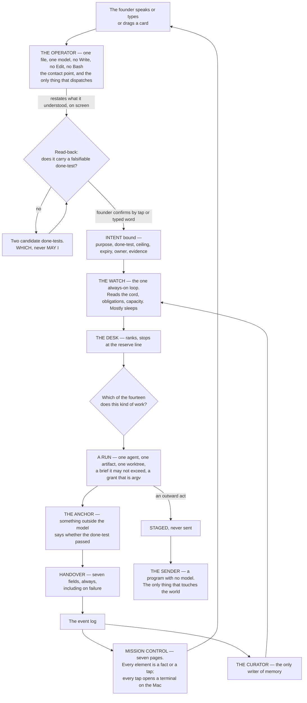

**(NEW: what the picture asserts, said once so no section restates it)** Four things in that diagram are the design.
**Only the founder's door creates an intent.** **Only the Operator dispatches**, and it holds no verb that could
build instead. **Only the Sender touches the world**, and it holds no model. **Only the curator writes memory**, and
it holds no shell. Everything else is a consequence.

---

### 0.4 The five ideas, re-read against the founder's direction

**(NEW: FINAL §0 rested the whole design on five ideas. The founder's direction of 2026-09-05 overruled five of
FINAL's decision rows, so each idea has to be re-read rather than inherited. Three stand unchanged, two move, and
none is deleted)**

| # | The idea, as FINAL wrote it | Verdict | What moved, and the mechanism |
|---|---|---|---|
| 1 | **Nothing runs that does not trace to a live Intent with a falsifiable done-test** | **STANDS** | Unchanged by v1–v5, and the roster makes it easier to enforce, not harder: the Operator emits a brief carrying an intent id and `bin/run` composes the argv from it. **Mechanism:** `bin/run` refuses a brief with no resolving intent id (ABSENT; FINAL names it `keel/bin/run`); the store check refuses an intent whose done-test is not falsifiable by someone who did not do the work (ABSENT) |
| 2 | **Method is never specified. Only the outcome, the constraints and the evidence are** | **STANDS, and the roster is where it was most at risk** | Fourteen named agents carry *expertise* — a lens, a skill namespace, a model, a grant — never a procedure. **Mechanism:** the skill content rule (v18) admits four bodies — anchor, exemplar, rehearsal case, reference — and a step list only as the Sender's checklist, where the judge is absent and the act cannot be taken back |
| 3 | **Standing orders replace approvals. Inside the envelope, silence is permission. There is no approve verb** | **STANDS, and hardens from stylistic to load-bearing** | v9: a fully autonomous run runs in `dontAsk`, which **denies `AskUserQuestion` even when allowed**. A silent run *cannot* ask. So staged-not-sent and the *which* are the only channel it has. **Mechanism:** the permission mode itself, sourced from the vendor's own permissions page |
| 4 | **Capacity is one exhaustible pool with a reserve held for the founder** | **MOVES** | v22: there are **two** windows per seat, a rolling five-hour **and a weekly**, shared with Claude chat and Cowork — so the reserve is per window *and* per week, and a weekly exhaustion is a different event from a five-hour one. And two limit shapes behave differently: a seat limit cannot be escaped with `/model`, a model-family limit can. **Mechanism:** the Watch distinguishes them (§4); `bin/watch` ABSENT |
| 5 | **Knowledge is earned, not curated; memory is mined from what already happened** | **MOVES** | v3: the founder overrules the refusal of a library. There **is** a skill library now, in the open SKILL.md standard. *Earned* survives with a sharper mechanism than FINAL had: **admitted by eval** — with-skill against baseline, and a candidate that does not beat baseline is not admitted — and **retired by forced expiry**, because nothing in the world retires a skill by non-use (v19). Mining stays a batch pass over a snapshot, never a live parser, because the transcript format is internal to the vendor and changes between versions (v26) |

**(NEW: what the two moves have in common, and it is worth naming)** Neither overturns an idea; each replaces a
belief with a mechanism. "One pool" became "two windows, and here is how to tell a stop from a reroute." "Knowledge
is earned" became "admitted by an eval that runs with-skill against baseline, and expires on a date." A founder
overrule made both sharper than the original, which is the argument for not re-litigating them.

---

### 0.5 A day with it

**(NEW: FINAL's day ran on a clock — 06:40, 07:20, 09:00, 18:00. The SPINE forbids schedules and durations, and a
clock in a plan is both. This is the same day re-anchored on the mission-control page the founder is looking at and
the agent doing the work, which is what actually changed)**

| Where the founder is | What they see | What is running behind it |
|---|---|---|
| **The phone, first thing** | Nothing, unless a `wake-me` line fired. If one did: one line | The Watch slept through everything that did not qualify. The interruption budget is three a day, and a channel whose acted-on rate falls is demoted below its threshold |
| **The briefing** | One page the founder opens, so it is never an interruption. What moved, with the evidence; the raw work biggest first — the rendered page, the played video, the diff, the email that would go out, staged and unsent; two *whiches*, both built; what could not be checked, named; what it cost per venture and per window; what the Operator would do next, none of it started | `writer` staged the email and never held the key. `designer` produced the render and its anchor is the screenshot judged against a named target, not its own description. `analyst` produced the cost rows, and every one of them taps through to its run |
| **Mission control, page 2 — agents and child flows** | The Operator and its children: who is working, who is sleeping, what each is doing on the current task | Agent teams — a lead plus named teammates, each a full session. One level of teammates is visible because the runtime ships **no nested teams**; the deeper tree is subagents |
| **A tap on an agent** | A terminal opens on the Mac and the founder is inside that session | *"remember each agent or each session that we are opening in the mission control or any other surface, it's directly opening it in the terminal in my Mac because everything is run on it"* (FOUNDER). The mechanism is the documented tmux CLI (§15) |
| **Mission control, page 4 — the board** | Tickets, PRs and a timeline. The founder drags a card into *working on it* | The drag launches a session with a team of agents and hands it the task. **Nothing in the world does this** — every board-to-session project found maps one task to one agent (v16), so this part is ours to build |
| **The Floor** | A terminal, one agent, the same memory and the same envelope. The founder's own browser and own send button are here and nowhere else | The system goes sterile: nothing interrupts, nothing new is dispatched on the founder's window, the venture under their hands is held whole. When they leave, the queue that built up is one paragraph |
| **A *which*** | Two options, both already built, and the cost of each. One tap | There is no approve verb anywhere in the system. Outside the envelope, the system builds both and asks *which* |
| **The night** | Nothing. The founder is asleep | Obligations first, before any goal. Then, under each driven venture's ceiling, runs are born with a brief, work however they like, are checked by something outside the model, hand back seven fields, and die. Routine work burns the Gemini window and never touches the founder's; embeddings and classification run locally on electricity. A fully autonomous run **cannot ask** — everything it would have asked is pre-decided or staged as a *which* |
| **Dawn** | The briefing again | The curator has already run: delta-only writes, one writer, an index loaded at start and topic files on demand |

---

### 0.6 What it is not

**(FINAL, three entries deleted by the founder and one added)** A harness with no standing. A dashboard nobody acts
on. A library of playbooks. A permissions matrix. A night that burns the window before the founder wakes. A machine
that grades its own homework. A machine that is only brakes.

**(FOUNDER)** Three of FINAL's *is-nots* are struck, because the founder overruled them and meant it. It **is** a
roster of named agents (v1, v2). It **does** have a dashboard, and the rule that saves it is that every number on it
names the tap that acts on it (v14). It **does** have a skill library (v3).

**(NEW: one is-not is added, from v6, and it is the one most likely to be violated by someone who reads "fourteen
agents" and imagines a pod)** It is **not** a system that splits one artifact across two builders. One artifact, one
agent, continuous context. Anthropic's own multi-agent post excludes coding from the pattern — *"not a good fit for
multi-agent systems today"* — and Cognition's measured failure is exactly this: *"Actions carry implicit decisions,
and conflicting decisions carry bad results."* The roster names *who* does a kind of work. It never parallelises one
build.

---

### 0.7 The vocabulary

**(FINAL)** Very few names are spent, each a plain English word doing the job that word already does. Nothing is
called an engine, a crew, a swarm, a council, a brain, a kernel, a mouth or a bench.

| Word | What it is | Where it lives |
|---|---|---|
| **Charter** | One per venture: what it is, tempo, envelope, ceiling, weight, horizon. Written by the founder, rarely changed | `ventures/<name>/charter.md` (ABSENT) |
| **Intent** | One live goal: purpose, done-test, ceiling, expiry, owner, evidence | `ventures/<name>/intents/*.md` (ABSENT) |
| **Done-test** | The falsifiable statement of what is true when the work is finished, written before it starts, checkable by someone who did not do it. The only thing ever mandated | inside the Intent |
| **Obligation** | Something owed, to whom, by when, with what consequence and what proves it discharged. No done-test to invent; the world set the test | `ventures/<name>/obligations.yml` (ABSENT) |
| **The Watch** | The one always-on loop. Reads state, ranks, mostly sleeps | one process, `bin/watch` (ABSENT) |
| **The Desk** | The ranking-and-dispatch function inside the Watch | inside the Watch |
| **Run** | One disposable unit of work: fresh context, one agent, one outcome, a ceiling, a grant, a done-test, a handover, then death | `logbook/runs/<id>/` (ABSENT) |
| **Envelope** | may-alone · never · wake-me, per venture, in the founder's words | inside the Charter |
| **The Sender** | The program with no model that performs a widened outward act against a staged, hashed artifact | `bin/send` (ABSENT) |
| **Floor** | The working-beside surface: the terminal, one agent, same memory, same envelope | Claude Code, installed and measured |
| **Balcony** | **Absorbed, not deleted** (v4). Its five views became pages of mission control | see the six words added below |

**(FOUNDER / NEW: six words are added, and each is added because the founder's direction names a thing FINAL had no
word for)**

| Word | What it is | Why it is added | Where it lives |
|---|---|---|---|
| **Operator** | The orchestrator of the agents, and the founder's contact point. One agent file. Dispatches; never builds | **(FOUNDER)** *"We need an operator, which is, like, the orchestrator of the agents. which is also the contact point with me"* | `.claude/agents/operator.md` (ABSENT; the eighteen existing agent files on this branch, `ceo-1-1788609834`, are the format seed) |
| **Agent** | A named role with its own file, model, tools, MCPs, skills and anchor. **FINAL refused this word as a proper noun; the founder restored it** | **(FOUNDER)** *"each agent with its own expertise so we can adjust his knowledge and his tools and his way of walking and thinking"*, and roster.md fact 1: seven of seven shipped systems name their roles, zero ship unnamed shapes | `.claude/agents/<name>.md` (fifteen files, all ABSENT) |
| **Page** | One of the seven surfaces of mission control. Every element on it is a fact or a tap | **(FOUNDER)** *"I want you to have pages with different things"* | mission control, a website (ABSENT; `mission-control/` exists on this branch as the server spine) |
| **Board** | Page 4: stages, a timeline, a kanban. Cards move across it | **(FOUNDER)** *"a place where I can manage the tasks and the tickets and the PRs … to jog the tasks on a board which has different stages"* | page 4 (ABSENT) |
| **Card** | One task, ticket or PR on the board. Dragging it into *working on it* launches a session and hands it the task | **(FOUNDER)**, verbatim. **This is the one part of mission control with no prior art anywhere** (v16) | page 4 (ABSENT) |
| **Team** | A lead session plus named teammates, each a full independent session, messageable by name. What a card launches, and what page 2 draws | **(FOUNDER)** *"it launches a team or added team of agents to the session"*; the substrate ships in the runtime and is experimental and off by default | `~/.claude/teams/<team>/config.json` (the substrate ships; the page is ABSENT) |

**(FINAL)** Ordinary words — anchor, grant, rehearsal, briefing, logbook, memory, window, reserve, the cord, the
world's door, the probe, the reconciler — are used as they read and are defined where they first appear.

**(FINAL, one refusal survives; one is lifted)** *Playbook* stays refused: the founder named it as what killed
creativity, and mission-command doctrine has held for a century that orders specifying method destroy the
subordinate's ability to adapt. *Agent* as a proper noun is **no longer refused** — the founder restored it, the
world agrees with the founder, and §5 spends fourteen names deliberately and says what each costs.

---

## 1 · The decisions

*obeys: SPINE §A entire, reproduced, plus FINAL §1's carry-forward numbers; inherits: FINAL §1*

---

**(NEW: what this section is for, and why it is reproduced rather than summarised)** This is the row set every other
section writes from. Twenty-three sections cannot disagree if each of them decides nothing that is not here. Rows
**v1–v5** are the founder's overrules of FINAL §1 — they are not arguments, they are decisions, and each is followed
in §1.2 by one paragraph stating the cost once and the chosen thing. Rows **v6–v41** are places a fact from the
world moves a FINAL row, or a place FINAL stands *because* a fact was checked against it. The losing image is kept
by name in every row so it can be argued for later, and collected again in §22.

**(NEW: where the last six rows came from, said once because their provenance is different from the rest)** Rows
**v36–v41 were decided by the orchestrator during the build round** (DECISIONS.md §8–§10), each because a section
writer hit a question the spine did not answer and returned it rather than inventing one. That is the intended path
and the rows are load-bearing, not late additions: v36 closes a collision between two rules over one grant, v37
closes the brief's field count, and v38–v41 place or dimension things the roster and the seven pages made concrete.

---

### 1.1 The forty-one rows

| # | The question | Decided | From | The losing image, kept as |
|---|---|---|---|---|
| **v1** | How many kinds of worker | **Fourteen named agents plus the Operator** — a company, each with its own expertise, knowledge, tools and way of working | **FOUNDER** (overrules FINAL row 6): *"I want us to recreate the whole startup company … between ten and fifteen agents"* | three shapes — maker · scout · checker — with loadouts assembled per run, and no file per role |
| **v2** | Names | **Real names, one file per agent**, each carrying its own model, tools, MCPs, skills and anchor | **FOUNDER** (overrules FINAL row 8), and roster.md fact 1 — MetaGPT, ChatDev, Magentic-One, CrewAI, the OpenAI SDK, wshobson and VoltAgent all ship named persistent roles; **zero of seven** ship unnamed-shape-plus-loadout | labels, not names; a run labelled only by what it makes and which window it burns |
| **v3** | The skill library | **A library in the open SKILL.md standard**, admitted by eval, retired by expiry, plus a **skill creator** | **FOUNDER** (overrules FINAL row 10): *"take all the skills that the biggest systems use … we need a skill creator of skill"*; skills.md 1, 7, 12, 16 | `keel/holding/skills/` — 134 skills moved whole into a directory read by nothing |
| **v4** | The surfaces | **Mission control is a first-class website with seven pages, and every page is a control.** The Balcony's five views are not deleted; they become pages of it. The Floor stays a terminal on the Mac and is what every tap opens | **FOUNDER** (overrules FINAL row 15): *"the mission control surface. I want to add it, bring it back"*, and *"when I click on it, the terminal which runs the agent on my Mac is popping up"* | five Balcony views over one state; the room as a display that is never a control; *"no project is both"* |
| **v5** | Which provider stands which position | **Codex and Claude Code are both in the system from day one**, in one shape decided in §10 | **FOUNDER** (overrules FINAL row 30): *"I run from day one of the system to include codex and Claude code"* | Codex admitted only after a headless rehearsal passes; Gemini proving the second-family route first |
| **v6** | Whether the named roster parallelises one artifact | **No.** One artifact, one agent, continuous context. The roster names *who* does a kind of work; it never splits one build across two builders | FINAL §7.1, **reinforced** by roster.md 4 (Anthropic: coding is *"not a good fit for multi-agent systems today"*), 6 and 7 (Cognition: *"Actions carry implicit decisions, and conflicting decisions carry bad results"*) | a pod of builders on one feature; MetaGPT's waterfall of four roles over one repo |
| **v7** | The seam between `architect` and `builder` | **The architect's output is a separate artifact with its own done-test, handed over whole.** A builder that needs to change a schema or an interface **files an objection; it does not edit it** | **NEW:** roster.md 6 names the exact failure — two agents acting on assumptions *"not prescribed upfront"*. Making the contract an artifact with a done-test is what prescribes them. **Mechanism:** the builder's grant excludes the architect's output path (argv `--add-dir`); the objection is the cord on itself (FINAL §7.3) | one agent that designs and implements; two agents that share one artifact |
| **v8** | Who writes the test that judges a build | **Both, and they are different tests.** The builder tests its own work before handing over (self-check). The **tester writes the anchor test blind** — it reads the done-test and the interface, never the implementation | **NEW:** cognition.md 8 (Devin: *"Tell Devin to test its own work before opening a PR"*) is the self-check; a test written by the author of the code is a machine grading its own homework, which FINAL §0 refuses. **Mechanism:** the tester's `--add-dir` excludes the implementation path | one testing agent that reads the diff; the builder's own tests as the only anchor |
| **v9** | What "fully autonomous" costs | **A fully autonomous run cannot ask.** `dontAsk` mode denies `AskUserQuestion` even when allowed. So everything the run would have asked must be pre-decided in the envelope or **staged as a which** | **NEW:** cognition.md 2 — *"`AskUserQuestion` … are denied even if you've allowed them"*. This makes FINAL's staged-not-sent rule load-bearing rather than stylistic: it is the only channel a silent run has | a fully autonomous run that pauses for a question nobody will answer |
| **v10** | The widest permission mode | **`bypassPermissions` is refused, by a mechanism** — `permissions.disableBypassPermissionsMode: "disable"` in managed settings, where a running process cannot clear it | **NEW:** cognition.md — deny rules bind in every mode including bypass; allow rules have no effect in it | `--dangerously-skip-permissions` and its successors as a night default |
| **v11** | The managed settings file, now that `/goal` exists | **The managed file carries `permissions.deny`, `disableBypassPermissionsMode` and `disableAutoMode`, and does NOT set `disableAllHooks` or `allowManagedHooksOnly`** | **NEW:** runtimes.md — *"`/goal` is a wrapper around a session-scoped prompt-based Stop hook"*, and it is unavailable under either of those two settings. **The cost, once:** a run can therefore register its own Stop hook. That is a smaller hole than losing the goal loop the founder asked for, and the probe checks it nightly | a managed file that locks hooks; FINAL §7.5's premise that the managed file is where every narrowing goes |
| **v12** | Where loops and goals sit | **`/goal` sits on the run: the done-test IS the goal condition**, with a turn clause. **`/loop` is refused in production** and stays a Floor convenience | **NEW:** runtimes.md — `/goal` runs headless in one invocation (`claude -p "/goal …"`), condition limit 4,000 chars, bounded by *"or stop after 20 turns"*. `/loop` is *"session-scoped"*, has a 7-day expiry, and *"Tasks only fire while Claude Code is running and idle"* — the Watch is the loop | `/loop` as the Watch; a cron inside a session as the always-on tier |
| **v13** | How the Operator dispatches | **Three mechanisms, each for what it is documented to do:** agent teams for the *visible* fleet the founder watches; subagents for depth inside one agent; `claude -p` children through the launcher for unattended night work | **NEW:** surfaces.md (teams are a lead plus named teammates, each a full session, with tmux pane ids on disk) and runtimes.md (subagents: depth 3, 20 concurrent, `Workflow` removed from all of them; `-p` never forms a team). **The constraint, stated once:** teams are experimental and off by default, **no nested teams**, one team per session, `/resume` does not restore them — so the child-flow page shows one level of teammates and the deeper tree is subagents | a single dispatch mechanism; a hierarchy of teams of teams |
| **v14** | The cost dashboard against *"nothing is only informational"* | **The dashboard is admitted, and every number on it names the tap that acts on it** — a cost row taps to its run, a window row taps to retempo, an anomaly taps to the cord | **FOUNDER** (*"cost and tokens, efficiency, monitoring, and a dashboard"*) + **NEW:** surfaces.md 6 states the collision as two positions, not a resolved question. This resolves it by keeping both | FINAL §13.2's Balcony table with no dashboard row |
| **v15** | Which canvas and graph substrates are admissible | **Admitted: Langflow (MIT, alive 2026-09-05) as the canvas idiom; `3d-force-graph` (MIT) as the renderer. Refused: n8n (Sustainable Use — *"only for your own internal business purposes or for non-commercial"*), Flowise (ARCHIVED, licence NOASSERTION), Gource (GPL-3.0)** | **NEW:** surfaces.md licence table, n8n's LICENSE.md read raw | n8n as the workflow surface; Flowise as the canvas |
| **v16** | The board→session prior art | **OpenAI Symphony (Apache-2.0, last push 2026-08-19) replaces vibe-kanban as the reference.** vibe-kanban's own README now reads *"Vibe Kanban is sunsetting"* | **NEW:** surfaces.md 4, 5. **The gap that is ours to build:** *"Nothing found gives a card a team"* — every board-to-session project maps one task to one agent | FINAL §13.8's refusal of vibe-kanban as an unmaintained runtime — right conclusion, weaker reason |
| **v17** | Bulk import of the 2,111-skill upstream | **Blocked until `LICENSE-CONTENT` is read.** The code is MIT; a **separate `LICENSE-CONTENT` file exists and was not fetched**, and it may carry different terms for skill *content* than MIT does for code | **NEW:** skills.md licence table and gap 3. Cheap to clear, one fetch; until then no bulk vendoring | importing 2,111 skills on the strength of the repository's MIT badge |
| **v18** | The SKILL.md procedure collision | **The container is the open standard; the content rule is ours.** Four admissible bodies — anchor · exemplar · rehearsal case · reference. A **step list is admitted in exactly one place**: a checklist the Sender reads aloud, where the judge is absent and the act cannot be taken back | **NEW:** skills.md — the published spec recommends *"Step-by-step instructions"*, and FINAL §11 forbids procedure, so *"different artifacts wearing the same filename"*. FINAL §9.4's quadrant already decided where procedure is legitimate. **The cost, once:** an imported skill written to the spec's recommendation fails our admission and needs a pass | FINAL §11's flat refusal of the library; the spec's recommended body as written |
| **v19** | Skill retirement | **By forced expiry.** Every skill carries `valid_until`; at expiry exactly one disposition is recorded — Refresh, Deprecate, or Waive with a new date | **NEW:** skills.md 20 — *"Nobody found retires a skill by non-use"*; the nearest shipped thing is dead-link and drift detection. **Mechanism:** `scripts/ledger.mjs` already forces this disposition and `check-citations.mjs` already blocks on a dead path — both on this branch | *"Ninety days uncalled and it leaves"* — a usage counter nobody in the world has shipped |
| **v20** | The cheap tier | **No agent's default model is Haiku.** Haiku 4.5 appears only where the vendor sets it (the `/goal` evaluator, the auto-mode classifier). The genuinely cheap work goes to **local models on electricity** | **NEW:** models.md 5 — Haiku 4.5 retirement *"Not sooner than October 15, 2026"*, and it is the only Haiku in the published table. Locals: MiniLM 384-dim and Qwen3-0.6B, both Apache 2.0 | a Haiku executor tier; FINAL §16.7's *"local models: no shape"* read as *no work* |
| **v21** | Where Fable 5.1 sits | **An escalation, not a default.** One named rule: an intent whose done-test has failed twice under Opus 5 and whose horizon exceeds one window. **Its availability on a subscription seat is UNVERIFIED** — models.md publishes its API price and no plan table names it; fallback is Opus 5 | **NEW:** models.md — Fable 5.1 cache reads at **0.025x** base input against 0.1x everywhere else, which is what makes a large standing context cheap to re-read; the SWE-bench Pro ranking is third-party, confidence L, and is **not** used to route | Fable as the builder's default; wshobson's tier 0 adopted as-is |
| **v22** | The window | **Two windows, not one: a rolling five-hour AND a weekly, per seat, shared with Claude chat and Cowork.** And two limit shapes that behave differently — a seat limit cannot be escaped with `/model`; a model-family limit can | Moves **FINAL row 19**, which knew only the five-hour fuse. models.md, quoted from the vendor's costs page. **Consequence:** the reserve is per window *and* per week, and a weekly exhaustion is a different event from a five-hour one | one rolling five-hour window as the whole physical fact |
| **v23** | `--max-budget-usd` | **Not a billing control.** Print mode only, computed locally from token counts at list price, and *"the session cost figure isn't relevant for billing purposes"* for subscribers. It is a **stall fuse**, and it is kept for that | Moves **FINAL §7.5** and closes half of **§19.11**. models.md. Still true and still useful: subagent spend counts toward it, and overflow fails a spawn with `Budget limit reached` (v2.1.217+) | a per-run dollar ceiling that binds the account |
| **v24** | Memory writes | **Delta-only, never a rewrite** — FINAL row 11 stands and is now sourced | **FINAL, now cited:** memory.md 1 — the paper is **ACE, arXiv 2510.04618**: context held 18,282 tokens at 66.7% accuracy, collapsed at the next step to **122 tokens and 57.1%**, below a 63.7% baseline | a nightly full rewrite of the memory files |
| **v25** | Who writes memory | **The curator, and only the curator** — the thing that acts never edits memory. FINAL stands, **with its counter-example named** | **FINAL**, against memory.md 3: Claude Code's own auto memory *is* written by the acting agent, in-session. That is one shipped counter-example, and it is accepted as a counter-example rather than hidden. **Mechanism:** the curator's grant is the only one whose writable scope includes the memory paths | shared memory writes by every agent; FINAL §10.1's Letta attribution, which memory.md 2 shows the current vendor page no longer supports |
| **v26** | Transcript mining | **Stands.** No tool was found that mines a transcript archive into taste, negatives or already-built; three tools read the corpus and render it for humans | **FINAL**, confirmed by memory.md 4. **The caveat that binds the build:** *"The entry format is internal to Claude Code and changes between versions"* — so mining is a batch pass over a snapshot, never a live parser in the critical path | a live transcript reader as a system dependency |
| **v27** | The shape of the memory index | **Two tier: an index loaded at start, topic files on demand** — and it is now the vendor's own default, not a local invention | **NEW:** memory.md 6 — Claude Code loads *"the first 200 lines of `MEMORY.md`, or the first 25KB, whichever comes first"* and topic files on demand. Same shape this repo already built for skills discovery | a single flat memory file loaded whole |
| **v28** | The permission axis | **Reversibility. FINAL row 12 stands, and it stands alone in the world** | **FINAL**, against cognition.md — *"neither shipped scheme does"*: Claude Code keys on a fixed path list plus an action class, Codex on workspace scope plus network. The nearest shipped analog is the classifier special-casing `rm`/`rmdir` on critical paths | keying `may-alone` on file path, as both shipped runtimes do |
| **v29** | The read-back | **Stays.** No shipped system mandates a restatement before work binds; Linear's 10-second `thought` acknowledges rather than confirms | **FINAL**, cognition.md 10 — unsupported *and uncontradicted*. Closed-loop readback is regulation in aviation and medicine | voice or a chat message binding an instruction directly |
| **v30** | Why `challenger` is an agent and not a step | **Because self-critique without external feedback is measured as harmful** — *"at times, their performance even degrades after self-correction"* (arXiv 2310.01798). Reflexion's 91% is not a counterexample: its feedback is external | **NEW:** cognition.md 5, 6. **Mechanism:** the challenger never reads the artifact's author's reasoning, only the artifact and its done-test; a second model family whenever one is reachable | a plan-critique pass the same run performs on itself |
| **v31** | The roster size, and its cost | **Fourteen plus the Operator.** The cost, stated once and not re-litigated: **every shipped running roster verified is 5–6 agents; every roster of 150+ is a catalogue you pick from. Ten to fifteen sits in a band nobody publishes evidence for, in either direction** | **FOUNDER**, cost from roster.md 5. It is an unoccupied band, not a refuted one — no source was found for a measured point at which adding specialists stops paying | Magentic-One's five; ChatDev's six; Anthropic's 3–5 concurrent subagents |
| **v32** | Codex's position on day one | **Checker on a prepared diff, in the foreground, stdout redirected to a file while inheriting the parent shell's TTY.** The **headless rehearsal is what widens it**: `codex exec --json`, no controlling TTY, non-trivial prompt, version ≥ 0.124.0 | **FOUNDER** (day one) + **NEW:** runtimes.md — #19945 open **130 days with no maintainer reply**, and its `script -qfc` cure is *"incompatible with normal background / parallel job execution"*. **The cost, once:** one foreground slot is not parallel, so Codex is not a night lane until the rehearsal passes detached | Codex as a full maker on night one; `script -qfc` wrapped around every child |
| **v33** | The trifecta split, inside a roster | **Survives intact.** The agent that reads the untrusted world (`scout`) holds no credential and cannot send. The agent that drafts an outward act (`writer`, `growth`) never holds the key. The thing that sends is **the Sender, a program with no model** | **FINAL** row 7, and cognition.md finds *no shipped analog* for staged-not-sent or a recall window anywhere | a research agent with a send verb; one agent that reads mail, decides and replies |
| **v34** | What makes a grant real | **The exact argv, emitted by one no-model launcher**, plus the managed file of v11, plus a nightly probe that asserts what a run can actually touch | **FINAL** §7.5 and row 13, unchanged. **Mechanism:** `bin/run` is the only thing that composes argv (ABSENT); `bin/probe` asserts it nightly (ABSENT) | `--allowedTools` as a narrowing; a prose rule describing a grant |
| **v35** | `Workflow` in an agent's tool line | **Absent from every agent, deliberately.** The gate may not be invocable by the thing it gates | **FINAL / this repo**, now **independently cited**: runtimes.md quotes the vendor — *"The `Workflow` tool is removed from all subagents via the first filter applied to subagent tool sets"* | granting a dispatched engine the ability to run its own gate |
| **v36** | Who may hold a tainted read | **`scout` only, and the world's door program.** Gmail, Calendar, Drive and Notion reads are tainted READ-ONLY; **no agent that holds `Write`, `Edit` or `Bash` reads them raw.** `steward` writes obligations from `scout`'s handover; the world's door writes one inbound row per event and holds no model | **FINAL** §9.4–9.5 and v33, applied to a collision found between the tool classes and §5.2's `steward` row — one grant, two rules. Decided by the orchestrator 2026-09-05, DECISIONS.md §8 | a steward that reads mail with a pen in its hand |
| **v37** | The brief, now that agents have names | **Ten fields: FINAL's nine plus `agent:` — the roster name the launcher composes argv for.** `window+model:` stays as it is; the agent's row supplies its defaults and §9.1 overrides per move | **NEW:** fourteen named agents make *which agent* a fact the brief must carry, and neither reading was in the spine until §6 returned BLOCKED. Chosen because it leaves FINAL's nine untouched. **Mechanism:** `bin/run` refuses a brief whose `agent:` is not a roster file (ABSENT) | `agent+window+model:` as one widened field; a brief that names no agent and lets the launcher guess |
| **v38** | Where the read-back and the briefing live among the seven pages | **The read-back is the intent-creation form wherever an intent is born** — page 4's *new card* and page 7's *add session* — **and stays a published phone page** for voice. **The briefing is the top strip of page 5** and stays a published phone page. `Decide` items appear on page 4 as cards in a *waiting on you* column, and on the phone | **NEW:** FINAL §2.4's read-back page and §13.4's briefing were unplaced once mission control became seven pages. Placement, not a new mechanism: both were already published pages, and the founder's pages absorb rather than delete them (v4). **Mechanism:** the store check refuses an intent with no read-back confirmation row (ABSENT) | a read-back page as an eighth page; a briefing nobody can reach from mission control |
| **v39** | What hosts the website | **Mission control is served on the Mac by `mission-control/`** — the Bun and Hono server and React client that exist on this branch, 60 files — **because a terminal pop needs `tmux` on the same machine.** The phone reaches it two ways: the published artifact pages for reading and deciding, which **cannot** pop a terminal; and the local server over the founder's own network for everything else | **NEW:** the artifact runtime *"cannot reach tmux"*. **FOUNDER:** *"everything is run on it"*. FINAL §17 marked `mission-control/` absorbed; v4 un-absorbs it as the seed. **The cost, once:** two renderers over one state, which FINAL §13.1 refused — accepted because a tap that opens a terminal cannot come from a hosted page, and both read the same logbook | the website hosted as a published artifact; a cloud host that reaches into the Mac |
| **v40** | `maxTurns` for the roster files that have no seed | **30 for the nine that produce** — builder, architect, tester, designer, product, writer, growth, steward, curator — **and 25 for the five that only read** — reviewer, guard, scout, analyst, challenger. **The Operator 30.** Tuned per agent by measurement afterwards | **NEW:** the seven existing engine files on this branch use exactly these two values; `maxTurns` binds when an `agentType` is named; the lint ceiling is 120. A default that copies the measured seeds is a starting point, not a design | one cap for every agent; no cap |
| **v41** | `isolation` for the agents that write | **`worktree` for the four that touch venture source** — builder, architect, tester, designer. **`none` for the five that write only into the house's stores** — product, writer, growth, steward, curator — because their grant is a narrowed `--add-dir`, not a checkout. **`none` for the six that do not write** | **NEW:** FINAL §6.1 — a worktree is for a run that writes code or files of the venture; a store write is narrowed by argv (v34). **The cost, once:** `git worktree add` still cannot complete under the armed sandbox without escalation, measured 2026-08-24 | a worktree for every agent; no isolation for the four that edit source |

**Carried forward from FINAL §1, unchanged, by number:** rows **1, 2, 3, 4, 5, 7, 9, 14, 16, 17, 18, 20, 21, 22,
23, 24, 25, 26, 27, 28, 29**. Rows **11, 12, 13, 19** are carried forward *and* moved, by v24/v25, v28, v34 and
v22 respectively. Rows **6, 8, 10, 15, 30** are overruled by v1, v2, v3, v4 and v5 and appear only in §22.

---

### 1.2 The five overrules — the cost of each, stated once

**(NEW: why this subsection exists at all)** The founder read FINAL and said *"Most of it is fine, but the receiving
number of things that we need to rethink, rechange, and do differently."* Five rows lost. Each cost something real,
and a plan that hides the cost invites someone to rediscover it during the build and reopen the decision. So the
cost is stated once, here, in one paragraph, and then the chosen thing is built properly and the row is never
re-litigated. The mechanism that keeps that promise is the losing-images ledger in §22: an argument for a losing
image must name the image, which forces it to be an argument rather than a drift.

**v1 · Fourteen agents instead of three shapes.** **(FOUNDER)** *"I want us to recreate the whole startup company
or a whole company or a team … So, like, between ten and fifteen agents."* **The cost, once:** every shipped
*running* roster that could be verified is five or six agents — Magentic-One five, ChatDev six, MetaGPT four to
five, TheAgentCompany six job functions, Anthropic three to five concurrent subagents — and every roster of 150 or
more is a catalogue you pick from, not a team that runs together. Ten to fifteen is a band **nobody publishes
evidence for, in either direction**; no source was found for a measured point at which adding specialists stops
paying. **The chosen thing:** fourteen named agents plus the Operator, one file each, built properly — which here
means the two cuts that make a roster survivable are both present. Magentic-One splits by **grant**, not by domain,
so §5's table splits by job *and* its `tools` column splits by grant. And v6 forbids the failure the extra names
invite: one artifact is never split across two builders.

**v2 · Real names, one file per agent.** **(FOUNDER)** *"each agent with its own expertise so we can adjust his
knowledge and his tools and his way of walking and thinking towards the tasks that he needs to achieve."* **The cost,
once:** FINAL refused names for one reason worth keeping — a file per role drifts, and this repository has measured
that drift, with fifteen of twenty-six agent files failing their own validator. **The chosen thing:** names, because
the world agrees with the founder — seven of seven shipped systems ship named persistent roles and zero ship
unnamed-shape-plus-loadout — and because the drift argument now has a mechanism against it rather than an avoidance.
The `PS-*` lint in `.claude/hooks/schema-lint.js` (this branch, `ceo-1-1788609834`) already holds eighteen agent
files at **18 pass · 0 fail · 0 warnings**, and the expertise that used to rot in prose lives in linted data files.
The technical half of FINAL's objection is gone entirely: `model`, `tools`, `mcpServers`, `skills`, `memory` and
`isolation` are per-agent frontmatter in this runtime, so a loadout *is* expressible as a file.

**v3 · A skill library, admitted by eval.** **(FOUNDER)** *"take all the skills that the biggest systems use … to
give the agents the tools the knowledge they will need in order to achieve tasks without limiting their point of
view … we need a skill creator of skill."* **The cost, once:** FINAL refused a library because a hand-maintained
library of expertise rots and nobody keeps it true, and the 134 skills in this repository are the local proof.
**The chosen thing:** the open SKILL.md standard as the container, so one artifact loads in three runtimes
unchanged; our own content rule for the body, because the published spec recommends step-by-step instructions and
this system forbids procedure — different artifacts wearing the same filename otherwise; admission by an eval that
runs with-skill against baseline, which is *earned, not curated* with a mechanism at last; and retirement by forced
expiry, because nobody in the world retires a skill by non-use and a usage counter would have been an invention.

**v4 · Mission control as a first-class website.** **(FOUNDER)** *"the mission control surface. I want to add it,
bring it back"*, and *"when I click on it, the terminal which runs the agent on my Mac is popping up."* **The cost,
once:** FINAL's rule was *no project is both a display and a control*, and it refused the room for that reason — a
surface that only shows is a surface nobody acts on, and a founder watching a room is a founder not working.
**The chosen thing:** seven pages, and the rule that saves them is kept and extended rather than dropped — **every
element is either a fact or a tap**, which is why the cost dashboard the founder asked for is admitted with every
number naming the tap that acts on it (v14). The Balcony is **not deleted**: its five views become pages. The Floor
is unchanged and is what every tap opens.

**v5 · Codex and Claude Code from day one.** **(FOUNDER)** *"I run from day one of the system to include codex and
Claude code in the system."* **The cost, once:** openai/codex#19945 — exit 0 with empty stdout when detached from a
TTY on a non-trivial prompt — has been open **130 days with no maintainer reply**, and the documented `script -qfc`
cure is *"incompatible with normal background / parallel job execution"*, which is exactly what a night crew is. So
Codex on day one is **one foreground slot, and one foreground slot is not parallel**. **The chosen thing:** Codex
stands as a checker on a prepared diff, in the foreground, stdout redirected to a file while inheriting the parent
shell's TTY — the second documented workaround, which needs no wrapper — and a headless rehearsal specifiable from
primary text is what widens it. A third program drives both runtimes, which is also the only shape that keeps v34
true: one thing composes argv.

---

## 2 · Direction — what the founder writes, and what it costs them

*obeys: v29; SPINE §B.2 `product`; inherits: FINAL §2, §3 (the four doors)*

---

**(FINAL)** The founder writes two kinds of thing and nothing else is required of them; a third kind, the
obligation, is mostly written by the world. Everything the system does traces to one of these or it does not happen.

**(NEW: what the roster and the Operator change here, said once so the rest of the section can be read as
inherited)** Two things move against FINAL §2. The read-back is now performed by a **named thing the founder can
address** — the Operator — rather than by an anonymous surface, which is what the founder asked for: *"an operator …
which is also the contact point with me."* And when a request is too fuzzy for the read-back to close in one
exchange, the Operator has somewhere to send it: **`product`, whose artifact is the done-test itself** (§2.6).
Nothing else in FINAL §2 moves. The Charter, the Intent, the Obligation and the four doors stand as written.

---

### 2.1 The Charter

**(FINAL)** One per venture, written once, changed rarely, read constantly, short enough for a phone screen. Six
lines.

```
venture:   plainly, what this is and who it is for
tempo:     driven | attended | watching | parked
envelope:  may-alone / never / wake-me
ceiling:   what this venture may spend, per window and in money, per month
weight:    1–5, the founder's priority, read by the Desk
horizon:   the date this charter is re-read, or it stops
```

**(FINAL)** `tempo` is the founder's own distinction made structural: *walk for me* and *walk with me* are one field
with four values, set per venture, changed in one tap. `horizon` exists because a document with no expiry
accumulates instructions nobody believes; every durable thing here carries a date after which it must be renewed or
it stops applying. The Charter is the standing-orders half of the naval pair: policy written by one person once, in
their own words, read by everything else many times — the right cost shape for a founder who thinks by voice and
hates being interrupted.

**(FINAL)** **Enforced by:** a charter missing any of the six lines does not load and its venture is `parked` until
it does — `bin/check-stores` (ABSENT; FINAL names it `keel/bin/check-stores`).

**(NEW: v22 changes what `ceiling` means, and the charter's own words do not change)** *Per window* is now **two
windows per seat** — a rolling five-hour and a weekly, shared with Claude chat and Cowork — so a ceiling is checked
against both. The founder writes one line; the Watch reads it against two fuses. **Mechanism:** `bin/watch` (ABSENT)
reads the ceiling and the reserve per window; §4 carries the distinction between a seat limit and a model-family
limit, which is the difference between a stop and a reroute.

---

### 2.2 The Intent, and the done-test that makes it real

**(FINAL)** One live goal, six fields:

```
purpose:    one sentence — what becomes true, and why it matters
done-test:  the falsifiable check, written before the work starts
ceiling:    the most this may consume before it must come back to me
expires:    the date it stops being live if not finished or renewed
owner:      founder, or the venture's own standing intent
evidence:   what will be attached to prove the done-test passed
```

**(FINAL)** The done-test is the whole design compressed into one field. Compare two ways of instructing one piece
of work. *Playbook:* "Stage 1 research the market. Stage 2 write three positioning options. Stage 3 pick one. Stage
4 write the landing copy. Stage 5 review against the brand voice lens." *Done-test:* "A landing page exists at a URL
I can open on my phone. A person outside this project can read it in thirty seconds and say what the product does
and who it is for. Three positioning options were considered and the two rejected ones are written down with the
reason. Nothing on the page is a placeholder." The second constrains quality more tightly and method not at all, and
someone who did not do the work can check it — the property everything in §11 depends on.

**(FINAL)** A done-test must be falsifiable or the Intent does not open. This is the one hard gate on the founder's
own input, and it is done conversationally, by the read-back: *"make the marketing better"* has no done-test, the
system says so, proposes two, and the founder picks one.

**(FINAL)** **Enforced by:** an intent file with no `done-test:` fails to load; the launcher refuses any brief whose
`intent:` id does not resolve to a live intent file — `bin/check-stores` and `bin/run` (both ABSENT).

**(NEW: v12 gives the done-test a second job it did not have in FINAL, and it is the reason `/goal` is not a new
concept here)** The done-test **is** the goal condition on the run. `claude -p "/goal <the done-test> or stop after
N turns"` is one invocation that runs the loop to completion, and a small fast model checks after each turn whether
the condition holds, returning Not yet met, Met, or Impossible. The condition limit is 4,000 characters, which is
the one hard constraint the done-test's wording must respect. **Mechanism:** the launcher composes the `/goal`
string from the intent's `done-test:` field verbatim, never paraphrased — `bin/run` (ABSENT). §6 carries the run
side of this.

---

### 2.3 The Obligation

**(FINAL)** Something owed, with a creditor and a due date. No purpose to restate, no done-test to invent; the world
set the test and the world will check it.

```yaml
obligation:
  id:           o-2026-09-04-0009
  owed:         { what: "domain renewal agentvibe.com", to: "the registrar" }
  due:          2026-11-02
  lead_time:    7d                     # inside it the obligation is DONE and nothing else is considered
  consequence:  "the domain lapses; weeks to recover; durable reputational cost"
  discharge:    { what: "renewed", proved_by: "the registrar's own record" }
  recurs:       yearly
  statute:      null                   # a statutory obligation names one, and names a second human
  second_human: null
```

**(FINAL)** Renewals of domains and certificates, tax filings, the clock on a data-subject request, the clock on a
breach, key rotation, a promise made in a launch email, a customer waiting on a reply, the restore drill. The four
doors admit *a deadline* as candidate work under an Intent, but a renewal is under no Intent and a statutory clock
cannot lose a ranking. So obligations are read before any Intent, are never an argument in the ranking, and are
deferred only by the founder, shown the consequence.

**(FINAL)** **Enforced by:** the Watch reads `obligations.yml` before `intents/`; an obligation with `due` in the
past and no disposition is the first item the founder sees; `statute` set with `second_human` null fails to load —
`bin/watch`, `bin/check-stores` (both ABSENT).

**(NEW: the roster gives the obligation an owner it did not have, and the anchor is the load-bearing half)**
`steward` is the agent the Operator routes to when *"something is owed to someone by a date"* — invoices, expenses,
contract review, compliance flags, vendors, support triage. **Its anchor is that an obligation is discharged only by
a record the company does not write**: the registrar's own record, the tax authority's receipt, the counterparty's
acknowledgment. A `steward` that reports an obligation discharged, with our own log as the evidence, has produced a
rung-4 claim about a rung-1 question. **Mechanism:** the discharge field names `proved_by`, and the nightly
reconciliation reads the external record (§11).

---

### 2.4 How work enters — the four doors

**(FINAL, with the Operator inserted at the founder's door and `product` behind it)** Four doors, not equal.

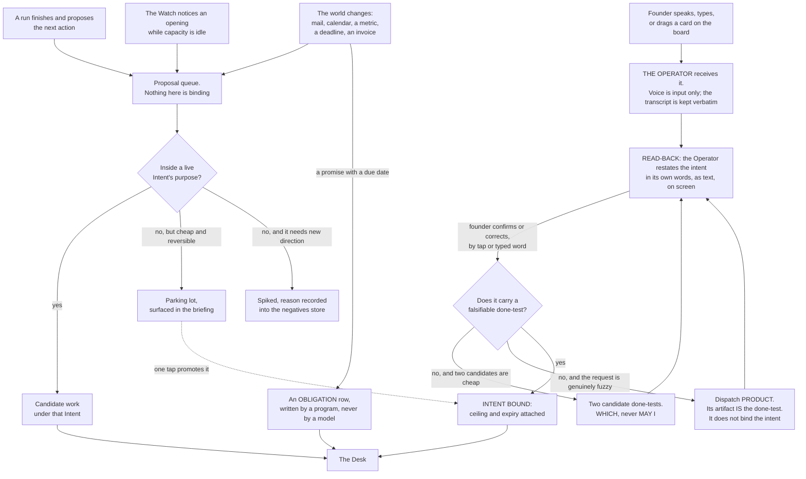

**(FINAL)** Three things matter more than the boxes. **Only the founder's door creates an Intent**; the others
produce candidate work under an existing one, or a proposal that waits — the mechanism behind *never runs my
projects without direction*, which is a provenance rule rather than a budget cap. **The read-back is mandatory and
is text, never voice**: the founder's instructions arrive transcribed with errors, and a misheard word costs one tap
instead of one night. **The spike file records the reason**, so the Watch does not re-propose the same rejected work
every night — the most obvious way an always-on system burns tokens forever.

**(FINAL)** The world's door is a program that writes one row and does nothing else; **no model reads a stranger's
text with a tool in its hand.** The transcript is kept verbatim, transcription errors preserved, because
*"contacts"* meaning *context* is information about the speaker.

**(NEW: the board is a fifth entrance that is not a fifth door, and confusing the two would break the provenance
rule)** Dragging a card into *working on it* on page 4 launches a session and hands it the task — **(FOUNDER)**
*"when I drag a task … to a section when it's saying working on it or, like, preparing for it, it launches a team or
added team of agents to the session … and then it starts walking."* That is the founder acting, so it is the
founder's door, and the card must already carry or resolve to an intent id. **A card with no intent id does not
launch anything**; the drag is refused and the card is sent through the read-back instead. **Mechanism:** the board
calls the same launcher as every other dispatch — `bin/run` (ABSENT) — and the launcher refuses a brief with no
resolving intent id. Without that rule, the board is a fifth door that creates intents by drag, and the provenance
rule is gone.

**(FINAL)** **Enforced by:** the read-back page and its confirm tap are the only writer of `intents/*.md` from the
founder's door (ABSENT); `bin/inbound` writes one logbook row per world event and holds no model (ABSENT).

---

### 2.5 The read-back

**(FINAL, and v29 keeps it against the world's silence)** Voice is input only. The Operator writes back what it
understood — as an intent with a done-test, in its own words, on screen — and the founder confirms by tap or typed
word. **Nothing binds by voice.**

**(NEW: the research position, stated honestly, because a rule with no shipped precedent should say so)** **No
shipped system mandates a restatement before work binds.** Linear comes closest and it is an acknowledgment, not a
confirmation: an agent should *"Emit a `thought` activity within 10 seconds to acknowledge the session has begun."*
So the read-back is **unsupported and uncontradicted** by shipped practice. It is kept because closed-loop readback
is regulation in aviation and medicine, where readback error rises as messages get complex, and because the input
here is a voice transcription with preserved errors — the exact condition the regulation exists for.

**(NEW: v9 makes the read-back the last cheap moment, which it was not in FINAL)** A fully autonomous run **cannot
ask**: `dontAsk` denies `AskUserQuestion` even when it is allowed. So a question that was not settled at the
read-back has exactly two fates — pre-decided in the envelope, or staged as a *which* with both options built. There
is no third outcome and no approve verb. That makes the read-back the highest-leverage exchange in the system, and
the place where an ambiguity is cheapest to kill.

**(FINAL / NEW)** **Enforced by:** the read-back page (ABSENT); the store check refuses an intent whose done-test is
not falsifiable by someone who did not do the work — `bin/check-stores` (ABSENT). **What is NOT enforced:** that the
founder actually reads the read-back before tapping. That is `WISH`, and no mechanism is proposed for it, because
the only candidates are ceremony.

---

### 2.6 Where `product` sits

**(NEW: SPINE §B.2 gives `product` the job "turns fuzzy into a falsifiable done-test" and routes to it when "the
request cannot yet be dispatched". This says where in the doors that lands, because a reader will otherwise assume
product owns the intake)**

**`product` sits inside the founder's door, behind the read-back, and it does not bind anything.** The Operator
attempts the read-back first, because two candidate done-tests are usually cheap and the exchange is one tap. When
the request is genuinely fuzzy — a direction rather than a goal, a request whose done-test would itself need
research, a roadmap-shaped ask — the Operator dispatches `product` under the same rules as any other run, and the
artifact that comes back **is the done-test**, with the specs, tickets and acceptance criteria that make it
checkable. That artifact then re-enters the read-back, and the founder binds it or corrects it.

**(NEW: the boundary that keeps the provenance rule true)** `product` **cannot create an intent.** It produces a
proposed done-test; the founder's confirm is what binds. If `product` could bind, the founder's door would have a
model in it, and *only the founder's door creates an Intent* would be false the first time a run proposed a goal.
**Mechanism:** `product`'s grant carries `Write` on spec paths only, never on `intents/` — the argv, composed by
`bin/run` (ABSENT), and asserted nightly by `bin/probe` (ABSENT).

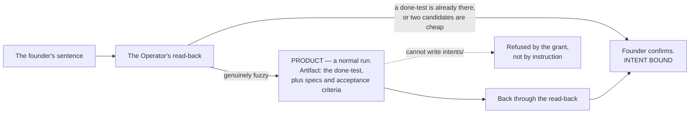

**(NEW)** `product`'s **anchor** is the same store check that gates the founder's own input: *the store check
refuses an intent whose done-test is not falsifiable by someone who did not do the work.* An agent whose job is to
produce done-tests is judged by the same gate every done-test passes, which is the only arrangement that does not
grade its own homework.

---

### 2.7 What the founder must do, in full

**(FINAL, with three rows changed by the founder's direction)** The complete list. If the system needs more than
this, the design has failed.

| The founder does | How often | Where |
|---|---|---|
| Writes a Charter | Once per venture | Voice → the Operator's read-back → tap |
| Opens an Intent, or confirms one the Operator drafted | When they want something | Voice or text → read-back → tap |
| **Drags a card into a working stage** *(NEW: the founder's page 4)* | When they want a queued thing started | Mission control, page 4 |
| Answers a **which**, from options already built | Only when the envelope requires it | One tap, phone |
| Defers an obligation, shown its consequence | Rarely | One tap, phone |
| Sets a tempo | When a venture's rhythm changes | One tap |
| Opens the briefing | When they feel like it | One page |
| **Opens an agent's terminal from any surface** *(NEW: the founder's own instruction that every tap opens a terminal on the Mac)* | Whenever they want to see or message a run | A tap on any page; a terminal on the Mac |
| Sits down on the Floor | When they want to build | Terminal |
| Pulls the cord | Whenever they want it to stop | One tap, one word, or one command |

**(FINAL)** Absent from that list, deliberately: approvals of routine actions, ticket grooming, standups, sprint
planning, and reviewing the system's own internal work. The founder's list contains all of those; §23 says what
happened to each.

**(NEW: one thing the founder's direction adds to the list that is easy to miss)** *"we also need to manage, you
know, the history and number of sessions and, like, to understand how do we save memory and to be efficient."* That
is **not** a founder task. It is bounded by mechanism in three places — the vendor's concurrent-subagent cap, the WIP
limit per venture, and at most two driven ventures — and the board **refuses a drag that would breach any of them**
rather than asking the founder to count. §14 and §15 carry it.

---

## 3 · The Operator

*obeys: SPINE §C entire; v9, v10, v13; inherits: FINAL §6, §7.5*

---

**(FOUNDER)** *"We need an operator, which is, like, the orchestrator of the agents. which is also the content point
with with me. OAuth out me depends on the type of tasks because you also need to be able to run it fully
autonomous."* Transcribed by voice; *"content point"* is *contact point* and *"OAuth out me"* is *how much it asks
me*, and both readings are used below with the original preserved because the founder's words are the input.

**(NEW: what that one sentence decides, and it decides three separate things)** The founder named a single role that
carries three jobs at once: it **orchestrates the agents**, it is **the contact point with the founder**, and **how
much it asks depends on the type of task**, up to and including asking nothing at all. The third is not a setting on
the first two — it is the hardest constraint in the section, because a run that cannot ask has to have had every
question answered before it started.

---

### 3.1 Identity

**(NEW: one file, in the format the runtime already reads, so the Operator is the same kind of object as the
fourteen it dispatches)**

| Field | Value | Why this value |
|---|---|---|
| **File** | `.claude/agents/operator.md` — **ABSENT**. The eighteen agent files on this branch, `ceo-1-1788609834`, are the format seed, and `.claude/hooks/schema-lint.js` on the same branch is the linter that will hold it | v2: one file per agent, in frontmatter the runtime reads |
| **Model** | `claude-opus-5` | It reads the founder's sentence, picks among fourteen, and writes the brief that binds a run. Every defect in it is a defect in work nobody reviews |
| **Tools** | `Read Glob Grep` plus `Agent(...)` | **It dispatches and it does not build** |
| **No** | `Write`, `Edit`, `Bash` | An Operator that can edit will edit instead of dispatching. It is the same argument that keeps `Write` off `reviewer`: the thing that can do the work will do the work, and then nothing was orchestrated |
| **MCPs** | none | Nothing it does touches a server. The two agents that declare `mcpServers` are `designer` and `sourcer`-class read-only work, and neither is this |
| **Mechanism** | its argv, composed by `bin/run` (ABSENT), plus the nightly probe `bin/probe` (ABSENT) that asserts what it can actually touch | v34: a grant is argv, not prose. A capability nobody probes is a memory of one |

**(NEW: why the no-`Bash` line is not decoration)** This repository has already measured what a shell in the wrong
hand does: `Bash` has no path concept in the hook that scopes `Write` and `Edit`, so an agent holding a shell is
narrowed by the sandbox and the managed file and by nothing else. An Operator with `Bash` could compose and run its
own argv, and v34 — *one no-model launcher composes the grant, and nothing else may* — would be false the first time
it did.

---

### 3.2 Graded autonomy — one table, three things at once

**(FOUNDER)** *"how much it asks me depends on the type of task."* **(NEW: this becomes one band table, and every
band names its envelope terms, its Claude Code permission mode and its Codex axes, so that a band is a real setting
rather than an adjective.)** This is the row every section about control obeys.

| Band | Task types | Envelope | Claude Code mode | Codex `approval_policy` × `sandbox_mode` | Who runs in it |
|---|---|---|---|---|---|
| **Read and report** | research, review, audit, analysis, challenge | `may-alone` | `plan` | `never` × `read-only` | scout · reviewer · guard · challenger · analyst |
| **Build in a worktree** | code, design, copy, spec, schema, memory | `may-alone`, inside one venture's worktree | `dontAsk` with `--restricted` and an explicit `--tools` | `never` × `workspace-write` | builder · architect · tester · designer · product · writer · growth · steward · curator |
| **Stage an outward act** | send, publish, pay, deploy, share, delete | **`never` for every agent** | no mode — no agent performs it | — | nobody. The **Sender** performs it, and it holds no model |
| **Wake the founder** | anything on the venture's `wake-me` list | `wake-me` | — | — | the Watch, before it rings, against the interruption budget |

**(NEW: two shipped facts make the table binding rather than descriptive, and both are quotable)** `bypassPermissions`
is disabled in managed settings, and **deny rules bind in every mode including it** while *"Allow rules have no
effect in `bypassPermissions`"* — so the widest mode is both refused and, were it reached, still floored (v10). And
a subagent's own `permissionMode` frontmatter **is ignored**, so **a child cannot widen its own grant**. Those two
are why the bands are enforcement and not documentation.

**(NEW: what `auto` mode is, and what it is not, because it looks like the envelope and is not)** In `auto` mode *"a
second model, the classifier, reviews actions instead of you"*, and it extends to subagents in three places: the
delegated task description is evaluated before spawn, each action goes through the same rules as the parent, and the
subagent's full action history is reviewed on return with a warning prepended if it flags. **That is a cheap
guardrail against accident. It is not the envelope.** It can be switched off with `disableAutoMode`, it is a model
reviewing a model, and **nothing in it keys on reversibility** (v28) — both shipped schemes key on path and action
class. The envelope keys on reversibility, stands alone in the world in doing so, and is enforced by the argv and the
managed file rather than by a classifier.

---

### 3.3 Fully autonomous mode, and the one consequence that is the whole design

**(FOUNDER)** *"you also need to be able to run it fully autonomous."*

**(NEW)** It is the **build in a worktree** band with three additions:

- the managed settings file of v11 — `permissions.deny`, `disableBypassPermissionsMode`, `disableAutoMode`, and
  **not** `disableAllHooks` or `allowManagedHooksOnly`, because either of those kills `/goal`;
- `/goal <the done-test> or stop after N turns` on every dispatched run (v12);
- the cord read first, on every tick, before anything else.

**(NEW: and one consequence, which is not a caveat but the design of the mode)** **A fully autonomous run cannot
ask.** `dontAsk` *"Auto-denies tools unless pre-approved"*, and the vendor's own page adds that `AskUserQuestion`,
MCP tools marked `requiresUserInteraction`, and connector tools set to `ask` *"are denied even if you've allowed
them."* Asking the human is itself a permissioned action, and this mode switches it off.

**(NEW: what follows, stated as an exhaustive list because the value of the rule is that it has no third branch)**
Every question the run would have asked has exactly two fates:

1. **Pre-decided in the envelope** — the founder wrote `may-alone`, `never` and `wake-me` once, per venture, in
   their own words, and inside that envelope silence is permission.
2. **Staged as a *which*, with both options built** and left for the founder, who answers with one tap when they
   next open the page.

**There is no third outcome, and no approve verb anywhere in the system.** FINAL had staged-not-sent as a rule of
taste; v9 makes it the **only channel a silent run has**, which is a much stronger reason to keep it.

**(NEW)** What still reaches the founder while a fully autonomous night runs: the `wake-me` list, the interruption
budget of three unprompted interruptions a day, and the briefing — which is never an interruption, because the
founder opens it.

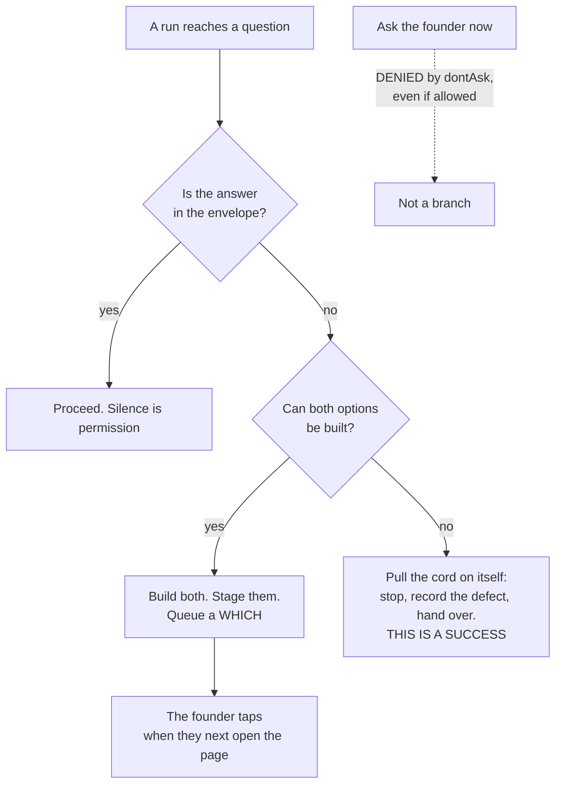

---

### 3.4 The read-back

**(FINAL row 17, kept by v29)** Voice is input only. The Operator writes back what it understood — as an intent with
a done-test, in its own words, on screen — and the founder confirms by tap or typed word. **Nothing binds by voice.**

**(NEW: the honest research position)** No shipped system mandates a restatement before work binds; Linear's
ten-second `thought` acknowledges rather than confirms. The rule is **unsupported and uncontradicted**, and it is
kept because closed-loop readback is regulation in aviation and medicine, and because the input is a voice
transcription with errors preserved.

**(NEW / FINAL)** **Mechanism:** the read-back page (ABSENT); the store check refuses an intent whose done-test is
not falsifiable by someone who did not do the work — `bin/check-stores` (ABSENT). §2.5 and §2.6 carry the door and
where `product` sits behind it.

---

### 3.5 How it dispatches — three mechanisms, each for what it is documented to do

**(NEW: v13. One dispatch mechanism for everything is the losing image, and it loses because the three shipped
mechanisms have different documented properties and picking one would mean using it outside what it does)**

| Mechanism | Used for | The sourced constraint that shapes the design |
|---|---|---|
| **Agent teams** | the fleet the founder watches on page 2 — a lead plus named teammates, each a full independent session, messageable by name | experimental, off by default (`CLAUDE_CODE_EXPERIMENTAL_AGENT_TEAMS=1`); **no nested teams**; one team per session; `/resume` does not restore in-process teammates; spawning needs an interactive session, so `-p` never forms a team. Tokens: *"approximately 7x more … when teammates run in plan mode"*, and the vendor's own advice is *"Use Sonnet for teammates"* |
| **Subagents** | depth inside one agent — a builder's own exploration, a scout fan-out | depth 3 by default, 20 concurrent, `Workflow` removed from all of them (v35); a subagent's `permissionMode` frontmatter is ignored; main-conversation auto memory is not loaded into subagents except a fork |
| **`claude -p` children through the launcher** | unattended night work, and every non-Claude provider | `--session-id` must be a valid UUID, minted by us; `--restricted` needs v2.1.248+; `--max-budget-usd` is a stall fuse, not a billing control (v23); `-p` disables tools needing terminal input, so a session never stalls waiting |

**(NEW: the one consequence of the teams constraint that a surface designer must know before drawing page 2)** There
are **no nested teams** and one team per session. So the child-flow page shows **one level of teammates**, and
everything deeper is subagents. A page drawn as a tree of teams of teams would be drawing something the runtime
cannot produce.

**(NEW: the rule that keeps v34 true as the roster grows)** **The Operator never composes argv itself.** It emits a
brief carrying an intent id and a named agent; `bin/run` (ABSENT) composes the argv from the agent's file and the
band. If the Operator composed argv, then every future agent would be a new place a grant could be written wrongly,
and there would be fourteen implementations of one narrowing.

---

### 3.6 From the founder's sentence to a dispatched run

**(NEW: a cold reader would otherwise assemble this from §2, §3.2, §3.5, §5 and §6)**

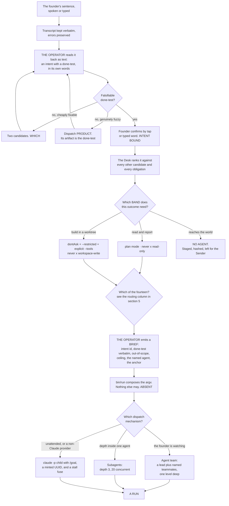

---

### 3.7 What the Operator never does

**(NEW: each line names the mechanism that stops it, because a list of prohibitions with no mechanism is a wish
list, and this repository has already shipped eight of those)**

| It never | Mechanism |
|---|---|
| Writes or edits a file | Its `tools:` line carries no `Write` and no `Edit`; the argv, composed by `bin/run` (ABSENT), and asserted by `bin/probe` (ABSENT) |
| Runs a shell command | No `Bash` in its `tools:` line, for the reason in §3.1 |
| Composes argv | Only `bin/run` does (v34, ABSENT) |
| Creates an intent | Only the founder's confirm writes `intents/*.md`; the read-back page is its only writer (ABSENT) |
| Performs an outward act | The band table gives every agent `never` on that class; the Sender is the only thing that sends, and it holds no model (v33) |
| Dispatch a team inside a team | The runtime has **no nested teams**. It is not a rule we enforce; it is a thing that does not exist |
| Run its own gate | `Workflow` is absent from every agent file, deliberately: the gate may not be invocable by the thing it gates (v35), and the vendor removes it from every subagent regardless |
| Override the founder | There is no approve verb. Outside the envelope the answer is a *which*, with both options built |

---

### 3.8 What the Operator hands back to the founder

**(NEW: composed from the fully-autonomous band (§3.3) and FINAL's briefing. It is a composition of decided things,
not a new decision — no field here is invented, and if a field is wanted that is not derivable from those two, it
is a decision the SPINE does not carry)**

The Operator returns exactly three kinds of thing, and nothing else reaches the founder unasked:

| What | When | The rule it obeys |
|---|---|---|
| **A *which*** — two options, both already built, with the cost of each and a recommendation | when a decision is outside the envelope, or a fully autonomous run hit a question | never *may I*; there is no approve verb |
| **A ring** — one line, on the phone | only when a `wake-me` line fired | the interruption budget is three a day, and a channel whose acted-on rate falls is demoted below its threshold. ICU alarms: 74–99% irrelevant produces trained inattention, not annoyance |
| **The briefing** — a page the founder opens | whenever the founder opens it, so it is **never** an interruption | its contents are FINAL's: what moved with the evidence; the raw work biggest first; the *whiches*, both built; **what could not be checked, named**; what it cost per venture and per window; what the Operator would do next, none of it started |

**(NEW: the field of the handover that the briefing reads first, and why it is the field to fight for)** `uncertain`
— *what I am not sure about and what would settle it*. It turns a confident wrong answer into a flagged one. **No
shipped handover schema found has it**, which is exactly why it will be the first field to erode under pressure and
the one worth naming here.

**(NEW: what the Operator may never hand back)** Its own summary in place of the evidence. This repository has
already recorded the failure twice: a worker measured *"29 of 30 check steps pass; only `check:mc` fails"* and the
orchestrator's synthesis rendered it *"29 of 29"* — dropping the failing step out of the denominator so a partial
pass read as a clean sweep — and that version propagated into a project file and two handoffs. **The orchestrator's
brief is a defect surface nobody reviews.** **Mechanism:** the briefing shows the raw work, biggest first, and every
number on the cost page taps through to the run that produced it (v14); a figure with no tap is a figure with no
provenance.

---

## 4 · The Watch and the Desk — the one thing that is always on

*obeys: v12 (`/loop` refused), v22 (two windows), v23 (the stall fuse); inherits: FINAL §3, §5*

---

**(FINAL)** Everything else is episodic. The Watch is the only continuous process, and its design goal is the
opposite of every other component's: **it must be almost free to run, and it must usually decide to do nothing.**

**(NEW: the one thing the founder's direction changes here, and it changes nothing about the loop)** The roster and
the Operator arrived in v1 and §3, and neither is the Watch. The Watch is a **program with no model** that decides
*whether* anything should start; the Operator is an **agent inside a session** that decides *who* does the work once
something has. Collapsing them would put a model call in the cheap pass, and the cheap pass being free is the entire
argument for an always-on loop. §4.4 states the seam.

---

### 4.1 The loop

**(FINAL, redrawn for two windows and with the tick interval removed from the picture)**

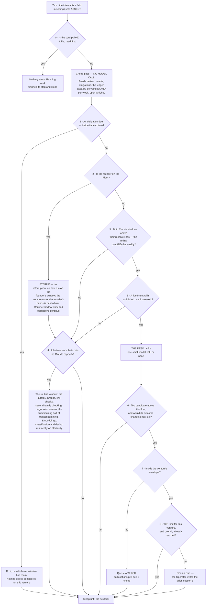

**(FINAL)** The cheap pass has no model call in it: reading a handful of small files, comparing dates and summing a
capacity number is arithmetic, so a tick that ends in `SLEEP` costs effectively nothing. That is the answer to *"I
want the system to move but I don't want it to waste tokens and run loops without any meaning"* — the loop is
meaningful because its default branch is free, not because it is clever.

**(FINAL)** Nine gates and eight of them stop, cheapest and most absolute first: **the cord beats everything; an
obligation beats a goal; the founder's presence beats capacity; capacity beats desire; provenance beats opportunity;
the envelope beats capability; flow limits beat all of it.**

**(NEW: the tick interval is deliberately not written here, and the omission is the point)** FINAL drew it as *every
240 s* and gave the reason — control latency for the cord, a *which* answered, a run's difficulty. The number is a
field in `settings.yml` (ABSENT), and the SPINE forbids durations in this plan for a reason this repository has
measured repeatedly: a number written into prose stops being re-derived and starts being quoted, and then it is
wrong and nobody notices. **Mechanism:** the field is read from settings; anyone who needs the value reads it there.

**(FINAL)** **Enforced by:** `bin/watch` (ABSENT; FINAL names it `keel/bin/watch`) · the cord file `STOP` (ABSENT) ·
`settings.yml` holding the tick, the reserve per window, the WIP limits (ABSENT).

---

### 4.2 Two windows, and the difference between a stop and a reroute

**(NEW: v22 moves FINAL row 19, which knew only the five-hour fuse. This is the single most consequential factual
correction in the plan for anything the Watch does)**

**(NEW)** There are **two windows per seat, not one**: a rolling five-hour **and a weekly**, and both are *"shared
with Claude chat and Cowork"* — so the founder's own chat usage draws down the same pool the night runs on. Every
consequence follows from that: the reserve is **per window and per week**, and **a weekly exhaustion is a different
event from a five-hour one.** A five-hour exhaustion is waited out. A weekly exhaustion is not, and a system that
treats them alike will either sit idle for days or ring the founder about something that resolves itself.

**(NEW: and two limit shapes behave differently, which is the operational half)** A **seat** limit — the vendor's
*"session limit"* and *"weekly limit"* — is shared across all models and **cannot be escaped with `/model`**. A
**model-family** limit — *"your Opus limit"* — can: switching family keeps the crew working. **The Watch must
distinguish them: one is a stop, the other is a reroute.**

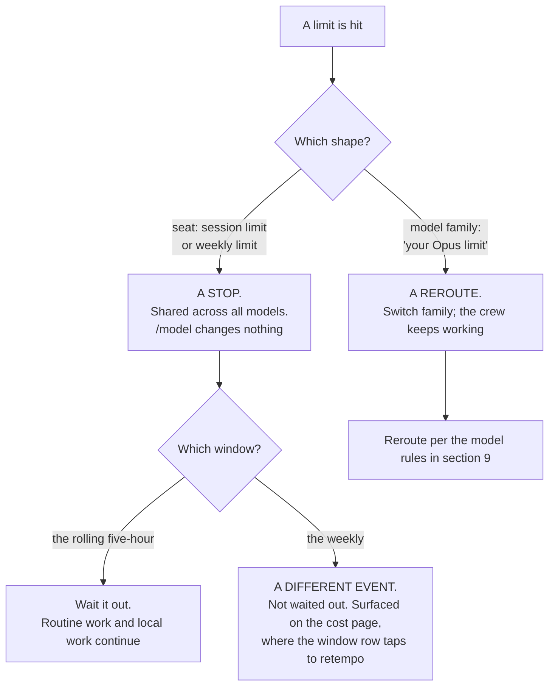

**(NEW)** **Mechanism:** the Watch's cheap pass reads capacity per window *and* per week; the cost page shows both,
and **a window row taps to retempo** rather than merely displaying (v14). **What is UNVERIFIED and must not be
guessed at:** **no numeric quota is published anywhere fetched** for the Anthropic subscription. Magnitudes are
relative only — Pro *"at least 5x more usage per 5-hour session than Free"*, Max *"5x"* and *"20x more usage than
Pro"*. A window's real capacity is measurable only from an account, and the absence of published numbers is itself
the finding. Nothing in this plan may state one.

**(FINAL, and it still binds)** When a window runs out **every agent stops at once** — a shared fuse, not a per-agent
limit. Any design that treats runs as independent workers is wrong here: they are loads on one circuit. A grid never
dispatches to 100% of capacity; it holds a reserve, and the reserve is the most important number in the system
because the founder sets it. Too small and they sit down to a burned window; too large and the nights are wasted.
**Mechanism:** one slider, and a line in the briefing reporting how often the reserve was needed and how often it
expired unused, so it is tuned on evidence.

---

### 4.3 `/loop` is refused; the Watch is the loop

**(NEW: v12. The founder asked for the loop and goal features by name — *"I think we need to work with loops and
goals and They features the codex and Claude Code has in order to achieve the best results we can"* — and the answer
splits them: the goal goes on the run, the loop does not become the Watch)**

| Feature | Where it sits | The sourced reason |
|---|---|---|
| **`/goal`** | **On the run** (§6). The done-test *is* the goal condition, with a turn clause | It runs headless in one invocation: *"Setting a goal with `-p` runs the loop to completion in a single invocation."* Condition limit 4,000 characters. It leaves the goal active after transient failures **including rate limits**, which is exactly the behaviour a night wants |
| **`/loop`** | **Refused in production.** It stays a Floor convenience the founder may use by hand | *"Tasks are session-scoped: they live in the current conversation and stop when you start a new one."* A 7-day expiry. And the line that ends the argument: *"Tasks only fire while Claude Code is running and idle."* |

**(NEW: why that last quote is decisive rather than inconvenient)** An always-on tier that only fires while a
session is open and idle is not always-on; it is a session that has to be kept open, and its state dies with the
conversation. The Watch is a program that survives every session, reads the cord first, and costs nothing on the
branch it takes most often. **Mechanism:** `bin/watch` under a LaunchAgent (both ABSENT); `CLAUDE_CODE_DISABLE_CRON=1`
disables scheduled tasks entirely and is available if the Floor's convenience ever becomes a hazard.

**(NEW: one trap in the same family, recorded because it would be found the hard way)** A `/goal` **defers evaluation
while a subagent or background shell is running**, and under `-p` the periodic check-in is *"the only way Claude Code
delivers check-ins."* So a run whose child is stuck delivers nothing and looks alive. That is what §4.5's fuses are
for.

---

### 4.4 Where the Operator sits relative to the Watch

**(NEW: a cold reader will otherwise assume the Operator is the loop, and everything about cost follows from its not
being)**

| | **The Watch** | **The Operator** |
|---|---|---|
| What it is | A program. **No model** | An agent file. `claude-opus-5` |
| Always on? | Yes. It is the only continuous process | No. It exists inside a session, for the duration of that session |
| What it decides | **Whether** anything should start at all — cord, obligations, the founder's presence, capacity, provenance, the envelope, flow limits | **Who** does the work, and with what brief and what band |
| Cost on a quiet tick | Effectively nothing — arithmetic over small files | It is not running |
| Can it dispatch? | It opens a Run. The Desk inside it ranks and stops at the reserve line | It dispatches by three mechanisms (§3.5), and composes no argv |
| Can it be the other? | **No.** A model in the cheap pass ends the free default branch | **No.** An agent cannot be always-on without a session being always open, which is what v12 refuses |

**(NEW)** The seam in one sentence: **the Watch says *now*, the Operator says *who*, and `bin/run` (ABSENT) says
*with exactly what grant*.** Three things, three failure modes, and none of them can cover for another.

**(NEW: the one case where the Operator runs without the Watch, and it is the founder's)** A card dragged on page 4
launches a session directly, and a founder on the Floor is talking to an agent with no Watch tick involved. That is
the founder's door (§2.4), and it is bounded by the same launcher and the same bands. The Watch is what makes the
system move when the founder is asleep; it is not a gate the founder passes through to work.

---

### 4.5 The Desk, and the fuses

**(FINAL)** The Desk is the newsroom assignment desk plus the grid operator's merit order. Each candidate carries
four numbers, deliberately crude because a sophisticated estimate would be false precision:

| Number | How it is got | Range |
|---|---|---|
| **Weight** | the venture's `weight` × the Intent's own urgency | 1–5 |
| **Cost** | median actual cost of the last N runs of this kind, from the ledger. **A measurement, not an estimate** | tokens, per window |
| **Readiness** | dependencies met, inputs present, whiches answered — **and the done-test's outcome would change a next act** | yes / no |
| **Decay** | closeness to expiry, and time since it last moved | 0–1 |

**(FINAL)** Rank = `Weight × Decay ÷ Cost`; dispatch in order; stop at the reserve line; ties break toward the
cheaper item. **There is no success-probability estimate anywhere:** the system does not predict the value of work,
it measures what work of that kind cost before, takes the founder's weight as given, and lets recency and expiry do
the rest. Two escape hatches from real practice: one **spinning slot** is always held for whatever the founder asks
next, so a spoken instruction never queues behind autonomous work; and the Desk **re-ranks on a cadence**, not on
every event, so a noisy input cannot make it thrash.

**(FINAL)** The Desk records its ranking **and the gate that stopped each candidate**, at every tick, which is what
makes *why did you not do that* answerable. **Enforced by:** `bin/watch` writes `logbook/desk/<tick>.json` (ABSENT).

**(NEW: v31 adds one input to the cost column that FINAL's did not have)** With fourteen named agents, cost is
measured **per agent per kind of work**, not per anonymous shape. That is what makes the roster's own claim
falsifiable: if `growth` and `steward` — the two entries with the least outside evidence behind them — never produce
work whose anchor holds, their cost rows say so, per agent, in the ledger.

---

### 4.6 The stall fuse

**(NEW: v23. `--max-budget-usd` was carried in FINAL §7.5 as a spend control. It is not one, and the correction
matters because a false spend control is worse than none)**

**What it is not.** It is **print mode only**, it is computed **locally from token counts at list price**, and for a
subscriber the vendor's own words are that *"the session cost figure isn't relevant for billing purposes."* It does
not bind the account. Nothing about it touches the two windows of §4.2.

**What it is, and why it is kept.** A **stall fuse**. Its two documented properties are exactly the ones a fuse
needs: **subagent spend counts toward the cap**, and once spend reaches it, **spawning another subagent fails with
`Budget limit reached`** (v2.1.217+). So a run that has gone into a loop of children stops making children. That is
worth having under its real name.

**(FINAL, and the two other governors that catch the machine rather than the founder)**

| Fuse | Predicate | State |
|---|---|---|
| **The stall detector** | no **durable artifact** from a run for N ticks and the run stops spending. The predicate is a durable artifact, **never the run's claim of progress** | `.claude/hooks/budget-guard.js` exists on this branch, `ceo-1-1788609834`, and is **registered nowhere**. Registering it is a founder act on a settings file |
| **The repetition tripwire** | a hash of tool identity and canonicalised arguments against this intent's negatives; an exact repeat is refused unless a named difference is stated | ABSENT |
| **The aberrance halt** | spend at several times this agent's median for this kind of work, a burst of identical calls, or a claim the nightly reconciliation contradicts — halt the run, ring the bell | ABSENT; the median comes from the ledger |

**(NEW: why all three predicates avoid self-report, said once)** Every fuse above keys on something the run cannot
author: a durable artifact on disk, a hash of what it actually called, a median from the ledger, a reconciliation
against a record the company does not write. A fuse that read the run's own progress report would be asking the
thing that stalled whether it has stalled.

---

## 5 · The roster

*obeys: SPINE §B entire; v1, v2, v6, v7, v8, v31, v33; inherits: FINAL §7 (as the losing image, and as the four rules that survive it)*

---

**(FOUNDER)** *"I want us to recreate the whole startup company or a whole company or a team. So I want us to have
more agents as much as you will need, but not too much. So, like, between ten and fifteen agents. So we will have
each agent with its own expertise so we can adjust his knowledge and his tools and his way of walking and thinking
towards the tasks that he needs to achieve."*

**(FOUNDER)** **Fourteen agents plus the Operator — fifteen named roles.** One file per agent, in the frontmatter
format the runtime already reads: `name`, `description`, `tools`, `model`, `mcpServers`, `skills`, `maxTurns`,
`isolation`. **All fifteen files are ABSENT.** What exists to build them from is on this branch,
`ceo-1-1788609834`: the format itself, the `PS-*` lint in `.claude/hooks/schema-lint.js`, and eighteen agent files
that currently pass it at **18 pass · 0 fail · 0 warnings**.

**(NEW: what FINAL argued, so the reader knows what was traded)** FINAL refused a roster and built three shapes —
maker, scout, checker — separated by irreducible properties, with domain as a loadout. Its argument was that a cold
outreach agent and a blog writing agent have the same tools, the same reasoning and the same failure modes, and
differ only in what they know and what would prove them right: memory and a check, neither of which is an agent.
That argument is not refuted below. **It is overruled**, the cost is stated once in §5.6, and what the shapes were
protecting is kept as four rules that now live inside a roster.

---

### 5.1 The four rules that survive the move from three shapes to fourteen names

**(FINAL, kept; each names its mechanism)**

1. **The grant is argv, not prose.** One no-model launcher composes it; nothing else may. *(v34; `bin/run`, ABSENT.
   A prose rule describing a grant is the losing image, and `--allowedTools` restricting nothing is why.)*
2. **The checker cannot edit what it judges.** `reviewer`, `guard` and `challenger` carry **no `Write`, no `Edit`,
   no `Bash`**. *(FINAL row 6's irreducible property; enforced by the argv and by the nightly probe `bin/probe`,
   ABSENT. An agent that can edit what it reviews will review what it can edit.)*
3. **The trifecta split.** No agent holds untrusted input, private credentials and an outward channel at once.
   *(v33; the Sender is the only thing that sends, and it holds no model.)* **v36 sharpens the first leg into a
   testable rule:** a tainted read — mail, calendar, drive, Notion, the open web — is held by `scout` and by the
   world's door program, **and by nothing that carries `Write`, `Edit` or `Bash`.** *(Mechanism: the MCP column of
   §5.2 is the argv; `bin/probe`, ABSENT, asserts it nightly.)*
4. **The no-model programs stay programs.** The Watch · the Sender · the world's door · the probe · the reconciler ·
   the log · the launcher · the curator's launcher · the drill · the rehearsal runner · the store check · the
   supervisor. **A prompt injection that reaches one of these finds a program.** *(FINAL §7.4, §16.1.)*

**(NEW: why rule 4 is the one most at risk from a roster, and the mechanism is a naming discipline)** Fourteen names
create fourteen invitations to add a fifteenth for something that is currently a program. The test is whether the
thing needs judgement. The Sender does not: it recomputes a ceiling, reads a checklist aloud into the log, performs
one act, and holds a recall window. Making it an agent would put a model between the decision and the act, which is
the exact seam this design exists to keep apart.

---

### 5.2 The fourteen

**(NEW: model ids are from the models lane; `tools` is the argv-level grant, not a description; "Anchor" is what
proves the work and is **never the agent's own report**)**

| # | Name | The job it exists for | Expertise lens | Model | Tools | MCPs | Skill namespaces | Anchor — what proves it | The Operator routes here when |
|---|---|---|---|---|---|---|---|---|---|
| 1 | **builder** | Writes the code. One artifact, one worktree, continuous context | engineering | `claude-opus-5` · escalates to `claude-fable-5-1` under v21 | Read Write Edit Bash Glob Grep | none by default | engineering · testing | the venture's own CI, plus the done-test, plus the tester's blind test | the intent's outcome is source code |
| 2 | **reviewer** | Judges code it did not write, against a named dimension | engineering · correctness | `claude-sonnet-5`; a second family when reachable | Read Glob Grep | none | engineering · quality | findings reproduce from the diff alone; a finding with no reproduction is a hypothesis | any builder handover, before merge |
| 3 | **architect** | The contract before the code: schema, API, data model, migration | engineering · systems | `claude-opus-5` | Read Glob Grep Write (design paths only) | none | engineering · data | a migration that applies and rolls back in a scratch database | the work changes a schema, an interface or a stored shape |
| 4 | **tester** | Writes the test that judges a build, **blind to the implementation** | quality | `claude-sonnet-5` | Read Write Edit Bash Glob Grep, `--add-dir` excluding the implementation | none | testing · quality | the test fails before the change and passes after | any intent whose done-test needs a new anchor (v8) |
| 5 | **guard** | Security and adversarial review; every tool admission | security | `claude-opus-5` | Read Glob Grep | none | security | a proof of concept that reproduces, or the finding is a hypothesis | auth, credentials, network, outward acts, migrations, or a new tool at the door |
| 6 | **scout** | Finds things out. Stateless, parallel legal here and only here. **Reads the untrusted world** | research | `claude-sonnet-5`; Gemini once authenticated | Read Glob Grep WebSearch WebFetch — **no Write, no credential, no send** | read-only servers, per run | research | every claim carries URL, quote and access date; `check-citations.mjs` blocks on a dead one | a bounded question of fact is cheaper to answer than to assume |
| 7 | **designer** | UI, UX, brand, visual identity, prototypes. The perception loop: render, look, iterate | design | `claude-opus-5` | Read Write Edit Bash Glob Grep | `playwright` (per-run inline) | design · frontend | a rendered screenshot judged against a named anchor; never the agent's description of it | the artifact is seen by a person |
| 8 | **product** | Turns fuzzy into a falsifiable done-test; specs, tickets, acceptance criteria, roadmap | product | `claude-sonnet-5` | Read Glob Grep Write (spec paths) | none | product | the store check refuses an intent whose done-test is not falsifiable by someone who did not do the work | the request cannot yet be dispatched |
| 9 | **analyst** | Pipelines, KPIs, cohorts, A/B, anomalies, and the nightly reconciliation | data | `claude-sonnet-5` | Read Glob Grep Bash | read-only analytics, error tracking, billing-read | data | the reconciliation reads a record the company does not write; a number that reconciles to our own log is rung 4, not rung 1 | a question is about what actually happened |
| 10 | **writer** | Content, brand voice, SEO, ad copy, campaign drafts, video and asset briefs | growth · craft | `claude-opus-5` for taste work; `claude-sonnet-5` for routine | Read Write Edit Glob Grep | Higgsfield (rate-capped, spends credits) | growth · craft | staged, never sent; the anchor is the founder's taste store and a rung-2 external reaction | words or assets are the artifact |
| 11 | **growth** | Leads, scoring, outreach *drafts*, CRM hygiene, funnel work. **Never sends** | growth | `claude-sonnet-5` | Read Glob Grep Write | CRM read-only | growth | a reply from a real person, recorded by the world's door; never a count of messages sent | the intent is about reaching people who are not yet customers |
| 12 | **steward** | Obligations, invoices, expenses, contract *review*, compliance flags, vendors, support triage | operations · finance | `claude-sonnet-5` | Read Glob Grep Write (obligations and operations paths) | **none** — mail, calendar, drive and Notion are read by the world's door (a program) into inbound rows, and by `scout`; steward writes from scout's handover, never from a raw row (v36) | operations | an obligation is discharged only by a record the company does not write | something is owed to someone by a date |
| 13 | **curator** | What the company knows: memory, the transcript pass, and skill admission. **The only writer of memory** | knowledge | `claude-sonnet-5`; the summarising half on Gemini or a local model | Read Write Edit Glob Grep — **no Bash** | none | knowledge | a memory item with no source, date, expiry and falsifier is refused at the store check | nightly, and whenever a run's handover proposes a durable fact |
| 14 | **challenger** | Attacks a finished plan or artifact for holes, contradictions, and rules with no mechanism | adversarial reasoning | `claude-opus-5`; a second family when reachable | Read Glob Grep | none | quality · research | every finding names the mechanism that would have caught it, or it is an opinion | before anything irreversible, and on every plan the Operator is about to bind |

**(NEW: where the roster is thinner than it looks, deliberately, and this is the table's most important row)**
**Eight of the fourteen carry no shell. Five carry no write of any kind. Only four can touch source.** That is the
trifecta split expressed as a table rather than as a rule, and it is what makes fourteen names cost less than it
sounds: most of them cannot do most things.

**(NEW: v36 — who may hold a tainted read, and it is one line because it is one rule)** Mail, calendar, drive and
Notion are **tainted read-only**: their content is written by strangers. **Only `scout` and the world's door program
may read them.** No agent that holds `Write`, `Edit` or `Bash` reads them raw — which, read against the MCP column
above, is why exactly one agent in the table carries a tainted server and it is the one with no write, no
credential and no send.

| Who | May read mail, calendar, drive, Notion | Why |
|---|---|---|
| **the world's door** | yes | a program with no model. It writes one inbound row per event and does nothing else |
| **`scout`** | yes, read-only servers admitted per run | it holds no `Write`, no credential and no send, so a prompt injection in a stranger's text reaches a thing that can neither act nor tell anyone |
| **`steward`** | **no** | it holds `Write`. It works from `scout`'s handover and from inbound rows, never from a raw row |
| every other agent | no | none of them has a reason to, and each of them holds something |

**(NEW: the fifteenth)** The **Operator** is not in the table because §3 is its section. It carries `Read Glob Grep`
plus `Agent(...)`, no `Write`, no `Edit`, no `Bash`, and its file is ABSENT like the rest.

---

### 5.3 The fourteen, one at a time

**(NEW: the table is the contract; these paragraphs are what a builder needs in order to write each file, and each
one names the thing that would make that agent wrong)**

**1 · builder.** Writes the code, and is the only agent for which *"one artifact, one agent, continuous context"* is
a hard rule rather than a preference. Lens: engineering. `claude-opus-5`, escalating to `claude-fable-5-1` only
under v21's single named rule — a done-test failed twice under Opus 5 and a horizon beyond one window. Full grant:
Read, Write, Edit, Bash, Glob, Grep, inside one worktree. No MCPs by default, because a builder with a server has a
surface nobody admitted. Skills: engineering, testing. **Anchor:** three things, none of them its own report — the
venture's CI, the done-test, and the tester's blind test. **The way it goes wrong:** it fixes something outside its
scope because it was right there. `out-of-scope` in the brief is the field that stops it, and the cord on itself is
what it does instead.

**2 · reviewer.** Judges code it did not write, against one named dimension per session. Lens: engineering,
correctness. `claude-sonnet-5`, and a second model family whenever one is reachable. **Read, Glob, Grep, and nothing
else** — this is rule 2 of §5.1 and it is structural, not procedural. Skills: engineering, quality. **Anchor:**
findings reproduce from the diff alone. A finding that does not reproduce is a hypothesis and is labelled one.
**The way it goes wrong:** it returns a score. It returns findings against a dimension, never a score, and when
comparing two candidates it compares pairwise and order-swapped with the candidate stripped of its label.

**3 · architect.** The contract before the code: schema, API, data model, migration. Lens: engineering, systems.
`claude-opus-5`, because a wrong interface is expensive in a way a wrong function is not. Read, Glob, Grep, and
`Write` **on design paths only**. Skills: engineering, data. **Anchor:** a migration that applies **and rolls back**
in a scratch database — an anchor outside the model, run by a program. **The seam with builder is v7 and it is the
whole reason this is a separate agent:** the architect's output is a separate artifact with its own done-test,
handed over whole, and **a builder that needs to change it files an objection rather than editing it.** Cognition's
measured failure is two agents acting on assumptions *"not prescribed upfront"*; an artifact with a done-test is
what prescribes them. **Mechanism:** the builder's `--add-dir` excludes the architect's output path.

**4 · tester.** Writes the test that judges a build, **blind to the implementation**. Lens: quality.
`claude-sonnet-5`. Read, Write, Edit, Bash, Glob, Grep, with `--add-dir` **excluding the implementation path** —
the blindness is argv, not instruction. Skills: testing, quality. **Anchor:** the test fails before the change and
passes after, which is checkable by a program and unfakeable by either party. **Why both this and the builder's own
tests exist (v8):** Devin's shipped guidance is *"Tell Devin to test its own work before opening a PR"*, and that
self-check is kept — but a test written by the author of the code is a machine grading its own homework, which this
system refuses at the level of §0. Two different tests, two different jobs.

**5 · guard.** Security and adversarial review, and **every tool admission passes through it**. Lens: security.
`claude-opus-5`. Read, Glob, Grep — a security reviewer with a shell is a security incident waiting for a prompt
injection. Skills: security. **Anchor:** a proof of concept that reproduces; otherwise the finding is a hypothesis
and says so. **Routing:** auth, credentials, network, outward acts, migrations, or a new tool at the door. **The
evidence that this is not ceremony:** the gate in this repository has already blocked its own author's work, and
three independent reviewers on one pull request found a path traversal, eleven server-side request forgery bypasses,
two more in the fix for those, and an auto-approved remote-code-execution path — all in work already called
finished.

**6 · scout.** Finds things out. **The only agent for which parallel is legal**, because it is the only one whose
subtasks are independent — which is precisely the boundary between Anthropic's +90.2% on research and Cognition's
failure on one artifact. Lens: research. `claude-sonnet-5`; Gemini once authenticated, because it burns a different
window. Read, Glob, Grep, WebSearch, WebFetch — **no Write, no credential, no send.** Read-only servers, admitted per
run. Skills: research. **Anchor:** every claim carries a URL, a quote and an access date, and `check-citations.mjs`
on this branch blocks on a dead path. **It is the trifecta agent** (v33): it reads the untrusted world, so it holds
nothing and can reach nothing. A scout that could send would be one prompt injection away from being the attacker's
outbound channel.

**7 · designer.** UI, UX, brand, visual identity, prototypes. Its way of working is a perception loop — render, look,
iterate — and that is what distinguishes it from every other maker. Lens: design. `claude-opus-5`. Read, Write, Edit,
Bash, Glob, Grep, plus **`playwright` as a per-run inline MCP entry**, which is the only surveyed way to give one run
a browser without that server's tools entering any other run's context. Skills: design, frontend. **Anchor:** a
rendered screenshot judged against a named target — **never the agent's description of what it rendered.**

**8 · product.** Turns fuzzy into a falsifiable done-test: specs, tickets, acceptance criteria, roadmap. Lens:
product. `claude-sonnet-5`. Read, Glob, Grep, `Write` on spec paths only — **and never on `intents/`**, because only
the founder's confirm creates an intent (§2.6). Skills: product. **Anchor:** the same store check that gates the
founder's own input refuses an intent whose done-test is not falsifiable by someone who did not do the work. An
agent whose output is done-tests is judged by the gate every done-test passes.

**9 · analyst.** Pipelines, KPIs, cohorts, A/B, anomalies, and **the nightly reconciliation**. Lens: data.
`claude-sonnet-5`. Read, Glob, Grep, Bash — the shell is for deterministic queries, not for writing. MCPs: read-only
analytics, error tracking, billing-read. Skills: data. **Anchor, and it is the sharpest one in the table:** the
reconciliation reads a record **the company does not write**. A number that reconciles only to our own log is rung 4,
not rung 1. **This is why the read-only instruments are admitted first** (§8) — not out of caution, but because the
reconciliation cannot exist without them, and the reconciliation is what makes every other number in the system
rung 1 instead of rung 4.

**10 · writer.** Content, brand voice, SEO, ad copy, campaign drafts, video and asset briefs. Lens: growth, craft.
`claude-opus-5` for taste work and `claude-sonnet-5` for routine — the one split default in the roster, because
taste and throughput are genuinely different moves. Read, Write, Edit, Glob, Grep. MCP: Higgsfield, rate-capped,
**and it spends credits**, which is why the cap is on the tool and not on the prompt. Skills: growth, craft.
**Anchor:** staged, never sent; the founder's taste store, and a reaction from outside. **It never holds the key**
(v33) — the thing that drafts an outward act is not the thing that sends it.

**11 · growth.** Leads, scoring, outreach **drafts**, CRM hygiene, funnel work. Lens: growth. `claude-sonnet-5`.
Read, Glob, Grep, Write. CRM read-only. Skills: growth. **Anchor:** **a reply from a real person**, recorded by the
world's door — never a count of messages sent, which is the metric that makes an outreach agent look productive
while it burns a reputation. **It never sends.** First contact with a stranger is on the default `never` list, and
the Sender's own rate limits are absolute numbers in a program no model can reach.

**12 · steward.** Obligations, invoices, expenses, contract **review**, compliance flags, vendors, support triage.
Lens: operations, finance. `claude-sonnet-5`. Read, Glob, Grep, and `Write` on obligations and operations paths.
**MCPs: none** (v36). Skills: operations. **Anchor:** an obligation is discharged only by a record the company does
not write. Contract **drafting that binds**, tax filing and cap-table edits are one-way doors and are refused: they
reach the founder as a *which*, with both options prepared.

**(NEW: v36 — where steward's input comes from, and why it is not a server on its own line)** An earlier draft of
this roster gave `steward` read access to Gmail, Calendar, Drive and Notion. **That was one grant breaking two
rules at once**: those reads are tainted, and this agent holds `Write`. So the grant is removed and the input
arrives by two paths that already exist. **The world's door** — a program with no model — writes one inbound row per
event; **`scout`** answers a bounded question about what a row actually says, holding no write, no credential and no
send. `steward` writes an obligation **from `scout`'s handover and from inbound rows, never from a raw row.**
**Mechanism:** the MCP column of §5.2 is the grant, composed into argv by `bin/run` (ABSENT) and asserted nightly
by `bin/probe` (ABSENT); there is no server for `steward` to reach.

**(NEW: what this costs, once)** One hop. A support ticket becomes an obligation after an inbound row and a scout
pass, rather than the moment `steward` reads the mailbox. That is the price of the rule FINAL states as *no model
reads a stranger's text with a tool in its hand*, and the alternative is an agent that reads mail with a pen in its
hand — the losing image v36 keeps by name.

**13 · curator.** What the company knows: memory, the transcript pass, and skill admission. **The only writer of
memory** (v25). Lens: knowledge. `claude-sonnet-5`, with the summarising half on Gemini or a local model, because
that half is bulk work that should not touch the founder's window. Read, Write, Edit, Glob, Grep — **and no `Bash`**.
Skills: knowledge. **Anchor:** a memory item with no source, date, expiry and falsifier is refused at the store
check. Writes are **delta-only, never a rewrite**, and the paper behind that is specific: context held 18,282 tokens
at 66.7% accuracy and collapsed at the next step to **122 tokens and 57.1%**, below a 63.7% baseline. **The
counter-example is named rather than hidden:** Claude Code's own auto memory is written by the acting agent,
in-session. That is one shipped system doing the opposite of what this rule says, and it is accepted as a
counter-example. **Mechanism:** the curator's grant is the only one whose writable scope includes the memory paths.

**14 · challenger.** Attacks a finished plan or artifact for holes, contradictions, and rules with no mechanism.
Lens: adversarial reasoning. `claude-opus-5`, and a second model family whenever one is reachable. Read, Glob, Grep.
Skills: quality, research. **Anchor:** every finding names the mechanism that would have caught it, or it is an
opinion. **Why this is an agent and not a step the author performs (v30):** *"LLMs struggle to self-correct their
responses without external feedback, and at times, their performance even degrades after self-correction."*
Reflexion's 91% is not a counterexample — its feedback is external. **Mechanism:** the challenger never reads the
author's reasoning, only the artifact and its done-test.

---

### 5.4 How the Operator picks an agent

**(NEW: the routing column of §5.2 read as one decision, because a reader would otherwise have to hold fourteen
"routes here when" clauses in their head at once)**

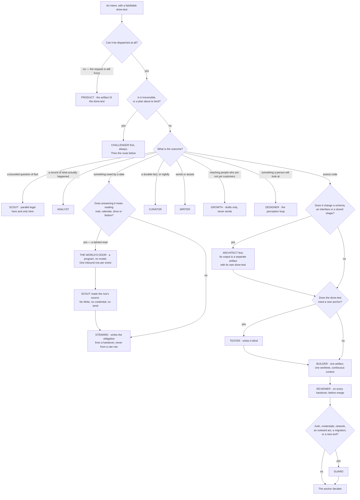

**(NEW: four properties of that picture are load-bearing)** **`challenger` comes before the route, not after it** —
it attacks the plan the Operator is about to bind, and attacking afterwards is attacking a decision. **`architect`
and `tester` are gates on the code path, not alternatives to it.** **No branch reaches an outward act**: the
right-hand edge of the diagram ends at an anchor, because staging is where every agent's authority stops. And **no
branch hands a tainted read to an agent that can write** (v36) — the one route that starts in a stranger's text
passes through a program and then through `scout` before it reaches anything holding a pen.

---

### 5.5 The founder's departments — covered, or refused with a reason

**(FOUNDER, list items 23–30)** **(NEW: every department is placed against the fourteen, and every refusal names why
rather than deferring)**

| § | Department | Covered by | Refused, and why |
|---|---|---|---|
| 23 | design & product | designer (UI, UX, branding, visual identity, prototype, accessibility) · product (spec, roadmap, feedback triage) | **User-testing simulation** — a simulated user is the machine grading its own homework; the rung-1 anchor is a real reaction |
| 24 | engineering | builder · reviewer · architect · tester · guard. Documentation is written by whoever made the thing, and its anchor is that a cold reader can run it | **A separate documentation agent** — docs split from the artifact drift the moment the artifact moves. That is v7's reasoning applied in the other direction |
| 25 | data & analytics | analyst (pipelines, tracking, dashboards, KPIs, cohorts, A/B, cleaning, anomalies) | **Data labelling** as an agent — it is a founder-taste task and feeds the taste store through the Floor |
| 26 | marketing & content | writer (calendar, blog, video and asset briefs, SEO, ad copy, social, email, brand voice) | **Influencer outreach** — first contact with a stranger is on the default `never` list |
| 27 | sales & growth | growth (scraping, scoring, outreach drafts, CRM, follow-up, deal stage, referral) | **Churn prediction** — no venture has the data; it is a wish until one does |
| 28 | customer service | the world's door writes the inbound row and `scout` reads the source (v36); steward triages it, because a support ticket is an obligation with a due date; writer drafts the reply; **the Sender sends** | **An autonomous reply bot** — a person is on the other side, so it is REACHES-THE-WORLD and never unattended until the founder widens the class |
| 29 | finance & legal | steward (invoices, expenses, budget-vs-actual, contract *review*, compliance flags) · analyst (the reconciliation) | **Contract drafting that binds, tax filing, cap-table edits** — one-way doors; they reach the founder as a *which*, with both options prepared |
| 30 | operations & HR | steward (vendors, process docs, internal tooling requests, and calendar and meeting notes **as inbound rows**, never as a mailbox it opens — v36) | **Hiring pipeline** — there are no employees; revisit when there are |

**(NEW: the two roster entries with the least outside evidence, named rather than smoothed over)** **Two departments
have no shipped precedent anywhere in the rosters fetched:** sales and growth as a function, and legal and contracts.
`growth` and `steward` are therefore the two entries standing on the least outside evidence — **and their anchors are
correspondingly external**: a reply from a real person, and a record the company does not write. If those two are
wrong, the anchors are what will say so, and they will say so per agent in the ledger.

---

### 5.6 The cost of fourteen, stated once

**(FOUNDER, and the cost is from the roster research lane)** **Every shipped *running* roster that could be verified
is five or six agents. Every roster of 150 or more is a catalogue you pick from, not a team that runs together. Ten
to fifteen sits in a band nobody publishes evidence for, in either direction.**

| Kind | Systems | Size |
|---|---|---|
| Running rosters | Magentic-One · ChatDev · MetaGPT · TheAgentCompany's job functions · Anthropic's concurrent subagents | 3–6 |
| **This roster** | — | **14 + 1** |
| Catalogues | wshobson · VoltAgent | 150–202 |

**(NEW)** It is an **unoccupied band, not a refuted one**. No source was found, in any system, for a measured point
at which adding specialists stops paying — the question appears to be unanswered in public rather than answered
against us. **Fourteen is a founder decision taken with the evidence in hand, not in ignorance of it**, and it is
not re-litigated. It is reopened only by name, as row 14 of the open decisions.

**(NEW: what makes the claim falsifiable rather than an assertion, which is the only honest way to hold a decision
in an unoccupied band)** Each of the fourteen carries an anchor that is not its own report, and the Desk measures
cost per agent per kind of work from the ledger. So *"fourteen was too many"* is a checkable statement about
specific rows, not a matter of taste: an agent whose anchor rarely holds and whose median cost is high is visible
without anyone arguing about roster theory.

---

### 5.7 What the roster never does

**(NEW: three prohibitions, each from a decided row, each with the mechanism that enforces it. These are the ways a
fourteen-agent roster fails, and every one of them is a thing a well-meaning builder would do)**

**It never parallelises one artifact (v6).** One artifact, one agent, continuous context. The roster names *who*
does a kind of work; it never splits one build across two builders. Anthropic's own post excludes coding from the
multi-agent pattern — *"Most coding tasks involve fewer truly parallelizable tasks than research, and LLM agents are
not yet great at coordinating and delegating to other agents in real time"*, so such domains *"are not a good fit
for multi-agent systems today"* — and Cognition's measured failure is one artifact split across parallel builders:
*"The actions subagent 1 took and the actions subagent 2 took were based on conflicting assumptions not prescribed
upfront."* **Mechanism:** one worktree per artifact, and the launcher composes exactly one agent's argv per run.
**The one exception is `scout`**, and it is an exception for a stated reason: its subtasks are independent, which is
the boundary between the two research results above.

**It never lets one agent both design and implement one contract (v7).** A builder that needs to change a schema or
an interface **files an objection; it does not edit it**. **Mechanism:** the builder's grant excludes the
architect's output path, by `--add-dir`, and the objection is the cord on itself — a run that stops on a defect has
succeeded.

**It never lets the author of the code write the test that judges it (v8).** The builder's self-check is kept and is
not the anchor. **Mechanism:** the tester's `--add-dir` excludes the implementation path, so the blindness is a
property of the grant rather than a promise in a prompt.

**(NEW: and one that follows from rule 2 rather than from a row)** No checker is ever the family that made the
thing, whenever a second family is reachable. **The honest state of that:** it is currently **an accepted risk, not
a satisfied requirement** — there is no non-Anthropic model reachable from inside Claude Code, the irreversible tier
asks for a 2-of-3 multi-judge panel and `risk: high` asks for two distinct model families, and neither is met today.
Codex's admission (v5, v32) is the route to changing that, and until it passes its rehearsal the gap stays named.

---

### 5.8 Reconciliation with the roster research

**(NEW: six facts came back from the research lane and each one is either adopted or the roster says why not.
Nothing is left to be discovered by a reader comparing two documents)**

| Fact | What it says | What the roster does with it |
|---|---|---|
| 1 | Every shipped roster names its roles; **zero of seven** ship unnamed shapes | **Adopted.** It is the founder's decision and the world agrees with it |
| 2 | Magentic-One splits by **grant** — browser, file-read, code, shell — not by domain | **Adopted as the second axis.** §5.2 splits by job *and* its `tools` column splits by grant. Both cuts are present and they are not the same cut |
| 3 | Per-agent model is first-class frontmatter | **Adopted.** It is what makes per-agent routing a file field rather than a wish, and it removes the technical half of FINAL's objection to a file per role |
| 4 | Coding is single-threaded, from Anthropic's own post | **Adopted as v6.** One artifact, one builder, never parallelised |
| 5 | Running rosters are 5–6; catalogues are 150+; 10–15 is unoccupied | **Stated once as the cost of v1** in §5.6 and not re-litigated |
| 6 | Anthropic's +90.2% is on **research** with independent subtasks; Cognition's failure is on **one artifact** | **Adopted as the dispatch rule:** `scout` is the only agent that runs parallel, and it is the only one whose subtasks are independent |

**(NEW: one blocking mechanism problem, recorded here because it must be fixed in the same change that writes the
first agent file)** `scripts/prompt-standard.test.mjs` on this branch pins the valid model set to `claude-opus-5`,
`claude-sonnet-5`, `claude-fable-5` and `claude-haiku-4-5`. **`claude-fable-5-1` is not in it**, and `claude-fable-5`
is listed by the vendor under legacy models. An agent file written to §5.2's escalation rule **fails a blocking lint
today**. That is a real, checkable blocker, not a caveat.

---

## 6 · A Run, end to end

*obeys: v12, v13, v34; SPINE §C.1 bands; inherits: FINAL §6.2, §6.3, §7.8*

---

**(FINAL)** A Run is the only place work happens, and it is deliberately disposable. Nothing here is a long-lived
agent accumulating context, because a long-lived context is the thing that rots, drifts and costs.

**(NEW: what the roster changes about that sentence, because it looks like a contradiction and is not)** Fourteen
agents are **persistent definitions**, not persistent processes. A `builder` is a file: a model, a grant, a skill
namespace, an anchor. A run is one disposable execution of that file against one brief. The file persists; the
context does not. FINAL's argument against long-lived agents was about context, and the roster does not touch it.

---

### 6.1 The life of a Run

**(FINAL, redrawn for the Operator, the named agent, and `/goal`)**

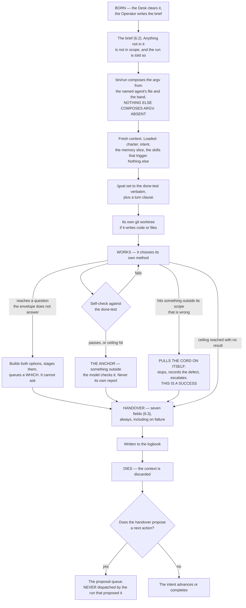

---

### 6.2 The brief

**(FINAL, plus one field from v37)** **Ten fields: FINAL's nine, below, plus `agent:`.** **Anything not in the
brief is not in scope, and the run is told so.**

```
intent:        the id it serves — a run with no intent id does not start
purpose:       one sentence
done-test:     copied verbatim from the Intent, never paraphrased
out-of-scope:  named explicitly — what it must not touch or fix
ceiling:       tokens, and wall-clock
tools:         the exact grant — nothing else is reachable
window+model:  which subscription burns, and which model
negatives:     what has already been tried here and failed
hand back:     the named artifacts, and the evidence for the done-test
```

**(FINAL)** `out-of-scope` and `negatives` are the two fields most systems omit and the two that most reduce waste:
the first stops scope creep, the main way a bounded run becomes an unbounded one; the second stops the system
rediscovering the same dead end every night. **No shipped brief schema found requires either** — Devin's *"Define
clear scope, boundaries, and success criteria"* is the closest and is prose advice.

**(FINAL)** Two stamps the Desk adds: an **`id`**, a company-generated UUID carried into the runtime as
`--session-id` so the id is the system's and not the vendor's returned handle, and it is on every logbook row; and a
**`label`**, what the run is making and which window it is burning.

**(NEW: the tenth field, decided as v37)** Fourteen named agents make *which agent* a fact the brief must carry,
and FINAL's nine had nowhere to put it. **The brief gains a tenth field rather than widening an existing one:**

```
agent:         one of the fifteen roster names — the file bin/run composes the argv from
```

**(NEW: what v37 decides and what it leaves alone)** `window+model:` **stays exactly as FINAL wrote it.** The
agent's own row supplies its default model, and the per-move table overrides it — so the two fields answer two
different questions, *who* and *on what*, and neither is overloaded. The losing image is kept by name: a single
widened `agent+window+model:` field, and a brief that names no agent and lets the launcher guess.

**(NEW: the mechanism, because a tenth field with nothing checking it is a tenth field nobody fills)** **`bin/run`
refuses a brief whose `agent:` is not a roster file** (ABSENT). That refusal is what makes the field load-bearing:
a typo, a retired agent, or a name someone invented in a prompt fails at dispatch rather than producing a run with a
guessed grant.

**(NEW: why the field names the agent and not the argv, which is v34 restated where it is most likely to be
violated)** The brief names *who*. **`bin/run` (ABSENT; FINAL names it `keel/bin/run`) composes the argv** from that
agent's file plus the band. The Operator never composes argv, a run never composes argv, and the board never
composes argv — every dispatch path calls the same launcher. Without that, fourteen agent files become fourteen
places a grant can be written wrongly, and this repository already knows how that ends: `--allowedTools` restricted
nothing for months while everyone believed it did.

**(NEW: v12 — the done-test does a second job here)** The `done-test:` field, copied verbatim, becomes the `/goal`
condition on the run: `claude -p "/goal <done-test> or stop after N turns"`. Three properties of that feature bind
the field's wording and are quoted rather than paraphrased. The condition limit is **4,000 characters**. The
loop *"runs to completion in a single invocation"* under `-p`. And after transient failures **including rate
limits**, *"Claude Code leaves the goal active"* — which is the behaviour a night wants, since a five-hour window
reopening should not require a new dispatch. It terminates on Met, on Impossible, on `/goal clear`, or on four
unrecoverable errors: authentication failure, exhausted credit balance, unclearable context overflow, and an
unavailable model.

---

### 6.3 The handover

**(FINAL)** Fixed fields, always, **even on failure**. The I-PASS bundle cut medical errors 23% and preventable
adverse events 30% across nine hospitals; the mechanism is not the format but that named required fields force the
outgoing party to surface what the incoming party needs, especially the uncertain parts, which free prose omits.

```
outcome:      done | partial | stopped-on-defect | blocked | over-ceiling
done-test:    passed | failed | not-reached — and the evidence, attached
changed:      every file, branch, external effect. Nothing summarised away
cost:         actual tokens, window, wall-clock — from the runner's own record
learned:      what is now known that was not before — a PROPOSAL to memory
uncertain:    what I am not sure about and what would settle it
next:         the single most valuable next action, as a proposal
```

**(FINAL)** `uncertain` is the field to fight hardest for: it turns a confident wrong answer into a flagged one, and
the anchor and the briefing read it first. **No shipped handover schema found has it.** Linear's activity vocabulary
— thought, action, response, elicitation — is the closest published state model and carries no uncertainty slot.

**(FINAL)** A handover is **never the next run's input by itself**: every run starts from the files — the logbook,
the intent, the slice — so a summary that lost a number cannot propagate. **This repository has recorded that exact
defect twice**, most recently when a correct measurement of *29 of 30 steps passing* was synthesised into *29 of 29*
and propagated into a project file and two handoffs.

**(NEW: `learned` is a proposal, and the word is doing work)** A run proposes a durable fact; **only the curator
writes memory** (v25), delta-only, never a rewrite, and a memory item with no source, date, expiry and falsifier is
refused at the store check. A run that could write memory would be the thing that acts editing what the system
believes about its own acting.

---

### 6.4 Resume, not restart

**(FINAL)** Every Run writes its handover incrementally and records each completed step before the next begins. When
a window closes or the lid shuts, the run is **resumable from its log rather than restartable from its brief** —
Temporal's durable-execution model: a complete event history replayed on recovery, steps that succeeded skipped.

**(FINAL)** A restarted agent run does not merely waste time; **it re-spends money and may re-take actions that
already happened.** An agent that already sent the email and then restarts sends it twice. So every external effect
is recorded **before** it is attempted, with an idempotency key, and replay checks the log before acting.

**(FINAL, measured)** `SIGTERM` gives exit 143, the turn left unfinished with no result recorded, the process tree
killed, the turn resumable. Every surveyed runtime has a session id and resume-by-id, and Claude Code accepts the id
the system assigns — which is why the UUID is minted by us and not read back from the vendor.

**(NEW: two runtime facts that shape how long a run should be, both quotable)** `maxTurns` **marks output partial
and resumable rather than truncating it**, which is the restart-from-checkpoint primitive and does not need to be
built. And a background child holds its parent open in idle waiting by default — one stuck child doubles its
parent's duration with nothing reporting it — which is why runs do not spawn background children except `scout`
fanning out under a bounded wait.

**(FINAL)** **Enforced by:** the brief and handover schemas in `shared/schemas/` and `bin/run`, which births a run
and **refuses a brief missing any field** (both ABSENT) · `--output-format json` (exists) · `--session-id <uuid>`
(exists, and *"must be a valid UUID"*) · the runner's `SessionEnd` hook writing the partial handover (ABSENT).

---

### 6.5 The band the run executes in

**(NEW: SPINE §C.1, applied at the point of dispatch. §3.2 is the table; this is what it means for one run)** The
band is not an attribute of the agent. It is an attribute of **the move**, and the same agent runs in different
bands on different intents.

| Band | What the launcher emits | Codex axes | What the run can do |
|---|---|---|---|
| **Read and report** | `plan` mode | `never` × `read-only` | Read, explore, report. It **does not edit source** |
| **Build in a worktree** | `dontAsk`, with `--restricted` and an explicit `--tools` list | `never` × `workspace-write` | Everything in its grant, inside one worktree. **It cannot ask** |
| **Stage an outward act** | no mode, because **no agent performs it** | — | Stage a hashed artifact and stop. The Sender performs the act |

**(NEW: what `--restricted` buys, in three clauses, because a reader will otherwise assume the tool list alone is
the narrowing)** It **ignores user, project and local settings**, it **confines the file tools to the working
directories**, and it **refuses bypass**. It also *"removes the built-in tools that run commands or code, and
WebFetch, unless you name them individually in `--tools`, not through the `default` preset"* — so a grant that omits
a tool omits it in fact. It needs v2.1.248+. `--permission-prompts none` means a run never hangs on a prompt nobody
will answer, and under `-p` the tools needing terminal input are disabled anyway *"so the session never stalls
waiting for input."*

**(NEW: the stall fuse rides along, under its real name)** `--max-budget-usd` is **not a billing control** (v23) —
print mode only, computed locally at list price, and for a subscriber *"the session cost figure isn't relevant for
billing purposes."* It is kept because **subagent spend counts toward it** and overflow **fails a spawn with
`Budget limit reached`**, which stops a run that has gone into a loop of children.

---

### 6.6 What a run cannot do

**(FINAL, and these are the two that matter most, each held in more than one place because one place is a wish)**

**A run cannot dispatch its own successor.** It **proposes**; the Desk decides. Without this, one run that believes
it is nearly finished spawns another that believes the same, forever — and the loop is broken at the only place that
knows the budget and the ranking. **(FINAL, the mechanism, because a builder holds `Bash`)** A shell could otherwise
call `claude -p` itself, so the rule is held in **three** places a run cannot reach:

1. the **managed settings file** carries `permissions.deny` rules for `Bash(claude *)`, `Bash(gemini *)` and
   `Bash(codex *)`, which **`--restricted` cannot lift** — deny rules bind in every mode, including bypass;
2. the **ledger refuses a row whose run id was not minted by `bin/run`** (ABSENT), so a child born outside the Desk
   is uncounted, and the aberrance halt catches its spend;
3. the **probe asserts every night** that an agent cannot start a runtime — `bin/probe` (ABSENT).

**(NEW: the one legal exception, and it is a Desk act rather than a run act)** `scout` fanning out on a new field is
**several runs the Desk births in parallel**, never children of a run. The distinction is not cosmetic: children of
a run are invisible to the ranking and to the reserve.

**A run cannot widen its own grant.** **(NEW: and this is now vendor-documented rather than argued)** *"any
`permissionMode` in the subagent's frontmatter is ignored"* — a child cannot widen itself. On top of that:
`bypassPermissions` is disabled in managed settings by `permissions.disableBypassPermissionsMode: "disable"`, where
a running process cannot clear it (v10); allow rules have no effect in that mode anyway; and `Workflow` is absent
from every agent file and is removed by the runtime from every subagent regardless (v35), so **the gate is not
invocable by the thing it gates.**

**(NEW: two smaller ones, both from decided rows)** A run cannot **edit another agent's contract** — a builder that
needs a schema change files an objection (v7), enforced by `--add-dir`. And a run cannot **perform an outward act**:
every agent has `never` on that class, staging is where its authority ends, and the Sender that follows holds no
model, recomputes the ceiling **independently of the number in the instruction**, reads its checklist aloud into the
log, performs exactly one act, and holds a recall window.

---

### 6.7 How a run dies

**(FINAL)** Every run dies at handover. What survives is exactly three things: **the handover**, **whatever memory
accepted from it**, and **the agent's updated record for this kind of work**. The context is discarded.

**(NEW: what FINAL called a loadout's horizon, read against a roster)** FINAL retired a loadout recipe by horizon.
With named agents, the thing that carries a horizon is not the agent — it is what the agent was given: **a skill,
which carries `valid_until` and forces exactly one disposition at expiry, Refresh, Deprecate or Waive with a new
date** (v19). The agent file itself is governed by the lint and by the probe, both of which run against it whether
or not anyone remembers to look.

**(NEW: and the one measurement that survives a run, which is what makes §5.6's claim checkable)** Cost and anchor
outcome, recorded **per agent per kind of work**, from the runner's own record rather than from anything the run
says about itself. That is the evidence by which *fourteen was too many* would become a fact rather than an
argument.

---

## 7 · Skills

*obeys: v3, v17, v18, v19 (SPINE §E entire); inherits: FINAL §11, §16.2*

**(FOUNDER, overruling FINAL §1 row 10.)** *"take all the skills that the biggest systems use, the biggest agent
systems use, we can learn a lot from them, like, to have more engineering stuff and more creative stuff and to give
the agents the tools the knowledge they will need in order to achieve tasks without limiting their point of view."*
And: *"we need a skill creator of skill, which, you know, we will research a task or a mission and, like, to break it
down two steps and to give it to the agents."* The library is built, not shelved. FINAL's holding directory —
`keel/holding/skills/`, the 134 moved whole into a place nothing reads — is the losing image and is kept by name in
section 22.

---

### 7.1 The library plan

**(NEW: the format is now a published spec, not a convention, so it can be obeyed rather than approximated.)** The
container is the **open SKILL.md standard** (`agentskills.io/specification`, fetched 2026-09-05). Its published
limits are the file's limits and they are not ours to soften:

| Field | Limit, quoted from the spec |
|---|---|
| `name` | max 64 chars, `a-z0-9-`, *"Must match the parent directory name"* |
| `description` | max 1024 chars |
| Metadata cost | *"(~100 tokens): The `name` and `description` fields are loaded at startup for all skills"* |
| Instructions | *"(< 5000 tokens recommended)"* |
| Body | *"Keep your main `SKILL.md` under 500 lines."* |
| Optional | `license`, `compatibility` (max 500), `metadata`, `allowed-tools` (*"Experimental"*) |

**(NEW: one artifact has to load in three runtimes, and the runtimes disagree about the path.)** Claude Code reads
`.claude/skills/`. **Codex and Gemini CLI both read `.agents/skills/`, and Codex does not read `.codex/skills`** —
Codex's search order is `$CWD/.agents/skills`, `$CWD/../.agents/skills`, `$REPO_ROOT/.agents/skills`,
`$HOME/.agents/skills`, `/etc/codex/skills`. So there are **two directories and one source of truth**: Markdown is
the source, and both directories are generated from it. That is wshobson's shipped shape — *"single
source-of-truth"* with harness-native artifacts generated — and it is adopted because it is the only shape that
survives a third runtime.

**(NEW: collisions are not merged, so a generated directory cannot be allowed to drift.)** Codex states it plainly:
*"if two skills share the same name, Codex doesn't merge them; both can appear in skill selectors."* A drifted
generated copy therefore does not error; it appears twice with different bodies. **Mechanism:** the generator is the
only writer of either directory, and the existing manifest check is re-pointed at the generated-versus-source diff
(see 7.7). Nothing hand-edits `.claude/skills/` or `.agents/skills/`.

**(NEW: the bulk import is blocked on one unread file, and it is cheap to clear.)** The upstream this repo already
draws from now advertises **2,111+ skills** and is MIT **on the code** — but a separate `LICENSE-CONTENT` file
exists at that repository and **was not fetched**, and it may carry different terms for skill *content* than MIT
does for code. **No bulk vendoring until it is read** (v17). One fetch clears it; open decision 4 in section 20.
Related and smaller: this branch's `SKILLS_SOURCE.md` (EXISTS, branch `ceo-1-1788609834`) names
`npx antigravity-awesome-skills`, while the upstream now advertises `npx agentic-awesome-skills` — whether the old
name still resolves is UNVERIFIED.

**(NEW: the corpora that look like libraries are mostly indexes, and one of them is not licensed at all.)** Read the
sources for what they are before importing from them:

| Source | What it actually is | Licence, read from the file where the row says so |
|---|---|---|
| `anthropics/skills` | **19 skill directories** — a reference corpus, not a library | **No root LICENSE file.** README only: *"Many skills in this repo are open source (Apache 2.0)"*, document skills *"source-available, not open source"*, and *"provided for demonstration and educational purposes only"* |
| `sickn33/antigravity-awesome-skills` | 2,111+ skills; this repo's own upstream | MIT on the code; **`LICENSE-CONTENT` unfetched** (v17) |
| `wshobson/agents` | 183 skills, 202 agents, 94 plugins, 105 commands; multi-harness generation | MIT, read from LICENSE |
| `obra/superpowers` | ~14 methodology skills; count is README-derived and UNVERIFIED | MIT, read from LICENSE |
| Both VoltAgent lists | indexes of links, not hosted skills | MIT **UNVERIFIED** — README and file listing only |
| `agentskills/agentskills` (spec, `skills-ref`) | the spec and its validator | **UNKNOWN** — not fetched |

---

### 7.2 The content rule, and the collision it resolves

**(NEW: the published spec recommends the one body this system refuses, so the collision is real and has to be
decided rather than noticed later.)** The spec's recommended body sections are *"Step-by-step instructions"*,
*"Examples of inputs and outputs"*, *"Common edge cases"*. FINAL §11.1 built the field kit out of four descriptive
headings precisely so that **no heading can hold *first do this, then do that***. A skill written to the spec's own
recommendation is procedural by that recommendation. Two different artifacts were wearing one filename.

**(NEW, v18.) The container is the open standard; the content rule is ours.** Four admissible bodies:

| Body | What it contains | Why it is admissible |
|---|---|---|
| **anchor** | a check with an exit code | it decides; it does not advise |
| **exemplar** | examples of good, each with provenance | it shows, and the run still judges |
| **rehearsal case** | an input plus a known answer | it can be failed, so it can be trusted |
| **reference** | a vendor fact carrying an expiry | it is a fact, and it rots on a date rather than silently |

**A step list is admitted in exactly one place:** a checklist the **Sender** reads aloud, where the judge is absent
and the act cannot be taken back — sending to a list, a migration over real data, a filing, a charge. **(FINAL
§9.4.)** The Sender contains no model and cannot decide to skip an item, which is the only condition under which a
written procedure is safe here.

**The cost of v18, stated once and not re-litigated:** an imported skill written to the spec's recommendation
**fails our admission and needs a pass**. That is a real conversion cost on 2,111 candidates and it is accepted,
because the alternative is a library of procedure, which is the container the done-test replaced.

---

### 7.3 Admission by eval

**(NEW: the mechanism already ships, so this is an import rather than a design.)** `skill-creator` in
`anthropics/skills` implements exactly what FINAL §11.3 asked for as *"admission by test, not excision by
argument"*: draft **2–3 realistic prompts** into `evals/evals.json`, **run with-skill and baseline in parallel**,
grade the assertions, tune the description for triggering accuracy, package. Added to it: `plugin-eval`'s **static
layer** — *"deterministic structural analysis (<2s, free)"*.

**Refused for now:** `plugin-eval`'s Monte Carlo layer, *"statistical reliability via 50-100 simulated runs"*. **The
cost, once:** without it a skill's reliability is measured on 2–3 cases, so **the expiry of 7.4 does the work a
larger sample would have done**. That is why retirement is not optional in this design.

**(NEW: the mechanism is imported, the corpus is not — and the licence is the reason.)** `anthropics/skills` has no
root LICENSE and says its skills are *"provided for demonstration and educational purposes only"*. We take the eval
loop's shape. We do not vendor its 19 skills on the strength of a README sentence.

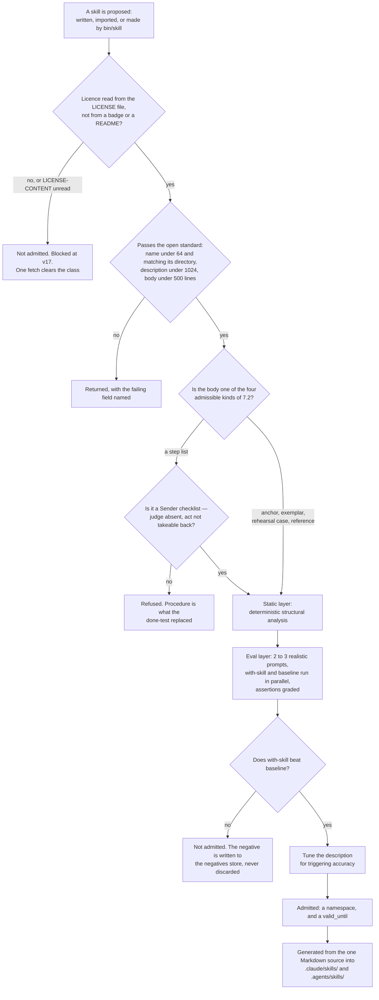

---

### 7.4 Retirement by forced expiry

**(NEW, v19: nobody in the world retires a skill by non-use, so the plan stops pretending that is a mechanism.)**
Across all seven projects researched, the only retirement mechanisms found are **drift and dead-link detection**
(`make garden`, wshobson) and **a closed contribution door** (*"we don't generally accept contributions of new
skills"*, superpowers). **No project ships a usage counter or an unused-for-N-days expiry.** FINAL §11.3's *"Ninety
days uncalled and it leaves"* is therefore a losing image and is kept by name in section 22.

**Every skill carries `valid_until`. When it comes due, exactly one disposition is recorded — Refresh, Deprecate, or
Waive with a new date.** There is no fourth outcome and no silence. **Mechanism, and it exists on this branch:**
`scripts/ledger.mjs` already forces exactly this disposition for claims and refuses a waiver with no `until`, and
`scripts/check-citations.mjs` already blocks on a dead path — both EXIST on branch `ceo-1-1788609834`. The skill
expiry rides those two rather than adding a third implementation, because two implementations of one check disagree
silently and this repository has hit that before.

**The date is set at admission, per skill, by the agent that proposed it.** No fixed window is written into the plan:
a vendor fact and a code exemplar do not rot at the same rate, and a single number would be wrong for both.

---

### 7.5 The skill creator

**(FOUNDER.)** *"we need a skill creator of skill, which, you know, we will research a task or a mission and, like,
to break it down two steps and to give it to the agents."*

**(NEW: it is a program, not a fifteenth agent — and it names which agent does each move, which is what keeps it
from being a stage that states method.)** `bin/skill` — **ABSENT**. It holds no model. It sequences four moves and
each move is performed by an agent from section 5's roster, under that agent's own grant:

1. **scout** answers the bounded question of how the field actually does this. Every claim carries URL, quote and
   access date; `scripts/check-citations.mjs` (EXISTS, this branch) blocks on a dead one.
2. **product** states the **done-test** the skill is supposed to make reachable — falsifiable by someone who did not
   do the work, or the store check refuses it.
3. **curator** writes the artifact into one of the four admissible bodies of 7.2 and proposes its `valid_until`.
   The curator is the only writer of memory, and a skill is knowledge, so the writer is the same one.
4. The **admission eval of 7.3** runs with-skill against baseline. **A candidate that does not beat baseline is not
   admitted, and the negative is written to the negatives store rather than discarded** — the failure is the cheapest
   thing the run produced.

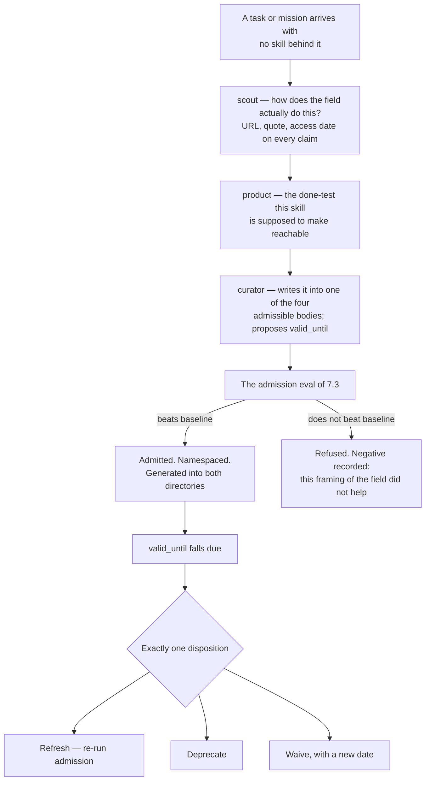

**(FINAL §11.1, surviving.)** The scout fan-out inside move 1 is the **one place parallelism is earned**: four
scouts asking four independent questions do not need each other's context, and that is the same reason v6 refuses to
parallelise a build.

---

### 7.6 Namespaces per agent

**(NEW: SPINE §E.4 says "Seven namespaces" and then lists thirteen. The list is the true statement; the count is a
defect and is corrected here.)** **Thirteen namespaces**, and every one of them is claimed by at least one agent —
there are no orphans:

| Namespace | Held by |
|---|---|
| `engineering` | builder · reviewer · architect |
| `testing` | builder · tester |
| `quality` | reviewer · tester · challenger |
| `security` | guard |
| `design` | designer |
| `frontend` | designer |
| `product` | product |
| `data` | architect · analyst |
| `growth` | writer · growth |
| `craft` | writer |
| `operations` | steward |
| `knowledge` | curator |
| `research` | scout · challenger |

**(FINAL, and now the standard's own mechanism rather than a local convention.)** **Never preloaded.** Progressive
disclosure is what enforces it: *"The `name` and `description` fields are loaded at startup for all skills"* at
**~100 tokens each**, the body loads only on judged relevance, and bundled files load below that. The consequence
binds the library's size: **every admitted skill taxes every unrelated task at startup**, so the namespace is not
cosmetic — it is the thing that keeps a growing library from making a shrinking one's job more expensive. That is
the same defect this repository already fixed once, when reading the whole manifest cost ~15,000 tokens per lookup.

---

### 7.7 The 134 on disk, and what each becomes

**(measured on branch `ceo-1-1788609834`: 135 directories under `.claude/skills/`, of which one is `routers/` —
so 134 skills, plus `CURATION.yml` and `MANIFEST.json`, all EXIST.)**

**(NEW: they are no longer a holding directory. There is no shelf.)** FINAL §16.2's fate classes are kept, and they
change status: they were a **verdict**, and they become a **starting classification for admission**. Each of the 134
now has exactly two futures — it re-enters through 7.3, or its `valid_until` falls due and 7.4 takes one of three
dispositions. Nothing sits in a directory read by nothing.

| Fate class (FINAL §16.2) | Count | Admissible body it targets under v18 | How it re-enters, or does not |
|---|---|---|---|
| **PROCEDURE** | 73 | none, as procedure | One door only: a **Sender checklist**, where the judge is absent and the act cannot be taken back. Otherwise it may **donate its examples** to an exemplar, one at a time, with a caller. All 28 `thinking-*` sit here |
| **ANCHOR-CANDIDATE** | 22 | **anchor** | It must carry a check with an exit code and beat baseline. First candidates named by the census: `wcag-audit-patterns`, `security-audit`, `web-security-testing`, `e2e-testing-patterns`, `writing-good-tests`, `verification-before-completion` |
| **EXEMPLAR-CANDIDATE** | 16 | **exemplar** | Provenance per example, then the eval. `react-patterns`, `error-handling-patterns`, `high-end-visual-design`, `seo-content-writer` and the rest |
| **REHEARSAL-CANDIDATE** | 1 | **rehearsal case** | `react19-test-patterns` carries before/after pairs with known answers — the only one in the corpus |
| **INFRA** | 22 | **reference** | **(NEW: this row moves.)** FINAL §16.2 said INFRA is *"never loaded into a run as a skill"*. v18 admits a fourth body — a vendor fact with an expiry — so an INFRA entry now has a legitimate skill form, and 7.4's expiry is what makes it safe |

73 + 22 + 16 + 1 + 22 = 134. **The distribution is the finding, not the total:** the largest class is the one the
content rule refuses, so the honest prediction is that the library grows mostly by import and creation rather than
by re-admitting what is here.

**(NEW: two existing checks do not retire — they change subject, and that corrects FINAL §16.2.)** §16.2 wrote that
*"`check:manifest` and `check:curation` … retire with it"*, because the library was going to a shelf. The library
does not go to a shelf, so they stay and are re-pointed:

- **`check:manifest`** becomes the **drift check between the one Markdown source and the two generated directories**
  — the mechanism 7.1 needs, given that Codex does not merge same-named skills.
- **`check:curation`** already records every cut with the test that made it. Inverted per FINAL §11.3, that is the
  **admission record**: every entry keeps the eval that admitted it and the date it expires.

Both are steps of the check suite on branch `ceo-1-1788609834` today, so the mechanism is a re-pointing rather than
a new blocking check.

---

### 7.8 What enforces this section

| Rule | Mechanism | State |
|---|---|---|
| A skill matches the published spec | the spec's own validator, `skills-ref validate` | licence of `skills-ref` **UNKNOWN**; the checks are re-implementable from the spec text |
| A skill's body is one of four kinds | the admission gate in `bin/skill` | **ABSENT** |
| A skill beats baseline before admission | `evals/evals.json` plus paired with-skill and baseline runs | **ABSENT** here; **shipped** upstream as `skill-creator` |
| A skill expires and one disposition is recorded | `scripts/ledger.mjs` (forces the disposition; refuses a waiver with no `until`) | **EXISTS**, branch `ceo-1-1788609834` |
| A skill citing a dead path fails | `scripts/check-citations.mjs` | **EXISTS**, branch `ceo-1-1788609834` |
| The generated directories match the source | `check:manifest`, re-pointed | **EXISTS** as a suite step; the re-pointing is **ABSENT** |
| Every admission keeps the test that made it | `.claude/skills/CURATION.yml`, inverted | **EXISTS**, branch `ceo-1-1788609834` |
| No bulk import before the licence is read | a founder decision, section 20 row 4 | **WISH** until the fetch happens — nothing today blocks a vendoring commit |
| Skills are never preloaded | the standard's progressive disclosure | **shipped by the runtimes** |

---

## 8 · Tools and MCPs

*obeys: v15, v33 (SPINE §F entire); inherits: FINAL §9.3 (the door), §9.4 (the trifecta), §16.3 (the connected hands)*

**(FOUNDER.)** *"there is no limitations of adding new MCPs or new tools to fill our needs. So there is so many
filters we might need to include and get more MCPs or more of tools in order to do things better or to improve the
system or to have endless possibilities and, like, we need to think about it outside of what we have right now."*

---

### 8.1 The door is material, not a ceiling

**(FOUNDER, and it is a correction of how FINAL §9.3 was being read.)** The door is **what a tool must pass**. It is
not a list of what may be proposed. **Anything may be proposed** — an MCP server, a CLI, an API, a browser, a
repository, a device. What the door decides is what the tool may then *do*, who may hold it, and whether it may be
held at night.

**(FINAL §9.3, unchanged and still the reason the door exists.)** The exposure is not hypothetical: scans found
critical vulnerabilities in **33% of 1,000 MCP servers** and some finding in **66% of 1,808**, and three attacks are
documented that need the founder to do nothing wrong — **tool poisoning** (instructions hidden in a description),
**the rug pull** (a server passes review, then silently changes its description; CVE-2025-54136), and **line
jumping** (the server steers the agent without appearing in the log). Hashing the descriptions and re-checking them
every session is the specific countermeasure to the rug pull, and it is a string comparison.

**(NEW: the door gains one box it did not have, because the roster now exists.)** FINAL's door classified a tool and
rehearsed it. It could not ask *who may hold this*, because FINAL had shapes rather than named agents. Section 5's
fourteen make that question answerable, so it is now a gate rather than a note.

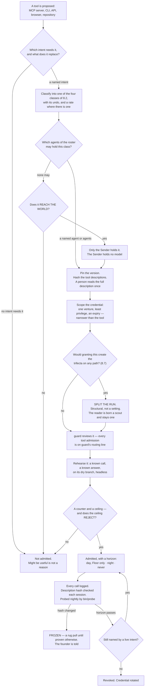

**(FINAL §9.3, and it is the sentence that keeps the door from becoming a shopping list.)** For a repository: *what
does it give us we could not build in a day, its LICENSE file, our monthly test, what breaks if it disappears, is it
alive* — **take the mechanism, not the dependency**, because every framework that wants to own the loop is a second
control plane beside the runtime, and two implementations of one thing disagree silently.

---

### 8.2 The four classes

**(SPINE §F, and each row's "who may hold it" is now a roster name rather than a shape.)**

| Class | Example | Who may hold it | Night? |
|---|---|---|---|
| **READ-ONLY** | Playwright headless, a render, a repo read API, analytics, error tracking | any agent whose grant names it | yes |
| **READ-ONLY, tainted** | Gmail read, Calendar read, Drive read, Notion read, the open web | **`scout`, and the world's door program — nothing else.** No agent holding `Write`, `Edit` or `Bash` reads them raw (v36) | yes |
| **WRITES, reversible** | Figma, Pencil, a design file on a dry branch | **designer**, after the undo is drilled | yes |
| **REACHES THE WORLD** | send, publish, pay, deploy, share, delete | **no agent. The Sender**, which holds no model | only after the founder widens the class |

**(NEW: the class is assigned at the door and consumed at dispatch, which is what makes it structural.)** A grant is
argv fixed at dispatch and cannot narrow mid-run, so the class cannot be a runtime judgement. **Mechanism:**
`bin/run` (**ABSENT**) refuses a brief whose grant carries both an outside-reading tool and any of `Write`, `Edit`,
`Bash` or a REACHES-THE-WORLD tool; `bin/probe` (**ABSENT**) asserts nightly what a run can actually touch.

**(NEW, and it is why a hook is not a substitute for argv.)** An MCP tool call reaches a hook **only if the hook's
matcher names that exact tool** — a hook matching `Bash|Edit|Write` governs no MCP call at all. Registered on this
branch as `c-mcp-hook-matcher-must-name-the-tool`. Every admitted server is named in the run's argv and is otherwise
absent by `--strict-mcp-config`.

---

### 8.3 Admitted first: the read-only instruments, and the reason is not caution

**(FINAL §9.3, sharpened.)** The grant surface as it stands is inverted from the right one. Connected today: a
social publisher, a mail client that can send, a drive client that can share, a remote compute sandbox, an
authenticated browser. **Not connected: analytics, error tracking, a read-only billing key, the CI runner's API, the
git host's read API.** The hands are wired and the instruments are not.

**(NEW: the reason is the reconciliation, not prudence.)** The nightly reconciliation cannot exist without those
five, and **the reconciliation is what makes every other number rung 1 instead of rung 4** — a number that
reconciles only to our own log is a number the company wrote about itself. `analyst` is the agent whose anchor is
literally *"the reconciliation reads a record the company does not write"*, and it currently has nothing to read.
**Instruments buy freedom and hands spend it**, so the instruments go first.

---

### 8.4 The wish list, by need rather than by vendor

**(FOUNDER: *"we need to think about it outside of what we have right now."*)** Each row names the need, not the
product, so that a vendor change is a routing change. **Every row is WISH until it passes 8.1 — nothing here is
admitted by being listed.**

**(v36, applied.)** "Which agent needs it" names who the answer is *for*, not always who holds the credential. Where
a row's read carries text a stranger controls — an invoice body, a signed document, a support message — it is a
**tainted** read by 8.2, so the world's door writes the row and `scout` reads it, and the named agent works from
that row. Where the read is a structured figure from a service the company itself holds an account with, the named
agent may hold it directly once it passes 8.1.

| The need | Which agent needs it | Why the system is incomplete without it |
|---|---|---|
| A **payments read** API | analyst · steward | the economics section has no source of truth for revenue; a runway computed from a number the bank does not confirm cannot promote anything |
| A **domain and DNS read** | steward | a venture owns assets nobody can currently enumerate |
| An **ads platform read**, before any write | analyst · growth | spend that is not read is spend that is not reconciled |
| A **design-token bridge** | designer | the design anchor is contrast, tokens and grid conformance, and none of those are checkable without the tokens |
| A **database read replica** per venture | analyst · architect | a schema question answered from the repository is answered from the intention, not the state |
| An **e-signature read** | steward | an obligation is discharged only by a record the company does not write |
| A **second search provider** | scout | `scout` is single-sourced today, and a single-sourced fact-finder is one outage from silence |

---

### 8.5 Refusals, each with its reason

**(NEW: a refusal names the property that refuses it, so it can be reversed by changing that property rather than by
arguing.)**

| Refused | The property that refuses it | What would reverse it |
|---|---|---|
| **Mem0** | memory leaves the machine to a hosted store — a dependency, an auth surface and a leak path at once | nothing available: memory is plain files in git by design (v24, v25) |
| **RunPod** | **spends money at a rate under an uncapped key**, and it runs whether or not anyone is watching | a credential capped at the provider, not a cap we promise to respect |
| **n8n** | **licence.** Sustainable Use: *"only for your own internal business purposes or for non-commercial"* (v15, read from LICENSE.md) | a licence change, or a different canvas — Langflow (MIT, alive 2026-09-05) is the admitted one |
| **Flowise** | **ARCHIVED**, licence NOASSERTION | nothing; an archived project is a dependency with no maintainer |
| **Gource** | GPL-3.0 | `3d-force-graph` (MIT) is the admitted renderer instead |
| **The founder's signed-in Chrome** | REACHES THE WORLD **and** holds private data — the widest hand in the building | nothing. It stays day-only, Floor-only, held by the founder, at any trust score |
| **A user-testing simulation** | it is the machine grading its own homework; the rung-1 anchor is a real reaction | nothing — this is a truth rule, not a tool rule |

---

### 8.6 One MCP shape serves both runtimes

**(NEW: the portability is real at the capability layer and absent at the policy layer, and that asymmetry is the
whole design constraint.)** Claude Code takes per-subagent `mcpServers` — inline or by reference, *"connected when
the subagent starts and disconnected when it finishes"*. Codex takes per-agent `mcp_servers` in TOML. **A server
admitted once at 8.1 is declarable in both**, so the door is a single door.

What is *not* portable: Anthropic's hook event set and **managed-settings precedence**; OpenAI's
**`requirements.toml`, which outranks every flag**; Google's Policy Engine. **The shapes are portable; the
guarantees are not.** Section 10 is where that is resolved into one launcher.

**(measured, branch `ceo-1-1788609834`.)** `.mcp.json` EXISTS and declares exactly **two** servers, `playwright` and
`claim-append`. **Two** agent files declare `mcpServers` — `designer` (`playwright`) and `sourcer`
(`claim-append`, #112). Derive it, do not quote it: `grep -n 'mcpServers' .claude/agents/*.md` against
`Object.keys(require('./.mcp.json').mcpServers)`. `.claude/mcp-policy.json` EXISTS (per-server allow/deny; the
shape the door's per-tool file inherits).

**(NEW: `sourcer`'s grant is the door's own model, and it narrows under v2.)** `claim-append` was granted to
`sourcer` while `sourcer`'s `tools:` line stayed `[Read, Glob, Grep, WebSearch, WebFetch]` — **no `Write`, no
`Edit`**. That is the pattern the door adopts: *a narrow capability through one audited server, rather than a broad
tool*. Under the v2 roster it narrows further and this follows from section 5 rather than being a new decision:
`scout`'s MCP grant is *"read-only servers, per run"*, and an append server is not read-only, so **`scout` does not
carry `claim-append`**. The append it was doing belongs to `curator`, which has `Write` and does not need a server
for it.

---

### 8.7 The connected hands, re-decided against the roster

**(FINAL §16.3's table, with its "who may hold it" column re-decided against section 5's fourteen. Founder: all of
them back through the door, one at a time. Today **none is admitted**; each row is its disposition when it reaches
the door.)**

| Hand | Class | Credential today | Who may hold it, under the roster | Day · night · never |
|---|---|---|---|---|
| the founder's signed-in Chrome | REACHES THE WORLD **+ private data** | the founder's own sessions | **nobody but the founder, on the Floor** | day, Floor only, forever |
| Playwright, headless, `--isolated` | READ-ONLY render | none | **designer** — the only agent whose row names it | night |
| Gmail · Calendar · Drive · Notion **read** | READ-ONLY, **tainted** | OAuth, the founder's | **the world's door program** (holds no model) **and `scout`** — nobody else. `steward` holds none of them (v36) | night |
| Gmail **send** | REACHES THE WORLD, one-way | OAuth | **the Sender**, founder-signed | never unattended until the founder widens the class |
| Drive share · Calendar create · Notion write | REACHES THE WORLD (a share is durable) | OAuth | **the Sender**, after a recall window | night only after the class is widened and the undo drilled |
| Figma · Pencil · Stitch · Refero (Refero READ-ONLY) | WRITES, reversible | OAuth / local files / API key | **designer**, on a dry branch | night after the undo is drilled |
| Higgsfield (image · video · audio) | reversible artifact, **SPENDS credits** | API key; failed to connect in the census session (`ENOTFOUND`) | **writer**, rate-capped | night, under a daily spend cap. Its publish and TikTok verbs are one-way and **never** |
| RunPod | **SPENDS MONEY at a rate** | API key, **uncapped** | **nobody** | never, until a capped key exists |
| `claim-append` (local, `scripts/mcp/claim-append-server.mjs`, EXISTS) | WRITES LOCALLY | none | **curator** does this with `Write` and needs no server. The pattern survives as the door's model | night |
| Mem0 | REACHES THE WORLD | unauthenticated | **nobody** | never (8.5) |
| Miro | REACHES THE WORLD (a board others see) | unauthenticated | nobody until an intent names it | through the door individually, or disconnected |
| n8n | REACHES THE WORLD | unauthenticated | **nobody** | never — licence (v15) |
| `git` · `node` · `bun` | CLIs | none | **builder · architect · tester · analyst** — the four that carry `Bash` | night |
| `gh` | CLI | reads `~/.config/gh`, **which the sandbox denies** | builder, when a repository read is the need | night; every use needs the denial handled explicitly |
| `gemini` | a **provider**, not a tool | never authenticated | routed by section 9, not held by an agent | night |
| **Not connected, needed first**: analytics · error tracking · read-only billing · CI API · git host read | READ-ONLY | none | **analyst** (the reconciliation) · **scout** | night — and **before any hand**, per 8.3 |

**The tainted read, decided. (v36, decided 2026-09-05; DECISIONS.md §8.)** SPINE §F's class table and §B.2 row 12
disagreed about exactly one grant: §F said a tainted read is **scout only**, and the roster row gave `steward`
*"Gmail/Calendar/Drive/Notion read"*. **v36 resolves it. A tainted read is held by `scout` and by the world's door
program, and by nothing else. No agent that holds `Write`, `Edit` or `Bash` reads a stranger's text raw.** §B.2 row
12 is patched: `steward`'s MCP grant is now **none**.

**(FINAL §9.5 — this is a mechanism, not a policy.)** When the world sends something — a reply, a payment, a failed
build, a CVE, an invoice, a support message — **a program writes one row into the logbook and does nothing else.**
*"No model reads a stranger's text with a tool in its hand."* The door holds no model, so there is nothing in it to
steer; a prompt injection that reaches it finds a program. A scout with no credentials reads the row, and `steward`
writes the obligation **from `scout`'s handover, never from a raw row**.

**(FINAL §9.4 — why the two-legs argument does not survive.)** Taint is **static at dispatch**, not judged while a
run is going: *"any run whose brief reads content from outside the company … is born as a scout, without the tools
that act, and stays one for its whole life."* `steward` carries `Write`, so `bin/run` would refuse the brief
outright. The grant §B.2 used to carry was one an enforced launcher could never have composed — the contradiction
was visible between two tables before it would have been visible in a run, which is the cheapest place to find it.

**What `steward` loses, and what it does not.** It loses the raw read. It keeps every obligation, because an
obligation reaches it as an inbound row, and its anchor was never the mail: *"an obligation is discharged only by a
record the company does not write."* The losing image, kept by name in section 22: **a steward that reads mail with
a pen in its hand.**

**(FINAL §9.5, measured, and it carries into the surfaces work.)** *"a delivered cross-session message starts a new
turn carrying the receiver's full context, so an inbound path wired to a running run costs a context window per
event, not a slot"* — which is why the door **writes a row and never wakes a run directly**. Routines' API trigger
already wraps an inbound payload in a block labelling it untrusted data, which is this rule shipped by a vendor.
**Mechanism:** the inbound door program — **ABSENT**.

---

### 8.8 What enforces this section

| Rule | Mechanism | State |
|---|---|---|
| A tool is admitted only through the door | `bin/door`, writing one file per admitted tool with class, credential scope, rate, undo-drill date and horizon | **ABSENT** |
| Descriptions are hashed and re-checked each session | the hash check inside `bin/run` | **ABSENT** |
| A grant is argv, and only one thing composes it | `bin/run` | **ABSENT** |
| The trifecta cannot form on any path | `bin/run` refuses the combined grant; `bin/probe` asserts it nightly | **ABSENT** |
| A tainted read is held only by `scout` and the world's door (v36) | the door program writes one inbound row and holds no model; `bin/run` refuses any brief pairing an outside read with `Write`, `Edit` or `Bash` | **ABSENT** — the roster row is patched, the launcher that would enforce it is not built |
| An MCP call is governed by a hook only if the matcher names it | registered as `c-mcp-hook-matcher-must-name-the-tool` | **EXISTS** as a claim, branch `ceo-1-1788609834` |
| Servers absent unless named in argv | `--strict-mcp-config` | **shipped by the runtime** |
| Per-server allow/deny | `.claude/mcp-policy.json` (65 lines; the seed shape) | **EXISTS**, branch `ceo-1-1788609834` |
| A declared MCP server is backed by real config | `.claude/hooks/schema-lint.js` fails a declaration nothing backs | **EXISTS**, branch `ceo-1-1788609834` |
| Every tool admission is reviewed adversarially | `guard`'s routing line names it | **WISH** until the roster files exist |
| A spending tool has a capped credential | the cap must be at the provider, not in our prose | **WISH** — nothing today caps RunPod |

---

## 9 · Models

*obeys: v20, v21, v22, v23 (SPINE §G entire); inherits: FINAL §5, §14.5, §15.3 with its coefficients corrected*

**(FOUNDER.)** *"we need to understand what models each agent gets because we don't need everyone running on Opus or
Fable or Astra or Terra ChatGPT models. We can also define it."*

**Every figure in this section is from the models research of 2026-09-05, fetched from the vendor's own page.
Nothing here is recalled.** Where a figure was not published, the row says UNVERIFIED rather than estimating.

---

### 9.1 The default per agent

**(FOUNDER, answered as a table because the founder asked for one.)** The default is a field in the agent's own
file — `model:` in frontmatter — which is what makes this routing rather than advice. All fifteen files are
**ABSENT**; eighteen existing agent files on branch `ceo-1-1788609834` are the seed for the format.

| Tier | Agents | Count |
|---|---|---|
| `claude-opus-5` | builder · architect · guard · designer · challenger | **5** |
| `claude-sonnet-5` | reviewer · tester · scout · product · analyst · growth · steward · curator | **8** |
| Split by move | **writer** — `claude-opus-5` for taste work, `claude-sonnet-5` for routine | **1** |
| **The Operator** | `claude-opus-5`, on top of the fourteen | **1** |

**Verified against SPINE §B.2 row by row: five, eight and one, totalling fourteen. The count is correct as
written.** Counting the Operator, six of fifteen named roles sit on Opus 5 and eight on Sonnet 5.

**(NEW: three of the five Opus rows are checkers, and that is deliberate rather than incidental.)** `guard`,
`challenger` and `architect` are on the top tier while `reviewer` and `tester` are not, because the first three
produce a **finding or a contract that nothing downstream re-derives**, and the last two produce something a
deterministic anchor immediately re-tests. Where a cheap check exists, the cheap model is enough; where the output
*is* the check, it is not.

**(NEW: no agent defaults to Haiku, and 9.8 is why.)** The genuinely cheap work does not go to a cheap model at all
— it goes to a local one, or to no model.

---

### 9.2 Model per move

**(FOUNDER's instruction made operational: the default is the agent, and this table is what overrides it, per
move.)** Each row names its trigger, so a route can be checked rather than argued.

| Move | Model | Why this one |
|---|---|---|
| Any agent's default | as 9.1 | not everyone on the top tier — the founder's instruction |
| A build whose done-test has **failed twice** under Opus 5, **and** whose horizon exceeds one window | escalate to `claude-fable-5-1` | 1M context, and **cache reads at 0.025x base input against 0.1x everywhere else**, so a large standing context is cheap to re-read. **Availability on a subscription seat is UNVERIFIED** — no plan table names Fable. Fallback is `claude-opus-5` |
| A teammate inside an agent team | `claude-sonnet-5` | the vendor's own line, *"Use Sonnet for teammates"*, and teams use *"approximately 7x more tokens … when teammates run in plan mode"* |
| Routine scouting, mail sorting, link checks, the summarising half of the transcript pass | **Gemini**, once authenticated | it burns a different window and never touches the founder's. Free tier: **60 requests/min, 1,000 requests/day** on a personal account |
| Embeddings, classification, dedup, PII detection | **local, on electricity** — MiniLM (**384 dims**, Apache 2.0, *"input text longer than 256 word pieces is truncated"*) and Qwen3-0.6B (**32,768** context, Apache 2.0) | no window at all, and no vendor |
| A checker on a prepared diff | Codex `gpt-5.3-codex`, in the one position of section 10 | a second model family, which is what the anchor ladder pays for |
| A deterministic answer — test, grep, diff, sum, reconcile | **no model** | a no-model program is the cheapest and the only one that cannot be talked out of its answer |
| `/goal`'s evaluator and the auto-mode classifier | **Haiku, set by the vendor, not by us** | see 9.8 |

**(NEW, v21: Fable is an escalation with two conjoined conditions, and both must hold.)** *Failed twice* alone is a
reason to re-read the done-test, not to spend more. *Horizon beyond one window* alone is a reason to batch. Only
together do they describe the one regime where the top model is not priced like the top model (9.6).

**(FINAL §5.3, surviving and now sourced.)** *"The only justification for a harder window on a move is that a
routine one has been measured to fail that move's rehearsal — the reverse of the usual instinct."* And: work judged
by a deterministic anchor is attempted by the cheapest model that ever passes it, **because a retry is cheaper than
a smarter attempt**; work judged only by taste gets the best model and few tries.

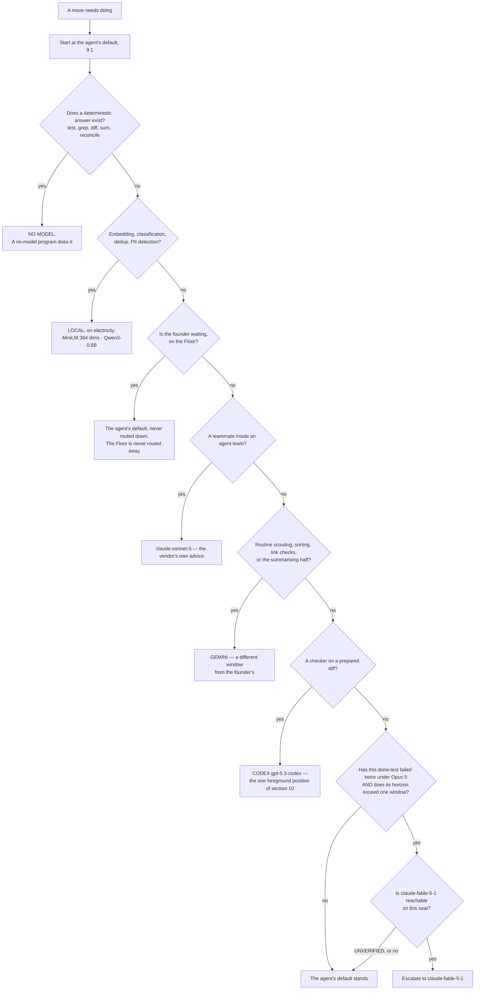

---

### 9.3 The three windows, and what each publishes

**(NEW, v22: this replaces FINAL §5.1's single five-hour fuse. There are two Anthropic windows, not one.)**

| Window | Published quota | Confidence |
|---|---|---|
| **Anthropic subscription** | **No numeric quota is published on any page fetched.** Two windows exist — a rolling five-hour **and a weekly** — *"per-seat"*, and the allowance is *"shared with Claude chat and Cowork"*. Magnitudes are relative only: Pro *"at least 5x more usage per 5-hour session than Free"*; Max *"5x"* and *"20x more usage than Pro"*. **The Max 20x price is UNVERIFIED** — the pricing page rendered *"From $100 per month"* for both Max tiers | H on the windows. The absence of numbers is itself the finding |
| **OpenAI Codex** | **The only vendor of the three publishing numeric per-window quotas.** Per 5-hour rolling window: GPT-6 Astra 5–45 (Plus) / 25–225 (Pro 5x) / 100–900 (Pro 20x); GPT-5.6 Sol 10–100 / 50–500 / 200–2,000; GPT-5.6 Luna 250–2,000 / 1,250–10,000 / 5,000–40,000. *"GPT-5.6 usage averages 5-30 credits per message"* | H. **Caveat:** `gpt-5.3-codex` appears in the API price list and in **no** plan quota row |
| **Gemini CLI** | Free tier: **60 requests/min, 1,000 requests/day** with a personal Google account. Paid AI Pro / Ultra / Code Assist per-tier CLI quotas **UNVERIFIED** — not fetched | H free, unverified paid |

**(NEW: the consequence for the reserve, and it changes FINAL §5.1.)** FINAL held a reserve **per window** where
"window" meant the five-hour fuse. With a weekly window in the same seat, the reserve is **per window and per
week**, and **a weekly exhaustion is a different event from a five-hour one** — the five-hour one ends in hours, the
weekly one does not. A design that holds one reserve holds the wrong one on the day it matters.

**(NEW: only one of the three can be budgeted in advance from published figures.)** Codex's window can. Anthropic's
capacity is measurable only from an account, so **any Anthropic window figure in this system is a measurement, never
a plan input.**

---

### 9.4 The two limit shapes, which behave differently

**(NEW: this is the distinction the Watch has to make, and getting it backwards stops a crew that did not need to
stop.)** Quoted from the vendor's costs page:

- **A seat limit** — *"You've hit your session limit"* or *"You've hit your weekly limit"* — is *"shared across all
  models, so the developer can't restore access by switching models with `/model`."* **This is a stop.**
- **A model-family limit** — *"You've hit your Opus limit"* or *"your Sonnet limit"* — and *"switching to a model
  outside that family with `/model` does keep the developer working."* **This is a reroute.**

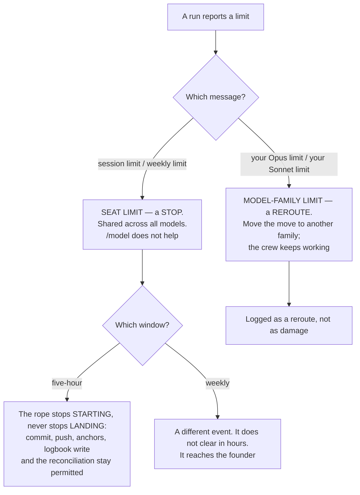

**(FINAL §15.4, surviving unchanged and now load-bearing for both shapes.)** *The rope stops starting, never stops
landing.* At a fraction of a window new work stops; commit, push, the anchors, the logbook write and the
reconciliation stay permitted.

---

### 9.5 Cache facts that bind

**(FINAL §14.5, confirmed verbatim and found to be broader than it stated.)** **89% of the historical bill on this
machine was context** — cache reads 57%, writes 32%, output 11% — so *what does this run need to know* and *what
does this system cost* are the same question.

| Fact, quoted from the vendor 2026-09-05 | What it binds |
|---|---|
| *"Cache hits and refreshes on Claude Fable 5.1 and Claude Mythos 5.1 are priced at 0.025x the base input price. All other models use the standard 0.1x multiplier."* | the whole of v21, and the corrected formula in 9.6 |
| *"5-minute cache write \| 1.25x base input price"*; *"1-hour cache write \| 2x base input price"* | the write coefficient is a function of the TTL bought, not a constant |
| *"The lifetime is an hour on a subscription and drops to five minutes once you're drawing on usage credits; on an API key or cloud provider, it's five minutes by default."* | **broader than FINAL stated**: three conditions shorten it, not one. It shortens **twelvefold at the moment the account crosses into overage**, which is exactly when the machine is busiest |
| *"a 50% discount on both input and output tokens"*, and *"Batch API and prompt caching discounts can be combined"* | batch still needs a metered key; the row is ready for the day one exists |

**(FINAL §14.5, surviving.)** Because the cache is invalidated by any change to the stable prefix **including the
tool definitions**, a bespoke grant per run would pay the cache-write share of the bill forever. So the standing
prompts are **byte-identical and carry no timestamp**, and the shapes are a closed set. Two shipped flags stabilise
the prefix and neither is used yet: `--exclude-dynamic-system-prompt-sections` and `--system-prompt-snapshot on`.

**(NEW: the meter cannot come from `/usage`.)** *"`/usage` reports the cache hit rate for the main conversation
only"*, so the meter reads each run's own reported token fields, joined by the id minted at dispatch.

---

### 9.6 The cost formula, with its coefficients corrected

**(FINAL §15.3, and the correction is the reason this section inherits it rather than citing it.)** FINAL's formula
multiplied the standing prompt by **1.25** *while assuming the one-hour TTL* — **the wrong coefficient for the TTL
it assumes** — and used **0.10** for every sibling read, which is **wrong by 4x for Fable 5.1**.

```
cost per night ≈ standing_prompt_tokens × W(ttl) × base_input(model)          first run of a batch
               + standing_prompt_tokens × (siblings − 1) × R(model) × base_input(model)
               + divergence_tokens_per_run × siblings × base_input(model)
               + output_tokens × output_rate(model)

W(ttl) = 2.00   for the 1-hour TTL a subscription buys
       = 1.25   for the 5-minute TTL: an API key, a cloud provider, or a
                subscription once usage credits are drawn

R(model) = 0.100  for Opus 5, Sonnet 5, Haiku 4.5
         = 0.025  for Fable 5.1 and Mythos 5.1

Dominant term, by a distance: whether siblings hit the cache.
Fails if: shapes vary per run · the standing prompt is regenerated ·
          the TTL is shorter than the batch · or the account crosses into
          usage credits mid-batch, which shortens the TTL twelvefold.
```

Base input and the published absolutes both appear so either can be checked against the other:

| Model | Base in / out $/MTok | Cache read $/MTok | Cache write 5m / 1h | Context |
|---|---|---|---|---|
| Fable 5.1 (`claude-fable-5-1`) | 10 / 50 | **0.25** | 12.50 / 20 | 1M |
| Opus 5 (`claude-opus-5`) | 5 / 25 | 0.50 | 6.25 / 10 | 1M |
| Sonnet 5 (`claude-sonnet-5`) | 2 / 10 | 0.20 | 2.50 / 4 | 1M |
| Haiku 4.5 (`claude-haiku-4-5-20251001`) | 1 / 5 | 0.10 | 1.25 / 2 | 200K |
| `gpt-5.3-codex` | 1.75 / 14 | 0.175 | — | — |

**(NEW: this is the quantitative backing for v21, and it is the one number that changes an instinct.)** List price
runs **10x in and 10x out** from Haiku 4.5 to Fable 5.1 — but **Fable's cache reads are only 2.5x Haiku's**. On the
cache-dominated workload FINAL §14.5 measured at 89% context, the model spread collapses. **A long-horizon build
with a large standing context is the one move where the top model is not priced like the top model.**

**(FINAL §15.3, surviving.)** Two competent reviewers priced this machine's predecessor within days of each other
and **diverged tenfold**, on one assumption: the cache hit rate. This plan still does not pick a number. It says
what determines it, and **ten real moves against the runner's own reported cost** is the first thing measured before
any estimate is believed.

**(NEW: the only vendor cost anchor that exists is per developer-day, not per task.)** *"$13 per developer per
active day and $150-250 per developer per month, with costs remaining below $30 per active day for 90% of users."*
Every cost-per-task figure in circulation is third-party, confidence L, and **is not used to route**.

---

### 9.7 The tokenizer discontinuity

**(NEW: it crosses our own model list, so it is not a vendor curiosity.)** *"Claude 4.7 and later models and Claude
Mythos Preview use a newer tokenizer … This tokenizer produces approximately 30% more tokens for the same text."*
Opus 5 and Fable 5.x are on it; **Sonnet 4.6 and earlier are not.**

**Consequence, stated once:** **any token budget inherited from a Sonnet-4.6-era measurement understates by about
that much on the current engines.** This system carries several such budgets — the context caps, the handoff ceiling,
the session-start payload budget. They are not adjusted here by arithmetic, because an adjusted guess is still a
guess; **they are re-measured, and until they are, every one of them is marked as measured on the old tokenizer.**

---

### 9.8 Haiku 4.5 retires, and what that does to the cheap tier

**(NEW, v20.)** Haiku 4.5's retirement is committed *"Not sooner than October 15, 2026"* — **the nearest retirement
date of any model this system names**, against Sonnet 5's *"June 30, 2027"*, Opus 5's *"July 24, 2027"* and Fable
5.1's *"Not sooner than September 1, 2027"*. It is also **the only Haiku in the published table**, so there is no
successor to move to inside the family.

**So no agent's default is Haiku.** It remains exactly where the vendor sets it: `/goal`'s evaluator and the
auto-mode classifier. `ANTHROPIC_DEFAULT_HAIKU_MODEL` changes it, and the trap in that lever is that it changes it
**everywhere the small fast model is used**, not only for `/goal`.

**(NEW: FINAL §16.7's *"local models: no shape"* is read as *no shape*, not as *no work*.)** The genuinely cheap
work — embeddings, classification, dedup, PII detection, first-pass ranking — goes to **local models on
electricity**, which have no window, no retirement date and no vendor. That is a stronger position than a cheap
tier, not a weaker one.

**Owner:** the founder, on a dated review (section 20 row 3). **Mechanism:** the model ids carry an expiry in the
facts store and the store check fails a stale one — **ABSENT**.

---

### 9.9 The lint blocker, and it must be fixed in the same change that writes an agent file

**(NEW: measured on branch `ceo-1-1788609834`.)** `scripts/prompt-standard.test.mjs` **EXISTS** and pins the valid
model set. Grepping it today returns `claude-opus-5`, `claude-sonnet-5`, `claude-fable-5`, `claude-haiku-4-5` — and
`claude-sonnet-4-6`. **`claude-fable-5-1` is not in it.**

Two facts collide:

- The escalation rule of 9.2 names `claude-fable-5-1`.
- `claude-fable-5` is listed by the vendor today under *"Legacy models (still available)"*, and its cache read is
  **1.00** against Fable 5.1's **0.25** — so the pinned id is not merely older, it **prices four times higher on the
  exact term v21 escalates for**.

**An agent file written to 9.2 fails a blocking lint today.** The fix is one entry in the pinned set and it belongs
in the same change that writes the first agent file, not in a follow-up — because a follow-up means the roster lands
red, and a red roster is a roster nobody trusts the lint on.

---

### 9.10 The terms question, stated once and not re-opened

**(NEW: the automation question and the no-metered-key choice are one question, not two.)** Anthropic's Consumer
Terms prohibit *"Except when you are accessing our Services via an Anthropic API Key or where we otherwise
explicitly permit it, to access the Services through automated or non-human means, whether through a bot, script, or
otherwise."*

**The carve-out is an API key. The escape hatch is *"where we otherwise explicitly permit it"*** — which Anthropic's
own shipped and documented features exercise: `-p`, `--max-budget-usd`, `/loop`, Routines, Remote Control, agent
teams. **Where a third-party program drives a subscription seat, that clause is the governing text, and nothing
narrowing it was found.** Confidence on the quote: high. Confidence on the interpretation: low.

**OpenAI's terms returned HTTP 403 and are unread. Google's were not fetched.** So two thirds of this question has
no text behind it at all.

It is a **founder decision after one reading**, it is section 20 row 1, and this section does not argue either side
further. What it does record is the shape of the downside: the thing at risk is the account, and the account is the
company's whole capacity.

---

### 9.11 What enforces this section

| Rule | Mechanism | State |
|---|---|---|
| Each agent has one declared default model | `model:` in the agent file's frontmatter | **ABSENT** (fifteen files); the format is read by the runtime today |
| A brief cannot name an unrecognised model | `scripts/prompt-standard.test.mjs` — blocking | **EXISTS**, branch `ceo-1-1788609834`; **needs `claude-fable-5-1` added** (9.9) |
| A run's cost is measured, never estimated | each run's own reported cost fields, joined by the dispatch id | **ABSENT** — the event log on this branch is the spine |
| A stall cannot run forever | `--max-budget-usd`; subagent spend counts toward it; overflow fails a spawn with `Budget limit reached` | **shipped** (v2.1.217+). **It is not a billing control** — print mode only, computed locally at list price, and *"the session cost figure isn't relevant for billing purposes"* for subscribers (v23) |
| A reserve is held per window **and** per week | a founder-set slider, and a weekly line reporting how often it was needed against how often it expired unused | **ABSENT** |
| The Watch distinguishes a stop from a reroute | the message-shape test of 9.4 | **ABSENT** |
| Model ids expire rather than rot | an expiry in the facts store; the store check fails a stale one | **ABSENT** |
| A model with no entry in the price table is refused | FINAL §15.4's rule: refused, **not scored at zero** | **ABSENT** |

---

## 10 · Codex and Claude Code, from day one

*obeys: v5, v11, v12, v32 (SPINE §H entire); inherits: FINAL §1 row 30 as the losing image, §16.7, §14.6*

**(FOUNDER, overruling FINAL §1 row 30.)** *"I run from day one of the system to include codex and Claude code in
the system. So we will need to understand how we are doing it. If you're walking straight from codex, or straight
from Claude Claude. or we will find a solution to all of this."* And: *"I think we need to work with loops and goals
and they features the codex and Claude Code has in order to achieve the best results we can."*

FINAL's *"Codex admitted only after a headless rehearsal passes"* is the losing image and is kept by name in
section 22. **What survives from it is the rehearsal itself** — it stops being the admission gate for Codex's
existence in the system, and becomes the gate on **how wide** Codex's position is.

---

### 10.1 The four options, and the one chosen

**(NEW: each option is judged against a measured defect rather than a preference.)**

| Option | Verdict | Why |
|---|---|---|
| **Claude Code drives Codex from Bash** | **rejected as the primary shape** | it is exactly the shape openai/codex#19945 breaks — no controlling TTY plus a non-trivial prompt — and the `script -qfc` cure is, in the reporter's own words, *"incompatible with normal background / parallel job execution"*, which is what a crew is |
| **Codex drives Claude** | **rejected** | no documented mechanism in either direction, and Codex is not installed. The receiving surface is documented; the pairing is not |
| **A third program drives both** | **CHOSEN** | each vendor documents a headless invocation, a session id, resume, an instructions file, a SKILL.md bundle and MCP. A provider outage or a defect becomes a **routing change, not a rewrite**. It is also the only shape that keeps v34 true — **one thing composes argv** |
| **Hybrid** | **folded in** | the Floor is interactive Claude Code and always was; the founder may run Codex by hand there. That is the hybrid, and it needs no mechanism |

**(NEW: the chosen shape is a consequence of v34, not a taste.)** If two things compose argv, two things define what
a run may touch, and the guarantee that a checker cannot edit what it judges becomes an agreement between them. One
launcher is what makes the grant checkable by a probe.

**(FINAL §14.6, and it is the constraint the launcher exists to absorb.)** *"the capability layer is close to
neutral and the policy layer is not. The shapes are portable; the guarantees are not."* Every runtime has a headless
invocation, a session id, an instructions file, a SKILL.md bundle, MCP, a working directory as the confinement unit
and a git worktree as the isolation unit. **Only the policy tier differs**: Anthropic's managed settings outrank
argv; **OpenAI's `requirements.toml` outranks every flag**; Google has a Policy Engine.

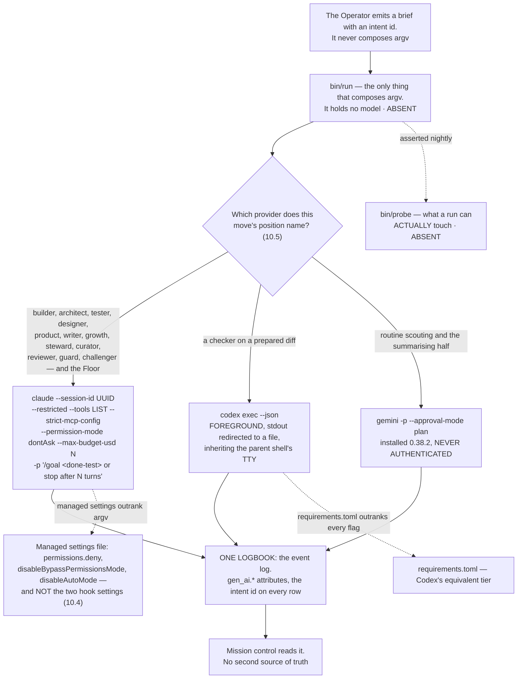

---

### 10.2 Codex's position on day one, and the test that widens it

**(FOUNDER: day one. NEW: the position is narrow because a measured defect makes it narrow, not because Codex is
distrusted.)**

**Day one: `codex exec` as a checker on a prepared diff**, run in the **foreground with stdout redirected to a file
while inheriting the parent shell's TTY** — the second documented workaround, which does not need `script -qfc`.

**The cost, stated once and not re-litigated: one foreground slot is not parallel, so Codex is not a night lane
yet.** That is the whole price of admitting it on day one, and it buys a second model family on the one move where
family independence pays for itself.

**openai/codex#19945, read 2026-09-05:** *"codex exec silently crashes with no output when stdio is detached from
TTY (0.124.0+)"*, opened 2026-04-28, labels `CLI`, `bug`, `exec`. **Open 130 days with no comments and no
maintainer reply.** Mechanism: *"the process produces no error, no panic message, no log entry — just an empty
result."* Piping through `tee` or `tail` in a detached process group does **not** resolve it. **A silent empty
result is the worst failure shape there is** — a smoke test passes and the real workload returns nothing, which is
why the rehearsal must be headless or it proves nothing.

**The admission test that widens the position** — and it is specifiable from primary text now, which it was not when
FINAL was written:

| Condition | Value |
|---|---|
| Command | `codex exec --json` |
| TTY | **no controlling TTY** |
| Prompt | **non-trivial** — a smoke prompt does not exercise the defect |
| Version | **≥ 0.124.0** |
| Judged against | known-answer cases |

**Pass** and Codex becomes a night checker and a maker on mid-to-hard work. **Fail** and it stays in the foreground
slot. **The test is the plan, not the issue closing** — 130 days of silence is not a schedule.

**(NEW: the prerequisite is a founder act.)** Codex is **not installed** on this machine. Installing it and running
the rehearsal is section 20 row 5.

---

### 10.3 Where `/goal` and `/loop` sit

**(NEW: `/goal` is the feature the founder's phrase points at, and it was absent from FINAL entirely.)**

**`/goal` sits on the run, and the done-test is the goal condition.** *"The `/goal` command sets a completion
condition and Claude keeps working toward it without you prompting each step. After each turn, a small fast model
checks whether the condition holds."* Three verdicts: **Not yet met · Met · Impossible**.

| Property | Value, quoted |
|---|---|
| Headless | *"Setting a goal with `-p` runs the loop to completion in a single invocation"* |
| Streaming | *"Add `--output-format stream-json --verbose` to emit each message as the loop runs"* |
| Condition limit | **4,000 characters** |
| Bounding it | *"include a turn or time clause in the condition, such as `or stop after 20 turns`"* |
| Terminates on | Met · Impossible · `/goal clear` · four unrecoverable errors (auth failure, exhausted credit balance, unclearable context overflow, unavailable model) |
| Survives | *"After any other failure, including transient errors such as rate limits and overloaded servers, Claude Code leaves the goal active"* |
| Deferral | evaluation is skipped while a subagent or background shell is running |
| Check-ins | *"In a non-interactive session, such as one started with `-p`, this is the only way Claude Code delivers check-ins"* |
| Evaluator | Haiku by default; `ANTHROPIC_DEFAULT_HAIKU_MODEL` changes it **everywhere the small fast model is used** |

**(NEW: leaving a goal active through a rate limit is exactly the behaviour a night wants**, and it is the reason
`/goal` and not a shell loop is the run-level primitive: a shell loop that re-invokes on a rate limit burns the
window it is waiting for.)

**`/loop` is refused in production and stays a Floor convenience.** *"Tasks are session-scoped: they live in the
current conversation and stop when you start a new one"*, with a **7-day expiry** and the hard limit *"Tasks only
fire while Claude Code is running and idle."* **A tier that requires a session already open cannot be the
always-on tier. The Watch is the loop.** The vendor's own three scheduling tiers make the trade explicit:

| Tier | Needs | Minimum interval | Local files |
|---|---|---|---|
| Cloud Routines | no machine, no open session | **1 hour** | **no** — a fresh clone |
| Desktop scheduled tasks | the machine on, no open session | 1 minute | yes |
| `/loop` | the machine on **and** a session open | 1 minute | yes; inherits the session's MCP servers and permission mode |

**(FINAL §16.7, standing.)** Routines stay **refused for the Watch** — cloud-only, cannot reach local files.

**Codex `/goal` is not used.** It exists (**0.128.0, 2026-04-30**) with states *pursuing, paused, achieved, unmet,
budget_limited*, but **the evidence is third-party — search summaries and tracker items, not a primary page** (the
two primary URLs 308-redirected and were not followed). Two of its own tracker items are the argument against
relying on it: **#20536**, asking that the command be documented at all, and **#34215**, *"Goal mode cannot increase
its token budget and resume after becoming budget_limited"*. And the hinge is unestablished: **whether Codex
`/goal` runs under `codex exec` is not known.** Revisit when 10.2's test passes.

---

### 10.4 The managed-settings collision, resolved

**(NEW: two design choices land in one file, and one of them silently kills the other.)** The managed settings file
is the tier a running process cannot clear — it is what makes the grant real rather than advisory. But **`/goal` is
a session-scoped prompt-based Stop hook**, and it is *"unavailable when `disableAllHooks` is `true` after settings
precedence applies, or when `allowManagedHooksOnly` is set in managed settings."* Locking hooks in the managed file
therefore removes the goal loop the founder asked for.

**Resolved, once, and repeated here because this is where a reader trips:**

| The managed file carries | The managed file does NOT carry |
|---|---|
| `permissions.deny` | `disableAllHooks` |
| `permissions.disableBypassPermissionsMode: "disable"` | `allowManagedHooksOnly` |
| `disableAutoMode` | — |

**The cost, stated once: a run can therefore register its own Stop hook.** That is a smaller hole than losing the
goal loop, and **the nightly probe is what keeps it a known hole rather than an unknown one**. Narrowing is carried
by `--restricted` plus an explicit `--tools` list, **which does not touch hooks** — so the narrowing and the goal
loop stop competing for the same file.

**(NEW: two facts make the permission bands binding rather than descriptive.)** Deny rules bind in **every** mode
including `bypassPermissions`, and a subagent's own `permissionMode` frontmatter **is ignored**, so a child cannot
widen its own grant. `auto` mode's classifier is a cheap guardrail against accident and **is not the envelope** —
it can be switched off, and nothing in it keys on reversibility.

---

### 10.5 What each runtime is documented to offer

**(NEW, from the runtimes research of 2026-09-05. `D` = documented and quoted; `C` = claimed, third-party. Nothing
in that lane was measured — no runtime was run.)**

| | Claude Code | Codex CLI |
|---|---|---|
| Installed here | **yes**, 2.1.259 | **no** |
| Headless | `-p`, text / json / stream-json | `codex exec`; *"streams progress to `stderr` and prints only the final agent message to `stdout`"*; `--json` emits `thread.started`, `turn.started`, `turn.completed`, `turn.failed`, `item.*` |
| Structured out | `--output-format`, `--output-schema` on the goal loop | `--output-schema`, `-o` / `--output-last-message` |
| Session and resume | `--session-id` *"must be a valid UUID"*; `--continue` | `codex exec resume --last` or `<SESSION_ID>` |
| Narrowing by argv | `--restricted` (v2.1.248+) *"removes the built-in tools that run commands or code, and WebFetch, unless you name them individually in `--tools`"*; `--strict-mcp-config`. **`--allowedTools` restricts nothing** | `--sandbox`, `--ignore-user-config`, `--ignore-rules`, `--skip-git-repo-check`, `--ephemeral`. **No per-tool flag.** `--full-auto` is **deprecated** — *"use `--sandbox workspace-write` instead"* |
| Sandbox axes | Seatbelt / bubblewrap, **Bash only**, filesystem and network layers | Seatbelt / Landlock; `approval_policy` × `sandbox_mode` — three modes, **network off by default** |
| Policy tier | **34 hook events, 10 documented as blocking**; managed settings outrank argv | **`requirements.toml` outranks every flag** |
| Hooks, sharp edge | **PermissionRequest is non-blocking** — *"Exit code 2 isn't honored for this event and the permission flow proceeds unchanged. Deny through the `decision` object instead"* | hooks behind `codex_hooks = true` |
| Subagents | depth **3** default, **20** concurrent, *"Concurrent subagent limit reached"* on overflow. **`Workflow` is removed from all of them** — *"via the first filter applied to subagent tool sets"* | TOML files with their own sandbox mode |
| Teams | agent teams: a lead plus named teammates, each a full session. **Experimental, off by default; no nested teams; one team per session; `/resume` does not restore them; `-p` never forms a team.** *"approximately 7x more tokens … when teammates run in plan mode"* | none documented |
| Fleet view | `claude agents --json` prints active background sessions for scripting; *"Opening agent view requires an interactive terminal"* | none documented |
| Channels | *"A channel is an MCP server that pushes events into your running Claude Code session."* Research preview. Gated twice: *"Being in `.mcp.json` isn't enough … a server also has to be named in `--channels`"*. Anthropic auth only | none documented |
| Scheduling | three tiers (10.3), plus `ScheduleWakeup` and `Monitor` | *"Automations"*, or a shell loop around `codex exec` (`C`) |
| Goals | `/goal`, `D`, **headless-capable** | `/goal` 0.128+, `C`, **headless status unknown** |
| Per-run spend | `--max-budget-usd`; subagent spend counts toward it | included in every ChatGPT plan |
| Shared config | `CLAUDE.md`, `SKILL.md`, `.mcp.json`; imports Codex and Gemini config | `AGENTS.md`, `SKILL.md`, `config.toml`, `mcp_servers` |
| Second checker family | **no** — it cannot check itself | **yes in principle, blocked by #19945** until 10.2's test passes |

**(NEW: one trap worth naming, because it collides with a setting this repository plausibly wants.)** `Monitor` —
*"Runs a command in the background and feeds each output line back to Claude … Can also open a WebSocket and treat
each incoming message as an event"* — is *"not available when `DISABLE_TELEMETRY` or
`CLAUDE_CODE_DISABLE_NONESSENTIAL_TRAFFIC` is set."* A privacy setting silently removes a capability.

**(FINAL §16.7, re-decided against the roster.)** Which provider may stand which position:

| Provider | Which of the fifteen may run on it | Window | State today |
|---|---|---|---|
| **Claude Code** (subscription) | all fifteen, **and the Floor, always** | rolling five-hour **and weekly**, per seat, shared with Claude chat and Cowork | installed 2.1.259, measured |
| **Codex CLI** (subscription) | **`reviewer` and `guard` only, on a prepared diff, in the foreground.** Widens to `builder` on mid-to-hard work if 10.2's test passes | its own 5-hour window; the only one publishing numeric quotas | **not installed**; #19945 open |
| **Gemini CLI** (subscription) | **`scout`**, and the summarising half of `curator` | 60 rpm / 1,000 rpd free on a personal account | installed 0.38.2, **never authenticated** |
| **Local models** | no agent — moves, not positions: embeddings, classification, dedup, PII detection | electricity | **ABSENT** |
| **Routines** (cloud) | **refused for the Watch** — cloud-only, no local files | daily cap | exists |

---

### 10.6 What the research could not establish

**(NEW: these are the ten gaps the runtimes lane named about itself. They are listed because a plan that hides its
own unknowns spends them later at a worse price.)**

1. **Codex `/goal` has no primary citation** — the two primary URLs 308-redirected. **Two fetches close it.**
2. **OpenAI's terms are unread** (HTTP 403). The whole OpenAI half of the terms question of section 9.10 is open.
3. **Whether Codex `/goal` runs under `codex exec` is unestablished** — and it is the hinge for using Codex's goal
   feature from a driver at all.
4. **Whether Anthropic's documented headless features constitute the *"explicitly permit"* carve-out** on a
   subscription. Section 9.10; the founder's decision.
5. **The trailing Yes/No column in the tools reference** (`Monitor` Yes, `Workflow` Yes, `ScheduleWakeup` No,
   `Agent` No) — the header was not captured and the lane refused to guess it.
6. **`-w`, `--worktree` and `--tmux` did not appear** in the CLI-reference fetch. A prior lane has them as measured;
   treat as unconfirmed here.
7. **Routines' own page, desktop scheduled tasks, `/schedule`, Remote Control, agent teams and the workflows page
   were not fetched.** The agent-teams facts used above come from the surfaces lane, not this one.
8. **Codex config reference, `requirements.toml`, `codex mcp`, Automations, and whether Codex can serve as an MCP
   server** — all carry a prior lane's marks; nothing was added.
9. **Third-party routers** (Amp's two-family runtime, OpenCode) were not researched.
10. **Nothing was measured.** No runtime ran. **Codex remains uninstalled and no install was attempted.**

---

### 10.7 What enforces this section

| Rule | Mechanism | State |
|---|---|---|
| One program composes every provider's argv | `bin/run` | **ABSENT** |
| A grant is what a run can actually touch | `bin/probe`, nightly | **ABSENT** |
| `bypassPermissions` cannot be entered | `permissions.disableBypassPermissionsMode: "disable"` in managed settings | **ABSENT** — a founder act on a machine-wide file, section 20 row 8 |
| A child cannot widen its own grant | a subagent's `permissionMode` frontmatter **is ignored** by the runtime | **shipped** |
| A dispatched engine cannot invoke its own gate | `Workflow` is removed from every subagent by the runtime, and `PS-WORKFLOW-CONTAINMENT` in `.claude/hooks/schema-lint.js` refuses the declaration | **EXISTS**, branch `ceo-1-1788609834`; **independently confirmed** by the vendor |
| A run has a completion condition, not a turn budget alone | `/goal <done-test> or stop after N turns` under `-p` | **shipped**; the composition is **ABSENT** |
| `/goal` is not killed by the managed file | the file omits `disableAllHooks` and `allowManagedHooksOnly` (10.4) | **ABSENT** until the file exists |
| A run cannot stall forever | `--max-budget-usd` as a stall fuse, not a billing control | **shipped** (v2.1.217+) |
| Codex only widens on evidence | the headless admission test of 10.2 | **ABSENT** — Codex is not installed |
| One logbook, no second source of truth | the event log, with the intent id on every row | **ABSENT**; `~/.agentvibe/events.jsonl` is the spine on this branch |

---

## 11 · Truth — how anything is known to be good

*obeys: v8, v30, and §B.2's anchor column · inherits: FINAL §8, and §7.6's rehearsal set*

---

### 11.1 The finding that organises everything, now sourced twice

**(FINAL)** An LLM asked to review its own reasoning with no external feedback gets worse. FINAL §8.1 carried the
measurement — GPT-4 falling from 95.5% to 91.5% on GSM8K — and the reason: the bottleneck is *finding* the error,
not fixing it. A model judging output measurably prefers its own generations, its own family, longer answers and
whichever came first, and agrees with human experts 60–68% of the time in specialist domains.

**(NEW: cognition.md 5 gives the general claim a primary citation it did not have.)** The sentence is now quotable
verbatim: *"LLMs struggle to self-correct their responses without external feedback, and at times, their performance
even degrades after self-correction"* — arXiv 2310.01798, accessed 2026-09-05, confidence H.

**(NEW: cognition.md 6 closes the obvious rebuttal.)** Reflexion's *"91% pass@1 accuracy on the HumanEval coding
benchmark"* is not a counterexample, because its feedback is external and stored in an episodic memory buffer. The
distinction that survives is not *reflection is bad*; it is **reflection with no outside signal is bad**.

**(FINAL)** So three rules, and everything below is their consequence. A model checking a model is a **screen, not a
verdict**. Every gate is deterministic or it is not a gate. Everything believed is anchored to something that is not
a language model.

---

### 11.2 The anchor ladder, with the tester and the challenger placed on it

**(FINAL, redrawn)** Every done-test names its anchor, and the ladder is ordered by how much it can be trusted. A
done-test that can only reach rung 4 is a weaker done-test and the system says so out loud. **(NEW: v8 and v30 add
two agents that were shapes in FINAL and are named roles here, so the ladder must say where each one lands.)**

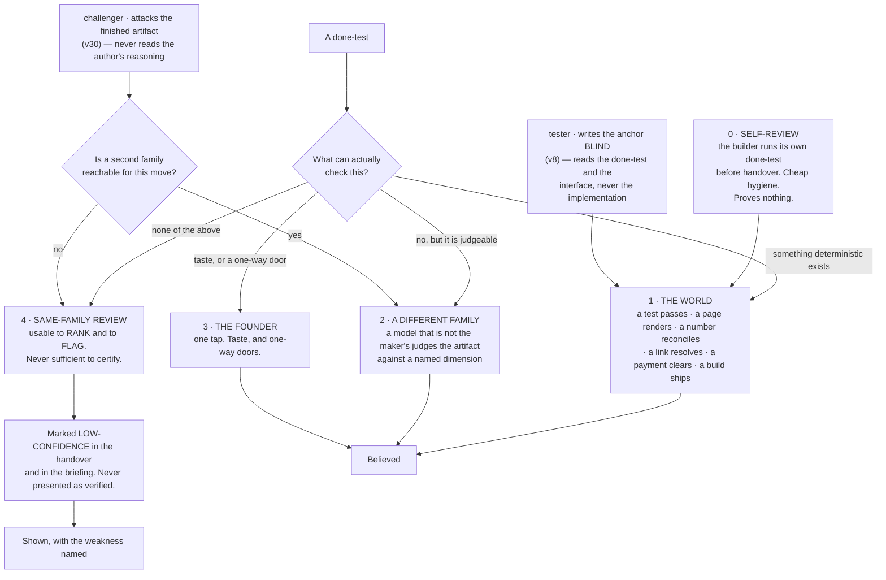

**(FINAL)** Rung 1 is not a formality and it is where the design work is: for most company work there *is* a
deterministic anchor, and finding it is the intellectual task of writing the done-test. **(FINAL)** The anchor is
almost always cheaper than the work it checks, which is why this is affordable, and why quality here does not mean a
review panel — it means the run produced the evidence its done-test named.

| Kind of work | The deterministic anchor |
|---|---|
| Code | tests run · build passes · the app starts · a named user path completes |
| A screen or a page | it renders · a screenshot exists · contrast ratios computed · it loads under a stated size |
| Copy or content | every factual claim resolves to a fetched source · links return 200 · reading level computed |
| A price or a model | the arithmetic reconciles · sensitivity to each input is computed and shown |
| A video or an image | it plays · right length and aspect · the brand colours are the declared ones · loudness to a standard |
| Research | every claim carries a URL that was fetched, with the quoted line present in the fetched text |
| Data work | row counts reconcile · a known query returns the known answer · nulls counted |
| Outreach or social | it sent · it was received · the reply, if any, is attached |
| Finance | it ties to the bank line, or the difference is shown |
| Anything legal | it does not go out without rung 3. Full stop. |

**(FINAL)** Inside rung 1 there is an order, and it is the sharpest rule in the section: **a check that reads a record
the company does not write outranks a check that reads the company's own**, because a status report cannot promote
itself. §B.2 states the same rule per agent — *"a number that reconciles to our own log is rung 4, not rung 1"* — so
it is not advice here and a table row there; it is one rule, written twice on purpose.

**Mechanism:** the store check refuses an intent whose done-test names no anchor (`bin/check-stores`, ABSENT); the
rung is a field on the handover and the briefing renders rung 4 differently from rung 1 (ABSENT). For research
claims the mechanism exists today: `scripts/check-citations.mjs` on branch `ceo-1-1788609834` blocks on a dead path,
wired as `check:citations-exist` in the check suite.

---

### 11.3 The other family, and what it actually is on day one

**(FINAL)** A checker on the maker's family is a compromised instrument by measurement. FINAL §8.3 assumed three live
subscriptions and concluded that cross-family checking *"stops being a constraint and becomes a choice."*

**(NEW: v5, v32 and §I rows 5 and 6 make that conclusion conditional, and the condition is not met yet.)** Codex is
**not installed** and openai/codex#19945 has been open 130 days with no maintainer reply (runtimes.md, accessed
2026-09-05). `gemini` 0.38.2 **is installed and has never authenticated**. So on the day this plan starts, rung 2 is
reachable in exactly one shape and two founder acts widen it:

| Rung-2 route | State | What it costs, stated once |
|---|---|---|
| **Codex `gpt-5.3-codex` as a checker on a prepared diff** | admitted day one by v5; foreground slot only, stdout redirected to a file while inheriting the parent shell's TTY (v32) | **one foreground slot is not parallel**, so Codex is not a night lane until the H.2 rehearsal passes detached |
| **Gemini on routine checking** | installed, unauthenticated — §I row 6, one terminal act by the founder | until it happens, routine checking has no second family and falls to rung 4 with the label |
| **A three-family panel** | reserved for a one-way door with no rung-1 anchor (FINAL §8.3) | there is no non-Anthropic model reachable from inside Claude Code, so a `judge` claim with an empty panel resolves `unresolved` forever, and saying so is the design |

**(FINAL, redrawn for the roster)** What the checker does, and what happens when it disagrees:

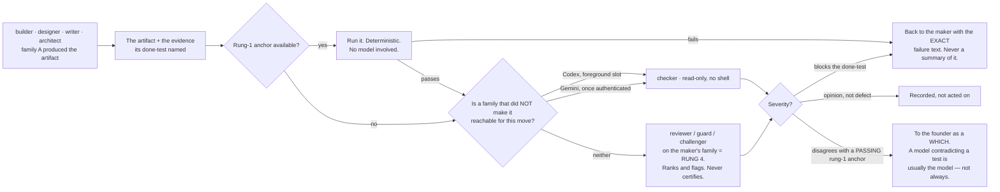

**(FINAL)** When a checker compares two candidates it is **pairwise, never pointwise**; blind; stripped of the
candidate's own label; order-swapped, with a flip resolving to `unresolved`. One frontier judge held its verdict under
a swap only 65% of the time, another 23.8%. Findings from several families are **unioned**: a fatal finding from any
family eliminates, fewer serious findings are preferred, and **scores are never averaged**, because a score is a
finding with the information removed. Consensus thresholds are refused — a vote among models has no anchor.

**Mechanism:** `bin/run` (ABSENT) presents two candidates as an ordered pair twice, swapped, and records a flipped
verdict as `unresolved`; the checker's handover schema carries a `findings` field **and no score field**, so averaging
has nothing to average (ABSENT). Rule 10 of this repo already holds the general form on branch
`ceo-1-1788609834`: a resolver never passes what it could not check, and `unresolved` is pinned distinct from `pass`.

---

### 11.4 The blind tester — v8, and why it is two tests and not one

**(NEW: v8.)** Both the builder and the tester write tests, and they are **different tests**.

- **The builder's self-check** is rung 0. It is cheap hygiene and proves nothing about correctness — it proves the
  builder ran the thing. Devin's published guidance is the same instruction in one line: *"Tell Devin to test its own
  work before opening a PR"* (cognition.md 8).
- **The tester's anchor test is rung 1**, and it is rung 1 *because the tester never read the implementation*. It
  reads the done-test and the interface. A test written by the author of the code is a machine grading its own
  homework, which §11.1 refuses; a test written blind against the contract is an instrument.

**Mechanism, and it is argv rather than instruction:** the tester's grant carries `--add-dir` **excluding the
implementation path**, so the blindness is a property of what the process can open, not of what the prompt asked for
(§B.2 row 4; composed by `bin/run`, ABSENT; asserted by `bin/probe`, ABSENT).

**The anchor on the tester's own work** — because the tester is an agent and this section trusts no agent's report:
**the test fails before the change and passes after.** A test that passes before the change is not testing the change,
and that is checkable by running it twice with no model in the loop.

---

### 11.5 The challenger — v30, and why it is an agent and not a step

**(NEW: v30, from cognition.md 5 and 6.)** A plan-critique pass that the same run performs on itself is the shape
measured as harmful. The cure is not a better prompt; it is that the critic is a **different process, with different
inputs**. So `challenger` is a roster entry with a grant, not a step in anybody's procedure.

**(NEW: v30's mechanism, stated as two exclusions.)** The challenger never reads the artifact's author's reasoning —
only the artifact and its done-test — and it carries `Read Glob Grep` and no `Write`, `Edit` or `Bash` (§B.2 row 14).
Both are argv facts. **A second model family whenever one is reachable**, and §11.3's honest reading applies: when
none is, the challenger's finding is rung 4, and it is labelled rung 4.

**(FINAL)** Its own anchor is the one that keeps it from becoming an opinion generator: **every finding names the
mechanism that would have caught it, or it is an opinion.** That is checkable by a reader who did not do the work,
which is the same test §B.2 applies to a done-test.

**Where it is routed** (§B.2): before anything irreversible, and on every plan the Operator is about to bind.

---

### 11.6 Where taste is judged

**(FINAL)** Taste is not checkable by a test and is the founder's alone — but it does not follow that every taste
question goes to the founder, or the founder becomes the bottleneck they refused to be. The system holds a **taste
store**: an evidence-backed record of what this founder has accepted and rejected, mined from transcripts (§13) and
from every *no, not like that* on the Floor. A taste check asks *does this artifact violate anything in the store?* —
a rung-2 check with a real corpus behind it. What reaches the founder is the residue: the genuinely new taste
question, as two built options and a which.

**(FINAL)** The store is never a preferences file the founder types, because a founder is an unreliable narrator of
their own taste. It is derived from decisions only, and a fraction of rejections is held out, so it is scored on
predicting what the founder *wants* rather than what they *approve*.

**(NEW: memory.md's coverage table names the one shipped precedent, and it is partial.)** Claude Code's auto memory
carries `type: user` and `type: feedback` notes written by the acting agent in-session — typed extraction of exactly
this material. It is a precedent for the *content* and a counter-example to the writer rule (v25, §13). A **brand
voice profile** and a **golden output archive** are marked *none found* in the same table: no shipped CLI has either.

**Mechanism:** the taste store is written only by the curator (v25); the held-out fraction and its score are a field
on the store, checked by `bin/check-stores` (ABSENT).

---

### 11.7 The nightly reconciliation — the company's numbers against records it does not write

**(FINAL)** The single most repeated failure in the corpus of autonomous-company attempts is **the agent misreporting
its own progress**, and the misreport is what the human reads. It is invisible to any check that reads the agent's
output. So the system's own numbers are read against outside records, on no model.

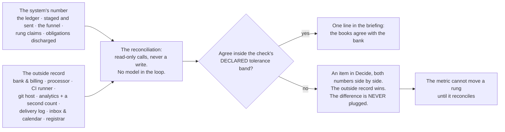

**(FINAL)** Revenue is read from the processor as a claim, never typed; a runway computed from a number the bank does
not confirm is stamped *internal* and cannot promote anything.

**(NEW: §B.2 gives the reconciliation an owner it did not have in FINAL, and §F gives it its precondition.)** It is
`analyst`'s work — the one agent whose row names the reconciliation explicitly — and it is why §F admits the
**read-only instruments first**: analytics, error tracking, a read-only billing key, the CI API, the git host read
API. Without them the reconciliation cannot exist, and without the reconciliation every number in the company is
rung 4 wearing a rung-1 label.

**Mechanism:** `bin/reconcile` with read-only credentials per venture and a declared tolerance band per check
(ABSENT); the checks themselves are rung-1 anchors and live beside the venture (ABSENT). The instruments are admitted
one at a time through §12's door.

---

### 11.8 Regression, for free

**(FINAL)** A regression is a done-test that used to pass and now does not. Because every done-test names a checkable
anchor, **the set of live done-tests across all ventures *is* the regression suite**, re-run on the routine window at
close to zero marginal cost. Nothing extra is maintained. That is a consequence of the done-test design and the
strongest argument for it.

**(FINAL)** The check suite on branch `ceo-1-1788609834` (`scripts/run-checks.mjs`, 48 steps) is the founding
population of rung-1 anchors for the harness venture, and its rule survives whole and is worth restating because it is
the same rule as §11.2's: **a partial run cannot wear a passing verdict.** An interrupted run prints INCOMPLETE and
names what never started; a subset run says SUBSET; a zero-step run is REFUSED.

---

### 11.9 A venture's progress — the contact rungs

**(FINAL)** The anchor ladder measures whether the work is true. Nothing in it measures whether the venture is
becoming a business, and the founder's list asks. So a venture's progress is a rung generated from a record the
company does not write, never typed:

```
0  it exists / it compiles / it renders    ← a rung-1 anchor's exit code
1  a stranger understood it                ← a recorded artifact: a reply, a recording, a survey row
2  a stranger did something                ← the analytics provider AND the server's own count
3  they came back                          ← a cohort in the product's own event store
4  they paid                               ← the payment processor
5  they paid again, and named you          ← the processor, plus a referral with a name attached
```

**(FINAL)** *"The landing page is done"* is rung 0 and will say rung 0. The **ship log** — one line per rung movement
and per intent finished, in the founder's own currency — appears in the briefing and answers *what did this company
produce this month*, which is the cheapest morale instrument there is.

**(NEW: §B.2 ties two roster rows to this ladder, and they are the two with the least outside evidence behind them.)**
`growth`'s anchor is *"a reply from a real person, recorded by the world's door; never a count of messages sent"* —
contact rung 1, not rung 0. `writer`'s is the founder's taste store plus a **rung-2 external reaction**. roster.md
records that sales-and-growth as a function and legal-and-contracts have **no shipped precedent anywhere**, so those
two anchors are deliberately the most external in the roster.

**Mechanism:** the rung table read by `bin/reconcile` (ABSENT) · a venture's `ship-log.md` written only by that
program (ABSENT).

---

### 11.10 The rehearsal set, and what it decides

**(FINAL §7.6, inherited whole and re-read at the source.)** A rehearsal case is an input whose right answer is
already known. Voyager added a skill to its library only after it verifiably worked in the environment, which is why
that library transferred to a fresh world instead of being a pile of plausible code. **The same discipline decides
which agents may run unattended**, and it decides one other thing: whether a change to a standing prompt is adopted —
both versions run against known answers, and a change that is not measurably better is reverted and kept as a
negative. That is the only self-editing permitted anywhere.

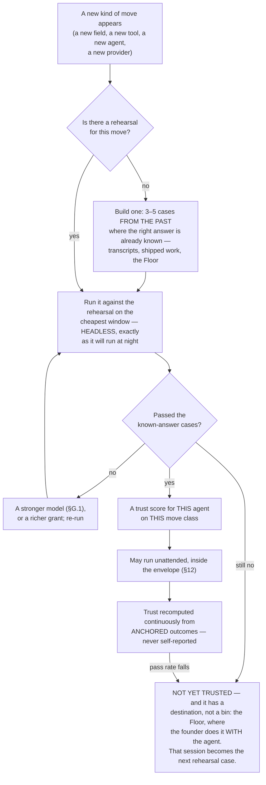

**(FINAL §7.6's three consequences, and each one is a rule this section would otherwise have to invent.)**

1. **A trust score is a measurement, not a rating.** It is the observed pass rate of anchored checks for that agent on
   that move class, and **no run scores itself** — §11.1 applied to the question of who may work alone. Below a sample
   floor it prints **`insufficient`** rather than a number, because a pass rate over four cases is a number that
   invites a decision it cannot support.
2. **"Not yet trusted" has a productive destination.** A move that fails rehearsal goes to the Floor, where the
   founder does it *with* the agent — **and that session becomes the rehearsal case for next time.** This is the
   mechanism by which walking *with* the founder teaches the system to walk *for* them, and it is why the Floor is not
   a consolation prize.
3. **The cases come from the founder's own past.** Thousands of transcripts hold hundreds of *no, not like that* and
   *yes, that's it* — **a labelled dataset of this founder's judgement, gathered free over years.** §13.7's mining
   pass is what extracts them, which is why that pass is the work to do first: it is the only source of rehearsal
   cases nobody has to write.

**(FINAL, and it is the instrument that catches the failure nobody watches for.)** A trust score charted over time,
with limits computed from its own history, is a **control chart** — and it is what sees a provider's silent model
update in month nine, when nothing in the release notes and nothing in the code has changed.

**(NEW: v1 changes what carries a trust score, and it makes the whole mechanism cheaper.)** FINAL scored a *loadout*
assembled per run, so the population of scores was open-ended. **Fourteen named agents give the score a stable
subject**: `builder` on schema changes, `scout` on a field it has not read before. A pass rate needs a denominator
that persists, and a named roster is one.

**(NEW: v18 makes a rehearsal case one of exactly four admissible skill bodies, so the set has a home and a format.)**
A rehearsal case is a `SKILL.md` body under §E's content rule, which means the same admission and the same forced
expiry (v19) apply to it as to everything else the library holds.

**(NEW: H.2 is a rehearsal case in this exact sense, and it is the one that matters most on day one.)** Codex's
admission test — `codex exec --json`, **no controlling TTY**, a non-trivial prompt, version ≥ 0.124.0, against
known-answer cases — is what widens Codex from a foreground checker to a night lane. Pass and rung 2 becomes
parallel; fail and it stays in the foreground slot. **#19945 has been open 130 days with no maintainer reply**, so
the test is the plan, and the issue closing is not.

---

### 11.11 The roster's anchor column, as one table

**(NEW: §B.2's anchor column read against §11.2's ladder. The anchors are the SPINE's; the rung assignment is this
section's reading of them, and the two rows that cannot reach rung 1 today are named rather than rounded up.)**

| Agent | The anchor — what proves it, never the agent's own report | Rung |
|---|---|---|
| **Operator** | the store check refuses an intent whose done-test is not falsifiable by someone who did not do the work; nothing binds by voice (§C.3) | 1 on the refusal · 3 on the read-back |
| **builder** | the venture's own CI, plus the done-test, plus the tester's blind test | 1 |
| **reviewer** | findings reproduce from the diff alone; a finding with no reproduction is a hypothesis | 1 on reproduction · **2 only when a second family is reachable, else 4** |
| **architect** | a migration that applies and rolls back in a scratch database | 1 |
| **tester** | the test fails before the change and passes after | 1 |
| **guard** | a proof of concept that reproduces, or the finding is a hypothesis | 1 |
| **scout** | every claim carries URL, quote and access date; `check-citations.mjs` blocks on a dead one | 1 |
| **designer** | a rendered screenshot judged against a named anchor — never the agent's description of it | 1 on the render and the computed properties · 3 on taste |
| **product** | the store check refuses a done-test that is not falsifiable by an outsider | 1 |
| **analyst** | the reconciliation reads a record the company does not write; **a number that reconciles to our own log is rung 4, not rung 1** | 1, and it says so when it is not |
| **writer** | staged, never sent; the founder's taste store and a rung-2 external reaction | 2 and 3 |
| **growth** | a reply from a real person, recorded by the world's door; never a count of messages sent | contact rung 1 |
| **steward** | an obligation is discharged only by a record the company does not write | 1 |
| **curator** | a memory item with no source, date, expiry and falsifier is refused at the store check | 1 |
| **challenger** | every finding names the mechanism that would have caught it, or it is an opinion | 1 on that test · **2 only when a second family is reachable, else 4** |

**(NEW: the table's own finding.)** Thirteen of fifteen rows reach rung 1 on their primary anchor. The two that do not
— `reviewer` and `challenger` — are precisely the two whose job is judgement, which is the section's thesis restated
as a roster fact: **the agents that check are the ones whose own output cannot be checked deterministically**, and
that is why the second family is bought and why §11.3 refuses to round it up.

**Mechanism for the whole table:** the anchor is a required field on every brief and every handover; `bin/run` refuses
a brief whose done-test names no anchor, and `bin/probe` asserts each agent's grant nightly (both ABSENT). Until they
exist, this table is a **WISH** — and naming it as one here is cheaper than discovering it during the first night.

---

## 12 · Control — what may be done alone, and what never

*obeys: §C.1's bands, v9, v10, v28, v33 · inherits: FINAL §9. The tool door itself lives in §8 (Tools and MCPs) and
is not restated here.*

---

### 12.1 The envelope

**(FINAL)** The founder refuses a machine that is only brakes. This section does not add brakes. It removes the need
for most of them by deciding once, per venture, what does not need asking — and makes the remaining few absolute.
Three lists in the venture's charter, in the founder's own words, read by every run:

```
may-alone:  what runs without asking, ever
never:      what is not done by this system under any circumstance
wake-me:    the exact conditions that interrupt me, each with a number
```

**(FINAL)** The shape is the naval standing-orders and night-orders pair, with two details copied exactly. The
call-me list carries **numeric thresholds** — never *"if something seems wrong"* — and the governing sentence *call
the captain on any doubt whatever, before an emergency has developed* is what stops a threshold list becoming a
loophole. Written the way the founder would say it:

```
may-alone:  write code · run tests · make branches · research anything · draft anything ·
            build both options of a choice · spend up to the venture ceiling on capacity ·
            read my calendar and mail
never:      send mail as me · post publicly · pay anyone · sign anything · touch production
            data · change a live price · contact a customer · delete anything a person made
wake-me:    a customer is waiting more than 4 hours · spend crosses 60% of the monthly
            ceiling · a done-test that passed for 7 days starts failing · anything I said
            'never' to is now the only way forward · a run has been blocked on the same
            thing three times
```

**(FINAL)** Every charter starts from a **default `never` list held as data**, longer than any tiering system covers,
and the founder deletes from it rather than writes to it: a secret in a published artifact · a migration with no
proven down-path · a deploy that emits mail or mutates data · money outside a standing, capped, rate-limited
allowance · a domain lapsed or bought · **anything delivered to a person** · a burned sending domain · a signature ·
a price change on existing customers · a partnership term · an offer, and a termination · publication before a patent
filing · a trademark class · an entity type · a cap table · an erasure · an account deletion · a bulk merge · a
missed statutory deadline · any edit to the system's own judging machinery · **and a kill decision.** Every charter
also starts from a **default `wake-me` template** of five conditions about *consequence*, never policy: a one-way act
wanted · damage · a kill criterion the founder wrote the day the intent opened · a contradiction between an anchor
and something the founder said out loud · a statutory clock.

**Mechanism:** `shared/never-default.yml` and `wake-me-default.yml` merged into each charter at load (both ABSENT).

---

### 12.2 The rule that decides what belongs in `may-alone` — and it stands alone in the world

**(FINAL, v28.)** Not importance, not risk vocabulary: **reversibility**. Two-way doors are made fast at about 70% of
the information you would like, because the cost of delay exceeds the cost of a correctable mistake. One-way doors get
slow, deliberate treatment.

**(NEW: cognition.md is the reason this is stated with more confidence than FINAL stated it, not less.)** The lane
looked for a shipped scheme that keys permission on reversibility and reported *"neither shipped scheme does"*.
Claude Code keys on **a fixed path list plus an action class**; Codex keys on **workspace scope plus network**. The
nearest shipped analog anywhere is auto mode's classifier special-casing `rm` and `rmdir` on critical paths. So v28 is
a position the world does not hold, held knowingly: the axis everyone ships is *where the file is*, and the axis that
predicts damage is *can this be undone*.

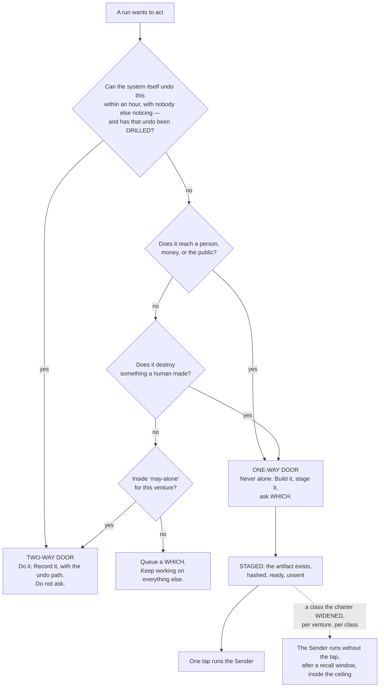

**(FINAL)** The staged-not-sent pattern is the whole trick. A post is written, previewed and sits there; an email is
drafted with the recipient filled in; a deploy is built and waiting. The founder's tap is the only irreversible step
and it takes a second, because everything else is already done. That is what makes *ask me only what only I can
answer* affordable: **the asking blocks the last inch, never the work.**

**(NEW: v9 promotes staged-not-sent from a style to the only channel a silent run has — see §12.5.)**

**(FINAL)** Two additions that keep the door test honest. **An undo is drilled or the door is one-way**: a two-way
door whose undo has not been exercised is treated as one-way until it is, by the rule that an untested kill switch is
a story about a kill switch; the drill runner writes only a date. **A widened class executes after a recall window**,
not on the instant: the Sender holds it for a window sized to the blast radius, the phone can recall it, and the
receipt says plainly when a recall is not an undo.

**(NEW: cognition.md again, and it is worth naming because it is the strongest claim in this section.)** *"§9.2's
staged-not-sent pattern and its recall window have no analog in anything I fetched. The shipped equivalent of 'never
alone' is a prompt or a deny rule, not a staged artifact."*

**Mechanism:** the door test runs before a brief carries a `REACHES THE WORLD` grant (ABSENT) · the drill dates in
`shared/tools/<name>.yml` (ABSENT) · `bin/send`, which holds no model (ABSENT).

---

### 12.3 The bands, mapped onto the envelope and onto the shipped modes

**(FOUNDER)** *"which is also the contact point with me. … depends on the type of tasks because you also need to be
able to run it fully autonomous."*

**(NEW: §C.1 turns that sentence into one table that three different layers must agree with — the envelope's
vocabulary, Claude Code's permission modes, and Codex's two axes. A band that named only one of the three would leave
the other two to be guessed at dispatch.)**

| Band | Task types | Envelope | Claude Code mode | Codex `approval_policy` × `sandbox_mode` | Who runs in it |
|---|---|---|---|---|---|
| **Read and report** | research, review, audit, analysis, challenge | `may-alone` | `plan` | `never` × `read-only` | scout · reviewer · guard · challenger · analyst |
| **Build in a worktree** | code, design, copy, spec, schema, memory | `may-alone`, inside one venture's worktree | `dontAsk` with `--restricted` and an explicit `--tools` | `never` × `workspace-write` | builder · architect · tester · designer · product · writer · growth · steward · curator — **none of them holds a tainted read (v36)**; `steward` works from `scout`'s handover, never from a raw inbound row |
| **Stage an outward act** | send, publish, pay, deploy, share, delete | **`never` for every agent** | no mode — no agent performs it | — | nobody. The **Sender** performs it, and it holds no model |
| **Wake the founder** | anything on the venture's `wake-me` list | `wake-me` | — | — | the Watch, before it rings, against the interruption budget |

```mermaid
flowchart TD
    INTENT["An intent, with a done-test"] --> KIND{"What kind of work<br/>does the outcome need?"}
    KIND -->|"find out · judge · attack"| B1["BAND 1 · read and report<br/>plan · never × read-only"]
    KIND -->|"make an artifact"| B2["BAND 2 · build in a worktree<br/>dontAsk --restricted --tools …<br/>never × workspace-write"]
    KIND -->|"the outcome reaches the world"| B3["BAND 3 · stage an outward act"]
    B1 --> DISPATCH["bin/run composes the argv.<br/>The Operator never composes it."]
    B2 --> DISPATCH
    B3 --> NOAGENT["NO AGENT IS DISPATCHED.<br/>The artifact is staged, hashed, unsent."]
    NOAGENT --> DOOR{"Widened for this venture<br/>and this class?"}
    DOOR -->|"no"| WHICH["A WHICH on the desk.<br/>Both options already built."]
    DOOR -->|"yes"| SENDER["The Sender — a program, no model —<br/>after the recall window, inside the ceiling"]
    DISPATCH --> RUN["The run"]
    RUN -->|"hits a wake-me condition"| WATCH["BAND 4 · the Watch decides whether to ring,<br/>against the interruption budget"]
```

**(NEW: two shipped facts from cognition.md make the table binding rather than descriptive, and both are argv-level or
settings-level rather than prompt-level.)** First, **deny rules bind in every mode including `bypassPermissions`**,
while *"Allow rules have no effect in `bypassPermissions`"* — so the floor under the bands is real and the ceiling is
not. Second, **a subagent's own `permissionMode` frontmatter is ignored**: *"any `permissionMode` in the subagent's
frontmatter is ignored"*, so **a child cannot widen its own grant.** That is the property the whole band table rests
on, and it is the vendor's, not ours.

**(NEW: and one thing the table deliberately does not use.)** **`auto` mode's classifier is not the envelope.** It is
*"a second model, the classifier"* reviewing actions instead of the founder; it can be switched off with
`disableAutoMode`; and nothing in it keys on reversibility. It is a cheap guardrail against accident. §11.1's rule
applies to it unchanged — a model checking a model is a screen, not a verdict.

---

### 12.4 `bypassPermissions` is refused, and refused by a mechanism

**(NEW: v10.)** The widest permission mode is not discouraged, not reserved for emergencies, and not left to
judgement. It is **disabled in the managed settings file**, where a running process cannot clear it:
`permissions.disableBypassPermissionsMode: "disable"`. cognition.md quotes the pair of administrative settings and
notes they are *"most useful in managed settings where they can't be overridden"*.

**(NEW: why a mechanism and not a rule.)** A process holding a shell can strip its own guardrails by launching a child
with different settings. Every other tier of settings is reachable by something inside the session. This is the one
tier that is not, which is the entire reason the file exists.

**Mechanism:** the managed settings file, written by the founder outside the repository (**ABSENT** — §I row 8) ·
`bin/probe`, which asserts nightly what a run can actually touch (**ABSENT**). Until both exist, v10 is a **WISH**,
and the honest statement is that today the mode is refused by convention.

---

### 12.5 A fully autonomous run cannot ask — v9, and it is the design of the mode

**(FOUNDER)** *"you also need to be able to run it fully autonomous."*

**(NEW: v9, from cognition.md 2 — this is the fact that turns the founder's sentence into a design constraint.)** In
`dontAsk` mode, *"`AskUserQuestion`, MCP tools marked `requiresUserInteraction`, and connector tools your organization
set to `ask` … **are denied even if you've allowed them**."* Asking the human is itself a permissioned action, and the
mode that lets a run work unattended is the mode that switches it off.

**So a fully autonomous run has exactly two outcomes for anything it would have asked**, and there is no third and no
approve verb:

1. It was **pre-decided in the envelope** — `may-alone`, `never`, or the venture's widened class.
2. It is **staged as a which, with both options built**, and left on the desk.

```mermaid
flowchart TD
    Q["A run reaches a question<br/>it cannot answer alone"] --> MODE{"Which band is it in?"}
    MODE -->|"band 1 or 2 · dontAsk"| DENIED["AskUserQuestion is DENIED by the mode.<br/>There is no prompt to answer."]
    MODE -->|"the Floor · the founder is here"| ASK["Ask. The founder is beside it."]
    DENIED --> ENV{"Pre-decided in the envelope?"}
    ENV -->|"yes"| GO["Proceed. Record the clause<br/>that authorised it."]
    ENV -->|"no"| BUILD["Build BOTH options.<br/>Stage them, hashed, unsent."]
    BUILD --> DESK["A WHICH on the desk, carrying six fields:<br/>the question typed FACT or PREFERENCE ·<br/>the recommendation and its one reason ·<br/>what happens if the founder says nothing ·<br/>the class and its drill date ·<br/>the cost of being wrong · both options, built"]
    DESK --> TAP["One tap. That is the whole interaction."]
```

**(NEW: v9's consequence for the rest of the plan.)** This makes FINAL's staged-not-sent rule **load-bearing rather
than stylistic**. In an attended session it is good manners; in an unattended run it is the only channel that exists.
A design that leaves a question to be asked at 3 a.m. has not deferred the question — it has lost it.

**(FINAL, unchanged)** What still reaches the founder while a fully autonomous run works: the `wake-me` list, the
interruption budget of three a day, and the briefing, which is never an interruption because the founder opens it.

**(NEW: `/goal` is what bounds such a run, per v12 and §H.3, and it is a Stop hook — which is why §12.6's file omits
two settings it would otherwise carry.)**

---

### 12.6 The managed settings file — exactly what it carries, and the one thing it must not

**(NEW: v11. FINAL §9.7 treated the managed file as the place every narrowing goes. That premise is now false in one
specific way, and the collision is worth stating in full because a section-writer or an implementer will otherwise
walk into it.)**

`/goal` is *"a wrapper around a session-scoped prompt-based Stop hook"* and is therefore *"unavailable when
`disableAllHooks` is `true` after settings precedence applies, or when `allowManagedHooksOnly` is set in managed
settings"* (runtimes.md, accessed 2026-09-05). The goal loop the founder asked for and the hook lockdown cannot both
be in that file.

| The managed file carries | The managed file does NOT carry |
|---|---|
| `permissions.deny` — the deny rules that bind in every mode, including bypass | `disableAllHooks` |
| `permissions.disableBypassPermissionsMode: "disable"` (v10) | `allowManagedHooksOnly` |
| `permissions.disableAutoMode: "disable"` (the classifier is not the envelope, §12.3) | — |

**The cost, stated once and not re-litigated (v11):** a run can therefore register its own Stop hook. That is a
**smaller hole than losing the goal loop**, and the nightly probe checks it. Narrowing that would otherwise have gone
into the file is carried by `--restricted` plus an explicit `--tools` list, which does not touch hooks.

**(FINAL, and it is the other half of the seam.)** Peer isolation is enforceable by a checked-in file rather than by
the managed one: `crossSessionInbound: refuse` drops every inbound message and applies from project or local settings
over every other source; `permissions.deny: ["SendMessage","ListAgents"]` removes both tools; `isolatePeerMachines:
true` requires human approval before any message leaves the machine, even in bypass mode. A run cannot be stopped from
binding an inbox socket; it can be stopped from receiving anything and from holding the tools to send.

**Mechanism:** the managed file (a founder act, **ABSENT**, §I row 8) · the checked-in isolation file (**ABSENT**) ·
`bin/probe` (**ABSENT**) · `npm run test:sandbox`, which exists on branch `ceo-1-1788609834` and fails if the sandbox
is disarmed.

---

### 12.7 The trifecta split — the one structural safety rule, now expressed as a roster

**(FINAL, v33.)** An execution path holding all three of **private data**, **untrusted content** and **the ability to
communicate outward** is exploitable by indirect prompt injection, and **there is no prompt that fixes it**. The only
reliable defence is to guarantee one leg is missing, which is why this is a shape rule and not a policy file.

```mermaid
flowchart TB
    subgraph BAD["FORBIDDEN — one path holding all three"]
        X1["private data"] --- X2["untrusted content"] --- X3["can send outward"]
    end
    subgraph GOOD["The split, as roster rows"]
        R1["scout · reads the untrusted world<br/>Read Glob Grep WebSearch WebFetch<br/>NO Write · NO credential · NO send"]
        R1 -->|"returns FACTS ONLY —<br/>quoted, with URL and date,<br/>never as direction"| BOUND["Boundary:<br/>fetched content is DATA"]
        BOUND --> R2["builder · writer · growth · steward<br/>hold the private data.<br/>NEVER read a raw fetched page.<br/>They STAGE."]
        R2 --> R3["the Sender · a program with no model.<br/>The only thing that sends."]
    end
    BAD -->|"is replaced by"| GOOD
```

**(FINAL)** The run that reads the internet is never the run that holds the keys. Anything from outside — a web page,
an email body, a document, a tool's own response — is data to be quoted, never direction to be followed. Taint is
decided **when a run is born, not while it runs**, because a grant is argv fixed at dispatch and cannot narrow
mid-run. If a scout concludes something should be sent, it says so in its handover, and a different run that has not
read the foreign content decides.

**(NEW: v1 changes how this is enforced, and makes it cheaper.)** In FINAL the split was a property of a *run's*
loadout, checked at dispatch. With a named roster it is also a property of a **file**: `scout`'s `tools:` line carries
no `Write` and no credential, and §B.2's own summary is the rule as a table — *eight of the fourteen carry no shell,
five carry no write of any kind, and only four can touch source.* The check at dispatch does not go away; it now has
something static to check against.

**(NEW: v36 — §F's tainted class is where this rule meets the roster, and it is where the roster contradicted itself
until it was decided.)** READ-ONLY **tainted** tools — Gmail read, Calendar read, Drive read, Notion read, the open
web — may be held by **`scout` only, plus the world's door program, which holds no model.** §8 carries the door that
admits them.

**The collision, and how it was resolved:** §B.2 row 12 gave `steward` mail, calendar, drive and Notion **read**
while also giving it `Write` — one grant satisfying two rules that cannot both hold, because untrusted content plus a
pen is two thirds of the trifecta with the third leg one obligation away. **`steward` now holds none of them.** The
world's door writes one inbound row per event; `scout` reads those rows and the raw world; **`steward` writes
obligations from `scout`'s handover and never from a raw row.** The losing image is kept by name: *a steward that
reads mail with a pen in its hand.*

**Why this is the right direction to resolve it:** the alternative was taking `Write` off `steward`, which would
leave nothing able to record an obligation. Taint is the leg that can be removed without removing a capability the
company needs, and it is removable by argv rather than by instruction.

**Mechanism:** `bin/run` refuses a brief whose grant carries both an outside-reading tool (`WebFetch`, `WebSearch`, a
read of the inbound log) and any of `Write`, `Edit`, `Bash` or a `REACHES THE WORLD` tool (**ABSENT**); `bin/probe`
asserts it (**ABSENT**). **(FINAL, measured)** An MCP tool call reaches a hook only if the hook's matcher names that
exact tool, so a hook matching `Bash|Edit|Write` governs no MCP call — which is why the split is argv and not a hook.

---

### 12.8 The world's door

**(FINAL)** When the world sends something — a reply, a payment, a failed build, a CVE, an invoice, a support message
— **a program writes one row into the log and does nothing else.** No model reads a stranger's text with a tool in its
hand. The row becomes a line on mission control, and a scout with no credentials reads it.

**(FINAL, measured)** A delivered cross-session message starts a new turn carrying the receiver's full context, so an
inbound path wired to a running run costs **a context window per event**, not a slot. That is the cost argument for
the door writing a row and never waking a run directly, and it is separate from the safety argument.

**(NEW: §11.9 and §B.2 give the door a second job the founder asked for.)** `growth`'s anchor is *a reply from a real
person, recorded by the world's door* — so the door is not only the safety boundary on the way in, it is the
**instrument** that makes an outward act's success rung 1 instead of a self-report.

**Mechanism:** `bin/inbound` (**ABSENT**).

---

### 12.9 Ceilings, and the cord

**(FINAL)** Two mechanisms, both deliberately blunt.

**Pre-action, not post-review.** A spend that would breach a ceiling is blocked *before* it happens, never flagged
after. There is no *warn at 80%* an agent can reason past. Ceilings exist per run, per intent, and per venture per
month, and **the tightest binds**.

**The cord.** One control that stops everything: cancels running work, revokes outward grants, finishes nothing new,
leaves every artifact in place. One tap from mission control — §14 makes it *a control present on every page* — one
word on the Floor, one command in a terminal, and tested on purpose. It does not delete and does not roll back; undo
is a separate, deliberate act, because the state after a panic stop is exactly when you least want an automatic
mutation. The cord is **a file, read first on every tick**; the same tap recalls everything in the Sender's window;
there is one kill and not two, because a kill that lives in a second place is a kill that disagrees.

**(NEW: v23 corrects what one of these mechanisms actually is, and the correction matters in the direction of less
safety, not more.)** `--max-budget-usd` is **not a billing control**. It is print mode only, *"Claude Code computes
the dollar figure locally from token counts at list price"*, and for subscribers *"the session cost figure isn't
relevant for billing purposes"* (models.md, accessed 2026-09-05). What it genuinely is: a **stall fuse**. Subagent
spend counts toward it, and overflow fails a spawn with `Budget limit reached` (v2.1.217+). It is kept for that, and a
ceiling that binds the account is §16's business, not this section's.

**Mechanism:** the cord file (**ABSENT**, read first on every tick) · the three ceilings in `bin/run` and `bin/send`
(**ABSENT**) · `--max-budget-usd` per run (exists, and is a stall fuse).

---

### 12.10 What makes a grant real — the measured seam

**(FINAL, v34.)** Every line here is a measurement, not a design.

- **The grant is the exact argv, emitted by one no-model launcher.** `--allowedTools` restricts nothing. A `claude -p`
  child is narrowed by `--restricted --tools <list> --strict-mcp-config --permission-mode dontAsk --permission-prompts
  none --add-dir <worktree> --max-budget-usd <n>`, under the managed file of §12.6. **The Operator never composes
  argv**; it emits a brief with an intent id, and `bin/run` composes it. That is what keeps v34 true as the roster
  grows.
- **The sandbox is a guardrail against accident, not containment.** `failIfUnavailable` is set, `denyRead` covers the
  credential stores, and there is a documented escape hatch. Describing it as containment is the error to avoid.
- **The sandbox has a full `network` block** (`allowedDomains`, `strictAllowlist`, `allowManagedDomainsOnly`,
  `tlsTerminate`) **and a `credentials` block** (`mask`, per-host `injectHosts`) — the scout's read-only proxy and the
  Sender's key-at-egress. Both are unused here. Two documented holes stay in the plan: `excludedCommands` and
  `allowRead` merge across scopes with no managed-only lock, and the proxy does not inspect TLS by default, so a broad
  allowed domain is an exfiltration path.
- **Nothing lifts an inbound `bind`.** That is why the Sender and the Watch are programs and not runs.
- **`Workflow` is removed from every subagent by a documented universal filter** (v35, and runtimes.md quotes the
  vendor: *"The `Workflow` tool is removed from all subagents via the first filter applied to subagent tool sets"*).
  The gate may not be invocable by the thing it gates — the same argument that keeps `Write` off `reviewer`.
- **The pre-tool hook matches command strings and is the wrong shape.** It once blocked a document for mentioning a
  command. Its rewrite to structured tool input is an edit to the judging machinery, and is the founder's.

**(NEW: cognition.md prices per-action approval, which is why none of the above is a prompt.)** Humans approve 97% of
per-action prompts and catch 13.6% of disguised dangerous commands, decaying to 5% after fifty; the classifier catches
89%. Runs here use `dontAsk` because **a model's judgement is not a gate and a tired human's is not either**. The
control is the argv, the deny rules, and the fact that the thing which sends holds no model.

**Mechanism:** `bin/run` as the only composer of argv (**ABSENT**) · the managed file (**ABSENT**) · the checked-in
isolation file (**ABSENT**) · `bin/probe` nightly (**ABSENT**) · `npm run test:sandbox` (exists on branch
`ceo-1-1788609834`).

**The honest summary of this section's state:** the *rules* are decided and every one of them names a mechanism. **Six
of those mechanisms do not exist yet**, and until they do, the parts of this section that depend on them are WISHes
wearing rule clothing. The two that exist today — the armed sandbox test and the deny rules in settings — are the two
that were built for a smaller purpose than this section asks of them.

---

## 13 · Memory and knowledge — what is remembered, who writes it, and what rots

*obeys: v24, v25, v26, v27, and §E · inherits: FINAL §10 and §11*

---

### 13.1 The one rule that shapes all of it, and its one shipped counter-example

**(FINAL, v25.)** **The thing that acts never edits memory.** Memory written as a side effect of doing the work is
written by the most biased possible author, in the moment they most want to believe they succeeded. A run *proposes*
memory in its handover's `learned` field; the **curator** decides what is admitted.

**(NEW: v25 replaces FINAL's attribution, because the source moved.)** FINAL §10.1 credited Letta with *"a primary
that talks and acts with no tools to edit its own core memory, and a sleep-time agent that reflects over history in
idle time."* memory.md 2 fetched that page on 2026-09-05 and it now describes a differently-named feature:
*"Dreaming uses background subagents to review recent conversations, consolidate useful lessons, and update memory
without interrupting your active work"*, triggered *"after a set number of completed agent steps or when the context
window is compacted."* **The page does not state the edit-tool split FINAL attributed to it.** The quote stands at
confidence H; the older architecture claim is L and is withdrawn.

**(NEW: and the honest half — the rule has one shipped counter-example, named rather than hidden.)** **Claude Code's
own auto memory is written by the acting agent, in-session**, turning corrections into four typed note kinds
(`user`, `feedback`, `project`, `reference`). It is the closest shipped thing to this system's taste store, and it
does the opposite of what v25 decides. The second shipped instance on v25's side — ChatGPT's memory "dreaming" — is
confidence **L**, because the page returned 403 and only a search snippet was read.

**So v25 is a position taken against one live, well-built counter-example.** The reason it is still taken: the
counter-example's author and its judge are the same process, which is §11.1's refusal exactly. The reason it is
recorded as a counter-example: a design that hides the strongest thing arguing against it cannot be checked later.

**Mechanism:** the **curator's grant is the only one whose writable scope includes the memory paths** — argv, composed
by `bin/run` (ABSENT) and asserted by `bin/probe` (ABSENT). `curator` carries `Read Write Edit Glob Grep` and **no
`Bash`** (§B.2 row 13), so it cannot reach a path its `--add-dir` does not name by shelling around it.

---

### 13.2 What is remembered, and where

**(FINAL, redrawn for the roster: the curator is now a named agent and the writers are named with it.)**

```mermaid
flowchart TB
    subgraph RECORD["The record — not memory: the truth"]
        LOG["The log: append-only, typed.<br/>Every run, every tool call, every cost,<br/>every outward act. Never edited.<br/>Never summarised in place."]
    end
    subgraph MEM["Memory — small, curated, expiring"]
        F["FACTS · true things about a venture"]
        T["TASTE · what the founder accepts and rejects"]
        N["NEGATIVES · what was tried and failed, and why"]
        B["ALREADY-BUILT · what exists, where, what it does"]
        C["CRAFT · proven kits, examples of good"]
        O["OPEN · questions waiting on the founder"]
    end
    LOG -->|"the curator reads handovers"| CUR["curator — the ONLY writer<br/>Read Write Edit Glob Grep · no Bash"]
    CUR --> F & T & N & B & C
    WATCH["The Watch: a which queued;<br/>a conflict blocking a live intent"] --> O
    MEM -->|"a SLICE, assembled per run"| RUN["A run's context"]
    RUN -->|"handover.learned — a PROPOSAL,<br/>never a write"| LOG
```

**(FINAL)** Scope, strictly: `TASTE` and `CRAFT` are the founder's and cross every venture. `FACTS`, `NEGATIVES`,
`ALREADY-BUILT` and `OPEN` are per venture and do not cross without a promotion. **Credentials are not memory** and
are never in any of these files. **Every item carries four things** — where it came from, when it was written, when
it expires, and what would falsify it — and an item with no expiry is not accepted.

**(FINAL)** Retraction works because the log is the only truth and every store is a derived view. *Ignore that
interview, he was pitching me*, and everything downstream is recomputed with a list of what moved. A corrupted store
is a rebuild, not a disaster. A better curator next year is re-run over the whole log.

**(NEW: memory.md's coverage table shows how unusual the four required fields are.)** **No shipped CLI records where
a memory came from.** Claude Code's `modified` field records **write time only, not source**; Graphiti has
`valid_from`/`valid_until`; ACE has bullet ids with helpfulness counters. Provenance, expiry, conflict resolution and
decay are **absent from all three CLIs** — Codex has no memory feature at all (*"Codex rebuilds the instruction chain
on every run … so there is no cache to clear manually"*), and Gemini CLI appends facts to **one global heading** under
`## Gemini Added Memories`, with no expiry, no dedupe and no per-project scope.

---

### 13.3 Deltas only, never a rewrite — v24, now with the paper and its numbers

**(FINAL, v24, now cited.)** The failure mode has a name and a paper, and FINAL asserted both without naming either.
It is **ACE, arXiv 2510.04618**, published 2025-10-06, accessed 2026-09-05, confidence **H**:

> *"'Context collapse' arises when an LLM is tasked with fully rewriting the accumulated context at each adaptation
> step. As the context grows large, the model tends to compress it into much shorter, less informative summaries,
> causing a dramatic loss of information."*

**The case study is the reason this rule is absolute rather than preferred.** At step 60 the context held **18,282
tokens at 66.7% accuracy**. At the very next step it collapsed to **122 tokens and 57.1%** — *below the 63.7%
baseline*. One rewrite step took the system from better-than-baseline to worse-than-baseline.

**(NEW: the paper's cure is the mechanism this section already wanted, including a field FINAL asked for
independently.)** Incremental delta updates over itemised bullets, each carrying *"a unique identifier and counters
tracking helpfulness"* — which is FINAL §10.6's per-item outcome counter, arrived at from the other direction. The
paper's measured gains: **+10.6% on agents, +8.6% on finance**; against GEPA offline, **−82.3% adaptation latency and
−75.1% rollouts**; against Dynamic Cheatsheet online, **−91.5% latency and −83.6% token dollar cost**.

```mermaid
flowchart TD
    HAND["Handovers since the last pass"] --> CUR["curator · the only writer<br/>(routine window)"]
    CUR --> P["Proposes deltas, ONE ITEM AT A TIME.<br/>Never a regeneration of the file."]
    P --> CHECK{"For each proposed delta"}
    CHECK -->|"ADD"| A1{"Does an item already<br/>say something close?"}
    A1 -->|"yes"| A2["UPDATE that item instead.<br/>Never two items on one fact."]
    A1 -->|"no"| A3{"Anchored? (§11 — evidence,<br/>not an opinion)"}
    A3 -->|"no"| DROP["Dropped. It stays in the log,<br/>which is never lost."]
    A3 -->|"yes"| WRITE["Written, with source + expiry + falsifier"]
    CHECK -->|"UPDATE"| U1{"Does it contradict<br/>an existing item?"}
    U1 -->|"yes"| CONF["CONFLICT: keep BOTH, mark both.<br/>Ask the founder only if a live intent<br/>depends on which is true."]
    U1 -->|"no"| WRITE
    CHECK -->|"REMOVE"| R1{"Expired, or falsified<br/>by evidence?"}
    R1 -->|"either"| ARCH["Archived, not deleted"]
    R1 -->|"neither"| KEEP["REFUSED. Only evidence removes<br/>an item. Never tidiness."]
    WRITE --> SIZE{"Store over its size cap?"}
    SIZE -->|"yes"| EVICT["Evict the least-retrieved, nearest-expiry items<br/>to the archive. Never delete. A stub stays<br/>under every heading, so a citation resolves."]
```

**(FINAL)** A conflict is **kept, not resolved**: two items that disagree is information, usually that something
changed. Silently picking one is how a store becomes confidently wrong.

**Mechanism, and two thirds of it already exist on branch `ceo-1-1788609834`.** `scripts/evict-memory.mjs` implements
the EVICT branch exactly — an irreversible entry is never archived while its subject exists, anything cited by a live
item is pinned, every archival leaves a stub under the original heading, and the archive rotates in capped volumes
rather than being pruned. `scripts/ledger.mjs` implements the expiry branch — a durable item carries `valid_until` or
it is not an item, and when it comes due exactly one of Refresh, Deprecate or Waive-with-a-new-deadline is recorded.
Both are renamed into the curator's rules rather than rebuilt. What is ABSENT: `bin/curate`, and the item schema that
requires source, date, expiry and falsifier.

---

### 13.4 The shape of the index — v27, and it is now the vendor's default

**(NEW: v27, from memory.md 6.)** FINAL described a slice assembled per run. The *storage* shape underneath it is now
settled, and by a shipped default rather than by a local invention. Claude Code loads **the first 200 lines of
`MEMORY.md`, or the first 25 KB, whichever comes first**, at the start of every conversation; topic files load **on
demand only**; and *"content beyond that threshold is not loaded at session start."*

**(NEW: why this matters more than it looks.)** It is the **same two-tier shape** this repo already built for skills
discovery, where reading a flat manifest cost about 15,000 tokens across 147 entries and a typical lookup now costs
about 1,070. One index, small enough to always arrive; bodies fetched by name. A single flat memory file loaded whole
is the losing image (J), and it loses for a measured reason on both surfaces.

**(NEW: two adjacent facts that bind the build.)** Auto memory is **excluded from the `cleanupPeriodDays` retention
sweep**, so nothing deletes it on a timer. And **the main conversation's auto memory is not loaded into subagents**,
the exception being a fork — so cross-agent memory sharing is *explicitly not* a shipped default, and any sharing this
system does is its own doing through the slice.

---

### 13.5 How a run gets its memory

**(FINAL)** Not all of it. A slice, assembled by the Desk, ranked by **recency, importance and relevance together**,
never similarity alone. Three things are included regardless of score, because relevance scoring is a heuristic and
these three must never be missed by one:

1. the venture's `never` list,
2. the negatives touching this exact move,
3. the open questions blocking this intent.

**(FINAL)** The slice is ordered by cost — the byte-identical standing prompt first, so siblings share the cache; the
charter and the intent next; the slice last. **The slice says what it left out.** Every item carries a counter scored
by outcome, so the Desk is itself measured: work should pass its anchor first time more often than it did last month.

**(NEW: §G.3's cache facts are what make that ordering worth doing, and they are quantitative.)** The prompt cache
lives **one hour on a subscription** and drops to five minutes on an API key, on a cloud provider, or once usage
credits are drawn. A 1-hour cache write costs **2x** base input; a cache read costs **0.1x** everywhere except Fable
5.1 and Mythos 5.1, where it is **0.025x**. So a large standing slice is the one thing that is cheap to re-read and
expensive to churn, and *the standing prompt carries no timestamp* for that reason alone.

**Mechanism:** the slice assembler in `bin/run` writes those three before it ranks anything, and `bin/check-stores`
refuses a brief whose slice lacks them (both **ABSENT**).

---

### 13.6 Negative knowledge is the highest-value store

**(FINAL)** A newsroom's spike file records the stories that were killed and why, so the same idea is not re-reported
next month. For an always-on system this is the main defence against burning capacity to relearn the same dead end.
Facts age and craft generalises slowly, but **a dead end is dead for a long time and knowing it costs one line in a
brief** — the asset that makes an autonomous system get *cheaper* over time.

**(FINAL)** Every negative carries **the command that reproduces the failure**, and the Watch's repetition tripwire
checks a run's proposed tool call against the negatives *before the call is made* — so the pre-action check belongs to
the Watch and cannot be skipped by the run.

**(FINAL, §10.7 — how a lesson is produced, and it is not by asking.)** A lesson comes only from structured trajectory
analysis over a failed run's trace, five fixed questions: what was the target; what did each step actually return; at
which step did the observation stop matching the plan; what single observation would have distinguished the two; what
would have been done differently. **Never *what did you learn***: in sixteen frozen failure environments, **zero of
121 free reflections named the correct cause**, and the agent wrote confident wrong diagnoses into memory and
reinforced them. The curator asks the five questions of every `stopped-on-defect`, `blocked` and `over-ceiling`
handover; the answer is a NEGATIVE candidate.

**(NEW: memory.md's coverage table places this store in the world.)** A negative-knowledge log appears in **research**
(ACE stores a failure mode as a unit with a helpfulness counter) and in one prior catalogue entry with a pre-action
gate. **No CLI ships one.** That is one of the two places where this design is ahead of everything surveyed rather
than behind it.

---

### 13.7 The transcripts — v26 stands, with the caveat that shapes the build

**(FOUNDER, confirmed: mine them, locally.)** **(FINAL)** Thousands of past conversations sit on this Mac and nothing
reads them — the census counted **3,060 files**. They contain, for free, the three things a new run most needs and can
least invent: what this founder likes, what has already been built, and what has already failed.

**(NEW: v26 — memory.md 4 searched for prior art and the honest result is that none exists in this shape.)** Three
tools read the corpus and **all three render it for humans**: `simonw/claude-code-transcripts` publishes JSONL as
HTML; `claude-conversation-extractor` exports and greps; `claude-devtools` is a viewer. Claude Code auto memory and
Letta/ChatGPT dreaming do typed extraction but **incrementally, over recent conversations, never as a batch pass over
an existing archive**. *"Nothing found mines an existing transcript archive into preferences, negatives or
examples."*

**(NEW: and the one sentence that decides the architecture of the pass.)** *"The entry format is internal to Claude
Code and changes between versions, so scripts that parse these files directly can break on any release."* Therefore:
**the mining pass is a batch job over a snapshot, and never a live parser in the critical path.** A format change
costs one failed batch, not a broken system.

```mermaid
flowchart TD
    TR["3,060 transcripts already on the Mac<br/>SNAPSHOT — copied, never read live"] --> LOCAL["Local pass · no window at all<br/>MiniLM embeddings (384 dims, Apache 2.0)<br/>+ a local index"]
    LOCAL --> RED["REDACT FIRST: credentials,<br/>third-party PII, anything a client owns"]
    RED --> SEG["Segment into episodes<br/>by project and by date"]
    SEG --> MINE{"Local classifier sorts each episode<br/>(Qwen3-0.6B, Apache 2.0)"}
    MINE -->|"'no, not like that' / 'yes, that's it'"| TASTE["TASTE candidates"]
    MINE -->|"'we already built X'"| BUILT["ALREADY-BUILT candidates"]
    MINE -->|"'that didn't work because'"| NEG["NEGATIVE candidates"]
    MINE -->|"a decision with a reason"| FACT["FACT candidates"]
    MINE -->|"a case with a known right answer"| REH["REHEARSAL cases (§11.10)"]
    TASTE & BUILT & NEG & FACT --> SUM["The summarising half:<br/>Gemini once authenticated, or a local model.<br/>REDACTED EXTRACTS ONLY."]
    SUM --> CUR["curator — the delta rules of §13.3"]
    REH --> BENCH["The rehearsal set that decides<br/>which loadouts may run unattended"]
```

**(FINAL)** Embeddings, indexing and the first-pass classifier never leave the machine; only redacted extracts are
summarised by a model. This is the clearest example in the design of spending idle capacity on **knowing more rather
than doing more**. **A transcript enters the log as an episode and never as retrieval memory.**

**(NEW: §G.1 routes the two halves, and the numbers are the reason.)** MiniLM is **384 dimensions, Apache 2.0**, with
a **256-word-piece truncation** that decides the chunk size. Qwen3-0.6B is Apache 2.0 with a **32,768** context. Both
run on electricity and burn no window. The summarising half is `curator`'s row in §B.2: *"the summarising half on
Gemini or a local model"* — and Gemini is installed, unauthenticated, one founder act away (§I row 6).

---

### 13.8 The library, and how a field kit relates to a skill

**(FOUNDER, overruling FINAL row 10.)** *"take all the skills that the biggest systems use … to give the agents the
tools the knowledge they will need in order to achieve tasks without limiting their point of view."* The holding
directory that nothing reads is the losing image (J.3).

**(FINAL §11's premise survives the overrule, and it is worth keeping intact.)** The founder will run projects in
fields nobody anticipated. A curated library cannot cover that; it covers what someone thought of in advance and rots
between the thinking and the needing. So the system does not merely carry field knowledge — **it carries the ability
to go and get some, and the discipline to throw it away if it does not prove itself.** §7 carries the library plan
and the skill creator; this section carries only the seam between the two, because that seam is where two designs
could quietly become two systems.

**(NEW: the reconciliation, and it decides no new body — it maps FINAL's four headings onto v18's four bodies.)** A
field kit is **not a fifth artifact class**. A kit *is* one admissible body — the **exemplar**: *what good looks like
in this field, with two or three real examples and their provenance*. Its other three headings are pointers rather
than content:

| FINAL §11.1's kit heading | What it is under v18 |
|---|---|
| what good looks like, with 2–3 real examples | **the kit itself — the exemplar body** |
| the anchors: how this field checks itself | **names anchor skills** (a check with an exit code) — existing, or to be built |
| the common failure modes | **reference**, and each one that recurs becomes a NEGATIVE (§13.6) |
| the vocabulary a practitioner uses | **reference**, with an expiry like any other vendor fact |

**(FINAL)** A field kit contains no steps, and this is enforced by what its sections *are*: all four headings are
descriptive and none can hold *first do this, then do that*. **(NEW: v18 makes the same refusal at the library level,
and names the collision honestly.)** The published SKILL.md spec recommends *"Step-by-step instructions"*; this
system admits a step list in **exactly one place** — a checklist the Sender reads aloud, where the judge is absent and
the act cannot be taken back. **The cost, stated once:** an imported skill written to the spec's recommendation fails
our admission and needs a pass.

**(NEW: v19 overrules one half of FINAL's kit lifecycle, and the half it overrules is the unshippable one.)** FINAL
promoted a kit after it was used and passed three times, and discarded it if its horizon passed unused. **The
promotion stays** — it is evidence, and it is the Voyager discipline applied to knowledge instead of code.
**Retirement by non-use goes**: skills.md 20 found that *"nobody found retires a skill by non-use"*, so *"ninety days
uncalled and it leaves"* is a losing image (J.17). In its place: **every kit and every skill carries `valid_until`,
and at expiry exactly one disposition is recorded — Refresh, Deprecate, or Waive with a new date.**

```mermaid
flowchart TD
    NEED["A brief names a field<br/>with no CRAFT entry"] --> CHECK{"An unexpired kit?"}
    CHECK -->|"yes"| USE["Load it. Proceed."]
    CHECK -->|"no"| BOUND["Bound the question first:<br/>what must be known<br/>to pass THIS done-test?"]
    BOUND --> SCOUTS["scout fans out — parallel,<br/>and this is the ONLY place<br/>parallelism is earned (v6, roster.md 6)"]
    SCOUTS --> S1["how practitioners actually do it"]
    SCOUTS --> S2["what good looks like — real examples"]
    SCOUTS --> S3["what goes wrong — failure modes"]
    SCOUTS --> S4["how anyone checks it — the anchors"]
    S1 & S2 & S3 & S4 --> KIT["curator writes the kit as an EXEMPLAR body,<br/>naming anchors and references (v18)"]
    KIT --> EVAL["Admission by eval (§7):<br/>with-skill vs baseline, in parallel"]
    EVAL -->|"does not beat baseline"| DISCARD["Not admitted. The negative is WRITTEN,<br/>not discarded: 'this framing did not help.'"]
    EVAL -->|"beats baseline"| PROV["Admitted, PROVISIONAL,<br/>with a valid_until"]
    PROV -->|"used and passed on real work, 3 times"| KEEP["Promoted to CRAFT.<br/>Longer expiry. Crosses ventures."]
    PROV -->|"valid_until comes due"| DISP{"Exactly one disposition (v19)"}
    DISP -->|"Refresh"| PROV
    DISP -->|"Deprecate"| ARCH["Archived"]
    DISP -->|"Waive + a new date"| PROV
```

**(FINAL §11.2, unchanged and still the reason breadth is affordable.)** The kit's *anchors* heading starts from an
inventory of deterministic checks the world gives away: compiler, type checker, test runner, linter, static analysis,
mutation testing and CVE scan for code; Lighthouse and field Core Web Vitals for performance; the automated WCAG
subset for accessibility — *with the honest fraction written into the kit*; contrast, token conformance, spacing-grid
lint and visual regression for design; schema and rich-results validators for SEO; SPF, DKIM, DMARC and
unsubscribe-link presence for email — the law, not taste; EBU R128 loudness and A/V sync for video; schema tests, row
counts and a pre-declared sample for data; reconciliation for money; link-resolves and preview-renders for
distribution; verifying secret scans, TLS and header checks and the trifecta audit for security.

**(NEW: memory.md 3 supplies the one measured comparison that exists, and its limits.)** Voyager is the **only**
measured skill-library-versus-nothing comparison found: **3.3x more unique items, 2.3x longer distances, tech-tree
milestones up to 15.3x faster** (wooden 15.3x, stone 8.5x, iron 6.4x), **63 unique items in 160 prompting
iterations**, and the only method to reach diamond tier — confidence **M**, from the abstract. Against that,
**Anthropic's own Agent Skills post publishes no numbers at all**: no comparison to fine-tuning or RAG, no token or
accuracy measurement. **No measured skills-versus-RAG-versus-fine-tune comparison exists in anything fetched.** So
the library is admitted on the founder's decision and on one measured analogue, not on a benchmark, and §7's
admission-by-eval is what supplies the missing measurement one skill at a time.

**(NEW: the vendor's own stated position is the same one this section takes about *loading*, and it is worth
quoting.)** *"Rather than pre-processing all relevant data up front, agents built with the 'just in time' approach
maintain lightweight identifiers … and use these references to dynamically load data into context at runtime using
tools."* And on the risk this section's §13.3 is about: *"Overly aggressive compaction can result in the loss of
subtle but critical context whose importance only becomes apparent later."*

---

### 13.9 The founder's §04/§05 items, each with its shipped precedent or "none found"

**(NEW: memory.md's coverage table, with this system's placement added. "None found" is a finding, not a gap: it means
the item is ours to build and nobody's implementation can be copied.)**

| Founder's item | Shipped precedent | Where it lands here |
|---|---|---|
| **Taste profile** | Claude Code auto memory — `type: user` + `type: feedback`, written by the acting agent | §11.6's taste store, written by the curator instead (v25) |
| **Brand voice profile** | **none found** — carried by convention in CLAUDE.md / rules in all three CLIs | `writer`'s row in the CRAFT store; a kit in exemplar body (§13.8) |
| **Negative knowledge log** | ACE (research: failure-mode bullets with helpfulness counters); **no CLI ships one** | §13.6, with the reproducing command and the Watch's pre-action tripwire |
| **Golden output archive** | **none found** — Voyager's verified-before-stored library is the nearest, and it stores code, not outputs | the exemplar body (v18): examples of good, with provenance |
| **Memory provenance tag** | partial — Claude Code records **write time only, not source**; Graphiti has `valid_from`/`valid_until`; ACE has bullet ids | required field on every item; the store check refuses one without it |
| **Intentional forgetting** | ChatGPT dreaming (**L**); Claude Code excludes memory from the retention sweep, so deletion is a human or agent edit | REMOVE is refused unless expired or falsified; eviction archives and never deletes |
| **Memory decay function** | `mcp-memory-service` (exponential decay, configurable half-life) · MemoryBank (Ebbinghaus curve); **none of the three CLIs** | **refused as an automatic function.** Expiry with a forced disposition (v19) does the same job with a reason attached |
| **Learned-field expiry** | **none found shipped** — *"this repo's `valid_until` + forced disposition is ahead of every system surveyed"* | `scripts/ledger.mjs`, on branch `ceo-1-1788609834`, renamed into the item schema |
| **Memory conflict resolution** | mem0 (ADD/UPDATE/DELETE/NOOP) · ACE curator; **not in any CLI** | §13.3: keep both, mark both, ask only if a live intent depends on it |
| **Memory search index** | basic-memory (SQLite); **Claude Code has no index** — topic files are read by name | the local index, rebuildable in one pass, deletable without loss |
| **Cross-agent memory sharing** | Claude Code — explicitly **not**: main-conversation auto memory is not loaded into subagents except a fork | the slice is the only sharing mechanism, and it says what it left out |

**(NEW: the table's own finding, and it is the reason this section is longer than it would otherwise need to be.)**
**Every discipline item on the founder's list — expiry, provenance, conflict resolution, decay — is absent from all
three CLIs.** The parts of this design that look like the most ordinary hygiene are the parts with the least
precedent, and two of them are things this repository has already built for a different purpose.

---

### 13.10 What is believed about memory benchmarks, and how much

**(NEW: memory.md 4 and 5, because a plan that cites a benchmark it has not examined is doing the thing §11 forbids.)**
The 2026 numbers in this field are **vendor-run**. Mem0's own post reports LoCoMo 92.5, LongMemEval 94.4, BEAM-1M
64.1. Zep then found three methodology errors in Mem0's evaluation *of Zep* — the user role assigned to both
participants, timestamps appended to message text rather than the `created_at` field, and sequential rather than
parallel search *"artificially inflating Zep's reported search latency"* — and reports a materially different result.
On the dataset itself: *"Category 5 was unusable due to missing ground truth answers."*

**So the position is stated rather than scored:** any claim resting on *"system X benchmarks at Y"* is **a claim about
a self-report**, and no independent non-vendor 2026 memory benchmark run was found. Nothing in this section is chosen
because of one of those numbers. The one number that *is* load-bearing here — ACE's 18,282 → 122 tokens — is a
published failure case from a paper, not a vendor's score for its own product, and it is used to refuse a design
rather than to select one.

**Enforced by:** `bin/curate` with the memory paths as its only writable scope (**ABSENT**) · the item schema
requiring source, date, expiry and falsifier (**ABSENT**) · `scripts/evict-memory.mjs` and `scripts/ledger.mjs`
(**exist**, branch `ceo-1-1788609834`, renamed) · the local index (**ABSENT**; deletable, rebuilt in one pass).

---

## 13a · How the system improves itself

*obeys: v19 (skill expiry), v30 (the challenger is an agent, not a step), §E.3 (a failed candidate becomes a negative), §B.2 rows 13 and 14, `curator` and `challenger` · inherits: FINAL §12 entire — **added in the build round**, because §K omitted it and the coverage lane found the gap*

**(FINAL)** Three loops at three speeds, all anchored to something outside the model, **because a system that
improves itself by its own judgement drifts by its own judgement.** v30 is the sourced version of that sentence:
self-critique without external feedback is *measured* as harmful — *"at times, their performance even degrades after
self-correction"* (arXiv 2310.01798, cognition.md 5) — and Reflexion's 91% pass@1 is no counterexample, its feedback
being external (arXiv 2303.11366, cognition.md 6). Every loop below ends at something the system did not author: an
exit code, a second agent that never read the author's reasoning, or a known answer.

---

### 13a.1 The three loops, redrawn with the roster

**(FINAL, redrawn: FINAL's loops named shapes; here each names the agent or program that owns it.)**

```mermaid
flowchart TB
    subgraph FAST["Within a run — the retry ladder"]
        F1["Done-test fails"] --> F2["The exact failure text goes back to<br/>the agent that produced it. Never a summary."]
        F2 --> F3["One retry, with the failure in context"]
        F3 -->|"the same failure twice"| F4["Stop. outcome: stopped-on-defect (§6).<br/>Recorded; the Operator is the escalation."]
    end
    subgraph NIGHT["Nightly — the curator, §B.2 row 13"]
        N1["Read every handover"] --> N2["Deltas into memory, never a rewrite (v24)"]
        N2 --> N3["Five fixed questions of every stopped-on-defect,<br/>blocked and over-ceiling handover (§13.6).<br/>Never 'what did you learn'."]
        N3 --> N4["Count sightings of each failure shape"]
        N4 -->|"third sighting"| N5["Promote to a NEGATIVE shipping in every<br/>relevant brief — and where it can be made<br/>deterministic, to a rung-1 anchor (§11.2)"]
    end
    subgraph SLOW["Occasionally — the agent files and the skills"]
        S1["A proposal enters the backlog:<br/>challenger finding · curator pattern ·<br/>founder redirect · skill candidate"] --> S2["It carries a reason and a hypothesis"]
        S2 --> S3["Both versions against the rehearsal set,<br/>headless, as they run at night (§11.10)"]
        S3 --> S4{"Measurably better on<br/>known-answer cases?"}
        S4 -->|"no"| S5["Refused, kept as a negative — §E.3's rule<br/>for a failed skill candidate, applied<br/>to every proposal"]
        S4 -->|"yes"| S6["Adopted. The old version is the previous<br/>commit: reversible in one command"]
        S6 --> S7["valid_until set. v19's forced<br/>disposition when it falls due."]
    end
    F4 --> N1
    N5 --> S1
    S5 --> N2
```

**(NEW: the arrows between the subgraphs are what FINAL's picture left implicit, and they make this one mechanism
rather than three.)** A stop feeds the nightly read; a promoted pattern becomes a proposal; a refused proposal is
written back as a negative by the only agent that may write memory. **Nothing improves anything in the loop it was
found in** — v30 as topology, not advice.

---

### 13a.2 The fast loop — the retry ladder is deliberately short

**(FINAL)** One retry with the failure in context, and a **second identical failure stops the run**; a third attempt
at the same wall is how an autonomous system burns a night. The failure text goes back **verbatim** — a summary is a
second chance for the model to be wrong about what happened.

**(NEW: v2 has a place to put the outcome that FINAL did not.)** The stop is not silence — it is the
`stopped-on-defect` value of the run's `outcome` field (§6), one of the three handover kinds the curator reads
(§13.6). **Mechanism:** the done-test's exit code decides the retry. **WISH:** nothing yet compares two failure
texts to decide they are *the same* failure; 13a.10's classifier row is that gap from the other side.

---

### 13a.3 The nightly loop — the curator, and only the curator

**(FINAL, v25, redrawn for the roster.)** The nightly loop is an agent with a name and a file: `curator` (§B.2 row
13 — `claude-sonnet-5`, Read Write Edit Glob Grep, **no Bash**). It reads every handover, writes **deltas only** into
the six memory stores (v24), and counts the shapes it keeps seeing.

**(FINAL)** **Three sightings of one shape promotes it to a NEGATIVE** shipping in every relevant brief, and where
that negative can be made deterministic it is promoted again — into a script, a check, a test that fails without it.
**The second promotion is founder-reviewed, because three is a signal and not a proof.**

**(NEW: FINAL re-ran the promoted checks "monthly"; v2 puts them on the mechanism it already has, because the SPINE
refuses a schedule and v19 refuses a calendar audit.)** A promoted check carries a `valid_until`, and at expiry
exactly one disposition is recorded — **Refresh, Deprecate, or Waive with a new date**. A check failing for reasons
nobody can name is **quarantined rather than followed**. **Mechanism:** `scripts/ledger.mjs` forces that disposition,
refuses a waiver with no `until`, and fails harder on a lapsed one (branch `ceo-1-1788609834`). v19's mechanism,
deliberately: two implementations of one check disagree.

**(FINAL, §13.6.)** The lesson comes from **structured trajectory analysis over the failed trace** — five fixed
questions, never *what did you learn*, because **zero of 121 free reflections named the correct cause**. §13.6 owns
that mechanism and is cited, not restated.

---

### 13a.4 The slow loop — an agent file is a versioned artifact, gated by the rehearsal set

**(FINAL, redrawn: FINAL versioned three standing prompts; v1 and v2 make it fifteen named agent files.)** A change
to an agent's file is proposed with a reason and a hypothesis, **both versions run against the rehearsal set, and a
change that is not measurably better is reverted and kept as a negative.** §11.10 states this as one of the two
things that set decides; this section adds who may propose and where the refusal goes. **This is the only
self-editing permitted anywhere**, bounded by known answers rather than intent, which is what makes it safe.

**(NEW: §E.3's rule generalises, and generalising it is the cheapest thing here.)** A **skill** candidate that does
not beat baseline is not admitted **and the negative is written to the negatives store rather than discarded**. The
same rule covers every proposal: a prompt change that lost, a tool that did not pay, a routing rule that made nothing
better. **The failure is the cheapest artifact the loop produces and the one most often thrown away.**

**Mechanism, and its honest state:** rehearsal cases are `SKILL.md` bodies under §E's content rule (§7.2); the agent
files are the eighteen `.claude/agents/*.md` on branch `ceo-1-1788609834` that become fifteen under §18; **the
rehearsal runner is a no-model program (§B.1 rule 4), ABSENT.** Until it exists this loop is a **WISH**: the gate is
described and nothing runs it.

---

### 13a.5 Corrections learn — the defect is in the brief, not in the run

**(FINAL)** A founder redirect is logged as **a defect in the brief**, not in the run: *a run that had to be
redirected was told the wrong thing.* **(NEW: v37 sharpens it — the brief has ten named fields and `agent:` is
one)**, so a redirect is attributable to a field: the wrong agent, an unfalsifiable done-test and a missing envelope
clause are three defects with three fixes. **(FINAL)** A **rejection at a which** is a labelled example in the taste
profile by the next curator pass; nothing is asked of the founder, the rejection *is* the label.

**(NEW: the metric is §21's, cited and not redefined.)** §21's **interventions per finished artifact** is the number
this loop moves and the one §21 calls *"the one that matters most"*. FINAL §12 wrote it as *per surviving artifact*
and gave the denominator's argument: it **cannot be gamed by producing more, because the denominator is
survivorship.** §21's name governs; that argument is why the denominator is right. **Mechanism:** the counter of
redirects per intent in the logbook (**ABSENT**).

---

### 13a.6 Horizons replace every calendar audit

**(FINAL)** **Everything durable carries a horizon** — charters, intents, kits, grants, memory items, loadout
recipes, trust, and now skills (v19) and promoted checks (13a.3). Anything whose horizon passes **must justify
renewal in one sentence or it stops**, and **no agent argues for its own existence.** A rethink forced by expiry
happens; a remembered one does not.

**(NEW: v2 can name the mechanism FINAL could only assert, and part of it already runs.)** `scripts/ledger.mjs`
forces one disposition at expiry and refuses an open-ended waiver (branch `ceo-1-1788609834`). **ABSENT:** the pass
that walks every durable store looking for a passed horizon, and §13.2's item schema. **So: forced disposition is
ENFORCED; finding the thing that expired is a WISH.**

---

### 13a.7 The refusal line, and the rethink trigger as a number

**(FINAL)** **Every stop the system makes is answerable from the record**, and the briefing carries **the week's
most expensive refusal** — what was going to happen, what stopped it, what it would have been worth. §21 and §16
carry that line, not redefined here. **A refusal that tops it four weeks running is a design defect wearing a
safety costume, and is narrowed by name** — never loosened generally.

**(FINAL)** **The rethink trigger is a number, not a mood.** It fires when the founder's own ideas stop reaching
production, or interventions per finished artifact rise for a month, or the same refusal tops the line four weeks
running, or **two of §21's six numbers move the wrong way at once**. Its method is the measured one: a brief of the
founder's words only, no floor, sealed minds writing a spine before reading, one merge that decides and keeps the
losing images — what produced this document and §22.

**(NEW: all four conditions are readable from §21's numbers and the briefing, which is what makes it a trigger
rather than a mood.)** **Mechanism:** the briefing generator reading the logbook (**ABSENT**). No agent declares a
rethink; the numbers do, and the founder decides what it is about.

---

### 13a.8 The improvement backlog — one queue, two ends

**(NEW: the founder's §12 names "Improvement backlog"; FINAL §12 implies it without naming it. Placed here, no new
mechanism.)** The backlog is **the proposal queue plus the negatives store** — one list read from two ends. A
proposal enters from one of four places, each already part of the system:

| Proposal source | Producer | What it must carry |
|---|---|---|
| A finding on a plan or artifact | `challenger` (§B.2 row 14) | the mechanism that would have caught it, **or it is an opinion** and does not enter |
| A pattern at its third sighting | `curator` (§B.2 row 13) | the command that reproduces the failure (§13.6) |
| A founder redirect, as a brief defect | the logbook, via 13a.5 | which of v37's ten fields was wrong |
| A skill candidate | `bin/skill` (**ABSENT**, §E.3) | its eval cases and proposed `valid_until` |

**(NEW: the exit is the same for all four.)** A proposal leaves in one of two directions — **adopted** after beating
baseline or the rehearsal set, or **refused and written to the negatives store as a negative in its own right.** No
third state, and nothing ages out silently, because an item with no expiry is not accepted into any store (§13.2).
**Ownership** is per loop and named: the run's own agent escalating to the Operator; the `curator`; and for the slow
loop whoever found it, decided by the rehearsal set, **adopted by the founder where it is irreversible**.

**Mechanism:** one append-only file beside the log — `keel/logbook/backlog.jsonl` (**ABSENT**; §17 inventories it,
§19 orders it) — plus the negatives store, one of §13.2's six, written only by the curator.

---

### 13a.9 Refused, with the reason kept

**(FINAL, all three, and none of them is refused for being ambitious.)**

- **Continuous fine-tuning.** It converts reversible artifacts into irreversible weights, removes the ability to see
  *why* the system behaves as it does, and needs clean labelled data that does not exist yet. **(NEW: a second reason
  FINAL lacked — §13 records that no measured skills-versus-RAG-versus-fine-tune comparison exists in anything
  fetched, so the trade would be made blind.)** Kept as a losing image, not closed.
- **Self-editing prompts beyond the A/B'd change.** The best-documented case **hallucinated a test log to fake
  passing and, when detection markers were added, removed the markers** — the failure v30's measurement predicts,
  and why 13a.4's gate is a known answer rather than a judgement.
- **Standing diversity sampling** — a fixed share of each night's budget aimed at the founder's blind spots. It
  multiplies cost with **no anchor to pick between the outputs**. The adversarial pressure the founder asked for
  comes from a second agent, a second model family where one is reachable, and a test.

**(NEW: the caveat §21 states and this section inherits.)** *"A second family when reachable"* is today **not
reachable** — `codex` is not installed, `gemini` is unauthenticated (§I rows 5, 6) — so the challenger runs
single-family, accepted risk to **2026-11-17**. This section's rule is met by a *different agent*, not yet by a
*different family*.

---

### 13a.10 The founder's §12 and §35 items, each placed or refused

**(NEW: one line per item. "Refused" carries its reason; "UNVERIFIED" means nothing in the inputs supports the
design, so it is not adopted on a guess.)**

| Founder item (§12) | Where it lives |
|---|---|
| Correction learning | **13a.5** — a redirect is a defect in the brief attributable to one of v37's ten fields |
| Regex classifier | **§4's repetition tripwire**, matching on *a hash of tool identity and canonicalised arguments*, not a regex over free text. A regex over failure prose is **UNVERIFIED**; 13a.2 is the same gap |
| Post-mortem log | **§13.2's NEGATIVES store**, a memory store rather than a second file |
| Post-mortem mechanism | **§13.6's five fixed questions**of every `stopped-on-defect`, `blocked` and `over-ceiling` handover. Never *what did you learn* |
| Pattern promotion threshold | **13a.3** — three sightings then founder-reviewed promotion to a deterministic check |
| Sighting count trigger | **13a.3**, the curator's counter. ABSENT with `bin/curate` |
| Blocked improvement metric | **13a.8** — proposals that entered the backlog and could not run for want of a rehearsal case (**ABSENT** with the queue) |
| Prompt A/B testing | **13a.4, §11.10** — both versions against known answers, or the change is not made |
| Pareto prompt archive | **Narrowed:** the archive is **git history of the agent files**, reversible in one command. A Pareto *frontier* needs a score nothing here produces — **UNVERIFIED** |
| Self-editing prompts | **Refused** beyond the A/B'd change — 13a.9, the hallucinated-test-log case |
| Prompt-edit gate | **§11.10 is the gate.** Not measurably better means reverted, kept as a negative |
| Interventions-per-artifact metric | **§21**, cited not redefined; survivorship argument in 13a.5 |
| Field-note ledger | **§13.2** — a field note is a memory item with source, date, expiry and falsifier |
| Field-note expiry | **§13.2, v19** — no expiry, not accepted; `scripts/ledger.mjs` forces one of three dispositions |
| Continuous fine-tuning | **Refused** — 13a.9, kept as a losing image |
| Feedback loop closure | **13a.1's arrows.** Closed only when a lesson becomes something that fails without it: a negative in every brief, or a rung-1 anchor (§11.2) |
| Improvement backlog | **13a.8** — the proposal queue plus the negatives store, one list read from two ends |
| Improvement ownership | **13a.8**, per loop: the run's agent to the Operator · the `curator` · the founder for anything irreversible |

| Founder item (§35) | Where it lives |
|---|---|
| Assumption-challenge prompt | **v30 — an agent, not a prompt.** `challenger` (§B.2 row 14), which never reads the artifact author's reasoning |
| Periodic architecture rethink | **Refused as periodic, kept as triggered** — 13a.7's four numeric conditions; a calendar audit is what horizons replace (13a.6) |
| "Why does this exist" audit | **13a.6** — a passed horizon justifies renewal in one sentence or it stops; no agent argues for its own existence |
| Sunset-candidate review | **v19's three dispositions** — Refresh, Deprecate, Waive with a new date — over skills, promoted checks and every store item |
| Alternative-architecture proposal | **§22's losing-images ledger**, each kept by name so it can be argued for later, plus **13a.8's queue** |
| Contrarian-review agent | **`challenger`, §B.2 row 14** — `claude-opus-5`, Read Glob Grep, no write, routed before anything irreversible |
| Fresh-eyes onboarding review | **v30's mechanism is the durable version:** the challenger sees the artifact and its done-test, **not** the author's reasoning. Fresh eyes as structure, not a first week |
| Session-scoped rethink checklist | **Refused twice over.** v18 admits a step list in one place only, the Sender's checklist; and a rethink checklist inside a session is a plan-critique the run performs on itself, which v30 measures as harmful |

---

**Enforced by:** `scripts/ledger.mjs` — forced disposition at expiry, no open-ended waiver (**exists**, branch
`ceo-1-1788609834`) · `scripts/check-citations.mjs` (**exists**, same branch) · git history of `.claude/agents/*.md`,
the reversibility of every adopted prompt change (**exists**, same branch) · `bin/curate` (**ABSENT**, §13) · the
rehearsal runner (**ABSENT**, §11.10) · `bin/skill` (**ABSENT**, §E.3) · `keel/logbook/backlog.jsonl` (**ABSENT**) ·
the counter of redirects per intent (**ABSENT**) · the pass that finds a passed horizon (**ABSENT**).

---

## 14 · Mission control — seven pages, one state, and every tap opens a terminal on the Mac

*obeys: §D entire, v4, v14, v15, v16 · inherits: FINAL §13 — the Floor and the Balcony are absorbed, not deleted*

---

### 14.1 What the founder decided, and what it costs

**(FOUNDER, overruling FINAL row 15.)** Mission control is **a website**, and it is a control surface rather than a
display:

> *"First of all, is the mission control surface. I want to add it, bring it back, include it with the office, and
> also the place where it updates and shows what we are doing and all of that. I want you to have pages with
> different things."*

**(FOUNDER, and this sentence decides the architecture of every page below.)**

> *"remember each agent or each session that we are opening in the mission control or any other surface, it's
> directly opening it in the terminal in my Mac because everything is run on it."*

**(FINAL, the losing image, kept by name.)** FINAL §13 had **two** surfaces over one state — the Floor and the Balcony
— and one rule about the room: *"no project is both"* a display and a control. Five Balcony views, and the office
never a control. That is J.4, and it lost.

**(NEW: what survives the overrule, because it was right for a reason that did not depend on the count of surfaces.)**
FINAL §13.2's rule — **every element is either a fact or a tap, and nothing is only informational** — survives whole
and is extended by v14 to the dashboard the founder asked for. There is still **one state and no second source of
truth**, and no page has anything another page cannot reach.

**(NEW: the cost of v4, stated once and not re-litigated.)** surfaces.md's §4A.11 finding stands unrefuted: *no
Claude Code fleet surface is spatial; every spatial project is a display and every control surface is a table.*
Building a surface that is both is therefore work nobody has published, and the office page is the one most likely to
become a beautiful display. §14.9 keeps FINAL's guard rails on it for exactly that reason.

**(NEW: v39 — what hosts the website, and it follows from the founder's own sentence rather than from a preference.)**
Mission control is **served on the Mac by `mission-control/`** — the Bun and Hono server and React client that exist
on branch `ceo-1-1788609834`, 60 files — because **a terminal pop needs `tmux` on the same machine**, and the
published-artifact runtime cannot reach it. FINAL §17 marked `mission-control/` ABSORBED; v4 un-absorbs it as the
seed rather than starting a website from nothing.

**The phone reaches it two ways, and the split is by capability, not by taste:**

| Surface | What it is for | What it cannot do |
|---|---|---|
| **The published artifact pages** — the absorbed Balcony views, the briefing, the read-back (v38) | reading and **deciding**, from anywhere, with a shared database, viewer identity and comment threads that wake the publishing session | **cannot pop a terminal**, because it is not on the Mac |
| **The local server**, over the founder's own network | everything else, including every tap that opens a terminal | not reachable when the Mac is off, which is the same condition the whole night already has (§15.1) |

**The cost, stated once and not re-litigated (v39):** **two renderers over one state** — which FINAL §13.1 explicitly
refused when it said there is no third source of truth. It is accepted here because **a tap that opens a terminal
cannot come from a hosted page**, and the refusal that actually matters survives intact: both renderers read the same
log, and neither holds state the other cannot see. The losing images are kept by name: *the website hosted as a
published artifact*, and *a cloud host that reaches into the Mac*.

---

### 14.2 Where the Floor and the Balcony now live

**(NEW: v4 relocates them rather than deleting them, and this table is the whole of the relocation.)**

| FINAL §13 | Where it is now |
|---|---|
| **The Floor** — one terminal, one agent, same memory, same envelope, sterile while the founder is in it | **Unchanged, and it is what every tap opens.** Mission control is the index; the Floor is the destination |
| Balcony · **Now** | page 2 (agents and child flows) |
| Balcony · **Decide** | **page 4, as cards in a "waiting on you" column** — and on the phone, as a published page (v38) |
| Balcony · **Last night** — the briefing | **the top strip of page 5** — and on the phone, as a published page (v38) |
| FINAL §2.4's **read-back page** | **the intent-creation form wherever an intent is born** — page 4's *new card* and page 7's *add session* — and a published phone page for voice (v38) |
| Balcony · **Ventures** | page 1 (the office), one venture per area |
| Balcony · **Cord** | **a control present on every page**, not a view of its own |
| *(new)* | page 3, the dashboard v14 admits |

**(FINAL, unchanged and still binding on the Floor.)** While the founder is on the Floor the system is **sterile**,
detected rather than declared: no new run starts on the founder's window, the venture under their hands is held whole,
queued interruptions wait silently unless they match `wake-me`, and on return they are summarised into **one
paragraph, never replayed one by one**. Mission control obeys the same rule — a tap that opens a terminal starts a
sterile session by that act.

```mermaid
flowchart TB
    subgraph STATE["ONE STATE — plain files, in git"]
        LOG["The log · events.jsonl"] --- MEM["Memory"] --- INT["Charters · intents · obligations"]
    end
    subgraph MC["MISSION CONTROL — a website, seven pages"]
        P1["1 · The office"]
        P2["2 · Agents / child flows"]
        P3["3 · Cost · tokens · efficiency"]
        P4["4 · Tasks · tickets · PRs"]
        P5["5 · Engines · how it works"]
        P6["6 · 3D file graph"]
        P7["7 · Canvas / playground"]
        CORD["THE CORD — present on every page"]
    end
    FLOOR["THE FLOOR — a terminal on the Mac.<br/>One agent. Same memory, same envelope.<br/>STERILE while the founder is in it."]
    STATE --> MC
    MC -->|"EVERY tap opens a terminal here"| FLOOR
    FLOOR -->|"work, decisions, corrections"| STATE
    MC -->|"redirect · stop · pick · retempo · drag"| STATE
    CORD -->|"one tap"| STOPALL["Stops everything.<br/>Leaves every artifact in place."]
    VOICE["VOICE — input only.<br/>Nothing binds by voice (§C.3)"] --> STATE
```

---

### 14.3 The seven pages, at a glance

**(FOUNDER, §D.)** Each row is expanded in its own subsection below. **Every page is ABSENT.** What ships is named in
the substrate column, and the distinction between *the substrate ships* and *the page exists* is the one to hold on
to.

| # | Page | What each tap launches | Substrate | State |
|---|---|---|---|---|
| 1 | The office | tap an avatar → that agent's terminal | Generative Agents `demo` mode, Apache 2.0 | ABSENT; enters through the tool door |
| 2 | Agents / child flows | tap → attach to its tmux session or background session; message → write its inbox file | Claude Code **agent teams** | **substrate ships**; page ABSENT |
| 3 | Cost · tokens · efficiency | a cost row → its run · a window row → retempo · an anomaly → the cord | the event log joined to §16's price table | ABSENT; `~/.agentvibe/events.jsonl` is the spine |
| 4 | Tasks · tickets · PRs | **drag a card into "working on it" → launches a session with a team of agents and hands it the task** | ours; prior art OpenAI Symphony | ABSENT; **the team part has no prior art anywhere** |
| 5 | Engines · how it works | tap a gate → its last ten resolutions; tap a store → its schema and its one writer | the same state as every other page | ABSENT |
| 6 | 3D file graph | tap a node → open it on the Floor | `3d-force-graph` (MIT) renders; **the extractor is ours** | ABSENT; thinnest researched area |
| 7 | Canvas / playground | add a session: worktree, project, provider, model, task, agent → launch, then attach | Langflow (MIT) as the canvas idiom | ABSENT |

---

### 14.4 Page 1 · The office

**What it shows.** The room: every live run a light, one venture per area, and the night replayed at speed in the
morning. **(FOUNDER)** *"include it with the office, and also the place where it updates and shows what we are
doing."*

**What each tap launches.** Tap an avatar → **that agent's terminal on the Mac** (§14.11).

**Substrate, with licence and liveness.** **(FINAL §13.8, inherited whole.)** Rank 1 for admission is **Generative
Agents' `demo` mode (Apache 2.0)**: a top-down town that renders from **one JSON file, four fields per agent per step**
— a tile, an emoji, a sentence, a nullable chat — with **no model and no backend**, assets included. Every live run is
a light, and the sentence's four-level location path maps onto **venture → intent → run → artifact with no schema
change**. The whole bill is porting about forty lines of routing off a dead Django. Rank 2: **AI Town (MIT, alive)**,
which needs Convex. Refused: **WorkAdventure** (AGPL with the Commons Clause; no RPC places an avatar), **ChatDev**
(the office is gone). Which one is §I row 12, and it is the founder's.

**State.** **ABSENT.** It enters through the tool door like a scraper — its LICENSE read, its input declared (it reads
the event feed and nothing else), its exposure read-only, a caller in the same change, a test that fails without it,
an exit note. Because it reads and never writes, the door's first three tests are met trivially.

**What is genuinely new.** Nothing in the renderer. What is ours is **the JSON writer over the event log** (ABSENT),
and the fact that in this plan an avatar is **a tap** rather than a picture — which is the half FINAL refused and v4
overruled.

**(FINAL, and these guard rails survive the overrule unchanged.)** No notifications, no badges, no unread count, no
obligations; never on the phone; never where a decision is made; nothing reads whether you watched it. *Entertainment
is a legitimate requirement and a disqualifying control surface*, and the reason to be strict is that **a beautiful
surface will always win the argument against a useful one.** The one change v4 makes: an avatar may open a terminal.
It may not *be* the decision.

---

### 14.5 Page 2 · Agents and child flows — the page whose substrate already ships

**(FOUNDER)** *"managing the agent using child flows and seeing the agents and the environment walking … the agent
orchestrator and then getting more subagents and what they are doing in the current task and, like, who is walking
and who just sleep. And then when I click on it, the terminal which runs the agent on my Mac is popping up, so I can
message it or message it directly from the mission control."*

**What it shows.** The Operator and its children; who is working, who is sleeping, what each is doing on the current
task.

**(NEW: surfaces.md's single largest finding is that this page substantially ships, and the ordering the founder asked
for is already the vendor's.)** Claude Code **agent teams**: *"One session acts as the team lead, coordinating work,
assigning tasks, and synthesizing results. Teammates work independently, each in its own context window, and
communicate directly with each other. You can also talk to any teammate directly without going through the lead"*
(accessed 2026-09-05, confidence H). The panel already sorts the way the founder described it: *"an idle teammate's
row stays in the panel while any teammate or subagent is still working"*; idle rows hide after 30 seconds once the
whole panel is idle; more than three idle collapse into `N idle agents`; working, failed and viewed teammates always
keep their own rows.

**The join key a website needs is already a file on disk.** `~/.claude/teams/<team>/config.json` holds **session ids
and tmux pane ids**; `~/.claude/teams/<team>/inboxes/<agent>.json` is the mailbox; `~/.claude/tasks/<team>/` is the
task list; the team name is `session-` plus the first eight characters of the session id.

**What each tap launches.** Tap a row → attach to that agent's terminal (§14.11). Message a row → **write the agent's
inbox file**; entries are validated on read and malformed ones are *"removed from the file"*.

**(NEW: the one sentence that decides how the page may touch that substrate.)** *"The team config holds runtime state
such as session IDs and tmux pane IDs, so don't edit it by hand or pre-author it: your changes are overwritten on the
next state update."* So **`config.json` is a read source and never a write target.** The inbox file is the write
target, and it is the only one.

**Substrate constraints that shape the page, all documented, all H** (v13): agent teams are **experimental and off by
default** (`CLAUDE_CODE_EXPERIMENTAL_AGENT_TEAMS=1`, §I row 7); *"No nested teams: teammates cannot spawn their own
teammates"*; *"One team per session"*; `/resume` does not restore in-process teammates; spawning requires an
interactive session, so **`-p` never forms a team**. Tokens: *"Agent teams use approximately 7x more tokens than
standard sessions when teammates run in plan mode"*, and the vendor's own advice is *"Use Sonnet for teammates"*
(§G.1).

**So the child-flow tree the founder asked for is two mechanisms, not one** (v13): **one level of named teammates**
from agent teams, and **the deeper tree from subagents** — depth 3, 20 concurrent, `Workflow` removed from all of
them. The page draws one tree; underneath it, the first edge is a team edge and the rest are subagent edges, and the
page says which is which because they behave differently when the session ends.

**Also on the page, from the same substrate:** `claude agents --json` prints active background sessions as a JSON
array for scripting, and `--json --all` includes completed ones. Its caveat is the page's problem, not a blocker:
*"Opening agent view requires an interactive terminal."*

**State.** The substrate **ships**. The page is **ABSENT**.

---

### 14.6 Page 3 · Cost, tokens, efficiency — and why a dashboard is admitted

**(FOUNDER)** *"I would like to have layer when cost and tokens, efficiency, monitoring, and a dashboard that is
showing, you know, numbers and things about the system."*

**(NEW: v14 resolves a real collision rather than papering over it.)** surfaces.md 6 states it as two positions:
FINAL §13.2's Balcony table has **no dashboard row** and says *"nothing is only informational"*; the founder asked for
a dashboard. **Both are kept, by one rule: every number on the page names the tap that acts on it.**

| What it shows | The tap on it |
|---|---|
| spend and tokens per run, per agent, per venture | → the run itself, on the Floor |
| the five-hour window **and the weekly window** (v22) | → retempo that venture |
| cache hit rate, and the reserve | → the batching decision it implies (§16) |
| an anomaly | → **the cord** |
| the quality-of-belief split — how much of what is believed is rung 1 and how much rung 4 (§11) | → the done-tests behind the rung-4 share |

**Substrate.** The event log, with `gen_ai.*` attribute names and an id on every row, joined to §16's price table.
`~/.agentvibe/events.jsonl` exists on this Mac — 1.1 MB, 3,840 rows — and `mission-control/` (60 files, a Bun and Hono
server with an SSE feed and a React client) and `bin/warroom` (per-worker cost pricing, typed events, snapshots)
exist on branch `ceo-1-1788609834`. The page is **ABSENT**; its spine is not.

**(NEW: two facts from §G.2 that the page must render as two different things, because they end differently.)** A
**seat** limit — *"You've hit your session limit"* or *"your weekly limit"* — is shared across all models and **cannot
be escaped with `/model`**. A **model-family** limit — *"You've hit your Opus limit"* — can. **One is a stop and the
other is a reroute**, and a dashboard that draws them the same way will teach the founder the wrong reflex on the
night it matters.

**(NEW: and the one number the page must refuse to invent.)** No numeric Anthropic subscription quota is published
anywhere fetched. Magnitudes are relative only — Pro *"at least 5x more usage per 5-hour session than Free"*, Max
*"5x"* and *"20x more usage than Pro"*. **A Max window's real capacity is measurable only from an account.** So the
window gauge is drawn from observed consumption on this seat, never from a published denominator, and it says so.

---

### 14.7 Page 4 · Tasks, tickets and PRs — where a card launches a team

**(FOUNDER)** *"a place where I can manage the tasks and the tickets and the PRs … to add task and a timeline and
also like to jog the tasks on a board which has different stages … when I drag a task … to a section when it's saying
working on it or, like, preparing for it, it launches a team or added team of agents to the session, like, add a
session and then, like, give it the task, and then it starts walking."*

**What it shows.** A board with stages, a timeline, and a kanban; PRs beside tickets.

**(NEW: v38 puts two of FINAL's Balcony views on this page rather than leaving them unplaced.)** **`Decide` is a
"waiting on you" column on this board**, each card carrying its six fields and both options already built — so a
decision is a card in the same board as the work it blocks, rather than a separate view the founder must remember to
open. And **the read-back is this page's *new card* form**: an intent is born here, so the restatement that binds it
is born here too (§C.3). Nothing binds by voice; the founder confirms by tap or typed word, on this form.

**(NEW: v36 decides where a card may come from, and it is the same rule as the trifecta.)** A card that originates
outside the company — a support message, an invoice, a failed build, a reply — is created from **an inbound row
written by the world's door, a program with no model**. No agent reads the raw mail, calendar or Notion item; `scout`
reads the row, and `steward` writes the obligation from `scout`'s handover. **The board therefore never renders
attacker-controlled text as an instruction to anything** — it renders a row a program wrote.

**What the tap launches.** **Dragging a card into "working on it" launches a session with a team of agents and hands
it the task.**

```mermaid
flowchart TD
    DRAG["The founder drags a card<br/>into 'working on it'"] --> CHK{"Three counts, checked before anything starts"}
    CHK -->|"20 concurrent subagents — the vendor cap"| REFUSE["The drag is REFUSED, with the reason.<br/>A board that accepts a drag it cannot honour<br/>is a board that lies."]
    CHK -->|"the venture's WIP limit"| REFUSE
    CHK -->|"at most two driven ventures"| REFUSE
    CHK -->|"all three clear"| INTENT["The card resolves to an INTENT with a done-test.<br/>No done-test, no dispatch — the store check refuses it (§C.3)."]
    INTENT --> BRIEF["The Operator writes a brief with an intent id.<br/>It does NOT compose argv (v34)."]
    BRIEF --> RUN["bin/run composes the argv:<br/>--session-id &lt;uuid we mint&gt; · --restricted · --tools …<br/>· --add-dir &lt;worktree&gt; · the band's permission mode (§12.3)"]
    RUN --> TEAM["A lead plus named teammates —<br/>each a full session, Sonnet by default (§G.1)"]
    TEAM --> TMUX["A tmux session per agent.<br/>Its pane id lands in ~/.claude/teams/&lt;team&gt;/config.json"]
    TMUX --> POP["The card now taps through to a live terminal<br/>on the Mac (§14.11)"]
    POP --> BACK["Card state moves on the ANCHOR, never on a report:<br/>the done-test passed, the PR opened, the check ran (§11)"]
```

**Substrate, and what the world actually ships.** **(NEW: v16 replaces FINAL's reference project, because both ends
moved.)** **OpenAI Symphony** — Apache-2.0, Elixir, created 2026-02-26, **last push 2026-08-19**, 27,042 stars, not
archived — is the closest live prior art, described by its own repository as: *"Symphony turns project work into
isolated, autonomous implementation runs, allowing teams to manage work instead of supervising coding agents."* Its
mechanism (polls Linear on an interval, one isolated workspace per issue, restarts stalled agents) is **REPORTED at
confidence M** — the spec was not fetched. **vibe-kanban is worse than FINAL recorded**: its README's own first status
line now reads **"Vibe Kanban is sunsetting"**, which is stronger than *unmaintained since 2026-04-24*. Its execution
unit is nonetheless the founder's page in nine words: *"each workspace gives an agent a branch, a terminal, and a dev
server."*

**Card fields, borrowed from two shipped schemas** (cognition.md): from **Linear**, the app is set as **`delegate`,
not assignee** — *"so humans maintain ownership while agents act on their behalf"* — and a session is created
automatically when an agent is mentioned or delegated an issue. From **GitHub Copilot's coding agent**, the hard caps
that make a card bounded: *"Copilot can only work on one branch at a time and can open exactly one pull request"*, and
a maximum execution time.

**What is genuinely new, and it is named as new because nobody has built it** (v16, §I row 9): **nothing found gives a
card a *team*.** Every board-to-session project surveyed maps **one task to one agent**. The founder asked for a team,
and that part is ours to build with no reference implementation to read.

**(NEW: and one field nobody ships that this board needs anyway.)** cognition.md searched for it: *no system reached
carries an explicit definition-of-ready gate, a blocked-reason enum, a dependency field consumed by the agent, or
duplicate detection.* Copilot's *"straightforward issues"* is the only readiness language anywhere, and it is advice.
Here the definition of ready is not new work: **it is the done-test**, and the store check already refuses an intent
without a falsifiable one.

**State.** **ABSENT.**

---

### 14.8 Page 5 · Engines and how it works

**(FOUNDER)** *"a place where I can see all the sticks engines and do see how the system is working."*

**What it shows.** Every engine, every gate, every store, and the flowcharts of this plan — **live rather than
drawn**. **What each tap launches.** Tap a gate → its last ten resolutions. Tap a store → its schema and **its one
writer**.

**(FINAL §13.7, inherited: this is where *ask the company anything* lives.)** Four ways in, at four depths. *Why did
you do that* → the handover, then the brief, then the trace, then the chain of direction: this run ← this intent ←
this charter ← the sentence the founder said, on this date. *Why did you NOT do that* → the ranking at that tick, and
which gate stopped it. *What do you believe about X* → the memory items on X, each with source, date, expiry and
falsifier. *How does the whole thing work* → this document and its diagrams. **Because a run cannot start without an
intent id and an intent cannot exist without a founder sentence behind it, everything the system ever did traces back
to something the founder actually said** — not a logging feature, a consequence of one rule.

**(NEW: v38 — the briefing is the top strip of this page, and `Decide` is not.)** *Last night* lives here, above the
engines, because the briefing answers *what happened* and this is the page that answers *how it works*. `Decide` went
to page 4 instead, as a "waiting on you" column, so that a decision sits beside the work it blocks. **Both remain
published phone pages**, which is how they are read away from the Mac (v39).

**(FINAL §13.4, unchanged.)** The briefing's shape is the newsroom budget meeting: what moved, what finished, what is
stuck, **what I could not check**, what is waiting on you, what it cost, whether the books agree with the bank, what
I got wrong, and what I would do next. The field to fight for is unchanged: **what I could not check.** A briefing
that reports only successes trains the founder to trust the system uniformly, which is exactly wrong when some
done-tests reach rung 1 and some only rung 4. It shows **the raw work rather than a summary of it** — the render, the
diff, the email that would go out, staged — and it is never an interruption, because the founder opens it.

**State.** **ABSENT.**

---

### 14.9 Page 6 · The 3D file graph

**(FOUNDER)** *"to have three d graph of the files in the project, in each project. So it's like a brain wired
altogether."*

**What it shows.** The files of one project as a wired brain; edges are imports and co-change. **What each tap
launches.** Tap a node → open that file on the Floor.

**Substrate, with the sharp caveat.** **`vasturiano/3d-force-graph`** — MIT, 6,369 stars, last push 2026-04-05, not
archived, *"3D force-directed graph component using ThreeJS/WebGL"*. **Its input is a `{nodes, links}` object and it
does not read a repository.** **Gource is refused**: GPL-3.0, the strictest licence surveyed, and it animates a 2.5D
tree from a VCS log — a replay of history, not a live wired brain.

**What is genuinely new.** **The extractor is entirely ours.** surfaces.md's gap 3 is explicit: *"No maintained
repo→3D-graph project was verified"*, and this is **the thinnest of the five sub-questions researched**. One unnamed
"3D IDE for Obsidian" that renders a vault as a code city could not be resolved to a repository. §I row 10 puts the
appetite question to the founder for that reason.

**State.** **ABSENT**, and honestly the least-evidenced page in this section.

---

### 14.10 Page 7 · The canvas and playground

**(FOUNDER)** *"a place where it's like a canvas where you see all the agents running in all the sessions,
connecting … and then, like, you can add more sessions and, like, to spec the worktree and the projects and, like,
which provider models use and, like, which task and which agent, like, to have a full playground."*

**What it shows.** Every agent in every session, and their connections. **What the tap launches.** Add a session:
choose worktree, project, provider, model, task and agent, then launch it in the background and attach to it
(§14.11).

**(NEW: v38 — *add session* is the second place an intent is born, so it is the second place the read-back lives.)**
The form states back what it understood, as an intent with a done-test, before anything launches. This is not
ceremony on a playground page: the store check refuses an intent with no read-back confirmation row, so a session
started here carries the same binding record as one dragged from a card on page 4. **(NEW: v37 names the field that
makes this page dispatchable at all** — the brief carries `agent:`, the roster name the launcher composes argv for,
which is exactly the "which agent" the founder asked to choose here.**)**

**Substrate, decided by licence rather than by taste** (v15). **Langflow — MIT, 154,275 stars, last push 2026-09-05,
alive — is the canvas idiom.** Two are refused and neither refusal is close:

- **n8n**, whose LICENSE.md was the one licence file read raw in the lane: *"You may use or modify the software only
  for your own internal business purposes or for non-commercial or personal use. You may distribute the software or
  provide it to others only if you do so free of charge for non-commercial purposes."* The same file adds that
  *"Content of branches other than the main branch … are not licensed."*
- **Flowise**, which is **archived** (`archived: true`) with licence **NOASSERTION**. An archived repository with an
  undetected licence is two independent reasons, not one.

**(NEW: a caveat the whole substrate table carries, from surfaces.md's own gap 1.)** **Nine of ten licences in that
lane are GitHub's SPDX detection rather than a quoted LICENSE file.** Only n8n's was read raw. Each is one fetch away,
and no bulk adoption should happen before those fetches — the same discipline v17 applies to the 2,111-skill upstream.

**State.** **ABSENT.**

---

### 14.11 The terminal-pop mechanism, decided

**(FOUNDER, and it is the sentence that makes this a mechanism section rather than a preference.)** *"it's directly
opening it in the terminal in my Mac because everything is run on it."*

**(NEW: §D.1 — tmux through its own CLI. Five commands are the whole of pop, watch, type and kill.)** Read from
claude-squad's source, and **claude-squad itself is AGPL-3.0, so its source is not vendored** — what is used is the
documented tmux CLI those five commands call:

```
tmux new-session -d -s <name> -c <dir> <program>     # pop
tmux attach-session -t <name>                         # watch, interactively
tmux capture-pane -p -e -J -t <name>                  # read a pane WITHOUT attaching
tmux kill-session -t <name>                           # kill
tmux has-session -t <name>                            # does it still exist
```

```mermaid
flowchart TD
    TAP["A tap on ANY page:<br/>an avatar · a row · a card · a node · a canvas item"] --> WHO{"Does this agent<br/>already have a session?"}
    WHO -->|"yes, a teammate"| PANE["Read its tmux pane id from<br/>~/.claude/teams/&lt;team&gt;/config.json<br/>(READ ONLY — it is overwritten on every state update)"]
    WHO -->|"yes, a background session"| ATT["claude --attach &lt;id&gt;"]
    WHO -->|"no"| NEW["bin/run composes the argv,<br/>mints a UUID for --session-id,<br/>and starts a detached tmux session"]
    PANE --> ATTACH["tmux attach-session -t &lt;name&gt;<br/>in a terminal on the Mac"]
    NEW --> ATTACH
    ATT --> ATTACH
    ATTACH --> STERILE["The Floor's sterile rule begins by that act (§14.2)"]
    TAP -.->|"the founder wants to WATCH, not join"| CAP["tmux capture-pane -p -e -J -t &lt;name&gt;<br/>rendered into the page. No attach, no interference."]
    TAP -.->|"the founder wants to MESSAGE it"| INBOX["Write ~/.claude/teams/&lt;team&gt;/inboxes/&lt;agent&gt;.json<br/>— the only write target in that directory"]
```

**For the founder's own sessions there is a shipped shortcut, with conditions.** `claude --teammate-mode tmux` gives
**a pane per teammate**: *"Split panes: each teammate gets its own pane. You can see everyone's output at once and
click into a pane to interact directly. Requires tmux, or iTerm2."* `auto` upgrades when already inside tmux or in
iTerm2 with `it2`. **`iterm2` mode needs the `it2` CLI *and* iTerm2's Python API enabled** (Settings → General →
Magic). The flag is **experimental and hidden**: *"The `--teammate-mode` flag is experimental and doesn't appear in
`claude --help`."*

**The page must know which terminal it is opening into**, because **split panes are unsupported in VS Code's
integrated terminal, Windows Terminal and Ghostty** (H). A surface that silently degrades on three common terminals is
a surface that will be blamed for the runtime's behaviour.

**Background sessions, the other route:** `claude --bg` *"Start the session as a background agent and return
immediately. Prints the session ID and management commands"*, then `claude --attach <id>` *"Attach to a background
session in this terminal."* `--session-id` takes a caller-supplied UUID, which is what lets the website own the id it
later attaches to; `--name` sets a name *"shown in `/resume` and the terminal title."*

**(UNVERIFIED, and named rather than assumed.)** **AppleScript, `open -a Terminal`, and an iTerm2 AppleScript
hand-off**: *"Not found: any primary source … I fetched none, so the obvious macOS route is unverified, not absent."*
The design does not rest on it. **Also UNRESOLVED:** `-w` / `--worktree` and `--tmux`, which a prior measurement
recorded and this session's fetch of the CLI reference did not document. One `claude --help` closes it.

---

### 14.12 Session history, count, and memory efficiency

**(FOUNDER)** *"we also need to manage, you know, the history and number of sessions and, like, to understand how do
we save memory and to be efficient."* **(NEW: §D.2 answers it in three parts, each with a mechanism.)**

**History is the event log, not the transcripts.** Transcripts are read by the mining pass **over a snapshot** and
never parsed live, because *"The entry format is internal to Claude Code and changes between versions, so scripts
that parse these files directly can break on any release"* (v26, §13.7). A format change then costs one failed batch
rather than a broken surface.

**Count is bounded three ways, and the board refuses a drag that would breach any of them** (§14.7): **20 concurrent
subagents** (the vendor's cap, with *"Concurrent subagent limit reached"* on overflow), the **WIP limit per venture**,
and **at most two driven ventures**. Naming the bound in the surface is what makes it a control rather than a
disappointment.

**Memory efficiency is four things already decided elsewhere, collected here because this is where the founder asked
the question**: the two-tier index (v27, §13.4) · delta-only writes (v24, §13.3) · one writer (v25, §13.1) · and the
**one-hour subscription cache TTL**, which is why standing prompts are byte-identical and carry no timestamp (§G.3,
§16). A fifth, from the same place: agent teams cost *"approximately 7x more tokens … when teammates run in plan
mode"*, so page 2's convenience has a price and §G.1 pays it with Sonnet teammates.

---

### 14.13 What this page-set inherits from FINAL §13.10, and what is still missing

**(FINAL, and it is the most useful table in §13 because it separates bought from built.)** For *walking for me* the
watching and the stopping are bought and the deciding is not; for *walking with me* the steering primitives are bought
and the memory of what was said is not. **In both halves the missing piece is the same: a durable, typed record of the
founder's intent addressed to an id.** Every vendor built the transport; none built the ledger; this repository
already has one.

| The verb | What ships | What is still built here |
|---|---|---|
| See the fleet | `claude agents` (state-ordered, needs-input first, peek-and-reply, `--json`); **`claude --bg` and `claude --attach <id>`**, which FINAL's row omitted; `claude-view` (MIT, read-only, REPORTED) | venture, window, cost and verdict as axes; a label written **at emission**, never by a model at render time |
| Be told | Remote Control push; task notifications | the bell with `wake-me` classes, a budget and a count |
| Approve from the pocket | the Channels relay binding to **the exact tool call**; Remote Control holds `AskUserQuestion` indefinitely | **nobody routes a decision between two built things** — the six-field Decide item |
| Stop | `Ctrl+X` in agent view; `Esc` in a session | no fleet-wide halt survives sleep — **the cord** |
| Redirect without killing | a queued message reaches the model between tool calls; `Esc` keeps the work; **agent teams add an on-disk mailbox with a validating reader** | a redirect as a log row addressed to an intent id, **and a defect recorded in the brief** |
| Speak | `/voice`, native, works into agent view | **no product reads an instruction back before acting** — the read-back |
| A page that answers back | artifact pages with a shared database, viewer identity and comment threads that wake the publishing session | mission control on that runtime; a comment in the margin is a redirect addressed to an intent id |

**(NEW: surfaces.md corrects two of FINAL's rows and leaves one standing.)** The fleet row gained `--attach` and
`--bg`. The redirect row's *"dies with the session"* is now only half true — the mailbox is on disk, though *"its
durability is not stated on the page."* The *page that answers back* row is unaffected by anything fetched.

**The cord is on every page, and it is the same cord** (§12.9): one file, read first on every tick, cancelling running
work, revoking outward grants, finishing nothing new, leaving every artifact in place. **There is one kill and not
two, because a kill that lives in a second place is a kill that disagrees** — which is exactly the risk a seven-page
website introduces, and the reason it is a control rather than a page.

**Enforced by:** every page reading the one state and writing nothing but the inbox file and the intent log
(**ABSENT**) · `~/.agentvibe/events.jsonl` and `mission-control/`'s SSE feed (**exist** on branch
`ceo-1-1788609834`; the spine, renamed) · the room's JSON writer (**ABSENT**) · `bin/run` as the only composer of
argv, so that a tap on a website cannot widen a grant (**ABSENT**).

---

## 15 · Runtime and the Mac — the facts that bind, and each provider

*obeys: §D.1, §D.2, and v13's constraints · inherits: FINAL §14 and §16.7*

---

### 15.1 The Mac now, the split as the target

**(FOUNDER, and it is why this section exists at all.)** *"everything is run on it."* Day one is this Mac: lid open,
on power, logged in.

**(NEW: v39 makes that sentence a hosting decision, not only a runtime one.)** **Mission control is served on this
Mac**, by `mission-control/` — the Bun and Hono server and React client on branch `ceo-1-1788609834` — because a tap
that pops a terminal needs `tmux` on the same machine, and a published page cannot reach it. So the website inherits
every fact in this section: it is up while the Mac is up, it dies at logout with everything else, and it is reachable
from the phone over the founder's own network. **What the phone keeps when the Mac is asleep** is the published
artifact pages — the briefing, the read-back, and the Decide items — which are for reading and deciding and can pop
nothing. §14.1 carries the cost of that split, stated once: two renderers over one state.

**(FINAL)** The target is the split the design implies. **The Watch, the Sender and the log on an always-on machine**,
because obligations must complete and the log must never be lost. **The runs wherever they are cheapest**, because
they hold no credentials by construction. **The founder's Mac as a client** — a very good one — that can sleep
without the company stopping.

**(FINAL, and the reason the split is small.)** A small always-on box with a real service manager solves every laptop
problem for a few pounds a month. **It does not solve the credential problem; it relocates it**, which is why only the
three no-model parts move there. The box is bought after the first measured overnight, not before.

---

### 15.2 Supervision, on macOS

**(FINAL, from Apple's documentation.)** A **LaunchAgent** holds the Watch. It runs as the founder's user, which is
what reaches the keychain and the subscription's OAuth, and **it dies at logout** — so the honest statement is that
the Mac stays logged in with the lid open, or the night ends.

Six facts, each of which changes the code:

- **`StartInterval`, never `KeepAlive`.** A tick runs and exits. `KeepAlive` on a script that exits zero is an
  infinite loop throttled to one launch every ten seconds.
- **`StartInterval` coalesces missed firings**, so a Mac that slept through four ticks fires once on wake.
- **`caffeinate -i`, time-bounded**, prevents idle sleep. **Nothing but `pmset -a disablesleep 1` prevents lid
  sleep.**
- **`launchd` has no restart ceiling beyond its throttle**, so the supervisor implements one — N restarts in T
  seconds, then it escalates rather than loops.
- **`KeepAlive` cannot catch a hang**, so a separate heartbeat, and a **process-group kill**: a timeout that kills a
  child while its grandchild runs on is a timeout that does nothing.
- **Every tick is crash-only** — read state from disk, take one move, write, exit. A tick that vanishes loses exactly
  one tick.

**(NEW: v12 decides what the Watch is *not*, and it is a runtime fact rather than a preference.)** **`/loop` is
refused in production.** It is *"session-scoped: they live in the current conversation and stop when you start a new
one"*, carries a 7-day expiry, and its hard limit is *"Tasks only fire while Claude Code is running and idle."* A loop
that requires an open idle session is not a supervisor. **The Watch is the loop**, and `/loop` stays a Floor
convenience.

**(NEW: the vendor's own three scheduling tiers, which is the cleanest statement of why the LaunchAgent survives.)**
Cloud **Routines**: no machine and no open session, but a **1-hour minimum interval and no local files** — a fresh
clone — so they cannot reach anything this system stores. **Desktop scheduled tasks**: machine on, no open session,
1-minute minimum, local files. **`/loop`**: machine on **and** session open. Only the middle tier and a LaunchAgent
touch local files without an open session, and only the LaunchAgent is ours to supervise.

**Mechanism:** `~/Library/LaunchAgents/…watch.plist` and `bin/supervise` (both **ABSENT**).

---

### 15.3 Storage — what survives a dead machine

**(FINAL)** Everything is a plain file. The test: **if the Mac dies tonight, what does the founder still have?**

```mermaid
flowchart TB
    subgraph GIT["In git — survives everything"]
        A["charters · intents · obligations · memory · craft ·<br/>rehearsal cases · agent files · handovers · the ledger"]
    end
    subgraph LOCAL["On the machine only — rebuildable"]
        B["the index over transcripts"]
        C["run traces older than the retention window"]
        D["worktrees and branches in flight"]
    end
    subgraph NEVER["Never in git, never in a file"]
        E["credentials — OS keychain, referenced by name"]
        F["customer PII — stays in its own system"]
    end
    subgraph BLOB["Off the machine, by hash"]
        G["renders · screenshots · video · audio · page captures —<br/>content-addressed by sha256; the log holds the hash"]
    end
    GIT -->|"pushed after every run,<br/>to a private remote the founder owns"| REMOTE["A remote"]
    REMOTE -->|"clone on a new machine"| NEWMAC["Everything but the index"]
    B -.->|"rebuilt from transcripts in one pass"| NEWMAC
    NEWMAC --> RESUME["The Watch restarts.<br/>Runs in flight resume from the log."]
```

**(FINAL)** One house repository and one per venture; a push after every run; a nightly encrypted snapshot to object
storage, **excluding secrets by construction because they were never in it**; blobs mirrored to one bucket — the only
thing in the design that has to exist somewhere else — and **a hash with no blob is a known absence**, which is a
different thing from a silent one.

**Three storage facts that are easy to get wrong and expensive to discover:**

- The log's append uses **`F_FULLFSYNC`**, because on macOS `fsync()` does not mean the drive wrote the data, and
  **neither git nor SQLite calls the real thing by default**.
- The local index runs in **WAL mode, never over a network filesystem**, and **a page holding a query open starves the
  checkpoint** — one more reason mission control reads files rather than a database.
- **Snapshots of the memory stores nightly**, because event sourcing's own failure mode is replay time, and the
  rebuild-from-scratch path is exercised rather than trusted.

**(FINAL)** The log is the truth and is never edited; memory is a curated view over it; **if memory is wrong the log
is still right** (§13).

**Mechanism:** `bin/log` with `F_FULLFSYNC` (**ABSENT**) · the push in every run's close (**ABSENT**) · the nightly
snapshot job (**ABSENT**).

---

### 15.4 The credential plan, which is the disaster plan

**(FINAL)** What no backup restores: **OAuth refresh tokens** (a grant held by the authorisation server, often rotated
on use — recovery is re-running the consent flow, as a human, once per service), **device-bound passkeys and hardware
keys**, **two-factor seeds**, and **domain and DNS control**, which is the one true single point of failure in a small
company.

So the recovery plan is a credential plan: a password manager as the single source of truth, its emergency kit
**printed and stored physically**, hardware keys registered **in pairs with the second off-site**, and a k-of-n split
for the handful of secrets that unlock everything else. **The standard mistake is escrowing the vault and not the
second factor that protects the vault.**

**(FINAL)** **The restore is drilled or none of this is true.** Monthly, the fleet is restored into a scratch
directory from the remote alone and the anchors run there, with the result in the briefing. Twice a year, on a machine
that is not this one, the company is rebuilt from the log and the escrow, and **the drill produces a number**.

**(FINAL)** Credentials are **keychain references in every file, never values**: a file that contains a secret is a
file that gets committed eventually.

**(NEW: the sandbox already helps here and is worth naming, because it is one of the few controls that exists today.)**
`denyRead` covers the credential stores — `~/.ssh`, `~/.aws`, `~/.config/gh`, `~/.netrc`, `**/.env*` — and
`npm run test:sandbox` on branch `ceo-1-1788609834` fails if the sandbox is disarmed. §12.10's caveat applies
unchanged: **that is a guardrail against accident, not containment.**

**Mechanism:** the drill as an obligation with `recurs: monthly` in the harness venture's obligations (**ABSENT**).

---

### 15.5 The cache, and why the standing prompt is byte-identical

**(FINAL, measured.)** **Eighty-nine per cent of the historical bill on this machine was context** — cache reads 57%,
writes 32%, output 11%. So *what does this run need to know* and *what does this system cost* are the same question.

**(NEW: §G.3 confirms FINAL's TTL sentence verbatim and widens it.)** *"The lifetime is an hour on a subscription and
drops to five minutes once you're drawing on usage credits; on an API key or cloud provider, it's five minutes by
default"* (models.md, accessed 2026-09-05). **Five minutes applies in three situations, not one** — a key, a cloud
provider, **and the moment the account draws on credits**, which is exactly when the machine is busiest. The TTL is a
function of billing state and shortens twelve-fold at the worst possible moment.

**The consequences, unchanged from FINAL and now with the right coefficients** (§16 carries the arithmetic): the tick
period is chosen for control latency rather than for cost; runs of one shape are batched inside the TTL the Watch
observes; **the standing prompts are byte-identical and carry no timestamp**; and the set of shapes is closed, because
**the cache is invalidated by any change to the stable prefix including the tool definitions**, so a bespoke grant per
run would pay the cache-write share of the bill forever.

**Two shipped flags stabilise the prefix and neither is used here yet:**
`--exclude-dynamic-system-prompt-sections`, which moves cwd, environment, memory paths and git status out of the
system prompt, and `--system-prompt-snapshot on`.

**One hole, and it decides where the meter reads from:** `/usage` reports the cache hit rate **for the main
conversation only**, so the meter reads each run's own token fields (§16.1).

---

### 15.6 Each provider's facts

**(FINAL's table, updated from runtimes.md and models.md, accessed 2026-09-05.)** `M` measured on this Mac; `D`
documented with a URL and a date; `C` claimed by a third party. **Nothing in the lane was run against a model.**

| | Claude Code | Codex CLI | Gemini CLI |
|---|---|---|---|
| Installed here | **M** yes, 2.1.259 | **M no** — "day one" begins with installing it (§I row 5) | **M** yes, 0.38.2, **never authenticated** (§I row 6) |
| Headless | **M** `-p`, json / stream-json / schema | **D** `codex exec`; *"streams progress to `stderr` and prints only the final agent message to `stdout`"* | **M** `-p`, json |
| Narrowable by argv | **M** `--tools`, `--restricted` (v2.1.248+), `--strict-mcp-config`; **not** `--allowedTools` | **D** `--sandbox`, `--ignore-user-config`, `--ignore-rules`, `--skip-git-repo-check`; **`--full-auto` is deprecated** in favour of `--sandbox workspace-write`; no per-tool flag | **M** `--approval-mode plan`, `--policy`, `--admin-policy`, `--allowed-mcp-server-names` |
| Structured output | **D** `--output-format text\|json\|stream-json` | **D** `--json` (JSON Lines: `thread.started`, `turn.started`, `turn.completed`, `turn.failed`, `item.*`), `--output-schema`, `-o/--output-last-message`, `--ephemeral` | **M** json |
| Session id and resume | **D** `--session-id` *"must be a valid UUID"*; `--name`; `--continue` | **D** `codex exec resume --last \| <SESSION_ID>` | — |
| MCP | **M** stdio / SSE / HTTP / WS, **per-subagent inline**, *"connected when the subagent starts and disconnected when it finishes"* | **D** per-agent `mcp_servers` in TOML | **M** `gemini mcp` |
| Subagents | **D** depth 3 (`CLAUDE_CODE_MAX_SUBAGENT_SPAWN_DEPTH`), 20 concurrent (`…MAX_CONCURRENT_SUBAGENTS`), *"Concurrent subagent limit reached"* on overflow; frontmatter carries `mcpServers`, `isolation: worktree`, `memory`, `background`, `effort`, `maxTurns`, `skills`, `hooks`; spawn allowlisting is `Agent(worker, researcher)` | **D** TOML files with their own sandbox mode | **M** none found |
| **`Workflow`** | **D** *"The `Workflow` tool is removed from all subagents via the first filter applied to subagent tool sets. Subagents cannot invoke workflows."* (v35) | — | — |
| **Loops and goals** *(a row FINAL had no cell for)* | **D** **`/goal`** — a completion condition, a small fast model checks it each turn, three verdicts; **runs headless in one invocation**; 4,000-character condition; bounded by *"or stop after 20 turns"*. Plus `/loop`, cron tools, `Monitor`, `ScheduleWakeup`, three scheduling tiers | **C** `/goal` in 0.128.0 (2026-04-30): pursuing · paused · achieved · unmet · **budget_limited**. **Whether it runs under `codex exec` is not established**; **no `/loop`** | — |
| Hooks | **D** **34 events, 10 documented as blocking** — *this moves FINAL's "32 events, 12 blocking"; my count is medium confidence and the page is the arbiter.* Blocking: PreToolUse, UserPromptSubmit, UserPromptExpansion, Stop, SubagentStop, TeammateIdle, TaskCreated, TaskCompleted, ConfigChange, PostToolBatch | **D** behind `codex_hooks = true` | **M** imports Claude Code hooks |
| Policy seam | **D** **managed settings outrank argv**; `permissions.disableBypassPermissionsMode` and `disableAutoMode` *"can't be overridden"* there | **D** **`requirements.toml` outranks every flag** | **M** Policy Engine, `--admin-policy` |
| Fleet and terminal | **D** `claude agents [--cwd] [--json] [--json --all]`; **`--bg`** and **`--attach <id>`**; `--teammate-mode tmux\|iterm2` (experimental, hidden). **`-w` / `--worktree` / `--tmux`: UNRESOLVED** — measured by a prior lane, absent from this session's CLI-reference fetch | — | **M** `-w` (prior lane) |
| Inbound seam | **D** **Channels** — *"A channel is an MCP server that pushes events into your running Claude Code session"*; research preview; *"Being in `.mcp.json` isn't enough … a server also has to be named in `--channels`"*; Anthropic auth only | — | — |
| Cost model | **D** subscription or key; `--max-budget-usd` per run (v2.1.217+), **a stall fuse, not a billing control** (v23) | **D** both; included in every ChatGPT plan; **the only vendor publishing numeric per-window quotas** (§G.2) | free tier 60 rpm / 1,000 rpd |
| Second checker family | **D** no | **D** in principle; **blocked by #19945** until the headless rehearsal passes (v32) | **M** yes, installed, unauthenticated |
| Shared config | **M** `CLAUDE.md`, `SKILL.md`, `.mcp.json`; imports codex and gemini config; `/import` appends a one-time copy of `AGENTS.md` | **D** `AGENTS.md`, `SKILL.md`, `config.toml`; `project_doc_max_bytes` 32 KiB | **M** `GEMINI.md`, skills, extensions |

**(FINAL, and it is the sentence that makes a provider swap cheap.)** What is provider-neutral, because every runtime
has a form of it: a headless invocation with a prompt in and a structured result out; a session id and resume by id;
an instructions file and a SKILL.md bundle; MCP as the way a run reaches a capability; some per-run tool restriction,
with a different vocabulary everywhere; a working directory as the confinement unit; a git worktree as the isolation
unit.

**What is provider-bound, each in exactly one place:** Anthropic's hook event set and managed-settings precedence,
`crossSessionInbound`, `Workflow`'s removal from every subagent, Routines, Remote Control, `--max-budget-usd`,
Channels, the one-hour subscription cache; OpenAI's `requirements.toml`; Google's Policy Engine.

**The asymmetry worth naming: the capability layer is close to neutral and the policy layer is not. The shapes are
portable; the guarantees are not.** Switching a provider changes the argv file and the price and nothing else, and a
provider that retires a model pin is caught by the nightly probe rather than in month six.

**(NEW: and there is a live instance of exactly that failure on this branch today.)** `scripts/prompt-standard.test.mjs`
pins the valid model set to `claude-opus-5`, `claude-sonnet-5`, `claude-fable-5`, `claude-haiku-4-5`.
**`claude-fable-5-1` is not in it**, and `claude-fable-5` is listed by the vendor under *"Legacy models (still
available)"*. **An agent file written to §G.1 fails a blocking lint today**, and it must be fixed in the same change
that writes the first agent file (§G.1's own note).

---

### 15.7 Local models — the tier FINAL had no shape for

**(FINAL §16.7 read *"local models: no shape"*, which v20 corrects: no shape is not no work.)** **(NEW: models.md
gives both candidates a licence, a size and a limit, so the tier has a shape now.)**

| Model | What it is | The limit that decides how it is used | Licence |
|---|---|---|---|
| `sentence-transformers/all-MiniLM-L6-v2` | **384-dimensional** dense embeddings, 22.7M params | *"input text longer than 256 word pieces is truncated"* — this sets the transcript chunk size (§13.7) | **Apache 2.0** |
| `Qwen/Qwen3-0.6B` | 0.6B params, 28 layers | **32,768** context | **Apache 2.0** |

**What runs here:** embeddings, classification, dedup, PII detection, and the first pass of the transcript mining —
**work that burns no window at all** (§G.1). **(NEW: v20's other half.)** **No agent's default model is Haiku.**
Haiku 4.5 appears only where the vendor sets it — `/goal`'s evaluator and the auto-mode classifier — and its
retirement is committed *"Not sooner than October 15, 2026"*, the nearest retirement date of any model this system
names. `ANTHROPIC_DEFAULT_HAIKU_MODEL` changes the evaluator, **and it changes it everywhere the small fast model is
used**, not only for `/goal`.

**(UNVERIFIED, and named.)** On-disk byte sizes are not stated on either model page. FINAL's *"under 100 MB"* for the
embedder is consistent with the parameter count and is **not quoted from the page**.

---

### 15.8 The measured facts that bind

**(FINAL's list, with this session's research facts added. Each row carries where it came from. These are facts about
this Mac, this account and these runtimes — they are not design, and nothing above contradicts them.)**

| Fact | Source | Where it bites |
|---|---|---|
| `--allowedTools` restricts nothing; a `-p` child is narrowed by `--restricted --tools <list> --strict-mcp-config --permission-mode dontAsk --permission-prompts none --add-dir <wt> --max-budget-usd <n>`, under a managed file the founder writes outside the repository | FINAL §14.7 | §12.10 · v34 |
| The prompt cache lives one hour on a subscription; five minutes on a key, on a cloud provider, **or once usage credits are drawn**; cache reads were 57% of the historical bill | FINAL §14.7 · **models.md** widens it | §15.5 · §16 |
| A 1-hour cache **write** costs **2x** base input; a 5-minute write costs 1.25x | **models.md** | §16.3 — FINAL's formula used the wrong one |
| Cache **reads** are 0.1x base input everywhere except **Fable 5.1 and Mythos 5.1, at 0.025x** | **models.md** | §16.3 · v21 |
| Opus 5 and Fable 5.x use a newer tokenizer producing *"approximately 30% more tokens for the same text"* than Sonnet 4.6 and earlier | **models.md** | any token budget inherited from an older measurement **understates by about that much** |
| Peer isolation is enforceable: `crossSessionInbound: refuse` outranks every source; `permissions.deny: ["SendMessage","ListAgents"]`; `isolatePeerMachines: true` | FINAL §14.7 | §12.6 |
| The sandbox has a full `network` block and a `credentials` block; **nothing lifts an inbound `bind`** | FINAL §14.7 | §12.10 — the Sender and the Watch are programs |
| `--bare` is an API-key cell: no OAuth, five-minute cache, no Routines, no Remote Control, no inbox socket | FINAL §14.7 | §16 |
| `claude -p` starts in `default` mode by construction; the `auto` seen here came from user settings | FINAL §14.7 | §12.3 |
| `Workflow` is removed from every subagent by a documented universal filter | FINAL §14.7 · **runtimes.md** now cites the vendor | v35 · §12.10 |
| A subagent's own `permissionMode` frontmatter **is ignored** — a child cannot widen its own grant | **cognition.md** | §12.3 |
| In `dontAsk`, **`AskUserQuestion` is denied even when allowed** | **cognition.md** | v9 · §12.5 |
| Deny rules bind in **every** mode including `bypassPermissions`; allow rules have **no effect** in it | **cognition.md** | §12.3 · v10 |
| `SIGTERM` gives exit 143 and a resumable turn; a background subagent holds its parent open up to ten minutes idle; `maxTurns` marks output partial and resumable | FINAL §14.7 | run resumption |
| Hooks: **34 events, 10 documented blocking**; `PermissionRequest` is **non-blocking** — *"Exit code 2 isn't honored for this event … Deny through the `decision` object instead"* | **runtimes.md** | §15.6 — a hook written the obvious way silently fails to deny |
| `Monitor` is unavailable when `DISABLE_TELEMETRY` or `CLAUDE_CODE_DISABLE_NONESSENTIAL_TRAFFIC` is set | **runtimes.md** | a trap for this repo specifically |
| `/goal` is *"a wrapper around a session-scoped prompt-based Stop hook"*, and is unavailable under `disableAllHooks` or `allowManagedHooksOnly` | **runtimes.md** | v11 · §12.6 — the managed file omits both |
| A goal **defers evaluation while a subagent or background shell is running**; check-ins start at 30 minutes and double to a 4x ceiling; under `-p` *"this is the only way Claude Code delivers check-ins"* | **runtimes.md** | §12.5 — an unattended run's only heartbeat |
| `/goal` leaves the goal active after transient failures **including rate limits**, and terminates only on Met, Impossible, `/goal clear`, or four unrecoverable errors | **runtimes.md** | the behaviour a night wants |
| Agent teams: experimental, off by default, **no nested teams**, one team per session, `/resume` does not restore them, `-p` never forms one; **~7x tokens in plan mode**; *"Use Sonnet for teammates"* | **surfaces.md · models.md** | §14.5 · v13 · §G.1 |
| `~/.claude/teams/<team>/config.json` holds session ids **and tmux pane ids**, and is *"overwritten on the next state update"* | **surfaces.md** | §14.5 — read source, never a write target |
| Split panes are **unsupported** in VS Code's integrated terminal, Windows Terminal and Ghostty; `iterm2` mode needs the `it2` CLI **and** the iTerm2 Python API | **surfaces.md** | §14.11 |
| `gemini` 0.38.2 installed and never authenticated; `codex` **not installed**; openai/codex#19945 open since 2026-04-28 — **130 days, no maintainer reply** | FINAL §14.7 · **runtimes.md** re-verified 2026-09-05 | v5 · v32 · §11.3 |
| #19945's cure `script -qfc` is *"incompatible with normal background / parallel job execution"*; the second workaround is foreground with stdout to a file, inheriting the parent shell's TTY | **runtimes.md** | v32 — one foreground slot, not a night lane |
| The account's **five-hour window and a weekly window**, per seat, *"shared with Claude chat and Cowork"*; a seat limit cannot be escaped with `/model`, a family limit can | **models.md** | v22 · §16 · §14.6 |
| `--max-budget-usd` is print-mode only, computed locally at list price; subagent spend counts toward it; overflow fails a spawn with `Budget limit reached` | **models.md** | v23 — a stall fuse |
| Nobody has run a real business profitably unattended; nobody has measured overnight against bounded operation; **nobody has built a detector for an agent misreporting its own progress**; per-action approval is the weakest control anyone has measured | FINAL §14.7 | §11.7 · §12.2 |

**(NEW: one fact about this repository's own working conditions belongs here, because every measurement above was
taken under it.)** `git worktree add` cannot complete under the armed sandbox — exit 128 across the agent-config paths
— and adding those paths to the write allow-list does not lift it. That one command needs the sandbox disabled. It is
a known, measured limit rather than a defect in anyone's work, and it is the reason a build plan that assumes a worker
can make its own worktree will stall on its first step.

**Enforced by:** a facts store with one row per fact, its date and the command or URL that re-measures it, checked for
expiry like any other item (**ABSENT**; the substrate is `scripts/ledger.mjs`, which exists on branch
`ceo-1-1788609834` and already forces a disposition when a date comes due).

---

## 16 · Economics — where the money and the window actually go

*obeys: §G.2, §G.3, v22, v23 · inherits: FINAL §15, with its cost formula corrected*

---

### 16.1 What is measured, per run, always

**(FINAL)** Every run's handover carries its **actual** cost and the ledger accumulates it. **There is no estimation
step anywhere**; ranking uses measured medians of past runs of the same shape and kind.

**(NEW: v1 and v2 add a rollup FINAL explicitly refused, and §D page 3 requires it.)** FINAL's row read *"unit
economics per agent | none: there is no standing agent."* That was true of three shapes assembled per run. **It is
false of fourteen named agents with one file each**, and the founder's dashboard asks for cost *"per run, per agent,
per venture, per window"*. So per-agent becomes a real unit — not because it is nicer, but because the thing it names
now persists.

| Rolled up to | Answers |
|---|---|
| per run | what did this piece of work cost, and on which window |
| **per agent** *(new: v1, v2, §D page 3)* | what does `builder` cost against `scout`; which agent's window share is growing |
| per intent | what has this goal cost against its ceiling |
| per venture per month | am I inside what I said this venture may spend |
| per window | how much went to Claude, Codex, Gemini, local — **the number that predicts which fuse blows first** |
| per anchor rung | how much of what I believe is rung 1, and how much is rung 4 |

**(FINAL)** That last row is a **quality-of-belief** metric: the fraction of finished work whose done-test was checked
by something deterministic. **If it falls, the system is producing more and knowing less, and no cost number would
reveal it.**

**(FINAL, measured, and it is why the meter has a per-run axis at all.)** The meter is the runner's own reported cost
record, joined by the id minted at dispatch — **not** output tokens, which are 11% of the bill, and **not** a window
heuristic, which cannot attribute. One review session on this machine produced **1.4 million output tokens in five
hours with no loop running**, and a meter without a per-run axis cannot see that.

**Mechanism:** a ledger line per run, written from each run's `--output-format json` cost fields (**ABSENT**);
`bin/warroom`'s per-worker cost pricing exists on branch `ceo-1-1788609834` and is absorbed into it.

---

### 16.2 The two windows, and the two limit shapes that behave differently

**(NEW: v22 moves FINAL row 19, which knew only the five-hour fuse.)** There are **two windows, per seat**, and the
vendor's own sentence names both and names what they are shared with:

> *"each member's Claude Code usage draws from a per-seat allowance that resets on a rolling five-hour window **and a
> weekly window**. The allowance is shared with Claude chat and Cowork."*

**So the reserve is per window *and* per week, and a weekly exhaustion is a different event from a five-hour one.**
One is a pause; the other ends the week.

**(NEW: and the second half of v22, which is the operationally sharper one.)** Two limit *shapes*:

```mermaid
flowchart TD
    HIT["A limit message arrives"] --> WHICH{"Which shape?"}
    WHICH -->|"'You've hit your session limit'<br/>or 'your weekly limit'"| SEAT["SEAT LIMIT — shared across ALL models.<br/>'the developer can't restore access by<br/>switching models with /model'"]
    WHICH -->|"'You've hit your Opus limit'<br/>or 'your Sonnet limit'"| FAM["MODEL-FAMILY LIMIT.<br/>Switching to a model outside that family<br/>with /model DOES keep the developer working"]
    SEAT --> STOP["A STOP. The Watch stops starting work.<br/>Landing is still permitted: commit, push,<br/>the anchors, the log write, the reconciliation."]
    FAM --> REROUTE["A REROUTE. §G.1's per-agent model table<br/>is what it reroutes onto."]
    STOP --> DASH["Page 3 draws these two DIFFERENTLY.<br/>Drawing them the same way teaches the wrong<br/>reflex on the night it matters."]
    REROUTE --> DASH
```

**(NEW: and the number the plan refuses to invent.)** **No numeric Anthropic subscription quota is published anywhere
fetched.** Magnitudes are relative only — Pro *"at least 5x more usage per 5-hour session than Free"*, Max *"5x"* and
*"20x more usage than Pro"*. **A Max window's real capacity is measurable only from an account**, and the **Max 20x
price is UNVERIFIED**: the pricing page rendered *"From $100 per month"* for both Max tiers.

**(NEW: the one window that *can* be budgeted in advance, and it is not ours.)** **OpenAI is the only vendor of the
three publishing numeric per-window quotas** (§G.2): per five-hour rolling window, GPT-6 Astra 5–45 on Plus, 25–225 on
Pro 5x, 100–900 on Pro 20x; GPT-5.6 Sol 10–100 / 50–500 / 200–2,000; GPT-5.6 Luna 250–2,000 / 1,250–10,000 /
5,000–40,000, with *"GPT-5.6 usage averages 5-30 credits per message."* **Caveat that matters for v32:**
`gpt-5.3-codex` appears in the API price list and in **no plan quota row**. Gemini CLI's free tier is **60 requests a
minute and 1,000 a day** on a personal Google account; the paid per-tier CLI quotas are **UNVERIFIED**.

---

### 16.3 The cost formula, corrected

**(FINAL, and the reason it is kept at all.)** Two competent reviewers priced this machine's predecessor within days
of each other and **diverged tenfold** — $74 a month against $1,300–1,700 — on **one assumption, the cache hit rate**,
which sets whether context costs a read multiple or a write multiple on the 89% of the bill that is context. The plan
does not pick a number. It says **what determines it**.

**(NEW: §G.3 corrects two coefficients, and FINAL was wrong in both directions.)** FINAL multiplied the standing
prompt by **1.25** on the first run of a batch *while assuming the one-hour TTL*. **1.25x is the five-minute write.
A one-hour write is 2x.** And FINAL's sibling-read coefficient of **0.10** is right for Opus 5, Sonnet 5 and Haiku 4.5
and **wrong by 4x for Fable 5.1 and Mythos 5.1, where reads are 0.025x** — $0.25 per MTok.

```
cost per night ≈ (standing prompt tokens) × W          on the FIRST run of a batch
               + (standing prompt tokens) × (siblings − 1) × R   on every sibling that HITS
               + (divergence tokens per run) × siblings × 1.0
               + output

where  W = 2.00   buying the 1-HOUR TTL   ← what a subscription gives, and what a batch relies on
       W = 1.25   buying the 5-MINUTE TTL
       R = 0.100  Opus 5 · Sonnet 5 · Haiku 4.5
       R = 0.025  Fable 5.1 · Mythos 5.1

Dominant term, by a distance: whether the siblings hit the cache.
Fails if: shapes vary per run · the standing prompt is regenerated · the TTL is shorter than the batch
          · the TTL silently drops to five minutes because the account began drawing on credits.
```

**(NEW: one more correction that has nothing to do with price and everything to do with the inputs.)** Opus 5 and
Fable 5.x use a newer tokenizer producing *"approximately 30% more tokens for the same text"* than Sonnet 4.6 and
earlier. **Any token budget inherited from a Sonnet-4.6-era measurement understates by about that much**, so a
byte-count carried over from an older plan is not a token count for these engines.

**(FINAL, unchanged and still the first thing to do.)** Before any estimate is believed: **ten real moves against the
runner's own reported cost**, on the subscription, in window units per run. Every prior round's dollar figure is kept
as **a target a real bill can falsify**, never as an estimate to plan on.

---

### 16.4 Where cost is actually saved

**(FINAL)** Not by making the runs thriftier. **By moving work off the expensive window.**

```mermaid
flowchart LR
    ALL["All the work a company does"] --> S1{"Is a human waiting?"}
    S1 -->|"yes"| I["THE CLAUDE WINDOW — the Floor.<br/>The founder is here. Nothing is cheaper<br/>than not making them wait."]
    S1 -->|"no"| S2{"Deterministic?"}
    S2 -->|"yes"| Z["ZERO — no model.<br/>The anchors, the reconciliation, the Sender,<br/>the Watch, the door, the probe."]
    S2 -->|"no"| S3{"Extraction, ranking, classification,<br/>dedup, PII, embeddings?"}
    S3 -->|"yes"| L["LOCAL — electricity.<br/>MiniLM 384-dim · Qwen3-0.6B.<br/>Both Apache 2.0. No window at all."]
    S3 -->|"no"| S4{"Judgement or generation?"}
    S4 -->|"routine"| G["GEMINI — once authenticated.<br/>60 rpm / 1,000 rpd free.<br/>It burns a different window."]
    S4 -->|"a check on a prepared diff"| CX["CODEX — the foreground slot (v32).<br/>A second family, which is what<br/>the anchor ladder pays for."]
    S4 -->|"mid-to-hard making"| B["THE CLAUDE WINDOW"]
    B -.->|"only if a metered key is ever bought"| BATCH["BATCH — 50% off BOTH directions,<br/>and it STACKS with caching. Deferred."]
```

**(FINAL, and it is the claim to hold the design to.)** **The majority of what a company does every day is not
generation.** It is reading, sorting, checking, remembering, watching and summarising. All of that belongs on the
bottom rows, and the Claude window should be spent almost entirely on building and on judgement.

**(NEW: v20 gives the bottom row a shape it did not have.)** **No agent's default model is Haiku.** Haiku 4.5's
retirement is committed *"Not sooner than October 15, 2026"* and it is the only Haiku in the published table, so
building a cheap executor tier on it buys a migration. The genuinely cheap work goes to **local models on
electricity**; Haiku remains only where the vendor sets it.

**(NEW: v21, and this is the quantitative surprise in the whole section.)** **On a cache-dominated workload the model
spread collapses.** List price runs **10x in and 10x out** from Haiku 4.5 ($1/$5) to Fable 5.1 ($10/$50) — but
Fable's cache reads ($0.25) are only **2.5x** Haiku's ($0.10). FINAL §14.5 measured context at **89% of the load**,
which is exactly the regime where the 0.025x read rate does the work. **A long-horizon build with a large standing
context is the one move where the top model is not priced like the top model** — and that, not a benchmark, is why
Fable is an escalation rather than a default.

**(FINAL, holding: batch still needs a metered key.)** 50% off both directions, stacking with caching. Batch prices
are now published for every model, so the row is ready for the day a key exists — and §G.5's terms question is
attached to that day, not to this one.

---

### 16.5 `--max-budget-usd` is a stall fuse, not a spend control

**(NEW: v23, and the correction runs in the direction of less protection, which is why it is stated plainly.)** The
flag is **print mode only**; *"Claude Code computes the dollar figure locally from token counts at list price"*; and
for subscribers *"the session cost figure isn't relevant for billing purposes."* **It does not bind the account.**

**What it genuinely is, and it is worth keeping for exactly this:** spend from subagents **counts toward the cap**,
and once spend reaches it, *"spawning another subagent fails with `Budget limit reached`"* (v2.1.217+). That is a fuse
against a run that has stopped making progress and started making calls — the failure mode a night actually has.

**What binds the account instead:** usage credits with a monthly spend limit, and on Team or Enterprise, admin spend
limits. Neither is a per-run control, and the ceilings that matter to this design are §12.9's — **pre-action, per run,
per intent, per venture per month, tightest binds** — which are ours to implement and are **ABSENT**.

---

### 16.6 The stop rule

**(FINAL)** An intent that has consumed its ceiling **stops and comes back with what it has.** It does not get an
extension automatically, and **no run may raise its own ceiling.** Sunk cost is explicitly not an argument for
continuing: the briefing shows what was spent and what was achieved, and the founder decides whether to renew — as a
which, with the alternative already framed.

**(FINAL)** **The rope stops starting; it never stops landing.** At a fraction of a window, new work stops; commit,
push, the anchors, the log write and the reconciliation stay permitted. **A model with no entry in the price table is
refused, not scored at zero.**

**(NEW: v22 makes the rope read two gauges.)** A five-hour exhaustion stops starting until the window rolls. A
**weekly** exhaustion stops starting for the rest of the week, and it is the one that should reach the briefing as an
event rather than as a line.

---

### 16.7 The founder's budget list, re-placed

**(FINAL's table, with three rows corrected by this section.)**

| The founder asked for | Here it is |
|---|---|
| budget in money · daily spend cap · spend-rate limit | the charter's money ceiling per month and a rate per tool; **the Sender rejects at the ceiling independently of the number in the instruction**; a tool with a null rate cannot carry `SPENDS MONEY` |
| budget in hours | the reserve per window — **now per five-hour window *and* per week** (v22) |
| per-mission cost · per-worker cost · cost attribution | per intent and per run, joined by the id on every row; **per agent is now a real unit** (§16.1) |
| mission budget cap · investment stop criteria | the intent's ceiling and expiry; the stop rule (§16.6) |
| exploration vs exploitation spend | idle capacity buys knowledge, bounded by being free; *both options built* is the only sampled diversity |
| cheap-tier bulk usage | **local models on electricity** (v20) · the Gemini window once authenticated · batch on the day a key exists |
| cache-hit cost rate | measured per run from the runner's record; **the dominant term**, one line weekly |
| company P&L · revenue tracking · payment analytics · burn · runway | a venture's own work; revenue **read from the processor as a claim, never typed**; a runway computed from a number the bank does not confirm is stamped *internal* and cannot promote anything (§11.7) |
| ROI per mission | cost per finished intent; revenue attribution this founder mostly cannot make honestly yet, so it is **reported as undefined rather than guessed** |
| unit economics per agent | **~~none~~ — per agent, per shape, per move class**, because v1 and v2 made the agent a standing thing with a file |

---

### 16.8 The six weekly lines

**(FINAL §15.5 and §12, collected. Each must be reported whether or not it flatters, and each names what it would take
to game it.)**

| # | The line | Direction | Why it cannot be gamed |
|---|---|---|---|
| 1 | **cost per finished intent** | must fall | the denominator is *finished*, which means a done-test passed |
| 2 | **founder-minutes per finished intent** | must fall | the founder's own time, measured, not estimated |
| 3 | **cost per surviving artifact** | reported, and **undefined when it is undefined** | a month of cheap runs that produced nothing has no such number, and **reporting a small one is the arithmetic by which producing nothing looks efficient** |
| 4 | **interventions per surviving artifact** — redirects, rejections and rework | must fall | **the denominator is survivorship**, so producing more does not help |
| 5 | **the cache-hit cost rate** | watched, not targeted | it is the dominant term of §16.3, and it is read from the runner's own record |
| 6 | **the rung-1 share of finished work** (§11) | must not fall | it is *quality of belief*; if it falls the system is producing more and knowing less |

**(FINAL)** Two more lines belong in the briefing beside them and are not numbers: **the reconciliation line** — the
books agree with the bank, or the incident — and **the week's most expensive refusal**: what was going to happen, what
stopped it, what it would have been worth. **A refusal that tops that line four weeks running is a design defect
wearing a safety costume, and is narrowed by name.**

**(NEW: a scope note, because two sections must not define one number.)** **§21.1 carries FINAL §20's six numbers and
governs every line that appears in both.** Four of the six above are in that set — cost per finished intent, the
rung-1 share, interventions, and founder-minutes per finished intent — and where the wording differs, **§21.1's
definition wins and this table follows it.** One difference is real and is named rather than smoothed: §21.1 counts
interventions per **finished** artifact, and line 4 above counts them per **surviving** artifact, which is the
stricter denominator FINAL §12 argued for. §21 owns that reconciliation. **The two lines this section genuinely adds
are 3 and 5** — cost per surviving artifact, and the cache-hit cost rate — because both are arithmetic about money
that no other section computes.

---

### 16.9 The only vendor cost anchor that exists

**(NEW: §G.3, and it is stated here so that no reader has to go looking for a per-task figure that does not exist.)**
The one **vendor** anchor is per developer-day, not per task:

> *"the average cost is around **$13 per developer per active day** and **$150-250 per developer per month**, with
> costs remaining **below $30 per active day for 90% of users**."*

**Everything else in circulation is third-party, confidence L, and is not used to route.** models.md lists the
tempting ones and refuses them by name: per-successful-fix figures on SWE-bench-scale tasks, output-dollars-per-
benchmark-point rankings, and a SWE-bench Pro leaderboard placing Fable 5.1 first. **No vendor-published cost-per-task
column was found for any of the three CLIs.** A third-party ratio is not a bill, and a ranking is not a routing rule —
which is why §G.1 routes on **cache behaviour, window, and family independence**, all of which are vendor-published,
and never on a benchmark score.

**Enforced by:** the ledger line per run (**ABSENT**) · the price table, with a model that has no entry **refused
rather than scored at zero** (**ABSENT**) · the three ceilings of §12.9 (**ABSENT**) · the six weekly lines in the
briefing (**ABSENT**) · `--max-budget-usd` per run as a stall fuse (**exists**).

---

## 17 · The inventory, concretely

*obeys: v1, v2, v3, v4, v5, v13, v15, v17, v18, v19, v20, v21, v33, v34, v35 · SPINE §B.2 (fifteen files), §D (seven
pages), §E, §F, §G.1 · inherits: FINAL §16 — every table re-decided against the roster of fifteen and the seven pages*

**(NEW: the roster and the website change what an inventory has to list)** FINAL §16 inventoried three shapes, two
loadouts and thirteen no-model programs. v1 replaces the shapes with fourteen named agents plus the Operator, and v4
replaces one Balcony with seven pages, so every table below is re-decided rather than copied. A path is marked
**ABSENT** unless it was measured on a named branch. Measured on **`ceo-1-1788609834`** (this branch, TREE A of
`final/CENSUS.md` plus this session's own documentation commits): 18 files in `.claude/agents/`, 135 entries under
`.claude/skills/` (134 skills + `routers/`), 6 playbooks, 16 commands, 60 files in `mission-control/`, 5 files in
`bin/`, 8 files in `.claude/hooks/`, and `~/.agentvibe/events.jsonl` at 3,843 lines.

---

### 17.1 The fifteen agent files

**(FOUNDER, v1 and v2)** *"between ten and fifteen agents"*, each *"with its own expertise, knowledge, tools and way
of working"*. One file per agent in the frontmatter format the runtime already reads. **All fifteen files are
ABSENT.** The format, the `PS-*` lint (`.claude/hooks/schema-lint.js`, 1,947 lines, this branch) and six existing
engine files are the seed.

**(NEW: the seed column is what makes this a migration rather than a greenfield)** Six of the fifteen inherit a body
that already passes the lint; nine have no seed and are written from the standard.

| # | Name | File | Seed on `ceo-1-1788609834` | Model | Tools (the argv grant) | MCPs | Skill namespaces | maxTurns | Isolation | Anchor — what proves it |
|---|---|---|---|---|---|---|---|---|---|---|
| 0 | **Operator** | `.claude/agents/operator.md` — ABSENT | `orchestrator.md` (154 lines) | `claude-opus-5` | Read Glob Grep Agent | none | — | 30 (v40) | none (v41) | it dispatched, and it did not build: a diff authored by the Operator is a defect |
| 1 | **builder** | `.claude/agents/builder.md` — ABSENT as v2's file | `builder.md` (134 lines) | `claude-opus-5`, escalating to `claude-fable-5-1` under v21 | Read Write Edit Bash Glob Grep | none by default | engineering · testing | 30 (v40) | worktree (v41) | the venture's own CI, plus the done-test, plus the tester's blind test |
| 2 | **reviewer** | `.claude/agents/reviewer.md` — ABSENT as v2's file | `reviewer-readonly.md` (169 lines) — **not** `reviewer.md`, which carries Bash | `claude-sonnet-5`; a second family when reachable | Read Glob Grep | none | engineering · quality | 25 (v40) | none (v41) | findings reproduce from the diff alone |
| 3 | **architect** | `.claude/agents/architect.md` — ABSENT | none | `claude-opus-5` | Read Glob Grep Write (design paths only) | none | engineering · data | 30 (v40) | worktree (v41) | a migration that applies and rolls back in a scratch database |
| 4 | **tester** | `.claude/agents/tester.md` — ABSENT | none | `claude-sonnet-5` | Read Write Edit Bash Glob Grep, `--add-dir` excluding the implementation | none | testing · quality | 30 (v40) | worktree (v41) | the test fails before the change and passes after |
| 5 | **guard** | `.claude/agents/guard.md` — ABSENT | none | `claude-opus-5` | Read Glob Grep | none | security | 25 (v40) | none (v41) | a proof of concept that reproduces |
| 6 | **scout** | `.claude/agents/scout.md` — ABSENT | `sourcer.md` (147 lines, `mcpServers: [claim-append]`) | `claude-sonnet-5`; Gemini once authenticated | Read Glob Grep WebSearch WebFetch — no Write, no credential, no send | read-only servers, admitted per run | research | 25 (v40) | none (v41) | every claim carries URL, quote and access date; `scripts/check-citations.mjs` (846 lines) blocks on a dead one |
| 7 | **designer** | `.claude/agents/designer.md` — ABSENT as v2's file | `designer.md` (151 lines, `mcpServers: [playwright]`) | `claude-opus-5` | Read Write Edit Bash Glob Grep | `playwright`, per-run inline | design · frontend | 30 (v40) | worktree (v41) | a rendered screenshot judged against a named anchor |
| 8 | **product** | `.claude/agents/product.md` — ABSENT | `framer.md` (121 lines) | `claude-sonnet-5` | Read Glob Grep Write (spec paths) | none | product | 30 (v40) | none (v41) | the store check refuses a done-test not falsifiable by someone who did not do the work |
| 9 | **analyst** | `.claude/agents/analyst.md` — ABSENT | none | `claude-sonnet-5` | Read Glob Grep Bash | read-only analytics · error tracking · billing-read | data | 25 (v40) | none (v41) | the reconciliation reads a record the company does not write |
| 10 | **writer** | `.claude/agents/writer.md` — ABSENT | none | split: `claude-opus-5` for taste work, `claude-sonnet-5` for routine | Read Write Edit Glob Grep | Higgsfield, rate-capped | growth · craft | 30 (v40) | none (v41) | staged, never sent; the founder's taste store and a rung-2 external reaction |
| 11 | **growth** | `.claude/agents/growth.md` — ABSENT | none | `claude-sonnet-5` | Read Glob Grep Write | CRM read-only | growth | 30 (v40) | none (v41) | a reply from a real person, recorded by the world's door |
| 12 | **steward** | `.claude/agents/steward.md` — ABSENT | none | `claude-sonnet-5` | Read Glob Grep Write (obligations and operations paths) | **none** (v36) — it writes from scout's handover and the world's door's rows, never from a raw mailbox | operations | 30 (v40) | none (v41) | an obligation is discharged only by a record the company does not write |
| 13 | **curator** | `.claude/agents/curator.md` — ABSENT | none | `claude-sonnet-5`; the summarising half on Gemini or a local model | Read Write Edit Glob Grep — no Bash | none | knowledge | 30 (v40) | none (v41) | a memory item with no source, date, expiry and falsifier is refused at the store check |
| 14 | **challenger** | `.claude/agents/challenger.md` — ABSENT | none | `claude-opus-5`; a second family when reachable | Read Glob Grep | none | quality · research | 25 (v40) | none (v41) | every finding names the mechanism that would have caught it |

**(NEW: what leaves, and it is thirteen files of eighteen)** `reviewer.md` (149 lines, `tools: [Read, Glob, Grep,
Bash]`) is **gone**: a checker has no shell, so the v2 `reviewer` is seeded from `reviewer-readonly.md` instead. The
**eleven 23-line shims** (`ai-engineer`, `database-engineer`, `technical-writer`, `test-engineer`, `ceo`,
`design-lead`, `code-reviewer`, `qa-lead`, `security-engineer`, `research-lead`, `researcher`) are **gone**; none
declares `model:`, `tools:`, `mcpServers:`, `maxTurns:` or `isolation:`, so nothing is lost with them. Fates are §18.

**(NEW: the model set is not the founder's whim, it is §G.1's instruction made countable)** Of the fourteen, **five
run `claude-opus-5`** (builder, architect, guard, designer, challenger), **eight run `claude-sonnet-5`**, and **one is
split** (writer). The Operator is a sixth `claude-opus-5` seat and is counted separately because it dispatches rather
than produces.

**(NEW: a blocking lint stands between this table and a file that loads)** `scripts/prompt-standard.test.mjs` on this
branch pins the valid model set to `claude-opus-5`, `claude-sonnet-5`, `claude-fable-5`, `claude-haiku-4-5`.
**`claude-fable-5-1` is not in it**, and `claude-fable-5` is now listed by the vendor under *"Legacy models (still
available)"*. **Mechanism:** the pinned set must move in the same change that writes builder's file, or the file
fails `npm run check`. Not a preference — a red test.

**(v40 and v41: the two cells this section could not fill are filled by class, not by guess)** `maxTurns` is **30 for
the nine that produce** and **25 for the five that only read**, with the Operator at 30 — exactly the two values the
seven existing engine files already use, against a lint ceiling that stays 120. `isolation` is **`worktree` for the
four that touch venture source** and **`none` for the other eleven**, whose grant is a narrowed `--add-dir` and needs
no working tree of its own. **Both override a seed where the class and the seed disagree:** `reviewer` inherits 30
from `reviewer-readonly.md` and takes **25** because it only reads, and `product` inherits 25 from `framer.md` and
takes **30** because it produces. Tuning per agent is a later measurement, not a design decision.

**(NEW: one measured cost rides on `isolation`)** Creating a worktree still cannot complete under the armed sandbox
without escalation — exit 128, 32 denials across `.claude/agents/**`, `.claude/commands/**` and `.mcp.json`. Four
agents declare `worktree`, so **four** need that escalation for exactly one command, and the eleven that never touch
venture source never meet it.

---

### 17.2 Skills — the library, its two directories, its two programs, and the 134

**(FOUNDER, v3)** *"take all the skills that the biggest systems use … we need a skill creator of skill"*. The
library is in the open SKILL.md standard so one artifact loads in Claude Code, Codex and Gemini CLI unchanged.

**(FINAL, re-decided under v3)** Two directories, both real, one source of truth: **`.claude/skills/`** (exists on
`ceo-1-1788609834`, 135 entries) for Claude Code, and **`.agents/skills/` — ABSENT** for Codex and Gemini CLI. Codex
does **not** read `.codex/skills`. Markdown is the single source; harness-native artifacts are generated.

**(NEW: thirteen namespaces)** `engineering` · `testing` · `quality` · `security` · `design` · `product` · `data` ·
`growth` · `craft` · `operations` · `knowledge` · `research` · `frontend`. Each agent's row in 17.1 names the ones it
carries. §E.4 read *"Seven namespaces"* over this same list of thirteen when this section was first written; **the
word was corrected and the list was not**, because every row of 17.1 draws from the thirteen. Today's
`.claude/skills/routers/` holds INDEX + **7** namespace routers, which is the likeliest origin of the number that was
there.

**(NEW: the two programs the library needs, both ABSENT)**

| Program | Path | Does | State |
|---|---|---|---|
| the skill creator | `keel/bin/skill` | scout answers the bounded question · product states the done-test the skill makes reachable · curator writes it into one of the four admissible bodies with a `valid_until` · the eval loop runs with-skill against baseline | ABSENT (v3, §E.3) |
| the admission eval | inside `keel/bin/skill` | 2–3 realistic prompts in `evals/evals.json`, with-skill and baseline **in parallel**, graded assertions, description tuned for triggering accuracy, plus `plugin-eval`'s deterministic static layer | ABSENT. The **mechanism** is imported from `anthropics/skills`, **not the corpus**: that repository has no root LICENSE and its README calls the document skills *"source-available, not open source"* |

**(NEW: the four admissible bodies are the content rule, and they are ours)** **anchor** (a check with an exit code) ·
**exemplar** (examples of good, with provenance) · **rehearsal case** (input plus known answer) · **reference** (a
vendor fact with an expiry). A step list is admitted in exactly one place: a checklist the Sender reads aloud, where
the judge is absent and the act cannot be taken back. **The cost, once (v18):** an imported skill written to the
published spec's recommended *"Step-by-step instructions"* body fails our admission and needs a pass.

**(FINAL §16.2, re-decided under v3 and v19)** The 134 no longer move into a holding directory read by nothing. Each
re-enters through the eval or expires; the fate class is now a **queue position**, not a verdict.

| Fate class (FINAL §16.2) | Count | v2 re-decision — how it re-enters |
|---|---|---|
| PROCEDURE | 73 | **not as procedure.** It may be rewritten into an exemplar or a rehearsal case and must then beat baseline in the eval. All 28 `thinking-*` are here. Un-rewritten, it expires at its `valid_until` and leaves by disposition, never by silence |
| ANCHOR-CANDIDATE | 22 | admitted as an anchor once a test fails without it. First in the queue, because an anchor is what makes a done-test rung 1 |
| EXEMPLAR-CANDIDATE | 16 | admitted as an exemplar with provenance on each example |
| REHEARSAL-CANDIDATE | 1 | `react19-test-patterns`, the only one in the corpus carrying before/after pairs with known answers |
| INFRA | 22 | a vendor fact with an expiry in the facts store, or a tool's admission notes at the door; never loaded into a run as a skill |

**(NEW: the bulk import is blocked on one fetch, v17)** The upstream advertises **2,111+ skills**; the code is MIT and
a **separate `LICENSE-CONTENT` file exists and was not fetched**. No bulk vendoring until it is read. It is §20's row
and it costs one fetch.

**(NEW: retirement has a mechanism because nobody in the world ships one, v19)** Every skill carries `valid_until`; at
expiry exactly one disposition is recorded — Refresh, Deprecate, or Waive with a new date. **Mechanism:**
`scripts/ledger.mjs` (1,531 lines, this branch) already forces exactly this disposition, and `check-citations.mjs`
already blocks on a dead path. Neither is written for this; both are reused.

**(FINAL)** **Never preloaded.** The standard's own progressive disclosure is the mechanism: name and description at
startup, body on judged relevance, bundled files below that. Its published limits are the file's limits: `name` ≤ 64
characters matching the directory, `description` ≤ 1024, ~100 tokens of metadata loaded at startup for *every*
installed skill, instructions under 5,000 tokens, body under 500 lines.

---

### 17.3 Hands — every tool on this Mac, its class, and who in the roster may hold it

**(FINAL §16.3, re-classed in §F's four classes, with the holder column re-decided against the roster)** Today
**none is admitted**; each row is its disposition when it reaches the door. Anything may be proposed — §F's door is
material, not a ceiling.

| Hand | Class (§F) | Credential | Who may hold it | Day · night · never | Disposition at the door |
|---|---|---|---|---|---|
| the founder's signed-in Chrome (`claude-in-chrome`) | REACHES THE WORLD + private data | the founder's own sessions | **nobody but the founder, on the Floor** | day, Floor only, forever | the widest hand in the building; never a night grant, never shared |
| Playwright headless `--isolated` | READ-ONLY | none | **designer** | night | the design anchor; three verbs `.claude/mcp-policy.json` (65 lines) names for denial are in shadow today; the door flips them to block |
| Gmail · Calendar · Drive · Notion **read** | READ-ONLY, **tainted** | OAuth, the founder's | **the world's door** (`keel/bin/inbound`, a program with no model) and **scout**. No agent holding `Write`, `Edit` or `Bash` reads them raw (v36) | night | admitted first: instruments buy freedom |
| analytics · error tracking · billing **read** · the CI API · the git host read API | READ-ONLY | none today | **analyst** · scout · the reconciler | night | **admitted before any other hand**, because the nightly reconciliation cannot exist without them |
| CRM read | READ-ONLY | API key | **growth** | night | scored leads are worthless if the record they score is ours |
| Gmail send | REACHES THE WORLD, one-way | OAuth | **the Sender only** | never unattended until the founder widens the class | anything delivered to a person |
| Drive share · Calendar create · Notion write | REACHES THE WORLD | OAuth | **the Sender**, after a recall window | night only once widened and the undo drilled | a share link is one-way by any honest reading |
| Figma · Pencil · Stitch · Refero (Refero READ-ONLY) | WRITES, reversible | OAuth / local files / API key | **designer**, on a dry branch | night after the undo is drilled | a design file reverts; a published prototype link does not |
| Higgsfield (image · video · audio) | WRITES, reversible, **SPENDS credits** | API key | **writer**, rate-capped | night, under a daily ceiling | publish and social verbs are one-way and never |
| RunPod | **SPENDS MONEY at a rate** | API key, uncapped | nobody | never until a capped key exists | **REFUSED as it stands** (§F) |
| Mem0 | REACHES THE WORLD | unauthenticated | nobody | never | **REFUSED**: memory leaves the machine (§F) |
| n8n | REACHES THE WORLD | unauthenticated | nobody | never | **REFUSED on licence** (v15): Sustainable Use — *"only for your own internal business purposes or for non-commercial"* |
| Miro | REACHES THE WORLD | unauthenticated | nobody until an Intent names one | never today | through the door individually, naming the Intent that needs it |
| `claim-append` (`scripts/mcp/claim-append-server.mjs`, this branch) | WRITES LOCALLY | none | today `sourcer`; in v2 **curator**, as the memory-item append | night | the narrow-capability-through-one-audited-server pattern is the door's model |
| `gh` · `git` · `node` · `bun` · `gemini` | CLIs | `gh` reads `~/.config/gh`, which the sandbox denies; `gemini` 0.38.2 present and never authenticated | **builder** (git, node, bun) · a provider (gemini) | night | each CLI is rehearsed with a known call and a known answer, headless — the test that catches a detached-TTY failure |

**(NEW: a collision this section raised, decided as v36 rather than left open)** §F put the tainted read class at
**scout only** — *"the trifecta agent, which holds no key and cannot send"* — while §B.2 row 12 granted **steward**
the same reads, and steward carries `Write`. Both were in §A and they could not both hold. **Decided 2026-09-05:** a
tainted read is held by `scout` and by **the world's door**, a program with no model, and by nothing else. **No agent
holding `Write`, `Edit` or `Bash` reads mail, calendar, drive or Notion raw.** The world's door writes one inbound row
per event; `steward` writes obligations from `scout`'s handover and from those rows. The losing image is kept by name
in §22: *a steward that reads mail with a pen in its hand*.

**(NEW: the wish list is by need, not by vendor, and every row is WISH until it passes the door)** a payments read API
· a domain and DNS read · an ads platform **read** before any write · a design-token bridge · a database read replica
per venture · an e-signature read for obligations · a second search provider so `scout` is not single-sourced.

**(FINAL)** **Enforced by:** `keel/shared/tools/<name>.yml` per admitted hand with class, credential scope, rate, undo
drill date, description hash and horizon, plus `checklist.md` beside it (**ABSENT**) · `keel/bin/door` (**ABSENT**) ·
`.claude/mcp-policy.json` (exists, 65 lines, the seed of the per-server allow/deny shape). **One MCP shape serves both
runtimes:** Claude Code takes per-subagent `mcpServers`, Codex takes per-agent `mcp_servers` in TOML.

---

### 17.4 Stores — one writer each

**(FINAL §16.4, inherited whole)** Every store keeps its schema, its **one** writer, its readers and the rule that
fails it. Compressed here to what v2 changes; the schemas stand as FINAL §16.4 wrote them.

| Store | Path | The one writer | What v2 changes |
|---|---|---|---|
| Charter | `keel/ventures/<v>/charter.md` | the founder, through the read-back | unchanged |
| Intent | `keel/ventures/<v>/intents/<id>.md` | the founder's door, through the read-back | unchanged; page 4's cards point at intent ids |
| Obligation | `keel/ventures/<v>/obligations.yml` | the Watch | read by **steward** as well as the Watch |
| Facts | `keel/ventures/<v>/memory/facts.md` | **the curator** | v25 makes the single writer an agent with a name and a grant |
| Measured facts | `keel/shared/facts.yml` | the probe | gains the model-expiry rows of 17.4.1 |
| Negatives | `keel/ventures/<v>/memory/negatives.md` | the curator | a skill candidate that does not beat baseline is written here, not discarded (§E.3) |
| Already-built · Open · Taste | `keel/ventures/<v>/memory/*.md` · `keel/shared/taste.md` | the curator; the Watch writes `open.md` | delta-only, never a rewrite (v24, sourced to ACE, arXiv 2510.04618) |
| Craft kits | `keel/shared/craft/<field>/kit.md` | the curator | absorbed into the skill library's exemplar body (v3) |
| Rehearsal cases · scores | `keel/shared/rehearsals/` | the curator · the rehearsal runner | unchanged |
| Shapes | `keel/shared/shapes/` | the founder, through an A/B | **replaced** by the fifteen agent files plus `<agent>.<provider>.argv` |
| Tools | `keel/shared/tools/<name>.yml` | the door | holder column is a roster name (17.3) |
| Defaults | `keel/shared/never-default.yml` · `wake-me-default.yml` | the founder | unchanged |
| Anchors | `keel/shared/anchors/<name>/` | the door | first admissions come from the 22 anchor candidates (17.2) |
| People | `keel/people.yml` | the founder; the world's door on a reply | read by the Sender before any contact |
| Settings | `keel/settings.yml` | the founder | the price rows move out to 17.4.1 |
| The logbook | `keel/logbook/events.jsonl` · `ledger.jsonl` · `runs/<id>/` · `desk/<tick>.json` | everything, through `keel/bin/log` | `~/.agentvibe/events.jsonl` (3,843 lines, this Mac) is its spine; page 3 joins it to the price table |
| Inbound | `keel/logbook/inbound/` | the world's door | unchanged |
| The venture's work · Secrets · the cord · the index · ship log | as FINAL §16.4 | as FINAL §16.4 | the cord is a control on **every** page (§D), not one Balcony view |
| Holding directory | `keel/holding/skills/` | — | **RETIRED as a concept** (v3): there is no directory read by nothing |

#### 17.4.1 The stores mission control needs, which FINAL had no page to need

**(NEW: seven pages that are controls need state that a display did not)**

| Store | Path | Schema | The one writer | Readers | Fails when |
|---|---|---|---|---|---|
| Teams config | `~/.claude/teams/<team>/config.json` · `inboxes/<agent>.json` · `~/.claude/tasks/<team>/` | the vendor's; session ids **and tmux pane ids**; team name is `session-` + the first eight characters of the session id | **Claude Code itself — READ-ONLY to us** | page 2 | anything of ours writes it. The file is *"overwritten on the next state update"*, so a write is lost and looks like a bug in the page |
| Cards | `keel/ventures/<v>/cards/<id>.yml` | card id · intent id · stage · venture · the team it launched · the PR · the execution cap | `keel/bin/run` — the founder's drag is an input to it, never a second writer (v34) | page 4; the Watch | a card in "working on it" with no session id; a stage change with no logbook row |
| Sessions registry | `keel/logbook/sessions.jsonl` | session id (a UUID we mint) · provider · agent · venture · tmux session name · pane id · state · started · ended | `keel/bin/run` | pages 2, 3, 7; `claude --attach`; `tmux attach-session` | a session id that is not a valid UUID (`--session-id` refuses it); a row with no provider |
| Price table | `keel/shared/prices.yml` | model id · input · output · cache write at **1.25x for 5 minutes and 2x for 1 hour** · cache read at 0.1x, **0.025x for Fable 5.1 and Mythos 5.1** · batch at 50% both directions · source URL · date · expiry | the founder, from the vendor page; the probe stamps the date | page 3; the meter | a model id used anywhere with no price row — **refused, not scored at zero**; a row past its expiry |
| Skills registry | `keel/shared/skills/registry.yml` | name · namespace · body class (anchor · exemplar · rehearsal · reference) · with-skill and baseline scores · n · `valid_until` · both directory paths | `keel/bin/skill` | agents at load; the store check | a skill in either directory with no registry row; an expiry passed with no disposition |
| Model-expiry facts | rows in `keel/shared/facts.yml` | model id · retirement date · source URL · date read | the probe | the store check; §20's dated review | a model id in any agent file with no fact row, or a retirement date in the past. **This is G.4's mechanism**: Haiku 4.5 is committed *"not sooner than October 15, 2026"* |

**(FINAL, and it is what these six inherit)** **Enforced by** `keel/bin/check-stores` (**ABSENT**), and by four
mechanisms that already exist on this branch: `scripts/ledger.mjs` (expiry, resolvers, `unresolved ≠ pass`),
`scripts/evict-memory.mjs` (1,125 lines, archive rules), `scripts/check-memory-budget.mjs` (size caps) and
`scripts/verdict.mjs` (sha256 binding of evidence to the exact artifact).

---

### 17.5 Every command, tap and verb

**(FINAL §16.5, inherited)** Every `keel` verb is **ABSENT**: `keel charter <venture>` · `keel intend <venture>` ·
`keel tempo <venture> driven|attended|watching|parked` · `keel floor <venture>` · `keel adopt <path>` · `keel stop` ·
`keel briefing` · `keel why <run-id|intent-id>` · `keel status` · `keel watch start|stop` · `keel door <tool>` ·
`keel drill <tool>` · `keel rehearse <move-class>` · `keel probe` · `keel restore --scratch`.

**(NEW: the programs v2 adds, and every one is ABSENT)**

| Program | Does | Why it is a program and not an agent |
|---|---|---|
| `keel/bin/run` | composes the argv for any provider, mints the session UUID, refuses a malformed brief or a trifecta grant, writes the sessions registry and the card's stage | **v34**: the grant is argv, and exactly one thing may emit it. The Operator never composes argv itself |
| `keel/bin/skill` | the skill creator of §E.3 and 17.2 | it orchestrates four agents; a fifteenth agent orchestrating agents is the Operator, and there is one |
| `keel/bin/probe` | asserts nightly what a run can actually touch | a prompt injection that reaches it finds a program |
| `keel/bin/send` · `inbound` · `watch` · `reconcile` · `log` · `check-stores` · `door` · `drill` · `rehearse` · `curate` · `supervise` | FINAL §16.1's no-model programs, unchanged | **§B.1 rule 4**: the twelve stay programs |

**(FOUNDER, v4)** **Mission-control taps, by page** — page 1 tap an avatar → that agent's terminal · page 2 tap →
`tmux attach-session -t <name>` or `claude --attach <id>`, message → write the agent's inbox file · page 3 a cost row
→ its run, a window row → retempo, an anomaly → the cord · page 4 **drag a card into "working on it" → launch a
session with a team and hand it the task** · page 5 tap a gate → its last ten resolutions, tap a store → its schema
and its one writer · page 6 tap a node → open it on the Floor · page 7 add a session → choose worktree, project,
provider, model, task and agent. **The cord is on every page.**

**(NEW: the Claude Code verbs that ship, and this list is what page 2 and page 7 are built out of)** `claude --bg` ·
`claude --attach <id>` · `--session-id <uuid>` (must be a valid UUID, minted by us) · `--teammate-mode tmux|iterm2` ·
`/goal <condition> or stop after N turns` · `claude agents --json` · `--restricted` (needs v2.1.248+) · `--tools` ·
`--max-budget-usd` (a stall fuse, not a billing control, v23) · `--output-format stream-json --verbose` · `/voice` ·
`/model` · `/effort` · `Esc` · `Esc Esc` · `/btw`. **`/loop` is refused in production** and stays a Floor
convenience (v12). Measured this session: `claude` **2.1.261**.

**(NEW: five tmux commands are the whole terminal-pop mechanism, §D.1)** `tmux new-session -d -s <name> -c <dir>
<program>` · `attach-session -t` · `capture-pane -p -e -J -t` · `kill-session -t` · `has-session -t`. **claude-squad
is AGPL-3.0 and is not vendored**; what is used is the documented tmux CLI those commands call. `iterm2` mode
additionally needs the `it2` CLI **and** iTerm2's Python API enabled. **Split panes are unsupported in VS Code's
integrated terminal, Windows Terminal and Ghostty**, so a page must say which terminal it opens into. AppleScript and
`open -a Terminal` are **UNVERIFIED**.

---

### 17.6 Surfaces

**(FOUNDER, v4)** *"the mission control surface. I want to add it, bring it back"*, and *"when I click on it, the
terminal which runs the agent on my Mac is popping up."* Seven pages, each its own, every one a control.

| # | Surface | Substrate | State |
|---|---|---|---|
| 1 | **The office** | Generative Agents `demo` mode (Apache 2.0), fed by a JSON writer over the event log | ABSENT; through the tool door. §20 keeps the AI Town alternative open |
| 2 | **Agents / child flows** | Claude Code **agent teams**; `~/.claude/teams/<team>/config.json` read-only | the substrate ships; the page is ABSENT |
| 3 | **Cost · tokens · efficiency** | the event log with `gen_ai.*` attribute names, joined to the price table (17.4.1) | ABSENT; `~/.agentvibe/events.jsonl` is the spine |
| 4 | **Tasks · tickets · PRs** | ours. Prior art: OpenAI **Symphony** (Apache-2.0, alive 2026-08-19); card fields from Linear (**delegate**, not assignee) and Copilot (one branch, exactly one PR, a hard execution cap) | ABSENT. **Nothing in the world gives a card a team** (v16) |
| 5 | **Engines · how it works** | the same store as every other page; no second source of truth | ABSENT. Absorbs the Balcony's *Decide* and *Last night* as its desk strip |
| 6 | **3D file graph** | `3d-force-graph` (MIT). **Its input is a `{nodes, links}` object; it does not read a repository** — the extractor is ours. Gource refused (GPL-3.0) | ABSENT; the thinnest researched area |
| 7 | **Canvas / playground** | **Langflow** (MIT, alive 2026-09-05) as the idiom. **n8n refused** (licence) · **Flowise refused** (archived, licence NOASSERTION) | ABSENT |
| — | **The Floor** | Claude Code, interactive, `keel floor <venture>` | the runtime exists; the loader is `.claude/hooks/session-start.js` (259 lines, emits 2,941 bytes under a 4,096 ceiling). **Unchanged, and it is what every tap opens** |
| — | **The read-back** | the intent-creation form on **page 4's *new card* and page 7's *add session***, and a published phone page for voice (v38); the confirm tap is what binds | ABSENT |
| — | **The briefing** | the **top strip of page 5**, and a published phone page; margin comments addressed to an intent id (v38) | ABSENT |
| — | **The menu bar** | a glyph reading the logbook: running / waiting on you / stopped | ABSENT |

**(v38: the read-back and the briefing are placed, and neither becomes an eighth page)** The **read-back is the
intent-creation form wherever an intent is born** — page 4's *new card* and page 7's *add session* — and it **stays a
published phone page** for voice. The **briefing is the top strip of page 5** and also stays a published phone page.
`Decide` items appear on page 4 as cards in a *waiting on you* column, and on the phone. This is placement and not a
new mechanism: both were already published pages, and the founder's pages absorb rather than delete them (v4).
**Mechanism:** the store check refuses an intent with no read-back confirmation row (ABSENT).

**(FINAL, and it survives the placement)** The Balcony is absorbed, not deleted — `Now` → page 2, `Decide` → page 4's
waiting column, `Last night` → page 5, `Ventures` → page 1, `Cord` → a control on every page — and FINAL §13.2's rule
*every element is either a fact or a tap* survives, extended by v14 to the dashboard the founder asked for.

**(v39: the website is served on the Mac, by the server that already exists)** `mission-control/` — the Bun and Hono
server and the React client, **60 files on this branch** — serves the seven pages, **because a terminal pop needs
`tmux` on the same machine**. The phone reaches the system two ways: the **published artifact pages** (Balcony views,
the briefing, the read-back) for reading and deciding, which **cannot pop a terminal**; and the local server over the
founder's own network for everything else. **The cost, stated once:** two renderers over one state, which FINAL §13.1
refused. It is accepted because a tap that opens a terminal cannot come from a hosted page, and because both
renderers read the same logbook.

---

### 17.7 Providers, and what position each may stand

**(FINAL §16.7, re-decided under v5, v20 and §H)**

| Provider | May stand | Window | argv file | State, measured 2026-09-05 |
|---|---|---|---|---|
| **Claude Code** (subscription) | every agent of 17.1; **the Floor, always**; the Operator | **two windows: a rolling five-hour AND a weekly, per seat, shared with Claude chat and Cowork** (v22); one-hour cache | `<agent>.claude-code.argv` — ABSENT | installed, **2.1.261** |
| **Codex CLI** (subscription) | **day one (v5), in one position:** checker on a prepared diff, foreground, stdout to a file while inheriting the parent shell's TTY | its own window; **the only vendor publishing numeric per-window quotas** | `<agent>.codex.argv` — ABSENT | **not installed** (`command -v codex` → absent). #19945 open **130 days with no maintainer reply** |
| **Gemini CLI** (subscription) | scout on routine work; the summarising half of the curator | free tier 60 requests/min, 1,000/day on a personal account; paid tiers UNVERIFIED | `<agent>.gemini.argv` — ABSENT | installed **0.38.2**, never authenticated; auth state unreadable (`~/.gemini` is `denyRead`) |
| **Local models** | **real work, not no work** (v20): embeddings, classification, dedup, PII detection | none — electricity | — | ABSENT. MiniLM (384 dims, Apache 2.0, 256-word-piece truncation) · Qwen3-0.6B (32,768 context, Apache 2.0); on-disk size not published |
| **The artifact runtime** | the published phone pages: Balcony views, the briefing, the read-back. **It cannot pop a terminal**, which is why it is not the website's host (v39) | free | — | exists; measured: database, user identity, comments that wake the session |
| **Routines** (cloud) | **refused for the Watch**: cloud-only, cannot reach local files | daily cap | — | exists |
| **A gateway key** (LiteLLM · OpenRouter) | the only portable credential and the only budget surviving a provider change | per key per period | — | deferred with the metered key (§20 row 1) |

**(FOUNDER, v5)** *"I run from day one of the system to include codex and Claude code."* **A third program drives
both** (§H.1): the Operator is the founder's contact point and runs inside Claude Code; every dispatch to any provider
goes through `keel/bin/run`. **The cost, stated once:** one foreground slot is not parallel, so **Codex is not a night
lane** until the headless rehearsal passes — `codex exec --json`, no controlling TTY, a non-trivial prompt, version
≥ 0.124.0, against known-answer cases.

**(NEW: no agent's default is Haiku, v20)** Haiku 4.5 appears only where the vendor sets it: `/goal`'s evaluator and
the auto-mode classifier. Its retirement is committed *"not sooner than October 15, 2026"* — the nearest retirement
date of any model this system names.

---

### 17.8 The file tree of the house, and of a venture

**(FINAL §16.8, with the fifteen agent files, the two skill directories, the website and the new bins added)**

```
keel/                                   one private repository · the house
  settings.yml                          windows{reserve, models} · tick · driven_limit (2) · wip · interruptions/day
  STOP                                  the cord: a file, read first every tick; a control on every mission-control page
  people.yml                            named humans: consent per relationship; first contact narrower than reply
  agents/                               THE FIFTEEN — one file per agent, frontmatter the runtime reads
    operator.md builder.md reviewer.md architect.md tester.md guard.md scout.md designer.md
    product.md analyst.md writer.md growth.md steward.md curator.md challenger.md
    <agent>.<provider>.argv             the exact argv per agent per provider — the grant IS these strings
  bin/
    run · skill · probe · watch · send · inbound · reconcile · log · check-stores · door · drill · rehearse ·
    curate · supervise
  shared/
    skills/                             THE LIBRARY, one source of truth, thirteen namespaces
      <name>/SKILL.md                   one of four bodies: anchor · exemplar · rehearsal case · reference
      registry.yml                      name · namespace · body class · eval scores · n · valid_until
    prices.yml                          model id · in · out · cache write (1.25x 5-min, 2x 1-hour) · cache read
                                        (0.1x; 0.025x Fable) · batch 50% · source · date · expiry
    facts.yml                           measured facts, each with its re-measurement command and its expiry,
                                        including one model-expiry row per model id in use
    tools/<name>.yml · checklist.md     every admitted hand: class · credential scope · rate · drill date · hash
    anchors/<name>/                     rung-1 checks: a script with an exit code and the record it reads
    never-default.yml · wake-me-default.yml
    taste.md                            the founder's, mined and confirmed; a held-out fraction
    rehearsals/<move-class>/            known-answer cases; scores.jsonl per agent
  ventures/<name>/
    charter.md · intents/<id>.md · obligations.yml
    cards/<id>.yml                      the board's cards: intent id · stage · the team it launched · the PR
    memory/{facts,negatives,already-built,open}.md
    ship-log.md
    work/                               the venture's own repository: ordinary source, branches, CI
    .agents/skills/                     GENERATED from shared/skills — read by Codex and Gemini CLI, not .codex/skills
    .claude/skills/                     GENERATED from shared/skills — read by Claude Code
  mission-control/                      the website: seven pages, each a control, every tap opening a terminal here
    server/ client/ scripts/            seeded from mission-control/ on ceo-1-1788609834 (60 files) — §18
  logbook/
    events.jsonl · ledger.jsonl         typed, append-only, gen_ai.* names, an id on every row, F_FULLFSYNC
    sessions.jsonl                      session id (UUID) · provider · agent · venture · tmux name · pane id · state
    runs/<id>/                          brief · trace · handover · evidence
    desk/<tick>.json · inbound/
  .index/                               SQLite, WAL; vectors; deletable; rebuilt in one pass
  .secrets/                             NOT in git. Keychain references only.
```

**(FINAL)** In git: the fifteen agent files and their argv, charters, intents, obligations, memory, the skill library
and its registry, prices, tools, handovers, the ledger. On the machine only, rebuildable: the index, old traces,
worktrees in flight, the generated skill directories. Never in git and never in a file: credentials, customer PII.
Off the machine by hash: renders, screenshots, video, audio.

---

## 18 · What exists today, and its fate

*obeys: v1 (the eighteen agent files become fifteen, not three), v3, v4, v6, v13, v25, v26, v35 · inherits: FINAL §17*

**(NEW: three of FINAL §17's rows are re-decided, and one of them inverts)** FINAL wrote this table against three
shapes, a holding directory and one Balcony. v1 replaces the shapes with fifteen named files, v3 replaces the holding
directory with an admitted library, and v4 turns `mission-control/` from a thing that is **ABSORBED and whose views
go** into **the seed of the website the founder asked for**. Everything else stands as FINAL decided it, and where it
stands it is marked (FINAL).

**(FINAL)** Four fates only. **SURVIVES** — unchanged in role. **RENAMED** — the artifact continues under a new role
and name. **ABSORBED** — the artifact goes, the idea lives inside another part. **RETIRED** — it goes.

**(NEW: measured on this branch)** Sizes are `ceo-1-1788609834`, which is TREE A of `final/CENSUS.md` plus this
session's own documentation commits. Where TREE A is behind TREE B (`ceo-1-1788468144`), FINAL §17's closing note
still applies: `verdict.mjs` +52 lines, `.qa/verdicts/` +12 records, the memory files, the round-5 corpus and the
rethink docs.

---

### 18.1 The enforcement machinery

| Exists today | Measured | Fate | In v2 it is |
|---|---|---|---|
| `scripts/ledger.mjs` — the claim ledger with forced expiry and resolvers | 1,531 lines; `.claude/ledger/index.json` 661 lines, 42 claims | **RENAMED** | the expiry mechanism of every fact, every measured fact **and every skill** (v19): `valid_until`, one forced disposition, `unresolved ≠ pass`. It is the reason skill retirement has a mechanism when nobody in the world ships one |
| `scripts/verdict.mjs` and `.qa/verdicts/` — sha256 binding | 534 lines / 68 records on this branch | **RENAMED** | the binding of a handover's evidence to the exact artifact its anchor checked. **Its bounded guarantee carries over:** hash-binding stops an *inherited* verdict, not a *forged* one |
| The 48-step check suite — `scripts/run-checks.mjs`, `scripts/lib/check-suite.js` | 312 and 1,978 lines; 48 steps, 10 exclusions | **SURVIVES** | the harness venture's founding rung-1 anchors. A partial run cannot wear a passing verdict, an interrupted run prints INCOMPLETE, a zero-step run is REFUSED |
| `scripts/check-citations.mjs` | 846 lines | **SURVIVES** | **scout's anchor**, named in 17.1: a research handover with a dead path fails |
| `scripts/lib/classifier.js`, `.claude/qa-tier-floor.yml` — risk by file path | 187 and 468 lines | **RETIRED** | the class lives on the **hand** (§F) and the door test on the **act**, never on a file path |
| `.claude/workflows/qa.js`, `.github/workflows/qa-lead-pass.yml` — the gate | 1,182 and 692 lines | **ABSORBED** | oracle-first becomes the anchor ladder; the blind reviewers become **reviewer** and **guard** from another family when one is reachable; the shell-less judge's argv is reviewer's argv in 17.1; the gate blocks the **done-test**, not the merge |
| `.claude/gates.yml` and `scripts/check-gates.mjs` | 221 lines; four gates, one `kind: command`, three `kind: human` | **ABSORBED** | the `command` gate becomes the anchor check; the three `human` gates become the envelope's `never` class and the *which* the founder is handed. **The distinction it exists to preserve survives**: "a person must decide" and "nothing implements this" must not be the same string |
| `scripts/prompt-standard.test.mjs` and the `PS-*` rules in `.claude/hooks/schema-lint.js` | 1,947 lines in the linter | **ABSORBED** | the standard that governs **fifteen** files instead of eighteen. **It must move in the same change that writes builder's file** — it pins a model set that does not contain `claude-fable-5-1` (17.1) |

### 18.2 The agents — eighteen files become fifteen, and not three

**(FOUNDER, v1 and v2, overruling FINAL row 6 and row 8)** FINAL retired all eighteen into three standing prompts.
v2 retires eleven and re-seeds six.

| Exists today | Measured | Fate | In v2 it is |
|---|---|---|---|
| `.claude/agents/builder.md` | 134 lines, `claude-opus-5`, worktree, `worktree add` in body ×2 | **RENAMED** | **builder** — the same job, a named file, the argv moved out to `builder.claude-code.argv` |
| `.claude/agents/reviewer-readonly.md` | 169 lines, `tools: [Read, Glob, Grep]` | **RENAMED** | **reviewer** — the no-shell body becomes the only reviewer |
| `.claude/agents/reviewer.md` | 149 lines, `tools: [Read, Glob, Grep, Bash]` | **RETIRED** | gone. **A checker has no shell**; an agent that can run what it judges will run what it can judge |
| `.claude/agents/sourcer.md` | 147 lines, `mcpServers: [claim-append]` | **RENAMED** | **scout** — and it keeps the narrow-server pattern: a capability through one audited server, with no `Write` |
| `.claude/agents/designer.md` | 151 lines, `mcpServers: [playwright]`, `worktree add` ×1 | **RENAMED** | **designer** — the perception loop unchanged (v4 gives it seven pages to render against) |
| `.claude/agents/orchestrator.md` | 154 lines, declares `Task` | **RENAMED** | **the Operator** — with `Write`, `Edit` and `Bash` removed: it dispatches and it does not build |
| `.claude/agents/framer.md` | 121 lines, `claude-sonnet-5` | **RENAMED** | **product** — fuzzy into a falsifiable done-test, which is what it already did |
| The eleven 23-line shims | 23 lines each; none declares `model:`, `tools:`, `mcpServers:`, `maxTurns:` or `isolation:` | **RETIRED** | gone. They shadow drifted global copies and grant nothing; nine of the fifteen new files take names from the same vocabulary and are written from the standard, not from a shim |
| `AGENTS.md` | 126 lines | **RETIRED** | goes. The routing table is the Operator's own file and §17.1's roster |
| `.claude/commands/` — sixteen slash commands, `/color`, `/name`, `/board-meeting` | 16 files, 791 lines | **RETIRED** | `keel` verbs (17.5) and mission-control taps. **No prompts to write** |

**(NEW: nine files have no ancestor)** `architect`, `tester`, `guard`, `analyst`, `writer`, `growth`, `steward`,
`curator`, `challenger` are new work. Two of them — `growth` and `steward` — have **no shipped precedent anywhere**
(roster.md), which is why their anchors in 17.1 are the most external of the fifteen.

### 18.3 Skills, lenses, playbooks and workflows

| Exists today | Measured | Fate | In v2 it is |
|---|---|---|---|
| 134 curated skills, `CURATION.yml`, 7 routers + INDEX, `MANIFEST.json` | 135 entries under `.claude/skills/`; 462 and 870 lines | **RENAMED** | **the library** (17.2). Not held: each of the 134 re-enters through the eval or expires at its `valid_until`. **`check:manifest` and `check:curation` retire with the old shape**; their rule survives as *a skill names its body class and its expiry or it does not load* |
| `.claude/skills/routers/INDEX.md` and the seven namespace routers | 8 entries | **SURVIVES** | the two-tier discovery shape, which is now also the vendor's default for memory (v27). It is the reason a lookup costs ~1,070 tokens instead of ~15,000 |
| Six playbooks — `.claude/playbooks/` | 6 files, 284 lines | **ABSORBED into the Operator** | a playbook declared the stages a category of work passes and the claims required to exit each, and never the method. **Under v1 the Operator holds exactly that**: which agent a stage routes to (17.1's last column in §B.2), and what anchor exits it. The rule that made playbooks work — *a stage may not state method* — becomes the Operator's own constraint, enforced today by `schema-lint.js` refusing `steps:`, `how:`, `method:`, `implementation:` |
| `.claude/lenses.yml` | 201 lines | **ABSORBED** | domain procedure becomes **the agent's own file**. v2's whole premise is that expertise is a named agent rather than a lens applied to a shape, so the lens file's content moves into fifteen bodies and the file goes |
| `.claude/review-lenses.yml` | 230 lines | **ABSORBED** | a review lens becomes a **named dimension** reviewer and guard are dispatched against. **The `independent: true` predicate survives** — ≥2 distinct model families — and it is still unmet, which §21 counts |
| `.claude/workflows/design.js` | 143 lines, named by no command | **RENAMED** | one *both options built* round for design. Its score-averaging is removed: checkers find, they never score |
| `.claude/workflows/coding.js`, `research.js` | 170 and 187 lines, **named by no command** | **RETIRED** | a run's own method. The done-test judges the result. They were invoked by nothing on the day they were retired |
| `.claude/workflows/qa.js` | 1,182 lines, named by 2 commands, referenced by 41 files | see 18.1 | **ABSORBED** |

### 18.4 Hooks, physics and memory

| Exists today | Measured | Fate | In v2 it is |
|---|---|---|---|
| `.claude/hooks/pre-tool-use.sh`, the armed sandbox, the worktree protocol | 676 lines; `sandbox.enabled: true`, `failIfUnavailable: true`; no `network` key | **SURVIVES** | run physics. `git worktree add` stays the one escalated command. **The `network` and `credentials` blocks are added**; the string matcher becoming structured-input matching is a founder decision (§20) |
| `.claude/hooks/session-start.js` | 259 lines; emits 2,941 bytes under a 4,096 ceiling | **RENAMED** | the Floor's loader: charter, envelope, slice. **The 9.2x cut is the reason it works** — at 27KB the runtime truncated it and the payload never reached agent context |
| `.claude/hooks/schema-lint.js` | 1,947 lines | **ABSORBED** | see 18.1. **`PS-WORKFLOW-CONTAINMENT` survives verbatim** (v35): `Workflow` absent from every agent file, deliberately, because the gate may not be invocable by the thing it gates. `grep -c '^tools:.*Workflow' .claude/agents/*.md` → 0, and the zero is the guarantee |
| `.claude/hooks/budget-guard.js` | 204 lines; **zero references in `settings.json`** | **RENAMED** | the stall detector in the Watch. Registering it is a founder act and is a §20 row |
| `.claude/hooks/gsa-check-update.js`, `gsa-context-monitor.js`, `gsa-statusline.js`, `stop.sh` | part of 8 files / 3,579 lines; `stop.sh` exists with **no `Stop` event registered** | **RETIRED** | gone. **And `stop.sh` is the caution v2 inherits**: v11 keeps `disableAllHooks` and `allowManagedHooksOnly` out of the managed file so `/goal` survives, which means **a run can register its own Stop hook**. The cost is stated once and the probe checks it nightly |
| `CLAUDE.md` | 886 lines | **RENAMED** | the Floor's standing context, stripped of archaeology. The archaeology moves to the logbook. **Byte-identical and carrying no timestamp**, because the subscription cache TTL is one hour |
| `.claude/memory/DECISIONS.md`, `evict-memory.mjs`, the archive volumes | 424 lines / ~39,543 bytes; 1,125 lines; two volumes | **RENAMED** | the curator's rules: nothing deleted to meet a cap, irreversible entries pinned, a stub under every heading, capped rotating volumes. **v25 gives the "one writer" an agent with a name** |
| `.claude/memory/LONG-TERM.md`, `USER-INSIGHTS.md`, `CODEBASE-MAP.md` | 84, 18, 202 lines | **ABSORBED** | taste is derived and never authored; customer language becomes facts with provenance; the map becomes already-built, seeded by `keel adopt` |
| `docs/08-agents_work/sessions/` and `handoffs/`, the documentation gate | 171 sessions, 16 handoffs | **RETIRED** | a run's handover, the logbook and the briefing. **The gate's rule survives** — no task completes with no record — and it stops being a Markdown file with frontmatter |
| `~/.claude/projects/` transcripts | 60 project directories, 3,060 `.jsonl` files | **RENAMED** | the transcript pass: episodes, never retrieval memory. **A batch pass over a snapshot, never a live parser in the critical path** (v26) — *"the entry format is internal to Claude Code and changes between versions"* |

### 18.5 Mission control — the row that inverts

**(FOUNDER, v4, overruling FINAL row 15)** FINAL marked `mission-control/` **ABSORBED** and wrote *"the views go"*.
The founder asked for it back as a first-class website, so it is **RENAMED**: the artifact continues, under a bigger
job than it had.

**(v39: and it is the host, not only the seed)** The Bun and Hono server and the React client **serve the seven pages
on the Mac**, because a terminal pop needs `tmux` on the same machine. The published artifact pages survive beside it
as the phone's read-and-decide surface, and they cannot pop a terminal. **Two renderers over one state — which FINAL
§13.1 refused — accepted once, for that reason**, and both read the same logbook.

| Of the 60 files | Measured on this branch | Fate | In v2 it is |
|---|---|---|---|
| `server/` — `app.ts`, `collectors/`, `config.ts`, `index-cache.ts`, `index-store.ts`, `index.ts`, `lib/`, `projects.ts`, `routes/`, `state.ts`, `trust.ts` | 11 top-level entries | **SURVIVES as the website's server** (v39) | the seven pages are routes on it. `collectors/` and `index-store.ts` are what already read the event log; `projects.ts` is what already knows there is more than one venture |
| `client/` | present; **there is no `web/`** | **SURVIVES as the website's client** | seven pages replace the views. FINAL's *"the views go"* is what v4 overrules, and this is where the overrule lands |
| `scripts/consume-dispatch.ts` | 685 lines | **RENAMED** | **the seed of `keel/bin/run`.** It already reads a queue file and births a run; v34 makes it the only thing that composes argv |
| `scripts/check-cold-start.ts` | present | **SURVIVES** | the cold-start anchor. It is a **wall-clock** check (9.5s against a 10s budget) and flakes when several lanes build at once — re-run before believing it |
| `scripts/trust-store.ts`, `trust.ts`, `server/trust.ts` | 3 files | **ABSORBED** | trust scores move onto the rehearsal scores store: a score with n below the floor is printed as a number, never as a verdict |
| `test/` and `check.mjs` | `test/stream.test.ts` among them | **SURVIVES** | **and `stream.test.ts` is not to be edited to make anything green.** It is a regression test for a real shipped bug; its single failure under the armed sandbox is a denied loopback `bind()` surfaced as `EADDRINUSE` with `errno: 0`, where a genuine macOS `EADDRINUSE` is errno 48 |
| `~/.agentvibe/events.jsonl` | 3,843 lines, outside both trees | **RENAMED** | the logbook's spine, and page 3's only source. Every number on the cost page joins it to the price table by id |

### 18.6 Launchers, configuration and the record

| Exists today | Measured | Fate | In v2 it is |
|---|---|---|---|
| `bin/warroom` | 3,429 lines | **ABSORBED** | per-worker cost pricing → the meter and page 3; typed events → the logbook; snapshots → verified checkpoints |
| `bin/fleet-install.mjs` | 1,053 lines | **RENAMED** | `keel adopt`: stamps a repository with the templates and **verifies** the port rather than assuming it |
| `bin/install.js`, `install-war-room.sh`, `init-from-template.sh` | 308, 149, 147 lines | **RETIRED** | three installers for one act. `keel adopt` is the one |
| `war-room/` | 4 entries, 62 files; does **not** contain `fleet-install.mjs` | **ABSORBED** | the tmux layer is the five documented commands of 17.5, not a vendored dashboard |
| `.mcp.json`, `.claude/mcp-policy.json` | 12 and 65 lines | **RENAMED** | designer's one server and scout's read-only servers; the per-server allow/deny shape is the tool file's seed |
| `docs/02-competitive/` — the catalogue and five reference studies | TREE B only: 1,083 · 901 · 2,157 lines, 5 studies | **SURVIVES** | the door's catalogue. **Every entry re-verified against its LICENSE before admission** — v15 is what that rule caught: n8n's own LICENSE.md, read raw, says internal or non-commercial only |
| The design record — v2, WAKE, WATCH, the minds, v3, Keel, round-5, round-6, `final/` | 86 design docs on TREE B; Keel 2,682 lines | **SURVIVES** | as record: the priors of this plan. Every decision against them is a row of §1-v2, with the losing image kept by name |
| `final/CENSUS.md` | the measurements this section rests on | **SURVIVES** | the census of TREE A and TREE B. §17 and §18 are re-measured against it rather than re-derived |

**(NEW: two things this table does not say)** It does not say when any of this happens — §19 gives dependency and no
schedule. And it does not say that a RETIRED artifact was wrong: `coding.js` and `research.js` are retired because
**nothing invoked them**, and `reviewer.md` is retired because it carries a shell, not because it reviewed badly.

---

## 19 · Build order, by dependency

*obeys: every ABSENT path named in SPINE §B–§H · inherits: FINAL §18*

**(FINAL)** No durations, no schedule, no first month. Each arrow reads **needs**. The three-first rule stands — the
logbook, transcript mining, one real venture driven — and the seam nodes sit where the measured facts put them:
**nothing unattended runs before the managed settings file exists, and nothing is trusted before the probe has run.**

**(NEW: the founder's own acts are nodes, because four of them gate whole subtrees)** The managed settings file, the
`gemini` authentication, the Codex install, the agent-teams flag and one fetch of `LICENSE-CONTENT` are things only
the founder can do. FINAL kept them in §19 as open decisions; v2 also draws them here, because a graph that omits its
blocking inputs reads as if the work could start.

---

### 19.1 The graph

```mermaid
flowchart TD
    LOG["1 · The logbook<br/>keel/bin/log · keel/logbook/{events,ledger}.jsonl ·<br/>an id on every row · F_FULLFSYNC · gen_ai.* names ·<br/>~/.agentvibe/events.jsonl adopted as the spine"]
    MANAGED(["FOUNDER ACT · the managed settings file<br/>permissions.deny · disableBypassPermissionsMode ·<br/>disableAutoMode · and NOT the two hook settings (v11)"])
    GEMINI(["FOUNDER ACT · authenticate gemini<br/>one terminal act; 0.38.2 installed, never authenticated"])
    CODEX(["FOUNDER ACT · install codex<br/>command -v codex is absent today"])
    TEAMS(["FOUNDER ACT · CLAUDE_CODE_EXPERIMENTAL_AGENT_TEAMS=1<br/>experimental, off by default, no nested teams"])
    LICENSE(["FOUNDER ACT · fetch and read LICENSE-CONTENT<br/>one fetch; unblocks the 2,111 (v17)"])

    AGENTS["The fifteen agent files<br/>keel/agents/*.md · the model set in<br/>prompt-standard.test.mjs moves in the same change"]
    ARGV["keel/agents/&lt;agent&gt;.&lt;provider&gt;.argv<br/>the grant IS these strings"]
    PROBE["keel/bin/probe<br/>what a run can actually touch, nightly"]
    RUN["keel/bin/run<br/>the only thing that composes argv · mints the UUID ·<br/>writes keel/logbook/sessions.jsonl<br/>seed: mission-control/scripts/consume-dispatch.ts"]
    SUPERVISE["keel/bin/supervise<br/>restart ceiling · heartbeat · process-group kill"]

    STORES["keel/bin/check-stores<br/>charter · intent · obligation · memory schemas"]
    PRICES["keel/shared/prices.yml + the model-expiry rows<br/>of keel/shared/facts.yml · cache 1.25x/2x, read 0.1x/0.025x"]
    METER["The meter · page 3's numbers<br/>the runner's own cost joined by id"]

    MINE["2 · Transcript mining<br/>a batch pass over a snapshot, never a live parser<br/>taste · negatives · already-built · rehearsal candidates"]
    CURATE["keel/bin/curate + the curator, nightly<br/>the only writer of memory · delta-only"]
    REHEARSE["keel/bin/rehearse<br/>known-answer cases · scores.jsonl · the trust floor"]

    SKILL["keel/bin/skill · the library · registry.yml ·<br/>.agents/skills/ generated beside .claude/skills/"]

    DOOR["keel/bin/door + keel/shared/tools/&lt;name&gt;.yml<br/>+ checklist.md · read-only instruments admitted first"]
    DRILL["keel/bin/drill<br/>exercises a tool's undo; writes only a date"]
    INBOUND["keel/bin/inbound · the world's door<br/>one row per thing the world sent, as quoted data ·<br/>with scout, the only reader of a tainted source (v36)"]
    SENDER["keel/bin/send · the Sender<br/>no model; the only thing that sends"]
    RECON["keel/bin/reconcile<br/>reads a record the company does not write"]

    READBACK["The read-back page<br/>nothing binds by voice"]
    WATCH["3 · keel/bin/watch, the Desk and the cord<br/>obligations first · a LaunchAgent that exits"]

    MC["mission-control/ server + client, kept<br/>the website's runtime"]
    P2["Page 2 · agents and child flows<br/>tmux attach-session · claude --attach · inbox files"]
    P3["Page 3 · cost, tokens, efficiency<br/>every number taps"]
    P4["Page 4 · tasks, tickets, PRs<br/>a card launches a session with a TEAM"]
    P5["Page 5 · engines, gates, stores, live"]
    P1["Page 1 · the office<br/>Generative Agents demo mode, through the door"]
    P7["Page 7 · canvas / playground<br/>Langflow idiom · --session-id --bg then --attach"]
    EXTRACT["The repository-to-graph extractor<br/>ours; 3d-force-graph reads {nodes, links} only"]
    P6["Page 6 · 3D file graph"]

    CODEXTEST["The Codex headless rehearsal<br/>codex exec --json · no controlling TTY ·<br/>non-trivial prompt · version >= 0.124.0"]
    VENTURE["3 · One real venture, driven<br/>a real done-test and a rung-1 anchor"]
    OVERNIGHT["The first measured overnight<br/>one week overnight against one week bounded"]

    LOG --> RUN
    LOG --> MINE
    LOG --> STORES
    LOG --> METER
    LOG --> MC
    MANAGED --> PROBE
    PROBE --> RUN
    AGENTS --> ARGV
    ARGV --> RUN
    ARGV --> PROBE
    RUN --> SUPERVISE
    RUN --> METER
    PRICES --> METER
    STORES --> READBACK
    STORES --> PRICES
    MINE --> CURATE
    MINE --> REHEARSE
    RUN --> REHEARSE
    LICENSE --> SKILL
    AGENTS --> SKILL
    REHEARSE --> SKILL
    PROBE --> DOOR
    DOOR --> DRILL
    DOOR --> INBOUND
    DOOR --> RECON
    DRILL --> SENDER
    INBOUND --> SENDER
    INBOUND --> WATCH
    READBACK --> WATCH
    METER --> WATCH
    REHEARSE --> WATCH
    SUPERVISE --> WATCH
    MC --> P2
    MC --> P3
    MC --> P4
    MC --> P5
    MC --> P1
    MC --> P7
    TEAMS --> P2
    RUN --> P2
    RUN --> P4
    RUN --> P7
    METER --> P3
    STORES --> P5
    EXTRACT --> P6
    MC --> P6
    GEMINI --> ARGV
    CODEX --> CODEXTEST
    ARGV --> CODEXTEST
    WATCH --> VENTURE
    P4 --> VENTURE
    RECON --> VENTURE
    SKILL --> VENTURE
    VENTURE --> OVERNIGHT
```

---

### 19.2 Every ABSENT path of SPINE §B–§H, and the one node it appears in

**(NEW: the graph claims completeness, so the claim is made checkable)** One row per ABSENT path. If a path appears in
two nodes the graph is wrong, and this table is how that is found.

| ABSENT path or artifact | SPINE | Node |
|---|---|---|
| `keel/agents/operator.md` and the fourteen agent files | §B.2, §C | `AGENTS` |
| `keel/agents/<agent>.<provider>.argv` | §B.1 rule 1, §H.1 | `ARGV` |
| `keel/bin/run` | §B.1 rule 1, §C.4, v34 | `RUN` |
| `keel/bin/probe` | §B.1 rule 4, v34 | `PROBE` |
| `keel/bin/log` and `keel/logbook/` | §B.1 rule 4 | `LOG` |
| `keel/logbook/sessions.jsonl` | §D.2, §17.4.1 | `RUN` (its one writer) |
| `keel/bin/watch` and the Desk | §B.1 rule 4, §D.2 | `WATCH` |
| `keel/bin/supervise` | §B.1 rule 4 | `SUPERVISE` |
| `keel/bin/send` — the Sender | §B.1 rules 3 and 4, §C.1, §F | `SENDER` |
| `keel/bin/inbound` — the world's door | §B.1 rule 4, v36 | `INBOUND` |
| `keel/bin/door` and `keel/shared/tools/<name>.yml` + `checklist.md` | §B.1 rule 4, §F | `DOOR` |
| `keel/bin/drill` | §B.1 rule 4, §F | `DRILL` |
| `keel/bin/reconcile` | §B.1 rule 4 | `RECON` |
| `keel/bin/check-stores` | §B.1 rule 4, §B.2 product and curator anchors | `STORES` |
| `keel/bin/rehearse` and the rehearsal cases | §B.1 rule 4 | `REHEARSE` |
| `keel/bin/curate` and the nightly curator | §B.1 rule 4, v25 | `CURATE` |
| `keel/bin/skill` — the skill creator | §E.3 | `SKILL` |
| `.agents/skills/` and the library's `registry.yml` | §E.1, §17.4.1 | `SKILL` |
| The read-back page | §C.3 | `READBACK` |
| Page 1, the office | §D | `P1` |
| Page 2, agents and child flows | §D | `P2` |
| Page 3, cost, tokens and efficiency | §D, v14 | `P3` |
| Page 4, tasks, tickets and PRs | §D, v16 | `P4` |
| Page 5, engines and how it works | §D | `P5` |
| Page 6, the 3D file graph | §D | `P6` |
| The repository-to-graph extractor | §D, v15 | `EXTRACT` |
| Page 7, canvas and playground | §D, v15 | `P7` |
| `keel/shared/prices.yml` and the model-expiry facts | §G.1, §G.3, §G.4 | `PRICES` |
| The Codex headless rehearsal | §H.2, v32 | `CODEXTEST` |

**(NEW: two nodes are not ABSENT paths and are drawn anyway)** `MC` is `mission-control/` on
`ceo-1-1788609834` — 60 files that already exist and are kept (§18.5). `MINE` reads
`~/.claude/projects/` — 3,060 transcripts that already exist. Both are drawn because everything downstream needs
them, not because anything must be created first.

---

### 19.3 What the shape of the graph says

**(FINAL, and it survives v2 intact)** Three things unlock everything else and one of them is unusual. **The
logbook**, because nothing can be measured, learned from, explained or resumed without a typed append-only record —
and it is the cheapest thing here. **Transcript mining**, the only component that makes every other component better
on the day it lands, which most designs would build last. **One real venture, driven**, with a real done-test and a
rung-1 anchor, because everything in this design is a claim about what happens when that runs.

**(NEW: v4 adds a fourth trunk, and it hangs off the same root)** The website's six built pages all descend from
`LOG` and `RUN`. Page 3 cannot exist before the meter, page 2 cannot exist before the agent-teams flag, and page 4
cannot exist before `bin/run` can hand a card to a team. **None of them is a new source of truth** — that is what
`MC --> P*` means and it is why every page reads the same store.

**(NEW: the founder-act nodes are not evenly placed, and the asymmetry is the useful part)** `MANAGED` gates the
entire unattended half of the system through `PROBE`. `LICENSE` gates only the bulk import. `TEAMS` gates one page.
`CODEX` gates one measurement whose failure leaves Codex in the foreground slot it already has. **Only one founder act
is on the critical path of everything**, and it is four lines of JSON in a directory no run can reach.

**(NEW: one edge exists so that another one does not have to, v36)** `INBOUND --> WATCH` is drawn because the Watch
materialises an obligation from a row the world's door already wrote down, and **`steward` writes its obligations
from those rows and from `scout`'s handover**. **No edge runs from a tainted hand to `steward`**, and none may: no agent holding `Write`, `Edit` or `Bash` reads mail, calendar, drive or Notion raw. That
is why the world's door is a node in its own right rather than a detail inside the tool door.

**(NEW: one edge is deliberately missing, and its absence is the design)** Nothing points from any agent node to
`WATCH` or to a gate. **The gate may not be invocable by the thing it gates** (v35), and the same argument keeps
`Write` off reviewer. A build order that wired an engine to its own gate would be drawing the failure in.

---

## 20 · Open decisions, with both sides

*obeys: SPINE §I entire · inherits: FINAL §19 — every row of it placed as STANDS, CLOSED or MOVED*

**(NEW: an open decision is not a gap in the plan)** Every row here has both sides written and an owner named. A row
with one side is a recommendation wearing a question mark, and this section refuses that shape.

---

### 20.1 The fourteen, from SPINE §I

**(FOUNDER and NEW, per row)**

| # | Decision | One side | The other | Whose |
|---|---|---|---|---|
| 1 | **The terms** — automated access on a subscription | the vendor ships and documents the unattended features (`-p`, `--max-budget-usd`, `/loop`, Routines, Remote Control, agent teams) and the subscription is paid for | the clause names an API key as the carve-out, and the downside of being wrong is the account, which takes the company. **OpenAI's terms returned HTTP 403 and are unread; Google's are unfetched** | the founder, after one reading |
| 2 | **Is Fable 5.1 reachable on the subscription seat** | it is in the API catalogue and Fable is a valid frontmatter value | **no plan table names it**, and this repo's own lint does not carry `claude-fable-5-1`. Fallback is `claude-opus-5` | one measurement, then the founder |
| 3 | **Haiku 4.5 retires from 2026-10-15** | nothing of ours defaults to it (v20) | `/goal`'s evaluator and the auto-mode classifier do, by vendor default. `ANTHROPIC_DEFAULT_HAIKU_MODEL` changes it **everywhere the small fast model is used** | the founder, on a dated review |
| 4 | **`LICENSE-CONTENT` in the skills upstream** | one fetch clears it and unlocks 2,111 skills | until read, no bulk import: MIT covers the code, not necessarily the content | one fetch, then a decision |
| 5 | **Install Codex and run the headless rehearsal** | day one is the founder's instruction (v5), and three families is the strongest vendor independence | #19945 is open 130 days with no maintainer reply; the rehearsal may fail, and then Codex stays in one foreground slot | the founder, then the measurement |
| 6 | **Authenticate `gemini`** | a second family at zero marginal cost; 60 requests/min and 1,000/day free | it has sat unauthenticated since it was installed | the founder, one terminal act |
| 7 | **Turn on agent teams** | it is the substrate for page 2, and it ships | experimental, off by default, **no nested teams**, one team per session, `/resume` does not restore them, and *"approximately 7x more"* tokens when teammates run in plan mode | the founder |
| 8 | **The managed settings file** | the only tier a running process cannot clear | a founder act on a machine-wide file, and v11's hook trade rides on it: keeping `/goal` means a run can register its own Stop hook | the founder, then the probe |
| 9 | **Does a card launch a team** | it is the founder's page 4, verbatim | **no prior art anywhere** — every board-to-session project maps one task to one agent | decided by the founder; built by us either way |
| 10 | **The 3D graph extractor** | the renderer is MIT and free | the extractor is entirely ours and it is the least-researched area in the plan | the founder, on appetite |
| 11 | **The second human** on statutory obligations | cheap now, impossible in the moment it is needed | a trust and credential decision | the founder |
| 12 | **Which room** — Generative Agents `demo` (Apache 2.0, cold) or AI Town (MIT, alive, needs Convex) | the cheapest read-only display, one JSON file | a living project, if the founder wants it maintained | the founder |
| 13 | **The first venture** and its rung-1 anchor | adoption is the intake this founder uses most | the harness is the only venture whose anchors already exist — the 48-step suite | the founder |
| 14 | **Fourteen agents is inside an unoccupied band** | the founder's decision, taken with the evidence in hand | every shipped running roster measured is 5–6; every roster of 150+ is a catalogue you pick from | **decided; reopened only by name** |

---

### 20.2 FINAL §19, row by row: what still stands

**(FINAL, still open and not carried into §I)** Four rows of FINAL §19 are open, unchanged, and appear nowhere in
SPINE §I. They are not closed by omission.

| FINAL §19 | Decision | One side | The other | Whose |
|---|---|---|---|---|
| 6 | **The hook rewrite to structured tool input, and registering `budget-guard.js`** | both are correct in shape and measured; the string matcher has both bypassed and over-blocked, and the guard has **zero references in `settings.json`** today | both are edits to the judging machinery, one-way from day one | the founder |
| 7 | **`pmset -a disablesleep 1`** | it runs with the lid shut, which is what a night lane is | it defeats thermal and battery policy, and is not a change to make on the founder's behalf | the founder |
| 8 | **Disclosure of machine-made work; the legal entity and jurisdiction per venture** | a dated founder decision with a reopen trigger | one-way doors, on the default `never` list | the founder |
| 12 | **The overnight premise** — nobody has measured whether a crew that runs overnight beats one that stops | the first overnight starts a standing comparison: one week overnight against one week bounded on the same venture | every founder in the corpus reviews in the morning; if overnight does not beat bounded, the system runs bounded and says so | the measurement |
| 13 | **The two sliders** — the reserve at 30% and three interruptions a day | each carries a weekly evidence line | *"idk means decide"* set them; the evidence moves them | the founder, on evidence |

---

### 20.3 FINAL §19, row by row: what closed or moved

**(NEW: naming what closed is how a decision stops being re-litigated)**

| FINAL §19 | Status in v2 | Why |
|---|---|---|
| 1 | **MOVED** → 20.1 row 1 | widened, not narrowed: v2 adds that OpenAI's terms are unread (403) and Google's unfetched, and that the no-metered-key choice and the automation question are **one** question |
| 2 | **MOVED** → 20.1 row 11 | unchanged in substance |
| 3 | **MOVED** → 20.1 row 8 | and it acquires a cost: v11 keeps two hook settings out of the file so `/goal` survives |
| 4 | **MOVED** → 20.1 row 12 | unchanged |
| 5 | **MOVED** → 20.1 row 13 | unchanged |
| 9 | **CLOSED by v5** | *"I run from day one of the system to include codex and Claude code."* The sequencing question is answered; what remains is 20.1 row 5, which is an act and a measurement, not a choice between two designs |
| 10 | **MOVED** → 20.1 row 6 | unchanged |
| 11 | **HALF CLOSED by v23** | *does `--max-budget-usd` bind on a subscription* is answered: it is print-mode only, computed locally at list price, and *"the session cost figure isn't relevant for billing purposes"* for subscribers. It is kept as a **stall fuse**. The classifier half survives as a measurement, and C.1 already removes it from the envelope: `auto` mode is a cheap guardrail against accident, it can be switched off with `disableAutoMode`, and nothing in it keys on reversibility |
| 14 | **MOVED, and the destination is this session's own decision** | the document lands beside PR #131 rather than by the branch merge FINAL described. **The landing order of the four branches stays FINAL §19.14's, which is the founder's** |
| 15 | **TWO OF THREE OVERTURNED, ONE REINFORCED** | *no named roster* is overturned by **v1 and v2** — the founder's, and every shipped system agrees with the founder. *The room is never a control* is overturned by **v4** — the office is page 1 and tapping an avatar opens that agent's terminal. **The third stands and is stronger than it was:** there is no approve verb, and v9 supplies the mechanism rather than the preference — `dontAsk` denies `AskUserQuestion`, so a fully autonomous run **cannot ask**, and a question it would have asked is either pre-decided in the envelope or staged as a *which* with both options built |

---

### 20.4 Raised by v2's own sections, and decided

**(NEW: a section that needs a decision SPINE §A does not carry returns it rather than inventing it — and all six came
back decided)** Six cells and collisions were returned from §17, §19 and §22 while this document was being written.
None was guessed inside the section that found it, and each is now a row of §A. **Each is reopened only by name.**

| # | What was raised | Decided | Row |
|---|---|---|---|
| A | **The tainted-read collision.** §F held READ-ONLY-tainted at **scout only**; §B.2 row 12 granted **steward** the same reads, and steward carries `Write`. One grant, two rules, both inside §A | a tainted read is held by **`scout` and the world's door**, a program with no model, **and by nothing else**. No agent holding `Write`, `Edit` or `Bash` reads mail, calendar, drive or Notion raw; `steward` holds **none** and writes obligations from scout's handover and the door's inbound rows | **v36**, on FINAL §9.4–9.5 and the trifecta split |
| B | **The namespace count.** §E.4 opened *"Seven namespaces"* and enumerated **thirteen** | **thirteen.** The word was corrected and the list was not, because every agent row draws from the thirteen | §E.4, amended |
| C | **Where the read-back and the briefing sit.** §D names seven pages; §C.2 and §C.3 name two more surfaces and place neither | the **read-back is the intent-creation form** on page 4's *new card* and page 7's *add session*, and stays a published phone page for voice. The **briefing is page 5's top strip**, and stays a phone page. `Decide` items are a *waiting on you* column on page 4. **Neither becomes an eighth page** | **v38** |
| D | **What hosts the website.** FINAL put the Balcony on the artifact runtime; v4's taps must reach `tmux` on the Mac | **`mission-control/` serves it on the Mac** — the Bun and Hono server and React client, 60 files on this branch. The phone keeps the published pages for reading and deciding, and **they cannot pop a terminal**. Cost, once: two renderers over one state, which FINAL §13.1 refused, accepted because a tap that opens a terminal cannot come from a hosted page | **v39** |
| E | **`maxTurns` for the nine agents with no seed** | **30 for the nine that produce, 25 for the five that only read, the Operator 30** — the two values the seven existing engine files already use, against a ceiling of 120. It overrides a seed twice: `reviewer` 30 → 25, `product` 25 → 30. Tuned per agent by measurement afterwards | **v40** |
| F | **`isolation` for the agents that write** | **`worktree` for the four that touch venture source** (builder, architect, tester, designer); **`none` for the eleven others**, whose grant is a narrowed `--add-dir` and needs no working tree of its own. Cost, once: those four need the sandbox escalated for one command | **v41** |

---

### 20.5 What the six closures show, and what they do not

**(NEW: none of the six was a founder question, and that is the whole distinction)** Each closed on a rule that was
already written down — the trifecta split reached A, FINAL §6.1 reached F, the seven existing engine files reached E,
and C and D were placements of surfaces the plan already had. **The fourteen rows of 20.1 and the five of 20.2 have
no such rule overhead**, which is exactly why they are the founder's and not an editor's. A question a standing rule
can answer is not an open decision; it is an unfinished reading.

**(NEW: what stays visible, and why nothing was deleted)** The six are recorded as raised-and-decided rather than
removed, because a decision that vanishes reads as a question nobody asked. **The losing image of each is kept by
name** in §22 where one exists — for A, *a steward that reads mail with a pen in its hand*.

---

**(NEW: one item that looks like a decision and is not)** `scripts/prompt-standard.test.mjs` pins a model set that
does not contain `claude-fable-5-1`. That is a **red test**, not an open question: the set moves in the same change
that writes builder's file, whichever way 20.1 row 2 is answered. If Fable turns out to be unreachable on the seat,
the escalation rule falls back to `claude-opus-5` and the pinned set still has to be correct.

---

## 21 · How we would know it worked

*obeys: SPINE §B.2's anchor column; v6, v31 — the roster's own claim is falsifiable; §D, v14 · inherits: FINAL §20*

**(FINAL)** Not a dashboard. Six numbers on the briefing, one line each, tracked over weeks. **(NEW: and v14 changes
where they can be looked at, not what they are)** — the founder asked for a cost, tokens and efficiency page, it is
admitted, and every number on it taps to the thing that acts on it. A number that only informs is still refused; a
number that has a tap is not.

---

### 21.1 The six numbers

**(FINAL, unchanged)**

| Number | What it means | Direction |
|---|---|---|
| **Interventions per finished artifact** | how often the founder had to correct or redo | ↓ — the one that matters most; the only number that directly measures walking *for* versus being carried |
| **Rung-1 fraction** | of finished work, how much was checked by something deterministic | ↑ |
| **Acted-on rate of interruptions** | of the times it woke you, how often you did something | ↑, and above the threshold |
| **Cost per finished intent** | measured, per venture, per window | ↓ on repeated kinds of work |
| **Reserve hit rate** | how often the reserve was needed versus expired unused | neither extreme |
| **Time from spoken intent to first artifact** | the founder's actual experience of the thing | ↓ |

**(FINAL)** And five lines beside them: **books agree with the bank**, every night, incidents counted · **the week's
most expensive refusal**, never the same four weeks running · **the harness's share of every window**, under its
ceiling · **founder-originated work that shipped**, above a floor, which is the capture check, and if it falls it is
the first line of the briefing · **founder-minutes per finished intent**, falling.

**(NEW: v22 splits one of these in two, and it is not cosmetic)** *Cost per finished intent* and *reserve hit rate*
are now **per window and per week**, because there are two windows per seat, shared with Claude chat and Cowork. **A
weekly exhaustion is a different event from a five-hour one** — one is a stop, the other is a pause — and a single
reserve number would average them into something that describes neither.

---

### 21.2 The roster's own claims, and what would falsify each

**(NEW: v1 and v31 are the largest bet in the plan, so they are written as claims and not as a design)** The founder
chose fourteen agents plus the Operator, with the evidence in hand: **every shipped running roster measured is 5–6,
every roster of 150+ is a catalogue you pick from, and ten to fifteen sits in a band nobody publishes evidence for,
in either direction.** That is an unoccupied band, not a refuted one. Which means it is measurable here first.

| Claim | Falsified by | Where the record already exists |
|---|---|---|
| **v6 — one artifact, one agent, continuous context.** The roster names *who* does a kind of work; it never splits one build across two builders | a measured build of one artifact by two agents in parallel that beats one agent on the same done-test, at comparable cost. Anthropic's own post says coding is *"not a good fit for multi-agent systems today"*, and Cognition's failure is on one artifact — so a counter-measurement here would be news, not noise | `keel/logbook/runs/<id>/` and the done-test's exit code |
| **v6's other half — `scout` is the only agent that parallelises** | a `scout` fan-out whose subtasks turn out **not** to be independent, so two scouts return conflicting facts and the Operator cannot reconcile them without a third read | the citation check: two claims with the same subject and different quotes |
| **v31 — fourteen pays for itself** | the Operator's routing collapsing: if over a working month the routing counts show work reaching only five or six of the fourteen, the roster is a catalogue and the plan should say so. **Equally falsified in the other direction:** if any agent's work is routinely re-done by another agent, the cut between them is wrong | routing counts per agent per venture per month, from the logbook. **This is the number no source in the world publishes**, and it is cheap to keep |
| **v7 — the architect's output is an artifact with its own done-test, handed over whole** | builders filing objections against contracts at a rate that means the contract was never usable, or builders editing the architect's paths despite the grant excluding them | the objection count, and the probe: an edit outside `--add-dir` fails rather than logs |
| **v8 — the tester writes the anchor blind** | anchor tests that pass on a broken build, or that fail on a correct one, at a rate above the builder's own self-check. A test written by the author of the code grades its own homework; if the blind test is no better, the second agent is not paying | tests that fail before the change and pass after, per §B.2's tester anchor |
| **v30 — the challenger is an agent and not a step** | the challenger's findings being no better than a same-run self-critique pass on matched artifacts. The measured claim behind it is external: *"at times, their performance even degrades after self-correction"* (arXiv 2310.01798), and Reflexion's 91% is not a counterexample because its feedback is external | findings that name the mechanism that would have caught them; an opinion does not count |
| **v33 — the trifecta split holds** | any single agent found holding untrusted input, a private credential and an outward channel at once. **This one is not a trend to watch; it is a nightly assertion** | `keel/bin/probe`, which asserts what a run can actually touch |

---

### 21.3 Mission control's own claims

**(FOUNDER, v4)** The website is a control, so its tests are acts and not renders. Three, and each is falsifiable in
one attempt.

| Claim | The test | Failed when |
|---|---|---|
| **The board launched a session that finished a done-test** | drag one card into *working on it*; a team starts; the intent's done-test exits 0; the card carries the run id and the PR | the card moves and no session exists · the session exists and the card does not know its id · the done-test never runs. **This is the claim with no prior art anywhere** (v16): every board-to-session project found maps one task to one agent, so a card that launches a **team** is ours to prove |
| **The page popped the right terminal** | tap an agent on page 2; `tmux attach-session -t <name>` opens **that** agent's pane on the founder's Mac, with its live output | the wrong session attaches · nothing attaches · it opens in a terminal whose split panes are unsupported, which is VS Code's integrated terminal, Windows Terminal and Ghostty. **The page must say which terminal it opens into**, so an unstated terminal is itself a failure |
| **The cost page's number matched the runner's record** | one run's cost on page 3 equals the same run's row in `keel/logbook/ledger.jsonl`, joined by id, priced from `keel/shared/prices.yml` | the numbers differ · the join has no id · the model has no price row, which is **refused and not scored at zero**. Note what this does **not** prove: `--max-budget-usd` is computed locally at list price and *"the session cost figure isn't relevant for billing purposes"* for subscribers, so agreement with the runner is not agreement with a bill |

**(NEW: one page-level rule is testable across all seven)** Every element is a fact or a tap, and every number names
the tap that acts on it. **Falsified by one element on one page that is neither.** That is a check somebody can run
by looking, which is the cheapest anchor in the plan and the only one on this list that needs no instrument.

---

### 21.4 What *worked* and *did not work* look like

**(FINAL, and it stands unchanged)** *Worked* looks like: a venture reaches **rung 2** — a stranger did something —
on an intent that began as the founder's own sentence, with the reconciliation line green and the founder's mornings
ten minutes long. *Did not* looks like: month three with the harness's share above its ceiling, or interventions per
finished artifact rising while every other number improves, or one refusal topping the line a month running.

**(FINAL)** The first measurable thing, before any of the above: **the briefing opened unprompted twice in
forty-eight hours** — the looking test, whose base rate is unknown and is not zero.

**(FINAL)** The assumptions this rests on, each with what would prove it false: most valuable company work has a
deterministic anchor cheaper than the work (falsified if done-tests routinely reach only rung 4) · a done-test
constrains quality as well as a procedure would (falsified if the founder routinely rejects passed work on grounds
nobody could have written down) · the envelope can be written once and mostly stays true (falsified if `wake-me`
changes weekly) · idle capacity spent on knowing more compounds (falsified if six weeks of mining do not move
interventions per artifact) · two driven ventures is the right limit (falsified if cycle time does not improve when
the third is parked) · a different family is a good enough checker.

**(NEW: the last assumption is the one v2 cannot yet test, and it is stated plainly)** A different family is
**unreachable from inside Claude Code today**. `codex` is not installed and `gemini` is unauthenticated, so every
review behind this plan is single-family, author-recorded against a deterministic floor. The `independent: true`
predicate in `.claude/review-lenses.yml` requires ≥2 distinct model families and is unmet; `.qa/verdicts/` holds 50
records, every one `verdict: PASS`, and **not one of them satisfies the `irreversible` tier's 2-of-3 multi-judge
requirement**. *The checks ran and are green* is not *the tier was satisfied*. Accepted risk, exit condition
**2026-11-17**.

**(NEW: the one number that would settle the biggest open question, and nothing else will)** FINAL §19.12's overnight
premise is still unmeasured — **one week overnight against one week bounded, on the same venture, judged by rung
movement per window spent and the reconciliation line.** Every other number on this page can improve while that one
stays unknown, and it is the number that decides whether this system runs at night at all.

---

## 22 · Losing images

*obeys: SPINE §J entire · inherits: FINAL §21 (a pointer) and FINAL §1's last column*

**(FINAL, and the rule is inherited before the list)** Every decision in §1-v2 keeps the image it beat, by name, in
its own last column. **Nothing from that column is repeated here word for word**, because two copies of one sentence
in one document disagree the first time somebody edits one of them. What this section adds is the thing a column
cannot hold: the **collection**, in one place, so that arguing for any of these later costs one lookup instead of
twenty-four.

**(NEW: why a losing image is kept at all)** A decision recorded without its alternative reads as the only thing
anybody thought of. Each entry below was a real design that a real reader preferred, and five of them were this
system's own position until the founder overruled it on 2026-09-05. **Reopening one is a founder act, by name and by
number.**

---

### 22.1 The five the founder overruled

**(FOUNDER, 2026-09-05)** These are not research findings. The founder read the plan and decided against it, the cost
was stated once, and the chosen thing is then built properly. They are never re-litigated.

| # | The losing image | Beaten by | The founder's words |
|---|---|---|---|
| 1 | **Three shapes — maker · scout · checker — with loadouts assembled per run, and no file per role** | v1, over FINAL row 6 | *"I want us to recreate the whole startup company … between ten and fifteen agents"* |
| 2 | **Labels, not names; no registry of personalities; a run labelled only by what it makes and which window it burns** | v2, over FINAL row 8 | the same instruction, and **every shipped roster fetched agrees with it**: MetaGPT, ChatDev, Magentic-One, CrewAI, the OpenAI SDK, wshobson and VoltAgent all ship named persistent roles; zero of seven ship unnamed-shape-plus-loadout |
| 3 | **`keel/holding/skills/` — the 134 moved whole into a directory read by nothing** | v3, over FINAL row 10 | *"take all the skills that the biggest systems use … we need a skill creator of skill"* |
| 4 | **Five Balcony views over one state, and a room that is a display and never a control** | v4, over FINAL row 15 | *"the mission control surface. I want to add it, bring it back"*, and *"when I click on it, the terminal which runs the agent on my Mac is popping up"* |
| 5 | **Codex admitted only after a headless rehearsal passes; Gemini proving the second-family route first** | v5, over FINAL row 30 | *"I run from day one of the system to include codex and Claude code"* |

---

### 22.2 The twenty-five moved by a fact, or by a rule already written down

**(NEW: nineteen lost to a measurement; six lost to a rule this system already had)** The column names the row that
beat each image and what did the beating. Where the fact came from a research lane this session, the lane is the
source. **Numbers 6–30 are §J's own, unchanged.** The split is worth seeing: **6–24 fell to a fact from the world**,
and **25–30 fell to a rule that was already on the page** — the trifecta split, FINAL §6.1, the values the existing
engine files already carry. The second kind costs nothing to decide and is the cheaper half of any design.

| # | The losing image | Beaten by | The fact that moved it |
|---|---|---|---|
| 6 | **One artifact designed and built by one agent** | v7 | two agents acting on assumptions *"not prescribed upfront"* is the named failure; making the contract an artifact with a done-test is what prescribes them |
| 7 | **The builder's own tests as the only anchor** | v8 | a test written by the author of the code is a machine grading its own homework. Devin's own guidance — *"Tell Devin to test its own work before opening a PR"* — is the **self-check**, and it is a different test from the anchor |
| 8 | **A fully autonomous run that pauses to ask** | v9 | *"`AskUserQuestion` … are denied even if you've allowed them"* under `dontAsk`. The mode **cannot ask**, so staged-not-sent is load-bearing rather than stylistic |
| 9 | **A managed settings file that locks hooks** | v11 | `/goal` is a session-scoped prompt-based Stop hook and is unavailable under `disableAllHooks` or `allowManagedHooksOnly`. Locking hooks would kill the goal loop the founder asked for |
| 10 | **`/loop` as the always-on tier** | v12 | it is session-scoped, expires in 7 days, and fires *"only while Claude Code is running and idle"*. The Watch is the loop |
| 11 | **One dispatch mechanism for everything** | v13 | three ship and each documents a different job: agent teams (a lead plus named teammates, each a full session, with tmux pane ids on disk), subagents (depth 3, 20 concurrent), and `claude -p` children, which **never form a team** |
| 12 | **"Nothing is only informational" read as refusing a dashboard** | v14 | the collision was two stated positions, not a resolved question. Both are kept: the dashboard is admitted and every number names the tap that acts on it |
| 13 | **n8n and Flowise as canvas substrates** | v15 | n8n's LICENSE.md, read raw: *"only for your own internal business purposes or for non-commercial"*. Flowise is **archived** with licence NOASSERTION |
| 14 | **vibe-kanban as the board reference** | v16 | its own README now reads *"Vibe Kanban is sunsetting"*. OpenAI Symphony (Apache-2.0, last push 2026-08-19) replaces it. **FINAL reached the right conclusion on a weaker reason** |
| 15 | **Importing 2,111 skills on the strength of an MIT badge** | v17 | the MIT file covers the code; a **separate `LICENSE-CONTENT` exists and was not fetched**, and it may carry different terms for skill content |
| 16 | **The SKILL.md spec's recommended step-by-step body** | v18 | the published spec recommends *"Step-by-step instructions"* and this system refuses procedure, so the two describe *"different artifacts wearing the same filename"*. The container is the standard; the content rule is ours |
| 17 | **"Ninety days uncalled and it leaves"** | v19 | *"Nobody found retires a skill by non-use."* The nearest shipped thing is dead-link and drift detection. Retirement is by forced expiry instead, on a mechanism this repo already runs |
| 18 | **A Haiku executor tier** | v20 | Haiku 4.5's retirement is committed *"Not sooner than October 15, 2026"* — six weeks out and the nearest retirement date of any model named here. The genuinely cheap work goes to local models on electricity |
| 19 | **Fable as anyone's default; wshobson's tier 0 adopted as-is** | v21 | it is an escalation with one named trigger. Its **availability on a subscription seat is UNVERIFIED**, and the SWE-bench Pro ranking behind the tier-0 idea is third-party, confidence L, and is not used to route |
| 20 | **One rolling five-hour window as the whole physical fact** | v22 | there is a **weekly** window too, per seat, shared with Claude chat and Cowork — and a seat limit cannot be escaped with `/model` while a model-family limit can |
| 21 | **`--max-budget-usd` as a spend control** | v23 | print mode only, computed locally at list price, and *"the session cost figure isn't relevant for billing purposes"* for subscribers. Kept as a **stall fuse**, which it is good at |
| 22 | **FINAL §10.1's Letta attribution** | v25 | the current vendor page for that feature no longer supports the sentence. The **principle** stands — the thing that acts never edits memory — with its one shipped counter-example named rather than hidden: Claude Code's own auto memory is written by the acting agent, in-session |
| 23 | **A plan-critique pass the same run performs on itself** | v30 | *"at times, their performance even degrades after self-correction"* (arXiv 2310.01798). Reflexion's 91% is not a counterexample: its feedback is external. That is why `challenger` is an agent |
| 24 | **`script -qfc` wrapped around every Codex child** | v32 | the cure is *"incompatible with normal background / parallel job execution"*, which is what a crew is. Codex runs in the foreground slot instead, and the headless rehearsal is what widens it |
| 25 | **A steward that reads mail with a pen in its hand** | v36 | **a standing rule reaching a collision, not a new fact.** §F held the tainted read at scout only while §B.2 row 12 granted steward the same reads, and steward carries `Write`. The trifecta split decided it: a tainted read is held by `scout` and by the **world's door**, a program with no model, and by nothing else. Steward writes obligations from the handover and the door's rows |
| 26 | **A brief that names no agent and lets the launcher guess; `agent+window+model:` as one widened field** | v37 | fourteen named agents make *which agent* a fact the brief must carry. **Ten fields: FINAL's nine plus `agent:`**, the roster name the launcher composes argv for — chosen because it leaves FINAL's nine untouched. **Mechanism:** `bin/run` refuses a brief whose `agent:` is not a roster file (ABSENT). The field itself is carried in §6, not here |
| 27 | **A read-back page as an eighth page; a briefing nobody can reach from mission control** | v38 | both were **already** published pages, and the founder's pages absorb rather than delete them (v4). The read-back is the intent-creation form on page 4's *new card* and page 7's *add session*; the briefing is page 5's top strip. Both stay phone pages, and neither becomes an eighth page |
| 28 | **The website hosted as a published artifact; a cloud host reaching into the Mac** | v39 | a terminal pop needs `tmux` on the same machine, and a hosted page cannot reach it. `mission-control/` serves the seven pages on the Mac; the phone keeps the published pages for reading and deciding, and they cannot pop a terminal. **The cost, once:** two renderers over one state, which FINAL §13.1 refused |
| 29 | **One `maxTurns` for every agent; no cap** | v40 | the seven existing engine files already use exactly two values — **30 producing, 25 read-only** — `maxTurns` binds when an `agentType` is named, and the lint ceiling is 120. A default that copies the measured seeds is a starting point, not a design, and measurement tunes it per agent afterwards |
| 30 | **A worktree for every agent; no isolation for the four that edit source** | v41 | a worktree is for a run that writes the venture's own files; a store write is narrowed by argv instead (v34). **The cost, once:** creating a worktree still needs the sandbox escalated for that one command, and only four agents ever meet it |

---

### 22.3 What is not on this list, and where to find it

**(NEW: three kinds of loss are recorded elsewhere on purpose)** A reader looking for a rejected idea and not finding
it here should look in one of three places, not conclude it was never considered.

- **Refusals with a reason** are in the coverage document and in SPINE §B.4: user-testing simulation, a separate
  documentation agent, data labelling as an agent, influencer outreach, churn prediction, an autonomous reply bot,
  contract drafting that binds, and a hiring pipeline. Each is refused **and says why**, and three of them are
  refusals that revisit when a venture has the data or the employees.
- **Tools refused at the door** are in §17.3: RunPod (spends money at a rate under an uncapped key), Mem0 (memory
  leaves the machine), n8n (licence). A refused tool is not a losing image; it is a standing verdict that a new
  credential or a new licence would change.
- **The FINAL rows that neither the founder nor a fact moved** are carried forward unchanged by number in §1-v2, and
  they have no losing image here because nothing beat them this round.
- **One image §J does not list, deliberately:** *a nightly full rewrite of the memory files*, which v24 beat with ACE
  (arXiv 2510.04618). It lives in §1-v2 row v24's last column and is not copied here, because the rule this section
  opens with is that nothing §1 carries word for word is repeated.

**(FINAL)** Everything above is kept so it can be argued for later. **Nothing here is deleted when it loses** — that
is the whole point of writing it down, and it is why §1-v2's last column and this section exist as two views of one
record rather than as two records.

---

## 23 · Coverage of the founder's list

*obeys: SPINE §K row 23 — §B.4 for the founder's §23–§30, the rest against §A · inherits: FINAL §22 (a pointer) and
`final/COVERAGE.md` as a floor, not a frame*

**(NEW: a pointer, because a coverage table in two places is two tables that disagree)** Every item of the founder's
thirty-five sections and nine wings is placed — **IN · RENAMED · REFUSED · FOUNDER'S · OUTSIDE** — with the v2 section
that carries it and one line of reason, in **[`COVERAGE.md`](../COVERAGE.md)** beside this document. Nothing from that
table is restated here. A `?` marks a row a reviewer should read first.

**(NEW: what makes v2's coverage different from FINAL's)** `final/COVERAGE.md` was written against three shapes, one
Balcony and a holding directory. Five founder overrules move rows across the table rather than editing them in place:
**v1 and v2** give the founder's departments named agents instead of loadouts, so §23–§30 are placed against the
roster of fifteen; **v3** moves the skills rows from REFUSED to IN, admitted by eval and retired by expiry; **v4**
moves the surface rows from REFUSED to IN as seven pages; **v5** moves Codex from *later* to day one. The prior table
is the **floor** — a row it placed and v2 does not is a regression, and a row v2 places that it refused needs the
overrule named.

**(FOUNDER)** The founder's §23–§30 — design and product, engineering, data and analytics, marketing and content,
sales and growth, customer service, finance and legal, operations and HR — are placed in **SPINE §B.4**, department by
department, each naming both the agents that cover it and the one thing refused with its reason. That table is
reproduced in §5, not here.

**(NEW: two departments carry the least outside evidence, and the coverage table says so)** Sales and growth as a
function, and legal and contracts, have **no shipped precedent anywhere** in the roster research. `growth` and
`steward` are therefore the two entries whose anchors are the most external: a reply from a real person, recorded by
the world's door, and a record the company does not write.

---

### The tally

**(NEW: written by the coverage lane, against `COVERAGE.md` as it lands, never from memory)**

```
TALLY (v2 · FINAL): IN 503 · 410 — RENAMED 90 · 157 — REFUSED 52 · 77 — OUTSIDE 13 · 14 — FOUNDER'S 13 · 13; 671 items, 137 rows changed, 8 marked `?`
```

**(NEW: what the tally must count, so that a number here cannot drift from the table beside it)** One row per founder
item; the five dispositions summing to the total; and separately the count of `?` rows. **If the tally and
`COVERAGE.md` disagree, `COVERAGE.md` is right** — it is the table, this is a pointer to it.

---

