# Keel · the final plan v2 of the whole company operating system

```
version:    final-v2 · 2026-09-06 (rethink round applied) · one company of named agents, one website, one launcher
            ~~final-v2 · 2026-09-05~~ (moved 2026-09-06: the rethink round of DECISIONS §17–§19 is folded into every
            section; the ~~eighty-two~~ **one hundred and six** rows of SPINE §A are what a section obeys — v83–v106 from the fixer round of 2026-09-06)
inputs:     final/FINAL-PLAN.md (branch ceo-3-1788468144) · the founder's direction of 2026-09-05
            (docs/08-agents_work/handoffs/2026-09-05-THE-PLAN-NEXT-TEAM-PROMPT.md, byte-identical on ceo-3 and
            docs/final-plan) · seven research lanes fetched this session, recorded verbatim under final-v2/research/
            {roster, surfaces, runtimes, skills, cognition, memory, models}.md — and, from the rethink round,
            final-v2/research/world.md (thirty numbered vendor findings, accessed 2026-09-06),
            final-v2/research/room.md and final-v2/research/cloud.md (the two lanes the founder's interview asked
            for, returned the same day) · final-v2/rethink/SYNTHESIS.md, the eight thinking lanes and the sourcer
            lane synthesised — §1 the founder's sixteen decisions, §2 the eighty orchestrator fixes, §5 the
            [continued below] · the thinker round and the fixer round of 2026-09-06 — three sealed lanes each, on
            Fable; 64 findings (review/thinkers-digest.md), three fix designs (rethink-2/), fourteen founder answers
            (DECISIONS §24: four overrules, two delegations) → v83–v106, O81–O127, W33–W41, R27–R40, §J 73–90 ·
            twenty-two contradictions, §7 the deletions, §8 the lane ledger · final-v2/SPINE.md, the decision
            spine every section writes from. The founder's choice, 2026-09-05: KEEL ONLY, AGAIN — THE-PLAN.md,
            mind-2, Fable's round-six design and the buy lane were NOT read, for the second round running
rule:       the founder wins on FINAL rows 6, 8, 10, 15 and 30; the cost of each overrule is stated once, in one
            line, and the chosen thing is then built properly. Never re-litigated. A research fact moves a FINAL
            row only with a reason from the world, cited. Every paragraph carries (FOUNDER) (FINAL) or (NEW: why).
            Every rule names the mechanism that enforces it or is marked WISH — ABSENT means the mechanism
            is designed and its path is named but not built, WISH means no mechanism is designed (v50).
            Every path exists on a named branch or is marked ABSENT. No stage states method. No schedule, no durations. Anything not in the inputs is
            marked UNVERIFIED
measured:   this branch = ceo-1-1788609834 at b2cabad = local main, TREE A of final/CENSUS.md, carrying this
            session's own documentation commits on top · ceo-3-1788468144 at 7286420, which holds final/ ·
            docs/final-plan at 7fe8ede, the head of PR #131 · origin/main at 4770d39. Tooling on this Mac,
            2026-09-05: claude 2.1.261 on 2026-09-05, 2.1.263 on 2026-09-06 — a version is a fact about a day, so
            re-derive it with `claude --version` rather than reading it here (corrected 2026-09-06, census C) ·
            codex ABSENT · gemini 0.38.2 present and never authenticated.
            Added 2026-09-06: the shipped Codex is 0.153.4, released 2026-09-04 (FACT: world.md 19) — nothing is
            installed here, and the number is recorded because v32's rehearsal floor of ">= 0.124.0" is
            twenty-nine minor versions stale and no longer discriminates (W19; §10.8) · and the Mac's own
            hours-off, measured read-only from pmset -g log (R5, DONE — DECISIONS §19): span 2026-08-30 21:44 to
            2026-09-06 09:39, 156 h retained, asleep 40.7 h (26%) in 487 episodes, zero episodes of an hour or
            more, longest single sleep 0.3 h. Caveat: only the span the log retains, and DarkWake naps count as
            wakes, so "asleep" means the machine could not have run a process
not:        a build plan, a schedule, a first month, a price list. Nothing here was built, installed,
            authenticated, spent, published or pushed
companions: final-v2/SPINE.md (the ~~sixty-five~~ ~~eighty-two~~ **one hundred and six** rows and the roster, binding on every section —
            v54–v65 are the founder's interview of 2026-09-05, and v66–v82 are the rethink round of 2026-09-06:
            sixteen founder decisions and one deletion. It also now carries §L, the eighty orchestrator
            mechanisms; §M, the thirty-two world facts that moved a row with no decision attached; and §N, the
            twenty-six research questions) (moved 2026-09-06: SPINE §A) ·
            final-v2/COVERAGE.md (every item of the founder's list placed) · final-v2/DECISIONS.md (this session's
            own decisions, as they were made — §17–§19 are the rethink round) · final-v2/research/ (seven lanes
            plus world, room and cloud, verbatim) · final-v2/rethink/ (~~nine lane files and the synthesis~~
            eight thinking-lane files, L1-L8, plus the world lane at final-v2/research/world.md, and the synthesis
            and the founder's list beside them — corrected 2026-09-06, census C) ·
            final-v2/review/thinker-A.md, thinker-B.md, thinker-C.md and thinkers-digest.md (three sealed thinker
            lanes on Fable, 64 findings, and the orchestrator's digest, 2026-09-06) · final-v2/rethink-2/A-practitioner.md,
            B-outsider.md, C-strategist.md (three sealed fixer lanes; their fourteen merged questions and the founder's
            answers are DECISIONS §24) · final-v2/page/three-lenses-on-keel.html (the findings, presented) ·
            final-v2/page/final-plan-v2.html (169,402 bytes, 93 tiles)
```

---

---

## 0 · What it is

*obeys: v1, v4, and the founder's purpose paragraph verbatim; inherits: FINAL §0*

---

### 0.1 The purpose, in the founder's words

**(FOUNDER)** This is the whole of it, and nothing below may contradict it. Transcribed by voice, kept as spoken,
errors preserved, because the founder's words are the input:

> So remember, the purpose of this system is to be the place where I, as a founder or any other person or with any
> other task or goal to be able to take a project, open a project, take a task. achieve it, and walk with agent
> relentlessly until we get the perfect trade we are looking for. So it's a system and a harness and crew and a
> company like space and working environment and it starts up like two and a system, an autonomous self moving,
> self adjusting, improving system That can also and a big part of it is to be a place where the valkorders or the
> creators or the minds. can do everything. with the power of AI agents, AI systems. workflows. and agentic tools.

**(FOUNDER)** Five things are named in that paragraph and each is load-bearing somewhere below. **A place you open a
project** — mission control's board and canvas (§14). **Take a task and achieve it** — the intent with a falsifiable
done-test (§2). **Walk with agents relentlessly until the perfect result** — the roster of fourteen (§5) and the
run that resumes rather than restarts (§6). **A company-like space** — the Operator as the founder's single contact
point (§3). **Self-moving, self-adjusting, improving** — the Watch (§4), skill admission by eval and retirement by
expiry (§7), and memory written by one curator (§13).

**(NEW: the direction's own index, section F, restates the same thing in the founder's editorial voice and is
quoted here because it is what the next reader will search for)** *"the place where the founder — or any other
person, with any task or goal — opens a project, takes a task, achieves it, and works with agents relentlessly until
the perfect result."*

---

### 0.1a What this section rests on, and the one adjustment it could not make

**(FOUNDER, rethink 2026-09-06: D11)** Nothing is decided in §0 and two things are admitted here. §0.1 asks for a
system that is *"self moving, self adjusting, improving"*, and the plan had no adjustment at all for the commonest
state the founder is in — **away**. **v76** is that adjustment: the system reads one derived value, **the last
founder event**, at four call sites — it releases the reserve ~~to autonomous work~~ **only to `effect: none` work
whose outputs stage** when the last event is older than the reserve's own horizon and snaps it back on the first
tap; ~~executes a *which*'s stated default at its intent's expiry with both built options
archived~~ **fires no one-way default while away — a default fires only if it touches no one-way verb, the verb table
deciding (v101)**; builds one option instead of two while away; keys page 5's *since you were last here* view on the
event rather than on a date; and, **a fifth reading, the burst edge: the reserve is held per weekly window, and
founder events above a founder-set rate in the current five-hour window pause Claude-seat autonomy until the window
rolls** *(amended 2026-09-06: FOUNDER, fixer round 2026-09-06: E6 — "Away narrows, plus a burst edge" · NEW: O127 ·
THINKER: B14, A20)*. It reintroduces no approve verb and does not reverse v9: a silent run still cannot ask; §4.4
owns the call sites. **Mechanism:** one predicate and one field shared by four call sites — **`bin/log`
writes `keel/logbook/founder.last` on every founder-authored event and `bin/watch` reads it**, and the four call
sites above read that one file. **ABSENT** — designed with its path named, in v50's sense, so it is ABSENT and not
WISH ~~and §A v76 names no path for it~~ *(path set by the orchestrator 2026-09-06, DECISIONS §21 · challenge C
P2-1)*. Second, **the whole of §0 rests on contrarian assumption 1** (§I row 16): that a
deterministic anchor exists for most company work. Rung 1, the trust score, regression-for-free, unattended night
work, the refusal of consensus voting and the promise that the founder is not the bottleneck all hang on it, and the
evidence for it comes from the harness — the most anchorable venture that could have been chosen. **If it is false
the architecture inverts:** the night's product becomes built options with their costs, the morning becomes an
adjudication queue, the taste store becomes the primary asset, mission control's centre of gravity moves off pages 3
and 5 onto a decision queue, and the roster shrinks. ~~**(R12, OPEN)** settles it: what fraction of the harness
venture's **first thirty** real done-tests reach rung 1 *without inventing an anchor*.~~ **(R27, OPEN) settles it,
and never by the harness alone** *(amended 2026-09-06: NEW: O102 · THINKER: C2, B4 · conv. 3)*: R12 is split three
ways — **(a)** the harness's first thirty; **(b)** thirty random Floor episodes, domain-labelled by one Sonnet `-p`
pass and rated by the founder in one sitting — *could a program have judged this?* — plus thirty paper done-tests
across §23–§30; **(c)** the second venture's first thirty (v85). **The answer is (b) and (c) together**, because the
harness is the most anchorable venture that could have been chosen, so (a) returns high whatever the truth for
pricing, copy and positioning — selection on the dependent variable. *Inventing an anchor* is defined: one that tests
a property the done-test did not state, reads a record the company writes, or would pass a rejected artifact.
**Mechanism:** O102's runner — one `-p` pass and one founder sitting under v86's `founder_hours:` (**ABSENT**); (b)
needs zero build. Nothing should be built against the inverted architecture before (b) and (c) are taken.

---

### 0.2 What it is, in one sentence, and what the name argues

**(FINAL)** A company operating system for one founder and many ventures. Not a harness, which is a set of tools
with no standing. Not an org chart, which is titles for beings that cannot be copied. An operating system in the
literal sense: it holds direction, allocates one scarce capacity, mediates every touch of the world, remembers, and
gives the founder a shell.

**(FINAL)** *It runs every part of every venture that can be checked against the world without you, walks beside you
on the parts that are only yours, and shows you both from one place, on your phone, in your own words.*

**(FINAL)** The name is the argument. A keel does not slow a boat; it is the thing under the waterline that turns
force into direction instead of drift. A system of brakes cannot move; a system with no keel moves and goes
nowhere. This is the third thing: **drive with direction, where the direction is cheap and the drive is bounded.**

**(NEW: the founder's direction adds a sixth claim FINAL did not make, and it is the one that changes the shape of
everything downstream)** The system is *also* a company. Fourteen named agents with their own expertise, tools and
way of working, an Operator that orchestrates them, and a website where the founder watches them work. FINAL made
the same system out of three anonymous shapes and refused a surface that shows them. Both of those are overruled
(v1, v4), the cost of each is stated once in §1, and the chosen thing is built properly.

---

### 0.3 The whole thing at one glance

**(NEW: a cold reader would otherwise assemble this from seven sections of prose, and the SPINE requires a flowchart
where that is true)**

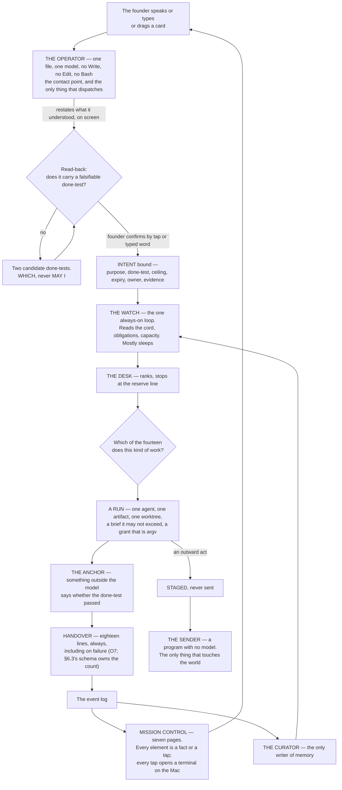

**(NEW: what the picture asserts, said once so no section restates it)** Four things in that diagram are the design.
**Only the founder's door creates an intent.** **Only the Operator dispatches**, and it holds no verb that could
build instead. **Only the Sender touches the world**, and it holds no model. **Only the curator writes memory**, and
it holds no shell. Everything else is a consequence.

**(NEW, fixer round 2026-09-06: v96 — the four invariants are the kernel, and the commodity line is doctrine)** The
**kernel test:** a mechanism is *kernel* only if it holds **direction, record, truth or taste** — and the four
sentences above are one each: the founder's door holds direction, the log holds the record, the no-model Sender holds
truth, the curator holds taste. Everything else Keel builds is an **adapter**, the thinnest reader of a named vendor
surface into the record, or it is **refused**. **The commodity line, once:** every mechanism in SPINE §L and every
`bin/` program carries `class: kernel | adapter | refuse`, `vendor_wins_if:` and `wins_if:`; a matched
`vendor_wins_if:` forces Delete, like a skill at expiry; §L is sorted by class before §19 orders it, and §19 builds
kernel before adapter and never builds `refuse`. **Mechanism:** the marks lint (v50) refuses an adapter naming no
surface and a kernel naming none of the four — `keel/shared/rules.yml` and the lint, **ABSENT** (§L O105). **Why
(THINKER: C3, A7, B1 · conv. 4):** vendors shipped the bottom half of this plan in one window — the terminal pop,
the fleet page, the cost arithmetic, the bell, messaging, fallback chains, a supervisor daemon — and the doctrine had
no rule for *not building*. **Losing image:** §L built in §19's order · `wins_if:` a year in which no vendor ships any
adapter's surface (§22 collects it).

**(NEW, fixer round 2026-09-06: v97 — what binds is data, and this picture is a rendering)** The binding content of
the plan is **data** — `rules.yml`, `roster.yml`, `routing.yml`, the schemas, `prices.yml`, `facts.yml`,
`settings.yml` — and the prose, this section included, is rendered from it: a hand-edited rendered table fails lint
and superseded prose moves to an archive (§L O106). The four invariants above and `rules.yml` generate the
**constitution**, `keel/constitution.md`, **≤ 4,096 bytes** — `session-start.js`'s own budget (#76) — byte-identical
for the cache, which is the Operator's pre-flight read (§3.1) and the only part of the plan anything that acts ever
reads. Its test: a fresh agent given only the constitution and the schemas writes a brief that passes `check-stores`.
**Mechanism:** the generator and a byte-budget checker modelled on `scripts/check-memory-budget.mjs` (exists as a
shape on this branch) — **ABSENT** (§L O107). **Why (THINKER: C18, B6 · conv. 7):** 156,000 words that nothing
acting can read cannot bind. **Losing image:** the prose as the binding document · `wins_if:` a builder brief for any
§L program fits under 8K tokens from the prose alone, three times running.

---

### 0.4 The five ideas, re-read against the founder's direction

**(NEW: FINAL §0 rested the whole design on five ideas. The founder's direction of 2026-09-05 overruled five of
FINAL's decision rows, so each idea has to be re-read rather than inherited. Three stand unchanged, two move, and
none is deleted)**

| # | The idea, as FINAL wrote it | Verdict | What moved, and the mechanism |
|---|---|---|---|
| 1 | **Nothing runs that does not trace to a live Intent with a falsifiable done-test** | **STANDS** | Unchanged by v1–v5, and the roster makes it easier to enforce, not harder: the Operator emits a brief carrying an intent id and `bin/run` composes the argv from it. **Mechanism:** `bin/run` refuses a brief with no resolving intent id (ABSENT; FINAL names it `keel/bin/run`); the store check refuses an intent whose done-test is not falsifiable by someone who did not do the work (ABSENT) |
| 2 | **Method is never specified. Only the outcome, the constraints and the evidence are** | **STANDS, and the roster is where it was most at risk** | Fourteen named agents carry *expertise* — a lens, a skill namespace, a model, a grant — never a procedure. **Mechanism:** the skill content rule (v18) admits four bodies — anchor, exemplar, rehearsal case, reference — and a step list only as the Sender's checklist, where the judge is absent and the act cannot be taken back |
| 3 | **Standing orders replace approvals. Inside the envelope, silence is permission. There is no approve verb** | **STANDS, and hardens from stylistic to load-bearing** | v9: a fully autonomous run runs in `dontAsk`, which **denies `AskUserQuestion` even when allowed**. A silent run *cannot* ask. So staged-not-sent and the *which* are the only channel it has. **Mechanism:** the permission mode itself, sourced from the vendor's own permissions page |
| 4 | **Capacity is one exhaustible pool with a reserve held for the founder** | **MOVES** | v22: there are **two** windows per seat, a rolling five-hour **and a weekly**, shared with Claude chat and Cowork — so the reserve is per window *and* per week, and a weekly exhaustion is a different event from a five-hour one. And two limit shapes behave differently: a seat limit cannot be escaped with `/model`, a model-family limit can. **Mechanism:** the Watch distinguishes them (§4); `bin/watch` ABSENT |
| 5 | **Knowledge is earned, not curated; memory is mined from what already happened** | **MOVES** | v3: the founder overrules the refusal of a library. There **is** a skill library now, in the open SKILL.md standard. *Earned* survives with a sharper mechanism than FINAL had: **admitted by eval** — with-skill against baseline, and a candidate that does not beat baseline is not admitted — and **retired by forced expiry**, because nothing in the world retires a skill by non-use (v19). Mining stays a batch pass over a snapshot, never a live parser, because the transcript format is internal to the vendor and changes between versions (v26) |

**(NEW: what the two moves have in common, and it is worth naming)** Neither overturns an idea; each replaces a
belief with a mechanism. "One pool" became "two windows, and here is how to tell a stop from a reroute." "Knowledge
is earned" became "admitted by an eval that runs with-skill against baseline, and expires on a date." A founder
overrule made both sharper than the original, which is the argument for not re-litigating them.

---

### 0.5 A day with it

**(NEW: FINAL's day ran on a clock — 06:40, 07:20, 09:00, 18:00. The SPINE forbids schedules and durations, and a
clock in a plan is both. This is the same day re-anchored on the mission-control page the founder is looking at and
the agent doing the work, which is what actually changed)**

| Where the founder is | What they see | What is running behind it |
|---|---|---|
| **The phone, first thing** | Nothing, unless a `wake-me` line fired. If one did: one line | The Watch slept through everything that did not qualify. The interruption budget is three a day, and a channel whose acted-on rate falls is demoted below its threshold |
| **The briefing** | One page the founder opens, so it is never an interruption. What moved, with the evidence; the raw work biggest first — the rendered page, the played video, the diff, the email that would go out, staged and unsent; the *whiches*, ~~both built~~ one option built and a written second unless a ten-word summary cannot separate them, and its first line is *decisions taken · deferred · defaulted* (amended 2026-09-06: E15 · v87 · O96); what could not be checked, named; what it cost per venture and per window; what the Operator would do next, none of it started | `writer` staged the email and never held the key. `designer` produced the render and its anchor is the screenshot judged against a named target, not its own description. `analyst` produced the cost rows, and every one of them taps through to its run |
| **Mission control, page 2 — agents and child flows** | The Operator and its children: who is working, who is sleeping, what each is doing on the current task | Agent teams — a lead plus named teammates, each a full session. One level of teammates is visible because the runtime ships **no nested teams**; the deeper tree is subagents |
| **A tap on an agent** | A terminal opens on the Mac and the founder is inside that session | *"remember each agent or each session that we are opening in the mission control or any other surface, it's directly opening it in the terminal in my Mac because everything is run on it"* (FOUNDER). The mechanism is the documented tmux CLI (§15) |
| **Mission control, page 4 — the board** | Tickets, PRs and a timeline. The founder drags a card into *working on it* | The drag launches a session with a team of agents and hands it the task. **Nothing in the world does this** — every board-to-session project found maps one task to one agent (v16), so this part is ours to build |
| **The Floor** | A terminal, one agent, the same memory and the same envelope. The founder's own browser and own send button are here and nowhere else | The system goes sterile: nothing interrupts, nothing new is dispatched on the founder's window, the venture under their hands is held whole. When they leave, the queue that built up is one paragraph |
| **A *which*** | ~~Two options, both already built~~ One option built and a written second, both built only when a ten-word summary cannot separate them (amended 2026-09-06: E15 · v87), and the cost of each. One tap | There is no approve verb anywhere in the system. Outside the envelope, the system builds both and asks *which* |
| **The night** | Nothing. The founder is asleep | **Only when this Mac can hold a night** — `night_capable` from `pmset`, else the unattended brief is refused and routed to the cloud lane (v83, v84 · §4.1b) — and only while `founder.lease` is fresh (v102 · §4.4). Then obligations first, before any goal. Then, under each driven venture's ceiling, runs are born with a brief, work however they like, are checked by something outside the model, hand back every line the handover schema names (§6.3), and die. Routine work burns the Gemini window and never touches the founder's; embeddings and classification run locally on electricity. A fully autonomous run **cannot ask** — everything it would have asked is pre-decided or staged as a *which* |
| **Dawn** | The briefing again | The curator has already run: delta-only writes, one writer, an index loaded at start and topic files on demand |

---

### 0.6 What it is not

**(FINAL, three entries deleted by the founder and one added)** A harness with no standing. A dashboard nobody acts
on. A library of playbooks. A permissions matrix. A night that burns the window before the founder wakes. A machine
that grades its own homework. A machine that is only brakes.

**(FOUNDER)** Three of FINAL's *is-nots* are struck, because the founder overruled them and meant it. It **is** a
roster of named agents (v1, v2). It **does** have a dashboard, and the rule that saves it is that every number on it
names the tap that acts on it (v14). It **does** have a skill library (v3).

**(NEW: one is-not is added, from v6, and it is the one most likely to be violated by someone who reads "fourteen
agents" and imagines a pod)** It is **not** a system that splits one artifact across two builders. One artifact, one
agent, continuous context. Anthropic's own multi-agent post excludes coding from the pattern — *"not a good fit for
multi-agent systems today"* — and Cognition's measured failure is exactly this: *"Actions carry implicit decisions,
and conflicting decisions carry bad results."* The roster names *who* does a kind of work. It never parallelises one
build.

---

### 0.7 The vocabulary

**(FINAL)** Very few names are spent, each a plain English word doing the job that word already does. Nothing is
called an engine, a crew, a swarm, a council, a brain, ~~a kernel,~~ a mouth or a bench — *kernel* is spent once,
on the four things Keel holds itself, direction · record · truth · taste, and on nothing else (amended 2026-09-06:
NEW: v96 · §0.3).

| Word | What it is | Where it lives |
|---|---|---|
| **Charter** | One per venture: what it is, tempo, envelope, ceiling, weight, horizon. Written by the founder, rarely changed | `ventures/<name>/charter.md` (ABSENT) |
| **Intent** | One live goal: purpose, done-test, ceiling, expiry, owner, evidence | `ventures/<name>/intents/*.md` (ABSENT) |
| **Done-test** | The falsifiable statement of what is true when the work is finished, written before it starts, checkable by someone who did not do it. The only thing ever mandated | inside the Intent |
| **Obligation** | Something owed, to whom, by when, with what consequence and what proves it discharged. No done-test to invent; the world set the test | `ventures/<name>/obligations.yml` (ABSENT) |
| **The Watch** | The one always-on loop. Reads state, ranks, mostly sleeps | one process, `bin/watch` (ABSENT) |
| **The Desk** | The ranking-and-dispatch function inside the Watch | inside the Watch |
| **Run** | One disposable unit of work: fresh context, one agent, one outcome, a ceiling, a grant, a done-test, a handover, then death | `logbook/runs/<id>/` (ABSENT) |
| **Envelope** | may-alone · never · wake-me, per venture, in the founder's words | inside the Charter |
| **The Sender** | The program with no model that performs a widened outward act against a staged, hashed artifact | `bin/send` (ABSENT) |
| **Floor** | The working-beside surface: the terminal, one agent, same memory, same envelope | Claude Code, installed and measured |
| **Balcony** | **Absorbed, not deleted** (v4). Its five views became pages of mission control | see the six words added below |

**(FOUNDER / NEW: six words are added, and each is added because the founder's direction names a thing FINAL had no
word for)**

| Word | What it is | Why it is added | Where it lives |
|---|---|---|---|
| **Operator** | The orchestrator of the agents, and the founder's contact point. One agent file; **N instances at once**, each a row in `sessions.jsonl` (v91, §3.1). Dispatches; never builds | **(FOUNDER)** *"We need an operator, which is, like, the orchestrator of the agents. which is also the contact point with me"* | `.claude/agents/operator.md` (ABSENT; the eighteen existing agent files on this branch, `ceo-1-1788609834`, are the format seed) |
| **Agent** | A named role with its own file, model, tools, MCPs, skills and anchor. **FINAL refused this word as a proper noun; the founder restored it** | **(FOUNDER)** *"each agent with its own expertise so we can adjust his knowledge and his tools and his way of walking and thinking"*, and roster.md fact 1: seven of seven shipped systems name their roles, zero ship unnamed shapes | `.claude/agents/<name>.md` (fifteen files, all ABSENT) |
| **Page** | One of the seven surfaces of mission control. Every element on it is a fact or a tap | **(FOUNDER)** *"I want you to have pages with different things"* | mission control, a website (ABSENT; `mission-control/` exists on this branch as the server spine) |
| **Board** | Page 4: stages, a timeline, a kanban. Cards move across it | **(FOUNDER)** *"a place where I can manage the tasks and the tickets and the PRs … to jog the tasks on a board which has different stages"* | page 4 (ABSENT) |
| **Card** | One task, ticket or PR on the board. Dragging it into *working on it* launches a session and hands it the task | **(FOUNDER)**, verbatim. **This is the one part of mission control with no prior art anywhere** (v16) | page 4 (ABSENT) |
| **Team** | A lead session plus named teammates, each a full independent session, messageable by name. What a card launches, and what page 2 draws | **(FOUNDER)** *"it launches a team or added team of agents to the session"*; the substrate ships in the runtime and is experimental and off by default | `~/.claude/teams/<team>/config.json` (the substrate ships; the page is ABSENT) |

**(FINAL)** Ordinary words — anchor, grant, rehearsal, briefing, logbook, memory, window, reserve, the cord, the
world's door, the probe, the reconciler — are used as they read and are defined where they first appear.

**(FINAL, one refusal survives; one is lifted)** *Playbook* stays refused: the founder named it as what killed
creativity, and mission-command doctrine has held for a century that orders specifying method destroy the
subordinate's ability to adapt. *Agent* as a proper noun is **no longer refused** — the founder restored it, the
world agrees with the founder, and §5 spends fourteen names deliberately and says what each costs.

---

## 1 · The decisions

*obeys: SPINE §A entire, reproduced, plus FINAL §1's carry-forward numbers; inherits: FINAL §1*

---

**(NEW: what this section is for, and why it is reproduced rather than summarised)** This is the row set every other
section writes from. Twenty-five sections cannot disagree if each of them decides nothing that is not here. Rows
**v1–v5** are the founder's overrules of FINAL §1 — they are not arguments, they are decisions, and each is followed
in §1.2 by one paragraph stating the cost once and the chosen thing. Rows **v6–v41** are places a fact from the
world moves a FINAL row, or a place FINAL stands *because* a fact was checked against it; rows **v42–v53** are what
the review round decided — a census of every figure against disk and two sealed challengers, applied before this was assembled; rows
**v54–v65 are the founder's answers in the interview of 2026-09-05** (DECISIONS.md §15), each a decision and not an
argument; and rows **v66–v82 are the rethink round of 2026-09-06** (DECISIONS.md §17–§19) — v66–v81 the founder's
sixteen decisions on `rethink/SYNTHESIS.md` §1, and v82 the one deletion the founder took. The losing image is kept
by name in every row so it can be argued for later, and collected again in §22.

**(NEW: where the last six rows came from, said once because their provenance is different from the rest)** Rows
**v36–v41 were decided by the orchestrator during the build round** (DECISIONS.md §8–§10), each because a section
writer hit a question the spine did not answer and returned it rather than inventing one. That is the intended path
and the rows are load-bearing, not late additions: v36 closes a collision between two rules over one grant, v37
closes the brief's field count, and v38–v41 place or dimension things the roster and the seven pages made concrete.

**(FOUNDER: the last twelve rows have a third provenance, and it is the strongest of the three)** Rows **v54–v65
were answered by the founder** in one interview of five rounds, put through `AskUserQuestion` against every row of
the open-decisions table and FINAL §19's five open rows. They are not research findings and not the orchestrator's
placements; where one moves an earlier row it overrules it by name — v57 overrules v21, v59 strikes §9.2's teammate
row — and the earlier reading goes to §22 like any other losing image. Two of the twelve, **v56** and **v62**, were
named by the founder as a thing to research rather than a thing to do; **both are now decided**, from
`research/cloud.md` and `research/room.md`, returned the same day, and v56 opened **§I row 15**, the founder's.

**(FOUNDER, rethink 2026-09-06: D1–D16)** The last seventeen rows have a fourth provenance and it is the newest.
Rows **v66–v82** are the **rethink round**: the founder asked for *"a rerun on the current system"* (DECISIONS §17),
nine lanes read v1–v65, the sections, COVERAGE and the research cold, and the synthesis put sixteen decisions to the
founder in four `AskUserQuestion` rounds. **The founder chose the recommended option on all sixteen** (DECISIONS
§18), and **no founder row was reversed** — v66–v81 move the *implementation* of an earlier row where they touch one,
and each says which. **v82** is the one deletion the founder took, verbatim: *"Delete the row from the plan"*
(DECISIONS §19). The round's other three products are deliberately **not** §1 rows and are not reproduced here,
because they are mechanism rather than decision: the eighty mechanisms the orchestrator decided (SPINE §L, inventoried
in §17 and ordered in §19), the thirty-two world facts that moved a row with no decision attached (SPINE §M —
**~~all thirty-two applied in place below~~ twenty-nine are applied in place below and marked *(moved 2026-09-06:
W-n)*; three move no row at all and are recorded in SPINE §M only** *(corrected 2026-09-06 · census C: the sentence
claimed thirty-two applications and three of the identifiers appear nowhere in the plan, so a reader checking the set
found a hole rather than a reason)*. **The three, named so the identifier set is complete here, each fact and each
binding quoted from SPINE §M rather than paraphrased:** **W16** — *"The `Workflow` tool's prompt footprint fell from
~5.7k to ~1k tokens, with a bundled `workflow-authoring` skill"*, binding *"**v35 unchanged and cheaper**; §E's
thirteen namespaces do not list the bundled skill"*; **W28** — *"Devin's automations ship a **max-concurrent-runs cap
per automation** and **per-automation cost attribution**"*, binding *"**v55** — Devin ships v55's exact shape plus two
ceilings v55 has no mechanism for; the store check refuses `every:` without a ceiling **per run**, which is a
different cut. Feeds **v75** and **O32**"*; **W29** — *"Factory's named droid taxonomy is **NOT FOUND** on a second,
different page"*, binding *"roster.md's UNVERIFIED becomes NOT FOUND; **v1 and v2 unaffected**"*), and the twenty-six questions nothing resting on them can be
decided without (**SPINE §N, reproduced in §20.8** — *corrected 2026-09-06 · challenge C P3-3: this read "listed in
§20" while §20 listed none of them; the list exists now and §20.8 is where it is*).

**(FOUNDER, fixer round 2026-09-06: E1–E15 · DECISIONS §24)** The last twenty-four rows have a **fifth provenance**.
Three fixer lanes read the thinker round's sixty-four findings and sent twenty-four questions; the orchestrator merged
them to fourteen and asked them in four rounds. **Rows v83–v95 are the founder's answers** — four of them
**overrules** of every lane that proposed otherwise: *"dont need for now. use this mac and when cant use cloude"*
(E1, no box), *"no keys, codex and gemini cli use."* (E7), *"Yes, after N recall-free sends per venture"* (E11), and
no vanilla week (E14). Two the founder delegated — *"idk"* (E5) and *"i dont get it, do what best for the sytem"*
(E15) — and the orchestrator's default applied, recorded as `class: ratified` so the founder can reverse either by
name. **Rows v96–v106 are orchestrator-class decisions** from the three lane files, each reopenable, and every one of
them carries a losing image with `wins_if:`. The round's mechanisms are **SPINE §L O81–O127**, its measurements
**§M W33–W41** (thinker A's, on this Mac, bound for `facts.yml`), its questions **§N R27–R40** — none of them §1
rows, for the same reason as before.

---

### 1.1 The ~~eighty-two~~ one hundred and six rows

**~~Eighty-two rows.~~ One hundred and six rows** (amended 2026-09-06: fixer round · DECISIONS §24). **v83–v95** are
the founder's answers E1–E15 (E6 amends **v76** in place; E14 is a losing image, §22 entry 75, not a row);
**v96–v106** the orchestrator-class decisions of the same round. **Seven strikes in place:** v11 (E9), v46 (E8), v55
(O126), v61 (E12), v69 (E10), v71 (O111), v76 (E6) — each struck, never deleted, with the amendment beside it.
**The class rule, once (FOUNDER, fixer round 2026-09-06: E5 → v89):** every FOUNDER row carries `class: originated |
ratified`. *Originated* is the founder's words and is never re-litigated: v1–v5, v54–v65, v82, v83, v85, v86, v90,
v94, and §22 entry 75. *Ratified* was picked from an agent's list and is reopenable through a Decide item carrying a
reason and a falsifier: v66–v81 and every other E-row. Three hybrid rows — v14, v31, v32 — carry a founder half that
is v4's, v1's and v5's own words, and inherit that row's class *(NEW: a lint over the marks (O105) would otherwise
fail them; SPINE §A leaves the three untagged and is told so)*. **Four overrules are final:** no box (E1), no key
(E7), first contact reachable (E11), no vanilla week (E14). **(NEW, fixer round 2026-09-06: v97 · O106)** This table
is a **rendering**: its binding form is the founder rows of `keel/shared/rules.yml`, and once the renderer exists a
hand-edited copy of it fails `schema-lint` (**ABSENT**; until then the table below is kept by hand and SPINE §A is
the source).

| # | The question | Decided | From | The losing image, kept as |
|---|---|---|---|---|
| **v1** | How many kinds of worker | **Fourteen named agents plus the Operator** — a company, each with its own expertise, knowledge, tools and way of working | **FOUNDER** · `class: originated` (overrules FINAL row 6): *"I want us to recreate the whole startup company … between ten and fifteen agents"* | three shapes — maker · scout · checker — with loadouts assembled per run, and no file per role |
| **v2** | Names | **Real names, one file per agent**, each carrying its own model, tools, MCPs, skills and anchor | **FOUNDER** · `class: originated` (overrules FINAL row 8), and roster.md fact 1 — MetaGPT, ChatDev, Magentic-One, CrewAI, the OpenAI SDK, wshobson and VoltAgent all ship named persistent roles; **zero of seven** ship unnamed-shape-plus-loadout | labels, not names; a run labelled only by what it makes and which window it burns |
| **v3** | The skill library | **A library in the open SKILL.md standard**, admitted by eval, retired by expiry, plus a **skill creator** | **FOUNDER** · `class: originated` (overrules FINAL row 10): *"take all the skills that the biggest systems use … we need a skill creator of skill"*; skills.md 1, 7, 12, 16 | `keel/holding/skills/` — 134 skills moved whole into a directory read by nothing |
| **v4** | The surfaces | **Mission control is a first-class website with seven pages, and every page is a control.** The Balcony's five views are not deleted; they become pages of it. The Floor stays a terminal on the Mac and is what every tap opens | **FOUNDER** · `class: originated` (overrules FINAL row 15): *"the mission control surface. I want to add it, bring it back"*, and *"when I click on it, the terminal which runs the agent on my Mac is popping up"* | five Balcony views over one state; the room as a display that is never a control; *"no project is both"* |
| **v5** | Which provider stands which position | **Codex and Claude Code are both in the system from day one**, in one shape decided in §10 | **FOUNDER** · `class: originated` (overrules FINAL row 30): *"I run from day one of the system to include codex and Claude code"* | Codex admitted only after a headless rehearsal passes; Gemini proving the second-family route first |
| **v6** | Whether the named roster parallelises one artifact | **No.** One artifact, one agent, continuous context. The roster names *who* does a kind of work; it never splits one build across two builders | FINAL §7.1, **reinforced** by roster.md 4 (Anthropic: coding is *"not a good fit for multi-agent systems today"*), 6 and 7 (Cognition: *"Actions carry implicit decisions, and conflicting decisions carry bad results"*) | a pod of builders on one feature; MetaGPT's waterfall of four roles over one repo |
| **v7** | The seam between `architect` and `builder` | **The architect's output is a separate artifact with its own done-test, handed over whole.** A builder that needs to change a schema or an interface **files an objection; it does not edit it** | **NEW:** roster.md 6 names the exact failure — two agents acting on assumptions *"not prescribed upfront"*. Making the contract an artifact with a done-test is what prescribes them. **Mechanism:** the builder's grant excludes the architect's output path (argv `--add-dir`); the objection is the cord on itself (FINAL §7.3) | one agent that designs and implements; two agents that share one artifact |
| **v8** | Who writes the test that judges a build | **Both, and they are different tests.** The builder tests its own work before handing over (self-check). The **tester writes the anchor test blind** — it reads the done-test and the interface, never the implementation | **NEW:** cognition.md 8 (Devin: *"Tell Devin to test its own work before opening a PR"*) is the self-check; a test written by the author of the code is a machine grading its own homework, which FINAL §0 refuses. **Mechanism:** the tester's `--add-dir` excludes the implementation path | one testing agent that reads the diff; the builder's own tests as the only anchor |
| **v9** | What "fully autonomous" costs | **A fully autonomous run cannot ask.** `dontAsk` mode denies `AskUserQuestion` even when allowed. So everything the run would have asked must be pre-decided in the envelope or **staged as a which** | **NEW:** cognition.md 2 — *"`AskUserQuestion` … are denied even if you've allowed them"*. This makes FINAL's staged-not-sent rule load-bearing rather than stylistic: it is the only channel a silent run has | a fully autonomous run that pauses for a question nobody will answer |
| **v10** | The widest permission mode | **`bypassPermissions` is refused, by a mechanism** — `permissions.disableBypassPermissionsMode: "disable"` in managed settings, where a running process cannot clear it | **NEW:** cognition.md — deny rules bind in every mode including bypass; allow rules have no effect in it. **(moved 2026-09-06: W7)** the managed setting is **no longer the only thing standing there**: `--restricted` *"refuses `bypassPermissions`"* by itself (world.md 7), so the refusal has two carriers, one in argv and one in a file a running process cannot clear | `--dangerously-skip-permissions` and its successors as a night default |
| **v11** | The managed settings file, now that `/goal` exists | **The managed file carries `permissions.deny`, `disableBypassPermissionsMode` ~~and `disableAutoMode`~~ only — `disableAutoMode` is struck, the Floor keeps the founder's mode, night children run `dontAsk --restricted` where auto mode is inert (amended 2026-09-06: E9 / THINKER: A3 · v92) — and does NOT set `disableAllHooks` or `allowManagedHooksOnly`** | **NEW:** runtimes.md — *"`/goal` is a wrapper around a session-scoped prompt-based Stop hook"*, and it is unavailable under either of those two settings. **The cost, once:** a run can therefore register its own Stop hook. That is a smaller hole than losing the goal loop the founder asked for, and the probe checks it nightly. **(moved 2026-09-06: W7)** on the `-p` carrier the managed file has **less to carry than this row assumed**: `--restricted` *"ignores user, project and local settings files"* (world.md 7), so argv alone decides more there — independent support for §L **O37**, which deletes the project-`settings.json` tier of grants outright | a managed file that locks hooks; FINAL §7.5's premise that the managed file is where every narrowing goes |
| **v12** | Where loops and goals sit | **`/goal` sits on the run: the done-test IS the goal condition**, with a turn clause. **`/loop` is refused in production** and stays a Floor convenience | **NEW:** runtimes.md — `/goal` runs headless in one invocation (`claude -p "/goal …"`), condition limit 4,000 chars, bounded by *"or stop after 20 turns"*. `/loop` is *"session-scoped"*, has a 7-day expiry, and *"Tasks only fire while Claude Code is running and idle"* — the Watch is the loop. **(moved 2026-09-06: W14, W31, W13, W15 — and this is the sharpest fact of the round.)** ~~Check-ins start at 30 minutes and double to a 4x ceiling~~ is superseded: they back off **30 min → 1 h → every 2 h**, and *"idle sessions … start at most three check-ins on long-running background work per goal; your next message allows three more"* (world.md 14). **Under `-p`, check-ins are the only way the runtime delivers anything, and nobody is there to message it** — so a night goal loop delivers three times and then goes quiet. Beside it, the vendor's own measurement: the **99.9th-percentile turn duration is over 45 minutes** (world.md 30b, W31). **Those two are the measured unattended ceiling that fully autonomous mode (§3.3) is designed above, and the row states it rather than discovering it. The answer this row now carries is §L O21 + O15:** O21 makes the goal condition an **exit code** (`<anchor>` exits 0, and the done-test) so the three deliveries are judged by a program rather than by prose, and **O15**'s wake reconciler is what notices a run that went quiet — writing `orphaned`, never `finished`, then resuming by id or closing with a reason. **W13:** `/schedule` is a **fourth** scheduling surface inside the CLI and its semantics are UNKNOWN (the doc page returned HTTP 404) → **R25**. **W15:** `/loop` gained a self-paced dynamic mode and an autonomous default — the **losing image got stronger, not the decision**; it is still session-scoped and still refused | `/loop` as the Watch; a cron inside a session as the always-on tier |
| **v13** | How the Operator dispatches | **Three mechanisms, each for what it is documented to do:** agent teams for the *visible* fleet the founder watches; subagents for depth inside one agent; `claude -p` children through the launcher for unattended night work | **NEW:** surfaces.md (teams are a lead plus named teammates, each a full session, with tmux pane ids on disk) and runtimes.md (subagents: depth 3, 20 concurrent, `Workflow` removed from all of them; `-p` never forms a team). **The constraint, stated once:** teams are experimental and off by default, **no nested teams**, one team per session, `/resume` does not restore them — so the child-flow page shows one level of teammates and the deeper tree is subagents. **(moved 2026-09-06: W11, W20)** three dispatch mechanisms are no longer the whole picture: **a channel between sessions that are already running now ships on both providers** — `SendMessage`/`ListAgents` across sessions on one machine, with an inbox socket that closes a connection sending no complete line within 30 seconds (world.md 11), and Codex `@` task mentions (world.md 20). **§3.5 gains a fourth row, and what a message may be is v80** | a single dispatch mechanism; a hierarchy of teams of teams |
| **v14** | The cost dashboard against *"nothing is only informational"* | **The dashboard is admitted, and every number on it names the tap that acts on it** — a cost row taps to its run, a window row taps to retempo, an anomaly taps to the cord | **FOUNDER** · `class: originated` (the founder half is v4's words and inherits its class) (*"cost and tokens, efficiency, monitoring, and a dashboard"*) + **NEW:** surfaces.md 6 states the collision as two positions, not a resolved question. This resolves it by keeping both | FINAL §13.2's Balcony table with no dashboard row |
| **v15** | Which canvas and graph substrates are admissible | **Admitted: Langflow (MIT [`api`: GitHub SPDX detection, LICENSE not read], alive 2026-09-05) as the canvas idiom; `3d-force-graph` (MIT [`api`: GitHub SPDX detection, LICENSE not read]) as the renderer. Refused: n8n (Sustainable Use — *"only for your own internal business purposes or for non-commercial"*), Flowise (ARCHIVED, licence NOASSERTION), Gource (GPL-3.0 [`api`: GitHub SPDX detection, LICENSE not read])** | **NEW:** surfaces.md licence table, n8n's LICENSE.md read raw | n8n as the workflow surface; Flowise as the canvas |
| **v16** | The board→session prior art | **OpenAI Symphony (Apache-2.0 [`api`: GitHub SPDX detection, LICENSE not read], last push 2026-08-19) replaces vibe-kanban as the reference.** vibe-kanban's own README now reads *"Vibe Kanban is sunsetting"* | **NEW:** surfaces.md 4, 5. **The gap that is ours to build:** *"Nothing found gives a card a team"* — every board-to-session project maps one task to one agent | FINAL §13.8's refusal of vibe-kanban as an unmaintained runtime — right conclusion, weaker reason |
| **v17** | Bulk import of the 2,111+-skill upstream | **Blocked until `LICENSE-CONTENT` is read.** The code is MIT; a **separate `LICENSE-CONTENT` file exists and was not fetched**, and it may carry different terms for skill *content* than MIT does for code | **NEW:** skills.md licence table and gap 3. Cheap to clear, one fetch; until then no bulk vendoring | importing 2,111+ skills on the strength of the repository's MIT badge |
| **v18** | The SKILL.md procedure collision | **The container is the open standard; the content rule is ours.** Four admissible bodies — anchor · exemplar · rehearsal case · reference. A **step list is admitted in exactly ~~one place~~ two places** **(corrected 2026-09-06: v51 widened v18 from one · challenge C P1-1)**: a checklist the Sender reads aloud, where the judge is absent and the act cannot be taken back, **and the curator's five fixed questions** | **NEW:** skills.md — the published spec recommends *"Step-by-step instructions"*, and FINAL §11 forbids procedure, so *"different artifacts wearing the same filename"*. FINAL §9.4's quadrant already decided where procedure is legitimate. **The cost, once:** an imported skill written to the spec's recommendation fails our admission and needs a pass | FINAL §11's flat refusal of the library; the spec's recommended body as written |
| **v19** | Skill retirement | **By forced expiry.** Every skill carries `valid_until`; at expiry exactly one disposition is recorded — Refresh, Deprecate, or Waive with a new date | **NEW:** skills.md 20 — *"Nobody found retires a skill by non-use"*; the nearest shipped thing is dead-link and drift detection. **Mechanism:** `scripts/ledger.mjs` already forces this disposition and `check-citations.mjs` already blocks on a dead path — both on this branch | *"Ninety days uncalled and it leaves"* — a usage counter nobody in the world has shipped |
| **v20** | The cheap tier | **No agent's default model is Haiku.** Haiku 4.5 appears only where the vendor sets it (the `/goal` evaluator, the auto-mode classifier). The genuinely cheap work goes to **local models on electricity** | **NEW:** models.md 5 — Haiku 4.5 retirement *"Not sooner than October 15, 2026"*, and it is the only Haiku in the published table. Locals: MiniLM 384-dim and Qwen3-0.6B, both Apache 2.0 | a Haiku executor tier; FINAL §16.7's *"local models: no shape"* read as *no work* |
| **v21** | Where Fable 5.1 sits | **An escalation, not a default.** One named rule: an intent whose done-test has failed twice under Opus 5 and whose horizon exceeds one window. **Its availability on a subscription seat is UNVERIFIED** — models.md publishes its API price and no plan table names it; fallback is Opus 5 | **NEW:** models.md — Fable 5.1 cache reads at **0.025x** base input against 0.1x everywhere else, which is what makes a large standing context cheap to re-read; the SWE-bench Pro ranking is third-party, confidence L, and is **not** used to route | Fable as the builder's default; wshobson's tier 0 adopted as-is |
| **v22** | The window | **Two windows, not one: a rolling five-hour AND a weekly, per seat, shared with Claude chat and Cowork.** And two limit shapes that behave differently — a seat limit cannot be escaped with `/model`; a model-family limit can | Moves **FINAL row 19**, which knew only the five-hour fuse. models.md, quoted from the vendor's costs page. **Consequence:** the reserve is per window *and* per week, and a weekly exhaustion is a different event from a five-hour one. **(moved 2026-09-06: W4, W26)** part of the window is machine-readable now — a `rate_limits.spend_limit` status-line field, a Spend limit bar in `/usage`, a per-loop breakdown and a `prompt_cache` object (world.md 4) — so **v74**'s gauge reads vendor fields where they exist and computes only the rest; and Google states a **second reason** for v6 that lands on this row: *"parallel subagents … consume the rate limit faster"* (world.md 26), which makes fan-out a window decision and not only a correctness one | one rolling five-hour window as the whole physical fact |
| **v23** | `--max-budget-usd` | **Not a billing control.** Print mode only, computed locally from token counts at list price, and *"the session cost figure isn't relevant for billing purposes"* for subscribers. It is a **stall fuse**, and it is kept for that | Moves **FINAL §7.5** and closes half of **FINAL §19.11**. models.md. Still true and still useful: subagent spend counts toward it, and overflow fails a spawn with `Budget limit reached` (v2.1.217+). **(moved 2026-09-06: W5)** the arithmetic changed — cost estimates *"now include the 1.1× US-only-inference premium for data-residency workspaces"* (world.md 5): still a local estimate, now with a residency multiplier, which is one more reason **v74** denominates a ceiling in window share and keeps USD as a shadow price | a per-run dollar ceiling that binds the account |
| **v24** | Memory writes | **Delta-only, never a rewrite** — FINAL row 11 stands and is now sourced | **FINAL, now cited:** memory.md 1 — the paper is **ACE, arXiv 2510.04618**: context held 18,282 tokens at 66.7% accuracy, collapsed at the next step to **122 tokens and 57.1%**, below a 63.7% baseline | a nightly full rewrite of the memory files |
| **v25** | Who writes memory | **The curator, and only the curator** — the thing that acts never edits memory. FINAL stands, **with its counter-example named** | **FINAL**, against memory.md 3: Claude Code's own auto memory *is* written by the acting agent, in-session. That is one shipped counter-example, and it is accepted as a counter-example rather than hidden. **Mechanism:** the curator's grant is the only one whose writable scope includes the memory paths | shared memory writes by every agent; FINAL §10.1's Letta attribution, which memory.md 2 shows the current vendor page no longer supports |
| **v26** | Transcript mining | **Stands.** No tool was found that mines a transcript archive into taste, negatives or already-built; three tools read the corpus and render it for humans | **FINAL**, confirmed by memory.md 4. **The caveat that binds the build:** *"The entry format is internal to Claude Code and changes between versions"* — so mining is a batch pass over a snapshot, never a live parser in the critical path | a live transcript reader as a system dependency |
| **v27** | The shape of the memory index | **Two tier: an index loaded at start, topic files on demand** — and it is now the vendor's own default, not a local invention | **NEW:** memory.md 6 — Claude Code loads *"the first 200 lines of `MEMORY.md`, or the first 25KB, whichever comes first"* and topic files on demand. Same shape this repo already built for skills discovery | a single flat memory file loaded whole |
| **v28** | The permission axis | **Reversibility. FINAL row 12 stands, and it stands alone in the world** | **FINAL**, against cognition.md — *"neither shipped scheme does"*: Claude Code keys on a fixed path list plus an action class, Codex on workspace scope plus network. The nearest shipped analog is the classifier special-casing `rm`/`rmdir` on critical paths | keying `may-alone` on file path, as both shipped runtimes do |
| **v29** | The read-back | **Stays.** No shipped system mandates a restatement before work binds; Linear's 10-second `thought` acknowledges rather than confirms | **FINAL**, cognition.md 10 — unsupported *and uncontradicted*. Closed-loop readback is regulation in aviation and medicine | voice or a chat message binding an instruction directly |
| **v30** | Why `challenger` is an agent and not a step | **Because self-critique without external feedback is measured as harmful** — *"at times, their performance even degrades after self-correction"* (arXiv 2310.01798). Reflexion's 91% is not a counterexample: its feedback is external | **NEW:** cognition.md 5, 6. **Mechanism:** the challenger never reads the artifact's author's reasoning, only the artifact and its done-test; a second model family whenever one is reachable | a plan-critique pass the same run performs on itself |
| **v31** | The roster size, and its cost | **Fourteen plus the Operator.** The cost, stated once and not re-litigated: **every shipped running roster verified is 5–6 agents; every roster of 150+ is a catalogue you pick from. Ten to fifteen sits in a band nobody publishes evidence for, in either direction** | **FOUNDER** · `class: originated` (the founder half is v1's words and inherits its class), cost from roster.md 5. It is an unoccupied band, not a refuted one — no source was found for a measured point at which adding specialists stops paying | Magentic-One's five; ChatDev's six; Anthropic's 3–5 concurrent subagents |
| **v32** | Codex's position on day one | **Checker on a prepared diff, in the foreground, stdout redirected to a file while inheriting the parent shell's TTY.** The **headless rehearsal is what widens it**: `codex exec --json`, no controlling TTY, non-trivial prompt, ~~version ≥ 0.124.0~~ **(moved 2026-09-06: W19)** — **the installed version, recorded**: Codex is at **0.153.4 (2026-09-04)**, so the old floor is 29 minor versions stale and is satisfied by anything installed, which means it no longer discriminates | **FOUNDER** · `class: originated` (the founder half is v5's words and inherits its class) (day one) + **NEW:** runtimes.md — #19945 open **130 days with no maintainer reply**, and its `script -qfc` cure is *"incompatible with normal background / parallel job execution"*. **The cost, once:** one foreground slot is not parallel, so Codex is not a night lane until the rehearsal passes detached. **(moved 2026-09-06: W24)** four weeks of Codex release notes (2026-08-26 → 2026-09-04) mention no `codex cloud exec`, no cloud API, no cancel or poll, no goal mode and **no #19945** — so **this row stands, and so does v56(b)**. Record it as what it is: **absence is not denial**, the June–August window is unread (three fetch failures), and reading it is **R26**, the only cheap route to **R10**. One correction that cuts the other way: 0.152.0 adds credential-refresh progress to `codex exec`, which **adds output to the stream this row depends on being clean** | Codex as a full maker on night one; `script -qfc` wrapped around every child |
| **v33** | The trifecta split, inside a roster | **Survives intact.** The agent that reads the untrusted world (`scout`) holds no credential and cannot send. The agent that drafts an outward act (`writer`, `growth`) never holds the key. The thing that sends is **the Sender, a program with no model** | **FINAL** row 7, and cognition.md finds *no shipped analog* for staged-not-sent or a recall window anywhere | a research agent with a send verb; one agent that reads mail, decides and replies |
| **v34** | What makes a grant real | **The exact argv, emitted by one no-model launcher**, plus the managed file of v11, plus a nightly probe that asserts what a run can actually touch | **FINAL** §7.5 and row 13, unchanged. **Mechanism:** `bin/run` is the only thing that composes argv (ABSENT); `bin/probe` asserts it nightly (ABSENT). **(moved 2026-09-06: W9)** one narrowing arrives free: `--add-dir`, `/add-dir` and `additionalDirectories` now *"refuse network paths (UNC shares, `/net/<host>` automounts) … before touching them"* (world.md 9), so a grant composed here cannot point at a share | `--allowedTools` as a narrowing; a prose rule describing a grant |
| **v35** | `Workflow` in an agent's tool line | **Absent from every agent, deliberately.** The gate may not be invocable by the thing it gates | **FINAL / this repo**, now **independently cited**: runtimes.md quotes the vendor — *"The `Workflow` tool is removed from all subagents via the first filter applied to subagent tool sets"* | granting a dispatched engine the ability to run its own gate |
| **v36** | Who may hold a tainted read | **`scout` only, and the world's door program.** Gmail, Calendar, Drive and Notion reads are tainted READ-ONLY; **no agent that holds `Write`, `Edit` or `Bash` reads them raw.** `steward` writes obligation **proposals** from `scout`'s handover and the Watch alone writes `obligations.yml` (v44); the world's door writes one inbound row per event and holds no model | **FINAL** §9.4–9.5 and v33, applied to a collision found between the tool classes and §5.2's `steward` row — one grant, two rules. Decided by the orchestrator 2026-09-05, DECISIONS.md §8 | a steward that reads mail with a pen in its hand |
| **v37** | The brief, now that agents have names | **Ten fields: FINAL's nine plus `agent:` — the roster name the launcher composes argv for.** `window+model:` stays as it is; the agent's row supplies its defaults and §9.1 overrides per move | **NEW:** fourteen named agents make *which agent* a fact the brief must carry, and neither reading was in the spine until §6 returned BLOCKED. Chosen because it leaves FINAL's nine untouched. **Mechanism:** `bin/run` refuses a brief whose `agent:` is not a roster file (ABSENT) | `agent+window+model:` as one widened field; a brief that names no agent and lets the launcher guess |
| **v38** | Where the read-back and the briefing live among the seven pages | **The read-back is the intent-creation form wherever an intent is born** — page 4's *new card* and page 7's *add session* — **and stays a published phone page** for voice. **The briefing is the top strip of page 5** and stays a published phone page. `Decide` items appear on page 4 as cards in a *waiting on you* column, and on the phone | **NEW:** FINAL §2.4's read-back page and §13.4's briefing were unplaced once mission control became seven pages. Placement, not a new mechanism: both were already published pages, and the founder's pages absorb rather than delete them (v4). **Mechanism:** the store check refuses an intent with no read-back confirmation row (ABSENT) | a read-back page as an eighth page; a briefing nobody can reach from mission control |
| **v39** | What hosts the website | **Mission control is served on the Mac by `mission-control/`** — the Bun and Hono server and React client that exist on this branch, 60 files — **because a terminal pop needs `tmux` on the same machine.** The phone reaches it two ways: the published artifact pages for reading and deciding, which **cannot** pop a terminal; and the local server over the founder's own network for everything else | **NEW:** the artifact runtime *"cannot reach tmux"*. **FOUNDER:** *"everything is run on it"*. FINAL §17 marked `mission-control/` absorbed; v4 un-absorbs it as the seed. **The cost, once:** two renderers over one state, which FINAL §13.1 refused — accepted because a tap that opens a terminal cannot come from a hosted page, and both read the same logbook | the website hosted as a published artifact; a cloud host that reaches into the Mac |
| **v40** | `maxTurns` for the roster files that have no seed | **30 for the nine that produce** — builder, architect, tester, designer, product, writer, growth, steward, curator — **and 25 for the five that only read** — reviewer, guard, scout, analyst, challenger. **The Operator 30.** Tuned per agent by measurement afterwards | **NEW:** the seven existing engine files on this branch use exactly these two values; `maxTurns` binds when an `agentType` is named; the lint ceiling is 120. A default that copies the measured seeds is a starting point, not a design | one cap for every agent; no cap |
| **v41** | `isolation` for the agents that write | **`worktree` for the four that touch venture source** — builder, architect, tester, designer. **`none` for the five that write only into the house's stores** — product, writer, growth, steward, curator — because their grant is a narrowed `--add-dir`, not a checkout. **`none` for the six that do not write** | **NEW:** FINAL §6.1 — a worktree is for a run that writes code or files of the venture; a store write is narrowed by argv (v34). **The cost, once:** `git worktree add` still cannot complete under the armed sandbox without escalation, measured 2026-08-24 | a worktree for every agent; no isolation for the four that edit source |
| **v42** | Where the fifteen agent files and their argv live | **Agent files in `.claude/agents/<name>.md` — the path the runtime reads and the `PS-*` lint globs. The per-provider argv files live in `keel/shared/argv/<agent>.<provider>.argv`.** `keel/agents/` does not exist | **NEW:** challenge A P1-1 — two homes, one unread by the runtime. **Mechanism:** the census of §19.2 fails a second path for one artifact | `keel/agents/<name>.md` beside its argv |
| **v43** | What carries the grant on each dispatch mechanism | **Three carriers, one per mechanism, and a claim is made only where its carrier can hold it:** `claude -p` children — the exact argv (`--restricted --tools … --add-dir …`); subagents — the agent file's `tools:`/`disallowedTools:` plus managed-settings `permissions.deny` rules, and nothing path-scoped that those cannot express; agent teams — the teammate's agent file plus the same managed denies. **Unattended night work runs only on the `-p` carrier.** The tester's blindness (v8) and the builder's exclusion from the architect's paths (v7) are argv facts on the `-p` path and are `permissions.deny` `Edit(<path>)` rules on the other two, **UNVERIFIED** until the probe asserts them | **NEW:** challenge A P1-2 — the plan asserted argv for mechanisms that have none. **Mechanism:** a grant matrix (mechanism × narrowing) in §12, asserted per row by `bin/probe` (ABSENT). **(moved 2026-09-06: W8)** the carrier this row said it could not name **now exists for reads**: `permissions.blockReadsOutsideWorkingDirectories` (world.md 8) is a *read* narrowing expressible in settings, which is exactly what the tester's blindness (v8) and the builder's exclusion from the architect's paths (v7) need on the subagent and team mechanisms. It stays **UNVERIFIED** until `bin/probe` asserts it, and until then §L **O28** routes `tester` and `challenger` on the `-p` carrier only | "the grant is the argv" said of a teammate |
| **v44** | Who writes `obligations.yml` | **The Watch, alone** (FINAL §2.3, §16.4). `steward` writes **proposals** into `keel/ventures/<v>/obligations-draft/` from `scout`'s handover; the Watch materialises a proposal into a row after the store check | **NEW:** challenge A P1-3 — two writers under "one writer each". **Mechanism:** `bin/check-stores` refuses a store whose declared writer is not the only grant carrying `Write` on that path (ABSENT) | steward writing the store directly |
| **v45** | The brief's field count | **Eleven: FINAL's nine, `agent:` (v37) and `anchor:`** — the rung-1 check the done-test names, required, and `bin/run` refuses a brief without it | **NEW:** challenge A P1-4 — ten in §6, eleven in §3 and §11. **Mechanism:** one schema file `keel/shared/schemas/brief.yml` (ABSENT) that the prose tables are generated from | ten fields with the anchor implied |
| **v46** | The Operator's runtime position | **~~The Operator is~~ An Operator instance is — N run at once, each a row in `sessions.jsonl` with a heartbeat (amended 2026-09-06: E8 / THINKER: A6 · v91) — the founder's interactive session, started as `claude --agent operator`, so one agent file governs it AND it can form the agent team page 2 draws.** It is inventoried as a file and runs as the main session; whether `--agent` binds the file's `tools:` at top level is **one measurement, UNVERIFIED**, and until it passes the no-`Write` guarantee is held by managed `permissions.deny` | **NEW:** challenge A P1-5 — a dispatched file cannot form a team; a bare main session is not the inventoried object. **Mechanism:** `scripts/probe-workflow-reach.mjs`'s pattern pointed at team formation (ABSENT) | an Operator dispatched as a subagent; an Operator with no file |
| **v47** | Who runs the reconciliation | **`bin/reconcile`, a program with no model, computes every comparison and writes the result rows; `analyst` reads the mismatches and drafts the Decide item.** The rung is the program's | **NEW:** challenge A P2-12. **Mechanism:** a lint failing a job named both in the no-model list and in an agent's routing line | an analyst that does the arithmetic |
| **v48** | Where the skill directories live | **At the house's repository root only** — `.claude/skills/` and `.agents/skills/`, generated from one Markdown source. Ventures carry no skill directory; skills are not per venture | **NEW:** challenge A P2-13 | skills under `ventures/<name>/` |
| **v49** | Whether `bin/skill` dispatches | **It does not.** The skill creator is a routing rule the Operator follows (scout → product → curator) plus one program, the eval runner `bin/skill-eval` (ABSENT). Only the Operator dispatches | **NEW:** challenge A P2-14. **Mechanism:** the ledger refuses a run id not minted by `bin/run` on the Operator's behalf | a program that dispatches four agents |
| **v50** | ABSENT versus WISH | **ABSENT: the mechanism is designed and its path is named; it is not built. WISH: no mechanism is designed.** A rule whose only mechanism is ABSENT is written in the present tense and is not a WISH | **NEW:** challenge A P2-19 — the two marks were used for one state. **Mechanism:** a lint over the document's marks (ABSENT) | ABSENT and WISH interchangeable |
| **v51** | The curator's five fixed questions | **Admitted as the second legitimate step list**, beside the Sender's checklist, on the evidence FINAL §10.7 cites (0 of 121 free reflections named the cause). v18 now reads "two places" | **NEW:** challenge A P2-20 | one place, with the five questions smuggled in |
| **v52** | Who writes a card | **The founder's door writes the card** — the read-back form (`bin/intend`, ABSENT) creates the card with its intent id; `bin/run` writes only the session id when a card is dragged | **NEW:** challenge A P2-21. **Mechanism:** `bin/check-stores` fails a card store row with no creating writer | a card with no writer |
| **v53** | How an eighth page is admitted | **Through a door, like a tool.** A new mission-control page is proposed against an intent, declares what it reads (the logbook and nothing else unless the door admits more), what each tap launches, and its licence read from the file; the same §9.3 door, with "every element is a fact or a tap" as its extra test | **NEW:** challenge A opinion O-1 — the founder said *"and a lot more cool and important things"* and the plan built a door for tools and none for surfaces. **Mechanism:** `bin/door` accepts `kind: page` (ABSENT) | seven pages as a ceiling |
| **v54** | The roster's first wave | **Eight agents first — the Operator, builder, reviewer, architect, tester, guard, scout, designer — the ones with a seed file or a code path today. The six business agents (product, analyst, writer, growth, steward, curator) and the challenger come online when a venture needs them.** All fifteen files stay in the inventory; §19 draws two waves | **FOUNDER** · `class: originated` (interview 2026-09-05, DECISIONS §15): *"Start with the eight that have seeds or code paths"*. **The cost, once:** wave one has no `challenger`, so a plan about to bind is attacked by `guard`'s adversarial review and the founder's own read until wave two; and wave one has no `product`, so done-tests are written by the founder through the read-back | fifteen files on day one |
| **v55** | Standing jobs — the company working on a cadence or an event | **A standing intent: an intent that ~~never expires~~ never finishes but expires — it carries `valid_until` with a forced disposition like everything durable (amended 2026-09-06: NEW: O126 / THINKER: B20) — carrying `every:` (a cadence) or `on:` (an inbound event class), dispatched by the Watch's tick to the agent its kind routes to; outputs stage, never send.** Customer support → steward from inbound rows · leads → growth · research and competitor watch → scout · security → guard · data analysis → analyst. **No new agents** | **FOUNDER** · `class: originated`: *"agents like: customer support, marketing agents: leads, research, security, competitors, data analysis and more that can run every set time or event … to build the company like working"*; chose *"Standing intents with a cadence or trigger, run by the Watch"*. **Mechanism:** the intent schema gains two optional fields; `bin/watch` reads them (ABSENT); `bin/check-stores` refuses `every:` without a ceiling per run (ABSENT) | per-agent cron in each agent file; a schedules page; a scheduler beside the Watch |
| **v56** | Work when the Mac is off | **A cloud lane exists, and FINAL's *"everything runs on the Mac"* gets one stated exception. Its position today, from research/cloud.md:** (a) **Codex cloud is admitted as a PR reviewer** — `@codex review` on a pull request, or automatic review on PR open, is vendor-documented, needs no local Codex, runs in OpenAI's sandbox, and so **sidesteps #19945 entirely**; (b) **Codex cloud as a maker is UNVERIFIED** — no vendor page prints a non-interactive command or an endpoint to create a cloud task; `codex cloud exec --env <id>` appears only in an open feature-request issue (#24777) as the author's claim about the binary; (c) **the documented off-Mac maker paths are Anthropic's** — `claude --cloud "<task>"` (argv, an isolated VM, clones the GitHub remote, `--teleport` pulls the session back) and Routines with an API fire endpoint and a one-hour floor — **and Google's Jules API (alpha)**. Which of these the crew may use for making is **§I row 15, the founder's**, because it is the terms question again (§I row 1, open by the founder's word). **Mechanism, orchestrator's, reopenable:** a hosted run's output lands as a pull request or a staged artifact the Mac reconciles on wake — never into the house directly; `bin/run` gains a `cloud` carrier that only mints a task and records its id (ABSENT); the Watch on wake reads the PRs (ABSENT) | **FOUNDER** · `class: originated`: *"When my Mac is not on … you can use codex or Gemini … But still keep it open"* → *"Yes — a cloud lane for when the Mac is off"*, research on **Codex cloud tasks** only. research/cloud.md, five parts. **The cost, once:** the lane the founder named has no documented driver today, and the lanes with a documented driver run on the Claude seat whose terms clause is the open question | the Mac as the only runtime; Routines refused wholesale; Codex cloud as a full night maker on issue-only evidence |
| **v57** | Fable's position | **`claude-fable-5-1` is the default model of `builder` and `architect`.** v21's escalation rule is the losing image. Reachability on the subscription seat is still one measurement, UNVERIFIED; until it passes, the fallback is `claude-opus-5` | **FOUNDER** · `class: originated` (overrules v21): *"Fable as builder's and architect's default"*. **The cost, once:** the two heaviest producers on the top tier burn the window fastest — offset by cache reads at 0.025x on a cache-dominated workload (§9.5) — and `scripts/prompt-standard.test.mjs` must admit `claude-fable-5-1` in the same change that writes the first agent file. **(moved 2026-09-06: W1, W2, W6, W17)** **W1** — the model shipped and the two numbers this row rests on are confirmed: *"Claude Fable 5.1 (`claude-fable-5-1`) … 1M context, $10/$50 per Mtok with $0.25/Mtok cache reads"* (world.md 1); **the subscription-seat UNVERIFIED stands**, because no vendor statement about a seat was found. **W2 — an alias trap against this row:** *"`fable` and `best` … keep resolving to Fable 5 for now … pick Fable 5.1 in `/model` to use it"* (world.md 2), so an agent file naming `fable` and one naming `claude-fable-5-1` are **not the same routing** — write the full id. **W6** — `experimental.cacheTtl` (`5m`/`1h`) is per-agent frontmatter, and TTL is what decides whether the 0.025x cache this row is justified on is warm (§B.2, §9.5). **W17** — `PreModelSwitch` can **block** a model switch (world.md 17), which is the gate that could enforce this default or v21's escalation, and no row used it | Fable as an escalation only; Fable as nobody's default |
| **v58** | The small fast model | **`ANTHROPIC_DEFAULT_HAIKU_MODEL=claude-sonnet-5`, set now**, so `/goal`'s evaluator and the auto-mode classifier stop depending on Haiku 4.5 before its 2026-10-15 retirement | **FOUNDER** · `class: originated`: *"Set ANTHROPIC_DEFAULT_HAIKU_MODEL to Sonnet 5 now"*. **The cost, once:** every goal check costs Sonnet, not Haiku. **Mechanism:** the env var in the launcher's environment (`bin/run`, ABSENT) and in the managed file's `env` if it carries one | vendor defaults with an expiry row; a local model (unsupported) |
| **v59** | Agent teams | **On (`CLAUDE_CODE_EXPERIMENTAL_AGENT_TEAMS=1`), and a teammate runs on its own agent file's model** — no Sonnet constraint | **FOUNDER** · `class: originated`: *"Turn it on, no model constraint"*. **The cost, once:** the vendor's *"approximately 7x more tokens … in plan mode"* now applies at Opus and Fable prices for five of the fourteen; §9.2's teammate row is struck. **(moved 2026-09-06: W10, W12)** **W10 is what makes this row bind:** `CLAUDE_CODE_SUBAGENT_MODEL` now *"set[s] the default subagent model rather than override everything: an agent definition's `model:` and an explicit per-spawn model now take precedence"* (world.md 10) — before it, one env var silently flattened fourteen per-agent model choices. **W12 names the risk the founder took:** agent teams were repaired four times in the window (lost final answers, blanked transcripts, cache-missing announcements, panes surviving shutdown) and **were never promoted out of experimental**; the failure class is **lost teammate output**, which is exactly what §14's page 2 renders — so page 2's census is §L **O70**'s join, not a poll of the vendor's mutable `config.json` | Sonnet teammates; teams off, subagent trees only |
| **v60** | What a card launches | **The card carries a `solo \| team` toggle, defaulted from the intent's kind** — source code defaults to the solo chain (architect → tester → builder → reviewer); anything cross-department defaults to a team led by the Operator | **FOUNDER** · `class: originated`: *"Both: the card carries a 'solo or team' toggle"*. **Mechanism:** one field on the card store; `bin/run` reads it (ABSENT) | a card always launches a team; a card always launches one agent |
| **v61** | Page 6's place in the build order | **~~Last of the seven pages.~~ Last of the seven pages, and the order is 4 → 5 → 3 → 2 → 7 → 1 → 6 (amended 2026-09-06: E12 / THINKER: C17 · v95).** One research lane on repository-to-graph tooling before the extractor is written | **FOUNDER** · `class: originated`: *"Build it, but last in the page order"* | page 6 beside page 2; a 2D graph first |
| **v62** | The room's renderer | **pixel-agents** (github.com/pixel-agents-hq/pixel-agents — MIT, LICENSE read from the file, pushed 2026-09-05, 9,190 stars) **is the substrate of page 1, admitted through the tool door.** It is display-only, needs no model, and already reads Claude Code — hook events (`SessionStart`, `PreToolUse`, `PermissionRequest`, `Stop`) and the JSONL transcripts under `~/.claude/projects/` — into an `AgentEvent` model; a click on an agent already opens its terminal in the VS Code surface (issue #251). **What is ours:** a writer from the event log into its `AgentEvent` model (schema not read from source — UNVERIFIED), and the browser-side terminal pop, which upstream has only as an open PR (#347). Its Fastify server runs on the Mac beside `mission-control/`. **Refused:** Star-Office-UI — code MIT but the art assets are *"禁止商用"* (commercial use prohibited), six months without a push, OpenClaw-only, no terminal; **"AgentOffice"** — the name resolves to eleven repositories, and the likeliest (harishkotra/agent-office, MIT) **needs an LLM to render**: it is a simulation the model drives and reads no agent runtime, which fails the rule that the room displays real runs. **The founder can settle the name by saying where they saw it.** Generative Agents `demo` and AI Town stay as fallbacks, licences already read | **FOUNDER** · `class: originated`: *"use pixel-agents code or Star-Office-UI or AgentOffice"* — the *or* hands the pick to evidence; research/room.md (five parts, licences read from the file for all three). **NEW, and it corrects FINAL §13.8:** *"no Claude Code fleet surface is spatial"* is no longer true — pixel-agents, clawd-on-desk (AGPL-3.0, refused) and pixtuoid (MIT, Rust, terminal) all watch Claude Code, and pixel-agents is a control, not only a display | Generative Agents demo mode as rank 1; Star-Office-UI; an LLM-driven office simulation |
| **v63** | Disclosure and the legal entity | **Every outward artifact carries a disclosure line unless the venture's charter turns it off; the legal entity and jurisdiction are a charter field answered at intake** | **FOUNDER** · `class: originated`: *"Disclose by default; entity per venture decided at intake"*. **Mechanism:** the Sender's checklist reads the disclosure flag (ABSENT); `bin/check-stores` refuses a charter without the entity field (ABSENT) | no default disclosure; both deferred |
| **v64** | The first venture | **The harness itself.** Intents are the build order; anchors are `npm run check` and the probe | **FOUNDER** · `class: originated`: *"The harness itself"*. **The cost, once, and LONG-TERM.md's standing note applies:** the machine tests itself again; no customer-facing work has ever run through it | adopting an existing project; a greenfield charter |
| **v65** | The second human | **The founder only, for now.** Statutory clocks wake the founder; revisit when a venture has a legal entity | **FOUNDER** · `class: originated`: *"Me only, for now"* | a named accountant or lawyer as a wake-me target |
| **v66** | Who may call the one surface that dispatches, and how the phone reaches it | **Loopback bind; one keychain-held token checked on every write route; the phone through an authenticated tunnel** | **FOUNDER** · `class: ratified` (rethink 2026-09-06, DECISIONS §18 · D1) · L6 P2 (*surface authentication*, the lane's only ADD) · L3 P10 · L8 F. **Mechanism:** the seed already pins `127.0.0.1`; the token check is one middleware and the token is held in the macOS keychain (ABSENT); the tunnel is named at build time (ABSENT). **The cost, once:** one config line, one middleware, and a tunnel that has to keep working. **Settled by:** `lsof -nP -iTCP -sTCP:LISTEN` showing a non-loopback bind, or a tap accepted from a device that presented no token. Moves **v39**'s implementation; resolves contradiction 16 | loopback only, the phone reading through the published pages and writing requests the Watch picks up; **v39 as written** — bind to the founder's own network, which is an unauthenticated dispatch plane on any network the Mac joins |
| **v67** | What the cord actually stops | **Both: the launcher records each child's process group and the cord signals it; `bin/run` refuses to mint unattended work on a carrier whose `stop:` reads UNKNOWN** | **FOUNDER** · `class: ratified` (rethink 2026-09-06 · D2) · L3 P4, P5 · L7 P5 · L8 F · (FACT: world.md 22 — Codex shipped `Interrupt` hooks, the natural Codex-side receiver, and no row named it). **Mechanism:** one `pgid` field written by `bin/run` before exec, one signal path, a `stop:` column on §3.5's carrier table (ABSENT); `SIGTERM` is measured to give exit 143 and a resumable turn, so it stops without destroying. **The cost, once:** the Codex-cloud *maker* lane stays shut until cancellation is documented — which is §I row 15's state anyway. **Settled by:** pulling the cord mid-run, measuring time to quiescence, and whether the run resumes. Moves **v13**'s carrier table and **v56**; resolves contradiction 6 | signal only, minting unattended work on every carrier; the cord as designed — it stops the next dispatch, not the child in flight |
| **v68** | Whether everything leaving a run passes one program | **Yes — `bin/egress`. One no-model program logs every call, filters by domain AND HTTP method, and injects credentials the agent never sees; `--strict-mcp-config` names only the proxy, and `.claude/mcp-policy.json` becomes its configuration rather than an independent control** | **FOUNDER** · `class: ratified` (rethink 2026-09-06 · D3) · L3 P1 (*tool audit log*, *credential read denial*, *prompt injection defense*, *fetched-content taint*). **Mechanism:** `bin/egress` (ABSENT); `--strict-mcp-config` ships today. It is the only proposal of the round that survives an agent being *fully* persuaded: the trifecta guarantees a leg is missing at dispatch, this keeps it missing at the syscall. **The cost, once:** one program, one hop of latency, and each server declared twice. **Settled by:** a deliberate exfiltration attempt failing at the proxy rather than at the prompt, and the proxy's call count matching the runtime's for one night. **v33** gains a mechanism; new row in §8; **R2** may still turn half of it into configuration | configuration only — measure the sandbox's documented, unused `credentials` and `network` blocks first (kept as **R2**); structural prevention with no detection, where *"every call logged"* stays unenforceable |
| **v69** | Whether the data path is erasable by construction | **Both, now. No personal datum enters the event log or memory — both hold a hash; one erasable per-subject store holds the body; erasure deletes that row and the hash becomes *a known absence*. The consent register is a store with one writer, read by the Sender before any contact** | **FOUNDER** · `class: ratified` (rethink 2026-09-06 · D4) · L3 P2 (*data deletion request*, *data classification tags*, *data retention schedule*, *consent management* — the field's single ADD, and the one keyword of ~640 absent from v2's own text). **Mechanism:** one indirection in `bin/log` and the memory writer; two stores whose single writer `bin/check-stores` enforces (ABSENT); one line on the Sender's checklist. **The cost, once:** one indirection per inbound row, one store, one checklist line. **Settled by:** run one erasure end to end, then grep ~~the whole tree~~ the whole tree **and `~/.claude/projects`** — vendor-side retention (Anthropic, Google) is named out of reach and the disclosure line says so (amended 2026-09-06: E10 / THINKER: A4 · v93) — for the subject and find nothing but hashes. Resolves contradiction 7 — *the log is never edited* (§15.3), *eviction never deletes* (§13) and *a deletion request is honoured* (§16) could not all hold | the consent register now and the erasable path when a venture has customers; as designed, where a person's data inside the log is structurally unerasable |
| **v70** | Whether the curator and the challenger wait for wave two | **No — both join wave one, which is ten ~~agents plus~~ including the Operator, not eight** *(reworded 2026-09-06 · census C item B: "plus" summed to sixteen against a fifteen-role roster; SPINE v70 carries the same wording)* | **FOUNDER** · `class: ratified` (rethink 2026-09-06 · D5) · L4 P2 · L7 (§35 *contrarian-review agent*) · L5 (*taste review panel*) · L6 (§19 — the support chain names three agents, none in wave one). **Moves v54's implementation and reverses nothing:** v54's own test is *"a seed file or a code path today"*, and the curator has four verified code paths on this branch — `evict-memory.mjs`, `ledger.mjs`, `check-citations.mjs`, `check-memory-budget.mjs`. **Mechanism:** two agent files (ABSENT); the challenger is one read-only file, the cheapest in the roster, and wave one's only gap with a *measured* harm behind it (v30). **The cost, once:** the challenger runs single-family until Codex or Gemini lands, and its findings are labelled rung 4 rather than hidden. **Settled by:** the harness venture producing handovers nobody reads, and a count of memory proposals with no writer | curator only, the knowledge loop first; wave one as decided, promoting when founder-minutes per finished intent crosses a line the founder sets (§21.1 already measures it) |
| **v71** | What makes an agent routable | **An onboarding pack, for every agent, wave one included: at least one rehearsal case with a known answer, one exemplar of its own good output with provenance, one end-to-end demonstration that its anchor actually fires, and namespaces that resolve. ~~Without them the agent is declared and not routable~~ A pack has `state: seed \| harvested`: a seed pack carries the rehearsal case (a reference into `keel/golden/`, never a body) and namespaces, its first dispatch is the demonstration, and the exemplar is harvested after N anchored handovers; without a seed pack the agent is declared and not routable (amended 2026-09-06: NEW: O111 / THINKER: C14, B17, B10 · v103, through v89's Decide item)** | **FOUNDER** · `class: ratified` (rethink 2026-09-06 · D6) · L2 P1 (*onboarding checklist per agent*, *agent onboarding doc*, *apprenticeship pattern*). **Mechanism:** the pack paths are declared in `keel/shared/roster.yml` (§L O2, ABSENT) and `bin/run` already refuses a brief naming a file that does not exist (v37, v45). **The cost, once:** three artifacts per agent — thirty for a ten-agent wave one. **Why it is not ceremony:** the pack is what distinguishes `writer` from *builder with a different prompt*, and in a band nobody publishes evidence for (v31) evidence is the only thing that can settle the design. **Settled by: R19** — packed against unpacked on the same known-answer cases with §E.2's runner; if the packed agent does not win, the pack is ceremony and this row is refuted by its own test | wave two only, wave one demonstrated by the harness's own work; no pack at all — *"the agent file is the onboarding"*, true about the runtime and false about the company |
| **v72** | Whether an agent, alone among durable things, is permanent | **No. All fifteen agent files carry `valid_until`, and at expiry exactly one disposition is recorded — Refresh · Merge · Retire — with the anchored evidence attached** | **FOUNDER** · `class: ratified` (rethink 2026-09-06 · D7) · L2 P3 (*worker retirement*) · L7 (§35 *sunset-candidate review*, which extends the same idiom to a **provider position**: nothing retires Codex's foreground slot if it returns rung 4 on most checks). **Mechanism:** one frontmatter field; the forced disposition is `scripts/ledger.mjs`, already blocking on this branch. **Extends v19's idiom to §B.2 and reopens neither v1's count nor v54's waves.** **The cost, once:** a small number of founder answers a year. **Settled by:** the first expiry producing a Merge or a Retire — or a cycle where every agent Refreshes on real evidence, which is the strongest defence of fourteen available | the six wave-two business agents only, they being the roster entries with the least outside evidence; no expiry, leaving the roster the one object in the system that can only grow |
| **v73** | Whether an anchor is itself anchored | **Every anchor carries a mutation case — a known-bad input it must fail — or is marked `unrated`; §21's rung-1 share splits into rated and unrated** | **FOUNDER** · `class: ratified` (rethink 2026-09-06 · D8) · L5 P1 (*false-positive rate*, *false-negative rate*) · L4 (*golden output archive*, whose same-set-must-not-ship half is §L **O11**). **Why:** §11.11 lists fifteen anchors and **none has ever been shown to fail when it should**; an uncalibrated anchor is a rung-4 belief wearing a rung-1 label, which is the error §11.7 built the reconciliation to catch, one level up. This repository has already shipped a change that removed a control while every test stayed green. **Mechanism:** the case is written by whoever writes the anchor, as a **rehearsal-case body under v18**, so it inherits admission and forced expiry free. **The cost, once:** one case per anchor. **Settled by:** an anchor that passes its known-bad input is unrated by definition; the first rung-1 share that falls is the system telling the truth for the first time | only the anchors that gate irreversible work; no rating, where a green check keeps meaning *nothing complained* and the plan's central claim stays an assumption |
| **v74** | What a ceiling is denominated in | **A window gauge — tokens against an observed high-water mark, since no denominator is published — with wall clock beside it and USD kept as a shadow price. Exploration-class intents route to Gemini, local models or the Codex seat, and the Desk refuses an exploratory dispatch onto the Claude seat past a fraction the founder sets** | **FOUNDER** · `class: ratified` (rethink 2026-09-06 · D9) · L5 P3 (*budget in money*, *exploration spend*, *rate-limit cost impact*) · L6 (§31 *cross-venture resource pool* — per-venture ceilings do not compose) · L8 B · L2 (*worker cost cap* — the cap is per run and a standing intent has no aggregate). **Why:** on a subscription the dollar is a locally computed shadow of a bill nobody sends (v23), and **v22 falsified *"idle capacity is bounded by being free"*** — the weekly window is per seat and shared with Claude chat and Cowork, so a night of exploration is subtracted from the next day. **Mechanism:** one high-water file, one rule in the Desk, one `class:` on the intent (ABSENT). **The cost, once:** the reserve stops being a percentage of a quantity nobody has counted. **Settled by:** split one weekly window between driven and exploratory work — if exploration is invisible there, the old sentence was right and this is over-built. Beside **v22** and **v23**; resolves contradictions 18 and 21 | the gauge alone, with exploration left where it is; as designed, with dollar ceilings kept as ceilings — an absent ceiling is visible and a wrong one is not |
| **v75** | How the Desk ranks | **Lexicographically: obligations first (ranked among themselves by consequence and the world's own deadline) · then work that unblocks other work · then the founder's weight band · then cheapest inside the band. `Decay` is split into its two facts, and for a standing intent it is time since last move normalised by its own cadence** | **FOUNDER** · `class: ratified` (rethink 2026-09-06 · D10) · L1 P4 (*priority queue*, *goal conflict resolver*, *ticket aging*) · L8 A (the obligation tide, standing-intent decay, the staged-output tide) · L2. **Why:** `Weight × Decay ÷ Cost` divides by measured cost, so cheap work permanently outranks expensive work, and **v55's standing intents supply an endless stream of cheap work**; `Decay` was also undefined for an intent that never expires, which is most of a ten-venture queue. **Mechanism:** one comparator and one branch — *less* code than the formula it replaces, explainable on the board, and it cannot invert the founder's weight. **The cost, once:** none beyond the comparator. **Settled by:** replay `logbook/desk/<tick>.json` over a simulated month under both orders and count dispatches of the top-weight intent — the replayer (§L **O20**) is deterministic, free, and reads a file nothing reads today. Moves §4.5 and **v55**'s implementation; resolves contradictions 21 and 22 | the formula kept with `Decay` fixed and a standing-work share cap per window; the formula as designed, where an expensive high-weight intent can starve at any weight the founder sets |
| **v76** | What the system does while the founder is away | **It reads one derived value — the last founder event — at four call sites: release the reserve ~~to autonomous work~~ only to `effect: none` work whose outputs stage (amended 2026-09-06: E6 / THINKER: B14) when the last event is older than the reserve's own horizon and snap it back on the first tap; ~~execute a *which*'s stated default at its intent's expiry, archiving both built options~~ no one-way default fires while away — a default fires only if it touches no one-way verb, the verb table (v101) deciding (amended 2026-09-06: E6); build one option instead of two while away; and give page 5 a *since you were last here* view keyed on the event, never on a date. A fifth reading, the burst edge: the reserve is per weekly window, and founder events above a founder-set rate in the current five-hour window pause Claude-seat autonomy until the window rolls (amended 2026-09-06: E6 / THINKER: A20 · O127)** | **FOUNDER** · `class: ratified` (rethink 2026-09-06 · D11) · L8 P1, F · L1 (*clarifying question trigger*; the which queue is unbounded at fifty sessions) · L5. **Inside the founder's own *"Keep 30% and 3/day; evidence moves them"*** (DECISIONS §15) — it changes what reads those numbers, not the numbers. **It does not reintroduce an approve verb and does not reverse v9:** a silent run still cannot ask. **Mechanism:** one predicate and one field, shared by four call sites — `bin/log` writes `keel/logbook/founder.last` on every founder-authored event and `bin/watch` reads it (path set by the orchestrator, 2026-09-06, DECISIONS §21 · challenge C P2-1) — **ABSENT**, and ABSENT rather than WISH because v50 asks for a path and this row now names one. **The cost, once:** none beyond the predicate. **Settled by:** the reserve hit rate §21.1 already measures moving off *expired-unused*, and the count of second options built and never chosen falling. New row under §4.4 | the which expiry and the return view only; as designed, where a month away reads as a fault and costs a third of every window |
| **v77** | How big the skill library may get | **As big as a measured budget allows: a per-agent startup metadata budget enforced by a checker, plus one generated directory per namespace so an agent loads only what its file declares. The import stops when the budget binds** | **FOUNDER** · `class: ratified` (rethink 2026-09-06 · D12) · L4 P3 (*skill count*, *skill lookup cost*) · L5 (*skill discovery cost*). **Why:** the published standard loads roughly **100 tokens of metadata at startup for every installed skill**, so each admitted skill taxes every unrelated run — the same shape as the manifest defect this repo already paid for at ~15,000 tokens a lookup — and the upstream advertises 2,111. **Mechanism:** one checker modelled on `scripts/check-memory-budget.mjs` (which exists and blocks), one generator pass (ABSENT); extends **v48** and §E.4. **The cost, once:** the library stops being open-ended, which is what v3's ambition needs to stay affordable. **Settled by: R8** — two trees, one with the full house library installed and one carrying only one agent's namespaces, identical prompt, comparing input tokens; if the tax scales with declared namespaces rather than the installed library, the budget is unnecessary. **v3** gains one clause | namespace directories with no number — most of the saving, none of the argument; count as an output of admission with expiry doing the rest, where a good new skill makes every unrelated task dearer forever |
| **v78** | What happens when a model family is limited, unreachable or wrong | **A three-deep `fallback:` per agent ending in *stop and stage*; a cross-family reroute recorded as a **rung demotion** unless that family passed the rehearsal for that move class; a `class: calibration` rehearsal set that is never edited; and one provider-outage drill with the primary family denied at the launcher** | **FOUNDER** · `class: ratified` (rethink 2026-09-06 · D13) · L7 P3 (*model fallback chain*, *model-drift detection*, *vendor-lock-in avoidance*, *multiple-model second opinion*) · (FACT: world.md 19 — Codex is at 0.153.4, so **v32**'s *"version ≥ 0.124.0"* floor is 29 minor versions stale and no longer discriminates; restate it as *the installed version, recorded*). **Why:** v22 says a family limit is a reroute and never says **where a reroute goes**, and because Codex is one foreground slot and Gemini is scout-only, a seat-limit stop stops the whole company; a fallback without the demotion clause silently trades correctness for availability, and an instrument refreshed by the rule that refreshes its subject cannot detect drift. **Mechanism:** one frontmatter field × fifteen files, one `class:` field, one deny switch in `bin/run`, one drilled night (all ABSENT). **The cost, once:** one drilled night, and a reroute that says out loud it bought availability with rung. **Settled by:** the drill's completion count against a normal night, and calibration results moving when a model id changes. Moves **v22** and §11.10 | fallback chains only, vendor independence left as an architecture claim with no anchor; as designed, where the first seat limit is a company-wide stop nobody has rehearsed |
| **v79** | Which hosted lane may MAKE when the Mac is off, and whether a venture may say no | **Decide the lane after the measurement, and add the charter field `cloud: allow \| deny`, default `deny`, now — whichever lane wins.** **R5 IS DONE (DECISIONS §19), and it prices the lane at zero for the week measured:** *"span 2026-08-30 21:44 → 2026-09-06 09:39 (156 h, all the log retains) · asleep 40.7 h (26%) in 487 episodes · zero episodes of one hour or longer · longest single sleep 0.3 h (about 20 minutes). The Mac was never off long enough for a cloud lane to have bought anything back this week."* **The caveat travels with the number:** the log covers only the span it retains, and DarkWake power-naps are counted as wakes, so *asleep* here means the machine could not have run a process | **FOUNDER** · `class: ratified` (rethink 2026-09-06 · D14; the lane decision itself stays the founder's, §I row 15) · L6 (*local-first privacy mode*, RQ2) · L7 (*interrupt-hook handling* — cancelling a hosted task is UNKNOWN, which is **v67**'s refusal) · L3 (§18) · (FACT: world.md 24 — four weeks of Codex release notes mention no cloud exec, no cancel and no #19945; **absence is not denial**, and the June–August window is unread). **Mechanism:** one charter field, refused when absent by `bin/check-stores` (ABSENT); a hosted run's output still lands as a pull request or a staged artifact the Mac reconciles on wake, never into the house directly (v56). **The cost, once:** one field. **Settled by:** the hours-off measurement — **taken**, and it says a lane buying back a small tail is not worth §I row 1 | Codex cloud as a PR reviewer only, with no maker lane and no local Codex; Anthropic's documented drivers (`claude --cloud`, Routines) as the maker lane, on the same seat as the Floor and under the same open terms clause |
| **v80** | What a message between two running agents is | **A handover or an objection, on the handover schema, one append-only file per message. An ask carries a deadline and the asker's stated fallback if unanswered. Page 2's message control posts through the shipped transport, whose ids are recorded as attributes and never as a join key** | **FOUNDER** · `class: ratified` (rethink 2026-09-06 · D15) · L5 (*worker-to-worker request*, *peer help request*) · L2 (§20 *conflict resolution* — fourteen agents make ninety-one pairs and v7 designs one of them) · (FACT: world.md 11 — Claude Code shipped `SendMessage`/`ListAgents` between sessions on one machine, with a 30-second inbox-socket rule; **FACT: world.md 20** — Codex shipped `@` task mentions, so two providers shipped this in one window and the plan modelled neither). **Why:** free-form agent chat is evidence with no provenance and no ledger row, and the teams mailbox is a mutable document *"overwritten on the next state update"* — a lost-update surface where a vanished message looks exactly like one never sent. **Mechanism:** no new schema; three required fields on the handover (§L **O7**). **The cost, once:** three fields. **Settled by:** a run whose only input was a peer message still reconstructing from files alone, and killing the responder mid-run — the asker must still hand over. New row under §3.5; resolves a COVERAGE `?` | the vendor transport adopted directly for teammates and files for `-p` children — two shapes for one thing, with the lost-update surface kept; no agent-to-agent messaging at all, everything routed through the Operator |
| **v81** | How the plan notices that the world moved under it | **Every SPINE row resting on a fetched fact carries `source:` and `valid_until`; a `scout` standing intent re-fetches them on the free Gemini window; a changed fact opens a Decide item **naming the row it invalidates**. And every §J entry gains one `wins_if:` line** | **FOUNDER** · `class: ratified` (rethink 2026-09-06 · D16) · L7 P4 (*periodic architecture rethink*, *alternative-architecture proposal*, *assumption-challenge prompt*) · L4 (*knowledge freshness check* — for a vendor fact the falsifier beats the date, and the `claim-source` resolver already fetches a URL and asserts the quote). **Why:** 13a.7's four rethink conditions are internal, lagging and all blocked on the same absent briefing generator, while the facts most likely to invalidate this plan are external and already written down; **this round is what the alternative looks like** — nothing in the system reads the plan cold, so eight lanes had to be dispatched by hand. **Mechanism:** one field per load-bearing row; one standing intent in **v55**'s already-decided shape; `wins_if:` written by whoever wrote the reason. **The cost, once:** fifty-four lines, written once. **Settled by:** re-fetch this plan's external facts once and count how many moved; and after the next change, whether any `wins_if:` matched — if none ever does, the losing images are decoration and should be argued down rather than stored. Moves 13a.7 and §22's format | the `source:` / `valid_until` half only, leaving the graveyard as decoration; as designed, where the plan cannot notice its own premises expiring |
| **v82** | §11.3's three-family review panel row | **Deleted.** The row goes out of the plan. **The repo's three live `verified_by: judge` claims and the founder waiver running to 2026-11-17 are untouched** — this deletes a sentence in the plan, not a claim in the ledger. **v78**'s fallback chains and its frozen calibration set are what stands in its place, and the two-family route runs through the no-model launcher, **outside any Claude session** | **FOUNDER** · `class: originated` (rethink 2026-09-06, DECISIONS §19, verbatim: *"Delete the row from the plan"*) · L7 delete 2, which the synthesis **refused as a synthesis fix** (X6) and referred to the founder precisely because the live judge claims reason about that panel. **Mechanism:** the deletion is the mechanism; nothing else moves, and §11.3 keeps the one honest sentence about a second family (deletion 26 removes its five other copies). **The cost, once:** §11.3 no longer describes a three-family panel anywhere, so a reader wanting to know why not is sent to v78 and to **R10**. **Settled by:** a deletion carries no falsifier; what would reopen it is a reachable non-Anthropic model, which is **R10**, the hinge of §N | **the row itself** — *"a three-family review panel"*, which read as capability while it needed Gemini authenticated **and** Codex detached-capable **and** panel machinery, none of which exists |
| **v83** | Where the night runs | **On this Mac. No always-on box; when the Mac cannot hold a night, the cloud lane (v56, v79) is the fallback.** Identity and autonomy share one machine, drilled by O83 | **FOUNDER, fixer round 2026-09-06: E1** · `class: originated` — *"dont need for now. use this mac and when cant use cloude"* · OVERRULES A, B, C · (THINKER: A1, C13) | the always-on box — §J 73, §I 18 · `wins_if:` §J 73's |
| **v84** | How the Watch knows this Mac can hold a night | **A `night_capable` predicate from `pmset` every tick; an `unattended: true` brief is refused with the reason when false and routed to the cloud carrier where `cloud: allow`; a page-3 fact (O81).** E1's mechanism | **FOUNDER, fixer round 2026-09-06: E13** · `class: ratified` · (THINKER: A1 · W33) · (FIXER: A) | a `disablesleep` habit gating WATCH · `wins_if:` R37 shows the Mac awake on AC every declared night unenforced; the vanilla week — §J 75 |
| **v85** | The first stranger | **A second, customer-facing venture from the founder's existing projects joins wave one, chartered with `outcome:` at contact rung 2; `OVERNIGHT` exits on a contact-rung movement on it (O101).** v64 stands | **FOUNDER, fixer round 2026-09-06: E2** · `class: originated` (*"An existing project of yours"*) · (THINKER: C1, B4 · conv. 2) · (FIXER: C; A; B) | the harness's own outward act as the stranger (B) · `wins_if:` no existing project has a reachable stranger; harness-only wave one · `wins_if:` R27's fractions agree with the harness inside the sample floor |
| **v86** | The founder's hours on the harness | **`founder_hours:` is a charter field per weekly window; the harness's number is 20, moved by evidence; a bind at 20 is reported, never enforced silently; founder-minutes measured from day one (O95)** | **FOUNDER, fixer round 2026-09-06: E3** · `class: originated` (*"20 hours or no ceiling"*) · (THINKER: C4, B3, C20 · conv. 1) · (FIXER: A; B; C) | no ceiling · `wins_if:` month two's harness minutes fall with the bind never reached; a hard bind · `wins_if:` the founder asks for it |
| **v87** | A which budget per window | **The Desk refuses to open a which past `decisions_per_window × horizon`, seeded at six per five-hour window, replaced by R34; one option built plus a written second unless a ten-word summary cannot separate them; the briefing's first line is decisions taken · deferred · defaulted (O96).** Inside v9 and v76 | **FOUNDER, fixer round 2026-09-06: E15** — delegated (*"do what best for the sytem"*); B's design · `class: ratified` · (THINKER: B3) · (FIXER: B; C) | whiches unbounded, both options always built · `wins_if:` a quarter with no backlog past one window's throughput and the second option chosen over a third of the time |
| **v88** | Reviewing Keel's own PRs during the build | **A small trusted base, signed off per wave: `send`, `inbound`, `watch`, `run` founder-line-reviewed at a line budget, fixtures the only admission; agent files generated from `roster.yml`, signed off per wave; `keel/**` otherwise `lite`; the vendor's flags are the floor, `bin/run` narrows and never widens (O103, O104)** | **FOUNDER, fixer round 2026-09-06: E4** · `class: ratified` · (THINKER: A11, B2) · (FIXER: B; A) | every Keel PR irreversible — §J 78 · `wins_if:` §J 78's; a `keel-build` tier · `wins_if:` a wave lands with zero founder findings |
| **v89** | Two classes of founder row | **`class: originated \| ratified` on every FOUNDER row. Originated: the founder's words, never re-litigated. Ratified: picked from an agent's list; reopenable with a reason and a falsifier through a Decide item. Every option set carries a second option argued as long as the first; the agreement rate is a briefing number.** This row is itself `class: ratified` | **FOUNDER, fixer round 2026-09-06: E5** — deferred (*"idk"*); the default applied · `class: ratified` · (NEW: O105's lint; O97) · (THINKER: B5, B16 · conv. 6) · (FIXER: B; C; A) | one class · `wins_if:` a year in which no ratified row is reopened by measurement; relabel only the five challenged · `wins_if:` a reopen against an unchallenged row is refused for want of a falsifier |
| **v90** | A checker-family API key | **No API keys. The second family is the Gemini CLI on a personal Google account (free tier, §G.2) and the Codex CLI, both only as `bin/run` children from launchd (O92); routing is v78's rule, rung demotion until the calibration set passes; R11 measures. §I row 17 closes as *no keys*** | **FOUNDER, fixer round 2026-09-06: E7** · `class: originated` (*"no keys, codex and gemini cli use."*) · OVERRULES C's 17a and B's Q4 · (THINKER: A9, C6 · W37) | a metered checker-family key — §J 74 · `wins_if:` §J 74's; Gemini on every diff now — §J 88 |
| **v91** | How many Operators | **N. An Operator instance is a row in `sessions.jsonl` with a heartbeat; a which is claimed before it is answered; the founder-present gate is per venture; WIP counts sessions; the cord gains `--night` and `--all` (O84, O85).** Amends v46 | **FOUNDER, fixer round 2026-09-06: E8** · `class: ratified` · (THINKER: A6, A21 · W41) · (FIXER: A; B) | one Operator enforced by a lease — §J 77 · `wins_if:` §J 77's |
| **v92** | The managed file and auto mode | **`permissions.deny` and `disableBypassPermissionsMode` only; `disableAutoMode` struck, so the Floor keeps the founder's mode; night children run `dontAsk --restricted`, where auto mode is inert, with per-child `--settings` (O87, R28).** Amends v11 | **FOUNDER, fixer round 2026-09-06: E9** · `class: ratified` · (THINKER: A3, A15) · (FIXER: A) | v11 as written · `wins_if:` the founder gives up auto mode on the Floor |
| **v93** | The founder's own Floor transcripts | **Kept for mining; every night child passes `--no-session-persistence`; the erasure grep covers `~/.claude/projects`; mining refuses tainted episodes; vendor-side retention named out of reach (O88).** Amends v69's *settled by* | **FOUNDER, fixer round 2026-09-06: E10** · `class: ratified` · (THINKER: A4 · W35) · (FIXER: A) | cap at 30 days · `wins_if:` mining finds nothing older than a month; grep `keel/` and stop · `wins_if:` the vendor ships a transcript exclusion or an erasure verb |
| **v94** | The outward-class ladder's top step | **A widening ladder per outward class (reply-to-existing-thread · follow-up-to-consented-contact · publish-to-preview · publish-to-owned-channel · first-contact); `first-contact` widens like any class after N recall-free sends per venture; a recall narrows one step; consent (v69) and disclosure (v63) read at every step (O100)** | **FOUNDER, fixer round 2026-09-06: E11** · `class: originated` (*"Yes, after N recall-free sends per venture"*) · OVERRULES C's Q5 default · (THINKER: C10) | the ladder stopping below first contact — §J 84 · `wins_if:` §J 84's; widening on reply rate (B) · `wins_if:` a class widens on zero recalls while `bin/inbound` records zero replies |
| **v95** | Page order | **4 → 5 → 3 → 2 → 7 → 1 → 6. Pages 1, 2, 3 and 7 are adapters (v96); page 2's tap splits into *attach* and *message* (O121).** Amends v61; v4 stands | **FOUNDER, fixer round 2026-09-06: E12** · `class: ratified` · (THINKER: C17, A2 · W34) · (FIXER: C; A) | §D's order, the office first · `wins_if:` visits to pages 1 and 2 end in reading and no tap acts; one tap that always attaches · `wins_if:` `claude --attach` accepts a teammate id |
| **v96** | What Keel refuses to build — the commodity line | **Every §L row and `bin/` program carries `class: kernel \| adapter \| refuse`, `vendor_wins_if:` and `wins_if:`; kernel is direction · record · truth · taste; an adapter is the thinnest reader of a named vendor surface; a matched `vendor_wins_if:` forces Delete; §L sorted by class before §19 orders it (O105)** | **NEW** (doctrine, §24) · (THINKER: C3, A7, B1, B6 · conv. 4) · (FIXER: C; A; B) | §L built in §19's order · `wins_if:` a year in which no vendor ships any adapter's surface; `confidence: LOW` on the header until one overnight (B1) · `wins_if:` fewer than one row in ten changes after it |
| **v97** | What binds — data first, and a constitution | **The binding content is data (`rules.yml`, `roster.yml`, `routing.yml`, the schemas, `prices.yml`, `facts.yml`, `settings.yml`); the prose is rendered from them and a hand-edited rendered table fails lint; superseded prose is archived; a constitution ≤ 4,096 bytes from §0.3 and `rules.yml` is the Operator's pre-flight read (O106, O107)** | **NEW** (doctrine, §24) · (THINKER: C18, B6 · conv. 7) · (FIXER: B; C; A) | the prose as the binding document · `wins_if:` a builder brief for any §L program fits under 8K tokens from the prose alone, three times running |
| **v98** | What a charter is for | **`outcome:` on every driven charter — one contact-rung target by the horizon, checkable by a record the company does not write; `check-stores` refuses `driven` without it; the Desk's tie-break inside a weight band; O63 refuses `continue` with no movement unless waived (O98).** The harness's outcome is the founder's line under v64 | **NEW** (§24) · (THINKER: C5, C1) · (FIXER: C) | weight as the only scoreboard · `wins_if:` a quarter of horizon dispositions match what the outcome row would have forced |
| **v99** | What crosses ventures besides taste | **A house-scope market record, `keel/shared/market.jsonl`, one row per contact-rung movement, written only by `bin/reconcile`, read by every Desk and slice; the ship log becomes a view (O99)** | **NEW** (§24) · (THINKER: C8) · (FIXER: C; B's record half) | per-venture facts with founder-reviewed promotion · `wins_if:` a year of two ventures with no cross-loaded market row; the world's vote — §J 87 |
| **v100** | What an anchor's rung means | **Two axes on every anchor, `verifier:` and `adequacy:`, adequacy written by a reader who wrote neither; rung 1 only when verifier is world and adequacy is pass; §21 reports the Goodhart pair (O108)** | **NEW** (§24) · (THINKER: B8) · (FIXER: B) | one axis · `wins_if:` a quarter in which adequacy never fails on an anchor the world passed |
| **v101** | Where reversibility lives | **A property of a verb in the admitted-tool file; an unlisted verb is one-way; `bin/run` composes the grant from two-way verbs; the Sender and the door read the table; §12.2's run-side question is deleted (O109).** v28 gains its mechanism | **NEW** (§24) · (THINKER: B13) · (FIXER: B) | the flowchart — §J 79 · `wins_if:` §J 79's |
| **v102** | A stop that needs nothing | **`founder.lease` — `founder.last` against a second, longer horizon; the Watch mints no unattended work while it is stale, so absence of the heartbeat is the stop; and one stop verb, `bin/stop`, scopes `--night`/`--all`, four receivers, one record (O85, O86).** The tap stays the fast path | **NEW** (§24) · (THINKER: B19, A21) · (FIXER: B; A) | the tap as the e-stop · `wins_if:` a year of drills in which the tap reaches quiescence from the phone every time, tunnel down; a lease renewed by hand · `wins_if:` `founder.last` goes stale while the founder is at the desk |
| **v103** | How an agent becomes routable at cold start | **`trust: probation \| scored \| unroutable` per move class; in probation an agent is routable only on the Floor or under a founder-authored intent, promoted by a settings number; packs carry `state: seed \| harvested` — a seed pack needs the rehearsal case (a reference into `keel/golden/`) and namespaces, its first dispatch is the demonstration, the exemplar harvested after N anchored handovers (O111, O112).** Amends v71 through v89's Decide item | **NEW** (§24) · (THINKER: B10, C14, B17) · (FIXER: B; C; A) | v71 as written · `wins_if:` the curator harvests an exemplar from the corpus before any run; the floor with a hand-waiver · `wins_if:` the floor is one |
| **v104** | The plant model and the dial inventory | **A units table in `facts.yml` (per shape: tokens/run, runs/window, wall-clock/run, intents/week, decisions/day, each with `measured_at`, `valid_until`, a re-measure command), written by the meter; `schemas/settings.yml` inventories every founder-set value with `default:`, `evidence:`, `label:`, `last_touched:`; a settings number is derived or labelled `assumed` (O117, O118)** | **NEW** (§24) · (THINKER: B21, B18, C7) · (FIXER: B; C) | rates as sentences, dials in prose · `wins_if:` a quarter in which no settings number moves after the rates land and every dial still carries its default |
| **v105** | Platform risk | **A carrier dimension on the trust score; `--deny-carrier claude` on `bin/run`'s deny switch (v78); one drill with the Claude carrier denied; two exercised carriers before `AGENTS2`; stores readable by `-p` from any provider (O120)** | **NEW** (§24) · (THINKER: C12 · FACT: world.md 12) · (FIXER: C) | one vendor, exercised · `wins_if:` a year with no terms change, no seat change and no teams regression |
| **v106** | What the first month is scored on | **A cold-start scoreboard, `keel/logbook/nights.jsonl`, one row per attempted night written by programs only; month-one success is three things, none a share — three consecutive nights with `orphaned = 0` and a handover each · one contact-rung movement recorded by the door · founder-minutes per finished intent recorded, not targeted; the rung-1 share is *unrated* until packs harvest; a first-month runbook from `rules.yml` where `state: absent`; bounded day first — §20.2 row 12's comparison after three rows (O124, O125)** | **NEW** (§24) · (THINKER: A1, C9, C4 · conv. 5) · (FIXER: A) | the rung-1 share as month one's number · `wins_if:` `bin/watch` lands before three bounded-day rows exist and the first three nights are clean anyway |

**Carried forward from FINAL §1, unchanged, by number:** rows **1, 2, 3, 4, 5, 7, 9, 14, 16, 17, 18, 20, 21, 22,
23, 24, 25, 26, 27, 28, 29**. Rows **11, 12, 13, 19** are carried forward *and* moved, by v24/v25, v28, v34 and
v22 respectively. Rows **6, 8, 10, 15, 30** are overruled by v1, v2, v3, v4 and v5 and appear only in §22.

**(FOUNDER, rethink 2026-09-06: D16)** **Every row above that rests on a fetched fact carries `source:` and
`valid_until`** — which is most of v6–v53 and every row §M moved. A `scout` standing intent (v55) re-fetches them on
the free Gemini window, and a fact that has changed opens a Decide item **naming the row it invalidates**, so the
plan notices its own premises expiring instead of being read cold by someone. This round is what the alternative
looks like: nothing in the system reads the plan, so nine lanes had to be dispatched by hand. **Mechanism:** one
field per load-bearing row, one standing intent in v55's already-decided shape, and the `claim-source` resolver,
which already fetches a URL and asserts the quote is present — `scripts/ledger.mjs` **exists** on branch
`ceo-1-1788609834` and runs in SHADOW; **the per-row `source:`/`valid_until` fields are ABSENT.** §22 carries v81's
other half: one `wins_if:` line per losing image, written by whoever wrote the reason.

---

### 1.2 The five overrules — the cost of each, stated once

**(NEW: why this subsection exists at all)** The founder read FINAL and said *"Most of it is fine, but the receiving
number of things that we need to rethink, rechange, and do differently."* Five rows lost. Each cost something real,
and a plan that hides the cost invites someone to rediscover it during the build and reopen the decision. So the
cost is stated once, here, in one paragraph, and then the chosen thing is built properly and the row is never
re-litigated. The mechanism that keeps that promise is the losing-images ledger in §22: an argument for a losing
image must name the image, which forces it to be an argument rather than a drift.

**v1 · Fourteen agents instead of three shapes.** **(FOUNDER)** *"I want us to recreate the whole startup company
or a whole company or a team … So, like, between ten and fifteen agents."* **The cost, once:** every shipped
*running* roster that could be verified is five or six agents — Magentic-One five, ChatDev six, MetaGPT four to
five, TheAgentCompany six job functions, Anthropic three to five concurrent subagents — and every roster of 150 or
more is a catalogue you pick from, not a team that runs together. Ten to fifteen is a band **nobody publishes
evidence for, in either direction**; no source was found for a measured point at which adding specialists stops
paying. **The chosen thing:** fourteen named agents plus the Operator, one file each, built properly — which here
means the two cuts that make a roster survivable are both present. Magentic-One splits by **grant**, not by domain,
so §5's table splits by job *and* its `tools` column splits by grant. And v6 forbids the failure the extra names
invite: one artifact is never split across two builders.

**v2 · Real names, one file per agent.** **(FOUNDER)** *"each agent with its own expertise so we can adjust his
knowledge and his tools and his way of walking and thinking towards the tasks that he needs to achieve."* **The cost,
once:** FINAL refused names for one reason worth keeping — a file per role drifts, and this repository has measured
that drift, with fifteen of twenty-six agent files failing their own validator. **The chosen thing:** names, because
the world agrees with the founder — seven of seven shipped systems ship named persistent roles and zero ship
unnamed-shape-plus-loadout — and because the drift argument now has a mechanism against it rather than an avoidance.
The `PS-*` lint in `.claude/hooks/schema-lint.js` (this branch, `ceo-1-1788609834`) already holds eighteen agent
files at **18 pass · 0 fail · 0 warnings**, and the expertise that used to rot in prose lives in linted data files.
The technical half of FINAL's objection is gone entirely: `model`, `tools`, `mcpServers`, `skills`, `memory` and
`isolation` are per-agent frontmatter in this runtime, so a loadout *is* expressible as a file.

**v3 · A skill library, admitted by eval.** **(FOUNDER)** *"take all the skills that the biggest systems use … to
give the agents the tools the knowledge they will need in order to achieve tasks without limiting their point of
view … we need a skill creator of skill."* **The cost, once:** FINAL refused a library because a hand-maintained
library of expertise rots and nobody keeps it true, and the 134 skills in this repository are the local proof.
**The chosen thing:** the open SKILL.md standard as the container, so one artifact loads in three runtimes
unchanged; our own content rule for the body, because the published spec recommends step-by-step instructions and
this system forbids procedure — different artifacts wearing the same filename otherwise; admission by an eval that
runs with-skill against baseline, which is *earned, not curated* with a mechanism at last; and retirement by forced
expiry, because nobody in the world retires a skill by non-use and a usage counter would have been an invention.

**v4 · Mission control as a first-class website.** **(FOUNDER)** *"the mission control surface. I want to add it,
bring it back"*, and *"when I click on it, the terminal which runs the agent on my Mac is popping up."* **The cost,
once:** FINAL's rule was *no project is both a display and a control*, and it refused the room for that reason — a
surface that only shows is a surface nobody acts on, and a founder watching a room is a founder not working.
**The chosen thing:** seven pages, and the rule that saves them is kept and extended rather than dropped — **every
element is either a fact or a tap**, which is why the cost dashboard the founder asked for is admitted with every
number naming the tap that acts on it (v14). The Balcony is **not deleted**: its five views become pages. The Floor
is unchanged and is what every tap opens.

**v5 · Codex and Claude Code from day one.** **(FOUNDER)** *"I run from day one of the system to include codex and
Claude code in the system."* **The cost, once:** openai/codex#19945 — exit 0 with empty stdout when detached from a
TTY on a non-trivial prompt — has been open **130 days with no maintainer reply**, and the documented `script -qfc`
cure is *"incompatible with normal background / parallel job execution"*, which is exactly what a night crew is. So
Codex on day one is **one foreground slot, and one foreground slot is not parallel**. **The chosen thing:** Codex
stands as a checker on a prepared diff, in the foreground, stdout redirected to a file while inheriting the parent
shell's TTY — the second documented workaround, which needs no wrapper — and a headless rehearsal specifiable from
primary text is what widens it. A third program drives both runtimes, which is also the only shape that keeps v34
true: one thing composes argv.

---

## 2 · Direction — what the founder writes, and what it costs them

*obeys: v29; SPINE §B.2 `product`; inherits: FINAL §2, §3 (the four doors)*

---

**(FINAL)** The founder writes two kinds of thing and nothing else is required of them; a third kind, the
obligation, is mostly written by the world. Everything the system does traces to one of these or it does not happen.

**(NEW: what the roster and the Operator change here, said once so the rest of the section can be read as
inherited)** Two things move against FINAL §2. The read-back is now performed by a **named thing the founder can
address** — the Operator — rather than by an anonymous surface, which is what the founder asked for: *"an operator …
which is also the contact point with me."* And when a request is too fuzzy for the read-back to close in one
exchange, the Operator has somewhere to send it: **`product`, whose artifact is the done-test itself** (§2.6).
Nothing else in FINAL §2 moves. The Charter, the Intent, the Obligation and the four doors stand as written.

---

### 2.1 The Charter

**(FINAL)** One per venture, written once, changed rarely, read constantly, short enough for a phone screen. ~~Six
lines.~~ **(NEW: contradiction 2)** The count is the schema's, not this paragraph's — three places counted it
differently and the paragraph below says what that cost.

```
venture:   plainly, what this is and who it is for
tempo:     driven | attended | watching | parked
envelope:  may-alone / never / wake-me
ceiling:   what this venture may spend, per window and in money, per month
weight:    1–5, the founder's priority, read by the Desk
horizon:   the date this charter is re-read, or it stops
entity:    the legal entity this venture publishes as, or none — what v63's disclosure line reads
cloud:     allow | deny — default deny; may a hosted lane MAKE for this venture (v79)
outcome:   one contact-rung target by the horizon, checkable by a record the company does not write (v98)
founder_hours: per weekly window, the founder's hours this venture may draw; the harness's number is 20 (v86)
ladder:    per outward class, the step this venture stands on and its N recall-free sends before widening (v94)
```

**(FINAL)** `tempo` is the founder's own distinction made structural: *walk for me* and *walk with me* are one field
with four values, set per venture, changed in one tap. `horizon` exists because a document with no expiry
accumulates instructions nobody believes; every durable thing here carries a date after which it must be renewed or
it stops applying. The Charter is the standing-orders half of the naval pair: policy written by one person once, in
their own words, read by everything else many times — the right cost shape for a founder who thinks by voice and
hates being interrupted.

**(FINAL)** **Enforced by:** a charter missing any line ~~of the six~~ **the schema declares** does not load and its
venture is `parked` until it does — `bin/check-stores` reading `keel/shared/schemas/charter.yml` (both ABSENT; FINAL
names the checker `keel/bin/check-stores`).

**(NEW: contradiction 2 — three counts of one object, and the founder's row is the one that loses)** §2.1 enforced
**six** lines, COVERAGE §14 says **five** fields, and **v63** requires a **seventh** — the legal entity behind the
disclosure line. So a six-line charter with no entity **both loads and is refused**, and it is the founder's row that
loses, silently, because the loader never asks for the seventh and nothing downstream notices. **(NEW: O3)** One
schema is the source and the prose above is **generated from it**: `keel/shared/schemas/charter.yml` (**ABSENT**),
read by `bin/check-stores` (**ABSENT**). The count moves with the schema, and a count written into a paragraph is
what produced the contradiction in the first place.

**(NEW: v22 changes what `ceiling` means, and the charter's own words do not change)** *Per window* is now **two
windows per seat** — a rolling five-hour and a weekly, shared with Claude chat and Cowork — so a ceiling is checked
against both. The founder writes one line; the Watch reads it against two fuses. **Mechanism:** `bin/watch` (ABSENT)
reads the ceiling and the reserve per window; §4 carries the distinction between a seat limit and a model-family
limit, which is the difference between a stop and a reroute.

**(FOUNDER, rethink 2026-09-06: D9)** And ***in money*** **is no longer what a ceiling is denominated in.** **v74**
makes it a **window gauge** — tokens against an observed high-water mark, since no denominator is published — with
wall clock beside it and USD kept as a **shadow price**, because on a subscription the dollar is a locally computed
shadow of a bill nobody sends (v23). The founder still writes one line and the line still reads the same; what
changes is the unit the Watch checks it in. **Mechanism:** one high-water file and one rule in the Desk (**ABSENT**);
§16 owns the currency and §4 owns the reserve.

**(FOUNDER, rethink 2026-09-06: D14)** The charter gains **`cloud: allow | deny`, default `deny`** — may a hosted
lane MAKE for this venture while the Mac is off. It is decided **now, and independently of which lane wins**: §I row
15 is still the founder's, and a venture that must not leave the Mac has to be able to say so before there is
anything to say it to. **Mechanism:** one field, refused when absent by `bin/check-stores` (**ABSENT**); a hosted
run's output still lands as a pull request or a staged artifact the Mac reconciles on wake, never into the house
directly (v56). **(FOUNDER, fixer round 2026-09-06: E1 → v83; E13 → v84)** With no always-on box — *"use this mac
and when cant use cloude"* — this field is read on every refused unattended brief: when `night_capable` is false the
Watch routes it to the cloud carrier **only where `cloud: allow`** (§4.1b), putting the maker lane's UNVERIFIED
status on the first night's critical path (§I row 15).

**(NEW: O63 — the horizon needs a third disposition, and wind-down is the one nothing named)** At a charter's
horizon **exactly one disposition** is recorded — **continue · park · wind down**. The store check refuses `tempo:
parked` while an obligation is undischarged, and refuses promotion to `driven` while any date the charter relies on
has passed. Without the third value a venture that should end has only *parked*, which keeps its obligations live and
owned by nobody. **Mechanism:** `bin/check-stores` (**ABSENT**, §L O63); the pass that finds the passed horizon is
`bin/horizon` (**ABSENT**, §L O23), which §4 owns. **(NEW, fixer round 2026-09-06: O98)** And `continue` is refused
at the horizon when the market record shows **no movement toward `outcome:` since the last horizon**, unless the
founder waives with a reason — the row is below.

**(NEW, fixer round 2026-09-06: v98 · O98 — what a charter is for)** Every driven charter carries **`outcome:`** —
one contact-rung target by the horizon, in the founder's words, checkable by a record the company does not write
(§11.9's ladder supplies the anchors). Three readers: `bin/check-stores` **refuses `tempo: driven` without it**; the
Desk reads it as the **tie-break inside a weight band** — distance to outcome, from `keel/shared/market.jsonl`, which
`bin/reconcile` alone writes (v99; §4.5 owns the comparator, §13 the store); O63 reads it at the horizon as above.
The harness's outcome is the founder's line under v64 — *a stranger's action on a venture Keel serves, recorded by
`bin/reconcile`* — so the harness too is scored by the stranger. **Mechanism:**
`keel/shared/schemas/charter.yml` and `bin/check-stores` (**ABSENT**, §L O98). **Why (THINKER: C5, C1):** weight was
the only scoreboard, and weight is the founder's opinion of a venture rather than the world's. **Losing image:**
weight as the only scoreboard · `wins_if:` a quarter of horizon dispositions match what the outcome row would have
forced.

**(FOUNDER, fixer round 2026-09-06: E3 → v86 · O95 — the founder's hours are a charter field)** *"20 hours or no
ceiling."* Every charter carries **`founder_hours:` per weekly window**; the harness's number is **20**, stated as
the founder's and moved by evidence, and because the founder said *or no ceiling*, **a bind at 20 is reported, never
enforced silently**. The Desk reads it exactly like `ceiling:` — harness intents stop starting when it is spent,
ventures' do not — and `bin/log` writes a `founder.act` row on every tap, sign-off, terminal open and read-back, so
**founder-minutes are measured from the first run** whichever way the number moves. The briefing's first line is
*decisions taken · deferred · defaulted* (§3.8). **Mechanism:** the charter schema, `bin/log`, `bin/watch`
(**ABSENT**, §L O95). **Why (THINKER: C4, B3, C20 · conv. 1):** the plan priced tokens exhaustively and never a
founder-hour. **Losing images:** no ceiling · `wins_if:` month
two's harness minutes fall with the bind never reached; a hard bind · `wins_if:` the founder asks for it.

**(FOUNDER, fixer round 2026-09-06: E2 → v85 · O101 — the first stranger)** *"An existing project of yours."* A
**second, customer-facing venture** from the founder's existing projects joins wave one beside the harness, named at
intake, chartered with `outcome:` at **contact rung 2**; `OVERNIGHT` in §19 exits on a contact-rung movement on it
that `bin/reconcile` recorded, and wave two comes online by its routing (v54). **v64 stands:** the harness is still
the venture whose anchors exist. **Why (THINKER: C1, B4 · conv. 2):** *worked* is a stranger acting, and no build node reached one;
R27's (c) is this venture's first thirty. **Mechanism:**
`ventures/<v2>/charter.md` (**ABSENT**, §L O101). **Losing images:** the harness's own outward act as the stranger ·
`wins_if:` no existing project has a reachable stranger; a harness-only wave one · `wins_if:` R27's fractions agree
with the harness inside the sample floor.

**(FOUNDER, fixer round 2026-09-06: E11 → v94 · O100 — the outward-class ladder, decided per venture in the
charter like the envelope)** *"Yes, after N recall-free sends per venture."* Five classes in widening order —
`reply-to-existing-thread` · `follow-up-to-consented-contact` · `publish-to-preview` · `publish-to-owned-channel` ·
`first-contact` — and the charter's `ladder:` line names, per class, the step this venture stands on and its N. The
founder overruled the lane's default of stopping one step below: **`first-contact` widens like any class after N
recall-free sends**, a recall narrows one step without asking, and consent (v69) and disclosure (v63) are read at
every step. The state — `step`, `n_recall_free`, `recall_count`, `widened_at`, `undo_drilled` — lives in
`keel/shared/tools/<class>.yml`, and the mechanism is §12's (`bin/send` reads the step, `bin/reconcile` writes
recalls, the Watch stages a widen-or-stay *which*; **ABSENT**, §L O100). **Why (THINKER: C10):** widening existed for
tools and not for outward classes, so rung 1 and 2 arrived at the founder's tap rate. **Losing images:** the ladder stopping below first contact — §J 84 · `wins_if:` recalls per
hundred sends on a widened `first-contact` class exceed the founder's own tapped rate; widening on reply rate ·
`wins_if:` a class widens on zero recalls while `bin/inbound` records zero replies.

---

### 2.2 The Intent, and the done-test that makes it real

**(FINAL)** One live goal, six fields — and, since v55, two optional ones that only a standing intent carries (§2.8):

```
purpose:    one sentence — what becomes true, and why it matters
done-test:  the falsifiable check, written before the work starts
ceiling:    the most this may consume before it must come back to me
expires:    the date it stops being live if not finished or renewed
owner:      founder, or the venture's own standing intent
evidence:   what will be attached to prove the done-test passed

every:      OPTIONAL, v55 — a cadence: this intent is considered again every time it comes round
on:         OPTIONAL, v55 — an inbound event class: this intent is considered when one arrives
class:      OPTIONAL, v74 — exploration; an exploratory intent is routed off the Claude seat
valid_until: REQUIRED on a standing intent, O126 — it never finishes but expires, like everything durable
```

**(FINAL)** The done-test is the whole design compressed into one field. Compare two ways of instructing one piece
of work. *Playbook:* "Stage 1 research the market. Stage 2 write three positioning options. Stage 3 pick one. Stage
4 write the landing copy. Stage 5 review against the brand voice lens." *Done-test:* "A landing page exists at a URL
I can open on my phone. A person outside this project can read it in thirty seconds and say what the product does
and who it is for. Three positioning options were considered and the two rejected ones are written down with the
reason. Nothing on the page is a placeholder." The second constrains quality more tightly and method not at all, and
someone who did not do the work can check it — the property everything in §11 depends on.

**(NEW, fixer round 2026-09-06: O102 · R27)** Thirty **paper done-tests** written across §23–§30's company work are
part (b) of R27 — with the founder's thirty rated Floor episodes, they are the half of contrarian assumption 1 that
the harness cannot test, because the harness is the most anchorable venture that could have been chosen (§0.1a).
*Inventing an anchor* is defined there. **Mechanism:** O102's one sitting under `founder_hours:` (**ABSENT**); zero
build.

**(FINAL)** A done-test must be falsifiable or the Intent does not open. This is the one hard gate on the founder's
own input, and it is done conversationally, by the read-back: *"make the marketing better"* has no done-test, the
system says so, proposes two, and the founder picks one.

**(FINAL)** **Enforced by:** an intent file with no `done-test:` fails to load; the launcher refuses any brief whose
`intent:` id does not resolve to a live intent file — `bin/check-stores` and `bin/run` (both ABSENT).

**(NEW: v12 gives the done-test a second job it did not have in FINAL, and it is the reason `/goal` is not a new
concept here)** The done-test **is** the goal condition on the run. `claude -p "/goal <the done-test> or stop after
N turns"` is one invocation that runs the loop to completion, and a small fast model checks after each turn whether
the condition holds, returning Not yet met, Met, or Impossible. The condition limit is 4,000 characters, which is
the one hard constraint the done-test's wording must respect. **Mechanism:** the launcher composes the `/goal`
string from the intent's `done-test:` field verbatim, never paraphrased — `bin/run` (ABSENT). §6 carries the run
side of this.

**(FOUNDER, rethink 2026-09-06: D9)** The intent gains **`class:`**, and the only value the plan needs today is
**exploration**. An exploratory intent routes to Gemini, a local model or the Codex seat, and **the Desk refuses an
exploratory dispatch onto the Claude seat past a fraction the founder sets**. The reason is v22: the weekly window is
per seat and shared with Claude chat and Cowork, so *"idle capacity is bounded by being free"* is false and a night
of exploration is subtracted from the next day. **Mechanism:** one field on the intent and one rule in the Desk
(**ABSENT**); the enumeration lives in the intent schema, not in this paragraph.

**(NEW: O22 — the copy that is mandated and checked by nothing)** §6.2 mandates that a brief's `done-test:` is a
verbatim copy of the intent's, and nothing verifies it. The launcher now **refuses a brief whose `done-test:` is not
byte-identical to the intent's**, and brief and handover are logged as **adjacent hashed rows**. **Mechanism:**
`bin/run` (**ABSENT**, §L O22). This repository has lost a measurement in synthesis twice; a byte compare is the
cheapest place to stop the third, and it is the same defect one layer up.

**(NEW: O23 — an expiry with no forced disposition is a date nobody reads)** `expires:` already stops an intent being
live. What was missing is what v19 gives a skill: at expiry **exactly one disposition is recorded**, and a **lapse
record** — one row per thing that expired unactioned, ordered by what it stopped — so the number of things that
quietly lapsed is readable rather than inferred. **Mechanism:** `bin/horizon` (**ABSENT**, §L O23) walks every
durable store, intents and charters included; `scripts/ledger.mjs` **exists** on branch `ceo-1-1788609834` and
already forces one disposition at a claim's expiry, which is the idiom being reused. §4 carries the pass.

---

### 2.2a The work item — the object between an intent and a run

**(NEW: O1 — every surface already assumes this object and no store holds it)** An intent is a goal; a run is one
disposable unit of work. Between them the plan has been passing *candidate work* around as a phrase, so page 4's
cards, the Desk's queue and the retry counter each hold their own idea of it. It becomes one store:

```yaml
i-2026-09-06-0007:                      # the item's own id, in items/w-*.yml
  intent:        i-2026-09-04-0012      # the INTENT it serves; it does not load without one
  purpose:       one sentence
  ceiling:       per run
  blocked_on:    []                     # other work rows, or an open which
  attempts:      0
  last_failure:  null                   # the exact text, never a summary
  card:          the page 4 card that is a view of this row
```

**(NEW)** **A board card is a view of a work row, not a second object.** Otherwise page 4 and the Desk hold two
answers to *what is being worked on* and disagree the first time either is edited. Proposals land in
`keel/ventures/<v>/items-draft/` and **the Watch materialises them after the store check** — v44's obligation
pattern reused rather than a second one invented for the same shape. **Mechanism:**
`keel/ventures/<v>/items/w-*.yml`, with `bin/check-stores` refusing a live intent that has zero work rows —
**ABSENT** (§L O1, which names the same store `work/`; the directory is `items/` here because `work/` is already
the venture's source repository in §17.8's tree). **(R16, OPEN)** decides whether this is two objects or three:
whether any shipped agent system carries a scheduling object between the goal and the run, read from Symphony,
Linear's agent session model and Copilot's task object. Until it is answered the design is **two** — the intent and
the work row — and the run stays disposable.

---

### 2.3 The Obligation

**(FINAL)** Something owed, with a creditor and a due date. No purpose to restate, no done-test to invent; the world
set the test and the world will check it.

```yaml
obligation:
  id:           o-2026-09-04-0009
  owed:         { what: "domain renewal agentvibe.com", to: "the registrar" }
  due:          2026-11-02
  lead_time:    7d                     # inside it the obligation is DONE and nothing else is considered
  consequence:  "the domain lapses; weeks to recover; durable reputational cost"
  discharge:    { what: "renewed", proved_by: "the registrar's own record" }
  recurs:       yearly
  statute:      null                   # a statutory obligation names one, and names a second human
  second_human: null
```

**(FINAL)** Renewals of domains and certificates, tax filings, the clock on a data-subject request, the clock on a
breach, key rotation, a promise made in a launch email, a customer waiting on a reply, the restore drill. The four
doors admit *a deadline* as candidate work under an Intent, but a renewal is under no Intent and a statutory clock
cannot lose a ranking. So obligations are read before any Intent, are never an argument in the ranking, and are
deferred only by the founder, shown the consequence.

**(FINAL)** **Enforced by:** the Watch reads `obligations.yml` before `intents/`; an obligation with `due` in the
past and no disposition is the first item the founder sees; `statute` set with `second_human` null fails to load —
`bin/watch`, `bin/check-stores` (both ABSENT).

**(NEW: the roster gives the obligation an owner it did not have, and the anchor is the load-bearing half)**
`steward` is the agent the Operator routes to when *"something is owed to someone by a date"* — invoices, expenses,
contract review, compliance flags, vendors, support triage. **Its anchor is that an obligation is discharged only by
a record the company does not write**: the registrar's own record, the tax authority's receipt, the counterparty's
acknowledgment. A `steward` that reports an obligation discharged, with our own log as the evidence, has produced a
rung-4 claim about a rung-1 question. **Mechanism:** the discharge field names `proved_by`, and the nightly
reconciliation reads the external record (§11).

---

### 2.4 How work enters — the four doors

**(FINAL, with the Operator inserted at the founder's door and `product` behind it)** Four doors, not equal.

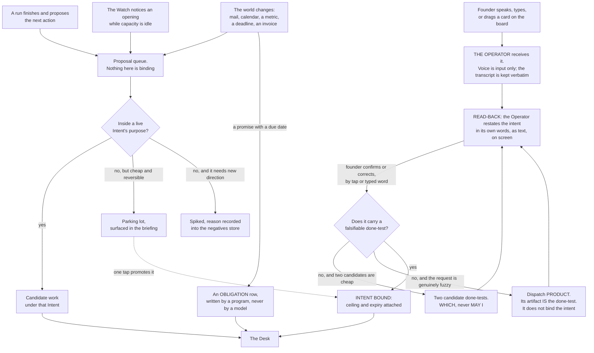

**(FINAL)** Three things matter more than the boxes. **Only the founder's door creates an Intent**; the others
produce candidate work under an existing one, or a proposal that waits — the mechanism behind *never runs my
projects without direction*, which is a provenance rule rather than a budget cap. **The read-back is mandatory and
is text, never voice**: the founder's instructions arrive transcribed with errors, and a misheard word costs one tap
instead of one night. **The spike file records the reason**, so the Watch does not re-propose the same rejected work
every night — the most obvious way an always-on system burns tokens forever.

**(NEW: O51 — the fourth door's provenance test is the same as the fifth's, and it was weaker)** Idle work must serve
a **live intent, a standing intent, or the negatives and knowledge stores**, or it is a leak with a cheap price tag.
The Watch's idle branch reads the **same** provenance test as its dispatch branch rather than a looser one, because
*cheap* is not a provenance: a night of unowned work that costs little is still work the founder did not direct, and
*"never runs my projects without direction"* is a provenance rule, not a budget cap. **Mechanism:** the Desk's gates
(**ABSENT**, §L O51); §4 carries the gate order and names which gate this is.

**(NEW: O60 — bug intake, the one intake the four doors did not name)** An anchor that fails twice writes a **card
whose done-test IS the reproducing command**. Where there is no reproduction it is not a ticket at all: it is a
bounded question for `scout`, which returns a reproduction or the reason there is none. That keeps the one class of
work that arrives already falsifiable from being paraphrased into an unfalsifiable one on its way in. **Mechanism:**
`bin/intend` (**ABSENT**, §L O60), entering through the proposal queue like every other non-founder door — it creates
candidate work under an intent, never an intent.

**(FINAL)** The world's door is a program that writes one row and does nothing else; **no model reads a stranger's
text with a tool in its hand.** The transcript is kept verbatim, transcription errors preserved, because
*"contacts"* meaning *context* is information about the speaker.

**(NEW: the board is a fifth entrance that is not a fifth door, and confusing the two would break the provenance
rule)** Dragging a card into *working on it* on page 4 launches a session and hands it the task — **(FOUNDER)**
*"when I drag a task … to a section when it's saying working on it or, like, preparing for it, it launches a team or
added team of agents to the session … and then it starts walking."* That is the founder acting, so it is the
founder's door, and the card must already carry or resolve to an intent id. **A card with no intent id does not
launch anything**; the drag is refused and the card is sent through the read-back instead. **Mechanism:** the board
calls the same launcher as every other dispatch — `bin/run` (ABSENT) — and the launcher refuses a brief with no
resolving intent id. Without that rule, the board is a fifth door that creates intents by drag, and the provenance
rule is gone.

**(FINAL)** **Enforced by:** the read-back page and its confirm tap are the only writer of `intents/*.md` from the
founder's door (ABSENT); `bin/inbound` writes one logbook row per world event and holds no model (ABSENT).

---

### 2.5 The read-back

**(FINAL, and v29 keeps it against the world's silence)** Voice is input only. The Operator writes back what it
understood — as an intent with a done-test, in its own words, on screen — and the founder confirms by tap or typed
word. **Nothing binds by voice.**

**(NEW: the research position, stated honestly, because a rule with no shipped precedent should say so)** **No
shipped system mandates a restatement before work binds.** Linear comes closest and it is an acknowledgment, not a
confirmation: an agent should *"Emit a `thought` activity within 10 seconds to acknowledge the session has begun."*
So the read-back is **unsupported and uncontradicted** by shipped practice. It is kept because closed-loop readback
is regulation in aviation and medicine, where readback error rises as messages get complex, and because the input
here is a voice transcription with preserved errors — the exact condition the regulation exists for.

**(NEW: v9 makes the read-back the last cheap moment, which it was not in FINAL)** A fully autonomous run **cannot
ask**: `dontAsk` denies `AskUserQuestion` even when it is allowed. So a question that was not settled at the
read-back has exactly two fates — pre-decided in the envelope, or staged as a *which* with ~~both options built~~
**one option built and a written second, both built only when a ten-word summary cannot separate them, and only
while the window's decision budget holds** (amended 2026-09-06: E15 · v87 · O96; §4.5 owns the budget). There
is no third outcome and no approve verb. That makes the read-back the highest-leverage exchange in the system, and
the place where an ambiguity is cheapest to kill.

**(FINAL / NEW)** **Enforced by:** the read-back page (ABSENT); the store check refuses an intent whose done-test is
not falsifiable by someone who did not do the work — `bin/check-stores` (ABSENT). **What is NOT enforced:** that the
founder actually reads the read-back before tapping. That is `WISH`, and no mechanism is proposed for it, because
the only candidates are ceremony.

---

### 2.6 Where `product` sits

**(NEW: SPINE §B.2 gives `product` the job "turns fuzzy into a falsifiable done-test" and routes to it when "the
request cannot yet be dispatched". This says where in the doors that lands, because a reader will otherwise assume
product owns the intake)**

**`product` sits inside the founder's door, behind the read-back, and it does not bind anything.** The Operator
attempts the read-back first, because two candidate done-tests are usually cheap and the exchange is one tap. When
the request is genuinely fuzzy — a direction rather than a goal, a request whose done-test would itself need
research, a roadmap-shaped ask — the Operator dispatches `product` under the same rules as any other run, and the
artifact that comes back **is the done-test**, with the specs, tickets and acceptance criteria that make it
checkable. That artifact then re-enters the read-back, and the founder binds it or corrects it.

**(NEW: the boundary that keeps the provenance rule true)** `product` **cannot create an intent.** It produces a
proposed done-test; the founder's confirm is what binds. If `product` could bind, the founder's door would have a
model in it, and *only the founder's door creates an Intent* would be false the first time a run proposed a goal.
**Mechanism:** `product`'s grant carries `Write` on spec paths only, never on `intents/` — the argv, composed by
`bin/run` (ABSENT), and asserted nightly by `bin/probe` (ABSENT).

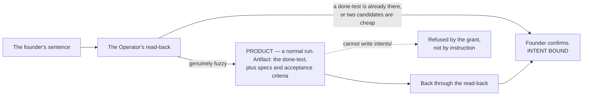

**(NEW)** `product`'s **anchor** is the same store check that gates the founder's own input: *the store check
refuses an intent whose done-test is not falsifiable by someone who did not do the work.* An agent whose job is to
produce done-tests is judged by the same gate every done-test passes, which is the only arrangement that does not
grade its own homework.

---

### 2.7 What the founder must do, in full

**(FINAL, with three rows changed by the founder's direction)** The complete list. If the system needs more than
this, the design has failed.

| The founder does | How often | Where |
|---|---|---|
| Writes a Charter | Once per venture | Voice → the Operator's read-back → tap |
| Opens an Intent, or confirms one the Operator drafted | When they want something | Voice or text → read-back → tap |
| **Drags a card into a working stage** *(NEW: the founder's page 4)* | When they want a queued thing started | Mission control, page 4 |
| Answers a **which** — ~~from options already built~~ one built and a written second, the recommendation sometimes hidden as a control arm (amended 2026-09-06: v87 · O97) | Only when the envelope requires it, and never past the window's decision budget (O96) | One tap, phone |
| Defers an obligation, shown its consequence | Rarely | One tap, phone |
| Sets a tempo | When a venture's rhythm changes | One tap |
| Opens the briefing | When they feel like it | One page |
| **Opens an agent's terminal from any surface** *(NEW: the founder's own instruction that every tap opens a terminal on the Mac)* | Whenever they want to see or message a run | A tap on any page; a terminal on the Mac |
| Sits down on the Floor | When they want to build | Terminal |
| Pulls the cord | Whenever they want it to stop | One tap, one word, or one command |

**(FINAL)** Absent from that list, deliberately: approvals of routine actions, ticket grooming, standups, sprint
planning, and reviewing the system's own internal work. **(NEW, fixer round 2026-09-06: v102)** Also absent: renewing
a lease. `founder.lease` is `founder.last` read against a second, longer horizon, renewed by any founder-authored
event in the list above, and while it is stale the Watch mints nothing unattended (§4.4) — the founder's ordinary
presence is the heartbeat, and their absence is the stop. The founder's list contains all of those; §23 says what
happened to each.

**(NEW: one thing the founder's direction adds to the list that is easy to miss)** *"we also need to manage, you
know, the history and number of sessions and, like, to understand how do we save memory and to be efficient."* That
is **not** a founder task. It is bounded by mechanism in three places — the vendor's concurrent-subagent cap, the WIP
limit per venture, and at most two driven ventures — and the board **refuses a drag that would breach any of them**
rather than asking the founder to count. §14 and §15 carry it.

---

### 2.8 Standing intents — the company working on a cadence or an event

**(FOUNDER, v55)** *"skip hermes for now. but think about agents like: customer support, marketing agents: leads,
reacherch, security, competers, data anslisis and more that can run every set time or evant or something else. it to
build the company like working."* Asked which shape that should take, the founder chose **standing intents with a
cadence or trigger, run by the Watch**.

**(FOUNDER: what a standing intent is)** An intent that ~~**never expires**~~ **never finishes but expires** —
it carries `valid_until` with a forced disposition like everything durable (amended 2026-09-06: NEW: O126 ·
THINKER: B20) — carrying `every:` — a cadence — or `on:` — an inbound event class. It is written once, through the same read-back as any other intent, and it is the
`owner:` field FINAL §2.2 already anticipated: *"founder, or the venture's own standing intent"*. Every time it comes
round, the Watch treats it as candidate work like any other and dispatches it to the agent its kind already routes
to. **Its outputs stage; they never send** — a standing intent is a recurring *reason to consider work*, not a
standing permission to act, and the Sender's rules are unchanged by it.

**(NEW: why this needs no new agents, which is the load-bearing half of the row)** Each of the founder's examples is
already a kind of work the Operator routes, so the row adds a field to the intent store and nothing to the roster.

| The founder's example | The agent it routes to | Why that one, from its existing anchor |
|---|---|---|
| customer support | **steward** | it already owns *"something is owed to someone by a date"* and works from `scout`'s handover of inbound rows; a support thread is an obligation with a creditor |
| marketing: leads | **growth** | it already drafts the outward act, and the Sender is what sends it |
| research | **scout** | it already holds the tainted read of the open web and returns facts, never acts (v36) |
| competitor watch | **scout** | the same read, on a cadence rather than on a request |
| security | **guard** | it already reviews adversarially and produces a finding nothing downstream re-derives |
| data analysis | **analyst** | it already reads the reconciliation's mismatches and drafts the Decide item |

**(NEW: the two things this must not become, both named because they are the obvious next step and both refused)**
It is **not a second scheduler** — there is one Watch, one tick, one ranking, and a standing intent is a row it
reads, not a clock it obeys. And it is **not a cron field in an agent file**, because that would put the decision to
run work inside the thing that does the work, where nothing ranks it against an obligation or against the reserve.
Both are kept in §22.

**(NEW: what has to hold for a cadence not to be a leak)** A standing intent that fires forever needs a bound that
is not its own expiry, ~~because it has none~~ because its expiry is a date and a leak is a rate (amended 2026-09-06:
O126). So the ceiling is **per run**, not per intent, and a standing intent
with `every:` and no per-run ceiling does not load. **And it expires:** `valid_until` is required on a standing
intent, and at expiry `bin/horizon` (§L O23) forces exactly one disposition — Refresh · Deprecate · Waive with a new
date — so the company's recurring work is re-decided on a date rather than running until someone notices
(**ABSENT**, §L O126). **Losing image:** a standing intent with no expiry · `wins_if:` every standing intent Refreshes
on evidence for a year. **Mechanism:** the intent schema gains the two optional fields;
`bin/watch` reads them on each tick (**ABSENT**); `bin/check-stores` refuses `every:` without a ceiling per run
(**ABSENT**). §4 carries the tick side.

---

## 3 · The Operator

*obeys: SPINE §C entire; v9, v10, v13; inherits: FINAL §6, §7.5*

---

**(FOUNDER)** *"We need an operator, which is, like, the orchestrator of the agents. which is also the content point
with with me. OAuth out me depends on the type of tasks because you also need to be able to run it fully
autonomous."* Transcribed by voice; *"content point"* is *contact point* and *"OAuth out me"* is *how much it asks
me*, and both readings are used below with the original preserved because the founder's words are the input.

**(NEW: what that one sentence decides, and it decides three separate things)** The founder named a single role that
carries three jobs at once: it **orchestrates the agents**, it is **the contact point with the founder**, and **how
much it asks depends on the type of task**, up to and including asking nothing at all. The third is not a setting on
the first two — it is the hardest constraint in the section, because a run that cannot ask has to have had every
question answered before it started.

---

### 3.1 Identity

**(NEW: v46 — the Operator's runtime position, decided, because page 2 depends on it.)** ~~The Operator is~~ **An
Operator instance is** — N run at once, each a row in `sessions.jsonl` with a heartbeat (amended 2026-09-06: E8 ·
v91; the paragraph after the table) —
the founder's **interactive session**, started as `claude --agent operator`, so one agent file governs it and
it can still form the agent team page 2 draws. It is inventoried as a file (§17.1 row 0) and runs as the main
session; a dispatched agent file could not form a team (v13, §14.5). Whether `--agent` binds the file's
`tools:` at top level is **one measurement, UNVERIFIED**; until it passes, the no-`Write` guarantee below is
held by managed `permissions.deny`, not by frontmatter.

**(NEW: one file, in the format the runtime already reads, so the Operator is the same kind of object as the
fourteen it dispatches)**

| Field | Value | Why this value |
|---|---|---|
| **File** | `.claude/agents/operator.md` — **ABSENT**. The eighteen agent files on this branch, `ceo-1-1788609834`, are the format seed, and `.claude/hooks/schema-lint.js` on the same branch is the linter that will hold it | v2: one file per agent, in frontmatter the runtime reads |
| **Model** | `claude-opus-5` | It reads the founder's sentence, picks among fourteen, and writes the brief that binds a run. Every defect in it is a defect in work nobody reviews |
| **Tools** | `Read Glob Grep` plus `Agent(...)` | **It dispatches and it does not build** |
| **No** | `Write`, `Edit`, `Bash` | An Operator that can edit will edit instead of dispatching. It is the same argument that keeps `Write` off `reviewer`: the thing that can do the work will do the work, and then nothing was orchestrated |
| **MCPs** | none | Nothing it does touches a server. The two agents that declare `mcpServers` today are `designer` and `sourcer` — a fact about **this repository as it stands**, not a roster rule; **v2's roster grants servers to five** (scout, designer, analyst, writer, growth; §5.2). Neither kind of work is this |
| **Mechanism** | its argv, composed by `bin/run` (ABSENT), plus the nightly probe `bin/probe` (ABSENT) that asserts what it can actually touch | v34: a grant is argv, not prose. A capability nobody probes is a memory of one |
| **Pre-flight read** *(NEW, fixer round 2026-09-06: v97 · O107)* | `keel/constitution.md`, **≤ 4,096 bytes** — `session-start.js`'s own budget (#76) — generated from §0.3's four invariants and `keel/shared/rules.yml`: doctrine in six lines, the envelope's three lists, the open §I rows by id, the binding files' paths; byte-identical for the cache (**ABSENT**) | Nothing that acts can read 156,000 words (THINKER: C18, B6). It is the only part of the plan an Operator reads, and its test is the Operator's own rehearsal case: a fresh agent given only it and the schemas writes a brief that passes `check-stores` |

**(NEW: why the no-`Bash` line is not decoration)** This repository has already measured what a shell in the wrong
hand does: `Bash` has no path concept in the hook that scopes `Write` and `Edit`, so an agent holding a shell is
narrowed by the sandbox and the managed file and by nothing else. An Operator with `Bash` could compose and run its
own argv, and v34 — *one no-model launcher composes the grant, and nothing else may* — would be false the first time
it did.

**(FOUNDER, fixer round 2026-09-06: E8 → v91 · O84 — how many Operators: N)** *"Model N Operators."* The plan had
one Operator, one `founder.last`, one cord and one sterility predicate; the founder runs a bullpen — five `ceo-*`
worktrees, three terminals, 825 commits by Claude Code to 129 by the founder (THINKER: A6 · W41) — so a premise false
on day one would have made the reserve, sterility and the lease **misreport rather than fail**. An Operator instance
is a `kind: operator` row in `keel/logbook/sessions.jsonl` — venture, host, and a **heartbeat from a
`SessionStart`/`Stop` hook pair** in `operator.md`'s own settings. Four consequences: **a *which* is claimed before
it is answered** — `claim: {operator, at}` on the `decide.jsonl` row, expiring after one tick, so two Operators cannot
answer one question; **the founder-present gate is per venture** — §4.1's gate 2 is true for a venture when a fresh
operator row names it; **WIP counts sessions**; and the reserve stays per seat, one number shared by every Operator.
**Mechanism:** `sessions.jsonl` · `decide.jsonl` · the hook pair (**ABSENT**, §L O84). **Cost, once:** one hook pair,
one field on the decide row. **Losing image:** one Operator enforced by a lease — §J 77 · `wins_if:` a month of
`sessions.jsonl` shows one live operator row at a time. **Settled by:** two Operators holding one claim; pull `--all`
and count survivors.

---

### 3.1a Who may call the surface that dispatches

**(FOUNDER, rethink 2026-09-06: D1 → v66)** The Operator is reached through mission control, and until this round
nothing in the plan said **who may call it**. The founder's answer is three things at once and it is recorded in
DECISIONS §18: *"Loopback bind + a keychain-held token on every write route + an authenticated tunnel for the
phone."* The server binds loopback only; every route that **writes** — a dispatch, an edit-arguments verb, a tap
that answers a *which* — checks one token held in the macOS keychain; the phone arrives through an authenticated
tunnel rather than over the founder's own network.

**(NEW: contradiction 16)** Three sentences could not all stand: v39 let the phone reach *"the local server over
your own network"*, §14.13 said every page writes *"nothing but the inbox file and the intent log"*, and the seed
pins `127.0.0.1`. An unauthenticated dispatch plane on any network the Mac joins is what v39 as written describes,
and it is now the losing image. **Mechanism:** the loopback pin exists in the seed; the token check is one
middleware and the token is keychain-held (**ABSENT**); the tunnel is named at build time (**ABSENT**). Whether a
detached night process can read that keychain item without an interactive unlock is **(R3, OPEN)** — the unattended
half of §3.3 rests on it and nothing has tested it — and under E1 its sharper form is **(R33, OPEN)**: can a
LaunchAgent on *this* Mac read a keychain item after sleep, and after reboot with the screen locked (§20.8). The
same machine now holds identity and autonomy (v83), so §15's probe drills the other direction too: a night child's
keychain read of a founder item **must fail**, and a pass is a `wake-me` (§L O83). **Settled by:** `lsof -nP -iTCP -sTCP:LISTEN` showing a
non-loopback bind, or a tap accepted from a device that presented no token. §14 carries the surface; this section
carries the consequence, which is that **a dispatch is an authenticated act**.

---

### 3.2 Graded autonomy — one table, three things at once

**(FOUNDER)** *"how much it asks me depends on the type of task."* **(NEW: this becomes one band table, and every
band names its envelope terms, its Claude Code permission mode and its Codex axes, so that a band is a real setting
rather than an adjective.)** This is the row every section about control obeys.

| Band | Task types | Envelope | Claude Code mode | Codex ~~`approval_policy` × `sandbox_mode`~~ `approval_policy` × `sandbox_mode` × **Guardian** *(moved 2026-09-06: W21)* | Who runs in it |
|---|---|---|---|---|---|
| **Read and report** | research, review, audit, analysis, challenge | `may-alone` | `plan` | `never` × `read-only` | scout · reviewer · guard · challenger · analyst |
| **Build in a worktree** | code, design, copy, spec, schema, memory | `may-alone`, inside one venture's worktree | `dontAsk` with `--restricted` and an explicit `--tools` | `never` × `workspace-write` | builder · architect · tester · designer · product · writer · growth · steward · curator — the five with `isolation: none` (product, writer, growth, steward, curator; v41) run in this band on a narrowed `--add-dir`, **not a checkout** |
| **Stage an outward act** | send, publish, pay, deploy, share, delete | **`never` for every agent** | no mode — no agent performs it | — | nobody. The **Sender** performs it, and it holds no model |
| **Wake the founder** | anything on the venture's `wake-me` list | `wake-me` | — | — | the Watch, before it rings, against the interruption budget |

**(FINAL §7.5, providers lane, measured 2026-09-04: two shipped facts make the table binding rather than descriptive)** `bypassPermissions`
is disabled in managed settings, and **deny rules bind in every mode including it** while *"Allow rules have no
effect in `bypassPermissions`"* — so the widest mode is both refused and, were it reached, still floored (v10). And
a subagent's own `permissionMode` frontmatter **is ignored**, so **a child cannot widen its own grant**. Those two
are why the bands are enforcement and not documentation.

**(NEW: what `auto` mode is, and what it is not, because it looks like the envelope and is not)** In `auto` mode *"a
second model, the classifier, reviews actions instead of you"*, and it extends to subagents in three places: the
delegated task description is evaluated before spawn, each action goes through the same rules as the parent, and the
subagent's full action history is reviewed on return with a warning prepended if it flags. **That is a cheap
guardrail against accident. It is not the envelope.** It can be switched off with `disableAutoMode`, it is a model
reviewing a model, and **nothing in it keys on reversibility** (v28) — both shipped schemes key on path and action
class. The envelope keys on reversibility, stands alone in the world in doing so, and is enforced by the argv and the
managed file rather than by a classifier.

**(FACT: world.md 21 — the Codex cell of every band is three axes, not two)** ~~Codex is `approval_policy` ×
`sandbox_mode`~~ **Guardian** is a third control axis: a background scoring layer whose behaviour changes with the
approval mode — *"Full Access skips Guardian reviews for confirmation-only actions. User approval mode skips
background Guardian scoring and prewarming, while sensitive-action checks and requests for user input retain their
existing handling"* — and its review history *"survives compaction, restarts, and user-created forks … isolating
subagent history"*. Two consequences for this table. The band's Codex cell **understated what governs a Codex run**,
so a band read as two settings was never the whole envelope there; and Codex subagents carry **their own review
history**, which §10 does not describe. **Mechanism:** the axis is the vendor's, not ours — what is ours is that
`bin/run` (ABSENT) records which approval mode a Codex dispatch used, because that is what decides whether Guardian
scored the run at all.

**(NEW: contradiction 4)** ~~`analyst` sits in *read and report* here and holds `Bash` in §5.2~~ — one agent, two
answers, and the shell is the half that goes. §L **O57** strikes `analyst`'s `Bash`; v47 already gave every
comparison to `bin/reconcile`, so nothing is lost with it and the placement above stands unchanged. §5 carries the
strike.

**(NEW: O5 — contradiction 17)** *Which agent, which model, which band* is answered in **three places**: the roster
table (§5.2), this band table, and §9.2's routing. Nothing checks that they agree, and a disagreement between them
is a mis-route, which is the one defect class the anchor ladder is structurally blind to — an artifact that passes
its done-test, the blind test and CI while answering the wrong question. **Mechanism:** one machine-readable
`keel/shared/routing.yml` (**ABSENT**), from which all three views are **generated or checked**; the three tables
stop being three decisions and become three renderings. Nothing here changes any routing; it changes how many
places may change one.

---

### 3.3 Fully autonomous mode, and the one consequence that is the whole design

**(FOUNDER)** *"you also need to be able to run it fully autonomous."*

**(NEW)** It is the **build in a worktree** band with three additions:

- the managed settings file of v11 — `permissions.deny`, `disableBypassPermissionsMode`, ~~`disableAutoMode`,~~ and
  **not** `disableAllHooks` or `allowManagedHooksOnly`, because either of those kills `/goal`. **`disableAutoMode` is
  struck** (FOUNDER, fixer round 2026-09-06: E9 → v92 · THINKER: A3): the founder works the Floor in auto mode, and a
  machine-wide managed file would have removed it — so the Floor keeps the founder's mode, and a night child runs
  `dontAsk --restricted`, where auto mode is inert, with its hooks and denies on a **per-child `--settings`** (§L
  O87, **DEPENDS-ON-R28** — whether `--restricted` ignores `--settings` as it ignores the settings files; §12 owns
  the matrix);
- `/goal <the done-test> or stop after N turns` on every dispatched run (v12);
- the cord read first, on every tick, before anything else.

**(NEW: and one consequence, which is not a caveat but the design of the mode)** **A fully autonomous run cannot
ask.** `dontAsk` *"Auto-denies tools unless pre-approved"*, and the vendor's own page adds that `AskUserQuestion`,
MCP tools marked `requiresUserInteraction`, and connector tools set to `ask` *"are denied even if you've allowed
them."* Asking the human is itself a permissioned action, and this mode switches it off.

**(NEW: what follows, stated as an exhaustive list because the value of the rule is that it has no third branch)**
Every question the run would have asked has exactly two fates:

1. **Pre-decided in the envelope** — the founder wrote `may-alone`, `never` and `wake-me` once, per venture, in
   their own words, and inside that envelope silence is permission.
2. **Staged as a *which*, with ~~both options built~~ one option built and a written second** — both built only
   when a ten-word summary cannot separate them, and **only while the window's decision budget holds** (amended
   2026-09-06: E15 → v87 · O96: the Desk refuses to open a *which* past `decisions_per_window × horizon`, seeded at
   six per five-hour window until R34; the refusal is a row, and the run then takes the branch below) — and left
   for the founder, who answers with one tap when they next open the page.

**There is no third outcome, and no approve verb anywhere in the system.** FINAL had staged-not-sent as a rule of
taste; v9 makes it the **only channel a silent run has**, which is a much stronger reason to keep it.

**(NEW)** What still reaches the founder while a fully autonomous night runs: the `wake-me` list, the interruption
budget of three unprompted interruptions a day, and the briefing — which is never an interruption, because the
founder opens it. **(NEW, fixer round 2026-09-06: v102 · O86)** And what runs at all depends on the founder's
ordinary presence: while `keel/logbook/founder.lease` is stale — `founder.last` against a second, longer horizon —
the Watch mints nothing unattended, so the mode has a stop that needs no tap, no tunnel and no keychain (§4.4).

**(FACT: world.md 30b and 14 — the measured ceiling this mode is designed above, stated as the cost of the mode)**
The vendor's own measurement of its own users: *"the 99.9th percentile turn duration nearly doubled, from under 25
minutes in late September to over 45 minutes in early January"*, and *"roughly 20% of sessions use full
auto-approve, which increases to over 40% as users gain experience"*. **Forty-five minutes is the outer measured
unattended stretch, and this mode is designed for a night.** The mechanism that produces the gap is W14's
check-in cap: `/goal` check-ins back off 30 min → 1 h → every 2 h, and **an idle session gets at most three
check-ins per goal** until someone messages it. Under `-p` the check-in is the only thing the runtime delivers and
**nobody is there to message it**, so a night goal loop delivers three times and then goes quiet — quiet being
byte-indistinguishable from finished. Two mechanisms answer it and neither is optional: §L **O21** composes
`/goal`'s condition from v45's `anchor:` field — *"`<anchor>` exits 0, and `<done-test>`"* — turning the most
frequently executed judgement in the system from a small model reading prose into an exit code
(`bin/run` composes it, **ABSENT**, **DEPENDS-ON-R17**); and §L **O15**, the wake reconciler, writes `orphaned`
rather than `finished` when a run goes quiet (`bin/watch`, **ABSENT**). §6 carries the reconciler.

**(NEW: O49 — contradiction 5)** ~~*"The Operator is the escalation"* for a night run~~ — §4.4 says the Operator is
not always on, in the same plan, so a run that stops at 03:00 escalated to something that was not running. **Night
escalation is a queue row plus the wake-me test, and never the Operator.** The stopped run writes to the house
decide queue (§L **O9**, `keel/logbook/decide.jsonl`, **ABSENT**); the `wake-me` list decides whether it also
rings, against the interruption budget; the Operator reads the row when it next runs, like every other reader.
**Mechanism:** the queue is a store with one writer, so an escalation survives the absence of every session.

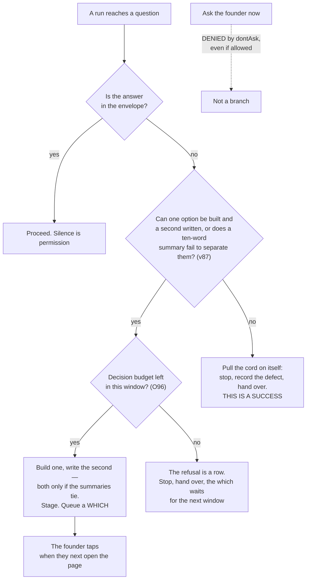

---

### 3.4 The read-back

**(FINAL row 17, kept by v29)** Voice is input only. The Operator writes back what it understood — as an intent with
a done-test, in its own words, on screen — and the founder confirms by tap or typed word. **Nothing binds by voice.**

**(NEW: the honest research position)** No shipped system mandates a restatement before work binds; Linear's
ten-second `thought` acknowledges rather than confirms (cognition.md marks the figure `M`). The rule is **unsupported and uncontradicted**, and it is
kept because closed-loop readback is regulation in aviation and medicine, and because the input is a voice
transcription with errors preserved.

**(NEW / FINAL)** **Mechanism:** the read-back page (ABSENT); the store check refuses an intent whose done-test is
not falsifiable by someone who did not do the work — `bin/check-stores` (ABSENT). §2.5 and §2.6 carry the door and
where `product` sits behind it.

---

### 3.5 How it dispatches — three mechanisms, each for what it is documented to do

**(NEW: v13. One dispatch mechanism for everything is the losing image, and it loses because the three shipped
mechanisms have different documented properties and picking one would mean using it outside what it does)**

| Mechanism | Used for | The sourced constraint that shapes the design | `stop:` — what the cord reaches *(added 2026-09-06: v67)* |
|---|---|---|---|
| **Agent teams** | the fleet the founder watches on page 2 — a lead plus named teammates, each a full independent session, messageable by name | **turned on by the founder** (v59: `CLAUDE_CODE_EXPERIMENTAL_AGENT_TEAMS=1`), and experimental in the vendor's own words; **no nested teams**; one team per session; `/resume` does not restore in-process teammates; spawning needs an interactive session, so `-p` never forms a team. Tokens: *"approximately 7x more … when teammates run in plan mode"* — **at each teammate's own model price** (v59) | through their session |
| **Subagents** | depth inside one agent — a builder's own exploration, a scout fan-out | depth 3 by default, 20 concurrent, `Workflow` removed from all of them (v35); a subagent's `permissionMode` frontmatter is ignored; main-conversation auto memory is not loaded into subagents except a fork | through their session |
| **`claude -p` children through the launcher** | unattended night work, and every non-Claude provider | `--session-id` must be a valid UUID, minted by us; `--restricted` needs v2.1.248+; `--max-budget-usd` is a stall fuse, not a billing control (v23); `-p` disables tools needing terminal input, so a session never stalls waiting | the **recorded process group**, signalled — `SIGTERM` is measured to give exit 143 and a resumable turn |
| **A channel between sessions already running** — *(added 2026-09-06: v80, W11, W20)*. **Not a fourth dispatch mechanism: nothing in this row starts a session** | one agent asking another for a handover or filing an objection, and page 2's message control | `SendMessage`/`ListAgents` across sessions on one machine, *"on Bedrock, Vertex, and Foundry, and when telemetry is disabled"*; the **inbox socket closes a connection that sends no complete line within 30 seconds**, so a poster connects once its data is ready (world.md 11). Codex ships the same idea as `@` task mentions (world.md 20) — **two providers shipped this in one window and the plan modelled neither** | none of its own; the two sessions it joins stop by their own rows |
| **A hosted lane** (v79) | ~~nothing yet~~ the night's **fallback** when `night_capable` is false and the venture's charter says `cloud: allow` — an unattended brief refused on this Mac is routed here (amended 2026-09-06: E1 → v83 · E13 → v84; §4.1b) | there is no always-on box (E1); the maker path is UNVERIFIED (v56(b)), which is now on the critical path of the first night (§I row 15) | **UNKNOWN**, and `bin/run` therefore refuses to mint unattended work on it — so until a cancel path is documented the fallback holds a brief and mints nothing |

**(NEW: the one consequence of the teams constraint that a surface designer must know before drawing page 2)** There
are **no nested teams** and one team per session. So the child-flow page shows **one level of teammates**, and
everything deeper is subagents. A page drawn as a tree of teams of teams would be drawing something the runtime
cannot produce.

**(FOUNDER, rethink 2026-09-06: D2 → v67 — what the cord actually stops, and why every row above now declares it)**
The founder took both halves: *"the launcher records each child's process group and the cord signals it; `bin/run`
refuses unattended work on a carrier whose stop path is UNKNOWN."* ~~The cord as designed stops the next
dispatch~~ — **it signals work already in flight** (contradiction 6: §12.9 says the cord *"cancels running work"*
while its mechanism was a file read at the next tick, which stops nothing that is already running).
**Mechanism:** one `pgid` field written by `bin/run` before exec, one signal path, and the `stop:` column above
(**ABSENT**). `SIGTERM` is measured to give exit 143 and a resumable turn, so the cord stops a run **without
destroying it** — which is what makes pulling it cheap enough to pull. The refusal is the load-bearing half: a
carrier whose `stop:` reads UNKNOWN may not be given unattended work at all, which is why the hosted lane's row is
shut and stays shut until cancellation is documented (§I row 15's state anyway). **(FACT: world.md 22)** Codex
shipped `Interrupt` hooks, the natural Codex-side receiver for exactly this signal, and no row in the plan named
them. **Settled by:** pulling the cord mid-run, measuring time to quiescence, and whether the run resumes.

**(FOUNDER, fixer round 2026-09-06: E8 → v91 · O85 — the cord has two scopes, because there are N Operators)**
With five worktrees and three terminals open (W41) one cord was two things: *stop the night* and *stop me*.
**`--night`** signals `bin/run`'s recorded process groups and stops dispatch; **`--all`** also `SIGTERM`s every
registered Operator session and its team. One verb, `bin/stop`, with **four receivers** — the cord file, the process
groups, the Sender's recall window, the hosted lane's UNKNOWN — and **one record** of what stopped and what did not,
so the four semantics stop being four controls. Every page's control and the phone default to `--night`, labelled
*stops the night, not the Floor*. **Mechanism:** `bin/stop` (**ABSENT**, §L O85; §12 owns the verb, §14 the control).
**Settled by:** the drill's count and the record disagreeing once. **Losing image:** the tap as the only e-stop ·
`wins_if:` a year of drills in which the tap reaches quiescence from the phone every time, tunnel down.

**(FOUNDER, rethink 2026-09-06: D15 → v80 — what a message between two running agents is)** *"A message is a
handover or an objection on the handover schema, one append-only file each; asks carry a deadline and a fallback;
the vendor transport's ids are attributes, never a join key."* There is no third shape. An **ask** carries a
deadline and the asker's **stated fallback if unanswered**, so a dead responder degrades the asking run rather than
hanging it. **Why the vendor transport is not adopted as the record:** free-form agent chat is evidence with no
provenance and no ledger row, and the teams mailbox is a document *"overwritten on the next state update"* — a
lost-update surface where a vanished message looks exactly like one never sent. **Mechanism:** no new schema —
three required fields on the handover (§L **O7**, §6.4), one append-only file per message; the transport's ids are
recorded as **attributes** of that file and never as a join key. **Settled by:** a run whose only input was a peer
message still reconstructing from files alone, and killing the responder mid-run — the asker must still hand over.
This closes the COVERAGE `?` on *worker-to-worker request* and *peer help request*.

**(FOUNDER, v59: teams are on, and a teammate runs on its own agent file's model)** *"Turn it on, no model
constraint."* So `CLAUDE_CODE_EXPERIMENTAL_AGENT_TEAMS=1` is set, and a teammate is dispatched at **the model its
own file declares** — a `builder` teammate runs at `builder`'s model, a `guard` teammate at `guard`'s. There is no
Sonnet floor for teammates and the vendor's advice to impose one is the losing image (§22). **The cost is the 7x
multiplier in the table above, and what v59 changes is what it multiplies:** each teammate's own price rather than
Sonnet's, which is why §9.2's teammate row is struck rather than rewritten with a different model in it. §16.4
carries the arithmetic. **Mechanism:** the teammate's agent file is what carries
the model, and `bin/run` (ABSENT) names the file rather than a model; the grant on a teammate is the agent file plus
the managed denies, never argv (v43).

**(FOUNDER, v60: the card decides whether this is a team at all)** A card on page 4 carries a `solo | team`
toggle, defaulted from the intent's kind — *"Both: the card carries a 'solo or team' toggle."* Source-code work
defaults to **solo**, which is the chain architect → tester → builder → reviewer, one artifact and one agent at a
time (v6). Anything cross-department defaults to **team**, led by the Operator. So the founder's drag, not the
Operator's judgement, is what decides between the two shapes, and the default is only a default: the toggle is on
the card and the founder can flip it before dragging. **Mechanism:** one field on the card store; `bin/run` reads it
(**ABSENT**) and picks the dispatch mechanism from it. §14.7 draws the card and the drag.

**(NEW: the rule that keeps v34 true as the roster grows)** **The Operator never composes argv itself.** It emits a
brief carrying an intent id and a named agent; `bin/run` (ABSENT) composes the argv from the agent's file and the
band. If the Operator composed argv, then every future agent would be a new place a grant could be written wrongly,
and there would be fourteen implementations of one narrowing.

**(NEW: O53 — and the same rule holds for the surface, which is where it was about to be broken)** Page 4's
*edit-arguments* verb writes **a new brief, never argv**. The launcher recomposes from that brief and may
**narrow**, never widen beyond the band, and it **refuses surface-supplied argv** outright. Without the refusal the
one narrowing v34 protects would have a second author with a text box, and the founder's own tap would be the way
past the envelope. **Mechanism:** `bin/run` (**ABSENT**) rejects a dispatch carrying argv fields, and the brief is
the only input it accepts; §14 draws the verb.

---

### 3.6 From the founder's sentence to a dispatched run

**(NEW: a cold reader would otherwise assemble this from §2, §3.2, §3.5, §5 and §6)**

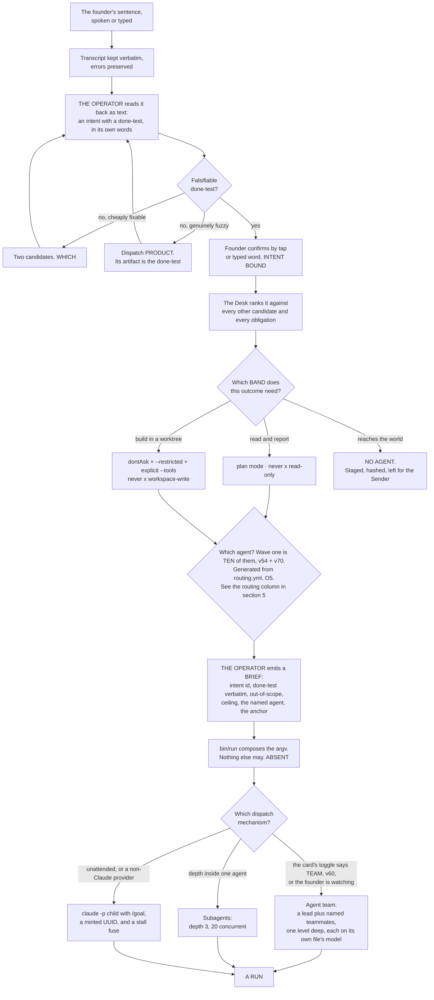

**(FOUNDER, v54: in wave one the Operator has ~~eight~~ ten agents to route among, and one of the routes above does
not exist yet — said once, here, because it changes what the Operator does rather than only what the roster
contains)** The founder chose to start with the ones that have a seed file or a code path today: the Operator,
`builder`, `reviewer`, `architect`, `tester`, `guard`, `scout` and `designer`. **(FOUNDER, rethink 2026-09-06: D5 →
v70)** *"Curator and challenger both join wave one"* — so wave one is **ten ~~agents plus~~ including the Operator, not eight** *(reworded 2026-09-06 · census C item B: "plus" summed to sixteen against a fifteen-role roster; SPINE v70 carries the same wording)*,
and v54's own test is what admits them: the curator has four verified code paths on this branch
(`evict-memory.mjs`, `ledger.mjs`, `check-citations.mjs`, `check-memory-budget.mjs`). **The `product` dispatch of
§3.6 still has nobody in it**, so a genuinely fuzzy request is closed the other way — the founder writes the
done-test themselves, through the read-back, with the Operator proposing two candidates as it already does; nothing
binds without their confirm either way, so the provenance rule is unchanged. ~~And **`challenger` is not in wave
one**, so a plan about to bind is attacked by **`guard`'s adversarial review plus the founder's own read** until
wave two.~~ **A plan about to bind is attacked by `challenger`, from wave one** (moved 2026-09-06: D5 → v70) — the
cheapest file in the roster, read-only, and wave one's only gap with a *measured* harm behind it (v30). What is
still lost is the half v30 also asks for, **a second model family**: the challenger runs single-family until Codex
or Gemini lands, and **its findings are labelled rung 4 rather than hidden**. §5 carries the two waves and §19
draws them.

---

### 3.7 What the Operator never does

**(NEW: each line names the mechanism that stops it, because a list of prohibitions with no mechanism is a wish
list, and this repository has already shipped eight of those)**

| It never | Mechanism |
|---|---|
| Writes or edits a file | Its `tools:` line carries no `Write` and no `Edit`; the argv, composed by `bin/run` (ABSENT), and asserted by `bin/probe` (ABSENT) |
| Runs a shell command | No `Bash` in its `tools:` line, for the reason in §3.1 |
| Composes argv | Only `bin/run` does (v34, ABSENT) |
| Takes argv from a surface | **O53**: the *edit-arguments* verb writes a new brief, never argv; `bin/run` recomposes, may narrow, never widens beyond the band, and refuses surface-supplied argv (**ABSENT**) |
| Accepts a dispatch from a caller that presented no token | **v66**: loopback bind, one keychain-held token checked on every write route, the phone through an authenticated tunnel — the pin exists in the seed, the middleware and the tunnel are **ABSENT** |
| Mints unattended work on a carrier it cannot stop | **v67**: `bin/run` refuses a carrier whose `stop:` reads UNKNOWN; the cord signals the recorded process group (**ABSENT**) |
| Serves as the night escalation | **O49**: a run that stops at 03:00 writes a row to the house decide queue (**O9**, `keel/logbook/decide.jsonl`, **ABSENT**) and the `wake-me` test decides whether it rings. The Operator reads that queue; it is not the queue |
| Creates an intent | Only the founder's confirm writes `intents/*.md`; the read-back page is its only writer (ABSENT) |
| Performs an outward act | The band table gives every agent `never` on that class; the Sender is the only thing that sends, and it holds no model (v33) |
| Dispatch a team inside a team | The runtime has **no nested teams**. It is not a rule we enforce; it is a thing that does not exist |
| Run its own gate | `Workflow` is absent from every agent file, deliberately: the gate may not be invocable by the thing it gates (v35), and the vendor removes it from every subagent regardless |
| Override the founder | There is no approve verb. Outside the envelope the answer is a *which*, with ~~both options built~~ one option built and a written second (v87) |
| Answers a *which* another instance claimed | **O84**: a *which* carries `claim: {operator, at}`, one-tick expiry; only the claimant answers (**ABSENT**) |
| Reads the plan cold | **O107**: its pre-flight read is the constitution, ≤ 4,096 bytes, generated from `rules.yml` (**ABSENT**); 156,000 words are not an input to anything that acts |
| Mints unattended work while the founder's lease is stale | **v102**: `founder.lease` is read by the Watch before any unattended dispatch; absence of the heartbeat is the stop (**ABSENT**, §4.4) |

---

### 3.8 What the Operator hands back to the founder

**(NEW: composed from the fully-autonomous band (§3.3) and FINAL's briefing. It is a composition of decided things,
not a new decision — no field here is invented, and if a field is wanted that is not derivable from those two, it
is a decision the SPINE does not carry)**

The Operator returns exactly three kinds of thing, and nothing else reaches the founder unasked:

| What | When | The rule it obeys |
|---|---|---|
| **A *which*** — ~~two options, both already built~~ one option built and a written second (both only when a ten-word summary cannot separate them), with the cost of each, `cost_to_answer_bytes` measured, and a recommendation that a founder-set fraction of the time is hidden or shuffled as a control arm (amended 2026-09-06: v87 · O96 · O97) | when a decision is outside the envelope, or a fully autonomous run hit a question — and never past the window's decision budget | never *may I*; there is no approve verb |
| **A ring** — one line, on the phone | only when a `wake-me` line fired | the interruption budget is three a day, and a channel whose acted-on rate falls is demoted below its threshold. ICU alarms: 74–99% irrelevant **(FINAL §1 row 18, §13.5)** produces trained inattention, not annoyance |
| **The briefing** — a page the founder opens | whenever the founder opens it, so it is **never** an interruption | **its first line is *decisions taken · deferred · defaulted*, with the bytes each cost** (amended 2026-09-06: E15 · O96 · O95), then FINAL's: what moved with the evidence; the raw work biggest first; the *whiches*, ~~both built~~ one built and a written second; **what could not be checked, named**; what it cost per venture and per window — and the founder's own hours against `founder_hours:`, a bind at 20 reported and never silently enforced (v86); what the Operator would do next, none of it started |

**(NEW: the field of the handover that the briefing reads first, and why it is the field to fight for)** `uncertain`
— *what I am not sure about and what would settle it*. It turns a confident wrong answer into a flagged one. **No
shipped handover schema found has it**, which is exactly why it will be the first field to erode under pressure and
the one worth naming here.

**(NEW: O80 — and the field needs a number behind it, or it erodes without anyone noticing)** `uncertain:` is
written by the run **about itself**, and nothing ever checks it, **so a confidently wrong run pays nothing**. Each
agent therefore carries a **calibration number**: how often an empty `uncertain:` preceded a defect found later.
**Mechanism:** derived by the `curator` from the handover and the defect that followed it (**ABSENT**) — never
self-reported, for the same reason the field itself is suspect. It prints beside the agent's trust score, and a
falling number is the one signal that distinguishes an agent that is confident from an agent that is right. §21
carries what it measures.

**(FOUNDER, fixer round 2026-09-06: E3 → v86 · O95 — the founder's minutes are measured from the first run)** `bin/log`
writes a `founder.act` row on every tap, sign-off, terminal open and read-back, so the briefing's founder-hours line
is a measurement and not a diary; the Desk reads the harness charter's `founder_hours:` like a ceiling, and the
agreement rate between the founder's answers and the shown recommendation prints beside the taste score (v89 ·
O97). **Mechanism:** `bin/log`, `bin/watch` (**ABSENT**, §L O95); §2.1 owns the field.

**(NEW: what the Operator may never hand back)** Its own summary in place of the evidence. This repository has
already recorded the failure twice: a worker measured *"29 of 30 check steps pass; only `check:mc` fails"* and the
orchestrator's synthesis rendered it *"29 of 29"* — dropping the failing step out of the denominator so a partial
pass read as a clean sweep — and that version propagated into a project file and two handoffs. **The orchestrator's
brief is a defect surface nobody reviews.** **Mechanism:** the briefing shows the raw work, biggest first, and every
number on the cost page taps through to the run that produced it (v14); a figure with no tap is a figure with no
provenance.

---

## 4 · The Watch and the Desk — the one thing that is always on

*obeys: v12 (`/loop` refused), v22 (two windows), v23 (the stall fuse); inherits: FINAL §3, §5*

---

**(FINAL)** Everything else is episodic. The Watch is the only continuous process, and its design goal is the
opposite of every other component's: **it must be almost free to run, and it must usually decide to do nothing.**

**(NEW: the one thing the founder's direction changes here, and it changes nothing about the loop)** The roster and
the Operator arrived in v1 and §3, and neither is the Watch. The Watch is a **program with no model** that decides
*whether* anything should start; the Operator is an **agent inside a session** that decides *who* does the work once
something has. Collapsing them would put a model call in the cheap pass, and the cheap pass being free is the entire
argument for an always-on loop. §4.4 states the seam.

---

### 4.1 The loop

**(FINAL, redrawn for two windows and with the tick interval removed from the picture)**

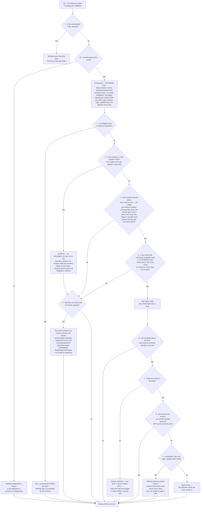

**(FINAL)** The cheap pass has no model call in it: reading a handful of small files, comparing dates and summing a
capacity number is arithmetic, so a tick that ends in `SLEEP` costs effectively nothing. That is the answer to *"I
want the system to move but I don't want it to waste tokens and run loops without any meaning"* — the loop is
meaningful because its default branch is free, not because it is clever.

**(FINAL)** ~~Nine gates and eight of them stop~~ Eleven gates and ten of them stop (amended 2026-09-06: v102's
lease at 0a, v84's `night_capable` at 9), cheapest and most absolute first: **the cord beats everything; the
founder's heartbeat beats the night; an obligation beats a goal; the founder's presence beats capacity; capacity
beats desire; provenance beats opportunity; the envelope beats capability; flow limits beat all of it; the machine's
own sleep beats every unattended brief.**

**(FOUNDER, v55: a standing intent is read by the tick and dispatched like any other candidate, which is the whole
of what the founder asked for)** The founder asked for agents *"that can run every set time or evant or something
else … to build the company like working"* and chose standing intents run by the Watch. A standing intent is an
intent that ~~never expires~~ never finishes but expires — `valid_until`, forced disposition (amended 2026-09-06:
O126; §2.8 owns it) — carrying `every:` (a cadence) or `on:` (an inbound event class) — §2.8. The cheap pass
reads those two fields with the rest of the intent store, still with **no model call**, because *has this cadence
come round* and *did an event of this class arrive* are date and string comparisons. When one has, it becomes
candidate work at **gate 5** and passes every gate after it unchanged: the Desk ranks it against everything else,
the reserve line stops it like anything else, and the WIP limit counts it. **Obligations still come first** — gate 1
is before gate 5 and nothing about a cadence moves it — so a standing intent can never displace something owed to
someone by a date. **Mechanism:** `bin/watch` reads `every:`/`on:` on each tick (**ABSENT**); `bin/check-stores`
refuses `every:` without a ceiling per run (**ABSENT**), which is what keeps a thing that fires forever bounded.

**(NEW: O52 — a cadence is not a tick, and the scheduler coalesces)** A standing intent carries **`catch_up: yes |
no`**. `StartInterval` **coalesces** missed firings into one, which is exactly right for a tick and exactly wrong for
a cadence: v55's `every:` intents **vanish silently across a sleep** and nothing says they did. With `catch_up: no`
the miss is recorded and dropped; with `yes` it is run once on wake. Either way it is **visible**. **Mechanism:**
`bin/watch` reads the field on each tick (**ABSENT**, §L O52).

**(NEW: O23 — the pass that finds what expired, which 13a.6 marks a WISH)** One pass over **every durable store**
looking for a passed horizon — charters, intents, obligations, memory items, grants, skills — forcing exactly one
disposition and writing a **lapse record**: one row per thing that expired unactioned, ordered by what it stopped.
Horizons are the plan's replacement for every calendar audit, and until this exists *finding* the expired thing is
the half nothing performs. **Mechanism:** `bin/horizon` (**ABSENT**, §L O23), run by the Watch on the routine window;
`scripts/ledger.mjs` **exists** and already forces the disposition for claims. §2 carries the intent and charter
side, §13a the horizon rule.

**(NEW: the tick interval is deliberately not written here, and the omission is the point)** FINAL drew it as *every
240 s* and gave the reason — control latency for the cord, a *which* answered, a run's difficulty. The number is a
field in `settings.yml` (ABSENT), and the SPINE forbids durations in this plan for a reason this repository has
measured repeatedly: a number written into prose stops being re-derived and starts being quoted, and then it is
wrong and nobody notices. **Mechanism:** the field is read from settings; anyone who needs the value reads it there.

**(NEW, fixer round 2026-09-06: v104 · O117)** And every number the Watch reads is **derived or says it is not**:
the reserve share, WIP and *two driven ventures* derive from the units table in `keel/shared/facts.yml` (tokens/run,
runs/window, wall-clock/run, intents/week, decisions/day, each with `measured_at`, `valid_until`, a re-measure
command), and `settings.yml` **refuses a number neither derived nor labelled `assumed`**. §16 owns both files and
the dial inventory (O118). **Mechanism:** `facts.yml`, `schemas/settings.yml` (**ABSENT**).

**(FINAL, with the rethink round's four additions)** **Enforced by:** `bin/watch` (ABSENT; FINAL names it
`keel/bin/watch`) · the cord file `STOP` (ABSENT) · `settings.yml` holding the tick, the reserve per window, the WIP
limits (ABSENT) · **`bin/horizon`** (ABSENT, §L O23) · **`catch_up:` on the standing intent** (ABSENT, §L O52) ·
**`bin/replay-desk`** (ABSENT, §L O20) · **the last-founder-event predicate over `keel/logbook/founder.last`** —
written by `bin/log`, read by `bin/watch` (ABSENT, v76) · *(fixer round 2026-09-06)* **`night_capable`** over `keel/host/power.yml`
(ABSENT, O81) · **`founder.lease`** (ABSENT, O86) · **`decisions_per_window`** (ABSENT, O96) · **the operator rows**
in `sessions.jsonl` (ABSENT, O84) · **`facts.yml`** (ABSENT, O117).

---

### 4.1b Whether this Mac can hold a night

**(FOUNDER, fixer round 2026-09-06: E1 → v83; E13 → v84 · O81)** *"dont need for now. use this mac and when cant use
cloude."* The night runs **on this Mac** — no box — and the Watch decides every tick whether it can hold one. **A
predicate, not a habit (THINKER: A1 · W33):** `pmset -g custom` reads `sleep 1` on AC and battery, 391 maintenance
sleeps in seven days; a habit the Watch cannot verify is a wish. `bin/watch` computes **`night_capable`** from
`pmset -g batt` (AC), `pmset -g custom` (`sleep 0` or `disablesleep 1`) and `pmset -g assertions`, against the
contract in `keel/host/power.yml` (§15 owns the file). An `unattended: true` brief is **refused with the printed
reason when it is false** and routed to the **cloud carrier where the charter says `cloud: allow`** (§2.1), else not
minted; predicate and reason are a **page-3 fact and a briefing line**. The probe asserts it **by attempting it** — a
detached child across `pmset sleepnow`, `run.started` read against the wake. **Mechanism:** `bin/watch` ·
`keel/host/power.yml` · `bin/probe` (**ABSENT**, §L O81); adapter over `pmset`, `vendor_wins_if:` the runtime refuses
unattended work on a sleeping host. **Not decided here:** the cloud maker path is UNVERIFIED (v56(b)) and holds a
brief without minting until a cancel path is documented (v67; §I row 15, §3.5); one machine for identity and
autonomy is an accepted risk drilled by §15's keychain probe (O83). **(NEW: O82 · R37)** `pmset -g log` becomes a
v55 standing intent writing a `facts.yml` row, `mac-off-hours`, over **thirty days including a weekend away**.
**Losing images:** the always-on box — §J 73 · `wins_if:` R37 shows maintenance sleeps inside declared nights, or
three attempted nights each end `orphaned`; a `disablesleep` habit · `wins_if:` R37 shows the Mac awake on AC every
declared night unenforced.

---

### 4.2 Two windows, and the difference between a stop and a reroute

**(NEW: v22 moves FINAL row 19, which knew only the five-hour fuse. This is the single most consequential factual
correction in the plan for anything the Watch does)**

**(NEW)** There are **two windows per seat, not one**: a rolling five-hour **and a weekly**, and both are *"shared
with Claude chat and Cowork"* — so the founder's own chat usage draws down the same pool the night runs on. Every
consequence follows from that: the reserve is **per window and per week**, and **a weekly exhaustion is a different
event from a five-hour one.** A five-hour exhaustion is waited out. A weekly exhaustion is not, and a system that
treats them alike will either sit idle for days or ring the founder about something that resolves itself.

**(NEW: and two limit shapes behave differently, which is the operational half)** A **seat** limit — the vendor's
*"session limit"* and *"weekly limit"* — is shared across all models and **cannot be escaped with `/model`**. A
**model-family** limit — *"your Opus limit"* — can: switching family keeps the crew working. **The Watch must
distinguish them: one is a stop, the other is a reroute.**

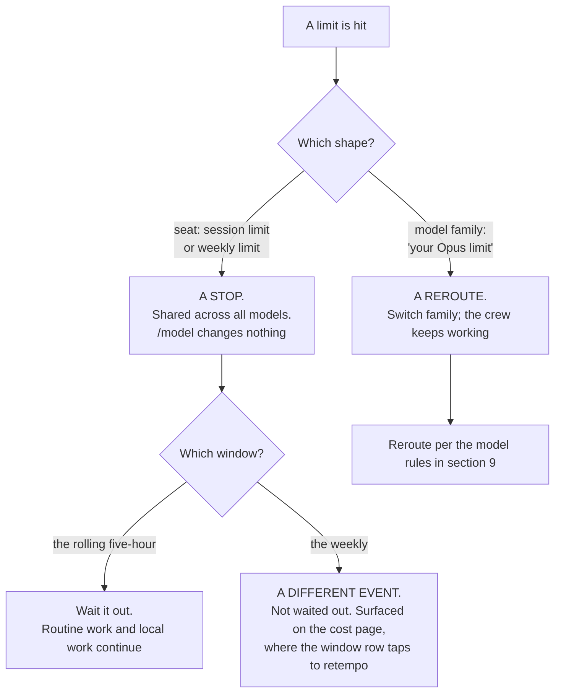

**(NEW)** **Mechanism:** the Watch's cheap pass reads capacity per window *and* per week; the cost page shows both,
and **a window row taps to retempo** rather than merely displaying (v14). **What is UNVERIFIED and must not be
guessed at:** **no numeric quota is published anywhere fetched** for the Anthropic subscription. Magnitudes are
relative only — Pro *"at least 5x more usage per 5-hour session than Free"*, Max *"5x"* and *"20x more usage than
Pro"*. A window's real capacity is measurable only from an account, and the absence of published numbers is itself
the finding. Nothing in this plan may state one.

**(FINAL, and it still binds)** When a window runs out **every agent stops at once** — a shared fuse, not a per-agent
limit. Any design that treats runs as independent workers is wrong here: they are loads on one circuit. A grid never
dispatches to 100% of capacity; it holds a reserve, and the reserve is the most important number in the system
because the founder sets it. Too small and they sit down to a burned window; too large and the nights are wasted.
**Mechanism:** one slider, and a line in the briefing reporting how often the reserve was needed and how often it
expired unused, so it is tuned on evidence. **(amended 2026-09-06: E6 → O127)** The reserve is held **per weekly
window**; the slider is a `settings.yml` dial with its evidence line (O118, §16).

**(FOUNDER, rethink 2026-09-06: D9)** **A ceiling is denominated in window share, not in dollars.** The gauge is
**tokens against an observed high-water mark**, because no denominator is published anywhere fetched and the
paragraph above says so; **wall clock sits beside it** and **USD is kept as a shadow price** (v23 — on a subscription
the dollar is a locally computed shadow of a bill nobody sends). Exploration-class intents (§2.2's `class:`) route to
Gemini, a local model or the Codex seat, and the Desk refuses an exploratory dispatch onto the Claude seat past a
fraction the founder sets. **Mechanism:** one high-water file, one rule in the Desk, one `class:` on the intent (all
**ABSENT**). **Settled by:** split one weekly window between driven and exploratory work — if exploration is
invisible there, this is over-built. §16 owns the currency and the shadow price.

---

### 4.3 `/loop` is refused; the Watch is the loop

**(NEW: v12. The founder asked for the loop and goal features by name — *"I think we need to work with loops and
goals and They features the codex and Claude Code has in order to achieve the best results we can"* — and the answer
splits them: the goal goes on the run, the loop does not become the Watch)**

| Feature | Where it sits | The sourced reason |
|---|---|---|
| **`/goal`** | **On the run** (§6). The done-test *is* the goal condition, with a turn clause | It runs headless in one invocation: *"Setting a goal with `-p` runs the loop to completion in a single invocation."* Condition limit 4,000 characters. It leaves the goal active after transient failures **including rate limits**, which is exactly the behaviour a night wants |
| **`/loop`** | **Refused in production.** It stays a Floor convenience the founder may use by hand | *"Tasks are session-scoped: they live in the current conversation and stop when you start a new one."* A 7-day expiry. And the line that ends the argument: *"Tasks only fire while Claude Code is running and idle."* |

**(NEW: why that last quote is decisive rather than inconvenient)** An always-on tier that only fires while a
session is open and idle is not always-on; it is a session that has to be kept open, and its state dies with the
conversation. The Watch is a program that survives every session, reads the cord first, and costs nothing on the
branch it takes most often. **Mechanism:** `bin/watch` under a LaunchAgent (both ABSENT); `CLAUDE_CODE_DISABLE_CRON=1`
disables scheduled tasks entirely and is available if the Floor's convenience ever becomes a hazard.

**(NEW: one trap in the same family, recorded because it would be found the hard way)** A `/goal` **defers evaluation
while a subagent or background shell is running**, and under `-p` the periodic check-in is *"the only way Claude Code
delivers check-ins."* So a run whose child is stuck delivers nothing and looks alive. That is what §4.5's fuses are
for.

**(moved 2026-09-06: W14)** And the check-ins this section relies on are **capped**, which nothing here said. They
back off **30 min → 1 h → every 2 h**, and *"idle sessions … start at most three check-ins on long-running background work per goal; your
next message allows three more"* (world.md 14). Under `-p` nobody is there to send that next message, **so a night
goal loop delivers three times and then goes quiet** — which is not the same failure as a stuck child and has to be
told apart from it. v12 carries the full statement and §6 carries the run side; the thing that notices the silence is
the wake reconciler (§L **O15**, **ABSENT**), which writes `orphaned` and never `finished`.

**(moved 2026-09-06: W13)** There is a **fourth** scheduling surface inside the CLI that no row named: **`/schedule`**,
known only from three changelog fix lines — *"Fixed `/schedule` routines whose prompt was saved without a message
role and then ran with nothing to do"* — against the three this section already weighs (Routines, desktop scheduled
tasks, `/loop`). **Its semantics are UNKNOWN**: `https://code.claude.com/docs/en/schedule` returned **HTTP 404** on
2026-09-06, so interval floor, storage location and headless status are unread. **(R25, OPEN)** — read them, and
decide whether v55's Watch-dispatched standing intents should route through it or ignore it. Nothing here changes
until it is answered: **the Watch is still the loop**, and a surface whose storage and headless status are unknown
cannot be given work.

---

### 4.4 Where the Operator sits relative to the Watch

**(NEW: a cold reader will otherwise assume the Operator is the loop, and everything about cost follows from its not
being)**

| | **The Watch** | **The Operator** |
|---|---|---|
| What it is | A program. **No model** | An agent file. `claude-opus-5` — **N instances at once**, each a row in `sessions.jsonl` (v91) |
| Always on? | Yes. It is the only continuous process | No. It exists inside a session, for the duration of that session |
| What it decides | **Whether** anything should start at all — cord, obligations, the founder's presence, capacity, provenance, the envelope, flow limits | **Who** does the work, and with what brief and what band |
| Cost on a quiet tick | Effectively nothing — arithmetic over small files | It is not running |
| Can it dispatch? | It opens a Run. The Desk inside it ranks and stops at the reserve line | It dispatches by three mechanisms (§3.5), and composes no argv |
| Can it be the other? | **No.** A model in the cheap pass ends the free default branch | **No.** An agent cannot be always-on without a session being always open, which is what v12 refuses |

**(NEW)** The seam in one sentence: **the Watch says *now*, the Operator says *who*, and `bin/run` (ABSENT) says
*with exactly what grant*.** Three things, three failure modes, and none of them can cover for another.

**(NEW: the one case where the Operator runs without the Watch, and it is the founder's)** A card dragged on page 4
launches a session directly, and a founder on the Floor is talking to an agent with no Watch tick involved. That is
the founder's door (§2.4), and it is bounded by the same launcher and the same bands. The Watch is what makes the
system move when the founder is asleep; it is not a gate the founder passes through to work.

**(FOUNDER, rethink 2026-09-06: D11)** **What the system does while the founder is away, and it reads one derived
value: the last founder event.** ~~Four~~ Five call sites share it (amended 2026-09-06: E6 — *"Away narrows, plus a
burst edge"* · O127 · THINKER: B14, A20). **One:** the reserve is ~~**released to
autonomous work**~~ **released only to `effect: none` work whose outputs stage** (v101's verb table decides)
when the last event is older than the reserve's own horizon, and **snaps back on the first tap**. **Two:** ~~a *which* whose intent expires unanswered has
its **stated default executed**, with **both** built options archived~~ **no one-way default fires while away**: a
*which*'s default fires at expiry only if it touches no one-way verb, because away is exactly when nobody can pull
the cord (THINKER: B14 — absence narrows). **Three:** while
away the system builds **one**
option instead of two, because the second exists to be chosen between and nobody is choosing. **Four:** page 5 gets a
***since you were last here*** view keyed on the event, never on a date. **Five, the burst edge:** the reserve is
held **per weekly window**, and founder events above a founder-set rate in the *current* five-hour window **pause
Claude-seat autonomy until the window rolls** — a busy Floor drains the seat the night shares (v22). **This sits inside the founder's own
numbers** — *"Keep 30% and 3/day; evidence moves them"* — and changes what reads them, not what they are. **It
reintroduces no approve verb and does not reverse v9:** a silent run still cannot ask; a *which* whose default fires
is a decision the founder already wrote down. **Mechanism:** one predicate and one field shared by four call sites —
**`bin/log` writes `keel/logbook/founder.last` on every founder-authored event and `bin/watch` reads it** (**ABSENT**;
~~§A v76 names no path~~ *path set by the orchestrator 2026-09-06, DECISIONS §21 · challenge C P2-1*). The mark is
**ABSENT** rather than **WISH** because v50 asks for a designed mechanism *with its path named*, and this now has
one. **Settled by:** the reserve hit rate §21.1 already measures moving off
*expired-unused*, and the count of second options built and never chosen falling; for the amendment, a drilled week away that regrets nothing.

**(NEW, fixer round 2026-09-06: v102 · O86 — the same value against a second horizon is a stop that needs nothing)**
An e-stop with dependencies — tunnel, token, keychain, a rendered page — is a normal control (THINKER: B19, A21).
**`keel/logbook/founder.lease`** is `founder.last` against a **second, longer horizon** (a dial); while it is stale
**the Watch mints nothing unattended** (gate 0a). Any founder-authored event renews it, so **absence of the heartbeat
is itself the stop**, reachable with the network off, the tunnel down and the keychain locked; the tap stays the fast
path to `bin/stop` (v91 · O85; §3.5). **Mechanism:** one file, one predicate in `bin/watch` (**ABSENT**, §L O86); one
drill — the cord from the phone, network off, count what stops. **Losing images:** the tap as the e-stop · `wins_if:` a year of drills in which
the tap reaches quiescence from the phone every time, tunnel down; a hand-renewed lease · `wins_if:` `founder.last`
goes stale at the desk.

---

### 4.5 The Desk, and the fuses

**(FINAL)** The Desk is the newsroom assignment desk plus the grid operator's merit order. Each candidate carries
four numbers, deliberately crude because a sophisticated estimate would be false precision:

| Number | How it is got | Range |
|---|---|---|
| **Weight** | the venture's `weight` ~~× the Intent's own urgency~~ — **(NEW: deletion 3)** one person, two dials for one decision, and the second is derivable from the first | 1–5 |
| **Cost** | median actual cost of the last N runs of this kind, from the ledger. **A measurement, not an estimate** | tokens, per window |
| **Readiness** | dependencies met, inputs present, whiches answered — **and the done-test's outcome would change a next act** | yes / no |
| **Decay** | ~~closeness to expiry, and time since it last moved~~ — **(NEW: deletion 2)** the two are **split**, because they point at opposite dispositions; for a standing intent, *time since last move normalised by its own cadence* | two fields, not one number |

**(FOUNDER, rethink 2026-09-06: D10)** ~~Rank = `Weight × Decay ÷ Cost`~~ **(NEW: deletion 1)**. **The Desk ranks
lexicographically:** **obligations** first — ranked among themselves by consequence and the world's own deadline —
**then work that unblocks other work**, **then the founder's weight band**, **then cheapest inside the band**.
Dispatch in order; stop at the reserve line; ~~ties break toward the cheaper item~~ **ties inside a weight band break
toward the item nearer its charter's `outcome:`** — distance to outcome, read from `keel/shared/market.jsonl`, which
`bin/reconcile` alone writes (amended 2026-09-06: NEW: v98 · O98 · THINKER: C5; §2.1 owns the field, §13 the store).
The world's answer, not the founder's opinion of a venture, breaks the tie.

**(NEW: contradictions 21 and 22 — why the formula went, said once)** It **divides by measured cost**, so cheap work
permanently outranks expensive work, and **v55's standing intents supply an endless stream of cheap work**: a
standing intent is bounded per run and unbounded per window (contradiction 21), so an expensive high-weight intent
can starve at any weight the founder sets. And `Decay` was **undefined for an intent that never expires**, which is
most of a ten-venture queue (contradiction 22). Lexicographic order fixes both by refusing to combine three crude
numbers into a fourth with no dimensional meaning. **Mechanism:** one comparator and one branch — **less** code than
the formula it replaces, explainable on the board, and it **cannot invert the founder's weight** (**ABSENT**).
**Settled by:** replay the Desk's own rows over a simulated month under both orders and count dispatches of the
top-weight intent — the replayer is §L **O20**, deterministic, free, and reading a file nothing reads today.
**(NEW, fixer round 2026-09-06: §J 80 · R38)** Weighted fair queueing now is a losing image: v75 is **replayed before
it is replaced** — R38 runs O20's replayer under a synthetic obligation tide and counts a second venture's top-weight
dispatches. `wins_if:` they starve.

**(NEW, fixer round 2026-09-06: E15 → v87 · O96 — the founder's decisions are a capacity, and the Desk admits a
*which* like a run)** The founder delegated — *"do what best for the sytem"* — and the design is B's: the Desk
**refuses to open a *which*** past **`decisions_per_window × intent.horizon`**, seeded at **six per five-hour
window** until **R34** measures the answering rate; the refusal is a **row**, never a silence. A *which* carries
`kind: fact | preference`, `cost_to_answer_bytes` (measured) and `recommendation_shown:`, hidden on a founder-set
fraction as the taste store's control arm (O97 · R39, §13). **One option built, a second written**; both only when a
`preference` *which*'s two ten-word summaries cannot be separated. Inside v9 and v76, reversing neither.
**Mechanism:** `bin/watch` · `decide.jsonl` (**ABSENT**, §L O96); the seed is a dial labelled `assumed` (O118).
**Why (THINKER: B3, C4):** the which queue was unbounded while the answering rate was a number nobody had measured. **Losing
image:** whiches unbounded, both options always built · `wins_if:` a quarter with no backlog past one window's
throughput and the second option chosen over a third of the time.

**(NEW: O55 and O56 — two clocks the comparator must not treat as founder-shaped)** A **`statutory` wake-me class is
exempt from the interruption budget**, declared on the obligation rather than judged in the moment; and a support
obligation whose **promised response time falls inside the next window promotes past the interruption budget**.
Demotion never applies to obligations. The budget is founder-shaped — three interruptions a day, tuned to what the
founder will tolerate — and **a waiting customer has a clock the budget does not know about**. **Mechanism:** the
obligation schema carries the class (**ABSENT**, §L O55); the promotion is a branch in this comparator (**ABSENT**,
§L O56). §2.3 owns the obligation's fields.

**(FINAL)** **There is no success-probability estimate anywhere:** the system does not predict the value of work,
it measures what work of that kind cost before, takes the founder's weight as given, and lets recency and expiry do
the rest. Two escape hatches from real practice, **both given a mechanism and a mark on 2026-09-06 (challenge C
P2-5), because a rule with neither is a wish in a subsection where every other rule has one**: one **spinning slot**
is always held for whatever the founder asks next, so a spoken instruction never queues behind autonomous work; and
the Desk ~~**re-ranks on a cadence**, not on every event~~ **re-ranks on every tick**, so a noisy input cannot make it
thrash.

**The spinning slot is not a second reserve.** It is **one slot inside the reserve §4.2 already holds** — the same
number, spent differently: the Desk stops at the reserve line as it always did, and the topmost slot below that line
is the one it will not fill with autonomous work. Nothing new is reserved, so §4.2's arithmetic is untouched and the
founder's one slider still sets the whole of it. **Mechanism:** one branch in `bin/watch`'s dispatch loop, holding
the last slot above the reserve line unless the item is founder-authored (**ABSENT**). A slot held by an
unaccounted-for rule is capacity that disappears from the gauge the founder tunes.

**"On every tick" is not a schedule, and that is the whole point of the change.** The tick is `settings.yml`'s, the
founder's number (§4.1), and the Desk re-ranks once per tick because that is when it runs at all — so a noisy input
still cannot make it thrash, and the plan states no interval of its own. A *cadence* here would have been a second
clock beside the Watch's, which is what §13a.3 and §18.7 refuse.

**(FINAL)** The Desk records its ranking **and the gate that stopped each candidate**, at every tick, which is what
makes *why did you not do that* answerable. **Enforced by:** `bin/watch` writes ~~`logbook/desk/<tick>.json`~~
(ABSENT).

**(NEW: O20, and deletion 30 in the same move)** The Desk already writes the answer and **nothing reads it**. Those
fields become **event-log rows** rather than a file per tick — the highest-volume artifact in the design was holding
an answer whose value decays in hours — and a **no-model replayer** reads them back. It is the only way to tune
scheduling without living a month, and it is what settles v75 above. **Mechanism:** `bin/replay-desk` (**ABSENT**,
§L O20); the rows join the event log under its schema (§L O6, **ABSENT**).

**(NEW, fixer round 2026-09-06: O123 · R36 — said once: the Watch is an open-loop controller with static
setpoints)** Every gate compares a reading to a founder-set number — static gains on a non-stationary plant, retuned by hand,
O20's replayer the **only offline tuning path**. So §16's control charts (O74) extend to the Watch's **own outputs**
— ring, dispatch, refusal and which-open rates against their own history — and **R36** baselines them over its
span. **Mechanism:** four series on O74's chart (**ABSENT**, §L O123). **Losing image:** the Watch described as a
cheap pass · `wins_if:` none of the four drifts in a year.

**(NEW: v31 adds one input to the cost column that FINAL's did not have)** With fourteen named agents, cost is
measured **per agent per kind of work**, not per anonymous shape. That is what makes the roster's own claim
falsifiable: if `growth` and `steward` — the two entries with the least outside evidence behind them — never produce
work whose anchor holds, their cost rows say so, per agent, in the ledger.

---

### 4.6 The stall fuse

**(NEW: v23. `--max-budget-usd` was carried in FINAL §7.5 as a spend control. It is not one, and the correction
matters because a false spend control is worse than none)**

**What it is not.** It is **print mode only**, it is computed **locally from token counts at list price**, and for a
subscriber the vendor's own words are that *"the session cost figure isn't relevant for billing purposes."* It does
not bind the account. Nothing about it touches the two windows of §4.2.

**What it is, and why it is kept.** A **stall fuse**. Its two documented properties are exactly the ones a fuse
needs: **subagent spend counts toward the cap**, and once spend reaches it, **spawning another subagent fails with
`Budget limit reached`** (v2.1.217+). So a run that has gone into a loop of children stops making children. That is
worth having under its real name.

**(FINAL, and the two other governors that catch the machine rather than the founder)**

| Fuse | Predicate | State |
|---|---|---|
| **The stall detector** | no **durable artifact** from a run for N ticks and the run stops spending. The predicate is a durable artifact, **never the run's claim of progress** | `.claude/hooks/budget-guard.js` exists on this branch, `ceo-1-1788609834`, and is **registered nowhere** — **register it** (§L **O50**), in `.claude/settings.json`. Registering it is a founder act on a settings file |
| **The repetition tripwire** | a hash of tool identity and canonicalised arguments against this intent's negatives; an exact repeat is refused unless a named difference is stated | ABSENT |
| **The aberrance halt** | spend at several times this agent's median for this kind of work, a burst of identical calls, or a claim the nightly reconciliation contradicts — halt the run, ring the bell | ABSENT; the median comes from the ledger |

**(NEW: why all three predicates avoid self-report, said once)** Every fuse above keys on something the run cannot
author: a durable artifact on disk, a hash of what it actually called, a median from the ledger, a reconciliation
against a record the company does not write. A fuse that read the run's own progress report would be asking the
thing that stalled whether it has stalled.

**(NEW: O50 — the first row's state is the one worth saying out loud)** **A fuse that is not wired is a memory of a
fuse.** `budget-guard.js` is the only one of the three that **exists**, and it is the only one that has never fired,
because nothing invokes it. Registering it is a one-line settings act and it moves the row from *exists* to
*enforced*; §18 carries its fate.

---

## 5 · The roster

*obeys: SPINE §B entire; v1, v2, v6, v7, v8, v31, v33; **and the fixer round of 2026-09-06 — v88, v90, v103, v105 with O91, O92, O103, O105, O111, O112, O120** (SPINE §K row 5); inherits: FINAL §7 (as the losing image, and as the four rules that survive it)*

---

**(FOUNDER)** *"I want us to recreate the whole startup company or a whole company or a team. So I want us to have
more agents as much as you will need, but not too much. So, like, between ten and fifteen agents. So we will have
each agent with its own expertise so we can adjust his knowledge and his tools and his way of walking and thinking
towards the tasks that he needs to achieve."*

**(FOUNDER)** **Fourteen agents plus the Operator — fifteen named roles.** One file per agent, in the frontmatter
format the runtime already reads: `name`, `description`, `tools`, `model`, `mcpServers`, `skills`, `maxTurns`,
`isolation`. **All fifteen files are ABSENT.** What exists to build them from is on this branch,
`ceo-1-1788609834`: the format itself, the `PS-*` lint in `.claude/hooks/schema-lint.js`, and eighteen agent files
that currently pass it at **18 pass · 0 fail · 0 warnings**.

**(NEW: what FINAL argued, so the reader knows what was traded)** FINAL refused a roster and built three shapes —
maker, scout, checker — separated by irreducible properties, with domain as a loadout. Its argument was that a cold
outreach agent and a blog writing agent have the same tools, the same reasoning and the same failure modes, and
differ only in what they know and what would prove them right: memory and a check, neither of which is an agent.
That argument is not refuted below. **It is overruled**, the cost is stated once in §5.6, and what the shapes were
protecting is kept as four rules that now live inside a roster.

---

### 5.0 Two waves — which of the fifteen are written first

**(FOUNDER, v54)** Asked how many of the fifteen to write at the start, the founder chose: **"Start with the eight
that have seeds or code paths"**. The roster is unchanged — fourteen agents plus the Operator, and **all fifteen
files are still ABSENT** — but the order in which they are written is now decided, and §19 draws it as two waves.

| Wave | Agents | Why these |
|---|---|---|
| **Wave one — ~~eight~~ ten** *(moved 2026-09-06: D5 → v70)* | the **Operator** · `builder` · `reviewer` · `architect` · `tester` · `guard` · `scout` · `designer` · **`curator`** · **`challenger`** | each has a seed file or a code path on this branch today: the seven engine files of `.claude/agents/` are the format and the `maxTurns` seeds (v40), `designer` already holds the one `playwright` grant that exists, and the checkers already run against this repository's own gate. **The two added by v70 pass v54's own test:** `curator` has four verified code paths here — `evict-memory.mjs`, `ledger.mjs`, `check-citations.mjs`, `check-memory-budget.mjs` — and `challenger` is one read-only file, the cheapest in the roster |
| **Wave two — ~~seven~~ five** *(moved 2026-09-06: D5 → v70)* | `product` · `analyst` · `writer` · `growth` · `steward` | the five remaining business agents. They come online **when a venture needs them** — which, given v64 makes the harness itself the first venture, is not on day one |

**(FOUNDER, rethink 2026-09-06: D5 → v70 — the curator and the challenger do not wait for wave two)** *"Curator and
challenger both join wave one."* v54 is not reversed; its **implementation** moves, and its own test is what admits
them. What the round found is that wave one otherwise ships two gaps with a measured harm behind them: the
challenger is v30's external critique, which the plan justifies with a measurement, and the curator is the only
writer of memory, so without it wave one produces handovers proposing durable facts that nothing may write down.
**The cost, once:** two agent files (**ABSENT**), and the challenger runs single-family until Codex or Gemini
lands — **its findings are labelled rung 4 rather than hidden**. **Settled by:** the harness venture producing
handovers nobody reads, and a count of memory proposals with no writer.

**(FOUNDER: the cost, stated once and not re-litigated)** Wave one is still missing one agent whose absence changes
how the system runs, not merely what it contains, and the gap is covered by something weaker rather than by nothing:

- **No `product`.** So a request too fuzzy to dispatch is closed by **the founder writing the done-test through the
  read-back**, with the Operator proposing two candidates (§2.5, §3.6). The provenance rule is untouched, because
  `product` never bound an intent anyway; what is lost is the founder's own time on the fuzzy ones.
- ~~**No `challenger`.** So a plan about to bind is attacked by **`guard`'s adversarial review and the founder's own
  read** until wave two.~~ **(moved 2026-09-06: D5 → v70)** `challenger` is in wave one, so a plan about to bind is
  attacked by the agent v30 asks for. What is still unmet is the **second model family**, for the reason §5.7 gives.
- ~~**No `curator`.**~~ **(moved 2026-09-06: D5 → v70)** It is in wave one, and with it memory has a writer from the
  first night rather than a queue of proposals.

**(NEW: what the two waves must not be allowed to become, because this is where a wave plan usually rots)** Wave two
is **not a maybe**. Every one of the fifteen keeps its row in §5.2, its file in the §17 inventory and its anchor,
because a roster that quietly shrinks to eight has re-decided v1 and v31 without saying so. What a wave is, exactly:
the order §19 writes the files in. **Mechanism:** the inventory carries the wave per agent, so *not yet written* and
*not in the roster* cannot be confused for one another; and `bin/run` refuses a brief naming an agent whose file
does not exist (**ABSENT**), which is what makes wave two's absence a refusal rather than a silent fallback to some
other agent.

---

### 5.0a What makes an agent routable, and what makes it expire

**(FOUNDER, rethink 2026-09-06: D6 → v71 — an onboarding pack, for every agent, wave one included)** A declared
agent is not a routable one. Each of the fifteen carries a pack of four things, and ~~without them the agent is
declared and not routable~~ **without a seed pack the agent is declared and not routable** (amended 2026-09-06:
v103 / O111, through v89's Decide item):

| The pack | What it is | Why this one | **Seed or harvested** *(added 2026-09-06: O111)* |
|---|---|---|---|
| **A rehearsal case** | at least one, with a **known answer** — **a reference into `keel/golden/`, never a body the pack carries** (THINKER: B17) | it is the only way to tell an agent that works from an agent that is described; a case the agent can read is the answer key filed with the exam, and R19 must run on cases the packed agent never saw | **seed** — required before the first dispatch |
| **An exemplar** | one piece of its own good output, **with provenance** | this is what distinguishes `writer` from *builder with a different prompt* | **harvested** — the curator writes it after N anchored handovers (N is a `settings.yml` dial, O118) |
| **A demonstration** | one end-to-end run showing **its anchor actually fires** | an anchor that has never fired is a rung-4 belief wearing a rung-1 label (v73's argument, one level down) | **the first dispatch is the demonstration**, and its handover row is the artifact (THINKER: C14) |
| **Namespaces that resolve** | every namespace its file declares exists and holds at least one unexpired skill | otherwise the agent's skills line is decoration, and §7's `skill.miss` event is what notices | **seed** — required before the first dispatch |

**Mechanism:** the four pack paths are declared in `keel/shared/roster.yml` (§L **O2**, **ABSENT**), and `bin/run`
already refuses a brief naming a file that does not exist (v37, v45) — so *not routable* is an existing refusal
reading a new field, not a new enforcement path. ~~**The cost, once:** three artifacts per agent — **thirty for a
ten-agent wave one**.~~ **The cost, once (amended 2026-09-06: O111):** a seed pack is two references and no
artifact — the `golden/` case and the namespaces — so wave one costs **ten seed packs and zero exemplars**, and the
thirty artifacts v71 priced are harvested by the curator from anchored handovers rather than written before any run
exists. **Why it is not ceremony:** in a band nobody publishes evidence for (§5.6), evidence is the
only thing that can settle the design. **Settled by: (R19, OPEN)** — packed against unpacked on the same
known-answer cases, using §7's admission runner **on `keel/golden/` cases the packed agent never loaded** (O111);
**if the packed agent does not win, the pack is ceremony and this
row is refuted by its own test.** The founder's losing image is named with it: *"the agent file is the
onboarding"* — true about the runtime and false about the company.

**(NEW: O111 — why v71 as written could not start, and the fix is a state, not a smaller pack)** v71 required an
exemplar *of the agent's own good output* before the agent was routable, and an exemplar of its own output needs a
handover, which needs a dispatch, which the pack forbade — **the bootstrap deadlocked on its first agent**
(THINKER: C14, B10). And the rehearsal case carried *in* the pack contradicted §7.2a's O11: the case that judges a
run shipped in a directory the run could read (THINKER: B17). **Both fixes are one field.** `roster.yml` carries
`pack: seed | harvested` per agent (**ABSENT**): a **seed** pack holds the `golden/` reference and the namespaces;
`bin/run` routes a seed agent; its first dispatch *is* the demonstration; the curator harvests the exemplar after N
anchored handovers and flips the state; **`bin/check-stores` refuses a `harvested` pack with no exemplar**
(**ABSENT**), and `check:manifest` (O11) fails a known answer found in any loaded directory. **Losing images,
each with `wins_if:`** — *v71 as written* · `wins_if:` the curator can harvest an exemplar from the founder's
transcript corpus (§13.7) before any run, in which case the deadlock was never real; *a `pack: seed | full` state*
(FIXER: C's name for the same shape) · `wins_if:` none — the fold kept `harvested` because it names the act that
flips the state, and the difference is a word. **Settled by:** attempt the curator's pack for `builder` before any
run under v71 as written and record whether it can be routed.

**(NEW: O112 — trust has a probation state, because a floor above one makes every wave-one agent unroutable
forever)** §5.6's trust score gates routing *below a floor*, and wave one has ten agents and **zero anchored
history**, so with any floor above one, every agent is unroutable until it has what it cannot get (THINKER: B10).
`roster.yml` gains **`trust: probation | scored | unroutable` per move class** (**ABSENT**; v103). In
**probation** an agent is routable **only on the Floor or under a founder-authored intent**, with
**adequacy-judged anchors** (§11, O108) — each anchored run counts toward the floor, and the floor is a number in
`settings.yml` (O118) that is **O25's constant**, the same one §7.3 and §11.10 read. Promotion is by that number,
never by a waiver. **Mechanism:** `bin/run` refuses a `probation` agent on an unattended brief no founder
authored (**ABSENT**). **Losing image:** *the floor as written with a hand-waiver* · `wins_if:` the floor is one;
the score is then decorative. **Settled by:** dispatch counts per agent in the first week; zero for any wave-one
agent is the deadlock.

**(FOUNDER, rethink 2026-09-06: D7 → v72 — an agent is not the one permanent thing in the system)** All fifteen
agent files carry **`valid_until`**, and at expiry exactly one disposition is recorded — **Refresh · Merge ·
Retire** — with the anchored evidence attached. **Mechanism:** one frontmatter field, carried in `roster.yml`
(**O2**); the forced disposition is `scripts/ledger.mjs`, which **already blocks on this branch** for claims and
whose rule is the same one. This extends v19's skill-expiry idiom to the roster and **reopens neither v1's count
nor v54's waves** — an expiry is a scheduled question, not a cut. **The cost, once:** a small number of founder
answers a year. **Settled by:** the first expiry producing a Merge or a Retire — or a cycle where every agent
Refreshes on real evidence, which is the strongest defence of fourteen available. The losing image: no expiry at
all, leaving the roster the one object in the system that can only grow.

---

### 5.1 The four rules that survive the move from three shapes to fourteen names

**(FINAL, kept; each names its mechanism)**

1. **The grant is argv on the `claude -p` carrier, not prose — and v43 names the carrier for each of the three dispatch mechanisms.** One no-model launcher composes it; nothing else may. *(v34; `bin/run`, ABSENT.
   A prose rule describing a grant is the losing image, and `--allowedTools` restricting nothing is why.)*
2. **The checker cannot edit what it judges.** `reviewer`, `guard` and `challenger` carry **no `Write`, no `Edit`,
   no `Bash`**. *(FINAL row 6's irreducible property; enforced by the argv and by the nightly probe `bin/probe`,
   ABSENT. An agent that can edit what it reviews will review what it can edit.)*
3. **The trifecta split.** No agent holds untrusted input, private credentials and an outward channel at once.
   *(v33; the Sender is the only thing that sends, and it holds no model.)* **v36 sharpens the first leg into a
   testable rule:** a tainted read — mail, calendar, drive, Notion, the open web — is held by `scout` and by the
   world's door program, **and by nothing that carries `Write`, `Edit` or `Bash`.** *(Mechanism: the MCP column of
   §5.2 is the argv; `bin/probe`, ABSENT, asserts it nightly.)*
4. **The no-model programs stay programs.** The Watch · the Sender · the world's door · the probe · the reconciler ·
   the log · the launcher · the curator's launcher · the drill · the rehearsal runner · the store check ·
   ~~the supervisor~~ *(struck 2026-09-06: **O91** — `bin/supervise` is **REFUSE**d until R31 reads the vendor
   daemon's lease semantics; the vendor ships a supervisor (THINKER: A7, W38) and a second one beside it is the
   two-implementations defect this repository names; `bin/run` mints via bare `claude -p` in tmux, §6.4)*.
   **A prompt injection that reaches one of these finds a program.** *(FINAL §7.4, §16.1. Mechanism, set
   2026-09-06 by the orchestrator, DECISIONS §21 · challenge C P2-2: `keel/shared/roster.yml` (§L **O2**) carries the
   ~~twelve~~ **eleven** under `kind: program`, and `bin/check-stores` **refuses an agent file whose name is on that list** and
   **refuses a `model:` on any program entry** — both **ABSENT**. The list is data, so promoting a program to an
   agent is a diff on one file rather than a habit nobody can see.)* **(NEW: O103 — four of the eleven are the
   trusted base.)** `send`, `inbound`, `watch` and `run` are the programs that touch the world; their `roster.yml`
   rows carry **`world_touching: true`, `max_lines:`, `authored_by:`**; `bin/check-stores` **refuses one over its
   line budget**; `keel/fixtures/` (O78) is their **only admission**; their diffs are **founder-line-reviewed**
   (FOUNDER, fixer round 2026-09-06: E4 · v88, *"Small trusted base, per-wave sign-off"*). **The vendor's flags are
   the floor and `bin/run` narrows above it, never widens** (O104, §12) — so a defect in the launcher yields a
   narrower or refused run, and the founder reads four small programs rather than twenty-six. **Losing images:**
   *every Keel PR at irreversible* — §J 78 · `wins_if:` a second family becomes reachable inside Claude Code; *a
   `keel-build` tier with no sign-off* · `wins_if:` a wave lands with zero founder findings. **Settled by:**
   sign-offs before the first dispatch exceed four (THINKER: A11). **Every `bin/` program also carries `class:
   kernel | adapter | refuse`, `vendor_wins_if:` and `wins_if:`** (O105, v96); §17.5 holds the table, and §5.9
   below marks the ones this section names.

**(NEW: why rule 4 is the one most at risk from a roster ~~, and the mechanism is a naming discipline~~ — it has a
mechanism now, and this is why it needed one)** *(corrected 2026-09-06 · challenge C P2-2: a discipline somebody
applies is what §12.10 and §13a call a wish; the two refusals above are what a program can check.)* Fourteen names
create fourteen invitations to add a fifteenth for something that is currently a program. The test is whether the
thing needs judgement. The Sender does not: it recomputes a ceiling, reads a checklist aloud into the log, performs
one act, and holds a recall window. Making it an agent would put a model between the decision and the act, which is
the exact seam this design exists to keep apart.

---

### 5.2 The fourteen

**(NEW: model ids are from the models lane; `tools` is the argv-level grant, not a description; "Anchor" is what
proves the work and is **never the agent's own report**)**

| # | Name | The job it exists for | Expertise lens | Model | `cacheTtl` *(added 2026-09-06: W6)* | Tools | MCPs | Skill namespaces | Anchor — what proves it | The Operator routes here when |
|---|---|---|---|---|---|---|---|---|---|---|
| 1 | **builder** | Writes the code. One artifact, one worktree, continuous context | engineering | **`claude-fable-5-1`** (v57, the founder); fallback `claude-opus-5` while reachability is UNVERIFIED | unset · **O2** | Read Write Edit Bash Glob Grep | none by default | engineering · testing | the venture's own CI, plus the done-test, plus the tester's blind test | the intent's outcome is source code |
| 2 | **reviewer** | Judges code it did not write, against a named dimension | engineering · correctness | `claude-sonnet-5`; ~~a second family when reachable~~ the second family is the **Gemini CLI or Codex CLI as a `bin/run` child from launchd, no key** — rung 4 until the calibration set passes *(amended 2026-09-06: E7 · v90, O92)* | unset · **O2** | Read Glob Grep | none | engineering · quality | findings reproduce from the diff alone; a finding with no reproduction is a hypothesis | any builder handover, before merge |
| 3 | **architect** | The contract before the code: schema, API, data model, migration | engineering · systems | **`claude-fable-5-1`** (v57, the founder); fallback `claude-opus-5` while reachability is UNVERIFIED | unset · **O2** | Read Glob Grep Write (design paths only) | none | engineering · data | a migration that applies and rolls back in a scratch database | the work changes a schema, an interface or a stored shape |
| 4 | **tester** | Writes the test that judges a build, **blind to the implementation** | quality | `claude-sonnet-5` | unset · **O2** | Read Write Edit Bash Glob Grep, `--add-dir` excluding the implementation | none | testing · quality | the test fails before the change and passes after | any intent whose done-test needs a new anchor (v8) |
| 5 | **guard** | Security and adversarial review; every tool admission | security | `claude-opus-5` | unset · **O2** | Read Glob Grep | none | security | a proof of concept that reproduces, or the finding is a hypothesis | auth, credentials, network, outward acts, migrations, or a new tool at the door |
| 6 | **scout** | Finds things out. Stateless, parallel legal here and only here. **Reads the untrusted world** | research | `claude-sonnet-5`; ~~Gemini once authenticated~~ the Gemini CLI on a personal account, **only as a `bin/run` child from launchd** *(amended 2026-09-06: E7 · v90, O92; W37)* | unset · **O2** | Read Glob Grep WebSearch WebFetch — **no Write, no credential, no send** | read-only servers, per run | research | every claim carries URL, quote and access date; `check-citations.mjs` blocks on a dead one | a bounded question of fact is cheaper to answer than to assume |
| 7 | **designer** | UI, UX, brand, visual identity, prototypes. The perception loop: render, look, iterate | design | `claude-opus-5` | unset · **O2** | Read Write Edit Bash Glob Grep | `playwright` (per-run inline) | design · frontend | a rendered screenshot judged against a named anchor; never the agent's description of it | the artifact is seen by a person |
| 8 | **product** | Turns fuzzy into a falsifiable done-test; specs, tickets, acceptance criteria, roadmap | product | `claude-sonnet-5` | unset · **O2** | Read Glob Grep Write (spec paths) | none | product | the store check refuses an intent whose done-test is not falsifiable by someone who did not do the work | the request cannot yet be dispatched |
| 9 | **analyst** | Pipelines, KPIs, cohorts, A/B, anomalies, and the nightly reconciliation | data | `claude-sonnet-5` | unset · **O2** | Read Glob Grep ~~Bash~~ *(struck 2026-09-06: **O57**, contradiction 4)* | read-only analytics, error tracking, billing-read | data | the reconciliation reads a record the company does not write; a number that reconciles to our own log is rung 4, not rung 1 | a question is about what actually happened |
| 10 | **writer** | Content, brand voice, SEO, ad copy, campaign drafts, video and asset briefs | growth · craft | ~~`claude-opus-5` for taste work; `claude-sonnet-5` for routine~~ `claude-sonnet-5`, escalating to `claude-opus-5` on a **§9.1 row with a named trigger**, never in this file *(moved 2026-09-06: **O57**)* | unset · **O2** | Read Write Edit Glob Grep | Higgsfield (rate-capped, spends credits) | growth · craft | staged, never sent; the anchor is the founder's taste store and a rung-2 external reaction | words or assets are the artifact |
| 11 | **growth** | Leads, scoring, outreach *drafts*, CRM hygiene, funnel work. **Never sends** | growth | `claude-sonnet-5` | unset · **O2** | Read Glob Grep Write | CRM read-only | growth | a reply from a real person, recorded by the world's door; never a count of messages sent | the intent is about reaching people who are not yet customers |
| 12 | **steward** | Obligations, invoices, expenses, contract *review*, compliance flags, vendors, support triage | operations · finance | `claude-sonnet-5` | unset · **O2** | Read Glob Grep Write (obligation **proposals** and operations paths — `obligations.yml` itself is the Watch's, v44) | **none** — mail, calendar, drive and Notion are read by the world's door (a program) into inbound rows, and by `scout`; steward writes from scout's handover, never from a raw row (v36) | operations | an obligation is discharged only by a record the company does not write | something is owed to someone by a date |
| 13 | **curator** | What the company knows: memory, the transcript pass, and skill admission. **The only writer of memory** | knowledge | `claude-sonnet-5`; the summarising half on ~~Gemini or a local model~~ the Gemini CLI as a `bin/run` child from launchd, or a local model *(amended 2026-09-06: E7 · v90)* | unset · **O2** | Read Write Edit Glob Grep — **no Bash** | none | knowledge | a memory item with no source, date, expiry and falsifier is refused at the store check | nightly, and whenever a run's handover proposes a durable fact |
| 14 | **challenger** | Attacks a finished plan or artifact for holes, contradictions, and rules with no mechanism | adversarial reasoning | `claude-opus-5`; ~~a second family when reachable~~ the second family is the **Gemini CLI or Codex CLI as a `bin/run` child from launchd, no key** — rung 4 until the calibration set passes *(amended 2026-09-06: E7 · v90, O92)* | unset · **O2** | Read Glob Grep | none | quality · research | every finding names the mechanism that would have caught it, or it is an opinion | before anything irreversible, and on every plan the Operator is about to bind |

**(NEW: where the roster is thinner than it looks, deliberately, and this is the table's most important row)**
**~~Ten~~ Eleven of the fourteen carry no shell. Five carry no write of any kind. Only four can touch source.** That
is the trifecta split expressed as a table rather than as a rule, and it is what makes fourteen names cost less than
it sounds: most of them cannot do most things.

**(NEW: contradiction 1 — and the fix is not the number)** The plan carried **two counts of one column**: *"eight of
the fourteen carry no shell"* in one place and *"Ten"* here, while the `Tools` column beside them said four agents
held `Bash`. **O57** strikes `analyst`'s, so the true count is **eleven** — and the durable point is that a
hand-written count of a column will drift from the column again the next time a row moves. **Mechanism:** §L **O2**
— `keel/shared/roster.yml` (**ABSENT**) is the one file, and this table, §17.1 and page 2 are **generated from it or
checked against it**, so the count is derived and never typed. §5.2a states what that file carries.

**(NEW: v36 — who may hold a tainted read, and it is one line because it is one rule)** Mail, calendar, drive and
Notion are **tainted read-only**: their content is written by strangers. **Only `scout` and the world's door program
may read them.** No agent that holds `Write`, `Edit` or `Bash` reads them raw — which, read against the MCP column
above, is why exactly one agent in the table carries a tainted server and it is the one with no write, no
credential and no send.

| Who | May read mail, calendar, drive, Notion | Why |
|---|---|---|
| **the world's door** | yes | a program with no model. It writes one inbound row per event and does nothing else |
| **`scout`** | yes, read-only servers admitted per run | it holds no `Write`, no credential and no send, so a prompt injection in a stranger's text reaches a thing that can neither act nor tell anyone |
| **`steward`** | **no** | it holds `Write`. It works from `scout`'s handover and from inbound rows, never from a raw row |
| every other agent | no | none of them has a reason to, and each of them holds something |

**(NEW: the fifteenth)** The **Operator** is not in the table because §3 is its section. It carries `Read Glob Grep`
plus `Agent(...)`, no `Write`, no `Edit`, no `Bash`, and its file is ABSENT like the rest.

---

### 5.2a One roster file, and what is generated from it

**(NEW: O2)** `keel/shared/roster.yml` (**ABSENT**) is the single declaration of the fifteen. It carries the
frontmatter the runtime reads — `name`, `description`, `tools`, `model`, `mcpServers`, `skills`, `maxTurns`,
`isolation` — and ~~five~~ **twelve** fields the plan adds *(re-derived 2026-09-06 from SPINE §B's amended block:
five from the rethink round, seven from the fixer round)*:

| Field | From | What it is for |
|---|---|---|
| `color:` | **O2** | the agent's colour on page 2 and in a session name. It closes a COVERAGE `?` that had no home |
| `wave:` | v54, v70 | *not yet written* and *not in the roster* are different states and must not read alike (§5.0) |
| `valid_until:` | **v72** | the forced disposition — Refresh · Merge · Retire — with anchored evidence |
| `cacheTtl:` | **W6** | `experimental.cacheTtl`, `5m` or `1h`, per agent |
| the four pack paths | **v71** | ~~rehearsal case · exemplar · demonstration · namespaces~~ a `golden/` reference · an exemplar path · the first dispatch's handover id · namespaces; a missing **seed** path is what makes the agent unroutable *(amended 2026-09-06: O111)* |
| `pack: seed \| harvested` | **O111** · v103 | which of the four the agent holds today; `bin/run` routes a seed agent, `bin/check-stores` refuses `harvested` with no exemplar (§5.0a) |
| `trust:` per move class | **O112** · v103 | `probation \| scored \| unroutable`; probation is routable on the Floor or under a founder-authored intent only (§5.0a) |
| the carrier dimension | **O120** · v105 | trust is scored per agent **per model per carrier**, so *finishes with the Claude carrier denied* is a number rather than a hope (§5.6) |
| `fallback:` | **O89** | v78's same-family links, composed by `bin/run` into `--fallback-model a,b` (§9.4a) |
| `world_touching:` · `max_lines:` · `authored_by:` | **O103** · v88 | on the four program rows of the trusted base; `bin/check-stores` refuses one over budget (§5.1 rule 4) |
| `class:` · `vendor_wins_if:` · `wins_if:` | **O105** · v96 | on every program row: `kernel \| adapter \| refuse`; a matched `vendor_wins_if:` forces Delete (§17.5) |

**What is generated from it or checked against it:** §5.2's table above, §17.1's inventory rows, page 2's roster
view, the argv the launcher composes — **and the fifteen agent files themselves, generated from `roster.yml` and
signed off by the founder per wave, so the irreversible edit is one generator diff per wave rather than one per
file** (FOUNDER, fixer round 2026-09-06: E4 · v88, O103; THINKER: A11). `qa-tier-floor.yml` (**EXISTS**) gains
`keel/**` at `lite`, the four trusted-base programs and `keel/host/**` at `full` (O103, **ABSENT** as an edit).
**Why generate rather than write:** contradiction 1 above is one column
counted twice and answered twice; contradiction 20 is three department tables already drifted on customer service;
contradiction 17 is *which agent, which model, which band* answered in three places. **All three are the same
defect** — one fact with several authors — and one file with several renderings is the only fix that does not
depend on somebody remembering.

**(FACT: world.md 10 — the `Model` column binds now, and until this window it did not)**
`CLAUDE_CODE_SUBAGENT_MODEL` **no longer overrides an agent's own `model:`**. Before the change, one environment
variable silently flattened all fourteen per-agent model choices — the table would have been correct, the runs
would not, and nothing in the plan would have said so. Per-agent routing is a file field now rather than a hope,
which is what §5.8 fact 3 asserts and could not previously enforce.

**(FACT: world.md 6 — what decides a `cacheTtl` value, since the column ships unset)** `experimental.cacheTtl` is
**per-agent frontmatter** taking `5m` or `1h`; `promptCacheTtl` and `subagentPromptCacheTtl` are settings, not
frontmatter, so the per-agent choice lives here and nowhere else. **The test for a value is one question:** is this
agent's standing prefix read again inside five minutes? A chained maker-and-checker pair inside one run is; a
`scout` fan-out dispatched once a night is not. Left unset, the vendor's default applies and nothing breaks.
**Why it belongs in this table at all:** v57 justifies Fable on a **$0.25/Mtok cache read**, which is a discount on
a **warm** cache, and the TTL is what decides whether it is warm. It pairs with §L **O39**, which hashes the
standing prefix at dispatch, and **a wrong value is invisible except in the cache-read share** — **(R7, OPEN)**
measures that share.

**(FACT: world.md 12 — the risk the founder accepted with v59, named where the roster can act on it)** Agent teams
were repaired **four times** in the window and have **never been promoted out of experimental**, and the failure
class is **lost teammate output**. The roster's answer is not to avoid teams; it is that a teammate's product is a
**file** — v80's append-only handover — and never the mailbox, which the vendor overwrites *"on the next state
update"*. A lost message then becomes a **missing file**, which page 2 can render and a reader can notice, rather
than a message that looks exactly like one never sent.

### 5.3 The fourteen, one at a time

**(NEW: the table is the contract; these paragraphs are what a builder needs in order to write each file, and each
one names the thing that would make that agent wrong)**

**1 · builder.** Writes the code, and is the only agent for which *"one artifact, one agent, continuous context"* is
a hard rule rather than a preference. Lens: engineering. **`claude-fable-5-1` by the founder's decision (v57)**, with
`claude-opus-5` as the fallback while reachability on the seat is UNVERIFIED; v21's escalation-only rule is the
losing image (§22) and §9.1 carries the cost. Full grant:
Read, Write, Edit, Bash, Glob, Grep, inside one worktree. No MCPs by default, because a builder with a server has a
surface nobody admitted. Skills: engineering, testing. **Anchor:** three things, none of them its own report — the
venture's CI, the done-test, and the tester's blind test. **The way it goes wrong:** it fixes something outside its
scope because it was right there. `out-of-scope` in the brief is the field that stops it, and the cord on itself is
what it does instead.

**2 · reviewer.** Judges code it did not write, against one named dimension per session. Lens: engineering,
correctness. `claude-sonnet-5`, and a second model family ~~whenever one is reachable~~ **as a Gemini or Codex CLI
child of `bin/run` from launchd, no key, rung 4 until calibrated** *(amended 2026-09-06: E7 · v90; §5.7)*. **Read,
Glob, Grep, and nothing else** — this is rule 2 of §5.1 and it is structural, not procedural. Skills: engineering, quality. **Anchor:**
findings reproduce from the diff alone. A finding that does not reproduce is a hypothesis and is labelled one.
**The way it goes wrong:** it returns a score. It returns findings against a dimension, never a score, and when
comparing two candidates it compares pairwise and order-swapped with the candidate stripped of its label.

**3 · architect.** The contract before the code: schema, API, data model, migration. Lens: engineering, systems.
**`claude-fable-5-1` (v57)**, fallback `claude-opus-5`, because a wrong interface is expensive in a way a wrong
function is not — the founder put the two heaviest producers on the top tier deliberately. Read, Glob, Grep, and
`Write` **on design paths only**. Skills: engineering, data. **Anchor:** a migration that applies **and rolls back**
in a scratch database — an anchor outside the model, run by a program. **The seam with builder is v7 and it is the
whole reason this is a separate agent:** the architect's output is a separate artifact with its own done-test,
handed over whole, and **a builder that needs to change it files an objection rather than editing it.** Cognition's
measured failure is two agents acting on assumptions *"not prescribed upfront"*; an artifact with a done-test is
what prescribes them. **Mechanism:** the builder's `--add-dir` excludes the architect's output path.

**4 · tester.** Writes the test that judges a build, **blind to the implementation**. Lens: quality.
`claude-sonnet-5`. Read, Write, Edit, Bash, Glob, Grep, with `--add-dir` **excluding the implementation path** —
the blindness is argv, not instruction. Skills: testing, quality. **Anchor:** the test fails before the change and
passes after, which is checkable by a program and unfakeable by either party. **Why both this and the builder's own
tests exist (v8):** Devin's shipped guidance is *"Tell Devin to test its own work before opening a PR"*, and that
self-check is kept — but a test written by the author of the code is a machine grading its own homework, which this
system refuses at the level of §0. Two different tests, two different jobs.

**5 · guard.** Security and adversarial review, and **every tool admission passes through it**. Lens: security.
`claude-opus-5`. Read, Glob, Grep — a security reviewer with a shell is a security incident waiting for a prompt
injection. Skills: security. **Anchor:** a proof of concept that reproduces; otherwise the finding is a hypothesis
and says so. **Routing:** auth, credentials, network, outward acts, migrations, or a new tool at the door. **The
evidence that this is not ceremony:** the gate in this repository has already blocked its own author's work, and
three independent reviewers on one pull request found a path traversal, eleven server-side request forgery bypasses,
two more in the fix for those, and an auto-approved remote-code-execution path — all in work already called
finished.

**6 · scout.** Finds things out. **The only agent for which parallel is legal**, because it is the only one whose
subtasks are independent — which is precisely the boundary between Anthropic's +90.2% on research and Cognition's
failure on one artifact. Lens: research. `claude-sonnet-5`; ~~Gemini once authenticated~~ the Gemini CLI on a
personal account, **only as a `bin/run` child from launchd** *(amended 2026-09-06: E7 · v90, O92)*, because it
burns a different window. Read, Glob, Grep, WebSearch, WebFetch — **no Write, no credential, no send.** Read-only servers, admitted per
run. Skills: research. **Anchor:** every claim carries a URL, a quote and an access date, and `check-citations.mjs`
on this branch blocks on a dead path. **It is the trifecta agent** (v33): it reads the untrusted world, so it holds
nothing and can reach nothing. A scout that could send would be one prompt injection away from being the attacker's
outbound channel.

**7 · designer.** UI, UX, brand, visual identity, prototypes. Its way of working is a perception loop — render, look,
iterate — and that is what distinguishes it from every other maker. Lens: design. `claude-opus-5`. Read, Write, Edit,
Bash, Glob, Grep, plus **`playwright` as a per-run inline MCP entry**, which is the only surveyed way to give one run
a browser without that server's tools entering any other run's context. Skills: design, frontend. **Anchor:** a
rendered screenshot judged against a named target — **never the agent's description of what it rendered.**

**8 · product.** Turns fuzzy into a falsifiable done-test: specs, tickets, acceptance criteria, roadmap. Lens:
product. `claude-sonnet-5`. Read, Glob, Grep, `Write` on spec paths only — **and never on `intents/`**, because only
the founder's confirm creates an intent (§2.6). Skills: product. **Anchor:** the same store check that gates the
founder's own input refuses an intent whose done-test is not falsifiable by someone who did not do the work. An
agent whose output is done-tests is judged by the gate every done-test passes.

**9 · analyst.** Pipelines, KPIs, cohorts, A/B, anomalies, and **the nightly reconciliation**. Lens: data.
`claude-sonnet-5`. Read, Glob, Grep, ~~Bash — the shell is for deterministic queries, not for writing~~ **and no
`Bash`** *(struck 2026-09-06: **O57**, contradiction 4)*: it was the only agent in the *read and report* band
holding a shell — one agent with two answers in one plan — and **v47 already gave every comparison to
`bin/reconcile`**, a no-model program, so the deterministic queries the shell was for now run outside the agent.
Nothing is lost with it, and the trifecta count in §5.2 moves from ten to eleven. MCPs: read-only
analytics, error tracking, billing-read. Skills: data. **Anchor, and it is the sharpest one in the table:** the
reconciliation reads a record **the company does not write**. A number that reconciles only to our own log is rung 4,
not rung 1. **This is why the read-only instruments are admitted first** (§8) — not out of caution, but because the
reconciliation cannot exist without them, and the reconciliation is what makes every other number in the system
rung 1 instead of rung 4.

**10 · writer.** Content, brand voice, SEO, ad copy, campaign drafts, video and asset briefs. Lens: growth, craft.
~~`claude-opus-5` for taste work and `claude-sonnet-5` for routine — the one split default in the roster, because
taste and throughput are genuinely different moves.~~ **(moved 2026-09-06: O57)** The split survives and its home
changes: `claude-sonnet-5` in the file, escalating to `claude-opus-5` on a **§9.1 routing row with a named
trigger**. Taste and throughput are still different moves; what was wrong was **where the decision lived** — one
agent file declaring two models puts a routing decision in the one copy no routing table reviews, which is
contradiction 17 in miniature. It is generated from `routing.yml` (**O5**) with every other route. Read, Write,
Edit, Glob, Grep. MCP: Higgsfield, rate-capped,
**and it spends credits**, which is why the cap is on the tool and not on the prompt. Skills: growth, craft.
**Anchor:** staged, never sent; the founder's taste store, and a reaction from outside. **It never holds the key**
(v33) — the thing that drafts an outward act is not the thing that sends it.

**11 · growth.** Leads, scoring, outreach **drafts**, CRM hygiene, funnel work. Lens: growth. `claude-sonnet-5`.
Read, Glob, Grep, Write. CRM read-only. Skills: growth. **Anchor:** **a reply from a real person**, recorded by the
world's door — never a count of messages sent, which is the metric that makes an outreach agent look productive
while it burns a reputation. **It never sends.** First contact with a stranger is on the default `never` list, and
the Sender's own rate limits are absolute numbers in a program no model can reach.

**12 · steward.** Obligations, invoices, expenses, contract **review**, compliance flags, vendors, support triage.
Lens: operations, finance. `claude-sonnet-5`. Read, Glob, Grep, and `Write` on obligations and operations paths.
**MCPs: none** (v36). Skills: operations. **Anchor:** an obligation is discharged only by a record the company does
not write. Contract **drafting that binds**, tax filing and cap-table edits are one-way doors and are refused: they
reach the founder as a *which*, with both options prepared.

**(NEW: v36 — where steward's input comes from, and why it is not a server on its own line)** An earlier draft of
this roster gave `steward` read access to Gmail, Calendar, Drive and Notion. **That was one grant breaking two
rules at once**: those reads are tainted, and this agent holds `Write`. So the grant is removed and the input
arrives by two paths that already exist. **The world's door** — a program with no model — writes one inbound row per
event; **`scout`** answers a bounded question about what a row actually says, holding no write, no credential and no
send. `steward` writes an obligation **from `scout`'s handover and from inbound rows, never from a raw row.**
**Mechanism:** the MCP column of §5.2 is the grant, composed into argv by `bin/run` (ABSENT) and asserted nightly
by `bin/probe` (ABSENT); there is no server for `steward` to reach.

**(NEW: what this costs, once)** One hop. A support ticket becomes an obligation after an inbound row and a scout
pass, rather than the moment `steward` reads the mailbox. That is the price of the rule FINAL states as *no model
reads a stranger's text with a tool in its hand*, and the alternative is an agent that reads mail with a pen in its
hand — the losing image v36 keeps by name.

**13 · curator.** What the company knows: memory, the transcript pass, and skill admission. **The only writer of
memory** (v25). Lens: knowledge. `claude-sonnet-5`, with the summarising half on Gemini or a local model, because
that half is bulk work that should not touch the founder's window. Read, Write, Edit, Glob, Grep — **and no `Bash`**.
Skills: knowledge. **Anchor:** a memory item with no source, date, expiry and falsifier is refused at the store
check. Writes are **delta-only, never a rewrite**, and the paper behind that is specific: context held 18,282 tokens
at 66.7% accuracy and collapsed at the next step to **122 tokens and 57.1%**, below a 63.7% baseline. **The
counter-example is named rather than hidden:** Claude Code's own auto memory is written by the acting agent,
in-session. That is one shipped system doing the opposite of what this rule says, and it is accepted as a
counter-example. **Mechanism:** the curator's grant is the only one whose writable scope includes the memory paths.

**14 · challenger.** Attacks a finished plan or artifact for holes, contradictions, and rules with no mechanism.
Lens: adversarial reasoning. `claude-opus-5`, and a second model family ~~whenever one is reachable~~ **as a
Gemini or Codex CLI child of `bin/run`, no key** *(amended 2026-09-06: E7 · v90; §5.7)*. Read, Glob, Grep.
Skills: quality, research. **Anchor:** every finding names the mechanism that would have caught it, or it is an
opinion. **Why this is an agent and not a step the author performs (v30):** *"LLMs struggle to self-correct their
responses without external feedback, and at times, their performance even degrades after self-correction."*
Reflexion's 91% is not a counterexample — its feedback is external. **Mechanism:** the challenger never reads the
author's reasoning, only the artifact and its done-test.

---

### 5.4 How the Operator picks an agent

**(NEW: the routing column of §5.2 read as one decision, because a reader would otherwise have to hold fourteen
"routes here when" clauses in their head at once)**

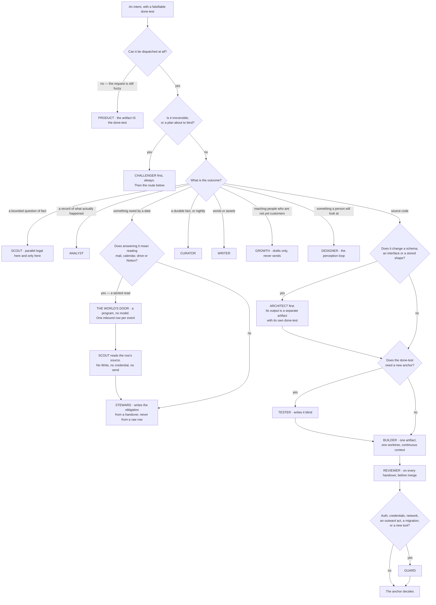

**(NEW: four properties of that picture are load-bearing)** **`challenger` comes before the route, not after it** —
it attacks the plan the Operator is about to bind, and attacking afterwards is attacking a decision. **`architect`
and `tester` are gates on the code path, not alternatives to it.** **No branch reaches an outward act**: the
right-hand edge of the diagram ends at an anchor, because staging is where every agent's authority stops. And **no
branch hands a tainted read to an agent that can write** (v36) — the one route that starts in a stranger's text
passes through a program and then through `scout` before it reaches anything holding a pen.

---

### 5.5 The founder's departments — covered, or refused with a reason

**(FOUNDER, list items 23–30)** **(NEW: every department is placed against the fourteen, and every refusal names why
rather than deferring)**

| § | Department | Covered by | Refused, and why |
|---|---|---|---|
| 23 | design & product | designer (UI, UX, branding, visual identity, prototype, accessibility) · product (spec, roadmap, feedback triage) | **User-testing simulation** — a simulated user is the machine grading its own homework; the rung-1 anchor is a real reaction |
| 24 | engineering | builder · reviewer · architect · tester · guard. Documentation is written by whoever made the thing, and its anchor is that a cold reader can run it | **A separate documentation agent** — docs split from the artifact drift the moment the artifact moves. That is v7's reasoning applied in the other direction |
| 25 | data & analytics | analyst (pipelines, tracking, dashboards, KPIs, cohorts, A/B, cleaning, anomalies) | **Data labelling** as an agent — it is a founder-taste task and feeds the taste store through the Floor |
| 26 | marketing & content | writer (calendar, blog, video and asset briefs, SEO, ad copy, social, email, brand voice) | **Influencer outreach** — first contact with a stranger is on the default `never` list |
| 27 | sales & growth | growth (scraping, scoring, outreach drafts, CRM, follow-up, deal stage, referral) | **Churn prediction** — no venture has the data; it is a wish until one does |
| 28 | customer service | the world's door writes the inbound row and `scout` reads the source (v36); steward triages it, because a support ticket is an obligation with a due date; writer drafts the reply; **the Sender sends** | **An autonomous reply bot** — a person is on the other side, so it is REACHES-THE-WORLD and never unattended until the founder widens the class |
| 29 | finance & legal | steward (invoices, expenses, budget-vs-actual, contract *review*, compliance flags) · analyst (the reconciliation) | **Contract drafting that binds, tax filing, cap-table edits** — one-way doors; they reach the founder as a *which*, with both options prepared |
| 30 | operations & HR | steward (vendors, process docs, internal tooling requests, and calendar and meeting notes **as inbound rows**, never as a mailbox it opens — v36) | **Hiring pipeline** — there are no employees; revisit when there are |

**(NEW: contradiction 20 — this table is the source, and the other two are renderings of it)** The eight
departments are written out **three times** in the plan — here, in the SPINE's own §B.4, and in COVERAGE §23–30 —
and they had **already drifted**: the customer-service row gained the world's door and `scout` here (v36) while the
other copies still read *"steward triages; writer drafts; the Sender sends"*. Three renderings of eight rows is
three chances to be wrong and one chance to be right. **Mechanism:** the department mapping is a block in
`keel/shared/roster.yml` (§L **O2**, **ABSENT**) — each row naming the agents that cover it and the refusal with
its reason — and **this table plus the other two are generated from it**. Nothing about the mapping changes here;
the number of places it can be edited does.

**(NEW: the two roster entries with the least outside evidence, named rather than smoothed over)** **Two departments
have no shipped precedent anywhere in the rosters fetched:** sales and growth as a function, and legal and contracts.
`growth` and `steward` are therefore the two entries standing on the least outside evidence — **and their anchors are
correspondingly external**: a reply from a real person, and a record the company does not write. If those two are
wrong, the anchors are what will say so, and they will say so per agent in the ledger.

---

### 5.6 The cost of fourteen, stated once

**(FOUNDER, and the cost is from the roster research lane)** **Every shipped *running* roster that could be verified
is five or six agents. Every roster of 150 or more is a catalogue you pick from, not a team that runs together. Ten
to fifteen sits in a band nobody publishes evidence for, in either direction.**

| Kind | Systems | Size |
|---|---|---|
| Running rosters | Magentic-One · ChatDev · MetaGPT · TheAgentCompany's job functions · Anthropic's concurrent subagents | 3–6 |
| **This roster** | — | **14 + 1** |
| Catalogues | wshobson · VoltAgent | 150–202 |

**(NEW)** It is an **unoccupied band, not a refuted one**. No source was found, in any system, for a measured point
at which adding specialists stops paying — the question appears to be unanswered in public rather than answered
against us. **Fourteen is a founder decision taken with the evidence in hand, not in ignorance of it**, and it is
not re-litigated. It is reopened only by name, as row 14 of the open decisions.

**(NEW: what makes the claim falsifiable rather than an assertion, which is the only honest way to hold a decision
in an unoccupied band)** Each of the fourteen carries an anchor that is not its own report, and the Desk measures
cost per agent per kind of work from the ledger. So *"fourteen was too many"* is a checkable statement about
specific rows, not a matter of taste: an agent whose anchor rarely holds and whose median cost is high is visible
without anyone arguing about roster theory.

**(NEW: O26 — and the falsifiability claim above is one of three named consumers, because today nothing reads the
trust score at all)** A score nothing reads is a number, not a control. The trust score gets **three named
consumers** and a **model dimension** — it is per agent *per model*, since an agent's pass rate on a move class is
a fact about the pairing:

| Consumer | What it does with the score |
|---|---|
| **The launcher** | ~~below the floor on a move class, **that class is unroutable for that agent until a rehearsal passes**~~ below the floor on a move class the agent is in **`probation`** for that class — routable on the Floor or under a founder-authored intent only, each anchored run counting toward the floor; **`unroutable`** is the state after a rehearsal fails, not the state before evidence exists *(amended 2026-09-06: O112 · v103)* — `bin/run` (**ABSENT**) |
| **The briefing** | the score and its direction, per agent, so a falling one is seen before it is felt — **and beside it the artifacts kept per agent** (argv files per provider, pack references, calibration and mutation cases, routing rows), so what each name costs to keep is a number next to what it earns (FIXER: C · THINKER: C15, B22; no row — it is a second number beside v31's own falsifier, and the count is not reopened) |
| **§5.6's claim above** | *"fourteen was too many"* becomes a checkable statement about specific rows |

**Mechanism:** the score is derived from the ledger by the curator and read at those three places, and **below a
sample floor it prints `insufficient` rather than a number** — §L **O25**'s one shared predicate, so admission, the
error rates and this score cannot disagree about what *enough evidence* means. §21 carries what it measures.

**(NEW: O120 — a carrier dimension on the score, because every carrier is one vendor's experimental surface)**
The score is per agent *per model* (O26) and now **per carrier** (v105): fifteen agents, the Floor, page 2,
cross-session messaging, `/goal` and the Operator are all Claude Code, and page 2 stands on a feature repaired
four times and never promoted (THINKER: C12; FACT: world.md 12) — a terms, seat or teams change stops the
company. **Mechanism:** the carrier is
derived from the brief's `window+model:` joined to the handover by `brief_sha:` (§6.3), so no new handover field
is written; `bin/run`'s deny switch (v78) takes **`--deny-carrier claude`** beside a family; v78's outage drill
runs **once with the Claude carrier denied**; **one wave-one agent's Gemini argv is exercised before `AGENTS2`**;
the kernel's stores are JSONL and YAML **readable by `-p` from any provider** (all **ABSENT**; the trust store is
§13's). §21.2 claims *the company finishes something with the Claude carrier denied*. **Losing image:** *one
vendor, exercised* · `wins_if:` a year with no terms change, no seat change and no teams regression — the second
carrier was insurance never claimed, and it was still cheap. **Settled by:** whether anything finishes on the
drilled night.

---

### 5.7 What the roster never does

**(NEW: three prohibitions, each from a decided row, each with the mechanism that enforces it. These are the ways a
fourteen-agent roster fails, and every one of them is a thing a well-meaning builder would do)**

**It never parallelises one artifact (v6).** One artifact, one agent, continuous context. The roster names *who*
does a kind of work; it never splits one build across two builders. Anthropic's own post excludes coding from the
multi-agent pattern — *"Most coding tasks involve fewer truly parallelizable tasks than research, and LLM agents are
not yet great at coordinating and delegating to other agents in real time"*, so such domains *"are not a good fit
for multi-agent systems today"* — and Cognition's measured failure is one artifact split across parallel builders:
*"The actions subagent 1 took and the actions subagent 2 took were based on conflicting assumptions not prescribed
upfront."* **Mechanism:** one worktree per artifact, and the launcher composes exactly one agent's argv per run.
**The one exception is `scout`**, and it is an exception for a stated reason: its subtasks are independent, which is
the boundary between the two research results above.

**(NEW: O69 — the axis stated, because v6 is being read as a rule about agents and it is a rule about units)**
**Parallel is legal where the unit of work is a store row, and refused where the unit is a file.** v6 is right
about artifacts: two agents editing one file discover their conflicting assumptions at landing, which is
Cognition's measured failure. It says nothing about ten independent rows. `steward` working through ten ventures'
obligations is independent in **`scout`'s exact sense** — one row per venture, no shared artifact, no merge — and
reading v6 as *only scout may ever run in parallel* would forbid it for no reason the evidence supports. **This
restates v6 and never widens it:** the file case stays refused, and §L **O72**'s file lease is what enforces it,
since the Desk refuses a run whose declared scope intersects a live run's worktree scope. **Mechanism:** the
declared scope on the brief; a store row is not a scope collision and a path is.

**It never lets one agent both design and implement one contract (v7).** A builder that needs to change a schema or
an interface **files an objection; it does not edit it**. **Mechanism:** the builder's grant excludes the
architect's output path, by `--add-dir`, and the objection is the cord on itself — a run that stops on a defect has
succeeded.

**It never lets the author of the code write the test that judges it (v8).** The builder's self-check is kept and is
not the anchor. **Mechanism:** the tester's `--add-dir` excludes the implementation path, so the blindness is a
property of the grant rather than a promise in a prompt.

**(NEW: and one that follows from rule 2 rather than from a row)** No checker is ever the family that made the
thing, whenever a second family is reachable. **The honest state of that:** it is currently **an accepted risk, not
a satisfied requirement** — there is no non-Anthropic model reachable from inside Claude Code, the irreversible tier
asks for a 2-of-3 multi-judge panel and `risk: high` asks for two distinct model families, and neither is met today.
~~Codex's admission (v5, v32) is the route to changing that, and until it passes its rehearsal the gap stays named.~~
**(FOUNDER, fixer round 2026-09-06: E7 · v90 — *"no keys, codex and gemini cli use."*)** The route is **the Gemini
CLI on a personal Google account (free tier, §9.3) and the Codex CLI, both only as `bin/run` children from
launchd** (O92) — **never a key**, and never from a Claude-hosted shell, because `gemini --version` dies with
`EPERM` on `~/.gemini/settings.json` under the live sandbox (THINKER: A9; W37). *Reachable from inside Claude Code*
therefore stays false and stops mattering: `bin/run` dissolves that boundary, and what gates a cross-family verdict
is v78's rung demotion — **rung 4 until the family passes the move class's calibration set**, R11 measuring
whether it catches anything the same family missed. §I row 17 closes as *no keys*. **Losing images:** *a metered
checker-family key* — §J 74 · `wins_if:` O116's subsidy line exceeds N× the seat price, the vendor narrows the
terms, or R40 finds the CLI route refused; *Gemini on every diff now* — §J 88 · `wins_if:` R11's first twenty-five
pairs show the second family catching a defect the same-family reviewer missed. **(R40, OPEN)** reads Google's
terms raw for the personal-account route; under E7 there is no key alternative to fall back on if it fails.

~~**(FOUNDER, v54: in wave one it is narrower still, and the narrowing is stated here rather than discovered)** The
`challenger` file is wave two (§5.0), so until a venture brings it online **there is no challenger at all** and
`guard`'s adversarial review plus the founder's own read stand in its place before anything binds. Two of the three
things v30 asks for survive that substitution — the critique is external, and it reads the artifact and its
done-test rather than the author's reasoning — and the third, a second model family, was already unmet for the
reason in the paragraph above. So wave one does not lose a guarantee it had; it loses a second, differently-anchored
pair of eyes, and §19's build order is what closes it.~~

**(FOUNDER, rethink 2026-09-06: D5 → v70 — the narrowing above is withdrawn, and one third of it stands)**
`challenger` is in **wave one** (§5.0), so the external critique v30 asks for exists from the first night rather
than from the first venture that needs it. **What is still unmet is the second model family, and only that:** the
challenger runs single-family until ~~Codex or Gemini lands~~ the Gemini or Codex CLI passes its calibration set
as a `bin/run` child (v90, O92), so **its findings are labelled rung 4** rather than
presented as an independent check. That labelling is the whole of the honesty here — v78's fallback chains and its
frozen calibration set are what stand in place of the panel §11.3 no longer describes (**v82**), and **(R10,
OPEN)** is what would change it.

---

### 5.9 What the fixer round gives this section — one row per mechanism

**(NEW: added 2026-09-06, re-derived from SPINE §L rows naming §5; each carries O105's class, and the state is the
path's, never a paragraph's)**

| Mechanism | What it enforces | Path | Class |
|---|---|---|---|
| **O111** · v103 | `pack: seed \| harvested`; a seed pack is a `golden/` reference plus namespaces; the first dispatch is the demonstration; `harvested` with no exemplar refused | `roster.yml` · `bin/check-stores` · `keel/golden/` — **ABSENT** | kernel · truth |
| **O112** · v103 | `trust: probation \| scored \| unroutable` per move class; probation routable on the Floor or under a founder-authored intent only; the floor is O25's constant in `settings.yml` | `roster.yml` · `bin/run` — **ABSENT** | kernel · truth |
| **O103** · v88 | `world_touching: true`, `max_lines:`, `authored_by:` on `send` · `inbound` · `watch` · `run`; over-budget refused; fixtures the only admission; agent files generated and signed off per wave; `keel/**` lite, the four and `keel/host/**` full | `roster.yml` · `.claude/qa-tier-floor.yml` (**EXISTS**; the edit **ABSENT**) | kernel · truth |
| **O120** · v105 | trust per carrier; `--deny-carrier claude`; one drill with Claude denied; one Gemini argv exercised before `AGENTS2` | `bin/run` · the trust store — **ABSENT** | kernel · truth |
| **O92** · v90 | the second family only as `bin/run` children from launchd; the real `denyRead` list; the probe asserts from both contexts | `keel/host/denyread.yml` · `bin/probe` — **ABSENT** (§15 owns the file) | adapter · the two CLIs |
| **O91** | `supervisor` leaves rule 4; `bin/supervise` not built until R31 | `bin/supervise` — **REFUSE** | adapter · the daemon |
| **O105** · v96 | `class:`, `vendor_wins_if:`, `wins_if:` on every program row; the marks lint refuses an adapter naming no surface | `rules.yml` · the marks lint — **ABSENT** (§17.5 holds the table) | kernel · record |

---

### 5.8 Reconciliation with the roster research

**(NEW: six facts came back from the research lane and each one is either adopted or the roster says why not.
Nothing is left to be discovered by a reader comparing two documents)**

| Fact | What it says | What the roster does with it |
|---|---|---|
| 1 | Every shipped roster names its roles; ~~**zero of seven**~~ **zero of eight** ship unnamed shapes *(moved 2026-09-06: W25)* | **Adopted.** It is the founder's decision and the world agrees with it. **The eighth is Gemini CLI**, which ships **named subagents** with their own tools, MCP servers and context windows, delegated by `@agent` and defined in `.gemini/agents` (world.md 25) — a third provider naming its roles, and ~~a **third agent-file location**, which is a case v42 did not contemplate~~ **a directory generated from `roster.yml` (O2) for the agents Gemini may stand — v42's one home stands** *(corrected 2026-09-06 · challenge C P1-4)*. §17.8 carries the path and the generator |
| 2 | Magentic-One splits by **grant** — browser, file-read, code, shell — not by domain | **Adopted as the second axis.** §5.2 splits by job *and* its `tools` column splits by grant. Both cuts are present and they are not the same cut |
| 3 | Per-agent model is first-class frontmatter | **Adopted.** It is what makes per-agent routing a file field rather than a wish, and it removes the technical half of FINAL's objection to a file per role |
| 4 | Coding is single-threaded, from Anthropic's own post | **Adopted as v6.** One artifact, one builder, never parallelised |
| 5 | Running rosters are 5–6; catalogues are 150+; 10–15 is unoccupied | **Stated once as the cost of v1** in §5.6 and not re-litigated |
| 6 | Anthropic's +90.2% is on **research** with independent subtasks; Cognition's failure is on **one artifact** | **Adopted as the dispatch rule:** `scout` is the only agent that runs parallel, and it is the only one whose subtasks are independent |

**(NEW: one blocking mechanism problem, recorded here because it must be fixed in the same change that writes the
first agent file)** `scripts/prompt-standard.test.mjs` on this branch pins the valid model set (quoted in full once, at §9.9, where it includes `claude-sonnet-4-6`) to `claude-opus-5`,
`claude-sonnet-5`, `claude-fable-5` and `claude-haiku-4-5`. **`claude-fable-5-1` is not in it**, and `claude-fable-5`
is listed by the vendor under legacy models. An agent file written to §5.2 **fails a blocking lint today**. That is a
real, checkable blocker, not a caveat — **and v57 makes it bind sooner**: `claude-fable-5-1` is no longer an
escalation that might never fire, it is the declared `model:` of the first two agent files anyone writes.

---

## 6 · A Run, end to end

*obeys: v12, v13, v34; SPINE §C.1 bands; **the fixer round of 2026-09-06 — O84, O87–O91, O108, O110; R17, R28–R32** (SPINE §K row 6); inherits: FINAL §6.2, §6.3, §7.8*

---

**(FINAL)** A Run is the only place work happens, and it is deliberately disposable. Nothing here is a long-lived
agent accumulating context, because a long-lived context is the thing that rots, drifts and costs.

**(NEW: what the roster changes about that sentence, because it looks like a contradiction and is not)** Fourteen
agents are **persistent definitions**, not persistent processes. A `builder` is a file: a model, a grant, a skill
namespace, an anchor. A run is one disposable execution of that file against one brief. The file persists; the
context does not. FINAL's argument against long-lived agents was about context, and the roster does not touch it.

---

### 6.1 The life of a Run

**(FINAL, redrawn for the Operator, the named agent, and `/goal`)**

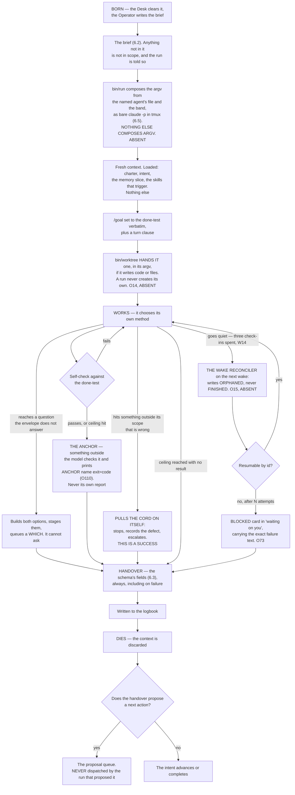

---

### 6.2 The brief

**(FINAL, plus one field from v37 and one from v45)** **Eleven fields: FINAL's nine, below, plus `agent:` (v37) and `anchor:` (v45).** **Anything not in the
brief is not in scope, and the run is told so.**

```
intent:        the id it serves — a run with no intent id does not start
purpose:       one sentence
done-test:     copied verbatim from the Intent, never paraphrased
out-of-scope:  named explicitly — what it must not touch or fix
ceiling:       tokens, and wall-clock
tools:         the exact grant — nothing else is reachable
window+model:  which subscription burns, and which model
negatives:     what has already been tried here and failed
hand back:     the named artifacts, and the evidence for the done-test
```

**(FINAL)** `out-of-scope` and `negatives` are the two fields most systems omit and the two that most reduce waste:
the first stops scope creep, the main way a bounded run becomes an unbounded one; the second stops the system
rediscovering the same dead end every night. **No shipped brief schema found requires either** — Devin's *"Define
clear scope, boundaries, and success criteria"* is the closest and is prose advice.

**(FINAL)** Two stamps the Desk adds: an **`id`**, a company-generated UUID carried into the runtime as
`--session-id` so the id is the system's and not the vendor's returned handle, and it is on every logbook row; and a
**`label`**, what the run is making and which window it is burning.

**(NEW: the tenth field, decided as v37; the eleventh, `anchor:`, is v45)** Fourteen named agents make *which agent* a fact the brief must carry,
and FINAL's nine had nowhere to put it. **The brief gains a tenth field rather than widening an existing one — and an eleventh, `anchor:`, at v45:**

```
agent:         one of the fifteen roster names — the file bin/run composes the argv from
anchor:        the rung-1 check the done-test names — bin/run refuses a brief carrying none (v45)
```

**(NEW: what v37 decides and what it leaves alone)** `window+model:` **stays exactly as FINAL wrote it.** The
agent's own row supplies its default model, and the per-move table overrides it — so the two fields answer two
different questions, *who* and *on what*, and neither is overloaded. The losing image is kept by name: a single
widened `agent+window+model:` field, and a brief that names no agent and lets the launcher guess.

**(NEW: the mechanism, because a tenth field with nothing checking it is a tenth field nobody fills)** **`bin/run`
refuses a brief whose `agent:` is not a roster file, and refuses one carrying no `anchor:`** (ABSENT; v45,
§11.11). **One schema file, `keel/shared/schemas/brief.yml` (ABSENT), is the single source these prose tables
are generated from** — the absence of it is why the count was ten here and eleven in §3 and §11. That refusal is what makes the field load-bearing:
a typo, a retired agent, or a name someone invented in a prompt fails at dispatch rather than producing a run with a
guessed grant.

**(NEW: O22 — *copied verbatim* is a rule with nothing behind it, and this repository has already lost a
measurement in synthesis twice)** `done-test:` says *copied verbatim from the Intent, never paraphrased*, and
until now the copying was done by the thing being asked not to paraphrase. **`bin/run` refuses a brief whose
`done-test:` is not byte-identical to its intent's** (**ABSENT**) — a diff, not a judgement, and a paraphrase that
means the same thing still fails, which is the point: a run that was measured against a different sentence from the
one the founder confirmed is a mis-route the anchor cannot see. **In the same move, the brief and the handover are
logged as adjacent hashed rows**, so the pair that produced an artifact is recoverable without trusting either end
of it. §2 carries the intent side of the same check.

**(FACT: world.md 14 — the sharpest fact of the round, and it lands on this field)** `/goal` check-ins **back off
30 min → 1 h → every 2 h, and an idle session gets at most three check-ins per goal** until someone messages it.
Under `-p` **the check-in is the only thing the runtime delivers, and nobody is there to message it** — so a night
goal loop delivers three times and goes quiet, and quiet is byte-indistinguishable from finished. Three
consequences, none of them optional. The `/goal` clause above is **not** a night-long supervisor and must not be
written as one. §L **O21** composes the condition from v45's `anchor:` field — ~~*"`<anchor>` exits 0, and
`<done-test>`"*~~ **(amended 2026-09-06: O110)** — so the most frequently executed judgement in the system becomes an exit code rather than a small
model reading prose (**DEPENDS-ON-R17**; **(R17, OPEN)** also asks whether an exit-code condition behaves
differently from a prose one). And the silence after the third check-in is what §6.4's reconciler exists to
resolve.

**(NEW: O110 — the goal condition is read by a model, never run by a shell)** *"`<anchor>` exits 0"* asks the
evaluator to know an exit code it never sees (THINKER: A18). **Every anchor ends by printing `ANCHOR <name>
exit=<code>` on its own line** — one `printf` per anchor in `keel/shared/anchors/*` (**ABSENT**) — and the `/goal`
condition names **that line and the done-test**; the evaluator reads a line and runs nothing. **Losing image:**
*"exits 0" in prose* · `wins_if:` R17 shows the evaluator accepts an exit code directly. `vendor_wins_if:` `/goal`
takes a command and an exit code. Class: adapter. **DEPENDS-ON-R17.**

**(NEW: why the field names the agent and not the argv, which is v34 restated where it is most likely to be
violated)** The brief names *who*. **`bin/run` (ABSENT; FINAL names it `keel/bin/run`) composes the argv** from that
agent's file plus the band. The Operator never composes argv, a run never composes argv, and the board never
composes argv — every dispatch path calls the same launcher. Without that, fourteen agent files become fourteen
places a grant can be written wrongly, and this repository already knows how that ends: `--allowedTools` restricted
nothing for months while everyone believed it did.

**(NEW: v12 — the done-test does a second job here)** The `done-test:` field, copied verbatim, becomes the `/goal`
condition on the run: `claude -p "/goal <done-test> or stop after N turns"`. Three properties of that feature bind
the field's wording and are quoted rather than paraphrased. The condition limit is **4,000 characters**. The
loop *"runs to completion in a single invocation"* under `-p`. And after transient failures **including rate
limits**, *"Claude Code leaves the goal active"* — which is the behaviour a night wants, since a five-hour window
reopening should not require a new dispatch. It terminates on Met, on Impossible, on `/goal clear`, or on four
unrecoverable errors: authentication failure, exhausted credit balance, unclearable context overflow, and an
unavailable model.

---

### 6.3 The handover

**(FINAL, plus the three fields the rest of the plan already reads back)** ~~**Ten fixed fields**~~ **Ten fixed
fields plus five additions (O7), one of them a group of four — eighteen lines, always, even on failure** *(moved
2026-09-06: O7)* — FINAL's seven plus `rung`, `findings` and `anchor`, held in **one schema file,
`keel/shared/schemas/handover.yml` (ABSENT)**, which every table that shows them is generated from **and which owns
the count, so no paragraph has to** (§L **O6**: a `schema_version` on every row, and a reader refuses an unknown
version rather than guessing). The I-PASS bundle cut medical errors 23% and preventable
adverse events 30% across nine hospitals; the mechanism is not the format but that named required fields force the
outgoing party to surface what the incoming party needs, especially the uncertain parts, which free prose omits.

```
outcome:      done | partial | stopped-on-defect | blocked | over-ceiling
done-test:    passed | failed | not-reached — and the evidence, attached
changed:      every file, branch, external effect. Nothing summarised away
cost:         actual tokens, window, wall-clock — from the runner's own record
learned:      what is now known that was not before — a PROPOSAL to memory
uncertain:    what I am not sure about and what would settle it
next:         the single most valuable next action, as a proposal
rung:         the evidence rung of the claim this handover makes (§11.2)
findings:     each defect, with its evidence — no score (§11.3)
anchor:       the rung-1 check the done-test named (§11.11)

# added 2026-09-06 by O7 — five additions, one of them a group of four
objection:       a refusal to proceed, with what would unblock it (v7, generalised
                 from architect-and-builder to all ninety-one pairs)
brief_sha:       the hash of the brief this run executed, so the pair is joinable
maker_family:    the family and model that MADE the artifact
maker_model:
checker_family:  the family and model that CHECKED it
checker_model:
actor:           who performed the move — one legal value today, an agent run
idempotency_key: on the STAGED ARTIFACT, not only on the resume path

# added 2026-09-06 by O108 (v100) — two axes on the anchor claim; §11 owns the rule, this schema owns the fields
verifier:        world | other-family | founder | same-family — who or what confirmed the anchor
adequacy:        pass | fail | unjudged — written by a reader who wrote neither the done-test nor the anchor
```

**(NEW: O108 — what `rung:` now requires)** A deterministic check of the wrong property is deterministic
(THINKER: B8). `verifier:` is independence; `adequacy:` is whether the stated property was tested, written **by a
reader who wrote neither** — `reviewer` on `-p`, or `challenger`. **Rung 1 counts only on world *and* pass;
`bin/check-stores` refuses rung 1 `unjudged`** (**ABSENT**). §11.2 owns the ladder, §21 the Goodhart pair; the
lines sit here because the schema is the one source (O6). **The carrier (O120)** is recovered by joining
`brief_sha:` to the brief's `window+model:`, so trust per carrier (§5.6) needs no new field. **Losing image:** *one
axis* · `wins_if:` a quarter in which adequacy never fails on a world-passed anchor.

**(FINAL)** `uncertain` is the field to fight hardest for: it turns a confident wrong answer into a flagged one, and
the anchor and the briefing read it first. **No shipped handover schema found has it.** Linear's activity vocabulary
— thought, action, response, elicitation — is the closest published state model and carries no uncertainty slot.

**(FINAL)** A handover is **never the next run's input by itself**: every run starts from the files — the logbook,
the intent, the slice — so a summary that lost a number cannot propagate. **This repository has recorded that exact
defect twice**, most recently when a correct measurement of *29 of 30 steps passing* was synthesised into *29 of 29*
and propagated into a project file and two handoffs.

**(NEW: O7 — why five fields land now rather than when something needs them, and this is the whole argument for the
timing)** **All five are free before the first run and a full backfill afterwards.** They cost a schema line each
today; after a thousand runs they are **unreconstructable**, because nothing else records which family made a thing
and which family checked it. Two consequences ride on them. **(R11, OPEN)** — *does a second model family reduce
escaped defects on our move classes, and by how much* — is **blocked on the four maker/checker fields** and cannot
be answered retroactively, and it is the measurement that decides whether rung 2 outranks rung 4 on any given
class. And `objection:` generalises v7 from the one pair the plan designed — architect and builder — to **all
ninety-one pairs the roster makes**, which is what a message between two running agents is allowed to be (v80,
§3.5): a handover or an objection, and nothing else. `actor:` has **one legal value today**, an agent run, and it
exists so that the first non-agent actor is a value rather than a schema migration. `idempotency_key:` moves onto
the **staged artifact** rather than sitting only on the resume path, because §6.4's *"an agent that already sent
the email and then restarts sends it twice"* is about the artifact, not about the resume.

**(NEW: `learned` is a proposal, and the word is doing work)** A run proposes a durable fact; **only the curator
writes memory** (v25), delta-only, never a rewrite, and a memory item with no source, date, expiry and falsifier is
refused at the store check. A run that could write memory would be the thing that acts editing what the system
believes about its own acting.

---

### 6.4 Resume, not restart

**(FINAL)** Every Run writes its handover incrementally and records each completed step before the next begins. When
a window closes or the lid shuts, the run is **resumable from its log rather than restartable from its brief** —
Temporal's durable-execution model: a complete event history replayed on recovery, steps that succeeded skipped.

**(FINAL)** A restarted agent run does not merely waste time; **it re-spends money and may re-take actions that
already happened.** An agent that already sent the email and then restarts sends it twice. So every external effect
is recorded **before** it is attempted, with an idempotency key, and replay checks the log before acting.

**(FINAL, measured)** `SIGTERM` gives exit 143, the turn left unfinished with no result recorded, the process tree
killed, the turn resumable. Every surveyed runtime has a session id and resume-by-id, and Claude Code accepts the id
the system assigns — which is why the UUID is minted by us and not read back from the vendor.

**(FOUNDER, rethink 2026-09-06: D2 → v67 — what that measured signal is delivered to)** The launcher **records each
child's process group before exec**, and the cord signals *that*, so the exit 143 above is something the founder
can cause on purpose rather than a property observed in a test. Every carrier in §3.5 now declares a `stop:`, and
**`bin/run` refuses to mint unattended work on a carrier whose `stop:` reads UNKNOWN** — which is why no hosted
lane may hold a night's work today. **Mechanism:** one `pgid` field written by `bin/run` before exec, one signal
path (**ABSENT**).

**(NEW: O15 — contradiction 13, and it is the largest hole this section had)** ~~*"Resume, not restart"* is asserted
here and **nothing performs it**~~ *(moved 2026-09-06: O15)*. Every mechanism above describes what a resumable run
*is*; none of them notices that a run stopped. Under `-p`, with W14's three check-ins spent, a run that died at
03:00 and a run still working look identical from outside. **The wake reconciler is the carrier:**

| Step | What it does |
|---|---|
| Before exec | the launcher writes **`run.started`** — so a run that never reported is distinguishable from a run that never began |
| On wake | the Watch reconciles our session log against **`claude agents --json --all`**, the tmux session list and the process table — and the daemon's `roster.json` **read-only** (O91); `kind: operator` rows (O84) are skipped |
| On a gap | it writes **`orphaned`, never `finished`** — the two must never be the same value, because one is an answer and the other is the absence of one |
| Then | it **resumes by id**, or closes the run with a reason; and it **refuses a night lane the power assertions cannot promise to keep awake** |

**Mechanism:** `bin/run` and `bin/watch` (**ABSENT**). **Why `orphaned` is the load-bearing word:** a reconciler
that guessed `finished` would turn every crashed night into a completed one, and the handover — the thing every
downstream reader trusts — would be missing with nobody looking for it.

**(NEW: R9 — one thing about a long run that the strongest memory rule cannot currently see)** ~~**(R9, OPEN)** —
*does an unattended `-p` run auto-compact, and does it emit anything the log can see?*~~ **Answered by O90; the
remainder is R32 (amended 2026-09-06).** v24 says memory is written
by the curator, delta-only, and never by the acting run; **an auto-compaction is the runtime rewriting a run's
context in place**, which is the same act performed by something the rule cannot address. ~~Measured with one long
`-p` run under `stream-json --verbose` plus the vendor's documentation. **If it is unobservable, the answer is to
bound run length** rather than to widen the rule — which is a decision about this section, not about §13.~~

**(NEW: O90 — auto-compact is on by default, so the run is bounded before it can compact)** A long `-p` run **is
compacted by the runtime** — the ACE collapse v24 forbids — at a 2x cache write on the next turn (THINKER: A10;
W35). **`bin/run` sets `--autocompact <context>` from a `context:` column in `prices.yml`** (1,000,000 on Opus 5
and Fable 5.1, 200,000 on Haiku) **so a run ends at `maxTurns` or its ceiling before it can compact** and resumes
by id. **`PreCompact`**, in the child's `--settings` (O87), writes **`run.compacted`**. **Path:** `bin/run` · `prices.yml` (**ABSENT**).
Class: adapter. **Losing image:** *let it compact and log it* · `wins_if:` **(R32, OPEN)** — one long `-p` run
under `stream-json --verbose` — shows the event fires and the write spike is small.

**(NEW: O88 — the night child writes no vendor transcript)** `~/.claude/projects` holds every stranger's body
verbatim, outside `keel/` and inside the mining pass (THINKER: A4). **`bin/run` passes `--no-session-persistence`
on every night child** (FOUNDER, fixer round 2026-09-06: E10 · v93); **the `stream-json` trace is the record**;
`bin/mine` and the erasure grep are §13's and §12.8b's. Class: adapter. **Losing image:** *grep `keel/` and stop* · `wins_if:` a fixture canary is found under
`~/.claude/projects` after a night — **(R30, OPEN)**. `vendor_wins_if:` a per-project transcript exclusion.

**(FINAL §6.1 and §14.7, providers lane, measured 2026-09-04: two runtime facts that shape how long a run should be)** `maxTurns` **marks output partial
and resumable rather than truncating it**, which is the restart-from-checkpoint primitive and does not need to be
built. And a background child holds its parent open in idle waiting by default — one stuck child doubles its
parent's duration with nothing reporting it — which is why runs do not spawn background children except `scout`
fanning out under a bounded wait.

**(FINAL)** **Enforced by:** the brief and handover schemas in `shared/schemas/` and `bin/run`, which births a run
and **refuses a brief missing any field** (both ABSENT) · `--output-format json` (exists) · `--session-id <uuid>`
(exists, and *"must be a valid UUID"*) · the runner's `SessionEnd` hook writing the partial handover (ABSENT;
carried in the child's `--settings`, O87).

**(NEW: 2026-09-06 — one row per mechanism the two rounds give the section; O81+ rows carry O105's class)**

| Mechanism | What it enforces | Path |
|---|---|---|
| **O22** | the brief's `done-test:` is byte-identical to the intent's; brief and handover are adjacent hashed rows | `bin/run` — **ABSENT** |
| **O15** | `run.started` before exec; reconcile on wake against `claude agents --json --all`, tmux and the process table; write `orphaned`, never `finished` | `bin/run` · `bin/watch` — **ABSENT** |
| **v67** | the child's `pgid` recorded before exec; unattended work refused on a carrier whose `stop:` is UNKNOWN | `bin/run` — **ABSENT** |
| **O14** | a run never creates its own worktree; it is handed one in its argv | `bin/worktree` — **ABSENT** |
| **O72** | the Desk refuses a run whose declared scope intersects a live run's worktree scope | the Desk — **ABSENT** |
| **O71** | the launcher refuses to mint past N live sessions; ~~the supervisor refuses to restart into a full table~~ N is 3 until R29 *(amended 2026-09-06: O91)* | `bin/run` — **ABSENT**, **DEPENDS-ON-R23** · ~~`bin/supervise`~~ **REFUSE** |
| **O73** | after N failures the run becomes a `blocked` card carrying the exact failure text, written to negatives | the card store · the negatives store — **ABSENT** |
| **O7** | five additions on the handover, free now and a full backfill later | the handover schema — **ABSENT** |
| **O87** | `--settings <json>` per child with its hooks and denies; `--agents <json>` refused | `bin/run` · `bin/probe` — **ABSENT** · **DEPENDS-ON-R28** · adapter |
| **O88** | `--no-session-persistence` on every night child; the `stream-json` trace is the record | `bin/run` · `bin/mine` — **ABSENT** · R30 · adapter |
| **O89** | same-family links from `roster.yml` into `--fallback-model a,b`; `PreModelSwitch` writes `model.switch` with the demotion and **blocks** an unrehearsed family; cross-family stays with `bin/run` (§9.4a owns the rule) | `bin/run` — **ABSENT** · adapter |
| **O90** | `--autocompact <context>` from `prices.yml`; `PreCompact` writes `run.compacted` | `bin/run` · `prices.yml` — **ABSENT** · R32 · adapter |
| **O91** | bare `claude -p` in a detached tmux session, never `--bg`; the daemon roster read-only | `bin/run` · `bin/watch` — **ABSENT**; `bin/supervise` — **REFUSE** · adapter |
| **O108** | `verifier:` and `adequacy:` on the handover; rung 1 only on world **and** pass | the handover schema · `bin/check-stores` — **ABSENT** · kernel · truth |
| **O110** | every anchor prints `ANCHOR <name> exit=<code>`; the `/goal` condition names the line | `keel/shared/anchors/*` — **ABSENT** · **DEPENDS-ON-R17** · adapter |
| **O84** | `kind: operator` rows in `sessions.jsonl` (§3 owns the registry) | `sessions.jsonl` — **ABSENT** · kernel · record |

---

### 6.5 The band the run executes in

**(NEW: SPINE §C.1, applied at the point of dispatch. §3.2 is the table; this is what it means for one run)** The
band is not an attribute of the agent. It is an attribute of **the move**, and the same agent runs in different
bands on different intents.

| Band | What the launcher emits | Codex axes | What the run can do |
|---|---|---|---|
| **Read and report** | `plan` mode | `never` × `read-only` | Read, explore, report. It **does not edit source** |
| **Build in a worktree** | `dontAsk`, with `--restricted` and an explicit `--tools` list — **plus `--settings` (O87) · `--no-session-persistence` (O88) · `--autocompact` (O90) · `--fallback-model` (O89), as bare `claude -p` in tmux (O91)** *(2026-09-06)* | `never` × `workspace-write` | Everything in its grant, inside one worktree. **It cannot ask** |
| **Stage an outward act** | no mode, because **no agent performs it** | — | Stage a hashed artifact and stop. The Sender performs the act |

**(NEW: what `--restricted` buys, in three clauses, because a reader will otherwise assume the tool list alone is
the narrowing)** It **ignores user, project and local settings**, it **confines the file tools to the working
directories**, and it **refuses bypass**. It also *"removes the built-in tools that run commands or code, and
WebFetch, unless you name them individually in `--tools`, not through the `default` preset"* — so a grant that omits
a tool omits it in fact. It needs v2.1.248+. `--permission-prompts none` means a run never hangs on a prompt nobody
will answer, and under `-p` the tools needing terminal input are disabled anyway *"so the session never stalls
waiting for input."*

**(NEW: O87 — the child's hooks and denies ride its own argv; the flag ships, W35)** **`bin/run` composes
`--settings <json>` per child** carrying its hooks — `PreModelSwitch` (O89), `PreCompact` (O90), `SessionEnd` —
and its denies; **v43's matrix gains the `-p` row**; **`--agents <json>` is refused** (v42); the probe expects
`--allow-dangerously-skip-permissions` refused. Night children run **`dontAsk --restricted`, where auto mode is
inert**, so the managed file carries `permissions.deny` and `disableBypassPermissionsMode` only and the Floor keeps
auto mode (FOUNDER, fixer round 2026-09-06: E9 · v92; THINKER: A3, A15; §12.6 owns the file). **Path:** `bin/run` ·
`bin/probe` (**ABSENT**). Class: adapter. **DEPENDS-ON-R28** — *does `--restricted` ignore `--settings <file>`?*
`vendor_wins_if:` per-invocation hooks natively.

**(NEW: O91 — bare `-p` in tmux, never `--bg`, because the vendor ships a supervisor)** The daemon has its own
leases and exits *"idle 5s with no clients"* (THINKER: A7; W38); two supervisors argue over an orphan.
**`bin/run` mints every child as `tmux new-session -d -s <uuid8> -c <dir> claude -p …`** — pane, process group
(v67) and session id ours — `--tmux=classic` for the worktree agents (O121, §14.5). **`bin/supervise`
is REFUSEd** until **(R31, OPEN)** reads the daemon's lease semantics; §10.5 carries the daemon row. Class: adapter.
**Losing image:** *`--bg` as the night's carrier* — §J 85 · `wins_if:` R31 shows a service mode that does not
idle-exit and readable leases.

**(NEW: O14 — where the worktree comes from, because the run cannot make one and the plan assumed it could)** v41
gives four agents `isolation: worktree`, and **`git worktree add` cannot complete under the armed sandbox** — a
full checkout has to write the agent-config paths, which the runtime protects independently of this repository's
settings, and adding them to the write allow-list has been tried and does not lift it. The documented remedy is
**interactive escalation**, which an unattended run does not have **by construction**. So a run **never creates its
own worktree**: `bin/worktree` (**ABSENT**), a no-model program in the Watch's context, creates it and the launcher
**hands the path to the run in its argv**. The run works inside it normally from then on. This is the same shape as
every other narrowing in the section — the thing that needs the capability is not the thing that holds it.

**(NEW: the stall fuse rides along, under its real name)** `--max-budget-usd` is **not a billing control** (v23) —
print mode only, computed locally at list price, and for a subscriber *"the session cost figure isn't relevant for
billing purposes."* It is kept because **subagent spend counts toward it** and overflow **fails a spawn with
`Budget limit reached`**, which stops a run that has gone into a loop of children.

---

### 6.6 What a run cannot do

**(FINAL, and these are the two that matter most, each held in more than one place because one place is a wish)**

**A run cannot dispatch its own successor.** It **proposes**; the Desk decides. Without this, one run that believes
it is nearly finished spawns another that believes the same, forever — and the loop is broken at the only place that
knows the budget and the ranking. **(FINAL, the mechanism, because a builder holds `Bash`)** A shell could otherwise
call `claude -p` itself, so the rule is held in **three** places a run cannot reach:

1. the **managed settings file** carries `permissions.deny` rules for `Bash(claude *)`, `Bash(gemini *)` and
   `Bash(codex *)`, which **`--restricted` cannot lift** — deny rules bind in every mode, including bypass;
2. the **ledger refuses a row whose run id was not minted by `bin/run`** (ABSENT), so a child born outside the Desk
   is uncounted, and the aberrance halt catches its spend;
3. the **probe asserts every night** that an agent cannot start a runtime — `bin/probe` (ABSENT).

**(NEW: the one legal exception, and it is a Desk act rather than a run act)** `scout` fanning out on a new field is
**several runs the Desk births in parallel**, never children of a run. The distinction is not cosmetic: children of
a run are invisible to the ranking and to the reserve.

**A run cannot widen its own grant.** **(NEW: and this is now vendor-documented rather than argued)** *"any
`permissionMode` in the subagent's frontmatter is ignored"* — a child cannot widen itself. On top of that:
`bypassPermissions` is disabled in managed settings by `permissions.disableBypassPermissionsMode: "disable"`, where
a running process cannot clear it (v10); allow rules have no effect in that mode anyway; and `Workflow` is absent
from every agent file and is removed by the runtime from every subagent regardless (v35), so **the gate is not
invocable by the thing it gates.**

**(NEW: O72 — a run cannot take a file another live run is holding)** v6 removes the case of two agents inside one
artifact and is **silent on two intents, one file** — two legally-dispatched runs, different intents, overlapping
paths, and **the conflict is found at landing**, which is exactly Cognition's measured failure arriving by a route
v6 does not cover. **The file lease:** every brief declares its scope, and the Desk **refuses a run whose declared
scope intersects a live run's worktree scope** (**ABSENT**). It is a refusal at dispatch, where it costs nothing,
rather than a merge conflict at landing, where it costs both runs. §5.7's parallelism axis (**O69**) is the same
rule from the roster's side: parallel is legal where the unit is a store row and refused where it is a file.

**(NEW: O71 — a run cannot be the fifty-first, and a crash loop cannot become the concurrency event)** §14.12
names three bounds on the fleet and **none of them is a session count**, so a supervisor restarting a failing run
can mint sessions without limit while every declared bound still reads green. **A session ceiling in settings:**
the launcher refuses to mint past N live rows ~~and **the supervisor refuses to restart into a full table**
(`bin/run`, `bin/supervise` — **ABSENT**)~~ (`bin/run` — **ABSENT**; `bin/supervise` **REFUSE**d until R31, so the
ceiling has one reader) *(amended 2026-09-06: O91)*. N is not guessed: **(R23, OPEN)** asks whether `claude -p` children
have a concurrency ceiling at all and **whether the N+1th fails loudly, queues, or degrades silently** — vendor
documentation first, then one measurement. ~~Until it is answered the ceiling is set low and stated as arbitrary,
which is visible in a way an absent ceiling is not.~~ **Until then N is 3, stated as arbitrary**, and **(R29,
OPEN)** — RSS per `-p` child and the page-in point on this Mac — sets it, not the vendor's 20 (THINKER: A14). The
ceiling counts `-p` children; Operator sessions are the WIP limit's (O84, §4).

**(NEW: two smaller ones, both from decided rows)** A run cannot **edit another agent's contract** — a builder that
needs a schema change files an objection (v7), enforced by `--add-dir`. And a run cannot **perform an outward act**:
every agent has `never` on that class, staging is where its authority ends, and the Sender that follows holds no
model, recomputes the ceiling **independently of the number in the instruction**, reads its checklist aloud into the
log, performs exactly one act, and holds a recall window.

---

### 6.7 How a run dies

**(FINAL)** Every run dies at handover. What survives is exactly three things: **the handover**, **whatever memory
accepted from it**, and **the agent's updated record for this kind of work**. The context is discarded.

**(NEW: what FINAL called a loadout's horizon, read against a roster)** FINAL retired a loadout recipe by horizon.
With named agents, the thing that carries a horizon is not the agent — it is what the agent was given: **a skill,
which carries `valid_until` and forces exactly one disposition at expiry, Refresh, Deprecate or Waive with a new
date** (v19). The agent file itself is governed by the lint and by the probe, both of which run against it whether
or not anyone remembers to look.

**(NEW: O73 — the one death this section had no word for)** A run that **cannot resume** is neither done nor
running, and the reconciler's `orphaned` is a state of the log rather than a state of the work. **After N failed
resume attempts the run reaches a terminal state:** it becomes a **`blocked` card in *waiting on you***, carrying
**the exact failure text** and not a summary of it, and the same text is written to the negatives store **so the
next brief on that intent carries it** and the system does not rediscover the dead end nightly. **Mechanism:** the
card store and the negatives store (**ABSENT**); the attempt counter is a field on the work row (§L **O1**). **N is
not taste: (R18, OPEN)** asks for measured evidence on repeated-attempt yield across sessions, and until it
answers, N is stated rather than justified.

**(NEW: and the one measurement that survives a run, which is what makes §5.6's claim checkable)** Cost and anchor
outcome, recorded **per agent per kind of work**, from the runner's own record rather than from anything the run
says about itself. That is the evidence by which *fourteen was too many* would become a fact rather than an
argument.

---

## 7 · Skills

*obeys: v3, v17, v18, v19 (SPINE §E entire), **v77** (the rethink round of 2026-09-06), and **O111, O114, O119 with R8, R14, W40** (the fixer round of 2026-09-06, SPINE §K row 7); inherits: FINAL §11, §16.2*

**(FOUNDER, overruling FINAL §1 row 10.)** *"take all the skills that the biggest systems use, the biggest agent
systems use, we can learn a lot from them, like, to have more engineering stuff and more creative stuff and to give
the agents the tools the knowledge they will need in order to achieve tasks without limiting their point of view."*
And: *"we need a skill creator of skill, which, you know, we will research a task or a mission and, like, to break it
down two steps and to give it to the agents."* The library is built, not shelved. FINAL's holding directory —
`keel/holding/skills/`, the 134 moved whole into a place nothing reads — is the losing image and is kept by name in
section 22.

---

### 7.1 The library plan

**(NEW: the format is now a published spec, not a convention, so it can be obeyed rather than approximated.)** The
container is the **open SKILL.md standard** (`agentskills.io/specification`, fetched 2026-09-05). Its published
limits are the file's limits and they are not ours to soften:

| Field | Limit, quoted from the spec |
|---|---|
| `name` | max 64 chars, `a-z0-9-`, *"Must match the parent directory name"* |
| `description` | max 1024 chars |
| Metadata cost | *"(~100 tokens): The `name` and `description` fields are loaded at startup for all skills"* — **the spec's figure; on this branch the measured constant is ≈53 tokens per skill, and 7.6a's checker measures its own** *(added 2026-09-06: O119 · THINKER: A13 · W40)* |
| Instructions | *"(< 5000 tokens recommended)"* |
| Body | *"Keep your main `SKILL.md` under 500 lines."* |
| Optional | `license`, `compatibility` (max 500), `metadata`, `allowed-tools` (*"Experimental"*) |

**(NEW: one artifact has to load in three runtimes, and the runtimes disagree about the path.)** Claude Code reads
`.claude/skills/`. **Codex and Gemini CLI both read `.agents/skills/`, and Codex does not read `.codex/skills`** —
Codex's search order is `$CWD/.agents/skills`, `$CWD/../.agents/skills`, `$REPO_ROOT/.agents/skills`,
`$HOME/.agents/skills`, `/etc/codex/skills`. So there are **two directories and one source of truth**: Markdown is
the source, and both directories are generated from it. That is wshobson's shipped shape — *"single
source-of-truth"* with harness-native artifacts generated — and it is adopted because it is the only shape that
survives a third runtime.

**(NEW: collisions are not merged, so a generated directory cannot be allowed to drift.)** Codex states it plainly:
*"if two skills share the same name, Codex doesn't merge them; both can appear in skill selectors."* A drifted
generated copy therefore does not error; it appears twice with different bodies. **Mechanism:** the generator is the
only writer of either directory, and the existing manifest check is re-pointed at the generated-versus-source diff
(see 7.7). Nothing hand-edits `.claude/skills/` or `.agents/skills/`.

**(NEW: the bulk import is blocked on one unread file, and it is cheap to clear.)** The upstream this repo already
draws from now advertises **2,111+ skills** and is MIT **on the code** — but a separate `LICENSE-CONTENT` file
exists at that repository and **was not fetched**, and it may carry different terms for skill *content* than MIT
does for code. **No bulk vendoring until it is read** (v17). One fetch clears it; open decision 4 in section 20.

**(R13, OPEN — and it is narrower than section 20 row 4, which is what makes it decisive.)** The question is not
*may we redistribute these bodies*. Under v18 an imported body written to the spec's own recommendation **fails
admission and is rewritten** into one of the four kinds of 7.2 — a **derivative work**, which MIT-on-the-code says
nothing about. So the answer that matters is whether `LICENSE-CONTENT` permits derivatives, not whether it permits
copying. **Source class:** the licence file, read raw. Until it is read, 7.2's conversion pass is blocked on the
same fetch as the bulk import, and both are one act.
Related and smaller: this branch's `SKILLS_SOURCE.md` (EXISTS, branch `ceo-1-1788609834`) names
`npx antigravity-awesome-skills`, while the upstream now advertises `npx agentic-awesome-skills` — whether the old
name still resolves is UNVERIFIED.

**(NEW: the corpora that look like libraries are mostly indexes, and one of them is not licensed at all.)** Read the
sources for what they are before importing from them:

| Source | What it actually is | Licence, read from the file where the row says so |
|---|---|---|
| `anthropics/skills` | **19 skill directories** — a reference corpus, not a library | **No root LICENSE file.** README only: *"Many skills in this repo are open source (Apache 2.0)"*, document skills *"source-available, not open source"*, and *"provided for demonstration and educational purposes only"* |
| `sickn33/antigravity-awesome-skills` | 2,111+ skills; this repo's own upstream | MIT on the code; **`LICENSE-CONTENT` unfetched** (v17) |
| `wshobson/agents` | 183 skills, 202 agents, 94 plugins, 105 commands; multi-harness generation | MIT, read from LICENSE |
| `obra/superpowers` | ~14 methodology skills; count is README-derived and UNVERIFIED | MIT, read from LICENSE |
| Both VoltAgent lists | indexes of links, not hosted skills | MIT **UNVERIFIED** — README and file listing only |
| `agentskills/agentskills` (spec, `skills-ref`) | the spec and its validator | **UNKNOWN** — not fetched |

---

### 7.2 The content rule, and the collision it resolves

**(NEW: the published spec recommends the one body this system refuses, so the collision is real and has to be
decided rather than noticed later.)** The spec's recommended body sections are *"Step-by-step instructions"*,
*"Examples of inputs and outputs"*, *"Common edge cases"*. FINAL §11.1 built the field kit out of four descriptive
headings precisely so that **no heading can hold *first do this, then do that***. A skill written to the spec's own
recommendation is procedural by that recommendation. Two different artifacts were wearing one filename.

**(NEW, v18.) The container is the open standard; the content rule is ours.** Four admissible bodies:

| Body | What it contains | Why it is admissible |
|---|---|---|
| **anchor** | a check with an exit code | it decides; it does not advise |
| **exemplar** | examples of good, each with provenance | it shows, and the run still judges |
| **rehearsal case** | an input plus a known answer | it can be failed, so it can be trusted |
| **reference** | a vendor fact carrying an expiry | it is a fact, and it rots on a date rather than silently |

**A step list is admitted in exactly two places (v51).** The second is the curator's five fixed questions per failed handover (§13.6, §13a.3), admitted on the evidence FINAL §10.7 cites — 0 of 121 free reflections named the cause. The first is a checklist the **Sender** reads aloud, where the judge is absent
and the act cannot be taken back — sending to a list, a migration over real data, a filing, a charge. **(FINAL
§9.4.)** The Sender contains no model and cannot decide to skip an item, which is the only condition under which a
written procedure is safe here.

**The cost of v18, stated once and not re-litigated:** an imported skill written to the spec's recommendation
**fails our admission and needs a pass**. That is a real conversion cost on 2,111+ candidates and it is accepted,
because the alternative is a library of procedure, which is the container the done-test replaced.

---

### 7.2a Eval-only bodies — the case that judges a run may not be readable by it

**(NEW: O11, and it resolves contradiction 11 — two rules already written, which together defeat one of them.)**
v18 makes **rehearsal case** one of four admissible bodies, and 7.1 generates every admitted skill into the two
directories an agent loads from. Read together, **the known-answer case that will judge a run ships inside that
run's own skill directory.** A rehearsal case an agent can read is not a rehearsal case; it is the answer key filed
with the exam.

**The fix is one field, not a second library.** Every admitted skill carries an **eval-only** flag in its
frontmatter. The generator writes eval-only bodies into **`keel/golden/` (ABSENT)** and **never** into
`.claude/skills/` or `.agents/skills/`, and the manifest check of 7.7 is re-pointed to fail a case body found in
either loaded directory. `bin/skill-eval` (ABSENT) reads `keel/golden/`; a run does not.

| Body | Ships into the loaded directories | Ships into `keel/golden/` |
|---|---|---|
| anchor | yes | no |
| exemplar | yes | no |
| reference | yes | no |
| **rehearsal case** | **no** | **yes** |

**The cost, once:** one frontmatter field and one generator rule. **Settled by:** grep a live run's loaded skill
directories for a known answer and find nothing. This is the same rule §11.4 states about the tester — blindness is
a property of what the process can open, never of what the prompt asked for — applied to the library rather than to
the grant.

**(NEW: O111 — the onboarding pack's rehearsal case is the same rule's third instance, and it was written against
it)** v71 put *at least one rehearsal case with a known answer* **inside** each agent's pack, and a pack is what the
agent's namespaces resolve to — so the case that judges the agent shipped where the agent could read it, and R19,
the row's own falsifier, would have measured memorisation (THINKER: B17). **The pack carries a reference into
`keel/golden/`, never a body** (v103, amends v71 through v89's Decide item); the seed pack is that reference plus
namespaces (§5.0a). **Mechanism:** the same one as above — `check:manifest` (O11) fails a known-answer body found in
**any** loaded directory, which now includes the directory a pack resolves to, and R19 runs on `golden/` cases the
packed agent never loaded. **Losing image:** *the case carried in the pack* · `wins_if:` none — a contaminated
falsifier has no winning state. **Cost, once:** one path in §17.1's pack table. Class: kernel · truth.

---

### 7.3 Admission by eval

**(NEW: the mechanism already ships, so this is an import rather than a design.)** `skill-creator` in
`anthropics/skills` implements exactly what FINAL §11.3 asked for as *"admission by test, not excision by
argument"*: draft **2–3 realistic prompts** into `evals/evals.json`, **run with-skill and baseline in parallel**,
grade the assertions, tune the description for triggering accuracy, package. Added to it: `plugin-eval`'s **static
layer** — *"deterministic structural analysis (<2s, free)"*.

**Refused for now:** `plugin-eval`'s Monte Carlo layer, *"statistical reliability via 50-100 simulated runs"*. **The
cost, once:** without it a skill's reliability is measured on 2–3 cases, so **the expiry of 7.4 does the work a
larger sample would have done**. That is why retirement is not optional in this design.

**(NEW: O25 — one sample floor, and it resolves contradiction 12.)** §11.10 prints **`insufficient`** rather than a
number below a sample floor, *"because a pass rate over four cases is a number that invites a decision it cannot
support"* — and this section admits a skill on **2–3 cases**. Two rules about the same arithmetic, disagreeing, and
the one that admits is the looser. **The fix is one shared predicate with two call sites (ABSENT):** the trust
score, skill admission and §11's error rates all ask the same function whether the sample is enough, and it answers
once. **The consequence is stated rather than softened:** an admission on 2–3 cases is admission **below the
floor**, so it is recorded as ~~`insufficient` and is exactly why v19's expiry is what does the work here~~
**`provisional`, and the number that decides it is gathered from real work rather than from a third prompt
(amended 2026-09-06: O114, below)**. The
alternative — raising skill admission to the trust score's floor — is refused because it would price a skill's
admission above the work it saves, and the losing image is kept: *two floors, one per section, each defensible
alone*.

**(NEW: O114 — admission is provisional, and the 2–3-case eval is a trigger smoke test, never a quality verdict.)**
Two prompts cannot separate a skill from noise, and expiry re-runs the same underpowered test (THINKER: B11). So the
eval above answers one question only — *does the description fire on the right prompt?* — and admits the skill
**`provisional`**. **The quality verdict comes from real work, joined to O41:** `keel/shared/skills/registry.yml`
(**ABSENT**) carries **`evidence: {n_present, pass_present, n_absent, pass_absent}`**, filled from anchored outcomes
of runs where the skill was and was not in the loaded directory — **v77's per-namespace directories are the natural
experiment**, since two agents on one move class load different sets. A decision is recorded when the evidence
crosses a threshold in either direction, with **O25's floor as the minimum n**, and **not before a quarter of
activations exists** (the fold took C's timing over B's *now*, DECISIONS §24). **(R14, OPEN)** sharpens *present*
to *fired* if any CLI emits an activation event; without it presence is the unit and the row says so. **Losing
image:** *sequential testing now* — §J 81 · `wins_if:` R14 yields no activation event; and *admission on 2–3 cases
with expiry doing the work* · `wins_if:` R15 finds a published measurement that a small-n eval predicts real-work
benefit. **Settled by:** among admitted skills, the share whose present-runs pass anchors no better than absent-runs
after a quarter. Class: kernel · truth. **DEPENDS-ON-R14.**

**(NEW: O47 — admission is bound to the bytes it was granted on.)** The admission record carries the **body hash**,
and **a changed hash voids admission until re-eval**. Without it, admission is a claim about a file that anyone may
then rewrite, which is the rug pull of §8.1 aimed at the library instead of at a server. **Mechanism:**
`.claude/skills/CURATION.yml` (**EXISTS** and is checked on branch `ceo-1-1788609834`) gains the hash beside the
test; `check:curation` fails a hash that does not match the file it names. **The cost, once:** one sha256 per
admitted body.

**(NEW: the mechanism is imported, the corpus is not — and the licence is the reason.)** `anthropics/skills` has no
root LICENSE and says its skills are *"provided for demonstration and educational purposes only"*. We take the eval
loop's shape. We do not vendor its 19 skills on the strength of a README sentence.

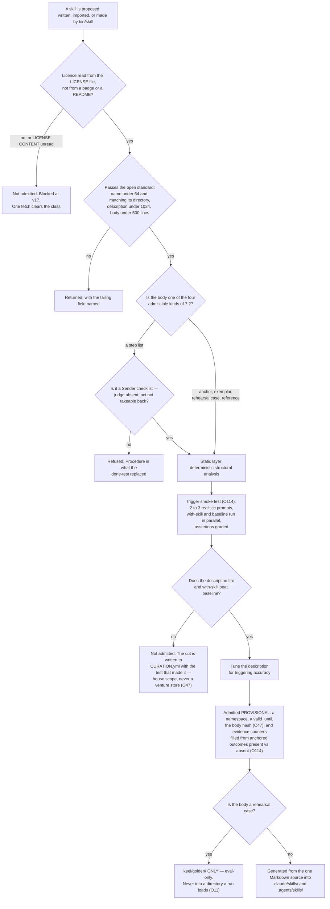

---

### 7.4 Retirement by forced expiry

**(NEW, v19: nobody in the world retires a skill by non-use, so the plan stops pretending that is a mechanism.)**
Across all seven projects researched, the only retirement mechanisms found are **drift and dead-link detection**
(`make garden`, wshobson) and **a closed contribution door** (*"we don't generally accept contributions of new
skills"*, superpowers). **No project ships a usage counter or an unused-for-N-days expiry.** FINAL §11.3's *"Ninety
days uncalled and it leaves"* is therefore a losing image and is kept by name in section 22.

**Every skill carries `valid_until`. When it comes due, exactly one disposition is recorded — Refresh, Deprecate, or
Waive with a new date.** There is no fourth outcome and no silence. **Mechanism, and it exists on this branch:**
`scripts/ledger.mjs` already forces exactly this disposition for claims and refuses a waiver with no `until`, and
`scripts/check-citations.mjs` already blocks on a dead path — both EXIST on branch `ceo-1-1788609834`. The skill
expiry rides those two rather than adding a third implementation, because two implementations of one check disagree
silently and this repository has hit that before.

**The date is set at admission, per skill, by the agent that proposed it.** No fixed window is written into the plan:
a vendor fact and a code exemplar do not rot at the same rate, and a single number would be wrong for both.

---

### 7.4a What the disposition reads, and the event when nothing resolves

**(NEW: O41 — `DEPENDS-ON-R14`.)** 7.4 forces a disposition on a date and says nothing about what informs it. **Log
skill activation and join it to outcomes**, and a skill that never fired once in its whole life defaults to
**Deprecate** at expiry, with a founder waiver the only thing that keeps it. **v19 stays whole:** retirement is
still date-forced and non-use is still not a trigger — 7.4's finding that no project in the world retires by
non-use is unchanged. What changes is only what the human reads before choosing among three dispositions that are
already compulsory.

**(R14, OPEN.)** Do any of the three CLIs emit a **skill-activation event** we can read? **Source class:** the three
vendors' hook and telemetry documentation. **What it decides:** whether O41 is a field lookup or instrumentation we
build — **and whether O114's `evidence:` counts *fired* or only *present*** (added 2026-09-06). **Mechanism:**
`bin/log` (**ABSENT**) either way; only its input moves. The disposition of 7.4 now reads three things: activation,
the `evidence:` counters, and the date.

**(NEW: O48 — the miss is the signal, and today nothing emits it.)** A **`skill.miss` event** is written when a
brief's declared namespace resolves to **zero unexpired skills**. Uncovered-field detection is named in this plan
as something the Operator notices, which is not a mechanism — a gap in the library is silent by construction,
because the run simply proceeds without help and produces something plausible. A miss is the cheapest possible
trigger for 7.5's creator, and it is one line in `bin/log` (**ABSENT**).

---

### 7.5 The skill creator

**(FOUNDER.)** *"we need a skill creator of skill, which, you know, we will research a task or a mission and, like,
to break it down two steps and to give it to the agents."*

**(NEW: v49 — it is a routing rule the Operator follows plus one no-model program, not a fifteenth agent and not
a second dispatcher, and it names which agent does each move, which is what keeps it from being a stage that
states method.)** Only the Operator dispatches (§0.3), so the creator is this: the Operator routes **scout →
product → curator**, each under its own grant, and one program scores the result — the eval runner
**`bin/skill-eval`** (**ABSENT**), which holds no model and dispatches nothing. The routing rule, in order:

1. **scout** answers the bounded question of how the field actually does this. Every claim carries URL, quote and
   access date; `scripts/check-citations.mjs` (EXISTS, this branch) blocks on a dead one.
2. **product** states the **done-test** the skill is supposed to make reachable — falsifiable by someone who did not
   do the work, or the store check refuses it.
3. **curator** writes the artifact into one of the four admissible bodies of 7.2 and proposes its `valid_until`.
   The curator is the only writer of memory, and a skill is knowledge, so the writer is the same one.
4. The **admission eval of 7.3** runs with-skill against baseline. **A candidate that does not beat baseline is not
   admitted, and the cut is written to ~~the negatives store~~ `CURATION.yml` with the test that made it (moved
   2026-09-06: O47)** rather than discarded — the failure is the cheapest thing the run produced.

**(NEW: O47 — contradiction 10, and the fix was already on disk.)** §7.5 step 4 used to send a failed candidate to
the **per-venture** negatives store, while v48 and §13.2 make skills **house scope**: a skill refused for the
harness would have been invisible to a venture that later proposed the same body. `.claude/skills/CURATION.yml`
already records every cut with the test that made it, is house scope, and is checked by `npm run check:curation` on
branch `ceo-1-1788609834`. **The negatives store keeps everything else and loses nothing** — what moves is one
class of row, to the file built for it.

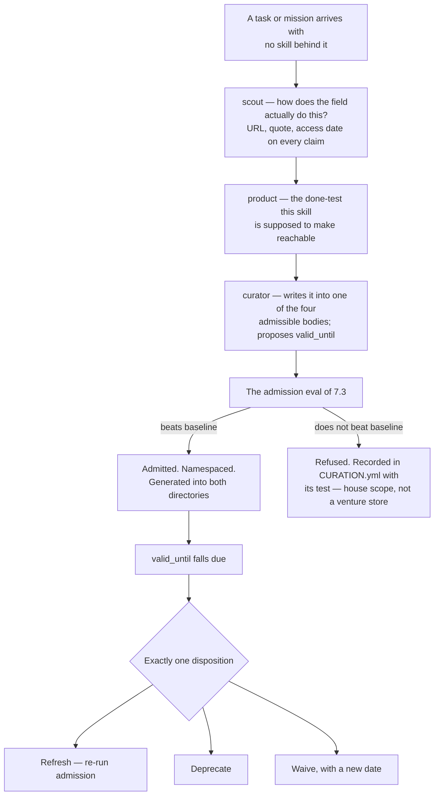

**(FINAL §11.1, surviving.)** The scout fan-out inside move 1 is the **one place parallelism is earned**: four
scouts asking four independent questions do not need each other's context, and that is the same reason v6 refuses to
parallelise a build.

---

### 7.6 Namespaces per agent

**(NEW: SPINE §E.4 says "Seven namespaces" and then lists thirteen. The list is the true statement; the count is a
defect and is corrected here.)** **Thirteen namespaces**, and every one of them is claimed by at least one agent —
there are no orphans:

| Namespace | Held by |
|---|---|
| `engineering` | builder · reviewer · architect |
| `testing` | builder · tester |
| `quality` | reviewer · tester · challenger |
| `security` | guard |
| `design` | designer |
| `frontend` | designer |
| `product` | product |
| `data` | architect · analyst |
| `growth` | writer · growth |
| `craft` | writer |
| `operations` | steward |
| `knowledge` | curator |
| `research` | scout · challenger |

**(FACT: world.md 16 — the thirteen do not cover everything installed, and the gap arrived from the vendor.)**
The `Workflow` tool's prompt footprint fell from ~5.7k to ~1k tokens *"with the script-writing reference moved into
a bundled `workflow-authoring` skill"*. That skill is **installed by the runtime and claimed by no namespace above**
— so the table is a statement about what *we* admit, not about what an agent actually loads. v35's containment is
unchanged and now cheaper; what this costs is that the startup metadata of 7.6a must count bundled skills we did
not admit, or it counts the wrong library.

**(FINAL, and now the standard's own mechanism rather than a local convention.)** **Never preloaded.** Progressive
disclosure is what enforces it: *"The `name` and `description` fields are loaded at startup for all skills"* at
~~**~100 tokens each**~~ **≈53 tokens each, measured on the 134 here** *(amended 2026-09-06: O119 · THINKER: A13
· W40)*, the body loads only on judged relevance, and bundled files load below that. The consequence
binds the library's size: **every admitted skill taxes every unrelated task at startup**, so the namespace is not
cosmetic — it is the thing that keeps a growing library from making a shrinking one's job more expensive. That is
the same defect this repository already fixed once, when reading the whole manifest cost ~15,000 tokens per lookup.

---

### 7.6a How big the library may get — a measured budget, not a number

**(FOUNDER, rethink 2026-09-06: D12 → v77.)** *"As big as a measured budget allows."* The founder's answer to
*how many skills* is neither a count nor "unlimited": it is **a per-agent startup metadata budget enforced by a
checker, plus one generated directory per namespace so an agent loads only what its own file declares. The import
stops when the budget binds.**

**Why a budget and not a count.** 7.6's own arithmetic is the argument: the published standard loads *"the `name`
and `description` fields … at startup for all skills"* at ~~roughly **100 tokens each**~~ **a measured ≈53 tokens
each — 134 skills, 28,250 bytes of `name`+`description`, ≈7k tokens at 134 and ≈110k at 2,111** *(amended
2026-09-06: O119 · THINKER: A13 · W40)*, so **every admitted skill
taxes every unrelated run**, and the upstream advertises 2,111 candidates. That is the same defect this repository
already paid for once, when reading the whole manifest cost ~15,000 tokens a lookup and a good new skill made every
unrelated task dearer. A count would be arbitrary; a budget is the thing that actually binds, and it binds on the
quantity that hurts.

**Mechanism.** One checker modelled on `scripts/check-memory-budget.mjs` — which **EXISTS and blocks** on branch
`ceo-1-1788609834`, so this is a second subject for a proven shape rather than a new kind of gate — plus **one
generator pass** that writes a directory per namespace (**both ABSENT**). It extends v48 and this section's 7.1
generator: the generator already owns both output directories, so the per-namespace split is a rule inside it, not
a second writer. **The cost, once:** the library stops being open-ended, which is what v3's ambition needs in order
to stay affordable.

**(NEW: O119 — the checker measures its own constant instead of carrying the spec's.)** A budget divided by a
guessed per-skill cost is a guessed budget. The checker computes **frontmatter bytes ÷ 4 per skill, on every run**,
so the constant is re-measured with the library rather than copied from a specification written for a different
corpus; the measurement above (≈53, not 100) is its seed row and is cited as a thinker's, never as a plan fact.
**R8 runs before the import**, and its result is the checker's first line. **Losing image:** *the spec's figure* ·
`wins_if:` R8 shows the tax scales with declared namespaces — then the generator is the whole fix and this checker
is over-built (v77's own losing image, §J 66). `vendor_wins_if:` the runtime reports per-skill startup tokens.
**Path:** the checker (**ABSENT**). Class: kernel · truth.

**(R8, OPEN — and it can refute this row outright.)** Does the skill metadata tax scale with the **installed
library** or with the agent's **declared namespaces**? **Source class:** two trees, identical prompt, input tokens
read from `--output-format json` — one with the full house library installed, one carrying only one agent's
namespaces. **What it decides:** if the tax scales with declared namespaces, **the generated directories are the
whole fix and the budget is unnecessary**; the checker is then over-built and should not be written.

**(R15, OPEN.)** Is there any published measurement of **selection accuracy as installed-skill count rises**? The
budget bounds a *cost*; nothing here bounds the risk that a model picks the wrong skill out of two thousand.
**Source class:** the spec's authors, vendor engineering posts, the harness showcase. **What it decides:** the real
exposure of importing thousands. **If nobody has measured it, v77's budget is what bounds the exposure** — which
is a weaker guarantee than it sounds, and is stated here rather than assumed away.

---

### 7.7 The 134 on disk, and what each becomes

**(measured on branch `ceo-1-1788609834`: 135 directories under `.claude/skills/`, of which one is `routers/` —
so 134 skills, plus `CURATION.yml` and `MANIFEST.json`, all EXIST.)**

**(NEW: they are no longer a holding directory. There is no shelf.)** FINAL §16.2's fate classes are kept, and they
change status: they were a **verdict**, and they become a **starting classification for admission**. Each of the 134
now has exactly two futures — it re-enters through 7.3, or its `valid_until` falls due and 7.4 takes one of three
dispositions. Nothing sits in a directory read by nothing.

| Fate class (FINAL §16.2) | Count | Admissible body it targets under v18 | How it re-enters, or does not |
|---|---|---|---|
| **PROCEDURE** | 73 | none, as procedure | One door only: a **Sender checklist**, where the judge is absent and the act cannot be taken back. Otherwise it may **donate its examples** to an exemplar, one at a time, with a caller. All 28 `thinking-*` sit here |
| **ANCHOR-CANDIDATE** | 22 | **anchor** | It must carry a check with an exit code and beat baseline. First candidates named by the census: `wcag-audit-patterns`, `security-audit`, `web-security-testing`, `e2e-testing-patterns`, `writing-good-tests`, `verification-before-completion` |
| **EXEMPLAR-CANDIDATE** | 16 | **exemplar** | Provenance per example, then the eval. `react-patterns`, `error-handling-patterns`, `high-end-visual-design`, `seo-content-writer` and the rest |
| **REHEARSAL-CANDIDATE** | 1 | **rehearsal case** | `react19-test-patterns` carries before/after pairs with known answers — the only one in the corpus. **Its admitted form is eval-only: it lands in `keel/golden/` and leaves `.claude/skills/`** (7.2a, O11) |
| **INFRA** | 22 | **reference** | **(NEW: this row moves.)** FINAL §16.2 said INFRA is *"never loaded into a run as a skill"*. v18 admits a fourth body — a vendor fact with an expiry — so an INFRA entry now has a legitimate skill form, and 7.4's expiry is what makes it safe |

73 + 22 + 16 + 1 + 22 = 134. **The distribution is the finding, not the total:** the largest class is the one the
content rule refuses, so the honest prediction is that the library grows mostly by import and creation rather than
by re-admitting what is here.

**(FIXER: C · THINKER: C16 — said plainly, inside v3 and v77, no row.)** 73 of 134 cannot enter as written, and
the library's value in 2027 is the company's own anchors, exemplars and negatives, not an import. **Import order
follows from that: anchors first** — the 22 ANCHOR-CANDIDATEs above, each a check with an exit code and the only
class whose admission makes a rung-1 anchor reachable (§11) — **no bulk import before R13 and R8 answer**, and the
**admission ratio** (admitted : refused) is a briefing line so the founder reads the distribution and not the
total. SPINE carries no row for this; it is an ordering inside decisions already taken, and the orchestrator may
promote or drop it.

**(NEW: two existing checks do not retire — they change subject, and that corrects FINAL §16.2.)** §16.2 wrote that
*"`check:manifest` and `check:curation` … retire with it"*, because the library was going to a shelf. The library
does not go to a shelf, so they stay and are re-pointed:

- **`check:manifest`** becomes the **drift check between the one Markdown source and the two generated directories**
  — the mechanism 7.1 needs, given that Codex does not merge same-named skills. **(NEW: O11 adds a second
  assertion to it)** — it also fails when an eval-only body is found in either loaded directory, which is what makes
  7.2a a gate rather than a convention.
- **`check:curation`** already records every cut with the test that made it. Inverted per FINAL §11.3, that is the
  **admission record**: every entry keeps the eval that admitted it and the date it expires.

Both are steps of the check suite on branch `ceo-1-1788609834` today, so the mechanism is a re-pointing rather than
a new blocking check.

---

### 7.8 What enforces this section

| Rule | Mechanism | State |
|---|---|---|
| A skill matches the published spec | the spec's own validator, `skills-ref validate` | licence of `skills-ref` **UNKNOWN**; the checks are re-implementable from the spec text |
| A skill's body is one of four kinds | the admission gate in `bin/skill` | **ABSENT** |
| A skill beats baseline before admission | `evals/evals.json` plus paired with-skill and baseline runs | **ABSENT** here; **shipped** upstream as `skill-creator` |
| A skill expires and one disposition is recorded | `scripts/ledger.mjs` (forces the disposition; refuses a waiver with no `until`) | **EXISTS**, branch `ceo-1-1788609834` |
| A skill citing a dead path fails | `scripts/check-citations.mjs` | **EXISTS**, branch `ceo-1-1788609834` |
| The generated directories match the source | `check:manifest`, re-pointed | **EXISTS** as a suite step; the re-pointing is **ABSENT** |
| Every admission keeps the test that made it | `.claude/skills/CURATION.yml`, inverted | **EXISTS**, branch `ceo-1-1788609834` |
| No bulk import before the licence is read | a founder decision, section 20 row 4; **R13** narrows it to *derivative bodies* | **WISH** until the fetch happens — nothing today blocks a vendoring commit |
| Skills are never preloaded | the standard's progressive disclosure | **shipped by the runtimes** |
| **A rehearsal case cannot be read by the run it judges** (O11, 7.2a) | the eval-only frontmatter field; the generator writes it to `keel/golden/` only; `check:manifest` fails a case body in a loaded directory | **ABSENT** — `keel/golden/`; `check:manifest` **EXISTS** and is re-pointed |
| **Admission is bound to the body it was granted on** (O47) | the body hash in `CURATION.yml`; `check:curation` fails a mismatch | `CURATION.yml` **EXISTS** and is checked, branch `ceo-1-1788609834`; the hash field is **ABSENT** |
| **A failed candidate is house scope, never a venture store** (O47, contradiction 10) | `.claude/skills/CURATION.yml` | **EXISTS**, branch `ceo-1-1788609834` |
| **One sample floor answers for admission and for the trust score** (O25, contradiction 12) | one shared predicate, two call sites — §11.10 and 7.3 | **ABSENT** |
| **Startup metadata stays inside a per-agent budget** (v77) | a checker modelled on `scripts/check-memory-budget.mjs`, plus one generated directory per namespace | checker shape **EXISTS** (memory budget); the skills checker and the generator pass are **ABSENT**; **R8** may retire the checker |
| **A skill that never fired defaults to Deprecate at expiry** (O41) | activation logged by `bin/log` and joined to outcomes | **ABSENT** · **DEPENDS-ON-R14** — whether any CLI emits the event is unread |
| **A namespace that resolves to nothing raises an event** (O48) | a `skill.miss` event from `bin/log` | **ABSENT** |
| **Admission is provisional; the quality verdict is real work, present against absent** (O114 · 2026-09-06) | `evidence: {n_present, pass_present, n_absent, pass_absent}` on the `registry.yml` row, filled from anchored outcomes; a decision at a threshold with O25's floor, after a quarter of activations | `keel/shared/skills/registry.yml` **ABSENT** · **DEPENDS-ON-R14** · kernel · truth |
| **The metadata tax is measured, not assumed** (O119 · 2026-09-06) | the checker computes frontmatter bytes ÷ 4 per skill on every run; R8 runs before the import | the checker **ABSENT**; the seed measurement is (THINKER: A13; W40) · kernel · truth |
| **A pack's rehearsal case is a reference into `keel/golden/`, never a body** (O111 · 2026-09-06) | `check:manifest` (O11) fails a known-answer body in any loaded directory, including one a pack resolves to | `keel/golden/` **ABSENT**; `check:manifest` **EXISTS** and is re-pointed · kernel · truth |

---

## 8 · Tools and MCPs

*obeys: v15, v33 (SPINE §F entire), **v68** (the rethink round of 2026-09-06), and **v90, v94, v101 with O92, O94, O100, O105, O109, O122** (the fixer round of 2026-09-06, SPINE §K row 8); inherits: FINAL §9.3 (the door), §9.4 (the trifecta), §16.3 (the connected hands)*

**(FOUNDER.)** *"there is no limitations of adding new MCPs or new tools to fill our needs. So there is so many
filters we might need to include and get more MCPs or more of tools in order to do things better or to improve the
system or to have endless possibilities and, like, we need to think about it outside of what we have right now."*

---

### 8.1 The door is material, not a ceiling

**(FOUNDER, and it is a correction of how FINAL §9.3 was being read.)** The door is **what a tool must pass**. It is
not a list of what may be proposed. **Anything may be proposed** — an MCP server, a CLI, an API, a browser, a
repository, a device. What the door decides is what the tool may then *do*, who may hold it, and whether it may be
held at night.

**(FINAL §9.3, unchanged and still the reason the door exists.)** The exposure is not hypothetical: scans found
critical vulnerabilities in **33% of 1,000 MCP servers** and some finding in **66% of 1,808**, and three attacks are
documented that need the founder to do nothing wrong — **tool poisoning** (instructions hidden in a description),
**the rug pull** (a server passes review, then silently changes its description; CVE-2025-54136), and **line
jumping** (the server steers the agent without appearing in the log). Hashing the descriptions and re-checking them
every session is the specific countermeasure to the rug pull, and it is a string comparison.

**(NEW: the door gains one box it did not have, because the roster now exists.)** FINAL's door classified a tool and
rehearsed it. It could not ask *who may hold this*, because FINAL had shapes rather than named agents. Section 5's
fourteen make that question answerable, so it is now a gate rather than a note.

```mermaid
flowchart TD
    NEW["A tool is proposed:<br/>MCP server, CLI, API, browser, repository"] --> WHY{"Which intent needs it,<br/>and what does it replace?"}
    WHY -->|"no intent needs it"| NO["Not admitted.<br/>Might be useful is not a reason"]
    WHY -->|"a named intent"| CLASS["Classify into one of the four classes of 8.2,<br/>with its undo, and a rate where there is one"]
    CLASS --> WHO{"Which agents of the roster<br/>may hold this class?"}
    WHO -->|"none may"| SENDERQ{"Does it REACH THE WORLD?"}
    SENDERQ -->|"yes"| SENDER["Only the Sender holds it.<br/>The Sender holds no model"]
    SENDERQ -->|"no"| NO
    WHO -->|"a named agent or agents"| PIN["Pin the version.<br/>Hash the tool descriptions.<br/>Record a binary's version string and sha256 (O35).<br/>A person reads the full description once"]
    SENDER --> PIN
    PIN --> SCOPE["Scope the credential:<br/>one venture, least privilege, an expiry —<br/>narrower than the tool.<br/>Record scopes_observed beside scopes_requested (O35)"]
    SCOPE --> TRI{"Would granting this create the<br/>trifecta on any path? (8.7)"}
    TRI -->|"yes"| SPLIT["SPLIT THE RUN. Structural, not a setting.<br/>The reader is born a scout and stays one"]
    TRI -->|"no"| GUARD
    SPLIT --> GUARD["guard reviews it — every tool admission<br/>is on guard's routing line"]
    GUARD --> REH["Rehearse it: a known call, a known answer,<br/>on its dry branch, headless"]
    REH --> CAP{"Does it spend credits or money?"}
    CAP -->|"yes"| PCAP{"Is a provider_cap recorded,<br/>held AT the provider? (O32)"}
    PCAP -->|"null"| NO
    PCAP -->|"a number"| CEIL
    CAP -->|"no"| CEIL
    CEIL{"A counter and a ceiling —<br/>and does the ceiling REJECT?"}
    CEIL -->|"no"| NO
    CEIL -->|"yes"| ADMIT["Admitted, with a horizon:<br/>day, Floor only · night · never"]
    ADMIT --> EGR["Every call leaves through bin/egress, three transports (O94):<br/>a per-child stdio MCP server, the sandbox network block,<br/>credentials injected the agent never sees (v68)"]
    EGR --> WATCH["Description hash checked each session.<br/>Probed nightly by bin/probe"]
    WATCH -->|"hash changed"| FREEZE["FROZEN — a rug pull until proven otherwise.<br/>The founder is told"]
    WATCH -->|"horizon passes"| RENEW{"Still named by a live intent?"}
    RENEW -->|"no"| REVOKE["Revoked. Credential rotated"]
    RENEW -->|"yes"| ADMIT
```

**(FINAL §9.3, and it is the sentence that keeps the door from becoming a shopping list.)** For a repository: *what
does it give us we could not build in a day, its LICENSE file, our monthly test, what breaks if it disappears, is it
alive* — **take the mechanism, not the dependency**, because every framework that wants to own the loop is a second
control plane beside the runtime, and two implementations of one thing disagree silently.

**(NEW: O35 — the admission record says what we asked for and not what we got, and for a CLI it says nothing at
all.)** Two fields are added to the admitted-tool file (**ABSENT**). **`scopes_observed`, read back from the
provider** and recorded beside `scopes_requested`: an OAuth grant is what the provider *issued*, not what we typed
into a consent screen, and the two differ often enough that the difference is the interesting number.
**A binary's version string and its sha256, recorded at admission**: version pinning is defined in this section for
**MCP descriptions** and is **undefined for the binaries that actually run at night** — `gh`, `git`, `node`, `bun`,
`codex`, `gemini` — which is the larger surface and the one nothing currently hashes. **The cost, once:** two reads
at admission time. **Settled by:** a re-read that disagrees with the record, which is a rug pull one layer below
the one 8.1 already watches for.

---

### 8.1a The door in the wall — one program everything leaves through

**(FOUNDER, rethink 2026-09-06: D3 → v68.)** *"Build `bin/egress`; `--strict-mcp-config` names only the proxy; the
MCP policy file becomes its configuration."* **One no-model program logs every outbound call, filters by domain
**and HTTP method**, and injects credentials the agent never sees.**

**Why it is a program and not another rule.** 8.1's door decides what may be *admitted*; nothing in this section
decides what happens at the **syscall**. That gap is where the trifecta argument runs out: 8.7's split guarantees a
leg is missing **at dispatch**, and v68 is the only proposal of the round that survives an agent being *fully*
persuaded — it keeps the leg missing at the moment of the call. It is also what turns *"every call logged"* (8.1's
own `WATCH` node) from a sentence into a count that can be compared against the runtime's.

**(NEW: O94 — the obvious shape fails at the syscall, so the program is three transports with one configuration and
one log.)** The shape v68 was read as — an HTTP proxy on `127.0.0.1` that every call passes through — **is
unreachable by the process class it governs**: outbound loopback `connect()` is denied for sandboxed Bash, measured
as `dial tcp 127.0.0.1:11434: connect: operation not permitted` (THINKER: A5; W36). A proxy nobody can reach logs
zero calls, which reads as success. **`bin/egress` is therefore three transports**, inside v68's *"R2 may halve
it"* clause: **(1) a stdio MCP server**
`bin/run` spawns **per child** and names **alone** in `--strict-mcp-config`, fronting every admitted server — the
call log, the domain-and-method filter and the credential injection live here, and stdio needs no socket; **(2) the
sandbox `network` block** for anything Bash does; **(3) `credentials.injectHosts`** where R2 shows it injects a
secret the child cannot read. `WebFetch` and `WebSearch` are runtime-side and reach none of the three, so they are
**absent from `--tools` for every agent but `scout`**, which holds no credential — the trifecta is the control
there. **(R2, OPEN) becomes the transport question:** which of the three carries what, one measured cell each; R2
changes the program's size, never whether the guarantee exists. **Losing image:** *a loopback HTTP proxy on `127.0.0.1`* — §J 86 · `wins_if:` the sandbox gains a
per-invocation loopback allow scoped to one port; the proxy is then reachable and it is one hop again. **Class:**
adapter (O105); `vendor_wins_if:` that same loopback allow.

**What this demotes, and it is a deletion (SYNTHESIS §7 deletion 10).** ~~`.claude/mcp-policy.json` as an
**independent** control~~ — a policy whose calls no hook can see — **becomes ~~the egress proxy's~~ `bin/egress`'s
configuration** (moved 2026-09-06: D3; amended 2026-09-06: O94). It is not removed from disk and its allow/deny
shape is not rewritten; what goes is the claim that it enforces anything by itself. `--strict-mcp-config` then
names **only ~~the proxy~~ the per-child stdio server**, so every server is declared twice on purpose: once to
`bin/egress`, which can see the call, and once in the run's argv, which cannot.

**Mechanism:** `bin/egress` · `bin/run` (**ABSENT**); `--strict-mcp-config` **ships today**. **The cost, once:**
~~one program, one hop of latency, and each server declared twice~~ three transports declared instead of one hop,
and each server declared twice (amended 2026-09-06: O94). **Settled by:** a deliberate exfiltration failing at the
sandbox or the stdio server rather than at the prompt, and `bin/egress`'s call count matching the runtime's for one
night.

~~**(R2, OPEN — it can halve this row.)** Does the sandbox's documented, unused `credentials` block inject a secret at
egress without the child being able to read it, and does its `network` block support an HTTP-method allowlist and
TLS inspection?~~ *(moved 2026-09-06: O94 — restated above as the transport question; source class unchanged.)*

---

### 8.2 The four classes

**(SPINE §F is the decision, and this section stops carrying a second copy of it — contradiction 19, SYNTHESIS §7
deletion 12.)** The four-class table stood in **four** places: SPINE §F, here, §17.3 and COVERAGE. Four renderings
of one table is three chances to drift, and the tainted row had already drifted once — which is what v36 had to
settle. **§F holds the decision; §17.3 holds the inventory copy; this section points at §F and keeps only what §F
does not carry.**

**Read the classes at SPINE §F: READ-ONLY · READ-ONLY, tainted · WRITES, reversible · REACHES THE WORLD**, each
with its examples, its holder and its night disposition. Two deltas belong to this section rather than to §F, and
they are stated once here:

- **v36 narrows the tainted row.** §F reads *"scout only"*; the holder is **`scout` and the world's door program**,
  and **no agent holding `Write`, `Edit` or `Bash` reads a tainted source raw** (8.7).
- **The per-agent bindings are 8.7's table**, which is the roster-decided reading of the same four classes and is
  where a reader should go for *who holds what*. **(Still true, and truer since 2026-09-06 · census C item E:** 8.7
  was reduced to **the binding only** — tool and holder-and-when — so it no longer carries a class or a credential
  column to drift from this pointer or from §17.3.**)**

**(NEW: the class is assigned at the door and consumed at dispatch, which is what makes it structural.)** A grant is
argv fixed at dispatch and cannot narrow mid-run, so the class cannot be a runtime judgement. **Mechanism:**
`bin/run` (**ABSENT**) refuses a brief whose grant carries both an outside-reading tool and any of `Write`, `Edit`,
`Bash` or a REACHES-THE-WORLD tool; `bin/probe` (**ABSENT**) asserts nightly what a run can actually touch.

**(NEW, and it is why a hook is not a substitute for argv.)** An MCP tool call reaches a hook **only if the hook's
matcher names that exact tool** — a hook matching `Bash|Edit|Write` governs no MCP call at all. Registered on this
branch as `c-mcp-hook-matcher-must-name-the-tool`. Every admitted server is named in the run's argv and is otherwise
absent by `--strict-mcp-config`.

---

### 8.2a Where reversibility lives — a property of a verb, in the admitted-tool file

**(NEW: O109 · v101 — the one-way/two-way decision was the one decision the plan let a model make about itself.)**
§12.2 asked, per act and at run time, *is this reversible?* — a flowchart a run walked with model output as its
input, at the one point where a mistake is unrecoverable (THINKER: B13). **Reversibility is now a property of a
verb, declared once, at the door, where the undo is drilled anyway.** The admitted-tool file
`keel/shared/tools/<name>.yml` (**ABSENT**; 8.8's first row) gains:

```
verbs:
  - name:       <verb>
    effect:     none | metered | reaches-the-world   # O24's effect: is this same field
    reversible: true | false
    undo:       <command>                        # required when reversible is true
    drilled:    <date>                           # undo exercised on the dry branch
```

**An unlisted verb is one-way.** `bin/run` composes the grant **from listed two-way verbs only**; the Sender and the
door read the table; v76's away predicate reads it to decide whether a *which* default may fire (§4); §12.2's
run-side question **is deleted** and its flowchart becomes a lookup. **Losing image:** *the run-side flowchart* —
§J 79 · `wins_if:` grepping the launcher finds no predicate that takes model output. **Class:** kernel · truth
(O105); `vendor_wins_if:` none conceivable.

### 8.2b The outward-class ladder file — the same directory, keyed by class

**(FOUNDER, fixer round 2026-09-06: E11 · v94 — *"Yes, after N recall-free sends per venture."*)** §12 owns the
widening rule and §2 the charter's N; this section owns the file. Five outward classes, in order — `reply-to-existing-thread`
· `follow-up-to-consented-contact` · `publish-to-preview` · `publish-to-owned-channel` · `first-contact` — each a
file `keel/shared/tools/<class>.yml` (**ABSENT**; O100) carrying **`step`, `n_recall_free`, `recall_count`,
`widened_at`, `undo_drilled`**. `bin/send` reads the step before any act; `bin/reconcile` writes `recall_count`
from the world's record — a recall inside the window, or a reply asking to stop, which also writes the consent
register (v69). After `n_recall_free` sends the Watch stages a *widen one step or stay* which; **a recall narrows
the class one step without asking**; the consent register and the disclosure line (v63) are read at every step. **`first-contact` is reachable like any other class** — the founder's overrule of C's default that
the ladder stop one step below it (THINKER: C10). **Losing images:** *the ladder stopping below `first-contact`* —
§J 84 · `wins_if:` recalls per hundred sends on a widened `first-contact` class exceed the founder's own tapped
rate; *widening on reply rate* (FIXER: B) · `wins_if:` a class widens on zero recalls while `bin/inbound` records
zero replies. **Class:** kernel · truth. A tool file has `verbs:`; a class file has `step`.

---

### 8.3 Admitted first: the read-only instruments, and the reason is not caution

**(FINAL §9.3, sharpened.)** The grant surface as it stands is inverted from the right one. Connected today: a
social publisher, a mail client that can send, a drive client that can share, a remote compute sandbox, an
authenticated browser. **Not connected: analytics, error tracking, a read-only billing key, the CI runner's API, the
git host's read API.** The hands are wired and the instruments are not.

**(NEW: the reason is the reconciliation, not prudence.)** The nightly reconciliation cannot exist without those
five, and **the reconciliation is what makes every other number rung 1 instead of rung 4** — a number that
reconciles only to our own log is a number the company wrote about itself. `analyst` is the agent whose anchor is
literally *"the reconciliation reads a record the company does not write"*, and it currently has nothing to read.
**Instruments buy freedom and hands spend it**, so the instruments go first.

---

### 8.4 The wish list, by need rather than by vendor

**(FOUNDER: *"we need to think about it outside of what we have right now."*)** Each row names the need, not the
product, so that a vendor change is a routing change. **Every row is WISH until it passes 8.1 — nothing here is
admitted by being listed.**

**(v36, applied.)** "Which agent needs it" names who the answer is *for*, not always who holds the credential. Where
a row's read carries text a stranger controls — an invoice body, a signed document, a support message — it is a
**tainted** read by 8.2, so the world's door writes the row and `scout` reads it, and the named agent works from
that row. Where the read is a structured figure from a service the company itself holds an account with, the named
agent may hold it directly once it passes 8.1.

| The need | Which agent needs it | Why the system is incomplete without it |
|---|---|---|
| A **payments read** API | analyst · steward | the economics section has no source of truth for revenue; a runway computed from a number the bank does not confirm cannot promote anything |
| A **domain and DNS read** | steward | a venture owns assets nobody can currently enumerate |
| An **ads platform read**, before any write | analyst · growth | spend that is not read is spend that is not reconciled |
| A **design-token bridge** | designer | the design anchor is contrast, tokens and grid conformance, and none of those are checkable without the tokens |
| A **database read replica** per venture | analyst · architect | a schema question answered from the repository is answered from the intention, not the state |
| An **e-signature read** | steward | an obligation is discharged only by a record the company does not write |
| A **second search provider** | scout | `scout` is single-sourced today, and a single-sourced fact-finder is one outage from silence |

---

### 8.5 Refusals, each with its reason

**(NEW: a refusal names the property that refuses it, so it can be reversed by changing that property rather than by
arguing.)**

| Refused | The property that refuses it | What would reverse it |
|---|---|---|
| **Mem0** | memory leaves the machine to a hosted store — a dependency, an auth surface and a leak path at once | nothing available: memory is plain files in git by design (v24, v25) |
| **RunPod** | **spends money at a rate under an uncapped key**, and it runs whether or not anyone is watching | a credential capped at the provider, not a cap we promise to respect |
| **n8n** | **licence.** Sustainable Use: *"only for your own internal business purposes or for non-commercial"* (v15, read from LICENSE.md) | a licence change, or a different canvas — Langflow (MIT [`api`: GitHub SPDX detection, LICENSE not read], alive 2026-09-05) is the admitted one |
| **Flowise** | **ARCHIVED**, licence NOASSERTION | nothing; an archived project is a dependency with no maintainer |
| **Gource** | GPL-3.0 [`api`: GitHub SPDX detection, LICENSE not read] | `3d-force-graph` (MIT [`api`: GitHub SPDX detection, LICENSE not read]) is the admitted renderer instead |
| **The founder's signed-in Chrome** | REACHES THE WORLD **and** holds private data — the widest hand in the building | nothing. It stays day-only, Floor-only, held by the founder, at any trust score |
| **A user-testing simulation** | it is the machine grading its own homework; the rung-1 anchor is a real reaction | nothing — this is a truth rule, not a tool rule |

**(NEW: O32 — one rule was giving two answers, and this is contradiction 8.)** The table above refuses **RunPod**
for *"spends money at a rate under an uncapped key"*, and 8.7 admits **Higgsfield**, which spends credits, *"under a
daily spend cap"* **that no named program enforces**. Same property, opposite verdicts, and the difference was which
row a reader landed on first. **The fix is one field at the door: `provider_cap`, required on any credit-spending
or money-spending tool, and `bin/run` refuses a grant whose recorded cap is `null`** (both **ABSENT**). A cap in
our prose is not a cap; a cap held **at the provider** survives our own program being wrong. RunPod's refusal is
unchanged and now says what would reverse it in the same words the rule uses.

**(R21, OPEN — it decides which class Higgsfield sits in.)** Does any **credit-spending server expose a spend or
balance read**? **Source class:** vendor API documentation, one fetch each. **What it decides:** with a balance
read, a program can hold an absolute ceiling and Higgsfield stays in **WRITES, reversible**; without one, spending
is an act with no readable counter and it belongs in **REACHES THE WORLD**, where the Sender holds it and no agent
does.

**(NEW: O33 — the one item in the departments that is both unprecedented and legally exposed.)** **Bulk collection
of personal data passes the door with `guard` and a data-classification row *before* it runs**, never after.
Lead scraping is the only entry in the department tables that is unprecedented in **every** fetched roster **and**
legally exposed, and it is the shape most likely to be proposed as an ordinary growth tool. **Mechanism:** the
door's checklist (**ABSENT**) — one required review and one required classification row, which §12's three data
classes then govern for retention. **The cost, once:** one review on one class of tool.

---

### 8.6 One MCP shape serves both runtimes

**(NEW: the portability is real at the capability layer and absent at the policy layer, and that asymmetry is the
whole design constraint.)** Claude Code takes per-subagent `mcpServers` — inline or by reference, *"connected when
the subagent starts and disconnected when it finishes"*. Codex takes per-agent `mcp_servers` in TOML. **A server
admitted once at 8.1 is declarable in both**, so the door is a single door.

What is *not* portable: Anthropic's hook event set and **managed-settings precedence**; OpenAI's
**`requirements.toml`, which outranks every flag** (FINAL §14.6, not re-read this session); Google's Policy Engine (FINAL §14.6, providers lane 2026-09-04). **The shapes are portable; the
guarantees are not.** Section 10 is where that is resolved into one launcher.

**(measured, branch `ceo-1-1788609834`.)** `.mcp.json` EXISTS and declares exactly **two** servers, `playwright` and
`claim-append`. **Two** agent files declare `mcpServers` — `designer` (`playwright`) and `sourcer`
(`claim-append`, #112). Derive it, do not quote it: `grep -n 'mcpServers' .claude/agents/*.md` against
`Object.keys(require('./.mcp.json').mcpServers)`. `.claude/mcp-policy.json` EXISTS (per-server allow/deny; the
shape the door's per-tool file inherits) — and as of v68 it is **the egress proxy's configuration**, not a control
in its own right (8.1a).

**(FACT: world.md 23 — W23. An admitted tool's *output* is now a taint path, and the door tests the input.)** A
Codex extension can *"inspect or replace MCP tool results before reaching the model"* (0.151.0, 2026-08-29). Every
rule in 8.1 governs what a server is *allowed to do*; none of them governs what an extension does to the server's
answer on the way back. So a tool that passes admission, keeps its description hash and stays inside its scope can
still deliver text the model treats as a result and nobody wrote. **This is the rug pull with the direction
reversed**, and it pairs with O65's taint id: a rewritten result is an inbound row by any honest reading, so it
carries a taint id or the Sender refuses what descends from it. **Mechanism:** the extension surface is Codex's;
what we control is `--ignore-user-config` on the Codex carrier and O65's lineage check at the Sender (both
**ABSENT**).

**(NEW: O36 — nothing governs a config import, and a config import carries everything this section governs.)**
**`/import` and `claude import` are refused inside the house.** 8.1's door governs *tools* and v53 governs *pages*;
an import carries **MCP servers, commands, subagents and skills** in one act, past both. It is the one command that
can widen a grant without touching argv, a settings file or an agent file. **Mechanism:** a `UserPromptSubmit` hook
that refuses the two verbs (**ABSENT**). **The cost, once:** the founder imports by hand, through the door, one
item at a time — which is what the door is for.

**(FACT: world.md 16 — the installed library is wider than the admitted one.)** The `Workflow` tool now ships a
bundled `workflow-authoring` skill that **no namespace in 7.6 claims**. It is named here because it is a capability
that arrived with a runtime rather than through this door; 7.6a is where its startup cost is counted.

**(NEW: O122 — the one outbound channel this section never classed, and it is an adapter.)** `bin/bell` (§14 owns
it) **is a wrapper over the vendor's push** (`agentPushNotifEnabled`), adding
only what the push does not carry (THINKER: A19). The vendor's push is the admitted transport; `bin/bell` holds no
credential of its own; it is marked **adapter · the vendor's push**, `vendor_wins_if:` the push exposes an acted-on
read (O105). **Losing image:** *a fourth bell channel* — §J 83 · `wins_if:` no acted-on read after a quarter.

**(NEW: O105 — every program this section names carries its class.)** `bin/door` · `bin/send` · `bin/probe`
kernel · truth; `bin/egress` **adapter** · sandbox `network` + `credentials` + stdio MCP; `bin/bell` **adapter** ·
the vendor's push. An adapter naming no surface fails v50's marks lint (**ABSENT**); a matched `vendor_wins_if:`
forces Delete. §17.5 holds the table.

**(NEW: `sourcer`'s grant is the door's own model, and it narrows under v2.)** `claim-append` was granted to
`sourcer` while `sourcer`'s `tools:` line stayed `[Read, Glob, Grep, WebSearch, WebFetch]` — **no `Write`, no
`Edit`**. That is the pattern the door adopts: *a narrow capability through one audited server, rather than a broad
tool*. Under the v2 roster it narrows further and this follows from section 5 rather than being a new decision:
`scout`'s MCP grant is *"read-only servers, per run"*, and an append server is not read-only, so **`scout` does not
carry `claim-append`**. The append it was doing belongs to `curator`, which has `Write` and does not need a server
for it.

---

### 8.7 The connected hands, re-decided against the roster

**(FINAL §16.3's table, with its "who may hold it" column re-decided against section 5's fourteen. Founder: all of
them back through the door, one at a time. Today **none is admitted**; each row is its disposition when it reaches
the door.)**

**(NEW: contradiction 19 — this was a third copy of the hands table, and it is now the binding column only ·
2026-09-06 · census C)** The four-class table was written out four times — SPINE §F as the decision, §8.2, §17.3 and
COVERAGE — and four copies of one classification is four places for a tool to be classed differently. §17.3 says in
its own text that *"§8 keeps a pointer instead of a copy"*, and until today §8 kept a copy. **Every column but the
binding is struck here: class is SPINE §F's and §8.2's; credential, class and disposition at the door are §17.3's.**
What stays is two columns — **the tool, and the binding: who may hold it under the roster, and when** — because the
binding is the one thing this section decides and the one column §5's roster re-decided. The drift this prevents already happened once on Higgsfield, where the two tables read differently about
the same key.

| Hand | Binding — who may hold it under the roster, and when |
|---|---|
| the founder's signed-in Chrome | **nobody but the founder, on the Floor** — **when:** day, Floor only, forever |
| Playwright, headless, `--isolated` | **designer** — the only agent whose row names it — **when:** night |
| Gmail · Calendar · Drive · Notion **read** | **the world's door program** (holds no model) **and `scout`** — nobody else; `steward` holds none of them (v36) — **when:** night |
| Gmail **send** | **the Sender**, founder-signed — **when:** never unattended until the founder widens the class |
| Drive share · Calendar create · Notion write | **the Sender**, after a recall window — **when:** night only after the class is widened and the undo drilled |
| Figma · Pencil · Stitch · Refero (Refero READ-ONLY) | **designer**, on a dry branch — **when:** night after the undo is drilled |
| Higgsfield (image · video · audio) | **writer**, rate-capped — **when:** night, under a daily spend cap **recorded as a `provider_cap` and held at the provider — `bin/run` refuses the grant if it is `null` (O32); R21 decides whether it stays in WRITES at all**. Its publish and TikTok verbs are one-way and **never** — ~~**the verb set itself is UNVERIFIED**~~ **no verb is listed in its `tools/higgsfield.yml` yet, so every verb is one-way until one is (O109, 8.2a)** *(amended 2026-09-06)* (FINAL §16.3; the connected-tools list came from the 2026-09-04 session's own MCP server list) |
| RunPod | **nobody** — **when:** never, until a capped key exists |
| `claim-append` (local, `scripts/mcp/claim-append-server.mjs`, EXISTS) | **curator** does this with `Write` and needs no server; the pattern survives as the door's model — **when:** night |
| Mem0 | **nobody** — **when:** never (8.5) |
| Miro | nobody until an intent names it — **when:** through the door individually, or disconnected |
| n8n | **nobody** — **when:** never — licence (v15) |
| `git` · `node` · `bun` | **builder · tester · designer · ~~analyst~~ — the three that carry `Bash`** (§5.2; **O57** struck `analyst`'s `Bash`; architect never had one) *(corrected 2026-09-06 · census C item D)* — **when:** night |
| `gh` | builder, when a repository read is the need — **when:** night; every use needs the sandbox's denial of `~/.config/gh` handled explicitly — **the real `denyRead` list lives in `keel/host/denyread.yml` (O92, §15), not in this row** |
| `gemini` | ~~routed by section 9, not held by an agent~~ **a `bin/run` child from launchd only, never from a Claude-hosted shell** — `gemini --version` hits `EPERM` under the live sandbox (THINKER: A9; W37); routed by section 9 on a personal Google account, **no key** (FOUNDER, fixer round 2026-09-06: E7 · v90; O92) — **when:** night |
| `codex` | **a `bin/run` child from launchd only**, the same rule, no key; `~/.codex` is in the `denyRead` list (O92, W37) *(added 2026-09-06: v90)* — **when:** night, after v5's headless rehearsal |
| **Not connected, needed first**: analytics · error tracking · read-only billing · CI API · git host read | **analyst** (the reconciliation) · **scout** — **when:** night, and **before any hand**, per 8.3 |

**One measurement lived only in the struck `Credential` column and is kept here rather than lost:** Higgsfield's API
key **failed to connect in the 2026-09-04 census session (`ENOTFOUND`)**. Every other cell of the two struck columns
is carried by §17.3, which is why they could be struck at all.

**The tainted read, decided. (v36, decided 2026-09-05; DECISIONS.md §8.)** SPINE §F's class table and §B.2 row 12
disagreed about exactly one grant: §F said a tainted read is **scout only**, and the roster row gave `steward`
*"Gmail/Calendar/Drive/Notion read"*. **v36 resolves it. A tainted read is held by `scout` and by the world's door
program, and by nothing else. No agent that holds `Write`, `Edit` or `Bash` reads a stranger's text raw.** §B.2 row
12 is patched: `steward`'s MCP grant is now **none**.

**(FINAL §9.5 — this is a mechanism, not a policy.)** When the world sends something — a reply, a payment, a failed
build, a CVE, an invoice, a support message — **a program writes one row into the logbook and does nothing else.**
*"No model reads a stranger's text with a tool in its hand."* The door holds no model, so there is nothing in it to
steer; a prompt injection that reaches it finds a program. A scout with no credentials reads the row, and `steward`
writes the obligation **from `scout`'s handover, never from a raw row**.

**(NEW: O65 — taint has to survive the handover, and today it stops at the door.)** The door writes one row and the
taint is a property of that row; **a handover derived from it carries nothing**, so three hops later a staged
artifact's lineage is a matter of belief. **Two fields fix it.** Every inbound row gets a **taint id**, and any
handover derived from it carries the id forward; **`bin/send` (ABSENT) refuses a staged artifact whose lineage
names an uncleared id.** And every inbound row's provenance carries a **per-venture canary string** which the
Sender also refuses — so a payload that persuades an agent to echo its own provenance **turns an injection attempt
into a `wake-me`** rather than into a send. **The cost, once:** one id, one string, one refusal at the Sender.
**Settled by:** plant the canary in a fixture inbound row, run the chain end to end, and the Sender must stop.

**(FINAL §9.4 — why the two-legs argument does not survive.)** Taint is **static at dispatch**, not judged while a
run is going: *"any run whose brief reads content from outside the company … is born as a scout, without the tools
that act, and stays one for its whole life."* `steward` carries `Write`, so `bin/run` would refuse the brief
outright. The grant §B.2 used to carry was one an enforced launcher could never have composed — the contradiction
was visible between two tables before it would have been visible in a run, which is the cheapest place to find it.

**What `steward` loses, and what it does not.** It loses the raw read. It keeps every obligation, because an
obligation reaches it as an inbound row, and its anchor was never the mail: *"an obligation is discharged only by a
record the company does not write."* The losing image, kept by name in section 22: **a steward that reads mail with
a pen in its hand.**

**(FINAL §9.5, measured, and it carries into the surfaces work.)** *"a delivered cross-session message starts a new
turn carrying the receiver's full context, so an inbound path wired to a running run costs a context window per
event, not a slot"* — which is why the door **writes a row and never wakes a run directly**. Routines' API trigger
already wraps an inbound payload in a block labelling it untrusted data, which is this rule shipped by a vendor.
**Mechanism:** the inbound door program — **ABSENT**.

---

### 8.8 What enforces this section

| Rule | Mechanism | State |
|---|---|---|
| A tool is admitted only through the door | `bin/door`, writing one file per admitted tool with class, credential scope, rate, undo-drill date and horizon | **ABSENT** |
| Descriptions are hashed and re-checked each session | the hash check inside `bin/run` | **ABSENT** |
| A grant is argv, and only one thing composes it | `bin/run` | **ABSENT** |
| The trifecta cannot form on any path | `bin/run` refuses the combined grant; `bin/probe` asserts it nightly | **ABSENT** |
| A tainted read is held only by `scout` and the world's door (v36) | the door program writes one inbound row and holds no model; `bin/run` refuses any brief pairing an outside read with `Write`, `Edit` or `Bash` | **ABSENT** — the roster row is patched, the launcher that would enforce it is not built |
| An MCP call is governed by a hook only if the matcher names it | registered as `c-mcp-hook-matcher-must-name-the-tool` | **EXISTS** as a claim, branch `ceo-1-1788609834` |
| Servers absent unless named in argv | `--strict-mcp-config` — **naming only ~~the egress proxy~~ the per-child stdio server `bin/egress` spawns** (v68; amended 2026-09-06: O94) | **shipped by the runtime**; the server it should name is **ABSENT** |
| **Everything outbound passes one program** (v68) | `bin/egress` — ~~logs every call, filters by domain **and** HTTP method, injects credentials the agent never sees~~ **three transports, one configuration, one log (O94):** a per-child stdio MCP server · the sandbox `network` block for Bash · `credentials.injectHosts`; `WebFetch`/`WebSearch` off `--tools` for all but `scout` | **ABSENT**. **R2** is the transport question — which of the three carries what · adapter (O105) |
| ~~Per-server allow/deny is an independent control~~ **Per-server allow/deny is ~~the proxy's~~ `bin/egress`'s configuration** (moved 2026-09-06: D3, deletion 10; amended 2026-09-06: O94) | `.claude/mcp-policy.json` (65 lines; the seed shape), read by `bin/egress` | file **EXISTS**, branch `ceo-1-1788609834`; the reader is **ABSENT** — until it exists this file enforces nothing |
| **Reversibility is a property of a listed verb; an unlisted verb is one-way** (O109 · v101 · 2026-09-06) | `verbs:` in `keel/shared/tools/<name>.yml`; `bin/run` composes the grant from two-way verbs; the Sender, the door and v76's predicate read it | **ABSENT** · kernel · truth |
| **An outward class widens after N recall-free sends and narrows on any recall; `first-contact` is reachable** (O100 · v94 · E11 · 2026-09-06) | `keel/shared/tools/<class>.yml` with `step`, `n_recall_free`, `recall_count`, `widened_at`, `undo_drilled`; `bin/send` reads the step, `bin/reconcile` writes recalls | **ABSENT** · kernel · truth |
| **The second family starts only from launchd** (O92 · v90 · E7 · 2026-09-06) | `keel/host/denyread.yml` holds the real list, `~/.gemini`, `~/.codex`, `~/.config/openai` included; `bin/probe` asserts from both contexts | **ABSENT** (§15 owns the file) · adapter · the two CLIs · R40 |
| **The bell is a wrapper, never a channel** (O122 · 2026-09-06) | `bin/bell` over `agentPushNotifEnabled` | **ABSENT** · adapter · the vendor's push (§14 owns the bell) |
| **A credit- or money-spending tool has a recorded `provider_cap`** (O32) | `bin/door` records it; `bin/run` refuses a grant whose cap is `null` | **ABSENT** — nothing today caps Higgsfield or RunPod |
| **Bulk personal data is classified and reviewed before it runs** (O33) | the door's checklist: `guard` review plus a data-classification row | **ABSENT** |
| **What the provider actually granted is recorded** (O35) | `scopes_observed` beside `scopes_requested`; a binary's version string and sha256 at admission | **ABSENT** |
| **A config import cannot widen a grant** (O36) | a `UserPromptSubmit` hook refusing `/import` and `claude import` | **ABSENT** — nothing governs it today |
| **Taint survives the handover, and an injection attempt wakes the founder** (O65) | a taint id on every inbound row, carried by derived handovers; a per-venture canary the Sender refuses; `bin/send` refuses an uncleared lineage | **ABSENT** |
| A declared MCP server is backed by real config | `.claude/hooks/schema-lint.js` fails a declaration nothing backs | **EXISTS**, branch `ceo-1-1788609834` |
| Every tool admission is reviewed adversarially | `guard`'s routing line names it | **WISH** until the roster files exist |
| A spending tool has a capped credential | the cap must be at the provider, not in our prose | **WISH** — nothing today caps RunPod |

---

## 9 · Models

*obeys: v20, v22, v23, and v57, v58, v59 which overrule v21 and §G.1's teammate row (SPINE §G entire), **v78** (the rethink round of 2026-09-06), and **v90, v105** with **O89, O90, O92, O105, O115, O120** (the fixer round of 2026-09-06, DECISIONS §24; §G.1 and §G.5 amended); inherits: FINAL §5, §14.5, §15.3 with its coefficients corrected*

**(FOUNDER.)** *"we need to understand what models each agent gets because we don't need everyone running on Opus or
Fable or Astra or Terra ChatGPT models. We can also define it."*

**Every figure in this section is from the models research of 2026-09-05, fetched from the vendor's own page.
Nothing here is recalled.** Where a figure was not published, the row says UNVERIFIED rather than estimating.

---

### 9.1 The default per agent

**(FOUNDER, answered as a table because the founder asked for one.)** The default is a field in the agent's own
file — `model:` in frontmatter — which is what makes this routing rather than advice. All fifteen files are
**ABSENT**; eighteen existing agent files on branch `ceo-1-1788609834` are the seed for the format.

| Tier | Agents | Count |
|---|---|---|
| `claude-fable-5-1` | builder · architect | **2** |
| `claude-opus-5` | guard · designer · challenger | **3** |
| `claude-sonnet-5` | reviewer · tester · scout · product · analyst · growth · steward · curator | **8** |
| Split by move | **writer** — `claude-opus-5` for taste work, `claude-sonnet-5` for routine | **1** |
| **The Operator** | `claude-opus-5`, on top of the fourteen | **1** |

**Two, three, eight and one, totalling fourteen.** Counting the Operator, **four of fifteen named roles sit on Opus
5, two on Fable 5.1 and eight on Sonnet 5**, with one split by move.

**(FOUNDER, v57: `builder` and `architect` default to Fable 5.1, and v21 is the losing image.)** *"Fable as
builder's and architect's default."* This overrules v21, which admitted Fable only as an escalation under two
conjoined conditions; that reading is kept by name in §22 and is not re-argued. **Reachability on the subscription
seat is still one measurement and still UNVERIFIED** — Fable 5.1 is in the API catalogue and no plan table names it
— so **the fallback is `claude-opus-5`**, written into both files as the value they carry until the measurement
passes. **The cost, stated once:** the two heaviest producers now sit on the most expensive list price in the table
(9.6), and what offsets it is not an argument but a coefficient — **Fable's cache reads are 0.025x base input
against 0.1x for every other model** (9.5), on a workload measured at 89% context. **Mechanism:** `model:` in each
agent file, plus the pinned lint set of 9.9, which must admit `claude-fable-5-1` in the same change that writes
either file.

**(NEW: the top-tier rows are mostly checkers, and that is deliberate rather than incidental.)** `guard`,
`challenger` and `architect` sit on a top tier — Opus for the first two, Fable for the third since v57 — while
`reviewer` and `tester` do not, because the first three produce a **finding or a contract that nothing downstream
re-derives**, and the last two produce something a deterministic anchor immediately re-tests. Where a cheap check
exists, the cheap model is enough; where the output *is* the check, it is not. `builder` is the one top-tier row
that is not a checker, and v57 is why: the founder put the agent that writes the most code on the model with the
cheapest re-read of a large standing context.

**(NEW: no agent defaults to Haiku, and 9.8 is why.)** The genuinely cheap work does not go to a cheap model at all
— it goes to a local one, or to no model.

**(FACT: world.md 10 — W10. The field above became binding on 2026-09-01, and before that it was advisory.)**
*"Changed `CLAUDE_CODE_SUBAGENT_MODEL` to set the default subagent model rather than override everything: an agent
definition's `model:` and an explicit per-spawn model now take precedence over it"* (2.1.251). Until that change,
**one environment variable silently flattened all fourteen per-agent choices** — the table above would have been
true on disk and false at runtime, with nothing in a log to say so. It is recorded here because a reader of the
table needs to know the field outranks the environment, and because a *downgrade* of the runtime restores the
flattening.

**(FACT: world.md 2 — W2. Write the full id, never the alias, and this is a routing rule rather than a style
rule.)** *"Changed `fable` and `best` in Claude apps gateway sessions to keep resolving to Fable 5 for now, since
gateways not yet configured for Fable 5.1 reject it; pick Fable 5.1 in `/model` to use it"* (2.1.258). **An agent
file naming `fable` and one naming `claude-fable-5-1` are not the same routing** — the alias lands on the legacy
model, whose cache read is **1.00 against Fable 5.1's 0.25** (9.9), which is four times the coefficient v57 is
spending for. So `builder` and `architect` carry the full id, and 9.9's lint set must admit that exact string in
the same change that writes either file.

**(FACT: world.md 6 — W6. The per-agent frontmatter carries a second cost field, and it decides whether v57's
argument holds at all.)** `experimental.cacheTtl` is *"`5m`" or `"1h"` … a per-agent prompt cache TTL used when no
subagent TTL setting is configured"*, with `promptCacheTtl` and `subagentPromptCacheTtl` as settings beside it. The
roster's model column therefore gains a **`cacheTtl` companion**: v57 justifies Fable on a cache read at 0.025x,
and the TTL is what decides whether that cache is **warm** when the sibling reads it. A one-hour agent and a
five-minute agent on the same standing prefix are two different prices for one design (9.6's `W(ttl)`).

**(FACT: world.md 17 — W17. A blocking gate exists for exactly this rule and no row uses it.)**
`PreModelSwitch` and `PostModelSwitch` hook events shipped in 2.1.251, *"(block, confirm, or annotate a model
switch)"*. **v57's default and v21's overruled escalation are both statements about which model a run may end up
on, and neither has a mechanism** — the `model:` field sets a start, not a floor. `PreModelSwitch` is the gate that
could refuse a downgrade off `claude-fable-5-1` mid-run, or refuse a silent climb onto it. ~~**It is named here and
not adopted here:** the hook belongs to §12's envelope, which owns hook events, and this section records that the
gate exists, is blocking, and is currently unused by any row in the plan.~~ **Adopted (amended 2026-09-06: O89):**
`bin/run` registers it in every child's `--settings` and it annotates each switch as a rung demotion, 9.4a; §12.6a
still owns the hook event and how it is registered.

---

### 9.2 Model per move

**(FOUNDER's instruction made operational: the default is the agent, and this table is what overrides it, per
move.)** Each row names its trigger, so a route can be checked rather than argued.

| Move | Model | Why this one |
|---|---|---|
| Any agent's default | as 9.1 | not everyone on the top tier — the founder's instruction |
| Anything `builder` or `architect` does | `claude-fable-5-1` **as the default, not as an escalation** (v57) | 1M context, and **cache reads at 0.025x base input against 0.1x everywhere else**, so a large standing context is cheap to re-read. **Availability on a subscription seat is UNVERIFIED** — no plan table names Fable. Fallback is `claude-opus-5` |
| A teammate inside an agent team | **the model its own agent file declares** (v59) | the founder: *"Turn it on, no model constraint."* A teammate is a full session running one of the fifteen files, so it runs at that file's model. The vendor's advice to floor teammates at Sonnet is the losing image, §22 |
| Routine scouting, mail sorting, link checks, the summarising half of the transcript pass | **the Gemini CLI** ~~once authenticated~~ on a personal Google account, **no key**, and **only as a `bin/run` child from the launchd context, never from a Claude-hosted shell** (amended 2026-09-06: E7 · v90 / O92 · THINKER: A9 · W37) | it burns a different window and never touches the founder's. Free tier: **60 requests/min, 1,000 requests/day** on a personal account — the second family's daily count is the free tier's, and the row says so (E7) |
| Embeddings, classification, dedup, PII detection | **local, on electricity** — MiniLM (**384 dims**, Apache 2.0, *"input text longer than 256 word pieces is truncated"*) and Qwen3-0.6B (**32,768** context, Apache 2.0) | no window at all, and no vendor |
| A checker on a prepared diff | **the Codex CLI** `gpt-5.3-codex`, in the one position of section 10, **once installed, a `bin/run` child from launchd like Gemini** (amended 2026-09-06: E7 · v90 / O92) | a second model family, which is what the anchor ladder pays for. **A cross-family verdict is rung 4 until that family passes the move class's calibration set** (v78, 9.4b) |
| A deterministic answer — test, grep, diff, sum, reconcile | **no model** | a no-model program is the cheapest and the only one that cannot be talked out of its answer |
| `/goal`'s evaluator and the auto-mode classifier | **`claude-sonnet-5`, set by us** — `ANTHROPIC_DEFAULT_HAIKU_MODEL=claude-sonnet-5` (v58) | the founder: *"Set ANTHROPIC_DEFAULT_HAIKU_MODEL to Sonnet 5 now"*, ahead of Haiku 4.5's retirement. See 9.8 |

**(FOUNDER, v57: Fable is a default now, and the two-condition escalation is the losing image.)** The row above used
to read *escalate to Fable when a done-test has failed twice under Opus 5 and the horizon exceeds one window* — v21,
overruled by the founder. What was true about v21 and stays true is **why** that regime is cheap: a long-horizon
build with a large standing context is the one move where the top model is not priced like the top model (9.6), and
that is now the standing condition of the two agents that do most of the building rather than an exception they
climb into. **What the change removes is a trigger nobody could observe cheaply** — *failed twice* and *horizon
beyond one window* both needed history the ledger does not carry yet — and what it adds is a flat, checkable field
in two files.

**(NEW: O5 — *which agent, which model, which band* is answered in three places, and this is contradiction 17.)**
The same routing decision is written in **§B.2's roster table**, in **§C.1's band table** and in **9.2 above**, and
nothing checks that the three agree. They already differ in emphasis and there is no run in which a disagreement
would surface — the launcher reads one of them and the other two are prose. **The fix is a generator, not a rule:**
one file, `keel/shared/routing.yml` (**ABSENT**), holds agent → model → band → carrier, and all three tables are
generated from it. **The cost, once:** one file and one generator pass; the tables stop being authored and start
being rendered. **Settled by:** edit the model of one agent in the file and watch three tables move, or the
generator is not wired.

**(FINAL §5.3, surviving and now sourced.)** *"The only justification for a harder window on a move is that a
routine one has been measured to fail that move's rehearsal — the reverse of the usual instinct."* And: work judged
by a deterministic anchor is attempted by the cheapest model that ever passes it, **because a retry is cheaper than
a smarter attempt**; work judged only by taste gets the best model and few tries.

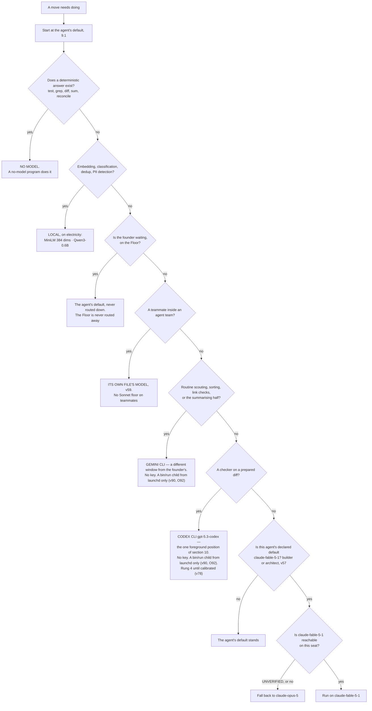

---

### 9.3 The three windows, and what each publishes

**(NEW, v22: this replaces FINAL §5.1's single five-hour fuse. There are two Anthropic windows, not one.)**

| Window | Published quota | Confidence |
|---|---|---|
| **Anthropic subscription** | **No numeric quota is published on any page fetched.** Two windows exist — a rolling five-hour **and a weekly** — *"per-seat"*, and the allowance is *"shared with Claude chat and Cowork"*. Magnitudes are relative only: Pro *"at least 5x more usage per 5-hour session than Free"*; Max *"5x"* and *"20x more usage than Pro"*. **The Max 20x price is UNVERIFIED** — the pricing page rendered *"From $100 per month"* for both Max tiers | H on the windows. The absence of numbers is itself the finding |
| **OpenAI Codex** | **The only vendor of the three publishing numeric per-window quotas.** Per 5-hour rolling window: GPT-6 Astra 5–45 (Plus) / 25–225 (Pro 5x) / 100–900 (Pro 20x); GPT-5.6 Sol 10–100 / 50–500 / 200–2,000; GPT-5.6 Luna 250–2,000 / 1,250–10,000 / 5,000–40,000. *"GPT-5.6 usage averages 5-30 credits per message"* | H. **Caveat:** `gpt-5.3-codex` appears in the API price list and in **no** plan quota row |
| **Gemini CLI** | Free tier: **60 requests/min, 1,000 requests/day** with a personal Google account. Paid AI Pro / Ultra / Code Assist per-tier CLI quotas **UNVERIFIED** — not fetched | H free, unverified paid |

**(NEW: the consequence for the reserve, and it changes FINAL §5.1.)** FINAL held a reserve **per window** where
"window" meant the five-hour fuse. With a weekly window in the same seat, the reserve is **per window and per
week**, and **a weekly exhaustion is a different event from a five-hour one** — the five-hour one ends in hours, the
weekly one does not. A design that holds one reserve holds the wrong one on the day it matters.

**(NEW: only one of the three can be budgeted in advance from published figures.)** Codex's window can. Anthropic's
capacity is measurable only from an account, so **any Anthropic window figure in this system is a measurement, never
a plan input.**

---

### 9.4 The two limit shapes, which behave differently

**(NEW: this is the distinction the Watch has to make, and getting it backwards stops a crew that did not need to
stop.)** Quoted from the vendor's costs page:

- **A seat limit** — *"You've hit your session limit"* or *"You've hit your weekly limit"* — is *"shared across all
  models, so the developer can't restore access by switching models with `/model`."* **This is a stop.**
- **A model-family limit** — *"You've hit your Opus limit"* or *"your Sonnet limit"* — and *"switching to a model
  outside that family with `/model` does keep the developer working."* **This is a reroute.**

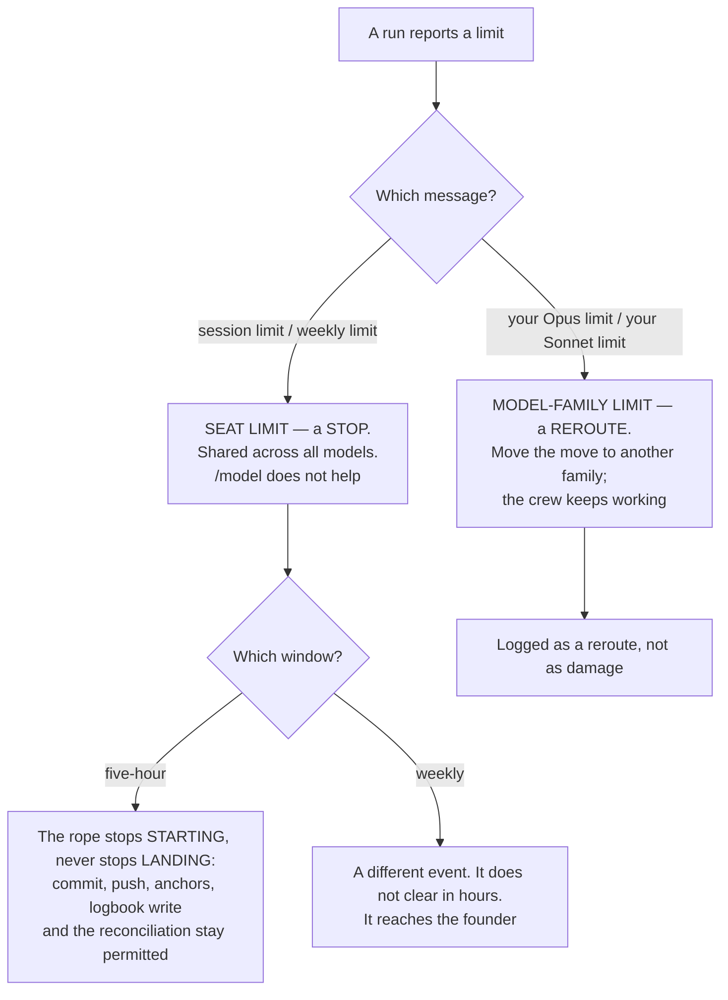

**(FINAL §15.4, surviving unchanged and now load-bearing for both shapes.)** *The rope stops starting, never stops
landing.* At a fraction of a window new work stops; commit, push, the anchors, the logbook write and the
reconciliation stay permitted.

---

### 9.4a When a family is limited, unreachable or wrong — v78

**(FOUNDER, rethink 2026-09-06: D13 → v78.)** 9.4 says a family limit is a **reroute** and never says **where the
reroute goes**. Because Codex is one foreground slot (§10.2) and Gemini is scout-only, **a seat-limit stop stops the
whole company**, and a reroute with no rule silently trades correctness for availability. Four things, decided
together:

| The rule | What it is | Mechanism |
|---|---|---|
| **A three-deep `fallback:` per agent, ending in *stop and stage*** | the last rung is not another model — it is the run halting and leaving its work staged for the founder | one frontmatter field × fifteen files, **composed by `bin/run` from `roster.yml` into `--fallback-model a,b` for the same-family links** (amended 2026-09-06: O89) — **ABSENT**; the flag ships (W35) |
| **A cross-family reroute is recorded as a rung demotion** | unless that family has passed the rehearsal for that **move class**, its output is rung 4 and says so | the rung field on the handover (§11.2), **written by the `PreModelSwitch` hook as a `model.switch` row** (amended 2026-09-06: O89) — **ABSENT** |
| **A `class: calibration` rehearsal set that is never edited** | an instrument refreshed by the rule that refreshes its subject cannot detect drift | a `class:` field on a rehearsal case (§7.2a, §11.10) — **ABSENT** |
| **One provider-outage drill, with the primary family denied at the launcher** | a fallback nobody has run is a design, not a fallback | one deny switch in `bin/run`, **which also takes `--deny-carrier claude`** (amended 2026-09-06: O120 · v105) — **ABSENT** |

**(NEW: O89 — the chain rides a shipped flag, and the flag alone is the silent reroute v78 forbids.)** (THINKER: A8)
`--fallback-model a,b` is in `claude --help` 2.1.263 (W35): it retries the primary and reroutes on availability, and
the plan mentioned it zero times. Refusing it forfeits the vendor's retry; passing it unannotated is the reroute this
row refuses. So the chain has **two carriers and one source**: `bin/run` composes the **same-family links** from
`roster.yml`'s `fallback:` into `--fallback-model`, and a **`PreModelSwitch` hook in the child's `--settings`** (O87,
§12.6) writes a `model.switch` row carrying the rung demotion and **blocks** a switch to a family unrehearsed for the
move class. The **cross-family link and *stop and stage***, which the flag cannot express, stay with `bin/run` between
runs, where the handover records `maker_model` (O7). **Losing image:** refuse the flag. `wins_if:` the hook does not
fire under `-p` — then the launcher does every reroute. **Settled by:** dispatch with an invalid primary id; the
handover's `maker_model` and the `model.switch` row agree, and the rung fell. Path: `bin/run` · the child's
`--settings` — **ABSENT**; the flag and the hook event ship.

**(NEW: O120 · v105 — platform risk is a carrier, and the drill runs once with the Claude carrier denied.)**
(THINKER: C12 · FACT: world.md 12) Fifteen agents, the Floor, page 2, `/goal` and the Operator are Claude Code, and
page 2 stands on a feature repaired four times and never promoted. So the trust score gains a **carrier dimension**
beside O26's model dimension; `bin/run`'s deny switch takes **`--deny-carrier claude`** as well as a family; v78's
drill runs **once with the Claude carrier denied**; **one wave-one Gemini argv is exercised before `AGENTS2`**; and
every kernel store is readable by `-p` from any provider. §21.2 scores the drilled night. **Losing image:** one
vendor, exercised. `wins_if:` a year with no terms change, no seat change and no teams regression. Path: `bin/run` ·
the trust store — **ABSENT**.

**The demotion clause is the load-bearing half, and it is what makes this different from a retry list.** A fallback
chain alone answers *can the work continue*; it does not answer *is the answer still worth what the first answer
was worth*. Rerouting `builder` from Fable 5.1 to Sonnet 5 mid-build buys availability, and the price is paid in a
place nothing measures unless the demotion is written down. **A reroute that says out loud what it bought is the
whole cost of this row.**

**(FACT: world.md 19 — the version floor that gated this is stale.)** v32's Codex rehearsal is specified as
~~*"version ≥ 0.124.0"*~~ **the installed version, recorded** (moved 2026-09-06: W19) — Codex is at **0.153.4
(2026-09-04)**, twenty-nine minor versions on, so the floor is satisfied by anything installed and no longer
discriminates. §10.8 carries the restatement; O35 is what records the version and its hash at admission.

**The cost, once:** one drilled night. **Settled by:** the drill's completion count against a normal night, and
whether calibration results move when a model id changes. **This moves v22 and §11.10** and reverses neither.

---

### 9.4b The second family without a key — v90

**(FOUNDER, fixer round 2026-09-06: E7 · v90 · `class: originated`.)** *"no keys, codex and gemini cli use."* This
overrules the strategist's row 17a and the outsider's Q4, both of which decoupled a checker-family API key from the
Anthropic terms question; **§I row 17 closes as *no keys***, and the metered economics — batch at 50%, no weekly
window — are §J 74. **The second family is the Gemini CLI on a personal Google account (free tier, 9.3) and the
Codex CLI once installed, both only as `bin/run` children from the launchd context** (O92), and routing between
families is v78's rule: a cross-family verdict is a rung demotion until that family passes the move class's
`class: calibration` set, and R11's twenty-five paired checks measure what the family buys.

**Why the carrier is launchd and not a shell — a measurement, not a preference.** (THINKER: A9 · W37)
`gemini --version` under the live sandbox returns `EPERM` on `~/.gemini/settings.json`, and `~/.gemini`, `~/.codex`
and `~/.config/openai` are denied reads — so **the second family cannot start from any Claude-hosted shell**, and a
Gemini subagent inside a session reads as a broken install. The real `denyRead` list is `keel/host/denyread.yml`
(§15's, O92); `bin/probe` asserts it **from both contexts**: `EPERM` inside, exit 0 from launchd. **Losing image:**
Gemini callable from any shell. `wins_if:` `denyRead` becomes narrowable per invocation.

**What the row does not do.** It does not put Gemini on every diff now — that is **§J 88**; v78 governs, and
`reviewer` and `challenger` reach rung 2 on a move class only once Gemini passes its calibration set (§11.3). And
**R40** reads Google's terms raw, because the personal-account CLI is now a live route with no key alternative (9.10).
**The cost, once:** the free tier's 1,000 requests a day is the second family's whole daily count. Path:
`keel/host/denyread.yml` · `bin/probe` — **ABSENT**; the CLIs ship (W37).

---

### 9.5 Cache facts that bind

**(FINAL §14.5, confirmed verbatim and found to be broader than it stated.)** **89% of the historical bill on this
machine was context** — cache reads 57%, writes 32%, output 11% — so *what does this run need to know* and *what
does this system cost* are the same question.

| Fact, quoted from the vendor 2026-09-05 | What it binds |
|---|---|
| *"Cache hits and refreshes on Claude Fable 5.1 and Claude Mythos 5.1 are priced at 0.025x the base input price. All other models use the standard 0.1x multiplier."* | the whole of v57, and the corrected formula in 9.6 |
| *"5-minute cache write \| 1.25x base input price"*; *"1-hour cache write \| 2x base input price"* | the write coefficient is a function of the TTL bought, not a constant |
| *"The lifetime is an hour on a subscription and drops to five minutes once you're drawing on usage credits; on an API key or cloud provider, it's five minutes by default."* | **broader than FINAL stated**: three conditions shorten it, not one. It shortens **twelvefold at the moment the account crosses into overage**, which is exactly when the machine is busiest |
| *"a 50% discount on both input and output tokens"*, and *"Batch API and prompt caching discounts can be combined"* | batch still needs a metered key; the row is ready for the day one exists |

**(FINAL §14.5, surviving.)** Because the cache is invalidated by any change to the stable prefix **including the
tool definitions**, a bespoke grant per run would pay the cache-write share of the bill forever. So the standing
prompts are **byte-identical and carry no timestamp**, and the shapes are a closed set. Two shipped flags stabilise
the prefix and neither is used yet: `--exclude-dynamic-system-prompt-sections` and `--system-prompt-snapshot on`.

**(NEW: the meter cannot come from `/usage`.)** *"`/usage` reports the cache hit rate for the main conversation
only"*, so the meter reads each run's own reported token fields, joined by the id minted at dispatch.

**(NEW: O39 — hash the standing prefix at dispatch, and turn on the two flags that stabilise it.)** The paragraph
above states a rule — the standing prompts are byte-identical and carry no timestamp — with **nothing that checks
it**. A hit rate answers the question a day late and on a bill: it says the cache missed, not **what changed**.
**So `bin/run` (ABSENT) hashes the standing prefix — system prompt, tool definitions, skill metadata — records the
hash on the dispatch row, and treats a change as an event.** A hit rate is a lagging indicator on a bill; a prefix
hash is a leading indicator on a dispatch, and it names the culprit in the same row. The two shipped flags named
above, `--exclude-dynamic-system-prompt-sections` and `--system-prompt-snapshot on`, are turned on in the same
change: they are what make the prefix stable enough for the hash to mean anything. **The cost, once:** one sha256
per dispatch.

**(R7, OPEN — it is the premise under v57 and under 9.6's formula.)** What is the **cache-read share per dispatch
shape**, and do those two flags move it? **Source class:** ten real moves per shape, read from **each run's own
token fields**, never from `/usage`. **What it decides:** whether the 89% figure this section leans on holds for
*our* shapes, and it is the same assumption on which two competent reviewers priced this machine's predecessor and
**diverged tenfold** (9.6). Also gains 7.6a's budget a denominator: skill metadata is part of the prefix being
hashed.

**(FACT: world.md 4 — W4. Four of the numbers this section says are computed are now emitted as structured
fields.)** The vendor ships a per-session **`prompt_cache` object** for status-line scripts (*"hit ratio, misses,
tokens re-cached, warm/cold"*), a **`rate_limits.spend_limit`** status-line field with a Spend limit bar in
`/usage`, a **per-loop `/usage` breakdown** (run count, total tokens, tokens per run, last run), and a
**`modelPricing` managed setting** that makes `/cost`, the status line and telemetry use contracted rates instead
of list price. **Read one at a time, they change what the meter does rather than what it means:** a number this
plan says to compute from the event log can now be *read* where the vendor emits it, and computing it anyway is a
second implementation of a vendor's own arithmetic. The `prompt_cache` object is per session and does not replace
R7's per-run token fields, which is the one place this fact does **not** reach. Page 3's use of these fields is
§14's, and `modelPricing` is what would make O8's `prices.yml` a fallback rather than the source on a contracted
account.

---

### 9.6 The cost formula, with its coefficients corrected

**(FINAL §15.3, and the correction is the reason this section inherits it rather than citing it.)** FINAL's formula
multiplied the standing prompt by **1.25** *while assuming the one-hour TTL* — **the wrong coefficient for the TTL
it assumes** — and used **0.10** for every sibling read, which is **wrong by 4x for Fable 5.1**.

```
cost per night ≈ standing_prompt_tokens × W(ttl) × base_input(model)          first run of a batch
               + standing_prompt_tokens × (siblings − 1) × R(model) × base_input(model)
               + divergence_tokens_per_run × siblings × base_input(model)
               + output_tokens × output_rate(model)

W(ttl) = 2.00   for the 1-hour TTL a subscription buys
       = 1.25   for the 5-minute TTL: an API key, a cloud provider, or a
                subscription once usage credits are drawn

R(model) = 0.100  for Opus 5, Sonnet 5, Haiku 4.5
         = 0.025  for Fable 5.1 and Mythos 5.1

Dominant term, by a distance: whether siblings hit the cache.
Fails if: shapes vary per run · the standing prompt is regenerated ·
          the TTL is shorter than the batch · or the account crosses into
          usage credits mid-batch, which shortens the TTL twelvefold.
```

**(NEW: contradiction 15 — this formula is carried twice with the same coefficients, and §9 owns it.)** §16.3
carried a duplicate of the block above. **Two implementations of one check disagree silently**, and this repository
has already paid for that class once. **The formula lives here and nowhere else.** §16.3 keeps only its
tenfold-divergence argument and cites 9.6 for the arithmetic (SYNTHESIS §7 deletion 20). If a coefficient below
changes, exactly one place changes.

Base input and the published absolutes both appear so either can be checked against the other:

| Model | Base in / out $/MTok | Cache read $/MTok | Cache write 5m / 1h | Context |
|---|---|---|---|---|
| Fable 5.1 (`claude-fable-5-1`) | 10 / 50 | **0.25** | 12.50 / 20 | 1M |
| Opus 5 (`claude-opus-5`) | 5 / 25 | 0.50 | 6.25 / 10 | 1M |
| Sonnet 5 (`claude-sonnet-5`) | 2 / 10 | 0.20 | 2.50 / 4 | 1M |
| Haiku 4.5 (`claude-haiku-4-5-20251001`) | 1 / 5 | 0.10 | 1.25 / 2 | 200K |
| `gpt-5.3-codex` | 1.75 / 14 | 0.175 | — | — |

**(FACT: world.md 1, 3 — the two rows above that a vendor moved, and both hold.)** **W1:** Fable 5.1 shipped as
`claude-fable-5-1`, *"1M context, $10/$50 per Mtok with $0.25/Mtok cache reads"* — the id, the context and the
0.025x read in this table are **confirmed from the vendor's own changelog**, and v57's remaining UNVERIFIED is
narrower than it was: it is the **subscription seat**, not the model. **W3:** Sonnet 5's **$2/$10 is the standard
list price, not a limited-time promo** — *"Updated the `/model` picker and the bundled `claude-api` skill to show
Sonnet 5's $2/$10 per Mtok pricing as its standard list price rather than a limited-time promo"*. Any promo caveat
on a Sonnet row anywhere in this plan is stale; there is none in this table, and this sentence is why.

**(NEW: O8 — a price is a fetched fact, so it carries an expiry and a stale row refuses to route.)** The table above
is prose, which means it rots exactly like every other fetched fact in this plan and nothing notices. **Every row
moves into `keel/shared/prices.yml` (ABSENT) with `fetched_at` and `valid_until`, and a stale row REFUSES ROUTING
rather than mis-pricing.** Refusing is the whole point: a wrong price does not fail, it produces a plausible number
that a ceiling is then computed from (§16), and nothing downstream can tell. **Gemini's quota is carried as a
count, not a price** — 60/min and 1,000/day — because it has no per-token figure and a zero would be read as free.
This is the same rule §9.11 already states for model ids, applied to the number beside the id, and it is what
v81's `source:` and `valid_until` look like for this section.

**(NEW: O90 — the `Context` column becomes a `context:` field the launcher reads.)** (THINKER: A10) `--autocompact`
is on by default, so a long `-p` run is compacted by the runtime — the ACE collapse v24 forbids, where v24 cannot see
— at a 2x cache write on the next turn. `bin/run` sets **`--autocompact <context>` from `prices.yml`'s `context:`
column** (1,000,000 on Opus 5 and Fable 5.1; 200,000 on Haiku 4.5), so a run ends at `maxTurns` or its ceiling
**before it can compact**; `PreCompact` writes `run.compacted` where it fires, and **R32** asks whether it fires under
`-p`. **Losing image:** let it compact and log it. `wins_if:` R32 shows the event fires and the write spike is small.
Path: `bin/run` · `prices.yml` — **ABSENT**; the flag ships (W35). §6 owns the run's ceiling.

**(NEW: this is the quantitative backing for v57, and it is the one number that changes an instinct.)** List price
runs **10x in and 10x out** from Haiku 4.5 to Fable 5.1 — but **Fable's cache reads are only 2.5x Haiku's**. On the
cache-dominated workload FINAL §14.5 measured at 89% context, the model spread collapses. **A long-horizon build
with a large standing context is the one move where the top model is not priced like the top model.**

**(FINAL §15.3, surviving.)** Two competent reviewers priced this machine's predecessor within days of each other
and **diverged tenfold**, on one assumption: the cache hit rate. This plan still does not pick a number. It says
what determines it, and **ten real moves against the runner's own reported cost** is the first thing measured before
any estimate is believed.

**(NEW: the only vendor cost anchor that exists is per developer-day, not per task.)** *"$13 per developer per
active day and $150-250 per developer per month, with costs remaining below $30 per active day for 90% of users."*
Every cost-per-task figure in circulation is third-party, confidence L, and **is not used to route**.

---

### 9.7 The tokenizer discontinuity

**(NEW: it crosses our own model list, so it is not a vendor curiosity.)** *"Claude 4.7 and later models and Claude
Mythos Preview use a newer tokenizer … This tokenizer produces approximately 30% more tokens for the same text."*
Opus 5 and Fable 5.x are on it; **Sonnet 4.6 and earlier are not.**

**Consequence, stated once:** **any token budget inherited from a Sonnet-4.6-era measurement understates by about
that much on the current engines.** This system carries several such budgets — the context caps, the handoff ceiling,
the session-start payload budget. They are not adjusted here by arithmetic, because an adjusted guess is still a
guess; **they are re-measured, and until they are, every one of them is marked as measured on the old tokenizer.**

**(NEW: O77 — a mark is not a mechanism, so every ceiling names its tokenizer.)** Marking a budget *measured on the
old tokenizer* tells a reader something and tells the launcher nothing. **Every ceiling carries `tokenizer:`, and
`bin/run` (ABSENT) refuses to enforce a legacy cap on a current-tokenizer model.** The failure this prevents is the
one worth naming: a ceiling that fires ~30% early produces a run that stops mid-work with no error, and **a ceiling
that fires early is indistinguishable from a stuck run** — the same silent-empty-result shape §10.2 refuses in
Codex, arriving through our own arithmetic. **The cost, once:** one field per ceiling and one comparison at
dispatch.

**(NEW: O115 — the first ceiling this rule bites is the window gauge's seed.)** (THINKER: A12 · W39) §16 seeds
`keel/logbook/window-highwater.yml` from `budget-guard.js`'s baseline — **peak 1,961,285 output tokens in any rolling
five hours over 99 transcripts** — with `seed: true` and **`tokenizer: sonnet-4.6-era`**. A ceiling against that seed
is a legacy cap until the first observed week replaces it. §16 owns the file.

---

### 9.8 Haiku 4.5 retires, and what that does to the cheap tier

**(NEW, v20.)** Haiku 4.5's retirement is committed *"Not sooner than October 15, 2026"* — **the nearest retirement
date of any model this system names**, against Sonnet 5's *"June 30, 2027"*, Opus 5's *"July 24, 2027"* and Fable
5.1's *"Not sooner than September 1, 2027"*. It is also **the only Haiku in the published table**, so there is no
successor to move to inside the family.

**So no agent's default is Haiku.** The two places the vendor sets it are `/goal`'s evaluator and the auto-mode
classifier, and `ANTHROPIC_DEFAULT_HAIKU_MODEL` is the one lever that moves them.

**(FOUNDER, v58: the lever is pulled now, not on the retirement date.)** *"Set ANTHROPIC_DEFAULT_HAIKU_MODEL to
Sonnet 5 now."* So the env var is `claude-sonnet-5` from the first launch, and nothing of ours depends on Haiku 4.5
before 2026-10-15 rather than at it. **The trap in the lever is unchanged and is the reason the cost is worth
stating: it changes the small fast model *everywhere* it is used**, not only for `/goal`. **The cost, once:** every
goal check and every auto-mode classification is priced at Sonnet's base input rather than Haiku's — 2 against 1
per MTok in, 10 against 5 out (9.6) — on a call that happens after every turn of a `/goal` run. That is the price of
not being surprised by a retirement, and the founder chose to pay it now. **Mechanism:** the variable is set in the
launcher's environment — `bin/run` (**ABSENT**) — and in the managed settings file's `env` block if it carries one,
so a run cannot be started without it; a value set only in a shell profile would bind the founder's terminal and
not the night.

**(NEW: FINAL §16.7's *"local models: no shape"* is read as *no shape*, not as *no work*.)** The genuinely cheap
work — embeddings, classification, dedup, PII detection, first-pass ranking — goes to **local models on
electricity**, which have no window, no retirement date and no vendor. That is a stronger position than a cheap
tier, not a weaker one.

**Owner:** the founder, and **row 3 of section 20 is decided rather than open** — v58 answered it. **Mechanism:** the
env var above, plus model ids carrying an expiry in the facts store that the store check fails a stale one against —
**ABSENT**.

---

### 9.9 The lint blocker, and it must be fixed in the same change that writes an agent file

**(NEW: measured on branch `ceo-1-1788609834`.)** `scripts/prompt-standard.test.mjs` **EXISTS** and pins the valid
model set. Grepping it today returns `claude-opus-5`, `claude-sonnet-5`, `claude-fable-5`, `claude-haiku-4-5` — and
`claude-sonnet-4-6`. **`claude-fable-5-1` is not in it.**

Two facts collide:

- **The declared default of `builder` and `architect` is `claude-fable-5-1`** (v57, 9.1) — no longer an escalation
  that might never fire, but the `model:` field of the first two agent files anyone writes.
- `claude-fable-5` is listed by the vendor today under *"Legacy models (still available)"*, and its cache read is
  **1.00** against Fable 5.1's **0.25** — so the pinned id is not merely older, it **prices four times higher on the
  exact term v57 is spending for**.

**An agent file written to 9.1 fails a blocking lint today.** The fix is one entry in the pinned set and it belongs
in the same change that writes the first agent file, not in a follow-up — because a follow-up means the roster lands
red, and a red roster is a roster nobody trusts the lint on. **(FOUNDER, v57 makes this sharper than it was:** the
lint cannot be deferred to whenever the escalation first fires, because the very first two files carry the id.**)**

---

### 9.10 The terms question, stated once and not re-opened

**(NEW: the automation question and the no-metered-key choice are one question, not two.)** Anthropic's Consumer
Terms prohibit *"Except when you are accessing our Services via an Anthropic API Key or where we otherwise
explicitly permit it, to access the Services through automated or non-human means, whether through a bot, script, or
otherwise."*

**The carve-out is an API key. The escape hatch is *"where we otherwise explicitly permit it"*** — which Anthropic's
own shipped and documented features exercise: `-p`, `--max-budget-usd`, `/loop`, Routines, Remote Control, agent
teams. **Where a third-party program drives a subscription seat, that clause is the governing text, and nothing
narrowing it was found.** Confidence on the quote: high. Confidence on the interpretation: low.

**OpenAI's terms returned HTTP 403 and are unread. ~~Google's were not fetched.~~** Google's are unfetched, **and
since E7 (v90) routes the second family through the Gemini CLI on a personal account, that reading now gates a
live route — R40** (amended 2026-09-06: E7 · v90). So two thirds of this question has no text behind it at all,
and one of those thirds is on the critical path of every cross-family verdict.

It is a **founder decision after one reading**, it is section 20 row 1, and this section does not argue either side
further. What it does record is the shape of the downside: the thing at risk is the account, and the account is the
company's whole capacity.

**(FOUNDER, fixer round 2026-09-06: E7 · v90 — §I row 17 is CLOSED: *no keys*.)** The metered design stays a losing
image with a falsifier — §J 74, `wins_if:` O116's shadow-subsidy line exceeds N× the seat price, the vendor narrows
the terms, or R40 finds the CLI route refused. Row 1 stays open by the founder's word; §20 carries both rows.

---

### 9.11 What enforces this section

| Rule | Mechanism | State |
|---|---|---|
| Each agent has one declared default model | `model:` in the agent file's frontmatter | **ABSENT** (fifteen files); the format is read by the runtime today |
| A brief cannot name an unrecognised model | `scripts/prompt-standard.test.mjs` — blocking | **EXISTS**, branch `ceo-1-1788609834`; **needs `claude-fable-5-1` added** (9.9), and v57 makes that the first two agent files rather than a later escalation |
| The small fast model is Sonnet 5, not Haiku 4.5 | `ANTHROPIC_DEFAULT_HAIKU_MODEL=claude-sonnet-5` in the launcher's environment, and in the managed file's `env` if it carries one (v58) | **ABSENT** — `bin/run` does not exist; the variable itself is shipped and documented |
| A teammate runs on its own file's model | the teammate is a full session started from an agent file; `bin/run` names the file, never a model (v59) | **ABSENT** — teams are on (`CLAUDE_CODE_EXPERIMENTAL_AGENT_TEAMS=1`), the launcher is not built |
| A run's cost is measured, never estimated | each run's own reported cost fields, joined by the dispatch id | **ABSENT** — the event log on this branch is the spine |
| A stall cannot run forever | `--max-budget-usd`; subagent spend counts toward it; overflow fails a spawn with `Budget limit reached` | **shipped** (v2.1.217+). **It is not a billing control** — print mode only, computed locally at list price, and *"the session cost figure isn't relevant for billing purposes"* for subscribers (v23). **(FACT: world.md 5 — W5)** the estimate now includes the *"1.1× US-only-inference premium for data-residency workspaces"*: still local, now with a residency multiplier |
| **Each agent declares a three-deep `fallback:` ending in stop-and-stage** (v78) | one frontmatter field × fifteen files; `bin/run` reads it and **composes the same-family links into `--fallback-model a,b`** (O89) | **ABSENT**; the flag **ships** (W35) |
| **A cross-family reroute is recorded as a rung demotion unless rehearsed for that move class** (v78) | the rung field on the handover; the `class: calibration` set that is never edited; **`PreModelSwitch` in the child's `--settings` writes `model.switch` with the demotion and blocks an unrehearsed family** (O89) | **ABSENT**; the hook event **ships**. `wins_if:` it does not fire under `-p` |
| **Cross-family and stop-and-stage happen between runs, never inside the flag** (O89) | `bin/run`, with the handover's `maker_model` (O7) | **ABSENT** |
| **The fallback has been run at least once** (v78) | one provider-outage drill with the primary family denied at the launcher | **ABSENT** |
| **The second family is a CLI, never a key** (v90, E7) | the Gemini CLI on a personal Google account and the Codex CLI, both only as `bin/run` children from launchd; `keel/host/denyread.yml` holds the real list and `bin/probe` asserts it from both contexts (O92) | **ABSENT**; the CLIs ship; `gemini --version` measured `EPERM` under the sandbox (W37). **R40** reads Google's terms |
| **A cross-family verdict is rung 4 until calibrated** (v90 → v78) | the calibration set per move class; R11 measures the family's yield | **ABSENT** |
| **The Claude carrier can be denied and the company drilled without it** (O120, v105) | `--deny-carrier claude` on `bin/run`'s deny switch; a carrier dimension on the trust score; one wave-one Gemini argv exercised before `AGENTS2` | **ABSENT** |
| **A run cannot be compacted by the runtime** (O90) | `--autocompact <context>` from `prices.yml`'s `context:` column; `PreCompact` writes `run.compacted` | **ABSENT**; the flag ships. **R32** asks whether the hook fires under `-p` |
| **A legacy-tokenizer seed is marked as one** (O115 with O77) | `tokenizer: sonnet-4.6-era` on `keel/logbook/window-highwater.yml`'s seed, from `budget-guard.js`'s baseline (W39) | **ABSENT** — the file is §16's; the baseline **EXISTS** |
| **Routing is generated, never authored three times** (O5, contradiction 17) | `keel/shared/routing.yml` generates §B.2, §C.1 and 9.2 | **ABSENT** |
| **A stale price refuses to route** (O8) | `keel/shared/prices.yml` with `fetched_at` and `valid_until` per row; Gemini carried as a quota count, not a price | **ABSENT** — the table in 9.6 is prose today |
| **The standing prefix is hashed at dispatch and a change is an event** (O39) | `bin/run`, with `--exclude-dynamic-system-prompt-sections` and `--system-prompt-snapshot on` | `bin/run` **ABSENT**; both flags **shipped and unused**. **R7** measures whether they move the share |
| **A ceiling is never enforced against the wrong tokenizer** (O77) | `tokenizer:` on every ceiling; `bin/run` refuses a legacy cap on a current-tokenizer model | **ABSENT** |
| **A model switch can be refused** (W17) | `PreModelSwitch` — a blocking hook event | **shipped by the runtime**; ~~used by no row~~ **used by O89** (amended 2026-09-06); §12.6a owns how it is registered |
| A reserve is held per window **and** per week | a founder-set slider, and a weekly line reporting how often it was needed against how often it expired unused | **ABSENT** |
| The Watch distinguishes a stop from a reroute | the message-shape test of 9.4 | **ABSENT** |
| Model ids expire rather than rot | an expiry in the facts store; the store check fails a stale one | **ABSENT** |
| A model with no entry in the price table is refused | FINAL §15.4's rule: refused, **not scored at zero** | **ABSENT** |

**(NEW: O105 — every mechanism above carries `class:` and `vendor_wins_if:` in `rules.yml`, and this table is
rendered from it once O106's renderer exists.)** O89, O90, O92, O115 and O8 are **adapters** over `--fallback-model`,
`--autocompact`, the two CLIs, `rate_limits` and `modelPricing`; a matched `vendor_wins_if:` forces Delete (v96). O120
and v78's calibration set are **kernel · truth**. §17.5 carries the adapter table.

---

## 10 · Codex and Claude Code, from day one

*obeys: v5, v11, v12, v32 (SPINE §H entire), **v56** (the cloud lane, 10.2a), **v67, v78** (the rethink round of
2026-09-06, carried in 10.8), and **v90, v92** with **O87, O88, O89, O90, O91, O92, O120, O121** (the fixer round of
2026-09-06, DECISIONS §24; §H.4 amended, §H.5's Gemini hole filled); inherits: FINAL §1 row 30 as the losing image,
§16.7, §14.6*

**(FOUNDER, overruling FINAL §1 row 30.)** *"I run from day one of the system to include codex and Claude code in
the system. So we will need to understand how we are doing it. If you're walking straight from codex, or straight
from Claude Claude. or we will find a solution to all of this."* And: *"I think we need to work with loops and goals
and they features the codex and Claude Code has in order to achieve the best results we can."*

FINAL's *"Codex admitted only after a headless rehearsal passes"* is the losing image and is kept by name in
section 22. **What survives from it is the rehearsal itself** — it stops being the admission gate for Codex's
existence in the system, and becomes the gate on **how wide** Codex's position is.

---

### 10.1 The four options, and the one chosen

**(NEW: each option is judged against a measured defect rather than a preference.)**

| Option | Verdict | Why |
|---|---|---|
| **Claude Code drives Codex from Bash** | **rejected as the primary shape** | it is exactly the shape openai/codex#19945 breaks — no controlling TTY plus a non-trivial prompt — and the `script -qfc` cure is, in the reporter's own words, *"incompatible with normal background / parallel job execution"*, which is what a crew is |
| **Codex drives Claude** | **rejected** | no documented mechanism in either direction, and Codex is not installed. The receiving surface is documented; the pairing is not |
| **A third program drives both** | **CHOSEN** | each vendor documents a headless invocation, a session id, resume, an instructions file, a SKILL.md bundle and MCP. A provider outage or a defect becomes a **routing change, not a rewrite**. It is also the only shape that keeps v34 true — **one thing composes argv** |
| **Hybrid** | **folded in** | the Floor is interactive Claude Code and always was; the founder may run Codex by hand there. That is the hybrid, and it needs no mechanism |

**(NEW: the chosen shape is a consequence of v34, not a taste.)** If two things compose argv, two things define what
a run may touch, and the guarantee that a checker cannot edit what it judges becomes an agreement between them. One
launcher is what makes the grant checkable by a probe.

**(FINAL §14.6, and it is the constraint the launcher exists to absorb.)** *"the capability layer is close to
neutral and the policy layer is not. The shapes are portable; the guarantees are not."* Every runtime has a headless
invocation, a session id, an instructions file, a SKILL.md bundle, MCP, a working directory as the confinement unit
and a git worktree as the isolation unit. **Only the policy tier differs**: Anthropic's managed settings outrank
argv; **OpenAI's `requirements.toml` outranks every flag** (FINAL §14.6, not re-read this session); Google has a Policy Engine (FINAL §14.6, providers lane 2026-09-04).

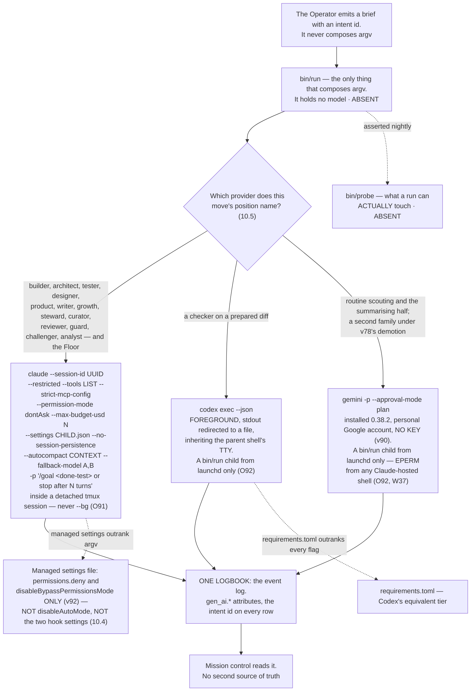

---

### 10.2 Codex's position on day one, and the test that widens it

**(FOUNDER: day one. NEW: the position is narrow because a measured defect makes it narrow, not because Codex is
distrusted.)**

**Day one: `codex exec` as a checker on a prepared diff**, run in the **foreground with stdout redirected to a file
while inheriting the parent shell's TTY** — the second documented workaround, which does not need `script -qfc`.

**The cost, stated once and not re-litigated: one foreground slot is not parallel, so Codex is not a night lane
yet.** That is the whole price of admitting it on day one, and it buys a second model family on the one move where
family independence pays for itself.

**(NEW, from research/cloud.md part 5 item 2: that cost governs the LOCAL `codex exec`, and it does not reach a cloud
task.)** #19945 is a defect of local `codex exec` with stdio detached from a TTY, so it cannot apply to work running
in OpenAI's hosted sandbox. Whether a *local dispatcher* hits it while minting a cloud task depends on whether
`codex cloud exec` shares the local exec code path, and that is **UNKNOWN**. The hosted lane is 10.2a, and it is a
different lane with a different position.

**openai/codex#19945, read 2026-09-05:** *"codex exec silently crashes with no output when stdio is detached from
TTY (0.124.0+)"*, opened 2026-04-28, labels `CLI`, `bug`, `exec`. **Open 130 days with no comments and no
maintainer reply.** Mechanism: *"the process produces no error, no panic message, no log entry — just an empty
result."* Piping through `tee` or `tail` in a detached process group does **not** resolve it. **A silent empty
result is the worst failure shape there is** — a smoke test passes and the real workload returns nothing, which is
why the rehearsal must be headless or it proves nothing.

**The admission test that widens the position** — and it is specifiable from primary text now, which it was not when
FINAL was written:

| Condition | Value |
|---|---|
| Command | `codex exec --json` |
| TTY | **no controlling TTY** |
| Prompt | **non-trivial** — a smoke prompt does not exercise the defect |
| Version | ~~**≥ 0.124.0**~~ **the installed version, recorded** (moved 2026-09-06: W19 — Codex is at 0.153.4, so the old floor is satisfied by anything installed and discriminates nothing; §10.8) |
| Judged against | known-answer cases |

**Pass** and Codex becomes a night checker and a maker on mid-to-hard work. **Fail** and it stays in the foreground
slot. **The test is the plan, not the issue closing** — 130 days of silence is not a schedule.

**(NEW: this test is R10, and R10 is the hinge of the whole cross-model design.)** The table above is not one
open question among several — **v5, v32, v78, v82 and §I row 15 all read differently depending on its answer.**
Pass and rung 2 becomes parallel and a second family is a lane; fail and the second family is one foreground slot
forever, at 1/N availability. **(R26, OPEN)** is the cheap route to it *(mark added 2026-09-06 · challenge C
P3-2 — the hinge's cheapest route was the one open question carried nowhere as open)*: reading the unread Codex
June–August window would settle whether #19945 was fixed without installing anything. Both are stated in full at 10.8.

**(NEW: the prerequisite is a founder act.)** Codex is **not installed** on this machine. Installing it and running
the rehearsal is section 20 row 5. **(FOUNDER, fixer round 2026-09-06: E7 · v90 / O92.)** Once installed it runs
**only as a `bin/run` child from the launchd context, on the subscription, never a key** — `~/.codex` is a denied
read under the live sandbox (THINKER: A9 · W37), so a Codex child started from a Claude-hosted shell would fail the
way `gemini --version` measurably does, and the rehearsal itself must be run from launchd or it tests the sandbox
rather than #19945. 9.4b carries the row; §15's `keel/host/denyread.yml` carries the list.

---

### 10.2a The cloud lane — Codex off the Mac

**(FOUNDER, one answer of the interview of 2026-09-05, DECISIONS §15.)** *"When my Mac is not on, and then we need
to use not the regular Claude code or codex in terminal, then you can use codex or Gemini I think they don't bun
those. But still keep it open"* — clarified in the next round as **"Yes — a cloud lane for when the Mac is off"**, with
research on **Codex cloud tasks** and nothing else. That is v56, and it gives FINAL's *everything runs on the Mac* its
one stated exception (§15.1a).

**(NEW: what the lane found, and the position it supports is narrower than the founder's sentence.)** Every fact below
is from `research/cloud.md`, all URLs accessed 2026-09-05, with the confidence that lane marked — `H` documented and
quoted, `M` weaker, `L` inference. Nothing here was run.

**What a cloud task is.** Hosted, off this machine, and bound to a saved **environment** rather than to a command.
*"Run tasks in isolated cloud environments."* — and that sentence is the entire vendor claim about the runtime:
**no container or sandbox technology is named on the page**, which is itself the finding.
<https://learn.chatgpt.com/docs/cloud> · H on the quote. Repository access is chosen once, per environment —
*"Connect GitHub or GitLab"*, and for GitHub you *"choose the repositories Codex can access"* · H. So is setup:
*"Configure any dependencies, tools, environment variables, or secrets the task needs."* · H — dependencies and
secrets are environment configuration, never per-task arguments. **How long one may run is documented nowhere the
lane reached — UNKNOWN**; the page distinguishes *"longer tasks"* as receiving *"dedicated environments"* and states
no maximum. What it produces is a summary and a diff, with the pull request an optional next step rather than the
default artifact: *"Review the summary and diff. Ask Codex to make follow-up changes, or open a pull request."* · H.
Newer pages call these *"cloud chats"* · M.

**The key negative finding, and it is what fixes the position.** **No OpenAI page the lane reached documents an HTTP
endpoint for creating a cloud task, and none prints a non-interactive CLI invocation for one.** The vendor CLI
reference describes the entry point as a browser: `codex cloud` lets you *"Browse active and completed chats, submit
work to a configured environment, and apply the result to your local repository from the terminal."*
<https://learn.chatgpt.com/docs/codex/cli> · H on the quote, H on the absence across the six pages fetched. A
non-interactive form does appear — `codex cloud exec --env ENV_ID "..."`, with `list --env ENV_ID --json`, `status`,
`diff` and `apply` — but **only inside an open feature request**: openai/codex#24777, created 2026-05-27, labels `CLI`
and `enhancement`, whose own complaint is this problem exactly, that automation *"currently has to open the
interactive `codex cloud` TUI or web UI, find an environment manually, copy an opaque ID, and paste it into
scripts."* <https://github.com/openai/codex/issues/24777> · **M, not H** — the author is not a confirmed maintainer,
no maintainer has replied, and the command list is their assertion about the binary rather than documentation.

**The one human-free path carrying vendor documentation is the pull-request trigger.** Manual: *"In a pull request
comment, mention `@codex review`. Wait for Codex to react (👀) and post a review."* Automatic, enabled in settings:
*"Codex will post a review whenever someone opens a new PR for review, without needing an `@codex review` comment"*,
which needs *"GitHub push or admin permission for its settings."* <https://learn.chatgpt.com/docs/third-party/github>
· H. **No label trigger is documented** — the lane looked and found none. Slack is the second documented trigger:
*"Mention `@Codex` and include your prompt."* <https://learn.chatgpt.com/docs/third-party/slack> · H. And one thing
that looks like this lane and is not: `openai/codex-action@v1` *"installs the Codex CLI, starts the Responses API
proxy when you provide an API key, and runs `codex exec`"* — that is CI compute on a GitHub runner against an API
key, **not OpenAI's hosted sandbox** · H. The distinction matters because the two are billed and governed
differently.

**Plans, quota and network.** Cloud chats are **not on Free or Go**, and the narrowest quote is the one to hold:
*"You need a Plus, Pro, Business, Enterprise, or Edu plan...a connected GitHub account, and at least one
environment."* <https://learn.chatgpt.com/docs/third-party/slack> · H. **No numeric cloud quota is published
anywhere.** The single sentence bearing on it is qualitative: *"Cloud chats on ChatGPT plans use GPT-5.6 Sol and may
use more of your allowance than local messages."* <https://learn.chatgpt.com/docs/pricing> · M. The numbers that page
does publish are per five-hour window for **local** messages and do not govern this lane. Network is the sharp fact,
and it is a default rather than a setting someone chose: *"By default, Codex blocks internet access during the agent
phase."* <https://learn.chatgpt.com/docs/cloud/internet-access> · H — with three allowlist presets (None · Common
dependencies · *"All (unrestricted)"*), set per environment, and an option to *"restrict network requests to `GET`,
`HEAD`, and `OPTIONS`"* · H. The same page names the vendor's own threat model, quoted because it reads as one:
*"Prompt injection from untrusted web content"*, *"Code or secret exfiltration"*, *"Downloading malware or vulnerable
dependencies"*, *"Pulling in content with license restrictions"* · H.

**Resume, cancel and poll — where the shape of the evidence matters more than the list.** Three read operations appear
in the same issue — `codex cloud status TASK_ID`, `codex cloud diff TASK_ID`, and `codex cloud list --env ENV_ID
--json`, whose `--json` is the flag a driver would need — so polling **appears** possible · M. `codex cloud apply
TASK_ID` is how a result would reach this Mac · M, corroborated without the command by the CLI page's *"apply the
result to your local repository from the terminal"* · H. **Blocking wait, log streaming, follow-up messaging and
structured output are absent**: they are what #24777 asks for, and a feature request is the firmer half of that
source · M to H. **Cancel is UNKNOWN** — no cancel command appears in either the existing list or the requested one,
and no vendor page mentions cancelling a cloud task. And `codex exec resume` is **not applicable until shown
otherwise**: that page is about local non-interactive sessions, the two surfaces use `SESSION_ID` and `TASK_ID`
throughout, and nothing connects them · M on the negative.

**The terms, and the refusal is the finding.** Every OpenAI policy URL refused the fetch —
`openai.com/policies/row-terms-of-use`, `.../eu-terms-of-use/` and `.../business-terms/`, all **HTTP 403**, which with
the prior lane's 403 on `.../terms-of-use` is **four refusals against one host across two dates**. The lane stopped at
three by its own rule and returned the gap rather than substituting a remembered clause. **The OpenAI half of §I row 1
is therefore UNKNOWN, and unread is not permissive.** What can be said factually is only this: OpenAI documents and
ships automation surfaces that run on a subscription rather than a key — the Slack app, the `@codex` mention, and
automatic review on PR open — and separately documents an API-key path billed at API pricing. **Documented product
behaviour is not a terms clause**, and reading it as one is exactly the substitution the lane refused · L on any
inference, H only on the fact that the features are documented. Anthropic's clause is already on file from the
runtimes lane and was not re-fetched: access *"through automated or non-human means"* is prohibited except via an API
key or *"where we otherwise explicitly permit it."*

**v56's position, stated once and not re-argued.**

| The lane | Verdict | Why |
|---|---|---|
| **Codex cloud as a PR reviewer** | **admitted** | `@codex review` is vendor-documented, needs no local Codex, and runs in OpenAI's sandbox — so it **sidesteps #19945 entirely**, that defect being local `codex exec` with stdio detached from a TTY |
| **Codex cloud as a maker** | **UNVERIFIED** | the only non-interactive creation path is issue-only (#24777, M). A night maker cannot rest on an unconfirmed assertion about a binary that is **not installed on this Mac** |
| **Which hosted lane may MAKE** | **the founder's — §I row 15, raised by v56 and open** | Anthropic's is the only fully documented driver today and costs no extra compute; it is also the **same seat as the Floor and the same terms clause as §I row 1**. Codex cloud is the founder's named preference and has no driver yet. Jules is a third family, and its API says of itself *"The Jules API is in an alpha release, which means it is experimental"* |

**The mechanism, orchestrator's and reopenable — and every part of it is ABSENT.**

| Rule | Mechanism | State |
|---|---|---|
| A hosted run never writes into the house directly | its output lands as a **pull request or a staged artifact**, which the Mac reconciles **on wake** | **ABSENT** |
| Minting a cloud task is not a run | `bin/run` gains a `cloud` carrier that **mints a task and records its id, and does nothing else** | **ABSENT** |
| A night's cloud work is read, not trusted | the Watch reads the pull requests on wake | **ABSENT** |

**(NEW: the cost, stated once and not re-litigated.)** The lane the founder named has **no documented driver today**,
and the lanes that do have one run on the Claude seat whose terms clause is the open question. Both halves of that
sentence are why §I row 15 exists rather than a decision. The losing image is kept by name in section 22: *the Mac as
the only runtime; Routines refused wholesale; Codex cloud as a full night maker on issue-only evidence* (§J.45).

---

### 10.3 Where `/goal` and `/loop` sit

**(NEW: `/goal` is the feature the founder's phrase points at, and it was absent from FINAL entirely.)**

**`/goal` sits on the run, and the done-test is the goal condition.** *"The `/goal` command sets a completion
condition and Claude keeps working toward it without you prompting each step. After each turn, a small fast model
checks whether the condition holds."* Three verdicts: **Not yet met · Met · Impossible**.

| Property | Value, quoted |
|---|---|
| Headless | *"Setting a goal with `-p` runs the loop to completion in a single invocation"* |
| Streaming | *"Add `--output-format stream-json --verbose` to emit each message as the loop runs"* |
| Condition limit | **4,000 characters** |
| Bounding it | *"include a turn or time clause in the condition, such as `or stop after 20 turns`"* |
| Terminates on | Met · Impossible · `/goal clear` · four unrecoverable errors (auth failure, exhausted credit balance, unclearable context overflow, unavailable model) |
| Survives | *"After any other failure, including transient errors such as rate limits and overloaded servers, Claude Code leaves the goal active"* |
| Deferral | evaluation is skipped while a subagent or background shell is running |
| Check-ins | *"In a non-interactive session, such as one started with `-p`, this is the only way Claude Code delivers check-ins"* |
| Evaluator | Haiku by default; `ANTHROPIC_DEFAULT_HAIKU_MODEL` changes it **everywhere the small fast model is used** |

**(NEW: leaving a goal active through a rate limit is exactly the behaviour a night wants**, and it is the reason
`/goal` and not a shell loop is the run-level primitive: a shell loop that re-invokes on a rate limit burns the
window it is waiting for.)

**`/loop` is refused in production and stays a Floor convenience.** *"Tasks are session-scoped: they live in the
current conversation and stop when you start a new one"*, with a **7-day expiry** and the hard limit *"Tasks only
fire while Claude Code is running and idle."* **A tier that requires a session already open cannot be the
always-on tier. The Watch is the loop.** The vendor's own three scheduling tiers make the trade explicit:

| Tier | Needs | Minimum interval | Local files |
|---|---|---|---|
| Cloud Routines | no machine, no open session | **1 hour** | **no** — a fresh clone |
| Desktop scheduled tasks | the machine on, no open session | 1 minute | yes |
| `/loop` | the machine on **and** a session open | 1 minute | yes; inherits the session's MCP servers and permission mode |

**(FINAL §16.7, standing.)** Routines stay **refused for the Watch** — cloud-only, cannot reach local files.

**Codex `/goal` is not used, and it is a gap line rather than a description** (SYNTHESIS §7 deletion 28, applied
2026-09-06). ~~Four sentences on its states, its two tracker items and its unestablished headless behaviour~~ — a
feature described at length reads as one relied upon, and this one is `C`-confidence off two 308-redirected sources
and is used by no row. **It survives as gap 1 of 10.6.**

---

### 10.4 The managed-settings collision, resolved

**(NEW: two design choices land in one file, and one of them silently kills the other.)** The managed settings file
is the tier a running process cannot clear — it is what makes the grant real rather than advisory. But **`/goal` is
a session-scoped prompt-based Stop hook**, and it is *"unavailable when `disableAllHooks` is `true` after settings
precedence applies, or when `allowManagedHooksOnly` is set in managed settings."* Locking hooks in the managed file
therefore removes the goal loop the founder asked for.

**Resolved, once, and repeated here because this is where a reader trips:**

| The managed file carries | The managed file does NOT carry |
|---|---|
| `permissions.deny` | `disableAllHooks` |
| `permissions.disableBypassPermissionsMode: "disable"` | `allowManagedHooksOnly` |
| ~~`disableAutoMode`~~ **struck** (amended 2026-09-06: E9 · v92) | `disableAutoMode` — the Floor keeps the founder's mode |

**(FOUNDER, fixer round 2026-09-06: E9 · v92 — *"Keep auto mode on the Floor"*.)** (THINKER: A3, A15) The founder
works in auto mode with the dangerous-mode prompt skipped; managed settings are machine-wide, so the file as v11
wrote it removed that mode from the founder's own hands, and §19 had priced the act at four lines of JSON without
pricing the Floor. Striking the key promotes nothing — the classifier is still not the envelope (§12.3). **Night
children run `dontAsk --restricted`, where auto mode is inert, with per-child `--settings <json>` on argv carrying
that child's hooks and denies** (O87; **R28** asks whether `--restricted` ignores `--settings` as it ignores the
settings files). §12.6 owns the file's contents; the table above is repeated here because this is where a reader
trips. **Losing image:** v11 as written. `wins_if:` the founder gives up auto mode on the Floor.

**The cost, stated once: a run can therefore register its own Stop hook.** That is a smaller hole than losing the
goal loop, and **the nightly probe is what keeps it a known hole rather than an unknown one**. Narrowing is carried
by `--restricted` plus an explicit `--tools` list, **which does not touch hooks** — so the narrowing and the goal
loop stop competing for the same file.

**(NEW: two facts make the permission bands binding rather than descriptive.)** Deny rules bind in **every** mode
including `bypassPermissions`, and a subagent's own `permissionMode` frontmatter **is ignored**, so a child cannot
widen its own grant. `auto` mode's classifier is a cheap guardrail against accident and **is not the envelope** —
it can be switched off, and nothing in it keys on reversibility.

---

### 10.5 What each runtime is documented to offer

**(NEW, from the runtimes research of 2026-09-05. `D` = documented and quoted; `C` = claimed, third-party. Nothing
in that lane was measured — no runtime was run.)**

| | Claude Code | Codex CLI |
|---|---|---|
| Installed here | **M** yes, 2.1.261 | **M** no |
| Headless | `-p`, text / json / stream-json | `codex exec`; *"streams progress to `stderr` and prints only the final agent message to `stdout`"*; `--json` emits `thread.started`, `turn.started`, `turn.completed`, `turn.failed`, `item.*` |
| Structured out | `--output-format`, `--output-schema` on the goal loop | `--output-schema`, `-o` / `--output-last-message` |
| Session and resume | `--session-id` *"must be a valid UUID"*; `--continue` | `codex exec resume --last` or `<SESSION_ID>` |
| Narrowing by argv | `--restricted` (v2.1.248+) *"removes the built-in tools that run commands or code, and WebFetch, unless you name them individually in `--tools`"*; `--strict-mcp-config`. **`--allowedTools` restricts nothing** | `--sandbox`, `--ignore-user-config`, `--ignore-rules`, `--skip-git-repo-check`, `--ephemeral`. **No per-tool flag.** `--full-auto` is **deprecated** — *"use `--sandbox workspace-write` instead"* |
| Sandbox axes | Seatbelt / bubblewrap, **Bash only**, filesystem and network layers | Seatbelt / Landlock; `approval_policy` × `sandbox_mode` — three modes, **network off by default** (FINAL §14.6, providers lane 2026-09-04) |
| Policy tier | **34 hook events, 10 documented as blocking** (`D`, medium — the fetch merged two lists, §15.6); managed settings outrank argv | **`requirements.toml` outranks every flag** (FINAL §14.6, providers lane 2026-09-04, not re-read this session) |
| Hooks, sharp edge | **PermissionRequest is non-blocking** — *"Exit code 2 isn't honored for this event and the permission flow proceeds unchanged. Deny through the `decision` object instead"* | hooks behind `codex_hooks = true` |
| Subagents | depth **3** default, **20** concurrent, *"Concurrent subagent limit reached"* on overflow. **`Workflow` is removed from all of them** — *"via the first filter applied to subagent tool sets"* | TOML files with their own sandbox mode |
| Teams | agent teams: a lead plus named teammates, each a full session. **Experimental, off by default; no nested teams; one team per session; `/resume` does not restore them; `-p` never forms a team.** *"approximately 7x more tokens … when teammates run in plan mode"* | none documented |
| Fleet view | `claude agents --json` prints active background sessions for scripting; *"Opening agent view requires an interactive terminal"* | none documented |
| Channels | *"A channel is an MCP server that pushes events into your running Claude Code session."* Research preview. Gated twice: *"Being in `.mcp.json` isn't enough … a server also has to be named in `--channels`"*. Anthropic auth only | none documented |
| Scheduling | three tiers (10.3), plus `ScheduleWakeup` and `Monitor` | *"Automations"*, or a shell loop around `codex exec` (`C`) |
| Goals | `/goal`, `D`, **headless-capable** | `/goal` 0.128+, `C`, **headless status unknown** |
| Per-run spend | `--max-budget-usd`; subagent spend counts toward it | included in every ChatGPT plan (FINAL §14.6, providers lane 2026-09-04) |
| Shared config | `CLAUDE.md`, `SKILL.md`, `.mcp.json`; imports Codex and Gemini config | `AGENTS.md`, `SKILL.md`, `config.toml`, `mcp_servers` |
| **Daemon** *(NEW: O91 — the row this table did not have; THINKER: A7 · W38; R31)* | **The vendor ships a supervisor.** `--bg` starts a daemon under `~/.claude/daemon/{control.key,dispatch,roster.json}` and `~/.claude/jobs/`; `daemon-auth-status.json` reads `auth_required`; it **idle-exits** — measured *"idle 5s with no clients — exiting … leases=0"* — and its lease semantics are unread (**R31**). Its paths are in this repo's own `denyRead` (O92). **So `bin/run` never mints via `--bg`: every night child is bare `claude -p` inside a detached tmux session — the pane, the process group (v67) and the session id are ours** — and O15's reconciler reads the daemon roster and `claude agents --json --all` **read-only**, as the vendor's view of anything the founder started by hand, never as the list of our runs. **`bin/supervise` is REFUSE until R31 answers** — two supervisors and one process table argue over the first orphan at 03:00. `wins_if:` the daemon documents a service mode that does not idle-exit and leases we can read (§J 85) | none documented |
| **Shipped flags this plan now names** *(NEW: W35 — `claude --help` 2.1.263 lists them; THINKER: A4, A8, A10, A15, A17)* | `--settings <json>` per child, carrying its hooks and denies (**O87**, R28) · `--agents <json>` **refused** by `bin/run` — one home for an agent file, v42 (O87) · `--no-session-persistence` on every night child; the `stream-json` trace is the record (**O88**) · `--autocompact <context>` from `prices.yml` (**O90**, §9.6) · `--fallback-model a,b` for the same-family links, with `PreModelSwitch` annotating (**O89**, §9.4a) · `--tmux=classic` for the worktree agents and `-w/--worktree` (**O121**, O14) · the probe attempts `claude agents --allow-dangerously-skip-permissions` and expects refusal (O87). **Gap 6 of 10.6 closes on the same measurement** | `--sandbox`, `--ephemeral`, `--json`, `--output-schema` as above |
| **Cloud lane** *(NEW, cloud.md parts 2 and 5 — the row this table did not have)* | **documented argv, not a UI.** `claude --cloud "<task>"`, where *"each session runs in an isolated, Anthropic-managed VM"* and *"The cloud VM clones your current directory's GitHub remote at your current branch, not your local checkout"*; follow up from any machine with `claude -p "your message" --cloud <session-id>`; pull the session back with `claude --teleport <session-id>`. **Routines add the thing Codex lacks, a fire endpoint**: `POST https://api.anthropic.com/v1/claude_code/routines/trig_.../fire`. Quota *"shares rate limits with all other Claude and Claude Code usage within your account"* | **a TUI, plus two chat triggers.** `codex cloud` is *"Browse active and completed chats, submit work to a configured environment, and apply the result to your local repository from the terminal"*; the human-free triggers are `@codex review` on a pull request and `@Codex` in Slack. **No endpoint and no printed non-interactive command** — `codex cloud exec` appears only in open issue #24777 (M). Internet off by default *"during the agent phase"*; Plus and above only |
| Second checker family | **no** — it cannot check itself | **yes, and narrower than "blocked" (cloud.md part 5 item 3).** The `@codex review` route needs no local Codex, so #19945 cannot reach it — it is admitted today (10.2a). What 10.2's test widens is the **local** foreground checker |

**(NEW: one trap worth naming, because it collides with a setting this repository plausibly wants.)** `Monitor` —
*"Runs a command in the background and feeds each output line back to Claude … Can also open a WebSocket and treat
each incoming message as an event"* — is *"not available when `DISABLE_TELEMETRY` or
`CLAUDE_CODE_DISABLE_NONESSENTIAL_TRAFFIC` is set."* A privacy setting silently removes a capability.

**(FINAL §16.7, re-decided against the roster.)** Which provider may stand which position:

| Provider | Which of the fifteen may run on it | Window | State today |
|---|---|---|---|
| **Claude Code** (subscription) | all fifteen, **and the Floor, always** | rolling five-hour **and weekly**, per seat, shared with Claude chat and Cowork | installed 2.1.261, measured |
| **Codex CLI** (subscription, **no key** — v90) | **`reviewer` and `guard` only, on a prepared diff, in the foreground.** Widens to `builder` on mid-to-hard work if 10.2's test passes. **A `bin/run` child from the launchd context only** (O92) | its own 5-hour window; the only one publishing numeric quotas | **not installed**; #19945 open; `~/.codex` a denied read under the sandbox (W37) |
| **Gemini CLI** (personal Google account, **no key** — v90) | **`scout`**, and the summarising half of `curator`; **and `reviewer` and `challenger` as the second family on a move class once Gemini passes that class's calibration set — rung 4 until then (v78, §11.3)**. One wave-one Gemini argv is exercised before `AGENTS2` (O120). **A `bin/run` child from the launchd context only, never from a Claude-hosted shell** (O92; amended 2026-09-06: E7) | 60 rpm / 1,000 rpd free on a personal account — the whole daily count of the second family, and the row says so (E7) | installed 0.38.2, ~~never authenticated~~ **authentication decided: personal account (§I row 6)**; `gemini --version` → `EPERM` under the live sandbox (THINKER: A9 · W37); Google's terms unread — **R40** gates the route |
| **Local models** | no agent — moves, not positions: embeddings, classification, dedup, PII detection | electricity | **ABSENT** |
| **Routines** (cloud) | **refused for the Watch** — it cannot reach anything this system stores on the Mac. **Read *no local files* narrowly (cloud.md part 5 item 5):** it is right about the laptop and wrong if read as *no repository* — a routine clones every selected repo per run and pushes `claude/`-prefixed branches | **1-hour minimum, now confirmed verbatim**: *"The minimum interval is one hour; expressions that run more frequently are rejected."* The **daily cap exists and is published as no number** — which supersedes this cell's earlier *unverified*, because what was unverified was the cap's existence and what is unknown is its size | exists; its **API fire endpoint is documented** (10.2a), and it is the documented off-Mac maker path — §I row 15 |

---

### 10.6 What the research could not establish

**(NEW: these are the ten gaps the runtimes lane named about itself. They are listed because a plan that hides its
own unknowns spends them later at a worse price.)**

1. **Codex `/goal` has no primary citation, is `C`-confidence, and is used by no row** — it exists at 0.128.0 with
   a `budget_limited` state it cannot resume from (#34215), its own tracker asks for it to be documented at all
   (#20536), whether it runs under `codex exec` is unestablished, and the two primary URLs 308-redirected.
   **Two fetches close it** (deletion 28: this is the whole of Codex `/goal` in this plan).
2. **OpenAI's terms are unread** (HTTP 403). The whole OpenAI half of the terms question of section 9.10 is open.
3. **Whether Codex `/goal` runs under `codex exec` is unestablished** — and it is the hinge for using Codex's goal
   feature from a driver at all.
4. **Whether Anthropic's documented headless features constitute the *"explicitly permit"* carve-out** on a
   subscription. Section 9.10; the founder's decision.
5. **The trailing Yes/No column in the tools reference** (`Monitor` Yes, `Workflow` Yes, `ScheduleWakeup` No,
   `Agent` No) — the header was not captured and the lane refused to guess it.
6. ~~**`-w`, `--worktree` and `--tmux` did not appear** in the CLI-reference fetch. A prior lane has them as measured;
   treat as unconfirmed here.~~ **CLOSED 2026-09-06** (THINKER: A4 · W35): `claude --help` 2.1.263 lists `-w/--worktree`
   and `--tmux[=classic]`, beside `--no-session-persistence`, `--settings`, `--setting-sources`, `--agents`,
   `--autocompact` and `--fallback-model`. 10.5's flags row carries what each one is for.
7. **Routines' own page, desktop scheduled tasks, `/schedule`, Remote Control, agent teams and the workflows page
   were not fetched.** The agent-teams facts used above come from the surfaces lane, not this one.
8. **Codex config reference, `requirements.toml`, `codex mcp`, Automations, and whether Codex can serve as an MCP
   server** — all carry a prior lane's marks; nothing was added.
9. **Third-party routers** (Amp's two-family runtime, OpenCode) were not researched.
10. **Nothing was measured.** No runtime ran. **Codex remains uninstalled and no install was attempted.**

**(NEW: ten more, and these belong to the cloud lane of 2026-09-05 — `research/cloud.md` part 5b — rather than the
runtimes lane above. They are numbered on from ten so that neither lane's count is claimed for the other. The lane
named fifteen; several are folded here where they are the same hole seen from two sides.)**

11. **OpenAI's terms are unread after four refusals against one host across two dates** — `row-terms-of-use`,
    `eu-terms-of-use/` and `business-terms/` returned HTTP 403 this session, on top of the prior lane's 403 on
    `terms-of-use`. This restates gap 2 with the count, because *"one fetch failed"* and *"four fetches failed on two
    days"* argue differently about whether a fifth is worth spending. The gap stays open at §I row 1.
12. **A cloud task's maximum duration is undocumented.** No page states one; *"longer tasks"* get *"dedicated
    environments"* and no number follows. A night lane with an unknown ceiling is a night lane whose failure mode is
    unknown.
13. **No vendor page prints `codex cloud exec` or any other non-interactive creation command.** The only source is an
    open feature request whose author is not a confirmed maintainer (#24777, M). **Two things close this: a vendor
    page, or `codex cloud exec --help` on an installed binary** — and Codex is not installed (§I row 5).
14. **Cancelling a cloud task is UNKNOWN.** It appears in neither the commands the issue says exist nor the ones it
    requests, and no vendor page mentions it. A lane the cord cannot stop is a lane the cord does not govern, which
    is a real hole in §12's stop guarantee and is named here rather than assumed away.
15. **No REST endpoint for creating a cloud task was found, and that is absence of evidence across six fetched
    pages — not a vendor denial.** A private or undocumented endpoint may exist. The distinction is kept because
    *"we could not find one"* and *"there is none"* license different plans, and only the first is what happened.
16. **No numeric quota is published for either hosted lane, at the point where it would bind.** OpenAI's only cloud
    statement is qualitative; Anthropic publishes **no numeric inactivity timeout** for a cloud session and **no
    numeric daily routine cap**, both described only in words. A night lane whose budget is unpublished cannot be
    budgeted — only observed after the fact.
17. **No GitHub label trigger is documented for Codex** — the two documented triggers are the `@codex` mention and
    automatic review on PR open. A label is exactly what a card-driven board (§14.7) would reach for, and it is not
    there.
18. **Whether `codex exec resume` reaches a cloud task is unknown.** Nothing links the two surfaces and they use
    different nouns throughout — `SESSION_ID` locally, `TASK_ID` in the cloud.
19. **Two things about the hosted sandbox rest on nothing.** Its container technology is **unnamed** —
    *"isolated cloud environments"* is the entire vendor claim — and the **two-phase network model is the lane's own
    inference** from the phrase *"during the agent phase"*, stated by no page. Both matter to anyone deciding what a
    cloud task may be trusted with.
20. **Fetch fidelity bounds every `M` in 10.2a, and two things were not fetched at all.** The `learn.chatgpt.com`
    pages were **summarized by the fetch rather than returned whole**: short quoted strings are H, reconstructed
    tables and figures are M. **Jules' task quotas and its CLI were not fetched.** And **no claim was registered in
    the ledger** — that lane had no `claim-append` tool, so every durable fact in 10.2a is **unregistered prose**.
    The lane names its own minimum for whoever does hold the tool: the internet-access default, the Routines fire
    endpoint with its one-hour floor, and the absence of a documented Codex cloud creation API, each with a
    `valid_until`.

---

### 10.7 What enforces this section

| Rule | Mechanism | State |
|---|---|---|
| One program composes every provider's argv | `bin/run` | **ABSENT** |
| A grant is what a run can actually touch | `bin/probe`, nightly | **ABSENT** |
| `bypassPermissions` cannot be entered | `permissions.disableBypassPermissionsMode: "disable"` in managed settings | **ABSENT** — a founder act on a machine-wide file, section 20 row 8 |
| A child cannot widen its own grant | a subagent's `permissionMode` frontmatter **is ignored** by the runtime | **shipped** |
| A dispatched engine cannot invoke its own gate | `Workflow` is removed from every subagent by the runtime, and `PS-WORKFLOW-CONTAINMENT` in `.claude/hooks/schema-lint.js` refuses the declaration | **EXISTS**, branch `ceo-1-1788609834`; **independently confirmed** by the vendor |
| A run has a completion condition, not a turn budget alone | `/goal <done-test> or stop after N turns` under `-p` | **shipped**; the composition is **ABSENT** |
| `/goal` is not killed by the managed file | the file omits `disableAllHooks` and `allowManagedHooksOnly` (10.4) | **ABSENT** until the file exists |
| A run cannot stall forever | `--max-budget-usd` as a stall fuse, not a billing control | **shipped** (v2.1.217+) |
| Codex only widens on evidence | the headless admission test of 10.2 | **ABSENT** — Codex is not installed |
| One logbook, no second source of truth | the event log, with the intent id on every row | **ABSENT**; `~/.agentvibe/events.jsonl` is the spine on this branch |
| **A hosted run never writes into the house directly** — a pull request or a staged artifact, never the working tree (v56, 10.2a) | reconciliation on wake, against the PR or the staged artifact | **ABSENT** |
| **Minting a cloud task is not a run** | `bin/run`'s `cloud` carrier — it mints a task and records its id, and does nothing else | **ABSENT** |
| **A night's cloud work is read, not trusted** | the Watch reads the pull requests on wake | **ABSENT** |
| **No unattended work is minted on a carrier that cannot be stopped** (v67) | `bin/run` reads the carrier's `stop:` column and refuses `UNKNOWN`; the launcher records each child's process group and the cord signals it | **ABSENT**. Per carrier: Claude `-p` → the process group · **local Codex → the `Interrupt` hook (W22)** · **Codex cloud → UNKNOWN, so the maker lane stays shut** (10.6 gap 14) |
| **A reroute off a limited or unreachable family is bounded and labelled** (v78) | a three-deep `fallback:` ending in stop-and-stage; a rung demotion unless rehearsed for that move class | **ABSENT** — and Codex's one foreground slot is why a chain naming it must end in stop-and-stage (§9.4a) |
| **The Codex version in play is a recorded fact, not a floor** (W19, O35) | the admitted-tool file records the binary's version string and sha256 at admission (§8.1) | **ABSENT** — Codex is not installed |
| **A night child is bare `claude -p` in a detached tmux session, never `--bg`** (O91) | `bin/run` — `tmux new-session -d -s <uuid8> -c <dir> claude -p …`; the pane, pgid and session id are ours; O15 reads the daemon roster read-only | **ABSENT**; the daemon's lease semantics are **R31** |
| **No second supervisor beside the vendor's** (O91) | `bin/supervise` — **REFUSE** until R31 | **REFUSE** · `wins_if:` §J 85's |
| **The managed file carries `permissions.deny` and `disableBypassPermissionsMode` only** (v92, E9) | the file omits `disableAutoMode` as well as the two hook settings (10.4); night children run `dontAsk --restricted` where auto mode is inert | **ABSENT** until the file exists |
| **Each child carries its own hooks and denies on argv** (O87) | `--settings <json>` per child from `bin/run`; `--agents <json>` refused (v42); the probe expects `--allow-dangerously-skip-permissions` refused | **ABSENT** · **DEPENDS-ON-R28** |
| **The vendor keeps no transcript of a night child** (O88, v93) | `--no-session-persistence` on every night child; the `stream-json` trace is the record | **ABSENT**; the flag ships. **R30** is the canary |
| **A run ends before the runtime can compact it** (O90) | `--autocompact <context>` from `prices.yml`'s `context:` column; `PreCompact` writes `run.compacted` | **ABSENT**; the flag ships. **R32** |
| **The same-family fallback rides the shipped flag and every switch is annotated** (O89) | `--fallback-model a,b` composed from `roster.yml`; `PreModelSwitch` in the child's `--settings` writes the demotion and blocks an unrehearsed family (§9.4a) | **ABSENT**; the flag and the hook event ship |
| **The second family is a CLI from launchd, never a key, never a Claude-hosted shell** (v90, O92) | the Gemini and Codex CLIs as `bin/run` children from the launchd context; `keel/host/denyread.yml`; `bin/probe` asserts from both contexts | **ABSENT**; `EPERM` measured under the sandbox (W37); **R40** |
| **The company has finished a night with the Claude carrier denied** (O120, v105) | `--deny-carrier claude` on `bin/run`'s deny switch; one drilled night; one wave-one Gemini argv before `AGENTS2` | **ABSENT** |
| **Page 2 attaches only where a session has a tmux name** (O121) | `pages/2.yml` declares `attach:` where `sessions.jsonl` carries a tmux name, `message:` for in-process teammates; `--tmux=classic` for the worktree agents; `terminal: ghostty` | **ABSENT** (W34: no `%N` pane id exists today); §14 owns the page |

---

### 10.8 What moved under this section on 2026-09-06

**(NEW: SPINE §H.5, carried whole. Nothing above is deleted.)** Seven facts and one absence land here, from
`research/world.md` accessed 2026-09-06, and one of them is a whole missing row. **None of them was decided by
anyone** — each moved a statement in this section without a decision attached, which is why they sit together
rather than being scattered as corrections.

**(FACT: world.md 19 — W19. The rehearsal floor no longer discriminates.)** Codex is at **0.153.4 (2026-09-04)**;
the window also shows 0.153.3, 0.153.2, 0.153.0, 0.152.0, 0.151.0, 0.150.1 and 0.150.0. 10.2's condition
~~*"version ≥ 0.124.0"*~~ is **twenty-nine minor versions stale** and is satisfied by anything installed, so it
tests nothing. **Restate it as *the installed version, recorded*** (moved 2026-09-06: W19), which is a fact the
admission record can hold and a floor cannot — §8's O35 records a binary's version string and sha256 at admission,
so the mechanism already exists in this plan and this row is what it is for.

**(FACT: world.md 24 — W24. On the two questions this section most needs answered, the finding is *absence*.)**
Nothing in the Codex entries readable for **2026-08-26 → 2026-09-04** mentions `codex cloud exec`, a cloud REST
API, cloud task creation, cancel or poll, goal mode, or **#19945**. **10.2 stands and v56(b) stands.** Read the
shape of this precisely: it is four weeks of release notes with no mention, against questions that would be
answered on a documentation page rather than in a changelog. **Absence is not denial** — no vendor page states that
Codex cloud lacks a creation API. The **June–August window is unread** after three fetch failures, and reading it
is **R26**. One correction inward: **0.152.0 adds credential-refresh progress to `codex exec`**, which *adds output
to the stream 10.2 depends on being clean* — the only `codex exec` change in the window, and it moves in the wrong
direction for a parser.

**(FACT: world.md 21 — W21. Codex has a third control axis, Guardian, and §C.1's cell models two.)** *"Full Access
skips Guardian reviews for confirmation-only actions. User approval mode skips background Guardian scoring and
prewarming, while sensitive-action checks and requests for user input retain their existing handling."* So
Guardian is a **background scoring layer whose behaviour changes with the approval mode** — the band table's
`approval_policy` × `sandbox_mode` pair understates what governs a Codex run, and the correction lands in §C.1
rather than here. Also: *"Guardian review history survives compaction, restarts, and user-created forks while
respecting rollback boundaries and **isolating subagent history**"* — Codex subagents keep their own review
history, which 10.5's subagent row does not describe.

**(FACT: world.md 22 — W22. The cord has a Codex-side receiver and no row named it.)** Codex 0.150.0 shipped
`Interrupt` hooks: *"run commands or MCP handlers when an active top-level turn is interrupted"*. **v67 is what
this answers to** — the launcher records each child's process group and the cord signals it, and `bin/run` refuses
to mint unattended work on a carrier whose `stop:` reads **UNKNOWN**. `Interrupt` is what a Codex carrier's `stop:`
column would name, and it is the reason the *local* Codex carrier can plausibly carry a value at all. **The cloud
carrier still cannot:** cancelling a hosted task is UNKNOWN (10.6 gap 14), which under v67 means the Codex-cloud
maker lane stays shut — not as a new refusal, but as §I row 15's state stated in the cord's own terms.

**(FACT: world.md 20 — W20. Codex ships `@` mentions between tasks.)** Agents can *"read, create, or message tasks
from terminal"* (0.150.0). **Two providers shipped agent-to-agent messaging inside one window** — this and Claude
Code's cross-session `SendMessage`/`ListAgents` — and the plan modelled neither. The shape is decided in **v80**
(§3): a message is a **handover or an objection**, on the handover schema, and the vendor transport's ids are
recorded as attributes and never as a join key. What that decision buys here is that Codex's `@` mention and
Anthropic's socket are **one shape in the ledger**, not two.

**(FACT: world.md 23 — W23. An admitted tool's output can be rewritten before the model sees it.)** A Codex
extension can *"inspect or replace MCP tool results before reaching the model"* (0.151.0). §8's door tests a tool's
*input* surface; this is the return path, and it pairs with **O65**'s taint id and per-venture canary. Named here
because it is a property of **this runtime**, not of the tool: the same server is safer under the Claude carrier
than under the Codex one, which is a routing fact.

**(FACT: world.md 25, 27 — W25 and W27. §10 has no Gemini row of any kind, and that is now a hole with a name.)**
Gemini CLI ships **named subagents** with *"their own set of tools, MCP servers, system instructions, and context
window"*, delegated by `@agent`, defined in `~/.gemini/agents` (personal) or `.gemini/agents` (project) — ~~**a third
agent-file location beside `.claude/agents/` and Codex TOML**, which v42 decided one home without contemplating~~
**(corrected 2026-09-06 · challenge C P1-4)**: it is **a generated view of `keel/shared/roster.yml` (§L O2) for the
agents Gemini may stand**, not a third home. **v42 stands unamended** — the one home an agent file is *written* in is
`.claude/agents/<name>.md`; `.gemini/agents/` is regenerated from the roster like `.agents/skills/` and
`.claude/skills/` already are under v48, so nothing is authored twice and no second path can drift. §17.8 carries the
path and the generator.
And its releases since 0.30 are dominated by security hardening, including *"enforce fail-closed workspace trust
and filter mcpServers in restricted mode"* — **the nearest analogue to `--restricted` in any third runtime**, and
the thing a Gemini row in 10.5 would be written against. Gemini is carried in this plan as a price and as
*"scout, once authenticated"*; that is thinner than the evidence now supports. ~~The gap is recorded rather than
filled here.~~ **(corrected 2026-09-06 · challenge C P1-4)** **The agent-file half of the gap is filled and its owner
is named:** `.gemini/agents/` is generated from `roster.yml` by **O2**'s generator pass (ABSENT), for the agents the
§17.8 table says Gemini may stand — `scout` on routine work and the summarising half of the `curator`. Recorded as
the orchestrator's reading of **W25** under **v42**, reopenable by name. ~~What stays open is the *row* — §10.5 has no
Gemini entry and no `--restricted` analogue written against it.~~ **The row is filled (amended 2026-09-06: E7 ·
v90):** 10.5's provider table now carries Gemini as a second family with no key, from launchd only, under v78's
demotion; the `--restricted` analogue it is written against is the fail-closed restricted mode quoted above, and
the sandbox measurement that forces the launchd carrier is next.

**(FOUNDER, fixer round 2026-09-06: E7 · v90 · `class: originated` — *"no keys, codex and gemini cli use."*)**
The strategist's C6 put Gemini on every diff behind a scoped checker-family key and the outsider's Q4 asked for the
same key; both are overruled. **The second family is the two CLIs on the subscription and the personal account,
both only as `bin/run` children from the launchd context.** (THINKER: A9 · W37) The carrier is a measurement:
`gemini --version` under the live sandbox → `EPERM: operation not permitted` on `~/.gemini/settings.json`, and
`~/.gemini`, `~/.codex`, `~/.config/openai` are denied reads — so a second-family child started from inside a Claude
session reads as a broken install, and `bin/probe` asserts the pair (`EPERM` inside, exit 0 from launchd). The real
`denyRead` list (`~/.ssh ~/.aws ~/.config/gh ~/.netrc **/.env* ~/.gemini ~/.codex ~/.config/openai
~/.claude/{daemon,jobs,routines}`) is `keel/host/denyread.yml`, §15's. §9.4b carries the row and its losing images
(§J 74 the key, §J 88 Gemini on every diff now); §11.3 carries what a Gemini verdict is worth on day one.

**(NEW: O91 — the vendor ships a supervisor, so this plan does not build one beside it.)** (THINKER: A7 · W38)
`~/.claude/daemon/{control.key,dispatch,roster.json}` and `~/.claude/jobs/` exist on this Mac; the daemon `--bg`
starts logged *"idle 5s with no clients — exiting … leases=0"*. A supervisor that idle-exits cannot hold a night, and
a second supervisor beside it means two process tables arguing over the first orphan at 03:00. So every night child
is **bare `claude -p` in a detached tmux session, never `--bg`** — 10.5's daemon row — and **`bin/supervise` is
REFUSE until R31** reads the daemon's lease semantics and what `claude agents --json` lists after it exits. **Losing
image:** `--bg` as the night's carrier under the vendor's supervisor (§J 85). `wins_if:` R31 shows a service mode
that does not idle-exit and readable leases — then `bin/supervise` was a second implementation and goes for good.
**Settled by:** `claude --bg` one child and read `daemon.log` for the idle exit; a `-p` child in tmux survives the
daemon exiting.

**(NEW: v78 lands on this section as the thing that makes a one-slot family survivable.)** 9.4a decides a
three-deep `fallback:` per agent ending in *stop and stage*, a **rung demotion** on any cross-family reroute not
rehearsed for that move class, a frozen `class: calibration` set, and one provider-outage drill. Read against 10.2:
Codex is **one foreground slot**, so it is not a fallback destination for parallel work, and a chain naming it must
end in stop-and-stage rather than pretending a second lane exists. **(amended 2026-09-06: O89, O120)** The same-family
links of that chain ride `--fallback-model a,b` with `PreModelSwitch` annotating each switch as a demotion (§9.4a);
the cross-family link stays with `bin/run` between runs; and the drill runs once more with **`--deny-carrier
claude`**, because every carrier this section names is one vendor's surface (THINKER: C12).

**(R10 — the hinge, and it is this section's hinge more than anyone's.)** Does `codex exec --json` return output
with **no controlling TTY**, on a current version, with a non-trivial prompt? **Source class:** five known-answer
cases on an installed binary. **What it decides:** pass and rung 2 becomes **parallel** and a second family is a
lane; fail and the second family is **one foreground slot forever, at 1/N availability**. **v5, v32, v78, v82 and
§I row 15 all read differently depending on it** — which is why it is named as the hinge rather than as one more
open question. Its prerequisite is a founder act: Codex is not installed.

**(R26, OPEN — the only cheap route to R10.)** Was **#19945** fixed between Codex 0.125 and 0.153? **Source class:** the
unread June–August changelog window, against which three fetches already failed. It would settle R10 **without a
local install**, which is the entire reason it is worth naming separately from R10.

---

## 11 · Truth — how anything is known to be good

*obeys: v8, v30, and §B.2's anchor column, **v73** and **v82** (the rethink round of 2026-09-06), and **v90, v94, v99,
v100** with **O100, O102, O108, O110, O113** (the fixer round of 2026-09-06, DECISIONS §24) · inherits: FINAL §8, and
§7.6's rehearsal set*

---

### 11.1 The finding that organises everything, now sourced twice

**(FINAL)** An LLM asked to review its own reasoning with no external feedback gets worse. FINAL §8.1 carried the
measurement — GPT-4 falling from 95.5% to 91.5% on GSM8K — and the reason: the bottleneck is *finding* the error,
not fixing it. A model judging output measurably prefers its own generations, its own family, longer answers and
whichever came first, and agrees with human experts 60–68% of the time in specialist domains.

**(NEW: cognition.md 5 gives the general claim a primary citation it did not have.)** The sentence is now quotable
verbatim: *"LLMs struggle to self-correct their responses without external feedback, and at times, their performance
even degrades after self-correction"* — arXiv 2310.01798, accessed 2026-09-05, confidence H.

**(NEW: cognition.md 6 closes the obvious rebuttal.)** Reflexion's *"91% pass@1 accuracy on the HumanEval coding
benchmark"* is not a counterexample, because its feedback is external and stored in an episodic memory buffer. The
distinction that survives is not *reflection is bad*; it is **reflection with no outside signal is bad**.

**(FINAL)** So three rules, and everything below is their consequence. A model checking a model is a **screen, not a
verdict**. Every gate is deterministic or it is not a gate. Everything believed is anchored to something that is not
a language model.

---

### 11.2 The anchor ladder, with the tester and the challenger placed on it

**(FINAL, redrawn)** Every done-test names its anchor, and the ladder is ordered by how much it can be trusted. A
done-test that can only reach rung 4 is a weaker done-test and the system says so out loud. **(NEW: v8 and v30 add
two agents that were shapes in FINAL and are named roles here, so the ladder must say where each one lands.)**

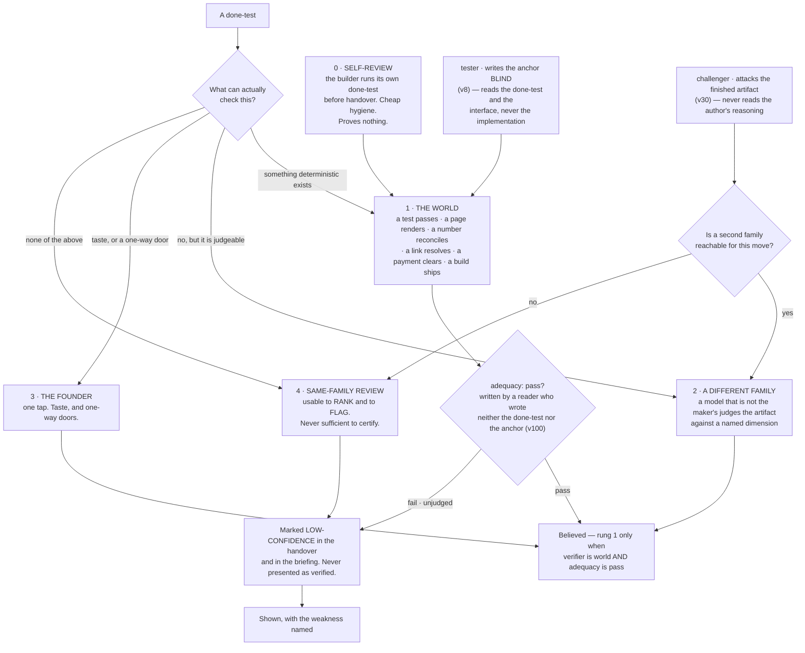

**(FINAL)** Rung 1 is not a formality and it is where the design work is: for most company work there *is* a
deterministic anchor, and finding it is the intellectual task of writing the done-test. **(FINAL)** The anchor is
almost always cheaper than the work it checks, which is why this is affordable, and why quality here does not mean a
review panel — it means the run produced the evidence its done-test named.

| Kind of work | The deterministic anchor |
|---|---|
| Code | tests run · build passes · the app starts · a named user path completes |
| A screen or a page | it renders · a screenshot exists · contrast ratios computed · it loads under a stated size |
| Copy or content | every factual claim resolves to a fetched source · links return 200 · reading level computed |
| A price or a model | the arithmetic reconciles · sensitivity to each input is computed and shown |
| A video or an image | it plays · right length and aspect · the brand colours are the declared ones · loudness to a standard |
| Research | every claim carries a URL that was fetched, with the quoted line present in the fetched text |
| Data work | row counts reconcile · a known query returns the known answer · nulls counted |
| Outreach or social | it sent · it was received · the reply, if any, is attached |
| Finance | it ties to the bank line, or the difference is shown |
| Anything legal | it does not go out without rung 3. Full stop. |

**(FINAL)** Inside rung 1 there is an order, and it is the sharpest rule in the section: **a check that reads a record
the company does not write outranks a check that reads the company's own**, because a status report cannot promote
itself. §B.2 states the same rule per agent — *"a number that reconciles to our own log is rung 4, not rung 1"* — so
it is not advice here and a table row there; it is one rule, written twice on purpose.

**Mechanism:** the store check refuses an intent whose done-test names no anchor (`bin/check-stores`, ABSENT); the
rung is a field on the handover and the briefing renders rung 4 differently from rung 1 (ABSENT). For research
claims the mechanism exists today: `scripts/check-citations.mjs` on branch `ceo-1-1788609834` blocks on a dead path,
wired as `check:citations-exist` in the check suite.

**(NEW: O29 — the `claim-source` resolver goes from SHADOW to blocking, on `scout` handovers only.)** The resolver
fetches a claim's URL and asserts the quoted line is present in the fetched text; on this branch it runs in
**SHADOW**, computing `claim.would_block` and failing nothing. Promoting it everywhere at once would put fetch
latency and network flake in front of every agent. **Promoting it on `scout` handovers alone puts the friction
exactly where the anchor already is** — `scout`'s whole anchor is *"every claim carries URL, quote and access
date"*, so a scout whose citation does not resolve has failed its own test, not somebody else's rule.
**Mechanism:** `scripts/ledger.mjs` — **EXISTS**, in SHADOW, branch `ceo-1-1788609834`; the per-agent promotion is
**ABSENT**. Rule 10 governs it unchanged: offline or timed out is `unresolved`, never `pass`.

**(R12, OPEN — and it is the cheapest measurement named anywhere in the rethink round.)** What fraction of a
venture's real done-tests reach **rung 1 without inventing an anchor**? **Source class:** ~~the harness venture's
first thirty intents~~ **three corpora, and the harness is only one of them — R27** (amended 2026-09-06: O102 ·
THINKER: B4, C2 · conv. 3). **What it decides: contrarian assumption 1** — that most company work has a deterministic
anchor waiting to be found — and with it the shape of this whole section. The paragraph above says *"for most
company work there is a deterministic anchor"*, and **that sentence has never been measured.** If the true fraction
is small, the ladder still stands and the design around it does not: rung 4 becomes the common case rather than the
labelled exception, and §21's rung-1 share is measuring an aspiration.

**(NEW: O102 — R12 is R27, split three ways, because the harness cannot test the assumption it was chosen under.)**
The harness is the most anchorable venture possible, so its thirty return a high fraction whatever the truth for
pricing, copy or positioning — selection on the dependent variable. R27 is three fractions side by side, per domain:
**(a)** the harness's first thirty, as written; **(b)** thirty random Floor episodes from the founder's own transcript
corpus, domain-labelled by one Sonnet `-p` pass and **rated by the founder in one sitting** (under O95) — *could a
program have judged this?* — plus thirty **paper done-tests** drafted across §23–§30; **(c)** the second venture's
real first thirty (v85). **§I row 16 is settled by (b) and (c) together, never by (a) alone.** Tainted episodes are
excluded (O88); **(b) costs zero build.**

***Inventing an anchor*, defined once so the fraction can be counted:** an anchor that **(i)** tests a property the
done-test did not state, **(ii)** reads a record the company itself writes, or **(iii)** would still pass an artifact
the founder rejected. **Losing image:** R12 on the harness alone. `wins_if:` the three fractions agree inside the
sample floor (O25). **Settled by:** code high and everything else low inverts the architecture for every venture that
is not the harness, and §0 says so before wave two. Path: one `-p` pass · one sitting — **ABSENT**; §21 renders the
three fractions.

---

### 11.2a Is the anchor itself anchored — v73

**(FOUNDER, rethink 2026-09-06: D8 → v73.)** **Every anchor carries a mutation case — a known-bad input it must
fail — or it is marked `unrated`. §21's rung-1 share splits into rated and unrated.**

**Why, and it is this section's own argument turned on itself.** 11.11 lists fifteen anchors and **not one has ever
been shown to fail when it should.** An anchor that has never failed is not evidence that the work is good; it is a
check whose sensitivity is unmeasured, which is **a rung-4 belief wearing a rung-1 label** — precisely the error
11.7 built the reconciliation to catch, one level up. This repository has already shipped a change that **removed a
control while every test stayed green** (the eighth CI-chain bypass), which is what that failure looks like when
nobody is watching for it.

**Mechanism, and it costs nothing new.** The mutation case is written by whoever writes the anchor, as a
**rehearsal-case body under v18** — so it inherits §7's admission, §7.2a's eval-only placement in `keel/golden/`,
and v19's forced expiry **free**. There is no new store, no new format and no new gate: an anchor with a case is
rated, an anchor without one is `unrated`, and the store check reads the field. **The cost, once:** one case per
anchor.

**What this changes about §21, stated plainly.** The rung-1 share stops being one number and becomes two, and
**the rated share will start low** — today it is zero of fifteen. That is the instrument reporting correctly for
the first time rather than a regression. **Settled by:** an anchor that **passes** its known-bad input is `unrated`
by definition, whatever its author intended; the first rung-1 share that falls is the system telling the truth.

---

### 11.2b Two axes on every anchor — v100

**(NEW: O108 · v100.)** (THINKER: B8) **A deterministic check of the wrong property is deterministic.** v73's mutation
case proves an anchor is *sensitive*; 11.4's *fails before, passes after* proves sensitivity to *the change*; neither
proves the property checked was the one stated. The ladder conflated **verifier independence** with **property
adequacy**, and a share that must not fall will be met by writing checkable done-tests. So every anchor carries two
fields:

| Field | Values | Written by |
|---|---|---|
| `verifier:` | `world \| other-family \| founder \| same-family` | the rung, as the ladder already assigns it |
| `adequacy:` | `pass \| fail \| unjudged` | **a reader who wrote neither the done-test nor the anchor** — `reviewer` on the `-p` carrier, or `challenger` — into its own handover |

**Rung 1 is counted only when `verifier` is `world` and `adequacy` is `pass`**, and `bin/check-stores` refuses a
rung-1 claim with adequacy unjudged. Beside the rung-1 share, **§21 reports the Goodhart pair**: the share of
done-tests rewritten after their anchor was chosen, and founder rejections of work that passed — done-tests
shortening while rejections rise is Goodhart running, and those two lines are the only instrument that sees it.
**The cost, once:** two fields, one reader per anchor on the cheapest model that passes the routing rehearsal.
**Losing image:** one axis. `wins_if:` a quarter in which adequacy never fails on an anchor the world passed. Path:
the handover schema · `bin/check-stores` — **ABSENT**; §21 owns the pair's rendering.

---

### 11.3 The other family, and what it actually is on day one

**(FINAL)** A checker on the maker's family is a compromised instrument by measurement. FINAL §8.3 assumed three live
subscriptions and concluded that cross-family checking *"stops being a constraint and becomes a choice."*

**(NEW: v5, v32 and §I rows 5 and 6 make that conclusion conditional, and the condition is not met yet.)** Codex is
**not installed** and openai/codex#19945 has been open 130 days with no maintainer reply (runtimes.md, accessed
2026-09-05). `gemini` 0.38.2 **is installed and has never authenticated**. So on the day this plan starts, rung 2 is
reachable in exactly one shape and two founder acts widen it:

| Rung-2 route | State | What it costs, stated once |
|---|---|---|
| **Codex `gpt-5.3-codex` as a checker on a prepared diff** | admitted day one by v5; foreground slot only, stdout redirected to a file while inheriting the parent shell's TTY (v32); **a `bin/run` child from launchd, on the subscription, never a key** (amended 2026-09-06: E7 · v90 / O92) | **one foreground slot is not parallel**, so Codex is not a night lane until the H.2 rehearsal passes detached |
| **Gemini on routine checking** | ~~installed, unauthenticated — §I row 6, one terminal act by the founder~~ **personal Google account, no key (E7 · v90); a `bin/run` child from the launchd context only, because `gemini --version` dies with `EPERM` under the live sandbox (O92 · THINKER: A9 · W37)** | until it happens, routine checking has no second family and falls to rung 4 with the label. **And once it happens, a Gemini verdict on a move class is rung 2 only after Gemini passes that class's `class: calibration` set (v78), and is labelled rung 4 until then** — *Gemini on every diff now* is §J 88 |

**(FOUNDER, fixer round 2026-09-06: E7 · v90 · `class: originated` — *"no keys, codex and gemini cli use."*)** The
strategist's C6 put `reviewer` and `challenger` on Gemini for every diff behind a scoped key; the founder overruled
the key and v78 governs the routing: the second family is **two CLIs from launchd**, and the calibration set turns a
cross-family verdict from rung 4 into rung 2 one move class at a time. §9.4b carries the row; §10.5 the carrier;
**R11** measures whether the family buys anything, **R40** whether the route is permitted.

**(FOUNDER, rethink 2026-09-06, DECISIONS §19 → v82: the third row of that table is deleted.)** The table above
carried a third route, **~~a three-family panel~~**, *"reserved for a one-way door with no rung-1 anchor"*. The
founder's word, verbatim: ***"Delete the row from the plan."*** It is gone, and the deletion is recorded here
rather than performed silently, because the row is what a reader would otherwise go looking for.

**Why it went, and what is untouched.** It **read as a capability** while it needed Gemini authenticated **and**
Codex detached-capable **and** panel machinery, none of which exists — the same failure shape §11.1 refuses, at the
level of the plan rather than the run. **The repository's three live `verified_by: judge` claims and the founder
waiver running to 2026-11-17 are untouched:** this deletes a sentence in a plan, not a claim in a ledger, and those
three claims still resolve `unresolved` and still say so. **What stands in its place is v78** — a three-deep
`fallback:` per agent, a rung demotion on any unrehearsed cross-family reroute, and a frozen calibration set (§9.4a)
— and **the two-family route runs through the no-model launcher, outside any Claude session**, which is the one
shape that does not need a panel to exist. **A deletion carries no falsifier; what would reopen it is a reachable
non-Anthropic model, which is R10** (§10.8), the hinge.

**(NEW: deletion 26 — the one honest sentence about a second family lives here, and the other five copies go.)**
**A second model family is used whenever one is reachable for the move — and today, one is reachable in exactly the
one shape this table names.** That sentence was written in six places across this plan and enforced in none, which
is how a rule becomes decoration. It is stated **once, here**, beside its own state, and every other section points
at this paragraph rather than restating it.

**(R11, OPEN — nobody has measured what the second family buys *us*.)** Does a second model family reduce **escaped
defects on our own move classes**, and by how much? **Source class:** twenty-five paired checks drawn from our own
event log. **What it decides:** whether rung 2 outranks rung 4 on any given class — the ladder asserts it and this
would measure it — and contrarian assumption 2. **It is blocked on O7's four provenance fields on the handover,
which are cheap to add now and unreconstructable later:** without maker family, checker family and the model id of
each, the paired comparison cannot be assembled from history at all.

**(FINAL, redrawn for the roster)** What the checker does, and what happens when it disagrees:

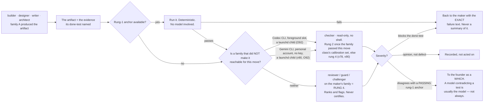

**(FINAL)** When a checker compares two candidates it is **pairwise, never pointwise**; blind; stripped of the
candidate's own label; order-swapped, with a flip resolving to `unresolved`. One frontier judge held its verdict under
a swap only 65% of the time, another 23.8%. Findings from several families are **unioned**: a fatal finding from any
family eliminates, fewer serious findings are preferred, and **scores are never averaged**, because a score is a
finding with the information removed. Consensus thresholds are refused — a vote among models has no anchor.

**Mechanism:** `bin/run` (ABSENT) presents two candidates as an ordered pair twice, swapped, and records a flipped
verdict as `unresolved`; the checker's handover schema carries a `findings` field **and no score field**, so averaging
has nothing to average (ABSENT). Rule 10 of this repo already holds the general form on branch
`ceo-1-1788609834`: a resolver never passes what it could not check, and `unresolved` is pinned distinct from `pass`.

---

### 11.4 The blind tester — v8, and why it is two tests and not one

**(NEW: v8.)** Both the builder and the tester write tests, and they are **different tests**.

- **The builder's self-check** is rung 0. It is cheap hygiene and proves nothing about correctness — it proves the
  builder ran the thing. Devin's published guidance is the same instruction in one line: *"Tell Devin to test its own
  work before opening a PR"* (cognition.md 8).
- **The tester's anchor test is rung 1**, and it is rung 1 *because the tester never read the implementation*. It
  reads the done-test and the interface. A test written by the author of the code is a machine grading its own
  homework, which §11.1 refuses; a test written blind against the contract is an instrument.

**Mechanism, and it is argv rather than instruction:** the tester's grant carries `--add-dir` **excluding the
implementation path**, so the blindness is a property of what the process can open, not of what the prompt asked for
(§B.2 row 4; composed by `bin/run`, ABSENT; asserted by `bin/probe`, ABSENT).

**(NEW: O28 — the blindness is argv on one carrier and UNVERIFIED on the other two, so the carrier is the rule.)**
`--add-dir` is a **launcher** flag. A tester running as a **subagent** or as a **teammate** was never started by
`bin/run` with its own argv, and nothing in this plan establishes that the exclusion survives either path. **So
`tester` and `challenger` route on the `-p` carrier only, until `bin/probe` asserts read-denial on subagents and
teams.** This is a routing constraint on two of fifteen agents, not a new mechanism, and it is the cheapest way to
stop an unverified guarantee from being load-bearing. **(FACT: world.md 8 — W8 names the field that could lift
it):** `permissions.blockReadsOutsideWorkingDirectories` is a **read** narrowing expressible in settings rather
than argv, which is exactly the carrier this rule could not name. It is not adopted here — it is what the probe
would be pointed at.

**(FACT: world.md 30c — W32. The vendor independently reports the failure v8 splits the tests to catch.)**
From Anthropic's own engineering writing on long-running agents: *"Claude tended to mark a feature as complete
without proper testing"*, and providing testing tools *"dramatically improved performance"*. That is the builder's
self-check being mistaken for an anchor, named by the party with the most data and the least incentive to say it.
v8 is unchanged and now independently cited; the post is qualitative and carries no measured numbers, so it
supports the split rather than sizing it.

**The anchor on the tester's own work** — because the tester is an agent and this section trusts no agent's report:
**the test fails before the change and passes after.** A test that passes before the change is not testing the change,
and that is checkable by running it twice with no model in the loop.

---

### 11.5 The challenger — v30, and why it is an agent and not a step

**(NEW: v30, from cognition.md 5 and 6.)** A plan-critique pass that the same run performs on itself is the shape
measured as harmful. The cure is not a better prompt; it is that the critic is a **different process, with different
inputs**. So `challenger` is a roster entry with a grant, not a step in anybody's procedure.

**(NEW: v30's mechanism, stated as two exclusions.)** The challenger never reads the artifact's author's reasoning —
only the artifact and its done-test — and it carries `Read Glob Grep` and no `Write`, `Edit` or `Bash` (§B.2 row 14).
Both are argv facts, and both are argv **on the `-p` carrier**, which is why O28 routes the challenger there until
the probe says otherwise (11.4). ~~**A second model family whenever one is reachable**~~ — **deleted here and
stated once in 11.3** (deletion 26, 2026-09-06): five of the six copies of that sentence go, because a rule written
six times and enforced zero times reads as a guarantee. §11.3's reading governs: when no second family is
reachable, the challenger's finding is rung 4, and it is labelled rung 4.

**(FINAL)** Its own anchor is the one that keeps it from becoming an opinion generator: **every finding names the
mechanism that would have caught it, or it is an opinion.** That is checkable by a reader who did not do the work,
which is the same test §B.2 applies to a done-test.

**Where it is routed** (§B.2): before anything irreversible, and on every plan the Operator is about to bind.

---

### 11.6 Where taste is judged

**(FINAL)** Taste is not checkable by a test and is the founder's alone — but it does not follow that every taste
question goes to the founder, or the founder becomes the bottleneck they refused to be. The system holds a **taste
store**: an evidence-backed record of what this founder has accepted and rejected, mined from transcripts (§13) and
from every *no, not like that* on the Floor. A taste check asks *does this artifact violate anything in the store?* —
a rung-2 check with a real corpus behind it. What reaches the founder is the residue: the genuinely new taste
question, as two built options and a which.

**(FINAL)** The store is never a preferences file the founder types, because a founder is an unreliable narrator of
their own taste. It is derived from decisions only, and a fraction of rejections is held out, so it is scored on
predicting what the founder *wants* rather than what they *approve*.

**(NEW: memory.md's coverage table names the one shipped precedent, and it is partial.)** Claude Code's auto memory
carries `type: user` and `type: feedback` notes written by the acting agent in-session — typed extraction of exactly
this material. It is a precedent for the *content* and a counter-example to the writer rule (v25, §13). A **brand
voice profile** and a **golden output archive** are marked *none found* in the same table: no shipped CLI has either.

**(NEW: O62 — a taste check earns the right to judge before it judges anything.)** **Any taste or brand check must
first pass a held-out discrimination test: rank labelled approved artifacts above rejected ones, on a held-out
slice it never saw.** Its measured rate prints **beside every verdict it issues**, so a reader always knows what
the instrument is worth. **Below chance, the check is deleted rather than tuned** — a check that cannot separate
what the founder accepted from what they rejected is not a weak instrument, it is not an instrument, and tuning it
against the same corpus is how a rung-4 opinion acquires a rung-2 label. **Mechanism:** the §7.3 eval runner, which
**exists upstream** as `skill-creator`'s paired with-skill/baseline loop; the held-out split and the printed rate
are **ABSENT**. This is the same discipline §11.1 applies to a model reviewing itself, applied to the store that
speaks for the founder's taste.

**(NEW: O113 — the curator grades everyone, so something grades the curator.)** (THINKER: B12; C takes the seed)
Four rules, one store check: **every case set the curator writes passes O62's held-out test before it may judge**; a
**founder-labelled `class: calibration` seed no curator edits** scores its dedup and conflict decisions (O44); a
memory item's `falsifier:` must be **executable** — a command with an exit code, or a URL plus the quoted line — or
`bin/check-stores` refuses it; and a **nightly canary**, one well-formed false item, must be refused downstream.
**Losing image:** two curators on two families (§J 82). `wins_if:` the format check alone refuses every canary for a
year. Path: `bin/check-stores` · `keel/golden/` · `keel/fixtures/` — **ABSENT**; §13 owns the pass.

**Mechanism:** the taste store is written only by the curator (v25); the held-out fraction and its score are a field
on the store, checked by `bin/check-stores` (ABSENT).

---

### 11.7 The nightly reconciliation — the company's numbers against records it does not write

**(FINAL)** The single most repeated failure in the corpus of autonomous-company attempts is **the agent misreporting
its own progress**, and the misreport is what the human reads. It is invisible to any check that reads the agent's
output. So the system's own numbers are read against outside records, on no model.

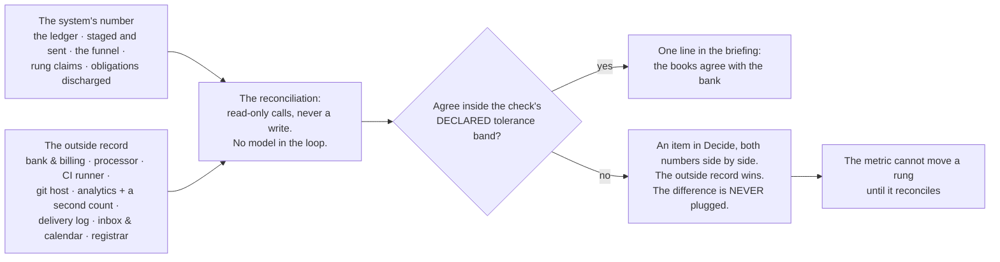

**(FINAL)** Revenue is read from the processor as a claim, never typed; a runway computed from a number the bank does
not confirm is stamped *internal* and cannot promote anything.

**(NEW: §B.2 gives the reconciliation an owner it did not have in FINAL, and §F gives it its precondition.)** **`bin/reconcile` runs it (v47): a program with no model computes every comparison and writes the result
rows, and `analyst` reads the mismatches and drafts the Decide item. The rung is the program's.** `analyst` is
the one agent whose row names the reconciliation explicitly — and it is why §F admits the
**read-only instruments first**: analytics, error tracking, a read-only billing key, the CI API, the git host read
API. Without them the reconciliation cannot exist, and without the reconciliation every number in the company is
rung 4 wearing a rung-1 label.

**Mechanism:** `bin/reconcile` with read-only credentials per venture and a declared tolerance band per check
(ABSENT); the checks themselves are rung-1 anchors and live beside the venture (ABSENT). The instruments are admitted
one at a time through §12's door.

---

### 11.8 Regression, for free

**(FINAL)** A regression is a done-test that used to pass and now does not. Because every done-test names a checkable
anchor, **the set of live done-tests across all ventures *is* the regression suite**, re-run on the routine window at
close to zero marginal cost. Nothing extra is maintained. That is a consequence of the done-test design and the
strongest argument for it.

**(NEW: O24 — the free regression suite is also a fleet of hands, and nothing currently says so.)** *"The set of
live done-tests across all ventures is the regression suite, re-run on the routine window"* — re-read that sentence
with §8's four classes in mind. A done-test whose anchor **sends**, **charges**, **deploys** or **files** is a
REACHES-THE-WORLD act, and re-running it nightly **turns the regression suite into a Sender** — a v33 breach
arriving through the one mechanism this plan calls free. **So every anchor declares `effect: none | metered |
reaches-the-world`, and the unattended re-run executes only `none`.** A `metered` anchor costs money per run and
belongs to §16's ceiling; a `reaches-the-world` anchor runs only through the Sender, with the founder's act in
front of it. **Mechanism:** the anchor declaration (**ABSENT**), read by whatever schedules the re-run. **The cost,
once:** one field per anchor, written by the same hand as v73's mutation case. **(amended 2026-09-06: O109 · v101)**
`effect:` is **the same field** the verb table carries in `keel/shared/tools/<name>.yml` — one table serves the
anchor and the grant, and §12.2 owns it.

**(NEW: O110 — the anchor's verdict is a printed line, because the evaluator reads and never runs.)** (THINKER: A18)
O21 composes the `/goal` condition as *"`<anchor>` exits 0"* — but the evaluator is a small model reading prose, not
a shell running a command, so an exit code it cannot see is a sentence it has to believe. **Every anchor prints
`ANCHOR <name> exit=<code>` on its own line**; the `/goal` condition names that line and the done-test; the evaluator
reads a line and runs nothing. **Losing image:** *"exits 0"* in prose. `wins_if:` **R17** shows the evaluator accepts
an exit code directly. Path: `keel/shared/anchors/*` · `bin/run` — **ABSENT** · **DEPENDS-ON-R17**; one `printf` per
anchor. §6 owns the condition's composition.

**(NEW: O30 — the verdict is signed, and the guarantee is stated honestly.)** `scripts/verdict.mjs` **EXISTS** on
this branch and binds a verdict to `sha256(diff)`, so an **inherited** verdict cannot pass for a fresh one. It does
not stop a **forged** one: anyone with repo-write can author a `.qa/verdicts/*.json`, which the workflow says about
itself. **So the verdict is signed with a key under a path every agent's grant excludes and `denyRead` covers**
(the key path **ABSENT**). **What that buys, precisely: it raises forging from a file write to defeating a checked
deny rule.** It is a guardrail, not containment — the same honest reading §12 gives the sandbox — and saying so is
the point, because a signature described as containment is worse than no signature.

**(NEW: O19 — three named mechanisms rest on one predicate nobody has defined.)** *"The same failure twice"* is
what stops the fast loop, what increments the sighting counter, and what memory dedup calls a duplicate — **three
consumers, one comparison, and no definition anywhere.** Byte equality is wrong (a timestamp or a path defeats it)
and a model deciding is a rung-4 judgement inside a rung-1 gate. **So: the anchor's exit signature where there is
one, and cosine over local embeddings of normalised failure text where there is not, calibrated on labelled
pairs.** One shared hash, one implementation, three call sites — **ABSENT**, and it rests on **O13**'s local
embedding program (§15), which is why it is named here and built there. Two implementations of this predicate would
disagree silently, which is the class this repository has already paid for.

**(FINAL)** The check suite on branch `ceo-1-1788609834` (`scripts/run-checks.mjs`, 48 steps) is the founding
population of rung-1 anchors for the harness venture, and its rule survives whole and is worth restating because it is
the same rule as §11.2's: **a partial run cannot wear a passing verdict.** An interrupted run prints INCOMPLETE and
names what never started; a subset run says SUBSET; a zero-step run is REFUSED.

---

### 11.9 A venture's progress — the contact rungs

**(FINAL)** The anchor ladder measures whether the work is true. Nothing in it measures whether the venture is
becoming a business, and the founder's list asks. So a venture's progress is a rung generated from a record the
company does not write, never typed:

```
0  it exists / it compiles / it renders    ← a rung-1 anchor's exit code
1  a stranger understood it                ← a recorded artifact: a reply, a recording, a survey row
2  a stranger did something                ← the analytics provider AND the server's own count
3  they came back                          ← a cohort in the product's own event store
4  they paid                               ← the payment processor
5  they paid again, and named you          ← the processor, plus a referral with a name attached
```

**(FINAL)** *"The landing page is done"* is rung 0 and will say rung 0. The **ship log** — one line per rung movement
and per intent finished, in the founder's own currency — appears in the briefing and answers *what did this company
produce this month*, which is the cheapest morale instrument there is.

**(NEW: §B.2 ties two roster rows to this ladder, and they are the two with the least outside evidence behind them.)**
`growth`'s anchor is *"a reply from a real person, recorded by the world's door; never a count of messages sent"* —
contact rung 1, not rung 0. `writer`'s is the founder's taste store plus a **rung-2 external reaction**. roster.md
records that sales-and-growth as a function and legal-and-contracts have **no shipped precedent anywhere**, so those
two anchors are deliberately the most external in the roster.

**(NEW: O99 · v99 — the rungs are unchanged; what changes is where a movement is written, and it is one place.)**
(THINKER: C8) Only taste crossed ventures, so ten ventures would learn pricing from scratch ten times. **A house-scope
market record, `keel/shared/market.jsonl`: one row per contact-rung movement** — venture · intent · class (`price ·
channel · positioning · copy · design · offer`) · artifact hash · movement (rung from → to) · the proving record
(processor id, analytics id, reply id) · consent ref · taint ids — **written only by `bin/reconcile`**, so every row
is rung 1 by construction. **The ship log becomes a view of it.** A world-reply negative is house scope with class
`market` (O43). §13 owns how a slice loads it; §4 the Desk's tie-break (O98); §17 the inventory. **Losing image:**
per-venture facts with founder-reviewed promotion. `wins_if:` a year of two ventures with no cross-loaded market row.
*The world's vote* is §J 87, refused.

**(NEW: O100 · v94 — the recall count that widens or narrows an outward class comes from the same record.)**
`bin/reconcile` writes each class's `recall_count` from the world's record — a recall inside the window, or a reply
asking to stop, which also writes the consent register; a recall narrows one step without asking; **`first-contact`
is reachable like any other class** (FOUNDER: E11). §12.2b owns the ladder; this section owns why its counters are
rung 1.

**Mechanism:** the rung table read by `bin/reconcile` (ABSENT) · ~~a venture's `ship-log.md` written only by that
program~~ `keel/shared/market.jsonl`, written only by `bin/reconcile`, with the ship log as a view (amended
2026-09-06: O99) (ABSENT).

---

### 11.10 The rehearsal set, and what it decides

**(FINAL §7.6, inherited whole and re-read at the source.)** A rehearsal case is an input whose right answer is
already known. Voyager added a skill to its library only after it verifiably worked in the environment, which is why
that library transferred to a fresh world instead of being a pile of plausible code. **The same discipline decides
which agents may run unattended**, and it decides one other thing: whether a change to a standing prompt is adopted —
both versions run against known answers, and a change that is not measurably better is reverted and kept as a
negative. That is the only self-editing permitted anywhere.

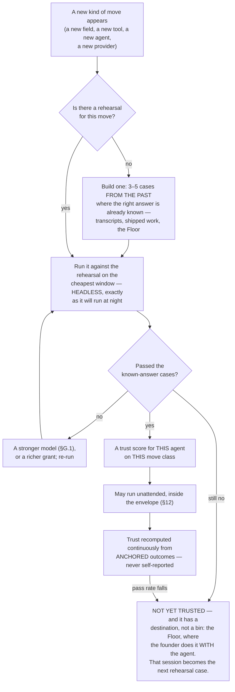

**(FINAL §7.6's three consequences, and each one is a rule this section would otherwise have to invent.)**

1. **A trust score is a measurement, not a rating.** It is the observed pass rate of anchored checks for that agent on
   that move class, and **no run scores itself** — §11.1 applied to the question of who may work alone. Below a sample
   floor it prints **`insufficient`** rather than a number, because a pass rate over four cases is a number that
   invites a decision it cannot support. **(NEW: O25 — that floor is now one shared predicate, not a sentence here
   and a different one in §7.)** §7.3 admits a skill on **2–3 cases** while this rule refuses to print a number over
   four, which is contradiction 12: **two rules about the same arithmetic, and the looser one is the one that
   grants.** One predicate with two call sites (**ABSENT**) answers for the trust score, for skill admission and for
   the error rates of v73, and it answers the same way in all three. The consequence is stated rather than softened
   in §7.3: an admission on 2–3 cases is an admission **below the floor**, recorded as `insufficient`.
2. **"Not yet trusted" has a productive destination.** A move that fails rehearsal goes to the Floor, where the
   founder does it *with* the agent — **and that session becomes the rehearsal case for next time.** This is the
   mechanism by which walking *with* the founder teaches the system to walk *for* them, and it is why the Floor is not
   a consolation prize. **(amended 2026-09-06: O112 · v103)** That destination is now a named state: `trust:
   probation | scored | unroutable` per move class in `roster.yml`, where a probation agent runs only on the Floor or
   under a founder-authored intent with adequacy-judged anchors (11.2b), each counting toward the floor. §5 owns the
   field; this section owns why the floor is not one.
3. **The cases come from the founder's own past.** Thousands of transcripts hold hundreds of *no, not like that* and
   *yes, that's it* — **a labelled dataset of this founder's judgement, gathered free over years.** §13.7's mining
   pass is what extracts them, which is why that pass is the work to do first: it is the only source of rehearsal
   cases nobody has to write.

**(FINAL, and it is the instrument that catches the failure nobody watches for.)** A trust score charted over time,
with limits computed from its own history, is a **control chart** — and it is what sees a provider's silent model
update in month nine, when nothing in the release notes and nothing in the code has changed.

**(NEW: v1 changes what carries a trust score, and it makes the whole mechanism cheaper.)** FINAL scored a *loadout*
assembled per run, so the population of scores was open-ended. **Fourteen named agents give the score a stable
subject**: `builder` on schema changes, `scout` on a field it has not read before. A pass rate needs a denominator
that persists, and a named roster is one.

**(NEW: v18 makes a rehearsal case one of exactly four admissible skill bodies, so the set has a home and a format.)**
A rehearsal case is a `SKILL.md` body under §E's content rule, which means the same admission and the same forced
expiry (v19) apply to it as to everything else the library holds.

**(NEW: H.2 is a rehearsal case in this exact sense, and it is the one that matters most on day one.)** Codex's
admission test — `codex exec --json`, **no controlling TTY**, a non-trivial prompt, ~~version ≥ 0.124.0~~ **the
installed version, recorded** (moved 2026-09-06: W19 — Codex is at 0.153.4, twenty-nine minor versions past the old
floor, which now admits anything), against known-answer cases — is what widens Codex from a foreground checker to a
night lane. Pass and rung 2 becomes parallel; fail and it stays in the foreground slot. **#19945 has been open 130
days with no maintainer reply**, so the test is the plan, and the issue closing is not. **It is R10, the hinge of
the cross-model design** (§10.8), and **v82's deleted panel row is one of the things that reads differently
depending on its answer.**

---

### 11.11 The roster's anchor column, as one table

**(NEW: §B.2's anchor column read against §11.2's ladder. The anchors are the SPINE's; the rung assignment is this
section's reading of them, and the two rows that cannot reach rung 1 today are named rather than rounded up.)**

| Agent | The anchor — what proves it, never the agent's own report | Rung |
|---|---|---|
| **Operator** | the store check refuses an intent whose done-test is not falsifiable by someone who did not do the work; nothing binds by voice (§C.3) | 1 on the refusal · 3 on the read-back |
| **builder** | the venture's own CI, plus the done-test, plus the tester's blind test | 1 |
| **reviewer** | findings reproduce from the diff alone; a finding with no reproduction is a hypothesis | 1 on reproduction · **2 only when a second family is reachable ~~, else 4~~ and has passed the move class's calibration set, else 4 (amended 2026-09-06: v90 → v78)** |
| **architect** | a migration that applies and rolls back in a scratch database | 1 |
| **tester** | the test fails before the change and passes after | 1 |
| **guard** | a proof of concept that reproduces, or the finding is a hypothesis | 1 |
| **scout** | every claim carries URL, quote and access date; `check-citations.mjs` blocks on a dead one | 1 |
| **designer** | a rendered screenshot judged against a named anchor — never the agent's description of it | 1 on the render and the computed properties · 3 on taste |
| **product** | the store check refuses a done-test that is not falsifiable by an outsider | 1 |
| **analyst** | the reconciliation reads a record the company does not write; **a number that reconciles to our own log is rung 4, not rung 1** | 1, and it says so when it is not |
| **writer** | staged, never sent; the founder's taste store and a rung-2 external reaction | 2 and 3 |
| **growth** | a reply from a real person, recorded by the world's door; never a count of messages sent — **and written as a row in `market.jsonl` by `bin/reconcile`, never by `growth`** (O99) | contact rung 1 |
| **steward** | an obligation is discharged only by a record the company does not write | 1 |
| **curator** | a memory item with no source, date, expiry and falsifier is refused at the store check | 1 |
| **challenger** | every finding names the mechanism that would have caught it, or it is an opinion | 1 on that test · **2 only when a second family is reachable ~~, else 4~~ and has passed the move class's calibration set, else 4 (amended 2026-09-06: v90 → v78)** |

**(NEW: the table's own finding.)** Thirteen of fifteen rows reach rung 1 on their primary anchor. The two that do not
— `reviewer` and `challenger` — are precisely the two whose job is judgement, which is the section's thesis restated
as a roster fact: **the agents that check are the ones whose own output cannot be checked deterministically**, and
that is why the second family is bought and why §11.3 refuses to round it up.

**(NEW: v73 — all fifteen rows are `unrated` today, and that is the table's second finding.)** Not one anchor above
carries a **mutation case**, so not one has been shown to fail when it should (11.2a). The column is not added here
because it would be fifteen identical cells; the statement is the same and cheaper: **rated: 0 of 15.** As cases
land, §21's rung-1 share reports rated and unrated separately, and the rated share starts at zero by construction.
**(v100, the third finding:)** every rung in the table is a `verifier:` value and none carries an `adequacy:` yet —
**adequacy: 0 of 15 judged** — so by 11.2b's rule the rung-1 column above is what the ladder *assigns*, not yet
what `check-stores` would *count*.

**(FACT: world.md 30a — W30. The only outside comparator this design has.)** TheAgentCompany, whose paper was
accessed 2026-09-06 and has no 2026 revision: *"The most competitive agent can complete **30%** of tasks
autonomously"*, over six job functions — *"Software Engineer, Product Manager, Data Scientist, Human Resource,
Financial Staff, Administrator"*, which is close to this roster's own span. **It is a floor for §21 and not a
target**, and it is the only external number a fourteen-agent design has to check itself against. Read it as a
bound on expectations, not as a benchmark to beat: their tasks are not ours, and the comparison is honest only at
the order of magnitude.

**Mechanism for the whole table:** the anchor is a required field on every brief and every handover; `bin/run` refuses
a brief whose done-test names no anchor, and `bin/probe` asserts each agent's grant nightly (both ABSENT). Until they
exist, this table is a **WISH** — and naming it as one here is cheaper than discovering it during the first night.

---

### 11.11a What enforces this section

| Rule | Mechanism | State |
|---|---|---|
| A done-test names an anchor, or it is refused | `bin/check-stores`; the rung is a field on the handover | **ABSENT** |
| A research claim's citation resolves | `scripts/check-citations.mjs`, wired as `check:citations-exist` | **EXISTS**, branch `ceo-1-1788609834` |
| **A `scout` handover's citations are fetched and quoted, blocking** (O29) | `scripts/ledger.mjs`'s `claim-source` resolver, promoted from SHADOW on `scout` only | resolver **EXISTS** in SHADOW; the per-agent promotion is **ABSENT** |
| **Every anchor carries a mutation case or is marked `unrated`** (v73) | the case is a rehearsal-case body under v18, so §7's admission and v19's expiry carry it | **ABSENT** — rated: 0 of 15 |
| **Every anchor declares `effect:`, and the unattended re-run executes only `none`** (O24) | the anchor declaration, read by whatever schedules the re-run | **ABSENT** — today the regression suite could send |
| **A verdict cannot be inherited, and forging one means defeating a deny rule** (O30) | `scripts/verdict.mjs` binds `sha256(diff)`; the signing key sits under a path `denyRead` covers and no grant names | `verdict.mjs` **EXISTS**; the key path **ABSENT**. A guardrail, not containment |
| **"The same failure twice" means one thing** (O19) | one shared predicate: exit signature, else cosine over local embeddings of normalised failure text, calibrated on labelled pairs | **ABSENT**; rests on O13's local embedding program |
| **A taste check proves it can discriminate before it may judge** (O62) | the §7.3 eval runner over a held-out labelled slice; the rate prints beside every verdict; below chance it is deleted | runner **EXISTS** upstream; the held-out split and printed rate are **ABSENT** |
| **One sample floor answers for the trust score, skill admission and the error rates** (O25) | one predicate, two call sites | **ABSENT** |
| **`tester` and `challenger` route on the `-p` carrier until blindness is probed** (O28) | the launcher's carrier choice; `bin/probe` asserts read-denial | **ABSENT**. **W8** names the settings field that could lift it |
| A checker never averages scores | the checker's handover schema carries `findings` and no score field | **ABSENT** |
| A flipped verdict under a swap is `unresolved` | `bin/run` presents an ordered pair twice, swapped; Rule 10 already pins `unresolved` distinct from `pass` | ordering **ABSENT**; Rule 10 **EXISTS**, branch `ceo-1-1788609834` |
| **Rung 1 is counted only when `verifier: world` and `adequacy: pass`, adequacy written by a reader who wrote neither** (v100, O108) | two fields on the handover; `bin/check-stores` refuses rung 1 unjudged; §21 reports the Goodhart pair | **ABSENT** — adequacy: 0 of 15 judged |
| **An anchor's verdict is a printed line the evaluator reads, never a command it runs** (O110) | `ANCHOR <name> exit=<code>` from every anchor; the `/goal` condition names the line | **ABSENT** · **DEPENDS-ON-R17** |
| **Assumption 1 is measured on three corpora, never the harness alone** (O102, R27) | one Sonnet `-p` labelling pass over thirty Floor episodes, rated by the founder in one sitting; thirty paper done-tests; VENTURE2's first thirty; *inventing an anchor* defined three ways | **ABSENT**; (b) costs zero build |
| **The curator's case sets pass the held-out test; its falsifiers execute; a nightly canary is refused** (O113) | `bin/check-stores` · the founder-labelled `class: calibration` seed in `keel/golden/` · the canary in `keel/fixtures/` | **ABSENT** |
| **A cross-family verdict is rung 4 until the family passes the move class's calibration set** (v90 → v78) | the calibration set; the CLIs from launchd (O92) | **ABSENT**; the CLIs ship |
| **A contact-rung movement is written once, by the reconciliation, and the ship log is a view** (v99, O99) | `keel/shared/market.jsonl`, written only by `bin/reconcile` | **ABSENT** |
| **A recall count is the world's, and it narrows a class without asking** (O100, v94) | `bin/reconcile` writes `recall_count` into `tools/<class>.yml`; `bin/send` reads the step; §12.2b owns the ladder | **ABSENT** |
| **A probation agent counts toward its floor only on adequacy-judged anchors** (O112, v103) | `trust:` per move class in `roster.yml`; §5 owns the field | **ABSENT** |

---

## 12 · Control — what may be done alone, and what never

*obeys: §C.1's bands, v9, v10, v28, v33, **v67, v68, v69** from the rethink round of 2026-09-06, and **v76 amended,
v87, v92, v93, v94, v101, v102** with **O83, O85, O86, O87, O88, O89, O93, O96, O100, O104, O109, O127** from the
fixer round of 2026-09-06 (DECISIONS §24) · inherits: FINAL §9. The tool door itself lives in §8 (Tools and MCPs)
and is not restated here.*

---

### 12.1 The envelope

**(FINAL)** The founder refuses a machine that is only brakes. This section does not add brakes. It removes the need
for most of them by deciding once, per venture, what does not need asking — and makes the remaining few absolute.
Three lists in the venture's charter, in the founder's own words, read by every run:

```
may-alone:  what runs without asking, ever
never:      what is not done by this system under any circumstance
wake-me:    the exact conditions that interrupt me, each with a number
```

**(FINAL)** The shape is the naval standing-orders and night-orders pair, with two details copied exactly. The
call-me list carries **numeric thresholds** — never *"if something seems wrong"* — and the governing sentence *call
the captain on any doubt whatever, before an emergency has developed* is what stops a threshold list becoming a
loophole. Written the way the founder would say it:

```
may-alone:  write code · run tests · make branches · research anything · draft anything ·
            build one option of a choice and write the second (v87; ~~both~~) · spend up to the venture ceiling on capacity ·
            (NOT calendar or mail: the world's door and scout read those, v36)
never:      send mail as me · post publicly · pay anyone · sign anything · touch production
            data · change a live price · contact a customer · delete anything a person made
wake-me:    a customer is waiting more than 4 hours · spend crosses 60% of the monthly
            ceiling · a done-test that passed for 7 days starts failing · anything I said
            'never' to is now the only way forward · a run has been blocked on the same
            thing three times
```

**(FINAL)** Every charter starts from a **default `never` list held as data**, longer than any tiering system covers,
and the founder deletes from it rather than writes to it: a secret in a published artifact · a migration with no
proven down-path · a deploy that emits mail or mutates data · money outside a standing, capped, rate-limited
allowance · a domain lapsed or bought · **anything delivered to a person** · a burned sending domain · a signature ·
a price change on existing customers · a partnership term · an offer, and a termination · publication before a patent
filing · a trademark class · an entity type · a cap table · an erasure · an account deletion · a bulk merge · a
missed statutory deadline · any edit to the system's own judging machinery · **and a kill decision.** Every charter
also starts from a **default `wake-me` template** of five conditions about *consequence*, never policy: a one-way act
wanted · damage · a kill criterion the founder wrote the day the intent opened · a contradiction between an anchor
and something the founder said out loud · a statutory clock.

**Mechanism:** `shared/never-default.yml` and `wake-me-default.yml` merged into each charter at load (both ABSENT).

---

### 12.2 The rule that decides what belongs in `may-alone` — and it stands alone in the world

**(FINAL, v28.)** Not importance, not risk vocabulary: **reversibility**. Two-way doors are made fast at about 70% of
the information you would like, because the cost of delay exceeds the cost of a correctable mistake. One-way doors get
slow, deliberate treatment.

**(NEW: cognition.md is the reason this is stated with more confidence than FINAL stated it, not less.)** The lane
looked for a shipped scheme that keys permission on reversibility and reported *"neither shipped scheme does"*.
Claude Code keys on **a fixed path list plus an action class**; Codex keys on **workspace scope plus network**. The
nearest shipped analog anywhere is auto mode's classifier special-casing `rm` and `rmdir` on critical paths. So v28 is
a position the world does not hold, held knowingly: the axis everyone ships is *where the file is*, and the axis that
predicts damage is *can this be undone*.

**(NEW: the one duration this section needs is a founder's number, not a rule's.)** The undo window is
`keel/settings.yml`'s `undo_window` — **one hour by default, the founder's to set** — and like the recall window
it is **sized to the blast radius**: a wider act gets a shorter window, not a longer one. Writing an hour into the
predicate itself would have put a schedule inside a rule, which this plan refuses everywhere else.

**(NEW: O109 · v101 — reversibility is a property of a verb in the admitted-tool file, never a question a run answers
about its own act.)** (THINKER: B13) The one-way/two-way decision is where a mistake is unrecoverable, and it was the
one decision this plan let a model make about itself — the flowchart's first question was asked *by the run*. Data
can be probed; a question cannot. So `keel/shared/tools/<name>.yml` gains **`verbs: [{name, effect: none | metered |
reaches-the-world, reversible: bool, undo: <cmd>, drilled: <date>}]`**; **an unlisted verb is one-way**; `bin/run`
composes the grant from the listed two-way verbs; the Sender, the door and v76's away predicate read the table; O24's
`effect:` on an anchor is the same field. **The first question below is a lookup now, and the run-side form of it is
deleted.** v28 stands and gains its mechanism. **The cost, once:** one table per admitted tool, filled at the door
where the undo is drilled anyway (§8). **Losing image:** the flowchart as a run-side question (§J 79). `wins_if:`
grepping the launcher finds no predicate that takes model output — the flowchart was a lookup in practice.

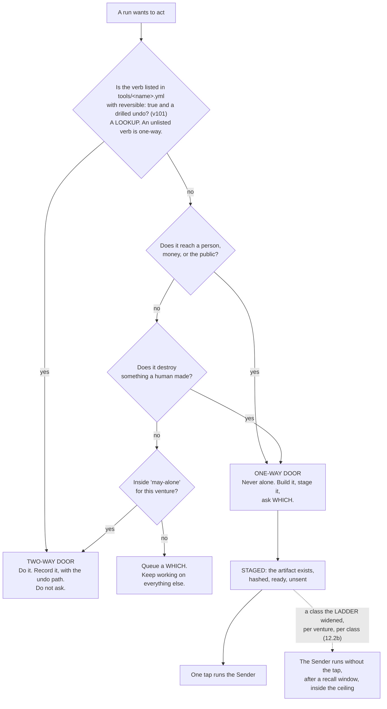

**(FINAL)** The staged-not-sent pattern is the whole trick. A post is written, previewed and sits there; an email is
drafted with the recipient filled in; a deploy is built and waiting. The founder's tap is the only irreversible step
and it takes a second, because everything else is already done. That is what makes *ask me only what only I can
answer* affordable: **the asking blocks the last inch, never the work.**

**(NEW: v9 promotes staged-not-sent from a style to the only channel a silent run has — see §12.5.)**

**(FINAL)** Two additions that keep the door test honest. **An undo is drilled or the door is one-way**: a two-way
door whose undo has not been exercised is treated as one-way until it is, by the rule that an untested kill switch is
a story about a kill switch; the drill runner writes only a date — **the `drilled:` field on the verb** (v101).
**A widened class executes after a recall window**, not on the instant: the Sender holds it for a window sized to
the blast radius, the phone can recall it, and the receipt says plainly when a recall is not an undo.

**(NEW: cognition.md again, and it is worth naming because it is the strongest claim in this section.)** *"§9.2's
staged-not-sent pattern and its recall window have no analog in anything I fetched. The shipped equivalent of 'never
alone' is a prompt or a deny rule, not a staged artifact."*

**Mechanism:** ~~the door test runs before a brief carries a `REACHES THE WORLD` grant~~ the verb table in
`keel/shared/tools/<name>.yml`, read by `bin/run` at composition, by the Sender and by the door (amended 2026-09-06:
O109) (ABSENT) · the drill dates as `drilled:` on each verb (ABSENT) · `bin/send`, which holds no model (ABSENT).

---

### 12.2b The widening ladder per outward class — v94, and `first-contact` is on it

**(FOUNDER, fixer round 2026-09-06: E11 · v94 · `class: originated` — *"Yes, after N recall-free sends per
venture"*.)** This overrules the strategist's own default, which stopped the ladder one step below first contact
(§J 84). (THINKER: C10) The trifecta is right and every outward act routes through the Sender after a tap or a
widened class; **widening existed for tools — drill the undo, then night — and not for outward classes**, so contact
rungs 1 and 2 arrived at the founder's tap rate. The ladder is the same shape 12.2 already uses for a two-way door,
per venture in the charter like the envelope:

| Step | Class | Widens after |
|---|---|---|
| 1 | `reply-to-existing-thread` | `n_recall_free` sends inside the class, per venture — the Watch stages a *widen one step, or stay* which |
| 2 | `follow-up-to-consented-contact` | the same |
| 3 | `publish-to-preview` | the same |
| 4 | `publish-to-owned-channel` | the same |
| 5 | `first-contact` | **the same — reachable like any other class** (E11), never a tap per send forever |

Each class in `keel/shared/tools/<class>.yml` carries `step`, `n_recall_free`, `recall_count`, `widened_at`,
`undo_drilled`. **`bin/send` reads the step; `bin/reconcile` writes `recall_count` from the world's record** — a
recall inside the window, or a reply asking to stop, which also writes the consent register (§11.9). **A recall
narrows the class by one step without asking.** **The consent register (v69) and the disclosure line (v63) are read
at every step**, first contact included. The `N` is the charter's, per venture (§2). **The cost, once:** one file per
class, two counters, one which shape. **Losing images:** the ladder stopping below first contact — §J 84, `wins_if:`
recalls per hundred sends on a widened `first-contact` class exceed the founder's own tapped rate; widening on reply
rate (B) — `wins_if:` a class widens on zero recalls while `bin/inbound` records zero replies. **Settled by:** sends
per week that needed no tap, and recalls per hundred sends, on the briefing. Path: `keel/shared/tools/<class>.yml` ·
`bin/send` · `bin/reconcile` — **ABSENT** (O100).

---

### 12.2a The Sender's checklist gains a provenance line

**(NEW: O64.)** Inbound licences are read exceptionally well in this plan — v17 blocks a 2,111-skill import on one
unread file — and **outbound is unchecked**: nothing records the licence of a third-party asset embedded in an
artifact the Sender publishes. So the checklist the Sender reads before an outward act carries one more line beside
v63's disclosure — **source, licence, date read**, per asset. A staged artifact whose provenance line is empty is
refused, the way a brief naming a file that does not exist is already refused.

**Why it belongs on the checklist and not in a review.** The Sender holds no model, so the line is a field that is
present or absent rather than a judgement someone makes at the last inch. That is the same reason the disclosure line
sits there.

**Mechanism:** the Sender's checklist (**ABSENT**, §L O64) · `bin/send`, which holds no model (**ABSENT**).

---

### 12.3 The bands, mapped onto the envelope and onto the shipped modes

**(FOUNDER)** *"which is also the contact point with me. … depends on the type of tasks because you also need to be
able to run it fully autonomous."*

**(NEW: §C.1 turns that sentence into one table that three different layers must agree with — the envelope's
vocabulary, Claude Code's permission modes, and Codex's two axes. A band that named only one of the three would leave
the other two to be guessed at dispatch.)**

| Band | Task types | Envelope | Claude Code mode | Codex `approval_policy` × `sandbox_mode` | Who runs in it |
|---|---|---|---|---|---|
| **Read and report** | research, review, audit, analysis, challenge | `may-alone` | `plan` | `never` × `read-only` | scout · reviewer · guard · challenger · analyst |
| **Build in a worktree** | code, design, copy, spec, schema, memory | `may-alone`, inside one venture's worktree | `dontAsk` with `--restricted` and an explicit `--tools` | `never` × `workspace-write` | builder · architect · tester · designer · product · writer · growth · steward · curator — **none of them holds a tainted read (v36)**; `steward` works from `scout`'s handover, never from a raw inbound row; the five with `isolation: none` (v41) run in this band on a narrowed `--add-dir`, **not a checkout** |
| **Stage an outward act** | send, publish, pay, deploy, share, delete | **`never` for every agent** | no mode — no agent performs it | — | nobody. The **Sender** performs it, and it holds no model |
| **Wake the founder** | anything on the venture's `wake-me` list | `wake-me` | — | — | the Watch, before it rings, against the interruption budget |

```mermaid
flowchart TD
    INTENT["An intent, with a done-test"] --> KIND{"What kind of work<br/>does the outcome need?"}
    KIND -->|"find out · judge · attack"| B1["BAND 1 · read and report<br/>plan · never × read-only"]
    KIND -->|"make an artifact"| B2["BAND 2 · build in a worktree<br/>dontAsk --restricted --tools …<br/>never × workspace-write"]
    KIND -->|"the outcome reaches the world"| B3["BAND 3 · stage an outward act"]
    B1 --> DISPATCH["bin/run composes the argv.<br/>The Operator never composes it."]
    B2 --> DISPATCH
    B3 --> NOAGENT["NO AGENT IS DISPATCHED.<br/>The artifact is staged, hashed, unsent."]
    NOAGENT --> DOOR{"Widened for this venture<br/>and this class?"}
    DOOR -->|"no"| WHICH["A WHICH on the desk, if the window's<br/>which budget allows one (v87).<br/>One option built, the second written."]
    DOOR -->|"yes"| SENDER["The Sender — a program, no model —<br/>after the recall window, inside the ceiling"]
    DISPATCH --> RUN["The run"]
    RUN -->|"hits a wake-me condition"| WATCH["BAND 4 · the Watch decides whether to ring,<br/>against the interruption budget"]
```

**(NEW: two shipped facts from cognition.md make the table binding rather than descriptive, and both are argv-level or
settings-level rather than prompt-level.)** First, **deny rules bind in every mode including `bypassPermissions`**,
while *"Allow rules have no effect in `bypassPermissions`"* — so the floor under the bands is real and the ceiling is
not. Second, **a subagent's own `permissionMode` frontmatter is ignored**: *"any `permissionMode` in the subagent's
frontmatter is ignored"*, so **a child cannot widen its own grant.** That is the property the whole band table rests
on, and it is the vendor's, not ours.

**(NEW: and one thing the table deliberately does not use.)** **`auto` mode's classifier is not the envelope.** It is
*"a second model, the classifier"* reviewing actions instead of the founder; it can be switched off with
`disableAutoMode` — ~~and the managed file does~~ **and the managed file no longer does (amended 2026-09-06: E9 ·
v92): the Floor keeps the founder's mode, and night children run `dontAsk --restricted`, where auto mode is inert**;
and nothing in it keys on reversibility. It is a cheap guardrail against accident. §11.1's rule
applies to it unchanged — a model checking a model is a screen, not a verdict.

---

### 12.4 `bypassPermissions` is refused, and refused by a mechanism

**(NEW: v10.)** The widest permission mode is not discouraged, not reserved for emergencies, and not left to
judgement. It is **disabled in the managed settings file**, where a running process cannot clear it:
`permissions.disableBypassPermissionsMode: "disable"`. cognition.md quotes the pair of administrative settings and
notes they are *"most useful in managed settings where they can't be overridden"*.

**(NEW: why a mechanism and not a rule.)** A process holding a shell can strip its own guardrails by launching a child
with different settings. Every other tier of settings is reachable by something inside the session. This is the one
tier that is not, which is the entire reason the file exists.

**Mechanism:** the managed settings file, written by the founder outside the repository (**ABSENT** — §I row 8) ·
`bin/probe`, which asserts nightly what a run can actually touch (**ABSENT**). Until both exist, v10 is a **WISH**,
and the honest statement is that today the mode is refused by convention.

---

### 12.5 A fully autonomous run cannot ask — v9, and it is the design of the mode

**(FOUNDER)** *"you also need to be able to run it fully autonomous."*

**(NEW: v9, from cognition.md 2 — this is the fact that turns the founder's sentence into a design constraint.)** In
`dontAsk` mode, *"`AskUserQuestion`, MCP tools marked `requiresUserInteraction`, and connector tools your organization
set to `ask` … **are denied even if you've allowed them**."* Asking the human is itself a permissioned action, and the
mode that lets a run work unattended is the mode that switches it off.

**So a fully autonomous run has exactly two outcomes for anything it would have asked**, and there is no third and no
approve verb:

1. It was **pre-decided in the envelope** — `may-alone`, `never`, or the venture's widened class.
2. It is **staged as a which, with ~~both options built~~ one option built and the second written** (amended
   2026-09-06: E15 · v87), and left on the desk — **if the Desk will open one at all** (below).

```mermaid
flowchart TD
    Q["A run reaches a question<br/>it cannot answer alone"] --> MODE{"Which band is it in?"}
    MODE -->|"band 1 · plan;<br/>band 2 · dontAsk"| DENIED["AskUserQuestion is DENIED in dontAsk (sourced).<br/>In plan it is UNVERIFIED.<br/>There is no prompt to answer."]
    MODE -->|"the Floor · the founder is here"| ASK["Ask. The founder is beside it."]
    DENIED --> ENV{"Pre-decided in the envelope?"}
    ENV -->|"yes"| GO["Proceed. Record the clause<br/>that authorised it."]
    ENV -->|"no"| BUDGET{"Is the which budget for this window<br/>spent? decisions_per_window × horizon (v87)"}
    BUDGET -->|"yes"| REFUSED["The Desk REFUSES to open a which.<br/>The refusal is a row. The work waits."]
    BUDGET -->|"no"| BUILD["Build ONE option; WRITE the second —<br/>unless a ten-word summary cannot separate them (v87).<br/>Stage it, hashed, unsent."]
    BUILD --> DESK["A WHICH on the desk, carrying six fields:<br/>the question typed FACT or PREFERENCE ·<br/>the recommendation and its one reason (or hidden, O97) ·<br/>what happens if the founder says nothing —<br/>a default fires only if it touches no one-way verb (v76) ·<br/>the class and its drill date ·<br/>the cost of being wrong · one option built, one written"]
    DESK --> TAP["One tap. That is the whole interaction."]
```

**(FOUNDER, fixer round 2026-09-06: E15 · v87 — delegated, *"do what best for the sytem"*; the outsider's design,
`class: ratified`.)** (THINKER: B3) The founder's adjudication rate is the throughput bound and nothing modelled it:
a which queue that grows without bound is a queue the founder stops reading. So **the Desk refuses to open a which
past `decisions_per_window × intent.horizon`** — seeded at **six per five-hour window** until **R34** replaces the
seed with the measured answering rate from the transcript corpus; the refusal is a row, never silence. A which
carries `kind:`, `cost_to_answer_bytes` and `recommendation_shown:` (O97's control arm hides a founder-set fraction
of recommendations, §13). **One option is built and the second written, unless a ten-word summary cannot separate
them** — the two-built default was the cost the queue could not carry. The briefing's first line is *decisions taken
· deferred · defaulted* (O96; §16 owns the briefing, §4 the Desk's admission). Inside v9 and v76; reopenable.
**Losing image:** whiches unbounded, both options always built. `wins_if:` a quarter with no backlog past one
window's throughput and the second option chosen over a third of the time. Path: `bin/watch` · `decide.jsonl` —
**ABSENT**.

**(FOUNDER, fixer round 2026-09-06: E6 · v76 amended · O127 — *"Away narrows, plus a burst edge"*.)** (THINKER: B14,
A20) v76 as written released the reserve to autonomous work and fired a which's stated default at expiry — **exactly
when nobody could pull the cord and no recall was possible**. Dead-man principle: absence narrows. So while the last
founder event is older than the reserve's horizon, **the reserve goes only to `effect: none` work whose outputs
stage**, and **no one-way default fires** — a default fires only if it touches no one-way verb, and 12.2's verb table
decides that, not a judgement; the reserve is per weekly window (v22); and a **burst edge** — founder events in the
current five-hour window above a founder-set rate — pauses Claude-seat autonomy until the window rolls, because the
founder's tempo is bursts (commits per day over a fortnight: 15 · 85 · 35 · 305 · 0 · 105 · 100 · 1 · 12 · 0 · 0 · 0
· 0 · 56 · 40). Beyond a second, longer horizon the dead-man lease stops unattended dispatch entirely (12.9). §4 owns
the four call sites; this section owns what the *says nothing* field may do. `wins_if:` a drilled week away regrets
nothing.

**(NEW: v9's consequence for the rest of the plan.)** This makes FINAL's staged-not-sent rule **load-bearing rather
than stylistic**. In an attended session it is good manners; in an unattended run it is the only channel that exists.
A design that leaves a question to be asked at 3 a.m. has not deferred the question — it has lost it.

**(FINAL, unchanged)** What still reaches the founder while a fully autonomous run works: the `wake-me` list, the
interruption budget of three a day, and the briefing, which is never an interruption because the founder opens it.

**(NEW: `/goal` is what bounds such a run, per v12 and §H.3, and it is a Stop hook — which is why §12.6's file omits
two settings it would otherwise carry.)**

---

### 12.6 The managed settings file — exactly what it carries, and the one thing it must not

**(NEW: v11. FINAL §9.7 treated the managed file as the place every narrowing goes. That premise is now false in one
specific way, and the collision is worth stating in full because a section-writer or an implementer will otherwise
walk into it.)**

`/goal` is *"a wrapper around a session-scoped prompt-based Stop hook"* and is therefore *"unavailable when
`disableAllHooks` is `true` after settings precedence applies, or when `allowManagedHooksOnly` is set in managed
settings"* (runtimes.md, accessed 2026-09-05). The goal loop the founder asked for and the hook lockdown cannot both
be in that file.

| The managed file carries | The managed file does NOT carry |
|---|---|
| `permissions.deny` — the deny rules that bind in every mode, including bypass | `disableAllHooks` |
| `permissions.disableBypassPermissionsMode: "disable"` (v10) | `allowManagedHooksOnly` |
| ~~`permissions.disableAutoMode: "disable"` (the classifier is not the envelope, §12.3)~~ **struck** (amended 2026-09-06: E9 · v92) | `disableAutoMode` — **the Floor keeps the founder's mode** |

**(FOUNDER, fixer round 2026-09-06: E9 · v92 — *"Keep auto mode on the Floor"*.)** (THINKER: A3, A15) The founder's
own settings carry `autoMode`, `skipDangerousModePermissionPrompt` and `skipAutoPermissionPrompt`; managed settings
are machine-wide; so the file as v11 wrote it removed the mode the founder works in from their own hands, and §19
had priced the act at four lines of JSON without pricing the Floor. Striking the key promotes nothing — 12.3 still
says the classifier is not the envelope; it stops removing it. **What carries a night child's narrowing instead is
argv: `dontAsk --restricted`, where auto mode is inert, plus per-child `--settings <json>`** (O87) carrying that
child's hooks — `PreModelSwitch` (12.6a), `PreCompact` (§9.6), `SessionEnd` — and child-specific denies. v43's
grant matrix gains the `--settings` carrier on its `-p` row (12.10); `bin/run` **refuses `--agents <json>`** (one
home for an agent file, v42); `bin/probe` attempts `claude agents --allow-dangerously-skip-permissions` and expects
refusal. **DEPENDS-ON-R28**: does `--restricted` ignore `--settings <file>` as it ignores the settings files? If it
does, the hooks ride another carrier and the row says so. **Losing image:** v11 as written. `wins_if:` the founder
gives up auto mode on the Floor. Path: `bin/run` · `bin/probe` — **ABSENT**; the flag ships (W35).

**The cost, stated once and not re-litigated (v11):** a run can therefore register its own Stop hook. That is a
**smaller hole than losing the goal loop**, and the nightly probe checks it. Narrowing that would otherwise have gone
into the file is carried by `--restricted` plus an explicit `--tools` list, which does not touch hooks.

**(FINAL, and it is the other half of the seam.)** Peer isolation is enforceable by a checked-in file rather than by
the managed one: `crossSessionInbound: refuse` drops every inbound message and applies from project or local settings
over every other source; `permissions.deny: ["SendMessage","ListAgents"]` removes both tools; `isolatePeerMachines:
true` requires human approval before any message leaves the machine, even in bypass mode. A run cannot be stopped from
binding an inbox socket; it can be stopped from receiving anything and from holding the tools to send.

**Mechanism:** the managed file (a founder act, **ABSENT**, §I row 8) · the checked-in isolation file (**ABSENT**) ·
`bin/probe` (**ABSENT**) · `npm run test:sandbox`, which exists on branch `ceo-1-1788609834` and fails if the sandbox
is disarmed.

---

### 12.6a Two tiers of grant, not three — and one narrowing that is a settings field

**(NEW: O37.)** A tool grant lives in **exactly two places**: the argv `bin/run` composes, and the managed file a
running process cannot clear. **The project `settings.json` tier is deleted.** A third tier that neither the launcher
owns nor the founder writes is a grant nobody reviews and a place two answers can disagree; §18 carries the deletion
as a fate.

**(FACT: world.md 7 — W7, and it is independent support rather than the reason.)** `--restricted` *"refuses
`bypassPermissions`, and ignores user, project and local settings files"*. So on the `-p` carrier — the carrier every
unattended run uses — **the project tier is already ignored by the runtime**, and deleting it removes a tier that
binds nothing where it matters and misleads everywhere else. The same clause gives **v10 a second mechanism**: the
flag refuses the widest mode by itself, so §12.4's managed setting is no longer the only thing standing there.

**(FACT: world.md 8 — W8, and it is the carrier v43 could not name.)**
`permissions.blockReadsOutsideWorkingDirectories` is a **read** narrowing expressible in settings rather than in
argv. v43 records the tester's blindness (v8) and the builder's exclusion from the architect's paths (v7) as
**UNVERIFIED** on the subagent and team carriers because no carrier could hold them; this is one, for reads. It is
what **O28** is waiting on — until `bin/probe` asserts read-denial there, `tester` and `challenger` route on the
`-p` carrier only, where blindness is argv (§11).

**(NEW: O38 — ADOPTED-AS-SPEC. The decision is taken; the act is deferred to build time by the founder, DECISIONS
§15.)** A hook denies through the **`decision` object on the non-blocking events** and keeps `exit 2` only for the
documented blocking ones. `PermissionRequest` is non-blocking — *"Exit code 2 isn't honored for this event … Deny
through the `decision` object instead"* (§15.8) — so **a hook written the obvious way silently fails to deny**, which
is the worst direction for a control to fail in. The specification does not wait on the rewrite; the rewrite is an
edit to the judging machinery and stays the founder's.

**(FACT: world.md 17 — W17. A blocking gate shipped for the one thing §9 routes on, and no row uses it.)**
`PreModelSwitch` and `PostModelSwitch` are hook events that can *"block, confirm, or annotate a model switch"*. §9
records that they exist and that **no row reads them**; hook events are this section's, so the placement is here.
**`PreModelSwitch` is the enforcement point for v57's routing and v78's fallback chain**: a switch to a family that
has **not passed the rehearsal for that move class** is either **blocked**, or **annotated as a rung demotion** and
allowed — which is exactly the choice v78 states and had no carrier for. Without it, a cross-family reroute silently
trades correctness for availability, and the handover records the model it ran on with nothing recording that the
rung fell.

**Two things this does not become.** It is **not a second router** — §9.2 and `routing.yml` (**O5**) decide which
model; the hook only refuses or annotates a *switch away from* that decision. And it is **not a model judging a
model**: the predicate is a lookup against the rehearsal record, so it belongs behind a hook exit for the same reason
`qa-verdict` does.

**(NEW: O89 — adopted, and the carrier is named.)** (THINKER: A8) `--fallback-model a,b` ships and reroutes silently.
`bin/run` composes v78's same-family links into it from `roster.yml`, and **registers `PreModelSwitch` in the child's
`--settings` (O87)**: the hook writes a `model.switch` event row carrying the rung demotion and **blocks** a switch to
a family unrehearsed for the move class; cross-family and *stop and stage* stay with `bin/run` between runs. §9.4a
carries the chain; this section carries the hook. `wins_if:` the hook does not fire under `-p` — then the flag is
refused and the launcher does every reroute.

**Mechanism:** the project-tier deletion (**a deletion**, §L O37; §18 carries it) ·
`permissions.blockReadsOutsideWorkingDirectories` in the checked-in settings file (**the field ships; unset here**) ·
the hook rewrite (**ABSENT**, §L O38, **ADOPTED-AS-SPEC**) · a `PreModelSwitch` hook registered by `bin/run` in the
child's `--settings` (**the event and the flag ship; the hook ABSENT**, W17 · O89 · O87).

---

### 12.7 The trifecta split — the one structural safety rule, now expressed as a roster

**(FINAL, v33.)** An execution path holding all three of **private data**, **untrusted content** and **the ability to
communicate outward** is exploitable by indirect prompt injection, and **there is no prompt that fixes it**. The only
reliable defence is to guarantee one leg is missing, which is why this is a shape rule and not a policy file.

```mermaid
flowchart TB
    subgraph BAD["FORBIDDEN — one path holding all three"]
        X1["private data"] --- X2["untrusted content"] --- X3["can send outward"]
    end
    subgraph GOOD["The split, as roster rows"]
        R1["scout · reads the untrusted world<br/>Read Glob Grep WebSearch WebFetch<br/>NO Write · NO credential · NO send"]
        R1 -->|"returns FACTS ONLY —<br/>quoted, with URL and date,<br/>never as direction"| BOUND["Boundary:<br/>fetched content is DATA"]
        BOUND --> R2["builder · writer · growth · steward<br/>hold the private data.<br/>NEVER read a raw fetched page.<br/>They STAGE."]
        R2 --> R3["the Sender · a program with no model.<br/>The only thing that sends."]
    end
    BAD -->|"is replaced by"| GOOD
```

**(FINAL)** The run that reads the internet is never the run that holds the keys. Anything from outside — a web page,
an email body, a document, a tool's own response — is data to be quoted, never direction to be followed. Taint is
decided **when a run is born, not while it runs**, because a grant is argv fixed at dispatch and cannot narrow
mid-run. If a scout concludes something should be sent, it says so in its handover, and a different run that has not
read the foreign content decides.

**(NEW: v1 changes how this is enforced, and makes it cheaper.)** In FINAL the split was a property of a *run's*
loadout, checked at dispatch. With a named roster it is also a property of a **file**: `scout`'s `tools:` line carries
no `Write` and no credential, and the roster is the rule as a table — ~~*ten* of the fourteen carry no shell~~
**eleven of the fourteen carry no shell** *(corrected 2026-09-06: **O57** strikes `analyst`'s `Bash`; §5.2 ·
challenge C P1-3)*, five carry no write of any kind, and only four can touch source. **Read that count from
`keel/shared/roster.yml` (§L **O2**, ABSENT), never from a summary sentence**: §5.2 carried two hand-written counts of
one column and both drifted from the column beside them, which is why the table, §17.1 and page 2 are generated from
that one file or checked against it. ~~§B.2's own summary~~ is retired as the source for it. The check at dispatch
does not go away; it now has something static to check against.

**(NEW: v36 — §F's tainted class is where this rule meets the roster, and it is where the roster contradicted itself
until it was decided.)** READ-ONLY **tainted** tools — Gmail read, Calendar read, Drive read, Notion read, the open
web — may be held by **`scout` only, plus the world's door program, which holds no model.** §8 carries the door that
admits them.

**The collision, and how it was resolved:** §B.2 row 12 gave `steward` mail, calendar, drive and Notion **read**
while also giving it `Write` — one grant satisfying two rules that cannot both hold, because untrusted content plus a
pen is two thirds of the trifecta with the third leg one obligation away. **`steward` now holds none of them.** The
world's door writes one inbound row per event; `scout` reads those rows and the raw world; **`steward` writes
obligations from `scout`'s handover and never from a raw row.** The losing image is kept by name: *a steward that
reads mail with a pen in its hand.*

**Why this is the right direction to resolve it:** the alternative was taking `Write` off `steward`, which would
leave nothing able to record an obligation. Taint is the leg that can be removed without removing a capability the
company needs, and it is removable by argv rather than by instruction.

**Mechanism:** `bin/run` refuses a brief whose grant carries both an outside-reading tool (`WebFetch`, `WebSearch`, a
read of the inbound log) and any of `Write`, `Edit`, `Bash` or a `REACHES THE WORLD` tool (**ABSENT**); `bin/probe`
asserts it (**ABSENT**). **(FINAL, measured)** An MCP tool call reaches a hook only if the hook's matcher names that
exact tool, so a hook matching `Bash|Edit|Write` governs no MCP call — which is why the split is argv and not a hook.

---

### 12.8 The world's door

**(FINAL)** When the world sends something — a reply, a payment, a failed build, a CVE, an invoice, a support message
— **a program writes one row into the log and does nothing else.** No model reads a stranger's text with a tool in its
hand. The row becomes a line on mission control, and a scout with no credentials reads it.

**(FINAL, measured)** A delivered cross-session message starts a new turn carrying the receiver's full context, so an
inbound path wired to a running run costs **a context window per event**, not a slot. That is the cost argument for
the door writing a row and never waking a run directly, and it is separate from the safety argument.

**(NEW: §11.9 and §B.2 give the door a second job the founder asked for.)** `growth`'s anchor is *a reply from a real
person, recorded by the world's door* — so the door is not only the safety boundary on the way in, it is the
**instrument** that makes an outward act's success rung 1 instead of a self-report.

**Mechanism:** `bin/inbound` (**ABSENT**).

---

### 12.8a Everything leaving a run passes one program

**(FOUNDER, rethink 2026-09-06: D3.)** *Build `bin/egress`.* One **no-model program** logs every call, filters by
**domain and HTTP method**, and **injects credentials the agent never sees**. `--strict-mcp-config` names only the
proxy, and **`.claude/mcp-policy.json` stops being an independent control and becomes this program's configuration**
(deletion 10) — a policy whose calls no hook can see was never a control, and calling it one meant the plan believed
it had two boundaries where it had one.

**Why this and not a prompt.** It is the only proposal of the round that survives an agent being *fully* persuaded.
§12.7's trifecta split guarantees a leg is missing **at dispatch**; the door outward keeps it missing **at the
syscall**. **v33 gains a mechanism** it had only as a shape rule.

**The cost, once:** one program, one hop of latency, and every server declared twice. **Settled by:** a deliberate
exfiltration attempt failing at the proxy rather than at the prompt, and the proxy's call count matching the
runtime's for one night.

**(R2, OPEN — and it decides how much of this is code.)** The sandbox schema has a documented `credentials` block
(`mask`, per-host `injectHosts`) and a `network` block with `allowedDomains`, `strictAllowlist` and `tlsTerminate`,
and **this repository uses neither** (§12.10). If injection and an HTTP-method allowlist behave as documented, **half
of `bin/egress` is configuration rather than a program**. The half that is not — the call log — is ours either way,
which is why the row is decided now and the research only narrows it.

**Mechanism:** `bin/egress` (**ABSENT**, §L) · `--strict-mcp-config` (**ships**) · `.claude/mcp-policy.json` demoted
to its configuration (§8 carries the tool door itself).

---

### 12.8b The erasable path, the consent register, and the class on every row

**(FOUNDER, rethink 2026-09-06: D4 — *both, now*. It resolves contradiction 7, which no single section could have
fixed alone.)** Three sentences in this plan could not all hold: **a deletion request is honoured** (§16.7), **the log
is never edited** (§15.3), and **eviction archives and never deletes** (§13.3). The reconciliation is an indirection
rather than an exception to any of them:

- **No personal datum enters the event log or memory. Both hold a hash.**
- **One erasable per-subject store holds the body — `keel/subjects/<hash>.yml`, keyed by the same hash the log
  carries.**
- **Erasure deletes that row, and the hash becomes *a known absence*** — the same shape §15.3 already uses for a blob
  that is gone, which is a different thing from a silent one.

So the log stays append-only and never edited, memory still never deletes, and a person's data still leaves the system
completely, because the only place it ever was is the one store built to be emptied. §13.2a and §15.3 carry the same
reconciliation from their own ends.

**The consent register — `keel/consent.yml`.** *May we contact this person at all* was **the single keyword of roughly
640 absent from v2's own text** (§23). It is a store with **one writer**, read by the Sender **before any contact**.
No consent row, no contact — checked by the program that sends, never by the run that drafts. It sits at house level
and not per venture, for the same reason the decide queue does (**O9**): a person who asked not to be contacted did
not ask it of one venture.

**(NEW: O34 — three data classes, assigned by the writing program.)** Every store row carries **ours · a third
party's · a named person's**, and the `never` list keys on **the class** rather than on a path list, which goes stale
the first time a store is renamed. **Retention is declared per store**, and **a store declaring *forever* may not hold
a body** — which is what makes the three bullets above checkable rather than aspirational.

**(NEW: O66 — PII detection becomes a gate on two paths, and it is measured before it blocks.)** The Sender's
checklist and the mining pass (§13.7) both run it; a positive **blocks**, and an override is a *which*. **Its
false-positive rate is measured for a week before it blocks anything**, because a gate that cries wolf is a gate
people route around — and this repository has already taken that lesson once, blocking on the deterministic half of
its citation checker and leaving the heuristic half a warning.

**The cost, once:** one indirection per inbound row, one store, one checklist line. **Settled by:** run one erasure
end to end, then grep ~~the whole tree~~ **the whole tree and `~/.claude/projects`** for the subject and find nothing
but hashes (amended 2026-09-06: E10 · v93 / THINKER: A4).

**(FOUNDER, fixer round 2026-09-06: E10 · v93 — *"Keep them for mining"*; and the *settled by* above was false as
written.)** (THINKER: A4) 3,116 transcripts, 3.1 GB, growing 56 a day, sit under `~/.claude/projects` — outside
`keel/`, inside the mining pass, holding every stranger's body verbatim. The founder would have believed an erasure
completed while the subject sat on the same disk. Four things, all O88: **every night child passes
`--no-session-persistence`**, so the vendor keeps no transcript of it and the run's own `stream-json` trace is the
record; **the founder's own Floor transcripts are kept for mining**, long retention, at the founder's word; **`bin/mine
--since` reads only the Floor's `~/.claude/projects` and refuses any episode whose provenance carries a taint id**
(O65); and **the erasure grep covers `~/.claude/projects`**. **Vendor-side retention — Anthropic's, Google's — is named
out of reach**, and the disclosure line (v63) says so to the person it concerns. **R30** is the canary: plant one in a
fixture inbound row, run scout → steward, `grep -r <canary> ~/.claude/projects` returns nothing; erase; `grep -r
<canary> keel/` finds only the hash. **Losing images:** cap the Floor's transcripts at 30 days — `wins_if:` mining
finds nothing older than a month; grep `keel/` and stop — `wins_if:` the vendor ships a transcript exclusion or an
erasure verb. Path: `bin/run` · `bin/mine` · `keel/host/settings.json` — **ABSENT**; the flag ships (W35). §13 owns
the mining pass.

**Mechanism:** the hash indirection in `bin/log` and the memory writer (**ABSENT**) · `keel/subjects/<hash>.yml` and
`keel/consent.yml`, one writer each, enforced by `bin/check-stores` (**ABSENT**) · the class and retention fields on
every store (**ABSENT**) · `bin/redact` as the PII gate (**ABSENT**, §L O17 and O66) · one line on the Sender's
checklist (**ABSENT**).

---

### 12.8c Two things that happened without a record, and now leave one

**(NEW: O31 — the log is hash-chained, and every escalation is a row in it.)** Each log row carries **the sha256 of
the row before it**, so a row removed or rewritten is detectable rather than invisible. Today the log is append-only
**by convention** and editable without trace, which is a weaker guarantee than the one §15.3 rests the entire recovery
plan on — *if memory is wrong the log is still right* is a claim about a file nothing protects.

**And both escape hatches write a row.** A sandbox escalation — `dangerouslyDisableSandbox`, or any other — **emits an
event that appears in the briefing**. §12.10 says plainly that the sandbox is a guardrail rather than containment
*because* a documented escape hatch exists; an escape hatch that is used and recorded nowhere is the half of that
sentence no one can check afterwards.

**(NEW: O67 — rotation is an obligation, and it needs no new mechanism.)** §15.4's credential plan says rotation
happens *at the horizon*, which is a promise with no clock. It becomes **one row per credential in the obligations
store** (v44), surfaced by the briefing, carrying the same forced disposition every other dated thing here carries.
Nothing is built for this: the store, the horizon and the briefing already exist in the design.

**Mechanism:** the chain and the escalation row in `bin/log` (**ABSENT**, §L O31) · rotation rows in
`obligations.yml` (**the store is decided by v44; the rows ABSENT**, §L O67).

---

### 12.9 Ceilings, and the cord

**(FINAL)** Two mechanisms, both deliberately blunt.

**Pre-action, not post-review.** A spend that would breach a ceiling is blocked *before* it happens, never flagged
after. There is no *warn at 80%* an agent can reason past. Ceilings exist per run, per intent, and per venture per
month, and **the tightest binds**.

**The cord.** One control that stops everything: ~~cancels running work~~ **signals every child's process group and
stops the next dispatch** (moved 2026-09-06: v67), revokes outward grants, finishes nothing new, leaves every artifact
in place. One tap from mission control — §14 makes it *a control present on every page* — one word on the Floor, one
command in a terminal, and tested on purpose. It does not delete and does not roll back; undo is a separate,
deliberate act, because the state after a panic stop is exactly when you least want an automatic mutation. The same
tap recalls everything in the Sender's window; there is one kill and not two, because a kill that lives in a second
place is a kill that disagrees.

**(FOUNDER, rethink 2026-09-06: D2 — and it resolves contradiction 6, which was that the cord's description and the
cord's mechanism were two different controls sharing one word.)** The founder chose **both**. `bin/run` records each
child's **process group id** before exec, and the cord **signals the group**. A file read at the next tick could never
stop work already running — it stops the *next dispatch*, which is a real guarantee and a different one. Both halves
stay, named apart, so nobody reads the weaker one as the stronger.

**And a carrier whose stop path is unknown may not be given unattended work.** §C.4's carrier table gains a **`stop:`**
column, and `bin/run` **refuses to mint unattended work on a carrier whose `stop:` reads UNKNOWN**. Today that shuts
the Codex-cloud *maker* lane, where cancellation is undocumented (§15.1a) — which is §I row 15's state anyway, so the
refusal costs the plan nothing it had.

**(FACT: world.md 22.)** Codex shipped `Interrupt` hooks — *"New `Interrupt` hooks run commands or MCP handlers when
an active top-level turn is interrupted"* — which is **the cord's natural Codex-side receiver**, and no row named it
before this round. §10.8 carries the fact.

**Why signalling does not destroy what it stops.** `SIGTERM` is measured to give **exit 143 and a resumable turn**
(§15.8), so the cord stops a run without losing it. That is what makes *leaves every artifact in place* true of
running work and not only of finished work. **Settled by:** pulling the cord mid-run, measuring time to quiescence,
and whether the run resumes.

**(NEW: O85 · v102 — one stop verb, four receivers, one record; and two scopes, because there is more than one
Operator.)** (THINKER: B19, A6, A21 · W41) The cord had four semantics wearing one word — the cord file, the recorded
process groups, the Sender's recall window, and the hosted lane's UNKNOWN — and four semantics are four controls
until something writes one record of what stopped and what did not. **`bin/stop` is that verb.** It has **two
scopes**, because the founder runs a bullpen and not one Operator (five `ceo-*` worktrees, three terminals, one
console login, W41): **`--night`** signals `bin/run`'s process groups and stops dispatch; **`--all`** also `SIGTERM`s
every registered Operator session and its team (O84). **Every page's control and the phone default to `--night`,
labelled *stops the night, not the Floor*.** It writes one record — receiver by receiver, stopped or not — so the
drill's count and the record can disagree, which is the failure it exists to make visible. **Losing image:** one
Operator enforced by a lease (§J 77). `wins_if:` a month of `sessions.jsonl` shows one live operator row at a time.
Path: `bin/stop` · every page's control — **ABSENT**; §14 owns the control, §3 the Operator registry.

**(NEW: O86 · v102 — the stop that needs nothing.)** (THINKER: B19) Every stop above has upstream dependencies: the
tunnel, the network, the page, the keychain. An e-stop with dependencies is a normal control. **`keel/logbook/founder.lease`
is `founder.last` read against a second, longer horizon** — a dial in `settings.yml` — and **the Watch mints no
unattended work while it is stale.** Absence of the heartbeat is itself the stop, reachable with the Mac's network
off, the tunnel down and the keychain locked; any founder-authored event renews it. The tap stays the fast path. It
does not reverse v9 and it does not reintroduce an approve verb — it narrows dispatch, never a run's questions.
**Losing images:** the tap as the e-stop — `wins_if:` a year of drills in which the tap reaches quiescence from the
phone every time, tunnel down; a lease renewed by hand — `wins_if:` `founder.last` goes stale while the founder is at
the desk. **Drill:** pull the cord from the phone with the Mac's network off and count what stops. Path:
`keel/logbook/founder.lease` · `bin/watch` — **ABSENT**; §4 owns the Watch's read.

```mermaid
flowchart TD
    PULL["The cord is pulled —<br/>any page, the Floor, a terminal, or the phone"] --> VERB["bin/stop — one verb, one record (O85).<br/>--night: the night's children and dispatch (the default).<br/>--all: also every Operator session and its team"]
    VERB --> TWO{"Two halves, one word<br/>until v67 split them"}
    TWO -->|"work already running"| SIG["bin/run recorded each child's pgid before exec.<br/>The cord signals the GROUP.<br/>SIGTERM: exit 143, a resumable turn (§15.8)"]
    TWO -->|"work not yet started"| FILE["The cord file, read first on every tick.<br/>The Watch starts nothing new."]
    SIG --> HOLD["Outward grants revoked.<br/>The same tap recalls the Sender's window."]
    FILE --> HOLD
    HOLD --> KEEP["Every artifact stays in place.<br/>No delete, no rollback —<br/>undo is a separate, deliberate act."]
    VERB --> REC["One record: four receivers —<br/>cord file · pgids · Sender's window · hosted UNKNOWN —<br/>each marked stopped or not"]
    PULL -.->|"the refusal that makes the cord true"| MINT["bin/run REFUSES to mint unattended work<br/>on a carrier whose stop: reads UNKNOWN"]
    LEASE["founder.lease stale — founder.last against<br/>a second, longer horizon (O86)"] -.->|"needs nothing: no tunnel,<br/>no network, no keychain"| FILE
```

**(Deletion 13, 2026-09-06 — `--max-budget-usd` leaves this section.)** ~~It was explained here as a stall fuse, and
in three other places besides.~~ **§16.5 owns it**, and a fuse explained four times invites a fifth misreading. The one
clause that bears on control stays: **it does not bind the account**, so it is not one of the three ceilings above.
§12.10's argv line still names the flag, because that is where the launcher composes it.

**Mechanism:** `bin/stop`, one verb with `--night` and `--all`, writing one record (**ABSENT**, O85) · the cord file
(**ABSENT**, read first on every tick) · the `pgid` field written by `bin/run` before exec and the signal path that
reads it (**ABSENT**, §L) · the `stop:` column on §C.4's carrier table (**ABSENT**) · `keel/logbook/founder.lease`,
read by `bin/watch` before it mints (**ABSENT**, O86) · the three ceilings in `bin/run` and `bin/send` (**ABSENT**).

---

### 12.10 What makes a grant real — the measured seam

**(FINAL, v34.)** Every line here is a measurement, not a design.

- **The grant is the exact argv on the `claude -p` carrier, emitted by one no-model launcher — and argv is
  not the carrier on the other two (v43).** Three carriers, one per dispatch mechanism, and a narrowing is
  claimed only where its carrier can hold it: **`claude -p` children** — the exact argv; **subagents** — the
  agent file's `tools:`/`disallowedTools:` plus managed-settings `permissions.deny`, and nothing path-scoped
  those cannot express; **agent teams** — the teammate's agent file plus the same managed denies.
  **Unattended night work runs only on the `-p` carrier.** The tester's blindness (v8) and the builder's
  exclusion from the architect's paths (v7) are argv facts on `-p` and `permissions.deny` `Edit(<path>)` rules
  on the other two, **UNVERIFIED** until `bin/probe` (ABSENT) asserts them per row. `--allowedTools` restricts nothing. A `claude -p`
  child is narrowed by `--restricted --tools <list> --strict-mcp-config --permission-mode dontAsk --permission-prompts
  none --add-dir <worktree> --max-budget-usd <n>`, under the managed file of §12.6 — **and, since 2026-09-06, the
  `-p` row carries a fourth narrowing: `--settings <json>` per child with its hooks and denies (O87, R28), beside
  `--no-session-persistence` (O88), `--autocompact <context>` (O90) and `--fallback-model a,b` (O89), the whole argv
  minted inside a detached tmux session and never via `--bg` (O91, §10.5)**. **The Operator never composes
  argv**; it emits a brief with an intent id, and `bin/run` composes it. That is what keeps v34 true as the roster
  grows.
- **The vendor's flags are the floor, and `bin/run` composes above it and cannot widen it** (NEW: O104 · v88, E4;
  THINKER: B2). The floor is `--restricted`, an explicit `--tools` list, managed `permissions.deny`,
  `disableBypassPermissionsMode` and `blockReadsOutsideWorkingDirectories` (W7, W8) — none of them ours to write. So a
  launcher defect yields a **narrower or refused** run, never a wider one, and the one unbuilt program that is the
  whole enforcement point is not also the thing that could loosen it. The scratch house (O78) widens it deliberately
  and **the probe must refuse** — `wins_if:` the probe fails to refuse a deliberately widened launcher.
- **The probe is authored apart from the launcher and never imports it; `bin/probe`, `bin/run` and `bin/send` never
  run inside a Claude session** (NEW: O93; THINKER: A16, B). A probe that imports the launcher asserts the launcher's
  opinion of itself. And the auto-mode classifier blocked a read-only `security find-generic-password` on this Mac —
  the harness would deny the programs that serve it — so the three world-touching programs run from launchd, never
  from a session. `wins_if:` every composed argv was inside the floor anyway for a year.
- **Identity and autonomy share this Mac, and that is drilled, not assumed** (NEW: O83; FOUNDER: E1 · v83; THINKER:
  C13). With no box, the founder's keychain and the night's children are on one machine. `bin/probe` attempts a
  keychain read of a founder item **from a night child** and must fail; **a pass is a `wake-me`**. `wins_if:` the drill
  passes once — §J 73 comes back. Path: `bin/probe` · `keel/fixtures/` — **ABSENT**; §15 owns the host.
- **The sandbox is a guardrail against accident, not containment.** `failIfUnavailable` is set, `denyRead` covers the
  credential stores, and there is a documented escape hatch. Describing it as containment is the error to avoid.
- **The runtime's sandbox schema HAS a full `network` block** (`allowedDomains`, `strictAllowlist`,
  `allowManagedDomainsOnly`, `tlsTerminate`) **and a `credentials` block** (`mask`, per-host `injectHosts`)
  **(FINAL §9.7)** — **and this repository's `.claude/settings.json` uses neither, carrying `filesystem` only
  with no `network` key at all (§18.4).** They are the scout's read-only proxy and the Sender's key-at-egress,
  and both are unbuilt here. Two documented holes stay in the plan: `excludedCommands` and
  `allowRead` merge across scopes with no managed-only lock, and the proxy does not inspect TLS by default, so a broad
  allowed domain is an exfiltration path.
- **Nothing lifts an inbound `bind`.** That is why the Sender and the Watch are programs and not runs.
- **`Workflow` is removed from every subagent by a documented universal filter** (v35, and runtimes.md quotes the
  vendor: *"The `Workflow` tool is removed from all subagents via the first filter applied to subagent tool sets"*).
  The gate may not be invocable by the thing it gates — the same argument that keeps `Write` off `reviewer`.
- **The pre-tool hook matches command strings and is the wrong shape.** It once blocked a document for mentioning a
  command. Its rewrite to structured tool input is an edit to the judging machinery, and is the founder's.

**(FINAL §9.7, which prices per-action approval — which is why none of the above is a prompt.)** Humans approve 97% of
per-action prompts and catch 13.6% of disguised dangerous commands, decaying to 5% after fifty; the classifier catches
89%. Runs here use `dontAsk` because **a model's judgement is not a gate and a tired human's is not either**. The
control is the argv, the deny rules, and the fact that the thing which sends holds no model.

**Mechanism:** `bin/run` as the only composer of argv (**ABSENT**) · the managed file (**ABSENT**) · the checked-in
isolation file (**ABSENT**) · `bin/probe` nightly (**ABSENT**) · `npm run test:sandbox` (exists on branch
`ceo-1-1788609834`).

**The honest summary of this section's state:** the *rules* are decided and every one of them names a mechanism.
~~**Six of those mechanisms do not exist yet**~~ **Almost every one of them is ABSENT — read the table below rather
than a number here, because the rethink round added twelve more rows to it** (moved 2026-09-06: the count was written
before v67, v68, v69 and seven O ids landed in this section). Until they exist, the parts of this section that depend
on them are WISHes wearing rule clothing. The two mechanisms that exist today — the armed sandbox test and the deny
rules in settings — are the two that were built for a smaller purpose than this section asks of them.

---

### 12.10a Enforced by — the mechanisms this section names

**(NEW: one row per mechanism the rethink round of 2026-09-06 added, with the path SPINE §L gives it. A row with no
path is not a rule.)**

| Mechanism | Path | From | State |
|---|---|---|---|
| The egress door — one log, domain **and method** filtering, credential injection | `bin/egress`; `.claude/mcp-policy.json` as its configuration | **v68** (D3) | **ABSENT**; `--strict-mcp-config` ships |
| The hash indirection — no personal datum in the log or memory | `bin/log` · the memory writer | **v69** (D4) | **ABSENT** |
| The erasable per-subject store and the consent register, one writer each | `keel/subjects/<hash>.yml` · `keel/consent.yml`; enforced by `bin/check-stores` | **v69** (D4) | **ABSENT** |
| Three data classes on every row; retention declared per store | the writing programs · `bin/check-stores` | **O34** | **ABSENT** |
| PII as a gate on the Sender's checklist and the mining pass | `bin/redact` | **O66** (with **O17**) | **ABSENT**; measured a week before it blocks |
| The log's hash chain, and an event row per sandbox escalation | `bin/log` | **O31** | **ABSENT** |
| Rotation as a row per credential | `obligations.yml` | **O67** | store decided (v44); rows **ABSENT** |
| The provenance line — source, licence, date read | the Sender's checklist | **O64** | **ABSENT** |
| The cord's signal path, and the carrier's `stop:` column | `bin/run` (pgid before exec) · §C.4's table | **v67** (D2) | **ABSENT** |
| Grants in two tiers, not three | a deletion; §18 carries the fate | **O37** · **W7** | a deletion |
| Reads narrowed by a settings field, not by argv | `permissions.blockReadsOutsideWorkingDirectories` | **W8** | the field ships; **unset here** |
| Deny through the `decision` object on non-blocking hook events | the hooks | **O38** | **ADOPTED-AS-SPEC** |
| `PreModelSwitch` as the gate on v57's routing and v78's fallback — block, or annotate the rung demotion; the same-family links ride `--fallback-model a,b` | a hook registered by `bin/run` in the child's `--settings` | **W17** · **O89** | the event and the flag **ship**; the hook **ABSENT** · `wins_if:` it does not fire under `-p` |
| Reversibility as a property of a verb; an unlisted verb is one-way; §12.2's run-side question deleted | `keel/shared/tools/<name>.yml` `verbs:` · `bin/run` · `bin/send` · the door | **v101** · **O109** | **ABSENT** |
| The widening ladder per outward class, `first-contact` reachable after N recall-free sends per venture; a recall narrows one step; consent and disclosure read at every step | `keel/shared/tools/<class>.yml` · `bin/send` · `bin/reconcile` | **v94** (E11) · **O100** | **ABSENT** |
| The managed file carries `permissions.deny` and `disableBypassPermissionsMode` only; `disableAutoMode` struck | the managed file (a founder act) | **v92** (E9) | **ABSENT** until the file exists |
| Per-child hooks and denies on argv; `--agents <json>` refused; the bypass-skip flag probed | `--settings <json>` from `bin/run` · `bin/probe` | **O87** | **ABSENT** · **DEPENDS-ON-R28**; the flag ships |
| No vendor transcript of a night child; the erasure grep covers `~/.claude/projects`; mining refuses taint ids; vendor retention named out of reach | `--no-session-persistence` · `bin/mine --since` · `keel/host/settings.json` | **v93** (E10) · **O88** | **ABSENT**; the flag ships. **R30** is the canary |
| One stop verb, two scopes, four receivers, one record; pages and the phone default to `--night` | `bin/stop` · every page's control | **v102** · **O85** | **ABSENT** |
| The stop that needs nothing — no unattended work while the founder's lease is stale | `keel/logbook/founder.lease` · `bin/watch` | **v102** · **O86** | **ABSENT**; the horizon is a dial |
| Away narrows: `effect: none` staged work only; no one-way default fires; the burst edge | `bin/watch` · `keel/logbook/founder.last` · the verb table | **v76 amended** (E6) · **O127** | **ABSENT** |
| A which is refused past the window's budget; one option built, the second written | `bin/watch` · `decide.jsonl` | **v87** (E15) · **O96** | **ABSENT**; the seed is six until **R34** |
| The vendor's flags are the floor; the launcher narrows and never widens; the probe refuses a widened one | `bin/run` · `keel/host/` · `bin/probe` | **O104** (E4) | **ABSENT** |
| The probe never imports the launcher; probe, run and send never run inside a Claude session | `bin/probe` · `bin/run` · `bin/send` from launchd | **O93** | **ABSENT** |
| A night child cannot read a founder keychain item; a pass is a `wake-me` | `bin/probe` · `keel/fixtures/` | **O83** (E1) | **ABSENT** |

---

## 13 · Memory and knowledge — what is remembered, who writes it, and what rots

*obeys: v24, v25, v26, v27, **v69** (rethink round, 2026-09-06), **v93**, **v99** (fixer round, 2026-09-06), and §E ·
inherits: FINAL §10 and §11*

---

### 13.1 The one rule that shapes all of it, and its one shipped counter-example

**(FINAL, v25.)** **The thing that acts never edits memory.** Memory written as a side effect of doing the work is
written by the most biased possible author, in the moment they most want to believe they succeeded. A run *proposes*
memory in its handover's `learned` field; the **curator** decides what is admitted.

**(NEW: v25 replaces FINAL's attribution, because the source moved.)** FINAL §10.1 credited Letta with *"a primary
that talks and acts with no tools to edit its own core memory, and a sleep-time agent that reflects over history in
idle time."* memory.md 2 fetched that page on 2026-09-05 and it now describes a differently-named feature:
*"Dreaming uses background subagents to review recent conversations, consolidate useful lessons, and update memory
without interrupting your active work"*, triggered *"after a set number of completed agent steps or when the context
window is compacted."* **The page does not state the edit-tool split FINAL attributed to it.** The quote stands at
confidence H; the older architecture claim is L and is withdrawn.

**(NEW: and the honest half — the rule has one shipped counter-example, named rather than hidden.)** **Claude Code's
own auto memory is written by the acting agent, in-session**, turning corrections into four typed note kinds
(`user`, `feedback`, `project`, `reference`). It is the closest shipped thing to this system's taste store, and it
does the opposite of what v25 decides. The second shipped instance on v25's side — ChatGPT's memory "dreaming" — is
confidence **L**, because the page returned 403 and only a search snippet was read.

**So v25 is a position taken against one live, well-built counter-example.** The reason it is still taken: the
counter-example's author and its judge are the same process, which is §11.1's refusal exactly. The reason it is
recorded as a counter-example: a design that hides the strongest thing arguing against it cannot be checked later.

**Mechanism:** the **curator's grant is the only one whose writable scope includes the memory paths** — argv, composed
by `bin/run` (ABSENT) and asserted by `bin/probe` (ABSENT). `curator` carries `Read Write Edit Glob Grep` and **no
`Bash`** (§B.2 row 13), so it cannot reach a path its `--add-dir` does not name by shelling around it.

---

### 13.2 What is remembered, and where

**(FINAL, redrawn for the roster: the curator is now a named agent and the writers are named with it.)**

```mermaid
flowchart TB
    subgraph RECORD["The record — not memory: the truth"]
        LOG["The log: append-only, typed.<br/>Every run, every tool call, every cost,<br/>every outward act. Never edited.<br/>Never summarised in place."]
    end
    subgraph MEM["Memory — small, curated, expiring"]
        F["FACTS · true things about a venture"]
        T["TASTE · what the founder accepts and rejects"]
        N["NEGATIVES · what was tried and failed, and why"]
        B["ALREADY-BUILT · what exists, where, what it does"]
        C["CRAFT · proven kits, examples of good"]
        O["OPEN · questions waiting on the founder"]
        M["MARKET · house scope; one row per<br/>contact-rung movement (v99)"]
    end
    LOG -->|"the curator reads handovers"| CUR["curator — the ONLY writer of six<br/>Read Write Edit Glob Grep · no Bash"]
    CUR --> F & T & N & B & C
    WATCH["The Watch: a which queued;<br/>a conflict blocking a live intent"] --> O
    RECON["bin/reconcile — no model;<br/>MARKET's only writer (O99)"] --> M
    MEM -->|"a SLICE, assembled per run"| RUN["A run's context"]
    RUN -->|"handover.learned — a PROPOSAL,<br/>never a write"| LOG
```

**(FINAL)** Scope, strictly: `TASTE` and `CRAFT` are the founder's and cross every venture. `FACTS`, `NEGATIVES`,
`ALREADY-BUILT` and `OPEN` are per venture and do not cross without a promotion. **(NEW: v99 — a seventh store crosses;
§13.2b.)** **Credentials are not memory**, and
are never in a file — **mechanism (moved 2026-09-06: O17):** ~~a `gitleaks`-class secret scan~~ **`bin/redact`,
the one redaction program**, run over every store write as a **rung-one anchor on the house repository on every push**
(**ABSENT**), which §13.8 already counts among the free deterministic checks and are never in any of these files.
**Every item carries four things** — where it came from, when it was written, when it expires, and what would falsify
it — and an item with no expiry is not accepted.

**(NEW: O17, and it is why the sentence above changed rather than gained a clause — contradiction 14.)** Redaction was
implemented **twice** in this plan: here as a `gitleaks`-class scan over store writes, and in §13.7 as the mining
pass's first step. **Two implementations of one check disagree**, and this repository has already found that class
twice — once in risk classification, once in the CI chain guard. One program, two call sites. It is the same program
**O66** turns into a PII gate (§12.8b), which is a third call site and not a third implementation.

**(FINAL)** Retraction works because the log is the only truth and every store is a derived view. *Ignore that
interview, he was pitching me*, and everything downstream is recomputed with a list of what moved. A corrupted store
is a rebuild, not a disaster. A better curator next year is re-run over the whole log.

**(NEW: memory.md's coverage table shows how unusual the four required fields are.)** **No shipped CLI records where
a memory came from.** Claude Code's `modified` field records **write time only, not source**; Graphiti has
`valid_from`/`valid_until`; ACE has bullet ids with helpfulness counters. Provenance, expiry, conflict resolution and
decay are **absent from all three CLIs** — Codex has no memory feature at all (*"Codex rebuilds the instruction chain
on every run … so there is no cache to clear manually"*), and Gemini CLI appends facts to **one global heading** under
`## Gemini Added Memories`, with no expiry, no dedupe and no per-project scope — **search-synthesised, `M`: memory.md reached this after two 404s, not from vendor documentation.**

---

### 13.2a Memory holds a hash, never a body

**(FOUNDER, rethink 2026-09-06: D4 — this is memory's half of contradiction 7, and §12.8b and §15.3 carry the other
two.)** Three sentences could not all hold: **a deletion request is honoured** (§16.7), **the log is never edited**
(§15.3), and **eviction archives and never deletes** (§13.3, and it is the rule this section is proudest of). The
founder's answer keeps all three by moving what they are about:

**No personal datum enters memory. A memory item holds a hash.** The body lives in **one erasable per-subject store,
`keel/subjects/<hash>.yml`**, outside memory and outside the log, keyed by the same hash the item carries. Erasure
deletes that file, and the hash it leaves behind becomes **a known absence** — which is what §13.3's REMOVE branch was
already unable to express, because *expired* and *falsified* are its only two reasons to remove an item and *this
person asked* is neither.

**So §13.3 does not gain an exception, and that is the point.** REMOVE is still refused for tidiness; eviction still
archives; the archive still leaves a stub under every heading so a citation resolves. What changes is that the thing a
person can ask to have deleted was never in any of those files.

**(NEW: O34 lands here too — the class is what the never-list keys on.)** Every item carries **ours · a third party's
· a named person's**, written by the writing program rather than judged at read time, and **a store declaring
`retention: forever` may not hold a body**. Memory declares forever. That is exactly why it may only hold a hash.

**Mechanism:** the hash indirection in the memory writer and `bin/log` (**ABSENT**, §L) · `keel/subjects/<hash>.yml`
with one writer, enforced by `bin/check-stores` (**ABSENT**) · the class and retention fields on the item schema
(**ABSENT**). The consent register `keel/consent.yml` is the Sender's, not the curator's — §12.8b owns it, and memory
never reads it.

**(FOUNDER, fixer round 2026-09-06: E10 · v93.)** The erasure's *settled by* grepped the wrong tree: `~/.claude/projects`
holds every stranger's body verbatim (THINKER: A4). §12.8b owns the amended *settled by*; §13.7 owns what mining may read.

---

### 13.2b The seventh store — the market record, and the only store the curator does not write

**(NEW: O99 · v99, fixer round 2026-09-06 · THINKER: C8 · FIXER: C; B's record half.)** Only `TASTE` and `CRAFT`
crossed ventures, and §13.6 scopes the highest-value store to the venture — so **ten ventures learn pricing from
scratch ten times**. What crosses now is **what the world answered**: `keel/shared/market.jsonl`, one row per
contact-rung movement — venture · intent · class (`price · channel · positioning · copy · design · offer`) · artifact
hash · movement (rung from → to) · the record that proved it · consent ref · taint ids. **Written only by
`bin/reconcile`**, the no-model program that reads records the company does not write, so every row is rung 1 by
construction and the curator never touches it. Read by every venture's Desk (the `outcome:` tie-break, §2 · §4) and
by the slice (§13.5). **The ship log (§11.9) becomes a view of it.** No method in it: *playbook* stays refused.

**Mechanism:** one writer enforced by `bin/check-stores` (**ABSENT**, §L O99) · the slice rule in `bin/run`
(**ABSENT**). **The losing image:** per-venture facts with founder-reviewed promotion · `wins_if:` a year of two
ventures with no cross-loaded market row; the world's vote — a Desk share moved by the record — is §J 87.

---

### 13.3 Deltas only, never a rewrite — v24, now with the paper and its numbers

**(FINAL, v24, now cited.)** The failure mode has a name and a paper, and FINAL asserted both without naming either.
It is **ACE, arXiv 2510.04618**, published 2025-10-06, accessed 2026-09-05, confidence **H**:

> *"'Context collapse' arises when an LLM is tasked with fully rewriting the accumulated context at each adaptation
> step. As the context grows large, the model tends to compress it into much shorter, less informative summaries,
> causing a dramatic loss of information."*

**The case study is the reason this rule is absolute rather than preferred.** At step 60 the context held **18,282
tokens at 66.7% accuracy**. At the very next step it collapsed to **122 tokens and 57.1%** — *below the 63.7%
baseline*. One rewrite step took the system from better-than-baseline to worse-than-baseline.

**(NEW: the paper's cure is the mechanism this section already wanted, including a field FINAL asked for
independently.)** Incremental delta updates over itemised bullets, each carrying *"a unique identifier and counters
tracking helpfulness"* — which is FINAL §10.6's per-item outcome counter, arrived at from the other direction. The
paper's measured gains: **+10.6% on agents, +8.6% on finance**; against GEPA offline, **−82.3% adaptation latency and
−75.1% rollouts**; against Dynamic Cheatsheet online, **−91.5% latency and −83.6% token dollar cost**.

```mermaid
flowchart TD
    HAND["Handovers since the last pass"] --> CUR["curator · the only writer<br/>(routine window)"]
    CUR --> P["Proposes deltas, ONE ITEM AT A TIME.<br/>Never a regeneration of the file."]
    P --> CHECK{"For each proposed delta"}
    CHECK -->|"ADD"| A1{"Does an item already say something close?<br/>THRESHOLD CALIBRATED on labelled mined pairs,<br/>never guessed (O44)"}
    A1 -->|"yes"| A2["UPDATE that item instead.<br/>Never two items on one fact."]
    A1 -->|"no"| A3{"Anchored? (§11 — evidence,<br/>not an opinion)"}
    A3 -->|"no"| DROP["Dropped. It stays in the log,<br/>which is never lost."]
    A3 -->|"yes"| WRITE["Written, with source + expiry + falsifier"]
    CHECK -->|"UPDATE"| U1{"Does it contradict<br/>an existing item?"}
    U1 -->|"yes"| CONF["CONFLICT: keep BOTH, mark both —<br/>and the PAIR becomes an item with its own<br/>OWNER and EXPIRY (O44). At expiry it reaches<br/>the founder as a which, not before."]
    U1 -->|"no"| WRITE
    CHECK -->|"REMOVE"| R1{"Expired, or falsified<br/>by evidence?"}
    R1 -->|"either"| ARCH["Archived, not deleted"]
    R1 -->|"neither"| KEEP["REFUSED. Only evidence removes<br/>an item. Never tidiness."]
    WRITE --> SIZE{"Store over its size cap?"}
    SIZE -->|"yes"| EVICT["Evict the least-retrieved, nearest-expiry items<br/>to the archive. Never delete. A stub stays<br/>under every heading, so a citation resolves."]
```

**(FINAL)** A conflict is **kept, not resolved**: two items that disagree is information, usually that something
changed. Silently picking one is how a store becomes confidently wrong.

**(NEW: O44 — and it repairs two soft spots in that rule at once.)** *Something close* is a similarity threshold, and
this plan does not otherwise permit a number nobody measured. The dedup threshold is **calibrated on labelled mined
pairs** — the mining pass of §13.7 produces the labelled set for free — and the same predicate is **O19**'s
same-failure test, which three other mechanisms already sit on. And a conflict that is *kept* with nothing attached is
a conflict nobody ever returns to: **the pair becomes an item with its own owner and its own expiry**, and at expiry
it reaches the founder as a *which* with both readings stated. Keeping both stops being a way of deferring forever.

**(R9, ~~OPEN~~ answered by O90, its residue R32 — and it is aimed at this section's strongest rule.)** Does an
unattended `-p` run **auto-compact**, and does it emit anything the log can see? v24 forbids a rewrite because one
rewrite step took ACE from better-than-baseline to worse-than-baseline. If the runtime compacts a long night run on
its own, **v24 is being broken in the one place it cannot watch**, and the answer is not a new rule but a bound on run
length. ~~One long `-p` run with `stream-json --verbose` settles it.~~ **(NEW: O90, fixer round 2026-09-06 · THINKER:
A10 · W35.)** It does: `--autocompact` is **on by default**, so a long night run was being rewritten by the runtime
and paying a 2x cache write on the next turn. The bound is now the argv: `bin/run` passes `--autocompact <context>`
from a `context:` column in `prices.yml` (1,000,000 for Opus 5 and Fable 5.1; 200,000 for Haiku), so a run reaches
`maxTurns` or its ceiling before it can compact, and a `PreCompact` hook writes `run.compacted`, so the case that
still fires is a log row. **(R32, OPEN)** is the residue — does `PreCompact` fire under `-p`, and does a compaction
cost the 2x write. **Mechanism:** `bin/run` · `prices.yml` (**ABSENT**, §L O90; §9 owns the column) · `wins_if:` R32
shows the event fires and the write spike is small.

**Mechanism, and two thirds of it already exist on branch `ceo-1-1788609834`.** `scripts/evict-memory.mjs` implements
the EVICT branch exactly — an irreversible entry is never archived while its subject exists, anything cited by a live
item is pinned, every archival leaves a stub under the original heading, and the archive rotates in capped volumes
rather than being pruned. `scripts/ledger.mjs` implements the expiry branch — a durable item carries `valid_until` or
it is not an item, and when it comes due exactly one of Refresh, Deprecate or Waive-with-a-new-deadline is recorded.
Both are renamed into the curator's rules rather than rebuilt. What is ABSENT: `bin/curate`, and the item schema that
requires source, date, expiry and falsifier.

---

### 13.3a What grades the curator — the held-out test, the calibration seed, the executable falsifier, the canary

**(NEW: O113, fixer round 2026-09-06 · THINKER: B12 · FIXER: B; C takes the seed.)** The curator grades every run and
**nothing graded the curator**: §13.3's flowchart checks a delta's *form*, and a format check admits a well-formed
false item. The plan's cure for a self-grading run is applied to the one agent with write authority over what the
company believes. Four mechanisms:

1. **Every case set the curator writes** — rehearsal, memory, negatives, taste — passes **O62's held-out
   discrimination test** (§11) before it may judge; the rate prints beside it.
2. **A founder-labelled `class: calibration` seed for memory** — v78's frozen-set idiom: items no curator may edit,
   in `keel/golden/`, scoring its dedup and conflict decisions (O44) every pass.
3. **A memory item's `falsifier:` must be executable** — a command with an exit code, or a URL plus a quote
   `check-citations.mjs` resolves — never prose; `bin/check-stores` refuses the rest.
4. **A nightly canary**: a well-formed false item from `keel/fixtures/` injected into the scratch house (O78); the
   drill asserts something downstream refuses it.

**Mechanism:** `bin/check-stores` · `keel/golden/` · `keel/fixtures/` (**ABSENT**, §L O113) · O62's runner (§11).
**The losing images:** a format-checked curator · `wins_if:` the format check alone refuses every canary for a year;
two curators — §J 82.

---

### 13.3b The taste control arm — the taste store learns the founder, not the model

**(NEW: O97, fixer round 2026-09-06, with v89 · THINKER: B16, B5 · FIXER: B; C.)** A founder answering a which with
one tap mostly takes the recommendation — sixteen of sixteen in the interview round — and a taste store built from
those taps learns **the model's recommendations with the founder's signature on them**; O62 cannot see it, because
*accepted* equals *recommended*. So on a founder-set fraction of whiches the recommendation is **hidden or shuffled**
(`recommendation_shown: false` on the which row, §4's schema), and **the taste store's held-out test runs on
control-arm whiches and Floor rejections only**. Agreement with the shown recommendation prints beside the taste score
on the briefing — v89's agreement rate, read as a choice-architecture warning.

**Mechanism:** one boolean on the which schema (§4) · the curator's pass scoring O62 on two slices (**ABSENT**, §L
O97) · the fraction a dial in `settings.yml` (§16, O118). **The losing image:** every which shows its recommendation ·
`wins_if:` the control arm's choices match the shown arm's (**R39**, OPEN).

---

### 13.4 The shape of the index — v27, and it is now the vendor's default

**(NEW: v27, from memory.md 6.)** FINAL described a slice assembled per run. The *storage* shape underneath it is now
settled, and by a shipped default rather than by a local invention. Claude Code loads **the first 200 lines of
`MEMORY.md`, or the first 25 KB, whichever comes first**, at the start of every conversation; topic files load **on
demand only**; and *"content beyond that threshold is not loaded at session start."*

**(NEW: why this matters more than it looks.)** It is the **same two-tier shape** this repo already built for skills
discovery, where reading a flat manifest cost about 15,000 tokens across 147 entries and a typical lookup now costs
about 1,070. One index, small enough to always arrive; bodies fetched by name. A single flat memory file loaded whole
is the losing image (J), and it loses for a measured reason on both surfaces.

**(NEW: two adjacent facts that bind the build.)** Auto memory is **excluded from the `cleanupPeriodDays` retention
sweep**, so nothing deletes it on a timer. And **the main conversation's auto memory is not loaded into subagents**,
the exception being a fork — so cross-agent memory sharing is *explicitly not* a shipped default, and any sharing this
system does is its own doing through the slice.

---

### 13.5 How a run gets its memory

**(FINAL)** Not all of it. A slice, assembled by the Desk, ranked by **recency, importance and relevance together**,
never similarity alone. Three things are included regardless of score, because relevance scoring is a heuristic and
these three must never be missed by one:

1. the venture's `never` list,
2. the negatives touching this exact move,
3. the open questions blocking this intent,
4. the market rows matching this move's class (§13.2b — *added 2026-09-06: O99 · v99*).

**(FINAL)** The slice is ordered by cost — the byte-identical standing prompt first, so siblings share the cache; the
charter and the intent next; the slice last. **The slice says what it left out.** Every item carries a counter scored
by outcome, so the Desk is itself measured: work should pass its anchor first time more often than it did last month.

**(NEW: §G.3's cache facts are what make that ordering worth doing, and they are quantitative.)** The prompt cache
lives **one hour on a subscription** and drops to five minutes on an API key, on a cloud provider, or once usage
credits are drawn. A 1-hour cache write costs **2x** base input; a cache read costs **0.1x** everywhere except Fable
5.1 and Mythos 5.1, where it is **0.025x**. So a large standing slice is the one thing that is cheap to re-read and
expensive to churn, and *the standing prompt carries no timestamp* for that reason alone.

**(NEW: O45 — *the Desk is itself measured* named no measurement, so the ranker could not be wrong.)** The number is
**slice precision**: of the items the slice carried, how many the finished artifact and its handover actually used.
It is **derived by the curator from the artifact and the handover, never self-reported by the run** — the same reason
v25 keeps the acting agent away from memory, applied to the instrument that feeds it. It increments ACE's helpfulness
counters on the items themselves, so a store item that is carried a hundred times and used never becomes visible
rather than merely present. §21 carries it as a line.

**Mechanism:** the slice assembler in `bin/run` writes those three before it ranks anything, and `bin/check-stores`
refuses a brief whose slice lacks them (both **ABSENT**) · slice precision derived in the curator's pass
(**ABSENT**, §L O45).

---

### 13.6 Negative knowledge is the highest-value store

**(FINAL)** A newsroom's spike file records the stories that were killed and why, so the same idea is not re-reported
next month. For an always-on system this is the main defence against burning capacity to relearn the same dead end.
Facts age and craft generalises slowly, but **a dead end is dead for a long time and knowing it costs one line in a
brief** — the asset that makes an autonomous system get *cheaper* over time.

**(FINAL)** Every negative carries **the command that reproduces the failure**, and the Watch's repetition tripwire
checks a run's proposed tool call against the negatives *before the call is made* — so the pre-action check belongs to
the Watch and cannot be skipped by the run.

**(FINAL, §10.7 — how a lesson is produced, and it is not by asking.)** A lesson comes only from structured trajectory
analysis over a failed run's trace, five fixed questions: what was the target; what did each step actually return; at
which step did the observation stop matching the plan; what single observation would have distinguished the two; what
would have been done differently. **Never *what did you learn***: in sixteen frozen failure environments, **zero of
121 free reflections named the correct cause**, and the agent wrote confident wrong diagnoses into memory and
reinforced them. The curator asks the five questions of every `stopped-on-defect`, `blocked` and `over-ceiling`
handover; the answer is a NEGATIVE candidate.

**(NEW: O43 — the scope split, and today's default is the expensive one.)** `NEGATIVES` is a per-venture store, so
**a tooling dead end is relearned once per venture**. The split is mechanical rather than a judgement: **a negative
whose reproducing command names no venture path is a fact about the world, and is house scope.** *This CLI flag does
not do what its help text says* belongs beside `CRAFT`; *this venture's checkout script fails on a clean clone* does
not. The scope field is written by the same program that writes the command, so nothing has to decide it later.
**(NEW: O99 extends the split, fixer round 2026-09-06 · THINKER: C8.)** A negative whose reproducing record is **a
world reply** — a channel that never answered, a price that never converted — is house scope with `class: market`: the
world's answer is a fact about the world, not about the venture that asked (§13.2b).

**(NEW: memory.md's coverage table places this store in the world.)** A negative-knowledge log appears in **research**
(ACE stores a failure mode as a unit with a helpfulness counter) and in one prior catalogue entry with a pre-action
gate. **No CLI ships one.** That is one of the two places where this design is ahead of everything surveyed rather
than behind it.

---

### 13.7 The transcripts — v26 stands, with the caveat that shapes the build

**(FOUNDER, confirmed: mine them, locally.)** **(FINAL)** Thousands of past conversations sit on this Mac and nothing
reads them — the census counted **3,060 files**. They contain, for free, the three things a new run most needs and can
least invent: what this founder likes, what has already been built, and what has already failed.

**(NEW: v26 — memory.md 4 searched for prior art and the honest result is that none exists in this shape.)** Three
tools read the corpus and **all three render it for humans**: `simonw/claude-code-transcripts` publishes JSONL as
HTML; `claude-conversation-extractor` exports and greps; `claude-devtools` is a viewer. Claude Code auto memory and
Letta/ChatGPT dreaming do typed extraction but **incrementally, over recent conversations, never as a batch pass over
an existing archive**. *"Nothing found mines an existing transcript archive into preferences, negatives or
examples."*

**(NEW: and the one sentence that decides the architecture of the pass.)** *"The entry format is internal to Claude
Code and changes between versions, so scripts that parse these files directly can break on any release."* Therefore:
**the mining pass is a batch job over a snapshot, and never a live parser in the critical path.** A format change
costs one failed batch, not a broken system.

```mermaid
flowchart TD
    TR["The FLOOR's transcripts only — 3,116 files, 3.1 GB, 56 a day (THINKER: A4)<br/>SNAPSHOT — copied, never read live<br/>WATERMARK: only what is newer than the last pass (O42)<br/>a night child persists NO transcript (O88)"] --> TAINT{"Episode provenance carries<br/>a taint id? (O65)"}
    TAINT -->|"yes"| REFUSED["REFUSED — never enters the pass (v93)"]
    TAINT -->|"no"| LOCAL["Local pass · no window at all<br/>bin/embed — MiniLM (384 dims, Apache 2.0)<br/>+ a local index (O13)"]
    LOCAL --> RED["bin/redact FIRST — the ONE redaction program (O17):<br/>credentials, third-party PII, anything a client owns.<br/>A PII positive BLOCKS here (O66)"]
    RED --> SEG["Segment into episodes<br/>by project and by date"]
    SEG --> MINE{"bin/classify sorts each episode<br/>(Qwen3-0.6B, Apache 2.0) (O13)"}
    MINE -->|"'no, not like that' / 'yes, that's it'"| TASTE["TASTE candidates"]
    MINE -->|"'we already built X'"| BUILT["ALREADY-BUILT candidates"]
    MINE -->|"'that didn't work because'"| NEG["NEGATIVE candidates"]
    MINE -->|"a decision with a reason"| FACT["FACT candidates"]
    MINE -->|"a case with a known right answer"| REH["REHEARSAL cases (§11.10)"]
    TASTE & BUILT & NEG & FACT --> SUM["The summarising half:<br/>Gemini once authenticated, or a local model.<br/>REDACTED EXTRACTS ONLY."]
    SUM --> CUR["curator — the delta rules of §13.3"]
    REH --> BENCH["keel/golden/ — EVAL-ONLY (O11).<br/>The rehearsal set that decides which loadouts<br/>may run unattended, and which no run may load"]
```

**(FINAL)** Embeddings, indexing and the first-pass classifier never leave the machine; only redacted extracts are
summarised by a model. This is the clearest example in the design of spending idle capacity on **knowing more rather
than doing more**. **A transcript enters the log as an episode and never as retrieval memory.**

**(NEW: §G.1 routes the two halves, and the numbers are the reason.)** MiniLM is **384 dimensions, Apache 2.0**, with
a **256-word-piece truncation** that decides the chunk size. Qwen3-0.6B is Apache 2.0 with a **32,768** context. Both
run on electricity and burn no window. The summarising half is `curator`'s row in §B.2: *"the summarising half on
Gemini or a local model"* — and Gemini is installed, unauthenticated, one founder act away (§I row 6).

**(NEW: O42 — a watermark, so there is one mining program and not two.)** The pass carries a **watermark**: it reads
what is newer than the last pass and nothing else. The backlog pass over 3,060 files and the steady pass over last
night's transcripts stop being two programs with two failure modes, and **`bin/mine --since` is the whole of the
difference between them.** With it, *"unread transcript count"* — a progress bar for a backlog that clears once and
then reads zero forever — becomes **watermark lag**, which still means something in year two (deletion 17). **And it
is a day-one program** (O122, fixer round 2026-09-06 · THINKER: A4): the corpus grows **56 files a day**.

**(FOUNDER, fixer round 2026-09-06: E10 · v93 · O88 — what the pass may read, decided.)** Asked whether their own
Floor transcripts should be capped or kept, the founder chose *"Keep them for mining"*. Three consequences. **The pass
reads only the Floor's `~/.claude/projects`** — the founder's own sessions — and **every night child passes
`--no-session-persistence`** (W35: it ships in 2.1.263), so a `-p` run leaves no vendor transcript; its `stream-json`
trace in `logbook/runs/<id>/` is the record. **The pass refuses any episode whose provenance carries a taint id**
(O65): the mining input was the one place a stranger's body could re-enter memory around §13.2a's hash. The erasure
grep now covers `~/.claude/projects` (§12.8b). **The losing images:** cap at thirty days · `wins_if:` mining finds
nothing older than a month worth keeping; grep `keel/` and stop · `wins_if:` the vendor ships a per-project transcript
exclusion or an erasure verb. **(R30, OPEN)** is the test: a canary in a fixture inbound
row, `scout` → `steward` as night children, `grep -r <canary> ~/.claude/projects` returns nothing; erase; `grep -r
<canary> keel/` finds only the hash. **Mechanism:** `bin/run` · `bin/mine --since` · `keel/host/settings.json`
(**ABSENT**, §L O88; the argv is §6's, the reading rule this section's).

**(NEW: O13, and it is why the two local boxes above are named as programs.)** The local tier has **no reachable
carrier**: the armed sandbox denies a loopback `bind()`, so a local model server inside a run cannot be reached, and
this tier's consumer `curator` carries **no `Bash` and no MCP** (§13.1). So the local half is **`bin/embed` and
`bin/classify`, no-model programs in the Watch's launchd context, handing the curator a file** — v47's shape.
**(R4, OPEN)** decides whether that is the only possible shape: inbound `bind()` is measured denied, and **outbound
connect to loopback is unmeasured**. §15.7 carries the tier.

---

### 13.8 The library, and how a field kit relates to a skill

**(FOUNDER, overruling FINAL row 10.)** *"take all the skills that the biggest systems use … to give the agents the
tools the knowledge they will need in order to achieve tasks without limiting their point of view."* The holding
directory that nothing reads is the losing image (J.3).

**(FINAL §11's premise survives the overrule, and it is worth keeping intact.)** The founder will run projects in
fields nobody anticipated. A curated library cannot cover that; it covers what someone thought of in advance and rots
between the thinking and the needing. So the system does not merely carry field knowledge — **it carries the ability
to go and get some, and the discipline to throw it away if it does not prove itself.** §7 carries the library plan
and the skill creator; this section carries only the seam between the two, because that seam is where two designs
could quietly become two systems.

**(NEW: the reconciliation, and it decides no new body — it maps FINAL's four headings onto v18's four bodies.)** A
field kit is **not a fifth artifact class**. A kit *is* one admissible body — the **exemplar**: *what good looks like
in this field, with two or three real examples and their provenance*. Its other three headings are pointers rather
than content:

| FINAL §11.1's kit heading | What it is under v18 |
|---|---|
| what good looks like, with 2–3 real examples | **the kit itself — the exemplar body** |
| the anchors: how this field checks itself | **names anchor skills** (a check with an exit code) — existing, or to be built |
| the common failure modes | **reference**, and each one that recurs becomes a NEGATIVE (§13.6) |
| the vocabulary a practitioner uses | **reference**, with an expiry like any other vendor fact |

**(NEW: O11 — the seam has a hole in it, and it is the kind that leaves every check green. Contradiction 11.)** v18
admits **rehearsal case** as one of four SKILL.md bodies, and **§7.1 generates every admitted skill into the two
directories an agent loads from**. Read together, those two rules ship **the case that will judge a run into the
context of that run**. The fix is one frontmatter field and one generator rule: a body marked eval-only is generated
into **`keel/golden/`**, which no agent's namespace resolves to, and the manifest check is re-pointed at it. Nothing
about admission or expiry changes — an eval-only body is a skill in every other respect.

**Why this belongs in this section and not only in §7.** The mining pass above writes `REHEARSAL` candidates from the
transcript archive, so the store that judges runs is fed by the same pass that feeds the stores runs read from. One
generator rule keeps them apart; without it, the archive quietly becomes an answer key.

**(FINAL)** A field kit contains no steps, and this is enforced by what its sections *are*: all four headings are
descriptive and none can hold *first do this, then do that*. **(NEW: v18 makes the same refusal at the library level,
and names the collision honestly.)** The published SKILL.md spec recommends *"Step-by-step instructions"*; this
system admits a step list in **exactly ~~one place~~ two places** **(corrected 2026-09-06: v51 widened v18 · challenge
C P1-1)** — a checklist the Sender reads aloud, where the judge is absent and the act cannot be taken back, and **the
curator's five fixed questions** (§13.6), admitted by **v51** on the evidence FINAL §10.7 cites: 0 of 121 free
reflections named the cause. **The cost, stated once:** an imported skill written to the spec's recommendation fails
our admission and needs a pass.

**(NEW: v19 overrules one half of FINAL's kit lifecycle, and the half it overrules is the unshippable one.)** FINAL
promoted a kit after it was used and passed three times, and discarded it if its horizon passed unused. **The
promotion stays** — it is evidence, and it is the Voyager discipline applied to knowledge instead of code.
**Retirement by non-use goes**: skills.md 20 found that *"nobody found retires a skill by non-use"*, so *"ninety days
uncalled and it leaves"* is a losing image (J.17). In its place: **every kit and every skill carries `valid_until`,
and at expiry exactly one disposition is recorded — Refresh, Deprecate, or Waive with a new date.**

```mermaid
flowchart TD
    NEED["A brief names a field<br/>with no CRAFT entry"] --> CHECK{"An unexpired kit?"}
    CHECK -->|"yes"| USE["Load it. Proceed."]
    CHECK -->|"no"| BOUND["Bound the question first:<br/>what must be known<br/>to pass THIS done-test?"]
    BOUND --> SCOUTS["scout fans out — parallel,<br/>and this is the ONLY place<br/>parallelism is earned (v6, roster.md 6)"]
    SCOUTS --> S1["how practitioners actually do it"]
    SCOUTS --> S2["what good looks like — real examples"]
    SCOUTS --> S3["what goes wrong — failure modes"]
    SCOUTS --> S4["how anyone checks it — the anchors"]
    S1 & S2 & S3 & S4 --> KIT["curator writes the kit as an EXEMPLAR body,<br/>naming anchors and references (v18)"]
    KIT --> EVAL["Admission by eval (§7):<br/>with-skill vs baseline, in parallel"]
    EVAL -->|"does not beat baseline"| DISCARD["Not admitted. The negative is WRITTEN,<br/>not discarded: 'this framing did not help.'"]
    EVAL -->|"beats baseline"| PROV["Admitted, PROVISIONAL,<br/>with a valid_until"]
    PROV -->|"used and passed on real work, 3 times"| KEEP["Promoted to CRAFT.<br/>Longer expiry. Crosses ventures."]
    PROV -->|"valid_until comes due"| DISP{"Exactly one disposition (v19)"}
    DISP -->|"Refresh"| PROV
    DISP -->|"Deprecate"| ARCH["Archived"]
    DISP -->|"Waive + a new date"| PROV
```

**(FINAL §11.2, unchanged and still the reason breadth is affordable.)** The kit's *anchors* heading starts from an
inventory of deterministic checks the world gives away: compiler, type checker, test runner, linter, static analysis,
mutation testing and CVE scan for code; Lighthouse and field Core Web Vitals for performance; the automated WCAG
subset for accessibility — *with the honest fraction written into the kit*; contrast, token conformance, spacing-grid
lint and visual regression for design; schema and rich-results validators for SEO; SPF, DKIM, DMARC and
unsubscribe-link presence for email — the law, not taste; EBU R128 loudness and A/V sync for video; schema tests, row
counts and a pre-declared sample for data; reconciliation for money; link-resolves and preview-renders for
distribution; verifying secret scans, TLS and header checks and the trifecta audit for security.

**(NEW: memory.md 3 supplies the one measured comparison that exists, and its limits.)** Voyager is the **only**
measured skill-library-versus-nothing comparison found: **3.3x more unique items, 2.3x longer distances, tech-tree
milestones up to 15.3x faster** (wooden 15.3x, stone 8.5x, iron 6.4x), **63 unique items in 160 prompting
iterations**, and the only method to reach diamond tier — confidence **M**, from the abstract. Against that,
**Anthropic's own Agent Skills post publishes no numbers at all**: no comparison to fine-tuning or RAG, no token or
accuracy measurement. **No measured skills-versus-RAG-versus-fine-tune comparison exists in anything fetched.** So
the library is admitted on the founder's decision and on one measured analogue, not on a benchmark, and §7's
admission-by-eval is what supplies the missing measurement one skill at a time.

**(NEW: the vendor's own stated position is the same one this section takes about *loading*, and it is worth
quoting.)** *"Rather than pre-processing all relevant data up front, agents built with the 'just in time' approach
maintain lightweight identifiers … and use these references to dynamically load data into context at runtime using
tools."* And on the risk this section's §13.3 is about: *"Overly aggressive compaction can result in the loss of
subtle but critical context whose importance only becomes apparent later."*

---

### 13.9 The founder's §04/§05 items, each with its shipped precedent or "none found"

**(NEW: memory.md's coverage table, with this system's placement added. "None found" is a finding, not a gap: it means
the item is ours to build and nobody's implementation can be copied.)**

| Founder's item | Shipped precedent | Where it lands here |
|---|---|---|
| **Taste profile** | Claude Code auto memory — `type: user` + `type: feedback`, written by the acting agent | §11.6's taste store, written by the curator instead (v25) |
| **Brand voice profile** | **none found** — carried by convention in CLAUDE.md / rules in all three CLIs | `writer`'s row in the CRAFT store; a kit in exemplar body (§13.8) |
| **Negative knowledge log** | ACE (research: failure-mode bullets with helpfulness counters); **no CLI ships one** | §13.6, with the reproducing command and the Watch's pre-action tripwire |
| **Golden output archive** | **none found** — Voyager's verified-before-stored library is the nearest, and it stores code, not outputs | the exemplar body (v18): examples of good, with provenance |
| **Memory provenance tag** | partial — Claude Code records **write time only, not source**; Graphiti has `valid_from`/`valid_until`; ACE has bullet ids | required field on every item; the store check refuses one without it |
| **Intentional forgetting** | ChatGPT dreaming (**L**); Claude Code excludes memory from the retention sweep, so deletion is a human or agent edit | REMOVE is refused unless expired or falsified; eviction archives and never deletes |
| **Memory decay function** | `mcp-memory-service` (exponential decay, configurable half-life) · MemoryBank (Ebbinghaus curve); **none of the three CLIs** | **refused as an automatic function.** Expiry with a forced disposition (v19) does the same job with a reason attached |
| **Learned-field expiry** | **none found shipped** — *"this repo's `valid_until` + forced disposition is ahead of every system surveyed"* | `scripts/ledger.mjs`, on branch `ceo-1-1788609834`, renamed into the item schema |
| **Memory conflict resolution** | mem0 (ADD/UPDATE/DELETE/NOOP) · ACE curator; **not in any CLI** | §13.3: keep both, mark both, ask only if a live intent depends on it |
| **Memory search index** | basic-memory (SQLite); **Claude Code has no index** — topic files are read by name | the local index, rebuildable in one pass, deletable without loss |
| **Cross-agent memory sharing** | Claude Code — explicitly **not**: main-conversation auto memory is not loaded into subagents except a fork | the slice is the only sharing mechanism, and it says what it left out |

**(NEW: the table's own finding, and it is the reason this section is longer than it would otherwise need to be.)**
**Every discipline item on the founder's list — expiry, provenance, conflict resolution, decay — is absent from all
three CLIs.** The parts of this design that look like the most ordinary hygiene are the parts with the least
precedent, and two of them are things this repository has already built for a different purpose.

---

### 13.10 What is believed about memory benchmarks, and how much

**(NEW: memory.md 4 and 5, because a plan that cites a benchmark it has not examined is doing the thing §11 forbids.)**
The 2026 numbers in this field are **vendor-run**. Mem0's own post reports LoCoMo 92.5, LongMemEval 94.4, BEAM-1M
64.1. Zep then found three methodology errors in Mem0's evaluation *of Zep* — the user role assigned to both
participants, timestamps appended to message text rather than the `created_at` field, and sequential rather than
parallel search *"artificially inflating Zep's reported search latency"* — and reports a materially different result.
On the dataset itself: *"Category 5 was unusable due to missing ground truth answers."*

**So the position is stated rather than scored:** any claim resting on *"system X benchmarks at Y"* is **a claim about
a self-report**, and no independent non-vendor 2026 memory benchmark run was found. Nothing in this section is chosen
because of one of those numbers. The one number that *is* load-bearing here — ACE's 18,282 → 122 tokens — is a
published failure case from a paper, not a vendor's score for its own product, and it is used to refuse a design
rather than to select one.

**Enforced by:** `bin/curate` with the memory paths as its only writable scope (**ABSENT**) · the item schema
requiring source, date, expiry and **an executable falsifier** (**ABSENT**; O113) · `scripts/evict-memory.mjs` and
`scripts/ledger.mjs` (**exist**, branch `ceo-1-1788609834`, renamed) · the local index (**ABSENT**; rebuilt in one
pass) · `bin/reconcile` as the market record's one writer (**ABSENT**; O99) · `bin/mine --since` reading the Floor's
transcripts only (**ABSENT**; O88).

**(NEW: the rethink round of 2026-09-06, one row per mechanism, with SPINE §L's path and v96's `class`.)**

| Mechanism | Path | From | class | State |
|---|---|---|---|---|
| Memory holds a hash; the body lives in one erasable per-subject store | the memory writer · `keel/subjects/<hash>.yml`; enforced by `bin/check-stores` | **v69** (D4) | kernel · record | **ABSENT** |
| One redaction program, three call sites — store writes, the mining pass, the PII gate | `bin/redact` | **O17** (with **O66**) | kernel · truth | **ABSENT** |
| A watermark, so the backlog pass and the steady pass are one program | `bin/mine --since` | **O42** | kernel · record | **ABSENT** |
| The dedup threshold calibrated on labelled pairs; a conflict pair with an owner and an expiry | the curator's pass | **O44** | kernel · taste | **ABSENT** |
| Slice precision, derived by the curator and never self-reported | the curator's pass | **O45** | kernel · truth | **ABSENT** |
| House scope for a negative whose reproducing command names no venture path | the negatives store's scope field | **O43** | kernel · record | **ABSENT** |
| Eval-only bodies, generated where no agent's namespace resolves | `keel/golden/`; `check:manifest` re-pointed | **O11** | kernel · truth | **ABSENT**; `check:manifest` exists |
| The local tier as programs, because it has no reachable carrier | `bin/embed` · `bin/classify` | **O13** | adapter · `ollama` | **ABSENT**; **DEPENDS-ON-R4** |

**(NEW: the fixer round of 2026-09-06, one row per mechanism, each with the `wins_if:` v96 requires.)**

| Mechanism | Path | From | class | `wins_if:` | State |
|---|---|---|---|---|---|
| The market record; `bin/reconcile` its only writer; the ship log a view (§13.2b, §13.6) | `keel/shared/market.jsonl` · `bin/reconcile` | **v99 · O99** | kernel · record | a year of two ventures with no cross-loaded row | **ABSENT** |
| Mining reads the Floor's transcripts only; tainted episodes refused (§13.7) | `bin/run` · `bin/mine --since` · `keel/host/settings.json` | **v93 · O88** (E10) — R30 | adapter · `--no-session-persistence` | a fixture canary is found under `~/.claude/projects` after a night | **ABSENT** |
| Grading the curator: held-out test, calibration seed, executable falsifiers, nightly canary (§13.3a) | `bin/check-stores` · `keel/golden/` · `keel/fixtures/` | **O113** | kernel · taste | the format check alone refuses every canary for a year | **ABSENT** |
| The taste control arm: O62 scores on hidden-recommendation whiches and Floor rejections only (§13.3b) | the which schema · the curator's pass | **O97** (v89) — R39 | kernel · taste | control and shown arms choose alike | **ABSENT** |
| `--autocompact` at full context, `PreCompact` logged (§13.3) | `bin/run` · `prices.yml` | **O90** (answers R9) — R32 | adapter · `--autocompact` | R32 shows the event fires and the write spike is small | **ABSENT** |
| The watermark is a day-one program — 56 files a day (§13.7) | `bin/mine --since` | **O122** (§13's half; the bell is §14's) | kernel · record | — | **ABSENT** |

---

## 13a · How the system improves itself

*obeys: v19 (skill expiry), v30 (the challenger is an agent, not a step), §E.3 (a failed candidate becomes a negative), §B.2 rows 13 and 14, `curator` and `challenger`, **v89**, **v96**, **v106** (fixer round, 2026-09-06) · inherits: FINAL §12 entire — **added in the build round**, because §K omitted it and the coverage lane found the gap*

**(FINAL)** Three loops at three speeds, all anchored to something outside the model, **because a system that
improves itself by its own judgement drifts by its own judgement.** v30 is the sourced version of that sentence:
self-critique without external feedback is *measured* as harmful — *"at times, their performance even degrades after
self-correction"* (arXiv 2310.01798, cognition.md 5) — and Reflexion's 91% pass@1 is no counterexample, its feedback
being external (arXiv 2303.11366, cognition.md 6). Every loop below ends at something the system did not author: an
exit code, a second agent that never read the author's reasoning, or a known answer.

**(NEW: v96 · O105, fixer round 2026-09-06 — the doctrine gains one line.)** **Every
mechanism carries `wins_if:`** — the observation under which it is wrong — beside `class: kernel | adapter | refuse`
and `vendor_wins_if:`, the surface whose arrival forces Delete. A mechanism with no falsifier is a founder row in all
but name (THINKER: A1–A10 · FIXER: B). The marks lint refuses an adapter naming no surface and a kernel naming none of
direction · record · truth · taste. **Mechanism:** `rules.yml` and the marks lint (**ABSENT**, §L O105).

---

### 13a.1 The three loops, redrawn with the roster

**(FINAL, redrawn: FINAL's loops named shapes; here each names the agent or program that owns it.)**

```mermaid
flowchart TB
    subgraph FAST["Within a run — the retry ladder"]
        F1["Done-test fails"] --> F2["The exact failure text goes back to<br/>the agent that produced it. Never a summary."]
        F2 --> F3["One retry, with the failure in context"]
        F3 -->|"the same failure twice"| F4["Stop. outcome: stopped-on-defect (§6).<br/>Recorded; escalation is a DECIDE-QUEUE ROW<br/>plus the wake-me test — never the Operator (O49)"]
    end
    subgraph NIGHT["Nightly — the curator, §B.2 row 13"]
        N1["Read every handover"] --> N2["Deltas into memory, never a rewrite (v24)"]
        N2 --> N3["Five fixed questions of every stopped-on-defect,<br/>blocked and over-ceiling handover (§13.6).<br/>Never 'what did you learn'."]
        N3 --> N4["Count sightings of each failure shape"]
        N4 -->|"third sighting"| N5["Promote to a NEGATIVE shipping in every<br/>relevant brief — and where it can be made<br/>deterministic, to a rung-1 anchor (§11.2)"]
    end
    subgraph SLOW["Occasionally — the agent files and the skills"]
        S1["A proposal enters the backlog:<br/>challenger finding · curator pattern ·<br/>founder redirect · skill candidate"] --> S2["It carries a reason and a hypothesis"]
        S2 --> S3["Both versions against the rehearsal set,<br/>headless, as they run at night (§11.10)"]
        S3 --> S4{"Measurably better on<br/>known-answer cases?"}
        S4 -->|"no"| S5["Refused, kept as a negative — §E.3's rule<br/>for a failed skill candidate, applied<br/>to every proposal"]
        S4 -->|"yes"| S6["Adopted. The old version is the previous<br/>commit: reversible in one command"]
        S6 --> S7["valid_until set. v19's forced<br/>disposition when it falls due."]
    end
    F4 --> N1
    N5 --> S1
    S5 --> N2
```

**(NEW: the arrows between the subgraphs are what FINAL's picture left implicit; they make this one mechanism, not
three.)** A stop feeds the nightly read; a promoted pattern becomes a proposal; a refused proposal is
written back as a negative by the only agent that may write memory. **Nothing improves anything in the loop it was
found in** — v30 as topology, not advice.

**(NEW: contradiction 5 — the escalation had nowhere to land, and the fix is a queue)** This section said ~~*"the
Operator is the escalation"*~~ and **§4.4 says the Operator is not always on**, in the same plan. A run that stops at
03:00 therefore escalated to something that was not running. **(NEW: O49)** Night escalation is **a row in the decide
queue plus the wake-me test** — never the Operator. The queue is read by a founder who is awake and by page 5; the
wake-me test decides whether anything rings tonight. **Mechanism:** the decide queue `keel/logbook/decide.jsonl`
(**ABSENT**, §L O9), which refuses a row with no intent id; the bell is §L **O18** (**ABSENT**) and §14 owns it. The
Operator is still where an escalation goes **when the founder is present** — what changes is that being present is
no longer assumed.

---

### 13a.2 The fast loop — the retry ladder is deliberately short

**(FINAL)** One retry with the failure in context, and a **second identical failure stops the run**; a third attempt
at the same wall is how an autonomous system burns a night. The failure text goes back **verbatim** — a summary is a
second chance for the model to be wrong about what happened.

**(NEW: v2 has a place to put the outcome that FINAL did not.)** The stop is not silence — it is the
`stopped-on-defect` value of the run's `outcome` field (§6), one of the three handover kinds the curator reads
(§13.6). **Mechanism:** the done-test's exit code decides the retry. ~~**WISH:**~~ nothing yet compares two failure
texts to decide they are *the same* failure; 13a.10's classifier row is that gap from the other side, and it has a
name now — the same-failure predicate, §L **O19** (**ABSENT**), one shared hash carrying the anchor's exit signature
where there is one and cosine over local embeddings of normalised failure text where there is not. **Three named
mechanisms rest on it:** this stop, the curator's sighting counter (13a.3) and memory dedup.

**(R18, OPEN)** The ladder's stopping number is **taste until it is measured**. *Is there measured evidence for a
re-attempt ceiling across sessions* — as against the within-run retry above — read from vendor documentation and any
measured paper on repeated-attempt yield? It sets the N in the work item's `attempts` counter (§2.2a) before a run
becomes a terminal **`blocked`** card carrying the exact failure text (§L **O73**, **ABSENT**). The within-run ladder
is unchanged either way: a second identical failure still stops the run.

---

### 13a.3 The nightly loop — the curator, and only the curator

**(FINAL, v25, redrawn for the roster.)** The nightly loop is an agent with a name and a file: `curator` (§B.2 row
13 — `claude-sonnet-5`, Read Write Edit Glob Grep, **no Bash**). It reads every handover, writes **deltas only** into
the six memory stores (v24), and counts the shapes it keeps seeing.

**(FINAL)** **Three sightings of one shape promotes it to a NEGATIVE** shipping in every relevant brief, and where
that negative can be made deterministic it is promoted again — into a script, a check, a test that fails without it.
**The second promotion is founder-reviewed, because three is a signal and not a proof.**

**(NEW: FINAL re-ran the promoted checks "monthly"; v2 puts them on the mechanism it already has, because the SPINE
refuses a schedule and v19 refuses a calendar audit.)** A promoted check carries a `valid_until`, and at expiry
exactly one disposition is recorded — **Refresh, Deprecate, or Waive with a new date**. A check failing for reasons
nobody can name is **quarantined rather than followed**. **Mechanism:** `scripts/ledger.mjs` forces that disposition,
refuses a waiver with no `until`, and fails harder on a lapsed one (branch `ceo-1-1788609834`). v19's mechanism,
deliberately: two implementations of one check disagree.

**(FINAL, §13.6.)** The lesson comes from **structured trajectory analysis over the failed trace** — five fixed
questions, never *what did you learn*, because **zero of 121 free reflections named the correct cause**. §13.6 owns
that mechanism and is cited, not restated.

**(NEW: O80 — the one number the curator can derive that nothing else can)** A **calibration number per agent**: how
often an empty `uncertain:` on a handover **preceded a defect found later**. `uncertain:` is written by the run
**about itself**, and nothing ever checks it, so **a confidently wrong run pays nothing** — while a run that says it
is unsure pays in attention. Derived by the curator from the handover and what happened afterwards, **never
self-reported**. **Mechanism:** the curator's pass (**ABSENT**, §L O80); §21 reads the number and §3 is where it
changes a routing.

---

### 13a.4 The slow loop — an agent file is a versioned artifact, gated by the rehearsal set

**(FINAL, redrawn: FINAL versioned three standing prompts; v1 and v2 make it fifteen named agent files.)** A change
to an agent's file is proposed with a reason and a hypothesis, **both versions run against the rehearsal set, and a
change that is not measurably better is reverted and kept as a negative.** §11.10 states this as one of the two
things that set decides; this section adds who may propose and where the refusal goes. **This is the only
self-editing permitted anywhere**, bounded by known answers rather than intent, which is what makes it safe.

**(NEW: §E.3's rule generalises, and generalising it is the cheapest thing here.)** A **skill** candidate that does
not beat baseline is not admitted **and the negative is written to the negatives store rather than discarded**. The
same rule covers every proposal: a prompt change that lost, a tool that did not pay, a routing rule that made nothing
better. **The failure is the cheapest artifact the loop produces and the one most often thrown away.**

**Mechanism, and its honest state:** rehearsal cases are `SKILL.md` bodies under §E's content rule (§7.2); the agent
files are the eighteen `.claude/agents/*.md` on branch `ceo-1-1788609834` that become fifteen under §18; **the
rehearsal runner is a no-model program (§B.1 rule 4), ABSENT.** Until it exists this loop is a **WISH**: the gate is
described and nothing runs it.

---

### 13a.5 Corrections learn — the defect is in the brief, not in the run

**(FINAL)** A founder redirect is logged as **a defect in the brief**, not in the run: *a run that had to be
redirected was told the wrong thing.* **(NEW: v37 sharpens it — the brief has ~~ten~~ **eleven** named fields, and
`agent:` and `anchor:` are two of them)**, so a redirect is attributable to a field: the wrong agent, an
unfalsifiable done-test and a missing envelope clause are three defects with three fixes.

**(NEW: contradiction 3 — the attribution table was built on the wrong count)** This section said **ten** and **v45
decided eleven**, so *"which field was wrong"* could be answered against a list that did not contain `anchor:` —
the rung-1 check the done-test names, and one of the likelier fields for a redirect to blame. **(NEW: O4)** The
count belongs in a schema for the same reason the charter's does: `keel/shared/schemas/brief.yml` (**ABSENT**, §L
O4) is the source, and this section and §6 are checked against it rather than each restating a number. Two places
counting the fields of one object is how this happened. **(FINAL)** A **rejection at a which** is a labelled example in the taste
profile by the next curator pass; nothing is asked of the founder, the rejection *is* the label.

**(NEW: the metric is §21's, cited and not redefined.)** §21's **interventions per finished artifact** is the number
this loop moves and the one §21 calls *"the one that matters most"*. FINAL §12 wrote it as *per surviving artifact*
and gave the denominator's argument: it **cannot be gamed by producing more, because the denominator is
survivorship.** §21's name governs; that argument is why the denominator is right. **Mechanism:** the counter of
redirects per intent in the logbook (**ABSENT**).

---

### 13a.6 Horizons replace every calendar audit

**(FINAL)** **Everything durable carries a horizon** — charters, intents, kits, grants, memory items, loadout
recipes, trust, and now skills (v19) and promoted checks (13a.3). Anything whose horizon passes **must justify
renewal in one sentence or it stops**, and **no agent argues for its own existence.** A rethink forced by expiry
happens; a remembered one does not.

**(NEW: v2 can name the mechanism FINAL could only assert, and part of it already runs.)** `scripts/ledger.mjs`
forces one disposition at expiry and refuses an open-ended waiver (branch `ceo-1-1788609834`). **ABSENT:** the pass
that walks every durable store looking for a passed horizon, and §13.2's item schema. **So: forced disposition is
ENFORCED; finding the thing that expired was ~~a WISH~~ and is now ABSENT with a name.**

**(NEW: O23 — the pass has a name, which is the whole difference between ABSENT and WISH)** `bin/horizon`
(**ABSENT**, §L O23) makes **one pass over every durable store**, forces exactly one disposition, and writes a
**lapse record**: one row per thing that expired unactioned, **ordered by what it stopped**. That last field is what
turns a list of expiries into something a founder can act on in one sitting. §4 runs it on the routine window; §2
carries the intent and charter dispositions, including v79's `cloud:` and O63's wind-down.

**(NEW: O126, fixer round 2026-09-06 · THINKER: B20 · FIXER: B.)** v55's standing intents *"never finish"* — the one
durable thing with no horizon. **A standing intent never finishes but expires**: `valid_until`, and `bin/horizon`
forces Refresh · Deprecate · Waive with a new date. **Mechanism:** the intent schema (§2, O1) · `bin/horizon`
(**ABSENT**, §L O126).

**(NEW: O105 — a fourth disposition, for mechanisms only.)** A §L row or `bin/` program whose `vendor_wins_if:` has
matched takes **Delete**. v19's three are untouched — nothing v19 governs has a vendor. **Mechanism:**
`rules.yml` read by `bin/horizon` (**ABSENT**, §L O105).

**(NEW: O41 — what a skill's disposition reads, and v19 stays whole)** Today a skill's expiry disposition reads
nothing but the date. **Skill activation is logged and joined to outcomes**, so a skill that **never fired** defaults
to **Deprecate** at expiry and a founder waiver is what keeps it. **v19 is unchanged**: retirement is still
date-forced, and only what the disposition *reads* changes. **Mechanism:** `bin/log` (**ABSENT**, §L O41),
**DEPENDS-ON-R14**. **(R14, OPEN)** — do any of the three CLIs emit a **skill-activation event** we can read, from
their hook and telemetry documentation? If they do, this is a field lookup; if they do not, it is instrumentation we
write, and §7 carries the cost either way. **(NEW: O114, fixer round 2026-09-06 · THINKER: B11 · FIXER: B; C's timing.)**
**Admission is provisional**: the eval is a trigger smoke test, and `registry.yml` carries `evidence: {n_present,
pass_present, n_absent, pass_absent}` from **anchored outcomes with and without the skill loaded** — v77's namespaces
are the experiment. The decision is taken at a threshold with O25's floor, **once a quarter of activations exists**
(§J 81).
**Mechanism:** `keel/shared/skills/registry.yml` (**ABSENT**, §L O114; §7 owns it) · **DEPENDS-ON-R14**.

---

### 13a.7 The refusal line, and the rethink trigger as a number

**(FINAL)** **Every stop the system makes is answerable from the record**, and the briefing carries **the week's
most expensive refusal** — what was going to happen, what stopped it, what it would have been worth. §21 and §16
carry that line, not redefined here. **A refusal that tops it four weeks running is a design defect wearing a
safety costume, and is narrowed by name** — never loosened generally.

**(FINAL, and the four conditions are struck by v81 — left visible, because which four they were is the argument)**
~~**The rethink trigger is a number, not a mood.** It fires when the founder's own ideas stop reaching production, or
interventions per finished artifact rise for a month, or the same refusal tops the line four weeks running, or **two
of §21's six numbers move the wrong way at once**.~~ Its method is the measured one and that half stands: a brief of
the founder's words only, no floor, sealed minds writing a spine before reading, one merge that decides and keeps the
losing images — what produced this document and §22.

**(FOUNDER, rethink 2026-09-06: D16)** **The trigger is external now.** All four struck conditions are **internal and
lagging** — each fires only after the plan has already been wrong for a month — and all four read the **same absent
briefing generator**, so the trigger could never fire at all. Meanwhile the facts most likely to invalidate this plan
are **vendors' and already written down**. So: **every SPINE row resting on a fetched fact carries `source:` and
`valid_until`**; a `scout` standing intent (v55) re-fetches them on the free Gemini window; and **a fact that changed
opens a Decide item naming the row it invalidates**. **This round is what the alternative looks like** — nothing in
the system reads the plan cold, so nine lanes had to be dispatched by hand, and the round found thirty-two facts that
had moved under rows nobody had touched. **Mechanism:** one field per load-bearing row and one standing intent in
v55's already-decided shape (both **ABSENT**); the `claim-source` resolver already fetches a URL and asserts the
quote is present — `scripts/ledger.mjs`, **exists** on branch `ceo-1-1788609834`, in SHADOW. **Settled by:** re-fetch
this plan's external facts once and count how many moved. §1 carries the field; §22 carries v81's other half, one
`wins_if:` line per losing image.

**(NEW: what did not change)** No agent declares a rethink; **the founder decides what it is about**, and a Decide
item is a queue row, not a dispatch. And the four conditions are **struck in place above rather than deleted**: they
are the right trigger for a system whose failures are internal, and the claim being made here is only that this
system's are not.

**(FOUNDER, fixer round 2026-09-06: E5 · v89 — *"idk"*, the default applied.)** **`class: originated`** —
the founder's own words — is never re-litigated. **`class: ratified`** — picked from an agent's list — is **reopenable
by any engine carrying a reason and a falsifier, through a Decide item**, never silently; sixteen of sixteen
accepted in one round is a choice architecture, not a mandate (THINKER: B5, B16). Every option set
carries a second option argued as long as the first; the agreement rate is a briefing number (§13.3b). The rethink now has **two external triggers**: a fetched fact that moved (v81) and a
`wins_if:` that matched (v96), both landing as a Decide item naming the row. **Mechanism:** `class:` on every §A row
(§1) · the marks lint refusing a second option whose only reason is *cheaper* or *no work* (**ABSENT**, §L O105) ·
losing image: one class.

**(NEW: O123, fixer round 2026-09-06 · FIXER: B.)** §4 states the Watch is **open-loop with static setpoints**: it
rings, dispatches, refuses and opens whiches at rates nothing watches. O74's control charts (§16) extend to those four
series, and **O20's replayer is the only offline tuning path** — never the Watch adjusting itself (v30). **Mechanism:** the briefing, extending O74 (**ABSENT**, §L O123) · **(R36,
OPEN)** baselines the four rates.

---

### 13a.8 The improvement backlog — one queue, two ends

**(NEW: the founder's §12 names "Improvement backlog"; FINAL §12 implies it without naming it. Placed here, no new
mechanism.)** The backlog is **the proposal queue plus the negatives store** — one list read from two ends. A
proposal enters from one of four places, each already part of the system:

| Proposal source | Producer | What it must carry |
|---|---|---|
| A finding on a plan or artifact | `challenger` (§B.2 row 14) | the mechanism that would have caught it, **or it is an opinion** and does not enter |
| A pattern at its third sighting | `curator` (§B.2 row 13) | the command that reproduces the failure (§13.6) |
| A founder redirect, as a brief defect | the logbook, via 13a.5 | which of v45's ~~ten~~ **eleven** fields was wrong |
| A skill candidate | `bin/skill` (**ABSENT**, §E.3) | its eval cases and proposed `valid_until` |

**(NEW: the exit is the same for all four.)** A proposal leaves in one of two directions — **adopted** after beating
baseline or the rehearsal set, or **refused and written to the negatives store as a negative in its own right.** No
third state, and nothing ages out silently, because an item with no expiry is not accepted into any store (§13.2).
**Ownership** is per loop and named: the run's own agent escalating to the Operator; the `curator`; and for the slow
loop whoever found it, decided by the rehearsal set, **adopted by the founder where it is irreversible**.

**Mechanism:** ~~one append-only file beside the log — `keel/logbook/backlog.jsonl` (**ABSENT**; §17 inventories it,
§19 orders it)~~ **(NEW: O46, deletion 15)** — **a filter over the intent store where `kind: improvement`**, plus the
negatives store, one of §13.2's six, written only by the curator. **COVERAGE says twice that an improvement is an
intent**, so a second store for improvements is a second answer to *what is the company trying to do*, and two
answers to one question disagree the first time either is written. The file is **deleted rather than built**; §18
carries the deletion and §2's work rows (§L O1) are where a proposal that has been accepted actually lands.

---

### 13a.9 Refused, with the reason kept

**(FINAL, all three, and none of them is refused for being ambitious.)**

- **Continuous fine-tuning.** It converts reversible artifacts into irreversible weights, removes the ability to see
  *why* the system behaves as it does, and needs clean labelled data that does not exist yet. **(NEW: a second reason
  FINAL lacked — §13 records that no measured skills-versus-RAG-versus-fine-tune comparison exists in anything
  fetched, so the trade would be made blind.)** Kept as a losing image, not closed.
- **Self-editing prompts beyond the A/B'd change.** The best-documented case **hallucinated a test log to fake
  passing and, when detection markers were added, removed the markers** — the failure v30's measurement predicts,
  and why 13a.4's gate is a known answer rather than a judgement.
- **Standing diversity sampling** — a fixed share of each night's budget aimed at the founder's blind spots. It
  multiplies cost with **no anchor to pick between the outputs**. The adversarial pressure the founder asked for
  comes from a second agent, a second model family where one is reachable, and a test.

**(NEW: deletion 26 — this section carried one of six copies of one sentence, and five of the six go.)** The rule
~~*"a second family whenever one is reachable"*~~ was written six times across v2 and enforced zero times; **§11.3
keeps the one copy whose state is honest, and this section cites it rather than restating it.** What still holds
here, and is this section's own: the challenger runs **single-family** — `codex` is not installed, `gemini` is
unauthenticated (§I rows 5, 6) — an **accepted risk to 2026-11-17**, and the adversarial pressure the founder asked
for is met by a *different agent*, not yet by a *different family*. **v82** deletes §11.3's three-family review panel
row on the founder's word and does not change that state; **v78**'s fallback chains and its frozen calibration set
are what stand in its place, and the two-family route runs through the no-model launcher, outside any Claude session.

---

### 13a.10 The founder's §12 and §35 items, each placed or refused

**(NEW: one line per item. "Refused" carries its reason; "UNVERIFIED" means nothing in the inputs supports the
design, so it is not adopted on a guess.)**

| Founder item (§12) | Where it lives |
|---|---|
| Correction learning | **13a.5** — a redirect is a defect in the brief attributable to one of v45's ~~ten~~ **eleven** fields |
| Regex classifier | **§4's repetition tripwire**, matching on *a hash of tool identity and canonicalised arguments*, not a regex over free text. A regex over failure prose is **UNVERIFIED**; 13a.2 is the same gap |
| Post-mortem log | **§13.2's NEGATIVES store**, a memory store rather than a second file |
| Post-mortem mechanism | **§13.6's five fixed questions**of every `stopped-on-defect`, `blocked` and `over-ceiling` handover. Never *what did you learn* |
| Pattern promotion threshold | **13a.3** — three sightings then founder-reviewed promotion to a deterministic check |
| Sighting count trigger | **13a.3**, the curator's counter. ABSENT with `bin/curate`, and it rests on the same-failure predicate (§L **O19**, ABSENT) |
| Blocked improvement metric | **13a.8** — proposals that entered the backlog and could not run for want of a rehearsal case (**ABSENT** with the queue) |
| Prompt A/B testing | **13a.4, §11.10** — both versions against known answers, or the change is not made |
| Pareto prompt archive | **Narrowed:** the archive is **git history of the agent files**, reversible in one command. A Pareto *frontier* needs a score nothing here produces — **UNVERIFIED** |
| Self-editing prompts | **Refused** beyond the A/B'd change — 13a.9, the hallucinated-test-log case |
| Prompt-edit gate | **§11.10 is the gate.** Not measurably better means reverted, kept as a negative |
| Interventions-per-artifact metric | **§21**, cited not redefined; survivorship argument in 13a.5 |
| Field-note ledger | **§13.2** — a field note is a memory item with source, date, expiry and falsifier |
| Field-note expiry | **§13.2, v19** — no expiry, not accepted; `scripts/ledger.mjs` forces one of three dispositions |
| Continuous fine-tuning | **Refused** — 13a.9, kept as a losing image |
| Feedback loop closure | **13a.1's arrows.** Closed only when a lesson becomes something that fails without it: a negative in every brief, or a rung-1 anchor (§11.2) |
| Improvement backlog | **13a.8** — the proposal queue plus the negatives store, one list read from two ends. **(NEW: O46)** the queue is a **filter over the intent store** where `kind: improvement`; the separate file is deleted |
| Improvement ownership | **13a.8**, per loop: the run's agent to the Operator · the `curator` · the founder for anything irreversible |

| Founder item (§35) | Where it lives |
|---|---|
| Assumption-challenge prompt | **v30 — an agent, not a prompt.** `challenger` (§B.2 row 14), which never reads the artifact author's reasoning. **(NEW: v81)** the plan's own assumptions are challenged by `source:`/`valid_until` on every fact-based row, and by one `wins_if:` line per losing image |
| Periodic architecture rethink | **Refused as periodic, kept as triggered — and the trigger is external now (v81)**: a re-fetched fact that moved opens a Decide item naming the row it invalidates. ~~13a.7's four numeric conditions~~ were internal, lagging and all blocked on one absent generator. A calendar audit is still what horizons replace (13a.6) |
| "Why does this exist" audit | **13a.6** — a passed horizon justifies renewal in one sentence or it stops; no agent argues for its own existence |
| Sunset-candidate review | **v19's three dispositions** — Refresh, Deprecate, Waive with a new date — over skills, promoted checks and every store item |
| Alternative-architecture proposal | **§22's losing-images ledger**, each kept by name so it can be argued for later, plus **13a.8's queue**. **(NEW: v81)** each entry now carries `wins_if:` — the condition under which that losing image would be the better choice — so an argument for one is a check rather than a mood |
| Contrarian-review agent | **`challenger`, §B.2 row 14** — `claude-opus-5`, Read Glob Grep, no write, routed before anything irreversible |
| Fresh-eyes onboarding review | **v30's mechanism is the durable version:** the challenger sees the artifact and its done-test, **not** the author's reasoning. Fresh eyes as structure, not a first week |
| Session-scoped rethink checklist | **Refused twice over.** v18 admits a step list in ~~one place only, the Sender's checklist~~ **two places only — the Sender's checklist and the curator's five fixed questions (v51)** **(corrected 2026-09-06 · challenge C P1-1)**, and a rethink checklist is neither; and a rethink checklist inside a session is a plan-critique the run performs on itself, which v30 measures as harmful |

---

### 13a.11 The cold-start scoreboard — scored before any loop above can turn

**(NEW: v106 · O124 · O125, fixer round 2026-09-06 · THINKER: A1, C9, C4 · conv. 5 · FIXER: A.)** Every loop here
improves on a record that does not exist on the first night: no handovers, no exemplars, **every anchor `unrated` by
construction** (v73) until packs harvest. The rung-1 share cannot yet move; the honest number is *did the night run,
and did anything come back*.

**The scoreboard.** `keel/logbook/nights.jsonl`, **one row per attempted night, written only by `bin/watch`,
`bin/run`, `bin/reconcile` and `bin/log`**: `nights_attempted · night_capable_all_night · runs_minted ·
handovers_with_anchor_line · orphaned · founder_taps · founder_minutes · shadow_usd · contact_rung_moves`. Month-one
success is **three things, none a share**: three consecutive rows with `orphaned = 0` and a handover each · one
contact-rung movement recorded by the door (v85) · founder-minutes per finished intent **recorded, not targeted**
(O95). The rung-1 share prints as *unrated* until packs harvest (v103). §21 owns the numbers.

**The runbook, and whose framing *"the first month"* is.** `keel/host/RUNBOOK.md` is **generated from `rules.yml`
where `state: absent`** plus the founder-act list, ordered by dependency, never by date — *the first month* is the
founder's framing of E3's hours question, quoted, not scheduled. `bin/log` counts every founder act against it (O95).
§19 puts **the bounded day first** (v106).

**The count that scores this section itself** (O105): §21 gains **rows changed after the first overnight**, and the
header carries `confidence: LOW` until then (THINKER: B1) · `wins_if:` fewer than one row in ten changes after it.

**Mechanism:** `keel/logbook/nights.jsonl` (**ABSENT**, §L O124) · `keel/host/RUNBOOK.md` and its generator
(**ABSENT**, §L O125) · `founder.act` in `bin/log` (§3). **The losing image:** the rung-1 share as month one's number
(table below).

---

**Enforced by:** `scripts/ledger.mjs` — forced disposition at expiry, no open-ended waiver (**exists**, branch
`ceo-1-1788609834`) · `scripts/check-citations.mjs` (**exists**, same branch) · git history of `.claude/agents/*.md`,
the reversibility of every adopted prompt change (**exists**, same branch) · `bin/curate` (**ABSENT**, §13) · the
rehearsal runner (**ABSENT**, §11.10) · `bin/skill` (**ABSENT**, §E.3) · ~~`keel/logbook/backlog.jsonl`~~ **deleted,
O46** · the counter of redirects per intent (**ABSENT**).

**Added by the rethink round of 2026-09-06**, one row per new mechanism in this section (v96's `class` on each is
SPINE §L's, not restated):

| Mechanism | Path | State | What it does here |
|---|---|---|---|
| **O23** · the horizon pass | `bin/horizon` | **ABSENT** | one pass over every durable store; forces a disposition and writes the lapse record — 13a.6's WISH becomes a named absence |
| **O49** · night escalation | `keel/logbook/decide.jsonl` (§L O9) | **ABSENT** | a queue row plus the wake-me test, never the Operator — contradiction 5 |
| **O4** · the brief schema | `keel/shared/schemas/brief.yml` | **ABSENT** | eleven fields, counted once — contradiction 3 |
| **O41** · skill activation | `bin/log` | **ABSENT**, DEPENDS-ON-**R14** | a skill that never fired defaults to Deprecate at expiry; v19 unchanged |
| **O80** · calibration per agent | the curator's pass | **ABSENT** | how often an empty `uncertain:` preceded a defect found later |
| **O19** · the same-failure predicate | one shared hash | **ABSENT** | what 13a.2's stop, the sighting counter and memory dedup all rest on |
| **O46** · the backlog | a filter over the intent store, `kind: improvement` | a deletion | the separate file goes; §18 carries it |
| **v81** · the rethink trigger | `source:`/`valid_until` per fact-based row; a `scout` standing intent | **ABSENT**; `claim-source` **exists** in SHADOW | replaces 13a.7's four internal conditions with an external one |

**Added by the fixer round of 2026-09-06**, one row per mechanism, each with the `wins_if:` v96 requires:

| Mechanism | Path | class | `wins_if:` | State |
|---|---|---|---|---|
| **v96 · O105** · `wins_if:`, `class:`, `vendor_wins_if:` on every mechanism; a match forces Delete (intro, 13a.6, 13a.11) | `rules.yml` · the marks lint | kernel · record | v96's | **ABSENT** |
| **v89** · a ratified row reopens via a Decide item (13a.7) | `class:` on §A rows · the marks lint | kernel · direction | a year in which no ratified row is reopened by measurement | **ABSENT** |
| **O126** · a standing intent expires (13a.6) | the intent schema · `bin/horizon` | kernel · direction | every standing intent Refreshes on evidence for a year | **ABSENT** |
| **O114** · skill admission provisional, decided present vs absent (13a.6) | `keel/shared/skills/registry.yml` | kernel · truth | present-runs pass no better than absent-runs after a quarter | **ABSENT**; DEPENDS-ON-**R14** |
| **O123** · control charts on the Watch's own four rates (13a.7) | the briefing, extending O74 | kernel · record | none of the four series drifts in a year | **ABSENT**; R36 baselines |
| **v106 · O124** · the cold-start scoreboard, written by programs only (13a.11) | `keel/logbook/nights.jsonl` | kernel · record | `bin/watch` lands before three bounded-day rows and the first three nights are clean anyway | **ABSENT** |
| **O125** · the first-month runbook from `rules.yml`, founder acts counted against it (13a.11) | `keel/host/RUNBOOK.md` | kernel · direction | month one's act count exceeds the runbook's by a third | **ABSENT** |

---

## 14 · Mission control — seven pages, one state, and every tap opens a terminal on the Mac

*obeys: §D entire, v4, v14, v15, v16, **v62** (the room's renderer, §14.4), **v66** (the surface's identity,
rethink round 2026-09-06), and **v95**, **v91**, **v84** (fixer round 2026-09-06 — the page order and the two-verb
tap, the cord's two scopes, `night_capable` on page 3) · inherits: FINAL §13 — the Floor and the Balcony are absorbed,
not deleted*

---

### 14.1 What the founder decided, and what it costs

**(FOUNDER, overruling FINAL row 15.)** Mission control is **a website**, and it is a control surface rather than a
display:

> *"First of all, is the mission control surface. I want to add it, bring it back, include it with the office, and
> also the place where it updates and shows what we are doing and all of that. I want you to have pages with
> different things."*

**(FOUNDER, and this sentence decides the architecture of every page below.)**

> *"remember each agent or each session that we are opening in the mission control or any other surface, it's
> directly opening it in the terminal in my Mac because everything is run on it."*

**(FINAL, the losing image, kept by name.)** FINAL §13 had **two** surfaces over one state — the Floor and the Balcony
— and one rule about the room: *"no project is both"* a display and a control. Five Balcony views, and the office
never a control. That is J.4, and it lost.

**(NEW: what survives the overrule, because it was right for a reason that did not depend on the count of surfaces.)**
FINAL §13.2's rule — **every element is either a fact or a tap, and nothing is only informational** — survives whole
and is extended by v14 to the dashboard the founder asked for. There is still **one state and no second source of
truth**, and no page has anything another page cannot reach.

**(NEW: the cost of v4 was stated once as unpublished work, and half of it is now discharged — research/room.md
part 5 OVERTURNS the finding this paragraph rested on.)** This paragraph read *"surfaces.md's §4A.11 finding stands
unrefuted: no Claude Code fleet surface is spatial"*, carrying **(FINAL §13.8, from round-5 `surfaces.md`
§4A.11)** *every spatial project is a display and every control surface is a table*. **That is no longer the state of
the world.** Three projects watch Claude Code and were all pushed on 2026-09-05: **pixel-agents** (MIT, LICENSE read
from the file, 9,190 stars), **clawd-on-desk** (AGPL-3.0, refused for the copyleft) and **pixtuoid** (MIT, Rust,
terminal). And pixel-agents is **a control, not only a display** — a click on an agent already opens its terminal in
the VS Code surface (open issue #251, 2026-04-25; H that a click-to-terminal binding exists there, M on its exact
behaviour). The room lane reached that conclusion without opening SPINE, from a grep of `surfaces.md` that returned
§4A.11 as the single line on the subject. So the office page is **not** work nobody has published; what is genuinely
ours narrows to the writer and the browser-side terminal, both named in §14.4. FINAL §13.8 is kept by name as the
losing image (§J.51 keeps the room's).

**(FINAL, unchanged by that discharge, and this is the half that must not relax.)** The office page is still the one
most likely to become a beautiful display, and **§14.4 keeps FINAL's guard rails on it for exactly that reason** —
being able to buy the room does not make it safe to point a decision at it.

**(NEW: v39 — what hosts the website, and it follows from the founder's own sentence rather than from a preference.)**
Mission control is **served on the Mac by `mission-control/`** — the Bun and Hono server and React client that exist
on branch `ceo-1-1788609834`, 60 files — because **a terminal pop needs `tmux` on the same machine**, and the
published-artifact runtime cannot reach it. FINAL §17 marked `mission-control/` ABSORBED; v4 un-absorbs it as the
seed rather than starting a website from nothing.

**The phone reaches it two ways, and the split is by capability, not by taste:**

| Surface | What it is for | What it cannot do |
|---|---|---|
| **The published artifact pages** — the absorbed Balcony views, the briefing, the read-back (v38) | reading and **deciding**, from anywhere, with a shared database, viewer identity and comment threads that wake the publishing session | **cannot pop a terminal**, because it is not on the Mac |
| **The local server**, ~~over the founder's own network~~ **bound to loopback and reached from the phone through an authenticated tunnel** (moved 2026-09-06: v66) | everything else, including every tap that opens a terminal | not reachable when the Mac is off, which is the same condition the whole night already has (§15.1) |

**(FOUNDER, rethink 2026-09-06: D1 — and it resolves contradiction 16, which was three sentences about one server
disagreeing.)** v39 said the phone reaches *"the local server over your own network"*; §14.13 said every page writes
*"nothing but the inbox file and the intent log"*; and the seed already pins `127.0.0.1`. Read together they describe
**an unauthenticated dispatch plane on any network the Mac joins** — because a page that can write the intent log and
pop a terminal is a dispatch plane, whatever the table calls it. The founder's answer is three things and each has a
cost of roughly one line:

- **Loopback bind.** Already true of the seed; it stops being an accident and becomes the decision.
- **One token, held in the macOS keychain, checked on every write route.** One middleware. Reads may be open on
  loopback; **every write route checks**, because the write routes are the dispatch.
- **The phone through an authenticated tunnel**, named at build time. Not the local network.

**This moves v39's implementation and reverses nothing about it.** **Settled by:**
`lsof -nP -iTCP -sTCP:LISTEN` showing a non-loopback bind, or a tap accepted from a device that presented no token —
either one falsifies the row. **(R3, OPEN)** prices the keychain half: whether a **non-interactive background process
can read a keychain item without an interactive unlock, and under what ACL**, is unmeasured, and §15.4's whole
unattended credential plan rests on the same answer.

**Mechanism:** the loopback pin (**the seed already has it**) · the token middleware and the keychain item
(**ABSENT**, §L) · the tunnel, named at build time (**ABSENT**).

**The cost, stated once and not re-litigated (v39):** **two renderers over one state** — which FINAL §13.1 explicitly
refused when it said there is no third source of truth. It is accepted here because **a tap that opens a terminal
cannot come from a hosted page**, and the refusal that actually matters survives intact: both renderers read the same
log, and neither holds state the other cannot see. The losing images are kept by name: *the website hosted as a
published artifact*, and *a cloud host that reaches into the Mac*.

---

### 14.2 Where the Floor and the Balcony now live

**(NEW: v4 relocates them rather than deleting them, and this table is the whole of the relocation.)**

| FINAL §13 | Where it is now |
|---|---|
| **The Floor** — one terminal, one agent, same memory, same envelope, sterile while the founder is in it | **Unchanged, and it is what every tap opens.** Mission control is the index; the Floor is the destination |
| Balcony · **Now** | page 2 (agents and child flows) |
| Balcony · **Decide** | **page 4, as cards in a "waiting on you" column** — and on the phone, as a published page (v38) |
| Balcony · **Last night** — the briefing | **the top strip of page 5** — and on the phone, as a published page (v38) |
| FINAL §2.4's **read-back page** | **the intent-creation form wherever an intent is born** — page 4's *new card* and page 7's *add session* — and a published phone page for voice (v38) |
| Balcony · **Ventures** | page 1 (the office), one venture per area |
| Balcony · **Cord** | **a control present on every page**, not a view of its own — and since 2026-09-06 it reads **_stops the night, not the Floor_**: `--night` by default, `--all` behind a second tap (v91 · O85, §14.13) |
| *(new)* | page 3, the dashboard v14 admits |

**(FINAL, unchanged and still binding on the Floor.)** While the founder is on the Floor the system is **sterile**,
detected rather than declared: no new run starts on the founder's window, the venture under their hands is held whole,
queued interruptions wait silently unless they match `wake-me`, and on return they are summarised into **one
paragraph, never replayed one by one**. Mission control obeys the same rule — a tap that opens a terminal starts a
sterile session by that act.

```mermaid
flowchart TB
    subgraph STATE["ONE STATE — plain files, in git"]
        LOG["The log · events.jsonl"] --- MEM["Memory"] --- INT["Charters · intents · obligations"]
    end
    subgraph MC["MISSION CONTROL — a website, seven pages"]
        P1["1 · The office"]
        P2["2 · Agents / child flows"]
        P3["3 · Cost · tokens · efficiency"]
        P4["4 · Tasks · tickets · PRs"]
        P5["5 · Engines · how it works"]
        P6["6 · 3D file graph"]
        P7["7 · Canvas / playground"]
        CORD["THE CORD — present on every page.<br/>Reads: stops the night, not the Floor (v91)"]
    end
    FLOOR["THE FLOOR — a terminal on the Mac.<br/>One agent. Same memory, same envelope.<br/>STERILE while the founder is in it."]
    STATE --> MC
    MC -->|"EVERY tap opens a terminal here"| FLOOR
    FLOOR -->|"work, decisions, corrections"| STATE
    MC -->|"redirect · stop · pick · retempo · drag"| STATE
    CORD -->|"one tap: --night"| STOPNIGHT["bin/stop --night: signals bin/run's process groups,<br/>stops the next dispatch. The Floor keeps running."]
    CORD -->|"a second tap: --all"| STOPALL["bin/stop --all: also SIGTERMs every Operator session.<br/>Leaves every artifact in place (O85)."]
    VOICE["VOICE — input only.<br/>Nothing binds by voice (§C.3)"] --> STATE
```

---

### 14.3 The seven pages, at a glance

**(FOUNDER, §D.)** Each row is expanded in its own subsection below. **Every page is ABSENT.** What ships is named in
the substrate column, and the distinction between *the substrate ships* and *the page exists* is the one to hold on
to.

| # | Page | What each tap launches | Substrate | State |
|---|---|---|---|---|
| 1 | The office | tap an avatar → that agent's terminal | **pixel-agents** (MIT, LICENSE read from the file, pushed 2026-09-05) — **decided v62**; §I row 12 is closed — an **adapter** (v96) | ABSENT; enters through the tool door |
| 2 | Agents / child flows | ~~tap → attach to its tmux session or background session; message → write its inbox file~~ **two verbs, declared per row: `attach:` → the tmux session `bin/run` minted; `message:` → `SendMessage` to an in-process teammate** (amended 2026-09-06: E12 / THINKER: A2 · O121, W34) | Claude Code **agent teams** · `claude agents` · tmux — an **adapter** (v96) | **substrate ships**; page ABSENT |
| 3 | Cost · tokens · efficiency | a cost row → its run · a window row → retempo · an anomaly → the cord · **`night_capable` and its printed reason → the brief it refused** (v84, §14.6) | the event log joined to §16's price table; the vendor's `prompt_cache`, `rate_limits`, `modelPricing` (W4) — an **adapter** (v96) | ABSENT; `~/.agentvibe/events.jsonl` is the spine |
| 4 | Tasks · tickets · PRs | **drag a card into "working on it" → launches a session and hands it the task; the card's `solo \| team` toggle decides which shape** (v60) | ours; prior art OpenAI Symphony | ABSENT; **the team part has no prior art anywhere** |
| 5 | Engines · how it works | tap a gate → its last ten resolutions; tap a store → its schema and its one writer | the same state as every other page | ABSENT |
| 6 | 3D file graph | tap a node → open it on the Floor | `3d-force-graph` (MIT [`api`: GitHub SPDX detection, LICENSE not read]) renders; **the extractor is ours** | ABSENT; thinnest researched area; **built LAST of the seven** (v61), after one research lane on repo-to-graph tooling |
| 7 | Canvas / playground | add a session: worktree, project, provider, model, task, agent → launch, then attach | Langflow (MIT [`api`: GitHub SPDX detection, LICENSE not read]) as the canvas idiom — an **adapter** (v96) | ABSENT |

---

**(FOUNDER, fixer round 2026-09-06: E12 · v95 — the order the seven are built in, and which four are commodity.)**
The founder chose **4 → 5 → 3 → 2 → 7 → 1 → 6** from C's list (THINKER: C17, A2 · FIXER: C; A): the board with its
*waiting on you* column and read-back form first, because it is the one page that touches a venture's work; then
page 5's top strip, where the briefing's first line spends the founder's attention (§14.8); then the dashboard; then
the fleet page, whose substrate ships; the canvas; the office the founder named first; and page 6 last, as v61 already
decided. **Pages 1, 2, 3 and 7 are `adapter` under v96** — page 1 is pixel-agents plus our writer, page 2 is
`claude agents` and `SendMessage` plus the two-verb split, page 3 reads the vendor's four fields, page 7 is the
Langflow idiom — each the thinnest reader of a named vendor surface, carrying `vendor_wins_if:`, **Deleted when it
matches** (§13a.6). Only page 4 and page 5's engines view are kernel work. §17.5 carries the adapter table; §19 draws
the order. **What the founder loses:** the office arrives later than they asked. **The losing image:** §D's order, the
office first · `wins_if:` a quarter in which visits to pages 1 and 2 end in reading and no tap acts.

### 14.3a The page manifest — how *every element is a fact or a tap* stops being a promise

**(NEW: O12.)** §14.1 keeps FINAL §13.2's rule — **every element is either a fact or a tap, and nothing is only
informational** — and until now nothing could check it, so §14.4's own prohibitions are marked WISH in their first
line. The manifest is the check. **A page is a file**, `keel/surfaces/pages/<n>.yml`, and **every element on it
resolves to either a store path (`fact:`) or a `bin/` verb (`tap:`)**. The renderer builds **only** from the manifest,
so an element with neither cannot be drawn — not *should not*, cannot.

**What it buys immediately, beyond the rule.** Three of this section's hardest sentences become greppable: *no page
holds state another page cannot see* is a join over `fact:` paths; *a tap on a website cannot widen a grant* is the
assertion that every `tap:` names a `bin/` verb and never argv (v34, **O53**); and *page 1 is never where a decision
is made* is a count.

**(NEW: contradiction 9, and the count is the fix.)** §14.4 says page 1 is **never where a decision is made** and the
page was also carrying the **venture toggle and the portfolio** — a control that switches which venture the founder is
looking at is a decision surface, whatever the room around it looks like. **Page 1 declares zero elements of kind
`tap: decide`**, and the toggle and the portfolio move to **page 3's strip** (§14.4, §14.6, and deletion 24). Page 1
keeps the room; it loses its second job.

**Mechanism:** `keel/surfaces/pages/<n>.yml` per page and the renderer that builds only from it (**ABSENT**, §L O12) ·
the manifest lint asserting page 1's `tap: decide` count is zero (**ABSENT**).

---

### 14.4 Page 1 · The office

**(NEW: the prohibitions in this subsection ~~are WISH under v50 — no renderer check enforces any of them today, and
none names a mechanism~~ now name one: the page manifest of §14.3a, which is ABSENT rather than absent-in-principle
— moved 2026-09-06: O12.)**

**What it shows.** The room: every live run a light, one venture per area, and the night replayed at speed in the
morning. **(FOUNDER)** *"include it with the office, and also the place where it updates and shows what we are
doing."*

**What each tap launches.** Tap an avatar → **that agent's terminal on the Mac** (§14.11).

**Substrate, decided.** **(FOUNDER, DECISIONS §15: *"use pixel-agents code or Star-Office-UI or AgentOffice"* — and
the *or* hands the pick to evidence. Decided v62 on research/room.md, which read all three LICENSE files from the file
rather than from GitHub's detection.)** The substrate is **pixel-agents**,
<https://github.com/pixel-agents-hq/pixel-agents> — **MIT**, the LICENSE opening *"MIT License"* / *"Copyright (c)
2026 Pablo De Lucca"*; pushed **2026-09-05**, the day it was read; 9,190 stars, 1,488 forks, 87 open issues;
TypeScript with React 19, Canvas 2D. §I row 12 is closed by it.

**Why it, in facts rather than preference.** It **already reads Claude Code**, by two paths and no others: hook
events, verbatim *"a hook script receives Claude events such as `SessionStart`, `PreToolUse`, `PermissionRequest`, and
`Stop`"*, and a transcript fallback, *"the runtime infers agent status by scanning Claude's JSONL session transcripts
under `~/.claude/projects/`"*. Both normalise into a shared **`AgentEvent`** model. It **renders without a model** —
it visualises Claude Code's activity and calls no model API of its own — which is what keeps the office a display of
real runs rather than a thing that invents them. And it is already a control in one surface: a click on an agent
opens that agent's terminal in **VS Code** (open issue #251). Its scope is stated by its own README: *"Claude Code is
the reference implementation today; Codex, Gemini, Cursor, and others are on the roadmap."*

**Where it runs, and it is the same answer as everything else.** A **Fastify server is required** for both the VS Code
extension and the standalone CLI, and *"the CLI chooses a free local port and prints the URL"*. That server runs **on
this Mac, beside `mission-control/`** (v39, §15.1) — which is what a terminal pop needs anyway.

**What is ours, and it is two things.** First, **the writer from the event log into its `AgentEvent` model** (ABSENT).
**The `AgentEvent` schema is UNVERIFIED** — the lane read the README, not the type in source, so the writer's target
shape is a README-level claim and one file read closes it. Second, **the browser-side terminal pop**: upstream has it
only as **open PR #347**, *"feat(terminal): standalone embedded terminal — launch and drive agents from the browser"*,
**open and not merged**, so a browser-embedded terminal **is not shipped** and §14.11's mechanism cannot assume it.

**Refused, each with the reason that refused it.** **Star-Office-UI** (ringhyacinth/Star-Office-UI, 7,466 stars): the
LICENSE is a **dual** one — MIT for code and logic, and the **art assets are restricted, the README stating
*禁止商用***, commercial use prohibited, education and demo only — which is the sprites, that is, the thing one
would take. It is also **≈ 6 months stale** (pushed 2026-03-11), built for **OpenClaw** with no documented Claude Code
or Codex integration, and **has no terminal and no chat**: clicking a character surfaces status, so it is a status
dashboard. **"AgentOffice"**: the name does not resolve — it names **eleven candidate repositories**, none of them an
office-room renderer over live agent sessions, and the likeliest on the hyphenated reading
(harishkotra/agent-office, MIT, 250 stars) **requires an LLM to render**, Ollama by default. That is decisive rather
than incidental: it is **a simulation the model drives** — *"LLM returns: { thought, action, target, toolCall }"* —
which **reads no Claude Code JSONL and no agent-runtime log at all**, and so fails the one rule this page has, that
the room displays real runs.

**(NEW: the founder can settle the name in one sentence.)** *"AgentOffice"* was never disambiguated, and the lane
ranked candidates by fit and adoption because that was all it could do. **If the founder names where they saw it,
that source settles it faster than any search** — and it is the only way v62's refusal of the name gets reopened.

**Fallbacks, kept because they were already licence-read and cost nothing to keep.** **Generative Agents' `demo` mode
(Apache 2.0)** — a top-down town rendering from one JSON file, four fields per agent per step, no model and no
backend, whose four-level location path maps onto **venture → intent → run → artifact with no schema change**; and
**AI Town (MIT, alive)**, which needs Convex. Still refused from that round: **WorkAdventure** (AGPL with the Commons
Clause; no RPC places an avatar) and **ChatDev** (the office is gone). *(FINAL §13.8 ranked Generative Agents first,
and that ranking is the losing image — §J.51.)*

**State.** **ABSENT.** It enters through the tool door like a scraper — its LICENSE read, its input declared (it reads
the event feed and nothing else), its exposure read-only, a caller in the same change, a test that fails without it,
an exit note. Because it reads and never writes, the door's first three tests are met trivially.

**(NEW: v62 makes that input declaration a narrower promise than it was, and the narrowing has to be written down or
it is not one.)** pixel-agents can read `~/.claude/projects/` transcripts directly, and it binds a click to a
terminal. **What is declared at the door here is the event feed and nothing else** — the transcript path is not the
one used — and the terminal pop is §14.11's mechanism rather than the renderer's. *Reads and never writes* therefore
stays true of the substrate **as admitted**, which is not the same as true of the project. If either changes, the
door is re-run; that is the whole point of declaring the input rather than describing it.

**What is genuinely new.** Nothing in the renderer. What is ours is **the writer from the event log into the
`AgentEvent` model** (ABSENT, schema UNVERIFIED), **the browser-side terminal pop** that upstream has only as open PR
#347, and the fact that in this plan an avatar is **a tap** rather than a picture — which is the half FINAL refused
and v4 overruled. Under v62 that last half is **no longer unpublished work**: pixel-agents already binds a click to a
terminal in VS Code, so what remains is moving that binding to the browser, not inventing it (§14.1).

**(FINAL, and these guard rails survive the overrule unchanged.)** No notifications, no badges, no unread count, no
obligations; never on the phone; never where a decision is made; nothing reads whether you watched it. *Entertainment
is a legitimate requirement and a disqualifying control surface*, and the reason to be strict is that **a beautiful
surface will always win the argument against a useful one.** The one change v4 makes: an avatar may open a terminal.
It may not *be* the decision.

**(NEW: O12 — page 1 loses its second job, and the guard rail above is the reason. Contradiction 9.)** The **venture
toggle and the portfolio move to page 3's strip** (§14.6, deletion 24). Switching which venture the founder is looking
at is a decision made on the page that is *never where a decision is made*, and the room is one venture per area
already — the toggle was the portfolio's control wearing the room's clothes. **Page 1's manifest declares zero
elements of kind `tap: decide`**, and that is a count a lint can take rather than a promise a reviewer must hold.

**(R24, OPEN — and it is the one measurement page 1 rests on.)** Does **pixel-agents** actually render **ten venture
areas and fifty live agents**, and what is its **`AgentEvent` schema and ingest rate**? The schema is UNVERIFIED above
because the lane read the README rather than the type in source, and the writer's target shape is the one thing that
is genuinely ours here. One file read closes the schema; one local run at our own emission rate closes the rest.

---

### 14.5 Page 2 · Agents and child flows — the page whose substrate already ships

**(FOUNDER)** *"managing the agent using child flows and seeing the agents and the environment walking … the agent
orchestrator and then getting more subagents and what they are doing in the current task and, like, who is walking
and who just sleep. And then when I click on it, the terminal which runs the agent on my Mac is popping up, so I can
message it or message it directly from the mission control."*

**What it shows.** ~~The Operator and its children~~ **Every Operator and its children** — N of them, each a `kind:
operator` row in `sessions.jsonl` with a heartbeat (amended 2026-09-06: E8 / THINKER: A6 · O84, W41) — who is working,
who is sleeping, what each is doing on the current task.

**(FOUNDER, fixer round 2026-09-06: E8 · v91 · O84 — one Operator was already false.)** The plan drew one Operator;
this Mac ran **five `ceo-*` worktrees in three terminals**, 825 commits by Claude Code to 129 by the founder (THINKER:
A6 · W41). A premise false from the start makes the reserve, sterility and the lease misreport rather than fail. So an
Operator instance is **a row**: `kind: operator`, venture, heartbeat from a `SessionStart`/`Stop` hook pair in
`operator.md`'s own settings; page 2 renders every live row, and a *which* on page 4 shows **who has claimed it**
(`claim: {operator, at}`, one-tick expiry), so two Operators cannot answer one question. The founder-present gate is
per venture and the WIP limit counts interactive sessions. **Mechanism:**
`sessions.jsonl` · `decide.jsonl` · `operator.md` (**ABSENT**, §L O84; §3 owns the registry, this page reads it) ·
losing image: one Operator enforced by a lease — §J 77 · `wins_if:` a month of `sessions.jsonl` shows one live row at
a time.

**(NEW: surfaces.md's single largest finding is that this page substantially ships, and the ordering the founder asked
for is already the vendor's.)** Claude Code **agent teams**: *"One session acts as the team lead, coordinating work,
assigning tasks, and synthesizing results. Teammates work independently, each in its own context window, and
communicate directly with each other. You can also talk to any teammate directly without going through the lead"*
(accessed 2026-09-05, confidence H). The panel already sorts the way the founder described it: *"an idle teammate's
row stays in the panel while any teammate or subagent is still working"*; idle rows hide after 30 seconds once the
whole panel is idle; more than three idle collapse into `N idle agents`; working, failed and viewed teammates always
keep their own rows.

**The join key a website needs is already a file on disk.** `~/.claude/teams/<team>/config.json` holds **session ids
and tmux pane ids**; `~/.claude/teams/<team>/inboxes/<agent>.json` is the mailbox; `~/.claude/tasks/<team>/` is the
task list; the team name is `session-` plus the first eight characters of the session id.

**What each tap launches.** ~~Tap a row → attach to that agent's terminal (§14.11). Message a row → **write the agent's
inbox file**; entries are validated on read and malformed ones are *"removed from the file"*.~~ **Two verbs, and the
row says which** (amended 2026-09-06: E12 / THINKER: A2 · O121 · W34): **`attach:`** only where `sessions.jsonl`
carries a tmux session name — every child `bin/run` mints is `tmux new-session -d -s <uuid8> -c <dir> claude -p …`,
with `--tmux=classic` for the worktree agents — or where `config.json` carries a real `%N` pane id; **`message:`** for
an in-process teammate, through the shipped `SendMessage` transport (v80), whose ids are recorded as attributes and
never as a join key. The inbox file is that transport's on-disk form and stays read-validated; nothing here writes it
by hand.

**(THINKER: A2 · W34 — why the tap had to split.)** Forty-eight teams, 224 members, **219 `backendType: in-process`**,
and pane ids that are the strings `"in-process"` and `"leader"`: **no teammate has a pane**, so a page promising one
verb that always attaches would be blamed for the runtime. The founder's sentence is satisfiable for minted children
and not for teammates, and the page says so per row. The manifest carries **`terminal: ghostty`** — the founder runs
Ghostty, and `--tmux` wants iTerm2 — so `--teammate-mode tmux` inside tmux is a Floor habit the page detects, never a
rule. **Mechanism:** `keel/surfaces/pages/2.yml` declaring both verbs · `bin/run` minting into tmux (**ABSENT**, §L
O121). **The losing image:** one tap that always attaches · `wins_if:` `claude --attach` accepts an in-process teammate
id. **How we would know:** a tap on a `-p` row opens that pane in Ghostty, latency recorded.

**(NEW: the one sentence that decides how the page may touch that substrate.)** *"The team config holds runtime state
such as session IDs and tmux pane IDs, so don't edit it by hand or pre-author it: your changes are overwritten on the
next state update."* So **`config.json` is a read source and never a write target.** **Mechanism:** `bin/probe` (ABSENT) asserts the page's writable paths and fails if `config.json` is among them. The inbox file is the write
target, and it is the only one.

**Substrate constraints that shape the page, all documented, all H** (v13): agent teams are **experimental**, off by
default in the vendor's shipping configuration and **turned on here by the founder** (v59:
`CLAUDE_CODE_EXPERIMENTAL_AGENT_TEAMS=1`); *"No nested teams: teammates cannot spawn their own teammates"*; *"One
team per session"*; `/resume` does not restore in-process teammates; spawning requires an interactive session, so
**`-p` never forms a team**. Tokens: *"Agent teams use approximately 7x more tokens than standard sessions when
teammates run in plan mode"* — and since v59 that lands at **each teammate's own file's model**, with no Sonnet
floor, which §9.2 states the cost of once.

**So the child-flow tree the founder asked for is two mechanisms, not one** (v13): **one level of named teammates**
from agent teams, and **the deeper tree from subagents** — depth 3, 20 concurrent, `Workflow` removed from all of
them. The page draws one tree; underneath it, the first edge is a team edge and the rest are subagent edges, and the
page says which is which because they behave differently when the session ends.

**Also on the page, from the same substrate:** `claude agents --json` prints active background sessions as a JSON
array for scripting, and `--json --all` includes completed ones. Its caveat is the page's problem, not a blocker:
*"Opening agent view requires an interactive terminal."*

**(NEW: O70 — where the census comes from, because the obvious source is a file that rewrites itself.)** The page's
census is **`claude agents --json --all` joined to our own `sessions.jsonl`**. The vendor's `config.json` enriches it
with **tmux pane ids only** — nothing else — because the vendor says of that file *"your changes are overwritten on
the next state update"*, and **a page polling fifty rewriting files shows a different fleet on every render**. Two
sources, one of them ours and stable, one of them the vendor's and narrow.

**Why our log is the join key and not the vendor's ids.** A row in `sessions.jsonl` is written by `bin/run` at
dispatch and carries the intent id; a vendor id is an attribute of a session that may vanish. That is the same rule
**v80** applies to the messaging transport — vendor ids are recorded as attributes and **never as a join key**.

**(FACT: world.md 12 — W12, and it is what this page is actually for.)** Agent teams were **repaired four times in the
window and never promoted out of experimental**, and the recurring failure class is **lost teammate output** — a
teammate's final answer not reaching the lead, a transcript going blank during long retry waits. v59 turns teams on;
the risk of that decision is exactly the thing page 2 renders. A page that draws only *who is working* would show a
healthy fleet on the night this fails, because the fleet **is** healthy and the output is what is missing.

**State.** The substrate **ships**. The page is **ABSENT**.

---

### 14.6 Page 3 · Cost, tokens, efficiency — and why a dashboard is admitted

**(FOUNDER)** *"I would like to have layer when cost and tokens, efficiency, monitoring, and a dashboard that is
showing, you know, numbers and things about the system."*

**(NEW: v14 resolves a real collision rather than papering over it.)** surfaces.md 6 states it as two positions:
FINAL §13.2's Balcony table has **no dashboard row** and says *"nothing is only informational"*; the founder asked for
a dashboard. **Both are kept, by one rule: every number on the page names the tap that acts on it.**

| What it shows | The tap on it |
|---|---|
| spend and tokens per run, per agent, per venture | → the run itself, on the Floor |
| the five-hour window **and the weekly window** (v22) | → retempo that venture |
| cache hit rate, and the reserve | → the batching decision it implies (§16) |
| an anomaly | → **the cord** |
| the quality-of-belief split — how much of what is believed is rung 1 and how much rung 4 (§11) | → the done-tests behind the rung-4 share |
| **the portfolio strip** — every venture, its spend and its tempo *(new 2026-09-06: O12; it was page 1's second job)* | → retempo, or that venture's intents |
| **`night_capable`** — can this Mac hold a night: AC · `sleep 0` or `disablesleep 1` · assertions, from `pmset` every tick, with the printed reason when false *(new 2026-09-06: E13 · v84 · O81)* | → the `unattended` brief it refused, and the cloud carrier it routed to where `cloud: allow` |
| **the window gauge against its high-water mark** — the founder's `ceiling:` as a percentage, the absolute beside it *(new 2026-09-06: O115 · W39)* | → retempo that venture |

**(FOUNDER, fixer round 2026-09-06: E13 · v84 · O81 — E1's mechanism, and this page is where it shows.)** The founder
chose no box (E1): the night runs on this Mac, and the cloud lane is the fallback when the Mac cannot. So the Watch
computes **`night_capable`** from `pmset` every tick, refuses an `unattended: true` brief with the printed reason when
it is false, and routes it to the cloud carrier where the charter says `cloud: allow`. The measurement behind it:
`sleep 1` on AC and battery, **391 maintenance sleeps in seven days**, 24 clamshell (THINKER: A1 · W33) — a habit the
Watch cannot verify is a wish, so it is a predicate and a page-3 fact. §4 owns the predicate and §15 the host file
(`keel/host/power.yml`); this page renders it and the briefing carries the line. **Mechanism:** `bin/watch` ·
`keel/host/power.yml` · `bin/probe` (**ABSENT**, §L O81) · an **adapter** over `pmset` · losing images: a
`disablesleep` habit gating the Watch · `wins_if:` R37 shows the Mac awake on AC every declared night unenforced; the
always-on box — §J 73.

**(NEW: O115, fixer round 2026-09-06 · THINKER: A12 · W39 — the gauge has a denominator before the first run.)** v74's
window gauge is a fraction of an observed high-water mark, and before the first run nothing has been observed. A measured mark already
sits on disk: `budget-guard.js`'s baseline, **peak 1,961,285 output tokens in any rolling five hours over 99
transcripts**. `keel/logbook/window-highwater.yml` is seeded from it, marked `seed: true` and `tokenizer:
sonnet-4.6-era`; the founder writes `ceiling:` as a percentage, this page shows the absolute beside it, and **the
first observed week replaces the seed**. §16 owns the file; the subsidy line reads it too. **Mechanism:**
`keel/logbook/window-highwater.yml` (**ABSENT**, §L O115) · an **adapter** over `rate_limits` · `wins_if:` the first
charter's founder asks what a window is.

**(FACT: world.md 4 — W4, and it changes what this page computes rather than what it shows.)** Four of the numbers
above are now **structured vendor fields the page can read instead of derive**: a per-session `prompt_cache` object
for status-line scripts (hit ratio, misses, tokens re-cached, warm/cold); `rate_limits.spend_limit`; the `/usage`
Loops breakdown with per-loop run count, total tokens, tokens per run and last run; and the `modelPricing` managed
setting, which makes contracted rates rather than list price the basis for `/cost` and telemetry. **Read the field
where a field exists.** A number this page computes from the log and the price table can disagree with the number the
runtime shows in `/cost`, and when they disagree the founder has no way to tell which is wrong.

**What stays computed, and it is not a small remainder.** Per-agent, per-intent and per-venture rollups have no vendor
field — the vendor knows about sessions, not about our roster — so the join by dispatch id (§16.1) still does that
work. The rule is narrow: **vendor field where one exists, our join where one does not, and the page says which it
is drawing.**

**(R22, OPEN — and this page is where it bites.)** **What does page 3 cost to render at a year of rows, and where is
the knee?** The answer decides whether **O40**'s log rotation and rebuildable rollups are a day-one shape or a later
migration — and a later migration touches the one store this plan says is never edited (§15.3). Measured against a
synthesised log at this Mac's own emission rate, against the real server. §16.1a carries the rotation.

**Substrate.** The event log, with `gen_ai.*` attribute names and an id on every row, joined to §16's price table.
`~/.agentvibe/events.jsonl` exists on this Mac — 1.1 MB, 3,843 rows — and `mission-control/` (60 files, a Bun and Hono
server with an SSE feed and a React client) and `bin/warroom` (per-worker cost pricing, typed events, snapshots)
exist on branch `ceo-1-1788609834`. The page is **ABSENT**; its spine is not.

**(NEW: two facts from §G.2 that the page must render as two different things, because they end differently.)** A
**seat** limit — *"You've hit your session limit"* or *"your weekly limit"* — is shared across all models and **cannot
be escaped with `/model`**. A **model-family** limit — *"You've hit your Opus limit"* — can. **One is a stop and the
other is a reroute**, and a dashboard that draws them the same way will teach the founder the wrong reflex on the
night it matters.

**(NEW: and the one number the page must refuse to invent.)** No numeric Anthropic subscription quota is published
anywhere fetched. Magnitudes are relative only — Pro *"at least 5x more usage per 5-hour session than Free"*, Max
*"5x"* and *"20x more usage than Pro"*. **A Max window's real capacity is measurable only from an account.** So the
window gauge is drawn from observed consumption on this seat, never from a published denominator, and it says so.

---

### 14.7 Page 4 · Tasks, tickets and PRs — where a card launches a team

**(FOUNDER)** *"a place where I can manage the tasks and the tickets and the PRs … to add task and a timeline and
also like to jog the tasks on a board which has different stages … when I drag a task … to a section when it's saying
working on it or, like, preparing for it, it launches a team or added team of agents to the session, like, add a
session and then, like, give it the task, and then it starts walking."*

**What it shows.** A board with stages, a timeline, and a kanban; PRs beside tickets.

**(NEW: v38 puts two of FINAL's Balcony views on this page rather than leaving them unplaced.)** **`Decide` is a
"waiting on you" column on this board**, each card carrying its six fields and both options already built — so a
decision is a card in the same board as the work it blocks, rather than a separate view the founder must remember to
open. And **the read-back is this page's *new card* form**: an intent is born here, so the restatement that binds it
is born here too (§C.3). Nothing binds by voice; the founder confirms by tap or typed word, on this form.

**(NEW: O9 — the column is a view over one queue, and there was nearly one queue per venture. Deletion 31.)** The
decide items live in **one house-level queue**, `keel/logbook/decide.jsonl`, replacing **ten per-venture `open.md`
stores**. Ten queues and one founder is nine writer-contention points and nine places a decision can be missed; the
founder does not decide per venture, they decide in one sitting. **A row with no intent id is refused**, which is what
keeps the "waiting on you" column a view of blocked work rather than a second inbox.

**And this is also where a night escalates to (O49, §4).** 13a.1 said *"the Operator is the escalation"* while §4.4
says the Operator is not always on, so a run that stops at 03:00 escalated to something that was not running. **It
escalates to a row in this queue plus the wake-me test** — the queue is awake because it is a file.

**(NEW: v36 decides where a card may come from, and it is the same rule as the trifecta.)** A card that originates
outside the company — a support message, an invoice, a failed build, a reply — is created from **an inbound row
written by the world's door, a program with no model**. No agent reads the raw mail, calendar or Notion item; `scout`
reads the row, and `steward` writes the obligation **proposal** from `scout`'s handover, and the Watch materialises it (v44). **The board therefore never renders
attacker-controlled text as an instruction to anything** — it renders a row a program wrote.

**What the tap launches.** **Dragging a card into "working on it" launches a session with a team of agents and hands
it the task.**

```mermaid
flowchart TD
    DRAG["The founder drags a card<br/>into 'working on it'"] --> CHK{"Three counts, checked before anything starts"}
    CHK -->|"20 concurrent subagents — the vendor cap"| REFUSE["The drag is REFUSED, with the reason.<br/>A board that accepts a drag it cannot honour<br/>is a board that lies."]
    CHK -->|"the venture's WIP limit"| REFUSE
    CHK -->|"at most two driven ventures"| REFUSE
    CHK -->|"all three clear"| INTENT["The card resolves to an INTENT with a done-test.<br/>No done-test, no dispatch — the store check refuses it (§C.3)."]
    INTENT --> BRIEF["The Operator writes a brief with an intent id.<br/>It does NOT compose argv (v34)."]
    BRIEF --> RUN["bin/run composes the argv:<br/>--session-id &lt;uuid we mint&gt; · --restricted · --tools …<br/>· --add-dir &lt;worktree&gt; · the band's permission mode (§12.3)"]
    RUN --> TOG{"THE CARD'S solo | team TOGGLE, v60.<br/>Defaulted from the intent's kind;<br/>the founder can flip it before dragging"}
    TOG -->|"team"| TEAM["A lead plus named teammates —<br/>each a full session, on ITS OWN FILE'S MODEL (v59)"]
    TOG -->|"solo"| SOLO["The solo chain, one artifact at a time:<br/>architect → tester → builder → reviewer (v6)"]
    TEAM --> TMUX["A tmux session per agent.<br/>Its pane id lands in ~/.claude/teams/&lt;team&gt;/config.json"]
    SOLO --> TMUX
    TMUX --> POP["The card now taps through to a live terminal<br/>on the Mac (§14.11)"]
    POP --> BACK["Card state moves on the ANCHOR, never on a report:<br/>the done-test passed, the PR opened, the check ran (§11)"]
```

**(FOUNDER, v60: the card carries the toggle, so the board decides the shape and the Operator does not guess.)**
Asked whether a card launches a team or one agent, the founder chose **both**: *"Both: the card carries a 'solo or
team' toggle."* The card has a `solo | team` field, **defaulted from the intent's kind** — source-code work defaults
to **solo**, which is the chain architect → tester → builder → reviewer and is what v6 requires for one artifact;
anything cross-department defaults to **team**, led by the Operator. The default is only a default and the toggle is
visible on the card, so flipping it is one tap before the drag rather than a conversation afterwards. **Mechanism:**
one field on the card store; `bin/run` (**ABSENT**) reads it and picks the dispatch mechanism from it, which keeps
v34 true — the board still composes no argv. §3.5 carries the three mechanisms it chooses between.

**Substrate, and what the world actually ships.** **(NEW: v16 replaces FINAL's reference project, because both ends
moved.)** **OpenAI Symphony** — Apache-2.0 [`api`: GitHub SPDX detection, LICENSE not read], Elixir, created 2026-02-26, **last push 2026-08-19**, 27,042 stars, not
archived — is the closest live prior art, described by its own repository as: *"Symphony turns project work into
isolated, autonomous implementation runs, allowing teams to manage work instead of supervising coding agents."* Its
mechanism (polls Linear on an interval, one isolated workspace per issue, restarts stalled agents) is **REPORTED at
confidence M** — the spec was not fetched. **vibe-kanban is worse than FINAL recorded**: its README's own first status
line now reads **"Vibe Kanban is sunsetting"**, which is stronger than *unmaintained since 2026-04-24*. Its execution
unit is nonetheless the founder's page in nine words: *"each workspace gives an agent a branch, a terminal, and a dev
server."*

**Card fields, borrowed from two shipped schemas** (cognition.md): from **Linear**, the app is set as **`delegate`,
not assignee** — *"so humans maintain ownership while agents act on their behalf"* — and a session is created
automatically when an agent is mentioned or delegated an issue. From **GitHub Copilot's coding agent**, the hard caps
that make a card bounded: *"Copilot can only work on one branch at a time and can open exactly one pull request"*, and
a maximum execution time. **And one field that is ours, from v60: `solo | team`**, defaulted from the intent's kind
and settable by the founder — the field the drag above reads. It sits beside the intent id and the creating writer
(v52) as the three things a card must carry before it can launch anything.

**What is genuinely new, and it is named as new because nobody has built it** (v16; §20 row 9, **decided as v60**):
**nothing found gives a card a *team*.** Every board-to-session project surveyed maps **one task to one agent**. The
founder asked for a team, and that part is ours to build with no reference implementation to read. **The toggle does
not soften that:** `solo` is the shape the world has shipped and `team` is the shape nobody has, so half of this
page's dispatch has prior art and half does not, and the half that does not is the half the founder asked for.

**(NEW: and one field nobody ships that this board needs anyway.)** cognition.md searched for it: *no system reached
carries an explicit definition-of-ready gate, a blocked-reason enum, a dependency field consumed by the agent, or
duplicate detection.* Copilot's *"straightforward issues"* is the only readiness language anywhere, and it is advice.
Here the definition of ready is not new work: **it is the done-test**, and the store check already refuses an intent
without a falsifiable one.

**State.** **ABSENT.**

---

### 14.8 Page 5 · Engines and how it works

**(FOUNDER)** *"a place where I can see all the sticks engines and do see how the system is working."*

**What it shows.** Every engine, every gate, every store, and the flowcharts of this plan — **live rather than
drawn**. **What each tap launches.** Tap a gate → its last ten resolutions. Tap a store → its schema and **its one
writer**.

**(FINAL §13.7, inherited: this is where *ask the company anything* lives.)** Four ways in, at four depths. *Why did
you do that* → the handover, then the brief, then the trace, then the chain of direction: this run ← this intent ←
this charter ← the sentence the founder said, on this date. *Why did you NOT do that* → the ranking at that tick, and
which gate stopped it. *What do you believe about X* → the memory items on X, each with source, date, expiry and
falsifier. *How does the whole thing work* → this document and its diagrams. **Because a run cannot start without an
intent id and an intent cannot exist without a founder sentence behind it, everything the system ever did traces back
to something the founder actually said** — not a logging feature, a consequence of one rule.

**(NEW: O54 — the one element on any page that a model writes, and it cites or it refuses.)** *Ask the company
anything* is answered by a model, and every other element in this section is a fact or a tap. So it carries the
narrowest possible contract: **an answer renders only with the log-row ids or memory-item ids it rests on, and zero
citations renders as *I cannot answer that from the log*.** Not a hedge, not a summary with a caveat — a refusal.
The three deeper reads above already resolve to ids (the handover, the brief, the ranking at that tick), so the
citation is a field the renderer has rather than a discipline the model must keep. This is `check-citations.mjs`'s
own idiom, turned on a surface.

**(NEW: v38 — the briefing is the top strip of this page, and `Decide` is not.)** *Last night* lives here, above the
engines, because the briefing answers *what happened* and this is the page that answers *how it works*. `Decide` went
to page 4 instead, as a "waiting on you" column over the one house queue (**O9**, §14.7), so that a decision sits
beside the work it blocks. **Both remain published phone pages**, which is how they are read away from the Mac (v39).

**(NEW: the briefing's first line and its last, fixer round 2026-09-06 — both spend or price the founder's attention,
which the plan had never budgeted; conv. 1, 8.)** **The first line is *decisions taken · deferred · defaulted*, with
the founder-minutes each cost** (E15 · v87 · O96; E3 · O95) — because the Desk now refuses to open a which past
`decisions_per_window × horizon`, a refusal is a row, and the founder should see in one line how much of the queue they
answered, deferred, or let fall to a default. Beside it prints **the agreement rate with the shown recommendation**
(v89, §13.3b). Two lines further down: **the shadow subsidy line** (O116 · R35) — Σ shadow USD of unattended runs at
list price ÷ the seat price per month, the size of the bet on §I row 1, printed from the first run. And, from E13,
**whether `night_capable` held all night** and what it refused. §3 and §4 own the which budget, §16 owns the subsidy
arithmetic and `founder_hours:`; this strip renders them. **Mechanism:** the briefing generator (**ABSENT**, §L O95,
O96, O116) · `wins_if:` for the first line, v87's — a quarter with no backlog past one window's throughput and the
second option chosen over a third of the time; for the subsidy line, it stays small for a quarter of two driven
ventures.

**(FINAL §13.4, unchanged.)** The briefing's shape is the newsroom budget meeting: what moved, what finished, what is
stuck, **what I could not check**, what is waiting on you, what it cost, whether the books agree with the bank, what
I got wrong, and what I would do next. The field to fight for is unchanged: **what I could not check.** A briefing
that reports only successes trains the founder to trust the system uniformly, which is exactly wrong when some
done-tests reach rung 1 and some only rung 4. It shows **the raw work rather than a summary of it** — the render, the
diff, the email that would go out, staged — and it is never an interruption, because the founder opens it.

**State.** **ABSENT.**

---

### 14.9 Page 6 · The 3D file graph

**(FOUNDER)** *"to have three d graph of the files in the project, in each project. So it's like a brain wired
altogether."*

**What it shows.** The files of one project as a wired brain; edges are imports and co-change. **What each tap
launches.** Tap a node → open that file on the Floor.

**Substrate, with the sharp caveat.** **`vasturiano/3d-force-graph`** — MIT [`api`: GitHub SPDX detection, LICENSE not read], 6,369 stars, last push 2026-04-05, not
archived, *"3D force-directed graph component using ThreeJS/WebGL"*. **Its input is a `{nodes, links}` object and it
does not read a repository.** **Gource is refused**: GPL-3.0 [`api`: GitHub SPDX detection, LICENSE not read], the strictest licence surveyed, and it animates a 2.5D
tree from a VCS log — a replay of history, not a live wired brain.

**What is genuinely new.** **The extractor is entirely ours.** surfaces.md's gap 3 is explicit: *"No maintained
repo→3D-graph project was verified"*, and this is **the thinnest of the five sub-questions researched**. One unnamed
"3D IDE for Obsidian" that renders a vault as a code city could not be resolved to a repository. That is why the
appetite question went to the founder, as §20 row 10.

**(FOUNDER, v61: build it, and build it last of the seven.)** *"Build it, but last in the page order."* So page 6 is
**the seventh page written**, ~~after pages 1, 2, 3, 4, 5 and 7~~ after **4 → 5 → 3 → 2 → 7 → 1** (amended 2026-09-06:
E12 · v95, §14.3) — the order is by dependency and evidence, not by page number. Two things follow and both are the point of putting it last. **The renderer is decided and the extractor is
not**, so the page that needs original work waits for the six that do not; and **one research lane on
repository-to-graph tooling runs before the extractor is written**, so the thinnest-evidenced area gets its evidence
before anyone builds against it rather than after. §19 draws the dependency: page 6 is the only page that waits on
all the others.

**State.** **ABSENT**, and honestly the least-evidenced page in this section — **built last by the founder's
decision** (v61).

---

### 14.10 Page 7 · The canvas and playground

**(FOUNDER)** *"a place where it's like a canvas where you see all the agents running in all the sessions,
connecting … and then, like, you can add more sessions and, like, to spec the worktree and the projects and, like,
which provider models use and, like, which task and which agent, like, to have a full playground."*

**What it shows.** Every agent in every session, and their connections. **What the tap launches.** Add a session:
choose worktree, project, provider, model, task and agent, then launch it in the background and attach to it
(§14.11).

**(NEW: v38 — *add session* is the second place an intent is born, so it is the second place the read-back lives.)**
The form states back what it understood, as an intent with a done-test, before anything launches. This is not
ceremony on a playground page: the store check refuses an intent with no read-back confirmation row, so a session
started here carries the same binding record as one dragged from a card on page 4. **(NEW: v37 names the field that
makes this page dispatchable at all** — the brief carries `agent:`, the roster name the launcher composes argv for,
which is exactly the "which agent" the founder asked to choose here.**)**

**Substrate, decided by licence rather than by taste** (v15). **Langflow — MIT [`api`: GitHub SPDX detection, LICENSE not read], 154,275 stars, last push 2026-09-05,
alive — is the canvas idiom.** Two are refused and neither refusal is close:

- **n8n**, whose LICENSE.md was the one licence file read raw in the lane: *"You may use or modify the software only
  for your own internal business purposes or for non-commercial or personal use. You may distribute the software or
  provide it to others only if you do so free of charge for non-commercial purposes."* The same file adds that
  *"Content of branches other than the main branch … are not licensed."*
- **Flowise**, which is **archived** (`archived: true`) with licence **NOASSERTION**. An archived repository with an
  undetected licence is two independent reasons, not one.

**(NEW: a caveat the whole substrate table carries, from surfaces.md's own gap 1.)** **Nine of ten licences in that
lane are GitHub's SPDX detection rather than a quoted LICENSE file.** Only n8n's was read raw. Each is one fetch away,
and no bulk adoption should happen before those fetches — the same discipline v17 applies to the 2,111+-skill upstream.

**State.** **ABSENT.**

---

### 14.10a The eighth page, and how it gets in

**(NEW: v53 — the founder said *"and a lot more cool and important things"*, and the plan had a door for tools
and none for surfaces.)** **Seven pages is the set that exists, not a ceiling.** An eighth page is admitted the
way a tool is: proposed against an intent, through the **same §9.3 door**, declaring what it reads — the logbook
and nothing else unless the door admits more — what each tap launches, and **its licence read from the file, not
from a badge**. It carries one extra test the tool door does not: **every element is a fact or a tap**, §21.3's
rule, so a page that renders an opinion fails admission. **Mechanism:** `bin/door` accepts `kind: page`
(**ABSENT**).

---

### 14.11 The terminal-pop mechanism, decided

**(FOUNDER, and it is the sentence that makes this a mechanism section rather than a preference.)** *"it's directly
opening it in the terminal in my Mac because everything is run on it."*

**(NEW: §D.1 — tmux through its own CLI. Five commands are the whole of pop, watch, type and kill.)** Read from
claude-squad's source, and **claude-squad itself is AGPL-3.0, so its source is not vendored** — what is used is the
documented tmux CLI those five commands call:

```
tmux new-session -d -s <name> -c <dir> <program>     # pop
tmux attach-session -t <name>                         # watch, interactively
tmux capture-pane -p -e -J -t <name>                  # read a pane WITHOUT attaching
tmux kill-session -t <name>                           # kill
tmux has-session -t <name>                            # does it still exist
```

```mermaid
flowchart TD
    TAP["A tap on ANY page:<br/>an avatar · a row · a card · a node · a canvas item"] --> AUTH{"v66: is this a WRITE route?<br/>Every write route checks the<br/>keychain-held token"}
    AUTH -->|"no token"| REFUSE["REFUSED, and logged.<br/>A tap is a dispatch, whatever<br/>the page calls it."]
    AUTH -->|"token checks out"| WHO{"What does the row declare? (O121)<br/>attach: · message: · neither"}
    WHO -->|"attach: a minted -p child"| SESS["sessions.jsonl carries its tmux name:<br/>tmux new-session -d -s &lt;uuid8&gt; -c &lt;dir&gt; claude -p …<br/>(--tmux=classic for the worktree agents)"]
    WHO -->|"attach: a teammate with a REAL %N pane id"| PANE["Read its pane id from<br/>~/.claude/teams/&lt;team&gt;/config.json<br/>(READ ONLY — overwritten on every state update;<br/>W34: no %N id exists today)"]
    WHO -->|"neither: no session yet"| NEW["bin/run composes the argv,<br/>mints a UUID for --session-id,<br/>and starts a detached tmux session (bare -p, never --bg — O91)"]
    SESS --> ATTACH["tmux attach-session -t &lt;name&gt;<br/>in GHOSTTY on the Mac (terminal: ghostty)"]
    PANE --> ATTACH
    NEW --> ATTACH
    ATTACH --> STERILE["The Floor's sterile rule begins by that act (§14.2)"]
    TAP -.->|"the founder wants to WATCH, not join"| CAP["tmux capture-pane -p -e -J -t &lt;name&gt;<br/>rendered into the page. No attach, no interference."]
    WHO -.->|"message: an in-process teammate"| MSG["SendMessage — the shipped transport (v80);<br/>its inbox file is the on-disk form, read-validated,<br/>never hand-written"]
```

**(NEW: O121 · v95, fixer round 2026-09-06 — what changed in the diagram, and why.)** The old branch *yes, a teammate
→ read its pane id* assumed a pane exists; **W34 measured that none does** (219 of 224 members `in-process`, pane ids
that are the strings `"in-process"` and `"leader"`), so the row now declares which verb it carries and the page never
promises an attach it cannot perform. The *background session* branch is gone with it: `bin/run` mints via **bare
`claude -p` in a detached tmux session**, never `--bg` (O91; §J 85 keeps `--bg` as the night's carrier, `wins_if:` R31
shows a service mode that does not idle-exit), so the pane, pgid and session id are ours. `claude --attach` remains for
the founder's own background sessions and is not a page verb. The terminal the page opens into is **Ghostty**, named
in the manifest.

**For the founder's own sessions there is a shipped shortcut, with conditions.** `claude --teammate-mode tmux` gives
**a pane per teammate**: *"Split panes: each teammate gets its own pane. You can see everyone's output at once and
click into a pane to interact directly. Requires tmux, or iTerm2."* `auto` upgrades when already inside tmux or in
iTerm2 with `it2`. **`iterm2` mode needs the `it2` CLI *and* iTerm2's Python API enabled** (Settings → General →
Magic). The flag is **experimental and hidden**: *"The `--teammate-mode` flag is experimental and doesn't appear in
`claude --help`."*

**The page must know which terminal it is opening into**, because **split panes are unsupported in VS Code's
integrated terminal, Windows Terminal and Ghostty** (H). A surface that silently degrades on three common terminals is
a surface that will be blamed for the runtime's behaviour.

**Background sessions, ~~the other route~~ not the night's route (amended 2026-09-06: O91 · THINKER: A7 · W38):**
`claude --bg` *"Start the session as a background agent and return immediately. Prints the session ID and management
commands"*, then `claude --attach <id>` *"Attach to a background session in this terminal."* It ships — and it hands
the pane, the pgid and the lease to a vendor daemon that *"idle 5s with no clients — exit[s]"* (W38), whose lease
semantics are unread (R31). So `bin/run` mints with bare `-p` in tmux and `--bg` is §J 85. `--session-id` still takes
a caller-supplied UUID, which is what lets the website own the id it later attaches to; `--name` sets a name *"shown
in `/resume` and the terminal title."*

**(UNVERIFIED, and named rather than assumed.)** **AppleScript, `open -a Terminal`, and an iTerm2 AppleScript
hand-off**: *"Not found: any primary source … I fetched none, so the obvious macOS route is unverified, not absent."*
The design does not rest on it. ~~**Also UNRESOLVED:** `-w` / `--worktree` and `--tmux`, which a prior measurement
recorded and this session's fetch of the CLI reference did not document. One `claude --help` closes it.~~ **Closed
2026-09-06 (W35 · THINKER: A17):** `claude --help` 2.1.263 lists `-w/--worktree` and `--tmux[=classic]`, along with
`--no-session-persistence`, `--settings`, `--autocompact` and `--fallback-model` — five flags the plan had mentioned
zero times. `--tmux=classic` is what `bin/run` passes for the worktree agents (O121).

**(NEW: v66 — the tap is the dispatch, so the tap is what is authenticated.)** Every route in the diagram above that
**writes** — mint a session, attach, write an inbox file, drag a card — **checks the keychain-held token**. Reads may
be open on loopback. The distinction is not cosmetic: this page-set's whole argument is that a tap opens a terminal on
this Mac, which means the surface that pops terminals is a dispatch plane and has to be treated as one (§14.1).

---

### 14.12 Session history, count, and memory efficiency

**(FOUNDER)** *"we also need to manage, you know, the history and number of sessions and, like, to understand how do
we save memory and to be efficient."* **(NEW: §D.2 answers it in three parts, each with a mechanism.)**

**History is the event log, not the transcripts.** Transcripts are read by the mining pass **over a snapshot** and
never parsed live, because *"The entry format is internal to Claude Code and changes between versions, so scripts
that parse these files directly can break on any release"* (v26, §13.7). A format change then costs one failed batch
rather than a broken surface.

**Count is bounded three ways, and the board refuses a drag that would breach any of them** (§14.7): **20 concurrent
subagents** (the vendor's cap, with *"Concurrent subagent limit reached"* on overflow), the **WIP limit per venture**,
and **at most two driven ventures**. Naming the bound in the surface is what makes it a control rather than a
disappointment.

**Memory efficiency is four things already decided elsewhere, collected here because this is where the founder asked
the question**: the two-tier index (v27, §13.4) · delta-only writes (v24, §13.3) · one writer (v25, §13.1) · and the
**one-hour subscription cache TTL**, which is why standing prompts are byte-identical and carry no timestamp (§G.3,
§16). A fifth, from the same place: agent teams cost *"approximately 7x more tokens … when teammates run in plan
mode"*, so page 2's convenience has a price and ~~§G.1 pays it with Sonnet teammates~~ **it lands at each teammate's
own file's model — v59 struck §G.1's teammate row, and §9.2 states the cost once** (amended 2026-09-06: v59).

---

### 14.13 What this page-set inherits from FINAL §13.10, and what is still missing

**(FINAL, and it is the most useful table in §13 because it separates bought from built.)** For *walking for me* the
watching and the stopping are bought and the deciding is not; for *walking with me* the steering primitives are bought
and the memory of what was said is not. **In both halves the missing piece is the same: a durable, typed record of the
founder's intent addressed to an id.** Every vendor built the transport; none built the ledger; this repository
already has one.

| The verb | What ships | What is still built here |
|---|---|---|
| See the fleet | `claude agents` (state-ordered, needs-input first, peek-and-reply, `--json`); **`claude --bg` and `claude --attach <id>`**, which FINAL's row omitted; `claude-view` (MIT, read-only, REPORTED) | venture, window, cost and verdict as axes; a label written **at emission**, never by a model at render time |
| Be told | Remote Control push; task notifications | the bell with `wake-me` classes, a budget and a count |
| Approve from the pocket | the Channels relay binding to **the exact tool call**; Remote Control holds `AskUserQuestion` indefinitely | **nobody routes a decision between two built things** — the six-field Decide item |
| Stop | `Ctrl+X` in agent view; `Esc` in a session | no fleet-wide halt survives sleep — **the cord** |
| Redirect without killing | a queued message reaches the model between tool calls; `Esc` keeps the work; **agent teams add an on-disk mailbox with a validating reader** | a redirect as a log row addressed to an intent id, **and a defect recorded in the brief** |
| Speak | `/voice`, native, works into agent view | **no product reads an instruction back before acting** — the read-back |
| A page that answers back | artifact pages with a shared database, viewer identity and comment threads that wake the publishing session | mission control on that runtime; a comment in the margin is a redirect addressed to an intent id |

**(NEW: surfaces.md corrects two of FINAL's rows and leaves one standing.)** The fleet row gained `--attach` and
`--bg`. The redirect row's *"dies with the session"* is now only half true — the mailbox is on disk, though *"its
durability is not stated on the page."* The *page that answers back* row is unaffected by anything fetched.

**(NEW: O18 — the *Be told* row named a bell and no transport, in a plan where every rule names a mechanism.)** The
interruption budget is designed in detail — three a day, `wake-me` classes, a statutory class exempt from it (**O55**)
and a waiting customer's clock that promotes past it (**O56**) — and **nothing was named that could actually make a
sound**. One no-model program, `bin/bell`, is **the only thing that may ring**, and it reads three inputs: the
`wake-me` classes, the budget, and the per-channel acted-on rate. **A channel the founder never acts on stops being a
channel**, which is the only defence against the budget being spent on the cheapest thing to send.

**(NEW: O122, fixer round 2026-09-06 · THINKER: A19 · FIXER: A — the bell is a wrapper, not a transport.)** The vendor
already ships the transport: Remote Control push, `agentPushNotifEnabled`. `bin/bell` **wraps it** and adds only what
the vendor does not have — the classes, the budget and the per-channel acted-on rate — which makes it an **adapter**
under v96, the thinnest reader of a named surface. **Mechanism:** `bin/bell` over the vendor's push (**ABSENT**, §L
O122) · `vendor_wins_if:` the push exposes an acted-on read, when the rate becomes a field · losing image: a fourth
channel — §J 83 · `wins_if:` the vendor's push exposes no acted-on read after a quarter. The watermark half of O122 is
§13.7's.

**Why it is a program and not a page control.** Everything else in this section is reached by the founder opening it;
a bell is the one thing that reaches *out*. That makes it an outward act in §12's sense, and outward acts here are
performed by programs that hold no model.

**The cord is on every page, and it is the same cord** (§12.9): ~~one file, read first on every tick, cancelling
running work~~ **two halves under one word — the file the Watch reads first on every tick, which stops the next
dispatch, and the signal to each child's recorded process group, which stops work already running** (moved 2026-09-06:
v67) — revoking outward grants, finishing nothing new, leaving every artifact in place. **There is one kill and not
two, because a kill that lives in a second place is a kill that disagrees** — which is exactly the risk a seven-page
website introduces, and the reason it is a control rather than a page. §12.9 owns both halves; this page taps them.

**(FOUNDER, fixer round 2026-09-06: E8 · v91 · O85 — one verb, two scopes, and the control says which.)** With N
Operators (§14.5) *stop everything* had two readings, and a phone tap that killed the founder's own Floor mid-sentence
would be the second. So the cord is **`bin/stop`**, one verb: **`--night`** signals `bin/run`'s process groups and
stops dispatch — *stops the night, not the Floor*, and every page's control and the phone **default to it and are
labelled so**; **`--all`** also `SIGTERM`s every registered Operator session and its team. Four receivers (the Watch's
file, the process groups, the Operator sessions, the cloud carrier's cancel where one exists), **one record**. The
dead-man lease (v102, §4) is the stop that needs nothing; the tap stays the fast path. **Mechanism:** `bin/stop` ·
every page's control declared in the manifest (**ABSENT**, §L O85; §12 owns the verb) · **How we would know:** pull
`--all` and count survivors; the drill's count and the record disagreeing once is the `wins_if:`.

**Enforced by:** every page reading the one state and writing nothing but the inbox file and the intent log —
**and every write route checking the token, because those two writes are a dispatch** (moved 2026-09-06: v66)
(**ABSENT**) · `~/.agentvibe/events.jsonl` and `mission-control/`'s SSE feed (**exist** on branch
`ceo-1-1788609834`; the spine, renamed) · the room's JSON writer (**ABSENT**) · `bin/run` as the only composer of
argv, so that a tap on a website cannot widen a grant (**ABSENT**) · `bin/stop` as the one cord verb and `bin/bell` as
the one ringer (**ABSENT**; O85, O122).

**(NEW: one row per mechanism the rethink round of 2026-09-06 added to this section, with the path SPINE §L gives
it.)**

| Mechanism | Path | From | State |
|---|---|---|---|
| Loopback bind · one keychain-held token on every write route · an authenticated tunnel | the seed's `127.0.0.1` pin · one middleware · the tunnel | **v66** (D1) | pin **exists**; token and tunnel **ABSENT** |
| The page manifest — every element a `fact:` path or a `tap:` verb; page 1's `tap: decide` count is zero | `keel/surfaces/pages/<n>.yml` | **O12** | **ABSENT** |
| One house decide queue, replacing ten per-venture stores; a row with no intent id is refused | `keel/logbook/decide.jsonl` | **O9** | **ABSENT** |
| Page 2's census: the vendor's fleet list joined to our own session log, pane ids only from `config.json` | the page's reader | **O70** | **ABSENT** |
| The Q&A answer renders with its ids or renders a refusal | the page's renderer | **O54** | **ABSENT** |
| One bell, reading the classes, the budget and the per-channel acted-on rate | `bin/bell` | **O18** | **ABSENT** |
| Page 3 reads the vendor's `prompt_cache`, `rate_limits.spend_limit`, Loops breakdown and `modelPricing` | the page's reader | **W4** | fields **ship**; the reader **ABSENT** |

**(NEW: the fixer round of 2026-09-06, one row per mechanism, each with v96's `class` and `wins_if:`.)**

| Mechanism | Path | From | class | `wins_if:` | State |
|---|---|---|---|---|---|
| Page order 4 → 5 → 3 → 2 → 7 → 1 → 6; pages 1, 2, 3, 7 are adapters (§14.3) | §19's `P4 → … → P6` | **v95** (E12) | — | visits to pages 1 and 2 end in reading and no tap acts | decided |
| Page 2's two verbs, `attach:` and `message:`, declared per row; `terminal: ghostty` (§14.5, §14.11) | `keel/surfaces/pages/2.yml` · `bin/run` | **O121** — W34 | adapter · `claude agents` + `SendMessage` + tmux | `claude --attach` accepts a teammate id | **ABSENT** |
| N Operators as `kind: operator` rows with heartbeats; a which claimed before it is answered (§14.5) | `sessions.jsonl` · `decide.jsonl` · `operator.md` | **v91 · O84** (E8) | kernel · record | a month of one live row at a time — §J 77 | **ABSENT** |
| The cord as `bin/stop --night` by default, `--all` behind a second tap; *stops the night, not the Floor* (§14.2, §14.13) | `bin/stop` · every page's control | **v91 · O85** (E8) | kernel · truth | the drill's count and the record disagree once | **ABSENT** |
| `night_capable` as a page-3 fact and a briefing line, with the refused brief behind it (§14.6, §14.8) | `bin/watch` · `keel/host/power.yml` | **v84 · O81** (E13) | adapter · `pmset` | a night with the predicate true all night ends `orphaned` | **ABSENT** |
| The window gauge seeded from `budget-guard.js`; the absolute beside the founder's percentage (§14.6) | `keel/logbook/window-highwater.yml` | **O115** — W39 | adapter · `rate_limits` | the first charter's founder asks what a window is | **ABSENT** |
| The briefing's first line — decisions taken · deferred · defaulted, with founder-minutes — and the subsidy line (§14.8) | the briefing generator | **O95 · O96 · O116** (E3, E15) | kernel · direction · record | v87's; the subsidy stays small for a quarter of two driven ventures | **ABSENT** |
| `bin/bell` wraps the vendor's push, adding only classes, budget and acted-on rate (§14.13) | `bin/bell` | **O122** | adapter · the vendor's push | the acted-on rate cannot be computed after a quarter | **ABSENT** |

---

## 15 · Runtime and the Mac — the facts that bind, and each provider

*obeys: §D.1, §D.2, v13's constraints, **v56** — which gives this section its one stated exception (§15.1a) — and
**v79**, which prices that exception with a measurement (rethink round, 2026-09-06) · **and, from the fixer round of
2026-09-06, v83 (no box), v84 (`night_capable`), v90's carrier rule, SPINE §L O81, O82, O83, O88, O91, O92, O93, O104;
R29, R33, R37** · inherits: FINAL §14 and §16.7*

---

### 15.1 The Mac now, the split as the target

**(FOUNDER, and it is why this section exists at all.)** *"everything is run on it."* Day one is this Mac: lid open,
on power, logged in — **with one stated exception (v56)**, the cloud lane of §15.1a, which the same founder asked for
in the same interview and which exists only for the hours this sentence is false.

**(FOUNDER, fixer round 2026-09-06: E1.)** *"dont need for now. use this mac and when cant use cloude"* — **v83**,
`class: originated`. **No always-on box.** The night runs on this Mac; when the Mac cannot hold a night, the cloud lane
of §15.1a is the fallback. The box is **§J 73**, a losing image with a `wins_if:` (R37 shows maintenance sleeps inside
declared nights, or three attempted nights each end `orphaned`), and §I row 18 closes on it. What *"lid open, on power,
logged in"* was as a habit is now a **predicate** (§15.1b, v84).

**(NEW: v39 makes that sentence a hosting decision, not only a runtime one.)** **Mission control is served on this
Mac**, by `mission-control/` — the Bun and Hono server and React client on branch `ceo-1-1788609834` — because a tap
that pops a terminal needs `tmux` on the same machine, and a published page cannot reach it. So the website inherits
every fact in this section: it is up while the Mac is up, it dies at logout with everything else, and it is reachable
from the phone ~~over the founder's own network~~ **through an authenticated tunnel, the server itself bound to
loopback and every write route checking a keychain-held token** (moved 2026-09-06: v66; §14.1 carries the row).
**What the phone keeps when the Mac is asleep** is the published
artifact pages — the briefing, the read-back, and the Decide items — which are for reading and deciding and can pop
nothing. §14.1 carries the cost of that split, stated once: two renderers over one state.

~~**(FINAL)** The target is the split the design implies. **The Watch, the Sender and the log on an always-on machine**,
because obligations must complete and the log must never be lost. **The runs wherever they are cheapest**, because
they hold no credentials by construction. **The founder's Mac as a client** — a very good one — that can sleep
without the company stopping.~~

~~**(FINAL, and the reason the split is small.)** A small always-on box with a real service manager solves every laptop
problem for a few pounds a month. **It does not solve the credential problem; it relocates it**, which is why only the
three no-model parts move there. The box is bought after the first measured overnight, not before.~~

**(amended 2026-09-06: E1 / v83.)** The split is **§J 73**, kept by name. Three lanes drew it (THINKER: A1, C13; FIXER:
A's S1, C's stage 2) and the founder overruled all three. What it would have bought: a machine that does not sleep (§15.1b
answers with a predicate) and **one holding no founder identity** (§15.4: an accepted risk with a standing drill, O83).

---

### 15.1a The one exception: when the Mac is off

**(FOUNDER, DECISIONS §15, and this is the whole of the exception.)** *"When my Mac is not on, and then we need to use
not the regular Claude code or codex in terminal, then you can use codex or Gemini I think they don't bun those. But
still keep it open"* — clarified the next round as **"Yes — a cloud lane for when the Mac is off"**. That is v56. It
does not soften *"everything is run on it"*; it carves one exception out of it and states the exception's price.

**(NEW: what the lane may do TODAY is narrower than the sentence that asked for it, and the narrowing is evidence,
not caution.)** The facts are §10.2a's and are not restated here. Their consequence for this section is three rows:

| Off-Mac lane | May it MAKE, today? | The evidence |
|---|---|---|
| **Codex cloud as a PR reviewer** — `@codex review`, or automatic review on PR open | it reviews; it is **admitted** | vendor-documented, needs no local Codex, runs in OpenAI's sandbox — so it **sidesteps #19945**, which is a defect of *local* `codex exec` with stdio detached from a TTY |
| **Codex cloud as a maker** — `codex cloud exec --env <id>` | **UNVERIFIED** | no vendor page prints a non-interactive command or an endpoint; the command list is an open feature request's author's assertion (openai/codex#24777, M). Codex is also **not installed here** (§I row 5) |
| **Claude Code `--cloud` and Routines** · **Jules** | **documented, and not decided** | Anthropic's is documented argv plus a documented fire endpoint, and it **shares the Claude seat** — the same seat as the Floor and the same terms clause as §I row 1. Jules' own API page says *"The Jules API is in an alpha release, which means it is experimental"* |

**The mechanism, and it is what keeps an off-Mac night from being an unreviewed write into the house.** A hosted run's
output lands as **a pull request or a staged artifact**, and **the Mac reconciles it on wake** — never into the house
directly. `bin/run` gains a `cloud` carrier that **mints a task and records its id, and does nothing else**, and the
Watch reads the pull requests on wake. **All three are ABSENT.** The reason the shape is this and not a remote write
is the same reason §15.3 gives for plain files: a machine that was asleep cannot have judged anything, so the judgement
happens here, once it is awake.

**(NEW: v67 shuts the maker half of this lane today, and the refusal is mechanical.)** The carrier table gains a
`stop:` column and **`bin/run` refuses to mint unattended work on a carrier whose `stop:` reads UNKNOWN** (§12.9).
Cancel is UNKNOWN for Codex cloud — the row above says so — so the maker lane is refused by the launcher rather than
by a policy someone has to remember. The **reviewer** lane is unaffected: it starts nothing unattended.

**(FOUNDER, rethink 2026-09-06: D14 — decide the lane after the measurement, and add the charter field now.)** Two
things, and only the second is a decision about the lane. First, **the charter gains `cloud: allow | deny`, default
`deny`** — whichever lane eventually wins, a venture may say no, and the field costs one line to add now and a
migration to add later. `bin/check-stores` refuses a charter without it. Second, the lane itself stays **§I row 15,
the founder's**, and the measurement it asked for has been taken.

**R5 is DONE, and it prices the lane at zero for the week measured.** From `pmset -g log` on this Mac, read-only,
2026-09-06 (DECISIONS §19, verbatim):

> *"span 2026-08-30 21:44 → 2026-09-06 09:39 (156 h, all the log retains) · asleep 40.7 h (26%) in 487 episodes ·
> zero episodes of one hour or longer · longest single sleep 0.3 h (about 20 minutes). The Mac was never off long
> enough for a cloud lane to have bought anything back this week."*

**The caveat travels with the number and is not a footnote to it.** The log covers **only the span it retains**, and
**DarkWake power-naps are counted as wakes** — so *asleep* here means *the machine could not have run a process*, and
a longer history might read differently. What the measurement does settle is the shape of the argument: **487 short
sleeps and no gap over an hour** is a tail a cloud lane cannot buy back, and §I row 1's terms question is a real cost
to pay for it. It does not close row 15; it prices it.

**(FACT: world.md 24 — and it cuts the other way from how it reads.)** Four weeks of Codex release notes mention **no
cloud exec, no cancel and no #19945**. That is **absence, not denial**: the June–August window is unread (**R26**),
and no vendor page states that a cloud creation API does not exist. The maker row above stays UNVERIFIED for that
reason rather than becoming a negative.

**Two rows stay open, and neither is an agent's to close.**

- **§I row 1, the terms** — **OPEN by the founder's word** (*"still keep it open"*). The OpenAI half is **UNKNOWN and
  unread rather than permissive**: four HTTP 403 refusals against one host across two dates. Anthropic's clause, on
  file from the runtimes lane, prohibits access *"through automated or non-human means"* except via an API key or
  *"where we otherwise explicitly permit it."*
- **§I row 15, which hosted lane may MAKE when the Mac is off** — raised by v56 and **the founder's, with row 1**.
  The tension is stated once and not re-argued: the founder's named preference has no driver, and the lane with a
  driver runs on the seat the terms question is about.
  **(amended 2026-09-06: E1 / E13.)** With no box, **the cloud lane is the night's fallback whenever `night_capable`
  is false** (§15.1b), so the maker path's UNVERIFIED status — v56(b) above — is now **on the critical path of the
  first night**. R37 replaces the week R5 measured. Still the founder's, with row 1.

**(NEW: what this exception does NOT move.)** Routines stay **refused for the Watch** — a one-hour minimum interval,
*"The minimum interval is one hour; expressions that run more frequently are rejected"*, and no reach into anything
this system stores on the Mac. Read *"no local files"* narrowly: a routine clones every selected repository per run and
pushes `claude/`-prefixed branches, so it has a repository and not this laptop. **The Watch is still the LaunchAgent of
§15.2**, and a cloud lane that cannot see `~/.agentvibe/` cannot be a supervisor of anything here.

---

### 15.1b The night on this Mac — `night_capable`, a predicate and not a habit

**(FOUNDER, fixer round 2026-09-06: E13 — *"Watch checks, refuses, routes to cloud"*; v84, `class: ratified`; the
mechanism is O81.)** E1 put the night on this Mac, and this Mac sleeps. **(THINKER: A1 · W33)** — `pmset -g custom`
reads `sleep 1` on AC and on battery; seven days of log hold 391 maintenance sleeps, 74 back-to-sleep and 24 clamshell
sleeps; on battery at 71% when measured. Cited, not restated; its reading of R5 is carried here: *never awake
unattended* is the same log as *no tail for a cloud lane*. A habit is a wish the Watch cannot verify. So:

- **`night_capable` is computed every tick** from three reads: on AC (`pmset -g batt`), sleep off — `sleep 0` or
  `disablesleep 1` (`pmset -g custom`) — and the power assertions (`pmset -g assertions`). **`keel/host/power.yml`
  declares the contract** (ABSENT, §L O81). `class: adapter · pmset`; `vendor_wins_if:` the runtime refuses unattended
  work on a sleeping host.
- **A brief carrying `unattended: true` is refused with the printed reason when false**, and routed to the cloud
  carrier where the charter says `cloud: allow` (§15.1a). §4 carries the refusal and the route; §14 the page-3 fact and
  briefing line. This section owns the three reads and the host file, nothing else.
- **The probe asserts it by attempting** (O10's rule): `bin/probe` mints a time-bounded detached child across
  `pmset sleepnow` and reads `run.started` against the wake.

**(NEW: O82 — the standing measurement; thirty days is a floor.)** R5 measured one week, the busiest the machine has had
(THINKER: B15). **`pmset -g log` becomes a v55 standing intent** whose output is one `keel/shared/facts.yml` row,
`mac-off-hours` — longest gap and off-hours over **thirty days including a weekend away**, the floor not the target —
and that row re-reads §I row 15 (**R37**, OPEN). It carries `valid_until` (O126) and a ceiling per run (v55). **§J 73's
`wins_if:` is written against this row**, so the box comes back by a measurement and not by an argument. Kept by name: §J 73 · 76 · 75.

**Mechanism:** the three `pmset` reads in `bin/watch` and `keel/host/power.yml` (**ABSENT**, §L O81) · the sleep
drill in `bin/probe` (**ABSENT**, O81) · the `mac-off-hours` standing intent and its `facts.yml` row (**ABSENT**,
§L O82; R37 OPEN).

---

### 15.2 Supervision, on macOS

**(FINAL, from Apple's documentation.)** A **LaunchAgent** holds the Watch. It runs as the founder's user, which is
what reaches the keychain and the subscription's OAuth, and **it dies at logout** — so the honest statement is that
the Mac stays logged in with the lid open, or the night ends, **with one stated exception (v56)**: the cloud lane of
§15.1a keeps running, because it never needed this machine. What it cannot do is reach anything stored on it, which
is why it is an exception to the runtime and not to the Watch. **(amended 2026-09-06: v84)** *"Or the night ends"* is
`night_capable`'s call now (§15.1b).

Six facts, each of which changes the code:

- **`StartInterval`, never `KeepAlive`.** A tick runs and exits. `KeepAlive` on a script that exits zero is an
  infinite loop throttled to one launch every ten seconds.
- **`StartInterval` coalesces missed firings**, so a Mac that slept through four ticks fires once on wake.
- **`caffeinate -i`, time-bounded**, prevents idle sleep. **Nothing but `pmset -a disablesleep 1` prevents lid
  sleep.**
- **`launchd` has no restart ceiling beyond its throttle**, so ~~the supervisor implements one~~ **the Watch's own
  tick implements one** (amended 2026-09-06: O91) — N restarts in T seconds, then it escalates rather than loops.
  **`bin/supervise` is REFUSED, not built** (§L O91, `class: refuse`): the vendor ships a supervisor daemon with leases
  — **(THINKER: A7 · W38)** `~/.claude/daemon/{control.key,dispatch,roster.json}`, `~/.claude/jobs/`, *"idle 5s with
  no clients — exiting … leases=0"* — and two supervisors over one process table argue over the first orphan at 03:00.
  Until **R31** reads the daemon's lease semantics, `bin/run` mints via bare `claude -p` in a detached tmux session
  (pane, process group and session id ours), never via `--bg` (§J 85); O15 reads the daemon's roster **read-only**.
  `vendor_wins_if:` a service mode that does not idle-exit, with readable leases.
- **`KeepAlive` cannot catch a hang**, so a separate heartbeat, and a **process-group kill**: a timeout that kills a
  child while its grandchild runs on is a timeout that does nothing.
- **Every tick is crash-only** — read state from disk, take one move, write, exit. A tick that vanishes loses exactly
  one tick.

**(NEW: v12 decides what the Watch is *not*, and it is a runtime fact rather than a preference.)** **`/loop` is
refused in production.** It is *"session-scoped: they live in the current conversation and stop when you start a new
one"*, carries a 7-day expiry, and its hard limit is *"Tasks only fire while Claude Code is running and idle."* A loop
that requires an open idle session is not a supervisor. **The Watch is the loop**, and `/loop` stays a Floor
convenience.

**(NEW: the vendor's own three scheduling tiers, which is the cleanest statement of why the LaunchAgent survives.)**
Cloud **Routines**: no machine and no open session, but a **1-hour minimum interval and no local files** — a fresh
clone — so they cannot reach anything this system stores. **Desktop scheduled tasks**: machine on, no open session,
1-minute minimum, local files. **`/loop`**: machine on **and** session open. Only the middle tier and a LaunchAgent
touch local files without an open session, and only the LaunchAgent is ours to supervise.

**(NEW: O79 — blue-green at a tick boundary, and it is free because of the last fact above.)** Every tick is already
crash-only, so a new `bin/watch` or `bin/send` is swapped **between ticks** rather than during one: the running tick
finishes, the next one starts on the new code, and a bad swap costs one tick rather than a partial outward act. This
is the whole of the deployment story for the two programs that may act on the world, and it needs no mechanism beyond
the boundary that already exists.

**Mechanism:** `~/Library/LaunchAgents/…watch.plist` (**ABSENT**) · ~~`bin/supervise` (ABSENT)~~ **`bin/supervise` —
REFUSE until R31** (amended 2026-09-06: O91) · the tick-boundary swap
in `bin/watch` and `bin/send` (**ABSENT**, §L O79).

---

### 15.2a The host directory, and a probe that asserts by attempting

**(NEW: O10.)** Every fact this section states about the machine — the plist, the managed-settings template, the env
file (`CLAUDE_CODE_EXPERIMENTAL_AGENT_TEAMS`, `ANTHROPIC_DEFAULT_HAIKU_MODEL`), the sandbox block, the `denyRead`
list, the expected macOS grants — is **configuration that lives somewhere or a sentence that rots**. It lives in
**`keel/host/`**, one directory, in git, and it is what a new machine is rebuilt from.

**(NEW: the fixer round adds four files to it, every one ABSENT.)** `power.yml` — the `night_capable` contract (O81,
§15.1b) · `denyread.yml` — **the real `denyRead` list** (O92, §15.4) · `settings.json` — what a night child runs under,
`--no-session-persistence` on every one (O88; §12 and §13 own the rule) · `RUNBOOK.md` — the first-month runbook from
`rules.yml` where `state: absent` plus the founder-act list (O125; §19 owns it). The managed-settings template now
carries **`permissions.deny` and `disableBypassPermissionsMode` only**, `disableAutoMode` struck (v92, E9; §12).

**And `bin/probe` asserts the live machine matches it by attempting the operation, never by reading a database.** The
distinction is the whole value of the program. Reading a settings file tells you what someone intended; attempting a
cross-venture read, a write outside the worktree, or a fetch of a denied path tells you what the machine will actually
do tonight. This repository has already been wrong about a grant it had configured correctly — the sandbox deny-set is
per session root, which hid half a finding three times in one day.

**(NEW: O93.)** `bin/probe` **never imports `bin/run`** — a probe sharing the launcher's code shares its defects — and
asserts from **both contexts**, a sandboxed Claude shell and launchd, recording both exit codes (§15.4). And `bin/probe`, `bin/run` and `bin/send` **never run inside
a Claude session**: **(THINKER: A16)** the auto-mode classifier blocked a read-only `security find-generic-password` —
the harness would deny the programs that serve it. **(NEW: O104 — the vendor floor.)** `--restricted`, explicit
`--tools`, managed `permissions.deny`, `disableBypassPermissionsMode`, `blockReadsOutsideWorkingDirectories` (FACT:
world.md 7, 8); `bin/run` composes above it and **cannot widen it**, so a launcher defect yields a narrower or refused
run; the scratch house (§15.4a) deliberately widens it and **the probe must refuse that launcher**. §12 owns the
floor. **(NEW: O83.)** From a night child the probe attempts a keychain read of a **founder** item and **must fail**;
a pass is a `wake-me` (§15.4).

**(NEW: O14 — a run never creates its own worktree.)** v41 gives four agents `isolation: worktree`; **`git worktree
add` cannot complete under the armed sandbox** (§15.8), and interactive escalation is unavailable to an unattended run
**by construction** — there is nobody to approve it. So **`bin/worktree` makes it and `bin/run` hands it over in the
argv**. A build plan that assumes a worker makes its own stalls on its first step, and the failure is not loud: the
partial checkout looks like the worker's own broken work.

**(R1, OPEN — and it decides whether `isolation: worktree` is enforced or merely declared.)** Is the Bash sandbox's
`filesystem.allowWrite` settable **per `claude -p` invocation**, or project-scoped only? Per-invocation, the shell
narrows to the run's own worktree and the isolation is a fact; project-scoped, it stays a convention the agents keep.
Vendor reference first, then one measured cell.

**Mechanism:** `keel/host/` (**ABSENT**) · `bin/probe`, asserting by attempting (**ABSENT**) · `bin/worktree`
(**ABSENT**) · the four host files above (**ABSENT**, §L O81, O92, O88, O125) · the keychain-read drill and the
widened-launcher refusal in `bin/probe` (**ABSENT**, O83, O104) · O93's authorship rule (the marks lint, **ABSENT**).

---

### 15.2b The wake reconciler — what *"resume, not restart"* never had

**(NEW: O15, and contradiction 13 is that the sentence was asserted with no carrier.)** §6 says a run resumes rather
than restarts, and **nothing performs it**. On wake, the state of last night is four sources that disagree: our own
session log, `claude agents --json --all`, the tmux session list, and the process table. The reconciler is the program
that reads all four and writes one answer.

**Three rules, and the middle one is the one that matters.**

- **`bin/run` writes `run.started` before exec**, so a run that dies between mint and start is visible rather than
  absent.
- **The reconciler writes `orphaned`, never `finished`.** A run whose process is gone and whose done-test never ran
  did not finish, and calling it finished is how a night of nothing reads like a night of work. From `orphaned` it
  either **resumes by id** or **closes with a reason**.
- **It refuses a night lane the power assertions cannot promise to keep awake.** `caffeinate -i` is time-bounded and
  nothing but `pmset -a disablesleep 1` prevents lid sleep (§15.2); minting eight hours of work against an assertion
  that expires in two is a plan to produce orphans.

**(NEW: W14 is why this is not optional, and it is the sharpest fact of the round for this section.)** Under `-p`,
`/goal` check-ins are the only way the runtime delivers anything, they back off **30 min → 1 h → every 2 h**, and an
idle session gets **at most three check-ins per goal** until someone messages it. **Nobody is there to message it.**
So a night goal loop delivers three times and goes quiet — and *quiet* is exactly what a finished run and an orphaned
run look like from outside. Without the reconciler, the two are the same row.

**Mechanism:** `run.started` written by `bin/run` before exec (**ABSENT**) · the reconciliation pass in `bin/watch`
over the four sources (**ABSENT**, §L O15).

---

### 15.3 Storage — what survives a dead machine

**(FINAL)** Everything is a plain file. The test: **if the Mac dies tonight, what does the founder still have?**

```mermaid
flowchart TB
    subgraph GIT["In git — survives everything"]
        A["charters · intents · obligations · memory · craft ·<br/>rehearsal cases · agent files · handovers · the ledger"]
    end
    subgraph LOCAL["On the machine only — rebuildable"]
        B["the index over transcripts"]
        C["run traces older than the retention window"]
        D["worktrees and branches in flight"]
    end
    subgraph NEVER["Never in git, never in a file"]
        E["credentials — OS keychain, referenced by name"]
        F["customer PII — stays in its own system"]
    end
    subgraph BLOB["Off the machine, by hash"]
        G["renders · screenshots · video · audio · page captures —<br/>content-addressed by sha256; the log holds the hash"]
    end
    GIT -->|"pushed after every run,<br/>to a private remote the founder owns"| REMOTE["A remote"]
    REMOTE -->|"clone on a new machine"| NEWMAC["Everything but the index"]
    B -.->|"rebuilt from transcripts in one pass"| NEWMAC
    NEWMAC --> RESUME["The Watch restarts.<br/>Runs in flight resume from the log."]
```

**(FINAL)** One house repository and one per venture; a push after every run; a nightly encrypted snapshot to object
storage, **excluding secrets by construction because they were never in it** — a guarantee that rests on §13.2's secret scan (ABSENT), not on this sentence; blobs mirrored to one bucket — the only
thing in the design that has to exist somewhere else — and **a hash with no blob is a known absence**, which is a
different thing from a silent one.

**Three storage facts that are easy to get wrong and expensive to discover:**

- The log's append uses **`F_FULLFSYNC`**, because on macOS `fsync()` does not mean the drive wrote the data, and
  **neither git nor SQLite calls the real thing by default**.
- The local index runs in **WAL mode, never over a network filesystem**, and **a page holding a query open starves the
  checkpoint** — one more reason mission control reads files rather than a database.
- **Snapshots of the memory stores nightly**, because event sourcing's own failure mode is replay time, and the
  rebuild-from-scratch path is exercised rather than trusted.

**(FINAL)** The log is the truth and is never edited; memory is a curated view over it; **if memory is wrong the log
is still right** (§13).

**(FOUNDER, rethink 2026-09-06: D4 — the sentence above stands, and it took an indirection to make it stand.
Contradiction 7.)** *The log is never edited* could not hold beside *a deletion request is honoured* (§16.7) and
*eviction never deletes* (§13.3) — three rules, one of which had to give. **None of them gave.** No personal datum
enters the log: **the log holds a hash**, `keel/subjects/<hash>.yml` holds the body, and erasure deletes that file
so the hash becomes **a known absence** — the same shape this section already uses two paragraphs above for a blob
that is gone, *which is a different thing from a silent one*. §12.8b carries the store and the consent register;
§13.2a carries memory's half.

**(NEW: O31 — and it is what makes *never edited* checkable rather than promised.)** Each row carries **the sha256 of
the row before it**. Today the guarantee is a convention: the file is editable without trace, and the recovery plan
above rests entirely on it being right. A chain does not prevent an edit; it makes one detectable, which is the most
a file on the founder's own machine can offer and more than a convention offers.

**Mechanism:** `bin/log` with `F_FULLFSYNC` **and the previous row's hash on every row** (**ABSENT**, §L O31) · the
hash indirection for personal data (**ABSENT**, §L, v69) · the push in every run's close (**ABSENT**) · the nightly
snapshot job (**ABSENT**).

---

### 15.4 The credential plan, which is the disaster plan

**(FINAL)** What no backup restores: **OAuth refresh tokens** (a grant held by the authorisation server, often rotated
on use — recovery is re-running the consent flow, as a human, once per service), **device-bound passkeys and hardware
keys**, **two-factor seeds**, and **domain and DNS control**, which is the one true single point of failure in a small
company.

So the recovery plan is a credential plan: a password manager as the single source of truth, its emergency kit
**printed and stored physically**, hardware keys registered **in pairs with the second off-site**, and a k-of-n split
for the handful of secrets that unlock everything else. **The standard mistake is escrowing the vault and not the
second factor that protects the vault.** **(NEW: the escrow half is a WISH, and naming it that is the honest mark ·
2026-09-06 · challenge C P2-4)** All three of those — **the printed emergency kit · the hardware keys registered in
pairs with the second off-site · the k-of-n split** — are **WISH** in v50's sense: no mechanism is designed, no path
is named, and none of them is a thing a program in this plan performs. They are founder acts against a vendor's
product, and the plan's own §19 has no node for any of them. They stay because the failure they cover is real; the
mark stops them reading as designed work.

**(FINAL)** **The restore is drilled or none of this is true.** The fleet is restored into a scratch directory from
the remote alone and the anchors run there, with the result in the briefing; and on a machine that is not this one,
the company is rebuilt from the log and the escrow, and **the drill produces a number**. **(NEW: the two cadences are
struck, and this is the same refusal §13a.3 and §18.7 already make · 2026-09-06 · challenge C P2-4)** ~~Monthly~~ and
~~twice a year~~ are gone from this plan. **Each drill is one obligation row carrying `recurs:`, and the number in it
is the founder's, set in the charter — exactly like `undo_window`, one hour by default and the founder's to set
(§12.2).** The plan states that the drill recurs and that its result reaches the briefing; **it states no interval**,
because a cadence written into a plan is a schedule the SPINE refuses and the plan cannot keep. `bin/watch` reads
`recurs:` on the obligation the same way it reads `every:` on a standing intent (v55), so this costs nothing new.

**(FINAL)** Credentials are **keychain references in every file, never values**: a file that contains a secret is a
file that gets committed eventually.

**(NEW: the sandbox already helps here and is worth naming, because it is one of the few controls that exists today.)**
`denyRead` covers the credential stores — ~~`~/.ssh`, `~/.aws`, `~/.config/gh`, `~/.netrc`, `**/.env*`~~ **the real
list is longer** (amended 2026-09-06: O92 · THINKER: A9 · W37): `~/.ssh` · `~/.aws` · `~/.config/gh` · `~/.netrc` ·
`**/.env*` · **`~/.gemini` · `~/.codex` · `~/.config/openai` · `~/.claude/{daemon,jobs,routines}`** — held in
**`keel/host/denyread.yml`** (ABSENT), the one source the settings block is generated from and the probe asserts
against. The provider entries are why the second family cannot start from a Claude-hosted shell: **(THINKER: A9)**
`gemini --version` under the live sandbox → `EPERM` on `~/.gemini/settings.json`, which reads as a broken install. So
**Gemini and Codex run only as `bin/run` children from the launchd context** (v90, E7: *"no keys, codex and gemini cli
use."*; §9 and §10 route them), and the probe asserts the list from **both contexts** — `EPERM` in a sandboxed Claude
shell, exit 0 from launchd (O93). `vendor_wins_if:` `denyRead` narrowable per invocation. `npm run test:sandbox` on
branch `ceo-1-1788609834` fails if the sandbox is disarmed. §12.10's caveat applies unchanged: **that is a guardrail
against accident, not containment.**

**(R3, OPEN — and the unattended half of this plan rests on it with nothing tested.)** Can a **non-interactive
background process read a macOS keychain item without an interactive unlock, and under what ACL**? Everything above
assumes it can: the LaunchAgent runs as the founder's user *because that is what reaches the keychain*. If it cannot
at 3 a.m., the credential plan works exactly when someone is watching, which is when it is least needed. **It also
prices v66's keychain-held token** (§14.1) — the same question, asked of the surface. Apple platform documentation,
then one detached measurement.

**(amended 2026-09-06: E1 — re-sharpened for THIS Mac, there being no other machine to ask it of.)** **(THINKER: A9)**
narrows it: the login keychain here is `no-timeout`; `--bare` skips keychain reads, so a child needs the keychain **only
for OAuth**; the unmeasured half is a **LaunchAgent on this Mac after sleep, and after a reboot with the screen locked**
— **R33**, OPEN. Under E1 that is the critical half: every night child is a launchd child of this user on this machine.

**(FOUNDER, fixer round 2026-09-06: E1 — identity and autonomy share this Mac: an accepted risk with a standing drill.)**
**(THINKER: C13)**: the box was the one purchase separating the founder's identity from the company's autonomy. The
founder declined it, so the two share one keychain and one user. Recorded
as **accepted**, and drilled: **O83** — `bin/probe` attempts a keychain read of a **founder** item from a night child
and **must fail**; a pass is a `wake-me`, its fixture in `keel/fixtures/` (§15.4a), and **§J 73's `wins_if:` is also
this**: the drill passes once, and the box comes back. `class: kernel · truth`; `vendor_wins_if:` per-invocation
keychain ACLs.

**(NEW: O67 — rotation stops being a promise with no clock.)** *"At the horizon"* becomes **one row per credential in
the obligations store** (v44), surfaced by the briefing, with the same forced disposition every dated thing here
carries. §12.8c holds the decision; this is the section whose plan it repairs.

**Mechanism:** the two drills as **two obligation rows carrying `recurs:`** in the harness venture's obligations,
their intervals read from the charter and never written here (**ABSENT**) · rotation rows in `obligations.yml`
(**ABSENT**, §L O67) · the escrow half — printed kit, paired hardware keys, k-of-n split — **WISH**, no mechanism
designed *(all three marks set 2026-09-06 · challenge C P2-4)* · `keel/host/denyread.yml` (**ABSENT**, §L O92) · the
keychain-read drill (**ABSENT**, §L O83; R33 OPEN).

---

### 15.4a The lease, and a house to break

**(NEW: O16 — the only failure in the whole round that ends in a duplicated outward act.)** The drill above restores
the fleet **from the remote alone** and runs the anchors there. That clone has the Watch's plist, the Sender's code
and the obligations store. **Nothing stops it ticking, and nothing stops it sending.** ~~Twice a year,~~ **Each time it recurs,** a drill that
succeeds is a second company acting on the world on the founder's behalf, and the duplicate is an email or a payment
rather than a file.

**The lease is one file.** `logbook/watch.lease` holds **a host id and a heartbeat**. The **Watch refuses to tick
without it** and the **Sender refuses to act without it**, so the restored clone — a different host id, a stale
heartbeat — can do neither. It is also the honest replacement for COVERAGE §11's refusal reason: *"one founder, one
Mac"* is **falsified by this section's own restore drill** (deletion 32), and the lease is what actually holds where
that sentence did not.

**(NEW: O78 — a scratch house, because four programs that touch the world have no test seam.)** The Sender, the
Watch, the world's door and the launcher are exactly the four things a defect in cannot be recalled, and there is
nowhere to exercise them. **`keel/fixtures/` is a scratch house and `bin/drill` runs against it** — fixture charters,
fixture obligations, a fixture inbound row, and a Sender whose outward act lands in the fixture rather than in the
world. It is what makes the ~~monthly~~ restore drill (its `recurs:` is the charter's, §15.4) a rehearsal rather than a first performance, and it is what O16's
lease is tested against.

**Mechanism:** `logbook/watch.lease`, refused-without by `bin/watch` and `bin/send` (**ABSENT**, §L O16) ·
`keel/fixtures/` and `bin/drill` (**ABSENT**, §L O78).

---

### 15.5 The cache, and why the standing prompt is byte-identical

**(FINAL, measured.)** **Eighty-nine per cent of the historical bill on this machine was context** — cache reads 57%,
writes 32%, output 11%. So *what does this run need to know* and *what does this system cost* are the same question.

**(NEW: §G.3 confirms FINAL's TTL sentence verbatim and widens it.)** *"The lifetime is an hour on a subscription and
drops to five minutes once you're drawing on usage credits; on an API key or cloud provider, it's five minutes by
default"* (models.md, accessed 2026-09-05). **Five minutes applies in three situations, not one** — a key, a cloud
provider, **and the moment the account draws on credits**, which is exactly when the machine is busiest. The TTL is a
function of billing state and shortens twelve-fold at the worst possible moment.

**The consequences, unchanged from FINAL and now with the right coefficients** (~~§16 carries the arithmetic~~
**§9.6 owns the arithmetic; §16.3 restates it** — *corrected 2026-09-06 · census C item F, and §16.3's own heading
already says so*): the tick
period is chosen for control latency rather than for cost; runs of one shape are batched inside the TTL the Watch
observes; **the standing prompts are byte-identical and carry no timestamp**; and the set of shapes is closed, because
**the cache is invalidated by any change to the stable prefix including the tool definitions**, so a bespoke grant per
run would pay the cache-write share of the bill forever.

**Two shipped flags stabilise the prefix and neither is used here yet:**
`--exclude-dynamic-system-prompt-sections`, which moves cwd, environment, memory paths and git status out of the
system prompt, and `--system-prompt-snapshot on`.

**One hole, and it decides where the meter reads from:** `/usage` reports the cache hit rate **for the main
conversation only**, so the meter reads each run's own token fields (§16.1).

---

### 15.6 Each provider's facts

**(FINAL's table, updated from runtimes.md and models.md, accessed 2026-09-05.)** `M` measured on this Mac; `D`
documented with a URL and a date; `C` claimed by a third party. **Nothing in the lane was run against a model.**

| | Claude Code | Codex CLI | Gemini CLI |
|---|---|---|---|
| Installed here | **M** yes, 2.1.261 | **M no** — "day one" begins with installing it (§I row 5) | **M** yes, 0.38.2, **never authenticated** (§I row 6) |
| Headless | **M** `-p`, json / stream-json / schema | **D** `codex exec`; *"streams progress to `stderr` and prints only the final agent message to `stdout`"* | **M** `-p`, json |
| Narrowable by argv | **M** `--tools`, `--restricted` (v2.1.248+), `--strict-mcp-config`; **not** `--allowedTools` | **D** `--sandbox`, `--ignore-user-config`, `--ignore-rules`, `--skip-git-repo-check`; **`--full-auto` is deprecated** in favour of `--sandbox workspace-write`; no per-tool flag | **M** `--approval-mode plan`, `--policy`, `--admin-policy`, `--allowed-mcp-server-names` |
| Structured output | **D** `--output-format text\|json\|stream-json` | **D** `--json` (JSON Lines: `thread.started`, `turn.started`, `turn.completed`, `turn.failed`, `item.*`), `--output-schema`, `-o/--output-last-message`, `--ephemeral` | **M** json |
| Session id and resume | **D** `--session-id` *"must be a valid UUID"*; `--name`; `--continue` | **D** `codex exec resume --last \| <SESSION_ID>` | — |
| MCP | **M** stdio / SSE / HTTP / WS, **per-subagent inline**, *"connected when the subagent starts and disconnected when it finishes"* | **D** per-agent `mcp_servers` in TOML | **M** `gemini mcp` |
| Subagents | **D** depth 3 (`CLAUDE_CODE_MAX_SUBAGENT_SPAWN_DEPTH`), 20 concurrent (`…MAX_CONCURRENT_SUBAGENTS`), *"Concurrent subagent limit reached"* on overflow; frontmatter carries `mcpServers`, `isolation: worktree`, `memory`, `background`, `effort`, `maxTurns`, `skills`, `hooks`; spawn allowlisting is `Agent(worker, researcher)` | **D** TOML files with their own sandbox mode | **M** none found |
| **`Workflow`** | **D** *"The `Workflow` tool is removed from all subagents via the first filter applied to subagent tool sets. Subagents cannot invoke workflows."* (v35) | — | — |
| **Loops and goals** *(a row FINAL had no cell for)* | **D** **`/goal`** — a completion condition, a small fast model checks it each turn, three verdicts; **runs headless in one invocation**; 4,000-character condition; bounded by *"or stop after 20 turns"*. Plus `/loop`, cron tools, `Monitor`, `ScheduleWakeup`, three scheduling tiers | **C** `/goal` in 0.128.0 (2026-04-30): pursuing · paused · achieved · unmet · **budget_limited**. **Whether it runs under `codex exec` is not established**; **no `/loop`** | — |
| Hooks | **D** **34 events, 10 documented as blocking** — *this moves FINAL's "32 events, 12 blocking"; my count is medium confidence and the page is the arbiter.* Blocking: PreToolUse, UserPromptSubmit, UserPromptExpansion, Stop, SubagentStop, TeammateIdle, TaskCreated, TaskCompleted, ConfigChange, PostToolBatch | **D** behind `codex_hooks = true` | **M** imports Claude Code hooks |
| Policy seam | **D** **managed settings outrank argv**; `permissions.disableBypassPermissionsMode` and `disableAutoMode` *"can't be overridden"* there | **(FINAL §14.6, providers lane 2026-09-04; not re-read this session)** **`requirements.toml` outranks every flag** | **M** Policy Engine, `--admin-policy` — FINAL §14.6, providers lane 2026-09-04 |
| Fleet and terminal | **D** `claude agents [--cwd] [--json] [--json --all]`; **`--bg`** and **`--attach <id>`**; `--teammate-mode tmux\|iterm2` (experimental, hidden). **`-w` / `--worktree` / `--tmux`: UNRESOLVED** — measured by a prior lane, absent from this session's CLI-reference fetch | — | **M** `-w` (prior lane) |
| Inbound seam | **D** **Channels** — *"A channel is an MCP server that pushes events into your running Claude Code session"*; research preview; *"Being in `.mcp.json` isn't enough … a server also has to be named in `--channels`"*; Anthropic auth only | — | — |
| Cost model | **D** subscription or key; `--max-budget-usd` per run (v2.1.217+), **a stall fuse, not a billing control** (v23) | **D** both; included in every ChatGPT plan (FINAL §14.6, providers lane 2026-09-04); **the only vendor publishing numeric per-window quotas** (§G.2) | free tier 60 rpm / 1,000 rpd |
| Second checker family | **D** no | **D** in principle; **blocked by #19945** until the headless rehearsal passes (v32); **only as a `bin/run` child from launchd** (v90, O92) | **M** yes, installed, unauthenticated; **a personal Google account, no key** (E7, v90); **starts only from launchd** — `gemini --version` → `EPERM` under the sandbox (THINKER: A9 · W37); R40 OPEN |
| **The daemon** *(NEW 2026-09-06: O91 · THINKER: A7 · W38)* | **M** `~/.claude/daemon/{control.key,dispatch,roster.json}`, `~/.claude/jobs/`; started by `--bg`; *"idle 5s with no clients — exiting … leases=0"*; paths under this repo's own `denyRead`. **Never the night's carrier**: bare `-p` in tmux; O15 reads `roster.json` read-only; `bin/supervise` REFUSED until **R31** | — | — |
| Shared config | **M** `CLAUDE.md`, `SKILL.md`, `.mcp.json`; imports codex and gemini config; `/import` appends a one-time copy of `AGENTS.md` | **D** `AGENTS.md`, `SKILL.md`, `config.toml`; `project_doc_max_bytes` 32 KiB | **M** `GEMINI.md`, skills, extensions |
| **Claude Code on the web / Routines** (the same seat) *(NEW, v56)* | **D** **the only fully documented off-Mac maker path today**: `claude --cloud "<task>"`, follow-ups by `claude -p … --cloud <session-id>`, `claude --teleport <session-id>`; Routines add `POST …/routines/trig_…/fire`. **Whether the crew may use it for making is §I row 15, the founder's**. **Shares the Claude seat** — *"shares rate limits with all other Claude and Claude Code usage within your account… There is no separate compute charge for the cloud VM"*, so it competes with the Floor rather than adding capacity. State: exists; documented. **§I row 1's terms clause governs it**, and that row is open by the founder's word | — | — |
| **Codex cloud** (subscription, **Plus and above**) *(NEW, v56)* | — | **D** **PR reviewer, and only that today**: `@codex review` on a pull request, or automatic review on PR open — vendor-documented, needs no local Codex, and therefore **sidesteps #19945**. **As a maker: UNVERIFIED** — no vendor page prints a non-interactive command or an endpoint; `codex cloud exec` is an open feature request's author's claim (#24777, M). **No numeric cloud quota is published** — only *"Cloud chats on ChatGPT plans use GPT-5.6 Sol and may use more of your allowance than local messages."* The published five-hour numbers are for **local** messages. **Internet blocked by default in the agent phase**; allowlist and HTTP-method restriction are per environment. State: exists; **not usable from here without a driver**, and Codex is not installed. Max task duration **UNKNOWN**; cancel **UNKNOWN** | — |

**(FINAL, and it is the sentence that makes a provider swap cheap.)** What is provider-neutral, because every runtime
has a form of it: a headless invocation with a prompt in and a structured result out; a session id and resume by id;
an instructions file and a SKILL.md bundle; MCP as the way a run reaches a capability; some per-run tool restriction,
with a different vocabulary everywhere; a working directory as the confinement unit; a git worktree as the isolation
unit.

**What is provider-bound, each in exactly one place:** Anthropic's hook event set and managed-settings precedence,
`crossSessionInbound`, `Workflow`'s removal from every subagent, Routines, Remote Control, `--max-budget-usd`,
Channels, the one-hour subscription cache; OpenAI's `requirements.toml`; Google's Policy Engine (FINAL §14.6, providers lane 2026-09-04).

**The asymmetry worth naming: the capability layer is close to neutral and the policy layer is not. The shapes are
portable; the guarantees are not.** Switching a provider changes the argv file and the price and nothing else, and a
provider that retires a model pin is caught by the nightly probe rather than in month six.

**(NEW: and there is a live instance of exactly that failure on this branch today.)** `scripts/prompt-standard.test.mjs`
pins the valid model set (quoted in full once, at §9.9, where it includes `claude-sonnet-4-6`) to `claude-opus-5`, `claude-sonnet-5`, `claude-fable-5`, `claude-haiku-4-5`.
**`claude-fable-5-1` is not in it**, and `claude-fable-5` is listed by the vendor under *"Legacy models (still
available)"*. **An agent file written to §G.1 fails a blocking lint today**, and it must be fixed in the same change
that writes the first agent file (§G.1's own note).

---

### 15.7 Local models — the tier FINAL had no shape for

**(FINAL §16.7 read *"local models: no shape"*, which v20 corrects: no shape is not no work.)** **(NEW: models.md
gives both candidates a licence, a size and a limit, so the tier has a shape now.)**

| Model | What it is | The limit that decides how it is used | Licence |
|---|---|---|---|
| `sentence-transformers/all-MiniLM-L6-v2` | **384-dimensional** dense embeddings, 22.7M params | *"input text longer than 256 word pieces is truncated"* — this sets the transcript chunk size (§13.7) | **Apache 2.0** |
| `Qwen/Qwen3-0.6B` | 0.6B params, 28 layers | **32,768** context | **Apache 2.0** |

**What runs here:** embeddings, classification, dedup, PII detection, and the first pass of the transcript mining —
**work that burns no window at all** (§G.1). **(NEW: v20's other half.)** **No agent's default model is Haiku.**
Haiku 4.5 appears only where the vendor sets it — `/goal`'s evaluator and the auto-mode classifier — and its
retirement is committed *"Not sooner than October 15, 2026"*, the nearest retirement date of any model this system
names. `ANTHROPIC_DEFAULT_HAIKU_MODEL` changes the evaluator, **and it changes it everywhere the small fast model is
used**, not only for `/goal`.

**(NEW: O13 — the tier has a shape and had no carrier, which is a different gap and a worse one.)** A model with a
licence and a size still needs something able to call it, and **the local tier has no reachable carrier**: the armed
sandbox **denies a loopback `bind()`**, so a model server started inside a run cannot be reached, and this tier's only
consumer, `curator`, carries **no `Bash` and no MCP** (§13.1) — it could not call one if it were there. So the tier is
**`bin/embed` and `bin/classify`, no-model programs in the Watch's launchd context, handing the curator a file.**
That is v47's shape, reused rather than invented, and it is why §13.7's mining diagram names two programs instead of a
service.

**(R4, OPEN, and it is the whole of the design question.)** Can a sandboxed run reach a local model, and **in which
shape — server inside, server outside, or in-process**? Inbound `bind()` is **measured denied**; ~~**outbound connect to
loopback is unmeasured**, and if it works, a server outside the sandbox is reachable and the tier could be a service
after all~~ **outbound loopback `connect()` is measured denied too** (amended 2026-09-06: W36 · THINKER: A5 —
`dial tcp 127.0.0.1:11434: … operation not permitted` from sandboxed Bash), so a server outside the sandbox is **not**
reachable by a sandboxed run either — the same fact that rules out a loopback proxy for `bin/egress` (§8, O94; §J 86).
R4 still asks the in-process shape and the launchd context, where the programs above run.

**(UNVERIFIED, and named.)** On-disk byte sizes are not stated on either model page. FINAL's *"under 100 MB"* for the
embedder is consistent with the parameter count and is **not quoted from the page**.

---

### 15.8 The measured facts that bind

**(FINAL's list, with this session's research facts added. Each row carries where it came from. These are facts about
this Mac, this account and these runtimes — they are not design, and nothing above contradicts them.)**

| Fact | Source | Where it bites |
|---|---|---|
| `--allowedTools` restricts nothing; a `-p` child is narrowed by `--restricted --tools <list> --strict-mcp-config --permission-mode dontAsk --permission-prompts none --add-dir <wt> --max-budget-usd <n>`, under a managed file the founder writes outside the repository | FINAL §14.7 | §12.10 · v34 |
| The prompt cache lives one hour on a subscription; five minutes on a key, on a cloud provider, **or once usage credits are drawn**; cache reads were 57% of the historical bill | FINAL §14.7 · **models.md** widens it | §15.5 · §16 |
| A 1-hour cache **write** costs **2x** base input; a 5-minute write costs 1.25x | **models.md** | §16.3 — FINAL's formula used the wrong one |
| Cache **reads** are 0.1x base input everywhere except **Fable 5.1 and Mythos 5.1, at 0.025x** | **models.md** | §16.3 · v21 |
| Opus 5 and Fable 5.x use a newer tokenizer producing *"approximately 30% more tokens for the same text"* than Sonnet 4.6 and earlier | **models.md** | any token budget inherited from an older measurement **understates by about that much** |
| Peer isolation is enforceable: `crossSessionInbound: refuse` outranks every source; `permissions.deny: ["SendMessage","ListAgents"]`; `isolatePeerMachines: true` | FINAL §14.7 | §12.6 |
| The sandbox has a full `network` block and a `credentials` block; **nothing lifts an inbound `bind`** | FINAL §14.7 | §12.10 — the Sender and the Watch are programs |
| `--bare` is an API-key cell: no OAuth, five-minute cache, no Routines, no Remote Control, no inbox socket | FINAL §14.7 | §16 |
| `claude -p` starts in `default` mode by construction; the `auto` seen here came from user settings | FINAL §14.7 | §12.3 |
| `Workflow` is removed from every subagent by a documented universal filter | FINAL §14.7 · **runtimes.md** now cites the vendor | v35 · §12.10 |
| A subagent's own `permissionMode` frontmatter **is ignored** — a child cannot widen its own grant | **cognition.md** | §12.3 |
| In `dontAsk`, **`AskUserQuestion` is denied even when allowed** | **cognition.md** | v9 · §12.5 |
| Deny rules bind in **every** mode including `bypassPermissions`; allow rules have **no effect** in it | **cognition.md** | §12.3 · v10 |
| `SIGTERM` gives exit 143 and a resumable turn; a background subagent holds its parent open up to ten minutes idle; `maxTurns` marks output partial and resumable | FINAL §14.7 | run resumption |
| Hooks: **34 events, 10 documented blocking**; `PermissionRequest` is **non-blocking** — *"Exit code 2 isn't honored for this event … Deny through the `decision` object instead"* | **runtimes.md** | §15.6 — a hook written the obvious way silently fails to deny |
| `Monitor` is unavailable when `DISABLE_TELEMETRY` or `CLAUDE_CODE_DISABLE_NONESSENTIAL_TRAFFIC` is set | **runtimes.md** | a trap for this repo specifically |
| `/goal` is *"a wrapper around a session-scoped prompt-based Stop hook"*, and is unavailable under `disableAllHooks` or `allowManagedHooksOnly` | **runtimes.md** | v11 · §12.6 — the managed file omits both |
| A goal **defers evaluation while a subagent or background shell is running**; ~~check-ins start at 30 minutes and double to a 4x ceiling~~ **check-ins back off 30 min → 1 h → every 2 h, at most three per goal** *(moved 2026-09-06: W14 · census C item C — the struck reading is FINAL's, superseded at six other sites, and §15.8's preamble promises nothing above contradicts it)*; under `-p` *"this is the only way Claude Code delivers check-ins"* | **runtimes.md**, W14 | §12.5 — an unattended run's only heartbeat; **v12** carries the row |
| `/goal` leaves the goal active after transient failures **including rate limits**, and terminates only on Met, Impossible, `/goal clear`, or four unrecoverable errors | **runtimes.md** | the behaviour a night wants |
| Agent teams: experimental, off by default, **no nested teams**, one team per session, `/resume` does not restore them, `-p` never forms one; **~7x tokens in plan mode**; *"Use Sonnet for teammates"* — **our position is v59: a teammate runs on its own agent file's model**, the 7x cost stated in §9 and §16 | **surfaces.md · models.md** | §14.5 · v13 · §G.1 |
| `~/.claude/teams/<team>/config.json` holds session ids **and tmux pane ids**, and is *"overwritten on the next state update"* | **surfaces.md** | §14.5 — read source, never a write target |
| Split panes are **unsupported** in VS Code's integrated terminal, Windows Terminal and Ghostty; `iterm2` mode needs the `it2` CLI **and** the iTerm2 Python API | **surfaces.md** | §14.11 |
| `gemini` 0.38.2 installed and never authenticated; `codex` **not installed**; openai/codex#19945 open since 2026-04-28 — **130 days, no maintainer reply** | FINAL §14.7 · **runtimes.md** re-verified 2026-09-05 | v5 · v32 · §11.3 |
| #19945's cure `script -qfc` is *"incompatible with normal background / parallel job execution"*; the second workaround is foreground with stdout to a file, inheriting the parent shell's TTY | **runtimes.md** | v32 — one foreground slot, not a night lane |
| The account's **five-hour window and a weekly window**, per seat, *"shared with Claude chat and Cowork"*; a seat limit cannot be escaped with `/model`, a family limit can | **models.md** | v22 · §16 · §14.6 |
| `--max-budget-usd` is print-mode only, computed locally at list price; subagent spend counts toward it; overflow fails a spawn with `Budget limit reached` | **models.md** | v23 — a stall fuse |
| Nobody has run a real business profitably unattended; nobody has measured overnight against bounded operation; **nobody has built a detector for an agent misreporting its own progress**; per-action approval is the weakest control anyone has measured | FINAL §14.7 | §11.7 · §12.2 |
| The practitioner's five measurements on this Mac — sleep on AC (W33), loopback `connect()` denied (W36), `gemini` `EPERM` (W37), the daemon (W38), eight unnamed flags (W35) | **(THINKER: A1, A5, A9, A7, A4)** — bound for `facts.yml` (O117), cited never restated | §15.1b · §15.7 · §15.4 · §15.2 · §17.5 |

**(NEW: one fact about this repository's own working conditions belongs here, because every measurement above was
taken under it.)** `git worktree add` cannot complete under the armed sandbox — exit 128 across the agent-config paths
— and adding those paths to the write allow-list does not lift it. That one command needs the sandbox disabled. It is
a known, measured limit rather than a defect in anyone's work, and it is the reason a build plan that assumes a worker
can make its own worktree will stall on its first step. **That is what `bin/worktree` is for (O14, §15.2a):** the
program runs where the escalation is available, and the run is handed the result.

**(R6, OPEN — and it decides whether the world's door is a reader or a listener.)** **Which inbound sources document a
polling read with a cursor, and which need a listening socket?** The table above already carries the constraint that
answers half of it: **nothing lifts an inbound `bind`** under the armed sandbox. So a source that requires being
reachable from the internet cannot be served by a program on this Mac as configured, and the door either polls with a
cursor or the source does not enter through it. One page per source, vendor documentation.

**Enforced by:** a facts store with one row per fact, its date and the command or URL that re-measures it, checked for
expiry like any other item (**ABSENT**; **named 2026-09-06: `keel/shared/facts.yml`, §L O117**; the substrate is
`scripts/ledger.mjs`, which exists on branch `ceo-1-1788609834` and already forces a disposition when a date comes due).

**(NEW: one row per mechanism the rethink round of 2026-09-06 added to this section, with the path SPINE §L gives
it.)**

| Mechanism | Path | From | State |
|---|---|---|---|
| The host directory, and a probe that asserts **by attempting the operation** | `keel/host/` · `bin/probe` | **O10** | **ABSENT** |
| The local tier as programs, because it has no reachable carrier | `bin/embed` · `bin/classify` | **O13** | **ABSENT**; **DEPENDS-ON-R4** |
| A run never creates its own worktree; it is handed one in its argv | `bin/worktree` | **O14** | **ABSENT** |
| The wake reconciler — `orphaned`, never `finished` | `bin/run` (`run.started` before exec) · `bin/watch` | **O15** | **ABSENT** |
| The Watch/Sender lease — host id and heartbeat, refused-without | `logbook/watch.lease` | **O16** | **ABSENT** |
| A scratch house and a drill for the four programs that touch the world | `keel/fixtures/` · `bin/drill` | **O78** | **ABSENT** |
| Blue-green at a tick boundary | `bin/watch` · `bin/send` | **O79** | **ABSENT**; the boundary exists |
| The log's hash chain, and the hash indirection for personal data | `bin/log` | **O31** · **v69** | **ABSENT** |
| `cloud: allow \| deny` on every charter, default `deny`, refused when absent | the charter schema · `bin/check-stores` | **v79** (D14) | **ABSENT** |
| Rotation as a row per credential | `obligations.yml` | **O67** | store decided (v44); rows **ABSENT** |

**(NEW: the fixer round's rows, each with its `class:`.)**

| Mechanism | Path | From | State |
|---|---|---|---|
| **`night_capable`** — three `pmset` reads every tick; the probe sleeps a child · adapter | `bin/watch` · `keel/host/power.yml` · `bin/probe` | **O81** (E13, v84) | **ABSENT** |
| `pmset -g log` as a standing intent → `facts.yml` `mac-off-hours`, thirty days as a floor · adapter | a v55 intent · `keel/shared/facts.yml` | **O82** | **ABSENT**; **R37** OPEN |
| The keychain-read drill from a night child, which must fail · kernel | `bin/probe` · `keel/fixtures/` | **O83** (E1) | **ABSENT**; **R33** OPEN |
| `--no-session-persistence` on every night child · adapter | `bin/run` · `keel/host/settings.json` | **O88** (E10, v93) | **ABSENT**; **R30** OPEN |
| Bare `claude -p` in a detached tmux session, never `--bg`; the daemon read-only · adapter | `bin/run` · `bin/watch` | **O91** | **ABSENT** · `bin/supervise` **REFUSE** until **R31** |
| The real `denyRead` list, asserted from both contexts · adapter | `keel/host/denyread.yml` · `bin/probe` | **O92** (E7, v90) | **ABSENT**; **R40** OPEN |
| The probe authored apart from the launcher; probe, run, send never inside a Claude session · kernel | `bin/probe` | **O93** | **ABSENT** |
| The vendor floor: `bin/run` narrows and never widens; the probe refuses a widened launcher · kernel | `bin/run` · `keel/host/` | **O104** (E4, v88) | **ABSENT** |
| `sessions_ceiling` from this Mac's RSS per `-p` child (16 GB; `ps` denied in the sandbox), **3 until measured**; the vendor's 20 is the losing image | `settings.yml`, `assumed` (O118) | **R29** (THINKER: A14) | OPEN |

---

## 16 · Economics — where the money and the window actually go

*obeys: §G.2, §G.3, v22, v23, v57 and v59 which change what the arithmetic assumes, and **v74**, which changes what a
ceiling is denominated in (rethink round, 2026-09-06) · **and, from the fixer round of 2026-09-06, v86, v90, v104,
v106's `shadow_usd`, v76 as amended, SPINE §L O95, O115, O116, O117, O118, O123, O127** · inherits: FINAL §15 — **and the corrected cost formula now
lives in §9.6, cited here and not restated** (deletion 20, contradiction 15)*

---

### 16.1 What is measured, per run, always

**(FINAL)** Every run's handover carries its **actual** cost and the ledger accumulates it. **There is no estimation
step anywhere**; ranking uses measured medians of past runs of the same shape and kind.

**(NEW: v1 and v2 add a rollup FINAL explicitly refused, and §D page 3 requires it.)** FINAL's row read *"unit
economics per agent | none: there is no standing agent."* That was true of three shapes assembled per run. **It is
false of fourteen named agents with one file each**, and the founder's dashboard asks for cost *"per run, per agent,
per venture, per window"*. So per-agent becomes a real unit — not because it is nicer, but because the thing it names
now persists.

| Rolled up to | Answers |
|---|---|
| per run | what did this piece of work cost, and on which window |
| **per agent** *(new: v1, v2, §D page 3)* | what does `builder` cost against `scout`; which agent's window share is growing |
| per intent | what has this goal cost against its ceiling |
| per venture per month | am I inside what I said this venture may spend |
| per window | how much went to Claude, Codex, Gemini, local — **the number that predicts which fuse blows first** |
| per anchor rung | how much of what I believe is rung 1, and how much is rung 4 |

**(FINAL)** That last row is a **quality-of-belief** metric: the fraction of finished work whose done-test was checked
by something deterministic. **If it falls, the system is producing more and knowing less, and no cost number would
reveal it.**

**(FINAL, measured, and it is why the meter has a per-run axis at all.)** The meter is the runner's own reported cost
record, joined by the id minted at dispatch — **not** output tokens, which are 11% of the bill, and **not** a window
heuristic, which cannot attribute. One review session on this machine produced **1.4 million output tokens in five
hours with no loop running**, and a meter without a per-run axis cannot see that.

**(FACT: world.md 4 — W4. Four of these numbers stopped needing to be computed.)** The vendor now emits a per-session
**`prompt_cache`** object for status-line scripts (hit ratio, misses, tokens re-cached, warm/cold), a
**`rate_limits.spend_limit`** field, a **`/usage` Loops breakdown** with per-loop run count, total tokens, tokens per
run and last run, and a **`modelPricing`** managed setting that makes contracted rates rather than list price the
basis for `/cost` and telemetry. **Read the field where a field exists** — a number this section derives can disagree
with the number the runtime prints, and when they disagree nothing here can say which is wrong. The rollups above have
no vendor field, because the vendor knows about sessions and not about our roster; those stay ours, joined by the
dispatch id. §14.6 renders both and says which it is drawing.

**Mechanism:** a ledger line per run, written from each run's `--output-format json` cost fields (**ABSENT**);
`bin/warroom`'s per-worker cost pricing exists on branch `ceo-1-1788609834` and is absorbed into it.

---

### 16.1a The log rotates, and no surface reads the raw file

**(NEW: O40, DEPENDS-ON-R22.)** Every number in this section is derived from one append-only file that only grows, and
**three surfaces read it directly** (§14.6, the briefing, the weekly lines). At a year of rows that is a page waiting
to get slow and a store waiting to get corrupted in one piece. The shape:

- **The log rotates into a file per period**, `logbook/events/YYYY-MM.jsonl`.
- **A rollup per period is derived and rebuildable**, and **no surface reads the raw file**.
- **The index partitions by the same period**, so a corrupt period costs a period rather than the history.

**Nothing is deleted.** The rollup stands to the log exactly as memory already does (§13.2): a derived view over a
record that remains the truth, rebuildable by re-running the deriving pass. That is why this can be done to the one
store the plan says is never edited **without touching that rule** — rotation appends and derives; it does not edit.

**(R22, OPEN, and it decides day-one versus later.)** **What does page 3 cost to render at a year of rows, and where
is the knee?** Measured against a synthesised log at this Mac's own emission rate, against the real server. If the
knee is far out, this is a later migration; if it is near, doing it after a year of rows means migrating the one store
that must not be lost. §14.6 carries the page's half.

**Mechanism:** `logbook/events/YYYY-MM.jsonl` and the derived rollup (**ABSENT**, §L O40) · the partitioned index
(**ABSENT**).

---

### 16.2 The two windows, and the two limit shapes that behave differently

**(NEW: v22 moves FINAL row 19, which knew only the five-hour fuse.)** There are **two windows, per seat**, and the
vendor's own sentence names both and names what they are shared with:

> *"each member's Claude Code usage draws from a per-seat allowance that resets on a rolling five-hour window **and a
> weekly window**. The allowance is shared with Claude chat and Cowork."*

**So the reserve is per window *and* per week, and a weekly exhaustion is a different event from a five-hour one.**
One is a pause; the other ends the week.

**(FOUNDER, fixer round 2026-09-06: E6 — *"Away narrows, plus a burst edge"*; v76 amended, O127; §4 carries the
predicate.)** **The reserve is held per weekly window**, not per day — **(THINKER: A20)** the founder's tempo is bursts, a
305-commit day beside four silent ones; a daily reserve is the losing image (`wins_if:` a flat daily rate). **Away, the reserve goes only to `effect: none`
work whose outputs stage** (v101's verb table decides `effect:`). And **the burst edge**: founder events in the current
five-hour window above a founder-set rate (a dial, §16.3b) **pause Claude-seat autonomy until the window rolls** —
one seat, shared (v22).

**(NEW: and the second half of v22, which is the operationally sharper one.)** Two limit *shapes*:

```mermaid
flowchart TD
    HIT["A limit message arrives"] --> WHICH{"Which shape?"}
    WHICH -->|"'You've hit your session limit'<br/>or 'your weekly limit'"| SEAT["SEAT LIMIT — shared across ALL models.<br/>'the developer can't restore access by<br/>switching models with /model'"]
    WHICH -->|"'You've hit your Opus limit'<br/>or 'your Sonnet limit'"| FAM["MODEL-FAMILY LIMIT.<br/>Switching to a model outside that family<br/>with /model DOES keep the developer working"]
    SEAT --> STOP["A STOP. The Watch stops starting work.<br/>Landing is still permitted: commit, push,<br/>the anchors, the log write, the reconciliation."]
    FAM --> REROUTE["A REROUTE. §G.1's per-agent model table<br/>is what it reroutes onto."]
    STOP --> DASH["Page 3 draws these two DIFFERENTLY.<br/>Drawing them the same way teaches the wrong<br/>reflex on the night it matters."]
    REROUTE --> DASH
```

**(NEW: and the number the plan refuses to invent.)** **No numeric Anthropic subscription quota is published anywhere
fetched.** Magnitudes are relative only — Pro *"at least 5x more usage per 5-hour session than Free"*, Max *"5x"* and
*"20x more usage than Pro"*. **A Max window's real capacity is measurable only from an account**, and the **Max 20x
price is UNVERIFIED**: the pricing page rendered *"From $100 per month"* for both Max tiers.

**(NEW: the one window that *can* be budgeted in advance, and it is not ours.)** **OpenAI is the only vendor of the
three publishing numeric per-window quotas** (§G.2): per five-hour rolling window, GPT-6 Astra 5–45 on Plus, 25–225 on
Pro 5x, 100–900 on Pro 20x; GPT-5.6 Sol 10–100 / 50–500 / 200–2,000; GPT-5.6 Luna 250–2,000 / 1,250–10,000 /
5,000–40,000, with *"GPT-5.6 usage averages 5-30 credits per message."* **Caveat that matters for v32:**
`gpt-5.3-codex` appears in the API price list and in **no plan quota row**. Gemini CLI's free tier is **60 requests a
minute and 1,000 a day** on a personal Google account; the paid per-tier CLI quotas are **UNVERIFIED**.

---

### 16.2a What a ceiling is denominated in — and the dollar is not it

**(FOUNDER, rethink 2026-09-06: D9. This changes the currency of every ceiling in the plan, and §12.9's three
ceilings are what it changes.)** A ceiling is stated in **window share: tokens against an observed high-water mark**,
because **no denominator is published** and one measured from this seat is the only one that exists. **Wall clock sits
beside it**, and **USD is kept as a shadow price** — computed, shown, never binding.

**Why the dollar had to go, and it is not a preference.** On a subscription the dollar is *"computed locally from
token counts at list price"* against a bill nobody sends (v23, §16.5). A ceiling denominated in it binds nothing, and
**an absent ceiling is visible while a wrong one is not** — a founder who sees `$40 of $100` believes something is
holding.

**(Deletion 21, 2026-09-06.)** ~~Dollar ceilings, as ceilings.~~ They are a shadow price now. ~~And every token budget
inherited from a Sonnet-4.6-era measurement~~ — see §16.3 on the tokenizer, and **O77** below, which is what stops a
stale budget firing silently.

**(NEW: contradiction 18 — this is where *"bounded by being free"* dies.)** §16.7 said exploration is *"bounded by
being free"*; **v22 measured that the weekly window is per seat and shared with Claude chat and Cowork.** A night of
exploration is therefore **subtracted from the next day**, and the sentence was not a small optimism — it was the
reason no mechanism was ever built for exploration spend. So:

- **An intent carries a `class:`**, and exploration is one of its values.
- **Exploration-class work routes to Gemini, local models, or the Codex seat** — windows that are not the one the
  founder works in.
- **The Desk refuses an exploratory dispatch onto the Claude seat past a fraction the founder sets.** The fraction is
  the founder's number, not a rule's, exactly like §12.2's undo window.

**Settled by:** split one weekly window between driven and exploratory work. **If exploration is invisible there, the
old sentence was right and this is over-built** — which is the falsifier the original sentence never carried.

**(NEW: O115 — a measured denominator from the first run.)** A fraction of an unobserved mark is a guessed ceiling, which v74
refuses; `.claude/hooks/budget-guard.js` (the fuse O50 registers) already holds one — **(THINKER: A12 · W39)** a peak
of **1,961,285 output tokens in any rolling five hours over 99 transcripts**. So `keel/logbook/window-highwater.yml` is **seeded from it**, `seed: true`, `tokenizer: sonnet-4.6-era`
(O77's field); **the founder writes `ceiling:` as a percentage**, page 3 shows the absolute, and **the first observed
week replaces the seed** (§18.4). Adapter over `rate_limits`; `vendor_wins_if:` the vendor emits window utilisation.

**Mechanism:** one high-water file, **seeded** (`keel/logbook/window-highwater.yml`, **ABSENT**, §L O115; the baseline
**exists**) · one rule in the Desk's comparator (**ABSENT**, §4) · one `class:` field on the intent (**ABSENT**, §2).

---

### 16.2b Three gauges, not one — the window, the founder's decisions, the founder's hours

**(FOUNDER, fixer round 2026-09-06: E3 and E15 — convergence 1, with the founder's numbers.)** The plan priced tokens
and never a founder-hour (THINKER: A11, B3, B18, C4, C20). Three gauges, each read by the Desk like a ceiling:

- **the window** — tokens against the high-water mark, wall clock beside it, USD the shadow (§16.2a).
- **founder decisions** — whiches per window, `decisions_per_window × intent.horizon`, **seeded at six per five-hour
  window until R34** measures the real answering rate; the Desk refuses to open a which past it and the refusal is a row
  (v87, O96; §4 owns the admission control, §3 the which shape).
- **founder hours** — `founder_hours:` per weekly window on the charter; **the harness's number is 20**; the Desk stops
  starting harness intents when it is spent, and **a bind at 20 is reported, never enforced silently** (v86, O95).

**(FOUNDER, E3, verbatim: *"20 hours or no ceiling"*.)** So **20**, `class: originated`, moved by evidence; and because
of *"or no ceiling"*, the bind **reports** — a briefing line and a which — and never stops work in silence.
**Founder-minutes are measured from the first run either way**: `bin/log` writes `founder.act` on every tap, sign-off,
terminal open and read-back; §16.8 line 2 reads them. Losing images with `wins_if:` in v86: no ceiling · a hard bind.
**(E15 — delegated; B's design, mechanised in §4.)** One option built plus a **written** second unless a ten-word summary
cannot separate them (THINKER: B3); **the briefing's first line is decisions taken · deferred · defaulted**; the seed of
six is a dial, `assumed` until R34.

**Mechanism:** `founder_hours:` and `founder.act` (**ABSENT**, §L O95) · `decisions_per_window` (**ABSENT**, O96; **R34**
OPEN) · the Desk's two refusals (**ABSENT**, §4).

---

### 16.2c The subsidy line — what the seat is worth, and the metered design as a losing image

**(NEW: O116 — economics carried as a legal footnote, made a number.)** (THINKER: A12, B7, B21, C7): §I row 17 chained
behind row 1 was backwards — the shadow price v74 computes is **the size of the bet on row 1** today. So **from the first run the briefing carries one line: Σ shadow USD of unattended runs at
list price ÷ the seat price per month**. **R35** is its first reading — `~/.agentvibe/events.jsonl` priced by §9.6, zero
build, OPEN. `class: kernel · record`; `wins_if:` it stays small for a quarter of two driven ventures.

**(FOUNDER, fixer round 2026-09-06: E7 — *"no keys, codex and gemini cli use."*; v90.)** The metered design — batch at
50%, a five-minute TTL, no weekly window, the reserve redesigned — is **§J 74**,
`wins_if:` **O116's line exceeds N× the seat price, the vendor narrows the terms, or R40 finds the CLI route refused**.
§I row 17 is **CLOSED** as *no keys*: the Gemini CLI on a personal account (1,000 requests a day, the free tier's count)
and the Codex CLI, both only as `bin/run` children from launchd (O92; §9, §15.4). The subsidy line is what would reopen it.

**Mechanism:** the subsidy line (**ABSENT**, §L O116; **R35** OPEN) · `shadow_usd` on `nights.jsonl` (**ABSENT**, v106 ·
O124; §21).

---

### 16.3 The cost formula ~~, corrected~~ — why it diverges tenfold; §9.6 owns the arithmetic

**(FINAL, and the reason it is kept at all.)** Two competent reviewers priced this machine's predecessor within days
of each other and **diverged tenfold** — $74 a month against $1,300–1,700 — on **one assumption, the cache hit rate**,
which sets whether context costs a read multiple or a write multiple on the 89% of the bill that is context. The plan
does not pick a number. It says **what determines it**.

**(Deletion 20 and contradiction 15, 2026-09-06: the formula itself leaves this section.)** ~~The four-line cost
expression, its `W` and `R` coefficient table and its fails-if list stood here in full, byte-for-byte the same
arithmetic as §9.6's.~~ **§9.6 owns the formula; this section cites it and does not restate it.** Two copies of one
formula is two implementations of one check, and this repository has already found what that costs — twice, once in
risk classification and once in the CI chain guard. What §9.6 carries, in one line: **the dominant term, by a
distance, is whether the siblings hit the cache**, with a one-hour cache **write** at **2x** base input (not FINAL's
1.25x, which is the five-minute write) and a sibling **read** at **0.1x** everywhere except **Fable 5.1 and Mythos
5.1 at 0.025x**.

**What this section keeps, because no other section computes it:** the **divergence argument** above. Two competent
reviewers, one assumption, a tenfold spread. That is an argument about how to *use* the formula, not a second copy of
it, and it is the reason §16.8's line 5 watches the cache-hit rate rather than targeting it.

**(NEW: O77 — the tokenizer discontinuity stops being a caveat and becomes a field.)** Opus 5 and Fable 5.x use a
newer tokenizer producing *"approximately 30% more tokens for the same text"* than Sonnet 4.6 and earlier, so **any
budget inherited from a Sonnet-4.6-era measurement understates by about that much**. The fix is not vigilance:
**every ceiling carries `tokenizer:`, and the launcher refuses to enforce a legacy cap on a current-tokenizer
model.** The reason it must refuse rather than warn is that **a ceiling that fires early is indistinguishable from a
stuck run** — the founder sees a night that stopped, and nothing in the log says which of the two it was.

**(FINAL, unchanged and still the first thing to do.)** Before any estimate is believed: **ten real moves against the
runner's own reported cost**, on the subscription, in window units per run. Every prior round's dollar figure is kept
as **a target a real bill can falsify**, never as an estimate to plan on.

---

### 16.3a The plant model — rates as data, the reserve derived and printed beside the typed number

**(NEW: v104 / O117 — *"no durations"* was over-applied into *"no plant model"*.)** (THINKER: B21, C7) Refusing
**measured rates** left the reserve unsizeable. So `keel/shared/facts.yml` gains a **units table** — per shape: **tokens
per run · runs per window · wall clock per run · finished intents per week · decisions per day**, each with
`measured_at`, `valid_until` and the re-measure command, **written by the meter alone**. **The rule:** `settings.yml`
**refuses a number neither derived from a units row nor labelled `assumed`**; **the reserve, WIP and *two driven
ventures* are derived, and the derivation prints on the briefing beside the founder's typed number**. Losing image,
rates as sentences: `wins_if:` a quarter in which no settings number moves after the rates land.

**Mechanism:** the units table and the meter's write (**ABSENT**, §L O117) · `settings.yml`'s refusal and the derivation
line (**ABSENT**, O117).

---

### 16.3b The dial inventory — every founder-set number, with its evidence line

**(NEW: v104 / O118 — forty dials were uninventoried.)** (THINKER: B18) A control system with forty setpoints and no
setpoint table is tuned by folklore. **`keel/shared/schemas/settings.yml` inventories every founder-set value** with
`default:` · `evidence:` (the briefing line that is its feedback) · `label: measured | assumed | founder` ·
`last_touched:`, and **the lint fails a dial with no evidence line**. SPINE §L O118 lists the dials — the reserve share
among them — so the count is derived there and never carried here. **The briefing counts dials, and dials untouched for a quarter.** §17 inventories
the path. Losing image, dials in prose: `wins_if:` a quarter in which no evidence line moved a default.

**Mechanism:** `keel/shared/schemas/settings.yml`, its lint, the briefing's count (**ABSENT**, §L O118).

---

### 16.4 Where cost is actually saved

**(FINAL)** Not by making the runs thriftier. **By moving work off the expensive window.**

```mermaid
flowchart LR
    ALL["All the work a company does"] --> S1{"Is a human waiting?"}
    S1 -->|"yes"| I["THE CLAUDE WINDOW — the Floor.<br/>The founder is here. Nothing is cheaper<br/>than not making them wait."]
    S1 -->|"no"| S2{"Deterministic?"}
    S2 -->|"yes"| Z["ZERO — no model.<br/>The anchors, the reconciliation, the Sender,<br/>the Watch, the door, the probe."]
    S2 -->|"no"| S3{"Extraction, ranking, classification,<br/>dedup, PII, embeddings?"}
    S3 -->|"yes"| L["LOCAL — electricity.<br/>MiniLM 384-dim · Qwen3-0.6B.<br/>Both Apache 2.0. No window at all."]
    S3 -->|"no"| S4{"Judgement or generation?"}
    S4 -->|"routine"| G["GEMINI CLI — personal account, free tier,<br/>60 rpm / 1,000 rpd. No key (v90).<br/>A bin/run child from launchd (O92)."]
    S4 -->|"a check on a prepared diff"| CX["CODEX CLI — the foreground slot (v32).<br/>A second family, which is what<br/>the anchor ladder pays for. No key (v90)."]
    S4 -->|"mid-to-hard making"| B["THE CLAUDE WINDOW"]
    B -.->|"a losing image, §J 74 — no keys (E7)"| BATCH["BATCH — 50% off BOTH directions,<br/>and it STACKS with caching. Not bought."]
```

**(FINAL, and it is the claim to hold the design to.)** **The majority of what a company does every day is not
generation.** It is reading, sorting, checking, remembering, watching and summarising. All of that belongs on the
bottom rows, and the Claude window should be spent almost entirely on building and on judgement.

**(NEW: v20 gives the bottom row a shape it did not have.)** **No agent's default model is Haiku.** Haiku 4.5's
retirement is committed *"Not sooner than October 15, 2026"* and it is the only Haiku in the published table, so
building a cheap executor tier on it buys a migration. The genuinely cheap work goes to **local models on
electricity**; Haiku remains only where the vendor sets it.

**(NEW: v57, and this is the quantitative surprise in the whole section.)** **On a cache-dominated workload the model
spread collapses.** List price runs **10x in and 10x out** from Haiku 4.5 ($1/$5) to Fable 5.1 ($10/$50) — but
Fable's cache reads ($0.25) are only **2.5x** Haiku's ($0.10). FINAL §14.5 measured context at **89% of the load**,
which is exactly the regime where the 0.025x read rate does the work. **A long-horizon build with a large standing
context is the one move where the top model is not priced like the top model** — and that, not a benchmark, is the
coefficient the founder's decision rests on.

**(FOUNDER, v57: this section's arithmetic keeps one assumption and loses another, and both are named rather than
recomputed.)** `builder` and `architect` now **default** to Fable 5.1 rather than escalating into it, so the two
agents that produce the most work sit on the **highest list price** in the table and on the **lowest cache-read
multiplier** in it at the same time. **What is lost is the assumption that Fable's share of the bill is rare** — the
formula's per-model rate `R` was written expecting most runs at 0.100 and a few at 0.025, and the mix now goes the
other way for the busiest lane. **What is kept, and what makes the trade the founder's rather than a gamble, is the
paragraph above:** on a workload that is 89% context, the read rate is the term that dominates, and Fable's is four
times cheaper than everything else's. **No number in 16.3 is changed here, because none of them can be recomputed
without measuring the mix** — and this section has said since FINAL that two competent reviewers diverged tenfold on
exactly that assumption. The first ten real moves measure it; until then the correct statement is which way the
uncertainty now leans, and it leans on the cache hit rate harder than before.

**(FOUNDER, v59: teammates are no longer floored at Sonnet, and that changes the multiplier on one line.)** The
vendor's *"approximately 7x more tokens … when teammates run in plan mode"* was previously multiplied against
Sonnet's rates, because §9.2 pinned every teammate to Sonnet. The founder turned teams on **with no model
constraint**, so a teammate runs at its own agent file's model and that 7x lands at **Opus and Fable prices for the
agents that declare them**. Again no new figure is invented: the 7x is the vendor's, the rates are §16.3's table,
and the product of the two is a measurement nobody here has taken. **What the plan owes this decision is a
measurement, not an estimate** — the per-run cost fields, joined by the dispatch id, split by dispatch mechanism, so
*teams cost too much* becomes a checkable statement about specific runs rather than an argument about a multiplier.

~~**(FINAL, holding: batch still needs a metered key.)** 50% off both directions, stacking with caching. Batch prices
are now published for every model, so the row is ready for the day a key exists — and §G.5's terms question is
attached to that day, not to this one.~~ **(amended 2026-09-06: E7 / v90 — *"no keys"*; there is no such day.)** Batch
is part of **§J 74**; its prices stay in `prices.yml` so the shadow computation can price the image, and nothing routes
on them.

---

### 16.4a The largest source of unplanned context is now a settings ceiling

**(FACT: world.md 18 — W18, and it is the one context number in this plan that a vendor will enforce for us.)**
`bashOutputMaxChars` and `taskOutputMaxChars` raise how much command and background-task output a run receives inline
before it is saved to a file, **up to 128K characters**. Against that, this plan's own handoff limit is **≤ 500 tokens
by convention** — a convention nobody enforces, sitting beside a vendor ceiling that is enforced and two orders of
magnitude wider.

**Why it belongs in this section rather than in the context budget.** §16.3's dominant term is the *stable* prefix; a
tool result pasted inline is **divergence tokens**, the term that is multiplied by every sibling and never cached. A
command that prints 128K characters into a run is the cheapest way to lose a night's cache economics, and it happens
without anyone choosing it. **The settings value is a number the founder sets and the ledger can attribute** — set it
low, and the output lands in a file the run can read on demand, which is the same just-in-time shape §13.8 quotes the
vendor stating for data generally.

---

### 16.5 `--max-budget-usd` is a stall fuse, not a spend control

**(NEW: v23, and the correction runs in the direction of less protection, which is why it is stated plainly.)** The
flag is **print mode only**; *"Claude Code computes the dollar figure locally from token counts at list price"*; and
for subscribers *"the session cost figure isn't relevant for billing purposes."* **It does not bind the account.**

**What it genuinely is, and it is worth keeping for exactly this:** spend from subagents **counts toward the cap**,
and once spend reaches it, *"spawning another subagent fails with `Budget limit reached`"* (v2.1.217+). That is a fuse
against a run that has stopped making progress and started making calls — the failure mode a night actually has.

**(FACT: world.md 5 — W5, and it makes the local estimate less local.)** *"Cost estimates (`/cost`, status line,
`--max-budget-usd`) now include the 1.1× US-only-inference premium for data-residency workspaces."* Still a local
estimate at list price; now a local estimate with a **residency multiplier** in it. It changes nothing about what the
flag binds — which is nothing — and it does change the number a reader might otherwise reconcile against a bill.

**(Deletion 13, 2026-09-06: this subsection is now the only place that explains the flag.)** It was explained here and
in three other places besides — §12.9 most fully, which now carries one clause and a pointer. **A fuse explained four
times invites a fifth misreading**, and the misreading is always the same one: that it is a spend control.

**What binds the account instead:** usage credits with a monthly spend limit, and on Team or Enterprise, admin spend
limits. Neither is a per-run control, and the ceilings that matter to this design are §12.9's — **pre-action, per run,
per intent, per venture per month, tightest binds** — which are ours to implement and are **ABSENT**. **Since v74
they are denominated in window share rather than in dollars** (§16.2a); the dollar figure this flag prints is the
shadow price beside them.

---

### 16.6 The stop rule

**(FINAL)** An intent that has consumed its ceiling **stops and comes back with what it has.** It does not get an
extension automatically, and **no run may raise its own ceiling.** Sunk cost is explicitly not an argument for
continuing: the briefing shows what was spent and what was achieved, and the founder decides whether to renew — as a
which, with the alternative already framed.

**(FINAL)** **The rope stops starting; it never stops landing.** At a fraction of a window, new work stops; commit,
push, the anchors, the log write and the reconciliation stay permitted. **A model with no entry in the price table is
refused, not scored at zero.**

**(NEW: O8 — the price table gets a clock, and a stale row refuses routing.)** *A model with no entry is refused
rather than scored at zero* is the right rule with a hole in it: **a row that is present and wrong is worse than a row
that is missing**, because the refusal never fires. So `keel/shared/prices.yml` carries **`fetched_at` and
`valid_until` per row**, and **a stale row refuses routing** exactly as a missing one does. This is v19's forced-expiry
idiom applied to the one table that turns tokens into a number the founder reads.

**And Gemini's quota is carried as a count, not a price.** **60 requests a minute and 1,000 a day** is not a rate in
dollars, and storing it as one would invent a figure the vendor does not publish. A count is what the router needs
anyway.

**(NEW: v22 makes the rope read two gauges.)** A five-hour exhaustion stops starting until the window rolls. A
**weekly** exhaustion stops starting for the rest of the week, and it is the one that should reach the briefing as an
event rather than as a line.

---

### 16.7 The founder's budget list, re-placed

**(FINAL's table, with three rows corrected by this section.)**

| The founder asked for | Here it is |
|---|---|
| budget in money · daily spend cap · spend-rate limit | **the charter's ceiling is window share; money is the shadow price beside it** (v74, §16.2a). The money ceiling per month and the rate per tool survive **where real money moves** — **the Sender rejects at the ceiling independently of the number in the instruction**, and a tool with a null rate cannot carry `SPENDS MONEY` (**O32**'s `provider_cap`, §8) |
| budget in hours | the reserve per window — **now per five-hour window *and* per week** (v22), with **wall clock beside the window gauge** (v74); **and `founder_hours:` on the harness charter, 20, a bind reported** (v86, §16.2b) |
| per-mission cost · per-worker cost · cost attribution | per intent and per run, joined by the id on every row; **per agent is now a real unit** (§16.1) |
| mission budget cap · investment stop criteria | the intent's ceiling and expiry; the stop rule (§16.6) |
| exploration vs exploitation spend | idle capacity buys knowledge, ~~bounded by being free~~ **metered: an exploration `class:` on the intent, routed to Gemini, local models or the Codex seat, and refused onto the Claude seat past a founder-set fraction** (moved 2026-09-06: v74, contradiction 18 — the weekly window is per seat and shared with chat and Cowork, so a night of exploration is subtracted from the next day); *both options built* is the only sampled diversity |
| cheap-tier bulk usage | **local models on electricity** (v20) · the Gemini CLI's free tier, a `bin/run` child from launchd (v90, O92) · ~~batch on the day a key exists~~ **no keys; batch is §J 74** (amended 2026-09-06: E7) |
| cache-hit cost rate | measured per run from the runner's record; **the dominant term**, one line weekly |
| company P&L · revenue tracking · payment analytics · burn · runway | a venture's own work; revenue **read from the processor as a claim, never typed**; a runway computed from a number the bank does not confirm is stamped *internal* and cannot promote anything (§11.7) |
| ROI per mission | cost per finished intent; revenue attribution this founder mostly cannot make honestly yet, so it is **reported as undefined rather than guessed** |
| unit economics per agent | **~~none~~ — per agent, per shape, per move class**, because v1 and v2 made the agent a standing thing with a file |

---

### 16.8 The weekly lines — ~~six~~ seven since 2026-09-06 (O75)

**(FINAL §15.5 and §12, collected. Each must be reported whether or not it flatters, and each names what it would take
to game it.)**

| # | The line | Direction | Why it cannot be gamed |
|---|---|---|---|
| 1 | **cost per finished intent** | must fall | the denominator is *finished*, which means a done-test passed |
| 2 | **founder-minutes per finished intent** | must fall | the founder's own time, measured, not estimated — **from `founder.act` rows** (O95, §16.2b) |
| 3 | **cost per surviving artifact** | reported, and **undefined when it is undefined** | a month of cheap runs that produced nothing has no such number, and **reporting a small one is the arithmetic by which producing nothing looks efficient** |
| 4 | **interventions per surviving artifact** — redirects, rejections and rework | must fall | **the denominator is survivorship**, so producing more does not help |
| 5 | **the cache-hit cost rate** | watched, not targeted | it is the dominant term §9.6 owns, and it is read from the runner's own record |
| 6 | **the rung-1 share of finished work** (§11) | must not fall | it is *quality of belief*; if it falls the system is producing more and knowing less. **Since v73 it splits into rated and unrated** (§21), and the unrated half is the honest one |
| 7 | **cost per rung movement, per venture** *(new 2026-09-06: O75)* | watched | **the only ROI this system can compute honestly**: the numerator is measured from the runner's own record and the denominator — a belief moving from rung 4 to rung 1 — is set by the world, not by us. Cost per finished intent can be gamed by finishing small things; this cannot, because a rung does not move without an anchor |

**(NEW: O74 — one control chart instead of three thresholds someone invents at 3 a.m.)** Three of the lines above beg
for a *warn at* number: cache-read share, tokens per run, and the trust pass rate. **There is no defensible constant
for any of them**, and a threshold picked to make a chart look decisive is exactly the kind of number this section
refuses everywhere else. So each is plotted **against its own history** and the alarm is *this shape has moved off its
own baseline*, which needs no constant and survives a model change, a roster change and a tokenizer change. **(O123 — O74 extended to the Watch's own outputs)** Its four rates are charted the same way; **R36** baselines them (§4 owns the controller).

**(FINAL)** Two more lines belong in the briefing beside them and are not numbers: **the reconciliation line** — the
books agree with the bank, or the incident — and **the week's most expensive refusal**: what was going to happen, what
stopped it, what it would have been worth. **A refusal that tops that line four weeks running is a design defect
wearing a safety costume, and is narrowed by name.**

**(NEW: O76 — and the third thing beside them is a number after all.)** **The restore drill's number goes on the
briefing** (§15.4). *The restore is drilled or none of this is true* is the strongest sentence in §15, and it was the
only claim in the plan whose evidence never reached the founder's weekly reading. A drill that produces a number
nobody sees is a drill that stops being run. Beside it since 2026-09-06: §16.2b's first line, §16.2c's subsidy
line, §16.3a's derivation line, and `shadow_usd` on `nights.jsonl` (v106; §21).

**(NEW: a scope note, because two sections must not define one number.)** **§21.1 carries FINAL §20's six numbers and
governs every line that appears in both.** Four of the six above are in that set — cost per finished intent, the
rung-1 share, interventions, and founder-minutes per finished intent — and where the wording differs, **§21.1's
definition wins and this table follows it.** One difference is real and is named rather than smoothed: §21.1 counts
interventions per **finished** artifact, and line 4 above counts them per **surviving** artifact, which is the
stricter denominator FINAL §12 argued for. **§21 owns that reconciliation and this section defers to it: FINAL
§15.5's two weekly numbers are cost per finished intent and founder-minutes per finished intent, while
interventions per surviving artifact is FINAL §12/§20's number, so §21 governs and "surviving" is the word used
here.** **The lines this section genuinely adds
are ~~3 and 5~~ 3, 5 and 7** (moved 2026-09-06: O75) — cost per surviving artifact, the cache-hit cost rate, and cost
per rung movement — because all three are arithmetic about money that no other section computes. Line 7 is shared with
§21, which owns the rung ladder; **§21 governs what a rung movement *is* and this section prices it.**

---

### 16.9 The only vendor cost anchor that exists

**(NEW: §G.3, and it is stated here so that no reader has to go looking for a per-task figure that does not exist.)**
The one **vendor** anchor is per developer-day, not per task:

> *"the average cost is around **$13 per developer per active day** and **$150-250 per developer per month**, with
> costs remaining **below $30 per active day for 90% of users**."*

**Everything else in circulation is third-party, confidence L, and is not used to route.** models.md lists the
tempting ones and refuses them by name: per-successful-fix figures on SWE-bench-scale tasks, output-dollars-per-
benchmark-point rankings, and a SWE-bench Pro leaderboard placing Fable 5.1 first. **No vendor-published cost-per-task
column was found for any of the three CLIs.** A third-party ratio is not a bill, and a ranking is not a routing rule —
which is why §G.1 routes on **cache behaviour, window, and family independence**, all of which are vendor-published,
and never on a benchmark score.

**Enforced by:** the ledger line per run (**ABSENT**) · the price table, with a model that has no entry **refused
rather than scored at zero**, **and a stale row refused the same way** (**ABSENT**, O8) · the three ceilings of §12.9,
**denominated in window share** (**ABSENT**, v74) · the ~~six~~ **seven** weekly lines in the briefing (**ABSENT**) ·
`--max-budget-usd` per run as a stall fuse (**exists**) · **the three gauges of §16.2b and the subsidy line of §16.2c**
(**ABSENT**, O95 · O96 · O115 · O116) · **the plant model and the dial inventory** (**ABSENT**, O117 · O118).

**(NEW: one row per mechanism the rethink round of 2026-09-06 added to this section, with the path SPINE §L gives
it.)**

| Mechanism | Path | From | State |
|---|---|---|---|
| Ceilings in window share against an observed high-water mark; exploration routed off the Claude seat | one high-water file · one Desk rule · `class:` on the intent | **v74** (D9) | **ABSENT** |
| A price file with `fetched_at` / `valid_until`; a stale row refuses routing | `keel/shared/prices.yml` | **O8** | **ABSENT** |
| `tokenizer:` on every ceiling; the launcher refuses a legacy cap on a current-tokenizer model | `bin/run` | **O77** | **ABSENT** |
| The log rotates; a rebuildable rollup; no surface reads the raw file | `logbook/events/YYYY-MM.jsonl` | **O40** | **ABSENT**; **DEPENDS-ON-R22** |
| One control chart per shape, over its own history, instead of three invented thresholds | the briefing | **O74** | **ABSENT** |
| Cost per rung movement, per venture | the briefing | **O75** | **ABSENT** |
| The restore drill's number on the briefing | the briefing | **O76** | **ABSENT** |
| Four vendor cost fields read rather than computed | the ledger's reader · §14.6 | **W4** | fields **ship**; the reader **ABSENT** |
| Inline output caps set low, so tool output lands in a file | `bashOutputMaxChars` · `taskOutputMaxChars` | **W18** | the settings **ship**; **unset here** |

**(NEW: the fixer round's rows, all ABSENT.)** O115 (W39) · O95 (E3) · O96 (E15; R34) · O116 (R35) · O117 · O118 ·
O127 (E6) · O123 (R36) · v106's `shadow_usd` (§21) · §J 74 kept by name (E7).

---

## 17 · The inventory, concretely

*obeys: v1, v2, v3, v4, v5, v13, v15, v17, v18, v19, v20, v21, v33, v34, v35 · SPINE §B.2 (fifteen files), §D (seven
pages), §E, §F, §G.1 · **and, from the fixer round of 2026-09-06, v88, v90, v95, v96, v101, v103, v104 and every store
of SPINE §L O81–O127, inventoried ABSENT with its `class:`** · inherits: FINAL §16 — every table re-decided against the
roster of fifteen and the seven pages*

**(NEW: the roster and the website change what an inventory has to list)** FINAL §16 inventoried three shapes, two
loadouts and thirteen no-model programs. v1 replaces the shapes with fourteen named agents plus the Operator, and v4
replaces one Balcony with seven pages, so every table below is re-decided rather than copied. A path is marked
**ABSENT** unless it was measured on a named branch. Measured on **`ceo-1-1788609834`** (this branch, TREE A of
`final/CENSUS.md` plus this session's own documentation commits): 18 files in `.claude/agents/`, 135 entries under
`.claude/skills/` (134 skills + `routers/`), 6 playbooks, 16 commands, 60 files in `mission-control/`, 5 files in
`bin/`, 8 files in `.claude/hooks/`, and `~/.agentvibe/events.jsonl` at 3,843 lines.

---

### 17.1 The fifteen agent files

**(FOUNDER, v1 and v2)** *"between ten and fifteen agents"*, each *"with its own expertise, knowledge, tools and way
of working"*. One file per agent in the frontmatter format the runtime already reads. **All fifteen files are
ABSENT.** The format, the `PS-*` lint (`.claude/hooks/schema-lint.js`, 1,947 lines, this branch) and six existing
engine files are the seed.

**(NEW: the seed column is what makes this a migration rather than a greenfield)** Six of the fifteen inherit a body
that already passes the lint; nine have no seed and are written from the standard.

**(FOUNDER, v54: the `Wave` column says which are written first, and it is an order, not a shortlist)** The founder
chose to *"Start with the eight that have seeds or code paths"*: the Operator, `builder`, `reviewer`, `architect`,
`tester`, `guard`, `scout` and `designer` are **wave 1**; ~~the six business agents and `challenger` are **wave
2**~~ **(moved 2026-09-06: D5 → v70)** `curator` and `challenger` join wave 1, so **wave one is ten and wave two is
five** — `product`, `analyst`, `writer`, `growth`, `steward` — online when a venture needs them. **All fifteen rows
stay in this inventory and all fifteen files are still ABSENT** — the column records when each is written, never
whether the roster contains it, and §5.0 states the cost of the one that wave one does without. Read the `Wave` and
`Seed` columns together, because they do not agree and the disagreement is informative: **five of the ten in wave
one carry a seed file** (Operator, builder, reviewer, scout, designer) and **five do not** — `architect`, `tester`,
`guard`, `curator` and `challenger` are in wave one on a code path rather than a seed, which is the founder's other
criterion, and the curator's four are named in §5.0.

**(FOUNDER, rethink 2026-09-06: D6 → v71 — three pack artifacts per agent, and they are inventory, not ceremony)**
An agent with no pack is **declared and not routable**, so the pack is part of what *"the file exists"* has to
mean. Three artifacts per agent plus the namespace check, **forty-five artifacts for fifteen agents, thirty of them
for wave one**, all **ABSENT**:

| Pack artifact | Path | The one writer | Fails when |
|---|---|---|---|
| Rehearsal case, known answer | ~~`keel/shared/packs/<agent>/rehearsal.md`~~ **a reference into `keel/golden/`, never a body in the pack** (amended 2026-09-06: O111 — a case carried in the pack is readable by the run it judges, contradiction 11, and contaminates R19; THINKER: B17) | the curator, as a v18 rehearsal body, in `golden/` | the file is missing, or its expected answer is not machine-checkable; **`check:manifest` (O11) finds a known answer in any loaded directory** |
| Exemplar of its own good output | `keel/shared/packs/<agent>/exemplar.md` | the curator, from a real handover, **with provenance** — **harvested after N anchored handovers, never before the first run** (amended 2026-09-06: O111; N is a dial) | it carries no provenance, or was written rather than harvested |
| End-to-end demonstration that the anchor fires | `keel/shared/packs/<agent>/demonstration.md` | ~~whoever writes the anchor~~ **the first `bin/run` dispatch of the agent IS the demonstration, and its handover row is the artifact** (amended 2026-09-06: O111 — v71 as written deadlocked its own bootstrap; THINKER: C14, B10) | the anchor has never been observed to fire |
| Namespaces resolve | the `Skill namespaces` column above | — | a declared namespace holds zero unexpired skills — §7's `skill.miss` event |

**Mechanism:** the four paths are declared per agent in `keel/shared/roster.yml` (§L **O2**, **ABSENT**), and
`bin/run` already refuses a brief naming a file that does not exist (v37, v45). **(R19, OPEN)** is the test that
would refute the pack.

**(NEW: v103 / O111, O112 — a pack has a state and an agent a trust class, both in `roster.yml`.)** `state: seed |
harvested`: **a seed pack needs the rehearsal reference and the namespaces, nothing else**; every wave-one pack is `seed`
until the curator harvests its exemplar. `trust: probation | scored | unroutable` **per move class**: in probation an
agent is routable **only on the Floor or under a founder-authored intent** with adequacy-judged anchors (v100), each
counting toward a floor that is a `settings.yml` number (`assumed` until measured). The count above changes shape:
~~forty-five artifacts, thirty for wave one~~ **thirty at seed plus fifteen exemplars harvested later**. Losing images,
`wins_if:` in v103: v71 as written · the floor with a hand-waiver.

**(FOUNDER, rethink 2026-09-06: D7 → v72, and W6 — the two columns this table gains)** `valid_until` is on **all
fifteen** rows: at expiry exactly one disposition is recorded — **Refresh · Merge · Retire** — with the anchored
evidence attached, enforced by the same forced-disposition rule `scripts/ledger.mjs` already blocks on. `cacheTtl`
is `experimental.cacheTtl` (**FACT: world.md 6**), per-agent frontmatter taking `5m` or `1h`; it ships **unset**,
because the value is a per-agent build-time choice answering one question — is this agent's standing prefix read
again inside five minutes? — and §5.2a states the test. Neither column is written by hand: **O2** generates both
from `keel/shared/roster.yml`, which is where the wave, the colour, the pack paths and the expiry all live.

**(FOUNDER, fixer round 2026-09-06: E4 — *"Small trusted base, per-wave sign-off"*; v88, O103.)** **The fifteen files
are generated from `keel/shared/roster.yml` and signed off per wave** — one generator diff per wave, not fifteen
hand-written irreversible files (THINKER: A11). The table below is a **rendered view**; under v97 a hand-edited one
fails lint (O106). `roster.yml` also carries **the trusted base's fields** on its rows for `send`, `inbound`, `watch`,
`run`: `world_touching: true`, `max_lines:`, `authored_by:`; `check-stores` refuses one over budget, `keel/fixtures/`
(O78) is their only admission, their diffs founder-line-reviewed. `.claude/qa-tier-floor.yml` (EXISTS) gains `keel/**`
`lite`, those four and `keel/host/**` `full` — §18.1 re-derives its fate. §J 78 keeps *every Keel PR irreversible*.

| # | Name | Wave | File | Seed on `ceo-1-1788609834` | Model | Tools (the argv grant) | MCPs | Skill namespaces | maxTurns | `cacheTtl` *(W6)* | `valid_until` *(v72)* | Isolation | Anchor — what proves it |
|---|---|---|---|---|---|---|---|---|---|---|---|---|---|
| 0 | **Operator** | **1** | `.claude/agents/operator.md` — ABSENT | `orchestrator.md` (154 lines) | `claude-opus-5` | Read Glob Grep Agent | none | — | 30 (v40) | unset · **O2** | **ABSENT** — one disposition at expiry | none (v41) | it dispatched, and it did not build: a diff authored by the Operator is a defect. **It runs as the founder's main interactive session, `claude --agent operator` (v46)** |
| 1 | **builder** | **1** | `.claude/agents/builder.md` — ABSENT as v2's file | `builder.md` (134 lines) | **`claude-fable-5-1`** (v57); fallback `claude-opus-5`, reachability UNVERIFIED | Read Write Edit Bash Glob Grep | none by default | engineering · testing | 30 (v40) | unset · **O2** | **ABSENT** — one disposition at expiry | worktree (v41) | the venture's own CI, plus the done-test, plus the tester's blind test |
| 2 | **reviewer** | **1** | `.claude/agents/reviewer.md` — ABSENT as v2's file | `reviewer-readonly.md` (169 lines) — **not** `reviewer.md`, which carries Bash | `claude-sonnet-5`; a second family when reachable | Read Glob Grep | none | engineering · quality | 25 (v40) | unset · **O2** | **ABSENT** — one disposition at expiry | none (v41) | findings reproduce from the diff alone |
| 3 | **architect** | **1** | `.claude/agents/architect.md` — ABSENT | none | **`claude-fable-5-1`** (v57); fallback `claude-opus-5`, reachability UNVERIFIED | Read Glob Grep Write (design paths only) | none | engineering · data | 30 (v40) | unset · **O2** | **ABSENT** — one disposition at expiry | worktree (v41) | a migration that applies and rolls back in a scratch database |
| 4 | **tester** | **1** | `.claude/agents/tester.md` — ABSENT | none | `claude-sonnet-5` | Read Write Edit Bash Glob Grep, `--add-dir` excluding the implementation | none | testing · quality | 30 (v40) | unset · **O2** | **ABSENT** — one disposition at expiry | worktree (v41) | the test fails before the change and passes after |
| 5 | **guard** | **1** | `.claude/agents/guard.md` — ABSENT | none | `claude-opus-5` | Read Glob Grep | none | security | 25 (v40) | unset · **O2** | **ABSENT** — one disposition at expiry | none (v41) | a proof of concept that reproduces |
| 6 | **scout** | **1** | `.claude/agents/scout.md` — ABSENT | `sourcer.md` (147 lines, `mcpServers: [claim-append]`) | `claude-sonnet-5`; Gemini once authenticated | Read Glob Grep WebSearch WebFetch — no Write, no credential, no send | read-only servers, admitted per run | research | 25 (v40) | unset · **O2** | **ABSENT** — one disposition at expiry | none (v41) | every claim carries URL, quote and access date; `scripts/check-citations.mjs` (846 lines) blocks on a dead one |
| 7 | **designer** | **1** | `.claude/agents/designer.md` — ABSENT as v2's file | `designer.md` (151 lines, `mcpServers: [playwright]`) | `claude-opus-5` | Read Write Edit Bash Glob Grep | `playwright`, per-run inline | design · frontend | 30 (v40) | unset · **O2** | **ABSENT** — one disposition at expiry | worktree (v41) | a rendered screenshot judged against a named anchor |
| 8 | **product** | 2 | `.claude/agents/product.md` — ABSENT | `framer.md` (121 lines) | `claude-sonnet-5` | Read Glob Grep Write (spec paths) | none | product | 30 (v40) | unset · **O2** | **ABSENT** — one disposition at expiry | none (v41) | the store check refuses a done-test not falsifiable by someone who did not do the work |
| 9 | **analyst** | 2 | `.claude/agents/analyst.md` — ABSENT | none | `claude-sonnet-5` | Read Glob Grep ~~Bash~~ *(struck: **O57**)* | read-only analytics · error tracking · billing-read | data | 25 (v40) | unset · **O2** | **ABSENT** — one disposition at expiry | none (v41) | the reconciliation reads a record the company does not write |
| 10 | **writer** | 2 | `.claude/agents/writer.md` — ABSENT | none | ~~split in the file~~ `claude-sonnet-5`, escalating to `claude-opus-5` on a §9.1 row *(moved: **O57**)* | Read Write Edit Glob Grep | Higgsfield, rate-capped | growth · craft | 30 (v40) | unset · **O2** | **ABSENT** — one disposition at expiry | none (v41) | staged, never sent; the founder's taste store and a rung-2 external reaction |
| 11 | **growth** | 2 | `.claude/agents/growth.md` — ABSENT | none | `claude-sonnet-5` | Read Glob Grep Write | CRM read-only | growth | 30 (v40) | unset · **O2** | **ABSENT** — one disposition at expiry | none (v41) | a reply from a real person, recorded by the world's door |
| 12 | **steward** | 2 | `.claude/agents/steward.md` — ABSENT | none | `claude-sonnet-5` | Read Glob Grep Write (obligations and operations paths) | **none** (v36) — it writes from scout's handover and the world's door's rows, never from a raw mailbox | operations | 30 (v40) | unset · **O2** | **ABSENT** — one disposition at expiry | none (v41) | an obligation is discharged only by a record the company does not write |
| 13 | **curator** | **1** *(v70)* | `.claude/agents/curator.md` — ABSENT | none | `claude-sonnet-5`; the summarising half on Gemini or a local model | Read Write Edit Glob Grep — no Bash | none | knowledge | 30 (v40) | unset · **O2** | **ABSENT** — one disposition at expiry | none (v41) | a memory item with no source, date, expiry and falsifier is refused at the store check |
| 14 | **challenger** | **1** *(v70)* | `.claude/agents/challenger.md` — ABSENT | none | `claude-opus-5`; a second family when reachable | Read Glob Grep | none | quality · research | 25 (v40) | unset · **O2** | **ABSENT** — one disposition at expiry | none (v41) | every finding names the mechanism that would have caught it |

**(NEW: what leaves, and it is thirteen files of eighteen)** `reviewer.md` (149 lines, `tools: [Read, Glob, Grep,
Bash]`) is **gone**: a checker has no shell, so the v2 `reviewer` is seeded from `reviewer-readonly.md` instead. The
**eleven 23-line shims** (`ai-engineer`, `database-engineer`, `technical-writer`, `test-engineer`, `ceo`,
`design-lead`, `code-reviewer`, `qa-lead`, `security-engineer`, `research-lead`, `researcher`) are **gone**; none
declares `model:`, `tools:`, `mcpServers:`, `maxTurns:` or `isolation:`, so nothing is lost with them. Fates are §18.

**(NEW: the model set is not the founder's whim, it is §G.1's instruction made countable — and v57 moves two of the
rows)** Of the fourteen, **two run `claude-fable-5-1`** (builder, architect, by the founder's decision v57), **three
run `claude-opus-5`** (guard, designer, challenger), **~~eight~~ nine run `claude-sonnet-5`**, and ~~**one is
split** (writer)~~ **none is split in its file** — `writer`'s escalation moved to a §9.1 routing row *(moved
2026-09-06: **O57**)*.
The Operator is a fourth `claude-opus-5` seat and is counted separately because it dispatches rather than produces.
Both Fable rows carry `claude-opus-5` as the fallback while reachability on the seat is UNVERIFIED, so the count of
*files that would load today* is unchanged; what changed is the value each declares.

**(NEW: a blocking lint stands between this table and a file that loads)** `scripts/prompt-standard.test.mjs` on this
branch pins the valid model set (quoted in full once, at §9.9, where it includes `claude-sonnet-4-6`) to `claude-opus-5`, `claude-sonnet-5`, `claude-fable-5`, `claude-haiku-4-5`.
**`claude-fable-5-1` is not in it**, and `claude-fable-5` is now listed by the vendor under *"Legacy models (still
available)"*. **Mechanism:** the pinned set must move in the same change that writes builder's file, or the file
fails `npm run check`. Not a preference — a red test.

**(v40 and v41: the two cells this section could not fill are filled by class, not by guess)** `maxTurns` is **30 for
the nine that produce** and **25 for the five that only read**, with the Operator at 30 — exactly the two values the
seven existing engine files already use, against a lint ceiling that stays 120. `isolation` is **`worktree` for the
four that touch venture source** and **`none` for the other eleven**, whose grant is a narrowed `--add-dir` and needs
no working tree of its own. **Both override a seed where the class and the seed disagree:** `reviewer` inherits 30
from `reviewer-readonly.md` and takes **25** because it only reads, and `product` inherits 25 from `framer.md` and
takes **30** because it produces. Tuning per agent is a later measurement, not a design decision.

**(NEW: one measured cost rides on `isolation`)** Creating a worktree still cannot complete under the armed sandbox
without escalation — exit 128, 32 denials across `.claude/agents/**`, `.claude/commands/**` and `.mcp.json`. Four
agents declare `worktree`, so **four** need that escalation for exactly one command, and the eleven that never touch
venture source never meet it.

---

### 17.2 Skills — the library, its two directories, its two programs, and the 134

**(FOUNDER, v3)** *"take all the skills that the biggest systems use … we need a skill creator of skill"*. The
library is in the open SKILL.md standard so one artifact loads in Claude Code, Codex and Gemini CLI unchanged.

**(FINAL, re-decided under v3)** Two directories, both real, one source of truth: **`.claude/skills/`** (exists on
`ceo-1-1788609834`, 135 entries) for Claude Code, and **`.agents/skills/` — ABSENT** for Codex and Gemini CLI. Codex
does **not** read `.codex/skills`. Markdown is the single source; harness-native artifacts are generated.

**(NEW: thirteen namespaces)** `engineering` · `testing` · `quality` · `security` · `design` · `product` · `data` ·
`growth` · `craft` · `operations` · `knowledge` · `research` · `frontend`. Each agent's row in 17.1 names the ones it
carries. §E.4 read *"Seven namespaces"* over this same list of thirteen when this section was first written; **the
word was corrected and the list was not**, because every row of 17.1 draws from the thirteen. Today's
`.claude/skills/routers/` holds INDEX + **7** namespace routers, which is the likeliest origin of the number that was
there.

**(NEW: the two programs the library needs, both ABSENT)**

| Program | Path | Does | State |
|---|---|---|---|
| the skill creator | `keel/bin/skill` | scout answers the bounded question · product states the done-test the skill makes reachable · curator writes it into one of the four admissible bodies with a `valid_until` · the eval loop runs with-skill against baseline | ABSENT (v3, §E.3) |
| the admission eval | inside `keel/bin/skill` | 2–3 realistic prompts in `evals/evals.json`, with-skill and baseline **in parallel**, graded assertions, description tuned for triggering accuracy, plus `plugin-eval`'s deterministic static layer | ABSENT. The **mechanism** is imported from `anthropics/skills`, **not the corpus**: that repository has no root LICENSE and its README calls the document skills *"source-available, not open source"* |

**(NEW: the four admissible bodies are the content rule, and they are ours)** **anchor** (a check with an exit code) ·
**exemplar** (examples of good, with provenance) · **rehearsal case** (input plus known answer) · **reference** (a
vendor fact with an expiry). A step list is admitted in exactly ~~one place~~ **two places** **(corrected 2026-09-06:
v51 · challenge C P1-1)**: a checklist the Sender reads aloud, where the judge is absent and the act cannot be taken
back, and **the curator's five fixed questions** (§13.6, admitted as the second step list by **v51**). **The cost, once (v18):** an imported skill written to the
published spec's recommended *"Step-by-step instructions"* body fails our admission and needs a pass.

**(FINAL §16.2, re-decided under v3 and v19)** The 134 no longer move into a holding directory read by nothing. Each
re-enters through the eval or expires; the fate class is now a **queue position**, not a verdict.

| Fate class (FINAL §16.2) | Count | v2 re-decision — how it re-enters |
|---|---|---|
| PROCEDURE | 73 | **not as procedure.** It may be rewritten into an exemplar or a rehearsal case and must then beat baseline in the eval. All 28 `thinking-*` are here. Un-rewritten, it expires at its `valid_until` and leaves by disposition, never by silence |
| ANCHOR-CANDIDATE | 22 | admitted as an anchor once a test fails without it. First in the queue, because an anchor is what makes a done-test rung 1 |
| EXEMPLAR-CANDIDATE | 16 | admitted as an exemplar with provenance on each example |
| REHEARSAL-CANDIDATE | 1 | `react19-test-patterns`, the only one in the corpus carrying before/after pairs with known answers |
| INFRA | 22 | a vendor fact with an expiry in the facts store, or a tool's admission notes at the door; **since v18 an INFRA entry also has a legitimate `reference` body with an expiry (§7.7)**, which is the one way it enters a run |

**(NEW: the bulk import is blocked on one fetch, v17)** The upstream advertises **2,111+ skills**; the code is MIT and
a **separate `LICENSE-CONTENT` file exists and was not fetched**. No bulk vendoring until it is read. It is §20's row
and it costs one fetch.

**(NEW: retirement has a mechanism because nobody in the world ships one, v19)** Every skill carries `valid_until`; at
expiry exactly one disposition is recorded — Refresh, Deprecate, or Waive with a new date. **Mechanism:**
`scripts/ledger.mjs` (1,531 lines, this branch) already forces exactly this disposition, and `check-citations.mjs`
already blocks on a dead path. Neither is written for this; both are reused.

**(FINAL)** **Never preloaded.** The standard's own progressive disclosure is the mechanism: name and description at
startup, body on judged relevance, bundled files below that. Its published limits are the file's limits: `name` ≤ 64
characters matching the directory, `description` ≤ 1024, ~100 tokens of metadata loaded at startup for *every*
installed skill, instructions under 5,000 tokens, body under 500 lines.

---

### 17.3 Hands — every tool on this Mac, its class, and who in the roster may hold it

**(FINAL §16.3, re-classed in §F's four classes, with the holder column re-decided against the roster)** Today
**none is admitted**; each row is its disposition when it reaches the door. Anything may be proposed — §F's door is
material, not a ceiling.

**(NEW: contradiction 19 — this table is one of four copies, and it is the one that stays)** The four-class hands
table was written out **four times**: as the decision (SPINE §F), in §8.2, here, and in COVERAGE. Four copies of one
classification is four places for a tool to be classed differently and one incident to find out. **Two survive with
different jobs: §F is the decision, and §17.3 is the inventory** — this one, because an inventory is where a
*holder* and a *credential* belong. §8 keeps a pointer instead of a copy. Nothing about any row's class changes.
**And one column here is descriptive, not enforcing** *(deletion 14)*: `Day · night · never` records the design
intent, while **the enforced horizon is the one in the admitted-tool file**, `keel/shared/tools/<name>.yml`, which
the door reads. Where they ever disagree, the file is right.

| Hand | Class (§F) | Credential | Who may hold it | Day · night · never | Disposition at the door |
|---|---|---|---|---|---|
| the founder's signed-in Chrome (`claude-in-chrome`) | REACHES THE WORLD + private data | the founder's own sessions | **nobody but the founder, on the Floor** | day, Floor only, forever | the widest hand in the building; never a night grant, never shared |
| Playwright headless `--isolated` | READ-ONLY | none | **designer** | night | the design anchor; three verbs `.claude/mcp-policy.json` (65 lines) names for denial are in shadow today; the door flips them to block |
| Gmail · Calendar · Drive · Notion **read** | READ-ONLY, **tainted** | OAuth, the founder's | **the world's door** (`keel/bin/inbound`, a program with no model) and **scout**. No agent holding `Write`, `Edit` or `Bash` reads them raw (v36) | night | admitted first: instruments buy freedom |
| analytics · error tracking · billing **read** · the CI API · the git host read API | READ-ONLY | none today | **analyst** · scout · the reconciler | night | **admitted before any other hand**, because the nightly reconciliation cannot exist without them |
| CRM read | READ-ONLY | API key | **growth** | night | scored leads are worthless if the record they score is ours |
| Gmail send | REACHES THE WORLD, one-way | OAuth | **the Sender only** | never unattended until the founder widens the class | anything delivered to a person |
| Drive share · Calendar create · Notion write | REACHES THE WORLD | OAuth | **the Sender**, after a recall window | night only once widened and the undo drilled | a share link is one-way by any honest reading |
| Figma · Pencil · Stitch · Refero (Refero READ-ONLY) | WRITES, reversible | OAuth / local files / API key | **designer**, on a dry branch | night after the undo is drilled | a design file reverts; a published prototype link does not |
| Higgsfield (image · video · audio) | WRITES, reversible, **SPENDS credits** | API key | **writer**, rate-capped | night, under a daily ceiling | publish and social verbs are one-way and never — **verb set UNVERIFIED (FINAL §16.3)** |
| RunPod | **SPENDS MONEY at a rate** | API key, uncapped | nobody | never until a capped key exists | **REFUSED as it stands** (§F) |
| Mem0 | REACHES THE WORLD | unauthenticated | nobody | never | **REFUSED**: memory leaves the machine (§F) |
| n8n | REACHES THE WORLD | unauthenticated | nobody | never | **REFUSED on licence** (v15): Sustainable Use — *"only for your own internal business purposes or for non-commercial"* |
| Miro | REACHES THE WORLD | unauthenticated | nobody until an Intent names one | never today | through the door individually, naming the Intent that needs it |
| `claim-append` (`scripts/mcp/claim-append-server.mjs`, this branch) | WRITES LOCALLY | none | today `sourcer`; **in v2 nobody — `curator` performs that append with `Write` and declares no server** (§5.2, §8.6) | night | the narrow-capability-through-one-audited-server pattern is the door's model |
| `gh` · `git` · `node` · `bun` · `gemini` | CLIs | `gh` reads `~/.config/gh`, which the sandbox denies; `gemini` 0.38.2 present and never authenticated; **`gemini` starts only from launchd** — `~/.gemini` is `denyRead` and `gemini --version` → `EPERM` in a sandboxed Claude shell (v90, O92; THINKER: A9 · W37) | **builder** (git, node, bun) · a provider (gemini) | night | each CLI is rehearsed with a known call and a known answer, headless — the test that catches a detached-TTY failure |

**(NEW: a collision this section raised, decided as v36 rather than left open)** §F put the tainted read class at
**scout only** — *"the trifecta agent, which holds no key and cannot send"* — while §B.2 row 12 granted **steward**
the same reads, and steward carries `Write`. Both were in §A and they could not both hold. **Decided 2026-09-05:** a
tainted read is held by `scout` and by **the world's door**, a program with no model, and by nothing else. **No agent
holding `Write`, `Edit` or `Bash` reads mail, calendar, drive or Notion raw.** The world's door writes one inbound row
per event; `steward` writes obligations from `scout`'s handover and from those rows. The losing image is kept by name
in §22: *a steward that reads mail with a pen in its hand*.

**(NEW: the wish list is by need, not by vendor, and every row is WISH until it passes the door)** a payments read API
· a domain and DNS read · an ads platform **read** before any write · a design-token bridge · a database read replica
per venture · an e-signature read for obligations · a second search provider so `scout` is not single-sourced.

**(NEW: v101 / O109 — the verb table; reversibility is a property of a verb in this file, not a question a run
answers.)** Every admitted-tool file gains `verbs: [{name, effect, reversible, undo, drilled}]`. **An unlisted verb is
one-way.** `bin/run` composes the grant from two-way verbs; the Sender, the door and v76's predicate read the same table;
O24's `effect:` is the same field (THINKER: B13; §J 79 keeps the flowchart). **Higgsfield's *"verb set UNVERIFIED"*
above is the gap this closes.** **(NEW: v94 / O100)** `keel/shared/tools/<class>.yml`, one per outward class up to
**first-contact**, carries `step` · `n_recall_free` · `recall_count` · `widened_at` · `undo_drilled`; `bin/send` reads
the step, `bin/reconcile` writes recalls. §12 owns the ladder. **Nothing in the rows above changes class.**

**(FINAL)** **Enforced by:** `keel/shared/tools/<name>.yml` per admitted hand with class, credential scope, rate, undo
drill date, description hash and horizon, **and its verb table** (O109), plus `checklist.md` beside it (**ABSENT**) ·
`keel/shared/tools/<class>.yml`, the ladder per outward class (**ABSENT**, O100) · `keel/bin/door` (**ABSENT**) ·
`.claude/mcp-policy.json` (exists, 65 lines, the seed of the per-server allow/deny shape). **One MCP shape serves both
runtimes:** Claude Code takes per-subagent `mcpServers`, Codex takes per-agent `mcp_servers` in TOML.

---

### 17.4 Stores — one writer each

**Every `keel/…` path in this section is ABSENT** — the `keel/` tree exists on no branch (census,
2026-09-05); the store names below are design names, not files.

**(FINAL §16.4, inherited whole)** Every store keeps its schema, its **one** writer, its readers and the rule that
fails it. Compressed here to what v2 changes; the schemas stand as FINAL §16.4 wrote them.

| Store | Path | The one writer | What v2 changes |
|---|---|---|---|
| Charter | `keel/ventures/<v>/charter.md` | the founder, through the read-back | unchanged |
| Intent | `keel/ventures/<v>/intents/<id>.md` | the founder's door, through the read-back | page 4's cards point at intent ids; **the schema gains two optional fields, `every:` (a cadence) and `on:` (an inbound event class), for a standing intent that never expires (v55, §2.8)** — the Watch reads them on each tick and the store check refuses `every:` without a ceiling per run |
| Obligation | `keel/ventures/<v>/obligations.yml` | the Watch, alone (v44) | read by **steward** as well as the Watch. `steward` writes **proposals** into `keel/ventures/<v>/obligations-draft/` from `scout`'s handover; the Watch materialises a proposal into a row after the store check |
| Facts | `keel/ventures/<v>/memory/facts.md` | **the curator** | v25 makes the single writer an agent with a name and a grant |
| Measured facts | `keel/shared/facts.yml` | the probe; **and the meter, for the units table** (O117) | gains the model-expiry rows of 17.4.1; **the units table** (v104, O117 — §16.3a) · **`mac-off-hours`** from the standing `pmset -g log` intent (O82, §15.1b) · the practitioner's W33–W41 as (THINKER: An) rows |
| Negatives | `keel/ventures/<v>/memory/negatives.md` | the curator | a skill candidate that does not beat baseline is written here, not discarded (§E.3) |
| Already-built · Open · Taste | `keel/ventures/<v>/memory/*.md` · `keel/shared/taste.md` | the curator, except `open.md` — **the Watch alone writes `open.md`**, so each file still has exactly one writer | delta-only, never a rewrite (v24, sourced to ACE, arXiv 2510.04618) |
| Craft kits | `keel/shared/craft/<field>/kit.md` | the curator | absorbed into the skill library's exemplar body (v3) |
| Rehearsal cases · scores | `keel/shared/rehearsals/` | the curator · the rehearsal runner | unchanged |
| Shapes | `keel/shared/shapes/` | the founder, through an A/B | **replaced** by the fifteen agent files plus `<agent>.<provider>.argv` |
| Tools | `keel/shared/tools/<name>.yml` | the door | holder column is a roster name (17.3) |
| Defaults | `keel/shared/never-default.yml` · `wake-me-default.yml` | the founder | unchanged |
| Anchors | `keel/shared/anchors/<name>/` | the door | first admissions come from the 22 anchor candidates (17.2) |
| People | `keel/people.yml` | the founder; the world's door on a reply | read by the Sender before any contact |
| Settings | `keel/settings.yml` | the founder | the price rows move out to 17.4.1; **every number is derived from a `facts.yml` units row or labelled `assumed`** (O117), and **`keel/shared/schemas/settings.yml` inventories every dial** — `default:` · `evidence:` · `label:` · `last_touched:` (O118, §16.3b; 17.4.3) |
| The logbook | `keel/logbook/events.jsonl` · `ledger.jsonl` · `runs/<id>/` · ~~`desk/<tick>.json`~~ *(O20 — rows, not a file per tick)* | everything, through `keel/bin/log` | `~/.agentvibe/events.jsonl` (3,843 lines, this Mac) is its spine; page 3 joins it to the price table; **gains `nights.jsonl`, `founder.lease` and `founder.act` rows** (17.4.3) |
| Inbound | `keel/logbook/inbound/` | the world's door | unchanged |
| The venture's work · Secrets · the cord · the index · ship log | as FINAL §16.4 | as FINAL §16.4 | the cord is a control on **every** page (§D), not one Balcony view; **its verb is `bin/stop --night \| --all`, four receivers, one record** (O85, v102 — §12 owns); **the ship log is a view over `market.jsonl`** (O99, 17.4.3) |
| Holding directory | `keel/holding/skills/` | — | **RETIRED as a concept** (v3): there is no directory read by nothing |

#### 17.4.1 The stores mission control needs, which FINAL had no page to need

**(NEW: seven pages that are controls need state that a display did not)**

| Store | Path | Schema | The one writer | Readers | Fails when |
|---|---|---|---|---|---|
| Teams config | `~/.claude/teams/<team>/config.json` · `inboxes/<agent>.json` · `~/.claude/tasks/<team>/` | the vendor's; session ids **and tmux pane ids**; team name is `session-` + the first eight characters of the session id | **Claude Code itself — READ-ONLY to us** | page 2 | anything of ours writes it. The file is *"overwritten on the next state update"*, so a write is lost and looks like a bug in the page |
| Cards | `keel/ventures/<v>/cards/<id>.yml` | card id · intent id · stage · venture · **`solo \| team`, defaulted from the intent's kind (v60)** · the team or chain it launched · the PR · the execution cap | **the founder's door — `bin/intend` (ABSENT) creates the card with its intent id (v52)**; `keel/bin/run` writes only the session id and the stage, and the founder's drag is an input to it, never a second writer (v34) | page 4; the Watch | a card in "working on it" with no session id; a stage change with no logbook row |
| Sessions registry | `keel/logbook/sessions.jsonl` | session id (a UUID we mint) · provider · agent · venture · tmux session name · pane id · state · started · ended · **`kind: operator` rows with a heartbeat from a `SessionStart`/`Stop` hook pair** (O84, v91) | `keel/bin/run`; **each Operator's hooks for its own row** (O84) | pages 2, 3, 7; `claude --attach`; `tmux attach-session`; **page 2's `attach:`** (O121) | a session id that is not a valid UUID (`--session-id` refuses it); a row with no provider |
| Price table | `keel/shared/prices.yml` | model id · input · output · cache write at **1.25x for 5 minutes and 2x for 1 hour** · cache read at 0.1x, **0.025x for Fable 5.1 and Mythos 5.1** · batch at 50% both directions · source URL · ~~date · expiry~~ **`fetched_at` and `valid_until` per row** *(added 2026-09-06: **O8**)* · **`context:` per model — 1,000,000 Opus 5 / Fable 5.1, 200,000 Haiku — read by `bin/run` into `--autocompact`** (O90); **a quota that is a count and not a price is carried as a count** — Gemini's 60/min and 1,000/day | the founder, from the vendor page; the probe stamps `fetched_at` | page 3; the meter; **`bin/run`** | a model id used anywhere with no price row — **refused, not scored at zero**; and **a row past `valid_until` refuses routing to that model** rather than mis-pricing it, because a stale price is a wrong number that looks like a right one |
| Skills registry | `keel/shared/skills/registry.yml` | name · namespace · body class (anchor · exemplar · rehearsal · reference) · with-skill and baseline scores · n · `valid_until` · both directory paths · **`evidence: {n_present, pass_present, n_absent, pass_absent}`** (O114 — admission is provisional, DEPENDS-ON-R14) | `keel/bin/skill` | agents at load; the store check | a skill in either directory with no registry row; an expiry passed with no disposition |
| Model-expiry facts | rows in `keel/shared/facts.yml` | model id · retirement date · source URL · date read | the probe | the store check; §20's dated review | a model id in any agent file with no fact row, or a retirement date in the past. **This is G.4's mechanism**: Haiku 4.5 is committed *"not sooner than October 15, 2026"* |

**(FINAL, and it is what these six inherit)** **Enforced by** `keel/bin/check-stores` (**ABSENT**), and by four
mechanisms that already exist on this branch: `scripts/ledger.mjs` (expiry, resolvers, `unresolved ≠ pass`),
`scripts/evict-memory.mjs` (1,125 lines, archive rules), `scripts/check-memory-budget.mjs` (size caps) and
`scripts/verdict.mjs` (sha256 binding of evidence to the exact artifact).

#### 17.4.2 The stores and schemas the rethink round adds

**(NEW: §L, 2026-09-06 — every one is ABSENT, and each is here because a rule the plan already states had no store
behind it)** The one-writer rule is what generates most of this table: a fact with two authors is the defect that
recurs in this plan more than any other, and each row below is one fact given one author.

| Store or schema | Path | The one writer | Readers | Fails when |
|---|---|---|---|---|
| **Work items** (**O1**) | `keel/ventures/<v>/items/w-*.yml` — `intent` · `purpose` · `ceiling` · `blocked_on` · `attempts` · `last_failure` · `card`. **(NEW: orchestrator, 2026-09-06)** O1 declared `work/`, which this inventory already gives to the venture's source repository, so the store is named `items/` and `work/` is left where it was | the Watch, materialising from `items-draft/` after the store check — v44's obligation pattern reused | the Desk · page 4 · `bin/run` | a live intent has **zero** work rows; **a board card is a view of a work row and never a second object**. **(R16, OPEN)** decides two objects or three |
| **The roster** (**O2**) | `keel/shared/roster.yml` — frontmatter plus `color` · `wave` · `valid_until` · `cacheTtl` · the four v71 pack paths · anchor | the founder, through review | §5.2 · §17.1 · page 2 · the argv files · `bin/run` | any of those views is **written by hand instead of generated**; a count in prose disagrees with the file |
| **Charter schema** (**O3**) | `keel/shared/schemas/charter.yml` | the schema is the source; **the prose is generated from it** | `bin/check-stores` · §2 | a six-line charter with no entity **both loads and is refused** — §2.1 enforces six lines, COVERAGE §14 says five fields, v63 requires a seventh, and **the founder's row is the one that loses** (contradiction 2) |
| **Brief schema** (**O4**) | `keel/shared/schemas/brief.yml` | as above | `bin/run` · §6.2 · §13a | a table is built on the wrong field count — 13a.5 says ten, **v45 decided eleven** (contradiction 3) |
| **Routing table** (**O5**) | `keel/shared/routing.yml` | the founder, through review | §3.2's bands · §5.2 · §9.2 — **all generated or checked from it** | *which agent, which model, which band* is answered in three places with nothing checking that they agree (contradiction 17) |
| **Event schema** (**O6**) | `keel/shared/schemas/event.yml` · `bin/log` | the schema; `bin/log` refuses a row that fails it | every reader of the logbook | a row carries no `schema_version`, or **a reader guesses at an unknown version instead of refusing** — v26's posture toward the vendor's format, turned on our own |
| **The decide queue** (**O9**) | `keel/logbook/decide.jsonl` — one house-level queue replacing ten per-venture `open.md` stores | `bin/log`, one writer | pages 4 and 5 · the Operator · the night escalation (**O49**) | a row carries no intent id. Ten queues meant **nine writer-contention points for one founder** |
| **The host directory** (**O10**) | `keel/host/` — plist · managed-settings template · env file (`CLAUDE_CODE_EXPERIMENTAL_AGENT_TEAMS`, `ANTHROPIC_DEFAULT_HAIKU_MODEL`) · the sandbox block · the `denyRead` list · expected macOS grants | the founder | `bin/probe` | the live machine differs from the declaration — and **the probe asserts it by attempting the operation**, never by reading a database |
| **Eval-only bodies** (**O11**) | `keel/golden/` | the skill creator, at admission | the rehearsal runner only | a rehearsal case ships into the two directories an agent loads from, **so the case that judges a run can be read by that run** (contradiction 11) |
| **Page manifests** (**O12**) | `keel/surfaces/pages/<n>.yml` — every element is a `fact:` (a store path) or a `tap:` (a `bin/` verb) | the founder, through review | the renderer, which **builds only from it** | an element resolves to neither. Page 1 loses the venture toggle and the portfolio moves to page 3's strip (contradiction 9) |
| **The consent register** (**v69**) | `keel/consent.yml` — one row per subject per relationship | one writer, enforced by `bin/check-stores` | **the Sender, before any contact** | the Sender acts on a subject with no consent row. *"Consent"* was **the one keyword of ~640 absent from v2's own text** |
| **The per-subject store** (**v69**) | `keel/subjects/<hash>.yml` — the erasable body; **the log and memory hold only the hash** | one writer | the Sender · the world's door | an erasure leaves anything but a **known absence**: delete the row, and the hash resolves to nothing. §12 and §13 carry the rule |
| **The Watch/Sender lease** (**O16**) | `keel/logbook/watch.lease` — a host id and a heartbeat | whichever host holds it | `bin/watch` · `bin/send`, both of which **refuse to act without it** | two hosts tick at once. **The only failure in the round that ends in a duplicated outward act**, and the reason the restore drill's clone can never send |
| **The window high-water mark** (**v74**) | `keel/logbook/window-highwater.yml` | the meter | the Desk · the briefing · page 3 | a ceiling is denominated in dollars nobody is billed. **No denominator is published**, so the gauge is tokens against an observed high-water mark |
| **The scratch house** (**O78**) | `keel/fixtures/` · `bin/drill` | the drill | the Sender · the Watch · the door · the launcher, under test | **a Sender defect is an outward act that cannot be recalled**, and these four have no test seam today |

#### 17.4.3 The stores and schemas the fixer round adds

**(NEW: §L O81–O127, 2026-09-06 — every one ABSENT, each with the round's two columns: `class:` and `vendor_wins_if:`.)**
**Kernel** holds direction, record, truth or taste; an **adapter** names the vendor surface it is the thinnest reader of;
**refuse** names a job the vendor already does (O105). `—` where no vendor surface is conceivable. Readers and the full
`wins_if:` are §L's; kernel rows first, as O105 sorts §L before §19 orders it.

| Store or schema | Path · fields | The one writer | Fails when | class · `vendor_wins_if:` |
|---|---|---|---|---|
| **The rules file** (**O106**, v97) | `keel/shared/rules.yml` — `id · rule · mechanism · path · state · class · wins_if · vendor_wins_if · section`; a renderer writes §1.1, §5.2, §9.2, §12.10a, §17 and every *what enforces this* table | the builders, through review | a hand-edited rendered table; a rule missing mechanism, path or state; a `state: exists` that does not resolve (`schema-lint`); superseded prose goes to `final-v2/ARCHIVE.md` | kernel · record · — |
| **The constitution** (**O107**, v97) | `keel/constitution.md` — ≤ 4,096 bytes (`session-start.js`'s budget); doctrine in six lines, the envelope's three lists, open §I rows by id, the binding files' paths | generated from §0.3 and `rules.yml` | not byte-identical for the cache; a fresh agent given only it and the schemas writes a brief that fails `check-stores` | kernel · direction · — |
| **The dial inventory** (**O118**, v104) | `keel/shared/schemas/settings.yml` — `default:` · `evidence:` · `label: measured \| assumed \| founder` · `last_touched:` per founder-set value | the founder, through review | a dial with no evidence line | kernel · record · — |
| **The units table** (**O117**, v104) | rows in `keel/shared/facts.yml` — per shape: tokens/run · runs/window · wall-clock/run · intents/week · decisions/day, with `measured_at`, `valid_until`, the re-measure command | **the meter** | a `settings.yml` number neither derived from a row nor `assumed` | kernel · record · — |
| **The market record** (**O99**, v99) | `keel/shared/market.jsonl` — one row per contact-rung movement: venture · intent · class · artifact hash · movement · proving record · consent ref · taint ids; the ship log is a view of it | **`bin/reconcile` only** | a row with no proving record the company did not write; a world-reply negative not at house scope (O43) | kernel · record · — |
| **The cold-start scoreboard** (**O124**, v106) | `keel/logbook/nights.jsonl` — per attempted night: nights_attempted · night_capable_all_night · runs_minted · handovers_with_anchor_line · orphaned · founder_taps · founder_minutes · shadow_usd · contact_rung_moves | **programs only** | a row written by an agent; a night with no row | kernel · record · — |
| **The Operator registry** (**O84**, v91) | `kind: operator` rows in `sessions.jsonl` with a heartbeat; `claim:` on a which in `decide.jsonl`, one-tick expiry; a which carries `kind:` · `cost_to_answer_bytes` · `recommendation_shown:` (O96) | each Operator's `SessionStart`/`Stop` hook pair; `bin/watch` for the which | a which answered by a session that has not claimed it; a which opened past `decisions_per_window × horizon` with no refusal row | kernel · record · `claude agents --json` lists sessions with a venture |
| **The dead-man lease** (**O86**, v102) | `keel/logbook/founder.lease` — `founder.last` against a second, longer horizon (a dial) | the founder, by any founder-authored event | it goes stale while the founder is at the desk | kernel · direction · — |
| **The first-month runbook** (**O125**, v106) | `keel/host/RUNBOOK.md` — from `rules.yml` where `state: absent` plus the founder-act list, ordered by dependency | the generator | month one's act count exceeds the runbook's by a third | kernel · direction · — |
| **The second venture's charter** (**O101**, v85) | `keel/ventures/<v2>/charter.md` — `outcome:` at contact rung 2, named at intake | the founder, through the read-back | `check-stores` refuses `driven` without `outcome:` (O98) | kernel · direction · — |
| **The ladder per outward class** (**O100**, v94) | `keel/shared/tools/<class>.yml` — `step` · `n_recall_free` · `recall_count` · `widened_at` · `undo_drilled` (17.3) | `bin/reconcile`, from the world's record | a class widens on zero recalls while `bin/inbound` records zero replies | kernel · truth · — |
| **The verb table** (**O109**, v101) | `verbs:` on every `keel/shared/tools/<name>.yml` (17.3) | the door, at admission | a launcher predicate takes model output | kernel · truth · — |
| **The curator's calibration seed and canary** (**O113**) | `keel/golden/` (`class: calibration`, founder-labelled) · `keel/fixtures/` (a well-formed false item, refused downstream) | the founder · the drill | the format check alone refuses every canary for a year | kernel · taste · — |
| **The power contract** (**O81**, v84) | `keel/host/power.yml` — what `night_capable` checks: AC · `sleep 0`/`disablesleep 1` · assertions | the founder | the live `pmset` reads disagree with it and the Watch mints anyway | adapter · `pmset` · the runtime refuses unattended work on a sleeping host |
| **The real `denyRead` list** (**O92**, v90) | `keel/host/denyread.yml` — `~/.ssh ~/.aws ~/.config/gh ~/.netrc **/.env* ~/.gemini ~/.codex ~/.config/openai ~/.claude/{daemon,jobs,routines}` | the founder | a path on it readable from a sandboxed Claude shell; the launchd cell non-zero on a quiet machine | adapter · the two CLIs · `denyRead` narrowable per invocation |
| **The host settings file** (**O88**, v93) | `keel/host/settings.json` — what a night child runs under; `--no-session-persistence` on every one | the founder | a fixture canary found under `~/.claude/projects` after a night (R30) | adapter · the flag · a per-project transcript exclusion or an erasure verb |
| **Page 2's manifest** (**O121**, v95) | `keel/surfaces/pages/2.yml` — `attach:` only where `sessions.jsonl` carries a tmux name or a real `%N` pane id; `message:` for in-process teammates; `terminal: ghostty` | the founder, through review | a row promising `attach:` with no tmux name (THINKER: A2 · W34) | adapter · `claude agents` + `SendMessage` + tmux · `claude --attach` accepts a teammate id |
| **`prices.yml`'s `context:` column** (**O90**) | one field per model row (17.4.1): 1,000,000 Opus 5 / Fable 5.1, 200,000 Haiku | the founder, from the vendor page; read by `bin/run` into `--autocompact <context>` | a run compacts before `maxTurns` or its ceiling; `PreCompact` fires unlogged (R32) | adapter · `--autocompact` + `PreCompact` · — |
| **`registry.yml`'s `evidence:`** (**O114**) | four counts per skill (17.4.1): `n_present` · `pass_present` · `n_absent` · `pass_absent` | `keel/bin/skill`, from anchored outcomes; read by the admission decision at a threshold with O25's floor | present-runs pass anchors no better than absent-runs after a quarter | kernel · truth · R14's activation event sharpens *present* to *fired* |
| **The window high-water seed** (**O115**) | `keel/logbook/window-highwater.yml` — `seed: true`, `tokenizer: sonnet-4.6-era`, from `budget-guard.js`'s baseline (W39) | the meter | the first observed week does not replace the seed | adapter · `rate_limits` · the vendor emits window utilisation |

**Enforced by** the same `keel/bin/check-stores` (**ABSENT**) — plus, since v97, **the marks lint** (O105, ABSENT): an
adapter naming no surface, a kernel naming none of the four, and an option set whose second option's only reason is
*cheaper* or *no work* all fail it. **Twenty rows**, derived from §L O81–O127; the sessions registry's operator rows are also noted in 17.4.1.

---

### 17.5 Every command, tap and verb

**(FINAL §16.5, inherited)** Every `keel` verb is **ABSENT**: `keel charter <venture>` · `keel intend <venture>` ·
`keel tempo <venture> driven|attended|watching|parked` · `keel floor <venture>` · `keel adopt <path>` · `keel stop` ·
`keel briefing` · `keel why <run-id|intent-id>` · `keel status` · `keel watch start|stop` · `keel door <tool>` ·
`keel drill <tool>` · `keel rehearse <move-class>` · `keel probe` · `keel restore --scratch`.

**(NEW: the programs v2 adds, and every one is ABSENT)**

| Program | Does | Why it is a program and not an agent | `class:` (O105) · `vendor_wins_if:` |
|---|---|---|---|
| `keel/bin/run` | composes the argv for any provider, mints the session UUID, refuses a malformed brief or a trifecta grant, writes the sessions registry and the card's stage. **Since 2026-09-06:** composes above the vendor floor and never widens it (O104); bare `claude -p` in a detached tmux session, never `--bg` (O91); `--settings` per child (O87), `--no-session-persistence` (O88), `--fallback-model` (O89), `--autocompact` (O90), `--deny-carrier` (O120), the grant from the verb table (O109) | **v34**: the grant is argv, and exactly one thing may emit it. Never inside a Claude session (O93) | kernel · truth · — |
| `keel/bin/skill` | the skill creator of §E.3 and 17.2; **admission provisional, `evidence:` from anchored outcomes** (O114) | it orchestrates four agents; a fifteenth agent orchestrating agents is the Operator, and there is one | kernel · truth · R14 sharpens *present* to *fired* |
| `keel/bin/probe` | asserts nightly what a run can actually touch — **by attempting, from both contexts, never importing `bin/run`** (O93); sleeps a child against `power.yml` (O81); a founder keychain read from a night child must fail (O83); refuses a widened launcher (O104) | a prompt injection that reaches it finds a program; never inside a Claude session (O93 — THINKER: A16) | kernel · truth · — |
| `keel/bin/send` · `inbound` · `watch` · `reconcile` · `log` · `check-stores` · `door` · `drill` · `rehearse` · `curate` | FINAL §16.1's no-model programs, unchanged in kind; **`send`, `inbound`, `watch`, `run` are the trusted base** (v88, O103): `world_touching: true`, a line budget, fixtures as the only admission | **§B.1 rule 4**: ~~the twelve~~ **the eleven** stay programs (amended 2026-09-06: O91 — `supervise` leaves the list) | kernel — `send` · `door` · `reconcile` · `check-stores` · `drill` · `rehearse` **truth**; `inbound` · `log` **record**; `watch` **direction** (its `pmset` reads an adapter, O81); `curate` **taste** · — |
| **`keel/bin/supervise`** | ~~supervises `bin/watch` and its tree~~ **REFUSED, not built** (amended 2026-09-06: O91) | **(THINKER: A7 · W38)** the vendor ships a supervisor daemon with leases; two supervisors over one process table argue over the first orphan. The Watch's crash-only tick holds the restart ceiling (§15.2). **R31** reopens it | **refuse** · a service mode that does not idle-exit, with readable leases (§J 85) |
| **`keel/bin/stop`** *(O85, v102)* | **the one stop verb**: `--night` signals `bin/run`'s process groups and stops dispatch; `--all` also `SIGTERM`s every Operator session; four receivers, **one record** of what stopped and what did not; pages and the phone default to `--night` | four stop semantics were four controls with no record; the dead-man lease (17.4.3) is the stop that needs nothing | kernel · truth · the daemon exposes a scoped stop with a report |
| **`keel/bin/egress`** *(v68; O94)* | **one door out, as three transports and one log** (amended 2026-09-06: O94): a stdio MCP server per child named alone in `--strict-mcp-config`; the sandbox `network` block for Bash; `credentials.injectHosts` where R2 shows it injects. ~~A loopback proxy~~ — **(THINKER: A5 · W36)** outbound loopback `connect()` is denied for sandboxed Bash (§J 86) | the **only proposal of the round that survives an agent being fully persuaded**: the trifecta guarantees a leg is missing at dispatch, this keeps it missing at the syscall. **(R2, OPEN)** | adapter · sandbox `network` + `credentials` + stdio MCP · a per-invocation loopback allow scoped to one port |
| **`keel/bin/worktree`** *(O14)* | creates the worktree and **hands its path to the run in argv** | `git worktree add` **cannot complete under the armed sandbox**, and interactive escalation is unavailable to an unattended run by construction. A run never creates its own | adapter · `-w/--worktree` (W35) · the flag makes the tree where the sandbox can write |
| **`keel/bin/embed`** · **`keel/bin/classify`** *(O13)* | embeddings, classification, dedup and PII detection on the local tier | the local tier has **no reachable carrier**: the sandbox denies a loopback `bind()` **and, measured 2026-09-06, a loopback `connect()`** (W36); the consumer `curator` carries no `Bash` and no MCP. A no-model program in the Watch's launchd context handing the curator a file — v47's shape. **DEPENDS-ON-R4** | adapter · a local model runtime from the launchd context · — |
| **`keel/bin/redact`** *(O17)* | **one** redaction implementation, used by the mining pass and by the `gitleaks`-class scan | redaction is implemented **twice** today, and two implementations of one check disagree. It is also **O66**'s PII gate on two paths | kernel · truth · — |
| **`keel/bin/bell`** *(O18; O122)* | the **only thing that may ring** — **a wrapper over the vendor's push (`agentPushNotifEnabled`)**, adding only the classes, the interruption budget and the per-channel acted-on rate (amended 2026-09-06: O122) | the interruption budget is designed and **its transport is named nowhere**. Two things that can ring is two budgets; a fourth channel is §J 83 | adapter · the vendor's push · the push exposes an acted-on read |
| **`keel/bin/horizon`** *(O23; O126)* | one pass over every durable store: **forced disposition at expiry** for intents, charters **and standing intents** (O126 — a standing intent never finishes but expires), plus a **lapse record** | 13a.6 marks this a WISH. An expiry with no pass over it is a date nobody reads | kernel · direction · — |
| **`keel/bin/mine --since`** *(O42; O88)* | the transcript pass with a **watermark** — **from the first run** (O122: 56 files a day, THINKER: A4); **reads only the Floor's `~/.claude/projects` and refuses taint ids** (O88, v93) | *"unread transcript count"* is a progress bar for a backlog that clears once; **watermark lag** stays meaningful in year two | adapter · `~/.claude/projects` (a vendor-internal format, v26) · a per-project transcript exclusion |
| **`keel/bin/replay-desk`** *(O20)* | replays the Desk's own ranking rows and the gate that stopped each candidate; **R38's obligation-tide replay runs here** | the Desk **already writes its ranking and nothing reads it**. A no-model replayer is the only way to tune scheduling without living a month, and it is what settles **v75** (§J 80) | kernel · direction · — |
| **`keel/bin/drill`** + **`keel/fixtures/`** *(O78; O83, O113)* | a scratch house the Sender, Watch, door and launcher can be run against; **the keychain-read drill and the curator's canary live here** | those four have **no test seam**, and a Sender defect is an outward act that cannot be recalled. Blue-green at a tick boundary (**O79**) is free beside it | kernel · truth · — |
| **`keel/bin/intend`** *(v52)* | creates the card with its intent id | the founder's door; one writer for the card | kernel · direction · the runtime ships a work-item object between goal and run (R16) |

**(NEW: O105 — the adapter table, the commodity line made countable.)** Every mechanism that wraps a shipped vendor
surface, with the surface, so that when the surface widens the row is deleted rather than maintained:

| Ours | The vendor surface it is the thinnest reader of | Deleted when |
|---|---|---|
| `bin/bell` | the push (`agentPushNotifEnabled`) | the push exposes an acted-on read |
| page 2 | `claude agents --json --all` + `SendMessage` + tmux | `claude --attach` accepts a teammate id |
| page 3 | `rate_limits`, `prompt_cache`, `modelPricing`, the `/usage` Loops breakdown (W4) | the vendor emits window utilisation as a status field |
| v78's chain | `--fallback-model` + `PreModelSwitch` (O89) | the flag takes a per-link policy and reports each switch |
| `bin/worktree` | `-w/--worktree` | the flag makes the tree where the sandbox can write |
| `night_capable` | `pmset` (O81) | the runtime refuses unattended work on a sleeping host |
| `bin/egress` | the sandbox `network` and `credentials` blocks, a stdio MCP server (O94) | a per-invocation loopback allow scoped to one port |
| `bin/mine` | `~/.claude/projects` (O88) | a per-project transcript exclusion or an erasure verb |
| the `denyRead` block | `keel/host/denyread.yml` → the sandbox (O92) | `denyRead` narrowable per invocation |

**A matched `vendor_wins_if:` forces Delete**, like a skill at expiry; §21 counts rows changed after the first
overnight; v96's `wins_if:` is a year in which no vendor ships any adapter's surface.

**(FOUNDER, v4)** **Mission-control taps, by page** — page 1 tap an avatar → that agent's terminal · page 2 ~~tap →
`tmux attach-session -t <name>` or `claude --attach <id>`, message → write the agent's inbox file~~ **two verbs per row
(v95, O121 · amended 2026-09-06: E12): `attach:` only where `sessions.jsonl` carries a tmux name — every minted child is
`tmux new-session -d -s <uuid8> -c <dir> claude -p …`, `--tmux=classic` for the worktree agents — or a real `%N` pane
id; `message:` for in-process teammates via `SendMessage`; `terminal: ghostty`** · page 3 a cost row
→ its run, a window row → retempo, an anomaly → the cord · page 4 **drag a card into "working on it" → launch a
session and hand it the task, as a team or as the solo chain, per the card's own toggle (v60)** · page 5 tap a gate → its last ten resolutions, tap a store → its schema
and its one writer · page 6 tap a node → open it on the Floor · page 7 add a session → choose worktree, project,
provider, model, task and agent. **The cord is on every page, and its verb is `bin/stop --night`; `--all` from the Operator only** (O85,
v102 — amended 2026-09-06: E8).

**(NEW: the Claude Code verbs that ship, and this list is what page 2 and page 7 are built out of)** ~~`claude --bg`~~
**`claude --bg` — never the night's carrier (O91); bare `claude -p` in a detached tmux session instead** ·
`claude --attach <id>` · `--session-id <uuid>` (must be a valid UUID, minted by us) · `--teammate-mode tmux|iterm2` ·
`/goal <condition> or stop after N turns` · `claude agents --json` · `--restricted` (needs v2.1.248+) · `--tools` ·
`--max-budget-usd` (a stall fuse, not a billing control, v23) · `--output-format stream-json --verbose` · `/voice` ·
`/model` · `/effort` · `Esc` · `Esc Esc` · `/btw`. **`/loop` is refused in production** and stays a Floor
convenience (v12). Measured this session: `claude` **2.1.261**. **(THINKER: A4, A8, A10, A15, A17 · W35 — eight more at
2.1.263 the plan never named):** `--no-session-persistence` (O88) · `--settings` and `--setting-sources` (O87; R28) ·
`--agents` (**refused**, v42) · `--autocompact` (O90) · `--fallback-model` (O89) · `-w/--worktree` (O14) ·
`--tmux[=classic]` (O121). On `bin/run`'s own switch: `--deny-carrier claude` (O120, §9).

**(FOUNDER: two environment settings are decided, and they belong on this list because they are verbs the launcher
sets rather than flags a founder types)** **`ANTHROPIC_DEFAULT_HAIKU_MODEL=claude-sonnet-5`** (v58) — set now, so
`/goal`'s evaluator and the auto-mode classifier stop depending on Haiku 4.5 before its 2026-10-15 retirement, and
the cost of that is §9.8's. **`CLAUDE_CODE_EXPERIMENTAL_AGENT_TEAMS=1`** (v59) — teams are **on**, with **no model
constraint**: a teammate runs on its own agent file's model, and `--teammate-mode tmux` above is what page 2 attaches
to. Both are set in the launcher's environment — `keel/bin/run` (**ABSENT**) — rather than in a shell profile, which
would bind the founder's terminal and not the night.

**(NEW: five tmux commands are the whole terminal-pop mechanism, §D.1)** `tmux new-session -d -s <name> -c <dir>
<program>` · `attach-session -t` · `capture-pane -p -e -J -t` · `kill-session -t` · `has-session -t`. **claude-squad
is AGPL-3.0 and is not vendored**; what is used is the documented tmux CLI those commands call. `iterm2` mode
additionally needs the `it2` CLI **and** iTerm2's Python API enabled. **Split panes are unsupported in VS Code's
integrated terminal, Windows Terminal and Ghostty**, so a page must say which terminal it opens into. AppleScript and
`open -a Terminal` are **UNVERIFIED**.

---

### 17.6 Surfaces

**(FOUNDER, v4)** *"the mission control surface. I want to add it, bring it back"*, and *"when I click on it, the
terminal which runs the agent on my Mac is popping up."* Seven pages, each its own, every one a control.

**(FOUNDER, fixer round 2026-09-06: E12 — page order **4 → 5 → 3 → 2 → 7 → 1 → 6**; v95.)** Under v96 **pages 1, 2, 3
and 7 are adapters** (17.5's table); **page 4 is ours** (THINKER: C17). The rows keep their numbers; the order is §19's.

| # | Surface | Substrate | State |
|---|---|---|---|
| 1 | **The office** | **pixel-agents** (MIT, **LICENSE read from the file**, pushed 2026-09-05, 9,190 stars), fed by **a writer from the event log into its `AgentEvent` model — schema UNVERIFIED** (v62, §14.4). Its Fastify server runs on the Mac beside `mission-control/`. Refused: **Star-Office-UI** (code MIT, **art assets 禁止商用**; ≈6 months stale; OpenClaw-only; no terminal) · **"AgentOffice"** (eleven candidate repos; the likeliest **needs an LLM to render** — a simulation, not a display) | ABSENT; through the tool door. **§I row 12 is closed by v62.** Generative Agents `demo` (Apache 2.0) and AI Town (MIT) stay as fallbacks, licences already read; **the founder may still reopen the name by saying where they saw "AgentOffice"** |
| 2 | **Agents / child flows** | Claude Code **agent teams**; `~/.claude/teams/<team>/config.json` read-only | the substrate ships; the page is ABSENT |
| 3 | **Cost · tokens · efficiency** | the event log with `gen_ai.*` attribute names, joined to the price table (17.4.1) | ABSENT; `~/.agentvibe/events.jsonl` is the spine |
| 4 | **Tasks · tickets · PRs** | ours. Prior art: OpenAI **Symphony** (Apache-2.0 [`api`: GitHub SPDX detection, LICENSE not read], alive 2026-08-19); card fields from Linear (**delegate**, not assignee) and Copilot (one branch, exactly one PR, a hard execution cap) | ABSENT. **Nothing in the world gives a card a team** (v16) |
| 5 | **Engines · how it works** | the same store as every other page; no second source of truth | ABSENT. Absorbs the Balcony's *Last night* as its desk strip; ***Decide* is page 4's alone** (v38, §14.2, §14.7) |
| 6 | **3D file graph** | `3d-force-graph` (MIT [`api`: GitHub SPDX detection, LICENSE not read]). **Its input is a `{nodes, links}` object; it does not read a repository** — the extractor is ours. Gource refused (GPL-3.0 [`api`: GitHub SPDX detection, LICENSE not read]) | ABSENT; the thinnest researched area |
| 7 | **Canvas / playground** | **Langflow** (MIT [`api`: GitHub SPDX detection, LICENSE not read], alive 2026-09-05) as the idiom. **n8n refused** (licence) · **Flowise refused** (archived, licence NOASSERTION) | ABSENT |
| — | **The Floor** | Claude Code, interactive, `keel floor <venture>` | the runtime exists; the loader is `.claude/hooks/session-start.js` (259 lines, emits 2,941 bytes under a 4,096 ceiling). **Unchanged, and it is what every tap opens** |
| — | **The read-back** | the intent-creation form on **page 4's *new card* and page 7's *add session***, and a published phone page for voice (v38); the confirm tap is what binds | ABSENT |
| — | **The briefing** | the **top strip of page 5**, and a published phone page; margin comments addressed to an intent id (v38) | ABSENT |
| — | ~~**The menu bar**~~ | ~~a glyph reading the logbook: running / waiting on you / stopped~~ **WITHDRAWN** — deletion 23, §J 72, §18.7: no substrate, and a status in two places disagrees; page 5's strip and `bin/bell` hold the job (amended 2026-09-06 — the row had outlived its own deletion) | — |

**(v38: the read-back and the briefing are placed, and neither becomes an eighth page)** The **read-back is the
intent-creation form wherever an intent is born** — page 4's *new card* and page 7's *add session* — and it **stays a
published phone page** for voice. The **briefing is the top strip of page 5** and also stays a published phone page.
`Decide` items appear on page 4 as cards in a *waiting on you* column, and on the phone. This is placement and not a
new mechanism: both were already published pages, and the founder's pages absorb rather than delete them (v4).
**Mechanism:** the store check refuses an intent with no read-back confirmation row (ABSENT).

**(FINAL, and it survives the placement)** The Balcony is absorbed, not deleted — `Now` → page 2, `Decide` → page 4's
waiting column, `Last night` → page 5, `Ventures` → page 1, `Cord` → a control on every page — and FINAL §13.2's rule
*every element is either a fact or a tap* survives, extended by v14 to the dashboard the founder asked for.

**(v39: the website is served on the Mac, by the server that already exists)** `mission-control/` — the Bun and Hono
server and the React client, **60 files on this branch** — serves the seven pages, **because a terminal pop needs
`tmux` on the same machine**. The phone reaches the system two ways: the **published artifact pages** (Balcony views,
the briefing, the read-back) for reading and deciding, which **cannot pop a terminal**; and the local server over the
founder's own network for everything else. **The cost, stated once:** two renderers over one state, which FINAL §13.1
refused. It is accepted because a tap that opens a terminal cannot come from a hosted page, and because both
renderers read the same logbook.

---

### 17.7 Providers, and what position each may stand

**(FINAL §16.7, re-decided under v5, v20 and §H)**

| Provider | May stand | Window | argv file | State, measured 2026-09-05 |
|---|---|---|---|---|
| **Claude Code** (subscription) | every agent of 17.1; **the Floor, always**; the Operator | **two windows: a rolling five-hour AND a weekly, per seat, shared with Claude chat and Cowork** (v22); one-hour cache | `<agent>.claude-code.argv` — ABSENT | installed, **2.1.261** |
| **Codex CLI** (subscription) | **day one (v5), in one position:** checker on a prepared diff, foreground, stdout to a file while inheriting the parent shell's TTY; **only as a `bin/run` child from the launchd context, never from a Claude-hosted shell** (v90, O92) | its own window; **the only vendor publishing numeric per-window quotas** | `<agent>.codex.argv` — ABSENT | **not installed** (`command -v codex` → absent). #19945 open **130 days with no maintainer reply** |
| **Gemini CLI** (~~subscription~~ **a personal Google account, free tier, no key** — E7, v90) | scout on routine work; the summarising half of the curator; **rung 4 until the calibration set passes** (v90); **only as a `bin/run` child from launchd** (O92; `gemini --version` → `EPERM` under the sandbox, THINKER: A9 · W37); **R40** OPEN | free tier 60 requests/min, 1,000/day on a personal account; paid tiers UNVERIFIED | `<agent>.gemini.argv` — ABSENT | installed **0.38.2**, never authenticated; auth state unreadable (`~/.gemini` is `denyRead`). **(FACT: world.md 25)** it ships **named subagents** with their own tools, MCP servers and context windows, delegated by `@agent` and defined in **`.gemini/agents`** — an **eighth** named roster in the world (§5.8 fact 1) and ~~a **third agent-file location**, which is a case v42 did not contemplate~~ **a generated view of `roster.yml` (O2), not a third home — v42 stands** *(corrected 2026-09-06 · challenge C P1-4)*. §17.8 carries the path and the generator |
| **Local models** | **real work, not no work** (v20): embeddings, classification, dedup, PII detection | none — electricity | — | ABSENT. MiniLM (384 dims, Apache 2.0, 256-word-piece truncation) · Qwen3-0.6B (32,768 context, Apache 2.0); on-disk size not published |
| **The artifact runtime** | the published phone pages: Balcony views, the briefing, the read-back. **It cannot pop a terminal**, which is why it is not the website's host (v39) | free | — | exists; measured: database, user identity, comments that wake the session |
| **Routines** (cloud) | **refused for the Watch**: cloud-only, cannot reach anything this system stores on the Mac. **Read *no local files* narrowly** — a routine clones every selected repo per run and pushes `claude/`-prefixed branches, so it has a repository and not this laptop (cloud.md) | **1-hour minimum, confirmed verbatim**: *"The minimum interval is one hour; expressions that run more frequently are rejected."* The **daily cap exists and is published as no number** — superseding this cell's earlier *unverified*, which doubted the cap rather than its size | — | exists; **API fire endpoint documented** (§10.2a) |
| **Codex cloud** (subscription, **Plus and above**) *(NEW, v56)* | **PR reviewer, and only that today**: `@codex review` on a pull request, or automatic review on PR open — vendor-documented, needs no local Codex, and therefore **sidesteps #19945**. **As a maker: UNVERIFIED** — no vendor page prints a non-interactive command or an endpoint; `codex cloud exec` is an open feature request's author's claim (#24777, M) | **no numeric cloud quota is published** — only *"Cloud chats on ChatGPT plans use GPT-5.6 Sol and may use more of your allowance than local messages"*. The published five-hour numbers are for **local** messages. **Internet blocked by default in the agent phase**; allowlist and HTTP-method restriction are per environment | — | exists; **not usable from here without a driver**, and Codex is not installed. Max task duration **UNKNOWN**; cancel **UNKNOWN** |
| **Claude Code on the web / Routines** (the same seat) *(NEW, v56)* | **the only fully documented off-Mac maker path today**: `claude --cloud "<task>"`, follow-ups by `claude -p … --cloud <session-id>`, `claude --teleport <session-id>`; Routines add `POST …/routines/trig_…/fire`. **Whether the crew may use it for making is §I row 15, the founder's** | **shares the Claude seat** — *"shares rate limits with all other Claude and Claude Code usage within your account… There is no separate compute charge for the cloud VM"*, so it competes with the Floor rather than adding capacity | — | exists; documented. **§I row 1's terms clause governs it**, and that row is open by the founder's word |
| ~~**A gateway key** (LiteLLM · OpenRouter)~~ | ~~the only portable credential and the only budget surviving a provider change~~ **no keys** (FOUNDER, fixer round 2026-09-06: E7; v90 — §I row 17 CLOSED; the metered design is §J 74) | — | — | ~~deferred with the metered key (§20 row 1)~~ **refused; §J 74's `wins_if:` reopens it** |

**(FOUNDER, v5)** *"I run from day one of the system to include codex and Claude code."* **A third program drives
both** (§H.1): the Operator is the founder's contact point and runs inside Claude Code; every dispatch to any provider
goes through `keel/bin/run`. **The cost, stated once:** one foreground slot is not parallel, so **local Codex is not a
night lane** until the headless rehearsal passes — `codex exec --json`, no controlling TTY, a non-trivial prompt,
~~version ≥ 0.124.0~~ **the installed version, recorded** *(moved 2026-09-06: W19 · challenge C P3-4 — Codex ships
0.153.4, so the old floor is twenty-nine minor versions stale and is satisfied by anything installed, which means it
no longer discriminates)*, against known-answer cases. **(NEW, v56: that cost is about the LOCAL binary and does not govern
the row above it.)** #19945 is a local TTY defect, so it cannot reach a task running in OpenAI's sandbox — which is
why `@codex review` is admitted today while local Codex waits on a rehearsal. **(v105 / O120)** `--deny-carrier claude` and one drill with
the Claude carrier denied — §9 owns it.

**(NEW: no agent's default is Haiku, v20)** Haiku 4.5 appears only where the vendor sets it: `/goal`'s evaluator and
the auto-mode classifier. Its retirement is committed *"not sooner than October 15, 2026"* — the nearest retirement
date of any model this system names.

---

### 17.8 The file tree of the house, and of a venture

**Every path in this tree is ABSENT** — no `keel/` file exists on any branch (census, 2026-09-05). The
only things that exist today are the `mission-control/` seed and the `.claude/` files §18 renames.

**(FINAL §16.8, with the fifteen agent files, the two skill directories, the website and the new bins added)**

```
keel/                                   one private repository · the house
  settings.yml                          windows{reserve, models} · tick · driven_limit (2) · wip · interruptions/day ·
                                        sessions_ceiling (O71, R23; 3 until R29 measures RSS per child, THINKER: A14) ·
                                        decisions_per_window (O96, six until R34) · the burst rate (O127) · the dead-man
                                        horizon (O86). EVERY NUMBER derived from a facts.yml units row or labelled
                                        assumed (O117); INVENTORIED by shared/schemas/settings.yml (O118)
  STOP                                  the cord: a file, read first every tick; a control on every mission-control page.
                                        The cord SIGNALS the recorded process group now (v67), it does not only stop the
                                        next dispatch. Pulled by ONE verb, bin/stop --night | --all (O85, v102)
  people.yml                            named humans: consent per relationship; first contact narrower than reply
  consent.yml                           v69 · THE CONSENT REGISTER: one row per subject per relationship, one writer,
                                        read by the Sender BEFORE any contact
  subjects/<hash>.yml                   v69 · the erasable body. The log and memory hold only the hash, so an erasure
                                        turns it into a known absence
  constitution.md                       O107 · v97 · ≤ 4,096 bytes, GENERATED from §0.3 and shared/rules.yml; the
                                        Operator's pre-flight read; byte-identical for the cache
  .claude/agents/                       THE FIFTEEN — one file per agent (v42: the path the runtime reads
                                        and the path the PS-* lint globs; `keel/agents/` does not exist)
                                        GENERATED from shared/roster.yml, signed off per wave (v88, O103): a hand-edited
                                        file here fails lint (O106)
    operator.md builder.md reviewer.md architect.md tester.md guard.md scout.md designer.md
    product.md analyst.md writer.md growth.md steward.md curator.md challenger.md
  shared/argv/<agent>.<provider>.argv   the exact argv per agent per provider (v42) — the grant IS these
                                        strings on the `claude -p` carrier, and only there (v43)
  bin/
    run · skill · probe · watch · send · inbound · reconcile · log · check-stores · door · drill · rehearse ·
    curate · intend
    stop                                O85 · v102 · the one stop verb: --night | --all, four receivers, one record
    supervise                           REFUSED (O91, W38): the vendor ships a daemon with leases; R31 reopens it
    egress                              v68 · the one door out: every call logged, filtered by domain AND method,
                                        credentials injected where the agent never sees them
    worktree                            O14 · creates the tree and hands its path to the run in argv
    embed · classify                    O13 · the local tier as programs, not a service (DEPENDS-ON-R4)
    redact                              O17 · ONE redaction, used by the mining pass and the secret scan
    bell                                O18 · the only thing that may ring
    horizon                             O23 · forced disposition at expiry, plus one lapse record per thing that
                                        expired unactioned
    mine --since                        O42 · the watermark: the backlog pass and the steady pass are one program;
                                        O88 · reads ONLY the Floor's ~/.claude/projects and refuses taint ids (v93)
    replay-desk                         O20 · replays the Desk's own rows; it is what settles v75
  fixtures/                             O78 · the scratch house: the Sender, Watch, door and launcher have no other
                                        test seam, and a Sender defect cannot be recalled; O83 the keychain-read drill
                                        and O113 the curator's canary live here
  host/                                 O10 · plist · managed-settings template · env file · sandbox block ·
                                        denyRead list · expected macOS grants — asserted by bin/probe BY ATTEMPTING
                                        THE OPERATION
    power.yml                           O81 · v84 · the night_capable contract
    denyread.yml                        O92 · v90 · THE REAL denyRead LIST (17.4.3)
    settings.json                       O88 · v93 · what a night child runs under; --no-session-persistence
    RUNBOOK.md                          O125 · v106 · the first-month runbook, GENERATED from rules.yml
  golden/                               O11 · eval-only bodies: the case that judges a run may not be readable by it;
                                        O111 the seed pack's rehearsal case is a REFERENCE here; O113 the calibration
                                        seed, class: calibration
  surfaces/pages/<n>.yml                O12 · the page manifest: every element is a fact: (a store path) or a
                                        tap: (a bin/ verb); the renderer builds only from this
    2.yml                               O121 · v95 · attach: where a tmux name exists, message: for teammates;
                                        terminal: ghostty
  shared/
    roster.yml                          O2 · THE ONE ROSTER FILE: frontmatter plus color · wave · valid_until (v72) ·
                                        cacheTtl (W6) · the four v71 pack paths · anchor. 17.1, 5.2 and page 2 are
                                        generated from it or checked against it
                                        + trust: (O112) · pack state: seed | harvested (O111) · world_touching ·
                                        max_lines · authored_by on the trusted base's four rows (O103)
    routing.yml                         O5 · which agent, which model, which band — answered ONCE, and the three
                                        views generated from it
    rules.yml                           O106 · v97 · ONE ROW PER RULE — THE BINDING CONTENT; the prose is rendered
                                        from it; superseded prose to final-v2/ARCHIVE.md
    market.jsonl                        O99 · v99 · one row per contact-rung movement, written ONLY by bin/reconcile;
                                        the ship log is a view of it
    schemas/                            O3 charter.yml · O4 brief.yml · O6 event.yml · handover.yml (O7's five
                                        additions). The schema is the source and the prose is generated ·
                                        settings.yml (O118 · the dial inventory). charter.yml gains outcome: (v98),
                                        founder_hours: (v86); handover.yml gains verifier: and adequacy: (v100)
    packs/<agent>/                      v71 · v103 · state: seed | harvested. At seed: a REFERENCE into golden/ and the
                                        namespaces; the first dispatch is the demonstration; exemplar.md harvested
                                        after N anchored handovers (O111) — no pack, not routable
    skills/                             THE LIBRARY, one source of truth, thirteen namespaces
      <name>/SKILL.md                   one of four bodies: anchor · exemplar · rehearsal case · reference
      registry.yml                      name · namespace · body class · eval scores · n · valid_until ·
                                        evidence {n_present, pass_present, n_absent, pass_absent} (O114)
    prices.yml                          model id · in · out · cache write (1.25x 5-min, 2x 1-hour) · cache read
                                        (0.1x; 0.025x Fable) · batch 50% · source · O8: fetched_at · valid_until
                                        per row, a stale row REFUSING routing; a quota carried as a count
                                        (Gemini 60/min, 1,000/day), never as a price; context: per model →
                                        --autocompact (O90)
    facts.yml                           measured facts, each with its re-measurement command and its expiry,
                                        including one model-expiry row per model id in use · THE UNITS TABLE (O117):
                                        rates per shape, written by the meter; reserve and WIP DERIVED from it ·
                                        mac-off-hours (O82, R37) · W33–W41 as (THINKER: An) rows
    tools/<name>.yml · checklist.md     every admitted hand: class · credential scope · rate · drill date · hash
                                        + verbs: — an unlisted verb is one-way (O109, v101)
    tools/<class>.yml                   O100 · v94 · the widening ladder per outward class
    anchors/<name>/                     rung-1 checks: a script with an exit code and the record it reads
    never-default.yml · wake-me-default.yml
    taste.md                            the founder's, mined and confirmed; a held-out fraction
    rehearsals/<move-class>/            known-answer cases; scores.jsonl per agent
  ventures/<name>/
    charter.md · intents/<id>.md · obligations.yml
                                        the charter gains cloud: allow | deny, default deny (v79); the intent gains
                                        class: for exploration (v74); the charter gains outcome: (v98, refused for
                                        driven without it) and founder_hours: on the harness (v86)
    items/w-*.yml · items-draft/        O1 · intent · purpose · ceiling · blocked_on · attempts · last_failure ·
                                        card. A CARD IS A VIEW OF A WORK ROW, not a second object (R16).
                                        NEW (orchestrator, 2026-09-06): O1 declared work/, which this tree already
                                        gives to the venture's source repository below, so the store is named items/
    cards/<id>.yml                      the board's cards: intent id · stage · the team it launched · the PR
    memory/{facts,negatives,already-built,open}.md
    ship-log.md                         a VIEW over shared/market.jsonl since O99
    work/                               the venture's own repository: ordinary source, branches, CI
  .agents/skills/                       AT THE HOUSE ROOT (v48), GENERATED from shared/skills — read by Codex
                                        and Gemini CLI, not .codex/skills
  .claude/skills/                       AT THE HOUSE ROOT (v48), GENERATED from shared/skills — read by Claude
                                        Code. A venture carries no skills directory; skills are not per venture
  .gemini/agents/                       W25 · A GENERATED VIEW OF shared/roster.yml (O2), not a third home
                                        (corrected 2026-09-06, challenge C P1-4): Gemini CLI ships named subagents
                                        with their own tools, MCP servers and context windows, delegated by @agent.
                                        v42 STANDS — an agent file is written in ONE place, .claude/agents/<name>.md;
                                        this directory is GENERATED from shared/roster.yml (O2) for the agents Gemini
                                        may stand, the same way .claude/skills and .agents/skills are (v48), so
                                        nothing is authored twice and no second path can drift
  mission-control/                      the website: seven pages, each a control, every tap opening a terminal here
    server/ client/ scripts/            seeded from mission-control/ on ceo-1-1788609834 (60 files) — §18
  logbook/
    events.jsonl · ledger.jsonl         typed, append-only, gen_ai.* names, an id on every row, F_FULLFSYNC.
                                        O6: a schema_version on every row and a reader that REFUSES an unknown one.
                                        O31: hash-chained — each row carries the sha256 of the previous
    events/YYYY-MM.jsonl                O40 · rotated, with a rebuildable rollup; no surface reads the raw file
                                        (DEPENDS-ON-R22)
    decide.jsonl                        O9 · ONE house-level decide queue, replacing ten per-venture open.md stores.
                                        It is also where a night run escalates, never to the Operator (O49)
    watch.lease                         O16 · host id and heartbeat. The Watch refuses to tick without it and the
                                        Sender refuses to act without it, so the restore drill's clone cannot send
    window-highwater.yml                v74 · tokens against an observed high-water mark, because no denominator is
                                        published. Wall clock beside it; USD as a shadow price. SEEDED from
                                        budget-guard.js's baseline, seed: true, tokenizer: sonnet-4.6-era (O115, W39)
    sessions.jsonl                      session id (UUID) · provider · agent · venture · tmux name · pane id · state.
                                        O15 writes run.started before exec and ORPHANED, never finished, on a gap;
                                        kind: operator rows with a heartbeat (O84, v91); a tmux name on every minted
                                        child (O121)
    nights.jsonl                        O124 · v106 · the cold-start scoreboard, one row per night, programs only
    founder.lease                       O86 · v102 · the dead-man lease: the Watch mints nothing while it is stale
    runs/<id>/                          brief · trace · handover · evidence. O22: the brief's done-test is
                                        byte-identical to the intent's, and brief and handover are adjacent hashed rows
    desk/<tick>.json · inbound/         O20 · the Desk's rows become event-log rows and gain a replayer
  .index/                               SQLite, WAL; vectors; deletable; rebuilt in one pass
  .secrets/                             NOT in git. Keychain references only.
```

**(FINAL)** In git: the fifteen agent files and their argv, charters, intents, obligations, memory, the skill library
and its registry, prices, tools, handovers, the ledger — **and since 2026-09-06 the binding data (v97): `rules.yml`,
`roster.yml`, `routing.yml`, the schemas, `prices.yml`, `facts.yml`, `settings.yml`, the constitution, `market.jsonl`,
`nights.jsonl`**. On the machine only, rebuildable: the index, old traces,
worktrees in flight, the generated skill directories. Never in git and never in a file: credentials, customer PII.
Off the machine by hash: renders, screenshots, video, audio.

---

## 18 · What exists today, and its fate

*obeys: v1 (the eighteen agent files become fifteen, not three), v3, v4, v6, v13, v25, v26, v35, **v62** (18.5's
room substrate and the finding it overturns) · **and, from the rethink round of 2026-09-06, SPINE §L O46, O37,
O50 and O47, SYNTHESIS §7 deletion 19, and §J 72 as the full list of what leaves · and, from the fixer round of
2026-09-06, O91, O105's `refuse` class, O115, §J 73–88** · inherits: FINAL §17*

**(NEW: three of FINAL §17's rows are re-decided, and one of them inverts)** FINAL wrote this table against three
shapes, a holding directory and one Balcony. v1 replaces the shapes with fifteen named files, v3 replaces the holding
directory with an admitted library, and v4 turns `mission-control/` from a thing that is **ABSORBED and whose views
go** into **the seed of the website the founder asked for**. Everything else stands as FINAL decided it, and where it
stands it is marked (FINAL).

**(FINAL)** Four fates only. **SURVIVES** — unchanged in role. **RENAMED** — the artifact continues under a new role
and name. **ABSORBED** — the artifact goes, the idea lives inside another part. **RETIRED** — it goes.

**(NEW: measured on this branch)** Sizes are `ceo-1-1788609834`, which is TREE A of `final/CENSUS.md` plus this
session's own documentation commits. Where TREE A is behind TREE B (`ceo-1-1788468144`), FINAL §17's closing note
still applies: `verdict.mjs` +52 lines, `.qa/verdicts/` +12 records, the memory files, the round-5 corpus and the
rethink docs.

---

### 18.1 The enforcement machinery

| Exists today | Measured | Fate | In v2 it is |
|---|---|---|---|
| `scripts/ledger.mjs` — the claim ledger with forced expiry and resolvers | 1,531 lines; `.claude/ledger/index.json` 661 lines, 42 claims | **RENAMED** | the expiry mechanism of every fact, every measured fact **and every skill** (v19): `valid_until`, one forced disposition, `unresolved ≠ pass`. It is the reason skill retirement has a mechanism when nobody in the world ships one |
| `scripts/verdict.mjs` and `.qa/verdicts/` — sha256 binding | 534 lines / 68 records on this branch | **RENAMED** | the binding of a handover's evidence to the exact artifact its anchor checked. **Its bounded guarantee carries over:** hash-binding stops an *inherited* verdict, not a *forged* one |
| The 48-step check suite — `scripts/run-checks.mjs`, `scripts/lib/check-suite.js` | 312 and 1,978 lines; 48 steps, 10 exclusions | **SURVIVES** | the harness venture's founding rung-1 anchors. A partial run cannot wear a passing verdict, an interrupted run prints INCOMPLETE, a zero-step run is REFUSED |
| `scripts/check-citations.mjs` | 846 lines | **SURVIVES** | **scout's anchor**, named in 17.1: a research handover with a dead path fails |
| `scripts/lib/classifier.js`, `.claude/qa-tier-floor.yml` — risk by file path | 187 and 468 lines | ~~**RETIRED**~~ **SURVIVES through Keel's own build; RETIRED for venture work** (amended 2026-09-06: E4 / v88 / O103) | for a venture, the class lives on the **hand** (§F) and the door test on the **act**, never on a file path. **For Keel's own PRs it is the trusted base's mechanism**: `keel/**` `lite`; `send` · `inbound` · `watch` · `run` and `keel/host/**` `full`; agent files from `roster.yml` signed off per wave. §J 78 keeps *every Keel PR irreversible* by name |
| `.claude/workflows/qa.js`, `.github/workflows/qa-lead-pass.yml` — the gate | 1,182 and 692 lines | **ABSORBED** | oracle-first becomes the anchor ladder; the blind reviewers become **reviewer** and **guard** from another family when one is reachable; the shell-less judge's argv is reviewer's argv in 17.1; the gate blocks the **done-test**, not the merge |
| `.claude/gates.yml` and `scripts/check-gates.mjs` | 221 lines; four gates, one `kind: command`, three `kind: human` | **ABSORBED** | the `command` gate becomes the anchor check; the three `human` gates become the envelope's `never` class and the *which* the founder is handed. **The distinction it exists to preserve survives**: "a person must decide" and "nothing implements this" must not be the same string |
| `scripts/prompt-standard.test.mjs` and the `PS-*` rules in `.claude/hooks/schema-lint.js` | 1,947 lines in the linter | **ABSORBED** | the standard that governs **fifteen** files instead of eighteen. **It must move in the same change that writes builder's file** — it pins a model set that does not contain `claude-fable-5-1` (17.1) |

### 18.2 The agents — eighteen files become fifteen, and not three

**(FOUNDER, v1 and v2, overruling FINAL row 6 and row 8)** FINAL retired all eighteen into three standing prompts.
v2 retires eleven and re-seeds six.

| Exists today | Measured | Fate | In v2 it is |
|---|---|---|---|
| `.claude/agents/builder.md` | 134 lines, `claude-opus-5`, worktree, `worktree add` in body ×2 | **RENAMED** | **builder** — the same job, a named file, the argv moved out to `builder.claude-code.argv` |
| `.claude/agents/reviewer-readonly.md` | 169 lines, `tools: [Read, Glob, Grep]` | **RENAMED** | **reviewer** — the no-shell body becomes the only reviewer |
| `.claude/agents/reviewer.md` | 149 lines, `tools: [Read, Glob, Grep, Bash]` | **RETIRED** | gone. **A checker has no shell**; an agent that can run what it judges will run what it can judge |
| `.claude/agents/sourcer.md` | 147 lines, `mcpServers: [claim-append]` | **RENAMED** | **scout** — and it keeps the narrow-server pattern: a capability through one audited server, with no `Write` |
| `.claude/agents/designer.md` | 151 lines, `mcpServers: [playwright]`, `worktree add` ×1 | **RENAMED** | **designer** — the perception loop unchanged (v4 gives it seven pages to render against) |
| `.claude/agents/orchestrator.md` | 154 lines, declares `Task` | **RENAMED** | **the Operator** — with `Write`, `Edit` and `Bash` removed: it dispatches and it does not build |
| `.claude/agents/framer.md` | 121 lines, `claude-sonnet-5` | **RENAMED** | **product** — fuzzy into a falsifiable done-test, which is what it already did |
| The eleven 23-line shims | 23 lines each; none declares `model:`, `tools:`, `mcpServers:`, `maxTurns:` or `isolation:` | **RETIRED** | gone. They shadow drifted global copies and grant nothing; nine of the fifteen new files take names from the same vocabulary and are written from the standard, not from a shim |
| `AGENTS.md` | 126 lines | **RETIRED** | goes. The routing table is the Operator's own file and §17.1's roster |
| `.claude/commands/` — sixteen slash commands, `/color`, `/name`, `/board-meeting` | 16 files, 791 lines | **RETIRED** | `keel` verbs (17.5) and mission-control taps; **the cord's verb is `bin/stop --night \| --all`** (O85). **No prompts to write** |

**(NEW: nine files have no ancestor)** `architect`, `tester`, `guard`, `analyst`, `writer`, `growth`, `steward`,
`curator`, `challenger` are new work. Two of them — `growth` and `steward` — have **no shipped precedent anywhere**
(roster.md), which is why their anchors in 17.1 are the most external of the fifteen.

**(FOUNDER, fixer round 2026-09-06: E4 — v88, O103.)** **The fifteen files are generated from `keel/shared/roster.yml`**,
signed off per wave: a seed is a generator input, and a hand edit to the emitted file fails lint (O106).

### 18.3 Skills, lenses, playbooks and workflows

| Exists today | Measured | Fate | In v2 it is |
|---|---|---|---|
| 134 curated skills, `CURATION.yml`, 7 routers + INDEX, `MANIFEST.json` | 135 entries under `.claude/skills/`; 462 and 870 lines | **RENAMED** | **the library** (17.2). Not held: each of the 134 re-enters through the eval or expires at its `valid_until`. **~~`check:curation` retires with the old shape~~; `check:manifest` is RE-POINTED, not retired (§7.7)** — it becomes the drift check between the one Markdown source and the two generated directories; their rule survives as *a skill names its body class and its expiry or it does not load*. **(NEW: O47, moved 2026-09-06)** `CURATION.yml` and its check **SURVIVE**: a failed skill candidate is written *there*, house scope, beside every cut this repository has already recorded with the test that made it — not into a per-venture negatives store, where a house-scope fact would be relearned once per venture. The admission record gains the **body hash**, and a changed hash voids admission until re-eval (§7). **(NEW: O114, 2026-09-06)** re-entry is **provisional**: the §7.3 eval is a smoke test, `registry.yml` carries `evidence:` from anchored outcomes with and without the skill, decided at a threshold after a quarter of activations — DEPENDS-ON-R14 (§J 81). `check:manifest` gains one check (O111): **a known answer in any loaded directory fails it** |
| `.claude/skills/routers/INDEX.md` and the seven namespace routers | 8 entries | **SURVIVES** | the two-tier discovery shape, which is now also the vendor's default for memory (v27). It is the reason a lookup costs ~1,070 tokens instead of ~15,000 |
| Six playbooks — `.claude/playbooks/` | 6 files, 284 lines | **ABSORBED into the Operator** | a playbook declared the stages a category of work passes and the claims required to exit each, and never the method. **Under v1 the Operator holds exactly that**: which agent a stage routes to (17.1's last column in §B.2), and what anchor exits it. The rule that made playbooks work — *a stage may not state method* — becomes the Operator's own constraint, enforced today by `schema-lint.js` refusing `steps:`, `how:`, `method:`, `implementation:`. **(v97, 2026-09-06)** The pre-flight read is **the constitution** (O107); a stage's exit claims become `rules.yml` rows — *never the method*, as data |
| `.claude/lenses.yml` | 201 lines | **ABSORBED** | domain procedure becomes **the agent's own file**. v2's whole premise is that expertise is a named agent rather than a lens applied to a shape, so the lens file's content moves into fifteen bodies and the file goes |
| `.claude/review-lenses.yml` | 230 lines | **ABSORBED** | a review lens becomes a **named dimension** reviewer and guard are dispatched against. **The `independent: true` predicate survives** — ≥2 distinct model families — and it is still unmet, which §21 counts |
| `.claude/workflows/design.js` | 143 lines, named by no command | **RENAMED** | one *both options built* round for design. Its score-averaging is removed: checkers find, they never score |
| `.claude/workflows/coding.js`, `research.js` | 170 and 187 lines, **named by no command** | **RETIRED** | a run's own method. The done-test judges the result. They were invoked by nothing on the day they were retired |
| `.claude/workflows/qa.js` | 1,182 lines, named by 2 commands, referenced by 41 files | see 18.1 | **ABSORBED** |

### 18.4 Hooks, physics and memory

| Exists today | Measured | Fate | In v2 it is |
|---|---|---|---|
| `.claude/hooks/pre-tool-use.sh`, the armed sandbox, the worktree protocol | 676 lines; `sandbox.enabled: true`, `failIfUnavailable: true`; no `network` key | **SURVIVES** | run physics. `git worktree add` stays the one escalated command, run by `bin/worktree` (O14). **The `network` and `credentials` blocks are added** as two of `bin/egress`'s three transports (O94; W36); **`denyRead` is generated from `keel/host/denyread.yml`**, nine entries (O92 · W37); the string matcher becoming structured-input matching is a founder decision (§20) |
| `.claude/hooks/session-start.js` | 259 lines; emits 2,941 bytes under a 4,096 ceiling | **RENAMED** | the Floor's loader: charter, envelope, slice. **The 9.2x cut is the reason it works** — at 27KB the runtime truncated it and the payload never reached agent context. **(v97 / O107, 2026-09-06)** Its 4,096-byte ceiling is **the constitution's size**: it injects `keel/constitution.md` whole, byte-identical |
| `.claude/hooks/schema-lint.js` | 1,947 lines | **ABSORBED** | see 18.1. **`PS-WORKFLOW-CONTAINMENT` survives verbatim** (v35): `Workflow` absent from every agent file, deliberately, because the gate may not be invocable by the thing it gates. `grep -c '^tools:.*Workflow' .claude/agents/*.md` → 0, and the zero is the guarantee |
| `.claude/hooks/budget-guard.js` | 204 lines; **zero references in `settings.json`** | **RENAMED** | the stall detector in the Watch. ~~Registering it is a founder act and is a §20 row~~ **(NEW: O50)** its fate is **register**: a fuse that is not wired is a memory of a fuse, and this one has been unwired on every branch it has existed on. **Mechanism:** one entry in `.claude/settings.json` — the hook exists, so nothing is written but the registration. What the founder deferred (FINAL §19 row 6, DECISIONS §15) is the **act at build time**, not the fate; the same split O38 makes for the hook rewrite (§12). **(NEW: O115, 2026-09-06 — a second job; the file is READ.)** Its baseline — **(THINKER: A12 · W39)** 1,961,285 output tokens peak in any rolling five hours — **seeds `keel/logbook/window-highwater.yml`** until the first observed week replaces it (§16.2a) |
| `.claude/hooks/gsa-check-update.js`, `gsa-context-monitor.js`, `gsa-statusline.js`, `stop.sh` | part of 8 files / 3,579 lines; `stop.sh` exists with **no `Stop` event registered** | **RETIRED** | gone. **And `stop.sh` is the caution v2 inherits**: v11 keeps `disableAllHooks` and `allowManagedHooksOnly` out of the managed file so `/goal` survives, which means **a run can register its own Stop hook**. The cost is stated once and the probe checks it nightly |
| `CLAUDE.md` | 886 lines | **RENAMED** | the Floor's standing context, stripped of archaeology. The archaeology moves to the logbook. **Byte-identical and carrying no timestamp**, because the subscription cache TTL is one hour |
| `.claude/memory/DECISIONS.md`, `evict-memory.mjs`, the archive volumes | 424 lines / ~39,543 bytes; 1,125 lines; two volumes | **RENAMED** | the curator's rules: nothing deleted to meet a cap, irreversible entries pinned, a stub under every heading, capped rotating volumes. **v25 gives the "one writer" an agent with a name** |
| `.claude/memory/LONG-TERM.md`, `USER-INSIGHTS.md`, `CODEBASE-MAP.md` | 84, 18, 202 lines | **ABSORBED** | taste is derived and never authored; customer language becomes facts with provenance; the map becomes already-built, seeded by `keel adopt` |
| `docs/08-agents_work/sessions/` and `handoffs/`, the documentation gate | 171 sessions, 16 handoffs | **RETIRED** | a run's handover, the logbook and the briefing. **The gate's rule survives** — no task completes with no record — and it stops being a Markdown file with frontmatter |
| `~/.claude/projects/` transcripts | 60 project directories, 3,060 `.jsonl` files | **RENAMED** | the transcript pass: episodes, never retrieval memory. **A batch pass over a snapshot, never a live parser in the critical path** (v26) — *"the entry format is internal to Claude Code and changes between versions"*. **(FOUNDER, fixer round 2026-09-06: E10 — *"Keep them for mining"*; v93, O88.)** **(THINKER: A4)** 3,116 transcripts, 3.1 GB, 56 a day, every stranger's body verbatim, outside v69's erasure grep. So: **kept**; **every night child passes `--no-session-persistence`** (R30 is the canary); **`bin/mine --since` reads only the Floor's, refuses taint ids**; the erasure grep covers this tree; vendor retention named out of reach |

### 18.5 Mission control — the row that inverts

**(FOUNDER, v4, overruling FINAL row 15)** FINAL marked `mission-control/` **ABSORBED** and wrote *"the views go"*.
The founder asked for it back as a first-class website, so it is **RENAMED**: the artifact continues, under a bigger
job than it had.

**(v39: and it is the host, not only the seed)** The Bun and Hono server and the React client **serve the seven pages
on the Mac**, because a terminal pop needs `tmux` on the same machine. The published artifact pages survive beside it
as the phone's read-and-decide surface, and they cannot pop a terminal. **Two renderers over one state — which FINAL
§13.1 refused — accepted once, for that reason**, and both read the same logbook.

**(NEW, v62: a second server joins it on the Mac, and it is not ours.)** Page 1's substrate is **pixel-agents** (MIT,
LICENSE read from the file), and it **requires a Fastify server** for both its VS Code extension and its standalone
CLI — *"the CLI chooses a free local port and prints the URL"*. That process **runs beside `mission-control/` on this
Mac**, not inside it: `mission-control/` keeps serving the seven pages, and the room renders within page 1 against a
writer that is ours (§14.4, ABSENT, `AgentEvent` schema UNVERIFIED). Two processes, still one state — neither holds
anything the logbook does not.

**(NEW: the FINAL finding this section inherited is OVERTURNED, and it is recorded here because a fate table is where
an inherited belief goes unexamined.)** FINAL §13.8, from round-5 `surfaces.md` §4A.11, held that **no Claude Code
fleet surface is spatial** — every spatial project a display, every control surface a table — and that was the
argument for `mission-control/` being a table and the room being someone else's problem. **research/room.md part 5
refutes it**: pixel-agents (9,190 stars), **clawd-on-desk** (AGPL-3.0, refused for the copyleft) and **pixtuoid**
(MIT, Rust, terminal) all watch Claude Code, and all three were pushed on 2026-09-05. pixel-agents already binds a
click to an agent's terminal in VS Code (open issue #251). **The fate of `mission-control/` does not change** — it is
still RENAMED and still the host — but the reason FINAL gave for keeping the room out of it is gone, and §14.1 is
where that is argued. FINAL §13.8 is kept by name as a losing image (§J.51).

**(FOUNDER, fixer round 2026-09-06: E12 — v95.)** Built **4 → 5 → 3 → 2 → 7 → 1 → 6**; pages 1, 2, 3, 7 are adapters
(v96); page 2's tap becomes `attach:` and `message:` (O121; W34). No fate below changes.

| Of the 60 files | Measured on this branch | Fate | In v2 it is |
|---|---|---|---|
| `server/` — `app.ts`, `collectors/`, `config.ts`, `index-cache.ts`, `index-store.ts`, `index.ts`, `lib/`, `projects.ts`, `routes/`, `state.ts`, `trust.ts` | 11 top-level entries | **SURVIVES as the website's server** (v39) | the seven pages are routes on it. `collectors/` and `index-store.ts` are what already read the event log; `projects.ts` is what already knows there is more than one venture |
| `client/` | present; **there is no `web/`** | **SURVIVES as the website's client** | seven pages replace the views. FINAL's *"the views go"* is what v4 overrules, and this is where the overrule lands |
| `scripts/consume-dispatch.ts` | 685 lines | **RENAMED** | **the seed of `keel/bin/run`.** It already reads a queue file and births a run; v34 makes it the only thing that composes argv — **since O91, bare `claude -p` in a detached tmux session, never `--bg`** (W38) |
| `scripts/check-cold-start.ts` | present | **SURVIVES** | the cold-start anchor. It is a **wall-clock** check (9.5s against a 10s budget) and flakes when several lanes build at once — re-run before believing it |
| `scripts/trust-store.ts`, `trust.ts`, `server/trust.ts` | 3 files | **ABSORBED** | trust scores move onto the rehearsal scores store: a score with n below the floor is printed as a number, never as a verdict — **with a carrier dimension** (O120) and `trust: probation` at cold start (O112) |
| `test/` and `check.mjs` | `test/stream.test.ts` among them | **SURVIVES** | **and `stream.test.ts` is not to be edited to make anything green.** It is a regression test for a real shipped bug; its single failure under the armed sandbox is a denied loopback `bind()` surfaced as `EADDRINUSE` with `errno: 0`, where a genuine macOS `EADDRINUSE` is errno 48 |
| `~/.agentvibe/events.jsonl` | 3,843 lines, outside both trees | **RENAMED** | the logbook's spine, and page 3's only source. Every number on the cost page joins it to the price table by id |

### 18.6 Launchers, configuration and the record

| Exists today | Measured | Fate | In v2 it is |
|---|---|---|---|
| `bin/warroom` | 3,429 lines | **ABSORBED** | per-worker cost pricing → the meter and page 3; typed events → the logbook; snapshots → verified checkpoints |
| `bin/fleet-install.mjs` | 1,053 lines | **RENAMED** | `keel adopt`: stamps a repository with the templates and **verifies** the port rather than assuming it |
| `bin/install.js`, `install-war-room.sh`, `init-from-template.sh` | 308, 149, 147 lines | **RETIRED** | three installers for one act. `keel adopt` is the one |
| `war-room/` | 4 entries, 62 files; does **not** contain `fleet-install.mjs` | **ABSORBED** | the tmux layer is the five documented commands of 17.5, not a vendored dashboard |
| `.mcp.json`, `.claude/mcp-policy.json` | 12 and 65 lines | **RENAMED** | designer's one server and scout's read-only servers; the per-server allow/deny shape is the tool file's seed. **(FOUNDER, rethink 2026-09-06: D3 · v68)** and `mcp-policy.json`'s fate narrows in the same move: it becomes **`bin/egress`'s configuration file**, not an independent control. It was a policy whose calls no hook could see; `--strict-mcp-config` names only the proxy, and the rules in this file are what the proxy reads. §8 carries the door and the program. **(O94, 2026-09-06)** `bin/egress` is three transports; this file configures the stdio MCP one; the loopback proxy is §J 86 |
| `docs/02-competitive/` — the catalogue and five reference studies | TREE B only for `expansion/` and `reference-systems/` — `open-source.md` 1,083 · `hands.md` 901 · `concepts.md` 2,157 lines, 5 studies. `LANDSCAPE.md`, `MOAT.md`, `POSITIONING.md` and `competitors/` (237 lines) are on both trees | **SURVIVES** | the door's catalogue. **Every entry re-verified against its LICENSE before admission** — v15 is what that rule caught: n8n's own LICENSE.md, read raw, says internal or non-commercial only |
| The design record — v2, WAKE, WATCH, the minds, v3, Keel, round-5, round-6, `final/` | 86 design docs on TREE B; Keel 2,682 lines | **SURVIVES** | as record: the priors of this plan. Every decision against them is a row of §1-v2, with the losing image kept by name |
| `final/CENSUS.md` | the measurements this section rests on | **SURVIVES** | the census of TREE A and TREE B. §17 and §18 are re-measured against it rather than re-derived |

**(NEW: two things this table does not say)** It does not say when any of this happens — §19 gives dependency and no
schedule. And it does not say that a RETIRED artifact was wrong: `coding.js` and `research.js` are retired because
**nothing invoked them**, and `reviewer.md` is retired because it carries a shell, not because it reviewed badly.

---

### 18.7 What the rethink round takes out before it is built

**(NEW: the rethink round of 2026-09-06 — SYNTHESIS §7, and SPINE §J 72 is the same list kept by name)** The four
fates above are fates of things that **exist**. This table is the other half of a fate table and it did not exist
before this round: eighteen things v2 had **designed and not built**, withdrawn now, plus two that exist on this
branch today. The mark for a designed thing withdrawn before anything is written is **WITHDRAWN** — it is not
RETIRED, because nothing was ever built to retire, and the distinction matters when a builder later looks for it.

**(NEW: the rule that makes a withdrawal safe)** **Every row names what holds its job instead.** A deletion with no
successor is a capability loss wearing the word *simplify*; a deletion whose job something else already does is free.
That predicate is also this list's own falsifier, and SPINE §J 72 states it: *a builder who reaches for one of these
and can name no replacement is the observation that brings it back*.

| What goes | Exists? | Why it goes | What holds its job |
|---|---|---|---|
| **`keel/logbook/backlog.jsonl`** — the improvement backlog as its own store | designed, ABSENT | **O46.** COVERAGE says twice that an improvement **is an intent**; a second store for the same object is a second place it can be true | a filter over the intent store where `kind: improvement`. §13a keeps the loop; it loses the file |
| **The project-`settings.json` tier of tool grants** | **YES** — `.claude/settings.json` on this branch carries 39 allow/deny rules | **O37**, with **W7** as independent support: `--restricted` *"ignores user, project and local settings files"*, so on the `-p` carrier this tier is already ignored outright. A third tier neither the argv nor the managed file owns is a grant nobody reviews | grants live in exactly **two** places: the argv `bin/run` composes, and the managed file a running process cannot clear (§12) |
| **The dependency on `skills-ref validate`** | designed, ABSENT | **Deletion 19.** Its licence is **UNKNOWN and was never fetched** — the same defect v17 caught in the skills upstream, one level down in the toolchain | **its four checks are kept** and re-implemented from the spec text. This is a dropped *dependency*, not a dropped check, and §7 carries the checks |
| **`logbook/desk/<tick>.json` as a file per tick** | designed, ABSENT | **O20.** The highest-volume artifact in the design, holding an answer whose value decays in hours, read by nothing | the Desk's ranking becomes **event-log rows**, and `bin/replay-desk` reads them. §4 |
| **The per-venture `open.md` store** | designed, ABSENT | **O9.** Ten queues, one founder, nine writer-contention points | one house-level `keel/logbook/decide.jsonl`, rendered by pages 4 and 5. §14 |
| **`analyst`'s `Bash`** · **`writer`'s split model default** | designed, ABSENT | **O57** (contradiction 4). The only read-class agent holding a shell, contradicting §C.1's own placement of it; and a routing decision living in the one copy no table reviews | `bin/reconcile` does the arithmetic (v47); `writer`'s split becomes a **§G.1 row with a named trigger**. §5, §9 |
| **The rank formula's two companions** — *the intent's own urgency as a second scale*, and the sentence *"the Desk decomposes"* | designed, ABSENT | **Deletions 3 and 4**, riding with the founder's **v75**. One person and two dials for one decision, the second derivable; and a sentence assigning a model's job to a no-model program | the founder's weight band is the one dial (§4.5); decomposition is the work-item store's, **O1** |
| **The menu-bar glyph** | designed, ABSENT | **Deletion 23.** No substrate was ever named, it is a new dependency if built, and **a status living in two places is one that disagrees** | page 5's top strip and `bin/bell` (**O18**), which is the only thing that may ring. §14 |
| **Page 1's second job** — the portfolio and the venture toggle | designed, ABSENT | **Deletion 24** (contradiction 9). §14.4's own guard rails say page 1 is *never where a decision is made*, and the toggle is a decision | the portfolio moves to **page 3's strip**; the page manifest (**O12**) is what makes the rule checkable rather than stated |
| **The four-class hands table, three of its four copies** · its **`Night?`** column | designed, ABSENT | **Deletions 12 and 14** (contradiction 19). Four renderings of one table drift; the admitted-tool file already carries a horizon and the door's is the enforced one | **§F is the decision** and **§17.3 is the inventory copy**. §8 points at §F rather than restating it |
| **Two of the three department tables** | designed, ABSENT | **Deletion 8** (contradiction 20) — three renderings of eight rows, already drifted on customer service | generated from `roster.yml` (**O2**). §5 |
| **The duplicate cost formula (§16.3's copy)** | designed, ABSENT | **Deletion 20** (contradiction 15). Two implementations of one check disagree, which this repository has already paid for | **§9.6 owns the formula**; §16.3 keeps only its tenfold-divergence argument and cites it |
| **`--max-budget-usd` from the control section, and its three other restatements** | designed, ABSENT | **Deletion 13.** A stall fuse explained four times invites a fifth misreading | **§16.5 owns it**, as one thing with one job |
| **Dollar ceilings *as ceilings*** | designed, ABSENT | **Deletion 21**, and the founder's **v74**: on a subscription the dollar is a locally computed shadow of a bill nobody sends, and **an absent ceiling is visible while a wrong one is not** | a **window gauge** — tokens against an observed high-water mark — with wall clock beside it and USD kept as a shadow price. §16 |
| **The message priority tag** | designed, ABSENT | **Deletion 22.** A second ranking that will disagree with the Desk's, deleted **before** it is built rather than after | the Desk's lexicographic order (**v75**). §4 |
| **The name *venture health score*** | designed, ABSENT | **Deletion 33.** It survives on two pages and invites the composite the plan refuses | the three raw numbers, ordered by the worst one. §14, §21 |
| ***"Unread transcript count"*** as a surfaced number | designed, ABSENT | **Deletion 17.** A progress bar for a backlog that clears once | **watermark lag** (**O42**), which stays meaningful in year two. §13 |
| **The *Pareto prompt archive*** as a distinct artifact | designed, ABSENT | **Deletion 18.** Git history is already the archive | two numbers on `scores.jsonl` are the frontier. §13 |
| **The renamed *model specialization map***, and *"on a cadence"* in the model-drift row | designed, ABSENT | **Deletion 29.** A renamed thing gets rebuilt; a cadence is a schedule the SPINE forbids | one routing table (**O5**); the drift trigger is an **event**, not a clock. §9 |
| **Codex `/goal`'s four sentences** | designed, ABSENT | **Deletion 28.** `C`/medium confidence, two 308-redirected sources, used by no row — **and a feature described at length reads as one relied upon** | one line in §10.6's gap list |
| **The blanket OUTSIDE on §17 for the house** | designed, ABSENT | **Deletion 25.** v64 makes the harness the venture, and it deploys by editing the programs that dispatch and send | §17 carries the house's own deployment as inventory, not as an exclusion |
| **The *reason* under COVERAGE §11's refusal** — *"one founder, one Mac"* | designed, ABSENT | **Deletion 32.** The refusal stands; its reason is falsified by §15.4's **own restore drill**, which produces a second machine | cite the **lease** (**O16**) instead: the Watch refuses to tick and the Sender refuses to act without it, so the drill's clone can do neither |
| **`bin/supervise`** — a supervisor beside the vendor's daemon *(2026-09-06)* | designed, ABSENT — **REFUSED** (O105's mark) | **O91.** **(THINKER: A7 · W38)** the daemon ships control, dispatch, a roster; *"idle 5s with no clients — exiting … leases=0"*. Two supervisors argue over the first orphan | the Watch's crash-only tick (§15.2); O15 reads the daemon read-only; bare `-p` in tmux (§J 85). **R31** reopens it — `vendor_wins_if:` a service mode that does not idle-exit, with readable leases |
| **The run-side reversibility question** — §12.2's flowchart *(2026-09-06)* | designed, ABSENT | **O109 / v101** (THINKER: B13): a launcher predicate taking model output | a **verb**'s property in the admitted-tool file (§17.3). §J 79 |
| **The loopback proxy as `bin/egress`** *(2026-09-06)* | designed, ABSENT | **O94.** **(THINKER: A5 · W36)** loopback `connect()` is denied for sandboxed Bash | three transports, one log (§8, §17.5). §J 86 |
| **The pack's rehearsal case as a body in the pack** *(2026-09-06)* | designed, ABSENT | **O111** (THINKER: B17, C14): readable by the run it judges; contaminates R19 | a reference into `keel/golden/` (§17.1) |

**(NEW: what this table is not)** It is not a claim that any of these was wrong to design. Three of them —
`backlog.jsonl`, `open.md` and the per-tick Desk file — are ordinary shapes that lost to a **cheaper shape with the
same job**, and one, the project-settings tier, lost to a **vendor fact published after it was written**. And two
rows point the other way: `CURATION.yml` and its check (§18.3) and `budget-guard.js` (§18.4) both **exist and gain**
work in this round rather than losing it — `budget-guard.js` a second time in the fixer round, its baseline read into the
window gauge's seed (O115) — which is the same round's evidence that the list is not a tidy-up.

**(NEW: one deletion of the round is the founder's and is not on this list)** §11.3's three-family review panel row
is deleted by **v82**, in the founder's words — *"Delete the row from the plan"*. It is a row of the plan rather than
an artifact with a fate, so §11 states it in place and §20.7 records the decision. **The repository's three live
`verified_by: judge` claims and the founder waiver running to 2026-11-17 are untouched by it.**

#### 18.7a What the fixer round takes out — three founder overrules and the shapes the fold did not take (§J 73–88)

**(FOUNDER, fixer round 2026-09-06: E1, E7, E14 — final; and §J 76–88, the lane shapes kept by name.)** Two marks:
**WITHDRAWN** where the plan had designed the thing, **NOT TAKEN** where a lane proposed it and the fold chose otherwise.
Every `wins_if:` lives in §J and is cited, not copied.

| What goes | In the plan, or a lane's? | The founder's word, or the fold's reason | What holds its job | §J |
|---|---|---|---|---|
| **The always-on box** | **YES** — §15.1's FINAL split; every lane's first node | **E1**: *"dont need for now. use this mac and when cant use cloude"*. WITHDRAWN; identity and autonomy share the Mac, an accepted risk (§15.4) | this Mac + `night_capable` (v84, O81) + the cloud lane (§15.1b); the keychain drill (O83) | **73** |
| **A checker-family API key**, the metered design | **YES** — §I row 17, §16.4's batch row | **E7**: *"no keys, codex and gemini cli use."* WITHDRAWN; §I 17 CLOSED | the two CLIs as `bin/run` children from launchd (v90, O92); the subsidy line (O116) | **74** |
| **The vanilla-runtime week** | C | **E14**: *"No, compare Keel's modes only"*. NOT TAKEN | §20.2 row 12 | **75** |
| A Linux box | — | folded into 73 | — | **76** |
| One Operator enforced by a lease | **YES** — v46 | **E8**: N Operators (v91, O84; THINKER: A6 · W41). WITHDRAWN | `sessions.jsonl` operator rows | **77** |
| Every Keel PR at irreversible | **YES** — the classifier as it stood | **E4**: the trusted base (v88, O103). WITHDRAWN as the build tier | §18.1's re-derived row | **78** |
| The run-side reversibility flowchart | **YES** — §12.2 | O109 / v101. WITHDRAWN (above) | the verb table | **79** |
| Weighted fair queueing now | B | v75 **replayed before replaced** (R38). NOT TAKEN | `bin/replay-desk` | **80** |
| Sequential skill testing now | B | provisional admission joined to O41 (O114). NOT TAKEN | `registry.yml`'s `evidence:` | **81** |
| Two curators on two families | B | O113 grades the one curator. NOT TAKEN | the held-out test, seed, canary | **82** |
| A fourth bell channel | A | O122 wraps the vendor's push. NOT TAKEN | `bin/bell` | **83** |
| The ladder stopping below `first-contact` | C, B | **E11**: *"Yes, after N recall-free sends per venture"*. NOT TAKEN | the ladder (O100, v94) | **84** |
| `--bg` as the night's carrier | A | O91: bare `-p` in tmux. NOT TAKEN | `bin/run`'s tmux mint | **85** |
| A loopback proxy as `bin/egress` | **YES** — v68's obvious shape | O94; W36. WITHDRAWN (above) | three transports | **86** |
| The world's vote — a Desk share moved by the market | B | v98's tie-break, v99's record. NOT TAKEN | `market.jsonl` inside a weight band | **87** |
| Gemini on every diff now | C | v78 governs; R11 measures. NOT TAKEN | v90's routing rule | **88** |

**(NEW: the fifth mark.)** O105's `class: refuse` — not RETIRED (nothing built), not WITHDRAWN (not wrong): a job a
vendor surface already does, held out until its `vendor_wins_if:` matches or its R answers.

---

## 19 · Build order, by dependency

*obeys: every ABSENT path named in SPINE §B–§H, **and, since 2026-09-06, every ABSENT path named in SPINE §L — O1–O80
from the rethink round and O81–O127 from the fixer round (SPINE §K row 19, sixth column)** · inherits: FINAL §18*

**(FINAL)** No durations, no schedule, no first month. Each arrow reads **needs**. ~~The three-first rule stands — the
logbook, transcript mining, one real venture driven~~ **The three-first rule is amended, not reversed: the data files
and the logbook, one venture with a stranger, and the reconciler with its instruments — mining moves to fourth,
because it is the founder's past and not the market's present, and O88's exclusions must land before it runs**
(amended 2026-09-06: NEW: O101, O106 / FIXER: C) — and the seam nodes sit where the measured facts put them:
**nothing unattended runs before the managed settings file exists, and nothing is trusted before the probe has run.**

**(NEW: O125 — the preamble names each node's builder, by class, so the runbook can count founder acts against it)**
Every node below is built by exactly one of four hands, and the class is derivable from `roster.yml` and
`rules.yml` rather than from this paragraph: **the founder** — the stadium-shaped `FOUNDER ACT` nodes, each one
act counted by `bin/log` against `keel/host/RUNBOOK.md` (O125, ABSENT); **the trusted base** — `send`, `inbound`,
`watch`, `run`, founder-line-reviewed at a line budget with `keel/fixtures/` as their only admission and a sign-off
per wave (FOUNDER, fixer round 2026-09-06: E4 · v88 · NEW: O103); **a generator** — every agent file, §1's tables,
the constitution and the runbook are rendered from `roster.yml` and `rules.yml`, and a hand-edited rendered artifact
fails lint (NEW: O106, O107 · v97); **a builder run, `keel/**` at `lite`** — everything else, which is most of the
graph (v88). The commodity line sorts before the dependency order sorts (v96, O105): a node marked *adapter* is the
thinnest reader of the vendor surface drawn behind it, and a matched `vendor_wins_if:` deletes the node rather than
re-implementing the surface.

**(NEW: three stages, and the night is behind a measurement)** **Stage 1 — the bounded day, on this Mac, founder
present:** the data files, the logbook, `bin/run`, the reconciler with its read-only instruments, the Sender staged
behind a tap, and two ventures — the harness and the stranger. The Watch dispatches only while `founder.lease` is
fresh (NEW: O86). **Stage 2 — the night, on this Mac, behind §20.2 row 12:** `bin/watch` with the `night_capable`
predicate, and row 12's comparison read only after three scoreboard rows exist (FOUNDER, fixer round 2026-09-06: E1,
E13 · v83, v84, v106 · NEW: O81, O124). **The fallback, not a stage — the cloud lane:** when `night_capable` is false
an unattended brief is refused with its reason and routed to the cloud carrier where the charter says `cloud: allow`
(v56, v79, O81). **The images not taken are named here so no reader draws them back:** there is **no `BOX` root** —
the always-on box the three fixer lanes drew was overruled, *"dont need for now. use this mac and when cant use
cloude"* (FOUNDER, fixer round 2026-09-06: E1 · §J 73); there is **no `NULLWEEK`** — the vanilla-runtime week was
overruled, *"No, compare Keel's modes only"* (E14 · §J 75); there is **no `CHECKERKEY`** — *"no keys, codex and
gemini cli use."* (E7 · §J 74), so the second family enters through the `GEMINI` and `CODEX` acts that were already
drawn, as `bin/run` children from launchd (NEW: O92). (THINKER: A1, C9, C13 for the reasoning each image carried;
FIXER: A, B, C each drew the box.)

**(NEW: the founder's own acts are nodes, because four of them gate whole subtrees)** The managed settings file, the
`gemini` authentication, the Codex install, the agent-teams flag and one fetch of `LICENSE-CONTENT` are things only
the founder can do. FINAL kept them in §19 as open decisions; v2 also draws them here, because a graph that omits its
blocking inputs reads as if the work could start.

**(FOUNDER, 2026-09-05: all five founder-act nodes are now DECIDED, and they stay nodes anyway)** The interview
settled every one of them — the managed file is written at build start, `gemini` authenticates on a personal Google
account, `codex` is installed when building starts, agent teams are **on** with no model constraint (v59), and
`LICENSE-CONTENT` is fetched at build time. **A decided act is still an act**: none of these has been performed, each
still gates what it gated, and deleting the nodes because the decision is made would hide five things that must
happen before the graph below can move. That is why each node now carries its decision rather than being removed.

---

### 19.1 The graph

```mermaid
flowchart TD
    RULES["0 · keel/shared/rules.yml · v97 O106<br/>the binding content is DATA — id · rule · mechanism · path ·<br/>state · class · wins_if · vendor_wins_if · section — and the<br/>prose tables are RENDERED from it; a hand-edited one fails lint<br/>· the graph's second root, only because all else renders from it"]
    CONSTITUTION["keel/constitution.md · O107<br/>≤ 4,096 bytes from §0.3 and rules.yml · the Operator's<br/>pre-flight read · byte-identical for the cache"]
    RUNBOOK["keel/host/RUNBOOK.md · O125<br/>generated from rules.yml where state: absent plus the<br/>founder-act list · bin/log counts every act against it"]
    SETTINGS["keel/shared/schemas/settings.yml · v104 O118<br/>the dial inventory: default · evidence · label · last_touched<br/>· a dial with no evidence line fails lint"]
    FACTS["keel/shared/facts.yml units table · v104 O117<br/>tokens/run · runs/window · wall-clock/run · intents/week ·<br/>decisions/day, each dated, written by the meter"]
    LOG["1 · The logbook<br/>keel/bin/log · keel/logbook/{events,ledger}.jsonl ·<br/>an id on every row · F_FULLFSYNC · gen_ai.* names ·<br/>~/.agentvibe/events.jsonl adopted as the spine ·<br/>founder.act on every tap, sign-off, terminal open, read-back (O95)"]
    MANAGED(["FOUNDER ACT · the managed settings file<br/>permissions.deny · disableBypassPermissionsMode · and NOTHING<br/>ELSE — disableAutoMode is struck (v92, E9) · NOT the two hook<br/>settings (v11) · DECIDED 2026-09-05: written at build start"])
    GEMINI(["FOUNDER ACT · authenticate gemini<br/>one terminal act; 0.38.2 installed, never authenticated<br/>DECIDED 2026-09-05: a personal Google account · NO KEY (v90, E7):<br/>the CLI, only as a bin/run child from launchd (O92, W37)"])
    CODEX(["FOUNDER ACT · install codex<br/>command -v codex is absent today<br/>DECIDED 2026-09-05: installed when building starts ·<br/>NO KEY (v90, E7): the CLI, as a bin/run child from launchd"])
    TEAMS(["FOUNDER ACT · CLAUDE_CODE_EXPERIMENTAL_AGENT_TEAMS=1<br/>experimental, no nested teams<br/>DECIDED 2026-09-05, v59: ON, and no model constraint —<br/>a teammate runs on its own file model"])
    LICENSE(["FOUNDER ACT · fetch and read LICENSE-CONTENT<br/>one fetch; unblocks the 2,111+ (v17)<br/>DECIDED 2026-09-05: fetched at build time; row stays open"])
    HOSTED(["FOUNDER DECISION · which hosted lane may make when the<br/>Mac cannot hold a night (§I row 15) · R5 DONE: 156 h of log,<br/>ZERO gaps of an hour — the tail is zero over the week measured ·<br/>RE-READ under E1/E13: with no box this lane is the night's<br/>FALLBACK, so v56(b)'s UNVERIFIED maker path is on the first<br/>night's critical path · R37 replaces the week (O82) ·<br/>cloud: allow | deny, default deny, decided either way (v79)"])

    AGENTS1["WAVE ONE · ten agent files (v54, widened by v70)<br/>operator · builder · reviewer · architect · tester ·<br/>guard · scout · designer · curator · challenger<br/>.claude/agents/*.md · GENERATED from roster.yml, signed off<br/>per wave (v88, O103) · prompt-standard.test.mjs's model set<br/>moves in the same change: builder and architect declare<br/>claude-fable-5-1 (v57)"]
    AGENTS2["WAVE TWO · five agent files (v54, narrowed by v70)<br/>product · analyst · writer · growth · steward · written when a<br/>venture needs them — the stranger is the venture that will (C1)<br/>· two exercised carriers first (O120) · each brings its own argv"]
    ARGV["keel/shared/argv/&lt;agent&gt;.&lt;provider&gt;.argv<br/>the grant IS these strings · claude, gemini and codex rows"]
    PROBE["keel/bin/probe · nightly, what a run can actually touch<br/>authored APART from the launcher, asserts by attempting (O93) ·<br/>denyread.yml from both contexts (O92) · sleeps a child (O81) ·<br/>a keychain read of a founder item from a night child MUST FAIL,<br/>a pass is a wake-me (O83, the one-machine drill, E1)"]
    RUN["keel/bin/run · the only thing that composes argv<br/>mints the UUID · writes sessions.jsonl · a THIN composer over the<br/>vendor floor, narrows and never widens (O104) · bare claude -p in<br/>a detached tmux session, never --bg (O91) · --no-session-<br/>persistence (O88) · --settings per child (O87, R28) ·<br/>--fallback-model with PreModelSwitch blocking an unrehearsed<br/>family (O89) · --autocompact at full context (O90) ·<br/>--deny-carrier (O120) · the grant from two-way verbs (O109) ·<br/>seed: mission-control/scripts/consume-dispatch.ts"]
    OPREG["Operator registry · v91 O84<br/>kind: operator rows in sessions.jsonl with a heartbeat · N<br/>Operators (W41) · a which answered only by its claimant · gate 2<br/>per venture · WIP counts sessions"]
    STOP["keel/bin/stop · v102 O85 · ONE stop verb<br/>--night signals bin/run's process groups and stops dispatch;<br/>--all also SIGTERMs every Operator · four receivers, one record"]
    TCB["The trusted base · v88 O103<br/>send · inbound · watch · run: world_touching, max_lines,<br/>authored_by in roster.yml · founder-line-reviewed ·<br/>keel/fixtures/ their only admission · keel/** otherwise lite"]
    CARRIERDRILL["The carrier drill · v105 O120<br/>v78's drill once with the Claude carrier denied · a carrier<br/>dimension on trust · stores readable by -p from any provider"]

    STORES["keel/bin/check-stores<br/>charter · intent · obligation · memory schemas · every: and on:<br/>with a per-run ceiling (v55) · refuses driven with no outcome:<br/>(O98) · rung 1 unjudged (O108) · a trusted-base file over budget<br/>(O103) · a memory falsifier that is not executable (O113)"]
    PRICES["keel/shared/prices.yml + the model-expiry rows<br/>of keel/shared/facts.yml · cache 1.25x/2x, read 0.1x/0.025x ·<br/>a context: column per model for --autocompact (O90)"]
    METER["The meter · page 3's numbers · the runner's own cost<br/>joined by id · writes the units table (O117) · the shadow subsidy<br/>line, Σ shadow USD ÷ the seat price (O116, R35) · control charts<br/>over the Watch's own rates (O123, R36)"]

    MINE["2 → 4 · Transcript mining · bin/mine --since<br/>a batch pass over a snapshot, never a live parser · reads only<br/>the Floor's ~/.claude/projects, REFUSES taint ids (O88, E10) ·<br/>taste · negatives · already-built · rehearsal candidates ·<br/>fourth now: the founder's past, not the market's present (FIXER: C)"]
    CURATE["keel/bin/curate + the curator, nightly<br/>the only writer of memory · delta-only · GRADED (O113): the<br/>held-out test before it may judge, a calibration seed it never<br/>edits, a nightly canary · the taste control arm (O97)"]
    REHEARSE["keel/bin/rehearse<br/>known-answer cases · scores.jsonl · the trust floor · every<br/>anchor prints ANCHOR &lt;name&gt; exit=&lt;code&gt; (O110, R17)"]
    ADEQUACY["Two axes on every anchor · v100 O108<br/>verifier: world | other-family | founder | same-family ·<br/>adequacy: pass | fail | unjudged, by a reader who wrote neither ·<br/>rung 1 ONLY when world AND pass · before the first rung-1 claim"]
    R27RUN["R12's runner · O102 (R27)<br/>(a) the harness's first thirty · (b) thirty Floor episodes<br/>labelled by one Sonnet -p pass, rated in one sitting, plus thirty<br/>paper done-tests across §23–§30 · (c) the stranger's first thirty ·<br/>§I row 16 is settled by (b) and (c), never (a) alone"]

    SKILL["keel/bin/skill · the library · registry.yml ·<br/>.agents/skills/ generated beside .claude/skills/ · admission<br/>PROVISIONAL, joined to O41 with an evidence block (O114, R14)"]

    DOOR["keel/bin/door + keel/shared/tools/&lt;name&gt;.yml<br/>+ checklist.md · read-only instruments admitted first"]
    VERBS["The verb table · v101 O109<br/>tools/&lt;name&gt;.yml verbs: [{name, effect, reversible, undo,<br/>drilled}] · an unlisted verb is ONE-WAY · bin/run composes the<br/>grant from two-way verbs · §12.2's run-side question is DELETED"]
    DRILL["keel/bin/drill<br/>exercises a tool's undo; writes only a date"]
    INBOUND["keel/bin/inbound · the world's door · trusted base<br/>one row per thing the world sent, as quoted data · with scout,<br/>the only reader of a tainted source (v36) · in keel/fixtures/<br/>before pages 1, 6, 7 (O101)"]
    SENDER["keel/bin/send · the Sender · trusted base<br/>no model; the only thing that sends · reads the ladder step, the<br/>verb table, consent and disclosure at every step (O100, O109)"]
    LADDER["The widening ladder per outward class · v94 O100<br/>keel/shared/tools/&lt;class&gt;.yml: step · n_recall_free ·<br/>recall_count · widened_at · undo_drilled · first-contact<br/>reachable like any class after N recall-free sends (E11) ·<br/>a recall narrows one step"]
    RECON["keel/bin/reconcile · reads a record the company does<br/>not write · the ONLY writer of market.jsonl (O99) · writes<br/>recalls into the ladder (O100)"]
    MARKET["keel/shared/market.jsonl · v99 O99 · house scope<br/>one row per contact-rung movement, read by every Desk and<br/>slice · the ship log becomes a view"]

    READBACK["The read-back page<br/>nothing binds by voice"]
    CLOUD["The cloud lane · THE NIGHT'S FALLBACK (v83, E1)<br/>output lands as a PR or staged artifact · bin/run's cloud carrier<br/>mints and records only · the Watch reads PRs on wake · a brief<br/>refused by night_capable is routed here where cloud: allow (O81)<br/>· STILL SHUT for making by v67 (stop: UNKNOWN) — which is why<br/>v56(b)'s UNVERIFIED is on the first night's critical path"]
    POWER["keel/host/power.yml · v84 O81<br/>night_capable from pmset every tick (AC · sleep 0 or<br/>disablesleep 1 · assertions) · an unattended: true brief is<br/>REFUSED with the reason when false · a predicate, not a habit (W33)"]
    FOUNDERLEASE["keel/logbook/founder.lease · v102 O86<br/>founder.last against a second, longer horizon · the Watch mints<br/>NOTHING unattended while it is stale — absence is the stop"]
    WATCH["3 · keel/bin/watch and the Desk · trusted base<br/>obligations first · a LaunchAgent that exits · night_capable<br/>each tick, a refused brief routed to the cloud carrier (O81) ·<br/>which admission control, six per five-hour window until R34<br/>(v87, O96) · outcome distance as the tie-break (O98) ·<br/>founder_hours: reported at 20, never silent (v86, O95) · the<br/>wake reconciler reads the daemon roster read-only (O15, O91)"]
    SCOREBOARD["keel/logbook/nights.jsonl · v106 O124<br/>one row per attempted night, by programs only: nights_attempted<br/>· night_capable_all_night · runs_minted · handovers_with_<br/>anchor_line · orphaned · founder_taps · founder_minutes ·<br/>shadow_usd · contact_rung_moves"]

    MC["mission-control/ server + client, kept · the website's<br/>runtime · order 4 → 5 → 3 → 2 → 7 → 1 → 6 (v95, E12)"]
    P2["Page 2 · agents and child flows · adapter · TWO verbs<br/>(O121, W34): attach: where sessions.jsonl carries a tmux name;<br/>message: for in-process teammates · terminal: ghostty"]
    P3["Page 3 · cost, tokens, efficiency · adapter · every number<br/>taps · reads rate_limits (W4) · shows night_capable (O81)"]
    P4["Page 4 · tasks, tickets, PRs · FIRST (v95)<br/>a card launches a session; its solo | team toggle<br/>decides which shape (v60)"]
    P5["Page 5 · engines, gates, stores, live · SECOND (v95)"]
    P1["Page 1 · the office · adapter · pixel-agents (MIT, read<br/>from file) through the door · our event-log → AgentEvent writer"]
    P7["Page 7 · canvas / playground · adapter<br/>Langflow idiom · --session-id then attach"]
    GRAPHLANE["A research lane on repository-to-graph tooling<br/>the thinnest-evidenced area; runs BEFORE the extractor (v61)"]
    EXTRACT["The repository-to-graph extractor<br/>ours; 3d-force-graph reads {nodes, links} only"]
    P6["Page 6 · 3D file graph<br/>LAST of the seven pages (v61, v95)"]

    CODEXTEST["The Codex headless rehearsal · R10<br/>codex exec --json · no controlling TTY ·<br/>non-trivial prompt · THE INSTALLED VERSION, RECORDED (W19)<br/>not the retired >= 0.124.0 floor: 0.153.4 ships today, so<br/>that floor is 29 minor versions stale and discriminates nothing"]
    VENTURE["3 · One real venture, driven — the harness (v64)<br/>a real done-test and a rung-1 anchor · its outcome: is the<br/>founder's line (v98)"]
    STRANGER["The second venture · v85 O101 (E2) · in WAVE ONE<br/>customer-facing, from the founder's existing projects, named at<br/>intake · outcome: at contact rung 2, checked by a record the<br/>company does not write (v98) · cloud: on its charter (v79)"]
    OVERNIGHT["The first measured overnight · §20.2 row 12<br/>Keel's two modes compared on the same venture AFTER three<br/>scoreboard rows (v106, O125) · NOT a vanilla week (E14, §J 75) ·<br/>EXITS on a contact-rung movement on the stranger that<br/>bin/reconcile recorded (O101)"]

    ROSTER["keel/shared/roster.yml · O2 · ONE roster file<br/>frontmatter, argv paths, color, wave, valid_until (v72), maxTurns,<br/>isolation, anchor, pack paths and state (O111) · trust: probation<br/>| scored | unroutable per move class (v103, O112) · the trusted<br/>four's budgets (O103) · agent files GENERATED from it"]
    PACKS["The onboarding packs · v71 as amended by v103 O111<br/>state: seed | harvested · a SEED pack needs the rehearsal case<br/>(a reference into keel/golden/, never a body) and namespaces;<br/>its first dispatch IS the demonstration; the exemplar is<br/>harvested after N anchored handovers · WITHOUT A SEED PACK AN<br/>AGENT IS DECLARED AND NOT ROUTABLE · probation runs only on the<br/>Floor or under a founder-authored intent (O112)"]
    ROUTING["keel/shared/routing.yml · O5<br/>which agent, which model, which band — answered ONCE and<br/>generated into §B.2, §C.1 and §9.2, which today answer it<br/>in three places with nothing checking that they agree"]
    SCHEMAS["keel/shared/schemas/ · O3 O4 O6 O7<br/>charter.yml with outcome: (O98), cloud: (v79), founder_hours:<br/>(v86) · brief.yml, eleven fields (v45) · event.yml with<br/>schema_version · the handover's five fields plus verifier: and<br/>adequacy: (O108) · the which's three fields (O96)"]
    WORK["keel/ventures/&lt;v&gt;/items/ · O1<br/>w-*.yml with intent, purpose, ceiling, blocked_on, attempts,<br/>last_failure, card · drafts in items-draft/ · A BOARD CARD IS A<br/>VIEW OF A WORK ROW · a standing intent EXPIRES (O126)"]
    DECIDE["keel/logbook/decide.jsonl · O9 · one house queue<br/>a row with no intent id is refused · the night escalation target,<br/>never the Operator (O49) · claim: (O84) · recommendation_shown:<br/>(O97) · a ratified row reopens here with a falsifier (v89)"]
    GOLDEN["keel/golden/ · O11 · eval-only bodies, so the case that<br/>will judge a run cannot be read by that run · the seed pack's<br/>rehearsal case lives HERE and is referenced (O111)"]
    PAGEMAN["keel/surfaces/pages/&lt;n&gt;.yml · O12<br/>every element resolves to a store path or a bin/ verb · page 1<br/>loses the venture toggle · pages/2.yml declares attach: and<br/>message: (O121)"]
    HOST["keel/host/ · O10 · the one place the machine is declared<br/>plist · managed-settings template · env · sandbox block ·<br/>denyread.yml, the REAL list incl. ~/.gemini ~/.codex<br/>~/.config/openai ~/.claude/{daemon,jobs,routines} (O92, W37) ·<br/>power.yml"]
    CONSENT["keel/consent.yml + keel/subjects/&lt;hash&gt;.yml · v69<br/>ONE writer, read by the Sender BEFORE any contact · log and<br/>memory hold a hash, never a body · the erasure grep covers<br/>~/.claude/projects (v93, E10) · in keel/fixtures/ before pages<br/>1, 6, 7 (O101)"]
    HIGHWATER["keel/logbook/window-highwater.yml · v74 O115<br/>tokens observed, no denominator published · SEEDED from<br/>budget-guard.js (W39), seed: true, replaced by the first observed<br/>week · wall clock beside it, USD as a shadow price"]
    FOUNDERLAST["keel/logbook/founder.last · v76 as amended (E6, O127)<br/>ONE predicate at FOUR call sites — away, the reserve goes ONLY to<br/>effect: none work whose outputs stage · NO one-way default fires<br/>while away, the verb table decides · one option built instead of<br/>two · since you were last here, keyed on the event · the burst<br/>edge pauses Claude-seat autonomy until the window rolls"]
    SKILLBUDGET["The per-agent startup metadata budget · v77<br/>modelled on scripts/check-memory-budget.mjs, which EXISTS ·<br/>measures its own constant, not the spec's 100 (O119, W40) ·<br/>R8 runs BEFORE the import and can retire it outright"]
    FRESH["The scout standing intent · v81 · re-fetches every row<br/>carrying source: and valid_until on the free Gemini window · a<br/>changed fact opens a Decide item NAMING the row · v55's shape ·<br/>expires like every standing intent (O126) · pmset -g log as a<br/>second standing intent → facts.yml mac-off-hours (O82, R37)"]

    EGRESS["keel/bin/egress · v68 as THREE transports (O94, W36)<br/>a stdio MCP server per child named alone in --strict-mcp-config<br/>· the sandbox network block for Bash · credentials.injectHosts<br/>where R2 shows it injects · NOT a loopback proxy (§J 86)"]
    WORKTREE["keel/bin/worktree · O14 · adapter<br/>a run NEVER creates its own — git worktree add cannot<br/>complete under the armed sandbox and escalation is<br/>unavailable to an unattended run · it is handed one"]
    LEASE["logbook/watch.lease · O16<br/>host id and heartbeat · the Watch will not tick and the<br/>Sender will not act without it, so the restore drill's<br/>clone can never send twice"]
    REDACT["keel/bin/redact · O17 O66<br/>ONE redaction where there were two · the PII gate on the<br/>Sender's checklist and the mining pass, its<br/>false-positive rate measured for a week before it blocks"]
    BELL["keel/bin/bell · O18 O122 · adapter · the only thing that<br/>may ring · WRAPS the vendor's push, adding only the classes, the<br/>budget and the acted-on rate"]
    REPLAY["keel/bin/replay-desk · O20 · deterministic, free ·<br/>settles v75 without living a month · R38's tide runs here (§J 80)"]
    HORIZON["keel/bin/horizon · O23 O126 · one pass over every<br/>durable store: forced disposition at expiry plus a LAPSE RECORD ·<br/>a standing intent's Refresh · Deprecate · Waive with a new date"]
    INTEND["keel/bin/intend · O60<br/>bug intake: an anchor that fails twice writes a card<br/>whose done-test IS the reproducing command; with no<br/>reproduction it is a bounded question for scout"]
    LOCAL["keel/bin/embed · keel/bin/classify · O13<br/>the local tier has no reachable carrier — the sandbox<br/>denies a loopback bind and curator holds no Bash ·<br/>no-model programs handing the curator a file<br/>DEPENDS ON R4"]
    FIXTURES["keel/fixtures/ · O78 O79 O103 · a scratch house<br/>the Sender, Watch, door and launcher have no test seam, and a<br/>Sender defect cannot be recalled · blue-green at a tick boundary<br/>· the trusted base's ONLY admission; bin/run passes here before<br/>minting unattended work · the nightly canary (O113) · it widens<br/>the floor and the probe must refuse it (O104)"]

    VS_PMSET>"vendor surface · pmset -g custom / -g log / assertions"]
    VS_FLAGS>"vendor surface · claude -p --restricted --tools --settings<br/>--no-session-persistence --autocompact --fallback-model --tmux (W35)"]
    VS_DAEMON>"vendor surface · the daemon (W38): leases, idle exit, roster.json<br/>· bin/supervise is REFUSED beside it until R31 (O91) — NOT drawn"]
    VS_AGENTS>"vendor surface · claude agents --json --all · SendMessage /<br/>ListAgents · tmux session names and %N pane ids"]
    VS_RATELIMITS>"vendor surface · rate_limits.spend_limit and the /usage fields (W4)"]
    VS_PUSH>"vendor surface · agentPushNotifEnabled, the vendor's push"]
    VS_SANDBOX>"vendor surface · the sandbox network and credentials blocks ·<br/>--strict-mcp-config · stdio MCP"]
    VS_GOAL>"vendor surface · /goal and its evaluator (R17)"]
    VS_WORKTREE>"vendor surface · -w / --worktree"]

    RULES --> CONSTITUTION
    RULES --> RUNBOOK
    RULES --> SETTINGS
    RULES --> SCHEMAS
    RULES --> ROSTER
    RULES --> ROUTING
    RULES --> LOG
    RULES --> STORES
    CONSTITUTION --> RUN
    RUNBOOK --> LOG
    SETTINGS --> WATCH
    SETTINGS --> DECIDE
    SETTINGS --> RUN
    FACTS --> OVERNIGHT
    METER --> FACTS
    LOG --> RUN
    LOG --> MINE
    LOG --> STORES
    LOG --> METER
    LOG --> MC
    LOG --> SCOREBOARD
    LOG --> OPREG
    MANAGED --> HOST
    HOST --> PROBE
    HOST --> POWER
    POWER --> WATCH
    POWER --> P3
    PROBE --> RUN
    ROSTER --> AGENTS1
    ROSTER --> TCB
    TCB --> FIXTURES
    AGENTS1 --> ARGV
    ARGV --> RUN
    ARGV --> PROBE
    ARGV --> CARRIERDRILL
    CARRIERDRILL --> AGENTS2
    RUN --> OPREG
    OPREG --> WATCH
    OPREG --> DECIDE
    OPREG --> P2
    RUN --> STOP
    SENDER --> STOP
    STOP --> WATCH
    STOP --> P2
    RUN --> METER
    RUN --> CLOUD
    HOSTED --> CLOUD
    PRICES --> METER
    PRICES --> RUN
    STORES --> READBACK
    STORES --> PRICES
    MINE --> CURATE
    MINE --> REHEARSE
    MINE --> R27RUN
    STRANGER --> R27RUN
    RUN --> REHEARSE
    REHEARSE --> ADEQUACY
    STORES --> ADEQUACY
    ADEQUACY --> VENTURE
    ADEQUACY --> STRANGER
    LICENSE --> SKILL
    AGENTS1 --> SKILL
    REHEARSE --> SKILL
    PROBE --> DOOR
    DOOR --> VERBS
    VERBS --> RUN
    VERBS --> SENDER
    VERBS --> FOUNDERLAST
    DOOR --> DRILL
    DOOR --> INBOUND
    DOOR --> RECON
    DRILL --> SENDER
    INBOUND --> SENDER
    INBOUND --> WATCH
    READBACK --> WATCH
    CLOUD --> WATCH
    METER --> WATCH
    REHEARSE --> WATCH
    WATCH --> SCOREBOARD
    SCOREBOARD --> OVERNIGHT
    SCOREBOARD --> P5
    RECON --> MARKET
    MARKET --> WATCH
    MARKET --> OVERNIGHT
    CONSENT --> LADDER
    RECON --> LADDER
    LADDER --> SENDER
    MC --> P2
    MC --> P3
    MC --> P4
    MC --> P5
    MC --> P1
    MC --> P7
    TEAMS --> P2
    RUN --> P2
    RUN --> P4
    RUN --> P7
    METER --> P3
    STORES --> P5
    P4 --> P5
    P5 --> P3
    P3 --> P2
    P2 --> P7
    P7 --> P1
    GRAPHLANE --> EXTRACT
    EXTRACT --> P6
    MC --> P6
    P1 --> P6
    GEMINI --> ARGV
    CODEX --> ARGV
    CODEX --> CODEXTEST
    ARGV --> CODEXTEST
    WATCH --> VENTURE
    P4 --> VENTURE
    RECON --> VENTURE
    SKILL --> VENTURE
    VENTURE --> STRANGER
    INBOUND --> STRANGER
    CONSENT --> STRANGER
    SENDER --> STRANGER
    RECON --> STRANGER
    STRANGER -.->|"when a venture needs them (v54)"| AGENTS2
    VENTURE -.->|"when a venture needs them (v54)"| AGENTS2
    STRANGER --> OVERNIGHT
    SENDER --> P1
    SENDER --> P7
    SENDER --> P6

    ROSTER --> PACKS
    PACKS --> ROUTING
    ROUTING --> RUN
    ROSTER --> P2
    SCHEMAS --> LOG
    SCHEMAS --> RUN
    SCHEMAS --> STORES
    STORES --> WORK
    WORK --> P4
    WORK --> WATCH
    INTEND --> WORK
    STORES --> INTEND
    LOG --> DECIDE
    STORES --> DECIDE
    DECIDE --> P4
    DECIDE --> P5
    HORIZON --> DECIDE
    HORIZON --> WORK
    STORES --> HORIZON
    REHEARSE --> GOLDEN
    GOLDEN --> SKILL
    GOLDEN --> CURATE
    PAGEMAN --> MC
    INBOUND --> CONSENT
    STORES --> CONSENT
    CONSENT --> SENDER
    METER --> HIGHWATER
    HIGHWATER --> WATCH
    LOG --> FOUNDERLAST
    FOUNDERLAST --> WATCH
    FOUNDERLAST --> DECIDE
    FOUNDERLAST --> P5
    FOUNDERLAST --> FOUNDERLEASE
    FOUNDERLEASE --> WATCH
    SKILL --> SKILLBUDGET
    GEMINI --> FRESH
    WATCH --> FRESH
    FRESH --> DECIDE
    FRESH --> FACTS
    DOOR --> EGRESS
    EGRESS --> INBOUND
    EGRESS --> SENDER
    EGRESS --> RECON
    WORKTREE --> RUN
    LEASE --> WATCH
    LEASE --> SENDER
    REDACT --> MINE
    REDACT --> SENDER
    WATCH --> BELL
    WATCH --> REPLAY
    LOCAL --> CURATE
    FIXTURES --> SENDER
    FIXTURES --> INBOUND
    FIXTURES --> WATCH
    FIXTURES --> RUN
    FIXTURES --> DRILL
    FIXTURES --> CURATE

    VS_PMSET -.-> POWER
    VS_PMSET -.-> FRESH
    VS_FLAGS -.-> RUN
    VS_DAEMON -.-> RUN
    VS_AGENTS -.-> P2
    VS_RATELIMITS -.-> P3
    VS_RATELIMITS -.-> HIGHWATER
    VS_PUSH -.-> BELL
    VS_SANDBOX -.-> EGRESS
    VS_GOAL -.-> REHEARSE
    VS_WORKTREE -.-> WORKTREE
```

---

### 19.2 Every ABSENT path of SPINE §B–§H, and the one node it appears in

**(NEW: the graph claims completeness, so the claim is made checkable)** One row per ABSENT path. If a path appears in
two nodes the graph is wrong, and this table is how that is found. **The rethink round's own paths — SPINE §L — are
in 19.2a below**, in three groups, because they arrived as a set and behave as three kinds.

| ABSENT path or artifact | SPINE | Node |
|---|---|---|
| `.claude/agents/operator.md` and the ~~seven~~ **nine** other wave-one files — including `curator` and `challenger` *(moved 2026-09-06: D5 → v70)* | §B.2, §C, v54, **v70** | `AGENTS1` |
| The ~~seven~~ **five** wave-two agent files — product · analyst · writer · growth · steward ~~· curator · challenger~~ *(moved 2026-09-06: D5 → v70 — the last two are wave one)* | §B.2, v54, **v70** | `AGENTS2` |
| `keel/shared/argv/<agent>.<provider>.argv` | §B.1 rule 1, §H.1 | `ARGV` for wave one; each wave-two file brings its own with it (v54) |
| `keel/bin/run` | §B.1 rule 1, §C.4, v34 | `RUN` |
| `keel/bin/probe` | §B.1 rule 4, v34 | `PROBE` |
| `keel/bin/log` and `keel/logbook/` | §B.1 rule 4 | `LOG` |
| `keel/logbook/sessions.jsonl` | §D.2, §17.4.1 | `RUN` (its one writer) |
| `keel/bin/watch` and the Desk | §B.1 rule 4, §D.2 | `WATCH` |
| `bin/run`'s `cloud` carrier (mints and records only) and the Watch's on-wake read of PRs | §I row 15, v56 | `CLOUD` |
| ~~`keel/bin/supervise`~~ **REFUSE** — the vendor ships a daemon with leases and an idle exit (W38); `bin/supervise` is not built until R31 reads its semantics, and the wake reconciler reads the daemon roster read-only (amended 2026-09-06: NEW: O91 / THINKER: A7) | §B.1 rule 4 · **§L O91** | ~~`SUPERVISE`~~ **no node** — the daemon is `VS_DAEMON`, a vendor surface behind `RUN` |
| `keel/bin/send` — the Sender | §B.1 rules 3 and 4, §C.1, §F | `SENDER` |
| `keel/bin/inbound` — the world's door | §B.1 rule 4, v36 | `INBOUND` |
| `keel/bin/door` and `keel/shared/tools/<name>.yml` + `checklist.md` | §B.1 rule 4, §F | `DOOR` |
| `keel/bin/drill` | §B.1 rule 4, §F | `DRILL` |
| `keel/bin/reconcile` | §B.1 rule 4 | `RECON` |
| `keel/bin/check-stores` | §B.1 rule 4, §B.2 product and curator anchors | `STORES` |
| `keel/bin/rehearse` and the rehearsal cases | §B.1 rule 4 | `REHEARSE` |
| `keel/bin/curate` and the nightly curator | §B.1 rule 4, v25 | `CURATE` |
| `keel/bin/skill` — the skill creator | §E.3 | `SKILL` |
| `.agents/skills/` and the library's `registry.yml` | §E.1, §17.4.1 | `SKILL` |
| The read-back page | §C.3 | `READBACK` |
| Page 1, the office — pixel-agents, through the tool door | §D, v62 | `P1` |
| A writer from our event log into pixel-agents' `AgentEvent` model (schema not read from source — UNVERIFIED) | §D, v62 | `P1` |
| Page 2, agents and child flows | §D | `P2` |
| Page 3, cost, tokens and efficiency | §D, v14 | `P3` |
| Page 4, tasks, tickets and PRs | §D, v16 | `P4` |
| Page 5, engines and how it works | §D | `P5` |
| Page 6, the 3D file graph | §D, v61 | `P6` — last of the seven |
| The repository-to-graph extractor | §D, v15, v61 | `EXTRACT`, preceded by `GRAPHLANE` |
| Page 7, canvas and playground | §D, v15 | `P7` |
| `keel/shared/prices.yml` and the model-expiry facts | §G.1, §G.3, §G.4 | `PRICES` |
| The Codex headless rehearsal | §H.2, v32 | `CODEXTEST` |

### 19.2a Every ABSENT path of SPINE §L, grouped — the rethink round's own additions

**(NEW: the rethink round of 2026-09-06 named eighty mechanisms, and a mechanism with a path is a build node or it is
a wish)** The same completeness claim as 19.2, made against SPINE §L: **one row per ABSENT path, and a path in two
nodes means the graph is wrong.** They group into three kinds, and the kinds behave differently in a build order —
**a store is written once and read forever, a program is a thing somebody writes, and a mechanism is a rule that
lands inside a program that already has a node.** Only the first two are new nodes; the third joins one, which is
why the graph grew by twenty-one nodes and not by eighty. **(NEW: three further nodes, and they are not §L's ·
2026-09-06 · challenge C P2-3)** `FOUNDERLAST`, `SKILLBUDGET` and `FRESH` carry three **founder** rows — v76, v77 and
v81 — that were named ABSENT in their own sections and had no node here at all. They are counted apart from the
twenty-one on purpose: the twenty-one is what the rethink round's *mechanisms* cost, and mixing the two would spoil
the only number in this section anyone can check.

**Stores and schemas — O1–O12, plus the two the founder's rows add**

| ABSENT path | SPINE | Node |
|---|---|---|
| `keel/ventures/<v>/items/` — `w-*.yml`, and `items-draft/` | §L O1 (**R16** decides two objects or three) | `WORK` |
| `keel/shared/roster.yml` | §L O2 · v72's `valid_until` · v71's pack paths | `ROSTER` |
| `keel/shared/schemas/charter.yml` | §L O3 (contradiction 2) · v79's `cloud:` field | `SCHEMAS` |
| `keel/shared/schemas/brief.yml` — eleven fields | §L O4 (contradiction 3) | `SCHEMAS` |
| `keel/shared/routing.yml` | §L O5 (contradiction 17) | `ROUTING` |
| `keel/shared/schemas/event.yml` — `schema_version` on every row | §L O6 | `SCHEMAS`; the logger change joins `LOG` |
| The handover schema's five fields | §L O7 (**R11** is blocked on it) | `SCHEMAS`; the writer joins `RUN` |
| `keel/shared/prices.yml` with `fetched_at` and `valid_until` | §L O8 | `PRICES` — the node exists; the two fields and the stale-row refusal are what is new |
| `keel/logbook/decide.jsonl` | §L O9 · O49 · v76's which-expiry, which is **one of v76's four call sites and not its path** — the path is the row below *(clarified 2026-09-06 · challenge C P2-3)* | `DECIDE` |
| `keel/host/` | §L O10 | `HOST` |
| `keel/golden/` | §L O11 (contradiction 11) | `GOLDEN` |
| `keel/surfaces/pages/<n>.yml` | §L O12 (contradiction 9) | `PAGEMAN` |
| `keel/consent.yml` — the register — and `keel/subjects/<hash>.yml`, the erasable per-subject store | **v69** | `CONSENT` |
| The window high-water file | **v74** | `HIGHWATER` |
| `keel/logbook/founder.last` — the last founder event, written by `bin/log`, read by `bin/watch`, with **one predicate over it at four call sites** *(added 2026-09-06 · challenge C P2-3)* | **v76** (§0.1a, §4.4) | `FOUNDERLAST`; the four call sites join `WATCH`, `DECIDE` and `P5` |

**Programs — O13–O20, O23, O60, O78, O79, plus the founder's one**

| ABSENT path | SPINE | Node |
|---|---|---|
| `keel/bin/egress` | **v68** (D3) | `EGRESS` |
| `keel/bin/embed` and `keel/bin/classify` | §L O13 — **DEPENDS-ON-R4** | `LOCAL` |
| `keel/bin/worktree` | §L O14 | `WORKTREE` |
| The wake reconciler — `run.started` before exec, then reconcile against `claude agents --json --all`, the tmux session list and the process table | §L O15 (contradiction 13) | joins `RUN` and `WATCH`; it is the carrier *"resume, not restart"* never had |
| `logbook/watch.lease` | §L O16 | `LEASE` |
| `keel/bin/redact` | §L O17 (contradiction 14) · O66 | `REDACT` |
| `keel/bin/bell` | §L O18 | `BELL` |
| The same-failure predicate — one shared hash | §L O19 (rests on **O13**) | joins `LOCAL`; its three consumers are `WATCH`, `CURATE` and the fast loop |
| `keel/bin/replay-desk` | §L O20 (**v75** is settled by it) | `REPLAY` |
| `keel/bin/horizon` | §L O23 | `HORIZON` |
| `keel/bin/intend` | §L O60 | `INTEND` |
| `keel/fixtures/` | §L O78 | `FIXTURES`; `bin/drill` gains the scratch house and keeps node `DRILL` |
| Blue-green at a tick boundary | §L O79 | joins `WATCH` and `SENDER` — free, because every tick is already crash-only |
| The per-agent startup metadata checker — modelled on `scripts/check-memory-budget.mjs`, which EXISTS and blocks; **§7.6a names no path for it yet**, and **R8** can retire it outright *(added 2026-09-06 · challenge C P2-3)* | **v77** (§7.6a, §7.8) | `SKILLBUDGET` |
| The `scout` standing intent that re-fetches every row carrying `source:`/`valid_until` on the free Gemini window and opens a Decide item **naming the row it invalidates** — **v55**'s shape, so it is data the Watch ticks *(added 2026-09-06 · challenge C P2-3)* | **v81** (§13a.7, §13a.10) | `FRESH`; the rows it opens land in `DECIDE` |

**Mechanisms — the rules that land inside a program that already has a node**

| Mechanism | SPINE | Node it joins |
|---|---|---|
| `/goal`'s condition composed from `anchor:` — **DEPENDS-ON-R17** · the byte-identical done-test · the edit-arguments verb writing a brief and never argv · the prefix hash and the two shipped flags — **R7** · `tokenizer:` on every ceiling · the trust score's launcher consumer · the cross-venture refusal · the carrier choice for `tester` and `challenger` · brand-voice unroutable while the taste store is empty · the session ceiling — **DEPENDS-ON-R23** | §L O21, O22, O53, O39, O77, O26, O27, O28, O61, O71 | `RUN` |
| The hash chain, the sandbox-escalation row, `skill.miss`, skill activation (**DEPENDS-ON-R14**) | §L O31, O48, O41 | `LOG` |
| `catch_up:` because `StartInterval` coalesces · idle work must serve a live intent · the file lease · the statutory class and the customer's clock | §L O52, O51, O72, O55, O56 | `WATCH` |
| The watermark, the venture argument, the dedup calibration, slice precision, the calibration number per agent, the negatives scope split | §L O42, O68, O44, O45, O80, O43 | `CURATE` and `MINE` |
| `effect:` on every anchor · one sample floor · the held-out discrimination test · the signed verdict's key path · `claim-source` blocking on `scout` | §L O24, O25, O62, O30, O29 | `REHEARSE`, with `O29` and `O30` on machinery that exists today |
| `provider_cap` · bulk personal data with `guard` · `scopes_observed` and a binary's version and hash · refusing `/import` · the taint id and the per-venture canary | §L O32 (**R21**), O33, O35, O36, O65 | `DOOR`, with the canary's refusal in `SENDER` |
| Three data classes and per-store retention · wind-down · rotation as an obligation · the provenance line on the Sender's checklist | §L O34, O63, O67, O64 | `STORES` and `SENDER` |
| One control chart · cost per rung movement · the restore drill's number · log rotation (**DEPENDS-ON-R22**) | §L O74, O75, O76, O40 | `METER` and the briefing |
| A terminal `blocked` state after N failures — **R18** sets N | §L O73 | `RUN`, written to the card store and the negatives store |
| The deterministic accessibility check · the verbatim legal clause | §L O58, O59 | `P5` and `RECON`; both sit on grants and checks that exist |
| The page manifest's readers: the census join, the citing-or-refusing Q&A | §L O70, O54 | `P2` and the page renderers, downstream of `PAGEMAN` |
| **v77**'s one generated directory per namespace — a rule **inside** §7.1's generator, which already owns both output directories, not a second writer *(added 2026-09-06 · challenge C P2-3)* | **v77** (§7.6a), extends **v48** | `SKILL` |
| **v81**'s `source:` and `valid_until` on every row resting on a fetched fact, and one `wins_if:` line per §22 entry — written once, by whoever wrote the row *(added 2026-09-06 · challenge C P2-3)* | **v81** (§1.1, §13a.10, §22) | no node — the fields are written into the plan itself; the program that reads them is `FRESH` |
| Deletions and rules with no program: the project-settings grant tier, the backlog file, the parallelism axis, `analyst`'s shell, `CURATION.yml` as the failed-candidate home, the hook rewrite as spec | §L O37, O46, O69, O57, O47, O38 | no node — §18.7 carries them as fates |

**(NEW: three of these paths are named more narrowly than SPINE §L names them, and the difference is recorded
rather than applied in silence)** §L writes the work-item store as `keel/ventures/<v>/work/` holding `w-*.yml`. **It
is `items/` holding `w-*.yml` here, with drafts in `items-draft/`** — because **`work/` is already the venture's own
source repository**, and a store path that collides with the tree a builder checks out is a defect found by a `git
status` at three in the morning rather than by a review. **v69**'s two stores are named the same way:
`keel/consent.yml` for the register and `keel/subjects/<hash>.yml` for the erasable per-subject bodies, where §L
says only *two stores*. **None of the three is a change of behaviour** — §L's fields, its one-writer rule and
`bin/check-stores`' refusals are untouched, and only directory and file names move. They are written down because a
path that differs between the spine and the build order is precisely the drift the spine exists to stop, and the
cheapest moment to see it is now.

**(NEW: three founder rows were ABSENT with no node, and the completeness claim above is what found them)** This
table and 19.2 both claim *one row per ABSENT path*. **v76**'s last-founder-event predicate reached the graph only as
*which-expiry* folded into `DECIDE` — one of its four call sites, standing in for the path itself. **v77**'s checker
and per-namespace generator and **v81**'s `source:`/`valid_until` fields and `scout` standing intent were named
ABSENT in their own sections and appeared here nowhere. All three are rows above now, with `FOUNDERLAST`,
`SKILLBUDGET` and `FRESH` in the graph. **The lesson is about the claim, not the three rows:** a completeness claim
is worth what it costs to falsify, and this one was falsified by reading it against §A rather than against §L —
the founder rows carry ABSENT mechanisms too, and only §L was swept when the table was written.

**(NEW: two rows are free before the first run and expensive after, and the graph cannot show that)** **O7**'s five
handover fields and **O6**'s `schema_version` cost nothing while no run has written a row, and cost a **full backfill**
the moment one has. They are marked *free now, backfill later* in §L for that reason, and **R11** — does a second
model family reduce escaped defects on our own move classes — is **blocked on O7's four provenance fields**, which
are cheap now and unreconstructable later. A build order that defers them is not deferring work; it is choosing to
pay more for it and to lose one measurement outright.

**(NEW: R10 gates everything cross-model, and it is one node the graph already has)** `CODEXTEST` **is R10** — does
`codex exec --json` return output with no controlling TTY, on a current version, with a non-trivial prompt. Pass and
rung 2 becomes parallel and a second family is a lane; fail and the second family is one foreground slot forever, at
1/N availability. **v5, v32, v78, v82 and §I row 15 all read differently depending on it.** Note **W19** against the
node's own label, **which now carries the corrected floor rather than a note beside a stale one** *(corrected
2026-09-06 · challenge C P3-4)*: the rehearsal floor once written there as `>= 0.124.0` is twenty-nine minor versions
stale against the shipped 0.153.4 and no longer discriminates — the floor is **the installed version, recorded**.
**(R26, OPEN)** *(mark added 2026-09-06 · challenge C P3-2)*, reading the unread Codex June–August changelog window,
is the only cheap route to the same answer and needs no install at all.

---

**(NEW: two nodes are not ABSENT paths and are drawn anyway)** `MC` is `mission-control/` on
`ceo-1-1788609834` — 60 files that already exist and are kept (§18.5). `MINE` reads
`~/.claude/projects/` — 3,060 transcripts that already exist. Both are drawn because everything downstream needs
them, not because anything must be created first.

---

### 19.2b Every ABSENT path of SPINE §L O81–O127 — the fixer round's own additions

**(NEW: the same completeness claim, made a third time, against the fixer round · 2026-09-06)** One row per ABSENT
path, and a path in two nodes means the graph is wrong. The round's stores and programs are **eighteen new nodes and
nine vendor surfaces**; its mechanisms join nodes that exist. Count the nodes, never quote them: the graph declares
**91 nodes and 195 edges** (was 65 and 115), checked by a parser that fails on an undefined id, an unresolved edge
endpoint, an unbalanced quote or a cycle on a solid edge. Provenance per row is the SPINE row's own.

**Stores, schemas and programs — the new nodes**

| ABSENT path | SPINE | Node |
|---|---|---|
| `keel/shared/rules.yml` and the renderer; `final-v2/ARCHIVE.md` | **v97** · §L O106 | `RULES` — the second root |
| `keel/constitution.md` and its byte check | **v97** · §L O107 | `CONSTITUTION` |
| `keel/host/RUNBOOK.md` | **v106** · §L O125 | `RUNBOOK` |
| `keel/shared/schemas/settings.yml` — the dial inventory | **v104** · §L O118 | `SETTINGS` |
| `keel/shared/facts.yml`'s units table, written by the meter | **v104** · §L O117 | `FACTS`; the meter's write joins `METER` |
| `keel/logbook/nights.jsonl` — the cold-start scoreboard | **v106** · §L O124 | `SCOREBOARD` |
| `ventures/<v2>/charter.md` — the second venture, `outcome:` at rung 2 | **v85** · §L O101 (E2) | `STRANGER` |
| `keel/shared/market.jsonl` | **v99** · §L O99 | `MARKET`; its one writer joins `RECON` |
| `keel/shared/tools/<class>.yml` — the ladder files | **v94** · §L O100 (E11) | `LADDER` |
| `kind: operator` rows in `sessions.jsonl`; `claim:` on the which | **v91** · §L O84 (E8) | `OPREG`; the claim joins `DECIDE` |
| `keel/bin/stop` | **v102** · §L O85 (E8) | `STOP` |
| `verbs:` on `keel/shared/tools/<name>.yml` | **v101** · §L O109 | `VERBS` |
| `keel/logbook/founder.lease` | **v102** · §L O86 | `FOUNDERLEASE` |
| `keel/host/power.yml` and the `night_capable` predicate | **v84** · §L O81 (E13) | `POWER`; the tick-time read joins `WATCH`, the fact joins `P3` |
| `verifier:` and `adequacy:` on the handover; the rung-1 refusal | **v100** · §L O108 | `ADEQUACY`; the refusal joins `STORES` |
| The trusted base's roster rows and tier floors | **v88** · §L O103 (E4) | `TCB`; admission joins `FIXTURES` |
| The carrier drill and `--deny-carrier` | **v105** · §L O120 | `CARRIERDRILL`; the switch joins `RUN` |
| R12's runner — one `-p` pass, one sitting, thirty paper done-tests | §L O102 · **R27** | `R27RUN` |
| `bin/mine --since` | **v93** · §L O88 (E10) | joins `MINE` — the node exists; the taint refusal and the `~/.claude/projects` scope are new |
| `keel/host/denyread.yml` | **v90** · §L O92 (E7) | joins `HOST`; asserted by `PROBE` |
| The `pmset -g log` standing intent → `facts.yml` `mac-off-hours` | §L O82 · **R37** | joins `FRESH` (v55's shape); the row lands in `FACTS` |
| ~~`keel/bin/supervise`~~ | §L O91 · **R31** | **REFUSE** — `VS_DAEMON` is drawn instead |

**Mechanisms — the rules that land inside a node that exists**

| Mechanism | SPINE | Node it joins |
|---|---|---|
| The one-machine drill: a keychain read from a night child must fail · the probe authored apart from the launcher · the vendor floor the launcher cannot widen · the scratch house widens it and the probe must refuse | §L O83, O93, O104 | `PROBE`, `RUN`, `FIXTURES` |
| `--settings` per child (**DEPENDS-ON-R28**) · `--no-session-persistence` · `--fallback-model` with `PreModelSwitch` blocking · `--autocompact` at full context (R32) · bare `-p` in tmux, never `--bg` · `--deny-carrier` · the grant from two-way verbs | §L O87, O88, O89, O90, O91, O120, O109 | `RUN` — every one an *adapter* over `VS_FLAGS` or `VS_DAEMON` |
| `founder_hours:` read by the Desk; `founder.act` on every tap · which admission control (R34) · outcome distance as the tie-break · v76 as amended, the burst edge · the Watch's own control charts (R36) | §L O95, O96, O98, O127, O123 | `WATCH`, `LOG`, `SCHEMAS`, `FOUNDERLAST`, `METER` |
| The taste control arm (R39) · the curator graded: held-out test, calibration seed, executable falsifiers, the nightly canary | §L O97, O113 | `DECIDE`, `CURATE`, `STORES`, `FIXTURES` |
| The canonical anchor line (**DEPENDS-ON-R17**) · seed packs referencing `golden/` · trust probation per move class · provisional skill admission (**DEPENDS-ON-R14**) · the checker's measured constant | §L O110, O111, O112, O114, O119 | `REHEARSE`, `PACKS`, `GOLDEN`, `ROSTER`, `SKILL`, `SKILLBUDGET` |
| The high-water seed from `budget-guard.js` · the shadow subsidy line (R35) · `attach:`/`message:` on `pages/2.yml` · the bell as a wrapper · a standing intent that expires | §L O115, O116, O121, O122, O126 | `HIGHWATER`, `METER`, `PAGEMAN`, `P2`, `BELL`, `WORK`, `HORIZON` |
| Egress as three transports (R2) | §L O94 | `EGRESS`, behind `VS_SANDBOX` |
| The commodity line: `class:`, `vendor_wins_if:`, `wins_if:` on every §L row and `bin/` program; a matched `vendor_wins_if:` forces Delete; §L sorted by class before this section orders it | **v96** · §L O105 | no node — it is a column of `RULES` and the reason nine vendor surfaces are drawn; §17.5 holds the adapter table |

**(NEW: the adapter nodes are drawn behind their vendor surface, and the shape is the rule)** Nine flag-shaped nodes
(`VS_*`) carry a dashed edge into the node that reads them — `pmset` behind `POWER`, the `-p` flags and the daemon
behind `RUN`, `claude agents` and `SendMessage` behind `P2`, `rate_limits` behind `P3` and `HIGHWATER`, the vendor's
push behind `BELL`, the sandbox blocks behind `EGRESS`, `/goal` behind `REHEARSE`, `-w` behind `WORKTREE`. A dashed
edge reads *is the thinnest reader of*, not *needs*: the surface exists today, the adapter is ours, and the
adapter's `vendor_wins_if:` is the surface growing until the adapter is a no-op. **`bin/supervise` is the first
node the rule deleted before it was built** (O91): the daemon it would sit beside already has leases and an idle exit
(W38), so it is drawn as the surface and not as the program. (NEW: O105 · v96 / THINKER: A7, C3 / FIXER: A, C.)

**(NEW: the page chain is v95's order drawn as needs, and it is the one place an arrow means *decided after* rather
than *cannot exist before*)** `P4 → P5 → P3 → P2 → P7 → P1 → P6` replaces the fan of edges into `P6`, because the
founder fixed the whole order and not only its last element (FOUNDER, fixer round 2026-09-06: E12 · v95). `P6` is
still last and still needs `EXTRACT` and `GRAPHLANE`; what is new is that `P1` and `P7` also sit behind the Sender
in `keel/fixtures/` — the door, the consent register and the Sender exist before pages 1, 6 and 7 (NEW: O101), so the
company can reach a stranger before it can watch itself in an office.

---

### 19.3 What the shape of the graph says

**(FINAL, ~~and it survives v2 intact~~ amended once by the fixer round · 2026-09-06)** Three things unlock everything else and one of them is unusual. **The
logbook**, because nothing can be measured, learned from, explained or resumed without a typed append-only record —
and it is the cheapest thing here — **and now the data files beside it (`RULES`), because the logbook's own schema is
rendered from them** (NEW: O106 · v97). ~~**Transcript mining**, the only component that makes every other component better
on the day it lands, which most designs would build last.~~ **One venture with a stranger** (`STRANGER`, FOUNDER, fixer
round 2026-09-06: E2 · v85), because *worked* is a stranger acting and no node reached one (THINKER: conv. 2) — mining
is fourth, behind O88's exclusions. **One real venture, driven**, with a real done-test and a
rung-1 anchor, because everything in this design is a claim about what happens when that runs — **and the reconciler
with its instruments, because the stranger's `outcome:` is checked by a record the company does not write** (NEW: O98,
O99 / FIXER: C).

**(NEW: v4 adds a fourth trunk, and it hangs off the same root)** The website's six built pages all descend from
`LOG` and `RUN`. Page 3 cannot exist before the meter, page 2 cannot exist before the agent-teams flag, and page 4
cannot exist before `bin/run` can hand a card to a team. **None of them is a new source of truth** — that is what
`MC --> P*` means and it is why every page reads the same store.

**(NEW: the founder-act nodes are not evenly placed, and the asymmetry is the useful part)** `MANAGED` gates the
entire unattended half of the system through `PROBE`. `LICENSE` gates only the bulk import. `TEAMS` gates one page.
`CODEX` gates one measurement whose failure leaves Codex in the foreground slot it already has. **Only one founder act
is on the critical path of everything**, and it is ~~four lines of JSON~~ **two keys** in a directory no run can reach —
`disableAutoMode` is struck, so the file no longer costs the founder auto mode on the Floor (FOUNDER, fixer round
2026-09-06: E9 · v92 / THINKER: A3), and night children get their denies per child on `--settings` instead (NEW: O87,
**DEPENDS-ON-R28**).

**(NEW, v56: `HOSTED` is the narrowest node in the graph, and it is a decision rather than an act)** It gates only
`CLOUD` — the off-Mac maker lane — and nothing else downstream of `RUN` needs it: a run dispatched while the Mac is
on never touches this node. Unlike `MANAGED`, `GEMINI`, `CODEX`, `TEAMS` and `LICENSE`, which the founder's interview
of 2026-09-05 settled, `HOSTED` is still **OPEN** (§I row 15) — it names a choice among lanes with no documented
driver today (Codex cloud) against lanes that share the Claude seat whose terms clause is §I row 1, also open. ~~Two
open decisions gate one narrow lane, and nothing else in the graph waits on either of them.~~ **Re-read under E1 and
E13 (amended 2026-09-06): with no box, `CLOUD` is the night's fallback — `POWER`'s `night_capable` refuses an
unattended brief on a sleeping Mac and routes it here where the charter says `cloud: allow` — so the lane is no longer
narrow. The maker path's UNVERIFIED (v56 b) is on the critical path of the first night that this Mac cannot hold,
and R37's thirty days (O82) replace R5's week as the number under the decision** (FOUNDER, fixer round 2026-09-06:
E1, E13 · v83, v84 · NEW: O81, O82 / THINKER: A1, C19).

**(FOUNDER, v54: the roster is two nodes now, and the second one is downstream of a running venture · sizes moved
2026-09-06: D5 → v70)** `AGENTS1` is ~~eight~~ **ten** files and sits where `AGENTS` did — everything that needs a
grant needs it. `AGENTS2` is the other ~~seven~~ **five**, and
the only edge into it comes **from** `VENTURE`: they are written when a venture needs them. **No edge is drawn from
`AGENTS2` to `ARGV`, and the omission is deliberate rather than an oversight** — that edge would close a cycle
(`AGENTS2 → ARGV → RUN → … → VENTURE → AGENTS2`), and the cycle would be real rather than a drawing artifact, because
wave two is written after the machine is already running. Each wave-two file therefore brings its own argv file with
it, the same way wave one's arrives with `AGENTS1`. **What the split does not change:** all fifteen rows stay in the
§17.1 inventory, and §5.0 states once what wave one does without. **(FOUNDER, rethink 2026-09-06: D5 → v70 — what
v70 moved, and the graph moves with it)** `curator` and `challenger` are **wave one**, so both are inside `AGENTS1`
and neither is reached through `VENTURE`: memory has a writer from the first night, and a plan about to bind is
attacked by something that is not its author. v70 moves v54's implementation and reverses nothing — v54's own test is
*"a seed file or a code path today"*, and `curator` has four verified code paths on this branch while `challenger` is
one read-only file. §5.0's two tables are the same split stated once.

**(FOUNDER, v61: page 6 is the only page with edges from every other page, and that is what "last" means here)**
~~`P2`, `P3`, `P4`, `P5` and `P7` all point into `P6`~~ **the chain `P4 → P5 → P3 → P2 → P7 → P1 → P6` ends at `P6`**
(amended 2026-09-06: E12 · v95 — the founder fixed the whole order, and pages 1, 2, 3 and 7 are adapters over a vendor
surface, v96), so the graph refuses to build it early rather than a sentence
asking nobody to. `GRAPHLANE` — one research lane on repository-to-graph tooling — points into `EXTRACT`, because
the extractor is the one substrate in this plan with no verified prior art and §14.9 says so. Read the two together:
the page waits on the other six for appetite, and the extractor waits on evidence.

**(NEW: one edge exists so that another one does not have to, v36)** `INBOUND --> WATCH` is drawn because the Watch
materialises an obligation from a row the world's door already wrote down, and **`steward` writes its obligations
from those rows and from `scout`'s handover**. **No edge runs from a tainted hand to `steward`**, and none may: no agent holding `Write`, `Edit` or `Bash` reads mail, calendar, drive or Notion raw. That
is why the world's door is a node in its own right rather than a detail inside the tool door.

**(NEW: one edge is deliberately missing, and its absence is the design)** Nothing points from any agent node to
`WATCH` or to a gate. **The gate may not be invocable by the thing it gates** (v35), and the same argument keeps
`Write` off reviewer. A build order that wired an engine to its own gate would be drawing the failure in.

**(NEW: what the rethink round of 2026-09-06 did to this graph, and the shape of the change is the finding)** It
added **twenty-one nodes — eleven stores and schemas, ten programs — and not one new root.** *(The fixer round then
added one root on purpose, `RULES`, and it is a root only because everything else is rendered from it — see the last
paragraph of this section; the sentence above stays true of the rethink round.)* Every one of them hangs
off `LOG`, `RUN`, `STORES`, `DOOR` or `WATCH`, which is what a round of *mechanism* fixes looks like when it is
drawn: eighty decisions (§L), and the trunk did not move. **(NEW: three founder-row nodes joined on 2026-09-06 —
`FOUNDERLAST`, `SKILLBUDGET`, `FRESH`, challenge C P2-3 — and they do not disturb this reading:** they hang off
`LOG`, `SKILL` and `WATCH`/`GEMINI`, so the count of new roots is **still zero**, and they are counted separately
from the twenty-one because they are founder rows and not §L mechanisms.**)** Had the round found a second architecture, this graph
would have a second source. It has none. **Four of the twenty-one change an ordering rather than adding work.**
`PACKS` is the sharpest — **v71 makes an agent unroutable without its onboarding pack**, so `AGENTS1 → ROSTER →
PACKS → ROUTING → RUN` is the order, and the pack is not paperwork filed after the fact: it is what distinguishes
`writer` from *builder with a different prompt*, in a band nobody publishes evidence for. **The enforcement is not
the arrow.** `bin/run` already refuses a brief naming a file that does not exist (v37, v45) and the pack paths are
declared in `roster.yml`, so an unpacked agent fails at dispatch rather than at review — which is why the graph may
also be read the wrong way round and must not be: `AGENTS1 → ARGV → RUN` still exists, and it is the refusal, not the
drawing, that keeps an unpacked agent off it. `WORKTREE` is the second: **a run never creates its own**, because
`git worktree add` cannot complete under the armed sandbox and interactive escalation is unavailable to an
unattended run by construction, so the tree is composed into its argv like every other grant. `HOST` is the third —
`MANAGED → HOST → PROBE` replaces `MANAGED → PROBE`, because the founder's act now writes into a directory that
declares the whole machine and the probe asserts it **by attempting the operation**. `LEASE` is the fourth, and it
is the only node in the round that exists to prevent a **duplicated outward act**: without it the restore drill's
own clone can tick and can send.

**(NEW: one node was measured and one was shut, and they are the two that concern the world outside this Mac)**
`HOSTED` is answered by measurement for the first time — **R5 is DONE**: 156 hours of log, 40.7 asleep in 487
episodes, **zero episodes of an hour or more**, longest single sleep about twenty minutes. The tail a hosted maker
lane would buy back is **zero over the week measured**, so the node stays a founder decision (§I row 15) but it is
now a decision with a number under it. `CLOUD` is shut from the other end by **v67**: `bin/run` refuses to mint
unattended work on a carrier whose `stop:` reads UNKNOWN, and cancelling a hosted Codex task is exactly that. **The
two facts point the same way from opposite directions** — the lane buys back nothing measurable, and it cannot be
stopped — which is the strongest state an open decision can be in without being closed. **(amended 2026-09-06: E1)
The two facts still point the same way for *making*; what changed is that `CLOUD` is now also the night's fallback
for the Mac that cannot hold a night, so the lane the founder named has to be driven before it can be relied on, and
`STRANGER`'s charter carries the `cloud:` field that admits or refuses it per venture (v79, v85).**

**(NEW: what the fixer round of 2026-09-06 did to this graph, and this time the trunk did move — by one root)** It
added **eighteen nodes and nine vendor surfaces, and one new root, `RULES`** — the seven binding data files and the
constitution (v97, O106, O107), from which the agent files, §1's tables, the runbook and every *what enforces this*
table are rendered. It is a root because it is what everything else is generated from, not because it is a second
architecture (FIXER: B, C; THINKER: conv. 7). **Three edges reversed direction:** `AGENTS1 → ROSTER` became `ROSTER →
AGENTS1` — an agent file is generated from a roster row, never written first (O103); `RUN → SUPERVISE` and `SUPERVISE
→ WATCH` are gone, the daemon drawn as a vendor surface instead (O91); and `VENTURE → OVERNIGHT` gained `STRANGER`
between them, so the first measured overnight exits on a market row and not on a week (O101, E14). **Three images
were not drawn** — `BOX`, `NULLWEEK`, `CHECKERKEY` — and the preamble names them so nobody draws them back (E1, E14,
E7 · §J 73–75). **Four ordering constraints the round adds, none of them work:** `ADEQUACY` before the first rung-1
claim (O108), so a rung-1 share can be *unrated* rather than false; `TCB → FIXTURES → RUN`, so the launcher passes
through the scratch house before it may mint unattended work (O103); `CARRIERDRILL → AGENTS2`, two exercised carriers
before wave two (O120); and `SCOREBOARD → OVERNIGHT` with `FACTS → OVERNIGHT`, so row 12's comparison is read only
after three bounded-day rows and a units table exist (O124, O125, v106). **The stages are the reading order:** a
bounded day on this Mac (`RULES`, `LOG`, `RUN`, `RECON`, the Sender behind a tap, two ventures), then the night behind
§20.2 row 12 (`POWER`, `WATCH`, `SCOREBOARD`), with `CLOUD` as the fallback whenever `night_capable` is false. The
graph cannot draw a stage; the preamble and this paragraph are where it is said.

**(NEW: the round's one node that is not work but an answer)** `CODEXTEST` **is R10**, and R10 is the hinge of the
cross-model design rather than one of its rows: pass, and rung 2 becomes parallel and a second family is a lane;
fail, and the second family is one foreground slot forever. Nothing downstream of it changes size — the *shape* of
§9, §10, §11 and §I row 15 changes. It is drawn as one small node because a graph cannot show that, and this
paragraph is where it is said instead.

---

## 20 · Open decisions, with both sides

*obeys: SPINE §I entire · inherits: FINAL §19 — every row of it placed as STANDS, CLOSED or MOVED*

**(NEW: an open decision is not a gap in the plan)** Every row here has both sides written and an owner named. A row
with one side is a recommendation wearing a question mark, and this section refuses that shape.

---

### 20.1 The ~~fifteen~~ ~~**seventeen**~~ **eighteen**, from SPINE §I

**(FOUNDER and NEW, per row)** (moved 2026-09-06: SPINE §I rows 16 and 17) The rethink round added two rows and
closed none. **(FOUNDER, fixer round 2026-09-06: E1, E7, E13 · amended)** The fixer round added one row — **18, the
always-on box** — and **closed two by overrule**: row 17, *no keys*, and row 18 itself, *no box*. Row 15 is re-read
under E1 and E13, and row 16's settling measurement is R27's (b) and (c), never (a) alone. **Eighteen rows, four open:
1, 4, 15, 16.** **Neither is a new question** — row 16 is an assumption the plan has been making since FINAL §11.2 and
treating as settled, and row 17 is the half of row 1 nobody had written down. **An assumption that gets written as a
row acquires two sides and an owner**, which is the whole difference between this section and a premise.

| # | Decision | One side | The other | Whose | **Status after the founder's interview, 2026-09-05** |
|---|---|---|---|---|---|
| 1 | **The terms** — automated access on a subscription | the vendor ships and documents the unattended features (`-p`, `--max-budget-usd`, `/loop`, Routines, Remote Control, agent teams) and the subscription is paid for | the clause names an API key as the carve-out, and the downside of being wrong is the account, which takes the company. **OpenAI's terms returned HTTP 403 and are unread; Google's are unfetched** | the founder, after one reading | **OPEN, by the founder's word** — *"still keep it open"*. A cloud lane for when the Mac is off is researched, v56 |
| 2 | **Is Fable 5.1 reachable on the subscription seat** | it is in the API catalogue and Fable is a valid frontmatter value | **no plan table names it**, and this repo's own lint does not carry `claude-fable-5-1`. Fallback is `claude-opus-5` | one measurement, then the founder | **DECIDED v57** — builder's and architect's default; reachability still one measurement |
| 3 | **Haiku 4.5 retires from 2026-10-15** | nothing of ours defaults to it (v20) | `/goal`'s evaluator and the auto-mode classifier do, by vendor default. `ANTHROPIC_DEFAULT_HAIKU_MODEL` changes it **everywhere the small fast model is used** | the founder, on a dated review | **DECIDED v58** — `ANTHROPIC_DEFAULT_HAIKU_MODEL=claude-sonnet-5`, set now |
| 4 | **`LICENSE-CONTENT` in the skills upstream** | one fetch clears it and unlocks 2,111+ skills | until read, no bulk import: MIT covers the code, not necessarily the content | one fetch, then a decision | **OPEN** — *"Fetch it at build time"*; the library plan stands as written |
| 5 | **Install Codex and run the headless rehearsal** | day one is the founder's instruction (v5), and three families is the strongest vendor independence | #19945 is open 130 days with no maintainer reply; the rehearsal may fail, and then Codex stays in one foreground slot | the founder, then the measurement | **AT BUILD** — *"I will install it when the building starts, no need to think about now"* |
| 6 | **Authenticate `gemini`** | a second family at zero marginal cost; 60 requests/min and 1,000/day free | it has sat unauthenticated since it was installed | the founder, one terminal act | **DECIDED** — authenticate with a personal Google account |
| 7 | **Turn on agent teams** | it is the substrate for page 2, and it ships | experimental, off by default, **no nested teams**, one team per session, `/resume` does not restore them, and *"approximately 7x more"* tokens when teammates run in plan mode | the founder | **DECIDED v59** — on, and **no model constraint**: a teammate runs on its own file's model |
| 8 | **The managed settings file** | the only tier a running process cannot clear | a founder act on a machine-wide file, and v11's hook trade rides on it: keeping `/goal` means a run can register its own Stop hook | the founder, then the probe | **DECIDED** — *"Yes — I will write it when building starts"* |
| 9 | **Does a card launch a team** | it is the founder's page 4, verbatim | **no prior art anywhere** — every board-to-session project maps one task to one agent | decided by the founder; built by us either way | **DECIDED v60** — both: the card carries a `solo \| team` toggle, defaulted from the intent's kind |
| 10 | **The 3D graph extractor** | the renderer is MIT and free | the extractor is entirely ours and it is the least-researched area in the plan | the founder, on appetite | **DECIDED v61** — *"Build it, but last in the page order"* |
| 11 | **The second human** on statutory obligations | cheap now, impossible in the moment it is needed | a trust and credential decision | the founder | **DECIDED v65** — *"Me only, for now"* |
| 12 | **Which room** — Generative Agents `demo` (Apache 2.0, cold) or AI Town (MIT, alive, needs Convex) | the cheapest read-only display, one JSON file | a living project, if the founder wants it maintained | the founder | **DECIDED v62** — pixel-agents (MIT, alive, reads Claude Code); Star-Office-UI and "AgentOffice" refused with reasons; the founder may still name where they saw "AgentOffice" |
| 13 | **The first venture** and its rung-1 anchor | adoption is the intake this founder uses most | the harness is the only venture whose anchors already exist — the 48-step suite | the founder | **DECIDED v64** — *"The harness itself"* |
| 14 | **Fourteen agents is inside an unoccupied band** | the founder's decision, taken with the evidence in hand | every shipped running roster measured is 5–6; every roster of 150+ is a catalogue you pick from | **decided; reopened only by name** | **DECIDED v54** — two waves; the eight with seeds or code paths first |
| 15 | **Which hosted lane may MAKE when the Mac is off** — Codex cloud (`codex cloud exec`, issue-only, UNVERIFIED) · Claude Code `--cloud` and Routines (documented argv and API; shares the Claude seat) · Jules (alpha API, third family) | Anthropic's is the only fully documented driver today and costs no extra compute | it is the same seat as the Floor and the same terms clause as row 1; Codex cloud is the founder's named preference and has no driver yet. **What would close it:** a vendor page or `codex cloud exec --help` on an installed binary (the measurement row 5 already names), OpenAI's terms actually read (four HTTP 403 refusals so far — `research/cloud.md` part 4), the undocumented maximum cloud-task duration, and a cancel command — none of the four is published today | the founder, with row 1 | **MEASURED (R5), and the decision is pending the founder** — see **v79**. *(moved 2026-09-06: the row read "OPEN — raised by v56", which was true and carried no number.)* The measurement D14 asked for is **taken** (DECISIONS §19), read-only from `pmset -g log` on this Mac: **span 2026-08-30 21:44 → 2026-09-06 09:39 · 156 h, all the log retains · asleep 40.7 h (26%) in 487 episodes · ZERO episodes of one hour or longer · longest single sleep 0.3 h, about twenty minutes.** The tail a hosted maker lane would buy back is **zero over the week measured**. **The caveat travels with the number:** the log covers only the span it retains, and DarkWake power-naps count as wakes, so *asleep* here means the machine could not have run a process. **What is decided either way, and is decided now:** the charter field `cloud: allow \| deny`, default `deny` (**v79**). **What shuts the lane from the other end:** **v67** — `bin/run` refuses to mint unattended work on a carrier whose `stop:` reads UNKNOWN, and cancelling a hosted Codex task is exactly that. **Re-read 2026-09-06 under E1/E13 (FOUNDER, fixer round: E1 · v83, v84 · NEW: O81, O82):** with no box, the cloud lane is the night's *fallback* whenever `night_capable` is false — the Watch refuses the unattended brief with its reason and routes it here where the charter says `cloud: allow` — so **the maker path's UNVERIFIED status (v56 b) is now on the critical path of the first night this Mac cannot hold.** Still the founder's, with row 1; **R37** (thirty days of `pmset -g log` including a weekend away, O82) replaces R5's week as the number under it |
| 16 | **Contrarian assumption 1 — that a deterministic anchor exists for most company work** (FINAL §11.2). Rung 1, the trust score, regression-for-free, unattended night work, the refusal of consensus voting and the promise that the founder is not the bottleneck all hang here | the harness venture's anchors are real and deterministic today — `npm run check` and the probe — and every part of the architecture resting on them works | **the evidence comes from the most anchorable venture that could have been chosen.** What a real venture is made of — positioning, a price, copy that converts, a design someone likes, whether to pivot — is what §11.2's own table answers with *taste* or *the founder*. **If false the architecture inverts:** the night's product becomes built options with their costs, the morning becomes an adjudication queue, the taste store becomes the primary asset, mission control's centre of gravity moves off pages 3 and 5 onto a decision queue, and **the roster shrinks** | **the measurement first, then the founder** | **OPEN — raised by the rethink round** (SYNTHESIS §6, lane L7). **Settled by R12:** what fraction of the harness venture's **first thirty** real done-tests reach rung 1 *without inventing an anchor*. It is the cheapest measurement named anywhere in the round, and **nothing should be built against the inverted architecture before it**. **Amended 2026-09-06 (NEW: O102 · R27 / THINKER: C2, B4 · conv. 3):** R12 on the harness alone cannot test this row — the harness is the most anchorable venture possible, so its fraction returns high whatever the truth for pricing, copy or positioning. **R12 is R27 (a)·(b)·(c)** — (a) the harness's first thirty, (b) thirty random Floor episodes domain-labelled by one Sonnet `-p` pass and rated by the founder in one sitting plus thirty paper done-tests across §23–§30, (c) the second venture's first thirty — **and this row is settled by (b) and (c), never (a) alone.** *Inventing an anchor* is defined: one that tests a property the done-test did not state, reads a record the company writes, or would pass a rejected artifact |
| 17 | **If row 1 answers *no*, does the architecture move to a metered API key** | a key buys the carve-out the terms name explicitly, and with it batch at 50% both directions, stacking with caching; v22's two windows stop mattering and **the reserve is redesigned** | it is a different economics and a different plan — money per token instead of a seat — and the founder has not been asked for it. It is downstream of row 1 and cannot be answered before it | the founder, after row 1 | ~~**OPEN — raised by the rethink round** (SYNTHESIS §6, the fourth assumption). Listed rather than argued, and **deliberately carrying no expiry: attaching one would decide row 1**, which the founder kept open by their own word — that is why the synthesis refused **X2**. Its useful half is already discharged for free by **v64**, which confines automated seat access to the harness venture~~ **CLOSED 2026-09-06 — *no keys*** (FOUNDER, fixer round 2026-09-06: E7 · v90 · `class: originated`: *"no keys, codex and gemini cli use."*). The second family is the Gemini CLI on a personal account and the Codex CLI, both only as `bin/run` children from launchd (NEW: O92). The metered economics stay **§J 74** with a `wins_if:`; row 1 stays open by the founder's word |
| 18 | **The always-on box** — Mac mini or Linux, the night's machine while the Mac stays the Floor | five findings dissolve on it — the Mac sleeps every nineteen minutes on battery (W33), one Operator was false on day one, the second family cannot start under the sandbox, the founder's identity and the company's autonomy share a keychain (THINKER: A1, A3, A9, A21, C13) | the founder's money and desk; the cloud lane is a fallback and R5's tail was zero; one more machine to keep true | the founder | **CLOSED 2026-09-06 — *no box*** (FOUNDER, fixer round 2026-09-06: E1 · v83 · `class: originated`: *"dont need for now. use this mac and when cant use cloude"*). **Overrules all three fixer lanes.** The night runs on this Mac behind a `night_capable` predicate (E13 · v84 · O81); the cloud lane is the fallback; identity and autonomy on one machine is an accepted risk drilled by O83 — the probe attempts a keychain read of a founder item from a night child and must fail. **Reopenable by name:** `wins_if:` §J 73's — R37 shows maintenance sleeps inside declared nights, or three attempted nights each end `orphaned` |

---

### 20.2 FINAL §19, row by row: what still stands

**(FINAL, carried into the interview rather than into §I)** Five rows of FINAL §19 stood open and appear nowhere in
SPINE §I. They were not closed by omission, and the founder was asked all five on 2026-09-05: **every one now
carries a disposition, and two of the five are still deferred on purpose.**

| FINAL §19 | Decision | One side | The other | Whose | **Status after the founder's interview, 2026-09-05** |
|---|---|---|---|---|---|
| 6 | **The hook rewrite to structured tool input, and registering `budget-guard.js`** | both are correct in shape and measured; the string matcher has both bypassed and over-blocked, and the guard has **zero references in `settings.json`** today | both are edits to the judging machinery, one-way from day one | the founder | **DEFERRED to build time** — *"Neither yet — decide at build time"*. **(NEW, rethink 2026-09-06: O38 and O50 take the shape and leave the act.)** Both halves now have a decided *specification* and neither has been performed: **O38** is marked **ADOPTED-AS-SPEC** in SPINE §L — deny through the `decision` object on non-blocking hook events, keep `exit 2` for the documented blocking ones — and **O50**'s answer on `budget-guard.js` is **register it**, one entry in `.claude/settings.json` against a hook that already exists (§18.4). **The founder's deferral is preserved exactly**: what was deferred is the edit to the judging machinery, which is one-way from day one, and a decided shape is not that edit |
| 7 | **`pmset -a disablesleep 1`** | it runs with the lid shut, which is what a night lane is | it defeats thermal and battery policy, and is not a change to make on the founder's behalf | the founder | **DEFERRED to build time** — the same answer as row 6, *"Neither yet"*. **(FOUNDER, fixer round 2026-09-06: E13 · v84 · NEW: O81 — the deferral stands, and the habit is no longer what the night rests on.)** `pmset -g custom` reads `sleep 1` on AC and battery today, with 391 maintenance sleeps in seven days (THINKER: A1 · W33), so a night gated on a founder remembering to run this is a night that ends `orphaned`. The Watch reads a `night_capable` **predicate** from `pmset` every tick and refuses an unattended brief with the reason when it is false, routing it to the cloud carrier where the charter allows; whether the founder ever runs this command is one input to that predicate, never the gate |
| 8 | **Disclosure of machine-made work; the legal entity and jurisdiction per venture** | a dated founder decision with a reopen trigger | one-way doors, on the default `never` list | the founder | **DECIDED v63** — *"Disclose by default; entity per venture decided at intake"* |
| 12 | **The overnight premise** — nobody has measured whether a crew that runs overnight beats one that stops | the first overnight starts a standing comparison: one week overnight against one week bounded on the same venture | every founder in the corpus reviews in the morning; if overnight does not beat bounded, the system runs bounded and says so | the measurement | **DECIDED: run the comparison** — *"Run the comparison; let the measurement decide"*. The premise stays a measurement, not a belief. **(FOUNDER, fixer round 2026-09-06: E14 — this row STAYS the comparison, and it compares Keel's two modes only.)** Lane C proposed a null hypothesis first — one venture-week on plain Claude Code before `bin/run` exists — and the founder overruled it: *"No, compare Keel's modes only"*. The vanilla week is **§J 75** with its `wins_if:`. **Two things the fixer round adds to how the comparison is read** (NEW: O124, O125 · v106): the bounded day comes first and the comparison is read only **after three scoreboard rows exist** in `keel/logbook/nights.jsonl`, and it is judged on rung movement per window and founder-minutes, both written by programs |
| 13 | **The two sliders** — the reserve at 30% and three interruptions a day | each carries a weekly evidence line | *"idk means decide"* set them; the evidence moves them | the founder, on evidence | **DECIDED: kept as set** — *"Keep 30% and 3/day; evidence moves them"* |

---

### 20.3 FINAL §19, row by row: what closed or moved

**(NEW: naming what closed is how a decision stops being re-litigated)**

| FINAL §19 | Status in v2 | Why |
|---|---|---|
| 1 | **MOVED** → 20.1 row 1 | widened, not narrowed: v2 adds that OpenAI's terms are unread (403) and Google's unfetched, and that the no-metered-key choice and the automation question are **one** question |
| 2 | **MOVED** → 20.1 row 11 | unchanged in substance |
| 3 | **MOVED** → 20.1 row 8 | and it acquires a cost: v11 keeps two hook settings out of the file so `/goal` survives |
| 4 | **MOVED** → 20.1 row 12 | unchanged |
| 5 | **MOVED** → 20.1 row 13 | unchanged |
| 9 | **CLOSED by v5** | *"I run from day one of the system to include codex and Claude code."* The sequencing question is answered; what remains is 20.1 row 5, which is an act and a measurement, not a choice between two designs |
| 10 | **MOVED** → 20.1 row 6 | unchanged |
| 11 | **HALF CLOSED by v23** | *does `--max-budget-usd` bind on a subscription* is answered: it is print-mode only, computed locally at list price, and *"the session cost figure isn't relevant for billing purposes"* for subscribers. It is kept as a **stall fuse**. The classifier half survives as a measurement, and C.1 already removes it from the envelope: `auto` mode is a cheap guardrail against accident, it can be switched off with `disableAutoMode`, and nothing in it keys on reversibility |
| 14 | **MOVED, and the destination is this session's own decision** | the document lands beside PR #131 rather than by the branch merge FINAL described. **The landing order of the four branches stays FINAL §19.14's, which is the founder's** |
| 15 | **TWO OF THREE OVERTURNED, ONE REINFORCED** | *no named roster* is overturned by **v1 and v2** — the founder's, and every shipped system agrees with the founder. *The room is never a control* is overturned by **v4** — the office is page 1 and tapping an avatar opens that agent's terminal — **and, independently, by v62**: pixel-agents already binds a click on an agent to its terminal (issue #251), so the overturn is published prior art and not only a founder overrule. **The third stands and is stronger than it was:** there is no approve verb, and v9 supplies the mechanism rather than the preference — `dontAsk` denies `AskUserQuestion`, so a fully autonomous run **cannot ask**, and a question it would have asked is either pre-decided in the envelope or staged as a *which* with both options built |

---

### 20.4 Raised by v2's own sections, and decided

**(NEW: a section that needs a decision SPINE §A does not carry returns it rather than inventing it — and all six came
back decided)** Six cells and collisions were returned from §17, §19 and §22 while this document was being written.
None was guessed inside the section that found it, and each is now a row of §A. **Each is reopened only by name.**

| # | What was raised | Decided | Row |
|---|---|---|---|
| A | **The tainted-read collision.** §F held READ-ONLY-tainted at **scout only**; §B.2 row 12 granted **steward** the same reads, and steward carries `Write`. One grant, two rules, both inside §A | a tainted read is held by **`scout` and the world's door**, a program with no model, **and by nothing else**. No agent holding `Write`, `Edit` or `Bash` reads mail, calendar, drive or Notion raw; `steward` holds **none** and writes obligations from scout's handover and the door's inbound rows | **v36**, on FINAL §9.4–9.5 and the trifecta split |
| B | **The namespace count.** §E.4 opened *"Seven namespaces"* and enumerated **thirteen** | **thirteen.** The word was corrected and the list was not, because every agent row draws from the thirteen | §E.4, amended |
| C | **Where the read-back and the briefing sit.** §D names seven pages; §C.2 and §C.3 name two more surfaces and place neither | the **read-back is the intent-creation form** on page 4's *new card* and page 7's *add session*, and stays a published phone page for voice. The **briefing is page 5's top strip**, and stays a phone page. `Decide` items are a *waiting on you* column on page 4. **Neither becomes an eighth page** | **v38** |
| D | **What hosts the website.** FINAL put the Balcony on the artifact runtime; v4's taps must reach `tmux` on the Mac | **`mission-control/` serves it on the Mac** — the Bun and Hono server and React client, 60 files on this branch. The phone keeps the published pages for reading and deciding, and **they cannot pop a terminal**. Cost, once: two renderers over one state, which FINAL §13.1 refused, accepted because a tap that opens a terminal cannot come from a hosted page | **v39** |
| E | **`maxTurns` for the nine agents with no seed** | **30 for the nine that produce, 25 for the five that only read, the Operator 30** — the two values the seven existing engine files already use, against a ceiling of 120. It overrides a seed twice: `reviewer` 30 → 25, `product` 25 → 30. Tuned per agent by measurement afterwards | **v40** |
| F | **`isolation` for the agents that write** | **`worktree` for the four that touch venture source** (builder, architect, tester, designer); **`none` for the eleven others**, whose grant is a narrowed `--add-dir` and needs no working tree of its own. Cost, once: those four need the sandbox escalated for one command | **v41** |

---

### 20.5 What the six closures show, and what they do not

**(NEW: none of the six was a founder question, and that is the whole distinction)** Each closed on a rule that was
already written down — the trifecta split reached A, FINAL §6.1 reached F, the seven existing engine files reached E,
and C and D were placements of surfaces the plan already had. **The fifteen rows of 20.1 and the five of 20.2 have
no such rule overhead**, which is exactly why they are the founder's and not an editor's. A question a standing rule
can answer is not an open decision; it is an unfinished reading.

**(NEW: what stays visible, and why nothing was deleted)** The six are recorded as raised-and-decided rather than
removed, because a decision that vanishes reads as a question nobody asked. **The losing image of each is kept by
name** in §22 where one exists — for A, *a steward that reads mail with a pen in its hand*.

---

---

### 20.6 Raised by the founder's interview, and decided

**(FOUNDER, 2026-09-05)** Every row of 20.1 and every open row of 20.2 was put to the founder through
`AskUserQuestion` in five rounds. Twelve answers became rows **v54–v65** of §1. Each is one line here with the words
that decided it; the row carries the reasoning, the mechanism and the losing image, and none of them is re-argued in
this section.

| Row | What the founder decided | In their words |
|---|---|---|
| **v54** | The roster ships in **two waves** — ~~eight first, the six business agents and the challenger when a venture needs them~~ **ten including the Operator first, five when a venture needs them** *(composition moved 2026-09-06: D5 → v70 · census C item H; the two-waves decision itself stands unchanged)* (§5.0, §17.1, §19.1) | *"Start with the eight that have seeds or code paths"* |
| **v55** | **Standing intents**: an intent that never expires, carrying a cadence or an inbound event class, dispatched by the Watch (§2.8, §4.1) | *"agents … that can run every set time or evant or something else. it to build the company like working"* |
| **v56** | **A cloud lane for when the Mac is off** — Codex cloud is admitted as a PR reviewer today; as a maker it is UNVERIFIED, with no documented driver; the documented off-Mac maker paths are Anthropic's `--cloud`/Routines and Google's Jules (alpha) (§10, §15). Which of these may make is row 15, raised by this decision | *"When my Mac is not on … you can use codex or Gemini … But still keep it open"* |
| **v57** | **Fable 5.1 is builder's and architect's default**, overruling v21's escalation-only rule (§9.1, §5.2, §17.1) | *"Fable as builder's and architect's default"* |
| **v58** | **`ANTHROPIC_DEFAULT_HAIKU_MODEL=claude-sonnet-5`, set now**, ahead of Haiku 4.5's retirement (§9.8) | *"Set ANTHROPIC_DEFAULT_HAIKU_MODEL to Sonnet 5 now"* |
| **v59** | **Agent teams on, no model constraint** — a teammate runs on its own agent file's model (§3.5, §9.2, §14.5) | *"Turn it on, no model constraint"* |
| **v60** | **The card carries a `solo \| team` toggle**, defaulted from the intent's kind (§14.7, §17.4.1) | *"Both: the card carries a 'solo or team' toggle"* |
| **v61** | **Page 6 is built last of the seven**, after one research lane on repo-to-graph tooling (§14.9, §19.1) | *"Build it, but last in the page order"* |
| **v62** | **pixel-agents (MIT, alive, reads Claude Code) is the room's renderer**, admitted through the tool door (§14.4, §17.7); Star-Office-UI and "AgentOffice" refused with reasons | *"use pixel-agents code or Star-Office-UI or AgentOffice"* |
| **v63** | **Disclose by default**; the legal entity is a charter field answered at intake (FINAL §19.8, closed) | *"Disclose by default; entity per venture decided at intake"* |
| **v64** | **The first venture is the harness itself** — its intents are the build order and its anchors already exist | *"The harness itself"* |
| **v65** | **The founder only**, for now, as the second human on statutory obligations | *"Me only, for now"* |

**(NEW: v56 and v62 named a thing to research, not a thing to do, and both returned the same day)** The founder chose
a cloud lane and named three room candidates; the sourcer lane read the terms and the licences from the files
themselves and both are **decided** — `research/cloud.md` for v56, `research/room.md` for v62 — with the sections
they touch, §10 and §15 for v56 and §14.4 and §17.7 for v62, updated in step. **What is still open: rows 1, 4 (fetch
at build), 15.** Row 15 is v56's own residue: it named the cloud lane and, in the same motion, raised the question of
which hosted lane may make — that question is not answered by the research that opened it.

**(NEW: what is still open after the interview, and it is a short list)** **Row 1, the terms**, by the founder's own
word — *"still keep it open"* — **row 4, `LICENSE-CONTENT`**, which is one fetch at build time — and **row 15, which
hosted lane may make when the Mac is off**, raised by v56 and not settled by it. Rows 5 and 8 are **acts at build
time** rather than choices. Everything else in 20.1 is decided, and 20.2's five rows are decided or deliberately
deferred to the moment building starts. *(moved 2026-09-06: this list of three was complete on 2026-09-05 and is
not complete now — **the rethink round added rows 16 and 17**, and row 15's measurement closed while its decision
did not. The list of five that stands is at the end of this section; this paragraph is kept as it was written,
because what the interview left open is a different fact from what is open today.)*

---

### 20.7 Decided in the rethink round · 2026-09-06

**(FOUNDER, DECISIONS §18)** Sixteen decisions, asked in four `AskUserQuestion` rounds from `rethink/SYNTHESIS.md`
§1, each recorded by label and each now a row of §1-v2. **The founder chose the recommended option on all sixteen.**
One line here with the option chosen; the row carries the reason, the mechanism, the cost stated once and the losing
image, and **none of them is re-argued in this section or anywhere else.**

| D | Row | What the founder decided |
|---|---|---|
| D1 | **v66** | Mission control binds **loopback**, one keychain-held token is checked on every write route, and the phone reaches it through an **authenticated tunnel** |
| D2 | **v67** | **Both:** the launcher records each child's process group and the cord signals it; `bin/run` refuses to mint unattended work on a carrier whose `stop:` reads UNKNOWN |
| D3 | **v68** | Build **`bin/egress`** — one no-model program logs every call, filters by domain and method, and injects credentials the agent never sees; `--strict-mcp-config` names only the proxy and the MCP policy file becomes its configuration |
| D4 | **v69** | **Both now:** a hash in the log and in memory, one erasable per-subject store holding the body, and a **consent register** with one writer, read by the Sender before any contact |
| D5 | **v70** | The **curator and the challenger both join wave one** — ten ~~agents plus~~ **including** the Operator, not eight *(reworded 2026-09-06 · census C item B: "plus" summed to sixteen against a fifteen-role roster; SPINE v70 carries the same wording)* |
| D6 | **v71** | An **onboarding pack for every agent, wave one included**. Without it the agent is declared and not routable |
| D7 | **v72** | **All fifteen agent files carry `valid_until`**, with exactly one recorded disposition at expiry — Refresh · Merge · Retire |
| D8 | **v73** | **Every anchor carries a mutation case** — a known-bad input it must fail — or is marked `unrated`; §21's rung-1 share splits rated and unrated |
| D9 | **v74** | Ceilings are denominated in **window share** — tokens against an observed high-water mark — with wall clock beside it and USD kept as a shadow price; exploration routes off the Claude seat past a fraction the founder sets |
| D10 | **v75** | The Desk ranks **lexicographically**: obligations · work that unblocks work · the founder's weight band · cheapest inside the band. `Decay` is split into its two facts and defined for a standing intent |
| D11 | **v76** | **The last founder event** as one derived value at four call sites: release the reserve while away, execute a *which*'s stated default at expiry, build one option instead of two, and key the *since you were last here* view on the event rather than on a date |
| D12 | **v77** | A **per-agent startup metadata budget**, enforced by a checker, plus one generated directory per namespace. The import stops when the budget binds |
| D13 | **v78** | A **three-deep `fallback:`** per agent ending in *stop and stage*; a cross-family reroute recorded as a **rung demotion** unless rehearsed; a frozen `class: calibration` set; and one provider-outage drill |
| D14 | **v79** | **Measure the hours off first** — done, R5 — and add the charter field **`cloud: allow \| deny`, default `deny`**, now, whichever lane wins |
| D15 | **v80** | A message between two running agents is **a handover or an objection**, on the handover schema, one append-only file each; an ask carries a deadline and a stated fallback; the vendor transport's ids are attributes and never a join key |
| D16 | **v81** | **`source:` and `valid_until` on every SPINE row resting on a fetched fact**, a `scout` standing intent that re-fetches them, a changed fact opening a Decide item **naming the row it invalidates** — and one **`wins_if:`** line per losing image |

**(FOUNDER, DECISIONS §19 — one deletion, and it is the only thing this round removed from the plan by founder
decision)** **v82**: §11.3's three-family review panel row is **deleted**, in the founder's words — *"Delete the row
from the plan."* **The repository's three live `verified_by: judge` claims and the founder waiver running to
2026-11-17 are untouched**; this deletes a sentence in the plan, not a claim in the ledger. What stands in its
place is **v78**'s fallback chains and frozen calibration set, with the two-family route running through the
no-model launcher, **outside any Claude session**. It carries no falsifier, because a deletion cannot have one; what
would reopen it is a reachable non-Anthropic model, which is **R10**.

**(NEW: what "the recommended option on all sixteen" does and does not tell you)** It is a fact about the round and
not a verdict on it. Sixteen for sixteen is the shape of a synthesis whose options were **well separated** — or of
one whose alternatives were **not written strongly enough to win**, and the two look identical from the tally alone.
**What makes it checkable is that every rejected option was kept by name**: §J 55–71 record the losing image of each
of these rows, and **v81 gives each one a `wins_if:` line** — the observation under which the rejected option becomes
the better answer. A decision whose alternative is stored with the condition that would revive it is a decision that
can be wrong out loud. That is the register §22 now carries for all seventy-two.

---

### 20.7b Decided in the fixer round · 2026-09-06

**(FOUNDER, DECISIONS §24)** Three fixer lanes took the thinker round's sixty-four findings, sent twenty-four
questions, merged to fourteen, asked in four `AskUserQuestion` rounds. **Four are overrules of what the lanes
recommended and are final** — no box, no key, first contact reachable, no vanilla week; two the founder delegated
(E5, E15) and the orchestrator's default is recorded as `class: ratified` so it can be reversed by name. Every row
carries the founder's words verbatim; the §1 row carries the mechanism, the cost and the losing image, and none is
re-argued here. **Two classes now (E5 · v89):** *originated* rows are the founder's words and are never re-litigated;
*ratified* rows were picked from an agent's list and reopen through a Decide item with a reason and a falsifier.

| E | Row | The founder's words | What was decided | Class |
|---|---|---|---|---|
| E1 | **v83** | *"dont need for now. use this mac and when cant use cloude"* | **No box.** The night runs on this Mac; the cloud lane is the fallback. **Overrules A, B and C.** §I row 18 closes; §J 73 | originated |
| E2 | **v85** | *"An existing project of yours (Recommended)"* | A second, customer-facing venture joins wave one, chartered with `outcome:` at contact rung 2; `OVERNIGHT` exits on its contact-rung movement | originated |
| E3 | **v86** | *"20 hours or no ceiling"* | `founder_hours:` is a charter field; the harness's number is 20, moved by evidence; a bind at 20 is reported, never enforced silently | originated |
| E4 | **v88** | *"Small trusted base, per-wave sign-off (Recommended)"* | `send` · `inbound` · `watch` · `run` founder-line-reviewed at a line budget, fixtures the only admission; agent files generated from `roster.yml`; `keel/**` otherwise lite; the launcher narrows the vendor floor and never widens it | ratified |
| E5 | **v89** | *"idk"* | Deferred; the default applied: `class: originated \| ratified` on every FOUNDER row, the row itself ratified | ratified |
| E6 | **v76** amended | *"Away narrows, plus a burst edge (Recommended)"* | Away, the reserve goes only to `effect: none` work whose outputs stage; no one-way default fires; a burst edge pauses Claude-seat autonomy; the reserve is per weekly window | ratified |
| E7 | **v90** | *"no keys, codex and gemini cli use."* | **No API keys.** The second family is the Gemini CLI and the Codex CLI, only as `bin/run` children from launchd. **Overrules C's 17a and B's Q4.** §I row 17 closes; §J 74 | originated |
| E8 | **v91** | *"Model N Operators (Recommended)"* | N Operators as `sessions.jsonl` rows with heartbeats; a which is claimed before it is answered; the cord gains `--night` and `--all` | ratified |
| E9 | **v92** | *"Keep auto mode on the Floor (Recommended)"* | The managed file carries `permissions.deny` and `disableBypassPermissionsMode` only; `disableAutoMode` struck; night children run `dontAsk --restricted` with per-child `--settings` | ratified |
| E10 | **v93** | *"Keep them for mining (Recommended)"* | The Floor's transcripts stay; night children pass `--no-session-persistence`; the erasure grep covers `~/.claude/projects`; vendor retention named out of reach | ratified |
| E11 | **v94** | *"Yes, after N recall-free sends per venture"* | `first-contact` widens like any class after N recall-free sends per venture; a recall narrows one step; consent and disclosure read at every step. **Overrules C's default.** §J 84 | originated |
| E12 | **v95** | *"4 → 5 → 3 → 2 → 7 → 1 → 6 (Recommended)"* | The page order; pages 1, 2, 3 and 7 are adapters; page 2's tap splits into *attach* and *message* | ratified |
| E13 | **v84** | *"Watch checks, refuses, routes to cloud (Recommended)"* | A `night_capable` predicate from `pmset` every tick; an unattended brief refused with its reason when false and routed to the cloud lane. **E1's mechanism** | ratified |
| E14 | §J 75 | *"No, compare Keel's modes only"* | **No vanilla-runtime week.** §20.2 row 12 stays the comparison. **Overrules C11** | originated |
| E15 | **v87** | *"i dont get it, do what best for the sytem "* | Delegated; B's design taken: the Desk refuses a which past `decisions_per_window × horizon`, six per five-hour window until R34; one option built plus a written second; the briefing's first line is decisions taken · deferred · defaulted | ratified |

**(NEW: what the four overrules did to the lanes' designs, so the deleted nodes are not redrawn)** E1 removes the `BOX`
root every lane drew and makes A's `night_capable` predicate plus the cloud lane the whole answer to the night; E7
removes 17a and the Gemini key; E11 raises the ladder's ceiling to the founder's appetite; E14 removes `NULLWEEK`.
The eleven orchestrator-class decisions the round took without asking — **v96–v106** — are `NEW` rows in §1 and are
reopenable; §L O81–O127 carry their mechanisms, each with `class:`, `wins_if:` and `vendor_wins_if:`.

---

**(NEW: one item that looks like a decision and is not)** `scripts/prompt-standard.test.mjs` pins a model set that
does not contain `claude-fable-5-1`. That is a **red test**, not an open question: the set moves in the same change
that writes builder's file, whichever way 20.1 row 2 is answered. **And v57 makes it bind at the first file rather
than at some later escalation** — `claude-fable-5-1` is now the declared `model:` of `builder` and `architect`, both
wave one, so the pinned set must admit it before either file can load. If Fable turns out to be unreachable on the
seat, the fallback is `claude-opus-5` and the pinned set still has to be correct.

---

**(NEW, 2026-09-06: what is still open when this section closes, and it is ~~five~~ four things)** After the interview of
2026-09-05, the rethink round and the fixer round of 2026-09-06, ~~**five rows of 20.1 are open**~~ **four rows of 20.1
are open** (amended 2026-09-06: E1, E7 closed rows 18 and 17) and everything else is decided, an act
at build time, or a measurement. Naming them beats counting them:

- **Row 1 — the terms.** Open **by the founder's own word**: *"still keep it open"*. OpenAI's terms returned HTTP 403
  and are unread; Google's are unfetched. It carries **no expiry on purpose**, and row 17 is why: attaching one would
  decide it.
- **Row 4 — `LICENSE-CONTENT`.** One fetch at build time. It gates the bulk import and nothing else in the graph.
- **Row 15 — which hosted lane may make.** The *measurement* is closed (R5, above) and the *decision* is not. **Do
  not read one as the other**: what the number says is that the tail is zero over the week measured, which is an
  argument and not a choice. The charter field `cloud: allow \| deny` is decided either way (v79). **Re-read under
  E1/E13 (amended 2026-09-06):** the lane is the night's fallback now, so the decision sits on the first night's
  critical path rather than beside it, and R37 replaces R5's week.
- **Row 16 — contrarian assumption 1.** Raised by the rethink round and settled by ~~**R12**~~ **R27's (b) and (c),
  never (a) alone** (amended 2026-09-06: NEW: O102 / THINKER: C2, B4). **This is the row with the largest blast radius on this page**, because the architecture
  inverts if it is false, and it has been treated as settled everywhere in v2 without ever being asked.
- ~~**Row 17 — the metered key.** Downstream of row 1 and unanswerable before it.~~ **CLOSED 2026-09-06: *no keys*
  (E7 · v90).** Row 18, the box, was raised and closed in the same round (E1 · v83); both are reopenable only by name,
  through the `wins_if:` of §J 74 and §J 73.

**(NEW: two of the five were raised by the round that was meant to close things, and that is the correct outcome)**
Rows 16 and 17 are **assumptions this plan was already making**, promoted into rows with two sides and an owner. A
round that only closes decisions cannot find those; **v81 is the mechanism that makes finding them routine rather
than dependent on eight lanes being dispatched by hand.** The count going up is not the round failing. The count
staying at fifteen while both assumptions kept being made silently is what failure would have looked like.

---

### 20.8 Research first — the ~~twenty-six~~ **forty** questions (R27–R40 added 2026-09-06, fixer round)

**(NEW: §1 pointed here for the R-list and the list was not here · added 2026-09-06 · challenge C P3-3)** §1.1 says
the round produced *"the twenty-six questions nothing resting on them can be decided without"* and sent the reader to
§20 for them. §20 carried seventeen open decisions and FINAL §19's rows; **R5 and R12 appeared inside two of those
rows and the other twenty-four appeared nowhere**, so a reader counting the plan's research questions from this
document alone could not find them. **SPINE §N is reproduced below**, unchanged in substance: id · the question ·
what it decides · status. The source class per question stays in SPINE §N and is not repeated here, because a second
copy of it is a second thing to keep true.

**Read it as the plan's own list of what it does not know.** Nothing here is a decision and nothing here has an
owner: each is a bounded question with a source class, and **nothing resting on one can be decided without it**.
**R10 is the hinge** — the one question whose answer changes the shape of the cross-model architecture rather than
one of its rows; **v5, v32, v78, v82 and §I row 15 all read differently depending on it**, and **R26** is the only
cheap route to it. **R12** is the cheapest measurement named anywhere in the round and settles §20.1's row 16, the
row with the largest blast radius on this page. **One is DONE:** R5, measured on this Mac on 2026-09-06 and recorded
in DECISIONS §19; it prices **v79** and closes the *measurement* half of row 15 while leaving the *decision* open.

| id | The question | What it decides | Status |
|---|---|---|---|
| **R1** | Is the Bash sandbox's `filesystem.allowWrite` settable **per `claude -p` invocation**, or project-scoped only? | Whether the shell can be narrowed to a run's worktree, making `isolation: worktree` **enforced** rather than declared | OPEN |
| **R2** | Does the sandbox `credentials` block inject a secret at egress without the child being able to read it, and does `network` support an HTTP-method allowlist and TLS inspection? | Whether **v68** is one config change or a program we write | OPEN |
| **R3** | Can a non-interactive background process read a macOS keychain item without an interactive unlock, and under what ACL? | Whether §15.4's credential plan works at 3 a.m. at all — **the unattended half rests on it and nothing has tested it**. Also prices **v66**'s keychain-held token | OPEN |
| **R4** | Can a sandboxed run reach a local model, and in which shape — server inside, server outside, or in-process? | Whether the local tier is a service or a program (**O13**). Inbound `bind()` is measured denied; **outbound connect to loopback is unmeasured** | OPEN |
| **R5** | How many hours is the Mac actually off, when, and what is the longest single gap? | Prices **v79** — a cloud lane buying back a small tail is not worth §I row 1 | **DONE 2026-09-06** (DECISIONS §19): span 2026-08-30 21:44 → 2026-09-06 09:39, **156 h · asleep 40.7 h (26%) in 487 episodes · zero episodes of an hour or more · longest single sleep 0.3 h**. The tail is **zero** over the week measured. Caveat: only the span the log retains, and DarkWake naps count as wakes |
| **R6** | Which inbound sources document a **polling** read with a cursor, and which need a listening socket? | Whether the world's door wakes and reads or must be reachable from the internet — **nothing lifts an inbound `bind` under the armed sandbox** | OPEN |
| **R7** | What is the cache-read share per dispatch shape, and do `--exclude-dynamic-system-prompt-sections` and `--system-prompt-snapshot on` move it? | The premise under **v57**, under §16.3's formula, and under the tenfold reviewer divergence §16.3 records | OPEN |
| **R8** | Does the skill metadata tax scale with the **installed library** or with the agent's **declared namespaces**? | **v77** — and if it scales with namespaces, the budget is unnecessary | OPEN |
| **R9** | Does an unattended `-p` run **auto-compact**, and does it emit anything the log can see? | Whether **v24**, the strongest memory rule, is being broken where it cannot see. If unobservable, the answer is to bound run length | OPEN |
| **R10** | Does `codex exec --json` return output with **no controlling TTY**, on a current version, with a non-trivial prompt? | **The single hinge of the cross-model architecture.** Pass and rung 2 becomes parallel; fail and the second family is one foreground slot forever. Note **W19**: the version floor must be restated | OPEN |
| **R11** | Does a second model family reduce escaped defects on **our** move classes, and by how much? | Whether rung 2 outranks rung 4 on any given class, and contrarian assumption 2. **Blocked on O7's four provenance fields — cheap now, unreconstructable later** | OPEN |
| **R12** | What fraction of a venture's real done-tests reach rung 1 **without inventing an anchor**? | **Contrarian assumption 1 (§I row 16), and with it the shape of the whole architecture.** The cheapest measurement named anywhere in the round | OPEN |
| **R13** | Does `LICENSE-CONTENT` permit **derivative** skill bodies, not merely redistribution? | Narrower than §I row 4 and decisive: under v18 we would **rewrite** imported bodies, which is a derivative work MIT-on-the-code says nothing about | OPEN |
| **R14** | Do any of the three CLIs emit a **skill-activation event** we can read? | Whether **O41** is instrumentation or a field lookup | OPEN |
| **R15** | Is there any published measurement of **selection accuracy as installed-skill count rises**? | The real risk of importing thousands. If nobody has measured it, **v77**'s budget is what bounds the exposure | OPEN |
| **R16** | Does any shipped agent system carry a **scheduling object between the goal and the run** — two objects or three? | **O1**'s shape; cognition.md's ticket table is explicitly incomplete here | OPEN |
| **R17** | What does `/goal`'s evaluator accept as a condition, and does an **exit-code** condition behave differently from a prose one? | **O21**, which is otherwise a design argument. Now also bounded by **W14**'s three-check-in cap | OPEN |
| **R18** | Is there measured evidence for a **re-attempt ceiling across sessions**? | The N in the attempt counter (**O73**), which is otherwise taste | OPEN |
| **R19** | Does an **onboarding pack** change an agent's anchored pass rate? | **v71**, and whether wave two should be gated on evidence at all | OPEN |
| **R20** | Has anyone published a **roster-size ablation between six and one hundred and fifty**? | The only fact that could responsibly move **v31** in either direction. **W30** closed the headline; the leaderboard remains unobtained | OPEN |
| **R21** | Does any **credit-spending server expose a spend or balance read**? | **O32**: with a balance read a program can hold an absolute ceiling and Higgsfield stays in WRITES; without one it belongs in REACHES-THE-WORLD | OPEN |
| **R22** | What does **page 3 cost to render at a year of rows**, and where is the knee? | Whether **O40** is a day-one shape or a later migration touching the one store the design says is never edited | OPEN |
| **R23** | Is there a **concurrency ceiling on `claude -p` children**, and does the N+1th fail loudly, queue, or degrade silently? | **O71** — the board refuses a drag that would breach a bound, and no bound is a session count | OPEN |
| **R24** | Does **pixel-agents** render ten venture areas and fifty live agents, and what is its `AgentEvent` schema and ingest rate? | **v62**'s UNVERIFIED, and the writer §14.4 says is ours to build | OPEN |
| **R25** | What are **`/schedule`**'s semantics — interval floor, storage, headless status? | Whether **v55**'s Watch-dispatched standing intents should route through it or ignore it | OPEN |
| **R26** | Was **#19945** fixed between Codex 0.125 and 0.153? | It would settle **R10** without a local install, and **it is the only cheap route to it** | OPEN |

**(NEW: R27–R40, the fixer round's questions · 2026-09-06 · SPINE §N)** Merged from the three fixer files into one
numbering. **Two were dropped by overrule and are named so nobody re-asks them:** A's *ssh to a box* (E1) and C's
*vanilla-week numbers* (E14). Three cost **zero build** — R27(b), R34 and R35 read what this Mac already holds.
**R33 is R3's unattended half made critical by E1:** with no box, the LaunchAgent that must read a keychain item at
three in the morning is on this Mac, after sleep, with the screen locked.

| id | The question | What it decides | Status |
|---|---|---|---|
| **R27** | **R12, split three ways:** (a) the harness's first thirty; (b) thirty random Floor episodes, domain-labelled by one Sonnet `-p` pass, rated by the founder in one sitting — *could a program have judged this?* — plus thirty paper done-tests across §23–§30; (c) the second venture's first thirty. *Inventing an anchor* = one that tests a property the done-test did not state, reads a record the company writes, or would pass a rejected artifact | **§I row 16, by domain** — (b) and (c) together, never (a) alone (O102) | OPEN — (b) zero build |
| **R28** | Does `--restricted` ignore `--settings <file>` as it ignores the settings files? | **O87** — per-child hooks and denies on the `-p` carrier (E9) | OPEN |
| **R29** | RSS per `-p` child and the page-in point on this Mac | **O71**'s `sessions_ceiling`; 3 until measured (THINKER: A14) | OPEN |
| **R30** | Does `--no-session-persistence` suppress the `~/.claude/projects` JSONL for a `-p` child? | **O88 · v93**'s *settled by* (E10) | OPEN |
| **R31** | The daemon's lease semantics, idle exit, and what `claude agents --json` lists after it exits | **O91** — `bin/supervise` REFUSED until answered | OPEN |
| **R32** | Does `PreCompact` fire under `-p`, and does a compaction cost a 2x cache write? | **O90**; the rest of R9 | OPEN |
| **R33** | Can a LaunchAgent on THIS Mac read a keychain item after sleep, and after reboot with the screen locked? | **R3's unattended half**, critical under E1; `--bare` skips keychain reads | OPEN |
| **R34** | The founder's measured decision throughput: whiches and `AskUserQuestion` rounds answered per day | **O96**'s seed — six per five-hour window until this replaces it (E15) | OPEN — zero build |
| **R35** | Cumulative shadow USD of unattended work on this seat against the seat price, today | **O116**'s first reading; the size of the bet on §I row 1 | OPEN — zero build |
| **R36** | Baseline the Watch's ring, dispatch, refusal and which-open rates over the first month | **O123** | OPEN |
| **R37** | The Mac's off-hours and longest gap over thirty days including a weekend away, as a floor | **§I row 15** on a month; **§I 18 / §J 73**'s `wins_if:` (E1) | OPEN |
| **R38** | Under a synthetic obligation tide, how often does a second venture's top-weight intent dispatch under v75's order? | **v75**'s own *settled by*, before any comparator is replaced (§J 80) | OPEN |
| **R39** | Does the taste store's held-out rate differ on control-arm whiches only versus all? | **O97** | OPEN |
| **R40** | Do Google's terms permit automated access through the Gemini CLI on a personal account, for checking? | **v90** — under E7 there is no key alternative | OPEN |


**(NEW: the numbering has no hole, and the plan had one)** **R20** — the roster-size ablation — exists in SPINE §N and
was cited nowhere in the plan until 2026-09-06, so a reader counting from the document alone got twenty-five. It is
cited now beside the **v31** claim in §21.2, where it belongs: it is the one fact that could move the roster size in
either direction, and **W30** closed its headline while the leaderboard remains unobtained.

---

## 21 · How we would know it worked

*obeys: SPINE §B.2's anchor column; v6, v31 — the roster's own claim is falsifiable; §D, v14 · **and, from the
rethink round of 2026-09-06, v73 (the rung-1 share splits), W30 (the only outside floor), O75, O26, O45, O80, and
R11 and R12 · and, from the fixer round of 2026-09-06, v106/O124 (the cold-start scoreboard), v100/O108 (the
Goodhart pair), O116, O95, O105's rows-changed count, R27 and O120's carrier claim** · inherits: FINAL §20*

**(FINAL)** Not a dashboard. Six numbers on the briefing, one line each, tracked over weeks. **(NEW: and v14 changes
where they can be looked at, not what they are)** — the founder asked for a cost, tokens and efficiency page, it is
admitted, and every number on it taps to the thing that acts on it. A number that only informs is still refused; a
number that has a tap is not.

---

### 21.1 The six numbers

**(FINAL, unchanged)**

| Number | What it means | Direction |
|---|---|---|
| **Interventions per finished artifact** | how often the founder had to correct or redo | ↓ — the one that matters most; the only number that directly measures walking *for* versus being carried |
| **Rung-1 fraction**, and **(FOUNDER, rethink 2026-09-06: v73)** it splits in two — **rated** and **unrated** — **and (NEW: v100 · O108, fixer round 2026-09-06) it is reported beside its Goodhart pair: `verifier:` and `adequacy:`** | of finished work, how much was checked by something deterministic — and of that, how much was checked by an anchor that has itself been shown to fail when it should. An anchor with no mutation case is `unrated` by definition. **The pair:** rung 1 is claimed only when the verifier is the *world* **and** adequacy is *pass*, adequacy written by a reader who wrote neither the artifact nor the anchor; the two counts that can move apart — *world-passed* and *adequacy-failed* — are printed beside the share, because an anchor the world passed and a reader failed is the share being gamed (THINKER: B8) | ↑ on **rated**. **The unrated share may fall first and that is the number working, not breaking.** *Unrated by construction until packs harvest* (v106) |
| **Acted-on rate of interruptions** | of the times it woke you, how often you did something | ↑, and above the threshold |
| **Cost per finished intent** | measured, per venture, per window | ↓ on repeated kinds of work |
| **Reserve hit rate** | how often the reserve was needed versus expired unused | neither extreme |
| **Time from spoken intent to first artifact** | the founder's actual experience of the thing | ↓ |

**(FINAL)** And five lines beside them: **books agree with the bank**, every night, incidents counted · **the week's
most expensive refusal**, never the same four weeks running · **the harness's share of every window**, under its
ceiling · **founder-originated work that shipped**, above a floor, which is the capture check, and if it falls it is
the first line of the briefing · **founder-minutes per finished intent**, ~~falling~~ **split harness / venture, and
in the first month recorded, not targeted** (amended 2026-09-06: FOUNDER, fixer round: E3 · v86 · NEW: O95, v106 /
THINKER: conv. 1). `bin/log` writes `founder.act` on every tap, sign-off, terminal open and read-back from the first
run; the harness charter carries `founder_hours: 20` per weekly window in the founder's words — *"20 hours or no
ceiling"* — and a bind at 20 is **reported, never enforced silently**. The split is the point: harness minutes are
the cost of building the instrument, venture minutes are the cost the instrument exists to lower, and one number
would let the first hide inside the second. **The briefing's first line is now decisions taken · deferred · defaulted**
(v87 · O96), because the founder's decision rate is the throughput bound nothing had modelled (THINKER: B3).

**(FOUNDER, rethink 2026-09-06: v73 — the first number on this page that can fall for a good reason)** §11.11 lists
fifteen anchors and **not one has ever been shown to fail when it should**. An uncalibrated anchor is a rung-4 belief
wearing a rung-1 label — which is exactly the error §11.7 built its reconciliation to catch, one level up — and this
repository has already shipped a change that removed a control while every test stayed green. So **every anchor
carries a mutation case, a known-bad input it must fail, or it is marked `unrated`**, and the rung-1 share splits
along that line. **Mechanism:** the case is written by whoever writes the anchor, as a rehearsal-case body under v18,
so it inherits admission and forced expiry free (ABSENT — the anchor declaration; §11). **The cost, once:** one case
per anchor. **What it does to this page:** the first reporting period after the split will show the rung-1 fraction
**drop**, because part of what was counted was never calibrated. **That fall is the instrument being installed, not
the system getting worse**, and a reader who does not know that will read it exactly backwards. It is also why the
two shares are reported separately and never summed into one number.

**(NEW: v22 splits one of these in two, and it is not cosmetic)** *Cost per finished intent* and *reserve hit rate*
are now **per window and per week**, because there are two windows per seat, shared with Claude chat and Cowork. **A
weekly exhaustion is a different event from a five-hour one** — one is a stop, the other is a pause — and a single
reserve number would average them into something that describes neither.

---

### 21.1a The outside floor, and four numbers the rethink round adds

**(FACT: world.md 30a — this section's only outside comparator, and it closes a gap the roster research left open)**
TheAgentCompany, over six job functions: ***"The most competitive agent can complete 30% of tasks autonomously."***
Every other number on this page is measured against **our own history**, which can only say whether the system is
improving, never whether it is any good. **Thirty per cent is the one figure from outside**, and a fourteen-agent
design has no other.

**(NEW: read the 30% narrowly or it will mislead in both directions)** It is a benchmark of simulated job-function
tasks, not of this company's ventures, so it is **not a target and not a pass mark**. What it is good for is the
shape of the claim: a design promising that a founder is not the bottleneck is promising something **above** the
published state of the art, and *above* has a number now. **The honest use is as a floor on the autonomous share** —
finished intents that reached a done-test with no founder tap, over all finished intents — and the honest reading of
falling below it is that the roster is doing something the published art already does better. **It is not comparable
enough to route on**, and nothing routes on it.

**(NEW: four numbers the rethink round adds, and three of them exist for one reason)** Three of the four exist
because **a self-report was grading itself** — the defect this whole section is built to refuse, appearing three
times in machinery the plan already had.

| Number | What it means | Why it did not exist | Mechanism |
|---|---|---|---|
| **Cost per rung movement, per venture** (**O75**) | what it cost to move a piece of work from rung 4 to rung 2, or rung 2 to rung 1 — beside cost per finished intent | **the only ROI computable honestly here**: the numerator is measured by the meter and the denominator is set by the world, so neither side is an opinion. Cost per finished intent alone rewards finishing cheap work | the briefing — ABSENT (§16) |
| **The trust score's three consumers** (**O26**) | the launcher (below the floor on a move class, that class is **unroutable** until a rehearsal passes) · the briefing · §5.6's own falsifiability claim | **today nothing reads it.** A score with no consumer is a number that cannot be wrong, and it was carrying an argument about the roster while doing nothing | `bin/run` and the briefing — ABSENT (§5) |
| **Slice precision** (**O45**) | of what the Floor loaded into a run, how much the run actually used — **derived by the curator from the artifact and the handover, and never self-reported** | §13.5 says *"the Desk is itself measured"* and names no measurement, so **the ranker could not be wrong**. A run reporting its own context usefulness is the same shape as a builder grading its own tests | the curator's pass — ABSENT (§13) |
| **A calibration number per agent** (**O80**) | how often an empty `uncertain:` was followed by a defect found later | `uncertain:` is written **by the run about itself** and nothing ever checks it, so **a confidently wrong run pays nothing**. This is the number that makes the field cost something | derived by the curator — ABSENT (§3) |

**(NEW: what the four have in common with the six above them)** None is a dashboard number and none is informational.
Each one either **changes a routing decision** (O26 makes a move class unroutable; O80 makes an agent's confidence
worth reading) or **prices a decision the founder already makes** (O75, O45). A number added to this page without one
of those two properties would be the thing §21 opens by refusing.

---

### 21.1b The cold-start scoreboard, and what the first month is scored on

**(NEW: v106 · O124, fixer round 2026-09-06 / THINKER: A1, C9, C4 · conv. 5)** Every number above assumes a system
that has run. Before it has, the rung-1 share is a number about nothing — *unrated by construction until packs
harvest* — and a plan scored on it at cold start would score the harness's own anchors and call that the company.
So the first month has its own instrument, and **it is a store written by programs only**: `keel/logbook/nights.jsonl`
(ABSENT), one row per attempted night, written by `bin/watch`, `bin/run`, `bin/reconcile` and `bin/log` and by no
agent — `nights_attempted · night_capable_all_night · runs_minted · handovers_with_anchor_line · orphaned ·
founder_taps · founder_minutes · shadow_usd · contact_rung_moves`.

**Month-one success is three things, and none of them is a share** — the founder's framing of *"the first month"* is
the only calendar word here, and it is quoted, not scheduled:

| Success looks like | Read from | Why not a share |
|---|---|---|
| **Three consecutive nights with `orphaned = 0` and at least one handover each** | `nights.jsonl` | a share of nights hides which nights; three in a row is a fact about the machine holding a night on this Mac (E1) |
| **One contact-rung movement recorded by the door** on either venture | `market.jsonl`, written by `bin/reconcile` (O99) | it is the world's record, not ours — the first number on this page a stranger sets |
| **Founder-minutes per finished intent recorded**, harness and venture apart | `founder.act` rows (O95) | *recorded, not targeted*: a target on the first month's minutes would be reached by not finishing intents |

**(NEW: the bounded day comes first, and §20.2 row 12 is read after three rows exist · O125)** The comparison the
founder chose — overnight against bounded on the same venture — is the first *measurement*, not the first *node*;
it is readable only once the scoreboard has three rows, and it compares Keel's two modes only (FOUNDER, fixer round
2026-09-06: E14 — *"No, compare Keel's modes only"*; the vanilla week is §J 75).

**(NEW: three more lines, each because a self-report was grading itself again)** **The count of §A rows changed after
the first measured overnight** (O105 · v96): the plan's `confidence:` is `LOW` until one overnight has run, and the
number of decision rows that moved when it did is what the plan's own author cannot fake — a first night that moves
no row is either a very good plan or an unread scoreboard, and the second is the base rate (THINKER: B1). **The shadow
subsidy line** (O116 · R35): Σ shadow USD of unattended runs at list price ÷ the seat price per month, from the first
run, so the size of the bet on §20.1 row 1 is a number on the briefing rather than a legal footnote (THINKER: conv. 8);
the metered design it would argue for is §J 74 and closed by E7. **R27's three fractions side by side** (O102): the
harness's first thirty · thirty labelled Floor episodes plus thirty paper done-tests across §23–§30 · the second
venture's first thirty — if code is high and everything else is low, the architecture inverts for the ventures that
are not the harness, and this page says so before wave two is written (THINKER: C2).

---

### 21.2 The roster's own claims, and what would falsify each

**(NEW: v1 and v31 are the largest bet in the plan, so they are written as claims and not as a design)** The founder
chose fourteen agents plus the Operator, with the evidence in hand: **every shipped running roster measured is 5–6,
every roster of 150+ is a catalogue you pick from, and ten to fifteen sits in a band nobody publishes evidence for,
in either direction.** That is an unoccupied band, not a refuted one. Which means it is measurable here first.

**(R20, OPEN — the one fact that could move v31 without waiting a month, and it is the plan's only uncited research
question · added 2026-09-06 · challenge C P3-1)** *Has anyone published a **roster-size ablation between six and one
hundred and fifty**?* **Source class:** Google ADK, LangGraph templates, Sakana, Cognition's and Factory's rosters,
TheAgentCompany's leaderboard (SPINE §N). **What it decides:** the only fact that could responsibly move **v31** in
either direction. **W30** closed the headline; **the leaderboard remains unobtained**, which is why this stays OPEN.
Read it against the row below: R20 is the *world's* answer and the routing counts are *ours*, and the plan does not
need R20 to move — it needs to stop claiming the band is unoccupied if someone has already occupied it.

| Claim | Falsified by | Where the record already exists |
|---|---|---|
| **v6 — one artifact, one agent, continuous context.** The roster names *who* does a kind of work; it never splits one build across two builders | a measured build of one artifact by two agents in parallel that beats one agent on the same done-test, at comparable cost. Anthropic's own post says coding is *"not a good fit for multi-agent systems today"*, and Cognition's failure is on one artifact — so a counter-measurement here would be news, not noise | `keel/logbook/runs/<id>/` and the done-test's exit code |
| **v6's other half — `scout` is the only agent that parallelises** | a `scout` fan-out whose subtasks turn out **not** to be independent, so two scouts return conflicting facts and the Operator cannot reconcile them without a third read | the citation check: two claims with the same subject and different quotes |
| **v31 — fourteen pays for itself** | the Operator's routing collapsing: if over a working month the routing counts show work reaching only five or six of the fourteen, the roster is a catalogue and the plan should say so. **Equally falsified in the other direction:** if any agent's work is routinely re-done by another agent, the cut between them is wrong | routing counts per agent per venture per month, from the logbook. **This is the number no source in the world publishes**, and it is cheap to keep |
| **v7 — the architect's output is an artifact with its own done-test, handed over whole** | builders filing objections against contracts at a rate that means the contract was never usable, or builders editing the architect's paths despite the grant excluding them | the objection count, and the probe: an edit outside `--add-dir` fails rather than logs |
| **v8 — the tester writes the anchor blind** | anchor tests that pass on a broken build, or that fail on a correct one, at a rate above the builder's own self-check. A test written by the author of the code grades its own homework; if the blind test is no better, the second agent is not paying | tests that fail before the change and pass after, per §B.2's tester anchor |
| **v30 — the challenger is an agent and not a step** | the challenger's findings being no better than a same-run self-critique pass on matched artifacts. The measured claim behind it is external: *"at times, their performance even degrades after self-correction"* (arXiv 2310.01798), and Reflexion's 91% is not a counterexample because its feedback is external | findings that name the mechanism that would have caught them; an opinion does not count |
| **v33 — the trifecta split holds** | any single agent found holding untrusted input, a private credential and an outward channel at once. **This one is not a trend to watch; it is a nightly assertion** | `keel/bin/probe`, which asserts what a run can actually touch |
| **v105 — the company finishes with the Claude carrier denied** (NEW: O120, fixer round 2026-09-06 / THINKER: C12 · FACT: world.md 12) | v78's outage drill run once with `--deny-carrier claude` on `bin/run`, and **nothing finishes** — then every carrier is one vendor's experimental surface and the two-provider launcher is a sentence. Not a trend either: one drilled night, and one wave-one Gemini argv exercised before `AGENTS2` | `nights.jsonl` on the drilled night; the carrier dimension of the trust store |

---

### 21.3 Mission control's own claims

**(FOUNDER, v4)** The website is a control, so its tests are acts and not renders. Three, and each is falsifiable in
one attempt.

| Claim | The test | Failed when |
|---|---|---|
| **The board launched a session that finished a done-test** | drag one card into *working on it*; a team starts; the intent's done-test exits 0; the card carries the run id and the PR | the card moves and no session exists · the session exists and the card does not know its id · the done-test never runs. **This is the claim with no prior art anywhere** (v16): every board-to-session project found maps one task to one agent, so a card that launches a **team** is ours to prove |
| **The page popped the right terminal** | tap an agent on page 2; `tmux attach-session -t <name>` opens **that** agent's pane on the founder's Mac, with its live output | the wrong session attaches · nothing attaches · it opens in a terminal whose split panes are unsupported, which is VS Code's integrated terminal, Windows Terminal and Ghostty. **The page must say which terminal it opens into**, so an unstated terminal is itself a failure |
| **The cost page's number matched the runner's record** | one run's cost on page 3 equals the same run's row in `keel/logbook/ledger.jsonl`, joined by id, priced from `keel/shared/prices.yml` | the numbers differ · the join has no id · the model has no price row, which is **refused and not scored at zero**. Note what this does **not** prove: `--max-budget-usd` is computed locally at list price and *"the session cost figure isn't relevant for billing purposes"* for subscribers, so agreement with the runner is not agreement with a bill |

**(NEW: one page-level rule is testable across all seven)** Every element is a fact or a tap, and every number names
the tap that acts on it. **Falsified by one element on one page that is neither.** That is a check somebody can run
by looking, which is the cheapest anchor in the plan and the only one on this list that needs no instrument.

---

### 21.4 What *worked* and *did not work* look like

**(FINAL, and it stands unchanged)** *Worked* looks like: a venture reaches **rung 2** — a stranger did something —
on an intent that began as the founder's own sentence, with the reconciliation line green and the founder's mornings
ten minutes long. *Did not* looks like: month three with the harness's share above its ceiling, or interventions per
finished artifact rising while every other number improves, or one refusal topping the line a month running.

**(FINAL)** The first measurable thing, before any of the above: **the briefing opened unprompted twice in
forty-eight hours** — the looking test, whose base rate is unknown and is not zero.

**(FINAL)** The assumptions this rests on, each with what would prove it false: most valuable company work has a
deterministic anchor cheaper than the work (falsified if done-tests routinely reach only rung 4) · a done-test
constrains quality as well as a procedure would (falsified if the founder routinely rejects passed work on grounds
nobody could have written down) · the envelope can be written once and mostly stays true (falsified if `wake-me`
changes weekly) · idle capacity spent on knowing more compounds (falsified if six weeks of mining do not move
interventions per artifact) · two driven ventures is the right limit (falsified if cycle time does not improve when
the third is parked) · a different family is a good enough checker.

**(NEW: the last assumption is the one v2 cannot yet test, and it is stated plainly)** A different family is
**unreachable from inside Claude Code today**. `codex` is not installed and `gemini` is unauthenticated, so every
review behind this plan is single-family, author-recorded against a deterministic floor. The `independent: true`
predicate in `.claude/review-lenses.yml` requires ≥2 distinct model families and is unmet; `.qa/verdicts/` holds 68
records on this branch (80 on `origin/main`), every one `verdict: PASS`, and **not one of them satisfies the `irreversible` tier's 2-of-3 multi-judge
requirement**. *The checks ran and are green* is not *the tier was satisfied*. Accepted risk, exit condition
**2026-11-17**.

**(R-12, OPEN — and it is the cheapest measurement named anywhere in the rethink round · amended 2026-09-06: R12 is
R27 (a)·(b)·(c), NEW: O102 / THINKER: C2, B4 · conv. 3)** The first assumption in
that list — *most valuable company work has a deterministic anchor cheaper than the work* — is **contrarian
assumption 1** (§20.1 row 16), and the round found that **every part of this plan treats it as settled while the
only evidence for it comes from the most anchorable venture that could have been chosen**: the harness, whose
anchors are `npm run check` and the probe. ~~**The question, bounded:** what fraction of the harness venture's **first
thirty** real done-tests reach rung 1 *without inventing an anchor*?~~ **The question, bounded and split three ways,
because on the harness alone it is selection on the dependent variable:** (a) the harness's first thirty; (b) thirty
random Floor episodes, domain-labelled by one Sonnet `-p` pass and rated by the founder in one sitting — *could a
program have judged this?* — plus thirty paper done-tests across §23–§30; (c) the second venture's first thirty.
**Settled by (b) and (c), never (a) alone.** *Inventing an anchor* is one that tests a property the done-test did not
state, reads a record the company writes, or would pass a rejected artifact. **Why it belongs on this page and not in a
research list:** it is the falsifier for the number at the top of this section. If the fraction is low, the rung-1
share is not a number that can be improved — it is a number that describes one kind of work — and the architecture
inverts: the night's product becomes built options with their costs, the morning becomes an adjudication queue, the
taste store becomes the primary asset and **the roster shrinks**. **Nothing should be built against the inverted
architecture before it is measured, and nothing should be built as if it cannot happen.**

**(R-11, OPEN — and it is blocked on four fields that are free today)** The last assumption — *a different family is
a good enough checker* — is not merely untestable for want of a reachable model. **It is untestable for want of
four fields**: `maker_family`, `maker_model`, `checker_family` and `checker_model` on the handover (**O7**). Twenty-five
paired checks from our own event log would answer *does a second family reduce escaped defects on our own move
classes, and by how much* — and the log cannot answer it, because it does not record who checked what on which
family. **These fields cost nothing before the first run has written a row and cannot be reconstructed after**, which
makes this the one measurement on this page that gets more expensive the longer it is deferred, and the only one
that can be lost outright. **What it decides:** whether rung 2 outranks rung 4 on any given class — and with it,
contrarian assumption 2, which §11 and §9 both rest on.

**(NEW: the two research questions above are stated here rather than answered here)** Both are `OPEN` in SPINE §N.
This section names them because **an assumption with a falsifier written down is a claim, and one without is a
premise** — and §21's whole job is the difference.

**(NEW: the one number that would settle the biggest open question, and nothing else will)** FINAL §19.12's overnight
premise is still unmeasured — **one week overnight against one week bounded, on the same venture, judged by rung
movement per window spent and the reconciliation line.** Every other number on this page can improve while that one
stays unknown, and it is the number that decides whether this system runs at night at all. **(amended 2026-09-06:
FOUNDER, fixer round: E14 · NEW: O124, O125 · v106)** It compares **Keel's two modes only** — no vanilla-runtime week
stands in front of it, *"No, compare Keel's modes only"* (§J 75) — and it is read **after three scoreboard rows
exist**, so the bounded day is measured before the night is. *Worked* in 21.4's first sentence now has a node: the
second venture's contact-rung movement is what `OVERNIGHT` exits on (v85 · O101), on **this Mac**, with the cloud
lane as the fallback for a night the Mac cannot hold (v83 · E1).

---

## 22 · Losing images

*obeys: SPINE §J entire · inherits: FINAL §21 (a pointer) and FINAL §1's last column*

**(FINAL, and the rule is inherited before the list)** Every decision in §1-v2 keeps the image it beat, by name, in
its own last column. **Nothing from that column is repeated here word for word**, because two copies of one sentence
in one document disagree the first time somebody edits one of them. What this section adds is the thing a column
cannot hold: the **collection**, in one place, so that arguing for any of these later costs one lookup instead of
~~twenty-four~~ ~~**seventy-two**~~ **eighty-eight** (moved 2026-09-06: SPINE §J is seventy-two entries; amended the same
day by the fixer round to eighty-eight — 73–88 in §22.2b below, each with `source:` and `wins_if:`).

**(NEW: why a losing image is kept at all)** A decision recorded without its alternative reads as the only thing
anybody thought of. Each entry below was a real design that a real reader preferred, and five of them were this
system's own position until the founder overruled it on 2026-09-05 — **and three more were the position of all three
fixer lanes until the founder overruled them on 2026-09-06: the box (E1), the checker-family key (E7), the vanilla week
(E14), entries 73–75** (amended 2026-09-06). **Reopening one is a founder act, by name and by
number.**

**(FOUNDER, rethink 2026-09-06: D16 · v81 — the format changed, and this section is where the change was paid for)**
Every entry now carries a **`wins_if:`** line: *the observation that would make the losing image the better answer.*
**The distinction it draws is the whole point** — an entry with no `wins_if:` is a graveyard plot, and an entry with
one is a live alternative waiting for a fact. Entries 55–72 arrived with theirs already written (§22.2a); **the
fifty-four above were written here, in this section, by the people who wrote the reasons**, and SPINE §J left them
deliberately blank so that they would be. Each is derived from that entry's own *Beaten by* column — which means a
`wins_if:` is not a new argument, it is the existing reason **read backwards**, and where the reason was a
measurement the `wins_if:` names the measurement moving.

**(NEW: the register has its own falsifier, and v81 states it)** If a year passes in which **no** entry's `wins_if:`
ever matches while external facts demonstrably do move, then these are decoration and every one of them should be
argued down and deleted rather than stored. That is entry 70's own line, and it is the reason this section can be
wrong rather than merely long.

---

### 22.1 The five the founder overruled

**(FOUNDER, 2026-09-05)** These are not research findings. The founder read the plan and decided against it, the cost
was stated once, and the chosen thing is then built properly. They are never re-litigated.

| # | The losing image | Beaten by | The founder's words | **`wins_if:`** — the observation that would make it the better answer (NEW: v81) |
|---|---|---|---|---|
| 1 | **Three shapes — maker · scout · checker — with loadouts assembled per run, and no file per role** | v1, over FINAL row 6 | *"I want us to recreate the whole startup company … between ten and fifteen agents"* | `wins_if:` a working month whose routing counts show work reaching only five or six of the fifteen files — the roster is then a catalogue you pick from, which is exactly what three shapes with loadouts describe honestly. **v31's own falsifier, §21.2** |
| 2 | **Labels, not names; no registry of personalities; a run labelled only by what it makes and which window it burns** | v2, over FINAL row 8 | the same instruction, and **every shipped roster fetched agrees with it**: MetaGPT, ChatDev, Magentic-One, CrewAI, the OpenAI SDK, wshobson and VoltAgent all ship named persistent roles; zero of seven ship unnamed-shape-plus-loadout | `wins_if:` two files with the same grant and the same anchor produce work no checker can tell apart — the name was carrying nothing the argv and the anchor did not already carry |
| 3 | **`keel/holding/skills/` — the 134 moved whole into a directory read by nothing** | v3, over FINAL row 10 | *"take all the skills that the biggest systems use … we need a skill creator of skill"* | `wins_if:` one full admission cycle in which the eval retires more of the 134 than it admits **and** **R8** shows the metadata tax scales with the installed library — holding them unread would then have cost nothing and admitting them taxes every unrelated run |
| 4 | **Five Balcony views over one state, and a room that is a display and never a control** | v4, over FINAL row 15 | *"the mission control surface. I want to add it, bring it back"*, and *"when I click on it, the terminal which runs the agent on my Mac is popping up"* | `wins_if:` a quarter in which every visit to pages 1 and 2 ends in reading and no tap is ever used to act — the surface was a display all along, and two renderers over one state were paid for nothing |
| 5 | **Codex admitted only after a headless rehearsal passes; Gemini proving the second-family route first** | v5, over FINAL row 30 | *"I run from day one of the system to include codex and Claude code"* | `wins_if:` **R10** fails on a current Codex with a non-trivial prompt — day one then bought a foreground slot that the rehearsal would have identified for free, before it was in the loadout |

---

### 22.2 The forty-nine moved by a fact, by a rule already written down, by this round's review, or by the founder's interview

**(NEW: nineteen lost to a measurement; six lost to a rule this system already had)** The column names the row that
beat each image and what did the beating. Where the fact came from a research lane this session, the lane is the
source. **Numbers 6–30 are §J's own, unchanged.** **Numbers 31–42 are the review round — rows v42–v53, each an image the review found the plan still holding in one section while deciding against it in another.** **Numbers 43–54 are the founder's interview of 2026-09-05 — rows v54–v65, and they are the founder's decisions rather than facts from the world, which is why each carries the words that beat it.** Two of those twelve, 45 and 51, lose to a decision whose research **was PENDING when this row was first written and has since returned** — `research/cloud.md` for 45, `research/room.md` for 51; they were listed from the moment the founder chose, not from when the lane returned. The split is worth seeing: **6–24 fell to a fact from the world**,
and **25–30 fell to a rule that was already on the page** — the trifecta split, FINAL §6.1, the values the existing
engine files already carry. The second kind costs nothing to decide and is the cheaper half of any design.

| # | The losing image | Beaten by | The fact that moved it | **`wins_if:`** — the observation that would make it the better answer (NEW: v81) |
|---|---|---|---|---|
| 6 | **One artifact designed and built by one agent** | v7 | two agents acting on assumptions *"not prescribed upfront"* is the named failure; making the contract an artifact with a done-test is what prescribes them | `wins_if:` objections against contracts fall to zero over a quarter while builders still work around the contract — the seam then costs a handover and prevents nothing |
| 7 | **The builder's own tests as the only anchor** | v8 | a test written by the author of the code is a machine grading its own homework. Devin's own guidance — *"Tell Devin to test its own work before opening a PR"* — is the **self-check**, and it is a different test from the anchor | `wins_if:` the blind tester's anchor is no better than the builder's own self-check on matched artifacts — **v8's own falsifier, §21.2**; the second agent is then not paying |
| 8 | **A fully autonomous run that pauses to ask** | v9 | *"`AskUserQuestion` … are denied even if you've allowed them"* under `dontAsk`. The mode **cannot ask**, so staged-not-sent is load-bearing rather than stylistic | `wins_if:` the runtime ever lets a denied `AskUserQuestion` resolve from a **file** rather than a person — the mode's refusal is then a routing choice and not a physical fact, and staging stops being load-bearing |
| 9 | **A managed settings file that locks hooks** | v11 | `/goal` is a session-scoped prompt-based Stop hook and is unavailable under `disableAllHooks` or `allowManagedHooksOnly`. Locking hooks would kill the goal loop the founder asked for | `wins_if:` `/goal` is retired, or is reimplemented as anything other than a session-scoped Stop hook — the trade v11 pays for vanishes and locking hooks costs nothing |
| 10 | **`/loop` as the always-on tier** | v12 | it is session-scoped, expires in 7 days, and fires *"only while Claude Code is running and idle"*. The Watch is the loop | `wins_if:` `/loop`'s self-paced dynamic mode (world.md 15) gains a headless carrier and survives the session that started it — the Watch would then be duplicating a shipped loop |
| 11 | **One dispatch mechanism for everything** | v13 | three ship and each documents a different job: agent teams (a lead plus named teammates, each a full session, with tmux pane ids on disk), subagents (depth 3, 20 concurrent), and `claude -p` children, which **never form a team** | `wins_if:` two of the three mechanisms are chosen by no brief over a quarter — the fleet runs on one, and the other two are configuration nobody exercises |
| 12 | **"Nothing is only informational" read as refusing a dashboard** | v14 | the collision was two stated positions, not a resolved question. Both are kept: the dashboard is admitted and every number names the tap that acts on it | `wins_if:` a quarter in which page 3's numbers are read daily and its taps are never used — *informational* was the honest description and the tap rule was ceremony |
| 13 | **n8n and Flowise as canvas substrates** | v15 | n8n's LICENSE.md, read raw: *"only for your own internal business purposes or for non-commercial"*. Flowise is **archived** with licence NOASSERTION | `wins_if:` n8n relicenses, or the vendor confirms an internal-use reading of its own LICENSE.md in writing — the refusal was licence-shaped and the licence moved |
| 14 | **vibe-kanban as the board reference** | v16 | its own README now reads *"Vibe Kanban is sunsetting"*. OpenAI Symphony (Apache-2.0 [`api`: GitHub SPDX detection, LICENSE not read], last push 2026-08-19) replaces it. **FINAL reached the right conclusion on a weaker reason** | `wins_if:` Symphony is archived or sunset while a vibe-kanban fork stays alive — *sunsetting* was the wrong signal to read |
| 15 | **Importing 2,111+ skills on the strength of an MIT badge** | v17 | the MIT file covers the code; a **separate `LICENSE-CONTENT` exists and was not fetched**, and it may carry different terms for skill content | `wins_if:` **R13** shows `LICENSE-CONTENT`, read raw, permits **derivative** bodies **and** v77's budget holds — the caution then cost exactly one fetch |
| 16 | **The SKILL.md spec's recommended step-by-step body** | v18 | the published spec recommends *"Step-by-step instructions"* and this system refuses procedure, so the two describe *"different artifacts wearing the same filename"*. The container is the standard; the content rule is ours | `wins_if:` procedure bodies beat the four admissible body classes on the same known-answer cases through §E.2's runner — the spec's recommendation was right and ours is taste |
| 17 | **"Ninety days uncalled and it leaves"** | v19 | *"Nobody found retires a skill by non-use."* The nearest shipped thing is dead-link and drift detection. Retirement is by forced expiry instead, on a mechanism this repo already runs | `wins_if:` **O41**'s activation log shows a clean split — skills either fire often or never — so non-use discriminates as well as a date does and needs no founder disposition |
| 18 | **A Haiku executor tier** | v20 | Haiku 4.5's retirement is committed *"Not sooner than October 15, 2026"* — six weeks out and the nearest retirement date of any model named here. The genuinely cheap work goes to local models on electricity | `wins_if:` the vendor ships a Haiku after 4.5 with a published horizon longer than the work it would do — the tier's only defect was a retirement date |
| 19 | **Fable as anyone's default; wshobson's tier 0 adopted as-is** | v21 | it is an escalation with one named trigger. Its **availability on a subscription seat is UNVERIFIED**, and the SWE-bench Pro ranking behind the tier-0 idea is third-party, confidence L, and is not used to route | `wins_if:` Fable 5.1 proves unreachable on the subscription seat, **or** **R7** shows the cache-read share does not survive contact with real dispatch shapes — escalation-only was then the right rule |
| 20 | **One rolling five-hour window as the whole physical fact** | v22 | there is a **weekly** window too, per seat, shared with Claude chat and Cowork — and a seat limit cannot be escaped with `/model` while a model-family limit can | `wins_if:` a quarter of real use in which the weekly window is never the binding constraint — the second window is real and irrelevant, and one fuse was the whole physical fact worth modelling |
| 21 | **`--max-budget-usd` as a spend control** | v23 | print mode only, computed locally at list price, and *"the session cost figure isn't relevant for billing purposes"* for subscribers. Kept as a **stall fuse**, which it is good at | `wins_if:` the vendor makes the printed figure billing-relevant for subscribers — the sentence that demoted it to a stall fuse is retracted by its own author |
| 22 | **FINAL §10.1's Letta attribution** | v25 | the current vendor page for that feature no longer supports the sentence. The **principle** stands — the thing that acts never edits memory — with its one shipped counter-example named rather than hidden: Claude Code's own auto memory is written by the acting agent, in-session | `wins_if:` the vendor restores the claim on a live page — the attribution was right and the page moved under it |
| 23 | **A plan-critique pass the same run performs on itself** | v30 | *"at times, their performance even degrades after self-correction"* (arXiv 2310.01798). Reflexion's 91% is not a counterexample: its feedback is external. That is why `challenger` is an agent | `wins_if:` the challenger's findings are no better than a matched same-run self-critique on the same artifacts — **v30's own falsifier, §21.2** |
| 24 | **`script -qfc` wrapped around every Codex child** | v32 | the cure is *"incompatible with normal background / parallel job execution"*, which is what a crew is. Codex runs in the foreground slot instead, and the headless rehearsal is what widens it | `wins_if:` **R10** fails **and** one foreground Codex slot turns out to be all this company ever uses — the wrapper is then free, because there is no parallel job for it to be incompatible with |
| 25 | **A steward that reads mail with a pen in its hand** | v36 | **a standing rule reaching a collision, not a new fact.** §F held the tainted read at scout only while §B.2 row 12 granted steward the same reads, and steward carries `Write`. The trifecta split decided it: a tainted read is held by `scout` and by the **world's door**, a program with no model, and by nothing else. Steward writes obligations from the handover and the door's rows | `wins_if:` steward's obligations are routinely wrong in ways the handover loses but the raw mail would have carried — reading raw was worth the trifecta risk, and the correction count is where it shows |
| 26 | **A brief that names no agent and lets the launcher guess; `agent+window+model:` as one widened field** | v37 | fourteen named agents make *which agent* a fact the brief must carry. **Ten fields: FINAL's nine plus `agent:`**, the roster name the launcher composes argv for — chosen because it leaves FINAL's nine untouched. **Mechanism:** `bin/run` refuses a brief whose `agent:` is not a roster file (ABSENT). The field itself is carried in §6, not here | `wins_if:` **O5**'s routing table becomes good enough that the launcher's own choice beats the Operator's on the routing rehearsal cases — `agent:` is then a hand-written override of a better answer |
| 27 | **A read-back page as an eighth page; a briefing nobody can reach from mission control** | v38 | both were **already** published pages, and the founder's pages absorb rather than delete them (v4). The read-back is the intent-creation form on page 4's *new card* and page 7's *add session*; the briefing is page 5's top strip. Both stay phone pages, and neither becomes an eighth page | `wins_if:` page 4's *new card* and page 7's *add session* diverge enough that one read-back has to be maintained twice — an eighth page would have been cheaper than two copies |
| 28 | **The website hosted as a published artifact; a cloud host reaching into the Mac** | v39 | a terminal pop needs `tmux` on the same machine, and a hosted page cannot reach it. `mission-control/` serves the seven pages on the Mac; the phone keeps the published pages for reading and deciding, and they cannot pop a terminal. **The cost, once:** two renderers over one state, which FINAL §13.1 refused | `wins_if:` a hosted page gains a documented way to reach `tmux` on the Mac — the terminal pop stops requiring the same machine and one renderer replaces two |
| 29 | **One `maxTurns` for every agent; no cap** | v40 | the seven existing engine files already use exactly two values — **30 producing, 25 read-only** — `maxTurns` binds when an `agentType` is named, and the lint ceiling is 120. A default that copies the measured seeds is a starting point, not a design, and measurement tunes it per agent afterwards | `wins_if:` a year of measurement moves no agent's `maxTurns` off the two seeded values — per-agent tuning bought nothing over one number and a ceiling |
| 30 | **A worktree for every agent; no isolation for the four that edit source** | v41 | a worktree is for a run that writes the venture's own files; a store write is narrowed by argv instead (v34). **The cost, once:** creating a worktree still needs the sandbox escalated for that one command, and only four agents ever meet it | `wins_if:` **R1** shows `filesystem.allowWrite` is settable per `claude -p` invocation — isolation becomes **enforced** rather than declared, and a worktree everywhere is then cheap and uniform |
| 31 | **`keel/agents/<name>.md`, the fifteen files beside their argv** | v42 | Claude Code reads `.claude/agents/` and the `PS-*` lint globs it, so fifteen files under a second path would be loaded by nothing (challenge A P1-1) | `wins_if:` a vendor change lets the agent directory be named in configuration instead of fixed at `.claude/agents/` — the second path stops being a directory loaded by nothing |
| 32 | **"the grant is the argv", said of a teammate** | v43 | a teammate and a subagent are spawned in-process and have no argv at all; four narrowings were claimed on mechanisms that cannot carry them (P1-2) | `wins_if:` **W8**'s `permissions.blockReadsOutsideWorkingDirectories`, or a successor, narrows a teammate as tightly as argv narrows a `-p` child — the sentence becomes true of all three mechanisms at once |
| 33 | **`steward` writing the obligations store directly** | v44 | the store table gives the file one writer, the Watch. Two writers under a heading that reads *one writer each* is the defect the store check exists to refuse (P1-3) | `wins_if:` an inbound obligation waits long enough for the Watch to materialise it that a statutory clock is missed — one writer then cost a deadline, which is the one price this rule cannot pay |
| 34 | **ten brief fields, with the anchor implied** | v45 | §11.11 keys a refusal on the eleventh field, so a launcher built to a ten-field brief refuses nothing and one built to eleven refuses every brief §6.2 describes (P1-4) | `wins_if:` **O21** composes `/goal`'s condition from the done-test well enough that the anchor is derivable — the eleventh field is then computed rather than carried |
| 35 | **an Operator dispatched as a subagent; or an Operator with no file** | v46 | a dispatched agent file cannot form the agent team page 2 draws, and a bare main session is not the object §17.1 inventories with a model and a tools line (P1-5) | `wins_if:` agent teams are promoted out of experimental **with nested teams supported** — a dispatched Operator can then form the team page 2 draws, and the file need not be the main session |
| 36 | **an `analyst` that does the arithmetic** | v47 | the reconciliation is the anchor that makes every other number rung 1; a model in that loop makes the company's own numbers rung 4 (P2-12) | `wins_if:` `bin/reconcile` proves unable to express comparisons the founder actually asks for, often — a model in that loop is then the only way to answer them, and the rung cost is paid deliberately |
| 37 | **skill directories under `ventures/<name>/`** | v48 | the file tree put the generated directories inside a venture while §7.1 put them at the repository root, which leaves the house's own fifteen agents with no skills directory (P2-13) | `wins_if:` two ventures need genuinely different bodies for the same namespace — house-scope generation has to fork anyway, and per-venture directories were the honest shape |
| 38 | **a skill creator that is a program dispatching four agents** | v49 | §0.3 admits one dispatcher. A second one is a second place a grant is composed, which is the failure v34 exists to prevent (P2-14) | `wins_if:` the single dispatcher becomes a measured bottleneck on the Desk — a second composer is then worth the grant risk it carries |
| 39 | **ABSENT and WISH as interchangeable marks** | v50 | the two marks decide how much of the plan reads as enforced, and six sections used them for one state — designed-but-unbuilt against no-mechanism-proposed (P2-19) | `wins_if:` a year in which no path marked ABSENT ever becomes a build node and no WISH ever acquires a mechanism — the two marks then described nothing that behaved differently |
| 40 | **one admitted step list, with the curator's five questions smuggled in** | v51 | 0 of 121 free reflections named the cause: evidence for admitting a second list by name, not for declining to call it one (P2-20) | `wins_if:` a quarter in which no run ever loads both lists — one list was enough, and naming two was ceremony with a second expiry attached |
| 41 | **a card with no writer** | v52 | a card exists before anyone drags it, and `keel/bin/run` writes only what happens after the drag (P2-21) | `wins_if:` every card in a quarter originates from a drag and none from intake or from **O60**'s bug intake — the card store then has one writer after all, and it is `bin/run` |
| 42 | **seven pages as a ceiling** | v53 | the founder asked for *"a lot more cool and important things"*, and the plan built a door for tools and none for surfaces. An eighth page enters through the §9.3 door or not at all (opinion O-1) | `wins_if:` the surface door admits an eighth page and it goes unused — a ceiling was a better default than a door, and the door cost a review |
| 43 | **fifteen agent files on day one** | v54 | the founder, asked how many to write first: *"Start with the eight that have seeds or code paths"*. The other seven stay in the roster and in the inventory; what moved is the order, not the membership | `wins_if:` the harness venture needs a wave-two agent inside its first thirty intents — the split delayed work rather than deferring it, which is the one thing two waves must not do |
| 44 | **a per-agent cron field; a schedules page; a second scheduler beside the Watch** | v55 | the founder chose *"Standing intents with a cadence or trigger, run by the Watch"*. A cron inside an agent file puts the decision to run work inside the thing that does the work, where nothing ranks it against an obligation or the reserve | `wins_if:` standing intents are so rarely ranked against anything else that the Desk's order never changes their dispatch — cron would have produced the same behaviour for less |
| 45 | **the Mac as the only runtime; Routines refused wholesale; Codex cloud as a full night maker on issue-only evidence** | v56 | the founder: *"When my Mac is not on … you can use codex or Gemini … But still keep it open"* → a cloud lane, researched from `research/cloud.md`: Codex cloud is admitted as a PR reviewer today; as a night **maker** it is UNVERIFIED, with no vendor page printing a non-interactive command or an endpoint. FINAL's *"everything runs on the Mac"* gets one stated exception, not a general one | `wins_if:` a longer `pmset -g log` span finds a real tail — whole days off rather than twenty-minute naps — **or** Codex documents a cloud driver with a cancel path, which also clears v67's refusal. **R5 already measured zero over 156 h**, so this entry starts with a number against it |
| 46 | **Fable as an escalation only** — v21, which was itself a losing image's winner | v57 | the founder: *"Fable as builder's and architect's default."* What v21 got right is kept as the reason: cache reads at 0.025x are what make a large standing context cheap to re-read. What it got wrong was making that a trigger nobody could observe cheaply | `wins_if:` Fable 5.1 is unreachable on the seat, **or** **R7** shows the 0.025x cache read does not survive real dispatch shapes — v21's escalation-only rule was then right and its only fault was an unobservable trigger |
| 47 | **Haiku left as the vendor's small fast model until it retires** | v58 | the founder: *"Set ANTHROPIC_DEFAULT_HAIKU_MODEL to Sonnet 5 now."* Haiku 4.5 retires *"not sooner than October 15, 2026"* and is the only Haiku in the published table, so waiting buys a migration on a date somebody else picked | `wins_if:` Haiku 4.5's retirement slips a year **and** Sonnet 5 costs measurably more on the classification and `/goal` evaluation it replaced it on |
| 48 | **Sonnet teammates** — the vendor's own advice, followed | v59 | the founder: *"Turn it on, no model constraint."* A teammate is a full session running one of the fifteen files, so it runs at that file's model; the 7x plan-mode token multiplier now lands at each teammate's own price, stated once in §9.2 | `wins_if:` the 7x plan-mode multiplier at each teammate's own model exhausts a weekly window a Sonnet-only team would not have — the vendor's advice was about the bill, and the bill is the seat |
| 49 | **a card that always launches a team; a card that always launches one agent** | v60 | the founder: *"Both: the card carries a 'solo or team' toggle."* Neither fixed answer survives, because the founder's drag is what decides the shape and the default comes from the intent's kind | `wins_if:` the toggle is set to the same value on essentially every card for a quarter — the default *was* the decision, and the toggle was a question nobody wanted asked |
| 50 | **page 6 beside page 2; a 2D graph first** | v61 | the founder: *"Build it, but last in the page order."* It is the only page whose substrate has no verified prior art, so it waits for the six that do and for one research lane | `wins_if:` `GRAPHLANE` finds a maintained repository-to-graph extractor with real prior art — the page's only reason for being last disappears with it |
| 51 | **Generative Agents `demo` mode as rank 1; Star-Office-UI; an LLM-driven office simulation** | v62 | the founder named three candidates nobody had read — *"use pixel-agents code or Star-Office-UI or AgentOffice"*. Researched from `research/room.md`: pixel-agents (MIT, alive, reads Claude Code) is admitted through the tool door; Star-Office-UI's art assets are *"禁止商用"* and it has no terminal; "AgentOffice" resolves to eleven repositories and its likeliest match needs an LLM to render, reading no agent runtime. The two Apache/MIT fallbacks keep their licences already read | `wins_if:` pixel-agents is archived, **or** **R24** shows its `AgentEvent` model cannot be written from our event log — the cold Apache-2.0 display is then the one that still renders |
| 52 | **no default disclosure; the entity deferred whole** | v63 | the founder: *"Disclose by default; entity per venture decided at intake."* A disclosure default that is off is a decision nobody revisits, and an entity question deferred whole is one that arrives with the first contract | `wins_if:` a jurisdiction a venture operates in makes disclosure a liability rather than a protection — the default inverts by law rather than by taste |
| 53 | **adopting an existing project as the first venture** | v64 | the founder: *"The harness itself."* Its anchors already exist — `npm run check` and the probe — which is the property no adopted project has on day one. The standing cost is that the machine tests itself again | `wins_if:` **R12** returns a low fraction — the harness's anchors were unrepresentative of company work, and an adopted project would have tested the architecture where it actually has to hold |
| 54 | **a named accountant or lawyer as a wake-me target** | v65 | the founder: *"Me only, for now."* Statutory clocks wake the founder; the row reopens when a venture has a legal entity, which v63 makes a charter field | `wins_if:` a statutory obligation is missed while the founder is away past the reserve's own horizon (**v76**) — the second human is precisely what away mode cannot supply |

---

### 22.2a The eighteen the rethink round moved · 55–72

**(FOUNDER and NEW, 2026-09-06 — reproduced verbatim from SPINE §J, which is where they were written)** Sixteen of
these are the option the founder did **not** choose on D1–D16, one is the row the founder deleted (v82), and the
last is the orchestrator's own deletions of the round kept in a single entry. **They arrive with their `wins_if:`
line already written**, by the people who wrote the reason — which is what v81 changed about the format, and why
entries 1–54 above needed the column added to them here.

**(NEW: read the *second* clause of each of the first sixteen)** Most carry **two** losing images, not one: the
option the synthesis ranked second, **and the thing v2 said before the round**. Entry 56 is the clearest — *a cord
that signals but mints unattended work on every carrier* was the runner-up, and *the cord as designed, stopping the
next dispatch and nothing in flight* is what this plan actually contained. **The second clause is the more useful
half**, because it is the one a reader of an older draft may still believe.

55. **Loopback only, the phone reading published pages and writing requests the Watch picks up; and v39 as written — an unauthenticated dispatch plane on any network the Mac joins** (→ v66).
    `wins_if:` a year of use where the token and the tunnel are what break a tap the founder wanted, while `lsof -nP -iTCP -sTCP:LISTEN` never once shows a non-loopback bind.
56. **A cord that signals but mints unattended work on every carrier; and the cord as designed, stopping the next dispatch and nothing in flight** (→ v67).
    `wins_if:` a measured cord pull reaches quiescence inside one tick period on every carrier without a signal — then the tick *is* the stop and the `pgid` field buys nothing.
57. **Configuration instead of a program — the sandbox's own `credentials` and `network` blocks; and structural prevention with no detection** (→ v68).
    `wins_if:` **R2** shows the `credentials` block injects a secret the child cannot read *and* `network` supports an HTTP-method allowlist. Then B was right and `bin/egress` is ours not to write.
58. **The consent register now, the erasable path only when a venture has customers; and the data path as designed** (→ v69).
    `wins_if:` a year passes in which no venture holds a named person's data, so the indirection is paid on every row and redeemed on none.
59. **Curator only; and wave one as decided, with promotion when founder-minutes per finished intent crosses a line** (→ v70).
    `wins_if:` a quarter of wave-one work produces no memory proposal worth writing and no plan the challenger would have changed — the two files are then idle capacity, not cover.
60. **The onboarding pack in wave two only; and no pack — *"the agent file is the onboarding"*** (→ v71).
    `wins_if:` **R19** shows a packed agent does not beat an unpacked one on the same known-answer cases. The proposal is then refuted by its own test, which is how it was written.
61. **`valid_until` on the six wave-two business agents only; and no agent expiry at all** (→ v72).
    `wins_if:` the first full cycle returns Refresh on all fifteen with no anchored evidence attached to any of them — the field is then a date nobody reads.
62. **Mutation cases only on the anchors that gate irreversible work; and no rating, where a green check keeps meaning *nothing complained*** (→ v73).
    `wins_if:` a year of real work in which no anchor is ever demoted to `unrated` and no mutation case ever fails — the rating cost bought a number that never moved.
63. **The window gauge with exploration left where it is; and dollar ceilings kept as ceilings** (→ v74).
    `wins_if:` one weekly window split between driven and exploratory work shows exploration invisible in the gauge — then *"idle capacity is bounded by being free"* was right and this is over-built.
64. **`Weight × Decay ÷ Cost` kept, with `Decay` fixed and a standing-work share cap; and the formula exactly as designed** (→ v75).
    `wins_if:` the deterministic replay over a simulated month dispatches the top-weight intent no less often under the formula than under the lexicographic order.
65. **The which-expiry and the *since you were last here* view only; and the reserve and the budget as designed** (→ v76).
    `wins_if:` the founder is never away longer than the reserve's own horizon, so the predicate never fires and four call sites read a value that never changes.
66. **Namespace directories with no number; and skill count as an output of admission, with expiry doing the rest** (→ v77).
    `wins_if:` **R8** shows the metadata tax scales with an agent's *declared namespaces* rather than with the installed library — the generator is then the whole fix and the budget is unnecessary.
67. **Fallback chains with no rung demotion and no frozen calibration set; and no fallback at all** (→ v78).
    `wins_if:` the outage drill shows a three-deep chain never reaches its second link because a seat limit and a family limit resolve the same way, and calibration never moves when a model id changes.
68. **Codex cloud as a PR reviewer only, no maker lane; and Anthropic's documented drivers as the maker lane** (→ v79).
    `wins_if:` a longer `pmset -g log` span finds a real tail — whole days off, not twenty-minute naps — **or** Codex documents a cloud driver with a cancel path, which also clears v67's refusal.
69. **The vendor transport adopted directly for teammates and files for `-p` children; and no agent-to-agent messaging, everything through the Operator** (→ v80).
    `wins_if:` a quarter of team use records no lost teammate output, and a run whose only input was a peer message cannot be reconstructed from files alone — then the transport is the evidence and the file is ceremony.
70. **`source:` and `valid_until` without the `wins_if:` register** (→ v81).
    `wins_if:` a year in which no entry's `wins_if:` ever matches while external facts do move — the register is then decoration and every entry should be argued down and deleted rather than stored.
71. **The three-family review panel row itself** (→ v82; deleted by the founder, DECISIONS §19).
    `wins_if:` **R10** passes *and* Gemini is authenticated — a three-family panel becomes a capability rather than a sentence, and the row comes back with machinery under it. Note what does **not** depend on this: the repo's three live `verified_by: judge` claims and the waiver to 2026-11-17 are untouched either way.
72. **The orchestrator's deletions of the rethink round, kept by name** (SYNTHESIS §7, the rows that are not a founder decision).
    The rank formula's two companions — *the intent's own urgency as a second scale* and *"the Desk decomposes"* — the **menu-bar glyph** (no substrate, and a status living in two places is one that disagrees), the per-venture **`open.md`** store (ten queues, one founder, nine writer-contention points → O9), **`logbook/desk/<tick>.json` as a file per tick** (the highest-volume artifact holding an answer whose value decays in hours → O20), the dependency on **`skills-ref validate`** (licence UNKNOWN and never fetched; its four checks are re-implementable from the spec text → keep the checks), **`keel/logbook/backlog.jsonl`** (an improvement is an intent, said twice in COVERAGE → O46), the duplicate cost formula in §16.3, `analyst`'s `Bash`, `writer`'s split model default, the `Night?` column of the four-class table, three of the four copies of that table, page 1's second job, *"unread transcript count"*, the *Pareto prompt archive*, the message priority tag, and the name *venture health score*.
    `wins_if:` any one of them is reached for by a builder who finds no replacement — each was deleted because something else already holds its job, so a builder unable to name that something is the observation that brings it back.

---

### 22.2b The sixteen the fixer round moved · 73–88

**(FOUNDER and NEW, 2026-09-06 — reproduced from SPINE §J, which is where they were written · DECISIONS §24)** Three
are the founder's overrules of what every fixer lane recommended — **73 the box, 74 the key, 75 the vanilla week** —
and are `class: originated`: the founder's words beat the lanes' designs, and the cost is stated once in the §1 row.
**76–88 are the lane shapes the fold did not take**, each naming the lane that drew it in `source:` (A the
practitioner, B the outsider, C the strategist; THINKER ids where a thinker's finding carried it) and the row that
beat it. **Every entry carries `source:` as well as `wins_if:`** — the fixer round's addition to v81's format, so
that an image can be traced to the file that argued it and not only to the fact that would revive it.

**(NEW: read 73 against 76, and 74 against 88 — they are the same argument at two strengths)** 76 is the cheaper box
and 88 is the free second family used more; each is what a reader who lost 73 or 74 reaches for next, and each has its
own `wins_if:` so the retreat is also a claim.

73. **The always-on box** — Mac mini or Linux (→ v83, §I 18; FOUNDER, fixer round 2026-09-06: E1 · `class: originated` — *"dont need for now. use this mac and when cant use cloude"*).
    `source:` A v83 · B Q5 · C v89 · THINKER: A1, C13. `wins_if:` R37 shows maintenance sleeps inside declared nights, or three attempted nights each end `orphaned`.
74. **A checker-family API key** (C's *17a*) and the metered design — batch at 50%, no weekly window (→ v90; §I 17 closed; FOUNDER E7 · `class: originated` — *"no keys, codex and gemini cli use."*).
    `source:` B B7/Q4 · C C6/C7. `wins_if:` O116's line exceeds N× the seat price, the vendor narrows the terms, or R40 finds the CLI route refused.
75. **The vanilla-runtime week** — a venture-week on plain Claude Code before `bin/run` (→ §20.2 row 12 stays the comparison; FOUNDER E14 · `class: originated` — *"No, compare Keel's modes only"*).
    `source:` C v95/C11. `wins_if:` row 12 cannot separate Keel's two modes on rung movement per window.
76. **A Linux box** instead of a second Mac (→ 73).
    `source:` B Q5(a) · A Q1(b). `wins_if:` 73's, and R33 fails on macOS after sleep.
77. **One Operator enforced by a lease** (→ v91).
    `source:` A A6 · B Q6(b). `wins_if:` a month of `sessions.jsonl` shows one live operator row at a time.
78. **Every Keel PR at irreversible**, the panel unmet (→ v88).
    `source:` A A11 · B. `wins_if:` a second family becomes reachable inside Claude Code.
79. **The run-side reversibility flowchart** (→ v101).
    `source:` B B13. `wins_if:` grepping the launcher finds no predicate taking model output.
80. **Weighted fair queueing now** (→ v75 stands; R38).
    `source:` B B9 · C declined. `wins_if:` R38's replay starves a second venture's top-weight intent under an obligation tide.
81. **Sequential skill testing now** (→ O114).
    `source:` B B11 · C declined. `wins_if:` R14 yields no activation event.
82. **Two curators on two families** (→ O113).
    `source:` B B12 · C declined. `wins_if:` R10 passes and Gemini is authenticated for the curator's pass.
83. **A fourth bell channel** (→ O122).
    `source:` A A19. `wins_if:` the vendor's push exposes no acted-on read after a quarter.
84. **The ladder stopping one step below `first-contact`** (→ v94; FOUNDER E11 overrules — *"Yes, after N recall-free sends per venture"*).
    `source:` C Q5(a) · B. `wins_if:` recalls per hundred sends on a widened `first-contact` class exceed the founder's own tapped rate.
85. **`--bg` as the night's carrier** (→ O91).
    `source:` A A7. `wins_if:` R31 shows a service mode that does not idle-exit and readable leases.
86. **A loopback HTTP proxy on `127.0.0.1`** as `bin/egress` (→ O94; W36).
    `source:` A A5. `wins_if:` the sandbox gains a per-invocation loopback allow scoped to one port.
87. **The world's vote** — a venture's Desk share moved on contact-rung movement (→ v99, v98).
    `source:` B O103. `wins_if:` two quarters of market rows in which the founder's weight never moves toward the venture the world is answering.
88. **Gemini on every diff now** (→ v90; v78 governs).
    `source:` C C6 · A, B declined. `wins_if:` R11's first twenty-five pairs show the second family catching a defect the same-family reviewer missed.

**(NEW: the eleven orchestrator-class rows of the fixer round — v96–v106 — have losing images, and §J gave them no
number)** SPINE §J 73–88 numbers the founder's three overrules and the thirteen lane shapes the fold did not take; the
losing images of **v96** (*§L built in §19's order* — `wins_if:` a year in which no vendor ships any adapter's surface;
and *`confidence: LOW` on the header until one overnight* — `wins_if:` fewer than one row in ten changes after it) and
**v97** (*the prose as the binding document* — `wins_if:` a builder brief for any §L program fits under 8K tokens from
the prose alone, three times running) live in §1's last column, rows v96 and v97, and are **not repeated here word for
word** by this section's own opening rule. The same is true of v98–v106. A reader sent here for them by §0.3 or §0.7
should read §1 rows v96–v106; ~~no §J number is invented for them in this section, because a number that SPINE does not~~ SPINE §J 89 and 90 now carry v96's and v97's images (added 2026-09-06 by the orchestrator on this finding), reproduced below; the other nine (v98–v106) stay in §1's last column, because a number that SPINE does not
carry is one the fold cannot resolve.

**(NEW: what the sixteen share with 55–72, and one way they differ)** Like the rethink round's eighteen, they arrive
with their falsifier written by the people who wrote the reason. Unlike them, **three of the sixteen lost to the
founder rather than to an argument** — and a founder overrule is the one kind of loss this register cannot argue
down, only reopen by name: 73 through §I row 18's `wins_if:`, 74 through §I row 17's, 75 through §20.2 row 12's
inability to separate the two modes. The `source:` line exists so that when one of them is reopened, the lane that
argued it is read first and not reconstructed.

---

### 22.3 What is not on this list, and where to find it

**(NEW: three kinds of loss are recorded elsewhere on purpose)** A reader looking for a rejected idea and not finding
it here should look in one of three places, not conclude it was never considered.

- **Refusals with a reason** are in the coverage document and in SPINE §B.4: user-testing simulation, a separate
  documentation agent, data labelling as an agent, influencer outreach, churn prediction, an autonomous reply bot,
  contract drafting that binds, and a hiring pipeline. Each is refused **and says why**, and three of them are
  refusals that revisit when a venture has the data or the employees.
- **Tools refused at the door** are in §17.3: RunPod (spends money at a rate under an uncapped key), Mem0 (memory
  leaves the machine), n8n (licence). A refused tool is not a losing image; it is a standing verdict that a new
  credential or a new licence would change.
- **The FINAL rows that neither the founder nor a fact moved** are carried forward unchanged by number in §1-v2, and
  they have no losing image here because nothing beat them this round.
- **One image §J does not list, deliberately:** *a nightly full rewrite of the memory files*, which v24 beat with ACE
  (arXiv 2510.04618). It lives in §1-v2 row v24's last column and is not copied here, because the rule this section
  opens with is that nothing §1 carries word for word is repeated.

**(FINAL)** Everything above is kept so it can be argued for later. **Nothing here is deleted when it loses** — that
is the whole point of writing it down, and it is why §1-v2's last column and this section exist as two views of one
record rather than as two records.

89. **§L built in §19's dependency order, every mechanism as ours** (→ v96, the commodity line; `class: ratified`). `source:` THINKER C3 · FIXER A O104 · B O93 · C O82 · DIGEST conv. 4. `wins_if:` a year in which no vendor ships any adapter's surface and every adapter had to be built by hand anyway — the sort then cost a lint and bought a delay. *Added 2026-09-06 by the orchestrator on F6's finding that v96 had no §J entry.*
90. **The prose as the binding document** (→ v97, data-first with a constitution; `class: ratified`). `source:` THINKER B6, C18 · FIXER A O109 · B O92 · C O88/O89 · DIGEST conv. 7. `wins_if:` a builder brief for any §L program fits under 8K tokens drawn from the prose alone, three times running. *Added 2026-09-06 by the orchestrator, same finding.*

---

## 23 · Coverage of the founder's list

*obeys: SPINE §K row 23 — §B.4 for the founder's §23–§30, the rest against §A · inherits: FINAL §22 (a pointer) and
`final/COVERAGE.md` as a floor, not a frame*

**(NEW: a pointer, because a coverage table in two places is two tables that disagree)** Every item of the founder's
thirty-five sections and nine wings is placed — **IN · RENAMED · REFUSED · FOUNDER'S · OUTSIDE** — with the v2 section
that carries it and one line of reason, in **[`COVERAGE.md`](COVERAGE.md)** beside this document. Nothing from that
table is restated here. A `?` marks a row a reviewer should read first.

**(NEW: what makes v2's coverage different from FINAL's)** `final/COVERAGE.md` was written against three shapes, one
Balcony and a holding directory. Five founder overrules move rows across the table rather than editing them in place:
**v1 and v2** give the founder's departments named agents instead of loadouts, so §23–§30 are placed against the
roster of fifteen; **v3** moves the skills rows from REFUSED to IN, admitted by eval and retired by expiry; **v4**
moves the surface rows from REFUSED to IN as seven pages; **v5** moves Codex from *later* to day one. The prior table
is the **floor** — a row it placed and v2 does not is a regression, and a row v2 places that it refused needs the
overrule named.

**(FOUNDER)** The founder's §23–§30 — design and product, engineering, data and analytics, marketing and content,
sales and growth, customer service, finance and legal, operations and HR — are placed in **SPINE §B.4**, department by
department, each naming both the agents that cover it and the one thing refused with its reason. That table is
reproduced in §5, not here.

**(NEW: two departments carry the least outside evidence, and the coverage table says so)** Sales and growth as a
function, and legal and contracts, have **no shipped precedent anywhere** in the roster research. `growth` and
`steward` are therefore the two entries whose anchors are the most external: a reply from a real person, recorded by
the world's door, and a record the company does not write.

---

### The tally

**(NEW: written by the coverage lane, against `COVERAGE.md` as it lands, never from memory)**

```
TALLY (v2 · FINAL): IN 505 · 410 — RENAMED 88 · 157 — REFUSED 52 · 77 — OUTSIDE 13 · 14 — FOUNDER'S 13 · 13; 671 items, 139 rows changed, 2 marked `?`
```

*(moved 2026-09-06: the line read `IN 503 · RENAMED 90 · 137 rows changed · 5 marked ?`, correct until the rethink
round re-placed the rows below.)* **The two `?` rows that remain, named rather than counted:** **`Compute rental tool`** (IN in FINAL,
**REFUSED** in v2 — RunPod spends money at a rate under an uncapped key) and **`Infra layer: hosting, edge
functions, serverless`** in the wings (IN in both). A `?` is a row a reviewer should read first, so naming the two
costs one line and saves the reader the lookup a count alone forces.

**The `?` sequence, and one correction to it:** **8** when first written · **7**
after the review round · **5** after the founder's interview · **2** after the rethink round. The old line
parenthesised this as *"the review settled two, the founder's interview two more"*, which does not reach 5 from 8 —
**it was one out**, and the sequence above is taken from `COVERAGE.md`'s own dated notes rather than re-derived here.

**(NEW, 2026-09-06: what the rethink round did to this table — one absence closed, three `?` rows settled, and one
row that moved backwards)** The round read all ~640 keywords against v2 again, lane by lane, and the headline is a
number that is hard to improve on: **it found exactly ONE keyword, of roughly six hundred and forty, absent from
v2's own text.**

- **`consent`** — *may we contact this person at all* — was the absence. **(FOUNDER, rethink 2026-09-06: D4 · v69)**
  It closes with a **consent register**: one store, one writer, **read by the Sender before any contact**. It arrives
  beside the erasable path — no personal datum enters the event log or memory, both hold a hash, one per-subject
  store holds the body, and erasure deletes that row so the hash becomes *a known absence*. **Mechanism:** one
  indirection in `bin/log` and the memory writer; two stores whose single writer `bin/check-stores` enforces —
  **`keel/consent.yml`** for the register and **`keel/subjects/<hash>.yml`** for the bodies, both ABSENT; one line
  on the Sender's checklist. §12 and §16 carry it, and §19 places both in the build order.
- **`worker-to-worker request`** and **`peer help request`** were one `?` seen twice, and **v80** settles both: a
  message between two running agents **is a handover or an objection**, on the handover schema, one append-only file
  each. It is not a fourth dispatch mechanism, and the vendor transport's ids are recorded as attributes and never
  as a join key.
- **`agent color tag`** was the third `?`, refused for want of a home. **O2** gives it one: `color:` is a field of
  `keel/shared/roster.yml`, beside `wave`, `valid_until`, `maxTurns`, `isolation` and the anchor — REFUSED → IN
  because a store exists to hold it, which is the only thing that was ever missing.
- **`menu-bar agent status` moved the other way — IN → REFUSED** (deletion 23). No substrate was ever named, it is a
  new dependency if built, and **a status living in two places is one that disagrees**. `bin/bell` (**O18**) and page
  5's strip hold its job.

**(NEW: what the one absence is evidence for, and what it is not)** One absent keyword in ~640 is evidence that the
**coverage** is real. It is **not** evidence that the plan is right — a keyword can be placed by a sentence that
names no mechanism, which is why every row carries a `Rule` column and why the round's other output was eighty
mechanisms rather than more placements. **Contradictions 19 and 20 make the same point from the other side:** the
department and hands tables were *over*-covered, rendered three and four times each, and had already drifted. Placed
three times is not covered three times.

**(NEW, 2026-09-06, fixer round: the tally RE-DERIVED against `COVERAGE.md` as it stands, and it has not moved)**
Run from the table's own `awk` (its *"The tally"* section) on 2026-09-06: **671 rows · 139 changed · v2 IN 505 ·
RENAMED 88 · REFUSED 52 · OUTSIDE 13 · FOUNDER'S 13 · 2 `?`** — identical to the line above, because **`COVERAGE.md`
carries no fixer-round row yet**: no `SPINE v85`–`v106` citation, no `E`/`O` column on SYNTHESIS §8's ledger, no
`market.jsonl` row. That is the table's state, not this pointer's opinion, and the line above is not edited to
anticipate it. **What the fixer round will move when the table lands it** (SPINE §K row 23, sixth column): **v85** —
the second venture places the keywords the harness never exercises, §26–§28's `growth`, `writer` and `steward` rows,
whose anchors were the two most external on this page (FOUNDER, fixer round 2026-09-06: E2 / THINKER: conv. 2);
**v99** — *cross-venture* rows of §31 gain a store, `keel/shared/market.jsonl`, where they had only taste (NEW: O99);
**v86** — `founder_hours:` places the founder-attention rows of §14 that were IN by a sentence and had no field
(FOUNDER: E3 / THINKER: conv. 1). None of the three is a new disposition class; each is a `Rule` column that names a
mechanism where it named none. The count of `?` stays two until the table says otherwise.

**(NEW: what the tally must count, so that a number here cannot drift from the table beside it)** One row per founder
item; the five dispositions summing to the total; and separately the count of `?` rows. **If the tally and
`COVERAGE.md` disagree, `COVERAGE.md` is right** — it is the table, this is a pointer to it.

---

