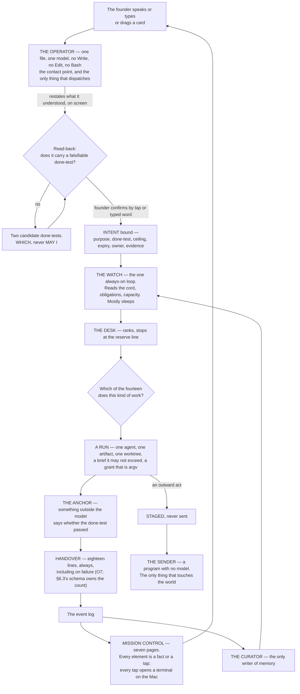

## 0 · What it is

*obeys: v1, v4, and the founder's purpose paragraph verbatim; inherits: FINAL §0*

---

### 0.1 The purpose, in the founder's words

**(FOUNDER)** This is the whole of it, and nothing below may contradict it. Transcribed by voice, kept as spoken,
errors preserved, because the founder's words are the input:

> So remember, the purpose of this system is to be the place where I, as a founder or any other person or with any
> other task or goal to be able to take a project, open a project, take a task. achieve it, and walk with agent
> relentlessly until we get the perfect trade we are looking for. So it's a system and a harness and crew and a
> company like space and working environment and it starts up like two and a system, an autonomous self moving,
> self adjusting, improving system That can also and a big part of it is to be a place where the valkorders or the
> creators or the minds. can do everything. with the power of AI agents, AI systems. workflows. and agentic tools.

**(FOUNDER)** Five things are named in that paragraph and each is load-bearing somewhere below. **A place you open a
project** — mission control's board and canvas (§14). **Take a task and achieve it** — the intent with a falsifiable
done-test (§2). **Walk with agents relentlessly until the perfect result** — the roster of fourteen (§5) and the
run that resumes rather than restarts (§6). **A company-like space** — the Operator as the founder's single contact
point (§3). **Self-moving, self-adjusting, improving** — the Watch (§4), skill admission by eval and retirement by
expiry (§7), and memory written by one curator (§13).

**(NEW: the direction's own index, section F, restates the same thing in the founder's editorial voice and is
quoted here because it is what the next reader will search for)** *"the place where the founder — or any other
person, with any task or goal — opens a project, takes a task, achieves it, and works with agents relentlessly until
the perfect result."*

---

### 0.1a What this section rests on, and the one adjustment it could not make

**(FOUNDER, rethink 2026-09-06: D11)** Nothing is decided in §0 and two things are admitted here. §0.1 asks for a
system that is *"self moving, self adjusting, improving"*, and the plan had no adjustment at all for the commonest
state the founder is in — **away**. **v76** is that adjustment: the system reads one derived value, **the last
founder event**, at four call sites — it releases the reserve to autonomous work when the last event is older than
the reserve's own horizon and snaps it back on the first tap, executes a *which*'s stated default at its intent's
expiry with both built options archived, builds one option instead of two while away, and keys page 5's *since you
were last here* view on the event rather than on a date. It reintroduces no approve verb and does not reverse v9: a
silent run still cannot ask. **Mechanism:** one predicate and one field shared by four call sites — **`bin/log`
writes `keel/logbook/founder.last` on every founder-authored event and `bin/watch` reads it**, and the four call
sites above read that one file. **ABSENT** — designed with its path named, in v50's sense, so it is ABSENT and not
WISH ~~and §A v76 names no path for it~~ *(path set by the orchestrator 2026-09-06, DECISIONS §21 · challenge C
P2-1)*. Second, **the whole of §0 rests on contrarian assumption 1** (§I row 16): that a
deterministic anchor exists for most company work. Rung 1, the trust score, regression-for-free, unattended night
work, the refusal of consensus voting and the promise that the founder is not the bottleneck all hang on it, and the
evidence for it comes from the harness — the most anchorable venture that could have been chosen. **If it is false
the architecture inverts:** the night's product becomes built options with their costs, the morning becomes an
adjudication queue, the taste store becomes the primary asset, mission control's centre of gravity moves off pages 3
and 5 onto a decision queue, and the roster shrinks. **(R12, OPEN)** settles it: what fraction of the harness
venture's **first thirty** real done-tests reach rung 1 *without inventing an anchor*. It is the cheapest measurement
named anywhere in the round, and nothing should be built against the inverted architecture before it is taken.

---

### 0.2 What it is, in one sentence, and what the name argues

**(FINAL)** A company operating system for one founder and many ventures. Not a harness, which is a set of tools
with no standing. Not an org chart, which is titles for beings that cannot be copied. An operating system in the
literal sense: it holds direction, allocates one scarce capacity, mediates every touch of the world, remembers, and
gives the founder a shell.

**(FINAL)** *It runs every part of every venture that can be checked against the world without you, walks beside you
on the parts that are only yours, and shows you both from one place, on your phone, in your own words.*

**(FINAL)** The name is the argument. A keel does not slow a boat; it is the thing under the waterline that turns
force into direction instead of drift. A system of brakes cannot move; a system with no keel moves and goes
nowhere. This is the third thing: **drive with direction, where the direction is cheap and the drive is bounded.**

**(NEW: the founder's direction adds a sixth claim FINAL did not make, and it is the one that changes the shape of
everything downstream)** The system is *also* a company. Fourteen named agents with their own expertise, tools and
way of working, an Operator that orchestrates them, and a website where the founder watches them work. FINAL made
the same system out of three anonymous shapes and refused a surface that shows them. Both of those are overruled
(v1, v4), the cost of each is stated once in §1, and the chosen thing is built properly.

---

### 0.3 The whole thing at one glance

**(NEW: a cold reader would otherwise assemble this from seven sections of prose, and the SPINE requires a flowchart
where that is true)**

**(NEW: what the picture asserts, said once so no section restates it)** Four things in that diagram are the design.
**Only the founder's door creates an intent.** **Only the Operator dispatches**, and it holds no verb that could
build instead. **Only the Sender touches the world**, and it holds no model. **Only the curator writes memory**, and
it holds no shell. Everything else is a consequence.

---

### 0.4 The five ideas, re-read against the founder's direction

**(NEW: FINAL §0 rested the whole design on five ideas. The founder's direction of 2026-09-05 overruled five of
FINAL's decision rows, so each idea has to be re-read rather than inherited. Three stand unchanged, two move, and
none is deleted)**

| # | The idea, as FINAL wrote it | Verdict | What moved, and the mechanism |
|---|---|---|---|
| 1 | **Nothing runs that does not trace to a live Intent with a falsifiable done-test** | **STANDS** | Unchanged by v1–v5, and the roster makes it easier to enforce, not harder: the Operator emits a brief carrying an intent id and `bin/run` composes the argv from it. **Mechanism:** `bin/run` refuses a brief with no resolving intent id (ABSENT; FINAL names it `keel/bin/run`); the store check refuses an intent whose done-test is not falsifiable by someone who did not do the work (ABSENT) |
| 2 | **Method is never specified. Only the outcome, the constraints and the evidence are** | **STANDS, and the roster is where it was most at risk** | Fourteen named agents carry *expertise* — a lens, a skill namespace, a model, a grant — never a procedure. **Mechanism:** the skill content rule (v18) admits four bodies — anchor, exemplar, rehearsal case, reference — and a step list only as the Sender's checklist, where the judge is absent and the act cannot be taken back |
| 3 | **Standing orders replace approvals. Inside the envelope, silence is permission. There is no approve verb** | **STANDS, and hardens from stylistic to load-bearing** | v9: a fully autonomous run runs in `dontAsk`, which **denies `AskUserQuestion` even when allowed**. A silent run *cannot* ask. So staged-not-sent and the *which* are the only channel it has. **Mechanism:** the permission mode itself, sourced from the vendor's own permissions page |
| 4 | **Capacity is one exhaustible pool with a reserve held for the founder** | **MOVES** | v22: there are **two** windows per seat, a rolling five-hour **and a weekly**, shared with Claude chat and Cowork — so the reserve is per window *and* per week, and a weekly exhaustion is a different event from a five-hour one. And two limit shapes behave differently: a seat limit cannot be escaped with `/model`, a model-family limit can. **Mechanism:** the Watch distinguishes them (§4); `bin/watch` ABSENT |
| 5 | **Knowledge is earned, not curated; memory is mined from what already happened** | **MOVES** | v3: the founder overrules the refusal of a library. There **is** a skill library now, in the open SKILL.md standard. *Earned* survives with a sharper mechanism than FINAL had: **admitted by eval** — with-skill against baseline, and a candidate that does not beat baseline is not admitted — and **retired by forced expiry**, because nothing in the world retires a skill by non-use (v19). Mining stays a batch pass over a snapshot, never a live parser, because the transcript format is internal to the vendor and changes between versions (v26) |

**(NEW: what the two moves have in common, and it is worth naming)** Neither overturns an idea; each replaces a
belief with a mechanism. "One pool" became "two windows, and here is how to tell a stop from a reroute." "Knowledge
is earned" became "admitted by an eval that runs with-skill against baseline, and expires on a date." A founder
overrule made both sharper than the original, which is the argument for not re-litigating them.

---

### 0.5 A day with it

**(NEW: FINAL's day ran on a clock — 06:40, 07:20, 09:00, 18:00. The SPINE forbids schedules and durations, and a
clock in a plan is both. This is the same day re-anchored on the mission-control page the founder is looking at and
the agent doing the work, which is what actually changed)**

| Where the founder is | What they see | What is running behind it |
|---|---|---|
| **The phone, first thing** | Nothing, unless a `wake-me` line fired. If one did: one line | The Watch slept through everything that did not qualify. The interruption budget is three a day, and a channel whose acted-on rate falls is demoted below its threshold |
| **The briefing** | One page the founder opens, so it is never an interruption. What moved, with the evidence; the raw work biggest first — the rendered page, the played video, the diff, the email that would go out, staged and unsent; two *whiches*, both built; what could not be checked, named; what it cost per venture and per window; what the Operator would do next, none of it started | `writer` staged the email and never held the key. `designer` produced the render and its anchor is the screenshot judged against a named target, not its own description. `analyst` produced the cost rows, and every one of them taps through to its run |
| **Mission control, page 2 — agents and child flows** | The Operator and its children: who is working, who is sleeping, what each is doing on the current task | Agent teams — a lead plus named teammates, each a full session. One level of teammates is visible because the runtime ships **no nested teams**; the deeper tree is subagents |
| **A tap on an agent** | A terminal opens on the Mac and the founder is inside that session | *"remember each agent or each session that we are opening in the mission control or any other surface, it's directly opening it in the terminal in my Mac because everything is run on it"* (FOUNDER). The mechanism is the documented tmux CLI (§15) |
| **Mission control, page 4 — the board** | Tickets, PRs and a timeline. The founder drags a card into *working on it* | The drag launches a session with a team of agents and hands it the task. **Nothing in the world does this** — every board-to-session project found maps one task to one agent (v16), so this part is ours to build |
| **The Floor** | A terminal, one agent, the same memory and the same envelope. The founder's own browser and own send button are here and nowhere else | The system goes sterile: nothing interrupts, nothing new is dispatched on the founder's window, the venture under their hands is held whole. When they leave, the queue that built up is one paragraph |
| **A *which*** | Two options, both already built, and the cost of each. One tap | There is no approve verb anywhere in the system. Outside the envelope, the system builds both and asks *which* |
| **The night** | Nothing. The founder is asleep | Obligations first, before any goal. Then, under each driven venture's ceiling, runs are born with a brief, work however they like, are checked by something outside the model, hand back every line the handover schema names (§6.3), and die. Routine work burns the Gemini window and never touches the founder's; embeddings and classification run locally on electricity. A fully autonomous run **cannot ask** — everything it would have asked is pre-decided or staged as a *which* |
| **Dawn** | The briefing again | The curator has already run: delta-only writes, one writer, an index loaded at start and topic files on demand |

---

### 0.6 What it is not

**(FINAL, three entries deleted by the founder and one added)** A harness with no standing. A dashboard nobody acts
on. A library of playbooks. A permissions matrix. A night that burns the window before the founder wakes. A machine
that grades its own homework. A machine that is only brakes.

**(FOUNDER)** Three of FINAL's *is-nots* are struck, because the founder overruled them and meant it. It **is** a
roster of named agents (v1, v2). It **does** have a dashboard, and the rule that saves it is that every number on it
names the tap that acts on it (v14). It **does** have a skill library (v3).

**(NEW: one is-not is added, from v6, and it is the one most likely to be violated by someone who reads "fourteen
agents" and imagines a pod)** It is **not** a system that splits one artifact across two builders. One artifact, one
agent, continuous context. Anthropic's own multi-agent post excludes coding from the pattern — *"not a good fit for
multi-agent systems today"* — and Cognition's measured failure is exactly this: *"Actions carry implicit decisions,
and conflicting decisions carry bad results."* The roster names *who* does a kind of work. It never parallelises one
build.

---

### 0.7 The vocabulary

**(FINAL)** Very few names are spent, each a plain English word doing the job that word already does. Nothing is
called an engine, a crew, a swarm, a council, a brain, a kernel, a mouth or a bench.

| Word | What it is | Where it lives |
|---|---|---|
| **Charter** | One per venture: what it is, tempo, envelope, ceiling, weight, horizon. Written by the founder, rarely changed | `ventures/<name>/charter.md` (ABSENT) |
| **Intent** | One live goal: purpose, done-test, ceiling, expiry, owner, evidence | `ventures/<name>/intents/*.md` (ABSENT) |
| **Done-test** | The falsifiable statement of what is true when the work is finished, written before it starts, checkable by someone who did not do it. The only thing ever mandated | inside the Intent |
| **Obligation** | Something owed, to whom, by when, with what consequence and what proves it discharged. No done-test to invent; the world set the test | `ventures/<name>/obligations.yml` (ABSENT) |
| **The Watch** | The one always-on loop. Reads state, ranks, mostly sleeps | one process, `bin/watch` (ABSENT) |
| **The Desk** | The ranking-and-dispatch function inside the Watch | inside the Watch |
| **Run** | One disposable unit of work: fresh context, one agent, one outcome, a ceiling, a grant, a done-test, a handover, then death | `logbook/runs/<id>/` (ABSENT) |
| **Envelope** | may-alone · never · wake-me, per venture, in the founder's words | inside the Charter |
| **The Sender** | The program with no model that performs a widened outward act against a staged, hashed artifact | `bin/send` (ABSENT) |
| **Floor** | The working-beside surface: the terminal, one agent, same memory, same envelope | Claude Code, installed and measured |
| **Balcony** | **Absorbed, not deleted** (v4). Its five views became pages of mission control | see the six words added below |

**(FOUNDER / NEW: six words are added, and each is added because the founder's direction names a thing FINAL had no
word for)**

| Word | What it is | Why it is added | Where it lives |
|---|---|---|---|
| **Operator** | The orchestrator of the agents, and the founder's contact point. One agent file. Dispatches; never builds | **(FOUNDER)** *"We need an operator, which is, like, the orchestrator of the agents. which is also the contact point with me"* | `.claude/agents/operator.md` (ABSENT; the eighteen existing agent files on this branch, `ceo-1-1788609834`, are the format seed) |
| **Agent** | A named role with its own file, model, tools, MCPs, skills and anchor. **FINAL refused this word as a proper noun; the founder restored it** | **(FOUNDER)** *"each agent with its own expertise so we can adjust his knowledge and his tools and his way of walking and thinking"*, and roster.md fact 1: seven of seven shipped systems name their roles, zero ship unnamed shapes | `.claude/agents/<name>.md` (fifteen files, all ABSENT) |
| **Page** | One of the seven surfaces of mission control. Every element on it is a fact or a tap | **(FOUNDER)** *"I want you to have pages with different things"* | mission control, a website (ABSENT; `mission-control/` exists on this branch as the server spine) |
| **Board** | Page 4: stages, a timeline, a kanban. Cards move across it | **(FOUNDER)** *"a place where I can manage the tasks and the tickets and the PRs … to jog the tasks on a board which has different stages"* | page 4 (ABSENT) |
| **Card** | One task, ticket or PR on the board. Dragging it into *working on it* launches a session and hands it the task | **(FOUNDER)**, verbatim. **This is the one part of mission control with no prior art anywhere** (v16) | page 4 (ABSENT) |
| **Team** | A lead session plus named teammates, each a full independent session, messageable by name. What a card launches, and what page 2 draws | **(FOUNDER)** *"it launches a team or added team of agents to the session"*; the substrate ships in the runtime and is experimental and off by default | `~/.claude/teams/<team>/config.json` (the substrate ships; the page is ABSENT) |

**(FINAL)** Ordinary words — anchor, grant, rehearsal, briefing, logbook, memory, window, reserve, the cord, the
world's door, the probe, the reconciler — are used as they read and are defined where they first appear.

**(FINAL, one refusal survives; one is lifted)** *Playbook* stays refused: the founder named it as what killed
creativity, and mission-command doctrine has held for a century that orders specifying method destroy the
subordinate's ability to adapt. *Agent* as a proper noun is **no longer refused** — the founder restored it, the
world agrees with the founder, and §5 spends fourteen names deliberately and says what each costs.
