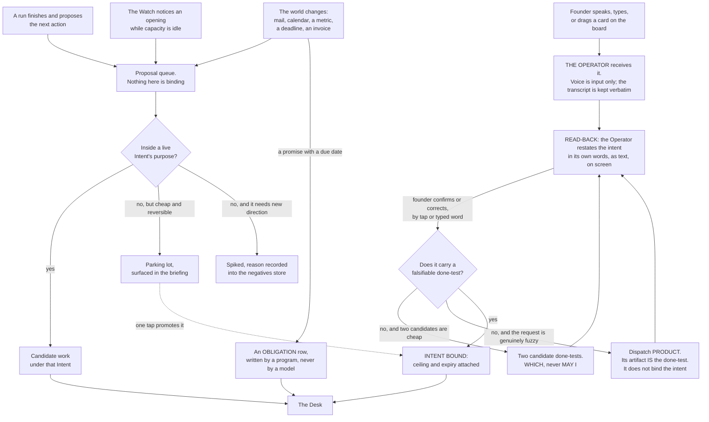
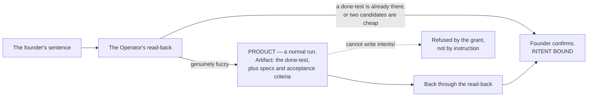

## 2 · Direction — what the founder writes, and what it costs them

*obeys: v29; SPINE §B.2 `product`; inherits: FINAL §2, §3 (the four doors)*

---

**(FINAL)** The founder writes two kinds of thing and nothing else is required of them; a third kind, the
obligation, is mostly written by the world. Everything the system does traces to one of these or it does not happen.

**(NEW: what the roster and the Operator change here, said once so the rest of the section can be read as
inherited)** Two things move against FINAL §2. The read-back is now performed by a **named thing the founder can
address** — the Operator — rather than by an anonymous surface, which is what the founder asked for: *"an operator …
which is also the contact point with me."* And when a request is too fuzzy for the read-back to close in one
exchange, the Operator has somewhere to send it: **`product`, whose artifact is the done-test itself** (§2.6).
Nothing else in FINAL §2 moves. The Charter, the Intent, the Obligation and the four doors stand as written.

---

### 2.1 The Charter

**(FINAL)** One per venture, written once, changed rarely, read constantly, short enough for a phone screen. ~~Six
lines.~~ **(NEW: contradiction 2)** The count is the schema's, not this paragraph's — three places counted it
differently and the paragraph below says what that cost.

```
venture:   plainly, what this is and who it is for
tempo:     driven | attended | watching | parked
envelope:  may-alone / never / wake-me
ceiling:   what this venture may spend, per window and in money, per month
weight:    1–5, the founder's priority, read by the Desk
horizon:   the date this charter is re-read, or it stops
entity:    the legal entity this venture publishes as, or none — what v63's disclosure line reads
cloud:     allow | deny — default deny; may a hosted lane MAKE for this venture (v79)
outcome:   one contact-rung target by the horizon, checkable by a record the company does not write (v98)
founder_hours: per weekly window, the founder's hours this venture may draw; the harness's number is 20 (v86)
ladder:    per outward class, the step this venture stands on and its N recall-free sends before widening (v94)
```

**(FINAL)** `tempo` is the founder's own distinction made structural: *walk for me* and *walk with me* are one field
with four values, set per venture, changed in one tap. `horizon` exists because a document with no expiry
accumulates instructions nobody believes; every durable thing here carries a date after which it must be renewed or
it stops applying. The Charter is the standing-orders half of the naval pair: policy written by one person once, in
their own words, read by everything else many times — the right cost shape for a founder who thinks by voice and
hates being interrupted.

**(FINAL)** **Enforced by:** a charter missing any line ~~of the six~~ **the schema declares** does not load and its
venture is `parked` until it does — `bin/check-stores` reading `keel/shared/schemas/charter.yml` (both ABSENT; FINAL
names the checker `keel/bin/check-stores`).

**(NEW: contradiction 2 — three counts of one object, and the founder's row is the one that loses)** §2.1 enforced
**six** lines, COVERAGE §14 says **five** fields, and **v63** requires a **seventh** — the legal entity behind the
disclosure line. So a six-line charter with no entity **both loads and is refused**, and it is the founder's row that
loses, silently, because the loader never asks for the seventh and nothing downstream notices. **(NEW: O3)** One
schema is the source and the prose above is **generated from it**: `keel/shared/schemas/charter.yml` (**ABSENT**),
read by `bin/check-stores` (**ABSENT**). The count moves with the schema, and a count written into a paragraph is
what produced the contradiction in the first place.

**(NEW: v22 changes what `ceiling` means, and the charter's own words do not change)** *Per window* is now **two
windows per seat** — a rolling five-hour and a weekly, shared with Claude chat and Cowork — so a ceiling is checked
against both. The founder writes one line; the Watch reads it against two fuses. **Mechanism:** `bin/watch` (ABSENT)
reads the ceiling and the reserve per window; §4 carries the distinction between a seat limit and a model-family
limit, which is the difference between a stop and a reroute.

**(FOUNDER, rethink 2026-09-06: D9)** And ***in money*** **is no longer what a ceiling is denominated in.** **v74**
makes it a **window gauge** — tokens against an observed high-water mark, since no denominator is published — with
wall clock beside it and USD kept as a **shadow price**, because on a subscription the dollar is a locally computed
shadow of a bill nobody sends (v23). The founder still writes one line and the line still reads the same; what
changes is the unit the Watch checks it in. **Mechanism:** one high-water file and one rule in the Desk (**ABSENT**);
§16 owns the currency and §4 owns the reserve.

**(FOUNDER, rethink 2026-09-06: D14)** The charter gains **`cloud: allow | deny`, default `deny`** — may a hosted
lane MAKE for this venture while the Mac is off. It is decided **now, and independently of which lane wins**: §I row
15 is still the founder's, and a venture that must not leave the Mac has to be able to say so before there is
anything to say it to. **Mechanism:** one field, refused when absent by `bin/check-stores` (**ABSENT**); a hosted
run's output still lands as a pull request or a staged artifact the Mac reconciles on wake, never into the house
directly (v56). **(FOUNDER, fixer round 2026-09-06: E1 → v83; E13 → v84)** With no always-on box — *"use this mac
and when cant use cloude"* — this field is read on every refused unattended brief: when `night_capable` is false the
Watch routes it to the cloud carrier **only where `cloud: allow`** (§4.1b), putting the maker lane's UNVERIFIED
status on the first night's critical path (§I row 15).

**(NEW: O63 — the horizon needs a third disposition, and wind-down is the one nothing named)** At a charter's
horizon **exactly one disposition** is recorded — **continue · park · wind down**. The store check refuses `tempo:
parked` while an obligation is undischarged, and refuses promotion to `driven` while any date the charter relies on
has passed. Without the third value a venture that should end has only *parked*, which keeps its obligations live and
owned by nobody. **Mechanism:** `bin/check-stores` (**ABSENT**, §L O63); the pass that finds the passed horizon is
`bin/horizon` (**ABSENT**, §L O23), which §4 owns. **(NEW, fixer round 2026-09-06: O98)** And `continue` is refused
at the horizon when the market record shows **no movement toward `outcome:` since the last horizon**, unless the
founder waives with a reason — the row is below.

**(NEW, fixer round 2026-09-06: v98 · O98 — what a charter is for)** Every driven charter carries **`outcome:`** —
one contact-rung target by the horizon, in the founder's words, checkable by a record the company does not write
(§11.9's ladder supplies the anchors). Three readers: `bin/check-stores` **refuses `tempo: driven` without it**; the
Desk reads it as the **tie-break inside a weight band** — distance to outcome, from `keel/shared/market.jsonl`, which
`bin/reconcile` alone writes (v99; §4.5 owns the comparator, §13 the store); O63 reads it at the horizon as above.
The harness's outcome is the founder's line under v64 — *a stranger's action on a venture Keel serves, recorded by
`bin/reconcile`* — so the harness too is scored by the stranger. **Mechanism:**
`keel/shared/schemas/charter.yml` and `bin/check-stores` (**ABSENT**, §L O98). **Why (THINKER: C5, C1):** weight was
the only scoreboard, and weight is the founder's opinion of a venture rather than the world's. **Losing image:**
weight as the only scoreboard · `wins_if:` a quarter of horizon dispositions match what the outcome row would have
forced.

**(FOUNDER, fixer round 2026-09-06: E3 → v86 · O95 — the founder's hours are a charter field)** *"20 hours or no
ceiling."* Every charter carries **`founder_hours:` per weekly window**; the harness's number is **20**, stated as
the founder's and moved by evidence, and because the founder said *or no ceiling*, **`founder_hours:` is
report-only, and this is the one place that says what it does** (amended 2026-09-06: challenge D P2-4). ~~The Desk
reads it exactly like `ceiling:` — harness intents stop starting when it is spent, ventures' do not~~ — **the Desk
reads it and reports; it stops nothing.** A bind at 20 raises a briefing line and a *which*, and work continues
while the founder decides; the losing image is a hard bind, kept by name below with its own `wins_if:`. Two
sentences of this section previously said *stop* and *report* about one field, and *report* is the one the founder's
words carry. §4.1's gates and §12.9's ceilings therefore have no `founder_hours:` gate, and each says so in one line.
`bin/log` writes a `founder.act` row on every tap, sign-off, terminal open and read-back, so
**founder-minutes are measured from the first run** whichever way the number moves. The briefing's first line is
*decisions taken · deferred · defaulted* (§3.8). **Mechanism:** the charter schema, `bin/log`, `bin/watch`
(**ABSENT**, §L O95). **Why (THINKER: C4, B3, C20 · conv. 1):** the plan priced tokens exhaustively and never a
founder-hour. **Losing images:** no ceiling · `wins_if:` month
two's harness minutes fall with the bind never reached; a hard bind · `wins_if:` the founder asks for it.

**(FOUNDER, fixer round 2026-09-06: E2 → v85 · O101 — the first stranger)** *"An existing project of yours."* A
**second, customer-facing venture** from the founder's existing projects joins wave one beside the harness, named at
intake, chartered with `outcome:` at **contact rung 2**; `OVERNIGHT` in §19 exits on a contact-rung movement on it
that `bin/reconcile` recorded, and wave two comes online by its routing (v54). **v64 stands:** the harness is still
the venture whose anchors exist. **Why (THINKER: C1, B4 · conv. 2):** *worked* is a stranger acting, and no build node reached one;
R27's (c) is this venture's first thirty. **Mechanism:**
`ventures/<v2>/charter.md` (**ABSENT**, §L O101). **Losing images:** the harness's own outward act as the stranger ·
`wins_if:` no existing project has a reachable stranger; a harness-only wave one · `wins_if:` R27's fractions agree
with the harness inside the sample floor.

**(FOUNDER, fixer round 2026-09-06: E11 → v94 · O100 — the outward-class ladder, decided per venture in the
charter like the envelope)** *"Yes, after N recall-free sends per venture."* Five classes in widening order —
`reply-to-existing-thread` · `follow-up-to-consented-contact` · `publish-to-preview` · `publish-to-owned-channel` ·
`first-contact` — and the charter's `ladder:` line names, per class, the step this venture stands on and its N. The
founder overruled the lane's default of stopping one step below: **`first-contact` widens like any class after N
recall-free sends**, a recall narrows one step without asking, and consent (v69) and disclosure (v63) are read at
every step. The state — `step`, `n_recall_free`, `recall_count`, `widened_at`, `undo_drilled` — lives in
`keel/shared/tools/<class>.yml`, and the mechanism is §12's (`bin/send` reads the step, `bin/reconcile` writes
recalls, the Watch stages a widen-or-stay *which*; **ABSENT**, §L O100). **Why (THINKER: C10):** widening existed for
tools and not for outward classes, so rung 1 and 2 arrived at the founder's tap rate. **Losing images:** the ladder stopping below first contact — §J 84 · `wins_if:` recalls per
hundred sends on a widened `first-contact` class exceed the founder's own tapped rate; widening on reply rate ·
`wins_if:` a class widens on zero recalls while `bin/inbound` records zero replies.

---

### 2.2 The Intent, and the done-test that makes it real

**(FINAL)** One live goal, six fields — and, since v55, two optional ones that only a standing intent carries (§2.8):

```
purpose:    one sentence — what becomes true, and why it matters
done-test:  the falsifiable check, written before the work starts
ceiling:    the most this may consume before it must come back to me
expires:    the date it stops being live if not finished or renewed
owner:      founder, or the venture's own standing intent
evidence:   what will be attached to prove the done-test passed

every:      OPTIONAL, v55 — a cadence: this intent is considered again every time it comes round
on:         OPTIONAL, v55 — an inbound event class: this intent is considered when one arrives
class:      OPTIONAL, v74 — exploration; an exploratory intent is routed off the Claude seat
valid_until: REQUIRED on a standing intent, O126 — it never finishes but expires, like everything durable
```

**(FINAL)** The done-test is the whole design compressed into one field. Compare two ways of instructing one piece
of work. *Playbook:* "Stage 1 research the market. Stage 2 write three positioning options. Stage 3 pick one. Stage
4 write the landing copy. Stage 5 review against the brand voice lens." *Done-test:* "A landing page exists at a URL
I can open on my phone. A person outside this project can read it in thirty seconds and say what the product does
and who it is for. Three positioning options were considered and the two rejected ones are written down with the
reason. Nothing on the page is a placeholder." The second constrains quality more tightly and method not at all, and
someone who did not do the work can check it — the property everything in §11 depends on.

**(NEW, fixer round 2026-09-06: O102 · R27)** Thirty **paper done-tests** written across §23–§30's company work are
part (b) of R27 — with the founder's thirty rated Floor episodes, they are the half of contrarian assumption 1 that
the harness cannot test, because the harness is the most anchorable venture that could have been chosen (§0.1a).
*Inventing an anchor* is defined there. **Mechanism:** O102's one sitting under `founder_hours:` (**ABSENT**); zero
build.

**(FINAL)** A done-test must be falsifiable or the Intent does not open. This is the one hard gate on the founder's
own input, and it is done conversationally, by the read-back: *"make the marketing better"* has no done-test, the
system says so, proposes two, and the founder picks one.

**(FINAL)** **Enforced by:** an intent file with no `done-test:` fails to load; the launcher refuses any brief whose
`intent:` id does not resolve to a live intent file — `bin/check-stores` and `bin/run` (both ABSENT).

**(NEW: v12 gives the done-test a second job it did not have in FINAL, and it is the reason `/goal` is not a new
concept here)** The done-test **is** the goal condition on the run. `claude -p "/goal <the done-test> or stop after
N turns"` is one invocation that runs the loop to completion, and a small fast model checks after each turn whether
the condition holds, returning Not yet met, Met, or Impossible. The condition limit is 4,000 characters, which is
the one hard constraint the done-test's wording must respect. **Mechanism:** the launcher composes the `/goal`
string from the intent's `done-test:` field verbatim, never paraphrased — `bin/run` (ABSENT). §6 carries the run
side of this.

**(FOUNDER, rethink 2026-09-06: D9)** The intent gains **`class:`**, and the only value the plan needs today is
**exploration**. An exploratory intent routes to Gemini, a local model or the Codex seat, and **the Desk refuses an
exploratory dispatch onto the Claude seat past a fraction the founder sets**. The reason is v22: the weekly window is
per seat and shared with Claude chat and Cowork, so *"idle capacity is bounded by being free"* is false and a night
of exploration is subtracted from the next day. **Mechanism:** one field on the intent and one rule in the Desk
(**ABSENT**); the enumeration lives in the intent schema, not in this paragraph.

**(NEW: O22 — the copy that is mandated and checked by nothing)** §6.2 mandates that a brief's `done-test:` is a
verbatim copy of the intent's, and nothing verifies it. The launcher now **refuses a brief whose `done-test:` is not
byte-identical to the intent's**, and brief and handover are logged as **adjacent hashed rows**. **Mechanism:**
`bin/run` (**ABSENT**, §L O22). This repository has lost a measurement in synthesis twice; a byte compare is the
cheapest place to stop the third, and it is the same defect one layer up.

**(NEW: O23 — an expiry with no forced disposition is a date nobody reads)** `expires:` already stops an intent being
live. What was missing is what v19 gives a skill: at expiry **exactly one disposition is recorded**, and a **lapse
record** — one row per thing that expired unactioned, ordered by what it stopped — so the number of things that
quietly lapsed is readable rather than inferred. **Mechanism:** `bin/horizon` (**ABSENT**, §L O23) walks every
durable store, intents and charters included; `scripts/ledger.mjs` **exists** on branch `ceo-1-1788609834` and
already forces one disposition at a claim's expiry, which is the idiom being reused. §4 carries the pass.

---

### 2.2a The work item — the object between an intent and a run

**(NEW: O1 — every surface already assumes this object and no store holds it)** An intent is a goal; a run is one
disposable unit of work. Between them the plan has been passing *candidate work* around as a phrase, so page 4's
cards, the Desk's queue and the retry counter each hold their own idea of it. It becomes one store:

```yaml
i-2026-09-06-0007:                      # the item's own id, in items/w-*.yml
  intent:        i-2026-09-04-0012      # the INTENT it serves; it does not load without one
  purpose:       one sentence
  ceiling:       per run
  blocked_on:    []                     # other work rows, or an open which
  attempts:      0
  last_failure:  null                   # the exact text, never a summary
  card:          the page 4 card that is a view of this row
```

**(NEW)** **A board card is a view of a work row, not a second object.** Otherwise page 4 and the Desk hold two
answers to *what is being worked on* and disagree the first time either is edited. Proposals land in
`keel/ventures/<v>/items-draft/` and **the Watch materialises them after the store check** — v44's obligation
pattern reused rather than a second one invented for the same shape. **Mechanism:**
`keel/ventures/<v>/items/w-*.yml`, with `bin/check-stores` refusing a live intent that has zero work rows —
**ABSENT** (§L O1, which names the same store `work/`; the directory is `items/` here because `work/` is already
the venture's source repository in §17.8's tree). **(R16, OPEN)** decides whether this is two objects or three:
whether any shipped agent system carries a scheduling object between the goal and the run, read from Symphony,
Linear's agent session model and Copilot's task object. Until it is answered the design is **two** — the intent and
the work row — and the run stays disposable.

---

### 2.3 The Obligation

**(FINAL)** Something owed, with a creditor and a due date. No purpose to restate, no done-test to invent; the world
set the test and the world will check it.

```yaml
obligation:
  id:           o-2026-09-04-0009
  owed:         { what: "domain renewal agentvibe.com", to: "the registrar" }
  due:          2026-11-02
  lead_time:    7d                     # inside it the obligation is DONE and nothing else is considered
  consequence:  "the domain lapses; weeks to recover; durable reputational cost"
  discharge:    { what: "renewed", proved_by: "the registrar's own record" }
  recurs:       yearly
  statute:      null                   # a statutory obligation names one, and names a second human
  second_human: null
```

**(FINAL)** Renewals of domains and certificates, tax filings, the clock on a data-subject request, the clock on a
breach, key rotation, a promise made in a launch email, a customer waiting on a reply, the restore drill. The four
doors admit *a deadline* as candidate work under an Intent, but a renewal is under no Intent and a statutory clock
cannot lose a ranking. So obligations are read before any Intent, are never an argument in the ranking, and are
deferred only by the founder, shown the consequence.

**(FINAL)** **Enforced by:** the Watch reads `obligations.yml` before `intents/`; an obligation with `due` in the
past and no disposition is the first item the founder sees; `statute` set with `second_human` null fails to load —
`bin/watch`, `bin/check-stores` (both ABSENT).

**(NEW: the roster gives the obligation an owner it did not have, and the anchor is the load-bearing half)**
`steward` is the agent the Operator routes to when *"something is owed to someone by a date"* — invoices, expenses,
contract review, compliance flags, vendors, support triage. **Its anchor is that an obligation is discharged only by
a record the company does not write**: the registrar's own record, the tax authority's receipt, the counterparty's
acknowledgment. A `steward` that reports an obligation discharged, with our own log as the evidence, has produced a
rung-4 claim about a rung-1 question. **Mechanism:** the discharge field names `proved_by`, and the nightly
reconciliation reads the external record (§11).

---

### 2.4 How work enters — the four doors

**(FINAL, with the Operator inserted at the founder's door and `product` behind it)** Four doors, not equal.



**(FINAL)** Three things matter more than the boxes. **Only the founder's door creates an Intent**; the others
produce candidate work under an existing one, or a proposal that waits — the mechanism behind *never runs my
projects without direction*, which is a provenance rule rather than a budget cap. **The read-back is mandatory and
is text, never voice**: the founder's instructions arrive transcribed with errors, and a misheard word costs one tap
instead of one night. **The spike file records the reason**, so the Watch does not re-propose the same rejected work
every night — the most obvious way an always-on system burns tokens forever.

**(NEW: O51 — the fourth door's provenance test is the same as the fifth's, and it was weaker)** Idle work must serve
a **live intent, a standing intent, or the negatives and knowledge stores**, or it is a leak with a cheap price tag.
The Watch's idle branch reads the **same** provenance test as its dispatch branch rather than a looser one, because
*cheap* is not a provenance: a night of unowned work that costs little is still work the founder did not direct, and
*"never runs my projects without direction"* is a provenance rule, not a budget cap. **Mechanism:** the Desk's gates
(**ABSENT**, §L O51); §4 carries the gate order and names which gate this is.

**(NEW: O60 — bug intake, the one intake the four doors did not name)** An anchor that fails twice writes a **card
whose done-test IS the reproducing command**. Where there is no reproduction it is not a ticket at all: it is a
bounded question for `scout`, which returns a reproduction or the reason there is none. That keeps the one class of
work that arrives already falsifiable from being paraphrased into an unfalsifiable one on its way in. **Mechanism:**
`bin/intend` (**ABSENT**, §L O60), entering through the proposal queue like every other non-founder door — it creates
candidate work under an intent, never an intent.

**(FINAL)** The world's door is a program that writes one row and does nothing else; **no model reads a stranger's
text with a tool in its hand.** The transcript is kept verbatim, transcription errors preserved, because
*"contacts"* meaning *context* is information about the speaker.

**(NEW: the board is a fifth entrance that is not a fifth door, and confusing the two would break the provenance
rule)** Dragging a card into *working on it* on page 4 launches a session and hands it the task — **(FOUNDER)**
*"when I drag a task … to a section when it's saying working on it or, like, preparing for it, it launches a team or
added team of agents to the session … and then it starts walking."* That is the founder acting, so it is the
founder's door, and the card must already carry or resolve to an intent id. **A card with no intent id does not
launch anything**; the drag is refused and the card is sent through the read-back instead. **Mechanism:** the board
calls the same launcher as every other dispatch — `bin/run` (ABSENT) — and the launcher refuses a brief with no
resolving intent id. Without that rule, the board is a fifth door that creates intents by drag, and the provenance
rule is gone.

**(FINAL)** **Enforced by:** the read-back page and its confirm tap are the only writer of `intents/*.md` from the
founder's door (ABSENT); `bin/inbound` writes one logbook row per world event and holds no model (ABSENT).

---

### 2.5 The read-back

**(FINAL, and v29 keeps it against the world's silence)** Voice is input only. The Operator writes back what it
understood — as an intent with a done-test, in its own words, on screen — and the founder confirms by tap or typed
word. **Nothing binds by voice.**

**(NEW: the research position, stated honestly, because a rule with no shipped precedent should say so)** **No
shipped system mandates a restatement before work binds.** Linear comes closest and it is an acknowledgment, not a
confirmation: an agent should *"Emit a `thought` activity within 10 seconds to acknowledge the session has begun."*
So the read-back is **unsupported and uncontradicted** by shipped practice. It is kept because closed-loop readback
is regulation in aviation and medicine, where readback error rises as messages get complex, and because the input
here is a voice transcription with preserved errors — the exact condition the regulation exists for.

**(NEW: v9 makes the read-back the last cheap moment, which it was not in FINAL)** A fully autonomous run **cannot
ask**: `dontAsk` denies `AskUserQuestion` even when it is allowed. So a question that was not settled at the
read-back has exactly two fates — pre-decided in the envelope, or staged as a *which* with ~~both options built~~
**one option built and a written second, both built only when a ten-word summary cannot separate them, and only
while the window's decision budget holds** (amended 2026-09-06: E15 · v87 · O96; §4.5 owns the budget). There
is no third outcome and no approve verb. That makes the read-back the highest-leverage exchange in the system, and
the place where an ambiguity is cheapest to kill.

**(FINAL / NEW)** **Enforced by:** the read-back page (ABSENT); the store check refuses an intent whose done-test is
not falsifiable by someone who did not do the work — `bin/check-stores` (ABSENT). **What is NOT enforced:** that the
founder actually reads the read-back before tapping. That is `WISH`, and no mechanism is proposed for it, because
the only candidates are ceremony.

---

### 2.6 Where `product` sits

**(NEW: SPINE §B.2 gives `product` the job "turns fuzzy into a falsifiable done-test" and routes to it when "the
request cannot yet be dispatched". This says where in the doors that lands, because a reader will otherwise assume
product owns the intake)**

**`product` sits inside the founder's door, behind the read-back, and it does not bind anything.** The Operator
attempts the read-back first, because two candidate done-tests are usually cheap and the exchange is one tap. When
the request is genuinely fuzzy — a direction rather than a goal, a request whose done-test would itself need
research, a roadmap-shaped ask — the Operator dispatches `product` under the same rules as any other run, and the
artifact that comes back **is the done-test**, with the specs, tickets and acceptance criteria that make it
checkable. That artifact then re-enters the read-back, and the founder binds it or corrects it.

**(NEW: the boundary that keeps the provenance rule true)** `product` **cannot create an intent.** It produces a
proposed done-test; the founder's confirm is what binds. If `product` could bind, the founder's door would have a
model in it, and *only the founder's door creates an Intent* would be false the first time a run proposed a goal.
**Mechanism:** `product`'s grant carries `Write` on spec paths only, never on `intents/` — the argv, composed by
`bin/run` (ABSENT), and asserted nightly by `bin/probe` (ABSENT).



**(NEW)** `product`'s **anchor** is the same store check that gates the founder's own input: *the store check
refuses an intent whose done-test is not falsifiable by someone who did not do the work.* An agent whose job is to
produce done-tests is judged by the same gate every done-test passes, which is the only arrangement that does not
grade its own homework.

---

### 2.7 What the founder must do, in full

**(FINAL, with three rows changed by the founder's direction)** The complete list. If the system needs more than
this, the design has failed.

| The founder does | How often | Where |
|---|---|---|
| Writes a Charter | Once per venture | Voice → the Operator's read-back → tap |
| Opens an Intent, or confirms one the Operator drafted | When they want something | Voice or text → read-back → tap |
| **Drags a card into a working stage** *(NEW: the founder's page 4)* | When they want a queued thing started | Mission control, page 4 |
| Answers a **which** — ~~from options already built~~ one built and a written second, the recommendation sometimes hidden as a control arm (amended 2026-09-06: v87 · O97) | Only when the envelope requires it, and never past the window's decision budget (O96) | One tap, phone |
| Defers an obligation, shown its consequence | Rarely | One tap, phone |
| Sets a tempo | When a venture's rhythm changes | One tap |
| Opens the briefing | When they feel like it | One page |
| **Opens an agent's terminal from any surface** *(NEW: the founder's own instruction that every tap opens a terminal on the Mac)* | Whenever they want to see or message a run | A tap on any page; a terminal on the Mac |
| Sits down on the Floor | When they want to build | Terminal |
| Pulls the cord | Whenever they want it to stop | One tap, one word, or one command |

**(FINAL)** Absent from that list, deliberately: approvals of routine actions, ticket grooming, standups, sprint
planning, and reviewing the system's own internal work. **(NEW, fixer round 2026-09-06: v102)** Also absent: renewing
a lease. `founder.lease` is `founder.last` read against a second, longer horizon, renewed by any founder-authored
event in the list above, and while it is stale the Watch mints nothing unattended (§4.4) — the founder's ordinary
presence is the heartbeat, and their absence is the stop. The founder's list contains all of those; §23 says what
happened to each.

**(NEW: one thing the founder's direction adds to the list that is easy to miss)** *"we also need to manage, you
know, the history and number of sessions and, like, to understand how do we save memory and to be efficient."* That
is **not** a founder task. It is bounded by mechanism in three places — the vendor's concurrent-subagent cap, the WIP
limit per venture, and at most two driven ventures — and the board **refuses a drag that would breach any of them**
rather than asking the founder to count. §14 and §15 carry it.

---

### 2.8 Standing intents — the company working on a cadence or an event

**(FOUNDER, v55)** *"skip hermes for now. but think about agents like: customer support, marketing agents: leads,
reacherch, security, competers, data anslisis and more that can run every set time or evant or something else. it to
build the company like working."* Asked which shape that should take, the founder chose **standing intents with a
cadence or trigger, run by the Watch**.

**(FOUNDER: what a standing intent is)** An intent that ~~**never expires**~~ **never finishes but expires** —
it carries `valid_until` with a forced disposition like everything durable (amended 2026-09-06: NEW: O126 ·
THINKER: B20) — carrying `every:` — a cadence — or `on:` — an inbound event class. It is written once, through the same read-back as any other intent, and it is the
`owner:` field FINAL §2.2 already anticipated: *"founder, or the venture's own standing intent"*. Every time it comes
round, the Watch treats it as candidate work like any other and dispatches it to the agent its kind already routes
to. **Its outputs stage; they never send** — a standing intent is a recurring *reason to consider work*, not a
standing permission to act, and the Sender's rules are unchanged by it.

**(NEW: why this needs no new agents, which is the load-bearing half of the row)** Each of the founder's examples is
already a kind of work the Operator routes, so the row adds a field to the intent store and nothing to the roster.

| The founder's example | The agent it routes to | Why that one, from its existing anchor |
|---|---|---|
| customer support | **steward** | it already owns *"something is owed to someone by a date"* and works from `scout`'s handover of inbound rows; a support thread is an obligation with a creditor |
| marketing: leads | **growth** | it already drafts the outward act, and the Sender is what sends it |
| research | **scout** | it already holds the tainted read of the open web and returns facts, never acts (v36) |
| competitor watch | **scout** | the same read, on a cadence rather than on a request |
| security | **guard** | it already reviews adversarially and produces a finding nothing downstream re-derives |
| data analysis | **analyst** | it already reads the reconciliation's mismatches and drafts the Decide item |

**(NEW: the two things this must not become, both named because they are the obvious next step and both refused)**
It is **not a second scheduler** — there is one Watch, one tick, one ranking, and a standing intent is a row it
reads, not a clock it obeys. And it is **not a cron field in an agent file**, because that would put the decision to
run work inside the thing that does the work, where nothing ranks it against an obligation or against the reserve.
Both are kept in §22.

**(NEW: what has to hold for a cadence not to be a leak)** A standing intent that fires forever needs a bound that
is not its own expiry, ~~because it has none~~ because its expiry is a date and a leak is a rate (amended 2026-09-06:
O126). So the ceiling is **per run**, not per intent, and a standing intent
with `every:` and no per-run ceiling does not load. **And it expires:** `valid_until` is required on a standing
intent, and at expiry `bin/horizon` (§L O23) forces exactly one disposition — Refresh · Deprecate · Waive with a new
date — so the company's recurring work is re-decided on a date rather than running until someone notices
(**ABSENT**, §L O126). **Losing image:** a standing intent with no expiry · `wins_if:` every standing intent Refreshes
on evidence for a year. **Mechanism:** the intent schema gains the two optional fields;
`bin/watch` reads them on each tick (**ABSENT**); `bin/check-stores` refuses `every:` without a ceiling per run
(**ABSENT**). §4 carries the tick side.
