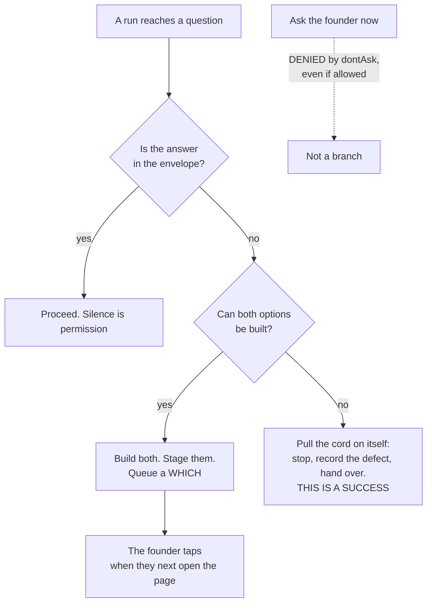
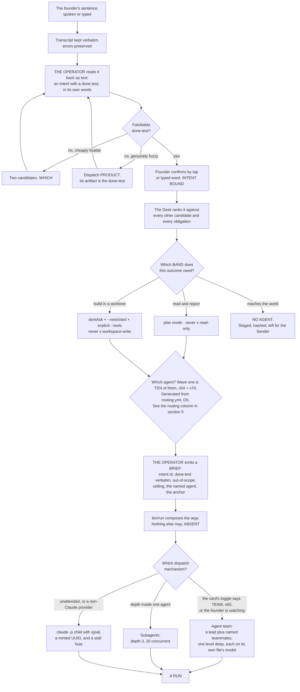

## 3 · The Operator

*obeys: SPINE §C entire; v9, v10, v13; inherits: FINAL §6, §7.5*

---

**(FOUNDER)** *"We need an operator, which is, like, the orchestrator of the agents. which is also the content point
with with me. OAuth out me depends on the type of tasks because you also need to be able to run it fully
autonomous."* Transcribed by voice; *"content point"* is *contact point* and *"OAuth out me"* is *how much it asks
me*, and both readings are used below with the original preserved because the founder's words are the input.

**(NEW: what that one sentence decides, and it decides three separate things)** The founder named a single role that
carries three jobs at once: it **orchestrates the agents**, it is **the contact point with the founder**, and **how
much it asks depends on the type of task**, up to and including asking nothing at all. The third is not a setting on
the first two — it is the hardest constraint in the section, because a run that cannot ask has to have had every
question answered before it started.

---

### 3.1 Identity

**(NEW: v46 — the Operator's runtime position, decided, because page 2 depends on it.)** The Operator is
the founder's **interactive session**, started as `claude --agent operator`, so one agent file governs it and
it can still form the agent team page 2 draws. It is inventoried as a file (§17.1 row 0) and runs as the main
session; a dispatched agent file could not form a team (v13, §14.5). Whether `--agent` binds the file's
`tools:` at top level is **one measurement, UNVERIFIED**; until it passes, the no-`Write` guarantee below is
held by managed `permissions.deny`, not by frontmatter.

**(NEW: one file, in the format the runtime already reads, so the Operator is the same kind of object as the
fourteen it dispatches)**

| Field | Value | Why this value |
|---|---|---|
| **File** | `.claude/agents/operator.md` — **ABSENT**. The eighteen agent files on this branch, `ceo-1-1788609834`, are the format seed, and `.claude/hooks/schema-lint.js` on the same branch is the linter that will hold it | v2: one file per agent, in frontmatter the runtime reads |
| **Model** | `claude-opus-5` | It reads the founder's sentence, picks among fourteen, and writes the brief that binds a run. Every defect in it is a defect in work nobody reviews |
| **Tools** | `Read Glob Grep` plus `Agent(...)` | **It dispatches and it does not build** |
| **No** | `Write`, `Edit`, `Bash` | An Operator that can edit will edit instead of dispatching. It is the same argument that keeps `Write` off `reviewer`: the thing that can do the work will do the work, and then nothing was orchestrated |
| **MCPs** | none | Nothing it does touches a server. The two agents that declare `mcpServers` today are `designer` and `sourcer` — a fact about **this repository as it stands**, not a roster rule; **v2's roster grants servers to five** (scout, designer, analyst, writer, growth; §5.2). Neither kind of work is this |
| **Mechanism** | its argv, composed by `bin/run` (ABSENT), plus the nightly probe `bin/probe` (ABSENT) that asserts what it can actually touch | v34: a grant is argv, not prose. A capability nobody probes is a memory of one |

**(NEW: why the no-`Bash` line is not decoration)** This repository has already measured what a shell in the wrong
hand does: `Bash` has no path concept in the hook that scopes `Write` and `Edit`, so an agent holding a shell is
narrowed by the sandbox and the managed file and by nothing else. An Operator with `Bash` could compose and run its
own argv, and v34 — *one no-model launcher composes the grant, and nothing else may* — would be false the first time
it did.

---

### 3.1a Who may call the surface that dispatches

**(FOUNDER, rethink 2026-09-06: D1 → v66)** The Operator is reached through mission control, and until this round
nothing in the plan said **who may call it**. The founder's answer is three things at once and it is recorded in
DECISIONS §18: *"Loopback bind + a keychain-held token on every write route + an authenticated tunnel for the
phone."* The server binds loopback only; every route that **writes** — a dispatch, an edit-arguments verb, a tap
that answers a *which* — checks one token held in the macOS keychain; the phone arrives through an authenticated
tunnel rather than over the founder's own network.

**(NEW: contradiction 16)** Three sentences could not all stand: v39 let the phone reach *"the local server over
your own network"*, §14.13 said every page writes *"nothing but the inbox file and the intent log"*, and the seed
pins `127.0.0.1`. An unauthenticated dispatch plane on any network the Mac joins is what v39 as written describes,
and it is now the losing image. **Mechanism:** the loopback pin exists in the seed; the token check is one
middleware and the token is keychain-held (**ABSENT**); the tunnel is named at build time (**ABSENT**). Whether a
detached night process can read that keychain item without an interactive unlock is **(R3, OPEN)** — the unattended
half of §3.3 rests on it and nothing has tested it. **Settled by:** `lsof -nP -iTCP -sTCP:LISTEN` showing a
non-loopback bind, or a tap accepted from a device that presented no token. §14 carries the surface; this section
carries the consequence, which is that **a dispatch is an authenticated act**.

---

### 3.2 Graded autonomy — one table, three things at once

**(FOUNDER)** *"how much it asks me depends on the type of task."* **(NEW: this becomes one band table, and every
band names its envelope terms, its Claude Code permission mode and its Codex axes, so that a band is a real setting
rather than an adjective.)** This is the row every section about control obeys.

| Band | Task types | Envelope | Claude Code mode | Codex ~~`approval_policy` × `sandbox_mode`~~ `approval_policy` × `sandbox_mode` × **Guardian** *(moved 2026-09-06: W21)* | Who runs in it |
|---|---|---|---|---|---|
| **Read and report** | research, review, audit, analysis, challenge | `may-alone` | `plan` | `never` × `read-only` | scout · reviewer · guard · challenger · analyst |
| **Build in a worktree** | code, design, copy, spec, schema, memory | `may-alone`, inside one venture's worktree | `dontAsk` with `--restricted` and an explicit `--tools` | `never` × `workspace-write` | builder · architect · tester · designer · product · writer · growth · steward · curator — the five with `isolation: none` (product, writer, growth, steward, curator; v41) run in this band on a narrowed `--add-dir`, **not a checkout** |
| **Stage an outward act** | send, publish, pay, deploy, share, delete | **`never` for every agent** | no mode — no agent performs it | — | nobody. The **Sender** performs it, and it holds no model |
| **Wake the founder** | anything on the venture's `wake-me` list | `wake-me` | — | — | the Watch, before it rings, against the interruption budget |

**(FINAL §7.5, providers lane, measured 2026-09-04: two shipped facts make the table binding rather than descriptive)** `bypassPermissions`
is disabled in managed settings, and **deny rules bind in every mode including it** while *"Allow rules have no
effect in `bypassPermissions`"* — so the widest mode is both refused and, were it reached, still floored (v10). And
a subagent's own `permissionMode` frontmatter **is ignored**, so **a child cannot widen its own grant**. Those two
are why the bands are enforcement and not documentation.

**(NEW: what `auto` mode is, and what it is not, because it looks like the envelope and is not)** In `auto` mode *"a
second model, the classifier, reviews actions instead of you"*, and it extends to subagents in three places: the
delegated task description is evaluated before spawn, each action goes through the same rules as the parent, and the
subagent's full action history is reviewed on return with a warning prepended if it flags. **That is a cheap
guardrail against accident. It is not the envelope.** It can be switched off with `disableAutoMode`, it is a model
reviewing a model, and **nothing in it keys on reversibility** (v28) — both shipped schemes key on path and action
class. The envelope keys on reversibility, stands alone in the world in doing so, and is enforced by the argv and the
managed file rather than by a classifier.

**(FACT: world.md 21 — the Codex cell of every band is three axes, not two)** ~~Codex is `approval_policy` ×
`sandbox_mode`~~ **Guardian** is a third control axis: a background scoring layer whose behaviour changes with the
approval mode — *"Full Access skips Guardian reviews for confirmation-only actions. User approval mode skips
background Guardian scoring and prewarming, while sensitive-action checks and requests for user input retain their
existing handling"* — and its review history *"survives compaction, restarts, and user-created forks … isolating
subagent history"*. Two consequences for this table. The band's Codex cell **understated what governs a Codex run**,
so a band read as two settings was never the whole envelope there; and Codex subagents carry **their own review
history**, which §10 does not describe. **Mechanism:** the axis is the vendor's, not ours — what is ours is that
`bin/run` (ABSENT) records which approval mode a Codex dispatch used, because that is what decides whether Guardian
scored the run at all.

**(NEW: contradiction 4)** ~~`analyst` sits in *read and report* here and holds `Bash` in §5.2~~ — one agent, two
answers, and the shell is the half that goes. §L **O57** strikes `analyst`'s `Bash`; v47 already gave every
comparison to `bin/reconcile`, so nothing is lost with it and the placement above stands unchanged. §5 carries the
strike.

**(NEW: O5 — contradiction 17)** *Which agent, which model, which band* is answered in **three places**: the roster
table (§5.2), this band table, and §9.2's routing. Nothing checks that they agree, and a disagreement between them
is a mis-route, which is the one defect class the anchor ladder is structurally blind to — an artifact that passes
its done-test, the blind test and CI while answering the wrong question. **Mechanism:** one machine-readable
`keel/shared/routing.yml` (**ABSENT**), from which all three views are **generated or checked**; the three tables
stop being three decisions and become three renderings. Nothing here changes any routing; it changes how many
places may change one.

---

### 3.3 Fully autonomous mode, and the one consequence that is the whole design

**(FOUNDER)** *"you also need to be able to run it fully autonomous."*

**(NEW)** It is the **build in a worktree** band with three additions:

- the managed settings file of v11 — `permissions.deny`, `disableBypassPermissionsMode`, `disableAutoMode`, and
  **not** `disableAllHooks` or `allowManagedHooksOnly`, because either of those kills `/goal`;
- `/goal <the done-test> or stop after N turns` on every dispatched run (v12);
- the cord read first, on every tick, before anything else.

**(NEW: and one consequence, which is not a caveat but the design of the mode)** **A fully autonomous run cannot
ask.** `dontAsk` *"Auto-denies tools unless pre-approved"*, and the vendor's own page adds that `AskUserQuestion`,
MCP tools marked `requiresUserInteraction`, and connector tools set to `ask` *"are denied even if you've allowed
them."* Asking the human is itself a permissioned action, and this mode switches it off.

**(NEW: what follows, stated as an exhaustive list because the value of the rule is that it has no third branch)**
Every question the run would have asked has exactly two fates:

1. **Pre-decided in the envelope** — the founder wrote `may-alone`, `never` and `wake-me` once, per venture, in
   their own words, and inside that envelope silence is permission.
2. **Staged as a *which*, with both options built** and left for the founder, who answers with one tap when they
   next open the page.

**There is no third outcome, and no approve verb anywhere in the system.** FINAL had staged-not-sent as a rule of
taste; v9 makes it the **only channel a silent run has**, which is a much stronger reason to keep it.

**(NEW)** What still reaches the founder while a fully autonomous night runs: the `wake-me` list, the interruption
budget of three unprompted interruptions a day, and the briefing — which is never an interruption, because the
founder opens it.

**(FACT: world.md 30b and 14 — the measured ceiling this mode is designed above, stated as the cost of the mode)**
The vendor's own measurement of its own users: *"the 99.9th percentile turn duration nearly doubled, from under 25
minutes in late September to over 45 minutes in early January"*, and *"roughly 20% of sessions use full
auto-approve, which increases to over 40% as users gain experience"*. **Forty-five minutes is the outer measured
unattended stretch, and this mode is designed for a night.** The mechanism that produces the gap is W14's
check-in cap: `/goal` check-ins back off 30 min → 1 h → every 2 h, and **an idle session gets at most three
check-ins per goal** until someone messages it. Under `-p` the check-in is the only thing the runtime delivers and
**nobody is there to message it**, so a night goal loop delivers three times and then goes quiet — quiet being
byte-indistinguishable from finished. Two mechanisms answer it and neither is optional: §L **O21** composes
`/goal`'s condition from v45's `anchor:` field — *"`<anchor>` exits 0, and `<done-test>`"* — turning the most
frequently executed judgement in the system from a small model reading prose into an exit code
(`bin/run` composes it, **ABSENT**, **DEPENDS-ON-R17**); and §L **O15**, the wake reconciler, writes `orphaned`
rather than `finished` when a run goes quiet (`bin/watch`, **ABSENT**). §6 carries the reconciler.

**(NEW: O49 — contradiction 5)** ~~*"The Operator is the escalation"* for a night run~~ — §4.4 says the Operator is
not always on, in the same plan, so a run that stops at 03:00 escalated to something that was not running. **Night
escalation is a queue row plus the wake-me test, and never the Operator.** The stopped run writes to the house
decide queue (§L **O9**, `keel/logbook/decide.jsonl`, **ABSENT**); the `wake-me` list decides whether it also
rings, against the interruption budget; the Operator reads the row when it next runs, like every other reader.
**Mechanism:** the queue is a store with one writer, so an escalation survives the absence of every session.

---

### 3.4 The read-back

**(FINAL row 17, kept by v29)** Voice is input only. The Operator writes back what it understood — as an intent with
a done-test, in its own words, on screen — and the founder confirms by tap or typed word. **Nothing binds by voice.**

**(NEW: the honest research position)** No shipped system mandates a restatement before work binds; Linear's
ten-second `thought` acknowledges rather than confirms (cognition.md marks the figure `M`). The rule is **unsupported and uncontradicted**, and it is
kept because closed-loop readback is regulation in aviation and medicine, and because the input is a voice
transcription with errors preserved.

**(NEW / FINAL)** **Mechanism:** the read-back page (ABSENT); the store check refuses an intent whose done-test is
not falsifiable by someone who did not do the work — `bin/check-stores` (ABSENT). §2.5 and §2.6 carry the door and
where `product` sits behind it.

---

### 3.5 How it dispatches — three mechanisms, each for what it is documented to do

**(NEW: v13. One dispatch mechanism for everything is the losing image, and it loses because the three shipped
mechanisms have different documented properties and picking one would mean using it outside what it does)**

| Mechanism | Used for | The sourced constraint that shapes the design | `stop:` — what the cord reaches *(added 2026-09-06: v67)* |
|---|---|---|---|
| **Agent teams** | the fleet the founder watches on page 2 — a lead plus named teammates, each a full independent session, messageable by name | **turned on by the founder** (v59: `CLAUDE_CODE_EXPERIMENTAL_AGENT_TEAMS=1`), and experimental in the vendor's own words; **no nested teams**; one team per session; `/resume` does not restore in-process teammates; spawning needs an interactive session, so `-p` never forms a team. Tokens: *"approximately 7x more … when teammates run in plan mode"* — **at each teammate's own model price** (v59) | through their session |
| **Subagents** | depth inside one agent — a builder's own exploration, a scout fan-out | depth 3 by default, 20 concurrent, `Workflow` removed from all of them (v35); a subagent's `permissionMode` frontmatter is ignored; main-conversation auto memory is not loaded into subagents except a fork | through their session |
| **`claude -p` children through the launcher** | unattended night work, and every non-Claude provider | `--session-id` must be a valid UUID, minted by us; `--restricted` needs v2.1.248+; `--max-budget-usd` is a stall fuse, not a billing control (v23); `-p` disables tools needing terminal input, so a session never stalls waiting | the **recorded process group**, signalled — `SIGTERM` is measured to give exit 143 and a resumable turn |
| **A channel between sessions already running** — *(added 2026-09-06: v80, W11, W20)*. **Not a fourth dispatch mechanism: nothing in this row starts a session** | one agent asking another for a handover or filing an objection, and page 2's message control | `SendMessage`/`ListAgents` across sessions on one machine, *"on Bedrock, Vertex, and Foundry, and when telemetry is disabled"*; the **inbox socket closes a connection that sends no complete line within 30 seconds**, so a poster connects once its data is ready (world.md 11). Codex ships the same idea as `@` task mentions (world.md 20) — **two providers shipped this in one window and the plan modelled neither** | none of its own; the two sessions it joins stop by their own rows |
| **A hosted lane** (v79) | nothing yet | — | **UNKNOWN**, and `bin/run` therefore refuses to mint unattended work on it |

**(NEW: the one consequence of the teams constraint that a surface designer must know before drawing page 2)** There
are **no nested teams** and one team per session. So the child-flow page shows **one level of teammates**, and
everything deeper is subagents. A page drawn as a tree of teams of teams would be drawing something the runtime
cannot produce.

**(FOUNDER, rethink 2026-09-06: D2 → v67 — what the cord actually stops, and why every row above now declares it)**
The founder took both halves: *"the launcher records each child's process group and the cord signals it; `bin/run`
refuses unattended work on a carrier whose stop path is UNKNOWN."* ~~The cord as designed stops the next
dispatch~~ — **it signals work already in flight** (contradiction 6: §12.9 says the cord *"cancels running work"*
while its mechanism was a file read at the next tick, which stops nothing that is already running).
**Mechanism:** one `pgid` field written by `bin/run` before exec, one signal path, and the `stop:` column above
(**ABSENT**). `SIGTERM` is measured to give exit 143 and a resumable turn, so the cord stops a run **without
destroying it** — which is what makes pulling it cheap enough to pull. The refusal is the load-bearing half: a
carrier whose `stop:` reads UNKNOWN may not be given unattended work at all, which is why the hosted lane's row is
shut and stays shut until cancellation is documented (§I row 15's state anyway). **(FACT: world.md 22)** Codex
shipped `Interrupt` hooks, the natural Codex-side receiver for exactly this signal, and no row in the plan named
them. **Settled by:** pulling the cord mid-run, measuring time to quiescence, and whether the run resumes.

**(FOUNDER, rethink 2026-09-06: D15 → v80 — what a message between two running agents is)** *"A message is a
handover or an objection on the handover schema, one append-only file each; asks carry a deadline and a fallback;
the vendor transport's ids are attributes, never a join key."* There is no third shape. An **ask** carries a
deadline and the asker's **stated fallback if unanswered**, so a dead responder degrades the asking run rather than
hanging it. **Why the vendor transport is not adopted as the record:** free-form agent chat is evidence with no
provenance and no ledger row, and the teams mailbox is a document *"overwritten on the next state update"* — a
lost-update surface where a vanished message looks exactly like one never sent. **Mechanism:** no new schema —
three required fields on the handover (§L **O7**, §6.4), one append-only file per message; the transport's ids are
recorded as **attributes** of that file and never as a join key. **Settled by:** a run whose only input was a peer
message still reconstructing from files alone, and killing the responder mid-run — the asker must still hand over.
This closes the COVERAGE `?` on *worker-to-worker request* and *peer help request*.

**(FOUNDER, v59: teams are on, and a teammate runs on its own agent file's model)** *"Turn it on, no model
constraint."* So `CLAUDE_CODE_EXPERIMENTAL_AGENT_TEAMS=1` is set, and a teammate is dispatched at **the model its
own file declares** — a `builder` teammate runs at `builder`'s model, a `guard` teammate at `guard`'s. There is no
Sonnet floor for teammates and the vendor's advice to impose one is the losing image (§22). **The cost is the 7x
multiplier in the table above, and what v59 changes is what it multiplies:** each teammate's own price rather than
Sonnet's, which is why §9.2's teammate row is struck rather than rewritten with a different model in it. §16.4
carries the arithmetic. **Mechanism:** the teammate's agent file is what carries
the model, and `bin/run` (ABSENT) names the file rather than a model; the grant on a teammate is the agent file plus
the managed denies, never argv (v43).

**(FOUNDER, v60: the card decides whether this is a team at all)** A card on page 4 carries a `solo | team`
toggle, defaulted from the intent's kind — *"Both: the card carries a 'solo or team' toggle."* Source-code work
defaults to **solo**, which is the chain architect → tester → builder → reviewer, one artifact and one agent at a
time (v6). Anything cross-department defaults to **team**, led by the Operator. So the founder's drag, not the
Operator's judgement, is what decides between the two shapes, and the default is only a default: the toggle is on
the card and the founder can flip it before dragging. **Mechanism:** one field on the card store; `bin/run` reads it
(**ABSENT**) and picks the dispatch mechanism from it. §14.7 draws the card and the drag.

**(NEW: the rule that keeps v34 true as the roster grows)** **The Operator never composes argv itself.** It emits a
brief carrying an intent id and a named agent; `bin/run` (ABSENT) composes the argv from the agent's file and the
band. If the Operator composed argv, then every future agent would be a new place a grant could be written wrongly,
and there would be fourteen implementations of one narrowing.

**(NEW: O53 — and the same rule holds for the surface, which is where it was about to be broken)** Page 4's
*edit-arguments* verb writes **a new brief, never argv**. The launcher recomposes from that brief and may
**narrow**, never widen beyond the band, and it **refuses surface-supplied argv** outright. Without the refusal the
one narrowing v34 protects would have a second author with a text box, and the founder's own tap would be the way
past the envelope. **Mechanism:** `bin/run` (**ABSENT**) rejects a dispatch carrying argv fields, and the brief is
the only input it accepts; §14 draws the verb.

---

### 3.6 From the founder's sentence to a dispatched run

**(NEW: a cold reader would otherwise assemble this from §2, §3.2, §3.5, §5 and §6)**

**(FOUNDER, v54: in wave one the Operator has ~~eight~~ ten agents to route among, and one of the routes above does
not exist yet — said once, here, because it changes what the Operator does rather than only what the roster
contains)** The founder chose to start with the ones that have a seed file or a code path today: the Operator,
`builder`, `reviewer`, `architect`, `tester`, `guard`, `scout` and `designer`. **(FOUNDER, rethink 2026-09-06: D5 →
v70)** *"Curator and challenger both join wave one"* — so wave one is **ten ~~agents plus~~ including the Operator, not eight** *(reworded 2026-09-06 · census C item B: "plus" summed to sixteen against a fifteen-role roster; SPINE v70 carries the same wording)*,
and v54's own test is what admits them: the curator has four verified code paths on this branch
(`evict-memory.mjs`, `ledger.mjs`, `check-citations.mjs`, `check-memory-budget.mjs`). **The `product` dispatch of
§3.6 still has nobody in it**, so a genuinely fuzzy request is closed the other way — the founder writes the
done-test themselves, through the read-back, with the Operator proposing two candidates as it already does; nothing
binds without their confirm either way, so the provenance rule is unchanged. ~~And **`challenger` is not in wave
one**, so a plan about to bind is attacked by **`guard`'s adversarial review plus the founder's own read** until
wave two.~~ **A plan about to bind is attacked by `challenger`, from wave one** (moved 2026-09-06: D5 → v70) — the
cheapest file in the roster, read-only, and wave one's only gap with a *measured* harm behind it (v30). What is
still lost is the half v30 also asks for, **a second model family**: the challenger runs single-family until Codex
or Gemini lands, and **its findings are labelled rung 4 rather than hidden**. §5 carries the two waves and §19
draws them.

---

### 3.7 What the Operator never does

**(NEW: each line names the mechanism that stops it, because a list of prohibitions with no mechanism is a wish
list, and this repository has already shipped eight of those)**

| It never | Mechanism |
|---|---|
| Writes or edits a file | Its `tools:` line carries no `Write` and no `Edit`; the argv, composed by `bin/run` (ABSENT), and asserted by `bin/probe` (ABSENT) |
| Runs a shell command | No `Bash` in its `tools:` line, for the reason in §3.1 |
| Composes argv | Only `bin/run` does (v34, ABSENT) |
| Takes argv from a surface | **O53**: the *edit-arguments* verb writes a new brief, never argv; `bin/run` recomposes, may narrow, never widens beyond the band, and refuses surface-supplied argv (**ABSENT**) |
| Accepts a dispatch from a caller that presented no token | **v66**: loopback bind, one keychain-held token checked on every write route, the phone through an authenticated tunnel — the pin exists in the seed, the middleware and the tunnel are **ABSENT** |
| Mints unattended work on a carrier it cannot stop | **v67**: `bin/run` refuses a carrier whose `stop:` reads UNKNOWN; the cord signals the recorded process group (**ABSENT**) |
| Serves as the night escalation | **O49**: a run that stops at 03:00 writes a row to the house decide queue (**O9**, `keel/logbook/decide.jsonl`, **ABSENT**) and the `wake-me` test decides whether it rings. The Operator reads that queue; it is not the queue |
| Creates an intent | Only the founder's confirm writes `intents/*.md`; the read-back page is its only writer (ABSENT) |
| Performs an outward act | The band table gives every agent `never` on that class; the Sender is the only thing that sends, and it holds no model (v33) |
| Dispatch a team inside a team | The runtime has **no nested teams**. It is not a rule we enforce; it is a thing that does not exist |
| Run its own gate | `Workflow` is absent from every agent file, deliberately: the gate may not be invocable by the thing it gates (v35), and the vendor removes it from every subagent regardless |
| Override the founder | There is no approve verb. Outside the envelope the answer is a *which*, with both options built |

---

### 3.8 What the Operator hands back to the founder

**(NEW: composed from the fully-autonomous band (§3.3) and FINAL's briefing. It is a composition of decided things,
not a new decision — no field here is invented, and if a field is wanted that is not derivable from those two, it
is a decision the SPINE does not carry)**

The Operator returns exactly three kinds of thing, and nothing else reaches the founder unasked:

| What | When | The rule it obeys |
|---|---|---|
| **A *which*** — two options, both already built, with the cost of each and a recommendation | when a decision is outside the envelope, or a fully autonomous run hit a question | never *may I*; there is no approve verb |
| **A ring** — one line, on the phone | only when a `wake-me` line fired | the interruption budget is three a day, and a channel whose acted-on rate falls is demoted below its threshold. ICU alarms: 74–99% irrelevant **(FINAL §1 row 18, §13.5)** produces trained inattention, not annoyance |
| **The briefing** — a page the founder opens | whenever the founder opens it, so it is **never** an interruption | its contents are FINAL's: what moved with the evidence; the raw work biggest first; the *whiches*, both built; **what could not be checked, named**; what it cost per venture and per window; what the Operator would do next, none of it started |

**(NEW: the field of the handover that the briefing reads first, and why it is the field to fight for)** `uncertain`
— *what I am not sure about and what would settle it*. It turns a confident wrong answer into a flagged one. **No
shipped handover schema found has it**, which is exactly why it will be the first field to erode under pressure and
the one worth naming here.

**(NEW: O80 — and the field needs a number behind it, or it erodes without anyone noticing)** `uncertain:` is
written by the run **about itself**, and nothing ever checks it, **so a confidently wrong run pays nothing**. Each
agent therefore carries a **calibration number**: how often an empty `uncertain:` preceded a defect found later.
**Mechanism:** derived by the `curator` from the handover and the defect that followed it (**ABSENT**) — never
self-reported, for the same reason the field itself is suspect. It prints beside the agent's trust score, and a
falling number is the one signal that distinguishes an agent that is confident from an agent that is right. §21
carries what it measures.

**(NEW: what the Operator may never hand back)** Its own summary in place of the evidence. This repository has
already recorded the failure twice: a worker measured *"29 of 30 check steps pass; only `check:mc` fails"* and the
orchestrator's synthesis rendered it *"29 of 29"* — dropping the failing step out of the denominator so a partial
pass read as a clean sweep — and that version propagated into a project file and two handoffs. **The orchestrator's
brief is a defect surface nobody reviews.** **Mechanism:** the briefing shows the raw work, biggest first, and every
number on the cost page taps through to the run that produced it (v14); a figure with no tap is a figure with no
provenance.
