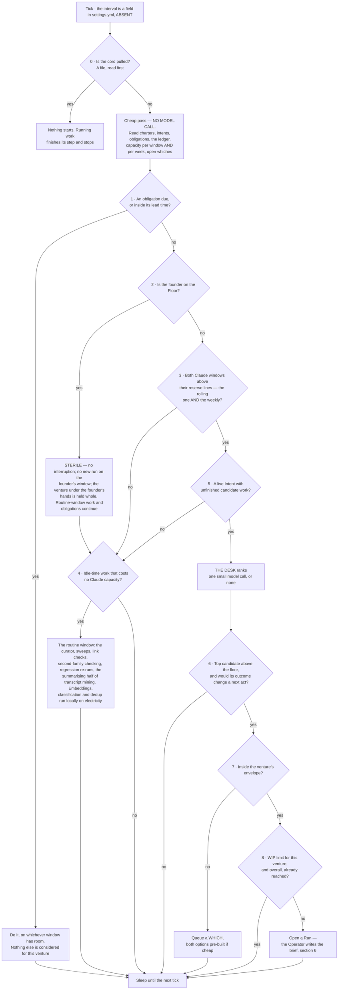
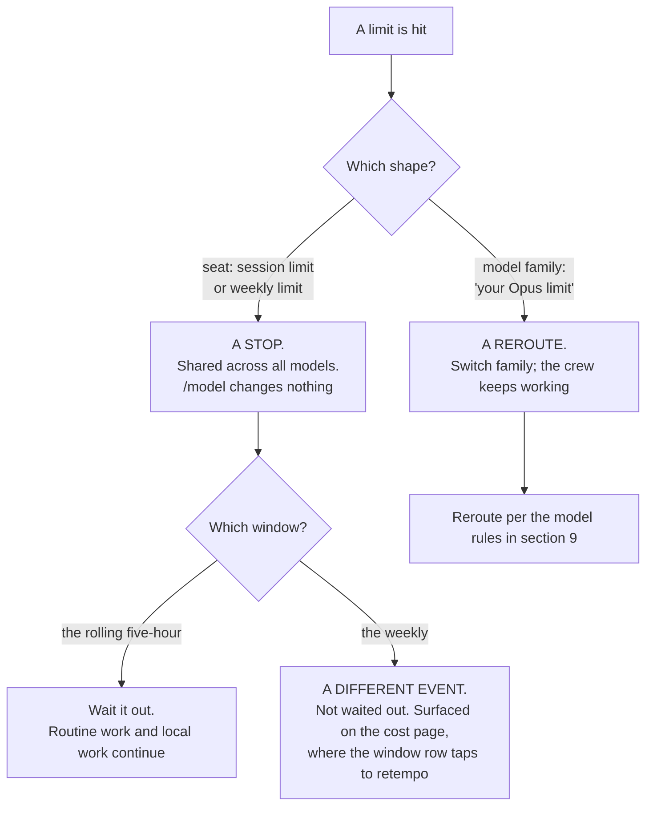

## 4 · The Watch and the Desk — the one thing that is always on

*obeys: v12 (`/loop` refused), v22 (two windows), v23 (the stall fuse); inherits: FINAL §3, §5*

---

**(FINAL)** Everything else is episodic. The Watch is the only continuous process, and its design goal is the
opposite of every other component's: **it must be almost free to run, and it must usually decide to do nothing.**

**(NEW: the one thing the founder's direction changes here, and it changes nothing about the loop)** The roster and
the Operator arrived in v1 and §3, and neither is the Watch. The Watch is a **program with no model** that decides
*whether* anything should start; the Operator is an **agent inside a session** that decides *who* does the work once
something has. Collapsing them would put a model call in the cheap pass, and the cheap pass being free is the entire
argument for an always-on loop. §4.4 states the seam.

---

### 4.1 The loop

**(FINAL, redrawn for two windows and with the tick interval removed from the picture)**

**(FINAL)** The cheap pass has no model call in it: reading a handful of small files, comparing dates and summing a
capacity number is arithmetic, so a tick that ends in `SLEEP` costs effectively nothing. That is the answer to *"I
want the system to move but I don't want it to waste tokens and run loops without any meaning"* — the loop is
meaningful because its default branch is free, not because it is clever.

**(FINAL)** Nine gates and eight of them stop, cheapest and most absolute first: **the cord beats everything; an
obligation beats a goal; the founder's presence beats capacity; capacity beats desire; provenance beats opportunity;
the envelope beats capability; flow limits beat all of it.**

**(NEW: the tick interval is deliberately not written here, and the omission is the point)** FINAL drew it as *every
240 s* and gave the reason — control latency for the cord, a *which* answered, a run's difficulty. The number is a
field in `settings.yml` (ABSENT), and the SPINE forbids durations in this plan for a reason this repository has
measured repeatedly: a number written into prose stops being re-derived and starts being quoted, and then it is
wrong and nobody notices. **Mechanism:** the field is read from settings; anyone who needs the value reads it there.

**(FINAL)** **Enforced by:** `bin/watch` (ABSENT; FINAL names it `keel/bin/watch`) · the cord file `STOP` (ABSENT) ·
`settings.yml` holding the tick, the reserve per window, the WIP limits (ABSENT).

---

### 4.2 Two windows, and the difference between a stop and a reroute

**(NEW: v22 moves FINAL row 19, which knew only the five-hour fuse. This is the single most consequential factual
correction in the plan for anything the Watch does)**

**(NEW)** There are **two windows per seat, not one**: a rolling five-hour **and a weekly**, and both are *"shared
with Claude chat and Cowork"* — so the founder's own chat usage draws down the same pool the night runs on. Every
consequence follows from that: the reserve is **per window and per week**, and **a weekly exhaustion is a different
event from a five-hour one.** A five-hour exhaustion is waited out. A weekly exhaustion is not, and a system that
treats them alike will either sit idle for days or ring the founder about something that resolves itself.

**(NEW: and two limit shapes behave differently, which is the operational half)** A **seat** limit — the vendor's
*"session limit"* and *"weekly limit"* — is shared across all models and **cannot be escaped with `/model`**. A
**model-family** limit — *"your Opus limit"* — can: switching family keeps the crew working. **The Watch must
distinguish them: one is a stop, the other is a reroute.**

**(NEW)** **Mechanism:** the Watch's cheap pass reads capacity per window *and* per week; the cost page shows both,
and **a window row taps to retempo** rather than merely displaying (v14). **What is UNVERIFIED and must not be
guessed at:** **no numeric quota is published anywhere fetched** for the Anthropic subscription. Magnitudes are
relative only — Pro *"at least 5x more usage per 5-hour session than Free"*, Max *"5x"* and *"20x more usage than
Pro"*. A window's real capacity is measurable only from an account, and the absence of published numbers is itself
the finding. Nothing in this plan may state one.

**(FINAL, and it still binds)** When a window runs out **every agent stops at once** — a shared fuse, not a per-agent
limit. Any design that treats runs as independent workers is wrong here: they are loads on one circuit. A grid never
dispatches to 100% of capacity; it holds a reserve, and the reserve is the most important number in the system
because the founder sets it. Too small and they sit down to a burned window; too large and the nights are wasted.
**Mechanism:** one slider, and a line in the briefing reporting how often the reserve was needed and how often it
expired unused, so it is tuned on evidence.

---

### 4.3 `/loop` is refused; the Watch is the loop

**(NEW: v12. The founder asked for the loop and goal features by name — *"I think we need to work with loops and
goals and They features the codex and Claude Code has in order to achieve the best results we can"* — and the answer
splits them: the goal goes on the run, the loop does not become the Watch)**

| Feature | Where it sits | The sourced reason |
|---|---|---|
| **`/goal`** | **On the run** (§6). The done-test *is* the goal condition, with a turn clause | It runs headless in one invocation: *"Setting a goal with `-p` runs the loop to completion in a single invocation."* Condition limit 4,000 characters. It leaves the goal active after transient failures **including rate limits**, which is exactly the behaviour a night wants |
| **`/loop`** | **Refused in production.** It stays a Floor convenience the founder may use by hand | *"Tasks are session-scoped: they live in the current conversation and stop when you start a new one."* A 7-day expiry. And the line that ends the argument: *"Tasks only fire while Claude Code is running and idle."* |

**(NEW: why that last quote is decisive rather than inconvenient)** An always-on tier that only fires while a
session is open and idle is not always-on; it is a session that has to be kept open, and its state dies with the
conversation. The Watch is a program that survives every session, reads the cord first, and costs nothing on the
branch it takes most often. **Mechanism:** `bin/watch` under a LaunchAgent (both ABSENT); `CLAUDE_CODE_DISABLE_CRON=1`
disables scheduled tasks entirely and is available if the Floor's convenience ever becomes a hazard.

**(NEW: one trap in the same family, recorded because it would be found the hard way)** A `/goal` **defers evaluation
while a subagent or background shell is running**, and under `-p` the periodic check-in is *"the only way Claude Code
delivers check-ins."* So a run whose child is stuck delivers nothing and looks alive. That is what §4.5's fuses are
for.

---

### 4.4 Where the Operator sits relative to the Watch

**(NEW: a cold reader will otherwise assume the Operator is the loop, and everything about cost follows from its not
being)**

| | **The Watch** | **The Operator** |
|---|---|---|
| What it is | A program. **No model** | An agent file. `claude-opus-5` |
| Always on? | Yes. It is the only continuous process | No. It exists inside a session, for the duration of that session |
| What it decides | **Whether** anything should start at all — cord, obligations, the founder's presence, capacity, provenance, the envelope, flow limits | **Who** does the work, and with what brief and what band |
| Cost on a quiet tick | Effectively nothing — arithmetic over small files | It is not running |
| Can it dispatch? | It opens a Run. The Desk inside it ranks and stops at the reserve line | It dispatches by three mechanisms (§3.5), and composes no argv |
| Can it be the other? | **No.** A model in the cheap pass ends the free default branch | **No.** An agent cannot be always-on without a session being always open, which is what v12 refuses |

**(NEW)** The seam in one sentence: **the Watch says *now*, the Operator says *who*, and `bin/run` (ABSENT) says
*with exactly what grant*.** Three things, three failure modes, and none of them can cover for another.

**(NEW: the one case where the Operator runs without the Watch, and it is the founder's)** A card dragged on page 4
launches a session directly, and a founder on the Floor is talking to an agent with no Watch tick involved. That is
the founder's door (§2.4), and it is bounded by the same launcher and the same bands. The Watch is what makes the
system move when the founder is asleep; it is not a gate the founder passes through to work.

---

### 4.5 The Desk, and the fuses

**(FINAL)** The Desk is the newsroom assignment desk plus the grid operator's merit order. Each candidate carries
four numbers, deliberately crude because a sophisticated estimate would be false precision:

| Number | How it is got | Range |
|---|---|---|
| **Weight** | the venture's `weight` × the Intent's own urgency | 1–5 |
| **Cost** | median actual cost of the last N runs of this kind, from the ledger. **A measurement, not an estimate** | tokens, per window |
| **Readiness** | dependencies met, inputs present, whiches answered — **and the done-test's outcome would change a next act** | yes / no |
| **Decay** | closeness to expiry, and time since it last moved | 0–1 |

**(FINAL)** Rank = `Weight × Decay ÷ Cost`; dispatch in order; stop at the reserve line; ties break toward the
cheaper item. **There is no success-probability estimate anywhere:** the system does not predict the value of work,
it measures what work of that kind cost before, takes the founder's weight as given, and lets recency and expiry do
the rest. Two escape hatches from real practice: one **spinning slot** is always held for whatever the founder asks
next, so a spoken instruction never queues behind autonomous work; and the Desk **re-ranks on a cadence**, not on
every event, so a noisy input cannot make it thrash.

**(FINAL)** The Desk records its ranking **and the gate that stopped each candidate**, at every tick, which is what
makes *why did you not do that* answerable. **Enforced by:** `bin/watch` writes `logbook/desk/<tick>.json` (ABSENT).

**(NEW: v31 adds one input to the cost column that FINAL's did not have)** With fourteen named agents, cost is
measured **per agent per kind of work**, not per anonymous shape. That is what makes the roster's own claim
falsifiable: if `growth` and `steward` — the two entries with the least outside evidence behind them — never produce
work whose anchor holds, their cost rows say so, per agent, in the ledger.

---

### 4.6 The stall fuse

**(NEW: v23. `--max-budget-usd` was carried in FINAL §7.5 as a spend control. It is not one, and the correction
matters because a false spend control is worse than none)**

**What it is not.** It is **print mode only**, it is computed **locally from token counts at list price**, and for a
subscriber the vendor's own words are that *"the session cost figure isn't relevant for billing purposes."* It does
not bind the account. Nothing about it touches the two windows of §4.2.

**What it is, and why it is kept.** A **stall fuse**. Its two documented properties are exactly the ones a fuse
needs: **subagent spend counts toward the cap**, and once spend reaches it, **spawning another subagent fails with
`Budget limit reached`** (v2.1.217+). So a run that has gone into a loop of children stops making children. That is
worth having under its real name.

**(FINAL, and the two other governors that catch the machine rather than the founder)**

| Fuse | Predicate | State |
|---|---|---|
| **The stall detector** | no **durable artifact** from a run for N ticks and the run stops spending. The predicate is a durable artifact, **never the run's claim of progress** | `.claude/hooks/budget-guard.js` exists on this branch, `ceo-1-1788609834`, and is **registered nowhere**. Registering it is a founder act on a settings file |
| **The repetition tripwire** | a hash of tool identity and canonicalised arguments against this intent's negatives; an exact repeat is refused unless a named difference is stated | ABSENT |
| **The aberrance halt** | spend at several times this agent's median for this kind of work, a burst of identical calls, or a claim the nightly reconciliation contradicts — halt the run, ring the bell | ABSENT; the median comes from the ledger |

**(NEW: why all three predicates avoid self-report, said once)** Every fuse above keys on something the run cannot
author: a durable artifact on disk, a hash of what it actually called, a median from the ledger, a reconciliation
against a record the company does not write. A fuse that read the run's own progress report would be asking the
thing that stalled whether it has stalled.
