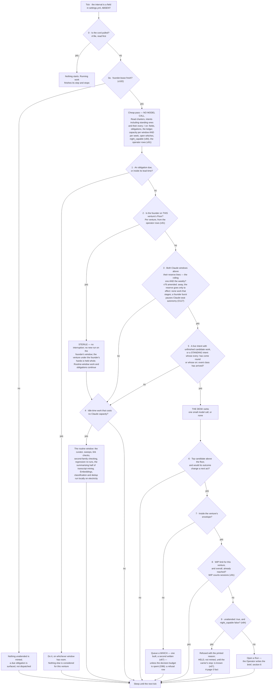
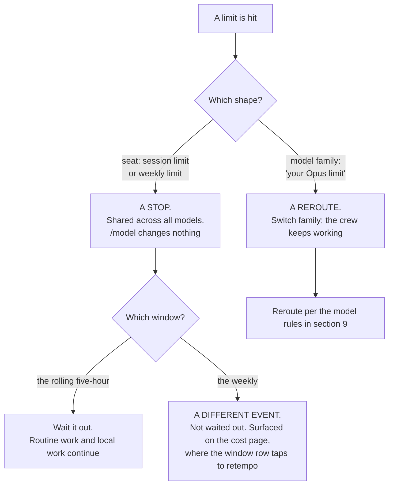

## 4 · The Watch and the Desk — the one thing that is always on

*obeys: v12 (`/loop` refused), v22 (two windows), v23 (the stall fuse); inherits: FINAL §3, §5*

---

**(FINAL)** Everything else is episodic. The Watch is the only continuous process, and its design goal is the
opposite of every other component's: **it must be almost free to run, and it must usually decide to do nothing.**

**(NEW: the one thing the founder's direction changes here, and it changes nothing about the loop)** The roster and
the Operator arrived in v1 and §3, and neither is the Watch. The Watch is a **program with no model** that decides
*whether* anything should start; the Operator is an **agent inside a session** that decides *who* does the work once
something has. Collapsing them would put a model call in the cheap pass, and the cheap pass being free is the entire
argument for an always-on loop. §4.4 states the seam.

---

### 4.1 The loop

**(FINAL, redrawn for two windows and with the tick interval removed from the picture)**

**(FINAL)** The cheap pass has no model call in it: reading a handful of small files, comparing dates and summing a
capacity number is arithmetic, so a tick that ends in `SLEEP` costs effectively nothing. That is the answer to *"I
want the system to move but I don't want it to waste tokens and run loops without any meaning"* — the loop is
meaningful because its default branch is free, not because it is clever.

**(FINAL)** ~~Nine gates and eight of them stop~~ Eleven gates and ten of them stop (amended 2026-09-06: v102's
lease at 0a, v84's `night_capable` at 9), cheapest and most absolute first: **the cord beats everything; the
founder's heartbeat beats the night; an obligation beats a goal; the founder's presence beats capacity; capacity
beats desire; provenance beats opportunity; the envelope beats capability; flow limits beat all of it; the machine's
own sleep beats every unattended brief.**

**(NEW: there is no `founder_hours:` gate here, and the omission is deliberate · amended 2026-09-06: challenge D
P2-4)** Eleven gates and none of them reads `founder_hours:`, because the field is **report-only** — the founder said
*"20 hours or no ceiling"*, so a bind raises a briefing line and a *which* and stops nothing, and a gate is a thing
that stops. §2.1 states it once; §16.2b prices it; §12.9 says the same about the three ceilings.

**(FOUNDER, v55: a standing intent is read by the tick and dispatched like any other candidate, which is the whole
of what the founder asked for)** The founder asked for agents *"that can run every set time or evant or something
else … to build the company like working"* and chose standing intents run by the Watch. A standing intent is an
intent that ~~never expires~~ never finishes but expires — `valid_until`, forced disposition (amended 2026-09-06:
O126; §2.8 owns it) — carrying `every:` (a cadence) or `on:` (an inbound event class) — §2.8. The cheap pass
reads those two fields with the rest of the intent store, still with **no model call**, because *has this cadence
come round* and *did an event of this class arrive* are date and string comparisons. When one has, it becomes
candidate work at **gate 5** and passes every gate after it unchanged: the Desk ranks it against everything else,
the reserve line stops it like anything else, and the WIP limit counts it. **Obligations still come first** — gate 1
is before gate 5 and nothing about a cadence moves it — so a standing intent can never displace something owed to
someone by a date. **Mechanism:** `bin/watch` reads `every:`/`on:` on each tick (**ABSENT**); `bin/check-stores`
refuses `every:` without a ceiling per run (**ABSENT**), which is what keeps a thing that fires forever bounded.

**(NEW: O52 — a cadence is not a tick, and the scheduler coalesces)** A standing intent carries **`catch_up: yes |
no`**. `StartInterval` **coalesces** missed firings into one, which is exactly right for a tick and exactly wrong for
a cadence: v55's `every:` intents **vanish silently across a sleep** and nothing says they did. With `catch_up: no`
the miss is recorded and dropped; with `yes` it is run once on wake. Either way it is **visible**. **Mechanism:**
`bin/watch` reads the field on each tick (**ABSENT**, §L O52).

**(NEW: O23 — the pass that finds what expired, which 13a.6 marks a WISH)** One pass over **every durable store**
looking for a passed horizon — charters, intents, obligations, memory items, grants, skills — forcing exactly one
disposition and writing a **lapse record**: one row per thing that expired unactioned, ordered by what it stopped.
Horizons are the plan's replacement for every calendar audit, and until this exists *finding* the expired thing is
the half nothing performs. **Mechanism:** `bin/horizon` (**ABSENT**, §L O23), run by the Watch on the routine window;
`scripts/ledger.mjs` **exists** and already forces the disposition for claims. §2 carries the intent and charter
side, §13a the horizon rule.

**(NEW: the tick interval is deliberately not written here, and the omission is the point)** FINAL drew it as *every
240 s* and gave the reason — control latency for the cord, a *which* answered, a run's difficulty. The number is a
field in `settings.yml` (ABSENT), and the SPINE forbids durations in this plan for a reason this repository has
measured repeatedly: a number written into prose stops being re-derived and starts being quoted, and then it is
wrong and nobody notices. **Mechanism:** the field is read from settings; anyone who needs the value reads it there.

**(NEW, fixer round 2026-09-06: v104 · O117)** And every number the Watch reads is **derived or says it is not**:
the reserve share, WIP and *two driven ventures* derive from the units table in `keel/shared/facts.yml` (tokens/run,
runs/window, wall-clock/run, intents/week, decisions/day, each with `measured_at`, `valid_until`, a re-measure
command), and `settings.yml` **refuses a number neither derived nor labelled `assumed`**. §16 owns both files and
the dial inventory (O118). **Mechanism:** `facts.yml`, `schemas/settings.yml` (**ABSENT**).

**(FINAL, with the rethink round's four additions)** **Enforced by:** `bin/watch` (ABSENT; FINAL names it
`keel/bin/watch`) · the cord file `STOP` (ABSENT) · `settings.yml` holding the tick, the reserve per window, the WIP
limits (ABSENT) · **`bin/horizon`** (ABSENT, §L O23) · **`catch_up:` on the standing intent** (ABSENT, §L O52) ·
**`bin/replay-desk`** (ABSENT, §L O20) · **the last-founder-event predicate over `keel/logbook/founder.last`** —
written by `bin/log`, read by `bin/watch` (ABSENT, v76) · *(fixer round 2026-09-06)* **`night_capable`** over `keel/host/power.yml`
(ABSENT, O81) · **`founder.lease`** (ABSENT, O86) · **`decisions_per_window`** (ABSENT, O96) · **the operator rows**
in `sessions.jsonl` (ABSENT, O84) · **`facts.yml`** (ABSENT, O117).

---

### 4.1b Whether this Mac can hold a night

**(FOUNDER, fixer round 2026-09-06: E1 → v83; E13 → v84 · O81)** *"dont need for now. use this mac and when cant use
cloude."* The night runs **on this Mac** — no box — and the Watch decides every tick whether it can hold one. **A
predicate, not a habit (THINKER: A1 · W33; the sleep counts are a reading on a rolling log window — §15.1b and W33
carry that, and R37 settles it · amended 2026-09-06: census D):** `pmset -g custom` reads `sleep 1` on AC and battery, 391 maintenance
sleeps in seven days; a habit the Watch cannot verify is a wish. `bin/watch` computes **`night_capable`** from
`pmset -g batt` (AC), `pmset -g custom` (`sleep 0` or `disablesleep 1`) and `pmset -g assertions`, against the
contract in `keel/host/power.yml` (§15 owns the file). An `unattended: true` brief is **refused with the printed
reason when it is false** and ~~routed to the **cloud carrier where the charter says `cloud: allow`** (§2.1), else not
minted~~ **held, not minted, until the carrier's `stop:` is known (v67)** — the charter's `cloud: allow` decides
whether it may ever go, and v67 decides that today it may not (amended 2026-09-06: challenge D P1-3; §2.1, §3.5);
predicate and reason are a **page-3 fact and a briefing line**. **The precondition under the predicate is §15.1b's,
stated there once:** until the founder runs `pmset -a disablesleep 1`, or R41 shows a held `caffeinate` assertion
satisfies it, the predicate is false every night and nothing unattended runs at all. The probe asserts it **by attempting it** — a
detached child across `pmset sleepnow`, `run.started` read against the wake. **Mechanism:** `bin/watch` ·
`keel/host/power.yml` · `bin/probe` (**ABSENT**, §L O81); adapter over `pmset`, `vendor_wins_if:` the runtime refuses
unattended work on a sleeping host. **Not decided here:** the cloud maker path is UNVERIFIED (v56(b)) and holds a
brief without minting until a cancel path is documented (v67; §I row 15, §3.5); one machine for identity and
autonomy is an accepted risk drilled by §15's keychain probe (O83). **(NEW: O82 · R37)** `pmset -g log` becomes a
v55 standing intent writing a `facts.yml` row, `mac-off-hours`, over **thirty days including a weekend away**.
**Losing images:** the always-on box — §J 73 · `wins_if:` R37 shows maintenance sleeps inside declared nights, or
three attempted nights each end `orphaned`; a `disablesleep` habit · `wins_if:` R37 shows the Mac awake on AC every
declared night unenforced.

---

### 4.2 Two windows, and the difference between a stop and a reroute

**(NEW: v22 moves FINAL row 19, which knew only the five-hour fuse. This is the single most consequential factual
correction in the plan for anything the Watch does)**

**(NEW)** There are **two windows per seat, not one**: a rolling five-hour **and a weekly**, and both are *"shared
with Claude chat and Cowork"* — so the founder's own chat usage draws down the same pool the night runs on. Every
consequence follows from that: the reserve is **per window and per week**, and **a weekly exhaustion is a different
event from a five-hour one.** A five-hour exhaustion is waited out. A weekly exhaustion is not, and a system that
treats them alike will either sit idle for days or ring the founder about something that resolves itself.

**(NEW: and two limit shapes behave differently, which is the operational half)** A **seat** limit — the vendor's
*"session limit"* and *"weekly limit"* — is shared across all models and **cannot be escaped with `/model`**. A
**model-family** limit — *"your Opus limit"* — can: switching family keeps the crew working. **The Watch must
distinguish them: one is a stop, the other is a reroute.**

**(NEW)** **Mechanism:** the Watch's cheap pass reads capacity per window *and* per week; the cost page shows both,
and **a window row taps to retempo** rather than merely displaying (v14). **What is UNVERIFIED and must not be
guessed at:** **no numeric quota is published anywhere fetched** for the Anthropic subscription. Magnitudes are
relative only — Pro *"at least 5x more usage per 5-hour session than Free"*, Max *"5x"* and *"20x more usage than
Pro"*. A window's real capacity is measurable only from an account, and the absence of published numbers is itself
the finding. Nothing in this plan may state one.

**(FINAL, and it still binds)** When a window runs out **every agent stops at once** — a shared fuse, not a per-agent
limit. Any design that treats runs as independent workers is wrong here: they are loads on one circuit. A grid never
dispatches to 100% of capacity; it holds a reserve, and the reserve is the most important number in the system
because the founder sets it. Too small and they sit down to a burned window; too large and the nights are wasted.
**Mechanism:** one slider, and a line in the briefing reporting how often the reserve was needed and how often it
expired unused, so it is tuned on evidence. **(amended 2026-09-06: E6 → O127)** The reserve is held **per weekly
window**; the slider is a `settings.yml` dial with its evidence line (O118, §16).

**(FOUNDER, rethink 2026-09-06: D9)** **A ceiling is denominated in window share, not in dollars.** The gauge is
**tokens against an observed high-water mark**, because no denominator is published anywhere fetched and the
paragraph above says so; **wall clock sits beside it** and **USD is kept as a shadow price** (v23 — on a subscription
the dollar is a locally computed shadow of a bill nobody sends). Exploration-class intents (§2.2's `class:`) route to
Gemini, a local model or the Codex seat, and the Desk refuses an exploratory dispatch onto the Claude seat past a
fraction the founder sets. **Mechanism:** one high-water file, one rule in the Desk, one `class:` on the intent (all
**ABSENT**). **Settled by:** split one weekly window between driven and exploratory work — if exploration is
invisible there, this is over-built. §16 owns the currency and the shadow price.

---

### 4.3 `/loop` is refused; the Watch is the loop

**(NEW: v12. The founder asked for the loop and goal features by name — *"I think we need to work with loops and
goals and They features the codex and Claude Code has in order to achieve the best results we can"* — and the answer
splits them: the goal goes on the run, the loop does not become the Watch)**

| Feature | Where it sits | The sourced reason |
|---|---|---|
| **`/goal`** | **On the run** (§6). The done-test *is* the goal condition, with a turn clause | It runs headless in one invocation: *"Setting a goal with `-p` runs the loop to completion in a single invocation."* Condition limit 4,000 characters. It leaves the goal active after transient failures **including rate limits**, which is exactly the behaviour a night wants |
| **`/loop`** | **Refused in production.** It stays a Floor convenience the founder may use by hand | *"Tasks are session-scoped: they live in the current conversation and stop when you start a new one."* A 7-day expiry. And the line that ends the argument: *"Tasks only fire while Claude Code is running and idle."* |

**(NEW: why that last quote is decisive rather than inconvenient)** An always-on tier that only fires while a
session is open and idle is not always-on; it is a session that has to be kept open, and its state dies with the
conversation. The Watch is a program that survives every session, reads the cord first, and costs nothing on the
branch it takes most often. **Mechanism:** `bin/watch` under a LaunchAgent (both ABSENT); `CLAUDE_CODE_DISABLE_CRON=1`
disables scheduled tasks entirely and is available if the Floor's convenience ever becomes a hazard.

**(NEW: one trap in the same family, recorded because it would be found the hard way)** A `/goal` **defers evaluation
while a subagent or background shell is running**, and under `-p` the periodic check-in is *"the only way Claude Code
delivers check-ins."* So a run whose child is stuck delivers nothing and looks alive. That is what §4.5's fuses are
for.

**(moved 2026-09-06: W14)** And the check-ins this section relies on are **capped**, which nothing here said. They
back off **30 min → 1 h → every 2 h**, and *"idle sessions … start at most three check-ins on long-running background work per goal; your
next message allows three more"* (world.md 14). Under `-p` nobody is there to send that next message, **so a night
goal loop delivers three times and then goes quiet** — which is not the same failure as a stuck child and has to be
told apart from it. v12 carries the full statement and §6 carries the run side; the thing that notices the silence is
the wake reconciler (§L **O15**, **ABSENT**), which writes `orphaned` and never `finished`.

**(moved 2026-09-06: W13)** There is a **fourth** scheduling surface inside the CLI that no row named: **`/schedule`**,
known only from three changelog fix lines — *"Fixed `/schedule` routines whose prompt was saved without a message
role and then ran with nothing to do"* — against the three this section already weighs (Routines, desktop scheduled
tasks, `/loop`). **Its semantics are UNKNOWN**: `https://code.claude.com/docs/en/schedule` returned **HTTP 404** on
2026-09-06, so interval floor, storage location and headless status are unread. **(R25, OPEN)** — read them, and
decide whether v55's Watch-dispatched standing intents should route through it or ignore it. Nothing here changes
until it is answered: **the Watch is still the loop**, and a surface whose storage and headless status are unknown
cannot be given work.

---

### 4.4 Where the Operator sits relative to the Watch

**(NEW: a cold reader will otherwise assume the Operator is the loop, and everything about cost follows from its not
being)**

| | **The Watch** | **The Operator** |
|---|---|---|
| What it is | A program. **No model** | An agent file. `claude-opus-5` — **N instances at once**, each a row in `sessions.jsonl` (v91) |
| Always on? | Yes. It is the only continuous process | No. It exists inside a session, for the duration of that session |
| What it decides | **Whether** anything should start at all — cord, obligations, the founder's presence, capacity, provenance, the envelope, flow limits | **Who** does the work, and with what brief and what band |
| Cost on a quiet tick | Effectively nothing — arithmetic over small files | It is not running |
| Can it dispatch? | It opens a Run. The Desk inside it ranks and stops at the reserve line | It dispatches by three mechanisms (§3.5), and composes no argv |
| Can it be the other? | **No.** A model in the cheap pass ends the free default branch | **No.** An agent cannot be always-on without a session being always open, which is what v12 refuses |

**(NEW)** The seam in one sentence: **the Watch says *now*, the Operator says *who*, and `bin/run` (ABSENT) says
*with exactly what grant*.** Three things, three failure modes, and none of them can cover for another.

**(NEW: the one case where the Operator runs without the Watch, and it is the founder's)** A card dragged on page 4
launches a session directly, and a founder on the Floor is talking to an agent with no Watch tick involved. That is
the founder's door (§2.4), and it is bounded by the same launcher and the same bands. The Watch is what makes the
system move when the founder is asleep; it is not a gate the founder passes through to work.

**(FOUNDER, rethink 2026-09-06: D11)** **What the system does while the founder is away, and it reads one derived
value: the last founder event.** ~~Four~~ Five call sites share it (amended 2026-09-06: E6 — *"Away narrows, plus a
burst edge"* · O127 · THINKER: B14, A20). **One:** the reserve is ~~**released to
autonomous work**~~ **released only to `effect: none` work whose outputs stage** (v101's verb table decides)
when the last event is older than the reserve's own horizon, and **snaps back on the first tap**. **Two:** ~~a *which* whose intent expires unanswered has
its **stated default executed**, with **both** built options archived~~ **no one-way default fires while away**: a
*which*'s default fires at expiry only if it touches no one-way verb, because away is exactly when nobody can pull
the cord (THINKER: B14 — absence narrows). **Three:** while
away the system builds **one**
option instead of two, because the second exists to be chosen between and nobody is choosing. **Four:** page 5 gets a
***since you were last here*** view keyed on the event, never on a date. **Five, the burst edge:** the reserve is
held **per weekly window**, and founder events above a founder-set rate in the *current* five-hour window **pause
Claude-seat autonomy until the window rolls** — a busy Floor drains the seat the night shares (v22). **This sits inside the founder's own
numbers** — *"Keep 30% and 3/day; evidence moves them"* — and changes what reads them, not what they are. **It
reintroduces no approve verb and does not reverse v9:** a silent run still cannot ask; a *which* whose default fires
is a decision the founder already wrote down. **Mechanism:** one predicate and one field shared by **five** call sites, the five listed above *(amended 2026-09-06: challenge D P3-4 — this paragraph said five in its first line and four in this one)* —
**`bin/log` writes `keel/logbook/founder.last` on every founder-authored event and `bin/watch` reads it** (**ABSENT**;
~~§A v76 names no path~~ *path set by the orchestrator 2026-09-06, DECISIONS §21 · challenge C P2-1*). The mark is
**ABSENT** rather than **WISH** because v50 asks for a designed mechanism *with its path named*, and this now has
one. **Settled by:** the reserve hit rate §21.1 already measures moving off
*expired-unused*, and the count of second options built and never chosen falling; for the amendment, a drilled week away that regrets nothing.

**(NEW, fixer round 2026-09-06: v102 · O86 — the same value against a second horizon is a stop that needs nothing)**
An e-stop with dependencies — tunnel, token, keychain, a rendered page — is a normal control (THINKER: B19, A21).
**`keel/logbook/founder.lease`** is `founder.last` against a **second, longer horizon** (a dial); while it is stale
**the Watch mints nothing unattended** (gate 0a). Any founder-authored event renews it, so **absence of the heartbeat
is itself the stop**, reachable with the network off, the tunnel down and the keychain locked; the tap stays the fast
path to `bin/stop` (v91 · O85; §3.5). **Mechanism:** one file, one predicate in `bin/watch` (**ABSENT**, §L O86); one
drill — the cord from the phone, network off, count what stops. **Losing images:** the tap as the e-stop · `wins_if:` a year of drills in which
the tap reaches quiescence from the phone every time, tunnel down; a hand-renewed lease · `wins_if:` `founder.last`
goes stale at the desk.

---

### 4.5 The Desk, and the fuses

**(FINAL)** The Desk is the newsroom assignment desk plus the grid operator's merit order. Each candidate carries
four numbers, deliberately crude because a sophisticated estimate would be false precision:

| Number | How it is got | Range |
|---|---|---|
| **Weight** | the venture's `weight` ~~× the Intent's own urgency~~ — **(NEW: deletion 3)** one person, two dials for one decision, and the second is derivable from the first | 1–5 |
| **Cost** | median actual cost of the last N runs of this kind, from the ledger. **A measurement, not an estimate** | tokens, per window |
| **Readiness** | dependencies met, inputs present, whiches answered — **and the done-test's outcome would change a next act** | yes / no |
| **Decay** | ~~closeness to expiry, and time since it last moved~~ — **(NEW: deletion 2)** the two are **split**, because they point at opposite dispositions; for a standing intent, *time since last move normalised by its own cadence* | two fields, not one number |

**(FOUNDER, rethink 2026-09-06: D10)** ~~Rank = `Weight × Decay ÷ Cost`~~ **(NEW: deletion 1)**. **The Desk ranks
lexicographically:** **obligations** first — ranked among themselves by consequence and the world's own deadline —
**then work that unblocks other work**, **then the founder's weight band**, **then cheapest inside the band**.
Dispatch in order; stop at the reserve line; ~~ties break toward the cheaper item~~ **ties inside a weight band break
toward the item nearer its charter's `outcome:`** — distance to outcome, read from `keel/shared/market.jsonl`, which
`bin/reconcile` alone writes (amended 2026-09-06: NEW: v98 · O98 · THINKER: C5; §2.1 owns the field, §13 the store).
The world's answer, not the founder's opinion of a venture, breaks the tie.

**(NEW: contradictions 21 and 22 — why the formula went, said once)** It **divides by measured cost**, so cheap work
permanently outranks expensive work, and **v55's standing intents supply an endless stream of cheap work**: a
standing intent is bounded per run and unbounded per window (contradiction 21), so an expensive high-weight intent
can starve at any weight the founder sets. And `Decay` was **undefined for an intent that never expires**, which is
most of a ten-venture queue (contradiction 22). Lexicographic order fixes both by refusing to combine three crude
numbers into a fourth with no dimensional meaning. **Mechanism:** one comparator and one branch — **less** code than
the formula it replaces, explainable on the board, and it **cannot invert the founder's weight** (**ABSENT**).
**Settled by:** replay the Desk's own rows over a simulated month under both orders and count dispatches of the
top-weight intent — the replayer is §L **O20**, deterministic, free, and reading a file nothing reads today.
**(NEW, fixer round 2026-09-06: §J 80 · R38)** Weighted fair queueing now is a losing image: v75 is **replayed before
it is replaced** — R38 runs O20's replayer under a synthetic obligation tide and counts a second venture's top-weight
dispatches. `wins_if:` they starve.

**(NEW, fixer round 2026-09-06: E15 → v87 · O96 — the founder's decisions are a capacity, and the Desk admits a
*which* like a run)** The founder delegated — *"do what best for the sytem"* — and the design is B's: the Desk
**refuses to open a *which*** past **`decisions_per_window × intent.horizon`**, seeded at **six per five-hour
window** until **R34** measures the answering rate; the refusal is a **row**, never a silence. A *which* carries
`kind: fact | preference`, `cost_to_answer_bytes` (measured) and `recommendation_shown:`, hidden on a founder-set
fraction as the taste store's control arm (O97 · R39, §13). **One option built, a second written**; both only when a
`preference` *which*'s two ten-word summaries cannot be separated. Inside v9 and v76, reversing neither.
**Mechanism:** `bin/watch` · `decide.jsonl` (**ABSENT**, §L O96); the seed is a dial labelled `assumed` (O118).
**Why (THINKER: B3, C4):** the which queue was unbounded while the answering rate was a number nobody had measured. **Losing
image:** whiches unbounded, both options always built · `wins_if:` a quarter with no backlog past one window's
throughput and the second option chosen over a third of the time.

**(NEW: O55 and O56 — two clocks the comparator must not treat as founder-shaped)** A **`statutory` wake-me class is
exempt from the interruption budget**, declared on the obligation rather than judged in the moment; and a support
obligation whose **promised response time falls inside the next window promotes past the interruption budget**.
Demotion never applies to obligations. The budget is founder-shaped — three interruptions a day, tuned to what the
founder will tolerate — and **a waiting customer has a clock the budget does not know about**. **Mechanism:** the
obligation schema carries the class (**ABSENT**, §L O55); the promotion is a branch in this comparator (**ABSENT**,
§L O56). §2.3 owns the obligation's fields.

**(FINAL)** **There is no success-probability estimate anywhere:** the system does not predict the value of work,
it measures what work of that kind cost before, takes the founder's weight as given, and lets recency and expiry do
the rest. Two escape hatches from real practice, **both given a mechanism and a mark on 2026-09-06 (challenge C
P2-5), because a rule with neither is a wish in a subsection where every other rule has one**: one **spinning slot**
is always held for whatever the founder asks next, so a spoken instruction never queues behind autonomous work; and
the Desk ~~**re-ranks on a cadence**, not on every event~~ **re-ranks on every tick**, so a noisy input cannot make it
thrash.

**The spinning slot is not a second reserve.** It is **one slot inside the reserve §4.2 already holds** — the same
number, spent differently: the Desk stops at the reserve line as it always did, and the topmost slot below that line
is the one it will not fill with autonomous work. Nothing new is reserved, so §4.2's arithmetic is untouched and the
founder's one slider still sets the whole of it. **Mechanism:** one branch in `bin/watch`'s dispatch loop, holding
the last slot above the reserve line unless the item is founder-authored (**ABSENT**). A slot held by an
unaccounted-for rule is capacity that disappears from the gauge the founder tunes.

**"On every tick" is not a schedule, and that is the whole point of the change.** The tick is `settings.yml`'s, the
founder's number (§4.1), and the Desk re-ranks once per tick because that is when it runs at all — so a noisy input
still cannot make it thrash, and the plan states no interval of its own. A *cadence* here would have been a second
clock beside the Watch's, which is what §13a.3 and §18.7 refuse.

**(FINAL)** The Desk records its ranking **and the gate that stopped each candidate**, at every tick, which is what
makes *why did you not do that* answerable. **Enforced by:** `bin/watch` writes ~~`logbook/desk/<tick>.json`~~
(ABSENT).

**(NEW: O20, and deletion 30 in the same move)** The Desk already writes the answer and **nothing reads it**. Those
fields become **event-log rows** rather than a file per tick — the highest-volume artifact in the design was holding
an answer whose value decays in hours — and a **no-model replayer** reads them back. It is the only way to tune
scheduling without living a month, and it is what settles v75 above. **Mechanism:** `bin/replay-desk` (**ABSENT**,
§L O20); the rows join the event log under its schema (§L O6, **ABSENT**).

**(NEW, fixer round 2026-09-06: O123 · R36 — said once: the Watch is an open-loop controller with static
setpoints)** Every gate compares a reading to a founder-set number — static gains on a non-stationary plant, retuned by hand,
O20's replayer the **only offline tuning path**. So §16's control charts (O74) extend to the Watch's **own outputs**
— ring, dispatch, refusal and which-open rates against their own history — and **R36** baselines them over its
span. **Mechanism:** four series on O74's chart (**ABSENT**, §L O123). **Losing image:** the Watch described as a
cheap pass · `wins_if:` none of the four drifts in a year.

**(NEW: v31 adds one input to the cost column that FINAL's did not have)** With fourteen named agents, cost is
measured **per agent per kind of work**, not per anonymous shape. That is what makes the roster's own claim
falsifiable: if `growth` and `steward` — the two entries with the least outside evidence behind them — never produce
work whose anchor holds, their cost rows say so, per agent, in the ledger.

---

### 4.6 The stall fuse

**(NEW: v23. `--max-budget-usd` was carried in FINAL §7.5 as a spend control. It is not one, and the correction
matters because a false spend control is worse than none)**

**What it is not.** It is **print mode only**, it is computed **locally from token counts at list price**, and for a
subscriber the vendor's own words are that *"the session cost figure isn't relevant for billing purposes."* It does
not bind the account. Nothing about it touches the two windows of §4.2.

**What it is, and why it is kept.** A **stall fuse**. Its two documented properties are exactly the ones a fuse
needs: **subagent spend counts toward the cap**, and once spend reaches it, **spawning another subagent fails with
`Budget limit reached`** (v2.1.217+). So a run that has gone into a loop of children stops making children. That is
worth having under its real name.

**(FINAL, and the two other governors that catch the machine rather than the founder)**

| Fuse | Predicate | State |
|---|---|---|
| **The stall detector** | no **durable artifact** from a run for N ticks and the run stops spending. The predicate is a durable artifact, **never the run's claim of progress** | `.claude/hooks/budget-guard.js` exists on this branch, `ceo-1-1788609834`, and is **registered nowhere** — **register it** (§L **O50**), in `.claude/settings.json`. Registering it is a founder act on a settings file |
| **The repetition tripwire** | a hash of tool identity and canonicalised arguments against this intent's negatives; an exact repeat is refused unless a named difference is stated | ABSENT |
| **The aberrance halt** | spend at several times this agent's median for this kind of work, a burst of identical calls, or a claim the nightly reconciliation contradicts — halt the run, ring the bell | ABSENT; the median comes from the ledger |

**(NEW: why all three predicates avoid self-report, said once)** Every fuse above keys on something the run cannot
author: a durable artifact on disk, a hash of what it actually called, a median from the ledger, a reconciliation
against a record the company does not write. A fuse that read the run's own progress report would be asking the
thing that stalled whether it has stalled.

**(NEW: O50 — the first row's state is the one worth saying out loud)** **A fuse that is not wired is a memory of a
fuse.** `budget-guard.js` is the only one of the three that **exists**, and it is the only one that has never fired,
because nothing invokes it. Registering it is a one-line settings act and it moves the row from *exists* to
*enforced*; §18 carries its fate.
