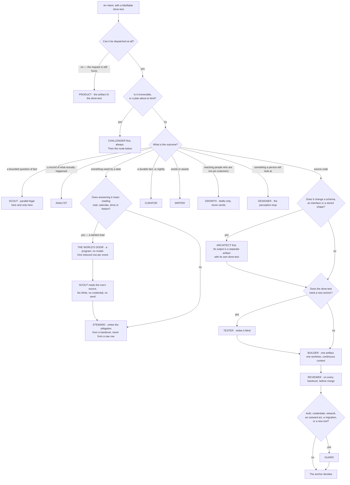

## 5 · The roster

*obeys: SPINE §B entire; v1, v2, v6, v7, v8, v31, v33; inherits: FINAL §7 (as the losing image, and as the four rules that survive it)*

---

**(FOUNDER)** *"I want us to recreate the whole startup company or a whole company or a team. So I want us to have
more agents as much as you will need, but not too much. So, like, between ten and fifteen agents. So we will have
each agent with its own expertise so we can adjust his knowledge and his tools and his way of walking and thinking
towards the tasks that he needs to achieve."*

**(FOUNDER)** **Fourteen agents plus the Operator — fifteen named roles.** One file per agent, in the frontmatter
format the runtime already reads: `name`, `description`, `tools`, `model`, `mcpServers`, `skills`, `maxTurns`,
`isolation`. **All fifteen files are ABSENT.** What exists to build them from is on this branch,
`ceo-1-1788609834`: the format itself, the `PS-*` lint in `.claude/hooks/schema-lint.js`, and eighteen agent files
that currently pass it at **18 pass · 0 fail · 0 warnings**.

**(NEW: what FINAL argued, so the reader knows what was traded)** FINAL refused a roster and built three shapes —
maker, scout, checker — separated by irreducible properties, with domain as a loadout. Its argument was that a cold
outreach agent and a blog writing agent have the same tools, the same reasoning and the same failure modes, and
differ only in what they know and what would prove them right: memory and a check, neither of which is an agent.
That argument is not refuted below. **It is overruled**, the cost is stated once in §5.6, and what the shapes were
protecting is kept as four rules that now live inside a roster.

---

### 5.0 Two waves — which of the fifteen are written first

**(FOUNDER, v54)** Asked how many of the fifteen to write at the start, the founder chose: **"Start with the eight
that have seeds or code paths"**. The roster is unchanged — fourteen agents plus the Operator, and **all fifteen
files are still ABSENT** — but the order in which they are written is now decided, and §19 draws it as two waves.

| Wave | Agents | Why these |
|---|---|---|
| **Wave one — ~~eight~~ ten** *(moved 2026-09-06: D5 → v70)* | the **Operator** · `builder` · `reviewer` · `architect` · `tester` · `guard` · `scout` · `designer` · **`curator`** · **`challenger`** | each has a seed file or a code path on this branch today: the seven engine files of `.claude/agents/` are the format and the `maxTurns` seeds (v40), `designer` already holds the one `playwright` grant that exists, and the checkers already run against this repository's own gate. **The two added by v70 pass v54's own test:** `curator` has four verified code paths here — `evict-memory.mjs`, `ledger.mjs`, `check-citations.mjs`, `check-memory-budget.mjs` — and `challenger` is one read-only file, the cheapest in the roster |
| **Wave two — ~~seven~~ five** *(moved 2026-09-06: D5 → v70)* | `product` · `analyst` · `writer` · `growth` · `steward` | the five remaining business agents. They come online **when a venture needs them** — which, given v64 makes the harness itself the first venture, is not on day one |

**(FOUNDER, rethink 2026-09-06: D5 → v70 — the curator and the challenger do not wait for wave two)** *"Curator and
challenger both join wave one."* v54 is not reversed; its **implementation** moves, and its own test is what admits
them. What the round found is that wave one otherwise ships two gaps with a measured harm behind them: the
challenger is v30's external critique, which the plan justifies with a measurement, and the curator is the only
writer of memory, so without it wave one produces handovers proposing durable facts that nothing may write down.
**The cost, once:** two agent files (**ABSENT**), and the challenger runs single-family until Codex or Gemini
lands — **its findings are labelled rung 4 rather than hidden**. **Settled by:** the harness venture producing
handovers nobody reads, and a count of memory proposals with no writer.

**(FOUNDER: the cost, stated once and not re-litigated)** Wave one is still missing one agent whose absence changes
how the system runs, not merely what it contains, and the gap is covered by something weaker rather than by nothing:

- **No `product`.** So a request too fuzzy to dispatch is closed by **the founder writing the done-test through the
  read-back**, with the Operator proposing two candidates (§2.5, §3.6). The provenance rule is untouched, because
  `product` never bound an intent anyway; what is lost is the founder's own time on the fuzzy ones.
- ~~**No `challenger`.** So a plan about to bind is attacked by **`guard`'s adversarial review and the founder's own
  read** until wave two.~~ **(moved 2026-09-06: D5 → v70)** `challenger` is in wave one, so a plan about to bind is
  attacked by the agent v30 asks for. What is still unmet is the **second model family**, for the reason §5.7 gives.
- ~~**No `curator`.**~~ **(moved 2026-09-06: D5 → v70)** It is in wave one, and with it memory has a writer from the
  first night rather than a queue of proposals.

**(NEW: what the two waves must not be allowed to become, because this is where a wave plan usually rots)** Wave two
is **not a maybe**. Every one of the fifteen keeps its row in §5.2, its file in the §17 inventory and its anchor,
because a roster that quietly shrinks to eight has re-decided v1 and v31 without saying so. What a wave is, exactly:
the order §19 writes the files in. **Mechanism:** the inventory carries the wave per agent, so *not yet written* and
*not in the roster* cannot be confused for one another; and `bin/run` refuses a brief naming an agent whose file
does not exist (**ABSENT**), which is what makes wave two's absence a refusal rather than a silent fallback to some
other agent.

---

### 5.0a What makes an agent routable, and what makes it expire

**(FOUNDER, rethink 2026-09-06: D6 → v71 — an onboarding pack, for every agent, wave one included)** A declared
agent is not a routable one. Each of the fifteen carries a pack of four things, and **without them the agent is
declared and not routable**:

| The pack | What it is | Why this one |
|---|---|---|
| **A rehearsal case** | at least one, with a **known answer** | it is the only way to tell an agent that works from an agent that is described |
| **An exemplar** | one piece of its own good output, **with provenance** | this is what distinguishes `writer` from *builder with a different prompt* |
| **A demonstration** | one end-to-end run showing **its anchor actually fires** | an anchor that has never fired is a rung-4 belief wearing a rung-1 label (v73's argument, one level down) |
| **Namespaces that resolve** | every namespace its file declares exists and holds at least one unexpired skill | otherwise the agent's skills line is decoration, and §7's `skill.miss` event is what notices |

**Mechanism:** the four pack paths are declared in `keel/shared/roster.yml` (§L **O2**, **ABSENT**), and `bin/run`
already refuses a brief naming a file that does not exist (v37, v45) — so *not routable* is an existing refusal
reading a new field, not a new enforcement path. **The cost, once:** three artifacts per agent — **thirty for a
ten-agent wave one**. **Why it is not ceremony:** in a band nobody publishes evidence for (§5.6), evidence is the
only thing that can settle the design. **Settled by: (R19, OPEN)** — packed against unpacked on the same
known-answer cases, using §7's admission runner; **if the packed agent does not win, the pack is ceremony and this
row is refuted by its own test.** The founder's losing image is named with it: *"the agent file is the
onboarding"* — true about the runtime and false about the company.

**(FOUNDER, rethink 2026-09-06: D7 → v72 — an agent is not the one permanent thing in the system)** All fifteen
agent files carry **`valid_until`**, and at expiry exactly one disposition is recorded — **Refresh · Merge ·
Retire** — with the anchored evidence attached. **Mechanism:** one frontmatter field, carried in `roster.yml`
(**O2**); the forced disposition is `scripts/ledger.mjs`, which **already blocks on this branch** for claims and
whose rule is the same one. This extends v19's skill-expiry idiom to the roster and **reopens neither v1's count
nor v54's waves** — an expiry is a scheduled question, not a cut. **The cost, once:** a small number of founder
answers a year. **Settled by:** the first expiry producing a Merge or a Retire — or a cycle where every agent
Refreshes on real evidence, which is the strongest defence of fourteen available. The losing image: no expiry at
all, leaving the roster the one object in the system that can only grow.

---

### 5.1 The four rules that survive the move from three shapes to fourteen names

**(FINAL, kept; each names its mechanism)**

1. **The grant is argv on the `claude -p` carrier, not prose — and v43 names the carrier for each of the three dispatch mechanisms.** One no-model launcher composes it; nothing else may. *(v34; `bin/run`, ABSENT.
   A prose rule describing a grant is the losing image, and `--allowedTools` restricting nothing is why.)*
2. **The checker cannot edit what it judges.** `reviewer`, `guard` and `challenger` carry **no `Write`, no `Edit`,
   no `Bash`**. *(FINAL row 6's irreducible property; enforced by the argv and by the nightly probe `bin/probe`,
   ABSENT. An agent that can edit what it reviews will review what it can edit.)*
3. **The trifecta split.** No agent holds untrusted input, private credentials and an outward channel at once.
   *(v33; the Sender is the only thing that sends, and it holds no model.)* **v36 sharpens the first leg into a
   testable rule:** a tainted read — mail, calendar, drive, Notion, the open web — is held by `scout` and by the
   world's door program, **and by nothing that carries `Write`, `Edit` or `Bash`.** *(Mechanism: the MCP column of
   §5.2 is the argv; `bin/probe`, ABSENT, asserts it nightly.)*
4. **The no-model programs stay programs.** The Watch · the Sender · the world's door · the probe · the reconciler ·
   the log · the launcher · the curator's launcher · the drill · the rehearsal runner · the store check · the
   supervisor. **A prompt injection that reaches one of these finds a program.** *(FINAL §7.4, §16.1.)*

**(NEW: why rule 4 is the one most at risk from a roster, and the mechanism is a naming discipline)** Fourteen names
create fourteen invitations to add a fifteenth for something that is currently a program. The test is whether the
thing needs judgement. The Sender does not: it recomputes a ceiling, reads a checklist aloud into the log, performs
one act, and holds a recall window. Making it an agent would put a model between the decision and the act, which is
the exact seam this design exists to keep apart.

---

### 5.2 The fourteen

**(NEW: model ids are from the models lane; `tools` is the argv-level grant, not a description; "Anchor" is what
proves the work and is **never the agent's own report**)**

| # | Name | The job it exists for | Expertise lens | Model | `cacheTtl` *(added 2026-09-06: W6)* | Tools | MCPs | Skill namespaces | Anchor — what proves it | The Operator routes here when |
|---|---|---|---|---|---|---|---|---|---|---|
| 1 | **builder** | Writes the code. One artifact, one worktree, continuous context | engineering | **`claude-fable-5-1`** (v57, the founder); fallback `claude-opus-5` while reachability is UNVERIFIED | unset · **O2** | Read Write Edit Bash Glob Grep | none by default | engineering · testing | the venture's own CI, plus the done-test, plus the tester's blind test | the intent's outcome is source code |
| 2 | **reviewer** | Judges code it did not write, against a named dimension | engineering · correctness | `claude-sonnet-5`; a second family when reachable | unset · **O2** | Read Glob Grep | none | engineering · quality | findings reproduce from the diff alone; a finding with no reproduction is a hypothesis | any builder handover, before merge |
| 3 | **architect** | The contract before the code: schema, API, data model, migration | engineering · systems | **`claude-fable-5-1`** (v57, the founder); fallback `claude-opus-5` while reachability is UNVERIFIED | unset · **O2** | Read Glob Grep Write (design paths only) | none | engineering · data | a migration that applies and rolls back in a scratch database | the work changes a schema, an interface or a stored shape |
| 4 | **tester** | Writes the test that judges a build, **blind to the implementation** | quality | `claude-sonnet-5` | unset · **O2** | Read Write Edit Bash Glob Grep, `--add-dir` excluding the implementation | none | testing · quality | the test fails before the change and passes after | any intent whose done-test needs a new anchor (v8) |
| 5 | **guard** | Security and adversarial review; every tool admission | security | `claude-opus-5` | unset · **O2** | Read Glob Grep | none | security | a proof of concept that reproduces, or the finding is a hypothesis | auth, credentials, network, outward acts, migrations, or a new tool at the door |
| 6 | **scout** | Finds things out. Stateless, parallel legal here and only here. **Reads the untrusted world** | research | `claude-sonnet-5`; Gemini once authenticated | unset · **O2** | Read Glob Grep WebSearch WebFetch — **no Write, no credential, no send** | read-only servers, per run | research | every claim carries URL, quote and access date; `check-citations.mjs` blocks on a dead one | a bounded question of fact is cheaper to answer than to assume |
| 7 | **designer** | UI, UX, brand, visual identity, prototypes. The perception loop: render, look, iterate | design | `claude-opus-5` | unset · **O2** | Read Write Edit Bash Glob Grep | `playwright` (per-run inline) | design · frontend | a rendered screenshot judged against a named anchor; never the agent's description of it | the artifact is seen by a person |
| 8 | **product** | Turns fuzzy into a falsifiable done-test; specs, tickets, acceptance criteria, roadmap | product | `claude-sonnet-5` | unset · **O2** | Read Glob Grep Write (spec paths) | none | product | the store check refuses an intent whose done-test is not falsifiable by someone who did not do the work | the request cannot yet be dispatched |
| 9 | **analyst** | Pipelines, KPIs, cohorts, A/B, anomalies, and the nightly reconciliation | data | `claude-sonnet-5` | unset · **O2** | Read Glob Grep ~~Bash~~ *(struck 2026-09-06: **O57**, contradiction 4)* | read-only analytics, error tracking, billing-read | data | the reconciliation reads a record the company does not write; a number that reconciles to our own log is rung 4, not rung 1 | a question is about what actually happened |
| 10 | **writer** | Content, brand voice, SEO, ad copy, campaign drafts, video and asset briefs | growth · craft | ~~`claude-opus-5` for taste work; `claude-sonnet-5` for routine~~ `claude-sonnet-5`, escalating to `claude-opus-5` on a **§9.1 row with a named trigger**, never in this file *(moved 2026-09-06: **O57**)* | unset · **O2** | Read Write Edit Glob Grep | Higgsfield (rate-capped, spends credits) | growth · craft | staged, never sent; the anchor is the founder's taste store and a rung-2 external reaction | words or assets are the artifact |
| 11 | **growth** | Leads, scoring, outreach *drafts*, CRM hygiene, funnel work. **Never sends** | growth | `claude-sonnet-5` | unset · **O2** | Read Glob Grep Write | CRM read-only | growth | a reply from a real person, recorded by the world's door; never a count of messages sent | the intent is about reaching people who are not yet customers |
| 12 | **steward** | Obligations, invoices, expenses, contract *review*, compliance flags, vendors, support triage | operations · finance | `claude-sonnet-5` | unset · **O2** | Read Glob Grep Write (obligation **proposals** and operations paths — `obligations.yml` itself is the Watch's, v44) | **none** — mail, calendar, drive and Notion are read by the world's door (a program) into inbound rows, and by `scout`; steward writes from scout's handover, never from a raw row (v36) | operations | an obligation is discharged only by a record the company does not write | something is owed to someone by a date |
| 13 | **curator** | What the company knows: memory, the transcript pass, and skill admission. **The only writer of memory** | knowledge | `claude-sonnet-5`; the summarising half on Gemini or a local model | unset · **O2** | Read Write Edit Glob Grep — **no Bash** | none | knowledge | a memory item with no source, date, expiry and falsifier is refused at the store check | nightly, and whenever a run's handover proposes a durable fact |
| 14 | **challenger** | Attacks a finished plan or artifact for holes, contradictions, and rules with no mechanism | adversarial reasoning | `claude-opus-5`; a second family when reachable | unset · **O2** | Read Glob Grep | none | quality · research | every finding names the mechanism that would have caught it, or it is an opinion | before anything irreversible, and on every plan the Operator is about to bind |

**(NEW: where the roster is thinner than it looks, deliberately, and this is the table's most important row)**
**~~Ten~~ Eleven of the fourteen carry no shell. Five carry no write of any kind. Only four can touch source.** That
is the trifecta split expressed as a table rather than as a rule, and it is what makes fourteen names cost less than
it sounds: most of them cannot do most things.

**(NEW: contradiction 1 — and the fix is not the number)** The plan carried **two counts of one column**: *"eight of
the fourteen carry no shell"* in one place and *"Ten"* here, while the `Tools` column beside them said four agents
held `Bash`. **O57** strikes `analyst`'s, so the true count is **eleven** — and the durable point is that a
hand-written count of a column will drift from the column again the next time a row moves. **Mechanism:** §L **O2**
— `keel/shared/roster.yml` (**ABSENT**) is the one file, and this table, §17.1 and page 2 are **generated from it or
checked against it**, so the count is derived and never typed. §5.2a states what that file carries.

**(NEW: v36 — who may hold a tainted read, and it is one line because it is one rule)** Mail, calendar, drive and
Notion are **tainted read-only**: their content is written by strangers. **Only `scout` and the world's door program
may read them.** No agent that holds `Write`, `Edit` or `Bash` reads them raw — which, read against the MCP column
above, is why exactly one agent in the table carries a tainted server and it is the one with no write, no
credential and no send.

| Who | May read mail, calendar, drive, Notion | Why |
|---|---|---|
| **the world's door** | yes | a program with no model. It writes one inbound row per event and does nothing else |
| **`scout`** | yes, read-only servers admitted per run | it holds no `Write`, no credential and no send, so a prompt injection in a stranger's text reaches a thing that can neither act nor tell anyone |
| **`steward`** | **no** | it holds `Write`. It works from `scout`'s handover and from inbound rows, never from a raw row |
| every other agent | no | none of them has a reason to, and each of them holds something |

**(NEW: the fifteenth)** The **Operator** is not in the table because §3 is its section. It carries `Read Glob Grep`
plus `Agent(...)`, no `Write`, no `Edit`, no `Bash`, and its file is ABSENT like the rest.

---

### 5.2a One roster file, and what is generated from it

**(NEW: O2)** `keel/shared/roster.yml` (**ABSENT**) is the single declaration of the fifteen. It carries the
frontmatter the runtime reads — `name`, `description`, `tools`, `model`, `mcpServers`, `skills`, `maxTurns`,
`isolation` — and five fields the plan adds:

| Field | From | What it is for |
|---|---|---|
| `color:` | **O2** | the agent's colour on page 2 and in a session name. It closes a COVERAGE `?` that had no home |
| `wave:` | v54, v70 | *not yet written* and *not in the roster* are different states and must not read alike (§5.0) |
| `valid_until:` | **v72** | the forced disposition — Refresh · Merge · Retire — with anchored evidence |
| `cacheTtl:` | **W6** | `experimental.cacheTtl`, `5m` or `1h`, per agent |
| the four pack paths | **v71** | rehearsal case · exemplar · demonstration · namespaces; a missing path is what makes the agent unroutable |

**What is generated from it or checked against it:** §5.2's table above, §17.1's inventory rows, page 2's roster
view, and the argv the launcher composes. **Why generate rather than write:** contradiction 1 above is one column
counted twice and answered twice; contradiction 20 is three department tables already drifted on customer service;
contradiction 17 is *which agent, which model, which band* answered in three places. **All three are the same
defect** — one fact with several authors — and one file with several renderings is the only fix that does not
depend on somebody remembering.

**(FACT: world.md 10 — the `Model` column binds now, and until this window it did not)**
`CLAUDE_CODE_SUBAGENT_MODEL` **no longer overrides an agent's own `model:`**. Before the change, one environment
variable silently flattened all fourteen per-agent model choices — the table would have been correct, the runs
would not, and nothing in the plan would have said so. Per-agent routing is a file field now rather than a hope,
which is what §5.8 fact 3 asserts and could not previously enforce.

**(FACT: world.md 6 — what decides a `cacheTtl` value, since the column ships unset)** `experimental.cacheTtl` is
**per-agent frontmatter** taking `5m` or `1h`; `promptCacheTtl` and `subagentPromptCacheTtl` are settings, not
frontmatter, so the per-agent choice lives here and nowhere else. **The test for a value is one question:** is this
agent's standing prefix read again inside five minutes? A chained maker-and-checker pair inside one run is; a
`scout` fan-out dispatched once a night is not. Left unset, the vendor's default applies and nothing breaks.
**Why it belongs in this table at all:** v57 justifies Fable on a **$0.25/Mtok cache read**, which is a discount on
a **warm** cache, and the TTL is what decides whether it is warm. It pairs with §L **O39**, which hashes the
standing prefix at dispatch, and **a wrong value is invisible except in the cache-read share** — **(R7, OPEN)**
measures that share.

**(FACT: world.md 12 — the risk the founder accepted with v59, named where the roster can act on it)** Agent teams
were repaired **four times** in the window and have **never been promoted out of experimental**, and the failure
class is **lost teammate output**. The roster's answer is not to avoid teams; it is that a teammate's product is a
**file** — v80's append-only handover — and never the mailbox, which the vendor overwrites *"on the next state
update"*. A lost message then becomes a **missing file**, which page 2 can render and a reader can notice, rather
than a message that looks exactly like one never sent.

### 5.3 The fourteen, one at a time

**(NEW: the table is the contract; these paragraphs are what a builder needs in order to write each file, and each
one names the thing that would make that agent wrong)**

**1 · builder.** Writes the code, and is the only agent for which *"one artifact, one agent, continuous context"* is
a hard rule rather than a preference. Lens: engineering. **`claude-fable-5-1` by the founder's decision (v57)**, with
`claude-opus-5` as the fallback while reachability on the seat is UNVERIFIED; v21's escalation-only rule is the
losing image (§22) and §9.1 carries the cost. Full grant:
Read, Write, Edit, Bash, Glob, Grep, inside one worktree. No MCPs by default, because a builder with a server has a
surface nobody admitted. Skills: engineering, testing. **Anchor:** three things, none of them its own report — the
venture's CI, the done-test, and the tester's blind test. **The way it goes wrong:** it fixes something outside its
scope because it was right there. `out-of-scope` in the brief is the field that stops it, and the cord on itself is
what it does instead.

**2 · reviewer.** Judges code it did not write, against one named dimension per session. Lens: engineering,
correctness. `claude-sonnet-5`, and a second model family whenever one is reachable. **Read, Glob, Grep, and nothing
else** — this is rule 2 of §5.1 and it is structural, not procedural. Skills: engineering, quality. **Anchor:**
findings reproduce from the diff alone. A finding that does not reproduce is a hypothesis and is labelled one.
**The way it goes wrong:** it returns a score. It returns findings against a dimension, never a score, and when
comparing two candidates it compares pairwise and order-swapped with the candidate stripped of its label.

**3 · architect.** The contract before the code: schema, API, data model, migration. Lens: engineering, systems.
**`claude-fable-5-1` (v57)**, fallback `claude-opus-5`, because a wrong interface is expensive in a way a wrong
function is not — the founder put the two heaviest producers on the top tier deliberately. Read, Glob, Grep, and
`Write` **on design paths only**. Skills: engineering, data. **Anchor:** a migration that applies **and rolls back**
in a scratch database — an anchor outside the model, run by a program. **The seam with builder is v7 and it is the
whole reason this is a separate agent:** the architect's output is a separate artifact with its own done-test,
handed over whole, and **a builder that needs to change it files an objection rather than editing it.** Cognition's
measured failure is two agents acting on assumptions *"not prescribed upfront"*; an artifact with a done-test is
what prescribes them. **Mechanism:** the builder's `--add-dir` excludes the architect's output path.

**4 · tester.** Writes the test that judges a build, **blind to the implementation**. Lens: quality.
`claude-sonnet-5`. Read, Write, Edit, Bash, Glob, Grep, with `--add-dir` **excluding the implementation path** —
the blindness is argv, not instruction. Skills: testing, quality. **Anchor:** the test fails before the change and
passes after, which is checkable by a program and unfakeable by either party. **Why both this and the builder's own
tests exist (v8):** Devin's shipped guidance is *"Tell Devin to test its own work before opening a PR"*, and that
self-check is kept — but a test written by the author of the code is a machine grading its own homework, which this
system refuses at the level of §0. Two different tests, two different jobs.

**5 · guard.** Security and adversarial review, and **every tool admission passes through it**. Lens: security.
`claude-opus-5`. Read, Glob, Grep — a security reviewer with a shell is a security incident waiting for a prompt
injection. Skills: security. **Anchor:** a proof of concept that reproduces; otherwise the finding is a hypothesis
and says so. **Routing:** auth, credentials, network, outward acts, migrations, or a new tool at the door. **The
evidence that this is not ceremony:** the gate in this repository has already blocked its own author's work, and
three independent reviewers on one pull request found a path traversal, eleven server-side request forgery bypasses,
two more in the fix for those, and an auto-approved remote-code-execution path — all in work already called
finished.

**6 · scout.** Finds things out. **The only agent for which parallel is legal**, because it is the only one whose
subtasks are independent — which is precisely the boundary between Anthropic's +90.2% on research and Cognition's
failure on one artifact. Lens: research. `claude-sonnet-5`; Gemini once authenticated, because it burns a different
window. Read, Glob, Grep, WebSearch, WebFetch — **no Write, no credential, no send.** Read-only servers, admitted per
run. Skills: research. **Anchor:** every claim carries a URL, a quote and an access date, and `check-citations.mjs`
on this branch blocks on a dead path. **It is the trifecta agent** (v33): it reads the untrusted world, so it holds
nothing and can reach nothing. A scout that could send would be one prompt injection away from being the attacker's
outbound channel.

**7 · designer.** UI, UX, brand, visual identity, prototypes. Its way of working is a perception loop — render, look,
iterate — and that is what distinguishes it from every other maker. Lens: design. `claude-opus-5`. Read, Write, Edit,
Bash, Glob, Grep, plus **`playwright` as a per-run inline MCP entry**, which is the only surveyed way to give one run
a browser without that server's tools entering any other run's context. Skills: design, frontend. **Anchor:** a
rendered screenshot judged against a named target — **never the agent's description of what it rendered.**

**8 · product.** Turns fuzzy into a falsifiable done-test: specs, tickets, acceptance criteria, roadmap. Lens:
product. `claude-sonnet-5`. Read, Glob, Grep, `Write` on spec paths only — **and never on `intents/`**, because only
the founder's confirm creates an intent (§2.6). Skills: product. **Anchor:** the same store check that gates the
founder's own input refuses an intent whose done-test is not falsifiable by someone who did not do the work. An
agent whose output is done-tests is judged by the gate every done-test passes.

**9 · analyst.** Pipelines, KPIs, cohorts, A/B, anomalies, and **the nightly reconciliation**. Lens: data.
`claude-sonnet-5`. Read, Glob, Grep, ~~Bash — the shell is for deterministic queries, not for writing~~ **and no
`Bash`** *(struck 2026-09-06: **O57**, contradiction 4)*: it was the only agent in the *read and report* band
holding a shell — one agent with two answers in one plan — and **v47 already gave every comparison to
`bin/reconcile`**, a no-model program, so the deterministic queries the shell was for now run outside the agent.
Nothing is lost with it, and the trifecta count in §5.2 moves from ten to eleven. MCPs: read-only
analytics, error tracking, billing-read. Skills: data. **Anchor, and it is the sharpest one in the table:** the
reconciliation reads a record **the company does not write**. A number that reconciles only to our own log is rung 4,
not rung 1. **This is why the read-only instruments are admitted first** (§8) — not out of caution, but because the
reconciliation cannot exist without them, and the reconciliation is what makes every other number in the system
rung 1 instead of rung 4.

**10 · writer.** Content, brand voice, SEO, ad copy, campaign drafts, video and asset briefs. Lens: growth, craft.
~~`claude-opus-5` for taste work and `claude-sonnet-5` for routine — the one split default in the roster, because
taste and throughput are genuinely different moves.~~ **(moved 2026-09-06: O57)** The split survives and its home
changes: `claude-sonnet-5` in the file, escalating to `claude-opus-5` on a **§9.1 routing row with a named
trigger**. Taste and throughput are still different moves; what was wrong was **where the decision lived** — one
agent file declaring two models puts a routing decision in the one copy no routing table reviews, which is
contradiction 17 in miniature. It is generated from `routing.yml` (**O5**) with every other route. Read, Write,
Edit, Glob, Grep. MCP: Higgsfield, rate-capped,
**and it spends credits**, which is why the cap is on the tool and not on the prompt. Skills: growth, craft.
**Anchor:** staged, never sent; the founder's taste store, and a reaction from outside. **It never holds the key**
(v33) — the thing that drafts an outward act is not the thing that sends it.

**11 · growth.** Leads, scoring, outreach **drafts**, CRM hygiene, funnel work. Lens: growth. `claude-sonnet-5`.
Read, Glob, Grep, Write. CRM read-only. Skills: growth. **Anchor:** **a reply from a real person**, recorded by the
world's door — never a count of messages sent, which is the metric that makes an outreach agent look productive
while it burns a reputation. **It never sends.** First contact with a stranger is on the default `never` list, and
the Sender's own rate limits are absolute numbers in a program no model can reach.

**12 · steward.** Obligations, invoices, expenses, contract **review**, compliance flags, vendors, support triage.
Lens: operations, finance. `claude-sonnet-5`. Read, Glob, Grep, and `Write` on obligations and operations paths.
**MCPs: none** (v36). Skills: operations. **Anchor:** an obligation is discharged only by a record the company does
not write. Contract **drafting that binds**, tax filing and cap-table edits are one-way doors and are refused: they
reach the founder as a *which*, with both options prepared.

**(NEW: v36 — where steward's input comes from, and why it is not a server on its own line)** An earlier draft of
this roster gave `steward` read access to Gmail, Calendar, Drive and Notion. **That was one grant breaking two
rules at once**: those reads are tainted, and this agent holds `Write`. So the grant is removed and the input
arrives by two paths that already exist. **The world's door** — a program with no model — writes one inbound row per
event; **`scout`** answers a bounded question about what a row actually says, holding no write, no credential and no
send. `steward` writes an obligation **from `scout`'s handover and from inbound rows, never from a raw row.**
**Mechanism:** the MCP column of §5.2 is the grant, composed into argv by `bin/run` (ABSENT) and asserted nightly
by `bin/probe` (ABSENT); there is no server for `steward` to reach.

**(NEW: what this costs, once)** One hop. A support ticket becomes an obligation after an inbound row and a scout
pass, rather than the moment `steward` reads the mailbox. That is the price of the rule FINAL states as *no model
reads a stranger's text with a tool in its hand*, and the alternative is an agent that reads mail with a pen in its
hand — the losing image v36 keeps by name.

**13 · curator.** What the company knows: memory, the transcript pass, and skill admission. **The only writer of
memory** (v25). Lens: knowledge. `claude-sonnet-5`, with the summarising half on Gemini or a local model, because
that half is bulk work that should not touch the founder's window. Read, Write, Edit, Glob, Grep — **and no `Bash`**.
Skills: knowledge. **Anchor:** a memory item with no source, date, expiry and falsifier is refused at the store
check. Writes are **delta-only, never a rewrite**, and the paper behind that is specific: context held 18,282 tokens
at 66.7% accuracy and collapsed at the next step to **122 tokens and 57.1%**, below a 63.7% baseline. **The
counter-example is named rather than hidden:** Claude Code's own auto memory is written by the acting agent,
in-session. That is one shipped system doing the opposite of what this rule says, and it is accepted as a
counter-example. **Mechanism:** the curator's grant is the only one whose writable scope includes the memory paths.

**14 · challenger.** Attacks a finished plan or artifact for holes, contradictions, and rules with no mechanism.
Lens: adversarial reasoning. `claude-opus-5`, and a second model family whenever one is reachable. Read, Glob, Grep.
Skills: quality, research. **Anchor:** every finding names the mechanism that would have caught it, or it is an
opinion. **Why this is an agent and not a step the author performs (v30):** *"LLMs struggle to self-correct their
responses without external feedback, and at times, their performance even degrades after self-correction."*
Reflexion's 91% is not a counterexample — its feedback is external. **Mechanism:** the challenger never reads the
author's reasoning, only the artifact and its done-test.

---

### 5.4 How the Operator picks an agent

**(NEW: the routing column of §5.2 read as one decision, because a reader would otherwise have to hold fourteen
"routes here when" clauses in their head at once)**

**(NEW: four properties of that picture are load-bearing)** **`challenger` comes before the route, not after it** —
it attacks the plan the Operator is about to bind, and attacking afterwards is attacking a decision. **`architect`
and `tester` are gates on the code path, not alternatives to it.** **No branch reaches an outward act**: the
right-hand edge of the diagram ends at an anchor, because staging is where every agent's authority stops. And **no
branch hands a tainted read to an agent that can write** (v36) — the one route that starts in a stranger's text
passes through a program and then through `scout` before it reaches anything holding a pen.

---

### 5.5 The founder's departments — covered, or refused with a reason

**(FOUNDER, list items 23–30)** **(NEW: every department is placed against the fourteen, and every refusal names why
rather than deferring)**

| § | Department | Covered by | Refused, and why |
|---|---|---|---|
| 23 | design & product | designer (UI, UX, branding, visual identity, prototype, accessibility) · product (spec, roadmap, feedback triage) | **User-testing simulation** — a simulated user is the machine grading its own homework; the rung-1 anchor is a real reaction |
| 24 | engineering | builder · reviewer · architect · tester · guard. Documentation is written by whoever made the thing, and its anchor is that a cold reader can run it | **A separate documentation agent** — docs split from the artifact drift the moment the artifact moves. That is v7's reasoning applied in the other direction |
| 25 | data & analytics | analyst (pipelines, tracking, dashboards, KPIs, cohorts, A/B, cleaning, anomalies) | **Data labelling** as an agent — it is a founder-taste task and feeds the taste store through the Floor |
| 26 | marketing & content | writer (calendar, blog, video and asset briefs, SEO, ad copy, social, email, brand voice) | **Influencer outreach** — first contact with a stranger is on the default `never` list |
| 27 | sales & growth | growth (scraping, scoring, outreach drafts, CRM, follow-up, deal stage, referral) | **Churn prediction** — no venture has the data; it is a wish until one does |
| 28 | customer service | the world's door writes the inbound row and `scout` reads the source (v36); steward triages it, because a support ticket is an obligation with a due date; writer drafts the reply; **the Sender sends** | **An autonomous reply bot** — a person is on the other side, so it is REACHES-THE-WORLD and never unattended until the founder widens the class |
| 29 | finance & legal | steward (invoices, expenses, budget-vs-actual, contract *review*, compliance flags) · analyst (the reconciliation) | **Contract drafting that binds, tax filing, cap-table edits** — one-way doors; they reach the founder as a *which*, with both options prepared |
| 30 | operations & HR | steward (vendors, process docs, internal tooling requests, and calendar and meeting notes **as inbound rows**, never as a mailbox it opens — v36) | **Hiring pipeline** — there are no employees; revisit when there are |

**(NEW: contradiction 20 — this table is the source, and the other two are renderings of it)** The eight
departments are written out **three times** in the plan — here, in the SPINE's own §B.4, and in COVERAGE §23–30 —
and they had **already drifted**: the customer-service row gained the world's door and `scout` here (v36) while the
other copies still read *"steward triages; writer drafts; the Sender sends"*. Three renderings of eight rows is
three chances to be wrong and one chance to be right. **Mechanism:** the department mapping is a block in
`keel/shared/roster.yml` (§L **O2**, **ABSENT**) — each row naming the agents that cover it and the refusal with
its reason — and **this table plus the other two are generated from it**. Nothing about the mapping changes here;
the number of places it can be edited does.

**(NEW: the two roster entries with the least outside evidence, named rather than smoothed over)** **Two departments
have no shipped precedent anywhere in the rosters fetched:** sales and growth as a function, and legal and contracts.
`growth` and `steward` are therefore the two entries standing on the least outside evidence — **and their anchors are
correspondingly external**: a reply from a real person, and a record the company does not write. If those two are
wrong, the anchors are what will say so, and they will say so per agent in the ledger.

---

### 5.6 The cost of fourteen, stated once

**(FOUNDER, and the cost is from the roster research lane)** **Every shipped *running* roster that could be verified
is five or six agents. Every roster of 150 or more is a catalogue you pick from, not a team that runs together. Ten
to fifteen sits in a band nobody publishes evidence for, in either direction.**

| Kind | Systems | Size |
|---|---|---|
| Running rosters | Magentic-One · ChatDev · MetaGPT · TheAgentCompany's job functions · Anthropic's concurrent subagents | 3–6 |
| **This roster** | — | **14 + 1** |
| Catalogues | wshobson · VoltAgent | 150–202 |

**(NEW)** It is an **unoccupied band, not a refuted one**. No source was found, in any system, for a measured point
at which adding specialists stops paying — the question appears to be unanswered in public rather than answered
against us. **Fourteen is a founder decision taken with the evidence in hand, not in ignorance of it**, and it is
not re-litigated. It is reopened only by name, as row 14 of the open decisions.

**(NEW: what makes the claim falsifiable rather than an assertion, which is the only honest way to hold a decision
in an unoccupied band)** Each of the fourteen carries an anchor that is not its own report, and the Desk measures
cost per agent per kind of work from the ledger. So *"fourteen was too many"* is a checkable statement about
specific rows, not a matter of taste: an agent whose anchor rarely holds and whose median cost is high is visible
without anyone arguing about roster theory.

**(NEW: O26 — and the falsifiability claim above is one of three named consumers, because today nothing reads the
trust score at all)** A score nothing reads is a number, not a control. The trust score gets **three named
consumers** and a **model dimension** — it is per agent *per model*, since an agent's pass rate on a move class is
a fact about the pairing:

| Consumer | What it does with the score |
|---|---|
| **The launcher** | below the floor on a move class, **that class is unroutable for that agent until a rehearsal passes** — `bin/run` (**ABSENT**) |
| **The briefing** | the score and its direction, per agent, so a falling one is seen before it is felt |
| **§5.6's claim above** | *"fourteen was too many"* becomes a checkable statement about specific rows |

**Mechanism:** the score is derived from the ledger by the curator and read at those three places, and **below a
sample floor it prints `insufficient` rather than a number** — §L **O25**'s one shared predicate, so admission, the
error rates and this score cannot disagree about what *enough evidence* means. §21 carries what it measures.

---

### 5.7 What the roster never does

**(NEW: three prohibitions, each from a decided row, each with the mechanism that enforces it. These are the ways a
fourteen-agent roster fails, and every one of them is a thing a well-meaning builder would do)**

**It never parallelises one artifact (v6).** One artifact, one agent, continuous context. The roster names *who*
does a kind of work; it never splits one build across two builders. Anthropic's own post excludes coding from the
multi-agent pattern — *"Most coding tasks involve fewer truly parallelizable tasks than research, and LLM agents are
not yet great at coordinating and delegating to other agents in real time"*, so such domains *"are not a good fit
for multi-agent systems today"* — and Cognition's measured failure is one artifact split across parallel builders:
*"The actions subagent 1 took and the actions subagent 2 took were based on conflicting assumptions not prescribed
upfront."* **Mechanism:** one worktree per artifact, and the launcher composes exactly one agent's argv per run.
**The one exception is `scout`**, and it is an exception for a stated reason: its subtasks are independent, which is
the boundary between the two research results above.

**(NEW: O69 — the axis stated, because v6 is being read as a rule about agents and it is a rule about units)**
**Parallel is legal where the unit of work is a store row, and refused where the unit is a file.** v6 is right
about artifacts: two agents editing one file discover their conflicting assumptions at landing, which is
Cognition's measured failure. It says nothing about ten independent rows. `steward` working through ten ventures'
obligations is independent in **`scout`'s exact sense** — one row per venture, no shared artifact, no merge — and
reading v6 as *only scout may ever run in parallel* would forbid it for no reason the evidence supports. **This
restates v6 and never widens it:** the file case stays refused, and §L **O72**'s file lease is what enforces it,
since the Desk refuses a run whose declared scope intersects a live run's worktree scope. **Mechanism:** the
declared scope on the brief; a store row is not a scope collision and a path is.

**It never lets one agent both design and implement one contract (v7).** A builder that needs to change a schema or
an interface **files an objection; it does not edit it**. **Mechanism:** the builder's grant excludes the
architect's output path, by `--add-dir`, and the objection is the cord on itself — a run that stops on a defect has
succeeded.

**It never lets the author of the code write the test that judges it (v8).** The builder's self-check is kept and is
not the anchor. **Mechanism:** the tester's `--add-dir` excludes the implementation path, so the blindness is a
property of the grant rather than a promise in a prompt.

**(NEW: and one that follows from rule 2 rather than from a row)** No checker is ever the family that made the
thing, whenever a second family is reachable. **The honest state of that:** it is currently **an accepted risk, not
a satisfied requirement** — there is no non-Anthropic model reachable from inside Claude Code, the irreversible tier
asks for a 2-of-3 multi-judge panel and `risk: high` asks for two distinct model families, and neither is met today.
Codex's admission (v5, v32) is the route to changing that, and until it passes its rehearsal the gap stays named.

~~**(FOUNDER, v54: in wave one it is narrower still, and the narrowing is stated here rather than discovered)** The
`challenger` file is wave two (§5.0), so until a venture brings it online **there is no challenger at all** and
`guard`'s adversarial review plus the founder's own read stand in its place before anything binds. Two of the three
things v30 asks for survive that substitution — the critique is external, and it reads the artifact and its
done-test rather than the author's reasoning — and the third, a second model family, was already unmet for the
reason in the paragraph above. So wave one does not lose a guarantee it had; it loses a second, differently-anchored
pair of eyes, and §19's build order is what closes it.~~

**(FOUNDER, rethink 2026-09-06: D5 → v70 — the narrowing above is withdrawn, and one third of it stands)**
`challenger` is in **wave one** (§5.0), so the external critique v30 asks for exists from the first night rather
than from the first venture that needs it. **What is still unmet is the second model family, and only that:** the
challenger runs single-family until Codex or Gemini lands, so **its findings are labelled rung 4** rather than
presented as an independent check. That labelling is the whole of the honesty here — v78's fallback chains and its
frozen calibration set are what stand in place of the panel §11.3 no longer describes (**v82**), and **(R10,
OPEN)** is what would change it.

---

### 5.8 Reconciliation with the roster research

**(NEW: six facts came back from the research lane and each one is either adopted or the roster says why not.
Nothing is left to be discovered by a reader comparing two documents)**

| Fact | What it says | What the roster does with it |
|---|---|---|
| 1 | Every shipped roster names its roles; ~~**zero of seven**~~ **zero of eight** ship unnamed shapes *(moved 2026-09-06: W25)* | **Adopted.** It is the founder's decision and the world agrees with it. **The eighth is Gemini CLI**, which ships **named subagents** with their own tools, MCP servers and context windows, delegated by `@agent` and defined in `.gemini/agents` (world.md 25) — a third provider naming its roles, and a **third agent-file location**, which is a case v42 did not contemplate. §17.8 carries the path |
| 2 | Magentic-One splits by **grant** — browser, file-read, code, shell — not by domain | **Adopted as the second axis.** §5.2 splits by job *and* its `tools` column splits by grant. Both cuts are present and they are not the same cut |
| 3 | Per-agent model is first-class frontmatter | **Adopted.** It is what makes per-agent routing a file field rather than a wish, and it removes the technical half of FINAL's objection to a file per role |
| 4 | Coding is single-threaded, from Anthropic's own post | **Adopted as v6.** One artifact, one builder, never parallelised |
| 5 | Running rosters are 5–6; catalogues are 150+; 10–15 is unoccupied | **Stated once as the cost of v1** in §5.6 and not re-litigated |
| 6 | Anthropic's +90.2% is on **research** with independent subtasks; Cognition's failure is on **one artifact** | **Adopted as the dispatch rule:** `scout` is the only agent that runs parallel, and it is the only one whose subtasks are independent |

**(NEW: one blocking mechanism problem, recorded here because it must be fixed in the same change that writes the
first agent file)** `scripts/prompt-standard.test.mjs` on this branch pins the valid model set (quoted in full once, at §9.9, where it includes `claude-sonnet-4-6`) to `claude-opus-5`,
`claude-sonnet-5`, `claude-fable-5` and `claude-haiku-4-5`. **`claude-fable-5-1` is not in it**, and `claude-fable-5`
is listed by the vendor under legacy models. An agent file written to §5.2 **fails a blocking lint today**. That is a
real, checkable blocker, not a caveat — **and v57 makes it bind sooner**: `claude-fable-5-1` is no longer an
escalation that might never fire, it is the declared `model:` of the first two agent files anyone writes.
