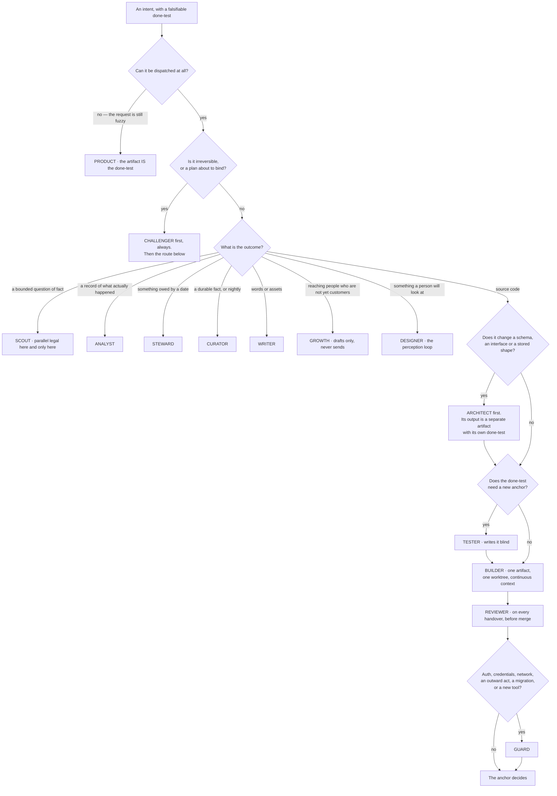

## 5 · The roster

*obeys: SPINE §B entire; v1, v2, v6, v7, v8, v31, v33; inherits: FINAL §7 (as the losing image, and as the four rules that survive it)*

---

**(FOUNDER)** *"I want us to recreate the whole startup company or a whole company or a team. So I want us to have
more agents as much as you will need, but not too much. So, like, between ten and fifteen agents. So we will have
each agent with its own expertise so we can adjust his knowledge and his tools and his way of walking and thinking
towards the tasks that he needs to achieve."*

**(FOUNDER)** **Fourteen agents plus the Operator — fifteen named roles.** One file per agent, in the frontmatter
format the runtime already reads: `name`, `description`, `tools`, `model`, `mcpServers`, `skills`, `maxTurns`,
`isolation`. **All fifteen files are ABSENT.** What exists to build them from is on this branch,
`ceo-1-1788609834`: the format itself, the `PS-*` lint in `.claude/hooks/schema-lint.js`, and eighteen agent files
that currently pass it at **18 pass · 0 fail · 0 warnings**.

**(NEW: what FINAL argued, so the reader knows what was traded)** FINAL refused a roster and built three shapes —
maker, scout, checker — separated by irreducible properties, with domain as a loadout. Its argument was that a cold
outreach agent and a blog writing agent have the same tools, the same reasoning and the same failure modes, and
differ only in what they know and what would prove them right: memory and a check, neither of which is an agent.
That argument is not refuted below. **It is overruled**, the cost is stated once in §5.6, and what the shapes were
protecting is kept as four rules that now live inside a roster.

---

### 5.1 The four rules that survive the move from three shapes to fourteen names

**(FINAL, kept; each names its mechanism)**

1. **The grant is argv, not prose.** One no-model launcher composes it; nothing else may. *(v34; `bin/run`, ABSENT.
   A prose rule describing a grant is the losing image, and `--allowedTools` restricting nothing is why.)*
2. **The checker cannot edit what it judges.** `reviewer`, `guard` and `challenger` carry **no `Write`, no `Edit`,
   no `Bash`**. *(FINAL row 6's irreducible property; enforced by the argv and by the nightly probe `bin/probe`,
   ABSENT. An agent that can edit what it reviews will review what it can edit.)*
3. **The trifecta split.** No agent holds untrusted input, private credentials and an outward channel at once.
   *(v33; the Sender is the only thing that sends, and it holds no model.)*
4. **The no-model programs stay programs.** The Watch · the Sender · the world's door · the probe · the reconciler ·
   the log · the launcher · the curator's launcher · the drill · the rehearsal runner · the store check · the
   supervisor. **A prompt injection that reaches one of these finds a program.** *(FINAL §7.4, §16.1.)*

**(NEW: why rule 4 is the one most at risk from a roster, and the mechanism is a naming discipline)** Fourteen names
create fourteen invitations to add a fifteenth for something that is currently a program. The test is whether the
thing needs judgement. The Sender does not: it recomputes a ceiling, reads a checklist aloud into the log, performs
one act, and holds a recall window. Making it an agent would put a model between the decision and the act, which is
the exact seam this design exists to keep apart.

---

### 5.2 The fourteen

**(NEW: model ids are from the models lane; `tools` is the argv-level grant, not a description; "Anchor" is what
proves the work and is **never the agent's own report**)**

| # | Name | The job it exists for | Expertise lens | Model | Tools | MCPs | Skill namespaces | Anchor — what proves it | The Operator routes here when |
|---|---|---|---|---|---|---|---|---|---|
| 1 | **builder** | Writes the code. One artifact, one worktree, continuous context | engineering | `claude-opus-5` · escalates to `claude-fable-5-1` under v21 | Read Write Edit Bash Glob Grep | none by default | engineering · testing | the venture's own CI, plus the done-test, plus the tester's blind test | the intent's outcome is source code |
| 2 | **reviewer** | Judges code it did not write, against a named dimension | engineering · correctness | `claude-sonnet-5`; a second family when reachable | Read Glob Grep | none | engineering · quality | findings reproduce from the diff alone; a finding with no reproduction is a hypothesis | any builder handover, before merge |
| 3 | **architect** | The contract before the code: schema, API, data model, migration | engineering · systems | `claude-opus-5` | Read Glob Grep Write (design paths only) | none | engineering · data | a migration that applies and rolls back in a scratch database | the work changes a schema, an interface or a stored shape |
| 4 | **tester** | Writes the test that judges a build, **blind to the implementation** | quality | `claude-sonnet-5` | Read Write Edit Bash Glob Grep, `--add-dir` excluding the implementation | none | testing · quality | the test fails before the change and passes after | any intent whose done-test needs a new anchor (v8) |
| 5 | **guard** | Security and adversarial review; every tool admission | security | `claude-opus-5` | Read Glob Grep | none | security | a proof of concept that reproduces, or the finding is a hypothesis | auth, credentials, network, outward acts, migrations, or a new tool at the door |
| 6 | **scout** | Finds things out. Stateless, parallel legal here and only here. **Reads the untrusted world** | research | `claude-sonnet-5`; Gemini once authenticated | Read Glob Grep WebSearch WebFetch — **no Write, no credential, no send** | read-only servers, per run | research | every claim carries URL, quote and access date; `check-citations.mjs` blocks on a dead one | a bounded question of fact is cheaper to answer than to assume |
| 7 | **designer** | UI, UX, brand, visual identity, prototypes. The perception loop: render, look, iterate | design | `claude-opus-5` | Read Write Edit Bash Glob Grep | `playwright` (per-run inline) | design · frontend | a rendered screenshot judged against a named anchor; never the agent's description of it | the artifact is seen by a person |
| 8 | **product** | Turns fuzzy into a falsifiable done-test; specs, tickets, acceptance criteria, roadmap | product | `claude-sonnet-5` | Read Glob Grep Write (spec paths) | none | product | the store check refuses an intent whose done-test is not falsifiable by someone who did not do the work | the request cannot yet be dispatched |
| 9 | **analyst** | Pipelines, KPIs, cohorts, A/B, anomalies, and the nightly reconciliation | data | `claude-sonnet-5` | Read Glob Grep Bash | read-only analytics, error tracking, billing-read | data | the reconciliation reads a record the company does not write; a number that reconciles to our own log is rung 4, not rung 1 | a question is about what actually happened |
| 10 | **writer** | Content, brand voice, SEO, ad copy, campaign drafts, video and asset briefs | growth · craft | `claude-opus-5` for taste work; `claude-sonnet-5` for routine | Read Write Edit Glob Grep | Higgsfield (rate-capped, spends credits) | growth · craft | staged, never sent; the anchor is the founder's taste store and a rung-2 external reaction | words or assets are the artifact |
| 11 | **growth** | Leads, scoring, outreach *drafts*, CRM hygiene, funnel work. **Never sends** | growth | `claude-sonnet-5` | Read Glob Grep Write | CRM read-only | growth | a reply from a real person, recorded by the world's door; never a count of messages sent | the intent is about reaching people who are not yet customers |
| 12 | **steward** | Obligations, invoices, expenses, contract *review*, compliance flags, vendors, support triage | operations · finance | `claude-sonnet-5` | Read Glob Grep Write | Gmail/Calendar/Drive/Notion **read** | operations | an obligation is discharged only by a record the company does not write | something is owed to someone by a date |
| 13 | **curator** | What the company knows: memory, the transcript pass, and skill admission. **The only writer of memory** | knowledge | `claude-sonnet-5`; the summarising half on Gemini or a local model | Read Write Edit Glob Grep — **no Bash** | none | knowledge | a memory item with no source, date, expiry and falsifier is refused at the store check | nightly, and whenever a run's handover proposes a durable fact |
| 14 | **challenger** | Attacks a finished plan or artifact for holes, contradictions, and rules with no mechanism | adversarial reasoning | `claude-opus-5`; a second family when reachable | Read Glob Grep | none | quality · research | every finding names the mechanism that would have caught it, or it is an opinion | before anything irreversible, and on every plan the Operator is about to bind |

**(NEW: where the roster is thinner than it looks, deliberately, and this is the table's most important row)**
**Eight of the fourteen carry no shell. Five carry no write of any kind. Only four can touch source.** That is the
trifecta split expressed as a table rather than as a rule, and it is what makes fourteen names cost less than it
sounds: most of them cannot do most things.

**(NEW: the fifteenth)** The **Operator** is not in the table because §3 is its section. It carries `Read Glob Grep`
plus `Agent(...)`, no `Write`, no `Edit`, no `Bash`, and its file is ABSENT like the rest.

---

### 5.3 The fourteen, one at a time

**(NEW: the table is the contract; these paragraphs are what a builder needs in order to write each file, and each
one names the thing that would make that agent wrong)**

**1 · builder.** Writes the code, and is the only agent for which *"one artifact, one agent, continuous context"* is
a hard rule rather than a preference. Lens: engineering. `claude-opus-5`, escalating to `claude-fable-5-1` only
under v21's single named rule — a done-test failed twice under Opus 5 and a horizon beyond one window. Full grant:
Read, Write, Edit, Bash, Glob, Grep, inside one worktree. No MCPs by default, because a builder with a server has a
surface nobody admitted. Skills: engineering, testing. **Anchor:** three things, none of them its own report — the
venture's CI, the done-test, and the tester's blind test. **The way it goes wrong:** it fixes something outside its
scope because it was right there. `out-of-scope` in the brief is the field that stops it, and the cord on itself is
what it does instead.

**2 · reviewer.** Judges code it did not write, against one named dimension per session. Lens: engineering,
correctness. `claude-sonnet-5`, and a second model family whenever one is reachable. **Read, Glob, Grep, and nothing
else** — this is rule 2 of §5.1 and it is structural, not procedural. Skills: engineering, quality. **Anchor:**
findings reproduce from the diff alone. A finding that does not reproduce is a hypothesis and is labelled one.
**The way it goes wrong:** it returns a score. It returns findings against a dimension, never a score, and when
comparing two candidates it compares pairwise and order-swapped with the candidate stripped of its label.

**3 · architect.** The contract before the code: schema, API, data model, migration. Lens: engineering, systems.
`claude-opus-5`, because a wrong interface is expensive in a way a wrong function is not. Read, Glob, Grep, and
`Write` **on design paths only**. Skills: engineering, data. **Anchor:** a migration that applies **and rolls back**
in a scratch database — an anchor outside the model, run by a program. **The seam with builder is v7 and it is the
whole reason this is a separate agent:** the architect's output is a separate artifact with its own done-test,
handed over whole, and **a builder that needs to change it files an objection rather than editing it.** Cognition's
measured failure is two agents acting on assumptions *"not prescribed upfront"*; an artifact with a done-test is
what prescribes them. **Mechanism:** the builder's `--add-dir` excludes the architect's output path.

**4 · tester.** Writes the test that judges a build, **blind to the implementation**. Lens: quality.
`claude-sonnet-5`. Read, Write, Edit, Bash, Glob, Grep, with `--add-dir` **excluding the implementation path** —
the blindness is argv, not instruction. Skills: testing, quality. **Anchor:** the test fails before the change and
passes after, which is checkable by a program and unfakeable by either party. **Why both this and the builder's own
tests exist (v8):** Devin's shipped guidance is *"Tell Devin to test its own work before opening a PR"*, and that
self-check is kept — but a test written by the author of the code is a machine grading its own homework, which this
system refuses at the level of §0. Two different tests, two different jobs.

**5 · guard.** Security and adversarial review, and **every tool admission passes through it**. Lens: security.
`claude-opus-5`. Read, Glob, Grep — a security reviewer with a shell is a security incident waiting for a prompt
injection. Skills: security. **Anchor:** a proof of concept that reproduces; otherwise the finding is a hypothesis
and says so. **Routing:** auth, credentials, network, outward acts, migrations, or a new tool at the door. **The
evidence that this is not ceremony:** the gate in this repository has already blocked its own author's work, and
three independent reviewers on one pull request found a path traversal, eleven server-side request forgery bypasses,
two more in the fix for those, and an auto-approved remote-code-execution path — all in work already called
finished.

**6 · scout.** Finds things out. **The only agent for which parallel is legal**, because it is the only one whose
subtasks are independent — which is precisely the boundary between Anthropic's +90.2% on research and Cognition's
failure on one artifact. Lens: research. `claude-sonnet-5`; Gemini once authenticated, because it burns a different
window. Read, Glob, Grep, WebSearch, WebFetch — **no Write, no credential, no send.** Read-only servers, admitted per
run. Skills: research. **Anchor:** every claim carries a URL, a quote and an access date, and `check-citations.mjs`
on this branch blocks on a dead path. **It is the trifecta agent** (v33): it reads the untrusted world, so it holds
nothing and can reach nothing. A scout that could send would be one prompt injection away from being the attacker's
outbound channel.

**7 · designer.** UI, UX, brand, visual identity, prototypes. Its way of working is a perception loop — render, look,
iterate — and that is what distinguishes it from every other maker. Lens: design. `claude-opus-5`. Read, Write, Edit,
Bash, Glob, Grep, plus **`playwright` as a per-run inline MCP entry**, which is the only surveyed way to give one run
a browser without that server's tools entering any other run's context. Skills: design, frontend. **Anchor:** a
rendered screenshot judged against a named target — **never the agent's description of what it rendered.**

**8 · product.** Turns fuzzy into a falsifiable done-test: specs, tickets, acceptance criteria, roadmap. Lens:
product. `claude-sonnet-5`. Read, Glob, Grep, `Write` on spec paths only — **and never on `intents/`**, because only
the founder's confirm creates an intent (§2.6). Skills: product. **Anchor:** the same store check that gates the
founder's own input refuses an intent whose done-test is not falsifiable by someone who did not do the work. An
agent whose output is done-tests is judged by the gate every done-test passes.

**9 · analyst.** Pipelines, KPIs, cohorts, A/B, anomalies, and **the nightly reconciliation**. Lens: data.
`claude-sonnet-5`. Read, Glob, Grep, Bash — the shell is for deterministic queries, not for writing. MCPs: read-only
analytics, error tracking, billing-read. Skills: data. **Anchor, and it is the sharpest one in the table:** the
reconciliation reads a record **the company does not write**. A number that reconciles only to our own log is rung 4,
not rung 1. **This is why the read-only instruments are admitted first** (§8) — not out of caution, but because the
reconciliation cannot exist without them, and the reconciliation is what makes every other number in the system
rung 1 instead of rung 4.

**10 · writer.** Content, brand voice, SEO, ad copy, campaign drafts, video and asset briefs. Lens: growth, craft.
`claude-opus-5` for taste work and `claude-sonnet-5` for routine — the one split default in the roster, because
taste and throughput are genuinely different moves. Read, Write, Edit, Glob, Grep. MCP: Higgsfield, rate-capped,
**and it spends credits**, which is why the cap is on the tool and not on the prompt. Skills: growth, craft.
**Anchor:** staged, never sent; the founder's taste store, and a reaction from outside. **It never holds the key**
(v33) — the thing that drafts an outward act is not the thing that sends it.

**11 · growth.** Leads, scoring, outreach **drafts**, CRM hygiene, funnel work. Lens: growth. `claude-sonnet-5`.
Read, Glob, Grep, Write. CRM read-only. Skills: growth. **Anchor:** **a reply from a real person**, recorded by the
world's door — never a count of messages sent, which is the metric that makes an outreach agent look productive
while it burns a reputation. **It never sends.** First contact with a stranger is on the default `never` list, and
the Sender's own rate limits are absolute numbers in a program no model can reach.

**12 · steward.** Obligations, invoices, expenses, contract **review**, compliance flags, vendors, support triage.
Lens: operations, finance. `claude-sonnet-5`. Read, Glob, Grep, Write. MCPs: Gmail, Calendar, Drive, Notion — **read**.
Skills: operations. **Anchor:** an obligation is discharged only by a record the company does not write. Contract
**drafting that binds**, tax filing and cap-table edits are one-way doors and are refused: they reach the founder as
a *which*, with both options prepared.

**13 · curator.** What the company knows: memory, the transcript pass, and skill admission. **The only writer of
memory** (v25). Lens: knowledge. `claude-sonnet-5`, with the summarising half on Gemini or a local model, because
that half is bulk work that should not touch the founder's window. Read, Write, Edit, Glob, Grep — **and no `Bash`**.
Skills: knowledge. **Anchor:** a memory item with no source, date, expiry and falsifier is refused at the store
check. Writes are **delta-only, never a rewrite**, and the paper behind that is specific: context held 18,282 tokens
at 66.7% accuracy and collapsed at the next step to **122 tokens and 57.1%**, below a 63.7% baseline. **The
counter-example is named rather than hidden:** Claude Code's own auto memory is written by the acting agent,
in-session. That is one shipped system doing the opposite of what this rule says, and it is accepted as a
counter-example. **Mechanism:** the curator's grant is the only one whose writable scope includes the memory paths.

**14 · challenger.** Attacks a finished plan or artifact for holes, contradictions, and rules with no mechanism.
Lens: adversarial reasoning. `claude-opus-5`, and a second model family whenever one is reachable. Read, Glob, Grep.
Skills: quality, research. **Anchor:** every finding names the mechanism that would have caught it, or it is an
opinion. **Why this is an agent and not a step the author performs (v30):** *"LLMs struggle to self-correct their
responses without external feedback, and at times, their performance even degrades after self-correction."*
Reflexion's 91% is not a counterexample — its feedback is external. **Mechanism:** the challenger never reads the
author's reasoning, only the artifact and its done-test.

---

### 5.4 How the Operator picks an agent

**(NEW: the routing column of §5.2 read as one decision, because a reader would otherwise have to hold fourteen
"routes here when" clauses in their head at once)**

**(NEW: three properties of that picture are load-bearing)** **`challenger` comes before the route, not after it** —
it attacks the plan the Operator is about to bind, and attacking afterwards is attacking a decision. **`architect`
and `tester` are gates on the code path, not alternatives to it.** And **no branch reaches an outward act**: the
right-hand edge of the diagram ends at an anchor, because staging is where every agent's authority stops.

---

### 5.5 The founder's departments — covered, or refused with a reason

**(FOUNDER, list items 23–30)** **(NEW: every department is placed against the fourteen, and every refusal names why
rather than deferring)**

| § | Department | Covered by | Refused, and why |
|---|---|---|---|
| 23 | design & product | designer (UI, UX, branding, visual identity, prototype, accessibility) · product (spec, roadmap, feedback triage) | **User-testing simulation** — a simulated user is the machine grading its own homework; the rung-1 anchor is a real reaction |
| 24 | engineering | builder · reviewer · architect · tester · guard. Documentation is written by whoever made the thing, and its anchor is that a cold reader can run it | **A separate documentation agent** — docs split from the artifact drift the moment the artifact moves. That is v7's reasoning applied in the other direction |
| 25 | data & analytics | analyst (pipelines, tracking, dashboards, KPIs, cohorts, A/B, cleaning, anomalies) | **Data labelling** as an agent — it is a founder-taste task and feeds the taste store through the Floor |
| 26 | marketing & content | writer (calendar, blog, video and asset briefs, SEO, ad copy, social, email, brand voice) | **Influencer outreach** — first contact with a stranger is on the default `never` list |
| 27 | sales & growth | growth (scraping, scoring, outreach drafts, CRM, follow-up, deal stage, referral) | **Churn prediction** — no venture has the data; it is a wish until one does |
| 28 | customer service | steward triages, because a support ticket is an obligation with a due date; writer drafts the reply; **the Sender sends** | **An autonomous reply bot** — a person is on the other side, so it is REACHES-THE-WORLD and never unattended until the founder widens the class |
| 29 | finance & legal | steward (invoices, expenses, budget-vs-actual, contract *review*, compliance flags) · analyst (the reconciliation) | **Contract drafting that binds, tax filing, cap-table edits** — one-way doors; they reach the founder as a *which*, with both options prepared |
| 30 | operations & HR | steward (vendors, meeting notes, calendar, process docs, internal tooling requests) | **Hiring pipeline** — there are no employees; revisit when there are |

**(NEW: the two roster entries with the least outside evidence, named rather than smoothed over)** **Two departments
have no shipped precedent anywhere in the rosters fetched:** sales and growth as a function, and legal and contracts.
`growth` and `steward` are therefore the two entries standing on the least outside evidence — **and their anchors are
correspondingly external**: a reply from a real person, and a record the company does not write. If those two are
wrong, the anchors are what will say so, and they will say so per agent in the ledger.

---

### 5.6 The cost of fourteen, stated once

**(FOUNDER, and the cost is from the roster research lane)** **Every shipped *running* roster that could be verified
is five or six agents. Every roster of 150 or more is a catalogue you pick from, not a team that runs together. Ten
to fifteen sits in a band nobody publishes evidence for, in either direction.**

| Kind | Systems | Size |
|---|---|---|
| Running rosters | Magentic-One · ChatDev · MetaGPT · TheAgentCompany's job functions · Anthropic's concurrent subagents | 3–6 |
| **This roster** | — | **14 + 1** |
| Catalogues | wshobson · VoltAgent | 150–202 |

**(NEW)** It is an **unoccupied band, not a refuted one**. No source was found, in any system, for a measured point
at which adding specialists stops paying — the question appears to be unanswered in public rather than answered
against us. **Fourteen is a founder decision taken with the evidence in hand, not in ignorance of it**, and it is
not re-litigated. It is reopened only by name, as row 14 of the open decisions.

**(NEW: what makes the claim falsifiable rather than an assertion, which is the only honest way to hold a decision
in an unoccupied band)** Each of the fourteen carries an anchor that is not its own report, and the Desk measures
cost per agent per kind of work from the ledger. So *"fourteen was too many"* is a checkable statement about
specific rows, not a matter of taste: an agent whose anchor rarely holds and whose median cost is high is visible
without anyone arguing about roster theory.

---

### 5.7 What the roster never does

**(NEW: three prohibitions, each from a decided row, each with the mechanism that enforces it. These are the ways a
fourteen-agent roster fails, and every one of them is a thing a well-meaning builder would do)**

**It never parallelises one artifact (v6).** One artifact, one agent, continuous context. The roster names *who*
does a kind of work; it never splits one build across two builders. Anthropic's own post excludes coding from the
multi-agent pattern — *"Most coding tasks involve fewer truly parallelizable tasks than research, and LLM agents are
not yet great at coordinating and delegating to other agents in real time"*, so such domains *"are not a good fit
for multi-agent systems today"* — and Cognition's measured failure is one artifact split across parallel builders:
*"The actions subagent 1 took and the actions subagent 2 took were based on conflicting assumptions not prescribed
upfront."* **Mechanism:** one worktree per artifact, and the launcher composes exactly one agent's argv per run.
**The one exception is `scout`**, and it is an exception for a stated reason: its subtasks are independent, which is
the boundary between the two research results above.

**It never lets one agent both design and implement one contract (v7).** A builder that needs to change a schema or
an interface **files an objection; it does not edit it**. **Mechanism:** the builder's grant excludes the
architect's output path, by `--add-dir`, and the objection is the cord on itself — a run that stops on a defect has
succeeded.

**It never lets the author of the code write the test that judges it (v8).** The builder's self-check is kept and is
not the anchor. **Mechanism:** the tester's `--add-dir` excludes the implementation path, so the blindness is a
property of the grant rather than a promise in a prompt.

**(NEW: and one that follows from rule 2 rather than from a row)** No checker is ever the family that made the
thing, whenever a second family is reachable. **The honest state of that:** it is currently **an accepted risk, not
a satisfied requirement** — there is no non-Anthropic model reachable from inside Claude Code, the irreversible tier
asks for a 2-of-3 multi-judge panel and `risk: high` asks for two distinct model families, and neither is met today.
Codex's admission (v5, v32) is the route to changing that, and until it passes its rehearsal the gap stays named.

---

### 5.8 Reconciliation with the roster research

**(NEW: six facts came back from the research lane and each one is either adopted or the roster says why not.
Nothing is left to be discovered by a reader comparing two documents)**

| Fact | What it says | What the roster does with it |
|---|---|---|
| 1 | Every shipped roster names its roles; **zero of seven** ship unnamed shapes | **Adopted.** It is the founder's decision and the world agrees with it |
| 2 | Magentic-One splits by **grant** — browser, file-read, code, shell — not by domain | **Adopted as the second axis.** §5.2 splits by job *and* its `tools` column splits by grant. Both cuts are present and they are not the same cut |
| 3 | Per-agent model is first-class frontmatter | **Adopted.** It is what makes per-agent routing a file field rather than a wish, and it removes the technical half of FINAL's objection to a file per role |
| 4 | Coding is single-threaded, from Anthropic's own post | **Adopted as v6.** One artifact, one builder, never parallelised |
| 5 | Running rosters are 5–6; catalogues are 150+; 10–15 is unoccupied | **Stated once as the cost of v1** in §5.6 and not re-litigated |
| 6 | Anthropic's +90.2% is on **research** with independent subtasks; Cognition's failure is on **one artifact** | **Adopted as the dispatch rule:** `scout` is the only agent that runs parallel, and it is the only one whose subtasks are independent |

**(NEW: one blocking mechanism problem, recorded here because it must be fixed in the same change that writes the
first agent file)** `scripts/prompt-standard.test.mjs` on this branch pins the valid model set to `claude-opus-5`,
`claude-sonnet-5`, `claude-fable-5` and `claude-haiku-4-5`. **`claude-fable-5-1` is not in it**, and `claude-fable-5`
is listed by the vendor under legacy models. An agent file written to §5.2's escalation rule **fails a blocking lint
today**. That is a real, checkable blocker, not a caveat.
