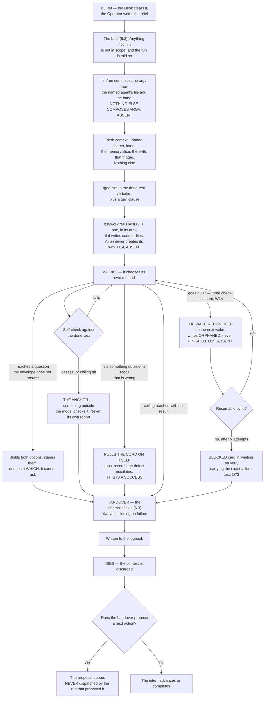

## 6 · A Run, end to end

*obeys: v12, v13, v34; SPINE §C.1 bands; inherits: FINAL §6.2, §6.3, §7.8*

---

**(FINAL)** A Run is the only place work happens, and it is deliberately disposable. Nothing here is a long-lived
agent accumulating context, because a long-lived context is the thing that rots, drifts and costs.

**(NEW: what the roster changes about that sentence, because it looks like a contradiction and is not)** Fourteen
agents are **persistent definitions**, not persistent processes. A `builder` is a file: a model, a grant, a skill
namespace, an anchor. A run is one disposable execution of that file against one brief. The file persists; the
context does not. FINAL's argument against long-lived agents was about context, and the roster does not touch it.

---

### 6.1 The life of a Run

**(FINAL, redrawn for the Operator, the named agent, and `/goal`)**



---

### 6.2 The brief

**(FINAL, plus one field from v37 and one from v45)** **Eleven fields: FINAL's nine, below, plus `agent:` (v37) and `anchor:` (v45).** **Anything not in the
brief is not in scope, and the run is told so.**

```
intent:        the id it serves — a run with no intent id does not start
purpose:       one sentence
done-test:     copied verbatim from the Intent, never paraphrased
out-of-scope:  named explicitly — what it must not touch or fix
ceiling:       tokens, and wall-clock
tools:         the exact grant — nothing else is reachable
window+model:  which subscription burns, and which model
negatives:     what has already been tried here and failed
hand back:     the named artifacts, and the evidence for the done-test
```

**(FINAL)** `out-of-scope` and `negatives` are the two fields most systems omit and the two that most reduce waste:
the first stops scope creep, the main way a bounded run becomes an unbounded one; the second stops the system
rediscovering the same dead end every night. **No shipped brief schema found requires either** — Devin's *"Define
clear scope, boundaries, and success criteria"* is the closest and is prose advice.

**(FINAL)** Two stamps the Desk adds: an **`id`**, a company-generated UUID carried into the runtime as
`--session-id` so the id is the system's and not the vendor's returned handle, and it is on every logbook row; and a
**`label`**, what the run is making and which window it is burning.

**(NEW: the tenth field, decided as v37; the eleventh, `anchor:`, is v45)** Fourteen named agents make *which agent* a fact the brief must carry,
and FINAL's nine had nowhere to put it. **The brief gains a tenth field rather than widening an existing one — and an eleventh, `anchor:`, at v45:**

```
agent:         one of the fifteen roster names — the file bin/run composes the argv from
anchor:        the rung-1 check the done-test names — bin/run refuses a brief carrying none (v45)
```

**(NEW: what v37 decides and what it leaves alone)** `window+model:` **stays exactly as FINAL wrote it.** The
agent's own row supplies its default model, and the per-move table overrides it — so the two fields answer two
different questions, *who* and *on what*, and neither is overloaded. The losing image is kept by name: a single
widened `agent+window+model:` field, and a brief that names no agent and lets the launcher guess.

**(NEW: the mechanism, because a tenth field with nothing checking it is a tenth field nobody fills)** **`bin/run`
refuses a brief whose `agent:` is not a roster file, and refuses one carrying no `anchor:`** (ABSENT; v45,
§11.11). **One schema file, `keel/shared/schemas/brief.yml` (ABSENT), is the single source these prose tables
are generated from** — the absence of it is why the count was ten here and eleven in §3 and §11. That refusal is what makes the field load-bearing:
a typo, a retired agent, or a name someone invented in a prompt fails at dispatch rather than producing a run with a
guessed grant.

**(NEW: O22 — *copied verbatim* is a rule with nothing behind it, and this repository has already lost a
measurement in synthesis twice)** `done-test:` says *copied verbatim from the Intent, never paraphrased*, and
until now the copying was done by the thing being asked not to paraphrase. **`bin/run` refuses a brief whose
`done-test:` is not byte-identical to its intent's** (**ABSENT**) — a diff, not a judgement, and a paraphrase that
means the same thing still fails, which is the point: a run that was measured against a different sentence from the
one the founder confirmed is a mis-route the anchor cannot see. **In the same move, the brief and the handover are
logged as adjacent hashed rows**, so the pair that produced an artifact is recoverable without trusting either end
of it. §2 carries the intent side of the same check.

**(FACT: world.md 14 — the sharpest fact of the round, and it lands on this field)** `/goal` check-ins **back off
30 min → 1 h → every 2 h, and an idle session gets at most three check-ins per goal** until someone messages it.
Under `-p` **the check-in is the only thing the runtime delivers, and nobody is there to message it** — so a night
goal loop delivers three times and goes quiet, and quiet is byte-indistinguishable from finished. Three
consequences, none of them optional. The `/goal` clause above is **not** a night-long supervisor and must not be
written as one. §L **O21** composes the condition from v45's `anchor:` field — *"`<anchor>` exits 0, and
`<done-test>`"* — so the most frequently executed judgement in the system becomes an exit code rather than a small
model reading prose (**DEPENDS-ON-R17**; **(R17, OPEN)** also asks whether an exit-code condition behaves
differently from a prose one). And the silence after the third check-in is what §6.4's reconciler exists to
resolve.

**(NEW: why the field names the agent and not the argv, which is v34 restated where it is most likely to be
violated)** The brief names *who*. **`bin/run` (ABSENT; FINAL names it `keel/bin/run`) composes the argv** from that
agent's file plus the band. The Operator never composes argv, a run never composes argv, and the board never
composes argv — every dispatch path calls the same launcher. Without that, fourteen agent files become fourteen
places a grant can be written wrongly, and this repository already knows how that ends: `--allowedTools` restricted
nothing for months while everyone believed it did.

**(NEW: v12 — the done-test does a second job here)** The `done-test:` field, copied verbatim, becomes the `/goal`
condition on the run: `claude -p "/goal <done-test> or stop after N turns"`. Three properties of that feature bind
the field's wording and are quoted rather than paraphrased. The condition limit is **4,000 characters**. The
loop *"runs to completion in a single invocation"* under `-p`. And after transient failures **including rate
limits**, *"Claude Code leaves the goal active"* — which is the behaviour a night wants, since a five-hour window
reopening should not require a new dispatch. It terminates on Met, on Impossible, on `/goal clear`, or on four
unrecoverable errors: authentication failure, exhausted credit balance, unclearable context overflow, and an
unavailable model.

---

### 6.3 The handover

**(FINAL, plus the three fields the rest of the plan already reads back)** ~~**Ten fixed fields**~~ **Ten fixed
fields plus five additions (O7), one of them a group of four — eighteen lines, always, even on failure** *(moved
2026-09-06: O7)* — FINAL's seven plus `rung`, `findings` and `anchor`, held in **one schema file,
`keel/shared/schemas/handover.yml` (ABSENT)**, which every table that shows them is generated from **and which owns
the count, so no paragraph has to** (§L **O6**: a `schema_version` on every row, and a reader refuses an unknown
version rather than guessing). The I-PASS bundle cut medical errors 23% and preventable
adverse events 30% across nine hospitals; the mechanism is not the format but that named required fields force the
outgoing party to surface what the incoming party needs, especially the uncertain parts, which free prose omits.

```
outcome:      done | partial | stopped-on-defect | blocked | over-ceiling
done-test:    passed | failed | not-reached — and the evidence, attached
changed:      every file, branch, external effect. Nothing summarised away
cost:         actual tokens, window, wall-clock — from the runner's own record
learned:      what is now known that was not before — a PROPOSAL to memory
uncertain:    what I am not sure about and what would settle it
next:         the single most valuable next action, as a proposal
rung:         the evidence rung of the claim this handover makes (§11.2)
findings:     each defect, with its evidence — no score (§11.3)
anchor:       the rung-1 check the done-test named (§11.11)

# added 2026-09-06 by O7 — five additions, one of them a group of four
objection:       a refusal to proceed, with what would unblock it (v7, generalised
                 from architect-and-builder to all ninety-one pairs)
brief_sha:       the hash of the brief this run executed, so the pair is joinable
maker_family:    the family and model that MADE the artifact
maker_model:
checker_family:  the family and model that CHECKED it
checker_model:
actor:           who performed the move — one legal value today, an agent run
idempotency_key: on the STAGED ARTIFACT, not only on the resume path
```

**(FINAL)** `uncertain` is the field to fight hardest for: it turns a confident wrong answer into a flagged one, and
the anchor and the briefing read it first. **No shipped handover schema found has it.** Linear's activity vocabulary
— thought, action, response, elicitation — is the closest published state model and carries no uncertainty slot.

**(FINAL)** A handover is **never the next run's input by itself**: every run starts from the files — the logbook,
the intent, the slice — so a summary that lost a number cannot propagate. **This repository has recorded that exact
defect twice**, most recently when a correct measurement of *29 of 30 steps passing* was synthesised into *29 of 29*
and propagated into a project file and two handoffs.

**(NEW: O7 — why five fields land now rather than when something needs them, and this is the whole argument for the
timing)** **All five are free before the first run and a full backfill afterwards.** They cost a schema line each
today; after a thousand runs they are **unreconstructable**, because nothing else records which family made a thing
and which family checked it. Two consequences ride on them. **(R11, OPEN)** — *does a second model family reduce
escaped defects on our move classes, and by how much* — is **blocked on the four maker/checker fields** and cannot
be answered retroactively, and it is the measurement that decides whether rung 2 outranks rung 4 on any given
class. And `objection:` generalises v7 from the one pair the plan designed — architect and builder — to **all
ninety-one pairs the roster makes**, which is what a message between two running agents is allowed to be (v80,
§3.5): a handover or an objection, and nothing else. `actor:` has **one legal value today**, an agent run, and it
exists so that the first non-agent actor is a value rather than a schema migration. `idempotency_key:` moves onto
the **staged artifact** rather than sitting only on the resume path, because §6.4's *"an agent that already sent
the email and then restarts sends it twice"* is about the artifact, not about the resume.

**(NEW: `learned` is a proposal, and the word is doing work)** A run proposes a durable fact; **only the curator
writes memory** (v25), delta-only, never a rewrite, and a memory item with no source, date, expiry and falsifier is
refused at the store check. A run that could write memory would be the thing that acts editing what the system
believes about its own acting.

---

### 6.4 Resume, not restart

**(FINAL)** Every Run writes its handover incrementally and records each completed step before the next begins. When
a window closes or the lid shuts, the run is **resumable from its log rather than restartable from its brief** —
Temporal's durable-execution model: a complete event history replayed on recovery, steps that succeeded skipped.

**(FINAL)** A restarted agent run does not merely waste time; **it re-spends money and may re-take actions that
already happened.** An agent that already sent the email and then restarts sends it twice. So every external effect
is recorded **before** it is attempted, with an idempotency key, and replay checks the log before acting.

**(FINAL, measured)** `SIGTERM` gives exit 143, the turn left unfinished with no result recorded, the process tree
killed, the turn resumable. Every surveyed runtime has a session id and resume-by-id, and Claude Code accepts the id
the system assigns — which is why the UUID is minted by us and not read back from the vendor.

**(FOUNDER, rethink 2026-09-06: D2 → v67 — what that measured signal is delivered to)** The launcher **records each
child's process group before exec**, and the cord signals *that*, so the exit 143 above is something the founder
can cause on purpose rather than a property observed in a test. Every carrier in §3.5 now declares a `stop:`, and
**`bin/run` refuses to mint unattended work on a carrier whose `stop:` reads UNKNOWN** — which is why no hosted
lane may hold a night's work today. **Mechanism:** one `pgid` field written by `bin/run` before exec, one signal
path (**ABSENT**).

**(NEW: O15 — contradiction 13, and it is the largest hole this section had)** ~~*"Resume, not restart"* is asserted
here and **nothing performs it**~~ *(moved 2026-09-06: O15)*. Every mechanism above describes what a resumable run
*is*; none of them notices that a run stopped. Under `-p`, with W14's three check-ins spent, a run that died at
03:00 and a run still working look identical from outside. **The wake reconciler is the carrier:**

| Step | What it does |
|---|---|
| Before exec | the launcher writes **`run.started`** — so a run that never reported is distinguishable from a run that never began |
| On wake | the Watch reconciles our session log against **`claude agents --json --all`**, the tmux session list and the process table |
| On a gap | it writes **`orphaned`, never `finished`** — the two must never be the same value, because one is an answer and the other is the absence of one |
| Then | it **resumes by id**, or closes the run with a reason; and it **refuses a night lane the power assertions cannot promise to keep awake** |

**Mechanism:** `bin/run` and `bin/watch` (**ABSENT**). **Why `orphaned` is the load-bearing word:** a reconciler
that guessed `finished` would turn every crashed night into a completed one, and the handover — the thing every
downstream reader trusts — would be missing with nobody looking for it.

**(NEW: R9 — one thing about a long run that the strongest memory rule cannot currently see)** **(R9, OPEN)** —
*does an unattended `-p` run auto-compact, and does it emit anything the log can see?* v24 says memory is written
by the curator, delta-only, and never by the acting run; **an auto-compaction is the runtime rewriting a run's
context in place**, which is the same act performed by something the rule cannot address. Measured with one long
`-p` run under `stream-json --verbose` plus the vendor's documentation. **If it is unobservable, the answer is to
bound run length** rather than to widen the rule — which is a decision about this section, not about §13.

**(FINAL §6.1 and §14.7, providers lane, measured 2026-09-04: two runtime facts that shape how long a run should be)** `maxTurns` **marks output partial
and resumable rather than truncating it**, which is the restart-from-checkpoint primitive and does not need to be
built. And a background child holds its parent open in idle waiting by default — one stuck child doubles its
parent's duration with nothing reporting it — which is why runs do not spawn background children except `scout`
fanning out under a bounded wait.

**(FINAL)** **Enforced by:** the brief and handover schemas in `shared/schemas/` and `bin/run`, which births a run
and **refuses a brief missing any field** (both ABSENT) · `--output-format json` (exists) · `--session-id <uuid>`
(exists, and *"must be a valid UUID"*) · the runner's `SessionEnd` hook writing the partial handover (ABSENT).

**(NEW: added 2026-09-06 — one row per mechanism this round gives the section)**

| Mechanism | What it enforces | Path |
|---|---|---|
| **O22** | the brief's `done-test:` is byte-identical to the intent's; brief and handover are adjacent hashed rows | `bin/run` — **ABSENT** |
| **O15** | `run.started` before exec; reconcile on wake against `claude agents --json --all`, tmux and the process table; write `orphaned`, never `finished` | `bin/run` · `bin/watch` — **ABSENT** |
| **v67** | the child's `pgid` recorded before exec; unattended work refused on a carrier whose `stop:` is UNKNOWN | `bin/run` — **ABSENT** |
| **O14** | a run never creates its own worktree; it is handed one in its argv | `bin/worktree` — **ABSENT** |
| **O72** | the Desk refuses a run whose declared scope intersects a live run's worktree scope | the Desk — **ABSENT** |
| **O71** | the launcher refuses to mint past N live sessions; the supervisor refuses to restart into a full table | `bin/run` · `bin/supervise` — **ABSENT**, **DEPENDS-ON-R23** |
| **O73** | after N failures the run becomes a `blocked` card carrying the exact failure text, written to negatives | the card store · the negatives store — **ABSENT** |
| **O7** | five additions on the handover, free now and a full backfill later | the handover schema — **ABSENT** |

---

### 6.5 The band the run executes in

**(NEW: SPINE §C.1, applied at the point of dispatch. §3.2 is the table; this is what it means for one run)** The
band is not an attribute of the agent. It is an attribute of **the move**, and the same agent runs in different
bands on different intents.

| Band | What the launcher emits | Codex axes | What the run can do |
|---|---|---|---|
| **Read and report** | `plan` mode | `never` × `read-only` | Read, explore, report. It **does not edit source** |
| **Build in a worktree** | `dontAsk`, with `--restricted` and an explicit `--tools` list | `never` × `workspace-write` | Everything in its grant, inside one worktree. **It cannot ask** |
| **Stage an outward act** | no mode, because **no agent performs it** | — | Stage a hashed artifact and stop. The Sender performs the act |

**(NEW: what `--restricted` buys, in three clauses, because a reader will otherwise assume the tool list alone is
the narrowing)** It **ignores user, project and local settings**, it **confines the file tools to the working
directories**, and it **refuses bypass**. It also *"removes the built-in tools that run commands or code, and
WebFetch, unless you name them individually in `--tools`, not through the `default` preset"* — so a grant that omits
a tool omits it in fact. It needs v2.1.248+. `--permission-prompts none` means a run never hangs on a prompt nobody
will answer, and under `-p` the tools needing terminal input are disabled anyway *"so the session never stalls
waiting for input."*

**(NEW: O14 — where the worktree comes from, because the run cannot make one and the plan assumed it could)** v41
gives four agents `isolation: worktree`, and **`git worktree add` cannot complete under the armed sandbox** — a
full checkout has to write the agent-config paths, which the runtime protects independently of this repository's
settings, and adding them to the write allow-list has been tried and does not lift it. The documented remedy is
**interactive escalation**, which an unattended run does not have **by construction**. So a run **never creates its
own worktree**: `bin/worktree` (**ABSENT**), a no-model program in the Watch's context, creates it and the launcher
**hands the path to the run in its argv**. The run works inside it normally from then on. This is the same shape as
every other narrowing in the section — the thing that needs the capability is not the thing that holds it.

**(NEW: the stall fuse rides along, under its real name)** `--max-budget-usd` is **not a billing control** (v23) —
print mode only, computed locally at list price, and for a subscriber *"the session cost figure isn't relevant for
billing purposes."* It is kept because **subagent spend counts toward it** and overflow **fails a spawn with
`Budget limit reached`**, which stops a run that has gone into a loop of children.

---

### 6.6 What a run cannot do

**(FINAL, and these are the two that matter most, each held in more than one place because one place is a wish)**

**A run cannot dispatch its own successor.** It **proposes**; the Desk decides. Without this, one run that believes
it is nearly finished spawns another that believes the same, forever — and the loop is broken at the only place that
knows the budget and the ranking. **(FINAL, the mechanism, because a builder holds `Bash`)** A shell could otherwise
call `claude -p` itself, so the rule is held in **three** places a run cannot reach:

1. the **managed settings file** carries `permissions.deny` rules for `Bash(claude *)`, `Bash(gemini *)` and
   `Bash(codex *)`, which **`--restricted` cannot lift** — deny rules bind in every mode, including bypass;
2. the **ledger refuses a row whose run id was not minted by `bin/run`** (ABSENT), so a child born outside the Desk
   is uncounted, and the aberrance halt catches its spend;
3. the **probe asserts every night** that an agent cannot start a runtime — `bin/probe` (ABSENT).

**(NEW: the one legal exception, and it is a Desk act rather than a run act)** `scout` fanning out on a new field is
**several runs the Desk births in parallel**, never children of a run. The distinction is not cosmetic: children of
a run are invisible to the ranking and to the reserve.

**A run cannot widen its own grant.** **(NEW: and this is now vendor-documented rather than argued)** *"any
`permissionMode` in the subagent's frontmatter is ignored"* — a child cannot widen itself. On top of that:
`bypassPermissions` is disabled in managed settings by `permissions.disableBypassPermissionsMode: "disable"`, where
a running process cannot clear it (v10); allow rules have no effect in that mode anyway; and `Workflow` is absent
from every agent file and is removed by the runtime from every subagent regardless (v35), so **the gate is not
invocable by the thing it gates.**

**(NEW: O72 — a run cannot take a file another live run is holding)** v6 removes the case of two agents inside one
artifact and is **silent on two intents, one file** — two legally-dispatched runs, different intents, overlapping
paths, and **the conflict is found at landing**, which is exactly Cognition's measured failure arriving by a route
v6 does not cover. **The file lease:** every brief declares its scope, and the Desk **refuses a run whose declared
scope intersects a live run's worktree scope** (**ABSENT**). It is a refusal at dispatch, where it costs nothing,
rather than a merge conflict at landing, where it costs both runs. §5.7's parallelism axis (**O69**) is the same
rule from the roster's side: parallel is legal where the unit is a store row and refused where it is a file.

**(NEW: O71 — a run cannot be the fifty-first, and a crash loop cannot become the concurrency event)** §14.12
names three bounds on the fleet and **none of them is a session count**, so a supervisor restarting a failing run
can mint sessions without limit while every declared bound still reads green. **A session ceiling in settings:**
the launcher refuses to mint past N live rows and **the supervisor refuses to restart into a full table**
(`bin/run`, `bin/supervise` — **ABSENT**). N is not guessed: **(R23, OPEN)** asks whether `claude -p` children
have a concurrency ceiling at all and **whether the N+1th fails loudly, queues, or degrades silently** — vendor
documentation first, then one measurement. Until it is answered the ceiling is set low and stated as arbitrary,
which is visible in a way an absent ceiling is not.

**(NEW: two smaller ones, both from decided rows)** A run cannot **edit another agent's contract** — a builder that
needs a schema change files an objection (v7), enforced by `--add-dir`. And a run cannot **perform an outward act**:
every agent has `never` on that class, staging is where its authority ends, and the Sender that follows holds no
model, recomputes the ceiling **independently of the number in the instruction**, reads its checklist aloud into the
log, performs exactly one act, and holds a recall window.

---

### 6.7 How a run dies

**(FINAL)** Every run dies at handover. What survives is exactly three things: **the handover**, **whatever memory
accepted from it**, and **the agent's updated record for this kind of work**. The context is discarded.

**(NEW: what FINAL called a loadout's horizon, read against a roster)** FINAL retired a loadout recipe by horizon.
With named agents, the thing that carries a horizon is not the agent — it is what the agent was given: **a skill,
which carries `valid_until` and forces exactly one disposition at expiry, Refresh, Deprecate or Waive with a new
date** (v19). The agent file itself is governed by the lint and by the probe, both of which run against it whether
or not anyone remembers to look.

**(NEW: O73 — the one death this section had no word for)** A run that **cannot resume** is neither done nor
running, and the reconciler's `orphaned` is a state of the log rather than a state of the work. **After N failed
resume attempts the run reaches a terminal state:** it becomes a **`blocked` card in *waiting on you***, carrying
**the exact failure text** and not a summary of it, and the same text is written to the negatives store **so the
next brief on that intent carries it** and the system does not rediscover the dead end nightly. **Mechanism:** the
card store and the negatives store (**ABSENT**); the attempt counter is a field on the work row (§L **O1**). **N is
not taste: (R18, OPEN)** asks for measured evidence on repeated-attempt yield across sessions, and until it
answers, N is stated rather than justified.

**(NEW: and the one measurement that survives a run, which is what makes §5.6's claim checkable)** Cost and anchor
outcome, recorded **per agent per kind of work**, from the runner's own record rather than from anything the run
says about itself. That is the evidence by which *fourteen was too many* would become a fact rather than an
argument.
