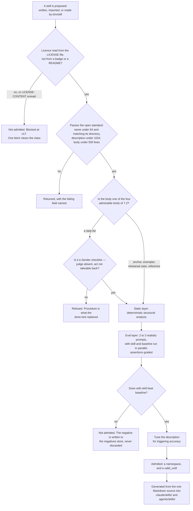
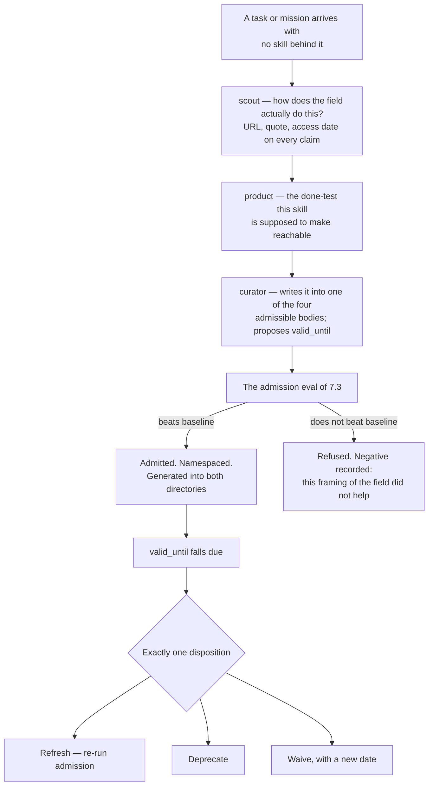

## 7 · Skills

*obeys: v3, v17, v18, v19 (SPINE §E entire); inherits: FINAL §11, §16.2*

**(FOUNDER, overruling FINAL §1 row 10.)** *"take all the skills that the biggest systems use, the biggest agent
systems use, we can learn a lot from them, like, to have more engineering stuff and more creative stuff and to give
the agents the tools the knowledge they will need in order to achieve tasks without limiting their point of view."*
And: *"we need a skill creator of skill, which, you know, we will research a task or a mission and, like, to break it
down two steps and to give it to the agents."* The library is built, not shelved. FINAL's holding directory —
`keel/holding/skills/`, the 134 moved whole into a place nothing reads — is the losing image and is kept by name in
section 22.

---

### 7.1 The library plan

**(NEW: the format is now a published spec, not a convention, so it can be obeyed rather than approximated.)** The
container is the **open SKILL.md standard** (`agentskills.io/specification`, fetched 2026-09-05). Its published
limits are the file's limits and they are not ours to soften:

| Field | Limit, quoted from the spec |
|---|---|
| `name` | max 64 chars, `a-z0-9-`, *"Must match the parent directory name"* |
| `description` | max 1024 chars |
| Metadata cost | *"(~100 tokens): The `name` and `description` fields are loaded at startup for all skills"* |
| Instructions | *"(< 5000 tokens recommended)"* |
| Body | *"Keep your main `SKILL.md` under 500 lines."* |
| Optional | `license`, `compatibility` (max 500), `metadata`, `allowed-tools` (*"Experimental"*) |

**(NEW: one artifact has to load in three runtimes, and the runtimes disagree about the path.)** Claude Code reads
`.claude/skills/`. **Codex and Gemini CLI both read `.agents/skills/`, and Codex does not read `.codex/skills`** —
Codex's search order is `$CWD/.agents/skills`, `$CWD/../.agents/skills`, `$REPO_ROOT/.agents/skills`,
`$HOME/.agents/skills`, `/etc/codex/skills`. So there are **two directories and one source of truth**: Markdown is
the source, and both directories are generated from it. That is wshobson's shipped shape — *"single
source-of-truth"* with harness-native artifacts generated — and it is adopted because it is the only shape that
survives a third runtime.

**(NEW: collisions are not merged, so a generated directory cannot be allowed to drift.)** Codex states it plainly:
*"if two skills share the same name, Codex doesn't merge them; both can appear in skill selectors."* A drifted
generated copy therefore does not error; it appears twice with different bodies. **Mechanism:** the generator is the
only writer of either directory, and the existing manifest check is re-pointed at the generated-versus-source diff
(see 7.7). Nothing hand-edits `.claude/skills/` or `.agents/skills/`.

**(NEW: the bulk import is blocked on one unread file, and it is cheap to clear.)** The upstream this repo already
draws from now advertises **2,111+ skills** and is MIT **on the code** — but a separate `LICENSE-CONTENT` file
exists at that repository and **was not fetched**, and it may carry different terms for skill *content* than MIT
does for code. **No bulk vendoring until it is read** (v17). One fetch clears it; open decision 4 in section 20.
Related and smaller: this branch's `SKILLS_SOURCE.md` (EXISTS, branch `ceo-1-1788609834`) names
`npx antigravity-awesome-skills`, while the upstream now advertises `npx agentic-awesome-skills` — whether the old
name still resolves is UNVERIFIED.

**(NEW: the corpora that look like libraries are mostly indexes, and one of them is not licensed at all.)** Read the
sources for what they are before importing from them:

| Source | What it actually is | Licence, read from the file where the row says so |
|---|---|---|
| `anthropics/skills` | **19 skill directories** — a reference corpus, not a library | **No root LICENSE file.** README only: *"Many skills in this repo are open source (Apache 2.0)"*, document skills *"source-available, not open source"*, and *"provided for demonstration and educational purposes only"* |
| `sickn33/antigravity-awesome-skills` | 2,111+ skills; this repo's own upstream | MIT on the code; **`LICENSE-CONTENT` unfetched** (v17) |
| `wshobson/agents` | 183 skills, 202 agents, 94 plugins, 105 commands; multi-harness generation | MIT, read from LICENSE |
| `obra/superpowers` | ~14 methodology skills; count is README-derived and UNVERIFIED | MIT, read from LICENSE |
| Both VoltAgent lists | indexes of links, not hosted skills | MIT **UNVERIFIED** — README and file listing only |
| `agentskills/agentskills` (spec, `skills-ref`) | the spec and its validator | **UNKNOWN** — not fetched |

---

### 7.2 The content rule, and the collision it resolves

**(NEW: the published spec recommends the one body this system refuses, so the collision is real and has to be
decided rather than noticed later.)** The spec's recommended body sections are *"Step-by-step instructions"*,
*"Examples of inputs and outputs"*, *"Common edge cases"*. FINAL §11.1 built the field kit out of four descriptive
headings precisely so that **no heading can hold *first do this, then do that***. A skill written to the spec's own
recommendation is procedural by that recommendation. Two different artifacts were wearing one filename.

**(NEW, v18.) The container is the open standard; the content rule is ours.** Four admissible bodies:

| Body | What it contains | Why it is admissible |
|---|---|---|
| **anchor** | a check with an exit code | it decides; it does not advise |
| **exemplar** | examples of good, each with provenance | it shows, and the run still judges |
| **rehearsal case** | an input plus a known answer | it can be failed, so it can be trusted |
| **reference** | a vendor fact carrying an expiry | it is a fact, and it rots on a date rather than silently |

**A step list is admitted in exactly two places (v51).** The second is the curator's five fixed questions per failed handover (§13.6, §13a.3), admitted on the evidence FINAL §10.7 cites — 0 of 121 free reflections named the cause. The first is a checklist the **Sender** reads aloud, where the judge is absent
and the act cannot be taken back — sending to a list, a migration over real data, a filing, a charge. **(FINAL
§9.4.)** The Sender contains no model and cannot decide to skip an item, which is the only condition under which a
written procedure is safe here.

**The cost of v18, stated once and not re-litigated:** an imported skill written to the spec's recommendation
**fails our admission and needs a pass**. That is a real conversion cost on 2,111+ candidates and it is accepted,
because the alternative is a library of procedure, which is the container the done-test replaced.

---

### 7.3 Admission by eval

**(NEW: the mechanism already ships, so this is an import rather than a design.)** `skill-creator` in
`anthropics/skills` implements exactly what FINAL §11.3 asked for as *"admission by test, not excision by
argument"*: draft **2–3 realistic prompts** into `evals/evals.json`, **run with-skill and baseline in parallel**,
grade the assertions, tune the description for triggering accuracy, package. Added to it: `plugin-eval`'s **static
layer** — *"deterministic structural analysis (<2s, free)"*.

**Refused for now:** `plugin-eval`'s Monte Carlo layer, *"statistical reliability via 50-100 simulated runs"*. **The
cost, once:** without it a skill's reliability is measured on 2–3 cases, so **the expiry of 7.4 does the work a
larger sample would have done**. That is why retirement is not optional in this design.

**(NEW: the mechanism is imported, the corpus is not — and the licence is the reason.)** `anthropics/skills` has no
root LICENSE and says its skills are *"provided for demonstration and educational purposes only"*. We take the eval
loop's shape. We do not vendor its 19 skills on the strength of a README sentence.

---

### 7.4 Retirement by forced expiry

**(NEW, v19: nobody in the world retires a skill by non-use, so the plan stops pretending that is a mechanism.)**
Across all seven projects researched, the only retirement mechanisms found are **drift and dead-link detection**
(`make garden`, wshobson) and **a closed contribution door** (*"we don't generally accept contributions of new
skills"*, superpowers). **No project ships a usage counter or an unused-for-N-days expiry.** FINAL §11.3's *"Ninety
days uncalled and it leaves"* is therefore a losing image and is kept by name in section 22.

**Every skill carries `valid_until`. When it comes due, exactly one disposition is recorded — Refresh, Deprecate, or
Waive with a new date.** There is no fourth outcome and no silence. **Mechanism, and it exists on this branch:**
`scripts/ledger.mjs` already forces exactly this disposition for claims and refuses a waiver with no `until`, and
`scripts/check-citations.mjs` already blocks on a dead path — both EXIST on branch `ceo-1-1788609834`. The skill
expiry rides those two rather than adding a third implementation, because two implementations of one check disagree
silently and this repository has hit that before.

**The date is set at admission, per skill, by the agent that proposed it.** No fixed window is written into the plan:
a vendor fact and a code exemplar do not rot at the same rate, and a single number would be wrong for both.

---

### 7.5 The skill creator

**(FOUNDER.)** *"we need a skill creator of skill, which, you know, we will research a task or a mission and, like,
to break it down two steps and to give it to the agents."*

**(NEW: v49 — it is a routing rule the Operator follows plus one no-model program, not a fifteenth agent and not
a second dispatcher, and it names which agent does each move, which is what keeps it from being a stage that
states method.)** Only the Operator dispatches (§0.3), so the creator is this: the Operator routes **scout →
product → curator**, each under its own grant, and one program scores the result — the eval runner
**`bin/skill-eval`** (**ABSENT**), which holds no model and dispatches nothing. The routing rule, in order:

1. **scout** answers the bounded question of how the field actually does this. Every claim carries URL, quote and
   access date; `scripts/check-citations.mjs` (EXISTS, this branch) blocks on a dead one.
2. **product** states the **done-test** the skill is supposed to make reachable — falsifiable by someone who did not
   do the work, or the store check refuses it.
3. **curator** writes the artifact into one of the four admissible bodies of 7.2 and proposes its `valid_until`.
   The curator is the only writer of memory, and a skill is knowledge, so the writer is the same one.
4. The **admission eval of 7.3** runs with-skill against baseline. **A candidate that does not beat baseline is not
   admitted, and the negative is written to the negatives store rather than discarded** — the failure is the cheapest
   thing the run produced.

**(FINAL §11.1, surviving.)** The scout fan-out inside move 1 is the **one place parallelism is earned**: four
scouts asking four independent questions do not need each other's context, and that is the same reason v6 refuses to
parallelise a build.

---

### 7.6 Namespaces per agent

**(NEW: SPINE §E.4 says "Seven namespaces" and then lists thirteen. The list is the true statement; the count is a
defect and is corrected here.)** **Thirteen namespaces**, and every one of them is claimed by at least one agent —
there are no orphans:

| Namespace | Held by |
|---|---|
| `engineering` | builder · reviewer · architect |
| `testing` | builder · tester |
| `quality` | reviewer · tester · challenger |
| `security` | guard |
| `design` | designer |
| `frontend` | designer |
| `product` | product |
| `data` | architect · analyst |
| `growth` | writer · growth |
| `craft` | writer |
| `operations` | steward |
| `knowledge` | curator |
| `research` | scout · challenger |

**(FINAL, and now the standard's own mechanism rather than a local convention.)** **Never preloaded.** Progressive
disclosure is what enforces it: *"The `name` and `description` fields are loaded at startup for all skills"* at
**~100 tokens each**, the body loads only on judged relevance, and bundled files load below that. The consequence
binds the library's size: **every admitted skill taxes every unrelated task at startup**, so the namespace is not
cosmetic — it is the thing that keeps a growing library from making a shrinking one's job more expensive. That is
the same defect this repository already fixed once, when reading the whole manifest cost ~15,000 tokens per lookup.

---

### 7.7 The 134 on disk, and what each becomes

**(measured on branch `ceo-1-1788609834`: 135 directories under `.claude/skills/`, of which one is `routers/` —
so 134 skills, plus `CURATION.yml` and `MANIFEST.json`, all EXIST.)**

**(NEW: they are no longer a holding directory. There is no shelf.)** FINAL §16.2's fate classes are kept, and they
change status: they were a **verdict**, and they become a **starting classification for admission**. Each of the 134
now has exactly two futures — it re-enters through 7.3, or its `valid_until` falls due and 7.4 takes one of three
dispositions. Nothing sits in a directory read by nothing.

| Fate class (FINAL §16.2) | Count | Admissible body it targets under v18 | How it re-enters, or does not |
|---|---|---|---|
| **PROCEDURE** | 73 | none, as procedure | One door only: a **Sender checklist**, where the judge is absent and the act cannot be taken back. Otherwise it may **donate its examples** to an exemplar, one at a time, with a caller. All 28 `thinking-*` sit here |
| **ANCHOR-CANDIDATE** | 22 | **anchor** | It must carry a check with an exit code and beat baseline. First candidates named by the census: `wcag-audit-patterns`, `security-audit`, `web-security-testing`, `e2e-testing-patterns`, `writing-good-tests`, `verification-before-completion` |
| **EXEMPLAR-CANDIDATE** | 16 | **exemplar** | Provenance per example, then the eval. `react-patterns`, `error-handling-patterns`, `high-end-visual-design`, `seo-content-writer` and the rest |
| **REHEARSAL-CANDIDATE** | 1 | **rehearsal case** | `react19-test-patterns` carries before/after pairs with known answers — the only one in the corpus |
| **INFRA** | 22 | **reference** | **(NEW: this row moves.)** FINAL §16.2 said INFRA is *"never loaded into a run as a skill"*. v18 admits a fourth body — a vendor fact with an expiry — so an INFRA entry now has a legitimate skill form, and 7.4's expiry is what makes it safe |

73 + 22 + 16 + 1 + 22 = 134. **The distribution is the finding, not the total:** the largest class is the one the
content rule refuses, so the honest prediction is that the library grows mostly by import and creation rather than
by re-admitting what is here.

**(NEW: two existing checks do not retire — they change subject, and that corrects FINAL §16.2.)** §16.2 wrote that
*"`check:manifest` and `check:curation` … retire with it"*, because the library was going to a shelf. The library
does not go to a shelf, so they stay and are re-pointed:

- **`check:manifest`** becomes the **drift check between the one Markdown source and the two generated directories**
  — the mechanism 7.1 needs, given that Codex does not merge same-named skills.
- **`check:curation`** already records every cut with the test that made it. Inverted per FINAL §11.3, that is the
  **admission record**: every entry keeps the eval that admitted it and the date it expires.

Both are steps of the check suite on branch `ceo-1-1788609834` today, so the mechanism is a re-pointing rather than
a new blocking check.

---

### 7.8 What enforces this section

| Rule | Mechanism | State |
|---|---|---|
| A skill matches the published spec | the spec's own validator, `skills-ref validate` | licence of `skills-ref` **UNKNOWN**; the checks are re-implementable from the spec text |
| A skill's body is one of four kinds | the admission gate in `bin/skill` | **ABSENT** |
| A skill beats baseline before admission | `evals/evals.json` plus paired with-skill and baseline runs | **ABSENT** here; **shipped** upstream as `skill-creator` |
| A skill expires and one disposition is recorded | `scripts/ledger.mjs` (forces the disposition; refuses a waiver with no `until`) | **EXISTS**, branch `ceo-1-1788609834` |
| A skill citing a dead path fails | `scripts/check-citations.mjs` | **EXISTS**, branch `ceo-1-1788609834` |
| The generated directories match the source | `check:manifest`, re-pointed | **EXISTS** as a suite step; the re-pointing is **ABSENT** |
| Every admission keeps the test that made it | `.claude/skills/CURATION.yml`, inverted | **EXISTS**, branch `ceo-1-1788609834` |
| No bulk import before the licence is read | a founder decision, section 20 row 4 | **WISH** until the fetch happens — nothing today blocks a vendoring commit |
| Skills are never preloaded | the standard's progressive disclosure | **shipped by the runtimes** |
