## 8 · Tools and MCPs

*obeys: v15, v33 (SPINE §F entire), **v68** (the rethink round of 2026-09-06), and **v90, v94, v101 with O92, O94, O100, O105, O109, O122** (the fixer round of 2026-09-06, SPINE §K row 8); inherits: FINAL §9.3 (the door), §9.4 (the trifecta), §16.3 (the connected hands)*

**(FOUNDER.)** *"there is no limitations of adding new MCPs or new tools to fill our needs. So there is so many
filters we might need to include and get more MCPs or more of tools in order to do things better or to improve the
system or to have endless possibilities and, like, we need to think about it outside of what we have right now."*

---

### 8.1 The door is material, not a ceiling

**(FOUNDER, and it is a correction of how FINAL §9.3 was being read.)** The door is **what a tool must pass**. It is
not a list of what may be proposed. **Anything may be proposed** — an MCP server, a CLI, an API, a browser, a
repository, a device. What the door decides is what the tool may then *do*, who may hold it, and whether it may be
held at night.

**(FINAL §9.3, unchanged and still the reason the door exists.)** The exposure is not hypothetical: scans found
critical vulnerabilities in **33% of 1,000 MCP servers** and some finding in **66% of 1,808**, and three attacks are
documented that need the founder to do nothing wrong — **tool poisoning** (instructions hidden in a description),
**the rug pull** (a server passes review, then silently changes its description; CVE-2025-54136), and **line
jumping** (the server steers the agent without appearing in the log). Hashing the descriptions and re-checking them
every session is the specific countermeasure to the rug pull, and it is a string comparison.

**(NEW: the door gains one box it did not have, because the roster now exists.)** FINAL's door classified a tool and
rehearsed it. It could not ask *who may hold this*, because FINAL had shapes rather than named agents. Section 5's
fourteen make that question answerable, so it is now a gate rather than a note.

```mermaid
flowchart TD
    NEW["A tool is proposed:<br/>MCP server, CLI, API, browser, repository"] --> WHY{"Which intent needs it,<br/>and what does it replace?"}
    WHY -->|"no intent needs it"| NO["Not admitted.<br/>Might be useful is not a reason"]
    WHY -->|"a named intent"| CLASS["Classify into one of the four classes of 8.2,<br/>with its undo, and a rate where there is one"]
    CLASS --> WHO{"Which agents of the roster<br/>may hold this class?"}
    WHO -->|"none may"| SENDERQ{"Does it REACH THE WORLD?"}
    SENDERQ -->|"yes"| SENDER["Only the Sender holds it.<br/>The Sender holds no model"]
    SENDERQ -->|"no"| NO
    WHO -->|"a named agent or agents"| PIN["Pin the version.<br/>Hash the tool descriptions.<br/>Record a binary's version string and sha256 (O35).<br/>A person reads the full description once"]
    SENDER --> PIN
    PIN --> SCOPE["Scope the credential:<br/>one venture, least privilege, an expiry —<br/>narrower than the tool.<br/>Record scopes_observed beside scopes_requested (O35)"]
    SCOPE --> TRI{"Would granting this create the<br/>trifecta on any path? (8.7)"}
    TRI -->|"yes"| SPLIT["SPLIT THE RUN. Structural, not a setting.<br/>The reader is born a scout and stays one"]
    TRI -->|"no"| GUARD
    SPLIT --> GUARD["guard reviews it — every tool admission<br/>is on guard's routing line"]
    GUARD --> REH["Rehearse it: a known call, a known answer,<br/>on its dry branch, headless"]
    REH --> CAP{"Does it spend credits or money?"}
    CAP -->|"yes"| PCAP{"Is a provider_cap recorded,<br/>held AT the provider? (O32)"}
    PCAP -->|"null"| NO
    PCAP -->|"a number"| CEIL
    CAP -->|"no"| CEIL
    CEIL{"A counter and a ceiling —<br/>and does the ceiling REJECT?"}
    CEIL -->|"no"| NO
    CEIL -->|"yes"| ADMIT["Admitted, with a horizon:<br/>day, Floor only · night · never"]
    ADMIT --> EGR["Every call leaves through bin/egress, three transports (O94):<br/>a per-child stdio MCP server, the sandbox network block,<br/>credentials injected the agent never sees (v68)"]
    EGR --> WATCH["Description hash checked each session.<br/>Probed nightly by bin/probe"]
    WATCH -->|"hash changed"| FREEZE["FROZEN — a rug pull until proven otherwise.<br/>The founder is told"]
    WATCH -->|"horizon passes"| RENEW{"Still named by a live intent?"}
    RENEW -->|"no"| REVOKE["Revoked. Credential rotated"]
    RENEW -->|"yes"| ADMIT
```



**(FINAL §9.3, and it is the sentence that keeps the door from becoming a shopping list.)** For a repository: *what
does it give us we could not build in a day, its LICENSE file, our monthly test, what breaks if it disappears, is it
alive* — **take the mechanism, not the dependency**, because every framework that wants to own the loop is a second
control plane beside the runtime, and two implementations of one thing disagree silently.

**(NEW: O35 — the admission record says what we asked for and not what we got, and for a CLI it says nothing at
all.)** Two fields are added to the admitted-tool file (**ABSENT**). **`scopes_observed`, read back from the
provider** and recorded beside `scopes_requested`: an OAuth grant is what the provider *issued*, not what we typed
into a consent screen, and the two differ often enough that the difference is the interesting number.
**A binary's version string and its sha256, recorded at admission**: version pinning is defined in this section for
**MCP descriptions** and is **undefined for the binaries that actually run at night** — `gh`, `git`, `node`, `bun`,
`codex`, `gemini` — which is the larger surface and the one nothing currently hashes. **The cost, once:** two reads
at admission time. **Settled by:** a re-read that disagrees with the record, which is a rug pull one layer below
the one 8.1 already watches for.

---

### 8.1a The door in the wall — one program everything leaves through

**(FOUNDER, rethink 2026-09-06: D3 → v68.)** *"Build `bin/egress`; `--strict-mcp-config` names only the proxy; the
MCP policy file becomes its configuration."* **One no-model program logs every outbound call, filters by domain
**and HTTP method**, and injects credentials the agent never sees.**

**Why it is a program and not another rule.** 8.1's door decides what may be *admitted*; nothing in this section
decides what happens at the **syscall**. That gap is where the trifecta argument runs out: 8.7's split guarantees a
leg is missing **at dispatch**, and v68 is the only proposal of the round that survives an agent being *fully*
persuaded — it keeps the leg missing at the moment of the call. It is also what turns *"every call logged"* (8.1's
own `WATCH` node) from a sentence into a count that can be compared against the runtime's.

**(NEW: O94 — the obvious shape fails at the syscall, so the program is three transports with one configuration and
one log.)** The shape v68 was read as — an HTTP proxy on `127.0.0.1` that every call passes through — **is
unreachable by the process class it governs**: outbound loopback `connect()` is denied for sandboxed Bash, measured
as `dial tcp 127.0.0.1:11434: connect: operation not permitted` (THINKER: A5; W36). A proxy nobody can reach logs
zero calls, which reads as success. **`bin/egress` is therefore three transports**, inside v68's *"R2 may halve
it"* clause: **(1) a stdio MCP server**
`bin/run` spawns **per child** and names **alone** in `--strict-mcp-config`, fronting every admitted server — the
call log, the domain-and-method filter and the credential injection live here, and stdio needs no socket; **(2) the
sandbox `network` block** for anything Bash does; **(3) `credentials.injectHosts`** where R2 shows it injects a
secret the child cannot read. `WebFetch` and `WebSearch` are runtime-side and reach none of the three, so they are
**absent from `--tools` for every agent but `scout`**, which holds no credential — the trifecta is the control
there. **(R2, OPEN) becomes the transport question:** which of the three carries what, one measured cell each; R2
changes the program's size, never whether the guarantee exists. **Losing image:** *a loopback HTTP proxy on `127.0.0.1`* — §J 86 · `wins_if:` the sandbox gains a
per-invocation loopback allow scoped to one port; the proxy is then reachable and it is one hop again. **Class:**
adapter (O105); `vendor_wins_if:` that same loopback allow.

**What this demotes, and it is a deletion (SYNTHESIS §7 deletion 10).** ~~`.claude/mcp-policy.json` as an
**independent** control~~ — a policy whose calls no hook can see — **becomes ~~the egress proxy's~~ `bin/egress`'s
configuration** (moved 2026-09-06: D3; amended 2026-09-06: O94). It is not removed from disk and its allow/deny
shape is not rewritten; what goes is the claim that it enforces anything by itself. `--strict-mcp-config` then
names **only ~~the proxy~~ the per-child stdio server**, so every server is declared twice on purpose: once to
`bin/egress`, which can see the call, and once in the run's argv, which cannot.

**Mechanism:** `bin/egress` · `bin/run` (**ABSENT**); `--strict-mcp-config` **ships today**. **The cost, once:**
~~one program, one hop of latency, and each server declared twice~~ three transports declared instead of one hop,
and each server declared twice (amended 2026-09-06: O94). **Settled by:** a deliberate exfiltration failing at the
sandbox or the stdio server rather than at the prompt, and `bin/egress`'s call count matching the runtime's for one
night.

~~**(R2, OPEN — it can halve this row.)** Does the sandbox's documented, unused `credentials` block inject a secret at
egress without the child being able to read it, and does its `network` block support an HTTP-method allowlist and
TLS inspection?~~ *(moved 2026-09-06: O94 — restated above as the transport question; source class unchanged.)*

---

### 8.2 The four classes

**(SPINE §F is the decision, and this section stops carrying a second copy of it — contradiction 19, SYNTHESIS §7
deletion 12.)** The four-class table stood in **four** places: SPINE §F, here, §17.3 and COVERAGE. Four renderings
of one table is three chances to drift, and the tainted row had already drifted once — which is what v36 had to
settle. **§F holds the decision; §17.3 holds the inventory copy; this section points at §F and keeps only what §F
does not carry.**

**Read the classes at SPINE §F: READ-ONLY · READ-ONLY, tainted · WRITES, reversible · REACHES THE WORLD**, each
with its examples, its holder and its night disposition. Two deltas belong to this section rather than to §F, and
they are stated once here:

- **v36 narrows the tainted row.** §F reads *"scout only"*; the holder is **`scout` and the world's door program**,
  and **no agent holding `Write`, `Edit` or `Bash` reads a tainted source raw** (8.7).
- **The per-agent bindings are 8.7's table**, which is the roster-decided reading of the same four classes and is
  where a reader should go for *who holds what*. **(Still true, and truer since 2026-09-06 · census C item E:** 8.7
  was reduced to **the binding only** — tool and holder-and-when — so it no longer carries a class or a credential
  column to drift from this pointer or from §17.3.**)**

**(NEW: the class is assigned at the door and consumed at dispatch, which is what makes it structural.)** A grant is
argv fixed at dispatch and cannot narrow mid-run, so the class cannot be a runtime judgement. **Mechanism:**
`bin/run` (**ABSENT**) refuses a brief whose grant carries both an outside-reading tool and any of `Write`, `Edit`,
`Bash` or a REACHES-THE-WORLD tool; `bin/probe` (**ABSENT**) asserts nightly what a run can actually touch.

**(NEW, and it is why a hook is not a substitute for argv.)** An MCP tool call reaches a hook **only if the hook's
matcher names that exact tool** — a hook matching `Bash|Edit|Write` governs no MCP call at all. Registered on this
branch as `c-mcp-hook-matcher-must-name-the-tool`. Every admitted server is named in the run's argv and is otherwise
absent by `--strict-mcp-config`.

---

### 8.2a Where reversibility lives — a property of a verb, in the admitted-tool file

**(NEW: O109 · v101 — the one-way/two-way decision was the one decision the plan let a model make about itself.)**
§12.2 asked, per act and at run time, *is this reversible?* — a flowchart a run walked with model output as its
input, at the one point where a mistake is unrecoverable (THINKER: B13). **Reversibility is now a property of a
verb, declared once, at the door, where the undo is drilled anyway.** The admitted-tool file
`keel/shared/tools/<name>.yml` (**ABSENT**; 8.8's first row) gains:

```
verbs:
  - name:       <verb>
    effect:     none | metered | reaches-the-world   # O24's effect: is this same field
    reversible: true | false
    undo:       <command>                        # required when reversible is true
    drilled:    <date>                           # undo exercised on the dry branch
```

**An unlisted verb is one-way.** `bin/run` composes the grant **from listed two-way verbs only**; the Sender and the
door read the table; v76's away predicate reads it to decide whether a *which* default may fire (§4); §12.2's
run-side question **is deleted** and its flowchart becomes a lookup. **Losing image:** *the run-side flowchart* —
§J 79 · `wins_if:` grepping the launcher finds no predicate that takes model output. **Class:** kernel · truth
(O105); `vendor_wins_if:` none conceivable.

### 8.2b The outward-class ladder file — the same directory, keyed by class

**(FOUNDER, fixer round 2026-09-06: E11 · v94 — *"Yes, after N recall-free sends per venture."*)** §12 owns the
widening rule and §2 the charter's N; this section owns the file. Five outward classes, in order — `reply-to-existing-thread`
· `follow-up-to-consented-contact` · `publish-to-preview` · `publish-to-owned-channel` · `first-contact` — each a
file `keel/shared/tools/<class>.yml` (**ABSENT**; O100) carrying **`step`, `n_recall_free`, `recall_count`,
`widened_at`, `undo_drilled`**. `bin/send` reads the step before any act; `bin/reconcile` writes `recall_count`
from the world's record — a recall inside the window, or a reply asking to stop, which also writes the consent
register (v69). After `n_recall_free` sends the Watch stages a *widen one step or stay* which; **a recall narrows
the class one step without asking**; the consent register and the disclosure line (v63) are read at every step. **`first-contact` is reachable like any other class** — the founder's overrule of C's default that
the ladder stop one step below it (THINKER: C10). **Losing images:** *the ladder stopping below `first-contact`* —
§J 84 · `wins_if:` recalls per hundred sends on a widened `first-contact` class exceed the founder's own tapped
rate; *widening on reply rate* (FIXER: B) · `wins_if:` a class widens on zero recalls while `bin/inbound` records
zero replies. **Class:** kernel · truth. A tool file has `verbs:`; a class file has `step`.

---

### 8.3 Admitted first: the read-only instruments, and the reason is not caution

**(FINAL §9.3, sharpened.)** The grant surface as it stands is inverted from the right one. Connected today: a
social publisher, a mail client that can send, a drive client that can share, a remote compute sandbox, an
authenticated browser. **Not connected: analytics, error tracking, a read-only billing key, the CI runner's API, the
git host's read API.** The hands are wired and the instruments are not.

**(NEW: the reason is the reconciliation, not prudence.)** The nightly reconciliation cannot exist without those
five, and **the reconciliation is what makes every other number rung 1 instead of rung 4** — a number that
reconciles only to our own log is a number the company wrote about itself. `analyst` is the agent whose anchor is
literally *"the reconciliation reads a record the company does not write"*, and it currently has nothing to read.
**Instruments buy freedom and hands spend it**, so the instruments go first.

---

### 8.4 The wish list, by need rather than by vendor

**(FOUNDER: *"we need to think about it outside of what we have right now."*)** Each row names the need, not the
product, so that a vendor change is a routing change. **Every row is WISH until it passes 8.1 — nothing here is
admitted by being listed.**

**(v36, applied.)** "Which agent needs it" names who the answer is *for*, not always who holds the credential. Where
a row's read carries text a stranger controls — an invoice body, a signed document, a support message — it is a
**tainted** read by 8.2, so the world's door writes the row and `scout` reads it, and the named agent works from
that row. Where the read is a structured figure from a service the company itself holds an account with, the named
agent may hold it directly once it passes 8.1.

| The need | Which agent needs it | Why the system is incomplete without it |
|---|---|---|
| A **payments read** API | analyst · steward | the economics section has no source of truth for revenue; a runway computed from a number the bank does not confirm cannot promote anything |
| A **domain and DNS read** | steward | a venture owns assets nobody can currently enumerate |
| An **ads platform read**, before any write | analyst · growth | spend that is not read is spend that is not reconciled |
| A **design-token bridge** | designer | the design anchor is contrast, tokens and grid conformance, and none of those are checkable without the tokens |
| A **database read replica** per venture | analyst · architect | a schema question answered from the repository is answered from the intention, not the state |
| An **e-signature read** | steward | an obligation is discharged only by a record the company does not write |
| A **second search provider** | scout | `scout` is single-sourced today, and a single-sourced fact-finder is one outage from silence |

---

### 8.5 Refusals, each with its reason

**(NEW: a refusal names the property that refuses it, so it can be reversed by changing that property rather than by
arguing.)**

| Refused | The property that refuses it | What would reverse it |
|---|---|---|
| **Mem0** | memory leaves the machine to a hosted store — a dependency, an auth surface and a leak path at once | nothing available: memory is plain files in git by design (v24, v25) |
| **RunPod** | **spends money at a rate under an uncapped key**, and it runs whether or not anyone is watching | a credential capped at the provider, not a cap we promise to respect |
| **n8n** | **licence.** Sustainable Use: *"only for your own internal business purposes or for non-commercial"* (v15, read from LICENSE.md) | a licence change, or a different canvas — Langflow (MIT [`api`: GitHub SPDX detection, LICENSE not read], alive 2026-09-05) is the admitted one |
| **Flowise** | **ARCHIVED**, licence NOASSERTION | nothing; an archived project is a dependency with no maintainer |
| **Gource** | GPL-3.0 [`api`: GitHub SPDX detection, LICENSE not read] | `3d-force-graph` (MIT [`api`: GitHub SPDX detection, LICENSE not read]) is the admitted renderer instead |
| **The founder's signed-in Chrome** | REACHES THE WORLD **and** holds private data — the widest hand in the building | nothing. It stays day-only, Floor-only, held by the founder, at any trust score |
| **A user-testing simulation** | it is the machine grading its own homework; the rung-1 anchor is a real reaction | nothing — this is a truth rule, not a tool rule |

**(NEW: O32 — one rule was giving two answers, and this is contradiction 8.)** The table above refuses **RunPod**
for *"spends money at a rate under an uncapped key"*, and 8.7 admits **Higgsfield**, which spends credits, *"under a
daily spend cap"* **that no named program enforces**. Same property, opposite verdicts, and the difference was which
row a reader landed on first. **The fix is one field at the door: `provider_cap`, required on any credit-spending
or money-spending tool, and `bin/run` refuses a grant whose recorded cap is `null`** (both **ABSENT**). A cap in
our prose is not a cap; a cap held **at the provider** survives our own program being wrong. RunPod's refusal is
unchanged and now says what would reverse it in the same words the rule uses.

**(R21, OPEN — it decides which class Higgsfield sits in.)** Does any **credit-spending server expose a spend or
balance read**? **Source class:** vendor API documentation, one fetch each. **What it decides:** with a balance
read, a program can hold an absolute ceiling and Higgsfield stays in **WRITES, reversible**; without one, spending
is an act with no readable counter and it belongs in **REACHES THE WORLD**, where the Sender holds it and no agent
does.

**(NEW: O33 — the one item in the departments that is both unprecedented and legally exposed.)** **Bulk collection
of personal data passes the door with `guard` and a data-classification row *before* it runs**, never after.
Lead scraping is the only entry in the department tables that is unprecedented in **every** fetched roster **and**
legally exposed, and it is the shape most likely to be proposed as an ordinary growth tool. **Mechanism:** the
door's checklist (**ABSENT**) — one required review and one required classification row, which §12's three data
classes then govern for retention. **The cost, once:** one review on one class of tool.

---

### 8.6 One MCP shape serves both runtimes

**(NEW: the portability is real at the capability layer and absent at the policy layer, and that asymmetry is the
whole design constraint.)** Claude Code takes per-subagent `mcpServers` — inline or by reference, *"connected when
the subagent starts and disconnected when it finishes"*. Codex takes per-agent `mcp_servers` in TOML. **A server
admitted once at 8.1 is declarable in both**, so the door is a single door.

What is *not* portable: Anthropic's hook event set and **managed-settings precedence**; OpenAI's
**`requirements.toml`, which outranks every flag** (FINAL §14.6, not re-read this session); Google's Policy Engine (FINAL §14.6, providers lane 2026-09-04). **The shapes are portable; the
guarantees are not.** Section 10 is where that is resolved into one launcher.

**(measured, branch `ceo-1-1788609834`.)** `.mcp.json` EXISTS and declares exactly **two** servers, `playwright` and
`claim-append`. **Two** agent files declare `mcpServers` — `designer` (`playwright`) and `sourcer`
(`claim-append`, #112). Derive it, do not quote it: `grep -n 'mcpServers' .claude/agents/*.md` against
`Object.keys(require('./.mcp.json').mcpServers)`. `.claude/mcp-policy.json` EXISTS (per-server allow/deny; the
shape the door's per-tool file inherits) — and as of v68 it is **the egress proxy's configuration**, not a control
in its own right (8.1a).

**(FACT: world.md 23 — W23. An admitted tool's *output* is now a taint path, and the door tests the input.)** A
Codex extension can *"inspect or replace MCP tool results before reaching the model"* (0.151.0, 2026-08-29). Every
rule in 8.1 governs what a server is *allowed to do*; none of them governs what an extension does to the server's
answer on the way back. So a tool that passes admission, keeps its description hash and stays inside its scope can
still deliver text the model treats as a result and nobody wrote. **This is the rug pull with the direction
reversed**, and it pairs with O65's taint id: a rewritten result is an inbound row by any honest reading, so it
carries a taint id or the Sender refuses what descends from it. **Mechanism:** the extension surface is Codex's;
what we control is `--ignore-user-config` on the Codex carrier and O65's lineage check at the Sender (both
**ABSENT**).

**(NEW: O36 — nothing governs a config import, and a config import carries everything this section governs.)**
**`/import` and `claude import` are refused inside the house.** 8.1's door governs *tools* and v53 governs *pages*;
an import carries **MCP servers, commands, subagents and skills** in one act, past both. It is the one command that
can widen a grant without touching argv, a settings file or an agent file. **Mechanism:** a `UserPromptSubmit` hook
that refuses the two verbs (**ABSENT**). **The cost, once:** the founder imports by hand, through the door, one
item at a time — which is what the door is for.

**(FACT: world.md 16 — the installed library is wider than the admitted one.)** The `Workflow` tool now ships a
bundled `workflow-authoring` skill that **no namespace in 7.6 claims**. It is named here because it is a capability
that arrived with a runtime rather than through this door; 7.6a is where its startup cost is counted.

**(NEW: O122 — the one outbound channel this section never classed, and it is an adapter.)** `bin/bell` (§14 owns
it) **is a wrapper over the vendor's push** (`agentPushNotifEnabled`), adding
only what the push does not carry (THINKER: A19). The vendor's push is the admitted transport; `bin/bell` holds no
credential of its own; it is marked **adapter · the vendor's push**, `vendor_wins_if:` the push exposes an acted-on
read (O105). **Losing image:** *a fourth bell channel* — §J 83 · `wins_if:` no acted-on read after a quarter.

**(NEW: O105 — every program this section names carries its class.)** `bin/door` · `bin/send` · `bin/probe`
kernel · truth; `bin/egress` **adapter** · sandbox `network` + `credentials` + stdio MCP; `bin/bell` **adapter** ·
the vendor's push. An adapter naming no surface fails v50's marks lint (**ABSENT**); a matched `vendor_wins_if:`
forces Delete. §17.5 holds the table.

**(NEW: `sourcer`'s grant is the door's own model, and it narrows under v2.)** `claim-append` was granted to
`sourcer` while `sourcer`'s `tools:` line stayed `[Read, Glob, Grep, WebSearch, WebFetch]` — **no `Write`, no
`Edit`**. That is the pattern the door adopts: *a narrow capability through one audited server, rather than a broad
tool*. Under the v2 roster it narrows further and this follows from section 5 rather than being a new decision:
`scout`'s MCP grant is *"read-only servers, per run"*, and an append server is not read-only, so **`scout` does not
carry `claim-append`**. The append it was doing belongs to `curator`, which has `Write` and does not need a server
for it.

---

### 8.7 The connected hands, re-decided against the roster

**(FINAL §16.3's table, with its "who may hold it" column re-decided against section 5's fourteen. Founder: all of
them back through the door, one at a time. Today **none is admitted**; each row is its disposition when it reaches
the door.)**

**(NEW: contradiction 19 — this was a third copy of the hands table, and it is now the binding column only ·
2026-09-06 · census C)** The four-class table was written out four times — SPINE §F as the decision, §8.2, §17.3 and
COVERAGE — and four copies of one classification is four places for a tool to be classed differently. §17.3 says in
its own text that *"§8 keeps a pointer instead of a copy"*, and until today §8 kept a copy. **Every column but the
binding is struck here: class is SPINE §F's and §8.2's; credential, class and disposition at the door are §17.3's.**
What stays is two columns — **the tool, and the binding: who may hold it under the roster, and when** — because the
binding is the one thing this section decides and the one column §5's roster re-decided. The drift this prevents already happened once on Higgsfield, where the two tables read differently about
the same key.

| Hand | Binding — who may hold it under the roster, and when |
|---|---|
| the founder's signed-in Chrome | **nobody but the founder, on the Floor** — **when:** day, Floor only, forever |
| Playwright, headless, `--isolated` | **designer** — the only agent whose row names it — **when:** night |
| Gmail · Calendar · Drive · Notion **read** | **the world's door program** (holds no model) **and `scout`** — nobody else; `steward` holds none of them (v36) — **when:** night |
| Gmail **send** | **the Sender**, founder-signed — **when:** never unattended until the founder widens the class |
| Drive share · Calendar create · Notion write | **the Sender**, after a recall window — **when:** night only after the class is widened and the undo drilled |
| Figma · Pencil · Stitch · Refero (Refero READ-ONLY) | **designer**, on a dry branch — **when:** night after the undo is drilled |
| Higgsfield (image · video · audio) | **writer**, rate-capped — **when:** night, under a daily spend cap **recorded as a `provider_cap` and held at the provider — `bin/run` refuses the grant if it is `null` (O32); R21 decides whether it stays in WRITES at all**. Its publish and TikTok verbs are one-way and **never** — ~~**the verb set itself is UNVERIFIED**~~ **no verb is listed in its `tools/higgsfield.yml` yet, so every verb is one-way until one is (O109, 8.2a)** *(amended 2026-09-06)* (FINAL §16.3; the connected-tools list came from the 2026-09-04 session's own MCP server list) |
| RunPod | **nobody** — **when:** never, until a capped key exists |
| `claim-append` (local, `scripts/mcp/claim-append-server.mjs`, EXISTS) | **curator** does this with `Write` and needs no server; the pattern survives as the door's model — **when:** night |
| Mem0 | **nobody** — **when:** never (8.5) |
| Miro | nobody until an intent names it — **when:** through the door individually, or disconnected |
| n8n | **nobody** — **when:** never — licence (v15) |
| `git` · `node` · `bun` | **builder · tester · designer · ~~analyst~~ — the three that carry `Bash`** (§5.2; **O57** struck `analyst`'s `Bash`; architect never had one) *(corrected 2026-09-06 · census C item D)* — **when:** night |
| `gh` | builder, when a repository read is the need — **when:** night; every use needs the sandbox's denial of `~/.config/gh` handled explicitly — **the real `denyRead` list lives in `keel/host/denyread.yml` (O92, §15), not in this row** |
| `gemini` | ~~routed by section 9, not held by an agent~~ **a `bin/run` child from launchd only, never from a Claude-hosted shell** — `gemini --version` hits `EPERM` under the live sandbox (THINKER: A9; W37); routed by section 9 on a personal Google account, **no key** (FOUNDER, fixer round 2026-09-06: E7 · v90; O92) — **when:** night |
| `codex` | **a `bin/run` child from launchd only**, the same rule, no key; `~/.codex` is in the `denyRead` list (O92, W37) *(added 2026-09-06: v90)* — **when:** night, after v5's headless rehearsal |
| **Not connected, needed first**: analytics · error tracking · read-only billing · CI API · git host read | **analyst** (the reconciliation) · **scout** — **when:** night, and **before any hand**, per 8.3 |

**One measurement lived only in the struck `Credential` column and is kept here rather than lost:** Higgsfield's API
key **failed to connect in the 2026-09-04 census session (`ENOTFOUND`)**. Every other cell of the two struck columns
is carried by §17.3, which is why they could be struck at all.

**The tainted read, decided. (v36, decided 2026-09-05; DECISIONS.md §8.)** SPINE §F's class table and §B.2 row 12
disagreed about exactly one grant: §F said a tainted read is **scout only**, and the roster row gave `steward`
*"Gmail/Calendar/Drive/Notion read"*. **v36 resolves it. A tainted read is held by `scout` and by the world's door
program, and by nothing else. No agent that holds `Write`, `Edit` or `Bash` reads a stranger's text raw.** §B.2 row
12 is patched: `steward`'s MCP grant is now **none**.

**(FINAL §9.5 — this is a mechanism, not a policy.)** When the world sends something — a reply, a payment, a failed
build, a CVE, an invoice, a support message — **a program writes one row into the logbook and does nothing else.**
*"No model reads a stranger's text with a tool in its hand."* The door holds no model, so there is nothing in it to
steer; a prompt injection that reaches it finds a program. A scout with no credentials reads the row, and `steward`
writes the obligation **from `scout`'s handover, never from a raw row**.

**(NEW: O65 — taint has to survive the handover, and today it stops at the door.)** The door writes one row and the
taint is a property of that row; **a handover derived from it carries nothing**, so three hops later a staged
artifact's lineage is a matter of belief. **Two fields fix it.** Every inbound row gets a **taint id**, and any
handover derived from it carries the id forward; **`bin/send` (ABSENT) refuses a staged artifact whose lineage
names an uncleared id.** And every inbound row's provenance carries a **per-venture canary string** which the
Sender also refuses — so a payload that persuades an agent to echo its own provenance **turns an injection attempt
into a `wake-me`** rather than into a send. **The cost, once:** one id, one string, one refusal at the Sender.
**Settled by:** plant the canary in a fixture inbound row, run the chain end to end, and the Sender must stop.

**(FINAL §9.4 — why the two-legs argument does not survive.)** Taint is **static at dispatch**, not judged while a
run is going: *"any run whose brief reads content from outside the company … is born as a scout, without the tools
that act, and stays one for its whole life."* `steward` carries `Write`, so `bin/run` would refuse the brief
outright. The grant §B.2 used to carry was one an enforced launcher could never have composed — the contradiction
was visible between two tables before it would have been visible in a run, which is the cheapest place to find it.

**What `steward` loses, and what it does not.** It loses the raw read. It keeps every obligation, because an
obligation reaches it as an inbound row, and its anchor was never the mail: *"an obligation is discharged only by a
record the company does not write."* The losing image, kept by name in section 22: **a steward that reads mail with
a pen in its hand.**

**(FINAL §9.5, measured, and it carries into the surfaces work.)** *"a delivered cross-session message starts a new
turn carrying the receiver's full context, so an inbound path wired to a running run costs a context window per
event, not a slot"* — which is why the door **writes a row and never wakes a run directly**. Routines' API trigger
already wraps an inbound payload in a block labelling it untrusted data, which is this rule shipped by a vendor.
**Mechanism:** the inbound door program — **ABSENT**.

---

### 8.8 What enforces this section

| Rule | Mechanism | State |
|---|---|---|
| A tool is admitted only through the door | `bin/door`, writing one file per admitted tool with class, credential scope, rate, undo-drill date and horizon | **ABSENT** |
| Descriptions are hashed and re-checked each session | the hash check inside `bin/run` | **ABSENT** |
| A grant is argv, and only one thing composes it | `bin/run` | **ABSENT** |
| The trifecta cannot form on any path | `bin/run` refuses the combined grant; `bin/probe` asserts it nightly | **ABSENT** |
| A tainted read is held only by `scout` and the world's door (v36) | the door program writes one inbound row and holds no model; `bin/run` refuses any brief pairing an outside read with `Write`, `Edit` or `Bash` | **ABSENT** — the roster row is patched, the launcher that would enforce it is not built |
| An MCP call is governed by a hook only if the matcher names it | registered as `c-mcp-hook-matcher-must-name-the-tool` | **EXISTS** as a claim, branch `ceo-1-1788609834` |
| Servers absent unless named in argv | `--strict-mcp-config` — **naming only ~~the egress proxy~~ the per-child stdio server `bin/egress` spawns** (v68; amended 2026-09-06: O94) | **shipped by the runtime**; the server it should name is **ABSENT** |
| **Everything outbound passes one program** (v68) | `bin/egress` — ~~logs every call, filters by domain **and** HTTP method, injects credentials the agent never sees~~ **three transports, one configuration, one log (O94):** a per-child stdio MCP server · the sandbox `network` block for Bash · `credentials.injectHosts`; `WebFetch`/`WebSearch` off `--tools` for all but `scout` | **ABSENT**. **R2** is the transport question — which of the three carries what · adapter (O105) |
| ~~Per-server allow/deny is an independent control~~ **Per-server allow/deny is ~~the proxy's~~ `bin/egress`'s configuration** (moved 2026-09-06: D3, deletion 10; amended 2026-09-06: O94) | `.claude/mcp-policy.json` (65 lines; the seed shape), read by `bin/egress` | file **EXISTS**, branch `ceo-1-1788609834`; the reader is **ABSENT** — until it exists this file enforces nothing |
| **Reversibility is a property of a listed verb; an unlisted verb is one-way** (O109 · v101 · 2026-09-06) | `verbs:` in `keel/shared/tools/<name>.yml`; `bin/run` composes the grant from two-way verbs; the Sender, the door and v76's predicate read it | **ABSENT** · kernel · truth |
| **An outward class widens after N recall-free sends and narrows on any recall; `first-contact` is reachable** (O100 · v94 · E11 · 2026-09-06) | `keel/shared/tools/<class>.yml` with `step`, `n_recall_free`, `recall_count`, `widened_at`, `undo_drilled`; `bin/send` reads the step, `bin/reconcile` writes recalls | **ABSENT** · kernel · truth |
| **The second family starts only from launchd** (O92 · v90 · E7 · 2026-09-06) | `keel/host/denyread.yml` holds the real list, `~/.gemini`, `~/.codex`, `~/.config/openai` included; `bin/probe` asserts from both contexts | **ABSENT** (§15 owns the file) · adapter · the two CLIs · R40 |
| **The bell is a wrapper, never a channel** (O122 · 2026-09-06) | `bin/bell` over `agentPushNotifEnabled` | **ABSENT** · adapter · the vendor's push (§14 owns the bell) |
| **A credit- or money-spending tool has a recorded `provider_cap`** (O32) | `bin/door` records it; `bin/run` refuses a grant whose cap is `null` | **ABSENT** — nothing today caps Higgsfield or RunPod |
| **Bulk personal data is classified and reviewed before it runs** (O33) | the door's checklist: `guard` review plus a data-classification row | **ABSENT** |
| **What the provider actually granted is recorded** (O35) | `scopes_observed` beside `scopes_requested`; a binary's version string and sha256 at admission | **ABSENT** |
| **A config import cannot widen a grant** (O36) | a `UserPromptSubmit` hook refusing `/import` and `claude import` | **ABSENT** — nothing governs it today |
| **Taint survives the handover, and an injection attempt wakes the founder** (O65) | a taint id on every inbound row, carried by derived handovers; a per-venture canary the Sender refuses; `bin/send` refuses an uncleared lineage | **ABSENT** |
| A declared MCP server is backed by real config | `.claude/hooks/schema-lint.js` fails a declaration nothing backs | **EXISTS**, branch `ceo-1-1788609834` |
| Every tool admission is reviewed adversarially | `guard`'s routing line names it | **WISH** until the roster files exist |
| A spending tool has a capped credential | the cap must be at the provider, not in our prose | **WISH** — nothing today caps RunPod |
