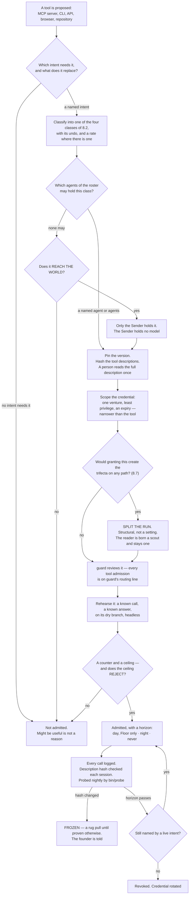

## 8 · Tools and MCPs

*obeys: v15, v33 (SPINE §F entire); inherits: FINAL §9.3 (the door), §9.4 (the trifecta), §16.3 (the connected hands)*

**(FOUNDER.)** *"there is no limitations of adding new MCPs or new tools to fill our needs. So there is so many
filters we might need to include and get more MCPs or more of tools in order to do things better or to improve the
system or to have endless possibilities and, like, we need to think about it outside of what we have right now."*

---

### 8.1 The door is material, not a ceiling

**(FOUNDER, and it is a correction of how FINAL §9.3 was being read.)** The door is **what a tool must pass**. It is
not a list of what may be proposed. **Anything may be proposed** — an MCP server, a CLI, an API, a browser, a
repository, a device. What the door decides is what the tool may then *do*, who may hold it, and whether it may be
held at night.

**(FINAL §9.3, unchanged and still the reason the door exists.)** The exposure is not hypothetical: scans found
critical vulnerabilities in **33% of 1,000 MCP servers** and some finding in **66% of 1,808**, and three attacks are
documented that need the founder to do nothing wrong — **tool poisoning** (instructions hidden in a description),
**the rug pull** (a server passes review, then silently changes its description; CVE-2025-54136), and **line
jumping** (the server steers the agent without appearing in the log). Hashing the descriptions and re-checking them
every session is the specific countermeasure to the rug pull, and it is a string comparison.

**(NEW: the door gains one box it did not have, because the roster now exists.)** FINAL's door classified a tool and
rehearsed it. It could not ask *who may hold this*, because FINAL had shapes rather than named agents. Section 5's
fourteen make that question answerable, so it is now a gate rather than a note.

**(FINAL §9.3, and it is the sentence that keeps the door from becoming a shopping list.)** For a repository: *what
does it give us we could not build in a day, its LICENSE file, our monthly test, what breaks if it disappears, is it
alive* — **take the mechanism, not the dependency**, because every framework that wants to own the loop is a second
control plane beside the runtime, and two implementations of one thing disagree silently.

---

### 8.2 The four classes

**(SPINE §F, and each row's "who may hold it" is now a roster name rather than a shape.)**

| Class | Example | Who may hold it | Night? |
|---|---|---|---|
| **READ-ONLY** | Playwright headless, a render, a repo read API, analytics, error tracking | any agent whose grant names it | yes |
| **READ-ONLY, tainted** | Gmail read, Calendar read, Drive read, Notion read, the open web | **`scout`, and the world's door program — nothing else.** No agent holding `Write`, `Edit` or `Bash` reads them raw (v36) | yes |
| **WRITES, reversible** | Figma, Pencil, a design file on a dry branch | **designer**, after the undo is drilled | yes |
| **REACHES THE WORLD** | send, publish, pay, deploy, share, delete | **no agent. The Sender**, which holds no model | only after the founder widens the class |

**(NEW: the class is assigned at the door and consumed at dispatch, which is what makes it structural.)** A grant is
argv fixed at dispatch and cannot narrow mid-run, so the class cannot be a runtime judgement. **Mechanism:**
`bin/run` (**ABSENT**) refuses a brief whose grant carries both an outside-reading tool and any of `Write`, `Edit`,
`Bash` or a REACHES-THE-WORLD tool; `bin/probe` (**ABSENT**) asserts nightly what a run can actually touch.

**(NEW, and it is why a hook is not a substitute for argv.)** An MCP tool call reaches a hook **only if the hook's
matcher names that exact tool** — a hook matching `Bash|Edit|Write` governs no MCP call at all. Registered on this
branch as `c-mcp-hook-matcher-must-name-the-tool`. Every admitted server is named in the run's argv and is otherwise
absent by `--strict-mcp-config`.

---

### 8.3 Admitted first: the read-only instruments, and the reason is not caution

**(FINAL §9.3, sharpened.)** The grant surface as it stands is inverted from the right one. Connected today: a
social publisher, a mail client that can send, a drive client that can share, a remote compute sandbox, an
authenticated browser. **Not connected: analytics, error tracking, a read-only billing key, the CI runner's API, the
git host's read API.** The hands are wired and the instruments are not.

**(NEW: the reason is the reconciliation, not prudence.)** The nightly reconciliation cannot exist without those
five, and **the reconciliation is what makes every other number rung 1 instead of rung 4** — a number that
reconciles only to our own log is a number the company wrote about itself. `analyst` is the agent whose anchor is
literally *"the reconciliation reads a record the company does not write"*, and it currently has nothing to read.
**Instruments buy freedom and hands spend it**, so the instruments go first.

---

### 8.4 The wish list, by need rather than by vendor

**(FOUNDER: *"we need to think about it outside of what we have right now."*)** Each row names the need, not the
product, so that a vendor change is a routing change. **Every row is WISH until it passes 8.1 — nothing here is
admitted by being listed.**

**(v36, applied.)** "Which agent needs it" names who the answer is *for*, not always who holds the credential. Where
a row's read carries text a stranger controls — an invoice body, a signed document, a support message — it is a
**tainted** read by 8.2, so the world's door writes the row and `scout` reads it, and the named agent works from
that row. Where the read is a structured figure from a service the company itself holds an account with, the named
agent may hold it directly once it passes 8.1.

| The need | Which agent needs it | Why the system is incomplete without it |
|---|---|---|
| A **payments read** API | analyst · steward | the economics section has no source of truth for revenue; a runway computed from a number the bank does not confirm cannot promote anything |
| A **domain and DNS read** | steward | a venture owns assets nobody can currently enumerate |
| An **ads platform read**, before any write | analyst · growth | spend that is not read is spend that is not reconciled |
| A **design-token bridge** | designer | the design anchor is contrast, tokens and grid conformance, and none of those are checkable without the tokens |
| A **database read replica** per venture | analyst · architect | a schema question answered from the repository is answered from the intention, not the state |
| An **e-signature read** | steward | an obligation is discharged only by a record the company does not write |
| A **second search provider** | scout | `scout` is single-sourced today, and a single-sourced fact-finder is one outage from silence |

---

### 8.5 Refusals, each with its reason

**(NEW: a refusal names the property that refuses it, so it can be reversed by changing that property rather than by
arguing.)**

| Refused | The property that refuses it | What would reverse it |
|---|---|---|
| **Mem0** | memory leaves the machine to a hosted store — a dependency, an auth surface and a leak path at once | nothing available: memory is plain files in git by design (v24, v25) |
| **RunPod** | **spends money at a rate under an uncapped key**, and it runs whether or not anyone is watching | a credential capped at the provider, not a cap we promise to respect |
| **n8n** | **licence.** Sustainable Use: *"only for your own internal business purposes or for non-commercial"* (v15, read from LICENSE.md) | a licence change, or a different canvas — Langflow (MIT [`api`: GitHub SPDX detection, LICENSE not read], alive 2026-09-05) is the admitted one |
| **Flowise** | **ARCHIVED**, licence NOASSERTION | nothing; an archived project is a dependency with no maintainer |
| **Gource** | GPL-3.0 [`api`: GitHub SPDX detection, LICENSE not read] | `3d-force-graph` (MIT [`api`: GitHub SPDX detection, LICENSE not read]) is the admitted renderer instead |
| **The founder's signed-in Chrome** | REACHES THE WORLD **and** holds private data — the widest hand in the building | nothing. It stays day-only, Floor-only, held by the founder, at any trust score |
| **A user-testing simulation** | it is the machine grading its own homework; the rung-1 anchor is a real reaction | nothing — this is a truth rule, not a tool rule |

---

### 8.6 One MCP shape serves both runtimes

**(NEW: the portability is real at the capability layer and absent at the policy layer, and that asymmetry is the
whole design constraint.)** Claude Code takes per-subagent `mcpServers` — inline or by reference, *"connected when
the subagent starts and disconnected when it finishes"*. Codex takes per-agent `mcp_servers` in TOML. **A server
admitted once at 8.1 is declarable in both**, so the door is a single door.

What is *not* portable: Anthropic's hook event set and **managed-settings precedence**; OpenAI's
**`requirements.toml`, which outranks every flag** (FINAL §14.6, not re-read this session); Google's Policy Engine (FINAL §14.6, providers lane 2026-09-04). **The shapes are portable; the
guarantees are not.** Section 10 is where that is resolved into one launcher.

**(measured, branch `ceo-1-1788609834`.)** `.mcp.json` EXISTS and declares exactly **two** servers, `playwright` and
`claim-append`. **Two** agent files declare `mcpServers` — `designer` (`playwright`) and `sourcer`
(`claim-append`, #112). Derive it, do not quote it: `grep -n 'mcpServers' .claude/agents/*.md` against
`Object.keys(require('./.mcp.json').mcpServers)`. `.claude/mcp-policy.json` EXISTS (per-server allow/deny; the
shape the door's per-tool file inherits).

**(NEW: `sourcer`'s grant is the door's own model, and it narrows under v2.)** `claim-append` was granted to
`sourcer` while `sourcer`'s `tools:` line stayed `[Read, Glob, Grep, WebSearch, WebFetch]` — **no `Write`, no
`Edit`**. That is the pattern the door adopts: *a narrow capability through one audited server, rather than a broad
tool*. Under the v2 roster it narrows further and this follows from section 5 rather than being a new decision:
`scout`'s MCP grant is *"read-only servers, per run"*, and an append server is not read-only, so **`scout` does not
carry `claim-append`**. The append it was doing belongs to `curator`, which has `Write` and does not need a server
for it.

---

### 8.7 The connected hands, re-decided against the roster

**(FINAL §16.3's table, with its "who may hold it" column re-decided against section 5's fourteen. Founder: all of
them back through the door, one at a time. Today **none is admitted**; each row is its disposition when it reaches
the door.)**

| Hand | Class | Credential today | Who may hold it, under the roster | Day · night · never |
|---|---|---|---|---|
| the founder's signed-in Chrome | REACHES THE WORLD **+ private data** | the founder's own sessions | **nobody but the founder, on the Floor** | day, Floor only, forever |
| Playwright, headless, `--isolated` | READ-ONLY render | none | **designer** — the only agent whose row names it | night |
| Gmail · Calendar · Drive · Notion **read** | READ-ONLY, **tainted** | OAuth, the founder's | **the world's door program** (holds no model) **and `scout`** — nobody else. `steward` holds none of them (v36) | night |
| Gmail **send** | REACHES THE WORLD, one-way | OAuth | **the Sender**, founder-signed | never unattended until the founder widens the class |
| Drive share · Calendar create · Notion write | REACHES THE WORLD (a share is durable) | OAuth | **the Sender**, after a recall window | night only after the class is widened and the undo drilled |
| Figma · Pencil · Stitch · Refero (Refero READ-ONLY) | WRITES, reversible | OAuth / local files / API key | **designer**, on a dry branch | night after the undo is drilled |
| Higgsfield (image · video · audio) | reversible artifact, **SPENDS credits** | API key; failed to connect in the census session (`ENOTFOUND`) | **writer**, rate-capped | night, under a daily spend cap. Its publish and TikTok verbs are one-way and **never** — **the verb set itself is UNVERIFIED** (FINAL §16.3; the connected-tools list came from the 2026-09-04 session's own MCP server list) |
| RunPod | **SPENDS MONEY at a rate** | API key, **uncapped** | **nobody** | never, until a capped key exists |
| `claim-append` (local, `scripts/mcp/claim-append-server.mjs`, EXISTS) | WRITES LOCALLY | none | **curator** does this with `Write` and needs no server. The pattern survives as the door's model | night |
| Mem0 | REACHES THE WORLD | unauthenticated | **nobody** | never (8.5) |
| Miro | REACHES THE WORLD (a board others see) | unauthenticated | nobody until an intent names it | through the door individually, or disconnected |
| n8n | REACHES THE WORLD | unauthenticated | **nobody** | never — licence (v15) |
| `git` · `node` · `bun` | CLIs | none | **builder · tester · designer · analyst** — the four that carry `Bash` (§5.2; architect does not) | night |
| `gh` | CLI | reads `~/.config/gh`, **which the sandbox denies** | builder, when a repository read is the need | night; every use needs the denial handled explicitly |
| `gemini` | a **provider**, not a tool | never authenticated | routed by section 9, not held by an agent | night |
| **Not connected, needed first**: analytics · error tracking · read-only billing · CI API · git host read | READ-ONLY | none | **analyst** (the reconciliation) · **scout** | night — and **before any hand**, per 8.3 |

**The tainted read, decided. (v36, decided 2026-09-05; DECISIONS.md §8.)** SPINE §F's class table and §B.2 row 12
disagreed about exactly one grant: §F said a tainted read is **scout only**, and the roster row gave `steward`
*"Gmail/Calendar/Drive/Notion read"*. **v36 resolves it. A tainted read is held by `scout` and by the world's door
program, and by nothing else. No agent that holds `Write`, `Edit` or `Bash` reads a stranger's text raw.** §B.2 row
12 is patched: `steward`'s MCP grant is now **none**.

**(FINAL §9.5 — this is a mechanism, not a policy.)** When the world sends something — a reply, a payment, a failed
build, a CVE, an invoice, a support message — **a program writes one row into the logbook and does nothing else.**
*"No model reads a stranger's text with a tool in its hand."* The door holds no model, so there is nothing in it to
steer; a prompt injection that reaches it finds a program. A scout with no credentials reads the row, and `steward`
writes the obligation **from `scout`'s handover, never from a raw row**.

**(FINAL §9.4 — why the two-legs argument does not survive.)** Taint is **static at dispatch**, not judged while a
run is going: *"any run whose brief reads content from outside the company … is born as a scout, without the tools
that act, and stays one for its whole life."* `steward` carries `Write`, so `bin/run` would refuse the brief
outright. The grant §B.2 used to carry was one an enforced launcher could never have composed — the contradiction
was visible between two tables before it would have been visible in a run, which is the cheapest place to find it.

**What `steward` loses, and what it does not.** It loses the raw read. It keeps every obligation, because an
obligation reaches it as an inbound row, and its anchor was never the mail: *"an obligation is discharged only by a
record the company does not write."* The losing image, kept by name in section 22: **a steward that reads mail with
a pen in its hand.**

**(FINAL §9.5, measured, and it carries into the surfaces work.)** *"a delivered cross-session message starts a new
turn carrying the receiver's full context, so an inbound path wired to a running run costs a context window per
event, not a slot"* — which is why the door **writes a row and never wakes a run directly**. Routines' API trigger
already wraps an inbound payload in a block labelling it untrusted data, which is this rule shipped by a vendor.
**Mechanism:** the inbound door program — **ABSENT**.

---

### 8.8 What enforces this section

| Rule | Mechanism | State |
|---|---|---|
| A tool is admitted only through the door | `bin/door`, writing one file per admitted tool with class, credential scope, rate, undo-drill date and horizon | **ABSENT** |
| Descriptions are hashed and re-checked each session | the hash check inside `bin/run` | **ABSENT** |
| A grant is argv, and only one thing composes it | `bin/run` | **ABSENT** |
| The trifecta cannot form on any path | `bin/run` refuses the combined grant; `bin/probe` asserts it nightly | **ABSENT** |
| A tainted read is held only by `scout` and the world's door (v36) | the door program writes one inbound row and holds no model; `bin/run` refuses any brief pairing an outside read with `Write`, `Edit` or `Bash` | **ABSENT** — the roster row is patched, the launcher that would enforce it is not built |
| An MCP call is governed by a hook only if the matcher names it | registered as `c-mcp-hook-matcher-must-name-the-tool` | **EXISTS** as a claim, branch `ceo-1-1788609834` |
| Servers absent unless named in argv | `--strict-mcp-config` | **shipped by the runtime** |
| Per-server allow/deny | `.claude/mcp-policy.json` (65 lines; the seed shape) | **EXISTS**, branch `ceo-1-1788609834` |
| A declared MCP server is backed by real config | `.claude/hooks/schema-lint.js` fails a declaration nothing backs | **EXISTS**, branch `ceo-1-1788609834` |
| Every tool admission is reviewed adversarially | `guard`'s routing line names it | **WISH** until the roster files exist |
| A spending tool has a capped credential | the cap must be at the provider, not in our prose | **WISH** — nothing today caps RunPod |
