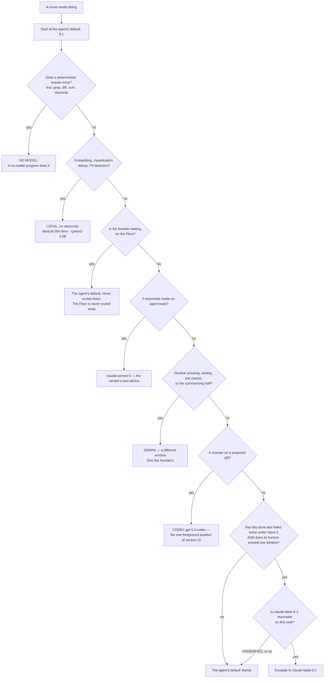
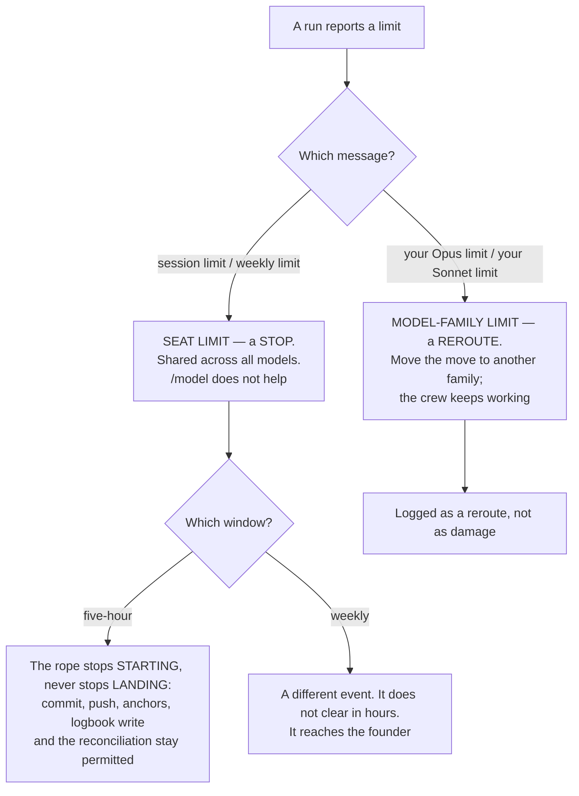

## 9 · Models

*obeys: v20, v21, v22, v23 (SPINE §G entire); inherits: FINAL §5, §14.5, §15.3 with its coefficients corrected*

**(FOUNDER.)** *"we need to understand what models each agent gets because we don't need everyone running on Opus or
Fable or Astra or Terra ChatGPT models. We can also define it."*

**Every figure in this section is from the models research of 2026-09-05, fetched from the vendor's own page.
Nothing here is recalled.** Where a figure was not published, the row says UNVERIFIED rather than estimating.

---

### 9.1 The default per agent

**(FOUNDER, answered as a table because the founder asked for one.)** The default is a field in the agent's own
file — `model:` in frontmatter — which is what makes this routing rather than advice. All fifteen files are
**ABSENT**; eighteen existing agent files on branch `ceo-1-1788609834` are the seed for the format.

| Tier | Agents | Count |
|---|---|---|
| `claude-opus-5` | builder · architect · guard · designer · challenger | **5** |
| `claude-sonnet-5` | reviewer · tester · scout · product · analyst · growth · steward · curator | **8** |
| Split by move | **writer** — `claude-opus-5` for taste work, `claude-sonnet-5` for routine | **1** |
| **The Operator** | `claude-opus-5`, on top of the fourteen | **1** |

**Verified against SPINE §B.2 row by row: five, eight and one, totalling fourteen. The count is correct as
written.** Counting the Operator, six of fifteen named roles sit on Opus 5 and eight on Sonnet 5.

**(NEW: three of the five Opus rows are checkers, and that is deliberate rather than incidental.)** `guard`,
`challenger` and `architect` are on the top tier while `reviewer` and `tester` are not, because the first three
produce a **finding or a contract that nothing downstream re-derives**, and the last two produce something a
deterministic anchor immediately re-tests. Where a cheap check exists, the cheap model is enough; where the output
*is* the check, it is not.

**(NEW: no agent defaults to Haiku, and 9.8 is why.)** The genuinely cheap work does not go to a cheap model at all
— it goes to a local one, or to no model.

---

### 9.2 Model per move

**(FOUNDER's instruction made operational: the default is the agent, and this table is what overrides it, per
move.)** Each row names its trigger, so a route can be checked rather than argued.

| Move | Model | Why this one |
|---|---|---|
| Any agent's default | as 9.1 | not everyone on the top tier — the founder's instruction |
| A build whose done-test has **failed twice** under Opus 5, **and** whose horizon exceeds one window | escalate to `claude-fable-5-1` | 1M context, and **cache reads at 0.025x base input against 0.1x everywhere else**, so a large standing context is cheap to re-read. **Availability on a subscription seat is UNVERIFIED** — no plan table names Fable. Fallback is `claude-opus-5` |
| A teammate inside an agent team | `claude-sonnet-5` | the vendor's own line, *"Use Sonnet for teammates"*, and teams use *"approximately 7x more tokens … when teammates run in plan mode"* |
| Routine scouting, mail sorting, link checks, the summarising half of the transcript pass | **Gemini**, once authenticated | it burns a different window and never touches the founder's. Free tier: **60 requests/min, 1,000 requests/day** on a personal account |
| Embeddings, classification, dedup, PII detection | **local, on electricity** — MiniLM (**384 dims**, Apache 2.0, *"input text longer than 256 word pieces is truncated"*) and Qwen3-0.6B (**32,768** context, Apache 2.0) | no window at all, and no vendor |
| A checker on a prepared diff | Codex `gpt-5.3-codex`, in the one position of section 10 | a second model family, which is what the anchor ladder pays for |
| A deterministic answer — test, grep, diff, sum, reconcile | **no model** | a no-model program is the cheapest and the only one that cannot be talked out of its answer |
| `/goal`'s evaluator and the auto-mode classifier | **Haiku, set by the vendor, not by us** | see 9.8 |

**(NEW, v21: Fable is an escalation with two conjoined conditions, and both must hold.)** *Failed twice* alone is a
reason to re-read the done-test, not to spend more. *Horizon beyond one window* alone is a reason to batch. Only
together do they describe the one regime where the top model is not priced like the top model (9.6).

**(FINAL §5.3, surviving and now sourced.)** *"The only justification for a harder window on a move is that a
routine one has been measured to fail that move's rehearsal — the reverse of the usual instinct."* And: work judged
by a deterministic anchor is attempted by the cheapest model that ever passes it, **because a retry is cheaper than
a smarter attempt**; work judged only by taste gets the best model and few tries.



---

### 9.3 The three windows, and what each publishes

**(NEW, v22: this replaces FINAL §5.1's single five-hour fuse. There are two Anthropic windows, not one.)**

| Window | Published quota | Confidence |
|---|---|---|
| **Anthropic subscription** | **No numeric quota is published on any page fetched.** Two windows exist — a rolling five-hour **and a weekly** — *"per-seat"*, and the allowance is *"shared with Claude chat and Cowork"*. Magnitudes are relative only: Pro *"at least 5x more usage per 5-hour session than Free"*; Max *"5x"* and *"20x more usage than Pro"*. **The Max 20x price is UNVERIFIED** — the pricing page rendered *"From $100 per month"* for both Max tiers | H on the windows. The absence of numbers is itself the finding |
| **OpenAI Codex** | **The only vendor of the three publishing numeric per-window quotas.** Per 5-hour rolling window: GPT-6 Astra 5–45 (Plus) / 25–225 (Pro 5x) / 100–900 (Pro 20x); GPT-5.6 Sol 10–100 / 50–500 / 200–2,000; GPT-5.6 Luna 250–2,000 / 1,250–10,000 / 5,000–40,000. *"GPT-5.6 usage averages 5-30 credits per message"* | H. **Caveat:** `gpt-5.3-codex` appears in the API price list and in **no** plan quota row |
| **Gemini CLI** | Free tier: **60 requests/min, 1,000 requests/day** with a personal Google account. Paid AI Pro / Ultra / Code Assist per-tier CLI quotas **UNVERIFIED** — not fetched | H free, unverified paid |

**(NEW: the consequence for the reserve, and it changes FINAL §5.1.)** FINAL held a reserve **per window** where
"window" meant the five-hour fuse. With a weekly window in the same seat, the reserve is **per window and per
week**, and **a weekly exhaustion is a different event from a five-hour one** — the five-hour one ends in hours, the
weekly one does not. A design that holds one reserve holds the wrong one on the day it matters.

**(NEW: only one of the three can be budgeted in advance from published figures.)** Codex's window can. Anthropic's
capacity is measurable only from an account, so **any Anthropic window figure in this system is a measurement, never
a plan input.**

---

### 9.4 The two limit shapes, which behave differently

**(NEW: this is the distinction the Watch has to make, and getting it backwards stops a crew that did not need to
stop.)** Quoted from the vendor's costs page:

- **A seat limit** — *"You've hit your session limit"* or *"You've hit your weekly limit"* — is *"shared across all
  models, so the developer can't restore access by switching models with `/model`."* **This is a stop.**
- **A model-family limit** — *"You've hit your Opus limit"* or *"your Sonnet limit"* — and *"switching to a model
  outside that family with `/model` does keep the developer working."* **This is a reroute.**



**(FINAL §15.4, surviving unchanged and now load-bearing for both shapes.)** *The rope stops starting, never stops
landing.* At a fraction of a window new work stops; commit, push, the anchors, the logbook write and the
reconciliation stay permitted.

---

### 9.5 Cache facts that bind

**(FINAL §14.5, confirmed verbatim and found to be broader than it stated.)** **89% of the historical bill on this
machine was context** — cache reads 57%, writes 32%, output 11% — so *what does this run need to know* and *what
does this system cost* are the same question.

| Fact, quoted from the vendor 2026-09-05 | What it binds |
|---|---|
| *"Cache hits and refreshes on Claude Fable 5.1 and Claude Mythos 5.1 are priced at 0.025x the base input price. All other models use the standard 0.1x multiplier."* | the whole of v21, and the corrected formula in 9.6 |
| *"5-minute cache write \| 1.25x base input price"*; *"1-hour cache write \| 2x base input price"* | the write coefficient is a function of the TTL bought, not a constant |
| *"The lifetime is an hour on a subscription and drops to five minutes once you're drawing on usage credits; on an API key or cloud provider, it's five minutes by default."* | **broader than FINAL stated**: three conditions shorten it, not one. It shortens **twelvefold at the moment the account crosses into overage**, which is exactly when the machine is busiest |
| *"a 50% discount on both input and output tokens"*, and *"Batch API and prompt caching discounts can be combined"* | batch still needs a metered key; the row is ready for the day one exists |

**(FINAL §14.5, surviving.)** Because the cache is invalidated by any change to the stable prefix **including the
tool definitions**, a bespoke grant per run would pay the cache-write share of the bill forever. So the standing
prompts are **byte-identical and carry no timestamp**, and the shapes are a closed set. Two shipped flags stabilise
the prefix and neither is used yet: `--exclude-dynamic-system-prompt-sections` and `--system-prompt-snapshot on`.

**(NEW: the meter cannot come from `/usage`.)** *"`/usage` reports the cache hit rate for the main conversation
only"*, so the meter reads each run's own reported token fields, joined by the id minted at dispatch.

---

### 9.6 The cost formula, with its coefficients corrected

**(FINAL §15.3, and the correction is the reason this section inherits it rather than citing it.)** FINAL's formula
multiplied the standing prompt by **1.25** *while assuming the one-hour TTL* — **the wrong coefficient for the TTL
it assumes** — and used **0.10** for every sibling read, which is **wrong by 4x for Fable 5.1**.

```
cost per night ≈ standing_prompt_tokens × W(ttl) × base_input(model)          first run of a batch
               + standing_prompt_tokens × (siblings − 1) × R(model) × base_input(model)
               + divergence_tokens_per_run × siblings × base_input(model)
               + output_tokens × output_rate(model)

W(ttl) = 2.00   for the 1-hour TTL a subscription buys
       = 1.25   for the 5-minute TTL: an API key, a cloud provider, or a
                subscription once usage credits are drawn

R(model) = 0.100  for Opus 5, Sonnet 5, Haiku 4.5
         = 0.025  for Fable 5.1 and Mythos 5.1

Dominant term, by a distance: whether siblings hit the cache.
Fails if: shapes vary per run · the standing prompt is regenerated ·
          the TTL is shorter than the batch · or the account crosses into
          usage credits mid-batch, which shortens the TTL twelvefold.
```

Base input and the published absolutes both appear so either can be checked against the other:

| Model | Base in / out $/MTok | Cache read $/MTok | Cache write 5m / 1h | Context |
|---|---|---|---|---|
| Fable 5.1 (`claude-fable-5-1`) | 10 / 50 | **0.25** | 12.50 / 20 | 1M |
| Opus 5 (`claude-opus-5`) | 5 / 25 | 0.50 | 6.25 / 10 | 1M |
| Sonnet 5 (`claude-sonnet-5`) | 2 / 10 | 0.20 | 2.50 / 4 | 1M |
| Haiku 4.5 (`claude-haiku-4-5-20251001`) | 1 / 5 | 0.10 | 1.25 / 2 | 200K |
| `gpt-5.3-codex` | 1.75 / 14 | 0.175 | — | — |

**(NEW: this is the quantitative backing for v21, and it is the one number that changes an instinct.)** List price
runs **10x in and 10x out** from Haiku 4.5 to Fable 5.1 — but **Fable's cache reads are only 2.5x Haiku's**. On the
cache-dominated workload FINAL §14.5 measured at 89% context, the model spread collapses. **A long-horizon build
with a large standing context is the one move where the top model is not priced like the top model.**

**(FINAL §15.3, surviving.)** Two competent reviewers priced this machine's predecessor within days of each other
and **diverged tenfold**, on one assumption: the cache hit rate. This plan still does not pick a number. It says
what determines it, and **ten real moves against the runner's own reported cost** is the first thing measured before
any estimate is believed.

**(NEW: the only vendor cost anchor that exists is per developer-day, not per task.)** *"$13 per developer per
active day and $150-250 per developer per month, with costs remaining below $30 per active day for 90% of users."*
Every cost-per-task figure in circulation is third-party, confidence L, and **is not used to route**.

---

### 9.7 The tokenizer discontinuity

**(NEW: it crosses our own model list, so it is not a vendor curiosity.)** *"Claude 4.7 and later models and Claude
Mythos Preview use a newer tokenizer … This tokenizer produces approximately 30% more tokens for the same text."*
Opus 5 and Fable 5.x are on it; **Sonnet 4.6 and earlier are not.**

**Consequence, stated once:** **any token budget inherited from a Sonnet-4.6-era measurement understates by about
that much on the current engines.** This system carries several such budgets — the context caps, the handoff ceiling,
the session-start payload budget. They are not adjusted here by arithmetic, because an adjusted guess is still a
guess; **they are re-measured, and until they are, every one of them is marked as measured on the old tokenizer.**

---

### 9.8 Haiku 4.5 retires, and what that does to the cheap tier

**(NEW, v20.)** Haiku 4.5's retirement is committed *"Not sooner than October 15, 2026"* — **the nearest retirement
date of any model this system names**, against Sonnet 5's *"June 30, 2027"*, Opus 5's *"July 24, 2027"* and Fable
5.1's *"Not sooner than September 1, 2027"*. It is also **the only Haiku in the published table**, so there is no
successor to move to inside the family.

**So no agent's default is Haiku.** It remains exactly where the vendor sets it: `/goal`'s evaluator and the
auto-mode classifier. `ANTHROPIC_DEFAULT_HAIKU_MODEL` changes it, and the trap in that lever is that it changes it
**everywhere the small fast model is used**, not only for `/goal`.

**(NEW: FINAL §16.7's *"local models: no shape"* is read as *no shape*, not as *no work*.)** The genuinely cheap
work — embeddings, classification, dedup, PII detection, first-pass ranking — goes to **local models on
electricity**, which have no window, no retirement date and no vendor. That is a stronger position than a cheap
tier, not a weaker one.

**Owner:** the founder, on a dated review (section 20 row 3). **Mechanism:** the model ids carry an expiry in the
facts store and the store check fails a stale one — **ABSENT**.

---

### 9.9 The lint blocker, and it must be fixed in the same change that writes an agent file

**(NEW: measured on branch `ceo-1-1788609834`.)** `scripts/prompt-standard.test.mjs` **EXISTS** and pins the valid
model set. Grepping it today returns `claude-opus-5`, `claude-sonnet-5`, `claude-fable-5`, `claude-haiku-4-5` — and
`claude-sonnet-4-6`. **`claude-fable-5-1` is not in it.**

Two facts collide:

- The escalation rule of 9.2 names `claude-fable-5-1`.
- `claude-fable-5` is listed by the vendor today under *"Legacy models (still available)"*, and its cache read is
  **1.00** against Fable 5.1's **0.25** — so the pinned id is not merely older, it **prices four times higher on the
  exact term v21 escalates for**.

**An agent file written to 9.2 fails a blocking lint today.** The fix is one entry in the pinned set and it belongs
in the same change that writes the first agent file, not in a follow-up — because a follow-up means the roster lands
red, and a red roster is a roster nobody trusts the lint on.

---

### 9.10 The terms question, stated once and not re-opened

**(NEW: the automation question and the no-metered-key choice are one question, not two.)** Anthropic's Consumer
Terms prohibit *"Except when you are accessing our Services via an Anthropic API Key or where we otherwise
explicitly permit it, to access the Services through automated or non-human means, whether through a bot, script, or
otherwise."*

**The carve-out is an API key. The escape hatch is *"where we otherwise explicitly permit it"*** — which Anthropic's
own shipped and documented features exercise: `-p`, `--max-budget-usd`, `/loop`, Routines, Remote Control, agent
teams. **Where a third-party program drives a subscription seat, that clause is the governing text, and nothing
narrowing it was found.** Confidence on the quote: high. Confidence on the interpretation: low.

**OpenAI's terms returned HTTP 403 and are unread. Google's were not fetched.** So two thirds of this question has
no text behind it at all.

It is a **founder decision after one reading**, it is section 20 row 1, and this section does not argue either side
further. What it does record is the shape of the downside: the thing at risk is the account, and the account is the
company's whole capacity.

---

### 9.11 What enforces this section

| Rule | Mechanism | State |
|---|---|---|
| Each agent has one declared default model | `model:` in the agent file's frontmatter | **ABSENT** (fifteen files); the format is read by the runtime today |
| A brief cannot name an unrecognised model | `scripts/prompt-standard.test.mjs` — blocking | **EXISTS**, branch `ceo-1-1788609834`; **needs `claude-fable-5-1` added** (9.9) |
| A run's cost is measured, never estimated | each run's own reported cost fields, joined by the dispatch id | **ABSENT** — the event log on this branch is the spine |
| A stall cannot run forever | `--max-budget-usd`; subagent spend counts toward it; overflow fails a spawn with `Budget limit reached` | **shipped** (v2.1.217+). **It is not a billing control** — print mode only, computed locally at list price, and *"the session cost figure isn't relevant for billing purposes"* for subscribers (v23) |
| A reserve is held per window **and** per week | a founder-set slider, and a weekly line reporting how often it was needed against how often it expired unused | **ABSENT** |
| The Watch distinguishes a stop from a reroute | the message-shape test of 9.4 | **ABSENT** |
| Model ids expire rather than rot | an expiry in the facts store; the store check fails a stale one | **ABSENT** |
| A model with no entry in the price table is refused | FINAL §15.4's rule: refused, **not scored at zero** | **ABSENT** |
