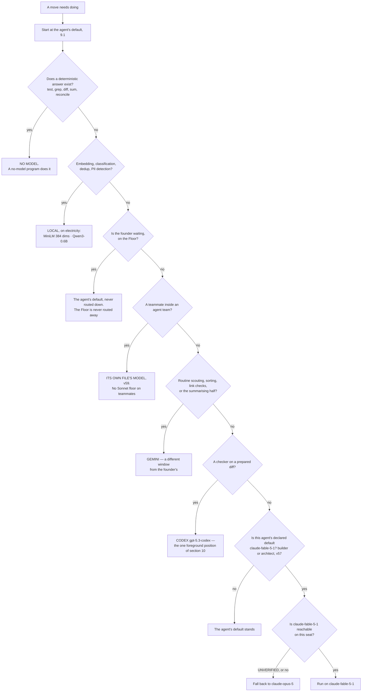
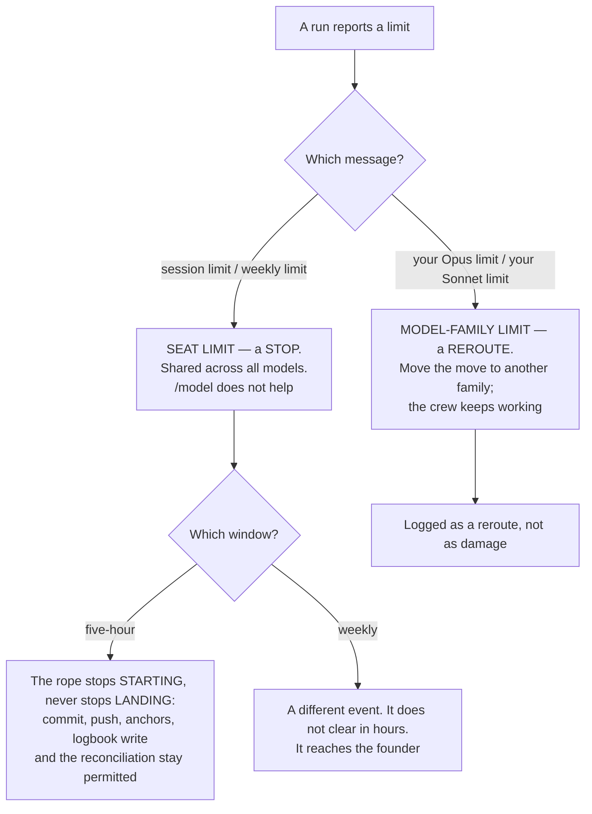

## 9 · Models

*obeys: v20, v22, v23, and v57, v58, v59 which overrule v21 and §G.1's teammate row (SPINE §G entire), and **v78** (the rethink round of 2026-09-06); inherits: FINAL §5, §14.5, §15.3 with its coefficients corrected*

**(FOUNDER.)** *"we need to understand what models each agent gets because we don't need everyone running on Opus or
Fable or Astra or Terra ChatGPT models. We can also define it."*

**Every figure in this section is from the models research of 2026-09-05, fetched from the vendor's own page.
Nothing here is recalled.** Where a figure was not published, the row says UNVERIFIED rather than estimating.

---

### 9.1 The default per agent

**(FOUNDER, answered as a table because the founder asked for one.)** The default is a field in the agent's own
file — `model:` in frontmatter — which is what makes this routing rather than advice. All fifteen files are
**ABSENT**; eighteen existing agent files on branch `ceo-1-1788609834` are the seed for the format.

| Tier | Agents | Count |
|---|---|---|
| `claude-fable-5-1` | builder · architect | **2** |
| `claude-opus-5` | guard · designer · challenger | **3** |
| `claude-sonnet-5` | reviewer · tester · scout · product · analyst · growth · steward · curator | **8** |
| Split by move | **writer** — `claude-opus-5` for taste work, `claude-sonnet-5` for routine | **1** |
| **The Operator** | `claude-opus-5`, on top of the fourteen | **1** |

**Two, three, eight and one, totalling fourteen.** Counting the Operator, **four of fifteen named roles sit on Opus
5, two on Fable 5.1 and eight on Sonnet 5**, with one split by move.

**(FOUNDER, v57: `builder` and `architect` default to Fable 5.1, and v21 is the losing image.)** *"Fable as
builder's and architect's default."* This overrules v21, which admitted Fable only as an escalation under two
conjoined conditions; that reading is kept by name in §22 and is not re-argued. **Reachability on the subscription
seat is still one measurement and still UNVERIFIED** — Fable 5.1 is in the API catalogue and no plan table names it
— so **the fallback is `claude-opus-5`**, written into both files as the value they carry until the measurement
passes. **The cost, stated once:** the two heaviest producers now sit on the most expensive list price in the table
(9.6), and what offsets it is not an argument but a coefficient — **Fable's cache reads are 0.025x base input
against 0.1x for every other model** (9.5), on a workload measured at 89% context. **Mechanism:** `model:` in each
agent file, plus the pinned lint set of 9.9, which must admit `claude-fable-5-1` in the same change that writes
either file.

**(NEW: the top-tier rows are mostly checkers, and that is deliberate rather than incidental.)** `guard`,
`challenger` and `architect` sit on a top tier — Opus for the first two, Fable for the third since v57 — while
`reviewer` and `tester` do not, because the first three produce a **finding or a contract that nothing downstream
re-derives**, and the last two produce something a deterministic anchor immediately re-tests. Where a cheap check
exists, the cheap model is enough; where the output *is* the check, it is not. `builder` is the one top-tier row
that is not a checker, and v57 is why: the founder put the agent that writes the most code on the model with the
cheapest re-read of a large standing context.

**(NEW: no agent defaults to Haiku, and 9.8 is why.)** The genuinely cheap work does not go to a cheap model at all
— it goes to a local one, or to no model.

**(FACT: world.md 10 — W10. The field above became binding on 2026-09-01, and before that it was advisory.)**
*"Changed `CLAUDE_CODE_SUBAGENT_MODEL` to set the default subagent model rather than override everything: an agent
definition's `model:` and an explicit per-spawn model now take precedence over it"* (2.1.251). Until that change,
**one environment variable silently flattened all fourteen per-agent choices** — the table above would have been
true on disk and false at runtime, with nothing in a log to say so. It is recorded here because a reader of the
table needs to know the field outranks the environment, and because a *downgrade* of the runtime restores the
flattening.

**(FACT: world.md 2 — W2. Write the full id, never the alias, and this is a routing rule rather than a style
rule.)** *"Changed `fable` and `best` in Claude apps gateway sessions to keep resolving to Fable 5 for now, since
gateways not yet configured for Fable 5.1 reject it; pick Fable 5.1 in `/model` to use it"* (2.1.258). **An agent
file naming `fable` and one naming `claude-fable-5-1` are not the same routing** — the alias lands on the legacy
model, whose cache read is **1.00 against Fable 5.1's 0.25** (9.9), which is four times the coefficient v57 is
spending for. So `builder` and `architect` carry the full id, and 9.9's lint set must admit that exact string in
the same change that writes either file.

**(FACT: world.md 6 — W6. The per-agent frontmatter carries a second cost field, and it decides whether v57's
argument holds at all.)** `experimental.cacheTtl` is *"`5m`" or `"1h"` … a per-agent prompt cache TTL used when no
subagent TTL setting is configured"*, with `promptCacheTtl` and `subagentPromptCacheTtl` as settings beside it. The
roster's model column therefore gains a **`cacheTtl` companion**: v57 justifies Fable on a cache read at 0.025x,
and the TTL is what decides whether that cache is **warm** when the sibling reads it. A one-hour agent and a
five-minute agent on the same standing prefix are two different prices for one design (9.6's `W(ttl)`).

**(FACT: world.md 17 — W17. A blocking gate exists for exactly this rule and no row uses it.)**
`PreModelSwitch` and `PostModelSwitch` hook events shipped in 2.1.251, *"(block, confirm, or annotate a model
switch)"*. **v57's default and v21's overruled escalation are both statements about which model a run may end up
on, and neither has a mechanism** — the `model:` field sets a start, not a floor. `PreModelSwitch` is the gate that
could refuse a downgrade off `claude-fable-5-1` mid-run, or refuse a silent climb onto it. **It is named here and
not adopted here:** the hook belongs to §12's envelope, which owns hook events, and this section records that the
gate exists, is blocking, and is currently unused by any row in the plan.

---

### 9.2 Model per move

**(FOUNDER's instruction made operational: the default is the agent, and this table is what overrides it, per
move.)** Each row names its trigger, so a route can be checked rather than argued.

| Move | Model | Why this one |
|---|---|---|
| Any agent's default | as 9.1 | not everyone on the top tier — the founder's instruction |
| Anything `builder` or `architect` does | `claude-fable-5-1` **as the default, not as an escalation** (v57) | 1M context, and **cache reads at 0.025x base input against 0.1x everywhere else**, so a large standing context is cheap to re-read. **Availability on a subscription seat is UNVERIFIED** — no plan table names Fable. Fallback is `claude-opus-5` |
| A teammate inside an agent team | **the model its own agent file declares** (v59) | the founder: *"Turn it on, no model constraint."* A teammate is a full session running one of the fifteen files, so it runs at that file's model. The vendor's advice to floor teammates at Sonnet is the losing image, §22 |
| Routine scouting, mail sorting, link checks, the summarising half of the transcript pass | **Gemini**, once authenticated | it burns a different window and never touches the founder's. Free tier: **60 requests/min, 1,000 requests/day** on a personal account |
| Embeddings, classification, dedup, PII detection | **local, on electricity** — MiniLM (**384 dims**, Apache 2.0, *"input text longer than 256 word pieces is truncated"*) and Qwen3-0.6B (**32,768** context, Apache 2.0) | no window at all, and no vendor |
| A checker on a prepared diff | Codex `gpt-5.3-codex`, in the one position of section 10 | a second model family, which is what the anchor ladder pays for |
| A deterministic answer — test, grep, diff, sum, reconcile | **no model** | a no-model program is the cheapest and the only one that cannot be talked out of its answer |
| `/goal`'s evaluator and the auto-mode classifier | **`claude-sonnet-5`, set by us** — `ANTHROPIC_DEFAULT_HAIKU_MODEL=claude-sonnet-5` (v58) | the founder: *"Set ANTHROPIC_DEFAULT_HAIKU_MODEL to Sonnet 5 now"*, ahead of Haiku 4.5's retirement. See 9.8 |

**(FOUNDER, v57: Fable is a default now, and the two-condition escalation is the losing image.)** The row above used
to read *escalate to Fable when a done-test has failed twice under Opus 5 and the horizon exceeds one window* — v21,
overruled by the founder. What was true about v21 and stays true is **why** that regime is cheap: a long-horizon
build with a large standing context is the one move where the top model is not priced like the top model (9.6), and
that is now the standing condition of the two agents that do most of the building rather than an exception they
climb into. **What the change removes is a trigger nobody could observe cheaply** — *failed twice* and *horizon
beyond one window* both needed history the ledger does not carry yet — and what it adds is a flat, checkable field
in two files.

**(NEW: O5 — *which agent, which model, which band* is answered in three places, and this is contradiction 17.)**
The same routing decision is written in **§B.2's roster table**, in **§C.1's band table** and in **9.2 above**, and
nothing checks that the three agree. They already differ in emphasis and there is no run in which a disagreement
would surface — the launcher reads one of them and the other two are prose. **The fix is a generator, not a rule:**
one file, `keel/shared/routing.yml` (**ABSENT**), holds agent → model → band → carrier, and all three tables are
generated from it. **The cost, once:** one file and one generator pass; the tables stop being authored and start
being rendered. **Settled by:** edit the model of one agent in the file and watch three tables move, or the
generator is not wired.

**(FINAL §5.3, surviving and now sourced.)** *"The only justification for a harder window on a move is that a
routine one has been measured to fail that move's rehearsal — the reverse of the usual instinct."* And: work judged
by a deterministic anchor is attempted by the cheapest model that ever passes it, **because a retry is cheaper than
a smarter attempt**; work judged only by taste gets the best model and few tries.



---

### 9.3 The three windows, and what each publishes

**(NEW, v22: this replaces FINAL §5.1's single five-hour fuse. There are two Anthropic windows, not one.)**

| Window | Published quota | Confidence |
|---|---|---|
| **Anthropic subscription** | **No numeric quota is published on any page fetched.** Two windows exist — a rolling five-hour **and a weekly** — *"per-seat"*, and the allowance is *"shared with Claude chat and Cowork"*. Magnitudes are relative only: Pro *"at least 5x more usage per 5-hour session than Free"*; Max *"5x"* and *"20x more usage than Pro"*. **The Max 20x price is UNVERIFIED** — the pricing page rendered *"From $100 per month"* for both Max tiers | H on the windows. The absence of numbers is itself the finding |
| **OpenAI Codex** | **The only vendor of the three publishing numeric per-window quotas.** Per 5-hour rolling window: GPT-6 Astra 5–45 (Plus) / 25–225 (Pro 5x) / 100–900 (Pro 20x); GPT-5.6 Sol 10–100 / 50–500 / 200–2,000; GPT-5.6 Luna 250–2,000 / 1,250–10,000 / 5,000–40,000. *"GPT-5.6 usage averages 5-30 credits per message"* | H. **Caveat:** `gpt-5.3-codex` appears in the API price list and in **no** plan quota row |
| **Gemini CLI** | Free tier: **60 requests/min, 1,000 requests/day** with a personal Google account. Paid AI Pro / Ultra / Code Assist per-tier CLI quotas **UNVERIFIED** — not fetched | H free, unverified paid |

**(NEW: the consequence for the reserve, and it changes FINAL §5.1.)** FINAL held a reserve **per window** where
"window" meant the five-hour fuse. With a weekly window in the same seat, the reserve is **per window and per
week**, and **a weekly exhaustion is a different event from a five-hour one** — the five-hour one ends in hours, the
weekly one does not. A design that holds one reserve holds the wrong one on the day it matters.

**(NEW: only one of the three can be budgeted in advance from published figures.)** Codex's window can. Anthropic's
capacity is measurable only from an account, so **any Anthropic window figure in this system is a measurement, never
a plan input.**

---

### 9.4 The two limit shapes, which behave differently

**(NEW: this is the distinction the Watch has to make, and getting it backwards stops a crew that did not need to
stop.)** Quoted from the vendor's costs page:

- **A seat limit** — *"You've hit your session limit"* or *"You've hit your weekly limit"* — is *"shared across all
  models, so the developer can't restore access by switching models with `/model`."* **This is a stop.**
- **A model-family limit** — *"You've hit your Opus limit"* or *"your Sonnet limit"* — and *"switching to a model
  outside that family with `/model` does keep the developer working."* **This is a reroute.**



**(FINAL §15.4, surviving unchanged and now load-bearing for both shapes.)** *The rope stops starting, never stops
landing.* At a fraction of a window new work stops; commit, push, the anchors, the logbook write and the
reconciliation stay permitted.

---

### 9.4a When a family is limited, unreachable or wrong — v78

**(FOUNDER, rethink 2026-09-06: D13 → v78.)** 9.4 says a family limit is a **reroute** and never says **where the
reroute goes**. Because Codex is one foreground slot (§10.2) and Gemini is scout-only, **a seat-limit stop stops the
whole company**, and a reroute with no rule silently trades correctness for availability. Four things, decided
together:

| The rule | What it is | Mechanism |
|---|---|---|
| **A three-deep `fallback:` per agent, ending in *stop and stage*** | the last rung is not another model — it is the run halting and leaving its work staged for the founder | one frontmatter field × fifteen files — **ABSENT** |
| **A cross-family reroute is recorded as a rung demotion** | unless that family has passed the rehearsal for that **move class**, its output is rung 4 and says so | the rung field on the handover (§11.2) — **ABSENT** |
| **A `class: calibration` rehearsal set that is never edited** | an instrument refreshed by the rule that refreshes its subject cannot detect drift | a `class:` field on a rehearsal case (§7.2a, §11.10) — **ABSENT** |
| **One provider-outage drill, with the primary family denied at the launcher** | a fallback nobody has run is a design, not a fallback | one deny switch in `bin/run` — **ABSENT** |

**The demotion clause is the load-bearing half, and it is what makes this different from a retry list.** A fallback
chain alone answers *can the work continue*; it does not answer *is the answer still worth what the first answer
was worth*. Rerouting `builder` from Fable 5.1 to Sonnet 5 mid-build buys availability, and the price is paid in a
place nothing measures unless the demotion is written down. **A reroute that says out loud what it bought is the
whole cost of this row.**

**(FACT: world.md 19 — the version floor that gated this is stale.)** v32's Codex rehearsal is specified as
~~*"version ≥ 0.124.0"*~~ **the installed version, recorded** (moved 2026-09-06: W19) — Codex is at **0.153.4
(2026-09-04)**, twenty-nine minor versions on, so the floor is satisfied by anything installed and no longer
discriminates. §10.8 carries the restatement; O35 is what records the version and its hash at admission.

**The cost, once:** one drilled night. **Settled by:** the drill's completion count against a normal night, and
whether calibration results move when a model id changes. **This moves v22 and §11.10** and reverses neither.

---

### 9.5 Cache facts that bind

**(FINAL §14.5, confirmed verbatim and found to be broader than it stated.)** **89% of the historical bill on this
machine was context** — cache reads 57%, writes 32%, output 11% — so *what does this run need to know* and *what
does this system cost* are the same question.

| Fact, quoted from the vendor 2026-09-05 | What it binds |
|---|---|
| *"Cache hits and refreshes on Claude Fable 5.1 and Claude Mythos 5.1 are priced at 0.025x the base input price. All other models use the standard 0.1x multiplier."* | the whole of v57, and the corrected formula in 9.6 |
| *"5-minute cache write \| 1.25x base input price"*; *"1-hour cache write \| 2x base input price"* | the write coefficient is a function of the TTL bought, not a constant |
| *"The lifetime is an hour on a subscription and drops to five minutes once you're drawing on usage credits; on an API key or cloud provider, it's five minutes by default."* | **broader than FINAL stated**: three conditions shorten it, not one. It shortens **twelvefold at the moment the account crosses into overage**, which is exactly when the machine is busiest |
| *"a 50% discount on both input and output tokens"*, and *"Batch API and prompt caching discounts can be combined"* | batch still needs a metered key; the row is ready for the day one exists |

**(FINAL §14.5, surviving.)** Because the cache is invalidated by any change to the stable prefix **including the
tool definitions**, a bespoke grant per run would pay the cache-write share of the bill forever. So the standing
prompts are **byte-identical and carry no timestamp**, and the shapes are a closed set. Two shipped flags stabilise
the prefix and neither is used yet: `--exclude-dynamic-system-prompt-sections` and `--system-prompt-snapshot on`.

**(NEW: the meter cannot come from `/usage`.)** *"`/usage` reports the cache hit rate for the main conversation
only"*, so the meter reads each run's own reported token fields, joined by the id minted at dispatch.

**(NEW: O39 — hash the standing prefix at dispatch, and turn on the two flags that stabilise it.)** The paragraph
above states a rule — the standing prompts are byte-identical and carry no timestamp — with **nothing that checks
it**. A hit rate answers the question a day late and on a bill: it says the cache missed, not **what changed**.
**So `bin/run` (ABSENT) hashes the standing prefix — system prompt, tool definitions, skill metadata — records the
hash on the dispatch row, and treats a change as an event.** A hit rate is a lagging indicator on a bill; a prefix
hash is a leading indicator on a dispatch, and it names the culprit in the same row. The two shipped flags named
above, `--exclude-dynamic-system-prompt-sections` and `--system-prompt-snapshot on`, are turned on in the same
change: they are what make the prefix stable enough for the hash to mean anything. **The cost, once:** one sha256
per dispatch.

**(R7, OPEN — it is the premise under v57 and under 9.6's formula.)** What is the **cache-read share per dispatch
shape**, and do those two flags move it? **Source class:** ten real moves per shape, read from **each run's own
token fields**, never from `/usage`. **What it decides:** whether the 89% figure this section leans on holds for
*our* shapes, and it is the same assumption on which two competent reviewers priced this machine's predecessor and
**diverged tenfold** (9.6). Also gains 7.6a's budget a denominator: skill metadata is part of the prefix being
hashed.

**(FACT: world.md 4 — W4. Four of the numbers this section says are computed are now emitted as structured
fields.)** The vendor ships a per-session **`prompt_cache` object** for status-line scripts (*"hit ratio, misses,
tokens re-cached, warm/cold"*), a **`rate_limits.spend_limit`** status-line field with a Spend limit bar in
`/usage`, a **per-loop `/usage` breakdown** (run count, total tokens, tokens per run, last run), and a
**`modelPricing` managed setting** that makes `/cost`, the status line and telemetry use contracted rates instead
of list price. **Read one at a time, they change what the meter does rather than what it means:** a number this
plan says to compute from the event log can now be *read* where the vendor emits it, and computing it anyway is a
second implementation of a vendor's own arithmetic. The `prompt_cache` object is per session and does not replace
R7's per-run token fields, which is the one place this fact does **not** reach. Page 3's use of these fields is
§14's, and `modelPricing` is what would make O8's `prices.yml` a fallback rather than the source on a contracted
account.

---

### 9.6 The cost formula, with its coefficients corrected

**(FINAL §15.3, and the correction is the reason this section inherits it rather than citing it.)** FINAL's formula
multiplied the standing prompt by **1.25** *while assuming the one-hour TTL* — **the wrong coefficient for the TTL
it assumes** — and used **0.10** for every sibling read, which is **wrong by 4x for Fable 5.1**.

```
cost per night ≈ standing_prompt_tokens × W(ttl) × base_input(model)          first run of a batch
               + standing_prompt_tokens × (siblings − 1) × R(model) × base_input(model)
               + divergence_tokens_per_run × siblings × base_input(model)
               + output_tokens × output_rate(model)

W(ttl) = 2.00   for the 1-hour TTL a subscription buys
       = 1.25   for the 5-minute TTL: an API key, a cloud provider, or a
                subscription once usage credits are drawn

R(model) = 0.100  for Opus 5, Sonnet 5, Haiku 4.5
         = 0.025  for Fable 5.1 and Mythos 5.1

Dominant term, by a distance: whether siblings hit the cache.
Fails if: shapes vary per run · the standing prompt is regenerated ·
          the TTL is shorter than the batch · or the account crosses into
          usage credits mid-batch, which shortens the TTL twelvefold.
```

**(NEW: contradiction 15 — this formula is carried twice with the same coefficients, and §9 owns it.)** §16.3
carried a duplicate of the block above. **Two implementations of one check disagree silently**, and this repository
has already paid for that class once. **The formula lives here and nowhere else.** §16.3 keeps only its
tenfold-divergence argument and cites 9.6 for the arithmetic (SYNTHESIS §7 deletion 20). If a coefficient below
changes, exactly one place changes.

Base input and the published absolutes both appear so either can be checked against the other:

| Model | Base in / out $/MTok | Cache read $/MTok | Cache write 5m / 1h | Context |
|---|---|---|---|---|
| Fable 5.1 (`claude-fable-5-1`) | 10 / 50 | **0.25** | 12.50 / 20 | 1M |
| Opus 5 (`claude-opus-5`) | 5 / 25 | 0.50 | 6.25 / 10 | 1M |
| Sonnet 5 (`claude-sonnet-5`) | 2 / 10 | 0.20 | 2.50 / 4 | 1M |
| Haiku 4.5 (`claude-haiku-4-5-20251001`) | 1 / 5 | 0.10 | 1.25 / 2 | 200K |
| `gpt-5.3-codex` | 1.75 / 14 | 0.175 | — | — |

**(FACT: world.md 1, 3 — the two rows above that a vendor moved, and both hold.)** **W1:** Fable 5.1 shipped as
`claude-fable-5-1`, *"1M context, $10/$50 per Mtok with $0.25/Mtok cache reads"* — the id, the context and the
0.025x read in this table are **confirmed from the vendor's own changelog**, and v57's remaining UNVERIFIED is
narrower than it was: it is the **subscription seat**, not the model. **W3:** Sonnet 5's **$2/$10 is the standard
list price, not a limited-time promo** — *"Updated the `/model` picker and the bundled `claude-api` skill to show
Sonnet 5's $2/$10 per Mtok pricing as its standard list price rather than a limited-time promo"*. Any promo caveat
on a Sonnet row anywhere in this plan is stale; there is none in this table, and this sentence is why.

**(NEW: O8 — a price is a fetched fact, so it carries an expiry and a stale row refuses to route.)** The table above
is prose, which means it rots exactly like every other fetched fact in this plan and nothing notices. **Every row
moves into `keel/shared/prices.yml` (ABSENT) with `fetched_at` and `valid_until`, and a stale row REFUSES ROUTING
rather than mis-pricing.** Refusing is the whole point: a wrong price does not fail, it produces a plausible number
that a ceiling is then computed from (§16), and nothing downstream can tell. **Gemini's quota is carried as a
count, not a price** — 60/min and 1,000/day — because it has no per-token figure and a zero would be read as free.
This is the same rule §9.11 already states for model ids, applied to the number beside the id, and it is what
v81's `source:` and `valid_until` look like for this section.

**(NEW: this is the quantitative backing for v57, and it is the one number that changes an instinct.)** List price
runs **10x in and 10x out** from Haiku 4.5 to Fable 5.1 — but **Fable's cache reads are only 2.5x Haiku's**. On the
cache-dominated workload FINAL §14.5 measured at 89% context, the model spread collapses. **A long-horizon build
with a large standing context is the one move where the top model is not priced like the top model.**

**(FINAL §15.3, surviving.)** Two competent reviewers priced this machine's predecessor within days of each other
and **diverged tenfold**, on one assumption: the cache hit rate. This plan still does not pick a number. It says
what determines it, and **ten real moves against the runner's own reported cost** is the first thing measured before
any estimate is believed.

**(NEW: the only vendor cost anchor that exists is per developer-day, not per task.)** *"$13 per developer per
active day and $150-250 per developer per month, with costs remaining below $30 per active day for 90% of users."*
Every cost-per-task figure in circulation is third-party, confidence L, and **is not used to route**.

---

### 9.7 The tokenizer discontinuity

**(NEW: it crosses our own model list, so it is not a vendor curiosity.)** *"Claude 4.7 and later models and Claude
Mythos Preview use a newer tokenizer … This tokenizer produces approximately 30% more tokens for the same text."*
Opus 5 and Fable 5.x are on it; **Sonnet 4.6 and earlier are not.**

**Consequence, stated once:** **any token budget inherited from a Sonnet-4.6-era measurement understates by about
that much on the current engines.** This system carries several such budgets — the context caps, the handoff ceiling,
the session-start payload budget. They are not adjusted here by arithmetic, because an adjusted guess is still a
guess; **they are re-measured, and until they are, every one of them is marked as measured on the old tokenizer.**

**(NEW: O77 — a mark is not a mechanism, so every ceiling names its tokenizer.)** Marking a budget *measured on the
old tokenizer* tells a reader something and tells the launcher nothing. **Every ceiling carries `tokenizer:`, and
`bin/run` (ABSENT) refuses to enforce a legacy cap on a current-tokenizer model.** The failure this prevents is the
one worth naming: a ceiling that fires ~30% early produces a run that stops mid-work with no error, and **a ceiling
that fires early is indistinguishable from a stuck run** — the same silent-empty-result shape §10.2 refuses in
Codex, arriving through our own arithmetic. **The cost, once:** one field per ceiling and one comparison at
dispatch.

---

### 9.8 Haiku 4.5 retires, and what that does to the cheap tier

**(NEW, v20.)** Haiku 4.5's retirement is committed *"Not sooner than October 15, 2026"* — **the nearest retirement
date of any model this system names**, against Sonnet 5's *"June 30, 2027"*, Opus 5's *"July 24, 2027"* and Fable
5.1's *"Not sooner than September 1, 2027"*. It is also **the only Haiku in the published table**, so there is no
successor to move to inside the family.

**So no agent's default is Haiku.** The two places the vendor sets it are `/goal`'s evaluator and the auto-mode
classifier, and `ANTHROPIC_DEFAULT_HAIKU_MODEL` is the one lever that moves them.

**(FOUNDER, v58: the lever is pulled now, not on the retirement date.)** *"Set ANTHROPIC_DEFAULT_HAIKU_MODEL to
Sonnet 5 now."* So the env var is `claude-sonnet-5` from the first launch, and nothing of ours depends on Haiku 4.5
before 2026-10-15 rather than at it. **The trap in the lever is unchanged and is the reason the cost is worth
stating: it changes the small fast model *everywhere* it is used**, not only for `/goal`. **The cost, once:** every
goal check and every auto-mode classification is priced at Sonnet's base input rather than Haiku's — 2 against 1
per MTok in, 10 against 5 out (9.6) — on a call that happens after every turn of a `/goal` run. That is the price of
not being surprised by a retirement, and the founder chose to pay it now. **Mechanism:** the variable is set in the
launcher's environment — `bin/run` (**ABSENT**) — and in the managed settings file's `env` block if it carries one,
so a run cannot be started without it; a value set only in a shell profile would bind the founder's terminal and
not the night.

**(NEW: FINAL §16.7's *"local models: no shape"* is read as *no shape*, not as *no work*.)** The genuinely cheap
work — embeddings, classification, dedup, PII detection, first-pass ranking — goes to **local models on
electricity**, which have no window, no retirement date and no vendor. That is a stronger position than a cheap
tier, not a weaker one.

**Owner:** the founder, and **row 3 of section 20 is decided rather than open** — v58 answered it. **Mechanism:** the
env var above, plus model ids carrying an expiry in the facts store that the store check fails a stale one against —
**ABSENT**.

---

### 9.9 The lint blocker, and it must be fixed in the same change that writes an agent file

**(NEW: measured on branch `ceo-1-1788609834`.)** `scripts/prompt-standard.test.mjs` **EXISTS** and pins the valid
model set. Grepping it today returns `claude-opus-5`, `claude-sonnet-5`, `claude-fable-5`, `claude-haiku-4-5` — and
`claude-sonnet-4-6`. **`claude-fable-5-1` is not in it.**

Two facts collide:

- **The declared default of `builder` and `architect` is `claude-fable-5-1`** (v57, 9.1) — no longer an escalation
  that might never fire, but the `model:` field of the first two agent files anyone writes.
- `claude-fable-5` is listed by the vendor today under *"Legacy models (still available)"*, and its cache read is
  **1.00** against Fable 5.1's **0.25** — so the pinned id is not merely older, it **prices four times higher on the
  exact term v57 is spending for**.

**An agent file written to 9.1 fails a blocking lint today.** The fix is one entry in the pinned set and it belongs
in the same change that writes the first agent file, not in a follow-up — because a follow-up means the roster lands
red, and a red roster is a roster nobody trusts the lint on. **(FOUNDER, v57 makes this sharper than it was:** the
lint cannot be deferred to whenever the escalation first fires, because the very first two files carry the id.**)**

---

### 9.10 The terms question, stated once and not re-opened

**(NEW: the automation question and the no-metered-key choice are one question, not two.)** Anthropic's Consumer
Terms prohibit *"Except when you are accessing our Services via an Anthropic API Key or where we otherwise
explicitly permit it, to access the Services through automated or non-human means, whether through a bot, script, or
otherwise."*

**The carve-out is an API key. The escape hatch is *"where we otherwise explicitly permit it"*** — which Anthropic's
own shipped and documented features exercise: `-p`, `--max-budget-usd`, `/loop`, Routines, Remote Control, agent
teams. **Where a third-party program drives a subscription seat, that clause is the governing text, and nothing
narrowing it was found.** Confidence on the quote: high. Confidence on the interpretation: low.

**OpenAI's terms returned HTTP 403 and are unread. Google's were not fetched.** So two thirds of this question has
no text behind it at all.

It is a **founder decision after one reading**, it is section 20 row 1, and this section does not argue either side
further. What it does record is the shape of the downside: the thing at risk is the account, and the account is the
company's whole capacity.

---

### 9.11 What enforces this section

| Rule | Mechanism | State |
|---|---|---|
| Each agent has one declared default model | `model:` in the agent file's frontmatter | **ABSENT** (fifteen files); the format is read by the runtime today |
| A brief cannot name an unrecognised model | `scripts/prompt-standard.test.mjs` — blocking | **EXISTS**, branch `ceo-1-1788609834`; **needs `claude-fable-5-1` added** (9.9), and v57 makes that the first two agent files rather than a later escalation |
| The small fast model is Sonnet 5, not Haiku 4.5 | `ANTHROPIC_DEFAULT_HAIKU_MODEL=claude-sonnet-5` in the launcher's environment, and in the managed file's `env` if it carries one (v58) | **ABSENT** — `bin/run` does not exist; the variable itself is shipped and documented |
| A teammate runs on its own file's model | the teammate is a full session started from an agent file; `bin/run` names the file, never a model (v59) | **ABSENT** — teams are on (`CLAUDE_CODE_EXPERIMENTAL_AGENT_TEAMS=1`), the launcher is not built |
| A run's cost is measured, never estimated | each run's own reported cost fields, joined by the dispatch id | **ABSENT** — the event log on this branch is the spine |
| A stall cannot run forever | `--max-budget-usd`; subagent spend counts toward it; overflow fails a spawn with `Budget limit reached` | **shipped** (v2.1.217+). **It is not a billing control** — print mode only, computed locally at list price, and *"the session cost figure isn't relevant for billing purposes"* for subscribers (v23). **(FACT: world.md 5 — W5)** the estimate now includes the *"1.1× US-only-inference premium for data-residency workspaces"*: still local, now with a residency multiplier |
| **Each agent declares a three-deep `fallback:` ending in stop-and-stage** (v78) | one frontmatter field × fifteen files; `bin/run` reads it | **ABSENT** |
| **A cross-family reroute is recorded as a rung demotion unless rehearsed for that move class** (v78) | the rung field on the handover; the `class: calibration` set that is never edited | **ABSENT** |
| **The fallback has been run at least once** (v78) | one provider-outage drill with the primary family denied at the launcher | **ABSENT** |
| **Routing is generated, never authored three times** (O5, contradiction 17) | `keel/shared/routing.yml` generates §B.2, §C.1 and 9.2 | **ABSENT** |
| **A stale price refuses to route** (O8) | `keel/shared/prices.yml` with `fetched_at` and `valid_until` per row; Gemini carried as a quota count, not a price | **ABSENT** — the table in 9.6 is prose today |
| **The standing prefix is hashed at dispatch and a change is an event** (O39) | `bin/run`, with `--exclude-dynamic-system-prompt-sections` and `--system-prompt-snapshot on` | `bin/run` **ABSENT**; both flags **shipped and unused**. **R7** measures whether they move the share |
| **A ceiling is never enforced against the wrong tokenizer** (O77) | `tokenizer:` on every ceiling; `bin/run` refuses a legacy cap on a current-tokenizer model | **ABSENT** |
| **A model switch can be refused** (W17) | `PreModelSwitch` — a blocking hook event | **shipped by the runtime, used by no row.** Adopting it is §12's, not this section's |
| A reserve is held per window **and** per week | a founder-set slider, and a weekly line reporting how often it was needed against how often it expired unused | **ABSENT** |
| The Watch distinguishes a stop from a reroute | the message-shape test of 9.4 | **ABSENT** |
| Model ids expire rather than rot | an expiry in the facts store; the store check fails a stale one | **ABSENT** |
| A model with no entry in the price table is refused | FINAL §15.4's rule: refused, **not scored at zero** | **ABSENT** |
