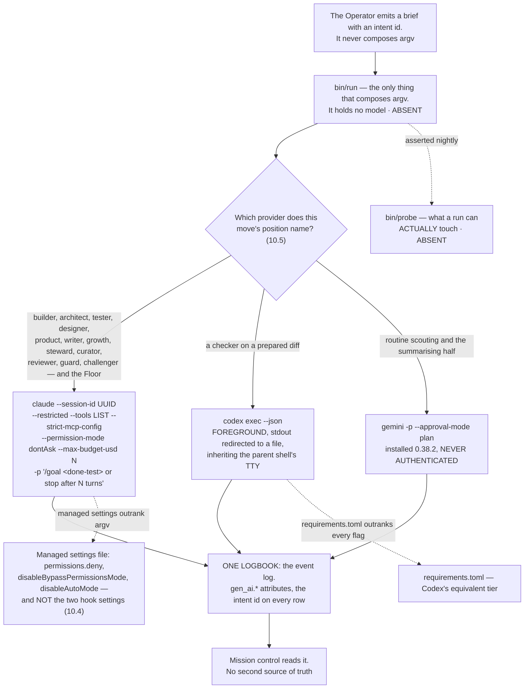

## 10 · Codex and Claude Code, from day one

*obeys: v5, v11, v12, v32 (SPINE §H entire); inherits: FINAL §1 row 30 as the losing image, §16.7, §14.6*

**(FOUNDER, overruling FINAL §1 row 30.)** *"I run from day one of the system to include codex and Claude code in
the system. So we will need to understand how we are doing it. If you're walking straight from codex, or straight
from Claude Claude. or we will find a solution to all of this."* And: *"I think we need to work with loops and goals
and they features the codex and Claude Code has in order to achieve the best results we can."*

FINAL's *"Codex admitted only after a headless rehearsal passes"* is the losing image and is kept by name in
section 22. **What survives from it is the rehearsal itself** — it stops being the admission gate for Codex's
existence in the system, and becomes the gate on **how wide** Codex's position is.

---

### 10.1 The four options, and the one chosen

**(NEW: each option is judged against a measured defect rather than a preference.)**

| Option | Verdict | Why |
|---|---|---|
| **Claude Code drives Codex from Bash** | **rejected as the primary shape** | it is exactly the shape openai/codex#19945 breaks — no controlling TTY plus a non-trivial prompt — and the `script -qfc` cure is, in the reporter's own words, *"incompatible with normal background / parallel job execution"*, which is what a crew is |
| **Codex drives Claude** | **rejected** | no documented mechanism in either direction, and Codex is not installed. The receiving surface is documented; the pairing is not |
| **A third program drives both** | **CHOSEN** | each vendor documents a headless invocation, a session id, resume, an instructions file, a SKILL.md bundle and MCP. A provider outage or a defect becomes a **routing change, not a rewrite**. It is also the only shape that keeps v34 true — **one thing composes argv** |
| **Hybrid** | **folded in** | the Floor is interactive Claude Code and always was; the founder may run Codex by hand there. That is the hybrid, and it needs no mechanism |

**(NEW: the chosen shape is a consequence of v34, not a taste.)** If two things compose argv, two things define what
a run may touch, and the guarantee that a checker cannot edit what it judges becomes an agreement between them. One
launcher is what makes the grant checkable by a probe.

**(FINAL §14.6, and it is the constraint the launcher exists to absorb.)** *"the capability layer is close to
neutral and the policy layer is not. The shapes are portable; the guarantees are not."* Every runtime has a headless
invocation, a session id, an instructions file, a SKILL.md bundle, MCP, a working directory as the confinement unit
and a git worktree as the isolation unit. **Only the policy tier differs**: Anthropic's managed settings outrank
argv; **OpenAI's `requirements.toml` outranks every flag**; Google has a Policy Engine.

---

### 10.2 Codex's position on day one, and the test that widens it

**(FOUNDER: day one. NEW: the position is narrow because a measured defect makes it narrow, not because Codex is
distrusted.)**

**Day one: `codex exec` as a checker on a prepared diff**, run in the **foreground with stdout redirected to a file
while inheriting the parent shell's TTY** — the second documented workaround, which does not need `script -qfc`.

**The cost, stated once and not re-litigated: one foreground slot is not parallel, so Codex is not a night lane
yet.** That is the whole price of admitting it on day one, and it buys a second model family on the one move where
family independence pays for itself.

**openai/codex#19945, read 2026-09-05:** *"codex exec silently crashes with no output when stdio is detached from
TTY (0.124.0+)"*, opened 2026-04-28, labels `CLI`, `bug`, `exec`. **Open 130 days with no comments and no
maintainer reply.** Mechanism: *"the process produces no error, no panic message, no log entry — just an empty
result."* Piping through `tee` or `tail` in a detached process group does **not** resolve it. **A silent empty
result is the worst failure shape there is** — a smoke test passes and the real workload returns nothing, which is
why the rehearsal must be headless or it proves nothing.

**The admission test that widens the position** — and it is specifiable from primary text now, which it was not when
FINAL was written:

| Condition | Value |
|---|---|
| Command | `codex exec --json` |
| TTY | **no controlling TTY** |
| Prompt | **non-trivial** — a smoke prompt does not exercise the defect |
| Version | **≥ 0.124.0** |
| Judged against | known-answer cases |

**Pass** and Codex becomes a night checker and a maker on mid-to-hard work. **Fail** and it stays in the foreground
slot. **The test is the plan, not the issue closing** — 130 days of silence is not a schedule.

**(NEW: the prerequisite is a founder act.)** Codex is **not installed** on this machine. Installing it and running
the rehearsal is section 20 row 5.

---

### 10.3 Where `/goal` and `/loop` sit

**(NEW: `/goal` is the feature the founder's phrase points at, and it was absent from FINAL entirely.)**

**`/goal` sits on the run, and the done-test is the goal condition.** *"The `/goal` command sets a completion
condition and Claude keeps working toward it without you prompting each step. After each turn, a small fast model
checks whether the condition holds."* Three verdicts: **Not yet met · Met · Impossible**.

| Property | Value, quoted |
|---|---|
| Headless | *"Setting a goal with `-p` runs the loop to completion in a single invocation"* |
| Streaming | *"Add `--output-format stream-json --verbose` to emit each message as the loop runs"* |
| Condition limit | **4,000 characters** |
| Bounding it | *"include a turn or time clause in the condition, such as `or stop after 20 turns`"* |
| Terminates on | Met · Impossible · `/goal clear` · four unrecoverable errors (auth failure, exhausted credit balance, unclearable context overflow, unavailable model) |
| Survives | *"After any other failure, including transient errors such as rate limits and overloaded servers, Claude Code leaves the goal active"* |
| Deferral | evaluation is skipped while a subagent or background shell is running |
| Check-ins | *"In a non-interactive session, such as one started with `-p`, this is the only way Claude Code delivers check-ins"* |
| Evaluator | Haiku by default; `ANTHROPIC_DEFAULT_HAIKU_MODEL` changes it **everywhere the small fast model is used** |

**(NEW: leaving a goal active through a rate limit is exactly the behaviour a night wants**, and it is the reason
`/goal` and not a shell loop is the run-level primitive: a shell loop that re-invokes on a rate limit burns the
window it is waiting for.)

**`/loop` is refused in production and stays a Floor convenience.** *"Tasks are session-scoped: they live in the
current conversation and stop when you start a new one"*, with a **7-day expiry** and the hard limit *"Tasks only
fire while Claude Code is running and idle."* **A tier that requires a session already open cannot be the
always-on tier. The Watch is the loop.** The vendor's own three scheduling tiers make the trade explicit:

| Tier | Needs | Minimum interval | Local files |
|---|---|---|---|
| Cloud Routines | no machine, no open session | **1 hour** | **no** — a fresh clone |
| Desktop scheduled tasks | the machine on, no open session | 1 minute | yes |
| `/loop` | the machine on **and** a session open | 1 minute | yes; inherits the session's MCP servers and permission mode |

**(FINAL §16.7, standing.)** Routines stay **refused for the Watch** — cloud-only, cannot reach local files.

**Codex `/goal` is not used.** It exists (**0.128.0, 2026-04-30**) with states *pursuing, paused, achieved, unmet,
budget_limited*, but **the evidence is third-party — search summaries and tracker items, not a primary page** (the
two primary URLs 308-redirected and were not followed). Two of its own tracker items are the argument against
relying on it: **#20536**, asking that the command be documented at all, and **#34215**, *"Goal mode cannot increase
its token budget and resume after becoming budget_limited"*. And the hinge is unestablished: **whether Codex
`/goal` runs under `codex exec` is not known.** Revisit when 10.2's test passes.

---

### 10.4 The managed-settings collision, resolved

**(NEW: two design choices land in one file, and one of them silently kills the other.)** The managed settings file
is the tier a running process cannot clear — it is what makes the grant real rather than advisory. But **`/goal` is
a session-scoped prompt-based Stop hook**, and it is *"unavailable when `disableAllHooks` is `true` after settings
precedence applies, or when `allowManagedHooksOnly` is set in managed settings."* Locking hooks in the managed file
therefore removes the goal loop the founder asked for.

**Resolved, once, and repeated here because this is where a reader trips:**

| The managed file carries | The managed file does NOT carry |
|---|---|
| `permissions.deny` | `disableAllHooks` |
| `permissions.disableBypassPermissionsMode: "disable"` | `allowManagedHooksOnly` |
| `disableAutoMode` | — |

**The cost, stated once: a run can therefore register its own Stop hook.** That is a smaller hole than losing the
goal loop, and **the nightly probe is what keeps it a known hole rather than an unknown one**. Narrowing is carried
by `--restricted` plus an explicit `--tools` list, **which does not touch hooks** — so the narrowing and the goal
loop stop competing for the same file.

**(NEW: two facts make the permission bands binding rather than descriptive.)** Deny rules bind in **every** mode
including `bypassPermissions`, and a subagent's own `permissionMode` frontmatter **is ignored**, so a child cannot
widen its own grant. `auto` mode's classifier is a cheap guardrail against accident and **is not the envelope** —
it can be switched off, and nothing in it keys on reversibility.

---

### 10.5 What each runtime is documented to offer

**(NEW, from the runtimes research of 2026-09-05. `D` = documented and quoted; `C` = claimed, third-party. Nothing
in that lane was measured — no runtime was run.)**

| | Claude Code | Codex CLI |
|---|---|---|
| Installed here | **yes**, 2.1.259 | **no** |
| Headless | `-p`, text / json / stream-json | `codex exec`; *"streams progress to `stderr` and prints only the final agent message to `stdout`"*; `--json` emits `thread.started`, `turn.started`, `turn.completed`, `turn.failed`, `item.*` |
| Structured out | `--output-format`, `--output-schema` on the goal loop | `--output-schema`, `-o` / `--output-last-message` |
| Session and resume | `--session-id` *"must be a valid UUID"*; `--continue` | `codex exec resume --last` or `<SESSION_ID>` |
| Narrowing by argv | `--restricted` (v2.1.248+) *"removes the built-in tools that run commands or code, and WebFetch, unless you name them individually in `--tools`"*; `--strict-mcp-config`. **`--allowedTools` restricts nothing** | `--sandbox`, `--ignore-user-config`, `--ignore-rules`, `--skip-git-repo-check`, `--ephemeral`. **No per-tool flag.** `--full-auto` is **deprecated** — *"use `--sandbox workspace-write` instead"* |
| Sandbox axes | Seatbelt / bubblewrap, **Bash only**, filesystem and network layers | Seatbelt / Landlock; `approval_policy` × `sandbox_mode` — three modes, **network off by default** |
| Policy tier | **34 hook events, 10 documented as blocking**; managed settings outrank argv | **`requirements.toml` outranks every flag** |
| Hooks, sharp edge | **PermissionRequest is non-blocking** — *"Exit code 2 isn't honored for this event and the permission flow proceeds unchanged. Deny through the `decision` object instead"* | hooks behind `codex_hooks = true` |
| Subagents | depth **3** default, **20** concurrent, *"Concurrent subagent limit reached"* on overflow. **`Workflow` is removed from all of them** — *"via the first filter applied to subagent tool sets"* | TOML files with their own sandbox mode |
| Teams | agent teams: a lead plus named teammates, each a full session. **Experimental, off by default; no nested teams; one team per session; `/resume` does not restore them; `-p` never forms a team.** *"approximately 7x more tokens … when teammates run in plan mode"* | none documented |
| Fleet view | `claude agents --json` prints active background sessions for scripting; *"Opening agent view requires an interactive terminal"* | none documented |
| Channels | *"A channel is an MCP server that pushes events into your running Claude Code session."* Research preview. Gated twice: *"Being in `.mcp.json` isn't enough … a server also has to be named in `--channels`"*. Anthropic auth only | none documented |
| Scheduling | three tiers (10.3), plus `ScheduleWakeup` and `Monitor` | *"Automations"*, or a shell loop around `codex exec` (`C`) |
| Goals | `/goal`, `D`, **headless-capable** | `/goal` 0.128+, `C`, **headless status unknown** |
| Per-run spend | `--max-budget-usd`; subagent spend counts toward it | included in every ChatGPT plan |
| Shared config | `CLAUDE.md`, `SKILL.md`, `.mcp.json`; imports Codex and Gemini config | `AGENTS.md`, `SKILL.md`, `config.toml`, `mcp_servers` |
| Second checker family | **no** — it cannot check itself | **yes in principle, blocked by #19945** until 10.2's test passes |

**(NEW: one trap worth naming, because it collides with a setting this repository plausibly wants.)** `Monitor` —
*"Runs a command in the background and feeds each output line back to Claude … Can also open a WebSocket and treat
each incoming message as an event"* — is *"not available when `DISABLE_TELEMETRY` or
`CLAUDE_CODE_DISABLE_NONESSENTIAL_TRAFFIC` is set."* A privacy setting silently removes a capability.

**(FINAL §16.7, re-decided against the roster.)** Which provider may stand which position:

| Provider | Which of the fifteen may run on it | Window | State today |
|---|---|---|---|
| **Claude Code** (subscription) | all fifteen, **and the Floor, always** | rolling five-hour **and weekly**, per seat, shared with Claude chat and Cowork | installed 2.1.259, measured |
| **Codex CLI** (subscription) | **`reviewer` and `guard` only, on a prepared diff, in the foreground.** Widens to `builder` on mid-to-hard work if 10.2's test passes | its own 5-hour window; the only one publishing numeric quotas | **not installed**; #19945 open |
| **Gemini CLI** (subscription) | **`scout`**, and the summarising half of `curator` | 60 rpm / 1,000 rpd free on a personal account | installed 0.38.2, **never authenticated** |
| **Local models** | no agent — moves, not positions: embeddings, classification, dedup, PII detection | electricity | **ABSENT** |
| **Routines** (cloud) | **refused for the Watch** — cloud-only, no local files | daily cap | exists |

---

### 10.6 What the research could not establish

**(NEW: these are the ten gaps the runtimes lane named about itself. They are listed because a plan that hides its
own unknowns spends them later at a worse price.)**

1. **Codex `/goal` has no primary citation** — the two primary URLs 308-redirected. **Two fetches close it.**
2. **OpenAI's terms are unread** (HTTP 403). The whole OpenAI half of the terms question of section 9.10 is open.
3. **Whether Codex `/goal` runs under `codex exec` is unestablished** — and it is the hinge for using Codex's goal
   feature from a driver at all.
4. **Whether Anthropic's documented headless features constitute the *"explicitly permit"* carve-out** on a
   subscription. Section 9.10; the founder's decision.
5. **The trailing Yes/No column in the tools reference** (`Monitor` Yes, `Workflow` Yes, `ScheduleWakeup` No,
   `Agent` No) — the header was not captured and the lane refused to guess it.
6. **`-w`, `--worktree` and `--tmux` did not appear** in the CLI-reference fetch. A prior lane has them as measured;
   treat as unconfirmed here.
7. **Routines' own page, desktop scheduled tasks, `/schedule`, Remote Control, agent teams and the workflows page
   were not fetched.** The agent-teams facts used above come from the surfaces lane, not this one.
8. **Codex config reference, `requirements.toml`, `codex mcp`, Automations, and whether Codex can serve as an MCP
   server** — all carry a prior lane's marks; nothing was added.
9. **Third-party routers** (Amp's two-family runtime, OpenCode) were not researched.
10. **Nothing was measured.** No runtime ran. **Codex remains uninstalled and no install was attempted.**

---

### 10.7 What enforces this section

| Rule | Mechanism | State |
|---|---|---|
| One program composes every provider's argv | `bin/run` | **ABSENT** |
| A grant is what a run can actually touch | `bin/probe`, nightly | **ABSENT** |
| `bypassPermissions` cannot be entered | `permissions.disableBypassPermissionsMode: "disable"` in managed settings | **ABSENT** — a founder act on a machine-wide file, section 20 row 8 |
| A child cannot widen its own grant | a subagent's `permissionMode` frontmatter **is ignored** by the runtime | **shipped** |
| A dispatched engine cannot invoke its own gate | `Workflow` is removed from every subagent by the runtime, and `PS-WORKFLOW-CONTAINMENT` in `.claude/hooks/schema-lint.js` refuses the declaration | **EXISTS**, branch `ceo-1-1788609834`; **independently confirmed** by the vendor |
| A run has a completion condition, not a turn budget alone | `/goal <done-test> or stop after N turns` under `-p` | **shipped**; the composition is **ABSENT** |
| `/goal` is not killed by the managed file | the file omits `disableAllHooks` and `allowManagedHooksOnly` (10.4) | **ABSENT** until the file exists |
| A run cannot stall forever | `--max-budget-usd` as a stall fuse, not a billing control | **shipped** (v2.1.217+) |
| Codex only widens on evidence | the headless admission test of 10.2 | **ABSENT** — Codex is not installed |
| One logbook, no second source of truth | the event log, with the intent id on every row | **ABSENT**; `~/.agentvibe/events.jsonl` is the spine on this branch |
