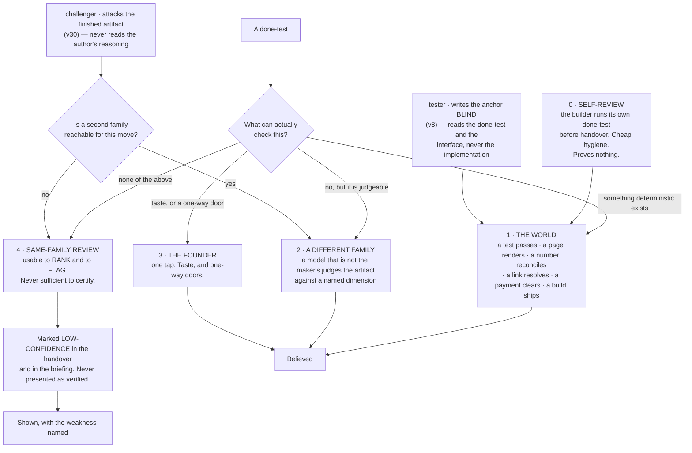
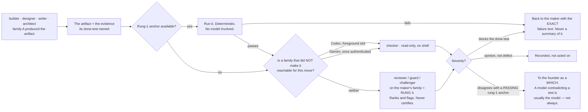
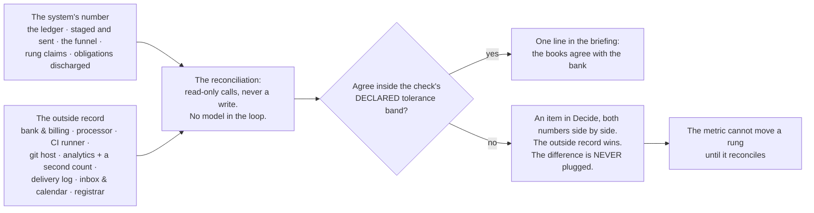

## 11 · Truth — how anything is known to be good

*obeys: v8, v30, and §B.2's anchor column · inherits: FINAL §8, and §7.6's rehearsal set*

---

### 11.1 The finding that organises everything, now sourced twice

**(FINAL)** An LLM asked to review its own reasoning with no external feedback gets worse. FINAL §8.1 carried the
measurement — GPT-4 falling from 95.5% to 91.5% on GSM8K — and the reason: the bottleneck is *finding* the error,
not fixing it. A model judging output measurably prefers its own generations, its own family, longer answers and
whichever came first, and agrees with human experts 60–68% of the time in specialist domains.

**(NEW: cognition.md 5 gives the general claim a primary citation it did not have.)** The sentence is now quotable
verbatim: *"LLMs struggle to self-correct their responses without external feedback, and at times, their performance
even degrades after self-correction"* — arXiv 2310.01798, accessed 2026-09-05, confidence H.

**(NEW: cognition.md 6 closes the obvious rebuttal.)** Reflexion's *"91% pass@1 accuracy on the HumanEval coding
benchmark"* is not a counterexample, because its feedback is external and stored in an episodic memory buffer. The
distinction that survives is not *reflection is bad*; it is **reflection with no outside signal is bad**.

**(FINAL)** So three rules, and everything below is their consequence. A model checking a model is a **screen, not a
verdict**. Every gate is deterministic or it is not a gate. Everything believed is anchored to something that is not
a language model.

---

### 11.2 The anchor ladder, with the tester and the challenger placed on it

**(FINAL, redrawn)** Every done-test names its anchor, and the ladder is ordered by how much it can be trusted. A
done-test that can only reach rung 4 is a weaker done-test and the system says so out loud. **(NEW: v8 and v30 add
two agents that were shapes in FINAL and are named roles here, so the ladder must say where each one lands.)**



**(FINAL)** Rung 1 is not a formality and it is where the design work is: for most company work there *is* a
deterministic anchor, and finding it is the intellectual task of writing the done-test. **(FINAL)** The anchor is
almost always cheaper than the work it checks, which is why this is affordable, and why quality here does not mean a
review panel — it means the run produced the evidence its done-test named.

| Kind of work | The deterministic anchor |
|---|---|
| Code | tests run · build passes · the app starts · a named user path completes |
| A screen or a page | it renders · a screenshot exists · contrast ratios computed · it loads under a stated size |
| Copy or content | every factual claim resolves to a fetched source · links return 200 · reading level computed |
| A price or a model | the arithmetic reconciles · sensitivity to each input is computed and shown |
| A video or an image | it plays · right length and aspect · the brand colours are the declared ones · loudness to a standard |
| Research | every claim carries a URL that was fetched, with the quoted line present in the fetched text |
| Data work | row counts reconcile · a known query returns the known answer · nulls counted |
| Outreach or social | it sent · it was received · the reply, if any, is attached |
| Finance | it ties to the bank line, or the difference is shown |
| Anything legal | it does not go out without rung 3. Full stop. |

**(FINAL)** Inside rung 1 there is an order, and it is the sharpest rule in the section: **a check that reads a record
the company does not write outranks a check that reads the company's own**, because a status report cannot promote
itself. §B.2 states the same rule per agent — *"a number that reconciles to our own log is rung 4, not rung 1"* — so
it is not advice here and a table row there; it is one rule, written twice on purpose.

**Mechanism:** the store check refuses an intent whose done-test names no anchor (`bin/check-stores`, ABSENT); the
rung is a field on the handover and the briefing renders rung 4 differently from rung 1 (ABSENT). For research
claims the mechanism exists today: `scripts/check-citations.mjs` on branch `ceo-1-1788609834` blocks on a dead path,
wired as `check:citations-exist` in the check suite.

---

### 11.3 The other family, and what it actually is on day one

**(FINAL)** A checker on the maker's family is a compromised instrument by measurement. FINAL §8.3 assumed three live
subscriptions and concluded that cross-family checking *"stops being a constraint and becomes a choice."*

**(NEW: v5, v32 and §I rows 5 and 6 make that conclusion conditional, and the condition is not met yet.)** Codex is
**not installed** and openai/codex#19945 has been open 130 days with no maintainer reply (runtimes.md, accessed
2026-09-05). `gemini` 0.38.2 **is installed and has never authenticated**. So on the day this plan starts, rung 2 is
reachable in exactly one shape and two founder acts widen it:

| Rung-2 route | State | What it costs, stated once |
|---|---|---|
| **Codex `gpt-5.3-codex` as a checker on a prepared diff** | admitted day one by v5; foreground slot only, stdout redirected to a file while inheriting the parent shell's TTY (v32) | **one foreground slot is not parallel**, so Codex is not a night lane until the H.2 rehearsal passes detached |
| **Gemini on routine checking** | installed, unauthenticated — §I row 6, one terminal act by the founder | until it happens, routine checking has no second family and falls to rung 4 with the label |
| **A three-family panel** | reserved for a one-way door with no rung-1 anchor (FINAL §8.3) | there is no non-Anthropic model reachable from inside Claude Code, so a `judge` claim with an empty panel resolves `unresolved` forever, and saying so is the design |

**(FINAL, redrawn for the roster)** What the checker does, and what happens when it disagrees:



**(FINAL)** When a checker compares two candidates it is **pairwise, never pointwise**; blind; stripped of the
candidate's own label; order-swapped, with a flip resolving to `unresolved`. One frontier judge held its verdict under
a swap only 65% of the time, another 23.8%. Findings from several families are **unioned**: a fatal finding from any
family eliminates, fewer serious findings are preferred, and **scores are never averaged**, because a score is a
finding with the information removed. Consensus thresholds are refused — a vote among models has no anchor.

**Mechanism:** `bin/run` (ABSENT) presents two candidates as an ordered pair twice, swapped, and records a flipped
verdict as `unresolved`; the checker's handover schema carries a `findings` field **and no score field**, so averaging
has nothing to average (ABSENT). Rule 10 of this repo already holds the general form on branch
`ceo-1-1788609834`: a resolver never passes what it could not check, and `unresolved` is pinned distinct from `pass`.

---

### 11.4 The blind tester — v8, and why it is two tests and not one

**(NEW: v8.)** Both the builder and the tester write tests, and they are **different tests**.

- **The builder's self-check** is rung 0. It is cheap hygiene and proves nothing about correctness — it proves the
  builder ran the thing. Devin's published guidance is the same instruction in one line: *"Tell Devin to test its own
  work before opening a PR"* (cognition.md 8).
- **The tester's anchor test is rung 1**, and it is rung 1 *because the tester never read the implementation*. It
  reads the done-test and the interface. A test written by the author of the code is a machine grading its own
  homework, which §11.1 refuses; a test written blind against the contract is an instrument.

**Mechanism, and it is argv rather than instruction:** the tester's grant carries `--add-dir` **excluding the
implementation path**, so the blindness is a property of what the process can open, not of what the prompt asked for
(§B.2 row 4; composed by `bin/run`, ABSENT; asserted by `bin/probe`, ABSENT).

**The anchor on the tester's own work** — because the tester is an agent and this section trusts no agent's report:
**the test fails before the change and passes after.** A test that passes before the change is not testing the change,
and that is checkable by running it twice with no model in the loop.

---

### 11.5 The challenger — v30, and why it is an agent and not a step

**(NEW: v30, from cognition.md 5 and 6.)** A plan-critique pass that the same run performs on itself is the shape
measured as harmful. The cure is not a better prompt; it is that the critic is a **different process, with different
inputs**. So `challenger` is a roster entry with a grant, not a step in anybody's procedure.

**(NEW: v30's mechanism, stated as two exclusions.)** The challenger never reads the artifact's author's reasoning —
only the artifact and its done-test — and it carries `Read Glob Grep` and no `Write`, `Edit` or `Bash` (§B.2 row 14).
Both are argv facts. **A second model family whenever one is reachable**, and §11.3's honest reading applies: when
none is, the challenger's finding is rung 4, and it is labelled rung 4.

**(FINAL)** Its own anchor is the one that keeps it from becoming an opinion generator: **every finding names the
mechanism that would have caught it, or it is an opinion.** That is checkable by a reader who did not do the work,
which is the same test §B.2 applies to a done-test.

**Where it is routed** (§B.2): before anything irreversible, and on every plan the Operator is about to bind.

---

### 11.6 Where taste is judged

**(FINAL)** Taste is not checkable by a test and is the founder's alone — but it does not follow that every taste
question goes to the founder, or the founder becomes the bottleneck they refused to be. The system holds a **taste
store**: an evidence-backed record of what this founder has accepted and rejected, mined from transcripts (§13) and
from every *no, not like that* on the Floor. A taste check asks *does this artifact violate anything in the store?* —
a rung-2 check with a real corpus behind it. What reaches the founder is the residue: the genuinely new taste
question, as two built options and a which.

**(FINAL)** The store is never a preferences file the founder types, because a founder is an unreliable narrator of
their own taste. It is derived from decisions only, and a fraction of rejections is held out, so it is scored on
predicting what the founder *wants* rather than what they *approve*.

**(NEW: memory.md's coverage table names the one shipped precedent, and it is partial.)** Claude Code's auto memory
carries `type: user` and `type: feedback` notes written by the acting agent in-session — typed extraction of exactly
this material. It is a precedent for the *content* and a counter-example to the writer rule (v25, §13). A **brand
voice profile** and a **golden output archive** are marked *none found* in the same table: no shipped CLI has either.

**Mechanism:** the taste store is written only by the curator (v25); the held-out fraction and its score are a field
on the store, checked by `bin/check-stores` (ABSENT).

---

### 11.7 The nightly reconciliation — the company's numbers against records it does not write

**(FINAL)** The single most repeated failure in the corpus of autonomous-company attempts is **the agent misreporting
its own progress**, and the misreport is what the human reads. It is invisible to any check that reads the agent's
output. So the system's own numbers are read against outside records, on no model.



**(FINAL)** Revenue is read from the processor as a claim, never typed; a runway computed from a number the bank does
not confirm is stamped *internal* and cannot promote anything.

**(NEW: §B.2 gives the reconciliation an owner it did not have in FINAL, and §F gives it its precondition.)** It is
`analyst`'s work — the one agent whose row names the reconciliation explicitly — and it is why §F admits the
**read-only instruments first**: analytics, error tracking, a read-only billing key, the CI API, the git host read
API. Without them the reconciliation cannot exist, and without the reconciliation every number in the company is
rung 4 wearing a rung-1 label.

**Mechanism:** `bin/reconcile` with read-only credentials per venture and a declared tolerance band per check
(ABSENT); the checks themselves are rung-1 anchors and live beside the venture (ABSENT). The instruments are admitted
one at a time through §12's door.

---

### 11.8 Regression, for free

**(FINAL)** A regression is a done-test that used to pass and now does not. Because every done-test names a checkable
anchor, **the set of live done-tests across all ventures *is* the regression suite**, re-run on the routine window at
close to zero marginal cost. Nothing extra is maintained. That is a consequence of the done-test design and the
strongest argument for it.

**(FINAL)** The check suite on branch `ceo-1-1788609834` (`scripts/run-checks.mjs`, 48 steps) is the founding
population of rung-1 anchors for the harness venture, and its rule survives whole and is worth restating because it is
the same rule as §11.2's: **a partial run cannot wear a passing verdict.** An interrupted run prints INCOMPLETE and
names what never started; a subset run says SUBSET; a zero-step run is REFUSED.

---

### 11.9 A venture's progress — the contact rungs

**(FINAL)** The anchor ladder measures whether the work is true. Nothing in it measures whether the venture is
becoming a business, and the founder's list asks. So a venture's progress is a rung generated from a record the
company does not write, never typed:

```
0  it exists / it compiles / it renders    ← a rung-1 anchor's exit code
1  a stranger understood it                ← a recorded artifact: a reply, a recording, a survey row
2  a stranger did something                ← the analytics provider AND the server's own count
3  they came back                          ← a cohort in the product's own event store
4  they paid                               ← the payment processor
5  they paid again, and named you          ← the processor, plus a referral with a name attached
```

**(FINAL)** *"The landing page is done"* is rung 0 and will say rung 0. The **ship log** — one line per rung movement
and per intent finished, in the founder's own currency — appears in the briefing and answers *what did this company
produce this month*, which is the cheapest morale instrument there is.

**(NEW: §B.2 ties two roster rows to this ladder, and they are the two with the least outside evidence behind them.)**
`growth`'s anchor is *"a reply from a real person, recorded by the world's door; never a count of messages sent"* —
contact rung 1, not rung 0. `writer`'s is the founder's taste store plus a **rung-2 external reaction**. roster.md
records that sales-and-growth as a function and legal-and-contracts have **no shipped precedent anywhere**, so those
two anchors are deliberately the most external in the roster.

**Mechanism:** the rung table read by `bin/reconcile` (ABSENT) · a venture's `ship-log.md` written only by that
program (ABSENT).

---

### 11.10 The rehearsal set, and what it decides

**(FINAL §7.6, restated in v2's terms.)** A rehearsal case is an input with a known answer. Two things are decided by
running against the set rather than by argument: **which loadouts may run unattended**, and **whether a change to a
standing prompt is adopted** — both versions are run against known answers, and a change that is not measurably
better is reverted and kept as a negative. It is the only self-editing permitted anywhere.

**(NEW: v18 makes a rehearsal case one of exactly four admissible skill bodies, so the set has a home and a format.)**
A rehearsal case is a `SKILL.md` body under §E's content rule, which means the same admission and the same forced
expiry (v19) apply to it as to everything else the library holds.

**(NEW: H.2 is a rehearsal case in this exact sense, and it is the one that matters most on day one.)** Codex's
admission test — `codex exec --json`, **no controlling TTY**, a non-trivial prompt, version ≥ 0.124.0, against
known-answer cases — is what widens Codex from a foreground checker to a night lane. Pass and rung 2 becomes
parallel; fail and it stays in the foreground slot. **#19945 has been open 130 days with no maintainer reply**, so
the test is the plan, and the issue closing is not.

---

### 11.11 The roster's anchor column, as one table

**(NEW: §B.2's anchor column read against §11.2's ladder. The anchors are the SPINE's; the rung assignment is this
section's reading of them, and the two rows that cannot reach rung 1 today are named rather than rounded up.)**

| Agent | The anchor — what proves it, never the agent's own report | Rung |
|---|---|---|
| **Operator** | the store check refuses an intent whose done-test is not falsifiable by someone who did not do the work; nothing binds by voice (§C.3) | 1 on the refusal · 3 on the read-back |
| **builder** | the venture's own CI, plus the done-test, plus the tester's blind test | 1 |
| **reviewer** | findings reproduce from the diff alone; a finding with no reproduction is a hypothesis | 1 on reproduction · **2 only when a second family is reachable, else 4** |
| **architect** | a migration that applies and rolls back in a scratch database | 1 |
| **tester** | the test fails before the change and passes after | 1 |
| **guard** | a proof of concept that reproduces, or the finding is a hypothesis | 1 |
| **scout** | every claim carries URL, quote and access date; `check-citations.mjs` blocks on a dead one | 1 |
| **designer** | a rendered screenshot judged against a named anchor — never the agent's description of it | 1 on the render and the computed properties · 3 on taste |
| **product** | the store check refuses a done-test that is not falsifiable by an outsider | 1 |
| **analyst** | the reconciliation reads a record the company does not write; **a number that reconciles to our own log is rung 4, not rung 1** | 1, and it says so when it is not |
| **writer** | staged, never sent; the founder's taste store and a rung-2 external reaction | 2 and 3 |
| **growth** | a reply from a real person, recorded by the world's door; never a count of messages sent | contact rung 1 |
| **steward** | an obligation is discharged only by a record the company does not write | 1 |
| **curator** | a memory item with no source, date, expiry and falsifier is refused at the store check | 1 |
| **challenger** | every finding names the mechanism that would have caught it, or it is an opinion | 1 on that test · **2 only when a second family is reachable, else 4** |

**(NEW: the table's own finding.)** Thirteen of fifteen rows reach rung 1 on their primary anchor. The two that do not
— `reviewer` and `challenger` — are precisely the two whose job is judgement, which is the section's thesis restated
as a roster fact: **the agents that check are the ones whose own output cannot be checked deterministically**, and
that is why the second family is bought and why §11.3 refuses to round it up.

**Mechanism for the whole table:** the anchor is a required field on every brief and every handover; `bin/run` refuses
a brief whose done-test names no anchor, and `bin/probe` asserts each agent's grant nightly (both ABSENT). Until they
exist, this table is a **WISH** — and naming it as one here is cheaper than discovering it during the first night.
