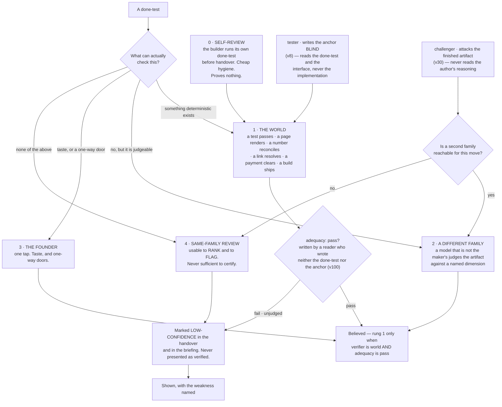
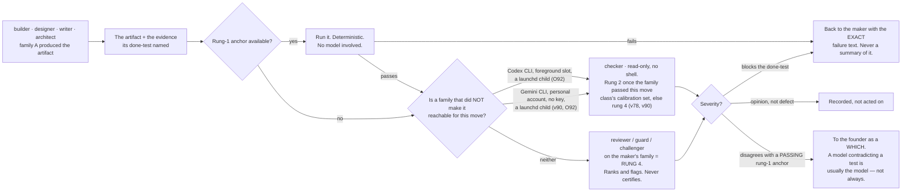
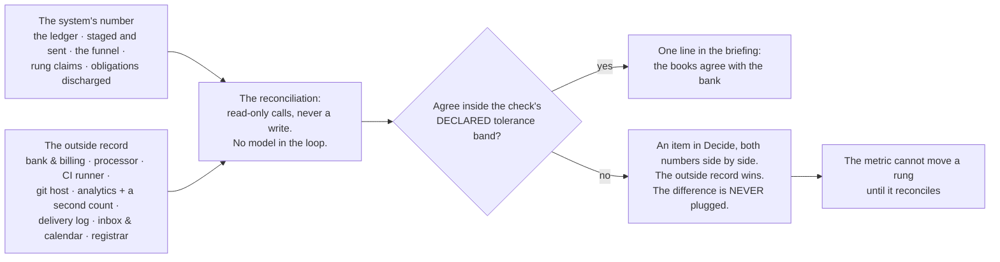
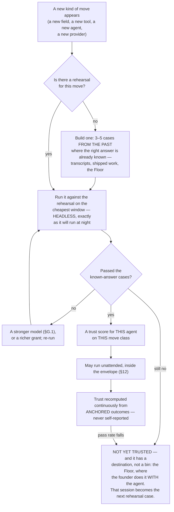

## 11 · Truth — how anything is known to be good

*obeys: v8, v30, and §B.2's anchor column, **v73** and **v82** (the rethink round of 2026-09-06), and **v90, v94, v99,
v100** with **O100, O102, O108, O110, O113** (the fixer round of 2026-09-06, DECISIONS §24) · inherits: FINAL §8, and
§7.6's rehearsal set*

---

### 11.1 The finding that organises everything, now sourced twice

**(FINAL)** An LLM asked to review its own reasoning with no external feedback gets worse. FINAL §8.1 carried the
measurement — GPT-4 falling from 95.5% to 91.5% on GSM8K — and the reason: the bottleneck is *finding* the error,
not fixing it. A model judging output measurably prefers its own generations, its own family, longer answers and
whichever came first, and agrees with human experts 60–68% of the time in specialist domains.

**(NEW: cognition.md 5 gives the general claim a primary citation it did not have.)** The sentence is now quotable
verbatim: *"LLMs struggle to self-correct their responses without external feedback, and at times, their performance
even degrades after self-correction"* — arXiv 2310.01798, accessed 2026-09-05, confidence H.

**(NEW: cognition.md 6 closes the obvious rebuttal.)** Reflexion's *"91% pass@1 accuracy on the HumanEval coding
benchmark"* is not a counterexample, because its feedback is external and stored in an episodic memory buffer. The
distinction that survives is not *reflection is bad*; it is **reflection with no outside signal is bad**.

**(FINAL)** So three rules, and everything below is their consequence. A model checking a model is a **screen, not a
verdict**. Every gate is deterministic or it is not a gate. Everything believed is anchored to something that is not
a language model.

---

### 11.2 The anchor ladder, with the tester and the challenger placed on it

**(FINAL, redrawn)** Every done-test names its anchor, and the ladder is ordered by how much it can be trusted. A
done-test that can only reach rung 4 is a weaker done-test and the system says so out loud. **(NEW: v8 and v30 add
two agents that were shapes in FINAL and are named roles here, so the ladder must say where each one lands.)**



**(FINAL)** Rung 1 is not a formality and it is where the design work is: for most company work there *is* a
deterministic anchor, and finding it is the intellectual task of writing the done-test. **(FINAL)** The anchor is
almost always cheaper than the work it checks, which is why this is affordable, and why quality here does not mean a
review panel — it means the run produced the evidence its done-test named.

| Kind of work | The deterministic anchor |
|---|---|
| Code | tests run · build passes · the app starts · a named user path completes |
| A screen or a page | it renders · a screenshot exists · contrast ratios computed · it loads under a stated size |
| Copy or content | every factual claim resolves to a fetched source · links return 200 · reading level computed |
| A price or a model | the arithmetic reconciles · sensitivity to each input is computed and shown |
| A video or an image | it plays · right length and aspect · the brand colours are the declared ones · loudness to a standard |
| Research | every claim carries a URL that was fetched, with the quoted line present in the fetched text |
| Data work | row counts reconcile · a known query returns the known answer · nulls counted |
| Outreach or social | it sent · it was received · the reply, if any, is attached |
| Finance | it ties to the bank line, or the difference is shown |
| Anything legal | it does not go out without rung 3. Full stop. |

**(FINAL)** Inside rung 1 there is an order, and it is the sharpest rule in the section: **a check that reads a record
the company does not write outranks a check that reads the company's own**, because a status report cannot promote
itself. §B.2 states the same rule per agent — *"a number that reconciles to our own log is rung 4, not rung 1"* — so
it is not advice here and a table row there; it is one rule, written twice on purpose.

**Mechanism:** the store check refuses an intent whose done-test names no anchor (`bin/check-stores`, ABSENT); the
rung is a field on the handover and the briefing renders rung 4 differently from rung 1 (ABSENT). For research
claims the mechanism exists today: `scripts/check-citations.mjs` on branch `ceo-1-1788609834` blocks on a dead path,
wired as `check:citations-exist` in the check suite.

**(NEW: O29 — the `claim-source` resolver goes from SHADOW to blocking, on `scout` handovers only.)** The resolver
fetches a claim's URL and asserts the quoted line is present in the fetched text; on this branch it runs in
**SHADOW**, computing `claim.would_block` and failing nothing. Promoting it everywhere at once would put fetch
latency and network flake in front of every agent. **Promoting it on `scout` handovers alone puts the friction
exactly where the anchor already is** — `scout`'s whole anchor is *"every claim carries URL, quote and access
date"*, so a scout whose citation does not resolve has failed its own test, not somebody else's rule.
**Mechanism:** `scripts/ledger.mjs` — **EXISTS**, in SHADOW, branch `ceo-1-1788609834`; the per-agent promotion is
**ABSENT**. Rule 10 governs it unchanged: offline or timed out is `unresolved`, never `pass`.

**(R12, OPEN — and it is the cheapest measurement named anywhere in the rethink round.)** What fraction of a
venture's real done-tests reach **rung 1 without inventing an anchor**? **Source class:** ~~the harness venture's
first thirty intents~~ **three corpora, and the harness is only one of them — R27** (amended 2026-09-06: O102 ·
THINKER: B4, C2 · conv. 3). **What it decides: contrarian assumption 1** — that most company work has a deterministic
anchor waiting to be found — and with it the shape of this whole section. The paragraph above says *"for most
company work there is a deterministic anchor"*, and **that sentence has never been measured.** If the true fraction
is small, the ladder still stands and the design around it does not: rung 4 becomes the common case rather than the
labelled exception, and §21's rung-1 share is measuring an aspiration.

**(NEW: O102 — R12 is R27, split three ways, because the harness cannot test the assumption it was chosen under.)**
The harness is the most anchorable venture possible, so its thirty return a high fraction whatever the truth for
pricing, copy or positioning — selection on the dependent variable. R27 is three fractions side by side, per domain:
**(a)** the harness's first thirty, as written; **(b)** thirty random Floor episodes from the founder's own transcript
corpus, domain-labelled by one Sonnet `-p` pass and **rated by the founder in one sitting** (under O95) — *could a
program have judged this?* — plus thirty **paper done-tests** drafted across §23–§30; **(c)** the second venture's
real first thirty (v85). **§I row 16 is settled by (b) and (c) together, never by (a) alone.** Tainted episodes are
excluded (O88); **(b) costs zero build.**

***Inventing an anchor*, defined once so the fraction can be counted:** an anchor that **(i)** tests a property the
done-test did not state, **(ii)** reads a record the company itself writes, or **(iii)** would still pass an artifact
the founder rejected. **Losing image:** R12 on the harness alone. `wins_if:` the three fractions agree inside the
sample floor (O25). **Settled by:** code high and everything else low inverts the architecture for every venture that
is not the harness, and §0 says so before wave two. Path: one `-p` pass · one sitting — **ABSENT**; §21 renders the
three fractions.

---

### 11.2a Is the anchor itself anchored — v73

**(FOUNDER, rethink 2026-09-06: D8 → v73.)** **Every anchor carries a mutation case — a known-bad input it must
fail — or it is marked `unrated`. §21's rung-1 share splits into rated and unrated.**

**Why, and it is this section's own argument turned on itself.** 11.11 lists fifteen anchors and **not one has ever
been shown to fail when it should.** An anchor that has never failed is not evidence that the work is good; it is a
check whose sensitivity is unmeasured, which is **a rung-4 belief wearing a rung-1 label** — precisely the error
11.7 built the reconciliation to catch, one level up. This repository has already shipped a change that **removed a
control while every test stayed green** (the eighth CI-chain bypass), which is what that failure looks like when
nobody is watching for it.

**Mechanism, and it costs nothing new.** The mutation case is written by whoever writes the anchor, as a
**rehearsal-case body under v18** — so it inherits §7's admission, §7.2a's eval-only placement in `keel/golden/`,
and v19's forced expiry **free**. There is no new store, no new format and no new gate: an anchor with a case is
rated, an anchor without one is `unrated`, and the store check reads the field. **The cost, once:** one case per
anchor.

**What this changes about §21, stated plainly.** The rung-1 share stops being one number and becomes two, and
**the rated share will start low** — today it is zero of fifteen. That is the instrument reporting correctly for
the first time rather than a regression. **Settled by:** an anchor that **passes** its known-bad input is `unrated`
by definition, whatever its author intended; the first rung-1 share that falls is the system telling the truth.

---

### 11.2b Two axes on every anchor — v100

**(NEW: O108 · v100.)** (THINKER: B8) **A deterministic check of the wrong property is deterministic.** v73's mutation
case proves an anchor is *sensitive*; 11.4's *fails before, passes after* proves sensitivity to *the change*; neither
proves the property checked was the one stated. The ladder conflated **verifier independence** with **property
adequacy**, and a share that must not fall will be met by writing checkable done-tests. So every anchor carries two
fields:

| Field | Values | Written by |
|---|---|---|
| `verifier:` | `world \| other-family \| founder \| same-family` | the rung, as the ladder already assigns it |
| `adequacy:` | `pass \| fail \| unjudged` | **a reader who wrote neither the done-test nor the anchor** — `reviewer` on the `-p` carrier, or `challenger` — into its own handover |

**Rung 1 is counted only when `verifier` is `world` and `adequacy` is `pass`**, and `bin/check-stores` refuses a
rung-1 claim with adequacy unjudged. Beside the rung-1 share, **§21 reports the Goodhart pair**: the share of
done-tests rewritten after their anchor was chosen, and founder rejections of work that passed — done-tests
shortening while rejections rise is Goodhart running, and those two lines are the only instrument that sees it.
**The cost, once:** two fields, one reader per anchor on the cheapest model that passes the routing rehearsal.
**Losing image:** one axis. `wins_if:` a quarter in which adequacy never fails on an anchor the world passed. Path:
the handover schema · `bin/check-stores` — **ABSENT**; §21 owns the pair's rendering.

---

### 11.3 The other family, and what it actually is on day one

**(FINAL)** A checker on the maker's family is a compromised instrument by measurement. FINAL §8.3 assumed three live
subscriptions and concluded that cross-family checking *"stops being a constraint and becomes a choice."*

**(NEW: v5, v32 and §I rows 5 and 6 make that conclusion conditional, and the condition is not met yet.)** Codex is
**not installed** and openai/codex#19945 has been open 130 days with no maintainer reply (runtimes.md, accessed
2026-09-05). `gemini` 0.38.2 **is installed and has never authenticated**. So on the day this plan starts, rung 2 is
reachable in exactly one shape and two founder acts widen it:

| Rung-2 route | State | What it costs, stated once |
|---|---|---|
| **Codex `gpt-5.3-codex` as a checker on a prepared diff** | admitted day one by v5; foreground slot only, stdout redirected to a file while inheriting the parent shell's TTY (v32); **a `bin/run` child from launchd, on the subscription, never a key** (amended 2026-09-06: E7 · v90 / O92) | **one foreground slot is not parallel**, so Codex is not a night lane until the H.2 rehearsal passes detached |
| **Gemini on routine checking** | ~~installed, unauthenticated — §I row 6, one terminal act by the founder~~ **personal Google account, no key (E7 · v90); a `bin/run` child from the launchd context only, because `gemini --version` dies with `EPERM` under the live sandbox (O92 · THINKER: A9 · W37)** | until it happens, routine checking has no second family and falls to rung 4 with the label. **And once it happens, a Gemini verdict on a move class is rung 2 only after Gemini passes that class's `class: calibration` set (v78), and is labelled rung 4 until then** — *Gemini on every diff now* is §J 88 |

**(FOUNDER, fixer round 2026-09-06: E7 · v90 · `class: originated` — *"no keys, codex and gemini cli use."*)** The
strategist's C6 put `reviewer` and `challenger` on Gemini for every diff behind a scoped key; the founder overruled
the key and v78 governs the routing: the second family is **two CLIs from launchd**, and the calibration set turns a
cross-family verdict from rung 4 into rung 2 one move class at a time. §9.4b carries the row; §10.5 the carrier;
**R11** measures whether the family buys anything, **R40** whether the route is permitted.

**(FOUNDER, rethink 2026-09-06, DECISIONS §19 → v82: the third row of that table is deleted.)** The table above
carried a third route, **~~a three-family panel~~**, *"reserved for a one-way door with no rung-1 anchor"*. The
founder's word, verbatim: ***"Delete the row from the plan."*** It is gone, and the deletion is recorded here
rather than performed silently, because the row is what a reader would otherwise go looking for.

**Why it went, and what is untouched.** It **read as a capability** while it needed Gemini authenticated **and**
Codex detached-capable **and** panel machinery, none of which exists — the same failure shape §11.1 refuses, at the
level of the plan rather than the run. **The repository's three live `verified_by: judge` claims and the founder
waiver running to 2026-11-17 are untouched:** this deletes a sentence in a plan, not a claim in a ledger, and those
three claims still resolve `unresolved` and still say so. **What stands in its place is v78** — a three-deep
`fallback:` per agent, a rung demotion on any unrehearsed cross-family reroute, and a frozen calibration set (§9.4a)
— and **the two-family route runs through the no-model launcher, outside any Claude session**, which is the one
shape that does not need a panel to exist. **A deletion carries no falsifier; what would reopen it is a reachable
non-Anthropic model, which is R10** (§10.8), the hinge.

**(NEW: deletion 26 — the one honest sentence about a second family lives here, and the other five copies go.)**
**A second model family is used whenever one is reachable for the move — and today, one is reachable in exactly the
one shape this table names.** That sentence was written in six places across this plan and enforced in none, which
is how a rule becomes decoration. It is stated **once, here**, beside its own state, and every other section points
at this paragraph rather than restating it.

**(R11, OPEN — nobody has measured what the second family buys *us*.)** Does a second model family reduce **escaped
defects on our own move classes**, and by how much? **Source class:** twenty-five paired checks drawn from our own
event log. **What it decides:** whether rung 2 outranks rung 4 on any given class — the ladder asserts it and this
would measure it — and contrarian assumption 2. **It is blocked on O7's four provenance fields on the handover,
which are cheap to add now and unreconstructable later:** without maker family, checker family and the model id of
each, the paired comparison cannot be assembled from history at all.

**(FINAL, redrawn for the roster)** What the checker does, and what happens when it disagrees:



**(FINAL)** When a checker compares two candidates it is **pairwise, never pointwise**; blind; stripped of the
candidate's own label; order-swapped, with a flip resolving to `unresolved`. One frontier judge held its verdict under
a swap only 65% of the time, another 23.8%. Findings from several families are **unioned**: a fatal finding from any
family eliminates, fewer serious findings are preferred, and **scores are never averaged**, because a score is a
finding with the information removed. Consensus thresholds are refused — a vote among models has no anchor.

**Mechanism:** `bin/run` (ABSENT) presents two candidates as an ordered pair twice, swapped, and records a flipped
verdict as `unresolved`; the checker's handover schema carries a `findings` field **and no score field**, so averaging
has nothing to average (ABSENT). Rule 10 of this repo already holds the general form on branch
`ceo-1-1788609834`: a resolver never passes what it could not check, and `unresolved` is pinned distinct from `pass`.

---

### 11.4 The blind tester — v8, and why it is two tests and not one

**(NEW: v8.)** Both the builder and the tester write tests, and they are **different tests**.

- **The builder's self-check** is rung 0. It is cheap hygiene and proves nothing about correctness — it proves the
  builder ran the thing. Devin's published guidance is the same instruction in one line: *"Tell Devin to test its own
  work before opening a PR"* (cognition.md 8).
- **The tester's anchor test is rung 1**, and it is rung 1 *because the tester never read the implementation*. It
  reads the done-test and the interface. A test written by the author of the code is a machine grading its own
  homework, which §11.1 refuses; a test written blind against the contract is an instrument.

**Mechanism, and it is argv rather than instruction:** the tester's grant carries `--add-dir` **excluding the
implementation path**, so the blindness is a property of what the process can open, not of what the prompt asked for
(§B.2 row 4; composed by `bin/run`, ABSENT; asserted by `bin/probe`, ABSENT).

**(NEW: O28 — the blindness is argv on one carrier and UNVERIFIED on the other two, so the carrier is the rule.)**
`--add-dir` is a **launcher** flag. A tester running as a **subagent** or as a **teammate** was never started by
`bin/run` with its own argv, and nothing in this plan establishes that the exclusion survives either path. **So
`tester` and `challenger` route on the `-p` carrier only, until `bin/probe` asserts read-denial on subagents and
teams.** This is a routing constraint on two of fifteen agents, not a new mechanism, and it is the cheapest way to
stop an unverified guarantee from being load-bearing. **(FACT: world.md 8 — W8 names the field that could lift
it):** `permissions.blockReadsOutsideWorkingDirectories` is a **read** narrowing expressible in settings rather
than argv, which is exactly the carrier this rule could not name. It is not adopted here — it is what the probe
would be pointed at.

**(FACT: world.md 30c — W32. The vendor independently reports the failure v8 splits the tests to catch.)**
From Anthropic's own engineering writing on long-running agents: *"Claude tended to mark a feature as complete
without proper testing"*, and providing testing tools *"dramatically improved performance"*. That is the builder's
self-check being mistaken for an anchor, named by the party with the most data and the least incentive to say it.
v8 is unchanged and now independently cited; the post is qualitative and carries no measured numbers, so it
supports the split rather than sizing it.

**The anchor on the tester's own work** — because the tester is an agent and this section trusts no agent's report:
**the test fails before the change and passes after.** A test that passes before the change is not testing the change,
and that is checkable by running it twice with no model in the loop.

---

### 11.5 The challenger — v30, and why it is an agent and not a step

**(NEW: v30, from cognition.md 5 and 6.)** A plan-critique pass that the same run performs on itself is the shape
measured as harmful. The cure is not a better prompt; it is that the critic is a **different process, with different
inputs**. So `challenger` is a roster entry with a grant, not a step in anybody's procedure.

**(NEW: v30's mechanism, stated as two exclusions.)** The challenger never reads the artifact's author's reasoning —
only the artifact and its done-test — and it carries `Read Glob Grep` and no `Write`, `Edit` or `Bash` (§B.2 row 14).
Both are argv facts, and both are argv **on the `-p` carrier**, which is why O28 routes the challenger there until
the probe says otherwise (11.4). ~~**A second model family whenever one is reachable**~~ — **deleted here and
stated once in 11.3** (deletion 26, 2026-09-06): five of the six copies of that sentence go, because a rule written
six times and enforced zero times reads as a guarantee. §11.3's reading governs: when no second family is
reachable, the challenger's finding is rung 4, and it is labelled rung 4.

**(FINAL)** Its own anchor is the one that keeps it from becoming an opinion generator: **every finding names the
mechanism that would have caught it, or it is an opinion.** That is checkable by a reader who did not do the work,
which is the same test §B.2 applies to a done-test.

**Where it is routed** (§B.2): before anything irreversible, and on every plan the Operator is about to bind.

---

### 11.6 Where taste is judged

**(FINAL)** Taste is not checkable by a test and is the founder's alone — but it does not follow that every taste
question goes to the founder, or the founder becomes the bottleneck they refused to be. The system holds a **taste
store**: an evidence-backed record of what this founder has accepted and rejected, mined from transcripts (§13) and
from every *no, not like that* on the Floor. A taste check asks *does this artifact violate anything in the store?* —
a rung-2 check with a real corpus behind it. What reaches the founder is the residue: the genuinely new taste
question, as two built options and a which.

**(FINAL)** The store is never a preferences file the founder types, because a founder is an unreliable narrator of
their own taste. It is derived from decisions only, and a fraction of rejections is held out, so it is scored on
predicting what the founder *wants* rather than what they *approve*.

**(NEW: memory.md's coverage table names the one shipped precedent, and it is partial.)** Claude Code's auto memory
carries `type: user` and `type: feedback` notes written by the acting agent in-session — typed extraction of exactly
this material. It is a precedent for the *content* and a counter-example to the writer rule (v25, §13). A **brand
voice profile** and a **golden output archive** are marked *none found* in the same table: no shipped CLI has either.

**(NEW: O62 — a taste check earns the right to judge before it judges anything.)** **Any taste or brand check must
first pass a held-out discrimination test: rank labelled approved artifacts above rejected ones, on a held-out
slice it never saw.** Its measured rate prints **beside every verdict it issues**, so a reader always knows what
the instrument is worth. **Below chance, the check is deleted rather than tuned** — a check that cannot separate
what the founder accepted from what they rejected is not a weak instrument, it is not an instrument, and tuning it
against the same corpus is how a rung-4 opinion acquires a rung-2 label. **Mechanism:** the §7.3 eval runner, which
**exists upstream** as `skill-creator`'s paired with-skill/baseline loop; the held-out split and the printed rate
are **ABSENT**. This is the same discipline §11.1 applies to a model reviewing itself, applied to the store that
speaks for the founder's taste.

**(NEW: O113 — the curator grades everyone, so something grades the curator.)** (THINKER: B12; C takes the seed)
Four rules, one store check: **every case set the curator writes passes O62's held-out test before it may judge**; a
**founder-labelled `class: calibration` seed no curator edits** scores its dedup and conflict decisions (O44); a
memory item's `falsifier:` must be **executable** — a command with an exit code, or a URL plus the quoted line — or
`bin/check-stores` refuses it; and a **nightly canary**, one well-formed false item, must be refused downstream.
**Losing image:** two curators on two families (§J 82). `wins_if:` the format check alone refuses every canary for a
year. Path: `bin/check-stores` · `keel/golden/` · `keel/fixtures/` — **ABSENT**; §13 owns the pass.

**Mechanism:** the taste store is written only by the curator (v25); the held-out fraction and its score are a field
on the store, checked by `bin/check-stores` (ABSENT).

---

### 11.7 The nightly reconciliation — the company's numbers against records it does not write

**(FINAL)** The single most repeated failure in the corpus of autonomous-company attempts is **the agent misreporting
its own progress**, and the misreport is what the human reads. It is invisible to any check that reads the agent's
output. So the system's own numbers are read against outside records, on no model.



**(FINAL)** Revenue is read from the processor as a claim, never typed; a runway computed from a number the bank does
not confirm is stamped *internal* and cannot promote anything.

**(NEW: §B.2 gives the reconciliation an owner it did not have in FINAL, and §F gives it its precondition.)** **`bin/reconcile` runs it (v47): a program with no model computes every comparison and writes the result
rows, and `analyst` reads the mismatches and drafts the Decide item. The rung is the program's.** `analyst` is
the one agent whose row names the reconciliation explicitly — and it is why §F admits the
**read-only instruments first**: analytics, error tracking, a read-only billing key, the CI API, the git host read
API. Without them the reconciliation cannot exist, and without the reconciliation every number in the company is
rung 4 wearing a rung-1 label.

**Mechanism:** `bin/reconcile` with read-only credentials per venture and a declared tolerance band per check
(ABSENT); the checks themselves are rung-1 anchors and live beside the venture (ABSENT). The instruments are admitted
one at a time through §12's door.

---

### 11.8 Regression, for free

**(FINAL)** A regression is a done-test that used to pass and now does not. Because every done-test names a checkable
anchor, **the set of live done-tests across all ventures *is* the regression suite**, re-run on the routine window at
close to zero marginal cost. Nothing extra is maintained. That is a consequence of the done-test design and the
strongest argument for it.

**(NEW: O24 — the free regression suite is also a fleet of hands, and nothing currently says so.)** *"The set of
live done-tests across all ventures is the regression suite, re-run on the routine window"* — re-read that sentence
with §8's four classes in mind. A done-test whose anchor **sends**, **charges**, **deploys** or **files** is a
REACHES-THE-WORLD act, and re-running it nightly **turns the regression suite into a Sender** — a v33 breach
arriving through the one mechanism this plan calls free. **So every anchor declares `effect: none | metered |
reaches-the-world`, and the unattended re-run executes only `none`.** A `metered` anchor costs money per run and
belongs to §16's ceiling; a `reaches-the-world` anchor runs only through the Sender, with the founder's act in
front of it. **Mechanism:** the anchor declaration (**ABSENT**), read by whatever schedules the re-run. **The cost,
once:** one field per anchor, written by the same hand as v73's mutation case. **(amended 2026-09-06: O109 · v101)**
`effect:` is **the same field** the verb table carries in `keel/shared/tools/<name>.yml` — one table serves the
anchor and the grant, and §12.2 owns it.

**(NEW: O110 — the anchor's verdict is a printed line, because the evaluator reads and never runs.)** (THINKER: A18)
O21 composes the `/goal` condition as *"`<anchor>` exits 0"* — but the evaluator is a small model reading prose, not
a shell running a command, so an exit code it cannot see is a sentence it has to believe. **Every anchor prints
`ANCHOR <name> exit=<code>` on its own line**; the `/goal` condition names that line and the done-test; the evaluator
reads a line and runs nothing. **Losing image:** *"exits 0"* in prose. `wins_if:` **R17** shows the evaluator accepts
an exit code directly. Path: `keel/shared/anchors/*` · `bin/run` — **ABSENT** · **DEPENDS-ON-R17**; one `printf` per
anchor. §6 owns the condition's composition.

**(NEW: O30 — the verdict is signed, and the guarantee is stated honestly.)** `scripts/verdict.mjs` **EXISTS** on
this branch and binds a verdict to `sha256(diff)`, so an **inherited** verdict cannot pass for a fresh one. It does
not stop a **forged** one: anyone with repo-write can author a `.qa/verdicts/*.json`, which the workflow says about
itself. **So the verdict is signed with a key under a path every agent's grant excludes and `denyRead` covers**
(the key path **ABSENT**). **What that buys, precisely: it raises forging from a file write to defeating a checked
deny rule.** It is a guardrail, not containment — the same honest reading §12 gives the sandbox — and saying so is
the point, because a signature described as containment is worse than no signature.

**(NEW: O19 — three named mechanisms rest on one predicate nobody has defined.)** *"The same failure twice"* is
what stops the fast loop, what increments the sighting counter, and what memory dedup calls a duplicate — **three
consumers, one comparison, and no definition anywhere.** Byte equality is wrong (a timestamp or a path defeats it)
and a model deciding is a rung-4 judgement inside a rung-1 gate. **So: the anchor's exit signature where there is
one, and cosine over local embeddings of normalised failure text where there is not, calibrated on labelled
pairs.** One shared hash, one implementation, three call sites — **ABSENT**, and it rests on **O13**'s local
embedding program (§15), which is why it is named here and built there. Two implementations of this predicate would
disagree silently, which is the class this repository has already paid for.

**(FINAL)** The check suite on branch `ceo-1-1788609834` (`scripts/run-checks.mjs`, 48 steps) is the founding
population of rung-1 anchors for the harness venture, and its rule survives whole and is worth restating because it is
the same rule as §11.2's: **a partial run cannot wear a passing verdict.** An interrupted run prints INCOMPLETE and
names what never started; a subset run says SUBSET; a zero-step run is REFUSED.

---

### 11.9 A venture's progress — the contact rungs

**(FINAL)** The anchor ladder measures whether the work is true. Nothing in it measures whether the venture is
becoming a business, and the founder's list asks. So a venture's progress is a rung generated from a record the
company does not write, never typed:

```
0  it exists / it compiles / it renders    ← a rung-1 anchor's exit code
1  a stranger understood it                ← a recorded artifact: a reply, a recording, a survey row
2  a stranger did something                ← the analytics provider AND the server's own count
3  they came back                          ← a cohort in the product's own event store
4  they paid                               ← the payment processor
5  they paid again, and named you          ← the processor, plus a referral with a name attached
```

**(FINAL)** *"The landing page is done"* is rung 0 and will say rung 0. The **ship log** — one line per rung movement
and per intent finished, in the founder's own currency — appears in the briefing and answers *what did this company
produce this month*, which is the cheapest morale instrument there is.

**(NEW: §B.2 ties two roster rows to this ladder, and they are the two with the least outside evidence behind them.)**
`growth`'s anchor is *"a reply from a real person, recorded by the world's door; never a count of messages sent"* —
contact rung 1, not rung 0. `writer`'s is the founder's taste store plus a **rung-2 external reaction**. roster.md
records that sales-and-growth as a function and legal-and-contracts have **no shipped precedent anywhere**, so those
two anchors are deliberately the most external in the roster.

**(NEW: O99 · v99 — the rungs are unchanged; what changes is where a movement is written, and it is one place.)**
(THINKER: C8) Only taste crossed ventures, so ten ventures would learn pricing from scratch ten times. **A house-scope
market record, `keel/shared/market.jsonl`: one row per contact-rung movement** — venture · intent · class (`price ·
channel · positioning · copy · design · offer`) · artifact hash · movement (rung from → to) · the proving record
(processor id, analytics id, reply id) · consent ref · taint ids — **written only by `bin/reconcile`**, so every row
is rung 1 by construction. **The ship log becomes a view of it.** A world-reply negative is house scope with class
`market` (O43). §13 owns how a slice loads it; §4 the Desk's tie-break (O98); §17 the inventory. **Losing image:**
per-venture facts with founder-reviewed promotion. `wins_if:` a year of two ventures with no cross-loaded market row.
*The world's vote* is §J 87, refused.

**(NEW: O100 · v94 — the recall count that widens or narrows an outward class comes from the same record.)**
`bin/reconcile` writes each class's `recall_count` from the world's record — a recall inside the window, or a reply
asking to stop, which also writes the consent register; a recall narrows one step without asking; **`first-contact`
is reachable like any other class** (FOUNDER: E11). §12.2b owns the ladder; this section owns why its counters are
rung 1.

**Mechanism:** the rung table read by `bin/reconcile` (ABSENT) · ~~a venture's `ship-log.md` written only by that
program~~ `keel/shared/market.jsonl`, written only by `bin/reconcile`, with the ship log as a view (amended
2026-09-06: O99) (ABSENT).

---

### 11.10 The rehearsal set, and what it decides

**(FINAL §7.6, inherited whole and re-read at the source.)** A rehearsal case is an input whose right answer is
already known. Voyager added a skill to its library only after it verifiably worked in the environment, which is why
that library transferred to a fresh world instead of being a pile of plausible code. **The same discipline decides
which agents may run unattended**, and it decides one other thing: whether a change to a standing prompt is adopted —
both versions run against known answers, and a change that is not measurably better is reverted and kept as a
negative. That is the only self-editing permitted anywhere.



**(FINAL §7.6's three consequences, and each one is a rule this section would otherwise have to invent.)**

1. **A trust score is a measurement, not a rating.** It is the observed pass rate of anchored checks for that agent on
   that move class, and **no run scores itself** — §11.1 applied to the question of who may work alone. Below a sample
   floor it prints **`insufficient`** rather than a number, because a pass rate over four cases is a number that
   invites a decision it cannot support. **(NEW: O25 — that floor is now one shared predicate, not a sentence here
   and a different one in §7.)** §7.3 admits a skill on **2–3 cases** while this rule refuses to print a number over
   four, which is contradiction 12: **two rules about the same arithmetic, and the looser one is the one that
   grants.** One predicate with two call sites (**ABSENT**) answers for the trust score, for skill admission and for
   the error rates of v73, and it answers the same way in all three. The consequence is stated rather than softened
   in §7.3: an admission on 2–3 cases is an admission **below the floor**, recorded as `insufficient`.
2. **"Not yet trusted" has a productive destination.** A move that fails rehearsal goes to the Floor, where the
   founder does it *with* the agent — **and that session becomes the rehearsal case for next time.** This is the
   mechanism by which walking *with* the founder teaches the system to walk *for* them, and it is why the Floor is not
   a consolation prize. **(amended 2026-09-06: O112 · v103)** That destination is now a named state: `trust:
   probation | scored | unroutable` per move class in `roster.yml`, where a probation agent runs only on the Floor or
   under a founder-authored intent with adequacy-judged anchors (11.2b), each counting toward the floor. §5 owns the
   field; this section owns why the floor is not one.
3. **The cases come from the founder's own past.** Thousands of transcripts hold hundreds of *no, not like that* and
   *yes, that's it* — **a labelled dataset of this founder's judgement, gathered free over years.** §13.7's mining
   pass is what extracts them, which is why that pass is the work to do first: it is the only source of rehearsal
   cases nobody has to write.

**(FINAL, and it is the instrument that catches the failure nobody watches for.)** A trust score charted over time,
with limits computed from its own history, is a **control chart** — and it is what sees a provider's silent model
update in month nine, when nothing in the release notes and nothing in the code has changed.

**(NEW: v1 changes what carries a trust score, and it makes the whole mechanism cheaper.)** FINAL scored a *loadout*
assembled per run, so the population of scores was open-ended. **Fourteen named agents give the score a stable
subject**: `builder` on schema changes, `scout` on a field it has not read before. A pass rate needs a denominator
that persists, and a named roster is one.

**(NEW: v18 makes a rehearsal case one of exactly four admissible skill bodies, so the set has a home and a format.)**
A rehearsal case is a `SKILL.md` body under §E's content rule, which means the same admission and the same forced
expiry (v19) apply to it as to everything else the library holds.

**(NEW: H.2 is a rehearsal case in this exact sense, and it is the one that matters most on day one.)** Codex's
admission test — `codex exec --json`, **no controlling TTY**, a non-trivial prompt, ~~version ≥ 0.124.0~~ **the
installed version, recorded** (moved 2026-09-06: W19 — Codex is at 0.153.4, twenty-nine minor versions past the old
floor, which now admits anything), against known-answer cases — is what widens Codex from a foreground checker to a
night lane. Pass and rung 2 becomes parallel; fail and it stays in the foreground slot. **#19945 has been open 130
days with no maintainer reply**, so the test is the plan, and the issue closing is not. **It is R10, the hinge of
the cross-model design** (§10.8), and **v82's deleted panel row is one of the things that reads differently
depending on its answer.**

---

### 11.11 The roster's anchor column, as one table

**(NEW: §B.2's anchor column read against §11.2's ladder. The anchors are the SPINE's; the rung assignment is this
section's reading of them, and the two rows that cannot reach rung 1 today are named rather than rounded up.)**

| Agent | The anchor — what proves it, never the agent's own report | Rung |
|---|---|---|
| **Operator** | the store check refuses an intent whose done-test is not falsifiable by someone who did not do the work; nothing binds by voice (§C.3) | 1 on the refusal · 3 on the read-back |
| **builder** | the venture's own CI, plus the done-test, plus the tester's blind test | 1 |
| **reviewer** | findings reproduce from the diff alone; a finding with no reproduction is a hypothesis | 1 on reproduction · **2 only when a second family is reachable ~~, else 4~~ and has passed the move class's calibration set, else 4 (amended 2026-09-06: v90 → v78)** |
| **architect** | a migration that applies and rolls back in a scratch database | 1 |
| **tester** | the test fails before the change and passes after | 1 |
| **guard** | a proof of concept that reproduces, or the finding is a hypothesis | 1 |
| **scout** | every claim carries URL, quote and access date; `check-citations.mjs` blocks on a dead one | 1 |
| **designer** | a rendered screenshot judged against a named anchor — never the agent's description of it | 1 on the render and the computed properties · 3 on taste |
| **product** | the store check refuses a done-test that is not falsifiable by an outsider | 1 |
| **analyst** | the reconciliation reads a record the company does not write; **a number that reconciles to our own log is rung 4, not rung 1** | 1, and it says so when it is not |
| **writer** | staged, never sent; the founder's taste store and a rung-2 external reaction | 2 and 3 |
| **growth** | a reply from a real person, recorded by the world's door; never a count of messages sent — **and written as a row in `market.jsonl` by `bin/reconcile`, never by `growth`** (O99) | contact rung 1 |
| **steward** | an obligation is discharged only by a record the company does not write | 1 |
| **curator** | a memory item with no source, date, expiry and falsifier is refused at the store check | 1 |
| **challenger** | every finding names the mechanism that would have caught it, or it is an opinion | 1 on that test · **2 only when a second family is reachable ~~, else 4~~ and has passed the move class's calibration set, else 4 (amended 2026-09-06: v90 → v78)** |

**(NEW: the table's own finding.)** Thirteen of fifteen rows reach rung 1 on their primary anchor. The two that do not
— `reviewer` and `challenger` — are precisely the two whose job is judgement, which is the section's thesis restated
as a roster fact: **the agents that check are the ones whose own output cannot be checked deterministically**, and
that is why the second family is bought and why §11.3 refuses to round it up.

**(NEW: v73 — all fifteen rows are `unrated` today, and that is the table's second finding.)** Not one anchor above
carries a **mutation case**, so not one has been shown to fail when it should (11.2a). The column is not added here
because it would be fifteen identical cells; the statement is the same and cheaper: **rated: 0 of 15.** As cases
land, §21's rung-1 share reports rated and unrated separately, and the rated share starts at zero by construction.
**(v100, the third finding:)** every rung in the table is a `verifier:` value and none carries an `adequacy:` yet —
**adequacy: 0 of 15 judged** — so by 11.2b's rule the rung-1 column above is what the ladder *assigns*, not yet
what `check-stores` would *count*.

**(FACT: world.md 30a — W30. The only outside comparator this design has.)** TheAgentCompany, whose paper was
accessed 2026-09-06 and has no 2026 revision: *"The most competitive agent can complete **30%** of tasks
autonomously"*, over six job functions — *"Software Engineer, Product Manager, Data Scientist, Human Resource,
Financial Staff, Administrator"*, which is close to this roster's own span. **It is a floor for §21 and not a
target**, and it is the only external number a fourteen-agent design has to check itself against. Read it as a
bound on expectations, not as a benchmark to beat: their tasks are not ours, and the comparison is honest only at
the order of magnitude.

**Mechanism for the whole table:** the anchor is a required field on every brief and every handover; `bin/run` refuses
a brief whose done-test names no anchor, and `bin/probe` asserts each agent's grant nightly (both ABSENT). Until they
exist, this table is a **WISH** — and naming it as one here is cheaper than discovering it during the first night.

---

### 11.11a What enforces this section

| Rule | Mechanism | State |
|---|---|---|
| A done-test names an anchor, or it is refused | `bin/check-stores`; the rung is a field on the handover | **ABSENT** |
| A research claim's citation resolves | `scripts/check-citations.mjs`, wired as `check:citations-exist` | **EXISTS**, branch `ceo-1-1788609834` |
| **A `scout` handover's citations are fetched and quoted, blocking** (O29) | `scripts/ledger.mjs`'s `claim-source` resolver, promoted from SHADOW on `scout` only | resolver **EXISTS** in SHADOW; the per-agent promotion is **ABSENT** |
| **Every anchor carries a mutation case or is marked `unrated`** (v73) | the case is a rehearsal-case body under v18, so §7's admission and v19's expiry carry it | **ABSENT** — rated: 0 of 15 |
| **Every anchor declares `effect:`, and the unattended re-run executes only `none`** (O24) | the anchor declaration, read by whatever schedules the re-run | **ABSENT** — today the regression suite could send |
| **A verdict cannot be inherited, and forging one means defeating a deny rule** (O30) | `scripts/verdict.mjs` binds `sha256(diff)`; the signing key sits under a path `denyRead` covers and no grant names | `verdict.mjs` **EXISTS**; the key path **ABSENT**. A guardrail, not containment |
| **"The same failure twice" means one thing** (O19) | one shared predicate: exit signature, else cosine over local embeddings of normalised failure text, calibrated on labelled pairs | **ABSENT**; rests on O13's local embedding program |
| **A taste check proves it can discriminate before it may judge** (O62) | the §7.3 eval runner over a held-out labelled slice; the rate prints beside every verdict; below chance it is deleted | runner **EXISTS** upstream; the held-out split and printed rate are **ABSENT** |
| **One sample floor answers for the trust score, skill admission and the error rates** (O25) | one predicate, two call sites | **ABSENT** |
| **`tester` and `challenger` route on the `-p` carrier until blindness is probed** (O28) | the launcher's carrier choice; `bin/probe` asserts read-denial | **ABSENT**. **W8** names the settings field that could lift it |
| A checker never averages scores | the checker's handover schema carries `findings` and no score field | **ABSENT** |
| A flipped verdict under a swap is `unresolved` | `bin/run` presents an ordered pair twice, swapped; Rule 10 already pins `unresolved` distinct from `pass` | ordering **ABSENT**; Rule 10 **EXISTS**, branch `ceo-1-1788609834` |
| **Rung 1 is counted only when `verifier: world` and `adequacy: pass`, adequacy written by a reader who wrote neither** (v100, O108) | two fields on the handover; `bin/check-stores` refuses rung 1 unjudged; §21 reports the Goodhart pair | **ABSENT** — adequacy: 0 of 15 judged |
| **An anchor's verdict is a printed line the evaluator reads, never a command it runs** (O110) | `ANCHOR <name> exit=<code>` from every anchor; the `/goal` condition names the line | **ABSENT** · **DEPENDS-ON-R17** |
| **Assumption 1 is measured on three corpora, never the harness alone** (O102, R27) | one Sonnet `-p` labelling pass over thirty Floor episodes, rated by the founder in one sitting; thirty paper done-tests; VENTURE2's first thirty; *inventing an anchor* defined three ways | **ABSENT**; (b) costs zero build |
| **The curator's case sets pass the held-out test; its falsifiers execute; a nightly canary is refused** (O113) | `bin/check-stores` · the founder-labelled `class: calibration` seed in `keel/golden/` · the canary in `keel/fixtures/` | **ABSENT** |
| **A cross-family verdict is rung 4 until the family passes the move class's calibration set** (v90 → v78) | the calibration set; the CLIs from launchd (O92) | **ABSENT**; the CLIs ship |
| **A contact-rung movement is written once, by the reconciliation, and the ship log is a view** (v99, O99) | `keel/shared/market.jsonl`, written only by `bin/reconcile` | **ABSENT** |
| **A recall count is the world's, and it narrows a class without asking** (O100, v94) | `bin/reconcile` writes `recall_count` into `tools/<class>.yml`; `bin/send` reads the step; §12.2b owns the ladder | **ABSENT** |
| **A probation agent counts toward its floor only on adequacy-judged anchors** (O112, v103) | `trust:` per move class in `roster.yml`; §5 owns the field | **ABSENT** |
