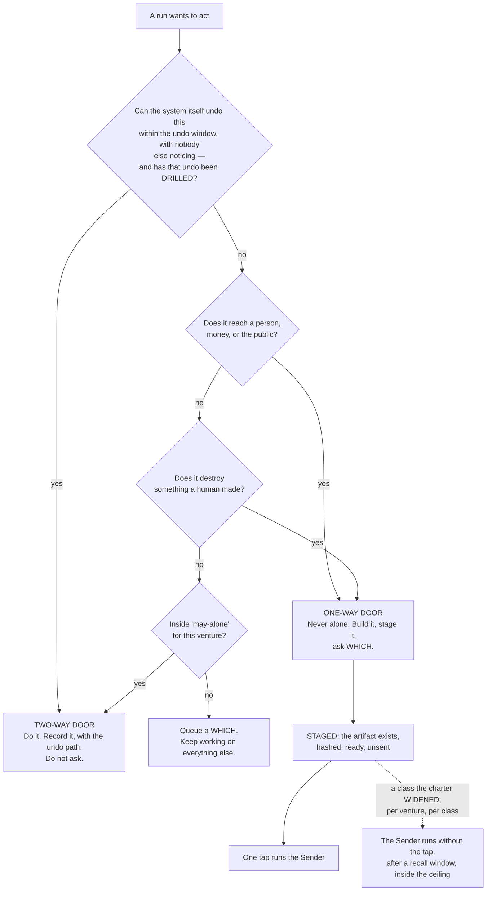
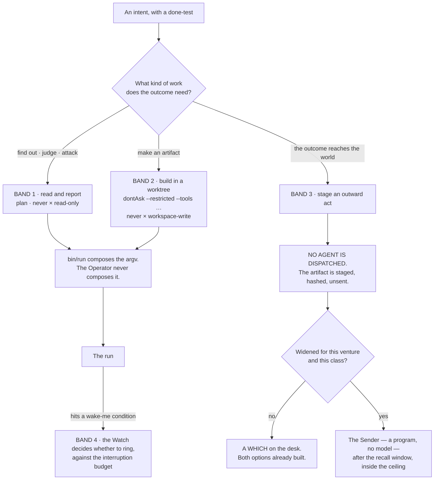
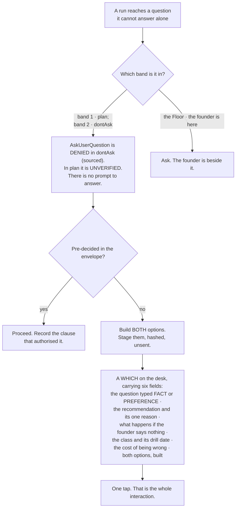
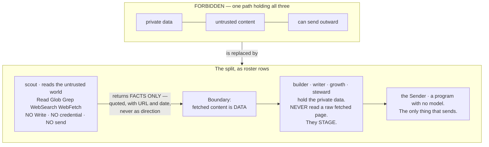
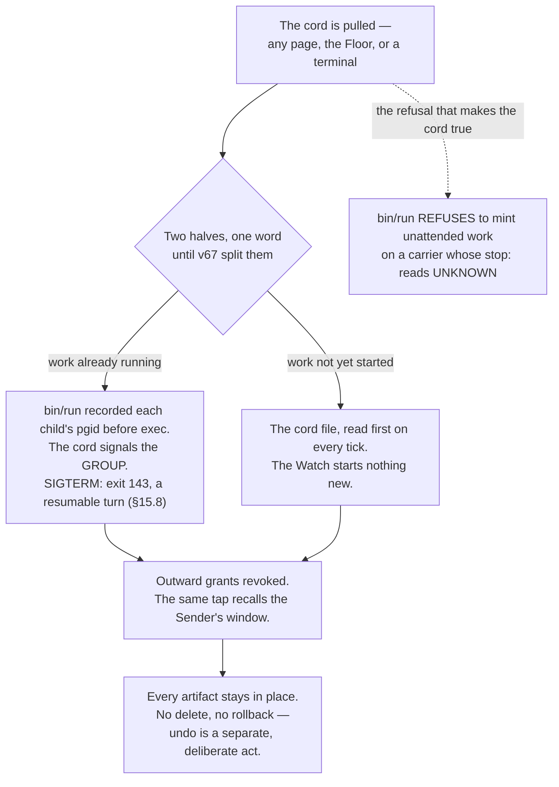

## 12 · Control — what may be done alone, and what never

*obeys: §C.1's bands, v9, v10, v28, v33, and **v67, v68, v69** from the rethink round of 2026-09-06 · inherits:
FINAL §9. The tool door itself lives in §8 (Tools and MCPs) and is not restated here.*

---

### 12.1 The envelope

**(FINAL)** The founder refuses a machine that is only brakes. This section does not add brakes. It removes the need
for most of them by deciding once, per venture, what does not need asking — and makes the remaining few absolute.
Three lists in the venture's charter, in the founder's own words, read by every run:

```
may-alone:  what runs without asking, ever
never:      what is not done by this system under any circumstance
wake-me:    the exact conditions that interrupt me, each with a number
```

**(FINAL)** The shape is the naval standing-orders and night-orders pair, with two details copied exactly. The
call-me list carries **numeric thresholds** — never *"if something seems wrong"* — and the governing sentence *call
the captain on any doubt whatever, before an emergency has developed* is what stops a threshold list becoming a
loophole. Written the way the founder would say it:

```
may-alone:  write code · run tests · make branches · research anything · draft anything ·
            build both options of a choice · spend up to the venture ceiling on capacity ·
            (NOT calendar or mail: the world's door and scout read those, v36)
never:      send mail as me · post publicly · pay anyone · sign anything · touch production
            data · change a live price · contact a customer · delete anything a person made
wake-me:    a customer is waiting more than 4 hours · spend crosses 60% of the monthly
            ceiling · a done-test that passed for 7 days starts failing · anything I said
            'never' to is now the only way forward · a run has been blocked on the same
            thing three times
```

**(FINAL)** Every charter starts from a **default `never` list held as data**, longer than any tiering system covers,
and the founder deletes from it rather than writes to it: a secret in a published artifact · a migration with no
proven down-path · a deploy that emits mail or mutates data · money outside a standing, capped, rate-limited
allowance · a domain lapsed or bought · **anything delivered to a person** · a burned sending domain · a signature ·
a price change on existing customers · a partnership term · an offer, and a termination · publication before a patent
filing · a trademark class · an entity type · a cap table · an erasure · an account deletion · a bulk merge · a
missed statutory deadline · any edit to the system's own judging machinery · **and a kill decision.** Every charter
also starts from a **default `wake-me` template** of five conditions about *consequence*, never policy: a one-way act
wanted · damage · a kill criterion the founder wrote the day the intent opened · a contradiction between an anchor
and something the founder said out loud · a statutory clock.

**Mechanism:** `shared/never-default.yml` and `wake-me-default.yml` merged into each charter at load (both ABSENT).

---

### 12.2 The rule that decides what belongs in `may-alone` — and it stands alone in the world

**(FINAL, v28.)** Not importance, not risk vocabulary: **reversibility**. Two-way doors are made fast at about 70% of
the information you would like, because the cost of delay exceeds the cost of a correctable mistake. One-way doors get
slow, deliberate treatment.

**(NEW: cognition.md is the reason this is stated with more confidence than FINAL stated it, not less.)** The lane
looked for a shipped scheme that keys permission on reversibility and reported *"neither shipped scheme does"*.
Claude Code keys on **a fixed path list plus an action class**; Codex keys on **workspace scope plus network**. The
nearest shipped analog anywhere is auto mode's classifier special-casing `rm` and `rmdir` on critical paths. So v28 is
a position the world does not hold, held knowingly: the axis everyone ships is *where the file is*, and the axis that
predicts damage is *can this be undone*.

**(NEW: the one duration this section needs is a founder's number, not a rule's.)** The undo window is
`keel/settings.yml`'s `undo_window` — **one hour by default, the founder's to set** — and like the recall window
it is **sized to the blast radius**: a wider act gets a shorter window, not a longer one. Writing an hour into the
predicate itself would have put a schedule inside a rule, which this plan refuses everywhere else.



**(FINAL)** The staged-not-sent pattern is the whole trick. A post is written, previewed and sits there; an email is
drafted with the recipient filled in; a deploy is built and waiting. The founder's tap is the only irreversible step
and it takes a second, because everything else is already done. That is what makes *ask me only what only I can
answer* affordable: **the asking blocks the last inch, never the work.**

**(NEW: v9 promotes staged-not-sent from a style to the only channel a silent run has — see §12.5.)**

**(FINAL)** Two additions that keep the door test honest. **An undo is drilled or the door is one-way**: a two-way
door whose undo has not been exercised is treated as one-way until it is, by the rule that an untested kill switch is
a story about a kill switch; the drill runner writes only a date. **A widened class executes after a recall window**,
not on the instant: the Sender holds it for a window sized to the blast radius, the phone can recall it, and the
receipt says plainly when a recall is not an undo.

**(NEW: cognition.md again, and it is worth naming because it is the strongest claim in this section.)** *"§9.2's
staged-not-sent pattern and its recall window have no analog in anything I fetched. The shipped equivalent of 'never
alone' is a prompt or a deny rule, not a staged artifact."*

**Mechanism:** the door test runs before a brief carries a `REACHES THE WORLD` grant (ABSENT) · the drill dates in
`shared/tools/<name>.yml` (ABSENT) · `bin/send`, which holds no model (ABSENT).

---

### 12.2a The Sender's checklist gains a provenance line

**(NEW: O64.)** Inbound licences are read exceptionally well in this plan — v17 blocks a 2,111-skill import on one
unread file — and **outbound is unchecked**: nothing records the licence of a third-party asset embedded in an
artifact the Sender publishes. So the checklist the Sender reads before an outward act carries one more line beside
v63's disclosure — **source, licence, date read**, per asset. A staged artifact whose provenance line is empty is
refused, the way a brief naming a file that does not exist is already refused.

**Why it belongs on the checklist and not in a review.** The Sender holds no model, so the line is a field that is
present or absent rather than a judgement someone makes at the last inch. That is the same reason the disclosure line
sits there.

**Mechanism:** the Sender's checklist (**ABSENT**, §L O64) · `bin/send`, which holds no model (**ABSENT**).

---

### 12.3 The bands, mapped onto the envelope and onto the shipped modes

**(FOUNDER)** *"which is also the contact point with me. … depends on the type of tasks because you also need to be
able to run it fully autonomous."*

**(NEW: §C.1 turns that sentence into one table that three different layers must agree with — the envelope's
vocabulary, Claude Code's permission modes, and Codex's two axes. A band that named only one of the three would leave
the other two to be guessed at dispatch.)**

| Band | Task types | Envelope | Claude Code mode | Codex `approval_policy` × `sandbox_mode` | Who runs in it |
|---|---|---|---|---|---|
| **Read and report** | research, review, audit, analysis, challenge | `may-alone` | `plan` | `never` × `read-only` | scout · reviewer · guard · challenger · analyst |
| **Build in a worktree** | code, design, copy, spec, schema, memory | `may-alone`, inside one venture's worktree | `dontAsk` with `--restricted` and an explicit `--tools` | `never` × `workspace-write` | builder · architect · tester · designer · product · writer · growth · steward · curator — **none of them holds a tainted read (v36)**; `steward` works from `scout`'s handover, never from a raw inbound row; the five with `isolation: none` (v41) run in this band on a narrowed `--add-dir`, **not a checkout** |
| **Stage an outward act** | send, publish, pay, deploy, share, delete | **`never` for every agent** | no mode — no agent performs it | — | nobody. The **Sender** performs it, and it holds no model |
| **Wake the founder** | anything on the venture's `wake-me` list | `wake-me` | — | — | the Watch, before it rings, against the interruption budget |



**(NEW: two shipped facts from cognition.md make the table binding rather than descriptive, and both are argv-level or
settings-level rather than prompt-level.)** First, **deny rules bind in every mode including `bypassPermissions`**,
while *"Allow rules have no effect in `bypassPermissions`"* — so the floor under the bands is real and the ceiling is
not. Second, **a subagent's own `permissionMode` frontmatter is ignored**: *"any `permissionMode` in the subagent's
frontmatter is ignored"*, so **a child cannot widen its own grant.** That is the property the whole band table rests
on, and it is the vendor's, not ours.

**(NEW: and one thing the table deliberately does not use.)** **`auto` mode's classifier is not the envelope.** It is
*"a second model, the classifier"* reviewing actions instead of the founder; it can be switched off with
`disableAutoMode`; and nothing in it keys on reversibility. It is a cheap guardrail against accident. §11.1's rule
applies to it unchanged — a model checking a model is a screen, not a verdict.

---

### 12.4 `bypassPermissions` is refused, and refused by a mechanism

**(NEW: v10.)** The widest permission mode is not discouraged, not reserved for emergencies, and not left to
judgement. It is **disabled in the managed settings file**, where a running process cannot clear it:
`permissions.disableBypassPermissionsMode: "disable"`. cognition.md quotes the pair of administrative settings and
notes they are *"most useful in managed settings where they can't be overridden"*.

**(NEW: why a mechanism and not a rule.)** A process holding a shell can strip its own guardrails by launching a child
with different settings. Every other tier of settings is reachable by something inside the session. This is the one
tier that is not, which is the entire reason the file exists.

**Mechanism:** the managed settings file, written by the founder outside the repository (**ABSENT** — §I row 8) ·
`bin/probe`, which asserts nightly what a run can actually touch (**ABSENT**). Until both exist, v10 is a **WISH**,
and the honest statement is that today the mode is refused by convention.

---

### 12.5 A fully autonomous run cannot ask — v9, and it is the design of the mode

**(FOUNDER)** *"you also need to be able to run it fully autonomous."*

**(NEW: v9, from cognition.md 2 — this is the fact that turns the founder's sentence into a design constraint.)** In
`dontAsk` mode, *"`AskUserQuestion`, MCP tools marked `requiresUserInteraction`, and connector tools your organization
set to `ask` … **are denied even if you've allowed them**."* Asking the human is itself a permissioned action, and the
mode that lets a run work unattended is the mode that switches it off.

**So a fully autonomous run has exactly two outcomes for anything it would have asked**, and there is no third and no
approve verb:

1. It was **pre-decided in the envelope** — `may-alone`, `never`, or the venture's widened class.
2. It is **staged as a which, with both options built**, and left on the desk.



**(NEW: v9's consequence for the rest of the plan.)** This makes FINAL's staged-not-sent rule **load-bearing rather
than stylistic**. In an attended session it is good manners; in an unattended run it is the only channel that exists.
A design that leaves a question to be asked at 3 a.m. has not deferred the question — it has lost it.

**(FINAL, unchanged)** What still reaches the founder while a fully autonomous run works: the `wake-me` list, the
interruption budget of three a day, and the briefing, which is never an interruption because the founder opens it.

**(NEW: `/goal` is what bounds such a run, per v12 and §H.3, and it is a Stop hook — which is why §12.6's file omits
two settings it would otherwise carry.)**

---

### 12.6 The managed settings file — exactly what it carries, and the one thing it must not

**(NEW: v11. FINAL §9.7 treated the managed file as the place every narrowing goes. That premise is now false in one
specific way, and the collision is worth stating in full because a section-writer or an implementer will otherwise
walk into it.)**

`/goal` is *"a wrapper around a session-scoped prompt-based Stop hook"* and is therefore *"unavailable when
`disableAllHooks` is `true` after settings precedence applies, or when `allowManagedHooksOnly` is set in managed
settings"* (runtimes.md, accessed 2026-09-05). The goal loop the founder asked for and the hook lockdown cannot both
be in that file.

| The managed file carries | The managed file does NOT carry |
|---|---|
| `permissions.deny` — the deny rules that bind in every mode, including bypass | `disableAllHooks` |
| `permissions.disableBypassPermissionsMode: "disable"` (v10) | `allowManagedHooksOnly` |
| `permissions.disableAutoMode: "disable"` (the classifier is not the envelope, §12.3) | — |

**The cost, stated once and not re-litigated (v11):** a run can therefore register its own Stop hook. That is a
**smaller hole than losing the goal loop**, and the nightly probe checks it. Narrowing that would otherwise have gone
into the file is carried by `--restricted` plus an explicit `--tools` list, which does not touch hooks.

**(FINAL, and it is the other half of the seam.)** Peer isolation is enforceable by a checked-in file rather than by
the managed one: `crossSessionInbound: refuse` drops every inbound message and applies from project or local settings
over every other source; `permissions.deny: ["SendMessage","ListAgents"]` removes both tools; `isolatePeerMachines:
true` requires human approval before any message leaves the machine, even in bypass mode. A run cannot be stopped from
binding an inbox socket; it can be stopped from receiving anything and from holding the tools to send.

**Mechanism:** the managed file (a founder act, **ABSENT**, §I row 8) · the checked-in isolation file (**ABSENT**) ·
`bin/probe` (**ABSENT**) · `npm run test:sandbox`, which exists on branch `ceo-1-1788609834` and fails if the sandbox
is disarmed.

---

### 12.6a Two tiers of grant, not three — and one narrowing that is a settings field

**(NEW: O37.)** A tool grant lives in **exactly two places**: the argv `bin/run` composes, and the managed file a
running process cannot clear. **The project `settings.json` tier is deleted.** A third tier that neither the launcher
owns nor the founder writes is a grant nobody reviews and a place two answers can disagree; §18 carries the deletion
as a fate.

**(FACT: world.md 7 — W7, and it is independent support rather than the reason.)** `--restricted` *"refuses
`bypassPermissions`, and ignores user, project and local settings files"*. So on the `-p` carrier — the carrier every
unattended run uses — **the project tier is already ignored by the runtime**, and deleting it removes a tier that
binds nothing where it matters and misleads everywhere else. The same clause gives **v10 a second mechanism**: the
flag refuses the widest mode by itself, so §12.4's managed setting is no longer the only thing standing there.

**(FACT: world.md 8 — W8, and it is the carrier v43 could not name.)**
`permissions.blockReadsOutsideWorkingDirectories` is a **read** narrowing expressible in settings rather than in
argv. v43 records the tester's blindness (v8) and the builder's exclusion from the architect's paths (v7) as
**UNVERIFIED** on the subagent and team carriers because no carrier could hold them; this is one, for reads. It is
what **O28** is waiting on — until `bin/probe` asserts read-denial there, `tester` and `challenger` route on the
`-p` carrier only, where blindness is argv (§11).

**(NEW: O38 — ADOPTED-AS-SPEC. The decision is taken; the act is deferred to build time by the founder, DECISIONS
§15.)** A hook denies through the **`decision` object on the non-blocking events** and keeps `exit 2` only for the
documented blocking ones. `PermissionRequest` is non-blocking — *"Exit code 2 isn't honored for this event … Deny
through the `decision` object instead"* (§15.8) — so **a hook written the obvious way silently fails to deny**, which
is the worst direction for a control to fail in. The specification does not wait on the rewrite; the rewrite is an
edit to the judging machinery and stays the founder's.

**(FACT: world.md 17 — W17. A blocking gate shipped for the one thing §9 routes on, and no row uses it.)**
`PreModelSwitch` and `PostModelSwitch` are hook events that can *"block, confirm, or annotate a model switch"*. §9
records that they exist and that **no row reads them**; hook events are this section's, so the placement is here.
**`PreModelSwitch` is the enforcement point for v57's routing and v78's fallback chain**: a switch to a family that
has **not passed the rehearsal for that move class** is either **blocked**, or **annotated as a rung demotion** and
allowed — which is exactly the choice v78 states and had no carrier for. Without it, a cross-family reroute silently
trades correctness for availability, and the handover records the model it ran on with nothing recording that the
rung fell.

**Two things this does not become.** It is **not a second router** — §9.2 and `routing.yml` (**O5**) decide which
model; the hook only refuses or annotates a *switch away from* that decision. And it is **not a model judging a
model**: the predicate is a lookup against the rehearsal record, so it belongs behind a hook exit for the same reason
`qa-verdict` does.

**Mechanism:** the project-tier deletion (**a deletion**, §L O37; §18 carries it) ·
`permissions.blockReadsOutsideWorkingDirectories` in the checked-in settings file (**the field ships; unset here**) ·
the hook rewrite (**ABSENT**, §L O38, **ADOPTED-AS-SPEC**) · a `PreModelSwitch` hook registered by `bin/run` in the
run's settings (**the event ships; the hook ABSENT**, W17).

---

### 12.7 The trifecta split — the one structural safety rule, now expressed as a roster

**(FINAL, v33.)** An execution path holding all three of **private data**, **untrusted content** and **the ability to
communicate outward** is exploitable by indirect prompt injection, and **there is no prompt that fixes it**. The only
reliable defence is to guarantee one leg is missing, which is why this is a shape rule and not a policy file.



**(FINAL)** The run that reads the internet is never the run that holds the keys. Anything from outside — a web page,
an email body, a document, a tool's own response — is data to be quoted, never direction to be followed. Taint is
decided **when a run is born, not while it runs**, because a grant is argv fixed at dispatch and cannot narrow
mid-run. If a scout concludes something should be sent, it says so in its handover, and a different run that has not
read the foreign content decides.

**(NEW: v1 changes how this is enforced, and makes it cheaper.)** In FINAL the split was a property of a *run's*
loadout, checked at dispatch. With a named roster it is also a property of a **file**: `scout`'s `tools:` line carries
no `Write` and no credential, and the roster is the rule as a table — ~~*ten* of the fourteen carry no shell~~
**eleven of the fourteen carry no shell** *(corrected 2026-09-06: **O57** strikes `analyst`'s `Bash`; §5.2 ·
challenge C P1-3)*, five carry no write of any kind, and only four can touch source. **Read that count from
`keel/shared/roster.yml` (§L **O2**, ABSENT), never from a summary sentence**: §5.2 carried two hand-written counts of
one column and both drifted from the column beside them, which is why the table, §17.1 and page 2 are generated from
that one file or checked against it. ~~§B.2's own summary~~ is retired as the source for it. The check at dispatch
does not go away; it now has something static to check against.

**(NEW: v36 — §F's tainted class is where this rule meets the roster, and it is where the roster contradicted itself
until it was decided.)** READ-ONLY **tainted** tools — Gmail read, Calendar read, Drive read, Notion read, the open
web — may be held by **`scout` only, plus the world's door program, which holds no model.** §8 carries the door that
admits them.

**The collision, and how it was resolved:** §B.2 row 12 gave `steward` mail, calendar, drive and Notion **read**
while also giving it `Write` — one grant satisfying two rules that cannot both hold, because untrusted content plus a
pen is two thirds of the trifecta with the third leg one obligation away. **`steward` now holds none of them.** The
world's door writes one inbound row per event; `scout` reads those rows and the raw world; **`steward` writes
obligations from `scout`'s handover and never from a raw row.** The losing image is kept by name: *a steward that
reads mail with a pen in its hand.*

**Why this is the right direction to resolve it:** the alternative was taking `Write` off `steward`, which would
leave nothing able to record an obligation. Taint is the leg that can be removed without removing a capability the
company needs, and it is removable by argv rather than by instruction.

**Mechanism:** `bin/run` refuses a brief whose grant carries both an outside-reading tool (`WebFetch`, `WebSearch`, a
read of the inbound log) and any of `Write`, `Edit`, `Bash` or a `REACHES THE WORLD` tool (**ABSENT**); `bin/probe`
asserts it (**ABSENT**). **(FINAL, measured)** An MCP tool call reaches a hook only if the hook's matcher names that
exact tool, so a hook matching `Bash|Edit|Write` governs no MCP call — which is why the split is argv and not a hook.

---

### 12.8 The world's door

**(FINAL)** When the world sends something — a reply, a payment, a failed build, a CVE, an invoice, a support message
— **a program writes one row into the log and does nothing else.** No model reads a stranger's text with a tool in its
hand. The row becomes a line on mission control, and a scout with no credentials reads it.

**(FINAL, measured)** A delivered cross-session message starts a new turn carrying the receiver's full context, so an
inbound path wired to a running run costs **a context window per event**, not a slot. That is the cost argument for
the door writing a row and never waking a run directly, and it is separate from the safety argument.

**(NEW: §11.9 and §B.2 give the door a second job the founder asked for.)** `growth`'s anchor is *a reply from a real
person, recorded by the world's door* — so the door is not only the safety boundary on the way in, it is the
**instrument** that makes an outward act's success rung 1 instead of a self-report.

**Mechanism:** `bin/inbound` (**ABSENT**).

---

### 12.8a Everything leaving a run passes one program

**(FOUNDER, rethink 2026-09-06: D3.)** *Build `bin/egress`.* One **no-model program** logs every call, filters by
**domain and HTTP method**, and **injects credentials the agent never sees**. `--strict-mcp-config` names only the
proxy, and **`.claude/mcp-policy.json` stops being an independent control and becomes this program's configuration**
(deletion 10) — a policy whose calls no hook can see was never a control, and calling it one meant the plan believed
it had two boundaries where it had one.

**Why this and not a prompt.** It is the only proposal of the round that survives an agent being *fully* persuaded.
§12.7's trifecta split guarantees a leg is missing **at dispatch**; the door outward keeps it missing **at the
syscall**. **v33 gains a mechanism** it had only as a shape rule.

**The cost, once:** one program, one hop of latency, and every server declared twice. **Settled by:** a deliberate
exfiltration attempt failing at the proxy rather than at the prompt, and the proxy's call count matching the
runtime's for one night.

**(R2, OPEN — and it decides how much of this is code.)** The sandbox schema has a documented `credentials` block
(`mask`, per-host `injectHosts`) and a `network` block with `allowedDomains`, `strictAllowlist` and `tlsTerminate`,
and **this repository uses neither** (§12.10). If injection and an HTTP-method allowlist behave as documented, **half
of `bin/egress` is configuration rather than a program**. The half that is not — the call log — is ours either way,
which is why the row is decided now and the research only narrows it.

**Mechanism:** `bin/egress` (**ABSENT**, §L) · `--strict-mcp-config` (**ships**) · `.claude/mcp-policy.json` demoted
to its configuration (§8 carries the tool door itself).

---

### 12.8b The erasable path, the consent register, and the class on every row

**(FOUNDER, rethink 2026-09-06: D4 — *both, now*. It resolves contradiction 7, which no single section could have
fixed alone.)** Three sentences in this plan could not all hold: **a deletion request is honoured** (§16.7), **the log
is never edited** (§15.3), and **eviction archives and never deletes** (§13.3). The reconciliation is an indirection
rather than an exception to any of them:

- **No personal datum enters the event log or memory. Both hold a hash.**
- **One erasable per-subject store holds the body — `keel/subjects/<hash>.yml`, keyed by the same hash the log
  carries.**
- **Erasure deletes that row, and the hash becomes *a known absence*** — the same shape §15.3 already uses for a blob
  that is gone, which is a different thing from a silent one.

So the log stays append-only and never edited, memory still never deletes, and a person's data still leaves the system
completely, because the only place it ever was is the one store built to be emptied. §13.2a and §15.3 carry the same
reconciliation from their own ends.

**The consent register — `keel/consent.yml`.** *May we contact this person at all* was **the single keyword of roughly
640 absent from v2's own text** (§23). It is a store with **one writer**, read by the Sender **before any contact**.
No consent row, no contact — checked by the program that sends, never by the run that drafts. It sits at house level
and not per venture, for the same reason the decide queue does (**O9**): a person who asked not to be contacted did
not ask it of one venture.

**(NEW: O34 — three data classes, assigned by the writing program.)** Every store row carries **ours · a third
party's · a named person's**, and the `never` list keys on **the class** rather than on a path list, which goes stale
the first time a store is renamed. **Retention is declared per store**, and **a store declaring *forever* may not hold
a body** — which is what makes the three bullets above checkable rather than aspirational.

**(NEW: O66 — PII detection becomes a gate on two paths, and it is measured before it blocks.)** The Sender's
checklist and the mining pass (§13.7) both run it; a positive **blocks**, and an override is a *which*. **Its
false-positive rate is measured for a week before it blocks anything**, because a gate that cries wolf is a gate
people route around — and this repository has already taken that lesson once, blocking on the deterministic half of
its citation checker and leaving the heuristic half a warning.

**The cost, once:** one indirection per inbound row, one store, one checklist line. **Settled by:** run one erasure
end to end, then grep the whole tree for the subject and find nothing but hashes.

**Mechanism:** the hash indirection in `bin/log` and the memory writer (**ABSENT**) · `keel/subjects/<hash>.yml` and
`keel/consent.yml`, one writer each, enforced by `bin/check-stores` (**ABSENT**) · the class and retention fields on
every store (**ABSENT**) · `bin/redact` as the PII gate (**ABSENT**, §L O17 and O66) · one line on the Sender's
checklist (**ABSENT**).

---

### 12.8c Two things that happened without a record, and now leave one

**(NEW: O31 — the log is hash-chained, and every escalation is a row in it.)** Each log row carries **the sha256 of
the row before it**, so a row removed or rewritten is detectable rather than invisible. Today the log is append-only
**by convention** and editable without trace, which is a weaker guarantee than the one §15.3 rests the entire recovery
plan on — *if memory is wrong the log is still right* is a claim about a file nothing protects.

**And both escape hatches write a row.** A sandbox escalation — `dangerouslyDisableSandbox`, or any other — **emits an
event that appears in the briefing**. §12.10 says plainly that the sandbox is a guardrail rather than containment
*because* a documented escape hatch exists; an escape hatch that is used and recorded nowhere is the half of that
sentence no one can check afterwards.

**(NEW: O67 — rotation is an obligation, and it needs no new mechanism.)** §15.4's credential plan says rotation
happens *at the horizon*, which is a promise with no clock. It becomes **one row per credential in the obligations
store** (v44), surfaced by the briefing, carrying the same forced disposition every other dated thing here carries.
Nothing is built for this: the store, the horizon and the briefing already exist in the design.

**Mechanism:** the chain and the escalation row in `bin/log` (**ABSENT**, §L O31) · rotation rows in
`obligations.yml` (**the store is decided by v44; the rows ABSENT**, §L O67).

---

### 12.9 Ceilings, and the cord

**(FINAL)** Two mechanisms, both deliberately blunt.

**Pre-action, not post-review.** A spend that would breach a ceiling is blocked *before* it happens, never flagged
after. There is no *warn at 80%* an agent can reason past. Ceilings exist per run, per intent, and per venture per
month, and **the tightest binds**.

**The cord.** One control that stops everything: ~~cancels running work~~ **signals every child's process group and
stops the next dispatch** (moved 2026-09-06: v67), revokes outward grants, finishes nothing new, leaves every artifact
in place. One tap from mission control — §14 makes it *a control present on every page* — one word on the Floor, one
command in a terminal, and tested on purpose. It does not delete and does not roll back; undo is a separate,
deliberate act, because the state after a panic stop is exactly when you least want an automatic mutation. The same
tap recalls everything in the Sender's window; there is one kill and not two, because a kill that lives in a second
place is a kill that disagrees.

**(FOUNDER, rethink 2026-09-06: D2 — and it resolves contradiction 6, which was that the cord's description and the
cord's mechanism were two different controls sharing one word.)** The founder chose **both**. `bin/run` records each
child's **process group id** before exec, and the cord **signals the group**. A file read at the next tick could never
stop work already running — it stops the *next dispatch*, which is a real guarantee and a different one. Both halves
stay, named apart, so nobody reads the weaker one as the stronger.

**And a carrier whose stop path is unknown may not be given unattended work.** §C.4's carrier table gains a **`stop:`**
column, and `bin/run` **refuses to mint unattended work on a carrier whose `stop:` reads UNKNOWN**. Today that shuts
the Codex-cloud *maker* lane, where cancellation is undocumented (§15.1a) — which is §I row 15's state anyway, so the
refusal costs the plan nothing it had.

**(FACT: world.md 22.)** Codex shipped `Interrupt` hooks — *"New `Interrupt` hooks run commands or MCP handlers when
an active top-level turn is interrupted"* — which is **the cord's natural Codex-side receiver**, and no row named it
before this round. §10.8 carries the fact.

**Why signalling does not destroy what it stops.** `SIGTERM` is measured to give **exit 143 and a resumable turn**
(§15.8), so the cord stops a run without losing it. That is what makes *leaves every artifact in place* true of
running work and not only of finished work. **Settled by:** pulling the cord mid-run, measuring time to quiescence,
and whether the run resumes.



**(Deletion 13, 2026-09-06 — `--max-budget-usd` leaves this section.)** ~~It was explained here as a stall fuse, and
in three other places besides.~~ **§16.5 owns it**, and a fuse explained four times invites a fifth misreading. The one
clause that bears on control stays: **it does not bind the account**, so it is not one of the three ceilings above.
§12.10's argv line still names the flag, because that is where the launcher composes it.

**Mechanism:** the cord file (**ABSENT**, read first on every tick) · the `pgid` field written by `bin/run` before
exec and the signal path that reads it (**ABSENT**, §L) · the `stop:` column on §C.4's carrier table (**ABSENT**) ·
the three ceilings in `bin/run` and `bin/send` (**ABSENT**).

---

### 12.10 What makes a grant real — the measured seam

**(FINAL, v34.)** Every line here is a measurement, not a design.

- **The grant is the exact argv on the `claude -p` carrier, emitted by one no-model launcher — and argv is
  not the carrier on the other two (v43).** Three carriers, one per dispatch mechanism, and a narrowing is
  claimed only where its carrier can hold it: **`claude -p` children** — the exact argv; **subagents** — the
  agent file's `tools:`/`disallowedTools:` plus managed-settings `permissions.deny`, and nothing path-scoped
  those cannot express; **agent teams** — the teammate's agent file plus the same managed denies.
  **Unattended night work runs only on the `-p` carrier.** The tester's blindness (v8) and the builder's
  exclusion from the architect's paths (v7) are argv facts on `-p` and `permissions.deny` `Edit(<path>)` rules
  on the other two, **UNVERIFIED** until `bin/probe` (ABSENT) asserts them per row. `--allowedTools` restricts nothing. A `claude -p`
  child is narrowed by `--restricted --tools <list> --strict-mcp-config --permission-mode dontAsk --permission-prompts
  none --add-dir <worktree> --max-budget-usd <n>`, under the managed file of §12.6. **The Operator never composes
  argv**; it emits a brief with an intent id, and `bin/run` composes it. That is what keeps v34 true as the roster
  grows.
- **The sandbox is a guardrail against accident, not containment.** `failIfUnavailable` is set, `denyRead` covers the
  credential stores, and there is a documented escape hatch. Describing it as containment is the error to avoid.
- **The runtime's sandbox schema HAS a full `network` block** (`allowedDomains`, `strictAllowlist`,
  `allowManagedDomainsOnly`, `tlsTerminate`) **and a `credentials` block** (`mask`, per-host `injectHosts`)
  **(FINAL §9.7)** — **and this repository's `.claude/settings.json` uses neither, carrying `filesystem` only
  with no `network` key at all (§18.4).** They are the scout's read-only proxy and the Sender's key-at-egress,
  and both are unbuilt here. Two documented holes stay in the plan: `excludedCommands` and
  `allowRead` merge across scopes with no managed-only lock, and the proxy does not inspect TLS by default, so a broad
  allowed domain is an exfiltration path.
- **Nothing lifts an inbound `bind`.** That is why the Sender and the Watch are programs and not runs.
- **`Workflow` is removed from every subagent by a documented universal filter** (v35, and runtimes.md quotes the
  vendor: *"The `Workflow` tool is removed from all subagents via the first filter applied to subagent tool sets"*).
  The gate may not be invocable by the thing it gates — the same argument that keeps `Write` off `reviewer`.
- **The pre-tool hook matches command strings and is the wrong shape.** It once blocked a document for mentioning a
  command. Its rewrite to structured tool input is an edit to the judging machinery, and is the founder's.

**(FINAL §9.7, which prices per-action approval — which is why none of the above is a prompt.)** Humans approve 97% of
per-action prompts and catch 13.6% of disguised dangerous commands, decaying to 5% after fifty; the classifier catches
89%. Runs here use `dontAsk` because **a model's judgement is not a gate and a tired human's is not either**. The
control is the argv, the deny rules, and the fact that the thing which sends holds no model.

**Mechanism:** `bin/run` as the only composer of argv (**ABSENT**) · the managed file (**ABSENT**) · the checked-in
isolation file (**ABSENT**) · `bin/probe` nightly (**ABSENT**) · `npm run test:sandbox` (exists on branch
`ceo-1-1788609834`).

**The honest summary of this section's state:** the *rules* are decided and every one of them names a mechanism.
~~**Six of those mechanisms do not exist yet**~~ **Almost every one of them is ABSENT — read the table below rather
than a number here, because the rethink round added twelve more rows to it** (moved 2026-09-06: the count was written
before v67, v68, v69 and seven O ids landed in this section). Until they exist, the parts of this section that depend
on them are WISHes wearing rule clothing. The two mechanisms that exist today — the armed sandbox test and the deny
rules in settings — are the two that were built for a smaller purpose than this section asks of them.

---

### 12.10a Enforced by — the mechanisms this section names

**(NEW: one row per mechanism the rethink round of 2026-09-06 added, with the path SPINE §L gives it. A row with no
path is not a rule.)**

| Mechanism | Path | From | State |
|---|---|---|---|
| The egress door — one log, domain **and method** filtering, credential injection | `bin/egress`; `.claude/mcp-policy.json` as its configuration | **v68** (D3) | **ABSENT**; `--strict-mcp-config` ships |
| The hash indirection — no personal datum in the log or memory | `bin/log` · the memory writer | **v69** (D4) | **ABSENT** |
| The erasable per-subject store and the consent register, one writer each | `keel/subjects/<hash>.yml` · `keel/consent.yml`; enforced by `bin/check-stores` | **v69** (D4) | **ABSENT** |
| Three data classes on every row; retention declared per store | the writing programs · `bin/check-stores` | **O34** | **ABSENT** |
| PII as a gate on the Sender's checklist and the mining pass | `bin/redact` | **O66** (with **O17**) | **ABSENT**; measured a week before it blocks |
| The log's hash chain, and an event row per sandbox escalation | `bin/log` | **O31** | **ABSENT** |
| Rotation as a row per credential | `obligations.yml` | **O67** | store decided (v44); rows **ABSENT** |
| The provenance line — source, licence, date read | the Sender's checklist | **O64** | **ABSENT** |
| The cord's signal path, and the carrier's `stop:` column | `bin/run` (pgid before exec) · §C.4's table | **v67** (D2) | **ABSENT** |
| Grants in two tiers, not three | a deletion; §18 carries the fate | **O37** · **W7** | a deletion |
| Reads narrowed by a settings field, not by argv | `permissions.blockReadsOutsideWorkingDirectories` | **W8** | the field ships; **unset here** |
| Deny through the `decision` object on non-blocking hook events | the hooks | **O38** | **ADOPTED-AS-SPEC** |
| `PreModelSwitch` as the gate on v57's routing and v78's fallback — block, or annotate the rung demotion | a hook registered by `bin/run` in the run's settings | **W17** | the event **ships**; the hook **ABSENT** |
