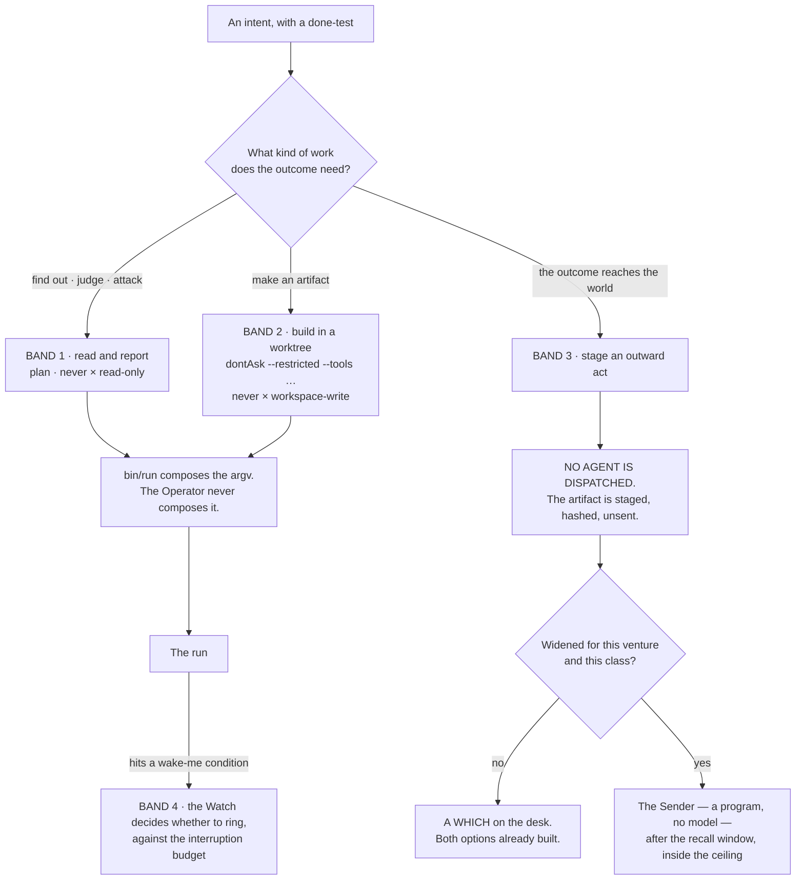
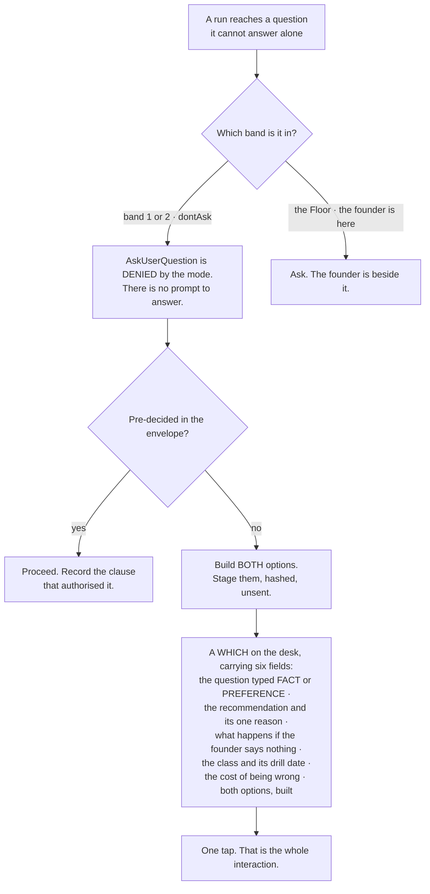
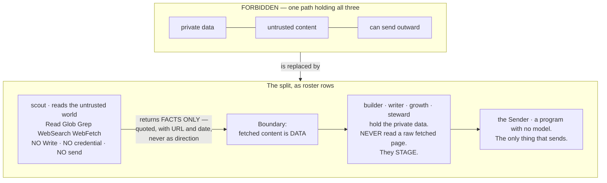

## 12 · Control — what may be done alone, and what never

*obeys: §C.1's bands, v9, v10, v28, v33 · inherits: FINAL §9. The tool door itself lives in §8 (Tools and MCPs) and
is not restated here.*

---

### 12.1 The envelope

**(FINAL)** The founder refuses a machine that is only brakes. This section does not add brakes. It removes the need
for most of them by deciding once, per venture, what does not need asking — and makes the remaining few absolute.
Three lists in the venture's charter, in the founder's own words, read by every run:

```
may-alone:  what runs without asking, ever
never:      what is not done by this system under any circumstance
wake-me:    the exact conditions that interrupt me, each with a number
```

**(FINAL)** The shape is the naval standing-orders and night-orders pair, with two details copied exactly. The
call-me list carries **numeric thresholds** — never *"if something seems wrong"* — and the governing sentence *call
the captain on any doubt whatever, before an emergency has developed* is what stops a threshold list becoming a
loophole. Written the way the founder would say it:

```
may-alone:  write code · run tests · make branches · research anything · draft anything ·
            build both options of a choice · spend up to the venture ceiling on capacity ·
            read my calendar and mail
never:      send mail as me · post publicly · pay anyone · sign anything · touch production
            data · change a live price · contact a customer · delete anything a person made
wake-me:    a customer is waiting more than 4 hours · spend crosses 60% of the monthly
            ceiling · a done-test that passed for 7 days starts failing · anything I said
            'never' to is now the only way forward · a run has been blocked on the same
            thing three times
```

**(FINAL)** Every charter starts from a **default `never` list held as data**, longer than any tiering system covers,
and the founder deletes from it rather than writes to it: a secret in a published artifact · a migration with no
proven down-path · a deploy that emits mail or mutates data · money outside a standing, capped, rate-limited
allowance · a domain lapsed or bought · **anything delivered to a person** · a burned sending domain · a signature ·
a price change on existing customers · a partnership term · an offer, and a termination · publication before a patent
filing · a trademark class · an entity type · a cap table · an erasure · an account deletion · a bulk merge · a
missed statutory deadline · any edit to the system's own judging machinery · **and a kill decision.** Every charter
also starts from a **default `wake-me` template** of five conditions about *consequence*, never policy: a one-way act
wanted · damage · a kill criterion the founder wrote the day the intent opened · a contradiction between an anchor
and something the founder said out loud · a statutory clock.

**Mechanism:** `shared/never-default.yml` and `wake-me-default.yml` merged into each charter at load (both ABSENT).

---

### 12.2 The rule that decides what belongs in `may-alone` — and it stands alone in the world

**(FINAL, v28.)** Not importance, not risk vocabulary: **reversibility**. Two-way doors are made fast at about 70% of
the information you would like, because the cost of delay exceeds the cost of a correctable mistake. One-way doors get
slow, deliberate treatment.

**(NEW: cognition.md is the reason this is stated with more confidence than FINAL stated it, not less.)** The lane
looked for a shipped scheme that keys permission on reversibility and reported *"neither shipped scheme does"*.
Claude Code keys on **a fixed path list plus an action class**; Codex keys on **workspace scope plus network**. The
nearest shipped analog anywhere is auto mode's classifier special-casing `rm` and `rmdir` on critical paths. So v28 is
a position the world does not hold, held knowingly: the axis everyone ships is *where the file is*, and the axis that
predicts damage is *can this be undone*.


**(FINAL)** The staged-not-sent pattern is the whole trick. A post is written, previewed and sits there; an email is
drafted with the recipient filled in; a deploy is built and waiting. The founder's tap is the only irreversible step
and it takes a second, because everything else is already done. That is what makes *ask me only what only I can
answer* affordable: **the asking blocks the last inch, never the work.**

**(NEW: v9 promotes staged-not-sent from a style to the only channel a silent run has — see §12.5.)**

**(FINAL)** Two additions that keep the door test honest. **An undo is drilled or the door is one-way**: a two-way
door whose undo has not been exercised is treated as one-way until it is, by the rule that an untested kill switch is
a story about a kill switch; the drill runner writes only a date. **A widened class executes after a recall window**,
not on the instant: the Sender holds it for a window sized to the blast radius, the phone can recall it, and the
receipt says plainly when a recall is not an undo.

**(NEW: cognition.md again, and it is worth naming because it is the strongest claim in this section.)** *"§9.2's
staged-not-sent pattern and its recall window have no analog in anything I fetched. The shipped equivalent of 'never
alone' is a prompt or a deny rule, not a staged artifact."*

**Mechanism:** the door test runs before a brief carries a `REACHES THE WORLD` grant (ABSENT) · the drill dates in
`shared/tools/<name>.yml` (ABSENT) · `bin/send`, which holds no model (ABSENT).

---

### 12.3 The bands, mapped onto the envelope and onto the shipped modes

**(FOUNDER)** *"which is also the contact point with me. … depends on the type of tasks because you also need to be
able to run it fully autonomous."*

**(NEW: §C.1 turns that sentence into one table that three different layers must agree with — the envelope's
vocabulary, Claude Code's permission modes, and Codex's two axes. A band that named only one of the three would leave
the other two to be guessed at dispatch.)**

| Band | Task types | Envelope | Claude Code mode | Codex `approval_policy` × `sandbox_mode` | Who runs in it |
|---|---|---|---|---|---|
| **Read and report** | research, review, audit, analysis, challenge | `may-alone` | `plan` | `never` × `read-only` | scout · reviewer · guard · challenger · analyst |
| **Build in a worktree** | code, design, copy, spec, schema, memory | `may-alone`, inside one venture's worktree | `dontAsk` with `--restricted` and an explicit `--tools` | `never` × `workspace-write` | builder · architect · tester · designer · product · writer · growth · steward · curator — **none of them holds a tainted read (v36)**; `steward` works from `scout`'s handover, never from a raw inbound row |
| **Stage an outward act** | send, publish, pay, deploy, share, delete | **`never` for every agent** | no mode — no agent performs it | — | nobody. The **Sender** performs it, and it holds no model |
| **Wake the founder** | anything on the venture's `wake-me` list | `wake-me` | — | — | the Watch, before it rings, against the interruption budget |



**(NEW: two shipped facts from cognition.md make the table binding rather than descriptive, and both are argv-level or
settings-level rather than prompt-level.)** First, **deny rules bind in every mode including `bypassPermissions`**,
while *"Allow rules have no effect in `bypassPermissions`"* — so the floor under the bands is real and the ceiling is
not. Second, **a subagent's own `permissionMode` frontmatter is ignored**: *"any `permissionMode` in the subagent's
frontmatter is ignored"*, so **a child cannot widen its own grant.** That is the property the whole band table rests
on, and it is the vendor's, not ours.

**(NEW: and one thing the table deliberately does not use.)** **`auto` mode's classifier is not the envelope.** It is
*"a second model, the classifier"* reviewing actions instead of the founder; it can be switched off with
`disableAutoMode`; and nothing in it keys on reversibility. It is a cheap guardrail against accident. §11.1's rule
applies to it unchanged — a model checking a model is a screen, not a verdict.

---

### 12.4 `bypassPermissions` is refused, and refused by a mechanism

**(NEW: v10.)** The widest permission mode is not discouraged, not reserved for emergencies, and not left to
judgement. It is **disabled in the managed settings file**, where a running process cannot clear it:
`permissions.disableBypassPermissionsMode: "disable"`. cognition.md quotes the pair of administrative settings and
notes they are *"most useful in managed settings where they can't be overridden"*.

**(NEW: why a mechanism and not a rule.)** A process holding a shell can strip its own guardrails by launching a child
with different settings. Every other tier of settings is reachable by something inside the session. This is the one
tier that is not, which is the entire reason the file exists.

**Mechanism:** the managed settings file, written by the founder outside the repository (**ABSENT** — §I row 8) ·
`bin/probe`, which asserts nightly what a run can actually touch (**ABSENT**). Until both exist, v10 is a **WISH**,
and the honest statement is that today the mode is refused by convention.

---

### 12.5 A fully autonomous run cannot ask — v9, and it is the design of the mode

**(FOUNDER)** *"you also need to be able to run it fully autonomous."*

**(NEW: v9, from cognition.md 2 — this is the fact that turns the founder's sentence into a design constraint.)** In
`dontAsk` mode, *"`AskUserQuestion`, MCP tools marked `requiresUserInteraction`, and connector tools your organization
set to `ask` … **are denied even if you've allowed them**."* Asking the human is itself a permissioned action, and the
mode that lets a run work unattended is the mode that switches it off.

**So a fully autonomous run has exactly two outcomes for anything it would have asked**, and there is no third and no
approve verb:

1. It was **pre-decided in the envelope** — `may-alone`, `never`, or the venture's widened class.
2. It is **staged as a which, with both options built**, and left on the desk.



**(NEW: v9's consequence for the rest of the plan.)** This makes FINAL's staged-not-sent rule **load-bearing rather
than stylistic**. In an attended session it is good manners; in an unattended run it is the only channel that exists.
A design that leaves a question to be asked at 3 a.m. has not deferred the question — it has lost it.

**(FINAL, unchanged)** What still reaches the founder while a fully autonomous run works: the `wake-me` list, the
interruption budget of three a day, and the briefing, which is never an interruption because the founder opens it.

**(NEW: `/goal` is what bounds such a run, per v12 and §H.3, and it is a Stop hook — which is why §12.6's file omits
two settings it would otherwise carry.)**

---

### 12.6 The managed settings file — exactly what it carries, and the one thing it must not

**(NEW: v11. FINAL §9.7 treated the managed file as the place every narrowing goes. That premise is now false in one
specific way, and the collision is worth stating in full because a section-writer or an implementer will otherwise
walk into it.)**

`/goal` is *"a wrapper around a session-scoped prompt-based Stop hook"* and is therefore *"unavailable when
`disableAllHooks` is `true` after settings precedence applies, or when `allowManagedHooksOnly` is set in managed
settings"* (runtimes.md, accessed 2026-09-05). The goal loop the founder asked for and the hook lockdown cannot both
be in that file.

| The managed file carries | The managed file does NOT carry |
|---|---|
| `permissions.deny` — the deny rules that bind in every mode, including bypass | `disableAllHooks` |
| `permissions.disableBypassPermissionsMode: "disable"` (v10) | `allowManagedHooksOnly` |
| `permissions.disableAutoMode: "disable"` (the classifier is not the envelope, §12.3) | — |

**The cost, stated once and not re-litigated (v11):** a run can therefore register its own Stop hook. That is a
**smaller hole than losing the goal loop**, and the nightly probe checks it. Narrowing that would otherwise have gone
into the file is carried by `--restricted` plus an explicit `--tools` list, which does not touch hooks.

**(FINAL, and it is the other half of the seam.)** Peer isolation is enforceable by a checked-in file rather than by
the managed one: `crossSessionInbound: refuse` drops every inbound message and applies from project or local settings
over every other source; `permissions.deny: ["SendMessage","ListAgents"]` removes both tools; `isolatePeerMachines:
true` requires human approval before any message leaves the machine, even in bypass mode. A run cannot be stopped from
binding an inbox socket; it can be stopped from receiving anything and from holding the tools to send.

**Mechanism:** the managed file (a founder act, **ABSENT**, §I row 8) · the checked-in isolation file (**ABSENT**) ·
`bin/probe` (**ABSENT**) · `npm run test:sandbox`, which exists on branch `ceo-1-1788609834` and fails if the sandbox
is disarmed.

---

### 12.7 The trifecta split — the one structural safety rule, now expressed as a roster

**(FINAL, v33.)** An execution path holding all three of **private data**, **untrusted content** and **the ability to
communicate outward** is exploitable by indirect prompt injection, and **there is no prompt that fixes it**. The only
reliable defence is to guarantee one leg is missing, which is why this is a shape rule and not a policy file.



**(FINAL)** The run that reads the internet is never the run that holds the keys. Anything from outside — a web page,
an email body, a document, a tool's own response — is data to be quoted, never direction to be followed. Taint is
decided **when a run is born, not while it runs**, because a grant is argv fixed at dispatch and cannot narrow
mid-run. If a scout concludes something should be sent, it says so in its handover, and a different run that has not
read the foreign content decides.

**(NEW: v1 changes how this is enforced, and makes it cheaper.)** In FINAL the split was a property of a *run's*
loadout, checked at dispatch. With a named roster it is also a property of a **file**: `scout`'s `tools:` line carries
no `Write` and no credential, and §B.2's own summary is the rule as a table — *eight of the fourteen carry no shell,
five carry no write of any kind, and only four can touch source.* The check at dispatch does not go away; it now has
something static to check against.

**(NEW: v36 — §F's tainted class is where this rule meets the roster, and it is where the roster contradicted itself
until it was decided.)** READ-ONLY **tainted** tools — Gmail read, Calendar read, Drive read, Notion read, the open
web — may be held by **`scout` only, plus the world's door program, which holds no model.** §8 carries the door that
admits them.

**The collision, and how it was resolved:** §B.2 row 12 gave `steward` mail, calendar, drive and Notion **read**
while also giving it `Write` — one grant satisfying two rules that cannot both hold, because untrusted content plus a
pen is two thirds of the trifecta with the third leg one obligation away. **`steward` now holds none of them.** The
world's door writes one inbound row per event; `scout` reads those rows and the raw world; **`steward` writes
obligations from `scout`'s handover and never from a raw row.** The losing image is kept by name: *a steward that
reads mail with a pen in its hand.*

**Why this is the right direction to resolve it:** the alternative was taking `Write` off `steward`, which would
leave nothing able to record an obligation. Taint is the leg that can be removed without removing a capability the
company needs, and it is removable by argv rather than by instruction.

**Mechanism:** `bin/run` refuses a brief whose grant carries both an outside-reading tool (`WebFetch`, `WebSearch`, a
read of the inbound log) and any of `Write`, `Edit`, `Bash` or a `REACHES THE WORLD` tool (**ABSENT**); `bin/probe`
asserts it (**ABSENT**). **(FINAL, measured)** An MCP tool call reaches a hook only if the hook's matcher names that
exact tool, so a hook matching `Bash|Edit|Write` governs no MCP call — which is why the split is argv and not a hook.

---

### 12.8 The world's door

**(FINAL)** When the world sends something — a reply, a payment, a failed build, a CVE, an invoice, a support message
— **a program writes one row into the log and does nothing else.** No model reads a stranger's text with a tool in its
hand. The row becomes a line on mission control, and a scout with no credentials reads it.

**(FINAL, measured)** A delivered cross-session message starts a new turn carrying the receiver's full context, so an
inbound path wired to a running run costs **a context window per event**, not a slot. That is the cost argument for
the door writing a row and never waking a run directly, and it is separate from the safety argument.

**(NEW: §11.9 and §B.2 give the door a second job the founder asked for.)** `growth`'s anchor is *a reply from a real
person, recorded by the world's door* — so the door is not only the safety boundary on the way in, it is the
**instrument** that makes an outward act's success rung 1 instead of a self-report.

**Mechanism:** `bin/inbound` (**ABSENT**).

---

### 12.9 Ceilings, and the cord

**(FINAL)** Two mechanisms, both deliberately blunt.

**Pre-action, not post-review.** A spend that would breach a ceiling is blocked *before* it happens, never flagged
after. There is no *warn at 80%* an agent can reason past. Ceilings exist per run, per intent, and per venture per
month, and **the tightest binds**.

**The cord.** One control that stops everything: cancels running work, revokes outward grants, finishes nothing new,
leaves every artifact in place. One tap from mission control — §14 makes it *a control present on every page* — one
word on the Floor, one command in a terminal, and tested on purpose. It does not delete and does not roll back; undo
is a separate, deliberate act, because the state after a panic stop is exactly when you least want an automatic
mutation. The cord is **a file, read first on every tick**; the same tap recalls everything in the Sender's window;
there is one kill and not two, because a kill that lives in a second place is a kill that disagrees.

**(NEW: v23 corrects what one of these mechanisms actually is, and the correction matters in the direction of less
safety, not more.)** `--max-budget-usd` is **not a billing control**. It is print mode only, *"Claude Code computes
the dollar figure locally from token counts at list price"*, and for subscribers *"the session cost figure isn't
relevant for billing purposes"* (models.md, accessed 2026-09-05). What it genuinely is: a **stall fuse**. Subagent
spend counts toward it, and overflow fails a spawn with `Budget limit reached` (v2.1.217+). It is kept for that, and a
ceiling that binds the account is §16's business, not this section's.

**Mechanism:** the cord file (**ABSENT**, read first on every tick) · the three ceilings in `bin/run` and `bin/send`
(**ABSENT**) · `--max-budget-usd` per run (exists, and is a stall fuse).

---

### 12.10 What makes a grant real — the measured seam

**(FINAL, v34.)** Every line here is a measurement, not a design.

- **The grant is the exact argv, emitted by one no-model launcher.** `--allowedTools` restricts nothing. A `claude -p`
  child is narrowed by `--restricted --tools <list> --strict-mcp-config --permission-mode dontAsk --permission-prompts
  none --add-dir <worktree> --max-budget-usd <n>`, under the managed file of §12.6. **The Operator never composes
  argv**; it emits a brief with an intent id, and `bin/run` composes it. That is what keeps v34 true as the roster
  grows.
- **The sandbox is a guardrail against accident, not containment.** `failIfUnavailable` is set, `denyRead` covers the
  credential stores, and there is a documented escape hatch. Describing it as containment is the error to avoid.
- **The sandbox has a full `network` block** (`allowedDomains`, `strictAllowlist`, `allowManagedDomainsOnly`,
  `tlsTerminate`) **and a `credentials` block** (`mask`, per-host `injectHosts`) — the scout's read-only proxy and the
  Sender's key-at-egress. Both are unused here. Two documented holes stay in the plan: `excludedCommands` and
  `allowRead` merge across scopes with no managed-only lock, and the proxy does not inspect TLS by default, so a broad
  allowed domain is an exfiltration path.
- **Nothing lifts an inbound `bind`.** That is why the Sender and the Watch are programs and not runs.
- **`Workflow` is removed from every subagent by a documented universal filter** (v35, and runtimes.md quotes the
  vendor: *"The `Workflow` tool is removed from all subagents via the first filter applied to subagent tool sets"*).
  The gate may not be invocable by the thing it gates — the same argument that keeps `Write` off `reviewer`.
- **The pre-tool hook matches command strings and is the wrong shape.** It once blocked a document for mentioning a
  command. Its rewrite to structured tool input is an edit to the judging machinery, and is the founder's.

**(NEW: cognition.md prices per-action approval, which is why none of the above is a prompt.)** Humans approve 97% of
per-action prompts and catch 13.6% of disguised dangerous commands, decaying to 5% after fifty; the classifier catches
89%. Runs here use `dontAsk` because **a model's judgement is not a gate and a tired human's is not either**. The
control is the argv, the deny rules, and the fact that the thing which sends holds no model.

**Mechanism:** `bin/run` as the only composer of argv (**ABSENT**) · the managed file (**ABSENT**) · the checked-in
isolation file (**ABSENT**) · `bin/probe` nightly (**ABSENT**) · `npm run test:sandbox` (exists on branch
`ceo-1-1788609834`).

**The honest summary of this section's state:** the *rules* are decided and every one of them names a mechanism. **Six
of those mechanisms do not exist yet**, and until they do, the parts of this section that depend on them are WISHes
wearing rule clothing. The two that exist today — the armed sandbox test and the deny rules in settings — are the two
that were built for a smaller purpose than this section asks of them.
