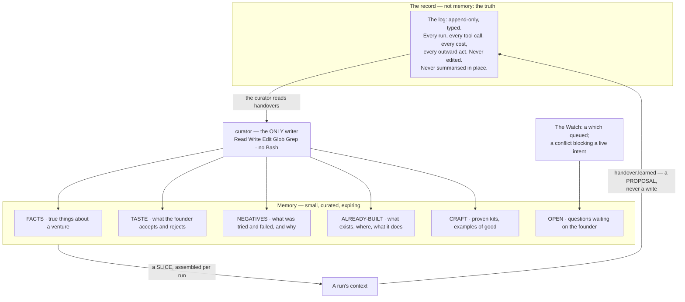
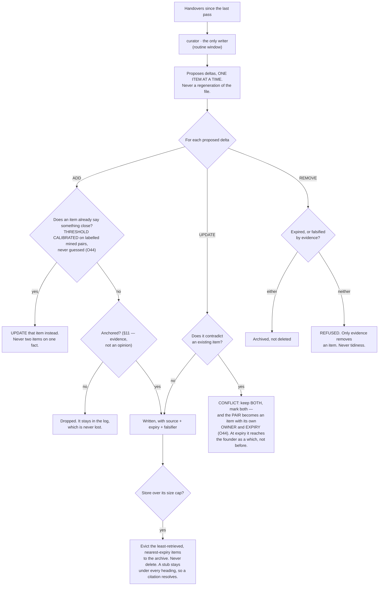
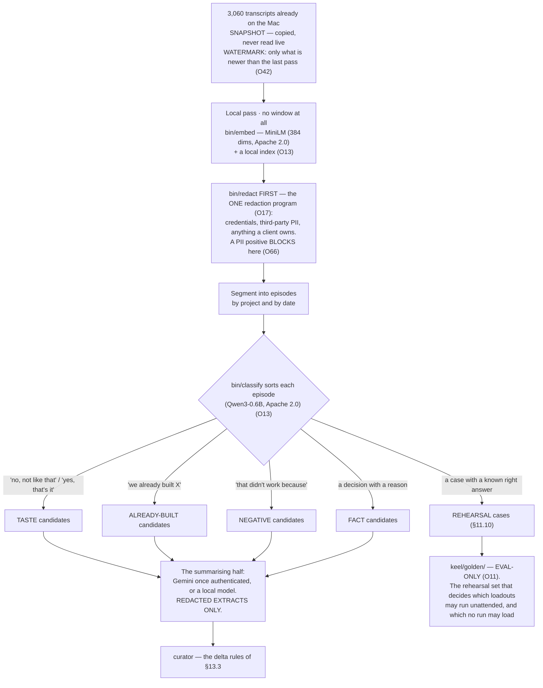
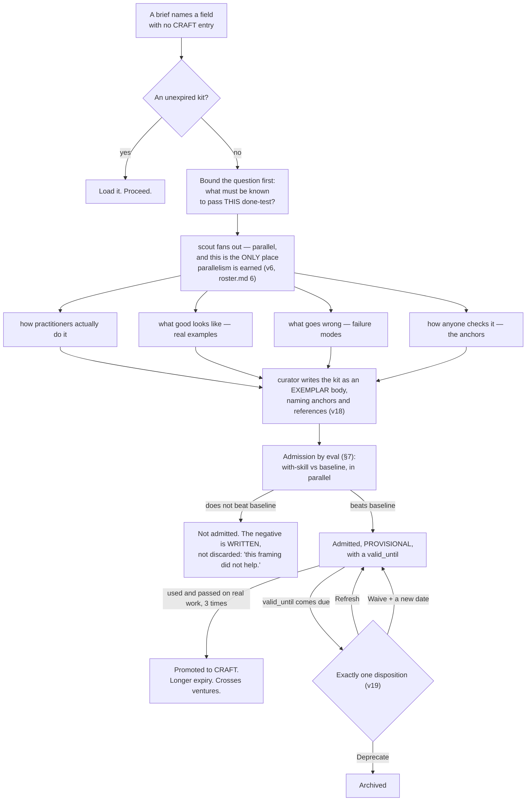

## 13 · Memory and knowledge — what is remembered, who writes it, and what rots

*obeys: v24, v25, v26, v27, **v69** (rethink round, 2026-09-06), and §E · inherits: FINAL §10 and §11*

---

### 13.1 The one rule that shapes all of it, and its one shipped counter-example

**(FINAL, v25.)** **The thing that acts never edits memory.** Memory written as a side effect of doing the work is
written by the most biased possible author, in the moment they most want to believe they succeeded. A run *proposes*
memory in its handover's `learned` field; the **curator** decides what is admitted.

**(NEW: v25 replaces FINAL's attribution, because the source moved.)** FINAL §10.1 credited Letta with *"a primary
that talks and acts with no tools to edit its own core memory, and a sleep-time agent that reflects over history in
idle time."* memory.md 2 fetched that page on 2026-09-05 and it now describes a differently-named feature:
*"Dreaming uses background subagents to review recent conversations, consolidate useful lessons, and update memory
without interrupting your active work"*, triggered *"after a set number of completed agent steps or when the context
window is compacted."* **The page does not state the edit-tool split FINAL attributed to it.** The quote stands at
confidence H; the older architecture claim is L and is withdrawn.

**(NEW: and the honest half — the rule has one shipped counter-example, named rather than hidden.)** **Claude Code's
own auto memory is written by the acting agent, in-session**, turning corrections into four typed note kinds
(`user`, `feedback`, `project`, `reference`). It is the closest shipped thing to this system's taste store, and it
does the opposite of what v25 decides. The second shipped instance on v25's side — ChatGPT's memory "dreaming" — is
confidence **L**, because the page returned 403 and only a search snippet was read.

**So v25 is a position taken against one live, well-built counter-example.** The reason it is still taken: the
counter-example's author and its judge are the same process, which is §11.1's refusal exactly. The reason it is
recorded as a counter-example: a design that hides the strongest thing arguing against it cannot be checked later.

**Mechanism:** the **curator's grant is the only one whose writable scope includes the memory paths** — argv, composed
by `bin/run` (ABSENT) and asserted by `bin/probe` (ABSENT). `curator` carries `Read Write Edit Glob Grep` and **no
`Bash`** (§B.2 row 13), so it cannot reach a path its `--add-dir` does not name by shelling around it.

---

### 13.2 What is remembered, and where

**(FINAL, redrawn for the roster: the curator is now a named agent and the writers are named with it.)**

**(FINAL)** Scope, strictly: `TASTE` and `CRAFT` are the founder's and cross every venture. `FACTS`, `NEGATIVES`,
`ALREADY-BUILT` and `OPEN` are per venture and do not cross without a promotion. **Credentials are not memory**, and
are never in a file — **mechanism (moved 2026-09-06: O17):** ~~a `gitleaks`-class secret scan~~ **`bin/redact`,
the one redaction program**, run over every store write as a **rung-one anchor on the house repository on every push**
(**ABSENT**), which §13.8 already counts among the free deterministic checks and are never in any of these files.
**Every item carries four things** — where it came from, when it was written, when it expires, and what would falsify
it — and an item with no expiry is not accepted.

**(NEW: O17, and it is why the sentence above changed rather than gained a clause — contradiction 14.)** Redaction was
implemented **twice** in this plan: here as a `gitleaks`-class scan over store writes, and in §13.7 as the mining
pass's first step. **Two implementations of one check disagree**, and this repository has already found that class
twice — once in risk classification, once in the CI chain guard. One program, two call sites. It is the same program
**O66** turns into a PII gate (§12.8b), which is a third call site and not a third implementation.

**(FINAL)** Retraction works because the log is the only truth and every store is a derived view. *Ignore that
interview, he was pitching me*, and everything downstream is recomputed with a list of what moved. A corrupted store
is a rebuild, not a disaster. A better curator next year is re-run over the whole log.

**(NEW: memory.md's coverage table shows how unusual the four required fields are.)** **No shipped CLI records where
a memory came from.** Claude Code's `modified` field records **write time only, not source**; Graphiti has
`valid_from`/`valid_until`; ACE has bullet ids with helpfulness counters. Provenance, expiry, conflict resolution and
decay are **absent from all three CLIs** — Codex has no memory feature at all (*"Codex rebuilds the instruction chain
on every run … so there is no cache to clear manually"*), and Gemini CLI appends facts to **one global heading** under
`## Gemini Added Memories`, with no expiry, no dedupe and no per-project scope — **search-synthesised, `M`: memory.md reached this after two 404s, not from vendor documentation.**

---

### 13.2a Memory holds a hash, never a body

**(FOUNDER, rethink 2026-09-06: D4 — this is memory's half of contradiction 7, and §12.8b and §15.3 carry the other
two.)** Three sentences could not all hold: **a deletion request is honoured** (§16.7), **the log is never edited**
(§15.3), and **eviction archives and never deletes** (§13.3, and it is the rule this section is proudest of). The
founder's answer keeps all three by moving what they are about:

**No personal datum enters memory. A memory item holds a hash.** The body lives in **one erasable per-subject store,
`keel/subjects/<hash>.yml`**, outside memory and outside the log, keyed by the same hash the item carries. Erasure
deletes that file, and the hash it leaves behind becomes **a known absence** — which is what §13.3's REMOVE branch was
already unable to express, because *expired* and *falsified* are its only two reasons to remove an item and *this
person asked* is neither.

**So §13.3 does not gain an exception, and that is the point.** REMOVE is still refused for tidiness; eviction still
archives; the archive still leaves a stub under every heading so a citation resolves. What changes is that the thing a
person can ask to have deleted was never in any of those files.

**(NEW: O34 lands here too — the class is what the never-list keys on.)** Every item carries **ours · a third party's
· a named person's**, written by the writing program rather than judged at read time, and **a store declaring
`retention: forever` may not hold a body**. Memory declares forever. That is exactly why it may only hold a hash.

**Mechanism:** the hash indirection in the memory writer and `bin/log` (**ABSENT**, §L) · `keel/subjects/<hash>.yml`
with one writer, enforced by `bin/check-stores` (**ABSENT**) · the class and retention fields on the item schema
(**ABSENT**). The consent register `keel/consent.yml` is the Sender's, not the curator's — §12.8b owns it, and memory
never reads it.

---

### 13.3 Deltas only, never a rewrite — v24, now with the paper and its numbers

**(FINAL, v24, now cited.)** The failure mode has a name and a paper, and FINAL asserted both without naming either.
It is **ACE, arXiv 2510.04618**, published 2025-10-06, accessed 2026-09-05, confidence **H**:

> *"'Context collapse' arises when an LLM is tasked with fully rewriting the accumulated context at each adaptation
> step. As the context grows large, the model tends to compress it into much shorter, less informative summaries,
> causing a dramatic loss of information."*

**The case study is the reason this rule is absolute rather than preferred.** At step 60 the context held **18,282
tokens at 66.7% accuracy**. At the very next step it collapsed to **122 tokens and 57.1%** — *below the 63.7%
baseline*. One rewrite step took the system from better-than-baseline to worse-than-baseline.

**(NEW: the paper's cure is the mechanism this section already wanted, including a field FINAL asked for
independently.)** Incremental delta updates over itemised bullets, each carrying *"a unique identifier and counters
tracking helpfulness"* — which is FINAL §10.6's per-item outcome counter, arrived at from the other direction. The
paper's measured gains: **+10.6% on agents, +8.6% on finance**; against GEPA offline, **−82.3% adaptation latency and
−75.1% rollouts**; against Dynamic Cheatsheet online, **−91.5% latency and −83.6% token dollar cost**.

**(FINAL)** A conflict is **kept, not resolved**: two items that disagree is information, usually that something
changed. Silently picking one is how a store becomes confidently wrong.

**(NEW: O44 — and it repairs two soft spots in that rule at once.)** *Something close* is a similarity threshold, and
this plan does not otherwise permit a number nobody measured. The dedup threshold is **calibrated on labelled mined
pairs** — the mining pass of §13.7 produces the labelled set for free — and the same predicate is **O19**'s
same-failure test, which three other mechanisms already sit on. And a conflict that is *kept* with nothing attached is
a conflict nobody ever returns to: **the pair becomes an item with its own owner and its own expiry**, and at expiry
it reaches the founder as a *which* with both readings stated. Keeping both stops being a way of deferring forever.

**(R9, OPEN — and it is aimed at this section's strongest rule.)** Does an unattended `-p` run **auto-compact**, and
does it emit anything the log can see? v24 forbids a rewrite because one rewrite step took ACE from better-than-
baseline to worse-than-baseline. If the runtime compacts a long night run on its own, **v24 is being broken in the one
place it cannot watch**, and the answer is not a new rule but a bound on run length. One long `-p` run with
`stream-json --verbose` settles it.

**Mechanism, and two thirds of it already exist on branch `ceo-1-1788609834`.** `scripts/evict-memory.mjs` implements
the EVICT branch exactly — an irreversible entry is never archived while its subject exists, anything cited by a live
item is pinned, every archival leaves a stub under the original heading, and the archive rotates in capped volumes
rather than being pruned. `scripts/ledger.mjs` implements the expiry branch — a durable item carries `valid_until` or
it is not an item, and when it comes due exactly one of Refresh, Deprecate or Waive-with-a-new-deadline is recorded.
Both are renamed into the curator's rules rather than rebuilt. What is ABSENT: `bin/curate`, and the item schema that
requires source, date, expiry and falsifier.

---

### 13.4 The shape of the index — v27, and it is now the vendor's default

**(NEW: v27, from memory.md 6.)** FINAL described a slice assembled per run. The *storage* shape underneath it is now
settled, and by a shipped default rather than by a local invention. Claude Code loads **the first 200 lines of
`MEMORY.md`, or the first 25 KB, whichever comes first**, at the start of every conversation; topic files load **on
demand only**; and *"content beyond that threshold is not loaded at session start."*

**(NEW: why this matters more than it looks.)** It is the **same two-tier shape** this repo already built for skills
discovery, where reading a flat manifest cost about 15,000 tokens across 147 entries and a typical lookup now costs
about 1,070. One index, small enough to always arrive; bodies fetched by name. A single flat memory file loaded whole
is the losing image (J), and it loses for a measured reason on both surfaces.

**(NEW: two adjacent facts that bind the build.)** Auto memory is **excluded from the `cleanupPeriodDays` retention
sweep**, so nothing deletes it on a timer. And **the main conversation's auto memory is not loaded into subagents**,
the exception being a fork — so cross-agent memory sharing is *explicitly not* a shipped default, and any sharing this
system does is its own doing through the slice.

---

### 13.5 How a run gets its memory

**(FINAL)** Not all of it. A slice, assembled by the Desk, ranked by **recency, importance and relevance together**,
never similarity alone. Three things are included regardless of score, because relevance scoring is a heuristic and
these three must never be missed by one:

1. the venture's `never` list,
2. the negatives touching this exact move,
3. the open questions blocking this intent.

**(FINAL)** The slice is ordered by cost — the byte-identical standing prompt first, so siblings share the cache; the
charter and the intent next; the slice last. **The slice says what it left out.** Every item carries a counter scored
by outcome, so the Desk is itself measured: work should pass its anchor first time more often than it did last month.

**(NEW: §G.3's cache facts are what make that ordering worth doing, and they are quantitative.)** The prompt cache
lives **one hour on a subscription** and drops to five minutes on an API key, on a cloud provider, or once usage
credits are drawn. A 1-hour cache write costs **2x** base input; a cache read costs **0.1x** everywhere except Fable
5.1 and Mythos 5.1, where it is **0.025x**. So a large standing slice is the one thing that is cheap to re-read and
expensive to churn, and *the standing prompt carries no timestamp* for that reason alone.

**(NEW: O45 — *the Desk is itself measured* named no measurement, so the ranker could not be wrong.)** The number is
**slice precision**: of the items the slice carried, how many the finished artifact and its handover actually used.
It is **derived by the curator from the artifact and the handover, never self-reported by the run** — the same reason
v25 keeps the acting agent away from memory, applied to the instrument that feeds it. It increments ACE's helpfulness
counters on the items themselves, so a store item that is carried a hundred times and used never becomes visible
rather than merely present. §21 carries it as a line.

**Mechanism:** the slice assembler in `bin/run` writes those three before it ranks anything, and `bin/check-stores`
refuses a brief whose slice lacks them (both **ABSENT**) · slice precision derived in the curator's pass
(**ABSENT**, §L O45).

---

### 13.6 Negative knowledge is the highest-value store

**(FINAL)** A newsroom's spike file records the stories that were killed and why, so the same idea is not re-reported
next month. For an always-on system this is the main defence against burning capacity to relearn the same dead end.
Facts age and craft generalises slowly, but **a dead end is dead for a long time and knowing it costs one line in a
brief** — the asset that makes an autonomous system get *cheaper* over time.

**(FINAL)** Every negative carries **the command that reproduces the failure**, and the Watch's repetition tripwire
checks a run's proposed tool call against the negatives *before the call is made* — so the pre-action check belongs to
the Watch and cannot be skipped by the run.

**(FINAL, §10.7 — how a lesson is produced, and it is not by asking.)** A lesson comes only from structured trajectory
analysis over a failed run's trace, five fixed questions: what was the target; what did each step actually return; at
which step did the observation stop matching the plan; what single observation would have distinguished the two; what
would have been done differently. **Never *what did you learn***: in sixteen frozen failure environments, **zero of
121 free reflections named the correct cause**, and the agent wrote confident wrong diagnoses into memory and
reinforced them. The curator asks the five questions of every `stopped-on-defect`, `blocked` and `over-ceiling`
handover; the answer is a NEGATIVE candidate.

**(NEW: O43 — the scope split, and today's default is the expensive one.)** `NEGATIVES` is a per-venture store, so
**a tooling dead end is relearned once per venture**. The split is mechanical rather than a judgement: **a negative
whose reproducing command names no venture path is a fact about the world, and is house scope.** *This CLI flag does
not do what its help text says* belongs beside `CRAFT`; *this venture's checkout script fails on a clean clone* does
not. The scope field is written by the same program that writes the command, so nothing has to decide it later.

**(NEW: memory.md's coverage table places this store in the world.)** A negative-knowledge log appears in **research**
(ACE stores a failure mode as a unit with a helpfulness counter) and in one prior catalogue entry with a pre-action
gate. **No CLI ships one.** That is one of the two places where this design is ahead of everything surveyed rather
than behind it.

---

### 13.7 The transcripts — v26 stands, with the caveat that shapes the build

**(FOUNDER, confirmed: mine them, locally.)** **(FINAL)** Thousands of past conversations sit on this Mac and nothing
reads them — the census counted **3,060 files**. They contain, for free, the three things a new run most needs and can
least invent: what this founder likes, what has already been built, and what has already failed.

**(NEW: v26 — memory.md 4 searched for prior art and the honest result is that none exists in this shape.)** Three
tools read the corpus and **all three render it for humans**: `simonw/claude-code-transcripts` publishes JSONL as
HTML; `claude-conversation-extractor` exports and greps; `claude-devtools` is a viewer. Claude Code auto memory and
Letta/ChatGPT dreaming do typed extraction but **incrementally, over recent conversations, never as a batch pass over
an existing archive**. *"Nothing found mines an existing transcript archive into preferences, negatives or
examples."*

**(NEW: and the one sentence that decides the architecture of the pass.)** *"The entry format is internal to Claude
Code and changes between versions, so scripts that parse these files directly can break on any release."* Therefore:
**the mining pass is a batch job over a snapshot, and never a live parser in the critical path.** A format change
costs one failed batch, not a broken system.

**(FINAL)** Embeddings, indexing and the first-pass classifier never leave the machine; only redacted extracts are
summarised by a model. This is the clearest example in the design of spending idle capacity on **knowing more rather
than doing more**. **A transcript enters the log as an episode and never as retrieval memory.**

**(NEW: §G.1 routes the two halves, and the numbers are the reason.)** MiniLM is **384 dimensions, Apache 2.0**, with
a **256-word-piece truncation** that decides the chunk size. Qwen3-0.6B is Apache 2.0 with a **32,768** context. Both
run on electricity and burn no window. The summarising half is `curator`'s row in §B.2: *"the summarising half on
Gemini or a local model"* — and Gemini is installed, unauthenticated, one founder act away (§I row 6).

**(NEW: O42 — a watermark, so there is one mining program and not two.)** The pass carries a **watermark**: it reads
what is newer than the last pass and nothing else. The backlog pass over 3,060 files and the steady pass over last
night's transcripts stop being two programs with two failure modes, and **`bin/mine --since` is the whole of the
difference between them.** With it, *"unread transcript count"* — a progress bar for a backlog that clears once and
then reads zero forever — becomes **watermark lag**, which still means something in year two (deletion 17).

**(NEW: O13, and it is why the two local boxes above are named as programs.)** The local tier has **no reachable
carrier**: the armed sandbox denies a loopback `bind()`, so a local model server inside a run cannot be reached, and
this tier's consumer `curator` carries **no `Bash` and no MCP** (§13.1). So the local half is **`bin/embed` and
`bin/classify`, no-model programs in the Watch's launchd context, handing the curator a file** — v47's shape.
**(R4, OPEN)** decides whether that is the only possible shape: inbound `bind()` is measured denied, and **outbound
connect to loopback is unmeasured**. §15.7 carries the tier.

---

### 13.8 The library, and how a field kit relates to a skill

**(FOUNDER, overruling FINAL row 10.)** *"take all the skills that the biggest systems use … to give the agents the
tools the knowledge they will need in order to achieve tasks without limiting their point of view."* The holding
directory that nothing reads is the losing image (J.3).

**(FINAL §11's premise survives the overrule, and it is worth keeping intact.)** The founder will run projects in
fields nobody anticipated. A curated library cannot cover that; it covers what someone thought of in advance and rots
between the thinking and the needing. So the system does not merely carry field knowledge — **it carries the ability
to go and get some, and the discipline to throw it away if it does not prove itself.** §7 carries the library plan
and the skill creator; this section carries only the seam between the two, because that seam is where two designs
could quietly become two systems.

**(NEW: the reconciliation, and it decides no new body — it maps FINAL's four headings onto v18's four bodies.)** A
field kit is **not a fifth artifact class**. A kit *is* one admissible body — the **exemplar**: *what good looks like
in this field, with two or three real examples and their provenance*. Its other three headings are pointers rather
than content:

| FINAL §11.1's kit heading | What it is under v18 |
|---|---|
| what good looks like, with 2–3 real examples | **the kit itself — the exemplar body** |
| the anchors: how this field checks itself | **names anchor skills** (a check with an exit code) — existing, or to be built |
| the common failure modes | **reference**, and each one that recurs becomes a NEGATIVE (§13.6) |
| the vocabulary a practitioner uses | **reference**, with an expiry like any other vendor fact |

**(NEW: O11 — the seam has a hole in it, and it is the kind that leaves every check green. Contradiction 11.)** v18
admits **rehearsal case** as one of four SKILL.md bodies, and **§7.1 generates every admitted skill into the two
directories an agent loads from**. Read together, those two rules ship **the case that will judge a run into the
context of that run**. The fix is one frontmatter field and one generator rule: a body marked eval-only is generated
into **`keel/golden/`**, which no agent's namespace resolves to, and the manifest check is re-pointed at it. Nothing
about admission or expiry changes — an eval-only body is a skill in every other respect.

**Why this belongs in this section and not only in §7.** The mining pass above writes `REHEARSAL` candidates from the
transcript archive, so the store that judges runs is fed by the same pass that feeds the stores runs read from. One
generator rule keeps them apart; without it, the archive quietly becomes an answer key.

**(FINAL)** A field kit contains no steps, and this is enforced by what its sections *are*: all four headings are
descriptive and none can hold *first do this, then do that*. **(NEW: v18 makes the same refusal at the library level,
and names the collision honestly.)** The published SKILL.md spec recommends *"Step-by-step instructions"*; this
system admits a step list in **exactly one place** — a checklist the Sender reads aloud, where the judge is absent and
the act cannot be taken back. **The cost, stated once:** an imported skill written to the spec's recommendation fails
our admission and needs a pass.

**(NEW: v19 overrules one half of FINAL's kit lifecycle, and the half it overrules is the unshippable one.)** FINAL
promoted a kit after it was used and passed three times, and discarded it if its horizon passed unused. **The
promotion stays** — it is evidence, and it is the Voyager discipline applied to knowledge instead of code.
**Retirement by non-use goes**: skills.md 20 found that *"nobody found retires a skill by non-use"*, so *"ninety days
uncalled and it leaves"* is a losing image (J.17). In its place: **every kit and every skill carries `valid_until`,
and at expiry exactly one disposition is recorded — Refresh, Deprecate, or Waive with a new date.**

**(FINAL §11.2, unchanged and still the reason breadth is affordable.)** The kit's *anchors* heading starts from an
inventory of deterministic checks the world gives away: compiler, type checker, test runner, linter, static analysis,
mutation testing and CVE scan for code; Lighthouse and field Core Web Vitals for performance; the automated WCAG
subset for accessibility — *with the honest fraction written into the kit*; contrast, token conformance, spacing-grid
lint and visual regression for design; schema and rich-results validators for SEO; SPF, DKIM, DMARC and
unsubscribe-link presence for email — the law, not taste; EBU R128 loudness and A/V sync for video; schema tests, row
counts and a pre-declared sample for data; reconciliation for money; link-resolves and preview-renders for
distribution; verifying secret scans, TLS and header checks and the trifecta audit for security.

**(NEW: memory.md 3 supplies the one measured comparison that exists, and its limits.)** Voyager is the **only**
measured skill-library-versus-nothing comparison found: **3.3x more unique items, 2.3x longer distances, tech-tree
milestones up to 15.3x faster** (wooden 15.3x, stone 8.5x, iron 6.4x), **63 unique items in 160 prompting
iterations**, and the only method to reach diamond tier — confidence **M**, from the abstract. Against that,
**Anthropic's own Agent Skills post publishes no numbers at all**: no comparison to fine-tuning or RAG, no token or
accuracy measurement. **No measured skills-versus-RAG-versus-fine-tune comparison exists in anything fetched.** So
the library is admitted on the founder's decision and on one measured analogue, not on a benchmark, and §7's
admission-by-eval is what supplies the missing measurement one skill at a time.

**(NEW: the vendor's own stated position is the same one this section takes about *loading*, and it is worth
quoting.)** *"Rather than pre-processing all relevant data up front, agents built with the 'just in time' approach
maintain lightweight identifiers … and use these references to dynamically load data into context at runtime using
tools."* And on the risk this section's §13.3 is about: *"Overly aggressive compaction can result in the loss of
subtle but critical context whose importance only becomes apparent later."*

---

### 13.9 The founder's §04/§05 items, each with its shipped precedent or "none found"

**(NEW: memory.md's coverage table, with this system's placement added. "None found" is a finding, not a gap: it means
the item is ours to build and nobody's implementation can be copied.)**

| Founder's item | Shipped precedent | Where it lands here |
|---|---|---|
| **Taste profile** | Claude Code auto memory — `type: user` + `type: feedback`, written by the acting agent | §11.6's taste store, written by the curator instead (v25) |
| **Brand voice profile** | **none found** — carried by convention in CLAUDE.md / rules in all three CLIs | `writer`'s row in the CRAFT store; a kit in exemplar body (§13.8) |
| **Negative knowledge log** | ACE (research: failure-mode bullets with helpfulness counters); **no CLI ships one** | §13.6, with the reproducing command and the Watch's pre-action tripwire |
| **Golden output archive** | **none found** — Voyager's verified-before-stored library is the nearest, and it stores code, not outputs | the exemplar body (v18): examples of good, with provenance |
| **Memory provenance tag** | partial — Claude Code records **write time only, not source**; Graphiti has `valid_from`/`valid_until`; ACE has bullet ids | required field on every item; the store check refuses one without it |
| **Intentional forgetting** | ChatGPT dreaming (**L**); Claude Code excludes memory from the retention sweep, so deletion is a human or agent edit | REMOVE is refused unless expired or falsified; eviction archives and never deletes |
| **Memory decay function** | `mcp-memory-service` (exponential decay, configurable half-life) · MemoryBank (Ebbinghaus curve); **none of the three CLIs** | **refused as an automatic function.** Expiry with a forced disposition (v19) does the same job with a reason attached |
| **Learned-field expiry** | **none found shipped** — *"this repo's `valid_until` + forced disposition is ahead of every system surveyed"* | `scripts/ledger.mjs`, on branch `ceo-1-1788609834`, renamed into the item schema |
| **Memory conflict resolution** | mem0 (ADD/UPDATE/DELETE/NOOP) · ACE curator; **not in any CLI** | §13.3: keep both, mark both, ask only if a live intent depends on it |
| **Memory search index** | basic-memory (SQLite); **Claude Code has no index** — topic files are read by name | the local index, rebuildable in one pass, deletable without loss |
| **Cross-agent memory sharing** | Claude Code — explicitly **not**: main-conversation auto memory is not loaded into subagents except a fork | the slice is the only sharing mechanism, and it says what it left out |

**(NEW: the table's own finding, and it is the reason this section is longer than it would otherwise need to be.)**
**Every discipline item on the founder's list — expiry, provenance, conflict resolution, decay — is absent from all
three CLIs.** The parts of this design that look like the most ordinary hygiene are the parts with the least
precedent, and two of them are things this repository has already built for a different purpose.

---

### 13.10 What is believed about memory benchmarks, and how much

**(NEW: memory.md 4 and 5, because a plan that cites a benchmark it has not examined is doing the thing §11 forbids.)**
The 2026 numbers in this field are **vendor-run**. Mem0's own post reports LoCoMo 92.5, LongMemEval 94.4, BEAM-1M
64.1. Zep then found three methodology errors in Mem0's evaluation *of Zep* — the user role assigned to both
participants, timestamps appended to message text rather than the `created_at` field, and sequential rather than
parallel search *"artificially inflating Zep's reported search latency"* — and reports a materially different result.
On the dataset itself: *"Category 5 was unusable due to missing ground truth answers."*

**So the position is stated rather than scored:** any claim resting on *"system X benchmarks at Y"* is **a claim about
a self-report**, and no independent non-vendor 2026 memory benchmark run was found. Nothing in this section is chosen
because of one of those numbers. The one number that *is* load-bearing here — ACE's 18,282 → 122 tokens — is a
published failure case from a paper, not a vendor's score for its own product, and it is used to refuse a design
rather than to select one.

**Enforced by:** `bin/curate` with the memory paths as its only writable scope (**ABSENT**) · the item schema
requiring source, date, expiry and falsifier (**ABSENT**) · `scripts/evict-memory.mjs` and `scripts/ledger.mjs`
(**exist**, branch `ceo-1-1788609834`, renamed) · the local index (**ABSENT**; deletable, rebuilt in one pass).

**(NEW: one row per mechanism the rethink round of 2026-09-06 added to this section, with the path SPINE §L gives
it.)**

| Mechanism | Path | From | State |
|---|---|---|---|
| Memory holds a hash; the body lives in one erasable per-subject store | the memory writer · `keel/subjects/<hash>.yml`; enforced by `bin/check-stores` | **v69** (D4) | **ABSENT** |
| One redaction program, three call sites — store writes, the mining pass, the PII gate | `bin/redact` | **O17** (with **O66**) | **ABSENT** |
| A watermark, so the backlog pass and the steady pass are one program | `bin/mine --since` | **O42** | **ABSENT** |
| The dedup threshold calibrated on labelled pairs; a conflict pair with an owner and an expiry | the curator's pass | **O44** | **ABSENT** |
| Slice precision, derived by the curator and never self-reported | the curator's pass | **O45** | **ABSENT** |
| House scope for a negative whose reproducing command names no venture path | the negatives store's scope field | **O43** | **ABSENT** |
| Eval-only bodies, generated where no agent's namespace resolves | `keel/golden/`; `check:manifest` re-pointed | **O11** | **ABSENT**; `check:manifest` exists |
| The local tier as programs, because it has no reachable carrier | `bin/embed` · `bin/classify` | **O13** | **ABSENT**; **DEPENDS-ON-R4** |
