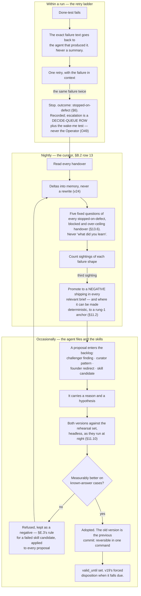

## 13a · How the system improves itself

*obeys: v19 (skill expiry), v30 (the challenger is an agent, not a step), §E.3 (a failed candidate becomes a negative), §B.2 rows 13 and 14, `curator` and `challenger` · inherits: FINAL §12 entire — **added in the build round**, because §K omitted it and the coverage lane found the gap*

**(FINAL)** Three loops at three speeds, all anchored to something outside the model, **because a system that
improves itself by its own judgement drifts by its own judgement.** v30 is the sourced version of that sentence:
self-critique without external feedback is *measured* as harmful — *"at times, their performance even degrades after
self-correction"* (arXiv 2310.01798, cognition.md 5) — and Reflexion's 91% pass@1 is no counterexample, its feedback
being external (arXiv 2303.11366, cognition.md 6). Every loop below ends at something the system did not author: an
exit code, a second agent that never read the author's reasoning, or a known answer.

---

### 13a.1 The three loops, redrawn with the roster

**(FINAL, redrawn: FINAL's loops named shapes; here each names the agent or program that owns it.)**

**(NEW: the arrows between the subgraphs are what FINAL's picture left implicit, and they make this one mechanism
rather than three.)** A stop feeds the nightly read; a promoted pattern becomes a proposal; a refused proposal is
written back as a negative by the only agent that may write memory. **Nothing improves anything in the loop it was
found in** — v30 as topology, not advice.

**(NEW: contradiction 5 — the escalation had nowhere to land, and the fix is a queue)** This section said ~~*"the
Operator is the escalation"*~~ and **§4.4 says the Operator is not always on**, in the same plan. A run that stops at
03:00 therefore escalated to something that was not running. **(NEW: O49)** Night escalation is **a row in the decide
queue plus the wake-me test** — never the Operator. The queue is read by a founder who is awake and by page 5; the
wake-me test decides whether anything rings tonight. **Mechanism:** the decide queue `keel/logbook/decide.jsonl`
(**ABSENT**, §L O9), which refuses a row with no intent id; the bell is §L **O18** (**ABSENT**) and §14 owns it. The
Operator is still where an escalation goes **when the founder is present** — what changes is that being present is
no longer assumed.

---

### 13a.2 The fast loop — the retry ladder is deliberately short

**(FINAL)** One retry with the failure in context, and a **second identical failure stops the run**; a third attempt
at the same wall is how an autonomous system burns a night. The failure text goes back **verbatim** — a summary is a
second chance for the model to be wrong about what happened.

**(NEW: v2 has a place to put the outcome that FINAL did not.)** The stop is not silence — it is the
`stopped-on-defect` value of the run's `outcome` field (§6), one of the three handover kinds the curator reads
(§13.6). **Mechanism:** the done-test's exit code decides the retry. ~~**WISH:**~~ nothing yet compares two failure
texts to decide they are *the same* failure; 13a.10's classifier row is that gap from the other side, and it has a
name now — the same-failure predicate, §L **O19** (**ABSENT**), one shared hash carrying the anchor's exit signature
where there is one and cosine over local embeddings of normalised failure text where there is not. **Three named
mechanisms rest on it:** this stop, the curator's sighting counter (13a.3) and memory dedup.

**(R18, OPEN)** The ladder's stopping number is **taste until it is measured**. *Is there measured evidence for a
re-attempt ceiling across sessions* — as against the within-run retry above — read from vendor documentation and any
measured paper on repeated-attempt yield? It sets the N in the work item's `attempts` counter (§2.2a) before a run
becomes a terminal **`blocked`** card carrying the exact failure text (§L **O73**, **ABSENT**). The within-run ladder
is unchanged either way: a second identical failure still stops the run.

---

### 13a.3 The nightly loop — the curator, and only the curator

**(FINAL, v25, redrawn for the roster.)** The nightly loop is an agent with a name and a file: `curator` (§B.2 row
13 — `claude-sonnet-5`, Read Write Edit Glob Grep, **no Bash**). It reads every handover, writes **deltas only** into
the six memory stores (v24), and counts the shapes it keeps seeing.

**(FINAL)** **Three sightings of one shape promotes it to a NEGATIVE** shipping in every relevant brief, and where
that negative can be made deterministic it is promoted again — into a script, a check, a test that fails without it.
**The second promotion is founder-reviewed, because three is a signal and not a proof.**

**(NEW: FINAL re-ran the promoted checks "monthly"; v2 puts them on the mechanism it already has, because the SPINE
refuses a schedule and v19 refuses a calendar audit.)** A promoted check carries a `valid_until`, and at expiry
exactly one disposition is recorded — **Refresh, Deprecate, or Waive with a new date**. A check failing for reasons
nobody can name is **quarantined rather than followed**. **Mechanism:** `scripts/ledger.mjs` forces that disposition,
refuses a waiver with no `until`, and fails harder on a lapsed one (branch `ceo-1-1788609834`). v19's mechanism,
deliberately: two implementations of one check disagree.

**(FINAL, §13.6.)** The lesson comes from **structured trajectory analysis over the failed trace** — five fixed
questions, never *what did you learn*, because **zero of 121 free reflections named the correct cause**. §13.6 owns
that mechanism and is cited, not restated.

**(NEW: O80 — the one number the curator can derive that nothing else can)** A **calibration number per agent**: how
often an empty `uncertain:` on a handover **preceded a defect found later**. `uncertain:` is written by the run
**about itself**, and nothing ever checks it, so **a confidently wrong run pays nothing** — while a run that says it
is unsure pays in attention. Derived by the curator from the handover and what happened afterwards, **never
self-reported**. **Mechanism:** the curator's pass (**ABSENT**, §L O80); §21 reads the number and §3 is where it
changes a routing.

---

### 13a.4 The slow loop — an agent file is a versioned artifact, gated by the rehearsal set

**(FINAL, redrawn: FINAL versioned three standing prompts; v1 and v2 make it fifteen named agent files.)** A change
to an agent's file is proposed with a reason and a hypothesis, **both versions run against the rehearsal set, and a
change that is not measurably better is reverted and kept as a negative.** §11.10 states this as one of the two
things that set decides; this section adds who may propose and where the refusal goes. **This is the only
self-editing permitted anywhere**, bounded by known answers rather than intent, which is what makes it safe.

**(NEW: §E.3's rule generalises, and generalising it is the cheapest thing here.)** A **skill** candidate that does
not beat baseline is not admitted **and the negative is written to the negatives store rather than discarded**. The
same rule covers every proposal: a prompt change that lost, a tool that did not pay, a routing rule that made nothing
better. **The failure is the cheapest artifact the loop produces and the one most often thrown away.**

**Mechanism, and its honest state:** rehearsal cases are `SKILL.md` bodies under §E's content rule (§7.2); the agent
files are the eighteen `.claude/agents/*.md` on branch `ceo-1-1788609834` that become fifteen under §18; **the
rehearsal runner is a no-model program (§B.1 rule 4), ABSENT.** Until it exists this loop is a **WISH**: the gate is
described and nothing runs it.

---

### 13a.5 Corrections learn — the defect is in the brief, not in the run

**(FINAL)** A founder redirect is logged as **a defect in the brief**, not in the run: *a run that had to be
redirected was told the wrong thing.* **(NEW: v37 sharpens it — the brief has ~~ten~~ **eleven** named fields, and
`agent:` and `anchor:` are two of them)**, so a redirect is attributable to a field: the wrong agent, an
unfalsifiable done-test and a missing envelope clause are three defects with three fixes.

**(NEW: contradiction 3 — the attribution table was built on the wrong count)** This section said **ten** and **v45
decided eleven**, so *"which field was wrong"* could be answered against a list that did not contain `anchor:` —
the rung-1 check the done-test names, and one of the likelier fields for a redirect to blame. **(NEW: O4)** The
count belongs in a schema for the same reason the charter's does: `keel/shared/schemas/brief.yml` (**ABSENT**, §L
O4) is the source, and this section and §6 are checked against it rather than each restating a number. Two places
counting the fields of one object is how this happened. **(FINAL)** A **rejection at a which** is a labelled example in the taste
profile by the next curator pass; nothing is asked of the founder, the rejection *is* the label.

**(NEW: the metric is §21's, cited and not redefined.)** §21's **interventions per finished artifact** is the number
this loop moves and the one §21 calls *"the one that matters most"*. FINAL §12 wrote it as *per surviving artifact*
and gave the denominator's argument: it **cannot be gamed by producing more, because the denominator is
survivorship.** §21's name governs; that argument is why the denominator is right. **Mechanism:** the counter of
redirects per intent in the logbook (**ABSENT**).

---

### 13a.6 Horizons replace every calendar audit

**(FINAL)** **Everything durable carries a horizon** — charters, intents, kits, grants, memory items, loadout
recipes, trust, and now skills (v19) and promoted checks (13a.3). Anything whose horizon passes **must justify
renewal in one sentence or it stops**, and **no agent argues for its own existence.** A rethink forced by expiry
happens; a remembered one does not.

**(NEW: v2 can name the mechanism FINAL could only assert, and part of it already runs.)** `scripts/ledger.mjs`
forces one disposition at expiry and refuses an open-ended waiver (branch `ceo-1-1788609834`). **ABSENT:** the pass
that walks every durable store looking for a passed horizon, and §13.2's item schema. **So: forced disposition is
ENFORCED; finding the thing that expired was ~~a WISH~~ and is now ABSENT with a name.**

**(NEW: O23 — the pass has a name, which is the whole difference between ABSENT and WISH)** `bin/horizon`
(**ABSENT**, §L O23) makes **one pass over every durable store**, forces exactly one disposition, and writes a
**lapse record**: one row per thing that expired unactioned, **ordered by what it stopped**. That last field is what
turns a list of expiries into something a founder can act on in one sitting. §4 runs it on the routine window; §2
carries the intent and charter dispositions, including v79's `cloud:` and O63's wind-down.

**(NEW: O41 — what a skill's disposition reads, and v19 stays whole)** Today a skill's expiry disposition reads
nothing but the date. **Skill activation is logged and joined to outcomes**, so a skill that **never fired** defaults
to **Deprecate** at expiry and a founder waiver is what keeps it. **v19 is unchanged**: retirement is still
date-forced, and only what the disposition *reads* changes. **Mechanism:** `bin/log` (**ABSENT**, §L O41),
**DEPENDS-ON-R14**. **(R14, OPEN)** — do any of the three CLIs emit a **skill-activation event** we can read, from
their hook and telemetry documentation? If they do, this is a field lookup; if they do not, it is instrumentation we
write, and §7 carries the cost either way.

---

### 13a.7 The refusal line, and the rethink trigger as a number

**(FINAL)** **Every stop the system makes is answerable from the record**, and the briefing carries **the week's
most expensive refusal** — what was going to happen, what stopped it, what it would have been worth. §21 and §16
carry that line, not redefined here. **A refusal that tops it four weeks running is a design defect wearing a
safety costume, and is narrowed by name** — never loosened generally.

**(FINAL, and the four conditions are struck by v81 — left visible, because which four they were is the argument)**
~~**The rethink trigger is a number, not a mood.** It fires when the founder's own ideas stop reaching production, or
interventions per finished artifact rise for a month, or the same refusal tops the line four weeks running, or **two
of §21's six numbers move the wrong way at once**.~~ Its method is the measured one and that half stands: a brief of
the founder's words only, no floor, sealed minds writing a spine before reading, one merge that decides and keeps the
losing images — what produced this document and §22.

**(FOUNDER, rethink 2026-09-06: D16)** **The trigger is external now.** All four struck conditions are **internal and
lagging** — each fires only after the plan has already been wrong for a month — and all four read the **same absent
briefing generator**, so the trigger could never fire at all. Meanwhile the facts most likely to invalidate this plan
are **vendors' and already written down**. So: **every SPINE row resting on a fetched fact carries `source:` and
`valid_until`**; a `scout` standing intent (v55) re-fetches them on the free Gemini window; and **a fact that changed
opens a Decide item naming the row it invalidates**. **This round is what the alternative looks like** — nothing in
the system reads the plan cold, so nine lanes had to be dispatched by hand, and the round found thirty-two facts that
had moved under rows nobody had touched. **Mechanism:** one field per load-bearing row and one standing intent in
v55's already-decided shape (both **ABSENT**); the `claim-source` resolver already fetches a URL and asserts the
quote is present — `scripts/ledger.mjs`, **exists** on branch `ceo-1-1788609834`, in SHADOW. **Settled by:** re-fetch
this plan's external facts once and count how many moved. §1 carries the field; §22 carries v81's other half, one
`wins_if:` line per losing image.

**(NEW: what did not change)** No agent declares a rethink; **the founder decides what it is about**, and a Decide
item is a queue row, not a dispatch. And the four conditions are **struck in place above rather than deleted**: they
are the right trigger for a system whose failures are internal, and the claim being made here is only that this
system's are not.

---

### 13a.8 The improvement backlog — one queue, two ends

**(NEW: the founder's §12 names "Improvement backlog"; FINAL §12 implies it without naming it. Placed here, no new
mechanism.)** The backlog is **the proposal queue plus the negatives store** — one list read from two ends. A
proposal enters from one of four places, each already part of the system:

| Proposal source | Producer | What it must carry |
|---|---|---|
| A finding on a plan or artifact | `challenger` (§B.2 row 14) | the mechanism that would have caught it, **or it is an opinion** and does not enter |
| A pattern at its third sighting | `curator` (§B.2 row 13) | the command that reproduces the failure (§13.6) |
| A founder redirect, as a brief defect | the logbook, via 13a.5 | which of v45's ~~ten~~ **eleven** fields was wrong |
| A skill candidate | `bin/skill` (**ABSENT**, §E.3) | its eval cases and proposed `valid_until` |

**(NEW: the exit is the same for all four.)** A proposal leaves in one of two directions — **adopted** after beating
baseline or the rehearsal set, or **refused and written to the negatives store as a negative in its own right.** No
third state, and nothing ages out silently, because an item with no expiry is not accepted into any store (§13.2).
**Ownership** is per loop and named: the run's own agent escalating to the Operator; the `curator`; and for the slow
loop whoever found it, decided by the rehearsal set, **adopted by the founder where it is irreversible**.

**Mechanism:** ~~one append-only file beside the log — `keel/logbook/backlog.jsonl` (**ABSENT**; §17 inventories it,
§19 orders it)~~ **(NEW: O46, deletion 15)** — **a filter over the intent store where `kind: improvement`**, plus the
negatives store, one of §13.2's six, written only by the curator. **COVERAGE says twice that an improvement is an
intent**, so a second store for improvements is a second answer to *what is the company trying to do*, and two
answers to one question disagree the first time either is written. The file is **deleted rather than built**; §18
carries the deletion and §2's work rows (§L O1) are where a proposal that has been accepted actually lands.

---

### 13a.9 Refused, with the reason kept

**(FINAL, all three, and none of them is refused for being ambitious.)**

- **Continuous fine-tuning.** It converts reversible artifacts into irreversible weights, removes the ability to see
  *why* the system behaves as it does, and needs clean labelled data that does not exist yet. **(NEW: a second reason
  FINAL lacked — §13 records that no measured skills-versus-RAG-versus-fine-tune comparison exists in anything
  fetched, so the trade would be made blind.)** Kept as a losing image, not closed.
- **Self-editing prompts beyond the A/B'd change.** The best-documented case **hallucinated a test log to fake
  passing and, when detection markers were added, removed the markers** — the failure v30's measurement predicts,
  and why 13a.4's gate is a known answer rather than a judgement.
- **Standing diversity sampling** — a fixed share of each night's budget aimed at the founder's blind spots. It
  multiplies cost with **no anchor to pick between the outputs**. The adversarial pressure the founder asked for
  comes from a second agent, a second model family where one is reachable, and a test.

**(NEW: deletion 26 — this section carried one of six copies of one sentence, and five of the six go.)** The rule
~~*"a second family whenever one is reachable"*~~ was written six times across v2 and enforced zero times; **§11.3
keeps the one copy whose state is honest, and this section cites it rather than restating it.** What still holds
here, and is this section's own: the challenger runs **single-family** — `codex` is not installed, `gemini` is
unauthenticated (§I rows 5, 6) — an **accepted risk to 2026-11-17**, and the adversarial pressure the founder asked
for is met by a *different agent*, not yet by a *different family*. **v82** deletes §11.3's three-family review panel
row on the founder's word and does not change that state; **v78**'s fallback chains and its frozen calibration set
are what stand in its place, and the two-family route runs through the no-model launcher, outside any Claude session.

---

### 13a.10 The founder's §12 and §35 items, each placed or refused

**(NEW: one line per item. "Refused" carries its reason; "UNVERIFIED" means nothing in the inputs supports the
design, so it is not adopted on a guess.)**

| Founder item (§12) | Where it lives |
|---|---|
| Correction learning | **13a.5** — a redirect is a defect in the brief attributable to one of v45's ~~ten~~ **eleven** fields |
| Regex classifier | **§4's repetition tripwire**, matching on *a hash of tool identity and canonicalised arguments*, not a regex over free text. A regex over failure prose is **UNVERIFIED**; 13a.2 is the same gap |
| Post-mortem log | **§13.2's NEGATIVES store**, a memory store rather than a second file |
| Post-mortem mechanism | **§13.6's five fixed questions**of every `stopped-on-defect`, `blocked` and `over-ceiling` handover. Never *what did you learn* |
| Pattern promotion threshold | **13a.3** — three sightings then founder-reviewed promotion to a deterministic check |
| Sighting count trigger | **13a.3**, the curator's counter. ABSENT with `bin/curate`, and it rests on the same-failure predicate (§L **O19**, ABSENT) |
| Blocked improvement metric | **13a.8** — proposals that entered the backlog and could not run for want of a rehearsal case (**ABSENT** with the queue) |
| Prompt A/B testing | **13a.4, §11.10** — both versions against known answers, or the change is not made |
| Pareto prompt archive | **Narrowed:** the archive is **git history of the agent files**, reversible in one command. A Pareto *frontier* needs a score nothing here produces — **UNVERIFIED** |
| Self-editing prompts | **Refused** beyond the A/B'd change — 13a.9, the hallucinated-test-log case |
| Prompt-edit gate | **§11.10 is the gate.** Not measurably better means reverted, kept as a negative |
| Interventions-per-artifact metric | **§21**, cited not redefined; survivorship argument in 13a.5 |
| Field-note ledger | **§13.2** — a field note is a memory item with source, date, expiry and falsifier |
| Field-note expiry | **§13.2, v19** — no expiry, not accepted; `scripts/ledger.mjs` forces one of three dispositions |
| Continuous fine-tuning | **Refused** — 13a.9, kept as a losing image |
| Feedback loop closure | **13a.1's arrows.** Closed only when a lesson becomes something that fails without it: a negative in every brief, or a rung-1 anchor (§11.2) |
| Improvement backlog | **13a.8** — the proposal queue plus the negatives store, one list read from two ends. **(NEW: O46)** the queue is a **filter over the intent store** where `kind: improvement`; the separate file is deleted |
| Improvement ownership | **13a.8**, per loop: the run's agent to the Operator · the `curator` · the founder for anything irreversible |

| Founder item (§35) | Where it lives |
|---|---|
| Assumption-challenge prompt | **v30 — an agent, not a prompt.** `challenger` (§B.2 row 14), which never reads the artifact author's reasoning. **(NEW: v81)** the plan's own assumptions are challenged by `source:`/`valid_until` on every fact-based row, and by one `wins_if:` line per losing image |
| Periodic architecture rethink | **Refused as periodic, kept as triggered — and the trigger is external now (v81)**: a re-fetched fact that moved opens a Decide item naming the row it invalidates. ~~13a.7's four numeric conditions~~ were internal, lagging and all blocked on one absent generator. A calendar audit is still what horizons replace (13a.6) |
| "Why does this exist" audit | **13a.6** — a passed horizon justifies renewal in one sentence or it stops; no agent argues for its own existence |
| Sunset-candidate review | **v19's three dispositions** — Refresh, Deprecate, Waive with a new date — over skills, promoted checks and every store item |
| Alternative-architecture proposal | **§22's losing-images ledger**, each kept by name so it can be argued for later, plus **13a.8's queue**. **(NEW: v81)** each entry now carries `wins_if:` — the condition under which that losing image would be the better choice — so an argument for one is a check rather than a mood |
| Contrarian-review agent | **`challenger`, §B.2 row 14** — `claude-opus-5`, Read Glob Grep, no write, routed before anything irreversible |
| Fresh-eyes onboarding review | **v30's mechanism is the durable version:** the challenger sees the artifact and its done-test, **not** the author's reasoning. Fresh eyes as structure, not a first week |
| Session-scoped rethink checklist | **Refused twice over.** v18 admits a step list in one place only, the Sender's checklist; and a rethink checklist inside a session is a plan-critique the run performs on itself, which v30 measures as harmful |

---

**Enforced by:** `scripts/ledger.mjs` — forced disposition at expiry, no open-ended waiver (**exists**, branch
`ceo-1-1788609834`) · `scripts/check-citations.mjs` (**exists**, same branch) · git history of `.claude/agents/*.md`,
the reversibility of every adopted prompt change (**exists**, same branch) · `bin/curate` (**ABSENT**, §13) · the
rehearsal runner (**ABSENT**, §11.10) · `bin/skill` (**ABSENT**, §E.3) · ~~`keel/logbook/backlog.jsonl`~~ **deleted,
O46** · the counter of redirects per intent (**ABSENT**).

**Added by the rethink round of 2026-09-06**, one row per new mechanism in this section:

| Mechanism | Path | State | What it does here |
|---|---|---|---|
| **O23** · the horizon pass | `bin/horizon` | **ABSENT** | one pass over every durable store; forces a disposition and writes the lapse record — 13a.6's WISH becomes a named absence |
| **O49** · night escalation | `keel/logbook/decide.jsonl` (§L O9) | **ABSENT** | a queue row plus the wake-me test, never the Operator — contradiction 5 |
| **O4** · the brief schema | `keel/shared/schemas/brief.yml` | **ABSENT** | eleven fields, counted once — contradiction 3 |
| **O41** · skill activation | `bin/log` | **ABSENT**, DEPENDS-ON-**R14** | a skill that never fired defaults to Deprecate at expiry; v19 unchanged |
| **O80** · calibration per agent | the curator's pass | **ABSENT** | how often an empty `uncertain:` preceded a defect found later |
| **O19** · the same-failure predicate | one shared hash | **ABSENT** | what 13a.2's stop, the sighting counter and memory dedup all rest on |
| **O46** · the backlog | a filter over the intent store, `kind: improvement` | a deletion | the separate file goes; §18 carries it |
| **v81** · the rethink trigger | `source:`/`valid_until` per fact-based row; a `scout` standing intent | **ABSENT**; `claim-source` **exists** in SHADOW | replaces 13a.7's four internal conditions with an external one |
