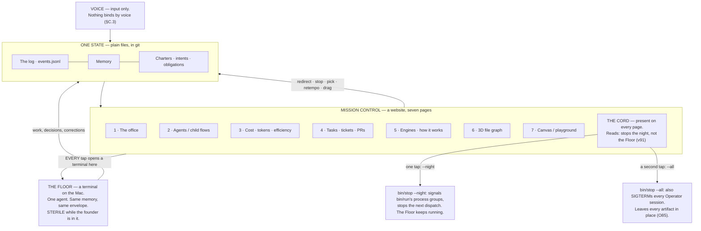
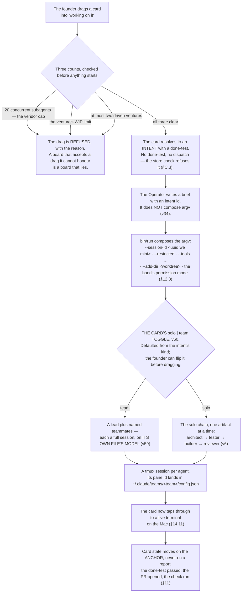
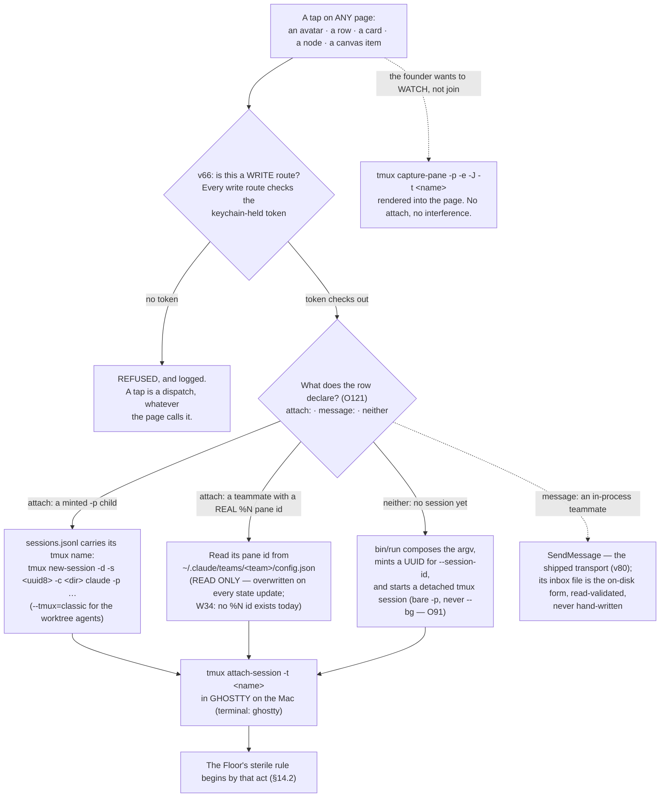

## 14 · Mission control — seven pages, one state, and every tap opens a terminal on the Mac

*obeys: §D entire, v4, v14, v15, v16, **v62** (the room's renderer, §14.4), **v66** (the surface's identity,
rethink round 2026-09-06), and **v95**, **v91**, **v84** (fixer round 2026-09-06 — the page order and the two-verb
tap, the cord's two scopes, `night_capable` on page 3) · inherits: FINAL §13 — the Floor and the Balcony are absorbed,
not deleted*

---

### 14.1 What the founder decided, and what it costs

**(FOUNDER, overruling FINAL row 15.)** Mission control is **a website**, and it is a control surface rather than a
display:

> *"First of all, is the mission control surface. I want to add it, bring it back, include it with the office, and
> also the place where it updates and shows what we are doing and all of that. I want you to have pages with
> different things."*

**(FOUNDER, and this sentence decides the architecture of every page below.)**

> *"remember each agent or each session that we are opening in the mission control or any other surface, it's
> directly opening it in the terminal in my Mac because everything is run on it."*

**(FINAL, the losing image, kept by name.)** FINAL §13 had **two** surfaces over one state — the Floor and the Balcony
— and one rule about the room: *"no project is both"* a display and a control. Five Balcony views, and the office
never a control. That is J.4, and it lost.

**(NEW: what survives the overrule, because it was right for a reason that did not depend on the count of surfaces.)**
FINAL §13.2's rule — **every element is either a fact or a tap, and nothing is only informational** — survives whole
and is extended by v14 to the dashboard the founder asked for. There is still **one state and no second source of
truth**, and no page has anything another page cannot reach.

**(NEW: the cost of v4 was stated once as unpublished work, and half of it is now discharged — research/room.md
part 5 OVERTURNS the finding this paragraph rested on.)** This paragraph read *"surfaces.md's §4A.11 finding stands
unrefuted: no Claude Code fleet surface is spatial"*, carrying **(FINAL §13.8, from round-5 `surfaces.md`
§4A.11)** *every spatial project is a display and every control surface is a table*. **That is no longer the state of
the world.** Three projects watch Claude Code and were all pushed on 2026-09-05: **pixel-agents** (MIT, LICENSE read
from the file, 9,190 stars), **clawd-on-desk** (AGPL-3.0, refused for the copyleft) and **pixtuoid** (MIT, Rust,
terminal). And pixel-agents is **a control, not only a display** — a click on an agent already opens its terminal in
the VS Code surface (open issue #251, 2026-04-25; H that a click-to-terminal binding exists there, M on its exact
behaviour). The room lane reached that conclusion without opening SPINE, from a grep of `surfaces.md` that returned
§4A.11 as the single line on the subject. So the office page is **not** work nobody has published; what is genuinely
ours narrows to the writer and the browser-side terminal, both named in §14.4. FINAL §13.8 is kept by name as the
losing image (§J.51 keeps the room's).

**(FINAL, unchanged by that discharge, and this is the half that must not relax.)** The office page is still the one
most likely to become a beautiful display, and **§14.4 keeps FINAL's guard rails on it for exactly that reason** —
being able to buy the room does not make it safe to point a decision at it.

**(NEW: v39 — what hosts the website, and it follows from the founder's own sentence rather than from a preference.)**
Mission control is **served on the Mac by `mission-control/`** — the Bun and Hono server and React client that exist
on branch `ceo-1-1788609834`, 60 files — because **a terminal pop needs `tmux` on the same machine**, and the
published-artifact runtime cannot reach it. FINAL §17 marked `mission-control/` ABSORBED; v4 un-absorbs it as the
seed rather than starting a website from nothing.

**The phone reaches it two ways, and the split is by capability, not by taste:**

| Surface | What it is for | What it cannot do |
|---|---|---|
| **The published artifact pages** — the absorbed Balcony views, the briefing, the read-back (v38) | reading and **deciding**, from anywhere, with a shared database, viewer identity and comment threads that wake the publishing session | **cannot pop a terminal**, because it is not on the Mac |
| **The local server**, ~~over the founder's own network~~ **bound to loopback and reached from the phone through an authenticated tunnel** (moved 2026-09-06: v66) | everything else, including every tap that opens a terminal | not reachable when the Mac is off, which is the same condition the whole night already has (§15.1) |

**(FOUNDER, rethink 2026-09-06: D1 — and it resolves contradiction 16, which was three sentences about one server
disagreeing.)** v39 said the phone reaches *"the local server over your own network"*; §14.13 said every page writes
*"nothing but the inbox file and the intent log"*; and the seed already pins `127.0.0.1`. Read together they describe
**an unauthenticated dispatch plane on any network the Mac joins** — because a page that can write the intent log and
pop a terminal is a dispatch plane, whatever the table calls it. The founder's answer is three things and each has a
cost of roughly one line:

- **Loopback bind.** Already true of the seed; it stops being an accident and becomes the decision.
- **One token, held in the macOS keychain, checked on every write route.** One middleware. Reads may be open on
  loopback; **every write route checks**, because the write routes are the dispatch.
- **The phone through an authenticated tunnel**, named at build time. Not the local network.

**This moves v39's implementation and reverses nothing about it.** **Settled by:**
`lsof -nP -iTCP -sTCP:LISTEN` showing a non-loopback bind, or a tap accepted from a device that presented no token —
either one falsifies the row. **(R3, OPEN)** prices the keychain half: whether a **non-interactive background process
can read a keychain item without an interactive unlock, and under what ACL**, is unmeasured, and §15.4's whole
unattended credential plan rests on the same answer.

**Mechanism:** the loopback pin (**the seed already has it**) · the token middleware and the keychain item
(**ABSENT**, §L) · the tunnel, named at build time (**ABSENT**).

**The cost, stated once and not re-litigated (v39):** **two renderers over one state** — which FINAL §13.1 explicitly
refused when it said there is no third source of truth. It is accepted here because **a tap that opens a terminal
cannot come from a hosted page**, and the refusal that actually matters survives intact: both renderers read the same
log, and neither holds state the other cannot see. The losing images are kept by name: *the website hosted as a
published artifact*, and *a cloud host that reaches into the Mac*.

---

### 14.2 Where the Floor and the Balcony now live

**(NEW: v4 relocates them rather than deleting them, and this table is the whole of the relocation.)**

| FINAL §13 | Where it is now |
|---|---|
| **The Floor** — one terminal, one agent, same memory, same envelope, sterile while the founder is in it | **Unchanged, and it is what every tap opens.** Mission control is the index; the Floor is the destination |
| Balcony · **Now** | page 2 (agents and child flows) |
| Balcony · **Decide** | **page 4, as cards in a "waiting on you" column** — and on the phone, as a published page (v38) |
| Balcony · **Last night** — the briefing | **the top strip of page 5** — and on the phone, as a published page (v38) |
| FINAL §2.4's **read-back page** | **the intent-creation form wherever an intent is born** — page 4's *new card* and page 7's *add session* — and a published phone page for voice (v38) |
| Balcony · **Ventures** | page 1 (the office), one venture per area |
| Balcony · **Cord** | **a control present on every page**, not a view of its own — and since 2026-09-06 it reads **_stops the night, not the Floor_**: `--night` by default, `--all` behind a second tap — the same reach §12.9 states once, which is *from the Operator or from a page control behind a second tap* *(amended 2026-09-06: challenge D P2-10)* (v91 · O85, §14.13) |
| *(new)* | page 3, the dashboard v14 admits |

**(FINAL, unchanged and still binding on the Floor.)** While the founder is on the Floor the system is **sterile**,
detected rather than declared: no new run starts on the founder's window, the venture under their hands is held whole,
queued interruptions wait silently unless they match `wake-me`, and on return they are summarised into **one
paragraph, never replayed one by one**. Mission control obeys the same rule — a tap that opens a terminal starts a
sterile session by that act.



---

### 14.3 The seven pages, at a glance

**(FOUNDER, §D.)** Each row is expanded in its own subsection below. **Every page is ABSENT.** What ships is named in
the substrate column, and the distinction between *the substrate ships* and *the page exists* is the one to hold on
to.

| # | Page | What each tap launches | Substrate | State |
|---|---|---|---|---|
| 1 | The office | tap an avatar → that agent's terminal | **pixel-agents** (MIT, LICENSE read from the file, pushed 2026-09-05) — **decided v62**; §I row 12 is closed — an **adapter** (v96) | ABSENT; enters through the tool door |
| 2 | Agents / child flows | ~~tap → attach to its tmux session or background session; message → write its inbox file~~ **two verbs, declared per row: `attach:` → the tmux session `bin/run` minted; `message:` → `SendMessage` to an in-process teammate** (amended 2026-09-06: E12 / THINKER: A2 · O121, W34) | Claude Code **agent teams** · `claude agents` · tmux — an **adapter** (v96) | **substrate ships**; page ABSENT |
| 3 | Cost · tokens · efficiency | a cost row → its run · a window row → retempo · an anomaly → the cord · **`night_capable` and its printed reason → the brief it refused** (v84, §14.6) | the event log joined to §16's price table; the vendor's `prompt_cache`, `rate_limits`, `modelPricing` (W4) — an **adapter** (v96) | ABSENT; `~/.agentvibe/events.jsonl` is the spine |
| 4 | Tasks · tickets · PRs | **drag a card into "working on it" → launches a session and hands it the task; the card's `solo \| team` toggle decides which shape** (v60) | ours; prior art OpenAI Symphony | ABSENT; **the team part has no prior art anywhere** |
| 5 | Engines · how it works | tap a gate → its last ten resolutions; tap a store → its schema and its one writer | the same state as every other page | ABSENT |
| 6 | 3D file graph | tap a node → open it on the Floor | `3d-force-graph` (MIT [`api`: GitHub SPDX detection, LICENSE not read]) renders; **the extractor is ours** | ABSENT; thinnest researched area; **built LAST of the seven** (v61), after one research lane on repo-to-graph tooling |
| 7 | Canvas / playground | add a session: worktree, project, provider, model, task, agent → launch, then attach | Langflow (MIT [`api`: GitHub SPDX detection, LICENSE not read]) as the canvas idiom — an **adapter** (v96) | ABSENT |

---

**(FOUNDER, fixer round 2026-09-06: E12 · v95 — the order the seven are built in, and which four are commodity.)**
The founder chose **4 → 5 → 3 → 2 → 7 → 1 → 6** from C's list (THINKER: C17, A2 · FIXER: C; A): the board with its
*waiting on you* column and read-back form first, because it is the one page that touches a venture's work; then
page 5's top strip, where the briefing's first line spends the founder's attention (§14.8); then the dashboard; then
the fleet page, whose substrate ships; the canvas; the office the founder named first; and page 6 last, as v61 already
decided. **Pages 1, 2, 3 and 7 are `adapter` under v96** — page 1 is pixel-agents plus our writer, page 2 is
`claude agents` and `SendMessage` plus the two-verb split, page 3 reads the vendor's four fields, page 7 is the
Langflow idiom — each the thinnest reader of a named vendor surface, carrying `vendor_wins_if:`, **Deleted when it
matches** (§13a.6). Only page 4 and page 5's engines view are kernel work. §17.5 carries the adapter table; §19 draws
the order. **What the founder loses:** the office arrives later than they asked. **The losing image:** §D's order, the
office first · `wins_if:` a quarter in which visits to pages 1 and 2 end in reading and no tap acts.

### 14.3a The page manifest — how *every element is a fact or a tap* stops being a promise

**(NEW: O12.)** §14.1 keeps FINAL §13.2's rule — **every element is either a fact or a tap, and nothing is only
informational** — and until now nothing could check it, so §14.4's own prohibitions are marked WISH in their first
line. The manifest is the check. **A page is a file**, `keel/surfaces/pages/<n>.yml`, and **every element on it
resolves to either a store path (`fact:`) or a `bin/` verb (`tap:`)**. The renderer builds **only** from the manifest,
so an element with neither cannot be drawn — not *should not*, cannot.

**What it buys immediately, beyond the rule.** Three of this section's hardest sentences become greppable: *no page
holds state another page cannot see* is a join over `fact:` paths; *a tap on a website cannot widen a grant* is the
assertion that every `tap:` names a `bin/` verb and never argv (v34, **O53**); and *page 1 is never where a decision
is made* is a count.

**(NEW: contradiction 9, and the count is the fix.)** §14.4 says page 1 is **never where a decision is made** and the
page was also carrying the **venture toggle and the portfolio** — a control that switches which venture the founder is
looking at is a decision surface, whatever the room around it looks like. **Page 1 declares zero elements of kind
`tap: decide`**, and the toggle and the portfolio move to **page 3's strip** (§14.4, §14.6, and deletion 24). Page 1
keeps the room; it loses its second job.

**Mechanism:** `keel/surfaces/pages/<n>.yml` per page and the renderer that builds only from it (**ABSENT**, §L O12) ·
the manifest lint asserting page 1's `tap: decide` count is zero (**ABSENT**).

---

### 14.4 Page 1 · The office

**(NEW: the prohibitions in this subsection ~~are WISH under v50 — no renderer check enforces any of them today, and
none names a mechanism~~ now name one: the page manifest of §14.3a, which is ABSENT rather than absent-in-principle
— moved 2026-09-06: O12.)**

**What it shows.** The room: every live run a light, one venture per area, and the night replayed at speed in the
morning. **(FOUNDER)** *"include it with the office, and also the place where it updates and shows what we are
doing."*

**What each tap launches.** Tap an avatar → **that agent's terminal on the Mac** (§14.11).

**Substrate, decided.** **(FOUNDER, DECISIONS §15: *"use pixel-agents code or Star-Office-UI or AgentOffice"* — and
the *or* hands the pick to evidence. Decided v62 on research/room.md, which read all three LICENSE files from the file
rather than from GitHub's detection.)** The substrate is **pixel-agents**,
<https://github.com/pixel-agents-hq/pixel-agents> — **MIT**, the LICENSE opening *"MIT License"* / *"Copyright (c)
2026 Pablo De Lucca"*; pushed **2026-09-05**, the day it was read; 9,190 stars, 1,488 forks, 87 open issues;
TypeScript with React 19, Canvas 2D. §I row 12 is closed by it.

**Why it, in facts rather than preference.** It **already reads Claude Code**, by two paths and no others: hook
events, verbatim *"a hook script receives Claude events such as `SessionStart`, `PreToolUse`, `PermissionRequest`, and
`Stop`"*, and a transcript fallback, *"the runtime infers agent status by scanning Claude's JSONL session transcripts
under `~/.claude/projects/`"*. Both normalise into a shared **`AgentEvent`** model. It **renders without a model** —
it visualises Claude Code's activity and calls no model API of its own — which is what keeps the office a display of
real runs rather than a thing that invents them. And it is already a control in one surface: a click on an agent
opens that agent's terminal in **VS Code** (open issue #251). Its scope is stated by its own README: *"Claude Code is
the reference implementation today; Codex, Gemini, Cursor, and others are on the roadmap."*

**Where it runs, and it is the same answer as everything else.** A **Fastify server is required** for both the VS Code
extension and the standalone CLI, and *"the CLI chooses a free local port and prints the URL"*. That server runs **on
this Mac, beside `mission-control/`** (v39, §15.1) — which is what a terminal pop needs anyway.

**What is ours, and it is two things.** First, **the writer from the event log into its `AgentEvent` model** (ABSENT).
**The `AgentEvent` schema is UNVERIFIED** — the lane read the README, not the type in source, so the writer's target
shape is a README-level claim and one file read closes it. Second, **the browser-side terminal pop**: upstream has it
only as **open PR #347**, *"feat(terminal): standalone embedded terminal — launch and drive agents from the browser"*,
**open and not merged**, so a browser-embedded terminal **is not shipped** and §14.11's mechanism cannot assume it.

**Refused, each with the reason that refused it.** **Star-Office-UI** (ringhyacinth/Star-Office-UI, 7,466 stars): the
LICENSE is a **dual** one — MIT for code and logic, and the **art assets are restricted, the README stating
*禁止商用***, commercial use prohibited, education and demo only — which is the sprites, that is, the thing one
would take. It is also **≈ 6 months stale** (pushed 2026-03-11), built for **OpenClaw** with no documented Claude Code
or Codex integration, and **has no terminal and no chat**: clicking a character surfaces status, so it is a status
dashboard. **"AgentOffice"**: the name does not resolve — it names **eleven candidate repositories**, none of them an
office-room renderer over live agent sessions, and the likeliest on the hyphenated reading
(harishkotra/agent-office, MIT, 250 stars) **requires an LLM to render**, Ollama by default. That is decisive rather
than incidental: it is **a simulation the model drives** — *"LLM returns: { thought, action, target, toolCall }"* —
which **reads no Claude Code JSONL and no agent-runtime log at all**, and so fails the one rule this page has, that
the room displays real runs.

**(NEW: the founder can settle the name in one sentence.)** *"AgentOffice"* was never disambiguated, and the lane
ranked candidates by fit and adoption because that was all it could do. **If the founder names where they saw it,
that source settles it faster than any search** — and it is the only way v62's refusal of the name gets reopened.

**Fallbacks, kept because they were already licence-read and cost nothing to keep.** **Generative Agents' `demo` mode
(Apache 2.0)** — a top-down town rendering from one JSON file, four fields per agent per step, no model and no
backend, whose four-level location path maps onto **venture → intent → run → artifact with no schema change**; and
**AI Town (MIT, alive)**, which needs Convex. Still refused from that round: **WorkAdventure** (AGPL with the Commons
Clause; no RPC places an avatar) and **ChatDev** (the office is gone). *(FINAL §13.8 ranked Generative Agents first,
and that ranking is the losing image — §J.51.)*

**State.** **ABSENT.** It enters through the tool door like a scraper — its LICENSE read, its input declared (it reads
the event feed and nothing else), its exposure read-only, a caller in the same change, a test that fails without it,
an exit note. Because it reads and never writes, the door's first three tests are met trivially.

**(NEW: v62 makes that input declaration a narrower promise than it was, and the narrowing has to be written down or
it is not one.)** pixel-agents can read `~/.claude/projects/` transcripts directly, and it binds a click to a
terminal. **What is declared at the door here is the event feed and nothing else** — the transcript path is not the
one used — and the terminal pop is §14.11's mechanism rather than the renderer's. *Reads and never writes* therefore
stays true of the substrate **as admitted**, which is not the same as true of the project. If either changes, the
door is re-run; that is the whole point of declaring the input rather than describing it.

**What is genuinely new.** Nothing in the renderer. What is ours is **the writer from the event log into the
`AgentEvent` model** (ABSENT, schema UNVERIFIED), **the browser-side terminal pop** that upstream has only as open PR
#347, and the fact that in this plan an avatar is **a tap** rather than a picture — which is the half FINAL refused
and v4 overruled. Under v62 that last half is **no longer unpublished work**: pixel-agents already binds a click to a
terminal in VS Code, so what remains is moving that binding to the browser, not inventing it (§14.1).

**(FINAL, and these guard rails survive the overrule unchanged.)** No notifications, no badges, no unread count, no
obligations; never on the phone; never where a decision is made; nothing reads whether you watched it. *Entertainment
is a legitimate requirement and a disqualifying control surface*, and the reason to be strict is that **a beautiful
surface will always win the argument against a useful one.** The one change v4 makes: an avatar may open a terminal.
It may not *be* the decision.

**(NEW: O12 — page 1 loses its second job, and the guard rail above is the reason. Contradiction 9.)** The **venture
toggle and the portfolio move to page 3's strip** (§14.6, deletion 24). Switching which venture the founder is looking
at is a decision made on the page that is *never where a decision is made*, and the room is one venture per area
already — the toggle was the portfolio's control wearing the room's clothes. **Page 1's manifest declares zero
elements of kind `tap: decide`**, and that is a count a lint can take rather than a promise a reviewer must hold.

**(R24, OPEN — and it is the one measurement page 1 rests on.)** Does **pixel-agents** actually render **ten venture
areas and fifty live agents**, and what is its **`AgentEvent` schema and ingest rate**? The schema is UNVERIFIED above
because the lane read the README rather than the type in source, and the writer's target shape is the one thing that
is genuinely ours here. One file read closes the schema; one local run at our own emission rate closes the rest.

---

### 14.5 Page 2 · Agents and child flows — the page whose substrate already ships

**(FOUNDER)** *"managing the agent using child flows and seeing the agents and the environment walking … the agent
orchestrator and then getting more subagents and what they are doing in the current task and, like, who is walking
and who just sleep. And then when I click on it, the terminal which runs the agent on my Mac is popping up, so I can
message it or message it directly from the mission control."*

**What it shows.** ~~The Operator and its children~~ **Every Operator and its children** — N of them, each a `kind:
operator` row in `sessions.jsonl` with a heartbeat (amended 2026-09-06: E8 / THINKER: A6 · O84, W41) — who is working,
who is sleeping, what each is doing on the current task.

**(FOUNDER, fixer round 2026-09-06: E8 · v91 · O84 — one Operator was already false.)** The plan drew one Operator;
this Mac ran **five `ceo-*` worktrees in three terminals**, 825 commits by Claude Code to 129 by the founder (THINKER:
A6 · W41). A premise false from the start makes the reserve, sterility and the lease misreport rather than fail. So an
Operator instance is **a row**: `kind: operator`, venture, heartbeat from a `SessionStart`/`Stop` hook pair in
`operator.md`'s own settings; page 2 renders every live row, and a *which* on page 4 shows **who has claimed it**
(`claim: {operator, at}`, one-tick expiry), so two Operators cannot answer one question. The founder-present gate is
per venture and the WIP limit counts interactive sessions. **Mechanism:**
`sessions.jsonl` · `decide.jsonl` · `operator.md` (**ABSENT**, §L O84; §3 owns the registry, this page reads it) ·
losing image: one Operator enforced by a lease — §J 77 · `wins_if:` a month of `sessions.jsonl` shows one live row at
a time.

**(NEW: surfaces.md's single largest finding is that this page substantially ships, and the ordering the founder asked
for is already the vendor's.)** Claude Code **agent teams**: *"One session acts as the team lead, coordinating work,
assigning tasks, and synthesizing results. Teammates work independently, each in its own context window, and
communicate directly with each other. You can also talk to any teammate directly without going through the lead"*
(accessed 2026-09-05, confidence H). The panel already sorts the way the founder described it: *"an idle teammate's
row stays in the panel while any teammate or subagent is still working"*; idle rows hide after 30 seconds once the
whole panel is idle; more than three idle collapse into `N idle agents`; working, failed and viewed teammates always
keep their own rows.

**The join key a website needs is already a file on disk.** `~/.claude/teams/<team>/config.json` holds **session ids
and tmux pane ids**; `~/.claude/teams/<team>/inboxes/<agent>.json` is the mailbox; `~/.claude/tasks/<team>/` is the
task list; the team name is `session-` plus the first eight characters of the session id.

**What each tap launches.** ~~Tap a row → attach to that agent's terminal (§14.11). Message a row → **write the agent's
inbox file**; entries are validated on read and malformed ones are *"removed from the file"*.~~ **Two verbs, and the
row says which** (amended 2026-09-06: E12 / THINKER: A2 · O121 · W34): **`attach:`** only where `sessions.jsonl`
carries a tmux session name — every child `bin/run` mints is `tmux new-session -d -s <uuid8> -c <dir> claude -p …`,
with `--tmux=classic` for the worktree agents — or where `config.json` carries a real `%N` pane id; **`message:`** for
an in-process teammate, through the shipped `SendMessage` transport (v80), whose ids are recorded as attributes and
never as a join key. The inbox file is that transport's on-disk form and stays read-validated; nothing here writes it
by hand.

**(THINKER: A2 · W34 — why the tap had to split.)** Forty-eight teams, 224 members, **219 `backendType: in-process`**,
and pane ids that are the strings `"in-process"` and `"leader"`: **no teammate has a pane**, so a page promising one
verb that always attaches would be blamed for the runtime. The founder's sentence is satisfiable for minted children
and not for teammates, and the page says so per row. The manifest carries **`terminal: ghostty`** — the founder runs
Ghostty, and `--tmux` wants iTerm2 — so `--teammate-mode tmux` inside tmux is a Floor habit the page detects, never a
rule. **Mechanism:** `keel/surfaces/pages/2.yml` declaring both verbs · `bin/run` minting into tmux (**ABSENT**, §L
O121). **The losing image:** one tap that always attaches · `wins_if:` `claude --attach` accepts an in-process teammate
id. **How we would know:** a tap on a `-p` row opens that pane in Ghostty, latency recorded.

**(NEW: the one sentence that decides how the page may touch that substrate.)** *"The team config holds runtime state
such as session IDs and tmux pane IDs, so don't edit it by hand or pre-author it: your changes are overwritten on the
next state update."* So **`config.json` is a read source and never a write target.** **Mechanism:** `bin/probe` (ABSENT) asserts the page's writable paths and fails if `config.json` is among them. The inbox file is the write
target, and it is the only one.

**Substrate constraints that shape the page, all documented, all H** (v13): agent teams are **experimental**, off by
default in the vendor's shipping configuration and **turned on here by the founder** (v59:
`CLAUDE_CODE_EXPERIMENTAL_AGENT_TEAMS=1`); *"No nested teams: teammates cannot spawn their own teammates"*; *"One
team per session"*; `/resume` does not restore in-process teammates; spawning requires an interactive session, so
**`-p` never forms a team**. Tokens: *"Agent teams use approximately 7x more tokens than standard sessions when
teammates run in plan mode"* — and since v59 that lands at **each teammate's own file's model**, with no Sonnet
floor, which §9.2 states the cost of once.

**So the child-flow tree the founder asked for is two mechanisms, not one** (v13): **one level of named teammates**
from agent teams, and **the deeper tree from subagents** — depth 3, 20 concurrent, `Workflow` removed from all of
them. The page draws one tree; underneath it, the first edge is a team edge and the rest are subagent edges, and the
page says which is which because they behave differently when the session ends.

**Also on the page, from the same substrate:** `claude agents --json` prints active background sessions as a JSON
array for scripting, and `--json --all` includes completed ones. Its caveat is the page's problem, not a blocker:
*"Opening agent view requires an interactive terminal."*

**(NEW: O70 — where the census comes from, because the obvious source is a file that rewrites itself.)** The page's
census is **`claude agents --json --all` joined to our own `sessions.jsonl`**. The vendor's `config.json` enriches it
with **tmux pane ids only** — nothing else — because the vendor says of that file *"your changes are overwritten on
the next state update"*, and **a page polling fifty rewriting files shows a different fleet on every render**. Two
sources, one of them ours and stable, one of them the vendor's and narrow.

**Why our log is the join key and not the vendor's ids.** A row in `sessions.jsonl` is written by `bin/run` at
dispatch and carries the intent id; a vendor id is an attribute of a session that may vanish. That is the same rule
**v80** applies to the messaging transport — vendor ids are recorded as attributes and **never as a join key**.

**(FACT: world.md 12 — W12, and it is what this page is actually for.)** Agent teams were **repaired four times in the
window and never promoted out of experimental**, and the recurring failure class is **lost teammate output** — a
teammate's final answer not reaching the lead, a transcript going blank during long retry waits. v59 turns teams on;
the risk of that decision is exactly the thing page 2 renders. A page that draws only *who is working* would show a
healthy fleet on the night this fails, because the fleet **is** healthy and the output is what is missing.

**State.** The substrate **ships**. The page is **ABSENT**.

---

### 14.6 Page 3 · Cost, tokens, efficiency — and why a dashboard is admitted

**(FOUNDER)** *"I would like to have layer when cost and tokens, efficiency, monitoring, and a dashboard that is
showing, you know, numbers and things about the system."*

**(NEW: v14 resolves a real collision rather than papering over it.)** surfaces.md 6 states it as two positions:
FINAL §13.2's Balcony table has **no dashboard row** and says *"nothing is only informational"*; the founder asked for
a dashboard. **Both are kept, by one rule: every number on the page names the tap that acts on it.**

| What it shows | The tap on it |
|---|---|
| spend and tokens per run, per agent, per venture | → the run itself, on the Floor |
| the five-hour window **and the weekly window** (v22) | → retempo that venture |
| cache hit rate, and the reserve | → the batching decision it implies (§16) |
| an anomaly | → **the cord** |
| the quality-of-belief split — how much of what is believed is rung 1 and how much rung 4 (§11) | → the done-tests behind the rung-4 share |
| **the portfolio strip** — every venture, its spend and its tempo *(new 2026-09-06: O12; it was page 1's second job)* | → retempo, or that venture's intents |
| **`night_capable`** — can this Mac hold a night: AC · `sleep 0` or `disablesleep 1` · assertions, from `pmset` every tick, with the printed reason when false *(new 2026-09-06: E13 · v84 · O81)* | → the `unattended` brief it refused, ~~and the cloud carrier it routed to where `cloud: allow`~~ **which is held, not minted, until the carrier's `stop:` is known (v67)** *(amended 2026-09-06: challenge D P1-3)* |
| **the window gauge against its high-water mark** — the founder's `ceiling:` as a percentage, the absolute beside it *(new 2026-09-06: O115 · W39)* | → retempo that venture |

**(FOUNDER, fixer round 2026-09-06: E13 · v84 · O81 — E1's mechanism, and this page is where it shows.)** The founder
chose no box (E1): the night runs on this Mac, and the cloud lane is the fallback when the Mac cannot. So the Watch
computes **`night_capable`** from `pmset` every tick, refuses an `unattended: true` brief with the printed reason when
it is false, and ~~routes it to the cloud carrier where the charter says `cloud: allow`~~ **holds it, minting nothing,
until the carrier's `stop:` is known (v67)** (amended 2026-09-06: challenge D P1-3; §15.1b carries the precondition
that makes the predicate true at all). The measurement behind it:
`sleep 1` on AC and battery, **391 maintenance sleeps in seven days**, 24 clamshell (THINKER: A1 · W33) — a habit the
Watch cannot verify is a wish, so it is a predicate and a page-3 fact. §4 owns the predicate and §15 the host file
(`keel/host/power.yml`); this page renders it and the briefing carries the line. **Mechanism:** `bin/watch` ·
`keel/host/power.yml` · `bin/probe` (**ABSENT**, §L O81) · an **adapter** over `pmset` · losing images: a
`disablesleep` habit gating the Watch · `wins_if:` R37 shows the Mac awake on AC every declared night unenforced; the
always-on box — §J 73.

**(NEW: O115, fixer round 2026-09-06 · THINKER: A12 · W39 — the gauge has a denominator before the first run.)** v74's
window gauge is a fraction of an observed high-water mark, and before the first run nothing has been observed. A measured mark already
sits on disk: `budget-guard.js`'s baseline, **peak 1,961,285 output tokens in any rolling five hours over 99
transcripts**. `keel/logbook/window-highwater.yml` is seeded from it, marked `seed: true` and `tokenizer:
sonnet-4.6-era`; the founder writes `ceiling:` as a percentage, this page shows the absolute beside it, and **the
first observed week replaces the seed**. §16 owns the file; the subsidy line reads it too. **Mechanism:**
`keel/logbook/window-highwater.yml` (**ABSENT**, §L O115) · an **adapter** over `rate_limits` · `wins_if:` the first
charter's founder asks what a window is.

**(FACT: world.md 4 — W4, and it changes what this page computes rather than what it shows.)** Four of the numbers
above are now **structured vendor fields the page can read instead of derive**: a per-session `prompt_cache` object
for status-line scripts (hit ratio, misses, tokens re-cached, warm/cold); `rate_limits.spend_limit`; the `/usage`
Loops breakdown with per-loop run count, total tokens, tokens per run and last run; and the `modelPricing` managed
setting, which makes contracted rates rather than list price the basis for `/cost` and telemetry. **Read the field
where a field exists.** A number this page computes from the log and the price table can disagree with the number the
runtime shows in `/cost`, and when they disagree the founder has no way to tell which is wrong.

**What stays computed, and it is not a small remainder.** Per-agent, per-intent and per-venture rollups have no vendor
field — the vendor knows about sessions, not about our roster — so the join by dispatch id (§16.1) still does that
work. The rule is narrow: **vendor field where one exists, our join where one does not, and the page says which it
is drawing.**

**(R22, OPEN — and this page is where it bites.)** **What does page 3 cost to render at a year of rows, and where is
the knee?** The answer decides whether **O40**'s log rotation and rebuildable rollups are a day-one shape or a later
migration — and a later migration touches the one store this plan says is never edited (§15.3). Measured against a
synthesised log at this Mac's own emission rate, against the real server. §16.1a carries the rotation.

**Substrate.** The event log, with `gen_ai.*` attribute names and an id on every row, joined to §16's price table.
`~/.agentvibe/events.jsonl` exists on this Mac — 1.1 MB, 3,843 rows — and `mission-control/` (60 files, a Bun and Hono
server with an SSE feed and a React client) and `bin/warroom` (per-worker cost pricing, typed events, snapshots)
exist on branch `ceo-1-1788609834`. The page is **ABSENT**; its spine is not.

**(NEW: two facts from §G.2 that the page must render as two different things, because they end differently.)** A
**seat** limit — *"You've hit your session limit"* or *"your weekly limit"* — is shared across all models and **cannot
be escaped with `/model`**. A **model-family** limit — *"You've hit your Opus limit"* — can. **One is a stop and the
other is a reroute**, and a dashboard that draws them the same way will teach the founder the wrong reflex on the
night it matters.

**(NEW: and the one number the page must refuse to invent.)** No numeric Anthropic subscription quota is published
anywhere fetched. Magnitudes are relative only — Pro *"at least 5x more usage per 5-hour session than Free"*, Max
*"5x"* and *"20x more usage than Pro"*. **A Max window's real capacity is measurable only from an account.** So the
window gauge is drawn from observed consumption on this seat, never from a published denominator, and it says so.

---

### 14.7 Page 4 · Tasks, tickets and PRs — where a card launches a team

**(FOUNDER)** *"a place where I can manage the tasks and the tickets and the PRs … to add task and a timeline and
also like to jog the tasks on a board which has different stages … when I drag a task … to a section when it's saying
working on it or, like, preparing for it, it launches a team or added team of agents to the session, like, add a
session and then, like, give it the task, and then it starts walking."*

**What it shows.** A board with stages, a timeline, and a kanban; PRs beside tickets.

**(NEW: v38 puts two of FINAL's Balcony views on this page rather than leaving them unplaced.)** **`Decide` is a
"waiting on you" column on this board**, each card carrying its six fields and ~~both options already built~~ **one
built, a second written unless a ten-word summary cannot separate them (v87)** *(amended 2026-09-06: challenge D
P2-3)* — so a
decision is a card in the same board as the work it blocks, rather than a separate view the founder must remember to
open. And **the read-back is this page's *new card* form**: an intent is born here, so the restatement that binds it
is born here too (§C.3). Nothing binds by voice; the founder confirms by tap or typed word, on this form.

**(NEW: O9 — the column is a view over one queue, and there was nearly one queue per venture. Deletion 31.)** The
decide items live in **one house-level queue**, `keel/logbook/decide.jsonl`, replacing **ten per-venture `open.md`
stores**. Ten queues and one founder is nine writer-contention points and nine places a decision can be missed; the
founder does not decide per venture, they decide in one sitting. **A row with no intent id is refused**, which is what
keeps the "waiting on you" column a view of blocked work rather than a second inbox.

**And this is also where a night escalates to (O49, §4).** 13a.1 said *"the Operator is the escalation"* while §4.4
says the Operator is not always on, so a run that stops at 03:00 escalated to something that was not running. **It
escalates to a row in this queue plus the wake-me test** — the queue is awake because it is a file.

**(NEW: v36 decides where a card may come from, and it is the same rule as the trifecta.)** A card that originates
outside the company — a support message, an invoice, a failed build, a reply — is created from **an inbound row
written by the world's door, a program with no model**. No agent reads the raw mail, calendar or Notion item; `scout`
reads the row, and `steward` writes the obligation **proposal** from `scout`'s handover, and the Watch materialises it (v44). **The board therefore never renders
attacker-controlled text as an instruction to anything** — it renders a row a program wrote.

**What the tap launches.** **Dragging a card into "working on it" launches a session with a team of agents and hands
it the task.**



**(FOUNDER, v60: the card carries the toggle, so the board decides the shape and the Operator does not guess.)**
Asked whether a card launches a team or one agent, the founder chose **both**: *"Both: the card carries a 'solo or
team' toggle."* The card has a `solo | team` field, **defaulted from the intent's kind** — source-code work defaults
to **solo**, which is the chain architect → tester → builder → reviewer and is what v6 requires for one artifact;
anything cross-department defaults to **team**, led by the Operator. The default is only a default and the toggle is
visible on the card, so flipping it is one tap before the drag rather than a conversation afterwards. **Mechanism:**
one field on the card store; `bin/run` (**ABSENT**) reads it and picks the dispatch mechanism from it, which keeps
v34 true — the board still composes no argv. §3.5 carries the three mechanisms it chooses between.

**Substrate, and what the world actually ships.** **(NEW: v16 replaces FINAL's reference project, because both ends
moved.)** **OpenAI Symphony** — Apache-2.0 [`api`: GitHub SPDX detection, LICENSE not read], Elixir, created 2026-02-26, **last push 2026-08-19**, 27,042 stars, not
archived — is the closest live prior art, described by its own repository as: *"Symphony turns project work into
isolated, autonomous implementation runs, allowing teams to manage work instead of supervising coding agents."* Its
mechanism (polls Linear on an interval, one isolated workspace per issue, restarts stalled agents) is **REPORTED at
confidence M** — the spec was not fetched. **vibe-kanban is worse than FINAL recorded**: its README's own first status
line now reads **"Vibe Kanban is sunsetting"**, which is stronger than *unmaintained since 2026-04-24*. Its execution
unit is nonetheless the founder's page in nine words: *"each workspace gives an agent a branch, a terminal, and a dev
server."*

**Card fields, borrowed from two shipped schemas** (cognition.md): from **Linear**, the app is set as **`delegate`,
not assignee** — *"so humans maintain ownership while agents act on their behalf"* — and a session is created
automatically when an agent is mentioned or delegated an issue. From **GitHub Copilot's coding agent**, the hard caps
that make a card bounded: *"Copilot can only work on one branch at a time and can open exactly one pull request"*, and
a maximum execution time. **And one field that is ours, from v60: `solo | team`**, defaulted from the intent's kind
and settable by the founder — the field the drag above reads. It sits beside the intent id and the creating writer
(v52) as the three things a card must carry before it can launch anything.

**What is genuinely new, and it is named as new because nobody has built it** (v16; §20 row 9, **decided as v60**):
**nothing found gives a card a *team*.** Every board-to-session project surveyed maps **one task to one agent**. The
founder asked for a team, and that part is ours to build with no reference implementation to read. **The toggle does
not soften that:** `solo` is the shape the world has shipped and `team` is the shape nobody has, so half of this
page's dispatch has prior art and half does not, and the half that does not is the half the founder asked for.

**(NEW: and one field nobody ships that this board needs anyway.)** cognition.md searched for it: *no system reached
carries an explicit definition-of-ready gate, a blocked-reason enum, a dependency field consumed by the agent, or
duplicate detection.* Copilot's *"straightforward issues"* is the only readiness language anywhere, and it is advice.
Here the definition of ready is not new work: **it is the done-test**, and the store check already refuses an intent
without a falsifiable one.

**State.** **ABSENT.**

---

### 14.8 Page 5 · Engines and how it works

**(FOUNDER)** *"a place where I can see all the sticks engines and do see how the system is working."*

**What it shows.** Every engine, every gate, every store, and the flowcharts of this plan — **live rather than
drawn**. **What each tap launches.** Tap a gate → its last ten resolutions. Tap a store → its schema and **its one
writer**.

**(FINAL §13.7, inherited: this is where *ask the company anything* lives.)** Four ways in, at four depths. *Why did
you do that* → the handover, then the brief, then the trace, then the chain of direction: this run ← this intent ←
this charter ← the sentence the founder said, on this date. *Why did you NOT do that* → the ranking at that tick, and
which gate stopped it. *What do you believe about X* → the memory items on X, each with source, date, expiry and
falsifier. *How does the whole thing work* → this document and its diagrams. **Because a run cannot start without an
intent id and an intent cannot exist without a founder sentence behind it, everything the system ever did traces back
to something the founder actually said** — not a logging feature, a consequence of one rule.

**(NEW: O54 — the one element on any page that a model writes, and it cites or it refuses.)** *Ask the company
anything* is answered by a model, and every other element in this section is a fact or a tap. So it carries the
narrowest possible contract: **an answer renders only with the log-row ids or memory-item ids it rests on, and zero
citations renders as *I cannot answer that from the log*.** Not a hedge, not a summary with a caveat — a refusal.
The three deeper reads above already resolve to ids (the handover, the brief, the ranking at that tick), so the
citation is a field the renderer has rather than a discipline the model must keep. This is `check-citations.mjs`'s
own idiom, turned on a surface.

**(NEW: v38 — the briefing is the top strip of this page, and `Decide` is not.)** *Last night* lives here, above the
engines, because the briefing answers *what happened* and this is the page that answers *how it works*. `Decide` went
to page 4 instead, as a "waiting on you" column over the one house queue (**O9**, §14.7), so that a decision sits
beside the work it blocks. **Both remain published phone pages**, which is how they are read away from the Mac (v39).

**(NEW: the briefing's first line and its last, fixer round 2026-09-06 — both spend or price the founder's attention,
which the plan had never budgeted; conv. 1, 8.)** **The first line is *decisions taken · deferred · defaulted*, with
the founder-minutes each cost** (E15 · v87 · O96; E3 · O95) — because the Desk now refuses to open a which past
`decisions_per_window × horizon`, a refusal is a row, and the founder should see in one line how much of the queue they
answered, deferred, or let fall to a default. Beside it prints **the agreement rate with the shown recommendation**
(v89, §13.3b). Two lines further down: **the shadow subsidy line** (O116 · R35) — Σ shadow USD of unattended runs at
list price ÷ the seat price per month, the size of the bet on §I row 1, printed from the first run. And, from E13,
**whether `night_capable` held all night** and what it refused. §3 and §4 own the which budget, §16 owns the subsidy
arithmetic and `founder_hours:`; this strip renders them. **Mechanism:** the briefing generator, **`bin/briefing`**,
which is the `keel briefing` verb *(the program named 2026-09-06: challenge D P2-11; §17.5, §19)* (**ABSENT**, §L O95,
O96, O116) · `wins_if:` for the first line, v87's — a quarter with no backlog past one window's throughput and the
second option chosen over a third of the time; for the subsidy line, it stays small for a quarter of two driven
ventures.

**(FINAL §13.4, unchanged.)** The briefing's shape is the newsroom budget meeting: what moved, what finished, what is
stuck, **what I could not check**, what is waiting on you, what it cost, whether the books agree with the bank, what
I got wrong, and what I would do next. The field to fight for is unchanged: **what I could not check.** A briefing
that reports only successes trains the founder to trust the system uniformly, which is exactly wrong when some
done-tests reach rung 1 and some only rung 4. It shows **the raw work rather than a summary of it** — the render, the
diff, the email that would go out, staged — and it is never an interruption, because the founder opens it.

**State.** **ABSENT.**

---

### 14.9 Page 6 · The 3D file graph

**(FOUNDER)** *"to have three d graph of the files in the project, in each project. So it's like a brain wired
altogether."*

**What it shows.** The files of one project as a wired brain; edges are imports and co-change. **What each tap
launches.** Tap a node → open that file on the Floor.

**Substrate, with the sharp caveat.** **`vasturiano/3d-force-graph`** — MIT [`api`: GitHub SPDX detection, LICENSE not read], 6,369 stars, last push 2026-04-05, not
archived, *"3D force-directed graph component using ThreeJS/WebGL"*. **Its input is a `{nodes, links}` object and it
does not read a repository.** **Gource is refused**: GPL-3.0 [`api`: GitHub SPDX detection, LICENSE not read], the strictest licence surveyed, and it animates a 2.5D
tree from a VCS log — a replay of history, not a live wired brain.

**What is genuinely new.** **The extractor is entirely ours.** surfaces.md's gap 3 is explicit: *"No maintained
repo→3D-graph project was verified"*, and this is **the thinnest of the five sub-questions researched**. One unnamed
"3D IDE for Obsidian" that renders a vault as a code city could not be resolved to a repository. That is why the
appetite question went to the founder, as §20 row 10.

**(FOUNDER, v61: build it, and build it last of the seven.)** *"Build it, but last in the page order."* So page 6 is
**the seventh page written**, ~~after pages 1, 2, 3, 4, 5 and 7~~ after **4 → 5 → 3 → 2 → 7 → 1** (amended 2026-09-06:
E12 · v95, §14.3) — the order is by dependency and evidence, not by page number. Two things follow and both are the point of putting it last. **The renderer is decided and the extractor is
not**, so the page that needs original work waits for the six that do not; and **one research lane on
repository-to-graph tooling runs before the extractor is written**, so the thinnest-evidenced area gets its evidence
before anyone builds against it rather than after. §19 draws the dependency: page 6 is the only page that waits on
all the others.

**State.** **ABSENT**, and honestly the least-evidenced page in this section — **built last by the founder's
decision** (v61).

---

### 14.10 Page 7 · The canvas and playground

**(FOUNDER)** *"a place where it's like a canvas where you see all the agents running in all the sessions,
connecting … and then, like, you can add more sessions and, like, to spec the worktree and the projects and, like,
which provider models use and, like, which task and which agent, like, to have a full playground."*

**What it shows.** Every agent in every session, and their connections. **What the tap launches.** Add a session:
choose worktree, project, provider, model, task and agent, then launch it in the background and attach to it
(§14.11).

**(NEW: v38 — *add session* is the second place an intent is born, so it is the second place the read-back lives.)**
The form states back what it understood, as an intent with a done-test, before anything launches. This is not
ceremony on a playground page: the store check refuses an intent with no read-back confirmation row, so a session
started here carries the same binding record as one dragged from a card on page 4. **(NEW: v37 names the field that
makes this page dispatchable at all** — the brief carries `agent:`, the roster name the launcher composes argv for,
which is exactly the "which agent" the founder asked to choose here.**)**

**Substrate, decided by licence rather than by taste** (v15). **Langflow — MIT [`api`: GitHub SPDX detection, LICENSE not read], 154,275 stars, last push 2026-09-05,
alive — is the canvas idiom.** Two are refused and neither refusal is close:

- **n8n**, whose LICENSE.md was the one licence file read raw in the lane: *"You may use or modify the software only
  for your own internal business purposes or for non-commercial or personal use. You may distribute the software or
  provide it to others only if you do so free of charge for non-commercial purposes."* The same file adds that
  *"Content of branches other than the main branch … are not licensed."*
- **Flowise**, which is **archived** (`archived: true`) with licence **NOASSERTION**. An archived repository with an
  undetected licence is two independent reasons, not one.

**(NEW: a caveat the whole substrate table carries, from surfaces.md's own gap 1.)** **Nine of ten licences in that
lane are GitHub's SPDX detection rather than a quoted LICENSE file.** Only n8n's was read raw. Each is one fetch away,
and no bulk adoption should happen before those fetches — the same discipline v17 applies to the 2,111+-skill upstream.

**State.** **ABSENT.**

---

### 14.10a The eighth page, and how it gets in

**(NEW: v53 — the founder said *"and a lot more cool and important things"*, and the plan had a door for tools
and none for surfaces.)** **Seven pages is the set that exists, not a ceiling.** An eighth page is admitted the
way a tool is: proposed against an intent, through the **same §9.3 door**, declaring what it reads — the logbook
and nothing else unless the door admits more — what each tap launches, and **its licence read from the file, not
from a badge**. It carries one extra test the tool door does not: **every element is a fact or a tap**, §21.3's
rule, so a page that renders an opinion fails admission. **Mechanism:** `bin/door` accepts `kind: page`
(**ABSENT**).

---

### 14.11 The terminal-pop mechanism, decided

**(FOUNDER, and it is the sentence that makes this a mechanism section rather than a preference.)** *"it's directly
opening it in the terminal in my Mac because everything is run on it."*

**(NEW: §D.1 — tmux through its own CLI. Five commands are the whole of pop, watch, type and kill.)** Read from
claude-squad's source, and **claude-squad itself is AGPL-3.0, so its source is not vendored** — what is used is the
documented tmux CLI those five commands call:

```
tmux new-session -d -s <name> -c <dir> <program>     # pop
tmux attach-session -t <name>                         # watch, interactively
tmux capture-pane -p -e -J -t <name>                  # read a pane WITHOUT attaching
tmux kill-session -t <name>                           # kill
tmux has-session -t <name>                            # does it still exist
```



**(NEW: O121 · v95, fixer round 2026-09-06 — what changed in the diagram, and why.)** The old branch *yes, a teammate
→ read its pane id* assumed a pane exists; **W34 measured that none does** (219 of 224 members `in-process`, pane ids
that are the strings `"in-process"` and `"leader"`), so the row now declares which verb it carries and the page never
promises an attach it cannot perform. The *background session* branch is gone with it: `bin/run` mints via **bare
`claude -p` in a detached tmux session**, never `--bg` (O91; §J 85 keeps `--bg` as the night's carrier, `wins_if:` R31
shows a service mode that does not idle-exit), so the pane, pgid and session id are ours. `claude --attach` remains for
the founder's own background sessions and is not a page verb. The terminal the page opens into is **Ghostty**, named
in the manifest.

**For the founder's own sessions there is a shipped shortcut, with conditions.** `claude --teammate-mode tmux` gives
**a pane per teammate**: *"Split panes: each teammate gets its own pane. You can see everyone's output at once and
click into a pane to interact directly. Requires tmux, or iTerm2."* `auto` upgrades when already inside tmux or in
iTerm2 with `it2`. **`iterm2` mode needs the `it2` CLI *and* iTerm2's Python API enabled** (Settings → General →
Magic). The flag is **experimental and hidden**: *"The `--teammate-mode` flag is experimental and doesn't appear in
`claude --help`."*

**The page must know which terminal it is opening into**, because **split panes are unsupported in VS Code's
integrated terminal, Windows Terminal and Ghostty** (H). A surface that silently degrades on three common terminals is
a surface that will be blamed for the runtime's behaviour.

**Background sessions, ~~the other route~~ not the night's route (amended 2026-09-06: O91 · THINKER: A7 · W38):**
`claude --bg` *"Start the session as a background agent and return immediately. Prints the session ID and management
commands"*, then `claude --attach <id>` *"Attach to a background session in this terminal."* It ships — and it hands
the pane, the pgid and the lease to a vendor daemon that *"idle 5s with no clients — exit[s]"* (W38), whose lease
semantics are unread (R31). So `bin/run` mints with bare `-p` in tmux and `--bg` is §J 85. `--session-id` still takes
a caller-supplied UUID, which is what lets the website own the id it later attaches to; `--name` sets a name *"shown
in `/resume` and the terminal title."*

**(UNVERIFIED, and named rather than assumed.)** **AppleScript, `open -a Terminal`, and an iTerm2 AppleScript
hand-off**: *"Not found: any primary source … I fetched none, so the obvious macOS route is unverified, not absent."*
The design does not rest on it. ~~**Also UNRESOLVED:** `-w` / `--worktree` and `--tmux`, which a prior measurement
recorded and this session's fetch of the CLI reference did not document. One `claude --help` closes it.~~ **Closed
2026-09-06 (W35 · THINKER: A17):** `claude --help` 2.1.263 lists `-w/--worktree` and `--tmux[=classic]`, along with
`--no-session-persistence`, `--settings`, `--autocompact` and `--fallback-model` — five flags the plan had mentioned
zero times. `--tmux=classic` is what `bin/run` passes for the worktree agents (O121).

**(NEW: v66 — the tap is the dispatch, so the tap is what is authenticated.)** Every route in the diagram above that
**writes** — mint a session, attach, write an inbox file, drag a card — **checks the keychain-held token**. Reads may
be open on loopback. The distinction is not cosmetic: this page-set's whole argument is that a tap opens a terminal on
this Mac, which means the surface that pops terminals is a dispatch plane and has to be treated as one (§14.1).

---

### 14.12 Session history, count, and memory efficiency

**(FOUNDER)** *"we also need to manage, you know, the history and number of sessions and, like, to understand how do
we save memory and to be efficient."* **(NEW: §D.2 answers it in three parts, each with a mechanism.)**

**History is the event log, not the transcripts.** Transcripts are read by the mining pass **over a snapshot** and
never parsed live, because *"The entry format is internal to Claude Code and changes between versions, so scripts
that parse these files directly can break on any release"* (v26, §13.7). A format change then costs one failed batch
rather than a broken surface.

**Count is bounded ~~three~~ FOUR ways, and the board refuses a drag that would breach any of them** (§14.7): **20
concurrent subagents** (the vendor's cap, with *"Concurrent subagent limit reached"* on overflow), the **WIP limit per
venture**, **at most two driven ventures**, and — **the fourth, added 2026-09-06: challenge D P3-9 · O71** — the
**session ceiling**, `sessions_ceiling` in `settings.yml`, N live `-p` children (N is 3 until R29 measures RSS per
child on this Mac), which §6.6 added precisely because *none of the three above is a session count* and a crash loop
could therefore mint sessions without limit while every declared bound read green. Naming the bound in the surface is what makes it a control rather than a
disappointment.

**Memory efficiency is four things already decided elsewhere, collected here because this is where the founder asked
the question**: the two-tier index (v27, §13.4) · delta-only writes (v24, §13.3) · one writer (v25, §13.1) · and the
**one-hour subscription cache TTL**, which is why standing prompts are byte-identical and carry no timestamp (§G.3,
§16). A fifth, from the same place: agent teams cost *"approximately 7x more tokens … when teammates run in plan
mode"*, so page 2's convenience has a price and ~~§G.1 pays it with Sonnet teammates~~ **it lands at each teammate's
own file's model — v59 struck §G.1's teammate row, and §9.2 states the cost once** (amended 2026-09-06: v59).

---

### 14.13 What this page-set inherits from FINAL §13.10, and what is still missing

**(FINAL, and it is the most useful table in §13 because it separates bought from built.)** For *walking for me* the
watching and the stopping are bought and the deciding is not; for *walking with me* the steering primitives are bought
and the memory of what was said is not. **In both halves the missing piece is the same: a durable, typed record of the
founder's intent addressed to an id.** Every vendor built the transport; none built the ledger; this repository
already has one.

| The verb | What ships | What is still built here |
|---|---|---|
| See the fleet | `claude agents` (state-ordered, needs-input first, peek-and-reply, `--json`); **`claude --bg` and `claude --attach <id>`**, which FINAL's row omitted; `claude-view` (MIT, read-only, REPORTED) | venture, window, cost and verdict as axes; a label written **at emission**, never by a model at render time |
| Be told | Remote Control push; task notifications | the bell with `wake-me` classes, a budget and a count |
| Approve from the pocket | the Channels relay binding to **the exact tool call**; Remote Control holds `AskUserQuestion` indefinitely | **nobody routes a decision between two built things** — the six-field Decide item |
| Stop | `Ctrl+X` in agent view; `Esc` in a session | no fleet-wide halt survives sleep — **the cord** |
| Redirect without killing | a queued message reaches the model between tool calls; `Esc` keeps the work; **agent teams add an on-disk mailbox with a validating reader** | a redirect as a log row addressed to an intent id, **and a defect recorded in the brief** |
| Speak | `/voice`, native, works into agent view | **no product reads an instruction back before acting** — the read-back |
| A page that answers back | artifact pages with a shared database, viewer identity and comment threads that wake the publishing session | mission control on that runtime; a comment in the margin is a redirect addressed to an intent id |

**(NEW: surfaces.md corrects two of FINAL's rows and leaves one standing.)** The fleet row gained `--attach` and
`--bg`. The redirect row's *"dies with the session"* is now only half true — the mailbox is on disk, though *"its
durability is not stated on the page."* The *page that answers back* row is unaffected by anything fetched.

**(NEW: O18 — the *Be told* row named a bell and no transport, in a plan where every rule names a mechanism.)** The
interruption budget is designed in detail — three a day, `wake-me` classes, a statutory class exempt from it (**O55**)
and a waiting customer's clock that promotes past it (**O56**) — and **nothing was named that could actually make a
sound**. One no-model program, `bin/bell`, is **the only thing that may ring**, and it reads three inputs: the
`wake-me` classes, the budget, and the per-channel acted-on rate. **A channel the founder never acts on stops being a
channel**, which is the only defence against the budget being spent on the cheapest thing to send.

**(NEW: O122, fixer round 2026-09-06 · THINKER: A19 · FIXER: A — the bell is a wrapper, not a transport.)** The vendor
already ships the transport: Remote Control push, `agentPushNotifEnabled`. `bin/bell` **wraps it** and adds only what
the vendor does not have — the classes, the budget and the per-channel acted-on rate — which makes it an **adapter**
under v96, the thinnest reader of a named surface. **Mechanism:** `bin/bell` over the vendor's push (**ABSENT**, §L
O122) · `vendor_wins_if:` the push exposes an acted-on read, when the rate becomes a field · losing image: a fourth
channel — §J 83 · `wins_if:` the vendor's push exposes no acted-on read after a quarter. The watermark half of O122 is
§13.7's.

**Why it is a program and not a page control.** Everything else in this section is reached by the founder opening it;
a bell is the one thing that reaches *out*. That makes it an outward act in §12's sense, and outward acts here are
performed by programs that hold no model.

**The cord is on every page, and it is the same cord** (§12.9): ~~one file, read first on every tick, cancelling
running work~~ **two halves under one word — the file the Watch reads first on every tick, which stops the next
dispatch, and the signal to each child's recorded process group, which stops work already running** (moved 2026-09-06:
v67) — revoking outward grants, finishing nothing new, leaving every artifact in place. **There is one kill and not
two, because a kill that lives in a second place is a kill that disagrees** — which is exactly the risk a seven-page
website introduces, and the reason it is a control rather than a page. §12.9 owns both halves; this page taps them.

**(FOUNDER, fixer round 2026-09-06: E8 · v91 · O85 — one verb, two scopes, and the control says which.)** With N
Operators (§14.5) *stop everything* had two readings, and a phone tap that killed the founder's own Floor mid-sentence
would be the second. So the cord is **`bin/stop`**, one verb: **`--night`** signals `bin/run`'s process groups and
stops dispatch — *stops the night, not the Floor*, and every page's control and the phone **default to it and are
labelled so**; **`--all`** also `SIGTERM`s every registered Operator session and its team, **reachable from the
Operator and from a page control behind a second tap — §12.9 states that once** *(amended 2026-09-06: challenge D
P2-10)*. ~~Four receivers (the Watch's file, the process groups, the Operator sessions, the cloud carrier's cancel
where one exists)~~ **The five receivers are listed once in §12.9 and cited here**, **one record**. The
dead-man lease (v102, §4) is the stop that needs nothing; the tap stays the fast path. **Mechanism:** `bin/stop` ·
every page's control declared in the manifest (**ABSENT**, §L O85; §12 owns the verb) · **How we would know:** pull
`--all` and count survivors; the drill's count and the record disagreeing once is the `wins_if:`.

**Enforced by:** every page reading the one state and writing nothing but the inbox file and the intent log —
**and every write route checking the token, because those two writes are a dispatch** (moved 2026-09-06: v66)
(**ABSENT**) · `~/.agentvibe/events.jsonl` and `mission-control/`'s SSE feed (**exist** on branch
`ceo-1-1788609834`; the spine, renamed) · the room's JSON writer (**ABSENT**) · `bin/run` as the only composer of
argv, so that a tap on a website cannot widen a grant (**ABSENT**) · `bin/stop` as the one cord verb and `bin/bell` as
the one ringer (**ABSENT**; O85, O122).

**(NEW: one row per mechanism the rethink round of 2026-09-06 added to this section, with the path SPINE §L gives
it.)**

| Mechanism | Path | From | State |
|---|---|---|---|
| Loopback bind · one keychain-held token on every write route · an authenticated tunnel | the seed's `127.0.0.1` pin · one middleware · the tunnel | **v66** (D1) | pin **exists**; token and tunnel **ABSENT** |
| The page manifest — every element a `fact:` path or a `tap:` verb; page 1's `tap: decide` count is zero | `keel/surfaces/pages/<n>.yml` | **O12** | **ABSENT** |
| One house decide queue, replacing ten per-venture stores; a row with no intent id is refused | `keel/logbook/decide.jsonl` | **O9** | **ABSENT** |
| Page 2's census: the vendor's fleet list joined to our own session log, pane ids only from `config.json` | the page's reader | **O70** | **ABSENT** |
| The Q&A answer renders with its ids or renders a refusal | the page's renderer | **O54** | **ABSENT** |
| One bell, reading the classes, the budget and the per-channel acted-on rate | `bin/bell` | **O18** | **ABSENT** |
| Page 3 reads the vendor's `prompt_cache`, `rate_limits.spend_limit`, Loops breakdown and `modelPricing` | the page's reader | **W4** | fields **ship**; the reader **ABSENT** |

**(NEW: the fixer round of 2026-09-06, one row per mechanism, each with v96's `class` and `wins_if:`.)**

| Mechanism | Path | From | class | `wins_if:` | State |
|---|---|---|---|---|---|
| Page order 4 → 5 → 3 → 2 → 7 → 1 → 6; pages 1, 2, 3, 7 are adapters (§14.3) | §19's `P4 → … → P6` | **v95** (E12) | — | visits to pages 1 and 2 end in reading and no tap acts | decided |
| Page 2's two verbs, `attach:` and `message:`, declared per row; `terminal: ghostty` (§14.5, §14.11) | `keel/surfaces/pages/2.yml` · `bin/run` | **O121** — W34 | adapter · `claude agents` + `SendMessage` + tmux | `claude --attach` accepts a teammate id | **ABSENT** |
| N Operators as `kind: operator` rows with heartbeats; a which claimed before it is answered (§14.5) | `sessions.jsonl` · `decide.jsonl` · `operator.md` | **v91 · O84** (E8) | kernel · record | a month of one live row at a time — §J 77 | **ABSENT** |
| The cord as `bin/stop --night` by default, `--all` behind a second tap; *stops the night, not the Floor* (§14.2, §14.13) | `bin/stop` · every page's control | **v91 · O85** (E8) | kernel · truth | the drill's count and the record disagree once | **ABSENT** |
| `night_capable` as a page-3 fact and a briefing line, with the refused brief behind it (§14.6, §14.8) | `bin/watch` · `keel/host/power.yml` | **v84 · O81** (E13) | adapter · `pmset` | a night with the predicate true all night ends `orphaned` | **ABSENT** |
| The window gauge seeded from `budget-guard.js`; the absolute beside the founder's percentage (§14.6) | `keel/logbook/window-highwater.yml` | **O115** — W39 | adapter · `rate_limits` | the first charter's founder asks what a window is | **ABSENT** |
| The briefing's first line — decisions taken · deferred · defaulted, with founder-minutes — and the subsidy line (§14.8) | `bin/briefing`, the briefing generator *(named 2026-09-06: challenge D P2-11)* | **O95 · O96 · O116** (E3, E15) | kernel · direction · record | v87's; the subsidy stays small for a quarter of two driven ventures | **ABSENT** |
| `bin/bell` wraps the vendor's push, adding only classes, budget and acted-on rate (§14.13) | `bin/bell` | **O122** | adapter · the vendor's push | the acted-on rate cannot be computed after a quarter | **ABSENT** |
