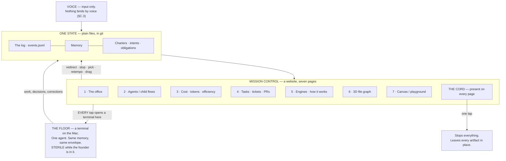
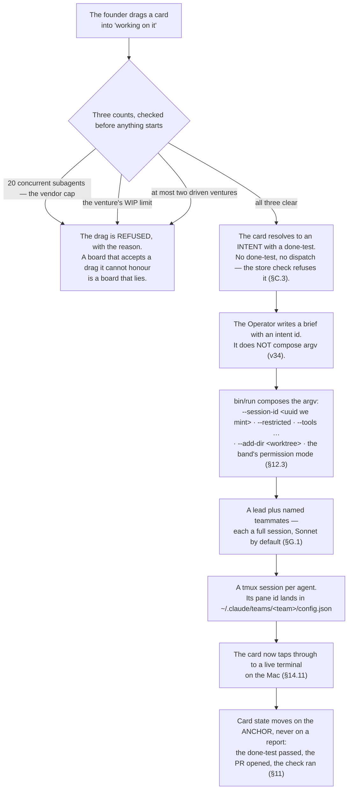
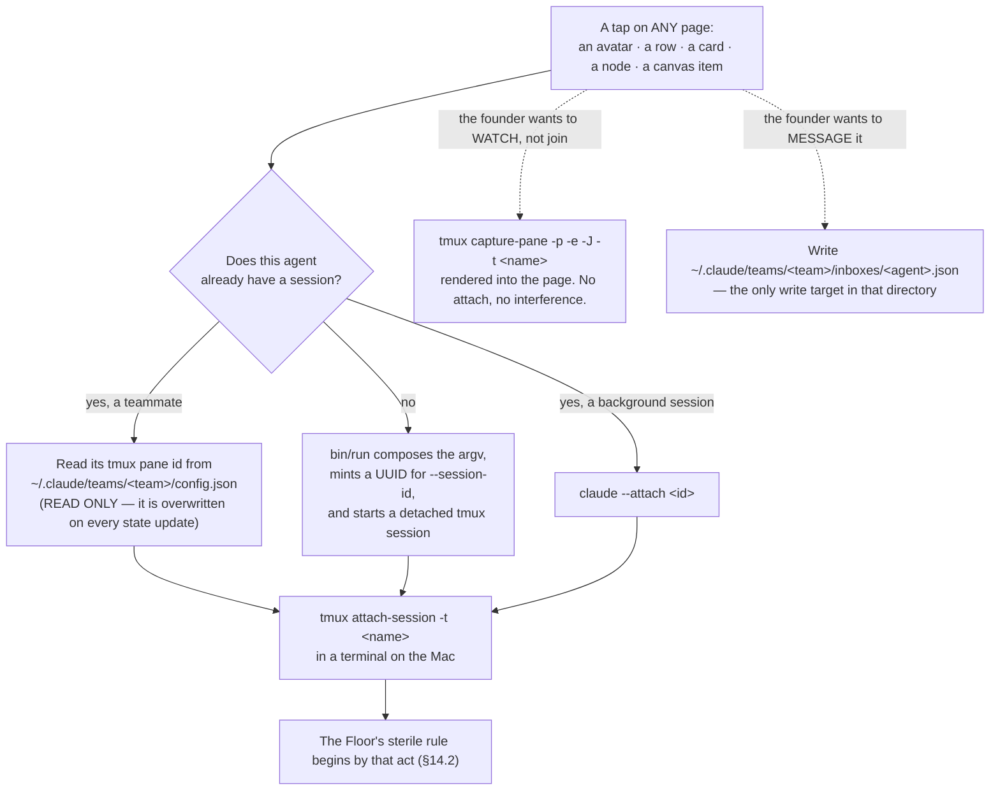

## 14 · Mission control — seven pages, one state, and every tap opens a terminal on the Mac

*obeys: §D entire, v4, v14, v15, v16 · inherits: FINAL §13 — the Floor and the Balcony are absorbed, not deleted*

---

### 14.1 What the founder decided, and what it costs

**(FOUNDER, overruling FINAL row 15.)** Mission control is **a website**, and it is a control surface rather than a
display:

> *"First of all, is the mission control surface. I want to add it, bring it back, include it with the office, and
> also the place where it updates and shows what we are doing and all of that. I want you to have pages with
> different things."*

**(FOUNDER, and this sentence decides the architecture of every page below.)**

> *"remember each agent or each session that we are opening in the mission control or any other surface, it's
> directly opening it in the terminal in my Mac because everything is run on it."*

**(FINAL, the losing image, kept by name.)** FINAL §13 had **two** surfaces over one state — the Floor and the Balcony
— and one rule about the room: *"no project is both"* a display and a control. Five Balcony views, and the office
never a control. That is J.4, and it lost.

**(NEW: what survives the overrule, because it was right for a reason that did not depend on the count of surfaces.)**
FINAL §13.2's rule — **every element is either a fact or a tap, and nothing is only informational** — survives whole
and is extended by v14 to the dashboard the founder asked for. There is still **one state and no second source of
truth**, and no page has anything another page cannot reach.

**(NEW: the cost of v4, stated once and not re-litigated.)** surfaces.md's §4A.11 finding stands unrefuted: *no
Claude Code fleet surface is spatial; every spatial project is a display and every control surface is a table.*
Building a surface that is both is therefore work nobody has published, and the office page is the one most likely to
become a beautiful display. §14.9 keeps FINAL's guard rails on it for exactly that reason.

---

### 14.2 Where the Floor and the Balcony now live

**(NEW: v4 relocates them rather than deleting them, and this table is the whole of the relocation.)**

| FINAL §13 | Where it is now |
|---|---|
| **The Floor** — one terminal, one agent, same memory, same envelope, sterile while the founder is in it | **Unchanged, and it is what every tap opens.** Mission control is the index; the Floor is the destination |
| Balcony · **Now** | page 2 (agents and child flows) |
| Balcony · **Decide** and **Last night** | page 5's desk strip |
| Balcony · **Ventures** | page 1 (the office), one venture per area |
| Balcony · **Cord** | **a control present on every page**, not a view of its own |
| *(new)* | page 3, the dashboard v14 admits |

**(FINAL, unchanged and still binding on the Floor.)** While the founder is on the Floor the system is **sterile**,
detected rather than declared: no new run starts on the founder's window, the venture under their hands is held whole,
queued interruptions wait silently unless they match `wake-me`, and on return they are summarised into **one
paragraph, never replayed one by one**. Mission control obeys the same rule — a tap that opens a terminal starts a
sterile session by that act.



---

### 14.3 The seven pages, at a glance

**(FOUNDER, §D.)** Each row is expanded in its own subsection below. **Every page is ABSENT.** What ships is named in
the substrate column, and the distinction between *the substrate ships* and *the page exists* is the one to hold on
to.

| # | Page | What each tap launches | Substrate | State |
|---|---|---|---|---|
| 1 | The office | tap an avatar → that agent's terminal | Generative Agents `demo` mode, Apache 2.0 | ABSENT; enters through the tool door |
| 2 | Agents / child flows | tap → attach to its tmux session or background session; message → write its inbox file | Claude Code **agent teams** | **substrate ships**; page ABSENT |
| 3 | Cost · tokens · efficiency | a cost row → its run · a window row → retempo · an anomaly → the cord | the event log joined to §16's price table | ABSENT; `~/.agentvibe/events.jsonl` is the spine |
| 4 | Tasks · tickets · PRs | **drag a card into "working on it" → launches a session with a team of agents and hands it the task** | ours; prior art OpenAI Symphony | ABSENT; **the team part has no prior art anywhere** |
| 5 | Engines · how it works | tap a gate → its last ten resolutions; tap a store → its schema and its one writer | the same state as every other page | ABSENT |
| 6 | 3D file graph | tap a node → open it on the Floor | `3d-force-graph` (MIT) renders; **the extractor is ours** | ABSENT; thinnest researched area |
| 7 | Canvas / playground | add a session: worktree, project, provider, model, task, agent → launch, then attach | Langflow (MIT) as the canvas idiom | ABSENT |

---

### 14.4 Page 1 · The office

**What it shows.** The room: every live run a light, one venture per area, and the night replayed at speed in the
morning. **(FOUNDER)** *"include it with the office, and also the place where it updates and shows what we are
doing."*

**What each tap launches.** Tap an avatar → **that agent's terminal on the Mac** (§14.11).

**Substrate, with licence and liveness.** **(FINAL §13.8, inherited whole.)** Rank 1 for admission is **Generative
Agents' `demo` mode (Apache 2.0)**: a top-down town that renders from **one JSON file, four fields per agent per step**
— a tile, an emoji, a sentence, a nullable chat — with **no model and no backend**, assets included. Every live run is
a light, and the sentence's four-level location path maps onto **venture → intent → run → artifact with no schema
change**. The whole bill is porting about forty lines of routing off a dead Django. Rank 2: **AI Town (MIT, alive)**,
which needs Convex. Refused: **WorkAdventure** (AGPL with the Commons Clause; no RPC places an avatar), **ChatDev**
(the office is gone). Which one is §I row 12, and it is the founder's.

**State.** **ABSENT.** It enters through the tool door like a scraper — its LICENSE read, its input declared (it reads
the event feed and nothing else), its exposure read-only, a caller in the same change, a test that fails without it,
an exit note. Because it reads and never writes, the door's first three tests are met trivially.

**What is genuinely new.** Nothing in the renderer. What is ours is **the JSON writer over the event log** (ABSENT),
and the fact that in this plan an avatar is **a tap** rather than a picture — which is the half FINAL refused and v4
overruled.

**(FINAL, and these guard rails survive the overrule unchanged.)** No notifications, no badges, no unread count, no
obligations; never on the phone; never where a decision is made; nothing reads whether you watched it. *Entertainment
is a legitimate requirement and a disqualifying control surface*, and the reason to be strict is that **a beautiful
surface will always win the argument against a useful one.** The one change v4 makes: an avatar may open a terminal.
It may not *be* the decision.

---

### 14.5 Page 2 · Agents and child flows — the page whose substrate already ships

**(FOUNDER)** *"managing the agent using child flows and seeing the agents and the environment walking … the agent
orchestrator and then getting more subagents and what they are doing in the current task and, like, who is walking
and who just sleep. And then when I click on it, the terminal which runs the agent on my Mac is popping up, so I can
message it or message it directly from the mission control."*

**What it shows.** The Operator and its children; who is working, who is sleeping, what each is doing on the current
task.

**(NEW: surfaces.md's single largest finding is that this page substantially ships, and the ordering the founder asked
for is already the vendor's.)** Claude Code **agent teams**: *"One session acts as the team lead, coordinating work,
assigning tasks, and synthesizing results. Teammates work independently, each in its own context window, and
communicate directly with each other. You can also talk to any teammate directly without going through the lead"*
(accessed 2026-09-05, confidence H). The panel already sorts the way the founder described it: *"an idle teammate's
row stays in the panel while any teammate or subagent is still working"*; idle rows hide after 30 seconds once the
whole panel is idle; more than three idle collapse into `N idle agents`; working, failed and viewed teammates always
keep their own rows.

**The join key a website needs is already a file on disk.** `~/.claude/teams/<team>/config.json` holds **session ids
and tmux pane ids**; `~/.claude/teams/<team>/inboxes/<agent>.json` is the mailbox; `~/.claude/tasks/<team>/` is the
task list; the team name is `session-` plus the first eight characters of the session id.

**What each tap launches.** Tap a row → attach to that agent's terminal (§14.11). Message a row → **write the agent's
inbox file**; entries are validated on read and malformed ones are *"removed from the file"*.

**(NEW: the one sentence that decides how the page may touch that substrate.)** *"The team config holds runtime state
such as session IDs and tmux pane IDs, so don't edit it by hand or pre-author it: your changes are overwritten on the
next state update."* So **`config.json` is a read source and never a write target.** The inbox file is the write
target, and it is the only one.

**Substrate constraints that shape the page, all documented, all H** (v13): agent teams are **experimental and off by
default** (`CLAUDE_CODE_EXPERIMENTAL_AGENT_TEAMS=1`, §I row 7); *"No nested teams: teammates cannot spawn their own
teammates"*; *"One team per session"*; `/resume` does not restore in-process teammates; spawning requires an
interactive session, so **`-p` never forms a team**. Tokens: *"Agent teams use approximately 7x more tokens than
standard sessions when teammates run in plan mode"*, and the vendor's own advice is *"Use Sonnet for teammates"*
(§G.1).

**So the child-flow tree the founder asked for is two mechanisms, not one** (v13): **one level of named teammates**
from agent teams, and **the deeper tree from subagents** — depth 3, 20 concurrent, `Workflow` removed from all of
them. The page draws one tree; underneath it, the first edge is a team edge and the rest are subagent edges, and the
page says which is which because they behave differently when the session ends.

**Also on the page, from the same substrate:** `claude agents --json` prints active background sessions as a JSON
array for scripting, and `--json --all` includes completed ones. Its caveat is the page's problem, not a blocker:
*"Opening agent view requires an interactive terminal."*

**State.** The substrate **ships**. The page is **ABSENT**.

---

### 14.6 Page 3 · Cost, tokens, efficiency — and why a dashboard is admitted

**(FOUNDER)** *"I would like to have layer when cost and tokens, efficiency, monitoring, and a dashboard that is
showing, you know, numbers and things about the system."*

**(NEW: v14 resolves a real collision rather than papering over it.)** surfaces.md 6 states it as two positions:
FINAL §13.2's Balcony table has **no dashboard row** and says *"nothing is only informational"*; the founder asked for
a dashboard. **Both are kept, by one rule: every number on the page names the tap that acts on it.**

| What it shows | The tap on it |
|---|---|
| spend and tokens per run, per agent, per venture | → the run itself, on the Floor |
| the five-hour window **and the weekly window** (v22) | → retempo that venture |
| cache hit rate, and the reserve | → the batching decision it implies (§16) |
| an anomaly | → **the cord** |
| the quality-of-belief split — how much of what is believed is rung 1 and how much rung 4 (§11) | → the done-tests behind the rung-4 share |

**Substrate.** The event log, with `gen_ai.*` attribute names and an id on every row, joined to §16's price table.
`~/.agentvibe/events.jsonl` exists on this Mac — 1.1 MB, 3,840 rows — and `mission-control/` (60 files, a Bun and Hono
server with an SSE feed and a React client) and `bin/warroom` (per-worker cost pricing, typed events, snapshots)
exist on branch `ceo-1-1788609834`. The page is **ABSENT**; its spine is not.

**(NEW: two facts from §G.2 that the page must render as two different things, because they end differently.)** A
**seat** limit — *"You've hit your session limit"* or *"your weekly limit"* — is shared across all models and **cannot
be escaped with `/model`**. A **model-family** limit — *"You've hit your Opus limit"* — can. **One is a stop and the
other is a reroute**, and a dashboard that draws them the same way will teach the founder the wrong reflex on the
night it matters.

**(NEW: and the one number the page must refuse to invent.)** No numeric Anthropic subscription quota is published
anywhere fetched. Magnitudes are relative only — Pro *"at least 5x more usage per 5-hour session than Free"*, Max
*"5x"* and *"20x more usage than Pro"*. **A Max window's real capacity is measurable only from an account.** So the
window gauge is drawn from observed consumption on this seat, never from a published denominator, and it says so.

---

### 14.7 Page 4 · Tasks, tickets and PRs — where a card launches a team

**(FOUNDER)** *"a place where I can manage the tasks and the tickets and the PRs … to add task and a timeline and
also like to jog the tasks on a board which has different stages … when I drag a task … to a section when it's saying
working on it or, like, preparing for it, it launches a team or added team of agents to the session, like, add a
session and then, like, give it the task, and then it starts walking."*

**What it shows.** A board with stages, a timeline, and a kanban; PRs beside tickets.

**What the tap launches.** **Dragging a card into "working on it" launches a session with a team of agents and hands
it the task.**



**Substrate, and what the world actually ships.** **(NEW: v16 replaces FINAL's reference project, because both ends
moved.)** **OpenAI Symphony** — Apache-2.0, Elixir, created 2026-02-26, **last push 2026-08-19**, 27,042 stars, not
archived — is the closest live prior art, described by its own repository as: *"Symphony turns project work into
isolated, autonomous implementation runs, allowing teams to manage work instead of supervising coding agents."* Its
mechanism (polls Linear on an interval, one isolated workspace per issue, restarts stalled agents) is **REPORTED at
confidence M** — the spec was not fetched. **vibe-kanban is worse than FINAL recorded**: its README's own first status
line now reads **"Vibe Kanban is sunsetting"**, which is stronger than *unmaintained since 2026-04-24*. Its execution
unit is nonetheless the founder's page in nine words: *"each workspace gives an agent a branch, a terminal, and a dev
server."*

**Card fields, borrowed from two shipped schemas** (cognition.md): from **Linear**, the app is set as **`delegate`,
not assignee** — *"so humans maintain ownership while agents act on their behalf"* — and a session is created
automatically when an agent is mentioned or delegated an issue. From **GitHub Copilot's coding agent**, the hard caps
that make a card bounded: *"Copilot can only work on one branch at a time and can open exactly one pull request"*, and
a maximum execution time.

**What is genuinely new, and it is named as new because nobody has built it** (v16, §I row 9): **nothing found gives a
card a *team*.** Every board-to-session project surveyed maps **one task to one agent**. The founder asked for a team,
and that part is ours to build with no reference implementation to read.

**(NEW: and one field nobody ships that this board needs anyway.)** cognition.md searched for it: *no system reached
carries an explicit definition-of-ready gate, a blocked-reason enum, a dependency field consumed by the agent, or
duplicate detection.* Copilot's *"straightforward issues"* is the only readiness language anywhere, and it is advice.
Here the definition of ready is not new work: **it is the done-test**, and the store check already refuses an intent
without a falsifiable one.

**State.** **ABSENT.**

---

### 14.8 Page 5 · Engines and how it works

**(FOUNDER)** *"a place where I can see all the sticks engines and do see how the system is working."*

**What it shows.** Every engine, every gate, every store, and the flowcharts of this plan — **live rather than
drawn**. **What each tap launches.** Tap a gate → its last ten resolutions. Tap a store → its schema and **its one
writer**.

**(FINAL §13.7, inherited: this is where *ask the company anything* lives.)** Four ways in, at four depths. *Why did
you do that* → the handover, then the brief, then the trace, then the chain of direction: this run ← this intent ←
this charter ← the sentence the founder said, on this date. *Why did you NOT do that* → the ranking at that tick, and
which gate stopped it. *What do you believe about X* → the memory items on X, each with source, date, expiry and
falsifier. *How does the whole thing work* → this document and its diagrams. **Because a run cannot start without an
intent id and an intent cannot exist without a founder sentence behind it, everything the system ever did traces back
to something the founder actually said** — not a logging feature, a consequence of one rule.

**(NEW: this page carries the desk strip, which is where FINAL's Balcony went.)** *Decide* — the whiches, each with
its six fields and both options already built — and *Last night*, the briefing. The briefing's shape is unchanged
from FINAL §13.4, and the field to fight for is unchanged too: **what I could not check.** A briefing that reports
only successes trains the founder to trust the system uniformly, which is exactly wrong when some done-tests reach
rung 1 and some only rung 4.

**State.** **ABSENT.**

---

### 14.9 Page 6 · The 3D file graph

**(FOUNDER)** *"to have three d graph of the files in the project, in each project. So it's like a brain wired
altogether."*

**What it shows.** The files of one project as a wired brain; edges are imports and co-change. **What each tap
launches.** Tap a node → open that file on the Floor.

**Substrate, with the sharp caveat.** **`vasturiano/3d-force-graph`** — MIT, 6,369 stars, last push 2026-04-05, not
archived, *"3D force-directed graph component using ThreeJS/WebGL"*. **Its input is a `{nodes, links}` object and it
does not read a repository.** **Gource is refused**: GPL-3.0, the strictest licence surveyed, and it animates a 2.5D
tree from a VCS log — a replay of history, not a live wired brain.

**What is genuinely new.** **The extractor is entirely ours.** surfaces.md's gap 3 is explicit: *"No maintained
repo→3D-graph project was verified"*, and this is **the thinnest of the five sub-questions researched**. One unnamed
"3D IDE for Obsidian" that renders a vault as a code city could not be resolved to a repository. §I row 10 puts the
appetite question to the founder for that reason.

**State.** **ABSENT**, and honestly the least-evidenced page in this section.

---

### 14.10 Page 7 · The canvas and playground

**(FOUNDER)** *"a place where it's like a canvas where you see all the agents running in all the sessions,
connecting … and then, like, you can add more sessions and, like, to spec the worktree and the projects and, like,
which provider models use and, like, which task and which agent, like, to have a full playground."*

**What it shows.** Every agent in every session, and their connections. **What the tap launches.** Add a session:
choose worktree, project, provider, model, task and agent, then launch it in the background and attach to it
(§14.11).

**Substrate, decided by licence rather than by taste** (v15). **Langflow — MIT, 154,275 stars, last push 2026-09-05,
alive — is the canvas idiom.** Two are refused and neither refusal is close:

- **n8n**, whose LICENSE.md was the one licence file read raw in the lane: *"You may use or modify the software only
  for your own internal business purposes or for non-commercial or personal use. You may distribute the software or
  provide it to others only if you do so free of charge for non-commercial purposes."* The same file adds that
  *"Content of branches other than the main branch … are not licensed."*
- **Flowise**, which is **archived** (`archived: true`) with licence **NOASSERTION**. An archived repository with an
  undetected licence is two independent reasons, not one.

**(NEW: a caveat the whole substrate table carries, from surfaces.md's own gap 1.)** **Nine of ten licences in that
lane are GitHub's SPDX detection rather than a quoted LICENSE file.** Only n8n's was read raw. Each is one fetch away,
and no bulk adoption should happen before those fetches — the same discipline v17 applies to the 2,111-skill upstream.

**State.** **ABSENT.**

---

### 14.11 The terminal-pop mechanism, decided

**(FOUNDER, and it is the sentence that makes this a mechanism section rather than a preference.)** *"it's directly
opening it in the terminal in my Mac because everything is run on it."*

**(NEW: §D.1 — tmux through its own CLI. Five commands are the whole of pop, watch, type and kill.)** Read from
claude-squad's source, and **claude-squad itself is AGPL-3.0, so its source is not vendored** — what is used is the
documented tmux CLI those five commands call:

```
tmux new-session -d -s <name> -c <dir> <program>     # pop
tmux attach-session -t <name>                         # watch, interactively
tmux capture-pane -p -e -J -t <name>                  # read a pane WITHOUT attaching
tmux kill-session -t <name>                           # kill
tmux has-session -t <name>                            # does it still exist
```



**For the founder's own sessions there is a shipped shortcut, with conditions.** `claude --teammate-mode tmux` gives
**a pane per teammate**: *"Split panes: each teammate gets its own pane. You can see everyone's output at once and
click into a pane to interact directly. Requires tmux, or iTerm2."* `auto` upgrades when already inside tmux or in
iTerm2 with `it2`. **`iterm2` mode needs the `it2` CLI *and* iTerm2's Python API enabled** (Settings → General →
Magic). The flag is **experimental and hidden**: *"The `--teammate-mode` flag is experimental and doesn't appear in
`claude --help`."*

**The page must know which terminal it is opening into**, because **split panes are unsupported in VS Code's
integrated terminal, Windows Terminal and Ghostty** (H). A surface that silently degrades on three common terminals is
a surface that will be blamed for the runtime's behaviour.

**Background sessions, the other route:** `claude --bg` *"Start the session as a background agent and return
immediately. Prints the session ID and management commands"*, then `claude --attach <id>` *"Attach to a background
session in this terminal."* `--session-id` takes a caller-supplied UUID, which is what lets the website own the id it
later attaches to; `--name` sets a name *"shown in `/resume` and the terminal title."*

**(UNVERIFIED, and named rather than assumed.)** **AppleScript, `open -a Terminal`, and an iTerm2 AppleScript
hand-off**: *"Not found: any primary source … I fetched none, so the obvious macOS route is unverified, not absent."*
The design does not rest on it. **Also UNRESOLVED:** `-w` / `--worktree` and `--tmux`, which a prior measurement
recorded and this session's fetch of the CLI reference did not document. One `claude --help` closes it.

---

### 14.12 Session history, count, and memory efficiency

**(FOUNDER)** *"we also need to manage, you know, the history and number of sessions and, like, to understand how do
we save memory and to be efficient."* **(NEW: §D.2 answers it in three parts, each with a mechanism.)**

**History is the event log, not the transcripts.** Transcripts are read by the mining pass **over a snapshot** and
never parsed live, because *"The entry format is internal to Claude Code and changes between versions, so scripts
that parse these files directly can break on any release"* (v26, §13.7). A format change then costs one failed batch
rather than a broken surface.

**Count is bounded three ways, and the board refuses a drag that would breach any of them** (§14.7): **20 concurrent
subagents** (the vendor's cap, with *"Concurrent subagent limit reached"* on overflow), the **WIP limit per venture**,
and **at most two driven ventures**. Naming the bound in the surface is what makes it a control rather than a
disappointment.

**Memory efficiency is four things already decided elsewhere, collected here because this is where the founder asked
the question**: the two-tier index (v27, §13.4) · delta-only writes (v24, §13.3) · one writer (v25, §13.1) · and the
**one-hour subscription cache TTL**, which is why standing prompts are byte-identical and carry no timestamp (§G.3,
§16). A fifth, from the same place: agent teams cost *"approximately 7x more tokens … when teammates run in plan
mode"*, so page 2's convenience has a price and §G.1 pays it with Sonnet teammates.

---

### 14.13 What this page-set inherits from FINAL §13.10, and what is still missing

**(FINAL, and it is the most useful table in §13 because it separates bought from built.)** For *walking for me* the
watching and the stopping are bought and the deciding is not; for *walking with me* the steering primitives are bought
and the memory of what was said is not. **In both halves the missing piece is the same: a durable, typed record of the
founder's intent addressed to an id.** Every vendor built the transport; none built the ledger; this repository
already has one.

| The verb | What ships | What is still built here |
|---|---|---|
| See the fleet | `claude agents` (state-ordered, needs-input first, peek-and-reply, `--json`); **`claude --bg` and `claude --attach <id>`**, which FINAL's row omitted; `claude-view` (MIT, read-only, REPORTED) | venture, window, cost and verdict as axes; a label written **at emission**, never by a model at render time |
| Be told | Remote Control push; task notifications | the bell with `wake-me` classes, a budget and a count |
| Approve from the pocket | the Channels relay binding to **the exact tool call**; Remote Control holds `AskUserQuestion` indefinitely | **nobody routes a decision between two built things** — the six-field Decide item |
| Stop | `Ctrl+X` in agent view; `Esc` in a session | no fleet-wide halt survives sleep — **the cord** |
| Redirect without killing | a queued message reaches the model between tool calls; `Esc` keeps the work; **agent teams add an on-disk mailbox with a validating reader** | a redirect as a log row addressed to an intent id, **and a defect recorded in the brief** |
| Speak | `/voice`, native, works into agent view | **no product reads an instruction back before acting** — the read-back |
| A page that answers back | artifact pages with a shared database, viewer identity and comment threads that wake the publishing session | mission control on that runtime; a comment in the margin is a redirect addressed to an intent id |

**(NEW: surfaces.md corrects two of FINAL's rows and leaves one standing.)** The fleet row gained `--attach` and
`--bg`. The redirect row's *"dies with the session"* is now only half true — the mailbox is on disk, though *"its
durability is not stated on the page."* The *page that answers back* row is unaffected by anything fetched.

**The cord is on every page, and it is the same cord** (§12.9): one file, read first on every tick, cancelling running
work, revoking outward grants, finishing nothing new, leaving every artifact in place. **There is one kill and not
two, because a kill that lives in a second place is a kill that disagrees** — which is exactly the risk a seven-page
website introduces, and the reason it is a control rather than a page.

**Enforced by:** every page reading the one state and writing nothing but the inbox file and the intent log
(**ABSENT**) · `~/.agentvibe/events.jsonl` and `mission-control/`'s SSE feed (**exist** on branch
`ceo-1-1788609834`; the spine, renamed) · the room's JSON writer (**ABSENT**) · `bin/run` as the only composer of
argv, so that a tap on a website cannot widen a grant (**ABSENT**).
