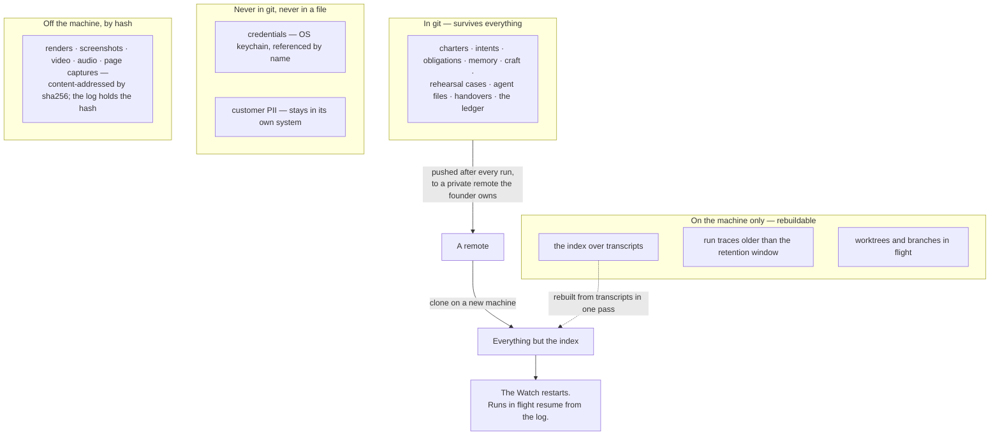

## 15 · Runtime and the Mac — the facts that bind, and each provider

*obeys: §D.1, §D.2, v13's constraints, **v56** — which gives this section its one stated exception (§15.1a) — and
**v79**, which prices that exception with a measurement (rethink round, 2026-09-06) · **and, from the fixer round of
2026-09-06, v83 (no box), v84 (`night_capable`), v90's carrier rule, SPINE §L O81, O82, O83, O88, O91, O92, O93, O104;
R29, R33, R37** · inherits: FINAL §14 and §16.7*

---

### 15.1 The Mac now, the split as the target

**(FOUNDER, and it is why this section exists at all.)** *"everything is run on it."* Day one is this Mac: lid open,
on power, logged in — **with one stated exception (v56)**, the cloud lane of §15.1a, which the same founder asked for
in the same interview and which exists only for the hours this sentence is false.

**(FOUNDER, fixer round 2026-09-06: E1.)** *"dont need for now. use this mac and when cant use cloude"* — **v83**,
`class: originated`. **No always-on box.** The night runs on this Mac; when the Mac cannot hold a night, the cloud lane
of §15.1a is the fallback. The box is **§J 73**, a losing image with a `wins_if:` (R37 shows maintenance sleeps inside
declared nights, or three attempted nights each end `orphaned`), and §I row 18 closes on it. What *"lid open, on power,
logged in"* was as a habit is now a **predicate** (§15.1b, v84).

**(NEW: v39 makes that sentence a hosting decision, not only a runtime one.)** **Mission control is served on this
Mac**, by `mission-control/` — the Bun and Hono server and React client on branch `ceo-1-1788609834` — because a tap
that pops a terminal needs `tmux` on the same machine, and a published page cannot reach it. So the website inherits
every fact in this section: it is up while the Mac is up, it dies at logout with everything else, and it is reachable
from the phone ~~over the founder's own network~~ **through an authenticated tunnel, the server itself bound to
loopback and every write route checking a keychain-held token** (moved 2026-09-06: v66; §14.1 carries the row).
**What the phone keeps when the Mac is asleep** is the published
artifact pages — the briefing, the read-back, and the Decide items — which are for reading and deciding and can pop
nothing. §14.1 carries the cost of that split, stated once: two renderers over one state.

~~**(FINAL)** The target is the split the design implies. **The Watch, the Sender and the log on an always-on machine**,
because obligations must complete and the log must never be lost. **The runs wherever they are cheapest**, because
they hold no credentials by construction. **The founder's Mac as a client** — a very good one — that can sleep
without the company stopping.~~

~~**(FINAL, and the reason the split is small.)** A small always-on box with a real service manager solves every laptop
problem for a few pounds a month. **It does not solve the credential problem; it relocates it**, which is why only the
three no-model parts move there. The box is bought after the first measured overnight, not before.~~

**(amended 2026-09-06: E1 / v83.)** The split is **§J 73**, kept by name. Three lanes drew it (THINKER: A1, C13; FIXER:
A's S1, C's stage 2) and the founder overruled all three. What it would have bought: a machine that does not sleep (§15.1b
answers with a predicate) and **one holding no founder identity** (§15.4: an accepted risk with a standing drill, O83).

---

### 15.1a The one exception: when the Mac is off

**(FOUNDER, DECISIONS §15, and this is the whole of the exception.)** *"When my Mac is not on, and then we need to use
not the regular Claude code or codex in terminal, then you can use codex or Gemini I think they don't bun those. But
still keep it open"* — clarified the next round as **"Yes — a cloud lane for when the Mac is off"**. That is v56. It
does not soften *"everything is run on it"*; it carves one exception out of it and states the exception's price.

**(NEW: what the lane may do TODAY is narrower than the sentence that asked for it, and the narrowing is evidence,
not caution.)** The facts are §10.2a's and are not restated here. Their consequence for this section is three rows:

| Off-Mac lane | May it MAKE, today? | The evidence |
|---|---|---|
| **Codex cloud as a PR reviewer** — `@codex review`, or automatic review on PR open | it reviews; it is **admitted** | vendor-documented, needs no local Codex, runs in OpenAI's sandbox — so it **sidesteps #19945**, which is a defect of *local* `codex exec` with stdio detached from a TTY |
| **Codex cloud as a maker** — `codex cloud exec --env <id>` | **UNVERIFIED** | no vendor page prints a non-interactive command or an endpoint; the command list is an open feature request's author's assertion (openai/codex#24777, M). Codex is also **not installed here** (§I row 5) |
| **Claude Code `--cloud` and Routines** · **Jules** | **documented, and not decided** | Anthropic's is documented argv plus a documented fire endpoint, and it **shares the Claude seat** — the same seat as the Floor and the same terms clause as §I row 1. Jules' own API page says *"The Jules API is in an alpha release, which means it is experimental"* |

**The mechanism, and it is what keeps an off-Mac night from being an unreviewed write into the house.** A hosted run's
output lands as **a pull request or a staged artifact**, and **the Mac reconciles it on wake** — never into the house
directly. `bin/run` gains a `cloud` carrier that **mints a task and records its id, and does nothing else**, and the
Watch reads the pull requests on wake. **All three are ABSENT.** The reason the shape is this and not a remote write
is the same reason §15.3 gives for plain files: a machine that was asleep cannot have judged anything, so the judgement
happens here, once it is awake.

**(NEW: v67 shuts the maker half of this lane today, and the refusal is mechanical.)** The carrier table gains a
`stop:` column and **`bin/run` refuses to mint unattended work on a carrier whose `stop:` reads UNKNOWN** (§12.9).
Cancel is UNKNOWN for Codex cloud — the row above says so — so the maker lane is refused by the launcher rather than
by a policy someone has to remember. The **reviewer** lane is unaffected: it starts nothing unattended.

**(FOUNDER, rethink 2026-09-06: D14 — decide the lane after the measurement, and add the charter field now.)** Two
things, and only the second is a decision about the lane. First, **the charter gains `cloud: allow | deny`, default
`deny`** — whichever lane eventually wins, a venture may say no, and the field costs one line to add now and a
migration to add later. `bin/check-stores` refuses a charter without it. Second, the lane itself stays **§I row 15,
the founder's**, and the measurement it asked for has been taken.

**R5 is DONE, and it prices the lane at zero for the week measured.** From `pmset -g log` on this Mac, read-only,
2026-09-06 (DECISIONS §19, verbatim):

> *"span 2026-08-30 21:44 → 2026-09-06 09:39 (156 h, all the log retains) · asleep 40.7 h (26%) in 487 episodes ·
> zero episodes of one hour or longer · longest single sleep 0.3 h (about 20 minutes). The Mac was never off long
> enough for a cloud lane to have bought anything back this week."*

**The caveat travels with the number and is not a footnote to it.** The log covers **only the span it retains**, and
**DarkWake power-naps are counted as wakes** — so *asleep* here means *the machine could not have run a process*, and
a longer history might read differently. What the measurement does settle is the shape of the argument: **487 short
sleeps and no gap over an hour** is a tail a cloud lane cannot buy back, and §I row 1's terms question is a real cost
to pay for it. It does not close row 15; it prices it.

**(FACT: world.md 24 — and it cuts the other way from how it reads.)** Four weeks of Codex release notes mention **no
cloud exec, no cancel and no #19945**. That is **absence, not denial**: the June–August window is unread (**R26**),
and no vendor page states that a cloud creation API does not exist. The maker row above stays UNVERIFIED for that
reason rather than becoming a negative.

**Two rows stay open, and neither is an agent's to close.**

- **§I row 1, the terms** — **OPEN by the founder's word** (*"still keep it open"*). The OpenAI half is **UNKNOWN and
  unread rather than permissive**: four HTTP 403 refusals against one host across two dates. Anthropic's clause, on
  file from the runtimes lane, prohibits access *"through automated or non-human means"* except via an API key or
  *"where we otherwise explicitly permit it."*
- **§I row 15, which hosted lane may MAKE when the Mac is off** — raised by v56 and **the founder's, with row 1**.
  The tension is stated once and not re-argued: the founder's named preference has no driver, and the lane with a
  driver runs on the seat the terms question is about.
  **(amended 2026-09-06: E1 / E13.)** With no box, **the cloud lane is the night's fallback whenever `night_capable`
  is false** (§15.1b), so the maker path's UNVERIFIED status — v56(b) above — is now **on the critical path of the
  first night**. R37 replaces the week R5 measured. Still the founder's, with row 1.

**(NEW: what this exception does NOT move.)** Routines stay **refused for the Watch** — a one-hour minimum interval,
*"The minimum interval is one hour; expressions that run more frequently are rejected"*, and no reach into anything
this system stores on the Mac. Read *"no local files"* narrowly: a routine clones every selected repository per run and
pushes `claude/`-prefixed branches, so it has a repository and not this laptop. **The Watch is still the LaunchAgent of
§15.2**, and a cloud lane that cannot see `~/.agentvibe/` cannot be a supervisor of anything here.

---

### 15.1b The night on this Mac — `night_capable`, a predicate and not a habit

**(FOUNDER, fixer round 2026-09-06: E13 — *"Watch checks, refuses, routes to cloud"*; v84, `class: ratified`; the
mechanism is O81.)** E1 put the night on this Mac, and this Mac sleeps. **(THINKER: A1 · W33)** — `pmset -g custom`
reads `sleep 1` on AC and on battery; seven days of log hold 391 maintenance sleeps, 74 back-to-sleep and 24 clamshell
sleeps; on battery at 71% when measured. Cited, not restated; its reading of R5 is carried here: *never awake
unattended* is the same log as *no tail for a cloud lane*. A habit is a wish the Watch cannot verify. So:

- **`night_capable` is computed every tick** from three reads: on AC (`pmset -g batt`), sleep off — `sleep 0` or
  `disablesleep 1` (`pmset -g custom`) — and the power assertions (`pmset -g assertions`). **`keel/host/power.yml`
  declares the contract** (ABSENT, §L O81). `class: adapter · pmset`; `vendor_wins_if:` the runtime refuses unattended
  work on a sleeping host.
- **A brief carrying `unattended: true` is refused with the printed reason when false**, and ~~routed to the cloud
  carrier where the charter says `cloud: allow`~~ **held, not minted, until the carrier's `stop:` is known (v67)** —
  the charter's `cloud: allow` decides whether it may go at all, and v67 decides that today it may not (amended
  2026-09-06: challenge D P1-3). §4 carries the refusal and the hold; §14 the page-3 fact and
  briefing line. This section owns the three reads and the host file, nothing else.

**(NEW: the precondition, stated once, because four sentences of this plan implied it and none said it · amended
2026-09-06: challenge D P1-3.)** **On this Mac the night runs only when the founder has run `pmset -a disablesleep 1`
— or the predicate reads a held `caffeinate` assertion, which is R41, one measurement — and the machine is on AC.**
Until one of those holds, `pmset -g custom` reads `sleep 1` (W33) and **`night_capable` is false every night**; every
unattended brief is refused; the fallback **holds** the brief and mints nothing while the hosted carrier's `stop:`
reads UNKNOWN (v67, §3.5); so no night runs, and **month one's scoreboard cannot be scored** — §13a.11 and §21.1b
score it on *three consecutive nights with `orphaned = 0` and a handover each*, a predicate that cannot become true
under a false one. **This is not a new refusal**: §20.2 row 7 deferred the `disablesleep` act to build time and that
deferral stands. What was missing was the consequence, and it is stated here rather than left to be discovered on the
first night. **(R41, OPEN)** — does a held `caffeinate -i` assertion visible in `pmset -g assertions` satisfy
`night_capable`, and does it survive a lid close? If it does, the founder's act is a bounded command per night rather
than a machine-wide policy change; if it does not, `disablesleep` is the only route and the deferral in §20.2 row 7 is
what gates the first night. **Mechanism:** `keel/host/power.yml` declares which of the two the contract accepts
(**ABSENT**, §L O81).
- **The probe asserts it by attempting** (O10's rule): `bin/probe` mints a time-bounded detached child across
  `pmset sleepnow` and reads `run.started` against the wake.

**(NEW: O82 — the standing measurement; thirty days is a floor.)** R5 measured one week, the busiest the machine has had
(THINKER: B15). **`pmset -g log` becomes a v55 standing intent** whose output is one `keel/shared/facts.yml` row,
`mac-off-hours` — longest gap and off-hours over **thirty days including a weekend away**, the floor not the target —
and that row re-reads §I row 15 (**R37**, OPEN). It carries `valid_until` (O126) and a ceiling per run (v55).
`class: adapter · pmset`; its **`vendor_wins_if:` is the OS publishing an uptime history**, and §17.4.3 holds that
column for every O81–O127 so it is looked up rather than repeated (added 2026-09-06: challenge D P3-6). **§J 73's
`wins_if:` is written against this row**, so the box comes back by a measurement and not by an argument. Kept by name: §J 73 · 76 · 75.

**Mechanism:** the three `pmset` reads in `bin/watch` and `keel/host/power.yml` (**ABSENT**, §L O81) · the sleep
drill in `bin/probe` (**ABSENT**, O81) · the `mac-off-hours` standing intent and its `facts.yml` row (**ABSENT**,
§L O82; R37 OPEN).

---

### 15.2 Supervision, on macOS

**(FINAL, from Apple's documentation.)** A **LaunchAgent** holds the Watch. It runs as the founder's user, which is
what reaches the keychain and the subscription's OAuth, and **it dies at logout** — so the honest statement is that
the Mac stays logged in with the lid open, or the night ends, **with one stated exception (v56)**: the cloud lane of
§15.1a keeps running, because it never needed this machine. What it cannot do is reach anything stored on it, which
is why it is an exception to the runtime and not to the Watch. **(amended 2026-09-06: v84)** *"Or the night ends"* is
`night_capable`'s call now (§15.1b).

Six facts, each of which changes the code:

- **`StartInterval`, never `KeepAlive`.** A tick runs and exits. `KeepAlive` on a script that exits zero is an
  infinite loop throttled to one launch every ten seconds.
- **`StartInterval` coalesces missed firings**, so a Mac that slept through four ticks fires once on wake.
- **`caffeinate -i`, time-bounded**, prevents idle sleep. **Nothing but `pmset -a disablesleep 1` prevents lid
  sleep.**
- **`launchd` has no restart ceiling beyond its throttle**, so ~~the supervisor implements one~~ **the Watch's own
  tick implements one** (amended 2026-09-06: O91) — N restarts in T seconds, then it escalates rather than loops.
  **`bin/supervise` is REFUSED, not built** (§L O91, `class: refuse`): the vendor ships a supervisor daemon with leases
  — **(THINKER: A7 · W38)** `~/.claude/daemon/{control.key,dispatch,roster.json}`, `~/.claude/jobs/`, *"idle 5s with
  no clients — exiting … leases=0"* — and two supervisors over one process table argue over the first orphan at 03:00.
  Until **R31** reads the daemon's lease semantics, `bin/run` mints via bare `claude -p` in a detached tmux session
  (pane, process group and session id ours), never via `--bg` (§J 85); O15 reads the daemon's roster **read-only**.
  `vendor_wins_if:` a service mode that does not idle-exit, with readable leases.
- **`KeepAlive` cannot catch a hang**, so a separate heartbeat, and a **process-group kill**: a timeout that kills a
  child while its grandchild runs on is a timeout that does nothing.
- **Every tick is crash-only** — read state from disk, take one move, write, exit. A tick that vanishes loses exactly
  one tick.

**(NEW: v12 decides what the Watch is *not*, and it is a runtime fact rather than a preference.)** **`/loop` is
refused in production.** It is *"session-scoped: they live in the current conversation and stop when you start a new
one"*, carries a 7-day expiry, and its hard limit is *"Tasks only fire while Claude Code is running and idle."* A loop
that requires an open idle session is not a supervisor. **The Watch is the loop**, and `/loop` stays a Floor
convenience.

**(NEW: the vendor's own three scheduling tiers, which is the cleanest statement of why the LaunchAgent survives.)**
Cloud **Routines**: no machine and no open session, but a **1-hour minimum interval and no local files** — a fresh
clone — so they cannot reach anything this system stores. **Desktop scheduled tasks**: machine on, no open session,
1-minute minimum, local files. **`/loop`**: machine on **and** session open. Only the middle tier and a LaunchAgent
touch local files without an open session, and only the LaunchAgent is ours to supervise.

**(NEW: O79 — blue-green at a tick boundary, and it is free because of the last fact above.)** Every tick is already
crash-only, so a new `bin/watch` or `bin/send` is swapped **between ticks** rather than during one: the running tick
finishes, the next one starts on the new code, and a bad swap costs one tick rather than a partial outward act. This
is the whole of the deployment story for the two programs that may act on the world, and it needs no mechanism beyond
the boundary that already exists.

**Mechanism:** `~/Library/LaunchAgents/…watch.plist` (**ABSENT**) · ~~`bin/supervise` (ABSENT)~~ **`bin/supervise` —
REFUSE until R31** (amended 2026-09-06: O91) · the tick-boundary swap
in `bin/watch` and `bin/send` (**ABSENT**, §L O79).

---

### 15.2a The host directory, and a probe that asserts by attempting

**(NEW: O10.)** Every fact this section states about the machine — the plist, the managed-settings template, the env
file (`CLAUDE_CODE_EXPERIMENTAL_AGENT_TEAMS`, `ANTHROPIC_DEFAULT_HAIKU_MODEL`), the sandbox block, the `denyRead`
list, the expected macOS grants — is **configuration that lives somewhere or a sentence that rots**. It lives in
**`keel/host/`**, one directory, in git, and it is what a new machine is rebuilt from.

**(NEW: the fixer round adds four files to it, every one ABSENT.)** `power.yml` — the `night_capable` contract (O81,
§15.1b) · `denyread.yml` — **the real `denyRead` list** (O92, §15.4) · `settings.json` — what a night child runs under,
`--no-session-persistence` on every one (O88; §12 and §13 own the rule) · `RUNBOOK.md` — the first-month runbook from
`rules.yml` where `state: absent` plus the founder-act list (O125; §19 owns it). The managed-settings template now
carries **`permissions.deny` and `disableBypassPermissionsMode` only**, `disableAutoMode` struck (v92, E9; §12).

**And `bin/probe` asserts the live machine matches it by attempting the operation, never by reading a database.** The
distinction is the whole value of the program. Reading a settings file tells you what someone intended; attempting a
cross-venture read, a write outside the worktree, or a fetch of a denied path tells you what the machine will actually
do tonight. This repository has already been wrong about a grant it had configured correctly — the sandbox deny-set is
per session root, which hid half a finding three times in one day.

**(NEW: O93.)** `bin/probe` **never imports `bin/run`** — a probe sharing the launcher's code shares its defects — and
asserts from **both contexts**, a sandboxed Claude shell and launchd, recording both exit codes (§15.4). And `bin/probe`, `bin/run` and `bin/send` **never run inside
a Claude session**: **(THINKER: A16)** the auto-mode classifier blocked a read-only `security find-generic-password` —
the harness would deny the programs that serve it. **(NEW: O104 — the vendor floor.)** `--restricted`, explicit
`--tools`, managed `permissions.deny`, `disableBypassPermissionsMode`, `blockReadsOutsideWorkingDirectories` (FACT:
world.md 7, 8); `bin/run` composes above it and **cannot widen it**, so a launcher defect yields a narrower or refused
run; the scratch house (§15.4a) deliberately widens it and **the probe must refuse that launcher**. §12 owns the
floor. **(NEW: O83.)** From a night child the probe attempts a keychain read of a **founder** item and **must fail**;
a pass is a `wake-me` (§15.4).

**(NEW: O14 — a run never creates its own worktree.)** v41 gives four agents `isolation: worktree`; **`git worktree
add` cannot complete under the armed sandbox** (§15.8), and interactive escalation is unavailable to an unattended run
**by construction** — there is nobody to approve it. So **`bin/worktree` makes it and `bin/run` hands it over in the
argv**. A build plan that assumes a worker makes its own stalls on its first step, and the failure is not loud: the
partial checkout looks like the worker's own broken work.

**(R1, OPEN — and it decides whether `isolation: worktree` is enforced or merely declared.)** Is the Bash sandbox's
`filesystem.allowWrite` settable **per `claude -p` invocation**, or project-scoped only? Per-invocation, the shell
narrows to the run's own worktree and the isolation is a fact; project-scoped, it stays a convention the agents keep.
Vendor reference first, then one measured cell.

**Mechanism:** `keel/host/` (**ABSENT**) · `bin/probe`, asserting by attempting (**ABSENT**) · `bin/worktree`
(**ABSENT**) · the four host files above (**ABSENT**, §L O81, O92, O88, O125) · the keychain-read drill and the
widened-launcher refusal in `bin/probe` (**ABSENT**, O83, O104) · O93's authorship rule (the marks lint, **ABSENT**).

---

### 15.2b The wake reconciler — what *"resume, not restart"* never had

**(NEW: O15, and contradiction 13 is that the sentence was asserted with no carrier.)** §6 says a run resumes rather
than restarts, and **nothing performs it**. On wake, the state of last night is four sources that disagree: our own
session log, `claude agents --json --all`, the tmux session list, and the process table. The reconciler is the program
that reads all four and writes one answer.

**Three rules, and the middle one is the one that matters.**

- **`bin/run` writes `run.started` before exec**, so a run that dies between mint and start is visible rather than
  absent.
- **The reconciler writes `orphaned`, never `finished`.** A run whose process is gone and whose done-test never ran
  did not finish, and calling it finished is how a night of nothing reads like a night of work. From `orphaned` it
  either **resumes by id** or **closes with a reason**.
- **It refuses a night lane the power assertions cannot promise to keep awake.** `caffeinate -i` is time-bounded and
  nothing but `pmset -a disablesleep 1` prevents lid sleep (§15.2); minting eight hours of work against an assertion
  that expires in two is a plan to produce orphans.

**(NEW: W14 is why this is not optional, and it is the sharpest fact of the round for this section.)** Under `-p`,
`/goal` check-ins are the only way the runtime delivers anything, they back off **30 min → 1 h → every 2 h**, and an
idle session gets **at most three check-ins per goal** until someone messages it. **Nobody is there to message it.**
So a night goal loop delivers three times and goes quiet — and *quiet* is exactly what a finished run and an orphaned
run look like from outside. Without the reconciler, the two are the same row.

**Mechanism:** `run.started` written by `bin/run` before exec (**ABSENT**) · the reconciliation pass in `bin/watch`
over the four sources (**ABSENT**, §L O15).

---

### 15.3 Storage — what survives a dead machine

**(FINAL)** Everything is a plain file. The test: **if the Mac dies tonight, what does the founder still have?**

**(FINAL)** One house repository and one per venture; a push after every run; a nightly encrypted snapshot to object
storage, **excluding secrets by construction because they were never in it** — a guarantee that rests on §13.2's secret scan (ABSENT), not on this sentence; blobs mirrored to one bucket — the only
thing in the design that has to exist somewhere else — and **a hash with no blob is a known absence**, which is a
different thing from a silent one.

**Three storage facts that are easy to get wrong and expensive to discover:**

- The log's append uses **`F_FULLFSYNC`**, because on macOS `fsync()` does not mean the drive wrote the data, and
  **neither git nor SQLite calls the real thing by default**.
- The local index runs in **WAL mode, never over a network filesystem**, and **a page holding a query open starves the
  checkpoint** — one more reason mission control reads files rather than a database.
- **Snapshots of the memory stores nightly**, because event sourcing's own failure mode is replay time, and the
  rebuild-from-scratch path is exercised rather than trusted.

**(FINAL)** The log is the truth and is never edited; memory is a curated view over it; **if memory is wrong the log
is still right** (§13).

**(FOUNDER, rethink 2026-09-06: D4 — the sentence above stands, and it took an indirection to make it stand.
Contradiction 7.)** *The log is never edited* could not hold beside *a deletion request is honoured* (§16.7) and
*eviction never deletes* (§13.3) — three rules, one of which had to give. **None of them gave.** No personal datum
enters the log: **the log holds a hash**, `keel/subjects/<hash>.yml` holds the body, and erasure deletes that file
so the hash becomes **a known absence** — the same shape this section already uses two paragraphs above for a blob
that is gone, *which is a different thing from a silent one*. §12.8b carries the store and the consent register;
§13.2a carries memory's half.

**(NEW: O31 — and it is what makes *never edited* checkable rather than promised.)** Each row carries **the sha256 of
the row before it**. Today the guarantee is a convention: the file is editable without trace, and the recovery plan
above rests entirely on it being right. A chain does not prevent an edit; it makes one detectable, which is the most
a file on the founder's own machine can offer and more than a convention offers.

**Mechanism:** `bin/log` with `F_FULLFSYNC` **and the previous row's hash on every row** (**ABSENT**, §L O31) · the
hash indirection for personal data (**ABSENT**, §L, v69) · the push in every run's close (**ABSENT**) · the nightly
snapshot job (**ABSENT**).

---

### 15.4 The credential plan, which is the disaster plan

**(FINAL)** What no backup restores: **OAuth refresh tokens** (a grant held by the authorisation server, often rotated
on use — recovery is re-running the consent flow, as a human, once per service), **device-bound passkeys and hardware
keys**, **two-factor seeds**, and **domain and DNS control**, which is the one true single point of failure in a small
company.

So the recovery plan is a credential plan: a password manager as the single source of truth, its emergency kit
**printed and stored physically**, hardware keys registered **in pairs with the second off-site**, and a k-of-n split
for the handful of secrets that unlock everything else. **The standard mistake is escrowing the vault and not the
second factor that protects the vault.** **(NEW: the escrow half is a WISH, and naming it that is the honest mark ·
2026-09-06 · challenge C P2-4)** All three of those — **the printed emergency kit · the hardware keys registered in
pairs with the second off-site · the k-of-n split** — are **WISH** in v50's sense: no mechanism is designed, no path
is named, and none of them is a thing a program in this plan performs. They are founder acts against a vendor's
product, and the plan's own §19 has no node for any of them. They stay because the failure they cover is real; the
mark stops them reading as designed work.

**(FINAL)** **The restore is drilled or none of this is true.** The fleet is restored into a scratch directory from
the remote alone and the anchors run there, with the result in the briefing; and on a machine that is not this one,
the company is rebuilt from the log and the escrow, and **the drill produces a number**. **(NEW: the two cadences are
struck, and this is the same refusal §13a.3 and §18.7 already make · 2026-09-06 · challenge C P2-4)** ~~Monthly~~ and
~~twice a year~~ are gone from this plan. **Each drill is one obligation row carrying `recurs:`, and the number in it
is the founder's, set in the charter — exactly like `undo_window`, one hour by default and the founder's to set
(§12.2).** The plan states that the drill recurs and that its result reaches the briefing; **it states no interval**,
because a cadence written into a plan is a schedule the SPINE refuses and the plan cannot keep. `bin/watch` reads
`recurs:` on the obligation the same way it reads `every:` on a standing intent (v55), so this costs nothing new.

**(FINAL)** Credentials are **keychain references in every file, never values**: a file that contains a secret is a
file that gets committed eventually.

**(NEW: the sandbox already helps here and is worth naming, because it is one of the few controls that exists today.)**
`denyRead` covers the credential stores — ~~`~/.ssh`, `~/.aws`, `~/.config/gh`, `~/.netrc`, `**/.env*`~~ **the real
list is longer** (amended 2026-09-06: O92 · THINKER: A9 · W37): `~/.ssh` · `~/.aws` · `~/.config/gh` · `~/.netrc` ·
`**/.env*` · **`~/.gemini` · `~/.codex` · `~/.config/openai` · `~/.claude/{daemon,jobs,routines}`** — held in
**`keel/host/denyread.yml`** (ABSENT), the one source the settings block is generated from and the probe asserts
against. The provider entries are why the second family cannot start from a Claude-hosted shell: **(THINKER: A9)**
`gemini --version` under the live sandbox → `EPERM` on `~/.gemini/settings.json`, which reads as a broken install. So
**Gemini and Codex run only as `bin/run` children from the launchd context** (v90, E7: *"no keys, codex and gemini cli
use."*; §9 and §10 route them), and the probe asserts the list from **both contexts** — `EPERM` in a sandboxed Claude
shell, exit 0 from launchd (O93). `vendor_wins_if:` `denyRead` narrowable per invocation. `npm run test:sandbox` on
branch `ceo-1-1788609834` fails if the sandbox is disarmed. §12.10's caveat applies unchanged: **that is a guardrail
against accident, not containment.**

**(R3, OPEN — and the unattended half of this plan rests on it with nothing tested.)** Can a **non-interactive
background process read a macOS keychain item without an interactive unlock, and under what ACL**? Everything above
assumes it can: the LaunchAgent runs as the founder's user *because that is what reaches the keychain*. If it cannot
at 3 a.m., the credential plan works exactly when someone is watching, which is when it is least needed. **It also
prices v66's keychain-held token** (§14.1) — the same question, asked of the surface. Apple platform documentation,
then one detached measurement.

**(amended 2026-09-06: E1 — re-sharpened for THIS Mac, there being no other machine to ask it of.)** **(THINKER: A9)**
narrows it: the login keychain here is `no-timeout`; `--bare` skips keychain reads, so a child needs the keychain **only
for OAuth**; the unmeasured half is a **LaunchAgent on this Mac after sleep, and after a reboot with the screen locked**
— **R33**, OPEN. Under E1 that is the critical half: every night child is a launchd child of this user on this machine.

**(FOUNDER, fixer round 2026-09-06: E1 — identity and autonomy share this Mac: an accepted risk with a standing drill.)**
**(THINKER: C13)**: the box was the one purchase separating the founder's identity from the company's autonomy. The
founder declined it, so the two share one keychain and one user. Recorded
as **accepted**, and drilled: **O83** — `bin/probe` attempts a keychain read of a **founder** item from a night child
and **must fail**; a pass is a `wake-me`, its fixture in `keel/fixtures/` (§15.4a), and **§J 73's `wins_if:` is also
this**: the drill passes once, and the box comes back. `class: kernel · truth`; `vendor_wins_if:` per-invocation
keychain ACLs.

**(NEW: O67 — rotation stops being a promise with no clock.)** *"At the horizon"* becomes **one row per credential in
the obligations store** (v44), surfaced by the briefing, with the same forced disposition every dated thing here
carries. §12.8c holds the decision; this is the section whose plan it repairs.

**Mechanism:** the two drills as **two obligation rows carrying `recurs:`** in the harness venture's obligations,
their intervals read from the charter and never written here (**ABSENT**) · rotation rows in `obligations.yml`
(**ABSENT**, §L O67) · the escrow half — printed kit, paired hardware keys, k-of-n split — **WISH**, no mechanism
designed *(all three marks set 2026-09-06 · challenge C P2-4)* · `keel/host/denyread.yml` (**ABSENT**, §L O92) · the
keychain-read drill (**ABSENT**, §L O83; R33 OPEN).

---

### 15.4a The lease, and a house to break

**(NEW: O16 — the only failure in the whole round that ends in a duplicated outward act.)** The drill above restores
the fleet **from the remote alone** and runs the anchors there. That clone has the Watch's plist, the Sender's code
and the obligations store. **Nothing stops it ticking, and nothing stops it sending.** ~~Twice a year,~~ **Each time it recurs,** a drill that
succeeds is a second company acting on the world on the founder's behalf, and the duplicate is an email or a payment
rather than a file.

**The lease is one file.** `logbook/watch.lease` holds **a host id and a heartbeat**. The **Watch refuses to tick
without it** and the **Sender refuses to act without it**, so the restored clone — a different host id, a stale
heartbeat — can do neither. It is also the honest replacement for COVERAGE §11's refusal reason: *"one founder, one
Mac"* is **falsified by this section's own restore drill** (deletion 32), and the lease is what actually holds where
that sentence did not.

**(NEW: O78 — a scratch house, because four programs that touch the world have no test seam.)** The Sender, the
Watch, the world's door and the launcher are exactly the four things a defect in cannot be recalled, and there is
nowhere to exercise them. **`keel/fixtures/` is a scratch house and `bin/drill` runs against it** — fixture charters,
fixture obligations, a fixture inbound row, and a Sender whose outward act lands in the fixture rather than in the
world. It is what makes the ~~monthly~~ restore drill (its `recurs:` is the charter's, §15.4) a rehearsal rather than a first performance, and it is what O16's
lease is tested against.

**Mechanism:** `logbook/watch.lease`, refused-without by `bin/watch` and `bin/send` (**ABSENT**, §L O16) ·
`keel/fixtures/` and `bin/drill` (**ABSENT**, §L O78).

---

### 15.5 The cache, and why the standing prompt is byte-identical

**(FINAL, measured.)** **Eighty-nine per cent of the historical bill on this machine was context** — cache reads 57%,
writes 32%, output 11%. So *what does this run need to know* and *what does this system cost* are the same question.

**(NEW: §G.3 confirms FINAL's TTL sentence verbatim and widens it.)** *"The lifetime is an hour on a subscription and
drops to five minutes once you're drawing on usage credits; on an API key or cloud provider, it's five minutes by
default"* (models.md, accessed 2026-09-05). **Five minutes applies in three situations, not one** — a key, a cloud
provider, **and the moment the account draws on credits**, which is exactly when the machine is busiest. The TTL is a
function of billing state and shortens twelve-fold at the worst possible moment.

**The consequences, unchanged from FINAL and now with the right coefficients** (~~§16 carries the arithmetic~~
**§9.6 owns the arithmetic; §16.3 restates it** — *corrected 2026-09-06 · census C item F, and §16.3's own heading
already says so*): the tick
period is chosen for control latency rather than for cost; runs of one shape are batched inside the TTL the Watch
observes; **the standing prompts are byte-identical and carry no timestamp**; and the set of shapes is closed, because
**the cache is invalidated by any change to the stable prefix including the tool definitions**, so a bespoke grant per
run would pay the cache-write share of the bill forever.

**Two shipped flags stabilise the prefix and neither is used here yet:**
`--exclude-dynamic-system-prompt-sections`, which moves cwd, environment, memory paths and git status out of the
system prompt, and `--system-prompt-snapshot on`.

**One hole, and it decides where the meter reads from:** `/usage` reports the cache hit rate **for the main
conversation only**, so the meter reads each run's own token fields (§16.1).

---

### 15.6 Each provider's facts

**(FINAL's table, updated from runtimes.md and models.md, accessed 2026-09-05.)** `M` measured on this Mac; `D`
documented with a URL and a date; `C` claimed by a third party. **Nothing in the lane was run against a model.**

| | Claude Code | Codex CLI | Gemini CLI |
|---|---|---|---|
| Installed here | **M** yes, 2.1.261 | **M no** — "day one" begins with installing it (§I row 5) | **M** yes, 0.38.2, **never authenticated** (§I row 6) |
| Headless | **M** `-p`, json / stream-json / schema | **D** `codex exec`; *"streams progress to `stderr` and prints only the final agent message to `stdout`"* | **M** `-p`, json |
| Narrowable by argv | **M** `--tools`, `--restricted` (v2.1.248+), `--strict-mcp-config`; **not** `--allowedTools` | **D** `--sandbox`, `--ignore-user-config`, `--ignore-rules`, `--skip-git-repo-check`; **`--full-auto` is deprecated** in favour of `--sandbox workspace-write`; no per-tool flag | **M** `--approval-mode plan`, `--policy`, `--admin-policy`, `--allowed-mcp-server-names` |
| Structured output | **D** `--output-format text\|json\|stream-json` | **D** `--json` (JSON Lines: `thread.started`, `turn.started`, `turn.completed`, `turn.failed`, `item.*`), `--output-schema`, `-o/--output-last-message`, `--ephemeral` | **M** json |
| Session id and resume | **D** `--session-id` *"must be a valid UUID"*; `--name`; `--continue` | **D** `codex exec resume --last \| <SESSION_ID>` | — |
| MCP | **M** stdio / SSE / HTTP / WS, **per-subagent inline**, *"connected when the subagent starts and disconnected when it finishes"* | **D** per-agent `mcp_servers` in TOML | **M** `gemini mcp` |
| Subagents | **D** depth 3 (`CLAUDE_CODE_MAX_SUBAGENT_SPAWN_DEPTH`), 20 concurrent (`…MAX_CONCURRENT_SUBAGENTS`), *"Concurrent subagent limit reached"* on overflow; frontmatter carries `mcpServers`, `isolation: worktree`, `memory`, `background`, `effort`, `maxTurns`, `skills`, `hooks`; spawn allowlisting is `Agent(worker, researcher)` | **D** TOML files with their own sandbox mode | **M** none found |
| **`Workflow`** | **D** *"The `Workflow` tool is removed from all subagents via the first filter applied to subagent tool sets. Subagents cannot invoke workflows."* (v35) | — | — |
| **Loops and goals** *(a row FINAL had no cell for)* | **D** **`/goal`** — a completion condition, a small fast model checks it each turn, three verdicts; **runs headless in one invocation**; 4,000-character condition; bounded by *"or stop after 20 turns"*. Plus `/loop`, cron tools, `Monitor`, `ScheduleWakeup`, three scheduling tiers | **C** `/goal` in 0.128.0 (2026-04-30): pursuing · paused · achieved · unmet · **budget_limited**. **Whether it runs under `codex exec` is not established**; **no `/loop`** | — |
| Hooks | **D** **34 events, 10 documented as blocking** — *this moves FINAL's "32 events, 12 blocking"; my count is medium confidence and the page is the arbiter.* Blocking: PreToolUse, UserPromptSubmit, UserPromptExpansion, Stop, SubagentStop, TeammateIdle, TaskCreated, TaskCompleted, ConfigChange, PostToolBatch | **D** behind `codex_hooks = true` | **M** imports Claude Code hooks |
| Policy seam | **D** **managed settings outrank argv**; `permissions.disableBypassPermissionsMode` and `disableAutoMode` *"can't be overridden"* there | **(FINAL §14.6, providers lane 2026-09-04; not re-read this session)** **`requirements.toml` outranks every flag** | **M** Policy Engine, `--admin-policy` — FINAL §14.6, providers lane 2026-09-04 |
| Fleet and terminal | **D** `claude agents [--cwd] [--json] [--json --all]`; **`--bg`** and **`--attach <id>`**; `--teammate-mode tmux\|iterm2` (experimental, hidden). ~~**`-w` / `--worktree` / `--tmux`: UNRESOLVED** — measured by a prior lane, absent from this session's CLI-reference fetch~~ **CLOSED 2026-09-06 (W35 · THINKER: A17 · challenge D P2-9):** `claude --help` 2.1.263 lists **`-w/--worktree`** and **`--tmux[=classic]`**; `bin/run` passes `--tmux=classic` for the worktree agents (O121) and `bin/worktree` is the `-w` adapter (O14). §10.6 gap 6 and §14.11 carry the same closure | — | **M** `-w` (prior lane) |
| Inbound seam | **D** **Channels** — *"A channel is an MCP server that pushes events into your running Claude Code session"*; research preview; *"Being in `.mcp.json` isn't enough … a server also has to be named in `--channels`"*; Anthropic auth only | — | — |
| Cost model | **D** subscription or key; `--max-budget-usd` per run (v2.1.217+), **a stall fuse, not a billing control** (v23) | **D** both; included in every ChatGPT plan (FINAL §14.6, providers lane 2026-09-04); **the only vendor publishing numeric per-window quotas** (§G.2) | free tier 60 rpm / 1,000 rpd |
| Second checker family | **D** no | **D** in principle; **blocked by #19945** until the headless rehearsal passes (v32); **only as a `bin/run` child from launchd** (v90, O92) | **M** yes, installed, unauthenticated; **a personal Google account, no key** (E7, v90); **starts only from launchd** — `gemini --version` → `EPERM` under the sandbox (THINKER: A9 · W37); R40 OPEN |
| **The daemon** *(NEW 2026-09-06: O91 · THINKER: A7 · W38)* | **M** `~/.claude/daemon/{control.key,dispatch,roster.json}`, `~/.claude/jobs/`; started by `--bg`; *"idle 5s with no clients — exiting … leases=0"*; paths under this repo's own `denyRead`. **Never the night's carrier**: bare `-p` in tmux; O15 reads `roster.json` read-only; `bin/supervise` REFUSED until **R31** | — | — |
| Shared config | **M** `CLAUDE.md`, `SKILL.md`, `.mcp.json`; imports codex and gemini config; `/import` appends a one-time copy of `AGENTS.md` | **D** `AGENTS.md`, `SKILL.md`, `config.toml`; `project_doc_max_bytes` 32 KiB | **M** `GEMINI.md`, skills, extensions |
| **Claude Code on the web / Routines** (the same seat) *(NEW, v56)* | **D** **the only fully documented off-Mac maker path today**: `claude --cloud "<task>"`, follow-ups by `claude -p … --cloud <session-id>`, `claude --teleport <session-id>`; Routines add `POST …/routines/trig_…/fire`. **Whether the crew may use it for making is §I row 15, the founder's**. **Shares the Claude seat** — *"shares rate limits with all other Claude and Claude Code usage within your account… There is no separate compute charge for the cloud VM"*, so it competes with the Floor rather than adding capacity. State: exists; documented. **§I row 1's terms clause governs it**, and that row is open by the founder's word | — | — |
| **Codex cloud** (subscription, **Plus and above**) *(NEW, v56)* | — | **D** **PR reviewer, and only that today**: `@codex review` on a pull request, or automatic review on PR open — vendor-documented, needs no local Codex, and therefore **sidesteps #19945**. **As a maker: UNVERIFIED** — no vendor page prints a non-interactive command or an endpoint; `codex cloud exec` is an open feature request's author's claim (#24777, M). **No numeric cloud quota is published** — only *"Cloud chats on ChatGPT plans use GPT-5.6 Sol and may use more of your allowance than local messages."* The published five-hour numbers are for **local** messages. **Internet blocked by default in the agent phase**; allowlist and HTTP-method restriction are per environment. State: exists; **not usable from here without a driver**, and Codex is not installed. Max task duration **UNKNOWN**; cancel **UNKNOWN** | — |

**(FINAL, and it is the sentence that makes a provider swap cheap.)** What is provider-neutral, because every runtime
has a form of it: a headless invocation with a prompt in and a structured result out; a session id and resume by id;
an instructions file and a SKILL.md bundle; MCP as the way a run reaches a capability; some per-run tool restriction,
with a different vocabulary everywhere; a working directory as the confinement unit; a git worktree as the isolation
unit.

**What is provider-bound, each in exactly one place:** Anthropic's hook event set and managed-settings precedence,
`crossSessionInbound`, `Workflow`'s removal from every subagent, Routines, Remote Control, `--max-budget-usd`,
Channels, the one-hour subscription cache; OpenAI's `requirements.toml`; Google's Policy Engine (FINAL §14.6, providers lane 2026-09-04).

**The asymmetry worth naming: the capability layer is close to neutral and the policy layer is not. The shapes are
portable; the guarantees are not.** Switching a provider changes the argv file and the price and nothing else, and a
provider that retires a model pin is caught by the nightly probe rather than in month six.

**(NEW: and there is a live instance of exactly that failure on this branch today.)** `scripts/prompt-standard.test.mjs`
pins the valid model set (quoted in full once, at §9.9, where it includes `claude-sonnet-4-6`) to `claude-opus-5`, `claude-sonnet-5`, `claude-fable-5`, `claude-haiku-4-5`.
**`claude-fable-5-1` is not in it**, and `claude-fable-5` is listed by the vendor under *"Legacy models (still
available)"*. **An agent file written to §G.1 fails a blocking lint today**, and it must be fixed in the same change
that writes the first agent file (§G.1's own note).

---

### 15.7 Local models — the tier FINAL had no shape for

**(FINAL §16.7 read *"local models: no shape"*, which v20 corrects: no shape is not no work.)** **(NEW: models.md
gives both candidates a licence, a size and a limit, so the tier has a shape now.)**

| Model | What it is | The limit that decides how it is used | Licence |
|---|---|---|---|
| `sentence-transformers/all-MiniLM-L6-v2` | **384-dimensional** dense embeddings, 22.7M params | *"input text longer than 256 word pieces is truncated"* — this sets the transcript chunk size (§13.7) | **Apache 2.0** |
| `Qwen/Qwen3-0.6B` | 0.6B params, 28 layers | **32,768** context | **Apache 2.0** |

**What runs here:** embeddings, classification, dedup, PII detection, and the first pass of the transcript mining —
**work that burns no window at all** (§G.1). **(NEW: v20's other half.)** **No agent's default model is Haiku.**
Haiku 4.5 appears only where the vendor sets it — `/goal`'s evaluator and the auto-mode classifier — and its
retirement is committed *"Not sooner than October 15, 2026"*, the nearest retirement date of any model this system
names. `ANTHROPIC_DEFAULT_HAIKU_MODEL` changes the evaluator, **and it changes it everywhere the small fast model is
used**, not only for `/goal`.

**(NEW: O13 — the tier has a shape and had no carrier, which is a different gap and a worse one.)** A model with a
licence and a size still needs something able to call it, and **the local tier has no reachable carrier**: the armed
sandbox **denies a loopback `bind()`**, so a model server started inside a run cannot be reached, and this tier's only
consumer, `curator`, carries **no `Bash` and no MCP** (§13.1) — it could not call one if it were there. So the tier is
**`bin/embed` and `bin/classify`, no-model programs in the Watch's launchd context, handing the curator a file.**
That is v47's shape, reused rather than invented, and it is why §13.7's mining diagram names two programs instead of a
service.

**(R4, OPEN, and it is the whole of the design question.)** Can a sandboxed run reach a local model, and **in which
shape — server inside, server outside, or in-process**? Inbound `bind()` is **measured denied**; ~~**outbound connect to
loopback is unmeasured**, and if it works, a server outside the sandbox is reachable and the tier could be a service
after all~~ **outbound loopback `connect()` is measured denied too** (amended 2026-09-06: W36 · THINKER: A5 —
`dial tcp 127.0.0.1:11434: … operation not permitted` from sandboxed Bash), so a server outside the sandbox is **not**
reachable by a sandboxed run either — the same fact that rules out a loopback proxy for `bin/egress` (§8, O94; §J 86).
R4 still asks the in-process shape and the launchd context, where the programs above run.

**(UNVERIFIED, and named.)** On-disk byte sizes are not stated on either model page. FINAL's *"under 100 MB"* for the
embedder is consistent with the parameter count and is **not quoted from the page**.

---

### 15.8 The measured facts that bind

**(FINAL's list, with this session's research facts added. Each row carries where it came from. These are facts about
this Mac, this account and these runtimes — they are not design, and nothing above contradicts them.)**

| Fact | Source | Where it bites |
|---|---|---|
| `--allowedTools` restricts nothing; a `-p` child is narrowed by `--restricted --tools <list> --strict-mcp-config --permission-mode dontAsk --permission-prompts none --add-dir <wt> --max-budget-usd <n>`, under a managed file the founder writes outside the repository | FINAL §14.7 | §12.10 · v34 |
| The prompt cache lives one hour on a subscription; five minutes on a key, on a cloud provider, **or once usage credits are drawn**; cache reads were 57% of the historical bill | FINAL §14.7 · **models.md** widens it | §15.5 · §16 |
| A 1-hour cache **write** costs **2x** base input; a 5-minute write costs 1.25x | **models.md** | §16.3 — FINAL's formula used the wrong one |
| Cache **reads** are 0.1x base input everywhere except **Fable 5.1 and Mythos 5.1, at 0.025x** | **models.md** | §16.3 · v21 |
| Opus 5 and Fable 5.x use a newer tokenizer producing *"approximately 30% more tokens for the same text"* than Sonnet 4.6 and earlier | **models.md** | any token budget inherited from an older measurement **understates by about that much** |
| Peer isolation is enforceable: `crossSessionInbound: refuse` outranks every source; `permissions.deny: ["SendMessage","ListAgents"]`; `isolatePeerMachines: true` | FINAL §14.7 | §12.6 |
| The sandbox has a full `network` block and a `credentials` block; **nothing lifts an inbound `bind`** | FINAL §14.7 | §12.10 — the Sender and the Watch are programs |
| `--bare` is an API-key cell: no OAuth, five-minute cache, no Routines, no Remote Control, no inbox socket | FINAL §14.7 | §16 |
| `claude -p` starts in `default` mode by construction; the `auto` seen here came from user settings | FINAL §14.7 | §12.3 |
| `Workflow` is removed from every subagent by a documented universal filter | FINAL §14.7 · **runtimes.md** now cites the vendor | v35 · §12.10 |
| A subagent's own `permissionMode` frontmatter **is ignored** — a child cannot widen its own grant | **cognition.md** | §12.3 |
| In `dontAsk`, **`AskUserQuestion` is denied even when allowed** | **cognition.md** | v9 · §12.5 |
| Deny rules bind in **every** mode including `bypassPermissions`; allow rules have **no effect** in it | **cognition.md** | §12.3 · v10 |
| `SIGTERM` gives exit 143 and a resumable turn; a background subagent holds its parent open up to ten minutes idle; `maxTurns` marks output partial and resumable | FINAL §14.7 | run resumption |
| Hooks: **34 events, 10 documented blocking**; `PermissionRequest` is **non-blocking** — *"Exit code 2 isn't honored for this event … Deny through the `decision` object instead"* | **runtimes.md** | §15.6 — a hook written the obvious way silently fails to deny |
| `Monitor` is unavailable when `DISABLE_TELEMETRY` or `CLAUDE_CODE_DISABLE_NONESSENTIAL_TRAFFIC` is set | **runtimes.md** | a trap for this repo specifically |
| `/goal` is *"a wrapper around a session-scoped prompt-based Stop hook"*, and is unavailable under `disableAllHooks` or `allowManagedHooksOnly` | **runtimes.md** | v11 · §12.6 — the managed file omits both |
| A goal **defers evaluation while a subagent or background shell is running**; ~~check-ins start at 30 minutes and double to a 4x ceiling~~ **check-ins back off 30 min → 1 h → every 2 h, at most three per goal** *(moved 2026-09-06: W14 · census C item C — the struck reading is FINAL's, superseded at six other sites, and §15.8's preamble promises nothing above contradicts it)*; under `-p` *"this is the only way Claude Code delivers check-ins"* | **runtimes.md**, W14 | §12.5 — an unattended run's only heartbeat; **v12** carries the row |
| `/goal` leaves the goal active after transient failures **including rate limits**, and terminates only on Met, Impossible, `/goal clear`, or four unrecoverable errors | **runtimes.md** | the behaviour a night wants |
| Agent teams: experimental, off by default, **no nested teams**, one team per session, `/resume` does not restore them, `-p` never forms one; **~7x tokens in plan mode**; *"Use Sonnet for teammates"* — **our position is v59: a teammate runs on its own agent file's model**, the 7x cost stated in §9 and §16 | **surfaces.md · models.md** | §14.5 · v13 · §G.1 |
| `~/.claude/teams/<team>/config.json` holds session ids **and tmux pane ids**, and is *"overwritten on the next state update"* | **surfaces.md** | §14.5 — read source, never a write target |
| Split panes are **unsupported** in VS Code's integrated terminal, Windows Terminal and Ghostty; `iterm2` mode needs the `it2` CLI **and** the iTerm2 Python API | **surfaces.md** | §14.11 |
| `gemini` 0.38.2 installed and never authenticated; `codex` **not installed**; openai/codex#19945 open since 2026-04-28 — **130 days, no maintainer reply** | FINAL §14.7 · **runtimes.md** re-verified 2026-09-05 | v5 · v32 · §11.3 |
| #19945's cure `script -qfc` is *"incompatible with normal background / parallel job execution"*; the second workaround is foreground with stdout to a file, inheriting the parent shell's TTY | **runtimes.md** | v32 — one foreground slot, not a night lane |
| The account's **five-hour window and a weekly window**, per seat, *"shared with Claude chat and Cowork"*; a seat limit cannot be escaped with `/model`, a family limit can | **models.md** | v22 · §16 · §14.6 |
| `--max-budget-usd` is print-mode only, computed locally at list price; subagent spend counts toward it; overflow fails a spawn with `Budget limit reached` | **models.md** | v23 — a stall fuse |
| Nobody has run a real business profitably unattended; nobody has measured overnight against bounded operation; **nobody has built a detector for an agent misreporting its own progress**; per-action approval is the weakest control anyone has measured | FINAL §14.7 | §11.7 · §12.2 |
| The practitioner's five measurements on this Mac — sleep on AC (W33), loopback `connect()` denied (W36), `gemini` `EPERM` (W37), the daemon (W38), eight unnamed flags (W35) | **(THINKER: A1, A5, A9, A7, A4)** — bound for `facts.yml` (O117), cited never restated | §15.1b · §15.7 · §15.4 · §15.2 · §17.5 |

**(NEW: one fact about this repository's own working conditions belongs here, because every measurement above was
taken under it.)** `git worktree add` cannot complete under the armed sandbox — exit 128 across the agent-config paths
— and adding those paths to the write allow-list does not lift it. That one command needs the sandbox disabled. It is
a known, measured limit rather than a defect in anyone's work, and it is the reason a build plan that assumes a worker
can make its own worktree will stall on its first step. **That is what `bin/worktree` is for (O14, §15.2a):** the
program runs where the escalation is available, and the run is handed the result.

**(R6, OPEN — and it decides whether the world's door is a reader or a listener.)** **Which inbound sources document a
polling read with a cursor, and which need a listening socket?** The table above already carries the constraint that
answers half of it: **nothing lifts an inbound `bind`** under the armed sandbox. So a source that requires being
reachable from the internet cannot be served by a program on this Mac as configured, and the door either polls with a
cursor or the source does not enter through it. One page per source, vendor documentation.

**Enforced by:** a facts store with one row per fact, its date and the command or URL that re-measures it, checked for
expiry like any other item (**ABSENT**; **named 2026-09-06: `keel/shared/facts.yml`, §L O117**; the substrate is
`scripts/ledger.mjs`, which exists on branch `ceo-1-1788609834` and already forces a disposition when a date comes due).

**(NEW: one row per mechanism the rethink round of 2026-09-06 added to this section, with the path SPINE §L gives
it.)**

| Mechanism | Path | From | State |
|---|---|---|---|
| The host directory, and a probe that asserts **by attempting the operation** | `keel/host/` · `bin/probe` | **O10** | **ABSENT** |
| The local tier as programs, because it has no reachable carrier | `bin/embed` · `bin/classify` | **O13** | **ABSENT**; **DEPENDS-ON-R4** |
| A run never creates its own worktree; it is handed one in its argv | `bin/worktree` | **O14** | **ABSENT** |
| The wake reconciler — `orphaned`, never `finished` | `bin/run` (`run.started` before exec) · `bin/watch` | **O15** | **ABSENT** |
| The Watch/Sender lease — host id and heartbeat, refused-without | `logbook/watch.lease` | **O16** | **ABSENT** |
| A scratch house and a drill for the four programs that touch the world | `keel/fixtures/` · `bin/drill` | **O78** | **ABSENT** |
| Blue-green at a tick boundary | `bin/watch` · `bin/send` | **O79** | **ABSENT**; the boundary exists |
| The log's hash chain, and the hash indirection for personal data | `bin/log` | **O31** · **v69** | **ABSENT** |
| `cloud: allow \| deny` on every charter, default `deny`, refused when absent | the charter schema · `bin/check-stores` | **v79** (D14) | **ABSENT** |
| Rotation as a row per credential | `obligations.yml` | **O67** | store decided (v44); rows **ABSENT** |

**(NEW: the fixer round's rows, each with its `class:`.)**

| Mechanism | Path | From | State |
|---|---|---|---|
| **`night_capable`** — three `pmset` reads every tick; the probe sleeps a child · adapter | `bin/watch` · `keel/host/power.yml` · `bin/probe` | **O81** (E13, v84) | **ABSENT** |
| `pmset -g log` as a standing intent → `facts.yml` `mac-off-hours`, thirty days as a floor · adapter | a v55 intent · `keel/shared/facts.yml` | **O82** | **ABSENT**; **R37** OPEN |
| The keychain-read drill from a night child, which must fail · kernel | `bin/probe` · `keel/fixtures/` | **O83** (E1) | **ABSENT**; **R33** OPEN |
| `--no-session-persistence` on every night child · adapter | `bin/run` · `keel/host/settings.json` | **O88** (E10, v93) | **ABSENT**; **R30** OPEN |
| Bare `claude -p` in a detached tmux session, never `--bg`; the daemon read-only · adapter | `bin/run` · `bin/watch` | **O91** | **ABSENT** · `bin/supervise` **REFUSE** until **R31** |
| The real `denyRead` list, asserted from both contexts · adapter | `keel/host/denyread.yml` · `bin/probe` | **O92** (E7, v90) | **ABSENT**; **R40** OPEN |
| The probe authored apart from the launcher; probe, run, send never inside a Claude session · kernel | `bin/probe` | **O93** | **ABSENT** |
| The vendor floor: `bin/run` narrows and never widens; the probe refuses a widened launcher · kernel | `bin/run` · `keel/host/` | **O104** (E4, v88) | **ABSENT** |
| `sessions_ceiling` from this Mac's RSS per `-p` child (16 GB; `ps` denied in the sandbox), **3 until measured**; the vendor's 20 is the losing image | `settings.yml`, `assumed` (O118) | **R29** (THINKER: A14) | OPEN |
