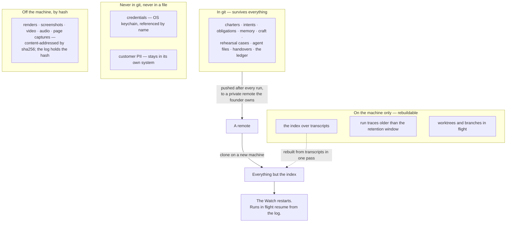

## 15 · Runtime and the Mac — the facts that bind, and each provider

*obeys: §D.1, §D.2, v13's constraints, and **v56** — which gives this section its one stated exception (§15.1a) ·
inherits: FINAL §14 and §16.7*

---

### 15.1 The Mac now, the split as the target

**(FOUNDER, and it is why this section exists at all.)** *"everything is run on it."* Day one is this Mac: lid open,
on power, logged in — **with one stated exception (v56)**, the cloud lane of §15.1a, which the same founder asked for
in the same interview and which exists only for the hours this sentence is false.

**(NEW: v39 makes that sentence a hosting decision, not only a runtime one.)** **Mission control is served on this
Mac**, by `mission-control/` — the Bun and Hono server and React client on branch `ceo-1-1788609834` — because a tap
that pops a terminal needs `tmux` on the same machine, and a published page cannot reach it. So the website inherits
every fact in this section: it is up while the Mac is up, it dies at logout with everything else, and it is reachable
from the phone over the founder's own network. **What the phone keeps when the Mac is asleep** is the published
artifact pages — the briefing, the read-back, and the Decide items — which are for reading and deciding and can pop
nothing. §14.1 carries the cost of that split, stated once: two renderers over one state.

**(FINAL)** The target is the split the design implies. **The Watch, the Sender and the log on an always-on machine**,
because obligations must complete and the log must never be lost. **The runs wherever they are cheapest**, because
they hold no credentials by construction. **The founder's Mac as a client** — a very good one — that can sleep
without the company stopping.

**(FINAL, and the reason the split is small.)** A small always-on box with a real service manager solves every laptop
problem for a few pounds a month. **It does not solve the credential problem; it relocates it**, which is why only the
three no-model parts move there. The box is bought after the first measured overnight, not before.

---

### 15.1a The one exception: when the Mac is off

**(FOUNDER, DECISIONS §15, and this is the whole of the exception.)** *"When my Mac is not on, and then we need to use
not the regular Claude code or codex in terminal, then you can use codex or Gemini I think they don't bun those. But
still keep it open"* — clarified the next round as **"Yes — a cloud lane for when the Mac is off"**. That is v56. It
does not soften *"everything is run on it"*; it carves one exception out of it and states the exception's price.

**(NEW: what the lane may do TODAY is narrower than the sentence that asked for it, and the narrowing is evidence,
not caution.)** The facts are §10.2a's and are not restated here. Their consequence for this section is three rows:

| Off-Mac lane | May it MAKE, today? | The evidence |
|---|---|---|
| **Codex cloud as a PR reviewer** — `@codex review`, or automatic review on PR open | it reviews; it is **admitted** | vendor-documented, needs no local Codex, runs in OpenAI's sandbox — so it **sidesteps #19945**, which is a defect of *local* `codex exec` with stdio detached from a TTY |
| **Codex cloud as a maker** — `codex cloud exec --env <id>` | **UNVERIFIED** | no vendor page prints a non-interactive command or an endpoint; the command list is an open feature request's author's assertion (openai/codex#24777, M). Codex is also **not installed here** (§I row 5) |
| **Claude Code `--cloud` and Routines** · **Jules** | **documented, and not decided** | Anthropic's is documented argv plus a documented fire endpoint, and it **shares the Claude seat** — the same seat as the Floor and the same terms clause as §I row 1. Jules' own API page says *"The Jules API is in an alpha release, which means it is experimental"* |

**The mechanism, and it is what keeps an off-Mac night from being an unreviewed write into the house.** A hosted run's
output lands as **a pull request or a staged artifact**, and **the Mac reconciles it on wake** — never into the house
directly. `bin/run` gains a `cloud` carrier that **mints a task and records its id, and does nothing else**, and the
Watch reads the pull requests on wake. **All three are ABSENT.** The reason the shape is this and not a remote write
is the same reason §15.3 gives for plain files: a machine that was asleep cannot have judged anything, so the judgement
happens here, once it is awake.

**Two rows stay open, and neither is an agent's to close.**

- **§I row 1, the terms** — **OPEN by the founder's word** (*"still keep it open"*). The OpenAI half is **UNKNOWN and
  unread rather than permissive**: four HTTP 403 refusals against one host across two dates. Anthropic's clause, on
  file from the runtimes lane, prohibits access *"through automated or non-human means"* except via an API key or
  *"where we otherwise explicitly permit it."*
- **§I row 15, which hosted lane may MAKE when the Mac is off** — raised by v56 and **the founder's, with row 1**.
  The tension is stated once and not re-argued: the founder's named preference has no driver, and the lane with a
  driver runs on the seat the terms question is about.

**(NEW: what this exception does NOT move.)** Routines stay **refused for the Watch** — a one-hour minimum interval,
*"The minimum interval is one hour; expressions that run more frequently are rejected"*, and no reach into anything
this system stores on the Mac. Read *"no local files"* narrowly: a routine clones every selected repository per run and
pushes `claude/`-prefixed branches, so it has a repository and not this laptop. **The Watch is still the LaunchAgent of
§15.2**, and a cloud lane that cannot see `~/.agentvibe/` cannot be a supervisor of anything here.

---

### 15.2 Supervision, on macOS

**(FINAL, from Apple's documentation.)** A **LaunchAgent** holds the Watch. It runs as the founder's user, which is
what reaches the keychain and the subscription's OAuth, and **it dies at logout** — so the honest statement is that
the Mac stays logged in with the lid open, or the night ends, **with one stated exception (v56)**: the cloud lane of
§15.1a keeps running, because it never needed this machine. What it cannot do is reach anything stored on it, which
is why it is an exception to the runtime and not to the Watch.

Six facts, each of which changes the code:

- **`StartInterval`, never `KeepAlive`.** A tick runs and exits. `KeepAlive` on a script that exits zero is an
  infinite loop throttled to one launch every ten seconds.
- **`StartInterval` coalesces missed firings**, so a Mac that slept through four ticks fires once on wake.
- **`caffeinate -i`, time-bounded**, prevents idle sleep. **Nothing but `pmset -a disablesleep 1` prevents lid
  sleep.**
- **`launchd` has no restart ceiling beyond its throttle**, so the supervisor implements one — N restarts in T
  seconds, then it escalates rather than loops.
- **`KeepAlive` cannot catch a hang**, so a separate heartbeat, and a **process-group kill**: a timeout that kills a
  child while its grandchild runs on is a timeout that does nothing.
- **Every tick is crash-only** — read state from disk, take one move, write, exit. A tick that vanishes loses exactly
  one tick.

**(NEW: v12 decides what the Watch is *not*, and it is a runtime fact rather than a preference.)** **`/loop` is
refused in production.** It is *"session-scoped: they live in the current conversation and stop when you start a new
one"*, carries a 7-day expiry, and its hard limit is *"Tasks only fire while Claude Code is running and idle."* A loop
that requires an open idle session is not a supervisor. **The Watch is the loop**, and `/loop` stays a Floor
convenience.

**(NEW: the vendor's own three scheduling tiers, which is the cleanest statement of why the LaunchAgent survives.)**
Cloud **Routines**: no machine and no open session, but a **1-hour minimum interval and no local files** — a fresh
clone — so they cannot reach anything this system stores. **Desktop scheduled tasks**: machine on, no open session,
1-minute minimum, local files. **`/loop`**: machine on **and** session open. Only the middle tier and a LaunchAgent
touch local files without an open session, and only the LaunchAgent is ours to supervise.

**Mechanism:** `~/Library/LaunchAgents/…watch.plist` and `bin/supervise` (both **ABSENT**).

---

### 15.3 Storage — what survives a dead machine

**(FINAL)** Everything is a plain file. The test: **if the Mac dies tonight, what does the founder still have?**

**(FINAL)** One house repository and one per venture; a push after every run; a nightly encrypted snapshot to object
storage, **excluding secrets by construction because they were never in it** — a guarantee that rests on §13.2's secret scan (ABSENT), not on this sentence; blobs mirrored to one bucket — the only
thing in the design that has to exist somewhere else — and **a hash with no blob is a known absence**, which is a
different thing from a silent one.

**Three storage facts that are easy to get wrong and expensive to discover:**

- The log's append uses **`F_FULLFSYNC`**, because on macOS `fsync()` does not mean the drive wrote the data, and
  **neither git nor SQLite calls the real thing by default**.
- The local index runs in **WAL mode, never over a network filesystem**, and **a page holding a query open starves the
  checkpoint** — one more reason mission control reads files rather than a database.
- **Snapshots of the memory stores nightly**, because event sourcing's own failure mode is replay time, and the
  rebuild-from-scratch path is exercised rather than trusted.

**(FINAL)** The log is the truth and is never edited; memory is a curated view over it; **if memory is wrong the log
is still right** (§13).

**Mechanism:** `bin/log` with `F_FULLFSYNC` (**ABSENT**) · the push in every run's close (**ABSENT**) · the nightly
snapshot job (**ABSENT**).

---

### 15.4 The credential plan, which is the disaster plan

**(FINAL)** What no backup restores: **OAuth refresh tokens** (a grant held by the authorisation server, often rotated
on use — recovery is re-running the consent flow, as a human, once per service), **device-bound passkeys and hardware
keys**, **two-factor seeds**, and **domain and DNS control**, which is the one true single point of failure in a small
company.

So the recovery plan is a credential plan: a password manager as the single source of truth, its emergency kit
**printed and stored physically**, hardware keys registered **in pairs with the second off-site**, and a k-of-n split
for the handful of secrets that unlock everything else. **The standard mistake is escrowing the vault and not the
second factor that protects the vault.**

**(FINAL)** **The restore is drilled or none of this is true.** Monthly, the fleet is restored into a scratch
directory from the remote alone and the anchors run there, with the result in the briefing. Twice a year, on a machine
that is not this one, the company is rebuilt from the log and the escrow, and **the drill produces a number**.

**(FINAL)** Credentials are **keychain references in every file, never values**: a file that contains a secret is a
file that gets committed eventually.

**(NEW: the sandbox already helps here and is worth naming, because it is one of the few controls that exists today.)**
`denyRead` covers the credential stores — `~/.ssh`, `~/.aws`, `~/.config/gh`, `~/.netrc`, `**/.env*` — and
`npm run test:sandbox` on branch `ceo-1-1788609834` fails if the sandbox is disarmed. §12.10's caveat applies
unchanged: **that is a guardrail against accident, not containment.**

**Mechanism:** the drill as an obligation with `recurs: monthly` in the harness venture's obligations (**ABSENT**).

---

### 15.5 The cache, and why the standing prompt is byte-identical

**(FINAL, measured.)** **Eighty-nine per cent of the historical bill on this machine was context** — cache reads 57%,
writes 32%, output 11%. So *what does this run need to know* and *what does this system cost* are the same question.

**(NEW: §G.3 confirms FINAL's TTL sentence verbatim and widens it.)** *"The lifetime is an hour on a subscription and
drops to five minutes once you're drawing on usage credits; on an API key or cloud provider, it's five minutes by
default"* (models.md, accessed 2026-09-05). **Five minutes applies in three situations, not one** — a key, a cloud
provider, **and the moment the account draws on credits**, which is exactly when the machine is busiest. The TTL is a
function of billing state and shortens twelve-fold at the worst possible moment.

**The consequences, unchanged from FINAL and now with the right coefficients** (§16 carries the arithmetic): the tick
period is chosen for control latency rather than for cost; runs of one shape are batched inside the TTL the Watch
observes; **the standing prompts are byte-identical and carry no timestamp**; and the set of shapes is closed, because
**the cache is invalidated by any change to the stable prefix including the tool definitions**, so a bespoke grant per
run would pay the cache-write share of the bill forever.

**Two shipped flags stabilise the prefix and neither is used here yet:**
`--exclude-dynamic-system-prompt-sections`, which moves cwd, environment, memory paths and git status out of the
system prompt, and `--system-prompt-snapshot on`.

**One hole, and it decides where the meter reads from:** `/usage` reports the cache hit rate **for the main
conversation only**, so the meter reads each run's own token fields (§16.1).

---

### 15.6 Each provider's facts

**(FINAL's table, updated from runtimes.md and models.md, accessed 2026-09-05.)** `M` measured on this Mac; `D`
documented with a URL and a date; `C` claimed by a third party. **Nothing in the lane was run against a model.**

| | Claude Code | Codex CLI | Gemini CLI |
|---|---|---|---|
| Installed here | **M** yes, 2.1.261 | **M no** — "day one" begins with installing it (§I row 5) | **M** yes, 0.38.2, **never authenticated** (§I row 6) |
| Headless | **M** `-p`, json / stream-json / schema | **D** `codex exec`; *"streams progress to `stderr` and prints only the final agent message to `stdout`"* | **M** `-p`, json |
| Narrowable by argv | **M** `--tools`, `--restricted` (v2.1.248+), `--strict-mcp-config`; **not** `--allowedTools` | **D** `--sandbox`, `--ignore-user-config`, `--ignore-rules`, `--skip-git-repo-check`; **`--full-auto` is deprecated** in favour of `--sandbox workspace-write`; no per-tool flag | **M** `--approval-mode plan`, `--policy`, `--admin-policy`, `--allowed-mcp-server-names` |
| Structured output | **D** `--output-format text\|json\|stream-json` | **D** `--json` (JSON Lines: `thread.started`, `turn.started`, `turn.completed`, `turn.failed`, `item.*`), `--output-schema`, `-o/--output-last-message`, `--ephemeral` | **M** json |
| Session id and resume | **D** `--session-id` *"must be a valid UUID"*; `--name`; `--continue` | **D** `codex exec resume --last \| <SESSION_ID>` | — |
| MCP | **M** stdio / SSE / HTTP / WS, **per-subagent inline**, *"connected when the subagent starts and disconnected when it finishes"* | **D** per-agent `mcp_servers` in TOML | **M** `gemini mcp` |
| Subagents | **D** depth 3 (`CLAUDE_CODE_MAX_SUBAGENT_SPAWN_DEPTH`), 20 concurrent (`…MAX_CONCURRENT_SUBAGENTS`), *"Concurrent subagent limit reached"* on overflow; frontmatter carries `mcpServers`, `isolation: worktree`, `memory`, `background`, `effort`, `maxTurns`, `skills`, `hooks`; spawn allowlisting is `Agent(worker, researcher)` | **D** TOML files with their own sandbox mode | **M** none found |
| **`Workflow`** | **D** *"The `Workflow` tool is removed from all subagents via the first filter applied to subagent tool sets. Subagents cannot invoke workflows."* (v35) | — | — |
| **Loops and goals** *(a row FINAL had no cell for)* | **D** **`/goal`** — a completion condition, a small fast model checks it each turn, three verdicts; **runs headless in one invocation**; 4,000-character condition; bounded by *"or stop after 20 turns"*. Plus `/loop`, cron tools, `Monitor`, `ScheduleWakeup`, three scheduling tiers | **C** `/goal` in 0.128.0 (2026-04-30): pursuing · paused · achieved · unmet · **budget_limited**. **Whether it runs under `codex exec` is not established**; **no `/loop`** | — |
| Hooks | **D** **34 events, 10 documented as blocking** — *this moves FINAL's "32 events, 12 blocking"; my count is medium confidence and the page is the arbiter.* Blocking: PreToolUse, UserPromptSubmit, UserPromptExpansion, Stop, SubagentStop, TeammateIdle, TaskCreated, TaskCompleted, ConfigChange, PostToolBatch | **D** behind `codex_hooks = true` | **M** imports Claude Code hooks |
| Policy seam | **D** **managed settings outrank argv**; `permissions.disableBypassPermissionsMode` and `disableAutoMode` *"can't be overridden"* there | **(FINAL §14.6, providers lane 2026-09-04; not re-read this session)** **`requirements.toml` outranks every flag** | **M** Policy Engine, `--admin-policy` — FINAL §14.6, providers lane 2026-09-04 |
| Fleet and terminal | **D** `claude agents [--cwd] [--json] [--json --all]`; **`--bg`** and **`--attach <id>`**; `--teammate-mode tmux\|iterm2` (experimental, hidden). **`-w` / `--worktree` / `--tmux`: UNRESOLVED** — measured by a prior lane, absent from this session's CLI-reference fetch | — | **M** `-w` (prior lane) |
| Inbound seam | **D** **Channels** — *"A channel is an MCP server that pushes events into your running Claude Code session"*; research preview; *"Being in `.mcp.json` isn't enough … a server also has to be named in `--channels`"*; Anthropic auth only | — | — |
| Cost model | **D** subscription or key; `--max-budget-usd` per run (v2.1.217+), **a stall fuse, not a billing control** (v23) | **D** both; included in every ChatGPT plan (FINAL §14.6, providers lane 2026-09-04); **the only vendor publishing numeric per-window quotas** (§G.2) | free tier 60 rpm / 1,000 rpd |
| Second checker family | **D** no | **D** in principle; **blocked by #19945** until the headless rehearsal passes (v32) | **M** yes, installed, unauthenticated |
| Shared config | **M** `CLAUDE.md`, `SKILL.md`, `.mcp.json`; imports codex and gemini config; `/import` appends a one-time copy of `AGENTS.md` | **D** `AGENTS.md`, `SKILL.md`, `config.toml`; `project_doc_max_bytes` 32 KiB | **M** `GEMINI.md`, skills, extensions |
| **Claude Code on the web / Routines** (the same seat) *(NEW, v56)* | **D** **the only fully documented off-Mac maker path today**: `claude --cloud "<task>"`, follow-ups by `claude -p … --cloud <session-id>`, `claude --teleport <session-id>`; Routines add `POST …/routines/trig_…/fire`. **Whether the crew may use it for making is §I row 15, the founder's**. **Shares the Claude seat** — *"shares rate limits with all other Claude and Claude Code usage within your account… There is no separate compute charge for the cloud VM"*, so it competes with the Floor rather than adding capacity. State: exists; documented. **§I row 1's terms clause governs it**, and that row is open by the founder's word | — | — |
| **Codex cloud** (subscription, **Plus and above**) *(NEW, v56)* | — | **D** **PR reviewer, and only that today**: `@codex review` on a pull request, or automatic review on PR open — vendor-documented, needs no local Codex, and therefore **sidesteps #19945**. **As a maker: UNVERIFIED** — no vendor page prints a non-interactive command or an endpoint; `codex cloud exec` is an open feature request's author's claim (#24777, M). **No numeric cloud quota is published** — only *"Cloud chats on ChatGPT plans use GPT-5.6 Sol and may use more of your allowance than local messages."* The published five-hour numbers are for **local** messages. **Internet blocked by default in the agent phase**; allowlist and HTTP-method restriction are per environment. State: exists; **not usable from here without a driver**, and Codex is not installed. Max task duration **UNKNOWN**; cancel **UNKNOWN** | — |

**(FINAL, and it is the sentence that makes a provider swap cheap.)** What is provider-neutral, because every runtime
has a form of it: a headless invocation with a prompt in and a structured result out; a session id and resume by id;
an instructions file and a SKILL.md bundle; MCP as the way a run reaches a capability; some per-run tool restriction,
with a different vocabulary everywhere; a working directory as the confinement unit; a git worktree as the isolation
unit.

**What is provider-bound, each in exactly one place:** Anthropic's hook event set and managed-settings precedence,
`crossSessionInbound`, `Workflow`'s removal from every subagent, Routines, Remote Control, `--max-budget-usd`,
Channels, the one-hour subscription cache; OpenAI's `requirements.toml`; Google's Policy Engine (FINAL §14.6, providers lane 2026-09-04).

**The asymmetry worth naming: the capability layer is close to neutral and the policy layer is not. The shapes are
portable; the guarantees are not.** Switching a provider changes the argv file and the price and nothing else, and a
provider that retires a model pin is caught by the nightly probe rather than in month six.

**(NEW: and there is a live instance of exactly that failure on this branch today.)** `scripts/prompt-standard.test.mjs`
pins the valid model set (quoted in full once, at §9.9, where it includes `claude-sonnet-4-6`) to `claude-opus-5`, `claude-sonnet-5`, `claude-fable-5`, `claude-haiku-4-5`.
**`claude-fable-5-1` is not in it**, and `claude-fable-5` is listed by the vendor under *"Legacy models (still
available)"*. **An agent file written to §G.1 fails a blocking lint today**, and it must be fixed in the same change
that writes the first agent file (§G.1's own note).

---

### 15.7 Local models — the tier FINAL had no shape for

**(FINAL §16.7 read *"local models: no shape"*, which v20 corrects: no shape is not no work.)** **(NEW: models.md
gives both candidates a licence, a size and a limit, so the tier has a shape now.)**

| Model | What it is | The limit that decides how it is used | Licence |
|---|---|---|---|
| `sentence-transformers/all-MiniLM-L6-v2` | **384-dimensional** dense embeddings, 22.7M params | *"input text longer than 256 word pieces is truncated"* — this sets the transcript chunk size (§13.7) | **Apache 2.0** |
| `Qwen/Qwen3-0.6B` | 0.6B params, 28 layers | **32,768** context | **Apache 2.0** |

**What runs here:** embeddings, classification, dedup, PII detection, and the first pass of the transcript mining —
**work that burns no window at all** (§G.1). **(NEW: v20's other half.)** **No agent's default model is Haiku.**
Haiku 4.5 appears only where the vendor sets it — `/goal`'s evaluator and the auto-mode classifier — and its
retirement is committed *"Not sooner than October 15, 2026"*, the nearest retirement date of any model this system
names. `ANTHROPIC_DEFAULT_HAIKU_MODEL` changes the evaluator, **and it changes it everywhere the small fast model is
used**, not only for `/goal`.

**(UNVERIFIED, and named.)** On-disk byte sizes are not stated on either model page. FINAL's *"under 100 MB"* for the
embedder is consistent with the parameter count and is **not quoted from the page**.

---

### 15.8 The measured facts that bind

**(FINAL's list, with this session's research facts added. Each row carries where it came from. These are facts about
this Mac, this account and these runtimes — they are not design, and nothing above contradicts them.)**

| Fact | Source | Where it bites |
|---|---|---|
| `--allowedTools` restricts nothing; a `-p` child is narrowed by `--restricted --tools <list> --strict-mcp-config --permission-mode dontAsk --permission-prompts none --add-dir <wt> --max-budget-usd <n>`, under a managed file the founder writes outside the repository | FINAL §14.7 | §12.10 · v34 |
| The prompt cache lives one hour on a subscription; five minutes on a key, on a cloud provider, **or once usage credits are drawn**; cache reads were 57% of the historical bill | FINAL §14.7 · **models.md** widens it | §15.5 · §16 |
| A 1-hour cache **write** costs **2x** base input; a 5-minute write costs 1.25x | **models.md** | §16.3 — FINAL's formula used the wrong one |
| Cache **reads** are 0.1x base input everywhere except **Fable 5.1 and Mythos 5.1, at 0.025x** | **models.md** | §16.3 · v21 |
| Opus 5 and Fable 5.x use a newer tokenizer producing *"approximately 30% more tokens for the same text"* than Sonnet 4.6 and earlier | **models.md** | any token budget inherited from an older measurement **understates by about that much** |
| Peer isolation is enforceable: `crossSessionInbound: refuse` outranks every source; `permissions.deny: ["SendMessage","ListAgents"]`; `isolatePeerMachines: true` | FINAL §14.7 | §12.6 |
| The sandbox has a full `network` block and a `credentials` block; **nothing lifts an inbound `bind`** | FINAL §14.7 | §12.10 — the Sender and the Watch are programs |
| `--bare` is an API-key cell: no OAuth, five-minute cache, no Routines, no Remote Control, no inbox socket | FINAL §14.7 | §16 |
| `claude -p` starts in `default` mode by construction; the `auto` seen here came from user settings | FINAL §14.7 | §12.3 |
| `Workflow` is removed from every subagent by a documented universal filter | FINAL §14.7 · **runtimes.md** now cites the vendor | v35 · §12.10 |
| A subagent's own `permissionMode` frontmatter **is ignored** — a child cannot widen its own grant | **cognition.md** | §12.3 |
| In `dontAsk`, **`AskUserQuestion` is denied even when allowed** | **cognition.md** | v9 · §12.5 |
| Deny rules bind in **every** mode including `bypassPermissions`; allow rules have **no effect** in it | **cognition.md** | §12.3 · v10 |
| `SIGTERM` gives exit 143 and a resumable turn; a background subagent holds its parent open up to ten minutes idle; `maxTurns` marks output partial and resumable | FINAL §14.7 | run resumption |
| Hooks: **34 events, 10 documented blocking**; `PermissionRequest` is **non-blocking** — *"Exit code 2 isn't honored for this event … Deny through the `decision` object instead"* | **runtimes.md** | §15.6 — a hook written the obvious way silently fails to deny |
| `Monitor` is unavailable when `DISABLE_TELEMETRY` or `CLAUDE_CODE_DISABLE_NONESSENTIAL_TRAFFIC` is set | **runtimes.md** | a trap for this repo specifically |
| `/goal` is *"a wrapper around a session-scoped prompt-based Stop hook"*, and is unavailable under `disableAllHooks` or `allowManagedHooksOnly` | **runtimes.md** | v11 · §12.6 — the managed file omits both |
| A goal **defers evaluation while a subagent or background shell is running**; check-ins start at 30 minutes and double to a 4x ceiling; under `-p` *"this is the only way Claude Code delivers check-ins"* | **runtimes.md** | §12.5 — an unattended run's only heartbeat |
| `/goal` leaves the goal active after transient failures **including rate limits**, and terminates only on Met, Impossible, `/goal clear`, or four unrecoverable errors | **runtimes.md** | the behaviour a night wants |
| Agent teams: experimental, off by default, **no nested teams**, one team per session, `/resume` does not restore them, `-p` never forms one; **~7x tokens in plan mode**; *"Use Sonnet for teammates"* — **our position is v59: a teammate runs on its own agent file's model**, the 7x cost stated in §9 and §16 | **surfaces.md · models.md** | §14.5 · v13 · §G.1 |
| `~/.claude/teams/<team>/config.json` holds session ids **and tmux pane ids**, and is *"overwritten on the next state update"* | **surfaces.md** | §14.5 — read source, never a write target |
| Split panes are **unsupported** in VS Code's integrated terminal, Windows Terminal and Ghostty; `iterm2` mode needs the `it2` CLI **and** the iTerm2 Python API | **surfaces.md** | §14.11 |
| `gemini` 0.38.2 installed and never authenticated; `codex` **not installed**; openai/codex#19945 open since 2026-04-28 — **130 days, no maintainer reply** | FINAL §14.7 · **runtimes.md** re-verified 2026-09-05 | v5 · v32 · §11.3 |
| #19945's cure `script -qfc` is *"incompatible with normal background / parallel job execution"*; the second workaround is foreground with stdout to a file, inheriting the parent shell's TTY | **runtimes.md** | v32 — one foreground slot, not a night lane |
| The account's **five-hour window and a weekly window**, per seat, *"shared with Claude chat and Cowork"*; a seat limit cannot be escaped with `/model`, a family limit can | **models.md** | v22 · §16 · §14.6 |
| `--max-budget-usd` is print-mode only, computed locally at list price; subagent spend counts toward it; overflow fails a spawn with `Budget limit reached` | **models.md** | v23 — a stall fuse |
| Nobody has run a real business profitably unattended; nobody has measured overnight against bounded operation; **nobody has built a detector for an agent misreporting its own progress**; per-action approval is the weakest control anyone has measured | FINAL §14.7 | §11.7 · §12.2 |

**(NEW: one fact about this repository's own working conditions belongs here, because every measurement above was
taken under it.)** `git worktree add` cannot complete under the armed sandbox — exit 128 across the agent-config paths
— and adding those paths to the write allow-list does not lift it. That one command needs the sandbox disabled. It is
a known, measured limit rather than a defect in anyone's work, and it is the reason a build plan that assumes a worker
can make its own worktree will stall on its first step.

**Enforced by:** a facts store with one row per fact, its date and the command or URL that re-measures it, checked for
expiry like any other item (**ABSENT**; the substrate is `scripts/ledger.mjs`, which exists on branch
`ceo-1-1788609834` and already forces a disposition when a date comes due).
