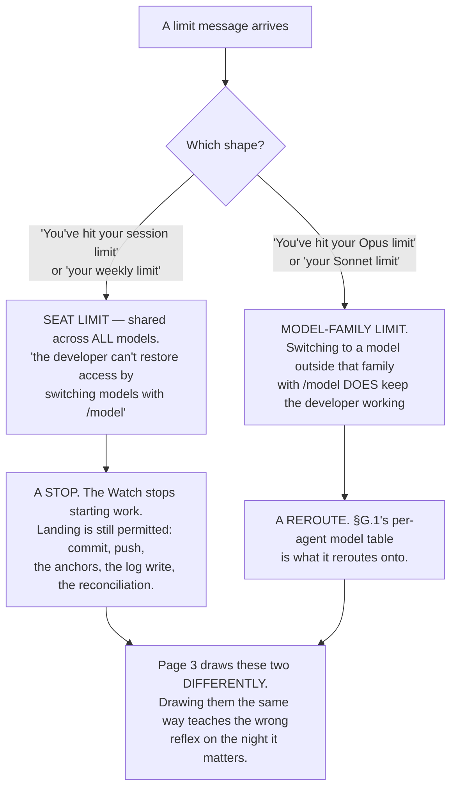
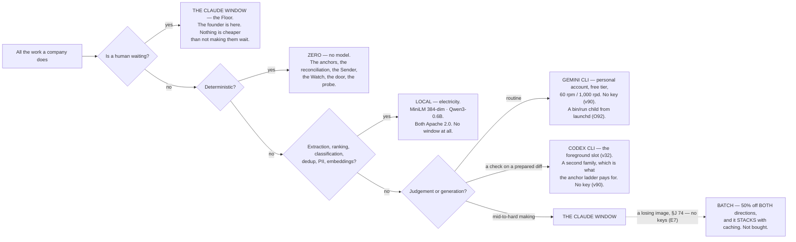

## 16 · Economics — where the money and the window actually go

*obeys: §G.2, §G.3, v22, v23, v57 and v59 which change what the arithmetic assumes, and **v74**, which changes what a
ceiling is denominated in (rethink round, 2026-09-06) · **and, from the fixer round of 2026-09-06, v86, v90, v104,
v106's `shadow_usd`, v76 as amended, SPINE §L O95, O115, O116, O117, O118, O123, O127** · inherits: FINAL §15 — **and the corrected cost formula now
lives in §9.6, cited here and not restated** (deletion 20, contradiction 15)*

---

### 16.1 What is measured, per run, always

**(FINAL)** Every run's handover carries its **actual** cost and the ledger accumulates it. **There is no estimation
step anywhere**; ranking uses measured medians of past runs of the same shape and kind.

**(NEW: v1 and v2 add a rollup FINAL explicitly refused, and §D page 3 requires it.)** FINAL's row read *"unit
economics per agent | none: there is no standing agent."* That was true of three shapes assembled per run. **It is
false of fourteen named agents with one file each**, and the founder's dashboard asks for cost *"per run, per agent,
per venture, per window"*. So per-agent becomes a real unit — not because it is nicer, but because the thing it names
now persists.

| Rolled up to | Answers |
|---|---|
| per run | what did this piece of work cost, and on which window |
| **per agent** *(new: v1, v2, §D page 3)* | what does `builder` cost against `scout`; which agent's window share is growing |
| per intent | what has this goal cost against its ceiling |
| per venture per month | am I inside what I said this venture may spend |
| per window | how much went to Claude, Codex, Gemini, local — **the number that predicts which fuse blows first** |
| per anchor rung | how much of what I believe is rung 1, and how much is rung 4 |

**(FINAL)** That last row is a **quality-of-belief** metric: the fraction of finished work whose done-test was checked
by something deterministic. **If it falls, the system is producing more and knowing less, and no cost number would
reveal it.**

**(FINAL, measured, and it is why the meter has a per-run axis at all.)** The meter is the runner's own reported cost
record, joined by the id minted at dispatch — **not** output tokens, which are 11% of the bill, and **not** a window
heuristic, which cannot attribute. One review session on this machine produced **1.4 million output tokens in five
hours with no loop running**, and a meter without a per-run axis cannot see that.

**(FACT: world.md 4 — W4. Four of these numbers stopped needing to be computed.)** The vendor now emits a per-session
**`prompt_cache`** object for status-line scripts (hit ratio, misses, tokens re-cached, warm/cold), a
**`rate_limits.spend_limit`** field, a **`/usage` Loops breakdown** with per-loop run count, total tokens, tokens per
run and last run, and a **`modelPricing`** managed setting that makes contracted rates rather than list price the
basis for `/cost` and telemetry. **Read the field where a field exists** — a number this section derives can disagree
with the number the runtime prints, and when they disagree nothing here can say which is wrong. The rollups above have
no vendor field, because the vendor knows about sessions and not about our roster; those stay ours, joined by the
dispatch id. §14.6 renders both and says which it is drawing.

**Mechanism:** a ledger line per run, written from each run's `--output-format json` cost fields (**ABSENT**);
`bin/warroom`'s per-worker cost pricing exists on branch `ceo-1-1788609834` and is absorbed into it.

---

### 16.1a The log rotates, and no surface reads the raw file

**(NEW: O40, DEPENDS-ON-R22.)** Every number in this section is derived from one append-only file that only grows, and
**three surfaces read it directly** (§14.6, the briefing, the weekly lines). At a year of rows that is a page waiting
to get slow and a store waiting to get corrupted in one piece. The shape:

- **The log rotates into a file per period**, `logbook/events/YYYY-MM.jsonl`.
- **A rollup per period is derived and rebuildable**, and **no surface reads the raw file**.
- **The index partitions by the same period**, so a corrupt period costs a period rather than the history.

**Nothing is deleted.** The rollup stands to the log exactly as memory already does (§13.2): a derived view over a
record that remains the truth, rebuildable by re-running the deriving pass. That is why this can be done to the one
store the plan says is never edited **without touching that rule** — rotation appends and derives; it does not edit.

**(R22, OPEN, and it decides day-one versus later.)** **What does page 3 cost to render at a year of rows, and where
is the knee?** Measured against a synthesised log at this Mac's own emission rate, against the real server. If the
knee is far out, this is a later migration; if it is near, doing it after a year of rows means migrating the one store
that must not be lost. §14.6 carries the page's half.

**Mechanism:** `logbook/events/YYYY-MM.jsonl` and the derived rollup (**ABSENT**, §L O40) · the partitioned index
(**ABSENT**).

---

### 16.2 The two windows, and the two limit shapes that behave differently

**(NEW: v22 moves FINAL row 19, which knew only the five-hour fuse.)** There are **two windows, per seat**, and the
vendor's own sentence names both and names what they are shared with:

> *"each member's Claude Code usage draws from a per-seat allowance that resets on a rolling five-hour window **and a
> weekly window**. The allowance is shared with Claude chat and Cowork."*

**So the reserve is per window *and* per week, and a weekly exhaustion is a different event from a five-hour one.**
One is a pause; the other ends the week.

**(FOUNDER, fixer round 2026-09-06: E6 — *"Away narrows, plus a burst edge"*; v76 amended, O127; §4 carries the
predicate.)** **The reserve is held per weekly window**, not per day — **(THINKER: A20)** the founder's tempo is bursts, a
305-commit day beside four silent ones; a daily reserve is the losing image (`wins_if:` a flat daily rate). **Away, the reserve goes only to `effect: none`
work whose outputs stage** (v101's verb table decides `effect:`). And **the burst edge**: founder events in the current
five-hour window above a founder-set rate (a dial, §16.3b) **pause Claude-seat autonomy until the window rolls** —
one seat, shared (v22).

**(NEW: and the second half of v22, which is the operationally sharper one.)** Two limit *shapes*:

**(NEW: and the number the plan refuses to invent.)** **No numeric Anthropic subscription quota is published anywhere
fetched.** Magnitudes are relative only — Pro *"at least 5x more usage per 5-hour session than Free"*, Max *"5x"* and
*"20x more usage than Pro"*. **A Max window's real capacity is measurable only from an account**, and the **Max 20x
price is UNVERIFIED**: the pricing page rendered *"From $100 per month"* for both Max tiers.

**(NEW: the one window that *can* be budgeted in advance, and it is not ours.)** **OpenAI is the only vendor of the
three publishing numeric per-window quotas** (§G.2): per five-hour rolling window, GPT-6 Astra 5–45 on Plus, 25–225 on
Pro 5x, 100–900 on Pro 20x; GPT-5.6 Sol 10–100 / 50–500 / 200–2,000; GPT-5.6 Luna 250–2,000 / 1,250–10,000 /
5,000–40,000, with *"GPT-5.6 usage averages 5-30 credits per message."* **Caveat that matters for v32:**
`gpt-5.3-codex` appears in the API price list and in **no plan quota row**. Gemini CLI's free tier is **60 requests a
minute and 1,000 a day** on a personal Google account; the paid per-tier CLI quotas are **UNVERIFIED**.

---

### 16.2a What a ceiling is denominated in — and the dollar is not it

**(FOUNDER, rethink 2026-09-06: D9. This changes the currency of every ceiling in the plan, and §12.9's three
ceilings are what it changes.)** A ceiling is stated in **window share: tokens against an observed high-water mark**,
because **no denominator is published** and one measured from this seat is the only one that exists. **Wall clock sits
beside it**, and **USD is kept as a shadow price** — computed, shown, never binding.

**Why the dollar had to go, and it is not a preference.** On a subscription the dollar is *"computed locally from
token counts at list price"* against a bill nobody sends (v23, §16.5). A ceiling denominated in it binds nothing, and
**an absent ceiling is visible while a wrong one is not** — a founder who sees `$40 of $100` believes something is
holding.

**(Deletion 21, 2026-09-06.)** ~~Dollar ceilings, as ceilings.~~ They are a shadow price now. ~~And every token budget
inherited from a Sonnet-4.6-era measurement~~ — see §16.3 on the tokenizer, and **O77** below, which is what stops a
stale budget firing silently.

**(NEW: contradiction 18 — this is where *"bounded by being free"* dies.)** §16.7 said exploration is *"bounded by
being free"*; **v22 measured that the weekly window is per seat and shared with Claude chat and Cowork.** A night of
exploration is therefore **subtracted from the next day**, and the sentence was not a small optimism — it was the
reason no mechanism was ever built for exploration spend. So:

- **An intent carries a `class:`**, and exploration is one of its values.
- **Exploration-class work routes to Gemini, local models, or the Codex seat** — windows that are not the one the
  founder works in.
- **The Desk refuses an exploratory dispatch onto the Claude seat past a fraction the founder sets.** The fraction is
  the founder's number, not a rule's, exactly like §12.2's undo window.

**Settled by:** split one weekly window between driven and exploratory work. **If exploration is invisible there, the
old sentence was right and this is over-built** — which is the falsifier the original sentence never carried.

**(NEW: O115 — a measured denominator from the first run.)** A fraction of an unobserved mark is a guessed ceiling, which v74
refuses; `.claude/hooks/budget-guard.js` (the fuse O50 registers) already holds one — **(THINKER: A12 · W39)** a peak
of **1,961,285 output tokens in any rolling five hours over 99 transcripts**. So `keel/logbook/window-highwater.yml` is **seeded from it**, `seed: true`, `tokenizer: sonnet-4.6-era`
(O77's field); **the founder writes `ceiling:` as a percentage**, page 3 shows the absolute, and **the first observed
week replaces the seed** (§18.4). Adapter over `rate_limits`; `vendor_wins_if:` the vendor emits window utilisation.

**Mechanism:** one high-water file, **seeded** (`keel/logbook/window-highwater.yml`, **ABSENT**, §L O115; the baseline
**exists**) · one rule in the Desk's comparator (**ABSENT**, §4) · one `class:` field on the intent (**ABSENT**, §2).

---

### 16.2b Three gauges, not one — the window, the founder's decisions, the founder's hours

**(FOUNDER, fixer round 2026-09-06: E3 and E15 — convergence 1, with the founder's numbers.)** The plan priced tokens
and never a founder-hour (THINKER: A11, B3, B18, C4, C20). Three gauges, each read by the Desk like a ceiling:

- **the window** — tokens against the high-water mark, wall clock beside it, USD the shadow (§16.2a).
- **founder decisions** — whiches per window, `decisions_per_window × intent.horizon`, **seeded at six per five-hour
  window until R34** measures the real answering rate; the Desk refuses to open a which past it and the refusal is a row
  (v87, O96; §4 owns the admission control, §3 the which shape).
- **founder hours** — `founder_hours:` per weekly window on the charter; **the harness's number is 20**; ~~the Desk
  stops starting harness intents when it is spent, and~~ **it is report-only — §2.1 states it once and this row
  agrees**: a bind at 20 is **reported, never enforced silently**, and it stops nothing (v86, O95; amended
  2026-09-06: challenge D P2-4). Read *like a ceiling* narrowly: the Desk reads the same field shape and takes a
  different action on it.

**(FOUNDER, E3, verbatim: *"20 hours or no ceiling"*.)** So **20**, `class: originated`, moved by evidence; and because
of *"or no ceiling"*, the bind **reports** — a briefing line and a which — and never stops work, in silence or
otherwise (amended 2026-09-06: challenge D P2-4; §2.1 owns the statement).
**Founder-minutes are measured from the first run either way**: `bin/log` writes `founder.act` on every tap, sign-off,
terminal open and read-back; §16.8 line 2 reads them. Losing images with `wins_if:` in v86: no ceiling · a hard bind.
**(E15 — delegated; B's design, mechanised in §4.)** One option built plus a **written** second unless a ten-word summary
cannot separate them (THINKER: B3); **the briefing's first line is decisions taken · deferred · defaulted**; the seed of
six is a dial, `assumed` until R34.

**Mechanism:** `founder_hours:` and `founder.act` (**ABSENT**, §L O95) · `decisions_per_window` (**ABSENT**, O96; **R34**
OPEN) · the Desk's two refusals (**ABSENT**, §4).

---

### 16.2c The subsidy line — what the seat is worth, and the metered design as a losing image

**(NEW: O116 — economics carried as a legal footnote, made a number.)** (THINKER: A12, B7, B21, C7): §I row 17 chained
behind row 1 was backwards — the shadow price v74 computes is **the size of the bet on row 1** today. So **from the first run the briefing carries one line: Σ shadow USD of unattended runs at
list price ÷ the seat price per month**. **R35** is its first reading — `~/.agentvibe/events.jsonl` priced by §9.6, zero
build, OPEN. `class: kernel · record`; `wins_if:` it stays small for a quarter of two driven ventures.

**(FOUNDER, fixer round 2026-09-06: E7 — *"no keys, codex and gemini cli use."*; v90.)** The metered design — batch at
50%, a five-minute TTL, no weekly window, the reserve redesigned — is **§J 74**,
`wins_if:` **O116's line exceeds N× the seat price, the vendor narrows the terms, or R40 finds the CLI route refused**.
§I row 17 is **CLOSED** as *no keys*: the Gemini CLI on a personal account (1,000 requests a day, the free tier's count)
and the Codex CLI, both only as `bin/run` children from launchd (O92; §9, §15.4). The subsidy line is what would reopen it.

**Mechanism:** the subsidy line (**ABSENT**, §L O116; **R35** OPEN) · `shadow_usd` on `nights.jsonl` (**ABSENT**, v106 ·
O124; §21).

---

### 16.3 The cost formula ~~, corrected~~ — why it diverges tenfold; §9.6 owns the arithmetic

**(FINAL, and the reason it is kept at all.)** Two competent reviewers priced this machine's predecessor within days
of each other and **diverged tenfold** — $74 a month against $1,300–1,700 — on **one assumption, the cache hit rate**,
which sets whether context costs a read multiple or a write multiple on the 89% of the bill that is context. The plan
does not pick a number. It says **what determines it**.

**(Deletion 20 and contradiction 15, 2026-09-06: the formula itself leaves this section.)** ~~The four-line cost
expression, its `W` and `R` coefficient table and its fails-if list stood here in full, byte-for-byte the same
arithmetic as §9.6's.~~ **§9.6 owns the formula; this section cites it and does not restate it.** Two copies of one
formula is two implementations of one check, and this repository has already found what that costs — twice, once in
risk classification and once in the CI chain guard. What §9.6 carries, in one line: **the dominant term, by a
distance, is whether the siblings hit the cache**, with a one-hour cache **write** at **2x** base input (not FINAL's
1.25x, which is the five-minute write) and a sibling **read** at **0.1x** everywhere except **Fable 5.1 and Mythos
5.1 at 0.025x**.

**What this section keeps, because no other section computes it:** the **divergence argument** above. Two competent
reviewers, one assumption, a tenfold spread. That is an argument about how to *use* the formula, not a second copy of
it, and it is the reason §16.8's line 5 watches the cache-hit rate rather than targeting it.

**(NEW: O77 — the tokenizer discontinuity stops being a caveat and becomes a field.)** Opus 5 and Fable 5.x use a
newer tokenizer producing *"approximately 30% more tokens for the same text"* than Sonnet 4.6 and earlier, so **any
budget inherited from a Sonnet-4.6-era measurement understates by about that much**. The fix is not vigilance:
**every ceiling carries `tokenizer:`, and the launcher refuses to enforce a legacy cap on a current-tokenizer
model.** The reason it must refuse rather than warn is that **a ceiling that fires early is indistinguishable from a
stuck run** — the founder sees a night that stopped, and nothing in the log says which of the two it was.

**(FINAL, unchanged and still the first thing to do.)** Before any estimate is believed: **ten real moves against the
runner's own reported cost**, on the subscription, in window units per run. Every prior round's dollar figure is kept
as **a target a real bill can falsify**, never as an estimate to plan on.

---

### 16.3a The plant model — rates as data, the reserve derived and printed beside the typed number

**(NEW: v104 / O117 — *"no durations"* was over-applied into *"no plant model"*.)** (THINKER: B21, C7) Refusing
**measured rates** left the reserve unsizeable. So `keel/shared/facts.yml` gains a **units table** — per shape: **tokens
per run · runs per window · wall clock per run · finished intents per week · decisions per day**, each with
`measured_at`, `valid_until` and the re-measure command, **written by the meter alone**. **The rule:** `settings.yml`
**refuses a number neither derived from a units row nor labelled `assumed`**; **the reserve, WIP and *two driven
ventures* are derived, and the derivation prints on the briefing beside the founder's typed number**. Losing image,
rates as sentences: `wins_if:` a quarter in which no settings number moves after the rates land.

**Mechanism:** the units table and the meter's write (**ABSENT**, §L O117) · `settings.yml`'s refusal and the derivation
line (**ABSENT**, O117).

---

### 16.3b The dial inventory — every founder-set number, with its evidence line

**(NEW: v104 / O118 — forty dials were uninventoried.)** (THINKER: B18) A control system with forty setpoints and no
setpoint table is tuned by folklore. **`keel/shared/schemas/settings.yml` inventories every founder-set value** with
`default:` · `evidence:` (the briefing line that is its feedback) · `label: measured | assumed | founder` ·
`last_touched:`, and **the lint fails a dial with no evidence line**. SPINE §L O118 lists the dials — the reserve share
among them — so the count is derived there and never carried here. **The briefing counts dials, and dials untouched for a quarter.** §17 inventories
the path. Losing image, dials in prose: `wins_if:` a quarter in which no evidence line moved a default.

**Mechanism:** `keel/shared/schemas/settings.yml`, its lint, the briefing's count (**ABSENT**, §L O118).

---

### 16.4 Where cost is actually saved

**(FINAL)** Not by making the runs thriftier. **By moving work off the expensive window.**

**(FINAL, and it is the claim to hold the design to.)** **The majority of what a company does every day is not
generation.** It is reading, sorting, checking, remembering, watching and summarising. All of that belongs on the
bottom rows, and the Claude window should be spent almost entirely on building and on judgement.

**(NEW: v20 gives the bottom row a shape it did not have.)** **No agent's default model is Haiku.** Haiku 4.5's
retirement is committed *"Not sooner than October 15, 2026"* and it is the only Haiku in the published table, so
building a cheap executor tier on it buys a migration. The genuinely cheap work goes to **local models on
electricity**; Haiku remains only where the vendor sets it.

**(NEW: v57, and this is the quantitative surprise in the whole section.)** **On a cache-dominated workload the model
spread collapses.** List price runs **10x in and 10x out** from Haiku 4.5 ($1/$5) to Fable 5.1 ($10/$50) — but
Fable's cache reads ($0.25) are only **2.5x** Haiku's ($0.10). FINAL §14.5 measured context at **89% of the load**,
which is exactly the regime where the 0.025x read rate does the work. **A long-horizon build with a large standing
context is the one move where the top model is not priced like the top model** — and that, not a benchmark, is the
coefficient the founder's decision rests on.

**(FOUNDER, v57: this section's arithmetic keeps one assumption and loses another, and both are named rather than
recomputed.)** `builder` and `architect` now **default** to Fable 5.1 rather than escalating into it, so the two
agents that produce the most work sit on the **highest list price** in the table and on the **lowest cache-read
multiplier** in it at the same time. **What is lost is the assumption that Fable's share of the bill is rare** — the
formula's per-model rate `R` was written expecting most runs at 0.100 and a few at 0.025, and the mix now goes the
other way for the busiest lane. **What is kept, and what makes the trade the founder's rather than a gamble, is the
paragraph above:** on a workload that is 89% context, the read rate is the term that dominates, and Fable's is four
times cheaper than everything else's. **No number in 16.3 is changed here, because none of them can be recomputed
without measuring the mix** — and this section has said since FINAL that two competent reviewers diverged tenfold on
exactly that assumption. The first ten real moves measure it; until then the correct statement is which way the
uncertainty now leans, and it leans on the cache hit rate harder than before.

**(FOUNDER, v59: teammates are no longer floored at Sonnet, and that changes the multiplier on one line.)** The
vendor's *"approximately 7x more tokens … when teammates run in plan mode"* was previously multiplied against
Sonnet's rates, because §9.2 pinned every teammate to Sonnet. The founder turned teams on **with no model
constraint**, so a teammate runs at its own agent file's model and that 7x lands at **Opus and Fable prices for the
agents that declare them**. Again no new figure is invented: the 7x is the vendor's, the rates are §16.3's table,
and the product of the two is a measurement nobody here has taken. **What the plan owes this decision is a
measurement, not an estimate** — the per-run cost fields, joined by the dispatch id, split by dispatch mechanism, so
*teams cost too much* becomes a checkable statement about specific runs rather than an argument about a multiplier.

~~**(FINAL, holding: batch still needs a metered key.)** 50% off both directions, stacking with caching. Batch prices
are now published for every model, so the row is ready for the day a key exists — and §G.5's terms question is
attached to that day, not to this one.~~ **(amended 2026-09-06: E7 / v90 — *"no keys"*; there is no such day.)** Batch
is part of **§J 74**; its prices stay in `prices.yml` so the shadow computation can price the image, and nothing routes
on them.

---

### 16.4a The largest source of unplanned context is now a settings ceiling

**(FACT: world.md 18 — W18, and it is the one context number in this plan that a vendor will enforce for us.)**
`bashOutputMaxChars` and `taskOutputMaxChars` raise how much command and background-task output a run receives inline
before it is saved to a file, **up to 128K characters**. Against that, this plan's own handoff limit is **≤ 500 tokens
by convention** — a convention nobody enforces, sitting beside a vendor ceiling that is enforced and two orders of
magnitude wider.

**Why it belongs in this section rather than in the context budget.** §16.3's dominant term is the *stable* prefix; a
tool result pasted inline is **divergence tokens**, the term that is multiplied by every sibling and never cached. A
command that prints 128K characters into a run is the cheapest way to lose a night's cache economics, and it happens
without anyone choosing it. **The settings value is a number the founder sets and the ledger can attribute** — set it
low, and the output lands in a file the run can read on demand, which is the same just-in-time shape §13.8 quotes the
vendor stating for data generally.

---

### 16.5 `--max-budget-usd` is a stall fuse, not a spend control

**(NEW: v23, and the correction runs in the direction of less protection, which is why it is stated plainly.)** The
flag is **print mode only**; *"Claude Code computes the dollar figure locally from token counts at list price"*; and
for subscribers *"the session cost figure isn't relevant for billing purposes."* **It does not bind the account.**

**What it genuinely is, and it is worth keeping for exactly this:** spend from subagents **counts toward the cap**,
and once spend reaches it, *"spawning another subagent fails with `Budget limit reached`"* (v2.1.217+). That is a fuse
against a run that has stopped making progress and started making calls — the failure mode a night actually has.

**(FACT: world.md 5 — W5, and it makes the local estimate less local.)** *"Cost estimates (`/cost`, status line,
`--max-budget-usd`) now include the 1.1× US-only-inference premium for data-residency workspaces."* Still a local
estimate at list price; now a local estimate with a **residency multiplier** in it. It changes nothing about what the
flag binds — which is nothing — and it does change the number a reader might otherwise reconcile against a bill.

**(Deletion 13, 2026-09-06: this subsection is now the only place that explains the flag.)** It was explained here and
in three other places besides — §12.9 most fully, which now carries one clause and a pointer. **A fuse explained four
times invites a fifth misreading**, and the misreading is always the same one: that it is a spend control.

**What binds the account instead:** usage credits with a monthly spend limit, and on Team or Enterprise, admin spend
limits. Neither is a per-run control, and the ceilings that matter to this design are §12.9's — **pre-action, per run,
per intent, per venture per month, tightest binds** — which are ours to implement and are **ABSENT**. **Since v74
they are denominated in window share rather than in dollars** (§16.2a); the dollar figure this flag prints is the
shadow price beside them.

---

### 16.6 The stop rule

**(FINAL)** An intent that has consumed its ceiling **stops and comes back with what it has.** It does not get an
extension automatically, and **no run may raise its own ceiling.** Sunk cost is explicitly not an argument for
continuing: the briefing shows what was spent and what was achieved, and the founder decides whether to renew — as a
which, with the alternative already framed.

**(FINAL)** **The rope stops starting; it never stops landing.** At a fraction of a window, new work stops; commit,
push, the anchors, the log write and the reconciliation stay permitted. **A model with no entry in the price table is
refused, not scored at zero.**

**(NEW: O8 — the price table gets a clock, and a stale row refuses routing.)** *A model with no entry is refused
rather than scored at zero* is the right rule with a hole in it: **a row that is present and wrong is worse than a row
that is missing**, because the refusal never fires. So `keel/shared/prices.yml` carries **`fetched_at` and
`valid_until` per row**, and **a stale row refuses routing** exactly as a missing one does. This is v19's forced-expiry
idiom applied to the one table that turns tokens into a number the founder reads.

**And Gemini's quota is carried as a count, not a price.** **60 requests a minute and 1,000 a day** is not a rate in
dollars, and storing it as one would invent a figure the vendor does not publish. A count is what the router needs
anyway.

**(NEW: v22 makes the rope read two gauges.)** A five-hour exhaustion stops starting until the window rolls. A
**weekly** exhaustion stops starting for the rest of the week, and it is the one that should reach the briefing as an
event rather than as a line.

---

### 16.7 The founder's budget list, re-placed

**(FINAL's table, with three rows corrected by this section.)**

| The founder asked for | Here it is |
|---|---|
| budget in money · daily spend cap · spend-rate limit | **the charter's ceiling is window share; money is the shadow price beside it** (v74, §16.2a). The money ceiling per month and the rate per tool survive **where real money moves** — **the Sender rejects at the ceiling independently of the number in the instruction**, and a tool with a null rate cannot carry `SPENDS MONEY` (**O32**'s `provider_cap`, §8) |
| budget in hours | the reserve per window — **now per five-hour window *and* per week** (v22), with **wall clock beside the window gauge** (v74); **and `founder_hours:` on the harness charter, 20, a bind reported** (v86, §16.2b) |
| per-mission cost · per-worker cost · cost attribution | per intent and per run, joined by the id on every row; **per agent is now a real unit** (§16.1) |
| mission budget cap · investment stop criteria | the intent's ceiling and expiry; the stop rule (§16.6) |
| exploration vs exploitation spend | idle capacity buys knowledge, ~~bounded by being free~~ **metered: an exploration `class:` on the intent, routed to Gemini, local models or the Codex seat, and refused onto the Claude seat past a founder-set fraction** (moved 2026-09-06: v74, contradiction 18 — the weekly window is per seat and shared with chat and Cowork, so a night of exploration is subtracted from the next day); ~~*both options built*~~ **one built, a second written unless a ten-word summary cannot separate them (v87)** is the only sampled diversity *(amended 2026-09-06: challenge D P2-3)* |
| cheap-tier bulk usage | **local models on electricity** (v20) · the Gemini CLI's free tier, a `bin/run` child from launchd (v90, O92) · ~~batch on the day a key exists~~ **no keys; batch is §J 74** (amended 2026-09-06: E7) |
| cache-hit cost rate | measured per run from the runner's record; **the dominant term**, one line weekly |
| company P&L · revenue tracking · payment analytics · burn · runway | a venture's own work; revenue **read from the processor as a claim, never typed**; a runway computed from a number the bank does not confirm is stamped *internal* and cannot promote anything (§11.7) |
| ROI per mission | cost per finished intent; revenue attribution this founder mostly cannot make honestly yet, so it is **reported as undefined rather than guessed** |
| unit economics per agent | **~~none~~ — per agent, per shape, per move class**, because v1 and v2 made the agent a standing thing with a file |

---

### 16.8 The weekly lines — ~~six~~ seven since 2026-09-06 (O75)

**(FINAL §15.5 and §12, collected. Each must be reported whether or not it flatters, and each names what it would take
to game it.)**

| # | The line | Direction | Why it cannot be gamed |
|---|---|---|---|
| 1 | **cost per finished intent** | must fall | the denominator is *finished*, which means a done-test passed |
| 2 | **founder-minutes per finished intent** | must fall | the founder's own time, measured, not estimated — **from `founder.act` rows** (O95, §16.2b) |
| 3 | **cost per surviving artifact** | reported, and **undefined when it is undefined** | a month of cheap runs that produced nothing has no such number, and **reporting a small one is the arithmetic by which producing nothing looks efficient** |
| 4 | **interventions per surviving artifact** — redirects, rejections and rework | must fall | **the denominator is survivorship**, so producing more does not help |
| 5 | **the cache-hit cost rate** | watched, not targeted | it is the dominant term §9.6 owns, and it is read from the runner's own record |
| 6 | **the rung-1 share of finished work** (§11) | must not fall | it is *quality of belief*; if it falls the system is producing more and knowing less. **Since v73 it splits into rated and unrated** (§21), and the unrated half is the honest one |
| 7 | **cost per rung movement, per venture** *(new 2026-09-06: O75)* | watched | **the only ROI this system can compute honestly**: the numerator is measured from the runner's own record and the denominator — a belief moving from rung 4 to rung 1 — is set by the world, not by us. Cost per finished intent can be gamed by finishing small things; this cannot, because a rung does not move without an anchor |

**(NEW: O74 — one control chart instead of three thresholds someone invents at 3 a.m.)** Three of the lines above beg
for a *warn at* number: cache-read share, tokens per run, and the trust pass rate. **There is no defensible constant
for any of them**, and a threshold picked to make a chart look decisive is exactly the kind of number this section
refuses everywhere else. So each is plotted **against its own history** and the alarm is *this shape has moved off its
own baseline*, which needs no constant and survives a model change, a roster change and a tokenizer change. **(O123 — O74 extended to the Watch's own outputs)** Its four rates are charted the same way; **R36** baselines them (§4 owns the controller).

**(FINAL)** Two more lines belong in the briefing beside them and are not numbers: **the reconciliation line** — the
books agree with the bank, or the incident — and **the week's most expensive refusal**: what was going to happen, what
stopped it, what it would have been worth. **A refusal that tops that line four weeks running is a design defect
wearing a safety costume, and is narrowed by name.**

**(NEW: O76 — and the third thing beside them is a number after all.)** **The restore drill's number goes on the
briefing** (§15.4). *The restore is drilled or none of this is true* is the strongest sentence in §15, and it was the
only claim in the plan whose evidence never reached the founder's weekly reading. A drill that produces a number
nobody sees is a drill that stops being run. Beside it since 2026-09-06: §16.2b's first line, §16.2c's subsidy
line, §16.3a's derivation line, and `shadow_usd` on `nights.jsonl` (v106; §21).

**(NEW: a scope note, because two sections must not define one number.)** **§21.1 carries FINAL §20's six numbers and
governs every line that appears in both.** Four of the six above are in that set — cost per finished intent, the
rung-1 share, interventions, and founder-minutes per finished intent — and where the wording differs, **§21.1's
definition wins and this table follows it.** One difference is real and is named rather than smoothed: §21.1 counts
interventions per **finished** artifact, and line 4 above counts them per **surviving** artifact, which is the
stricter denominator FINAL §12 argued for. **§21 owns that reconciliation and this section defers to it: FINAL
§15.5's two weekly numbers are cost per finished intent and founder-minutes per finished intent, while
interventions per surviving artifact is FINAL §12/§20's number, so §21 governs and "surviving" is the word used
here.** **The lines this section genuinely adds
are ~~3 and 5~~ 3, 5 and 7** (moved 2026-09-06: O75) — cost per surviving artifact, the cache-hit cost rate, and cost
per rung movement — because all three are arithmetic about money that no other section computes. Line 7 is shared with
§21, which owns the rung ladder; **§21 governs what a rung movement *is* and this section prices it.**

---

### 16.9 The only vendor cost anchor that exists

**(NEW: §G.3, and it is stated here so that no reader has to go looking for a per-task figure that does not exist.)**
The one **vendor** anchor is per developer-day, not per task:

> *"the average cost is around **$13 per developer per active day** and **$150-250 per developer per month**, with
> costs remaining **below $30 per active day for 90% of users**."*

**Everything else in circulation is third-party, confidence L, and is not used to route.** models.md lists the
tempting ones and refuses them by name: per-successful-fix figures on SWE-bench-scale tasks, output-dollars-per-
benchmark-point rankings, and a SWE-bench Pro leaderboard placing Fable 5.1 first. **No vendor-published cost-per-task
column was found for any of the three CLIs.** A third-party ratio is not a bill, and a ranking is not a routing rule —
which is why §G.1 routes on **cache behaviour, window, and family independence**, all of which are vendor-published,
and never on a benchmark score.

**Enforced by:** the ledger line per run (**ABSENT**) · the price table, with a model that has no entry **refused
rather than scored at zero**, **and a stale row refused the same way** (**ABSENT**, O8) · the three ceilings of §12.9,
**denominated in window share** (**ABSENT**, v74) · the ~~six~~ **seven** weekly lines in the briefing (**ABSENT**) ·
`--max-budget-usd` per run as a stall fuse (**exists**) · **the three gauges of §16.2b and the subsidy line of §16.2c**
(**ABSENT**, O95 · O96 · O115 · O116) · **the plant model and the dial inventory** (**ABSENT**, O117 · O118).

**(NEW: one row per mechanism the rethink round of 2026-09-06 added to this section, with the path SPINE §L gives
it.)**

| Mechanism | Path | From | State |
|---|---|---|---|
| Ceilings in window share against an observed high-water mark; exploration routed off the Claude seat | one high-water file · one Desk rule · `class:` on the intent | **v74** (D9) | **ABSENT** |
| A price file with `fetched_at` / `valid_until`; a stale row refuses routing | `keel/shared/prices.yml` | **O8** | **ABSENT** |
| `tokenizer:` on every ceiling; the launcher refuses a legacy cap on a current-tokenizer model | `bin/run` | **O77** | **ABSENT** |
| The log rotates; a rebuildable rollup; no surface reads the raw file | `logbook/events/YYYY-MM.jsonl` | **O40** | **ABSENT**; **DEPENDS-ON-R22** |
| One control chart per shape, over its own history, instead of three invented thresholds | the briefing | **O74** | **ABSENT** |
| Cost per rung movement, per venture | the briefing | **O75** | **ABSENT** |
| The restore drill's number on the briefing | the briefing | **O76** | **ABSENT** |
| Four vendor cost fields read rather than computed | the ledger's reader · §14.6 | **W4** | fields **ship**; the reader **ABSENT** |
| Inline output caps set low, so tool output lands in a file | `bashOutputMaxChars` · `taskOutputMaxChars` | **W18** | the settings **ship**; **unset here** |

**(NEW: the fixer round's rows, all ABSENT.)** O115 (W39) · O95 (E3) · O96 (E15; R34) · O116 (R35) · O117 · O118 ·
O127 (E6) · O123 (R36) · v106's `shadow_usd` (§21) · §J 74 kept by name (E7).
