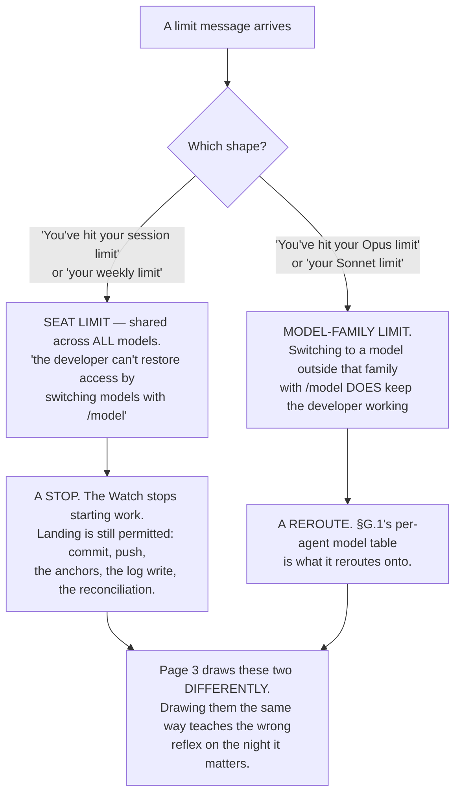
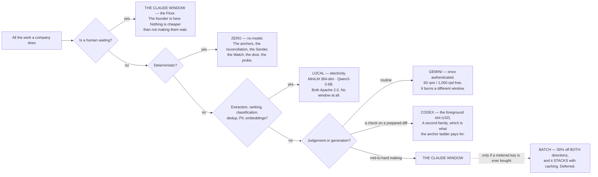

## 16 · Economics — where the money and the window actually go

*obeys: §G.2, §G.3, v22, v23 · inherits: FINAL §15, with its cost formula corrected*

---

### 16.1 What is measured, per run, always

**(FINAL)** Every run's handover carries its **actual** cost and the ledger accumulates it. **There is no estimation
step anywhere**; ranking uses measured medians of past runs of the same shape and kind.

**(NEW: v1 and v2 add a rollup FINAL explicitly refused, and §D page 3 requires it.)** FINAL's row read *"unit
economics per agent | none: there is no standing agent."* That was true of three shapes assembled per run. **It is
false of fourteen named agents with one file each**, and the founder's dashboard asks for cost *"per run, per agent,
per venture, per window"*. So per-agent becomes a real unit — not because it is nicer, but because the thing it names
now persists.

| Rolled up to | Answers |
|---|---|
| per run | what did this piece of work cost, and on which window |
| **per agent** *(new: v1, v2, §D page 3)* | what does `builder` cost against `scout`; which agent's window share is growing |
| per intent | what has this goal cost against its ceiling |
| per venture per month | am I inside what I said this venture may spend |
| per window | how much went to Claude, Codex, Gemini, local — **the number that predicts which fuse blows first** |
| per anchor rung | how much of what I believe is rung 1, and how much is rung 4 |

**(FINAL)** That last row is a **quality-of-belief** metric: the fraction of finished work whose done-test was checked
by something deterministic. **If it falls, the system is producing more and knowing less, and no cost number would
reveal it.**

**(FINAL, measured, and it is why the meter has a per-run axis at all.)** The meter is the runner's own reported cost
record, joined by the id minted at dispatch — **not** output tokens, which are 11% of the bill, and **not** a window
heuristic, which cannot attribute. One review session on this machine produced **1.4 million output tokens in five
hours with no loop running**, and a meter without a per-run axis cannot see that.

**Mechanism:** a ledger line per run, written from each run's `--output-format json` cost fields (**ABSENT**);
`bin/warroom`'s per-worker cost pricing exists on branch `ceo-1-1788609834` and is absorbed into it.

---

### 16.2 The two windows, and the two limit shapes that behave differently

**(NEW: v22 moves FINAL row 19, which knew only the five-hour fuse.)** There are **two windows, per seat**, and the
vendor's own sentence names both and names what they are shared with:

> *"each member's Claude Code usage draws from a per-seat allowance that resets on a rolling five-hour window **and a
> weekly window**. The allowance is shared with Claude chat and Cowork."*

**So the reserve is per window *and* per week, and a weekly exhaustion is a different event from a five-hour one.**
One is a pause; the other ends the week.

**(NEW: and the second half of v22, which is the operationally sharper one.)** Two limit *shapes*:



**(NEW: and the number the plan refuses to invent.)** **No numeric Anthropic subscription quota is published anywhere
fetched.** Magnitudes are relative only — Pro *"at least 5x more usage per 5-hour session than Free"*, Max *"5x"* and
*"20x more usage than Pro"*. **A Max window's real capacity is measurable only from an account**, and the **Max 20x
price is UNVERIFIED**: the pricing page rendered *"From $100 per month"* for both Max tiers.

**(NEW: the one window that *can* be budgeted in advance, and it is not ours.)** **OpenAI is the only vendor of the
three publishing numeric per-window quotas** (§G.2): per five-hour rolling window, GPT-6 Astra 5–45 on Plus, 25–225 on
Pro 5x, 100–900 on Pro 20x; GPT-5.6 Sol 10–100 / 50–500 / 200–2,000; GPT-5.6 Luna 250–2,000 / 1,250–10,000 /
5,000–40,000, with *"GPT-5.6 usage averages 5-30 credits per message."* **Caveat that matters for v32:**
`gpt-5.3-codex` appears in the API price list and in **no plan quota row**. Gemini CLI's free tier is **60 requests a
minute and 1,000 a day** on a personal Google account; the paid per-tier CLI quotas are **UNVERIFIED**.

---

### 16.3 The cost formula, corrected

**(FINAL, and the reason it is kept at all.)** Two competent reviewers priced this machine's predecessor within days
of each other and **diverged tenfold** — $74 a month against $1,300–1,700 — on **one assumption, the cache hit rate**,
which sets whether context costs a read multiple or a write multiple on the 89% of the bill that is context. The plan
does not pick a number. It says **what determines it**.

**(NEW: §G.3 corrects two coefficients, and FINAL was wrong in both directions.)** FINAL multiplied the standing
prompt by **1.25** on the first run of a batch *while assuming the one-hour TTL*. **1.25x is the five-minute write.
A one-hour write is 2x.** And FINAL's sibling-read coefficient of **0.10** is right for Opus 5, Sonnet 5 and Haiku 4.5
and **wrong by 4x for Fable 5.1 and Mythos 5.1, where reads are 0.025x** — $0.25 per MTok.

```
cost per night ≈ (standing prompt tokens) × W          on the FIRST run of a batch
               + (standing prompt tokens) × (siblings − 1) × R   on every sibling that HITS
               + (divergence tokens per run) × siblings × 1.0
               + output

where  W = 2.00   buying the 1-HOUR TTL   ← what a subscription gives, and what a batch relies on
       W = 1.25   buying the 5-MINUTE TTL
       R = 0.100  Opus 5 · Sonnet 5 · Haiku 4.5
       R = 0.025  Fable 5.1 · Mythos 5.1

Dominant term, by a distance: whether the siblings hit the cache.
Fails if: shapes vary per run · the standing prompt is regenerated · the TTL is shorter than the batch
          · the TTL silently drops to five minutes because the account began drawing on credits.
```

**(NEW: one more correction that has nothing to do with price and everything to do with the inputs.)** Opus 5 and
Fable 5.x use a newer tokenizer producing *"approximately 30% more tokens for the same text"* than Sonnet 4.6 and
earlier. **Any token budget inherited from a Sonnet-4.6-era measurement understates by about that much**, so a
byte-count carried over from an older plan is not a token count for these engines.

**(FINAL, unchanged and still the first thing to do.)** Before any estimate is believed: **ten real moves against the
runner's own reported cost**, on the subscription, in window units per run. Every prior round's dollar figure is kept
as **a target a real bill can falsify**, never as an estimate to plan on.

---

### 16.4 Where cost is actually saved

**(FINAL)** Not by making the runs thriftier. **By moving work off the expensive window.**



**(FINAL, and it is the claim to hold the design to.)** **The majority of what a company does every day is not
generation.** It is reading, sorting, checking, remembering, watching and summarising. All of that belongs on the
bottom rows, and the Claude window should be spent almost entirely on building and on judgement.

**(NEW: v20 gives the bottom row a shape it did not have.)** **No agent's default model is Haiku.** Haiku 4.5's
retirement is committed *"Not sooner than October 15, 2026"* and it is the only Haiku in the published table, so
building a cheap executor tier on it buys a migration. The genuinely cheap work goes to **local models on
electricity**; Haiku remains only where the vendor sets it.

**(NEW: v21, and this is the quantitative surprise in the whole section.)** **On a cache-dominated workload the model
spread collapses.** List price runs **10x in and 10x out** from Haiku 4.5 ($1/$5) to Fable 5.1 ($10/$50) — but
Fable's cache reads ($0.25) are only **2.5x** Haiku's ($0.10). FINAL §14.5 measured context at **89% of the load**,
which is exactly the regime where the 0.025x read rate does the work. **A long-horizon build with a large standing
context is the one move where the top model is not priced like the top model** — and that, not a benchmark, is why
Fable is an escalation rather than a default.

**(FINAL, holding: batch still needs a metered key.)** 50% off both directions, stacking with caching. Batch prices
are now published for every model, so the row is ready for the day a key exists — and §G.5's terms question is
attached to that day, not to this one.

---

### 16.5 `--max-budget-usd` is a stall fuse, not a spend control

**(NEW: v23, and the correction runs in the direction of less protection, which is why it is stated plainly.)** The
flag is **print mode only**; *"Claude Code computes the dollar figure locally from token counts at list price"*; and
for subscribers *"the session cost figure isn't relevant for billing purposes."* **It does not bind the account.**

**What it genuinely is, and it is worth keeping for exactly this:** spend from subagents **counts toward the cap**,
and once spend reaches it, *"spawning another subagent fails with `Budget limit reached`"* (v2.1.217+). That is a fuse
against a run that has stopped making progress and started making calls — the failure mode a night actually has.

**What binds the account instead:** usage credits with a monthly spend limit, and on Team or Enterprise, admin spend
limits. Neither is a per-run control, and the ceilings that matter to this design are §12.9's — **pre-action, per run,
per intent, per venture per month, tightest binds** — which are ours to implement and are **ABSENT**.

---

### 16.6 The stop rule

**(FINAL)** An intent that has consumed its ceiling **stops and comes back with what it has.** It does not get an
extension automatically, and **no run may raise its own ceiling.** Sunk cost is explicitly not an argument for
continuing: the briefing shows what was spent and what was achieved, and the founder decides whether to renew — as a
which, with the alternative already framed.

**(FINAL)** **The rope stops starting; it never stops landing.** At a fraction of a window, new work stops; commit,
push, the anchors, the log write and the reconciliation stay permitted. **A model with no entry in the price table is
refused, not scored at zero.**

**(NEW: v22 makes the rope read two gauges.)** A five-hour exhaustion stops starting until the window rolls. A
**weekly** exhaustion stops starting for the rest of the week, and it is the one that should reach the briefing as an
event rather than as a line.

---

### 16.7 The founder's budget list, re-placed

**(FINAL's table, with three rows corrected by this section.)**

| The founder asked for | Here it is |
|---|---|
| budget in money · daily spend cap · spend-rate limit | the charter's money ceiling per month and a rate per tool; **the Sender rejects at the ceiling independently of the number in the instruction**; a tool with a null rate cannot carry `SPENDS MONEY` |
| budget in hours | the reserve per window — **now per five-hour window *and* per week** (v22) |
| per-mission cost · per-worker cost · cost attribution | per intent and per run, joined by the id on every row; **per agent is now a real unit** (§16.1) |
| mission budget cap · investment stop criteria | the intent's ceiling and expiry; the stop rule (§16.6) |
| exploration vs exploitation spend | idle capacity buys knowledge, bounded by being free; *both options built* is the only sampled diversity |
| cheap-tier bulk usage | **local models on electricity** (v20) · the Gemini window once authenticated · batch on the day a key exists |
| cache-hit cost rate | measured per run from the runner's record; **the dominant term**, one line weekly |
| company P&L · revenue tracking · payment analytics · burn · runway | a venture's own work; revenue **read from the processor as a claim, never typed**; a runway computed from a number the bank does not confirm is stamped *internal* and cannot promote anything (§11.7) |
| ROI per mission | cost per finished intent; revenue attribution this founder mostly cannot make honestly yet, so it is **reported as undefined rather than guessed** |
| unit economics per agent | **~~none~~ — per agent, per shape, per move class**, because v1 and v2 made the agent a standing thing with a file |

---

### 16.8 The six weekly lines

**(FINAL §15.5 and §12, collected. Each must be reported whether or not it flatters, and each names what it would take
to game it.)**

| # | The line | Direction | Why it cannot be gamed |
|---|---|---|---|
| 1 | **cost per finished intent** | must fall | the denominator is *finished*, which means a done-test passed |
| 2 | **founder-minutes per finished intent** | must fall | the founder's own time, measured, not estimated |
| 3 | **cost per surviving artifact** | reported, and **undefined when it is undefined** | a month of cheap runs that produced nothing has no such number, and **reporting a small one is the arithmetic by which producing nothing looks efficient** |
| 4 | **interventions per surviving artifact** — redirects, rejections and rework | must fall | **the denominator is survivorship**, so producing more does not help |
| 5 | **the cache-hit cost rate** | watched, not targeted | it is the dominant term of §16.3, and it is read from the runner's own record |
| 6 | **the rung-1 share of finished work** (§11) | must not fall | it is *quality of belief*; if it falls the system is producing more and knowing less |

**(FINAL)** Two more lines belong in the briefing beside them and are not numbers: **the reconciliation line** — the
books agree with the bank, or the incident — and **the week's most expensive refusal**: what was going to happen, what
stopped it, what it would have been worth. **A refusal that tops that line four weeks running is a design defect
wearing a safety costume, and is narrowed by name.**

**(NEW: a scope note, because two sections must not define one number.)** **§21.1 carries FINAL §20's six numbers and
governs every line that appears in both.** Four of the six above are in that set — cost per finished intent, the
rung-1 share, interventions, and founder-minutes per finished intent — and where the wording differs, **§21.1's
definition wins and this table follows it.** One difference is real and is named rather than smoothed: §21.1 counts
interventions per **finished** artifact, and line 4 above counts them per **surviving** artifact, which is the
stricter denominator FINAL §12 argued for. **§21 owns that reconciliation and this section defers to it: FINAL
§15.5's two weekly numbers are cost per finished intent and founder-minutes per finished intent, while
interventions per surviving artifact is FINAL §12/§20's number, so §21 governs and "surviving" is the word used
here.** **The two lines this section genuinely adds
are 3 and 5** — cost per surviving artifact, and the cache-hit cost rate — because both are arithmetic about money
that no other section computes.

---

### 16.9 The only vendor cost anchor that exists

**(NEW: §G.3, and it is stated here so that no reader has to go looking for a per-task figure that does not exist.)**
The one **vendor** anchor is per developer-day, not per task:

> *"the average cost is around **$13 per developer per active day** and **$150-250 per developer per month**, with
> costs remaining **below $30 per active day for 90% of users**."*

**Everything else in circulation is third-party, confidence L, and is not used to route.** models.md lists the
tempting ones and refuses them by name: per-successful-fix figures on SWE-bench-scale tasks, output-dollars-per-
benchmark-point rankings, and a SWE-bench Pro leaderboard placing Fable 5.1 first. **No vendor-published cost-per-task
column was found for any of the three CLIs.** A third-party ratio is not a bill, and a ranking is not a routing rule —
which is why §G.1 routes on **cache behaviour, window, and family independence**, all of which are vendor-published,
and never on a benchmark score.

**Enforced by:** the ledger line per run (**ABSENT**) · the price table, with a model that has no entry **refused
rather than scored at zero** (**ABSENT**) · the three ceilings of §12.9 (**ABSENT**) · the six weekly lines in the
briefing (**ABSENT**) · `--max-budget-usd` per run as a stall fuse (**exists**).
