## 19 · Build order, by dependency

*obeys: every ABSENT path named in SPINE §B–§H, **and, since 2026-09-06, every ABSENT path named in SPINE §L** ·
inherits: FINAL §18*

**(FINAL)** No durations, no schedule, no first month. Each arrow reads **needs**. The three-first rule stands — the
logbook, transcript mining, one real venture driven — and the seam nodes sit where the measured facts put them:
**nothing unattended runs before the managed settings file exists, and nothing is trusted before the probe has run.**

**(NEW: the founder's own acts are nodes, because four of them gate whole subtrees)** The managed settings file, the
`gemini` authentication, the Codex install, the agent-teams flag and one fetch of `LICENSE-CONTENT` are things only
the founder can do. FINAL kept them in §19 as open decisions; v2 also draws them here, because a graph that omits its
blocking inputs reads as if the work could start.

**(FOUNDER, 2026-09-05: all five founder-act nodes are now DECIDED, and they stay nodes anyway)** The interview
settled every one of them — the managed file is written at build start, `gemini` authenticates on a personal Google
account, `codex` is installed when building starts, agent teams are **on** with no model constraint (v59), and
`LICENSE-CONTENT` is fetched at build time. **A decided act is still an act**: none of these has been performed, each
still gates what it gated, and deleting the nodes because the decision is made would hide five things that must
happen before the graph below can move. That is why each node now carries its decision rather than being removed.

---

### 19.1 The graph

```mermaid
flowchart TD
    LOG["1 · The logbook<br/>keel/bin/log · keel/logbook/{events,ledger}.jsonl ·<br/>an id on every row · F_FULLFSYNC · gen_ai.* names ·<br/>~/.agentvibe/events.jsonl adopted as the spine"]
    MANAGED(["FOUNDER ACT · the managed settings file<br/>permissions.deny · disableBypassPermissionsMode ·<br/>disableAutoMode · and NOT the two hook settings (v11)<br/>DECIDED 2026-09-05: written at build start"])
    GEMINI(["FOUNDER ACT · authenticate gemini<br/>one terminal act; 0.38.2 installed, never authenticated<br/>DECIDED 2026-09-05: a personal Google account"])
    CODEX(["FOUNDER ACT · install codex<br/>command -v codex is absent today<br/>DECIDED 2026-09-05: installed when building starts"])
    TEAMS(["FOUNDER ACT · CLAUDE_CODE_EXPERIMENTAL_AGENT_TEAMS=1<br/>experimental, no nested teams<br/>DECIDED 2026-09-05, v59: ON, and no model constraint —<br/>a teammate runs on its own file model"])
    LICENSE(["FOUNDER ACT · fetch and read LICENSE-CONTENT<br/>one fetch; unblocks the 2,111+ (v17)<br/>DECIDED 2026-09-05: fetched at build time; row stays open"])
    HOSTED(["FOUNDER DECISION · which hosted lane may make<br/>when the Mac is off (§I row 15) — Codex cloud has no<br/>documented driver; claude --cloud and Routines do<br/>MEASURED 2026-09-06, R5 DONE: 156 h of log, asleep 40.7 h<br/>in 487 episodes, ZERO gaps of an hour — the tail this<br/>lane would buy back is zero over the week measured.<br/>The charter field cloud: allow or deny, default deny,<br/>is decided either way (v79)"])

    AGENTS1["WAVE ONE · eight agent files (v54)<br/>operator · builder · reviewer · architect · tester ·<br/>guard · scout · designer<br/>.claude/agents/*.md · the model set in<br/>prompt-standard.test.mjs moves in the same change,<br/>because builder and architect declare claude-fable-5-1 (v57)"]
    AGENTS2["WAVE TWO · seven agent files (v54)<br/>product · analyst · writer · growth · steward ·<br/>curator · challenger<br/>written when a venture needs them; each brings<br/>its own argv file with it"]
    ARGV["keel/shared/argv/&lt;agent&gt;.&lt;provider&gt;.argv<br/>the grant IS these strings"]
    PROBE["keel/bin/probe<br/>what a run can actually touch, nightly"]
    RUN["keel/bin/run<br/>the only thing that composes argv · mints the UUID ·<br/>writes keel/logbook/sessions.jsonl<br/>seed: mission-control/scripts/consume-dispatch.ts"]
    SUPERVISE["keel/bin/supervise<br/>restart ceiling · heartbeat · process-group kill"]

    STORES["keel/bin/check-stores<br/>charter · intent · obligation · memory schemas ·<br/>the standing-intent fields every: and on:, and the<br/>per-run ceiling every: requires (v55)"]
    PRICES["keel/shared/prices.yml + the model-expiry rows<br/>of keel/shared/facts.yml · cache 1.25x/2x, read 0.1x/0.025x"]
    METER["The meter · page 3's numbers<br/>the runner's own cost joined by id"]

    MINE["2 · Transcript mining<br/>a batch pass over a snapshot, never a live parser<br/>taste · negatives · already-built · rehearsal candidates"]
    CURATE["keel/bin/curate + the curator, nightly<br/>the only writer of memory · delta-only"]
    REHEARSE["keel/bin/rehearse<br/>known-answer cases · scores.jsonl · the trust floor"]

    SKILL["keel/bin/skill · the library · registry.yml ·<br/>.agents/skills/ generated beside .claude/skills/"]

    DOOR["keel/bin/door + keel/shared/tools/&lt;name&gt;.yml<br/>+ checklist.md · read-only instruments admitted first"]
    DRILL["keel/bin/drill<br/>exercises a tool's undo; writes only a date"]
    INBOUND["keel/bin/inbound · the world's door<br/>one row per thing the world sent, as quoted data ·<br/>with scout, the only reader of a tainted source (v36)"]
    SENDER["keel/bin/send · the Sender<br/>no model; the only thing that sends"]
    RECON["keel/bin/reconcile<br/>reads a record the company does not write"]

    READBACK["The read-back page<br/>nothing binds by voice"]
    CLOUD["The cloud lane<br/>a hosted run's output lands as a PR or staged artifact ·<br/>bin/run's cloud carrier mints and records only ·<br/>the Watch reads PRs on wake · ABSENT<br/>SHUT BY v67: stop: reads UNKNOWN on this carrier, and<br/>bin/run refuses to mint unattended work on a carrier<br/>it cannot stop. Cancellation is what reopens it"]
    WATCH["3 · keel/bin/watch, the Desk and the cord<br/>obligations first · a LaunchAgent that exits"]

    MC["mission-control/ server + client, kept<br/>the website's runtime"]
    P2["Page 2 · agents and child flows<br/>tmux attach-session · claude --attach · inbox files"]
    P3["Page 3 · cost, tokens, efficiency<br/>every number taps"]
    P4["Page 4 · tasks, tickets, PRs<br/>a card launches a session; its solo | team toggle<br/>decides which shape (v60)"]
    P5["Page 5 · engines, gates, stores, live"]
    P1["Page 1 · the office · pixel-agents (MIT, read from file)<br/>through the door · our event-log → AgentEvent writer"]
    P7["Page 7 · canvas / playground<br/>Langflow idiom · --session-id --bg then --attach"]
    GRAPHLANE["A research lane on repository-to-graph tooling<br/>the thinnest-evidenced area; runs BEFORE the extractor (v61)"]
    EXTRACT["The repository-to-graph extractor<br/>ours; 3d-force-graph reads {nodes, links} only"]
    P6["Page 6 · 3D file graph<br/>LAST of the seven pages (v61)"]

    CODEXTEST["The Codex headless rehearsal<br/>codex exec --json · no controlling TTY ·<br/>non-trivial prompt · version >= 0.124.0"]
    VENTURE["3 · One real venture, driven<br/>a real done-test and a rung-1 anchor"]
    OVERNIGHT["The first measured overnight<br/>one week overnight against one week bounded"]

    ROSTER["keel/shared/roster.yml · O2<br/>ONE roster file: frontmatter, argv paths, color, wave,<br/>valid_until with a forced disposition (v72), maxTurns,<br/>isolation, anchor, the v71 pack paths ·<br/>§17.1 and page 2 are generated or checked against it"]
    PACKS["The onboarding packs · v71<br/>per agent, wave one included: one rehearsal case with a<br/>known answer, one exemplar of its own output with<br/>provenance, one end-to-end demonstration that its anchor<br/>fires, namespaces that resolve ·<br/>WITHOUT THEM AN AGENT IS DECLARED AND NOT ROUTABLE"]
    ROUTING["keel/shared/routing.yml · O5<br/>which agent, which model, which band — answered ONCE and<br/>generated into §B.2, §C.1 and §9.2, which today answer it<br/>in three places with nothing checking that they agree"]
    SCHEMAS["keel/shared/schemas/ · O3 O4 O6 O7<br/>charter.yml · brief.yml, eleven fields per v45 ·<br/>event.yml, a schema_version on every row and a reader<br/>that refuses an unknown version · the handover's five<br/>fields: objection, brief_sha, maker and checker<br/>family plus model, actor, idempotency key"]
    WORK["keel/ventures/&lt;v&gt;/items/ · O1<br/>w-*.yml with intent, purpose, ceiling, blocked_on,<br/>attempts, last_failure, card · proposals land in<br/>items-draft/ · A BOARD CARD IS A VIEW OF A WORK ROW"]
    DECIDE["keel/logbook/decide.jsonl · O9<br/>one house queue replacing ten per-venture open.md ·<br/>a row with no intent id is refused ·<br/>the night escalation target, never the Operator (O49)"]
    GOLDEN["keel/golden/ · O11<br/>eval-only bodies, so the case that will judge a run<br/>cannot be read by that run · one frontmatter field,<br/>one generator rule, check:manifest re-pointed"]
    PAGEMAN["keel/surfaces/pages/&lt;n&gt;.yml · O12<br/>every element resolves to a store path or a bin/ verb<br/>and the renderer builds only from it ·<br/>page 1 loses the venture toggle to page 3's strip"]
    HOST["keel/host/ · O10<br/>plist · managed-settings template · env file ·<br/>sandbox block · denyRead list · expected macOS grants —<br/>the one place the machine is declared"]
    CONSENT["keel/consent.yml + keel/subjects/&lt;hash&gt;.yml · v69<br/>the register has ONE writer and is read by the Sender<br/>BEFORE any contact · log and memory hold a hash, never a<br/>body, so erasure deletes one subject row and the hash<br/>becomes a known absence"]
    HIGHWATER["The window high-water file · v74<br/>tokens observed, because no denominator is published ·<br/>wall clock beside it, USD kept as a shadow price"]

    EGRESS["keel/bin/egress · v68<br/>ONE no-model door: every call logged, filtered by domain<br/>AND method, credentials injected that the agent never<br/>sees · --strict-mcp-config names only the proxy and<br/>mcp-policy.json becomes its configuration"]
    WORKTREE["keel/bin/worktree · O14<br/>a run NEVER creates its own — git worktree add cannot<br/>complete under the armed sandbox and escalation is<br/>unavailable to an unattended run · it is handed one"]
    LEASE["logbook/watch.lease · O16<br/>host id and heartbeat · the Watch will not tick and the<br/>Sender will not act without it, so the restore drill's<br/>clone can never send twice"]
    REDACT["keel/bin/redact · O17 O66<br/>ONE redaction where there were two · the PII gate on the<br/>Sender's checklist and the mining pass, its<br/>false-positive rate measured for a week before it blocks"]
    BELL["keel/bin/bell · O18<br/>the only thing that may ring · reads the wake-me classes,<br/>the interruption budget and the acted-on rate"]
    REPLAY["keel/bin/replay-desk · O20<br/>deterministic, free, reads rows nothing reads today ·<br/>it is what settles v75 without living a month"]
    HORIZON["keel/bin/horizon · O23<br/>one pass over every durable store: forced disposition at<br/>expiry, plus a LAPSE RECORD, one row per thing that<br/>expired unactioned, ordered by what it stopped"]
    INTEND["keel/bin/intend · O60<br/>bug intake: an anchor that fails twice writes a card<br/>whose done-test IS the reproducing command; with no<br/>reproduction it is a bounded question for scout"]
    LOCAL["keel/bin/embed · keel/bin/classify · O13<br/>the local tier has no reachable carrier — the sandbox<br/>denies a loopback bind and curator holds no Bash ·<br/>no-model programs handing the curator a file<br/>DEPENDS ON R4"]
    FIXTURES["keel/fixtures/ · O78 O79<br/>a scratch house: the Sender, Watch, door and launcher<br/>have no test seam, and a Sender defect is an outward act<br/>that cannot be recalled · blue-green at a tick boundary"]

    LOG --> RUN
    LOG --> MINE
    LOG --> STORES
    LOG --> METER
    LOG --> MC
    MANAGED --> HOST
    HOST --> PROBE
    PROBE --> RUN
    AGENTS1 --> ARGV
    ARGV --> RUN
    ARGV --> PROBE
    RUN --> SUPERVISE
    RUN --> METER
    RUN --> CLOUD
    HOSTED --> CLOUD
    PRICES --> METER
    STORES --> READBACK
    STORES --> PRICES
    MINE --> CURATE
    MINE --> REHEARSE
    RUN --> REHEARSE
    LICENSE --> SKILL
    AGENTS1 --> SKILL
    REHEARSE --> SKILL
    PROBE --> DOOR
    DOOR --> DRILL
    DOOR --> INBOUND
    DOOR --> RECON
    DRILL --> SENDER
    INBOUND --> SENDER
    INBOUND --> WATCH
    READBACK --> WATCH
    CLOUD --> WATCH
    METER --> WATCH
    REHEARSE --> WATCH
    SUPERVISE --> WATCH
    MC --> P2
    MC --> P3
    MC --> P4
    MC --> P5
    MC --> P1
    MC --> P7
    TEAMS --> P2
    RUN --> P2
    RUN --> P4
    RUN --> P7
    METER --> P3
    STORES --> P5
    GRAPHLANE --> EXTRACT
    EXTRACT --> P6
    MC --> P6
    P2 --> P6
    P3 --> P6
    P4 --> P6
    P5 --> P6
    P7 --> P6
    GEMINI --> ARGV
    CODEX --> CODEXTEST
    ARGV --> CODEXTEST
    WATCH --> VENTURE
    P4 --> VENTURE
    RECON --> VENTURE
    SKILL --> VENTURE
    VENTURE -.->|"when a venture needs them"| AGENTS2
    VENTURE --> OVERNIGHT

    AGENTS1 --> ROSTER
    ROSTER --> PACKS
    PACKS --> ROUTING
    ROUTING --> RUN
    ROSTER --> P2
    SCHEMAS --> LOG
    SCHEMAS --> RUN
    SCHEMAS --> STORES
    STORES --> WORK
    WORK --> P4
    WORK --> WATCH
    INTEND --> WORK
    STORES --> INTEND
    LOG --> DECIDE
    STORES --> DECIDE
    DECIDE --> P4
    DECIDE --> P5
    HORIZON --> DECIDE
    STORES --> HORIZON
    REHEARSE --> GOLDEN
    GOLDEN --> SKILL
    PAGEMAN --> MC
    INBOUND --> CONSENT
    STORES --> CONSENT
    CONSENT --> SENDER
    METER --> HIGHWATER
    HIGHWATER --> WATCH
    DOOR --> EGRESS
    EGRESS --> INBOUND
    EGRESS --> SENDER
    EGRESS --> RECON
    WORKTREE --> RUN
    LEASE --> WATCH
    LEASE --> SENDER
    REDACT --> MINE
    REDACT --> SENDER
    WATCH --> BELL
    WATCH --> REPLAY
    LOCAL --> CURATE
    FIXTURES --> SENDER
    FIXTURES --> WATCH
    FIXTURES --> DRILL
```

---

### 19.2 Every ABSENT path of SPINE §B–§H, and the one node it appears in

**(NEW: the graph claims completeness, so the claim is made checkable)** One row per ABSENT path. If a path appears in
two nodes the graph is wrong, and this table is how that is found. **The rethink round's own paths — SPINE §L — are
in 19.2a below**, in three groups, because they arrived as a set and behave as three kinds.

| ABSENT path or artifact | SPINE | Node |
|---|---|---|
| `.claude/agents/operator.md` and the seven other wave-one files | §B.2, §C, v54 | `AGENTS1` |
| The seven wave-two agent files — product · analyst · writer · growth · steward · curator · challenger | §B.2, v54 | `AGENTS2` |
| `keel/shared/argv/<agent>.<provider>.argv` | §B.1 rule 1, §H.1 | `ARGV` for wave one; each wave-two file brings its own with it (v54) |
| `keel/bin/run` | §B.1 rule 1, §C.4, v34 | `RUN` |
| `keel/bin/probe` | §B.1 rule 4, v34 | `PROBE` |
| `keel/bin/log` and `keel/logbook/` | §B.1 rule 4 | `LOG` |
| `keel/logbook/sessions.jsonl` | §D.2, §17.4.1 | `RUN` (its one writer) |
| `keel/bin/watch` and the Desk | §B.1 rule 4, §D.2 | `WATCH` |
| `bin/run`'s `cloud` carrier (mints and records only) and the Watch's on-wake read of PRs | §I row 15, v56 | `CLOUD` |
| `keel/bin/supervise` | §B.1 rule 4 | `SUPERVISE` |
| `keel/bin/send` — the Sender | §B.1 rules 3 and 4, §C.1, §F | `SENDER` |
| `keel/bin/inbound` — the world's door | §B.1 rule 4, v36 | `INBOUND` |
| `keel/bin/door` and `keel/shared/tools/<name>.yml` + `checklist.md` | §B.1 rule 4, §F | `DOOR` |
| `keel/bin/drill` | §B.1 rule 4, §F | `DRILL` |
| `keel/bin/reconcile` | §B.1 rule 4 | `RECON` |
| `keel/bin/check-stores` | §B.1 rule 4, §B.2 product and curator anchors | `STORES` |
| `keel/bin/rehearse` and the rehearsal cases | §B.1 rule 4 | `REHEARSE` |
| `keel/bin/curate` and the nightly curator | §B.1 rule 4, v25 | `CURATE` |
| `keel/bin/skill` — the skill creator | §E.3 | `SKILL` |
| `.agents/skills/` and the library's `registry.yml` | §E.1, §17.4.1 | `SKILL` |
| The read-back page | §C.3 | `READBACK` |
| Page 1, the office — pixel-agents, through the tool door | §D, v62 | `P1` |
| A writer from our event log into pixel-agents' `AgentEvent` model (schema not read from source — UNVERIFIED) | §D, v62 | `P1` |
| Page 2, agents and child flows | §D | `P2` |
| Page 3, cost, tokens and efficiency | §D, v14 | `P3` |
| Page 4, tasks, tickets and PRs | §D, v16 | `P4` |
| Page 5, engines and how it works | §D | `P5` |
| Page 6, the 3D file graph | §D, v61 | `P6` — last of the seven |
| The repository-to-graph extractor | §D, v15, v61 | `EXTRACT`, preceded by `GRAPHLANE` |
| Page 7, canvas and playground | §D, v15 | `P7` |
| `keel/shared/prices.yml` and the model-expiry facts | §G.1, §G.3, §G.4 | `PRICES` |
| The Codex headless rehearsal | §H.2, v32 | `CODEXTEST` |

### 19.2a Every ABSENT path of SPINE §L, grouped — the rethink round's own additions

**(NEW: the rethink round of 2026-09-06 named eighty mechanisms, and a mechanism with a path is a build node or it is
a wish)** The same completeness claim as 19.2, made against SPINE §L: **one row per ABSENT path, and a path in two
nodes means the graph is wrong.** They group into three kinds, and the kinds behave differently in a build order —
**a store is written once and read forever, a program is a thing somebody writes, and a mechanism is a rule that
lands inside a program that already has a node.** Only the first two are new nodes; the third joins one, which is
why the graph grew by twenty-one nodes and not by eighty.

**Stores and schemas — O1–O12, plus the two the founder's rows add**

| ABSENT path | SPINE | Node |
|---|---|---|
| `keel/ventures/<v>/items/` — `w-*.yml`, and `items-draft/` | §L O1 (**R16** decides two objects or three) | `WORK` |
| `keel/shared/roster.yml` | §L O2 · v72's `valid_until` · v71's pack paths | `ROSTER` |
| `keel/shared/schemas/charter.yml` | §L O3 (contradiction 2) · v79's `cloud:` field | `SCHEMAS` |
| `keel/shared/schemas/brief.yml` — eleven fields | §L O4 (contradiction 3) | `SCHEMAS` |
| `keel/shared/routing.yml` | §L O5 (contradiction 17) | `ROUTING` |
| `keel/shared/schemas/event.yml` — `schema_version` on every row | §L O6 | `SCHEMAS`; the logger change joins `LOG` |
| The handover schema's five fields | §L O7 (**R11** is blocked on it) | `SCHEMAS`; the writer joins `RUN` |
| `keel/shared/prices.yml` with `fetched_at` and `valid_until` | §L O8 | `PRICES` — the node exists; the two fields and the stale-row refusal are what is new |
| `keel/logbook/decide.jsonl` | §L O9 · O49 · v76's which-expiry | `DECIDE` |
| `keel/host/` | §L O10 | `HOST` |
| `keel/golden/` | §L O11 (contradiction 11) | `GOLDEN` |
| `keel/surfaces/pages/<n>.yml` | §L O12 (contradiction 9) | `PAGEMAN` |
| `keel/consent.yml` — the register — and `keel/subjects/<hash>.yml`, the erasable per-subject store | **v69** | `CONSENT` |
| The window high-water file | **v74** | `HIGHWATER` |

**Programs — O13–O20, O23, O60, O78, O79, plus the founder's one**

| ABSENT path | SPINE | Node |
|---|---|---|
| `keel/bin/egress` | **v68** (D3) | `EGRESS` |
| `keel/bin/embed` and `keel/bin/classify` | §L O13 — **DEPENDS-ON-R4** | `LOCAL` |
| `keel/bin/worktree` | §L O14 | `WORKTREE` |
| The wake reconciler — `run.started` before exec, then reconcile against `claude agents --json --all`, the tmux session list and the process table | §L O15 (contradiction 13) | joins `RUN` and `WATCH`; it is the carrier *"resume, not restart"* never had |
| `logbook/watch.lease` | §L O16 | `LEASE` |
| `keel/bin/redact` | §L O17 (contradiction 14) · O66 | `REDACT` |
| `keel/bin/bell` | §L O18 | `BELL` |
| The same-failure predicate — one shared hash | §L O19 (rests on **O13**) | joins `LOCAL`; its three consumers are `WATCH`, `CURATE` and the fast loop |
| `keel/bin/replay-desk` | §L O20 (**v75** is settled by it) | `REPLAY` |
| `keel/bin/horizon` | §L O23 | `HORIZON` |
| `keel/bin/intend` | §L O60 | `INTEND` |
| `keel/fixtures/` | §L O78 | `FIXTURES`; `bin/drill` gains the scratch house and keeps node `DRILL` |
| Blue-green at a tick boundary | §L O79 | joins `WATCH` and `SENDER` — free, because every tick is already crash-only |

**Mechanisms — the rules that land inside a program that already has a node**

| Mechanism | SPINE | Node it joins |
|---|---|---|
| `/goal`'s condition composed from `anchor:` — **DEPENDS-ON-R17** · the byte-identical done-test · the edit-arguments verb writing a brief and never argv · the prefix hash and the two shipped flags — **R7** · `tokenizer:` on every ceiling · the trust score's launcher consumer · the cross-venture refusal · the carrier choice for `tester` and `challenger` · brand-voice unroutable while the taste store is empty · the session ceiling — **DEPENDS-ON-R23** | §L O21, O22, O53, O39, O77, O26, O27, O28, O61, O71 | `RUN` |
| The hash chain, the sandbox-escalation row, `skill.miss`, skill activation (**DEPENDS-ON-R14**) | §L O31, O48, O41 | `LOG` |
| `catch_up:` because `StartInterval` coalesces · idle work must serve a live intent · the file lease · the statutory class and the customer's clock | §L O52, O51, O72, O55, O56 | `WATCH` |
| The watermark, the venture argument, the dedup calibration, slice precision, the calibration number per agent, the negatives scope split | §L O42, O68, O44, O45, O80, O43 | `CURATE` and `MINE` |
| `effect:` on every anchor · one sample floor · the held-out discrimination test · the signed verdict's key path · `claim-source` blocking on `scout` | §L O24, O25, O62, O30, O29 | `REHEARSE`, with `O29` and `O30` on machinery that exists today |
| `provider_cap` · bulk personal data with `guard` · `scopes_observed` and a binary's version and hash · refusing `/import` · the taint id and the per-venture canary | §L O32 (**R21**), O33, O35, O36, O65 | `DOOR`, with the canary's refusal in `SENDER` |
| Three data classes and per-store retention · wind-down · rotation as an obligation · the provenance line on the Sender's checklist | §L O34, O63, O67, O64 | `STORES` and `SENDER` |
| One control chart · cost per rung movement · the restore drill's number · log rotation (**DEPENDS-ON-R22**) | §L O74, O75, O76, O40 | `METER` and the briefing |
| A terminal `blocked` state after N failures — **R18** sets N | §L O73 | `RUN`, written to the card store and the negatives store |
| The deterministic accessibility check · the verbatim legal clause | §L O58, O59 | `P5` and `RECON`; both sit on grants and checks that exist |
| The page manifest's readers: the census join, the citing-or-refusing Q&A | §L O70, O54 | `P2` and the page renderers, downstream of `PAGEMAN` |
| Deletions and rules with no program: the project-settings grant tier, the backlog file, the parallelism axis, `analyst`'s shell, `CURATION.yml` as the failed-candidate home, the hook rewrite as spec | §L O37, O46, O69, O57, O47, O38 | no node — §18.7 carries them as fates |

**(NEW: three of these paths are named more narrowly than SPINE §L names them, and the difference is recorded
rather than applied in silence)** §L writes the work-item store as `keel/ventures/<v>/work/` holding `w-*.yml`. **It
is `items/` holding `w-*.yml` here, with drafts in `items-draft/`** — because **`work/` is already the venture's own
source repository**, and a store path that collides with the tree a builder checks out is a defect found by a `git
status` at three in the morning rather than by a review. **v69**'s two stores are named the same way:
`keel/consent.yml` for the register and `keel/subjects/<hash>.yml` for the erasable per-subject bodies, where §L
says only *two stores*. **None of the three is a change of behaviour** — §L's fields, its one-writer rule and
`bin/check-stores`' refusals are untouched, and only directory and file names move. They are written down because a
path that differs between the spine and the build order is precisely the drift the spine exists to stop, and the
cheapest moment to see it is now.

**(NEW: two rows are free before the first run and expensive after, and the graph cannot show that)** **O7**'s five
handover fields and **O6**'s `schema_version` cost nothing while no run has written a row, and cost a **full backfill**
the moment one has. They are marked *free now, backfill later* in §L for that reason, and **R11** — does a second
model family reduce escaped defects on our own move classes — is **blocked on O7's four provenance fields**, which
are cheap now and unreconstructable later. A build order that defers them is not deferring work; it is choosing to
pay more for it and to lose one measurement outright.

**(NEW: R10 gates everything cross-model, and it is one node the graph already has)** `CODEXTEST` **is R10** — does
`codex exec --json` return output with no controlling TTY, on a current version, with a non-trivial prompt. Pass and
rung 2 becomes parallel and a second family is a lane; fail and the second family is one foreground slot forever, at
1/N availability. **v5, v32, v78, v82 and §I row 15 all read differently depending on it.** Note **W19** against the
node's own label: the rehearsal floor written there as `>= 0.124.0` is twenty-nine minor versions stale against the
shipped 0.153.4 and no longer discriminates — the floor is **the installed version, recorded**. **R26**, reading the
unread Codex June–August changelog window, is the only cheap route to the same answer and needs no install at all.

---

**(NEW: two nodes are not ABSENT paths and are drawn anyway)** `MC` is `mission-control/` on
`ceo-1-1788609834` — 60 files that already exist and are kept (§18.5). `MINE` reads
`~/.claude/projects/` — 3,060 transcripts that already exist. Both are drawn because everything downstream needs
them, not because anything must be created first.

---

### 19.3 What the shape of the graph says

**(FINAL, and it survives v2 intact)** Three things unlock everything else and one of them is unusual. **The
logbook**, because nothing can be measured, learned from, explained or resumed without a typed append-only record —
and it is the cheapest thing here. **Transcript mining**, the only component that makes every other component better
on the day it lands, which most designs would build last. **One real venture, driven**, with a real done-test and a
rung-1 anchor, because everything in this design is a claim about what happens when that runs.

**(NEW: v4 adds a fourth trunk, and it hangs off the same root)** The website's six built pages all descend from
`LOG` and `RUN`. Page 3 cannot exist before the meter, page 2 cannot exist before the agent-teams flag, and page 4
cannot exist before `bin/run` can hand a card to a team. **None of them is a new source of truth** — that is what
`MC --> P*` means and it is why every page reads the same store.

**(NEW: the founder-act nodes are not evenly placed, and the asymmetry is the useful part)** `MANAGED` gates the
entire unattended half of the system through `PROBE`. `LICENSE` gates only the bulk import. `TEAMS` gates one page.
`CODEX` gates one measurement whose failure leaves Codex in the foreground slot it already has. **Only one founder act
is on the critical path of everything**, and it is four lines of JSON in a directory no run can reach.

**(NEW, v56: `HOSTED` is the narrowest node in the graph, and it is a decision rather than an act)** It gates only
`CLOUD` — the off-Mac maker lane — and nothing else downstream of `RUN` needs it: a run dispatched while the Mac is
on never touches this node. Unlike `MANAGED`, `GEMINI`, `CODEX`, `TEAMS` and `LICENSE`, which the founder's interview
of 2026-09-05 settled, `HOSTED` is still **OPEN** (§I row 15) — it names a choice among lanes with no documented
driver today (Codex cloud) against lanes that share the Claude seat whose terms clause is §I row 1, also open. Two
open decisions gate one narrow lane, and nothing else in the graph waits on either of them.

**(FOUNDER, v54: the roster is two nodes now, and the second one is downstream of a running venture)** `AGENTS1` is
eight files and sits where `AGENTS` did — everything that needs a grant needs it. `AGENTS2` is the other seven, and
the only edge into it comes **from** `VENTURE`: they are written when a venture needs them. **No edge is drawn from
`AGENTS2` to `ARGV`, and the omission is deliberate rather than an oversight** — that edge would close a cycle
(`AGENTS2 → ARGV → RUN → … → VENTURE → AGENTS2`), and the cycle would be real rather than a drawing artifact, because
wave two is written after the machine is already running. Each wave-two file therefore brings its own argv file with
it, the same way wave one's arrives with `AGENTS1`. **What the split does not change:** all fifteen rows stay in the
§17.1 inventory, and §5.0 states once what wave one does without.

**(FOUNDER, v61: page 6 is the only page with edges from every other page, and that is what "last" means here)**
`P2`, `P3`, `P4`, `P5` and `P7` all point into `P6`, so the graph refuses to build it early rather than a sentence
asking nobody to. `GRAPHLANE` — one research lane on repository-to-graph tooling — points into `EXTRACT`, because
the extractor is the one substrate in this plan with no verified prior art and §14.9 says so. Read the two together:
the page waits on the other six for appetite, and the extractor waits on evidence.

**(NEW: one edge exists so that another one does not have to, v36)** `INBOUND --> WATCH` is drawn because the Watch
materialises an obligation from a row the world's door already wrote down, and **`steward` writes its obligations
from those rows and from `scout`'s handover**. **No edge runs from a tainted hand to `steward`**, and none may: no agent holding `Write`, `Edit` or `Bash` reads mail, calendar, drive or Notion raw. That
is why the world's door is a node in its own right rather than a detail inside the tool door.

**(NEW: one edge is deliberately missing, and its absence is the design)** Nothing points from any agent node to
`WATCH` or to a gate. **The gate may not be invocable by the thing it gates** (v35), and the same argument keeps
`Write` off reviewer. A build order that wired an engine to its own gate would be drawing the failure in.

**(NEW: what the rethink round of 2026-09-06 did to this graph, and the shape of the change is the finding)** It
added **twenty-one nodes — eleven stores and schemas, ten programs — and not one new root.** Every one of them hangs
off `LOG`, `RUN`, `STORES`, `DOOR` or `WATCH`, which is what a round of *mechanism* fixes looks like when it is
drawn: eighty decisions (§L), and the trunk did not move. Had the round found a second architecture, this graph
would have a second source. It has none. **Four of the twenty-one change an ordering rather than adding work.**
`PACKS` is the sharpest — **v71 makes an agent unroutable without its onboarding pack**, so `AGENTS1 → ROSTER →
PACKS → ROUTING → RUN` is the order, and the pack is not paperwork filed after the fact: it is what distinguishes
`writer` from *builder with a different prompt*, in a band nobody publishes evidence for. **The enforcement is not
the arrow.** `bin/run` already refuses a brief naming a file that does not exist (v37, v45) and the pack paths are
declared in `roster.yml`, so an unpacked agent fails at dispatch rather than at review — which is why the graph may
also be read the wrong way round and must not be: `AGENTS1 → ARGV → RUN` still exists, and it is the refusal, not the
drawing, that keeps an unpacked agent off it. `WORKTREE` is the second: **a run never creates its own**, because
`git worktree add` cannot complete under the armed sandbox and interactive escalation is unavailable to an
unattended run by construction, so the tree is composed into its argv like every other grant. `HOST` is the third —
`MANAGED → HOST → PROBE` replaces `MANAGED → PROBE`, because the founder's act now writes into a directory that
declares the whole machine and the probe asserts it **by attempting the operation**. `LEASE` is the fourth, and it
is the only node in the round that exists to prevent a **duplicated outward act**: without it the restore drill's
own clone can tick and can send.

**(NEW: one node was measured and one was shut, and they are the two that concern the world outside this Mac)**
`HOSTED` is answered by measurement for the first time — **R5 is DONE**: 156 hours of log, 40.7 asleep in 487
episodes, **zero episodes of an hour or more**, longest single sleep about twenty minutes. The tail a hosted maker
lane would buy back is **zero over the week measured**, so the node stays a founder decision (§I row 15) but it is
now a decision with a number under it. `CLOUD` is shut from the other end by **v67**: `bin/run` refuses to mint
unattended work on a carrier whose `stop:` reads UNKNOWN, and cancelling a hosted Codex task is exactly that. **The
two facts point the same way from opposite directions** — the lane buys back nothing measurable, and it cannot be
stopped — which is the strongest state an open decision can be in without being closed.

**(NEW: the round's one node that is not work but an answer)** `CODEXTEST` **is R10**, and R10 is the hinge of the
cross-model design rather than one of its rows: pass, and rung 2 becomes parallel and a second family is a lane;
fail, and the second family is one foreground slot forever. Nothing downstream of it changes size — the *shape* of
§9, §10, §11 and §I row 15 changes. It is drawn as one small node because a graph cannot show that, and this
paragraph is where it is said instead.
