## 19 · Build order, by dependency

*obeys: every ABSENT path named in SPINE §B–§H · inherits: FINAL §18*

**(FINAL)** No durations, no schedule, no first month. Each arrow reads **needs**. The three-first rule stands — the
logbook, transcript mining, one real venture driven — and the seam nodes sit where the measured facts put them:
**nothing unattended runs before the managed settings file exists, and nothing is trusted before the probe has run.**

**(NEW: the founder's own acts are nodes, because four of them gate whole subtrees)** The managed settings file, the
`gemini` authentication, the Codex install, the agent-teams flag and one fetch of `LICENSE-CONTENT` are things only
the founder can do. FINAL kept them in §19 as open decisions; v2 also draws them here, because a graph that omits its
blocking inputs reads as if the work could start.

---

### 19.1 The graph

```mermaid
flowchart TD
    LOG["1 · The logbook<br/>keel/bin/log · keel/logbook/{events,ledger}.jsonl ·<br/>an id on every row · F_FULLFSYNC · gen_ai.* names ·<br/>~/.agentvibe/events.jsonl adopted as the spine"]
    MANAGED(["FOUNDER ACT · the managed settings file<br/>permissions.deny · disableBypassPermissionsMode ·<br/>disableAutoMode · and NOT the two hook settings (v11)"])
    GEMINI(["FOUNDER ACT · authenticate gemini<br/>one terminal act; 0.38.2 installed, never authenticated"])
    CODEX(["FOUNDER ACT · install codex<br/>command -v codex is absent today"])
    TEAMS(["FOUNDER ACT · CLAUDE_CODE_EXPERIMENTAL_AGENT_TEAMS=1<br/>experimental, off by default, no nested teams"])
    LICENSE(["FOUNDER ACT · fetch and read LICENSE-CONTENT<br/>one fetch; unblocks the 2,111 (v17)"])

    AGENTS["The fifteen agent files<br/>keel/agents/*.md · the model set in<br/>prompt-standard.test.mjs moves in the same change"]
    ARGV["keel/agents/&lt;agent&gt;.&lt;provider&gt;.argv<br/>the grant IS these strings"]
    PROBE["keel/bin/probe<br/>what a run can actually touch, nightly"]
    RUN["keel/bin/run<br/>the only thing that composes argv · mints the UUID ·<br/>writes keel/logbook/sessions.jsonl<br/>seed: mission-control/scripts/consume-dispatch.ts"]
    SUPERVISE["keel/bin/supervise<br/>restart ceiling · heartbeat · process-group kill"]

    STORES["keel/bin/check-stores<br/>charter · intent · obligation · memory schemas"]
    PRICES["keel/shared/prices.yml + the model-expiry rows<br/>of keel/shared/facts.yml · cache 1.25x/2x, read 0.1x/0.025x"]
    METER["The meter · page 3's numbers<br/>the runner's own cost joined by id"]

    MINE["2 · Transcript mining<br/>a batch pass over a snapshot, never a live parser<br/>taste · negatives · already-built · rehearsal candidates"]
    CURATE["keel/bin/curate + the curator, nightly<br/>the only writer of memory · delta-only"]
    REHEARSE["keel/bin/rehearse<br/>known-answer cases · scores.jsonl · the trust floor"]

    SKILL["keel/bin/skill · the library · registry.yml ·<br/>.agents/skills/ generated beside .claude/skills/"]

    DOOR["keel/bin/door + keel/shared/tools/&lt;name&gt;.yml<br/>+ checklist.md · read-only instruments admitted first"]
    DRILL["keel/bin/drill<br/>exercises a tool's undo; writes only a date"]
    INBOUND["keel/bin/inbound · the world's door<br/>one row per thing the world sent, as quoted data ·<br/>with scout, the only reader of a tainted source (v36)"]
    SENDER["keel/bin/send · the Sender<br/>no model; the only thing that sends"]
    RECON["keel/bin/reconcile<br/>reads a record the company does not write"]

    READBACK["The read-back page<br/>nothing binds by voice"]
    WATCH["3 · keel/bin/watch, the Desk and the cord<br/>obligations first · a LaunchAgent that exits"]

    MC["mission-control/ server + client, kept<br/>the website's runtime"]
    P2["Page 2 · agents and child flows<br/>tmux attach-session · claude --attach · inbox files"]
    P3["Page 3 · cost, tokens, efficiency<br/>every number taps"]
    P4["Page 4 · tasks, tickets, PRs<br/>a card launches a session with a TEAM"]
    P5["Page 5 · engines, gates, stores, live"]
    P1["Page 1 · the office<br/>Generative Agents demo mode, through the door"]
    P7["Page 7 · canvas / playground<br/>Langflow idiom · --session-id --bg then --attach"]
    EXTRACT["The repository-to-graph extractor<br/>ours; 3d-force-graph reads {nodes, links} only"]
    P6["Page 6 · 3D file graph"]

    CODEXTEST["The Codex headless rehearsal<br/>codex exec --json · no controlling TTY ·<br/>non-trivial prompt · version >= 0.124.0"]
    VENTURE["3 · One real venture, driven<br/>a real done-test and a rung-1 anchor"]
    OVERNIGHT["The first measured overnight<br/>one week overnight against one week bounded"]

    LOG --> RUN
    LOG --> MINE
    LOG --> STORES
    LOG --> METER
    LOG --> MC
    MANAGED --> PROBE
    PROBE --> RUN
    AGENTS --> ARGV
    ARGV --> RUN
    ARGV --> PROBE
    RUN --> SUPERVISE
    RUN --> METER
    PRICES --> METER
    STORES --> READBACK
    STORES --> PRICES
    MINE --> CURATE
    MINE --> REHEARSE
    RUN --> REHEARSE
    LICENSE --> SKILL
    AGENTS --> SKILL
    REHEARSE --> SKILL
    PROBE --> DOOR
    DOOR --> DRILL
    DOOR --> INBOUND
    DOOR --> RECON
    DRILL --> SENDER
    INBOUND --> SENDER
    INBOUND --> WATCH
    READBACK --> WATCH
    METER --> WATCH
    REHEARSE --> WATCH
    SUPERVISE --> WATCH
    MC --> P2
    MC --> P3
    MC --> P4
    MC --> P5
    MC --> P1
    MC --> P7
    TEAMS --> P2
    RUN --> P2
    RUN --> P4
    RUN --> P7
    METER --> P3
    STORES --> P5
    EXTRACT --> P6
    MC --> P6
    GEMINI --> ARGV
    CODEX --> CODEXTEST
    ARGV --> CODEXTEST
    WATCH --> VENTURE
    P4 --> VENTURE
    RECON --> VENTURE
    SKILL --> VENTURE
    VENTURE --> OVERNIGHT
```

---

### 19.2 Every ABSENT path of SPINE §B–§H, and the one node it appears in

**(NEW: the graph claims completeness, so the claim is made checkable)** One row per ABSENT path. If a path appears in
two nodes the graph is wrong, and this table is how that is found.

| ABSENT path or artifact | SPINE | Node |
|---|---|---|
| `keel/agents/operator.md` and the fourteen agent files | §B.2, §C | `AGENTS` |
| `keel/agents/<agent>.<provider>.argv` | §B.1 rule 1, §H.1 | `ARGV` |
| `keel/bin/run` | §B.1 rule 1, §C.4, v34 | `RUN` |
| `keel/bin/probe` | §B.1 rule 4, v34 | `PROBE` |
| `keel/bin/log` and `keel/logbook/` | §B.1 rule 4 | `LOG` |
| `keel/logbook/sessions.jsonl` | §D.2, §17.4.1 | `RUN` (its one writer) |
| `keel/bin/watch` and the Desk | §B.1 rule 4, §D.2 | `WATCH` |
| `keel/bin/supervise` | §B.1 rule 4 | `SUPERVISE` |
| `keel/bin/send` — the Sender | §B.1 rules 3 and 4, §C.1, §F | `SENDER` |
| `keel/bin/inbound` — the world's door | §B.1 rule 4, v36 | `INBOUND` |
| `keel/bin/door` and `keel/shared/tools/<name>.yml` + `checklist.md` | §B.1 rule 4, §F | `DOOR` |
| `keel/bin/drill` | §B.1 rule 4, §F | `DRILL` |
| `keel/bin/reconcile` | §B.1 rule 4 | `RECON` |
| `keel/bin/check-stores` | §B.1 rule 4, §B.2 product and curator anchors | `STORES` |
| `keel/bin/rehearse` and the rehearsal cases | §B.1 rule 4 | `REHEARSE` |
| `keel/bin/curate` and the nightly curator | §B.1 rule 4, v25 | `CURATE` |
| `keel/bin/skill` — the skill creator | §E.3 | `SKILL` |
| `.agents/skills/` and the library's `registry.yml` | §E.1, §17.4.1 | `SKILL` |
| The read-back page | §C.3 | `READBACK` |
| Page 1, the office | §D | `P1` |
| Page 2, agents and child flows | §D | `P2` |
| Page 3, cost, tokens and efficiency | §D, v14 | `P3` |
| Page 4, tasks, tickets and PRs | §D, v16 | `P4` |
| Page 5, engines and how it works | §D | `P5` |
| Page 6, the 3D file graph | §D | `P6` |
| The repository-to-graph extractor | §D, v15 | `EXTRACT` |
| Page 7, canvas and playground | §D, v15 | `P7` |
| `keel/shared/prices.yml` and the model-expiry facts | §G.1, §G.3, §G.4 | `PRICES` |
| The Codex headless rehearsal | §H.2, v32 | `CODEXTEST` |

**(NEW: two nodes are not ABSENT paths and are drawn anyway)** `MC` is `mission-control/` on
`ceo-1-1788609834` — 60 files that already exist and are kept (§18.5). `MINE` reads
`~/.claude/projects/` — 3,060 transcripts that already exist. Both are drawn because everything downstream needs
them, not because anything must be created first.

---

### 19.3 What the shape of the graph says

**(FINAL, and it survives v2 intact)** Three things unlock everything else and one of them is unusual. **The
logbook**, because nothing can be measured, learned from, explained or resumed without a typed append-only record —
and it is the cheapest thing here. **Transcript mining**, the only component that makes every other component better
on the day it lands, which most designs would build last. **One real venture, driven**, with a real done-test and a
rung-1 anchor, because everything in this design is a claim about what happens when that runs.

**(NEW: v4 adds a fourth trunk, and it hangs off the same root)** The website's six built pages all descend from
`LOG` and `RUN`. Page 3 cannot exist before the meter, page 2 cannot exist before the agent-teams flag, and page 4
cannot exist before `bin/run` can hand a card to a team. **None of them is a new source of truth** — that is what
`MC --> P*` means and it is why every page reads the same store.

**(NEW: the founder-act nodes are not evenly placed, and the asymmetry is the useful part)** `MANAGED` gates the
entire unattended half of the system through `PROBE`. `LICENSE` gates only the bulk import. `TEAMS` gates one page.
`CODEX` gates one measurement whose failure leaves Codex in the foreground slot it already has. **Only one founder act
is on the critical path of everything**, and it is four lines of JSON in a directory no run can reach.

**(NEW: one edge exists so that another one does not have to, v36)** `INBOUND --> WATCH` is drawn because the Watch
materialises an obligation from a row the world's door already wrote down, and **`steward` writes its obligations
from those rows and from `scout`'s handover**. **No edge runs from a tainted hand to `steward`**, and none may: no agent holding `Write`, `Edit` or `Bash` reads mail, calendar, drive or Notion raw. That
is why the world's door is a node in its own right rather than a detail inside the tool door.

**(NEW: one edge is deliberately missing, and its absence is the design)** Nothing points from any agent node to
`WATCH` or to a gate. **The gate may not be invocable by the thing it gates** (v35), and the same argument keeps
`Write` off reviewer. A build order that wired an engine to its own gate would be drawing the failure in.
