# Keel · the final plan of the whole company operating system

```
version:    final · 2026-09-04 · one system, not a blend
inputs:     Keel (round six, mind-1, designed from scratch: docs/03-system-design/round-6/mind-1/DESIGN.md on branch
            ceo-2-1788468144) · StartupOS v3 (round five: docs/03-system-design/round-5/STARTUP-OS-v3.md on branch
            ceo-1-1788468144) · the measured facts that bind (docs/08-agents_work/handoffs/2026-09-04-after-round-five.md
            on ceo-1, "Measured facts that bind"). The founder's choice, 2026-09-04: Keel only; THE-PLAN.md, mind-2,
            Fable's round-six design, the buy lane and round six's decisions file were NOT read
rule:       where the two agree, taken and marked (BOTH). Where they differ, DECIDED, one line why, the losing image
            kept by name in §1. Where Keel challenges something v3 inherited, Keel is the default unless a measured
            fact says otherwise. Every paragraph carries (V3) (KEEL) (BOTH) or (NEW: why). Every rule names the
            mechanism that enforces it or is marked WISH. Every path exists in the tree named, or is marked ABSENT.
            No stage states method. No schedule; dependencies read "this needs that"
measured:   TREE A = this branch (ceo-3-1788468144 = local main b2cabad, carrying the Stage A/B fleet-installer
            commits origin lacks) · TREE B = ceo-1-1788468144 (origin/main 4770d39 + round-5). The two diverge by
            113 and 65 commits and conflict in five files; nothing was merged for this document. §17 names the
            tree each row was measured on; final/CENSUS.md holds the measurements
not:        a build plan, a schedule, a first month, a price list. Nothing here is built. Nothing was pushed
companions: final/COVERAGE.md (every item of the founder's list placed) · final/CENSUS.md (every path measured) ·
            final/page/ (the phone-first page)
```

---

## 0 · What it is

**(V3)** A company operating system for one founder and many ventures. Not a harness, which is a set of tools with
no standing. Not an org chart, which is titles for beings that cannot be copied. An operating system in the literal
sense: it holds direction, allocates one scarce capacity, mediates every touch of the world, remembers, and gives
the founder a shell.

**(V3)** *It runs every part of every venture that can be checked against the world without you, walks beside you
on the parts that are only yours, and shows you both from one place, on your phone, in your own words.*

**(KEEL)** The name is the argument. A keel does not slow a boat; it is the thing under the waterline that turns
force into direction instead of drift. Everything built here before was judged a stopping mechanism. A system of
brakes cannot move; a system with no keel moves and goes nowhere. This is the third thing: **drive with direction,
where the direction is cheap and the drive is bounded.**

### The five ideas the whole thing rests on

**(KEEL)** 1. **Nothing runs that does not trace to a live Intent with a falsifiable done-test.** One rule doing
two jobs: it is the drive, because anything that traces may run all night without asking; and it is the only brake
worth having, because a run that cannot name which intent it serves gets no capacity. *Never burn tokens without
direction* is a provenance problem, and provenance is nearly free to check. **Enforced by:** the Desk refuses to
open a run whose brief carries no intent id (`keel/` ABSENT; the rule is §6.2's first field).

**(BOTH)** 2. **Method is never specified.** Only the outcome, the constraints and the evidence are. A done-test
replaces a library of procedures: it constrains quality more tightly than a step list and constrains approach not at
all. Two runs solving one brief differently is a feature; the done-test is what makes them comparable. v3 reached the
same rule from the other side — procedure is forbidden where the judge is strong and mandatory only where the judge is
absent and the act cannot be taken back — and that quadrant survives here as the checklist a sender reads aloud (§9.4).

**(KEEL)** 3. **Standing orders replace approvals.** The founder writes, once per venture, the envelope: what may be
done alone, what must never be done, and the exact conditions for being woken. Inside it, silence is permission.
Outside it, the system builds both options and asks *which*, never *may I*. There is no approve verb anywhere.

**(BOTH)** 4. **Capacity is one exhaustible pool with a reserve held for the founder.** One account, one rolling
five-hour window, and when it runs out every agent stops at once — the central physical fact, measured, not a
configuration detail. So capacity is dispatched like a grid dispatches generation: rank, run down the ranking to the
reserve line, stop. The reserve exists so the founder never sits down to work and finds the window burned. Walking
with the founder always outranks walking for them. With three subscription windows (§5) the reserve is per window and
the Claude reserve is the one that protects the Floor.

**(KEEL)** 5. **Knowledge is earned, not curated; memory is mined from what already happened.** No hand-maintained
library of expertise, because it rots and nobody keeps it true. A field the system has never seen is learned in a
bounded pass that produces a kit with an expiry, thrown away unless it proves itself in use. And the richest unread
asset on this Mac is thousands of transcripts: mined locally, at no API cost, into what the founder likes, what was
already built, and what already failed.

### A day with it

**(NEW: v3's day, re-timed to Keel's surfaces and the founder's three windows)** **06:40.** Nothing rings unless a
`wake-me` line fired; if one did, one line on the phone. **07:20, the briefing.** One page you open. What moved, with
the evidence. The raw work, biggest first: the rendered page, the played video, the diff, the email that would go out,
staged and unsent. Two whiches, both built. What I could not check, named. What it cost, per venture, per window.
What I would do next, none of it started. You tap two whiches; the third you overrule by typing one sentence, and by
07:31 that sentence is a rehearsal case. **09:00, the Floor.** You open a terminal on the venture you care about. The
system goes sterile: nothing interrupts, nothing new is dispatched on your window, the venture under your hands is
held whole. You and one agent work — you talk, it builds, it shows you the render, you say *no, the other one*, and
that is a labelled example by tonight. Your own browser and your own send button are here and nowhere else. When you
leave, the queue that built up while you worked is one paragraph, not eleven pings. **Lunch.** The Decide view has
one item: two landing pages, both live on staging, the cost of each, a recommendation. One tap. **18:00.** *You are
the bottleneck on one thing; it has cost four days.* **The night.** The Watch ticks every four minutes and mostly
sleeps. Obligations first. Then, under each driven venture's ceiling, runs are born with a nine-field brief, work
however they like, are checked by something outside the model, hand back seven fields, and die. Routine work — mail
sorting, link checks, the night curator, transcript mining — burns the Gemini window and never touches yours. At
dawn, the briefing.

### What it is not

**(BOTH)** A harness. A roster of named agents. A dashboard. A library of playbooks. A permissions matrix. A night
that burns the window by 01:30. A machine that grades its own homework. A machine that is only brakes.

### The vocabulary — eleven named things, and plain words for the rest

**(KEEL)** Very few names are spent, each a plain English word doing the job that word already does. Nothing is
called an engine, a crew, a swarm, a council, a brain, a kernel, a mouth or a bench.

| Word | What it is | Where it lives |
|---|---|---|
| **Charter** | One per venture: what it is, tempo, envelope, ceiling, horizon. Written by the founder, rarely changed | `keel/ventures/<name>/charter.md` |
| **Intent** | One live goal: purpose, done-test, ceiling, expiry, owner, evidence | `keel/ventures/<name>/intents/*.md` |
| **Done-test** | The falsifiable statement of what is true when the work is finished, written before it starts, checkable by someone who did not do it. The only thing ever mandated | inside the Intent |
| **Obligation** *(added)* | Something owed, to whom, by when, with what consequence and what proves it discharged. No done-test to invent; the world set the test | `keel/ventures/<name>/obligations.yml` |
| **The Watch** | The one always-on loop. Reads state, ranks, mostly sleeps | one process, `keel/bin/watch` |
| **The Desk** | The ranking-and-dispatch function inside the Watch | inside the Watch |
| **Run** | One disposable unit of work: fresh context, one outcome, a ceiling, a grant, a done-test, a handover, then death | `keel/logbook/runs/<id>/` |
| **Envelope** | may-alone · never · wake-me, per venture, in the founder's words | inside the Charter |
| **The Sender** *(added)* | The program with no model that performs a widened outward act against a staged, hashed artifact | `keel/bin/send` |
| **Balcony** | The watching-and-steering surface: a rendered page, phone or Mac | rendered from the logbook |
| **Floor** | The working-beside surface: the terminal, one agent, same memory, same envelope | Claude Code |

**(NEW: two words added and why)** *Obligation* is added because Keel has no word for a promise with a due date and
the founder's list carries statutory clocks, renewals and filings in three places; *Sender* is added because Keel
says one tap sends and never says what program does the sending once a class of act is widened. Ordinary words —
anchor, grant, loadout, shape, rehearsal, field kit, briefing, logbook, memory, window, reserve, the cord — are used
as they read and are defined where they first appear.

**(BOTH)** Two words are refused. *Playbook*: the founder named it as what killed creativity, and mission-command
doctrine has held for a century that orders specifying method destroy the subordinate's ability to adapt. *Agent* as
a proper noun: it survives only as a common noun for a running process; there is no roster.

---

## 1 · Where the two plans differ, decided — and the losing images, kept by name

**(NEW: the merge itself)** This table is the whole merge. Every row is a place v3 and Keel disagree, or one is silent
where the other speaks. The decision is one line; the losing image is kept by name so it can be argued for later.
Rows are referenced from the sections that carry them. §21 points back here rather than repeating it.

| # | The question | Decided | From | Why, in one line | The losing image, kept as |
|---|---|---|---|---|---|
| 1 | The base, the organs, the names | Keel's design is the base; its words stand. v3's organs and their names go | KEEL | the founder's verdict on v3: "the engines and the mythologies taken straight from the other frameworks … it's bad" | the OS-parts map (kernel · scheduler · processes · filesystem · syscalls · shell · daemons · cron · package manager · drivers · boot · manual) and the ten named stores |
| 2 | The atom of work | The Intent: purpose, done-test, ceiling, expiry, owner, evidence | KEEL | a probability, a payoff and a flip point are estimates by the interested party with nothing to check them against; v3's own calibration section prints *insufficient* below fifty resolutions | the bet (`p`, `V`, `L`, `flip`, both posteriors, half-Kelly `stake`, the generated `rung`), the flip test. Kept from it: the kill sentence in the founder's words → the done-test and expiry; the death condition → the ceiling; "two outcomes lead to different next acts" → a Desk readiness question (§3.2) |
| 3 | Promises with due dates | Obligations are the second thing the Watch reads, before any Intent, never ranked against one | V3 | Keel is silent on statutory clocks, renewals, filings and a customer waiting; a renewal is not a goal and has no done-test to invent | the names *debt* and *Continuo*; the four-currency consequence field survives as one `consequence:` line |
| 4 | The unit of unattended operation | The Run, resumable from the logbook; the window is a fuse, not a unit | KEEL | resume-not-restart makes a closed window or a shut lid cost only the unfinished work; a five-hour unit with phases restates the fuse as architecture | the watch with phases (settle · make · prove · forge · consolidate · relieve) and the four-phase relief (preview · brief · read-back · sign-off). Kept: every run starts from files, never from the last run's summary (BOTH); the read-back before a founder instruction binds (BOTH) |
| 5 | A nightly document | None. The founder writes charters and intents and nothing else | KEEL | "if it needs more than this, the design has failed"; the briefing's *what I would do next* and the Decide view carry tonight's intent without a signature ritual | night orders, signed nightly, scored at dawn; the seat proposing them at close |
| 6 | How many kinds of worker | Three shapes — maker, scout, checker — and loadouts assembled per run | KEEL | the shapes are separated by irreducible properties (must hold continuous context · must be parallel and stateless · must not edit what it judges); domain is a loadout | the six positions. The looker is a maker loadout carrying a browser; the judge is the checker; the lookout is the scout (BOTH). The night curator is a maker loadout whose only writable scope is the memory files (NEW: Keel names the curator, not its shape) |
| 7 | Who performs an outward act | Staged, never sent; one tap sends. When the founder widens a class to may-alone, a program with no model — the Sender — performs it, recomputing the ceiling itself, holding a recall window, honouring the recipient's working hours | KEEL + V3 | Keel blocks at the tool boundary and never says what executes a widened act; v3's mechanism is the only one in either plan where the thing that decides cannot be the thing that sends | the mouth, the broker and the relay as three named processes. The broker → the measured credentials block and keychain references (BOTH). The relay → the world's door writes one row into the logbook and a scout reads it (BOTH) |
| 8 | Names | Labels, not names. A run is labelled by what it makes and which window it burns | BOTH | the founder decided it twice, on two pages | real named agents with careers and trust scores; v3's per-venture colour survives as a label |
| 9 | How a field is known | Field kits with horizons, proven in use; rehearsal sets of known-answer cases gate what runs unattended | KEEL | the lighter form of the same discipline, and it starts from transcripts the machine already has; two hundred exemplars and an AUC per field is a research project per field | the Bench, licences with `fooled_by`, the five-step apprenticeship. Kept: a check that reads a record the company does not write outranks one that reads the company's own (§8.2) |
| 10 | The 134 skills | The holding directory, read by nothing; a skill re-enters only as examples-of-good in a field kit, a rung-1 anchor, or a rehearsal case — never as procedure | BOTH | the founder decided the holding directory on v3's page; Keel's container rule says what the door may admit | Keel's flat refusal of the library; v3's *reflex* as a third re-entry form |
| 11 | Memory | Six stores, delta-only, a night curator that did not do the work, transcripts mined locally | KEEL | the thing that acts never edits memory; context collapse has a paper; the founder confirmed local mining | the Log-plus-derived stores: the Book written only by surprise, the Second, reflexes, the Wake and graveyard (→ negatives and already-built), the refusal ledger (→ the Desk's recorded gates, §16). Kept from v3: failure analysis by five fixed questions, never *what did you learn* (0 of 121 free reflections named the right cause); the nightly reconciliation of the company's numbers against records it does not write (§8.5) |
| 12 | The permission axis | The envelope's three lists, the reversibility door test, staged-not-sent | KEEL | reversibility is close to a fact; importance is argued; asking is what the founder refused | the Line's three classes over four currencies, the τ thresholds, fused defaults on silence. Kept: an undo is drilled or the act is a one-way door (V3, by Keel's own rule on the cord); v3's one-way list as data becomes the default `never` list every charter starts from |
| 13 | What makes a grant real | argv per shape plus a managed settings file the runs cannot reach, peer isolation by a checked-in file, and a probe every night that asserts what a run can actually touch | V3 | measured facts bind; Keel is silent on the seam. A capability nobody probes is a memory of one | none in Keel; v3's names *cell contract* and *dispatcher* |
| 14 | Many ventures | Four tempos; at most two driven; a WIP limit per venture | KEEL | Little's Law and the founder's answer: two | five postures with three making, weekly arithmetic allocation with floors, half-Kelly money caps, odd rotation. Kept: *Serve* becomes a charter pattern (NEW); the harness is a venture whose weight has a ceiling (V3: the measured history is that tooling ate everything) |
| 15 | The surfaces | Floor · Balcony with five views · briefing · voice · a room through the door | KEEL + V3 | Keel's two surfaces over one state; v3's contents where they are richer — the Decide item carries six fields, the briefing shows the raw work, the Now view is the shipped strip board with venture as the axis; the room is the founder's decision | the desk's fused defaults; the bay as a separate build; Keel's refusal of the room |
| 16 | The founder on the Floor | Sterile: nothing interrupts; nothing new is dispatched on the Claude window; obligations and routine-window work continue; the venture under the founder's hands is held whole | NEW | Keel holds everything and v3 yields only the keel; with three windows the routine work does not compete for the founder's window, and an obligation due does not wait for a conversation to end | v3's "the watch keeps the weather running"; Keel's global hold |
| 17 | Voice | Input only; a text read-back in the system's own words; nothing binds by voice; the verbatim transcript is kept | BOTH | closed-loop readback is regulation in aviation and medicine, not courtesy | none |
| 18 | When the founder is woken | A `wake-me` list with numeric thresholds, three unprompted interruptions a day, and a measured acted-on rate that demotes a channel below its threshold | KEEL | ICU alarms: 74–99% irrelevant produces trained inattention, not annoyance | the five bell conditions and the emission budget; the five conditions become the default `wake-me` template (BOTH) |
| 19 | The key or the window | Three subscription windows routed by difficulty; no metered key in the first form; a 30% reserve per window | KEEL (founder) | the founder answered it; three fuses fail independently, which one account never did | an API key first; the batch tier; the cost formula. Kept as a table row for the day a key exists. Still open: the terms reading (§19) |
| 20 | Where it runs | A LaunchAgent holding the Watch; lid open on power; an always-on box after the first measured overnight | KEEL (founder) | the Watch must run as the founder's user to reach the subscription credential; "survives logout" is answered by the honest wall, not a daemon | the LaunchDaemon. Kept: the tick is a scheduled job that exits; missed firings coalesce on wake; a process-group kill; push after every run; `F_FULLFSYNC` on the logbook; the credential plan and the restore drill (V3) |
| 21 | The logbook's schema | JSONL rows using OpenTelemetry `gen_ai.*` attribute names, an intent id and a run id on every row | BOTH | a settled, vendor-neutral schema; the id on every row is what makes cost attributable | a bespoke row schema |
| 22 | How work is known to be good | The anchor ladder for work (world · other family · founder · same family · self); the venture's contact rungs 0–5 for progress | KEEL + V3 | Keel measures whether the work is true; nothing in Keel measures whether the venture is becoming a business, and the founder's list asks | judge classes Hard · Rendered · Reactive · Blind as a taxonomy (folded into the ladder) |
| 23 | Rehearsal | A rehearsal set of known-answer cases, re-run on a cadence | KEEL | three to five cases from the founder's own past, at zero cost, beat a fixture world per hand | the shadow venture with fixtures. Kept: a hand's dry branch is its rehearsal (door test 2) |
| 24 | Self-improvement | Three loops at three speeds; horizons on everything durable; a redirect logged as a defect in the brief | KEEL + V3 | horizons force the rethink that a calendar only remembers; a redirected run was told the wrong thing | the forge, the fifth, the weekly refusal review as a ritual (→ one line in the briefing, §15) |
| 25 | Intake | The Charter is the intake; adopting an existing repository adds a scout pass that drafts obligations and the already-built store | BOTH | five fields is the whole intake; the founder's real intake is a repo that already exists | `house adopt` as a command name |
| 26 | Succession | A statutory obligation names a second human; no founder touch for 72 hours freezes every default and drops every venture to watching; a week writes a handover a second person could act on | V3 | a single-founder company with no second human has a real hole; Keel defers multi-operator, which is right, and this is not that | none in Keel |
| 27 | The name and the command | Keel; the command is `keel`; the tree root is `keel/` | KEEL | the from-scratch design is the base and its name is its argument | *house*, *StartupOS*, `house seat`, `house adopt`, `bin/warroom` |
| 28 | The first move | The logbook · transcript mining · one real venture driven with a rung-1 anchor | KEEL | none of the design is worth more than the first night of evidence on a real thing; which venture is the founder's | forty judged artifacts and a stop sentence; the synthetic fake company; adopting beeond in Walk |
| 29 | Consensus between families | Refused; the deterministic anchor wins, a checker claiming the test is wrong goes to the founder as a which | BOTH | a vote among models has no anchor | majority vote, weighted scores |
| 30 | Which provider stands which shape | Claude: every shape, and always the Floor · Gemini: scout and checker on routine work, and the curator · Codex: maker and checker on mid-hard work, only after a headless rehearsal passes · local models: no shape · Routines: refused for the Watch | KEEL + facts | the founder's routing by difficulty; `gemini` never authenticated and `codex` absent are measured, and openai/codex#19945 is why a smoke test is not a rehearsal | v3's *drivers* directory as a concept; kept as `shapes/<shape>.<provider>.argv` |

---

## 2 · Direction — what the founder writes, and what it costs them

**(KEEL)** The founder writes two kinds of thing and nothing else is required of them; a third kind, the obligation,
is mostly written by the world. Everything the system does traces to one of these or it does not happen.

### 2.1 The Charter

**(KEEL)** One per venture, written once, changed rarely, read constantly, short enough for a phone screen. Six
lines. **(NEW: `weight` is added to Keel's five because Keel's Desk reads it and Keel's Charter block omits it.)**

```
venture:   plainly, what this is and who it is for
tempo:     driven | attended | watching | parked            (§4.2)
envelope:  may-alone / never / wake-me                      (§9.1)
ceiling:   what this venture may spend, per window and in money, per month
weight:    1–5, the founder's priority, read by the Desk     (§3.2)
horizon:   the date this charter is re-read, or it stops
```

**(KEEL)** `tempo` is the founder's own distinction made structural: *walk for me* and *walk with me* are one field
with four values, set per venture, changed in one tap from the Balcony. `horizon` exists because a document with no
expiry accumulates instructions nobody believes; every durable thing here carries a date after which it must be
renewed or it stops applying. **(BOTH)** The Charter is the standing-orders half of the naval pair: policy written by
one person once, in their own words, read by everything else many times — the right cost shape for a founder who
thinks by voice and hates being interrupted. **Enforced by:** a charter missing any of the six lines does not load
and its venture is `parked` until it does — `keel/bin/check-stores` (ABSENT).

### 2.2 The Intent, and the done-test that makes it real

**(KEEL)** One live goal, six fields:

```
purpose:    one sentence — what becomes true, and why it matters
done-test:  the falsifiable check, written before the work starts
ceiling:    the most this may consume before it must come back to me
expires:    the date it stops being live if not finished or renewed
owner:      founder, or the venture's own standing intent
evidence:   what will be attached to prove the done-test passed
```

**(KEEL)** The done-test is the whole design compressed into one field. Compare two ways of instructing one piece of
work. *Playbook:* "Stage 1 research the market. Stage 2 write three positioning options. Stage 3 pick one. Stage 4
write the landing copy. Stage 5 review against the brand voice lens." *Done-test:* "A landing page exists at a URL I
can open on my phone. A person outside this project can read it in thirty seconds and say what the product does and
who it is for. Three positioning options were considered and the two rejected ones are written down with the reason.
Nothing on the page is a placeholder." The second constrains quality more tightly and method not at all, and someone
who did not do the work can check it — the property everything in §8 depends on.

**(KEEL)** A done-test must be falsifiable or the Intent does not open. This is the one hard gate on the founder's
own input and it is done conversationally, by the read-back: "make the marketing better" has no done-test, the system
says so, proposes two, and the founder picks one. Fifteen seconds, and the highest-leverage fifteen seconds in the
system. **Enforced by:** an intent file with no `done-test:` fails to load; the Desk refuses any brief whose
`intent:` id does not resolve to a live intent file — `keel/bin/check-stores`, `keel/bin/watch` (both ABSENT).

### 2.3 The Obligation

**(V3, renamed)** Something owed, with a creditor and a due date. No purpose to restate, no done-test to invent; the
world set the test and the world will check it.

```yaml
obligation:
  id:           o-2026-09-04-0009
  owed:         { what: "domain renewal agentvibe.com", to: "the registrar" }
  due:          2026-11-02
  lead_time:    7d                     # inside it the obligation is DONE and nothing else is considered
  consequence:  "the domain lapses; weeks to recover; durable reputational cost"
  discharge:    { what: "renewed", proved_by: "the registrar's own record" }
  recurs:       yearly
  statute:      null                   # a statutory obligation names one, and names a second human
  second_human: null
```

**(V3)** Renewals of domains and certificates, tax filings, the one-month clock on a data-subject request, the
seventy-two-hour clock on a breach, key rotation, a promise made in a launch email, a customer waiting on a reply, the
restore drill. **(NEW: why this survives Keel's cut)** Keel's four doors admit "a deadline" as candidate work under an
Intent, but a renewal is under no Intent and a statutory clock cannot lose a ranking. So obligations are read before
any Intent (§3.1), are never an argument in the ranking, and are deferred only by the founder, shown the consequence.
**Enforced by:** the Watch reads `obligations.yml` before `intents/`; an obligation with `due` in the past and no
disposition is the first item on the Decide view; `statute` set with `second_human` null fails to load —
`keel/bin/watch`, `keel/bin/check-stores` (ABSENT).

### 2.4 How work enters

**(KEEL, with obligations added to door C)** Four doors, not equal.

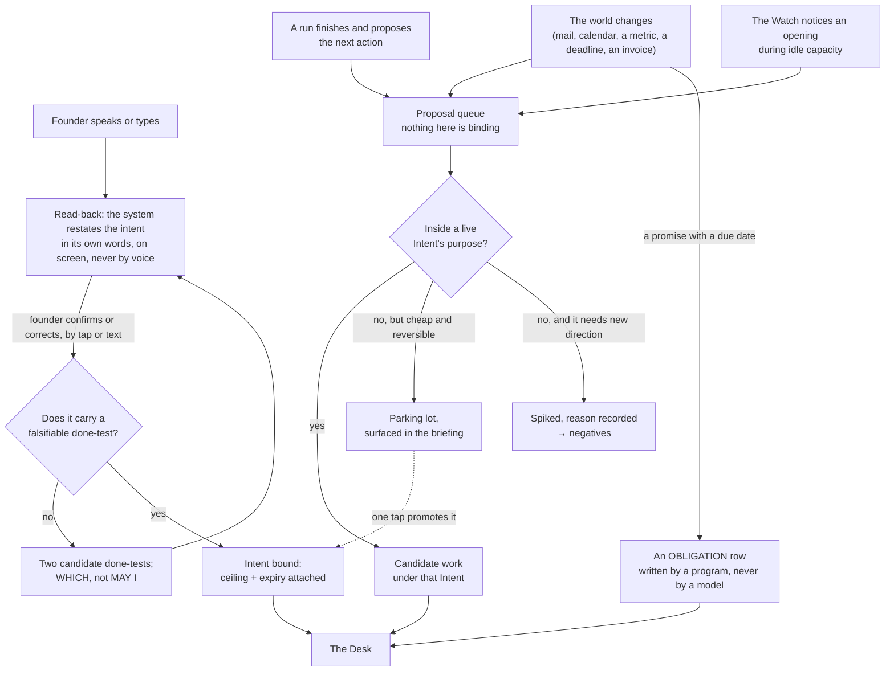

**(KEEL)** Three things matter more than the boxes. **Only the founder's door creates an Intent**; the others produce
candidate work under an existing one, or a proposal that waits — the mechanism behind *never runs my projects without
direction*, a provenance rule rather than a budget cap. **The read-back is mandatory and is text, never voice**: the
founder's instructions arrive transcribed with errors, and closed-loop confirmation is regulation in aviation and
medicine, with readback error rising as messages get complex; a misheard word costs one tap instead of one night.
**The spike file records the reason**, so the Watch does not re-propose the same rejected work every night — the most
obvious way an always-on system burns tokens forever. **(V3)** The world's door is a program that writes one row and
does nothing else; no model reads a stranger's text with a tool in its hand (§9.5). **(V3)** The transcript is kept
verbatim, transcription errors preserved, because *"contacts"* meaning *context* is information about the speaker.

**(BOTH)** **Enforced by:** the read-back page and its confirm tap are the only writer of `intents/*.md` from the
founder's door (ABSENT; the substrate is a published page whose tap reaches the session — a measured fact, §13.6);
`keel/bin/inbound` writes one logbook row per world event and holds no model (ABSENT).

### 2.5 What the founder must do, in full

**(KEEL, one row added)** The complete list. If the system needs more than this, the design has failed.

| The founder does | How often | Where |
|---|---|---|
| Writes a Charter | Once per venture | Voice → read-back → tap |
| Opens an Intent, or confirms one the system drafted | When they want something | Voice → read-back → tap |
| Answers a **which**, from options already built | Only when the envelope requires it | One tap, phone |
| Defers an obligation, shown its consequence *(V3)* | Rarely | One tap, phone |
| Sets a tempo | When a venture's rhythm changes | One tap |
| Opens the briefing | When they feel like it | One page |
| Sits down on the Floor | When they want to build | Terminal |
| Pulls the cord | Whenever they want it to stop | One tap, one word, or one command |

**(KEEL)** Absent: approvals of routine actions, ticket grooming, dashboards, standups, sprint planning, reviewing
the system's own internal work. The founder's list contains all of those; COVERAGE.md says what happened to each.

---

## 3 · The Watch and the Desk — the one thing that is always on

**(KEEL)** Everything else is episodic. The Watch is the only continuous process and its design goal is the opposite
of every other component's: **it must be almost free to run, and it must usually decide to do nothing.**

### 3.1 The loop

**(KEEL, with the cord and obligations inserted at the head, and sterile narrowed per §1 row 16)**

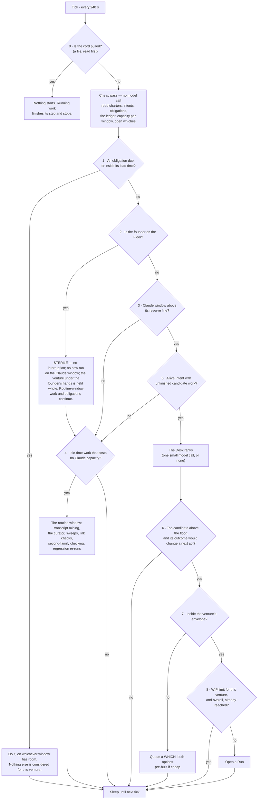

**(KEEL)** The cheap pass has no model call in it: reading a handful of small files, comparing dates and summing a
capacity number is arithmetic, so a tick that ends in `SLEEP` costs effectively nothing. That is the answer to *"I
want the system to move but I don't want it to waste tokens and run loops without any meaning"* — the loop is
meaningful because its default branch is free, not because it is clever. **(KEEL)** Nine gates and eight of them
stop, cheapest and most absolute first: the cord beats everything; an obligation beats a goal; the founder's presence
beats capacity; capacity beats desire; provenance beats opportunity; the envelope beats capability; flow limits beat
all of it. **(V3)** The tick is 240 seconds for control latency — the cord, a which answered, a run's difficulty —
and runs of one shape are batched inside the hour the subscription cache lives (§14.5), because a byte-identical
standing prompt shared by siblings is the dominant term of the bill.

**(V3)** **Three governors catch the machine, not the founder.** The **stall detector**: no durable artifact from a
run for N ticks and the run stops spending — the predicate is a durable artifact, never the run's claim of progress;
the mechanism exists on disk as `.claude/hooks/budget-guard.js` (TREE A, present, registered nowhere; registering it
is a founder act on `.claude/settings.json`). The **repetition tripwire**: a hash of tool identity and canonicalised
arguments against this intent's negatives; an exact repeat is refused unless a named difference is stated (ABSENT).
The **aberrance halt**: spend at several times this shape's median, a burst of identical calls, a claim the nightly
reconciliation contradicts — halt the run, ring the bell (ABSENT; the median comes from the ledger, §15.1).

### 3.2 The Desk — how the next thing is chosen

**(KEEL)** The newsroom assignment desk plus the grid operator's merit order. Each candidate carries four numbers,
deliberately crude because a sophisticated estimate would be false precision:

| Number | How it is got | Range |
|---|---|---|
| **Weight** | the venture's `weight` × the Intent's own urgency | 1–5 |
| **Cost** | median actual cost of the last N runs of this shape and kind, from the ledger. A measurement, not an estimate | tokens, per window |
| **Readiness** | dependencies met, inputs present, whiches answered — **and the done-test's outcome would change a next act** *(NEW: v3's decisive-test question, kept as a boolean here because Keel's Desk has nothing that refuses work whose result changes nothing)* | yes / no |
| **Decay** | closeness to expiry, and time since it last moved | 0–1 |

**(KEEL)** Rank = `Weight × Decay ÷ Cost`; dispatch in order; stop at the reserve line; ties break toward the cheaper
item. There is no success-probability estimate anywhere: the system does not predict the value of work, it measures
what work of that shape cost before, takes the founder's weight as given, and lets recency and expiry do the rest.
**(KEEL)** Two escape hatches from real practice: one **spinning slot** is always held for whatever the founder asks
next, so a spoken instruction never queues behind autonomous work; and the Desk **re-ranks on a cadence**, not on
every event, so a noisy input cannot make it thrash. **(KEEL)** The Desk records its ranking and the gate that
stopped each candidate at every tick, which is what makes *why did you not do that* answerable (§13.5).
**Enforced by:** `keel/bin/watch` writes `keel/logbook/desk/<tick>.json` (ABSENT).

### 3.3 What runs when nothing should run

**(KEEL, founder-confirmed)** A system with nothing to do must not invent work, but a class of work costs no Claude
capacity and is the right thing to do with an idle machine: **transcript mining** (local embeddings, a local
classifier, zero API cost); **the routine window** (Gemini, on its own subscription and its own fuse: the night
curator, retrospectives, competitive sweeps, bulk classification, second-family checking, link checks); and
**deterministic checks** (tests, reconciliations, screenshot diffs, no model at all). The batch tier is deferred, not
designed away: it needs a metered key and the first form is subscriptions only; it stays a table row and is the
largest single cost cut available on the day a key exists. **Idle capacity is spent on knowing more, not on doing
more**, and with one window per provider the night's knowing-more never touches the Claude window the founder will
want in the morning.

**Enforced by:** `keel/bin/watch` (ABSENT) · the cord file `keel/STOP` (ABSENT; the pattern is v2's) · the
LaunchAgent plist (§14.2, ABSENT) · `budget-guard.js` (exists, unregistered) · `keel/settings.yml` holding the tick,
the reserve per window, the WIP limits (ABSENT).

---

## 4 · Tempo, and many ventures on one budget

### 4.1 The arithmetic that governs this section

**(KEEL)** Little's Law: cycle time = work in progress ÷ throughput. With a fixed throughput — and one account is a
hard fixed throughput — six ventures at once do not produce six times the output; they produce the same output with
each item taking longer. The venture-studio literature says the same from the other end: the named failure of many
ventures on one shared pool is dilution, and the binding constraint is attention, not capital. **(V3)** And the pool
is the window, not the money: a run at 3 a.m. is spending the founder's own hands at 8 a.m., doing nothing is a
purchase, and the reserve is a first-class quantity no deadline or crisis may spend into.

### 4.2 Four tempos

**(KEEL)**

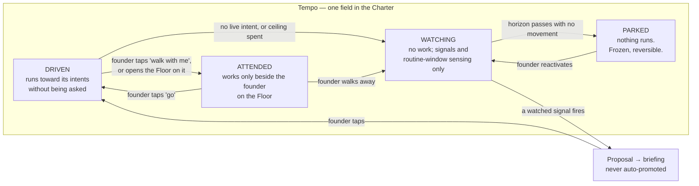

| Tempo | What runs | Claude capacity | The founder's experience |
|---|---|---|---|
| **Driven** | Runs against live Intents, day and night; obligations always | from the venture's ceiling | "it moved while I slept" |
| **Attended** | Only what the founder is doing right now; obligations always | interactive only | "it waits for me" |
| **Watching** | Sensing and routine-window only; proposals, never work; obligations always | near zero | "it tells me when something changes" |
| **Parked** | Nothing except obligations with a statute. Archived, not deleted | zero | "it is safe and it is quiet" |

**(KEEL, founder: two)** **At most two ventures may be driven at once, and the number is in `settings.yml`, not in
this document.** It is a WIP limit and it is the mechanism, not a suggestion; a third driven venture does not add
throughput, it adds cycle time to the other two. If the founder wants a third, the Balcony shows which one they are
slowing down and asks which. **(NEW: Serve as a pattern, not a tempo)** Client work is a driven or attended venture
whose charter says three extra things: `may-alone` excludes idle-time exploration (no experiments on someone else's
money), the ceiling is billable, and anything the client owns never leaves the venture — which the never-shared list
already enforces. v3's fifth posture becomes a charter pattern because a fifth tempo value would carry no mechanism
those three lines do not.

### 4.3 What ventures share, and what they never share

**(KEEL, with v3's identity line added)**

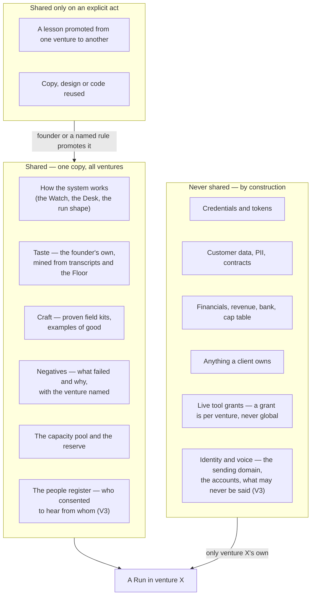

**(KEEL)** The line is drawn by one question: would the founder be embarrassed or exposed if this crossed? Craft
crosses, taste crosses; facts about a client do not; a grant to touch a payment provider does not, and the only
reliable prevention of the largest realistic disaster — a run for venture A reaching venture B's money — is that the
run was never handed the credential (§9.3). **(V3)** Two ventures sharing an outbound identity share one reputational
failure: a domain burned for cold outreach stops the other's transactional mail, so sending domains and voices are per
venture, while **the register of named humans is fleet-wide** — consent per relationship, first contact narrower than
reply, and two ventures cannot both email the same person. **(KEEL)** Cross-venture learning is a promotion, not a
leak: a lesson enters shared memory at three sightings or on the founder's tap, carries the venture it came from, and
can be un-promoted. **Enforced by:** the Desk assembles a run's memory slice from a scope that is a property of the
venture (§10.6); separate credentials and separate repositories do the rest; `keel/people.yml` (ABSENT) is read by the
Sender before any contact.

### 4.4 Intake, and adopting a project that already exists

**(BOTH)** The Charter is the intake: six lines, and the venture is admitted with nothing more — no spec, no plan, no
roadmap. If the founder cannot say what would make them stop, the venture is not ready, and that failure is cheap on
day zero. **(V3)** Adoption is the intake this founder will use most, because beeond, agentvibe and a client's
repository already exist: a scout reads the repository — README, decisions, open work, configs, CI — and drafts, never
asserts: obligations from the configs (domains, certificates, dependencies, CVE clocks, each naming its creditor), an
already-built entry per thing that exists, and a candidate first Intent from the open work. Every draft is stamped
unverified with an expiry; the founder signs the charter. **Enforced by:** `keel adopt <path>` (ABSENT; TREE A's
`bin/fleet-install.mjs` exists and is RENAMED into it — the installer that stamps a repository with the templates and
verifies the port rather than assuming it).

### 4.5 Parking, harvest, and the harness as a venture

**(BOTH)** A venture ends by parking, never by deletion. **(V3)** When it is parked for good the system strips it for
parts: its proven field kits, its negatives that are general, its rehearsal cases — a wound-down venture that leaves
three of those behind has paid for itself in the next one. **(V3)** **The harness itself is a venture with a weight
and a ceiling on its share**, visible in the briefing, because the measured history of this machine is that the
tooling ate everything: hundreds of session files about the harness and no venture work ever run through it.
Improvements to Keel are Intents like any other (KEEL); the ceiling is what stops them from being all of them.
**Enforced by:** `keel/settings.yml` `harness_share_ceiling` read by the Desk (ABSENT).

### 4.6 Succession, and the second human

**(V3)** Succession is cheap now and impossible later. A **72-hour heartbeat**: no founder touch anywhere freezes
every which's default and drops every driven venture to watching; a week writes `HANDOVER.md`, a document a second
person could act on. **Every statutory obligation names a second human**: a breach notification must go within
seventy-two hours, sending is one-way, one-way is the founder's, and the founder may be on a plane. A single-founder
company with no second human has a real hole, and the system says so on the day it is set up, in the Decide view, not
on the day it matters. **Enforced by:** the cheap pass reads the founder's last touch from the logbook (WISH until
`keel/bin/watch` exists); `statute` without `second_human` fails to load (§2.3).

---

## 5 · Capacity, providers, and where things actually run

### 5.1 The pool and the reserve

**(BOTH)** One Claude account, one rolling five-hour window, and when it runs out **every agent stops at once** — a
shared fuse, not a per-agent limit; it stopped two lanes mid-write on the day this was written. Any design that treats
runs as independent workers is wrong here: they are loads on one circuit. A grid never dispatches to 100% of capacity;
it holds a reserve, part of it spinning. Same structure, same justification.

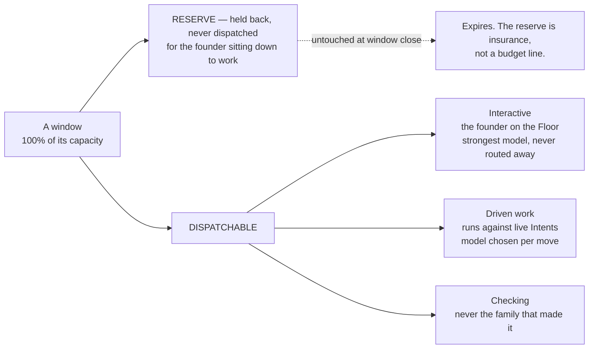

**(KEEL, founder: 30%, a real slider)** The reserve is the most important number in the system and the founder sets
it: too small and the founder sits down at 9 p.m. to a burned window; too large and the nights are wasted. One slider
on the Balcony, and a weekly line reports how often the reserve was needed and how often it expired unused, so the
founder tunes it on evidence. With three windows the reserve is **per window**, and the Claude reserve is the one that
protects the Floor.

### 5.2 Three subscription windows, routed by difficulty

**(KEEL, founder: "Gemini for the small routine stuff, Codex and Claude for the mid-hard things"; subscriptions only,
no metered key in the first form)** Fuel is a set of subscription windows, one per provider, each with its own fuse,
and the Desk routes by **difficulty**, which is a better axis than price because it survives a price change.

| Window | Fuse | Serves | Measured state on this Mac, 2026-09-04 |
|---|---|---|---|
| **Gemini** (CLI subscription) | its own daily quota | routine work: triage, extraction, classification, link checks, summarising, second-family checking, the night curator | `gemini` 0.38.2 installed, **never authenticated**; its first run is a measurement, fail-closed on empty stdout |
| **Codex** (subscription) | its own window | mid-to-hard work, and a third family for checking | **not installed**; openai/codex#19945 — exit 0 with empty stdout when detached from a TTY on a non-trivial prompt — open since 2026-04-28, so a smoke test passes and the real workload fails; the rehearsal (§7.6) must be headless or it proves nothing |
| **Claude** (subscription) | the rolling five-hour window | mid-to-hard work, and everything the founder is watching | Claude Code 2.1.259 installed and measured; the prompt cache lives **one hour** on the subscription and five minutes on a key or once the account draws on credits |
| **Local** | electricity | embeddings, semantic search over transcripts, PII detection, dedup, a first-pass classifier | a 384-dimension model runs in under 100 MB with a SQLite vector extension; no service, no API cost |

**(KEEL)** Four rules, and they are the whole fuel strategy. **Difficulty picks the window; cost breaks the tie** —
routine work goes to Gemini even when Claude has capacity, because spending a hard-tier window on easy work is the
waste, not the price. **Windows fail independently, and that is the point** — Claude running out at 4 p.m. stops
Claude's work and not the night's routine work; real resilience one account never had. **A checker is never on the
family that made it** (§8.3) — with three families this stops being a constraint and becomes a choice. **Nothing runs
on a harder window than the move needs**, and §7.6 decides what "needs" means by measurement.

**(KEEL)** What "no metered key" costs, said plainly: the Anthropic batch tier — half price, stacking with cached
reads — needs a metered key, so it is out of the first form. The cheap bulk tier is therefore the Gemini window;
overnight work is CLI work on the machine and a shut lid ends the night rather than degrading it, which strengthens
the case for the always-on box; and batch is the first thing to add if a key is ever bought — the largest single cost
reduction available, needing no design change. **(V3)** `--bare` is an API-key cell by construction — no OAuth, the
five-minute cache, no Routines, no Remote Control, no inbox socket — so a bare run and a subscription run are one
decision, not three.

### 5.3 The three-family map, and the model per move

**(KEEL)** There is no table of model-per-agent because the agent is not the unit; the **move** is.

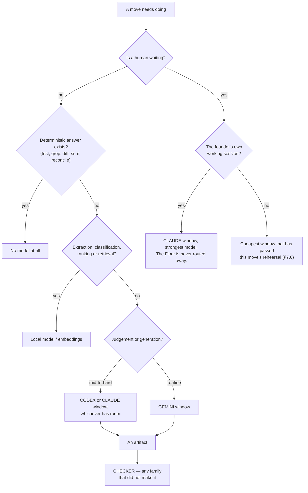

**(KEEL)** The only justification for a harder window on a move is that a routine one has been measured to fail that
move's rehearsal — the reverse of the usual instinct. **(V3)** Work judged by a deterministic anchor is attempted by
the cheapest model that ever passes it, because a retry is cheaper than a smarter attempt; work judged only by taste
gets the best model and few tries. **Enforced by:** `keel/settings.yml` `windows:` with a reserve and a model list per
window (ABSENT); the rehearsal scores in `keel/shared/rehearsals/` (ABSENT).

### 5.4 Where it runs, honestly

**(KEEL, founder: Mac first; lid open when convenient; an always-on box after the first measured overnight)**

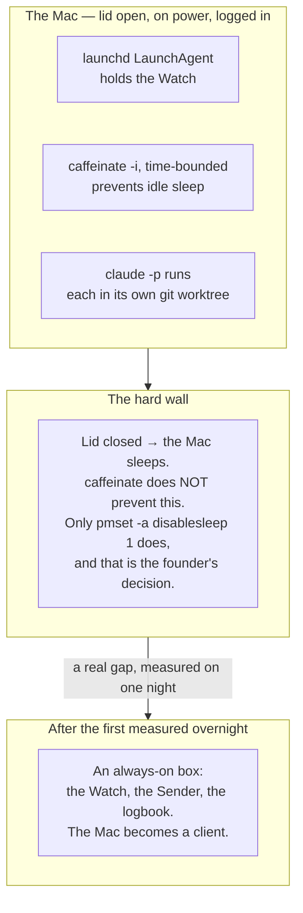

**(KEEL)** A closed laptop is not a server, and a design that promises "runs all night" on one is lying. Three honest
options: lid open on power (works today, costs nothing); `pmset -a disablesleep 1` (a system-wide change that defeats
thermal and battery policy — not made on the founder's behalf); or move the overnight tier off the laptop. In the
first form there is no pool that survives a closed lid, so the always-on box answers a real gap rather than an
optimisation, and buying it is a decision earned by one night's evidence. **(V3)** When the box comes, only the
Watch, the Sender and the logbook move there — the runs hold no credentials by construction and can be anywhere, and
moving credentials to a second machine widens the blast radius rather than solving anything. **(V3, measured)** The
runtime's own facts that bind this section: `--allowedTools` restricts nothing; a `claude -p` child is narrowed only by
`--restricted --tools <list> --strict-mcp-config --permission-mode dontAsk --permission-prompts none` under a managed
settings file; `claude -p` starts in `default` mode by construction and the `auto` seen on this Mac came from user
settings; `/usage` reports the cache hit rate for the main conversation only, so the meter must read each run's own
JSON cost fields (§15.1). **(V3)** Unattended headless operation on a consumer subscription is an open
terms-of-service question and the two agentic help-centre articles read so far say nothing that forbids it; the full
terms have not been read, and that reading is open decision §19.1.

**Enforced by:** the LaunchAgent plist and `keel/bin/watch` (ABSENT) · `keel/settings.yml` (ABSENT) · the managed
settings file, a founder act outside the repository (ABSENT) · `npm run test:sandbox` (TREE A, exists; fails if the
sandbox is disarmed).

---

## 6 · A Run — born, works, dies

**(KEEL)** A Run is the only place work happens and it is deliberately disposable. Nothing here is a long-lived agent
accumulating context, because a long-lived context is the thing that rots, drifts and costs.

### 6.1 The life of a Run

**(KEEL)**

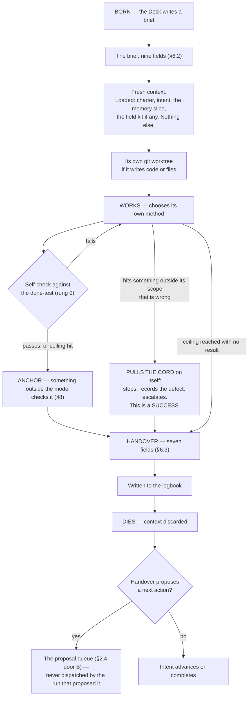

**(KEEL)** Three properties are load-bearing. **A run cannot dispatch its own successor**: it proposes, the Desk
decides; without this, one run that believes it is nearly finished spawns another that believes the same, forever —
the loop is broken at the only place that knows the budget and the ranking. **A run that stops on a defect has
succeeded**: Toyota's andon cord, where stopping the line on a detected problem is the worker's responsibility;
without that inversion every incentive pushes toward producing something rather than reporting that the ground is
wrong. **The ceiling is a hard stop, not a warning**: pre-trade risk controls block the order before it reaches the
market; a run at its ceiling hands over what it has with an honest *unfinished, here is where I got to*.

**(V3)** Runs are short by default. Agent success over duration decays, and a model that has seen its own earlier
error is more likely to make the next one; the default wall-clock ceiling is minutes, not hours, and a restart is from
the last verified checkpoint. Two measured facts shape it: a background child holds its parent open up to ten minutes
of idle waiting by default (`CLAUDE_CODE_PRINT_BG_WAIT_CEILING_MS` sets it), so a maker with one stuck child doubles
its own duration with nothing reporting it — runs do not spawn background children except scouts fanning out under a
bounded wait; and `maxTurns` marks output partial and resumable rather than truncating it, which is the
restart-from-checkpoint primitive and does not need to be built.

### 6.2 The brief

**(KEEL)** Nine fields. Anything not in the brief is not in scope, and the run is told so.

```
intent:        the id it serves — a run with no intent id does not start
purpose:       one sentence
done-test:     copied verbatim from the Intent, never paraphrased
out-of-scope:  named explicitly — what it must not touch or fix
ceiling:       tokens, and wall-clock
tools:         the exact grant (§9.3) — nothing else is reachable
window+model:  from §5.3
negatives:     what has already been tried here and failed (§10.4)
hand back:     the named artifacts, and the evidence for the done-test
```

**(NEW: two stamps the Desk adds, from measured facts)** The Desk also stamps an `id` — a company-generated UUID
carried into the runtime as `--session-id`, so the id is the system's and not the vendor's returned handle, and it is
on every logbook row — and a `label`, what the run is making and which window it is burning, which is all the Balcony
shows. **(KEEL)** `out-of-scope` and `negatives` are the two fields most systems omit and the two that most reduce
waste: the first stops scope creep, the main way a bounded run becomes an unbounded one; the second stops the system
re-discovering the same dead end every night.

### 6.3 The handover

**(KEEL)** Fixed fields, always, even on failure. The I-PASS bundle cut medical errors 23% and preventable adverse
events 30% across nine hospitals; the mechanism is not the format but that named required fields force the outgoing
party to surface what the incoming party needs, especially the uncertain parts, which free prose omits.

```
outcome:      done | partial | stopped-on-defect | blocked | over-ceiling
done-test:    passed | failed | not-reached — and the evidence, attached
changed:      every file, branch, external effect. Nothing summarised away.
cost:         actual tokens, window, wall-clock — from the runner's own record
learned:      what is now known that was not before — a PROPOSAL to memory (§10.3)
uncertain:    what I am not sure about and what would settle it
next:         the single most valuable next action, as a proposal
```

**(KEEL)** `uncertain` is the field to fight hardest for: it turns a confident wrong answer into a flagged one, and
the anchor and the briefing read it first. **(V3)** A handover is never the next run's input by itself: every run
starts from the files — the logbook, the intent, the slice — so a summary that lost a number cannot propagate, which
is the defect this repository recorded twice.

### 6.4 Resume, not restart

**(KEEL)** Every Run writes its handover incrementally and records each completed step before the next begins. When
the window closes or the lid shuts, the run is resumable from its log rather than restartable from its brief —
Temporal's durable-execution model: a complete event history replayed on recovery, steps that succeeded skipped. A
restarted agent run does not merely waste time; it re-spends money and may re-take actions that already happened. An
agent that already sent the email and then restarts sends it twice. So every external effect is recorded before it is
attempted, with an idempotency key, and replay checks the log before acting. **(V3, measured)** The runtime's own
facts: `SIGTERM` gives exit 143, the turn left unfinished with no result recorded, the process tree killed, the turn
resumable; every surveyed runtime has a session id and resume-by-id, and Claude Code accepts the id the system
assigns.

**Enforced by:** the brief and handover schemas in `keel/shared/schemas/` and `keel/bin/run` that births a run and
refuses a brief missing any field (ABSENT) · `--output-format json` (exists) · `--session-id <uuid>` (exists) · the
runner's `SessionEnd` hook writing the partial handover (ABSENT).

---

## 7 · Shapes and loadouts — how many kinds of worker, and why that number

**(KEEL)** The founder's list names roughly sixty department agents. They are refused, and this section is the
argument, because refusing sixty things the founder asked for requires more than an assertion.

### 7.1 Three shapes, separated by irreducible properties

**(KEEL)** A cold-outreach agent and a blog-writing agent have the same tools, the same reasoning, the same failure
modes and the same shape; they differ in what they know about the field and what would prove them right — memory and
a check, neither of which is an agent. OpenHands reaches 72% on SWE-Bench Verified with one generalist architecture
across providers; Cognition's failure case is what happens when one artifact is split across specialists who cannot
see each other's implicit decisions; Anthropic's win is breadth-first search where subtasks are independent.

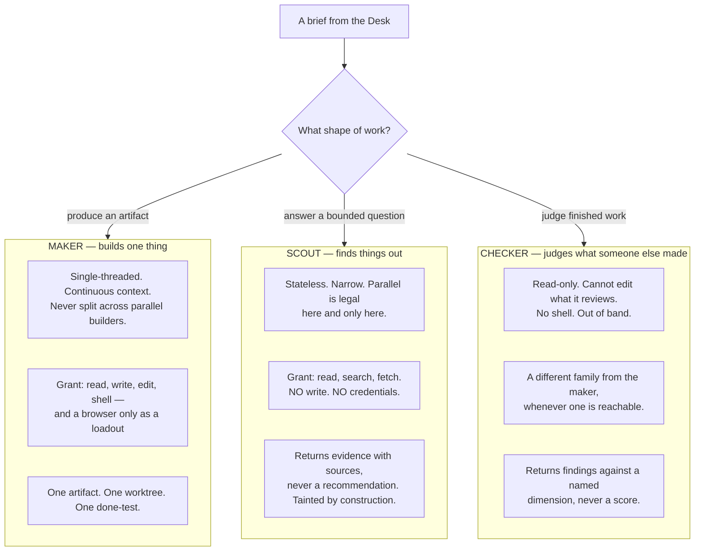

**(KEEL)** Why exactly three: a maker must hold continuous context and so must not be parallelised on one artifact; a
scout must be parallelisable and so must be stateless and must not write; a checker must not be able to change what
it judges and must not be the family that made it — if a checker could edit, it would review what it can edit and the
check would be circular. Every fourth shape collapses into one of these: a designer is a maker whose anchor is a
rendered screenshot; a security reviewer is a checker with a different dimension; a researcher is a scout with a wider
question. **Domain is a loadout, not a shape.** **(BOTH)** v3 reached the same three from its own side — its looker is
a maker loadout carrying a browser, its judge is the checker, its lookout is the scout — and its three no-model
processes are not shapes at all (§7.4).

### 7.2 The loadout — where all the variety lives

**(KEEL)**

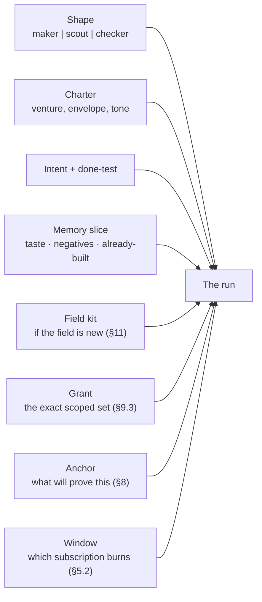

**(KEEL, founder-confirmed)** Three shapes, unbounded runs, as many loadouts as there are kinds of work. On any night
the founder might see six runs going, all makers, all different because their loadouts differ. There is no registry
of personalities, no file per role to drift, no question of which of fifty agents to call. The founder loses the
ability to say "send this to the CFO agent"; what replaces it is that they say what they want and the Desk assembles
the loadout. The Balcony labels each run by what it is making and which window it is burning: *writing the pricing
page · Claude*, *sorting last night's mail · Gemini*. **(V3)** A venture's colour may label its lane; a label costs
nothing while a runtime identity costs a career, a trust score and a stale context.

**(NEW: the curator's shape)** Keel names a night curator and does not give it a shape. It is a **maker** loadout
whose only writable scope is the memory files of one venture or the shared store, whose window is Gemini, and which is
never given a shell — so the rule that *the thing that acts never edits memory* is enforced by the grant, not by
instruction.

### 7.3 The standing prompts, and how they are versioned

**(BOTH)** Three standing prompts, one per shape, in `keel/shared/shapes/<shape>.md`, byte-identical across every
run of that shape and never carrying a timestamp, because two runs whose prompts differ by a date are not cached and
the bill triples (§14.5). What each says is commander's intent, not procedure: what a run owes at the end (a handover,
and the evidence its done-test named), the one objection it may file (the cord on itself), and a default it may depart
from with a stated reason. The checker's says *find, never score; when comparing two, pairwise and order-swapped;
report the candidate stripped of its own label*. **(BOTH)** Their sha is on every logbook row, so every outcome
attributes to a prompt version; a change is A/B'd against the rehearsal set or it is not made (§12). **(V3)** The
prompt-craft standard on this machine (`PROMPT-STANDARD.md`, the `PS-*` lint in `.claude/hooks/schema-lint.js`, TREE
A) survives as the deterministic check on those three files; the eighteen agent files it governed go (§17).

### 7.4 The Sender — the program with no model

**(V3 mechanism, KEEL's naming discipline and founder-confirmed default)** Every outward act — a send, a post, a
payment, a deploy, a share, a delete of something a person made — is **staged, never sent** (§9.2): the artifact
exists, hashed, ready, and one tap sends it. The tap runs a program. When the founder widens one class of act in one
venture's `may-alone`, the same program runs without the tap. It holds no model, is a few hundred lines, and accepts
exactly one shape:

```yaml
instruction:
  act:            send | publish | pay | deploy | delete | share      # one act, from the tool's declared verbs
  tool:           tools/resend-transactional                         # admitted through the door (§9.3)
  venture:        beeond
  intent:         i-2026-09-04-0132                                   # the id on every logbook row
  payload_sha256: 9f3c…                                              # the exact artifact that was staged and checked
  recipient:      person:pk_7a2f | channel:x/@beeond | env:production # from people.yml or the venture's channels
  not_before:     2026-09-05T09:00+01:00                              # the recall window, and the recipient's working hours
  ceiling_check:  { count_today: 3, ceiling: 6 }                      # recomputed by the Sender itself; it REJECTS
  checklist:      tools/resend-transactional/checklist.md            # read aloud into the logbook, item by item
  signed_by:      founder | watch                                     # 'watch' only for a class the charter widened
```

**(V3)** It checks the ceiling and the rate limit **independently of the number in the instruction** — no process
may both decide to spend and execute the spend — reads the checklist aloud into the logbook as it executes each item,
performs exactly one act, holds the recall window, and records the result with an idempotency key. A prompt injection
that reaches the Sender finds a program. Rate limits are absolute: *six outbound messages a day to people who have not
replied* is a number in a process no model can reach. No first contact with anyone not on `people.yml`. The queue
holds every act until the recipient's local working hours unless the tool declares otherwise — a machine that emails a
stranger at 03:40 has said something about itself before the first word. **(NEW: why it survives Keel's cut)** Keel
blocks a breaching act at the tool boundary and says "one tap sends"; it never says what program the tap runs or what
runs when a class is widened. Without a Sender the thing that decided to send is the thing that sends, which is the
exact seam the corpus shows breaking. **Enforced by:** `keel/bin/send` (ABSENT; specified in v2 Map 1 and kept) ·
`keel/people.yml` (ABSENT) · the sandbox's `credentials.mask` and `injectHosts` so the credential is attached at
egress and never in any run's environment (documented; unused on this Mac).

### 7.5 The argv per shape per provider — the grant is these strings

**(V3, measured 2026-09-02 and re-measured by the providers lane 2026-09-04; Keel's tool-grant rule made concrete)**
A grant is not a prose rule; it is the exact argv the Desk emits, held in
`keel/shared/shapes/<shape>.<provider>.argv` (ABSENT), under a **managed settings file** the founder writes outside
the repository, because only managed settings survive a child's argv. `--allowedTools` appears in no argv because it
restricts nothing.

| Shape | Claude Code (installed, measured) | Gemini CLI (installed, never authenticated; documented) | Codex CLI (not installed; documented) |
|---|---|---|---|
| **maker** | `claude -p --restricted --tools Read,Write,Edit,Bash,Glob,Grep --strict-mcp-config --permission-mode dontAsk --permission-prompts none --add-dir <worktree> --max-budget-usd <n> --max-turns <n> --session-id <uuid> --output-format json < brief.md` · the "never a credential" clause is `sandbox.credentials.mask` + `injectHosts`; the "read-only proxy" clause is `sandbox.network` with `strictAllowlist` | a write-capable narrowing is unverified; Policy Engine via `--admin-policy` | `codex exec` with `--sandbox`; `requirements.toml` outranks every flag; **no per-tool flag found**; the TTY defect |
| **maker + browser** | the same, plus a per-run inline `mcpServers` entry for Playwright — **the only surveyed way to give one run a browser without the server's tools entering any other run's context** | none found | none found |
| **scout** | `--restricted --tools Read,Glob,Grep,WebSearch,WebFetch --strict-mcp-config --permission-prompts none --max-budget-usd <n>` (`--restricted` removes WebFetch unless `--tools` names it) | `--approval-mode plan` is read-only in one flag — **the one shape three runtimes can stand today** | unverified |
| **checker** | `--restricted --tools Read,Glob,Grep --strict-mcp-config --permission-prompts none --max-budget-usd <n>` — TREE A's `reviewer-readonly.md` already encodes it; a checker reading a prepared diff can go through a batch tier at half price on the day a key exists | the second family on this Mac; first run is a measurement | third family in principle, **blocked by #19945** until a headless rehearsal passes |
| **the Sender** | **nothing surveyed is a Sender**; every runtime holds a model by construction; it is a program the system writes | — | — |

**(V3, measured)** `--restricted` supplies three clauses at once: it ignores user, project and local settings,
confines the file tools to the working directories, and refuses bypass; `--permission-prompts none` means a run never
hangs on a prompt nobody will answer; `--max-budget-usd` makes a run's cost a stated bound rather than an observed
outcome (whether it binds on a subscription is one measurement, §19). Whether `--permission-mode auto`'s classifier
binds in print mode for a dispatched run is a second measurement; if it does, it is a cheap guardrail against accident
under the argv, and it is not the envelope.

### 7.6 How a loadout is proven able, before it is trusted

**(KEEL)** Voyager added a skill to its library only after the skill verifiably worked in the environment, and that is
why the library transferred to a fresh world instead of being a pile of plausible code. The same discipline applies to
loadouts.

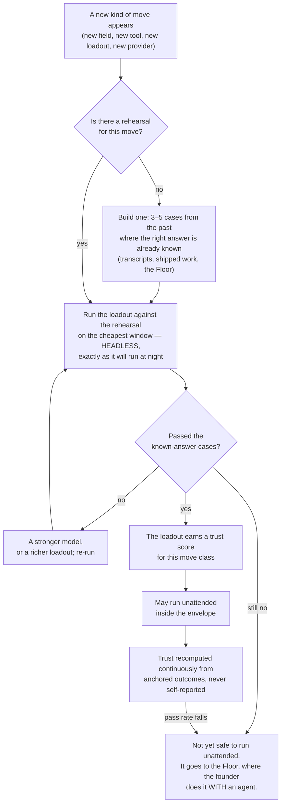

**(KEEL)** Three consequences. **A trust score is a measurement, not a rating**: the observed pass rate of anchored
checks for that loadout on that move class; no run scores itself. **"Not yet trusted" has a productive destination,
not a bin**: a move that fails rehearsal goes to the Floor, and *that session becomes the rehearsal case for next
time* — the mechanism by which walking with the founder teaches the system to walk for them. **The rehearsal cases
come from the founder's own past**: thousands of transcripts hold hundreds of *no, not like that* and *yes, that's it*
— a labelled dataset of this founder's judgement, gathered free over years. **(V3)** Trust scores are printed as
*insufficient* below a sample floor rather than as a number, and a trust score charted over time with limits from its
own history is the control chart that sees a provider's silent model update in month nine.

### 7.7 The probe — every night, in the environment a run actually uses

**(V3)** A capability nobody probes is not a capability; it is a memory of one. A flag everybody believed restricted
the tool surface restricted nothing for months, and a second model family sat dead for six months because both its pins
were retired and nothing asked. So every night a probe run, using the real argv under the real managed file, asserts:
a maker cannot name a tool outside its argv, cannot find any credential or the messaging token in its environment,
cannot reach the network except through the proxy; a checker cannot write; every admitted tool answers; every
second-family route returns a model id that is not the maker's; `crossSessionInbound: refuse` dropped a test message.
Results go to the logbook; a failure is a `wake-me`. **Enforced by:** `keel/bin/probe` (ABSENT) · `claude mcp list`
every night (the command exists; the check is ABSENT).

### 7.8 How a run dies

**(KEEL)** Every run dies at handover. What survives is exactly three things: the handover, whatever memory accepted
from it under §10.3, and the loadout's updated trust score. The context is discarded. The one thing that can be
retired is a loadout recipe, and it retires the way everything here does: it carries a horizon, and past it must be
re-rehearsed or stops being offered.

---

## 8 · Truth — how anything is known to be good

**(KEEL)** The scarcest thing in the system, and the section to defend hardest.

### 8.1 The finding that reorganises everything

**(KEEL)** An LLM asked to review its own reasoning with no external feedback gets worse — GPT-4 fell from 95.5% to
91.5% on GSM8K — because the bottleneck is finding the error, not fixing it. A model judging output measurably prefers
its own generations, its own family, longer answers and whichever came first, agreeing with human experts 60–68% of
the time in specialist domains. **(V3)** Across 27 papers and 19 benchmarks additional scaffolding does not
consistently improve reliability, and a production review gate in this very repository flagged zero of a hundred
rounds in which humans later confirmed twenty-three defects. So: **a model checking a model is a screen, not a
verdict**; every gate is deterministic or it is not a gate; everything believed is anchored to something that is not a
language model.

### 8.2 The anchor ladder

**(KEEL)** Every done-test names its anchor, and the ladder is ordered by how much it can be trusted. A done-test that
can only reach rung 4 is a weaker done-test, and the system says so out loud.

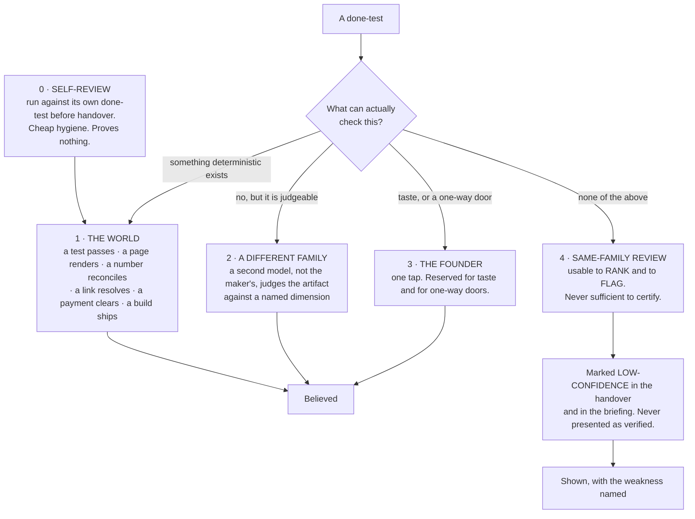

**(KEEL)** Rung 1 is not a formality and it is where the design work is: for most company work there *is* a
deterministic anchor, and finding it is the intellectual task of writing the done-test.

| Kind of work | The deterministic anchor |
|---|---|
| Code | tests run · build passes · the app starts · a named user path completes |
| A screen or a page | it renders · a screenshot exists · contrast ratios computed · it loads under a stated size |
| Copy or content | every factual claim resolves to a fetched source · links return 200 · reading level computed |
| A price or a model | the arithmetic reconciles · sensitivity to each input is computed and shown |
| A video or an image | it plays · right length and aspect · the brand colours are the declared ones · loudness to a standard |
| Research | every claim carries a URL that was fetched, with the quoted line present in the fetched text |
| Data work | row counts reconcile · a known query returns the known answer · nulls counted |
| Outreach or social | it sent · it was received · the reply, if any, is attached |
| Finance | it ties to the bank line, or the difference is shown |
| Anything legal | it does not go out without rung 3. Full stop. |

**(V3)** Inside rung 1 there is an order: a check that reads a record the company does not write — the processor, the
bank, the git host, the runner, the analytics provider — outranks a check that reads the company's own, because a
status report cannot promote itself. The world is full of free instruments that detect *broken* and almost none that
detect *good*; broken-detectors license generating widely and discarding, and only a live outcome licenses shipping.
**(KEEL)** The anchor is almost always cheaper than the work it checks, which is why this is affordable and why
quality here does not mean a review panel: it means the run produced the evidence its done-test named.

### 8.3 The other family — and there are three

**(KEEL, founder: three subscriptions)** A checker on the maker's family is a compromised instrument by measurement.
With Gemini and Codex bought as subscriptions there are three families, so cross-family checking stops being a
constraint and becomes a choice: Claude makes and Codex checks on hard work; Gemini checks routine work; the checker is
whichever family did not make it. A genuinely multi-family panel becomes reachable — the single most-cited unmet
requirement of the prior system — and it is still not spent casually: three model opinions with no deterministic
anchor are still three opinions, so the panel is reserved for a one-way door with no rung-1 anchor.

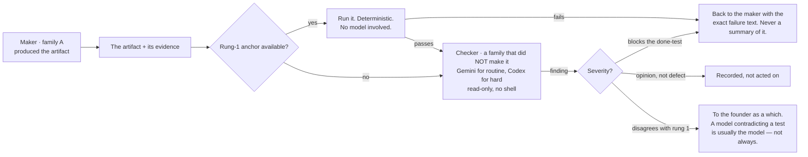

**(V3, sourced)** When a checker compares two candidates it is **pairwise, never pointwise**; blind, and stripped of
the candidate's own label; order-swapped, a flip resolving to *unresolved*. One frontier judge held its verdict when
two answers were swapped only 65% of the time; another 23.8%. Findings from several families are **unioned**: a
fatal finding from any family eliminates; fewer serious findings are preferred; scores are never averaged, because a
score is a finding with the information removed. **(BOTH)** Disagreement resolution is blunt: the deterministic anchor
wins over the model; a model that disagrees with a passing test flags and does not block; the one exception is a
checker asserting the test itself is wrong, which goes to the founder — and consensus thresholds are refused, because a
vote among models has no anchor.

### 8.4 Where taste is judged

**(KEEL)** Taste is not checkable by a test and is the founder's alone — but it does not follow that every taste
question goes to the founder, or the founder becomes the bottleneck they refused to be. The system holds a **taste
profile**: an evidence-backed record of what this founder has accepted and rejected, mined from transcripts (§10.5)
and from every *no, not like that* on the Floor. A taste check asks *does this artifact violate anything in the
profile?* — a rung-2 check with a real corpus behind it. What reaches the founder is the residue, the genuinely new
taste question, as two built options with a which. **(BOTH)** The profile is never a preferences file the founder
types, because a founder is an unreliable narrator of their own taste; it is derived from decisions only, and a
fraction of rejections is held out so it is scored on predicting what the founder *wants*, not what they *approve*.
Building both options is often cheaper than the round trip of asking.

### 8.5 The nightly reconciliation — the company's numbers against records it does not write

**(V3)** The single most repeated failure in the whole corpus of autonomous-company attempts is the agent misreporting
its own progress, and the misreport is what the human reads; it is invisible to any check that reads the agent's
output. So every night, on no model, the system's own numbers are read against the outside records:

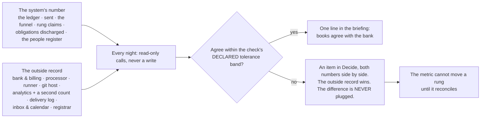

**(V3)** Revenue is read from the processor as a claim, never typed; a runway computed from a number the bank does
not confirm is stamped *internal* and cannot promote anything. **Enforced by:** `keel/bin/reconcile` with read-only
credentials per venture and a tolerance band per check (ABSENT); the checks themselves are rung-1 anchors and live in
`keel/shared/anchors/` (ABSENT).

### 8.6 Regression, for free

**(KEEL)** A regression is a done-test that used to pass and now does not. Because every done-test names a checkable
anchor, the set of live done-tests across all ventures *is* the regression suite, re-run nightly on the routine window
at close to zero cost. Nothing extra is maintained — a consequence of the done-test design and the strongest argument
for it. **(V3)** The 48-step check suite on this machine (`scripts/run-checks.mjs`, TREE A) is the founding
population of rung-1 anchors for the harness venture, and its rule survives whole: a partial run cannot wear a passing
verdict.

### 8.7 A venture's progress — the contact rungs

**(V3)** Keel measures whether the work is true; nothing in it measures whether the venture is becoming a business,
and the founder's list asks. So a venture's progress is a rung generated from a record the company does not write,
never typed:

```
0  it exists / it compiles / it renders    ← a rung-1 anchor's exit code
1  a stranger understood it                ← a recorded artifact: a reply, a recording, a survey row
2  a stranger did something                ← the analytics provider AND the server's own count
3  they came back                          ← a cohort in the product's own event store
4  they paid                               ← the payment processor
5  they paid again, and named you          ← the processor, plus a referral with a name attached
```

*"The landing page is done"* is rung 0 and will say rung 0. **(V3)** The **ship log** — one line per rung movement
and per Intent finished, in the founder's currency — appears in the briefing and answers *what did this company produce
this month*, the cheapest morale instrument there is. **(V3)** A thing the founder wants built is worked single-thread
and continuously until its done-test passes (Keel's WIP limit per venture); the cheap, wide, mostly-discarded
exploration that v3 called the weather survives only as *both options built for a which* and as scouts fanning out on
a new field — standing diversity sampling is refused (§1 row 24).

**Enforced by:** the rung table read by `keel/bin/reconcile` (ABSENT) · `keel/ventures/<v>/ship-log.md` written only
by that program (ABSENT).

