# Keel · the final plan of the whole company operating system

```
version:    final · 2026-09-04 · one system, not a blend
inputs:     Keel (round six, mind-1, designed from scratch: docs/03-system-design/round-6/mind-1/DESIGN.md on branch
            ceo-2-1788468144) · StartupOS v3 (round five: docs/03-system-design/round-5/STARTUP-OS-v3.md on branch
            ceo-1-1788468144) · the measured facts that bind (docs/08-agents_work/handoffs/2026-09-04-after-round-five.md
            on ceo-1, "Measured facts that bind"). The founder's choice, 2026-09-04: Keel only; THE-PLAN.md, mind-2,
            Fable's round-six design, the buy lane and round six's decisions file were NOT read
rule:       where the two agree, taken and marked (BOTH). Where they differ, DECIDED, one line why, the losing image
            kept by name in §1. Where Keel challenges something v3 inherited, Keel is the default unless a measured
            fact says otherwise. Every paragraph carries (V3) (KEEL) (BOTH) or (NEW: why). Every rule names the
            mechanism that enforces it or is marked WISH. Every path exists in the tree named, or is marked ABSENT.
            No stage states method. No schedule; dependencies read "this needs that"
measured:   TREE A = this branch (ceo-3-1788468144 = local main b2cabad). TREE B = ceo-1-1788468144 at 280b5e7, a
            STRICT DESCENDANT of TREE A: it carries every commit A has plus 75 more (origin/main's 65, the rethink
            docs, the round-5 corpus). Nothing exists in A that B lacks; §17 measures on B and names where A is
            behind. Nothing was merged for this document. final/CENSUS.md holds every measurement
not:        a build plan, a schedule, a first month, a price list. Nothing here is built. Nothing was pushed
companions: final/COVERAGE.md (every item of the founder's list placed) · final/CENSUS.md (every path measured) ·
            final/page/final-plan.html (the phone-first page, https://claude.ai/code/artifact/0183d6db-918f-44ab-aa13-9c82bf5097b3)
```

---

## 0 · What it is

**(V3)** A company operating system for one founder and many ventures. Not a harness, which is a set of tools with
no standing. Not an org chart, which is titles for beings that cannot be copied. An operating system in the literal
sense: it holds direction, allocates one scarce capacity, mediates every touch of the world, remembers, and gives
the founder a shell.

**(V3)** *It runs every part of every venture that can be checked against the world without you, walks beside you
on the parts that are only yours, and shows you both from one place, on your phone, in your own words.*

**(KEEL)** The name is the argument. A keel does not slow a boat; it is the thing under the waterline that turns
force into direction instead of drift. Everything built here before was judged a stopping mechanism. A system of
brakes cannot move; a system with no keel moves and goes nowhere. This is the third thing: **drive with direction,
where the direction is cheap and the drive is bounded.**

### The five ideas the whole thing rests on

**(KEEL)** 1. **Nothing runs that does not trace to a live Intent with a falsifiable done-test.** One rule doing
two jobs: it is the drive, because anything that traces may run all night without asking; and it is the only brake
worth having, because a run that cannot name which intent it serves gets no capacity. *Never burn tokens without
direction* is a provenance problem, and provenance is nearly free to check. **Enforced by:** the Desk refuses to
open a run whose brief carries no intent id (`keel/` ABSENT; the rule is §6.2's first field).

**(BOTH)** 2. **Method is never specified.** Only the outcome, the constraints and the evidence are. A done-test
replaces a library of procedures: it constrains quality more tightly than a step list and constrains approach not at
all. Two runs solving one brief differently is a feature; the done-test is what makes them comparable. v3 reached the
same rule from the other side — procedure is forbidden where the judge is strong and mandatory only where the judge is
absent and the act cannot be taken back — and that quadrant survives here as the checklist a sender reads aloud (§9.4).

**(KEEL)** 3. **Standing orders replace approvals.** The founder writes, once per venture, the envelope: what may be
done alone, what must never be done, and the exact conditions for being woken. Inside it, silence is permission.
Outside it, the system builds both options and asks *which*, never *may I*. There is no approve verb anywhere.

**(BOTH)** 4. **Capacity is one exhaustible pool with a reserve held for the founder.** One account, one rolling
five-hour window, and when it runs out every agent stops at once — the central physical fact, measured, not a
configuration detail. So capacity is dispatched like a grid dispatches generation: rank, run down the ranking to the
reserve line, stop. The reserve exists so the founder never sits down to work and finds the window burned. Walking
with the founder always outranks walking for them. With three subscription windows (§5) the reserve is per window and
the Claude reserve is the one that protects the Floor.

**(KEEL)** 5. **Knowledge is earned, not curated; memory is mined from what already happened.** No hand-maintained
library of expertise, because it rots and nobody keeps it true. A field the system has never seen is learned in a
bounded pass that produces a kit with an expiry, thrown away unless it proves itself in use. And the richest unread
asset on this Mac is thousands of transcripts: mined locally, at no API cost, into what the founder likes, what was
already built, and what already failed.

### A day with it

**(NEW: v3's day, re-timed to Keel's surfaces and the founder's three windows)** **06:40.** Nothing rings unless a
`wake-me` line fired; if one did, one line on the phone. **07:20, the briefing.** One page you open. What moved, with
the evidence. The raw work, biggest first: the rendered page, the played video, the diff, the email that would go out,
staged and unsent. Two whiches, both built. What I could not check, named. What it cost, per venture, per window.
What I would do next, none of it started. You tap two whiches; the third you overrule by typing one sentence, and by
07:31 that sentence is a rehearsal case. **09:00, the Floor.** You open a terminal on the venture you care about. The
system goes sterile: nothing interrupts, nothing new is dispatched on your window, the venture under your hands is
held whole. You and one agent work — you talk, it builds, it shows you the render, you say *no, the other one*, and
that is a labelled example by tonight. Your own browser and your own send button are here and nowhere else. When you
leave, the queue that built up while you worked is one paragraph, not eleven pings. **Lunch.** The Decide view has
one item: two landing pages, both live on staging, the cost of each, a recommendation. One tap. **18:00.** *You are
the bottleneck on one thing; it has cost four days.* **The night.** The Watch ticks every four minutes and mostly
sleeps. Obligations first. Then, under each driven venture's ceiling, runs are born with a nine-field brief, work
however they like, are checked by something outside the model, hand back seven fields, and die. Routine work — mail
sorting, link checks, the night curator, the summarising half of transcript mining — burns the Gemini window and never
touches yours; the local half runs on electricity. At
dawn, the briefing.

### What it is not

**(BOTH)** A harness. A roster of named agents. A dashboard. A library of playbooks. A permissions matrix. A night
that burns the window by 01:30. A machine that grades its own homework. A machine that is only brakes.

### The vocabulary — eleven named things, and plain words for the rest

**(KEEL)** Very few names are spent, each a plain English word doing the job that word already does. Nothing is
called an engine, a crew, a swarm, a council, a brain, a kernel, a mouth or a bench.

| Word | What it is | Where it lives |
|---|---|---|
| **Charter** | One per venture: what it is, tempo, envelope, ceiling, horizon. Written by the founder, rarely changed | `keel/ventures/<name>/charter.md` |
| **Intent** | One live goal: purpose, done-test, ceiling, expiry, owner, evidence | `keel/ventures/<name>/intents/*.md` |
| **Done-test** | The falsifiable statement of what is true when the work is finished, written before it starts, checkable by someone who did not do it. The only thing ever mandated | inside the Intent |
| **Obligation** *(added)* | Something owed, to whom, by when, with what consequence and what proves it discharged. No done-test to invent; the world set the test | `keel/ventures/<name>/obligations.yml` |
| **The Watch** | The one always-on loop. Reads state, ranks, mostly sleeps | one process, `keel/bin/watch` |
| **The Desk** | The ranking-and-dispatch function inside the Watch | inside the Watch |
| **Run** | One disposable unit of work: fresh context, one outcome, a ceiling, a grant, a done-test, a handover, then death | `keel/logbook/runs/<id>/` |
| **Envelope** | may-alone · never · wake-me, per venture, in the founder's words | inside the Charter |
| **The Sender** *(added)* | The program with no model that performs a widened outward act against a staged, hashed artifact | `keel/bin/send` |
| **Balcony** | The watching-and-steering surface: a rendered page, phone or Mac | rendered from the logbook |
| **Floor** | The working-beside surface: the terminal, one agent, same memory, same envelope | Claude Code |

**(NEW: two words added and why)** *Obligation* is added because Keel has no word for a promise with a due date and
the founder's list carries statutory clocks, renewals and filings in three places; *Sender* is added because Keel
says one tap sends and never says what program does the sending once a class of act is widened. Ordinary words —
anchor, grant, loadout, shape, rehearsal, field kit, briefing, logbook, memory, window, reserve, the cord, the
curator, the world's door, the probe, the reconciler — are used
as they read and are defined where they first appear.

**(BOTH)** Two words are refused. *Playbook*: the founder named it as what killed creativity, and mission-command
doctrine has held for a century that orders specifying method destroy the subordinate's ability to adapt. *Agent* as
a proper noun: it survives only as a common noun for a running process; there is no roster.

---

## 1 · Where the two plans differ, decided — and the losing images, kept by name

**(NEW: the merge itself)** This table is the whole merge. Every row is a place v3 and Keel disagree, or one is silent
where the other speaks. The decision is one line; the losing image is kept by name so it can be argued for later.
Rows are referenced from the sections that carry them. §21 points back here rather than repeating it.

> **Superseded 2026-09-05, by the founder, on rows 6, 8, 10, 15 and 30.** After reading this plan the founder said
> "most of it is fine" and overruled it in five places: the roster is a company of ten to fifteen expert agents with
> an operator, not three shapes with labels (rows 6, 8); the 134 skills are replaced by a library learned from the
> biggest agent systems plus a skill creator, not a holding directory (row 10); mission control returns as a
> first-class surface with an office, an agent-flow page, a cost dashboard, a task board that launches sessions, an
> engines page, a 3D file graph and a canvas of every session (row 15); Codex and Claude Code are both in from day
> one (row 30). The rows below are kept as written so the losing images stay by name; the binding direction, verbatim,
> is `docs/08-agents_work/handoffs/2026-09-05-THE-PLAN-NEXT-TEAM-PROMPT.md`.

| # | The question | Decided | From | Why, in one line | The losing image, kept as |
|---|---|---|---|---|---|
| 1 | The base, the organs, the names | Keel's design is the base; its words stand. v3's organs and their names go | KEEL | the founder's verdict on v3: "the engines and the mythologies taken straight from the other frameworks … it's bad" | the OS-parts map (kernel · scheduler · processes · filesystem · syscalls · shell · daemons · cron · package manager · drivers · boot · manual) and the ten named stores |
| 2 | The atom of work | The Intent: purpose, done-test, ceiling, expiry, owner, evidence | KEEL | a probability, a payoff and a flip point are estimates by the interested party with nothing to check them against; v3's own calibration section prints *insufficient* below fifty resolutions | the bet (`p`, `V`, `L`, `flip`, both posteriors, half-Kelly `stake`, the generated `rung`), the flip test. Kept from it: the kill sentence in the founder's words → the done-test and expiry; the death condition → the ceiling; "two outcomes lead to different next acts" → a Desk readiness question (§3.2) |
| 3 | Promises with due dates | Obligations are the second thing the Watch reads, before any Intent, never ranked against one | V3 | Keel is silent on statutory clocks, renewals, filings and a customer waiting; a renewal is not a goal and has no done-test to invent | the names *debt* and *Continuo*; the four-currency consequence field survives as one `consequence:` line |
| 4 | The unit of unattended operation | The Run, resumable from the logbook; the window is a fuse, not a unit | KEEL | resume-not-restart makes a closed window or a shut lid cost only the unfinished work; a five-hour unit with phases restates the fuse as architecture | the watch with phases (settle · make · prove · forge · consolidate · relieve) and the four-phase relief (preview · brief · read-back · sign-off). Kept: every run starts from files, never from the last run's summary (BOTH); the read-back before a founder instruction binds (BOTH) |
| 5 | A nightly document | None. The founder writes charters and intents and nothing else | KEEL | "if it needs more than this, the design has failed"; the briefing's *what I would do next* and the Decide view carry tonight's intent without a signature ritual | night orders, signed nightly, scored at dawn; the seat proposing them at close |
| 6 | How many kinds of worker | Three shapes — maker, scout, checker — and loadouts assembled per run | KEEL | the shapes are separated by irreducible properties (must hold continuous context · must be parallel and stateless · must not edit what it judges); domain is a loadout | the six positions. The looker is a maker loadout carrying a browser; the judge is the checker; the lookout is the scout (BOTH). The night curator is a maker loadout whose only writable scope is the memory files (NEW: Keel names the curator, not its shape) |
| 7 | Who performs an outward act | Staged, never sent; one tap sends. When the founder widens a class to may-alone, a program with no model — the Sender — performs it, recomputing the ceiling itself, holding a recall window, honouring the recipient's working hours | KEEL + V3 | Keel blocks at the tool boundary and never says what executes a widened act; v3's mechanism is the only one in either plan where the thing that decides cannot be the thing that sends | the mouth, the broker and the relay as three named processes. The broker → the measured credentials block and keychain references (BOTH). The relay → the world's door writes one row into the logbook and a scout reads it (BOTH) |
| 8 | Names | Labels, not names. A run is labelled by what it makes and which window it burns | BOTH | the founder decided it twice, on two pages | real named agents with careers and trust scores; v3's per-venture colour survives as a label |
| 9 | How a field is known | Field kits with horizons, proven in use; rehearsal sets of known-answer cases gate what runs unattended | KEEL | the lighter form of the same discipline, and it starts from transcripts the machine already has; two hundred exemplars and an AUC per field is a research project per field | the Bench, licences with `fooled_by`, the five-step apprenticeship. Kept: a check that reads a record the company does not write outranks one that reads the company's own (§8.2) |
| 10 | The 134 skills | The holding directory, read by nothing; a skill re-enters only as examples-of-good in a field kit, a rung-1 anchor, or a rehearsal case — never as procedure | BOTH | the founder decided the holding directory on v3's page; Keel's container rule says what the door may admit | Keel's flat refusal of the library; v3's *reflex* as a third re-entry form |
| 11 | Memory | Six stores, delta-only, a night curator that did not do the work, transcripts mined locally | KEEL | the thing that acts never edits memory; context collapse has a paper; the founder confirmed local mining | the Log-plus-derived stores: the Book written only by surprise, the Second, reflexes, the Wake and graveyard (→ negatives and already-built), the refusal ledger (→ the Desk's recorded gates, §16). Kept from v3: failure analysis by five fixed questions, never *what did you learn* (0 of 121 free reflections named the right cause); the nightly reconciliation of the company's numbers against records it does not write (§8.5) |
| 12 | The permission axis | The envelope's three lists, the reversibility door test, staged-not-sent | KEEL | reversibility is close to a fact; importance is argued; asking is what the founder refused | the Line's three classes over four currencies, the τ thresholds, fused defaults on silence. Kept: an undo is drilled or the act is a one-way door (V3, by Keel's own rule on the cord); v3's one-way list as data becomes the default `never` list every charter starts from |
| 13 | What makes a grant real | argv per shape plus a managed settings file the runs cannot reach, peer isolation by a checked-in file, and a probe every night that asserts what a run can actually touch | V3 | measured facts bind; Keel is silent on the seam. A capability nobody probes is a memory of one | none in Keel; v3's names *cell contract* and *dispatcher* |
| 14 | Many ventures | Four tempos; at most two driven; a WIP limit per venture | KEEL | Little's Law and the founder's answer: two | five postures with three making, weekly arithmetic allocation with floors, half-Kelly money caps, odd rotation. Kept: *Serve* becomes a charter pattern (NEW); the harness is a venture whose weight has a ceiling (V3: the measured history is that tooling ate everything) |
| 15 | The surfaces | Floor · Balcony with five views · briefing · voice · a room through the door | KEEL + V3 | Keel's two surfaces over one state; v3's contents where they are richer — the Decide item carries six fields, the briefing shows the raw work, the Now view is the shipped strip board with venture as the axis; the room is the founder's decision | the desk's fused defaults; the bay as a separate build; Keel's refusal of the room |
| 16 | The founder on the Floor | Sterile: nothing interrupts; nothing new is dispatched on the Claude window; obligations and routine-window work continue; the venture under the founder's hands is held whole | NEW | Keel holds everything and v3 yields only the keel; with three windows the routine work does not compete for the founder's window, and an obligation due does not wait for a conversation to end | v3's "the watch keeps the weather running"; Keel's global hold |
| 17 | Voice | Input only; a text read-back in the system's own words; nothing binds by voice; the verbatim transcript is kept | BOTH | closed-loop readback is regulation in aviation and medicine, not courtesy | none |
| 18 | When the founder is woken | A `wake-me` list with numeric thresholds, three unprompted interruptions a day, and a measured acted-on rate that demotes a channel below its threshold | KEEL | ICU alarms: 74–99% irrelevant produces trained inattention, not annoyance | the five bell conditions and the emission budget; the five conditions become the default `wake-me` template (BOTH) |
| 19 | The key or the window | Three subscription windows routed by difficulty; no metered key in the first form; a 30% reserve per window | KEEL (founder) | the founder answered it; three fuses fail independently, which one account never did | an API key first; the batch tier; the cost formula. Kept as a table row for the day a key exists. Still open: the terms reading (§19) |
| 20 | Where it runs | A LaunchAgent holding the Watch; lid open on power; an always-on box after the first measured overnight | KEEL (founder) | the Watch must run as the founder's user to reach the subscription credential; "survives logout" is answered by the honest wall, not a daemon | the LaunchDaemon. Kept: the tick is a scheduled job that exits; missed firings coalesce on wake; a process-group kill; push after every run; `F_FULLFSYNC` on the logbook; the credential plan and the restore drill (V3) |
| 21 | The logbook's schema | JSONL rows using OpenTelemetry `gen_ai.*` attribute names, an intent id and a run id on every row | BOTH | a settled, vendor-neutral schema; the id on every row is what makes cost attributable | a bespoke row schema |
| 22 | How work is known to be good | The anchor ladder for work (world · other family · founder · same family · self); the venture's contact rungs 0–5 for progress | KEEL + V3 | Keel measures whether the work is true; nothing in Keel measures whether the venture is becoming a business, and the founder's list asks | judge classes Hard · Rendered · Reactive · Blind as a taxonomy (folded into the ladder) |
| 23 | Rehearsal | A rehearsal set of known-answer cases, re-run on a cadence | KEEL | three to five cases from the founder's own past, at zero cost, beat a fixture world per hand | the shadow venture with fixtures. Kept: a hand's dry branch is its rehearsal (door test 2) |
| 24 | Self-improvement | Three loops at three speeds; horizons on everything durable; a redirect logged as a defect in the brief | KEEL + V3 | horizons force the rethink that a calendar only remembers; a redirected run was told the wrong thing | the forge, the fifth, the weekly refusal review as a ritual (→ one line in the briefing, §15) |
| 25 | Intake | The Charter is the intake; adopting an existing repository adds a scout pass that drafts obligations and the already-built store | BOTH | five fields is the whole intake; the founder's real intake is a repo that already exists | `house adopt` as a command name |
| 26 | Succession | A statutory obligation names a second human; no founder touch for 72 hours freezes every default and drops every venture to watching; a week writes a handover a second person could act on | V3 | a single-founder company with no second human has a real hole; Keel defers multi-operator, which is right, and this is not that | none in Keel |
| 27 | The name and the command | Keel; the command is `keel`; the tree root is `keel/` | KEEL | the from-scratch design is the base and its name is its argument | *house*, *StartupOS*, `house seat`, `house adopt`, `bin/warroom` |
| 28 | The first move | The logbook · transcript mining · one real venture driven with a rung-1 anchor | KEEL | none of the design is worth more than the first night of evidence on a real thing; which venture is the founder's | forty judged artifacts and a stop sentence; the synthetic fake company; adopting beeond in Walk |
| 29 | Consensus between families | Refused; the deterministic anchor wins, a checker claiming the test is wrong goes to the founder as a which | BOTH | a vote among models has no anchor | majority vote, weighted scores |
| 30 | Which provider stands which shape | Claude: every shape, and always the Floor · Gemini: scout and checker on routine work, and the curator · Codex: maker and checker on mid-hard work, only after a headless rehearsal passes · local models: no shape · Routines: refused for the Watch | KEEL + facts | the founder's routing by difficulty; `gemini` never authenticated and `codex` absent are measured, and openai/codex#19945 is why a smoke test is not a rehearsal | v3's *drivers* directory as a concept; kept as `shapes/<shape>.<provider>.argv` |

---

## 2 · Direction — what the founder writes, and what it costs them

**(KEEL)** The founder writes two kinds of thing and nothing else is required of them; a third kind, the obligation,
is mostly written by the world. Everything the system does traces to one of these or it does not happen.

### 2.1 The Charter

**(KEEL)** One per venture, written once, changed rarely, read constantly, short enough for a phone screen. Six
lines. **(NEW: `weight` is added to Keel's five because Keel's Desk reads it and Keel's Charter block omits it.)**

```
venture:   plainly, what this is and who it is for
tempo:     driven | attended | watching | parked            (§4.2)
envelope:  may-alone / never / wake-me                      (§9.1)
ceiling:   what this venture may spend, per window and in money, per month
weight:    1–5, the founder's priority, read by the Desk     (§3.2)
horizon:   the date this charter is re-read, or it stops
```

**(KEEL)** `tempo` is the founder's own distinction made structural: *walk for me* and *walk with me* are one field
with four values, set per venture, changed in one tap from the Balcony. `horizon` exists because a document with no
expiry accumulates instructions nobody believes; every durable thing here carries a date after which it must be
renewed or it stops applying. **(BOTH)** The Charter is the standing-orders half of the naval pair: policy written by
one person once, in their own words, read by everything else many times — the right cost shape for a founder who
thinks by voice and hates being interrupted. **Enforced by:** a charter missing any of the six lines does not load
and its venture is `parked` until it does — `keel/bin/check-stores` (ABSENT).

### 2.2 The Intent, and the done-test that makes it real

**(KEEL)** One live goal, six fields:

```
purpose:    one sentence — what becomes true, and why it matters
done-test:  the falsifiable check, written before the work starts
ceiling:    the most this may consume before it must come back to me
expires:    the date it stops being live if not finished or renewed
owner:      founder, or the venture's own standing intent
evidence:   what will be attached to prove the done-test passed
```

**(KEEL)** The done-test is the whole design compressed into one field. Compare two ways of instructing one piece of
work. *Playbook:* "Stage 1 research the market. Stage 2 write three positioning options. Stage 3 pick one. Stage 4
write the landing copy. Stage 5 review against the brand voice lens." *Done-test:* "A landing page exists at a URL I
can open on my phone. A person outside this project can read it in thirty seconds and say what the product does and
who it is for. Three positioning options were considered and the two rejected ones are written down with the reason.
Nothing on the page is a placeholder." The second constrains quality more tightly and method not at all, and someone
who did not do the work can check it — the property everything in §8 depends on.

**(KEEL)** A done-test must be falsifiable or the Intent does not open. This is the one hard gate on the founder's
own input and it is done conversationally, by the read-back: "make the marketing better" has no done-test, the system
says so, proposes two, and the founder picks one. Fifteen seconds, and the highest-leverage fifteen seconds in the
system. **Enforced by:** an intent file with no `done-test:` fails to load; the Desk refuses any brief whose
`intent:` id does not resolve to a live intent file — `keel/bin/check-stores`, `keel/bin/watch` (both ABSENT).

### 2.3 The Obligation

**(V3, renamed)** Something owed, with a creditor and a due date. No purpose to restate, no done-test to invent; the
world set the test and the world will check it.

```yaml
obligation:
  id:           o-2026-09-04-0009
  owed:         { what: "domain renewal agentvibe.com", to: "the registrar" }
  due:          2026-11-02
  lead_time:    7d                     # inside it the obligation is DONE and nothing else is considered
  consequence:  "the domain lapses; weeks to recover; durable reputational cost"
  discharge:    { what: "renewed", proved_by: "the registrar's own record" }
  recurs:       yearly
  statute:      null                   # a statutory obligation names one, and names a second human
  second_human: null
```

**(V3)** Renewals of domains and certificates, tax filings, the one-month clock on a data-subject request, the
seventy-two-hour clock on a breach, key rotation, a promise made in a launch email, a customer waiting on a reply, the
restore drill. **(NEW: why this survives Keel's cut)** Keel's four doors admit "a deadline" as candidate work under an
Intent, but a renewal is under no Intent and a statutory clock cannot lose a ranking. So obligations are read before
any Intent (§3.1), are never an argument in the ranking, and are deferred only by the founder, shown the consequence.
**Enforced by:** the Watch reads `obligations.yml` before `intents/`; an obligation with `due` in the past and no
disposition is the first item on the Decide view; `statute` set with `second_human` null fails to load —
`keel/bin/watch`, `keel/bin/check-stores` (ABSENT).

### 2.4 How work enters

**(KEEL, with obligations added to door C)** Four doors, not equal.

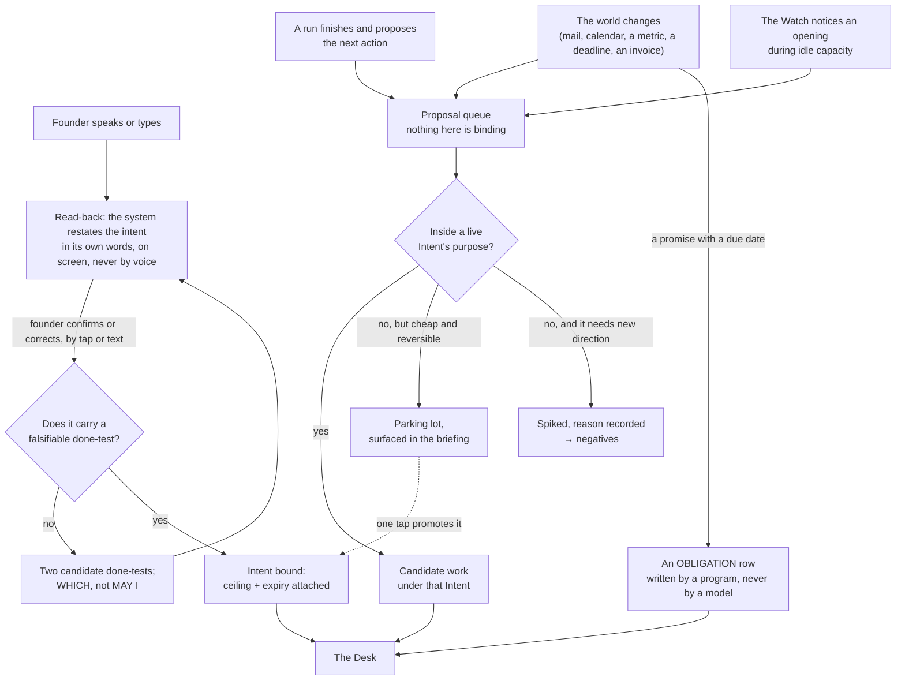

**(KEEL)** Three things matter more than the boxes. **Only the founder's door creates an Intent**; the others produce
candidate work under an existing one, or a proposal that waits — the mechanism behind *never runs my projects without
direction*, a provenance rule rather than a budget cap. **The read-back is mandatory and is text, never voice**: the
founder's instructions arrive transcribed with errors, and closed-loop confirmation is regulation in aviation and
medicine, with readback error rising as messages get complex; a misheard word costs one tap instead of one night.
**The spike file records the reason**, so the Watch does not re-propose the same rejected work every night — the most
obvious way an always-on system burns tokens forever. **(V3)** The world's door is a program that writes one row and
does nothing else; no model reads a stranger's text with a tool in its hand (§9.5). **(V3)** The transcript is kept
verbatim, transcription errors preserved, because *"contacts"* meaning *context* is information about the speaker.

**(BOTH)** **Enforced by:** the read-back page and its confirm tap are the only writer of `intents/*.md` from the
founder's door (ABSENT; the substrate is a published page whose tap reaches the session — a measured fact, §13.6);
`keel/bin/inbound` writes one logbook row per world event and holds no model (ABSENT).

### 2.5 What the founder must do, in full

**(KEEL, one row added)** The complete list. If the system needs more than this, the design has failed.

| The founder does | How often | Where |
|---|---|---|
| Writes a Charter | Once per venture | Voice → read-back → tap |
| Opens an Intent, or confirms one the system drafted | When they want something | Voice → read-back → tap |
| Answers a **which**, from options already built | Only when the envelope requires it | One tap, phone |
| Defers an obligation, shown its consequence *(V3)* | Rarely | One tap, phone |
| Sets a tempo | When a venture's rhythm changes | One tap |
| Opens the briefing | When they feel like it | One page |
| Sits down on the Floor | When they want to build | Terminal |
| Pulls the cord | Whenever they want it to stop | One tap, one word, or one command |

**(KEEL)** Absent: approvals of routine actions, ticket grooming, dashboards, standups, sprint planning, reviewing
the system's own internal work. The founder's list contains all of those; COVERAGE.md says what happened to each.

---

## 3 · The Watch and the Desk — the one thing that is always on

**(KEEL)** Everything else is episodic. The Watch is the only continuous process and its design goal is the opposite
of every other component's: **it must be almost free to run, and it must usually decide to do nothing.**

### 3.1 The loop

**(KEEL, with the cord and obligations inserted at the head, and sterile narrowed per §1 row 16)**

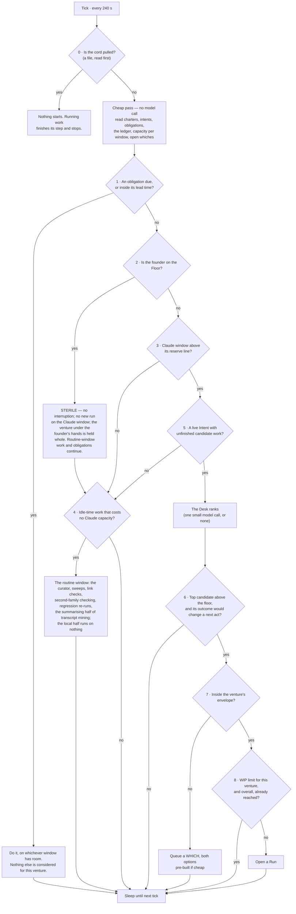

**(KEEL)** The cheap pass has no model call in it: reading a handful of small files, comparing dates and summing a
capacity number is arithmetic, so a tick that ends in `SLEEP` costs effectively nothing. That is the answer to *"I
want the system to move but I don't want it to waste tokens and run loops without any meaning"* — the loop is
meaningful because its default branch is free, not because it is clever. **(KEEL)** Nine gates and eight of them
stop, cheapest and most absolute first: the cord beats everything; an obligation beats a goal; the founder's presence
beats capacity; capacity beats desire; provenance beats opportunity; the envelope beats capability; flow limits beat
all of it. **(V3)** The tick is 240 seconds for control latency — the cord, a which answered, a run's difficulty —
and runs of one shape are batched inside the hour the subscription cache lives (§14.5), because a byte-identical
standing prompt shared by siblings is the dominant term of the bill.

**(V3)** **Three governors catch the machine, not the founder.** The **stall detector**: no durable artifact from a
run for N ticks and the run stops spending — the predicate is a durable artifact, never the run's claim of progress;
the mechanism exists on disk as `.claude/hooks/budget-guard.js` (TREE A, present, registered nowhere; registering it
is a founder act on `.claude/settings.json`). The **repetition tripwire**: a hash of tool identity and canonicalised
arguments against this intent's negatives; an exact repeat is refused unless a named difference is stated (ABSENT).
The **aberrance halt**: spend at several times this shape's median, a burst of identical calls, a claim the nightly
reconciliation contradicts — halt the run, ring the bell (ABSENT; the median comes from the ledger, §15.1).

### 3.2 The Desk — how the next thing is chosen

**(KEEL)** The newsroom assignment desk plus the grid operator's merit order. Each candidate carries four numbers,
deliberately crude because a sophisticated estimate would be false precision:

| Number | How it is got | Range |
|---|---|---|
| **Weight** | the venture's `weight` × the Intent's own urgency | 1–5 |
| **Cost** | median actual cost of the last N runs of this shape and kind, from the ledger. A measurement, not an estimate | tokens, per window |
| **Readiness** | dependencies met, inputs present, whiches answered — **and the done-test's outcome would change a next act** *(NEW: v3's decisive-test question, kept as a boolean here because Keel's Desk has nothing that refuses work whose result changes nothing)* | yes / no |
| **Decay** | closeness to expiry, and time since it last moved | 0–1 |

**(KEEL)** Rank = `Weight × Decay ÷ Cost`; dispatch in order; stop at the reserve line; ties break toward the cheaper
item. There is no success-probability estimate anywhere: the system does not predict the value of work, it measures
what work of that shape cost before, takes the founder's weight as given, and lets recency and expiry do the rest.
**(KEEL)** Two escape hatches from real practice: one **spinning slot** is always held for whatever the founder asks
next, so a spoken instruction never queues behind autonomous work; and the Desk **re-ranks on a cadence**, not on
every event, so a noisy input cannot make it thrash. **(KEEL)** The Desk records its ranking and the gate that
stopped each candidate at every tick, which is what makes *why did you not do that* answerable (§13.5).
**Enforced by:** `keel/bin/watch` writes `keel/logbook/desk/<tick>.json` (ABSENT).

### 3.3 What runs when nothing should run

**(KEEL, founder-confirmed)** A system with nothing to do must not invent work, but a class of work costs no Claude
capacity and is the right thing to do with an idle machine: **transcript mining** (local embeddings, a local
classifier, zero API cost); **the routine window** (Gemini, on its own subscription and its own fuse: the night
curator, retrospectives, competitive sweeps, bulk classification, second-family checking, link checks); and
**deterministic checks** (tests, reconciliations, screenshot diffs, no model at all). The batch tier is deferred, not
designed away: it needs a metered key and the first form is subscriptions only; it stays a table row and is the
largest single cost cut available on the day a key exists. **Idle capacity is spent on knowing more, not on doing
more**, and with one window per provider the night's knowing-more never touches the Claude window the founder will
want in the morning.

**Enforced by:** `keel/bin/watch` (ABSENT) · the cord file `keel/STOP` (ABSENT; the pattern is v2's) · the
LaunchAgent plist (§14.2, ABSENT) · `budget-guard.js` (exists, unregistered) · `keel/settings.yml` holding the tick,
the reserve per window, the WIP limits (ABSENT).

---

## 4 · Tempo, and many ventures on one budget

### 4.1 The arithmetic that governs this section

**(KEEL)** Little's Law: cycle time = work in progress ÷ throughput. With a fixed throughput — and one account is a
hard fixed throughput — six ventures at once do not produce six times the output; they produce the same output with
each item taking longer. The venture-studio literature says the same from the other end: the named failure of many
ventures on one shared pool is dilution, and the binding constraint is attention, not capital. **(V3)** And the pool
is the window, not the money: a run at 3 a.m. is spending the founder's own hands at 8 a.m., doing nothing is a
purchase, and the reserve is a first-class quantity no deadline or crisis may spend into.

### 4.2 Four tempos

**(KEEL)**

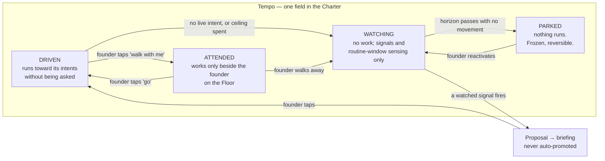

| Tempo | What runs | Claude capacity | The founder's experience |
|---|---|---|---|
| **Driven** | Runs against live Intents, day and night; obligations always | from the venture's ceiling | "it moved while I slept" |
| **Attended** | Only what the founder is doing right now; obligations always | interactive only | "it waits for me" |
| **Watching** | Sensing and routine-window only; proposals, never work; obligations always | near zero | "it tells me when something changes" |
| **Parked** | Nothing except obligations with a statute. Archived, not deleted | zero | "it is safe and it is quiet" |

**(NEW: the Floor and the tempo)** Opening the Floor on a venture does not change its tempo. A driven venture is
held whole while sterile lasts (§13.3) and its dispatch resumes when the founder leaves; *attended* is the tempo of
a venture that only ever moves beside the founder. **(KEEL, founder: two)** **At most two ventures may be driven at once, and the number is in `settings.yml`, not in
this document.** It is a WIP limit and it is the mechanism, not a suggestion; a third driven venture does not add
throughput, it adds cycle time to the other two. If the founder wants a third, the Balcony shows which one they are
slowing down and asks which. **(NEW: Serve as a pattern, not a tempo)** Client work is a driven or attended venture
whose charter says three extra things: `may-alone` excludes idle-time exploration (no experiments on someone else's
money), the ceiling is billable, and anything the client owns never leaves the venture — which the never-shared list
already enforces. v3's fifth posture becomes a charter pattern because a fifth tempo value would carry no mechanism
those three lines do not.

### 4.3 What ventures share, and what they never share

**(KEEL, with v3's identity line added)**

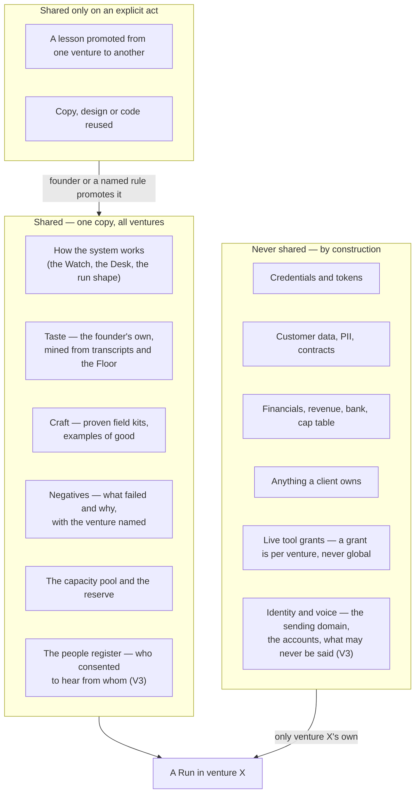

**(KEEL)** The line is drawn by one question: would the founder be embarrassed or exposed if this crossed? Craft
crosses, taste crosses; facts about a client do not; a grant to touch a payment provider does not, and the only
reliable prevention of the largest realistic disaster — a run for venture A reaching venture B's money — is that the
run was never handed the credential (§9.3). **(V3)** Two ventures sharing an outbound identity share one reputational
failure: a domain burned for cold outreach stops the other's transactional mail, so sending domains and voices are per
venture, while **the register of named humans is fleet-wide** — consent per relationship, first contact narrower than
reply, and two ventures cannot both email the same person. **(KEEL)** Cross-venture learning is a promotion, not a
leak: a lesson enters shared memory at three sightings or on the founder's tap, carries the venture it came from, and
can be un-promoted. **Enforced by:** the Desk assembles a run's memory slice from a scope that is a property of the
venture (§10.6); separate credentials and separate repositories do the rest; `keel/people.yml` (ABSENT) is read by the
Sender before any contact.

### 4.4 Intake, and adopting a project that already exists

**(BOTH)** The Charter is the intake: six lines, and the venture is admitted with nothing more — no spec, no plan, no
roadmap. If the founder cannot say what would make them stop, the venture is not ready, and that failure is cheap on
day zero. **(V3)** Adoption is the intake this founder will use most, because beeond, agentvibe and a client's
repository already exist: a scout reads the repository — README, decisions, open work, configs, CI — and drafts, never
asserts: obligations from the configs (domains, certificates, dependencies, CVE clocks, each naming its creditor), an
already-built entry per thing that exists, and a candidate first Intent from the open work. Every draft is stamped
unverified with an expiry; the founder signs the charter. **Enforced by:** `keel adopt <path>` (ABSENT; TREE A's
`bin/fleet-install.mjs` exists and is RENAMED into it — the installer that stamps a repository with the templates and
verifies the port rather than assuming it).

### 4.5 Parking, harvest, and the harness as a venture

**(BOTH)** A venture ends by parking, never by deletion. **(V3)** When it is parked for good the system strips it for
parts: its proven field kits, its negatives that are general, its rehearsal cases — a wound-down venture that leaves
three of those behind has paid for itself in the next one. **(V3)** **The harness itself is a venture with a weight
and a ceiling on its share**, visible in the briefing, because the measured history of this machine is that the
tooling ate everything: hundreds of session files about the harness and no venture work ever run through it.
Improvements to Keel are Intents like any other (KEEL); the ceiling is what stops them from being all of them.
**Enforced by:** `keel/settings.yml` `harness_share_ceiling` read by the Desk (ABSENT).

### 4.6 Succession, and the second human

**(V3)** Succession is cheap now and impossible later. A **72-hour heartbeat**: no founder touch anywhere freezes
every which's default and drops every driven venture to watching; a week writes `HANDOVER.md`, a document a second
person could act on. **Every statutory obligation names a second human**: a breach notification must go within
seventy-two hours, sending is one-way, one-way is the founder's, and the founder may be on a plane. A single-founder
company with no second human has a real hole, and the system says so on the day it is set up, in the Decide view, not
on the day it matters. **Enforced by:** the cheap pass reads the founder's last touch from the logbook (WISH until
`keel/bin/watch` exists); `statute` without `second_human` fails to load (§2.3).

---

## 5 · Capacity, providers, and where things actually run

### 5.1 The pool and the reserve

**(BOTH)** One Claude account, one rolling five-hour window, and when it runs out **every agent stops at once** — a
shared fuse, not a per-agent limit; it stopped two lanes mid-write on the day this was written. Any design that treats
runs as independent workers is wrong here: they are loads on one circuit. **(KEEL)** A grid never dispatches to 100% of
capacity; it holds a reserve, part of it spinning. Same structure, same justification.

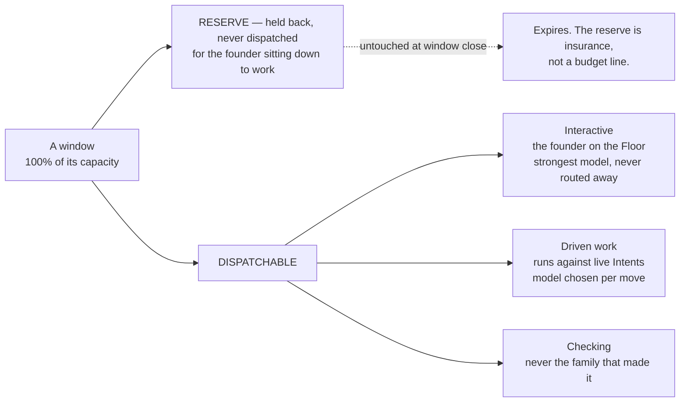

**(KEEL, founder: 30%, a real slider)** The reserve is the most important number in the system and the founder sets
it: too small and the founder sits down at 9 p.m. to a burned window; too large and the nights are wasted. One slider
on the Balcony, and a weekly line reports how often the reserve was needed and how often it expired unused, so the
founder tunes it on evidence. With three windows the reserve is **per window**, and the Claude reserve is the one that
protects the Floor.

### 5.2 Three subscription windows, routed by difficulty

**(KEEL, founder: "Gemini for the small routine stuff, Codex and Claude for the mid-hard things"; subscriptions only,
no metered key in the first form)** Fuel is a set of subscription windows, one per provider, each with its own fuse,
and the Desk routes by **difficulty**, which is a better axis than price because it survives a price change.

| Window | Fuse | Serves | Measured state on this Mac, 2026-09-04 |
|---|---|---|---|
| **Gemini** (CLI subscription) | its own daily quota | routine work: triage, extraction, classification, link checks, summarising, second-family checking, the night curator | `gemini` 0.38.2 installed, **never authenticated**; its first run is a measurement, fail-closed on empty stdout |
| **Codex** (subscription) | its own window | mid-to-hard work, and a third family for checking | **not installed**; openai/codex#19945 — exit 0 with empty stdout when detached from a TTY on a non-trivial prompt — open since 2026-04-28, so a smoke test passes and the real workload fails; the rehearsal (§7.6) must be headless or it proves nothing |
| **Claude** (subscription) | the rolling five-hour window | mid-to-hard work, and everything the founder is watching | Claude Code 2.1.259 installed and measured; the prompt cache lives **one hour** on the subscription and five minutes on a key or once the account draws on credits |
| **Local** | electricity | embeddings, semantic search over transcripts, PII detection, dedup, a first-pass classifier | a 384-dimension model runs in under 100 MB with a SQLite vector extension; no service, no API cost |

**(KEEL)** Four rules, and they are the whole fuel strategy. **Difficulty picks the window; cost breaks the tie** —
routine work goes to Gemini even when Claude has capacity, because spending a hard-tier window on easy work is the
waste, not the price. **Windows fail independently, and that is the point** — Claude running out at 4 p.m. stops
Claude's work and not the night's routine work; real resilience one account never had. **A checker is never on the
family that made it** (§8.3) — with three families this stops being a constraint and becomes a choice. **Nothing runs
on a harder window than the move needs**, and §7.6 decides what "needs" means by measurement.

**(KEEL)** What "no metered key" costs, said plainly: the Anthropic batch tier — half price, stacking with cached
reads — needs a metered key, so it is out of the first form. The cheap bulk tier is therefore the Gemini window;
overnight work is CLI work on the machine and a shut lid ends the night rather than degrading it, which strengthens
the case for the always-on box; and batch is the first thing to add if a key is ever bought — the largest single cost
reduction available, needing no design change. **(V3)** `--bare` is an API-key cell by construction — no OAuth, the
five-minute cache, no Routines, no Remote Control, no inbox socket — so a bare run and a subscription run are one
decision, not three.

### 5.3 The three-family map, and the model per move

**(KEEL)** There is no table of model-per-agent because the agent is not the unit; the **move** is.

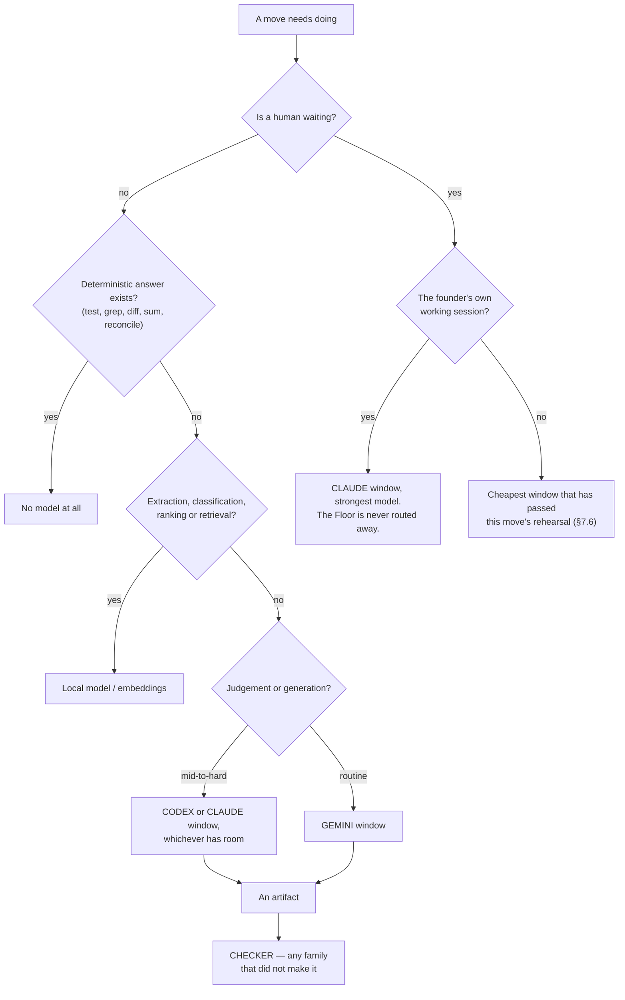

**(KEEL)** The only justification for a harder window on a move is that a routine one has been measured to fail that
move's rehearsal — the reverse of the usual instinct. **(V3)** Work judged by a deterministic anchor is attempted by
the cheapest model that ever passes it, because a retry is cheaper than a smarter attempt; work judged only by taste
gets the best model and few tries. **Enforced by:** `keel/settings.yml` `windows:` with a reserve and a model list per
window (ABSENT); the rehearsal scores in `keel/shared/rehearsals/` (ABSENT).

### 5.4 Where it runs, honestly

**(KEEL, founder: Mac first; lid open when convenient; an always-on box after the first measured overnight)**

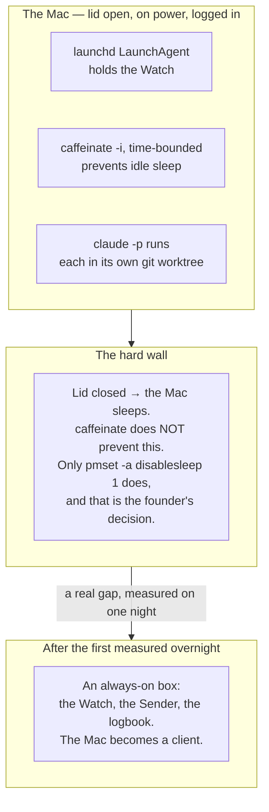

**(KEEL)** A closed laptop is not a server, and a design that promises "runs all night" on one is lying. Three honest
options: lid open on power (works today, costs nothing); `pmset -a disablesleep 1` (a system-wide change that defeats
thermal and battery policy — not made on the founder's behalf); or move the overnight tier off the laptop. In the
first form there is no pool that survives a closed lid, so the always-on box answers a real gap rather than an
optimisation, and buying it is a decision earned by one night's evidence. **(V3)** When the box comes, only the
Watch, the Sender and the logbook move there — the runs hold no credentials by construction and can be anywhere, and
moving credentials to a second machine widens the blast radius rather than solving anything. **(V3, measured)** The
runtime's own facts that bind this section: `--allowedTools` restricts nothing; a `claude -p` child is narrowed only by
`--restricted --tools <list> --strict-mcp-config --permission-mode dontAsk --permission-prompts none` under a managed
settings file; `claude -p` starts in `default` mode by construction and the `auto` seen on this Mac came from user
settings; `/usage` reports the cache hit rate for the main conversation only, so the meter must read each run's own
JSON cost fields (§15.1). **(V3)** Unattended headless operation on a consumer subscription is an open
terms-of-service question and the two agentic help-centre articles read so far say nothing that forbids it; the full
terms have not been read, and that reading is open decision §19.1.

**Enforced by:** the LaunchAgent plist and `keel/bin/watch` (ABSENT) · `keel/settings.yml` (ABSENT) · the managed
settings file, a founder act outside the repository (ABSENT) · `npm run test:sandbox` (TREE A, exists; fails if the
sandbox is disarmed).

---

## 6 · A Run — born, works, dies

**(KEEL)** A Run is the only place work happens and it is deliberately disposable. Nothing here is a long-lived agent
accumulating context, because a long-lived context is the thing that rots, drifts and costs.

### 6.1 The life of a Run

**(KEEL)**

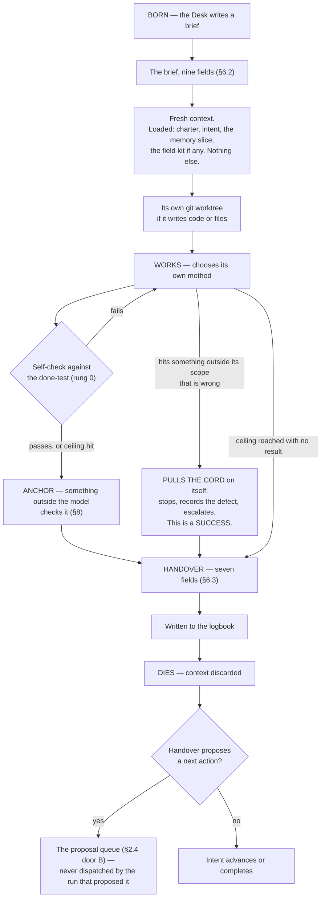

**(KEEL)** Three properties are load-bearing. **A run cannot dispatch its own successor**: it proposes, the Desk
decides; without this, one run that believes it is nearly finished spawns another that believes the same, forever —
the loop is broken at the only place that knows the budget and the ranking. **(NEW: the mechanism, because a maker
holds `Bash`)** A maker's shell could otherwise call `claude -p` itself, so the rule is held in three places a run
cannot reach: the managed settings file carries `permissions.deny` rules for `Bash(claude *)`, `Bash(gemini *)` and
`Bash(codex *)`, which `--restricted` cannot lift; the ledger refuses a row whose run id was not minted by
`keel/bin/run`, so a child born outside the Desk is uncounted and the aberrance halt (§3.1) catches its spend; and
the probe asserts every night that a maker cannot start a runtime (§7.7). Scouts fanning out on a new field (§11.1)
are several runs the Desk births in parallel, never children of a run. **A run that stops on a defect has
succeeded**: Toyota's andon cord, where stopping the line on a detected problem is the worker's responsibility;
without that inversion every incentive pushes toward producing something rather than reporting that the ground is
wrong. **The ceiling is a hard stop, not a warning**: pre-trade risk controls block the order before it reaches the
market; a run at its ceiling hands over what it has with an honest *unfinished, here is where I got to*.

**(V3)** Runs are short by default. Agent success over duration decays, and a model that has seen its own earlier
error is more likely to make the next one; the default wall-clock ceiling is minutes, not hours, and a restart is from
the last verified checkpoint. Two measured facts shape it: a background child holds its parent open up to ten minutes
of idle waiting by default (`CLAUDE_CODE_PRINT_BG_WAIT_CEILING_MS` sets it), so a maker with one stuck child doubles
its own duration with nothing reporting it — runs do not spawn background children except scouts fanning out under a
bounded wait; and `maxTurns` marks output partial and resumable rather than truncating it, which is the
restart-from-checkpoint primitive and does not need to be built.

### 6.2 The brief

**(KEEL)** Nine fields. Anything not in the brief is not in scope, and the run is told so.

```
intent:        the id it serves — a run with no intent id does not start
purpose:       one sentence
done-test:     copied verbatim from the Intent, never paraphrased
out-of-scope:  named explicitly — what it must not touch or fix
ceiling:       tokens, and wall-clock
tools:         the exact grant (§9.3) — nothing else is reachable
window+model:  from §5.3
negatives:     what has already been tried here and failed (§10.4)
hand back:     the named artifacts, and the evidence for the done-test
```

**(NEW: two stamps the Desk adds, from measured facts)** The Desk also stamps an `id` — a company-generated UUID
carried into the runtime as `--session-id`, so the id is the system's and not the vendor's returned handle, and it is
on every logbook row — and a `label`, what the run is making and which window it is burning, which is all the Balcony
shows. **(KEEL)** `out-of-scope` and `negatives` are the two fields most systems omit and the two that most reduce
waste: the first stops scope creep, the main way a bounded run becomes an unbounded one; the second stops the system
re-discovering the same dead end every night.

### 6.3 The handover

**(KEEL)** Fixed fields, always, even on failure. The I-PASS bundle cut medical errors 23% and preventable adverse
events 30% across nine hospitals; the mechanism is not the format but that named required fields force the outgoing
party to surface what the incoming party needs, especially the uncertain parts, which free prose omits.

```
outcome:      done | partial | stopped-on-defect | blocked | over-ceiling
done-test:    passed | failed | not-reached — and the evidence, attached
changed:      every file, branch, external effect. Nothing summarised away.
cost:         actual tokens, window, wall-clock — from the runner's own record
learned:      what is now known that was not before — a PROPOSAL to memory (§10.3)
uncertain:    what I am not sure about and what would settle it
next:         the single most valuable next action, as a proposal
```

**(KEEL)** `uncertain` is the field to fight hardest for: it turns a confident wrong answer into a flagged one, and
the anchor and the briefing read it first. **(V3)** A handover is never the next run's input by itself: every run
starts from the files — the logbook, the intent, the slice — so a summary that lost a number cannot propagate, which
is the defect this repository recorded twice.

### 6.4 Resume, not restart

**(KEEL)** Every Run writes its handover incrementally and records each completed step before the next begins. When
the window closes or the lid shuts, the run is resumable from its log rather than restartable from its brief —
Temporal's durable-execution model: a complete event history replayed on recovery, steps that succeeded skipped. A
restarted agent run does not merely waste time; it re-spends money and may re-take actions that already happened. An
agent that already sent the email and then restarts sends it twice. So every external effect is recorded before it is
attempted, with an idempotency key, and replay checks the log before acting. **(V3, measured)** The runtime's own
facts: `SIGTERM` gives exit 143, the turn left unfinished with no result recorded, the process tree killed, the turn
resumable; every surveyed runtime has a session id and resume-by-id, and Claude Code accepts the id the system
assigns.

**Enforced by:** the brief and handover schemas in `keel/shared/schemas/` and `keel/bin/run` that births a run and
refuses a brief missing any field (ABSENT) · `--output-format json` (exists) · `--session-id <uuid>` (exists) · the
runner's `SessionEnd` hook writing the partial handover (ABSENT).

---

## 7 · Shapes and loadouts — how many kinds of worker, and why that number

**(KEEL)** The founder's list names roughly sixty department agents. They are refused, and this section is the
argument, because refusing sixty things the founder asked for requires more than an assertion.

### 7.1 Three shapes, separated by irreducible properties

**(KEEL)** A cold-outreach agent and a blog-writing agent have the same tools, the same reasoning, the same failure
modes and the same shape; they differ in what they know about the field and what would prove them right — memory and
a check, neither of which is an agent. OpenHands reaches 72% on SWE-Bench Verified with one generalist architecture
across providers; Cognition's failure case is what happens when one artifact is split across specialists who cannot
see each other's implicit decisions; Anthropic's win is breadth-first search where subtasks are independent.

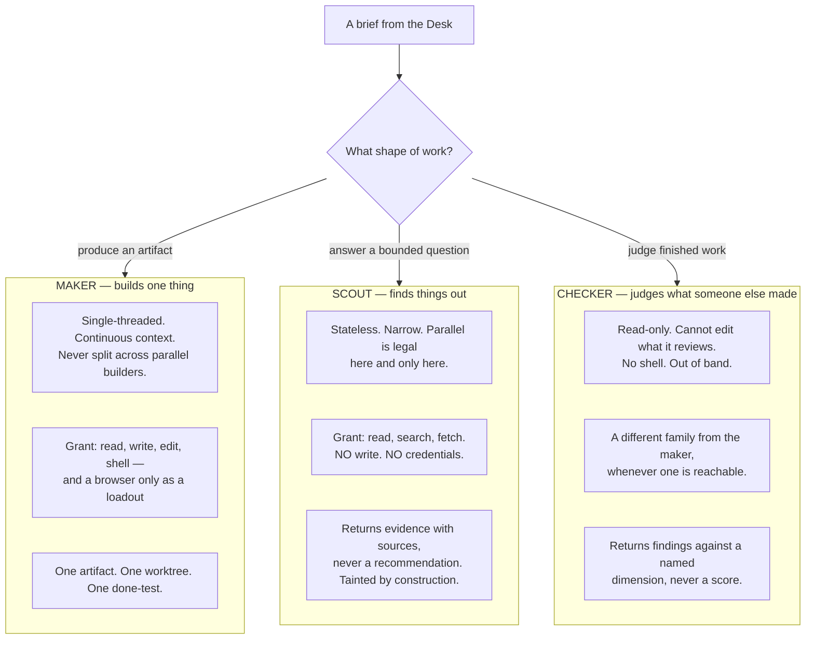

**(KEEL)** Why exactly three: a maker must hold continuous context and so must not be parallelised on one artifact; a
scout must be parallelisable and so must be stateless and must not write; a checker must not be able to change what
it judges and must not be the family that made it — if a checker could edit, it would review what it can edit and the
check would be circular. Every fourth shape collapses into one of these: a designer is a maker whose anchor is a
rendered screenshot; a security reviewer is a checker with a different dimension; a researcher is a scout with a wider
question. **Domain is a loadout, not a shape.** **(BOTH)** v3 reached the same three from its own side — its looker is
a maker loadout carrying a browser, its judge is the checker, its lookout is the scout — and its three no-model
processes are not shapes at all (§7.4).

### 7.2 The loadout — where all the variety lives

**(KEEL)**

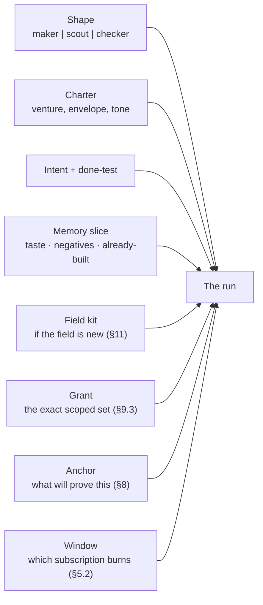

**(KEEL, founder-confirmed)** Three shapes, unbounded runs, as many loadouts as there are kinds of work. On any night
the founder might see six runs going, all makers, all different because their loadouts differ. There is no registry
of personalities, no file per role to drift, no question of which of fifty agents to call. The founder loses the
ability to say "send this to the CFO agent"; what replaces it is that they say what they want and the Desk assembles
the loadout. The Balcony labels each run by what it is making and which window it is burning: *writing the pricing
page · Claude*, *sorting last night's mail · Gemini*. **(V3)** A venture's colour may label its lane; a label costs
nothing while a runtime identity costs a career, a trust score and a stale context.

**(NEW: the curator's shape)** Keel names a night curator and does not give it a shape. It is a **maker** loadout
whose only writable scope is the memory files of one venture or the shared store, whose window is Gemini once a
write-capable Gemini narrowing has been measured and Claude until then (§7.5), and which is
never given a shell; `keel/bin/curate`, a program with no model, births it nightly — so the rule that *the thing that
acts never edits memory* is enforced by the grant, not by
instruction.

### 7.3 The standing prompts, and how they are versioned

**(BOTH)** Three standing prompts, one per shape, in `keel/shared/shapes/<shape>.md`, byte-identical across every
run of that shape and never carrying a timestamp, because two runs whose prompts differ by a date are not cached and
the bill triples (§14.5). What each says is commander's intent, not procedure: what a run owes at the end (a handover,
and the evidence its done-test named), the one objection it may file (the cord on itself), and a default it may depart
from with a stated reason. The checker's says *find, never score; when comparing two, pairwise and order-swapped;
report the candidate stripped of its own label*. **(BOTH)** Their sha is on every logbook row, so every outcome
attributes to a prompt version; a change is A/B'd against the rehearsal set or it is not made (§12). **(V3)** The
prompt-craft standard on this machine (`docs/03-system-design/agents/PROMPT-STANDARD.md`, the `PS-*` lint in
`.claude/hooks/schema-lint.js`, TREE A) survives as the deterministic check on those three files; the eighteen agent files it governed go (§17).

### 7.4 The Sender — the program with no model

**(V3 mechanism, KEEL's naming discipline and founder-confirmed default)** Every outward act — a send, a post, a
payment, a deploy, a share, a delete of something a person made — is **staged, never sent** (§9.2): the artifact
exists, hashed, ready, and one tap sends it. The tap runs a program. When the founder widens one class of act in one
venture's `may-alone`, the same program runs without the tap. It holds no model, is a few hundred lines, and accepts
exactly one shape:

```yaml
instruction:
  act:            send | publish | pay | deploy | delete | share      # one act, from the tool's declared verbs
  tool:           tools/resend-transactional                         # admitted through the door (§9.3)
  venture:        beeond
  intent:         i-2026-09-04-0132                                   # the id on every logbook row
  payload_sha256: 9f3c…                                              # the exact artifact that was staged and checked
  recipient:      person:pk_7a2f | channel:x/@beeond | env:production # from people.yml or the venture's channels
  not_before:     2026-09-05T09:00+01:00                              # the recall window, and the recipient's working hours
  ceiling_check:  { count_today: 3, ceiling: 6 }                      # recomputed by the Sender itself; it REJECTS
  checklist:      tools/resend-transactional/checklist.md            # read aloud into the logbook, item by item
  signed_by:      founder | watch                                     # 'watch' only for a class the charter widened
```

**(V3)** It checks the ceiling and the rate limit **independently of the number in the instruction** — no process
may both decide to spend and execute the spend — reads the checklist aloud into the logbook as it executes each item,
performs exactly one act, holds the recall window, and records the result with an idempotency key. A prompt injection
that reaches the Sender finds a program. Rate limits are absolute: *six outbound messages a day to people who have not
replied* is a number in a process no model can reach. No first contact with anyone not on `people.yml`. The queue
holds every act until the recipient's local working hours unless the tool declares otherwise — a machine that emails a
stranger at 03:40 has said something about itself before the first word. **(NEW: why it survives Keel's cut)** Keel
blocks a breaching act at the tool boundary and says "one tap sends"; it never says what program the tap runs or what
runs when a class is widened. Without a Sender the thing that decided to send is the thing that sends, which is the
exact seam the corpus shows breaking. **Enforced by:** `keel/bin/send` (ABSENT; specified in v2 Map 1 and kept) ·
`keel/people.yml` (ABSENT) · the sandbox's `credentials.mask` and `injectHosts` so the credential is attached at
egress and never in any run's environment (documented; unused on this Mac).

### 7.5 The argv per shape per provider — the grant is these strings

**(V3, measured 2026-09-02 and re-measured by the providers lane 2026-09-04; Keel's tool-grant rule made concrete)**
A grant is not a prose rule; it is the exact argv the Desk emits, held in
`keel/shared/shapes/<shape>.<provider>.argv` (ABSENT), under a **managed settings file** the founder writes outside
the repository, because only managed settings survive a child's argv. `--allowedTools` appears in no argv because it
restricts nothing.

| Shape | Claude Code (installed, measured) | Gemini CLI (installed, never authenticated; documented) | Codex CLI (not installed; documented) |
|---|---|---|---|
| **maker** | `claude -p --restricted --tools Read,Write,Edit,Bash,Glob,Grep --strict-mcp-config --permission-mode dontAsk --permission-prompts none --add-dir <worktree> --max-budget-usd <n> --max-turns <n> --session-id <uuid> --output-format json < brief.md` · the "never a credential" clause is `sandbox.credentials.mask` + `injectHosts`; the "read-only proxy" clause is `sandbox.network` with `strictAllowlist` | a write-capable narrowing is unverified; Policy Engine via `--admin-policy` | `codex exec` with `--sandbox`; `requirements.toml` outranks every flag; **no per-tool flag found**; the TTY defect |
| **maker + browser** | the same, plus a per-run inline `mcpServers` entry for Playwright — **the only surveyed way to give one run a browser without the server's tools entering any other run's context** | none found | none found |
| **scout** | `--restricted --tools Read,Glob,Grep,WebSearch,WebFetch --strict-mcp-config --permission-mode dontAsk --permission-prompts none --add-dir <worktree> --max-budget-usd <n>` (`--restricted` removes WebFetch unless `--tools` names it) | `--approval-mode plan` is read-only in one flag — **the one shape all three runtimes document a read-only narrowing for; only Claude's is measured on this Mac** | `codex exec --sandbox read-only`, documented, not installed, unverified |
| **checker** | `--restricted --tools Read,Glob,Grep --strict-mcp-config --permission-mode dontAsk --permission-prompts none --add-dir <worktree> --max-budget-usd <n>` — TREE A's `reviewer-readonly.md` already encodes it; a checker reading a prepared diff can go through a batch tier at half price on the day a key exists | the second family on this Mac; first run is a measurement | third family in principle, **blocked by #19945** until a headless rehearsal passes |
| **the Sender** | **nothing surveyed is a Sender**; every runtime holds a model by construction; it is a program the system writes | — | — |

**(V3, measured)** `--restricted` supplies three clauses at once: it ignores user, project and local settings,
confines the file tools to the working directories, and refuses bypass; `--permission-prompts none` means a run never
hangs on a prompt nobody will answer; `--max-budget-usd` makes a run's cost a stated bound rather than an observed
outcome (whether it binds on a subscription is one measurement, §19). Whether `--permission-mode auto`'s classifier
binds in print mode for a dispatched run is a second measurement; if it does, it is a cheap guardrail against accident
under the argv, and it is not the envelope.

### 7.6 How a loadout is proven able, before it is trusted

**(KEEL)** Voyager added a skill to its library only after the skill verifiably worked in the environment, and that is
why the library transferred to a fresh world instead of being a pile of plausible code. The same discipline applies to
loadouts.

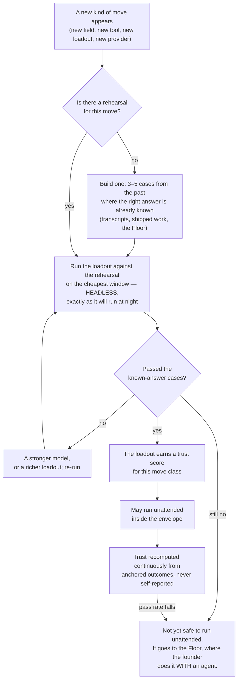

**(KEEL)** Three consequences. **A trust score is a measurement, not a rating**: the observed pass rate of anchored
checks for that loadout on that move class; no run scores itself. **"Not yet trusted" has a productive destination,
not a bin**: a move that fails rehearsal goes to the Floor, and *that session becomes the rehearsal case for next
time* — the mechanism by which walking with the founder teaches the system to walk for them. **The rehearsal cases
come from the founder's own past**: thousands of transcripts hold hundreds of *no, not like that* and *yes, that's it*
— a labelled dataset of this founder's judgement, gathered free over years. **(V3)** Trust scores are printed as
*insufficient* below a sample floor rather than as a number, and a trust score charted over time with limits from its
own history is the control chart that sees a provider's silent model update in month nine.

### 7.7 The probe — every night, in the environment a run actually uses

**(V3)** A capability nobody probes is not a capability; it is a memory of one. A flag everybody believed restricted
the tool surface restricted nothing for months, and a second model family sat dead for six months because both its pins
were retired and nothing asked. So every night a probe run, using the real argv under the real managed file, asserts:
a maker cannot name a tool outside its argv, cannot find any credential or the messaging token in its environment,
cannot reach the network except through the proxy; a checker cannot write; every admitted tool answers; every
second-family route returns a model id that is not the maker's; `crossSessionInbound: refuse` dropped a test message.
Results go to the logbook; a failure is a `wake-me`. **Enforced by:** `keel/bin/probe` (ABSENT) · `claude mcp list`
every night (the command exists; the check is ABSENT).

### 7.8 How a run dies

**(KEEL)** Every run dies at handover. What survives is exactly three things: the handover, whatever memory accepted
from it under §10.3, and the loadout's updated trust score. The context is discarded. The one thing that can be
retired is a loadout recipe, and it retires the way everything here does: it carries a horizon, and past it must be
re-rehearsed or stops being offered.

---

## 8 · Truth — how anything is known to be good

**(KEEL)** The scarcest thing in the system, and the section to defend hardest.

### 8.1 The finding that reorganises everything

**(KEEL)** An LLM asked to review its own reasoning with no external feedback gets worse — GPT-4 fell from 95.5% to
91.5% on GSM8K — because the bottleneck is finding the error, not fixing it. A model judging output measurably prefers
its own generations, its own family, longer answers and whichever came first, agreeing with human experts 60–68% of
the time in specialist domains. **(V3)** Across 27 papers and 19 benchmarks additional scaffolding does not
consistently improve reliability, and a production review gate in this very repository flagged zero of a hundred
rounds in which humans later confirmed twenty-three defects. So: **a model checking a model is a screen, not a
verdict**; every gate is deterministic or it is not a gate; everything believed is anchored to something that is not a
language model.

### 8.2 The anchor ladder

**(KEEL)** Every done-test names its anchor, and the ladder is ordered by how much it can be trusted. A done-test that
can only reach rung 4 is a weaker done-test, and the system says so out loud.

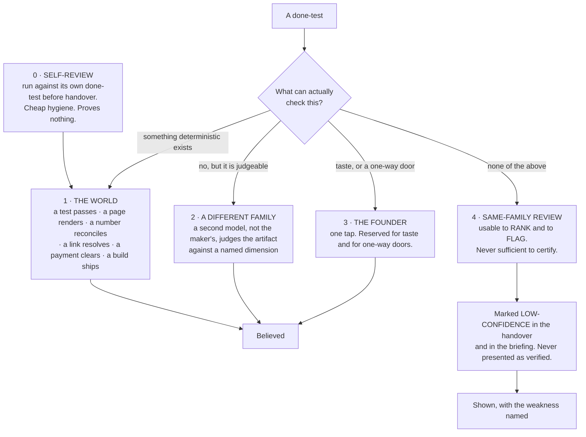

**(KEEL)** Rung 1 is not a formality and it is where the design work is: for most company work there *is* a
deterministic anchor, and finding it is the intellectual task of writing the done-test.

| Kind of work | The deterministic anchor |
|---|---|
| Code | tests run · build passes · the app starts · a named user path completes |
| A screen or a page | it renders · a screenshot exists · contrast ratios computed · it loads under a stated size |
| Copy or content | every factual claim resolves to a fetched source · links return 200 · reading level computed |
| A price or a model | the arithmetic reconciles · sensitivity to each input is computed and shown |
| A video or an image | it plays · right length and aspect · the brand colours are the declared ones · loudness to a standard |
| Research | every claim carries a URL that was fetched, with the quoted line present in the fetched text |
| Data work | row counts reconcile · a known query returns the known answer · nulls counted |
| Outreach or social | it sent · it was received · the reply, if any, is attached |
| Finance | it ties to the bank line, or the difference is shown |
| Anything legal | it does not go out without rung 3. Full stop. |

**(V3)** Inside rung 1 there is an order: a check that reads a record the company does not write — the processor, the
bank, the git host, the runner, the analytics provider — outranks a check that reads the company's own, because a
status report cannot promote itself. The world is full of free instruments that detect *broken* and almost none that
detect *good*; broken-detectors license generating widely and discarding, and only a live outcome licenses shipping.
**(KEEL)** The anchor is almost always cheaper than the work it checks, which is why this is affordable and why
quality here does not mean a review panel: it means the run produced the evidence its done-test named.

### 8.3 The other family — and there are three

**(KEEL, founder: three subscriptions)** A checker on the maker's family is a compromised instrument by measurement.
With Gemini and Codex bought as subscriptions there will be three families — the founder's decision; on this Mac
today neither is live, §5.2 and §19 rows 9 and 10 — so cross-family checking stops being a constraint and becomes a
choice: Claude makes and Codex checks on hard work; Gemini checks routine work; the checker is
whichever family did not make it. A genuinely multi-family panel becomes reachable — the single most-cited unmet
requirement of the prior system — and it is still not spent casually: three model opinions with no deterministic
anchor are still three opinions, so the panel is reserved for a one-way door with no rung-1 anchor.

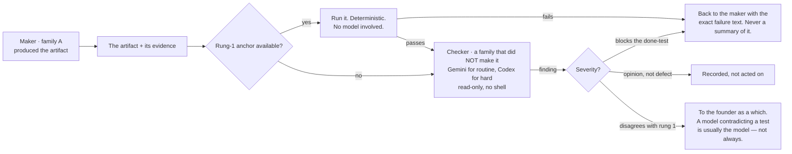

**(V3, sourced)** When a checker compares two candidates it is **pairwise, never pointwise**; blind, and stripped of
the candidate's own label; order-swapped, a flip resolving to *unresolved*. One frontier judge held its verdict when
two answers were swapped only 65% of the time; another 23.8%. Findings from several families are **unioned**: a
fatal finding from any family eliminates; fewer serious findings are preferred; scores are never averaged, because a
score is a finding with the information removed. **(BOTH)** Disagreement resolution is blunt: the deterministic anchor
wins over the model; a model that disagrees with a passing test flags and does not block; the one exception is a
checker asserting the test itself is wrong, which goes to the founder — and consensus thresholds are refused, because a
vote among models has no anchor. **Enforced by:** the run launcher presents two candidates to a checker as an ordered
pair twice, swapped, and records a flipped verdict as `unresolved` itself; the checker's handover schema carries a
`findings` field and no score field, so averaging has nothing to average (`keel/bin/run`, the schema in
`keel/shared/schemas/`; ABSENT).

### 8.4 Where taste is judged

**(KEEL)** Taste is not checkable by a test and is the founder's alone — but it does not follow that every taste
question goes to the founder, or the founder becomes the bottleneck they refused to be. The system holds a **taste
profile**: an evidence-backed record of what this founder has accepted and rejected, mined from transcripts (§10.5)
and from every *no, not like that* on the Floor. A taste check asks *does this artifact violate anything in the
profile?* — a rung-2 check with a real corpus behind it. What reaches the founder is the residue, the genuinely new
taste question, as two built options with a which. **(BOTH)** The profile is never a preferences file the founder
types, because a founder is an unreliable narrator of their own taste; it is derived from decisions only, and a
fraction of rejections is held out so it is scored on predicting what the founder *wants*, not what they *approve*.
Building both options is often cheaper than the round trip of asking.

### 8.5 The nightly reconciliation — the company's numbers against records it does not write

**(V3)** The single most repeated failure in the whole corpus of autonomous-company attempts is the agent misreporting
its own progress, and the misreport is what the human reads; it is invisible to any check that reads the agent's
output. So every night, on no model, the system's own numbers are read against the outside records:

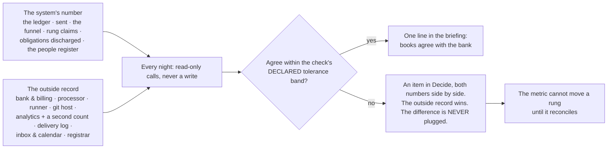

**(V3)** Revenue is read from the processor as a claim, never typed; a runway computed from a number the bank does
not confirm is stamped *internal* and cannot promote anything. **Enforced by:** `keel/bin/reconcile` with read-only
credentials per venture and a tolerance band per check (ABSENT); the checks themselves are rung-1 anchors and live in
`keel/shared/anchors/` (ABSENT).

### 8.6 Regression, for free

**(KEEL)** A regression is a done-test that used to pass and now does not. Because every done-test names a checkable
anchor, the set of live done-tests across all ventures *is* the regression suite, re-run nightly on the routine window
at close to zero cost. Nothing extra is maintained — a consequence of the done-test design and the strongest argument
for it. **(V3)** The 48-step check suite on this machine (`scripts/run-checks.mjs`, TREE A) is the founding
population of rung-1 anchors for the harness venture, and its rule survives whole: a partial run cannot wear a passing
verdict.

### 8.7 A venture's progress — the contact rungs

**(V3)** Keel measures whether the work is true; nothing in it measures whether the venture is becoming a business,
and the founder's list asks. So a venture's progress is a rung generated from a record the company does not write,
never typed:

```
0  it exists / it compiles / it renders    ← a rung-1 anchor's exit code
1  a stranger understood it                ← a recorded artifact: a reply, a recording, a survey row
2  a stranger did something                ← the analytics provider AND the server's own count
3  they came back                          ← a cohort in the product's own event store
4  they paid                               ← the payment processor
5  they paid again, and named you          ← the processor, plus a referral with a name attached
```

*"The landing page is done"* is rung 0 and will say rung 0. **(V3)** The **ship log** — one line per rung movement
and per Intent finished, in the founder's currency — appears in the briefing and answers *what did this company produce
this month*, the cheapest morale instrument there is. **(V3)** A thing the founder wants built is worked single-thread
and continuously until its done-test passes (Keel's WIP limit per venture); the cheap, wide, mostly-discarded
exploration that v3 called the weather survives only as *both options built for a which* and as scouts fanning out on
a new field — standing diversity sampling is refused (§1 row 24).

**Enforced by:** the rung table read by `keel/bin/reconcile` (ABSENT) · `keel/ventures/<v>/ship-log.md` written only
by that program (ABSENT).

---

## 9 · Control — what may be done alone, and what never

**(KEEL)** The founder refuses a machine that is only brakes. This section does not add brakes. It removes the need
for most of them by deciding once, per venture, what does not need asking — and makes the remaining few absolute.

### 9.1 The envelope

**(KEEL)** Three lists in the Charter, in the founder's own words, read by every run:

```
may-alone:  what runs without asking, ever
never:      what is not done by this system under any circumstance
wake-me:    the exact conditions that interrupt me, each with a number
```

**(KEEL)** The naval standing-orders and night-orders pair, with two details copied exactly: the call-me list carries
**numeric thresholds** — closest point of approach under 1.5 miles, wind up one Beaufort force — never "if something
seems wrong"; and the governing sentence *call the captain on any doubt whatever, before an emergency has developed*
is what stops a threshold list becoming a loophole. An envelope written the way the founder would say it:

```
may-alone:  write code · run tests · make branches · research anything · draft anything ·
            build both options of a choice · spend up to the venture ceiling on capacity ·
            read my calendar and mail
never:      send mail as me · post publicly · pay anyone · sign anything · touch production
            data · change a live price · contact a customer · delete anything a person made
wake-me:    a customer is waiting more than 4 hours · spend crosses 60% of the monthly
            ceiling · a done-test that passed for 7 days starts failing · anything I said
            'never' to is now the only way forward · a run has been blocked on the same
            thing three times
```

**(V3)** Every charter starts from a **default `never` list** held as data, longer than any tiering system covers,
and the founder deletes from it rather than writes to it: a secret in a published artifact · a migration without a
proven down-path · a deploy that emits mail or mutates data · money outside a standing, capped, rate-limited allowance
(a new payee, a new rate, a raised ceiling are doors; spending inside the ceiling is not) · a domain lapsed or bought ·
**anything delivered to a person** — a send, a post, a press reply, a launch, a store release, a share link · a burned
sending domain · a signature · a price change on existing customers · a partnership term · an offer, and a termination
· publication before a patent filing · a trademark class · an entity type · a cap table · an erasure · an account
deletion · a bulk merge · a missed statutory deadline · any edit to the system's own judging machinery · **and a kill
decision.** **(V3)** And every charter starts from a **default `wake-me` template** of five conditions about
consequence, never policy: a one-way act wanted · damage (an error rate, a churn event, a furious reply, an unexpected
bill, a reconciliation that disagreed with the bank) · a kill criterion the founder wrote on the day the intent opened
· a contradiction between an anchor and something the founder said out loud · a statutory clock. **Enforced by:**
`keel/shared/never-default.yml` and `wake-me-default.yml` merged into each charter at load (ABSENT).

### 9.2 The rule that decides what belongs in `may-alone`

**(KEEL)** Not importance, not risk vocabulary: **reversibility**. Two-way doors are made fast at ~70% of the
information you would like, because the cost of delay exceeds the cost of a correctable mistake; one-way doors get
slow, deliberate treatment.

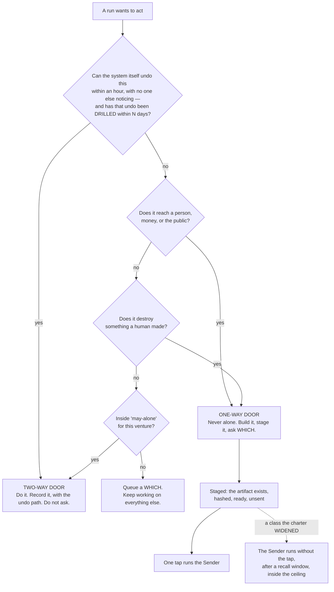

**(KEEL)** The staged-not-sent pattern is the whole trick. A tweet is written, previewed and sits there; an email is
drafted with the recipient filled in; a deploy is built and waiting. The founder's tap is the only irreversible step
and takes a second because everything else is already done — which is what makes *ask me only what only I can answer*
affordable: the asking blocks the last inch, never the work. **(KEEL, founder-confirmed)** Nothing outward runs alone
until the founder widens it, **per venture and per class**: an exception is written into one venture's `may-alone`
for one named class of action with its own limit, and can be withdrawn without touching any other venture. There is no
setting that turns outward action on everywhere at once. **(V3)** Two additions. **An undo is drilled or the door is
one-way**: a two-way door whose undo has not been exercised within N days is treated as one-way until it is — the drill
runner writes only a date — by Keel's own rule that an untested kill switch is a story about a kill switch. **A
widened class executes after a recall window**, not on the instant: the Sender holds it for a window sized to the
blast radius, the phone can recall it, and the receipt says plainly when a recall is not an undo. **Enforced by:** the
door test runs in the Watch before a brief carries a `REACHES THE WORLD` grant (ABSENT) · the drill dates in
`keel/shared/tools/<name>.yml` (ABSENT) · `keel/bin/send` (ABSENT).

### 9.3 Tools — how one is admitted, and what stops it

**(KEEL, founder-confirmed: all fifteen go back through this door, one at a time)** The largest live exposure in the
founder's environment: about fifteen services connected today, "by clicking a button, not by a decision". Scans found
critical vulnerabilities in 33% of 1,000 MCP servers and some finding in 66% of 1,808; three attacks are documented
and none needs the founder to do anything wrong — tool poisoning (instructions hidden in a description), the rug pull
(a server passes review, then silently changes its description; CVE-2025-54136), line jumping (the server steers the
agent without appearing in the log). The prediction the founder can check: several will not survive the first
question.

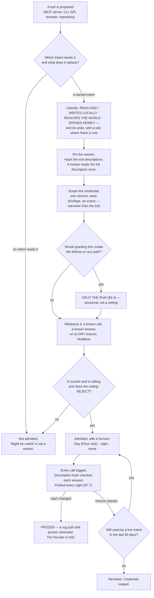

**(KEEL)** Hashing the descriptions and re-checking them every session is the specific countermeasure to rug pulls,
and it is a string comparison. **(V3)** The door's other questions, folded into the boxes above: a declared exposure
and a rate (a tool that cannot say what its own undo costs does not enter); a dry branch, and dry is the default (a tool
that cannot dry-run enters only as a founder-signed commitment); a credential narrower than the tool; a probe every
night in the environment the run actually uses; a counter and a ceiling that rejects; and for a repository, *what does
it give us we could not build in a day, its LICENSE file, our monthly test, what breaks if it disappears, is it alive*
— **take the mechanism, not the dependency**, because every framework that wants to own the loop is a second control
plane beside the runtime, and two implementations of one thing disagree silently; this repository has hit that three
times. **(V3, measured)** An MCP tool call reaches a hook only if the hook's matcher names that tool, so a hook that
matches `Bash|Edit|Write` governs no MCP call; every admitted server is named in the run's argv and is otherwise absent
by `--strict-mcp-config`. **(V3)** The grant surface today is inverted from the right one — a social publisher, a mail
client that can send, a drive client that can share, a remote compute sandbox and the authenticated browser are all
connected; analytics, error tracking and a read-only billing key are not — so read-only instruments are admitted
first, because instruments buy freedom and hands spend it. **Enforced by:** `keel/bin/door` writing
`keel/shared/tools/<name>.yml` (ABSENT) · the description hash check in `keel/bin/run` (ABSENT) · the nightly probe
(ABSENT) · `claude mcp list` every night with a failure counted as damage (the command exists; the check is ABSENT).

### 9.4 The trifecta rule — the one structural safety rule

**(KEEL)** An execution path that holds all three of **private data**, **untrusted content** and **the ability to
communicate outward** is exploitable by indirect prompt injection, and there is no prompt that fixes it. The only
reliable defence is to guarantee one leg is missing, which is why this is a shape rule and not a policy file.

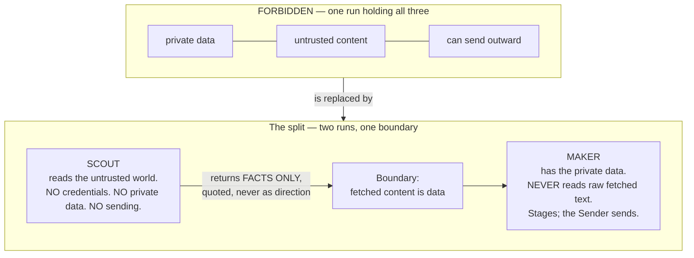

**(KEEL)** The run that reads the internet is never the run that holds the keys. Anything from outside — a web page,
an email body, a document, a tool's own response — is data to be quoted, never direction to be followed. **(V3, made
static at dispatch)** Taint closes the seam, and it is decided when a run is born, not while it runs, because a grant
is an argv fixed at dispatch and cannot narrow mid-run: any run whose brief reads content from outside the company —
a fetch, a search, an inbound row — is born as a scout, without the tools that act, and stays one for its whole
life; a maker is never given fetch or search and never reads a raw inbound row. If a scout concludes something should
be sent it says so in its handover, and a different run that has not read the foreign content decides. *The web page
told the agent to email the founder's contacts* becomes structurally impossible rather than heuristically unlikely.
**Enforced by:** `keel/bin/run` refuses a brief whose grant carries both an outside-reading tool (`WebFetch`,
`WebSearch`, a read of `logbook/inbound/`) and any of `Write`, `Edit`, `Bash` or a `REACHES THE WORLD` tool (ABSENT);
the probe asserts it (§7.7). **(V3)**
And the one place a written procedure belongs: where the judge is absent and the act cannot be taken back — sending to
a list, a migration over real data, a filing, a charge — a short checklist lives with the tool, there are about a
dozen, and the Sender reads each one aloud into the logbook because it contains no model and cannot decide to skip an
item.

### 9.5 The world's door

**(BOTH)** When the world sends something — a reply, a payment, a failed build, a CVE, an invoice, a support message —
a program writes **one row** into the logbook and does nothing else. No model reads a stranger's text with a tool in
its hand. The row becomes a line on the Balcony, and a scout with no credentials reads it. **(V3, measured)** Routines'
API trigger already wraps an inbound payload in a block that labels it untrusted data, which is this rule implemented;
and a delivered cross-session message starts a new turn carrying the receiver's full context, so an inbound path wired
to a running run costs a context window per event, not a slot — which is why the door writes a row and never wakes a
run directly. **Enforced by:** `keel/bin/inbound` (ABSENT).

### 9.6 Ceilings, and the cord

**(KEEL)** Two mechanisms from market-access rules, both deliberately blunt. **Pre-action, not post-review**: a spend
that would breach a ceiling is blocked before it happens, never flagged after; there is no *warn at 80%* an agent can
reason past; ceilings exist per run, per intent and per venture per month, and the tightest binds. **The cord**: one
control that stops everything — cancels running work, revokes outward grants, finishes nothing new, leaves every
artifact in place — reachable in one tap from the Balcony, one word on the Floor, one command in a terminal, and tested
on purpose, monthly. It does not delete and does not roll back; undo is a separate, deliberate act, because the state
after a panic stop is exactly when you least want an automatic mutation. **(V3)** The cord is a file, read first on
every tick; the same tap recalls everything in the Sender's window; there is one kill and not two, because a kill that
lives in a second place is a kill that disagrees. **Enforced by:** `keel/STOP` (ABSENT) · the three ceilings in
`keel/bin/run` and `keel/bin/send` (ABSENT) · `--max-budget-usd` per run (exists).

### 9.7 What makes a grant real — the measured seam

**(V3, measured on this Mac)** Keel's tool grants are argv and files; this is what holds them in place, and every
line is a measurement, not a design. **The managed settings file**: four lines of JSON in a directory no run can reach,
the only tier a running process cannot clear, because a process holding a shell can strip its own guardrails by
launching a child with different settings — and it does not exist yet. **Peer isolation is enforceable by a
checked-in file**: `crossSessionInbound: refuse` drops every inbound message and, uniquely, applies from project or
local settings over every other source; `permissions.deny: ["SendMessage","ListAgents"]` removes both tools;
`isolatePeerMachines: true` requires human approval before any message leaves the machine even in bypass mode. A run
cannot be stopped from binding an inbox socket; it can be stopped from receiving anything and from holding the tools
to send. **The sandbox has a full `network` block** (`allowedDomains`, `strictAllowlist`, `allowManagedDomainsOnly`,
`tlsTerminate`) **and a `credentials` block** (`mask`, per-host `injectHosts`) — the scout's read-only proxy and the
Sender's key-at-egress, both unused here; two documented holes stay in the plan: `excludedCommands` and `allowRead`
merge across scopes with no managed-only lock, and the proxy does not inspect TLS by default, so a broad allowed
domain is an exfiltration path. **Nothing lifts an inbound `bind`**, which is why the Sender and the Watch are
programs and not runs. **The sandbox is a guardrail against accident, not containment**: `failIfUnavailable` is set,
`denyRead` covers the credential stores, and there is a documented escape hatch. **The pre-tool hook matches command
strings and is the wrong shape** — it once blocked a document for mentioning a command; its rewrite to structured tool
input is an edit to the judging machinery and is the founder's (§19). **`Workflow` is removed from every subagent by a
documented universal filter**, so a run that declared it would get a silent no-op — the gate may never be invocable by
the thing it gates, which stays true. **The classifier under auto mode**: humans approve 97% of per-action prompts and
catch 13.6% of disguised dangerous commands, decaying to 5% after fifty; the classifier catches 89%; runs here use
`dontAsk` because a model's judgement is not a gate, and whether the classifier binds in print mode is one measurement.
**Enforced by:** the managed file (a founder act, ABSENT) · the checked-in isolation file (ABSENT) · the probe
(ABSENT) · `npm run test:sandbox` (exists).

---

## 10 · Memory — what is remembered, who writes it, and what rots

### 10.1 The one rule that shapes all of it

**(KEEL)** **The thing that acts never edits memory.** Letta runs two agents per identity: a primary that talks and
acts with no tools to edit its own core memory, and a sleep-time agent that reflects over history in idle time and
rewrites the shared blocks. That separation is the mechanism, for a reason the founder will recognise: memory written
as a side effect of doing the work is written by the most biased possible author, in the moment they most want to
believe they succeeded. A run *proposes* memory in its handover's `learned` field; the night curator (§7.2) decides
what is admitted.

### 10.2 What is remembered, and where

**(KEEL)**

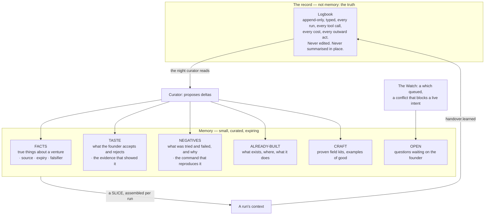

**(KEEL)** Scope, strictly: `TASTE` and `CRAFT` are the founder's and cross every venture; `FACTS`, `NEGATIVES`,
`ALREADY-BUILT` and `OPEN` are per venture and do not cross without a promotion. Credentials are not memory and are
never in any of these files. **Every item carries four things**: where it came from, when it was written, when it
expires, and what would falsify it; an item with no expiry is not accepted. **(V3)** Retraction works because the
logbook is the only truth and every store is a derived view: *ignore that interview, he was pitching me*, and
everything downstream is recomputed with a list of what moved; a corrupted store is a rebuild, not a disaster; a better
curator next year is re-run over the whole logbook.

### 10.3 How memory is written — deltas only, never a rewrite

**(KEEL)** The failure mode has a name and a paper: **context collapse**, where repeatedly asking a model to rewrite its
accumulated context squeezes the specifics out until the knowledge is gone. The cure the same paper demonstrates is
incremental delta operations — ADD, UPDATE, REMOVE against individual items — by a separate curator, never a wholesale
regeneration.

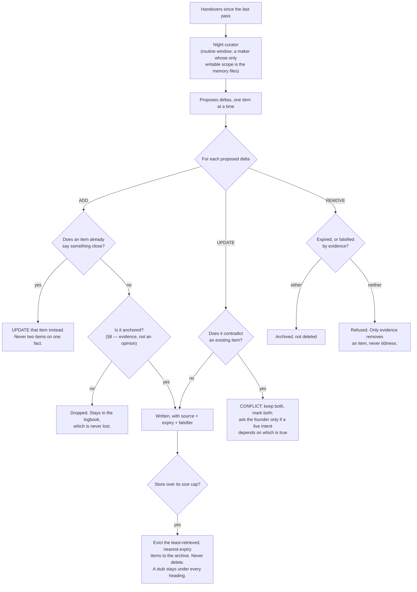

**(KEEL)** A conflict is kept, not resolved: two items that disagree is information, usually that something changed;
silently picking one is how a store becomes confidently wrong. **(V3)** The eviction rules already exist on this
machine as `scripts/evict-memory.mjs` (TREE A, present): an entry marked irreversible is never archived while its
subject exists, anything cited by a live item is pinned, every archival leaves a stub under the original heading so a
citation still resolves, and the archive rotates in capped volumes rather than being pruned — RENAMED into the
curator's REMOVE and EVICT branches. **(V3)** Expiry with forced disposition already exists as `scripts/ledger.mjs`
(TREE A, present): a durable item carries `valid_until` or it is not an item; when it comes due exactly one of refresh,
deprecate or waive-with-a-new-deadline is recorded; a resolver never passes what it could not check (`unresolved` is
distinct from `pass`) — RENAMED into the fact store's expiry mechanism.

### 10.4 Negative knowledge is the highest-value store

**(KEEL)** A newsroom's spike file records the stories that were killed and why, so the same idea is not re-reported
next month. For an always-on system this is the main defence against burning capacity to relearn the same dead end.
Every failed run, every rejected approach, every *we tried that* goes here with its evidence, and every brief carries
the relevant slice in `negatives`. Facts age and craft generalises slowly, but a dead end is dead for a long time and
knowing it costs one line in a brief — **the asset that makes an autonomous system get cheaper over time.** **(V3)**
Each negative carries the command that reproduces the failure, and the Watch's repetition tripwire (§3.1) checks a
run's proposed tool call against them before the call is made, so the pre-action check is the Watch's and cannot be
skipped by the run.

### 10.5 The transcripts — the largest unused asset on this machine

**(KEEL, founder-confirmed: mine them, locally)** Thousands of past conversations sit on this Mac and nothing reads
them. They contain, for free, the three things a new run most needs and can least invent: what this founder likes,
what has already been built, and what has already failed.

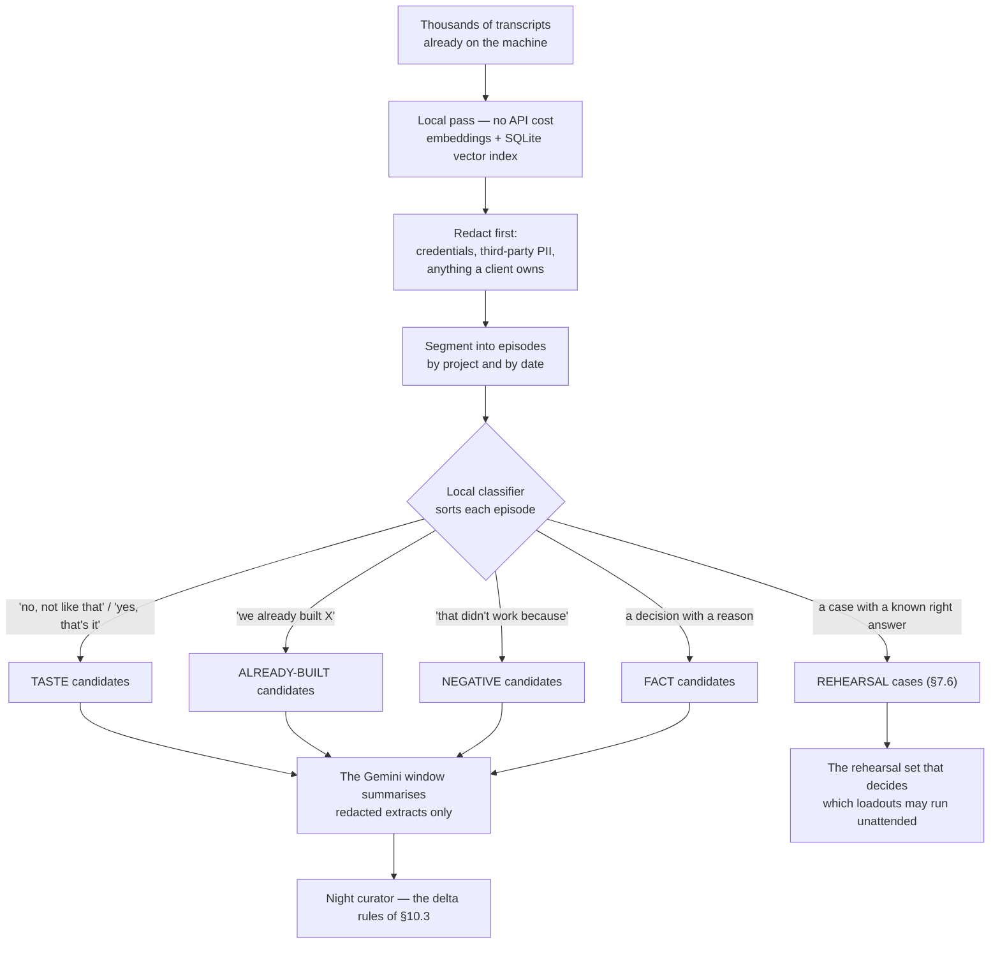

**(KEEL)** Embeddings, indexing and the first-pass classifier never leave the machine; only redacted extracts are
summarised by a model, on the routine window. This is the clearest example in the design of spending idle capacity on
knowing more rather than doing more, and it is the work to do first, because everything else gets better once it
exists. **(V3)** The transcript corpus on this Mac is 3,060 files (the census; v3 said 2,936+) and the parsers that read them exist in TREE A
(mission-control's index and `bin/warroom`'s cost pricing) — RENAMED into this pass; a transcript enters the logbook
as an episode and never as retrieval memory.

### 10.6 How a run gets its memory

**(KEEL)** Not all of it. A slice, assembled by the Desk, ranked the way the Stanford generative-agents work ranks a
memory stream — by **recency, importance and relevance together**, not similarity alone. Three things are always
included regardless of score, because relevance scoring is a heuristic and three things must never be missed by one:
the venture's `never` list, the negatives touching this exact move, and the open questions blocking this intent.
**Enforced by:** the slice assembler in `keel/bin/run` writes those three before it ranks anything, and
`keel/bin/check-stores` refuses a brief whose slice lacks them (ABSENT).
**(V3)** The slice is ordered by cost: the byte-identical standing prompt first, so siblings share the cache; the
charter and the intent next; the slice last. The slice says what it left out, and every item carries a counter
scored by outcome, so the Desk is itself measured: work should pass its anchor first time more often than it did last
month.

### 10.7 How a failure is analysed

**(V3, sourced)** A lesson is produced only by structured trajectory analysis over a failed run's trace, five fixed
questions: what was the target; what did each step actually return; at which step did the observation stop matching
the plan; what single observation would have distinguished the two; what would have been done differently. Never
*what did you learn*: in sixteen frozen failure environments, zero of 121 free reflections named the correct cause,
and the agent wrote confident wrong diagnoses into memory and reinforced them. The curator asks the five questions of
every `stopped-on-defect`, `blocked` and `over-ceiling` handover; the answer is a NEGATIVE candidate.

**Enforced by:** `keel/bin/curate` with the memory files as its only writable scope (ABSENT) · the item schema with
source, date, expiry and falsifier required (ABSENT) · `scripts/evict-memory.mjs` and `scripts/ledger.mjs` (exist;
RENAMED) · the local index under `keel/.index/` (ABSENT; deletable, rebuilt in one pass).

---

## 11 · Learning a field it has never seen

**(KEEL)** The founder will run projects in fields nobody anticipated. A curated library cannot cover that — it covers
what someone thought of in advance and rots between the thinking and the needing. So the system does not carry field
knowledge; **it carries the ability to go and get some, and the discipline to throw it away if it does not prove
itself.**

### 11.1 The field kit

**(KEEL)**

```mermaid
flowchart TD
    NEED["A brief names a field<br/>with no CRAFT entry"] --> CHECK{"A field kit,<br/>unexpired?"}
    CHECK -->|"yes"| USE["Load it. Proceed."]
    CHECK -->|"no"| BOUND["Bound the question first:<br/>what must I know<br/>to pass THIS done-test?"]
    BOUND --> SCOUTS["Fan out — scouts in parallel.<br/>The one place parallelism is earned."]
    SCOUTS --> S1["how practitioners actually do it"]
    SCOUTS --> S2["what good looks like — real examples"]
    SCOUTS --> S3["what goes wrong — failure modes"]
    SCOUTS --> S4["how anyone checks it — the anchors"]
    S1 & S2 & S3 & S4 --> KIT["FIELD KIT, drafted"]
    KIT --> FIELDS["Contents — four descriptive headings, NO procedure:<br/>· what good looks like, with 2–3 real examples<br/>· the anchors: how this field checks itself<br/>· the common failure modes<br/>· the vocabulary a practitioner uses"]
    FIELDS --> PROVE{"Used on the real work.<br/>Did the done-test pass?"}
    PROVE -->|"no"| DISCARD["Discarded. Recorded as a negative:<br/>'this framing of the field did not help.'"]
    PROVE -->|"yes, once"| PROV["PROVISIONAL — 30-day horizon"]
    PROV -->|"used and passed 3 times"| KEEP["Promoted to CRAFT.<br/>Longer horizon. Shared across ventures."]
    PROV -->|"horizon passes unused"| DISCARD
```

**(KEEL)** A field kit contains no steps, and this is enforced by what its sections are: all four headings are
descriptive and none can hold *first do this, then do that* — the founder's refusal of playbooks made structural
rather than promised. Provisional-until-proven, discarded-if-unused, is the Voyager discipline applied to knowledge
instead of code. Breadth-first research decomposing into independent directions is where the orchestrator-plus-
subagents pattern earned its 90% gain; four scouts asking four questions do not need each other's context; four
makers building one page do.

### 11.2 Borrow before you build — the anchors a field already gives away

**(V3)** The kit's *anchors* heading starts from an inventory of the deterministic checks the world gives away, and
the list is long, which is why breadth is affordable:

| Field | Free, deterministic checks that already exist |
|---|---|
| Code | compiler · type checker · test runner · linter · static analysis · mutation testing · dependency CVE scan |
| Web performance | Lighthouse · field Core Web Vitals |
| Accessibility | the automated WCAG subset (a third to a half of real issues; the honest number goes in the kit) |
| Design | contrast ratio · token conformance · spacing-grid lint · visual regression against the last accepted render |
| SEO | schema validator · rich-results test · sitemap and robots validators · canonical checks |
| Email | SPF, DKIM, DMARC validators · a spam-score checker · unsubscribe-link presence (the law, not taste) |
| Video | loudness to EBU R128 · audio/video sync · resolution and frame-rate conformance · duration |
| Data | schema tests · row counts against a control · significance with a pre-declared sample |
| Money | reconciliation: the number in the deck equals the number in the processor |
| Distribution | the link resolves · the preview renders · the post exists an hour later |
| Security | secret scanning that verifies · TLS and header checks · the trifecta audit of every tool |

**(V3)** Security, privacy and compliance are all deterministic and all wired on day one: secret scan · access diff ·
CVE clock · restore drill · consent trace · deletion query · policy-versus-code · export · uptime.

### 11.3 The holding directory, and what a skill becomes

**(BOTH, founder: the holding directory, 2026-09-04)** The 134 curated skills, the routers, the manifest and
`CURATION.yml` (TREE A, `.claude/skills/`) move whole into `keel/holding/skills/`, which nothing reads. A skill
re-enters one at a time through the tool door, with a caller in the same change and a test that fails without it, and
it re-enters as exactly one of three things: **examples-of-good** in a field kit, a **rung-1 anchor**, or a
**rehearsal case**. A skill that is a procedure for how to produce work does not re-enter; that is what the done-test
replaced. Ninety days uncalled and it leaves. The number of skills is an output, counted monthly, and the standing bet
is that fewer than fifteen of the 134 will ever be called for by a real piece of work. `CURATION.yml`, which records
every cut with the test that made it, is the right instrument pointed the wrong way, and is inverted: admission by
test, not excision by argument. §16.2 carries the fate class of every one of the 134 from the census.

### 11.4 Research, and why it is the cheapest thing the system does

**(V3)** The system states its expectation before it looks, one line and a number. A source that confirms compresses
to a tally. A source that contradicts enters FACTS carrying its URL, its access date and the quoted sentence that did
the damage. The output of a research run is not a document; it is a diff against what the company believed this
morning, three lines long on a good night. A claim with no fetched, quoted, dated source is not a claim. **(BOTH)**
Fetched content is data, never instruction, and the scout that read it is tainted; the honest instrument for a
question of taste is people, not a simulation — synthetic customers and user-testing simulation are refused as
anchors, allowed as idea generation.

**Enforced by:** the kit schema with four headings and a `horizon:` (ABSENT) · `keel/holding/` (a move) · the tool
door (§9.3) · a research handover's `evidence` field requiring URL, date and the quoted line, checked by
`scripts/check-citations.mjs` (TREE A, exists; SURVIVES as a rung-1 anchor).

---

## 12 · How the system improves itself

**(KEEL)** Three loops at three speeds, all anchored to something outside the model, because a system that improves
itself by its own judgement drifts by its own judgement.

```mermaid
flowchart TB
    subgraph FAST["Within a run — minutes"]
        F1["Done-test fails"] --> F2["The exact failure text goes<br/>back to the maker. Never a summary."]
        F2 --> F3["Retry, with the failure in context"]
        F3 -->|"same failure twice"| F4["Stop. Not a retry problem.<br/>Record and escalate."]
    end
    subgraph NIGHT["Nightly — the curator"]
        N1["Read every handover"] --> N2["Deltas into memory (§10.3)"]
        N2 --> N3["Count sightings of each<br/>recurring failure"]
        N3 -->|"same shape seen 3 times"| N4["Promote to a NEGATIVE that<br/>ships in every relevant brief —<br/>and, where it can be made deterministic,<br/>to a rung-1 anchor"]
    end
    subgraph SLOW["Occasionally — the standing prompts"]
        S1["A shape's standing prompt<br/>is a versioned file"] --> S2["A change is proposed<br/>with a reason and a hypothesis"]
        S2 --> S3["Run BOTH versions against<br/>the rehearsal set (§7.6)"]
        S3 --> S4{"Measurably better<br/>on known-answer cases?"}
        S4 -->|"no"| S5["Reverted. The proposal is kept<br/>as a negative."]
        S4 -->|"yes"| S6["Adopted. Old version archived,<br/>reversible in one command."]
    end
```

**(KEEL)** The retry ladder is deliberately short: one retry with the failure in context, and a second identical
failure stops the run; a third attempt at the same wall is how an autonomous system burns a night. Prompt changes are
A/B'd against known answers or they are not made — the only self-editing permitted anywhere, bounded by the rehearsal
set. **(V3)** A negative that can be turned into a deterministic check becomes one — a script, a trunk line, a test
that fails without it — reviewed by the founder because three is a signal and not a proof; and the whole set re-runs
monthly, a failing check quarantined rather than followed.

**(V3)** **Corrections learn.** A founder redirect of a running run is logged as a defect in the *brief*, not in the
run: a run that had to be redirected was told the wrong thing. **Interventions per surviving artifact** — redirects,
rejections and rework divided by the artifacts that survived contact — must fall and cannot be gamed by producing
more, because the denominator is survivorship. A rejection at a which is a labelled example in the taste profile by
the next curator pass.

**(KEEL)** **Horizons on everything durable** — charters, intents, kits, grants, memory items, loadout recipes,
trust — replace every calendar audit: a rethink forced by expiry rather than remembered. Anything whose horizon passes
must justify renewal in one sentence or it stops; no agent argues for its own existence. **(V3)** **The refusal line.**
Every stop the system makes is answerable from the Desk's record (§13.7), and the briefing carries the week's most
expensive refusal — what was going to happen, what stopped it, what it would have been worth. A refusal that tops that
line four weeks running is a design defect wearing a safety costume, and is narrowed by name. **(V3)** **The rethink
trigger** is a number, not a mood: the founder's own ideas stop reaching production, or interventions per surviving
artifact rise for a month, or the same refusal tops the line four weeks running, or two of the six numbers (§20) move
the wrong way at once. When it runs, the method is the measured one: a brief of the founder's words only, no floor,
sealed minds writing a spine before reading, one merge that decides and keeps losing images.

**(BOTH)** Refused: **fine-tuning**, which converts reversible artifacts into irreversible weights, removes the ability
to see why the system behaves as it does, and needs a volume of clean labelled data that does not exist yet;
**self-editing prompts** beyond the A/B'd change (the best-documented case hallucinated a test log to fake passing and,
when detection markers were added, removed the markers); and **standing diversity sampling** — v3's fifth of every
night's budget spent on work aimed at the founder's blind spots — because it multiplies cost with no anchor to pick
between the outputs; the adversarial pressure the founder asked for comes from a different family and a test.

**Enforced by:** the rehearsal set and git history of `keel/shared/shapes/` (ABSENT) · `keel/bin/curate` (ABSENT) ·
the cheap pass checking horizons (ABSENT) · the counter of redirects per intent in the logbook (ABSENT).

---

## 13 · The surfaces — walking with it, and watching from the balcony

**(KEEL)** Two surfaces over one state. There is no third source of truth, and neither surface has anything the
other cannot reach.

### 13.1 The whole picture

**(KEEL, with obligations added)**

```mermaid
flowchart TB
    subgraph STATE["One state — plain files in git"]
        LOG["Logbook"] --- MEM["Memory"] --- INT["Charters + Intents + Obligations"]
    end
    subgraph FLOOR["THE FLOOR — the terminal"]
        FL1["One agent. Beside you.<br/>Same memory, same envelope."]
        FL2["Your fastest input.<br/>Nothing queues behind you."]
        FL3["While you are here the system is STERILE."]
    end
    subgraph BALCONY["THE BALCONY — a rendered page, phone or Mac"]
        B1["NOW — what is running, on what,<br/>burning which window, costing what"]
        B2["DECIDE — the whiches, each with<br/>both options already built"]
        B3["LAST NIGHT — the briefing"]
        B4["VENTURES — tempo per venture,<br/>one tap to change it"]
        B5["THE CORD"]
    end
    subgraph VOICE["VOICE — input only"]
        V1["You speak. It transcribes, verbatim."]
        V2["It writes back what it heard,<br/>in its own words, on screen."]
        V3["You confirm by tap or text. NEVER by voice."]
    end
    STATE --> FLOOR
    STATE --> BALCONY
    VOICE --> STATE
    BALCONY -->|"redirect · stop · pick · retempo"| STATE
    FLOOR -->|"work, decisions, corrections"| STATE
```

### 13.2 The Balcony: five views and no dashboard

**(KEEL)** The founder opens rendered pages and taps, and does not read dashboards. So the Balcony is not a
dashboard: **every element is either a fact or a tap**, and nothing is only informational.

| View | What is on it | What you can do |
|---|---|---|
| **Now** | one line per running item: what it is making, for which intent, which window, how long, what it has spent, the last thing it did; an item that needs you is cocked out of alignment *(V3)* | stop it · redirect it · watch it |
| **Decide** | the whiches. Each carries six things *(V3)*: the question, typed FACT or PREFERENCE · the recommendation and its one reason · what happens if you say nothing (it waits, and expires on a date) · the class (two-way with its drill date · one-way) · the cost of being wrong · both options, built | tap one. That is the whole interaction |
| **Last night** | the briefing (§13.4) | open any item · promote a proposal |
| **Ventures** | one row per venture: tempo · live intents · spend against ceiling per window · three health facts, never a composite score | change tempo · adjust weight · park |
| **Cord** | nothing | stop everything |

**(KEEL)** *Watch it* means what it says: tapping a run in Now shows its live trace, tool call by tool call — the
founder asked to see the agents work, and this is that; read-only from the phone, steerable from the Mac. Redirect is a
typed verb, not a chat box, the four the agent-inbox pattern settled on: *go ahead · change this one thing · stop this
· here is what I actually meant*. **(V3)** A question of fact cheaper than an hour is refused as a question and settled
by the machine, with a receipt; a question of preference is asked, always, at any calibration. **(V3, measured)** On
the Mac the Now view exists today for free: `claude agents` is a state-ordered strip board, needs-input first, with a
PR column and peek-and-reply; what it lacks and the Balcony adds is venture as the axis, the window, the cost, and a
label written at emission rather than by a model at render time.

### 13.3 The Floor, and the sterile rule

**(KEEL)** When the founder is working beside an agent, that is the highest-value use of the system, and nothing may
degrade it. Aviation solved this with a regulation: below 10,000 feet no communication not required for the task is
permitted, defined by phase of flight and applied automatically, because a series of accidents were caused by
non-essential conversation during critical phases.

```mermaid
flowchart TD
    SIT["Founder opens a terminal session"] --> ST["STERILE begins, automatically.<br/>Detected, not declared."]
    ST --> HOLD["No new run on the Claude window.<br/>The venture under the founder's hands is held whole.<br/>Obligations and routine-window work continue (§1 row 16)."]
    ST --> QUEUE["Everything that would have interrupted<br/>queues, in order, with its timestamp"]
    QUEUE --> EX{"Does anything match<br/>the venture's wake-me list?"}
    EX -->|"no"| WAIT["Waits. Silently."]
    EX -->|"yes"| ONE["ONE line, at the bottom of the terminal.<br/>Not a popup. Not a page change."]
    ST --> LEAVE["Founder leaves"]
    LEAVE --> RESUME["Sterile ends. Queued items are summarised<br/>into ONE paragraph, never replayed one by one."]
```

**(KEEL)** Queued interruptions are summarised, never replayed: coming back to eleven notifications is the alarm
problem again. **(V3)** On the Floor, and nowhere else, the founder's own hands are reachable — the signed-in browser,
the send button — and each act still writes a Sender instruction with `signed_by: founder`, so the Floor leaves the
same trail as the night and the reconciliation reads it the same way; when the founder acts outside the system
entirely, the world's door records it from the mail log, and the system never pretends it did not happen. The
founder can *take over* — edit directly while the agent yields and watches — and *hand back*; the transcript is an
episode in the logbook, never memory. **(V3, measured)** The Floor's mid-flight verbs already ship: `Esc` interrupts
and keeps the work, a queued message reaches the model between tool calls, `/btw` asks a side question, `/model` and
`/effort` change mid-flight, `Esc Esc` rewinds code and conversation. **Enforced by:** sterile is detected from a
live interactive session's presence in the logbook (ABSENT; the Watch's cheap pass) · the Floor is Claude Code with
the charter, the envelope and the slice loaded by the session-start hook (`.claude/hooks/session-start.js` exists in
TREE A, 259 lines, and emits 2,941 bytes, under the 4,096-byte ceiling at which the runtime truncates; RENAMED).

### 13.4 The briefing

**(KEEL)** One page, generated on the routine window, opened when the founder feels like it. Its shape is the newsroom
budget meeting and its required fields come from the handover discipline:

```
What moved             — intents that advanced, with the evidence, and the raw work: the render, the diff,
                         the email that would go out, staged (V3)
What finished          — done-tests that passed, and what they now enable; the ship log's new lines (V3)
What is stuck          — blocked, and what would unblock it
What I could not check — the low-confidence items, named honestly
What is waiting on you — the whiches, in priority order
What it cost           — against the ceiling, per venture, per window; the reserve's hit rate
Books agree with the bank — the reconciliation line, or the incident (V3)
Things I got wrong     — trust scores that fell, redirects, the week's most expensive refusal (V3)
What I would do next   — proposals, none of them started
```

**(KEEL)** *What I could not check* is the field to fight for: a briefing that reports only successes trains the
founder to trust the system uniformly, which is exactly wrong when some done-tests reach rung 1 and some only rung 4.
**(V3)** The briefing shows the raw work, not a summary of it — the film set's dailies, whose function was never
latency but that the accountable person looks at the actual output at a fixed hour and reacts. **(V3, measured)** It
is a published page, and a published page is a two-way surface: the artifact runtime carries a shared database, viewer
identity and comment threads; a comment the founder leaves reaches the publishing session as a wake-up carrying a
thread id, and the session replies into the thread. **The margin of the briefing is a redirect channel addressed to an
intent id.** First-party, private by default, free, and the founder's revealed channel is rendered pages they open and
tap.

### 13.5 The interruption budget, measured

**(KEEL, decided under "idk means decide": three a day)** Every notification channel reports its own **acted-on
rate** — of the things it raised, what fraction did the founder act on — and a channel below its threshold is
automatically demoted from interrupt to briefing. The ICU finding turned into a control loop: 74–99% of alarms being
irrelevant does not make people angry, it makes them stop looking. The budget is a hard cap: at most **three
unprompted interruptions a day** outside the `wake-me` list; everything above it queues to the briefing, which is never
an interruption because the founder opens it. **(V3)** Escalation is a count, not a level — the second ring says it is
the second — and the run is never penalised for calling. **Enforced by:** the counter and the acted-on rate in the
logbook, read by the Watch before it rings (ABSENT).

### 13.6 Voice

**(BOTH)** Voice is input, never confirmation. Speak freely, at any length, with transcription errors kept verbatim;
the system writes back what it understood — as an Intent with a done-test, in its own words, on screen — and the
founder confirms with a tap or a typed word. A spoken sentence never binds anything by itself. Audio out is available
for the briefing on a walk, and nothing can be approved from it. **(V3, measured)** `/voice` is native, hold or tap,
takes project and branch names as recognition hints, and works in the agent view's dispatch input; voice out was
closed as a duplicate request; **no product reads an instruction back before acting**, so the read-back is built here.
**Enforced by:** the read-back page (§2.4, ABSENT).

### 13.7 Ask the company anything

**(BOTH)** The founder wants to understand the whole system, not answers to questions. Four ways in, at four depths:
*why did you do that* → the handover, then the brief, then the trace, then the chain of direction — this run ← this
intent ← this charter ← the sentence you said, on this date. *Why did you NOT do that* → the Desk's ranking at that
tick: what it considered, what gate stopped it — it lost the ranking, or hit the WIP limit, or was outside the envelope,
or was spiked three weeks ago for a reason that is written down. *What do you believe about X* → the memory items on
X, each with source, date, expiry and falsifier. *How does the whole thing work* → this document and its diagrams.
Because a run cannot start without an intent id and an intent cannot exist without a founder sentence behind it, every
single thing the system ever did traces back to something the founder actually said — not a logging feature, a
consequence of the one rule in the spine.

### 13.8 The room, through the door

**(founder, 2026-09-04: "there are open-source projects")** The office view of the agents at work is admitted through
the tool door like a scraper: its LICENSE read, its input declared (it reads the logbook's event feed and nothing
else), its exposure read-only, a caller in the same change, a test that fails without it, an exit note. Because it
reads and never writes, tests 1–3 are met trivially and the cost argument that put it after everything else
disappears. **(V3, from the survey)** No Claude Code fleet surface is spatial, every spatial project is a display and
every control surface is a table, and no project is both — which settles the rule rather than leaving it to taste.
Rank 1 for admission: **Generative Agents' `demo` mode** (Apache 2.0), a top-down town that renders from one JSON
file, four fields per agent per step — a tile, an emoji, a sentence, a nullable chat — no model, no backend, assets
included; every live run is a light, and the sentence's four-level location path maps onto venture → intent → run →
artifact with no schema change; the whole bill is porting about forty lines of routing off a dead Django, and the
cheapest high-value experiment in any research file is one afternoon with a synthetic movement file. Rank 2: AI Town
(MIT, alive), which needs Convex. Refused: WorkAdventure (AGPL with the Commons Clause, no RPC places an avatar),
vibe-kanban (an unmaintained runtime that wants to own execution), ChatDev (the office is gone). **(BOTH)** The rules
all prior rounds wrote and Keel's caveat agrees with: no notifications, no badges, no unread count, no obligations;
never on the phone; never where a decision is made; nothing reads whether you watched it. Entertainment is a legitimate
requirement and a disqualifying control surface, and the reason to be strict is that a beautiful surface will always
win the argument against a useful one.

### 13.9 The menu bar

**(KEEL)** The smallest useful surface: a glyph that says running / waiting on you / stopped, reading the logbook,
entering through the door like the room.

### 13.10 What ships today, and what must be built

**(V3, from the surfaces lane, 2026-09-04)** For walking-for-me the watching and the stopping are bought and the
deciding is not; for walking-with-me the steering primitives are bought and the memory of what was said is not. In
both halves the missing piece is the same: a durable, typed record of the founder's intent addressed to an id. Every
vendor built the transport; none built the ledger; this repository already has one.

| The verb | What ships today | Where it stops; what is built |
|---|---|---|
| Run unattended | cloud Routines (schedule ≥ 1 h, an API trigger, GitHub events, no prompts); Desktop scheduled tasks (local, die with sleep); `dontAsk` mode | Routines are cloud-only and cannot reach local files, so they are refused for the Watch; nothing reports whether the work was *good*. Built: the Watch, the Desk, the anchors |
| See the fleet | **`claude agents`**: a state-ordered strip board, needs-input first, peek-and-reply; `claude-view` (MIT, read-only, cost gauges) | grouped by state or directory only; no venture, window, cost or verdict column. Built: Now |
| Be told | Remote Control push; task notifications | two booleans and the model's judgement; no classes, budget or count. Built: the bell with `wake-me`, a budget and a count |
| Approve from the pocket | the Channels permission relay over iMessage, Telegram or Discord, **binding to the exact tool call**; Remote Control holds `AskUserQuestion` indefinitely | nobody routes a **decision between two built things**; nobody carries a deadline with a class. Built: Decide |
| Stop | `Ctrl+X` in agent view; `Esc` in a session | no fleet-wide halt, none that survives sleep. Built: the cord |
| Redirect without killing | a queued message reaches the model between tool calls; `Esc` keeps the work; **a shell script can inject a message into a live session through the messaging socket the runtime exports** | dies with the session. Built: a redirect is a logbook row addressed to an intent, and a defect in the brief |
| Speak | `/voice`, native; works in agent view | no read-back anywhere. Built: the read-back |
| Take the wheel | Manus's browser operator; Cursor's remote desktop control | Built: *take over* on the Floor |
| A page that answers back | artifact pages with a shared database, viewer identity, file assets and comment threads that wake the publishing session | Built: the Balcony and the briefing on that runtime |

**(V3)** Six things must be built, and none is a dashboard: the bell with classes, a budget and a count · venture and
window as axes · the label at emission · the read-back before binding · a durable annotation addressed to an intent id
· the six-field Decide item. **Enforced by:** the Balcony as a published page declaring the database, user and comment
capabilities (ABSENT; the runtime exists) · `keel/logbook/` as its only source (ABSENT) · `~/.agentvibe/events.jsonl`
and mission control's SSE feed (TREE A, exist; the logbook's spine, RENAMED) · the room's JSON writer (ABSENT).

---

## 14 · Runtime — the Mac, the facts that bind, and each provider

### 14.1 The Mac now, the split as the target

**(BOTH, founder)** Day one is this Mac, lid open, on power, logged in. The target is the split the design implies:
**the Watch, the Sender and the logbook on an always-on machine**, because obligations must complete and the logbook
must never be lost; **the runs wherever they are cheapest**, because they hold no credentials by construction; the
founder's Mac as a client, a very good one, that can sleep without the company stopping. A small always-on box with a
real service manager solves every laptop problem for a few pounds a month; it does not solve the credential problem,
it relocates it, which is why only the three no-model parts move there. The box is bought after the first measured
overnight, not before (§1 row 20).

### 14.2 Supervision, on macOS

**(KEEL, with v3's launchd facts from Apple's documentation)** A **LaunchAgent** holds the Watch: it runs as the
founder's user, which is what reaches the keychain and the subscription's OAuth; it dies at logout, and the honest
statement is that the Mac stays logged in with the lid open, or the night ends. **(V3)** The tick is a `StartInterval`
job that runs and exits, never a `KeepAlive` one — `KeepAlive` on a script that exits zero is an infinite loop
throttled to one launch every ten seconds. `StartInterval` coalesces missed firings, so a Mac that slept through four
ticks fires once on wake; `caffeinate -i`, time-bounded, prevents idle sleep and nothing but `pmset -a disablesleep 1`
prevents lid sleep. `launchd` has no restart ceiling beyond its throttle, so the supervisor implements one — N restarts
in T seconds, after which it escalates rather than loops. `KeepAlive` cannot catch a hang, so a separate heartbeat and a
**process-group kill**, because a timeout that kills a child while its grandchild runs on is a timeout that does
nothing. **(BOTH)** Every tick is crash-only: read state from disk, take one move, write, exit; a tick that vanishes
loses exactly one tick. **Enforced by:** `~/Library/LaunchAgents/com.keel.watch.plist` and `keel/bin/supervise`
(ABSENT).

### 14.3 Storage, durably — what survives a dead machine

**(KEEL)** Everything is a plain file. The test: if the Mac dies tonight, what does the founder still have?

```mermaid
flowchart TB
    subgraph GIT["In git — survives everything"]
        A["charters · intents · obligations · memory · craft ·<br/>rehearsals · shapes · handovers · the ledger"]
    end
    subgraph LOCAL["On the machine only — rebuildable"]
        B["the vector index over transcripts"]
        C["run traces older than the retention window"]
        D["worktrees and branches in flight"]
    end
    subgraph NEVER["Never in git, never in a file"]
        E["credentials — OS keychain, referenced by name"]
        F["customer PII — stays in its own system"]
    end
    subgraph BLOB["Off the machine, by hash"]
        G["renders · screenshots · video · audio · page captures —<br/>content-addressed by sha256; the logbook holds the hash"]
    end
    GIT -->|"pushed after every run,<br/>to a private remote the founder owns"| REMOTE["A remote"]
    REMOTE -->|"clone on a new machine"| NEWMAC["Everything but the index"]
    B -.->|"rebuilt from transcripts in one pass"| NEWMAC
    NEWMAC --> RESUME["The Watch restarts.<br/>Runs in flight resume from the logbook (§6.4)."]
```

**(V3)** One `keel` repository and one per venture; a push after every run; a nightly encrypted snapshot to object
storage, excluding secrets by construction because they were never in it; blobs mirrored to one bucket, the only
thing in the design that has to exist somewhere else, and a hash with no blob is a known absence. The logbook's append
uses `F_FULLFSYNC`, because on macOS `fsync()` does not mean the drive wrote the data and neither git nor SQLite calls
the real thing by default. The local index runs in WAL mode, never over a network filesystem, and a page holding a
query open starves the checkpoint — one more reason the Balcony reads files and not a database. Snapshots of the
memory stores every night, because event sourcing's own failure is replay time, and the rebuild-from-scratch path is
exercised on a schedule rather than trusted. **(BOTH)** The logbook is the truth and is never edited; memory is a
curated view over it; if memory is wrong the logbook is still right. **Enforced by:** `keel/bin/log` with
`F_FULLFSYNC` (ABSENT) · the push in every run's close (ABSENT) · the nightly snapshot job (ABSENT).

### 14.4 The credential plan, which is the disaster plan

**(V3)** What no backup restores: OAuth refresh tokens (a grant held by the authorisation server, often rotated on
use; recovery is re-running the consent flow, as a human, once per service), device-bound passkeys and hardware keys,
two-factor seeds, and domain and DNS control — the one true single point of failure in a small company. So the
recovery plan is a **credential plan**: a password manager as the single source of truth, its emergency kit printed
and stored physically, hardware keys registered in pairs with the second off-site, a k-of-n split for the handful of
secrets that unlock everything else. The standard mistake: escrowing the vault and not the second factor that protects
the vault. **The restore is drilled or none of this is true**: monthly, the fleet is restored into a scratch directory
from the remote alone and the anchors run there, result in the briefing; twice a year, on a machine that is not this
one, the company is rebuilt from the logbook and the escrow, and the drill produces a number. **(BOTH)** Credentials
are keychain references in every file, never values; a file that contains a secret is a file that gets committed
eventually. **Enforced by:** the drill as an obligation with `recurs: monthly` in the harness venture's
`obligations.yml` (ABSENT).

### 14.5 The cache, and why the standing prompt is byte-identical

**(V3, measured)** Eighty-nine per cent of the historical bill on this machine was context — cache reads 57%, writes
32%, output 11% — so *what does this run need to know* and *what does this system cost* are the same question. The
prompt cache lives **one hour on the subscription** and five minutes on a key or once the account draws on credits:
the TTL is a function of billing state and shortens twelve-fold at the moment the account crosses into overage, which
is exactly when the machine is busiest. So the tick stays 240 seconds for control latency, runs of one shape are
batched inside the TTL the Watch observes, the three standing prompts are byte-identical and carry no timestamp, and
the shapes are a closed set — because the cache is invalidated by any change to the stable prefix including the tool
definitions, a bespoke grant per run would pay the cache-write share of the bill forever. Two shipped flags stabilise
the prefix and neither is used here yet: `--exclude-dynamic-system-prompt-sections` (moves cwd, environment, memory
paths and git status out of the system prompt) and `--system-prompt-snapshot on`. And a hole: `/usage` reports the
cache hit rate for the main conversation only, so the meter reads each run's own token fields (§15.1).

### 14.6 Each provider's facts

**(V3, from the providers lane, 2026-09-04; M measured on this Mac, D documented with a URL and date)** Nothing in the
lane was run against a model; every "narrows to" is what the vendor says the flag does.

| | Claude Code | Codex CLI | Gemini CLI | OpenCode · Amp · Cursor · Aider · Copilot |
|---|---|---|---|---|
| Installed here | M yes, 2.1.259 | M **no** | M yes, 0.38.2, never authenticated | M none |
| Headless | M `-p`, json / jsonl / schema | D `codex exec` | M `-p`, json | D all |
| Narrowable by argv | M `--tools`, `--restricted`, `--strict-mcp-config`; **not** `--allowedTools` | D `--sandbox`, `--ignore-user-config`; no per-tool flag | M `--approval-mode plan`, `--policy`, `--admin-policy`, `--allowed-mcp-server-names` | D OpenCode `--permissions …`; Copilot `--allow-tool/--deny-tool` |
| MCP | M stdio / SSE / HTTP / WS, per-subagent inline | D yes | M `gemini mcp` | D most; Aider no |
| Subagents | D depth 3, 20 concurrent, argv-definable | D TOML files with own sandbox mode | M none found | D OpenCode `--agent` |
| Sandbox | D Seatbelt / bwrap, Bash only, filesystem **and network** layers, credential masking | D Seatbelt / Landlock, three modes, network off by default | M `-s` flag; mechanism unknown | D Amp hosted per-thread machines; Cursor `--sandbox` |
| Policy seam | D 32 hook events, 12 blocking; **managed settings outrank argv** | D **`requirements.toml` outranks every flag** | M Policy Engine, `--admin-policy` | — |
| Cost model | D subscription or key; **`--max-budget-usd` per run** | D both; included in every ChatGPT plan | low | D BYO key; Amp credits |
| Second checker family | D **no** | D in principle, **blocked by #19945** until a headless rehearsal passes | M **yes, installed** | D yes; Amp two families in one runtime |
| Shared config read | M `CLAUDE.md`, `SKILL.md`, `.mcp.json`; **imports codex and gemini config** | D `AGENTS.md`, `SKILL.md`, `config.toml` | M skills, extensions, **imports Claude Code hooks** | C `AGENTS.md` |
| Worktree flag | M `-w` and `--tmux` | — | M `-w` | D Amp orbs |

**(V3)** What is provider-neutral, because every runtime has a form of it: a headless invocation with a prompt in and
a structured result out; a session id and resume by id; an instructions file and a `SKILL.md` bundle; MCP as the way a
run reaches a capability; some per-run tool restriction, with a different vocabulary everywhere; a working directory
as the confinement unit; a git worktree as the isolation unit. What is provider-bound, each in exactly one place:
Anthropic's hook event set and managed-settings precedence, `crossSessionInbound`, `Workflow`'s removal from every
subagent, Routines, Remote Control, `--max-budget-usd`, the one-hour subscription cache; OpenAI's `requirements.toml`;
Google's Policy Engine. **The asymmetry worth naming: the capability layer is close to neutral and the policy layer
is not. The shapes are portable; the guarantees are not.** Switching a provider changes the argv file and the price
and nothing else, and a provider that retires a model pin is caught by the nightly probe rather than in month six.
**(V3)** Model ids live in `settings.yml`, never in prose: this repository's pinned model set is behind the price list
— Fable 5.1 and Opus 4.8 are current — so a brief naming a current model fails a blocking lint in TREE A for being
unrecognised, which is the failure this rule prevents.

### 14.7 The measured facts that bind

**(V3, the handoff's list; where each bites in this plan)** These are facts about this Mac, this account and these
runtimes, measured 2026-09-02 to 2026-09-04. They are not design, and nothing above contradicts them.

| Fact | Where it bites |
|---|---|
| `--allowedTools` restricts nothing; a `claude -p` child is narrowed by `--restricted --tools <list> --strict-mcp-config --permission-mode dontAsk --permission-prompts none --add-dir <wt> --max-budget-usd <n>` under a managed settings file the founder writes outside the repository | §7.5 the argv; §9.7 the managed file |
| The prompt cache lives one hour on the subscription, five minutes on a key or on credits; cache reads were 57% of the historical bill | §14.5; §3.1 batching by shape |
| Peer isolation is enforceable: `crossSessionInbound: refuse` outranks every source; `permissions.deny: ["SendMessage","ListAgents"]`; `isolatePeerMachines: true` | §9.7; §7.7 the probe |
| The sandbox has a full `network` block and a `credentials` block; nothing lifts an inbound `bind` | §9.7; §7.4 the Sender is a program |
| `--bare` is an API-key cell: no OAuth, five-minute cache, no Routines, no Remote Control, no inbox socket | §5.2 |
| `claude -p` starts in `default` mode by construction; the `auto` seen here came from user settings | §5.4; §9.7 |
| `Workflow` is removed from every subagent by a documented universal filter | §9.7 |
| `SIGTERM` gives exit 143 and a resumable turn; a background subagent holds its parent open up to ten minutes idle; `maxTurns` marks output partial and resumable | §6.1; §6.4 |
| `gemini` 0.38.2 is installed and has never authenticated; `codex` is not installed; openai/codex#19945 is open since 2026-04-28 with no maintainer response | §5.2; §7.5; §7.6 headless rehearsal |
| Money is an axis in the runtime: `--max-budget-usd` per run; a gateway key budget is the only one that survives a provider change and bounds a rate | §9.6; §15.3 |
| The account's five-hour window stops every agent at once; it stopped two lanes mid-write on 2026-09-04 | §5.1; §6.4 write-as-you-go |
| `claude agents` is a shipped state-ordered strip board; `/voice` is native and works into agent view; no product reads an instruction back before acting; the Channels permission relay binds an approval to the exact tool call; a published artifact's comments wake the publishing session with a thread id | §13.2; §13.6; §13.4; §13.10 |
| No spatial renderer of Claude Code agents exists; every spatial project is a display and every control surface is a table; Generative Agents' `demo` mode renders from one JSON file with no model | §13.8 |
| Nobody has run a real business profitably unattended; nobody has measured overnight against bounded operation; nobody has built a detector for an agent misreporting its own progress; per-action approval is the weakest control anyone has measured (13.6% of disguised dangerous commands caught; 97% of prompts approved; 39% of whole plans rejected) | §8.5 the reconciliation; §9.2 which-not-may-I; §19 the overnight premise as an open decision |

**Enforced by:** `keel/shared/facts.yml`, one row per fact with its date and the command or URL that re-measures
it, checked for expiry by the cheap pass like any other fact (ABSENT; the substrate is `scripts/ledger.mjs`, RENAMED).

---

## 15 · Economics — where the money and the window actually go

### 15.1 What is measured, per run, always

**(KEEL)** Every run's handover carries its actual cost and the ledger accumulates it. There is no estimation step
anywhere; the Desk ranks on measured medians of past runs of the same shape and kind.

| Rolled up to | Answers |
|---|---|
| per run | what did this piece of work cost, and on which window |
| per intent | what has this goal cost against its ceiling |
| per venture per month | am I inside what I said this venture may spend |
| per window | how much went to Claude, Codex, Gemini, local — **the number that predicts which fuse blows first** *(founder)* |
| per anchor rung | how much of what I believe is rung 1, and how much is rung 4 |

**(KEEL)** That last row is a **quality-of-belief** metric: the fraction of finished work whose done-test was checked
by something deterministic. If it falls, the system is producing more and knowing less, and no cost number would
reveal it. **(V3)** The meter is the runner's own reported cost record, joined by the id minted at dispatch — not
output tokens (11% of the bill), not a window heuristic (cannot attribute). One review session on this machine
produced 1.4 million output tokens in five hours with no loop running, and a meter without a per-run axis cannot see
that. **Enforced by:** `keel/logbook/ledger.jsonl` written from each run's `--output-format json` cost fields
(ABSENT); TREE A's `bin/warroom` per-worker cost pricing exists and is ABSORBED into it.

### 15.2 Where cost is actually saved

**(KEEL)** Not by making the runs thriftier; by moving work off the expensive window.

```mermaid
flowchart LR
    ALL["All the work a company does"] --> S1{"Is a human waiting?"}
    S1 -->|"no"| S2{"Deterministic?"}
    S2 -->|"yes"| Z["ZERO — no model"]
    S2 -->|"no"| S3{"Extraction, ranking,<br/>classification, search?"}
    S3 -->|"yes"| L["LOCAL — electricity"]
    S3 -->|"no"| S4{"Judgement or generation?"}
    S4 -->|"routine"| G["GEMINI window"]
    S4 -->|"mid-to-hard"| B["CODEX or CLAUDE window"]
    S1 -->|"yes"| I["CLAUDE window — the Floor,<br/>and the founder is here"]
    B -.->|"only if a metered key is ever bought"| BATCH["BATCH — half price, stacking with cached reads<br/>to roughly 85–90% off in total. Deferred (§1 row 19)"]
```

**(KEEL)** The claim to hold the design to: **the majority of what a company does every day is not generation.** It
is reading, sorting, checking, remembering, watching and summarising; all of that belongs on the bottom three rows,
and the Claude window should be spent almost entirely on building and on judgement.

### 15.3 The cost formula, kept for the day a key exists

**(V3)** Two competent reviewers priced this machine's predecessor within days of each other and diverged tenfold —
$74 a month against $1,300 to $1,700 — on one assumption, the cache hit rate, which sets whether context costs 0.1×
or 1.25× per token on the 89% of the bill that is context. The plan does not pick a number; it says what determines
it, and it is the same arithmetic in window units on a subscription:

```
cost per night ≈ (standing prompt bytes) × 1.25   on the first run of a batch
               + (standing prompt bytes) × (siblings − 1) × 0.10   on every sibling that hits
               + (divergence bytes per run) × siblings
               + output
Dominant term, by a distance: whether siblings hit the cache.
Fails if: shapes vary per run, or the standing prompt is regenerated, or the TTL is shorter than the batch.
```

**(BOTH)** So the first thing measured, before any estimate is believed, is **ten real moves against the runner's own
reported cost** — on the subscription, in window units per run. Every prior round's dollar figure is kept as a target a
real bill can falsify, never as an estimate to plan on.

### 15.4 The stop rule

**(KEEL)** An Intent that has consumed its ceiling stops and comes back with what it has. It does not get an extension
automatically, and no run may raise its own ceiling. Sunk cost is explicitly not an argument for continuing: the
briefing shows what was spent and what was achieved, and the founder decides whether to renew — a which, with the
alternative already framed. **(V3)** The rope stops starting, never stops landing: at a fraction of a window new work
stops; commit, push, the anchors, the logbook write and the reconciliation stay permitted. A model with no entry in the
price table is refused, not scored at zero.

### 15.5 Budgets, in the founder's list's words

**(V3, re-placed in Keel's terms)**

| The founder asked for | Here it is |
|---|---|
| budget in money · daily spend cap · spend-rate limit | the charter's money ceiling per month and `usd_per_day` per tool; the Sender rejects at the ceiling independently of the number in the instruction; a tool with a null rate cannot carry `SPENDS MONEY` |
| budget in hours | the reserve per window, and the venture's ceiling per window |
| per-mission cost · per-worker cost · cost attribution | per intent and per run, joined by the id on every row; per shape × window × move class as views over it |
| mission budget cap · investment stop criteria | the intent's ceiling and expiry; the stop rule |
| exploration vs exploitation spend | idle capacity buys knowledge, bounded by being free; *both options built* is the only sampled diversity |
| cheap-tier bulk usage | the Gemini window; batch on the day a key exists |
| cache-hit cost rate | measured per run from the runner's record; the dominant term, one line weekly |
| company P&L · revenue tracking · payment analytics · burn · runway | a venture's own work; revenue read from the processor as a claim, never typed; a runway computed from a number the bank does not confirm is stamped *internal* and cannot promote anything |
| ROI per mission | cost per finished intent; revenue attribution this founder mostly cannot make honestly yet, so it is reported as undefined rather than as a guess |
| unit economics per agent | none: there is no standing agent; per run and per intent are the real units |

**(V3)** Two numbers every week, whether or not they flatter, and both must fall: **cost per finished intent** and
**founder-minutes per finished intent**. One that is reported and must be undefined when it is undefined: **cost per
surviving artifact**, because a month of cheap runs that produced nothing has no such number, and reporting a small one
is the arithmetic by which producing nothing looks efficient. **(V3)** The harness's own share of every window has a
ceiling and it is a line in the briefing (§4.5).

**Enforced by:** `keel/logbook/ledger.jsonl` (ABSENT) · the price table in `keel/settings.yml` (ABSENT) · the three
ceilings (§9.6) · the weekly lines in the briefing (ABSENT).

---

## 16 · The inventory — concretely

**(NEW: the merge, measured against final/CENSUS.md)** Every position with its file, argv, tools and MCPs; every
skill and what it becomes; every hand with its class and credential; every store with its schema, writer and reader;
every command the founder types; every surface; every provider and what it may stand; the file tree of the house and
of a venture. A path is marked ABSENT unless the census found it.

### 16.1 Positions — three shapes, two loadouts worth naming, and thirteen programs with no model

**(NEW: the count)** Five of the thirteen programs act on their own at night — the Watch, the Sender, the world's
door, the probe, the reconciler; the other eight are launched by the Watch or by a `keel` verb. `keel/bin/curate` is a
launcher: it holds no model and births the curator *loadout*, a maker run whose only writable scope is memory.

**(NEW: measured against the census)**

| Position | Kind | File | Claude Code argv (§7.5) | Tools | MCPs | Window | Exists today |
|---|---|---|---|---|---|---|---|
| **maker** | shape | `keel/shared/shapes/maker.md` + `maker.claude-code.argv` | `claude -p --restricted --tools Read,Write,Edit,Bash,Glob,Grep --strict-mcp-config --permission-mode dontAsk --permission-prompts none --add-dir <wt> --max-budget-usd <n> --max-turns <n> --session-id <id> --output-format json` | Read Write Edit Bash Glob Grep | none by default | Claude or Codex | ABSENT; seed: `.claude/agents/builder.md` (134 lines, TREE A) |
| **maker · browser** | loadout | the maker file + an inline `mcpServers` entry per run | as maker, plus `--mcp-config <inline playwright>` | as maker | `playwright` (`.mcp.json`, exists, `--isolated`), with the three verbs `mcp-policy.json` names for denial — `browser_run_code_unsafe`, `browser_file_upload`, `browser_network_request` — in shadow mode today (it logs and lets them through); the door flips it to block | Claude or Codex | ABSENT as a loadout; seed: `.claude/agents/designer.md` (151 lines) and `.claude/mcp-policy.json` (65 lines) |
| **maker · curator** | loadout | the maker file; grant narrowed to one venture's `memory/` or `keel/shared/` | as maker with `--tools Read,Write,Edit,Glob,Grep --add-dir <memory dir>` — no Bash | Read Write Edit Glob Grep | none | Claude until `shapes/maker.gemini.argv` is measured; then Gemini | ABSENT |
| **scout** | shape | `keel/shared/shapes/scout.md` + `.argv` | `claude -p --restricted --tools Read,Glob,Grep,WebSearch,WebFetch --strict-mcp-config --permission-mode dontAsk --permission-prompts none --add-dir <wt> --max-budget-usd <n> --session-id <id> --output-format json` | Read Glob Grep WebSearch WebFetch | read-only servers admitted through the door, per run | Gemini (routine) · Claude | ABSENT; seed: `.claude/agents/sourcer.md` (147 lines; `mcpServers: [claim-append]`) |
| **checker** | shape | `keel/shared/shapes/checker.md` + `.argv` | `claude -p --restricted --tools Read,Glob,Grep --strict-mcp-config --permission-mode dontAsk --permission-prompts none --add-dir <wt> --max-budget-usd <n> --session-id <id> --output-format json` | Read Glob Grep — no shell, no write | none | Gemini (routine) · Codex (hard) · Claude only when neither made it | ABSENT; seed: `.claude/agents/reviewer-readonly.md` (169 lines) |
| **the Watch** | program | `keel/bin/watch` under `~/Library/LaunchAgents/com.keel.watch.plist` | — | reads files; spawns runs via the argv files | — | none | ABSENT; seeds: `.claude/hooks/budget-guard.js` (204 lines, unregistered), `mission-control/scripts/consume-dispatch.ts` (685 lines) |
| **the Sender** | program | `keel/bin/send` | — | the admitted tool's one verb; a credential injected at egress | the tool's server, per instruction | none | ABSENT |
| **the world's door** | program | `keel/bin/inbound` | — | appends one logbook row | — | none | ABSENT |
| **the probe** | program | `keel/bin/probe` | runs each shape's argv against a fixture | — | — | Gemini or Claude, minimal | ABSENT |
| **the reconciler** | program | `keel/bin/reconcile` | — | read-only credentials per venture | read-only servers | none | ABSENT |
| **the run launcher** | program | `keel/bin/run` | emits the shape's argv verbatim; mints the id; refuses a malformed brief or a trifecta grant | — | — | none | ABSENT; seed: `mission-control/scripts/consume-dispatch.ts` |
| **the curator launcher** | program | `keel/bin/curate` | births the curator loadout nightly with the memory-only grant | — | — | none | ABSENT |
| **the log append** | program | `keel/bin/log` | one append function; `F_FULLFSYNC`; refuses a row with no minted id | — | — | none | ABSENT |
| **the store check** | program | `keel/bin/check-stores` | every rule in §16.4's last column | — | — | none | ABSENT |
| **the door** | program | `keel/bin/door` | walks one tool through §9.3; writes `shared/tools/<name>.yml` | — | — | none | ABSENT |
| **the drill runner** | program | `keel/bin/drill` | exercises a tool's undo; writes only a date | — | — | none | ABSENT |
| **the rehearsal runner** | program | `keel/bin/rehearse` | runs a loadout against known-answer cases, headless; writes `scores.jsonl` | — | — | the cheapest window that can stand the shape | ABSENT |
| **the supervisor** | program | `keel/bin/supervise` | the restart ceiling, the heartbeat, the process-group kill | — | — | none | ABSENT |
| **the Floor** | the founder | Claude Code, interactive, `keel floor <venture>` | `claude` with the charter, envelope and slice loaded at session start | everything, including the founder's own browser | the founder's own connected servers, on the Floor only | Claude | the substrate exists; the loader is `.claude/hooks/session-start.js` (259 lines, RENAMED) |

**(measured)** Of the eighteen agent files in TREE A, seven are engines and eleven are 23-line shims; two engines
carry `mcpServers` (`designer`, `sourcer`), two carry `worktree add` in their body (`builder`, `designer`), one
declares `Task` (`orchestrator`), none declares `Workflow`. Their fates are in §17.

### 16.2 Skills — 134, by what each becomes

**(BOTH, measured)** `.claude/skills/` holds 134 skill directories, 7 routers, `CURATION.yml` (462 lines, 67
entries, five cut-reason keys) and `MANIFEST.json` (870 lines, 134 entries). All of it moves to
`keel/holding/skills/`. The census classified each by the router's one-line description; the full list is
CENSUS.md §3.

| Fate class | Count | What it may become, and how it re-enters |
|---|---|---|
| **PROCEDURE** | 73 | nothing, as procedure — that is the container Keel refuses; a procedure skill may donate its examples to a kit, one at a time, with a caller. All 28 `thinking-*` are here |
| **ANCHOR-CANDIDATE** | 22 | a rung-1 anchor in `keel/shared/anchors/`, each admitted with a test that fails without it. First candidates: `wcag-audit-patterns`, `ui-typography`, `ui-visual-validator`, `web-design-guidelines`, `12-principles-of-animation`, `design-taste-frontend`, `security-audit`, `web-security-testing`, `xss-html-injection`, `broken-authentication`, `production-code-audit`, `cc-skill-security-review`, `e2e-testing-patterns`, `writing-good-tests`, `object-calisthenics`, `aws-compliance-checker`, `aws-iam-best-practices`, `agent-evaluation`, `verification-before-completion`, `full-output-enforcement`, `sharp-edges`, `trust-spec-contracts` |
| **EXEMPLAR-CANDIDATE** | 16 | examples-of-good in a field kit: `high-end-visual-design`, `minimalist-ui`, `industrial-brutalist-ui`, `stitch-design-taste`, `emilkowal-animations`, `pitch-deck-visuals`, `react-patterns`, `vercel-composition-patterns`, `error-handling-patterns`, `nodejs-backend-patterns`, `auth-implementation-patterns`, `cc-skill-coding-standards`, `llm-app-patterns`, `multi-agent-patterns`, `seo-content-writer`, `social-content` |
| **REHEARSAL-CANDIDATE** | 1 | a rehearsal case: `react19-test-patterns` carries before/after pairs with known answers — the only one in the corpus |
| **INFRA** | 22 | a vendor fact with an expiry in FACTS, or a tool's admission notes at the door; never loaded into a run as a skill |

**(measured)** Anchor candidates cluster in `quality-security` (11 of 21) and `frontend-design` (6 of 24);
`ops-delivery` and `thinking` have none between them. The two checks that govern the library today — `check:manifest`
and `check:curation` in the 48-step suite — retire with it; their rule survives as *a kit names its anchors or it does
not load*.

### 16.3 Hands — every tool connected on this Mac today, with its class and its credential

**(V3's table, re-classed in Keel's four classes; founder: all of them back through the door, one at a time)** Today
**none is admitted**; each row is its disposition when it reaches the door. The measured state of the connections is
from this session's own server list, 2026-09-04.

| Hand | Class | Credential today | Who may hold it | Day · night · never | Disposition at the door |
|---|---|---|---|---|---|
| the founder's signed-in Chrome (`claude-in-chrome`) | REACHES THE WORLD + private data | the founder's own sessions | nobody but the founder, on the Floor | **day, Floor only, forever** | the widest hand in the building; never a night grant at any trust score; never shares a grant |
| Playwright, headless, `--isolated` | READ-ONLY render | none | maker · browser loadout | night | the design anchor; already `mcpServers: [playwright]` on one file; three verbs `mcp-policy.json` names for denial, in shadow mode today; the door flips it to block |
| Gmail read · Calendar read · Drive read · Notion read | READ-ONLY, tainted content | OAuth, the founder's | scout | night | admitted first: instruments buy freedom |
| Gmail send | REACHES THE WORLD, one-way | OAuth | the Sender, `signed_by: founder` | never unattended until widened | anything delivered to a person |
| Drive share · Calendar create · Notion write | REACHES THE WORLD (a share is durable; an edit others see) | OAuth | the Sender, after a recall window | night only after the class is widened and the undo drilled | a share link is one-way by any honest reading |
| Figma · Pencil · Stitch · Refero | WRITES (versioned, reversible) · Refero READ-ONLY | OAuth / local files / API key | maker · design loadout, on a dry branch | night after the undo is drilled | a design file reverts; a published prototype link does not, and is a one-way verb |
| Higgsfield (image · video · audio) | reversible artifact, **SPENDS credits** | API key; failed to connect this session (`ENOTFOUND`) | maker, rate-capped | night, under `usd_per_day` | publish and TikTok verbs are one-way and never; a failure to resolve is damage, counted |
| RunPod | **SPENDS MONEY at a rate** | API key, uncapped | nobody until capped at the credential | never until a capped key exists | an unbounded spend that runs whether or not anyone is watching; Keel admits rented compute only as founder-approved spend |
| `claim-append` (local server, `scripts/mcp/claim-append-server.mjs`) | WRITES LOCALLY | none | scout (today) | night | RENAMED into the memory item append; the narrow-capability-through-an-audited-server pattern is the door's model |
| Mem0 | REACHES THE WORLD (memory leaves the machine to a hosted store) | unauthenticated | nobody | never | **REFUSED**: memory is plain files in git; a service is a dependency, an auth surface and a leak path |
| Miro · n8n | REACHES THE WORLD (a board others see; a workflow that acts) | unauthenticated | nobody until an Intent names one | never today | through the door individually, each naming the Intent that needs it, or disconnected |
| `gh` · `git` · `node` · `bun` · `gemini` | CLIs | `gh` reads `~/.config/gh`, which the sandbox denies; `gemini` never authenticated | maker (git, node, bun) · a provider (gemini) | night | each CLI is rehearsed with a known call and a known answer, headless, which is the test that catches a detached-TTY failure |
| **Not connected, and needed first**: analytics, error tracking, a read-only billing key, the CI runner's API, the git host's read API | READ-ONLY | none | scout · the reconciler | night | connected before any hand, because the reconciliation (§8.5) reads them |

**Enforced by:** `keel/shared/tools/<name>.yml` per admitted hand with class, credential scope, rate, undo drill date,
horizon, and `checklist.md` beside it (ABSENT) · `keel/bin/door` (ABSENT) · `.claude/mcp-policy.json` (exists, 65
lines; its per-server allow/deny shape is the seed).

### 16.4 Stores — each with its schema, its one writer, its readers, and the check that fails when it drifts

**(KEEL's stores, with v3's additions; schemas NEW)**

| Store | Path | Schema (fields) | The writer — one program per file | Readers | Fails to load when |
|---|---|---|---|---|---|
| Charter | `keel/ventures/<v>/charter.md` | venture · tempo · envelope{may-alone, never, wake-me} · ceiling{per window, money/month} · weight · horizon | the founder, through the read-back | the Watch, every run | a line is missing; horizon passed; `never` shorter than the default list without a founder line saying which was removed |
| Intent | `keel/ventures/<v>/intents/<id>.md` | purpose · done-test · ceiling · expires · owner · evidence | the founder's door, through the read-back | the Desk, runs, the Balcony | no falsifiable done-test; expired without disposition |
| Obligation | `keel/ventures/<v>/obligations.yml` | id · owed{what,to} · due · lead_time · consequence · discharge{what,proved_by} · recurs · statute · second_human | the Watch — it materialises a row from the world's door's logbook entry, the clock's recurrence, or the founder's tap; nothing else writes the file | the Watch, first | `statute` set with `second_human` null; `due` past with no disposition (loudest Decide item) |
| Facts | `keel/ventures/<v>/memory/facts.md` | item · source · date · expiry · falsifier · scope | the curator | the Desk's slice | an item with no expiry or no falsifier; expiry passed with no disposition (`scripts/ledger.mjs`, RENAMED) |
| Measured facts | `keel/shared/facts.yml` | fact · date · the command or URL that re-measures it · expiry | the probe | the cheap pass; the Desk's slice | a fact past expiry with no re-measurement |
| Negatives | `keel/ventures/<v>/memory/negatives.md` | what was tried · why it failed · the command that reproduces it · date · venture | the curator | the Desk's slice (always for the exact move); the repetition tripwire | no reproduction command |
| Already-built | `keel/ventures/<v>/memory/already-built.md` | what · where · what it does · date | the curator; `keel adopt` seeds it | the Desk's slice | a path that does not resolve |
| Open | `keel/ventures/<v>/memory/open.md` | question · asked on · blocks which intent | the Watch | the Desk's slice (always); the Decide view | an entry older than its intent's expiry |
| Taste | `keel/shared/taste.md` | accepted/rejected · the evidence · date · held-out flag | the curator, from decisions only | the checker's taste check; the Desk's slice when the anchor is the founder | an entry with no evidence row |
| Craft | `keel/shared/craft/<field>/kit.md` | what good looks like (2–3 examples) · the anchors · failure modes · vocabulary · horizon · pass count | the curator — scouts' drafts arrive as handover proposals | makers in that field | any heading not in the four; no horizon; a step list |
| Rehearsal cases | `keel/shared/rehearsals/<move-class>/*.case` | input · known answer · source · date | the curator — from transcript mining and Floor handovers | the rehearsal runner; prompt A/B | a case with no known answer |
| Rehearsal scores | `keel/shared/rehearsals/scores.jsonl` | loadout · move class · pass rate · n · date | the rehearsal runner | the Desk (may a loadout run unattended) | a score with n below the floor printed as a number |
| Shapes | `keel/shared/shapes/<shape>.md` · `<shape>.<provider>.argv` | the standing prompt; the exact argv | the founder, through an A/B against rehearsals | the Desk at dispatch | a timestamp in the prompt (`PS-*` lint, RENAMED); an argv naming `--allowedTools` |
| Tools | `keel/shared/tools/<name>.yml` · `checklist.md` | class · credential scope · rate · undo{how, drilled_on} · description_hash · horizon · day/night/never · verbs | the door; the drill runner writes only a date | the Desk (grant), the Sender (class, ceiling, checklist), the probe | hash mismatch (FROZEN); drill date stale; horizon passed |
| Defaults | `keel/shared/never-default.yml` · `wake-me-default.yml` | the lists | the founder | charter load | a charter whose `never` is shorter than the default with no founder line naming the removal |
| Anchors | `keel/shared/anchors/<name>/` | the check as a script with an exit code; tolerance band; what record it reads | the door | runs' done-tests; the reconciler; the nightly re-run | a check with no exit code; a `reconciles_to` that is the company's own record while claiming rung 1 |
| People | `keel/people.yml` | person id · consent per relationship and venture · first-contact vs reply · last contact | the founder; the world's door on a reply | the Sender, before any contact | a contact with no consent row |
| Settings | `keel/settings.yml` | windows{reserve, models, price} · tick · driven_limit (2) · wip_per_venture · interruptions_per_day (3) · harness_share_ceiling · model ids | the founder | everything | a model id with no price row (refused, not scored at zero) |
| The logbook | `keel/logbook/events.jsonl` · `ledger.jsonl` · `runs/<id>/{brief,trace,handover,evidence}` · `desk/<tick>.json` | OpenTelemetry `gen_ai.*` attribute names; intent id and run id on every row; `F_FULLFSYNC` | everything, through one append function | the Balcony, the briefing, the curator, the meter, ask-anything | a row without an id is refused at the append |
| Inbound | `keel/logbook/inbound/` | one row per thing the world sent: source · received at · payload as quoted data · the obligation or intent it touches | the world's door | a scout; the Watch (obligations) | a row a model wrote |
| The venture's work | `keel/ventures/<v>/work/` | the venture's own repository: source, branches, CI | makers, in their own worktrees | anchors; the reconciler | its own CI |
| Secrets | `keel/.secrets/` | keychain references by name, never values | the founder | the Sender at egress | a value instead of a reference; the directory tracked by git |
| The cord | `keel/STOP` | a file; its presence | the founder's tap or word | the Watch, first, every tick | the monthly drill pulls it and a run starts anyway |
| The index | `keel/.index/` | SQLite, WAL, vectors over transcripts and the logbook | the local pass | the Desk's slice | deletable; rebuilt in one pass |
| The holding directory | `keel/holding/skills/` | the 134 as they are | a move | nothing | the probe finds any loader reading it |
| Ship log | `keel/ventures/<v>/ship-log.md` | one line per rung movement and per intent finished | the reconciler | the briefing | a line not generated from a record |

**Enforced by:** `keel/bin/check-stores`, every rule in the last column (ABSENT); the existing mechanisms it absorbs:
`scripts/ledger.mjs` (expiry, resolvers, `unresolved ≠ pass`), `scripts/evict-memory.mjs` (archive rules),
`scripts/check-memory-budget.mjs` (size caps), `scripts/verdict.mjs` (sha256 binding of evidence to the exact
artifact) — all exist in TREE A.

### 16.5 Every command the founder types

**(NEW: named here for the first time)** The founder's terminal verbs — every `keel` verb ABSENT — the Balcony's
taps, and the Claude Code verbs that already ship.

| Command | Does | Exists |
|---|---|---|
| `keel charter <venture>` | opens the read-back page for a new or changed charter; voice in, text back, tap binds | ABSENT |
| `keel intend <venture>` | opens the read-back page for a new intent; refuses one with no falsifiable done-test and proposes two | ABSENT |
| `keel tempo <venture> driven\|attended\|watching\|parked` | one field, one write; refuses a third driven venture and shows which one it would slow | ABSENT |
| `keel floor <venture>` | opens Claude Code on the venture with the charter, envelope and slice loaded; sterile begins | ABSENT (`claude` exists; the loader is `session-start.js`, RENAMED) |
| `keel adopt <path>` | a scout pass over an existing repository → drafts: charter, obligations, already-built, a first intent | ABSENT (`bin/fleet-install.mjs`, 1,053 lines, RENAMED) |
| `keel stop` | writes the cord file; recalls the Sender's window | ABSENT |
| `keel briefing` | opens the page | ABSENT |
| `keel why <run-id\|intent-id>` | the four depths (§13.7) | ABSENT |
| `keel status` | one line: running / waiting on you / stopped; per window, capacity and reserve | ABSENT |
| `keel watch start\|stop` | loads or unloads the LaunchAgent | ABSENT |
| `keel door <tool>` | walks one tool through §9.3 and writes its file | ABSENT |
| `keel drill <tool>` | exercises the undo; writes only a date | ABSENT |
| `keel rehearse <move-class>` | runs a loadout against the known-answer cases, headless, and records the score | ABSENT |
| `keel probe` | §7.7, on demand | ABSENT |
| `keel restore --scratch` | the monthly drill: restore from the remote alone into a scratch directory and run the anchors | ABSENT |
| Balcony taps: *which* · *go ahead* · *change this one thing* · *stop this* · *here is what I meant* · *promote* · *retempo* · *the cord* | §13.2 | ABSENT (the page runtime exists) |
| Claude Code verbs that ship: `/voice` · `Esc` · `Esc Esc` · `/btw` · `/model` · `/effort` · `claude agents` · `Ctrl+X` in agent view | §13.3, §13.10 | exist |

### 16.6 Every surface, and what it shows

**(BOTH, with the measured substrates)**

| Surface | Shows | Substrate | Exists |
|---|---|---|---|
| **the Floor** | one agent beside the founder; the venture's charter, envelope, slice; a one-line wake at the bottom when `wake-me` fires | Claude Code interactive | the runtime exists; the loader (`session-start.js`) exists and is RENAMED; the one-line wake is ABSENT |
| **the Balcony** | Now · Decide · Last night · Ventures · Cord (§13.2) | a published page declaring the database, user and comment capabilities; reads the logbook; taps write intents, tempos and the cord | ABSENT; the runtime exists |
| **the briefing** | §13.4, nine fields, the raw work, the reconciliation line, things I got wrong | a published page; margin comments addressed to an intent id | ABSENT; the runtime exists |
| **the read-back page** | the system's restatement of a spoken instruction; a confirm tap that binds | a published page | ABSENT |
| **voice** | input only; verbatim transcript kept | `/voice`, native | exists |
| **`claude agents`** | the Mac's Now view for free: state-ordered strips, needs-input first, peek-and-reply | shipped | exists |
| **the room** | every live run a light; the night replayed at speed in the morning; never a control | Generative Agents `demo` mode fed by a JSON writer over `events.jsonl` | ABSENT; through the door |
| **the menu bar** | running / waiting on you / stopped | a glyph reading the logbook | ABSENT |
| **the terminal, `keel status` and `keel why`** | one line; the four depths | the CLI | ABSENT |

### 16.7 Every provider, and what position it may stand

**(KEEL's routing, v3's measurements)**

| Provider | May stand | Window | argv file | State today |
|---|---|---|---|---|
| **Claude Code** (subscription) | maker · scout · checker (only when neither other family made it) · **the Floor, always** | the rolling five-hour window; one-hour cache | `shapes/*.claude-code.argv` (ABSENT; the strings are measured, §7.5) | installed, 2.1.259, measured |
| **Gemini CLI** (subscription) | scout · checker on routine work · the curator loadout once a write-capable narrowing is measured | its own daily quota | `shapes/{scout,checker}.gemini.argv` (ABSENT; `--approval-mode plan` documented) · `shapes/maker.gemini.argv` (ABSENT; unverified) | installed 0.38.2, never authenticated; first run is a measurement |
| **Codex CLI** (subscription) | maker · checker on mid-to-hard work | its own window | `shapes/{maker,checker}.codex.argv` (ABSENT; `codex exec --sandbox` documented; no per-tool flag) | not installed; #19945 means the headless rehearsal is the admission test |
| **Local models** | no shape: embeddings, classification, PII detection, dedup | electricity | — | ABSENT; a 384-dimension model plus a SQLite vector extension |
| **The artifact runtime** | hosts the Balcony, the briefing, the read-back page | free | — | exists; measured: database, user identity, comments that wake the session |
| **Routines** (cloud) | **refused for the Watch**: cloud-only, cannot reach local files; may run a scout on a schedule against a remote repository later | daily cap | — | exists |
| **A gateway key** (LiteLLM · OpenRouter) | the only portable credential and the only budget that survives a provider change | per key per period | — | deferred with the metered key (§1 row 19) |

### 16.8 The file tree of the house, and of a venture

**(KEEL's tree, with the obligations, the Sender, the tools, the defaults, the anchors, the people register, the
holding directory and the ship log added from §1)**

```
keel/                                   one private repository · the house
  settings.yml                          windows{reserve, models, price} · tick · driven_limit · wip · interruptions/day · harness ceiling
  STOP                                  the cord: a file, read first, every tick; one tap from the phone
  people.yml                            the fleet-wide register of named humans: consent per relationship; first contact narrower than reply
  bin/
    watch · send · inbound · probe · reconcile · run · curate · log · check-stores · door · drill · rehearse · supervise
  shared/
    shapes/<shape>.md                   three standing prompts, byte-identical, versioned in git
    shapes/<shape>.<provider>.argv      the exact argv per shape per provider — the grant is these strings
    tools/<name>.yml · checklist.md     every admitted hand: class · credential scope · rate · undo drill date · hash · horizon
    anchors/<name>/                     rung-1 checks: a script with an exit code, a tolerance band, the record it reads
    never-default.yml · wake-me-default.yml
    facts.yml                           the measured facts that bind, each with its date and its re-measurement command
    taste.md                            the founder's, mined and confirmed; a held-out fraction
    craft/<field>/kit.md                proven field kits: four descriptive headings, a horizon
    rehearsals/<move-class>/            known-answer cases; scores.jsonl per loadout
  ventures/<name>/
    charter.md                          venture · tempo · envelope · ceiling · weight · horizon
    intents/<id>.md                     one file per live intent, with its done-test
    obligations.yml                     owed · to · due · lead time · consequence · discharge · recurs · statute · second human
    memory/{facts,negatives,already-built,open}.md
    ship-log.md                         one line per rung movement and per intent finished, generated
    work/                               the venture's own repository: ordinary source, ordinary branches, ordinary CI
  logbook/
    events.jsonl                        typed, append-only, gen_ai.* attribute names, an id on every row, F_FULLFSYNC
    ledger.jsonl                        every cost, every tool call, every outward act, by id
    runs/<id>/                          brief · trace · handover · evidence
    desk/<tick>.json                    what the Desk considered, scored, and which gate stopped it
    inbound/                            one row per thing the world sent
  holding/skills/                       the 134 skills, routers, manifest, CURATION.yml — read by nothing
  .index/                               SQLite, WAL; vectors; deletable; rebuilt in one pass
  .secrets/                             NOT in git. Keychain references only.
```

**(BOTH)** In git: charters, intents, obligations, memory, craft, rehearsals, shapes, tools, handovers, the ledger.
On the machine only, rebuildable: the index, old traces, worktrees in flight. Never in git, never in a file:
credentials, customer PII. Off the machine by hash: renders, screenshots, video, audio.

---

## 17 · What exists today, and its fate

**(V3's table, re-decided in Keel's terms and measured by the census, 2026-09-04; sizes are TREE B unless the row
says the trees differ)** Four fates: **SURVIVES** unchanged in role · **RENAMED** into a part of Keel · **ABSORBED**
(the artifact goes, the idea lives inside another part) · **RETIRED**.

| Exists today | Measured | Fate | In Keel it is |
|---|---|---|---|
| The claim ledger with forced expiry and resolvers — `scripts/ledger.mjs` | 1,531 lines; `.claude/ledger/index.json` 661 lines, 42 claims | RENAMED | the expiry mechanism of every fact and measured fact: `valid_until`, forced disposition, `unresolved ≠ pass` |
| Verdict binding by sha256 — `scripts/verdict.mjs`, `.qa/verdicts/` | A 534 lines / 68 records; **B 586 / 80** | RENAMED | the binding of a handover's evidence to the exact artifact its anchor checked |
| The 48-step check suite — `scripts/run-checks.mjs`, `scripts/lib/check-suite.js` | 312 and 1,978 lines; 48 steps, 10 exclusions in both trees | SURVIVES | the harness venture's founding rung-1 anchors; a partial run cannot wear a passing verdict |
| `scripts/check-citations.mjs` | 846 lines | SURVIVES | a rung-1 anchor for research handovers |
| The risk classifier on file paths — `scripts/lib/classifier.js`, `.claude/qa-tier-floor.yml` | 187 and 468 lines | RETIRED | the class lives on the hand (§9.3) and the door test on the act (§9.2), never on a file path |
| The QA gate — `.claude/workflows/qa.js`, `qa-lead-pass.yml`, blind reviewers, adversarial verifiers, a judge with no shell | 1,182 and 692 lines; `qa.js` named by 2 commands, referenced by 41 files | ABSORBED | oracle-first is the anchor ladder; reviewers become checkers from another family; the shell-less judge's argv is the checker's; the gate blocks the done-test, not the merge |
| Seven engines, eleven shims — `.claude/agents/` | 18 files; engines 121–169 lines; shims 23 | RETIRED | three standing prompts. `builder` → maker, `sourcer` → scout, `reviewer-readonly` → checker, `designer` → the browser loadout; `orchestrator` and `framer` → programs and loadouts; `reviewer` (with Bash) → gone, a checker has no shell; the eleven shims → gone |
| Six playbooks, the lenses, the review lenses, the gates — `.claude/playbooks/`, `lenses.yml`, `review-lenses.yml`, `gates.yml` | 6 files / 284 lines; 201; 230; 221 lines | ABSORBED | a playbook's exit criteria become the done-test; a domain lens becomes a field kit's four headings; a review lens becomes a checker's named dimension; `qa-verdict` becomes the anchor check; the human gates become `never` and *which* |
| 134 curated skills, `CURATION.yml`, routers, `MANIFEST.json` | 134 dirs; 462 lines; 8 entries in `routers/` (INDEX + 7); 870 lines | RENAMED | `keel/holding/skills/`; re-entry through the door as examples, anchor or rehearsal (§16.2) |
| `design.js` (blind variations, blind judges, synthesis) | 143 lines; named by no command | RENAMED | one *both options built* round for design; its score-averaging removed; checkers find, never score |
| `coding.js`, `research.js` as workflows | 170 and 187 lines; named by no command | RETIRED | a run's own method; the done-test judges the result |
| `budget-guard.js` | 204 lines; **zero references in `settings.json`** | RENAMED | the stall detector in the Watch (§3.1); registering it today is a founder act |
| `pre-tool-use.sh`, the armed sandbox, the worktree protocol | 676 lines; `sandbox.enabled: true`, `failIfUnavailable: true`; **no `network` key, no `credentials` key** | SURVIVES | run physics; the string matcher becomes structured-input matching (the founder's, §19); the `network` and `credentials` blocks are added; `git worktree add` stays the one escalated command |
| `session-start.js` | 259 lines; emits 2,941 bytes under the 4,096 ceiling | RENAMED | the Floor's loader: charter, envelope, slice |
| `schema-lint.js` and the `PS-*` prompt standard | 1,947 lines | ABSORBED | a declared capability with no configuration behind it fails to load (door test); the standard governs three files |
| `CLAUDE.md` | 886 lines | RENAMED | the Floor's standing context, stripped of archaeology, which moves into the logbook |
| `AGENTS.md` | 126 lines | RETIRED | goes |
| `DECISIONS.md`, `evict-memory.mjs`, the archive volumes | A 424 lines / 39,543 B; B 407 / 39,416; 1,125 lines; two volumes | RENAMED | the curator's REMOVE and EVICT rules: nothing deleted, irreversible entries pinned, a stub under every heading, capped rotating volumes |
| `LONG-TERM.md`, `USER-INSIGHTS.md`, `CODEBASE-MAP.md` | A 84 / B 96; 18; 202 lines | ABSORBED | taste is derived, never authored; customer language is FACTS with provenance; the map is ALREADY-BUILT seeded by `keel adopt` |
| Session files, handoffs, the documentation gate | A 171 / B 180 sessions; A 16 / B 21 handoffs | RETIRED | a run's handover; the logbook; the briefing |
| Sixteen slash commands, `/color`, `/name`, `/board-meeting` | 16 files, 791 lines | RETIRED | `keel` verbs (§16.5); no prompts to write |
| Mission control | 60 files; `server/` 11 entries; `client/`; `consume-dispatch.ts` 685 lines | ABSORBED | the views go; `~/.agentvibe/events.jsonl` (1,119,259 bytes, 3,840 lines) is the logbook's spine; the queue-file consumer is the seed of how the Watch births a run |
| `bin/warroom` | 3,429 lines | ABSORBED | per-worker cost pricing → the meter; typed events → the logbook; snapshots → verified checkpoints |
| `bin/fleet-install.mjs` and the Stage A/B installer | 1,053 lines, present in **both** trees | RENAMED | `keel adopt`: stamps a repository with the templates and verifies the port rather than assuming it |
| `.mcp.json`, `.claude/mcp-policy.json` | 12 and 65 lines | RENAMED | the browser loadout's one server; the per-server allow/deny shape is the tool file's seed |
| `~/.claude/projects/` transcripts | 60 project dirs, **3,060** `.jsonl` files | RENAMED | the transcript pass (§10.5); episodes, never retrieval memory |
| The catalogue and the five reference studies — `docs/02-competitive/` | TREE B only: `open-source.md` 1,083, `hands.md` 901, `concepts.md` 2,157; 5 studies | SURVIVES | the door's catalogue; every entry re-verified against its LICENSE before admission |
| v2, WAKE, WATCH, the designs, the minds, v3, Keel — `docs/03-system-design/{STARTUP-OS.md, dream, envision, designs, review, vision, round-5}` and round-6 on ceo-2 | TREE B: 86 design docs vs A's 36; v2 2,826 lines; v3 2,309; Keel 2,682 | SURVIVES | as record: the priors of this plan; every decision against them is in §1 |
| The eight hooks — `.claude/hooks/` | 3,579 lines; only `SessionStart` and `PreToolUse` registered; `stop.sh` exists with no `Stop` event | ABSORBED | two survive as above; `gsa-*` and `stop.sh` RETIRED |

**(measured)** Where TREE A is behind TREE B: `verdict.mjs` (+52 lines), `.qa/verdicts/` (+12), the memory files
(an eviction landed on B), the round-5 corpus, the rethink docs, and origin/main's 65 commits. This document sits on
TREE A; landing it means merging onto a tree that has B's history, which is §19.14.

---

## 18 · What must be built, by dependency

**(BOTH)** No durations. Each arrow reads *needs*. Keel's three-first stands — the logbook, transcript mining, one
real venture driven — and v3's seam nodes sit where the measured facts put them: nothing unattended runs before the
managed settings file exists, and nothing is trusted before the probe has run.

```mermaid
flowchart TD
    LOG["1 · The logbook and the ledger<br/>keel/bin/log · an id on every row · F_FULLFSYNC ·<br/>gen_ai.* names · events.jsonl adopted as the spine"] --> RUN
    LOG --> MINE["2 · Transcript mining<br/>local index · redaction · the classifier ·<br/>taste, negatives, already-built, rehearsal candidates"]
    MANAGED["The managed settings file<br/>(the founder, outside the repository)"] --> PROBE["The probe<br/>what a run can actually touch"]
    PROBE --> RUN["The run: keel/bin/run<br/>shapes/*.argv · brief and handover schemas ·<br/>--session-id · resume from the log"]
    RUN --> METER["The meter: ten real moves,<br/>the runner's own cost joined by id"]
    MINE --> REH["The rehearsal set<br/>and the first trust scores"]
    RUN --> REH
    LOG --> STORES["check-stores: charter · intent ·<br/>obligation · memory schemas"]
    STORES --> READBACK["The read-back page<br/>(the artifact runtime)"]
    READBACK --> WATCH["3 · The Watch and the Desk<br/>the cord · obligations first · the nine gates ·<br/>a LaunchAgent that exits"]
    METER --> WATCH
    REH --> WATCH
    WATCH --> VENTURE["3 · One real venture, driven,<br/>with a done-test and a rung-1 anchor"]
    LOG --> BALCONY["The Balcony and the briefing<br/>Now · Decide · Last night · Ventures · Cord"]
    BALCONY --> VENTURE
    PROBE --> DOOR["The tool door and the first admissions:<br/>read-only instruments first"]
    DOOR --> RECON["The nightly reconciliation<br/>and the contact rungs"]
    DOOR --> SENDER["The Sender, for the first widened class"]
    MINE --> CURATOR["The curator loadout, nightly"]
    VENTURE --> OVERNIGHT["The first measured overnight<br/>(one week overnight vs one week bounded)"]
    OVERNIGHT --> BOX["The always-on box:<br/>the Watch, the Sender, the logbook move"]
    LOG --> ROOM["The room, through the door:<br/>a JSON writer over events.jsonl"]
```

**(KEEL)** Three things unlock everything else and one of them is unusual: the logbook, because nothing can be
measured, learned from, explained or resumed without a typed append-only record, and it is the cheapest thing here;
transcript mining, the only component that makes every other component better on the day it lands, which most designs
would build last; and one real venture, driven, with a real done-test and a rung-1 anchor — not a synthetic test —
because everything in this design is a claim about what happens when that runs, and none of it is worth more than the
first night of evidence. **(V3)** The first node on the seam side is four lines of JSON in a directory no run can
reach, and the probe that proves they hold.

---

## 19 · Open decisions, with both sides

**(BOTH)**

| # | Decision | One side | The other side | Whose |
|---|---|---|---|---|
| 1 | **The terms.** The founder chose subscription-only; the full Usage Policy and Commercial Terms have not been read for unattended headless use | the two agentic help-centre articles read say nothing forbidding it; the subscription is paid for; the one-hour cache favours it | the downside of being wrong is the account, which takes the company; a metered key answers it and fixes the metering | the founder, after one reading |
| 2 | **The second human**, named on statutory obligations | cheap now, impossible in the moment it is needed | a trust and a credential decision the founder may not be ready to make | the founder |
| 3 | **The managed settings file**, four lines outside the repository, before the first unattended run | the only tier a running process cannot clear; everything else is hygiene | a founder act on a machine-wide file, shown the wrong seam twice before; must be measured by the probe after it is written | the founder, then the probe |
| 4 | **Which room**: Generative Agents' `demo` mode (Apache 2.0, cold, one JSON file) or AI Town (MIT, alive, needs Convex) | a dead project with no runtime is the cheapest read-only display; one afternoon with a synthetic movement file | a living project is worth operating Convex for if the founder wants it maintained | the founder |
| 5 | **The first venture**, its first Intent and its rung-1 anchor: beeond, agentvibe itself, or the client's repository | adoption is the intake this founder will use most and beeond is real | the harness as venture zero is the only one whose anchors already exist (the 48-step suite) | the founder |
| 6 | **The hook rewrite** to structured tool input, and registering `budget-guard.js` | both correct in shape and measured; the string matcher has bypassed and over-blocked | both are edits to the judging machinery, one-way from day one | the founder |
| 7 | **`pmset -a disablesleep 1`** | runs with the lid shut today | defeats thermal and battery policy; not made on the founder's behalf | the founder |
| 8 | **Disclosure of machine-made work**; the legal entity and jurisdiction per venture | a dated founder decision with a reopen trigger | one-way doors on the default `never` list | the founder |
| 9 | **Codex now, or after Gemini proves the second-family route** | three families is the strongest form of vendor independence and the founder said buy | not installed; #19945 open since 2026-04-28; a headless rehearsal is the admission test and may fail | the founder |
| 10 | **Authenticate `gemini`** — a founder act in a terminal | the second family on this Mac at zero marginal cost; its first run is a measurement | nothing, except that it has sat unauthenticated since it was installed | the founder |
| 11 | **Two measurements**: does `--max-budget-usd` bind on a subscription; does the auto-mode classifier bind in print mode for a dispatched run | if yes, a per-run ceiling in the argv and a cheap guardrail under the envelope | if no, the ceiling is the Watch's alone | the probe |
| 12 | **The overnight premise.** Nobody has measured whether a crew that runs overnight beats one that stops | the first overnight starts a standing comparison: one week overnight against one week bounded on the same venture, judged by rung movement per window spent and the reconciliation line | every founder in the corpus reviews in the morning; if overnight does not beat bounded, the system runs bounded and says so | the measurement |
| 13 | **The two sliders**: the reserve at 30% and three interruptions a day | sliders with a weekly evidence line each | "idk means decide" set them; the evidence moves them | the founder, on evidence |
| 14 | **Where this document lands.** It sits on TREE A, a branch 75 commits behind TREE B, and round-6 is on a third branch | merge ceo-3 onto ceo-1's history, then ceo-2's, so the plan and both inputs share one tree | leave the three branches and let the founder's merge order decide | the founder |
| 15 | **The three refusals that may feel like refusals**: no named roster, no approve verb, the room never a control | each is the strongest agreement of every sealed mind in three rounds | each is where a founder who wants a crew of people may feel the design refusing them | decided; reopened only by name |

---

## 20 · How we would know it worked

**(KEEL)** Not a dashboard. Six numbers on the briefing, one line each, tracked over weeks:

| Number | What it means | Direction |
|---|---|---|
| **Interventions per finished artifact** | how often the founder had to correct or redo | ↓ — the one that matters most; it is the only number that directly measures walking *for* versus being carried |
| **Rung-1 fraction** | of finished work, how much was checked by something deterministic | ↑ |
| **Acted-on rate of interruptions** | of the times it woke you, how often you did something | ↑, and above the threshold |
| **Cost per finished intent** | measured, per venture, per window | ↓ on repeated kinds of work |
| **Reserve hit rate** | how often the reserve was needed versus expired unused | neither extreme |
| **Time from spoken intent to first artifact** | the founder's actual experience of the thing | ↓ |

**(V3)** And five lines beside them: **books agree with the bank**, every night, incidents counted · **the week's
most expensive refusal**, never the same four weeks running · **the harness's share of every window**, under its
ceiling · **founder-originated work that shipped**, above a floor — the capture check, and if it falls it is the first
line of the briefing · **founder-minutes per finished intent**, falling. **(BOTH)** *Worked* looks like: a venture
reaches rung 2 — a stranger did something — on an intent that began as the founder's own sentence, with the
reconciliation line green and the founder's mornings ten minutes long. *Did not* looks like: month three with the
harness's share above its ceiling, or interventions per finished artifact rising while every other number improves,
or one refusal topping the line a month running. **(V3)** The first measurable thing, before any of the above: the
briefing opened unprompted twice in forty-eight hours — the looking test, whose base rate is unknown, not zero.

**(KEEL)** The assumptions this rests on, each with what would prove it false: most valuable company work has a
deterministic anchor cheaper than the work (falsified if done-tests routinely reach only rung 4); a done-test
constrains quality as well as a procedure would (falsified if the founder routinely rejects passed work on grounds
nobody could have written down); the envelope can be written once and mostly stays true (falsified if `wake-me`
changes weekly); idle capacity spent on knowing more compounds (falsified if six weeks of mining do not move
interventions per artifact); two driven ventures is the right limit (falsified if cycle time does not improve when
the third is parked); a different family is a good enough checker (now cheap to test rather than expensive to hold).

---

## 21 · Losing images

**(NEW: a pointer)** Every decision against v3, Keel, WATCH, v2 or a design is a row of §1, with the losing image kept by name in its
last column. Nothing is repeated here so that the two cannot disagree.

---

## 22 · Coverage of the founder's list

**(NEW: a pointer)** Every item of the founder's thirty-five sections and nine wings is placed — IN, RENAMED, REFUSED, FOUNDER'S or
OUTSIDE, with the final section and one line of reason — in [`COVERAGE.md`](COVERAGE.md) beside this file, written by
a lane against §1's decisions and both prior placements; a `?` marks a row the reviewer should read first.

