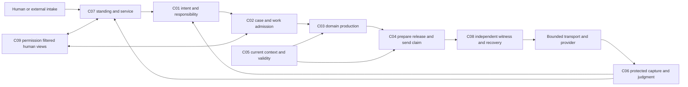
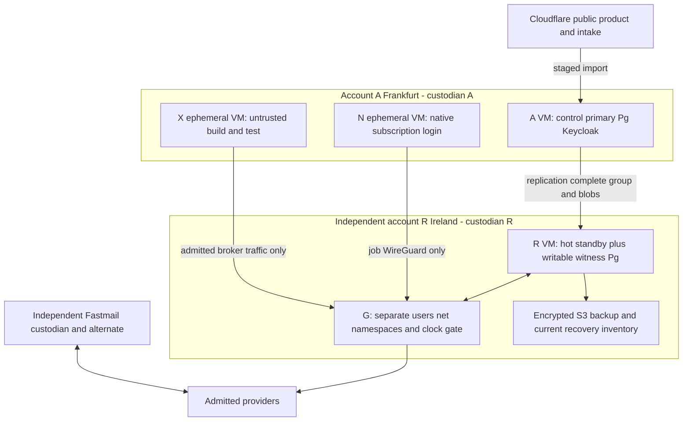
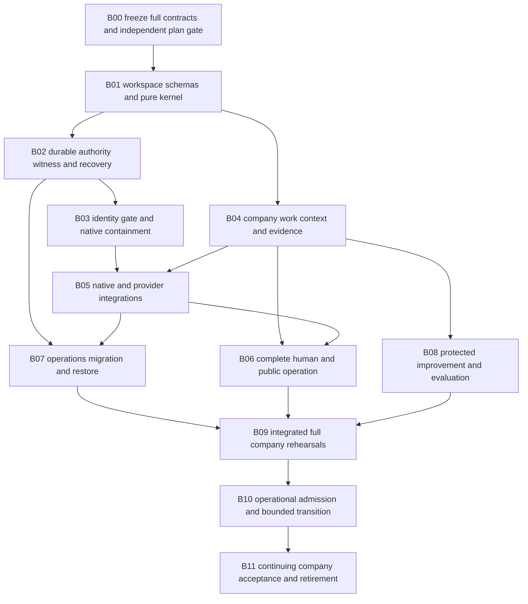

# Controlled improvement and complete construction — IB1.0

Status: intended implementation specification, not an implementation or acceptance result. Base e9201fad9ea24799684fb050ccceca6a0f554eed with the FIR canonical corrections at 86bb9ef consumed by reference. This author wrote 01/02 and this track and cannot independently accept them. No model, isolation, deployment or full-system tests were executed for this artifact. [G acceptance](../reviews/G-acceptance-protocol.md) remains the independent gate. The 39 S07 answers are in [the companion JSON](integrations-capacity-build.json), alongside the 74 S03 answers.

External-source claims explicitly inherit SC-POLICY-1 through [integration-claims.json](../../research/integration-claims.json), which records publication/version unknowns, source interests, qualified confidence, narrow corroboration, retrieval/capture limits and revalidation/invalidators; this metadata supplies no account admission or runtime proof.

## 1. Protected improvement contract

Any change to prompt, instruction, skill, workflow, routing, model profile, tool, connection, schema, context policy, memory rule, evaluator, acceptance predicate, agent template, UI meaning, operating policy, infrastructure or architecture is a versioned change to a defined subject. Work artifact revisions within an already admitted procedure remain ordinary work. Being beneficial, small, reversible or generated by an evaluator does not grant system-change authority.

ProtectedChange is the kernel canonical record. This document specifies its payload subtype IB-Proposal/v1 and supporting types, rather than creating a competing promotion state. Exact kernel states are proposed → reviewed → authorized → staged → activated → verified; any preactivation state may become rejected; activated/verified → rollback_required → rolled_back. reviewed requires completed independent assessment; authorized requires the exact current competent decision; staged means the exact manifest is prepared with no activation claim; activated requires native effect evidence; verified requires the declared monitoring/outcome predicates. Inconclusive/contested assessment cannot advance reviewed to authorized. Stop before activation rejects that candidate; stop after activation records rollback_required and reconciles consequences before rolled_back. A subordinate experiment cannot advance the parent state. IB-Proposal requires problem_statement; observed_failure_and_success_refs; baseline_subject_refs; exact_patch_and_manifest_ref; affected_components/contracts/skills/connections/duties/people; intended_benefit; plausible_harms; excluded_claims; authority_and_competence_refs; resource_reservations; predeclared evaluation_plan_ref; migration_plan_ref; rollout_plan_ref; monitoring_plan_ref; rollback_or_compensation_ref; cumulative_change_window; proposer_identity; and independence constraints. The proposer may be an agent, person, incident procedure or periodic review. Each field is typed or an exact ArtifactVersion/record reference; a prose assertion of 'safe' is not an evidence predicate.

Supporting persisted types use RecordEnvelope: ChangeEvaluationPlan/v1 (frozen subject/baseline, task population, selection/denominator, outcomes, critical regressions, sample design, stopping rule, evaluator identities/competence, test suite digests, data lineage, thresholds and resource cap); ChangeTrial/v1 (plan ref, candidate/baseline digest, assignment seed, attempts/captures, omissions, deviations and results refs); ReleaseManifest/v1 (source tree, artifact digests, schema/meaning versions, dependency lock/SBOM, installed profiles, migrations, configuration digests, compatibility interval and approver refs); RolloutPlan/v1 (cohorts, maximum exposure, entry/exit/stop conditions, due obligations and native descendants); ChangeWatch/v1 (release ref, monitored outcomes, observation intervals, missing-data policy, stop owner and next review); MigrationPlan/v1 (old/new representations and meanings, converter digest, pre/post predicates, scope/conflict changes, live readers/writers, data loss, rollback boundary and reconciliation). These are implementation-support records, not a declaration that the later 46-subject catalog is complete.

| Command under common /v1/commands | Preconditions and committed result |
|---|---|
| improvement.propose(problem_refs, subject_refs, proposal_artifact_ref) | Authenticated proposer and normal write scope; creates proposed ProtectedChange with no activation authority. |
| improvement.plan(change_ref, evaluation_plan_ref, migration_plan_ref, rollout_plan_ref) | Exact current candidate/baseline and affected obligations; independent plan owner freezes selection and thresholds before candidate outcomes are inspected. |
| improvement.trial.start(change_ref, plan_ref, reservations, admitted_trial_profile_ref) | Nonproduction or exact bounded production trial authority, current evidence and isolation; records trial identity and causal envelope before launch. |
| improvement.trial.record(trial_ref, capture_refs, deviations) | Protected capture path and complete planned denominator; missing attempts remain missing, never silently dropped. |
| improvement.assess(change_ref, trial_refs, predicate_ref, judgment) | Qualified independent assessor with access to full dependencies; uses canonical EvidenceJudgment accepted/rejected/inconclusive/contested. Producing the proposal does not confer assessor standing. |
| improvement.authorize(change_ref, exact_release_manifest_ref, decision_ref) | C04 consequence authority, current accepted predicates, actual competence/owner mandate and no conflicting protected change. Decision is not a grant substitute. |
| improvement.activate(change_ref, release_manifest_ref, rollout_step) | Exact reviewed bytes/configuration, witnessed release and provider-specific effect protocol; activation is recorded only after native version/readback evidence. Unknown deployment remains unknown. |
| improvement.stop(change_ref, reason, affected_scope) | Current standing or already delegated containment authority; freezes new exposure, preserves in-flight duties and evidence, invokes rollback/compensation plan. |
| improvement.close(change_ref, final_assessment_ref, descendant_and_duty_account) | Required observation window and independent assessment complete; residual harms, migrations, descendants, rejected alternatives and next review retained. Closure does not erase failure history. |

A dedicated protected registry defines which authority may change each subject. Identity/grant rules, C04 release and conflict rules, R membership/frontiers, clock/gateway controls, audit/capture and evaluator selection, incident/containment rules, founder constraints and improvement safeguards require explicit protected authority and a competent independent assessor. Ordinary improvement agents have no write access to those deployment/configuration roots. A candidate evaluator cannot select its own hidden tests, alter the gate, sign its acceptance or provision the signing key. If independent competence is unavailable, the protected change waits while legitimate operation and containment continue under current rules; the system does not invent a qualified proxy for the founder.

Automatic changes are limited to already approved deterministic adaptations with an exact bounded policy: retry timer within its declared envelope, lexical index rebuild from current authorized sources, queue reordering under the existing schedule, or parameter choice within an admitted workflow. Changes to the envelope, learning rule, evaluator, privacy scope or permitted action are new ProtectedChanges. A learning system's proposal and self-explanation are evidence inputs, not authority.

## 2. Improvement evidence, stochastic comparison and drift

Signals come from accepted and failed customer outcomes, due-service failures, grievances, incidents, source contradictions, rejected proposals, capacity/attention pressure, restore exercises and productive successes. Each signal has its population/denominator, source completeness and uncertainty. Incident priority follows actual consequence and due duties; a long list of easy improvements cannot displace a neglected service obligation. Weekly triage prepares bounded proposals; monthly outcome review asks whether accepted customer value, obligation discharge, truth preservation, rights effectiveness, owner competence/attention and all-in cost improved. Retain unresolved disagreements by dimension; no aggregate score can trade a safety/authority failure for more throughput.

Before a stochastic trial, freeze a task-stratified baseline, exact candidate, random assignment, common inputs and permitted context, resources, competent judges, critical failure predicates and outcome thresholds. Reuse historical tasks only where consent/access/lineage remain valid; hold out fresh tasks to detect benchmark memorization. Default noncritical comparison uses at least 30 matched task pairs across at least three relevant task classes and at least two independent runs per stochastic profile. This is a planning minimum, not a statistical guarantee; power depends on variance/effect size, so a predeclared interval or exact paired test and minimum worthwhile effect determine whether the evidence is sufficient. Report every run, timeout, refusal, invalid output, retry, cost and missing observation. Critical invariant tests require zero observed violations plus adversarial mechanism evidence, never a statistical permission to violate an invariant.

An improvement claim requires no disqualifying regression, the predeclared useful-effect threshold, acceptable uncertainty and complete relevant evidence. Inconclusive remains inconclusive; extending sample size needs a declared sequential rule or a new trial, not optional stopping until significance. Model upgrades and fallback providers are evaluated on the actual work predicate, not model-name equivalence. Evaluate repairable errors, severe failures, useful completion, human correction minutes, elapsed time, cash/capacity, disclosure and accessibility separately. Independent blind assessment where feasible conceals candidate identity but preserves necessary context/competence; assessors disclose conflicts and cannot rely solely on a colluding model panel.

Staged rollout uses: offline replay and deterministic contracts → isolated full company scenario rehearsal → shadow production reads with explicit disclosure and no outward effects → a bounded reversible real cohort under existing standing → expanded admitted cohorts → normal operation. Default real cohort is at most one venture, five live cases and one working day, and excludes irreversible/cross-company authority changes. The rollout plan may require longer due to the task's outcome horizon. Expansion requires independent current assessment, complete capture and reserved rollback/service capacity. High-consequence changes may skip real exposure entirely and require a full protected cutover with human oversight. Shadow work can itself disclose data or consume money; it needs its own authority/reservations.

Monitor protocol failures at event time, stale capture/witness/network/identity within 60 s, and relevant business/quality outcomes daily and at their real due dates. These are intended detection targets to measure, not guaranteed latency. Missing telemetry blocks expansion and triggers a visibility incident. Stop immediately on a critical invariant violation, unexpected principal/destination/charge mode, evidence integrity failure or unaccounted effect. Other regressions use predeclared thresholds, not a posteriori explanations. Old and candidate policy cannot both issue authority for the same conflict scope. Cumulative drift review compares the current release with the last independently endorsed strategic baseline after every five accepted changes or 30 days, whichever comes first; changes cannot evade review by splitting one change into small revisions. Track interaction effects across simultaneous changes and retain a single protected-change serialization boundary for overlapping scopes.

Rollback restores an old code/configuration version only if current schema/meaning and live obligations permit it. It never restores expired grants, old recovery membership, revoked identities, deleted knowledge, stale context, consumed budgets or old native sessions. Completed disclosures, sends, payments, physical acts and schema data loss need compensation/reconciliation and communication; a git revert cannot undo them. Record stopped release, partial effects and replacement duty ownership. For a data/meaning migration, use expand-read compatibility, shadow conversion, compare predicates, stop/fence incompatible writers, witnessed activation and then retire old readers. Conflict/participant/alias changes additionally execute T-R1's union freeze and forward migration; no rollback may revive an old claim or omit an unknown hold. Backup restore follows current R frontier and deletion scope, not the release's historical snapshot.

The whole approach is falsified for an admitted operating scope if qualified comparison cannot show useful full-company progress within actual founder money/attention limits; critical enforcement repeatedly fails; independent competence/continuity cannot be maintained; or operational complexity makes due service systematically worse than a matched simpler design. The response is a recorded architectural choice/replacement, not redefinition of success or endless improvement experiments.

## 3. Repository and process implementation target

Use a new system/ npm workspace and Node 24.21.0, TypeScript, JSON Schema 2020-12/Ajv8 and PostgreSQL 18.6 selected by 01/02. Hono4 with its supported Node adapter provides typed HTTP routing; React19 with Vite builds the operator application and reusable accessible product views. The existing Mission Control React/Hono/Vite skills are reusable; Bun is not introduced into the new authority runtime. Use Node's built-in test runner for deterministic contracts, Playwright for browser accessibility/interaction checks, and a separate seeded protocol simulator plus real Linux/Pg integration harness. Version-lock concrete dependencies and artifacts at construction; dependency updates are ProtectedChanges, not floating production installs. [Hono Node adapter](https://hono.dev/docs/getting-started/nodejs), [Vite guide](https://vite.dev/guide/), [React reference](https://react.dev/reference/react).

| Intended path | Responsibility and interface; prohibited responsibility |
|---|---|
| system/packages/contracts | Canonical RecordEnvelope/Ref, commands, events, signed response/value distinctions, schemas and generated clients; no runtime authority or implicit alias coercion. |
| system/packages/kernel | SERIALIZABLE commands, version/conflict checks, immutable GroupBody/BusinessResult, SQL inbox/outbox/timers, D1 staging/import and query watermarks; no external I/O inside transactions. |
| system/packages/authority | Identity/standing/grant attenuation, reservations, preparation/release/send claims, conflict/participant migration and protected policy; no model-based final grant. |
| system/packages/company | Domain direction in direction/, CAP procedures and native duties/finance/customer/people/governance; no competing effect or evidence acceptance semantics. |
| system/packages/work | Scope links, workflow cursors, scheduling, agent selection, delegation/messages, workspace leases and skills; no acceptance from a workflow cursor. |
| system/packages/context | Source/knowledge/indexes, manifest loading, lexical retrieval, freshness, validity closure and forgetting; no self-certifying truth. |
| system/packages/evidence | Protected captures, dependency closure, judgments/evaluation plans, accounts and independent assessor interface; no producer-owned proof of its own effect. |
| system/packages/runtime | Native launcher, X executor, job lifecycle, continuation and output framing; no production credentials in X or hidden paid fallback. |
| system/packages/integrations | IC adapter registry, account/billing observations, parameter schemas, parsers, provider reconciliation and removal; no provider response promoted directly to acceptance. |
| system/packages/improvement | Proposal/trial/release/migration/watch contracts and protected change orchestration; no self-authorizing evaluator. |
| system/apps/control | A HTTP command/query/authenticated operator backend, SQL workers and scheduler. Caddy2 terminates public TLS under its [documented certificate lifecycle](https://caddyserver.com/docs/automatic-https); backend has narrow DB roles and no R signing key. |
| system/apps/witness | R independent complete-group/blob/key validation, writable receipt/frontier ledger and signing/status interface; no invention of missing authoritative history. |
| system/apps/gateway | G nftables 1.1.3 compiler/readback, trusted clock attestation, per-attempt/net-native tunnel and protected capture; no ordinary application permission to alter net/time roots. |
| system/apps/worker | Separate N launcher and X executor service modes with distinct VM identity and packages; no mixed credential-bearing arbitrary shell process. |
| system/apps/operator | Permission-filtered React views and exact command submission for 04's human flows; no offline approval, optimistic effect completion or cached-authority execution. |
| system/apps/public | Bounded static assets/Worker/D1 public form and customer product templates, independent grievance information and product data export; no company core credentials. |
| system/infra | OpenTofu resources/state policy; reviewed cloud-init/Ansible systemd/users/firewall/volume/clock profiles; secrets references only. Separate A/R ownership and state roots. |
| system/tests, system/evals, system/fixtures | Unit/property/protocol/integration/provider/UI/whole-company fixtures, independent expected outcomes and denominator; no candidate-writable hidden evaluator root. |
| system/ops | Versioned runbooks, migration/backup/restore/credential/account deletion, inventory, release and observation exports; no claim that a runbook has already been exercised. |

OpenTofu plus Ansible/systemd is selected over Kubernetes/containers as the final small deployment: four VM placements, explicit Linux permissions and no cluster/control-plane/scheduler daemon needed to implement SQL scheduling. State contains sensitive infrastructure metadata and may contain secrets despite intent; encrypt it, scope it to its actual account custodian, and never give a model its storage credentials. Plans are reviewed exact artifacts and applies are protected external actions. Pin provider plugins and lockfile; no IaC auto-apply in a native session. Separate state custody cannot repair shared root/MFA/billing recovery. [OpenTofu](https://opentofu.org/docs/intro/), [state sensitivity](https://opentofu.org/docs/language/state/sensitive-data/), [systemd resource controls](https://www.freedesktop.org/software/systemd/man/latest/systemd.resource-control.html).

Infrastructure images use Ubuntu24.04/Linux6.8, Pg18.6, Node24.21.0, nftables1.1.3, chrony4.6, Keycloak26.7.3 and step-ca selected by 02. Pin image/build digests and package repositories; a current available patch release must pass its protected update before changing those versions. Hono/React/Vite/Ansible/OpenTofu exact patch pins are build-manifest outputs because behavior does not depend on an unexamined hypothetical version; the admission tests still apply to exact installed artifacts. No undocumented managed service substitutes for R's durable witness.

### Logical flow

The diagram shows logical responsibilities; C08 proof is externally joined to immutable committed business payload, never embedded in its own future hash. Successful native work still passes C06 and the domain acceptance predicate. C07 does not become a second grant issuer.

### Trust and fault placement

R/G share a host/admin/load fault, and all AWS resources share provider-level failure. Native account ownership and public/continuity accounts have their own roots. Cloudflare/Fastmail are independent of A software but their actual billing/DNS/recovery custody must be examined. This is a declared containment design, not proof of host/admin independence.

## 4. Storage, identity, observability and operations

Pg roles separate command writer, query projection, replication, capture ingress and witness ledger. Pg migrations and configuration are protected artifacts; no ordinary application can SET LOCAL a weaker replication promise and still return witnessed success. The exact independent R receipt is required even after a locally committed interrupted sync wait. Blob copies have content hashes, access/deletion scope and key availability before witnessing. Outbox/inbox dedup state and timers are authoritative, while NOTIFY is only a wakeup hint. Projection watermarks carry committed_position/source_watermarks/generated_at/omissions and never imply a future receipt was part of its own GroupBody.

Use Keycloak OIDC PKCE/WebAuthn for humans and step-ca short-lived mTLS with live identity epochs for services as in 02. Store provider/native credentials only on their designated protected boundary; use systemd credential files or equally scoped root-owned files mounted into the exact service, never in source, shell history, logs, model input or test fixtures. R signing and per-scope encryption keys have separate backup/recovery/deletion inventory; software key custody is an explicit trusted root. Key rotation overlaps only the declared validity window, drains old workload identities and records native revocation. Backup encryption without retained authorized keys is not a recoverable backup; retained keys after a deletion obligation are not completed deletion.

Observability uses structured bounded JSON events, OpenTelemetry trace IDs and Prometheus metrics on R, with journald size/retention caps and encrypted capture artifacts. Metrics report command/witness latency, exact unconfirmed group age, native job/cgroup/gate status, unknown effects, cursor gaps, invalidation backlog, due duties and breaches, human response/attention, evaluator omissions, restore age, credential/renewal expiry and cost inventory. No prompt/raw customer content in metrics labels or traces. R witness/capture disk has reserved space separate from low-value logs; discarding telemetry never permits evidence-required release. Alerts go to authenticated operator views and the standing custodian channel under a preauthorized content form. Actual on-call response remains a measured human service, not a dashboard property. [OpenTelemetry Node](https://opentelemetry.io/docs/languages/js/getting-started/nodejs/), [Prometheus practices](https://prometheus.io/docs/practices/naming/).

Daily base backup and continuous WAL to R-controlled S3 use PostgreSQL native backup/WAL tooling with explicit file manifests and encrypted key inventory; nightly verify checksums/completeness, weekly restore a complete dataset on a disposable trusted R-boundary VM, never on untrusted X, quarterly rehearse actual custodian absence and primary loss. Record RPO/RTO as measured results; no numerical production promise before the exercise and workload qualification. Recovery restores authoritative groups and current R frontiers, revocation/expiry/conflicts/unknown holds/potential duties/deletion scopes and access descendants before any release. Historical signed frontier responses are stored as Observation artifacts for audit; activation demands the fresh signed response protocol. Schema migration and provider imports cannot overwrite the current recovery membership. Provider/account removal checks remote resources, subscriptions, D1 exports, native sessions, DNS and keys, not just local code deletion.

Each release builds deterministic artifacts in X from a standalone pinned source checkout, records dependency lock/SBOM/source digest and test evidence, then sends a reviewed immutable release bundle to the protected deployer. Production hosts never git pull unreviewed source or run project install hooks with production credentials. Preview/dry-run and real activation are distinct operations; missing native readback means unknown activation. Rollback is a new authorized release with current restrictions. No unsupervised model edits to deployment policies, test selection, hidden expectation store or approval keys.

## 5. Reuse and migration from the current repository

Read-only inspection found useful patterns, not an accepted foundation:

| Existing path inspected | Reuse decision and required change |
|---|---|
| mission-control/package.json and server/routes/guard.ts | Reuse React/Hono/Vite familiarity, same-origin defensive checks and user-facing unknown-value handling. Production identity/CSRF/authorization and exact command revalidation remain new contracts; loopback assumptions do not transfer. |
| scripts/lib/events.js | Keep as historical telemetry only. appendFileSync failures can return null; this best-effort JSONL is not a durable authority/effect ledger or protected capture. |
| scripts/lib/usage.js | Reuse parsing techniques with explicit source/coverage/unknown fields. Transcript estimates cannot establish native remaining allowance, invoice or spend authorization. |
| scripts/lib/check-suite.js | Reuse all-check collection and failure reporting pattern. Test wiring is not proof of assertion quality; add independent expectations, mutation tests and whole-process/child deadlines. |
| scripts/run-gate.mjs | Reuse immutable subject hashes and separation of classifier/dispatcher facts from verdict. New protected gate authority must live outside candidate control; existing hook presence does not establish isolation. |
| mission-control/README.md and local index/transcript paths | Preserve useful local views where permission permits. Native transcripts are untrusted source evidence, not company state; cached last-model/cost or successful shell logs do not imply completed work. |

The parent's 2026-09-12 baseline diagnosis reports an existing corpus comparison mismatch: full metadata scan 2,820 versus selected project corpus 2,814, six unselected, no duplicates/outside entries. This is a reported baseline observation, not a test run by this author. Before reuse, define whether unselected transcripts belong in each denominator and add a controlled regression fixture; do not hardcode either observed count or call the discrepancy a resolved product defect. The parent also reports a crosscheck child process without an explicit timeout before its later collector timeout. Construction must bound each child plus the whole suite and classify a timeout as missing evidence, not success or a proven cause. Baseline failures remain visible until their exact contract and regression are resolved.

Migration imports only explicit company-relevant records under current source/access/retention rules. Existing transcripts, ledger claims and old agent definitions start as sourced Observations/proposals; they do not become endorsed intent, mandates, accepted evidence or grants. Export a baseline inventory and content hashes before mapping, preserve source meaning and omissions, assign real owners, reconcile obligations and revalidate current authority. Run old read-only views alongside new projections with no competing write authority. Cut over each scoped owner/command path once, with a fence and witnessed migration; retire old writers/hooks/credentials after dependent duties and provenance exports are accounted. Never accumulate an unused old system as an implicit second source of authority.

## 6. Local construction profile

The parent's direct local observation is 16 GiB RAM, ten CPU cores and approximately 45 GiB available workspace storage at 89% used on 2026-09-12. These are volatile construction facts. Docker, Podman, Lima and bwrap were absent from PATH in the earlier environment audit; this document does not claim they are installed. No purchase or installation occurs in this authoring task.

LOCAL-CONSTRUCT-1 uses native Node deterministic tests first, at most four test processes and 4 GiB total test memory; one Pg integration fixture at a time with two small data directories and a separate witness directory, total ≤4 GiB RAM and ≤6 GiB database storage. Linux-only gate/namespace tests require a deliberately installed and admitted Linux VM or remote test host later; reserve ≤6 GiB guest RAM, ≤20 GiB sparse maximum disk and four vCPU, one VM at a time. Never run native N/X integration alongside that VM if total working memory would exceed 10 GiB. All system construction artifacts/caches/test databases/VM images combined cap at 25 GiB; retain at least 15 GiB free and stop/clean only disposable declared artifacts before crossing it. Capture tests use synthetic nonsecret fixtures ≤1 GiB; keep required failure evidence exported before cleanup. Recheck available space/memory before each heavy stage.

A local two-process/Pg/VM experiment tests state transitions and selected crash cases; it cannot prove independent host, region, administrator, billing, clock or recovery custody. Native subscription integration is separately authorized later and cannot be smuggled into a deterministic test run. Current-machine limits sequence construction; they do not narrow company lifecycle requirements or become the operational fault model.

## 7. Complete dependency-ordered construction graph

Every stage is a portion of the final system, not an MVP, disposable scaffold or declaration of whole-system completion. The earliest discriminator tests the hardest useful contract before expensive integration; it does not redefine the deliverable. Completion of all stages, independent G plan review and operational/company admission are distinct gates.

| Stage / dependencies | Final components/contracts and concrete work | Meaningful verification and completion evidence | Risk and full-system relationship |
|---|---|---|---|
| B00 / none | Consolidate all 566 question answers, 46 subjects and full component matrix; reconcile 01–08, actual adapter routes, operational prerequisites and independent G review before runtime work. | Schema/reference/state/meaning consistency, independent adversarial and successful lifecycle review, preserved dissent and unresolved operating inputs. Complete only with a reviewable accepted plan scope. | A rich document can still hide missing fulfillment. This stage prevents premature code from choosing authority accidentally. |
| B01 / B00 | system workspace, schemas/clients, canonical identities, pure command reducers, SERIALIZABLE storage, D0/D1/D2 distinctions, immutable group hashing, query/proof values and SQL outbox. C01/C02/C04/C05/C06 foundations. | Property/model tests for revisions, duplicate commands, crossed updates, alias bindings, hash/proof acyclicity, imported stale staging and failed commit; useful draft→witnessed command fixture. | Earliest small discriminator includes successful ordinary work plus lost-ack/status behavior, not only refusal. No production state accepted yet. |
| B02 / B01 | Real Pg primary/hot standby plus R writable receipt ledger, complete blobs/keys, release/send claim, revocation/conflict migration, backup/WAL/restore/frontier membership. C04/C08. | Crash at every local/witness/sign/ack boundary, sync-wait cancellation, empty standby/config bypass, incomplete blobs, primary loss, restored old frontiers, unknown effects, missing custodians. Successful release proceeds after exact witness. | Local tests show protocol behavior only; operational independent roots remain B10 evidence. |
| B03 / B02 | Keycloak/step-ca, service epochs, trusted parameter/disclosure gates, G nftables/time/readback and N/X isolation. C04/C05/C08 runtime. | Actual Linux controlled sk_buff-hook tests with partial requests, established sockets, GSO, clock boot/TZ/epoch-seconds compiler, tunnel escape, credentials/env/IPC and revocation races; successful bounded transport under valid time. | No unsupported promise of physical delivery or provider acceptance deadline; clock/admin roots and native channel inventory must be tested. |
| B04 / B01 | All company CAP procedures and responsibility/competence, work/workflow/delegation/skills, context/knowledge/forgetting, protected capture/dependencies and qualified judgments. C01/C02/C03/C05/C06/C07. | Complete company fixtures from intent and research to offer, pre-sale capacity, delivery/support/finance/governance/people/incident/closure; stale lineage and transitive evaluator corruption; successful expert/human routes. | No generic Case closure substitutes for native domain performance. All 46 capabilities remain connected. |
| B05 / B03+B04 | IC native/search/mail/public/payment/books/human adapters, account/billing/capacity and provider migration/removal. C03/C04/C05/C06/C08. | IC-T01…12, contract mocks then separately authorized real-account benign tests, quota/credit refusal and useful completion; actual native startup/config inventory. | Provider mocks cannot establish current terms, account eligibility, delivery or all-channel isolation. No model calls before authorization. |
| B06 / B04+B05 | Full 04 human flows, permission-filtered UI, independent grievance/continuity, public form/product and service ownership. C07/C09 with company procedures. | Keyboard/screen-reader/task tests, concrete owner decisions with evidence/uncertainty, limited competence, absent founder, outsider complaint and actual alternate acknowledgement; no optimistic acceptance. | User understanding/representation/effective response are separately judged, including recurring attention cost. |
| B07 / B02+B05 | IaC/systemd topology, secrets/keys, inventory/cost, observability, release/migration, backup/deletion/restore and actual provider descendants. C04/C08 and all providers. | Disposable deployment, exact config readback, complete restore/rotation, leaked-key containment, stuck paid resources, lost account/MFA/billing recovery and R/G load. Record measured RPO/RTO and labor. | Purchasing infrastructure alone cannot establish independent actual custodians or affordable useful operation. |
| B08 / B04 | ProtectedChange/trial/evaluator/rollout/watch/migration, stochastic baseline and cumulative drift. C06/C04/C01. | Candidate alters gate/denominator/evaluator tests; successful useful improvement with independent assessment; rollback with irreversible effects and changed meanings. | Never self-accept the builder's system change or overfit the same benchmark population. |
| B09 / B06+B07+B08 | Full integrated company simulator/rehearsals with matched S0 comparison, admitted account fixtures and representative workloads. All C01…C09. | G dimensions, all source cases/attacks, honest missing/unknown results, actual capacity/attention, lawful competent native routes and cross-mechanism failures; independent assessor outcomes. | Complete isolated scenario success is necessary but not operational/company success. No aggregate score. |
| B10 / B09 | Actual operational principals/accounts/caps/mandates/professionals, independent A/R custody, native billing attestation, domain/terms and scoped transition. | Independent admission checks exact deployment, clock/root/time boundaries, provider effect/recovery/continuity and measured costs; owner approves concrete deployment if not already authorized. | Actual unavailable prerequisites block operating promises, not silently narrow the plan. Planned procurement is not permission to spend now. |
| B11 / B10 | Continuing delivery, settlement, grievances, obligation accounting, improvement watch and old-system retirement. All company lifecycle and removal. | At least one complete due-date/outcome cycle for each live offer and its support/refund/finance route; independent customer/evidence/rights review, actual budgets, surviving descendants resolved. | 'Start using' begins only inside admitted scope; complete system capability construction is not proven commercial success. Failure may select S0 or a replacement. |

Parallel construction may proceed only where frozen interfaces and isolation permit; B04 can develop against B01 contracts while B02/B03 infrastructure is built, but no domain code bypasses an unavailable witness to demonstrate progress. B05/B06 integrate actual evidence paths before B09. The whole build remains incomplete until every stage's relevant contract, integration and independent evidence obligation is satisfied.

## 8. Baseline comparison, transition and remaining obligations

Before change, record native and manual baseline performance on the same task population: actual accepted value, open duties, truth/errors, owner/expert attention, inaccessible or unanswered interactions, total cash/capacity and time. Compare S1 against a credible simpler S0 using equivalent authority/rights/recovery outcomes and explicitly declared trusted humans/mechanisms, not identical component count. Price observed services separately from estimated sizing and unknown professional labor. Randomize or match task difficulty, include ordinary successes and difficult failures, and retain cost of all retries/refusals/reviews. A system that only refuses safely or creates beautiful records has not passed useful operation.

Shadow transition lasts at least two complete operating weeks and one complete relevant obligation/settlement cycle, whichever is longer, within an explicit resource cap. This is a default evaluation window, not an automatic acceptance rule; sufficient sample and real outcome horizon may require longer. Old and new systems may read the same sources with authorization but exactly one has write/release responsibility for a business scope. Cutover records current duties, native objects, source cursors, actor standing, conflicts and unknown effects, fences the old issuer, imports and validates, then activates the new one with current evidence. Any gap keeps the duty assigned to its previous accountable owner or a genuinely accepted alternate.

Stop building discretionary additions when all final contract/stage evidence is complete and the admitted operation has no uncovered material requirement; begin use only after B10, then judge real outcomes at B11. Stop or replace the architecture when the falsifiers in §2 hold. Retire obsolete agents, prompts, providers, policies, hooks, schemas and accounts through dependency-aware removal with portable records and no revived authority. Do not accumulate redundant systems because deletion is inconvenient.

Outstanding consolidation: the canonical 46-subject schema/relationship catalog, all remaining question answers and independent complete-plan review. Outstanding empirical/operating evidence: every runtime/provider/isolation test, local tooling installation, real account eligibility and billing, actual custodian/professional acceptance, priced deployment approval, workload/attention measurements, operational recovery and customer outcomes. These are named obligations with stage owners and tests, not assertions of successful implementation. This authoring task completes neither G acceptance nor operational admission.

> **Superseded 2026-09-13.** The consolidation sentence above opened *"Outstanding consolidation: the full nine-component 19-attribute contracts, canonical 46-subject schema/relationship catalog, all remaining question answers and independent complete-plan review."* **The nine-component 19-attribute contracts are no longer outstanding.** [components-authority.json](components-authority.json) holds all **171** entries — 9 components × 19 attributes, none empty — plus the 69 individual S05 answers, and [10-components-authority-traceability.md](10-components-authority-traceability.md) records them. Re-derived at the frozen tree on 2026-09-13: 171 entries, 0 empty, 0 shorter than 60 characters. This section was authored at base `e9201fa`, before `10`'s base `c3519f5`, so the claim was true when written and is false now; a reader who followed it would redo finished work. The other three items are unchanged and still owed — `consolidation_limits` in the same JSON states that what it supplies is the matrix *"not the later full schema/predicate catalog"*.
