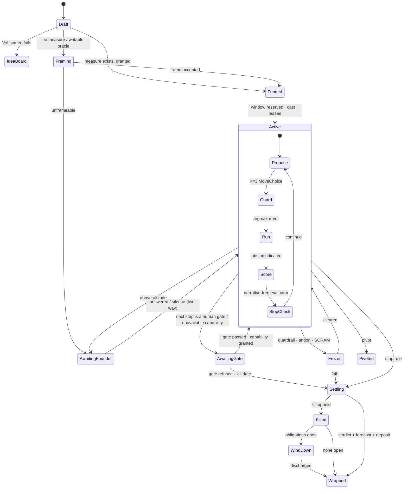
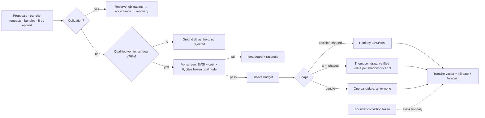

# 03 — The Mission Engine

*v3, Round 5, 2026-09-30. Obeys [00-CANON](00-CANON.md); owns CANON §8 row 03. Every number is a **parameter**, **target**,
**illustration** or **measurement (source)** and says which. Nothing here is a claim about a real company.*

## 0. The engine at a glance

Most real work has no playbook: "should I start a legal-ops agency?", churn rising at 02:10, a regulation taking effect.
The mission engine turns an unspecified goal into **research → hypotheses → options → plan → execution → evaluation →
learning**, with self-challenge and explicit stop conditions, **without a script**.

1. **A mission is a record, not a procedure** — question, measure, stop/pivot/kill rules, tranche, evidence position,
   forecast; never steps [S01 §2.1].
2. **No measure, no money** — a mission whose success its own workers could edit first runs a **Framing Contract**.
3. **Two loops** — an outer **lifecycle** with **faceted** states (DR-28), and an inner **cycle**: a fresh-context
   planner proposes **K = 3** moves (parameter), the engine picks by marginal value of information under deterministic
   **guards**, runs, scores narrative-free, stop-checks.
4. **The Allocator layers two methods** — VoI ranks decision-shaped work; Thompson sampling sizes arm-shaped work.
5. **Two lanes, six sleeves plus Core** — Obligations first; Investment split into **Probe, Replication, Strategy Cells,
   Option Pool, Long-Horizon, Improvement**, each a reinforcing loop that cannot be funded without a named balancer (pairing
   rule), with **Core** as the residual allocation beside them [C10].
6. **Evidence rungs × door type** set the rung to commit, the challenge and the founder's contact class; shortfalls
   become **evidence debt**. Self-challenge votes on facts and only *generates* objections elsewhere.
7. **Every mission forecasts itself**; settlement scores it. **Patterns are learned, never gates** (DR-05).
8. **Every mission can stop by itself** — on success, kill, budget, or **`awaiting_gate`** when its next step needs a human
   gate or a capability no worker has; a diminishing-returns stop forces a decision (DR-73, §4.5, §10).

### 0.1 Which authority owns which part

The engine is Userland code ([09a](09a-ENGINEERING.md)) plus records; each power belongs to one authority ([CANON §2](00-CANON.md#2-the-authority-stack)).

| Part | Authority | Store (DR-07) | May never |
|---|---|---|---|
| Propose missions, Closer Claims, bundles | **Intent** (Venture Mind, Co-founder seat) | Venture Mind files | Fund; settle its own claim |
| VoI screen, Thompson draws, tranches, lanes, sleeves | **Allocation** | Budget Ledger; tranche and sleeve records | Launch; accept |
| Lifecycle, cycle, moves, team, leases | **Execution** (Mission Lead) | Journal `mission.*` → mission projection; blackboard | Accept its own work |
| Frame acceptance, settlement, forecast scoring, coverage audits | **Acceptance** (Referee, per coverage contract) | Calibration and Progress Ledgers; verdicts | Produce what it judges |
| Priors, nulls, recipes, Wrap Deposits | **Record** | Priors Library, Null Registry, Backlot | Declassify by citation |
| WIP bound, exploration temperature, pairing lint | **Regulation** | Limits Book; Loop Registry | Fund (proposes only, DR-04) |
| Effects a move proposes | **Custody**, via the Decision Contract | Receipts | Decide what to do |

### 0.2 Glossary box — terms new in this file (each refines a CANON §5 entry)

| Term | Definition | Refines |
|---|---|---|
| **MoveChoice** | Planner output: K candidates with targets, rung gain, chance of changing the decision, cost vector, rationale, surprise flag | Cycle |
| **mVoI** | `p_changes_decision × stake − Σ cost × shadow price` for one move | Cycle, Allocator |
| **Guard** | Deterministic cycle rule the planner cannot override; typed consequence/invariant, never method | Self-challenge |
| **Progress evaluator** | Narrative-free scorer: closer · same · further · unknown; advisory only | Cycle |
| **Coverage figure** | Fraction of the claim's population the evidence observed; caps the rung | Evidence ladder |
| **Question half-life** | VoI decay as a decision deadline nears; too-late questions close | Allocator |
| **Mission genome** | Move-sequence fingerprint; its entropy is the diversity meter | Pattern miner |
| **Sleeve balancer** | The balancing loop + live sensor a sleeve needs before funding | Sleeves, Pairing rule |

## 1. The mission record

**Where it lives.** The Journal is canonical for `mission.*` events; the record is a **projection** materialised as
`missions/M-0412.yml` in the venture repo with its source offset (DR-07). A Bet's preregistration hash is journalled, so the
projection can be rebuilt but the preregistration cannot be edited. **Who creates missions:** the Venture Mind, the
initiative loop ([05](05-AUTONOMY-INITIATIVE-FOUNDER.md)), the founder (board drag or terminal, [08](08-SURFACES.md)), a
parent mission, a fired option (§12.5), or the Obligations lane. Creation is free; funding is where it meets the Allocator.

```ts
type DoorType = 'two-way' | 'costly-reversible' | 'one-way';
type Rung = 'E0' | 'E1' | 'E2' | 'E3' | 'E4' | 'E5';
type Lane = 'obligation' | 'investment';
type Sleeve = 'core' | 'probe' | 'replication' | 'strategy-cell' | 'option' | 'long-horizon' | 'improvement';

interface Mission {
  id: Id; venture_id: Id; parent_id?: Id; pivoted_from?: Id; bundle_id?: Id;
  root_purpose: Ref;                           // every descendant charged to a root (R3-red D04)
  lane: Lane; sleeve?: Sleeve;
  goal_ref: { node: Ref; goal_version: string; metric_version: string };  // FROZEN at admission (DR-33)
  question: string;                            // one sentence, decision-shaped
  decision_it_changes?: string;                // empty → VoI = 0 → idea board
  measure: MeasureSpec | { framing_contract: Id };
  success: Criterion[]; kill: Criterion[];
  guardrails: Criterion[];                     // ≥1 independent customer + ≥1 harm guardrail
  door: DoorType; blast_radius: 'mission' | 'venture' | 'portfolio' | 'public';
  evidence: { current: Rung; required: Rung; coverage: number; debt: EvidenceDebt[] };
  forecast: Forecast; closer_claim?: Ref;      // §7; Closer Claims owned by 05
  tranche: { cash_usd: number; capacity: number; founder_min: number;   // capacity: measured subscription units (DR-61)
             verifier_window: WindowRef; wall_clock_h: number; kill_date: string; surprise_reserve_pct: number };
  coverage_contract: Ref;                      // reserved BEFORE launch (DR-11, DR-15)
  shape?: 'solo' | 'lead+workers' | 'swarm' | 'audition';  // Execution chooses (04)
  tool_lease?: Ref; context_profile?: string;
  novelty: 'routine' | 'adjacent' | 'novel' | 'declared-novel';
  facets: Facets; state: MissionState; cycle_n: number;
  blackboard: Ref; registered_hash?: string; stop_rules: StopRule[];
  cited: { standing_orders: Ref[]; recipes: Ref[]; backlot: Ref[]; priors: Ref[] };  // Use Ledger (06)
}
```

Three fields carry weight. **`decision_it_changes`**: no decision changed, no value of information — the mission waits on
the idea board with its rationale. **`goal_version`**: frozen at admission; a later goal-tree amendment does not move the
target, and the amendment must show its abandoned outcomes — the first half of the answer to the red team's rank-3
failure [R3-red D01]. **`coverage_contract`**: Acceptance's requirements are reserved before any worker launches; output
Acceptance cannot absorb is not admitted (70% utilisation ceiling, parameter, DR-15).

## 2. Lifecycle and facets

Every transition is a Journal event. **Who moves each state:** Draft → Allocation (VoI screen) · Framing → Acceptance
(accepts the frame) · Funded → Allocation, then Execution casts · Active → Execution · AwaitingFounder → founder via the
Exchange (05) · AwaitingGate → Execution stops and emits the gate request; the gate's owner (a named human gate, or
Allocation granting the missing capability) releases it (DR-73) · Frozen → Regulation freezes, the owner clears · Settling and Killed → Acceptance · Pivoted → Intent proposes,
Allocation funds the child · WindDown → Obligations lane · Wrapped → Record accepts the deposit.



**Facets — "done" is five facts.** A delivered mission must not stay Active because its lesson or an acknowledgment is
pending [R3-red T08]:

```ts
interface Facets {
  delivery: 'not-started' | 'in-progress' | 'delivered' | 'abandoned';
  acceptance: 'pending' | 'PASS' | 'FAIL' | 'overruled' | 'adjudicating';  // only a parsed verdict writes PASS (DR-13)
  settlement: 'open' | 'provisional-E3' | 'settled' | 'unsettleable';
  learning: 'owed' | 'deposited' | 'minimal-checkpoint' | 'residual';
  obligation: 'none' | 'open' | 'transferred' | 'discharged';
}
```

An open facet at Wrapped becomes a **funded residual** — owner, deadline, budget, **no leases**, blocking **no
admissions**. A dying worker leaves a minimal checkpoint so someone else completes the Wrap Deposit ([06](06-MEMORY.md)).
Obligations transfer to the Obligations lane, never vanish. *Test:* 50 synthetic missions with random deposit failures leave
none Active with delivery `delivered` past the deposit deadline (48 h, parameter), and no ownerless obligation.

## 3. Framing Contracts — no measure, no money

~41.8% of multi-agent failures are specification failures (MAST via R0-A, [S01 §2.2]). **Trigger:** measure missing;
oracle writable by the team; narrative criterion ("understand the field"); or no metric at the frozen goal version.

```yaml
framing_contract:
  for_mission: M-0412
  deliverables:
    oracle: {kind: metric|exam|panel|pairwise|forecast|artifact-test, source: "who checks", writable_by_team: false}
    candidates: 3 outcome statements, each with success, kill, and the decision it changes
    cheapest_test: lowest rung that could move the decision, with its cost vector
    unmeasurable: what stays a judgment call (→ founder taste or a forecast bet)
    guardrails: ≥1 customer-outcome + ≥1 harm guardrail, measured independently of success   # R3-red D01
    capability_map: each success/kill clause → an available worker capability or a named human gate   # DR-73, §4.5
    veto_questions: legal / regulatory / safety questions the mission must resolve before stop_success   # DR-73
  budget: {share: 5–8% of the parent's expected tranche (parameter), wall_clock_h: 4}
  accept_by: Referee per coverage contract (never the framing lineage); founder only if door ≠ two-way
```

Oracles for work with no metric: **exam** (the other family writes a held-out test), **panel** (k judges on a rubric,
compared within one generating model, DR-12), **pairwise** (founder 2-minute comparisons → Elo; **Circle** class),
**forecast** (score later), **artifact-test**, **metric** (read via Acceptance's observation broker). **Skip rule:** a
two-way mission under $25 (parameter) with an obvious artifact-test skips framing (DR-10). **Unframeable** → a **Decide**
packet labelled "judgment call"; no answer in 72 h parks it on the idea board. It **never** runs on an agent-invented measure.

## 4. The cycle — how a mission chooses its own next move

### 4.1 Moves — a vocabulary, not a sequence

| Family | Example moves | Family | Example moves |
|---|---|---|---|
| **Understand** | restate, bound, prior work, unknowns | **Plan** | jobs with done-tests, footprints, DAG |
| **Research** | sweep, deep-dive, source-verify (DR-19) | **Execute** | build, write, design, deploy preview, experiment |
| **Imagine** | N blind options, analogy, inversion | **Evaluate** | done-test, metric read, progress score |
| **Challenge** | vote, red team, pre-mortem, audit, steelman | **Learn** | lesson, skill candidate, record update |
| **Decide** | score vs criteria, VoI, DecisionPacket | **Control** | wait, ask, pause, pivot, stop |

Team shape per move is Execution's choice ([04](04-AGENT-ORGANISATION.md)).

The engine never asks *what is the next step of the procedure?* — there is none. It asks *which available move most
cheaply changes the decision?*

### 4.2 The planner and MoveChoice

Each cycle a **fresh-context planner** (re-instantiated: no context rot) receives a **compact state** ≤ 8 KB (parameter):
frozen goal and criteria, rung and coverage, last five moves with outcomes, open questions with half-lives, budget vector
left, open objections, and — unless declared novel — up to three cited recipes and priors. It returns K candidates:

```ts
interface MoveCandidate {
  move: MoveType; targets: QuestionRef[];
  expected_rung_gain: number;       // 0.5 = half a rung on the target
  p_changes_decision: number;       // scored at settlement
  cost: { capacity: number; cash_usd: number; verifier_min: number; founder_min: number; wall_clock_h: number };
  team_request?: ShapeRequest;      // Execution may grant, shrink or refuse
  why: string;                      // ≤280 chars → Traces (08)
  surprise: boolean;                // unforeseen: outside every cited recipe → may use the surprise reserve (§15.2)
}
interface MoveChoice { mission: Id; cycle: number; planner_config: ConfigRef; family: 'claude' | 'codex' | 'foundry'; candidates: MoveCandidate[] }
```

**Choosing:** `mVoI = p_changes_decision × stake − Σ_r cost_r × shadow_price_r`, shadow prices from Allocation
([09b](09b-ECONOMICS-EVALS-SIM-IMPROVEMENT.md)); guard-refused candidates drop; argmax wins. **Micro-audition:** top two
within 10%, both read-only, planner config < 5 settled missions in the class → run both, record the comparison. A move with
`p_changes_decision` ≈ 0 cannot win unless it is Learn or a guard forces objections. Instead of a move the planner may emit a
**child mission**, a **tranche request** or a **bundle proposal** — all go to Allocation; the planner never funds itself.
**What pays for a move:** the tranche for planned moves; the **recovery reserve** and the priced integration rework of each
overlapping pair ([04](04-AGENT-ORGANISATION.md), DR-22) for integration rework and recovery; the **surprise reserve** (§15.2)
only for moves no one foresaw. A `surprise` flag on rework or recovery is refused [R5-walk B22; DR-60].
**Family rotation:** the planner's family (Claude Code or Codex) is a Thompson draw over planner configurations, compared
within each family's own history, never by absolute cross-family score (DR-12).

### 4.3 Guards — the only blocking rules in the cycle

Fixed, few, typed (DR-05). The compiler rejects any guard whose predicate requires a method.

| # | Guard | Type | Source |
|---|---|---|---|
| G1 | No proposed effect of class R2+ until objections on its justifying decision are on record | consequence | ENGINE-SPEC rule 1, re-typed |
| G2 | **Diminishing returns:** when the top question's value moves < 0.1 (parameter) over two consecutive cycles, no further move may target that question; the next move must be a decision — pivot, gate (`awaiting_gate`) or accept the current answer | invariant | ENGINE-SPEC rule 2 ~~"a third consecutive Research move is refused"~~ re-typed as an invariant (DR-67, DR-73) [R5-walk C6, B31] |
| G3 | Execute > 1 day of effort needs recorded objections and a kill criterion | consequence | ENGINE-SPEC rule 3 |
| G4 | A one-way commit needs, on record, **independently generated objections** and **verification of each factual premise by ≥ 2 model families**; any method producing that evidence satisfies it — a k = 5 mixed-family vote plus a red team is the default recipe, not the rule | invariant | **Replaces** ENGINE-SPEC rule 4 (debate): R0-A, voting explains most debate gains at matched compute [S01 §2.11]; ~~method-named vote~~ re-typed (DR-67) [R5-walk C6] |
| G5 | Learn runs at conclusion, including kill and pivot | invariant | ENGINE-SPEC rule 5 |
| G6 | **No objection is silently dropped** — each ends as test, criterion or owned accepted risk | invariant | [S01 §2.11] |
| G7 | No move adds a reviewer to its own team or reaches outside its tool lease; nested agents are visible members | invariant | SLICE, DR-24 |
| G8 | A move costing more than the tranche remainder is refused; request a tranche instead | consequence | DR-04 |

**Declared-novel missions keep every guard** (consequence) **and lose every recipe** (method). That is the whole
difference between a safety rule and a playbook.

### 4.4 Scoring and the stop-check

A **progress evaluator** — a fresh session of the family *other* than this cycle's planner, outside the sandbox — sees the
frozen goal, criteria and evidence references, **never the narrative**, and returns `closer | same | further | unknown`
[ENGINE-SPEC §3.4]. Activity without evidence scores `same`. Its output is **advisory**; only a parsed Referee verdict
settles (DR-13).

```mermaid
sequenceDiagram
  participant EX as Mission engine
  participant PL as Planner (fresh · family A)
  participant G as Guards + contract compiler (Kernel)
  participant T as Team (Claude Code / Codex)
  participant PE as Evaluator (family B, narrative-free)
  participant AL as Allocator
  EX->>PL: compact state ≤8 KB
  PL-->>EX: MoveChoice (K=3)
  EX->>G: guards, tool lease, tranche, door
  G-->>EX: allowed set + blockers (owner, remedy, expiry)
  EX->>EX: argmax mVoI
  alt child / tranche request / bundle
    EX->>AL: proposal + updated forecast
  else move
    EX->>T: jobs (Launch Pack, fenced leases)
    T-->>EX: artifacts, claims, proposed effects
    EX->>PE: goal + criteria + evidence refs
    PE-->>EX: closer | same | further | unknown
    EX->>EX: stop-check; journal mission.progress_scored
  end
```

*Illustration:* a Research move with a 5-worker read-only swarm ~20–40 min, ~$3–8 API; a k = 5 vote ~$2–4 — replaced by the
Budget Ledger's medians after the first 200 missions.

### 4.5 Stopping by itself — the SP1 changes (DR-73)

SP1's loop steered well and never stopped on its own: its success test needed a real prospect no worker could reach, so it
researched until the $20 cap ([§5](#5-sp1--mission-choosing-its-own-next-steps-results-partial); ND-12-1, accepted as DR-73
via DR-83). Six rules close that gap.

1. **Capability-checked success tests.** At Framing (§3 `capability_map`), every success and kill clause maps to an
   available worker capability ([07](07-SKILLS-TOOLS-MCP.md)'s Registry) or a **named human gate** (a founder call, a signature, a prospect meeting).
   A test with an unmapped clause is **rejected** and the frame goes back — never funded and discovered unreachable later.
2. **`awaiting_gate`** is a first-class stop state beside `stop_success`, `kill` and `stop_budget` (§10). When the
   highest-mVoI move is a gated clause, the mission stops, emits the gate request to its owner (Exchange for the founder,
   [05](05-AUTONOMY-INITIATIVE-FOUNDER.md); Allocation for a capability) and releases its leases. It does not keep
   researching around the gate.
3. **Diminishing-returns stop.** The top question's value moving < 0.1 (parameter) over two consecutive cycles forces a
   decision — pivot, gate or accept (G2, §10 `diminishing_returns`).
4. **`veto` question class.** Legal, regulatory and safety questions are listed at Framing, are **exempt from VoI ranking**
   (a low mVoI cannot starve them) and must each be resolved before `stop_success` is reachable.
5. **Loop-worth threshold.** A mission-shaped loop runs only if the decision it changes is worth ~20× (parameter) a single
   run's expected cost; otherwise the work is a single run plus one Referee pass. SP1's loop cost 23× its control
   (measured, n = 1, [12 §2](12-SPIKE-RESULTS.md#2-sp1--a-mission-choosing-its-own-next-steps)).
6. **A cheaper Steward.** The move-choosing seat runs on a cheaper model tier with the compact state view (§4.2) only; the
   Referee, not the Steward, carries verification cost.

The Referee's attribution check — fetch the cited page and match the quote before any model reads it — is Acceptance's,
specified in [09b](09b-ECONOMICS-EVALS-SIM-IMPROVEMENT.md) (DR-73).

**Re-scope Review (DR-74).** A mission whose tranche burn reaches **≥ 80%** while its settlement forecast sits **≥ 30% below
its admission forecast** (parameters) triggers a Re-scope Review, led by a **fresh Mission Lead of the other lineage** and
funded from the mission's own reserve. It returns exactly one of **re-scope** (new tranche request with a new forecast),
**kill**, or **continue-with-falsifier** (a named observation that, if it arrives, kills the mission without another
review) [OG9]. The failing Lead cannot run it and cannot waive it.

<a id="5-sp1--mission-choosing-its-own-next-steps-placeholder"></a>
## 5. SP1 — mission choosing its own next steps (results: PARTIAL)

> **Result landed — PARTIAL** (DR-55). The full record, with its numbers, is in
> [12 §2](12-SPIKE-RESULTS.md#2-sp1--a-mission-choosing-its-own-next-steps). §4 is still a design. SP1 measured a simpler
> loop: a Steward chose the move and a Referee checked every claim. It had no guards and no narrative-free evaluator.

**What ran [SP1].** One open goal was given: "a B2B niche where a one-person AI agency could sign a client in 30 days". A
Steward re-ranked a VoI-ordered uncertainty map each iteration and chose the question, the worker and the Referee.

| Criterion | Measured | Result |
|---|---|---|
| On intent | 8/8 steps on a map question; 0 unknown ids | PASS |
| Each step reduced an uncertainty | 8/8 steps, on Referee-supported evidence | PASS |
| Referee catches | 17 of 65 claims unsupported (26%), mostly real quotes on the wrong URL; 2/2 hand checks correct | PASS |
| Stops for a stated reason | stopped by the $20 cap, not by itself: its success test needed a real prospect, which no worker could reach | PARTIAL |
| Cost | $20.88 and 70.7 min for the loop, against $0.89 and 4.2 min for the single run | PARTIAL |
| Against a single long run | won 8 vs 7 overall and 9 vs 7 on verifiability (blind judge) | PASS\* |

\*n = 1, 23× the cost. **The Referee and the judge shared the builder's family**: the permission classifier refused the
Codex launch, and the "codex" slot was played by `claude-opus-5` [SP1 §1b]. So the loop *steers*: it stayed on intent,
added its own questions, and corrected itself when all its confirming prospects turned out to already use an incumbent.
It does not yet *stop* on its own.

**The pre-decided table, applied.**

| If SP1 shows… | v3 changes… | Applies? |
|---|---|---|
| Engine beats both | nothing structural; K and ghost rate become Allocator arms | **Provisionally, half.** The loop beat the single agent, but the fixed-recipe arm was not run. §4 stays as designed; K and ghost rate are registered as Allocator arms |
| Engine ≈ single agent, both beat recipe | moves stay as vocabulary; one agent chooses inside a phase | Not shown; the loop beat the single agent, and the recipe arm is untested |
| Recipe ≈ engine | spend on framing and evaluation; K = 1 | Untested; no recipe arm |
| Guards fire without catching anything | control ROI line drops to 5% sampling (DR-10) | Untested; SP1 had no §4.3 guards |
| Evaluator's `same` often disagrees with Acceptance | evaluator becomes a Verifier Foundry target | Untested; SP1 had no narrative-free evaluator |

**What the table did not pre-decide** ~~, and is therefore not applied here~~ — **now applied as DR-73 in §3, §4.5 and §10.**
This section stays as the evidence; §4.5 states the design. SP1 proposed five changes [SP1 §5]:

- capability-checked success tests, with an `awaiting_gate` stop;
- a diminishing-returns stop on question confidence (now §4.3 G2 and §10 `diminishing_returns`);
- an attribution-checking Referee that fetches pages;
- `veto`-class questions that VoI ranking cannot starve;
- a loop-worth threshold of about 20–25× a single run.

[12 §2.5](12-SPIKE-RESULTS.md#25-what-it-changed-in-v3-and-what-did-not-land) records where each stands, and proposed
them as **ND-12-1**, accepted as DR-73 (DR-83). The **fixed-recipe arm and a real cross-family
Referee** run in SP1-bis (B0-09).

Every branch keeps the destination — open-ended work without playbooks. SP1 decides *how much machinery*, not *whether*.

## 6. Hypotheses, options and Bets

- **Hypotheses** sit on the blackboard as `{claim, prior, source, test, status, labels}`; labels survive every paraphrase,
  so untrusted input stays untrusted (DR-40, [R3-red X01]).
- **Options** come from Imagine moves run **blind and parallel** (N = 3–8, parameter) across both families; the runner-up is
  kept as a steelman so later pivots are cheap.
- **Registration is proportional.** A hypothesis becomes a **Bet** (hashed; success, kill, MDE, stopping rule, kill date)
  only when it will enter the Priors Library, buy a tranche above $500 or 60 verifier-minutes (parameters), or cross a
  door. Everything else gets a light forecast (§7).
- **Power before money.** The deterministic power calculator runs at registration and the Referee recomputes it (DR-19).
  Unreachable MDE → rebudget, redesign, or an explicit **judgment call**.
- **Forking paths** are logged; amended results are down-weighted and the original stays in the denominator [R3-red D02].

```yaml
bet:
  id: BET-0917
  hypothesis: "Solo immigration lawyers convert to a paid pilot at ≥ 7% of qualified conversations"
  registered_hash: sha256:4be1…
  metric: {name: pilot_conversion, version: v2, source: "CRM via observation broker"}
  mde: 0.04; alpha: 0.1; power: 0.8; n_required: 44       # recomputed by the Referee
  success: ">= 0.07 on >= 40 conversations by 2026-10-21"; kill: "< 0.03 at n >= 25, or kill date"
  stopping_rule: "sequential, always-valid interval"
  experiment_family: {id: "legal-ops-positioning-2026Q4", siblings_tried: 8}   # selection-aware
```

## 7. Forecasts and calibration

A **light forecast** is universal — otherwise ~80% of work goes unscored [S01 §9.1]:

```ts
interface Forecast {
  p_success: number; cost_p50: Vector; cost_p90: Vector;
  closer_delta?: number;     // the Closer Claim (05)
  abstain?: boolean;         // allowed, counted (D05)
  by: { planner: ConfigRef; lead: IdentityRef; mind?: Ref; founder?: boolean };
}
```

Planner config, Mission Lead, Venture Mind and (if involved) the founder register independently; settlement scores each
into the Calibration Ledger ([09b](09b-ECONOMICS-EVALS-SIM-IMPROVEMENT.md)). Consumers: the Allocator (cost error, Brier per
config per class), planner routing (`p_changes_decision` accuracy), casting ([04](04-AGENT-ORGANISATION.md)), and the founder's
**private** Judgment Gym view ([05](05-AUTONOMY-INITIATIVE-FOUNDER.md)). **Calibration cannot buy authority** [R3-red D05;
DR-17]: scored with sharpness, resolution, difficulty, abstention and realised utility on a stable task mix; a good score
*proposes* autonomy, never grants it, never lowers a consequence-based review floor.

## 8. The evidence ladder, coverage and evidence debt

| Rung | Commercial | Research / learning | Engineering |
|---|---|---|---|
| **E0** opinion | an agent believes it | a claim | a design |
| **E1** desk | sourced desk research | sources verified | spec + prior art |
| **E2** simulated | twin result, only where that twin is validated for this decision class (DR-18) | held-out exam by the other family | sandbox tests pass |
| **E3** behaviour | smoke test, waitlist, reply rate, refundable pre-order | explain-back accepted by the founder | preview deploy + synthetic load |
| **E4** commitment | paid pilot, signed LOI | used in a decision that settled well | production canary |
| **E5** retention | retained revenue ≥ 2 cycles | reused in ≥ 2 missions | stable at full traffic ≥ 14 d |

**Rung × door** — the evidence input to the Decision Contract; the Charter and level that combine with it are
[05](05-AUTONOMY-INITIATIVE-FOUNDER.md)'s. Founder contact is given as **class**; the Reach Router picks the reach ([08](08-SURFACES.md)).

| Door | Min rung | Required challenge (§9) | Acceptance | Founder class |
|---|---|---|---|---|
| **two-way** | E1 | guards only | coverage contract, async | **Log** (Dailies Reel) |
| **costly-reversible** | E3 | pre-mortem + assumption audit; k = 3 vote on load-bearing facts; reversal drill (§15) | blocking | **Know** with 24 h default-on-silence (parameter) unless the Charter delegates; **Decide** above its cash threshold |
| **one-way** | E4 **or** founder conviction token | G4 evidence (independent objections + ≥ 2-family premise verification) + reversal drill where partly reversible | blocking + systems of record | **Decide**: default, dissent, steelman, best rejected alternative, material downside (DR-31) |

**Rung-bearing evidence matches the exact proposition (DR-77).** A rung is awarded to the proposition the evidence tested,
not to a broader one it suggests: one customer accepting one flat-fee offer is E4 for "this customer pays this fee", never
for "flat fees are required". The Referee checks the claim's wording against the evidence's population, offer and outcome
before the rung is written [R5-walk B02, B18].

**Evidence debt (DR-77).** Committing below the rung (founder token or Obligations emergency only) writes a durable record:

```yaml
evidence_debt:                     # values are an illustration
  id: ED-0217                      # durable; never reused, survives mission death and pivot
  decision: Ref; rung_had: E2; rung_owed: E4; due_by: 2026-11-15
  owner_mission: M-0412
  successor_owner: Venture Mind of V-07    # inherits on kill, pivot or wind-down
  frozen_question: "Do ≥ 5 of 40 qualified clinics pre-pay $149/mo?"   # hashed; the proposition that must be evidenced
  repayment_test: "E4 on the frozen question, coverage ≥ 0.9 (parameter)"
  events: [debt.created, debt.reassigned, debt.repaid, debt.defaulted]
```

A pivot or kill emits `debt.reassigned` to the successor; it never erases the debt. **Repaying debt is not the hypothesis
succeeding:** repayment means the owed rung was *obtained* on the frozen question, whatever the answer; a hypothesis
succeeding is a separate settlement. An **underpowered** result is a typed null ([06](06-MEMORY.md)) and never counts as
repayment. Repayment missions are funded from the Obligations lane; debt past due becomes a **Decide** packet; the Map shows
it like technical debt [13 G6].

**Coverage — the missing-evidence audit.** Any claim ≥ E3 and every Priors write carries a coverage figure [S01 §2.10]:

```yaml
missing_evidence_audit:
  claim: "trial→paid 6.4%"
  observed: {source: "processor + analytics via observation broker", n: 212}
  expected: {source: "signup log", n: 260}
  coverage: 0.815
  blind_spots_sampled: [abandoned checkouts (20; 3 payment errors), silent accounts (15), dead-mission census (30 d)]
  verdict: rung capped at E3 until coverage ≥ 0.9 (parameter)
```

The **dead-mission census** counts and samples missions that ended unsettled (crashed, abandoned, orphaned) weekly, because
survivorship otherwise inflates every prior. Audits are sampled (15–20 items, parameter) and priced in the tranche.

## 9. Self-challenge, bound to evidence

Debate does not beat self-consistency voting at matched compute (R0-A via [S01 §1]). So v3 splits by purpose: facts are
**voted**; objections are **generated**; nothing that generates objections decides.

| Purpose | Form | Must produce |
|---|---|---|
| Is this premise true? | **Sample-and-vote**, k = 3 / 5, independent contexts, both families, different retrieval seeds | tally + dissent reasons |
| What could kill it? | **Pre-mortem** | each cause → kill criterion, guardrail or owned risk |
| How would an adversary break it? | **Red team**, family other than the maker's | ≥ 3 paths or "none found, searched X" |
| Are we fooling ourselves? | **Assumption audit** | cheapest test or owned risk per load-bearing assumption |
| Is the loser better? | **Steelman rival** | runner-up's best case on record |
| What haven't we thought of? | **Debate** (optional) | objections only — **never a verdict** |
| Does the simulation prove it? | **Twin interrogation** [R3-red D07] | inherited assumptions, unsupported mechanisms, falsifiers |

**Correlated votes are not independent:** agreement is measured per premise class, and where both families agree so
reliably that the vote is uninformative, k rises or a third route is added (Model Foundry or a paid human adjudicator,
[CANON §9 D10](00-CANON.md#9-founder-decisions-d1d10-aligned-with-15)). **Challenge yield** — objections later proved true per form per
dollar — makes the forms Thompson arms; a form finding nothing on a door class for 90 days drops to sampling (DR-10).

## 10. Stop, pivot and kill

```ts
type StopState = 'stop_success' | 'kill' | 'stop_budget' | 'awaiting_gate';   // DR-73: four first-class stops
type StopRule =
  | { kind: 'success' | 'kill'; criteria: Ref[] }       // kill preregistered; success unreachable while a veto question is open
  | { kind: 'kill_date'; date: string }                 // default-kill unless affirmatively renewed
  | { kind: 'budget'; pct: 100 }                        // any resource in the vector → stop_budget
  | { kind: 'awaiting_gate'; gate: Ref }                // next step is a named human gate or unavailable capability (§4.5)
  | { kind: 'diminishing_returns'; delta: 0.1; cycles: 2 }  // top question's value; forces pivot | gate | accept (parameters)
  | { kind: 'no_progress'; cycles: 3 }                  // 'same' ×3 or rung velocity < 25% of prior (parameters)
  | { kind: 'rescope_review'; burn_pct: 80; forecast_drop_pct: 30 }  // DR-74 → re-scope | kill | continue-with-falsifier
  | { kind: 'voi_exhausted' }                           // every candidate mVoI < 0
  | { kind: 'question_expired'; question: Ref }         // half-life: answer arrives too late
  | { kind: 'guardrail'; metric: Ref; bound: number }   // → Frozen, not Killed
  | { kind: 'premise_broken'; premise: Ref }
  | { kind: 'superseded'; by: Ref }                     // still settled on its frozen version
  | { kind: 'founder_stop' };
```

**Stop states (DR-73).** Every mission ends a cycle in one of four named stops or continues: `stop_success` (criteria met
and every `veto` question resolved), `kill`, `stop_budget` (any resource exhausted) or **`awaiting_gate`** (the mission
stops and emits the gate request, §4.5). A mission that hits its cap without having named one of the other three is a
defect in its frame, and the Framing capability check is re-run. **`diminishing_returns`** is a forced decision, not a
stop: the Mission Lead must choose pivot, gate or accept within the cycle. **`rescope_review`** opens the Re-scope Review
(§4.5, DR-74).

**Kill carries a steelman for continuing;** renewal needs a new forecast and a non-sunk-cost reason, checked by the Referee
against the preregistration. **Pivot** = conclude + child with `pivoted_from`, inheriting verified claims and open
objections, not plan or team; venture-scale pivots go to the Pivot Court ([17](17-VIBE-STARTUPING-IN-PRACTICE.md)).
**Obligation missions have no kill date.** **No-progress is a question:** three `same` cycles produce a pivot-or-stop packet
to the Mission Lead first, the founder only above the Charter's altitude; venture-level busywork opens a **Sideways Review**
([05](05-AUTONOMY-INITIATIVE-FOUNDER.md)), fed by this file's `same` history, rung velocity and coverage. **Long-Horizon**
missions die at milestone failure, never metric silence (§12.6).

## 11. The Allocator — value of information, then Thompson sampling

Both methods, layered [S01 §2.12]: *which question is worth buying?* is VoI; *how much of each comparable approach?* is a
bandit. The Allocator is deterministic code plus a periodic **Portfolio Allocation** session (families alternating) for
judgment calls such as complementarity; it funds, never launches or accepts.



**VoI.** `EVSI ≈ Σ_o P(o) × [value(best action | o) − value(current best)]`, P(o) from the Priors Library **discounted by
coverage**; fund by `EVSI/cost` until the sleeve budget is spent. Each item explains itself in one line ("buying this answer
because it could flip start/don't-start, worth ~$40k, for ~$540" — illustration). Question half-life discounts EVSI to zero
when the answer would arrive too late.

**Thompson.** Arms: approaches, channels, prices, planner configs, challenge forms, Strategy Cells, probe templates. Each has
a Beta/Gamma posterior on **verified value per shadow-priced dollar**.
- *Warm starts* from pooled task-family priors through the Lesson Airlock, with per-venture shrinkage. When
  [06](06-MEMORY.md) reports a domain **non-exchangeable**, the Allocator uses 06's wide labelled prior instead, and that
  arm's exploration share comes from [09b](09b-ECONOMICS-EVALS-SIM-IMPROVEMENT.md)'s bounds [13 G4].
- *Delayed outcomes:* provisional E3 credit at a learned discount until E4/E5 arrive.
- *Exploration floor:* ≥ 10% of draws within a sleeve (parameter) to arms with < 5 settlements. Distinct denominators from
  casting exploration (04) and Regulation's **exploration temperature** (novel-bet share of Investment in [15%, 35%],
  [S11 M3]); all three are named rows in the one exposure model (DR-46) [R3-red C04].
- *Selection-aware promotion:* the experiment family, failed and abandoned siblings and the stopping rule stay in the
  denominator; promotion needs a sealed confirmation run; inconclusive stays inconclusive [R3-red D02; DR-16].

**Tranches are vectors** — cash, subscription capacity, provider throughput, founder minutes and a **qualified verifier window**,
never interchangeable, priced at the week's binding shadow prices ([09b](09b-ECONOMICS-EVALS-SIM-IMPROVEMENT.md) owns the
maths). Fan-out is bounded by verification, not headcount [R3-red T01]. **Correlated-failure exposure** (one skill version,
model config, channel or provider) is an exposure-model row, initial parameter 30% of funded work (DR-46); if unmeetable,
record bounded exposure and fund an alternative. **Conviction tokens** skip VoI only and write evidence debt when the rung is short.

## 12. Lanes and sleeves

**Two lanes.** The **Obligations lane** (incidents, promises, evidence debt, WindDown, residuals) is reserved first and never
waits for a bet cycle; it has priority **within real resources and never manufactures them** — every material promise names
a funded fallback and a latest safe decision time (CANON §3). Its reserve is a cap as well as a floor; Investment below its
floor for 3 weeks is the **Obligation Lock-in** attractor [S11 A9]. The **Investment lane** holds everything chosen, always
with kill dates. Round 2's third "moonshot" lane [S01 §2.1] is retired into the Long-Horizon sleeve, which gives patience the
same protection with milestone discipline — two lanes, accepted [#11].

### 12.1 Six sleeves, Core, and the pairing rule

A sleeve is a bounded share of Investment with its own admission logic; without sleeves, a single VoI ranking starves
patient, volume and self-improvement work or lets one of them eat everything [R3-X U4, X16]. **Every sleeve is a
reinforcing loop**, so under the **pairing rule** [S11 M2] it cannot be funded until its balancer is in the Loop Registry and
its sensor produced an event in the last 7 days (parameter). A broken sensor freezes *new* admissions to that sleeve only.

| Sleeve | Share (parameter; Constitution sets ceilings) | Reinforcing loop | Balancer · live sensor |
|---|---|---|---|
| **Core** — the **residual allocation**, not one of the six named sleeves [C10] | whatever the six leave, ≥ 35% floor | goal work → evidence → sharper goals | busywork tripwires (05) · Progress Ledger |
| **Probe** | ~15% (cash under the Probe Mandate) | probes → graduations → more pains → more probes | complaint-rate breaker at 0.3% narrows the mandate · Front Desk complaints, unsubscribes |
| **Replication** | ~10% | working venture → clones → revenue → clones | ring rollout + shared-lineage exposure row · clone vital signs vs source |
| **Strategy Cells** | ~10% | draws → budget to the leading cell | ≤ 5 cells, 21-day minimum, disjoint audiences · audience-collision detector |
| **Option Pool** | ~5% armed budgets | options → probes → ventures → options | expiry + false-fire rate · trigger-evaluator logs |
| **Long-Horizon** | 10–15% (target, X16) | patient bets → capability → larger bets | two missed milestones kill; Season Review · milestone settlements |
| **Improvement** | floor 6%, 12% for 30 days after a model release; **≤ 15% cap** (DR-47, DR-60) | improvement → better configs → more proposals | beneficiary + 30-day outcome check · beneficiary's ledgers |

Shares illustrate an initial allocation for ~3 Flagships and ~12 Micro-ventures; Allocation moves them by settled yield per
sleeve inside the ceilings, and the founder sees the ceilings at the Season Review.

### 12.2 Probe — a hundred honest demand tests a week [R3-X X3]

A probe is a mission with `sleeve: probe` under one founder-signed **Probe Mandate** held by Custody (mandate content and
brand cells: [16](16-EXTERNAL-WORLD-HUMANS.md); fleet view: [17](17-VIBE-STARTUPING-IN-PRACTICE.md)).

```yaml
probe:
  source: {pain_ref: PAIN-3312} | {option_ref: OPT-0044} | {venture: V-07, adjacent_segment: "vet clinics"}
  offer: "Remittance reconciliation for small vet clinics, $149/mo, refundable pre-order"
  forecast: {p_graduate: 0.05, cost_p50: {cash_usd: 180, capacity_pct_week: 2}}   # nulls are priors gold
  graduate_if: "preorders >= 5 | booked_calls >= 8 | LOI >= 1 within 21 d"   # mandate parameters
  founder_min: 0; kill_date: +21d
```

**One probe with four arms is not four probes** [R5-walk B05]. A single probe testing four offers or templates against one
pain holds **one reservation** and settles in **one graduation decision**; its arms share the mandate's cash cap and are
compared within the probe. **Four bundled probes** are four missions with **four reservations** and four graduation
decisions, funded together as a bundle (§13). The shape is declared at admission and cannot change after launch; the charged
cost vector for each is [09b](09b-ECONOMICS-EVALS-SIM-IMPROVEMENT.md)'s.

Admission is **Thompson over probe templates** (landing + refundable pre-order; small ad buy; ≤ 50-prospect disclosed
outreach; concierge). Every probe settles; nulls go to the Null Registry with their forecast. Graduation opens a Venture
Genesis mission in Core with the probe's receipts as E3/E4 evidence. Target: 1,000 probes in Year 1 at 4% graduation (CANON §7).

### 12.3 Replication — make twenty of what works [R3-X X5]

**Trigger:** an E4 Stage-Clock vital sign (17). The engine drafts a **replication family** — adjacent verticals and
geographies, funded as **one complementary bundle** (§13), each clone its own venture, Charter and brand cell, **each
starting as a probe**, with `retest: [pricing, compliance, channel]` (never assumed to transfer), Backlot forks, Airlock-open
lessons only, and **ring rollout** (1 → 3 → rest). A defect found in one clone quarantines the ring behind it.

### 12.4 Strategy Cells — several strategies at once [R3-X X9]

When a venture-level mission has **≥ 2 credible, disagreeing strategies**, the engine opens **2–5 cells** as sibling
missions: preregistered kill each, disjoint audiences, weekly Thompson budget draws with a 10% floor and 21-day minimum
(parameters). The twin may pre-screen up to 20 at E2 with falsifiers listed. One Venture Mind thesis names *which question
the cells jointly answer*, so no cell survives by answering another. **Compared cells share an estimand** — the same
population, outcome metric and window — or their results are labelled **descriptive** and cannot enter the Priors Library as
a causal prior [R5-walk B14]. *Illustration:* reseller vs direct vs done-for-you;
done-for-you wins on margin by week 6.

### 12.5 Option Pool — first when the world changes [R3-X X4]

```yaml
option:
  id: OPT-0044
  thesis: "AI phone intake for dental clinics becomes viable"
  trigger: {kind: capability, metric: "voice p95 turn latency", threshold: "< 400 ms", source: "own weekly model bench"}
  alt_triggers: [{kind: price, metric: "$/min all-in", threshold: "< 0.05"}]
  prebuilt: {backlot_refs: [...], probe_template: T-LP-02, compliance_notes: Ref}
  refreshed: 2026-09-28; expires: 2027-03-31; armed_budget_usd: 2000   # inside the Probe Mandate
```

Trigger kinds: capability (own bench), price (diffed pages), regulation (official journals), platform (changelogs),
competitor (**competitor change events from the Brain**, [06 §11](06-MEMORY.md#11-minds-the-portfolio-store-and-the-pain-index) —
not the Pain Index, which carries customer pain) [13 G3]. **On fire:** a ≤ 2 h refresh mission re-checks assumptions and terms, then launches **a probe,
never a venture**. Record owns sensors; Allocation owns the pool. Target: one option registered per week.

### 12.6 Long-Horizon — protected patience [R3-X X16]

VoI, Closer Claims, the Sideways Index and kill dates all favour short measurable work; patience is a large company's
structural edge.

```yaml
long_bet:
  thesis: "Model Foundry adjudicator reaches triage parity"          # illustration
  horizon_months: 12
  milestones: [{rung: E2, date: 2027-01-15, evidence_form: "holdout parity within 2 pts"}]
  option_value: {payoff_if_success, p_success, cost_to_next_milestone}
  kill: "two missed milestones"; review: quarterly Season Review
  exempt: [Sideways Index, Closer Ratio, no_progress on metric]
  not_exempt: [Limits Book, Acceptance, never-list, guards, forecast]
```

The sleeve grows only by founder rule change at a Season boundary — it cannot become a hiding place.

### 12.7 Improvement — self-improvement with a customer [DR-47; R3-red D04]

Ghost planners, configuration trials, Seam Miner and Gap Radar proposals can recursively justify each other. So: **≤ 15%**
of Investment (security and obligation work are not charged here); every mission names a **beneficiary** and a **30-day
outcome check** on that beneficiary's ledgers, or its tranche returns and the null is kept; every descendant is charged to its
**root purpose**, review and maintenance included.

### 12.8 Where the Verifier Foundry touches missions [R3-X X1]

The Foundry is Acceptance's ([09b](09b-ECONOMICS-EVALS-SIM-IMPROVEMENT.md)). For missions: coverage contracts list
deterministic verifiers first, so verifier-minute cost and its shadow price fall as Deterministic Share rises (40% → 75% →
90%, targets, DR-14) — which directly raises fan-out; every Evaluate move's panel decision is Foundry material; workers never
read or author verifiers for their own class.

> **DECISION — accepted as DR-60 (modified).** Verifier-building missions draw **only on the acceptance reserve's uncommitted
> headroom, ≤ 25% of it per month (parameter), never on windows reserved for admitted missions** ~~— funded from the
> acceptance reserve~~ (DR-60 narrowed it to headroom, capped [#11]). Not the Improvement sleeve: they manufacture the
> constraint the reserve order already protects second, and a 15% discretionary cap would ration what clause 3 of the
> organising principle says to grow. D04's discipline still applies: a named task class as beneficiary and a 30-day
> Deterministic Share check against *later real outcomes*, or the tranche returns. The charging rule itself is owned by
> [09b](09b-ECONOMICS-EVALS-SIM-IMPROVEMENT.md).

## 13. Complementary bundles

Some bets are worth little alone and much together (pricing page + onboarding + sales script; API + docs + first
integration; a replication family). Funded separately each is starved below decisive size, and per-item VoI undervalues
enabling work [S01 §2.13].

```yaml
bundle:
  id: B-0031
  members: [M-0501 pricing-page, M-0502 onboarding-v2, M-0503 sales-script]
  complementarity: {estimate: 1.8, source: "priors: 4 co-funded launches vs 9 solo", evidence: E2, coverage: 0.8}
  funding: all-or-none
  joint_success: "trial→paid ≥ 6% on ≥ 200 trials in 21 d"; joint_kill: "< 3.5% at day 21"
  member_kill: "member fails its done-test by day 10 → bundle re-scored, not auto-killed"
  attribution: "Shapley on staged rollouts where feasible; else bundle-level only, recorded as such"
```

Scored as one candidate, `value = complementarity × Σ members`; settled at bundle level. **Loophole guard:** complementarity
must cite priors and carry coverage; settling below 1.0 twice in a class removes the multiplier there; bundling cannot reduce
measured concentration (DR-46).

## 14. The pattern miner — learning without cages

Nightly (Sleep) over Wrapped missions; weekly promotion review. Record mines, Acceptance judges, Allocation registers arms;
Standing Orders also need the founder's signature (05).

| Candidate | Mined from | Promotion test | Form |
|---|---|---|---|
| **Standing Order** | ≥ 5 consistent decisions of a class (parameter) | held-out replay agrees ≥ 90% (parameter); founder signs | what to decide, never steps (05) |
| **Skill** | move sequence recurring in ≥ 3 successes | isolated trial vs no-skill baseline on frozen replays; executable + tests | optional package (07) |
| **Backlot asset** | artifacts struck at wrap | reused within 60 d or decays | versioned asset (07) |
| **Prior / null** | settled Bets and forecasts | effect + interval + coverage | Priors Library / Null Registry (06) |
| **Move-recipe** | genomes common among winners | selection-aware cited-vs-not on matched missions | a prior over sequences the planner may cite |

**Anti-cage rules:**
1. **Never a gate** — only §4.3 guards block (DR-05).
2. **Standing challenger** — ≥ 10% of eligible missions run without each promoted skill/recipe; demoted if citers stop
   beating non-citers over a rolling 30 missions.
3. **Expiry** — everything learned carries `valid_until`; expiry forces refresh, deprecate or waive.
4. **Declared-novel and forced-blind runs** — any mission may go recipe-blind; 5% of routine missions (parameter) are forced to.
5. **Diversity meter** — genome entropy per venture per month; falling entropy with flat outcomes is reported as lock-in.
6. **Read-and-use decay** — uncited for 60 days → consolidated or forgotten (Use Ledger, [06](06-MEMORY.md)).
7. **Precedent is not procedure** [R3-red D03, §3.7] — declared-novel vs citing missions are compared on **administrative
   rejection rate** at matched outcome quality; a gap means a rule became a method gate and goes back for re-typing.
   *Test:* an unfamiliar method satisfying the same constraints stays executable.

**Offensive patterns are options, not procedures** [R3-X U10]: roll-ups, replication, counter-positioning and trigger-armed
launches enter as sleeve candidates and forecasts the planner may cite or ignore.

## 15. Failures, answers and ideas the founder did not ask for

### 15.1 How the engine fails — design answer and test for each

| Failure | Answer | Owner | Test |
|---|---|---|---|
| **Progress replaces intent** [R3-red D01, rank 3] | frozen goal/metric versions; independent customer + harm guardrails; blind effect sampling vs root intent (05) | Intent + Acceptance | a funnel gain that harms a cohort FAILs on the guardrail |
| **Selection manufactures improvement** [D02] | experiment families; siblings in denominators; sealed confirmation | Acceptance | fork a null arm 20×: promotions stay at the preregistered false-positive rate |
| **Recipes become precedent** [D03] | typed rules; anti-cage rule 7 | Constitution + Regulation | novel method with equal constraints passes |
| **Improvement becomes the customer** [D04] | ≤ 15% cap; beneficiary check; root-purpose charging | Allocation | recursive proposals exhaust their sleeve; Core untouched |
| **Calibration buys authority** [D05] | sharpness, resolution, difficulty, abstention, utility | Acceptance | wide easy forecasts do not outrank sharp ones |
| **Twin certifies its assumptions** [D07] | E2 only for validated classes; falsifiers mandatory | Acceptance + Record | a poisoned demand prior cannot lift a rung |
| **Verification saturates** [T01] | windows in the tranche; ground delay at 70% | Allocation + Acceptance | no mission Active without a reserved window under burst |
| **Closure blocked** [T08] | facets; funded residuals without leases | Execution + Record | §2 replay test |
| **Percentages mislead** [C04] | every % names its denominator; one exposure model | Regulation | splitting or renaming leaves exposure unchanged |
| **Fog becomes permission** [C05] | stale priors discount EVSI; cannot unlock a positive commit | Record + Kernel | a missing sensor lowers admissions, never raises them |
| **Governance eats speed** [C06; R3-X U1] | framing skip rule; few guards; forms sampled by control ROI; two-way ≤ 10% overhead, ≤ 1 h latency (targets) | Regulation | overhead per door class on the weekly scorecard |
| **Tainted input becomes a prior** [X01] | labels on hypotheses; quarantine invalidates dependent Bets and priors | Record | a poisoned input is traced and invalidated downstream |
| **VoI is theatre** [S01 §7] | `p_changes_decision` scored; thresholds are arms | Allocation | weekly planner calibration curve |
| **Thompson too slow on small N** [S01 §7; U4] | warm starts; provisional credit; pooling; probe/replication volume; always-valid intervals | Allocation | time-to-first-promotion per arm class |
| **Busywork Basin** [S11 A1] | mVoI filter; narrative-free evaluator; no-progress stop; Sideways Review | Execution + Intent | missions ↑ with flat goal distance trips within 2 cadences |
| **Worker–Referee arms race** [S11 A7] | lengthening checks move to systems of record; Foundry judged on later outcomes | Acceptance | rework and rejection rising together raises a card |

### 15.2 Ideas the founder did not ask for

1. **Evidence debt** as a priced, due-dated liability repaid from the Obligations lane (§8).
2. **Reversal drills** — before a costly-reversible commit the rollback is rehearsed in the twin; an undrilled door is
   treated one step closer to one-way [S01 §6].
3. **Ghost planners** — 5% of missions (parameter, Improvement sleeve) run a shadow planner whose moves are recorded, never
   executed, and scored by counterfactual replay, always labelled as counterfactual [R3-red D07].
4. **Surprise reserve** — 10% of every tranche (parameter) **only** for unforeseen moves outside every cited recipe; if
   surprises pay often, recipes are over-fitted and the forced-blind rate rises. Integration rework and recovery are **not**
   surprises: they are funded from the recovery reserve and each overlapping pair's priced integration rework
   ([04](04-AGENT-ORGANISATION.md)). An override of the 10% parameter on any tranche is recorded as a Journal event with its
   reason [R5-walk B22; DR-60].
5. **Realised-VoI receipt** — each settlement records which decision it actually changed and by how much; estimated vs
   realised VoI per planner config is the Allocator's most honest signal.
6. **Counterfactual kill audit** — 5% of killed missions (parameter) are cheaply reopened after 90 days; the false-kill rate
   per kill-rule type moves thresholds. Kill discipline without it is survivorship in reverse.
7. **Portfolio question de-duplication** — before funding, a question is matched against settled ones through the Airlock;
   an abstracted answer at the needed rung makes the mission a lookup. At 300 micro-ventures (Year-5 target) much of the
   engine's leverage lives here.
8. **Sleeve yield league** — each Season, accepted settled value per shadow-priced dollar per sleeve: the founder moves six
   ceilings instead of reviewing missions.

## 16. Worked examples

*Illustrations, not measurements. Full scenarios with surfaces and memory writes: [13](13-WORKED-SCENARIOS.md).*

**"Should I start a legal-ops agency?" (founder-driven).** The founder types it (30 s). VoI passes; no measure →
**Framing**: a Strategy Framer (Claude Code) and a Measurement Designer (Codex), 3 h, ~$6, deliver the oracle "≥ 3 paid
pilots at ≥ $900/mo from ≥ 40 qualified conversations in 21 d" (E4), an 8-positioning smoke test ($400 ads, E3), guardrails
(zero bar-advertising complaints, refunds < 10%) and "would I enjoy it" flagged as taste. The coverage contract puts a fresh
Claude judge on the Codex measure and a fresh Codex judge on the Claude candidates. Costly-reversible → **Know**, 24 h silence
proceeds. Funded $140 API + $400 cash + 10 founder-min + 90 verifier-min, kill day 14, forecast 0.30. The Codex planner's
candidates {Research, Imagine, Pre-mortem} → mVoI picks Imagine; the 8 positionings become a Thompson ad-spend
sub-allocation; the pre-mortem's "bar advertising rules" becomes a guardrail and a Regulatory Copy Engineer review (G6).
Day 10 coverage 0.70 caps the waitlist at E3. Day 14 the rotated Claude planner requests an E4 tranche (forecast 0.46) →
**Decide**, 4 founder minutes. Wrap: a prior, six nulls, a Backlot landing kit, a skill candidate (3rd occurrence of the
genome). Founder total ≈ 15 min over two weeks.

**Autonomous micro-SaaS, churn +40% at 02:10.** **Obligations** M-O7 (fix failed exports; no kill date) is funded from
reserve at once: a Site Reliability Engineer (Codex) ships a flagged fix, deterministic checks then a fresh Claude judge
pass it, apology emails go under a Standing Order (≈ $9). **Core** M-I9 (bug or price?) runs a k = 3 mixed vote — 3/3 that the
bug hit ≥ 60% of churners — but coverage finds 22% of churners never exported, so the price hypothesis stays open: voting
answered the premise, coverage caught what voting could not. A $38 all-or-none bundle (grandfathering email + reliability
page + status banner) follows. 08:00 the founder sees both in the Dailies Reel (**Log**) and circles the banner (**Circle**).

**A trigger fires.** The model bench reads p95 voice latency < 400 ms → OPT-0044 fires → 2 h refresh (Codex research,
Claude claim check) → probe P-5120 (0 founder minutes) → 7 pre-orders by day 12 → graduation → Genesis in Core → two Strategy
Cells in week 4 → an E4 replication family at month 7, ring rollout. An Improvement-sleeve planner trial beside it shows no
gain at day 30 → tranche returned, null kept.

## 17. Interfaces

The engine takes casts, leases and the blackboard from [04](04-AGENT-ORGANISATION.md); Charters, contact classes, goal tree
and Closer Claims from [05](05-AUTONOMY-INITIATIVE-FOUNDER.md); priors, labels and Launch Packs from [06](06-MEMORY.md);
Loadouts and tool leases from [07](07-SKILLS-TOOLS-MCP.md); shadow prices, reserves, coverage contracts, the twin and the
Foundry from [09b](09b-ECONOMICS-EVALS-SIM-IMPROVEMENT.md); the Journal and contract compiler from [09a](09a-ENGINEERING.md);
the Probe Mandate from [16](16-EXTERNAL-WORLD-HUMANS.md). It gives back `mission.*` events and MoveChoice records;
settlements, coverage, nulls and Wrap Deposits (06); door × rung × challenge and kill/pivot packets (05); skill candidates
(07); card fields — state, facets, rung, coverage, days to kill, forecast, sleeve — to [08](08-SURFACES.md); graduated probes,
replication families and cell results to [17](17-VIBE-STARTUPING-IN-PRACTICE.md); and §5 cites [12](12-SPIKE-RESULTS.md).

## Open questions

1. **How much per-cycle machinery does open-ended work need?** *Recommendation:* ship §4 as designed, register K ∈ {1, 3, 5}
   and per-cycle vs per-phase re-instantiation as Allocator arms from the first mission, as §5's provisional reading of SP1 already requires; SP1-bis (B0-09) settles the recipe arm.
2. **Pooling Allocator posteriors across ventures** — faster learning vs leakage. *Recommendation:* pool only abstracted,
   Airlock-checked task-family priors with learned per-venture shrinkage; never across a `sealed` boundary.
3. **Who accepts a Framing Contract when only the founder's taste can judge?** *Recommendation:* the pairwise oracle
   (Circle class) counts as founder-accepted; no answer in 72 h parks the mission — never an agent-invented measure.

## Sources

- `00-CANON.md` (binding; DR-04, 05, 07, 10–19, 22, 24, 28, 31, 33, 40, 46, 47, 55, 60, 67, 73, 74, 77, 83), `00-FOUNDER-DIRECTION.md`.
- `_process/R5-FIX-PLAN.md` §03 — R5-walk B02, B05, B14, B18, B22, B31, C6, C10; 13 G3, G4, G6; OG6, OG9; #11; 12's ND-12-1.
- `r2-seats/S01-mission-engine.md` — primary: record, framing, lifecycle, next-step selection, Bets, ladder, stop rules,
  forecasts, miner and anti-cage rules, coverage audit, self-challenge, Allocator, bundles, examples, ideas.
- `r3-stretch/R3-expander.md` — X3, X4, X5, X9, X16; X1 as it touches missions; U1, U4, U10.
- `r3-stretch/R3-redteam-codex.md` — D01, D02, D03, D04, D05, D07, T01, T08, C04, C05, C06, X01; §3.7, §3.10, §3.13; Q6.
- `r2-seats/S11-wildcard-systems.md` — M2 pairing rule, M3 homeostats, attractors A1, A7, A9.
- `engineering/ENGINE-SPEC.md` §3 — move library, planner, guard rules (rule 4 replaced), evaluator.
- `02-ORGANISATION.md` §4.1–§4.3, §5.3–§5.4, §6. SP1 result folded into §5 from `12-SPIKE-RESULTS.md` §2 and `r4-spikes/SP1-mission-loop.md`.
