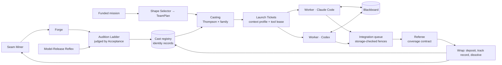
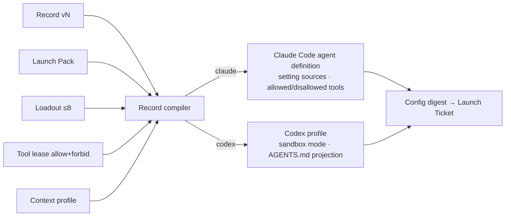
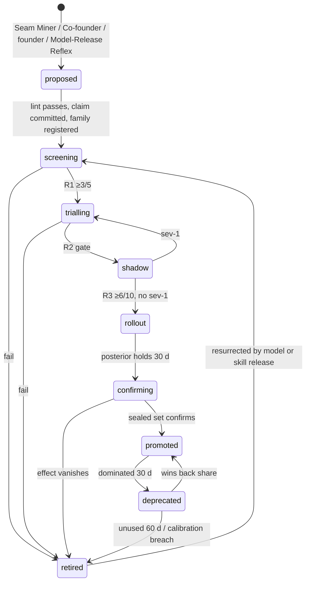
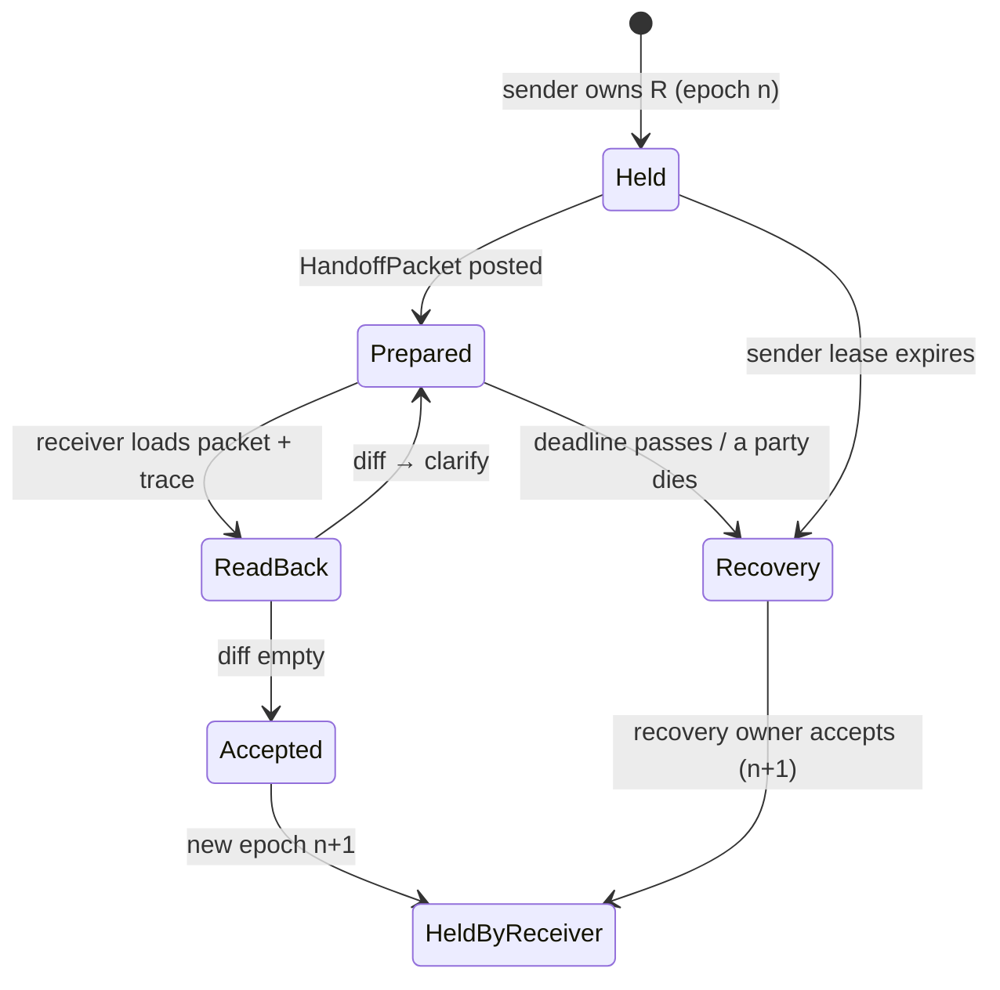

# 04 — Agent organisation: identities, hybrids, teams and non-interference

*v3 section file, Round 5, 2026-09-30. Obeys [00-CANON](00-CANON.md). Acceptance procedure lives in
[09b](09b-ECONOMICS-EVALS-SIM-IMPROVEMENT.md); capability admission in [07](07-SKILLS-TOOLS-MCP.md).*

> **Terms this file adds** (each refines a §5 entry; none redefines one)
>
> | Term | Definition | Refines |
> |---|---|---|
> | **Fusion Thesis** | The seam between classic roles a hybrid removes, plus the corpora it binds that no human holds at once | Hybrid specialty |
> | **Fused procedure** | The ordered checks a hybrid performs that a classic role does not ("size the test against traffic before writing copy"). The unit of design; the title labels it | Identity record |
> | **Pre-registered claim** | "Beats ‹classic› on ‹task class› by ≥X at ≤Y cost", committed before any audition run | Identity record, Bet |
> | **Composite record** | One identity compiling to a fixed cross-family maker + critic pair, auditioned as a unit | Cast registry |
> | **Understudy** | A cheaper record distilled from a promoted record's passing traces, with a measured quality gap, cast in degraded mode | Casting |
> | **Forge** | The short mission that drafts a candidate record; it never writes the exam the record sits | Seam Miner |
> | **TeamPlan** | A mission's versioned shape, contributions and reservations | Mission shape |
> | **Fan-in Contract / Conflict record** | The acceptance event at every point where contributions combine / a semantic collision made explicit | Integration queue |
> | **HandoffPacket / read-back** | The I-PASS-shaped transfer note and the receiver's machine diff of what it understood | Responsibility |

**Authority.** Everything here is **Execution** (Do) unless stated. Acceptance owns every verdict and every track-record
write (DR-11, DR-13); Allocation funds auditions and teams (DR-25); Custody issues tool leases (DR-24); Regulation holds the
concentration rows of the exposure book (DR-46); Record stores what the organisation learns about its own roles.

## 1. The design in one page

1. **An agent is a record, not a process.** A launch compiles an identity record into a Claude Code or Codex session with
   the right memory, context, sandbox, skills and tools; dissolution writes results back. Nothing stands idle [S06 §2.1].
2. **A hybrid is a fused procedure with a claim.** SP3's Conversion Scientist beat a classic copywriter by Δ = +1.01 against
   a +1.0 bar, carried by what it *does* (power checks, admitting infeasibility, corpus mining) and zero on pure copy
   (measured, [SP3]). Titles are labels; procedures are the design (DR-54).
3. **Every hybrid must beat the Generalist Null** and the classic split crew, in both families.
4. **Promotion climbs the Audition Ladder** with preregistered experiment families, selection-aware statistics and sealed
   confirmation sets (DR-16, [R3-red D02]).
5. **Hybrids grow from measured failure**: the Seam Miner prices handoff failures and proposes the fusion that kills the
   costliest seam.
6. **Casting is Thompson sampling per record × task class × family**, ≥10% exploration, concentration held in the one
   exposure model, reviewers requested as a coverage contract — never as "the other family" [R3-red §3.9].
7. **Claude Code and Codex are equal workers.** Routing follows matched outcomes; comparisons stay within one generating
   model because judges prefer their own family by +1.1 and +3.2 points (DR-12).
8. **Mission shape is chosen**: solo, lead+workers, swarm or audition; fan-out bounded by verifier capacity (DR-25).
9. **Workers coordinate through a typed blackboard**, never each other's transcripts.
10. **Non-interference is enforced where writes land**: storage checks fences, leases are all-or-nothing, hot resources are
    auto-added, each overlapping pair budgets one rework (DR-20–22, [SP2]).
11. **Nothing is hidden**: nested agents are visible team members; tool leases list forbidden tools; context profiles are
    chosen per mission (DR-24, [SLICE]).
12. **No agent is indispensable**: responsibility outlives workers, handoffs are read back, incident authority expires,
    Series ventures take forced leave [S10 §2.6].



## 2. Identity records

### 2.1 The record

```yaml
id: rec_conversion-scientist@5
title: Conversion Scientist                  # generated from fusion fields; never a personal name
kind: hybrid                                 # classic | hybrid | composite | human
status: promoted                             # proposed|screening|trialling|shadow|rollout|confirming|promoted|deprecated|retired
fusion:
  fields: [{field: direct-response-copy, weight: 0.30}, {field: experimental-statistics, weight: 0.30},
           {field: behavioural-economics, weight: 0.15}, {field: customer-voice-mining, weight: 0.25}]
  thesis: "Kills copywriter→analyst→researcher: copy sized for detectable lift, in customers' words, sourced."
  seam_killed: [copywriter/analyst, analyst/researcher]
procedure:                                   # SP3: the edge lives here
  - {step: size_test, tool: power-calc, rule: "re-scope when required n > 8 weeks of traffic"}
  - {step: mine_voice, rule: ">=3 corpus citations per claim"}
  - {step: source_check, tool: claim-sourcing-check, rule: "no claim the corpus does not support"}
  - {step: name_bias, rule: "state the lever used; run no-dark-patterns"}
claim: {beats: rec_conversion-copywriter@3, task_class: mixed-copy-measurement,
        by: "+1.0 composite, CI lower bound > 0, within-generator", at_cost: "<=1.1x", registered: {commit: "…"}}
knowledge_bindings:                          # corpora it reasons over; read-use tracked by Record
  - {corpus: venture:customer-transcripts, mode: retrieve, min_citations_per_artifact: 3}
  - {corpus: venture:ab-history, mode: full-scan}
lenses: [growth, customer, evidence]
skills: [{id: ab-power-calc, version: 2.1.0, sha256: "…"}]        # Loadout ≤8 (07)
memory_scope: {read: [venture:brain], write: [mission:blackboard]}
context_profile: minimal-worker@2            # §8.2
tool_lease_template: {allow: [Read, Grep, Glob, Write, mission.*], forbid: [Agent, Task]}   # §8.3
model: {claude: claude-opus-5, codex: gpt-6-astra, prefer: evidence}   # evidence = casting posterior decides
sandbox: P1
risk_ceiling: R1
limits: {max_turns: 40, wall_clock_min: 45, budget_usd_equiv: 6}      # parameters
done_tests: {visible: [power-calc-present], hidden_ref: hidden/conv-sci@5}   # hidden set held by Acceptance
track_record:                                # written only by Acceptance
  pricing-page: {n: 22, accepted: 0.82, founder_edit: 0.07, by_family: {claude: {n: 12, accepted: 0.83}, codex: {n: 10, accepted: 0.80}}}
calibration: {brier: 0.17, overconfidence: +0.06, sharpness: 0.31, n: 58}   # DR-17
lineage: {derived_from: [rec_conversion-copywriter@3], experiment_family: expfam_conv_01}
understudy: rec_conversion-scientist-lite@2
retire_triggers: {dominated_days: 30, unused_days: 60, brier_above: 0.28, pass3_below: 0.5}
fingerprint: {constraints: [no-dark-patterns, disclose-ai-in-outbound]}   # preserved across versions
```
*Figures are illustrations except the claim bar, which is SP3's measured bar.*

### 2.2 Kinds, lint and stores

| Kind | What | Auditioned as |
|---|---|---|
| **Classic** | One field; a human title where fusion adds nothing ("an engineer is a good enough title") | Baseline arm, still tracked per family |
| **Hybrid** | Fusion + fused procedure + venture bindings in one session | Against Generalist Null and classic crew |
| **Composite** | Fixed cross-family maker + critic sharing one thesis | As one unit (arm E) |
| **Human** | Contractor, advisor or Guild member on the same schema and ledgers | Same fields, so "hire a human" is a measured casting choice [S06 §7.6]; contracting in [16](16-EXTERNAL-WORLD-HUMANS.md) |

**Lint** — authority invariants (DR-05), enforced by the record compiler: title derivable from fields, no personal names;
a hybrid names a seam and a committed claim; `model` declares **both** families; every binding sits inside the venture's
data boundary (portfolio records bind only abstracted priors); a context profile and tool-lease template are present and
the template forbids nested-agent tools unless the record is a lead; `risk_ceiling` ≤ every Charter it is castable under;
no record writes its own hidden tests, track record or calibration (workers hack evaluators — METR, DGM, [R0-A §3.5]).

| Part | Store (DR-07) | Writer |
|---|---|---|
| Body (fusion, procedure, claim, bindings, profile) | Signed versioned files `registry/records/*.yaml` | Forge proposes; a version activates on an Acceptance verdict at its rung (§4.4) |
| Track record, calibration, posteriors | Journal verdicts → index projection | Acceptance only |
| Retirements | Null Registry ([06](06-MEMORY.md)) | Record, from a verdict |
| Founder vetoes per venture | Charter ([05](05-AUTONOMY-INITIATIVE-FOUNDER.md)) | Founder |

**Seed roster.** The harness's seven engines (orchestrator, framer, sourcer, builder, designer, reviewer,
reviewer-readonly) import as the first classic records with empty track records — baselines, not a hierarchy. The
orchestrator becomes the **Mission Lead** seat, fillable by any record eligible for `seat: lead`.

### 2.3 Compilation



The digest — runtime, exact model id, runtime version, skill digests, context-profile digest, tool grants — is what carries
a score. **A title alone has no score** [S02 §2.3].

## 3. Hybrid specialties

### 3.1 What SP3 established

| SP3 finding (measured) | Design consequence |
|---|---|
| Δ = +1.01, 95% CI [+0.63, +1.37], 9/10 pairs; Claude +0.98, Codex +1.03 | Hybrids stay; they can win in **both** families |
| Edge in statistics (ΔD3 +1.67); **zero on pure copy** (T1 −0.08/+0.08) | **Route by task class**: mixed copy + measurement (pricing, lifecycle, retention, paid). Every claim names its class |
| The whole longer, procedural record passed; title not isolated | Design procedure-first; test title vs procedure next (§3.4) |
| Noise floor N = 0.53; single pairs vary up to 1.17 | ≥10 paired items with replicates (DR-16) |
| Judge self-preference +1.1 / +3.2; family scores r = −0.37 | Within-generator comparisons only (DR-12) |
| Hybrid wrote an unsourced fear claim; only the cross-family judge caught it | Claim-sourcing check in every customer-facing procedure (DR-19) |
| The statistics answer key was a ~40-line script | Power calculator is a tool **every** record calls; audition measures what edge remains (arm F) |

Why hybrids are AI-native: each fuses 3–4 fields *and* a live venture corpus; no human re-reads 400 transcripts before each
draft. The claim under test is **"removing the handoff removes its loss"** — which the Generalist Null (same knowledge, no
fusion) and the classic crew (real handoffs) separate [S06 §4].

### 3.2 The nineteen candidates

All nineteen are **candidates**; effects are hypotheses. Arms per §4.2; R2 sample shown; each row's pass bar is its
pre-registered claim. #1 has a first spike.

| # | Title | Fusion + bindings | Replaces / augments | Experiment (task · metric · n) | Route to |
|---|---|---|---|---|---|
| 1 | **Conversion Scientist** *(SP3 narrow PASS)* | Copy × experimental stats × behavioural econ × transcripts + A/B history | Copywriter + CRO analyst + UX researcher | Retro-predict 24 past A/B tests (winner + lift) + 6 live. Winner accuracy, Brier, live lift. Pass: accuracy ≥ baseline +15 pts and SP3 bar replicated | Mixed copy+measurement, not hero copy |
| 2 | **Churn Forensic Accountant** | Revenue accounting × ticket semantics × telemetry × survival analysis; Stripe + tickets + events | Finance + CS lead + data analyst | 30 churned accounts, causes pre-labelled. Cause agreement; recoverable-$ forecast vs 60-day win-back. n=30 | Churn, retention |
| 3 | **Regulatory Growth Copywriter** | FTC endorsement, CAN-SPAM, GDPR/ePrivacy × persuasive copy × consent-flow code | Copywriter + counsel + frontend | 20 campaigns, 3 planted violations each. Recall **and** panel conversion proxy. n=20; counsel stays a human gate on one-way doors | Outbound, consent UX |
| 4 | **Pricing Psychologist-Engineer** | WTP methods × anchoring/decoys × Stripe/Paddle code × unit economics | Pricing consultant + billing eng + finance | 20 twin scenarios, buyer populations from transcripts. Revenue/visitor vs twin optimum + billing done-tests. n=20; 2 live at Shadow | Price changes end to end |
| 5 | **Reliability Experience Designer** | SRE × UX writing × customer comms × status + support history | SRE + support lead + comms | 20 twin fire drills. Time to mitigation, blind comms quality, follow-up tickets. n=20 | Customer-facing incidents; default Incident Lead |
| 6 | **Customer Evidence Compiler** | Qual coding × JTBD × Gherkin tests × codebase map; interviews | UX researcher + PM + QA | 20 interview bundles → spec + tests. Tests traceable to an utterance; founder edit distance; 30-day rework. n=20 | Specs from evidence |
| 7 | **Competitive Cartographer** | Competitive intel × changelog/pricing diffs × game theory × hiring signals | Analyst + strategy consultant | 40 preregistered competitor forecasts resolved at 90 days. Brier vs Null and classic. n=40/arm | "A competitor launches" |
| 8 | **Activation Behaviour Engineer** | Activation analytics × habit models × onboarding code × lifecycle email | Growth PM + lifecycle marketer + frontend | 20 replayed onboarding tickets in twin + 3 live flags. Sim activation Δ, done-tests, live day-7 Δ. n=20+3 | Onboarding |
| 9 | **Threat-Cost Modeler** | AppSec × actuarial loss × the venture's attack surface and data map | Security eng + risk analyst | 20 twin codebases, seeded vulns of known blast radius. Loss-weighted recall at fixed effort. n=20 | Ranking security work |
| 10 | **Metric Semantics Ethnographer** | SQL/dbt × how docs, meetings, dashboards use a metric × governance | Analytics eng + BI | Warehouse + docs, 15 planted definition conflicts, 20 tasks. Conflicts found; fixes passing reconciliation. n=20 | Metric drift; Closer Claim hygiene ([05](05-AUTONOMY-INITIATIVE-FOUNDER.md)) |
| 11 | **Deal Conversation Strategist** | Negotiation × CRM history × objection corpus × pricing authority | SDR + sales eng + deal desk | 30 twin negotiations vs transcript-grounded buyer agents. Close × margin; violations = 0. n=30 | Sales inside Offer objects ([16](16-EXTERNAL-WORLD-HUMANS.md)) |
| 12 | **Procurement Bid Tactician** | Procurement rules × proposals × budget justification × evaluator rubrics | Bid writer + finance + compliance | 20 past tenders with published scoring; blind rubric scoring. Score, compliance defects. n=20 | Agency tenders, grants |
| 13 | **Codebase Archaeologist-Migrator** | Git history of the founder's repos × dependency graphs × migration tooling × test synthesis | Staff eng + tech writer + test eng | 20 migrations. Merged without revert in 14 days; new tests failing on old code. n=20 | Fleet Import of ~19 repos ([17](17-VIBE-STARTUPING-IN-PRACTICE.md)) |
| 14 | **Field Compressor** | Learning science × literature mapping × model of what the founder knows | Tutor + research analyst | 12 simulated proxy learners + 2 real founder fields. 7-day retrieval quiz by other-family examiner. n=12+2 | "Learn a field fast" |
| 15 | **Ad Auction Creative Scientist** | Visual design × auction mechanics × bandits × brand kit | Media buyer + designer + analyst | 4 capped live campaigns + 20 replayed creatives. CPA; CTR rank correlation. n=20+4 | Paid acquisition |
| 16 | **Support Economist** | Support resolution × refund policy × LTV × tone | Support agent + finance approver | 60 replayed tickets. Resolution; $ conceded vs policy-optimal; escalation precision. n=60 | Support under a mandate |
| 17 | **Evidence Auditor** | Epistemics × statistics × source verification × Priors Library | Augments the Referee | 30 claim packets with seeded flaws. Flaw recall, false alarms. n=30 | Pre-scale Bet checks; Verifier Foundry candidate |
| 18 | **Taste Cartographer** | Founder's circled takes × design critique × brand strategy | Augments designer + creative director | 100 held-out Dailies items. AUC on circles; founder minutes per decision. n=100. **Orders the reel; never circles** | Dailies Reel ([08](08-SURFACES.md)) |
| 19 | **Infra Cost Engineer** | Cloud/API pricing × profiling × code × Budget Ledger history | FinOps + backend eng | 20 twin cost tickets with load tests. $ saved at p95 ≤ baseline. n=20 | Cost per outcome |

**Claude vs Codex on every row**: arms C and D run as separate cells. Speculation to falsify: code-heavy fusions (4, 8, 13,
19) may favour one family, corpus-reasoning fusions (1, 2, 6, 7) the other; SP3 found no family difference for #1. The
registry learns `prefer` per class; nothing is hard-coded. Rows 14 and 18 may bind founder notes and circled takes only by
opt-in per venture, read-only; the Taste Cartographer's AUC reaches the founder weekly (Know · Shelf) and a drift alarm fires
if he overrides >30% of its ordering (parameter).

### 3.3 Why these nineteen are not the list

They are the seed. The Seam Miner (§5) adds candidates from measured failure; the Null Registry removes them. Year-5
expectation (speculation): most promoted hybrids will be fusions nobody in this round named.

### 3.4 Next spike — title versus procedure

Four arms, both families, ≥10 pairs × 2 replicates, within-generator, prereg first [SP3 §6]:
**H** hybrid title + fused procedure · **C** classic title + short prompt · **C+P** classic title + *hybrid procedure* ·
**H−P** hybrid title + *classic prompt*. If C+P ≈ H, procedures become first-class composable registry objects and titles are
generated labels; if H−P > C, the title itself primes behaviour and title honesty becomes a performance question. Either
result folds into [12](12-SPIKE-RESULTS.md).

## 4. Proving an identity

An audition that can promote is a **Bet** ([03](03-MISSION-ENGINE.md)): preregistered criteria, kill date; funded by
Allocation, judged by Acceptance; results to the Priors Library or the Null Registry.

### 4.1 The ladder (all bars and samples are parameters)

Bare "3 of 5" passes about half of no-better hybrids — P(≥3/5 | null) = 0.50 [S06 §2.4] — so it is only a screen.

| Rung | What | Sample | Pass bar | Cost (illustration) |
|---|---|---|---|---|
| R1 Screen | Replayed class tasks, all arms | 5 × arms | ≥3/5 vs best baseline, no catastrophe | $15–40 |
| R2 Paired Trial | Paired, blind, budget-matched, in the twin | ≥20 items (40 if noisy) × ≥2 replicates | Bayesian P(better) ≥0.9 with family shrinkage (sign test ≥15/20 reported beside); cost ≤1.1×; pass^3 ≥ baseline | $80–250 |
| R3 Shadow | Beside the live cast, not shipped | 10 missions | Referee prefers ≥6/10; no sev-1 | ≈1.3× |
| R4 Rollout | ≤25% of the class | 30 days | Posterior holds; founder edits not worse | normal |
| Confirmation | Sealed set, used once per experiment family | ≥10 items | Effect survives within-generator | small |

pass^3 (all three repeats succeed) sits beside mean acceptance: brilliant once and wrong twice loses to a steady classic.

### 4.2 Arms and judging

| Arm | Isolates |
|---|---|
| **A** Classic split crew, real handoffs | The handoff tax |
| **B** **Generalist Null**: one generic maker with every lens and binding the hybrid claims | Whether fusion adds anything beyond the knowledge |
| **C / D** Hybrid on Claude Code / on Codex | Family cells; C vs D always reported, sets `prefer` |
| **E** (composite) maker + opposite-family critic as a unit | Whether the pair beats its parts |
| **F** Classic + the hybrid's deterministic tools | How much edge is now everyone's floor |

Budget-matched in dollar-equivalents. Judging order, under a coverage contract ([09b](09b-ECONOMICS-EVALS-SIM-IMPROVEMENT.md)):
systems of record via the observation broker → hidden deterministic done-tests authored by a family other than the Forge's →
blind two-family panel, disagreement to a third route (F10) → founder labels only for taste classes (Decide · Tap, rationed by
the Attention Exchange). **Every comparison is within one generating model** (DR-12).

### 4.3 Against selection luck [R3-red D02]

- **Experiment families**: every audition belongs to a registered family naming all candidates, forks, subclasses, the
  effect, the stopping rule and a promotion budget; failed and abandoned candidates stay counted.
- **Selection-aware statistics**: hierarchical shrinkage across the family, so the tenth try needs more evidence than the
  first; a fork's inherited prior (effective n=5) is applied *inside* the parent's family multiplicity.
- **Clustered splits** (one customer, repo or week stays in one split); **≥20% fresh items** from the last 14 days;
  monthly-rotated hidden holdouts.
- **Sealed confirmation** is the only evidence that clears promotion. **Inconclusive stays inconclusive** — no fresh audition
  of the same thesis inside the family budget.

### 4.4 Re-audition on diff

| Diff | Re-enters at |
|---|---|
| Model version (either family) | R1 on **every record in both families that uses the changed model**; arms are within-model with/without pairs; R2 if R1 moves >10% [DR-75, R5-walk B37] |
| Skill major version; fusion, thesis or **procedure** change | R2 |
| New knowledge binding | R3 (bindings change behaviour on live data) |
| Prompt wording | R1 |
| Context profile or tool-lease template | R1 + a SLICE probe that forbidden tools stay unreachable |
| Fingerprint constraint | Founder (Decide · Tap), then R2 |

### 4.5 Lifecycle



**Promote** → Know · Reel line (effect within-generator, Claude/Codex split), zero decisions, one-tap veto. **Fork** when
venture bindings diverge (`@5+vx-b2b`), when each family wins a different class (fork, don't average), or when a dominated
sub-class appears; every fork clears R2. **Deprecate** after 30 dominated days (still castable for exploration). **Retire**
writes "did not beat Generalist Null on class Y, n=20, Δ=−3%" to the Null Registry; the file stays in git. **Resurrect** at R1
in a new family after a model or skill release.

**ND-04-1 — accepted as DR-60: audition spend lives in the Improvement sleeve.** Auditions, Forge missions and reflex
re-runs are self-improvement: charged to the Improvement sleeve and counted in its ≤15% cap (DR-47), with a floor of 6% of
investment-lane capacity, 12% for the 30 days after a model release (~~in the week after~~, DR-60) (parameters,
[S06 §10.3]). The charging rule — one pool per purpose — is owned by [09b](09b-ECONOMICS-EVALS-SIM-IMPROVEMENT.md). Each
promotion names its beneficiary class and faces the 30-day outcome check (§12.2 shows one). Unspent audition budget does
not roll into missions.

## 5. Seam Miner and Forge

**Seam Miner.** A weekly Execution job (and one on every dissolve) reads journals and blackboards through Record and counts
**handoff failures**: a finding misread, re-asked or ignored; a rework loop across two titles; a Referee rejection spanning two
lenses; a founder edit fixing one role's output with another role's knowledge; a Conflict record between two titles (§9.5).

```ts
type SeamCandidate = {
  seam: [string, string]; task_class: string;
  incidents: { mission_id: string; kind: "misread"|"reask"|"rework"|"xlens-reject"|"founder-xfix"|"conflict"; cost_usd: number }[];
  handoff_tax_usd_30d: number;
  proposed_fusion: { field: string; weight: number }[]; proposed_procedure: string[]; proposed_bindings: string[];
};
```

**Forge trigger (parameters):** 30-day handoff tax ≥ 3× expected audition cost, **or** ≥5 incidents. Other sources: the
Co-founder seat's title forging ([05](05-AUTONOMY-INITIATIVE-FOUNDER.md)); the founder by voice ("half lawyer, half growth
hacker" — voice proposes, a Forge drafts); the Model-Release Reflex asking what fusion is newly affordable
([07](07-SKILLS-TOOLS-MCP.md)); **record crossover** of two promoted records with adjacent seams.

**Forge** (≤20 min, ≤$3, parameters) drafts fusion, procedure, bindings, skills (it may request a new one from the Skill
Foundry), the claim and an audition-set proposal. Acceptance then commissions hidden done-tests **from another family**, so a
record never writes its exam [S06 §2.3]. Lint runs before the Bet can register.

## 6. Cast registry and casting

**The cast registry** is the record files plus an index keyed by record × task class × family, projected from verdicts with
source offsets (DR-07) and rebuildable from the Journal. It is Record-held, peer of the Priors Library, and holds the
organisation's running Claude-vs-Codex evidence per class [S06 §9.2]. Every evidence row records the worker's **family as
derived from the model id** in the launch log, never from the slot it was launched into, so cross-family evidence cannot be
mislabelled ([09a](09a-ENGINEERING.md)) [DR-83].

```ts
type SeatRequest = {
  mission_id: string; seat: "lead"|"maker"|"scout"|"integrator"|"imagine";
  task_class: string; effect_class_ceiling: "R0"|"R1"|"R2"|"R3"|"R4"; budget_usd: number;
  bindings_needed: string[];
  coverage_ref: string;                    // the coverage contract the output must meet — never a family string
  must_family?: "claude"|"codex";          // only when data eligibility (DR-45), capacity (DR-61) or coverage demand it
};
type CastDecision = {
  record: string; family: "claude"|"codex";
  reason: "exploit"|"explore"|"audition"|"diversity"|"degraded"|"coverage";
  posterior: { mean: number; n: number };
  selection_probability: number;           // so a family cannot look better by getting easier work
  alternatives: { record: string; family: string; mean: number }[];   // feeds "why did it do that" (08)
};
```

**Reviewer and judge seats are not cast here**: Acceptance assigns them from the coverage contract, reserved before launch,
because a producing lineage may never choose its reviewer.

**Algorithm.** (1) Filter by task class, risk ceiling, bindings inside the data boundary, Charter sandbox, provider terms,
founder vetoes. (2) Thompson-sample record × family from Beta(accepted+1, rejected+1), weighted by cost per accepted outcome.
(3) Constrain: exposure-model concentration rows; exploration ≥10% to records with n<10 or the under-observed family,
alternating when tied; calibration rule. (4) Under tight budget or a provider limit, cast the understudy and log `degraded`
with its measured gap; degraded mode never relaxes acceptance. (5) Journal the decision.

**Concentration** is not a casting-local cap. S06's 40%, S01's 30% and S10's 60% measured different things
[R3-red C04, §3.10]; they are named rows in Regulation's one exposure model over loss-weighted dependency groups (record,
model version, skills, host) with explicit denominators (DR-46). Casting checks feasibility against eligible providers; if a
soft target is infeasible it records bounded exposure and funds an alternative. Renaming a record or splitting a mission
cannot lower measured share.

**Calibration** is scored with sharpness, resolution, difficulty and abstention (DR-17), so timid forecasting buys nothing.
A record with overconfidence >+0.10 (parameter) is cast only where the coverage contract adds an independent judgment.
Calibration steers *discretionary* review; it never removes a coverage requirement.

**Equal workers, operationally.** Identical eligibility for every seat, including lead, integrator, negotiator and reviewer;
`prefer` moves only on posterior evidence; paired, matched-budget comparisons plus practical-cost comparisons; within-generator
scoring; selection probability logged; releases invalidate affected cells until R1 re-runs; cross-family review mandatory
(DR-11). The only measured difference today is interface: Codex documents non-interactive execution, JSONL events and schema
output; Claude Code documents programmatic execution and structured streaming; both implement the worker contract
[S02 §2.3]. **No evidence supports a permanent "Claude is better at X" rule, and v3 invents none.**

**Families as correlated failure.** Diversity is not independence; a compromised provider or proxy could weaken maker and
critic together [R3-red X04]. Receipts record authenticated route and model-version evidence; an endpoint change is a
re-qualification (R1); deterministic checks stay model-free; a third route (Model Foundry, human adjudicators — F10) stays
warm for evacuation.

**Provider continuity.** When one family is down, the other executes any eligible role from durable checkpoints; required
cross-family verdicts stay **pending**, never waived; pre-authorised hash-bound recovery runs under its incident mandate
[S02 §2.10]. Same-family review finds defects but never substitutes for missing coverage.

## 7. Mission shapes and team composition

**Evidence.** Across 180 configurations, independent agents amplified errors 17.2× vs 4.4× centralised; centralised teams
gained +80.8% on parallel tasks; **every** multi-agent setup lost 39–70% on sequential reasoning (measured, Google Research via
[R0-A §2]). Anthropic's research system: +90.2% over single-agent at roughly 15× chat tokens (measured, secondary summary).
MAST: ~42% of failures from specification, ~37% inter-agent misalignment, ~21% verification/termination [R0-A §3]. So
"swarms, deliberately" (founder #9) means: route by task shape, end every fan-out at a verifier, and get measurably better
at choosing.

| Shape | Choose when | Coordination | Fan-in |
|---|---|---|---|
| **Solo** | Coupled, sequential reasoning; one mutable design | One producer owns the chain | Independent acceptance |
| **Lead+workers** | Stable decomposition; integration needs judgment | Temporary Mission Lead holds interfaces | Each boundary, then the whole |
| **Swarm** | Needs emerge during work; heterogeneous expertise | Workers claim needs on the blackboard; no permanent lead | Every promoted contribution and aggregate |
| **Audition** | Competing approaches, frozen rubric | Isolated blind candidates | Candidates, selection, winner |
| *Lead + second unit* | Hard core + parallel low-stakes work (variants, fixtures) | A **Continuity Supervisor** (Acceptance seat) checks mutual consistency — one price on page, email and docs [S10 §2.6.7] | Plus consistency check |
| *Forked command* | Uncertain *intent interpretation* | Three leads, different intents, bounded window; best trajectory continues | Audition over trajectories |
| *Inverse span* | One high-stakes draft | 5–9 critics per maker, bounded by verifier capacity | Coverage contract over lenses |

A mission may change shape mid-flight; each change writes a new TeamPlan revision and keeps completed artifacts.

```yaml
TeamPlan:
  mission_id: msn_invite-expiry
  revision: 3
  shape: lead_workers
  features: {critical_path: [need_1, need_4], coupling: medium, uncertainty: bounded, sequential_depth: 3,
             interference_refs: [res:invitation-contract]}
  contributions:
    - {need_id: need_2, seat: maker, title: Backend Engineer, task_class: api-change, output_contract: code_change_v2,
       coverage_ref: acc_cov_812, resource_footprint: [repo:src/invites/**, res:invitation-contract], why_separate: independent_deliverable}
  reservations: {execution: {usd: 42}, verification: {window: "22:20–23:00", families: [claude, codex]},
                 integration_rework: {launches: 1}, recovery: {usd: 14}}
  rejected_shapes: [{shape: solo, reason: deadline}, {shape: swarm, reason: stable_decomposition}]
  replan_when: [dependency_changed, verifier_deadline_at_risk, rework_twice, provider_lost]
```

**Selection.** Minimise expected total cost — execution + coordination + verification + expected rework + founder minutes —
at the required quality and deadline; show a quality–cost frontier where value is uncertain [S02 §2.2]. Three hard rules:
(1) every added worker has a distinct deliverable, a reason for separation and reserved acceptance capacity; a lead exists
only for integration work; (2) **fan-out is bounded by qualified verifier windows** at the 70% ceiling (DR-15, capacity
model in [09b](09b-ECONOMICS-EVALS-SIM-IMPROVEMENT.md)) — the selector staggers, narrows or launches verifiers, never
borrowing incident capacity; (3) each overlapping pair carries one priced integration rework (DR-22), sized by the overlap estimator (§9.3). Year 1 uses a
transparent feature table; a learned **topology compiler** replaces it only when replay *and* live canaries show better
accepted outcomes, cost and deadlines without more interference.

| Complexity (parameters) | Shape | Workers | Tool calls each | Verifier windows |
|---|---|---|---|---|
| Lookup | Solo | 1 | ≤10 | deterministic only |
| Bounded change | Solo | 1 | 10–60 | 1 opposite-family |
| Multi-component change | Lead+workers | 2–4 | 30–120 | 1 per component + integration pair |
| Open research question | Swarm | 3–8 | 20–80 | 1 per promoted finding + fan-in |
| Uncertain approach | Audition | 2–3 | budget-matched | blind comparison + winner |

**Composition is measured.** Each wrap records shape, cast, cost, reworks, lease wait, queue age and outcome; the
**coordination twin** replays costly missions under the rejected shapes to learn which would have won [S02 §6.3]. A new
shape policy is promoted only after live canaries.

## 8. Launch, context, tools and dissolution

### 8.1 Launch Ticket

A deterministic Kernel supervisor claims a ticket atomically, confirms reservations, prepares isolation and starts the
runtime through the WorkerAdapter ([09a](09a-ENGINEERING.md)) with structured argv, never shell-interpolated mission text. It
runs under the **standing launch permission** (DR-53, F1): SP2's live arms never ran because each launch needed approval
[SP2 §5.7].

```ts
type LaunchTicket = {
  missionId: string; needId: string; attemptId: string; parentAttemptId?: string;   // parent set for nested agents
  configDigest: string; snapshotRef: string; coverageContractRef: string;
  resourceLeaseRefs: string[];  toolLeaseRef: string;  contextProfile: string;
  budgetReservationRef: string; verifierReservationRef: string; deadline: string; continuationRef?: string;
};
type WorkerReturn = {
  artifactRefs: string[]; readVersions: Record<string, number>;
  touchedResources: string[];            // self-report; storage recomputes
  forecast?: { claim: string; p: number };
  unresolved: string[]; pendingEffectRefs: string[]; proposedNextNeeds: string[]; continuationRef?: string;
};
```

Supervisor liveness is separate from model latency (90 s lease, 30 s renewal, parameters). Launch intent is persisted before
spawn; process identity includes host and start time; after a crash, reconciliation finds orphans and uncertain effects
before a replacement starts; one active attempt per Need [S02 §2.4]. This closes SLICE's race, where two runners could both
claim one `queued` line [SLICE §6].

### 8.2 Context profiles

SLICE's Builder, launched inside the repo, loaded `CLAUDE.md`, agent definitions and review lenses: a 173-word summary cost
$1.08 and 153 s against 24 s for the Referee (measured, [SLICE §5.5]). A **context profile** names the settings sources,
instruction files and agent definitions a worker loads, chosen per mission from the record's template (DR-24):
`minimal-worker` (Launch Pack + Loadout only; default for makers), `repo-native` (the venture repo's own AGENTS.md/CLAUDE.md,
no harness agents), `lead` (plus roster and brokered delegation), `referee` (coverage contract, frozen criteria, observation
broker, no producer notes). The profile digest is part of the evaluated configuration, so the registry learns what inherited
context costs and buys.

### 8.3 Tool leases and nested agents

`--allowedTools` did not gate `Agent` in `-p` mode; the Builder spawned a same-family "evidence lens" reviewer, which passed
an overstatement the cross-family Referee failed [SLICE §3, §5.1]. **Whitelists alone do not bound a worker.** Every mission's
tool lease, issued by Custody (policy in [07](07-SKILLS-TOOLS-MCP.md)), lists allowed tools, **forbidden tools**, and the
enforcement the adapter has verified for that runtime version. Nested-agent tools are forbidden unless the TeamPlan includes
nested members. A worker cannot extend its lease; expansion is fresh admission.

**Nested agents are team members** (DR-24): each is a charged child attempt under the root allowance, keyed by parent link
(stream-json `parent_tool_use_id` for Claude Code; the parent thread id for Codex), with its own receipts and its own card
("Builder › subagent") on the team page ([08](08-SURFACES.md)). Where a runtime cannot enforce child admission, native
spawning is disabled and **brokered delegation** replaces it: the worker posts a Need and the supervisor launches a proper
ticket. A nested review never counts toward acceptance (DR-11).

### 8.4 Waiting and dissolution

A worker waiting on anyone writes a **Continuation** (artifact hashes, unresolved criteria, constraint versions, pending
effects, remaining allowance) and **ends its session**; the answer resumes a compatible session or launches a fresh one.
Durable artifacts cross families; private sessions do not — which is also how missions survive outages.

A process exit is never a verdict. Wrap is enforced by the Kernel: revoke tool and resource leases (epochs advance) →
publish candidates → **Wrap Deposit** to Record ([06](06-MEMORY.md)) → transfer open responsibilities (a closure condition,
§9.6) → settle usage on the Budget Ledger → Acceptance updates track records from the parsed verdict → post handoff-failure
evidence for the Seam Miner → strike reusable assets to the Backlot → four-question AAR naming a mechanism change
([09b](09b-ECONOMICS-EVALS-SIM-IMPROVEMENT.md)). Unfinished learning or settlement becomes **residuals** that hold no leases
(DR-28).

## 9. Coordination and non-interference

Target: **enforceable prevention of known interference classes and bounded recovery from the rest.** No topology guarantees
agents never make mutually harmful semantic decisions; the design makes them observable, attributable and testable before
publication [S02 §7].

### 9.1 The blackboard

The coordination projection of Journal events, sharing identifiers and provenance with the Brain (DR-07). Outside support:
structured artifacts on a pool (MetaGPT) and blackboard-with-volunteering (+13–57% over master–slave and RAG baselines in one
study) [R0-A §1–2].

```ts
type WorkMessage = {
  id: string; ventureId: string; missionId: string;
  kind: "need"|"claim"|"assignment"|"question"|"finding"|"objection"|"correction"|"result"|"stop";
  senderAttempt: string; recipientNeed?: string; subjectRefs: string[]; payloadRef: string; payloadHash: string;
  readVersions: Record<string, number>;         // staleness is detectable
  trust: "internal_proposal"|"external_content"|"verified_evidence";
  labels: string[];                              // transitive (DR-40)
  correlationId: string; causationId: string; expiresAt: string; responseDueAt?: string;
};
```

Rules: at-least-once delivery, same id + same content is idempotent, changed content is a conflict; acknowledgments separate
*delivered*, *understood*, *accepted assignment*, *answered*; a question names the missing fact, needed-by time and fallback,
and neither session idles while it waits; cyclic questions draw on a root interaction allowance and end as an unresolved
dependency; swarm workers **volunteer** (`claim` on a `need`), admitted if casting, budget and verifier capacity allow;
workers post *candidate* findings and only Acceptance promotes them through Record; external content stays
`external_content` through every summary [R3-red X01]. Exposed as an internal MCP server (`read_snapshot`, `post_candidate`,
`ask`, `claim_need`, `propose_effect`) with server-side authority checks; read tools cannot become write tools.

### 9.2 Footprints and hot resources

The ownership map records resources, eligible maintainers, acceptance contracts and **conflict relationships** — duties on
records, not employment. Resources are semantic: paths, API contracts, schemas, environments, customer threads, audiences,
payment obligations, brand channels. **Two disjoint files can change one promise**, so they share a conflict resource
(`res:invitation-contract`); alias resolution stops two names for one customer or deploy bypassing ownership [S02 §2.6].

Every contribution declares a **resource footprint**; **storage recomputes what was actually touched** and the receipt records
`declared_missed`. In SP2 the footprint missed a real resource in 2 of 2 tasks, and that miss — an `import type` line both
tasks added to `config.ts` — caused the first deadlock [SP2 §3.2]. **Hot resources** — import headers (`#<header>`), appends
(`#<eof>`), barrel registries, config objects, lockfiles, migration numbers, route tables — are auto-added to every
footprint that touches their file (DR-21); a resource where serialising costs more than it saves may be exempted and left to
the queue, recorded per resource. **Interference discovery** mines changes that repeatedly fail integration together and
proposes new conflict edges and hot resources [S02 §6.4].

### 9.3 Fenced leases — checked by storage, taken all-or-nothing

```yaml
ResourceLease:
  resource_id: venture_7:repo:src/pricing.ts#computeTotal
  owner_attempt: att_19
  mode: exclusive_write            # exclusive_write | shared_read | propose_only
  fencing_token: 1042              # monotonic per resource
  expires_at: authoritative_timestamp
  base_version: 88
  conflict_set: [res:checkout-price, res:campaign-price]
  acquisition: optimistic_at_land  # pessimistic_at_dispatch only for irreversible-effect resources
```

| Rule (DR-20/21) | Evidence |
|---|---|
| **Storage verifies the fence** — the repo's pre-receive hook, the database and the Effect Gateway each check the token is *current* for every resource the write touches, recomputed by the storage | SP2 drill: a zombie pushed remembered token-1s; the hook refused all 7 resources with the coordinator bypassed (C3 PASS, measured) |
| **All-or-nothing**, or **wound-wait** by mission age (older revokes younger; its token goes stale); never incremental; deadlock detector with a hard cap (60 s, parameter) | Lazy land-time acquisition deadlocked on its first run |
| **Optimistic, first-ready wins**; pessimistic up-front leases only for payments, sends, migrations | A finished worker waited 13.2 s of 21.6 s behind an unfinished holder |
| Lease, token, authority and base versions checked **atomically with the write** | Checking at start is insufficient [S02 §2.6] |
| Expired workers keep recoverable artifacts but cannot publish, merge or dispatch; during a partition they continue private analysis only | Fencing lives at the write boundary |

```mermaid
sequenceDiagram
  participant W as Worker A (zombie)
  participant K as Kernel lease table
  participant S as Storage (pre-receive / DB / gateway)
  participant B as Worker B
  W->>K: acquire all-or-nothing → tokens 1
  Note over W: hangs; renewals stop
  K->>K: TTL expires; re-grant
  B->>K: acquire → tokens 2
  B->>S: push with Lease-Tokens 2
  S->>S: recompute touched; tokens current
  S-->>B: landed + receipt
  W->>S: push with remembered tokens 1
  S-->>W: REJECT 7 resources (coordinator not consulted)
  W->>K: re-acquire tokens 3 → rebase → integration queue
```

**What a lease is for.** With a clone per worker, the clone prevents clobbering. A lease buys **ordering**, **scope
detection** and **staleness rejection** — not conflict-free integration: under exclusive symbol leases the second landing
still conflicted in 4 files [SP2 §5.4]. Hence **one budgeted integration rework per overlapping pair** (DR-22), charged to
the second lander. Shared Git metadata, credentials, ports, caches and databases get their own isolation (ladder in
[09a](09a-ENGINEERING.md)); auditions work in separate namespaces with no publication authority.

**The overlap estimator** prices that rework before launch, for the shape selector (§7) [R5 G-B1]:

| | |
|---|---|
| Inputs | Declared footprints of every contribution; the hot-resource map (§9.2); per-record history of touched-vs-declared (`declared_missed`) |
| Output | Expected integration rework launches for the TeamPlan, **with an interval**, reserved as `integration_rework` |
| Fallback | Without enough history: a transparent count of shared resources between each pair, one rework per overlapping pair (DR-22) |

The estimator is uncalibrated against live workers: SP2's arms were canned, so live-worker calibration is owed (SP2 live
arms, [14](14-BUILD-PLAN.md)). **No universal disjointness threshold exists** — the decision to split is the expected-total-cost
comparison of §7, never a fixed share of disjoint work.

**Priced-lease trigger** [R5 OG10]. A hot resource whose lease-wait share exceeds 15% for two consecutive weeks (parameter)
opens a priced-lease experiment for that resource alone; the rest of the table keeps optimistic, first-ready leases.

### 9.4 Integration queue and fan-in

The queue has two stages [DR-70, R5-walk B07]:

1. **Staging integration** — fetch main, merge onto a staging branch, re-test. Verification binds candidate digest,
   dependency versions and policy version; head movement re-runs affected checks; conflicts and red tests return to **the
   same worker** as the priced rework. Staging integration may precede acceptance.
2. **Publication** — compare-and-swap land to main, then deploy. It runs **only after the coverage contract's required
   verdicts** are recorded against the staged digest; nothing reaches main, a deployment or an outbound channel before them.

Main never goes red by construction: only a staged, re-tested, accepted digest is ever landed.

A **verifier sits at every fan-in** [S02 §2.7]:

```yaml
FanInContract:
  id: fanin_12
  kind: code | research | commercial | memory
  input_digests: [sha256_a, sha256_b]
  producer_lineage_refs: [lin_a, lin_b]       # both families present → fresh judges from both (DR-11)
  criteria_digest: sha256_criteria            # frozen; producers cannot edit
  dependency_versions: {api_contract: 8}
  coverage_ref: acc_cov_812
  required_checks: [behaviour, compatibility, provenance, authority, source_independence]
  disposition: pending | accepted | rejected | unresolved
```

Research fan-in counts **independent evidence paths**, not agreeing agents (evidence monoculture); code fan-in runs a hidden
combined suite (SP2's pattern); commercial fan-in checks capacity, price, promises and cumulative exposure; memory fan-in
checks that qualifications survived compression.

### 9.5 Conflicts: resolve by record, or fork the work

A semantic collision becomes a **Conflict record** — proposals, failed invariant, evidence, resolver role, deadline,
alternatives. The resolver revises integration or requests a bounded experiment; it never discards a contribution invisibly
or overrides acceptance. A justified veto may instead buy a **funded fork** (≤20% of mission budget, parameter) that the
Referee judges against the preregistered criteria; losing forks lower the critic's calibration [S10 §2.6.9]. Near-free
workers fork the work, not the argument.

### 9.6 Responsibility, leases and read-back

S10 wanted ownership never to lapse at a seam (ATC relief, I-PASS); S12 wanted expiring leases; together a dead receiver
locks a resource forever [R3-red T04, §3.1]. DR-23 separates them. **Responsibility** is durable, recorded in the Journal,
and falls to the mission's supervisor role (or the Kernel's recovery queue, one accountable owner) when a worker dies.
**Execution leases** always expire and are fenced. **Transfer** is prepare → read-back → accept with a deadline and a new
fencing epoch; the read-back is a machine diff of what the receiver understood against what was sent — cheap for agents
[S10 §2.6.3].

```ts
interface HandoffPacket {
  responsibility_id: string; from_attempt: string; to_seat: string;
  severity: "stable"|"watch"|"unstable";                      // I
  summary: string;                                             // P
  action_list: { item: string; due?: string }[];               // A
  situation: { contingencies: string[]; leases: string[]; open_promises: string[] };   // S
  readback?: { diff: string[]; accepted: boolean };            // S — receiver's synthesis
  deadline: string; next_epoch: number;
}
```



Terminal takeover by the founder or a collaborator is an explicit lease transfer; opening a worktree revokes nothing.

## 10. Incident roles and forced leave

| Role | Held by | Powers | Limits |
|---|---|---|---|
| **Tripper** | Any agent seeing a trip condition | Fire the Charter's SCRAM safe state or a partial scope (definition [05](05-AUTONOMY-INITIATIVE-FOUNDER.md), enforcement Regulation) | Cannot restart |
| **Incident Lead** | Record cast for the class (default: Reliability Experience Designer), preferably the family not running this week's Allocator review | Scoped, expiring **incident grant**; suspends investment missions on those resources | All constitutional and Custody ceilings; cannot fund or accept its own fix |
| **Time-out Confirmer** | A **named coverage edge**, not an ad-hoc role: a second-lineage check reserved with the coverage contract for every R3/R4 effect, charged to the acceptance reserve ([09b](09b-ECONOMICS-EVALS-SIM-IMPROVEMENT.md)) [DR-70, R5-walk B38] | Before each R3/R4 effect, checks the gateway's target card (account, environment, recipient count + 3 samples, amount, brand) against the intent chain, never the maker's narrative [S10 §2.6.6] | Confirms or refuses; drills seed mismatches |
| **Maker / Referee** | Cast / coverage contract | Build / judge the fix | Normal |

```yaml
incident_grant:                       # DR-27, R3-red T05
  purpose: "stop duplicate charges"
  resources: [deploy:prod, stripe:write:refunds, repo:billing/**]
  expires_at: +4h                     # parameter; renewable once by Regulation
  replacement: "holder lost → recovery queue → next Incident Lead, new epoch"
  on_expiry: narrow_to_safe_state     # never auto-resume
  restart_requires: [safe_envelope_evidence, acceptance_verdict, authorised_actuation]
  integrity: ">=3 declarations by one lineage in 7 d → integrity review"
```

Authority migrates to a **named role**, never "whoever", and returns on a stand-down record; a grant open >24 h forces a Decide
packet (parameter). Founder contact follows his CCIR: a trip is **Halt** only if it needs him, otherwise **Know · Buzz**
("no action needed"). Before any R2+ job, the Launch Pack carries a **pre-job brief** — critical steps and the three most
similar AARs and near misses across ventures, through the Lesson Airlock — and every move declares an `expected_observable`;
a surprise stops the move, applies the conservative action and writes a near-miss [S10 §2.6.3].

**Forced leave** [S10 §2.6.4]. Banks force two-week absences because concealment needs constant presence; a Series venture run
by one configuration accumulates hidden dependence. Every 2–5 weeks (randomised; every 2 for autonomous money handling), the
venture runs for 48 h under a different record — the other family where possible — loading only systems of record and the
Brain, never the outgoing notes. The outgoing record is on call for read-back only; incident weeks are skipped; obligations
are untouched. Every question the replacement must ask is a **hidden-dependence finding** promoted to the Brain or a
Standing Order proposal. **Zero-tenure crews** push this to the default for Micro-ventures ([17](17-VIBE-STARTUPING-IN-PRACTICE.md)):
every mission cast fresh, continuity only in the Brain, Journal and responsibilities.

## 11. Protocols — MCP inside, A2A at the border

**No protocol confers business authority**; only a compiled Decision Contract does.

| Protocol | For | Pinning |
|---|---|---|
| **MCP** (2026-07-28: stateless core, version in `_meta`, `Mcp-Method` header) | Internal capability servers (blackboard, Brain reads, Budget Ledger, board, observation broker) and admitted tools | Each adapter pins its runtime's actual revision with contract tests; no token passthrough [S02 §2.5, R0-A §1] |
| **A2A** v1.0 (signed Agent Cards) | Independently administered counterparties only | Protocol version and card digest per counterparty |
| **AGENTS.md / SKILL.md** | Instruction and skill formats both families read | Projected per family by the Capability Registry ([07](07-SKILLS-TOOLS-MCP.md)) |

**Agent Cards are generated from identity records** — title, scope, risk ceiling, disclosure policy, dispute channel — so an
outward agent cannot claim more than its record allows [S06 §7.7]. A signed card proves integrity, not purchasing authority
or solvency. Inbound passes four boundaries (transport admission, content quarantine, a restricted intake worker with no
secrets or grants, gateway-only execution); remote retries draw on a separate intake budget so a hostile counterparty cannot
recruit an internal swarm; new supplier agents start on paid **microcontract probation** [S02 §2.9, §6.6]. Commercial
mechanics live in [16](16-EXTERNAL-WORLD-HUMANS.md). The core binds to standards, not frameworks — one popular framework split
three ways in about two years [R0-A §3.8].

## 12. Worked examples

*Times and costs are illustrations; model ids are those adapters resolve today. Full scenarios: [13](13-WORKED-SCENARIOS.md).*

### 12.1 Overnight feature — two families, one semantic conflict

A3 SaaS; invitation expiry; tranche $70 incl. $14 recovery and one rework launch; two-way door (flagged canary).

| Time | Event | Who (title · family) | $ |
|---|---|---|---|
| 21:58 | Card dragged to Working inside a Standing Order; lead+workers chosen (solo rejected: deadline; swarm: stable decomposition); coverage reserved for component review per family + fresh integration pair | Kernel | — |
| 22:00 | Shared invitation contract proposed; `res:invitation-contract` declared in both footprints | Mission Lead · claude-opus-5 · `lead` | 2 |
| 22:03 | Expiry logic / customer-facing states, each in its own clone, `Agent` forbidden | Backend Engineer · gpt-6-astra; Product Engineer · claude-sonnet-5 · `repo-native` | 22 |
| 22:14 | Product Engineer attempts a nested review; adapter refuses and logs it; the coverage contract already covers review | Kernel | — |
| 22:18 | Objection: backend expires *at* the deadline, UI promises *through* the displayed minute → Conflict record, resolver Mission Lead; versioned interface decision; Product revises | Blackboard | 3 |
| 22:20 | Component review, opposite family each | API Referee · claude-opus-5; Experience Referee · gpt-6-astra | 10 |
| 22:34 | Second landing: storage finds undeclared hot resource `src/index.ts#<eof>`; conflict in 2 files → budgeted rework to the Product Engineer | Integration queue | 6 |
| 22:45 | Fresh integration Referees, one per family (mixed-family aggregate) | Referees | 12 |
| 22:53 | Canary under the deploy mandate; guardrails green | Custody | 4 |

$59 spent, $11 released. Receipts: tokens presented, `declared_missed: [src/index.ts#<eof>]`, one rework, zero fence
rejections; Interference discovery gains a barrel edge for this repo. Founder: **Know · Reel** next morning. Shortening
already-promised invitations would have exceeded the mission's authority and become a Decide packet.

### 12.2 A hybrid is born — and forks by family

The Seam Miner finds 7 incidents in 30 days in Agency-A: the Growth PM specifies onboarding changes, the Frontend Engineer
builds them, the Lifecycle Marketer's emails contradict the flow. Tax $86 vs a $180 audition — under the 3× bar — but 7 ≥ 5
incidents, so it forges [S06 §6.2].

1. Forge (claude-sonnet-5, 14 min, $2.40) drafts Activation Behaviour Engineer@1: procedure "every onboarding change ships
   with its matching email diff and a day-7 forecast"; claim "+0.8 composite vs classic crew on `onboarding-change`,
   within-generator, ≤1.1× cost"; family `expfam_activation_01`, budget 3 candidates.
2. Hidden done-tests by a gpt-6-astra seat Acceptance commissions ($1.80).
3. R1 (01:00–01:40, twin, 5 tasks × 5 arms, $38): 4/5 vs the best baseline, the Generalist Null.
4. R2 (02:00–05:30, 20 pairs × 2 replicates): Codex cell P(better) = 0.93, Claude cell 0.78, with family shrinkage.
5. Codex variant to Shadow; Claude variant forks as `@1+claude` and keeps trialling inside the same family budget.
6. Founder, Monday: **Know · Reel** — "Activation Behaviour Engineer (Codex) cleared paired trial vs generalist, P=0.93, cost
   0.94×; shadowing 10 onboarding missions." Zero decisions, one-tap veto.

Three weeks later the sealed set holds the effect at +0.6 → promoted. That seam's incidents fall to 1 in the next 30 days —
the beneficiary check ND-04-1 requires.

### 12.3 03:12, one family down

A3 SaaS, founder asleep, Claude unavailable. Support Triage (gpt-6-astra understudy) sees 9 "charged twice" refunds in 20 min
against an expectation of ≤1 → near-miss. The refund stop-loss trips; Regulation fires **SCRAM partial:payments** [S10 §5.1,
S02 §5.3].

- 03:14 **Know · Buzz** to the founder: "Payments scrammed; Incident Lead running; no action needed."
- 03:15 Incident grant to a Reliability Experience Designer on Codex, expiring 07:15; two billing investment missions suspended.
- 03:17 Pre-job brief pulls an August idempotency-key AAR from another venture via the Airlock.
- 03:20 Pre-authorised, hash-bound rollback runs under the incident mandate; its time-out card is confirmed by a second Codex
  record and **logged as a coverage gap**, not as satisfied coverage.
- 03:40 A Codex maker builds the idempotency fix; coverage needs Claude review, so **it is not merged**; the rollback holds.
- 05:10 Claude returns; adapter health check and canary; a fresh Claude Referee reads Stripe through the observation broker;
  PASS; merge.
- 05:30 Refunds for 23 customers ($1,104) pass a two-family time-out; stand-down + verdict + authorised actuation restart
  payments; grant released early.
- Memory: near-miss; AAR with two mechanism changes (a done-test in the webhook skill; a `duplicate_charge_rate` stop-loss
  proposal to Regulation); an outage record for the evacuation drill. A relationship-repair mission waits as a Decide packet
  for the 08:00 window.

## 13. Failure modes, design answers and tests

S02's eight failure families (duplicate launches, stale publication, disjoint files breaking one invariant, head movement
after verification, provider loss after an effect, injected counterparty instructions, mixed-family coverage gaps,
termination with open obligations) are **required prototype scenarios**, not claims any code passes today [S02 §4].

| Failure (source) | Design answer | Owner | Test |
|---|---|---|---|
| Zombie publishes after expiry (SP2) | Storage-verified fences, storage-recomputed footprint | Execution + Kernel | SP2 drill in CI; rejected by storage alone |
| Hold-and-wait deadlock (SP2) | All-or-nothing / wound-wait; hot resources; detector | Execution | Replay `B0-greedy`; both land |
| Leases mistaken for clean integration (SP2) | One rework per overlapping pair; hidden combined suite | Execution + Acceptance | Shared `computeTotal`: combined green, main never red |
| Fast worker idles (SP2) | Optimistic first-ready leases | Execution | Lease-wait share <15% (target) |
| Hidden self-review counts (SLICE) | Forbidden tools; visible nested attempts; only parsed Referee verdict moves a card | Custody + Acceptance | Spawn with `Agent` forbidden → refused, logged, visible |
| Inherited context inflates cost (SLICE) | Per-mission context profiles in the config digest | Execution | Same mission, two profiles, within-generator comparison |
| Selection luck (R3-red D02) | Experiment families, shrinkage, clustered splits, sealed confirmation | Acceptance | 20 null hybrids through the ladder → false promotions ≤5% (parameter) |
| Judge family bias ranks agents (SP3) | Within-generator only; per-family judge reporting | Acceptance | Lint fails any ranking mixing generators |
| Title theatre (S06) | Generalist Null; title lint; claim names a seam; title-vs-procedure spike | Acceptance | Null wins → retired with Null Registry entry |
| Evaluator hacking (R0-A: METR, DGM) | Hidden tests from another family; no-edit-own-tests hooks; systems of record first | Acceptance + Custody | Planted writable grader copy; any touch = integrity failure |
| Correlated fan-in saturates review (R3-red T01) | Qualified windows, 70% ceiling, staggering, obligations' own capacity | Allocation + Acceptance | Burst of 8 with one family degraded → admission holds, no obligation misses |
| Handoff deadlock (R3-red T04) | Responsibility vs expiring lease; prepare/read-back/accept; recovery queue | Execution | Kill receiver mid-read-back → recovery within deadline, old epoch rejected |
| Incident authority permanent or weaponised (R3-red T05) | Scoped expiring grants; evidence + Acceptance + actuation to restart; integrity review | Regulation + Execution | Lead dies 03:30 → replacement; expiry narrows to safe state |
| Concentration caps disagree (R3-red C04) | One exposure model; feasibility check; renaming cannot lower share | Regulation | Split and rename → measured share unchanged |
| Binary "other family" survives (R3-red §3.9) | Seats carry coverage refs; fan-in lists lineages | Acceptance | Mixed aggregate via an "editor" still needs both-family fresh judges |
| Compromised provider (R3-red X04) | Route evidence; re-qualification; model-free checks; third route | Custody + Acceptance | Evacuation drill with selective corruption |
| Busy agents, no progress (MAST, S02) | Distinct contracts, stop rules, root interaction allowance | Execution | Unanswerable question ends as unresolved dependency |
| Dissolution abandons a promise (S02) | Responsibility transfer is a wrap condition; residuals hold no leases | Execution | Kill a Bet mid-flight → every duty owned and funded |
| Counterparty injection (S02) | Four boundaries; intake holds no secrets or grants | Custody | Attachment asks to export customers → reported, nothing exports |
| Registry sprawl (S06) | Audition budget caps proposals (ND-04-1); 60-day retirement | Allocation | Unused records retire automatically |
| Taste Cartographer replaces founder taste (S06) | Orders, never circles; weekly AUC; override alarm | Acceptance + founder | Override >30% → re-audition |
| Forced leave disrupts a venture (S10) | 48 h, obligations untouched, read-back on call, incident weeks skipped | Execution | Zero missed obligation deadlines in leave windows |

**What the spikes could not answer.** SP2's live arms never ran, so lost-edit rate, rework quality, live wall-clock and how
often real workers touch undeclared resources are unmeasured [SP2 §6]. Build phase one runs them under the standing launch
permission; safety does not depend on the result (fences and the queue hold regardless), but the rework budget is re-priced
from it.

## 14. Ideas the founder did not ask for

1. **The Generalist Null** as a mandatory arm — if a hybrid cannot beat a generic engine with the same knowledge, the fusion
   is retired.
2. **Roles grown from measured handoff tax** — a company that designs its org chart from its own failure data.
3. **Arm F, the floor-raiser** — give every hybrid's tools to the classic role and measure how much specialist edge becomes
   everyone's baseline.
4. **Procedures as composable registry objects** (if §3.4 confirms) — a winning check spreads to every record it helps.
5. **Composite records, understudies, human records** on one registry — pairs as units, honest degraded mode, and "hire a
   human" as a measured choice.
6. **Record crossover and lineage trees** on the Cast page.
7. **The coordination twin** — replay missions under the shapes they rejected: A/B testing organisation design itself.
8. **Forked command and inverse span** — shapes possible only with tireless, near-free workers.
9. **Fork the work, not the argument** — a justified veto buys a capped, judged alternative.
10. **Forced leave and zero-tenure crews** — continuous proof that nothing lives only in one agent's head.
11. **Monthly provider evacuation drills** with selective corruption, including right after an effect is dispatched [S02 §6.5].
12. **Evidence monoculture detection** at every research fan-in.
13. **Agent Cards generated from records** and a **Null Registry for roles**.
14. *Speculation:* **stigmergic markers** — typed, decaying markers on repo and board so coordination happens through the
    artifact [R0-A §5]; and an **identity market** where records bid on needs with cost and confidence, bid accuracy folded
    into calibration.

## 15. Metrics

Targets or parameters unless marked; each resolves to a Journal query (Honest Scoreboard, [08](08-SURFACES.md)).

| Metric | Target / parameter | Owner |
|---|---|---|
| Accepted outcomes per mission-hour | Rising monthly | Execution |
| Rework launches per overlapping pair | ≈1.0 budgeted; >1.5 triggers Interference review | Execution |
| Lease-wait share of worker time | <15% | Execution |
| Undeclared touched-resource rate | Falling | Execution |
| Accepted stale writes | 0 (invariant); every fence rejection investigated | Kernel |
| Nested attempts without a parent-linked card | 0 (invariant) | Custody |
| False-promotion rate | ≤5% of promotions | Acceptance |
| Hybrid share of accepted outcomes, by class, within-generator | Grows only where hybrids beat the Null | Acceptance |
| Seats per family per class, with selection probability | No fixed target; exploration ≥10% | Acceptance |
| Handoff tax on seams with a promoted hybrid | Falling | Execution |
| Hidden-dependence findings per Series venture | Falling | Execution |
| Verifier queue p95 age / utilisation | Within reserved windows / ≤70% | Allocation + Acceptance |
| Incident grants open >24 h without a Decide packet | 0 | Regulation |

## Open questions

1. **Is the unit of design the procedure or the title?** *Recommendation:* run the four-arm spike (§3.4) before a second
   hybrid passes Shadow; until then records are linted procedure-first and titles are generated labels.
2. **Bayesian gate or sign test at R2?** *Recommendation:* Bayesian P(better) ≥0.9 with family-level shrinkage as the gate,
   sign test reported beside it; revisit after ten experiment families with the false-promotion rate in hand.
3. **May bindings include the founder's personal email and calendar?** *Recommendation:* no by default; only the Taste
   Cartographer, Field Compressor and Co-founder seat, founder opt-in per venture, read-only, read-use tracked, reviewed at
   the weekly board.

## Sources

- `00-CANON.md` (§2, §4, §5; DR-05, 07, 11–17, 19–28, 40, 44–47, 53, 54; §8) and `00-FOUNDER-DIRECTION.md` (#6–#9);
  `02-ORGANISATION.md` §4.3.
- [S06] `r2-seats/S06-hybrid-specialties.md` — record, Seam Miner, Forge, ladder, casting, the nineteen hybrids, understudies,
  crossover, open decisions.
- [S02] `r2-seats/S02-multi-agent-systems-codex.md` — shapes, TeamPlan, equal-worker registry, launcher, blackboard, leases,
  fan-in, counterparty boundary, provider continuity, failure families.
- [S10] `r2-seats/S10-organisation-theory.md` — authority migration, read-back handoffs, pre-job briefs, time-out, forced
  leave, second unit, fork right, new organisational forms.
- [SP2] `r4-spikes/SP2-collision.md`; [SP3] `r4-spikes/SP3-hybrid.md`; [SLICE] `r4-spikes/SLICE-board-to-team.md`.
- [R0-A] `r0-outward/R0-A-agent-platforms.md` — topology evidence (Google Research, Anthropic, MAST), MetaGPT and
  blackboard patterns, METR/DGM evaluator hacking, MCP 2026-07-28, A2A v1.0.
- [R3-red] `r3-stretch/R3-redteam-codex.md` — D02, T01, T04, T05, X01, X04, C04, §3.1, §3.9, §3.10.
