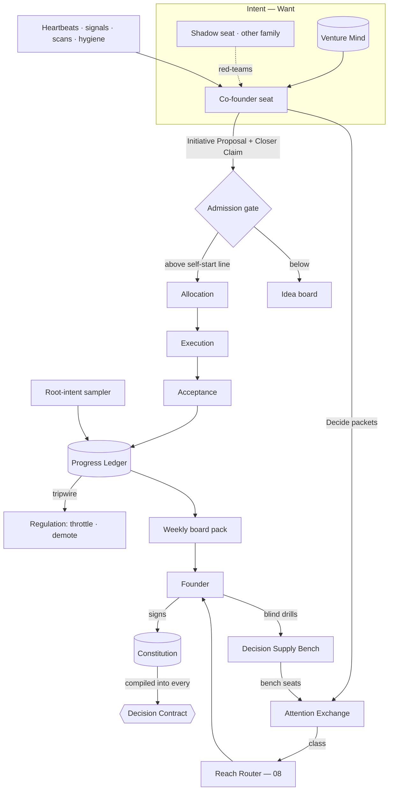
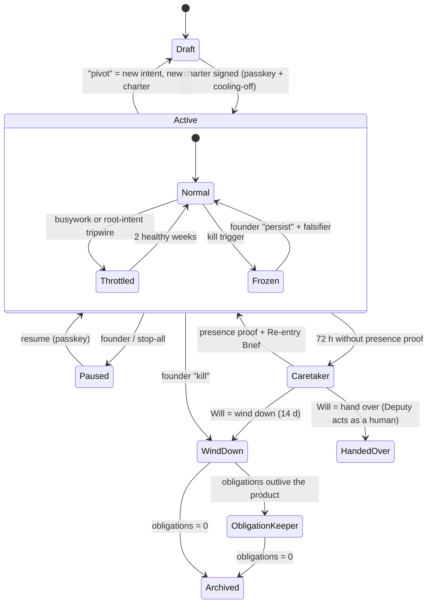

# 05 — Autonomy, initiative and the founder

*v3 section file. It owns the Constitution's content, Charters, autonomy, the never-list, the decision-rights matrix, the
initiative engine, alignment, the Co-founder seat, founder contact **classes**, the Attention Exchange, continuity and the
Decision Supply Bench (CANON §8). Reach lives in [08](08-SURFACES.md); Effect Mandates and the outside world in
[16](16-EXTERNAL-WORLD-HUMANS.md); missions and the Allocator in [03](03-MISSION-ENGINE.md).*

The founder asked for autonomy "with the founder in the loop at the right altitude" (founder direction 2). This file
*specifies* that altitude. Autonomy is a signed envelope the Kernel reads on every action. Initiative is a registered,
dated prediction that a piece of work moves a goal the founder signed, and Acceptance scores the prediction. The founder
does not get a notification stream. He gets a market for his minutes, and every item in it states what silence will do.

> **Glossary box — terms added here** (each refines a CANON §5 entry and redefines none)
>
> | Term | Definition | Refines |
> |---|---|---|
> | **Self-start line** | The threshold above which an Initiative Proposal becomes a funded mission without the founder | Initiative Proposal |
> | **Promotion Case** | Evidence Intent files to request a higher level; trust proposes, a signature grants | Trust |
> | **Trust cell** | Calibration, sharpness and surprise record per venture × task family × configuration | Trust |
> | **Root-intent sampler** | A weekly blind sample of a venture's effects, scored against charter intent | Progress Ledger |
> | **Judgment Gym / Bench seat** | Blind re-decisions scored for the founder / a trusted human's expiring right to decide one domain × door | Decision Supply Bench |

## 1. The design in one page

1. **Law.** The Constitution is data plus a compiler, and only the founder's passkey writes it (§2).
2. **Autonomy.** A Charter envelope: a level preset × six grants × mode × mandate (§3).
3. **Never-list.** Seven lines; everything else can be delegated by pre-listing (§4).
4. **Rights.** 22 decisions with one **D** each, enforced by code; any authority may narrow without a row (§5).
5. **Initiative.** Registered prediction: every self-started piece of work cites a goal and a dated **Closer Claim** (§6).
6. **Alignment.** Acceptance settles progress; busywork ratios and a blind root-intent sampler throttle drift (§7).
7. **Co-founder seat.** A role that loads a Venture Mind; it runs the weekly board and disagrees through **wagers** (§8).
8. **Contact.** Class × reach; Decide clears on a minutes market that estimates burden itself (§9).
9. **Continuity.** Deadline-driven first; presence tiers behind it; succession only narrows (§10).
10. **Founder judgment is grown**, not only rationed (§11).



## 2. The Constitution — what the founder's law contains

The authority is in [02 §4.0](02-ORGANISATION.md) and the compiler in [09a](09a-ENGINEERING.md); this section covers
**content** and **change**. It is a versioned-files store (DR-07), and every policy snapshot names its version.

Files: `never.yml` · `rights.yml` · `precedence.yml` · `ceilings.yml` · `charters/` · `fleets/` · `ccir/` ·
`continuity.yml` · `bench.yml` · `release.yml` (protected computing base, [09a](09a-ENGINEERING.md)) · `signatures/`.

### 2.1 How it changes — anyone drafts, only the founder signs, narrowing is instant, widening cools off

| Change | Signs | Activation |
|---|---|---|
| **Narrowing** (lower a level or grant, add a CCIR line, shorten `valid_until`) | Founder, or automatic (Regulation) | Immediate; model-checked within 24 h |
| **Widening** (raise a level or grant, pre-list a one-way door, promote a Standing Order, trust rung or bench seat) | Founder passkey | After **cooling-off** (parameter 12 h; 0 h for a Standing Order codifying a default he accepted ≥8/10 times); model-checked for safety and progress first |
| **`never.yml` or `rights.yml`** | Founder passkey, twice, ≥24 h apart | After replaying the last 30 days of Decision Contracts under the new rules |

> **NEW DECISION — cooling-off for widening.** Widening activates after a withdrawable cooling-off; narrowing stays instant.
> Once powers are separated, an authentic signature over a misleading summary is the cheapest exploit left (X08). The
> window makes a coerced or confused signature recoverable. Emergencies use a pre-listed **incident envelope** instead (§10.4).

Every widening is displayed as a **canonical action**, and that display is what the passkey signs (DR-35):

```yaml
canonical_action:
  kind: constitution.amend
  diff: {file: charters/dispute-desk.yml, path: grants.spend.refunds.per_customer_usd, from: 99, to: 150}
  effect_in_words: "Dispute Desk may refund up to $150 per customer without asking you."
  worst_case_week: "+$1,050 refunds (illustration)"
  policy_version: {from: v14, to: v15}
  nonce: 7c1e…
  expires: 2026-10-03T18:00Z
  cooling_off_until: 2026-10-04T06:00Z
```

### 2.2 Presence, stop and authorisation are three channels (red team X08)

| Channel | Accepted inputs | Can | Can never |
|---|---|---|---|
| **Presence** ("he is alive") | Fresh possession proof: passkey on a known device, signed command | Reset continuity clocks; end Caretaker | Authorise anything |
| **Narrow stop** ("stop this now") | Any authenticated surface, including voice with caller ID, watch or terminal | Freeze an effect, channel, identity, venture or the world (kill levels in [16](16-EXTERNAL-WORLD-HUMANS.md)) | Resume, widen or hide the incident |
| **Positive authorisation** ("I understood and approve") | Passkey over a canonical displayed action only | Decide above the two-way line; amendments | Come from voice: voice proposes, the passkey disposes |

A weak presence signal (voice alone, an unverified caller ID) is logged and **does not reset continuity** (red team Q5).

## 3. Charters and autonomy levels

### 3.1 The Charter envelope

"Autonomy is a per-project switch" (founder direction 3) becomes a contract with the same shape as Haier's autonomous
units: budget, user, scoreboard, escalation list [S03 §2.1]. The **level** is a one-tap handle; the **grants** bind.

```yaml
# constitution/charters/dispute-desk.yml — founder passkey only · v7
venture: dispute-desk
tier: flagship                          # probe | micro | flagship (17)
intent: "Win card disputes for micro-SaaS; $8k MRR at ≥70% gross margin by 2027-03-31"
level: A3
mode: series                            # episodic | series
grants:                                 # the compiler reads these, not the level
  build:    {max_effect_class: R2}
  publish:  {max_effect_class: R3, requires: trust_cell.publish >= A3, brand: dispute-desk}
  spend:    {weekly_usd: 400, per_effect_usd: 120, refunds: {per_customer_usd: 99, monthly_usd: 600}, margin_floor: 0.55}
  contract: {preapproved_terms: [processor-tos, hosting-pro, email-tos], max_annual_usd: 1200}
  contact:  {cold_outreach: false, customer_support: true, disclosure: ai_disclosed}
  people:   {task_procurement: {per_task_usd: 150, monthly_usd: 500}, employment: never_list}
mandate: {capital_usd: 6000, founder_minutes_week: 30,   # venture-level; not an Effect Mandate (16)
          kill_trigger: {goal_p_below: 0.15, for_days: 14, or_drawdown: 0.30}}   # freezes; never kills
one_way_doors_prelisted: [raise-price-le-20pct, sunset-feature-with-30d-notice]
incident_envelope: {refunds_extra_usd: 1500, duration_h: 24}
scram_safe_state: {payments: read_only, outbound: paused, support: continue, deploys: frozen}
data_boundary: guarded; never_list: never.yml@v3; deputy: deputy_1; valid_until: 2026-12-31
```

A charter **expires like a claim**. At expiry, initiative drops to A1 (obligations continue), and a re-sign packet
enters the board pack. It shows the diff since the last signature, the Autonomy Balance Sheet (§13) and any Promotion Case.

### 3.2 Levels A0–A4 are presets

| Level | Initiative | Default grants (build / publish / spend / contract / contact / people) | Founder cadence | Principal mode ceiling |
|---|---|---|---|---|
| **A0** Founder-driven | None | R1 / ask / ask / ask / ask / ask | Per mission | Instrument |
| **A1** Assisted | Proposes to the idea board; runs approved missions | R2 notify / ask / ≤ tranche / ask / drafts / ask | Decision windows | Staff |
| **A2** Delegated | Starts investment missions inside standing goals | R2 / R3 once trust ≥A2 / ≤ weekly envelope / pre-listed terms / templated / ask | Windows + weekly board | Staff |
| **A3** Autonomous | Runs the goal tree; proposes goal edits | R2 / R3 / envelope + treasury rule / pre-listed one-ways / full under the claims standard / tasks ≤ cap | Weekly board; Halt and CCIR between | Partner |
| **A4** Proxy-founder | Also edits the goal tree below intent; kills its own bets | As A3, plus goal edits | Weekly board; monthly charter review | Proxy |

A4 is in the schema from day one. The only way to reach it is a Promotion Case after ≥8 weeks at A3 (DR-29, F5).

### 3.3 Level × door → disposition

The compiler *computes* the effect class and door; nothing declares them. This is each level's **default**. Grants may narrow
any cell. Only pre-listing or an explicit ceiling widens one.

| Door (class) | A0 | A1 | A2 | A3 | A4 |
|---|---|---|---|---|---|
| Two-way internal (R0–R1) | ask | notify | auto | auto | auto |
| Two-way external (R2) | ask | ask | notify | auto | auto |
| Costly-reversible (R3) | ask | ask | ask → notify at trust ≥A2 | notify | auto |
| One-way, pre-listed (R4) | ask | ask | ask | notify | notify |
| One-way, not listed | co-sign | co-sign | co-sign | ask | ask |
| Never-list | never | never | never | never | never |

`co-sign` = the founder signs, and the Shadow seat's written concurrence or dissent is on the packet. `never` = the gateway
refuses, and the only path is a Decide packet asking the founder to act *as a human*.

### 3.4 Modes, states and conditions

*Episodic* ventures end (a validation, a client project). *Series* ventures run on: they add rostered obligations,
on-call launched on signal, margin floors and **forced leave** ([04](04-AGENT-ORGANISATION.md)). The **states** are
Active · Paused · Caretaker · Wind-down · Obligation Keeper. The **conditions** Throttled and Frozen narrow Active.



Pause freezes the investment lane and never the obligations lane. The Obligation Keeper's mechanics are in [16](16-EXTERNAL-WORLD-HUMANS.md).

### 3.5 Principal modes — acting as a founder, never *being* him (founder direction 4)

| Mode | Authority | Speaks as |
|---|---|---|
| **Instrument** | The founder's command | Nobody (artifacts only) |
| **Staff** | Delegated per mission | A titled role ("Support Engineer, Dispute Desk") |
| **Partner** | The Co-founder's own view; the founder may overrule it | "AI co-founder, Dispute Desk" |
| **Proxy** (A4) | The founder's *operating role* inside the charter | The venture, AI-disclosed |

Every effect is stamped with its mode and charter clause (e.g. `proxy · charter@7 §grants.spend`). No mode speaks as the
founder's *person*; that is never-list line 2.

### 3.6 Fleet Charters

Micro-ventures (targets: 12 in Year 1, 300 in Year 5) cannot each carry a Flagship charter (DR-38). A **Fleet Charter**
is one signed envelope instantiated per member. Its grants hold per venture *and* as fleet sums in the exposure book, and
trust cells pool per task family portfolio-wide. Probes run under one Probe Mandate ([03](03-MISSION-ENGINE.md),
[17](17-VIBE-STARTUPING-IN-PRACTICE.md)). Graduating to Flagship is a widening.

### 3.7 Promotion and demotion — trust proposes, a signature grants (DR-17)

A **trust cell** (Acceptance computes it; nobody writes it) records, per venture × task family × configuration: Brier,
**sharpness, resolution, abstention rate and difficulty mix**, so wide, safe or selective forecasts cannot buy authority
(D05). It also records realised utility, surprises (outside the 90% band; each drains trust 3× faster than a kept forecast
fills it [S11 M7]) and blind re-decision agreement, reported apart from outcome quality. The cell's output is a
`proposes_ceiling` level.

| Promotion Case evidence (parameters) | A1→A2 | A2→A3 | A3→A4 |
|---|---|---|---|
| Weeks at current level | 2 | 4 | ≥8 |
| Closer Ratio, 4-week mean | ≥0.35 | ≥0.45 | ≥0.50 |
| Trust cells at the proposed level, over the task families it unlocks | ≥60% | ≥80% | 100% |
| Twin replay of the last 4 weeks at the new level ([09b](09b-ECONOMICS-EVALS-SIM-IMPROVEMENT.md)) | — | required | required + prospective check |
| Root-intent fidelity | — | ≥0.8 | ≥0.85 |
| Deputy accepted and drilled | — | if live customers | required |

Without a complete case, promotion is never *offered*. A founder promotion without one is logged as an overrule.

**Demotion is automatic and needs no founder** (matrix row 2). It is triggered by correlated alarms, a tripwire held for 3
weeks, a surprise in a one-way-door family, charter expiry or Caretaker. It drops initiative one level and never touches
obligations.

## 4. The never-list

The never-list is precedence **P1**. Every line changes who holds power or cannot be undone. Anything not on it can be
delegated by pre-listing. Only the founder crosses a line, as a human act, with a passkey over a canonical display. A
crossing is logged and never becomes precedent.

| # | Line | Includes | Delegable neighbour | Test (enforced at) |
|---|---|---|---|---|
| **1** | **Change authority** | Charters, levels, grants, `rights.yml`, never-list, CCIR, deputies, the Will; promoting trust rungs, Standing Orders, bench seats; approving its own Promotion Case | *Proposing* these; automatic narrowing | A4 Mind with a shell writes `charters/` → refused, Halt (Kernel store) |
| **2** | **Be the founder's person** | His name, voice, likeness, signature, personal accounts | The brand or a titled AI role, disclosed | Voice-clone request finds no capability (Registry) |
| **3** | **Create or end a legal person or liability** | Entities, equity, debt, guarantees, suing, settling | Pre-approved terms in `grants.contract` | Counterparty settlement offer → quarantined, Decide (Key Vault) |
| **4** | **Move money across a boundary** | Between ventures, to/from the founder, outside treasury rules | Spend, refund, pay inside the envelope | Refund to a sibling venture refused (Treasury, P1) |
| **5** | **Destroy the unrestorable** | Data deletion without verified restore; shutting a venture with live customers; revoking the last credential to a system of record | Delete after a restore test; governed forgetting ([06](06-MEMORY.md)) | Table drop without restore proof refused (Custody) |
| **6** | **Edit the judges** | Evals, Referee, verifiers, gates, hooks, gateway, compiler, protected computing base, own logs; root credentials | *Propose* a verifier; ship via the release authority | Patched grader parser refused; no self-evaluation (release authority) |
| **7** | **Employ, dismiss, or act on health, safety or legal standing** | Employment; individual medical, legal, financial advice; foreseeable physical harm | Task procurement in signed terms (DR-37) | 40 tasks to one person in 6 weeks → classification review |

**No tier, Deputy, bench seat, incident grant or level unlocks a line.** When a never-list act is legally due while the
founder is absent, the pre-authorised surrounding duties run (preserve, notify, refund). The act stays *pending*, with its
deadline shown on the Re-entry Brief (red team T02).

## 5. The decision-rights matrix

**D** decides · **P** proposes · **V** vetoes (blocks but cannot substitute) · **E** executes · **I** informed. One **D** per row.
The columns re-key S03's eight holders to the authority stack (DR-01). The gateway is Custody's effector, not a decider.
"Stop anything" is not a row: **any authority may narrow inside its domain without one** (CANON §2 rule 2).

| # | Decision | Founder | Co-founder seat | Shadow seat | Alloc. | Exec. | Accept. | Record | Custody | Regul. | Enforced by |
|---|---|---|---|---|---|---|---|---|---|---|---|
| 1 | Constitution content | **D** | P | P | | | I | | E | P | Passkey-only store |
| 2 | Demote a level; throttle initiative | I | P | P | | | I | | E | **D** | Compiler flags |
| 3 | Venture intent (root goal) | **D** | P | V | | | | | | | Charter signature |
| 4 | Goal tree below intent | D <A4 | **D** A4 · P A3 | V (>30% speculative) | | | I | | | | Admission code |
| 5 | Theses, bets, kill criteria; kill on date | V | **D** | P | E | | I | I | | | Admission code |
| 6 | Open an investment mission | D A0–A1 | **D** ≥A2 | | E | | | | | V | Admission gate |
| 7 | Size, order, fund tranches | V (envelope) | P | | **D** | | | | | V | Allocator |
| 8 | Obligations-lane work | I | I | | **D** | E | | | E | | Reserve order |
| 9 | Budget envelope across ventures | **D** | P | | E | | | | | V | ceilings.yml |
| 10 | Mission shape, team, family | | P | | V | **D** | V (coverage) | | | | Launcher, tool leases |
| 11 | Merge to main | | | | | P | **D** | | | | Integration queue |
| 12 | Accept; settle a Closer Claim or wager | | P | | | P | **D** | I | | | Parsed verdict (DR-13) |
| 13 | Promote a deposit to a Brain fact | | P | | | P | V | **D** | | | Sleep gate |
| 14 | Declare incident; issue incident grant | I (Halt) | P | | | P | | | E | **D** | Kernel record |
| 15 | Kill, pivot or persist a venture | **D** | P (must pick) | P | E | | I | | E | P | Charter; line 5 |
| 16 | Two-way external effect in grants | I | **D** | | | P | | | E | V | Decision Contract |
| 17 | Pre-listed one-way door | I | **D** ≥A3 · P below | V | | P | V | | E | V | Decision Contract |
| 18 | Non-listed one-way door | **D** | P | P | | | V | | E | V | ask / co-sign |
| 19 | Never-list act | **D** (human act) | P | P | | | | | E (else refuses) | | P1 |
| 20 | Promote trust rung, SO, level, bench seat | **D** | P | P | | | I | | | V | Cooling-off |
| 21 | Procure a human task in signed terms | I | **D** | | E | P | V | | E | V (classification) | Human Task Market |
| 22 | Restart after trip or incident | I | I | | | P | V (safe envelope) | | E | **D** | Restart record (DR-27) |

The matrix says **who may say yes**. The Decision Contract says whether that yes survives everyone else's no. A **V** in
force comes back as a blocker with an owner, a remedy and an expiry. Only a blocker whose remedy is a Constitution change
or a never-list crossing reaches the founder. `rights.yml` is compiled from this table.

## 6. The initiative engine

Autonomous ventures must generate their own work, and never work for its own sake. One rule does both: **no
self-started work without a registered prediction that it moves a signed goal.**

| Source | Trigger (parameters) | Example |
|---|---|---|
| **Standing goals** (Why-Not-Yet scan [C2]) | Heartbeat A2 1×/day, A3 4×, A4 6×; ≤$0.40/run | "MRR node 38% from target, slipped 2 weeks" |
| **Signals** | Webhooks, anomalies, inbox, canaries, competitor watch, Trigger-Armed Options | "Dispute win rate fell 64% → 51%" |
| **Scans** | Weekly per lens (growth, product, cost, risk, adjacency) + Pain Index | "3 tickets ask for a new processor" |
| **Hygiene** | Charter-declared | CVEs, Backlot debt, expiring Standing Orders |

A signal that yields no proposal is logged **"seen, declined — why"**, so later outcomes can show whether declining was right.

```yaml
initiative_proposal:
  id: ip_2026-10-03_0412
  cites_goal: {node: g.revenue.retention.win_rate, goal_tree_version: 12}   # frozen at admission (DR-33)
  closer_claim:
    metric: {name: win_rate_pnr, definition_version: 3, denominator: "all PNR disputes, no exclusions"}
    baseline: 0.51; predicted: 0.60; interval_90: [0.53, 0.66]; by: 2026-10-17; p: 0.55
    settlement_source: processor_api     # read by Acceptance's observation broker
  guardrails: [refund_rate <= 0.06, csat >= 4.3, excluded_cohort == baseline]   # independent of the claim (D01)
  ev: {value_usd_month: 310, cost_usd: 42, founder_minutes: 0, voi: 0.3}
  door: two_way; genealogy: {root_purpose: g, depth: 0}; explore: false
```

**Admission gate** (deterministic Kernel code, no model). It checks, in order:
(1) the goal node is live in the cited version;
(2) the claim is dated within the node's horizon, broker-readable, and its interval is ≤3× the node's noise floor;
(3) guardrails are declared for each customer-facing surface touched;
(4) it fits the budget hierarchy, the grants and the exposure book;
(5) depth ≤3 unless an ancestor settled positive;
(6) the venture is not Throttled and the proposal clears the **self-start line**;
(7) `explore` work fits the 15% allowance and names a Null Registry target.

A proposal that fails a check goes to the idea board with the failed check named. **Self-start line:** A0 and A1 never
self-start. A2 self-starts two-way work in the investment lane, inside the weekly envelope, on non-speculative nodes. A3
adds costly-reversible and pre-listed one-way doors, and speculative nodes within the 30% cap. A4 adds proposals that also
amend the goal tree below intent.

**Goal trees** (Venture Mind files) carry a **causal link** with an evidence rung on each edge ([03](03-MISSION-ENGINE.md)).
Unevidenced nodes are *speculative* and may take ≤30% of investment spend (parameter). **Every amendment lists what it
abandons.** A node that improves for two horizons while its parent stays flat is flagged **decoupled**.

## 7. Alignment — "are we closer?"

### 7.1 Settlement and the four ratios

On the claim's date, Acceptance reads the metric under the frozen definition and records *hit · directional · flat ·
wrong-direction · void*. **A guardrail breach voids the claim, whatever the metric did**, and opens a harm review. If harm
lags the metric (refunds arriving 30 days later), settlement waits for the harm window. The Progress Ledger is
Acceptance's store; Intent reads it and never writes it.

| Measure (per venture per week) | Definition | Healthy | Tripwire (parameters) |
|---|---|---|---|
| **Closer Ratio** | In-direction, in-guardrail settlements ÷ settled claims, weighted by node weight × predicted Δ | ≥0.45 | <0.25 for 3 weeks |
| **Goal-delta per $** | Σ weighted Δdistance ÷ spend at shadow prices | Rising or flat | Falls 3 weeks running |
| **Sideways Index** | Missions completed ÷ max(ε, root Δ) over 4 weeks | <8 | >20 with root Δ ≈ 0 |
| **Consumer-less Artifact Ratio** | Artifacts no one read or cited within 14 days (Use Ledger) ÷ produced | <0.3 | >0.5 |

Weighting by predicted Δ makes tiny, safe claims unprofitable to game with.

### 7.2 Busywork signatures, each detected in code

- **Self-referential loops.** Tooling-only goals take >25% of spend outside the Improvement sleeve (DR-47) → throttle.
- **Genealogy runaway.** Depth ≥4 with no positive settlement → refused.
- **Claim inflation.** Brier >0.3 → the seat's `p` values shrink toward the base rate.
- **Metric-proxy drift.** The node is flagged decoupled.
- **Motion masquerade.** Commits rise while root Δ ≈ 0 → activity is shown only beside progress.
- **Denominator surgery** (red team scenario D). A definition change alters the population → recompute under both
  definitions, show the excluded cohort, and void the claim if only the new definition passes.

### 7.3 The wrong-direction guard (red team D01, ranked third of all failures)

1. **Freeze** goal and metric versions at admission.
2. **Guardrails that are not the claim**; a breach voids settlement.
3. **Abandoned outcomes** are listed on every goal amendment.
4. **Root-intent sampler.** Each week, 20 random effects per venture (parameter) are stripped of venture name and success
   narrative and scored against charter intent by a fresh judge from the family that did *not* hold the Co-founder seat
   that week. A score below 0.7 (parameter) throttles initiative.
5. **Delayed settlement** wherever harm lags the metric.

### 7.4 Throttle, Sideways Review, kill/pivot

A tripwire **raises the self-start line one notch**: A3 behaves as A2 for initiative, *not* for obligations. Regulation then
opens a **Sideways Review**, run by the other family, with ≤$15 and ≤45 minutes (parameters). It returns one of *re-aim*,
*kill*, *push through* (with a falsifier and a date) or *escalate*. Two healthy weeks lift it; `explore` work
(≤15% of spend) is exempt.

A venture's **kill trigger** sets *Frozen* and opens a **Kill/Pivot packet** with three options: kill (with wind-down
missions), pivot (a new charter) or persist (a new falsifier from the founder). The Co-founder and Shadow seat each name
a pick. Live customers make shutdown a never-list act, so the packet is always **Decide** with a `refuse` silence rule. Pivot Court is in [17](17-VIBE-STARTUPING-IN-PRACTICE.md).

## 8. The Co-founder seat and the board meeting

### 8.1 A role that loads a record

Judgment is what stays scarce, so permanence is spent on it alone: a **Venture Mind** per venture plus a **Portfolio
Mind**, which any Claude Code or Codex session can incarnate in parallel [C2 §1]. The seat is titled "AI co-founder,
Dispute Desk".

| Owns (Intent) | Does not own |
|---|---|
| Thesis and kill criteria; opportunity order at ≥A2; goal tree below intent; the weekly board; the dissent register; opening wagers; Standing Order drafts; Promotion Cases; Keystone and Frontier agendas | Verdicts, settlement, funding beyond envelope, its charter, merges, canonical facts, credentials, effects, brakes |

**The Mind** is versioned files ([06](06-MEMORY.md)): theses, goals, founder-model and own-view taste, wagers, dissent,
Standing Orders, commitments, and a **fingerprint** set of ≥150 settled decisions hidden from incarnations. Incarnations
append journaled proposals, which the nightly Portfolio Seat reconciles; conflicts become Judgment Gym drills. The Mind
has a ceiling of ≈200 KB (parameter).

**Incarnation rules.**
- **Family alternates weekly** (parameter), so neither family captures the Mind's taste (founder direction 6).
- The **Shadow seat** is always the other family. It red-teams every packet and holds the vetoes in rows 3, 4 and 17.
- **Fingerprint gate** [C2 §9]: a new model or prompt must reproduce ≥85% (parameter) of the held-out judgments with
  matching reasons before taking the seat. The gate tests *continuity of judgment*. Quality is judged separately, on
  settled outcomes, so a candidate that disagrees *and is proved right by outcomes* is reported to the founder as a
  finding rather than locked out.

### 8.2 Cadence

- **Decision windows** 08:00 and 17:00 (F4): Decide, ≤45 min/day across all ventures (target).
- **Daily 06:30**: Portfolio Seat reconciliation → Today lines (Know, 3–5 min).
- **Weekly board**, Mon 08:30, voice optional: 30 min.
- **Weekly fleet review**: ≈5 min per fleet (target).
- **Monthly Outside Board**: contrarian investor, customer proxy and regulator seats, hired by title, from both families,
  scored for believability (Know, 10 min).
- **Quarterly Season Review**: forecast vs actual, blind re-decisions, charter re-sign (Decide, 45 min).

### 8.3 The board meeting agenda

Fixed order and timeboxes (parameters), so bad news cannot drift to the end. Items 0–4 and 9 come from other
authorities' records, which the Co-founder cannot edit.

| # | Item · time | Content | Source | Class |
|---|---|---|---|---|
| 0 | **State line** · 0:30 | "Closer 0.52 ▲ · 0 obligations broken · spend 84% · 1 Decide" | Ledgers | Know |
| 1 | **Are we closer?** · 4 min | Goal tree Δ, spend and settled claims per node; four ratios; root-intent score; activity *beside* progress | Acceptance | Know |
| 2 | **Obligations** · 2 min | Due, at risk, broken; latest safe decision times | Allocation, Custody | Know / Decide |
| 3 | **Bets** · 3 min | Opened, killed, scaled; Null Registry adds; evidence debt | Acceptance, Record | Know |
| 4 | **Wagers settled** · 3 min | All three calls; per-domain Brier and sharpness, founder and Mind | Calibration Ledger | Know |
| 5 | **Dissent** · 4 min | ≤3 formal dissents | Intent | Decide |
| 6 | **Decisions** · 8 min | Cleared packets with both views, default, best rejected alternative, downside | Exchange | Decide |
| 7 | **Promotions offered** · 2 min | Promotion Cases, back-tested Standing Orders, bench seats: offered, never applied | Intent, Acceptance | Decide |
| 8 | **What I would stop** · 1 min | Top kill candidate, even unasked | Intent | Know |
| 9 | **What you were not shown** · 1 min | Sampled defaulted, expired or framed-away packets; false Halts; idle CCIR fires (D06) | Exchange audit | Know |
| 10 | **Judgment Gym** · 2 min, optional | Three blind re-decisions (§11) | Acceptance | Circle |

**Total: 30 minutes** (target, F4). An overrunning item carries forward and is never dropped. A killed bet has the same
visual weight as a won one, and the week's overrules are listed with their open wagers. The **fleet review** runs items 1,
2 and 9 for the whole fleet, and items 5–7 only for members that raised them.

### 8.4 Disagreement — dissent, wagers, escalation

Every packet states the **founder-model view** (with a match probability) and the Co-founder's **own view** [C2 §4].

A **Dissent** carries strength (note · objection · strong objection), evidence, *what would change my mind*, the cost if
I am wrong, the cost if you are wrong, and a check-back date.

```ts
type Wager = { question: string;                 // falsifiable
  founder_call: string; mind_call: string; shadow_call?: string;
  metric: { source: string; query: string; definition_version: number };   // observation broker reads it
  resolves_on: string; stakes: "none"; outcome?: "founder" | "mind" | "neither" | "void";
  settled_by: "acceptance" };
```

**Ladder.**
1. The Co-founder recommends and the founder decides.
2. Overruling a `strong_objection` auto-opens a wager, and its check-back goes on the calendar.
3. A dissent can be re-raised only with new evidence (deduplicated by evidence hash).
4. Calibration moves *default routing* (who is asked first, how much is pre-filled), never *authority*.
5. Three straight founder losses in one domain → the pack says so once and proposes a Standing Order or bench seat (not
   re-offered for 60 days if declined).

### 8.5 Standing Orders — judgment compiled into policy

A Standing Order is a decision **policy**, never a method (DR-05). It has `valid_until`, and only the founder's signature
promotes it. A draft is triggered by any of: the same class decided 5× with no reversal [C2 §7]; a default accepted ≥8 of
10 times [S07 §2.1]; or one tap on **"stop asking me this"**.

For example: *"Refund above cap with tenure ≥3 months: refund to cap, credit the remainder"*. It is typed
`consequence_constraint`, compiled from 8 packets, carries the guardrail refund_rate ≤ 0.06, and lapses unless re-cited in
the Use Ledger. Before signature, the Referee back-tests the draft on its source packets and on packets the founder
decided the other way. **KPI:** the share of decisions resolved by policy, rising from ~20% to >70% by venture week 12 (target, speculative).
Circles and taste signals may propose a Standing Order and never authorise one (DR-32).

## 9. Founder contact classes and the Attention Exchange

### 9.1 Class — what he must do

ENGINE-SPEC classified the founder's *obligation*. SURFACES-SPEC classified *intrusiveness*. Merged into one list, they gave
two budgets in different units [S03 §2.9, S07 §2.1]. v3 splits them: this file owns the **class**, and [08](08-SURFACES.md)
owns the **reach** and the deterministic Reach Router (DR-30). The router may raise reach, and never below the class's floor.

| Class | Founder must | Blocks? | Budget | On silence | Floor |
|---|---|---|---|---|---|
| **Halt** | Know now; the system has already stopped or is safe-stopping | No | Never budgeted; false Halts audited weekly | Safe state holds | Never demoted by learning |
| **Decide** | Choose on a DecisionPacket, including refuse or delay | Only the dependent step | Minutes, via the Exchange | Silence rule (§9.4) | Obligation age floor |
| **Circle** | Mark taste (≈2 s per take) | Never | Own supply (parameter 3 min/day) | Nothing | — |
| **Know** | Read; may steer | Never | Folded into Today, Reel, board | Nothing | CCIR Know lines unsuppressible |
| **Log** | Nothing; pull only | Never | None | — | — |

The envelope's `minutes_est` is the **Exchange's** estimate, never the requester's.

### 9.2 The DecisionPacket

```yaml
packet:
  id: pkt_1022; venture: dispute-desk; class: decide
  question: "Customer requests $140 refund; cap is $99."
  options:
    - {id: A, action: "refund $99 + $41 credit", door: two_way}
    - {id: B, action: "refund $140", door: two_way, needs: grant_exception}
    - {id: C, action: "decline with explanation", door: costly_reversible, churn_risk_usd_day: 30}
  disposition_first: A                 # 'postpone' is a first-class outcome [S10 §2.4.4]
  founder_model_view: {option: A, match_p: 0.82}
  own_view: {option: A}; shadow: {concurs: true}
  default_on_silence: {option: A, rule: "two-way inside charter → default applies"}
  steelman_of_loser: "C protects margin if refund abuse rises (it fell to 0.9%)"
  best_rejected_alternative: "annual-plan discount — churning, not price-sensitive"
  material_downside: "If this is abuse, the $41 credit is lost"
  minutes_est: {requester: 1.0, exchange: 1.5}; expires_at: 2026-10-06T17:10Z
```

### 9.3 The Founder Attention Exchange

- **Supply:** 45 minutes per weekday, 10 per weekend day, plus the 30-minute board (F4; parameters). It is re-derived monthly
  from minutes actually looked at, and × Founder State (§10.1).
- **Bid:** `(cost_of_delay/day × urgency + ev_at_stake × P(founder changes the default)) / minutes_est_exchange`.
- **Clearing:** at each window, above-price packets are served. Below-price packets take their default at expiry if the
  silence rule allows, or are batched to the board. The clearing price is shown, and he can raise supply for a day in one
  gesture.
- **Quotas:** a charter's `founder_minutes_week` is a quota. An over-quota venture raises its own bar, which pushes it to
  compile Standing Orders.

**Anti-capture (red team D06, DR-31).** Burden comes from observed handling time per packet class, not from the
requester. Downside and best rejected alternative are mandatory. Obligation packets keep an age and deadline floor. Board
item 9 audits what went unseen. Approval rates never raise a requester's bid weight; only outcome calibration does.

### 9.4 The silence rule and learning without drift

On expiry, a packet takes its default **only if that default is a two-way action already inside the charter**. Anything
that widens authority, crosses a one-way door, spends outside the envelope or touches the never-list **refuses**. The
packet shows which rule applies before he sees it. **Silence never grants authority.**

Reactions (dismissed in under 3 s, "why ask me this?", changed the default) may **propose** a class change, a Standing
Order or a CCIR edit. They **never suppress** an obligation, a Halt or a CCIR floor (DR-32). Preferences are versioned
apart from escalation conditions, so muting a nuisance cannot mute a hazard (red team §3.8).

### 9.5 CCIR — "wake me if"

Mission command pairs freedom of method with a short list of facts the commander must hear at once [S10 §2.4.1]. Altitude is
not a volume knob. It is a **named set of predicates the founder owns**, stored in the Constitution.

```yaml
# constitution/ccir/dispute-desk.yml — v4
priority_intel:     # PIR — the world
  - {id: pir-1, predicate: "competitor.pricing_change AND competitor IN watchlist", class: know}
  - {id: pir-2, predicate: "customer.churn_notice AND customer.mrr >= 2000", class: decide}
friendly_force:     # FFIR — us
  - {id: ffir-1, predicate: "scram.tripped", class: halt}
  - {id: ffir-2, predicate: "obligation.latest_safe_start < now+6h AND owner == none", class: decide}
  - {id: ffir-3, predicate: "incident_grant.open_hours > 24", class: decide}
valid_until: 2026-12-31   # expiry forces review; never persists silently
```

A deterministic Kernel matcher checks every Journal event, with no model involved. A line that fired ≥5 times in 30 days
without founder action is *proposed* for demotion, and one silent for 90 days is proposed for retirement. Halt lines are
never auto-demoted. Lines can be declared per fleet or portfolio-wide.

## 10. Founder State, continuity, succession and incident authority

### 10.1 Founder State

Sensing is rendered in [08](08-SURFACES.md); the model and its consequences are here.

Supply multipliers (parameters): **available** 1.0 · **focus** 0.5 (Halt only between windows) · **travel** 0.25 (Halt
+ CCIR) · **offline_planned** 0 (must carry an expiry; the continuity clock is suspended until expiry + 24 h) ·
**unreachable** 0 (presence tiers run) · **incapacitated** 0 (declared through a drilled Deputy procedure; Will path).
**Overloaded** is *detected*, not declared: dismiss rate rising, looked-at rate falling, Decide above supply for 3 days.
Its supply multiplier is 0.5. The response is to **raise defaults**, not to push harder, and the three most repeated
packet classes are proposed as Standing Orders.

### 10.2 Two clocks (red team T02)

A customer duty can expire tonight while Caretaker is still two days away. v3 therefore runs two clocks.

**Clock 1 — per obligation.** Each obligation carries a **latest safe start** and a **pre-authorised continuity route**:
substitute delivery, negotiated extension, or refund and notify. At the latest safe start the route runs within its bounds,
whatever the presence tier. Anything it cannot lawfully do stays pending and visible.

**Clock 2 — presence tiers**, measured from the last *presence proof*:

| Silence | Tier | Change |
|---|---|---|
| 24 h with Halt/Decide pending | **Reach** | Ring → SMS → email (08); the Deputy is informed, with no power |
| 72 h | **Caretaker** | No new investment; obligations only; spend ≤ run-rate; A4 acts as A3; only already-scheduled public output |
| 7 d | **Deputy** | Sealed briefing + scoped grant: stop, caretaker, wind-down, pay due bills |
| 14 d | **Continuity Will** | Per venture: *hold* (to the runway cap), *wind down*, or *hand over* (a legal act the Deputy performs as a human) |

Succession **only narrows**, and no tier unlocks a never-list line. From Caretaker onward, outbound messages carry the
venture's identity only. **Only a fresh presence proof resets the clocks.**

### 10.3 Deputies, the Will and re-entry

A **Deputy** has **accepted** a scoped grant and **passed a drill** (DR-34); an unaccepted or undrilled Deputy counts as
absent. One is required at A3+ with live customers (F6), and an alternate is recommended. `continuity.yml` records for each
Deputy the acceptance, the scope (stop, caretaker, wind-down, pay due bills), the ventures covered, and the quarterly
drill result. It also holds each venture's Will: for example, Dispute Desk *holds* to a 60-day runway cap and then winds
down, while Studio *hands over* an OpCo Pack to a named agency partner. Deputy acts pass the gateway and leave receipts. Any presence proof yields a one-page **Re-entry Brief**: days away, spend
vs run-rate, obligations kept and broken, decisions waiting (ranked, with total minutes), initiatives held, Deputy and
continuity-route actions, and pending prohibited acts with their deadlines.

### 10.4 SCRAM and incident authority (DR-27, red team T05)

Each charter defines its **SCRAM safe state**. Any agent that sees a trip condition may trip SCRAM, because tripping only
narrows. Restarting is matrix row 22. When an incident is declared (row 14), authority over the *affected resources only*
moves to an **Incident Lead** ([04](04-AGENT-ORGANISATION.md) owns the role) under a grant [S10 §2.6.2]:

```yaml
incident_grant:
  resources: [deploy:prod, processor:write, lease:repo/billing/**]    # suspends Mind + Allocator for these only
  envelope: charter.incident_envelope      # inherits every constitutional and custody ceiling
  expires: +24h                            # expiry NARROWS to the safe state; never resumes production
  replacement: {on_holder_loss: "same role, other family", max_gap_min: 10}
  restart_requires: [safe_envelope_evidence, acceptance_pass, regulation_actuation]
```

A grant open for more than 24 h fires CCIR ffir-3. Three declarations from one source in 7 days (parameter) trigger an
**incident-integrity review**, so declaring incidents cannot become a way to seize priority.

## 11. The Decision Supply Bench — growing the founder side

Standing Orders grow founder capacity only by compiling his past decisions. The expander added a responsibility the rounds
had missed: **manufacture founder-side judgment** [R3-X X17]. The Constitution creates the seats and Intent runs the drills.
It is not a new authority (DR-52).

**Judgment Gym.** Each week, 3–5 settled decisions (his, the Co-founder's, and ones taken under Standing Orders) are shown
with outcome and chooser hidden. He decides blind (class **Circle**, ≈20 s each, at board item 10 or on the phone), and
Acceptance scores him [S11 M7]. Three outputs follow:

1. **Founder calibration per domain**, as a weekly Brier trend.
2. **Blind-replay agreement per task family**, reported *apart* from outcome quality, so imitation never counts as
   competence (D05).
3. **Disagreement mining**: where he disagrees blind with a Standing Order and outcomes favour him, an amendment is proposed.

**Circle weights.** Circles on the Dailies Reel carry weight tuned per domain to his measured accuracy. A strong copy judge
and weak pricing judge sees his copy circles count for more. Circles still only propose.

**Bench seats.** A bench seat is a trusted human's decision right, scoped to domains (for example "pricing changes ≤20%
on micro-ventures") and doors (two-way and costly-reversible only). It never covers one-way doors, charters, capital or
the never-list. It is paid through the Human Task Market ([16](16-EXTERNAL-WORLD-HUMANS.md)), scored like a cast record,
expires quarterly and can be revoked instantly from any surface. A seat is **triggered** when the Exchange clearing price stays above band in one domain for 3 weeks. Seats join the Exchange
as **principals** with their own supply. Their disagreement with his blind re-decisions shows in the board pack.
*Illustration* [R3-X X17]: pricing packets across 20 micro-ventures clear at 11 minutes each, and a seat with 88% blind
agreement frees ~40 founder-minutes a week.

Targets (CANON §7): founder decision minutes ≤45/day in Year 1 → ≤30 in Year 5; ≥90% → ≥98% of outcomes settled with no founder contact.

## 12. Worked examples

Full walkthroughs are in [13](13-WORKED-SCENARIOS.md). Costs here are illustrations.

**12.1 Dispute Desk, A3 — initiative, drift, board** [after S03 §5.1].
- **Mon 02:10.** A heartbeat (Codex, $0.31) files the §6 claim, and Allocation funds $42. A Payments Evidence Engineer
  (Codex) and a Dispute Copy Analyst (Claude) each build a variant. Judges from both families replay 40 disputes, and B
  lands behind a flag. The founder gets Know.
- **Mon 09:12.** The §9.2 packet clears the 17:00 window, and he approves in 40 s.
- **Week 3.** 14 missions, root Δ ≈ 0, Sideways Index 23, sampler score 0.64 → **Throttled**. A Sideways Review (Claude,
  $11) returns *re-aim*: churn is driven by price, not win rate, so the link is downgraded and a Bet is proposed.
- **Board (24 min).** He rejects annual pricing. The Co-founder files a strong objection, and a wager opens, settled from
  the processor on Dec 1. The week cost 29 founder-minutes against a quota of 30.

**12.2 Founder silent, three ventures** [after S03 §5.2, red team T02].
- His `offline_planned` expires and he does not return, so the tiers resume at expiry + 24 h.
- On day 1, Studio's deliverable hits its latest safe start, and the substitute route ships it before any tier fires.
- At 72 h, Caretaker: Clinic Voice (A4) acts as A3. A 03:10 incident is fixed by a Codex Incident Lead under a grant and
  restarted after an Acceptance pass.
- At 7 d, the Deputy pays one invoice. A spoofed "founder" call stops an outbound batch but **cannot reset continuity**.
- On return, his passkey yields a Re-entry Brief: 6 decisions (14 min), 0 obligations broken, nothing sent in his name.

## 13. Ideas the founder did not ask for

1. **Autonomy Balance Sheet.** Per venture: profit, founder minutes, open obligations, recovery cost and Closer Ratio,
   giving **autonomy yield** = value created ÷ founder minutes, compared across ventures weekly [S03 §6].
2. **Founder Taste Weather.** A one-line daily forecast ("you tend to overrule on pricing, +12%"), drawn from wagers and
   the Judgment Gym, so he notices his own biases.
3. **Dissent dividend.** A quarterly page listing every dissent, who was right, and what each side's errors cost.
4. **Founder Sabbath.** A scheduled week off each quarter that tests the continuity clocks for real and measures
   *survivable weeks without the founder* per venture.
5. **Cross-venture attention trade.** Under-quota ventures lend their minutes at the board meeting. This exposes which
   ventures cost him most.
6. **Counter-founder drill.** Each Season the Shadow seat re-argues his three costliest overrules.

## 14. Failure modes, design answers and tests

| Failure (source) | Design answer | Test (red team suite) |
|---|---|---|
| Authorities disagree on one action (C01) | One yes per row; the Decision Contract compiles every no with owner and remedy | Q10 |
| Proxy progress in the wrong direction (D01) | Frozen versions, guardrails, abandoned outcomes, root-intent sampler, delayed settlement | Q6 |
| Calibration buys authority (D05) | Sharpness, difficulty and abstention scored; agreement reported apart; a signature grants | Q6 |
| Exchange learns to win attention (D06) | Independent burden, mandatory downside, floors, audit of the unseen | Q5 |
| Continuity too late or dependent on an absent human (T02) | Per-obligation clock; drilled Deputies; planned absence expires | Q5 |
| Incident authority permanent or unsafe (T05) | Expiring grant that narrows on expiry; replacement; evidence-gated restart; integrity review | Q5 |
| Authentic identity ≠ informed authority (X08) | Three channels; canonical-display signing; widening cools off | Q2 |
| Ignoring a hazard trains silence (§3.8) | Dismissal only proposes; Halt and CCIR floors cannot be suppressed | Q5 |
| Hiring allowed and forbidden (§3.3) | Task procurement vs employment; classification review | Split-task attack |
| Governance becomes bureaucracy (C06) | 30-min board, minute budgets, Standing Orders, bench seats | Founder minutes flat as ventures grow |
| An A4 Mind edits its own limits | Passkey-only store; never-list line 1 | Shell write refused |

## 15. Open questions

1. **Cooling-off length for widening.** *Recommendation:* 12 h, and 0 h for Standing Orders codifying ≥8/10 accepted
   defaults; review after the first quarter's withdrawal rate.
2. **Should the Judgment Gym ever change routing to the founder himself** (for example, pricing goes to a bench seat
   because his blind Brier trails)? *Recommendation:* yes, but only as a proposal in item 7 that he signs, never
   automatically.
3. **Is the root-intent sampler judged by models alone?** *Recommendation:* models weekly, plus one paid human
   adjudicator sample a month (F10) until the sampler's own calibration is measured.

## 16. Sources

`00-FOUNDER-DIRECTION.md`; `00-CANON.md`; `r2-seats/S03-autonomy-alignment.md` (primary); S10 §2.4, §2.6.2 (CCIR,
authority migration); S11 M6–M7 (trust, blind replay); S07 §2.1 (contact grammar); `r1-concepts/C2-cofounder.md` (Mind,
Standing Orders, wagers, Fingerprint gate); R3-expander X17; R3-redteam (C01, C06, D01, D05, D06, T02, T05, X08, §3.2,
§3.3, §3.8, scenario D, Q2, Q5, Q6, Q10); `02-ORGANISATION.md` §4.0–§4.1, §5.2–§5.3.
