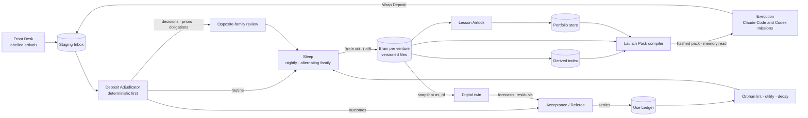
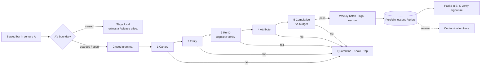

# 06 — Memory: the Brain, the Use Ledger and governed forgetting

*v3 Round 5 · 2026-09-30 · topic per [00-CANON §8](00-CANON.md#8-file-map--who-owns-which-topic). Authority: **Record
(Know)**. Journal internals, label mechanics, encryption and hosts are [09a](09a-ENGINEERING.md); the twin itself is
[09b](09b-ECONOMICS-EVALS-SIM-IMPROVEMENT.md).*

> **Terms this file adds** (each refines a §5 entry)
>
> | Term | Refines | Meaning |
> |---|---|---|
> | Staging Inbox | Wrap Deposit | Per-venture folder of unadjudicated deposits — the only memory path a worker may write |
> | Deposit Adjudicator | Record | Deterministic-first job that checks a deposit's sources, citations and labels, then routes each item |
> | Contested fact | Brain | Two values for one subject + predicate kept side by side with a Question until settled evidence decides |
> | Knowledge lease | Fenced lease | Entity-level fenced lease taken by adjudication; parallel deposits never last-write-win a fact |
> | Metric Mirror | Record map | Pointer + query into a system of record, with a snapshot frozen at each decision that cited it |
> | Influence Sampler | Use Ledger | Weekly paired replay that withholds cited records and checks whether the verdict moves |
> | Memory mass | Stocks (Knowledge) | Active records × mean pack share per venture; a band on Regulation's Knowledge stock, owned by [09b](09b-ECONOMICS-EVALS-SIM-IMPROVEMENT.md) [#4] |
> | Competitor entity | Brain (Entity) | A watched competitor with owner, sources and freshness; emits change events 03 and 05 consume (§11) [G3] |
> | Pool membership | Priors Library | The set of ventures whose priors a domain's pool may combine, decided by an exchangeability check (§9) [G4] |
> | Lineage inventory | Forgetting verbs | Data subject → every object derived from it; what governed erasure walks |

## 1. Memory in one page

The organisation forgets nothing by accident and remembers nothing by default. Every datum must earn a reader, carry its
origin, and have a way to leave. Five rules carry the design.

1. **Truth has one writer.** What we *intend* (Venture Mind) and what we *do* (Execution) never write what we *believe*
   (the Brain). Workers deposit proposals; adjudication and Sleep promote; Acceptance settles disputes — the way code
   reaches `main` through a merge queue [S04 §2.1, §9].
2. **No store without a reader.** A store or record class with no consumer and no settled citation in 30 days fails the
   **Orphan lint**. "No write-only logs" is a check, not a promise [S04 §2.3].
3. **Influence, not recall.** The **Use Ledger** records read → cited → settled → counterfactual; a sample proves the
   reliance changed the result. Nobody else measures this [R0-C §3, §6].
4. **Labels travel; authority does not grow by repetition.** Origin, data class and venture ride on every datum through
   every transformation; a settled citation never declassifies. This answers the red team's rank-1 failure
   [R3-red X01; DR-40].
5. **Forgetting is governed, and the Brain is runnable.** Five verbs, retention classes, obligations never decay. The
   Brain holds rival explanations that predict, so the twin runs *from* it and its forecasts score the Brain [S04 §9].



Record's powers and prohibitions are fixed in [02 §4.5](02-ORGANISATION.md#45-record--know).

## 2. The record map — Record's slice

DR-07 fixes four kinds of store: **Journal** (events, authority), **versioned files** (policy, Minds, curated Brain,
records), **projections** (databases, indexes — each with its source offset), **external systems of record** (canonical
for external state). Every memory store sits inside it:

| Store | Scope | Canonical form | Single writer | Readers | Conflict rule |
|---|---|---|---|---|---|
| **Brain** — Entity, Fact, Explanation, Question, Decision, Obligation, Mirror | venture | `ventures/<v>/brain/**/*.yml`, git | Sleep; Referee for settled facts | Packs, Minds, Allocator, Referee, twin | Knowledge lease + contested fact |
| **Venture Mind** | venture | `ventures/<v>/mind/`, git | Co-founder seat via founder-visible PR; founder | Every pack in the venture | See [05](05-AUTONOMY-INITIATIVE-FOUNDER.md) |
| **Staging Inbox** | venture | `brain/_inbox/<mission>/` | The launching agent, own deposit only | Deposit Adjudicator | Append-only |
| **Use Ledger** | all | Journal `memory.*` events | Kernel and Record services — **never agents** | Sleep, ranking, Orphan lint, surfaces | Append-only |
| **Priors Library** | portfolio | `portfolio/priors/` | **Airlock service only** | All packs, read-only | Recomputed from settled bets |
| **Null Registry** | venture + portfolio | `brain/nulls/`; airlocked copies | Referee on bet settlement | Planner, every pack | Successor record, never overwrite |
| **Lesson store** + **Provenance Escrow** | portfolio | `portfolio/lessons/` signed; `escrow/` encrypted | **Airlock only** | Packs; escrow: founder + revocation job | Revocation by quarantine |
| **Pain Index** | portfolio | `portfolio/pain/` | Pain sweep job | Portfolio Mind, Probe sleeve | Cluster merge by independence |
| **Founder store** | founder | `founder/` | Record, from Journal events of founder actions | Co-founder seats, recall line | Founder may redact anything |
| **Derived index** (FTS5 + sqlite-vec; Graphiti on trigger) | venture | `.index/`, projection | Rebuild job | `brain.query`, pack compiler | Rebuilt from files; carries `brain_commit` |

**Hard rules.** (1) The Mind never writes the Brain; a thesis whose cited facts are invalidated is marked `stale-premise`
and goes on the next board agenda. (2) No agent writes canonical memory; the sandbox denies every `brain/` path but its own
inbox. (3) One session, one venture root; portfolio sessions see board summaries and airlocked material only.
(4) **Projections never authorise:** a decision snapshot names the Brain commit and index build it read, so a rebuild or
schema upgrade cannot change an authorised decision's evidence [R3-red C02, §3.11]. (5) Cross-store updates go through
durable outboxes with explicit `pending` states — a refund in the Books but not yet a Brain Obligation reads `pending`,
never absent.

## 3. Typed records

Nine kinds, one envelope. Free text exists only as staging material inside deposits.

```ts
type RecordEnvelope = {
  id: string;                                   // ULID, stable across versions
  kind: 'entity'|'fact'|'explanation'|'question'|'decision'|'obligation'|'prior'|'null'|'lesson';
  venture: string | 'portfolio' | 'founder';
  valid_from: string;  valid_to: string | null;         // world time
  recorded_at: string; invalidated_at: string | null;   // system time  (bi-temporal, natively in files)
  supersedes?: string[]; superseded_by?: string;
  quarantined_at: string | null;                        // when quarantine was set (§8); the label then carries taint: quarantined
  label: Label;                                         // §4. The ONLY copy of confidence and provenance: label.confidence,
                                                        // label.provenance (founder, 2026-10-01). Confidence, provenance and
                                                        // permission stay three SEPARATE fields (DR-40); none stands in for another
  use: { reads: number; cites: number; settled_cites: number; counterfactual_wins: number;
         utility: number };                             // computed from the Use Ledger, never agent-written
  valid_until?: string;                                 // priors, mirrors
};
```

```yaml
fact:        {subject: ent_acme, predicate: pays_monthly_usd, object: 29, unit: USD}
explanation: {question: q_why_churn, claim: "churn is onboarding-driven", weight: 0.55, rivals: [expl_price_driven],
              predicts: [{metric: d30_retention, direction: "+", by: 2026-11-15}]}
decision:    {question, choice, alternatives[], rationale, door, decided_by, decision_contract_ref}
obligation:  {counterparty, promise, due, latest_safe_start, funded_fallback, source_contract, survives_kill: true}
prior:       {task_family, metric, context: {buyer: smb}, dist: {type: beta, a: 6, b: 44}, n_obs, support_bucket: "2-3"}
null:        {bet, hypothesis, type: powered|underpowered|confounded, settles,  # typed null (§9); settles = (type == powered) [DR-77, B18]
              achieved_power, mde, preregistered_ref, confounders: [], resurrection_requires: ["traffic > 400/wk"]}
```

**Evidence rungs** are the canon's E0 opinion · E1 desk · E2 simulated · E3 behaviour · E4 commitment · E5 retention.
External content enters at **E0–E1 as quoted sources**, never as a Standing Order, skill or preference [S04 §2.7]. Twin
output is capped at **E2** with `origin: synthetic` and the synthetic retention class for life [S09 §2.3]. Memory imported
from the founder's existing repos starts at **E1**; a settled mission's citation may raise its rung, never its taint or
permission. **Citation raises confidence in our use of a source — never the source's taint or authority.** Public or
untrusted evidence keeps `taint: untrusted` however often, and however decisively, it is cited [DR-40, B16]. Material a human
supplies (a contractor's notes, a participant's answers) keeps an existing origin and records the human in
`label.provenance.human_principal`; there is no separate human origin [DR-68].

> **NEW DECISION:** memory uses the canon's E0–E5 unchanged; S04's separate "replicated" grade becomes the
> `support_bucket` on priors and lessons, not a seventh rung. One ladder, one meaning.

**Explanations are first-class.** Every key question keeps ≥2 rival explanations with falsifiable predictions; settled
evidence moves their weights by a Bayes update; a strategy change must name the explanation it relies on. They are what
makes the Brain runnable (§14). **Metric Mirrors, never copies:** the Brain stores pointer, query, a query-contract test
and a snapshot per citing decision; a failing mirror returns `unresolved`, never a cached number dressed as current.
**Obligations are the class memory may never lose:** no decay or invalidation without a Referee-settled fulfilment or
release, and they survive a kill into the Obligation Keeper ([16](16-EXTERNAL-WORLD-HUMANS.md)).

## 4. Labels — semantics (the answer to evidence laundering)

Red team rank 1 (P5 × S5), **X01**: an attacker supplies a false customer identity or obligation; Sleep consolidates it;
accepted missions cite it; the Skill Foundry turns the apparent success into reusable instructions — "provenance survives
as a citation while its authority silently grows" [R3-red X01]. This section defines what a label *means*; enforcement
below the model layer is [09a](09a-ENGINEERING.md).

**One wire schema, semantics here [DR-68, C7].** Field names are 09a's versioned wire names; the mapping from this file's
earlier semantic names (`data_class`, `taint`, `authority`, `exportable`, and the `confidential`/`sealed` data classes, which
become a D-class plus `boundary`) is published in [09a §12](09a-ENGINEERING.md#12-labels--the-mechanics). Seven things stay
**distinct fields** and none may be derived from another: classification, boundary, retention class, retention deadline,
permission, taint and origin.

```ts
type Label = {                                      // field for field 09a §12 LabelV1; where they differ, 09a wins [DR-68]
  schema: 'label/1';
  origin: 'founder'|'system_of_record'|'internal'|'public_web'|'customer'|'counterparty'|'synthetic';
                                                    // a human supplier → provenance.human_principal, never an origin
  dclass: 'D0'|'D1'|'D2'|'D3'|'D4';                 // classification: what the datum is (09a §11)
  boundary: 'open'|'guarded'|'sealed';              // what may leave the venture (§10); set by the Charter, rides the datum
  venture: VentureId | 'portfolio';
  retention: { class: 'journal_metadata'|'operational'|'personal'|'client'|'synthetic';  // storage lifetime (09a §11.6)
               hold: 'none'|'obligation'|'legal'|'safety'|'pinned';                       // which forgetting verbs may touch it (§8)
               deadline?: string };                 // when one is due; never implied by class or hold (§8)
  permission: 'none'|'informs'|'may_authorise';     // may it drive an effect — NOT confidence
  exportable: boolean;                              // may it leave; false for synthetic and canary records (DR-50, L7)
  taint: 'clean'|'untrusted'|'quarantined';         // non-clean if any data or control ancestor is untrusted; citation never clears it
  provenance: Provenance;                           // 09a §12: sources, derived_from, author, human_principal (one per record)
  consent_scope?: ConsentScopeRef;                  // participants and panels (§11); never widens (§11 pivot rule)
  confidence?: { rung: 'E0'|'E1'|'E2'|'E3'|'E4'|'E5'; p?: number };   // required on a record (§3); never raises permission (L2)
  subjects?: SubjectId[];                           // data subjects → lineage inventory (§8)
  revocation_epoch: number;                         // bumped when a source or Room is revoked
};
```

The names this file's `Label` used before 2026-10-01 (`system`, `web`, `worker` and `collaborator` origins, `tainted`,
`data_only`, `non_exportable`, a single `retention` and `retention_deadline`) map to the wire through the "06 → wire" note
in [09a §12](09a-ENGINEERING.md#12-labels--the-mechanics).

| # | Label law | Stops |
|---|---|---|
| L1 | **Transitive over data *and* control dependencies** — output label = join of every input read, including inputs that only chose which branch ran. Provenance is the output's own, and inputs are reached through `derived_from` (09a §12). How confidence combines is OPEN | A clean-looking summary of a tainted email |
| L2 | **Confidence, provenance and permission are three fields**; an E4 fact may still carry a `permission` below `may_authorise` | "Well evidenced, so it may act" |
| L3 | **Citation never declassifies** — settling, citing or repeating raises `utility` and may raise the rung of *our use*; it never changes `taint`, `permission` or the source's authority [DR-40, B16] | X01's quiet authority growth |
| L4 | **Declassify only by independent re-derivation** from an independently authorised source through Acceptance's observation broker — never a paraphrase | Laundering by rewording |
| L5 | **Only `system_of_record` or `founder` origin reaches `may_authorise`** for payee, destination, amount, identity, entitlement, obligation terms | A counterparty setting its own refund route |
| L6 | **Quarantine cascades** through `derived_from` + Use Ledger to every pack, pending effect proposal, Standing-Order and skill candidate, and lesson in the lineage | Poison surviving in derivatives |
| L7 | **Synthetic is permanent** — twin output, canaries, fixtures never enter customer outputs, Books or metrics | Canaries contaminating business [R3-red H06] |
| L8 | **Sealed derivatives stay local** — lessons, priors and datasets derived from `boundary: sealed` inherit it; only a **Release** effect (§10) moves one out; de-identification alone changes nothing [DR-79, B30] | Sealed study data published as "de-identified" |

**Worked trace — the supplier who tried to become policy** [R3-red Scenario A]:

| Step | What happens | Label effect |
|---|---|---|
| 1 | A signed counterparty agent disputes an invoice, claiming "the founder approved a new refund account" | Front Desk: `origin: counterparty, taint: untrusted, permission: informs` |
| 2 | A support mission (Codex) extracts amount, customer, bank reference into a deposit; Sleep promotes; a later accepted mission (Claude Code) cites it | Label inherited (L1), unchanged by settlement (L3) |
| 3 | The Skill Foundry proposes a "supplier reconciliation" skill from the success | Candidate inherits `taint: untrusted`; cannot become policy |
| 4 | An envoy proposes a refund to the new account, inside the cap | Decision Contract blocker `label.untrusted_destination` (L5), owner Record, remedy "broker reads original payment record" |
| 5 | The observation broker reads the processor: the original payment went elsewhere | Re-derivation disagrees → quarantine → cascade freezes the skill candidate (L6); published outputs listed for the founder (**Know · Tap**) |

Result: zero attacker-directed refunds while valid refunds complete — the red team's Q1 pass condition.

## 5. The write path — Wrap Deposit, adjudication, contested facts

A mission cannot close its learning facet ([03](03-MISSION-ENGINE.md)) without its **Wrap Deposit**, due 30 minutes after
delivery closes (parameter). If a worker dies, the Kernel writes a **minimal checkpoint deposit** from the Journal
(outcome, receipts, pack manifest).

```yaml
deposit:                                     # ventures/<v>/brain/_inbox/<mission>/<identity>.yml
  pack_hash: sha256:9e1…
  outcome: {status: accepted|rejected|partial, artifacts[], receipts[]}
  cited: [record ids actually relied on]     # checked against the output
  learned_facts: [{body, sources: [{ref: "stripe:sub_…", quote: "quantity: 14"}]}]   # proposals, not truth
  decisions: [{question, choice, rationale, door}]
  surprises: [{expected: "uptake 12%", observed: "19%", record_that_predicted_wrong: prior_01G…}]
  nulls: [{what_failed, conditions}]
  questions_opened: [{text, decision_it_unblocks}]
  backlot_strikes: [{asset, change}]
  handoff: "≤10 lines"
```

**The Deposit Adjudicator** runs deterministic checks first — source exists and quote matches; cited ids were in the pack
or queried; citation overlaps the output's content; no instruction-shaped text in fact values (memory-injection defence);
label join computable; no synthetic value proposed as real — and leaves only the residue to a small model. Routing:
routine facts → Sleep; anything touching a Decision, Prior, Obligation or Standing Order → **opposite-family review**
(mixed-family deposits follow the review coverage graph, [09b](09b-ECONOMICS-EVALS-SIM-IMPROVEMENT.md)); outcomes → the
Referee.

**Knowledge concurrency.** Adjudication takes an entity-level **knowledge lease** — the fenced lease of
[04](04-AGENT-ORGANISATION.md), verified by storage (DR-20). Two proposals on one `(subject, predicate)` become a
**contested fact** (both values, both sources, a Question) that every later pack touching the entity must surface. The
Brain has a merge queue exactly as code does [S04 §2.11; R0-C §6].

## 6. Sleep — consolidation writes a new Brain

Nightly per venture, Sleep reads Brain vN, the inbox, Use Ledger deltas and the Journal, and writes **Brain vN+1 on a
branch** as a reviewable diff — Anthropic's "dreaming" into a new store, and Letta's sleep-time agents, which their authors
report cut test-time compute about 5× at equal accuracy [R0-C §3].

```yaml
sleep_job:
  cadence: nightly; on demand after a pivot, a large ingest, or a quarantine cascade
  family: alternates Claude / Codex by night            # neither family's biases own the Brain
  budget: $0.40 per venture-night (parameter); skipped in degraded mode
  ops: [ADD, UPDATE, INVALIDATE, MERGE, SPLIT, DECAY, REWRITE, NOOP]
  gates:
    retrieval_eval: {recall_at_8: not_lower, supersession_correct: 1.0, leak_rate: 0}
    opposite_family_check: every INVALIDATE, and any change touching decisions, priors, obligations
    labels: no op lowers a label; MERGE takes the join
  rollout: a change to Sleep's prompt/model/ops runs 7 nights on one venture before all   # correlated-failure guard
  promote: fast-forward; vN read-only; rollback = checkout vN
```

**The model sits at mutation time.** ForgetEval (13 configurations, 385 adversarial cases): deterministic stores 0–5% on
canonicalisation; a model at write time 0% on intent-aware deletion; a model at *mutation* time 78–85% deletion and
91.7–93.2% overall. SleepGate: superseded facts actively damage retrieval — baselines fell below 18% under interference,
conflict-gating kept 97–99.5% — so invalidated facts leave the default index and answer only to `as_of` [R0-C §3, measured
by those papers]. ADD/MERGE/DECAY/REWRITE on ordinary facts auto-promote when gates pass; revisit after 8 weeks of
Influence Sampler data [S04 §8]. Sleep ranks **surprise-bearing** records first; a venture with zero surprises in a month
is flagged as stagnant or not measuring.

## 7. The read path — Launch Pack, Use Ledger, Orphan lint

**The Launch Pack** is compiled per launched agent from its identity record's recipe ([04](04-AGENT-ORGANISATION.md)) and
the mission brief: budgeted, deterministic, hashed, replayable. Claude Code and Codex get **the same pack** as files plus an
AGENTS.md-style header [S04 §2.6].

```yaml
pack_recipe: {identity: "Conversion Scientist", budget_kb: 32}   # 40 / 32 / 12 by model size (parameters)
sections:                          # order = trimming priority
  - charter_slice:   {max_kb: 2}
  - mission_brief:   {max_kb: 3}
  - expectation:     {required: true}   # prior + leading explanation's prediction; deposits' surprises measure against it
  - null_check:      {required: true}   # matching nulls, or "none apply" with the query shown
  - standing_orders: {match: task_family, max: 8}
  - priors:          {max: 6}
  - facts:           {rank: relevance × utility × validity, label_ok: true, max_kb: 10}
  - contested:       {required_if_any: true}
  - explanations:    {rivals: all}
  - lessons:         {airlocked, signature_verified, max: 5}
  - taste:           {founder corrections verbatim, max_kb: 2}
  - not_searched:    {required: true}   # "not searched ≠ not found"
manifest: {pack_hash, record_ids[], brain_commit, index_build, label_join}
```

`label_ok` drops what the mission's data boundary may not see; the pack's **label join** is the floor label of everything
the agent produces. A `personal` or `sealed` record enters only a route whose provider terms allow it (DR-45) — the
compiler refuses rather than silently truncates, and the refusal is a Decision Contract blocker owned by Record. In-run
retrieval goes through `brain.query` / `brain.as_of`, which emit `memory.read`. "Why did it do that?" is the manifest plus
cited ids, rendered on Traces in [08](08-SURFACES.md).

**The Use Ledger:**

| Event | Emitted when | By |
|---|---|---|
| `memory.read` | Record placed in a pack or returned by a query | Pack compiler, retrieval |
| `memory.cited` | Id in a deposit's `cited[]` **and** content overlap confirms it | Adjudicator |
| `memory.settled` | Citing work accepted by the Referee (and a Bet resolved) | Acceptance hook |
| `memory.counterfactual` | Replay with the record withheld changed the verdict or output | Influence Sampler |

**Utility** = decayed settled cites (half-life 60 days, parameter) + 3 × counterfactual wins − penalty for citation in
rejected work. The **Influence Sampler** replays 5% of accepted missions weekly (parameter) with their top-3 cited records
withheld; unchanged output means those records were decorative [S04 §2.3; S09 §2.10]. Skill loads flow through the same
chain ([07](07-SKILLS-TOOLS-MCP.md)).

**The Orphan lint** (nightly; blocking for store declarations in the harness check suite):

| Signal | Threshold (parameter) | Consequence |
|---|---|---|
| Store with no declared consumer | any | Fail — cannot ship |
| Store with zero reads | 30 days | Fail — retire or name a reader |
| Record class written, never settled | 90 days | Sideways Review of the writer |
| Read ≥10, cited 0 | — | REWRITE (usually too long or vague) |
| Write : settled ratio | < 5 : 1 by week 12 (target) | Weekly KPI, [09b](09b-ECONOMICS-EVALS-SIM-IMPROVEMENT.md) |
| Standing Order unconsulted | 60 days | Retirement proposed (**Know · Shelf**) |

**Memory mass** is a band on Regulation's Knowledge stock; [09b](09b-ECONOMICS-EVALS-SIM-IMPROVEMENT.md) owns the band
and its set-point, and this file only measures the mass [#4]. Above band, Regulation sends Allocation a typed proposal for
a consolidation mission; it never deletes — only Record does (DR-04 applied to memory).

## 8. Forgetting — five verbs and honest erasure

| Verb | Effect | Trigger | Reversible | Authority |
|---|---|---|---|---|
| **Decay** | Out of default index; stub remains | Utility < θ, no settled cite 90 d, `ordinary` only | Yes | Record (Sleep) |
| **Invalidate** | `valid_to` set; answers `as_of` | Contradicting settled evidence | Yes | Record + opposite-family check |
| **Redact** | Field-level removal of personal/sealed data | Reclassification, data policy | No, for the field | Record |
| **Forget** | Governed erasure across files, history, index, blobs, caches, backups, projections | ForgetRequest: founder, customer (privacy law), contract end | **No, by design** | Record proposes; **Custody executes as an effect** (DR-41) |
| **Quarantine** | Sets `quarantined_at` and `taint: quarantined`; out of packs; cascade per L6 | Poison suspicion, canary hit, disclosure failure, revocation | Yes | Record |

Retention classes decide which verbs apply: `ordinary` (all), `obligation` (never decay/invalidate without settled
release), `legal` (held until the retention authority releases), `safety` (never decays), `pinned`, `synthetic`. The
class says *which* verbs apply; the label's separate `retention.deadline` says *when* one is due — a class never implies a
date and a date never implies a class [DR-68].

**Immutable audit versus true forgetting** [R3-red §3.5, H03] is resolved by DR-41. The Journal keeps *that* an action
happened, not its sensitive payload; payloads are encrypted **per subject** so destroying one key never destroys unrelated
records. A **lineage inventory** (fed by `label.subjects`) maps each subject to every derivative — records, packs, prompts
sent to providers, traces, caches, exported OpCo Packs, human downloads, identifying aggregates. Receipts never overclaim:

```yaml
forget_receipt:
  operation_id: op_forget_3c9…
  confirmed_destroyed: [brain files, filtered git history, index rows, blobs, pack cache]
  key_erased:          [payload key; 3 journal payloads unreadable; metadata chain still verifies]
  scheduled_external:  [{processor: email provider, request_id: "…", due: 2026-11-01}]
  retained_exceptions: [{what: invoice, authority: "tax retention, 7 years"}]
  uncontrolled_copies: [{where: "sent to customer inbox 2026-09-02", status: "cannot be erased; listed"}]
  derivative_tests:    {token_search: pass, paraphrase_probe: pass, embedding_neighbour_probe: pass}
  restore_guard:       tombstone in backup catalogue      # a restore cannot resurrect plaintext or keys
```

The founder approves a discretionary ForgetRequest as **Decide · Tap** (one-way door); a legally required customer
request inside the Charter's data policy runs under that policy and reaches him as **Log**.

## 9. Priors Library and Null Registry

- **Hierarchical partial pooling:** each prior shrinks toward the portfolio mean; a new venture starts from the pool. The
  pooled hyperparameters are the only numbers that leave a guarded venture — bucketed, and noised below 3 contributors
  [S04 §2.8]. The Probe Swarm and Replication Engine multiply comparable trials 10–50×, which is what makes pooling bite
  [R3-X U4]; a month of 120 probes with 104 nulls, each filed with its forecast, is base-rate data no company has [R3-X X3].
- **Pool membership** [G4]. A domain's pool (task family × metric × context) admits a venture only after an
  **exchangeability check**: its settled outcomes are compared with the pool's on the shared context features, and a venture
  whose outcomes sit outside the pool's predictive interval (threshold a parameter) forms its own group instead of
  shrinking toward a mean it does not share. When no pool is exchangeable, the prior is a **wide, uninformative prior
  labelled `prior_source: none_exchangeable`**, so the Allocator ([03](03-MISSION-ENGINE.md)) sees that it is exploring,
  not exploiting; its exploration share comes from 09b's bounds.
- **Typed nulls** [DR-77, B18]. Every null is **powered**, **underpowered** or **confounded**, from its achieved power
  against the pre-registered minimum detectable effect and its recorded confounders. **Only a powered null settles a
  hypothesis**; an underpowered or confounded result is stored as an **observation** (`settles: false`) — still found by
  every pack's null check, so nobody re-runs it blind, but it informs the next test and settles nothing, and it cannot
  count as repaying evidence debt ([03 §8](03-MISSION-ENGINE.md)). An
  implementation failure is not a null at all; it is a failed test. Re-running a nulled idea requires its
  `resurrection_requires` met.
- **Expiry:** priors carry `valid_until`; on expiry exactly one of refresh, deprecate, or waive with a new date.
- **The organisation is in its own library** [S04 §9.3]: priors over identity configurations (per family, per task
  class), memory policies and control ROI pool the same way as pricing priors. They *inform* casting
  ([04](04-AGENT-ORGANISATION.md)) and never gate it (DR-05).

## 10. The Lesson Airlock — cross-venture learning without leakage

The Airlock names the adversary, shrinks the channel, tests every release and keeps it revocable [S04 §2.9]. **Threat
model:** humans with scoped access to another venture; counterparties and their agents; buyers on exit; anything
published. The founder is not an adversary.

| Boundary class (Charter) | Exports | Default for |
|---|---|---|
| **sealed** | Nothing, not even lessons, except through a **Release** effect (below); imports allowed | Client and agency work, NDA, regulated data, human-subject studies |
| **guarded** (default, DR-42) | Grammar lessons + bucketed, noised prior contributions, inside the disclosure budget | Founder ventures with outside humans or exit potential |
| **open** | Lessons + exact prior contributions; a free-text note allowed | Founder-only research and learning |

**Release — the only way out of `sealed`** [DR-79, B30]. A sealed derivative (a lesson, a prior contribution, a dataset,
a study result) leaves its venture only through a governed **Release** effect, and nothing else — not de-identification,
not aggregation, not a settled citation — changes its boundary. Release is an effect with three required gates, in order:

| Gate | Pass | Owner |
|---|---|---|
| Consent-scope check | Every subject's and participant's consent scope covers the named recipient and use ([16](16-EXTERNAL-WORLD-HUMANS.md) owns consent and protocol) | Record, on 16's scopes |
| Disclosure test | Tests 1–5 below against the named recipient, inside its disclosure budget | Airlock |
| Founder signature | Passkey signature on the exact derivative digest and recipient | Founder |

A pass reclassifies that one derivative (new `boundary`, recipient recorded, lineage kept); a fail or a missing gate leaves
it local. The contract's own terms may forbid Release outright (client work), and the compiler then refuses to draft it.

**Closed lesson grammar:** a tuple over controlled vocabularies — family, condition features, pattern, direction, effect
bucket, rung, support bucket. Names, quotes and numbers cannot be expressed; about 40 bits per lesson (illustration);
vocabulary additions are founder-visible PRs.

**Five tests per release** — S04's four plus the red team's cumulative test:

| # | Test | Pass |
|---|---|---|
| 1 | **Canary** (deterministic): seeded synthetic names, strings, a fake price in every guarded/sealed Brain | No canary token in any export or output elsewhere |
| 2 | **Entity scan** (deterministic): source dictionary + NER | Zero hits |
| 3 | **Re-identification**: fresh opposite-family attacker, all board summaries, 2 synthetic decoys | Within chance band over 20 trials; only-identifying lessons wait for `support_bucket ≥ 2-3` |
| 4 | **Attribute recovery** with vs without the lesson | Gain ≤ 5 points (parameter) |
| 5 | **Cumulative transcript**: 3–4 rerun on everything the recipient ever received from the cohort, with timing and metadata | Inside the **disclosure budget** |

Test 5 exists because individually safe lessons compose: repeated tuples, timing and buckets identify by intersection,
twenty paraphrase trials are not twenty adversaries, and a compromised exporter can encode through categories and timing
[R3-red X07]. Hence (DR-42):

```yaml
disclosure_budget:
  source_cohort: venture:dispute-desk
  recipient: venture:ledgerline                  # or a human Room, or 'published'
  bits_spent: 212
  bits_cap: 400                                  # parameter, rolling 180 days; interim 200 until the spike (Open question 1)
  small_group_suppression: "no cell under 3 contributing ventures"
  release_batching: weekly, fixed slot           # timing carries no signal
  exporter: audited aggregate queries only       # the Airlock sandbox cannot read raw Brains
```

Formal privacy accounting is used and named only where it applies (pooled hyperparameters); elsewhere the budget is an
engineering bound, labelled as such. Stores are writable only by the Airlock's sandbox profile; packs accept only lessons
carrying its signature; the source mapping sits in the **Provenance Escrow**. On a leak, a sale or a reclassification,
the lesson is quarantined and the Use Ledger produces a **contamination trace**: unpublished outputs re-run without it,
published ones are listed for the founder (**Know · Tap**) — revocation cannot retract what a human already read, and the
trace says so. On exit a sold venture's Brain exports whole; its lessons stay only if the contract allows
([17](17-VIBE-STARTUPING-IN-PRACTICE.md)).



## 11. Minds, the portfolio store and the Pain Index

**Minds** are specified in [05](05-AUTONOMY-INITIATIVE-FOUNDER.md); memory owns only that theses cite Brain ids (so
premises go stale automatically), that each venture publishes a ≤2 KB grammar- and entity-scanned **board summary** — the
only view the Portfolio Mind reads — and that Mind reads are use-tracked like Brain reads.

**The portfolio store** holds only what may cross venture lines: priors, lessons, escrow, board summaries, Portfolio Mind,
the Pain Index, the **portfolio uncertainty map** (open Questions across ventures ranked by value of information — one bet
answers two ventures' shared unknown, and the Airlock carries the answer), and each venture's **customer panel** data
behind its own boundary [R3-X U7]. Panel transcripts are `origin: counterparty, dclass: D2` (taste panels are `participant` HumanTasks,
[16 §13](16-EXTERNAL-WORLD-HUMANS.md); founder, 2026-10-01), carry consent scope on the label, calibrate the twin, and cross the Airlock only as grammar lessons.

**Human-subject data — participant labels** [G-B3]. Data from a study's participants carries, on every record and
derivative: a `subjects` entry typed `participant` (linked to the participant's protocol record), `dclass: D2`,
`boundary: sealed` by default, the protocol's `consent_scope`, and a **release scope** — the recipients and uses the
consent allows, which is the ceiling any Release (§10) may reach. Withdrawal is a ForgetRequest scoped to that participant's
lineage. Protocol, consent, pay and approved sample are [16](16-EXTERNAL-WORLD-HUMANS.md)'s; memory holds only the labels.

**Competitor entities** [G3]. Each Brain keeps its watched competitors as Entities of kind `competitor`:

```yaml
competitor:
  entity: ent_chargeflow
  watchlist_owner: "Competitive Analyst"          # the identity that keeps it fresh
  sources: [{ref: "https://…/pricing", terms_profile: public_ok}, {ref: "changelog feed"}]   # origin: public_web, taint: untrusted
  freshness: {checked_at: 2026-09-28, max_age_days: 7}    # parameter; stale → a Question, never a silent old value
  emits: competitor.changed {entity, field, old, new, source_ref, observed_at}
```

A detected change (price, plan, feature, launch) is written as a quoted Fact and emitted as a **`competitor.changed`
event**; the Mission Engine's Option Pool trigger ([03 §12.5](03-MISSION-ENGINE.md)) and the Minds' thesis checks
([05](05-AUTONOMY-INITIATIVE-FOUNDER.md)) consume it. Competitor facts keep `origin: public_web, taint: untrusted` like any public
evidence; the Pain Index is a different store and is not the competitor feed.

**Across a pivot** [G5, G6]. A pivot, shelve or sale changes the venture's intent, not its memory's history. Lineage
(`derived_from`, `subjects`, the lineage inventory) is preserved unchanged, and **consent scope never expands with a new
offer**: data collected under the old offer's consent stays inside that scope, and using it for the new intent needs fresh
consent, not a relabel. **Evidence-debt records** — id, successor owner, frozen question, repayment test — survive the pivot
and are reassigned, never closed by it (DR-77; the debt's mechanism is [03 §8](03-MISSION-ENGINE.md)). Which Mind contents
carry over is 05's carry-over table ([05](05-AUTONOMY-INITIATIVE-FOUNDER.md)).

**The Pain Index store** [R3-X X2] is a portfolio belief store about the world's unmet needs — reviews, forums, job
postings, procurement notices, regulatory dockets, long-open public issues — owned by **Record**, feeding **Intent**. It
funds nothing: its only output is a probe candidate, and probes test money.

```yaml
pain:
  statement: "Small vet clinics cannot reconcile insurer remittances with practice-management invoices"
  evidence: [{url, accessed, quote, author_hash, source_profile}]   # ≥12 independent authors
  independence: 0.81          # distinct authors × sources × time spread
  size: {buyers_est, wtp_proxy, confidence}; trend_90d: "+34%"
  why_unsolved: "too small for incumbents, too technical for bookkeepers"
  status: indexed | probed | ventured | nulled
  label: {origin: public_web, taint: untrusted, permission: informs}
```

Nightly sweep by small models of both families under per-source `terms_profile` (unpermitted sources are fog); weekly
cross-family clustering, disagreements kept as two clusters; graduation when size × independence clears the bar → the
Probe sleeve ([03](03-MISSION-ENGINE.md)); settlement writes `nulled` or `ventured`. Illustration: week 12, 140 clusters,
9 clear the bar, 3 overlap a keystone audience, zero founder minutes. Clusters Intent never reads decay after 90 days.

## 12. Founder memory

| Piece | Holds | Reads it |
|---|---|---|
| **Recall line** | "What did we decide about refunds in Dispute Desk, and why?" answered from Decision records, `as_of` history and the producing pack manifest | Founder by voice, phone, terminal ([08](08-SURFACES.md)) |
| **Taste store** | Circled and struck takes, verbatim corrections | Packs (`taste`), Co-founder seats |
| **Founder-model evidence** | Past Decide packets: shown, default, chosen, time taken | Co-founder "founder-model view" ([05](05-AUTONOMY-INITIATIVE-FOUNDER.md)) |
| **Not-shown audit** | Packets that expired or were rendered moot | Founder on demand (DR-31) |

A circle or strike **may propose, never authorise** policy (DR-32). Founder memory is `personal`, follows provider
eligibility (DR-45), and he may redact any of it. The **Weekly Brain Diff** — facts added and invalidated, explanation
weights moved, nulls filed — reaches him as **Know · Reel**, about two minutes; a strike quarantines the line and records
taste [S04 §6.1].

## 13. The runnable Brain — interface to the twin

A world model that never predicts cannot be wrong, and so cannot improve [S04 §9.2]. This section owns only the boundary.

```ts
interface BrainForTwin {
  snapshot(v: VentureId, as_of: string, scope: ScopeSpec): Promise<{
    world_model_hash: string; brain_commit: string; source_watermarks: Record<string, string>;
    redaction_manifest: string;
    explanations: ExplanationRecord[];          // rivals → structurally different models
    inherited_assumptions: AssumptionRef[];     // DR-18: every prior and explanation the twin leans on
  }>;
  mount(run: TwinRunId): ReadOnlyForkHandle;    // isolated copy; writes go to the run's scratch Brain
  // back to Record — only through Acceptance
  record_forecast(f: {run: TwinRunId; metric: string; due: string; falsifiers: string[]; certificate?: string}): Promise<void>;
  record_residual(r: {forecast: string; observed_ref: string; error: number}): Promise<void>;
}
```

| Crossing | Rule |
|---|---|
| Brain → twin | Pinned `as_of` snapshot with watermarks and redaction manifest; per-run copies; credentials absent [S09 §2.2] |
| Twin → Brain | **Only forecasts and residuals**, via Acceptance, at `E2`, `origin: synthetic`, `exportable: false`, `retention.class: synthetic` (DR-50) |
| Synthetic stakeholders | Synthetic enthusiasm stays attached to the rehearsal as an assumption, never a fact [S09 §5.1] |
| Poisoned-model defence | The Brain can supply both policy and environment [R3-red D07]; sensitivity runs vary rival explanations jointly, and if the preferred action flips the result returns the deciding assumption and the cheapest real observation, which the Allocator funds |
| Sealed material | Answer keys and holdouts never enter ordinary memory [S09 §2.10] |

Residuals move explanation weights through ordinary Sleep, and **Brain forecast calibration** becomes the Brain's quality
metric beside recall@8: not only whether we can find what we know, but whether it predicts.

## 14. Storage decision

**Versioned files are canonical; a derived SQLite FTS5 + sqlite-vec index serves retrieval; Graphiti is a projection on a
measured trigger; Mem0 is not primary** (DR-39 — the root CLAUDE.md "Mem0 (primary)" line is a stale template default).

| Criterion | Files + SQLite index | Graphiti | Mem0 |
|---|---|---|---|
| Reviewable consolidation | PR per Sleep | Partial | No |
| Bi-temporal validity | In schema | **Native, best-in-class** | None |
| Isolation by sandbox | Filesystem deny per venture | DB auth | Service-side |
| Equal for both families | Both read files | Needs MCP | Needs MCP |
| Deletion with proof | Files + history filter + index | Weaker for summaries | Model-decided |
| Retrieval (measured) | Our golden set | 75.1% LoCoMo, third-party | **32.4%** in an independent open-source test, by a competitor's maintainer |

Figures from [R0-C §3]. Canonical memory must satisfy no-graveyard, deletion and isolation first; retrieval can be bought
later by projection, and migration is a rebuild, never a port. **Graphiti trigger** (parameters): golden-set recall@8 <
0.85, > 2,000 active facts, or a multi-hop class failing > 20%; it is then built nightly *from* the files and its answers
carry record ids. Mem0 may compete as an extractor inside Sleep if it wins on our golden set; it is never a store.

```
ventures/<v>/brain/  entities/ facts/ explanations/ questions/ decisions/ obligations/ nulls/ mirrors/
                     _inbox/   ← only worker-writable path      canaries/ ← synthetic, non-exportable
ventures/<v>/.index/brain.sqlite                                 ← derived; carries brain_commit
~/.agentvibe/portfolio/  priors/ lessons/ pain/ board-summaries/ uncertainty-map/
~/.agentvibe/escrow/     ~/.agentvibe/founder/
```

## 15. Worked examples (illustrations)

### 15.1 A pricing bet, and the lesson that crosses

**Dispute Desk** (payments-dispute micro-SaaS, guarded, A2). Mission: "annual plan at 2 months free".

| t | What happens | Family | Cost | Memory effect |
|---|---|---|---|---|
| 09:00 | Pack for a **Pricing Economist** (pricing + behavioural economics + billing) | Codex | $0.02 | Expectation "uptake 12%, Beta(6,44)"; null check hits "annual 20% off, underpowered, n=41"; not-searched: other ventures |
| 09:05 | The null's `resurrection_requires` is met — Mirror snapshot shows 520 visits/wk | Codex | $1.10 | 22 reads, 6 cited |
| 09:40 | A **Billing Engineer** ships behind a flag; the Referee accepts | Claude Code; Referee Claude + deterministic checks | $2.30 | 1 fact proposal with quoted source |
| +14 d | Uptake 19%, read through the observation broker | Claude | $0.60 | 6 settled cites; prior updated; old null invalidated by a successor; surprise +7 pts logged |
| night | Sleep (Codex night) → Brain v212; Airlock encodes the pricing lesson at `support_bucket: "1"` | Codex; Claude attacker | $0.35 | 5/5 tests pass (re-ID 4/20 vs 5 candidates; 40 of the interim 200 bits) → batched, signed, escrowed |
| +15 d | A new venture's **Growth Operator** receives lesson + pooled prior; no Dispute Desk fact visible | — | — | Founder sees 3 lines in the Brain Diff (Know · Reel), circles one |

Founder minutes ≈ 1; approvals none — a two-way door inside the Charter [S04 §5.1].

### 15.2 A sealed client, a contested fact, an erasure

A fintech client engagement (sealed; the client's contractor has a scoped Room). A competitor launch triggers an obligation
("report within 24 h"): a **Competitive Analyst** (Claude) deposits 5 quoted facts, one conflicting with a stored price →
knowledge lease → contested fact + Question. A **Brand Strategist** (Codex) writes the briefing citing both values; the
Referee (Claude) accepts. A misconfigured recipe elsewhere requests a "fintech positioning lesson": the **Airlock refuses at
source** (sealed exports nothing), and the seeded canary would have caught a hand-written note. At contract end +30 days a
ForgetRequest (founder **Decide · Tap**, ~2 min) runs as a Custody effect; the receipt lists destroyed and key-erased
objects and one retained exception (invoice, tax retention) [S04 §5.2].

### 15.3 The graveyard catches itself

Week 6: the Orphan lint fires on `brain/meetings/` — 340 writes, 212 reads, **0 settled cites**. A Sideways Review opens;
the Improvement sleeve funds three arms (stop; decisions-only; keep). "Decisions only" wins 3 counterfactual wins in 40
replays to 0; 338 notes decay to stubs; write : settled falls from 11 : 1 to 6 : 1. Founder minutes: zero [S04 §5.3].

## 16. Failure modes, answers and tests

| Failure | Design answer | Test the build includes |
|---|---|---|
| Evidence laundering [R3-red X01] | L1–L7; independent re-derivation; cascade | Q1: hostile content through Sleep, deposits, citation and Foundry authorises no effect; valid requests still work |
| Composed disclosure [X07] | Test 5, disclosure budget, suppression, batching, audited exporter | Repeated releases attacked as one transcript incl. timing; covert-encoding exporter |
| Forgotten data in derivatives [H03] | Lineage inventory, per-subject keys, four-state receipts, derivative probes | Restored backup resurrects no plaintext or keys; audit chain verifies |
| Canaries contaminate business [H06] | L7 below semantics; separate namespaces; leaked canary = real investigation | Synthetic records never reach outputs, Books or metrics |
| Competing truths [C02] | One writer per type; source offsets; outboxes | Rebuild or schema change leaves an authorised snapshot unchanged |
| Twin certifies its assumptions [D07] | Inherited assumptions, joint sensitivity, E2 cap | A planted wrong prior surfaces as the deciding assumption |
| Bad Sleep, correlated across ventures | Branch, gates, opposite-family check, alternation, 7-night pilot | Injected bad Sleep prompt caught on the pilot venture |
| Use Ledger gamed | Content overlap, rejection penalty, Influence Sampler | Citation spam gains no utility |
| Needed fact forgotten | Stubs; protected retention classes; `as_of` | Restore-from-stub drill |
| Stale mirror | Query-contract test → `unresolved` | Changed API never yields a cached number |

**Weekly metrics** (to the [09b](09b-ECONOMICS-EVALS-SIM-IMPROVEMENT.md) scorecard): recall@8, supersession correctness,
leak rate (target 0), citation-influence rate, write : settled per store, Orphan count, Brain forecast calibration, memory
mass vs band, disclosure budget used, cascades opened/closed, forget receipts by state, cost per pack and per settled cite.

## 17. Ideas the founder did not ask for

1. **Graveyard Walk before every one-way door** — every similar null, invalidated thesis and struck take on one screen of
   the DecisionPacket: a pre-mortem fed by the organisation's own failures [S04 §6.3].
2. **Canary economy** — some canaries are planted *false facts*; an agent citing one is relying on unvalidated memory, a
   standing poisoning and staleness detector, fenced as synthetic [S04 §6.4; R3-red H06].
3. **Brains as sellable assets** — a sold venture ships verifiable institutional memory; a diligence edge no human-run
   company offers.
4. **Governed forgetting as a product** — R0-C found it "exists only in research"; every venture inherits it, and it is a
   venture candidate itself (speculation).
5. **Cold-start Brains for the ~19 repos** — Fleet Import ([17](17-VIBE-STARTUPING-IN-PRACTICE.md)) seeds Entities,
   Obligations and Questions ("who pays for this?") at E1; settled citation may raise the rung, never the label.
6. **The Contradiction Market** (new) — each contested fact carries a bounty ≤ its Question's VoI; the first mission whose
   settled evidence resolves it gets its tranche refunded. Disagreement becomes priced work, not silent rot.
7. **Learned staleness curves** (new) — pricing, competitor and code facts go stale at different rates; Record fits a
   per-predicate curve from invalidation history so every fact carries "due for re-check on".
8. **A customer-facing Brain audit** (new) — a venture shows a customer which records about them exist, where they came
   from, and how to forget them, straight from the lineage inventory: trust as a feature.

## Open questions

1. **Disclosure budget size** — 400 bits per recipient per 180 days has no measurement behind it. *Recommendation:* spike
   the cumulative-transcript attack on three synthetic ventures with overlapping customers; set the cap at half the budget
   where the attacker first beats the chance band. **Interim:** until that spike reports, every recipient runs at half the
   budget (200 bits per 180 days, parameter) [OG3]. The spike is job B4-11 in [14](14-BUILD-PLAN.md).
2. **Graphiti trigger thresholds.** *Recommendation:* adopt as written; run a one-day spike on the largest imported repo's
   Brain to measure all three before committing (sequenced in [14](14-BUILD-PLAN.md)).
3. **Sleep auto-promotion scope.** *Recommendation:* auto-promote ADD/MERGE/DECAY/REWRITE on ordinary facts, always review
   INVALIDATE and anything touching decisions, priors, obligations; revisit with 8 weeks of Influence Sampler data.

## Sources

- `00-CANON.md` (binding: §2, §4–§6, DR-04, DR-05, DR-07, DR-18, DR-20, DR-31, DR-32, DR-39–DR-42, DR-45, DR-50, DR-68, DR-77, DR-79);
  `_process/R5-FIX-PLAN.md` §06 and `_process/R5-SCENARIO-WALK-codex.md` (B16, B18, B30, C7) — R5 fix pass
  `00-FOUNDER-DIRECTION.md` (#10); `02-ORGANISATION.md` §4.5
- `r2-seats/S04-memory-knowledge.md` — primary: record map, typed records, Use Ledger, Sleep, forgetting, Launch Pack, Wrap
  Deposit, Airlock, priors and nulls, storage decision, worked examples, ideas
- `r0-outward/R0-C-tooling-ecosystem.md` §3, §5, §6 — memory systems, ForgetEval, SleepGate, Letta, Graphiti and Mem0
  figures, the influence-measurement gap
- `r3-stretch/R3-expander.md` — X2 Pain Index, X3, U4, U7
- `r3-stretch/R3-redteam-codex.md` — X01, X07, H03, H06, C02, D07, §3.5, §3.11, Scenario A, Q1
- `r2-seats/S09-simulation-evals-codex.md` §2.2, §2.3, §2.10, §4 — the Brain ↔ twin boundary
