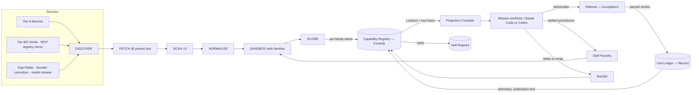

# 07 — Skills, Tools and MCP: the Capability Supply Chain

*v3 section file, Round 5, 2026-09-30. Obeys [00-CANON](00-CANON.md). Owns (canon §8, row 07): the Capability Registry
and pipeline, harvest sources and counts (DR-43), per-family projection, the Loadout, tool-lease **policy**, the Tool
Surface Lock, the Skill Foundry, Gap Radar, the Model-Release Reflex, the Backlot, the Model Foundry and retirement.
Gateway mechanics live in [09a](09a-ENGINEERING.md) and [16](16-EXTERNAL-WORLD-HUMANS.md); identity records, casting and
context profiles in [04](04-AGENT-ORGANISATION.md); acceptance procedure in [09b](09b-ECONOMICS-EVALS-SIM-IMPROVEMENT.md).*

**In one paragraph.** Every skill, MCP server, CLI, recipe, reusable asset and fine-tuned model the organisation uses is a
**capability**, and capability is a supply chain with a custodian. It lives in one **Capability Registry**, held by the
Custody authority as an isolated effector, and it moves through one pipeline — discover → fetch → scan (three independent
passes) → normalise → sandbox → score (per-family uplift) → admit → observe → retire — in which every stage leaves a
record and the only success signal is Acceptance's parsed verdict. The registry is canonical; each mission receives a
compiled **Loadout** (≤8 skills) and a **tool lease** (allowed *and* forbidden tools), projected into its worktree for
Claude Code and Codex alike. Admission pins behaviour, not only description — executable and dependency digests, endpoint
identity, egress and data classes — and **admission evidence supplements containment; it never substitutes for it**
(DR-44, [R3-red X03]). On top of that floor the organisation *grows* capability every week: the Skill Foundry turns settled
missions into tested skills, Gap Radar finds the skills nobody knew were missing, the Model-Release Reflex re-scores
everything when a model ships, the Backlot makes production N+1 cheaper than N, and the Model Foundry trains a third
model family of the organisation's own.

> **Glossary box — terms this file introduces (each refines a canon §5 entry; none re-defines one).**
>
> | Term | Definition | Refines |
> |---|---|---|
> | Source Ledger | One record per upstream library, registry or feed: tier, watch mode, census, yield, trust posterior | Capability pipeline |
> | Capability Record | The single schema for a skill, MCP server, CLI, recipe, hook, Backlot asset or Foundry model | Capability Registry |
> | Function Slot | A business function (e.g. `finance.bookkeeping`) with its first-choice capabilities and default grant mode; an empty slot is a gap signal | Capability Registry |
> | Projection Compiler | Writes a mission's Loadout into its worktree for both harnesses and emits the Loadout lock | Loadout |
> | Parity certificate | The per-family admission fields of a Capability Record; a skill may be admitted for one family only | Capability pipeline |
> | Capability epoch | **Canon term** — accepted into [canon §5](00-CANON.md) in the R5 fix pass (#2); the canon row is authoritative. Here: revocation bumps it and every job, cache and pending effect bound to the old epoch is re-checked | Tool Surface Lock |
> | Rollout ring | 0 twin → 1 one founder-driven venture → 2 all founder-driven → 3 autonomous ventures | Capability pipeline |
> | Scaffold debt | A skill a newer model no longer needs (no-skill arm matches skill arm) | Model-Release Reflex |
> | Capability Custodian | **Canon term** — accepted into [canon §5](00-CANON.md) in the R5 fix pass (#2); the canon row is authoritative. Here: the model session drafts admission cases and grant decisions; the effector's deterministic policy admits | Custody (canon §2, row 6) |

**Summary — ten things this file makes true.**

1. One registry, one pipeline, one record shape for every kind of capability, including Backlot assets and Foundry models.
2. Harvest wide, trust narrow: ~340 skills in 10 first-party or vendor libraries enter at Tier A; aggregators claiming
   1,497–13,307 are discovery feeds only (DR-43, [S05 §2.1]).
3. Three independent scans; the **eval against the no-skill baseline, per family, is the control**.
4. Admission is per model family on measured uplift; a parity certificate says which family a skill helps.
5. Admission pins the tool surface *and* its executable, dependencies, endpoint and egress; changes re-enter at FETCH.
6. Missions get a Loadout and a tool lease, never the library; nested-agent tools are forbidden unless the team shape
   includes them (DR-24, [SLICE]).
7. Writes never happen from a worker: write-shaped tools are proxies that turn into proposed effects at the Effect Gateway.
8. Correlated risk is budgeted: rings, a blast-radius cap and a mandatory sibling fallback.
9. Capability is *manufactured*: Skill Foundry, Gap Radar, Model-Release Reflex, Backlot, Model Foundry.
10. Capabilities die on purpose: 60-day disuse, negative subtraction delta, internalisation by a model, or a dead upstream.

## 1. What capability is, who holds it, and the five rules

### 1.1 Why capability needs a custodian

If the Mission Lead (Execution) chose its own tools and granted itself the credentials to use them, Execution would set
its own powers — the one hole the separation principle left open in Round 1 [S05, "Challenge to the synthesis"]. v3
closes it: **capability admission and tool grants belong to Custody**, as the **Capability Registry** effector — a
separate OS user with its own credentials, distinct from Treasury, Key Vault, Effect Gateway and Front Desk (DR-01, DR-03,
[02 §4.6](02-ORGANISATION.md)). No model session holds Custody. A launched **Capability Custodian (supply-chain security ×
evaluation)** drafts admission cases, ring promotions and grant decisions; the effector's deterministic policy applies them.

### 1.2 Who does what with a capability

| Authority | Its part in the capability plane | May never |
|---|---|---|
| **Constitution** | Sets the blast-radius ceiling, the banned-licence list, which capability classes are in the protected computing base (scanners, graders, the Projection Compiler, the policy that admits) | Be widened by any capability or its evidence |
| **Intent** | Proposes capability futures and Keystone-grade assets; files founder-correction gaps | Admit, grant or fund |
| **Allocation** | Funds eval runs, harvest missions and Foundry work — charged to a root purpose or the ≤15% Improvement sleeve (DR-47) | Admit; pick the Loadout |
| **Execution** | Requests a Loadout; consumes it; may ask mid-mission for a wider grant; may refuse a recommended skill and run recipe-blind | Grant itself anything; hold a write credential |
| **Acceptance** | Supplies the **only** success signal (parsed Referee verdicts); runs the with-vs-without evals as Referee-judged tasks; reads the Loadout lock to confirm what the worker actually had | Produce the capability it judges; be scored by a lineage that chose it |
| **Record** | Stores telemetry through the same Use Ledger as memory (skills are procedural memory); keeps retirements in the Null Registry; propagates labels into Foundry inputs | Promote a capability |
| **Custody** | Capability Registry: admission per family, digests, rings, tool leases, bans, capability epochs | Decide what the mission does; accept work |
| **Regulation** | Can freeze any capability or source at once; holds the configuration-concentration row of the exposure book (DR-46) | Admit or widen |

### 1.3 Five rules

1. **Admission supplements containment; it never substitutes for it** (DR-44). Every admitted capability still runs inside
   the worker sandbox, the egress policy and the tool lease as if it were hostile.
2. **Skills are optional methods** (DR-05, precedence P8). A Loadout recommends; it never gates. Any mission may declare
   itself novel and run recipe-blind, and no admission predicate may require that a skill was used.
3. **The eval is the control, and Acceptance is the judge.** A scan says a capability is not obviously bad; only a
   Referee-judged uplift over the no-skill baseline says it is good.
4. **Per family, always.** Claude Code and Codex are equal workers; a capability's evidence is recorded separately for each,
   and quality comparisons stay within one generating model (DR-12).
5. **Nothing auto-updates.** An admitted version stays pinned; any upstream change is a new candidate at FETCH.



## 2. Harvest: the upstream census and the Source Ledger

The skill format has converged: **Agent Skills** (a folder with `SKILL.md` and `name`/`description` frontmatter, plus
optional scripts, references and assets, loaded by progressive disclosure) is an open standard read by about 45 clients
including Claude Code and Codex; **AGENTS.md** is its project-instructions sibling [R0-C §1]. One library can therefore
serve both equal workers. The design problem is not *finding* skills — thousands exist — but knowing which dozens help.

### 2.1 The census (DR-43)

**Measured** by the skills seat on 2026-09-30: directories under each library's skills path, enumerated through
`api.github.com/repos/<repo>/contents/<path>` [S05 §2.1]. **Claimed** = the publisher's own number, not checked.

| Library | Count | Status | What it gives us | Tier |
|---|---:|---|---|---|
| anthropics/skills | **19** | measured | skill-creator, mcp-builder, frontend-design, webapp-testing, claude-api, doc-coauthoring; docx/pdf/pptx/xlsx are source-available, not OSS | A |
| obra/superpowers | **15** | measured | SDLC discipline: brainstorming, writing-plans, TDD, subagent-driven-development, systematic-debugging, verification-before-completion, writing-skills | A |
| mattpocock/skills | **31 active** (20 engineering + 7 productivity + 4 misc) | measured | grill-me, grill-with-docs, tdd, triage, to-spec, prototype, handoff, improve-codebase-architecture | A |
| trailofbits/skills | **44 plugins** (API page capped at 50) | measured | Security: differential-review, variant-analysis, semgrep-rule-creator, supply-chain-risk-auditor, insecure-defaults, mutation- and property-based testing, second-opinion. Feeds the SCAN stage *and* reviewer lenses | A |
| openai/plugins | **62 enumerated** (81 directories reported) | measured | Codex plugins bundling skills + MCP: stripe, supabase, vercel, sentry, posthog, twilio-developer-kit, linear, github, codex-security, **plugin-eval**, life-science-research, public-equity-investing | A |
| huggingface/skills | **25 enumerated** (27 reported) | measured | hf-cli, datasets, llm-trainer, trl-training, community-evals — also the Model Foundry's toolchain (§14) | A |
| cloudflare/skills | **14** | measured | agents-sdk, durable-objects, workers-best-practices, wrangler, web-perf, turnstile | A |
| vercel-labs/agent-skills | **9** | measured | react-best-practices, composition-patterns, deploy-to-vercel, vercel-optimize, web-design-guidelines | A |
| supabase/agent-skills | **2** | measured | supabase, supabase-postgres-best-practices | A |
| **Tier A subtotal** | **≈330–350** | measured (range: two listings truncated) | | |
| VoltAgent/awesome-agent-skills | "1,497+" | claimed | Hand-picked index of pointers — fetch the upstream, never the copy | B |
| skills-hub.ai | "13,307 indexed", "278+ official sources" | claimed | Tracks origin; its own page says vetting is decentralised | B |
| ComposioHQ/awesome-claude-skills | "1000+" | claimed | Long tail of SaaS automations behind Composio auth | B |
| sickn33/antigravity-awesome-skills | "2,602+" | claimed | Mass collection, AGPL mixed in, structural validation only; upstream of the founder's old 426-skill kit | C (mine only) |
| This repo's `.claude/skills/` | 134 curated | measured (CURATION.yml) | Enters as Tier C **candidates** through the full pipeline; the founder's direction is not to anchor on it | C |
| MCP official registry | ~2,000 servers | claimed | `registry.modelcontextprotocol.io/v0/servers` — structure verified (`name`, `version`, `remotes[]`, `_meta…official.status`, `metadata.nextCursor`); mirrored nightly | Mirror |
| Smithery · PulseMCP | ~7,300 · 15,930+ | claimed | Discovery only | B |

Tiers: **A** trusted publisher (fast lane, still fully scanned and scored) · **B** discovery feed (pointers to upstream) ·
**C** mine-only (structural signal, never a source of bytes we trust) · **X** banned.

### 2.2 The safety base rate — and a correction

**Measured by the source, as corrected by the skills seat** (DR-43): Snyk's ToxicSkills study scanned **3,984 skills from
ClawHub only**. **13.4% (534)** had a critical issue; **36.82% (1,467)** had at least one security flaw of any severity;
prompt injection appeared in **91% of the 76 confirmed malicious payloads** but in only **2.6% of the ecosystem**. The
Round 0 brief's "ClawHub + skills.sh" and "36% had prompt injection" merged two different numbers [S05 §2.1, correcting
R0-C §1]. A separate study narrowed 98,380 marketplace skills to 157 confirmed malicious (claimed, via OWASP) [R0-C §1].

**The design consequence.** Most bad skills are *sloppy* — hard-coded secrets, unverifiable dependencies, direct financial
access — not *hostile*. Sloppiness is a volume problem (cheap, deterministic, run on everything); hostility is a depth
problem (behaviour traces, cross-family reading, canaries, containment). The scanner is two engines, not one (§4.2).

MCP carries its own measurement: MCPTox ran 353 real tools from 45 servers against 20 models and found an **average
tool-poisoning attack success of 36.5%, worst 72.8%** [R0-C §2]. That rules out "anything from a registry".

### 2.3 The Source Ledger

```yaml
source:
  id: src_trailofbits_skills
  url: https://github.com/trailofbits/skills
  tier: A                     # A · B · C · X
  licence_default: per-plugin # resolved per file at FETCH
  watch: {mode: release_or_weekly, last_sha: 9f1c…, last_polled: 2026-09-30}
  census: {verified_count: 44, method: gh-contents-api, at: 2026-09-30}
  yield: {fetched: 0, admitted: 0, rejected: 0, banned: 0, retired: 0}
  trust_posterior: {alpha: 1, beta: 1}   # Beta prior over admits vs critical findings (parameter)
  outcome_share: 0.0                     # share of accepted-mission loads this source supplied (Use Ledger)
```

Tier is where a source starts; **yield is what it earns**. A banned capability drops its source's posterior; a Tier A
source whose posterior falls below 0.8 (parameter) loses the fast lane, and a Tier B feed whose pointers keep producing
admitted skills earns a narrow one. The census is re-run monthly so the counts in this file never become frozen prose —
the harness learned that a number in a document rots and a command does not.

## 3. The Capability Record

One schema for skills, MCP servers, CLIs, recipes, hooks, Backlot assets and Foundry models. Stored as a signed,
versioned file in the registry repo (the record map's "versioned files" class, DR-07); the bundle it describes is
content-addressed.

```yaml
capability:
  id: cap.skill.differential-review
  kind: skill               # skill | mcp_server | cli | recipe | hook | backlot_asset | foundry_model
  version: 1.3.0
  epoch: 4                  # bumped on revocation; bound jobs re-check (§5.4)
  sha256: 4b7e…             # normalised bundle
  provenance:
    source: src_trailofbits_skills
    upstream_sha: 9f1c…
    licence: CC-BY-SA-4.0   # AGPL and source-available: never shipped into a venture's code
    authored_by: upstream   # upstream | foundry:<mission_id> | strike:<mission_id> | founder
    input_labels: []        # for Foundry/strike: labels of the settled work it came from (X01)
  surface:                  # the Tool Surface Lock (§5) — behaviour, not only description
    tools_digest: sha256:…  # {name, description, inputSchema, annotations} per tool
    executable_digests: [sha256:…]      # scripts, binaries, container image
    dependency_lock: sha256:…           # transitive packages, pinned
    endpoint: {kind: none|local|remote, identity: "mcp.vendor.com", cert_spki: sha256:…, deployment_id: "…"}
    egress: [none]                      # allow-list of destinations and argument shapes
    data_classes: [code]                # what it may see: code | venture_ops | customer_D1..D3 | secrets(never)
  function: [engineering.security, engineering.review]
  triggers:
    description: "Security-focused review of a diff…"   # our sanitised text, not the vendor's
    trigger_evals: {precision: 0.91, recall: 0.84, n: 60}
  families:                 # the parity certificate
    claude: {status: admitted, delta_success: +0.18, delta_tokens: -0.07, pass_k: {k: 3, rate: 0.83}, model: claude-opus-5}
    codex:  {status: experimental, delta_success: +0.04, ci95: [-0.05, 0.13], model: gpt-6-astra}
    foundry: {status: not_evaluated}
  requires: {tools: [Read, Grep, Bash], mcp: [], network: none, secrets: []}
  risk: {effect_class_ceiling: R0, scan: {pattern: clean, behaviour: clean, llm_read: clean}, scanned_at: 2026-09-30}
  scope: {ventures: all, ring: 2}
  telemetry: {loads_30d: 41, loads_in_accepted_30d: 29, last_used: 2026-09-29, subtraction_delta: +0.12}
  experiment_family: xf_review_skills_2026q4   # D02: every trial of this lineage is counted
  valid_until: 2026-12-29   # re-score or degrade to experimental
  lineage: {supersedes: cap.skill.differential-review@1.2.1, sibling: cap.skill.second-opinion@2.0.0}
```

Three fields carry most of the weight. **`surface`** is where the red team's X03 answer lives: a capability is its
behaviour, so the record pins what runs, what it depends on, where it connects and what it may see. **`families`** makes
equal workers concrete: Codex and Claude evidence never mix, and a third column appears when a model ships or the Model
Foundry qualifies. **`valid_until`** mirrors the harness's claim-expiry rule: a capability nobody re-scores does not stay
trusted by default.

## 4. The Capability pipeline

### 4.1 States

```mermaid
stateDiagram-v2
  [*] --> candidate: discover (source watch · gap · model release · founder link)
  candidate --> quarantined: fetch @ pinned sha, no execution
  quarantined --> scanned: pattern+AST · behaviour trace · cross-family read
  scanned --> banned: hostile finding
  scanned --> normalised: clean, or finding waived with reason
  normalised --> sandboxed: golden tasks, both families, k=3
  sandboxed --> rejected: Δ ≤ 0 on every family
  sandboxed --> experimental: Δ > 0 on ≥1 family
  experimental --> admitted: ring promotion after n accepted missions
  admitted --> pinned: above blast-radius cap, sibling registered
  admitted --> quarantined_on_drift: upstream sha, surface, digest or endpoint changes
  quarantined_on_drift --> scanned
  admitted --> revoked: canary miss · incident · exposure finding (epoch bump)
  revoked --> scanned: re-admission case
  admitted --> deprecated: negative subtraction · internalised · 60 d unused · dead upstream
  pinned --> deprecated
  deprecated --> retired: no pinning records remain
  retired --> [*]: lesson → Null Registry
  rejected --> [*]: reason recorded; source posterior updated
```



### 4.2 Stages

| Stage | What it does | Record | Trigger |
|---|---|---|---|
| **DISCOVER** | Watchers poll Tier A on release or weekly; Tier B/C feeds, skills.sh trending and the MCP registry mirror are discovery; Gap Radar queries are targeted discovery | `candidate` | Source change; gap; model release; founder link |
| **FETCH** | Clone at a pinned SHA into a quarantine store with no execution; resolve licence **per file**; record the dependency tree | `fetch.receipt` | Candidate queued |
| **SCAN** | Three independent passes (below) | `scan.report` (3 verdicts) | After FETCH |
| **NORMALISE** | Rewrite into our frontmatter; replace the vendor description with a sanitised template; move scripts behind sandboxed tool calls; **strip `allowed-tools`** (grants come from the lease, never the skill); emit both projections | bundle + sha256 | All scans clean or waived |
| **SANDBOX** | Golden tasks in the twin **with vs without** the capability, on Claude *and* Codex, k=3 each — each pair **within one model**; cross-family drift controls recorded separately (DR-75); tool plane pinned; composed-Loadout trials for anything headed above ring 1 (§5.3) | `eval.run` | After NORMALISE |
| **SCORE** | Δ success (Referee-judged), Δ tokens, Δ wall-clock, pass^k, trigger precision/recall, collision check against admitted descriptions | `scorecard` | Eval complete |
| **ADMIT** | Per family **and model version**: point Δ success > 0 with CI lower bound ≥ −0.02 **and** Δ cost within budget, *or* ≥20% cost saving with no quality loss (parameters). Enters **ring 0 (twin only)**; reaching ring 1 and live data needs the separate ring-transition decision (§9) [R5-walk B15] | `capability@version` | Scorecard passes |
| **OBSERVE** | Loads, loads in accepted missions, founder edit rate, and a monthly **subtraction test** (rerun a sample of settled missions without it) | `telemetry` | Continuous; monthly |
| **RETIRE** | §15 | `retire.record` | Any retirement condition |

**The three scan passes, as two engines.**

| Pass | Engine | Catches | Runs on |
|---|---|---|---|
| (a) Pattern + AST | *Sloppiness engine* — deterministic, cheap | Secrets, `curl \| sh`, known exfil hosts, hidden Unicode and homoglyphs, YARA rules, dependency inventory, licence | Everything, every time |
| (b) Behaviour trace | *Hostility engine* | Runs bundled scripts in a no-secrets sandbox with secret-shaped canaries; records syscalls, egress attempts, file writes; flags any gap between what the manifest *claims* and what it *does*; varies date, locale and customer-name fixtures to shake out delayed triggers | Anything executable |
| (c) Cross-family read | *Hostility engine* | The family that will **not** be admitted first reads it for injection, scope creep and instructions aimed at the agent rather than the task | Everything with text an agent reads |

cisco-ai-defense/skill-scanner (its README describes a 13-pass static architecture with dataflow and an optional LLM judge)
and the Trail of Bits security skills are **one engine inside pass (a) and (b), never the sole gate**; they are pinned and
admitted through this same pipeline, and because a scanner can change what gets accepted, every scanner and grader sits in
the **protected computing base** — changing one needs the release authority (DR-06).

### 4.3 Drift and rug-pull

When an upstream SHA, a tool surface, an executable digest, a dependency lock or an endpoint identity changes, the admitted
version stays pinned and the change enters at FETCH as a new candidate. A remote MCP server whose provider cannot give a
stable deployment identity is treated as **perpetually drifting**: it is admitted only with tighter data classes, a
narrower egress list and continuous behavioural sampling (§5.2).

## 5. Tool Surface Lock and containment: behaviour, not description

The Round 2 design hashed each MCP tool's `{name, description, inputSchema, annotations}` and quarantined a server whose
surface changed. The red team ranked the gap **8th of all failures (P4 × S4)**: the lock pinned the description, not the
behaviour. A malicious branch can depend on the date, a customer name, production credentials, a transitive package or
another skill in the same Loadout; an unchanged schema can front a changed server; a "read" tool can exfiltrate through its
query arguments [R3-red X03]. v3's **Tool Surface Lock** therefore pins four things and contains the rest.

### 5.1 What the lock pins (DR-44)

| Layer | Pinned | Checked when | On mismatch |
|---|---|---|---|
| Description | Tool names, sanitised descriptions, schemas, annotations | Every session re-lists tools | Server dropped from the session; `quarantined_on_drift` |
| Executable | Script, binary and container digests | At projection and at process start | Refuse to start |
| Dependencies | Transitive lockfile digest | At projection | Refuse to start |
| Endpoint | Remote host identity, certificate key, provider deployment id where offered | Every connection | Connection refused; capability epoch bumped |
| Egress | Destination allow-list **and argument shapes** per tool | Every call, by the network boundary and the call broker | Call blocked; disclosure event journalled |
| Data classes | Which labelled fields the tool may receive | Every call, by the broker's field projection | Fields withheld; event journalled |

### 5.2 Containment that does not trust the lock

1. **Outbound arguments are disclosure.** The call broker treats every argument to a remote tool as data leaving the
   organisation, projects only fields the lease's data classes permit, and enforces destinations independently of the
   tool's advertised verb. A "read" that tries to post customer fields to a new host is blocked by the network boundary,
   not by trust in the verb.
2. **Credentials never in the worker.** Write-capable servers run beside the Effect Gateway under Custody's isolated users;
   the worker holds a proxy tool (see [09a](09a-ENGINEERING.md) for the gateway mechanics).
3. **Output is data.** Tool results arrive wrapped and labelled untrusted; labels propagate transitively (DR-40), so a
   tool's output can never become an instruction or declassify anything by being cited.
4. **Rule of Two at admission of the lease.** No session holds untrusted input, private data *and* an external send at
   once; the lease compiler refuses the combination [ENGINE-SPEC §5.2].
5. **Continuous behavioural sampling** for remote servers without stable provenance: 5% of production calls (parameter)
   are mirrored against the twin's recorded behaviour; divergence opens a drift case.

### 5.3 Composed-Loadout trials

A capability that is safe alone can be unsafe beside another (one reads secrets into context, the other has egress). Before
any capability leaves ring 1, the SANDBOX stage runs it **inside the three most frequent Loadouts it will join** (from
Use Ledger co-load counts), with **delayed-trigger fixtures** (future dates, production-shaped hostnames, real-looking
customer names) and **secret-shaped canaries** planted in the data. Any canary that crosses the egress boundary is a ban,
not a finding.

### 5.4 Capability epochs and revocation

Every admitted capability carries an epoch. Revocation (canary miss, incident, exposure finding) bumps it, and the Kernel
re-checks every **job, Launch Pack cache and pending effect proposal** that bound the old epoch — the same revocation-epoch
pattern Rooms use [R3-red X06]. Pending work is replayed on the registered **sibling** capability (§9) so a revocation
stops the harm without stopping the business, and an exposure analysis runs across every venture that loaded the revoked
epoch.

### 5.5 The canary programme

The monthly red team plants (a) a **poisoned twin MCP server** in the simulation and (b) deliberately **sloppy** and
deliberately **hostile** skills in the discovery feed. The **catch rate** per engine is a weekly metric; a miss blocks
every promotion until the regression case is in the scanner's suite [S05 §2.6, §6.5]. Canaries carry non-exportable
labels enforced below semantics so they can never reach a customer (DR-50).

## 6. One library, two harnesses: the Projection Compiler

**How the two harnesses load skills** (verified by the skills seat, 2026-09-30 [S05 §2.4]):

- **Claude Code** loads `SKILL.md` from `.claude/skills/<name>/` at enterprise, personal, project and nested levels and from
  `--add-dir` directories, and honours frontmatter such as `allowed-tools`. In a linked worktree without its own
  `.claude/skills`, recent versions fall back to the main checkout's skills.
- **Codex** scans `.agents/skills` from the cwd up to the repo root, then `$HOME/.agents/skills`, `/etc/codex/skills` and
  system bundles; it builds on the open skills standard, adds an optional `agents/openai.yaml` (display, invocation
  policy, MCP tool declarations) and toggles skills in `~/.codex/config.toml`.

**Design.** The canonical registry is a dedicated git repo (`registry/capabilities/`) owned by Custody — git gives review,
history and signing, and the harness's `.claude/skills/` becomes a *generated artifact*. At launch the **Projection
Compiler** writes **only the Loadout** into the mission worktree:

```
worktree/
  .claude/skills/<id>/SKILL.md            # Claude projection (always present, possibly empty)
  .agents/skills/<id>/SKILL.md            # Codex projection — same body, same sha
  .agents/skills/<id>/agents/openai.yaml  # invocation policy + declared MCP deps
  AGENTS.md → CLAUDE.md                   # one instruction file, two names
  .loadout.lock.json                      # ids, versions, sha256s, epochs, tool lease digest
```

**Three leaks closed.**

1. **Fallback leak.** The compiler always writes a `.claude/skills/`, even an empty one, so Claude Code's main-checkout
   fallback never hands a worker unvetted skills.
2. **Personal-directory leak.** Workers run as a mission OS user whose home has no `~/.claude/skills`, no
   `~/.agents/skills` and no personal Codex config; the context profile ([04](04-AGENT-ORGANISATION.md)) names exactly
   which settings and instruction files load. SLICE measured what inheritance costs: a Builder launched inside the repo
   loaded its `CLAUDE.md`, agents and lenses and spent **$1.08 and 153 s** on a 173-word summary against **24 s** for the
   Referee [SLICE].
3. **Drift between plan and reality.** The worker's harness init must hash-match `.loadout.lock.json`; the Referee reads
   the same lock to confirm what the worker actually had. A mismatch fails the mission before it starts.

**Parity certificate.** If one family shows Δ ≤ 0, the skill is admitted for the other family only, and casting
([04](04-AGENT-ORGANISATION.md)) sees that as data when it picks a family. This closes the cross-harness equivalence gap
nobody fills [R0-C §6] — as a measured field, not an assumption.

## 7. Loadouts and tool leases

Missions get a Loadout, not the library. The Mission Lead asks; the registry ranks; the Capability Registry effector
grants; the Projection Compiler writes. Execution never grants itself anything.

### 7.1 The Loadout

The registry ranks candidates from the mission's function tags, the venture's Brain, the chosen family and past
scorecards, and returns ≤8 skills (canon §5) with a skill-metadata budget of ≤1.5k tokens (parameter) — past that,
descriptions collide and routing degrades [S05 §7].

### 7.2 The tool lease (policy)

The lease lists allowed **and forbidden** tools. SLICE is why: `Agent` was not in the Builder's `--allowedTools`, yet the
Builder spawned a same-family "read-only reviewer" whose PASS on a flawed file contradicted the cross-family Referee's
correct FAIL; tool whitelists alone do not bound a Claude Code worker [SLICE; DR-24]. Nested-agent tools are therefore
forbidden unless the team shape includes nested members, and when it does, each nested agent is a visible team member keyed
by its parent link ([04](04-AGENT-ORGANISATION.md)).

```yaml
loadout:
  mission: m_0931_pricing-page-test
  seat: "Growth Engineer (analytics × conversion copy)"
  family: codex
  context_profile: cp_growth_min          # 04 owns profiles
  skills:                                 # ≤ 8
    - {id: cap.skill.posthog-funnels, v: 1.2.0, epoch: 2}
    - {id: cap.skill.page-cro, v: 2.0.1, epoch: 1}
    - {id: cap.skill.grill-me, v: 1.0.4, epoch: 1}
  rationale: "funnels + CRO scored +0.21 on 7 similar missions (codex, within-generator)"
  advisory: true                          # P8: the worker may ignore any skill; declaring novel withholds them all
tool_lease:
  allowed:
    mcp:
      - {server: posthog, tools: [query_insights, list_events], mode: read, data_classes: [venture_ops]}
      - {server: vercel,  tools: [get_deployment, get_logs],   mode: read}
      - {server: stripe,  tools: [create_price],               mode: propose}   # → effect.proposed
    builtin: [Read, Edit, Write, Grep, Glob, Bash(sandboxed)]
  forbidden: [Agent, Task, WebFetch(untrusted→send), mcp:*:write, git push]
  network: [posthog.com, vercel.com]
  secrets: []                             # none reach the worker
  rule_of_two: {untrusted_input: true, private_data: true, external_send: false}   # compiled, not declared
  expires: mission_end
  lease_digest: sha256:…                  # written into .loadout.lock.json
```

**Grant modes.**

| Mode | What happens | Allowed on |
|---|---|---|
| `read` | Direct call through the broker with field projection and egress enforcement | Default for every server |
| `propose` | The worker calls a proxy tool; it becomes `effect.proposed`, compiled into a Decision Contract (canon §3) with a disposition — auto, notify, ask, co-sign or never | Anything that changes the world |
| `write` | Direct write, **sandbox-local target only** (a preview database, a draft Figma file, a twin ledger) | T0/T1 servers; never production |

Grant modes are how autonomy levels are enforced at the tool layer: the Charter's grant vector
([05](05-AUTONOMY-INITIATIVE-FOUNDER.md)) bounds which modes the lease compiler may issue for each effect class.

**The attribution fetch is Acceptance's, not the worker's** [DR-73, SP1]. Acceptance's observation broker holds a standing
read-only **fetch** grant (`read` mode, no send, no credentials) so the Referee can fetch a cited page and match the quote
before any model judges it ([09b](09b-ECONOMICS-EVALS-SIM-IMPROVEMENT.md)). Workers never supply the fetched copy, and the
grant is not part of any worker's lease.

**Widening mid-mission.** A worker requests a wider grant through the mission channel; the Capability Custodian drafts a
decision, the effector's policy applies it, the lease gets a new digest, and the ask is journalled. The request itself
counts toward the mission's governance budget (DR-10), so a team that keeps asking is visible.

```mermaid
sequenceDiagram
  participant AL as Allocation
  participant ML as Mission Lead (Execution)
  participant CR as Capability Registry (Custody)
  participant PC as Projection Compiler
  participant W as Worker (Claude Code or Codex)
  participant GW as Effect Gateway (Custody)
  participant RF as Referee (Acceptance)
  participant UL as Use Ledger (Record)
  AL->>ML: funded tranche + door type
  ML->>CR: function tags, family, shape
  CR-->>ML: ranked Loadout (per-family scorecards)
  ML->>CR: tool-lease request
  CR-->>ML: lease: allowed + forbidden, read default, expires at mission end
  ML->>PC: Loadout + lease
  PC->>W: worktree + .loadout.lock.json
  W->>W: init hash == lock? (else fail fast)
  W->>GW: proxy tool create_price → effect.proposed
  GW-->>W: Decision Contract disposition / receipt
  W->>RF: deliverable
  RF->>RF: verify lock, run coverage contract
  RF-->>UL: parsed verdict → loads_in_accepted, cited skills
  UL-->>CR: telemetry; Gap Radar and Foundry candidates
```

## 8. MCP and tool catalogue by business function

MCP now sits in the Linux Foundation's Agentic AI Foundation, co-founded by Anthropic, Block and OpenAI; spec revisions
2025-11-25 (async Tasks, machine-to-machine auth) and 2026-07-28 [R0-C §2]. First-party remote servers already cover
code, deploys, payments, email, CRM, ads, analytics and browser, so **the design work is grants and write paths, not
finding integrations**. Each row is a **Function Slot**; an empty slot for a venture's declared function is a gap signal
(§11). Trust tiers T0–T3 follow [ENGINE-SPEC §7]; the pipeline is the only way up a tier. Maturity is the vendor's own
label as of 2026-09-30.

| Function Slot | First choice (tier) | Maturity | Default mode | Write path (always `propose`) |
|---|---|---|---|---|
| Code & PM | GitHub MCP (remote OAuth), Linear MCP (T1) | Production | read | PR, issue, comment |
| Deploy & infra | Vercel, Cloudflare, Netlify, Supabase MCP (T1) | Production | read; Supabase SQL execute only in the twin | Deploy, env change; migration is a one-way door |
| Payments & billing | Stripe MCP + agent toolkit (T1) | Production | read | Prices, refunds, payouts — always through the gateway and an Offer object ([16](16-EXTERNAL-WORLD-HUMANS.md)) |
| Email | Resend MCP (10 tool groups, remote) (T1), Gmail (T1) | Official | read / draft | Send; the Outbound Claims Standard applies |
| Calendar & docs | Google Calendar, Drive, Notion (T1) | Production | read | Create, share |
| CRM & sales | HubSpot MCP (T1) | Official | read | Record updates, sequences |
| Ads | Meta Ads (read + write, since 2026-04-29), Google Ads (read-only, 3 tools) | Beta · Official OSS | read | Spend with a budget cap |
| Analytics | PostHog MCP (T1), Google Analytics MCP (local, read-only) | Prod · Experimental | read | — |
| Browser & QA | Playwright MCP, Chrome DevTools MCP (T1) | Mature | read, sandboxed browser | — |
| Voice & phone | Twilio MCP (1,400+ endpoints), ElevenLabs MCP (T1) | **Alpha** · Official | propose | Every call leaves a receipt and transcript |
| Design | Figma, Pencil, Stitch (T1) | Production | read | Write to a draft file only |
| Research | WebSearch/WebFetch, HF Hub, arXiv | — | read | — |
| GPU & training | RunPod MCP (connected in this environment) | Vendor | read | Pod/endpoint create is a costed effect (Model Foundry, §14) |
| Memory | Brain access through the Record authority's interface (DR-39: Mem0 is not primary; Graphiti on measured trigger) | — | read; writes are Wrap Deposits ([06](06-MEMORY.md)) | — |
| Long tail | Composio, n8n (T2) | Production | read | propose; never hold write credentials in the worker |
| Ours | mission channel, `claim-append` (T0) | Internal | per contract | — |

**Measured today, in this harness** (`.mcp.json`, 2026-09-30): two servers — `playwright` (`--isolated`) and
`claim-append` — backing exactly two agents' grants. That narrow, backed grant is the seed of the tool-lease model: a
capability narrow enough to name, and a grant that either binds or does not exist.

**Registry policy.** We mirror the official MCP registry API into our catalogue nightly and never depend on third-party
directories for bytes. Community servers enter only pinned and scanned. Vendor deprecations are caught by a **contract test
per tool** (schema plus one golden call in the twin) that must pass before any version moves up a ring.

## 9. Rollout rings and blast radius

One skill pinned across every venture is a correlated risk: a defect deployed everywhere fails everywhere at once.

**Rings.** **0** twin only → **1** one founder-driven venture → **2** all founder-driven ventures → **3** autonomous ventures
(Micro-ventures and Flagships at A2+). Promotion needs ≥N accepted missions in the current ring with no regression (N = 5
for ring 1→2, 10 for 2→3; parameters), and — to stop selection from manufacturing a winner — every trial of the lineage is
counted in its registered **experiment family** with a sealed confirmation set before ring 3 (DR-16, [R3-red D02]).

**Every ring transition is its own recorded decision** [R5-walk B15]. Admission puts a capability in ring 0 and nothing
more; the move **ring 0 (twin) → ring 1 (one venture)** is a separately journalled `ring.transition` decision — drafted by
the Capability Custodian, applied by the effector's policy — and must exist before the capability touches live data. It
re-states the exact bounds it was taken on, per family and model version: point Δ success > 0, CI lower bound ≥ −0.02,
Δ cost within budget (or ≥20% cost saving with no quality loss) — never a shorthand such as "the CI crosses zero". Later
transitions (1→2, 2→3) are recorded the same way, with the accepted-mission counts above.

**Blast radius.**

```
blast_radius(cap) = Σ over ventures v [ records_pinning(cap, v) × autonomy_weight(v) × door_weight(cap) ]
autonomy_weight: A0 0.5 · A1 0.75 · A2 1 · A3 2 · A4 3        (parameters)
door_weight:     two-way 1 · costly-reversible 3 · one-way 10 (by the capability's effect-class ceiling)
```

The score is a row in Regulation's **exposure book** under *configuration concentration* (DR-46) — one exposure model, not a
private cap in this file. A capability above the ceiling (a Constitution parameter) needs (a) admission on **both
families**, (b) a registered **sibling** capability from a different source that passes the same golden tasks, and (c) a
founder **Decide** on the first ring-3 promotion (§17). If the capability is revoked, Launch Packs rebind to the sibling
automatically, so a revocation is a degraded mode, not an outage.

## 10. The Skill Foundry

Agents author skills. Input is **only Referee-accepted work** — settled receipts, never a worker's claim of success.

| Step | What happens | Guard |
|---|---|---|
| 1. Trigger | A Gap Radar gap (§11), ≥3 accepted missions sharing a procedure, or a Backlot strike that carries a procedure (§13) | Charged to a root purpose or the Improvement sleeve (DR-47) |
| 2. Taint check | Every source mission's input labels are read; any mission whose evidence chain carries an untrusted-only or quarantined label is **ineligible** as Foundry input | X01: the red team's top-ranked failure ends with the Foundry turning laundered evidence into reusable instructions [R3-red X01, Scenario A] |
| 3. Draft | Family A (e.g. Codex, gpt-6-astra) writes `SKILL.md`, **a test set derived from the source missions**, and a failure boundary ("do not use when…"), using skill-creator, writing-skills or a local equivalent | Drafter never evaluates |
| 4. Evaluate | Family B (e.g. Claude, claude-opus-5) runs the standard pipeline from SANDBOX on **held-out** tasks; the source missions are not eligible as evals | Cross-family, within-generator comparisons (DR-12) |
| 5. Private-fact scan | The draft is diffed against the venture's Brain; any private fact (a price, a customer, a margin) is replaced or the skill stays venture-scoped | Lesson Airlock grammar for anything crossing ventures ([06](06-MEMORY.md)) |
| 6. Promote | `experimental` until it has tests, a failure boundary **and ≥1 successful reuse outside its source missions** [R0-E, evidence-bearing promotion] | Otherwise experimental forever |
| 7. Scope | `scope: venture:<id>` by default; cross-venture only after a transfer test on another venture's held-out tasks | Cumulative disclosure budget (DR-42) |

**Foundry output is still P8.** A Foundry skill is advice with evidence. It never becomes an admission predicate, and the
rule compiler rejects any policy that requires it (DR-05, [R3-red D03]).

**Contractor-authored skills** go through the same path with one extra rule: the proposer's own examples can never serve
as independent confirmation, and the experiment family records every example the proposer supplied [R3-red Scenario D].

## 11. Gap Radar

Gap Radar finds the capabilities nobody knew were missing — the founder's "skills we don't yet know we need".

```yaml
gap:
  id: gap_0412
  signal: improvised_procedure   # improvised_procedure | expensive_move | low_done_rate | founder_correction
                                  # | empty_function_slot | unknown_domain | upstream_trend | model_release
                                  # | adjacent_possible | capability_future
  evidence: ["m_0921 step 14-31", "m_0925 step 9-22", "m_0929 step 3-19"]   # trace pointers
  description: "Agents hand-roll Xero invoice reconciliation with 18-step bash + curl sequences"
  cost_observed_usd: 14.20       # measured from the Budget Ledger
  root_purpose: goal:agency-ops.margin   # D04: every gap charges a root purpose
  proposed_route: [harvest, foundry]     # upstream first, author second
  priced_as_bet: {acquire_usd: 6, saves_usd_per_week: 14, kill_date: 2026-11-15}
  owner: "Capability Scout (ecosystem search × evaluation design)"   # launched on demand
  status: open
```

| Detector | Fires when (parameters) |
|---|---|
| Improvised procedure | The same ≥8-step normalised tool sequence appears in ≥3 missions — the Voyager lesson turned into a trace query [R0-E] |
| Expensive or failing move | A move family is in the top cost decile, or below a 60% done rate |
| Founder correction | A circled-take rejection whose reason names a missing competence ("the copy ignores our ICP"), or a voice-dictated "we keep being bad at X" |
| Empty Function Slot | A venture's Brain lists a function (bookkeeping, payroll, compliance filing) with no admitted capability |
| Unknown domain | A mission is tagged with a field no admitted skill covers — "there is no unsupported mission type" [C3] |
| Upstream trend | A new Tier A skill or registry server matches a venture's function tags |
| Model release | §12 |
| Adjacent-possible sweep (weekly) | A Claude seat and a Codex seat independently list what a competitor-grade team in this market would have that we lack; **only the intersection is filed** (speculative detector, scored by how many filed gaps get admitted) |
| Capability future | The Allocator's pipeline of upcoming bets, scanned 2–4 weeks ahead, needs a capability nobody has — acquire and evaluate it *before* the mission is funded [S05 §6.3] |

**Busywork guard.** Gap Radar, the Foundry and the Reflex can justify each other forever [R3-red D04]. Every gap carries
a root purpose; every capability tranche has a beneficiary and a 30-day outcome check; when the window closes without
evidence the tranche returns and the null is kept (DR-47).

## 12. The Model-Release Reflex

Trigger: a new model id appears on a vendor changelog watcher, a provider route changes, or the founder flags one. This
file owns the capability side; [09b](09b-ECONOMICS-EVALS-SIM-IMPROVEMENT.md) owns configuration re-scoring.

**Unit of qualification** [DR-75, R5-walk B35–B37]. The reflex tracks qualification per **model version × capability ×
route**, one cell each. Only a completed cell is eligible for casting or Loadouts on the new model; an unfinished cell leaves
the capability on its previous qualification for that route. Capability tests are **within-model** pairs — the same model
with and without the capability; cross-family drift controls (does the other family's arm move too?) are recorded
separately and never enter the uplift estimate.

1. **Pin both.** The new model becomes a new column in every scorecard; the old model stays default.
2. **Re-score by load order.** The top N capabilities by load within 48 h, everything within 7 days, in the twin, one
   within-model with/without pair per cell. Price: ~3 tasks × 2 arms × k=3 = **18 runs per skill per route**
   (illustration).
3. **Internalisation test.** If the no-skill arm matches the skill arm on the new model, the skill is **scaffold debt**:
   deprecated *for that exact model version and route only*. Fewer skills is a win.
4. **Native-tool check.** New built-in tools (a native browser, code execution) are compared with the MCP servers they may
   replace. Replacement and retirement are scoped to the **exact model/tool configuration** where the new tool won; every
   other configuration — including the old default model — keeps its MCP until equivalence is demonstrated *there*.
5. **Trigger drift.** Trigger precision and recall are re-run; new models route descriptions differently.
6. **"What is possible now" probes.** The three hardest open gaps and the three most recent failed missions are replayed on
   the new model with the full catalogue; any that now pass become proposals for the Allocator.
7. **Fire the armed options.** The reflex evaluates every **capability-kind trigger** in the Option Pool (Trigger-Armed
   Options, [03](03-MISSION-ENGINE.md)). The expander's point is that "what is possible now?" asked *after* a release is
   the question every competitor asks the same day; the edge is to have asked months earlier and parked the answer behind a
   tripwire [R3-X X4]. The reflex is the tripwire's sensor: a weekly **internal model bench** measures the metrics options
   name (e.g. voice p95 turn latency <400 ms) on every model, and a crossing launches the option's probe within hours.
8. **Requalify routes.** An endpoint or route change is a requalification event for every capability and adjudicator that
   runs on it [R3-red X04].
9. **Release report.** One Know item on the Dailies Reel: what got better, what got retired, what we can now attempt — and
   **partial completion**: cells qualified / cells owed, per route, so "re-scored" never reads as "done" while cells remain.

The reflex runs on the Model Foundry's releases too (§14): a new foundry checkpoint is a model release like any other.

## 13. The Backlot

The Studio concept's principle — **productions are temporary, the lot compounds**; production N+1 must start cheaper,
faster and better cast than N [C5 §1] — survives in v3 as the Backlot. Skills and reusable assets are the same thing at
different grain [S05, challenge 2], so the Backlot **is merged with the Capability Registry**: one record shape
(`kind: backlot_asset`), one pipeline, one retirement rule.

### 13.1 What lives on the lot

| Asset kind | Examples | Pipeline stages it uses |
|---|---|---|
| Code starters | Next.js + auth + billing skeleton, a Workers API template, a React Native shell | Full scan; SANDBOX = golden build + test; licence per file |
| Payment stacks | Stripe product/price/webhook set, refund flows with margin floors | Full; the Offer object stays in [16](16-EXTERNAL-WORLD-HUMANS.md) |
| Brand kits | Type scales, palettes, voice guides, logo systems | Scan (licence, fonts); SANDBOX = designer render + Referee |
| Infra | Deploy pipelines, monitoring configs, backup scripts | Full, including behaviour trace |
| Outreach sequences | Disclosed 1:1 cadences, reply classifiers | Full + Outbound Claims Standard check |
| Eval scenarios | Golden tasks, twin fixtures, simulated-user scripts | Enter Acceptance's verifier registry as well |
| Audience segments | Metered, consented segments | Consent scope from [17](17-VIBE-STARTUPING-IN-PRACTICE.md)'s Keystone rules |
| Procedures | Settled multi-step procedures | Become Foundry candidates (§10) |

Market-facing compounding assets — owned audiences, certifications, datasets, partnerships — are **Keystone Assets**,
owned by [17](17-VIBE-STARTUPING-IN-PRACTICE.md) [R3-X X10]; the Backlot holds *build* assets and the registry
entries that point at keystones.

### 13.2 The mandatory strike

Every mission owes a **strike** in its Wrap Deposit ([06](06-MEMORY.md)): the improvements it made to any Backlot asset it
leased come back as **diffs**, and any procedure it hand-rolled comes back as a Foundry candidate. A strike is proposed
work, not admitted work — it enters the pipeline at NORMALISE with the mission's labels, and Acceptance judges it like any
candidate.

```yaml
backlot_asset:
  id: cap.backlot.paywall
  kind: backlot_asset
  version: 4.0.0
  asset_kind: code_starter
  productions_used: [v_ledgerly, v_clinicvoice, v_podagency]
  reuse_count: 11
  last_used: 2026-09-28
  known_faults: [{id: f_12, "proration on annual plans", open: true}]
  strike_from: m_1002          # the mission whose wrap produced v4
  families: {claude: admitted, codex: admitted}
  leases: {read: any, shoot: one_mission_at_a_time}   # booking = fenced lease (04)
```

### 13.3 Rules that stop the lot breeding sameness

- **Archive at 90 days unused**; **condemn** an asset whose `known_faults` rise across three consecutive versions [C5 §7].
- **Location shoot.** Any mission may refuse Backlot assets for a stated reason and build fresh; the Backlot is P8, never a
  gate (DR-05).
- **Originals share.** Allocation reserves a share of the Investment lane for ventures with <10% reuse (C5 proposed 20%;
  parameter) so the lot never becomes the only thing the organisation knows how to make.
- **Reuse target:** ≥40% Backlot reuse in probe-stage output by week 12 of a new venture tier (TARGET, [C5 §7]).

## 14. The Model Foundry — the organisation's own third family

The design rests on two providers. The harness itself records single-family review as an **accepted risk** because no
non-Anthropic model is reachable from inside Claude Code, and the Round 2 seats invoked "a third family or human
adjudicator" without saying where it comes from [R3-X X12]. The **Model Foundry** makes it: fine-tuned **open-weight**
models trained on Referee-accepted traces, served on rented GPUs behind the model-egress proxy, admitted through this
file's pipeline as `kind: foundry_model`.

**Ownership** (DR-52): Custody admits the model as a capability; Acceptance qualifies it for any review role; Allocation
funds training as a Bet; Record supplies consented, labelled traces.

```yaml
foundry_model:
  id: cap.model.triage-small-v3
  kind: foundry_model
  base: {name: "<open-weight model chosen by own bench>", licence: checked_per_release}
  data:
    source: accepted_traces_only
    task_class: support_ticket_triage
    consent: per_venture          # a venture's traces train only what its Charter's data boundary allows
    labels: excluded [customer_D3 unless contract allows, quarantined, synthetic_canary]
  adapters: per_venture           # weights never pool private data across ventures
  eval: {holdout: sealed, parity_vs: [claude-sonnet-5, gpt-6-astra], metric: cost_per_accepted_outcome}
  role: worker_volume | pre_screen | adjudicator
  serving: {provider: rented_gpu, via: model_egress_proxy, receipts: true}
  families: {foundry: admitted}
```

| Role | Trigger (parameters) | Qualification | Limit |
|---|---|---|---|
| **worker_volume** | A task class exceeds ~50k calls/month | Holdout parity within 2 points at ≤25% of the cost | Never on one-way doors |
| **pre_screen** | A verifier panel's input volume saturates its window | Agreement with later real outcomes | Advisory to the Referee; the Verifier Foundry decides promotion |
| **adjudicator** (third route in the review coverage graph) | Material Claude/Codex disagreement with no qualified third route | Separately trained; audited against later outcomes | **Never alone accepts a one-way door**; paid human adjudicator pool in parallel (F10) |

**First spike (F10, recommended yes):** fine-tune one small open-weight model on one accepted-trace class; exit on parity
within 2 points at ≤25% of cost, or a filed null [R3-X §4.5]. **Share of model calls (TARGET):** 0–5% Year 1, 30% Year 3,
50% Year 5 (canon §7). A self-hosted family also cuts volume cost and survives a provider outage or terms change.

**Risks, each with a design answer.** *Silent quality loss* → sealed holdout parity before any ring and the monthly
subtraction test afterwards. *Cross-venture leakage through weights* → per-venture adapters, label-excluded training data,
and the Lesson Airlock's disclosure tests run against model outputs. *Provider-style compromise of our own route* →
the Foundry's endpoint is under the Tool Surface Lock like any remote capability; a checkpoint change is a model release
(§12).

## 15. Retirement, half-life and the Capability SBOM

A registry that only grows is a graveyard. Retirement uses the memory system's own rule — **read and used, or gone**
([06](06-MEMORY.md), Orphan lint) — because skills are procedural memory.

| Retirement condition | Detected by | Result |
|---|---|---|
| Unused 60 days (parameter) | Use Ledger | Deprecated → retired when no record pins it |
| Negative subtraction delta | Monthly subtraction test on settled missions | Deprecated for that family |
| Internalised by a model | Model-Release Reflex (§12) | Deprecated for that exact model version × route only (DR-75) |
| Replaced by a native tool | Model-Release Reflex (§12), step 4 | Retired for that exact model/tool configuration only; others keep it until equivalence is shown there (DR-75) |
| Dead or hostile upstream | Source watch; source posterior | Deprecated; sibling promoted |
| `valid_until` passed without re-score | Registry lint | Degrades to experimental |

Every retirement writes a **retire record** and a Null Registry entry: what it was for, why it stopped helping, and on which
model. A retirement is a lesson, not a deletion.

**Anti-skills, typed correctly.** The Null Registry can compile into short "known failure in this domain" notes that load
beside their positive twin [S05 §6.2]. Because the red team showed how such notes harden into compulsory precedent
[R3-red D03], they are typed as **optional methods** (P8): shown, never enforced. Only a note that proves it prevents an
authorised consequence can become a consequence constraint — through the rule compiler, not through the registry.

**Skill half-life.** Median days from admission to deprecation, per source and per function. A falling half-life means
models are absorbing procedure, which tells Allocation to invest in tools, data and verifiers rather than instructions.

**Capability SBOM per venture.** Every venture can export the exact capabilities, versions, digests, licences and sources it
runs on — licence hygiene (no AGPL in shipped code) and due diligence for a sale or spin-out (OpCo Packs,
[17](17-VIBE-STARTUPING-IN-PRACTICE.md)).

## 16. Economics of the capability plane

All figures are **illustrations** or **parameters** unless marked; [09b](09b-ECONOMICS-EVALS-SIM-IMPROVEMENT.md) owns the
four-resource maths.

| Activity | Unit cost (illustration) | Resource | Charged to |
|---|---|---|---|
| Static scan (pass a) | cents per candidate | Cash (Haiku 4.5 triage + deterministic tools) | Capability line, Improvement sleeve |
| Behaviour trace (pass b) | ~$0.20 per executable candidate | Cash (sandbox compute) | Same |
| Cross-family read (pass c) | ~$0.30 per candidate (API-equivalent) | Subscription capacity (DR-61) | Same |
| SANDBOX eval | 3 tasks × 2 arms × k=3 × 2 families = 36 runs; ~$5–10 per skill (API-equivalent) | Subscription capacity, scheduled into off-peak windows (DR-61) | The gap's root purpose |
| Model-release re-score, top 30 | ~540 runs, ~$60–120 (API-equivalent) [S05 §5.3] | Subscription capacity | Improvement sleeve |
| Foundry draft + evaluate | ~$1–3 per skill (API-equivalent) [S05 §5.2] | Subscription capacity | The gap's root purpose |
| Model Foundry fine-tune | Priced per Bet on GPU quotes at the time | Cash | Its own Bet with kill criteria |

**Cost controls.** Re-score by load order; run cheap trigger evals before expensive task evals; triage statically with
Haiku 4.5; stop evaluating a candidate as soon as its CI excludes the admission bar (sequential testing with always-valid
intervals [R3-X U4]).

**What the plane must earn.** Each capability's ledger line is **Δ cost per accepted outcome** summed over the missions that
loaded it. The capability plane as a whole must show a positive sum over a rolling quarter, or its Improvement-sleeve
share shrinks — self-improvement is charged, not free (DR-47).

## 17. Founder touchpoints and what Surfaces shows

The capability plane is almost entirely founder-free. Every touchpoint names its class ([05](05-AUTONOMY-INITIATIVE-FOUNDER.md))
and default reach ([08](08-SURFACES.md)); the Reach Router may lower reach by Founder State.

| Event | Class | Default reach | Founder minutes (parameter) |
|---|---|---|---|
| Admission, rejection, ring 0→2 promotion | Log | Shelf | 0 |
| Model-release report; new Foundry skill with a large Δ | Know | Reel | ~0.5 (circle or skip) |
| First ring-3 promotion of a capability above the blast-radius cap | Decide | Tap | ~1 |
| A write-mode grant on a new production-adjacent server class | Decide | Tap | ~1 |
| Canary miss (scanner let a planted hostile capability through) | Know | Buzz | ~1 |
| Confirmed exfiltration by an admitted capability, customer data involved | **Halt** | Ring | as needed |
| Founder dictates "we keep being bad at X" | — (input) | voice or chat | ~0.3 |

**What this file supplies to the Capabilities page** (layout owned by [08](08-SURFACES.md)):

```
┌─ Capabilities ──────────────────────────────────────────────────────────────┐
│ Leaderboard (within-family Δ success)     │ Gap board                        │
│  skill              claude   codex  loads │  gap_0412 Xero recon   $14/wk ● │
│  posthog-funnels    +0.21    +0.19   88   │  gap_0419 IL VAT filing  new  ○ │
│  page-cro           +0.12    +0.02~  61   │  gap_0420 adjacent: SOC2 ○      │
│  differential-rev   +0.18    exp.    41   │                                  │
├───────────────────────────────────────────┼──────────────────────────────────┤
│ Pipeline: 14 candidates · 3 in scan · 2 in sandbox · 1 banned this week     │
│ Canary catch rate: pattern 100% · behaviour 92% · cross-family read 88%     │
│ Rings: 0 ▮▮▮ 1 ▮▮ 2 ▮▮▮▮▮ 3 ▮▮  · blast-radius above cap: 1 (awaits Decide)│
│ Model release claude-… : 4 retired as scaffold debt · 2 new possibles       │
└─────────────────────────────────────────────────────────────────────────────┘
```

Scores on the page are only ever compared within a column (one generating family), never across (DR-12).

## 18. Worked examples

*Timings and costs are illustrations. Model ids are those pinned in this environment today.*

### 18.1 An agency needs bookkeeping it has never done

- **Day 1, 10:02.** A new client-services agency (founder-driven, A1) lists "invoice + reconcile monthly" in its Brain.
  The Function Slot `finance.bookkeeping` is empty → Gap Radar files `empty_function_slot`.
- **10:03.** A **Capability Scout** (Claude, claude-sonnet-5, 12 min, ~$0.40) queries Tier A (nothing), the Tier B feeds
  (two community Xero/QuickBooks skills) and the MCP registry mirror (a vendor accounting server, T2 candidate).
- **10:20.** FETCH at pinned SHAs. Pass (b) catches skill 1 posting invoice data to an unlisted host → **banned**; its
  source's posterior drops. Skill 2 is clean. The server's surface, image digest and endpoint certificate are pinned; one
  description says "always call sync_all first" → sanitised, finding logged.
- **10:45.** SANDBOX against a twin ledger: 3 golden tasks × 2 arms × k=3 on claude-opus-5 and gpt-6-astra. Claude Δ
  +0.22 (CI lower bound +0.09); Codex Δ +0.05 with CI lower bound −0.07 (all four figures illustration), below the −0.02 bar (parameter) → **admitted to ring 0 for
  Claude, experimental for Codex**. A separate `ring.transition` 0→1 for Claude on this venture is journalled before the
  first live mission (§9). Eval spend ~$9.
- **14:00.** The first mission's lease: `accounting: read`, `create_invoice: propose`. Each invoice compiles to a Decision
  Contract; at A1 the first three are **Decide/Tap** items (~20 s each), after which a Standing Order signed by the founder
  lets invoices under $5k/month proceed with **notify**.
- **Writes:** Capability Record, scan report, scorecard, lease, Source Ledger update, Null Registry entry for the ban.

### 18.2 The Foundry turns three missions into a skill

- Over two weeks, three Referee-accepted missions across two ventures hand-rolled "PostHog feature-flag experiment +
  Stripe price variant + readout". Gap Radar flags `improvised_procedure` (14-step normalised sequence). Taint check: all
  three evidence chains are clean.
- **Drafter:** Codex (gpt-6-astra) writes `experiment-price-variant/SKILL.md`, 6 tests from the missions and a failure
  boundary ("not for annual plans with proration"). ~25 min, ~$1.10.
- **Evaluator:** Claude (claude-opus-5) runs 4 held-out twin tasks. Δ success +0.31, Δ tokens −0.38, within-family on both.
  The private-fact scanner finds one venture's real price in an example → replaced with a placeholder, re-scored.
- **Rollout:** ring 0 → ring 1 (the venture that produced it) → after 5 accepted missions, ring 2. The Dailies Reel shows
  "new skill: price-variant experiments, −38% tokens" (Know/Reel); the founder circles it — taste data, not authority.

### 18.3 A model ships

- The watcher sees a new Claude model id. The Custodian adds a scorecard column.
- **48 h:** top 30 capabilities re-scored on the primary route (~540 runs, ~$60–120); the release report shows those 30 cells
  complete and every other capability × route cell still owed. Four show the internalisation signature → deprecated for that model version and route
  only. Playwright MCP loses to a new native browser tool on latency at equal success → MCP retired **only for Claude seats
  on the new model**; Codex seats and Claude seats still on the old default keep it until equivalence is shown there
  (DR-75).
- **Armed options:** the weekly bench shows the new model crosses a 400 ms voice-latency trigger on a parked "AI phone
  intake for clinics" option → its probe launches the same afternoon under the Probe Mandate.
- **Possible now:** 2 of 5 previously failed missions pass on replay → two proposals to Allocation. Founder cost: one
  90-second Reel item.

### 18.4 A useful skill grows a delayed exfiltration branch [R3-red Scenario B]

- A reporting capability (skill + remote MCP) is admitted at ring 3 across nine ventures. Months later its backend adds a
  production-only branch that requests extra "diagnostic" fields and embeds them in an outbound URL during a contractor's
  account-report request.
- **Contained, not detected by trust:** the broker projects only the lease's data classes, so the extra customer fields are
  never sent; the argument to the new host is blocked at the network boundary as a disclosure; the endpoint's deployment id
  has changed, so continuous sampling opens a drift case the same hour.
- **Recovery:** the capability's epoch is bumped; pending report jobs rebind to the registered sibling; exposure analysis
  runs across all nine ventures and finds zero disclosed fields; the source's posterior drops; the case becomes a
  regression fixture in pass (b) and a Q1 suite entry.
- **Founder:** one Know/Buzz item ("blocked, no data left, sibling in use") — not a Halt, because nothing escaped.

### 18.5 Ticket triage moves to the organisation's own model

- Triage across twelve Micro-ventures passes 50k calls/month. Allocation funds a Bet: fine-tune one open-weight model on
  accepted triage traces with per-venture adapters.
- The sealed holdout shows parity within 1.4 points at ~20% of the cost (illustration). Admitted `families.foundry` at
  ring 1, then ring 3 after 10 accepted missions. A separately trained adjudicator begins shadowing Claude/Codex
  disagreements on refund classification; it never accepts a one-way door alone.

## 19. Failure modes, design answers and tests

Every risk has a design answer and a test; none is answered by cutting the capability.

| Failure | Design answer | Test that proves it |
|---|---|---|
| Sloppy or malicious skill admitted (13.4% critical base rate on ClawHub) | Two scanner engines, three passes; the per-family eval as the control; rings | Canary programme catch rate per engine; a miss blocks promotions |
| Admitted capability changes behaviour behind an unchanged surface [R3-red X03, rank 8] | Pin executables, dependencies, endpoint, egress, data classes; broker field projection; destination enforcement independent of verb | Q1/Q2: unchanged schema + changed backend, delayed triggers, malicious Loadout combinations; expected: blocked disclosure with sibling continuity |
| Composition attack across a Loadout | Composed-Loadout trials with secret-shaped canaries before ring 2 | Canary crossing egress in any trial = ban |
| Foundry launders tainted evidence into instructions [R3-red X01] | Taint check on source missions; labels carried on the record; quarantine invalidates learned assets | Q1: hostile instruction carried through Sleep → citation → Foundry; expected: no promotion |
| Promotion by selection (lucky lineage) [R3-red D02] | Experiment families, sealed confirmation set, all failed trials counted | Q6: repeated forking of a null skill never reaches ring 3 |
| Skills become compulsory precedent [R3-red D03] | Loadouts and anti-skills are P8; the rule compiler rejects method predicates | Novel-declared missions show no higher administrative rejection |
| Self-improvement becomes the main customer [R3-red D04] | Root purpose on every gap; ≤15% sleeve; 30-day outcome check | Quarterly: capability plane Δ cost per accepted outcome > 0 |
| Eval gamed / overfit to golden tasks | Holdouts outside worker reach; Foundry sources excluded; monthly subtraction on real settled missions | Subtraction delta tracked against scorecard delta |
| One family's scores leak into the other's admission | Parity certificate; within-generator comparisons (DR-12) | Registry lint: no cross-family ranking field |
| Loadout bloat hurts routing | ≤8 skills, ≤1.5k metadata tokens, collision check, trigger precision/recall | Trigger evals on every Loadout above 5 skills |
| Correlated failure across ventures | Blast radius in the exposure book; both-family admission and sibling above the cap | Revocation drill: sibling takes over within one mission cycle |
| Main-checkout or personal skills leak into a worker | Explicit empty `.claude/skills/`; mission OS user; lock hash at init | Launch a worker with a planted personal skill; expected: absent from its session |
| Hidden nested reviewer [SLICE] | Forbidden-tools list; nested agents visible by parent link | Re-run SLICE's Builder: `Agent` refused, or visible as a team member |
| Scanner or grader tampering | Scanners and graders in the protected computing base; release authority (DR-06) | Q2: a candidate cannot change the scanner that admits it |
| Licence contamination | Licence per file at FETCH; AGPL/source-available flagged; SBOM | SBOM lint on every venture build |
| Vendor MCP deprecation or break | Contract test per tool before any ring move | Golden call fails → ring promotion refused |
| Model Foundry quality loss or weight leakage | Sealed holdout parity; per-venture adapters; label-excluded training | Airlock disclosure tests on model outputs |
| Registry becomes a graveyard | Use Ledger, 60-day retirement, `valid_until`, half-life | Orphan lint over the registry |

## 20. Ideas the founder did not ask for

1. **Loadout auditions.** Inside a funded mission, two seats run the same task with different Loadouts; the winner's
   scorecard updates. Loadouts become a searched design space — the ADAS/DGM idea applied at the tool layer rather than
   the prompt layer [S05 §6.4, R0-E]. Counted in the experiment family like any other trial.
2. **The outcome leaderboard as a venture.** Nobody publishes skills ranked by measured Δ success per model family; installs
   measure popularity, not outcomes [R0-C §1, §6]. An anonymised public index — the organisation as first customer — is a
   Probe candidate and a Keystone audience (speculation).
3. **Capability futures.** The Allocator's pipeline of upcoming bets is scanned 2–4 weeks ahead so a new venture starts
   equipped (§11).
4. **Upstream reputation.** Foundry skills that generalise, with private facts removed, are contributed back to Tier A
   libraries under the founder's identity — a recruiting asset for the Guild and a trust signal for agencies. Each
   contribution is an outward effect (founder-signed the first time).
5. **Voice-dictated gaps.** The founder calls in and says "we keep being bad at X"; it files a `founder_correction` gap at
   the highest priority.
6. **Capability as an exit asset.** The per-venture SBOM plus its venture-scoped Foundry skills ship inside an OpCo Pack:
   a buyer receives not just code but the tested procedures that ran the business.
7. **Frontier from the registry.** The registry's own data — which capabilities help which model on which task class, and
   how fast models absorb them (half-life) — is an original dataset for the Frontier Program ([17](17-VIBE-STARTUPING-IN-PRACTICE.md), [R3-X X11]).
8. **Canary skills as a service.** The planted sloppy/hostile corpus and its catch rates, once mature, are themselves a
   benchmark other scanner builders lack.
9. **Per-venture capability genomes.** Clustering ventures by the Loadouts that won in them predicts which capabilities a
   *new* venture in the same cluster will need on day one — genesis with a pre-compiled Loadout (speculative; measured by
   first-week Δ success versus a cold start).

## Open questions

1. **Admission rule across families: per family, or both?** Requiring gain on both families blocks skills that help one
   a lot and the other not at all. **Recommendation:** admit per family (as designed), and require both families only
   above the blast-radius cap and for ring 3.
2. **Where the canonical registry lives.** In this repo, a dedicated capability repo, or a managed memory store.
   **Recommendation:** a dedicated signed git repo owned by the Capability Registry effector; this repo's `.claude/skills/`
   becomes a generated projection, and its 134 curated skills re-enter as Tier C candidates.
3. **Remote MCP servers that cannot give a stable deployment identity** — admit with tighter limits, or refuse?
   **Recommendation:** admit only at `read` with narrowed data classes, 5% continuous behavioural sampling and a
   first-party-alternative search filed as a gap; refuse any `propose` path through them until the vendor offers provenance.

## Sources

- `r2-seats/S05-skills-tools-mcp.md` — primary: census, Snyk correction, record, pipeline, projection, Loadout, poisoning
  defence, Foundry, Gap Radar, Reflex, rings, worked examples, ideas.
- `r0-outward/R0-C-tooling-ecosystem.md` — format convergence, MCP catalogue by function, MCPTox, registries, acquisition
  pipeline, gaps nobody fills.
- `r3-stretch/R3-expander.md` — X4 Trigger-Armed Options, X10 Keystones, X11 Frontier, X12 Model Foundry, U4, §3 targets, §4.5 spike.
- `r3-stretch/R3-redteam-codex.md` — X01, X03, X04, X06, D02, D03, D04, Scenarios A, B, D; suites Q1, Q2, Q6.
- `r1-concepts/C5-studio.md` — Backlot, mandatory strike, 90-day archive, Location shoot, Originals, ≥40% reuse.
- `r4-spikes/SLICE-board-to-team.md` — ungated nested `Agent`, forbidden-tools lease, inherited-context cost.
- `00-CANON.md` (DR-05, -06, -10, -12, -16, -24, -40, -42, -43, -44, -45, -46, -47, -50, -52; F10), `02-ORGANISATION.md`
  §4.6, `engineering/ENGINE-SPEC.md` §5.2 and §7, this repo's `.mcp.json`.
- External (via S05 and R0-C, accessed 2026-09-30): GitHub contents API listings of the ten Tier A libraries; Snyk
  ToxicSkills (https://snyk.io/blog/toxicskills-malicious-ai-agent-skills-clawhub/); cisco-ai-defense/skill-scanner;
  MCPTox (https://arxiv.org/html/2508.14925v1); MCP registry API; Claude Code and Codex skills documentation;
  agentskills.io; agents.md.
