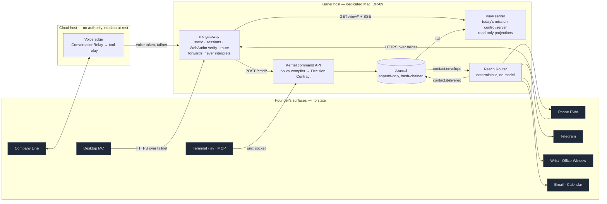
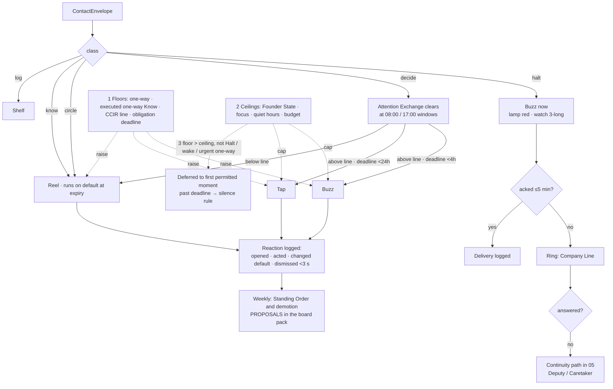
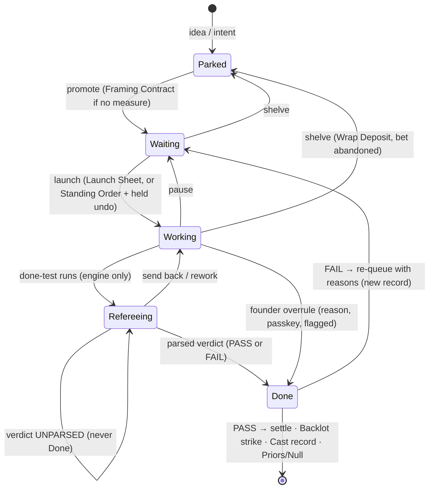
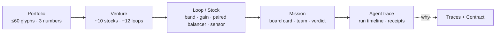
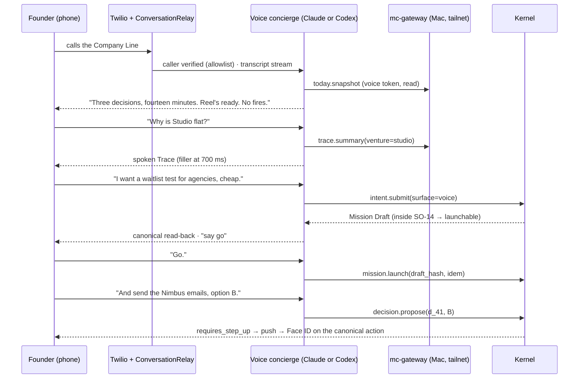

# 08 — Surfaces: Mission Control, reach, and every way the founder meets the organisation

*v3, Round 5 · 2026-09-30 · owns: Mission Control page by page, the board and Launch Sheet, **reach** and the Reach
Router, the Dailies Reel, the Map, Traces and "why", terminal, chat, mobile, voice/phone, the Office Window, the Wrist
Grammar, Office Hours, honest undo in the UI, and founder-state sensing ([00-CANON §8](00-CANON.md)). Contact
**classes**, the Attention Exchange's economics, the silence rule and Founder State semantics are owned by
[05](05-AUTONOMY-INITIATIVE-FOUNDER.md); this file renders them.*

## 0. The design in twelve lines

1. **One app we own.** Mission Control (Tauri desktop + phone PWA) is the centre. Terminal, chat, voice, push, email,
   calendar, the Office Window and the wrist are **projections plus command clients**: none holds state, all read the
   Kernel's Journal, all send commands that compile to one Decision Contract ([00 §3](00-CANON.md)).
2. **Nineteen pages in four groups** — NOW (Today, Decisions, Dailies, Live, Updates), WORK (Missions, Tasks, Calendar,
   Ideas), COMPANY (Ventures, Venture Mind, Cast, Skills, Brain), TRUTH (Map, Traces, Spend, Chronicle) — plus Settings.
   Every one is wireframed below.
3. **Class × Reach.** 05 decides *what the founder must do* (Halt · Decide · Circle · Know · Log). This file decides *how
   hard a surface reaches* (**Ring · Buzz · Tap · Reel · Shelf**). A deterministic **Reach Router** joins them and logs
   every delivery, so "why did my phone ring?" has a Trace.
4. **Minutes are the only attention currency.** The top bar, the Decisions page and Spend all show founder-minutes; Halt
   is never budgeted; Circle has its own small supply.
5. **The board launches teams.** Dragging Waiting → Working issues `mission.launch` and shows the **Launch Sheet** (cast,
   families, shape, lane, tranche, coverage contract, tool lease with forbidden tools, context profile).
6. **Only the Referee's parsed verdict moves a card to Done** (DR-13). Done and passed are separate facts; a FAIL card
   sits in Done, red, with **Re-queue with the Referee's reasons**. A founder drag to Done is a logged **overrule**.
7. **This already runs.** The SLICE spike built the smallest version on 2026-09-30: a card, a Claude Code Builder, a Codex
   Referee, a live team view — and the Referee failed an unsupported claim the Builder's hidden same-family self-review
   had passed [SLICE]. §5.2 shows exactly what exists and what v3 adds.
8. **The Dailies Reel carries taste.** Raw artifacts, ≈2 s per circle; circles may *propose* policy, never authorise it.
9. **The Map shows the organisation, not the agents.** Stocks and loops, grey when calm, colour **only off-band**, unknown
   drawn as **fog**; ≤60 glyphs for the whole portfolio [S11 M5].
10. **Every number, card and sentence answers "why".** ⌥-click opens its Trace; the Trace's *Contract* tab shows the
    compiled Decision Contract — satisfied rules, blocker, owner, remedy, expiry.
11. **What you see is what you sign; undo only when dispatch is held** (DR-35, DR-49). Voice proposes, a passkey disposes.
12. **Honest Scoreboard.** Every number resolves to a system of record; no points, streaks, badges or agent leaderboards;
    chronicles and seasons give meaning without lies [S11 M6].

> **Glossary box — terms this file introduces (refining §5 entries; none re-defines one)**
>
> | Term | Definition | Refines |
> |---|---|---|
> | **Global Shell** | The frame every Mission Control page sits in: venture scope, ⌘K intent bar, ⚖ minutes counter, ⏻ scoped stop, Venture Mind rail | — |
> | **ContactEnvelope** | What an authority emits when the founder might need to know or act: class, door, deadline, cost of delay, independent burden estimate, canonical subject | Class / Reach / Reach Router |
> | **Delivery** | The Router's logged decision: which reach, which channel, why, at what time; a Journal event | Reach Router |
> | **Reach floor / ceiling** | The lowest reach a class, door or CCIR match may be delivered at / the highest reach Founder State and focus blocks allow | Reach Router, Founder State |
> | **Canonical action** | The one byte-exact rendering of an action (verb, target, amount, audience, identity, snapshot, nonce, expiry) that is both displayed and signed | Decision Contract; DR-35 |
> | **Verdict badge** | The card's acceptance fact (PASS · FAIL · UNPARSED · OVERRULED), shown separately from its column | Referee; DR-13 |
> | **Semantic zoom** | Five altitudes of the Map: Portfolio → Venture → Loop/Stock → Mission → Agent trace | The Map |
> | **Chronicle** | An auto-written, evidence-linked narrative of a venture where every sentence footnotes a receipt | Honest Scoreboard |
> | **Season** | A founder-set quarter with objectives at the start and a Season Review at the end | Board meeting |

**How to read.** §1–2 are the architecture and the reach grammar. §3–8 are the pages (job · wireframe · reads ·
commands · honesty rules). §9 is approvals and undo. §10–12 are every surface outside the app. §13–14 are the design
system and the contracts. Each mechanism names its authority, its store (DR-07), its failure mode and its test.

## 1. The surface principle: one Journal, many projections

Surfaces are **not an authority**. They hold no power of the seven ([00 §2](00-CANON.md)): they *render* what the
authorities recorded and *carry* the founder's commands to the Kernel, where every consequential command is compiled
into a Decision Contract like any agent's proposal. The founder is inside the system (rule 5): his drags, taps and
spoken "go"s pass the same gateway and leave the same receipts.

**Seven operator jobs** (six from v1, one from the founder direction) organise every surface: *what changed · what's
owed · what happened · what's unknown · which decision needs me · how do I stop it · start something*.

| Surface | Jobs it serves best | Posture | Starts work | Disposes consequential | Highest reach it renders | Latency target |
|---|---|---|---|---|---|---|
| **Mission Control — desktop** (Tauri 2) | all seven; deep review, planning, replay | lean-in, 10–90 min | yes | yes (Touch ID passkey) | Reel, Shelf | event→pixel p95 <250 ms |
| **Mission Control — phone** (PWA) | decide, circle, glance, stop | 30 s–5 min | yes | yes (Face ID passkey) | Tap, Reel | first paint <1.5 s on LTE |
| **Terminal** — Claude Code / Codex CLI, `av` CLI/TUI, MC MCP server | build, inspect, take over a run | hours | yes | via passkey hand-off or hardware key | Shelf | <300 ms per `av` command |
| **Telegram** | "I want X", status, steer by reply | conversational | yes (Mission Draft) | two-way doors under a money threshold only | Tap | reply <5 s |
| **Push** (ntfy → Web Push) | deliver Buzz and Tap | glance | no | no (opens the packet) | Buzz | <10 s from event |
| **Company Line** (phone, in + out) | hands-free status, steer, start, **stop** | walking, driving | yes | **stop yes; everything else propose-only** | Ring | voice-to-voice p95 <1 s |
| **Email digest** | weekly board pack, re-entry brief | archival | reply-to-intent | no | Reel | — |
| **Calendar** (Google, one-way publish + three written kinds) | goals, kill dates, windows, board | planning | drag a slot → schedule | no | Reel | sync <60 s |
| **Office Window** (lamp + e-ink) | "is anything wrong?" at a glance | ambient | no | stop-all button only | Buzz (light) | <5 s |
| **Wrist** (watch) | Buzz/Tap haptics; two-way disposal; presence tap | 2 s | no | two-way, under threshold, held dispatch — never offers, concessions, outbound or publishing (DR-80) | Buzz | <10 s |

All latency figures are **targets**, carried from SURFACES-SPEC §1.1 and §7.3.



**Four architectural rules** (each has a test in §14):

1. **One Journal, many projections.** A surface's state is a cache of a projection with a `journal_offset`; offline, it
   shows **"last observed 14:02"** and queues only safe commands (steer notes, idea capture) with idempotency keys.
   Consequential commands never queue offline. (Record map, DR-07; Journal internals are [09a](09a-ENGINEERING.md).)
2. **The view server never writes and never spawns.** Today's `mission-control/server/**` invariants — a source-regex
   guard in `crosscheck.test.ts`, the behavioural `write-barrier.test.ts`, a literal `127.0.0.1` bind, refusal of
   `Sec-Fetch-Site: cross-site`, discovery ≠ trust — stay exactly as strict. The SLICE board proved v3's first page fits
   inside them: its only write is an append through `index-cache.ts`, the one file crosscheck already permits [SLICE §2].
   In v3 that append moves behind the Kernel command API and the view server returns to zero writes.
3. **The gateway forwards; it never interprets.** It attaches `actor`, `surface`, `auth_level` and a verified step-up
   assertion. No command-specific code paths, pinned by its own test.
4. **Same action, same answer on every channel.** A refund asked for by Telegram, voice or the desktop compiles to the
   same contract and the same disposition ([00 §3](00-CANON.md)); a surface can lower its own convenience (voice cannot
   dispose), never raise an action's permission.

**From today's Mission Control to v3.** Nothing measured is thrown away.

| Today (`mission-control/client/src/views/`) | Becomes in v3 | Why |
|---|---|---|
| Fleet | Live (runs grouped by mission) + Ventures | a fleet of sessions becomes teams inside missions |
| Sessions | Live → run detail | transcripts stay the evidence one click down |
| Belief | Brain (claims, facts, use) + Traces | beliefs become typed records with provenance ([06](06-MEMORY.md)) |
| Conflicts | Live → lease map; Missions → integration rework chips | leases and the integration queue ([04](04-AGENT-ORGANISATION.md)) |
| Inbox | Decisions (the Exchange) | items become priced DecisionPackets |
| Dispatch (queue file) | Missions board + Launch Sheet | "MC enqueues, something else acts" is kept as the pattern |
| Missions (SLICE branch `vision/v3-slice`: `MissionsView.tsx`, `run-missions.ts`) | Missions board, Live team panel | the working seed of v3's board (§5.2) |

## 2. Reach and the Reach Router

### 2.1 Two axes, two owners, one budget

The engineering specs disagreed: ENGINE-SPEC classified the founder's *obligation* (interrupt/ask/tell/log, "≤10
asks/day"); SURFACES-SPEC classified delivery *intrusiveness* (Interrupt/Nudge/Brief/Record, "3 nudges/day"). Both were
half right, and mixing them gave two budgets in different units and no home for taste [S07 §2.1]. v3 splits them
(DR-30): **class** is what the founder must do and belongs to [05](05-AUTONOMY-INITIATIVE-FOUNDER.md); **reach** is how
hard a surface reaches and belongs here.

| Reach | Rendering | Channels | May carry |
|---|---|---|---|
| **Ring** | an outbound call on the Company Line | phone | Halt unacknowledged ≥5 min; Decide only if cost of delay > the founder's **ring price** |
| **Buzz** | time-sensitive push; watch 3-tap; Office Window lamp red/amber | ntfy priority 5, watch, lamp | Halt; Decide above the clearing price with deadline <4 h |
| **Tap** | passive push; Telegram message; watch 1-tap | ntfy default, Telegram, watch | Decide above the clearing price with deadline <24 h; one-way Decide; Know when a CCIR line's floor raises it. ~~Know only by a founder override in Settings~~ (superseded, DR-64 / DR-65) |
| **Reel** | the next decision window: Today, the Dailies Reel, the phone Decide tab, the board pack | MC, PWA, email digest | Decide on default-on-silence, Circle, Know |
| **Shelf** | pull only: Traces, Live, Updates, Brain, Venture Mind | MC, `av`, voice "why" | Log — and everything else, always |

**Parameters (initial, tunable, set in Settings):** minute supply 45 weekdays / 10 weekends + a 30-minute weekly board;
two 10-minute decision windows at 08:00 and 17:00 ([00 §9 F4](00-CANON.md)); ring price $200/h cost of delay [S07 §9];
at most 2 unscheduled Decide calls a day (Halt calls are never capped); Halt Buzz → Ring after 5 minutes unacknowledged.

### 2.2 The Reach Router

A deterministic function in Userland — no model, no learning at run time — that picks **the lowest reach that still
meets the deadline**, then resolves it against a **floor** and a **ceiling** by **one ordered table** (below). This is the
only place in the design that chooses a reach [DR-65]: [05](05-AUTONOMY-INITIATIVE-FOUNDER.md) supplies class, door, CCIR
line and deadline; [09b](09b-ECONOMICS-EVALS-SIM-IMPROVEMENT.md) supplies the clearing price and minute budget;
[16](16-EXTERNAL-WORLD-HUMANS.md) supplies the effect's consequence classification. None of them chooses a reach
[C4, G2, G-B4, B21].

```ts
// Emitted by an authority (Intent, Allocation, Acceptance, Regulation, Custody) as a Journal event.
type ContactEnvelope = {
  id: string; venture: string; authority: 'intent'|'allocation'|'execution'|'acceptance'|'record'|'custody'|'regulation';
  class: 'halt'|'decide'|'circle'|'know'|'log';                  // owned by 05
  door: 'two_way'|'costly_reversible'|'one_way';                  // computed by the Kernel, never declared
  option_doors?: Door[];                                          // mixed-option packet: floor = highest option's floor
  effect_executed?: boolean;                                      // Know about an effect already done (one-way → floor Reel)
  deadline?: string;  on_silence?: string;                        // on_silence mandatory for decide (silence rule, 05)
  cost_of_delay_per_h: number;                                    // Allocation-computed
  burden_min: { requester: number; independent: number };        // DR-31: the Exchange's own estimate governs
  ccir_match?: { line: string; floor: Reach; wake: boolean };     // the CCIR line's SIGNED floor (default Tap); wake may pass quiet hours
  obligation_id?: string;                                         // age/deadline floor applies
  canonical_action?: CanonicalAction;                             // what a passkey would sign (§9)
  cause: { correlation_id: string; causation_id: string };
};
// The Router's output — also a Journal event, so every ring has a Trace.
type Delivery = {
  envelope: string; reach: 'ring'|'buzz'|'tap'|'reel'|'shelf';
  channel: 'call'|'ntfy'|'watch'|'telegram'|'lamp'|'today'|'reel'|'email';
  floor: Reach; ceiling: Reach; step: 1|2|3|4;                    // which row of the ordered table decided
  deferred_until?: string;                                        // step 3b: first permitted moment
  silence_rule_applied?: boolean;                                 // step 3b: that moment fell after the deadline
  reason: string; founder_state: FounderState; at: string;
};
```

**The ordered routing table** [DR-65]. Evaluated top to bottom for every envelope; the first row that decides, decides.

| Step | Rule | Result |
|---|---|---|
| **1. Floor** (never lowered — DR-32) | Take the **highest** of: **Halt ≥ Buzz**, escalating to Ring after 5 min unacknowledged · **Decide on a one-way door ≥ Tap**, always above the Exchange line whatever its bid [S07 §7] · **Know about an executed one-way effect ≥ Reel**, unless a CCIR line raises it · the matched **CCIR line's signed floor** (default **Tap**; a `wake` line may exceed quiet hours) · an obligation whose latest safe decision time is <24 h ≥ Tap (the age/deadline floor, DR-31) · a **mixed-option packet** takes the floor of its highest option (a Decide with any one-way option is a one-way Decide) [B21] | `floor` |
| **2. Ceiling** | Take the **lowest** of: Founder State `focus` or a calendar focus block ≤ Reel · `travel` (driving, flying) ≤ Reel for anything needing a passkey · quiet hours ≤ Reel · the minute budget (`overloaded`: supply scaled down, bundling on) · `offline_planned` / `unreachable` / `incapacitated` → the continuity tier in 05 decides the recipient; the Router never pretends delivery happened | `ceiling` |
| **3a. Floor > ceiling — floor wins** | Only for: **Halt** · **`wake` CCIR lines** · **one-way Decides whose deadline precedes the next permitted window** | delivered at the floor, now |
| **3b. Floor > ceiling — deferred** | Everything else is **deferred** to the first moment the ceiling permits the floor. If that moment is after the deadline, the **silence rule** ([05](05-AUTONOMY-INITIATIVE-FOUNDER.md)) applies — the Router records that it did and never invents a disposition of its own | `deferred_until`; `silence_rule_applied` |
| **4. Floor ≤ ceiling** | Lowest reach that meets the deadline, clamped into [floor, ceiling] | delivered |

A Know about an executed one-way effect can never be Shelf-only: the founder learns about every irreversible thing in the
next Reel at the latest.



**Learning without drift.** Every Delivery logs the founder's reaction. A packet type whose default he accepted ≥8 of 10
times is *proposed* as a Standing Order in the weekly board pack [S07 §2.1]; a class of Know items dismissed ≥5 times
with no action is *proposed* for demotion. Neither is ever applied silently, and observed dismissal can never suppress an
obligation or a safety floor (DR-32). Founder-authored notification preferences are a versioned file separate from
escalation conditions, so tuning comfort never edits safety [R3-red §3.8].

**Authority and store.** The Router is surface code (Userland). Its inputs come from 05 (class, door, CCIR line and
deadline — the class matrix is a linted YAML data file), 16 (the consequence classification behind the door), 09b and
Allocation (clearing price, minute budget) and Founder State; **inputs only — 05, 09b and 16 never choose a reach**
[DR-65]. Envelopes and Deliveries are Journal events. Regulation may issue a Halt at any time; nothing may widen a
ceiling except the founder. **Failure mode:** a class with no reach for some Founder State, or a deferral that silently
misses a deadline. **Test:** a property test enumerates class × door × executed × CCIR line (floor, `wake`) × deadline ×
Founder State × focus × quiet hours and asserts every combination yields **reach ≥ floor, or deferred and
deadline-safe** (delivered before the deadline, or the silence rule recorded), and that `halt` never yields `reel`,
`shelf` or a deferral.

## 3. Mission Control: the shell and the page map

### 3.1 The Global Shell

```
+--------------------------------------------------------------------------------------------+
| ◆ MC  [Venture: All ▾]   ⌘K  I want…            ● 7 runs  ⚖ 3·14m  ◔ 52%  ✦ reel ◌ 08:00 ⏻ |
+------------+--------------------------------------------------------------+----------------+
| NOW        |                                                              | VENTURE MIND   |
|  Today     |                                                              | rail (≤3)      |
|  Decisions3|                                                              | ⟂ I'd push     |
|  Dailies ✦ |                     page content                             |   back on …    |
|  Live     7|                                                              | ◎ I noticed …  |
|  Updates   |                                                              | ✕ I'd stop …   |
| WORK       |                                                              | founder-model: |
|  Missions  |                                                              |  you'd pick B  |
|  Tasks    2|                                                              | mine: A        |
|  Calendar  |                                                              | [Ask] [Hide]   |
|  Ideas   14|                                                              |                |
| COMPANY    |                                                              |                |
|  Ventures  |                                                              |                |
|  Mind      |                                                              |                |
|  Cast      |                                                              |                |
|  Skills    |                                                              |                |
|  Brain     |                                                              |                |
| TRUTH      |                                                              |                |
|  Map     ◍ |                                                              |                |
|  Traces    |                                                              |                |
|  Spend     |                                                              |                |
|  Chronicle |                                                              |                |
| ⚙ Settings |                                                              |                |
+------------+--------------------------------------------------------------+----------------+
 ⚖ 3·14m = 3 Decide packets ≈14 of today's 45 minutes   ◔ = subscription window used (estimated)
 ✦ = reel ready   ◌ 08:00 = next decision window   ◍ = something off-band on the Map   ⏻ = scoped stop
```

- **Venture scope** is always visible; "All" is the portfolio. It filters every page and every Delivery shown.
- **⌘K "I want…"** is the universal intent bar (every surface feeds the same `intent.submit`, §10); a `>` prefix makes it
  a command palette.
- **⏻ Stop** is on every page: this run · this mission · this venture · everything. It reports **requested →
  acknowledged → confirmed**, never just "stopped". Stop is the one consequential command with no step-up; resume needs
  one (DR-35: narrow stop is separate from positive authorisation).
- **⌥-click → Trace** works on every element that shows a number, a state or a sentence.
- The **Venture Mind rail** holds at most three items, each with evidence, each expiring; it shows the Co-founder seat's
  founder-model prediction and its own view side by side, never pre-selecting ([05](05-AUTONOMY-INITIATIVE-FOUNDER.md)).
- No pixel-office theatre; tiles show observed state, timestamps and uncertainty, never fictional busyness.

### 3.2 The page map

| # | Page · route | Job | Main projections read | Class it mostly carries |
|---|---|---|---|---|
| P1 | Today `/` | what changed, what's owed, what needs me, what's unknown | briefing, exchange, obligations, goals | Decide, Know |
| P2 | Decisions `/decisions` | the Attention Exchange, rendered | packets, clearing, minute ledger | Decide |
| P3 | Dailies `/dailies` | circle raw takes | takes, cast, mind taste log | Circle |
| P4 | Live `/live` | who is working on what; steer or stop | runs, leases, receipts, blackboard | Log |
| P5 | Updates `/updates` | what happened, chronologically | event feed (Know/Log) | Know, Log |
| P6 | Missions `/missions` | the board that launches teams | board, drafts, verdicts, coverage | Decide (launch), Know |
| P7 | Tasks `/tasks` | what humans owe | obligations, human tasks, promises | Decide, Know |
| P8 | Calendar `/calendar` | goals, kill dates, windows, founder time | goals, bets, schedule | Know |
| P9 | Ideas `/ideas` | the parking lot with triggers | ideas, first looks, triggers | Log |
| P10 | Ventures `/ventures`, `/v/:id` | portfolio, Charter, autonomy switch | ventures, charters, trust cells | Decide |
| P11 | Venture Mind `/mind`, `/v/:id/mind`, board pack | the Co-founder seat, wagers, dissent | minds, wagers, Standing Orders | Decide, Know |
| P12 | Cast `/cast` | identity records, auditions | cast registry, Audition Ladder | Log |
| P13 | Skills `/skills` | the capability pipeline | Capability Registry | Log |
| P14 | Brain `/brain` | the venture's world model and its use | Brain records, Use Ledger | Log |
| P15 | Map `/map` | the organisation as stocks and loops | stocks, loops, homeostats | Halt, Know |
| P16 | Traces `/traces/:event` | why, replay, the compiled contract | causal graph, contracts, receipts | Log |
| P17 | Spend `/spend` | four resources, cost per settled outcome | Budget Ledger, Books summary | Know |
| P18 | Chronicle `/chronicle` | the venture's story, seasons | chronicle, season records | Know |
| P19 | Settings `/settings/*` | attention, reach, autonomy, providers, kills | versioned preferences, Constitution view | — |

Every route is a bookmarkable URL; every filter lives in the query string; every page has a keyboard path for every
command (§13). Wireframes use invented venture names — **Nimbus** (B2B SaaS, Flagship, A3), **Studio** (creator tools,
Micro-venture, A2), **Ledger** (invoicing, founder-driven A0), **Keel** (this harness, A1) — and all figures in them are
**illustrations**.

## 4. NOW pages

### P1 · Today — the briefing (`/`)

Rendered from the record, never narrated: every line links to the events it summarises, and **Omitted & contested** is
mandatory — what the system chose not to show and where authorities disagreed.

```
+ Today · Wed Oct 7 · since you looked 22:14 → 07:02 · minutes 45 (used 0) · window 08:00 -----+
| ⚖ DECIDE  3 · ~14 min · clearing $6/min          | HALTS overnight 0 · SCRAMs 0              |
|  1 Nimbus  Send 12 intros · one-way  4m  11:00   | OBLIGATIONS LANE                          |
|     silent → NOT sent                            |  2 promises due ≤48h · on track ▸         |
|  2 Ledger  Price A/B/C · costly-rev 6m  Fri      |  1 incident 03:10 closed · Know · Reel ▸  |
|     silent → stay A                              | CLOSER?  (Progress Ledger)                |
|  3 Studio  Kill bet b_19 · two-way 4m  Sun       |  Nimbus 20 paying teams 11 → 12 ▲         |
|     silent → kill at kill date                   |  Studio flat 3 wk · Sideways Review ▸     |
+--------------------------------------------------+-------------------------------------------+
| ✦ DAILIES  11 takes · 6 min · [Play on phone]    | BETS  b_12 referral 0.62 → 0.71 ▲         |
| SURPRISE  pricing page with fewer plans 2.1×     |       b_21 pricing ◷ collecting E1        |
|  (outside 90% band) · forecast miss ▸            | WAGERS  Mind vs you: 1 settles Fri        |
+--------------------------------------------------+-------------------------------------------+
| OMITTED & CONTESTED • Referee (Codex) FAILed #214 twice; Builder (Claude) re-scoped ▸        |
|  • 2 sources unreachable → claims unresolved (fog on Map) ▸ • 4 packets ran on default ▸     |
|  • Exchange audit: 1 low-bid packet you were not shown, and why ▸                            |
| SPEND  ◔ 52% wk (est.) · API $4.10/$25 · per settled outcome ↓9% · founder-min/outcome 0.4   |
+----------------------------------------------------------------------------------------------+
```

**Re-entry mode.** After an absence >48 h (parameter) Today becomes a re-entry brief: direction changes, promises made,
spend, decisions taken on silence *with their defaults*, continuity events, and one explicit line — **reading this does
not re-authorise anything**.

```
+ Welcome back · away 5 d 3 h (offline_planned, Caretaker tier not reached) --------------------+
| DECIDED ON SILENCE  6 · all two-way inside charter · 1 you might reverse (Studio pricing) ▸   |
| PROMISES MADE  Nimbus → Acme: SSO beta Oct 20 (sales call, receipt ▸)                         |
| DIRECTION  Mind v47→v51: T1 weakened (2 nulls) · 1 dissent logged against your Sep 30 call    |
| SPEND  $212 of $300 cap · no degraded mode · 0 overrides                                      |
| NOT RE-AUTHORISED BY READING  autonomy levels, mandates, Standing Orders — [Review ▸]         |
+-----------------------------------------------------------------------------------------------+
```

Reads: `/briefing`, exchange, obligations, Progress Ledger, surprise slot [S11 M6]. Commands: `decision.dispose`,
`exchange.supply.adjust`, `reel.play`. Class: Decide at Reel, Know.

### P2 · Decisions — the Founder Attention Exchange (`/decisions`)

The founder *sees* the market 05 runs: supply in minutes, bids, the clearing line, and what runs on default below it.

```
+ Decisions · supply 45 min · bids 7 · clearing $6.0/min · next window 08:00 · [+15 min today] +
| ABOVE THE LINE (reaches you)                         door        bid/min  min  expires       |
|  Nimbus  Send 12 intro emails                        one-way      $14.0   4    11:00         |
|  Ledger  Choose pricing A/B/C                        costly-rev    $8.5   6    Fri           |
|  Studio  Kill bet b_19 at kill date                  two-way       $6.1   4    Sun           |
| --------------------------- clearing line -------------------------------------------------  |
| BELOW (runs on default unless you open it)                                                   |
|  Nimbus  Swap QA seat to Codex (3 losses) → swap     two-way       $1.2   1    Thu           |
|  Keel    Archive 4 stale skills → archive            two-way       $0.3   1    Mon           |
| SHAPE OF YOUR DAY  ████████████░░░░░░░░░░░░░░░░ 14/45 min · Circle supply 3 min (separate)   |
| BURDEN  estimates are the Exchange's own (observed reading time), not the requester's ▸      |
+----------------------------------------------------------------------------------------------+
```

`/decisions/:id` — the DecisionPacket, rendered so that what is signed is what is shown (§9):

```
+ d_41 · Nimbus · Send intro emails · one-way (reputation) · expires 11:00 · ~4 min ------------+
| CANONICAL ACTION send · 12 emails · audience 12 named · identity brand:nimbus · mandate m_out3|
|                   snapshot constitution v14 · nonce 7f3… · valid to 09:15                     |
| WHY NOW        bet b_12 needs replies by Fri; delay costs ~$14/min of window (Allocation)     |
| OPTIONS        A send 12 · B send 10 (drop 2 competitors) · C refuse · D delay to Fri         |
| IF SILENT      NOT sent (one-way door → refuse, silence rule)                                 |
| MATERIAL DOWNSIDE   2 recipients work at competitors; reply rate forecast 3 ±2                |
| BEST REJECTED ALT   "send to 30" — rejected by limits.outbound (≤30/day/cell)                 |
| CO-FOUNDER     founder-model: you'd pick A (p .64) · own view: B · steelman of A ▸            |
| DISSENT        Growth writer (Claude) vs Referee (Codex): tone claim ✓ resolved ▸             |
| EVIDENCE vs DOOR   E1 (desk) against one-way ⇒ evidence debt noted ▸                          |
| [A] [B ⏎ Touch ID] [C Refuse] [D Delay]   [Ask a question] [Why am I being asked? ▸]          |
+-----------------------------------------------------------------------------------------------+
```

**"Why am I being asked?"** opens the compiled Decision Contract's blocker (owner, remedy, expiry) and offers to draft
the Standing Order that would have answered it — a *proposal* only a signature promotes. Commands:
`decision.dispose{packet, option, assertion}`, `exchange.supply.adjust`, `standing_order.propose`. The **Exchange audit**
link lists packets the founder was not shown and expired defaults, so selective framing is visible (DR-31).

### P3 · Dailies — the reel with circled takes (`/dailies`)

Raw artifacts, never summaries: screen recordings, rendered pages, diffs, customer replies, charts, audio. Class Circle,
reach Reel. It never blocks work.

```
+ Dailies · Wed · 11 takes · 6m12s · [▶ Play all] · ←/→ take · C circle · X not this · N note -+
| +------------------------------------------+  TAKE 4/11 · Ledger · onboarding                |
| |                                          |  variant B of 3 · Product engineer (Codex)      |
| |     ▶ 0:21 screen recording              |  Referee: Claude ✓ a11y ✓ · PASS                |
| |     signup → first invoice               |  alternatives  A ▸  C ▸                         |
| |                                          |  [◯ Circle]  [✕ Not this]  [✎ Note]             |
| +------------------------------------------+  note "fewer fields" → taken ✓ 09:00            |
| STRIP ◯ ◯ ◉ ◉ ◯ ✕ ◯ ◯ ◯ ◯ ◯   circled 2 · not-this 1 · 8 unmarked (neutral, NOT approval)    |
| WHERE CIRCLES GO  Cast record +1 take · Mind taste log · SO candidate (proposal) ▸           |
| CUT  ≤8 min · dropped 5 low-novelty takes ▸ · one reel per venture, never interleaved        |
+----------------------------------------------------------------------------------------------+
```

Rules: an unmarked take is not approval; notes are logged *taken / declined / why* by the Mission Lead; circles are
weighted by the founder's measured calibration in that domain (expander U9, Decision Supply Bench in 05); a circle can
**propose**, never authorise, a Standing Order (DR-31, [R3-red D06]).

### P4 · Live — agents at work (`/live`, `/live/:run`)

Tiles are runs (one Claude Code or Codex session), grouped by mission so a team reads as a unit. **Nested agents are
team members**: SLICE's Builder spawned a same-family reviewer through an ungated tool and its calls surfaced as Builder
events, hiding a reviewer from the page [SLICE §5.2]. v3 keys events on the parent link (stream-json
`parent_tool_use_id`) and draws a child card; a forbidden tool attempt shows as ⛔ (DR-24).

```
+ Live · 7 runs · 3 missions · [claude ▾ codex ▾] [lane: all ▾] [shape ▾] ------- ⏻ scope ------+
| MISSION Nimbus · Team invites · lead+workers · ◇ invest · tranche 42% · 1h12m                 |
| + Engineer (product)  + + Engineer (API)     + + Referee · Codex (read-only)             +    |
| | ◆ claude-opus-5     | | ◇ gpt-6-astra       | | ◷ waiting · coverage 2/5 · done-test ✓  |   |
| | lease app/invites/**| | lease api/invites/**| | reads CI · staging DB · Stripe test     |   |
| | ▶ Edit invite.tsx   | | ▶ bun test 7/9      | | via observation broker (no creds)       |   |
| | turn 14/30 · 22k tok| | turn 9/30           | |                                         |   |
| | + › subagent (Claude| |                     | |                                         |   |
| |   ⛔ Agent denied)  | |                     | |                                         |   |
| | [Steer][Pause][Stop]| | [Steer][Pause][Stop]| | [Open]                                  |   |
| +---------------------+ +---------------------+ +-----------------------------------------+   |
| MISSION Studio · Why is signup flat? · swarm ×4 researchers · blackboard 9 · contested 2 ▸    |
| MISSION Ops · incident i_33 · ⚑ obligation · Incident Lead (Codex) · closed 03:21 · rx 3 ▸    |
+-----------------------------------------------------------------------------------------------+
```

`/live/:run` keeps SURFACES-SPEC's three panes and adds the lease map, receipts and memory read/used chips:

```
+ Engineer (product) · r_8f2 · Nimbus/Team invites · claude-opus-5 · wt feat/invites -----------+
| TIMELINE                   | CURRENT FOCUS                  | CONTEXT                         |
| 07:01 Read venture.yml     | app/invites.tsx  diff +42 −3   | Loadout 5 skills (07) ▸         |
| 07:04 Edit invite.tsx      | +----------------------------+ | Launch Pack 18k tok · null ✓    |
| 07:05 Bash bun test ✗ 2    | | + export function Invite…  | | memory read 6 · used 2 ▸        |
| 07:07 Edit invite.tsx      | +----------------------------+ | tool lease: − Agent − Task      |
| 07:08 Bash bun test ✓      | done-test frozen ✓ · not run   | context profile: minimal        |
| ▸ provider thinking summary| LEASES app/invites/** tok 118  | peers: Engineer (API), Referee  |
+----------------------------+--------------------------------+---------------------------------+
| STEER ▸ "Reuse the email queue, not a new table"  queued → delivered → acknowledged "…queue"  |
| [Pause after tool] [Stop now] [Fork variant (Codex)] [Swap seat] [Take over in terminal ⧉]    |
+-----------------------------------------------------------------------------------------------+
```

Verbs: **Steer** (delivered at the next tool boundary; "acknowledged" only when the agent's next turn quotes it) ·
**Pause** · **Stop** (requested → acknowledged → confirmed: process group gone) · **Fork variant** (the other family, same
brief — the UI of equal workers) · **Swap seat** · **Take over** (the founder receives the worktree and a new fenced
lease token; the agent pauses; the hand-off is receipted, [04](04-AGENT-ORGANISATION.md)). Thinking is shown only as
provider summaries, labelled.

### P5 · Updates — the change feed (`/updates`)

Know/Log, chronological and filterable — distinct from Today (curated) and Traces (causal).

```
+ Updates · [All ▾] shipped ☑ decided ☑ learned ☑ retired ☑ settled ☑ auto ☑ · group: day -----+
| 09:03 Nimbus ⇪ sent 10 intro emails · d_41 (you) · Operation op_7f3 · receipt ▸              |
| 08:40 Keel   ⊕ skill stripe-webhook-idempotency v2 promoted · trial 9/10 (07) ▸              |
| 03:21 Ops    ✓ incident i_33 closed · SCRAM not needed · Acceptance verified restart ▸       |
| 02:10 Studio ✎ null result "pricing page A/B no effect" → Null Registry ▸                    |
| 23:00 All    ⟲ Sleep: Brain v212 diff · 14 facts promoted · 3 superseded (cross-family) ▸    |
| 22:40 Ledger ✗ Referee FAIL on m_88 · re-queued with reasons ▸                               |
| [Subscribe this filter → Telegram] [→ weekly email] [→ Chronicle]                            |
+----------------------------------------------------------------------------------------------+
```

Subscribing a filter creates a founder preference (versioned file), never an escalation condition.

## 5. WORK pages — and the board that launches teams

### P6 · Missions — the board that launches teams (`/missions`)

The founder asked for "a board where dragging a mission from waiting → working → done launches the right team — Linear-
like, but ours". The board is a **projection of mission records** ([03](03-MISSION-ENGINE.md) owns the record and its
lifecycle); a drag is a **command with a preview**, never a silent status label.

**Columns map to the lifecycle, not the other way round.**

| Column | Lifecycle state(s) in 03 | Who moves a card in | Shows |
|---|---|---|---|
| **Parked** | Draft (idea, no tranche) | founder, Intent | trigger, heat |
| **Waiting** | Framing, Funded (not launched) | founder, Intent, Allocation | cast *proposed*, tranche, lane |
| **Working** | Active | `mission.launch` (founder or Standing Order) | team, checks, burn |
| **Refereeing** | Settling (acceptance facet open) | **engine only**, when the done-test runs | coverage progress, rework loops |
| **Done** | acceptance facet has a **parsed verdict** | **Referee only** (or a logged overrule) | verdict badge, three settlement edges, ⇪ published marker, residuals |

```
+ Missions · All · group: venture ▾ · lane ◇/⚑ · ⌘N new · m move · a audition ------------------+
|PARKED| WAITING (4)        | WORKING (3)          | REFEREEING (2)       | DONE (wk 9)         |
| 14 ▸ |+ Nimbus ◇ b_12 ---+|+ Nimbus ◇ lead+2 ---+|+ Ledger ◇ ----------+|+ Keel -------------+|
|      ||Referral loop v1  |||Team invites        |||Pricing page copy   |||skill v2  ● PASS   ||
|      ||cast proposed ▸   |||▓▓▓▓▓░ 5/8 checks   |||coverage 3/5        |||A✓ O◐ F○ · ⇪pub    ||
|      ||~2h · $0 API · sub|||tranche 42% · 1h12m |||Codex comp, e2e both||+-------------------+|
|      |+------------------+|+--------------------+||rework ↺1 (priced)  ||+ Ledger -----------+|
|      |+ Studio ●A2 ⚑ ----+|+ Studio ◇ swarm×4 --+|+--------------------+||Hello mission      ||
|      ||Competitor watch  |||Why signup flat?    ||+ Nimbus ◇ ----------+||✗ FAIL (Codex)     ||
|      ||⏲ Series · daily  |||blackboard 9 · ⚠2   |||Invite emails       |||"only by that CLI" ||
|      ||SO-14 auto-launch |||                    |||⚠ UNPARSED verdict  |||[Re-queue ▸]       ||
|      |+------------------+|+--------------------+|+--------------------+|+-------------------+|
+------+--------------------+----------------------+----------------------+---------------------+
 ◇ investment lane  ⚑ obligations lane  ●A2 autonomy  ↺ integration/acceptance rework (priced, DR-22)
 A accepted · O observed in production · F promise fulfilled (✓ done ◐ pending ○ not yet) · ⇪pub published (DR-70)
```

**Verdict badge rules (DR-13).** A card's column and its verdict are two facts:

| Badge | Meaning | What it permits |
|---|---|---|
| **● PASS** | Referee's parsed verdict is PASS under the coverage contract | publication once every required verdict is in (DR-70), the *accepted* settlement edge, Backlot strike |
| **✗ FAIL** | Referee's parsed verdict is FAIL, with reasons | **Re-queue with the Referee's reasons** (a new `waiting` record whose goal carries them — the board stays append-only [SLICE §5.4]); Shelve; Overrule |
| **⚠ UNPARSED** | the Referee exited but no verdict line parsed (accepted into canon, DR-64) | nothing — the card stays in Refereeing; an unresolved check never passes (harness rule 10) |
| **⚑ OVERRULED** | the founder dragged to Done or shipped a FAIL | the work lands; the overrule is counted by the deviance monitor and **never** recorded as acceptance or as a Referee false positive ([09b](09b-ECONOMICS-EVALS-SIM-IMPROVEMENT.md)) |

**Settlement edges and the published marker (DR-70).** Done means one thing — a parsed verdict — and it is not the same
fact as "live" or "kept". Every Done card shows three separate settlement edges and a separate published marker:

| Mark | Fact | Written by |
|---|---|---|
| **A** accepted | the artifact passed the coverage contract's required verdicts | Acceptance (Referee) |
| **O** observed | the deployment is confirmed by independent production observation, not by a deploy receipt | Acceptance, through the observation broker |
| **F** fulfilled | the promise to the customer or counterparty is kept | Acceptance, against the obligation ([16](16-EXTERNAL-WORLD-HUMANS.md)) |
| **⇪ published** | landed to main, deployed or sent outbound — only after the required verdicts; staging integration may precede them and shows no ⇪ | the integration queue ([04](04-AGENT-ORGANISATION.md)) |

A card can be Done with A ✓ and O, F still pending; the board never folds the three into one "settled ✓", and a ⇪ never
appears on a card whose required verdicts are missing. Edge definitions are [09b](09b-ECONOMICS-EVALS-SIM-IMPROVEMENT.md)'s.

Nobody can turn a FAIL into a PASS ([00 §2](00-CANON.md), Acceptance row). A worker's "reviewed ✓" in its own summary is
displayed, if at all, as an unlabelled claim inside the run log — never as a badge.

**Drag semantics — each drag is a command with a preview.**

| Drag | Command | Preview / rule |
|---|---|---|
| Parked → Waiting | `mission.promote` | no measure of success ⇒ the draft becomes a **Framing Contract** mission first ("no measure, no money") |
| Waiting → Working | `mission.launch` | **Launch Sheet**; skipped inside a Standing Order in an autonomous venture, with a 10-s *held-for-dispatch* undo (§9) |
| Working → Waiting | `mission.pause` | lists runs paused; leases kept or released |
| Working → Refereeing | not draggable | the engine moves it when the done-test runs |
| Refereeing → Done | not draggable | the Referee's parsed verdict only |
| any → Done | `mission.overrule_accept` | reason required; recorded as overrule; step-up passkey |
| Refereeing → Working | `mission.send_back` | the note becomes a steer |
| Done ✗ → Waiting | `mission.requeue` | pre-filled with the Referee's reasons; new record linked to the failed one |
| any → Parked | `mission.shelve` | Backlot strike and Wrap Deposit still owed; an open Bet settles as *abandoned* |
| ⚑ obligation → Parked | **refused** | kill dates stop hypotheses, never obligations → offers a **wind-down mission** |

Keyboard parity: `m` + arrows moves, `⏎` confirms, `a` launches an audition. Every drag has a menu alternative.

#### 5.1 The Launch Sheet

Shown on Waiting → Working. It is the compiled team, not a form: the founder may launch, edit, audition or make it
cheaper, and every line is a link to its reason.

```
+ Launch · Referral loop v1 · Nimbus (A3) · ◇ investment · Bet b_12 · tranche from Allocation --+
| SHAPE    lead+workers (composer: 0.71 vs swarm 0.52 on similar missions ▸) (04)               |
| CAST     ● Engineer (product)          ◆ claude-opus-5  writes  lease app/referral/**         |
|          ● Growth engineer (hybrid:    ◇ gpt-6-astra    writes  lease content/ref/**          |
|            SQL + copy + psychology)    Audition rung: Shadow ▸ · cast by Thompson, 10% explore|
| COVERAGE  components: app ← Codex judge · content ← Claude judge · e2e: fresh judges, both    |
|          families · disagreement → adjudicator (09b) · verifier window reserved 10:30 ✓       |
| TOOLS    lease allows Read Edit Bash(test) · FORBIDS Agent Task WebFetch · context: minimal   |
| BACKLOT  referral-starter v3 · brand kit Nimbus v5 → ~46% reuse · strike on wrap ✓            |
| BUDGET   ≤150k tok (~9% of the week's capacity, measured) · ≤2 h · stop at 2 continuations  |
| DONE WHEN (frozen before work) invite link · attribution row · e2e green on clean checkout    |
| BET      success ≥8 referred signups / 14 d · kill <2 by Oct 21 · evidence needed E2          |
| FORECAST P(Referee PASS first time) .64 · cost 110k tok ±30k (scored at settlement)           |
| DOORS    none expected · outbound: never without you (mandate m_out3 not attached)            |
| [Launch ⏎] [Audition: Claude-lead vs Codex-lead] [Cheaper] [Edit] [Why this cast? ▸] [Esc]    |
+-----------------------------------------------------------------------------------------------+
```

The **coverage** line replaces "the other family from the builder" (DR-11): mixed-family work gets component-level
opposite-family review plus end-to-end acceptance by fresh judges of both families. The **tools** line carries the
SLICE lesson that `--allowedTools` alone did not bound a Claude Code worker: the lease names what is **forbidden**, and
the context profile is chosen per mission rather than inherited from where the runner stands (DR-24).

#### 5.2 What exists today, and what v3 adds

On 2026-09-30 the SLICE spike built the smallest board on branch `vision/v3-slice` [SLICE]. Its final screen
(`slice-proof/02-done-referee-fail.png`), redrawn:

```
+ MISSION CONTROL  Fleet Sessions Belief Conflicts Inbox Dispatch [Missions] ○ fetched just now  +
| [Title        ] [Goal                                                  ] [Create card]         |
| WAITING 0              | WORKING 0              | DONE 1                                       |
|                        |                        | + Hello mission              Referee FAIL +  |
|                        |                        | | Write docs/demo/hello-mission.md: a     |  |
|                        |                        | | summary (under 200 words, then 3 …      |  |
|                        |                        | | 19s ago                         $1.082  |  |
|                        |                        | | • The claim that only the CLI writes the|  |
|                        |                        | |   trust list contradicts the source…    |  |
|                        |                        | +-----------------------------------------+  |
| Team — Hello mission (done)                                                                    |
| + Builder · claude-sonnet-5 · finished ----------+ + Referee · gpt-6-astra · finished -------+ |
| | 16 events · $1.0819                            | | 9 events                               |  |
| | tool Read …/README.md · tool Edit …hello-…md   | | tool rg … · tool awk (word count)      |  |
| | message "…Reviewed by the read-only reviewer   | | message "…'only by that CLI' is        |  |
| |  (evidence lens): verdict PASS…"               | |  unsupported…" · verdict FAIL          |  |
| +------------------------------------------------+ +-----------------------------------------+ |
| Receipts  file docs/demo/hello-mission.md sha256:bfa5f05c… · builder exit 0, 152.9s, $1.0819   |
|           referee exit 0, 23.7s                                                                |
+------------------------------------------------------------------------------------------------+
```

Measured in that run [SLICE §3]: 4 board lines (`waiting` → `queued` +13.4 s → `working` +0.8 s → `done` FAIL
+176.6 s); Builder 152.9 s, $1.08; Referee 23.7 s, 89,326 tokens in / 400 out; page lag about 1 s at 1–1.5 s polling;
6 of 6 new route tests passing; crosscheck write and shell scans green.

| Aspect | Exists (SLICE) | v3 adds |
|---|---|---|
| Columns | Waiting · Working · Done | Parked · Refereeing; lane and shape badges; group by venture |
| Launch | drag or Launch button → one `queued` line; founder-run `bun run missions` claims it | Launch Sheet; Kernel dispatcher under the **standing launch permission** (DR-53); fenced claim lease so two runners cannot both win [SLICE §6] |
| Team | fixed Builder (Claude) + Referee (Codex) | cast by 04 (any title, either family, any shape); audition from the sheet |
| Verdict | runner parses `VERDICT: {…}` and appends `done` with it | parsed verdict under a **coverage contract**; UNPARSED state; Referee reads systems of record through the observation broker |
| Done vs passed | red "Referee FAIL" in Done | verdict badges; **Re-queue with reasons**; overrule as its own badge |
| Nested agents | subagent calls merged into Builder events | child cards keyed by parent link; forbidden tools in the lease; receipts carry the parent link |
| Live channel | polling a folded JSONL every 1–1.5 s | the same fold, fed from the Journal; SSE with `Last-Event-ID` for tiles; polling kept as fallback |
| Receipts | file sha256, exit codes, seconds, cost | signed, hash-chained Receipts per landed change or effect ([09a](09a-ENGINEERING.md)); Codex cost from a runner-side price table |
| Store | `~/.agentvibe/missions/board.jsonl` via `index-cache.ts` | Journal events via the command API; board is a projection with source offsets |



#### 5.3 Card detail (`/missions/:id`)

```
+ Hello mission · Ledger · ✗ FAIL (Referee: Codex gpt-6-astra, parsed at +176.6 s) -------------+
| REASONS  "The claim that only the CLI writes the trust list contradicts the source's explicit |
|          support for hand-editing."                                                           |
| SELF-REVIEW (not a verdict) Builder's nested same-family reviewer said PASS — shown for       |
|          calibration only; excluded from acceptance (DR-11) ▸                                 |
| FACETS  delivery ✓ · acceptance ✗ · settlement A— O— F— · ⇪ not published · Wrap Deposit 14:30|
| COST     $1.08 · Builder 152.9 s · context profile inherited (⚠ drove cost, SLICE) ▸          |
| NEXT     [Re-queue with reasons ⏎] [Send back to same Builder] [Shelve] [Overrule ⚑ passkey]  |
| TRACE ▸  CONTRACT ▸  RECEIPTS 3 ▸  RUN LOGS ▸                                                 |
+-----------------------------------------------------------------------------------------------+
```

**Authority, store, failure, test.** Execution owns the missions in flight; Acceptance alone writes the verdict event
that moves a card to Done; the board is a projection of Journal events. **Failure mode:** a surface infers Done from a
run exit or a worker summary. **Test:** a fixture stream with a worker message containing "verdict PASS" and a Referee
line that is malformed must leave the card in Refereeing with ⚠ UNPARSED; a founder drag to Done must emit
`mission.overruled`, never `acceptance.verdict`.

### P7 · Tasks — what humans owe (`/tasks`)

Missions are funded work by agents; Tasks is everything owed **by a human** — the founder's own acts (signatures, calls,
bank), Human Task Market jobs, and customer promises from the obligations lane ([16](16-EXTERNAL-WORLD-HUMANS.md)).

```
+ Tasks · owed by humans · [mine 2] [contractors 3] [promises 5] [deputy drills 1] ------------+
| MINE        ☐ Sign annual report (Keel legal) · 3 min · due Oct 12 · never-list: founder act |
|             ☐ 15-min call with Acme's CTO (they asked for a human) · Thu 14:00 ✆             |
| CONTRACTORS ◐ Photographer · product shots · $180 · contract ✓ · due Fri · Room ▸            |
| PROMISES    ● Nimbus → Acme: SSO beta by Oct 20 · latest safe start Oct 13 · on track        |
|             ● Ledger → 9 interviewees: summary by Oct 9 · m_88 re-queued after FAIL ⚠        |
| DEPUTY      ◷ Quarterly stop drill for Deputy (ops) · due Oct 30 (05)                        |
| Every task an agent could do shows [Delegate → Mission Draft]                                |
+----------------------------------------------------------------------------------------------+
```

### P8 · Calendar — goals, missions, founder time (`/calendar`)

```
+ Calendar · October · Week ▾ · layers ☑ goals ☑ bets ☑ missions ☑ founder ☑ hours ☑ season      +
| SEASON Q4 "Nimbus to 20 teams; Studio decides" · Review Dec 28 ▸                               |
| GOAL ======== Nimbus 20 paying teams by Oct 31 (12 ▲) =======================================  |
| BET  - b_19 Studio waitlist ----------✝ kill date Sun (auto-kill unless evidence ≥ E2)         |
|  Mon 5         Tue 6           Wed 7             Thu 8               Fri 9                     |
|  ◌08 ◌17       ◌08 ◌17         ◌08 ◌17           ◌08 ◌17             ◌08 ◌17                   |
|  ◆Referral     ⚖ d_41 exp 11   ◆Invites mstone   ☎ Board 10:00 walk  ◆Price readout            |
|                ⌚ Office hrs    ✎ dissent check-back (Mind)          wager W7 settles          |
|  ░ focus (≤Reel)  ░ focus      ░ focus                                                         |
+------------------------------------------------------------------------------------------------+
 ◌ decision window   ✝ kill date   ░ focus block lowers ceiling to Reel; Halt still gets through
```

Drag a Waiting card onto a day → `mission.schedule`. Kill dates, wager settlements and dissent check-backs are
first-class events. Calendar sync publishes one-way and writes only three kinds (board meeting, office hours, focus);
it reads the founder's other events only as Founder State input (§12.6).

### P9 · Ideas — the parking lot (`/ideas`)

Every idea gets a cheap read-only **first look**; ideas carry a **revive trigger** so a signal brings them back; a
60-day fade *proposes* archive and never deletes silently.

```
+ Ideas · 14 · sort: heat ▾ · [Cards] Map · from ✆ voice ⌘K ✉ Telegram ------------------------+
| "Invoice chaser for agencies"  ✆ voice · heat 3 · first look ($0.12): overlaps Ledger 60%    |
|   worth it if 5/10 agencies say yes · revive: Ledger churn reason = "chasing" ◎              |
|   [Frame → Bet] [Merge into Ledger] [Park with trigger] [Kill → Null Registry] [→ Probe]     |
| "Missed-call text-back for dentists"  ✆ Company Line · Framing Contract proposed ▸           |
|   Pain Index cluster #412 (permitted sources, 38 complaints) · Probe Mandate fits ✓ (03)     |
| "Sell MC as a product?"  ⌘K · first look: 3 comparables · fade in 41 d                       |
+----------------------------------------------------------------------------------------------+
```

**→ Probe** sends an idea into the Probe sleeve under a Probe Mandate, costing zero founder minutes
([03](03-MISSION-ENGINE.md), [17](17-VIBE-STARTUPING-IN-PRACTICE.md)).

## 6. COMPANY pages

### P10 · Ventures — portfolio and fleets (`/ventures`, `/v/:id`)

Ventures run in three tiers governed as fleets (DR-38): Flagships get a row each; Micro-ventures and Probes are fleets
whose rows are lit only when off-band — the founder's cost must not scale linearly with venture count.

```
+ Ventures · 3 Flagships · 12 Micro-ventures (fleet) · Probes 41 this wk · Portfolio Mind ▸ -----+
| FLAGSHIP  LEVEL     STAGE      GOAL           CLOSER  7d $ / cap    FOUNDER-MIN  STATE         |
| Nimbus    ●A3 Series Revenue   12/20 teams ▲  0.52    $38 / 22%     31           Active        |
| Ledger    ○A0        Discovery 9/15 intv ▲    0.61    $3 / 14%      64           Active        |
| Keel      ○A1        Harness   —              0.40    $0 / 18%      22           Active        |
| FLEET  Micro-ventures (fleet Charter F-2, A2)  12 · off-band 1 · fogged 1 · minutes 9 ▸        |
|   Studio  ◐ sideways 3 wk → Sideways Review m_97 ▸      ░ Clinic-4  reputation fog 9 h ▸       |
| PROBES  41 live · 3 crossed graduation bar · 0 founder minutes · Probe Mandate P-1 ▸           |
| WOUND DOWN  Finfun · Obligation Keeper: promises kept 4/4 · Backlot salvage 3 sets             |
| INTER-VENTURE  Ledger invoices Nimbus · list price · 4% of Ledger revenue (cap 30%) ▸          |
+------------------------------------------------------------------------------------------------+
```

`/v/:id` — the venture's Charter and the **autonomy switch**, rendered from the Constitution ([05](05-AUTONOMY-INITIATIVE-FOUNDER.md) owns every field):

```
+ Nimbus · Charter v9 (signed Sep 12) · Flagship · Series · principal mode Partner -------------+
| INTENT     "20 paying teams by Oct 31, then 100 by Q2" · goal tree ▸ (frozen per mission)     |
| LEVEL      A3 ▸ A4 Promotion Case: 5 of ≥8 weeks at A3 · calibration ▸ · blind replay 83% ▸   |
| GRANTS     spend ▓▓▓░ $300/wk · outbound ▓▓░░ 30/day/cell · code ▓▓▓▓ · data ▓▓░░ · people ░  |
|            · legal ░                                                                          |
| STATE      ● Active   [Pause investment lane] [Caretaker] [Wind-down]   (obligations continue)|
| NEVER-LIST 🔒 7 rows (locked, not toggles) ▸   SCRAM SAFE STATE "freeze signups, keep billing"|
| TRUST CELLS outbound-copy A3 (Brier .11) · refunds A2 · pricing A1 · infra A3 ▸               |
| MINUTES    quota 60/wk · used 31 · board Mon 10:00                                            |
| [Change level — passkey + reason ▸]  (a trust proposal is shown; only a signature grants)     |
+-----------------------------------------------------------------------------------------------+
```

**Tempo control** from strategy games [S11 M6]: pause · play · fast-forward per venture is the autonomy switch rendered
as the most intuitive control there is — *pause* freezes the investment lane and never the obligations lane.

### P11 · Venture Mind — the Co-founder seat (`/mind`, `/v/:id/mind`, `/board/:venture/:week`)

```
+ Venture Mind · Studio · v47 · seat loaded by Claude this week (family rotation ▸) ------------+
| THESES          T1 "creators pay for audience data"  E2 ▼ weakening (2 nulls)                 |
|                 T2 "agencies are the wedge"          E1 ▲ (you circled 3 takes)               |
| STANDING ORDERS SO-14 "reply to churned users ≤24h" · 31 resolved · valid to Dec 31           |
|                 SO-15 (proposed) "auto-kill A/B tests <200 visitors at day 7" [Sign ▸]        |
| WAGERS          W7 "agency waitlist ≥40 by Fri" Mind 0.7 vs you 0.3 · settles Fri (Referee)   |
| DISSENT         ⟂ "Your Sep 30 pricing call contradicts T2" · evidence ▸ · check-back Oct 14  |
| FOUNDER MODEL   predicts you 78% · disagreements this month 5 · wagers won 2 of 3             |
| [Talk (Company Line)] [Ask in chat] [Convene board] [Diff v46→v47] [Other family's view ▸]    |
+-----------------------------------------------------------------------------------------------+
```

The **board pack** is a page, not an email attachment; the weekly board meeting (05) runs from it, optionally as a Walk
(§12.4).

```
+ Board · Nimbus · week 41 · 30 min · Co-founder seat (Codex this week) ------------------------+
| 1 CLOSER?     root 12/20 ▲ · Closer Ratio 0.52 · Sideways Index low · 1 abandoned outcome ▸   |
| 2 WAGERS      settled 2 (Mind lost 1) · open 3                                                |
| 3 SPEND       $/settled outcome $3.10 ↓ · founder-min/outcome 0.4 · Improvement sleeve 9%     |
| 4 PACKETS     Pivot? 3 options + steelman of each · Kill b_19? · Promote A4 case (not yet)    |
| 5 PROPOSALS   2 Standing Orders from your repeated answers · 1 reach demotion (proposal)      |
| 6 DISSENT     1 open · 1 resolved in your favour                                              |
| 7 NEAR MISSES 2 PASSes that nearly failed ▸ · overrules this month 1 ▸                        |
| [Start as Walk ☎] [Decide in order ⏎] [Defer item to next week]                               |
+-----------------------------------------------------------------------------------------------+
```

### P12 · Cast — identity records and auditions (`/cast`)

Agents are records identified by title and expertise ([04](04-AGENT-ORGANISATION.md)). **The page does not rank.** The
Honest Scoreboard forbids agent leaderboards (§13), and the within-generator rule forbids ranking across families by
absolute score (DR-12, SP3: self-preference +1.1 Claude, +3.2 Codex). Default sort is by title; comparisons appear only
as **paired** results inside one generating model or as preregistered auditions.

```
+ Cast · 31 records · [Roster] Hybrids  Auditions  Calibration · sort: title (no rank) ---------+
| TITLE / EXPERTISE                     FAMILIES   TASK CLASSES      TAKES  CALIBRATION  RUNG   |
| Conversion Scientist (hybrid)         ◆ ◇        mixed copy+measure 9    Brier .18    Shadow  |
| Engineer (product)                    ◆ ◇        app, api           31   —            Promoted|
| Incident Lead                         ◆ ◇        payments, infra    6    —            Promoted|
| Pricing psychologist-engineer (new)   ◆          pricing            2    —            Screen  |
| Referee (product acceptance)          ◆ ◇        acceptance         44   overruled 2  Promoted|
+-----------------------------------------------------------------------------------------------+
| AUDITION a_07 · Conversion Scientist vs Generalist Null · within ◆ only · n=20 paired ×2      |
|   preregistered family F-3 · sealed confirmation pending · posterior .91 · cost 1.04× ▸       |
| EXPOSURE  Engineer(product) on claude-opus-5 in 70% of missions — exposure book row ▸ (09b)   |
+-----------------------------------------------------------------------------------------------+
```

The record card shows: fused procedure and Fusion Thesis, knowledge bindings, pinned skills, memory scopes, tools and
MCP grants, per-family model preference, sandbox, risk ceiling, pre-registered claim, lineage, and the reel of circled
takes. **Forge a hybrid** opens a record draft that goes straight to the Audition Ladder.

### P13 · Skills — the capability pipeline (`/skills`)

Rendering of [07](07-SKILLS-TOOLS-MCP.md)'s Capability Registry; admission is per family on measured uplift (DR-44).

```
+ Skills · 212 admitted · pipeline 14 · trial 6 · retiring 3 · Loadouts ≤8 per mission ----------+
| PIPELINE discover ▸ fetch ▸ scan×3 ▸ normalise ▸ sandbox ▸ score ◆/◇ ▸ admit ▸ observe ▸ retire|
|          14         14      11 (2 exfil ✗)  11    6         4 / 5    4                         |
| SKILL                        v  USED 30d  UPLIFT ◆   UPLIFT ◇   RING  AUTHOR           STATUS  |
| stripe-webhook-idempotency   2  23        +18%       +11%       2     Foundry (Keel)   admitted|
| zod-forms                    3  61% runs  +4%        +0% (n.s.) 1     upstream         ⚠ corr. |
| seo-meta-writer              1  0         —          —          1     upstream         fade→ret|
| DIGEST LOCK  211/212 pinned · 1 drift (endpoint changed) → quarantined ▸                       |
| [Author from this trace ▸] [Gap Radar: 3 suggested ▸] [Model-Release Reflex: re-score all ▸]   |
+------------------------------------------------------------------------------------------------+
```

### P14 · Brain — the world model and its use (`/brain`)

Rendering of [06](06-MEMORY.md). The distinctive column is **use** — read, cited, settled — the anti-graveyard signal.

```
+ Brain · Nimbus · v212 · [Facts] Decisions Customers Market Competitors Priors Nulls Lessons --+
| RECORD                              KIND      LABEL           READ 30d CITED SETTLED VALID TO |
| "Teams want SSO before paying"      Fact      E3 · internal   14       9     3       Dec 31   |
| Price anchor $29                    Decision  you · d_33      6        6     1       —        |
| Competitor X launched invites       Fact      E0 · web ⚠taint 2        0     0       Oct 29   |
| "Use advisory locks for queues"     Lesson    run r_7a1       0        0     0   ⚠ orphan 30d |
| SLEEP  last night: +14 promoted · 3 superseded (◇ checked ◆) · diff ▸                         |
| [Forget ▸] [Quarantine ▸] [Share via Lesson Airlock ▸ (disclosure budget 62% used)]           |
+-----------------------------------------------------------------------------------------------+
```

Governed forgetting from this page is an effect (DR-41): it compiles a contract and leaves a receipt that never claims
to erase uncontrolled copies. A tainted fact renders its label everywhere it is cited, and nothing on any surface can
declassify it by citing it (DR-40).

## 7. TRUTH pages — the Map, Traces, Spend, Chronicle

### P15 · The Map — the organisation as stocks and loops (`/map`)

Strategy games solved "hundreds of units, one player" with aggregation by meaning, exception-first rendering and
honest fog — not a longer list [S11 M5]. The Map is the default Home when more than ~20 agents are live (parameter).

**Rendering rules.** Stocks are vessels with a fill and a band; loops are arcs whose thickness is measured gain.
**Colour appears only where something is out of band** — a calm organisation is a nearly grey picture, and the calm is
information. Anything whose sensor did not read, any loop silent for 3× its delay, any venture with no Referee verdict in
its cadence window is drawn **fogged** — never a plausible value painted over missing data. Every altitude answers the
same three numbers: *Are we closer? What is it costing? What surprised us?* The seven verbs are printed on the frame, so
every lit element names which power spoke (Want · Fund · Do · Check · Know · Hold · Brake).

```
+ Map · Portfolio altitude · 44 glyphs (≤60) · calm 91% of the week -- Want Fund Do Check Know Hold Brake +
|  CLOSER +2 goal nodes wk    COST $412 · 38 founder-min wk    SURPRISE fewer-plans page 2.1× ▸           |
|                                                                                                         |
|   NIMBUS            STUDIO             LEDGER            KEEL            FLEET (12)       PROBES (41)   |
|   [▮▮▮▯] cash       [▮▮▯▯] cash        [▮▯▯▯] cash       ·               ·· ·· ·· ··      ⁘⁘⁘⁘⁘⁘        |
|   [▮▮▮▯] trust      [▮▮▯▯] trust       ·                 [▮▮▮▯] cap      ·· ▲· ·· ░░      3 ↑ bar       |
|   ◯ R4 ads→rev      ◯ B2 debt ▲        ·                 ·                                              |
|   verifier ▲ 1.3    reputation ░fog    ·                 ·               Clinic-4 ░ 9h                  |
|                                                                                                         |
|  ▲ off-band (coloured)   ░ fog: unknown, not zero   · in band (grey)  ◯ loop arc ghost ┈ rejected policy|
|  NULL REGISTRY  2 kills this week, shown at the same weight as wins ▸                                   |
+---------------------------------------------------------------------------------------------------------+
```

**Semantic zoom** — agents are not individually visible above the Mission altitude; hundreds of agents become ~12 loops
and ~10 stocks per venture [S11 M5]:



```
+ Map · Studio · Loop altitude · B2 "Debt drag" ▲ gain rising ----------------------------------+
|  Verifier Capacity [▮▮▮▮▮▮▮▯] load 1.3 ▲ --shortcut pressure--▶ Debt [▮▮▮▮▯] ▲                |
|        ▲                                                   |                                  |
|        +---- balancer: verifier homeostat (Regulation) ◀---+  sensor ✓ live 2 min             |
|  ghost ┈┈┈ where Debt would be under option A you rejected Tue (twin, 09b) ┈┈┈                |
|  WHY GLOWING? 3 edge events ▸ · Regulation proposed +$40/wk verification (typed proposal) ▸   |
+-----------------------------------------------------------------------------------------------+
```

Stocks, bands and homeostats are Regulation's ([09b](09b-ECONOMICS-EVALS-SIM-IMPROVEMENT.md)); the Map only draws
them. **Test — "calm is information":** a weekly check that the Map was mostly grey; a permanently colourful Map means
the bands are wrong [S11 §7.2]. **Test — fog honesty:** a fixture with a missing sensor reading must render fog, never
the last value.

### P16 · Traces — "why did it do that", replay, the compiled contract (`/traces/:event`)

The Journal is causally linked (`causation_id`, `correlation_id`), so any outcome walks backwards. Every "why" answer on
voice or chat is this page, spoken or typed.

```
+ Trace · "Nimbus sent 10 intro emails" · op_7f3 · receipt rx_9f1 ---- [Graph] List Contract       +
| ◀ CAUSES                                                                                         |
|  Oct 1  Venture Mind thesis T3 "design partners before SSO" (you circled take 7)       Want      |
|  Oct 6  Allocator funded Bet b_12 · VoI 0.41 · forecast 3 replies ±2                   Fund      |
|  Oct 7 07:40 cast: Growth writer (Claude) + judge (Codex) · alt: pair ▸                Do        |
|  Oct 7 08:05 Outbound Claims Standard ✓ · 2 recipients flagged competitor              Check     |
|  Oct 7 09:02 d_41 option B · signed Touch ID · canonical action hash 9c1e… · 41 s read  founder  |
|  Oct 7 09:03 Effect Gateway · 10 attempts under op_7f3 · receipt rx_9f1                Hold      |
| ▶ EFFECTS  3 replies (read by Acceptance via observation broker) · b_12 0.62 → 0.71     Check    |
| COUNTERFACTUALS [Replay run ▶] [Re-run in twin with SO-14 ▸] [Diff vs today's policy]            |
+--------------------------------------------------------------------------------------------------+
```

The **Contract** tab renders the compiled Decision Contract — the red team's C01 answer made into a product surface
(02 §9 idea 2). "Why didn't it do X?" becomes a lookup, not an investigation:

```
+ Contract dc_5521 · refund $49 → cust_812 · snapshot constitution v14 · journal 88213 ------------+
| EFFECT CLASS R4 (computed)   DOOR costly-reversible   DISPOSITION ask → Decide packet d_52       |
| SATISFIED   ✓ charter.grants.spend  ✓ mandate.refund.cap  ✓ label.untainted  ✓ acceptance.cover  |
| BLOCKER     limits.refunds_per_day · owner Regulation · remedy "wait 3 h or founder raise"       |
|             expires 12:00 · precedence P4 over P7                                                |
| FRESHNESS   all inputs fresh ≤15 min · 0 fogged · valid until 09:15 (recompiled, never reused)   |
| [Open blocker owner ▸] [Show precedence table ▸] [Which Standing Order would have allowed this?] |
+--------------------------------------------------------------------------------------------------+
```

**Replay** scrubs a run's tool calls with file state per step. **Re-run in twin** sends the same inputs to the digital
twin with another cast or policy and shows outcome diffs, with the twin's inherited assumptions and falsifiers listed
(DR-18). **Failure mode:** a Trace with a missing link reads as a complete story. **Test:** any causal gap (an event whose
`causation_id` does not resolve) renders as an explicit "unknown cause" node.

### P17 · Spend and usage (`/spend`)

The four resources are never interchangeable (09b): cash, subscription capacity, provider throughput, founder minutes —
plus reserved verifier windows. The headline is **capacity per settled outcome**, beside **founder-minutes per outcome**.

```
+ Spend · 7 days · All · reserve order: obligations → acceptance → recovery → investment --------+
| CAPACITY     ◆ ▓▓▓▓▓▓░░░ 58% 5-h window · week 44% (measured, readout ▸) · ◇ ▓▓▓░░ 31% · reserve 20% |
| SEATS        ◆ 1 Max · ◇ 1 ChatGPT · capacity bound 0 of 7 days → no seat case (DR-61)          |
| CASH         $2.88 voice · domains $0 · all tools on free tiers (DR-84)                          |
| FOUNDER MIN  212 of 255 supply · Halt 0 · Circle 14 · Decide 168 · board 30                    |
| VERIFIER     windows reserved 38 · used 31 · utilisation 64% (ceiling 70%) · Deterministic 41% |
| BY OUTCOME        settled  capacity  cash  founder-min  per settled outcome                    |
|  Feature shipped      4     31%       $0       9         31% of a week · 2.3 min               |
|  Interviews synth.    9      6%       $0       4         <1% · 0.4 min                         |
|  Bet settled (any)    3     11%       $0      12         4% · 4.0 min                          |
|  No outcome ⚠         3      7%       $0       1         waste → AAR ▸                         |
| EXPOSURE  zod-forms v3 in 61% of runs · claude-opus-5 in 70% → exposure book rows ▸ (DR-46)    |
| DEGRADED MODE off · at 85%: obligations lane only, reviews continue, heartbeats pause (09b)    |
+------------------------------------------------------------------------------------------------+
```

Every figure says *measured* (with its source) or *estimated*; estimated numbers render with a dotted underline and a
focusable explanation. All model work runs on subscriptions (DR-61); capacity is read from each tool's own usage readout,
and the page names what another seat would add whenever capacity bound the week. Figures are illustrations.

### P18 · Chronicle and Seasons (`/chronicle`)

An auto-written, evidence-linked narrative of each venture — not a log but a story: turning points, reversals, the bet
that failed and what it bought. Every sentence footnotes a receipt [S11 M6]. It is what the founder reads on a Sunday,
and what a future co-founder or acquirer reads to understand the company.

```
+ Chronicle · Nimbus · Season Q4 (week 2 of 13) · [Story] Turning points  Season Review ------------+
| Week 41. The referral bet was funded on a thesis you circled on Oct 1¹. The first batch went to   |
| ten teams, not twelve, because two were competitors² — the Co-founder argued for twelve and lost  |
| the wager³. Three replied, inside the forecast band⁴. A payments incident at 03:10 was recovered  |
| inside its SCRAM envelope and never rang you⁵.                                                    |
| ¹ take 7 · ² d_41 · ³ W5 settled by Referee · ⁴ b_12 · ⁵ i_33 receipts ×3                         |
| SEASON OBJECTIVES  20 paying teams (12 ▲) · Deterministic Share 40% in onboarding (33%)           |
| SAVE STATE  Season Q3 snapshot restorable into the twin ▸  "What if we had not pivoted?"          |
+---------------------------------------------------------------------------------------------------+
```

A **Season** is a founder-set quarter: objectives at the start, a **Season Review** at the end (forecast vs actual, loops
that strengthened, attractors escaped, what was learned). At each Season Review the founder may change one rule or one
goal per venture — scarce structural change is deliberate change [S11 §7.4]. The Chronicle is written by an Execution
session and **checked by Acceptance** like any outward artifact: a sentence whose footnote does not resolve fails.

## 8. Settings

### P19 · Settings (`/settings/*`)

Two kinds of setting, kept apart because comfort must never edit safety [R3-red §3.8]: **founder preferences** (a
versioned file, signed by passkey, changeable any time) and **Constitution views** (read-only here; changing them opens a
Constitution amendment in 05, passkey bound to the displayed canonical text).

```
+ Settings · Attention & reach ----------------------------------------------- preferences v23  +
| MINUTE SUPPLY  Mon–Fri 45 · Sat–Sun 10 · board 30/wk · windows 08:00 17:00 · Circle 3/day     |
| RING           price $200/h cost of delay · Decide calls ≤2/day · Halt: never capped          |
| QUIET HOURS    22:30–07:00 → ceiling Reel (Halt, wake CCIR lines pass) · focus blocks ☑       |
| REACH MATRIX   (class × reach; floors per §2.2 table · CCIR lines signed, default Tap)        |
|                 Ring  Buzz  Tap  Reel  Shelf                                                  |
|   Halt           ●     ●     ·    ·     ·     floor Buzz 🔒                                   |
|   Decide         ◐     ◐     ●    ●     ·     one-way ≥ Tap 🔒                                |
|   Circle         ·     ·     ·    ●     ·                                                     |
|   Know           ·     ·     ◐    ●     ●     one-way done ≥ Reel 🔒 · CCIR lines ▸            |
|   Log            ·     ·     ·    ·     ●                                                     |
| FOUNDER STATE SENSING  calendar ☑ · focus mode ☑ · travel ☑ · sleep ☐ (opt-in, local only)    |
|   today it changed: 2 Buzz → Reel during focus 10:00–12:00 ▸                                  |
+-----------------------------------------------------------------------------------------------+
```

Other sections: **Profile & passkeys** (devices, hardware key, voice passphrase) · **Autonomy & never-list** (read-only
view of the Constitution; amend ▸) · **Budgets, treasury rule, degraded modes** (09b values, founder caps) · **Providers
& data policy** (which provider sees which data class; training off, attested by date — the founder turns it off by hand,
the page records when and shows the provider's terms version) · **Surfaces** (Telegram pairing, ntfy topic, phone
numbers, watch, Office Window) · **Continuity** (deadline-driven duties, Deputy, Continuity Will — read-only with a link
to 05) · **Trusted projects** (today's `bun run trust`, read-only with the command) · **Kill switches** (stop-all; revoke
all surface tokens; disable voice; per-brand outbound kill; the five kill levels of [16](16-EXTERNAL-WORLD-HUMANS.md)) ·
**Audit log** (every preference change, every overrule, every step-up).

## 9. Approvals and honest undo in the UI

### 9.1 What you see is what you sign (DR-35)

The red team's X08: a passkey protects bytes, not understanding — a misleading summary above an authentic prompt is
still a forged approval. So an approval signs the **canonical action**, and the surface displays exactly those bytes.

```ts
type CanonicalAction = {            // produced once by the Kernel policy compiler; surfaces never compose it
  verb: string; target: string; amount?: { value: number; currency: string };
  audience: number; identity: string; mandate?: string;
  snapshot: { constitution: string; journal_offset: number };
  nonce: string; expires_at: string;
  irreversible_after?: string;      // what the world will not give back (DR-49)
};
// WebAuthn challenge = sha256(canonical_json(action) || option_id)
// Every surface renders `action` through ONE shared renderer (web, PWA, watch, av, voice read-back).
```

Rules: (1) the prompt shows the canonical fields in a fixed order, above any summary, and a summary may not restate an
amount, target or audience differently; (2) an expired or recompiled contract invalidates the signature; (3) voice reads
the canonical text back but cannot sign; (4) presence (caller ID, passphrase, Face ID unlock) is never positive authority;
a continuity reset needs fresh possession proof. **Test:** for every packet fixture, the bytes each renderer displays
hash-match the signed payload; a fixture where a summary contradicts a field must fail the build.

### 9.2 Honest undo (DR-49)

Undo implied reversibility the world lacks [R3-red H02]: a recipient may already have read the email; a refund does not
reverse disclosure. v3 shows an undo **only while dispatch is actually held** or the provider guarantees cancellation,
and names what remains irreversible. The states belong to the Effect Gateway ([16](16-EXTERNAL-WORLD-HUMANS.md)); this is
how every surface words them.

| State | UI words (exact pattern) | Control shown |
|---|---|---|
| **held-for-dispatch** | "Held — nothing has left yet. Sends at 09:03." | **Undo** (a true cancel) |
| **cancel-requested** | "Cancel requested — the provider may already have sent it." | none; spinner with provider name |
| **cancel-confirmed** | "Cancelled by {provider} at 09:02:41 — nothing was sent." | receipt ▸ |
| **compensating** | "Sent at 09:03. Cannot be unsent. Compensating: correction email drafted." | Review compensation ▸ |
| (dispatched, no cancel path) | "Sent at 09:03 — irreversible. What remains: 10 recipients have it." | Compensate ▸ / Trace ▸ |

Where holds are offered, and why each is honest:

| Surface action | Hold | Honest because |
|---|---|---|
| Standing-Order auto-launch on the board | 10 s before the dispatcher may claim | a launch is internal; nothing leaves during the hold |
| Wrist disposal of a two-way effect under the threshold | **1 h held-for-dispatch** at the gateway | the effect is not sent until the hour ends; items whose deadline cannot absorb 1 h are not offered on the wrist |
| Telegram one-tap disposal | held until the next gateway tick (≤60 s) | same |
| Everything already dispatched | none | the UI says what remains irreversible |

**Failure mode:** an adapter reports "cancelled" when the provider only accepted a cancel request. **Test:** each
adapter's reversal evidence is exercised in rehearsal; the UI string for *cancel-confirmed* is only reachable from a
provider confirmation event, pinned by a test over the state machine.

## 10. Beyond the app: terminal, chat, mobile, email, calendar

### 10.1 "I want X" — one intake from every surface

Every surface feeds `intent.submit {text, surface, venture_hint, auth_level}`. The Co-founder seat frames it (venture?
goal node? size? conflicts?) and returns a **Mission Draft** with at most two clarifying questions — asked only if the
answer changes the plan; otherwise the assumption is stated on the card. A draft inside an autonomous venture's
Standing Orders launches without "go" and reports at Reel; anything touching the never-list becomes a Decide packet
whichever surface asked; "park it" or no answer in 24 h → Parked, never discarded.

### 10.2 Terminal

Two forms, both command clients over the Kernel's unix socket:

```
$ av today
⚖ 3 decisions · 14 min   ✦ reel 11 takes   ● 7 runs   ◔ 52% (est.)   ◍ 1 off-band (Studio B2)
$ av board move m_90 working         # prints the Launch Sheet; [y/N/e]
$ av decide d_41 --option B          # opens the passkey hand-off in the browser (hardware key works headless)
$ av why rx_9f1 --depth 4            # the Trace as a tree; --contract prints the Decision Contract
$ av live --mission m_77 --follow    # tails team events, nested agents indented under their parent
$ av take-over r_8f2                 # cd into the worktree; fenced lease handed to you; agent paused
$ av stop --scope venture:nimbus     # requested → acknowledged → confirmed
```

(a) the **`av` CLI/TUI** (TypeScript, Ink screens, same types as the web client) — scriptable, SSH-able; (b) a **Mission
Control MCP server** loaded into the founder's own Claude Code or Codex session so he can ask "what's blocking Nimbus?"
inside the editor. Harness edits at the irreversible tier stay interactive in the terminal, as today.

### 10.3 Chat (Telegram first; Slack when a collaborator arrives)

Intent in, Mission Draft out; `/today`, `/stop`, `/why <thing>`, reply-to-steer; voice notes are transcribed into the
same intake. One-tap disposal only for two-way doors under a money threshold (held-for-dispatch, §9.2); anything else
deep-links to the PWA packet for a passkey. WhatsApp and iMessage are not used (SURFACES-SPEC D5: template billing and
automation terms; no supported bot API).

### 10.4 Mobile — the phone PWA

Three tabs only; everything else is behind a menu. First paint <1.5 s on LTE over the tailnet (target).

```
+--------------------------+ +--------------------------+ +-------------------------+
| DECIDE  ⚖ 3 · 14m     ⏻ | | REEL  ✦ 4/11  6m        ⏻ | | STOP                    |
| +----------------------+ | | +----------------------+ | | ○ this run              |
| | Nimbus · 4 min       | | | |                      | | | ○ this mission          |
| | send · 12 emails     | | | |   ▶ 0:21 signup →    | | | ● venture: Nimbus       |
| | brand:nimbus · 11:00 | | | |     first invoice    | | | ○ everything            |
| | silent → NOT sent    | | | |                      | | | [ Hold to stop  ⏻ ]     |
| | Mind: B (2 are       | | | +----------------------+ | | requested ✓ 07:41:02    |
| |  competitors)        | | | Ledger · Product eng ◇   | | acknowledged ✓ :03      |
| | [A] [B] [Refuse]     | | | tap ◯ circle · ↓ not this| | confirmed ◷ …           |
| +----------------------+ | | hold = note (voice)      | | resume needs Face ID    |
| swipe = next · hold = why| | ↑ next take              | |                         |
| [Decide] [Reel ✦] [Stop] | | [Decide] [Reel ✦] [Stop] | | [Decide] [Reel ✦] [Stop]|
+--------------------------+ +--------------------------+ +-------------------------+
```

Offline, the PWA shows **"last observed 14:02"** and queues only steer notes and idea capture.

### 10.5 Email, calendar and the lock screen

**Email** carries the weekly board pack, the opt-in daily briefing and the re-entry brief; a reply is parsed as intent.
**Calendar** is described in P8. The **lock-screen vital signs** widget draws five stocks as one sparkline strip —
Attention, Trust, Cash, Verifier headroom, Surprise — glanceable in one second, grey unless off-band [S11 §7.6].

### 10.6 Rooms — the surface a human collaborator sees

A contractor, advisor or co-founder gets a **Room** ([16](16-EXTERNAL-WORLD-HUMANS.md)): a scoped projection filtered
*before retrieval* by the intersection of principal, Room, mission and capability authority. It is Mission Control with
most of the shell removed — their missions, their tasks, their payments, their messages — and the revocation epoch shown.

```
+ Room · Photographer (contractor) · Ledger · product shots · epoch 3 -------------------------+
| YOUR TASK  12 product shots · $180 · due Fri · paid revisions 1 · appeal ▸                   |
| BRIEF      brand kit v5 (read-only) · shot list ▸ · questions → Mission Lead (Claude) ▸      |
| UPLOADS    7/12 · Referee (Codex) checks: size ✓ background ✓ · 2 sent back with reasons     |
| PAYMENT    on acceptance · Books ✓ · invoice auto-generated                                  |
+----------------------------------------------------------------------------------------------+
```

## 11. Voice and phone — the Company Line

Voice is an I/O modality, not a third brain. **DR-51:** Twilio **ConversationRelay** is primary — Twilio does speech in
and out, and *our* concierge (a fast Claude- or Codex-family model behind the same tool relay) is the brain; **OpenAI
Realtime over SIP** is the measured fallback. This overrides SURFACES-SPEC D7, which made one provider's model the brain
of every call.

| Layer | Choice | Cost (sourced estimate) | Why |
|---|---|---|---|
| Carrier | Twilio number, inbound + outbound | ~$0.014/min out [R0-C via S07] | numbers, SMS fallback |
| Bridge | ConversationRelay (STT/TTS, WebSocket to our edge) | ~$0.08/min all-in [R0-C via S07] | the brain stays in our harness; both families eligible |
| Brain | **Voice concierge** with read tools over projections; anything deeper becomes an intent | model tokens | founder item 6 — equal families |
| Fallback | OpenAI Realtime over SIP | $0.06–0.11/min [R0-C via S07] | switch if measured turn latency p95 >1.5 s (parameter) |

At ~40 minutes a day (illustration) the line costs ≈$3.20/day; cost is irrelevant, controllability is the design goal.



| By voice, no step-up | Proposes; needs a passkey on the phone | Never by voice |
|---|---|---|
| hear Today; "what's running", "why X", "what's blocked" | any Decide option | change autonomy level, grants, mandates |
| "I want…" → draft read back; "go" only inside a Standing Order | launch outside Standing Orders; spend; outbound; publish | credentials, sharing, tokens |
| park an idea; steer; pause; **stop any scope** | resume after stop | irreversible-tier merges; never-list items |
| **circle by voice** during a spoken reel ("circle take four") | continuity reset (fresh possession proof, DR-35) | anything whose canonical action cannot be read back in full |

**Latency budget (targets, SURFACES-SPEC §4.2):** ring → greeting <2.5 s from a 60-s cached snapshot; conversational turn
p50 <600 ms, p95 <1 s; one-read-tool turn p95 <1.8 s with spoken filler at 700 ms; "stop" acknowledged <2 s, confirmed
read back when the Kernel confirms.

**Outbound calls (Ring) have four triggers only:** a Halt unacknowledged 5 minutes; a Decide above the ring price; the
opt-in morning briefing call; the board meeting or a Walk set to voice. Quiet hours block the last two, never the first.

**Safety.** Caller-ID allowlist plus a spoken passphrase for anything beyond read (caller ID alone is spoofable); an
`auth_level=voice` token; canonical read-back before commit; no web fetch and no external message reads during a call
(content spoken to the founder comes from projections; untrusted text is summarised with its source named, never
executed); transcripts kept 30 days in the Journal, audio not stored by us; client/NDA ventures can be excluded from
voice summaries. If the Kernel host is unreachable, the voice edge keeps a 60-s snapshot and says "the company is
unreachable" — it never improvises state.

## 12. Surfaces that do not exist yet

Rule for every new surface (SURFACES-SPEC §1.3): it names the operator job it serves better than an existing surface,
ships as projection + command client with its own invariant test, and holds no state.

### 12.1 The Office Window (ambient)

A lamp (Hue or an LED strip) and an e-ink panel by the desk. Lamp colour = the highest open reach (off · blue Know on
the next Reel · amber Decide above the line · red Halt); pulse rate = runs working. One physical **Stop** button (a Flic
bound to `stop --scope all`), its three states echoed on the panel. Hardware under $150 (estimate); a kiosk route plus
one MQTT adapter.

```
+--------------------------------------+
|  3 decisions · 14 min · 0 fires      |
|                                      |
|  Nimbus reached 12 of 20 teams.      |
|                                      |
|  next window 08:00 · ◍ Studio B2     |
|  STOP: ready                         |
+--------------------------------------+
```

### 12.2 The Wrist Grammar (watch)

Haptics as a language, and a narrow disposal path:

| Haptic | Means | Reach |
|---|---|---|
| 1 tap | a Tap-reach item | Tap |
| 2 taps | the reel is ready | Reel (only if the founder opted in) |
| 3 long | Halt | Buzz |
| 1 long (founder-initiated) | presence tap signed — not an approval | — |

Raise-to-answer shows **one** two-way packet with its default; crown-yes / crown-no disposes it — two-way doors under a
money threshold (parameter $50, S07 §9), and always with a **1-hour held-for-dispatch** undo (§9.2). The threshold is
checked against the item's **full commitment value** as 09b and 16 compile it, not its first-month cost — two months at
20% off a $2.4k-MRR account is a $960 concession, not $80 [DR-80, B19].

**The wrist never approves** offers, concessions, outbound messages or publishing, whatever their size or door: those
route to the phone at **Tap** and the watch shows only "Open on phone" [DR-80, B19]. Everything else outside the grammar
says the same.

**Presence tap** [G-B5]. The watch also carries the founder's **presence proof** — a device-bound, signed tap from a
registered watch that resets the continuity clock (05). It is rendered as its own screen, visibly unlike an approval:
no packet, no default, no crown-yes; a distinct haptic (one long) and the words "I'm here — this approves nothing". The
Journal records it as `founder.presence`, never as a disposal, and it authorises no effect.

```
+------------------+
| PRESENCE         |
| I'm here         |
| approves nothing |
| clock reset      |
| [ hold to sign ] |
+------------------+
```

```
+------------------+
| Keel · two-way   |
| archive 4 stale  |
| skills           |
| silent → archive |
| held 1 h · undo  |
| ◀ no    yes ▶    |
+------------------+
```

### 12.3 Office Hours — agents bid for founder time

Agents cannot ping the founder; they **bid for a slot** in a daily 20-minute block. A bid carries the question, why a
human is needed, cost of delay and a minutes estimate; the Exchange clears it like a Decide packet. The top bids get
5-minute spoken or on-screen sessions; lost bids fold into the Reel. It makes the Exchange conversational and gives
dissent — including the Referee's — a scheduled voice.

```
+ Office Hours · Thu 16:00–16:20 · 7 bids · 3 slots --------------------------------------------+
| 1 Referee (Codex) · Ledger · "I keep failing the builder's proration claims — the spec is     |
|   wrong, not the code." · $9/min · 5 min · [Talk] [Read transcript later]                     |
| 2 Co-founder seat · Studio · "Kill T1 or give it one more season?" · $7/min · 5 min           |
| 3 Conversion Scientist (Claude) · Nimbus · "Your circles contradict the data twice" · 4 min   |
| LOST (→ Reel) 4 · lowest bid $0.8/min                                                         |
+-----------------------------------------------------------------------------------------------+
```

### 12.4 The Walk — long-form voice with the Venture Mind

A 20-minute outbound call during a walk: the Co-founder seat presents two theses and one kill; the founder thinks aloud;
the transcript compiles into Standing Order *candidates* and circled theses. Board meetings become Walks if he chooses.

### 12.5 The Spatial Room

A Vision-Pro-class room where each venture is a wall: goal trees as depth, loops as lit arcs, the Backlot as shelves.
**Trigger:** ≥5 autonomous ventures *and* a measured case that fleet review takes >30 min on 2-D. Designed now so the event
model already carries spatial anchors (`venture`, `mission`, `lane`, `stock`) and nothing needs retrofitting.

### 12.6 Founder-State sensing — the surface as a sensor

Not a display: calendar, focus mode, travel and (opt-in) sleep set the **reach ceiling** automatically, feeding the
Founder State that 05 owns. Opt-in per signal, local-only, and Settings shows what it changed today. Silence past a
continuity deadline hands off to 05's continuity rules and shows a re-entry brief on return.

| Signal | Founder State (05) | Ceiling effect |
|---|---|---|
| calendar focus block / macOS Focus | `focus` | ≤ Reel except floors |
| calendar "flight" / motion + CarPlay | `travel` | ≤ Reel for passkey items; Halt still rings |
| planned absence set in Settings | `offline_planned` | Deputy path for Halt; Reel queues for return |
| sleep data (opt-in) inside quiet hours | (quiet hours) | Halt only, Ring after 5 min |
| 3 days of dismissals >2× baseline | proposal: `overloaded` | never applied automatically; proposed in the board pack |

### 12.7 Further out (designed, triggered later)

| Surface | Job | Trigger |
|---|---|---|
| **Briefing radio** — 4–7 min morning audio in a podcast feed | Know without a screen | the founder opens the daily email <50% of days for 2 weeks |
| **Sound as an instrument** — a low tone per venture, shifting only off-band | peripheral monitoring | a spike shows it is noticed without attention [S11 §7.9, speculative] |
| **HUD / glasses** — Buzz-reach one-liners via notification mirroring | Halt at a glance | free; rides on push |
| **Customer-panel room** — the weekly consented panel interviews, watchable live | taste on real customers | first venture with a panel (U7, 17) |

## 13. Design system: the Honest Scoreboard

**Direction: instrument, not dashboard.** The reference class is Linear, Raycast and Vercel's dashboard — dense, quiet,
keyboard-first. Colour carries state, never decoration; on the Map it appears only off-band.

**Honest Scoreboard rules — linted on every surface component** [S11 M6]:

| # | Rule | Lint / test |
|---|---|---|
| H1 | Every displayed number carries a `source` resolving to a system of record or a Referee verdict; no derived "health score" without its formula one click away | component prop `source` required; a snapshot test fails on any number without one |
| H2 | No points, levels, XP, streaks, badges, agent leaderboards, or celebration animations tied to activity counts. Activity is not achievement | banned-token lint over copy and components; Cast has no rank column (§P12) |
| H3 | Celebration only for **externally verified outcomes** (first paying customer; a kill that saved money, counterfactual stated) | the celebration component requires a settled Closer Claim or external receipt id |
| H4 | A killed bet has the same visual weight as a won one; the Null Registry is on the Map, not in a drawer | visual-regression check on paired fixtures |
| H5 | Fog is never hidden and never interpolated | fixture with a missing sensor renders fog |
| H6 | Estimated numbers render with a dotted underline and a focusable explanation | today's `Unavailable` pattern generalised |
| H7 | Done and passed never share one visual token | board fixture with a FAIL in Done |

**What games give, and what they may not.** Taken: *interesting choices only* (a card reaches the founder only if the
options' forecasts genuinely differ, or it is a one-way door or a taste call), *tempo control* (pause · play ·
fast-forward per venture), *seasons*, *chronicles*, a daily *surprise* slot (the most informative forecast miss), and
*flow pacing* (too many cards → bundling; too few → optional high-taste choices such as circling or naming). Refused:
their rewards. Gamification turns the operator into a Goodhart engine.

**Tokens.** Inter with tabular numerals + JetBrains Mono for ids, diffs and token counts; scale 12/13/14/16/20/28;
8-pt grid. Graphite neutrals, dark default, light fully supported; one accent (violet) reserved for *the founder's own
actions*. Status tokens **ok · working · waiting-on-you · blocked · failed · unknown** each paired with a shape
(● ◐ ⚑ ◷ ✗ ?) so colour is never the only channel. Families get a subtle mark (Claude ◆, Codex ◇), never a colour war.
Motion 120–180 ms ease-out; live counters do not animate digits; `prefers-reduced-motion` removes all non-essential motion.
**Voice persona** is part of the system: calm, brief, numbers first, says "I don't know yet — the check hasn't run".

**Accessibility (WCAG 2.2 AA).** Every command keyboard-operable, including board moves (dnd-kit keyboard sensor + `m`
mode) and calendar scheduling; every drag has a menu alternative; live regions announce run changes at most once per 5 s
per region; targets ≥24 px (44 px touch); 400% zoom reflows without hiding recipient, amount, expiry or on-silence
behaviour; step-up never time-limited below 2 minutes.

**Performance budgets and stack** are kept as decided in SURFACES-SPEC §7.3 and §5.1 (targets: event→pixel p95 <250 ms
at 50 events/s, Live at 60 fps with 24 tiles, gap-free SSE resume; Bun, Hono, React 19, TanStack, Radix + cmdk + dnd-kit,
Tauri 2, PWA, Ink, Tailscale, WebAuthn). This file does not restate them.

## 14. Contracts, stores, invariants and tests

**Commands** (HTTP POST `/cmd/:name` via the gateway, or the unix socket from `av`); the Journal and command semantics
are [09a](09a-ENGINEERING.md)'s — the surface-side shape is:

```ts
type Command<N extends string, A> = {
  name: N; args: A;
  idempotency_key: string;          // client ulid; deduped 24 h
  expected_version?: number;        // optimistic concurrency on a mission or packet
  canonical_action_hash?: string;   // what the founder saw (§9.1)
  actor: { id: string; surface: Surface; auth_level: 'local'|'remote'|'voice'|'chat'|'push'|'wrist' };
  step_up?: WebAuthnAssertion;      // challenge binds action + option
};
type CommandResult =
  | { status: 'accepted'; command_id: string; effect: 'requested'; journal_offset: number }
  | { status: 'requires_step_up'; challenge: string; packet_url: string }
  | { status: 'refused'; contract_id: string; blocker: { rule: string; owner: string; remedy: string; expires: string } }
  | { status: 'conflict'; current_version: number };
```

A refusal always carries the contract id, so "why was I refused?" opens the Contract tab.

**Journal events this file adds:** `contact.envelope`, `contact.delivered`, `contact.reaction`, `take.circled`,
`take.noted{taken|declined}`, `mission.overruled`, `mission.requeued`, `verdict.unparsed`, `officehours.bid`,
`founder.state_signal`, `surface.stop.{requested|acknowledged|confirmed}`, `preference.changed`.

**Where surface data lives (DR-07 record map).**

| Data | Store | Writer |
|---|---|---|
| Envelopes, deliveries, reactions, circles, overrules, stops | Journal events | Kernel (surfaces send commands) |
| Founder preferences (supply, quiet hours, overrides, subscriptions) | versioned file, passkey-signed | founder |
| Class matrix, never-list, levels | Constitution (versioned, signed) | founder only, via 05 |
| Board, Today, Map, Spend, Brain views | projections with source offsets | view server (read-only) |
| Chronicle, Season records | versioned files, receipt-footnoted | Execution; checked by Acceptance |
| Client caches | device, disposable | client |

**Invariants and their tests.**

| Invariant | Test |
|---|---|
| View server never writes or spawns | today's `crosscheck.test.ts` + `write-barrier.test.ts`, unchanged |
| Gateway forwards, never interprets | a test fails on any command-name branch in gateway source |
| Only the Referee's parsed verdict moves a card to Done | fixture stream (§5.3) |
| Every envelope gets reach ≥ floor, or is deferred and deadline-safe (DR-65) | property test (§2.2) |
| Displayed canonical action = signed bytes | renderer hash test (§9.1) |
| Undo shown only while held | gateway state-machine test (§9.2) |
| Every number has a source; no activity rewards | Honest Scoreboard lint (§13) |
| Same action, same disposition on every channel | cross-surface fixture: one action via web, Telegram, voice, `av` → identical contract |
| A surface ships only with a real mission using it | build-plan gate ([14](14-BUILD-PLAN.md)) |

## 15. Worked example — a Wednesday, 07:30 to 03:31 the next night

Illustrative; every time, cost and count is an **illustration**. Every founder touch names its class and reach.

| Time | Surface | Class · Reach | What happens | Records |
|---|---|---|---|---|
| 07:30 | Office Window | Decide · Reel (lamp amber) | panel: "3 decisions · 14 min · 0 fires" | — |
| 07:31 | Phone, Reel tab | Circle · Reel | 11 takes in 6 min. Circles Ledger onboarding variant B (Product engineer, Codex; judged by Claude), notes "fewer fields"; marks one Studio hero *not this* | `take.circled` ×2 → Cast record, Mind taste log; the Ledger Mission Lead logs the note *taken* at 09:00 |
| 07:38 | Phone, Decide tab | Decide · Reel | d_41: reads the canonical action and the Mind's note (2 recipients are competitors), picks **B**, Face ID | signed canonical hash; gateway holds, then sends at 09:03 under op_7f3; receipt |
| 07:42 | Phone, Decide tab | Decide · Reel | Ledger pricing: **delays to Fri**, "wait for 3 more interviews" | delay logged; Bet kill date unchanged |
| 07:44 | Desktop, Missions | Decide (launch) · Reel | drags *Referral loop v1* to Working; Launch Sheet: Engineer (product, Claude) + Growth engineer (hybrid, Codex); coverage: component judges opposite family, e2e both; tool lease forbids Agent/Task. Presses **Audition** | two leads, one per family; a fresh cross-family judge picks at 10:40 |
| 07:47 | — | — | Studio's kill packet stays below the line → kills Sunday on default | Null Registry entry pre-drafted |
| 10:40 | Updates (Shelf) | Log | audition settled: Codex-lead wins within-family paired comparison on this task class | Cast evidence; never an absolute cross-family rank |
| 13:10 | Telegram | Know · Tap (his signed CCIR line "Ledger FAILs", floor Tap) | "Ledger m_88 ✗ FAIL (Codex Referee): 'claim unsupported by the source'. Re-queue with reasons?" He replies "yes" | `mission.requeued`, new record carrying the reasons |
| 16:00 | Office Hours | Decide · Reel (scheduled) | the Referee (Codex) wins a slot: the proration spec is wrong. 5 min, voice. He amends the spec | spec change receipted; 2 FAILs re-queued |
| 22:30 | — | quiet hours begin | ceiling Reel; Halt and `wake` CCIR lines pass; other items above Reel defer to 07:00 | — |
| 03:10 | — | Know · Shelf+Reel | Nimbus Stripe webhook failures spike. Obligations-lane mission; Incident Lead (Codex, best payments record) + Referee (Claude, reading Stripe through the observation broker); rollback from the Backlot; closed 03:21 | receipts ×3; tomorrow's Today: "1 incident closed (auto)" |
| 03:25 *(variant)* | Buzz → Ring | **Halt** | had the rollback **not confirmed**, SCRAM freezes signups (safe state), class becomes Halt → Buzz → unacknowledged 5 min → **Ring at 03:31**: "Nimbus payments are failing and the rollback did not confirm. I've paused new signups. Say 'details', 'call me in 15', or 'stop Nimbus'." | Delivery logged with reason; call ≈3 min × $0.08 |

Day total: **18 of 45 founder-minutes** by 07:48, 5 more at Office Hours; the rest carried. Spend records founder-minutes
per settled outcome, so this Wednesday is also a data point in the "one founder out-building thousands" measure.

## 16. Failure modes, each with a design answer

| Failure | Design answer | Test / sensor |
|---|---|---|
| **Surface sprawl** — twenty surfaces, all half-built | one contract (envelope + command API); a surface ships only as projection + command client with its own invariant test, and only when a real mission uses it | build-plan gate (14) |
| **Board lies about acceptance** — Done inferred from an exit code or a worker's "reviewed ✓" [SLICE] | Refereeing column engine-only; verdict badge from the parsed line only; UNPARSED never Done | fixture stream (§5.3) |
| **Hidden team members** — nested agents inside a run [SLICE §5.2] | child cards keyed by parent link; forbidden tools in the lease; ⛔ on attempts | runner test on stream-json parent ids |
| **Reel becomes theatre** | raw artifacts only; the cutter lists what it dropped; circle rate and "circles that changed a decision" reported weekly; unmarked ≠ approval | weekly Reel audit |
| **Exchange mis-prices or is gamed** [R3-red D06] | independent burden estimate; door-type floors; age/deadline floor; material downside and best rejected alternative always shown; audit of what was not shown | Exchange audit on Today |
| **Approvals become reflexes** | wrist and Telegram only for two-way under threshold (full commitment value), with held dispatch; never offers, concessions, outbound or publishing on the wrist (DR-80); looked-at rate shown on every level promotion; passkey for everything else | looked-at rate trend on Ventures |
| **Misleading summary above an authentic passkey** [R3-red X08] | canonical action rendered by one shared renderer; summaries may not restate fields | renderer hash test |
| **Undo overstates reversibility** [R3-red H02] | four gateway states; undo only while held; exact UI strings | state-machine test |
| **Dismissal trains silence** | dismissal proposes demotion; never suppresses obligations or safety floors (DR-32) | property test on floors |
| **Voice spoofing or injection** | allowlist + passphrase + `auth_level=voice`; read-back; no web fetch in calls; consequential = propose | red-team call drill quarterly |
| **ConversationRelay latency worse than Realtime** | measured; switch to Realtime SIP behind the same tool relay if p95 >1.5 s; the brain choice is unaffected | weekly voice bench |
| **Founder-State sensing feels invasive** | opt-in per signal, local-only, "what it changed today" shown | Settings review |
| **Single Kernel host down** | voice edge snapshot says "unreachable"; out-of-band stop via push action and the physical button over the tailnet; alternate host drilled (DR-09) | quarterly host drill |
| **The Map cries wolf or paints calm over blindness** | bands re-tuned when the Map is rarely grey; fog never interpolated | "calm is information" check; fog fixture |
| **Cross-family numbers read as a ranking** (DR-12) | no rank column; within-family paired comparisons only | Honest Scoreboard lint |
| **Class drift between 05 and 08** | class matrix is linted data owned by 05; reach is chosen only by 08's ordered table (DR-65); 05, 09b and 16 supply inputs | property test over every class × state |

## 17. Ideas the founder did not ask for

1. **Minutes as currency on every surface.** The ⚖ counter, the clearing price and founder-minutes per settled outcome
   make the founder's time the visibly scarcest input — the honest metric for one founder out-building thousands.
2. **"Why am I being asked?"** on every packet, which drafts the Standing Order that would have answered it.
3. **The Contract tab** — every refusal on every surface opens the compiled Decision Contract: blocker, owner, remedy,
   expiry. "Why didn't it do X?" becomes a lookup.
4. **Re-queue with the Referee's reasons** as a one-keystroke loop, so a FAIL is the start of the next attempt, not a dead
   card.
5. **Overrule as a first-class, visible act**, reviewed monthly: "you overruled the Referee 4 times; 3 were right, 1
   shipped a bug" — calibrating the founder as well as the agents.
6. **Circle by voice and by wrist** — taste capture in dead time, weighted by the founder's calibration per domain.
7. **Office Hours with bids** — agents, including the Referee and the Co-founder seat, compete for scheduled conversation
   instead of interrupting.
8. **Counterfactual ghosts on the Map** — a faint line where a stock would be under the option he rejected; over a season
   the ghosts make the value of his own decisions visible [S11 §7.3].
9. **Save states at every Season boundary**, restorable into the twin: "what if we had not pivoted?" becomes replayable.
10. **Blind replay on Sunday** — three decisions the system took alone, shown without its choice; his agreement rate per
    task family is a trust sensor for 05 [S11 M7].
11. **The seven verbs printed on the Map**, so every alert names which power spoke.
12. **A physical Stop button** by the desk, echoing three-state confirmation on e-ink.
13. **The Chronicle as the company's memory for humans** — what an acquirer or a new co-founder reads first, every
    sentence footnoted to a receipt.
14. **Exchange audit** — Today lists what the founder was *not* shown and why, so selective framing cannot hide.

## 18. Open questions

1. **Can the wrist dispose two-way effects without a passkey?** *Recommend yes*, under a $50 threshold (parameter), with a
   1-hour held-for-dispatch undo, receipts, the threshold checked on full commitment value, never offers, concessions,
   outbound or publish (DR-80) — and only for effects whose deadline absorbs the
   hold. Revisit after four weeks of looked-at-rate data.
2. **Default ring price and Decide-call cap.** *Recommend Ring for Halt always; for Decide only above $200/h cost of delay,
   at most 2 calls a day*, re-derived monthly from reaction data alongside the minute supply (F4).
3. **When does the Map replace Today as Home?** *Recommend at >20 live agents or ≥5 autonomous ventures, whichever comes
   first*, with Today one keystroke away; measure time-to-first-decision on both for two weeks before switching.

## Sources

- `00-CANON.md` (binding: §2–§8, DR-11, DR-12, DR-13, DR-24, DR-30–DR-32, DR-35, DR-38, DR-45, DR-49, DR-51, DR-53, DR-64, DR-65, DR-70, DR-80, F4); `_process/R5-FIX-PLAN.md` §08 and
  `_process/R5-SCENARIO-WALK-codex.md` (B19, B21, C4, G2, G-B4, G-B5) — R5 fix pass
- `00-FOUNDER-DIRECTION.md` (item 12: Mission Control pages, board, terminal, voice, future surfaces)
- `r2-seats/S07-surfaces-voice.md` [S07] — primary: sixteen pages, contact grammar, Launch Sheet, drag semantics,
  terminal, chat, PWA, Company Line, six future surfaces, worked examples, risks
- `engineering/SURFACES-SPEC.md` — surface map, global shell, Live run detail, Brain, Why, interaction model, voice
  latency and safety, stack, view-server invariants, API contract, design system, budgets
- `r4-spikes/SLICE-board-to-team.md` and `r4-spikes/slice-proof/` [SLICE] — `board.jsonl`, `events.jsonl`,
  `referee-last-message.txt`, `02-done-referee-fail.png` (the working board, redrawn in §5.2)
- `r2-seats/S11-wildcard-systems.md` [S11] — M5 the Map, fog, semantic zoom; M6 the Founder's Game, Honest Scoreboard,
  seasons, chronicles; M7 blind replay; §7 ideas (ghosts, save states, vital signs, sound)
- `r3-stretch/R3-expander.md` — U9 (circles weighted by calibration), U7 (customer panel), X3 (probes), X17 (Decision
  Supply Bench)
- `r3-stretch/R3-redteam-codex.md` [R3-red] — X08, D06, H02, §3.8
- `01-VISION.md` §6 and `02-ORGANISATION.md` §3, §7, §9 (skimmed for consistency)
- `mission-control/README.md` and today's views (Fleet, Sessions, Belief, Conflicts, Inbox, Dispatch)
