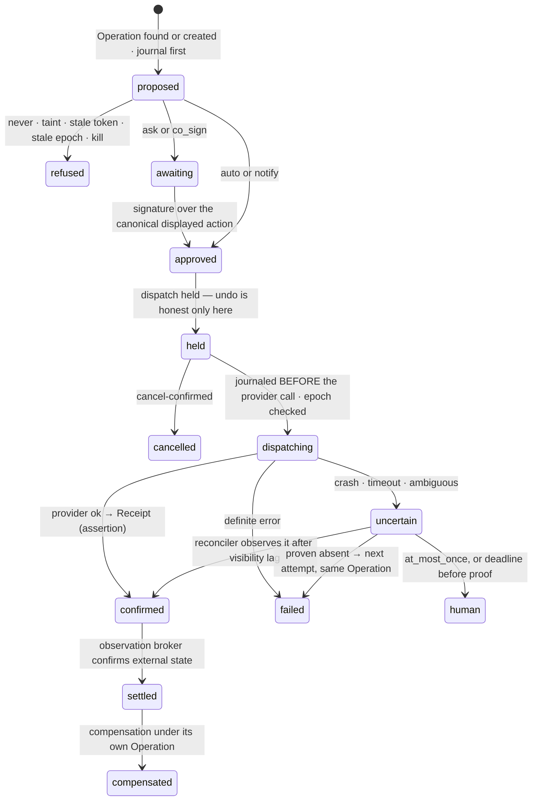
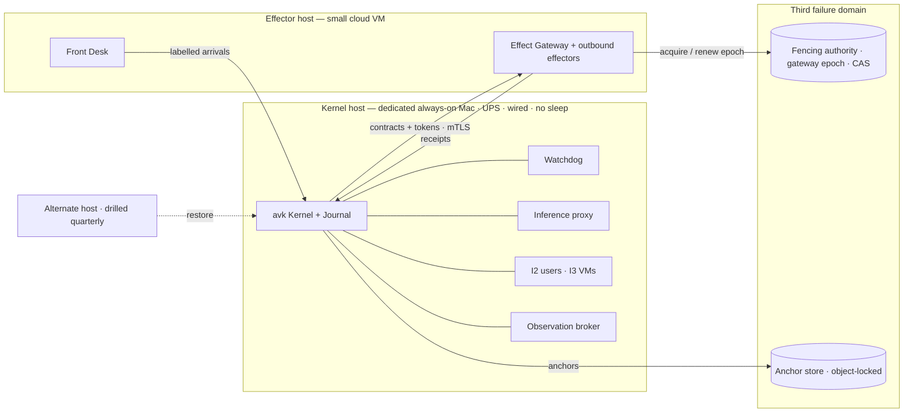

# 09a — Engineering: the substrate of the Compounding Organisation

*v3 package, Round 5, 2026-09-30. Owns: Kernel/Userland, the six Kernel nouns plus Operation, the policy compiler and
policy snapshot, the Journal, leases and storage fencing, effect identity and idempotency, the WorkerAdapter and runner,
the isolation ladder, credential routing and provider terms, label mechanics, the protected computing base and release
train, hosts and external fencing, the data policy, observability, the substrate trigger ladder. Binding above it:
[00-CANON](00-CANON.md), [00-FOUNDER-DIRECTION](00-FOUNDER-DIRECTION.md). Nothing here is built unless it says
**measured**; every number is a target, parameter, illustration or measurement (with source).*

> **Glossary box — terms this file adds (each refines a §5 entry; none redefines one).** **Attempt** — one dispatch try
> beneath an Operation ID. **Gateway epoch** — the exclusive, externally fenced right of one gateway instance to dispatch
> (refines DR-09's external fencing authority). **Storage verifier** — the check a resource runs on a presented fencing
> token and on what a write actually touched (refines *Fenced lease*). **Launcher grant** — DR-53's standing launch
> permission, as a record. **Anchor** — a Journal head hash written outside Custody's and the Kernel host's write domain.

---

## 1. The design in twelve lines

1. **Two tiers.** A small trusted **Kernel** in Go (journal, leases, fencing, policy compiler, launcher, inference proxy,
   kill path) and a **Userland** in TypeScript on Node 24 (mission engine, Minds, Allocator, memory, skills, surfaces
   API). Userland holds no secrets and no authority; it can crash, upgrade or replay at any moment (DR-08).
2. **Six nouns plus one:** Event · Job · Lease · Effect · Receipt · Label, plus **Operation**, the stable business identity
   of an effect. Missions, moves and Minds live in `data`, so the mission engine changes without touching trusted code.
3. **One compiled answer per action:** proposed action + one **policy snapshot** → one Decision Contract
   ([00 §3](00-CANON.md#3-the-decision-contract--how-eight-voices-become-one-answer)); stale contracts are recompiled.
4. **Coordination is fenced at storage:** leases are all-or-nothing and optimistic by default, and the written resource
   verifies the token and recomputes what was touched (DR-20, DR-21, [SP2]).
5. **Effects have an identity that outlives workers and hosts** — the Operation ID (DR-26, [R3-red X05]).
6. **Workers are equal** behind one `WorkerAdapter`; tool leases list forbidden tools; nested agents are visible (DR-24).
7. **Surfaces never spawn;** only the Kernel launcher does, under one standing grant (DR-53, [SLICE], [SP2]).
8. **Isolation is a ladder chosen by label:** provider sandbox → Unix user per venture → micro-VM per mission with no
   credentials inside → remote VM on trigger.
9. **Provider mode per job from the providers' own terms:** API keys for autonomous ventures, customer and client data,
   initiative jobs and all Codex headless; until D2 is signed every headless run is API, after it only founder-launched,
   present, A0–A1, D0–D1 Claude headless may use the subscription (DR-61, ~~DR-45~~).
10. **Labels propagate transitively** over data and control dependencies; a tainted authorising context cannot authorise
    an R2+ effect (DR-40, [R3-red X01]).
11. **The organisation builds itself on a release train it cannot use to promote its own judges** — the protected
    computing base is transitive and changes only through the release authority (DR-06, [R3-red C03]).
12. **Two failure domains and a third referee:** Kernel on a dedicated always-on Mac, Front Desk and outbound effectors
    on a small cloud host, the gateway epoch and Journal anchors in a third place neither can overwrite (DR-09).

---

## 2. Kernel and Userland

Whoever holds credentials can act without Intent, Allocation or Acceptance. The one process holding Stripe, bank, email
and API keys must have the smallest dependency surface the organisation can build; everything else should move fast and
crash freely. So the substrate is a microkernel [S12 §2.1–2.2].

| Component | Process · OS user | Language | Holds |
|---|---|---|---|
| **Kernel `avk`** — journal, leases, fencing, compiler, launcher, inference proxy, anchors | `avk` | **Go 1.25+**, pure-Go SQLite, stdlib Ed25519 | Journal, fencing counters, launcher grant, API keys (proxy only) |
| **Watchdog** | `avk`, launchd KeepAlive | Go, ~300 lines (target) | A kill file and the Journal's `system` stream — works when the Kernel API is wedged |
| **Custody effectors** — Effect Gateway, Treasury, Key Vault, Front Desk | one OS user each (`_avgate`, `_avtreas`, …) | Go | Their own credentials and receipt keys (DR-01, DR-03) |
| **Observation broker** (Acceptance) | `_avobs` | Go | Read-only credentials disjoint from every effector's [R3-red X02] |
| **Userland `avd`** — mission engine, Minds, Allocator, memory, skills, capacity router, twin, API | `avd` | **TypeScript, Node 24 LTS**, pnpm, Zod → JSON Schema | Nothing secret |
| **Presence helper** | founder's user | Swift, ~200 lines | Secure Enclave key — a worker cannot mint presence |
| **Surfaces** | `mission-control/` (Bun + Hono + React 19) | TS | Nothing — a client ([08](08-SURFACES.md)) |

Go, not Rust: as safe here and faster for both families to write and review; not TypeScript, for the trusted part
only: tens of vetted modules instead of an npm graph. **The Kernel's size is
enforced:** a lint caps it at ~8,000 lines (parameter) with a named list of allowed modules, and adding one is a
protected-base change (§14) [S12 §7 risk 5].

**Userland reaches the Kernel only through a command socket** (`avk:avd`, mode 660). The Kernel validates each command
and appends the resulting events; Userland never appends.

```ts
type KernelCommand =
  | { cmd: 'propose_event';  stream: string; expect_seq: number; type: string; label: Label; data: unknown; rationale?: Rationale }
  | { cmd: 'request_leases'; job: JobId; resources: ResourceUri[]; mode: 'excl'|'shared'; policy: 'all_or_nothing'|'wound_wait' }
  | { cmd: 'propose_effect'; verb: string; target: Target; business_ref: string; payload_ref: BlobRef; lease_tokens: TokenSet }
  | { cmd: 'admit_job';      spec: JobSpec }          // → launcher, under the launcher grant (§8.5)
  | { cmd: 'compile';        action: ProposedAction } // dry run → Decision Contract, no side effect
  | { cmd: 'renew' | 'release'; lease_id: LeaseId; token: bigint };
```

CI checks the boundaries: only `kernel/` writes the Journal, workers cannot import anything that reaches an effector,
only `effectors/*` (Go, Tier-0, §14) load credentials.

## 3. The six nouns and Operation

[S12 §2.2]'s types, extended with the red team's corrections: the Operation (X05), labels whose provenance, confidence
and permission are separate fields (X01), and a snapshot reference on every effect (C01).

```ts
type Label = LabelV1;                               // the one versioned wire schema, §12 (DR-68)
type Event = { id: ULID; stream: string; seq: number; type: string; ts: string; actor: Actor; correlation_id: Id;
               causation_id?: ULID; label: Label; rationale?: Rationale; snapshot_ref?: SnapshotId;
               schema: number; data: unknown; prev_hash: Hex; hash: Hex };
type Job   = { id: JobId; venture: VentureId; record_ref: IdentityRef; model_id: string;
               family: 'claude'|'codex'|string;     // derived from model_id, never from the slot (DR-83)
               headless: boolean;                   // billing turns on it (§10, DR-61)
               parent_job?: JobId;                  // nested agents are team members (§8.4)
               provider_mode: 'sub'|'api'; isolation: 'I1'|'I2'|'I3'|'I4'; context_profile: ProfileId;
               tool_lease: { allowed: string[]; forbidden: string[] };
               label: Label /* join of all Launch Pack inputs */; budget: Budget; lease_ids: LeaseId[]; state: JobState };
type Lease = { id: LeaseId; resource: ResourceUri; holder: JobId; responsibility_ref?: Id; fencing_token: bigint;
               epoch: bigint; mode: 'excl'|'shared'; kind: 'optimistic'|'pessimistic'; expires_at: string };
type Operation = { id: OperationId;                 // assigned BEFORE dispatch; independent of job, worker, host
                   venture: VentureId; verb: string; target: Target; business_key: string;
                   payload_digest: Hex; amendments: AmendmentRef[]; reservation?: ReservationRef;
                   state: 'open'|'settled'|'failed'|'compensated'|'human' };
type Effect  = { id: EffectId; operation_id: OperationId; attempt: number; contract_ref: ContractId;
                 snapshot_ref: SnapshotId; effect_class: 'R0'|'R1'|'R2'|'R3'|'R4' /* computed */;
                 idem_class: 'native_key'|'check_before'|'natural'|'at_most_once'; authorising_label: Label;
                 approvals: ApprovalRef[]; fencing_tokens: TokenSet; gateway_epoch: bigint; state: EffectState };
type Receipt = { effect_id: EffectId; operation_id: OperationId; attempt: number; request_digest: Hex;
                 provider_ref?: string; provider_response_digest?: Hex; observed_at: string;
                 issuer: 'gateway'|'treasury'|'runner'|'merge_queue'; sig: Ed25519Sig; chain_prev: Hex };
                 // a Receipt is its issuer's ASSERTION, never proof of world state (DR-03)
```

Invariants: only the Kernel writes Events; a Job never holds a credential and never outlives its leases; fencing tokens
are monotonic per resource and epochs bump on every restart and transfer; at most one open Operation per business key;
a label only gains taint along a dependency path.

## 4. The Journal and the record map mechanics

The record map is shared with [06](06-MEMORY.md) (DR-07): **Journal** = events and authority transitions; **versioned
files** = signed policy, Minds, curated Brain, identity and capability records; **databases and indexes** = projections
with source offsets; **external systems of record** = canonical for external state.

**4.1 Storage.** Journal: `~/.agentvibe/kernel/journal.db`, owner `avk`, mode 600, SQLite WAL, single writer, per-stream
gapless `seq` and `prev_hash`, snapshots every 10,000 events (parameter). Upcasters are protected-base code, because an
upcaster can change what a past decision meant [R3-red C03]. Litestream streams WAL frames offsite (RPO ≈1 s local,
≤60 s offsite, targets) and hourly `VACUUM INTO` snapshots cover a replication outage. Blobs are content-addressed per
venture, **redacted before write**, D2 encrypted per subject (§11.7). Every projection row carries its `(stream, seq)`
source offset and is rebuilt, never repaired by hand.

**4.2 One writer per record type.** The red team's C02: three stores competed to be truth, so a refund could exist in one
view and not another. Every record type has one canonical writer and one transaction boundary; a change that must reach
a second store travels through a durable outbox with an explicit pending state.

| Record type | Canonical store | Writer | Reaches other stores by |
|---|---|---|---|
| Events, authority transitions, leases, effects, receipts, verdicts | Journal | Kernel | Offset-tagged projections |
| Constitution, Charters, mandates, Standing Orders | Signed versioned files | Founder passkey via Kernel | `policy.released` event with file digest |
| Curated Brain, Minds, identity and capability records | Versioned files | Record (Sleep), registry jobs | Commit digest journaled; index rebuilt |
| Books | Treasury's ledger, reconciled from bank and processor | Treasury | Posting events; broker reconciles |
| External state (a charge, a deploy, a mailbox) | The provider | — | Observed by the broker, never copied as truth |

*Required proof* [R3-red §3.11]: rebuilding every projection from zero, replaying a partial commit or upgrading a schema
cannot change the evidence snapshot of an already compiled contract. ENGINE-SPEC's M1 done-test (10,000 random appends
with crash injection → identical rebuild) is kept and extended with "every live contract's snapshot still resolves".

**4.3 Anchors.** Hash chains prove consistency under a key, not that the key holder told the truth [R3-red X02]. Hourly
(parameter) and at every authority transition, the Kernel writes each stream's head hash to an object-locked, append-only
bucket in a separate cloud account whose credentials neither `avk` nor any effector holds — only the founder's recovery
kit. The observation broker verifies anchors weekly and before any settlement over $1,000 (parameter); a mismatch trips
the venture's SCRAM safe state ([05](05-AUTONOMY-INITIATIVE-FOUNDER.md)).

## 5. The policy compiler and the policy snapshot

The contract's shape and precedence are canon; this is how the Kernel computes it.

```yaml
policy_snapshot:                         # immutable, content-addressed; every contract cites exactly one
  id: snap_2026-10-02T09:00:14Z_88213
  journal_offset: 88213                  # every input is read AS OF this offset
  constitution: {version: v14, digest: 9c1e…}
  charter: {venture: keel, version: v6, level: A3, grants: [spend, outbound, deploy]}
  mandates: [m_refund_v3]
  limits_book: l_2026-10-02T09:00
  overlays:                              # active narrowing overlays read from the Journal (DR-58)
    - {id: ov_4471, scope: {venture: keel, verbs: [payments.*]}, reason: "fraud alarm → freeze", expires: 2026-10-03T09:00Z}
  safe_state: {id: ss_keel_v2, continuity: [refund_le_original_charge, notify_customer_of_delay]}   # DR-56
  authorising_label: {schema: label/1, taint: clean, dclass: D2, boundary: guarded, permission: may_authorise}
  inputs_freshness:                      # fog is explicit (C05)
    - {input: stripe.balance, observed_at: 2026-10-02T08:58Z, max_age_s: 600, state: fresh}
    - {input: reputation.meter.keel.email, state: unknown}    # unknown is a branch, never zero
  clock_uncertainty_ms: 40
```

```mermaid
sequenceDiagram
  participant U as Userland proposer
  participant K as Kernel compiler
  participant S as Snapshot builder
  participant G as Custody effector
  U->>K: propose_effect(action)
  K->>S: snapshot at current journal offset
  S-->>K: inputs + freshness + unknown branches
  K->>K: derive effect_class + door (action × target × money × audience × identity)
  K->>K: walk P1→P8; only invariant/consequence rules may block
  K-->>U: Decision Contract (disposition, satisfied, blockers with owner/remedy/expiry, valid_until)
  K->>G: contract + operation_id + tokens
  Note over G: at dispatch re-check valid_until, gateway epoch, tokens, kill state — else recompile
```

**The algorithm.** (1) Derive `effect_class` and `door` from the action, never from the proposer [S13 §1]. (2) Walk
precedence; a denying P1 rule ends evaluation (`never`). A denying P2 rule — SCRAM, freeze, kill switch, breaker, or an
active narrowing overlay — denies **within its scope except actions matching the safe state's `continuity:` list**; a
match continues to P3–P8 as normal, anything else is held [DR-56]. (3) Collect every other applicable rule; the rule
loader refuses to place a rule typed *method* in a blocking slot (DR-05). (4) An input that is `unknown` or stale fails a
*positive* permission closed, while an existing obligation continues on its pre-authorised continuity route (P3); an
obligation with no listed route stays pending and its latest safe start opens a continuity decision [DR-56]. (5)
Disposition = the most restrictive survivor. (6) `valid_until` = the earliest expiry of any input, mandate, limit window
or overlay, capped at 15 minutes (parameter).

```ts
function compile(action: Action, snap: PolicySnapshot): DecisionContract {
  const cls  = classify(action);                        // 16's R-class + door; never the proposer's claim   [DR-57]
  if (neverList(snap).matches(action)) return contract('never', cls, snap);             // P1
  for (const d of p2Denies(snap)) {                     // SCRAM · freeze · kill · breaker · snap.overlays   [DR-58]
    if (!d.scope.covers(action)) continue;
    if (!snap.safe_state.continuity.some(r => r.matches(action)))                        // DR-56
      return contract('held', cls, snap, blocker(d));   // owner, remedy, expiry
  }                                                     // a continuity match falls through to P3–P8
  const survivors = rulesP3toP8(snap, action).filter(r => r.type !== 'method');         // DR-05
  const base = dispose(snap.charter.level, snap.charter.grants, cls.door);  // 05's one table   [DR-57]
  return contract(mostRestrictive(base, survivors, freshness(snap)), cls, snap);
}
```

**One consequence source, composed once [DR-57].** The compiler **composes** two tables it does not own: `classify`
applies [16](16-EXTERNAL-WORLD-HUMANS.md)'s classification (R-class R0–R4 and door), and `dispose` applies
[05](05-AUTONOMY-INITIATIVE-FOUNDER.md)'s disposition table (level × grant × door → auto · notify · ask · co-sign ·
never), including its covering-mandate step. 09a keeps no local copy of either table; it loads both, versioned, into
the decision table at policy release.

**Narrowing overlays are compiler input [DR-58].** Automatic narrowing — by Regulation, SCRAM, a tripwire, a continuity
tier or a demotion — reaches the compiler as an active **narrowing overlay** read from the Journal as of the snapshot
offset, each with scope, reason and expiry. The compiler applies overlays on top of the signed Constitution; it never
rewrites a signed file. An expired overlay drops out at the next snapshot; lifting one early is widening and follows the
widening rules.

**Speed.** Rules compile to a decision table per (venture, verb) at policy release, so a compile is a lookup plus
freshness checks: targets p95 ≤5 ms, p99 ≤25 ms. Routine in-envelope effects cross ≤3 serial gates (DR-10); a contract is
reused only while its snapshot inputs are unchanged and inside `valid_until`. **Every channel** — chat, checkout, API,
phone, the founder's terminal — calls the same `compile`; the gateway refuses any effect without a contract
[R3-red §3.2].

**Checked before release.** Each Constitution or policy release model-checks the compiler's transition rules for
**safety** (no never-list action reachable under any snapshot) and **progress** (every blocked obligation has a
reachable remedy needing no expired or nonexistent principal) [R3-red Q4]; and **replays** the last 30 days of real
contracts, showing the founder the diff ("11 more asks; these 2 effects would have been refused") before he signs [S12 §6].

## 6. Leases and storage fencing

Coordination policy (responsibility versus execution lease, hot-resource semantics, the integration queue) belongs to
[04](04-AGENT-ORGANISATION.md). This is the mechanism, rebuilt around what SP2 measured against canned workers — its live
arms never ran (§8.5) [SP2 §3].

Five mechanism results stand: (1) lazy land-time acquisition **deadlocked on the first run** — both tasks grabbed
`config.ts#<header>`, an import line nobody declared → all-or-nothing or wound-wait plus a deadlock detector (DR-21);
(2) the declared footprint missed a real resource in **2 of 2** tasks → storage recomputes touched resources and hot
resources are auto-added; (3) symbol leases did **not** prevent a 4-file merge conflict → leases buy ordering, scope
detection and staleness rejection, not integration, and every overlapping pair budgets one rework (DR-22); (4) **the
storage fence stopped the zombie** — the pre-receive hook refused token 1 against current token 2 on 7 resources with the
coordinator deliberately bypassed (C3 PASS) → storage verifiers everywhere (DR-20); (5) leases blocked the fast worker
**13.2 s of 21.6 s** → optimistic, first-ready wins, pessimistic only for irreversible effects.

SLICE adds a sixth: two runners racing to claim one `queued` line would both win, because an append-only claim has no
lease [SLICE §6]. The launcher's job claim is therefore a fenced lease on `job://<id>`.

```yaml
lease_request:
  job: job_01J…                 # execution lease; the durable owner is the Responsibility (DR-23)
  resources:                     # sorted canonically; acquired in ONE atomic transaction
    - repo://beacon/src/billing/**          # glob, checked against the diff at land
    - repo://beacon/src/config.ts#<header>  # hot resource, auto-added because the footprint touches config.ts
    - budget://beacon/2026-10               # a money reservation is a lease too
  mode: excl
  kind: optimistic              # take at land, first-ready wins
  policy: all_or_nothing        # or wound_wait: the older mission revokes the younger; its token goes stale
  ttl_s: 90                     # parameters: heartbeat 30 s; resource leases renew every 60 s, ≤5 min unrenewed
  max_wait_s: 120               # detector's hard cap → release all, requeue, event lease.starved
```

A wait-for graph breaks any cycle or over-cap wait at the youngest mission and journals it; a resource in three cycles a
week (parameter) is proposed to [04](04-AGENT-ORGANISATION.md) as a hot resource.

**Storage verifiers — the fence lives where the write lands.**

| Resource | Verifier | Recomputes |
|---|---|---|
| `repo://` | `pre-receive` hook on origin + the integration queue's compare-and-swap push; `Lease-Tokens:` commit trailer (the SP2 mechanism) | Touched `file#symbol` set; refuses a stale token or a path outside the glob |
| `db://` | Conditional write `… WHERE fence <= :token` + per-table fence row | Tables and rows touched |
| `effect://` | The Effect Gateway: tokens **and** its own gateway epoch (§15) | Operation business key and target |
| `budget://`, `job://` | Allocation's reservation table; the launcher's claim row | Amount reserved; exactly one runner per job |
| `brain://` | Record's commit hook | Refuses writes outside Sleep's authority |

A worker that paused ten minutes and woke cannot push, send, merge or spend, whether or not it consults the lease table
— Kleppmann's fencing argument applied to agents [S12 §2.6; SP2 §5.1]. SP2's landing receipt (base and landed sha,
touched resources, tokens presented, undeclared resources, conflicts, reworks, fence rejections, lease wait, cost) is
kept as the merge-queue Receipt.

## 7. Effects: identity, idempotency, reconciliation

Gateway behaviour in the world — mandates, Offer objects, claims, brand cells, honest undo — is [16](16-EXTERNAL-WORLD-HUMANS.md)'s.
This is the identity and crash machinery under it.

**7.1 The Operation ID.** S12's key was `sha256(venture ‖ mission ‖ job ‖ effect_n ‖ payload)`; a restart under a new job
mints a new key for the same purchase and the supplier is paid twice [R3-red X05, Scenario C]. The fix (DR-26):

```
operation_id  ULID assigned by Custody the first time a business action is proposed
business_key  venture ‖ verb ‖ target ‖ business_ref        e.g. keel ‖ payment.pay ‖ supplier_44 ‖ invoice_8812
invariant     at most ONE open Operation per business_key (unique index)
attempt n     Effect{operation_id, attempt: n}; provider idempotency key = operation_id, suffixed with n only
              where the provider's scope requires it AND the previous attempt is proven absent
amendment     a changed payload is an explicit Amendment on the Operation, never a new Operation
```

A replacement worker re-proposing the same action receives the **existing** Operation; money stays reserved until it
settles or fails.

**7.2 Idempotency classes, checked against each provider's real contract.**

| Class | Examples | Retry rule | Verified at adapter admission |
|---|---|---|---|
| `native_key` | Stripe, most billing APIs | Same key | Provider key retention and scope; past that window, treat as `check_before` |
| `check_before` | Mailbox send (Sent by `Message-ID`), DNS, calendar | Query, send if absent | A measured `visibility_lag_s`; a query inside it returns `unknown`, not `absent` [R3-red X05] |
| `natural` | PUT config, digest-pinned deploy | Freely | Payload is the digest |
| `at_most_once` | Phone, SMS, social post | **Never auto-retry**; `uncertain` → obligations-lane reconciliation task for a human | — |

Every effect type at R2+ needs a compensation handler before it can be enabled at A3+ [S12 §2.7].



**Settled is not confirmed.** `confirmed` is the gateway's assertion; `settled` needs the observation broker's own read
of the system of record. A gateway that lies consistently about dispatch and receipt still cannot settle
[R3-red §3.4]. **Crash anywhere after `dispatching`** — before the provider returns, before the Receipt persists, during
reconciliation — leaves the attempt in `dispatching` or `uncertain`, and recovery **reconciles first, by class**, never
re-dispatches blindly. A returning stale host is refused by the fencing authority (§15.2).

## 8. The runner and the WorkerAdapter

**8.1 Measured CLI surface** (2026-09-30 [S12 §2.3], versions re-checked for this file): `claude` 2.1.284 has
`--permission-mode`, `--allowedTools`, `--disallowedTools`, `--settings`, `--setting-sources`, `--json-schema`,
`--max-budget-usd`, `--session-id`, `--resume`, `--bare` and **no `--max-turns`**; `codex-cli` 0.154.0 has `exec` with
`-s`, `-p`, `--json`, `--output-schema`, `-o`, `--ephemeral`. Under the sandbox `codex --version` warns about PATH aliases
and exits 0, so adapters judge only the structured result.

**8.2 The contract.**

```ts
interface WorkerAdapter {
  family: string;                                    // 'claude' | 'codex' | a Model Foundry family (07)
  contract_hash(): Hex;                              // pinned binary + flag surface; checked nightly
  launch(spec: LaunchSpec): Running;                 // own process group; stream-json / --json
  classify(stream: Stream, exit: ExitInfo): WorkerOutcome;   // never trusts the worker's own claim
  children(stream: Stream): ChildJob[];              // nested agents, keyed by parent_tool_use_id
  resume(prev: SessionRef, spec: LaunchSpec): Running;
}
type LaunchSpec = { cwd: string; context_profile: ProfileId; tool_lease: {allowed: string[]; forbidden: string[]};
                    schema_path: string; budget_usd: number; wall_s: number; idle_s: number;
                    env: Record<string,string> /* never a secret */; provider_mode: 'sub'|'api';
                    inference_base_url?: string /* I3+: the proxy */; settings_path: string; init_expect: Hex };
```

Pinned launch lines, updated with SLICE's lessons (forbid nested-agent tools; mount a chosen context profile):

```
claude -p --setting-sources <profile> --settings <job.json> --agents <compiled.json> --agent <record>
       --permission-mode dontAsk --allowedTools <allowed> --disallowedTools <forbidden, incl. Agent,Task>
       --output-format stream-json --verbose --json-schema <f> --max-budget-usd <B> --session-id <uuid>
codex exec -C <worktree> -s workspace-write -p <generated profile> --json --output-schema <f> -o <result.json> --ephemeral
```

Never `--bare` (skips hooks), never `--dangerously-skip-permissions`. The per-job `job.json` sets `sandbox.enabled`,
`allowUnsandboxedCommands: false`, `denyRead` over every other venture root and `~/.agentvibe/{kernel,gate,obs}`,
`allowWrite` on the worktree only. Hooks stay on for telemetry; the Kernel never trusts them as a boundary. The rest is
ENGINE-SPEC §8 kept verbatim: the `system/init` harness check against `init_expect` (tool-description hashes included,
so a changed MCP description aborts before the first tool call); budget, wall-clock (SIGINT 90%, SIGKILL pgid 100%) and
5-minute idle backstops in place of a turn flag; the subtype map, with empty Codex output → `unresolved` and
`unresolved` never `pass`; ≤2 runner-built continuations; **the runner commits**, test inputs hash-locked; done-tests in
a clean I3 VM with no network and no secrets.

**8.3 Context profiles.** SLICE's Builder, launched inside this repo, loaded `CLAUDE.md`, the agents and the review
lenses; a 173-word summary cost **$1.08 and 152.9 s** against the Codex Referee's 23.7 s (measured [SLICE §3]). A
context profile is a named, hashed bundle — settings sources, instruction file, agent definitions, MCP set — chosen by
the mission ([04](04-AGENT-ORGANISATION.md)) and mounted by the runner. Default: the Launch Pack ([06](06-MEMORY.md))
and nothing inherited from wherever the runner stands.

**8.4 Nested agents are visible.** SLICE's Builder spawned a same-family reviewer through `Agent` although `Agent` was not
in `--allowedTools`; its PASS contradicted the cross-family Referee's correct FAIL, and its events reached the page as
the Builder's [SLICE §5]. So (DR-24): tool leases carry a forbidden list and nested-agent tools are forbidden unless the
funded team shape includes them; when allowed, the runner keys events on `parent_tool_use_id` and journals a child Job
the surfaces draw as "Builder › subagent"; a child's verdict never counts — only the Referee's parsed verdict moves a
card (DR-13).

**8.5 The launcher grant (DR-53, F1).** SP2 never launched a worker — **0 of 40 launches, $0**. The auto-mode
permission classifier refused both attempts: "Create Unsafe Agents" (Claude with `--dangerously-skip-permissions`) and
"Safety Bypass Flag" (Claude narrowed to `acceptEdits` with an allowlist, Codex in `workspace-write`) [SP2 §3.1]. A
dispatcher that needs a human per launch cannot run a merge queue at 03:00, so the Kernel launcher alone holds one
standing, narrow, receipted grant:

```yaml
launcher_grant:
  holder: kernel.launcher            # the only principal that may spawn workers
  signed_by: founder_passkey         # a Constitution record; revocable instantly
  binaries: [{path: /opt/av/bin/claude, digest: …}, {path: /opt/av/bin/codex, digest: …}]
  argv: pinned templates above       # any other flag → refused before exec
  forbidden_flags: [--dangerously-skip-permissions, --bare, "-s danger-full-access"]
  per_launch_requires: [admitted Job, tool lease with forbidden list, context profile, isolation ≥ I2 if headless,
                        provider mode per §10, budget cap, fenced lease on job://<id>]
  caps: {concurrent: 12, per_hour: 120}   # parameters; one Receipt per launch
```

No agent session inherits it; the permission layer keeps refusing unsafe launches from anywhere else, which is what SP2
observed and is right.

**8.6 The server never spawns.** Mission Control's server has no shell and no spawn, and its only writes are appends from
`index-cache.ts`, pinned by `crosscheck.test.ts`. SLICE ran the full loop — card → queue → Claude Code Builder → Codex
Referee → verdict on the card — without breaking that [SLICE §4]. v3 keeps the split: **surfaces enqueue; only the Kernel
launcher spawns.** SLICE's `run-missions.ts` claim-run-append loop is the launcher's prototype.

**8.7 Receipts and launch logs name the family from the model id [DR-83].** Every launch Receipt and launch-log line
records `model_id` as the worker reported it in `system/init` (or the proxy's route evidence), and `family` is
**derived from that id** by a pinned table in the protected base — never from the slot, role or adapter the job was
launched into. A mismatch between the slot's intended family and the derived one is journalled and the job's verdicts
count for the derived family only; a cross-family edge claimed on a slot label alone is not a cross-family edge
[[12](12-SPIKE-RESULTS.md) ND-12-2].

**8.8 Codex headless route and the UNPARSED rate [R5 OG11].** The Codex adapter launches `codex exec` headless under a
**pseudo-TTY** with `--json` streamed and parsed event by event, because detached from a TTY the CLI has exited 0 with
empty stdout (the harness's Codex bug #19945). Any run whose stream the adapter cannot parse into a typed outcome is
classified **`UNPARSED`** (a kind of `unresolved`, never `pass`). The runner measures the UNPARSED rate **per family**
over a rolling 7-day window (parameter) and publishes it on the observability page. Above **2%** (parameter) for a
family, no autonomous venture may rely on that family's headless route: its roles fall back to the interactive route,
another family, or single-family mode with provisional verdicts (§10, DR-69).

## 9. The isolation ladder and the inference proxy

| Level | Mechanism | Credentials inside | Used for |
|---|---|---|---|
| **I1** | Provider sandbox (Claude Seatbelt / Codex `workspace-write`), founder's Unix user | Founder's subscription OAuth | Interactive, founder-present sessions |
| **I2** | I1 + **a Unix user per venture** (`av_<venture>`), roots `chmod 700`, egress via a local allowlist proxy | An API key via the proxy; a Claude subscription token only when `providerMode` returns `sub` (after D2, §10) | Headless D0–D1 work the founder launched on A0–A1 ventures |
| **I3** | **Apple `container` micro-VM per mission**, only the worktree mounted, model via the proxy | **None** | A3/A4 ventures, D2/D3, untrusted code, done-tests, counterparty content, intake trials, the quarantined reader |
| **I4** | Remote microVM (Firecracker class) | None | On trigger (§17) |

`isolation = max(label floor, autonomy floor, role floor)`: D2/D3 or any tainted input → I3; headless at A3+ → I3.
A Unix user per venture because deny-lists drift (v2 found `cat` of a sibling venture working); owners and mode 700
fail a cross-venture read in the OS kernel for every tool.
**Owed spikes before the first autonomous venture:** `claude -p` under a second macOS user via `claude setup-token`;
whether a `container` VM can reach the proxy with no other egress; whether an outer profile can wrap a worker's own
Seatbelt [S12 §2.4; ENGINE-SPEC §9.1]. Named fallbacks: I3 + API for all headless work; `pf` rules per VM interface; I4.

**The sandbox refuses loopback, so verification environments are designed.** SLICE measured that the armed sandbox
refuses loopback `bind()` **and** `connect()`: the server, the Vite client and `curl` ran outside it and the page was
driven by an out-of-sandbox Playwright browser [SLICE §3]; the harness's `check:mc` hits the same wall. So: a "watched it
run" claim needs a Kernel-owned **out-of-sandbox observer** (its own OS user, reached as a read-effect); apps under test
run inside the I3 VM where binding is allowed; tests that need real sockets are never edited to avoid them.

**The observation broker has an out-of-sandbox fetch path [DR-73].** Acceptance's attribution check — does the cited
page exist and does it contain the quoted span — is run by the broker, not by a worker: it fetches the claim's source
URL from its own OS user outside every worker sandbox, stores the response digest, and matches the quote
deterministically **before any model reads the claim**. A fetch that fails or times out is `unresolved`, never `pass`.
The Referee and verifiers read the broker's stored copy, so no sandboxed worker needs web egress to be checked.

**The inference proxy (`avk proxy`)** on a per-VM vsock or loopback address: injects the API key so none enters a VM;
meters tokens per job exactly; refuses requests over the job budget; records request/response digests for replay;
**enforces provider and data eligibility** — a D2 pack cannot reach a route without commercial terms, and a route change
is a requalification event [R3-red X04]; records route and model-version evidence where returned; and is a **kill point**
that stops all model traffic within one request. It never sees subscription OAuth (I1 and `sub`-mode I2 traffic goes direct) — which is
exactly where its guarantees stop [S12 §2.5].

## 10. Credential routing and provider terms

**What the terms said when fetched, 2026-09-30** [S12 §2.9; URLs in Sources]:

| Source | Says | Consequence |
|---|---|---|
| Anthropic Consumer Terms | No access "through automated or non-human means" except "via an Anthropic API Key or where we otherwise explicitly permit it"; opt-out does not cover Feedback; accounts not "available to anyone else" | **No feedback from worker sessions**; nobody else uses the founder's plan |
| Claude Help Center 15036540 | `claude -p` and the Agent SDK "still draw from your subscription's usage limits"; a June change was paused with "advance notice before any future change" | Permitted, unstable: subscription work carries an API **shadow price** |
| Claude Code legal and compliance | Limits "assume ordinary, individual usage"; developers building products "should use API key authentication" | Customer-serving products and 24/7 autonomy → API |
| OpenAI Codex auth | "Use API key authentication for programmatic Codex CLI workflows" | **Codex headless always uses an API key** [DR-61] |
| Anthropic / OpenAI API data docs | No training on API content by default; ~30-day retention; ZDR on request | D2/D3 only via API under commercial terms |

**The billing rule is DR-61, codified here and nowhere else in engineering.** Until the founder signs D2
([15](15-RISKS-AND-DECISIONS.md)), `d2Signed` is false and **every headless run uses an API key**. Once signed, a
headless job may run on the subscription only if its family is **Claude**, it was launched by the founder's command, a
presence proof is <30 min old (parameter), the venture is at A0–A1 and the data is D0–D1. **Codex headless is always
API.** Autonomous ventures, customer/client data (D2+) and initiative-generated jobs are always API. D4 is refused.

```ts
function providerMode(job: Job, ctx: Ctx): 'sub' | 'api' | 'refuse' {   // at admission AND in the proxy   [DR-61]
  if (job.label.dclass === 'D4') return 'refuse';                      // no model, ever
  if (ctx.level >= 'A3' || ctx.customerFacing || job.label.dclass >= 'D2') return 'api';  // autonomous, D2+
  if (ctx.initiatedBy !== 'founder') return 'api';                     // initiative-generated work: always API
  if (!job.headless) return ctx.founderPresent ? 'sub' : 'api';        // interactive, founder at the keyboard
  // headless from here on
  if (!ctx.d2Signed) return 'api';                                     // default false: all headless on API
  if (job.family !== 'claude') return 'api';                           // Codex (and any other family) headless: always API
  if (ctx.level > 'A1') return 'api';                                  // headless sub only at A0–A1
  if (!ctx.launchedByFounderCommand) return 'api';
  if (ctx.presenceProofAgeMin === undefined || ctx.presenceProofAgeMin >= 30) return 'api';  // parameter
  return 'sub';                                                        // Claude, founder-launched, present, A0–A1, D0–D1
}
// Every 'sub' job is metered and receipted at the API shadow price (09b), so switching to API never changes a budget.
```

`family` here is derived from the model id (DR-83, §8.7). A presence proof ([05](05-AUTONOMY-INITIATIVE-FOUNDER.md))
proves presence only; it never authorises the job — admission still needs its contract. A terms change reported by the
watcher below flips `d2Signed` to false (strict) until the founder re-signs [DR-61].

API keys carry hard monthly caps in each provider console — $150 Anthropic / $50 OpenAI per autonomous venture to start,
raised by the Treasury Standing Order (F2; parameters). Accounts are sets of **buckets** (Claude 5-hour and weekly
windows; Codex plan windows, reported changed twice this quarter by secondary sources and not relied on; API monthly
USD). The first 429 is ground truth; a one-token **limit canary** runs before a batch admits. Degraded modes and shadow
prices are [09b](09b-ECONOMICS-EVALS-SIM-IMPROVEMENT.md)'s; the mechanism here guarantees that single-family mode routes
every role to one family and flags every verdict it produces **`provisional`** [DR-69]. A provisional verdict is
journalled and shown, but **never satisfies a missing coverage edge**: Acceptance treats that edge as still open, so no
merge or settlement that needs it proceeds. A human substitutes for the missing edge only if the coverage contract named
a qualified human alternative before launch. A weekly **terms watcher** diffs the pages and opens an obligations-lane
item on change; a quarterly **provider-exit drill** runs a day API-only and a day single-family, and measures **degraded
production only** — throughput, cost and latency of work that proceeds — never acceptance, since single-family verdicts
from the drill are provisional like any other [DR-69].

## 11. DATA POLICY

*The founder turns data-training settings off by hand (direction item 14). This policy governs everything else. The
Kernel enforces it at admission, the proxy on every request, the gateway on every effect. Changing it is a Constitution
change.*

**11.1 Classes.** Every datum carries exactly one.

| Class | Examples | May reach | Isolation | Other rules |
|---|---|---|---|---|
| **D0 public** | Web pages, public docs | Any provider, any mode | any | Tainted if it came from the web |
| **D1 internal** | Venture code, plans, Brain, Minds | Subscription (training off) only where `providerMode` returns `sub` (§10, DR-61); otherwise API | ≥ I2 headless | Never in feedback or sharing features |
| **D2 personal** | Customer email, interviews, CRM, recordings | **API under commercial terms only**; a DPA once a customer exists | I3 | Pseudonymised before any Launch Pack where possible; transcription local (whisper.cpp); per-subject key |
| **D3 client / NDA** | Agency client code and data | API only, only where the contract permits processors; ZDR requested where offered | I3 always | Own venture; never in the Lesson Airlock or any export |
| **D4 secrets** | Credentials, tokens, signing keys | **No model, ever** | — | Only Custody effectors touch them; redactor scans every blob |

**11.2 Training and feedback.** Training off on every consumer account, verified weekly by an obligations-lane task
that captures the settings page; a mismatch drops that account to D0-only until fixed. No worker ever sends thumbs,
ratings or feedback — the Consumer Terms exempt feedback from the opt-out.

**11.3 Accounts.** The founder's plans serve only his own founder-initiated work. Collaborators, contractors and
customers never use them; a Room ([16](16-EXTERNAL-WORLD-HUMANS.md)) gets its own API-metered route.

**11.4 Minimisation.** The Launch Pack builder strips fields the task class does not need; D2 is pseudonymised; D3 never
leaves its venture. What went to which route (digest, route, model version) is recorded, so a provider incident is
scoped to what was actually disclosed [R3-red X04].

**11.5 Cross-venture.** Only the Portfolio Mind's export job (I3, D1 in, lessons out) reads two ventures, through the
Lesson Airlock ([06](06-MEMORY.md)); a leakage check refuses output naming the source venture's entities.

**11.6 Retention classes.** `journal_metadata` (life of the organisation; never a sensitive payload) · `operational`
(90 days, parameter) · `personal` (shorter of contract and legal need) · `client` (per contract) · `synthetic` (twin
lifetime). Transcripts and traces inherit the highest class of anything they contain.

**11.7 Encryption and erasure.** Immutable metadata is separate from encrypted payloads (DR-41); D2 uses a per-subject
key, D3 a per-client key. Erasure is a governed effect: key destruction plus a walk of the subject-to-object inventory
(packs, traces, caches, exports, aggregates). The receipt distinguishes *destroyed*, *key-erased*, *external deletion
scheduled* and *retained under exception*, and never claims to erase uncontrolled copies. Restores apply tombstones
before serving, so a backup cannot resurrect plaintext or a key [R3-red H03, §3.5].

**11.8 Secrets.** Never in a worker environment, VM, pack, prompt or trace; honeytokens (§19, ideas) in every Brain and repo.
**Pre-model scanning is deterministic and comes first [DR-76, R5-walk B34].** Before any model reads a repo — a Fleet
Import census, a new venture root, a mounted worktree — a deterministic scanner (pattern and entropy rules plus
provider key formats, no model in the loop) walks the tree and its git history. Every hit is redacted from the copy any
model will see and replaced by an opaque reference (`secret_ref: sr_…`, pointing into Custody); the original is moved to
Custody or flagged for rotation. Census manifests carry these references and never a secret value. A scan that did not
complete leaves the repo unreadable by any model — incomplete is never clean.

**11.9 Synthetic data.** Canaries and twin records carry `origin: synthetic, exportable: false` (§12), enforced
below semantics by the gateway and exporters; twin credentials lack production capability (DR-50, [R3-red H06]).

**11.10 Jurisdiction.** Every target carries jurisdiction; unknown raises blast radius.

## 12. Labels — the mechanics

Label semantics for memory and the Airlock are [06](06-MEMORY.md)'s; the wire format and propagation are here.

**12.0 The one wire schema [DR-68].** Every event, blob, pack, trace and export carries exactly this record, versioned;
06 defines what the values mean and uses these names. Classification, boundary, retention class, retention deadline,
permission, taint and origin are **seven distinct fields** — none is inferred from another.

```ts
type LabelV1 = {
  schema: 'label/1';                                 // a new version ships with an upcaster (§14 base); readers refuse unknown versions
  origin: 'founder'|'system_of_record'|'internal'|'public_web'|'customer'|'counterparty'|'synthetic';
  dclass: 'D0'|'D1'|'D2'|'D3'|'D4';                  // classification, §11.1
  boundary: 'open'|'guarded'|'sealed';               // the venture Charter's Airlock boundary class (06 §10)
  venture: VentureId | 'portfolio';
  retention: { class: 'journal_metadata'|'operational'|'personal'|'client'|'synthetic';   // storage lifetime, §11.6
               hold: 'none'|'obligation'|'legal'|'safety'|'pinned';                        // what forgetting may not touch
               deadline?: string };                  // retention deadline, computed; never a class
  permission: 'none'|'informs'|'may_authorise';      // permission to drive an effect — NOT confidence; only a declassifier widens it
  exportable: boolean;                               // false for synthetic and canary records (DR-50)
  taint: 'clean'|'untrusted'|'quarantined';          // non-clean if ANY data or control ancestor is untrusted
  provenance: SourceRef[];                           // incl. {human_principal?: PrincipalRef} — human provenance is a field, never an origin
  consent_scope?: ConsentScopeRef;                   // participant/panel data (06 §11, 16 ParticipantProtocol); never widens
  confidence?: number;                               // neither provenance nor confidence ever raises permission
  subjects?: SubjectId[]; revocation_epoch: number;  // lineage inventory (§11.7); bumped on source/Room revocation
};
```

**Mapping from 06's semantic names (published with the schema; `label/1`).**

| 06 field : value | Wire |
|---|---|
| `data_class: public` | `dclass: D0` |
| `data_class: internal` | `dclass: D1` |
| `data_class: personal` | `dclass: D2` |
| `data_class: confidential` | `dclass: D3` (client / NDA material) — boundary unchanged, set by the Charter |
| `data_class: sealed` | `dclass: D3` **and** `boundary: sealed` — a classification plus a boundary, never one field |
| `origin: founder · system_of_record · internal · public_web · customer · counterparty · synthetic` | same name |
| a collaborator's or contractor's contribution | origin of the channel (`counterparty` or `internal`) + `provenance[].human_principal` |
| `consent_scope` | same name (participant and panel data only) |
| `taint: clean · untrusted · quarantined` | same name |
| `authority: none · informs · may_authorise` | `permission`, same values |
| `exportable` | same |
| `retention: ordinary` | `retention.hold: none` |
| `retention: obligation · legal · safety · pinned` | `retention.hold`, same value |
| `retention: synthetic` | `retention.class: synthetic`, `hold: none`, `exportable: false` |
| D4 secrets | no 06 value: secrets never enter memory (§11.8) |

- **Join.** A job's label is the join of every Launch Pack input; outputs inherit it; derivation from a tainted fact
  taints — over **control** dependencies too (a plan chosen because of an email is tainted even with clean
  parameters) [R3-red X01].
- **Quarantined reader.** Untrusted content is read by an I3 job with no effect grants that returns typed fields
  (amounts, dates, intents, quoted spans); the planner acts on fields, never on raw text in an authorising position
  [S12 §2.10; S13 §2.10].
- **Compiler rule.** `effect_class ≥ R2 ∧ authorising_label.taint ≠ clean → blocker`, unless parameters are re-derived from an
  **independently authorised** source (our catalogue price; the charge via the observation broker — never a paraphrase
  of the same email) or a human approves the exact canonical action.
- **Declassification** changes `permission` only through a declassifier job with independent evidence; a settled
  citation never declassifies and never raises a source's authority (DR-40).
- **Quarantine cascade.** Marking a source hostile walks `causation_id` and provenance edges: packs are rebuilt, pending
  Operations drop to `refused` pending review, and derived skills, Standing Order proposals and priors are suspended.

## 13. Security: threat model and defences

| Threat | Mechanism |
|---|---|
| Prompt injection (web, customers, counterparties) | Labels, quarantined reader, compiler taint rule (§12); no reliance on filters, which adaptive attacks beat (CaMeL; Rule of Two) |
| Admitted capability changes behaviour [R3-red X03] | Admission pins executable/dependency digests, endpoint identity and egress (Tool Surface Lock, [07](07-SKILLS-TOOLS-MCP.md)); **at runtime** the egress proxy enforces destinations and argument disclosure independent of the advertised verb, so a "read" that smuggles data into a URL is blocked; unprovable remote endpoints get tighter disclosure limits; admission never substitutes for containment |
| Compromised provider or route [R3-red X04] | Proxy eligibility, route evidence, minimisation (§11.4), deterministic checks, a second qualified route |
| Truth-forging Custody [R3-red X02] | Isolated effectors, disjoint observation credentials, offsite anchors, a distinct signing path for authority changes; drills compromise the gateway, not only a worker |
| Secret exfiltration | No secrets in workers; redaction at blob write; honeytokens; secret-touching events excluded from search |
| Spoofed presence / self-approval | Secure Enclave signatures bound to the canonical displayed action and a nonce (DR-35); workers cannot reach the socket or key |
| Stale or rogue worker | Storage verifiers (§6); pgid kill; workers only propose |
| Supply chain (our code) | Vendored Go, `govulncheck`, reproducible builds; pnpm lockfile, install scripts off |
| Adaptive attack | Monthly twin red team, each family attacking the other's defences; score = R2+ effects from tainted-only context, **target 0** |

Residual exposure is written down: a compromised Kernel-host administrator defeats the local sandbox; what survives is
the offsite anchor, provider-side key revocation and the external gateway epoch [R3-red Q2].

**Kernel-host administrator mitigations [R5 OG4; D3].** They shrink the window, not the exposure:
- **A separate admin account**, used only for OS administration and never for running agents, the Kernel or a founder
  session; the account agents run under has no `sudo`.
- **The custody keychain is sealed by Touch ID** (Secure Enclave, user-presence required per use), so an admin shell
  cannot silently unlock signing or provider keys.
- **Hourly journal-head comparison from the third domain** (§15): the third failure domain fetches the Kernel's current
  journal head and compares it with its own anchor chain; a mismatch — a rewritten or forked history — **trips the
  external epoch**, fencing the Kernel host out of every effector until recovery.
- **Provider keys are revocable from the recovery kit**: the offline kit lists every provider console and key id and
  the revocation step for each, so a compromised host's API keys die without that host's cooperation.

## 14. The protected computing base and the release train

**Definition (transitive, DR-06):** `kernel/**`, `effectors/**`, the watchdog, the compiler and rule loader, upcasters and
migrations, WorkerAdapter `classify` maps, graders and verifier code, output parsers (the Referee's `VERDICT:` parser
included), label rules, the kill path, the release signer, build inputs (lockfiles, toolchains) and the allowed-module
list. **Release authority:** proposing is free; activating needs the founder plus independent evidence from both
families, and **a candidate never evaluates or signs its own promotion** [R3-red C03, §3.12].

| Stage | Who builds | Trust rule |
|---|---|---|
| S0 hand-built spine | Founder-interactive Claude Code and Codex sessions | Done-tests frozen before work ([14](14-BUILD-PLAN.md)) |
| S1 Userland self-builds | Headless jobs on release N build N+1 | Runs from pinned `~/.agentvibe/releases/N`, never the tree it edits |
| S2 protected-base changes | Workers propose; a founder-interactive session lands | Two-family review, chaos suite, decision replay, 48 h canary on a low-risk venture, one-command rollback |
| S3 policy improvement | Weekly loop ([09b](09b-ECONOMICS-EVALS-SIM-IMPROVEMENT.md)) | Cannot touch the protected base; replay shows every behaviour change |

Rollback restores compatible **state**, not only a binary: every migration ships its inverse and is canaried on a Journal
copy; a release whose rollback cannot restore state is refused.

## 15. Hosts, external fencing and the kill path



**Accepted as DR-62 (refines DR-09); ~~NEW DECISION~~.** The fencing authority and anchor store live in a **third failure domain** — a strongly
consistent conditional-write store in a separate cloud account — so neither host can grant itself the epoch or rewrite
history.

**15.2 The gateway epoch.** A gateway dispatches only while it holds the current epoch (renew every 30 s, lease 90 s;
parameters); effector grants are short-lived and carry it. After the heartbeat deadline no new irreversible dispatch
occurs [R3-red T07]. A restored or returning host must request a new epoch, refused while another holder is live, and
**reconciles every uncertain Operation before issuing a new one**. At A3+, effectors self-freeze without a signed
world-state heartbeat from the founder's devices within 15 minutes (parameter) [S13 §7].

**15.3 Kill mechanics.** The five kill levels and who pulls them are [16](16-EXTERNAL-WORLD-HUMANS.md)'s. Mechanically:
kill state is checked at admission **and** dispatch; `av stop --all` journals a `system` event, the watchdog kills every
`av_*` process group and VM, the proxy closes, the gateway surrenders its epoch; the **custody lock** seals effector
keychains until a Touch ID unlock; provider-side key revocation is a two-minute runbook from any browser; a physical
button, a signed iOS Shortcut and a spoken passphrase all reach the watchdog. Kill SLOs (targets, weekly drill): command
→ local model traffic and new dispatch refused, p99 ≤5 s; provider-side cancellation reported per adapter; effects
already committed are **listed by Operation**, never counted as "stopped".

## 16. Observability — "why did it do that"

- **One trace per mission:** `correlation_id` = trace id; job = span; tool call = child span (Claude Code and Codex
  OpenTelemetry tagged with `job_id`) → local collector → blob refs on job events.
- **The why-walk:** `av why <effect|event>` follows `causation_id` to the goal node, printing each hop's rationale (≤280
  chars, evidence refs), **labels** and **snapshot** — "refund proposed from counterparty email E (tainted) → blocked at
  compile → re-derived from charge C via the broker → settled". [08](08-SURFACES.md) renders it.
- **Flight recorder:** Journal slice, transcripts, proxy digests, receipts and anchors as one signed bundle per mission
  — also legal evidence for disputes, insurance and exit diligence.
- **Replay:** *state* (rebuild → identical hash); *decision* (Userland re-run on recorded model outputs under new code or
  policy, decisions diffed); *counterfactual* (twin, live models, shadow gateway).

| Reliability SLO (targets) | Target |
|---|---|
| Duplicate external effects · tainted-authorised R2+ effects | **0 · 0** |
| Status mismatches (5% Referee re-check) · orphan processes 2 min after kill | 0 / week · 0 |
| Kernel recovery: accepting commands / all leases reconciled | ≤60 s / ≤5 min |
| Obligations-lane p95, signal → worker running, 24/7 | ≤3 min |
| Kernel availability, single host | 99.5% monthly |

## 17. The substrate trigger ladder

Sequenced, never shrunk [R3-X U6]. `JournalStore`, `SandboxDriver`, `WorkerAdapter` and `FencingAuthority` are stable
across every move.

| Trigger (parameters) | Move |
|---|---|
| A second writing host, or Journal >50 GB | Postgres behind `JournalStore` |
| >1,000 live durable timers in one workflow | A durable-execution engine (Temporal or Restate class) under the mission runtime |
| Kernel host >85% CPU for 3 days, or a 24/7 customer-facing SLA | I4 remote microVMs |
| Brain retrieval eval <0.85 | Graph layer on the Brain (DR-39) |
| >40 ventures or >20,000 effects/day | **Kernel cells federate**: one Constitution, a cell per venture group, signed cross-cell receipts, shared fencing authority |

## 18. What v3 keeps from ENGINE-SPEC and the harness, and what it changes

**Kept:** ENGINE-SPEC's principles P1–P7; the event envelope, streams, rationale and upcasters; the job state machine,
subtype map and contract fixtures (§8, verbatim); the write-ahead outbox with `uncertain` never retrying; container VMs
for untrusted execution; the five data classes; TS Userland and the Bun/Hono/React surfaces. From the harness: Rule 10
(`unresolved` is never `pass`) as the Kernel outcome type; `verdict.mjs`'s digest binding as the approval and Receipt
binding; `run-checks.mjs`'s INCOMPLETE/SUBSET/REFUSED as done-test semantics; `gates.yml`'s command-versus-human gates as
approval kinds; `classifier.js` as the seed of door-type classification for code effects; Mission Control's spawn-free
server and SLICE's one-fold-two-readers.
**Changed:** the trusted part moves from TypeScript to Go (DR-08); the Journal is canonical for events and authority
only, with offsite anchors (DR-07); the CLI, not the SDK, is the worker contract, with forbidden-tool leases, context
profiles and child jobs; the job-derived outbox key becomes the **Operation ID** (DR-26); profiles P0–P3 become the
**I1–I4 ladder** with a Unix user per venture and no credentials in VMs; the data table becomes the full policy of §11.
**Retired:** playbook-as-pipeline machinery and the shim agent files.

## 19. Worked examples, failures and ideas

**Power loss mid-rollback, 03:06.** A **Reliability Engineer** (Claude) holds `deploy://beacon/prod` (token 7702) and
Operation `op_rb` is `dispatching` when the Kernel host dies. 03:09: chains verified against the last anchor, VM
cleared, tokens → 7703; the effector host still holds the epoch and reconciles `op_rb` through the broker (deployed digest
= target) → **settled, one rollback**. A **Codex** Referee confirms recovery from metrics at 03:27. Founder: **Know** at
**Buzz**, 07:00, flight recorder attached.

**Supplier payment times out while the founder travels** [R3-red Scenario C]. `op_pay` (`keel ‖ payment.pay ‖
supplier_44 ‖ invoice_8812`) loses its response and the Kernel crashes. A replacement **Accounts Payable Operator**
(Codex) re-proposes and receives the **same** Operation, `uncertain`, cash still reserved; the broker reads the bank
ledger after the visibility lag — paid, settled once. Without proof before the deadline, the Deputy gets a bounded
reconciliation task, never a retry button.

**Every failure in this topic, with its design answer and test** (the full register is [15](15-RISKS-AND-DECISIONS.md)'s):

| Failure | Source | Answer | Test |
|---|---|---|---|
| Retry duplicates an effect; `check_before` races visibility | R3-red X05 | Operation ID, attempts, reconcile first, `visibility_lag_s` (§7) | Q3: faults at four crash points, new worker IDs, delayed reads → one payment |
| Tainted evidence becomes authority | X01 | Transitive labels, independent re-derivation, cascade (§12) | Q1: tainted-only chains through Sleep and Foundry authorise nothing |
| Admitted capability changes behaviour | X03 | Digest/endpoint pinning; egress independent of verb (§13) | Q1/Q2: changed backend, delayed trigger, composed Loadout |
| Truth-forging gateway; compromised provider | X02, X04 | Disjoint broker, anchors, settled ≠ confirmed; proxy eligibility | Q2: a lying gateway cannot settle; selective provider corruption |
| Host failure defeats control | T07 | Third-domain epoch, heartbeat deadline, reconcile on restore (§15) | Q3: stale restore while old host returns → one dispatcher |
| Stores disagree | C02 | One writer per record type, outboxes, offsets (§4) | Rebuild from zero keeps every contract's snapshot |
| Self-improvement edits the prover | C03 | Transitive protected base, release authority (§14) | A candidate bundling a permissive parser cannot promote |
| Stale input becomes permission | C05 | Freshness and unknown branches in the snapshot (§5) | Missing sensor → positive permission fails closed; obligations continue |
| "Forgotten" data survives; canaries leak | H03, H06 | Lineage, per-subject keys, tombstones; `exportable: false` (§11, §12) | Old-backup restore; canary in an export → blocked and investigated |
| Lazy leases deadlock; zombie writes; two runners claim one job | SP2, SLICE | All-or-nothing + detector; storage verifiers; `job://` lease (§6) | SP2 B0-greedy and drill as nightly fixtures; two-launcher race |
| Hidden same-family reviewer; inherited context cost | SLICE | Forbidden tools, child jobs, context profiles (§8) | `Agent` refused or visible as child; profile cost diff recorded |
| Permission layer blocks unattended launch | SP2 | Launcher grant (§8.5, F1) | SP2's live arms run under the grant |
| Sandbox refuses loopback | SLICE | Out-of-sandbox observer; apps tested in I3 (§9) | "Watched it live" with no observer read → `unresolved` |

**Ideas the founder did not ask for.**
1. **Honeytokens** — fake credentials and customer rows with unique strings in every Brain and repo; a sighting at the
   proxy, in an effect or on the public web trips the venture kill and exports a forensic flight recorder [S12 §6].
2. **Chaos Friday in the twin** — kill the Kernel mid-send, expire a lease mid-merge, change a tool description, 429 one
   family, restore a stale backup; SLOs are scored from these weeks, not quiet ones.
3. **The Kernel as every venture's product spine** — a Flagship's own customer-facing agents run behind the same compiler,
   labels and Operation IDs, inheriting duplicate-free effects and injection-safe authorisation (speculation; a
   Keystone Asset candidate, [17](17-VIBE-STARTUPING-IN-PRACTICE.md)).

## 20. Open questions

1. **Where does the fencing authority run in Year 1?** *Recommendation:* a conditional-write object store in a cloud
   account separate from the effector host, credentials only in the founder's recovery kit; revisit at federation.
2. **Unix user per venture, or I3 for all headless work from day one?** *Recommendation:* run the two owed spikes (§9) in
   the first build phase; if either fails, I3 + API for everything headless at the measured cost.
3. **How to model-check the compiler?** *Recommendation:* property-based simulation in Go first (cheaper for both families
   to maintain), TLA+ for the precedence core once the rule set stabilises.

## 21. Sources

- [S12] `r2-seats/S12-engineering.md` (primary) · [ENGINE-SPEC] `engineering/ENGINE-SPEC.md` §§0–2, 8–11, 13–14 ·
  [SP2] `r4-spikes/SP2-collision.md` · [SLICE] `r4-spikes/SLICE-board-to-team.md` · [S13]
  `r2-seats/S13-external-world-humans.md` §§1, 2.1, 2.7, 2.10, 7 (security side) · [R3-red]
  `r3-stretch/R3-redteam-codex.md` X01–X05, T07, C02, C03, C05, H03, H06, §§3.4, 3.5, 3.11, 3.12, Scenarios B–C, Q1–Q4 ·
  [R3-X] `r3-stretch/R3-expander.md` U6 · [00-CANON](00-CANON.md), [02](02-ORGANISATION.md).
- Provider terms, fetched 2026-09-30 by S12: https://www.anthropic.com/legal/consumer-terms ·
  https://code.claude.com/docs/en/legal-and-compliance · https://support.claude.com/en/articles/15036540 ·
  https://learn.chatgpt.com/docs/auth · https://developers.openai.com/api/docs/guides/your-data ·
  https://platform.claude.com/docs/en/manage-claude/api-and-data-retention
- CaMeL https://arxiv.org/abs/2503.18813 · Kleppmann, fencing tokens
  https://martin.kleppmann.com/2016/02/08/how-to-do-distributed-locking.html · https://litestream.io ·
  https://github.com/apple/container
- Local measurement for this file, 2026-09-30: `claude --version` → 2.1.284; `codex --version` → 0.154.0 (with the
  PATH-alias warning under the sandbox).
