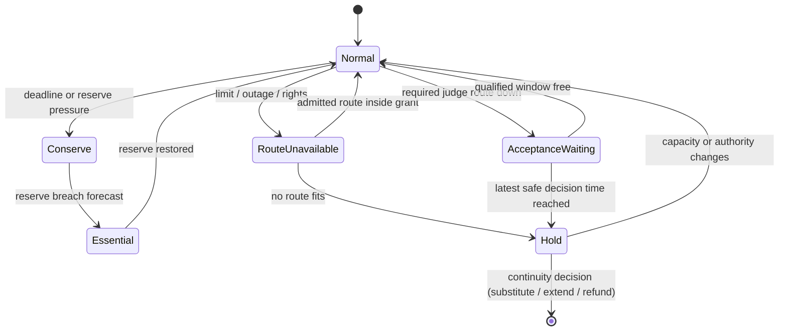
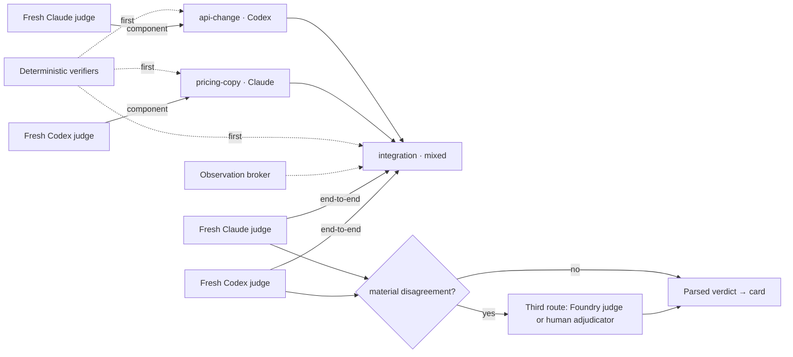
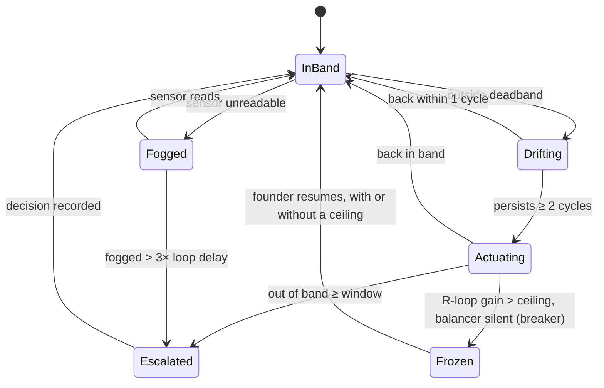
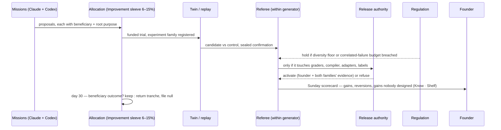

# 09b — Economics, evals, simulation and improvement

*Round 5 section file, 2026-09-30. Obeys [00-CANON](00-CANON.md). Owns (canon §8, row 09b): the four resources, reserves,
Budget Ledger and the charging rule (DR-60), forecasting whole missions, degraded modes, treasury, correlated-failure budget; the Acceptance Coverage
Contract and coverage graph, Verifier Foundry, eval tiers, twin, calibration, leverage and FTE-equivalent; Regulation's
stocks, homeostats, exposure book, immune system, governance budget and control ROI; the weekly scorecard; the
self-improvement loop.*

## 0. What this file is

The organisation's **instrument panel and its accounting**. Three authorities meet here; each keeps its own power, and
each *grows* its scarce input rather than only rationing it (canon §1, clause 3):

| Part | Authority | Question | Scarce input, and how it is grown |
|---|---|---|---|
| A. Economics | **Allocation** (Fund) | What can we spend, and what did it buy? | Cash and capacity — Treasury Standing Order, compute payback experiments |
| B. Acceptance | **Acceptance** (Check) | Is it done; did the claim come true? | Verification capacity — the Verifier Foundry (Deterministic Share 40% → 75% → 90%, targets) |
| C. Regulation | **Regulation** (Brake) | Is every stock in band, every exposure in limit? | Speed — retiring controls that catch nothing |
| D. Improvement | all three | Did we get better this week, and how do we know? | Capability — variation, external selection, retention, decay |

**Two ideas run through all four parts.** First: *a number is only as good as the system of record it resolves to, and an
absent reading is fog, never zero* [S11 M1; R3-red C05]. Money comes from the bank, acceptance from the Referee's parsed
verdict — never from a builder's "reviewed" [SLICE]. Second: the design follows what was **measured**. SP3 found each
family scores its own work higher — **+1.1 (Claude), +3.2 (Codex)** on a 1–10 composite — that the families' scores
correlate at **r = −0.37**, and that run-to-run generation noise is **0.53** per item [SP3 §3]. SLICE saw a same-family
self-review pass an unsupported claim a cross-family Referee correctly failed. SP2 found leases buy ordering, not
conflict-free integration: one rework per overlapping pair. Each is a design input below (§5, §10, §11, §14).

**Mechanism register** (canon §10 rule 5 — authority and store here; failure mode and test in §26):

| Mechanism | § | Authority | Store (record map, DR-07) |
|---|---|---|---|
| Provider Contract Registry | 2 | Allocation reads; Custody holds credentials | versioned files with source URL, hash, `valid_until` |
| Budget Ledger, reserves, tranches | 3–4 | Allocation | Journal events; SQLite projection with `journal_offset` |
| Mission forecasts | 5 | Allocation forecasts, Acceptance scores | Journal; residuals in Calibration Ledger |
| Degraded modes | 6 | Allocation declares, Execution checkpoints | Journal mode transitions |
| Stress cases, liquid reserve | 7 | Allocation + Custody + Regulation | versioned files; reserve register keyed by obligation ID |
| Treasury Standing Order | 8 | Allocation proposes, founder signs, Custody disburses | signed versioned file; releases in Journal |
| Coverage contracts, verdicts | 10 | Acceptance | Journal, hash-bound to artifact |
| Judge-offset table, noise floors | 11 | Acceptance | versioned files, re-measured per model release |
| Verifier registry | 12 | Acceptance | versioned files in the protected computing base |
| Qualified service windows | 13 | Acceptance publishes rates; Allocation holds admission | Journal reservations |
| Benchmark Vault, experiment families | 14 | Acceptance; restricted custodian for sealed sets | encrypted payloads, immutable metadata |
| Calibration Ledger | 15 | Acceptance scores; Constitution grants | projection over forecast/settlement events |
| Twin and fidelity certificates | 16 | Acceptance certifies; Record snapshots; Allocation funds | versioned files; isolated namespaces |
| Stocks, Loop Registry, homeostats | 17–18 | Regulation | projections; signed homeostat files |
| Limits Book | 19 | Regulation; enforced pre-effect by Custody | signed versioned file |
| Antibodies | 20 | Regulation | versioned files; alarms in Journal |
| Control ROI ledger | 21 | Regulation | projection over control events |
| AAR, near misses, deviance | 22 | Record stores; Regulation monitors | Journal + Brain projections |
| Scorecard, improvement loop | 23–24 | Acceptance computes; Allocation funds; release authority activates | Journal; winners to Backlot/cast registry, losers to Null Registry |

> **Glossary box — terms introduced here, refining canon §5.** *Completion reserve*: the acceptance + recovery part of a
> tranche. *Qualified service window*: a reserved slot on a named eligible judge route (refines verifier windows).
> *Stress case*: a named joint shock across cash, permission and capacity. *Judge offset*: a judge family's measured
> self-preference per rubric. *Verifier rung*: advisory · pre-screen · decide. *Fidelity certificate*: a twin component's
> scoped, prospectively validated claim. *Control line*: a row of the control ROI ledger. *Gain label*: benchmark ·
> deployment · business. *Charged vector*: the per-component resource charge of a mission, probe or arm (§3.2).
> *Concession exposure*: a concession's full commitment value (§3.3, DR-80). *Provisional verdict*: a single-family
> verdict that settles nothing (§6, DR-69).

Not specified here (link instead): Allocator ranking, lanes, sleeves, bundles → [03](03-MISSION-ENGINE.md); Audition
Ladder rungs, casting, identity records → [04](04-AGENT-ORGANISATION.md); autonomy promotion, Closer Claims, Progress
Ledger → [05](05-AUTONOMY-INITIATIVE-FOUNDER.md); Priors, Nulls, labels → [06](06-MEMORY.md); the Reflex's capability side
→ [07](07-SKILLS-TOOLS-MCP.md); rendering → [08](08-SURFACES.md); compiler, Journal, credential routing, release train →
[09a](09a-ENGINEERING.md); Books, Effect Gateway → [16](16-EXTERNAL-WORLD-HUMANS.md).

---

# Part A — Economics

## 1. The four resources and verifier windows

The organisation spends four things, **never interchangeable** [S14 §1]: subscription capacity does not buy a founder-minute, and
money set aside for a Referee does not make an eligible judge exist [R3-red T01].

| Resource | Unit | System of record | Grows by | Runs out as |
|---|---|---|---|---|
| **Cash** | original currency, fixed precision | bank, processor, invoices (Books) | Treasury rule (§8); Capital Desk with founder signature | runway breach, processor hold, refunds |
| **Subscription capacity** (DR-61) | bucket units + reset time, per account | the tools' own usage readouts and headless token counts; *unknown* allowed | another seat or a higher tier (founder); Model Foundry share | 5-hour window / weekly cap |
| **Provider throughput** | requests and tokens per minute, per account | limit messages; the first one is ground truth | spreading across accounts | 429s mid-run |
| **Founder minutes** | minutes + interruptions | Attention Exchange looked-at minutes | Standing Orders, Decision Supply Bench, Deterministic Share | Founder State; Halt never budgeted |
| *plus* **verifier windows** | qualified service windows (§13) | Referee queue | Verifier Foundry (§12) | correlated fan-in |

**Shadow prices** rank work; they never pay or authorise [S14 §2.3]. A founder-minute is priced weekly from the Exchange's
clearing price, a verifier window from queue delay against deadlines, allowance from the probability of exhausting it
before reset. A shadow price rising three weekly cycles running makes Regulation send Allocation a typed "grow this"
proposal. Only Allocation funds (DR-04).

```ts
type ResourceVector = {
  cash_minor: bigint; currency: string;
  allowance: { bucket: string; units: number; confidence: 'observed' | 'inferred' | 'unknown' }[];
  throughput: { bucket: string; rpm: number; itpm: number; otpm: number }[];
  founder_minutes: number;
  verifier_windows: { route: string; count: number; by: string }[];
}; // admission compares component by component; no function converts one component into another
```

## 2. Provider Contract Registry

What execution can be bought, refreshed on onboarding, renewal, model release, price or auth change, or stale evidence.
Facts fetched from the providers' own pages for this design [S14 §2.2] (a measurement dated 2026-09-30; entries expire):

| Route | Published (as fetched) | Consequence |
|---|---|---|
| Claude Max | $100/mo (5×), $200/mo (20×); 5-hour sessions, account-assigned weekly reset | a multiplier is allowance, not a token inventory |
| ChatGPT with Codex | Plus $20; Pro $100/$200/$500; Pro has no 5-hour limit, weekly limits may apply | ENGINE-SPEC's universal 5-hour Codex bucket is retired |
| Agent SDK / `claude -p` | consumes subscription allowance; the separate SDK credit is paused | assume no SDK credit |
| Claude / OpenAI API | per-token rates (fetched) | **fallback only**, off until the founder enables it (09a §10) |

Rates for the models the engines now pin (`claude-opus-5`, `claude-sonnet-5`) are **fetched into the Registry, not
assumed** from older rows; a model with no current entry is refused admission. A route with unknown price is not free.

```ts
type ProviderContract = {
  id: string; provider: 'anthropic' | 'openai' | 'foundry';   // foundry = the Model Foundry family (07)
  account_ref: string;                 // opaque, never a credential
  route: 'subscription' | 'credits' | 'api'; plan: string; rate_card_ref: string;
  permitted_use_ref: string;           // terms evidence for risk V25 (09a §10)
  allowance_buckets: string[]; throughput_buckets: string[];   // observed, never assumed universal
  overflow_grant_ref: string | null;   // an enabled credit reload is not a grant
  evidence: { url: string; fetched_at: string; sha256: string }[]; valid_until: string;
};
```

**The capacity rule binds (DR-61, ~~DR-45~~): all model work runs on subscriptions; there is no metered API budget.**
Limits are measured, never hard-coded (they change: Codex's 5-hour limit was removed in July 2026 and restored for Plus on
25 Aug 2026). **Adding a seat is an experiment:** when the meter shows capacity bound the plan (queued or degraded work,
missed deadlines), Fund tells the founder what one more seat or tier would add, in accepted outcomes and delay, beside
its fee; idle capacity counts against an upgrade.

## 3. The Budget Ledger

Allocation's account of the four resources per mission, venture and portfolio. It is not the Books (double-entry per legal
entity, [16](16-EXTERNAL-WORLD-HUMANS.md)) and not the harness's claim ledger; it links to the Books by receipt ID.

```ts
type EconomicEvent = {
  id: string; idempotency_key: string; venture: string; mission: string; attempt: string;
  operation_id?: string;                // effects keep their Operation ID across retries (DR-26)
  kind: 'reserve' | 'consume' | 'release' | 'accrue' | 'pay' | 'refund' | 'allocate' | 'correct' | 'accept';
  resource: 'cash' | 'allowance' | 'throughput' | 'founder_minutes' | 'verifier_window';
  quantity: string; unit: string;       // fixed-precision decimal string, never float money
  source: 'provider' | 'invoice' | 'measured' | 'estimated';
  replaces?: string;                    // corrections append; history is never rewritten
  root_purpose: string;                 // every descendant charged to a root purpose (DR-47)
  charged_pool: 'obligations' | 'acceptance' | 'recovery' | 'acceptance_headroom' | 'improvement'
              | 'build_charter' | `sleeve:${string}`;   // exactly one, by purpose (§3.1, DR-60)
  beneficiary: string;                  // named on every draw; 30-day outcome check
  reservation_ref?: string;             // the probe / arm hold this debit consumes (§3.2)
};
```

**Posting rules** [S14 §2.3]: a subscription is booked once and attributed by a frozen policy, idle capacity visible as
overhead; "API-equivalent cost" of subscription work is a counterfactual, never a second invoice; reservations are
encumbrances; a crashed run with missing usage is **unreconciled exposure**, not zero; usage is normalised into disjoint
categories so reasoning tokens are never counted twice.

| Cost view | Contents | Reconciles to Books? |
|---|---|---|
| **Incremental cash** | extra payable caused by the mission | yes |
| **Fully allocated** | + shares of subscriptions, infrastructure, humans, overhead | yes |
| **Decision cost** | + founder-minute and verifier-window shadow prices | no — ranking only |

**Cost per accepted outcome** includes failures, abandoned attempts, review, recovery and integration rework. With nothing
accepted, the surface prints *"no accepted outcomes; $X spent"*. Every scope shows three numbers — **spent · committed ·
available to authorise** — and capacity with timestamp and confidence ([08](08-SURFACES.md)).

### 3.1 The charging rule — one pool per purpose (canonical home) [DR-60]

Every spend is charged by its **purpose** to exactly one pool. The Budget Ledger refuses an `EconomicEvent` whose
`charged_pool` does not match its purpose row.

| Purpose of spend | Pool | Denominator of the cap |
|---|---|---|
| Delivering an obligation | Obligations reserve | the obligation's own reserve, keyed by obligation ID |
| Judging funded work — verifiers, judges, Time-out Confirmers, adjudication | Acceptance reserve | the admitted mission's completion reserve (§4) |
| Recovery | Recovery reserve | the admitted mission's completion reserve (§4) |
| Manufacturing acceptance capacity (Verifier Foundry, §12) | Acceptance reserve's **uncommitted headroom only** | ≤25% per month (parameter) **of uncommitted acceptance reserve**; never windows reserved for admitted missions |
| Improving how the organisation works — auditions, Forge, config trials, Skill Foundry, reflex re-runs, post-Handover harness tuning | Improvement sleeve | floor 6%, 12% for the 30 days after a model release, cap 15% (parameters) — **of monthly investment-lane capacity, per resource** |
| Constructing the organisation until Handover | Build Charter (ends at Handover) | the founder-signed Charter envelope |
| Everything else | Its investment sleeve | the sleeve's share of monthly investment-lane capacity, per resource |

"Per resource" means the percentage is applied separately to each component of the `ResourceVector` (§1) — 15% of the
lane's cash, 15% of its allowance, 15% of its verifier windows — never to a blended dollar figure. Every draw names a
**beneficiary** and faces the **30-day outcome check** (DR-47); an unproven draw returns and its null is kept.

This table reconciles three proposals made elsewhere: the audition budget and 30-day post-release window (ND-04-1,
accepted — [04 §4.5](04-AGENT-ORGANISATION.md)); verifier-building from the acceptance reserve (modified to headroom-only
and capped — [03 §12.8](03-MISSION-ENGINE.md)); and the Build Charter (modified to end at Handover, after which tuning is
charged to the Improvement sleeve — [14 §7](14-BUILD-PLAN.md)).

### 3.2 Denominators, the charged vector and overrides [R5-walk C10, B05, B22]

**Every cap names its denominator** — a percentage without one is refused by lint. The rows this file owns:

| Cap | Denominator |
|---|---|
| Improvement sleeve 6% / 12% / 15% | monthly investment-lane capacity, per resource (§3.1) |
| Foundry draw ≤25%/month | uncommitted acceptance reserve at the start of the month (§3.1) |
| Investment exploration floor 15% (§4) | investment-lane capacity, per resource, rolling 30 days |
| Mandate headroom (monthly) | the signed mandate envelope, **all** resource components charged to that mandate — never one spend line such as ads |
| Correlated-failure budget 40% (§7) | loss-weighted obligations across the portfolio |
| Verifier utilisation ceiling 70% (§13) | the route's measured qualified-window throughput |
| Surprise reserve (03 parameter) | the mission's execution + integration-rework holds |

**The charged vector.** Every mission, probe and arm is charged a vector, never a single number: `{cash, allowance,
throughput, founder_minutes, verifier_windows}` (§1). Forecast, reservation, consumption and release are all posted per
component; a summary dollar figure is a view over the vector, labelled with the view it uses (§3 cost views).

**A reservation ledger per probe or arm.** A mission running four probes holds four reservations; one probe with four arms
holds one reservation with four arm sub-holds. Which of the two a mission is, is 03's framing decision; the ledger records
it, so a "graduated result" can never be booked against holds that were not made.

**The full reserved tranche** (§4) shows every hold — execution, integration rework, acceptance, recovery — and its
**authorised contingency draw** (the surprise reserve) as a separate line with its authority. Predictable rework (an
overlapping pair, §5) is budgeted as `integration_rework`, never drawn from contingency; contingency is only for work
outside every cited recipe (03).

**Parameter overrides are records.** An illustration or mission may use a value other than the initial parameter (a 15%
surprise reserve where 03 says 10%) only as a `parameter_override {parameter, default, value, authority, reason,
expires}` event; the surface shows it beside the number. An override with no authority is refused.

### 3.3 Concession exposure [DR-80, R5-walk B19]

A concession, discount, credit or extended term is charged at its **full commitment value** — e.g. two months at 20% off an
account with $2,400 MRR is **2 × 0.20 × $2,400 = $960** of concession exposure, not the first invoice's $80. Grants
(per-effect and weekly) are checked against that full value, and it sits in the exposure book (§19) until the commitment
ends. 16 compiles the commitment; this ledger books it.

### 3.4 Founder-time accounting categories [R5-walk B39]

Founder minutes are posted in three disjoint categories, never summed into one figure without a label:

| Category | Contains | Used for |
|---|---|---|
| **Decision minutes** | time on Decide packets and Halts only | the ≤30 decision-minutes/day target; seconds per accepted outcome (§9) |
| **Total attention** | decision minutes + Know, Circle and Reel reading | Founder Attention stock (§17) |
| **Work time** | founder-performed work (a signature ritual, a call, rescue) | F in Leverage (§9) together with total attention |

Elapsed-time figures state their start and end timestamps; a "48-hour" window is computed from them, never asserted.

## 4. Admission with completion reserves

**Reserve order: obligations → acceptance → recovery → investment** (canon §5). A launched mission must be able to reach
acceptance *or* an orderly checkpoint, so its tranche reserves all three together — funding a writer without a feasible
Referee is an incomplete allocation [S14 §2.4].

```yaml
tranche:
  mission: agency/offer-validation
  lane: investment                 # lanes, sleeves, ranking: 03
  policy_snapshot: l_2026-10-02T09:00
  cash_cap_usd: 120                # = every hold below, contingency included
  holds_usd: {execution: 64, integration_rework: 8, acceptance: 20, recovery: 20}   # completion reserve = 40
  contingency: {pool: surprise_reserve, usd: 8, authority: "03 parameter: 10% of execution+rework, rounded up"}   # separate line
  charged_vector: {cash_usd: 120, capacity: [claude-max-1: fc-142, chatgpt-1: fc-143],
                   founder_minutes: 8, verifier_windows: 3}                                          # §3.2
  reservations: [probe-1: {arms: [a, b], cash_usd: 64}]   # one probe, two arms — one hold, two sub-holds
  parameter_overrides: []          # each {parameter, default, value, authority, reason, expires}
  capacity_holds: [claude-max-1/weekly: fc-142, chatgpt-1/weekly: fc-143]
  acceptance_bucket_holds: [claude-max-1/weekly:acceptance: fc-142a]   # held before any debit (DR-81)
  verifier_windows: [component:codex-judge by 11:00, end-to-end:both-families by 12:00]
  acceptance_coverage_contract: acc-7731    # never a reviewer-family string (R3-red §3.9)
  founder_minutes_cap: 8
  deadline: 2026-10-07T18:00Z
  root_purpose: goal-node/agency/paid-intake
```

**Admission invariant:** consumed + unsettled exposure + active reservations + protected reserves ≤ authorised envelope,
checked atomically (compare-and-swap) at portfolio, venture, mission and bucket level. Subagents and retries debit their
parent; a nested agent is a visible team member (DR-24), never a way to mint budget.

**Capacity limits are reservation buckets held before every debit** [DR-81, R5-walk B23]. Each account's measured
window and weekly cap is split into buckets — execution, acceptance, recovery — and the acceptance bucket
is **held at admission** for the coverage contract's windows. Every debit first checks and decrements its own bucket;
**execution can never consume acceptance headroom**, however much execution cap remains unspent elsewhere. If a debit
nonetheless lands against a held acceptance bucket, that is not a bad forecast: it is an `invariant_violation
{invariant, bucket, debit_id, held, consumed}` event, a labelled failure of the reservation implementation that halts
admission on that bucket and opens a near miss (§22). Investment may borrow operational
headroom only if it can checkpoint before an obligation's latest safe start; irreversible commitments never borrow
recallable capacity. The investment lane keeps a 15% exploration floor (parameter); obligations eroding it for three weeks
raise a structural capacity proposal (attractor A9).

**The starting budget has two lines** (illustration, Year-1 start). **Capacity:** the founder's seats (illustration: one
Claude Max, one ChatGPT plan), metered per account and split into obligations, acceptance, recovery and investment
buckets, with an **incident reserve** of each account's window (parameter: 20%) that only Halt-class work may draw; near a
limit the degraded modes below apply. **Cash** for real-world spend only — domains, sending, phone numbers, ads — starting
near zero on free tiers (DR-84), grown by the Treasury rule releasing reconciled revenue; a paying customer is never served
from a non-commercial free plan.

## 5. Forecasting whole missions

Every mission registers a forecast at funding ([03](03-MISSION-ENGINE.md)); this section owns its cost and capacity
arithmetic. The writer is usually the smaller half of the bill:

```
E[cost] = Σ workers (context_load + work + retries·p_retry)
        + Σ coverage (deterministic + judges·route_price) · (1 + p_disagree·adjudication)
        + refereeing                                  # per loop cycle × forecast cycles (DR-73)
        + integration_rework · E[reworks]             # from 04's overlap estimator, with its interval
        + recovery_reserve · p_checkpoint
        + founder_minutes · shadow_price          # decision view only
```

| Term | Measured | Consequence |
|---|---|---|
| context_load | SLICE: a 173-word summary cost $1.08 and 153 s on the Builder, mostly inherited context and self-review, vs 24 s for the Referee | the context profile is chosen per mission ([04](04-AGENT-ORGANISATION.md)); a profile change resets the prior |
| integration_rework | SP2: one rework launch per overlapping pair; leases idled the fast worker 13.2 of 21.6 s | priced from the **overlap estimator** ([04 §9.3](04-AGENT-ORGANISATION.md)): expected rework launches with an interval, reserved as `integration_rework` at the interval's upper bound; without history, its fallback of one rework per overlapping pair (DR-22) [R5 G-B1] |
| refereeing | SP1: the Referee was **42%** of the loop's cost (measured, $8.72 of the run) | every mission forecast carries a refereeing line; deterministic claim-source fetch and quote-match run before any model to shrink it (§10, DR-73) [SP1] |
| coverage | SP3: ~290 s per Claude judge pass, ~130 s per Codex pass; cross-family caught what self-review missed | review is reserved and priced before launch (§13) |

```ts
type CapacityForecast = {
  bucket: string; observed_at: string; reset_at: string | null; remaining: number | null;
  confidence: 'observed' | 'inferred' | 'unknown';   // unknown admits conservatively, never "100% free"
  config_hash: string;                               // model × effort × context profile × skills × shape
  demand_p50: number; demand_p90: number; deadline_success_probability: number;
  bottleneck: 'allowance' | 'rate' | 'review' | 'host' | 'attention' | 'lease';
};
```

Three horizons: next hour (concurrency, rate buckets, review queue); next seven days (resets, deadlines, promised capacity,
founder calendar); next thirteen weeks (runway, renewals, price shocks). Portfolio percentiles come from simulation with
correlated arrivals; summed P90s are labelled a heuristic. **The concurrency ceiling is the smallest bottleneck**:
`min(throughput, hosts, leases, verifier windows, attention)`. Thirty launchable workers with review for four outputs are
four productive workers; the rest queue with a stated reason (ground delay, DR-15).

## 6. Degraded modes

Checkpoint and reroute within authority; **never relax acceptance** (canon §5). This replaces ENGINE-SPEC's automatic
same-family sign-off on exhaustion [S14 §2.5].

| Mode | Entry | Permitted | Never |
|---|---|---|---|
| **Conserve** | P(deadline) < 0.8 or reserve pressure (parameter) | cut speculative fan-out, compact context, batch, drop to a lighter model, queue for the next window | touch obligations |
| **Essential** | reserve breach forecast | obligations, active acceptance, recovery; checkpoint investment | start investment |
| **Route unavailable** | limit, outage, expired rights, auth mismatch | switch to another account or the other family inside an existing grant and data policy; else queue, visibly | stop silently; treat a fallback API key's presence as a grant |
| **Acceptance waiting** | no qualified judge for a required edge | preserve artifacts; deterministic dimensions settle; pre-authorised deterministic rollback; a **qualified human alternative** only if the coverage contract named it before launch | dispatch a dependent effect; substitute a same-family judge; let a provisional verdict satisfy the edge |
| **Hold** | no route fits authority and resources | persist state; one bounded Decide packet | retry forever; borrow customer funds |



**The runner enforces recovery:** stop new effects and preserve artifacts and request IDs → fence the old worker (new
epoch, DR-20), keep uncertain exposure reserved → classify (rate, window, weekly cap, availability, permission) → backoff,
switch inside a grant, or Hold → reconcile effects; `uncertain` never auto-retries (DR-26) → new lease, revalidated policy
snapshot and Brain version.

**Single-family mode is provisional** [DR-69, R5-walk B25]. When only one family is available, its verdicts are recorded
as `provisional`: they may inform work and settle nothing. A provisional verdict **never satisfies a missing coverage
edge**. A human may stand in for the missing edge only if the coverage contract named a **qualified human alternative**
(who, qualification, deadline) *before launch*; a human found after the fact is an adjudicator request, not a substitute.

**Founder contact.** 09b does not choose reach [C4, DR-65]. Each mode transition emits to 08 a contact record with the
packet's **class** (Conserve, Essential and in-grant switches are *Log*; Hold is *Decide*), its **deadline** (the
obligation's latest safe decision time, if any) and its **cost of delay** (per hour, in the charged vector); 08's one
ordered reach table resolves the channel. ~~Hold raised to Buzz if an obligation's latest safe decision time falls inside
the window~~ (DR-65). The Hold packet offers wait (deadline impact), buy bounded capacity (price) or change timing — never
"accept without a Referee".

## 7. Correlated-failure budget and joint stress

Red team T03 (rank 6): cash held by a processor, refunds due, review costs spiking and capacity exhausted — **at once**,
because they share a cause. Obligations have priority *within real resources*; they never manufacture resources (canon §3).

The portfolio maps its **dependency groups** — model families, provider accounts, skill versions, processors, credentials,
hosts, gateways, data sources, demand channels. Two vendors on one failed Mac are not two routes; two ventures selling to
one segment are not two revenue streams [S14 §2.6]. The same groups feed the exposure book (§19).

```yaml
stress_case:
  id: shared-pricing-skill-defect
  dependency_group: [skill/pricing@7, gateway/payments@3, host/kernel-mac]
  exposed_ventures: [agency, analytics, commerce]
  shock: {processor_hold_days: 7, provider_throughput: -60%, review_demand: +3x}
  scenario_loss_usd: {refunds: 1800, emergency_compute: 200, specialist: 400, continuity_infra: 300}
  liquid_requirement_usd: 2700        # cash retained — not an expense, not prepaid tokens
  already_reserved: [obl-311, obl-312] # counted once, by obligation ID
  pre_signed_routes: [grant/incident-api-overflow, standing-order/refund-under-200]
  deficit_plan: {substitute: contractor-pool/b, extend: template/extension-offer, refund: auto-under-cap}
  action_until_funded: staged_rollout
```

**Rules.** (1) The **liquid reserve floor** is the worst combined stress case, no refund counted twice; no invented
probability for an unobserved catastrophe. (2) **Three readings, never one**: accessible liquidity, spend *permission*,
service *capacity*; a stress passes only if all three cover the obligations due inside it. (3) **Pre-signed bounded
routes** exist before the incident, so continuity needs no founder at 03:00. (4) **Deficit is a decision**: each unmeetable
obligation gets a named continuity action (substitute, extend, refund) and the Hold packet lists it by name and deadline.
(5) **Correlated-failure budget**: no dependency group may carry more than 40% of loss-weighted obligations (parameter)
unless a funded alternative is drilled quarterly; above it, rollout is staged venture by venture. Cross-family acceptance
removes one channel of correlation, not shared assumptions — so the twin runs these cases monthly (§16).

## 8. Treasury

The **Treasury Standing Order** lets success buy capability without recursive overspending [S14 §2.7]:

```yaml
treasury_standing_order:
  venture: agency
  basis: reconciled_collected_cash      # never bookings, invoices, contracts or simulated revenue
  protected_first: [delivery_commitments, refunds_chargebacks, tax_restricted, runway_floor, stress_reserve]
  split: {compute_and_capability: 0.30, distribution_and_product: 0.40, retained: 0.30}
  capability_release_usd: {weekly_max: 300, monthly_max: 1200}   # parameters
  buys_seats: true                      # another seat/tier is bought only here, on the meter's case (§2)
  portfolio_ceiling: "subscriptions+tools ≤ 18% of trailing revenue after Year 2 (target, U8)"
  freeze_on: [refund_spike, reconciliation_failure, runway_breach]
  amendments_require: founder_passkey
```

`eligible surplus = max(0, unrestricted settled cash − encumbrances − required reserve top-ups)`. *Illustration:* $10,000
collected − $300 fees − $2,700 delivery − $1,000 newly restricted − $2,000 top-up = $4,000 → $1,200 seats and tools, $1,600
distribution and product, $1,200 retained. Eligibility is not consumption: tranches still need evidence. A reversed receipt
freezes releases and recalls unspent grants before their next dispatch; same-day loops cannot recycle a dollar twice;
inter-venture revenue is eliminated first (R3-red D08, mechanics in [17](17-VIBE-STARTUPING-IN-PRACTICE.md)). The ≤18%
ceiling makes revenue growth *mechanically* unlock capacity; canon §7's path (~31% → ~12% → ~6% of revenue) depends on the
Verifier and Model Foundries absorbing volume, both tracked on the scorecard.

## 9. Leverage and FTE-equivalent

"Out-building a thousand-person company" is falsifiable, so it has a formula [S09 §2.7]. **H** = accepted matched
human-equivalent hours: per *unique* accepted deliverable, a blinded baseline of competent human effort to the same
quality, with its range; invalidations and rework **debit** H. **F** = founder hours including rescue and operating the
organisation. **Leverage = H/F. FTE-equivalent = H/W**, W = 40 h/week, printed every time. Never counted: lines, commits,
tokens, synthetic completions, duplicates, unsolicited deliverables, or re-copies of an asset.

| Illustration [S14 §2.10] | Calculation | Result |
|---|---|---:|
| Fully allocated cash per accepted outcome | $4,200 / 160 | $26.25 |
| With founder time at $100/h shadow | ($4,200 + 20 h × $100) / 160 | $38.75 |
| Matched human cost (assumed $75/h, no real company's wage) | 16 h × $75 | $1,200 |
| Cohort output | 160 × 16 h = 2,560 h | **16 person-months — not thousands** |

Canon §7's Year-5 target, 3,000 weekly FTE-equivalents, is 120,000 matched hours a week. At 30,000 accepted outcomes a
month and ≤30 decision-minutes a day, the founder has **~1.8 s per accepted outcome**: ≥98% must settle through policy,
mandates and deterministic verifiers with **no founder contact**. That arithmetic is why the Foundry, fleet tiers and the
Decision Supply Bench are not optional. **Three proofs, published separately**: cash advantage, throughput equivalence,
founder leverage — one never implies another, and none implies equivalent revenue or judgment.

---

# Part B — Acceptance: evals, verification and simulation

## 10. The Acceptance Coverage Contract and the review coverage graph

"The other family from the builder" breaks the moment a team mixes families (DR-11). Every consumer — Launch Sheet,
casting, the Outbound Claims Standard, funding — asks for a **coverage contract**, never a family string. It is compiled at
admission, **reserved before launch**, and frozen: workers may improve public tests, never acceptance fixtures [S09 §2.5].

```yaml
acceptance_coverage_contract:
  id: acc-7731
  door: costly_reversible
  components:
    - {id: api-change,   author: codex}
    - {id: pricing-copy, author: claude, depends_on: [api-change]}
    - {id: integration,  author: mixed,  depends_on: [api-change, pricing-copy]}
  deterministic_checks:              # first; settle their dimensions with no model (DR-14)
    - {verifier: contract-tests/billing@12, rung: decide}
    - {verifier: power-duration-calculator@3, rung: decide}           # DR-19
    - {verifier: claim-sourcing@5, rung: decide, against: brain/agency}   # DR-19
  observations:                      # Acceptance's own credential-less broker (DR-03)
    - {system_of_record: processor/test-mode, check: "prices match Offer object", freshness: 10m}
  judgments:
    - {edge: component,  target: api-change,   family: claude, fresh: true}
    - {edge: component,  target: pricing-copy, family: codex,  fresh: true}
    - {edge: end_to_end, target: integration,  families: [claude, codex], blind: true}
  disagreement: {material_if: [verdict_flip, unrefuted_defect], route: third_route}   # F10; DR-71 below
  publication_gate: [deterministic_checks, component, end_to_end]   # required before main / deploy / outbound (DR-70)
  time_out_confirmer: null           # required edge only when an R3/R4 effect is planned (DR-70)
  settlement_edges:                  # three separate facts, never one (DR-70)
    - {edge: artifact_accepted,     by: parsed_verdict}
    - {edge: deployment_observed,   by: "observation broker — independent production observation"}
    - {edge: promise_fulfilled,     by: "obligation register / system of record"}
  human_alternative: null            # named before launch or not at all (DR-69)
  scoring: within_generator_only     # §11, DR-12
  self_review_counts: false          # SLICE
  verdict_moves_card: parsed_line_only   # DR-13
```



**Rules.** (1) Each component gets an opposite-family judge. (2) Mixed authorship gets independent end-to-end judgments
from **both** families; neither alone satisfies the other-family condition. (3) Deterministic checks and observations run
first; no judge overrules a failed deterministic check. The Referee's first act on any factual claim is deterministic:
**fetch the claim's source and match the quote** before any model is invoked; a missing or unmatched quote fails the
claim with no judgment spent (DR-73). (4) **Acknowledged defect closes without adjudication** (DR-71): when the producer
accepts a FAIL's defect and reworks, the old candidate **stays FAIL**, the rework is a new candidate judged afresh, and no
third route is needed. Adjudication is required only to **accept a candidate over an unrefuted FAIL** — a PASS/FAIL flip,
or a defect one judge raises and the other cannot refute with evidence — and goes to a **third route**: a Model Foundry
judge once qualified, meanwhile a paid human pool (F10). **Independence is judged per component and lineage**, not by
family name: a judge sharing a component's model version, prompt lineage or fine-tune ancestry with its producer is not
independent of it, whatever its family label (qualification key, canon §5). (5) The producing lineage never picks, shops
for or retries its reviewer; judges see no builder identity, preferred verdict or self-assessment. (6) FAIL offers
re-queue with reasons; **Done and passed are separate facts** (DR-13).

**What gates publication** [DR-70, R5-walk B07, B09, B38]. Workers may integrate on a staging branch before any verdict.
**Publication** — a CAS land to main, a deploy, or any outbound effect — waits for every edge the contract lists under
`publication_gate`: its deterministic checks, each component edge and the end-to-end edge(s). A **Time-out Confirmer**
edge (a second-lineage check of the target card) is reserved only for contracts that plan an R3/R4 effect, and gates that
effect. After publication, **settlement is three separate edges**: *artifact accepted* (the parsed verdict), *deployment
observed* (an independent production observation through the broker — its own edge, never inferred from a green deploy),
and *promise fulfilled* (the obligation's system of record). Each settles independently; a card may show accepted and
still-unobserved at once.

**Why cross-family is mandatory though its scores are biased.** SP3's cross-family judge was the only one to catch an
unsourced fear claim (*"one underpayment penalty typically costs more than a full year"*) that the same-family judge scored
9/9/9/9; SLICE repeated the pattern on real work. So two jobs are separated: **cross-family judges find defects** (a FAIL
with evidence is actionable whatever the scorer's bias); **scores compare only within one generator** (§11). The
Acceptance Firewall makes this physical: separate credentials, stores and deploy rights; artifacts copied into a clean
sandbox; outputs treated as untrusted input carrying no authority; hidden canaries for tampering, false completion and
grader-prompt injection [S09 §2.5].

## 11. Judging under measured bias and noise

SP3 is v3's only measurement of its own judges, and the numbers dictate design:

| SP3 measurement | Value | What Acceptance does |
|---|---|---|
| Claude judge self-preference | **+1.1** (8.09 own vs 7.00 other) | absolute scores never cross a family boundary (DR-12) |
| Codex judge self-preference | **+3.2** (8.95 vs 5.75) | offsets differ per family, so no single correction constant is trusted |
| Cross-family score correlation | **r = −0.37** | families disagree on what good is; per-judge results always published |
| Generation noise, same arm re-run | **0.53** mean abs (pairs 0.17–1.17) | a single-item difference under ~1.1 is not a finding |
| Judge noise, same judge re-run | 0.61 Claude · 0.28 Codex | ≥2 judges per item; re-shuffle on a sample |
| Effect measured | Δ = +1.01, CI [+0.63, +1.37], paired sd ≈ 0.62 | the bias exceeded the effect; only pairing made it readable |
| Length | hybrid 39% longer; length did not predict wins (r = −0.19) | length logged as a confound on every judged comparison |

**Five judging rules.**
1. **Within-generator pairing.** Compare Claude-A vs Claude-B and Codex-A vs Codex-B; the judge's offset sits on both sides
   and cancels. Cross-family results are two within-family effects side by side, never a pooled leaderboard.
2. **Balanced, blinded panels.** ≥3 judges per item (one cross-family plus one extra per family), titles, rationales and
   sources stripped, items shuffled [SP3 §2]. A result whose sign flips between judges is *inconclusive*.
3. **Replicates sized from measured variance.** From SP3's paired sd ≈ 0.62 (one task set — illustration), 80% power at
   α = 0.05 needs about **6 pairs for Δ = 1.0, ~14 for Δ = 0.5, ~36 for Δ = 0.3**. The floor is DR-16's ≥10 paired items with
   replicates; sub-point claims size themselves with the power calculator first. A one-task bake-off is unreadable.
4. **Answer keys become verifiers.** D3 (statistics) carried SP3's largest effect and a ~40-line script made its key; the
   power calculator therefore sits at decide rung and the dimension leaves the judge entirely (§12).
5. **Defect-finding is asymmetric.** Any judge's evidence-backed defect blocks until refuted with evidence, whatever that
   judge's scores.

The **judge-offset table** is stored per judge configuration × rubric and re-measured on a fixed paired calibration set at
every model release ([07](07-SKILLS-TOOLS-MCP.md)). It is **diagnostic** — to detect drift — and never subtracted to make
cross-family scores comparable: a correction fitted on one task set is an inherited assumption (D07).

## 12. The Verifier Foundry

Other designs ration verification; the Foundry **manufactures** it [R3-X X1]. When a panel decides, it asks *could a
machine have decided this?* — and if so drafts the check, so the next thousand instances cost milliseconds. The harness
already runs a deterministic oracle before any panel; its `.qa/verdicts/` records are the first mining corpus.

```yaml
verifier:
  id: refund-equals-policy@4
  covers: {task_class: refund-issue, criterion: "refund equals policy table for plan × reason"}
  kind: deterministic | simulated | statistical
  mined_from: {panel_decisions: 40, overrules: 2}
  author_family: claude              # never a family working this class; workers never read or author it
  evaluated_by: codex                # one family drafts, the other evaluates
  agreement: {with_panel: 0.97, with_later_outcomes: 0.95, holdout_n: 20}
  rung: advisory → pre-screen → decide
  panel_sample: 0.05                 # permanent, even at decide
  expiry: 90d
  requalify_on: [model_release, overrule, grader_bundle_change]
  protected: true                    # activation needs the release authority (DR-06)
```

**Rungs:** *advisory* logs only; *pre-screen* may fail work early, never pass it; *decide* settles its dimension, with a
permanent 5% panel sample (DR-14). Promotion is judged against **later real outcomes** (refunds that held, deploys not
rolled back, claims not disputed), never against the panel alone — a verifier that imitates the panel inherits its blind
spots — and uses §14's selection-aware discipline. Disagreement with real outcomes auto-demotes.

**First products are canon-specified:** the power/duration calculator and the claim-sourcing check (DR-19), both from SP3.
**Deterministic Share** = decisions settled with no model ÷ all, per task class; targets 40% → 75% → 90%, ≥20% in two classes
within 90 days. **The KPI is accepted outcomes that later held, never verifier count.** Illustration [R3-X X1]: a Support
Economist's 600 tickets/week, all panel-reviewed (~30 panel-hours), gain five checks (concession ≤ policy; refund
reconciles in 10 min; no promise without an Obligation record; reply cites a Brain fact; tone classifier at pre-screen).
By week 6, 82% settle deterministically, panel time ≈ 4 h. **Trigger:** a class below target or above 5 panel-hours a
week (parameter) opens a Foundry mission charged to the **acceptance reserve's uncommitted headroom**, ≤25% of it per
month (parameter), never windows already reserved for admitted missions (§3.1, DR-60). A Foundry mission that would need
more waits for next month's headroom or asks Allocation for an investment-sleeve tranche; it never borrows reserved
acceptance.

## 13. Verifier capacity: qualified service windows

Red team T01 (rank 2): money held for a Referee does not guarantee an eligible judge exists when the burst arrives.
Acceptance therefore sells **qualified service windows** — a slot on a named route (judge family and configuration,
deterministic verifier, or human adjudicator) with a measured service rate, deadline and consequence class.

- **70% utilisation ceiling** per route (parameter, DR-15); above it admission holds new acceptance-dependent missions
  (ground delay) with a stated reason and expected start.
- **Whole review paths are reserved**: component edges, both end-to-end judges, forecast retries and forecast adjudication.
- **UNPARSED counts against capacity** [R5 OG11]: a judgment returning UNPARSED (canon §5) consumed its window and
  settled nothing. Each route's service rate is its *parsed* verdicts per hour, and the retry forecast uses that route's
  measured UNPARSED rate per family. A family whose headless UNPARSED rate exceeds 2% (parameter) is not counted as
  autonomous acceptance capacity until its adapter is fixed (mechanism and measurement: [09a](09a-ENGINEERING.md),
  [14](14-BUILD-PLAN.md)).
- **Correlated demand is simulated, not summed**: integration failures and disagreements arrive when a provider slows.
- **Little's-law WIP bound**: open acceptance-requiring missions ≤ verified throughput × target cycle time.
- **Pre-emption order**: obligations and incident recovery → acceptance of work already produced → investment trials →
  discretionary experiments. Binding requirements never weaken; pre-authorised recovery keeps its own route.

Supply grows through the Foundry and the third route. At load above 0.9 for two cycles, Regulation proposes a verifier
mission; only Allocation can fund it (DR-04).

## 14. Eval tiers, the Benchmark Vault and selection-aware promotion

| Tier (canon §5) | Question | Contents | Who may look |
|---|---|---|---|
| 1. Historical regression | Did we break what worked? | frozen anchor of ~60 mission families + replay capsules | development split open; anchors versioned, exposure disclosed |
| 2. Fresh capability | Can it do new work? | recent missions, unseen ventures, changed tools; post-release probes | open after use |
| 3. Sealed promotion holdouts | Is the nominee really better? | restricted confirmation set, limited submissions, no case feedback | custodian only |
| 4. Later real outcomes | Did it hold? | settled Closer Claims, retained customers, deploys kept, refunds not reversed | all, after maturity |

Splits follow customer, repository lineage, incident and underlying problem, never near-duplicate transcripts; holdouts are
checked for leakage into the Backlot, memory and skill examples [S09 §2.4]. **Replay has two modes:** *engine replay*
(recorded outputs into changed engine logic — proves a lease rule, says nothing about a new model) and *team rerun* (fresh
workers from the original information boundary). A rerun that diverges gets its downstream from a *certified* twin
component or is labelled **unsupported**; a historical purchase is never attached to a newly invented offer.

**Selection-aware promotion answers D02** (rank 9). Every promotion — identity, config, verifier, skill, grader — belongs
to a registered experiment family:

```yaml
experiment_family:
  id: ef-pricing-hybrids-2026Q4
  candidates_registered: all          # failed and abandoned stay in the denominator
  material_effect: 0.5                # rubric points, within generator
  stopping_rule: fixed_sample | always_valid_sequential
  promotion_budget: 2                 # per quarter
  analysis: selection_adjusted        # post-selection intervals; sealed confirmation after selection
  confirmation_set: sealed:holdout-006
  prospective_rollout_required: true  # shadow → bounded canary → promoted
```

Inconclusive stays inconclusive; it never becomes a fresh audition. Volume cures slow ladders (U4): Probe Swarm and
Replication multiply comparable trials, pooled hierarchically with always-valid intervals. Ladder rungs live in
[04](04-AGENT-ORGANISATION.md); the statistics every ladder obeys live here. A contaminated run cannot support promotion;
a candidate is never promoted together with a grader, label rule or adapter change (DR-06, C03).

## 15. The Calibration Ledger and Trust

Every forecast — mission cost and time, P(Referee PASS), Closer Claims, wagers, the founder's own — is locked before the
outcome and scored at settlement on **six** measures, because calibration alone is gamed by broad intervals, easy tasks,
pessimism or abstention [R3-red D05]:

| Score | Measures | Gamed by, if alone |
|---|---|---|
| Calibration | stated 80% happens ~80% (Brier, coverage) | very wide intervals |
| Sharpness | interval width | overconfidence |
| Resolution | forecasts separate outcomes that differ | always forecasting the base rate |
| Difficulty | task-mix hardness vs a stable reference mix | choosing easy work |
| Abstention | share of forecasts declined | skipping hard ones |
| Utility | realised value of decisions taken on the forecast | being right about trivia |

```yaml
trust_cell:                         # venture × task family × config; portfolio-wide for fleet task families (DR-38)
  task_family: outbound-email-copy
  config: codex:gpt-6-astra@copy-v7
  brier_90d: 0.11; sharpness: 0.62; resolution: 0.18; abstention: 0.03; utility_usd_90d: 4200
  surprises_90d: 1                  # outside the 90% band
  drain_multiplier: 3.0             # surprise drains 3× faster than a kept forecast fills [S11 M7]
  founder_blind_replay_agreement: 0.83   # reported separately; never evidence of quality
  proposes: A3                      # Trust proposes; a signed Charter change grants (DR-17)
```

Trust **proposes** autonomy; a signed change grants it ([05](05-AUTONOMY-INITIATIVE-FOUNDER.md)). Consequence-based review
floors never relax with Trust. Cells do not transfer between task families (Trust Bubble, A5). The founder is a trust cell
too, shown only to him.

## 16. The digital twin

A versioned per-venture simulation run *from* the Brain ([06](06-MEMORY.md)): models at different fidelity, not one agent
pretending to be a company [S09 §2.2]. **Technical** (real code, contract fixtures) · **operational** (commitments, queues,
cash with conservation) · **organisational** (the *real* mission engine and WorkerAdapter under a controlled clock and
faults) · **counterparty** (constrained tools and visible state — a simulated customer cannot invent a refund) ·
**commercial** (competing probabilistic models, no transfer beyond observed populations) · **strategic** (scenario ranges,
never one predicted future).

```yaml
twin_run:
  id: agency-twin-017
  snapshot: {as_of: 2026-10-12T08:00Z, brain: v214, journal_offset: 88213, redaction: vault:rm-9}
  components:
    - {name: delivery-queue, fidelity_certificate: cert-delivery-004}
    - {name: buyer-response, fidelity_certificate: null}     # uncertified → hypothesis only
  inherited_assumptions: [price-elasticity from prior/agency-2026Q3, contractor-absence 0.08]
  falsifiers: ["pilot conversion < 2% at n ≥ 150", "median delivery slip > 1.5 d"]
  structural_alternatives: [queue-model-v1-simple]            # D07
  effects: shadow_only                                        # own signing identity
  labels: [synthetic, non_exportable]                         # DR-50, below semantics
  clock: {business_time: 7d, elapsed: 46m}                    # both always reported
```

**Fidelity certificates** cover *component × population × intervention × horizon × observation process*, earned by
**prospective** validation against a simple baseline with proper scoring rules [S09 §2.3]: verify mechanics, validate
predictions, validate *decisions* (do recommended choices survive bounded real experiments?), and monitor transport —
withdrawn when live residuals exceed tolerance.

**Limits.** A certified component may supply **E2** evidence for its scoped decisions; the rest is hypothesis. Every result
lists inherited assumptions, unsupported mechanisms and falsifiers, and is stressed against a structurally different model;
a choice that flips under plausible parameters returns *the cheapest real observation that would settle it* (D07).
Simulation never changes money or autonomy limits without prospective validation (DR-18). Twin credentials lack production
capability, production effectors reject simulation receipts, and a leaked canary opens a real investigation (DR-50, H06).
A rehearsal's output is promoted only as a **new live request** against a fresh snapshot. The per-venture **customer panel**
(U7) calibrates the commercial layers. **Other uses:** weekly incident drills [S10 §2.7.4], §7's monthly stress cases,
immune vaccines (§20), team reruns (§14), and founder-absence examinations — a synthetic unavailable founder for a week.

---

# Part C — Regulation: stocks, bands and brakes

## 17. The ten stocks

An agent that runs forty minutes and dissolves is weather; the climate is what it leaves [S11 §2].

| Stock | Sensor (system of record) | Band (initial parameter) |
|---|---|---|
| Founder Attention | Attention Exchange | ≤ supply (F4: 45 weekday min); ≤5 open packets |
| Trust | Calibration Ledger | no cell draining > 2 weeks |
| Capability | Backlot, Capability Registry, cast registry | reuse not falling 3 weeks |
| Knowledge | Priors, Nulls, Use Ledger; memory mass ([06 §7](06-MEMORY.md)) | orphan lint = 0; **memory mass** (active records × mean pack share, per venture) within its set-point band — above it, a typed consolidation proposal to Allocation, never a deletion [R5 #4] |
| Cash + Compute | Budget Ledger, Books | runway ≥ floor; burn in band |
| Reputation | complaints, unsubscribes, replies per brand cell | meter bands ([16](16-EXTERNAL-WORLD-HUMANS.md)) |
| Obligations | obligation register | none past latest safe start |
| Verifier Capacity | Referee queue | load 0.7–0.9 |
| Debt | lint, unread memory, overdue items | unread ≤15% of written |
| Option Pool | idea board, Option Pool sleeve | ≥ N armed options per Flagship |

```yaml
stock: {id: verifier_capacity, venture: agency, value: 38, band: {floor: 20, set_point: 40},
        pressure: {inflow_24h: 51, outflow_24h: 38}, time_to_boundary_days: 2.1,
        read_at: 2026-10-02T07:40Z, freshness_budget: 15m, fog: false}   # obligations stocks: 1m
```

**Fog is a policy input, not only a rendering** [R3-red C05]. Readings carry freshness, completeness and clock uncertainty;
the compiler receives an explicit *unknown* branch. **Positive permission needs fresh evidence; obligations continue under
pre-authorised bounded continuity.** A fogged sensor creates an owned recovery task and a limited envelope for its scope —
never a portfolio freeze because one API failed, never "zero complaints" because the feed is down. Both errors are audited.

**Attractor Watch** [S11 §4.2] — states the organisation falls into while local metrics stay green; signatures run
nightly, a persisting match becomes one Decide packet:

| Attractor | Signature | Escape |
|---|---|---|
| A1 Busywork Basin | missions ↑, goal distance flat ≥2 cadences, outcomes/$ ↓ | freeze investment starts; Sideways Review (05) |
| A2 Goodhart Well | PASS ↑, external outcomes flat; sealed vs visible pass rates diverge | rotate holdouts; demote verifiers on real-outcome disagreement |
| A3 Monoculture | one config above its casting row; correlated failures | diversity floor (§24); staged rollout |
| A4 Founder Bottleneck | open packets > 5, latency ↑, Standing-Order share flat | compile policy; drop packets whose options' forecasts overlap |
| A5 Trust Bubble | autonomy ↑ on low-variance tasks only | difficulty-adjusted cells (§15) |
| A8 Autoimmune Paralysis | blocks later judged harmless > 5% | false-block budget (§20) |
| A9 Obligation Lock-in | investment lane below floor 3 weeks | capacity proposal; price or wind down obligations |
| A10 Portfolio Starvation | one venture > 70% of spend, others fogged | per-venture floor; a founder choice at Season Review |
| A11 Oscillation | band crossed ≥3× a week | widen deadband; lower actuation rate |

## 18. Homeostats and the pairing rule

A **homeostat** holds one stock in band: sensor, set-point, deadband, weak actuators, gain limit [S11 M3]. Actuators only
narrow — throttle, pause, reroute, degrade, page, hold admission — or **propose**. The red team's contradiction (a Governor
table that "funds a verifier mission", R3-red §3.6) is closed in the schema: typed proposals only (DR-04).

| Homeostat | Holds | Above band | Below band |
|---|---|---|---|
| Verifier | load 0.7–0.9 | hold admission; prefer decide-rung checks; propose a Foundry mission | release queue |
| Spend | burn in band | degrade tier; batch; pause investment lane (never obligations) | propose scouting if starving |
| Attention | load ≤ supply | bundle; defer Know items; propose Standing-Order compilation | offer optional Circle choices |
| WIP | open ≤ Little's-law bound | stop starting, start finishing | allow starts |
| Exploration | novel share ∈ [15%, 35%] of investment-lane capacity (exploration temperature); set-point at **35%** for a domain with no exchangeable prior [R5 G4] | slow new bets | propose cheap scouts |
| Reputation | meters in band | pause outbound for that brand cell | — |
| Governance | overhead ≤ door budget (§21) | propose sampling for zero-catch controls | — |

**Exploration temperature without an exchangeable prior** [R5 G4]. When the exchangeability check (03 §11, 06 §9) finds
a new domain's outcomes not exchangeable with the portfolio pool, the domain gets a wide, labelled prior and its
exploration temperature is held at the **top of the band (35%)**, never above it, until the domain has ≥10 settlements of
its own (parameter); it then returns to the portfolio set-point. The bounds never widen past [15%, 35%] — a domain with
no prior buys information inside the band, not by exceeding it.

```yaml
homeostat:
  id: verifier-governor
  set_point: {load_ratio: 0.8}
  deadband: 0.1                  # no action 0.7–0.9 — prevents hunting (A11)
  max_actuation_per_hour: 1
  actuators: [hold_admission, prefer_decide_rung, propose:foundry_mission]
  can_start_work: false; can_fund: false; can_accept: false     # schema-checked
  escalation: {after_hours_out_of_band: 24, class: Decide, deadline: from_time_to_boundary, cost_of_delay: per_hour}
                                 # 08's reach table chooses the channel (DR-65)
```

**Arbitration order** when homeostats disagree: obligations > reputation > verifier > spend > exploration > memory [S11 §8].
**Pairing rule** (canon §5): every loop is a Loop Registry record with polarity, path, sensors, gain and delay, and **no
reinforcing loop activates without a named balancing loop with a live sensor** — a new growth channel, treasury recycle or
improvement mechanism is refused by lint until its brake exists. A balancer guarding a spend loop above $500/day needs two
independent sensors (parameter).



**Runaway breaker** [S11 ex. 2]: a DTC venture's ads → revenue → ad-budget loop grows 3.1× in 36 h while its CAC balancer is
fogged (a renamed analytics field). The breaker freezes the spend edge *at the current rate* — live campaigns continue — and
snapshots state. A frozen edge is safe, so the founder gets **one Decide packet at the 07:00 window (Tap)**, not a 03:00
Ring: resume · resume with ceiling · kill, with a Codex Growth Analyst's read-only CAC reconstruction attached.

## 19. The exposure book (Limits Book)

Exposure is **what could go wrong outside if everything in flight failed at once** [S10 §2.6.1]. Whoever takes risk does
not set its limits: the book is read-only to Intent and Allocation and enforced **pre-effect** at the gateway. One exposure
model (DR-46): each row names quantity, window, dependency group, scope and enforcement level, so the old 30%, 40% and 60%
caps become named rows with explicit denominators.

```yaml
limits_book:
  scope: portfolio > venture:saas-01 > mission
  rows:
    - {quantity: outbound_messages,        window: 24h, group: brand:keel, limit: 400,  enforce: gateway_refuse}
    - {quantity: open_customer_promises,   window: now, group: venture,    limit: 25,   enforce: admission_hold}
    - {quantity: irreversible_in_flight,   window: now, group: venture,    limit: 3,    enforce: gateway_refuse}
    - {quantity: money_at_risk_usd,        window: now, group: venture,    limit: 1500, enforce: gateway_refuse}
    - {quantity: concession_exposure_usd,  window: now, group: venture,    limit: 1000, enforce: gateway_refuse,
       measure: "full commitment value (§3.3, DR-80)"}   # limit is an illustration
    - {quantity: funded_work_share,        window: 30d, group: dependency:model-family, limit: 0.30, enforce: warn,
       feasibility: "checked against eligible routes — two families cannot both sit below 30%"}
    - {quantity: casting_share,            window: 30d, group: task-class×config, limit: 0.40, enforce: soft}
    - {quantity: loss_weighted_obligations, window: now, group: dependency:any, limit: 0.40, enforce: staged_rollout}
  stop_loss:
    - {metric: refunds_24h_usd, threshold: 500, action: scram_partial:payments}
    - {metric: duplicate_charge_rate, threshold: 0.005, action: scram_partial:payments}
  reviewed: weekly                  # the controls themselves are reviewed
```

**Loss-weighted groups** expand a configuration to its shared model, skill versions, host, processor and evidence sources,
so fifty records on one skill version are one group. If eligible routes make a target infeasible, the book records bounded
exposure, funds an alternative and keeps hard controls [R3-red C04]. A stop-loss trip moves the venture to its Charter's
**SCRAM safe state** ([05](05-AUTONOMY-INITIATIVE-FOUNDER.md)); SCRAM reaches the founder as **Halt** (Ring) only when his
CCIR names it or no Incident Lead can take scoped authority — otherwise **Know** in the morning pack.

## 20. The immune system

**Innate:** gateway, fenced leases, receipts, schema lint, sandboxes, the Referee. **Adaptive** [S11 M4]: every incident,
reversal or Referee rejection with a root cause mints an **antibody** — a detector plus a **vaccine** proving it fires —
shared across ventures as a pattern, never with data.

```yaml
antibody:
  id: ab-refund-promise-2026-10-04
  detector: {kind: gateway_policy_dry_run, rule: "outbound text commits a refund AND no refund mandate covers it"}
  vaccine: fixtures/vaccines/refund-promise.eml
  rule_type: consequence_constraint   # DR-05 — never a method
  mode: observe → warn → block
  false_block: {later_judged_harmless: 0.02, per_eligible_benign_traffic: 0.001}
  expires: 2027-01-04                 # renewed only if it fired or its vaccine still exercises it
```

**Containment and antibodies are separate mechanisms** [DR-72, R5-walk B11]:

| | Immediate scoped SCRAM | Antibody lifecycle |
|---|---|---|
| Purpose | stop the harm now | detect the pattern next time |
| Trigger | stop-loss trip (§19) or Incident Lead | incident, reversal or Referee rejection with a root cause |
| Timing | immediate, no probation | observe → warn → block, each step earned |
| Scope | the affected scope (channel, brand cell, venture) moved to its Charter's SCRAM safe state; extended to **siblings** only with recorded applicability evidence (same dependency group, same skill version, same pattern) | portfolio-wide as a pattern, never with data |
| Ends | Incident Lead or founder restart on evidence | expiry, broken vaccine or promotion to innate |

A SCRAM never promotes a detector, and a detector's `block` mode is never a way to contain a live incident.

**The red team's corrections, built in.** (1) A new antibody is an *observation*; it blocks only after proving it enforces
an authorised consequence, never a preferred method — an unfamiliar method meeting the same consequence stays executable
(R3-red §3.7). (2) **Causal grouping replaces blunt Fever**: alarms are grouped by shared evidence, campaign fingerprint or
dependency group; the smallest justified scope (a channel, a brand cell) is contained first; widening needs independence
evidence; repeats coalesce into one evolving incident without suppressing distinct high-severity events (T06, Scenario E).
(3) False blocks count against **eligible benign traffic**, so padding malicious traffic cannot push a working detector
onto probation; portfolio budget ≤5% of blocks later judged harmless (target). (4) **Constitutional hard controls never
enter probation.** (5) Weekly **vaccination** in the twin (poisoned skill, fabricated metric, stale lease, injected email);
a detector failing its own vaccine is marked broken; vaccines carry non-exportable labels (DR-50). (6) An antibody firing
twice in 90 days is proposed for the innate layer, through the release authority if it touches the protected computing
base. A zero-incident quarter is treated as suspicious: a budget of small, safe, reversible fires keeps the system exercised.

## 21. Governance budget and the control ROI ledger

Each control is cheap alone; together they can eat the speed that is the point [R3-X U1; R3-red C06].

| Door type | Overhead budget | Added latency | Serial gates |
|---|---|---|---|
| Two-way | ≤10% (≤5% by Year 5, target) | ≤1 h | ≤3 for routine in-envelope effects |
| Costly-reversible | ≤20% | justified | exceptions show latency and reason |
| One-way | unbounded | unbounded | — |

Independent checks run concurrently; Kernel checks run in milliseconds and are not agent gates (canon §2 rule 4).

```yaml
control_line:
  control: time-out-target-card       # second-family confirmation of R3/R4 effect targets [S10 §2.6.6]
  door_class: costly_reversible
  window: 90d
  invocations: 1840
  catches: {true_positive: 3, false_block: 11}
  cost: {usd: 92, added_latency_p50_s: 14, founder_minutes: 0}
  status: active | sampled_5pct | proposed_retire | constitutional_hard
```

A control catching nothing for 90 days on a door class drops to **5% sampling** there (canon §3); one whose cost per catch
exceeds the loss it prevents is proposed for retirement at the Season Review; hard controls are exempt. Control records are
**generated from shared Journal events**, never written by hand. Scorecard metrics: control cost per accepted outcome, serial
gate depth p90, founder rescue minutes.

## 22. Near misses, deviance and the four-question AAR

- **AAR** [S10 §2.7.1]: *what was supposed to happen* (intent chain and preregistered criteria, copied), *what happened*
  (receipts and outcome-explain only — no agent narrative), *why the difference*, *sustain / improve*. Hot wash per mission,
  formal AAR weekly per venture. **Closure rule:** an improve item without a named change (Standing Order, skill, record,
  limit, CCIR, Brain) fails lint; KPI = changed mechanisms ÷ AARs with findings.
- **Near-miss register** [S10 §2.7.2]: written by every authority — retries, refusals, time-out catches, surprises (a
  declared expected observable did not appear), overrules, lucky saves, lease contentions, read-back diffs — weighted by
  distance to a limit or irreversible effect. A cluster opens a mission though nothing failed.
- **Deviance monitor** [S10 §2.7.3]: waivers, overrules, shadow would-blocks and extensions per rule. A rising 4-week trend or
  >3 waivers in 30 days forces a disposition — **the rule changes or the waivers stop**, never a fourth. Founder overrules of
  Acceptance count here, logged as overrule, never as acceptance (DR-13).
- **Outcome explain** [S10 §2.6.8]: daily attribution of each metric delta to missions, external causes and churn, by a family
  other than the builders'. A residual above 25% (parameter) opens an orientation mission; a Bet's credit stays provisional
  until it survives the explain.

---

# Part D — Getting better every week

## 23. The weekly scorecard

A **vector with guardrails**, not a score — revenue cannot cancel a disclosure [S09 §2.7]. Published Sundays per venture
and portfolio as **Know** in the board pack (Shelf; one-line Reel summary), and read at the weekly board
([05](05-AUTONOMY-INITIATIVE-FOUNDER.md)).

| Dimension | Measure | Guardrail |
|---|---|---|
| Progress | accepted Charter outcomes; settled Closer Claims; paid and retained results | independent customer outcomes (DR-33) |
| Delivery | first-attempt acceptance; latency; obligation backlog | denominator = all admitted, incl. abandoned |
| Reliability | share passing all 3 independent trials, beside per-trial | no best-of-three |
| Harm | unauthorised effects, privacy, collateral | any non-zero blocks promotions in that scope that week |
| Economics | cost per accepted outcome (three views); compute ÷ revenue | "no accepted outcomes; $X spent" |
| Founder | decision and rescue minutes; seconds per accepted outcome | must fall faster than output grows |
| Calibration | six scores per config and founder | difficulty-adjusted |
| Acceptance | Deterministic Share; verifier load; later-held rate | KPI = outcomes that held |
| Compounding | validated reuse; share of gains nobody designed | paired ablations, not retrieval counts |
| Control | cost per outcome; gate depth; waiver rates | per door class |
| Measurement | coverage; unresolved outcomes; judge disagreement | missing-evidence bounds |
| **Weeks with no demonstrated improvement** | consecutive count | stated in plain words |

**Gain labels** [S09 §2.7]: *benchmark* (prespecified comparison on the anchor), *deployment* (bounded real rollout),
*business* (matured outcomes). Matured cohorts revise earlier reports, linked. Frozen task-family weights make weeks
comparable; the current mix is shown beside them so easier work cannot pose as progress. The **missing-evidence audit**
[S09 §2.9] builds the population from admissions, receipts, deploys and obligations — never from workers' reports — samples
abandoned and silent cases, bounds missing outcomes instead of imputing good ones, and suspends promotions that plausible
missing data could reverse. A **measurement-debt register** funds instrumentation before uncertainty becomes permanent.

```
┌─ WEEK 2026-W43 · PORTFOLIO ─────────────────────────── every figure links to its source ─┐
│ Closer?   +3 goal nodes settled (2 Flagships) · business gain: none matured yet          │
│ Cost      $4,180 spent · $1,020 committed · $3,400 available · $31.40 per accepted       │
│ Founder   212 decision-min (−9%) · 0 rescue · 11.8 s per accepted outcome                │
│ Accepted  133 (+14) · first-attempt 71% · all-3-trials 58% · later-held 97% (n=61)       │
│ Verify    Deterministic Share 27% (+4) · load 0.78 · 2 verifiers promoted to decide      │
│ Harm      0 unauthorised · 0 privacy · 1 collateral (reverted, AAR closed)               │
│ Improve   deployment gain: support-refund config +6% first-attempt, CI [+2, +10]         │
│           weeks without demonstrated improvement: 0                                      │
│ Control   $0.92 per outcome · serial gates p90 = 2 · 1 control → 5% sampling            │
│ Fog       Reputation (research venture) unknown 9 h — sensor, not a reading              │
│ Surprise  fewer-plans pricing page converted 2.1× — outside the 90% band                 │
└─────────────────────────────────────────────────────────────────────── illustration ─────┘
```

## 24. The self-improvement loop

Evolution, not design, is the engine: *variation, selection by an external criterion, retention, decay* [S11 M8; R0-E].

| Loop | Variation | Selection | Retention | Decay |
|---|---|---|---|---|
| Config drift | 10% of routine two-way missions run a mutated config — never obligations or one-way | Referee + cost, paired within generator | Audition Ladder (04) | unused 60 days → archived with lineage |
| Friction harvest | overrules, andon pulls, rework, blind-replay disagreements, near-miss clusters | team rerun in the twin, then shadow | Standing Order candidate, skill patch, antibody | Standing Orders expire unless re-cited |
| Cross-venture migration | a winner offered to similar ventures via the Lesson Airlock | the receiver's own Referee | Backlot `ventures_used[]` | never auto-applied; declines logged |
| Model-Release Reflex | every new model | re-score every config; "what is now possible" probes (07) | requalified manifests | failing configs retired |



**Disciplines.** *Charged and capped:* every descendant is charged to a root purpose; discretionary improvement lives in
the **Improvement sleeve** — floor 6%, 12% for the 30 days after a model release, cap 15% of monthly investment-lane
capacity per resource (parameters; §3.1, DR-47, DR-60) — each tranche with a beneficiary and a 30-day outcome check —
unproven tranches return and the null is kept (D04). Until Handover, *constructing* the organisation is charged to the
Build Charter, not this sleeve; afterwards residual harness tuning comes here ([14 §7](14-BUILD-PLAN.md)). *Proposing is free, activating is not:* changes to the protected computing base need the
release authority — founder plus independent evidence from both families, old decisions replayed under new semantics; a
candidate never evaluates its own promotion (DR-06, C03). *Diversity floor:* at least two live lineages per task family and
one of each model family stay in the pool even when behind. *Mutation share is tuned:* 10% to start, tuned monthly by gain
per mutation. *The scorecard may say "nothing improved"* — weekly reporting proves improvements when evidence exists, never
promises them. **Share of gains nobody designed** sits on the scorecard: it measures improvement beyond the designer.

## 25. Worked examples

Costs are **illustrations** priced from §2's rows as fetched.

### 25.1 A mixed-family change meets its coverage contract

Agency Flagship at A2; mission: annual-plan default in checkout, with copy and an A/B test plan (costly-reversible: price
display). Tranche $40 (execution 26 · acceptance 8 · recovery 6), three qualified windows, zero founder minutes.

| Time | Who (title · family) | What | Cost |
|---|---|---|---:|
| 09:00 | Allocation (code) | compiles acc-7731; reserves windows; verifier load 0.74 → admitted | — |
| 09:02–09:40 | Software Engineer · Codex `gpt-6-astra` | billing change behind a flag | $2.10 |
| 09:05–09:30 | Conversion Scientist · Claude `claude-sonnet-5` | copy + test plan citing the corpus | $0.90 |
| 09:41 | Deterministic verifiers | contract tests PASS; **power calculator FAIL** (plan claims 3 weeks at 2,400 visitors/week for a 1.2-pt lift; needs ~8); **claim-sourcing FAIL** ("most freelancers overpay by $1,000" has no Brain fact) | $0.01 |
| 09:42–09:55 | Conversion Scientist · Claude | larger pre-committed effect; claim removed | $0.40 |
| 09:56–10:10 | Claude judges the API change; Codex judges the copy | both PASS | $0.70 |
| 10:10–10:25 | Fresh Claude + Codex end-to-end, blind | Claude PASS; **Codex defect**: annual price shown as monthly without "billed yearly" — the broker confirms the Offer-object mismatch | $0.90 |
| 10:25–10:35 | Software Engineer · Codex | fix, inside the budgeted integration rework | $0.30 |
| 10:36 | re-judge; parsed verdict | PASS → Done; merge via integration queue | $0.60 |

**$5.91 of $40**; unused reserve released after reconciliation. Founder: zero minutes required; the headline appears on
the Dailies Reel as an optional **Circle** (Reel). Two verifiers replaced two judgments; the defect came from the
cross-family judge and blocked because the Claude judge could not refute it (§11 rule 5); the producer accepted the defect,
so the old candidate stays FAIL and no adjudication was needed — the fix is a new candidate (DR-71); no
cross-family score was compared. **Memory writes:** verdict + coverage record; near miss (price display); Foundry candidate
"annual price label matches billing interval"; cost residual (forecast $7.50, actual $5.91) to the Calibration Ledger.

### 25.2 03:00 — both subscriptions exhausted mid-incident

A pricing defect hits two ventures; a recovery Standing Order holds up to $80 of remedies [S14 §5.B]. At minute six the
Incident Reliability Engineer's (Codex) execution buckets run dry and Claude's are exhausted too. Mode →
**Route unavailable**: the runner fences the worker, keeps the patch, and treats a pending payment acknowledgement as
*uncertain*, not failed. Both families' **incident reserves** (§4) are held for exactly this: the engineer resumes on
Codex's held reserve (10 min); a Release Referee (Claude, incident reserve) checks tests and rollback (7 min)
— **25 min**, remedies still reserved, not spent. Had no Claude reserve remained: **Acceptance waiting** — the pre-authorised deterministic
rollback restores the last accepted state and the fix waits; no same-family substitute. Founder: **Know** in the morning
pack (Shelf). Memory: receipts including the interrupted attempt, exhausted-bucket observations to the Registry, the skill
version's exposure added to its stress case.

### 25.3 Title or procedure? — an identity comparison run correctly

SP3's open question [SP3 §6]. An Org Scientist (Claude) registers ef-pricing-hybrids-2026Q4 (§14) with **four arms** —
classic title + classic prompt · hybrid title + hybrid procedure · **classic title + hybrid procedure** · **hybrid title +
classic prompt** — each in both generators. Material effect 0.5 → 14 pairs (§11), drawn from pricing and lifecycle tasks
where SP3 saw an effect; pure copy excluded as a measured null. Deterministic power and sourcing checks run first, so
statistics correctness is no longer judged. ~144 generations and ~430 blinded judgments; at SP3's scale ($15.95 reported
Claude cost for 34 launches) well under $150, from the Improvement sleeve with beneficiary "pricing missions in three
ventures". *If* classic title + hybrid procedure lands within 0.2 of the hybrid in both generators, procedures are the unit
of design and titles are labels (DR-54, [04](04-AGENT-ORGANISATION.md)). The statement reports two within-generator effects
and the observed judge offsets (diagnostic) — never "Codex is better at pricing" — then shadow, bounded canary, 30-day check.

## 26. Failure modes, design answers and the tests that prove them

Ranks are the red team's P × S [R3-red §1]; tests are its Q-suites plus this file's own.

| Failure | Rank | Design answer (§) | Test |
|---|---:|---|---|
| **T01** verification saturates | 2 | qualified windows, 70% ceiling, whole-path reservation, correlated forecasting, pre-emption (13); Foundry (12) | **Q4:** bursty mixed-family fan-in + missing provider + disagreement; reservations ≤ eligible capacity; acceptance never weakens |
| **T03** reserves diverge | 6 | three readings, obligation-keyed reserves, pre-signed routes, deficit → continuity decision (7) | **Q7:** processor hold + refunds + price change + no review + reversed receipt after release; nothing spent twice; every shortfall named |
| **D02** selection manufactures gains | 9 | experiment families, full denominators, selection-adjusted analysis, sealed confirmation, prospective rollout (14) | **Q6:** fork-until-win is not promoted |
| **C03** improvement edits its prover | 20 | release authority; no self-evaluation; replay under new semantics (14, 24) | a candidate bundling a permissive grader is refused |
| **D04** improvement as main customer | 21 | root-purpose charging, ≤15% sleeve, 30-day beneficiary check (24) | recursive proposals exhaust the sleeve, not the portfolio |
| **D05** calibration buys authority | 22 | six scores; review floors independent of Trust; signed grants (15) | a broad-interval, abstaining config loses Trust |
| **D07** twin certifies its inputs | 24 | assumptions, falsifiers, structural alternatives, prospective validation (16) | a poisoned demand prior is caught by the alternative model before it moves a limit |
| **T06** immune system as stop button | 26 | causal grouping, smallest scope, false blocks vs eligible traffic, hard controls never on probation (20) | **Scenario E:** bounded attacker cost, obligations served, evidence-based restart |
| **C04** diversity caps mislead | 30 | one exposure model, loss-weighted groups, feasibility check (19) | splitting, renaming or forking leaves exposure unchanged |
| **C05** fog as permission | 31 | explicit unknown branch; fresh evidence for positive permission (17) | a killed sensor widens nothing and freezes only its scope |
| **X04** compromised provider | 32 | provider-independent deterministic checks; third route; requalify on endpoint change (10, 12) | selective corruption of one family's judgments is caught by verifiers and the 5% sample |
| **D08** internal trade | 33 | circular flows eliminated before surplus (8) | **Q7:** circular trade cannot raise consolidated surplus |
| **H06** canaries contaminate | 35 | non-exportable labels; twin credentials without production capability (16) | a twin receipt at a production effector is refused |
| **C06** control bureaucracy | 36 | door budgets, ≤3 serial gates, control ROI, retirement (21) | **Q10:** an operating week reports value and full control cost |
| §3.6 / §3.9 / §3.13 contradictions | — | typed proposals (18); coverage contracts everywhere (4, 10); priority within real resources (6, 7) | Governor messages cannot fund; editor passes cannot drop coverage; a joint outage exposes every unmeetable duty |
| **SP3** judge bias > effect size | measured | within-generator pairing, ≥3 blind judges, ≥10 pairs with replicates, answer keys as verifiers (11) | swapping judge families never flips a published sign |

## 27. Ideas the founder did not ask for

1. **Promise pricing** — before any SLA or "shipped in 24 h" offer, price the verifier windows, incident reserve and human
   availability it consumes; checkout reserves them (DR-48). An unverifiable promise is not offered [S14 §6].
2. **A judge weather report** — the offset table re-measured each release as one line to the founder (*"Codex judges now
   +2.4 on their own work, was +3.2"*); over a year, an **original study** for the Frontier Program from real operating data.
3. **Verifier dividend** — panel-hours freed by a promoted verifier are credited to its Foundry mission, 20% offered
   automatically to Replication (X5): growing acceptance visibly funds growth.
4. **Opportunity regret archive** — declined missions keep forecast and revisit date; the organisation learns from what it
   did not fund [S09 §6].
5. **Exit-readiness score** — forced leave and replacement-operator rehearsals yield hidden dependencies per week, priced
   into the exit contract as transfer cost [S14 §2.9].
6. **Organisational save states** — Season-boundary snapshots restorable into the twin; "what if we had not pivoted?" is
   replayable, drawn with its uncertainty (D07) [S11 §7].
7. **Commercial dependency tomography** — quarterly twin stress of provider outage + payment hold + channel loss [S14 §6].
8. **The price of a minute on every packet** — each Decide packet shows the founder-minute shadow price and what those
   minutes would otherwise buy.
9. **Compute payback experiments** — eligible two-way missions randomised between two compute budgets; "more reasoning
   pays" becomes a settled hypothesis per task class [S14 §6].
10. **Vital-signs strip** — Attention, Trust, Cash, Verifier headroom, Surprise as one phone-widget strip, fog shown as fog
    ([08](08-SURFACES.md) renders it).

## Open questions

1. **Should Acceptance ever correct for judge offsets rather than only pair within generator?** They come from one spike.
   *Recommendation:* no — offsets stay diagnostic until a fixed calibration set shows each family's offset stable within
   ±0.3 across ≥3 task classes and 2 model releases.
2. **How many seats to start with?** §4's seat count and incident reserve are illustrations. *Recommendation:* start
   with one seat per family, read the meter for four weeks, and buy a seat only on the meter's case (D2 in
   [15](15-RISKS-AND-DECISIONS.md)).
3. **How big is the third acceptance route before the Model Foundry qualifies?** *Recommendation:* three paid domain
   adjudicators on per-item terms via the Human Task Market ([16](16-EXTERNAL-WORLD-HUMANS.md)), capped at 5% of acceptance
   spend, resized from the measured material-disagreement rate after the first 200 coverage contracts.

## Sources

- `00-CANON.md` (§2, §3, §5, §6 DR-04, DR-10–DR-19, DR-22, DR-26, DR-45–DR-47, DR-50, DR-54, DR-60, DR-61, DR-65,
  DR-69–DR-73, DR-80, DR-81, §7, §9 F2/F3/F10, D2); `00-FOUNDER-DIRECTION.md`; `02-ORGANISATION.md` §4.2, §4.4, §4.7, §6.
- `_process/R5-FIX-PLAN.md` §0 and §09b; `_process/R5-SCENARIO-WALK-codex.md` (B05, B07–B09, B11, B17, B19, B22, B23,
  B25, B38, B39, C4, C10); `13-WORKED-SCENARIOS.md` gaps G4, G-B1; `15-RISKS-AND-DECISIONS.md` §7 (OG11); R5-ISSUES #4.
- `r4-spikes/SP1-mission-loop.md` — Referee 42% of the loop's cost (via [12](12-SPIKE-RESULTS.md)).
- `r2-seats/S14-economics-capacity-codex.md` — resources, Provider Contract Registry and pricing fetched 2026-09-30 from
  provider pages, ledger, completion reserves, degraded modes, failure reserve, treasury, outcome economics, examples.
- `r2-seats/S09-simulation-evals-codex.md` — twin, fidelity certificates, Vault and replay, Acceptance Firewall and the
  mixed-family challenge, configuration trials, Improvement Ledger, FTE-equivalent, missing-evidence audit.
- `r2-seats/S11-wildcard-systems.md` — stocks, Loop Registry, pairing rule, homeostats, immune system, Trust Ledger,
  evolution loops, attractors.
- `r2-seats/S10-organisation-theory.md` — exposure book, stop-loss, SCRAM, time-out, outcome explain, AAR, near misses,
  deviance monitor, drills.
- `r3-stretch/R3-expander.md` — X1, U1, U3, U4, U8, §3 targets.
- `r3-stretch/R3-redteam-codex.md` — T01, T03, T06, D02, D04, D05, D07, D08, C03–C06, H06, X04; §3.6, §3.7, §3.9, §3.10,
  §3.12, §3.13; Scenario E; Q4, Q6, Q7, Q10.
- `r4-spikes/SP3-hybrid.md` — self-preference +1.1 / +3.2, r = −0.37, noise 0.53, judge re-run noise, Δ = +1.01, the
  unsourced-claim transcript, title-versus-procedure.
- `r4-spikes/SLICE-board-to-team.md` — cross-family FAIL vs same-family PASS; context-driven cost.
- `r4-spikes/SP2-collision.md` — one integration rework per overlapping pair; lease idle tax.
