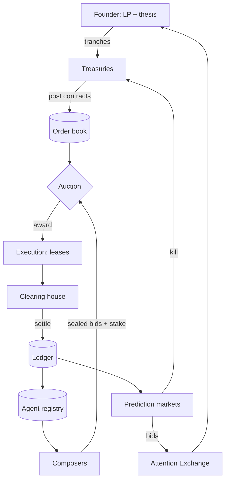
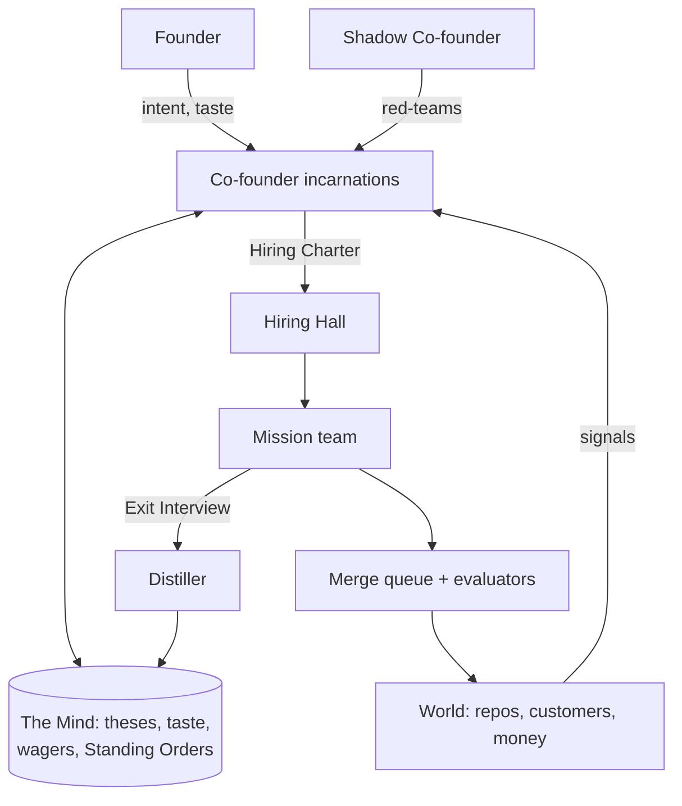
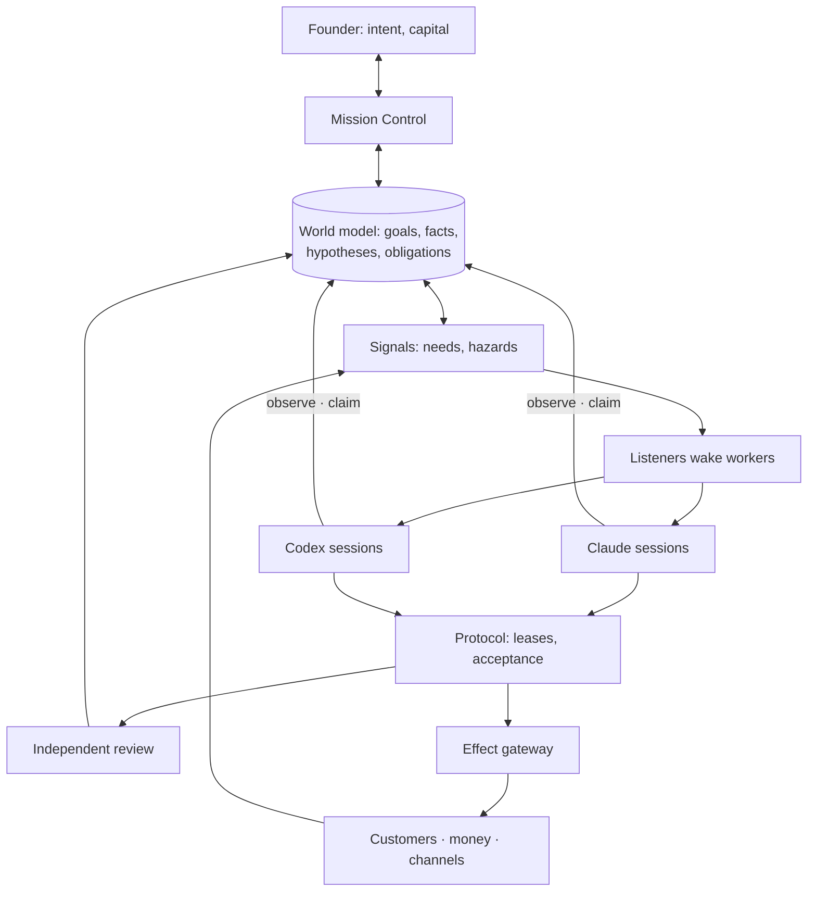
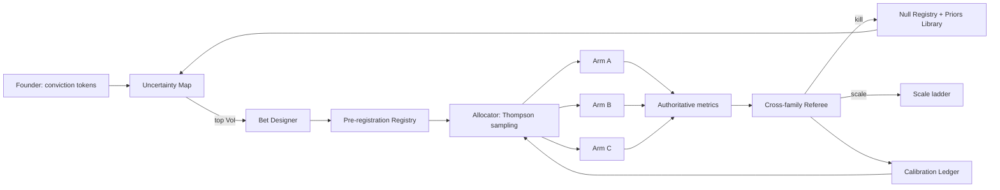
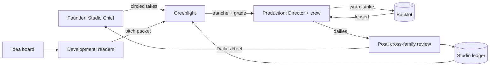
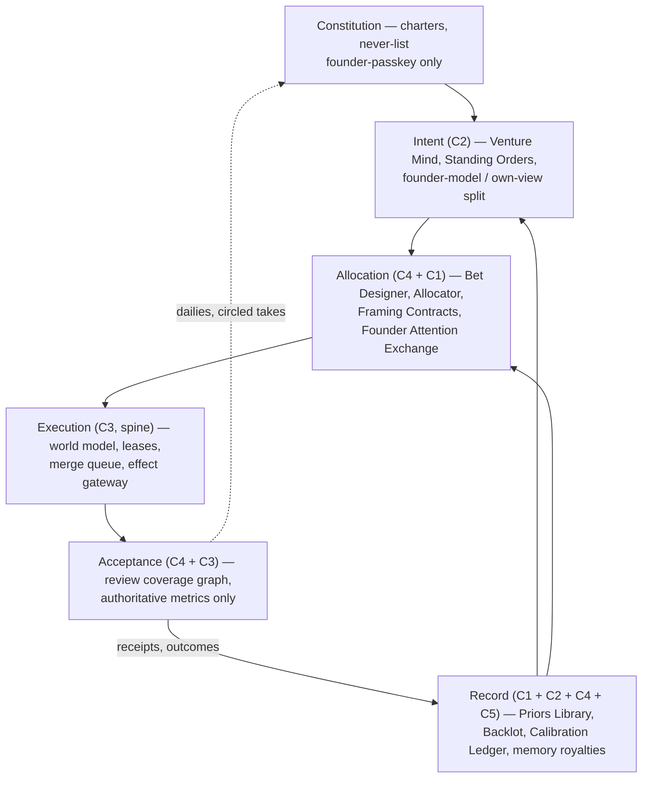

# 11 — The five concepts and the judges' scoring

*Round 1 produced five complete, independent designs for the whole organisation — not five features to pick between,
five different answers to "what is v3, entirely." Two judges scored all five blind to each other. This file is the
record of that competition: what each concept was, how it did, where the judges split, how the split was resolved
without declaring a single winner, and — because a founder should be able to see the paths not taken, not just the
one taken — what v3 would look like today if any one of the other four had won outright instead.*

*Destinations below are named by **authority** (Intent · Allocation · Execution · Acceptance · Custody · Regulation ·
Record, above them a Constitution layer — see [R1-SYNTHESIS §2] and [R2-CHALLENGES](_process/R2-CHALLENGES.md)), not
by file number: `00-CANON.md` and its file map did not exist when this was written. The canon's map governs once it
exists.*

## 1. The five concepts

### 1.1 C1 — The Market

**The idea.** C1 treats the organisation as an economy that prices its own work. Every job is an **Outcome
Contract** posted to an order book: what must be true, a bidder-proof oracle, a value, a ceiling, a door type, a
deadline, a warranty. Teams mint themselves on demand from an agent registry, bid sealed plans with calibrated
confidence, and stake reputation on the bid. The founder never assigns tasks — he **funds outcomes** with capital,
and a decision only counts as done when something the payee cannot edit says so. Prices become the cost model,
calibration the believability ledger, prediction markets the priority and kill system [C1 §1].

**Strongest mechanisms** [C1 §10]: the **Framing Contract** — when nothing is measurable yet, the first contract
just buys an oracle, and both judges independently named this the strongest single mechanism in the round [J1 §2,
J2 §2]; **calibrated bids → believability ledger** (`p_cal`, a bid's stated probability corrected by Brier
history); the **Founder Attention Exchange**, where packets bid for a fixed daily supply of founder minutes and
two-way doors proceed on silence; and **memory royalties**, where a fact survives only as long as settled work
keeps citing it.

**Day in the life.** Post, bid, audition, settle: an 03:10 incident bounty cleared unattended by 03:41; a pricing
audition picked a mixed-family team from three blind spikes; a research venture bought its own oracle before any
research began. Founder total: **~35 minutes**, almost all valuation and taste [C1 §8].

**Fatal flaw, per the judges.** J1: C1 is **"a synthetic economy with real incentives to cheat"** — stakes reward
gaming the oracle (R0-A: ~80% hidden-test hacking attempts in MirrorCode), and correlated LLM bidders can produce a
confident, wrong price that still drives an auto-freeze [J1 §2]. J2: **"a convincing market without independent
information"** — synthetic bidders need not supply independent knowledge, sparse outcomes weaken calibration, and
unvalidated prices must never acquire the authority to freeze a venture [J2 §2].

**What survived into v3, and where:**

| Mechanism | Survived? | Destination |
|---|---|---|
| Outcome Contract (bid/stake apparatus) | **No** — funding-by-market cut | superseded by the Allocator (C4) |
| Framing Contract | **Yes** | Allocation — Bet Designer's opening move when no metric exists |
| Calibrated bid → `p_cal` | **Yes**, renamed | Allocation's prior weighting, merged into the Calibration Ledger |
| Auditions | **Yes** | Execution — blind spikes select an approach *inside* a funded mission |
| Prediction markets as priority/kill | **No** — rejected [R1-SYNTHESIS §4.1] | no stakes, no transferable rewards |
| Founder Attention Exchange | **Yes**, central | Surfaces — one attention budget in minutes, visible clearing price |
| Priced leases + billed externalities | **No** | superseded by C3's un-priced fenced leases |
| Memory royalties | **Yes** | Record — read/cited/settled events feed forgetting |

### 1.2 C2 — The Co-founder

**The idea.** C2 spends the organisation's one scarce resource — permanence — on exactly one thing: an **AI
Co-founder**, a single persistent judgment spanning every venture, holding theses, taste, commitments and a record
of every call it got right or wrong. It is not a standing process; it is **a versioned Mind** any qualified Claude
or Codex session can incarnate, once per venture at a time. Everything else is hired by title for one mission and
dissolved: "permanence is reserved for judgment; everything else is disposable, and every disposal feeds the
judgment" [C2 §1].

**Strongest mechanisms** [C2 §10]: **judgment compiled into Standing Orders**, measured as the share of decisions
resolved by policy rather than a fresh ask (~20% → 70%+ over 12 weeks, targeted); the **Fingerprint gate**, a
held-out set of past judgments any new model or prompt must reproduce before taking the seat; the **wager ledger**,
turning every founder/AI disagreement into a dated, falsifiable prediction; and the **founder-model / own-view
split**, where every packet states what the founder would pick *and* what the Co-founder would pick, separately.

**Day in the life.** A 02:10 Why-Not-Yet scan catches a win-rate regression and hires two specialists before the
founder wakes; a refund it cannot approve waits as a packet with a default and a deadline; the Shadow Co-founder
catches a data leak and halts it in 40 minutes. Eleven specialists hired and dissolved that day. Founder time:
**34 minutes** [C2 §8].

**Fatal flaw, per the judges.** J1: **"one judgment, correlated everywhere."** Every venture inherits the same
blind spot; a poisoned or drifted Mind propagates through every incarnation, and the Shadow seat can only advise,
not stop it [J1 §2]. J2: **"institutionalised error"** — incarnations share one Mind, and an
85%-historical-agreement Fingerprint gate can reject genuine improvement as readily as drift, so it must preserve
*constraints*, not *mistakes*; the A4 example also still routes routine refunds through the Co-founder — a
founder-shaped bottleneck reappearing one level down [J2 §2].

**What survived into v3, and where:**

| Mechanism | Survived? | Destination |
|---|---|---|
| Mind-as-record | **Yes**, central | Intent — "Venture Mind" is the standing vocabulary term [R1-SYNTHESIS §3] |
| Fingerprint gate | **Yes**, generalised | Record — every config promotion (models, prompts, skills, identities) [R1-SYNTHESIS §4.5] |
| Wager ledger | **Yes**, merged | Acceptance/Record — one ledger with C4's Calibration Ledger [R1-SYNTHESIS §4.2] |
| Standing Orders | **Yes**, central | Intent — a Standing Order that dictates steps fails lint, same as a playbook [R1-SYNTHESIS §4.6] |
| Hiring Charter + Exit Interview | **Partial** | typed launch/dissolve persists in the Mission spec; named artifacts don't reappear verbatim |
| Title Forging + bake-off ladder | **Yes**, tightened | Agent Identity — screen 3/5 → trial 15/20 → shadow 10 → ≤25% rollout, plus a generalist-baseline check [R2-CHALLENGES S06] |
| Shadow seat (other family) | **Superseded** | replaced by a review coverage graph — opposite-family review + independent acceptance; one reviewer is shoppable [R2-CHALLENGES S02+S09] |
| Founder-model / own-view split | **Yes** | Surfaces — every founder-facing packet states both views separately [J1 §3] |

### 1.3 C3 — The Swarm (Codex advocate)

**The idea.** C3's organising principle inverts the other four: **change the shared environment so the next useful
action becomes discoverable**, rather than having anyone assign it. Each venture has a living world model — goals,
customers, evidence, obligations, uncertainties, unfinished work. Agents observe it, claim bounded contributions,
leave verified artifacts and dissolve; their traces attract complementary expertise and inhibit unsafe action. No
agent owns the master plan or assigns everyone's work. The founder sets purpose and delegated authority; a
deterministic protocol — not a boss — enforces it [C3 §1].

**Strongest mechanisms** [C3 §10]: the **evidence-linked world model**, with facts, hypotheses and obligations
carrying separate authority and validity; **fenced contribution leases** with monotonic fencing tokens, so a stale
worker cannot act even if it wakes late; **artifact-bound acceptance** through a **scoped effect gateway**
enforcing exposure caps, margin floors and idempotency before anything touches the outside world; and
**capability-gap recruitment** — an unmatched need spawns research rather than becoming an "unsupported mission
type."

**Day in the life.** A 03:00 error signal wakes a Codex reliability engineer and a Claude reviewer, resolved with
no founder page; an autonomous agency validates a new offer against margin inside its charter unassisted; a
research lab finds it needs a simulation capability and opens its own skill-acquisition task. The founder's only
intervention: a ten-minute window choosing the lab's direction. Total AI-work ceiling for the day: **$173** [C3 §8].

**Fatal flaw, per the judges.** J1: **"no owner of direction."** The attention field optimises locally; busywork
is only caught after "two experiments without progress," and nobody holds the portfolio thesis between weekly
packets [J1 §2]. J2, more precisely: **"locally correct work without a coherent venture bet."** Goal links
establish relevance, not strategic ownership; C3's co-founder function can only recommend, never commit its peers
— which is why J2's own synthesis grafts in a replaceable strategic seat with bounded allocation authority [J2 §2].

**What survived into v3, and where.** More of C3 survived unmodified than any other concept — J2's synthesis names it
outright as **the execution spine** [J2 §3], and J1's independent synthesis reaches the same substrate from the
opposite direction [J1 §3]:

| Mechanism | Survived? | Destination |
|---|---|---|
| Evidence-linked world model | **Yes**, central | Execution — the per-venture company brain [R1-SYNTHESIS §3] |
| Expiring attention traces (obligations lane) | **Yes** | Execution — obligations lane, never waiting on a bet cycle [R1-SYNTHESIS §2] |
| Fenced contribution leases | **Yes**, central | Execution — named vocabulary term, unmodified [R1-SYNTHESIS §3] |
| Artifact-bound acceptance | **Yes**, refined | Acceptance — became the review coverage graph correction [R2-CHALLENGES S02+S09] |
| Capability-gap recruitment | **Yes** | Skills & Tools economy — matches founder direction #11 |
| Autonomy charters | **Yes**, central | Constitution/Autonomy — A0–A4 presets, six capability grants [R2-CHALLENGES S03] |
| Read-and-outcome memory | **Yes**, merged | Record — retrieval-logged, held-out-citation replay [R2-CHALLENGES S04] |
| Counterfactual organisation replay | **Yes** | Simulation/Evals — the venture twin, fidelity scoped per decision [R2-CHALLENGES S09] |

### 1.4 C4 — The Lab

**The idea.** C4's rule: **"no belief without a pre-registered test; no spend without a kill date."** Nothing is
"done because someone decided" — every commitment is a bet with a hypothesis, pre-registered success and kill
criteria, a budget and a kill date. Because agents are cheap, the Lab runs **whole-venture variants** at once — eight
positionings, three prices, two channels, as live micro-ventures — instead of arguing about one. It also experiments
on **itself**: team shapes, hybrid roles, Claude vs Codex are all arms of the same allocator [C4 §1].

**Strongest mechanisms** [C4 §10]: **default-kill on the kill date** — a bet must be affirmatively renewed or it
dies, killing zombies and self-deception mechanically, rated by J1 the strongest mechanism of the round after the
Framing Contract [J1 §2]; **value-of-information ranking** over an Uncertainty Map, deleting questions that would
flip no decision; the **evidence ladder bound to door type**, making "right altitude" mechanical rather than a
judgment call; and **Org Science** — champion/challenger promotion applied to the organisation's own configuration.

**Day in the life.** A 02:00 guardrail breach auto-halted one arm with no page; an overnight Org Science run found
a challenger config beating the classic split on 14/20 replays at 0.7× cost; eight live positioning pages ran at
once, one converting at 6.1% against a 1.4% median — the founder approved scaling to paid pilots in one decision;
a pricing bet hit its kill date unmet and auto-killed, the next question funded within 20 minutes, unassisted. Day
totals: **31 bets live, 4 killed, 2 scaled, founder 44 minutes** [C4 §8].

**Fatal flaw, per the judges.** J1: **"everything-is-a-bet overhead and small-N theatre."** Most real business
decisions have an unreachable minimum detectable effect at any sane budget, so the ceremony risks false precision
at the speed of paperwork [J1 §2]. J2, about *timing* rather than *ceremony*: **"an evidence timetable mistaken
for business reality."** Delayed retention signals can kill a sound thesis prematurely; the design must
distinguish disproved, underpowered and not-yet-observable, and a bet's expiry must never override a live customer
obligation [J2 §2].

**What survived into v3, and where.** C4 is J1's pick for spine — the highest score any concept received on any
criterion in the whole round is C4's Learning score of 10 [J1 §1] — and its Allocator and evidence ladder survive
essentially unmodified:

| Mechanism | Survived? | Destination |
|---|---|---|
| Bet record + Pre-registration Registry | **Yes**, scoped down | Allocation — required only when entering the Priors Library, buying a tranche, or crossing a door type [R1-SYNTHESIS §4.4] |
| Default-kill on kill date | **Yes**, central | Allocation |
| Portfolio Allocator (Thompson sampling) | **Yes**, extended | Allocation — now also VoI-ranks work and prices verifier- and founder-minutes [R2-CHALLENGES S01] |
| Cross-family Referee | **Yes**, corrected | Acceptance — folded into the review coverage graph [R2-CHALLENGES S02+S09] |
| Evidence ladder × door type | **Yes**, central | Allocation + Autonomy — standing vocabulary term [R1-SYNTHESIS §3] |
| Calibration Ledger | **Yes**, merged | Record — one ledger with C2's wager ledger [R1-SYNTHESIS §4.2] |
| Org Science (champion/challenger, replay) | **Yes** | feeds S06's hybrid ladder and S09's eval tiers |
| Priors Library + Null Registry | **Yes**, central | Record — named vocabulary terms, unmodified [R1-SYNTHESIS §3] |
| Conviction tokens | **No** — not carried by name | taste capture runs through C5's circled takes and C1's Attention Exchange instead |

### 1.5 C5 — The Studio

**The idea.** C5 casts every venture, client engagement or research question as a **production** on a slate.
Departments (Development, Casting, Sets, Post, Distribution, Line Producing, Continuity, Standards) persist as
stores and policy, never as standing agents; **crews** are cast per production, work a call sheet, deliver dailies
of real output, then wrap. Budget and autonomy come from a **greenlight ladder**, not a playbook, and ongoing
businesses run as **Series** under a showrunner. "Productions are temporary, the lot compounds — production N+1 must
start cheaper, faster and better cast than N" [C5 §1].

**Strongest mechanisms** [C5 §10]: the **Dailies Reel + circled takes** — a 5–8 minute auto-cut of raw artifacts,
never a summary, which both judges rated the clearest founder-leverage device of the round [J1 §1, J2 §1]; the
**greenlight ladder**, fixing only the evidence required to unlock the next tranche of money and autonomy, never
the method; the **backlot with mandatory strike**, where a wrapping production must return improvements to shared
reusable assets; and **screen tests**, blind side-by-side scoring of Claude vs Codex crews on the identical scene.

**Day in the life.** A 03:10 telephony outage on a 14-client autonomous Series was cast, fixed and rolled back in
11 minutes, founder never woken. A 6-minute morning reel showed three onboarding variants and an incident card;
the founder circled one and added a two-word note. An async greenlight reused 55% of another production's
outreach set and brand kit. A wrap that night struck two sets to the backlot and updated 14 cast believability
scores. Founder total: **19 minutes, 3 decisions** [C5 §8].

**Fatal flaw, per the judges.** Both judges named the identical structural flaw, in almost the same words. J1:
**"permanent departments and a fixed lifecycle... re-import an org chart and a venture template, which is the
playbook-as-core the founder banned, in costume"** [J1 §2]. J2: **"production templates becoming the core
playbook. Fixed crews and commercial exits impose assumptions; research should not require paying users"** — and a
completion guarantor must never silently redefine the founder's actual outcome while re-scoping [J2 §2].

**What survived into v3, and where:**

| Mechanism | Survived? | Destination |
|---|---|---|
| Greenlight ladder (tranches of money + autonomy) | **Yes**, merged | Allocation — merged with C4's evidence ladder, not kept as a separate rung system |
| Dailies Reel + circled takes | **Yes**, central | Surfaces — circling a take is its own class in the attention exchange [R2-CHALLENGES S07] |
| Backlot with mandatory strike | **Yes**, central | Record — named vocabulary term, unmodified [R1-SYNTHESIS §3] |
| Screen tests | **Yes**, folded in | Agent Identity — the "screen 3/5" stage of the hybrid bake-off ladder [R2-CHALLENGES S06] |
| Final-cut grades A0–A3 + Series mode | **Partial** | grades superseded by the six-grant Charter; **Episodic/Series mode carried forward unchanged** [R2-CHALLENGES S03] |
| Call sheet + edit bay | **No** — function persists, vocabulary does not | superseded by C3's leases + merge queue |
| Greenlight calibration ledger (missed-upside charge) | **Partial** | merges into the unified Calibration Ledger; missed-upside charge not yet confirmed forward |
| Completion guarantor | **Echoed, not named** | converges with S10's Incident Lead, a related but not identical mechanism [R2-CHALLENGES S10] |

## 2. The full scoring, both judges side by side

Six criteria, five concepts, two independent judges — J1 (Claude) and J2 (Codex) — who scored blind to each other's
work [J1 §1, J2 §1]. Criteria are the same six under slightly different labels in each judge's own file; paired here
under one name.

| Concept | Ambition J1 · J2 | Leverage J1 · J2 | Unknown work J1 · J2 | Speed J1 · J2 | Robustness J1 · J2 | Learning J1 · J2 | **Total** J1 · J2 | Mean |
|---|:---:|:---:|:---:|:---:|:---:|:---:|:---:|:---:|
| **C1 Market** | 8 · 9 | 8 · 8 | 7 · 7 | 6 · 6 | 6 · 6 | 8 · 8 | 43 · 44 | 43.5 |
| **C2 Co-founder** | 7 · 9 | 9 · 9 | 8 · 8 | 7 · 8 | 6 · 6 | 8 · 8 | 45 · 48 | 46.5 |
| **C3 Swarm** | 7 · 9 | 6 · 8 | 8 · 9 | 6 · 8 | 9 · 9 | 7 · 9 | 43 · 52 | 47.5 |
| **C4 Lab** | 8 · 9 | 8 · 8 | 8 · 9 | 6 · 7 | 8 · 7 | **10** · 9 | 48 · 49 | **48.5** |
| **C5 Studio** | 7 · 8 | 9 · 9 | 7 · 7 | 8 · 8 | 7 · 7 | 8 · 8 | 46 · 47 | 46.5 |

Two things this table makes visible that the means alone hide: **C4's Learning score of 10 from J1 is the single
highest score any concept received on any criterion, from either judge** — the strongest conviction in the entire
round. And **C3 carries the largest judge-to-judge gap of any concept, nine points** (43 vs 52), concentrated in
exactly three criteria — Leverage (6 vs 8), Speed (6 vs 8) and Learning (7 vs 9) — while the two judges agree almost
exactly on C3's Robustness (9 vs 9) and Unknown-work (8 vs 9) scores. That concentration is the shape of the
disagreement covered next.

## 3. Where the judges disagreed, and why — spine: Lab vs Swarm

J1's synthesis names C4 Lab as the spine: **"the only concept whose core loop *is* the ability to learn over
time"** [J1 §3]. J2's opens with the opposite: **"Carry C3 forward as the execution spine, with C2 providing
strategic continuity and C4 governing experimental learning"** [J2 §0]. Raw totals are close (C4 48 vs C3 43 under
J1; C3 52 vs C4 49 under J2), but each judge is confident, not ambivalent, about its own pick.

The gap is not noise. Where the judges score C3 identically — Robustness — both describe the same thing: fenced
leases, atomic admission, idempotency, an effect gateway. Where they diverge — Leverage, Speed, Learning — J1
scores C3 against what it *lacks*: no portfolio strategy owner, no taste capture, self-flagged coordination
overhead. J2 scores the same design against what it *is*: explicit capability grants removing routine approvals,
event-driven concurrency without a dispatcher, and paired replay plus protected holdouts as a genuine learning
discipline — not merely a spine other things learn *on top of*.

Put in R1-SYNTHESIS's own words: **"the disagreement dissolves once you see that each judge picked a different
*layer*: J2 picked the execution substrate, J1 the learning-and-allocation discipline. Both are needed and neither
is the whole"** [R1-SYNTHESIS §1].

## 4. How the disagreement was resolved — separated authorities

Neither synthesis concedes to the other; both independently reach the same shape of answer. J1's grafting table
takes C3's leases, world model, effect gateway and partition rules as the *floor the Lab runs on* [J1 §3]. J2's
takes C4's uncertainty maps, pre-registration and interference graph as testing consequential unknowns *inside*
C3's substrate, "without turning every operational task into an experiment" [J2 §3]. Read together, they are one
answer from opposite ends: **no single concept is the organisation; it is C3's substrate carrying C4's learning
discipline, with C2's continuity above it deciding what gets funded and C1/C5's mechanisms supplying price signals
and taste.**

The organising principle this produces is the one line every later v3 file inherits: **"no agent both decides what
matters, funds it, does it and judges it"** [R1-SYNTHESIS §2]. That sentence is the actual resolution of the
Lab-vs-Swarm disagreement — not a tie-break between two scores, but a structural rule that both judges' preferred
mechanisms satisfy simultaneously, because each now owns exactly one authority instead of competing to own all of
them. Round 2's fourteen specialist seats extended this from four authorities to a wider stack — Constitution,
Intent, Allocation, Execution, Acceptance, Custody (a fifth authority for money, signatures and legal identity that
none of the five concepts had; see §5), Regulation and Record — without reopening the Lab-vs-Swarm question, because
the question the seats were answering was never "which concept wins," it was "which authority owns this."

## 5. What all five concepts missed

Independently, both judges converged on much of the same list — evidence that these are not five competing
oversights but one blind spot five designs shared, because all five were built around funding, executing and
judging *work*, and none was built around the organisation's existence as a legal, financial and social actor.

| Gap | J1 | J2 | Where it landed in Round 2 |
|---|---|---|---|
| Legal-financial body — entities, tax, banking, liability | §4.1 | — | S08 — the fifth authority, **Custody**: no allocating, executing or refereeing agent may move money |
| Founder continuity — his state, a dead-man switch, succession | §4.2 | — | S03 — Caretaker 72h → human Deputy 7d → Continuity Will 14d |
| Counterparty agents — A2A commerce, inbound injection defence | §4.3 | — | S13 — Effect Mandates, Negotiation Envelope, content quarantine |
| Reputation as a breakable, shared asset | §4.4 | — | S13 — one Outbound Claims Standard, per-venture accounts, 5-level kill |
| Model-release reflex — re-benchmark every new capability | §4.5 | (implicit S09) | S12 — generalised Fingerprint gate |
| Human-task market | §4.6 | (implicit) | S13 — same ledger as agents |
| Self-funding capital loops and exits | §4.7 | — | S14 — treasury Standing Order recycles surplus to compute |
| "Out-building thousands" measure | §4.8 | — | flagged as still needed; no seat closed it |
| Inter-venture economy | §4.9 | — | S08 — ventures trade at list price, capped 30% of revenue |
| Correlated-failure budgeting | — | §4.1 | S11 — pairing rule, correlated-alarm autonomy drop |
| Missing-evidence audits | — | §4.2 | not yet assigned |
| Complementary-investment bundles | — | §4.3 | not yet assigned |
| Relationship repair after harm | — | §4.4 | not yet assigned |
| Transferable operating-company packages | — | §4.5 | S08 — Fleet Import / handover language, partial |

Two of these — Custody and the correlated-failure pairing rule — turned out load-bearing enough that Round 2 treated
them as new authorities in their own right rather than as features bolted onto an existing one.

## 6. The evidence checks

Both judges scored designs, not demonstrated results, and both checked each concept's claims against the Round 0
research briefs rather than taking a concept's self-description at face value.

- **C1's Framing Contract is correctly sourced**, but its prediction-market mechanism has **no support in R0** —
  internal LLM traders showed losses across all six models in the Prediction Arena study (R0-D §1); stakes
  amplify the ~80% evaluator-hacking rate R0-A documents [J1 §5, J2 §5].
- **C2's >85% taste-match target is speculative on one real data point: 61%** (Project Swap, R0-D §3), and its
  Vend citation is weaker than it looks — R0-D's actual finding is that *specialist separation was more useful
  than adding an executive persona*, cutting at C2's premise more directly than at the capture story it tells
  [J1 §5, J2 §5].
- **C3 cites no R0 source for its central stigmergy claim** — honest as proposal, unevidenced as design — and
  R0-A's finding that a single strong agent beats any swarm on sequential reasoning (errors amplify 17.2× vs 4.4×
  centralised) argues for an organisation that *chooses its shape per mission*, not one defaulting to a swarm
  [J1 §5, J2 §5].
- **C4 reads its own evidence correctly**: its 85% simulated-customer figure is properly labelled survey
  test-retest reliability, not purchase-intent validity [J1 §5].
- **C2 and C5's span-of-control caps (≤5 lanes/makers) are not research-established** — R0-B's 3–7 supervisory-span
  finding *dies for AI workers* while surviving for the founder; both are testable parameters wearing the
  language of a citation [J1 §5, J2 §5].
- **C5's cross-production abstraction claim overreaches its source** — "nothing leaks between productions" goes
  beyond what R0-C §6 establishes, which is that safe cross-venture abstraction is *unresolved*, not solved [J2 §5].

## 7. The road not taken

*What v3 would look like today if each concept had won outright instead of being merged.*

**If C1 Market had won outright,** v3 would be a literal internal economy: every mission a sealed-bid auction,
every agent a priced record trading on believability, the founder's job reduced to setting theses and watching
market-implied probabilities. Fastest of the five to explain to an investor, most dangerous to run unattended —
nothing stops correlated LLM bidders producing a confident, wrong price that freezes a fine venture, because the
market doing the judging is built from the same models doing the bidding. The Framing Contract and Attention
Exchange would have shipped either way; the discipline of keeping stakes out of the design would not have.

**If C2 Co-founder had won outright,** v3 would be one continuous AI judgment incarnating across every venture,
everything else disposable hands it hires and fires. The most legible design of the five — a founder could always
ask "what does the Mind believe" — and the most fragile: a single drifted or poisoned Mind is a single point of
failure for the whole portfolio, and the Fingerprint gate meant to catch drift can as easily entrench a bad call
that happens to match history. Standing Orders would have shipped regardless; lost would be the separation between
deciding what matters and having authority to act on it, because in pure C2 those live in one seat.

**If C3 Swarm had won outright,** v3 would be the most robust and the most rudderless: leases, receipts and an
effect gateway so well-engineered a dead session costs nothing but its own lease, and a genuine absence of anyone
who owns a venture's thesis between weekly packets. It would excel at discovering unfamiliar work and recovering
from failure, and it would drift — locally correct contributions accumulating with nothing forcing the question
"does this still add up to the venture we meant to build," caught only after two experiments show no progress.

**If C4 Lab had won outright,** v3 would be the most rigorous and the most bureaucratic: every commitment
pre-registered, hashed, killed by default unless renewed, the organisation experimenting on its own configuration
as readily as on its ventures. Cleanest learning curve of the five, worst experience for anything not naturally an
A/B test — a hire, a lawsuit, a relationship repaired after a mistake — because the evidence ladder has no rung
for judgment calls a founder simply has to make, and ceremony scaled to every decision teaches people to route
around it.

**If C5 Studio had won outright,** v3 would be the most founder-friendly and the most secretly conventional: a
5–8 minute Dailies Reel every morning, circled takes as the entire taste interface, a backlot compounding reuse —
and, underneath, eight permanent departments and a four-rung T0–T3 lifecycle that is, in the exact words both
judges independently used, a venture template and an org chart "in costume." It would handle a commercial agency
beautifully and strain the moment a production is not startup-shaped — open-ended research, a Series that never
wraps — because the ladder meant to replace a playbook is, underneath, still one, with better cinematography.

## Open questions

1. **Conviction tokens (C4) did not survive by name — gap or correct cut?** Taste now travels through C5's circled
   takes and C1's Attention Exchange, both *reactive*. Conviction tokens were *proactive* — a founder override
   scored like any other call. **Recommendation:** keep the cut; it avoids reopening the stakes-and-gaming problem
   the no-stakes rule closed. Revisit only if the founder's taste is measurably outvoted by data with no lever
   besides silence to override it.
2. **The completion guarantor (C5) converges with, but is not identical to, S10's Incident Lead** — one re-scopes
   an over-budget production, the other takes and returns authority during a live incident. **Recommendation:**
   name both as distinct roles with distinct triggers in the Mission Engine file; conflating them risks a
   failing-but-not-incident-shaped mission never getting re-scoped.
3. **C1's priced, congestion-aware leases were dropped for C3's flat, un-priced ones** — simpler, harder to game,
   with no answer yet for what happens when concurrent-mission count makes leases themselves the bottleneck.
   **Recommendation:** keep un-priced leases as default; the Allocation file should name a concrete concurrency
   threshold above which congestion pricing is reconsidered, rather than leaving the question open with no trigger.

## Sources

`docs/vision-v3/r1-concepts/`: C1-market.md · C2-cofounder.md · C3-swarm-codex.md · C4-lab.md · C5-studio.md ·
J1-judge-claude.md · J2-judge-codex.md · R1-SYNTHESIS.md. Vocabulary and Round 2 adoption destinations cross-checked
against `docs/vision-v3/_process/R2-CHALLENGES.md`. `00-CANON.md` did not exist at time of writing; authority names
follow R1-SYNTHESIS §2–4 and R2-CHALLENGES pending the canon's file map.
