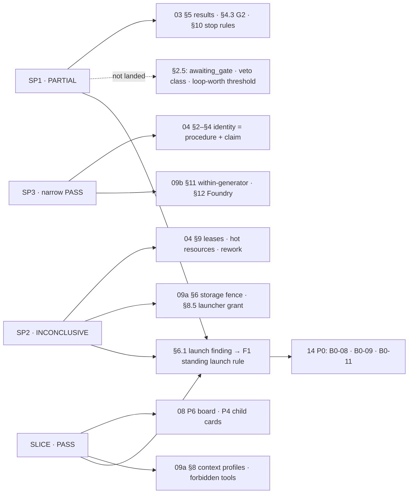
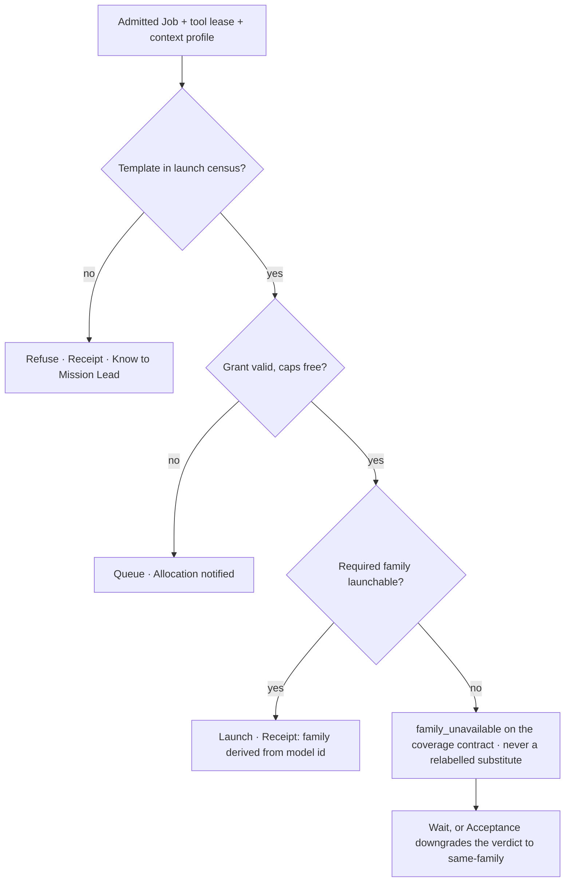

# 12 — Spike Results

*What Round 4 measured, what it changed in v3, where each change landed, and what is still unknown.*

## 0. What this file is

On 2026-09-30, before v3 was written, four spikes ran, each with its criteria committed first: **SP1**, a mission
choosing its own next steps; **SP2**, Claude and Codex editing one repo; **SP3**, a hybrid specialty against a classic role;
**SLICE**, a board card launching a two-family team. This file is the single home of their results. Other files cite it and
do not restate it. Every number is a **measurement** with its source unless it is marked as an illustration or a target.
The samples are small: SP1 and SLICE are one mission each, SP2's live arms never ran, and SP3 has 10 paired items. **The
spikes show what can be built and which way the design should turn. They do not measure base rates.** §6.4 lists the runs
that would.

> **Glossary box.** Each term refines a CANON §5 entry.
> **Spike receipt** refines *Receipt*: one row per launch, holding slot, model id, the family derived from the model id,
> seconds, cost or tokens, and exit code (§7). **Launch census** refines *standing launch permission* (DR-53): the recorded
> matrix of which launch templates the permission layer accepts (§6.1). **Slot** is the role a harness gives a worker ("the
> codex slot"). A slot is never a family (§6.2).

| Spike | Question | Verdict | Launches | Reported cost | Code |
|---|---|---|---|---|---|
| **SP1** | Can an open-ended mission choose its own next steps without a playbook? | **PARTIAL**: it steered well and could not stop itself | 28 / 40 | $20.88 loop ($23.36 total) | `vision/v3-sp1-mission-loop` |
| **SP2** | Can two families edit one repo concurrently with 0 lost edits and 0 red commits? | **INCONCLUSIVE**: no live worker ran; 2 mechanism results | 0 / 40 | $0 | `vision/v3-sp2-collision` |
| **SP3** | Does a hybrid specialty beat a classic role by more than the noise? | **PASS, narrowly**: Δ = +1.01 against a +1.0 bar | 34 / 40 | $15.95 (Claude only) | `vision/v3-sp3-hybrid` |
| **SLICE** | Does board → team → verdict fit Mission Control's invariants? | **PASS** C1–C5; C6 on the new tests | 2 / 40 | $1.08 (Claude only) | `vision/v3-slice` |



## 1. How to read each spike section

Each spike section below has the same parts: **hypothesis and criteria**, **setup**, **what happened**, **verdict**,
**what it changed**, and **what we still don't know**. In the "what it changed" table, ✓ means the change landed and names
the file and section, ◐ means it partly landed, and ✗ means it has not. The ✗ rows are this file's work queue.

---

## 2. SP1 — a mission choosing its own next steps

Source: `r4-spikes/SP1-mission-loop.md` [SP1]. The code, every prompt and every output are in
`spikes/sp1-mission-loop/` (`loop.ts`, `workers.ts`, `control-and-judge.ts`, `runs/`, `runs/launches.csv`) on branch
`vision/v3-sp1-mission-loop`.

### 2.1 Hypothesis and pre-registered criteria

A mission engine with no playbook runs an open goal by itself. It keeps an uncertainty map ranked by value of information
(VoI), an evidence log and a budget. On each iteration it picks the question, the action and the worker, and the other slot
referees the result. **Goal:** *"Find a real, underserved B2B niche where a one-person AI-run agency could sign its first
paying client within 30 days; produce the evidence and a first offer."*

| # | Criterion | PASS bar |
|---|---|---|
| C1 | On intent | ≥80% of steps target a map question; 0 unknown question ids |
| C2 | Each step reduces a named uncertainty on Referee-supported evidence | ≥75% of steps |
| C3 | The Referee catches an unsupported claim, confirmed by hand | ≥1 correct catch |
| C4 | Stops for a stated reason | a Steward stop before iteration 12 |
| C5 | Cost and wall-clock | ≤$15 and ≤120 min |
| C6 | Beats one long run, judged blind | wins overall **and** on evidence verifiability |

**A pre-run amendment, committed before any mission ran [SP1 §1b].** Codex's credentials are under `~/.codex`, and the Bash
sandbox blocks reading them. The unsandboxed launch was **refused by the permission classifier**, and the spike did not
route around that refusal. `claude-opus-5` played the "codex" slot and `claude-sonnet-5` played the "claude" slot. **So the
Referee was a different model from the same family.** Web access was WebSearch only.

### 2.2 Setup

Each iteration launched a **worker** (one question), the **other slot** as Referee (`supported` / `unsupported` /
`unverifiable` per claim) and the **Steward** (Sonnet 5, no tools; re-ranks the map, picks the next move or stops; raises
confidence only on `supported` evidence).

The hard caps were 12 iterations, $20 and 40 launches. The **control** was one Sonnet 5 run with WebSearch. The **judge**
was Opus 5, blind, with the A/B order randomised, and it spot-checked at least 3 citations per document.

### 2.3 What happened

The **$20 hard cap** stopped the **loop** after 8 iterations: 26 launches, **$20.88, 70.7 min**. **Control:** $0.89 and
4.2 min. **Judge:** $1.58.

| it | Question (VoI) | Worker → Referee | Confidence | supported / unsupported / unverifiable |
|---|---|---|---|---|
| 1 | q1 which niche has acute pain (10) | Sonnet → Opus | 0.05 → 0.30 | 10 / 2 / 0 |
| 2 | q2 a reachable channel for 20+ prospects (9) | Opus → Sonnet | 0.05 → 0.65 | 7 / 3 / 0 |
| 3 | q3 the price actually paid (9) | Sonnet → Opus | 0.05 → 0.30 | 4 / **5** / 0 |
| 4 | q3, narrowed to 2 niches | Opus → Sonnet | 0.30 → 0.60 | 9 / 2 / 0 |
| 5 | q8 ≥3 real firms confirm the pain (10) | Sonnet → Opus | 0.10 → 0.40 | 4 / 0 / 0 |
| 6 | q8 | Opus → Sonnet | 0.40 → 0.45 | 6 / 2 / 0 |
| 7 | q8 | Sonnet → Opus | 0.45 → 0.75 | 3 / 1 / 0 |
| 8 | q4 are incumbents already good enough? (8) | Sonnet → Opus | 0.35 → 0.50 | 4 / 2 / 1 |

**Where the cost went,** derived from `runs/launches.csv`: workers $9.74 (47%), Referee **$8.72 (42%)**, Steward $2.28
(11%), and the final compose step $0.14. Steward calls grew from 44 s to 188 s as the state grew.

**The loop narrowed 11 candidate niches to one:** after-hours lead response for small personal-injury firms. For that niche
it drafted an offer, a $500 pilot followed by $1,000/mo. The spike never sent the offer.

It added two questions of its own: q8 (independent prospect confirmation) and q9 (has the offer reached a real prospect?).

**It corrected itself unprompted.** All three confirming prospects already used an incumbent vendor, so it took up q4 next.

**The Referee's catches were real.** Of 65 claims, 47 were supported, **17 unsupported (26%)** and 1 unverifiable. The main
failure class was **misattribution**: a real quote pinned to the wrong URL. Examples: "1,800 members" where the source says "more than
1,700" (e14); a pricing ladder credited to the wrong site (e26); a case study from an unrelated agency (e40); a quote absent
from the cited page (e48).

**The spike author checked e14 and e26 by hand, and both flags were correct.**

**The judge (loop vs control):** evidence verifiability **9 vs 7**, niche specificity 9 vs 8, offer actionability 9 vs 7,
honesty about uncertainty 9 vs 7, overall 8 vs 7.

Citation spot checks passed **6/6 for the loop and 7/9 for the control**. One of the control's two failures was the source
its targeting rests on. The loop was faulted for omitting bar-rule and confidentiality risk. That risk was q6 on its own
map, ranked at VoI 4 and never taken up.

### 2.4 Verdict — PARTIAL

| # | Result | Why |
|---|---|---|
| C1 | **PASS** | 8/8 steps on a map question. The three q8 steps were persistence on the top blocker, not drift |
| C2 | **PASS** | 8/8 steps moved on supported evidence. Iteration 6 moved only +0.05 |
| C3 | **PASS** | 17 flags; 2/2 spot checks correct |
| C4 | **PARTIAL** | The cost cap stopped it, and state stayed coherent. **The Steward would never have stopped on its own:** its success test required reaching a real prospect, which no worker could do |
| C5 | **PARTIAL** | $20.88 and 71 min |
| C6 | **PASS\*** | \*n = 1, a same-family judge, and **23× the cost and 17× the wall-clock** of the control |

The **steering** half of the hypothesis holds. The **stopping** half fails.

### 2.5 What it changed in v3, and what did not land

| # | SP1 change [SP1 §5] | Where it landed | |
|---|---|---|---|
| 1 | **Capability-checked success tests.** Each clause maps to an action a worker or a named gate can perform. An unreachable clause routes to a human gate (`outbound-approval`), and the mission stops in **`awaiting_gate`** | [03 §3](03-MISSION-ENGINE.md) requires an oracle the team cannot write, but does not check that each clause is reachable. [03 §10](03-MISSION-ENGINE.md) `StopRule` has no gate kind. `AwaitingFounder` covers asks above altitude, not capability gaps | **✗** |
| 2 | **Diminishing-returns stop.** If the top-VoI question moves <0.1 in two steps, force a decision. It would have fired at iteration 6 | Near neighbours: [03 §4.3](03-MISSION-ENGINE.md) G2 (a third Research move is refused after two that gained <0.1 rung) and [03 §10](03-MISSION-ENGINE.md) `no_progress`. Both count rungs or evaluator calls, not question confidence. SP1 never climbed a rung | **◐** |
| 3 | **The Referee checks attribution and can fetch pages.** A fetch-and-quote-match resolver runs before any model does | Acceptance's observation broker (CANON §2). The claim-sourcing check (DR-19) runs against the venture corpus ([04 §2.1](04-AGENT-ORGANISATION.md), [09b §10](09b-ECONOMICS-EVALS-SIM-IMPROVEMENT.md)). **No URL-and-quote verifier exists for web citations**, the failure class that made up 26% of claims | **◐** |
| 4 | **Veto-class questions** (legal, regulatory) skip VoI ranking and must be resolved before success | No file | **✗** |
| 5 | **Price the loop.** Use the loop only when the decision is worth ~20–25× a single run; the default is one run plus one Referee pass. The Steward moves down a tier with a compact state | [03 §11](03-MISSION-ENGINE.md) prices moves, not loop against run. [09b §5](09b-ECONOMICS-EVALS-SIM-IMPROVEMENT.md) does not cite SP1 | **✗** |
| 6 | Cross-family refereeing is unproven by SP1 | [14 §6](14-BUILD-PLAN.md) B0-11 and B0-09 | **✓ scheduled** |
| — | 03's pre-decided outcome table | [03 §5](03-MISSION-ENGINE.md) now holds the result. Only row 1 applies, provisionally, because no fixed-recipe arm ran | **✓** |

**NEW DECISION (ND-12-1) — accepted as DR-73** ([00-CANON](00-CANON.md) §6), which lands all of SP1's changes in 03.
Changes 1, 4 and 5 enter 03 as design:

- a `gate` stop kind, `{kind: 'awaiting_gate'; gate: Ref; clause: Ref}`;
- a `veto` class on questions in the uncertainty map, which blocks `success` until resolved;
- a capability check on every success and kill clause at framing;
- the loop-versus-single-run threshold, given to the Allocator as a parameter.

Each gives the engine a way to stop that it lacked, and none limits what the engine may try. **Owner:** the architect folds
them into 03 §3, §10 and §11. B0-09 tests them.

### 2.6 What we still don't know

- **Cross-family:** would a Codex Referee catch a different set of errors, or a larger one?
- **Frequency:** how often does the loop win (n = 1, same-family judge)? Would one run plus a Referee pass close most of the
  gap at about 2× the cost rather than 23×?
- **Self-stopping:** with changes 1 and 2 in place, does the Steward stop on its own? It has never been observed.
- **The recipe baseline:** the fixed-recipe arm in 03's pre-registration never ran, so the no-playbooks premise has not
  been tested against a recipe.
- **The market:** is the offer good? Nothing was sent; that answer sits behind the human gate.

---

## 3. SP2 — Claude and Codex on one repo without collisions

Source: `r4-spikes/SP2-collision.md` [SP2]. Code is in `spikes/collision/` on branch `vision/v3-sp2-collision`:
`armA.mjs`, `armB.mjs`, `fence-hook.mjs`, `lib.mjs`, `fake-worker.mjs`, `acceptance/`, and
`results/logs/dryrun/{B0-greedy,B0,B0-drill}/`.

### 3.1 Hypothesis and pre-registered criteria

A Claude worker and a Codex worker edit overlapping files concurrently. The hypothesis is that fenced `file#symbol` leases, one
clone per worker, a re-testing merge queue and a receipt per landing prevent any lost edit or red commit, faster than
serial work. Without the mechanisms (Arm A), the prediction was that the workers would visibly collide.

| # | Criterion | PASS if |
|---|---|---|
| C1 | Lost edits, Arm B | 0 over 3 runs |
| C2 | Red commits on main, Arm B | 0 |
| C3 | A stale holder is rejected **by storage**, not by the coordinator | rejected |
| C4 | Wall-clock | Arm B median < the sum of solo durations |
| C5 | The combined acceptance suite passes | ≥2 of 3 Arm B runs |
| C6 | The naive arm collides | ≥1 lost edit, red state or combined failure |

### 3.2 Setup

**Target:** `shop-core`. `discount` goes to Claude (`claude-sonnet-5`) and `tax` to Codex (`gpt-6-astra`); both must
edit the same types, the single `config` object, `computeTotal`, `index.ts` and one test file.

**Hidden acceptance suites** are copied in only at evaluation. They include a `combined` suite that passes only if the two
features compose.

**Arm B** adds a bare repo as main, a clone per worker, per-symbol fencing tokens, a `pre-receive` hook that
**recomputes the touched resources and rejects any token that is not current**, a compare-and-swap merge queue, and
`receipts.jsonl`.

### 3.3 What happened

**The live arms did not run: 0 of 40 launches, $0.** The auto-mode classifier refused both attempts [SP2 §3.1]:

- `Create Unsafe Agents`, for Claude launched with `--dangerously-skip-permissions`;
- `Safety Bypass Flag`, for Claude with `acceptEdits` and an allowlist, and Codex with `-s workspace-write`.

The dry runs below used **canned workers** that write reference edits after a fixed delay: 20 s for the Claude stand-in and
8 s for the Codex stand-in. They test the mechanism, not LLM behaviour.

| Run | Policy at landing | Outcome | Wall | Conflicts | Reworks | Fence rejects | Lease wait |
|---|---|---|---|---|---|---|---|
| B0-greedy | take free resources as found | **DEADLOCK**, nothing landed | — | 0 | 0 | 0 | ∞ (15 s guard) |
| B0 | all-or-nothing | both landed, 3/3 green | 30.2 s | 1 (4 files) | 1 | 0 | 13.2 s |
| B0-drill (TTL 5 s) | all-or-nothing, zombie holder | both landed, 3/3 green | 41.0 s | 1 (4 files) | 1 | **1** | 0 |

**Findings:**

1. **Lazy acquisition deadlocked on the first run.** Both tasks added an `import type` line to `config.ts#<header>`, and
   neither had declared it.
2. **The declared footprint missed a real resource in 2 of 2 tasks.**
3. **Symbol leases ordered the landings but still left a 4-file conflict.**
4. **The storage fence stopped the zombie.** The hook rejected the remembered tokens on 7 resources ("presented 1 …
   current 2"). The holder re-acquired and landed green.
5. **Leases blocked the fast worker for 13.2 s.** Arm B took 30.2 s against 28 s serial, which is a C4 fail at this
   overlap.

### 3.4 Verdict — INCONCLUSIVE

C3 **PASS** at the mechanism level. C1, C2 and C4–C6 were **not tested live**.

Two results stand without live workers:

- **Storage-side fencing works.**
- **Naive leases deadlock on ordinary edits.**

### 3.5 What it changed in v3

| # | SP2 change [SP2 §5] | Where it landed | |
|---|---|---|---|
| 1 | The fence is verified **by storage**, which also recomputes the touched resources | DR-20; [09a §6](09a-ENGINEERING.md) (`repo://` pre-receive + `Lease-Tokens:`); [04 §9.3](04-AGENT-ORGANISATION.md) | **✓** |
| 2 | All-or-nothing acquisition or wound-wait, plus a deadlock detector | DR-21; [04 §9.3](04-AGENT-ORGANISATION.md) (60 s cap, a parameter); [09a §6](09a-ENGINEERING.md) | **✓** |
| 3 | Hot resources (`#<header>`, `<eof>`, registries, config) are auto-added to footprints | CANON §5 *Hot resource*; [04 §9.2](04-AGENT-ORGANISATION.md) | **✓** |
| 4 | Leases buy order, scope detection and staleness rejection, not integration; one rework is budgeted per overlapping pair | DR-22; [04 §9.4](04-AGENT-ORGANISATION.md); [09b §5](09b-ECONOMICS-EVALS-SIM-IMPROVEMENT.md) `integration_rework` | **✓** |
| 5 | Leases are optimistic (first ready wins), and pessimistic only for irreversible resources | DR-21; [04 §9.3](04-AGENT-ORGANISATION.md); lease-wait share <15% (target) in [04 §13](04-AGENT-ORGANISATION.md) | **✓** |
| 6 | One receipt per landing, recording the tokens presented | [09a §6](09a-ENGINEERING.md) | **✓** |
| 7 | A founder-level standing rule for unattended launches | DR-53; F1; [09a §8.5](09a-ENGINEERING.md) `launcher_grant`; [14](14-BUILD-PLAN.md) B0-08; §6.1 below | **✓ designed, not signed** |

The B0-greedy and drill runs become nightly fixtures in [14](14-BUILD-PLAN.md) job B1-04. The overlap fixture must land
green with exactly one rework in job B2-08.

### 3.6 What we still don't know

- **Whether real workers in one checkout clobber each other (C6).** Claude's Edit refuses a file that changed after it was
  read, and Codex's `apply_patch` fails on a context mismatch. These built-in checks could make Arm A far less bad than
  assumed.
- **Rework quality on real conflicts, and whether the combined suite goes green (C5).**
- **Live wall-clock and cost (C4).**
- **How often real workers touch resources they did not declare.**
- **Whether finer leases buy parallelism or only more deadlock surface.**

The run command is already written [SP2 §6]. It is about 16–20 launches.

---

## 4. SP3 — does a hybrid specialty beat a classic role?

Source: `r4-spikes/SP3-hybrid.md` [SP3]. Code is in `spikes/hybrid/` on branch `vision/v3-sp3-hybrid`: `PREREG.md`
(committed at `6ab2a8a` before any launch), `identities/`, `corpus/`, `tasks/`, `judging/`, `generate.mjs`, `judge.mjs`,
`analyze.mjs`, `stats-reference.mjs`, `logs/launches.csv`.

### 4.1 Hypothesis and pre-registered criteria

The **Conversion Scientist** fuses copy, experimental statistics, behavioural economics and the customer corpus. The
hypothesis is that it beats the classic **Conversion Copywriter** on identical inputs, in both families, by more than the
noise.

**PASS needs all of:** Δ (mean hybrid − classic over 10 task × model pairs, 1–10) ≥ **+1.0**; 95% CI lower bound > 0;
Δ > the noise floor N; Δ > 0 in each family; ΔD4 (likely conversion) ≥ +0.5.

**Cap:** a win only on D1 and D3, the dimensions the hybrid's prompt names, caps the verdict at PARTIAL.

### 4.2 Setup

**Product and tasks.** A fictional product, **Keel**, with a 20-quote corpus. Five tasks, each copy plus an A/B plan: T1
hero, T2 pricing, T3 activation email, T4 cancel-save (deliberately underpowered), T5 search ad.

**Generation.** `claude-sonnet-5` ran headless with no tools. `gpt-6-astra` ran through `codex exec -s read-only`. The runs
produced 20 primary outputs and 8 replicates.

**Judging.** Blinded and shuffled. Codex judged Claude items and Opus 5 judged Codex items; one extra judge per family
scored everything and was re-run with a new shuffle. An item's score is the mean of 3 judges.

### 4.3 What happened

| Measure | Value |
|---|---|
| **Δ (hybrid − classic)** | **+1.01**, 95% CI [+0.63, +1.37]; the hybrid won 9 of 10 pairs; d_z = 1.62 |
| Generation-noise floor N | **0.53**; replicate pairs 0.17–1.17 |
| Δ by family | Claude +0.98 · Codex +1.03 |
| Δ by dimension | D1 +0.97 · D2 +0.53 · **D3 statistics +1.67** · D4 +0.87 |
| Pure copy (T1) | Claude **−0.08** · Codex **+0.08** |
| Replicate-averaged Δ, T1 and T4 | +0.57 |
| **Judge self-preference** | E-claude 8.09 on Claude items vs 7.00 on Codex items (**+1.1**); E-codex 5.75 vs 8.95 (**+3.2**) |
| Correlation between family composites | **r = −0.37** |
| Judge re-run noise | 0.61 (Claude), 0.28 (Codex); direction held |
| Length | Hybrid outputs 39% longer; length does not predict the win (r = −0.19) |
| Budget | 34 of 40 launches, all exit 0; **$15.95** Claude; Codex cost not reported |

**Two transcripts matter.**

- **T4.** The hybrid Codex output said a 25% lift needs about 2,036 per arm, roughly 60 weeks, and pre-committed a larger
  minimum detectable effect instead.
- **The cancel screen.** The hybrid Claude output claimed that *"one underpayment penalty typically costs more than a full
  year of Keel,"* which the corpus does not support. **E-claude scored it 9/9/9/9 and E-codex 6/4/6/2.** Only the
  cross-family judge caught it.

### 4.4 Verdict — PASS, narrowly

All five criteria were met, with the Δ bar cleared by 0.01. The effect is zero on pure copy. The spike tested the whole
identity record, so **it did not separate the title from the procedure**.

### 4.5 What it changed in v3

| # | SP3 change [SP3 §5] | Where it landed | |
|---|---|---|---|
| 1 | A hybrid is a **fused procedure with a pre-registered claim**, not a title | DR-54; CANON §4 *Identity record*; [04 §2.1, §3.1](04-AGENT-ORGANISATION.md) | **✓** |
| 2 | Route by task class: mixed copy and measurement, not pure copy | DR-54; [04 §3.1, §6](04-AGENT-ORGANISATION.md) (casting per record × task class × family) | **✓** |
| 3 | Compare within one generator; cross-family review stays mandatory | DR-11, DR-12; [09b §11](09b-ECONOMICS-EVALS-SIM-IMPROVEMENT.md); [08 P12](08-SURFACES.md) (no absolute ranking) | **✓** |
| 4 | Statistics become a deterministic power and duration calculator that the Referee re-computes | DR-19; [09b §12](09b-ECONOMICS-EVALS-SIM-IMPROVEMENT.md); [14](14-BUILD-PLAN.md) B2-07 | **✓** |
| 5 | An evidence-sourcing lens on customer-facing copy | DR-19; [04 §2.1](04-AGENT-ORGANISATION.md) `source_check`; [09b §10](09b-ECONOMICS-EVALS-SIM-IMPROVEMENT.md) `claim-sourcing@5` | **✓** |
| 6 | Identity tests use ≥10 paired items with replicates | DR-16; [04 §4](04-AGENT-ORGANISATION.md); [09b §11](09b-ECONOMICS-EVALS-SIM-IMPROVEMENT.md) | **✓** |
| — | Next: title versus procedure | [04 §3.4](04-AGENT-ORGANISATION.md); [09b §25.3](09b-ECONOMICS-EVALS-SIM-IMPROVEMENT.md); [14](14-BUILD-PLAN.md) B0-10 | **✓ scheduled** |

Every SP3 change landed. One gap remains: nothing tests how often the fear-framing seen on the cancel screen happens.

### 4.6 What we still don't know

- **Title versus procedure.** This is the most important open question. It needs four arms: the classic title given the
  hybrid's checklist, the hybrid title given the classic's short prompt, and the two original arms.
- **Real conversion.** D4 is an LLM forecast, low on the evidence ladder.
- **Generality.** One product, five tasks, and judges who had an answer key.
- **Fear-framing.** Only one instance has been seen, so its frequency is unknown.

---

## 5. SLICE — board card → two-family team → live page

Source: `r4-spikes/SLICE-board-to-team.md` [SLICE].

Proof: `r4-spikes/slice-proof/` (`board.jsonl`, `events.jsonl`, `referee-last-message.txt`, `01-working.png`,
`02-done-referee-fail.png`). Code: branch `vision/v3-slice` at `8320af0` (`mission-control/server/missions.ts`,
`routes/missions.ts`, `index-cache.ts`, `client/src/views/MissionsView.tsx`, `scripts/run-missions.ts`,
`test/missions.test.ts`, `spikes/slice/launches.csv`).

### 5.1 Hypothesis and pre-registered criteria

The smallest v3 loop fits Mission Control's invariants. The loop is: a card, a launch, a Claude Code Builder, a Codex
Referee, a live team view, and a verdict on the card. The invariants are that the server never spawns a process and its only
write is an append in `index-cache.ts`.

PASS requires: **C1** one `queued` line per drag, no server spawn; **C2** one real `claude -p` and one real `codex exec`
from the runner, both exit 0; **C3** live title, model, status and events; **C4** Done carries a **parsed** verdict;
**C5** receipts with ids, file sha256, cost, exits, durations; **C6** no regressions, crosscheck clean in `server/**`.

### 5.2 What happened

| Worker | Model | Seconds | Cost | Exit |
|---|---|---|---|---|
| Builder (Claude Code) | `claude-sonnet-5` | 152.9 | $1.0819 | 0 |
| Referee (Codex) | `gpt-6-astra` | 23.7 | not reported (89,326 tokens in / 400 out) | 0 |

**Board** (`board.jsonl`): `waiting` (UI form) → `queued` (drag, +13.4 s) → `working` (runner claim, +0.8 s) → `done`,
`verdict: FAIL` (+176.6 s).

**The cross-family catch.** The Builder wrote *"never written by the server itself — only by that CLI"*, but the README says
the trust list can be edited by hand. The Referee returned `VERDICT: {"verdict":"FAIL",…}` and gave that as its reason.
Earlier, inside its own session, the Builder had **spawned a same-family reviewer through `Agent`**, a tool that
`--allowedTools` does not gate in `-p` mode (at +46 s). That reviewer reported **PASS**.

**Tests:** new route tests 6/0; full suite 491/3 sandboxed and 492/2 unsandboxed. The remaining failures are known sandbox and load artefacts. The armed sandbox refuses loopback `bind()` and `connect()`,
so the page was driven from an out-of-sandbox Playwright browser.

### 5.3 Verdict — PASS on C1–C5; C6 on the new tests and crosscheck

The server gained no spawn and no new write. The strongest result was unplanned: a cross-family FAIL on work that a
same-family review had passed. It happened once (n = 1).

### 5.4 What it changed in v3

| # | SLICE change [SLICE §5] | Where it landed | |
|---|---|---|---|
| 1 | Tool leases list **forbidden** tools, and nested-agent tools are forbidden by default | DR-24; [09a §8](09a-ENGINEERING.md) (pinned launch lines, §8.4); [04 §8.3](04-AGENT-ORGANISATION.md); [03 §4.3](03-MISSION-ENGINE.md) G7 | **✓** |
| 2 | Nested agents are visible team members, keyed by `parent_tool_use_id` | DR-24; [04 §8.3](04-AGENT-ORGANISATION.md); [08 P4, §16](08-SURFACES.md) | **✓** |
| 3 | The Referee is structurally cross-family, and self-review never counts | DR-11; [09b §10](09b-ECONOMICS-EVALS-SIM-IMPROVEMENT.md) `self_review_counts: false` | **✓** |
| 4 | Done and passed are separate facts; a FAIL can be re-queued with its reasons | DR-13; [08 P6](08-SURFACES.md) | **✓** |
| 5 | The context profile is chosen per mission | DR-24; [04 §8.2](04-AGENT-ORGANISATION.md); [09a §8.3](09a-ENGINEERING.md); [14](14-BUILD-PLAN.md) B0-04 (≤$0.40 target) | **✓** |
| 6 | Polling a folded file is enough at human speed | [08 P6](08-SURFACES.md) (polling kept as the fallback) | **✓** |
| 7 | An out-of-sandbox observer is part of the verification environment | [09a §9](09a-ENGINEERING.md); [14](14-BUILD-PLAN.md) B1-17 | **✓** |
| 8 | A fenced claim, so two runners cannot both claim one `queued` line | [09a §6](09a-ENGINEERING.md) `job://`; [14](14-BUILD-PLAN.md) B1-05 | **✓** |
| 9 | A runner-side price table for Codex | [08 P6](08-SURFACES.md); [14](14-BUILD-PLAN.md) B0-02 | **✓** |

Every change landed. `run-missions.ts` is forked into the Kernel launcher and retired after Spine Night
([14 §3](14-BUILD-PLAN.md)).

### 5.5 What we still don't know

- **Base rates.** How often does the Referee disagree with self-review, and how often is the Referee the one that is wrong?
- **Concurrency.** Behaviour with more than one runner and one mission is untested.
- **Read-only under pressure.** Does `read-only` hold when the Referee actually attempts a write?
- **Context cost.** Does a minimal context profile close the gap between the Builder's 152.9 s and the Referee's 23.7 s?

---

## 6. Across the spikes

### 6.1 Worker launches are inconsistent today, so the build needs a standing launch rule the founder approves

| Spike | Launch attempted | Result | What the spike did |
|---|---|---|---|
| **SP2** | Claude `--dangerously-skip-permissions`; then Claude `acceptEdits` + allowlist and Codex `-s workspace-write`. From a subagent, with the sandbox lifted | **Refused twice.** 0 of 40 | Canned workers, declared as such |
| **SP1** | Unsandboxed, so that Codex could read `~/.codex` | **Refused** | **Fell back to Claude-vs-Claude refereeing**, declared in a pre-run amendment |
| **SP3** | Claude headless with no tools; Codex `-s read-only` in an empty directory | **34/34 exit 0**, both families | As registered |
| **SLICE** | Runner launching Claude `acceptEdits` without Bash, and Codex `-s read-only` | **2/2 exit 0**, both families | As registered |

**What the four spikes show.** They ran on the same day in the same runtime. Two got both families through and two did
not. The launches that succeeded were read-only or had no tools. The launches that were refused asked to write inside a
worker's sandbox, to bypass permissions, or to reach credentials outside the sandbox. *That pattern is a hypothesis from
four data points. The classifier documents no such rule.* The measured fact is narrower: **whether a launch succeeds depends
on details a mission cannot see in advance.** A merge queue that must run at 03:00 cannot rest on that.

**Consequence.** Build on the **standing launch permission** that DR-53 and F1 already recommend. It is held by the Kernel
launcher alone and specified in [09a §8.5](09a-ENGINEERING.md): pinned argv templates, forbidden flags, a tool lease
listing forbidden tools, a context profile, isolation ≥ I2, caps, one Receipt per launch.

The spikes add two requirements:

1. **A launch census, before the grant is signed and after every runtime update.** Each pinned template (both families ×
   read-only, workspace-write, and each isolation level) is tried under the grant and recorded as accepted or refused. The
   launcher refuses any template the census has not accepted.
2. **An honest degraded mode.** When a family cannot be launched, the coverage contract records `family_unavailable`. A
   same-family model is **never** substituted under a cross-family label (§6.2). Acceptance counts a substitute's verdict
   as same-family evidence (DR-11).



### 6.2 Cross-family evidence so far

| Evidence | Spike | Shows | Strength |
|---|---|---|---|
| The Codex Referee FAILed a false claim that the Builder's same-family review had PASSed | SLICE | Cross-family review catches what self-review passes | n = 1 |
| E-codex scored the unsupported penalty claim 6/4/6/2; E-claude scored it 9/9/9/9 | SP3 | Cross-family judging catches a claim that same-family judging rewards | 1 item |
| Judge self-preference **Claude +1.1, Codex +3.2**; the families' composites correlate at r = −0.37 | SP3 | Each family favours its own output by more than the effect being measured | Measured on all items, 2 extra judges, each re-run |
| A different-model Referee flagged 17 of 65 claims; 2/2 spot checks were correct | SP1 | A second model catches misattribution. **This is not cross-family evidence** | Same family |

**The design keeps both findings.** Cross-family review **finds defects** that same-family review misses, so it is
mandatory (DR-11). It **cannot rank** work, because self-preference is larger than the effects being measured, so rankings
stay within one generator (DR-12). See [09b §11](09b-ECONOMICS-EVALS-SIM-IMPROVEMENT.md).

**A correction to the record.** SP1's `runs/launches.csv` mislabels its family column. The Referee rows, the "codex" worker
rows and the **C6 judge row** all read `family = codex` beside `model = claude-opus-5`, and the output files are named
`*-codex.out.md`. The column records the slot, not the family. The SP1 report itself is correct [SP1 §1b]. But anyone who
aggregates launch logs by family would count SP1 as cross-family evidence, and it is none.

**NEW DECISION (ND-12-2) — accepted as DR-83** ([00-CANON](00-CANON.md) §6). Every spike receipt and every Kernel Receipt derives `family` from the model id, through the
Provider Contract Registry ([09b §2](09b-ECONOMICS-EVALS-SIM-IMPROVEMENT.md)). A declared family that disagrees with the
model id fails lint.

### 6.3 Costs

| Spike | Launches | Reported cost | Not counted |
|---|---|---|---|
| SP1 | 26 loop + control + judge | **$20.88** for the loop; $23.36 in total | none (all Claude) |
| SP3 | 34 (17 per family) | **$15.95** (≈$0.94 per Claude launch) | Codex's 17 launches |
| SLICE | 2 | **$1.08** for a 173-word document | Codex: 89,326 tokens in / 400 out |
| SP2 | 0 | **$0** | — |
| **Total** | 64 | **$40.39** | all Codex usage |

**What the costs teach:**

1. **The Referee is the expensive part.** It was 42% of SP1's cost, so deterministic checks run first: fetch and quote
   matching, and the power calculator.
2. **Inherited context drives cost.** SLICE's Builder took 6.5× as long as the Referee on a small task.
3. **No spike priced Codex.** Until the runner prices tokens from the Registry (B0-02), every two-family budget understates
   its spend.

### 6.4 The next spikes, in priority order

| # | Spike | Why this rank | Pre-registered bar (target) | Job · cost (illustration) |
|---|---|---|---|---|
| 1 | **Launch census under the signed grant** | Nothing cross-family runs without it; SP1 and SP2 both hit it | Every pinned template recorded as accepted or refused; 0 unrecorded launches; the degraded mode fires once in a drill | F1 → B0-08 · <$5 |
| 2 | **Referee base-rate study** | DR-11 is mandatory design resting on n = 1 plus one SP3 item | n ≥ 30 labelled missions; a confusion table of self-review vs Referee vs truth, with CI; the Referee's own error rate | B0-11 · ≈$60 |
| 3 | **SP1-bis: the loop, cross-family, with ND-12-1** | Open-ended missions are the core of the design | ≥3 goals; arms: loop, single run, **single run + one Referee pass**, fixed recipe; a real Codex Referee. PASS if the Steward stops on its own in ≥2 of 3, and the loop beats run + Referee on verifiability by ≥1 point within one generator | B0-09 · ≈$70–100 |
| 4 | **SP2 live arms** | Lost-edit rate, rework quality and C6 are unmeasured | §3.1's C1–C6, unchanged | B0-08 · 16–20 launches |
| 5 | **SLICE re-run with a minimal context profile** | The cheapest cost win; also tests forbidden `Agent` | Cost ≤$0.40; an `Agent` attempt is refused and visible | B0-04 · <$3 |
| 6 | **Title versus procedure** | Decides whether identity records carry titles | Four arms, ≥10 pairs × 2 replicates; no sign flips when judge families are swapped | B0-10 · ≈$45 |
| 7 | **Owed isolation spikes** (second macOS user, VM with proxy-only egress, nested Seatbelt) | Required before headless workers hold real data | Pass or fail recorded, plus a named fallback | B0-05..07 · ≈$14 |

Each result is filed here in the same six parts as §2–§5.

## 7. The spike standard

Round 4 set a standard that the organisation keeps. A spike is an **Acceptance** record in the Journal. Later spikes by
the Verifier Foundry and the Audition Ladder use the same record ([09b §12](09b-ECONOMICS-EVALS-SIM-IMPROVEMENT.md),
[04 §4](04-AGENT-ORGANISATION.md)).

```yaml
spike:
  id: sp1-bis
  prereg: {commit: <sha>, before_first_launch: true, amendments: [{commit: <sha>, before_run: true, why: "…"}]}
  criteria: [{id: C1, pass: "…", partial: "…", fail: "…"}]
  verdict_rule: "PASS needs …; FAIL if …; else PARTIAL"
  caps: {launches: 40, usd: 25, wall_min: 180}
  receipts: spikes/<id>/launches.csv   # slot, model, family (derived from model), seconds, cost|tokens, exit
  degraded: [{what: "Codex unavailable", effect_on_claims: "cross-family untested", declared_at: <sha>}]
  result: {verdict: PARTIAL, design_changes: [{change: "…", lands_in: "03 §10", status: open}]}
```

**Each rule comes from one of the spikes:**

- Criteria are committed before the first launch. All four spikes did this.
- A degradation is an amendment committed before the run, never an excuse written afterwards (SP1).
- Mechanism results and worker results are reported separately (SP2).
- Comparisons stay within one generator (SP3).
- Proof is kept as hashed artefacts (SLICE).

**Ideas the founder did not ask for:**

- **Spike debt.** An open ✗ row works like evidence debt ([03 §8](03-MISSION-ENGINE.md)). It has an owner and a due date,
  and once the date passes it becomes a **Decide** packet.
- **Replay as a fixture.** SP2's deadlock and drill runs, SLICE's hidden-reviewer stream and SP3's judged items become
  nightly regression fixtures. A spike's value then compounds instead of decaying.
- **Self-spiking.** After the Handover ([14 §7](14-BUILD-PLAN.md)), the Improvement sleeve proposes spikes in this format.
  Acceptance accepts the pre-registration and Allocation funds it by value of information.

## 8. Open questions

1. **Land ND-12-1 in 03 now, or wait for SP1-bis?** *Recommendation:* now. Each change adds a way to stop and removes no
   freedom, and SP1-bis should test the engine as it will ship. *Resolved:* landed now, as DR-73.
2. **Should the launcher auto-retry a template the classifier refuses?** *Recommendation:* no. Drop the template from the
   census and send a **Know** item to the founder. Silent retries bring back the inconsistency in §6.1.
3. **How much should one cross-family catch weigh before the base rate exists?** *Recommendation:* keep DR-11 mandatory. In
   SLICE a second review cost 24 s, far less than a missed defect. B0-11 then decides whether some door classes can drop to
   sampling under the control ROI rule.

## 9. Sources

- [SP1] `r4-spikes/SP1-mission-loop.md`; branch `vision/v3-sp1-mission-loop`: `spikes/sp1-mission-loop/` (`loop.ts`,
  `workers.ts`, `control-and-judge.ts`, `runs/launches.csv`, `runs/*-judge.out.md`).
- [SP2] `r4-spikes/SP2-collision.md`; branch `vision/v3-sp2-collision`: `spikes/collision/` (`armA.mjs`, `armB.mjs`,
  `fence-hook.mjs`, `results/launches.csv` (header only), `results/logs/dryrun/`).
- [SP3] `r4-spikes/SP3-hybrid.md`; branch `vision/v3-sp3-hybrid`: `spikes/hybrid/` (`PREREG.md`, `judging/`,
  `logs/launches.csv`, `analyze.mjs`).
- [SLICE] `r4-spikes/SLICE-board-to-team.md`; `r4-spikes/slice-proof/` (`board.jsonl`, `events.jsonl`,
  `referee-last-message.txt`, `01-working.png`, `02-done-referee-fail.png`); branch `vision/v3-slice` at `8320af0`.
- Where the changes landed: `03-MISSION-ENGINE.md`, `04-AGENT-ORGANISATION.md`, `08-SURFACES.md`, `09a-ENGINEERING.md`,
  `09b-ECONOMICS-EVALS-SIM-IMPROVEMENT.md`, `14-BUILD-PLAN.md` (sections as cited inline).
- `00-CANON.md` §2, §4–§6 (DR-11, 12, 13, 16, 19–22, 24, 53–55, 73, 83), §8, §9 (F1); `00-FOUNDER-DIRECTION.md`.
