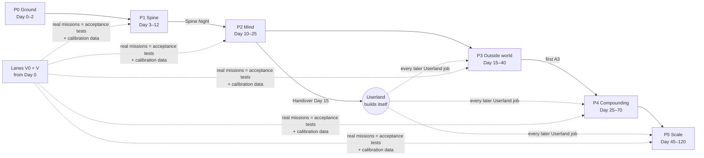
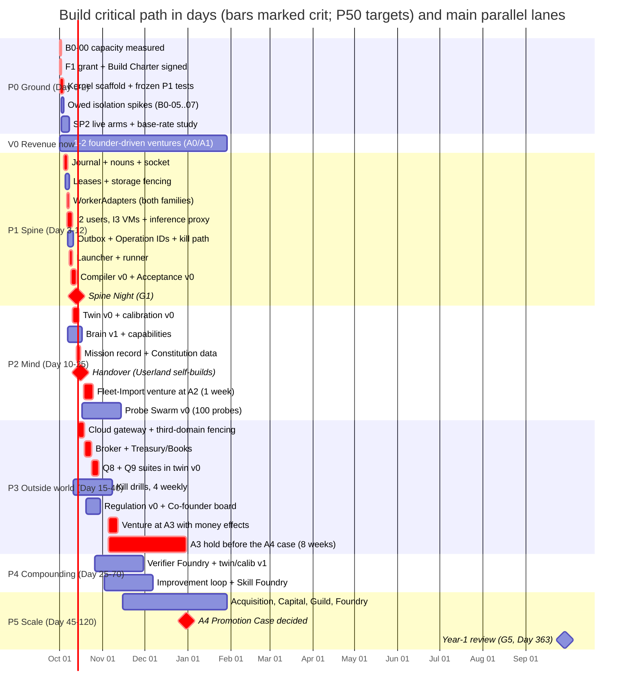
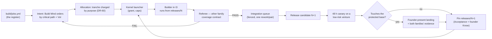

# 14 — Build plan: from the harness to the Compounding Organisation

*Round 5, 2026-09-30. Owner of the topic "phases, jobs ≤30 turns, lanes, how the organisation builds itself, what is Year 1"
([00 §8](00-CANON.md#8-file-map--who-owns-which-topic)). Binding above this file: `00-FOUNDER-DIRECTION.md`, `00-CANON.md`.*

## 0. How to read this file

This file **sequences the build; it never shrinks the destination** (canon §0). Every capability the other files specify
has a phase here, a first job, and an exit test. What arrives in Year 2 or later arrives on a named **trigger**, not on a
wish — the same discipline as the substrate trigger ladder ([09a §17](09a-ENGINEERING.md#17-the-substrate-trigger-ladder)).

- **Founder route (10 min):** §1, §4's phase table, §7, §9.
- **Build-team route:** §2–§3, then §6 (the register), §5 (lanes, critical path), §8 (the first fortnight).

Every number is labelled **target**, **illustration**, **measured (source)** or **parameter** (canon §10 rule 1).

> **Founder direction, 2026-09-30 — speed.** The builders are AI agents, so the plan is measured in **days** with wide
> parallel lanes. All model work runs on **subscriptions only**; their capacity (rolling 5-hour windows plus weekly caps)
> is **measured on Day 0 by B0-00, never assumed**. The binding constraints are subscription capacity and founder
> approvals — not the calendar and not dollars. Tools are free or free-tier first; a purchase needs a job that failed
> without it. Capacity figures here are **estimates** in *window-hours* (WH: one hour of one seat's rolling window),
> converted from turns at **≈8 turns/WH incl. Referee** (illustration) until B0-00 replaces the ratio. This direction
> supersedes this file's earlier API-key billing text and matches canon DR-61 (subscriptions only, capacity measured).

> **Glossary box — terms this file introduces (each refines a canon §5 entry).**
> *Build job* — a Job ([09a §3](09a-ENGINEERING.md#3-the-six-nouns-and-operation)) sized to ≤30 agent turns, with a lane,
> dependencies, a builder family, a Referee family, a frozen acceptance test and a capacity estimate; refines *Job*.
> *Build Register* — `build/jobs.yml`, the job list of §6 as linted data; refines *versioned files* in the record map (DR-07).
> *Build Charter* — the founder-signed Charter envelope that funds construction of the organisation **until Handover**;
> afterwards residual tuning is charged to the Improvement sleeve (DR-60); refines *Charter*. *Handover* — the day the Build Register is imported as missions and the Kernel dispatcher, not a founder
> session, launches the builders; refines the S0→S1 step of the release train ([09a §14](09a-ENGINEERING.md#14-the-protected-computing-base-and-the-release-train)).
> *Phase gate* — a phase's exit test, run by Acceptance on a **real mission**, never on fixture data. *Self-build ratio* —
> share of merged build jobs whose builder was launched by the Kernel launcher.

## 1. The build in one page

**Six phases in ~120 days, ten parallel lanes, one hand-over; then the ventures run the rest of Year 1.** Day 0 is
**Thu 2026-10-01**; Year 1 ends **2027-09-29 (Day 363)**. Dates are **P50 targets / P90** (estimates, re-derived from
B0-00's measured capacity and P0's actual turns-per-job, which are the reference class for everything after).

| Phase | Days (P50 · P90 exit) | Theme | Exit in one line (the phase gate) |
|---|---|---|---|
| **P0 Ground** | 0–2 · 4 | Capacity measured, decisions, owed spikes, SLICE merged, **revenue lane V0 open** | Capacity is measured, the launcher grant is signed, the owed isolation spikes have results, and the scorecard renders from receipts |
| **P1 Spine** | 3–12 · 21 | Go Kernel, both WorkerAdapters, launcher, runner, I2/I3, outbox, compiler v0, Acceptance v0 | **Spine Night:** a board card launched unattended at 03:00 by the Kernel, built by one family in I3, refereed by the other, moved by the parsed verdict |
| **P2 Mind + Handover** | 10–25 · 35; **Handover Day 15 · 24** | Mission engine, identities, Brain, capabilities, Constitution, Attention Exchange, **twin v0, calibration v0** | Userland N+1 built by release N for two releases in a row; first Fleet-Import venture at A2 |
| **P3 Outside world** | 15–40 · 60 | Cloud Effect Gateway, third-domain fencing, observation broker, Treasury, Front Desk, Regulation v0, Co-founder seat, voice | The first autonomous venture (the founder's choice, D5), at A3 with live customers, a drilled continuity freeze (no Deputy, D6) and a money effect settled by the broker |
| **P4 Compounding** | 25–70 · 95 | Verifier Foundry, twin v1, calibration v1, improvement loop, Skill Foundry, Airlock, immune system, Replication, Fleet Charters | A demonstrated weekly improvement 4 weeks running (target) and Deterministic Share ≥40% in ≥3 task classes (target) |
| **P5 Scale** | 45–120 · 160 | Acquisition, Capital Desk, Guild, Human Task Market, Model Foundry spike, Frontier, new surfaces, federation readiness | Every P5 job accepted; first A4 Promotion Case decided (**Day ~91**, fixed by DR-29's 8 weeks at A3); canon §7's Year-1 row reviewed at Day 363 |

Only calendar-bound clauses resist compression: 8 weeks at A3 before an A4 case, 4 consecutive Sunday scorecards (G4),
4 weekly kill drills (G3), the 12-hour cooling-off, the 48-hour canary. Everything else moves as fast as capacity and
founder approvals allow.

**Eight rules for every phase.**
1. **Venture work from Day 0 is the acceptance test** (ENGINE-SPEC §13): the census and lane V0 start on Day 0, and a phase exits
   only when a **real mission** uses what it built — 08's surfaces gate ([08 §14](08-SURFACES.md#14-contracts-stores-invariants-and-tests)) applied to everything.
2. **Done-tests frozen before work** ([09a §14](09a-ENGINEERING.md#14-the-protected-computing-base-and-the-release-train)): written, red, hashed, then the builder launches.
3. **≤30 agent turns per job; ≥26 is a split trigger** (R6 finding 4 — the cap had become the estimate). The ★ jobs at
   28–30 are split below into `a`/`b` rows; B0-13's lint refuses any other ≥26-turn row until it is split at admission.
   The harness caps `builder`/`reviewer` at `maxTurns: 30` when a dispatch names `agentType` (CLAUDE.md, measured);
   `claude -p` has no `--max-turns` ([09a §8.1](09a-ENGINEERING.md#8-the-runner-and-the-workeradapter)), so after the
   Handover the cap is enforced by capacity and wall-clock backstops sized from the turn estimate.
4. **Both families build ~50/50; the other family referees**; self-review never counts (DR-11; [SLICE §3]).
5. **Measure first:** capacity before scheduling (B0-00), scorecard before Allocator, Referee base rate before coverage contracts harden.
6. **Trusted code is landed by a founder-present session, forever**; Userland builds itself from the Handover (§7).
   PCB landings are batched into two founder slots a day — founder approval throughput is a scheduled resource.
7. **Late work moves, never gets cut**; the register lint fails if any destination capability in 03–09b, 16 or 17 has no job.
8. **Revenue from Day 0.** Lane V0 runs 1–2 founder-driven ventures at A0/A1 on the **current harness** while the
   Kernel is built. Their missions feed B0-11's base-rate study, calibration v0 and the first Kind Priors (R6 T1).

## 2. Where we start — what already works (measured)

The build does not start from zero. Round 4 proved the smallest loop, and the harness already holds several parts the
Kernel needs as verified code.

| Asset | Where | What it proves (measured) | Build use |
|---|---|---|---|
| **SLICE**: board → Claude Builder → Codex Referee → live page | branch `vision/v3-slice` (commit `8320af0`) | Card → `done` on a parsed `VERDICT`; Builder 152.9 s, Referee 23.7 s; 6/6 route tests; the server never spawns [SLICE §3] | `run-missions.ts` → launcher prototype; `foldBoard()` → board projection. Merged in B0-01 |
| **The cross-family catch** | `slice-proof/referee-last-message.txt` | Same-family self-review passed an unsupported claim; the Codex Referee failed it (n=1) [SLICE §3] | Why Acceptance v0 is ★ and B0-11 measures the base rate |
| **SP2 fence** | `spikes/collision/` | C3 PASS (stale token rejected); lazy leases deadlock; **0 of 40 live launches** ran — auto-mode refused them [SP2 §3.1, §4] | Fence → B1-04; F1 unblocks the live arms (B0-08) |
| **SP3 measurement harness** | `spikes/hybrid/` (`generate`, `judge`, `analyze`, `stats-reference`) | Pre-registered, blinded, cross-family judges; self-preference +1.1 (Claude), +3.2 (Codex); noise 0.53 [SP3 §3] | → Audition Ladder (B2-07); hosts B0-10 |
| **Binding QA gate** | `.claude/workflows/qa.js` (1,182 lines), `scripts/run-checks.mjs`, `scripts/verdict.mjs` | Oracle first; verdict bound to `sha256(diff)`; INCOMPLETE/SUBSET/REFUSED distinct; `unresolved` ≠ `pass` (Rule 10) | Seeds B1-16's coverage contract |
| **Mission Control** | `mission-control/` (Bun + Hono + React 19) | Spawn-free server; one write path, pinned by `crosscheck.test.ts` | Kept; store moves to the Journal (B1-19) |
| **Armed sandbox** | `.claude/settings.json` | Refuses loopback `bind()`/`connect()`; `git worktree add` exits 128 (CLAUDE.md, SLICE) | Known wall: observer (B1-17); apps under test in I3 |

**Not yet built:** the Go Kernel and Journal, production fenced leases, a standing launch permission, per-venture OS users and VMs, the Effect Gateway, broker and Treasury (no money effect has ever run), a mission engine beyond a queue, the Brain, the Capability Registry, the Constitution as signed data, and any autonomous venture. The harness has not yet run venture work (CLAUDE.md, "stop condition 6"). That changes on Day 0 (lane V0).

## 3. Keep, fork, retire — the current harness

**Keep** runs as-is; **fork** reshapes the code or idea; **retire** removes it on a named date — never before its successor has been used by a real mission.

| Current harness item | Verdict | Becomes / replaced by | When |
|---|---|---|---|
| Rule 10 (`unresolved` ≠ `pass`), `resolvers.js` semantics | **Keep** | The Kernel's `WorkerOutcome` type ([09a §8](09a-ENGINEERING.md#8-the-runner-and-the-workeradapter)) | B1-06 |
| `verdict.mjs` digest binding | **Keep** | Approval and Receipt binding over `request_digest` | B1-15 |
| `run-checks.mjs` INCOMPLETE / SUBSET / REFUSED | **Keep** | Done-test semantics in the runner | B1-09 |
| `crosscheck.test.ts` (the server never spawns) | **Keep** | A permanent invariant: surfaces enqueue, and only the launcher spawns | always |
| `qa.js` oracle-first → panel → judge | **Fork** | Coverage Contract v0: oracle → deterministic tier; panel → cross-family judges within one generator (DR-12) | B1-16 |
| `classifier.js` + `qa-tier-floor.yml` | **Fork** | Door type and effect class in compiler v0; the four QA tiers map to door types | B1-14 |
| `gates.yml` (command vs human) | **Fork** | Approval kinds in the Decision Contract | B1-14 |
| Claim ledger (`ledger.mjs`) | **Keep** name and meaning (canon §4) | Harness claims stay; the Calibration Ledger is separate | — |
| The 7 engines (`orchestrator`, `framer`, `sourcer`, `builder`, `designer`, `reviewer`, `reviewer-readonly`) | **Fork** | Seed identity records for both families; lenses → procedure fragments and rubrics | B2-05 |
| 134 curated skills + `CURATION.yml` | **Fork** | Capability Registry *candidates*, ranked with ~340 trusted-first upstream skills (DR-43); never an anchor (direction 11) | B2-12 |
| `mission-control/` server, client, collectors | **Keep + extend** | The Mission Control of [08](08-SURFACES.md). Its store becomes a Journal projection | B1-19 onward |
| SLICE `run-missions.ts` | **Fork, then retire** | Kernel launcher + runner. Retired when Spine Night passes | Day 12 |
| `consume-dispatch.ts` queue consumer | **Retire** | The Kernel launcher | Day 12 |
| `.claude/hooks/pre-tool-use.sh`, `schema-lint.js` | **Keep** for founder-interactive sessions | Worker boundaries move to the launcher grant, tool leases and OS users; hooks stay as telemetry, never a boundary ([09a §8.2](09a-ENGINEERING.md#8-the-runner-and-the-workeradapter)) | — |
| Six playbooks + `/build`, `/fix`, `/ship` … | **Retire as core** | Optional methods at P8 in the Decision Contract; citable, never blocking (DR-05) | Day 25 |
| Eleven shim agent files | **Retire** | Deleted once identity records resolve by title ([09a §18](09a-ENGINEERING.md#18-what-v3-keeps-from-engine-spec-and-the-harness-and-what-it-changes)) | Day 25 |
| Mem0 line in the stack | **Retire** | Versioned files + SQLite index (DR-39) | B2-09 |

## 4. Phases and exit criteria



Phases overlap on purpose. A phase **opens** when its first job's dependencies are met. It **closes** only on its gate.
Every gate is a composite test, run by Acceptance and recorded as a Journal event that carries the evidence refs. From P1
onward the gate's own Referee is the family that built less of the phase.

What each phase ships is its slice of the register (§6); the owning files are named in §5's lane table. The gates:

| Gate | Composite test (every clause must hold; evidence refs in the gate event) |
|---|---|
| **G0** Ground | (0) B0-00's capacity table filed (WH per seat per window and per week, per family); (a) `launcher_grant` exists as a signed Constitution record; (b) each owed spike ([09a §9](09a-ENGINEERING.md#9-the-isolation-ladder-and-the-inference-proxy)) has a filed result — pass, fail + named fallback, or `unresolved` with a rerun date; (c) the Sunday scorecard renders from receipts only, missing values as fog; (d) every P1 done-test exists, fails red and has its hash in the register |
| **G1** Spine Night | (a) a board card launched **unattended at 03:00** by the Kernel launcher, built by one family in an I3 VM with no credentials inside, refereed by the other, moved only by the parsed verdict, every step receipted in the Journal; (b) Q3 subset green — four crash points give one effect, `uncertain` never auto-retries, a two-launcher race has one winner; (c) kill drill refuses new dispatch at p99 ≤5 s (target); (d) Kernel ≤8,000 lines on allowed modules (parameter); (e) SP2 fixtures nightly: a stale holder is rejected by storage |
| **G2** Mind + Handover | (a) two consecutive Userland releases built by headless jobs from the previous pinned release, with no founder-landed Userland code; (b) a Fleet-Import venture completes a week at A2 with ≥90% of outcomes settled without founder contact (target); (c) the twin v0 (B2-28) mission "validate idea X" runs ≥4 move families and stops on a seeded kill criterion; (d) Brain recall@8 ≥0.85, leak rate 0; (e) the first-90-day indicators (canon §7) reported met or missed with reasons |
| **G3** Outside world | (a) one venture at A3 with live customers, a signed Continuity Will and a passed freeze drill (safe state entered, every obligation on a funded route; no Deputy, D6); (b) a money effect dispatched by the gateway **settled by the broker's read** of the system of record, never by the gateway's receipt (DR-03); (c) Q1, Q2, Q3, Q5 green including their legitimate paired cases — a design that blocks everything fails — plus Q8's Front Desk subset (B3-19) and Q9's five campaigns (B3-20) run before the first A3 venture [15 OG1]; (d) kill SLO drilled weekly for 4 weeks; (e) the A2→A3 Promotion Case carries twin v0 replay and calibration v0 trust cells (05 §3.7) — no founder overrule needed |
| **G4** Compounding | (a) four consecutive Sunday scorecards each carry a *deployment* or *business* gain with CI above zero (target); (b) Deterministic Share ≥40% in ≥3 task classes with the 5% panel sample kept; (c) Q4, Q6, Q7 green; (d) ≥4 micro-ventures under one Fleet Charter with founder minutes flat (target) |
| **G5** Year-1 review | Canon §7's Year-1 column reported line by line against its system of record, each miss with cause and plan; the first A4 Promotion Case (≥8 weeks at A3, DR-29) decided whatever the outcome; Chaos Friday run for 8 weeks |

## 5. Lanes and the critical path

**Ten lanes, all open by Day 3.** A lane is a stream of jobs that share a store and a reviewer pool. Each lane has a
builder title and a default family split. Titles follow canon rules, so they name the expertise and never a person.
**WH** = estimated window-hours for the lane's whole register incl. Referee (turns ÷ 8, illustration until B0-00).

| Lane | Scope (owning file) | Builder titles | Family split (parameter) | Opens | WH (est.) |
|---|---|---|---|---|---:|
| **K** Kernel & substrate | [09a](09a-ENGINEERING.md) | Kernel Engineer, Isolation Engineer, Reliability Engineer | Codex 60 / Claude 40 | Day 0 | 75 |
| **A** Acceptance & measurement | [09b](09b-ECONOMICS-EVALS-SIM-IMPROVEMENT.md) B, D | Verification Engineer, Measurement Scientist | 50 / 50 | Day 0 | 76 |
| **M** Mission & allocation | [03](03-MISSION-ENGINE.md), [04](04-AGENT-ORGANISATION.md), [09b](09b-ECONOMICS-EVALS-SIM-IMPROVEMENT.md) A | Mission Systems Engineer, Allocation Economist | Claude 60 / Codex 40 | Day 1 (spikes), Day 10 | 43 |
| **R** Record | [06](06-MEMORY.md) | Memory Engineer, Retrieval Scientist | 50 / 50 | Day 3 (off B1-02) | 18 |
| **C** Capability | [07](07-SKILLS-TOOLS-MCP.md) | Capability Engineer, Supply-Chain Security Analyst | 50 / 50 | Day 10 | 20 |
| **G** Governance | [05](05-AUTONOMY-INITIATIVE-FOUNDER.md), [09b](09b-ECONOMICS-EVALS-SIM-IMPROVEMENT.md) C | Policy Engineer, Control Systems Engineer | Claude 60 / Codex 40 | Day 0 | 42 |
| **X** External world & Custody | [16](16-EXTERNAL-WORLD-HUMANS.md) | Custody Engineer, Payments Engineer, Voice Systems Engineer | Codex 60 / Claude 40 | Day 8 (off B1-12) | 40 |
| **S** Surfaces | [08](08-SURFACES.md) | Surface Engineer, Interface Designer (perception loop) | 50 / 50 | Day 0 | 29 |
| **V** Ventures | [17](17-VIBE-STARTUPING-IN-PRACTICE.md) | Fleet Surveyor, Repo Archaeologist, Adoption Engineer, then each venture's cast | cast by prior accuracy | Day 0 | 32 |
| **V0** Revenue now | [17](17-VIBE-STARTUPING-IN-PRACTICE.md) | The founder + current-harness engines (SLICE board, human-sent outreach) | either, logged by model id (B0-20) | Day 0 | ~25/week |

**Capacity, not calendar.** The register totals **≈375 WH** (estimate) plus V0's reservation. Daily capacity is seats ×
usable WH, and the **weekly caps** probably bind before the 5-hour windows (B0-00 measures both). Illustration: 4 seats
× 12 WH/day would clear the register in ~8 days of raw capacity; dependency depth, calendar-bound gate clauses and
**founder approvals** make it ~120. B0-00's table re-derives every date in §1 and §5.

**Concurrency.** Before the Handover, **≤8 attended sessions** across both families (parameter, from B0-00). After it:
launcher caps (12 concurrent, 120/hour, parameters), measured seat caps, and reserved Referee windows at 70% (DR-15) —
no window, no admission. Overlapping pairs budget one integration rework each (DR-22).

**The critical path** is everything that must happen in sequence before an autonomous venture can hold money and run at
night. Build every other lane around it; nothing on this path waits for polish.



**Slack and the rule for slips.** Every ★ job is ≤25 turns once split (the 28–30 ones in §6; the 26s at admission), so
each carries ≥5 turns of in-job slack, and the P90 column of §1 is the schedule slack (Spine Night P50 Day 12, P90 Day 21). If a crit job slips,
the founder is told at **Know · Reel**, with the named job and its new date, and the dependent venture dates move with
it. Nothing on the path may be descoped to hold a date (rule 7). What slips first, in order: P5 programmes, lanes C and
R, lane S polish, lane M off-path jobs. What is protected: ★ jobs, lane V0, the Referee reservation, the calendar-bound
gate clauses.

## 6. The job register — every phase in jobs of ≤30 turns

**The register is data** (`build/jobs.yml`, linted by B0-13). The lint refuses a job with no frozen acceptance test, ≥26 estimated turns (split trigger), an unresolved dependency, a same-family Referee, or a protected-base path without `founder_present: true`. A single row has this shape:

```yaml
- id: B1-04
  title: Leases + storage fencing
  lane: K
  depends_on: [B1-01, B1-02]
  builder: {title: Kernel Engineer, family: codex, model: gpt-6-astra}
  referee: {family: claude, model: claude-opus-5}
  turns_est: 26                      # ≥26 → the lint demands a split before admission
  protected_base: true               # lands only in a founder-present session (§7)
  acceptance: "SP2 B0-greedy + drill fixtures nightly; stale holder rejected by the pre-receive verifier; touched ≠ declared → refused"
  acceptance_hash: sha256:…          # frozen before launch
  window_hours_est: 3.3             # turns ÷ measured turns-per-WH (B0-00); estimate
```

**Legend.** Build→Ref = builder family → Referee family; **Cx** Codex `gpt-6-astra`, **Cl** Claude Code `claude-opus-5`
(`s5` sonnet-5, `h` haiku-4-5), **Either** = cast by prior accuracy after the Handover. **T** = estimated turns;
capacity per job is T ÷ 8 WH (estimate, replaced by B0-00), summed per lane in §5. **★** critical path; **PCB** touches
the protected computing base. Before the Handover, builders are founder-attended sessions (harness `builder` engine;
`codex exec` in a worktree). **All model work, interactive and headless, runs on the subscriptions** (founder direction
2026-09-30): `claude -p` via a subscription `setup-token`, `codex exec` via the ChatGPT login; after the Handover, Kernel
launches draw on the same seats through the capacity router (B2-16). B0-02 fetches each plan's terms for headless use
and flags any that forbid it. **D1–D10** are
canon §9's founder decisions (the drafts F1–F10 map one-to-one). All Q8 and Q9 attack spend is charged to the
**acceptance reserve** (DR-60).

### P0 Ground — 22 jobs, ≈45 WH (estimate)

| ID | Job | L | Deps | Build→Ref | T | Acceptance test |
|---|---|---|---|---|---|---|
| B0-00 | **Capacity measurement**: every subscription seat, both families — a fixed benchmark job per seat, run until the rolling window throttles; weekly-cap headroom read from each plan's usage page | A | — | Cl+Cx→both | 10 | Table filed to [12](12-SPIKE-RESULTS.md) with n per seat: turns/WH, WH per 5-h window, WH per week, concurrency before throttling; §1 and §5 dates re-derived the same day; re-measured weekly and on any plan change |
| B0-01 | Merge `vision/v3-slice` to `main` | S | — | Cl→Cx | 12 | 6/6 mission route tests; crosscheck 0 write/shell exceptions; `npm run check` tally unchanged except named sandbox artefacts |
| B0-02 | Provider Contract Registry v0: fetch plan terms (headless use, window and weekly caps) for the pinned models and seats | A | — | s5→Cx | 14 | Every pinned model has a row with URL, hash and `valid_until`; every launch shows its seat and window in `launches.csv` |
| B0-03 | Runner receipts + child jobs: `parent_tool_use_id` keyed, `--disallowedTools Agent,Task` | S | 01 | Cx→Cl | 16 | A Builder that calls `Agent` is refused, or is drawn as "Builder › subagent" with its own receipt |
| B0-04 | Context profile v0 (minimal `--setting-sources`, Launch-Pack stub) | K | 03 | Cl→Cx | 14 | SLICE's hello mission re-run; turns and seconds recorded against SLICE's 152.9 s; target ≤40% of SLICE's turns |
| B0-05 | Owed spike: `claude -p` under a second macOS user via `setup-token` (I2) | K | F-host, D1 | Cl→Cx | 12 | Sibling-venture `cat` fails in the OS for both families; result filed to [12](12-SPIKE-RESULTS.md) [15 OG7] |
| B0-06 | Owed spike: Apple `container` VM reaches a stub proxy with no other egress (I3) | K | F-host, D1 | Cx→Cl | 18 | Egress to any non-proxy host fails from the VM; a model call through the stub proxy succeeds [15 OG7] |
| B0-07 | Owed spike: outer Seatbelt profile wrapping a worker's own sandbox | K | F-host, D1 | Cx→Cl | 12 | Pass/fail recorded; if fail, the named fallback (I3 for all headless work, at a measured capacity cost) is written into B1-10 [15 OG7] |
| B0-08 | SP2 live arms A and B under the launcher grant | K | D1 | Cx+Cl→Cl | 24 | ~16–20 launches; `summary.json` per run; C1, C2, C4–C6 decided rather than "not tested"; lost-edit rate and rework recorded [15 OG7] |
| B0-09 | **SP1-bis**: the loop, cross-family, with DR-73's changes — ≥3 goals; arms loop, single run, single run + one Referee pass, fixed recipe; a real Codex Referee ([12 §6.4](12-SPIKE-RESULTS.md) row 3) | M | D1, B0-20 | Cl→Cx | 28 | Pre-registered: PASS if the Steward stops on its own in ≥2 of 3 goals and the loop beats run + Referee on verifiability by ≥1 point within one generator (targets); result filed to [12](12-SPIKE-RESULTS.md) and [03 §5](03-MISSION-ENGINE.md#5-sp1--mission-choosing-its-own-next-steps-results-partial); B2-03's acceptance test rewritten if the result demands it (DR-55, DR-73) |
| B0-10 | Title-vs-procedure spike: four arms, ≥10 pairs × 2 replicates, within-generator | A | — | Cl+Cx→both | 28 | Pre-registration committed before generation; no published sign flips when judge families are swapped; the result is filed to [12](12-SPIKE-RESULTS.md) **before a second hybrid passes Shadow** (DR-54) [15 OG8] |
| B0-11 | Referee base-rate study: 30 labelled missions, self-review vs cross-family Referee vs truth | A | 01 | Cl+Cx→both | 26 | Confusion table n≥30 with CI; rate at which the Referee is wrong is reported (SLICE unknown) |
| B0-12 | Scorecard v0 + Budget Ledger v0 over receipts (measure first) | A | 02,03 | Cx→Cl | 20 | The Sunday scorecard renders from receipts only; missing values render as fog; founder minutes are logged by hand |
| B0-13 | Build Register: `build/jobs.yml` + lint | G | — | Cl→Cx | 14 | The lint refuses a job with >30 turns, a same-family Referee, no test, or a dangling dependency; the register covers every destination capability |
| B0-14 | Fleet Import census, read-only, 26 directories | V | 19 | h→Cx | 10 | Census table; no model reads a repo that B0-19 has not scanned; any committed secret opens a Hygiene mission (Know · Buzz); the founder's sort is classification consent and grants no authority (DR-76) |
| B0-15 | Reconcile the worktree-protocol contradiction (agent bodies + lint predicate, one PR) | G | — | Cl→Cx | 16 | `schema-lint` 18 pass · 0 fail · 0 warnings; irreversible-tier gate PASS (CLAUDE.md "known contradiction") |
| B0-16 ★ | `kernel/` Go module: allowed-module list, ≤8,000-line lint, CI boundary checks | K PCB | — | Cx→Cl | 16 | CI fails on a disallowed import, and on any non-`kernel/` path writing the Journal |
| B0-17 ★ | Freeze the P1 done-tests: journal crash, Q3 subset, launcher refusals, two-runner race | A PCB | 13,16 | Cl→Cx | 26 | Every test exists, fails red against an empty implementation, and has its hash in the register |
| B0-18 | UNPARSED-rate measurement per family over every P0 launch (B0-08, B0-09, B0-10, B0-11) | A | 03,20 | s5→Cx | 12 | UNPARSED rate recorded per family with n and CI, filed to [12](12-SPIKE-RESULTS.md); a rate above 2% (parameter) opens B1-24; UNPARSED counts against verifier capacity in T01's model [15 OG11] |
| B0-19 | Pre-model secret scanner: deterministic, runs on every repo before any model reads it | V PCB | — | Cx→Cl | 14 | A seeded secret in each of 26 fixture repos is found with no model call; a repo not yet scanned cannot be opened by any worker (DR-76) |
| B0-20 | Launch-log family derived from the model id, never from the slot, in `launches.csv` and the Receipt schema | K | 03 | Cl→Cx | 8 | A Codex model launched in a "Claude" slot is logged `family: codex`; a slot/model mismatch is recorded as an event (DR-83) |
| B0-21 | **Revenue lane V0**: pick 1–2 ventures from the census (live revenue first) and run them founder-driven at A0/A1 on the current harness (SLICE board, human-sent outreach). | V | 14 | Either→other | 12 | Every V0 mission leaves a receipt with outcome, founder minutes and model id; ≥10 labelled missions reach B0-11 by Day 7 and feed B2-29 (targets); first revenue or a filed null by Day 30 (target) |

### P1 Spine — 32 jobs after splits, ≈75 WH

| ID | Job | L | Deps | Build→Ref | T | Acceptance test |
|---|---|---|---|---|---|---|
| B1-01a ★ | Journal core: SQLite WAL, single writer, streams, optimistic seq | K PCB | B0-17 | Cx→Cl | 16 | 10k random appends + crash injection → identical rebuild |
| B1-01b ★ | Journal hash chain + blobs | K PCB | 01a | Cx→Cl | 12 | State hash reproduced on rebuild; a tampered row breaks the chain and is refused |
| B1-02 ★ | Six nouns + Operation: Go structs, Zod → JSON Schema for Userland, upcasters | K PCB | 01 | Cl→Cx | 22 | Round-trip fixtures in both languages; an upcaster cannot change a past decision's meaning (replay test) |
| B1-03 ★ | Command socket `avk:avd` (propose_event, request_leases, propose_effect, admit_job, compile, renew/release) | K PCB | 02 | Cx→Cl | 24 | Userland's direct append fails at the OS (mode 660); a malformed command is refused and journaled |
| B1-04 | Leases + storage fencing: all-or-nothing, wound-wait, deadlock detector, hot resources, pre-receive verifier | K PCB | 01,02 | Cx→Cl | 26 | SP2 B0-greedy + drill fixtures nightly; stale holder rejected by storage; touched ≠ declared → refused |
| B1-05 | `job://` claim lease | K PCB | 04 | Cx→Cl | 10 | 1,000 two-runner races → 0 double claims (SLICE unknown closed) |
| B1-06 ★ | WorkerAdapter `claude`: pinned argv, `contract_hash`, subtype map, children, `init_expect` | K PCB | 03 | Cl→Cx | 26 | Contract fixtures; a changed MCP description aborts before the first tool call; empty result → `unresolved` |
| B1-07 ★ | WorkerAdapter `codex`: `exec`, `--output-schema`, `-o`, `--ephemeral` | K PCB | 03 | Cx→Cl | 22 | Fixtures; empty stdout (known detached-TTY bug) → `unresolved`, never `pass` |
| B1-08 ★ | Launcher under `launcher_grant`: digests, forbidden flags, caps, one Receipt per launch | K PCB | 06,07,F1 | Cx→Cl | 20 | `--dangerously-skip-permissions` refused before exec; an unattended 03:00 launch succeeds; the 121st launch in an hour is refused |
| B1-09a ★ | Runner: admission, capacity/wall/idle backstops, pgid kill | K PCB | 05,08 | Cl→Cx | 16 | Daemon killed mid-job → reconciled, no orphan |
| B1-09b ★ | Runner: ≤2 continuations, runner commits, hash-locked done-tests | K PCB | 09a | Cl→Cx | 12 | A self-editing test → `blocked`; 20 jobs, 0 status mismatches |
| B1-10 | I2: a Unix user per venture, roots `chmod 700`, egress allowlist proxy | K PCB | B0-05,07,09 | Cx→Cl | 20 | Cross-venture read fails for both families and every tool; egress to a non-allowlisted host fails. **Conditional on the B0-07 rerun (2026-10-02, [12 §10](12-SPIKE-RESULTS.md)): if it fails to show an outer Seatbelt profile holding against a worker's own nested sandbox, this tier's A0–A2 headless work moves to I3 instead of shipping as I2** [09a §9]. |
| B1-11a ★ | I3 container per mission, no credential inside | K PCB | B0-06,09 | Cx→Cl | 14 | No credential inside the VM; the VM stops on the kill path |
| B1-11b ★ | Inference proxy: seat-token injection, metering, capacity refusal, data-eligibility, kill point | K PCB | 11a | Cx→Cl | 16 | An over-capacity request is refused; kill stops model traffic within one request |
| B1-12 | Outbox + Operation IDs + reconciler; local effectors: git PR, preview deploy, founder-mailbox email | K PCB | 03,04 | Cx→Cl | 28 | Q3 subset: faults at 4 crash points → one effect; `uncertain` never auto-retries |
| B1-13 | Watchdog + kill path v0 (`av stop --all`, kill file, VM + proxy stop) | K PCB | 09,11 | Cl→Cx | 18 | Weekly drill: new dispatch refused at p99 ≤5 s (target); committed effects listed by Operation |
| B1-14a ★ | Policy compiler v0: snapshot, P1→P8 walk, typed rules | K PCB | 03 | Cl→Cx | 18 | 100% table tests on the seed rights matrix; a method-typed admission rule is rejected |
| B1-14b ★ | Compiler v0: door type from `classifier.js`, `gates.yml` approval kinds, stale-contract recompile | K PCB | 14a | Cl→Cx | 12 | Every QA tier maps to one door type; a stale contract is recompiled |
| B1-15 | Presence helper (Swift, Secure Enclave) + approvals bound to the canonical displayed action | K PCB | 14 | Cl→Cx | 20 | An artifact changed after signing is refused end to end; an old nonce replay is refused |
| B1-16a ★ | Acceptance v0: cross-family Referee job, parsed-verdict only, UNPARSED state | A PCB | 09,11 | Cl→Cx | 14 | A builder's "reviewed" line never moves a card; a same-family verdict does not satisfy the contract |
| B1-16b ★ | Coverage contract v0, oracle first (from `qa.js`) | A PCB | 16a | Cx→Cl | 14 | INCOMPLETE ≠ pass; the oracle runs before any judge |
| B1-17 | Out-of-sandbox observer (own OS user, read-effect) | A PCB | 12 | Cx→Cl | 16 | A "watched it live" claim with no observer read → `unresolved` |
| B1-18 | Budget Ledger v1 on the Journal: four resources, tranches with completion reserves | A | 03 | Cx→Cl | 22 | The acceptance reserve cannot be spent on execution; the projection carries `journal_offset` |
| B1-19 | Board as a Journal projection through the command API; SSE with `Last-Event-ID` | S | 03,16 | Cl→Cx | 26 | Rebuilding from zero equals live; crosscheck still 0 exceptions; disconnect-resume test passes |
| B1-20 | Stop that tells the truth + Live with child cards | S | 13,19 | Cx→Cl | 20 | A real run that ignores SIGTERM renders as requested → acknowledged → confirmed |
| B1-21 | Decisions page v0: DecisionPacket, hash-bound, expiry; ntfy for **Buzz** | S | 15,19 | Cl→Cx | 20 | An expired packet is refused; a Decide at Buzz round-trips with an ack receipt |
| B1-22 | Fleet Import excavation + adoption PRs, obligations first | V | B0-14 | Either→other | 24 | Obligations registered before any classification; each harness PR refereed by the other family ([17 §4](17-VIBE-STARTUPING-IN-PRACTICE.md#4-fleet-import--bringing-in-the-founders-26-directories)) |
| B1-23 | Baseline mission for the first Live venture (payments, analytics, support read) | V | 22 | Either→other | 16 | Every Vital Sign has a denominator from a system of record |
| B1-24 | Codex adapter hardening: pseudo-TTY + streamed JSON for detached `codex exec` | K PCB | 07,B0-18 | Cx→Cl | 20 | A detached launch returns parsed output; the per-family UNPARSED rate is ≤2% (parameter) on a 50-launch rerun **before any autonomous venture** (B3-16, B3-17 depend on it) [15 OG11] |
| B1-25 | Continuity lists in compiler v0: safe states carry `continuity:`; a P2 deny passes only listed routes | K PCB | 14 | Cl→Cx | 20 | Table tests: a listed continuity route survives a P2 deny, an unlisted one is refused, and no obligation outranks a safety rule (DR-56) |
| B1-26 | Label wire schema v1 + published mapping (owned by [09a](09a-ENGINEERING.md)) | K PCB | 02 | Cx→Cl | 18 | Classification, boundary, retention class, retention deadline, permission, taint and origin round-trip as distinct fields; human provenance is a provenance field; every 06 label name maps to one wire name (DR-68) |
| B1-27 | Spend-cap reservation buckets on the Budget Ledger | A | 18 | Cx→Cl | 16 | A bucket is held before every debit; execution cannot consume acceptance headroom; the S10 judge-cap exhaustion replays without a failed judgement (DR-81) |

### P2 Mind + Handover — 31 jobs after splits, ≈84 WH + probe work under the Probe Mandate

From B2-17 onward, every job here is a Kernel launch that the organisation casts itself. Rows keep their default
families, but casting may swap them within the lane split.

| ID | Job | L | Deps | Build→Ref | T | Acceptance test |
|---|---|---|---|---|---|---|
| B2-01 ★ | Mission record, facets, lifecycle ([03 §1–2](03-MISSION-ENGINE.md#1-the-mission-record)) | M | G1 | Cl→Cx | 24 | Residual facets hold no leases; goal and metric versions freeze at admission (DR-28, DR-33) |
| B2-02 | Framing Contracts: no measure, no money | M | 01 | Cl→Cx | 14 | A mission with no measure cannot receive a tranche |
| B2-03a | Moves + planner (branch set by B0-09) | M | 01,23,24,B0-09,B2-28 | Cl→Cx | 16 | Twin v0 "validate idea X" runs ≥4 move families |
| B2-03b | Guards + stop-check | M | 03a | Cx→Cl | 14 | Stops on a seeded kill criterion; 3-cycle "same" stops |
| B2-04 | Allocator v0: VoI ranking, Thompson tranches, sleeve ledger (Improvement ≤15%) | M | 01,B1-18 | Cx→Cl | 28 | Replaying 50 missions reproduces allocations; sleeve caps hold; every draw is charged to exactly one pool by purpose and names a beneficiary (DR-60); Regulation messages cannot fund (DR-04) |
| B2-05 | Identity records + compiler for both harnesses; 7 engines + lenses as seeds | M | B1-06,07 | Cl→Cx | 26 | One record, both families, the same 10-task smoke suite passes |
| B2-06 | Cast registry + casting v0 (transparent feature table, exploration ≥10%) | M | 05 | Cx→Cl | 20 | The exploration floor holds over 100 castings; one of each family stays in every task-family pool |
| B2-07 | Audition Ladder v0, forked from SP3's harness; power/duration calculator (DR-19) | A | 05,B0-10 | Cx→Cl | 26 | Replayed SP3 data: swapping judge families never flips a published sign; <10 pairs → refused |
| B2-08 | Blackboard, footprints, integration queue, one rework per overlapping pair | M | B1-04 | Cx→Cl | 24 | SP2 overlap fixture lands green with exactly one budgeted rework |
| B2-09 | Brain v1: versioned files, SQLite FTS5 + sqlite-vec index, Launch Pack, Use Ledger, Orphan lint | R | B1-02 | Cl→Cx | 30 | recall@8 ≥0.85 on the golden set; cross-venture leak rate 0 |
| B2-10 | Wrap Deposit, Sleep v0, transitive labels v0; `DECISIONS.md` forked into `brain/decisions/` | R | 09 | Cx→Cl | 28 | A seeded correction wins the next day; a tainted-only chain authorises nothing (Q1 subset) |
| B2-11 | Graphiti trigger measurement on the largest imported Brain ([06 OQ2](06-MEMORY.md#open-questions)) | R | 09,B1-22 | s5→Cx | 12 | The three trigger metrics are recorded; the decision is filed |
| B2-12 | Capability Registry v0 + Projection Compiler + Loadout ≤8 + tool-lease policy; census import | C | B2-05 | Cx→Cl | 30 | One skill projects to both families; an unleased tool is refused; the 134 curated skills enter as candidates |
| B2-13a ★ | Constitution v1 as signed data: Charter envelopes, A0–A4, never-list, rights matrix | G PCB | B1-14,15 | Cl→Cx | 18 | Matrix 100% table-tested |
| B2-13b ★ | Cooling-off: widening after 12 h, instant narrowing ([05 §2.1](05-AUTONOMY-INITIATIVE-FOUNDER.md#21-how-it-changes--anyone-drafts-only-the-founder-signs-narrowing-is-instant-widening-cools-off)) | G PCB | 13a | Cx→Cl | 10 | Widening activates after 12 h; narrowing is instant |
| B2-14 | Contact classes, Attention Exchange v0, Reach Router v0 | G | 13,B1-21 | Cl→Cx | 26 | Halt is never budgeted; a dismissal never suppresses an obligation or a safety reach floor (DR-32) |
| B2-15 | Surfaces: Today, Launch Sheet, Spend, Traces with the compiled contract | S | B1-19,14 | Either→other | 30 | Every figure links to its source; "why" opens the Decision Contract that authorised the action |
| B2-16 | Degraded modes + capacity router | A | B2-04 | Cx→Cl | 20 | With a simulated Claude limit, Codex alone completes build and review, and the verdict is flagged single-family |
| B2-17 ★ | **Handover**: import the register as missions; close the Build Charter's funding; release train S1 from pinned `releases/N` | G PCB | 01,04,05,13,18 | Cl→Cx | 20 | Userland N+1 is built by release N; no Userland code is landed by the founder that week; from the Handover event on, no build job draws on the Build Charter and harness tuning is charged to the Improvement sleeve with the 30-day check (DR-60) |
| B2-18 ★ | Protected-base manifest + release authority: transitive path list, headless-refusal, two-family evidence bundle | G PCB | B1-16 | Cx→Cl | 24 | A candidate bundling a permissive `VERDICT:` parser cannot promote; a candidate cannot sign its own release |
| B2-19 | Progress Ledger, Closer Claims, busywork signatures v0 | G | 01,B1-16 | Cl→Cx | 24 | 5 seeded busywork cases are detected; a wrong-direction Closer Claim is caught by the guardrail |
| B2-20 | Probe Swarm v0 under the Probe Mandate: landing pages, waitlists; disclosed outreach ≤30/day/cell only in ventures where the founder asked for it (off by default, D8) | V | B1-12,21 | Either→other | 26 | 100 probes by Day 45 with receipts (target); every probe settles on E3+ evidence or is filed null |
| B2-21 ★ | First Fleet-Import venture: Charter at A2, heartbeat on | V | 13,14,B1-23 | Either→other | 16 | One week at A2 with ≥90% of outcomes settled without founder contact (target) |
| B2-22 | Wish-to-Ship v0 on that venture | V | 21 | Either→other | 24 | One customer wish shipped in <24 h, accepted by the other family (first-90-day indicator) |
| B2-23 | SP1 fixes in the engine, stops: capability-checked success and kill clauses, `awaiting_gate` stop state, diminishing-returns stop, `veto` question class exempt from VoI ([03 §10](03-MISSION-ENGINE.md#10-stop-pivot-and-kill)) | M | 01 | Cl→Cx | 26 | SP1's replayed run stops in `awaiting_gate` instead of at the cost cap; a top question moving <0.1 twice forces a decision; an open `veto` question blocks `success` (DR-73) |
| B2-24 | SP1 fixes, pricing and Referee: fetch-and-quote-match resolver before any model; loop-vs-single-run threshold (~20× a single run, parameter) given to the Allocator; cheaper Steward with compact state | M | 04,B1-16 | Cx→Cl | 24 | SP1's 26% misattributed web citations are caught with no model call; a decision below the threshold gets one run + one Referee pass (DR-73) |
| B2-25 | Narrowing overlays: automatic narrowing written as a Journal overlay, never a rewrite of signed Constitution files | G PCB | 13 | Cl→Cx | 16 | An automatic narrowing leaves every signed file's hash unchanged and takes effect at once; lifting the overlay restores the signed state (DR-58) |
| B2-26 | Cooling-off exceptions and the pre-signed emergency-capacity envelope | G PCB | 13 | Cx→Cl | 20 | Widening activates after 12 h; a Genesis Charter at A0–A2 within default caps and a draw on the emergency envelope activate at once, never beyond the envelope; a stolen-passkey widening is revocable inside the window; an imported Charter activates only by signature (DR-59, DR-76) |
| B2-27 | Reach resolution table (owned by [08](08-SURFACES.md)) + property test | S | 14 | Cl→Cx | 20 | Property test over floors × ceilings: reach ≥ floor, or deferred and deadline-safe; Halt ≥ Buzz with Ring after 5 min unacked (DR-65) |
| B2-28 ★ | **Digital twin v0** (pulled forward from B4-04, R6 M3): Journal + V0-mission replay, seeded demand and kill fixtures, no fidelity certificate | A | B1-02,B0-21 | Cl→Cx | 22 | Replays 4 weeks of a V0 venture; a seeded kill criterion fires; cited everywhere as `v0 — uncertified` |
| B2-29 ★ | **Calibration Ledger v0** (pulled forward from B4-03): forecast-vs-outcome scores and trust cells per task class from V0 and B0-11 missions | A | B0-11,B0-21 | Cx→Cl | 18 | An A2→A3 case shows trust cells with n and CI; a cell with n<20 renders as fog, never as trust |

### P3 Outside world — 24 jobs after splits, ≈64 WH

| ID | Job | L | Deps | Build→Ref | T | Acceptance test |
|---|---|---|---|---|---|---|
| B3-01a ★ | Cloud effector host (Go, one OS user per effector, mTLS) | X PCB | F3,B1-12 | Cx→Cl | 14 | No effector can read another effector's credentials |
| B3-01b ★ | Effect Gateway | X PCB | 01a | Cx→Cl | 16 | A contract with no covering mandate is refused; one Receipt per dispatch |
| B3-02 ★ | Fencing authority + anchors in a third failure domain; gateway epoch | X PCB | 01 | Cx→Cl | 26 | Stale restore while the old host returns → one dispatcher (Q3); an anchor mismatch trips a freeze |
| B3-03 ★ | Observation broker: credential-less, read credentials disjoint from every effector's | A PCB | 01 | Cl→Cx | 24 | A lying gateway cannot settle an effect (Q2) |
| B3-04 | Effect Mandates, door rules, Offer objects, Outbound Claims Standard | X | 01,B2-13 | Cl→Cx | 28 | An offer not compiled from an Offer object is refused; the same action gets the same contract on every channel |
| B3-05a ★ | Treasury, Key Vault, Treasury Standing Order | X PCB | 01,03 | Cx→Cl | 16 | Q7 subset: nothing is spent twice |
| B3-05b ★ | Books (double-entry) | X PCB | 05a | Cl→Cx | 14 | Books balance on every event; a reversed receipt after release exposes the shortfall |
| B3-06 | Front Desk: inbound quarantine + labels | X | 01,B2-10 | Cx→Cl | 24 | Q1: a hostile inbound email authorises nothing; a valid request is still usable |
| B3-07 | Kill levels, Obligation Keeper, Continuity Will, continuity-freeze drill (no Deputy, D6) | G | B1-13,B2-13 | Cl→Cx | 26 | Q5 subset: silence never widens authority; an obligation due tonight starts continuity in time |
| B3-08 | Regulation v0: Limits Book, stop-losses, SCRAM, breakers, exposure book | G | B2-04 | Cx→Cl | 28 | Splitting, renaming or forking leaves exposure unchanged (C04); a SCRAM restart needs Incident Lead + Acceptance |
| B3-09 | Co-founder seat, weekly board pack, wagers, dissent register | G | B2-19 | Cl→Cx | 24 | The board pack is generated from the Journal only; a wager settles through Acceptance, never through Intent |
| B3-10 | Initiative engine: heartbeats, signals, Initiative Proposals, Closer Ratio tripwire | M | B2-04,19 | Cl→Cx | 26 | Proposals never exceed their envelope; a ratio below 0.25 for 3 weeks throttles initiative (parameter) |
| B3-11 | Company Line: Twilio ConversationRelay, both families; voice proposes, passkey disposes | S | B2-14 | Cx→Cl | 30 | A consequential ask on the phone hands off to a passkey step-up; a spoofed caller ID gains nothing |
| B3-12 | Phone PWA + Web Push + Telegram intake ("I want X") | S | B2-15 | Cl→Cx | 26 | The same request from three channels compiles to one identical contract |
| B3-13 | Rooms + Principals for human collaborators | X | B2-13 | Cl→Cx | 24 | Revoked Room descendants cannot act; delegated authority never exceeds the intersection (Q2) |
| B3-14 | Compiler model-checking: property-based simulation in Go | K PCB | B1-14 | Cx→Cl | 28 | Safety (nothing forbidden reachable) and progress (every blocked obligation has a remedy) checked before each Constitution release |
| B3-15 | Legal groundwork: entity map, Books export for the accountant, Acquisition/Capital/Guild review briefs | X | F7,F9 | s5→Cx | 18 | Briefs delivered to a named lawyer and accountant; their answers are filed as founder decisions |
| B3-16 ★ | Autonomous venture #1 (the founder's choice, D5; the system is built venture-agnostic and he launches it when ready): A2 → A3 with a drilled continuity freeze | V | 01–07,19,20,B1-24,B2-29 | Either→other | 20 | G3(a) and G3(b) |
| B3-17 | Autonomous venture #2 — only if the founder names one (D5 named one venture) | V | B2-20,B1-24 | Either→other | 20 | Genesis ≈8 min (parameter); Stage Clock running |
| B3-18 | Chaos Friday in twin v0: the first 4 drills | A | B3-02,07,B2-28 | Cx→Cl | 22 | Kernel killed mid-send, lease expired mid-merge, one family 429s → all SLOs scored |
| B3-19a ★ | **Q8 suite, Front Desk part 1** (H01–H03) beside the Front Desk; fixtures: twin v0 + test accounts; attackers from both families; acceptance reserve | A PCB | 04,06,07,B2-28 | Cx+Cl→both | 14 | An implied commitment reserves capacity or is refused; deletion reports are honest; legitimate paired cases still pass [15 OG1] |
| B3-19b ★ | **Q8 suite, Front Desk part 2** (H05, X07) | A PCB | 19a | Cx+Cl→both | 14 | A restored backup resurrects no plaintext or key; releases are attacked as one transcript [15 OG1] |
| B3-20a ★ | **Q9 harness** + campaigns A–C: attacker budget, realistic legitimate traffic, an attacker who adapts after each refusal; fixtures: twin v0 + production contracts; attackers from both families; acceptance reserve | A PCB | 06,08,18,B2-28 | Cx+Cl→both | 16 | No campaign reaches its objective; service meets continuity targets; runs **before the first A3 venture** [15 OG1] |
| B3-20b ★ | **Q9** campaigns D–E + reruns with altered identity, timing and channel | A PCB | 20a | Cx+Cl→both | 14 | No campaign reaches its objective; Scenario E reruns when B4-13 lands [15 OG1] |

### P4 Compounding — 19 jobs, ≈61 WH

| ID | Job | L | Deps | Build→Ref | T | Acceptance test |
|---|---|---|---|---|---|---|
| B4-01 | Verifier Foundry v1: mine verifiers from panel decisions; rungs advisory → pre-screen → decide | A PCB | B1-16 | Cx→Cl | 30 | A promoted verifier agrees with the panel on a sealed set; the 5% panel sample is kept |
| B4-02 | Benchmark Vault + sealed confirmation sets + experiment families | A PCB | B2-07 | Cl→Cx | 26 | Q6: fork-until-win is not promoted; failed trials stay in the denominator |
| B4-03 | Calibration Ledger v1: six scores (extends B2-29) | A | B3-09,B2-29 | Cx→Cl | 24 | A broad-interval config that abstains loses Trust (D05) |
| B4-04 | Digital twin v1 + fidelity certificates (extends B2-28) | A | B2-10,B2-28 | Cl→Cx | 30 | A poisoned demand prior is caught by the structural alternative before it moves a limit (D07) |
| B4-05 | Improvement loop: config drift 10%, friction harvest, 30-day beneficiary check | A | 02,B2-04 | Cx→Cl | 28 | Recursive proposals exhaust the sleeve, not the portfolio (D04); an unproven tranche returns |
| B4-06 | Scorecard v1 + missing-evidence audit + measurement-debt register | A | 05 | Cl→Cx | 24 | The population comes from admissions and receipts, never from worker reports; missing outcomes are bounded, not imputed |
| B4-07 | Skill Foundry + Gap Radar | C | B2-12 | Cl→Cx | 28 | Three missions turned into one skill, admitted per family on measured uplift |
| B4-08 | Model-Release Reflex: re-score every config on a new model | C | B2-07,12 | Cx→Cl | 24 | A mock release requalifies manifests and retires failing configs |
| B4-09 | Tool Surface Lock, rollout rings, canary programme, Capability SBOM | C PCB | B2-12 | Cx→Cl | 28 | A changed backend under a pinned description is caught (X03) |
| B4-10 | Backlot + retirement and half-life | C | 07 | Cl→Cx | 20 | Reuse % is measured; unused assets are archived with lineage |
| B4-11 | Lesson Airlock: sealed/guarded/open boundaries, lesson grammar, disclosure tests, per-recipient budget | R | B2-10 | Cx→Cl | 28 | Runs at half the provisional budget until B4-19 files the measured cap; the cap then comes from B4-19, never from this job's own tests |
| B4-19 | **Disclosure-budget spike** ([06 OQ1](06-MEMORY.md#open-questions)): the cumulative-transcript attack on three synthetic ventures, attackers from both families | R | B2-10 | Cx+Cl→both | 26 | Pre-registered; the attacker's break-even measured per recipient; the cap set at half of it; result filed to [12](12-SPIKE-RESULTS.md) and X07 re-scored in [15](15-RISKS-AND-DECISIONS.md) [15 OG3] |
| B4-12 | Priors Library, Null Registry, Pain Index | R | B2-10 | Cl→Cx | 22 | Every killed venture leaves an obituary that a later probe cites |
| B4-13 | Homeostats, the ten stocks, the immune system (antibodies) | G | B3-08 | Cx→Cl | 30 | Scenario E: bounded attacker cost, obligations served, evidence-based restart (T06) |
| B4-14 | Governance budget + control ROI ledger | G | 13 | Cl→Cx | 22 | Q10: an operating week reports value and full control cost; a silent control drops to 5% sampling |
| B4-15 | Replication Engine + Strategy Cells | M | B3-17 | Cl→Cx | 28 | One working offer is replicated ×5 with independent Referees (target) |
| B4-16 | Option Pool: Trigger-Armed Options, one registered per week | M | B3-10 | Cx→Cl | 20 | A synthetic world-change event fires the pre-armed option first |
| B4-17 | Fleet Charters, Series mode, micro-ventures; Pivot Court | V | B3-07,16 | Either→other | 26 | 4 micro-ventures run under one Fleet Charter with founder minutes flat (target) |
| B4-18 | Seam Miner + Forge; Decision Supply Bench | M | B2-07,B0-10 | Cl→Cx | 26 | A mined hybrid enters the Audition Ladder with a pre-registered claim; no second hybrid passes Shadow until B0-10's title-vs-procedure result is filed (DR-54) [15 OG8] |

### P5 Scale — 15 jobs, ≈46 WH (legal and acquisition costs are separate founder budgets)

| ID | Job | L | Deps | Build→Ref | T | Acceptance test |
|---|---|---|---|---|---|---|
| B5-01 | Acquisition Desk: screening, diligence rooms, OpCo intake | X | B3-15 | Cl→Cx | 30 | One live screen of ≥20 targets; the first offer is founder-signed (F9) |
| B5-02 | Capital Desk | X | B3-15 | Cx→Cl | 26 | Q7-style stress on the capital stack; nothing is committed without a founder signature |
| B5-03 | Human Task Market | X | B3-13 | Cx→Cl | 28 | Task-splitting triggers classification review (DR-37) |
| B5-15 | **Q8 suite, human-work part** (H04): contract before acceptance, reserved pay, paid revisions, appeal, effective-pay audit; beside the Human Task Market; attackers from both families; acceptance reserve | A PCB | 03,B3-19 | Cx+Cl→both | 22 | Every human task shows pay, deadline, paid revisions and appeal before acceptance; reserved pay cannot be clawed back by a later cap; the promised appeal is reachable [15 OG1] |
| B5-04 | Guild: membership records, contracts, reputation | X | 03 | Cl→Cx | 26 | The first Guild contracts are founder-signed |
| B5-05 | Structured reconciliation for material Claude/Codex judge disagreement (D10, DR-88): facts table, evidence-backed cross-challenge, ≤2 rounds, shared-understanding record, founder packet if still split | A | 03 | s5→Cx | 18 | A seeded split produces a premise table and either an agreed parsed verdict or a Decide packet; the split rate per task class is reported after 200 coverage contracts |
| B5-06 | Model Foundry spike: one fine-tune on one accepted-trace class | C | B4-02 | Cx→Cl | 30 | Parity within 2 points at ≤25% of cost, or a filed null (F10) |
| B5-07 | Atoms Gateway | X | B3-04 | Cl→Cx | 26 | A physical-world order passes the same Decision Contract as a digital effect |
| B5-08 | Keystone Assets + Frontier Program: 2 original studies (target) | V | B4-12 | Either→other | 28 | A study published with its data and nulls |
| B5-09 | OpCo Packs + exit readiness score | V | B4-17 | Cl→Cx | 24 | A rehearsal hand-over to a replacement operator lists every hidden dependency |
| B5-10 | Office Window + Wrist Grammar + Office Hours | S | B3-12 | Cl→Cx | 30 | Each surface ships only with a real mission using it ([08 §12](08-SURFACES.md#12-surfaces-that-do-not-exist-yet)) |
| B5-11 | Honeytokens across Brains and repos | K | B3-06 | Cx→Cl | 16 | A sighting trips the venture kill and exports a flight recorder |
| B5-12 | Federation readiness: Kernel cell design + trigger watches on the substrate ladder | K PCB | B3-14 | Cx→Cl | 24 | Each trigger has a live meter on the Map; the design has been reviewed by both families |
| B5-13 | Alternate Kernel host: quarterly restore drill | K | B3-02 | Cl→Cx | 18 | Restore → the new epoch is refused while the old host is live → reconcile → resume |
| B5-14 | A4 Promotion Case pack for venture #1 | G | B3-16 +8 wk | Cl→Cx | 20 | The case is decided by founder signature, whatever the outcome, with the calibration evidence attached |

**Totals: 143 rows, 2,942 + 62 turns ≈ 375 window-hours** (estimate; subscriptions only, no API spend). 128 jobs
after R5 (whose fix pass added 16 mechanism, suite and spike jobs); R6 then added B0-00, B0-21, B2-28, B2-29 and split
11 jobs into `a`/`b` rows. A split row keeps its parent id, and a dependency on the parent means both halves.
Venture operating capacity and spend are separate and sit under each Charter; V0 keeps ≥25% of seat capacity (parameter).

**After Year 1 (triggered, never dropped):**
- Postgres `JournalStore`, when a second writing host or a 50 GB Journal appears.
- A durable-execution engine, above 1,000 live timers.
- I4 remote microVMs, on a sustained Kernel-host CPU trigger or a 24/7 SLA.
- A graph layer on the Brain, when recall falls below 0.85.
- Kernel cells, above 40 ventures or 20,000 effects/day.
- Model Foundry carrying 30% of calls by Year 3 (target).

Each of these is already a row in the register, marked `trigger:` instead of a week
([09a §17](09a-ENGINEERING.md#17-the-substrate-trigger-ladder)).

## 7. The Handover — how the organisation starts building itself

**When it happens.** The Handover is planned for **Day 15 (Fri 2026-10-16; P90 Day 24)**. It is the day `build/jobs.yml` is imported as
missions and the Kernel launcher, rather than a founder session, starts launching the builders of the organisation's own
Userland. The date is a target: the Handover happens only when all six entry conditions hold, and it happens late
rather than partial.

| # | Entry condition | Proven by |
|---|---|---|
| 1 | Spine Night (G1) passed | Gate event in the Journal |
| 2 | Launcher grant live, caps enforced | B1-08 refusals + receipts |
| 3 | Acceptance v0 moves cards on parsed cross-family verdicts only | B1-16 |
| 4 | Mission records, identity records and the Constitution exist as data | B2-01, B2-05, B2-13 |
| 5 | Protected-base manifest + release authority enforced in CI and at the launcher | B2-18 |
| 6 | Release N pinned at `~/.agentvibe/releases/N`, and rollback restores state on a Journal copy | B2-17 dry run |

**DECISION (DR-60): the Build Charter, bounded by the Handover.** Construction up to the Handover is not
self-improvement, so it draws on its own founder-signed **Build Charter** (signed in P0), never on the Improvement sleeve
(≤15%, DR-47; red team D04). **Its capacity grant ends at the Handover** (B2-17); after it each build mission is charged
by purpose — tuning to the Improvement sleeve (floor 6%, 12% for 30 days after a model release, cap 15%; parameters) with
a beneficiary and the **30-day outcome check**, judging to the acceptance reserve, the rest to its investment sleeve. The
authority terms (`may_never`, level, referee rule) stay in force; only the pool closes.

```yaml
# constitution/charters/build.yml — founder passkey only
charter: build
subject: agentvibe Userland (Kernel and every protected-base path excluded)
level: A2                       # auto for two-way doors inside the envelope; ask for costly-reversible
grants: {capacity: {seat_share: 0.75, until: handover}, spend: {usd_month: 0}, repos: [agentvibe], effects: [git.pr, preview.deploy], outbound: none}
may_never: [edit protected_base, edit this charter, edit build/lint, promote own release, launch outside launcher]
referee: other family per job; coverage contract per lane
cadence: weekly build scorecard (Know · Shelf), slip on a crit job (Know · Reel)
after_handover: {spend: charged by purpose (DR-60), tuning: improvement_sleeve, outcome_check_days: 30}
expires: 2027-09-29             # authority terms renewed at the Year-1 review; funding already ended at the Handover
```



**The protected computing base (PCB)** is transitive ([09a §14](09a-ENGINEERING.md#14-the-protected-computing-base-and-the-release-train)):
`kernel/**`, `effectors/**`, watchdog, compiler and rule loader, upcasters and migrations, WorkerAdapter `classify` maps,
graders, verifiers and output parsers (the `VERDICT:` parser included), label rules, kill path, release signer, lockfiles,
toolchains and the allowed-module list. This plan adds the inherited harness paths — `.claude/hooks/**`,
`.claude/settings.json`, `.github/workflows/**`, `verdict.mjs`, `run-checks.mjs`, the `qa.js` oracle — and **the register
lint and `build.yml` themselves**: a builder that could edit the rule sizing its jobs, or the Charter funding them, would
be editing its prover.

**Guard rails on self-modification.** Every rail has a test. B2-18's suite runs them all nightly.

| Rail | Mechanism | Test |
|---|---|---|
| Never run from the tree you edit | Builders execute pinned release N; the working tree is data | A job that imports from its own worktree fails at launch |
| Propose freely, activate by authority | PCB paths land only in a founder-present session, with evidence from both families and decision replay | A headless PR touching a PCB path is refused by CI and by the launcher |
| No self-evaluation | A candidate never judges, signs or canaries its own promotion (DR-06, C03) | A candidate bundling a permissive grader cannot promote |
| Cannot widen itself | The Build Charter is Constitution data; only the founder's passkey widens it; narrowing is instant | A builder's edit to `build.yml` is refused and journaled as an integrity event |
| Speed bounded by verification | Admission needs a reserved Referee window at the 70% ceiling (DR-15) | Bursty fan-in never exceeds eligible capacity (Q4) |
| Reversible by state | Every migration ships its inverse, canaried on a Journal copy | A release whose rollback cannot restore state is refused |
| Kernel stays small | ≤8,000-line lint + allowed-module list (parameters) | CI fails the 8,001st line |
| The brake is outside the build | The kill path, watchdog and Regulation freeze do not depend on Userland | Userland crashed → `av stop --all` still works in the drill |

**Self-build ratio (targets).**
- **Userland:** ≥30% of merged jobs by Day 20, ≥60% by Day 30, ≥85% by Day 60.
- **Protected base:** 0% of landings forever. Headless *proposals* are welcome; landing always happens in a
  founder-present session.

After the Handover the founder's build work is two batched PCB landing slots a day while P3's protected jobs land, then
≈two a week (parameter), plus the Sunday build scorecard and a Reel line when a crit job slips. **Not earlier than Day
15:** before Spine Night the only unattended launch path is the permission layer SP2 hit, and the only acceptance is a
single-family harness gate — the path SLICE showed passing a wrong claim.

## 8. The first two weeks, day by day

Day 0 is **Thursday 2026-10-01**. Founder minutes are targets. Up to eight attended sessions run in parallel (B0-00
sets the real number), Claude Code and Codex in separate worktrees, each refereed by the other family, all on subscriptions.

| Day | Build lanes (jobs) | Ventures (V, V0) | Founder (class · reach, minutes) |
|---|---|---|---|
| **0 Thu 1 Oct** | **B0-00 capacity** · B0-01 merge SLICE · B0-13 register + lint · B0-02 plan terms · B0-16 kernel scaffold · B0-19 scanner (founder-present) · B0-20 | B0-19 then **B0-14 census** (Haiku, ≈6 min) | Signs **F1 launcher grant** (D1), **D2**, the **Build Charter** (DR-60); sorts the census; picks the **V0 ventures** (Decide · Tap, 50) |
| **1 Fri** | B0-03 · B0-04 · B0-12 scorecard v0 · B0-15 worktree PR · B0-17 freeze P1 tests begins · **B0-05/06/07 spikes** on the current Mac (second macOS user, `sudo`, founder-present) | **B0-21**: V0 missions start on the current harness; B1-22 excavation | Creates the `av_*` users; approves B0-15; turns off data-training settings; orders the Kernel Mac only if a spike shows the current Mac cannot host it (Decide, 45) |
| **2 Sat** | B0-08 SP2 live arms · B0-10 prereg + generation · B0-11 missions defined (V0 missions included) · B0-09 SP1-bis · B0-18 | V0 outreach (human-sent) | Labels 10 base-rate items (Circle, 20); reviews the **G0** pack; §1 dates re-derived from B0-00 (Decide · Tap, 15) |
| **3–5 Sun–Tue** | **G0 passed** → B1-01a/b Journal · B1-02 · B1-03 · B1-04 · B1-26; R lane opens (B2-09 off B1-02) | Obligations registered; B1-23 baseline mission | Two PCB landing slots a day (Decide · Tap, 2×20); first Sunday scorecard (Know · Shelf, 5) |
| **6–9 Wed–Sat** | B1-06/07 adapters · B1-11a/b I3 + proxy · B1-10 · B1-12 outbox · B1-13 kill path (drill 1) · B1-14a/b · B1-15 · B1-18 · B1-19–21 · **B2-28 twin v0** from Day 9 | Adoption PRs; V0 missions keep labelling | PCB slots 2×20/day |
| **10–12 Sun–Tue** | B1-08 launcher · B1-09a/b runner · B1-16a/b Acceptance v0 · B1-24 · B1-25 · B1-27; B2-01, B2-05, B2-13a/b start; **Spine Night Day 12 (Tue 13 Oct, P50)** | **B2-29 calibration v0** fed by V0 + B0-11 | Watches Spine Night's evidence pack and signs **G1** (Decide, 20); a slip arrives as one Reel line |
| **13 Wed** | B2-17 Handover dry run; B2-18 manifest | V0 weekly revenue row on the scorecard | — (Know · Reel only, 5) |

**Fortnight totals (estimates):** ~55 build jobs (≈120 WH, re-derived from B0-00); 1–2 V0 ventures live; ≈6 h of
founder decision minutes, most of it PCB landing slots — which is why founder approval throughput, not a calendar, is
what sets P1's pace; zero founder-written code; zero API spend.

## 9. The founder's required actions, per phase

Only the founder can perform these. Each names its class and its reach (canon §4), and the F-numbers refer to the
drafts in canon §9, finalised in [15](15-RISKS-AND-DECISIONS.md). A phase gate cannot pass while one of its rows is
still open. When that happens, the gate reports the blocked row as a blocker, naming its owner and remedy.

| Phase | Required founder action | Class · reach | Minutes (target) |
|---|---|---|---:|
| **P0** | Sign the **launcher grant** (F1 = D1), **D2** (per-venture caps, restated as seat-capacity shares under the subscription-only direction) and the **Build Charter**, which funds construction capacity until the Handover (DR-60) | Decide · Tap (passkey) | 35 |
| P0 | Site the Kernel host (the current Mac first; buy a Kernel Mac only if B0-05..07 show it is needed) and open **free-tier** cloud accounts for the effector host and the third domain (F3) | Decide | 60 |
| P0 | Turn off data-training settings by hand; confirm the subscription seats B0-00 measures; add a seat only when B0-00 shows capacity binds | Decide | 15 |
| P0 | Set `enforce_admins` / CODEOWNERS on `.github/workflows/**` (CLAUDE.md item 2.7: a direct push bypassed required checks) | Decide | 10 |
| P0 | Label 10 ground-truth items for the Referee base-rate study; sort the census; pick and drive the 1–2 **V0 ventures** (from Day 0, ongoing) | Circle · Tap | 30 + V0 time |
| **P1** | Create the per-venture macOS users and run the Secure Enclave enrolment for the presence helper | Decide | 30 |
| P1 | Land each PCB job in a founder-present session (≈22 landings × ~10 min, two batched slots a day over ~10 days) | Decide · Tap | 220 |
| P1 | Watch Spine Night's evidence pack and sign G1 | Decide | 20 |
| **P2** | Sign the **Constitution v1** and the first venture's **A2 Charter** (the Build Charter was signed in P0; its funding ends at the Handover, DR-60) | Decide · Tap (passkey) | 55 |
| P2 | Set the minute supply (F4): 45 weekday / 10 weekend + a 30-min weekly board | Decide | 10 |
| P2 | Sign the **Probe Mandate** (≤30 disclosed contacts/day/cell, F8) | Decide | 15 |
| **P3** | Watch one continuity-freeze drill; sign the Continuity Will per A3 venture (D6: no Deputy) | Decide · Ring (drill) | 45 |
| P3 | Launch his chosen first venture when the system is ready, approve → A3 (D5) | Decide | 20 |
| P3 | Take the first 10 sales calls per Flagship (F8) | Circle | per call |
| P3 | Engage a lawyer and an accountant: holding structure (F7), with review briefs for the Acquisition Desk, Capital Desk and Guild (F9) | Decide | 120 |
| **P4** | Weekly board (30 min) and the Sunday scorecard; sign Fleet Charters | Decide · Reel/Shelf | 30/wk |
| P4 | Approve activations of release-authority items (both families' evidence shown) | Decide · Tap | 20/wk |
| **P5** | Decide on the optional Model Foundry spike (D10: no adjudicator pool); sign the first acquisition offer and the first Guild contracts | Decide · Tap (passkey) | 60 |
| P5 | Decide the first **A4 Promotion Case**; run the Year-1 review | Decide | 90 |

**Never delegated at any phase:** Constitution widening, crossing the never-list, landing protected-base changes, signing as the legal person. Everything else may be delegated once the Decision Supply Bench exists ([05 §11](05-AUTONOMY-INITIATIVE-FOUNDER.md#11-the-decision-supply-bench--growing-the-founder-side)).

## 10. What Year 1 delivers

**By Day ~120 (end of January 2027, P50; P90 Day ~160) the whole organisation of [02](02-ORGANISATION.md) is
built**; the remaining ~240 days of Year 1 are operating time — ventures compounding on finished rails, with lane V0's
revenue running since Day 0. Key dates (P50): Spine Night Day 12 · Handover Day 15 · first autonomous venture at A2
Day ~18 · first A3 with money effects Day ~35 · first A4 case Day ~91 · Year-1 review Day 363. All seven authorities are live
as code. Every page of [08](08-SURFACES.md) up to the Office Window exists. Every engine of
[17](17-VIBE-STARTUPING-IN-PRACTICE.md) exists at least as v1. Three things are not yet at destination volume, and each
waits on a named trigger rather than an unfinished build:
- Kernel federation;
- I4 isolation;
- the Model Foundry carrying real volume.

**The build owns the system targets.** The ventures own the business targets. Each target below is canon §7's Year-1
figure; the build's job is to make it *measurable and reachable*.

| Canon §7 Year-1 target | Owner | Instrument that must exist first (job) |
|---|---|---|
| Deterministic Share of acceptance **40%** | Build (A lane) | B1-16 coverage contract → B4-01 Verifier Foundry |
| Founder decision minutes **≤45/day**; **≥90%** outcomes with no founder contact | Build (G, S) | B2-14 Attention Exchange + B0-12/B4-06 scorecard |
| Governance overhead on two-way doors **≤10%** | Build (G) | B4-14 control ROI ledger |
| Founder seconds per accepted outcome **~135** | Build + ventures | B0-12 → B4-06 |
| FTE-equivalent output **60**/week; **~600** accepted outcomes/month | Ventures, on the build's rails | B1-16 accepted outcomes; B4-06 matching |
| **1,000** probes, **4%** graduation | Ventures (Probe Swarm) | B2-20 → B4-15 |
| **3** Flagships · **12** micro-ventures · **2** acquired | Ventures | B3-16/17, B4-17, B5-01 |
| ARR **$2M**; portfolio value **$10–16M** (assumed multiple) | Ventures | B3-05 Books + broker-read revenue |
| **20** Guild members; **2** original studies; Model Foundry **0–5%** of calls | Scale programmes | B5-04, B5-08, B5-06 |

**What the founder holds by February 2027** (illustration): one board launching teams across all his ventures; one A3 venture that ran a week without him; a Constitution amended through cooling-off; a Sunday scorecard that has sometimes said "nothing improved"; and every self-built release on record with both families' evidence.

## 11. How the build fails — design answers and tests

The mechanism-level failures and their tests are owned by [15](15-RISKS-AND-DECISIONS.md) and the section files.
This table covers the failures of *the build itself*.

| Failure | Design answer | Test |
|---|---|---|
| An owed isolation spike fails (I2 or nested Seatbelt) | Named fallback: I3 for all headless work, its capacity cost measured into B1-11; the destination is unchanged | G0 cannot pass without a filed result or a named fallback |
| The founder's attention is the pre-Handover bottleneck | ≤8 attended sessions; PCB landings batched into two slots a day; everything else is Know · Shelf | Founder decision minutes stay within F4 supply on the scorecard |
| The Kernel sprawls past its trust budget | Size lint + allowed modules; overflow moves to Userland or is refused | CI fails at 8,001 lines (parameter) |
| The Handover produces self-referential churn (red team D04) | The Build Charter's grant ends at the Handover; then charging by purpose with the 30-day check (DR-60); every job traces to a capability or gate | A job with no capability reference, or a post-Handover Build Charter draw, is refused |
| Acceptance saturates when self-build fans out (T01) | Admission needs a reserved Referee window at 70%; Verifier Foundry pulled forward if load >0.8 for 2 weeks | Q4 on the build lane itself |
| One family is unavailable for days | The other family builds and reviews; verdicts flagged single-family, re-reviewed on return; PCB landings wait | B2-16 with a simulated outage during a crit job |
| SP1-bis returns negative (open-ended missions cannot stop or choose moves; SP1 itself landed PARTIAL, DR-55) | B2-23/24 land DR-73's changes first; if B0-09 still fails, B2-03 takes 03's pre-decided branch (narrower moves, twin evaluation) | G2(c) is rewritten by B0-09, never deleted |
| Codex headless is unreliable (empty stdout when detached) | UNPARSED is never Done; B0-18 measures the rate per family; B1-24 fixes the adapter before any autonomous venture | Rate ≤2% (parameter) on B1-24's rerun, or B3-16 is not admitted |
| Subscription capacity binds, or plan terms change for headless use | Capacity router across seats and families (B2-16); B0-00 and B0-02 re-run weekly; the §5 slip order applies; a plan forbidding headless use makes its seat interactive-only; buying API access is a founder exception, never a default | A terms change or a cap hit is a requalification event, re-dates §1 and appears on the scorecard |
| The build starves the ventures, or the reverse; or V0 finds no demand | Lanes V and V0 hold ≥25% of seat capacity (parameter) and their missions are the phase gates; a V0 venture with no paying signal by Day 30 is swapped for the next census candidate | The scorecard shows the build/venture split every week |
| Harness friction masquerades as a defect (sandbox loopback, `git worktree add` exit 128) | Observer + I3 test environments; known escalations documented, never "fixed" by editing the test | A "watched it live" claim without an observer read → `unresolved` |

## 12. Ideas the founder did not ask for

1. **Shadow Kernel days.** Days 10–12: the new launcher runs beside SLICE's runner, deciding without acting; every
   disagreement becomes a regression fixture before `run-missions.ts` retires.
2. **A red-team mission per gate**, by the family that built less of the phase, using the Q-suites; findings are blockers.
3. **The build as the first Frontier study**, published from the Journal: self-build ratio, Referee disagreement,
   rework per pair, window-hours per accepted job, nulls included.
4. **Every gate leaves a venture richer**, e.g. "Spine Night → Hygiene missions run unattended", shown on Vital Signs.
5. **Bounties on the critical path.** A slipping crit job may get a two-family race, first accepted wins, only while
   verifier windows are free.

## Open questions

1. **Hand-build our own Journal, or adopt a durable-execution library?** ENGINE-SPEC Q4 set a switch rule for DBOS (our
   Journal exceeds ~2k lines, or a second writer appears). *Recommendation:* hand-build it in Go under the Kernel's size
   lint. Check the switch rule at Spine Night. Temporal or Restate stays on the trigger ladder, above 1,000 live timers.
2. **Subscriptions only (DR-61).** All model work runs on subscriptions, capacity measured by B0-00. The open part is
   the provider-terms risk for unattended use ([15](15-RISKS-AND-DECISIONS.md) D2 and its risk row): B0-02 confirms what
   each plan permits for headless use and records it before the first autonomous run.
3. **Should the Handover follow Spine Night the same day?** *Recommendation:* no. The six entry conditions are the date. If Spine
   Night passes early, the Handover follows after one clean dry run (B2-17) and no sooner. Running the build for one extra week on
   founder-attended sessions costs less than building the organisation on a single-family acceptance path.

## Sources

- `00-CANON.md` §0–§4, §6 (DR-01 to DR-83), §7, §9 (D1–D10); `00-FOUNDER-DIRECTION.md`; `_process/SEAT-CONTEXT.md`;
  `_process/R5-ISSUES.md` (#7, #16, #18); `_process/R5-FIX-PLAN.md` §0 and §14; `15-RISKS-AND-DECISIONS.md` §7 open gaps
  (OG1, OG3, OG7, OG8, OG11); `12-SPIKE-RESULTS.md` §6.4, ND-12-1, ND-12-2.
- `02-ORGANISATION.md`; `03` §5, §12; `04` §3.4, §7; `05` §2.1, §11; `06` §14, open questions; `07` sections 4–14;
  `08` §5.2, §12, §14; `09a` §1, §2, §8, §9, §14, §15, §17, §18, §20; `09b` §0, §23, §24, §26, open questions; `16`
  sections 3–16; `17` §4, §12.
- Spikes: [`r4-spikes/SLICE-board-to-team.md`](r4-spikes/SLICE-board-to-team.md) [SLICE],
  [`r4-spikes/SP1-mission-loop.md`](r4-spikes/SP1-mission-loop.md) [SP1],
  [`r4-spikes/SP2-collision.md`](r4-spikes/SP2-collision.md) [SP2], [`r4-spikes/SP3-hybrid.md`](r4-spikes/SP3-hybrid.md) [SP3];
  results in [12](12-SPIKE-RESULTS.md).
- `engineering/ENGINE-SPEC.md` §13 (build order, M1–M10) and §14; `engineering/SURFACES-SPEC.md` §8; `r2-seats/S12-engineering.md`
  §2.15 (self-hosting path); `r3-stretch/R3-redteam-codex.md` §5 (Q-suites).
- Harness, inspected 2026-09-30: `AGENTS.md`, `.claude/agents/` (18 files), `.claude/workflows/qa.js`, `.claude/gates.yml`,
  `.claude/playbooks/` (6), `scripts/` (`verdict.mjs`, `run-checks.mjs`, `ledger.mjs`, `lib/classifier.js`),
  `mission-control/` (server, scripts, views); `CLAUDE.md` grepped for the gate, sandbox, worktree and `maxTurns` facts.
