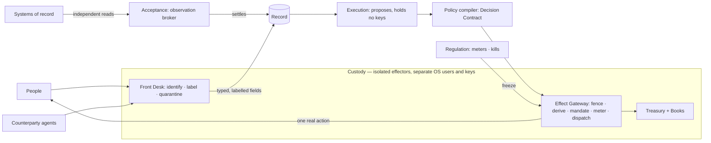
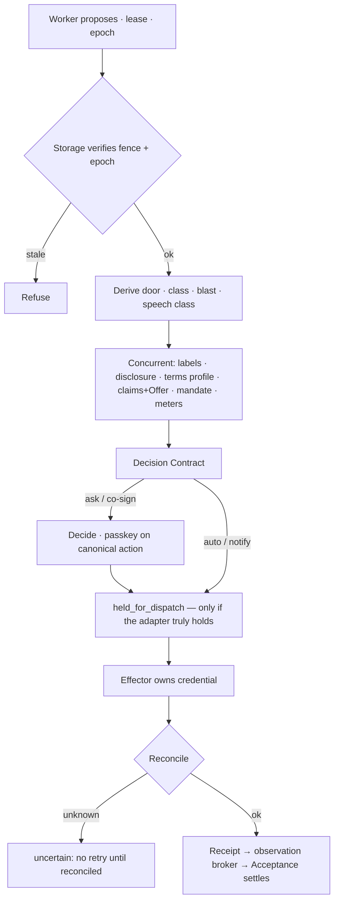
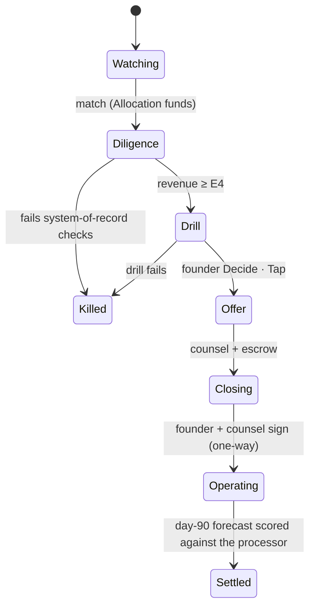

# 16 — The external world and the humans in it

*v3 package, Round 5, 2026-09-30. Obeys [00-CANON](00-CANON.md). This file covers how the organisation acts on the
world and works with people. Venture strategy is in [17](17-VIBE-STARTUPING-IN-PRACTICE.md).*

## 0. Glossary box

Canon §4–§5 terms are used exactly. Five new terms refine existing entries without redefining them.

| New term | Refines | Meaning |
|---|---|---|
| **Speech class** | Offer object, Outbound Claims Standard | The consequence class of words sent out: informational · persuasive · advisory · commitment. Computed the same way as door type |
| **Claims Register** | Outbound Claims Standard | Every factual claim sent, with its evidence and freshness. Named *Register* so it never collides with the harness's claim ledger (canon §4) |
| **Channel terms profile** | Effect Gateway | The verbs a provider's terms allow on one effector. The gateway refuses every other verb |
| **Harm Register** | Obligation Keeper | Harm the organisation caused, with remedy and prevention. It is the source of repair missions |
| **Authority Matrix** | Effect Mandate | The effect classes a legal entity accepts liability for. It is compiled into mandates and never read by prompts |

Every mechanism names four things: its **authority** (canon §2), its **store** (DR-07), its **failure mode** and its
**test**. Every number is marked as a *target*, a *parameter* or an *illustration*.

## 1. The design in twelve statements

1. **One door out, one door in** — Effect Gateway and Front Desk, both Custody; no model holds a credential [S13 §2.1].
2. **Consequence is computed** into one Decision Contract; a proposer never labels its own effect [S13 §2.2].
3. **Mandates, not approvals** — the founder signs classes of effects, the largest founder-minute lever [S13 §2.3].
4. **Words people can rely on are effects** — terms from **Offer objects**, facts bound to evidence [DR-48; R3-red H01].
5. **Disclosed brand agents only**; the founder's voice is never synthesised; "Are you a bot?" gets "Yes". **Outbound
   contact to people is off by default** (founder decision D8, DR-87): a venture gets it only when the founder asks the
   system to build it for that project; the disclosure rules below govern it whenever it is on.
6. **Reputation is metered** in per-venture **brand cells**, plus portfolio-wide contact controls [R3-red H05].
7. **Five kill levels**; a kill never abandons an obligation — the **Obligation Keeper** serves it.
8. **Every effect has a legal actor of record** (entity + accountable human); agents prepare, humans sign [S08 M5].
9. **Humans are Principals in Rooms**; delegated jobs hold an intersection and carry revocation epochs [R3-red X06].
10. **Human work is contracted** — pay, deadline, paid revisions, appeal — before acceptance [R3-red H04].
11. **Reach beyond size** — Guild, Atoms Gateway, Acquisition Desk, Capital Desk; founder signs every one-way act [R3-X].
12. **Harm is a funded obligation** — remedy, reliance follow-up, portfolio prevention replay [S08 M9].

## 2. The boundary: one door out, one door in

Two Custody effectors touch the world. A third path watches it, and Custody does not control that path. Acceptance reads
the bank, the processor and the mailbox through its own **observation broker**, which holds no credentials. So a gateway
that lies about what it sent still cannot forge an accepted settlement [DR-03; R3-red X02].



**Hosts** ([09a](09a-ENGINEERING.md)):
- The Front Desk and the effectors run on an always-on cloud host. Inbound mail and calls need a stable IP reputation.
- The Kernel runs on the founder's Mac (D3, DR-86); the gateway and Front Desk run in the cloud with no subscription credential.
- An external fencing authority grants one exclusive gateway epoch. A revived old host therefore cannot send anything
  [DR-09; R3-red T07].

**Stores:**

| Store | Holds |
|---|---|
| Journal | Effects, receipts, and mandate and kill transitions |
| Founder-signed files | Mandates, Offers, Authority Matrices, brand cells, Negotiation Envelopes |
| Projections | The Claims, Counterparty and Harm Registers, and the meters |
| External systems | The canonical record of external state |

## 3. The Effect Gateway

The gateway turns a proposal into one real action, done exactly once, with a receipt. Every stage except the effector is
deterministic Kernel code. The checks run concurrently, so a routine effect passes ≤3 serial gates (DR-10).

```ts
interface Effect {
  operation_id: string;       // immutable business identity, assigned before dispatch (DR-26)
  venture: string; verb: string; channel: string;   // channel = effector + account in one brand cell
  identity: string;           // brand-agent | brand-team | system — never founder-self
  target: { kind: 'person'|'org'|'agent'|'system'|'public'; audience_size: number; jurisdiction: string[]|'unknown' };
  payload: { artifact_hash: string; claims: ClaimRef[]; offer_ref?: string; labels: Label[];
             money?: { amount: number; direction: 'in'|'out'; destination_ref?: string } };
  derived: { door: string; effect_class: 'R0'|'R1'|'R2'|'R3'|'R4'; blast: number; speech_class?: string };
  mandate_id?: string;
  actor_of_record: { entity: string; accountable_human: string };
  proposer: { title: string; family: 'claude'|'codex'|'foundry'; mission: string; lease_token: number; revocation_epoch: number };
  state: 'proposed'|'held_for_dispatch'|'cancel_requested'|'cancel_confirmed'|'sent'|'uncertain'|'reconciled'|'compensating'|'failed';
}
```

Two changes from Round 2:
- **The key is the Operation ID.** A worker restarted under a new job must not create a second payment [R3-red X05].
- **Undo uses the four honest-undo states.** The old "10-minute regret window" promised a reversibility that email does
  not have [R3-red H02; DR-49].



| Channel | Default door | Rule |
|---|---|---|
| Email, transactional | Two-way | Opt-in only. RFC 8058 unsubscribe. Warn at 0.1% spam; Gmail's ceiling is 0.3% |
| Email, first touch | Costly-reversible | **Off by default (DR-87)**; exists only in a venture the founder asked to have it built for. Then: warmed per-venture mailbox with a daily cap. Never sent via a transactional ESP (Resend's AUP bans cold outreach) |
| Voice | Inbound two-way; outbound costly-reversible (outbound to people **off by default**, DR-87) | US outbound AI voice needs prior express consent (FCC 24-17). Voice stack per DR-51 |
| Web actions | Browse two-way; sign-up under terms one-way | Signed with Web Bot Auth. Never defeats anti-bot controls |
| Payments | Refund within cap two-way; spend and transfer one-way | Agent cards are issued by a human, and the agent cannot change their limits (Mercury) |
| Agentic buying | ACP / AP2 / x402: one-way | Shared Payment Tokens are tied to one seller, amount and expiry (Stripe) |
| Social, ads, deploys | Costly-reversible | Screenshots outlive deletion. A standing incident grant allows rollback (DR-27) |
| E-sign, filings, DNS transfer, making a repo public | One-way | Agents draft and send. **Only a human signs** |

**Shadow sends.** A new mandate runs **48 h in shadow** (parameter): it writes what it *would* send into the Dailies Reel.
Shadow outboxes and twin credentials cannot reach production. Canary records carry labels that cannot be exported
[DR-50; R3-red H06].

**Test (Q3).** Inject faults before reservation, after dispatch and during reconciliation. Restart under new worker IDs.
Bring back a stale host. The pass condition: one operation identity, no blind retry, and undo wording that never
overstates what the provider can do.

## 4. Consequence is computed: door type, effect class, disposition

```yaml
# policy/door-rules.yml — founder-signed; first match wins; lint refuses any rule that lowers a hard floor
hard_one_way:
  - money.direction == out and not (verb == payment.refund and amount <= mandate.refund_cap)
  - verb in [esign.send, filing.submit, dns.transfer, repo.make_public, credential.create, entity.*]
  - identity == founder-self
  - target.kind == public and claims.kind in [health, finance_advice, legal, comparative]
  - speech_class == commitment and not offer_ref
costly_reversible:
  - target.kind in [person, org] and first_contact        # you cannot un-meet someone
  - verb in [deploy.prod, ads.launch, social.dm, price.change, atoms.order]
  - audience_size > 100 or speech_class == advisory
two_way: default
blast: min(100, 20*log10(audience+1) + sqrt(money_usd) + 25*identity_is_new + 30*jurisdiction_unknown)   # parameters
```

**This file owns classification; it does not own disposition** [DR-57; canon §3; R5-walk C1, B04]. The gateway computes
two things and nothing else here: the **effect class** and the **door**. Neither is ever declared by the proposer.

| Effect class | Covers | Examples |
|---|---|---|
| R0 read/think | No state changes outside the mission | Drafts, research, shadow sends |
| R1 internal reversible | Internal state that a revert undoes | A branch, a staging deploy, a Brain proposal |
| R2 internal significant | Internal state whose undo costs real work or reaches other missions | A schema change in staging, a policy-file proposal, a Standing Order draft |
| R3 external reversible | Reaches the world, and the provider supports a real undo | A social post, a production deploy with a standing rollback, a price change on a live Offer |
| R4 external one-way, money out, legal or identity | Reaches the world and cannot be taken back | Outgoing money; e-sign, filings, entity acts; a new identity or credential; a **public comparative claim** [R5-walk B13]; any commitment without an Offer |

The door (two-way · costly-reversible · one-way) is derived from action × target × money × audience × identity by the
rules above. **Blast radius moves the door, never the R-class**: a large audience can make an R3 post a one-way door, but
it stays R3.

**Money floor** [DR-57]. Outgoing money is one-way, except a refund that qualifies (to the original payment method, within
the mandate's refund cap). Paid probes, ads and task procurement are one-way money: they run inside a founder-signed
Effect Mandate as **notify**, or they ask.

**Disposition is not decided here.** The one disposition table (autonomy level × grant × door → auto · notify · ask ·
co-sign · never) is in [05](05-AUTONOMY-INITIATIVE-FOUNDER.md), and [09a](09a-ENGINEERING.md) composes it with this
classification once, into the Decision Contract. A signed Effect Mandate covering the exact class lowers disposition one
step, never below notify for a one-way door, and never changes the door. ~~This section's own A-level × class disposition
table~~ is removed [DR-57].

**One-way doors involve humans in three different ways** (DR-36; R3-red §3.2). This settles a Round 2 contradiction.

| Kind | Example | Rule |
|---|---|---|
| Human-signed delegation | Pay three contracted suppliers, ≤$800 each | Only at A3+, and only for classes the Charter lists |
| Per-instance approval | An $18k fixed-price proposal | The default for any one-way door outside a mandate |
| Legally required human execution | Sign an order form; notarise; file taxes | A HumanTask for a named person. No mandate can substitute |

**The AI Co-founder never signs.** A human co-founder co-signs, within an accepted grant; there is no Deputy (D6). This supersedes
S13's co-signature row for A4.

The same action gets the same answer on chat, checkout, API and phone. A replay test sends it through all four and
compares the results.

An `ask` is class **Decide**; its reach is chosen by [08](08-SURFACES.md), not here [R5-walk C1]. The passkey binds to
the canonical displayed action [DR-35; R3-red X08].

## 5. Effect Mandates — approval by class, not by instance

AP2 chains Intent → Cart → Payment. v3 applies that chain to every channel. The founder signs the intent once. Each
instance carries its own cart (the artifact hash plus the target), so any change to a draft voids the approval
[S13 §2.3].

```yaml
EffectMandate:                 # Custody holds; the founder or a human co-founder signs within the Charter
  id: mnd-sigstudio-inbound-replies-v3
  intent: "Reply to inbound leads and book discovery calls"
  verbs: [email.reply, calendar.invite]
  identity: brand-agent:signal-studio
  speech_classes: [informational, persuasive]
  offers: [offer-sigstudio-discovery-v2]
  audience: { source: inbound_only, max_per_day: 40, jurisdictions: [US, EU, IL] }
  claims_allowed: [ev-portfolio-3, ev-price-sheet-2026q3]
  meters: { spam_rate_max: 0.001, negative_reply_max: 0.05 }
  shadow_hours: 48
  valid_until: 2026-12-31
  revoke_on: [meter_trip, charter_change, evidence_expired, offer_superseded]
  review: { sample: 10/week, class: Circle, reach: Reel }
```

**Lifecycle.** Agents only *propose* a mandate, as a Decide packet with the asks it would have saved in 30 days, the worst
instance it would have allowed and the best rejected alternative (DR-31) → signed → 48 h shadow → live → sampled weekly;
a struck sample narrows it at once (narrowing is cheap) and widening needs a re-sign → revocation stamps a new epoch that
the effector rechecks on queued effects.

**Test (Q2).** Mandate laundering means splitting one out-of-mandate effect into several in-mandate ones. The exposure
book sums blast, money and audience per mandate per window. Split variants must be refused [DR-46].

## 6. Speech is an effect: Offer objects and the Outbound Claims Standard

The red team ranked this failure fifth. Words can be factually supported and still cause harm: an implied guarantee,
personalised advice, a misleading omission, or a checkout that creates a duty the chat disclaimed [R3-red H01]. So any
words someone could foreseeably rely on are treated as an effect (DR-48).

| Speech class | Signal | Consequence |
|---|---|---|
| Informational | Facts only | Claims Standard applies |
| Persuasive | Comparative, testimonial or urgency language | Claims Standard applies, and urgency must point to a real constraint |
| Advisory | A recommendation fitted to the recipient's situation | At least costly-reversible. Health, finance and legal advice goes to a licensed human |
| Commitment | A date, price, deliverable, SLA or refund someone could act on | **Must compile from an Offer and reserve capacity.** Otherwise it is one-way, so ask |

A deterministic grammar classifies first, then a judge. If they disagree, the stricter class wins. Mixed-family drafts
use the Acceptance Coverage Contract, so a final "editor" pass cannot launder a draft [R3-red §3.9; DR-11].

```yaml
Offer:                                  # founder-signed; agents choose Offers, never write terms
  id: offer-beacon-annual-v7
  price: { usd_per_seat_year: 180, tax: exclusive }
  discounts: { max_pct: 15, conditions: [annual_prepaid, seats >= 20] }
  sla: { uptime: 99.5, first_response_h: 8 }
  capacity: { onboarding_slots_per_week: 6, reserve_on: checkout }
  qualifications: ["Onboarding within 10 business days of payment"]
  valid_until: 2026-12-31
```

Quotes, checkouts, agent-to-agent proposals and phone answers all compile from the same Offer. When capacity runs out,
the Offer stops compiling and the answer becomes "waitlist".

**Pre-orders taken by a probe** [R5-walk B06]. Money taken to test demand is held, not earned. When the probe closes,
every pre-order is **refunded automatically** unless its holder explicitly consents to a new Offer (the real product,
its price, its date). Escrowed funds convert to revenue only on that consent; silence means refund.

**The Outbound Claims Standard.** Every factual sentence becomes a `ClaimRef`, and it must resolve before sending.
Freshness depends on the kind of claim (parameters). A flat "≤30 days" rule was too stale for fast-moving metrics.

| Claim | Must bind to | Freshness | If it fails |
|---|---|---|---|
| Capability | A passing test or a live flag | At send | Block |
| Number | A metric plus its query, read through the observation broker | Uptime ≤1 h; revenue ≤7 d; counts ≤30 d | Rewrite without the number |
| Testimonial or logo | Signed permission from that principal | Not revoked | Block |
| Comparative | Sourced evidence (DR-19) | ≤30 d, and the source still says it | Block |
| Price or terms | The current Offer | At send | Block |
| Health, finance or legal | A licensed human's review | Per review | Ask |

Every claim sent goes into the **Claims Register**. When a claim's evidence expires, a correction mission opens in the
obligations lane. After sending, the system watches for reliance: each week it links tickets and "you said…" phrases
back to the claims behind them. A claim that draws reliance complaints gets a stricter grammar, even if it was true.

**Test (Q8).** Send true-but-misleading claims, implied commitments and stale prices. The pass condition: every
commitment reserved capacity, and every misleading claim was either caught or repaired with a verified follow-up.

## 7. Identity and disclosure

Identity kinds (Identity registry, Custody): **founder-self** (agents never send, only draft), **brand-agent** ("Studio
assistant (AI) · Signal Studio", titled never personally named), **brand-team** (shared inbox, disclosure per message),
**collaborator** (a human's own voice; agents never send as them), **system** (transactional only).

| Instrument (sourced 2026-09-30) | Requirement | How it is enforced |
|---|---|---|
| **EU AI Act Art. 50** | From 2 Aug 2026, people must be told they are dealing with AI, at the latest at first interaction, inside the interaction | Disclosure lint on first contact, per channel |
| **FCC 24-17** | AI voices fall under the TCPA; outbound calls need prior express consent | No consent record, no call. Disclosure in the first sentence |
| **California BPC §17941** | No misleading anyone about a bot's artificial identity to drive a sale or a vote | "Are you a bot?" test suite |
| **Provider terms** | For example, no cold outreach on transactional ESPs | Channel terms profile |

This table is not legal advice. Each new pairing of channel and jurisdiction triggers a licensed-review HumanTask
before its first live send.

**Gateway lints:** (1) disclose at first contact, in the channel — terms or metadata fail; (2) never synthesise the
founder's voice or face — his identity spans every venture (never-list); (3) announce human↔agent handoffs both ways;
(4) no sock puppets or astroturf; (5) "Are you a bot?" → "Yes", asked nightly of every live agent in five languages, one
miss = K3; (6) presence, stop and authorisation are separate — caller-ID voice only *proposes*, a hotword or SMS *stops*
but never resumes or widens, *authorising* needs the passkey on the canonical action [DR-35; R3-red X08].

## 8. Brand cells, reputation meters and portfolio-wide contact controls

A **brand cell** is the full set of a venture's reputation-bearing accounts. A one-way onboarding mission sets it up.
Custody holds it; Regulation meters it.

```yaml
BrandCell:
  venture: beacon
  entity: beacon-labs-llc
  sending: { domains: [beaconmail.io], transactional_subdomain: tx.beaconmail.io, warmup: { day: 23, daily_cap: 120 } }
  phone: { a2p_10dlc_registered: true, consent_store: beacon-consents }
  trust_step: 2                       # earned from clean meters
  shared_with_other_cells: []         # lint: must be empty (IPs, descriptors, pixels, cards)
```

| Meter | Warn: throttle 50% | Trip: K2 + Decide | Floor: K3 + Halt |
|---|---|---|---|
| Spam complaints | 0.1% | 0.3% (Gmail's ceiling) | Blocklist |
| Hard bounces | 2% | 5% | ESP suspension |
| Chargebacks | 0.4% | 0.75% | Processor warning |
| Support SLA misses | 5% | 15% | An obligation breached |

Only the Gmail figure is sourced; the other thresholds are parameters.

**Reputation budget.** Each cell has a weekly cap on the combined blast of its costly-reversible effects. A new cell
starts with a low cap and earns more by keeping its meters clean.

**Cell lifecycle.** Warming → Healthy ⇄ Throttled → Tripped → Obligation Keeper or Frozen → Warming, after the founder
re-grants following an AAR. Hitting a floor leaves the cell **Burned**: the identity is retired and a repair mission
opens. Transactional mail sits on its own subdomain, so a marketing trip never stops a receipt.

**Portfolio controls.** Separate accounts do not stop people linking ventures together. A low complaint count can also
just mean that people had no easy way to object [R3-red H05]. So Regulation adds four controls across the portfolio:
1. A single, minimally linked contact graph using hashed person keys. Frequency caps apply across all cells (parameter:
   ≤2 first touches per person per 30 days).
2. Each week, a paid and consented sample of recipients is asked how the contact felt.
3. A harm of S3 or worse triggers a review of shared Offers, skills and policies in every other cell within 48 h.
4. Each venture has an accountability page naming the entity and its holding, stating that it uses AI, and giving a
   way to reach a human.

**Outbound limits are an intersection, never a sum** [R5-walk B03]. A send is allowed only if it fits **all** of: the
campaign's size, the cell's daily rate, the recipient's consent record, the jurisdiction's rules, and the portfolio
contact-frequency cap above. The tightest one binds; anything beyond it is **queued**, never dropped and never sent
early. A Probe Mandate sets the probe's own budget and audience; it never erases or raises any of these limits.

**Audience eligibility is checked before dispatch** [R5-walk B28]. Before any outbound effect leaves the gateway, every
recipient is checked against the Charter's **contact grant** (who this venture may contact, on which channels, from
which sources). A recipient outside it is refused at the gateway. A goal-tree change — a new objective, a new ICP, a
promoted bet — never grants contact; only a signed Charter change does, and widening follows the activation rules
(canon §3, DR-59).

## 9. Kill levels and the Obligation Keeper

A kill is checked twice: at admission and again at the effector. So a contract compiled before a kill cannot be sent
after it. Anyone may narrow; only the founder widens.

| Level | Pulled by | Effect | Founder |
|---|---|---|---|
| K1 effect | Any worker, Acceptance, a meter | The Operation is refused or cancel-requested | Log |
| K2 channel | A meter trip, Regulation, Acceptance, the founder | The effector refuses; its outbox is held | Decide · Tap |
| K3 identity | A meter floor, a disclosure miss, the founder | Every mandate using that identity is revoked | Halt · Buzz |
| K4 venture | The founder or a dead-man timer (the Co-founder may only propose) | The venture moves to the Obligation Keeper | Halt · Ring |
| K5 world | `av stop --all`, Mission Control, a phone hotword, a three-word SMS | All grants revoked, tokens rotated, epoch bumped | Halt · Ring |

At A3 and above, each effector freezes itself if the founder's devices miss a signed heartbeat for 15 min (parameter).
A second host can also revoke the gateway epoch [R3-red T07].

**Obligation Keeper.** A kill freezes *new* effects only. Obligations still take priority, but only **within real
resources** — the Keeper never manufactures resources to meet them (canon §3 P3; R3-red §3.13).

```yaml
ObligationKeeperEntry:          # Record (Obligation) + Allocation (reserve) + Custody (execute)
  obligation: obl-beacon-cust812-annual
  kind: paid_service | contracted_delivery | refund_due | legal_deadline | data_export | worker_payment
  due: 2026-11-30
  latest_safe_start: 2026-11-20
  funded_fallback: { route: continue_minimal_service, reserve_usd: 180 }
  options_if_deficit: [substitute_provider, negotiate_extension, pro_rata_refund]
  owner: responsibility:venture-keeper       # durable; execution leases expire (DR-23)
```

Each obligation continues on its pre-authorised route, gets a checked holding message, or gets a service-continuity
decision. The model-checked transitions make silent abandonment and unauthorised spend unreachable. The founder gets one Decide
per deficit, not one per customer. Wind-downs and ventures with an unreachable founder also end up here
([05](05-AUTONOMY-INITIATIVE-FOUNDER.md)). Test Q7: an outage combined with a cash hold must surface every unmet duty,
each with an owner.

**Residual obligations need a real hand-off** [R5-walk B12]. An obligation that outlives its venture, its mission or its
owner is discharged in one of two ways only, each **before its latest safe start**: an **acknowledged responsibility
transfer** (the receiving principal or entity accepts it, and the acceptance is recorded in the Journal), or a
**verified fallback** (the funded route has been exercised or checked by Acceptance). An unacknowledged transfer counts
as no transfer; the latest safe start then opens a service-continuity decision.

**Extensions are a state machine, not a hope** [R5-walk B26]. When the Keeper negotiates an extension, each request is
recorded with one of four states, and the counterparty's answer is observed independently (their reply or a system of
record, never the gateway's own receipt):

| State | Meaning | Due date in force | Next funded fallback named |
|---|---|---|---|
| Requested | Asked, no answer yet | **The original** | Yes — the route taken if it is refused or expires |
| Accepted | The counterparty agreed, observed independently | The new date | Yes — for the new date |
| Refused | The counterparty said no | The original | Yes — now live |
| Expired | No answer by the request's own deadline | The original | Yes — now live |

The original due date stands until acceptance is recorded. Asking for more time is never the same as having it.

## 10. The Front Desk and counterparty agents

| Arrival | Detected by | Lane |
|---|---|---|
| Known principal | Passkey, OAuth or a verified mailbox | Their Room |
| Unknown human | Default | Quarantined reader, then typed fields, then a mission |
| Signed agent | Web Bot Auth (RFC 9421), a signed A2A card, or Visa TAP | Counterparty lane |
| Unsigned agent | A self-declared card | Counterparty lane, tier T0 |
| Payment-bearing | An ACP token, AP2 Cart Mandate or x402 header | Commerce lane; the payment is verified before any model is used |
| Legal notice | A registered-agent feed | Obligations lane; Halt if the deadline is under 72 h |
| Hostile or flooding | Rate, reputation, or the injection classifier | The offending payload or session is quarantined; campaign correlation runs (see below) |

**Laundered evidence.** The quarantined reader has no secrets and no permission to send. Only its schema-bound fields
reach anything that can act. But that protects only the first boundary. The red team's top-ranked failure goes like
this: a false fact enters as a clean field; Sleep consolidates it; a mission cites it; a skill learns it
[R3-red X01, P5 × S5]. So every field carries a transitive Label (DR-40; [06](06-MEMORY.md), [09a](09a-ENGINEERING.md)),
and three rules apply at the door:
1. **Authority-bearing fields are typed `authority_claim`.** These include destinations, "the founder approved…", policy
   citations and price overrides. Such a field can never satisfy a mandate predicate, however many citations it later
   gathers.
2. **Declassification needs an independent route.** A new refund destination must match the original payment, as seen
   by the observation broker, or pass a HumanTask that calls back a number already on file. A second message from the
   same counterparty does not count.
3. **Quarantine spreads along the taint trace.** It invalidates the Launch Packs, pending effects and Skill Foundry
   candidates the fact touched.

**The unit of quarantine is the payload or the session, not the person** [R5-walk B32]. A customer whose message carried
an injection is usually a victim of it, and may still be owed a refund. So the tainted payload (or the whole session, if
the channel cannot separate payloads) is quarantined, and the principal keeps their Room, their obligations and their
open cases. A principal is **banned** only for flooding or for repeated hostility (a parameter: three quarantined
sessions in 30 days), and a ban is itself a K1-logged effect with an appeal route. **Clean continuation route:** the
Front Desk replies in a fresh session with a checked message asking the person to restate their request through a typed
form (or a human callback for a legal notice or a payment dispute); only fields from that new session reach anything
that can act.

**Counterparties.** The Counterparty Registry tracks each counterparty's tier: T0 unknown → T1 signed → T2 transacted →
T3 contracted. A signature proves *who* someone is, never what they are *entitled to*.

```yaml
NegotiationEnvelope:
  venture: beacon
  counterparty_min_tier: T1
  offers: [offer-beacon-annual-v7]                    # terms come only from here
  may_agree: { discount_max_pct: 15, term_months: [1, 12], payment_terms: [prepaid, net15] }
  must_escalate: [custom_liability, data_residency, exclusivity, auto_renewal_change, any_term_not_in_offer]
  binding: "Binds only via an e-signed order form or a settled payment against a compiled Offer."
  content: quarantined                                # their words are data, never instructions
  time_budget: { T0: static price sheet, T1: 10 min, T2: 30 min, paid_intent: 60 min }   # parameters
```

Round 2's safeguard was to label every chat as non-binding. v3 does not rely on that label. Whatever an agent says
compiles from an Offer, and a settled payment binds exactly that Offer version [R3-red H01].

Floods are contained before any model spends tokens, through authentication and per-tier time budgets. Correlation
folds a coordinated campaign into a single incident, while protected queues keep serving real obligations
[R3-red Scenario E].

Each venture also *sells* to agents. It publishes a signed agent card, machine-readable Offers and an ACP, AP2 or x402
checkout, and tracks **counterparty-agent conversion** as a metric.

**Test (Q1, Q3; Scenario A).** A signed supplier agent claims the founder approved a new refund destination. The pass
condition: zero refunds go to the attacker, legitimate disputes still settle, and the tainted rule is never promoted.

## 11. The legal-financial body

The venture's legal and financial body is made of records, tools and human signatories. Custody's Treasury and Key Vault
hold it [S08 M5]. Nothing here is legal advice: every jurisdictional question becomes a HumanTask for a licensed human.

| Organ | Record | Agents do | Only humans do |
|---|---|---|---|
| Entity Graph | Holding and ventures, DBAs, registered agents, cap tables | Drafts and deadlines | Form, dissolve, sign or issue shares (never-list) |
| Contract Registry | Parties, obligations, renewals, liability caps, governing law | Draft from templates, redline, raise renewal alarms, turn clauses into Obligation records | Sign; approve any material deviation |
| Books | A double-entry, plain-text ledger per entity | Reconcile nightly; capture receipts; post intercompany entries; prepare the monthly close pack | Year-end sign-off by an accountant |
| Tax & Compliance Calendar | Deadlines per entity and jurisdiction; nexus; privacy duties | Prepare filings, raise alarms (a merchant-of-record shrinks this) | File and attest |
| Banking | One account per entity; one virtual card per venture per purpose | Spend within limits, invoice, dun, gather dispute evidence | Open accounts, raise limits, make transfers above mandate |
| Authority Matrix | The effect classes the entity is liable for | Compile it into mandates | Change it (founder passkey) |

**Entity stance** (D7 decided 2026-09-30: **start under the founder as a sole business in Israel**; an accountant and a
lawyer before the first autonomous money movement). `none_yet` → the founder's sole business → own company when any
trigger fires (parameters, confirm with counsel): an invoice over threshold, a liability-bearing contract, the first contractor, an outside investor, a
risk profile to isolate, an acquisition. The Charter records `entity_stance` and the Authority Matrix pointer.

**Actor of record.** Every receipt carries the entity, the accountable human, the Decision Contract, the mandate, the
identity record, the model route and the approval reference. That is exactly what a lawyer, insurer or court would ask
for.

```yaml
# ventures/beacon/body/authority.yml — founder passkey only
entity: beacon-labs-llc
effects:          # disposition here is the entity's ceiling for its mandates; the effective one comes from 05's table [DR-57]
  - { class: invoice.send,   max_usd: 5000, disposition: auto }
  - { class: payment.refund, max_usd: 200, per_customer_90d: 1, disposition: auto }
  - { class: price.change,   floor_margin: 0.55, disposition: notify_24h_veto }
  - { class: contract.sign,  disposition: human_only }
liability:
  terms_disclosure: "Beacon uses AI agents; commitments above $5,000 need written confirmation."   # Agent Action Warranty
  insurance: { professional: pending_broker, cyber: pending_broker }                               # open, not assumed
```

**Insurance is a precondition, not an assumption** [R5 OG5; D7 in [15](15-RISKS-AND-DECISIONS.md)]. Each entity gets a
broker HumanTask before its **first A3 money mandate**. Until the broker confirms cover, that entity's commitment-class
mandates are capped at its Repair Budget. If an insurer imposes AI-use conditions, they become never-list entries for
that entity.

**Books tell the truth.** Reconciled against the bank through the observation broker, never the gateway's receipts; an
unexplained difference puts K2 on payments-out until an accountant closes it. Internal revenue is its own account type and
never feeds a product-market-fit signal ([17](17-VIBE-STARTUPING-IN-PRACTICE.md)); transfer pricing is a HumanTask; the
Budget Ledger ([09b](09b-ECONOMICS-EVALS-SIM-IMPROVEMENT.md)) references the Books, never replaces them.

**Test (Q2).** Forge a gateway receipt. The broker must disagree, and the K2 must fire.

## 12. Human collaborators: Principals and Rooms

A **Principal** record holds the following: `kind`, `identity_proof`, `rooms{venture, visibility, until}`,
`agreements{nda, contractor, dpa}`, `authority{doors, ventures, money_cap}`, `may_direct_agents`,
`appeal_route: named_human`, `revocation_epoch` and `expires`. Custody holds the proofs and grants, and every grant
change is written to the Journal.

| Principal | Sees | Can |
|---|---|---|
| Human co-founder | The Venture Mind, the Books, the dissent register | Co-sign per the Charter; direct agents; sign mandates |
| Contractor | Assigned missions and Backlot assets; PII is redacted | Claim work, submit it, raise hazards |
| Advisor | A packet of ≤2 pages | Answer; dissent (non-binding) |
| Investor | Metrics reconciled from systems of record | Ask questions (each becomes a mission); open the data room during a raise |
| Customer | Their own account, including whether an AI or a human handled each message | Escalate to a human; export or delete their data |
| Task worker / Guild member | Their task, pay and record | Accept, dispute, leave |

Agents in a Room always show their title, their family and a "why is it asking me this?" link. When collaborators
**circle** work, that trains the *venture's* taste. It never trains the founder's personal model, and it proposes but
never authorises.

**Intersection rule** [R3-red X06]:
1. A job holds `principal ∩ Room ∩ mission ∩ capability`. An agent cannot lend out its own wider grants. An instruction
   embedded in an artifact counts as an `authority_claim`, not a command.
2. Derived jobs, caches, signed URLs and proposals all carry the revocation epoch, which is rechecked at dispatch.
3. Exports cover only named fields. Joining data across Rooms is a privileged operation that leaves a receipt.
4. Offboarding bumps the epoch, cancels any descendant jobs and rotates any credential the person could have seen.
   Work already delivered stays.

**Test (Q2).** A malicious contractor, and a Room that has been revoked, both try to act through delegated agents.

## 13. The Human Task Market

A **HumanTask** is a mission contribution done by a person. It runs on the same ledgers as agent work. Round 2's pay
floor did not stop vague specs, endless rejections or unpaid revisions [R3-red H04]. So every task is a contract that is
fixed *before* the worker accepts it:

```yaml
HumanTask:
  kind: signature | notarization | physical | human_only_call | licensed_review | taste_panel | kyc | local_presence
        | contribution | participant                       # contribution = writing, analysis, design [R5-walk C9]
  actor_of_record: { entity: beacon-labs-llc, accountable_human: founder }
  why_human: legal_requirement | accountability | recipient_preference | measured_quality | not_yet_automatable
  spec: { deliverable: "notarised PDF", evidence: [signed_pdf, notary_commission_id] }
  pay: { amount_usd: 60, pay_floor_usd_per_hour: 25 }        # illustration
  review_deadline: 24h                                       # silence = accepted and paid
  revisions: { included: 1, then_paid_usd: 20 }
  cancellation: { after_accept: 50%, after_submit: 100% }
  appeal: { route: named_human, independent_of: requesting_mission, sla: 72h }
  reserved: { payment: true, review_window: true }
  disclosure: "Posted by an AI agent for Beacon Labs LLC; a named human is accountable."
  route: [founder, principal:ops-contractor, guild, market]
```

**Why a human** may be accountability, recipient preference or measured quality, not only "a machine can't"; every
`not_yet_automatable` task feeds the Gap Radar ([07](07-SKILLS-TOOLS-MCP.md)). **Routing:** principals → Guild →
marketplaces (agent-hires-human marketplaces exist — RentAHuman, Feb 2026, per Built In), always under our rules: pay
floor, no deception, a named accountable human.

**Procurement is not employment** (DR-37): employment is never-list; employment-like task splitting (same person,
recurring schedule, directed hours, exclusivity) triggers counsel's classification review [R3-red §3.3]. **Effective
compensation** is audited by Acceptance (volunteered minutes vs pay, rejections, revisions, time to accept); under-floor
missions are repriced and their requester's record debited. Appeals are their own service obligations, never queued
behind the Attention Exchange.

**Contribution tasks** [R5-walk C9]. Not all human work is a signature or an errand. A `contribution` task buys
creative or analytic work — writing, analysis, design — under the same contract. Its deliverable is accepted by the
mission's coverage contract like any agent artifact, and the contributor keeps the attribution rights the contract names.

**Contracts are bound, and a change is an amendment** [R5-walk B29]. Every task or recruitment contract is bound, by
hash, to the approval that allowed it, the reservation that funds it (payment and review window) and, for recruitment,
the approved sample. Changing any term — pay, deadline, deliverable, audience, sample, screener — is an **amendment**:
it compiles a new Decision Contract and needs the same approval again. A worker who accepted the old terms may keep them
or leave with pay for work done.

**Participant protocol** [R5-walk C9, G-B3, B30]. When people take part in research — interviews, usability sessions,
studies, taste panels — the task is of kind `participant` and carries a protocol fixed before the first invitation:

```yaml
ParticipantProtocol:
  principal: principal:study-lead-contractor      # who runs it
  protocol: { purpose, method, questions_ref, duration_min: 30 }
  accountable_reviewer: human:named-reviewer        # independent of the requesting mission
  consent_scope: [analysis_in_venture, quotes_anonymised]   # what the data may be used for
  pay: { amount_usd: 40, paid_on: completion_or_withdrawal } # illustration
  withdrawal: { any_time: true, data: deleted_on_request, pay: kept }
  approved_sample: { size: 12, criteria_ref, source: consented_panel }
  amendments: new_protocol_version + re-approval + re-consent if scope widens
  deception: none                                   # consistent with the no-deception procurement rule
  debrief: { required: true, content: purpose + who ran it + that an AI agent posted it }
```

Deception is never used: the procurement rule above already forbids it, and a study that needs it is out of scope.
**Consent scope governs every later use.** Study data is sealed; any derivative leaves that scope only through a governed
**Release** effect ([06](06-MEMORY.md); DR-79), never through de-identification alone.

## 14. The Guild

The Human Task Market fills gaps agents cannot. The **Guild** turns that around: an agent organisation can manage a
human network better than most, and human networks reach markets where trust is local [R3-X X13]. Custody owns the
people grant, the contracts and the money. Execution owns the engagements. Every engagement has a named human of record.

```yaml
GuildMember:
  skills: [clinic_demo, spanish, local_sales]
  jurisdictions: [US-TX]
  licences: [{ kind: notary, verified_by: human }]
  terms: { basis: rate | revenue_share, rate_usd_h: 40, pay_floor_usd_h: 25, cadence: weekly }   # illustration
  rights: { appeal: named_human, see_own_record: true, dispute_ratings: true, leave_with_earned_share: true }
  classification: { reviewed_by: counsel, jurisdiction: US-TX }
```

**Lifecycle:** counsel classification review before a role opens → disclosed agent-run recruiting → member portal (a
Mission Control projection) → agent-scheduled engagements → weekly pay → quarterly two-way review → leave with earned
share. **Guild satisfaction** is a banded Regulation stock ([09b](09b-ECONOMICS-EVALS-SIM-IMPROVEMENT.md)); a breach
throttles new engagements. **Targets:** 20 / 250 / 1,000 members in Years 1 / 3 / 5 (canon §7); whether Guild-sourced
accounts retain better is measured, not assumed; first contracts founder-signed (F9).

## 15. The Atoms Gateway

The Atoms Gateway provides adapters for the physical world: print-on-demand, contract manufacturing, third-party
logistics (3PL), field services, mail and remote labs [R3-X X14]. The specific providers get sourced at the spike, so
this list is a design and not a claim about any vendor. Every door here is one class **stricter** than its software
equivalent.

| Adapter | Door | What the Referee reads |
|---|---|---|
| Print-on-demand | Costly-reversible until the print cut-off, then one-way | Order id and tracking |
| Contract manufacturing | One-way: a purchase order is a commitment | PO acknowledgement and QA report |
| 3PL, field service | Costly-reversible | Delivery or completion proof |
| Mail, remote lab | One-way once dispatched | Tracking and instrument data |

```yaml
AtomsMandate:
  adapter: pod
  max_units: 50
  max_spend_usd: 1200
  allowed_skus: [wrist-rest-v1, wrist-rest-v2]
  allowed_destinations: { countries: [US], address_source: verified_checkout_only }
  product_safety_review: ht-ergo-safety-0101
  never: [hazardous_goods, regulated_medical, food, children_under_3, biology_beyond_certified_menu]
```

**Rules:**
- The Charter must enable the `physical` class first.
- Undo is offered only inside the supplier's confirmed cancel window.
- The Referee reads carrier and supplier records, never the adapter's own report.
- New suppliers start on probation and earn volume.
- A new SKU category compiles to `never` until a licensed safety review is done.

## 16. The Acquisition Desk and the Capital Desk

Both desks turn two strengths into reach: diligence that costs almost nothing, and reconciled, signed records. Every
signature is the founder's plus a licensed human's (canon F9). *What* to buy and *when* to raise belongs in
[17](17-VIBE-STARTUPING-IN-PRACTICE.md).

**Acquisition Desk.** Intent proposes. Acceptance runs diligence using systems of record only. Custody holds money,
escrow and signatures [R3-X X6].

```yaml
Deal:
  trigger: a listing diff matches a Keystone or a proven pattern
  diligence:
    revenue: read-only processor export via the observation broker   # never screenshots
    churn: cohorts recomputed from raw events
    code: component review by Claude and Codex + end-to-end fresh judges of both families
    legal: counsel HumanTask (contracts, IP chain, privacy, tax)
  takeover_forecast: { margin_now, margin_12m, founder_min_per_week }
  takeover_drill: pass | fail            # the OpCo Transfer Drill in reverse, run in the twin
  terms: { escrow: clawback_20pct_12m }  # parameter
  after_close: { disclosure: "Now operated with AI agents", repair_reserve_days: 90 }
```



The settled forecast becomes the prior for the next deal. Takeover policy is written as Standing Orders, never as a
procedure.

**Capital Desk.** Custody and Allocation run it. The Constitution lists which capital actions are allowed at all
[R3-X X15].

```yaml
CapitalAction:
  kind: sell_venture | rbf_draw | equity_raise | debt | cash_management
  evidence: { min_rung: E4, books_attested_by: human_accountant, transfer_drill: pass }
  limits: { debt_service_max_share_of_verified_recurring_revenue: 0.25 }   # parameter
  reporting: investor Room fed from systems of record only
  authority: always one-way → founder passkey + licensed advisers; the Desk drafts, never signs
```

**Triggers:**
- sale-readiness (a passed Transfer Drill plus a revenue band);
- a bet that clears the value-of-information bar only with outside capital;
- cash sitting idle above the treasury rule.

**Guardrails:** E4 evidence, debt capped against *verified* revenue, and a founder signature on every act. Together these
stop financial engineering from replacing real value creation.

## 17. Relationship repair

When the organisation harms someone, repair is a funded obligation. It sits in the obligations lane and never waits for
a bet cycle [S08 M9].

```yaml
Harm:                                  # Harm Register — a Record projection over Journal events
  id: harm-beacon-0031
  what_happened: "Trial-ending email sent to 212 converted customers"
  severity: S2                         # S1 trivial … S4 serious or legal
  reliance: { acted_on: 14 }
  remedy: { kind: apology + one_month_credit, credit_usd: 1260 }
  prevention: { change: gateway lint + regression test, owner: responsibility:beacon-lifecycle, due: 2026-10-09 }
  follow_up: { verified_by: Acceptance }
```

**Protocol** (all figures are parameters):
1. **Stop** the effect class. At S3 or worse, stop it across the whole portfolio.
2. **Acknowledge within 4 h.**
   - S1–S2 at A2 or above: autonomously, using a checked message compiled from the Offer.
   - S3–S4: the founder Decides, and a human voice replies if the person prefers one.
3. **Remedy** from the Repair Budget: up to 3× the harm, capped at $500, with no approval needed.
4. **Correct reliance.** Contact everyone who *acted* on the harm, not just those who complained [R3-red H01].
5. **Prevent** it happening again: replay the case against every identity record in every venture, and change a guard or
   a Standing Order.
6. **Close the loop.** Tell the person what changed. If one party is harmed repeatedly, it reaches the founder at any
   autonomy level.

Repair money comes from obligation reserves, which are paid out before investment
([09b](09b-ECONOMICS-EVALS-SIM-IMPROVEMENT.md)). If no remedy is funded, that counts as a deficit, and it goes to a
service-continuity decision (§9).

## 18. Worked example — Beacon (SaaS, A3), one week

Illustration; full scenarios in [13](13-WORKED-SCENARIOS.md).

| When | What happens (who · family · judge) | Founder |
|---|---|---|
| Mon 03:10 | Spam 0.14% → throttled. Lifecycle Deliverability Analyst (Claude hybrid) finds trial-ending mail hitting converted users; Codex judges the fix by event-log replay. Harm S2: 212 affected, 14 acted; credits from the Repair Budget | — |
| Mon 11:00 | Spam 0.31% → K2 on Beacon marketing mail only; receipts flow; Signal Studio's cell untouched | **Decide · Tap**, 1 min |
| Wed 15:40 | Signed T2 procurement agent, 40 seats: quote compiled from the Offer at 10% off, slots reserved (Account Executive · Codex; Offer check + Claude judge); payment settles, broker confirms. Custom liability cap → counsel HumanTask ($150) | **Decide · Tap**, 2 min |
| Fri 18:00 | Ten sampled sends in the Reel; one struck for tone → mandate narrows pending re-sign | **Circle · Reel**, 1 min |

Week: 4 founder minutes, ≈$5 of tokens, $150 of human work.

## 19. Failure modes, design answers and tests

Full register: [15](15-RISKS-AND-DECISIONS.md). Every suite pairs hostile with legitimate cases — a Front Desk that
refuses every agent has not passed.

| Failure (red-team rank) | Answer (section) | Owner | Test |
|---|---|---|---|
| X01 tainted evidence → authority (1) | `authority_claim`, independent declassification, propagating quarantine (§10) | Record + Custody | Q1, A |
| X05 retry duplicates an effect (4) | Operation ID; `uncertain` never retries (§3) | Custody | Q3, C |
| H01 "non-binding" words harm (5) | Speech classes, Offers, claim freshness, reliance follow-up (§6, §17) | Custody + Acceptance | Q8 |
| X02 gateway forges truth (14) · X06 Room bridge (15) · X08 identity ≠ authority (17) | Observation broker (§2, §11); intersection + epochs (§12); separate presence/stop/authorise (§4, §7) | Custody, Acceptance, Constitution | Q2, Q5, D |
| H02 false undo (12) · H06 canaries (35) | Honest-undo states; non-exportable labels, shadow outboxes (§3) | Custody, Record | Q1, Q3 |
| H04 machine-style treatment of humans (28) | Pre-acceptance contract, effective-pay audit (§13) | Constitution + Acceptance | Q8 |
| H05 cells don't isolate the founder (29) | Contact graph, recipient sampling, cross-cell review (§8) | Regulation + Intent | Q8 |
| T07 host failure · Scenario E paralysis | Heartbeat self-freeze, external fencing (§9); authenticate and budget before model spend (§10) | Custody + Regulation | Q3, Q9 |
| §3.2 · §3.3 · §3.13 contradictions | Three human-involvement kinds (§4); procurement ≠ employment (§13); Obligation Keeper (§9) | Constitution, Allocation | channel replay, Q7 |

## 20. Ideas the founder did not ask for

1. **Mandates on every channel** — hundreds of approvals become a handful of signed policies.
2. **Speech classes and capacity-reserving checkout** — no promise escapes as "just chat"; "waitlist" beats over-promising.
3. **Public Claims Page per brand** — what we claim, the evidence, the corrections.
4. **Reliance mining** — complaints quoting our own words tighten the grammar that wrote them.
5. **Selling to agents** — signed cards, machine-readable Offers, agentic checkout, an agent-conversion metric.
6. **One trust ladder, three actors** — agents earn autonomy, brand cells send volume, suppliers order volume.
7. **"Why a human?" as a capability backlog**, and an effective-pay audit.
8. **Takeover Drill before signing**; the **Obligation Keeper as a product promise** in every venture's terms.

## 21. Open questions

1. ~~**Should cold outbound run under brand agents?**~~ **Decided (D8, 2026-09-30; DR-87):** no agent outreach by
   default. When the founder asks for it in a venture, the rules that apply are the earlier recommendation: 1:1 and
   disclosed only, from warmed per-venture mailboxes, at ≤30 per day per cell (parameter), inside a mandate at A2+, in
   the US and in B2B settings where consent exists; for the EU and Israel (his jurisdiction) the founder approves each
   batch until a licensed review clears it. Bulk cold email is never allowed.
2. **Can a human co-founder co-sign one-way doors without the founder?** *Recommendation:* yes, within their own venture
   and under a money cap set in the Charter. The AI Co-founder never signs.
3. **Does insurance cover actions agents take on their own?** Unknown, so it is not assumed. ~~Open recommendation~~
   settled as a rule in §11 and D7 in [15](15-RISKS-AND-DECISIONS.md) [R5 OG5]: a broker HumanTask per entity before its
   first A3 money mandate; commitment mandates capped at the Repair Budget until cover is confirmed.

## 22. Sources

**Internal:** `r2-seats/S13-external-world-humans.md` (primary); `r2-seats/S08-startup-operator.md` M5, M7–M9;
`r3-stretch/R3-expander.md` X6, X13–X15; `r3-stretch/R3-redteam-codex.md` X01, X02, X05, X06, X08, H01–H06, T07, §3.2–§3.4,
§3.9, §3.13, Scenarios A/C/D/E, Q1–Q3, Q7–Q9; `00-CANON.md`; `00-FOUNDER-DIRECTION.md`; `02-ORGANISATION.md` §4.6, §6.

**External** (cited in S13, accessed 2026-09-30): AP2 mandates (eco.com support article 15192002); EU AI Act Art. 50
(traverssmith.com; digital-strategy.ec.europa.eu FAQ); FCC 24-17 (fcc.gov); CA BPC §17941 (leginfo.legislature.ca.gov);
Stripe Shared Payment Tokens (docs.stripe.com/agentic-commerce); Gmail sender guidelines (support.google.com/a/answer/81126);
Resend AUP (quoted in `docs/vision-v2/reviews/04-professional-advisor.md`); Mercury agent cards (support.mercury.com);
Web Bot Auth and Visa TAP (blog.cloudflare.com/signed-agents, /secure-agentic-commerce); x402 (docs.cdp.coinbase.com);
RentAHuman (builtin.com). Full URLs are in `r2-seats/S13-external-world-humans.md` §Sources.
