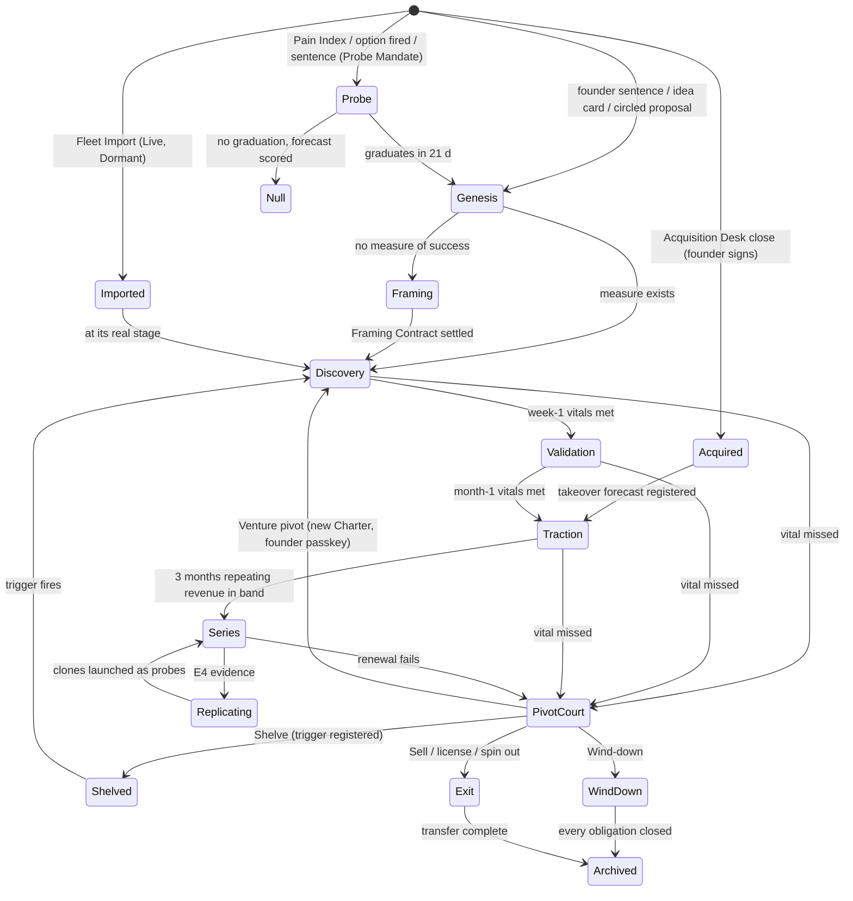
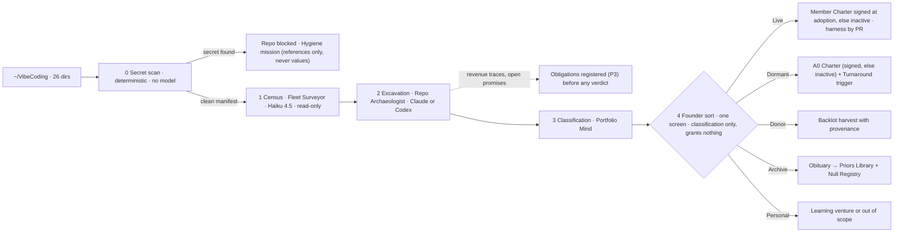
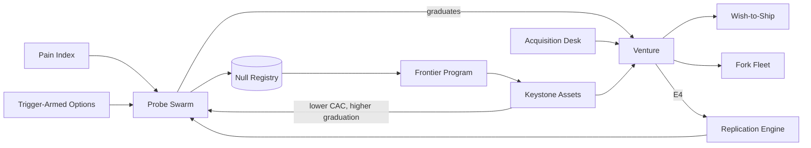

# 17 — Vibe startuping in practice

*Round 5, 2026-09-30. Obeys `00-CANON.md`. Every number is marked **target**, **illustration**, **parameter** or
**measured (source)**.*

## 0. What this file is, and the words it adds

This file is how the Compounding Organisation **makes, runs, multiplies, sells and kills ventures**. It uses the
machine described elsewhere — missions and the Allocator ([03](03-MISSION-ENGINE.md)), teams ([04](04-AGENT-ORGANISATION.md)),
autonomy and the founder ([05](05-AUTONOMY-INITIATIVE-FOUNDER.md)), memory ([06](06-MEMORY.md)), capabilities and the
Backlot ([07](07-SKILLS-TOOLS-MCP.md)), surfaces ([08](08-SURFACES.md)), economics and acceptance
([09b](09b-ECONOMICS-EVALS-SIM-IMPROVEMENT.md)), the outside world and legal body ([16](16-EXTERNAL-WORLD-HUMANS.md)) —
and does not re-specify it.

**The one idea: a venture is a record the organisation can create in minutes, measure every week, multiply when it
works, transfer when someone else should own it, and close without breaking a promise.** Nothing here is a playbook:
every vital sign is a calibrated starting belief, overwritten by evidence, never a list of steps (DR-05).

> **Glossary box — terms this file adds** (each refines a §5 entry; none redefines one)
>
> | Term | Definition | Refines |
> |---|---|---|
> | **Genesis** / **Genesis Operator** | The mission turning one founder sentence into a live venture; the identity record (either family) cast to run it | Venture, Mission |
> | **Kind Prior** | A belief about a venture kind with an evidence level; sets default Vital Signs; fails the method lint if it dictates steps | Priors Library |
> | **Fleet Import** / **import class** | The five-stage pipeline for existing repos; classes Live · Dormant · Donor · Archive · Personal | Venture |
> | **Stage Clock** / **Vital Sign** | Horizons (week 1, month 1, quarter 1, year 1, then 90-day renewals) and the numeric, systems-of-record measures due at each; a miss opens a Pivot Court | Goal tree, Closer Claim |
> | **Autonomy balance sheet** | Weekly per-venture numbers: collected revenue, MRR, margin, founder minutes, interventions, obligations, recovery cost | Progress Ledger |
> | **Fleet Charter** | One signed Charter governing every Micro-venture of one pattern | Charter |
> | **Operating loop** | Demand · Ship · Deal · Promise · Capital · Seats · Pivot — policy + stores + launched agents, never a department | — |
> | **Showrunner** | The Co-founder seat loaded with a Series venture's Mind, running weekly episodes | Co-founder seat |
> | **Pivot Court** | A mission deciding Persevere · Pivot · Shelve · Wind-down · Sell, with a prosecutor from the other family | Sideways Review |
> | **OpCo Pack** / **Transfer Readiness Score** / **Transfer Drill** | The continuously maintained transferable company; its 0–100 weekly score; its monthly spin-up in an empty tenant | Digital twin |
> | **Buyer's Remorse Referee** | Quarterly Acceptance check that an internal buyer would still pay list price against an external alternative | Inter-venture economy |

## 1. What tiny teams actually achieve — the ground we build on

Evidence cut 2026-09-30 [R0-D §1]. These are founder reports, vendor accounts, acquisitions and experiments — different
kinds of evidence, none an audit of autonomy.

| Case | Reported | Source | Lesson taken |
|---|---|---|---|
| Base44 | ~$80M announced initial consideration; **eight employees** — "solo" meant ownership | [Wix release](https://www.globenewswire.com/news-release/2025/06/18/3101508/0/en/wix-further-expands-into-vibe-coding-with-acquisition-of-base44.html) | Exits are designed (§10); count all labour |
| Marc Lou portfolio | $1,032,000 revenue in 2025 across 15 income streams; revenue fell despite his audience | [newsletter](https://newsletter.marclou.com/p/i-made-1-032-000-in-2025) | Portfolios beat single launches; distribution is necessary, not sufficient |
| Claw Mart (Eliason) | $182,432 all-time, $1,240 MRR, Stripe-verified listing, 30 Sep 2026 | [TrustMRR](https://trustmrr.com/startup/claw-mart) | Support and inbound sales became separate queues; founder still approves posts |
| Project Vend | Phase 1 losses; phase 2 better margins, three cities, purchases human-approved | [Anthropic](https://www.anthropic.com/research/project-vend-2) | Discount became credit: the leak moved |
| Andon Market | Operator states **not profitable**; human interventions remain | [Andon](https://andonlabs.com/market) | Activity substitutes for improvement unless challenge is mandated |

R0-D's verdict: founder-controlled businesses and autonomous stretches are evidenced; *verified profitability with
negligible human intervention is not*. So the practice
**measures independence instead of claiming it** (§5.3), and each observed failure maps to a guard in §7 or §11.

**Where v3 deliberately exceeds the evidence:** nobody in the sample runs a thousand disclosed demand tests a year,
replicates a working venture into twenty verticals, ships a customer's wish in a day, or sells a company with its tested
agent workforce attached. Those are this file's bets (§8, §10), each a target with a kill signal.

## 2. The venture as a record

A venture is not a folder, a process or a team. It is a set of versioned records (Record, DR-07) plus the repo, accounts
and brand cell they point to. Teams are launched against it and dissolved; the venture persists.

```yaml
# ventures/<slug>/venture.yml — index record; each ref is its own versioned file
slug: clinic-voice
kind: agency            # startup | agency | service | business | research | learning | hybrid
tier: flagship          # probe | micro | flagship (DR-38); fleet: <id> when micro
origin: {via: genesis | fleet_import | probe_graduation | replication | acquisition, ref: probe_0412}
charter: charter@v3     # level, grants, mode, mandate, budget, never-list, SCRAM safe state (05)
mind: venture-mind@v11  # thesis, goal tree, wagers, dissent (05)
brain: brain/clinic-voice@v88                      # customers, market, competitors, metrics, decisions (06)
stage_clock: {horizon: month_1, next_due: 2026-10-31, vitals: vitals@v4}
mode: episodic          # episodic | series
state: active           # active | paused | caretaker | wind_down | obligation_keeper
body: {entity_stance: dba_under_holding, books: books/cv}   # 16
opco_pack: {readiness: 71, last_drill: pass}                 # §10
audiences: [dental_clinic_managers_us]                       # declared for collision control
lineage: {replicated_from: null, replicas: [vet-voice, physio-voice-de]}
```



**Kill dates stop bets, not ventures with obligations** — customers mean Archived only via Wind-down under the Obligation
Keeper ([16](16-EXTERNAL-WORLD-HUMANS.md)). **Every entry lands on a real stage** — a revenue repo enters at Traction.

## 3. Genesis — a venture from a sentence in about eight minutes

Genesis is a **mission, not a wizard** [S08 M1]. Parameters (canon §7): **≈8 minutes, ≈$3, three founder
confirmations**. Intent (the sentence, or a circled Initiative Proposal) proposes; Allocation funds a Genesis tranche;
Execution casts a **Genesis Operator** — Claude or Codex, whichever the cast registry ranks higher for this task class;
Acceptance checks that the Charter compiles and the coverage is independent; Record writes first versions; Custody
creates nothing outward until a mandate covers it.

**The three confirmations are a signing ceremony (≤3 min; class Decide, reach Tap).** The founder confirms the
one-line intent, the autonomy level (A0–A4) and the monthly budget cap, and the ceremony ends in **one passkey
signature over the full canonical Charter** — including the proposed name, never-list additions, data boundary, entity
stance, audiences, the **baseline CCIR** from the Kind template and the **continuity routes** of its safe state. Those
proposals are shown in the signed display and editable before signing; none of them takes effect by silence, because
authority is never created by silence [DR-59, R5-walk B01, G1]. Voice can *propose* a venture or an edit; it cannot
confirm or sign.

**When the Charter becomes effective.** A Genesis Charter at A0–A2 within default caps is effective at signature — the
Genesis exception to the 12-hour widening cooling-off. A Charter asking for A3–A4, or for caps above the defaults,
activates only after the cooling-off. Before
the signature nothing exists but drafts: Record's first versions are proposals, and no mission is admitted. Mechanism in
[05](05-AUTONOMY-INITIATIVE-FOUNDER.md) [DR-59].

```mermaid
sequenceDiagram
  autonumber
  participant F as Founder
  participant AL as Allocation
  participant GO as Genesis Operator (Claude or Codex)
  participant RD as 3 blind readers (≥1 per family)
  participant AC as Acceptance
  participant RE as Record
  F->>AL: "Try an AI receptionist agency for dental clinics. $600 a month. A1."
  AL-->>GO: Genesis tranche ≤$3, Loadout, tool lease
  GO->>RE: Kind Prior + Backlot draw (repo template, brand kit, checkout stub)
  GO->>RD: coverage: premise, comparables, failure modes
  RD-->>GO: recommend / consider / pass, dissent kept
  GO->>AC: Charter draft + coverage report
  AC-->>GO: compiles; readers independent
  GO->>F: one card, 3 confirmations + full canonical Charter (Decide · Tap)
  F-->>GO: passkey signature over the full Charter (A1 ≤ default caps → effective now)
  GO->>RE: Charter v1 (signed), Mind v1, Brain skeleton, 3 hypotheses, Stage Clock
  GO->>AL: first missions: Framing Contract · discovery · page with real payment or waitlist
  AL-->>F: "Clinic Voice is live at A1. First reel 07:30. First bet's kill date 10-29." (Know · Reel)
```

**Kind Priors, not playbooks.** E.g. *agency@v7: "first revenue usually arrives from the warm network within 14 days"
(own ventures and external reports; confidence 0.4)* [S08 M1]. A prior sets a target a Referee can check, never steps.
Outcomes update it at every horizon; Fleet Import (§4) seeds the first priors from the founder's own history.

**Genesis always leaves** hypotheses that each name a metric and date, dissent recorded as a hypothesis (not a
footnote), a Backlot reuse % (target ≥40% by the Year-1 exit, from C5), a brand-cell stub with no outbound identity
active, and audiences checked against every live venture.

**Failure → answer.** *Genesis spam* (initiative births ventures faster than they can be judged) → Regulation holds a
venture-count band per tier; above it, new sentences become Probes. *A confident Genesis on a bad premise* → readers are
blind to each other and to the founder's enthusiasm; any "pass" forces a Framing Contract first. *Test:* a weekly
Genesis replay on three archived sentences — same Charter, cost within parameter, ≤3 confirmations.

## 4. Fleet Import — bringing in the founder's 26 directories

**Measured (`ls ~/VibeCoding`, 2026-09-30): 26 directories**, where the founder's direction says "~19 repos". The gap is
explained by two duplicate pairs (`finfun`/`FinFunapp`, `GSA`/`gsa-core`), non-venture directories (`_reference`,
`_worktree-archive-2026-08-30`, `test1`) and `agentvibe` itself, which imports as infrastructure, never as a venture.
The rest: `adamos`, `aiclub`, `Beamix`, `beeond`, `CodeGuruMain`, `etsyc`, `evalove`, `ghostb`, `hitstampjavagame`, `ml2`,
`N8N`, `noam-website`, `obsidian-claude-code-mcp`, `overstory`, `realestate`, `SpyTech`, `StoryBite`, `WAN`.



| Stage | Title (family) | Output | Cost/repo (parameter) | Writes? |
|---|---|---|---:|---|
| 0 Secret scan | deterministic scanner, no model | clean manifest, or exposure references (file, commit, key type — never the value) | ~$0 | no |
| 1 Census | Fleet Surveyor (Haiku 4.5), on clean manifests only | last commit, languages, LOC, deploy targets, `.claude/` drift, licence | ~$0.05 | no |
| 2 Excavation | Repo Archaeologist (either) | purpose, users, revenue traces, open promises, reusable assets | ~$0.60 | no |
| 3 Classification | Portfolio Mind session | class + reasons + confidence | ~$0.20 | no |
| 4 Founder sort | founder (Decide · Tap) | drag-sort; silence accepts the *classification* only | 5–10 min total | no |
| 5 Adoption | Adoption Engineer (either); Referee from the other family | per class; member Charters signed here or left inactive | $1–8 | **only by PR** |

**Rules.** One repo is at most one venture. Import never pushes to a default branch or force-pushes; rollback is one PR
revert. **Secret scanning is deterministic and runs before any model reads a repo**; a finding blocks that repo's census
and adoption and opens a Hygiene mission (Know · Buzz — a live exposure) whose records carry references, never secret
values [DR-76, R5-walk B34]. **Classification never activates authority**: the sort — silence included — decides what a
repo *is*; a Live or Dormant repo gets a Charter only when the founder signs its member Charter at adoption, and until
then it stays inactive, read-only under the Import Charter [DR-76, R5-walk B33].

**Exposure is four separate states**, never one: *rotation* (the key revoked and replaced — Custody, first),
*historical exposure* (`exposure: historical` recorded while the value survives in git history), *scrub* (rewriting
history — a force-push, so a one-way door authorised **separately** as a hygiene operation outside the Import Charter,
Decide · Tap), and *adoption* (only after rotation and after the scrub is decided, either way). Until the scrub is decided the repo
stays blocked and marked historical [DR-76, G-B6].
**Obligations before value:** any revenue trace, customer list or unanswered support thread becomes an Obligation record
(precedence P3) before classification, so "Archive" can never silently abandon a paying user.

**Adoption.** **Live** → a member Charter the founder signs (inactive until he does), Mind, Brain seeded from excavation, harness by PR, Stage Clock at its *actual* stage;
its first mission is always a **Baseline mission** reading payments, analytics and support through the observation
broker, so every later Closer Claim has a denominator. **Dormant** → an A0 Charter, likewise active only once signed, no heartbeat, a revival trigger
registered as a Trigger-Armed Option ([03](03-MISSION-ENGINE.md)). **Donor** → assets into the Backlot with provenance
(`from: realestate@a1b2c3`), repo read-only. **Archive** → a one-page obituary (tried, cost, why it stopped) into the
Null Registry. **Personal** → a learning venture at A0, or out of scope.

**One Saturday morning (illustration, S08 Example B).** The deterministic scan finds two committed keys → two
blocked repos and two Hygiene missions; census of the other 24 directories ~6 min, ~$1.30. Excavation by 13 Claude and
11 Codex archaeologists cast by prior accuracy, ~$14. The founder re-sorts one card and signs the member Charters he
wants active: **9 minutes**. Adoption: 3 harness PRs judged by the other family, ~47 Backlot assets, 5–6 obituaries.
**~$38 and 9 founder minutes.** The canon's first-90-day indicator — *one Fleet-Import venture at A2* — starts here.

## 5. Stage Clock and Vital Signs

### 5.1 The clock

Horizons **week 1, month 1, quarter 1, year 1**, then 90-day Series renewals. A Vital Sign is a Closer Claim on the root
goal node ([05](05-AUTONOMY-INITIATIVE-FOUNDER.md)), **settled by Acceptance from systems of record** (processor, bank,
analytics, calendar, CRM). A miss opens a Pivot Court (§11), never an automatic kill; a hit never promotes autonomy —
trust proposes, a signed Charter change grants (DR-17). Per tier: a **Probe** has one 21-day horizon; a **Micro-venture**
runs week → quarter and reports by exception; a **Flagship** brings the full clock to its board.

### 5.2 Vital Signs by kind — Kind Prior defaults (**targets**)

| | Startup | Agency | Service | Acquired business | Research | Learning |
|---|---|---|---|---|---|---|
| **Week 1** | 15 problem conversations; page live; ≥1 payment attempt or ≥30 qualified waitlist; Framing Contract settled | 30 prospects via opt-in channels; 5 calls booked; offer page with price | 1 offer; payment path; 3 warm leads | Takeover drill passed; every obligation registered; SLA measured | Question stated; 25 sources triaged; 3 falsifiable hypotheses; participant protocol approved before any human-subjects contact | Knowledge mapped; 2-week curriculum; first quiz |
| **Month 1** | 3 paying users or 10 committed pilots; weekly ship; activation measured | 2 paid pilots; delivery policy; margin ≥50% | 5 paying customers; score from ≥5 | Tickets <2 min; top-10 backlog shipped; churn flat or better | 1 experiment; 1 finding with a rung | Blind quiz ≥70%; 1 artifact he made |
| **Quarter 1** | $1k MRR or a court verdict; D30 ≥20% | 5 retained clients; ≥60% margin; founder ≤2 h/wk | $3k/month; repeat ≥30% | Takeover forecast settled at day 90 | Publishable result or logged null | One decision he could not make before |
| **Year 1** | $10–30k MRR; ≥40% "very disappointed" (n≥30); founder ≤3 h/wk at A3 | $15k MRR; 10–20 clients; A3 Series | A3; margin floor held 12/12 months | A3 at ≤1 h/wk, or relisted | Cited externally; spun into a venture or closed | Closed, or promoted to a venture |

*(Startup, agency, service, research from S08 M3; acquired and learning added here. No vital may be met with internal
revenue, §9.)* **Research ventures carry protocol-approved vitals:** any vital that involves study participants counts only
when collected under an approved participant protocol (consent, debrief, pay, withdrawal, retention), which
[16](16-EXTERNAL-WORLD-HUMANS.md) owns [R5 G-B3].

### 5.3 The autonomy balance sheet

R0-D's strongest recommendation — report independence as numbers [R0-D §4.1, §5]. Record writes it weekly from systems
of record; Acceptance settles it.

```yaml
balance_sheet:  # clinic-voice · 2026-W49 · flagship · A2   (illustration)
  collected_revenue_usd: 4180       # bank/processor, not invoices
  mrr_usd: 5400; internal_revenue_usd: 0
  gross_margin: 0.63; compute_and_tools_usd: 612
  founder_minutes: {decide: 14, circle: 6, calls: 95}
  founder_burden_usd: 575           # minutes × founder-set shadow rate — a P&L line
  interventions: {overrules: 0, halts: 0, unplanned_asks: 1}
  open_obligations: {promises: 22, overdue: 0, escrowed_usd: 1200}
  recovery_cost_usd: 0; closer_ratio: 0.52     # healthy ≥0.45 (parameter)
```

**Founder burden is priced** [S08 idea 5]: a "profitable" venture eating six hours a week is visibly not. This sheet is
what a Promotion Case to A3/A4 cites.

## 6. Tiers and fleets — Probe, Micro-venture, Flagship

S08's 3–7 ventures at ≤45 minutes a day is "a solo portfolio with a better back office" [R3-X §0, U2]: governance per
venture makes founder cost linear in ventures. DR-38: **three tiers, governed as fleets.**

| | **Probe** | **Micro-venture** | **Flagship** |
|---|---|---|---|
| Is | A disclosed, reversible demand test | A small autonomous venture of a proven pattern | A venture with its own Charter and board |
| Governed by | One founder-signed **Probe Mandate** | A **Fleet Charter** | Its own Charter |
| Founder minutes | **0 each** (circles only) | **~5/week** each, by exception | 30-min board + packets |
| Autonomy | Mandate-bounded | A2–A3 from shared trust cells | A0–A4 |
| Budget | ≤$300 (parameter) | Fleet envelope, Thompson-sized | Tranches (03) |
| Count Y1 / Y3 / Y5 (target) | 1,000 / 5,000 / 15,000 per year | 12 / 80 / 300 | 3 / 6 / 10 |

**Trust cells are portfolio-wide, per task family** [R3-X U2]: the 30th clinic micro-venture inherits the refund record
of the first 29 and starts at A2 instead of re-earning eight weeks. One member's failure drains the shared cell 3×
faster than success fills it and narrows the whole fleet — the right blast radius for a shared pattern.

```yaml
# fleets/appointment-voice/fleet-charter.yml — founder-signed once
pattern: "AI receptionist agency for appointment-based practices"
source_venture: clinic-voice          # the Flagship whose E4 evidence justified the fleet
members_max: 25                       # parameter; beyond it, a new signature
member_template: {level: A2, series_after_months: 3, budget_monthly_usd: 400, founder_min_week: 5}
shared_trust_cells: [refund.issue, outreach.optin_email, booking.calendar, voice.intake]
inherits: {margin_floor: 0.55, repair_budget_usd: 500}
per_member_retest: [pricing, compliance, channel]
fleet_review: weekly, exceptions only (Know · Reel; kill packet Decide · Tap)
promote_to_flagship: "ARR ≥ $250k or founder circles it"
```

**Probe → existing fleet** [R5-walk G7, B06]. A graduating probe whose pattern may already have a fleet does not go
through a fresh Genesis. It passes, in order: (1) a **pattern match** against the Fleet Charter's `pattern`, settled by
Acceptance from the probe's evidence, not asserted by the proposer; (2) the **member cap** (`members_max`) and the
**fleet-sum checks** — the fleet envelope and exposure with the new member added; (3) **shared-trust eligibility** — the
member inherits the fleet's trust cells only if its task families are the ones those cells were earned on; (4) the
**per-member retests** (`pricing`, `compliance`, `channel`), never assumed to transfer; (5) **activation under the signed
member template**, which is the only thing that grants it authority. A failure at any step falls back to an ordinary
Genesis or a null. The probe's pre-orders are refunded at close unless each holder consents to the new member's Offer —
the conversion rule is [16](16-EXTERNAL-WORLD-HUMANS.md)'s; until it succeeds, close and refund under the original
Probe Mandate.

**Founder-driven ventures** (his own startup, a learning venture, a client he wants to feel) stay at A0–A1 outside the
fleet machinery, on the same records. The direction's "2–3 autonomous, others founder-driven" is this dial's Year-0
setting (canon F5).

## 7. The seven operating loops, and Series mode

Departments exist because human labour must be kept busy in one place. This organisation runs **operating loops**
[S08 M4]: each answers one question the venture must keep answering, maps to authorities ([02](02-ORGANISATION.md)),
and owns no people. Obligation work runs in the obligations lane; growth work competes in the investment lane.

| Loop | Question | Titles (either family) | The guard that makes it safe | Founder touch |
|---|---|---|---|---|
| **Demand** | Who pays, through which channel, at what cost? | Demand Researcher; Channel Engineer (growth × code); Outreach Writer | Effect Gateway: opt-in rules, **≤1 touch per contact per week portfolio-wide**, AI disclosure at first contact (16) | Template approval at A1 (Decide · Tap) |
| **Ship** | Is the product better for the customer? | Engineers; Referee per coverage contract | Integration queue; only the Referee's parsed verdict moves Done (DR-13) | Circles on the Reel |
| **Deal** | What do we sell, at what price? | Deal Desk Analyst; Proposal Writer | **Margin floor and discount ceiling in the tool** (Vend lesson); offers compile from the Offer object | First 10 sales calls per Flagship (F8); signatures |
| **Promise** | Are we keeping every commitment? | Support Agent; Inbound Sales Agent — **separate queues, shared history** | Promise with no executor capability refused **at write time**; prepaid work escrowed | Only when a promise will break (Decide · Buzz) |
| **Capital** | Is capital, not attention, binding? | Capital Analyst; Data-Room Clerk | Revenue-funded by Treasury Standing Order; raising is proposed only when a Bet shows capital binds | **He pitches and signs** |
| **Seats** | Agent, human or hybrid? | Seat Designer | Humans for signatures, licensed, physical, trust and taste roles; employment is never-list (DR-37) | Guild and first contracts (F9) |
| **Pivot** | Should this continue as it is? | Thesis Defender; Contrarian Analyst | Mandatory weekly self-challenge (§11) | Per level (§11) |

A Seat is a need with an outcome; the default answer is a launched identity record, not a hire.

### 7.1 Series mode

**Trigger:** ≥3 consecutive months of repeating revenue inside the forecast band [S08 M4; C5 §3]. The mode is owned by
[05](05-AUTONOMY-INITIATIVE-FOUNDER.md); here is what a Series venture does. A **Showrunner** runs weekly episodes —
**brief → call sheet → dailies → air** — against standing goals, generating its own work through the initiative engine.
**Forced leave** every 2–5 weeks swaps in a fresh configuration reading only systems of record ([04](04-AGENT-ORGANISATION.md)).
**Renewal every 90 days** by the Portfolio Mind — *renew, re-tool, replicate, sell, sunset* — reaches the founder as one
DecisionPacket (Decide · Tap) with both Minds' views.

```
Series episode 14 · Clinic Voice · week of 2027-01-11                     Showrunner (Claude)
brief      activation 61% → 66%; Closer Claim #218: +5 pts by 01-25 (p = 0.55)
call sheet Onboarding Engineer (Codex) · lease onboarding/*   · done = Referee PASS + A/B live
           Conversion Scientist (Claude) · lease experiments/* · done = power calc + preregistration
           Support Agent (Codex) · obligations lane · ack ≤ 60 s
dailies    3 flow variants · 2 call-note clips · 1 refund exception inside mandate
air        variant B at 50% · PASS (Codex + Claude judges) · claim #218 open
```

## 8. The offence engines

Round 2 built an organisation that does not hurt itself; the expander showed it did not yet *win* [R3-X §0]. These six
engines are the offence, each a responsibility of an existing authority (DR-52). Sleeve funding for Probe and Replication,
Strategy Cells and Trigger-Armed Options are in [03](03-MISSION-ENGINE.md); Acquisition Desk mechanics in
[16](16-EXTERNAL-WORLD-HUMANS.md).



### 8.1 Probe Swarm — a hundred honest demand tests a week

Disclosed, reversible, cheap real-world tests — refundable pre-orders, small ad buys, ≤50-prospect outreach, concierge
offers — under one founder-signed **Probe Mandate** [R3-X X3]. Simulated customers flatter every proposal (S09), so the
default evidence is cheap real contact (U7). Allocation runs the sleeve; Custody holds the mandate; Regulation watches the
exposure book; Acceptance settles "graduated" from processor and calendar records. Pre-orders sit in obligation escrow and
auto-refund at close unless a holder explicitly consents to a new Offer ([16](16-EXTERNAL-WORLD-HUMANS.md) owns the
conversion). A graduate goes to Genesis, or — when an existing fleet's pattern fits — through the probe → existing fleet
path in §6 [R5-walk G7, B06].

```yaml
probe_mandate:   # passkey-signed; parameters
  per_probe_max_usd: 300; live_max: 40; monthly_max_usd: 6000
  allowed: [landing_page, paid_ads, cold_email_le_50, refundable_preorder, booking, concierge_offer]
  forbidden: [non_refundable_capture, speaking_as_founder, regulated_claims]
  identity: probe cell, disclosed as "early test by <holding company>"
  graduate_if: "preorders >= 5 | booked_calls >= 8 | LOI >= 1, within 21 days"
  auto_narrow_if: "complaint_rate > 0.3% | platform warning | refund failure"
probe: {pain_ref: pain/1187, audience: {exclusions: live_ventures.audiences},
        forecast: {p_graduate: 0.08}, receipts: [], close_by: 2026-10-25}
```

*Illustration* (R3-X, scaled to the mandate above): month 4, 120 probes averaging ~$48, 104 null with forecasts, 5
graduate, **~$5.8k — inside the signed $6k `monthly_max_usd`**; R3-X's ~$18k month needs a Probe Mandate signed at that
ceiling [R5-walk C10]; ~20 founder minutes. **Kill signal for the engine:** graduation under 2% for a quarter → Sideways Review on the sleeve.

### 8.2 Replication Engine — when something works, make twenty of it

Clones a proven venture into adjacent **verticals** (dental → veterinary, physiotherapy) and **geographies** (language,
currency, rails, compliance, channels), each its own venture and brand cell — and **each enters as a probe** [R3-X X5].

```yaml
replication:
  source: {venture: clinic-voice, evidence: "E4: $22k MRR, D90 retention 71%"}   # illustration
  targets: [{vertical: veterinary}, {vertical: physio}, {geo: DE}]
  retest: [pricing, compliance, channel]     # never assumed to transfer
  funding: complementary_bundle; rollout: ring (1 → 3 → rest)
```

Clones share the Backlot and only Airlock-open lessons. Trigger: an E4 vital plus a Portfolio Mind case. A licensed human reviews each new jurisdiction's compliance delta via the
Human Task Market. A replicated flaw is contained by ring rollout, shared lineage on the correlated-failure map, and
antibodies that propagate to every clone. **Illustration:** 14 replication probes → 5 graduations for ~2 founder hours.

### 8.3 Wish-to-Ship — customer-visible speed as the weapon

*A customer's small request ships to that customer, behind their own flag, within 24 hours — or they are told exactly why
not* [R3-X X7]. SLA targets: ack 60 s, decision 4 h, ship 24 h, for two-way small changes only; the Customer Evidence
Compiler writes the spec in the customer's words; after 14 days, if ≥3 accounts benefit, it promotes through the normal
release. **Acceptance is not skipped** — a per-customer flag reclassifies the door — and "shipped" means Referee PASS
plus a live flag. Each flag has an owner and a 60-day promote-or-remove rule. *Illustration:* 14:10 a clinic asks for CSV
export with insurer codes; 17:40 live on its flag; three clinics later, shipped to all.

### 8.4 Fork Fleet — N-of-1 products maintained by agents

Where every customer's workflow differs, each gets **their own fork**, and agents maintain the fleet [R3-X X8].

```yaml
fork: {customer: acct_812, upstream: portal@v4.2,
       divergence_budget: "<= 15% LOC, custom logic only at extension points",   # enforced at merge
       rebase: weekly, Codebase Migrator (either family), judged by the other,
       health: {tests_green: true, incidents_90d: 0, margin: 0.58}}
```

Execution maintains; the fork graph lives in the Brain; cross-fork security patches are obligations-lane work.
*Illustration:* a CVE lands, 60 client forks patched in ~3 h, each verified by its own and shared tests. A budget breach
opens "re-platform or reprice"; per-fork margin sits on the P&L.

### 8.5 Keystone Assets — raise every future venture's odds

Assets valued by **cross-venture uplift** [R3-X X10]: owned audiences, open-source tools, certifications, marketplace
standing, datasets, partnerships, and **Founder Broadcast** — ten minutes a week of his *real* voice, never synthesised
(never-list line 2). Trigger: ≥3 ventures would use it. Intent proposes with an uplift forecast; Allocation funds; each is
its own brand cell beside the firewalls, consent enforced at the gateway, consumed only by disclosed cross-promotion.
Uplift is measured with vs without; an uncited keystone decays. Since Lou's revenue fell despite his audience (R0-D),
"distribution is the larger lever" stays **speculation** until uplift data says otherwise.

### 8.6 Frontier Program — knowledge that did not exist

Original benchmarks, datasets, field experiments and formal write-ups of the Null Registry [R3-X X11] — a moat and a
channel. Trigger: a null cluster reaches n≥30, a pain cluster has no literature, or a keystone needs an asset. Intent
chooses; a **novelty referee** must find the nearest prior work first; publication needs cross-family plus external human
review, Airlock-open data only, and a corrections policy. *Example study:* "What 300 disclosed AI-run demand tests say
about B2B willingness to pay by vertical, nulls included." **Targets:** 2 / 12 / 30 studies in Years 1 / 3 / 5.

## 9. The inter-venture economy

Ventures buy from each other at arm's length [S08 M7]: every new product gets a real first customer — and a portfolio
gets its fastest way to lie to itself. So the strictest rules in this file:

| # | Rule | Enforced by | Answers |
|---|---|---|---|
| 1 | Real invoices at **list price minus a disclosed design-partner discount ≤30%** | Custody (Books), Offer object | Mispricing |
| 2 | **≤30% of a venture's revenue internal; 0% counts toward any PMF vital** | Acceptance (related-party flag on processor records) | Fake PMF |
| 3 | **Buyer's Remorse Referee** quarterly: would the buyer pay list vs an external alternative *and* vs nothing? Supplier cannot veto | Acceptance | R3-RT D08 |
| 4 | Related-party identity survives resellers, agencies and Guild intermediaries | Record labels, Custody | D08 laundering |
| 5 | **Circular flows eliminated before any allocation signal**; consolidated surplus cannot rise from internal trade | Allocation, consolidation | D08, test Q7 |
| 6 | Shared maintenance and incident costs allocated explicitly | Books | Cost migration |
| 7 | Internal revenue always shown separately to investors and acquirers | OpCo Pack (§10) | Disclosure |
| 8 | Transfer pricing and tax flagged to the accountant seat, never decided by an agent | Seats loop | Tax error |

**Why keep it:** week 1 becomes "serve someone real", and every internal sale doubles as a competitive benchmark.

## 10. Exits and OpCo Packs

**Every venture is exit-ready at all times** — R0-D's "organisation sold with evidence" [R0-D §5] as a standing record
[S08 M8]. The **OpCo Pack** holds: entity documents and cap table; Contract Registry export (assignability flagged); Books
with monthly closes, internal revenue separate; customers with consent status (consent travels or the customer does not);
a Brain export *excluding* non-licensable portfolio lessons, taint-checked (DR-40); code and infrastructure-as-code;
**the agent workforce as portable records** — identity records, Loadouts and Standing Orders compiled for both Claude
Code and Codex runtimes; balance-sheet history; measured founder burden; open Promises with escrow; incidents and the Harm
Register.

```yaml
transfer_readiness:        # 0–100, recomputed weekly by Acceptance (illustration)
  books_closed_within_days: {value: 22, max: 35, weight: 15}
  contracts_assignable_pct: {value: 0.9, weight: 15}
  personal_identity_dependencies: {value: 0, weight: 15}   # nothing needs the founder's person
  secrets_rotatable: {value: true, weight: 10}
  backlot_licences_clear: {value: true, weight: 10}
  founder_minutes_week: {value: 41, max: 60, weight: 15}
  transfer_drill: {result: pass, weight: 20}
  score: 87
```

**Transfer Drill (monthly):** spin the Pack up in an empty tenant with none of the shared services and run a simulated
week ([09b](09b-ECONOMICS-EVALS-SIM-IMPROVEMENT.md) owns the twin; drill credentials have no production capability,
DR-50). Its pass rate is the honest measure of "this runs without me" — and what an acquirer pays for. An acquisition runs
the drill **in reverse** before signing.

| Exit | What happens | Decides |
|---|---|---|
| **Sell** | Listing or acquirer outreach; data room from the Pack | Founder + human counsel (never-list) |
| **Spin out** | Human operator takes over, agent workforce licensed | Founder |
| **License** | Backlot asset or dataset sold | Founder signs |
| **Merge** | Folded into another venture | Founder at A0–A2; 24 h veto at A3+ |
| **Shut** | Honour every Promise, 30 days' notice, export data, refunds, obituary, Backlot strike | Founder; runs under the Obligation Keeper |

**Targets:** ventures sold, cumulative 0 / 10 / 40 in Years 1 / 3 / 5 (canon §7).

## 11. Pivot Court

A **Sideways Review specialised for a whole venture** [S08 M4.7] — because R0-D saw agents keep operating without
improving. **Opened by** a missed vital; a Referee-accepted kill criterion; the weekly **mandated self-challenge** (the
Mind must argue its own thesis wrong); a Closer Ratio under 0.25 for three weeks (tripwire parameter); a failed renewal;
three missed vitals in a fleet member.

**Seats:** the Venture Mind defends; a **Contrarian Analyst from the other family** than the Mind's last three sessions
prosecutes; Acceptance supplies evidence from systems of record (no narrative without a rung); deterministic code clerks
the rules and compiles the verdict into a Decision Contract.

**Verdicts and who decides** ([05](05-AUTONOMY-INITIATIVE-FOUNDER.md) owns levels):

| Level | Persevere | Adjust strategy (inside existing intent) | **Venture pivot** (new intent) | Shelve | Wind-down | Sell |
|---|---|---|---|---|---|---|
| A0–A2 | auto (Log) | founder (Decide) | founder passkey, new Charter | founder | founder | founder |
| A3 | auto (Log) | Mind proposes, founder decides (Decide · Tap) | founder passkey, new Charter | auto, 24 h veto | founder | founder |
| A4 | auto | Mind decides (Know · Reel) | founder passkey, new Charter | auto (Know) | founder | founder |

**Two different things share the word "pivot"** [DR-66, R5-walk C3]. A **strategy adjustment** changes the goal tree
*below* the Charter's intent — a new price, channel or segment for the same promise — and follows the goal-tree rights:
A3 proposes, A4 decides. A **venture pivot** changes the intent itself, so it is a **new Charter**: signed by the founder's
passkey at every level, never on silence, never on a lapsed veto window, never automatic. The court's clerk classifies
which one a verdict is before compiling it; a verdict it cannot place is treated as a venture pivot.

Wind-down and Sell always reach him: they end obligations or a legal person — the never-list, not a preference.

**Anti-thrash:** a Pivot needs a Referee-accepted fact; one pivot per tranche; prior pivots are evidence *against* the
next; the prosecutor's family rotates; a Persevere must name the Closer Claim that would reopen the court.

```yaml
pivot_court:
  venture: ledgerly; opened_by: "vital missed: quarter_1 MRR $410 / $1,000"
  defender: venture-mind@v17 (Claude); prosecutor: contrarian-analyst (Codex)
  options: [persevere (p=0.22), "pivot: done-for-you at 5× price (strategy cell won margin, 6 wks)",
            "shelve: trigger = open-banking price < $0.01/call"]
  verdict: venture pivot → Charter v2; decided_by: founder passkey (A1); minutes: 4; dissent_kept: "prosecutor argued shelve"
```

**Killing cheaply is a feature:** Year-1 target ≥8 ventures killed at ≤$300 each [S08 M3]. The Calibration Ledger charges
*missed upside* — a shelved venture that later succeeds counts against whoever shelved it [C5 §9].

## 12. Year 1, Year 3, Year 5 — what the practice looks like

All **targets** from canon §7 unless marked; the qualitative rows describe the intended shape.

| | Year 1 | Year 3 | Year 5 |
|---|---|---|---|
| Probes / graduation | 1,000 / 4% | 5,000 / 6% | 15,000 / 8% |
| Flagships · micro-ventures · acquired | 3 · 12 · 2 | 6 · 80 · 15 | 10 · 300 · 50 |
| Ventures sold (cumulative) · Guild | 0 · 20 | 10 · 250 | 40 · 1,000 |
| ARR | $2M | $40M | $200M |
| Founder decision minutes/day | ≤45 | ≤40 | ≤30 |
| Where ventures come from | Fleet Import + founder sentences + first probes | Probes and replication dominate; acquisitions routine | Pain Index → probes → fleets; Trigger-Armed Options fire first on world changes |
| What the founder does | First 10 sales calls per Flagship; boards; signs Probe Mandate and first fleet charter | Boards for 6 Flagships; fleet reviews on the Map; Broadcast | Taste, Constitution, capital, acquisitions, Broadcast; 1.8 s per accepted outcome |
| Genesis | ~8 min, ~$3 (parameter) | falls with Backlot reuse (target) | graduation hands Genesis its evidence; most ventures start mid-clock |
| Engines live | Probe Swarm, Wish-to-Ship on 1 venture, first Frontier studies | Replication + Fork Fleet at scale; Keystones measured | All six, plus Capital Desk and the Model Foundry carrying volume |

**A new venture at Year 5** (illustration): born from a probe that already sold eight pilots, started at A2 by its
fleet's trust cells, shipping its first wish on day 3 — "year 1" compresses to a quarter for known patterns, while novel
ventures keep the full clock and the Long-Horizon sleeve ([03](03-MISSION-ENGINE.md)).

## 13. Failure modes and their design answers

| Failure | Design answer | Test |
|---|---|---|
| Internal demand fakes PMF | §9 rules 2–5; Buyer's Remorse Referee | Red-team Q7: circular trade cannot raise consolidated surplus |
| Genesis spam | Venture-count band per tier; overflow becomes probes | Band breach produces probes, never ventures |
| Fleet Import breaks a live project | Read-only through stage 4; PR-only adoption; secrets block; obligations first | Replay import on a fixture fleet with a planted key and a paying user |
| Probe spam, platform bans, fake doors | Disclosure, refundability, per-cell meters, auto-narrow at 0.3% complaints | Canary probe with a synthetic complaint narrows the mandate |
| One flaw replicated everywhere | Ring rollout; correlated-failure map; antibody propagation | Plant a flaw in clone 1; clones 2–N never receive it |
| Portfolio sprawl eats the founder | Tiers and fleets; Attention Exchange; completion guarantor before asking | Founder minutes flat as ventures are added (90-day indicator) |
| Pivot thrash | Referee-accepted fact; one pivot per tranche; prior pivots as evidence | Court refuses a second pivot inside a tranche |
| Brand cells don't isolate the founder's reputation (R3-RT H05) | Portfolio-wide contact and consent controls; serious harm in one cell reviews shared offers elsewhere; accountable actor always published | Correlated public-attribution drill |
| Kill strands customers | Obligation escrow; Wind-down only under Obligation Keeper | Kill a venture with prepaid customers in the twin: every Promise closes |
| OpCo Pack leaks portfolio lessons | Taint-checked Brain export; Airlock classes | Disclosure tests on every Pack build |

## 14. Ideas the founder did not ask for

1. **The Null Registry seeded by his own past** — import obituaries make his real history the first priors [S08].
2. **Venture Twins** — each Genesis spawns a simulated competitor in the twin; the gap is a weekly defensibility signal [S08].
3. **Transfer Drill as the independence metric**, run in reverse before any acquisition.
4. **Founder burden on every P&L** and **obligation escrow** for prepaid work.
5. **Baseline mission on import** — every adopted repo first buys its own denominator.
6. **Missed-upside scoring** in Pivot Court, so caution is not free.
7. **Kill dividend** — every cheap kill deposits a scored forecast; the Frontier Program publishes the clusters, so
   failure becomes distribution.

## 15. A founder's day in the destination

*Illustration: a Tuesday in Year 5 — 10 Flagships, 300 micro-ventures, ~290 probes a week, 50 acquired businesses, a
1,000-member Guild. [01](01-VISION.md) shows a Year-3 week; this is the practice at full scale.* Target: ≤30 decision
minutes a day, 35 working hours a week.

| Time | Class · Reach | Surface | What happens | Decision min |
|---|---|---|---|---:|
| 03:40 | Know · Reel | — | An acquired scheduling business loses its payment webhook; SCRAM safe state reached, Incident Lead (Codex) restores, Claude verifier and Acceptance confirm restart, no customer harm — so it never rings him | 0 |
| 07:30 | Circle | Reel, phone | 40 takes from overnight: three probe landing pages, a Fork Fleet migration diff, a Keystone essay draft; he circles 9 | 6 |
| 08:00 | Decide · Tap | Reel | Exchange clears 5 packets: a replication case into Japan (costly-reversible, approved); a Frontier study for publication; a fleet member's Sell packet (approved with counsel scheduled); a Standing Order compiled from his last 12 identical refund answers (signed); a Pivot Court Shelve veto window he lets lapse (a venture pivot never rides a veto window) | 11 |
| 09:00–11:30 | — | Terminal | His own founder-driven venture at A0 — he builds with a Codex engineer and a Claude designer, by choice | 0 |
| 11:30 | — | Studio mic | **Founder Broadcast**: 10 minutes of his real voice, cut into three clips by agents, published through the Keystone's brand cell | 0 |
| 13:00 | — | Call | First sales call of Flagship 10 (F8: founder takes the first ten); a Deal Desk Analyst preps and follows up | 0 |
| 15:00 | Decide | Mission Control → board | Weekly board of Flagship 4 with its Co-founder seat: two wagers settled (he lost one), a pricing Strategy Cell verdict | 8 (of 30 board min) |
| 17:00 | Decide · Tap | Reel | 3 packets: an acquisition LOI goes to counsel (one-way door — he co-signs later with a human lawyer), two tranche raises | 5 |
| Evening | — | — | Nothing lights up. Founder State `available`; the Office Window is dark | 0 |

**Without him that day** (illustration, consistent with canon §7): ~1,000 accepted outcomes, ~40 probes launched and ~3
graduated, ~60 wishes shipped behind flags, ~90% of acceptances decided with no model.
**Total decision minutes: 30. Founder seconds per accepted outcome: ~1.8.**

## 16. A founder's week in the destination

| Day | Surface | What he does | Decision min |
|---|---|---|---:|
| Mon | Mission Control → Portfolio board | **Portfolio board** (30 min): Portfolio Mind presents balance sheets for all Flagships, fleet health, Keystone uplift, the capital plan; he re-orders two Intent priorities | 30 + 2 windows (18) |
| Tue | as §15 | Board for one Flagship; sales call; Broadcast | 30 |
| Wed | Terminal + counsel call | **Acquisition signing** with human counsel (one-way door, founder + lawyer, reverse Transfer Drill passed); signs the new Fleet Charter for the physio-voice pattern | 25 |
| Thu | Terminal | Judgment Gym for 15 min ([05](05-AUTONOMY-INITIATIVE-FOUNDER.md) Decision Supply Bench); forges a hybrid and sends it to the Audition Ladder; one Flagship board | 28 |
| Fri | Mission Control → Map | **Fleet review**: 300 micro-ventures, six lit off-band; three Pivot Court verdicts (two Persevere/Shelve auto at A3, one Sell he approves); Probe Mandate renewed | 30 |
| Sat | — | Founder State `offline_planned`; Reach Router holds everything but Halt | 0 |
| Sun | Wrist | Two two-way approvals under $50 with held-dispatch undo; reads the weekly scorecard | 3 |

**Week ≈ 2.7 decision hours** of 35 working hours. The test: decision minutes flat or falling while ventures and
outcomes grow; if they rise, the Standing Order compiler and Decision Supply Bench are audited first (01 §4).

## Open questions

1. **Internal-revenue cap for fleets.** Should Micro-ventures of one pattern be allowed more than 30% internal revenue
   when they are infrastructure for each other? *Recommendation:* no — keep 30% / 0% PMF uniformly; make shared
   infrastructure a Keystone instead, which is measured by uplift, not revenue.
2. **Founder's first ten sales calls at Year 5.** With 10 Flagships and fleets graduating monthly, F8 could consume his
   week. *Recommendation:* keep it for every new Flagship (customer judgment is what R0-D says winners keep); for fleet
   members, replace it with a Guild seller's calls plus ten circled call clips on the Reel.
3. **Duplicate repos at import.** Should Fleet Import merge `finfun`/`FinFunapp` and `GSA`/`gsa-core` automatically?
   *Recommendation:* no — propose merge-or-archive as one Decide packet each; history and obligations may differ.

## Sources

`r2-seats/S08-startup-operator.md` (primary: Genesis, Fleet Import, Stage Clock, loops, inter-venture economy, OpCo
Packs, Pivot Court, Series) · `r3-stretch/R3-expander.md` (§0 diagnosis; X3, X5, X7, X8, X10, X11; U2, U7; §3 targets) ·
`r3-stretch/R3-redteam-codex.md` (D08, H05, test Q7) · `r0-outward/R0-D-tiny-teams-codex.md` (all external figures, with
their links) · `r1-concepts/C5-studio.md` (Series, Showrunner, slate, missed-upside calibration, Backlot reuse) ·
`00-CANON.md` (§2–§9) · `00-FOUNDER-DIRECTION.md` · `01-VISION.md` · `02-ORGANISATION.md` §5–§6 · census of
`~/VibeCoding` (measured 2026-09-30).
