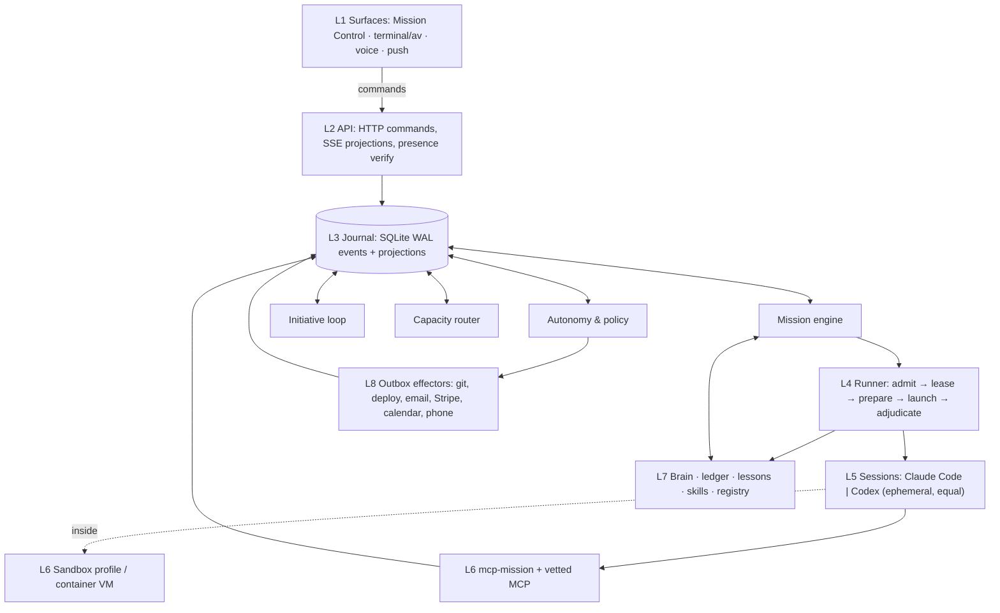
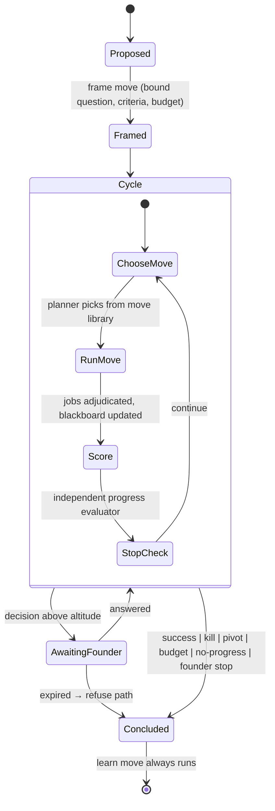
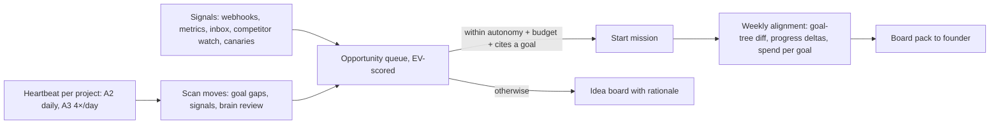
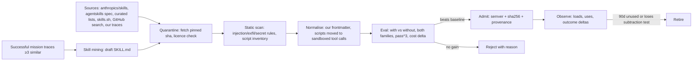
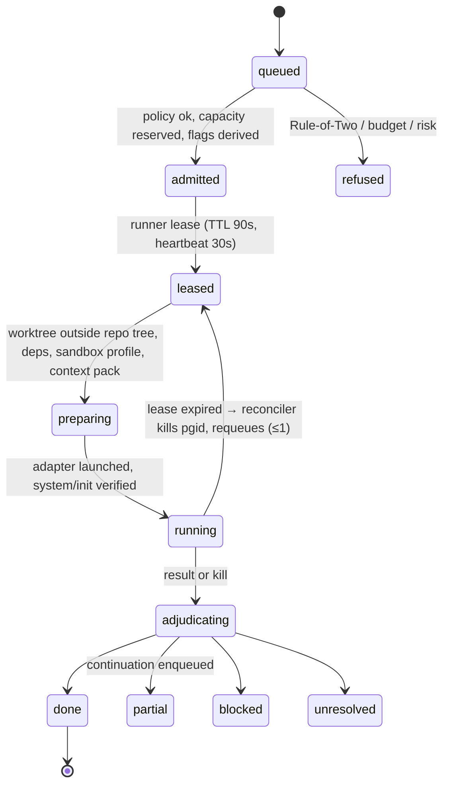

# ENGINE-SPEC — the engine of the agentic company OS (v3)

**Status:** engineering specification, v3 draft 1, 2026-09-30. Author role: principal platform engineer (engine). Companion
spec: surfaces (Mission Control, terminal, voice). **Binding input:** [00-FOUNDER-DIRECTION.md](../00-FOUNDER-DIRECTION.md).
**Not claimed:** nothing here is built or measured unless it says *measured*. Single model family wrote it (see §14, R1).

**One paragraph.** The engine is a single long-lived host daemon, written in TypeScript, that owns one event-sourced
journal (SQLite, WAL) and turns goals into **missions**. A mission runs an open-ended reasoning loop — understand,
research, hypothesise, generate options, challenge, decide, plan, execute, evaluate, learn — by choosing **moves** from a
library, not by walking a playbook. Every move that needs intelligence becomes a **job**: one short-lived Claude Code *or*
Codex session (equal workers) compiled from an **agent identity record** (title, specialty, skills, memory scope, tools,
model, sandbox profile, track record), launched inside a per-job sandbox, and judged by the runner — never by itself.
Anything that touches the outside world goes through an idempotent **outbox** held by credential-owning effectors that no
model can reach. An **autonomy policy** decides, per project and per action risk class, whether the engine acts, acts and
tells, asks, or refuses. Memory is layered, read-tracked, consolidated nightly and allowed to forget. Surfaces read
projections and send commands; they never write state.

---

## 0. Design principles (the tests every section below is held to)

**P1** The engine adjudicates; agents propose (status, progress, approvals, memory promotion are computed outside the
producing model — v2's best idea, kept). **P2** Reasoning is open; effects are closed (typed, risk-classed, idempotent
outbox). **P3** Providers are interchangeable workers; author family ≠ judge family is a scheduling constraint, not a
role split. **P4** Every boundary is a mechanism with an attacking test, not a sentence. **P5** Nothing is write-only:
memory, skills and records carry read/use counters and decay. **P6** Uncheckable = `unresolved`, never pass. **P7** Grow
the *substrate* by measured trigger (graph DB, Postgres, Temporal) behind interfaces; never shrink the *vision*.

---

## 1. Languages, runtime, repository

### 1.1 Decision per component

| Component | Choice | Alternatives considered | Why |
|---|---|---|---|
| Engine daemon + CLI `av` | **TypeScript on Node 24 LTS** | Bun; Python; Go; Rust | Both worker SDKs are TS-first; DBOS/MCP SDKs mature on Node; predictable child-process/signal semantics. Go/Rust buy CPU speed we don't need — the bottleneck is model latency and capacity. |
| Mission Control | **Bun + Hono + React 19** (existing) | Next.js; Tauri | Already built, read-only, SSE. Desktop wrapper is a surfaces decision. |
| Schemas | **Zod → JSON Schema**, checked in | Protobuf | JSON Schema is what `--json-schema`/`--output-schema` consume. |
| Evals | **promptfoo** (TS) + **Inspect** (Python, MIT) | One of them | Inspect runs Claude Code/Codex as external agents in sandboxes; promptfoo for fast regression grids. |
| ML sidecars | **Python** processes behind JSON-RPC | In-process TS | Only where the ecosystem is Python-only (Graphiti, clustering). Never on the hot path. |
| Approval presence helper | **Swift**, ~200 LOC (Touch ID + Keychain HMAC) | Password; push token only | An approval must prove a human was present; no worker can mint it (v2 F6). |
| Storage | **SQLite WAL, single writer** + git + blob dir | Postgres / DBOS now | One Mac, one writer. Move at a second host, second writer or >50 GB, behind a `JournalStore` interface. |

### 1.2 Monorepo layout (in this repository, beside the existing harness)

```
engine/                          # pnpm workspace; Node 24; strict TS
  packages/
    core/          # ids (ULID), event schema, zod types, errors, clock
    journal/       # append-only event store, projections, snapshots, replay
    policy/        # autonomy levels, risk classes, budgets, DecisionPackets
    mission/       # mission state machine, move library, planner, evaluator, goal tree
    runner/        # scheduler, admission, leases, heartbeats, reconciler, worktrees, adjudicator
    workers/       # adapter interface + claude/ + codex/ + cli-fallback/
    sandbox/       # profile generator (seatbelt, per-job settings), container driver
    outbox/        # effect records, idempotency, effectors/ (git, github, email, deploy, stripe, calendar, voice)
    registry/      # agent identity records, compiler (record → Claude agent def / Codex profile), track record
    memory/        # brain store, retrieval, read-tracking, context packs, sleep/consolidation, lessons
    skills/        # skill registry, intake pipeline, evaluator, retirement
    capacity/      # provider buckets, usage telemetry, router, degraded modes
    api/           # HTTP + SSE (+ WebSocket for terminal/voice) command/query API for surfaces
    mcp-mission/   # MCP server exposed to workers: blackboard, ask, lease, report
    twin/          # digital-twin simulator: shadow outbox, synthetic stakeholders, rehearsal runs
  apps/
    daemon/        # launchd-managed process: api + scheduler + effectors
    cli/           # `av` — mission, job, approve, stop --all, replay, doctor
  python/
    evals/         # Inspect tasks; optional graph/cluster sidecars
mission-control/   # existing; becomes a pure API client of engine/api
.claude/           # existing harness: stays the *interactive* harness; engine reads lenses/review-lenses/ledger from it
```

**Boundaries (dependency-cruiser in CI):** state changes only through `journal`; `workers/*` cannot import `outbox` or
`policy`; only `outbox/effectors` loads credentials; `api` emits commands, never events. Ventures stay one repo each;
engine-owned venture state lives in `~/.agentvibe/ventures/<id>/`, outside every worker's write scope.

---

## 2. The layer model end to end



**Data-flow rules.** (1) The journal is the only source of truth; everything else (Mission Control views, board, calendar,
spend) is a projection rebuilt from it. (2) Workers never write the journal directly — they talk to `mcp-mission`, which
validates and converts calls into *proposed* events that the engine accepts or rejects. (3) Effects are requested as
`effect.proposed` events; only policy moves them to `effect.approved`; only an effector moves them further.

### 2.1 Event schema

```ts
type EventEnvelope<T extends string, D> = {
  id: ULID;                  // globally unique, time-sortable
  stream: `project:${Id}` | `mission:${Id}` | `job:${Id}` | `agent:${Id}` | `effect:${Id}` | `memory:${Id}` | `system`;
  seq: number;               // per-stream, gapless (optimistic concurrency on append)
  type: T;                   // dotted, past tense: "job.leased"
  ts: string;                // engine clock, ISO-8601
  project_id: Id | null;     // venture/project scope; null only for system/portfolio
  mission_id?: Id; job_id?: Id; agent_id?: Id;
  actor: { kind: 'engine'|'worker'|'founder'|'collaborator'|'effector'|'schedule'|'signal', id: string, family?: 'claude'|'codex' };
  correlation_id: Id;        // the mission chain
  causation_id?: ULID;       // the event that caused this one
  rationale?: { summary: string /*≤280 chars*/, evidence: Ref[], alternatives_rejected?: string[] };  // "why did it do that"
  risk?: 'R0'|'R1'|'R2'|'R3'|'R4';
  cost?: { provider: 'claude'|'codex'|'api', bucket: string, tokens_in: number, tokens_out: number, usd_equiv: number };
  privacy: 'venture' | 'portfolio' | 'redacted';   // redaction happens before append
  schema: number;            // event schema version; upcasters live in journal/
  data: D;
};
```

**Event families:** `project.*` · `goal.*` · `mission.*` (framed, move_chosen, progress_scored, concluded) · `job.*`
(queued → adjudicated) · `blackboard.*` · `lease.*` · `effect.*` (proposed → reconciled) · `decision.*` · `memory.*`
(written, read, used, superseded, forgotten) · `skill.*` · `agent.*` · `capacity.*` · `signal.*`. Large payloads go to
a content-addressed blob store; events carry `Ref`s. Transcripts are redacted *before* the blob is written.

---

## 3. The mission engine — open-ended work without playbooks

### 3.1 The object model

- **Goal tree.** Each project has a root intent (founder-authored, versioned) decomposed into goals with **measurable
  win conditions** and **kill conditions** ("≥10 of 30 interviewees describe the pain unprompted"; "stop if <3 by
  day 21"). Goals are claims with `valid_until`, so stale goals surface on review.
- **Mission.** A unit of pursuit against one goal node: `{goal_ref, question, success_criteria, kill_criteria, budget
  {tokens, wall_clock, usd_cap}, risk_ceiling, autonomy_level, team, blackboard, cycle_n, evidence_level}`.
- **Move.** A typed step the planner may choose. Moves are the *vocabulary* of thinking, not a sequence:

| Family | Moves | Team shape |
|---|---|---|
| Understand | restate & bound, prior work in brain, list unknowns | 1 read-only |
| Research | sweep, deep-dive, source-verify, interview-plan | 3–7 read-only swarm + verifier |
| Imagine | diverge N options, cross-domain analogy, inversion | N parallel, blind |
| Challenge | debate, red team, pre-mortem, steelman rival, assumption audit | cross-family |
| Decide | score vs criteria, value-of-information, DecisionPacket | 1 + judge |
| Plan | jobs with done-tests, path leases, DAG | 1 |
| Execute | build, write, design, preview deploy, experiment, outreach draft | serial writers per lease |
| Evaluate | done-test, qa.js gate, metric read, progress score | other family than author |
| Learn | lesson, skill mining, record-score update | 1 + sleep job |
| Control | wait-for-signal, ask, pause, pivot, stop | engine only |

Playbooks survive only as **recipes**: priors the planner may cite, retrieved like memory and scored by whether citing
them helped. Never required, never a gate.

### 3.2 The loop



**Planner.** A model call (the mission's lead seat) receives a *compact mission state* (≤8 KB: goal, criteria, evidence
ladder position, last 5 moves with outcomes, open questions, budget left) and returns a schema-validated `MoveChoice
{move, why, expected_evidence_gain, cost_estimate, team_request}`. The engine validates it against policy (risk ceiling,
budget, autonomy) and may override with a deterministic rule (below). The planner is re-instantiated every cycle: no
long-lived context, so no context rot.

**Deterministic guard rules the planner cannot override:**
1. A mission may not execute an R2+ action until at least one Challenge move has run on the decision that justifies it.
2. Two consecutive Research moves with evidence gain < ε force an Imagine or Decide move (anti-rabbit-hole).
3. A build of >1 day estimated effort requires a pre-mortem.
4. Every Decide move with irreversible consequences runs a cross-family debate.
5. The Learn move always runs at conclusion, including on kill.

### 3.3 Self-challenge mechanics

- **Debate:** Claude and Codex argue options in isolated contexts (2 rounds, rebuttal sees only the other's claims); a
  third fresh session judges against criteria with evidence refs. Clean-context, cross-frontier pairing is what
  Cognition (2026-04) reports working; single-context self-critique drifts to agreement.
- **Red team:** returns ≥3 concrete failure paths or "none found, searched X"; no search record = `unresolved`.
- **Pre-mortem:** "90 days later this failed — write the post-mortem"; causes become kill criteria or monitored signals.
- **Assumption audit:** each load-bearing assumption gets a cheapest-test job or an accepted-risk owner.
- **Steelman rival:** the best case for the runner-up is kept on the record, so pivots are cheap later.

### 3.4 Progress, sideways motion, stop conditions

- **Evidence ladder** per goal type (e.g. idea → problem-validated → solution-validated → paid → retained; for a
  research goal: question → sources → verified claims → synthesis accepted). Progress = ladder rung + criteria coverage.
- **Progress evaluator** runs each cycle in a *different family* from the planner, sees only the goal, criteria and
  evidence refs (not the narrative), and outputs `closer | same | further | unknown` with reasons. Narrative-free input is
  the busywork detector: activity without new evidence scores `same`.
- **Stop rules (any fires):** success criteria met · kill criteria met · budget ≥100% · 3 cycles `same` (→ pivot-or-stop
  DecisionPacket) · value-of-information of every candidate move < its cost · founder stop · parent goal superseded.
- **Kill/pivot logic:** a kill proposal always carries the steelman for continuing; a pivot creates a new mission linked
  by `pivoted_from`, inheriting the blackboard's verified claims but not its plan.

### 3.5 When nothing is specified: how agents find work

An **opportunity queue** scored `EV = P(success) × goal value − cost − risk_penalty` is fed by (1) goal-tree gaps — no
mission, stale evidence, unmeasured criteria; (2) signals — metrics, inbound messages, competitor changes, canaries,
deadlines; (3) scheduled scans — brain review, market scan, "what would a 10× competitor do this week?". Items within
autonomy and budget start; the rest go to the idea board with a rationale. A mission that cannot cite the goal node it
serves never runs — it becomes an idea for the founder.

### 3.6 Dynamic team composition

The engine casts a team per mission; the planner requests seats, the engine fills them.

| Input | Effect on the team |
|---|---|
| Uncertainty high | Add scouts (read-only fan-out 3–7) and an Imagine seat |
| Risk class ≥ R2 | Add an adversary seat from the other family; judge seat mandatory |
| Write work | Exactly one maker per path lease; more makers only on disjoint leases |
| Novel domain | Prefer a hybrid-specialty record with the best track record in adjacent domains; else classic + lens |
| Budget tight | Collapse seats (lead also plans), drop to one family for non-gate moves |

Default team: **lead + maker + critic (other family)**. Swarms (≥3 concurrent) only for read-only or
diverge-then-select work — writes stay single-threaded (Cognition 2026-04; Anthropic multi-agent research). Family per
seat comes from the record, the capacity router (§10) and the diversity constraint. **Dissolution:** jobs cancelled,
leases released, blackboard frozen into the record, Learn writes candidates, track records updated. Nothing stays running.

---

## 4. Agents: identity, launch, communication, coordination

### 4.1 Identity records

Agents are identified by **title and expertise only — no personal names** (founder, 2026-09-30). A record is data in
`registry/` (git, versioned, reviewed), not a `.claude/agents/*.md` file:

```yaml
id: rec_growth-eng-analytics-copy@3      # stable id + version
title: Growth Engineer                    # what the founder sees
specialty: [product-analytics, conversion-copy, experiment-design]   # fused fields (hybrid) or one field (classic)
kind: hybrid                              # classic | hybrid
lenses: [growth, evidence]                # from .claude/lenses.yml
skills: [{id: posthog-funnels, version: 1.2.0, sha256: …}, …]        # pinned
memory_scope: {read: [venture:brain, venture:customers, portfolio:lessons], write: [venture:blackboard]}
tools: {builtin: [Read, Grep, Glob, Edit, Write, Bash], mcp: [mission, posthog-readonly]}
model: {claude: claude-opus-5, codex: gpt-5.x-codex, prefer: either}  # both families always declared
sandbox: P1                               # §9
limits: {max_turns: 40, wall_clock_min: 45, budget_usd_equiv: 6}
risk_ceiling: R1                          # highest action class it may *propose* without a gate
track_record: {missions: 14, adjudicated_done: 0.79, founder_edit_rate: 0.12, cost_per_done: 1.8, by_family: {claude: …, codex: …}}
lineage: {derived_from: rec_builder@7, experiment: exp_014}
```

**Launch = compile.** The registry compiler turns a record into (a) a Claude agent definition passed at launch
(`agents` option in the Agent SDK / `--agents <file>` with `--agent <id>` on the CLI) plus a per-job `--settings` file,
or (b) a Codex profile (`-p <profile>` layering `$CODEX_HOME/<name>.config.toml`) plus an instructions file in the
worktree. **Consequence:** creating or tuning an agent no longer edits `.claude/agents/**` (runtime-protected paths that
cannot be written headless — v2 review F5), yet a record change is still a reviewed, versioned diff. The seven existing
engines become the seed records (orchestrator → lead seat, framer, sourcer → scout, builder → maker, designer,
reviewer/reviewer-readonly → critic/judge).

### 4.2 Hybrid-specialty experiment harness

Hybrid records (*Growth Engineer: analytics × copy × experiments*; *Research Strategist: sizing × interviewing ×
pricing*; *Reliability Designer: UX × incident response*) compete with classic records on task sets mined from real
moves (frozen inputs, done-tests, founder labels), run in the twin (§11). Arms: classic single, classic pair, hybrid
single; both families; pass^3. Metrics: done rate, founder edit distance, cost per done, cycles to evidence gain. Casting
uses Thompson sampling over a Beta posterior per record × task class, so new records get trials without starving proven
ones; a record dominated for 30 days is retired.

### 4.3 Communication

| Channel | Decision |
|---|---|
| **Blackboard** (per mission, in the journal) | **Primary.** Typed posts (finding, question, claim, decision, lease notice); packs carry the relevant latest posts; more via `mcp-mission`. Answers Cognition's "cross-agent discoveries" problem without shared context windows. |
| **`mcp-mission`** MCP server | `post`, `read`, `ask(question, to_seat)`, `request_lease`, `report_progress`, `propose_effect`. MCP is the protocol both Claude Code and Codex speak natively — the equaliser. |
| Directed ask | Async: routed into the addressee's next job or a short answer job; no agent blocks on another's live session. |
| **A2A** v1.0 (LF, Apache-2.0) | Edge only: exposing a venture's agent to outside agents (signed Agent Cards). Not internal — one process owns all agents. |
| In-session subagents (`Task`) | Read-only fan-out, counted against the job budget. |

### 4.4 Coordination and non-interference

- **Path leases** on declared globs (TTL + heartbeat); overlaps refused, so the planner serialises or re-splits.
  Enforced twice: sandbox denies writes outside the lease; a diff outside it → `blocked`. Non-file resources (deploy
  target, sending domain, ad account) are leased the same way.
- **Runner commits** (trailer `Job-Id:`); workers never commit. One per-repo mutex around ref-mutating git operations.
- **Merge queue per repo:** rebase, re-run done-test + repo gate (qa.js oracle-first + cross-family review) in a clean
  checkout, merge. Semantic conflicts fail integration → `blocked` with the conflicting job ids on the blackboard.

---

## 5. Autonomy engine

### 5.1 Autonomy levels (per project switch)

| Level | Name | The engine… |
|---|---|---|
| A0 | Founder-driven | Runs only missions the founder starts; asks before every R2+ step |
| A1 | Assisted | Proposes missions (idea board); runs founder-approved ones end to end within budget |
| A2 | Delegated | Starts missions itself inside standing goals; notifies; asks for R3+ |
| A3 | Autonomous | Runs the project against its goal tree; weekly board meeting; asks only for the hard list |
| A4 | Founder seat | The AI co-founder seat holds operating authority for the project within a charter the founder signs; still bound by the hard list |

### 5.2 Risk classes × level → disposition

| Risk class | Examples | A0 | A1 | A2 | A3 | A4 |
|---|---|---|---|---|---|---|
| R0 read/think | research, drafts, analysis | auto | auto | auto | auto | auto |
| R1 internal reversible | branch code, preview deploy, memory write | ask | auto | auto | auto | auto |
| R2 internal significant | merge to main, schema change on staging, spend > daily budget share | ask | ask | notify | notify | notify |
| R3 external reversible | publish post, send opt-in email batch (approved template), create ad draft | ask | ask | ask | notify* | notify* |
| R4 external irreversible / money / legal / identity | payment, contract, production data destruction, credential creation, cold outreach under founder's name | **ask (never auto, all levels)** |

\* After the per-capability trust ladder (v2: 20 consecutive *looked-at* approvals; a reversal drops a rung). v2's
"never without the founder" list is R4, enforced in the outbox, not in prompts. **Risk and flags are derived, not
declared** (F6): from effect type, target, money fields, pack contents (`untrusted_input`), effector need (`secrets`)
and egress-capable grants (`external_send`). Untrusted + secrets + send together are refused at admission (Rule of Two).

### 5.3 The initiative loop



Budgets are hierarchical: portfolio weekly capacity → project share → goal → mission → job. A mission can never spend
from a sibling's budget; overrun requests are DecisionPackets.

### 5.4 Notify vs ask — the altitude function

Four classes: **interrupt** (push now: deadline-bound R4, incident, kill switch), **ask** (DecisionPacket, ≤10/day,
expiry = refuse), **tell** (daily 5-line brief, weekly board pack), **log** (on demand). The engine picks the lowest
class the matrix allows. A one-tap "why ask me this?" lowers that capability's class for the project after founder
confirmation; uninspected approvals are not trust signals.

### 5.5 The AI co-founder seat

A record titled **Co-founder (AI)** with a founder-signed charter per project. **Owns:** strategy memo, opportunity
ordering for A2+ projects, the weekly board meeting (goals, evidence deltas, spend per goal, kills proposed, dissent),
the dissent register. **Disagrees** by formal dissent: a DecisionPacket with evidence, what would change its mind and
the cost of being wrong either way; re-raised only with new evidence. Cannot overrule the founder or act beyond R3. Its
drafts are red-teamed by the other family first, so a single-model opinion never reaches the founder as consensus.

---

## 6. Memory and knowledge

### 6.1 Layers

| Layer | Holds | Store | Written by | Read by |
|---|---|---|---|---|
| Working | Context pack for one job (≤40 KB, paths+hashes, "not searched" ≠ "not found") | Blob per job | Pack builder | That job |
| Episodic | Events, transcripts, blackboards | Journal + blobs | Engine | Sleep job, replay, retrieval (summaries) |
| Semantic — **company brain** | Entities (customers, competitors, offers, metrics, decisions) and **facts** with bi-temporal validity | Markdown/YAML in venture repo `brain/` (canonical) + SQLite index (FTS5 + sqlite-vec) | Learn moves, consolidation | Packs, planner |
| Evidence | Sourced claims with `valid_until`, `supersedes` | Existing claim ledger (extended) | Scouts via `claim-append` | Everything |
| Procedural | Skills, recipes, agent records | Registries | Intake, skill mining | Compiler, planner |
| Preference | Founder corrections, taste examples (verbatim) | `owner/` ≤4 KB + preference claims | `/correct` only | Every pack |
| Portfolio lessons | De-identified cross-venture lessons | `~/.agentvibe/portfolio/lessons/` | Lesson pipeline | All ventures (read-only) |

Fact model borrows Graphiti's bi-temporal edges (valid time + ingestion time; contradicted facts are invalidated, not
deleted) **without** adopting Neo4j now. Trigger to adopt Graphiti: retrieval eval < 85% on a venture's golden set or
> 2k facts in one venture.

### 6.2 Write thresholds and quarantine

Written only if `novelty × importance × confidence ≥ τ` (per layer: nearest-neighbour distance, goal linkage, evidence
grade). External content enters **only** as a `source` item with verbatim quote and provenance — never as preference,
instruction, skill or record change (MINJA/AgentPoison defence, kept from v2).

### 6.3 Read-tracking — the anti-graveyard mechanism

Retrieval emits `memory.read`; adjudication emits `memory.used` when the item is cited in the output's evidence or its
content appears in the diff/answer. Items keep `reads`, `uses`, `last_used`, smoothed `utility`. Ranking uses utility;
0 uses in 90 days (unpinned) → archive; read-often-never-used → flagged for rewrite or drop.

### 6.4 Sleep, decay, forgetting

Nightly per venture, budget-capped, in the lowest-capacity window (Letta's sleep-time idea; Mem0's
ADD/UPDATE/DELETE/NOOP taxonomy): merge duplicates, promote recurring episodes to facts with evidence refs, invalidate
contradicted facts, rewrite noisy items, archive decayed ones (stub stays, `evict-memory.mjs` discipline), re-index,
write a ≤1 KB "what changed" note. True deletion only on a ForgetRequest, propagated to index, blobs and backups.

### 6.5 Isolation and cross-venture learning

Each venture brain is readable only by jobs with that `project_id` — enforced by the sandbox profile (§9), not only by
the pack builder. **Lesson pipeline:** a Learn move drafts a lesson → an abstraction job rewrites it with entities,
numbers, names and quotes removed → a leakage check (a fresh session of the other family tries to recover the source
venture from the lesson; success = reject) → requires support from ≥2 ventures or is marked `single-source hypothesis`
→ published read-only to portfolio. NDA/client ventures are excluded from the pipeline entirely.

### 6.6 Retrieval evals

Per venture: a golden set of 20–50 questions with known answers and a **must-not-retrieve** set (other ventures' facts,
superseded facts). Metrics: recall@8, supersession correctness (a corrected fact must win), leak rate (must be 0).
Runs weekly and after every memory-system change; a regression blocks the change.

---

## 7. Skills and tools economy



- **Why this much process:** 2026 audits found a critical issue in 13.4% of 3,984 public skills and showed public
  scanners are bypassable — scanning is necessary, the eval and the sandbox are the control.
- **Skills we don't know we need:** moves with high cost or low done-rate become weekly "skill gap" queries against
  sources and our own traces. **Authoring** only via mining: one family writes, the other evaluates.
- **Versioning:** records pin versions; a skill upgrade re-runs the eval for every pinning record. Runtime discovery
  keeps the existing two-tier routers, generated from the registry.

**MCP catalogue and trust tiers.**

| Tier | Examples | Rules |
|---|---|---|
| T0 ours | `mcp-mission`, `claim-append` | Code-reviewed in this repo |
| T1 vendor-official | GitHub, Playwright, Stripe, Supabase | Pinned version + hash; read-only grants first |
| T2 community-vetted | Registry servers that passed a vetting job | Run inside the job sandbox; never with write credentials |
| T3 unvetted | Anything else | Twin only |

MCP servers holding write credentials never run inside a worker: the worker gets a **proxy tool** whose calls become
`effect.proposed` events (the outbox is the broker). MCP 2025-11-25 Tasks (call-now/fetch-later) and URL-mode elicitation
are used for long-running and credentialed flows respectively.

---

## 8. Runner reliability (folds in v2 review F4, F5, F7, F8)

### 8.1 Job state machine



### 8.2 Mechanisms

| Mechanism | Specification |
|---|---|
| Leases + reconciler | Lease row renewed by heartbeat. On start and every 60s the reconciler kills expired jobs' process groups, snapshots the diff to a blob, requeues once or marks `unresolved`. |
| Launch (Claude) | Agent SDK `query()` with compiled `agents`, `permissionMode: 'dontAsk'`, record `allowedTools`, a **`canUseTool` callback answered by policy** (a prompt is decided by the engine, never silently denied — F4), `maxTurns`, `maxBudgetUsd`, `sessionId`, JSON-schema output. CLI fallback: `claude -p --agent <id> --agents <f> --settings <job.json> --permission-mode dontAsk --permission-prompts none --allowedTools … --output-format stream-json --verbose --json-schema <f> --max-budget-usd B --session-id <uuid>`. Never `--bare`/`--safe-mode`/`--restricted`/`--dangerously-skip-permissions`. |
| Launch (Codex) | Codex SDK `startThread` + `runStreamed(prompt, {outputSchema})`; fallback `codex exec -C <wt> -s <mode> -p <profile> --json --output-schema <f> -o <file> --ephemeral`. Empty output → `unresolved` (#19945 class; `-o` tried before any PTY wrapper — F8). |
| Harness check | Parse `system/init` (tools, agents, MCP servers, plugins) against the compiled record's expected hash; mismatch aborts before any tool use. Replaces the forgeable token file. |
| Timeouts | Per-record wall clock: SIGINT at 90%, SIGKILL to the process group at 100%; idle-stream timeout 5 min. |
| Continuations | Runner-built `{session_id, diff_ref, blackboard_refs, remaining_criteria}` → resume if healthy, else fresh job fed the diff. ≤2 per chain; 30%-partial daily breaker pauses the queue. |
| Done-tests | Frozen before launch (argv + hash of test inputs); test paths restored from base; diff touching them → `blocked`. Run in a **P2 container**, clean checkout of the runner's commit. Read-only jobs need resolvable evidence + cross-family review for `done`. |
| Idempotent outbox | `effect_key = hash(mission, job, effect_n, payload_digest)`; `proposed → approved → dispatched → confirmed | uncertain → reconciled`. Key passed as provider idempotency key, else check-before-send. `uncertain` never auto-retries; it reconciles from provider state (F7). |
| Adjudicator integrity | Daemon runs from a pinned release (`~/.agentvibe/releases/<ver>`), never the tree it builds; engine upgrades drain, swap, canary, keep rollback. |
| Harness self-edits | Stay interactive founder sessions (F5); the registry makes them rare. |
| Pinning | CLIs/SDKs pinned, auto-update off; nightly contract suite; upgrades must pass it first. |

**Contract fixtures (must exist before M3 closes):** `maxTurns: 2` job ends `partial`; a denied tool is visible and
answered via `canUseTool`; empty Codex output → `unresolved`; kill the daemon mid-job → reconciled; kill mid-send →
`uncertain` not duplicate; rate-limit canary → `blocked(capacity)`; harness-mismatch init → abort.

### 8.3 Result-subtype mapping (the agent's claimed status is logged, never used)

| Worker signal | Status |
|---|---|
| Claude `success` / Codex `turn.completed` with non-empty schema-valid output | → adjudication (diff, lease, done-test) |
| `error_max_turns` (no `result` field) | `partial` + runner-built continuation |
| `error_max_budget_usd` | `blocked(budget)` → DecisionPacket if needed |
| `error_max_structured_output_retries` | `unresolved(schema)` (one hinted retry) |
| `error_during_execution`, Codex `turn.failed`, empty output, non-zero exit | `unresolved` (one retry if transient) |
| Usage/rate limit, either provider | `blocked(capacity)`; router may re-cast to the other family |
| Wall-clock or idle kill | `unresolved(timeout)`; continuation if diff non-empty |

---

## 9. Sandboxing and security

### 9.1 Sandbox profiles (per job)

| Profile | For | Filesystem | Network | Secrets |
|---|---|---|---|---|
| **P0 read** | Scouts, critics, judges, planners | Read: own venture repo + brain + harness; **deny** other venture roots, `~/.agentvibe/{journal,approvals,secrets}` | Egress allowlist via local proxy (search, fetch domains) | None |
| **P1 worktree-write** | Makers (both families) | Write: job worktree + tool caches only; leased globs enforced; same read denials | Package registries + allowlisted docs via proxy | None |
| **P2 untrusted exec** | Done-tests, running LLM-written code, opening untrusted files | Apple `container` VM (Apache-2.0, one lightweight VM per container, macOS 26) with only the checkout mounted | None | None |
| **P3 effector** | Outbox effectors | Own dir | Only the provider's API | Per-venture credentials via 1Password CLI / Keychain |

Inner layer: the provider's own sandbox (Claude Seatbelt with per-job `--settings` `denyRead`/`allowWrite` and
`allowUnsandboxedCommands: false`; Codex `-s workspace-write`, network off). Outer layer: the engine's per-job profile.
**Open measurement (M4):** can an outer `sandbox-exec` profile wrap a worker whose tools apply their own Seatbelt
profile? If not: (a) inner layer only + P2 for all code execution, or (b) P1 workers inside a container with a
long-lived subscription token (`claude setup-token`), only after a terms check (§9.3).

### 9.2 Control-plane integrity and secrets

- Journal, approvals, secrets and brains live under `~/.agentvibe/` paths denied (read and write) to every worker profile.
- **Human presence:** R3/R4 `decision.answered` carries a Swift-helper signature (Touch ID → Keychain HMAC over
  `{packet_id, digest, nonce}`) or a one-time signed push-action token; verified before the outbox moves.
- Kill switches (`av stop --all`, project pause, effector disable, capacity stop) are events checked at admission *and*
  dispatch.
- Skills, MCP servers, CLIs, SDKs pinned by version + hash. Monthly adaptive red team against Rule of Two, write
  quarantine and cross-venture denial.
- Secrets never enter a worker environment: effectors fetch per-venture credentials at dispatch and log only the key
  id; transcripts are redacted at write; secret-touching events are excluded from search.

### 9.3 Data policy and provider terms

| Data class | Examples | May go to |
|---|---|---|
| D0 public | Web research, public docs | Any provider/mode |
| D1 venture-internal | Code, plans, brain | Subscription or API, training off on both accounts |
| D2 customer personal | Interview audio/transcripts, emails, CRM | API/commercial terms with a DPA only; consumer plans never; local whisper.cpp for transcription |
| D3 client/NDA | Agency client code | Per-contract; default API-with-DPA only, separate repo, excluded from lessons |
| D4 secrets | Credentials | No model, ever |

The router refuses a job whose pack holds a class its provider mode may not receive. Terms posture: Anthropic's
announced 2026-06-15 move of Agent SDK/`claude -p` usage off plan limits was paused, so headless use draws on plan
limits today but is unstable; Codex plan terms also move. So provider mode is per job; always-on customer-facing
automation moves to API keys at the first paying customer; overflow billing is off unless the founder sets a cap; cold
1:1 email goes from the founder's mailbox, a transactional provider only for opt-in (v2 F1). Training is off on both
accounts (founder, by hand).

---

## 10. Economics and capacity

**Capacity model.** Each provider account is a set of **buckets** (Claude: 5-hour rolling window + weekly cap; Codex:
5-hour window + weekly; API: USD month cap). The capacity service estimates bucket fill from local usage logs (ccusage
for Claude, Codex session logs) and from observed limit errors (ground truth), and predicts per-job cost from an EWMA per
`record × move × family`. Admission **reserves** predicted tokens; completion reconciles.

**Router.** For each seat: candidates = families allowed by the record, data class and diversity constraint → score =
`posterior_quality(record, move, family) / predicted_cost × headroom(bucket)` → pick; ties alternate families to keep
both track records fresh. Founder floor: 30% of each window is reserved while the founder is active (detected by an
interactive-session heartbeat from the surfaces/terminal).

**Degraded modes:** D0 normal (<60% window) · D1 conserve (>60% window or >70% weekly: no initiative scans, swarms ≤3) ·
D2 essential (>85%: founder missions, incidents, gates only) · **D3 single-family** (one provider limited: the other
family takes every role — the payoff of equality — with diversity relaxed to "different session + lens" and flagged on
every verdict) · D4 exhausted (queue holds; API within founder cap; incidents only).

**Cost per outcome** is a first-class metric: tokens and wall clock per adjudicated-done job, per evidence-ladder rung,
per goal. It appears on the weekly board pack beside the outcome it bought.

---

## 11. Observability, replay, simulation, self-improvement

- **Traces:** Claude/Codex OTel exports tagged with `job_id`/`mission_id` → local collector → journal refs. Langfuse
  when the journal passes ~10k jobs.
- **"Why did it do that":** move, effect and decision events carry `rationale` + evidence refs; the API walks
  `causation_id` from any effect back to its goal.
- **Replay:** journal + recorded model outputs re-execute engine logic under new code without calling models (does a
  new guard rule change past decisions?) — OpenHands' event-sourced pattern.
- **Digital twin:** a mission against a forked brain, the **shadow outbox** (effects recorded, never sent; providers
  stubbed), synthetic stakeholders generated from the brain (**labelled synthetic, never evidence**) and a simulated
  clock. For rehearsing risky decisions, testing team compositions and hybrid records, and fire drills (3 a.m. incident,
  provider outage, runaway continuation). Informs a DecisionPacket; never satisfies an evidence rung.
- **Self-improvement (weekly, bounded):** outcomes, memory utility, skill deltas, record posteriors → cluster failures
  → ≤3 change packets (evidence, diff, rival explanation, falsifier, rollback) → deterministic floor + promptfoo/Inspect
  pass^3 + sealed holdout → blind judgement by the *other* family → founder yes/no → gate. Candidates cannot edit evals,
  hooks, resolvers or logs. Pauses on any drift alarm (≥20% weekly move in first-pass PASS, founder edits, rework,
  cost/turns, `would_block`).

---

## 12. What to take from each project

Licences as found 2026-09-30 unless marked *reported* (from panel 3, not re-verified) — the intake job re-checks before
adoption.

| Project | Licence | Verdict | What exactly |
|---|---|---|---|
| Claude Agent SDK (TS) / Claude Code | Anthropic commercial terms (*verify*) | **USE** | Worker runtime: `query()`, hooks (PreToolUse, SubagentStop, SessionStart…), `canUseTool`, `agents`, resume/fork, stream events, OTel |
| Codex SDK (TS) / Codex CLI | Apache-2.0 (openai/codex) | **USE** | Equal worker: threads, `runStreamed`, `outputSchema`, sandbox modes, profiles, `-o` |
| MCP (spec 2025-11-25) + official registry | MIT (spec) / per server | **USE** | Internal worker↔engine protocol (`mcp-mission`); Tasks for long calls; URL elicitation for credentialed flows |
| A2A v1.0 | Apache-2.0 | **LEARN → USE at edge** | Signed Agent Cards for any externally exposed venture agent; not internal |
| OpenHands SDK | MIT | **LEARN** | Event-sourced conversation state, typed tool system, security confirmation layer, workspace abstraction |
| Letta | Apache-2.0 | **LEARN** | Sleep-time agents → nightly consolidation; memory blocks → our pack sections |
| Mem0 | Apache-2.0 | **LEARN** | ADD/UPDATE/DELETE/NOOP taxonomy for consolidation; not a system of record |
| Graphiti / Zep | Apache-2.0 | **LEARN → USE on trigger** | Bi-temporal fact fields now; library when retrieval eval < 85% |
| Mastra · LangGraph | Apache-2.0 core · MIT | **LEARN** | Zod working memory; interrupt/resume by thread id → DecisionPacket waits |
| AutoGen/AG2 · CrewAI · MetaGPT/ChatDev | MIT / Apache-2.0 (*reported*) | **LEARN** | Speaker selection → debate; typed role artifacts → blackboard posts; personas add tokens, not capability; avoid fixed waterfalls |
| Cognition · Factory (Droids, Missions) | closed | **LEARN** | Single-threaded writes, clean-context review, cross-frontier pairing; coordinator + shared knowledge index; outcome missions over days |
| DBOS Transact (TS) | MIT | **LEARN, candidate USE** | Step journaling / exactly-once; our journal mirrors it so migration is mechanical |
| Temporal · Restate · Inngest | MIT · BSL server · SSPL server (*reported*) | **LEARN / LEARN / SKIP** | Workflow–activity split, journaled agent loops; too heavy or licence-constrained for one Mac |
| Apple `container` · E2B · Daytona | Apache-2.0 · Apache-2.0 · closed (*reported*) | **USE / on trigger / SKIP** | P2 VMs on macOS 26; Firecracker if work leaves the Mac |
| anthropics/skills + agentskills spec; curated lists, skills.sh | Apache-2.0 (some source-available); mixed | **USE format / HARVEST** | SKILL.md standard; intake candidates only |
| promptfoo · Inspect · Langfuse · ccusage · sqlite-vec | MIT (sqlite-vec *reported*) | **USE** (Langfuse on trigger) | Regression grids; sandboxed agentic evals; traces; usage telemetry; vectors in SQLite |

---

## 13. Build order

**Phase A — Spine (weeks 1–3):** journal, workers, runner, sandbox, outbox. **Phase B — Mind (weeks 4–7):** registry,
mission engine, autonomy, memory, capacity. **Phase C — Growth (weeks 8–12):** skills intake, initiative loop, co-founder
seat, twin, self-improvement. Venture work starts week 1 in parallel through interactive sessions (all four v2 reviewers
agreed) and becomes the acceptance test: **a real venture climbs one evidence rung through a mission the engine ran.**

| # | Milestone | Done-test (executable, frozen before work) |
|---|---|---|
| M1 | `engine/` workspace; event schema; journal (SQLite WAL, optimistic seq, projections, blobs, replay CLI) | 10k random appends + crash injection → identical rebuild; replay reproduces state hash |
| M2 | Claude + Codex adapters (SDK + CLI fallback) behind one interface; subtype mapping; `system/init` check | Contract fixtures (§8.2) pass; both families finish the same toy build |
| M3 | Runner: admission, leases, reconciler, pgid kill, worktrees in `~/.agentvibe/wt/`, runner commits, P2 done-tests with input hash lock | Daemon killed mid-job → reconciled, no orphan; self-editing test → `blocked`; 20 jobs, 0 status mismatches |
| M4 | Sandbox profiles P0–P2, per-job settings, nested-sandbox measurement | Sibling-venture `cat` fails for both families; approvals dir unwritable; measurement recorded as a claim |
| M5 | Outbox + effectors (git/PR, preview deploy, founder-mailbox email) + presence helper | Kill mid-send → no duplicate, `uncertain` → reconciled; unsigned R3 approval rejected |
| M6 | Agent registry + compiler; 7 engines as seed records; track-record projection | One record, both families, same 10-task smoke suite passes |
| M7 | Mission engine v1: goal tree, moves, planner, guard rules, cross-family progress evaluator, stop rules, `mcp-mission` | Twin "validate idea X" runs ≥4 move families, stops on a seeded kill criterion, writes a Learn record; unchallenged R2 blocked |
| M8 | Autonomy policy, derived risk/flags, DecisionPackets, notify/ask routing, surfaces API + SSE | Matrix 100% table-tested; expired packet → refuse; board drag yields an admission-result event |
| M9 | Memory v1: brain, FTS5/sqlite-vec, packs, read/use tracking, sleep, retrieval eval | recall@8 ≥ 0.85; leak rate 0; seeded correction wins next day |
| M10 | Capacity service, router, D0–D4, cost per outcome | Simulated Claude limit → Codex alone completes build + review, verdicts flagged single-family; founder floor held |

After M10: skills intake pipeline (M11), initiative loop + opportunity queue (M12), co-founder seat + board pack (M13),
twin fire drills (M14), weekly self-improvement loop (M15), hybrid-record experiments (M16).

---

## 14. Open questions and risks

| # | Item | Mitigation / what decides it |
|---|---|---|
| R1 | This spec is single-family authored | Codex cross-review of this document before adoption |
| R2 | Subscription terms for headless/SDK use change again (paused June 2026 change) | Provider mode per job; API exit tested in M10; costs visible per outcome |
| R3 | Nested sandbox feasibility on macOS (outer profile around Claude/Codex Seatbelt) | Measured in M4; fallbacks named in §9.1 |
| R4 | `maxTurns` binding for main sessions launched with `--agent` is unverified | M2 fixture; `maxBudgetUsd` and wall clock are backstops |
| R5 | Planner quality on truly open-ended goals — may loop or over-research | Guard rules, VOI stop, 3-cycle `same` stop, twin evaluation of planner versions |
| R6 | Progress evaluator gamed by evidence-shaped busywork | Evaluator sees only refs; refs must resolve; founder spot-labels 5/week |
| R7 | Memory/lesson leakage between ventures | Sandbox denial + leakage recovery test + NDA exclusion; leak-rate eval blocks releases |
| R8 | Engine complexity outruns the one founder's ability to operate it | Every mechanism has a CLI `doctor` check; RUNBOOK; harness-ratio shown weekly |
| R9 | Single Mac is a SPOF | Journal backups via `VACUUM INTO` hourly + offsite; storage interface allows Postgres/second host |
| R10 | Skill/MCP supply-chain injection | Pipeline + sandbox + pinned hashes + monthly adaptive red team |
| R11 | Approval fatigue at A0/A1 | 10/day cap, batch templates, trust ladder, altitude feedback |
| Q1 | Which plans (Max 5x/20x; ChatGPT Pro tier) and is any API overflow allowed? | Founder |
| Q2 | Which 2–3 projects start at A2/A3, and which at A4 with a signed charter? | Founder |
| Q3 | Accept Swift helper + Touch ID as the approval presence factor? | Founder |
| Q4 | Adopt DBOS now instead of our journal? | Revisit at M3 review: if our journal exceeds ~2k LOC or a second writer appears, switch |

---

## Sources (accessed 2026-09-30 unless noted)

Claude Agent SDK hooks/TS — code.claude.com/docs/en/agent-sdk/hooks · …/agent-sdk/typescript · result subtypes (v2
review, 2026-09-29) …/agent-sdk/agent-loop · plan usage + paused June change —
support.claude.com/en/articles/15036540 · thenewstack.io/anthropic-pauses-claude-agent-sdk-subscription-change ·
Codex SDK — developers.openai.com/codex/sdk · github.com/openai/codex/blob/main/sdk/typescript/README.md · **Local CLI
help, measured 2026-09-30:** `claude` 2.1.284, `codex-cli` 0.154.0 · A2A v1.0 —
opensource.googleblog.com/2026/04/a-year-of-open-collaboration-celebrating-the-anniversary-of-a2a.html · MCP Tasks —
modelcontextprotocol.io/specification/2025-11-25/basic/utilities/tasks · OpenHands SDK — arxiv.org/pdf/2511.03690 ·
Letta sleep-time — docs.letta.com/guides/agents/architectures/sleeptime · Graphiti/Zep — arxiv.org/pdf/2501.13956 ·
Mem0 — arxiv.org/html/2504.19413v1 · LangGraph interrupts — docs.langchain.com/oss/python/langgraph/interrupts ·
DBOS TS licence — github.com/dbos-inc/dbos-transact-ts/blob/main/LICENSE · Restate — docs.restate.dev/ai/patterns/durable-agents ·
Temporal — temporal.io/blog/replay-2026-product-announcements · Cognition — cognition.com/blog/dont-build-multi-agents ·
cognition.com/blog/multi-agents-working (2026-04-22) · Factory — digitalapplied.com/blog/factory-ai-multi-agent-coding-platform-review ·
Anthropic multi-agent research (v2 review, 2026-09-29) — anthropic.com/engineering/multi-agent-research-system ·
Skills — github.com/anthropics/skills · github.com/agentskills/agentskills · skills security —
github.com/royalpinto007/awesome-agent-skills · termdock.com/en/blog/agent-skills-guide · Inspect — inspect.aisi.org.uk ·
Apple container — github.com/apple/container · sandboxes — northflank.com/blog/daytona-vs-e2b-ai-code-execution-sandboxes ·
Mastra — dev.to/gabrielanhaia/mastra-in-2026-what-it-is-when-to-use-it-and-how-it-compares-2go1 · v2 package —
`docs/vision-v2/` (02, 03, reviews/01–02, panel/02–04). All URLs https.
