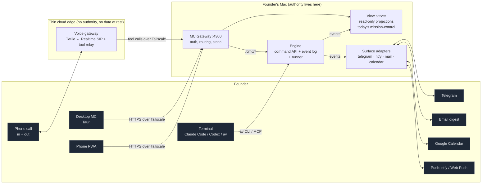
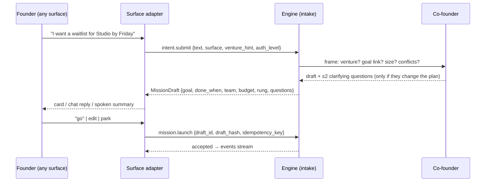
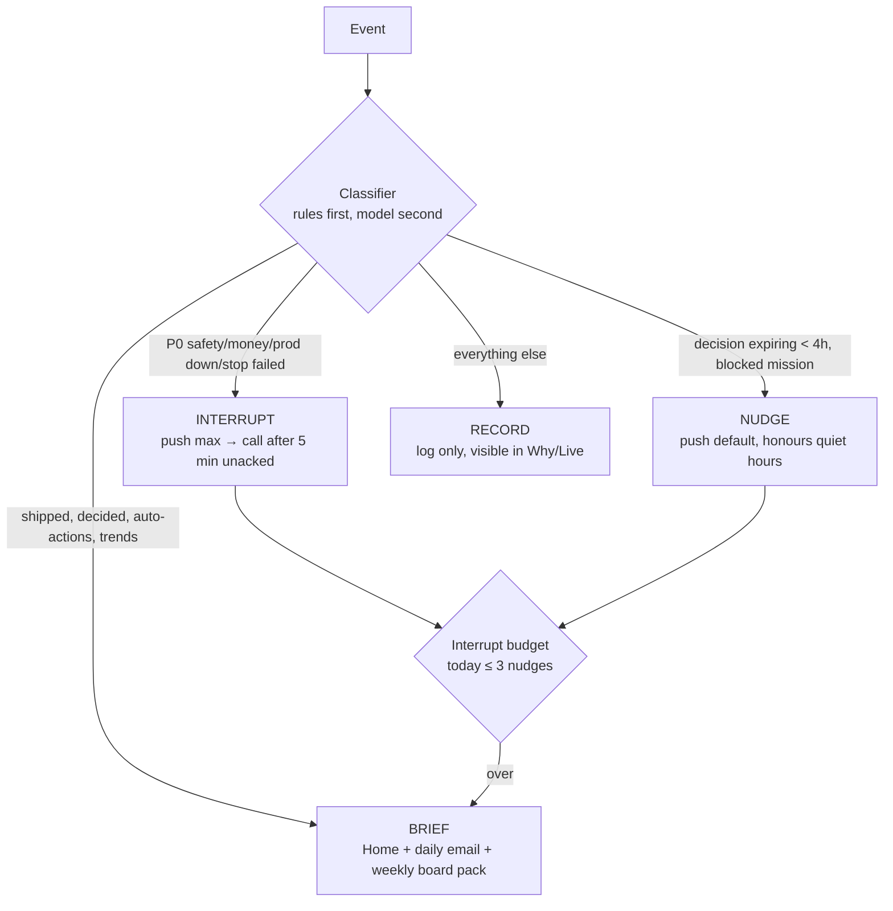
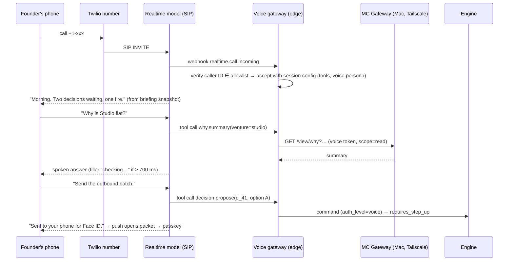
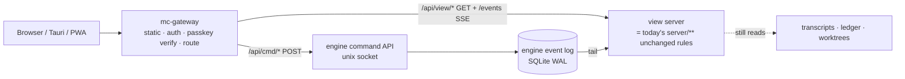
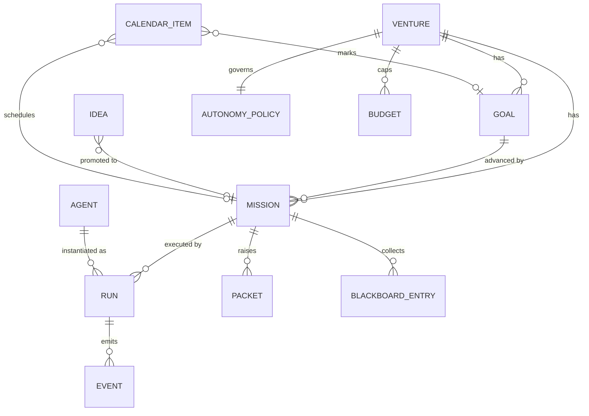

# SURFACES-SPEC — the founder's surfaces for the agentic company OS (v3)

**Author:** Engineer B (surfaces) · **Written:** 2026-09-30 · **Status:** proposal for founder review
**Binding input:** [00-FOUNDER-DIRECTION.md](../00-FOUNDER-DIRECTION.md), especially item 12 (one app we own), items 2–3
(autonomy at the right altitude, per-project switch), 6 (Claude and Codex equal), 7 (agents identified by title and expertise only — no personal names — launched on demand).
**Read with:** the engine spec written alongside this one in `docs/vision-v3/engineering/`. This document names what the
surfaces need from the engine in §5.4 and §10. Where the two disagree, the event and command contract in §5.4 is the
seam to negotiate, not the UI.

> **Summary.** One product, **Mission Control**, owned by us, runs as a local web app served from the founder's Mac, wrapped
> in a Tauri 2 desktop shell and reachable from the phone as an installable PWA over Tailscale. Every other surface —
> terminal, Telegram, push, email, voice/phone, calendar — is a *projection* of the same event stream and a *client* of the
> same command API. No surface holds authority of its own: a surface proposes commands; the engine accepts, rejects or asks
> for step-up. The founder speaks intent anywhere ("I want X"), and the system answers with a **Mission Draft** they can
> launch, edit or park. What reaches the founder is governed by a four-level **altitude** policy with a daily interrupt
> budget. Voice is a first-class *reach point* (the system can call the founder, and the founder can call the company), but
> voice can only **propose** consequential actions; they are **disposed** of with a passkey on a screen.

---

## 0. Decisions at a glance

| # | Decision | Chosen | Main alternative rejected, and why |
|---|---|---|---|
| D1 | Where the app lives | Local-first host on the Mac; web UI; Tauri 2 shell; PWA on phone via Tailscale | Hosted SaaS (moves venture data off-machine, adds tenancy before there is a second tenant); native iOS app (cost, review cycle; PWA + push covers the job) |
| D2 | Relationship to today's `mission-control/` | **Extend, split into two servers behind one gateway**: the existing read-only *view server* keeps its no-write/no-spawn invariants; commands go to the **engine's** command API | Adding writes to the view server (breaks `crosscheck.test.ts` and `write-barrier.test.ts`, which are real guards with a history of catching RCEs); a rewrite (throws away the measured, tested collectors) |
| D3 | Realtime transport | **SSE** for the event stream with `Last-Event-ID` resume; HTTP POST for commands; **WebSocket only** for audio and terminal PTY | WebSocket for everything (buys bidirectionality HTTP already has; loses free reconnection); CRDT sync (single writer today) |
| D4 | Client state | Server-authoritative event log (engine SQLite) + client normalized store fed by events, optimistic commands with idempotency keys | Full local-first CRDT (Zero/LiveStore/Electric) — revisit at the first human collaborator with write access |
| D5 | Chat surface | **Telegram bot** first; Slack when a human collaborator arrives | WhatsApp (Business API outbound templates, per-conversation billing, stricter automation terms); iMessage (no supported bot API) |
| D6 | Push | **ntfy** (priorities map to iOS interruption levels, action buttons) → Web Push from the PWA later | Pushover (fine, closed); building APNs (a native app we don't want yet) |
| D7 | Voice/phone | Twilio number → **OpenAI Realtime over SIP** for v1; **LiveKit Agents** as the provider-neutral path when a second voice model is wanted | Vapi/Retell (fast, but a hosted orchestration layer between us and the founder's company for a one-caller system; ~$0.11–0.24/min all-in) |
| D8 | Consequential-action safety | **Voice/chat propose, a passkey disposes.** WebAuthn step-up bound to the DecisionPacket hash | Spoken PIN alone (replayable, overheard); "trusted caller ID" (spoofable) |
| D9 | Board semantics | Dragging a card is a *command with a preview*, never a silent launch, unless the project's autonomy rung allows | Drag = immediate launch (unreviewable spend); drag = status label only (Linear-style; loses the founder's ask) |
| D10 | Notification model | Four altitudes (Interrupt / Nudge / Brief / Record) + daily interrupt budget + quiet hours + per-project overrides | Per-event toggles (combinatorial; founders turn everything off) |

---

## 1. Surface map

### 1.1 Which job each surface is for

The six operator jobs from v1 (`04-human-operation.md` §"Operator jobs and authority") are kept as the organising frame:
*what changed · what's owed · what happened · what's unknown · which decision needs me · how do I stop it.* A seventh is
added by the founder direction: **start something** ("I want X").

| Surface | Primary jobs | Posture | Can start work | Can approve consequential | Latency target |
|---|---|---|---|---|---|
| **Mission Control — desktop (Tauri)** | All seven; deep review, planning, replay | Lean-in, 10–90 min | Yes | Yes (Touch ID passkey) | event→pixel p95 < 250 ms |
| **Mission Control — phone (PWA)** | Decide, glance, stop, start | Glance, 30 s–5 min | Yes | Yes (Face ID passkey) | first paint < 1.5 s on LTE |
| **Terminal: Claude Code / Codex CLI** | Build interactively; harness edits (irreversible tier stays interactive per v2 F5) | Lean-in, hours | Yes (via `av` CLI or an MCP tool) | Irreversible-tier merges only, as today | — |
| **`av` CLI + TUI** | Status, inbox, stop, launch — scriptable, SSH-able | Terminal glance | Yes | Yes (passkey via browser hand-off, or hardware key) | < 300 ms per command |
| **Telegram** | "I want X", quick status, one-tap low-risk approvals, steering replies | Conversational, mobile | Yes (creates a Mission Draft) | **No** — deep-links to the PWA | reply < 5 s |
| **Push (ntfy → Web Push)** | Interrupt / Nudge delivery; one-tap acknowledge, snooze, open | Glance | No | No (opens the packet) | < 10 s from event |
| **Voice — founder calls in** | Hands-free status, steering, starting work, stopping | Walking, driving | Yes | **Stop: yes. Anything else consequential: propose only** | voice-to-voice < 800 ms |
| **Voice — system calls out** | P0 incidents; the optional daily briefing call; board-meeting prep | Interruptive | — | Same as above | ring < 30 s from trigger |
| **Email digest** | Weekly board pack, daily briefing (opt-in), absence re-entry brief | Asynchronous, archival | Reply-to-intent (parsed into a Mission Draft) | No | — |
| **Calendar (Google)** | Goals, mission milestones, board meeting, founder focus blocks | Planning | Drag a slot → schedule a mission | No | sync < 60 s |
| **Glance surfaces** (watch complication, menubar, widget) | "Is anything on fire? How much capacity is left?" | 2 s | No | Stop-all only (with passkey) | — |

### 1.2 Map



**Principle: one authority, many projections.** Adapters and the voice gateway are *clients* of the command API with a
lower default trust level than an authenticated desktop session. None of them stores state that the engine does not.

### 1.3 Next-generation surfaces — decided now, built at a trigger

| Surface | What it is for | Build trigger |
|---|---|---|
| **Briefing radio** | A 4–7 min generated audio briefing per morning (TTS of the Home briefing, with the co-founder's voice), in a podcast feed | Founder listens to the daily email < 50% of days for 2 weeks |
| **Watch / widget glance** | Three numbers: fires, decisions waiting, capacity left; one Stop-all | PWA push proven; then a WidgetKit shim in the Tauri iOS target |
| **Smart-glasses / HUD** | Interrupt-altitude only, one line, via the phone's notification mirroring (no bespoke app) | Free: it rides on push; nothing to build |
| **Ambient desk display** | An always-on Theatre page on a spare screen/iPad ("the office window") | Free: a kiosk route `/live?kiosk=1` |
| **Spatial war room** | Portfolio + theatre as a 3-D room | Not before ≥ 5 autonomous ventures and a measured need; recorded so it is a choice |
| **Human collaborator portal** | Contractors/advisors see only their scoped missions | First human collaborator with standing access |

The rule for all of them: a new surface must name the operator job it serves better than an existing surface, and it
ships as a projection + command client, never with its own state.

---

## 2. Mission Control — information architecture

### 2.1 Global shell

```
┌─────────────────────────────────────────────────────────────────────────────────────────┐
│ ◆ agentvibe   ⌘K  I want…                                    ● 3 running  ⚑ 2  ◔ 41%  ⏻ │
├──────────┬──────────────────────────────────────────────────────────────┬───────────────┤
│ Home     │                                                              │ CO-FOUNDER    │
│ Live   3 │                  (page content)                              │ strategy seat │
│ Board    │                                                              │ ───────────── │
│ Calendar │                                                              │ 2 things I'd  │
│ Ideas  14│                                                              │ push back on… │
│ Ventures │                                                              │               │
│ Inbox  2 │                                                              │ [Ask] [Hide]  │
│ Spend    │                                                              │               │
│ Brain    │                                                              │               │
│ Agents   │                                                              │               │
│ Why      │                                                              │               │
│ Settings │                                                              │               │
│──────────│                                                              │               │
│ Venture ▾│                                                              │               │
│ All      │                                                              │               │
└──────────┴──────────────────────────────────────────────────────────────┴───────────────┘
 top bar: ● live runs · ⚑ decisions waiting · ◔ capacity used in the current Claude 5-h window · ⏻ STOP (scoped menu)
```

- **⌘K "I want…"** is the universal intent bar (§3.1) and command palette (`>` prefix = navigation/command).
- **Venture scope** filters every page; "All" is the portfolio view. Scope is always visible on screen (v1 requirement:
  principal/venture context plainly visible).
- **⏻ Stop** is present on every page, opens a scoped menu (this run · this mission · this venture · everything), and
  reports the three states *requested → acknowledged → confirmed* (v1 terminal requirement), never just "stopped".
- **Co-founder rail** (§3.5) is collapsible; it never covers content.

Routes: `/` `/live` `/live/:runId` `/board` `/m/:missionId` `/calendar` `/ideas` `/ventures` `/v/:ventureId` `/inbox`
`/inbox/:packetId` `/spend` `/brain` `/agents` `/agents/:agentId` `/why` `/why/:eventId` `/settings/*`. Every route is a
shareable, bookmarkable URL; every list filter lives in the query string.

### 2.2 Home — the briefing

Job: *what changed since I last looked, what needs me, what's unknown.* Rendered from the record, not narrated: every
sentence links to the events it summarises, and the "omitted and contested" section (v1 F2 delta) is mandatory.

```
┌ Good morning. Since you last looked (Tue 22:14 → Wed 07:02) ─────────────────────────────┐
│ ⚑ NEEDS YOU (2)                                     │ CAPACITY TODAY                      │
│ 1 Approve outbound batch: 12 intro emails — Nimbus  │ Claude  ▓▓▓▓▓▓░░░░ 58% of 5h window │
│   expires 11:00 · no answer = do not send  [Open]   │ Codex   ▓▓▓░░░░░░░ 31%              │
│ 2 Pick pricing option A/B/C — Ledgerly    [Open]    │ API $   $4.10 / $25 day cap         │
├─────────────────────────────────────────────────────┼─────────────────────────────────────┤
│ SHIPPED / MOVED (7)                                 │ AUTONOMOUS VENTURES                 │
│ ✓ Nimbus: onboarding flow merged (#212)  → why      │ Nimbus   ●auto  ↑ on track  3 runs │
│ ✓ Ledgerly: 9 customer interviews synthesised       │ Studio   ●auto  → sideways ⚠        │
│ ◐ Studio: landing test running (day 2/5)            │ Ledgerly ○driven                    │
├─────────────────────────────────────────────────────┴─────────────────────────────────────┤
│ OMITTED & CONTESTED   (rendered from the record)                                          │
│ • Reviewer (Codex) disagreed with builder on #212 retry logic; merged after fix — see why │
│ • 2 research sources could not be fetched; claim marked unresolved                        │
│ • Studio: 3 missions in a row produced no metric movement → co-founder proposes pivot rev │
├───────────────────────────────────────────────────────────────────────────────────────────┤
│ TODAY'S PLAN   09:00 board prep · 11:00 outbound expiry · 14:00 Nimbus demo milestone     │
└───────────────────────────────────────────────────────────────────────────────────────────┘
```

Absence mode: when the founder has been away > 48 h, Home becomes the **re-entry brief** (v1 §127): direction changes,
promises, spend, decisions resolved/waiting, contradictory evidence — and states that reading does not re-authorise stale
work.

### 2.3 Live — the agents theatre

Job: *who is running, doing what, and can I steer or stop it.* Each tile is one **run** (one Claude Code or Codex session
launched by the engine). Tiles are grouped by mission; a mission's team is visible as a unit.

```
┌ Live · 5 runs in 2 missions · filter: [all ventures ▾] [claude ▾ codex ▾] ───── ⏻ scope ┐
│ MISSION  Nimbus · "Ship team invites" · Working · 1h12m · $0 sub / 38k tok · ◔ 12%       │
│ ┌ Engineer · product ──────────┐ ┌ Adversarial reviewer (Codex)┐ ┌ QA-product hybrid ───┐ │
│ │ claude-opus · wt feat/invites│ │ codex · read-only           │ │ claude-sonnet        │ │
│ │ ▶ editing api/invites.ts     │ │ ◷ waiting on engineer commit│ │ ▶ running e2e (3/9)  │ │
│ │ turn 14/30 · 22k tok         │ │ turn 0/20                   │ │ turn 6/30            │ │
│ │ ─ last 3 ─────────────────── │ │                             │ │ ✗ invite.spec:41     │ │
│ │ Read schema.ts               │ │                             │ │ ↻ retrying           │ │
│ │ Edit invites.ts (+42 −3)     │ │                             │ │                      │ │
│ │ Bash bun test invites        │ │                             │ │                      │ │
│ │ [Steer] [Pause] [Open] [Stop]│ │ [Steer] [Open] [Stop]       │ │ [Steer][Open][Stop]  │ │
│ └──────────────────────────────┘ └─────────────────────────────┘ └──────────────────────┘ │
│ MISSION  Studio · "Why is signup flat?" · Working · swarm 3× researcher (read-only)      │
│ ┌ Res 1┐ ┌ Res 2┐ ┌ Res 3┐   blackboard: 7 findings · 2 contested        [Open board]    │
└───────────────────────────────────────────────────────────────────────────────────────────┘
```

`/live/:runId` — run detail, three panes:

```
┌ Engineer · run r_8f2 · Nimbus/"Ship team invites" · claude-opus-5 · wt feat/invites ─────┐
│ TIMELINE (tool calls)          │ CURRENT FOCUS                  │ CONTEXT                  │
│ 07:01 Read venture.yml         │ api/invites.ts   diff +42 −3   │ skills: api-design, zod  │
│ 07:02 Read schema.ts           │ ┌────────────────────────────┐ │ memory read: 6 items     │
│ 07:04 Edit invites.ts          │ │ + export async function …  │ │  (↗ which, and used?)    │
│ 07:05 Bash bun test ✗ 2 fail   │ │ …                          │ │ sandbox: venture repo    │
│ 07:07 Edit invites.ts          │ └────────────────────────────┘ │ budget: 22k/120k tok     │
│ 07:08 Bash bun test ✓          │ done-test: frozen ✓ not run yet │ lease: api/invites/**    │
│ ▸ show thinking summaries      │                                │ peers: reviewer, QA hybrid│
├────────────────────────────────┴────────────────────────────────┴──────────────────────────┤
│ STEER ▸ "Use the existing email queue, not a new table"   [send at next checkpoint ⏎]     │
│ [Pause after current tool] [Stop now] [Fork a variant] [Take over in terminal ⧉]          │
└───────────────────────────────────────────────────────────────────────────────────────────┘
```

- **Take over in terminal** opens the run's worktree in the founder's terminal and hands the lease to the founder (the
  engine pauses the agent and records the hand-off). This is the bridge between Mission Control and the terminal surface.
- **Fork a variant** launches a sibling run (e.g. Codex instead of Claude) on the same brief — the UI side of item 6
  (Claude and Codex equal) and of the agent-comparison harness.
- Thinking is shown as provider-supplied summaries only, labelled as such; raw transcripts stay one click deeper.
- The **pixel-office** visualisation stays cut (v1 §87): tiles show observed state, timestamps and uncertainty, never
  fictional busyness.

### 2.4 Board — missions (the Linear-like surface)

Columns: **Waiting → Working → Review → Done**, with **Parked** as a collapsible left rail fed by the Idea board. A card
is a **mission** (not a task): goal, venture, team, budget, autonomy rung, done-criteria.

```
┌ Board · All ventures · group: venture ▾ · ⌘N new mission ──────────────────────────────────┐
│ PARKED ▸ │ WAITING (4)          │ WORKING (3)            │ REVIEW (2)          │ DONE (wk) │
│  14 ideas│ ┌──────────────────┐ │ ┌────────────────────┐ │ ┌─────────────────┐ │ ✓ 9       │
│          │ │Nimbus            │ │ │Nimbus  ●● Eng Rev  │ │ │Ledgerly         │ │           │
│          │ │Referral loop v1  │ │ │Ship team invites   │ │ │Pricing page copy│ │           │
│          │ │est. 3 runs · ~2h │ │ │▓▓▓▓▓░ 5/8 checks   │ │ │⚑ you review     │ │           │
│          │ │team: proposed ▸  │ │ │1h12m · ◔12%        │ │ │3 variants       │ │           │
│          │ └──────────────────┘ │ └────────────────────┘ │ └─────────────────┘ │           │
│          │ ┌──────────────────┐ │ ┌────────────────────┐ │ ┌─────────────────┐ │           │
│          │ │Studio ●auto      │ │ │Studio ●auto swarm  │ │ │Nimbus           │ │           │
│          │ │Competitor watch  │ │ │Why signup flat?    │ │ │Fix flaky e2e    │ │           │
│          │ │⏲ recurring daily │ │ │blackboard 7 · ⚠2   │ │ │auto-accept ✓ 4m │ │           │
│          │ └──────────────────┘ │ └────────────────────┘ │ └─────────────────┘ │           │
└──────────┴──────────────────────┴────────────────────────┴─────────────────────┴───────────┘
```

**Drag semantics (each drag is a command with a preview):**

| Drag | Command | What the founder sees before commit |
|---|---|---|
| Parked → Waiting | `mission.promote` | Mission Draft sheet (goal, done-criteria, venture) |
| Waiting → Working | `mission.launch` | **Launch sheet**: proposed team (agents by title/specialty, model per seat, Claude/Codex mix and why), budget, sandbox, leases, expected duration, autonomy rung. `⏎` launches; `e` edits. If the venture is `auto` and the mission is inside its standing policy, the sheet is skipped and a 10-s undo toast appears |
| Working → Waiting | `mission.pause` | Which runs will be paused; what state is kept |
| Working → Review | *(not draggable)* | The engine moves it when done-criteria pass; the founder cannot fake completion |
| Review → Done | `mission.accept` | Evidence summary: done-test result, reviewer verdicts, diff/artifact links |
| Review → Working | `mission.send_back` | Required note; becomes a steer event |
| any → Parked | `mission.shelve` | What will be kept (branch, findings) |

```
┌ Launch · "Referral loop v1" · Nimbus (founder-driven) ───────────────────────────────────┐
│ TEAM (proposed by the composer — why ▸)                                                  │
│  ● Engineer (product)             claude-opus-5    writes  lease: app/referral/**        │
│  ● Adversarial reviewer           codex            reads   independent family ✓          │
│  ● Growth analyst (hybrid)        claude-sonnet-5  reads   track record 7 missions, 71%  │
│ BUDGET   ≤ 150k tokens · ≤ 2h wall · stop at 2 continuations    CAPACITY after: ◔ 64%     │
│ DONE WHEN  referral link issues, attribution recorded, e2e green in clean checkout        │
│ APPROVALS  none expected · outbound: never without you                                    │
│ [Launch ⏎]  [Edit team]  [Swap Claude⇄Codex on a seat]  [Cheaper plan]  [Cancel]         │
└──────────────────────────────────────────────────────────────────────────────────────────┘
```

Keyboard parity (v1 accessibility rule — no drag-only controls): `m` then `←/→` moves a card; `⏎` confirms the sheet.

### 2.5 Calendar — goals, missions, and the founder's time

Three layers on one timeline: **Goals** (quarter/month bands), **Missions** (scheduled start, milestone, deadline), and
**Founder time** (board meeting, review blocks, decision expiries, synced from Google Calendar).

```
┌ Calendar · October · [Month] Week  Agenda · layers: ☑ goals ☑ missions ☑ founder ☐ auto ─┐
│ GOAL ━━━━━━━━━━━━━━━ Nimbus: 20 paying teams by Oct 31 (now 11 ↑) ━━━━━━━━━━━━━━━━━━━━━ │
│ GOAL ━━━━━━━━━ Ledgerly: problem-validated (9/15 interviews) ━━━━━━━━━━━                  │
│  Mon 5        Tue 6         Wed 7          Thu 8          Fri 9         Sat/Sun          │
│  ◆Referral   ⚑ outbound     ◆Invites       📞 Board      ◆Pricing A/B                     │
│   launch      exp 11:00      milestone     meeting 10:00  readout                          │
│  ▢ Studio    ▢ Studio       ▢ Studio       ▢ Studio       ▢ Studio      (auto, collapsed)  │
│   heartbeat   heartbeat      heartbeat      heartbeat      heartbeat                       │
└──────────────────────────────────────────────────────────────────────────────────────────┘
```

- Drag a Waiting mission onto a day → `mission.schedule` (the engine launches at that time if capacity allows, else it
  says why not in advance).
- Goals show the engine's **"are we closer?"** trend (from the alignment checks) inline, so busy weeks with no goal
  movement are visible on the calendar itself.
- **Google Calendar sync:** the system *publishes* a read-only ICS feed of goals/milestones/expiries to the founder's
  calendar (cheap, one-way, no write scope). It *writes* only two event types, each an explicit command: the weekly board
  meeting and founder review blocks. It *reads* free/busy to schedule interrupting work around the founder.

### 2.6 Ideas — the parking lot

Job: capture anything, lose nothing, and let the system do the first thinking. Ideas arrive from every surface (⌘K,
Telegram "idea: …", voice "park this", email). Each idea gets an automatic, cheap **first look** (one read-only run):
related ideas, rough size, which venture it fits, what would make it worth doing.

```
┌ Ideas · 14 parked · sort: [heat ▾] · view: [Cards] Map ──────────────────────────────────┐
│ ┌ "Invoice chaser for agencies" ─────┐ ┌ "Learn Rust for the voice gw" ┐ ┌ "Sell MC?" ─┐  │
│ │ from: voice · Sep 28 · 🔥 3 mentions│ │ from: telegram · learning     │ │ from: ⌘K    │  │
│ │ first look: overlaps Ledgerly 60%  │ │ first look: 2-week plan ready │ │ first look… │  │
│ │ worth it if: 5/10 agencies say yes │ │                               │ │ ◷ queued    │  │
│ │ [Validate →] [Merge] [Kill]        │ │ [Start learning mission]      │ │             │  │
│ └────────────────────────────────────┘ └───────────────────────────────┘ └─────────────┘  │
│ Map view: ideas clustered by embedding; venture gravity wells; stale ideas fade after 60d │
└──────────────────────────────────────────────────────────────────────────────────────────┘
```

"Heat" = mentions + recency + co-founder interest. Ideas not touched in 60 days fade and are proposed for archive in the
weekly board pack (memory without a graveyard, item 10).

### 2.7 Ventures — portfolio and the autonomy switch

```
┌ Ventures · 4 active · 1 paused ─────────────────────────────────────────────────────────┐
│ NAME      MODE          STAGE             GOAL PROGRESS   7d SPEND   MISSIONS  HEALTH    │
│ Nimbus    ●auto  [⇆]   Revenue           11/20 teams ↑    $38 + 22% sub  4    ● ok       │
│ Studio    ●auto  [⇆]   Problem-validated  flat 3 wks ⚠    $12 + 9%       2    ◐ sideways │
│ Ledgerly  ○driven[⇆]   Discovery          9/15 intvw ↑    $3  + 14%      3    ● ok       │
│ Keel(own) ○driven[⇆]   Harness            —               $0  + 18%      1    ● ok       │
│ Finfun    ⏸ paused      —                  —                —             0    archived   │
└──────────────────────────────────────────────────────────────────────────────────────────┘
```

`/v/:ventureId` shows the venture's brain summary, goal tree, standing goals and heartbeats, trust-ladder rungs per
capability, and the **autonomy switch**:

```
┌ Autonomy · Nimbus ─────────────────────────────────────────────────────────────────────┐
│ MODE   ( ) Founder-driven   (●) Autonomous      ← switching needs passkey + reason      │
│ STANDING POLICY (what "auto" may do without asking)                                     │
│  code changes (lite/full tier)    ▸ auto-with-notify     [rung 3/4]  20/20 clean ✓      │
│  research / analysis              ▸ autonomous           [rung 4/4]                     │
│  content drafts (unpublished)     ▸ autonomous                                           │
│  publish / outbound / spend       ▸ NEVER without founder  (fixed — v2 §7 list)         │
│ BUDGET  weekly ≤ 30% Claude window-hours · API ≤ $60/wk · hard stop                     │
│ HEARTBEAT  daily 06:00 · signals: stripe, signups, support inbox, competitor feed        │
│ CHECK-IN   weekly board pack · interrupt only for P0                                    │
└────────────────────────────────────────────────────────────────────────────────────────┘
```

The fixed "never without the founder" list (v2 §7) renders as locked rows. Promotion of a rung is a founder decision;
the UI shows the evidence (streak, reversals, looked-at rate) beside the button.

### 2.8 Inbox — approvals and decisions

One cross-venture queue, **grouped by venture, never interleaved inside a batch** (v2 panel 5, risk 3). Items are
**DecisionPackets**: exact artifact + version hash, options including refuse/delay, the no-answer behaviour, expiry.

```
┌ Inbox · 2 decisions · 1 FYI · daily cap 10 (used 3) ────────────────────────────────────┐
│ NIMBUS                                                                                   │
│  ⚑ Send 12 intro emails (batch template v3)       exp 11:00  no answer → NOT sent        │
│     [Review batch]                                                                        │
│ LEDGERLY                                                                                  │
│  ⚑ Choose pricing: A $19 · B $29 · C usage        exp Fri    no answer → stay on A-test  │
│ FYI (auto actions, notified)                                                              │
│  ✓ Nimbus merged #212 under auto-with-notify      [Reverse] [Looks good]                  │
└──────────────────────────────────────────────────────────────────────────────────────────┘
```

`/inbox/:packetId`:

```
┌ Decision · Nimbus · Send 12 intro emails · packet d_41 · sha 9c1e… ─────────────────────┐
│ WHAT EXACTLY   12 emails, from founder@…, template v3 (diff vs v2 ▸), recipients ▸       │
│ WHY NOW        Referral mission needs 12 design-partner intros; 3 replied last batch     │
│ OPTIONS        (A) Send all  (B) Send 6, hold 6  (C) Refuse  (D) Delay to Mon            │
│ CO-FOUNDER     "I'd pick B — two recipients look like competitors." [see evidence]       │
│ IF NO ANSWER   Nothing is sent. Mission continues without outreach.                      │
│ [A ⏎ Touch ID]  [B]  [C]  [D]  [Edit template]  [Ask a question]                          │
└──────────────────────────────────────────────────────────────────────────────────────────┘
```

Approving signs the packet hash with the founder's passkey; the engine refuses execution if the artifact changed after
signing. **"Looks good" on an FYI is a positive label; a silent auto-action is not** (v2 §6 rule, surfaced in UI).

### 2.9 Spend and usage

Job: *what did we spend capacity on, and what did we get for it.* Subscriptions are rate windows, not dollars, so the
page shows both **capacity** (window share) and **money** (API/voice/SaaS), and the metric that matters: **cost per outcome**.

```
┌ Spend · last 7 days · [All ventures ▾] ─────────────────────────────────────────────────┐
│ CAPACITY NOW   Claude ▓▓▓▓▓▓░░░░ 58% of 5-h window · resets 10:40 · weekly 41%           │
│                Codex  ▓▓▓░░░░░░░ 31%                · founder floor reserved 25%         │
│ MONEY          API $41.20 · voice $6.80 (34 min) · SaaS $0  · caps: $25/day hard stop    │
├──────────────────────────────────────────────────────────────────────────────────────────┤
│ BY OUTCOME     outcome                 missions  capacity  money   per outcome           │
│                Feature shipped (Nimbus)   4       31%       $12     7.8% · $3.00          │
│                Interview synthesised      9        6%       $0      0.7% · $0             │
│                Research answered          5        9%       $8      1.8% · $1.60          │
│                No outcome (abandoned)     3        7% ⚠     $4      — waste               │
├──────────────────────────────────────────────────────────────────────────────────────────┤
│ BY AGENT/MODEL  Claude opus 62% · sonnet 21% · Codex 17% │ trend ▁▂▃▅▃▂▆ │ harness 18% ✓   │
│ DEGRADED MODE  off · would switch at 85% window: reviews only, no heartbeats [policy ▸]  │
└──────────────────────────────────────────────────────────────────────────────────────────┘
```

Honesty rule inherited from today's Mission Control: where a figure is estimated (e.g. window share from local logs via
the ccusage method), it says *estimated* and names the source; no invented dollar cost for subscription usage.

### 2.10 Brain — memory and knowledge browser

Per-venture company brain (customers, market, competitors, metrics, decisions) and the owner memory. The distinctive
column is **use**: when each item was last *read* and whether it was *used* — the anti-graveyard signal (item 10).

```
┌ Brain · Nimbus · [Decisions] Customers  Market  Competitors  Metrics  Lessons  Owner ─────┐
│ ITEM                                   KIND       SOURCE        READ 30d  USED  VALID TO  │
│ "Teams want SSO before paying"         insight    3 interviews  14        9     Dec 31    │
│ Price anchor $29                        decision   d_33 (you)    6         6     —         │
│ Competitor X launched invites           fact       web, Sep 29   2         0     Oct 29    │
│ "Use Postgres advisory locks"           lesson     run r_7a1     0 ⚠       0     — stale?  │
│ [Consolidate ▸] [Forget selected] [Promote lesson → all ventures (review leak) ▸]         │
└──────────────────────────────────────────────────────────────────────────────────────────┘
```

Cross-venture promotion shows a leak check (what text would leave the venture) before it runs.

### 2.11 Agents — skills and agents registry

Agents are **records identified by title and expertise** — never personal names (item 7, founder correction 2026-09-30) — launched on demand. The page compares them — the UI of the experiment harness
(item 8).

```
┌ Agents · 23 records · [Roster] Hybrids  Skills  Experiments ─────────────────────────────┐
│ TITLE / SPECIALTY                  MODEL(S)          MISSIONS  ACCEPT  REWORK  $/OUTCOME │
│ Engineer (product)                 opus / codex      31        84%     0.4     $2.10     │
│ Adversarial reviewer               codex             44        —       finds 1.9 P1/run  │
│ Growth analyst (hybrid:            sonnet            7         71%     0.9     $0.80     │
│   SQL + copy + psychology)                                                               │
│ QA-product hybrid                  sonnet            12        88%     0.2     $0.60     │
├──────────────────────────────────────────────────────────────────────────────────────────┤
│ EXPERIMENT e_07  "hybrid growth-analyst vs classic analyst+copywriter pair"              │
│   n=12 missions, blind-judged: hybrid wins 8, loses 3, tie 1 · cost −38%  [details ▸]    │
└──────────────────────────────────────────────────────────────────────────────────────────┘
```

`/agents/:id`: identity card (skills with versions, memory scopes, tools and MCP grants, sandbox profile, default model,
Claude/Codex eligibility), track record per venture, last 10 runs, and **Skills** tab (acquired, evaluated, retired;
the acquisition pipeline's queue).

### 2.12 Why — timeline, causality and replay

Job: *why did it do that?* The event log is causally linked (`causation_id`, `correlation_id`), so any outcome can be
walked backwards.

```
┌ Why · "Nimbus merged #212" ─────────────────────────────────────────────────────────────┐
│ ◀ caused by                                                                              │
│  Oct 7 09:12  goal  "20 paying teams"  →  alignment check: invites blocks 3 prospects    │
│  Oct 7 09:14  co-founder proposed mission "Ship team invites"  (auto policy: allowed)    │
│  Oct 7 09:15  composer: Engineer+Reviewer+QA (84% accept on api; reviewer ≠ family)  │
│  Oct 7 10:20  Reviewer P2: retry unbounded → Engineer fixed (commit 3e1)                  │
│  Oct 7 10:26  done-test passed in clean checkout · gate PASS (lite)                      │
│  Oct 7 10:27  merged under auto-with-notify → FYI to you                                 │
│ ▶ led to:  2 prospects notified by founder-approved email d_41                           │
│ [Replay run ▶]  [Diff decisions vs today's policy]  [Re-run in sandbox twin]              │
└──────────────────────────────────────────────────────────────────────────────────────────┘
```

**Replay** scrubs a run's tool calls with the file state at each step (Langfuse's responsive timeline and aggregated vs
expanded agent graph are the reference patterns — see sources). **Re-run in sandbox twin** hands the same inputs to the
engine's simulation mode with a different team or policy and shows the diff of outcomes.

### 2.13 Settings and policies

Sections: Profile & passkeys · Surfaces (Telegram pairing, ntfy topic, phone number, email) · **Notification altitude**
(§3.3) · Quiet hours & interrupt budget · Autonomy defaults · Budgets & degraded modes · Providers (Claude, Codex, API
keys, voice provider; **data policy panel**: which provider sees which data class, training off attested by date) ·
Trusted projects (today's `bun run trust`, surfaced read-only with the command) · Kill switches (Stop-all, revoke all
surface tokens, disable voice) · Audit log.

---

## 3. Interaction model

### 3.1 "I want X" from any surface

Every surface feeds one pipeline. The founder never has to know which agent, playbook or model; they get a **Mission
Draft** back and decide at the altitude they choose.



Rules: (1) **Clarify only when the answer changes the plan**, max two questions, otherwise state the assumption on the
card. (2) Drafts in an `auto` venture inside standing policy launch without the "go" and notify at *Brief* altitude.
(3) Anything touching the never-list becomes a DecisionPacket, whichever surface asked. (4) Ideas: "park it" or no
answer within 24 h → Parked, never silently discarded.

### 3.2 Steering mid-flight

| Verb | Effect | Latency guarantee | Surfaces |
|---|---|---|---|
| **Steer** (note) | Appended to the mission blackboard; delivered to the run at its next checkpoint (tool boundary) | shown as *queued → delivered → acknowledged-by-agent* | all |
| **Pause** | Stop after current tool call; worktree and context kept | *requested → paused* | all |
| **Stop** | Kill process group; lease released; state kept for replay | *requested → acknowledged → confirmed (process gone)* | all, incl. voice |
| **Redirect** | Replace done-criteria; engine decides continue vs relaunch | preview first | MC, CLI |
| **Swap** | Replace a seat's agent or model (Claude⇄Codex) | new run, old run paused | MC, CLI |
| **Take over** | Founder gets the worktree in a terminal; agent paused | immediate | MC desktop, CLI |

A steer is never "delivered" until the agent's next turn cites it; the UI shows the acknowledgement quote.

### 3.3 Notification altitude



- **Interrupt** (never budgeted): production down in a revenue venture, spend cap breached, a stop that did not confirm,
  a security event, an external party waiting on a promise that will break within 1 h. Delivered as ntfy priority 5
  (maps to iOS time-sensitive); unacknowledged for 5 min → outbound phone call.
- **Nudge**: a decision expiring within 4 h, a mission blocked on the founder, a co-founder disagreement flagged
  "needs you this week". Default budget **3/day**, overflow folds into the Brief with a line saying so.
- **Brief**: everything the founder should know but need not act on now. Home, the daily email (opt-in) and the weekly
  board pack.
- **Record**: never reaches the founder unprompted; always reachable.
- **Per-project override**: an autonomous venture defaults to *Interrupt-only*; a founder-driven one to *Nudge*.
- **Learning**: the classifier logs founder reactions (opened, acted, dismissed within 3 s). A class dismissed ≥ 5 times
  with no action is proposed for demotion in the board pack — **proposed, not applied** (no silent drift of altitude).

### 3.4 Trust and autonomy controls

Three controls, deliberately separate, all visible on `/v/:id`:

1. **Mode switch** — per venture: `founder-driven` / `autonomous` / `paused` (item 3). Passkey + reason.
2. **Trust ladder** — per capability per venture: propose-only → approve-then-execute → auto-with-notify → autonomous
   (v2 §7). The UI shows streak, reversal count and the **looked-at rate** (did the founder open the evidence before
   approving?). Promotion is offered, never automatic.
3. **Never-list** — fixed rows, not toggles.

Global: **Stop-all** in the top bar, the menubar, the watch, Telegram (`/stop`), and voice ("stop everything") — the one
consequential command every surface may execute without step-up, because stopping is always the safe direction. Resume
requires step-up.

### 3.5 The AI co-founder in the UI

The co-founder is a seat, not a chatbot: an agent record titled **AI co-founder** (a title, not a personal name) with
its own memory and a weekly cadence.

- **Rail**: at most three items — "I'd push back on…", "I noticed…", "I'd stop…" — each with evidence links. Items
  expire; nothing accumulates.
- **In packets**: a one-line recommendation and its evidence on every DecisionPacket, labelled as the co-founder's view,
  never pre-selecting the option.
- **Disagreement is formal**: if the founder decides against the co-founder on a packet marked *strong objection*, the
  co-founder writes a dissent note to the decision record and schedules a check-back date; the calendar shows it.
- **Board meeting**: weekly, on the calendar, optionally as a **voice call**. The board pack (`/board-pack/:week`) is a
  page: goals and trends, spend per outcome, experiments, disagreements, kill/pivot proposals, promotions to decide.
- **Can act as founder** (item 4) only inside an autonomous venture's standing policy; the UI marks every such action
  "decided by AI co-founder under policy p_12" with a link to the policy.

---

## 4. Voice and phone

### 4.1 Architecture



- **v1 path: OpenAI Realtime over SIP.** SIP is GA and a trunk can point straight at the model without a self-run media
  bridge; published measurements put voice-to-voice around 400–800 ms on follow-up turns, with SIP adding roughly
  80–230 ms over a direct WebSocket path. One moving part we host: the **voice gateway**, a small stateless edge function
  (webhook + tool relay) that forwards tool calls to the Mac over Tailscale.
- **v2 path: LiveKit Agents** (self-hostable, native SIP, semantic turn detection that trades ~60 ms for markedly fewer
  false interruptions, plugins for OpenAI Realtime and Gemini Live) or **Pipecat** (open source, Twilio Media Streams
  serializer, no SIP server needed). Trigger: a second voice model is wanted, or data policy requires self-hosted audio.
- **Rejected: Vapi / Retell** as the primary path — they sit an extra hosted orchestration layer between the founder and
  the company, and price at roughly $0.11–0.24/min all-in; valuable for high-volume customer calls (an *external-world*
  interface, owned by the engine spec), not for one founder line.
- **Claude's role.** The realtime voice layer is a thin *concierge*: it answers from projections and forwards intent. Any
  reasoning beyond a lookup is handed to the engine (Claude or Codex) as a normal intent, and the call says "I've started
  that; I'll call or push when it's ready." This keeps item 6 intact: voice is an I/O modality, not a third brain.

### 4.2 Latency budget (founder calls in)

| Segment | Budget |
|---|---|
| Ring → greeting | < 2.5 s (greeting built from a cached briefing snapshot refreshed every 60 s) |
| Voice-to-voice, conversational turn | p50 < 600 ms, p95 < 1,000 ms |
| Turn needing one read tool | p95 < 1,800 ms, spoken filler at 700 ms |
| Command acknowledgement ("stopped") | < 2 s for *requested*; *confirmed* read back when the engine confirms |

### 4.3 What the founder can do by voice

| Allowed without step-up | Proposes, needs passkey on phone | Never by voice |
|---|---|---|
| Hear the briefing; "what's running", "why X", "what's blocked" | Approve any DecisionPacket option | Change autonomy mode or trust rungs |
| "I want…" → Mission Draft read back; "go" launches **only if** the venture's policy would allow launch without a packet | Launch outside standing policy; spend; outbound; publish | Rotate/share credentials |
| Park an idea; add a steer note; pause; **stop (any scope)** | Resume after stop-all | Irreversible-tier merges |
| Schedule the board meeting | Change budgets | Anything on the never-list without a packet |

### 4.4 Outbound calls to the founder

Only three triggers: (1) an **Interrupt** unacknowledged for 5 min; (2) the **scheduled briefing call** if the founder
opts in (e.g. 08:30 weekdays, on the drive); (3) the **weekly board meeting** if set to voice. Max 2 unscheduled calls a
day, then push only, and the board pack says it happened. Quiet hours block (2) and (3), never (1).

### 4.5 Voice safety

- Caller-ID allowlist **plus** a spoken passphrase for sessions that will do more than read; caller ID alone is spoofable.
- Voice sessions get an `auth_level=voice` token: read + the left column of §4.3. Everything else returns
  `requires_step_up`, and the gateway pushes a packet link to the phone for a WebAuthn assertion bound to the packet hash.
- **Read-back before commit**: every command is read back in canonical form ("Stopping all runs in Nimbus — say *confirm*").
- **Injection hygiene**: content spoken *to* the founder is from projections; the model's tools cannot fetch web pages or
  external messages during a call. Untrusted text is summarised with its source named, never executed as instruction.
- **Recording and data**: transcripts (not audio) are kept 30 days in the event log; audio is not stored by us. The data
  panel states that call audio passes through Twilio and the voice-model provider, and under which terms; client/NDA
  ventures can be excluded from voice summaries by flag.

---

## 5. Tech stack and architecture

### 5.1 Stack (decided)

| Layer | Choice | Why |
|---|---|---|
| Runtime | **Bun** + TypeScript strict | Already `mission-control/`'s runtime; tests exist |
| HTTP | **Hono** | Already used; tiny; runs on Bun and at the edge (voice gateway reuses it) |
| UI | **React 19 + Vite 7 + Tailwind 4** | Already in `mission-control/package.json`; no framework migration |
| Routing / data | TanStack Router (typed URLs, search-param state) + TanStack Query for projections + a small normalized event store | URL-as-state for every filter; events patch the cache |
| Components | Radix primitives + our own tokens (§7); cmdk for ⌘K; dnd-kit for the board (keyboard sensor built in) | Accessibility from the primitive up |
| Charts | Visx (small) | Sparklines/bars only; no dashboard framework |
| Desktop | **Tauri 2** | OS webview: a few MB vs ~80–200 MB for Electron; menubar, global hotkey, native notifications, keychain |
| Phone | **PWA** (installable, Web Push once proven; ntfy until then) | No app-store cycle; reaches the Mac over Tailscale |
| TUI | `av` CLI in TS (Ink for the TUI screens) | Same types as the web client, shared command client |
| Remote access | **Tailscale** tailnet; MC never binds a public interface | Keeps today's `127.0.0.1` literal rule on the Mac; tailnet identity as the outer factor |
| Auth | Loopback session for local desktop; **WebAuthn passkeys** for remote sessions and step-up | Phishing-resistant; binds approval to a specific packet |
| Voice edge | Hono on a serverless edge (Cloudflare Workers class) | Needs a public webhook; holds no state, no data at rest |

### 5.2 Extending today's mission-control — without breaking its rules

Today's invariants are real and have caught real defects: `server/**` mutates no disk (source-regex guard in
`crosscheck.test.ts` plus the behavioural `write-barrier.test.ts`), never spawns a shell, binds `127.0.0.1` as a
literal, refuses `Sec-Fetch-Site: cross-site`, and treats discovery ≠ trust. The dispatch view already shows the pattern
that works: **MC enqueues, something else acts.**



- **View server** (today's `server/`): gains new *read* collectors (missions, runs, packets, spend) that tail the
  engine's event log read-only. Its crosscheck and write-barrier tests stay exactly as strict. The existing
  `/api/dispatch` POST is migrated to a command and then deleted, which *removes* the server's one queue-file write.
- **mc-gateway** (new, ~300 lines): serves static files, owns sessions and WebAuthn verification, and routes. Its
  invariant, with its own test: **it forwards commands; it never interprets them** (no command-specific code paths other
  than attaching `actor`, `surface`, `auth_level`, and a verified `step_up` assertion).
- **Engine command API** (engine-owned): the only place a command becomes an effect. Unix socket, not TCP, so nothing on
  loopback reaches it except the gateway, the CLI and adapters running as the founder's user.
- The **Sec-Fetch-Site guard** moves to the gateway (it is the new edge) and stays on the view server as defence in depth.

### 5.3 Local-first posture

The Mac is the authority; clients are caches. Offline behaviour: the PWA keeps the last projection with an explicit
**"last observed 14:02"** badge (v1 §135: cached stop state stays *last observed* until confirmed) and queues only *safe*
commands (steer notes, idea capture) with idempotency keys; consequential commands never queue offline. CRDT sync
(LiveStore-style event log or Zero-style query sync) is the upgrade path when a **second human writer** exists; the
event-sourced contract below is chosen so that migration is a transport change, not a data-model change.

### 5.4 The API contract with the engine

**Event envelope** (append-only, totally ordered per engine, streamed over SSE with `id: seq`):

```ts
type EventEnvelope<K extends string = string, P = unknown> = {
  seq: number;              // monotonic; SSE `id`; resume with Last-Event-ID
  id: string;               // ulid
  ts: string;               // ISO, engine clock
  kind: K;                  // e.g. "run.tool_call"
  venture_id: string | null;
  mission_id?: string; run_id?: string; agent_id?: string;
  actor: { type: "founder"|"agent"|"cofounder"|"system"|"collaborator"; id: string; surface?: Surface };
  causation_id?: string;    // the event/command that caused this one  → powers /why
  correlation_id?: string;  // the mission/chain it belongs to
  visibility: "founder"|"venture"|"collaborator:<id>"; // server filters before send
  altitude: "interrupt"|"nudge"|"brief"|"record";      // engine-assigned, surface may escalate never demote
  payload: P;
};
```

Event kinds the surfaces require (minimum set): `intent.received` `mission.drafted|launched|paused|resumed|stopped|
review_ready|accepted|sent_back|shelved|scheduled` `team.composed` (with rationale) `run.started|tool_call|message|
checkpoint|steer_delivered|steer_acknowledged|progress|finished|failed|stop_requested|stop_confirmed`
`blackboard.posted|contested` `lease.granted|released|conflict` `packet.created|decided|expired|executed|refused`
`autonomy.changed` `trust.promoted|demoted` `budget.threshold|breached` `capacity.sample` `degraded_mode.entered|exited`
`goal.progress` `alignment.sideways|closer|further` `memory.read|used|written|consolidated|forgotten` `idea.captured|
first_look` `agent.record_updated` `experiment.result` `cofounder.note|dissent` `incident.opened|resolved`
`surface.delivered|acknowledged` (for altitude learning).

**Command envelope** (HTTP POST `/api/cmd/:name`):

```ts
type Command<N extends string, A> = {
  name: N;                       // "mission.launch"
  args: A;
  idempotency_key: string;       // client-generated ulid; engine dedupes 24 h
  expected_version?: number;     // optimistic concurrency on the target (mission/packet)
  subject_hash?: string;         // for packets/drafts: hash of what the founder saw
  actor: { id: string; surface: Surface; auth_level: "local"|"remote"|"voice"|"chat"|"push" };
  step_up?: WebAuthnAssertion;   // challenge = sha256(name + args + subject_hash)
};
type CommandResult =
  | { status: "accepted"; command_id: string; effect: "requested"; events_from_seq: number }
  | { status: "requires_step_up"; challenge: string; packet_url: string }
  | { status: "rejected"; reason: string; policy_ref?: string }
  | { status: "conflict"; current_version: number };
```

Commands the surfaces send: `intent.submit` `mission.{promote,launch,pause,resume,stop,redirect,schedule,accept,
send_back,shelve}` `run.{steer,pause,stop,swap,fork,takeover}` `packet.decide` `autonomy.set` `trust.promote|demote`
`budget.set` `idea.{capture,merge,kill,promote}` `memory.{forget,promote}` `stop.all` `resume.all`
`notify.ack|snooze` `calendar.link`.

**Projections** (view server, GET, all venture-scoped and permission-filtered *before* retrieval): `/briefing`
`/live` `/runs/:id` `/board` `/calendar?from&to` `/ideas` `/ventures` `/inbox` `/packets/:id` `/spend?window`
`/brain/:venture` `/agents` `/agents/:id` `/why/:eventId?depth` `/replay/:runId` `/capacity`.

---

## 6. Data model the UI needs



| Entity | Fields the UI reads (beyond id/timestamps) |
|---|---|
| **Venture** | name, kind (startup/agency/project/learning/research), mode (`driven`/`auto`/`paused`), stage, repo, health, data_class (normal/NDA) |
| **Goal** | venture_id, parent_id (goal tree), statement, metric, target, current, trend, due, alignment_state |
| **Mission** | venture_id, goal_id, title, brief, done_when[], column (`parked/waiting/working/review/done`), version, team[] (seat, agent_id, model, provider, rights), budget{tokens, wall, money}, spent, rung_used, schedule, origin (surface + intent_id), outcome_label |
| **Run** | mission_id, agent_id, provider (`claude`/`codex`), model, worktree, branch, lease_paths[], turn/max_turns, tokens, state, claimed_status, adjudicated_status, done_test result, last_tool, pid-free liveness |
| **Agent** | title, specialty (classic/hybrid + fused fields), skills[]{id,version}, memory_scopes, tools, mcp_grants, default_model, eligible_providers, track_record{missions, accept, rework, cost_per_outcome, per venture} |
| **Event** | envelope §5.4 |
| **Packet** (DecisionPacket) | venture_id, mission_id, subject{artifact_uri, version, sha256}, options[], recommendation{by, text, evidence[]}, no_answer_behaviour, expires_at, strong_objection, decision{option, by, surface, assertion_id} |
| **Budget** | scope (global/venture/mission), kind (window_share/tokens/usd/voice_min), limit, period, hard/soft, degraded_mode_ref |
| **CapacitySample** | provider, window, used_share, estimated (bool), source, resets_at |
| **Idea** | text, origin surface, captured_at, mentions, heat, venture_guess, first_look{summary, size, worth_it_if}, state, cluster_id |
| **CalendarItem** | kind (goal_band/milestone/deadline/expiry/board_meeting/focus/heartbeat), start/end, links, external_event_id, direction (published/written/read) |
| **Notification** | event_id, altitude, channel, delivered_at, acked_at, action, reaction_ms |
| **Policy** | venture_id, capability, rung, streak, reversals, looked_at_rate, never (bool) |
| **MemoryItem** | venture_id, kind, text, source, valid_to, reads_30d, uses_30d, superseded_by |

---

## 7. Design system, accessibility, performance

### 7.1 Direction: "instrument, not dashboard"

The reference class is Linear, Raycast and Vercel's dashboard: dense, quiet, keyboard-first; colour carries **state**,
never decoration.

- **Type:** Inter (UI, tabular numerals on) + JetBrains Mono (ids, diffs, logs, token counts). Scale 12 / 13 / 14 /
  16 / 20 / 28. Default body 13 px on desktop, 15 px on phone.
- **Density:** 28 px rows (compact) / 36 px (comfortable) toggle; 8-pt spacing grid with a 4-pt half step.
- **Colour:** graphite neutrals (dark default, light fully supported), one brand accent (violet) for *the founder's own
  actions*; status tokens **ok / working / waiting-on-you / blocked / failed / unknown** each paired with a **shape**
  (● ◐ ⚑ ◷ ✗ ?) so colour is never the only channel. Providers get a subtle mark (Claude ◆, Codex ◇), not a colour war.
  Agents get a stable identity hue (from a 12-hue set tuned for both themes) used only on their avatar dot.
- **Uncertainty is a first-class token**: estimated numbers render with a dotted underline and a focusable explanation
  (today's `Unavailable` component pattern generalised).
- **Motion:** 120–180 ms ease-out for state changes; live counters do not animate digits; `prefers-reduced-motion`
  removes all non-essential motion. No celebratory animation on completion without an accepted outcome (v1 rule).
- **Voice persona** is part of the design system: calm, brief, numbers first, states uncertainty ("I don't know yet —
  the check hasn't run").

### 7.2 Accessibility (WCAG 2.2 AA, plus the v1 list)

Keyboard operation of every command, including board moves and calendar scheduling (dnd-kit keyboard sensor + `m`
mode); visible focus; live regions announce run state changes at most once per 5 s per region (the theatre must not
become a screen-reader firehose); every drag has a menu alternative; targets ≥ 24 px (44 px on touch); zoom to 400%
reflows without hiding recipient, amount, expiry or no-answer behaviour; step-up never time-limited below 2 min.
Explanations of absent values stay focusable, as today.

### 7.3 Performance budgets

| Budget | Target | Measured how |
|---|---|---|
| Initial JS (gz), desktop | ≤ 250 KB; per-route chunks ≤ 80 KB | CI bundle check |
| First usable Home, local | < 800 ms warm, < 1.5 s phone on LTE via tailnet | Playwright trace |
| Event → pixel | p95 < 250 ms at 50 events/s | synthetic event firehose test |
| Theatre | 60 fps with 24 live tiles; log panes virtualised | Chrome perf trace |
| SSE resume | no gap: replay from `Last-Event-ID` ≤ 10k events, else snapshot + tail | reconnection test |
| Tauri shell | < 20 MB installed, < 120 MB RSS idle | release check |
| Cold view-server start | keep today's 10 s claim (`c-mission-control-cold-start`) | existing ledger claim |

---

## 8. Build order

Principle carried from v2: a thin, real, end-to-end path first, then widen. Each milestone is done when a **real
mission** uses it, not when a screen renders fixture data.

| Phase | Theme | Exit |
|---|---|---|
| **S0** | Contract | Event/command envelopes agreed with the engine; engine emits the minimum event set to a SQLite log; view server tails it |
| **S1** | Control loop | Gateway + passkeys; Home, Live, Inbox, Stop on desktop; ntfy; `av` CLI |
| **S2** | The company | Board with launch sheet, Ventures + autonomy switch, Ideas, Spend, Telegram |
| **S3** | Reach | Voice in/out, Calendar sync, PWA + Web Push, Tauri shell, email digests |
| **S4** | Understanding | Why + replay, Brain, Agents registry + experiments, co-founder board pack page |
| **S5** | Next surfaces | Briefing radio, glance/widget, kiosk, collaborator portal — each at its trigger |

**First 10 UI milestones:**

1. **M1 Event tail.** View server reads the engine event log; `/live` lists real runs with state; SSE resume by
   `Last-Event-ID` passes a disconnect test. Write-barrier test still green.
2. **M2 Stop that tells the truth.** Top-bar ⏻ with scopes; *requested → acknowledged → confirmed* rendered from
   engine events; tested against a real run that ignores SIGTERM.
3. **M3 Gateway + passkey.** mc-gateway serves the client, routes view vs command, verifies WebAuthn; the old
   `/api/dispatch` write is removed from the view server.
4. **M4 Inbox with DecisionPackets.** Hash-bound approval; expiry + no-answer behaviour shown; a changed artifact
   after signing is refused end to end.
5. **M5 Home briefing.** Rendered from events with links; the omitted-and-contested block; re-entry mode.
6. **M6 ntfy altitudes.** Interrupt/Nudge delivery, budget of 3, quiet hours, ack round-trip recorded.
7. **M7 Intent bar + Mission Draft.** ⌘K "I want…" → draft card → launch; same pipeline exposed to `av` and Telegram.
8. **M8 Board with launch sheet.** Drag and keyboard moves as commands; composer rationale shown; auto-venture undo toast.
9. **M9 Ventures + autonomy switch + Spend.** Mode switch with step-up; trust rungs with looked-at rate; cost per outcome.
10. **M10 Founder line.** Inbound call: briefing, status, park, steer, stop; step-up hand-off to phone for anything
    consequential; outbound call on unacked Interrupt.

---

## 9. Open questions and risks

### Open questions (founder)
1. **Co-founder's voice** — and whether board meetings are voice calls or a page by default.
2. **Interrupt channel escalation** — is a 5-minute unacked push → phone call right, and should it ever call at night
   for an autonomous venture's production incident?
3. **Daily nudge budget** — 3 is a guess; what is the real attention budget, and does it vary by weekday?
4. **Telegram vs Slack first** — Telegram is recommended; confirm the founder uses it daily.
5. **Voice provider data policy** — acceptable for call audio to pass through Twilio + OpenAI? Which ventures are
   excluded from voice summaries?
6. **Phone access** — is Tailscale on the phone acceptable as the only remote path (no public MC endpoint, ever)?

### Risks

| # | Risk | Mitigation |
|---|---|---|
| R1 | **Surface sprawl** — eight surfaces, each half-built | Every surface is projection + command client over one contract; S0 contract before any surface; build order gated by real missions |
| R2 | **Dashboard theatre** — a beautiful Live page that encourages watching instead of deciding | Home and Inbox are the default routes; Live has no sound; weekly board pack reports founder time-in-Live vs decisions made |
| R3 | **Automation bias through the UI** — approve buttons become reflexes | Looked-at rate shown next to promotions; hash-bound packets; unedited approvals are not positive labels; co-founder never pre-selects |
| R4 | **Voice as an attack surface** — spoofed caller ID, injected content, social engineering | Allowlist + passphrase + `auth_level=voice` + passkey step-up; no web fetch during calls; read-back before commit |
| R5 | **Breaking the view server's hard-won guards** | Commands never touch it; gateway is new code with its own invariant test; existing crosscheck/write-barrier tests unchanged |
| R6 | **Engine lag makes the UI lie** (optimistic updates that never land) | Optimistic only for idempotent low-risk commands; every command shows *requested* until the engine's event arrives; stale badges |
| R7 | **Single Mac = single point of failure** for all surfaces | Voice gateway degrades to "the company is unreachable; here is the last briefing" from its 60-s snapshot; Stop-all has an out-of-band path (push action → engine via tailnet, plus a documented `av stop --all`) |
| R8 | **Subscription terms** for engine-launched sessions (v2 F2) change what "capacity" means | Spend page models capacity and money separately, and provider mode is a visible setting, so a switch to API keys is a config change the UI already renders |
| R9 | **Notification decay** — the founder mutes everything within a month | Altitude learning proposes demotions weekly; interrupt budget; the Brief says what was folded and why |
| R10 | **Scope of this spec vs. the engine's** — both define "mission", "run", "packet" | §5.4 and §6 are offered as the shared contract; the engine spec owns semantics, this spec owns presentation; one schema file, generated types for both |

---

## 10. What the engine must provide (the surface's three hard dependencies)

1. **A durable, ordered, causally linked event log** (SQLite WAL, `seq` + `causation_id` + `correlation_id` +
   `visibility` + `altitude`) that the view server can tail read-only and that supports replay from any `seq` — this
   is the substrate of Live, Home, Why, replay and every adapter.
2. **An idempotent command API with three-state effects and step-up** — `requested → acknowledged → confirmed`
   events for every command (especially stop), `idempotency_key` dedupe, `expected_version` conflicts, and
   `requires_step_up` bound to `subject_hash` for anything on the never-list or outside standing policy.
3. **Explainable composition and adjudication records** — `team.composed` with rationale and alternatives, adjudicated
   (not claimed) run status with done-test evidence, capacity samples marked estimated/measured, per-outcome cost
   labels, and memory read/use events — without these the Board's launch sheet, Spend's cost per outcome, Agents' track
   records and Brain's anti-graveyard column have nothing true to show.

---

## Sources (all accessed 2026-09-30)

- Vibe Kanban — kanban of coding agents, one git worktree per task, stages planning → in progress → review → done:
  https://vibekanban.com/ ; https://github.com/BloopAI/vibe-kanban
- Claude Code agent view and desktop parallel sessions: https://code.claude.com/docs/en/agent-view ;
  https://code.claude.com/docs/en/desktop
- Claude Code channels (Telegram/Discord/iMessage push into a running session; only while the session runs):
  https://code.claude.com/docs/en/channels
- OpenAI Codex app (parallel threads, worktrees, review pane): https://openai.com/index/introducing-the-codex-app/
- Linear agent sessions, delegation, Agent Plan, 10-s activity rule: https://linear.app/developers/agent-interaction ;
  https://linear.app/docs/agents-in-linear ; https://linear.app/changelog/2026-06-11-coding-sessions
- Langfuse responsive timeline and agent graphs (aggregated vs expanded):
  https://langfuse.com/changelog/2026-08-28-responsive-timeline ;
  https://langfuse.com/docs/observability/features/agent-graphs ; https://langfuse.com/docs/observability/features/sessions
- OpenAI Realtime over SIP: https://developers.openai.com/api/docs/guides/realtime-sip ; latency figures (secondary
  sources, treat as indicative): https://www.forasoft.com/blog/article/openai-realtime-api-webrtc-sip-websockets-integration ;
  https://www.leadlock.ai/blog/deploy-openai-gpt-realtime-2-to-a-phone-number-without-sip-in-5-minutes/
- LiveKit turn detection and interruptions: https://livekit.com/blog/turn-detection-and-interruption-handling ;
  latency guide (secondary): https://futureagi.com/blog/how-to-optimize-livekit-latency-2026/
- Pipecat (open source; Twilio Media Streams serializer): https://github.com/pipecat-ai/pipecat ;
  https://docs.pipecat.ai/api-reference/server/services/serializers/twilio
- Vapi/Retell all-in pricing (secondary, indicative): https://www.cloudtalk.io/retell-ai-vs-vapi-ai/ ;
  https://www.cloudtalk.io/blog/vapi-ai-pricing/
- Local-first sync engines (Zero, LiveStore, ElectricSQL, TanStack DB): https://zero.rocicorp.dev/docs/when-to-use ;
  https://www.smashingmagazine.com/2026/05/architecture-local-first-web-development/ ;
  https://johnny.sh/blog/choosing-a-sync-engine-in-2026/
- Tauri 2 vs Electron size/memory (secondary): https://tech-insider.org/tauri-vs-electron-2026/ ;
  https://www.buildmvpfast.com/blog/tauri-v2-vs-electron-desktop-apps-2026
- ntfy priorities, iOS interruption levels, action buttons: https://apps.apple.com/us/app/ntfy/id1625396347 ;
  https://docs.ntfy.sh/releases/
- WebAuthn step-up bound to a transaction: https://mojoauth.com/blog/passkey-step-up-authentication-payments ;
  https://developers.yubico.com/WebAuthn/Concepts/Authenticator_Management/Implementation_Guidance/Step_Up_Authentication.html
- Wearables/ambient (context for §1.3): https://arxiv.org/html/2604.03486v2 (VisionClaw, agents on smart glasses);
  https://www.androidheadlines.com/2026/06/meta-smart-glasses-ai-pendant-wearables-2026.html
- Internal: `mission-control/README.md`, `server/routes/{api,stream,guard}.ts`, `test/{crosscheck,write-barrier}.test.ts`,
  `client/src/views/*.tsx`; `docs/vision-v2/02-ARCHITECTURE.md` §1, §7; `docs/vision-v2/panel/05-solo-founder-experience.md`;
  `docs/vision-system/planning/specification/04-human-operation.md` §"Operator jobs", §"Surfaces derived from operator jobs", §87, §127–135.

*Single author, single model family; secondary-source figures (latency, pricing, bundle sizes) are indicative and should be
re-measured in S3 before they become budgets.*
