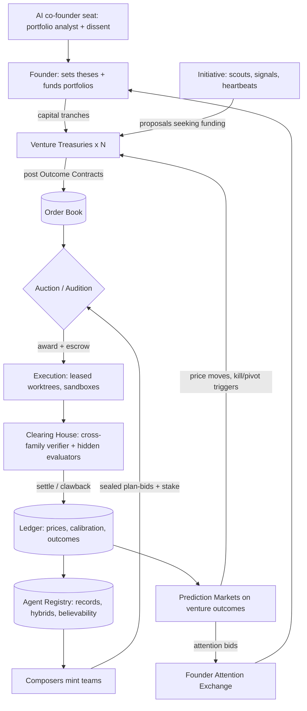

# C1 — The Market: an organisation that prices its own work

*Round 1 advocate · 2026-09-30 · numbers marked (param) are design parameters to be tuned, not measurements. External
evidence is cited through the Round 0 briefs (R0-A…E).*

## 1. The idea in one paragraph

Every piece of work is an **Outcome Contract** posted to an exchange: what must be true, how a verifier the bidder cannot
touch will check it, what it is worth, when it is due and which door type it is. Teams — minted on demand from agent records
(title + expertise + model + skills + track record) — bid **plans, prices and calibrated confidence**, and stake reputation
on them. The founder never assigns tasks; he **funds outcomes** with capital (tokens, money, his attention). Prices become
the cost model, calibration the believability ledger, prediction markets the priority system and kill switch, settlement
the learning signal. **Organising principle: capital flows to demonstrated, verified outcomes — and nothing is paid
until something the payee cannot edit says it is done.**

## 2. System diagram



## 3. How work flows — for work nobody has a playbook for

A contract is a data record, not a procedure:

```yaml
contract: OC-2291
posted_by: treasury/invoicely      # founder, treasury, or an agent (sub-contracting)
outcome: "Trial→paid conversion ≥ 6% on cohort of ≥200 trials"
oracle: {kind: metric, source: stripe+posthog, window: 21d, holdout: true}   # bidder cannot read or write it
value: 900 credits                 # 1 credit ≈ $1 all-in (tokens + compute + founder-minute shadow price)
ceiling: 400 credits  deadline: 2026-10-24  door: two-way  blast_radius: venture
warranty: 14d                      # clawback if outcome regresses
```

1. **Post.** Fuzzy intent ("why does nobody upgrade?") becomes a contract. With no writable oracle, the first contract is a
   **Framing Contract** — "produce an oracle + 3 candidate outcomes" — so unknown work starts by buying *measurability*.
2. **Bid.** In a window (10 min small, 2 h large; param) composers submit sealed bids: 1-page plan with hypotheses and stop
   conditions, price, p(success), time, founder-minutes requested, stake.
3. **Score.** `score = p_cal × value − price − λ·founder_minutes − risk_penalty`, where `p_cal` is the bid's stated p
   corrected by that team's **Brier history in this domain**. Overconfident teams are marked down automatically.
4. **Audition** (top bids within 15%, or no history): top 3 each get **5% of value** for a 1-hour spike, scored blind;
   winner takes the contract, losers are paid and their spikes archived as options.
5. **Execute.** Winner gets escrow, leases, sandbox; it may **sub-contract** child contracts (plans decompose through the
   market, not a hierarchy) and stays liable for them.
6. **Settle.** A verifier from a **different model family** runs the oracle. Pass → escrow released, stake returned with
   believability gain. Fail → milestone pay only, stake burned. Regression in warranty → clawback.
7. **Learn.** Bid vs actual price, p vs outcome, plan vs trace update the registry — a post-mortem for every contract.

## 4. The founder's seat

He operates as **a limited partner who also sets the fund's thesis**, not as a manager.

- **Sees:** the *Portfolio Tape* — per venture: capital deployed, credits/outcome, market p(goal) with 7-day delta,
  intervention minutes, open obligations; every price drills into its contracts.
- **Decides:** theses and tranches (weekly); one-way doors (≤2-page memo with market price and dissent); taste valuations
  (2-minute pairwise comparisons); kill/pivot when a market trips a threshold.
- **Never touches:** task assignment, team composition, model choice, schedules, two-way doors.
- **Founder Attention Exchange:** decision packets bid for his minutes with expected value and **cost of delay** against a
  daily supply he sets (e.g. 45 min); packets below the clearing price get a default + deadline; two-way ones run on silence.
- **Autonomy per project = a mandate**, not a toggle:

| Mandate | Weekly capital | Door types delegated | Founder packets/wk | Kill trigger |
|---|---|---|---|---|
| Founder-driven | per contract | none beyond tasks | unlimited | founder only |
| Guided | 2,000 credits (param) | two-way | ≤10 | market p(goal) < 20% for 7 d → memo |
| Autonomous | 5,000 credits + $500 real spend | two-way + pre-listed one-ways | ≤3 | auto-freeze at p < 15% or drawdown > 30% |

## 5. Agents

- **Record, not persona:** `{title, expertise_vector, model: claude|codex|other, skills@version, memory_scopes, tools, sandbox,
  believability[domain×family], price_history}`. "Pricing Economist", "Growth Engineer", "Regulatory Copy Engineer".
- **Launched only on award.** Between contracts only the clearing house, treasury heartbeats and markets run.
- **Composers** are the market's entrepreneurs: they assemble teams from records and bid, keeping a share of the
  believability gain, so good composition is learned.
- **Claude Code and Codex are equals by construction:** same book, same Brier, same oracle; the ledger, not a rule, shows who
  wins which domain. The only fixed rule — cross-family verification — is symmetric.
- **Hybrids come from market entry.** Any composer may mint a hybrid ("Pricing-Economist × Frontend Engineer") and bid with
  it; entrants get **seed believability** and a 15% exploration share (Thompson sampling). Hybrids that beat classic splits
  on price-adjusted outcomes proliferate; 20 settled losses retire one. Roots: R0-A's track-record market, R0-B's believability ledger; new here is the
  **entry/exit rule** that makes roles appear without a designer.

## 6. Coordination and non-interference

- **Leases are priced.** Files, services, channels and ad accounts have owners (MAINTAINERS-style, R0-B) and rent;
  **congestion pricing** on hot paths makes teams avoid collisions and schedule big refactors when paths are cheap.
- **Externalities are billed.** Breaking another contract's oracle within warranty charges the breaker, credits the victim.
- **One integrator:** the clearing house owns the merge queue; every fan-out ends at a verifier (R0-A: errors amplify 17.2×
  independent vs 4.4× centralised).
- **Anti-cannibalism:** ventures may not chase one customer segment without a portfolio contract (Haier, R0-B).
- **Andon pays.** Any agent may halt a contract; a justified pull earns a bounty, an unjustified one costs a small stake.

## 7. Memory and learning — measured weekly

- **Prices are memory.** The order book is the cost model ("landing-page A/B = 140 credits, p=0.62 for this composition").
- **Calibration is the headline KPI:** org-wide Brier score per domain, target −10% per quarter (param). Also: credits per
  accepted outcome, founder-minutes per outcome, audition hit-rate, clawback rate.
- **No graveyard:** memory items earn **royalties** when a winning, settled bid cites them; zero royalties in 60 days (param)
  → consolidated or forgotten. Reads are recorded because they are how royalties are paid.
- **Evaluator market** (R0-E): a proposed oracle is promoted when it predicts later real outcomes better than the incumbent;
  oracles sit in a permission tier workers cannot touch. Weekly report: baseline vs week on these KPIs; no gain is stated.

## 8. A day in the life (three ventures + research)

| Time | Invoicely (autonomous SaaS) | Northwind Studio (founder-driven agency) | Protein-folding primer (research) |
|---|---|---|---|
| 03:10 | Error-rate market spikes; incident bounty auto-posts (door: two-way, 60 credits). Codex SRE team wins at 38 credits, rolls back, settles 03:41. | — | — |
| 07:00 | Heartbeat: treasury posts 4 contracts from signals (churn uptick, 2 feature requests). | — | Treasury posts Framing Contract: "oracle for 'I understand the field'". |
| 08:30 | Founder reads the Tape (12 min): Invoicely p(€10k MRR by Dec) 41%→46%. No action. | Client brief arrives; founder posts 3 outcomes with value, 6 min. | Oracle accepted: pass a 40-question exam written by a different family + explain 3 papers to him. |
| 09:00 | Pricing audition: 3 spikes (Claude hybrid, Codex pair, mixed); blind pick: mixed. | Claude designer + Codex frontend win, 310 credits, p=0.7. | 4-researcher team wins, 180 credits. |
| 13:00 | Pricing test live (two-way). | Founder dailies: 3 finished homepage variants (built in parallel, not drafts). Picks by pairwise comparison, 4 min. | Mid-contract sub-contract: "simulate a structural biologist interviewer". |
| 16:00 | One packet (ad spend $200→$400) clears the attention price; approved in 1 min. | Client portal ships; warranty clock starts. | Exam: 34/40; partial settlement; follow-up contract auto-posted for weak areas. |
| 22:00 | Rate card re-priced; 2 hybrids retired, 1 promoted. | — | Glossary items earn first royalties. |

Founder total: **~35 minutes**, nearly all spent on value and taste, none on assignment.

## 9. Strongest and weakest

**Strongest:** unknown work (Framing Contracts buy measurability; auditions buy information); learning (every contract is a
calibrated experiment); founder leverage (capital + taste, not tasks); robustness (hidden oracles, stakes, clawback).

| Weakness | Design answer (no cuts) |
|---|---|
| Auction overhead on tiny work | **Rate card**: contracts < 25 credits clear instantly at the posted price to the best-calibrated eligible record; auctions capped at 5% of contract value. |
| Goodhart: teams optimise the oracle | Hidden holdouts, clawback, evaluator market, adversarial regression set; oracle authors never bid on their own. |
| Fuzzy value (brand, taste, research) | Valuation by founder pairwise comparisons (Elo per venture) + co-founder valuation contracts, reconciled against later outcomes. |
| Thin markets / cold start | Forked synthetic bidders (same record, different plan seeds); seed believability; 15% exploration budget. |
| Sequential, tightly coupled work (R0-A: multi-agent −39–70% on sequential reasoning) | **Prime contracts**: one team owns the chain end to end; the market decides *who*, not *how to split*. |
| Collusion within a family | Cross-family settlement, stake slashing, correlated-bid detector. |
| Real-money mistakes (R0-D: Vend priced below cost) | Unit-economics oracles + per-mandate spend cap enforced by the treasury, not the bidder. |

## 10. Portable mechanisms (keep even if this concept loses)

1. **Outcome Contract** with a bidder-proof oracle, value, ceiling, door type and warranty — the universal unit of work.
2. **Calibrated bids → believability ledger**: stated p × Brier history per identity × domain × model family; it picks teams.
3. **Auditions**: paid, blind, parallel spikes before committing on high-uncertainty work.
4. **Framing Contracts**: when no oracle exists, the first job is to buy one.
5. **Prediction markets as the priority and kill system**: market-implied p(goal) drives the Portfolio Tape and auto-freeze.
6. **Founder Attention Exchange**: decision packets bid for a fixed daily supply of founder minutes, with default-on-silence.
7. **Priced leases + billed externalities**: non-interference as an economic rule, not a lock manager.
8. **Memory royalties**: knowledge survives only if winning, settled work cites it.
