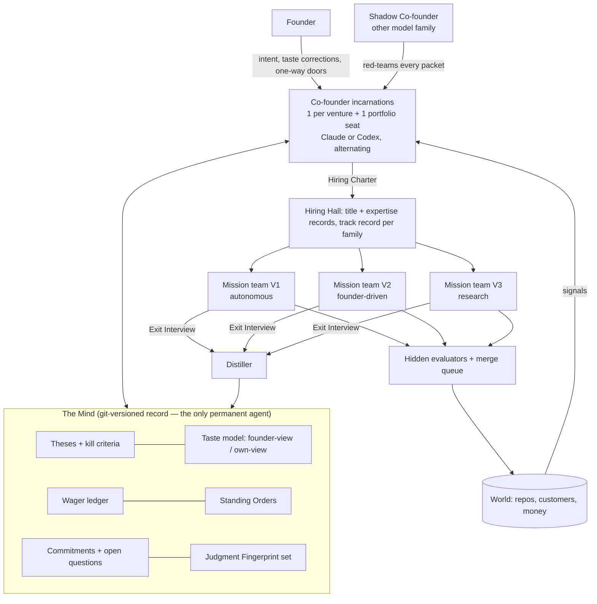

# C2 — The Co-founder: one persistent judgment, a thousand temporary hands

*Round 1 advocate · 2026-09-30 · [S] = speculation · evidence via Round 0 briefs (R0-A…E).*

## 1. The idea

Research, design, engineering and sales are becoming nearly free. **Judgment, taste and continuity are not.** So the
organisation spends its permanence on exactly one thing: an **AI Co-founder**, a single persistent judgment that spans every
venture. It holds theses, taste, commitments, open questions and a record of every call it got right or wrong. Everything else is **hired by title for one mission and dissolved afterwards**, each a Claude Code or Codex
session. The Co-founder is not a standing process. It is
**a Mind (a versioned record) that any qualified session can incarnate**, as many times at once as there are ventures, in
either model family. **Organising principle: permanence is reserved for judgment; everything else is disposable, and every
disposal feeds the judgment.**

## 2. System diagram



## 3. How work flows (no playbook)

1. **Intake** — from the founder, or from a venture's **Why-Not-Yet scan**: a heartbeat that diffs each goal tree against
   fresh evidence.
2. **Framing Pass** (Co-founder, ≤15 min, ≤$4): it writes a **Mission Brief** in Auftragstaktik form (intent · purpose ·
   end-state · constraints · don'ts · authority to deviate; R0-B), plus a **Question Tree** (what must be true), a door type
   and a stop rule ("kill if no signal by day 5 or $300").
3. **Scout fan-out** — 3–6 scouts in parallel, split across both families, answer the Question Tree leaves with sources.
4. **Bake-off** — because execution is cheap, the Co-founder commissions **3 divergent variants** built in parallel by
   different titles or hybrids., scored first by hidden evaluators (R0-A).
5. **Hire the Mission Lead** — a temporary lead holds authority under the brief, with a span of ≤5 lanes. It picks the topology:
   one agent for sequential work, fan-out plus verifier for parallel work (R0-A).
6. **Exit Interview** — every dissolved specialist returns a typed record: artifacts, receipts, one surprise, Question Tree
   answers. The **Distiller** turns these into Mind updates. A lesson
   counts only if it changes a Standing Order, thesis, hiring record or skill (R0-B).

## 4. The founder's seat

- **Sees**: the **Board Pack** (weekly), a morning **Call Sheet** per venture (≤3 items each), and raw **Dailies**. Every packet shows *"You'd likely pick A (founder-model, 82% match) · I'd pick B · here's
  the wager."*
- **Decides**: intent per venture, one-way doors (R4 money, legal, identity), charter changes, overrules. The target is **≤5 open decisions at any time and ≤20 min/day** for founder-driven ventures, **≤30 min/week**
  for autonomous ones.
- **Never touches**: two-way doors, team composition, model choice, tooling, merge order.
- **Autonomy is a signed Charter per venture**, not a switch: budget, user, scoreboard, R-class ceiling, escalation list and
  a **Deputy clause** saying who holds authority when the Co-founder is unavailable. It ranges from A0 (advises only) to
  A4 (acts as founder under the charter; every action stamped with its charter clause).

## 5. Agents

- **Only one permanent identity.** Everything else is a **Title Record** (A2A-card shape; R0-A): title, expertise
  statement, skills, tools/MCP grants, sandbox, **track record per model family**, cost curve, failure boundaries.
- **Hiring Charter** = Title Record + Mission Brief slice + context pack (≤40 KB) + budget + exit criteria + family.
  `hire()` launches `claude -p` or `codex exec` in a fresh worktree; `dissolve()` collects the Exit Interview.
- **Families are equals, assigned by evidence.** Each hire picks the family with the better track record for that title.
  1 hire in 5 explores the other family.
- **Title Forging** (hybrids): when the Question Tree spans fields no existing title covers, the Co-founder forges one. (e.g. *Churn Forensic Accountant*),
  provisional until it wins **3 of 5 bake-offs** against the classic split on replayed missions. Retired after 60 days unused.

## 6. Coordination and non-interference

- **One integrator per venture**: the merge queue. No specialist merges its own work.
- **Leases**: every path, customer thread and external account carries an expiring lease (TTL 30 min, heartbeat-renewed).
- **Blackboard per mission** with typed posts (need · finding · blocker · decision). Artefacts, never chat.
- **Andon**: any specialist can halt its lane and everything downstream of it. Root-caused within 24 h.
- **Cross-venture firewall**: incarnations of different ventures share the Mind's *portfolio layer* only, as de-identified
  lessons. Venture brains never cross.
- **Mind writes are journaled, never direct**: incarnations append proposals, and the nightly **Portfolio Seat** reconciles
  them.

## 7. Memory and learning

**The Mind** (≈200 KB ceiling, git-versioned, read receipts on every file):

```yaml
mind/
  charters/<venture>.md        # founder-signed
  theses/<venture>.yml         # claim, evidence, kill criteria, confidence, valid_until
  taste/founder-model.yml      # verbatim corrections + forced-choice results
  taste/own-view.yml           # where the Co-founder deliberately differs, and why
  wagers.yml                   # {id, question, founder_call, cofounder_call, resolves_on, metric, outcome}
  standing-orders/*.yml        # distilled policies specialists consult instead of asking
  commitments.yml              # promises to customers, contractors, the founder
  fingerprint/heldout.jsonl    # 150 past decisions with outcomes, hidden from incarnations
```

**How it gets measurably better every week:**

1. **Judgment compiles into Standing Orders.** Once the Co-founder has made the same class of call 5 times with no
   reversal, the Distiller drafts a policy. **KPI: the share of
   decisions resolved by policy**, targeted to rise from ~20% to >70% over 12 weeks [S].
2. **The wager ledger.** Every disagreement becomes a falsifiable prediction. **Calibration is scored per domain for both
   founder and Co-founder.** Scores move *default routing*, never final authority.
3. **Taste drills.** Five forced-choice pairs a week. Preference inference is hard: agents matched their humans on 61% of
   pairs in Project Swap (R0-D). **Target >85% match by week 8** [S].
4. **Forgetting**: Mind files unread for 45 days are proposed for archive. A thesis past `valid_until` must be refreshed or
   killed.

## 8. A day in the life (three ventures)

- **V1 · Dispute Desk** — Stripe-dispute micro-SaaS, **A4 autonomous**.
- **V2 · Studio** — a design agency, **A1 founder-driven**.
- **V3 · a research question** — "Is voice-first CRM real?".

| Time | What happens |
|---|---|
| 02:10 | V1 Why-Not-Yet scan: the win rate on "product not received" disputes fell from 64% to 51%. The V1 incarnation (Codex tonight) hires a *Payments Evidence Engineer* and a *Dispute Copy Analyst*; two variants are hidden-evaluated on 40 replayed disputes, B wins 61% and merges behind a flag (R2 notify). |
| 03:40 | A V1 customer threatens a chargeback. A refund is R4, so the Co-founder cannot act. It drafts a packet with a default and a 09:00 deadline. |
| 06:30 | Portfolio Seat reconciles the night's Mind proposals: 3 accepted, 1 conflict sent to the founder as a taste drill. |
| 07:30 | Voice briefing (6 min). Call Sheet: 4 items across ventures. |
| 08:05 | The founder approves the refund. On Studio pricing he overrides the Co-founder's +25% retainer. A wager is logged: "≥2 of 5 renewals churn at the new price by Dec 15". |
| 09:00–12:00 | Studio (A1): the founder sketches a client pitch by voice. The Co-founder hires a *Brand Strategist*, a *Motion Prototyper* (Claude) and a *Pitch Economist* (Codex hybrid); three decks by 11:30, founder picks from Dailies. |
| 13:00 | V3: 6 scouts (3 per family) return 41 sourced claims. The Co-founder's thesis ("voice CRM wins only in field sales") gets confidence 0.4. It hires a *Landing Tester* for a $150 smoke test. |
| 15:20 | The Shadow Co-founder (Claude) red-teams V1's new evidence template and finds it leaks a customer's email into a public dispute note. Andon; fixed in 40 min; case added to V1 regressions. |
| 18:00 | 11 specialists were hired today, 11 dissolved and 11 Exit Interviews filed. Founder time: 34 min; V1 needed only the refund tap. |

## 9. Strongest and weakest

**Strongest:**
- **Continuity of judgment.** Nothing forgets why a venture exists.
- **Founder leverage**, because judgment compiles into policy.
- **Unknown work**, because framing, bake-offs and Question Trees replace playbooks.
- **Measured disagreement**, through wagers rather than opinions.
- **Speed**, because teams are minted per mission with no org chart to maintain.

**Weaknesses and their design answers:**

| Weakness | Design answer |
|---|---|
| **Bottleneck** — every framing passes through one judgment | Incarnations are parallel, one per venture plus ad hoc. Standing Orders absorb repeat calls. Mission Leads hold delegated authority. Framing latency SLO p90 < 20 min. |
| **Single point of failure** — outage, a family down, rate limits | The Mind is a file, not a process. Either family can incarnate it. The Deputy clause hands authority to the active Mission Lead under the brief. Degraded mode: policy-only on Haiku-class. |
| **Drift or model swap changes "who" the Co-founder is** | **Fingerprint gate**: a new model or prompt must reproduce ≥85% of held-out past judgments, and match their stated reasons, before it takes the seat. |
| **Capture** — Vend's AI CEO shared its workers' blind spots (R0-D) | Every packet is red-teamed by the Shadow Co-founder from the other family. A monthly **Outside Board** hires a contrarian investor, a customer proxy and a regulator seat. It has its own believability score. |
| **Founder over-trusts it** | It never pre-selects. Approvals the founder did not open are not counted as agreement. Wagers show the founder's wins. |

## 10. Portable mechanisms

1. **The Mind-as-record**: a permanent identity that is a versioned file, incarnated by any family, with journaled writes and
   nightly reconciliation.
2. **The Fingerprint gate**: a held-out set of past judgments that any new model or prompt must reproduce before taking a
   seat.
3. **The wager ledger**: disagreements become dated, falsifiable predictions, and calibration per domain sets default
   routing between founder and AI.
4. **Judgment → Standing Orders compilation**: repeated calls become policies, measured as the share of decisions resolved
   by policy.
5. **Hiring Charter + Exit Interview**: typed hire and dissolve for every temporary agent.
6. **Title Forging with a bake-off ladder**: hybrids are invented at hire time and must win 3 of 5 replayed bake-offs.
7. **Shadow seat from the other family**: every judgment role gets a cross-family red-teamer.
8. **Founder-model / own-view split**: the AI states what the founder would choose and what it would choose, separately, on every packet.
